ANCOVA in Reading Correct Words (1 Min) (Reading Correct Words (1 Min))
================
Geiser C. Challco <geiser@alumni.usp.br>

- [Setting Initial Variables](#setting-initial-variables)
- [Descriptive Statistics of Initial
  Data](#descriptive-statistics-of-initial-data)
- [ANCOVA and Pairwise for one factor:
  **grupo**](#ancova-and-pairwise-for-one-factor-grupo)
  - [Without remove non-normal data](#without-remove-non-normal-data)
  - [Computing ANCOVA and PairWise After removing non-normal data
    (OK)](#computing-ancova-and-pairwise-after-removing-non-normal-data-ok)
    - [Plots for ancova](#plots-for-ancova)
    - [Checking linearity assumption](#checking-linearity-assumption)
    - [Checking normality and
      homogeneity](#checking-normality-and-homogeneity)
- [ANCOVA and Pairwise for two factors
  **grupo:Sexo**](#ancova-and-pairwise-for-two-factors-gruposexo)
  - [Without remove non-normal data](#without-remove-non-normal-data-1)
  - [Computing ANCOVA and PairWise After removing non-normal data
    (OK)](#computing-ancova-and-pairwise-after-removing-non-normal-data-ok-1)
    - [Plots for ancova](#plots-for-ancova-1)
    - [Checking linearity assumption](#checking-linearity-assumption-1)
    - [Checking normality and
      homogeneity](#checking-normality-and-homogeneity-1)
- [ANCOVA and Pairwise for two factors
  **grupo:Zona**](#ancova-and-pairwise-for-two-factors-grupozona)
  - [Without remove non-normal data](#without-remove-non-normal-data-2)
  - [Computing ANCOVA and PairWise After removing non-normal data
    (OK)](#computing-ancova-and-pairwise-after-removing-non-normal-data-ok-2)
    - [Plots for ancova](#plots-for-ancova-2)
    - [Checking linearity assumption](#checking-linearity-assumption-2)
    - [Checking normality and
      homogeneity](#checking-normality-and-homogeneity-2)
- [ANCOVA and Pairwise for two factors
  **grupo:Cor.Raca**](#ancova-and-pairwise-for-two-factors-grupocorraca)
  - [Without remove non-normal data](#without-remove-non-normal-data-3)
  - [Computing ANCOVA and PairWise After removing non-normal data
    (OK)](#computing-ancova-and-pairwise-after-removing-non-normal-data-ok-3)
    - [Plots for ancova](#plots-for-ancova-3)
    - [Checking linearity assumption](#checking-linearity-assumption-3)
    - [Checking normality and
      homogeneity](#checking-normality-and-homogeneity-3)
- [ANCOVA and Pairwise for two factors
  **grupo:Serie**](#ancova-and-pairwise-for-two-factors-gruposerie)
  - [Without remove non-normal data](#without-remove-non-normal-data-4)
  - [Computing ANCOVA and PairWise After removing non-normal data
    (OK)](#computing-ancova-and-pairwise-after-removing-non-normal-data-ok-4)
    - [Plots for ancova](#plots-for-ancova-4)
    - [Checking linearity assumption](#checking-linearity-assumption-4)
    - [Checking normality and
      homogeneity](#checking-normality-and-homogeneity-4)
- [ANCOVA and Pairwise for two factors
  **grupo:TFL.corretas.per.min.quintile**](#ancova-and-pairwise-for-two-factors-grupotflcorretasperminquintile)
  - [Without remove non-normal data](#without-remove-non-normal-data-5)
  - [Computing ANCOVA and PairWise After removing non-normal data
    (OK)](#computing-ancova-and-pairwise-after-removing-non-normal-data-ok-5)
    - [Plots for ancova](#plots-for-ancova-5)
    - [Checking linearity assumption](#checking-linearity-assumption-5)
    - [Checking normality and
      homogeneity](#checking-normality-and-homogeneity-5)
- [Summary of Results](#summary-of-results)
  - [Descriptive Statistics](#descriptive-statistics)
  - [ANCOVA Table Comparison](#ancova-table-comparison)
  - [PairWise Table Comparison](#pairwise-table-comparison)
  - [EMMS Table Comparison](#emms-table-comparison)

**NOTE**:

- Teste ANCOVA para determinar se houve diferenças significativas no
  Reading Correct Words (1 Min) (medido usando pre- e pos-testes).
- ANCOVA test to determine whether there were significant differences in
  Reading Correct Words (1 Min) (measured using pre- and post-tests).

# Setting Initial Variables

``` r
dv = "TFL.corretas.per.min"
dv.pos = "TFL.corretas.per.min.pos"
dv.pre = "TFL.corretas.per.min.pre"

fatores2 <- c("Sexo","Zona","Cor.Raca","Serie","TFL.corretas.per.min.quintile")
lfatores2 <- as.list(fatores2)
names(lfatores2) <- fatores2

fatores1 <- c("grupo", fatores2)
lfatores1 <- as.list(fatores1)
names(lfatores1) <- fatores1

lfatores <- c(lfatores1)

color <- list()
color[["prepost"]] = c("#ffee65","#f28e2B")
color[["grupo"]] = c("#bcbd22","#fd7f6f")
color[["Sexo"]] = c("#FF007F","#4D4DFF")
color[["Zona"]] = c("#AA00FF","#00CCCC")
color[["Cor.Raca"]] = c(
  "Parda"="#b97100","Indígena"="#9F262F",
  "Branca"="#87c498", "Preta"="#848283","Amarela"="#D6B91C"
)

level <- list()
level[["grupo"]] = c("Controle","Experimental")
level[["Sexo"]] = c("F","M")
level[["Zona"]] = c("Rural","Urbana")
level[["Cor.Raca"]] = c("Parda","Indígena","Branca", "Preta","Amarela")
level[["Serie"]] = c("6 ano","7 ano","8 ano","9 ano")

# ..

ymin <- 0
ymax <- 0

ymin.ci <- 0
ymax.ci <- 0


color[["grupo:Sexo"]] = c(
  "Controle:F"="#ff99cb", "Controle:M"="#b7b7ff",
  "Experimental:F"="#FF007F", "Experimental:M"="#4D4DFF",
  "Controle.F"="#ff99cb", "Controle.M"="#b7b7ff",
  "Experimental.F"="#FF007F", "Experimental.M"="#4D4DFF"
)
color[["grupo:Zona"]] = c(
  "Controle:Rural"="#b2efef","Controle:Urbana"="#e5b2ff",
  "Experimental:Rural"="#00CCCC", "Experimental:Urbana"="#AA00FF",
  "Controle.Rural"="#b2efef","Controle.Urbana"="#e5b2ff",
  "Experimental.Rural"="#00CCCC", "Experimental.Urbana"="#AA00FF"
)
color[["grupo:Cor.Raca"]] = c(
    "Controle:Parda"="#e3c699", "Experimental:Parda"="#b97100",
    "Controle:Indígena"="#e2bdc0", "Experimental:Indígena"="#9F262F",
    "Controle:Branca"="#c0e8cb", "Experimental:Branca"="#87c498",
    "Controle:Preta"="#dad9d9", "Experimental:Preta"="#848283",
    "Controle:Amarela"="#eee3a4", "Experimental:Amarela"="#D6B91C",
    
    "Controle.Parda"="#e3c699", "Experimental.Parda"="#b97100",
    "Controle.Indígena"="#e2bdc0", "Experimental.Indígena"="#9F262F",
    "Controle.Branca"="#c0e8cb", "Experimental.Branca"="#87c498",
    "Controle.Preta"="#dad9d9", "Experimental.Preta"="#848283",
    "Controle.Amarela"="#eee3a4", "Experimental.Amarela"="#D6B91C"
)


for (coln in c("vocab","vocab.teach","vocab.non.teach","score.tde",
               "TFL.lidas.per.min","TFL.corretas.per.min","TFL.erradas.per.min","TFL.omitidas.per.min",
               "leitura.compreensao")) {
  color[[paste0(coln,".quintile")]] = c("#BF0040","#FF0000","#800080","#0000FF","#4000BF")
  level[[paste0(coln,".quintile")]] = c("1st quintile","2nd quintile","3rd quintile","4th quintile","5th quintile")
  color[[paste0("grupo:",coln,".quintile")]] = c(
    "Experimental.1st quintile"="#BF0040", "Controle.1st quintile"="#d8668c",
    "Experimental.2nd quintile"="#FF0000", "Controle.2nd quintile"="#ff7f7f",
    "Experimental.3rd quintile"="#8fce00", "Controle.3rd quintile"="#ddf0b2",
    "Experimental.4th quintile"="#0000FF", "Controle.4th quintile"="#b2b2ff",
    "Experimental.5th quintile"="#4000BF", "Controle.5th quintile"="#b299e5",
    
    "Experimental:1st quintile"="#BF0040", "Controle:1st quintile"="#d8668c",
    "Experimental:2nd quintile"="#FF0000", "Controle:2nd quintile"="#ff7f7f",
    "Experimental:3rd quintile"="#8fce00", "Controle:3rd quintile"="#ddf0b2",
    "Experimental:4th quintile"="#0000FF", "Controle:4th quintile"="#b2b2ff",
    "Experimental:5th quintile"="#4000BF", "Controle:5th quintile"="#b299e5")
}


gdat <- read_excel("../data/data.xlsx", sheet = "sumary")
gdat <- gdat[which(is.na(gdat$Necessidade.Deficiencia) & !is.na(gdat$Stari.Grupo)),]


dat <- gdat
dat$grupo <- factor(dat[["Stari.Grupo"]], level[["grupo"]])
for (coln in c(names(lfatores))) {
  dat[[coln]] <- factor(dat[[coln]], level[[coln]][level[[coln]] %in% unique(dat[[coln]])])
}
dat <- dat[which(!is.na(dat[[dv.pre]]) & !is.na(dat[[dv.pos]])),]
dat <- dat[,c("id",names(lfatores),dv.pre,dv.pos)]

dat.long <- rbind(dat, dat)
dat.long$time <- c(rep("pre", nrow(dat)), rep("pos", nrow(dat)))
dat.long$time <- factor(dat.long$time, c("pre","pos"))
dat.long[[dv]] <- c(dat[[dv.pre]], dat[[dv.pos]])


for (f in c("grupo", names(lfatores))) {
  if (is.null(color[[f]]) && length(unique(dat[[f]])) > 0) 
      color[[f]] <- distinctColorPalette(length(unique(dat[[f]])))
}
for (f in c(fatores2)) {
  if (is.null(color[[paste0("grupo:",f)]]) && length(unique(dat[[f]])) > 0)
    color[[paste0("grupo:",f)]] <- distinctColorPalette(length(unique(dat[["grupo"]]))*length(unique(dat[[f]])))
}

ldat <- list()
laov <- list()
lpwc <- list()
lemms <- list()
```

# Descriptive Statistics of Initial Data

``` r
df <- get.descriptives(dat, c(dv.pre, dv.pos), c("grupo"), 
                       include.global = T, symmetry.test = T, normality.test = F)
df <- plyr::rbind.fill(
  df, do.call(plyr::rbind.fill, lapply(lfatores2, FUN = function(f) {
    if (nrow(dat) > 0 && sum(!is.na(unique(dat[[f]]))) > 1)
      get.descriptives(dat, c(dv.pre,dv.pos), c("grupo", f),
                       symmetry.test = T, normality.test = F)
    }))
)
```

    ## Warning: There were 2 warnings in `mutate()`.
    ## The first warning was:
    ## ℹ In argument: `ci = abs(stats::qt(alpha/2, .data$n - 1) * .data$se)`.
    ## Caused by warning:
    ## ! There was 1 warning in `mutate()`.
    ## ℹ In argument: `ci = abs(stats::qt(alpha/2, .data$n - 1) * .data$se)`.
    ## Caused by warning in `stats::qt()`:
    ## ! NaNs produced
    ## ℹ Run `dplyr::last_dplyr_warnings()` to see the 1 remaining warning.
    ## There were 2 warnings in `mutate()`.
    ## The first warning was:
    ## ℹ In argument: `ci = abs(stats::qt(alpha/2, .data$n - 1) * .data$se)`.
    ## Caused by warning:
    ## ! There was 1 warning in `mutate()`.
    ## ℹ In argument: `ci = abs(stats::qt(alpha/2, .data$n - 1) * .data$se)`.
    ## Caused by warning in `stats::qt()`:
    ## ! NaNs produced
    ## ℹ Run `dplyr::last_dplyr_warnings()` to see the 1 remaining warning.

``` r
df <- df[,c(fatores1[fatores1 %in% colnames(df)],"variable",
            colnames(df)[!colnames(df) %in% c(fatores1,"variable")])]
```

| grupo        | Sexo | Zona   | Cor.Raca | Serie | TFL.corretas.per.min.quintile | variable                 |   n |    mean | median | min | max |     sd |     se |     ci |   iqr | symmetry | skewness | kurtosis |
|:-------------|:-----|:-------|:---------|:------|:------------------------------|:-------------------------|----:|--------:|-------:|----:|----:|-------:|-------:|-------:|------:|:---------|---------:|---------:|
| Controle     |      |        |          |       |                               | TFL.corretas.per.min.pre |  90 |  90.222 |   92.0 |  23 | 154 | 24.662 |  2.600 |  5.165 | 29.50 | YES      |   -0.211 |   -0.119 |
| Experimental |      |        |          |       |                               | TFL.corretas.per.min.pre |  53 |  92.170 |   92.0 |  50 | 134 | 19.589 |  2.691 |  5.399 | 30.00 | YES      |   -0.083 |   -0.489 |
|              |      |        |          |       |                               | TFL.corretas.per.min.pre | 143 |  90.944 |   92.0 |  23 | 154 | 22.861 |  1.912 |  3.779 | 29.00 | YES      |   -0.212 |   -0.017 |
| Controle     |      |        |          |       |                               | TFL.corretas.per.min.pos |  90 | 113.022 |  113.0 |  42 | 184 | 28.684 |  3.024 |  6.008 | 45.00 | YES      |    0.239 |   -0.390 |
| Experimental |      |        |          |       |                               | TFL.corretas.per.min.pos |  53 | 113.660 |  111.0 |  66 | 190 | 27.439 |  3.769 |  7.563 | 40.00 | NO       |    0.658 |    0.105 |
|              |      |        |          |       |                               | TFL.corretas.per.min.pos | 143 | 113.259 |  112.0 |  42 | 190 | 28.134 |  2.353 |  4.651 | 44.00 | YES      |    0.385 |   -0.175 |
| Controle     | F    |        |          |       |                               | TFL.corretas.per.min.pre |  36 |  92.333 |   95.5 |  39 | 154 | 24.576 |  4.096 |  8.315 | 26.50 | YES      |   -0.111 |    0.057 |
| Controle     | M    |        |          |       |                               | TFL.corretas.per.min.pre |  54 |  88.815 |   89.0 |  23 | 137 | 24.848 |  3.381 |  6.782 | 30.00 | YES      |   -0.267 |   -0.374 |
| Experimental | F    |        |          |       |                               | TFL.corretas.per.min.pre |  22 |  97.682 |   95.0 |  60 | 132 | 17.269 |  3.682 |  7.657 | 22.25 | YES      |   -0.186 |   -0.433 |
| Experimental | M    |        |          |       |                               | TFL.corretas.per.min.pre |  31 |  88.258 |   90.0 |  50 | 134 | 20.452 |  3.673 |  7.502 | 19.50 | YES      |    0.113 |   -0.569 |
| Controle     | F    |        |          |       |                               | TFL.corretas.per.min.pos |  36 | 120.056 |  118.0 |  85 | 184 | 26.635 |  4.439 |  9.012 | 39.50 | NO       |    0.534 |   -0.623 |
| Controle     | M    |        |          |       |                               | TFL.corretas.per.min.pos |  54 | 108.333 |  109.0 |  42 | 176 | 29.277 |  3.984 |  7.991 | 43.00 | YES      |    0.187 |   -0.555 |
| Experimental | F    |        |          |       |                               | TFL.corretas.per.min.pos |  22 | 123.955 |  115.5 |  81 | 190 | 25.712 |  5.482 | 11.400 | 37.75 | YES      |    0.482 |   -0.173 |
| Experimental | M    |        |          |       |                               | TFL.corretas.per.min.pos |  31 | 106.355 |   99.0 |  66 | 184 | 26.635 |  4.784 |  9.770 | 26.50 | NO       |    0.967 |    0.798 |
| Controle     |      | Rural  |          |       |                               | TFL.corretas.per.min.pre |  58 |  90.276 |   92.0 |  23 | 154 | 26.761 |  3.514 |  7.037 | 34.50 | YES      |   -0.231 |   -0.302 |
| Controle     |      | Urbana |          |       |                               | TFL.corretas.per.min.pre |   7 |  92.286 |   98.0 |  47 | 123 | 24.067 |  9.097 | 22.259 | 19.00 | NO       |   -0.614 |   -0.791 |
| Controle     |      |        |          |       |                               | TFL.corretas.per.min.pre |  25 |  89.520 |   87.0 |  52 | 137 | 20.199 |  4.040 |  8.338 | 24.00 | YES      |    0.117 |   -0.369 |
| Experimental |      | Rural  |          |       |                               | TFL.corretas.per.min.pre |  35 |  89.114 |   90.0 |  51 | 134 | 19.123 |  3.232 |  6.569 | 19.50 | YES      |    0.118 |   -0.509 |
| Experimental |      | Urbana |          |       |                               | TFL.corretas.per.min.pre |   6 | 102.000 |   95.0 |  90 | 132 | 16.444 |  6.713 | 17.257 | 15.50 | NO       |    0.874 |   -1.037 |
| Experimental |      |        |          |       |                               | TFL.corretas.per.min.pre |  12 |  96.167 |   97.5 |  50 | 119 | 21.468 |  6.197 | 13.640 | 31.00 | NO       |   -0.652 |   -0.756 |
| Controle     |      | Rural  |          |       |                               | TFL.corretas.per.min.pos |  58 | 104.914 |  105.0 |  42 | 184 | 25.393 |  3.334 |  6.677 | 32.50 | YES      |    0.304 |    0.430 |
| Controle     |      | Urbana |          |       |                               | TFL.corretas.per.min.pos |   7 | 142.429 |  149.0 |  87 | 176 | 28.553 | 10.792 | 26.407 | 22.50 | NO       |   -0.751 |   -0.649 |
| Controle     |      |        |          |       |                               | TFL.corretas.per.min.pos |  25 | 123.600 |  130.0 |  74 | 176 | 28.076 |  5.615 | 11.589 | 41.00 | YES      |    0.049 |   -1.093 |
| Experimental |      | Rural  |          |       |                               | TFL.corretas.per.min.pos |  35 | 108.371 |  104.0 |  70 | 184 | 23.394 |  3.954 |  8.036 | 21.50 | NO       |    1.013 |    1.294 |
| Experimental |      | Urbana |          |       |                               | TFL.corretas.per.min.pos |   6 | 132.000 |  122.0 |  94 | 190 | 33.923 | 13.849 | 35.600 | 30.50 | NO       |    0.578 |   -1.276 |
| Experimental |      |        |          |       |                               | TFL.corretas.per.min.pos |  12 | 119.917 |  132.0 |  66 | 166 | 32.084 |  9.262 | 20.385 | 50.25 | YES      |   -0.346 |   -1.462 |
| Controle     |      |        | Parda    |       |                               | TFL.corretas.per.min.pre |  41 |  90.756 |   93.0 |  23 | 134 | 24.414 |  3.813 |  7.706 | 33.00 | NO       |   -0.550 |   -0.077 |
| Controle     |      |        | Indígena |       |                               | TFL.corretas.per.min.pre |   3 | 114.000 |   99.0 |  89 | 154 | 35.000 | 20.207 | 86.945 | 32.50 | few data |    0.000 |    0.000 |
| Controle     |      |        | Branca   |       |                               | TFL.corretas.per.min.pre |  12 | 103.667 |  102.5 |  83 | 137 | 15.956 |  4.606 | 10.138 | 24.25 | NO       |    0.541 |   -0.868 |
| Controle     |      |        | Preta    |       |                               | TFL.corretas.per.min.pre |   1 |  99.000 |   99.0 |  99 |  99 |        |        |        |  0.00 | few data |    0.000 |    0.000 |
| Controle     |      |        |          |       |                               | TFL.corretas.per.min.pre |  33 |  82.242 |   84.0 |  39 | 137 | 24.357 |  4.240 |  8.637 | 42.00 | YES      |    0.099 |   -0.843 |
| Experimental |      |        | Parda    |       |                               | TFL.corretas.per.min.pre |  16 |  87.062 |   83.0 |  51 | 134 | 20.693 |  5.173 | 11.026 | 17.50 | NO       |    0.529 |   -0.235 |
| Experimental |      |        | Indígena |       |                               | TFL.corretas.per.min.pre |   8 |  92.750 |   96.0 |  50 | 113 | 20.534 |  7.260 | 17.167 | 18.25 | NO       |   -0.949 |   -0.422 |
| Experimental |      |        | Branca   |       |                               | TFL.corretas.per.min.pre |   5 | 103.400 |   96.0 |  92 | 117 | 12.502 |  5.591 | 15.523 | 22.00 | YES      |    0.261 |   -2.236 |
| Experimental |      |        | Amarela  |       |                               | TFL.corretas.per.min.pre |   1 |  76.000 |   76.0 |  76 |  76 |        |        |        |  0.00 | few data |    0.000 |    0.000 |
| Experimental |      |        |          |       |                               | TFL.corretas.per.min.pre |  23 |  93.783 |   92.0 |  57 | 132 | 19.751 |  4.118 |  8.541 | 25.00 | YES      |   -0.084 |   -0.826 |
| Controle     |      |        | Parda    |       |                               | TFL.corretas.per.min.pos |  41 |  99.951 |   93.0 |  42 | 184 | 26.189 |  4.090 |  8.266 | 30.00 | NO       |    0.670 |    1.124 |
| Controle     |      |        | Indígena |       |                               | TFL.corretas.per.min.pos |   3 | 116.667 |  115.0 |  88 | 147 | 29.535 | 17.052 | 73.370 | 29.50 | few data |    0.000 |    0.000 |
| Controle     |      |        | Branca   |       |                               | TFL.corretas.per.min.pos |  12 | 114.000 |  114.5 |  83 | 150 | 19.088 |  5.510 | 12.128 | 18.25 | YES      |    0.086 |   -0.908 |
| Controle     |      |        | Preta    |       |                               | TFL.corretas.per.min.pos |   1 | 118.000 |  118.0 | 118 | 118 |        |        |        |  0.00 | few data |    0.000 |    0.000 |
| Controle     |      |        |          |       |                               | TFL.corretas.per.min.pos |  33 | 128.424 |  135.0 |  74 | 176 | 28.025 |  4.878 |  9.937 | 43.00 | YES      |   -0.196 |   -0.937 |
| Experimental |      |        | Parda    |       |                               | TFL.corretas.per.min.pos |  16 |  99.500 |   96.5 |  70 | 144 | 19.190 |  4.798 | 10.226 | 12.00 | NO       |    0.735 |    0.103 |
| Experimental |      |        | Indígena |       |                               | TFL.corretas.per.min.pos |   8 | 105.875 |  111.5 |  66 | 137 | 21.189 |  7.492 | 17.715 | 16.75 | YES      |   -0.484 |   -0.775 |
| Experimental |      |        | Branca   |       |                               | TFL.corretas.per.min.pos |   5 | 125.400 |  121.0 | 108 | 150 | 18.582 |  8.310 | 23.073 | 30.00 | YES      |    0.238 |   -2.053 |
| Experimental |      |        | Amarela  |       |                               | TFL.corretas.per.min.pos |   1 |  81.000 |   81.0 |  81 |  81 |        |        |        |  0.00 | few data |    0.000 |    0.000 |
| Experimental |      |        |          |       |                               | TFL.corretas.per.min.pos |  23 | 125.087 |  129.0 |  79 | 190 | 30.639 |  6.389 | 13.249 | 45.50 | YES      |    0.393 |   -0.716 |
| Controle     |      |        |          | 6 ano |                               | TFL.corretas.per.min.pre |  31 |  87.645 |   92.0 |  23 | 137 | 25.952 |  4.661 |  9.519 | 21.50 | YES      |   -0.472 |    0.053 |
| Controle     |      |        |          | 7 ano |                               | TFL.corretas.per.min.pre |  19 |  93.895 |   97.0 |  52 | 154 | 24.705 |  5.668 | 11.907 | 28.50 | YES      |    0.299 |   -0.133 |
| Controle     |      |        |          | 8 ano |                               | TFL.corretas.per.min.pre |  15 |  88.467 |   86.0 |  48 | 134 | 25.267 |  6.524 | 13.992 | 23.50 | YES      |    0.064 |   -0.979 |
| Controle     |      |        |          | 9 ano |                               | TFL.corretas.per.min.pre |  25 |  91.680 |   92.0 |  45 | 130 | 23.666 |  4.733 |  9.769 | 36.00 | YES      |   -0.324 |   -1.071 |
| Experimental |      |        |          | 6 ano |                               | TFL.corretas.per.min.pre |  19 |  88.368 |   90.0 |  57 | 116 | 17.620 |  4.042 |  8.493 | 19.50 | YES      |   -0.122 |   -1.092 |
| Experimental |      |        |          | 7 ano |                               | TFL.corretas.per.min.pre |  11 |  92.545 |   90.0 |  66 | 117 | 18.052 |  5.443 | 12.127 | 29.00 | YES      |    0.220 |   -1.507 |
| Experimental |      |        |          | 8 ano |                               | TFL.corretas.per.min.pre |  13 |  91.000 |   92.0 |  50 | 132 | 24.121 |  6.690 | 14.576 | 31.00 | YES      |   -0.164 |   -0.911 |
| Experimental |      |        |          | 9 ano |                               | TFL.corretas.per.min.pre |  10 | 100.500 |   98.0 |  65 | 134 | 18.668 |  5.903 | 13.354 | 14.50 | YES      |   -0.048 |   -0.522 |
| Controle     |      |        |          | 6 ano |                               | TFL.corretas.per.min.pos |  31 | 101.645 |   94.0 |  42 | 156 | 26.028 |  4.675 |  9.547 | 30.50 | YES      |    0.101 |   -0.420 |
| Controle     |      |        |          | 7 ano |                               | TFL.corretas.per.min.pos |  19 | 112.053 |   99.0 |  85 | 184 | 27.104 |  6.218 | 13.064 | 36.00 | NO       |    0.990 |    0.215 |
| Controle     |      |        |          | 8 ano |                               | TFL.corretas.per.min.pos |  15 | 123.067 |  133.0 |  68 | 176 | 32.270 |  8.332 | 17.871 | 43.00 | YES      |   -0.131 |   -1.173 |
| Controle     |      |        |          | 9 ano |                               | TFL.corretas.per.min.pos |  25 | 121.840 |  117.0 |  65 | 176 | 27.092 |  5.418 | 11.183 | 33.00 | YES      |   -0.031 |   -0.544 |
| Experimental |      |        |          | 6 ano |                               | TFL.corretas.per.min.pos |  19 | 115.632 |  104.0 |  70 | 190 | 34.300 |  7.869 | 16.532 | 46.50 | NO       |    0.789 |   -0.537 |
| Experimental |      |        |          | 7 ano |                               | TFL.corretas.per.min.pos |  11 | 106.636 |  102.0 |  81 | 139 | 18.468 |  5.568 | 12.407 | 26.50 | YES      |    0.275 |   -1.397 |
| Experimental |      |        |          | 8 ano |                               | TFL.corretas.per.min.pos |  13 | 111.769 |  114.0 |  66 | 166 | 29.167 |  8.089 | 17.625 | 36.00 | YES      |    0.088 |   -1.115 |
| Experimental |      |        |          | 9 ano |                               | TFL.corretas.per.min.pos |  10 | 120.100 |  113.5 |  93 | 150 | 19.087 |  6.036 | 13.654 | 28.25 | YES      |    0.156 |   -1.601 |
| Controle     |      |        |          |       | 1st quintile                  | TFL.corretas.per.min.pre |  17 |  52.118 |   53.0 |  23 |  67 | 10.398 |  2.522 |  5.346 |  9.00 | NO       |   -1.055 |    1.256 |
| Controle     |      |        |          |       | 2nd quintile                  | TFL.corretas.per.min.pre |  15 |  77.800 |   80.0 |  68 |  84 |  5.401 |  1.395 |  2.991 |  6.00 | NO       |   -0.690 |   -1.051 |
| Controle     |      |        |          |       | 3rd quintile                  | TFL.corretas.per.min.pre |  18 |  89.333 |   89.0 |  85 |  94 |  2.849 |  0.672 |  1.417 |  5.00 | YES      |   -0.016 |   -1.485 |
| Controle     |      |        |          |       | 4th quintile                  | TFL.corretas.per.min.pre |  22 | 102.182 |  101.5 |  97 | 110 |  4.447 |  0.948 |  1.972 |  6.50 | YES      |    0.477 |   -1.275 |
| Controle     |      |        |          |       | 5th quintile                  | TFL.corretas.per.min.pre |  18 | 122.833 |  119.0 | 112 | 154 | 11.216 |  2.644 |  5.577 | 13.00 | NO       |    1.293 |    0.810 |
| Experimental |      |        |          |       | 1st quintile                  | TFL.corretas.per.min.pre |   6 |  58.167 |   58.5 |  50 |  66 |  6.795 |  2.774 |  7.131 | 11.25 | YES      |   -0.058 |   -1.980 |
| Experimental |      |        |          |       | 2nd quintile                  | TFL.corretas.per.min.pre |  11 |  76.727 |   78.0 |  68 |  84 |  5.002 |  1.508 |  3.360 |  4.00 | NO       |   -0.590 |   -0.834 |
| Experimental |      |        |          |       | 3rd quintile                  | TFL.corretas.per.min.pre |  15 |  90.867 |   92.0 |  85 |  94 |  2.748 |  0.710 |  1.522 |  3.50 | NO       |   -0.564 |   -0.867 |
| Experimental |      |        |          |       | 4th quintile                  | TFL.corretas.per.min.pre |   9 | 101.000 |   98.0 |  95 | 110 |  6.083 |  2.028 |  4.676 | 11.00 | YES      |    0.418 |   -1.756 |
| Experimental |      |        |          |       | 5th quintile                  | TFL.corretas.per.min.pre |  12 | 118.333 |  116.5 | 112 | 134 |  7.190 |  2.076 |  4.568 |  3.00 | NO       |    1.271 |    0.098 |
| Controle     |      |        |          |       | 1st quintile                  | TFL.corretas.per.min.pos |  17 |  96.647 |   91.0 |  42 | 148 | 29.392 |  7.129 | 15.112 | 41.00 | YES      |    0.146 |   -1.007 |
| Controle     |      |        |          |       | 2nd quintile                  | TFL.corretas.per.min.pos |  15 |  99.267 |   89.0 |  65 | 139 | 22.967 |  5.930 | 12.719 | 28.00 | NO       |    0.593 |   -1.131 |
| Controle     |      |        |          |       | 3rd quintile                  | TFL.corretas.per.min.pos |  18 | 107.222 |  100.5 |  68 | 150 | 24.821 |  5.850 | 12.343 | 45.75 | YES      |    0.257 |   -1.469 |
| Controle     |      |        |          |       | 4th quintile                  | TFL.corretas.per.min.pos |  22 | 126.364 |  120.0 |  90 | 171 | 22.671 |  4.833 | 10.052 | 28.75 | YES      |    0.370 |   -0.846 |
| Controle     |      |        |          |       | 5th quintile                  | TFL.corretas.per.min.pos |  18 | 129.444 |  124.0 |  87 | 184 | 28.679 |  6.760 | 14.262 | 31.75 | YES      |    0.476 |   -0.893 |
| Experimental |      |        |          |       | 1st quintile                  | TFL.corretas.per.min.pos |   6 |  95.500 |   92.5 |  66 | 150 | 29.602 | 12.085 | 31.066 | 20.25 | NO       |    0.802 |   -0.865 |
| Experimental |      |        |          |       | 2nd quintile                  | TFL.corretas.per.min.pos |  11 |  91.636 |   88.0 |  70 | 144 | 19.392 |  5.847 | 13.028 | 13.50 | NO       |    1.606 |    2.013 |
| Experimental |      |        |          |       | 3rd quintile                  | TFL.corretas.per.min.pos |  15 | 111.867 |  114.0 |  93 | 139 | 14.579 |  3.764 |  8.074 | 15.00 | YES      |    0.334 |   -1.015 |
| Experimental |      |        |          |       | 4th quintile                  | TFL.corretas.per.min.pos |   9 | 124.111 |  112.0 |  94 | 190 | 30.444 | 10.148 | 23.402 | 33.00 | NO       |    1.011 |   -0.336 |
| Experimental |      |        |          |       | 5th quintile                  | TFL.corretas.per.min.pos |  12 | 137.333 |  135.5 |  99 | 184 | 22.459 |  6.483 | 14.270 | 18.50 | YES      |    0.411 |   -0.415 |

# ANCOVA and Pairwise for one factor: **grupo**

## Without remove non-normal data

``` r
pdat = remove_group_data(dat[!is.na(dat[["grupo"]]),], "TFL.corretas.per.min.pos", "grupo")

pdat.long <- rbind(pdat[,c("id","grupo")], pdat[,c("id","grupo")])
pdat.long[["time"]] <- c(rep("pre", nrow(pdat)), rep("pos", nrow(pdat)))
pdat.long[["time"]] <- factor(pdat.long[["time"]], c("pre","pos"))
pdat.long[["TFL.corretas.per.min"]] <- c(pdat[["TFL.corretas.per.min.pre"]], pdat[["TFL.corretas.per.min.pos"]])

aov = anova_test(pdat, TFL.corretas.per.min.pos ~ TFL.corretas.per.min.pre + grupo)
laov[["grupo"]] <- get_anova_table(aov)
```

``` r
pwc <- emmeans_test(pdat, TFL.corretas.per.min.pos ~ grupo, covariate = TFL.corretas.per.min.pre,
                    p.adjust.method = "bonferroni")
```

``` r
pwc.long <- emmeans_test(dplyr::group_by_at(pdat.long, "grupo"),
                          TFL.corretas.per.min ~ time,
                          p.adjust.method = "bonferroni")
lpwc[["grupo"]] <- plyr::rbind.fill(pwc, pwc.long)
```

``` r
ds <- get.descriptives(pdat, "TFL.corretas.per.min.pos", "grupo", covar = "TFL.corretas.per.min.pre")
ds <- merge(ds[ds$variable != "TFL.corretas.per.min.pre",],
            ds[ds$variable == "TFL.corretas.per.min.pre", !colnames(ds) %in% c("variable")],
            by = "grupo", all.x = T, suffixes = c("", ".TFL.corretas.per.min.pre"))
ds <- merge(get_emmeans(pwc), ds, by = "grupo", suffixes = c(".emms", ""))
ds <- ds[,c("grupo","n","mean.TFL.corretas.per.min.pre","se.TFL.corretas.per.min.pre","mean","se",
            "emmean","se.emms","conf.low","conf.high")]

colnames(ds) <- c("grupo", "N", paste0(c("M","SE")," (pre)"),
                  paste0(c("M","SE"), " (unadj)"),
                  paste0(c("M", "SE"), " (adj)"), "conf.low", "conf.high")

lemms[["grupo"]] <- ds
```

## Computing ANCOVA and PairWise After removing non-normal data (OK)

``` r
wdat = pdat 

res = residuals(lm(TFL.corretas.per.min.pos ~ TFL.corretas.per.min.pre + grupo, data = wdat))
non.normal = getNonNormal(res, wdat$id, plimit = 0.05)

wdat = wdat[!wdat$id %in% non.normal,]

wdat.long <- rbind(wdat[,c("id","grupo")], wdat[,c("id","grupo")])
wdat.long[["time"]] <- c(rep("pre", nrow(wdat)), rep("pos", nrow(wdat)))
wdat.long[["time"]] <- factor(wdat.long[["time"]], c("pre","pos"))
wdat.long[["TFL.corretas.per.min"]] <- c(wdat[["TFL.corretas.per.min.pre"]], wdat[["TFL.corretas.per.min.pos"]])

ldat[["grupo"]] = wdat

(non.normal)
```

    ##  [1] "P1010" "P463"  "P956"  "P3498" "P3721" "P3609" "P3516" "P445"  "P3521" "P808"  "P3504"
    ## [12] "P446"  "P1109" "P3492" "P3729" "P465"  "P3581" "P942"  "P628"  "P621"  "P820"  "P133" 
    ## [23] "P3501" "P184"  "P3566" "P947"  "P1017" "P3627" "P128"  "P816"  "P3615" "P3512" "P1097"
    ## [34] "P3495" "P1716" "P950"  "P448"  "P3524" "P3502" "P1089" "P3505" "P3565" "P3518" "P812" 
    ## [45] "P521"  "P3606" "P3558" "P3624" "P1004" "P616"  "P618"  "P994"  "P1000" "P829"  "P614" 
    ## [56] "P241"  "P451"  "P460"  "P457"  "P515"  "P615"  "P813"  "P997"  "P936"  "P625"  "P613" 
    ## [67] "P513"  "P516"  "P958"  "P3734" "P1084" "P512"  "P3598" "P3509" "P464"  "P612"  "P626" 
    ## [78] "P620"  "P1107" "P3560" "P3519" "P948"  "P523"  "P3508" "P943"  "P176"  "P2210" "P1729"
    ## [89] "P238"  "P3577" "P522"

``` r
aov = anova_test(wdat, TFL.corretas.per.min.pos ~ TFL.corretas.per.min.pre + grupo)
laov[["grupo"]] <- merge(get_anova_table(aov), laov[["grupo"]],
                            by="Effect", suffixes = c("","'"))

(df = get_anova_table(aov))
```

    ## ANOVA Table (type II tests)
    ## 
    ##                     Effect DFn DFd      F        p p<.05   ges
    ## 1 TFL.corretas.per.min.pre   1  49 36.320 2.13e-07     * 0.426
    ## 2                    grupo   1  49  1.106 2.98e-01       0.022

| Effect                   | DFn | DFd |      F |     p | p\<.05 |   ges |
|:-------------------------|----:|----:|-------:|------:|:-------|------:|
| TFL.corretas.per.min.pre |   1 |  49 | 36.320 | 0.000 | \*     | 0.426 |
| grupo                    |   1 |  49 |  1.106 | 0.298 |        | 0.022 |

``` r
pwc <- emmeans_test(wdat, TFL.corretas.per.min.pos ~ grupo, covariate = TFL.corretas.per.min.pre,
                    p.adjust.method = "bonferroni")
```

| term                            | .y.                      | group1   | group2       |  df | statistic |     p | p.adj | p.adj.signif |
|:--------------------------------|:-------------------------|:---------|:-------------|----:|----------:|------:|------:|:-------------|
| TFL.corretas.per.min.pre\*grupo | TFL.corretas.per.min.pos | Controle | Experimental |  49 |     1.051 | 0.298 | 0.298 | ns           |

``` r
pwc.long <- emmeans_test(dplyr::group_by_at(wdat.long, "grupo"),
                         TFL.corretas.per.min ~ time,
                         p.adjust.method = "bonferroni")
lpwc[["grupo"]] <- merge(plyr::rbind.fill(pwc, pwc.long), lpwc[["grupo"]],
                            by=c("grupo","term",".y.","group1","group2"),
                            suffixes = c("","'"))
```

| grupo        | term | .y.                  | group1 | group2 |  df | statistic |   p | p.adj | p.adj.signif |
|:-------------|:-----|:---------------------|:-------|:-------|----:|----------:|----:|------:|:-------------|
| Controle     | time | TFL.corretas.per.min | pre    | pos    | 100 |    -9.306 |   0 |     0 | \*\*\*\*     |
| Experimental | time | TFL.corretas.per.min | pre    | pos    | 100 |    -6.043 |   0 |     0 | \*\*\*\*     |

``` r
ds <- get.descriptives(wdat, "TFL.corretas.per.min.pos", "grupo", covar = "TFL.corretas.per.min.pre")
ds <- merge(ds[ds$variable != "TFL.corretas.per.min.pre",],
            ds[ds$variable == "TFL.corretas.per.min.pre", !colnames(ds) %in% c("variable")],
            by = "grupo", all.x = T, suffixes = c("", ".TFL.corretas.per.min.pre"))
ds <- merge(get_emmeans(pwc), ds, by = "grupo", suffixes = c(".emms", ""))
ds <- ds[,c("grupo","n","mean.TFL.corretas.per.min.pre","se.TFL.corretas.per.min.pre","mean","se",
            "emmean","se.emms","conf.low","conf.high")]

colnames(ds) <- c("grupo", "N", paste0(c("M","SE")," (pre)"),
                  paste0(c("M","SE"), " (unadj)"),
                  paste0(c("M", "SE"), " (adj)"), "conf.low", "conf.high")

lemms[["grupo"]] <- merge(ds, lemms[["grupo"]], by=c("grupo"), suffixes = c("","'"))
```

| grupo        |   N | M (pre) | SE (pre) | M (unadj) | SE (unadj) | M (adj) | SE (adj) | conf.low | conf.high |
|:-------------|----:|--------:|---------:|----------:|-----------:|--------:|---------:|---------:|----------:|
| Controle     |  33 |  88.061 |    4.258 |   139.909 |      3.605 | 141.353 |    2.989 |  135.346 |   147.360 |
| Experimental |  19 |  94.263 |    4.550 |   138.632 |      5.740 | 136.124 |    3.949 |  128.189 |   144.059 |

### Plots for ancova

``` r
plots <- oneWayAncovaPlots(
  wdat, "TFL.corretas.per.min.pos", "grupo", aov, list("grupo"=pwc), addParam = c("mean_ci"),
  font.label.size=10, step.increase=0.05, p.label="p.adj",
  subtitle = which(aov$Effect == "grupo"))
```

``` r
if (!is.null(nrow(plots[["grupo"]]$data)))
  plots[["grupo"]] +
  if (ymin.ci < ymax.ci) ggplot2::ylim(ymin.ci, ymax.ci)
```

<!-- -->

``` r
plots <- oneWayAncovaBoxPlots(
  wdat, "TFL.corretas.per.min.pos", "grupo", aov, pwc, covar = "TFL.corretas.per.min.pre",
  theme = "classic", color = color[["grupo"]],
  subtitle = which(aov$Effect == "grupo"))
```

``` r
if (length(unique(wdat[["grupo"]])) > 1)
  plots[["grupo"]] + ggplot2::ylab("Reading Correct Words (1 Min)") +
  ggplot2::scale_x_discrete(labels=c('pre', 'pos')) +
  if (ymin < ymax) ggplot2::ylim(ymin, ymax)
```

<!-- -->

``` r
if (length(unique(wdat.long[["grupo"]])) > 1)
  plots <- oneWayAncovaBoxPlots(
    wdat.long, "TFL.corretas.per.min", "grupo", aov, pwc.long,
    pre.post = "time", theme = "classic", color = color$prepost)
```

``` r
if (length(unique(wdat.long[["grupo"]])) > 1)
  plots[["grupo"]] + ggplot2::ylab("Reading Correct Words (1 Min)") +
  if (ymin < ymax) ggplot2::ylim(ymin, ymax) 
```

<!-- -->

### Checking linearity assumption

``` r
ggscatter(wdat, x = "TFL.corretas.per.min.pre", y = "TFL.corretas.per.min.pos", size = 0.5,
          color = "grupo", add = "reg.line")+
  stat_regline_equation(
    aes(label =  paste(..eq.label.., ..rr.label.., sep = "~~~~"), color = grupo)
  ) +
  ggplot2::labs(subtitle = rstatix::get_test_label(aov, detailed = T, row = which(aov$Effect == "grupo"))) +
  ggplot2::scale_color_manual(values = color[["grupo"]]) +
  if (ymin < ymax) ggplot2::ylim(ymin, ymax)
```

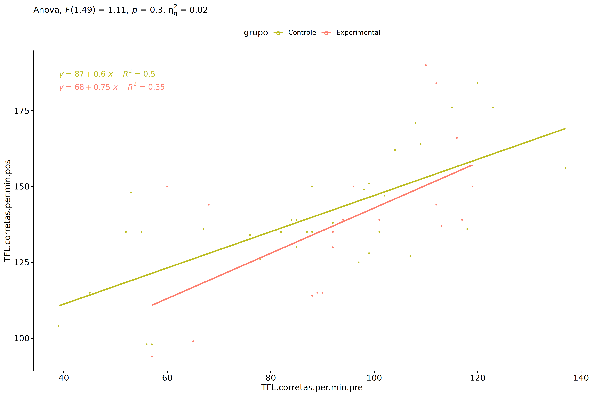<!-- -->

### Checking normality and homogeneity

``` r
res <- augment(lm(TFL.corretas.per.min.pos ~ TFL.corretas.per.min.pre + grupo, data = wdat))
```

``` r
shapiro_test(res$.resid)
```

    ## # A tibble: 1 × 3
    ##   variable   statistic p.value
    ##   <chr>          <dbl>   <dbl>
    ## 1 res$.resid     0.955  0.0453

``` r
levene_test(res, .resid ~ grupo)
```

    ## # A tibble: 1 × 4
    ##     df1   df2 statistic     p
    ##   <int> <int>     <dbl> <dbl>
    ## 1     1    50      1.40 0.242

# ANCOVA and Pairwise for two factors **grupo:Sexo**

## Without remove non-normal data

``` r
pdat = remove_group_data(dat[!is.na(dat[["grupo"]]) & !is.na(dat[["Sexo"]]),],
                         "TFL.corretas.per.min.pos", c("grupo","Sexo"))
pdat = pdat[pdat[["Sexo"]] %in% do.call(
  intersect, lapply(unique(pdat[["grupo"]]), FUN = function(x) {
    unique(pdat[["Sexo"]][which(pdat[["grupo"]] == x)])
  })),]
pdat[["grupo"]] = factor(pdat[["grupo"]], level[["grupo"]])
pdat[["Sexo"]] = factor(
  pdat[["Sexo"]],
  level[["Sexo"]][level[["Sexo"]] %in% unique(pdat[["Sexo"]])])

pdat.long <- rbind(pdat[,c("id","grupo","Sexo")], pdat[,c("id","grupo","Sexo")])
pdat.long[["time"]] <- c(rep("pre", nrow(pdat)), rep("pos", nrow(pdat)))
pdat.long[["time"]] <- factor(pdat.long[["time"]], c("pre","pos"))
pdat.long[["TFL.corretas.per.min"]] <- c(pdat[["TFL.corretas.per.min.pre"]], pdat[["TFL.corretas.per.min.pos"]])

if (length(unique(pdat[["Sexo"]])) >= 2) {
  aov = anova_test(pdat, TFL.corretas.per.min.pos ~ TFL.corretas.per.min.pre + grupo*Sexo)
  laov[["grupo:Sexo"]] <- get_anova_table(aov)
}
```

``` r
if (length(unique(pdat[["Sexo"]])) >= 2) {
  pwcs <- list()
  pwcs[["Sexo"]] <- emmeans_test(
    group_by(pdat, grupo), TFL.corretas.per.min.pos ~ Sexo,
    covariate = TFL.corretas.per.min.pre, p.adjust.method = "bonferroni")
  pwcs[["grupo"]] <- emmeans_test(
    group_by(pdat, Sexo), TFL.corretas.per.min.pos ~ grupo,
    covariate = TFL.corretas.per.min.pre, p.adjust.method = "bonferroni")
  
  pwc <- plyr::rbind.fill(pwcs[["grupo"]], pwcs[["Sexo"]])
  pwc <- pwc[,c("grupo","Sexo", colnames(pwc)[!colnames(pwc) %in% c("grupo","Sexo")])]
}
```

``` r
if (length(unique(pdat[["Sexo"]])) >= 2) {
  pwc.long <- emmeans_test(dplyr::group_by_at(pdat.long, c("grupo","Sexo")),
                           TFL.corretas.per.min ~ time,
                           p.adjust.method = "bonferroni")
  lpwc[["grupo:Sexo"]] <- plyr::rbind.fill(pwc, pwc.long)
}
```

``` r
if (length(unique(pdat[["Sexo"]])) >= 2) {
  ds <- get.descriptives(pdat, "TFL.corretas.per.min.pos", c("grupo","Sexo"), covar = "TFL.corretas.per.min.pre")
  ds <- merge(ds[ds$variable != "TFL.corretas.per.min.pre",],
              ds[ds$variable == "TFL.corretas.per.min.pre", !colnames(ds) %in% c("variable")],
              by = c("grupo","Sexo"), all.x = T, suffixes = c("", ".TFL.corretas.per.min.pre"))
  ds <- merge(get_emmeans(pwcs[["grupo"]]), ds,
              by = c("grupo","Sexo"), suffixes = c(".emms", ""))
  ds <- ds[,c("grupo","Sexo","n","mean.TFL.corretas.per.min.pre","se.TFL.corretas.per.min.pre","mean","se",
              "emmean","se.emms","conf.low","conf.high")]
  
  colnames(ds) <- c("grupo","Sexo", "N", paste0(c("M","SE")," (pre)"),
                    paste0(c("M","SE"), " (unadj)"),
                    paste0(c("M", "SE"), " (adj)"), "conf.low", "conf.high")
  
  lemms[["grupo:Sexo"]] <- ds
}
```

## Computing ANCOVA and PairWise After removing non-normal data (OK)

``` r
if (length(unique(pdat[["Sexo"]])) >= 2) {
  wdat = pdat 
  
  res = residuals(lm(TFL.corretas.per.min.pos ~ TFL.corretas.per.min.pre + grupo*Sexo, data = wdat))
  non.normal = getNonNormal(res, wdat$id, plimit = 0.05)
  
  wdat = wdat[!wdat$id %in% non.normal,]
  
  wdat.long <- rbind(wdat[,c("id","grupo","Sexo")], wdat[,c("id","grupo","Sexo")])
  wdat.long[["time"]] <- c(rep("pre", nrow(wdat)), rep("pos", nrow(wdat)))
  wdat.long[["time"]] <- factor(wdat.long[["time"]], c("pre","pos"))
  wdat.long[["TFL.corretas.per.min"]] <- c(wdat[["TFL.corretas.per.min.pre"]], wdat[["TFL.corretas.per.min.pos"]])
  
  
  ldat[["grupo:Sexo"]] = wdat
  
  (non.normal)
}
```

    ##  [1] "P463"  "P121"  "P1010" "P2250" "P945"  "P2378" "P808"  "P956"  "P2294" "P2220" "P1768"
    ## [12] "P2380" "P446"  "P3492" "P3721" "P510"  "P2385" "P3729" "P3498" "P133"  "P3516" "P1743"
    ## [23] "P623"  "P2211" "P3609" "P128"  "P445"  "P2377" "P2390" "P2408" "P3504" "P3512" "P2209"
    ## [34] "P1698" "P2247" "P2404" "P3521" "P1089" "P2240" "P2222" "P3505" "P2214" "P3524" "P1109"
    ## [45] "P521"  "P465"  "P3558" "P3581" "P942"  "P3501" "P621"  "P628"  "P1728" "P820"  "P994" 
    ## [56] "P947"  "P184"  "P3566" "P3627" "P1713" "P1017" "P816"  "P2383" "P2401" "P1762" "P2376"
    ## [67] "P1097" "P3615" "P3630" "P3495" "P1699" "P2244" "P448"  "P241"  "P1716" "P615"  "P3511"
    ## [78] "P1091" "P950"  "P460"  "P1022" "P2402" "P1764" "P941"

``` r
if (length(unique(pdat[["Sexo"]])) >= 2) {
  aov = anova_test(wdat, TFL.corretas.per.min.pos ~ TFL.corretas.per.min.pre + grupo*Sexo)
  laov[["grupo:Sexo"]] <- merge(get_anova_table(aov), laov[["grupo:Sexo"]],
                                         by="Effect", suffixes = c("","'"))
  df = get_anova_table(aov)
}
```

| Effect                   | DFn | DFd |       F |     p | p\<.05 |   ges |
|:-------------------------|----:|----:|--------:|------:|:-------|------:|
| TFL.corretas.per.min.pre |   1 |  54 | 216.425 | 0.000 | \*     | 0.800 |
| grupo                    |   1 |  54 |   0.018 | 0.893 |        | 0.000 |
| Sexo                     |   1 |  54 |  26.602 | 0.000 | \*     | 0.330 |
| grupo:Sexo               |   1 |  54 |   3.690 | 0.060 |        | 0.064 |

``` r
if (length(unique(pdat[["Sexo"]])) >= 2) {
  pwcs <- list()
  pwcs[["Sexo"]] <- emmeans_test(
    group_by(wdat, grupo), TFL.corretas.per.min.pos ~ Sexo,
    covariate = TFL.corretas.per.min.pre, p.adjust.method = "bonferroni")
  pwcs[["grupo"]] <- emmeans_test(
    group_by(wdat, Sexo), TFL.corretas.per.min.pos ~ grupo,
    covariate = TFL.corretas.per.min.pre, p.adjust.method = "bonferroni")
  
  pwc <- plyr::rbind.fill(pwcs[["grupo"]], pwcs[["Sexo"]])
  pwc <- pwc[,c("grupo","Sexo", colnames(pwc)[!colnames(pwc) %in% c("grupo","Sexo")])]
}
```

| grupo        | Sexo | term                            | .y.                      | group1   | group2       |  df | statistic |     p | p.adj | p.adj.signif |
|:-------------|:-----|:--------------------------------|:-------------------------|:---------|:-------------|----:|----------:|------:|------:|:-------------|
|              | F    | TFL.corretas.per.min.pre\*grupo | TFL.corretas.per.min.pos | Controle | Experimental |  54 |    -1.620 | 0.111 | 0.111 | ns           |
|              | M    | TFL.corretas.per.min.pre\*grupo | TFL.corretas.per.min.pos | Controle | Experimental |  54 |     1.078 | 0.286 | 0.286 | ns           |
| Controle     |      | TFL.corretas.per.min.pre\*Sexo  | TFL.corretas.per.min.pos | F        | M            |  54 |     2.633 | 0.011 | 0.011 | \*           |
| Experimental |      | TFL.corretas.per.min.pre\*Sexo  | TFL.corretas.per.min.pos | F        | M            |  54 |     4.769 | 0.000 | 0.000 | \*\*\*\*     |

``` r
if (length(unique(pdat[["Sexo"]])) >= 2) {
  pwc.long <- emmeans_test(dplyr::group_by_at(wdat.long, c("grupo","Sexo")),
                           TFL.corretas.per.min ~ time,
                           p.adjust.method = "bonferroni")
  lpwc[["grupo:Sexo"]] <- merge(plyr::rbind.fill(pwc, pwc.long),
                                         lpwc[["grupo:Sexo"]],
                                         by=c("grupo","Sexo","term",".y.","group1","group2"),
                                         suffixes = c("","'"))
}
```

| grupo        | Sexo | term | .y.                  | group1 | group2 |  df | statistic |     p | p.adj | p.adj.signif |
|:-------------|:-----|:-----|:---------------------|:-------|:-------|----:|----------:|------:|------:|:-------------|
| Controle     | F    | time | TFL.corretas.per.min | pre    | pos    | 110 |    -3.380 | 0.001 | 0.001 | \*\*         |
| Controle     | M    | time | TFL.corretas.per.min | pre    | pos    | 110 |    -1.983 | 0.050 | 0.050 | \*           |
| Experimental | F    | time | TFL.corretas.per.min | pre    | pos    | 110 |    -2.442 | 0.016 | 0.016 | \*           |
| Experimental | M    | time | TFL.corretas.per.min | pre    | pos    | 110 |    -2.231 | 0.028 | 0.028 | \*           |

``` r
if (length(unique(pdat[["Sexo"]])) >= 2) {
  ds <- get.descriptives(wdat, "TFL.corretas.per.min.pos", c("grupo","Sexo"), covar = "TFL.corretas.per.min.pre")
  ds <- merge(ds[ds$variable != "TFL.corretas.per.min.pre",],
              ds[ds$variable == "TFL.corretas.per.min.pre", !colnames(ds) %in% c("variable")],
              by = c("grupo","Sexo"), all.x = T, suffixes = c("", ".TFL.corretas.per.min.pre"))
  ds <- merge(get_emmeans(pwcs[["grupo"]]), ds,
              by = c("grupo","Sexo"), suffixes = c(".emms", ""))
  ds <- ds[,c("grupo","Sexo","n","mean.TFL.corretas.per.min.pre","se.TFL.corretas.per.min.pre",
              "mean","se","emmean","se.emms","conf.low","conf.high")]
  
  colnames(ds) <- c("grupo","Sexo", "N", paste0(c("M","SE")," (pre)"),
                    paste0(c("M","SE"), " (unadj)"),
                    paste0(c("M", "SE"), " (adj)"), "conf.low", "conf.high")
  
  lemms[["grupo:Sexo"]] <- merge(ds, lemms[["grupo:Sexo"]],
                                          by=c("grupo","Sexo"), suffixes = c("","'"))
}
```

| grupo        | Sexo |   N | M (pre) | SE (pre) | M (unadj) | SE (unadj) | M (adj) | SE (adj) | conf.low | conf.high |
|:-------------|:-----|----:|--------:|---------:|----------:|-----------:|--------:|---------:|---------:|----------:|
| Controle     | F    |  15 |  86.600 |    7.768 |   112.000 |      4.136 | 115.427 |    1.877 |  111.664 |   119.190 |
| Controle     | M    |  17 |  97.706 |    5.989 |   111.706 |      4.312 | 108.597 |    1.762 |  105.064 |   112.130 |
| Experimental | F    |   8 |  99.875 |    4.879 |   125.000 |      5.155 | 120.615 |    2.568 |  115.467 |   125.763 |
| Experimental | M    |  19 |  89.158 |    5.059 |   104.053 |      3.391 | 105.975 |    1.660 |  102.646 |   109.303 |

### Plots for ancova

``` r
if (length(unique(pdat[["Sexo"]])) >= 2) {
  ggPlotAoC2(pwcs, "grupo", "Sexo", aov, ylab = "Reading Correct Words (1 Min)",
             subtitle = which(aov$Effect == "grupo:Sexo"), addParam = "errorbar") +
    ggplot2::scale_color_manual(values = color[["Sexo"]]) +
    if (ymin.ci < ymax.ci) ggplot2::ylim(ymin.ci, ymax.ci)
}
```

    ## Scale for colour is already present.
    ## Adding another scale for colour, which will replace the existing scale.

<!-- -->

``` r
if (length(unique(pdat[["Sexo"]])) >= 2) {
  ggPlotAoC2(pwcs, "Sexo", "grupo", aov, ylab = "Reading Correct Words (1 Min)",
               subtitle = which(aov$Effect == "grupo:Sexo"), addParam = "errorbar") +
      ggplot2::scale_color_manual(values = color[["grupo"]]) +
      if (ymin.ci < ymax.ci) ggplot2::ylim(ymin.ci, ymax.ci)
}
```

    ## Scale for colour is already present.
    ## Adding another scale for colour, which will replace the existing scale.

<!-- -->

``` r
if (length(unique(pdat[["Sexo"]])) >= 2) {
  plots <- twoWayAncovaBoxPlots(
    wdat, "TFL.corretas.per.min.pos", c("grupo","Sexo"), aov, pwcs, covar = "TFL.corretas.per.min.pre",
    theme = "classic", color = color[["grupo:Sexo"]],
    subtitle = which(aov$Effect == "grupo:Sexo"))
}
```

``` r
if (length(unique(pdat[["Sexo"]])) >= 2) {
  plots[["grupo:Sexo"]] + ggplot2::ylab("Reading Correct Words (1 Min)") +
  ggplot2::scale_x_discrete(labels=c('pre', 'pos')) +
  if (ymin < ymax) ggplot2::ylim(ymin, ymax)
}
```

    ## Warning: No shared levels found between `names(values)` of the manual scale and the data's colour
    ## values.

<!-- -->

``` r
if (length(unique(pdat[["Sexo"]])) >= 2) {
  plots <- twoWayAncovaBoxPlots(
    wdat.long, "TFL.corretas.per.min", c("grupo","Sexo"), aov, pwc.long,
    pre.post = "time",
    theme = "classic", color = color$prepost)
}
```

``` r
if (length(unique(pdat[["Sexo"]])) >= 2) 
  plots[["grupo:Sexo"]] + ggplot2::ylab("Reading Correct Words (1 Min)") +
    if (ymin < ymax) ggplot2::ylim(ymin, ymax)
```

<!-- -->

### Checking linearity assumption

``` r
if (length(unique(pdat[["Sexo"]])) >= 2) {
  ggscatter(wdat, x = "TFL.corretas.per.min.pre", y = "TFL.corretas.per.min.pos", size = 0.5,
            facet.by = c("grupo","Sexo"), add = "reg.line")+
    stat_regline_equation(
      aes(label =  paste(..eq.label.., ..rr.label.., sep = "~~~~"))
    ) +
    if (ymin < ymax) ggplot2::ylim(ymin, ymax)
}
```

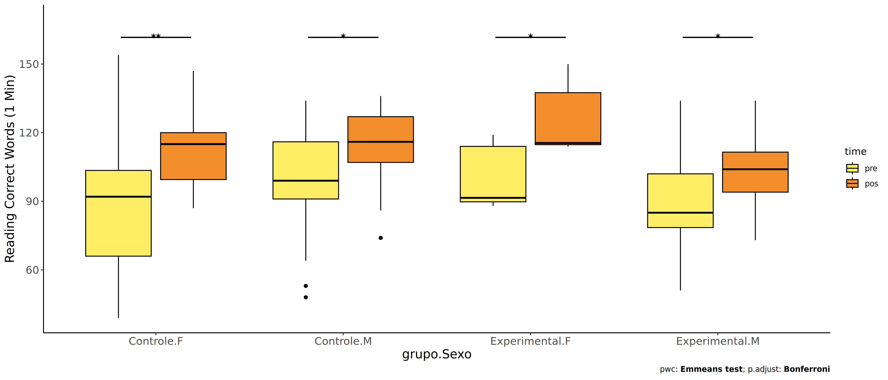<!-- -->

``` r
if (length(unique(pdat[["Sexo"]])) >= 2) {
  ggscatter(wdat, x = "TFL.corretas.per.min.pre", y = "TFL.corretas.per.min.pos", size = 0.5,
            color = "grupo", facet.by = "Sexo", add = "reg.line")+
    stat_regline_equation(
      aes(label =  paste(..eq.label.., ..rr.label.., sep = "~~~~"), color = grupo)
    ) +
    ggplot2::labs(subtitle = rstatix::get_test_label(aov, detailed = T, row = which(aov$Effect == "grupo:Sexo"))) +
    ggplot2::scale_color_manual(values = color[["grupo"]]) +
    if (ymin < ymax) ggplot2::ylim(ymin, ymax)
}
```

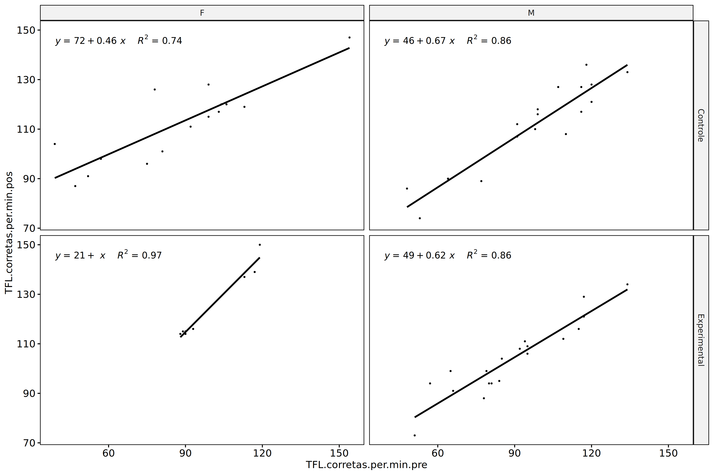<!-- -->

``` r
if (length(unique(pdat[["Sexo"]])) >= 2) {
  ggscatter(wdat, x = "TFL.corretas.per.min.pre", y = "TFL.corretas.per.min.pos", size = 0.5,
            color = "Sexo", facet.by = "grupo", add = "reg.line")+
    stat_regline_equation(
      aes(label =  paste(..eq.label.., ..rr.label.., sep = "~~~~"), color = Sexo)
    ) +
    ggplot2::labs(subtitle = rstatix::get_test_label(aov, detailed = T, row = which(aov$Effect == "grupo:Sexo"))) +
    ggplot2::scale_color_manual(values = color[["Sexo"]]) +
    if (ymin < ymax) ggplot2::ylim(ymin, ymax)
}
```

<!-- -->

### Checking normality and homogeneity

``` r
if (length(unique(pdat[["Sexo"]])) >= 2) 
  res <- augment(lm(TFL.corretas.per.min.pos ~ TFL.corretas.per.min.pre + grupo*Sexo, data = wdat))
```

``` r
if (length(unique(pdat[["Sexo"]])) >= 2)
  shapiro_test(res$.resid)
```

    ## # A tibble: 1 × 3
    ##   variable   statistic p.value
    ##   <chr>          <dbl>   <dbl>
    ## 1 res$.resid     0.951  0.0190

``` r
if (length(unique(pdat[["Sexo"]])) >= 2) 
  levene_test(res, .resid ~ grupo*Sexo)
```

    ## # A tibble: 1 × 4
    ##     df1   df2 statistic     p
    ##   <int> <int>     <dbl> <dbl>
    ## 1     3    55     0.316 0.814

# ANCOVA and Pairwise for two factors **grupo:Zona**

## Without remove non-normal data

``` r
pdat = remove_group_data(dat[!is.na(dat[["grupo"]]) & !is.na(dat[["Zona"]]),],
                         "TFL.corretas.per.min.pos", c("grupo","Zona"))
pdat = pdat[pdat[["Zona"]] %in% do.call(
  intersect, lapply(unique(pdat[["grupo"]]), FUN = function(x) {
    unique(pdat[["Zona"]][which(pdat[["grupo"]] == x)])
  })),]
pdat[["grupo"]] = factor(pdat[["grupo"]], level[["grupo"]])
pdat[["Zona"]] = factor(
  pdat[["Zona"]],
  level[["Zona"]][level[["Zona"]] %in% unique(pdat[["Zona"]])])

pdat.long <- rbind(pdat[,c("id","grupo","Zona")], pdat[,c("id","grupo","Zona")])
pdat.long[["time"]] <- c(rep("pre", nrow(pdat)), rep("pos", nrow(pdat)))
pdat.long[["time"]] <- factor(pdat.long[["time"]], c("pre","pos"))
pdat.long[["TFL.corretas.per.min"]] <- c(pdat[["TFL.corretas.per.min.pre"]], pdat[["TFL.corretas.per.min.pos"]])

if (length(unique(pdat[["Zona"]])) >= 2) {
  aov = anova_test(pdat, TFL.corretas.per.min.pos ~ TFL.corretas.per.min.pre + grupo*Zona)
  laov[["grupo:Zona"]] <- get_anova_table(aov)
}
```

``` r
if (length(unique(pdat[["Zona"]])) >= 2) {
  pwcs <- list()
  pwcs[["Zona"]] <- emmeans_test(
    group_by(pdat, grupo), TFL.corretas.per.min.pos ~ Zona,
    covariate = TFL.corretas.per.min.pre, p.adjust.method = "bonferroni")
  pwcs[["grupo"]] <- emmeans_test(
    group_by(pdat, Zona), TFL.corretas.per.min.pos ~ grupo,
    covariate = TFL.corretas.per.min.pre, p.adjust.method = "bonferroni")
  
  pwc <- plyr::rbind.fill(pwcs[["grupo"]], pwcs[["Zona"]])
  pwc <- pwc[,c("grupo","Zona", colnames(pwc)[!colnames(pwc) %in% c("grupo","Zona")])]
}
```

``` r
if (length(unique(pdat[["Zona"]])) >= 2) {
  pwc.long <- emmeans_test(dplyr::group_by_at(pdat.long, c("grupo","Zona")),
                           TFL.corretas.per.min ~ time,
                           p.adjust.method = "bonferroni")
  lpwc[["grupo:Zona"]] <- plyr::rbind.fill(pwc, pwc.long)
}
```

``` r
if (length(unique(pdat[["Zona"]])) >= 2) {
  ds <- get.descriptives(pdat, "TFL.corretas.per.min.pos", c("grupo","Zona"), covar = "TFL.corretas.per.min.pre")
  ds <- merge(ds[ds$variable != "TFL.corretas.per.min.pre",],
              ds[ds$variable == "TFL.corretas.per.min.pre", !colnames(ds) %in% c("variable")],
              by = c("grupo","Zona"), all.x = T, suffixes = c("", ".TFL.corretas.per.min.pre"))
  ds <- merge(get_emmeans(pwcs[["grupo"]]), ds,
              by = c("grupo","Zona"), suffixes = c(".emms", ""))
  ds <- ds[,c("grupo","Zona","n","mean.TFL.corretas.per.min.pre","se.TFL.corretas.per.min.pre","mean","se",
              "emmean","se.emms","conf.low","conf.high")]
  
  colnames(ds) <- c("grupo","Zona", "N", paste0(c("M","SE")," (pre)"),
                    paste0(c("M","SE"), " (unadj)"),
                    paste0(c("M", "SE"), " (adj)"), "conf.low", "conf.high")
  
  lemms[["grupo:Zona"]] <- ds
}
```

## Computing ANCOVA and PairWise After removing non-normal data (OK)

``` r
if (length(unique(pdat[["Zona"]])) >= 2) {
  wdat = pdat 
  
  res = residuals(lm(TFL.corretas.per.min.pos ~ TFL.corretas.per.min.pre + grupo*Zona, data = wdat))
  non.normal = getNonNormal(res, wdat$id, plimit = 0.05)
  
  wdat = wdat[!wdat$id %in% non.normal,]
  
  wdat.long <- rbind(wdat[,c("id","grupo","Zona")], wdat[,c("id","grupo","Zona")])
  wdat.long[["time"]] <- c(rep("pre", nrow(wdat)), rep("pos", nrow(wdat)))
  wdat.long[["time"]] <- factor(wdat.long[["time"]], c("pre","pos"))
  wdat.long[["TFL.corretas.per.min"]] <- c(wdat[["TFL.corretas.per.min.pre"]], wdat[["TFL.corretas.per.min.pos"]])
  
  
  ldat[["grupo:Zona"]] = wdat
  
  (non.normal)
}
```

    ## [1] "P510"  "P1768" "P1743" "P2378" "P945"  "P1698" "P2220"

``` r
if (length(unique(pdat[["Zona"]])) >= 2) {
  aov = anova_test(wdat, TFL.corretas.per.min.pos ~ TFL.corretas.per.min.pre + grupo*Zona)
  laov[["grupo:Zona"]] <- merge(get_anova_table(aov), laov[["grupo:Zona"]],
                                         by="Effect", suffixes = c("","'"))
  df = get_anova_table(aov)
}
```

| Effect                   | DFn | DFd |      F |     p | p\<.05 |   ges |
|:-------------------------|----:|----:|-------:|------:|:-------|------:|
| TFL.corretas.per.min.pre |   1 |  94 | 76.601 | 0.000 | \*     | 0.449 |
| grupo                    |   1 |  94 |  0.011 | 0.918 |        | 0.000 |
| Zona                     |   1 |  94 | 42.906 | 0.000 | \*     | 0.313 |
| grupo:Zona               |   1 |  94 |  3.994 | 0.049 | \*     | 0.041 |

``` r
if (length(unique(pdat[["Zona"]])) >= 2) {
  pwcs <- list()
  pwcs[["Zona"]] <- emmeans_test(
    group_by(wdat, grupo), TFL.corretas.per.min.pos ~ Zona,
    covariate = TFL.corretas.per.min.pre, p.adjust.method = "bonferroni")
  pwcs[["grupo"]] <- emmeans_test(
    group_by(wdat, Zona), TFL.corretas.per.min.pos ~ grupo,
    covariate = TFL.corretas.per.min.pre, p.adjust.method = "bonferroni")
  
  pwc <- plyr::rbind.fill(pwcs[["grupo"]], pwcs[["Zona"]])
  pwc <- pwc[,c("grupo","Zona", colnames(pwc)[!colnames(pwc) %in% c("grupo","Zona")])]
}
```

| grupo        | Zona   | term                            | .y.                      | group1   | group2       |  df | statistic |     p | p.adj | p.adj.signif |
|:-------------|:-------|:--------------------------------|:-------------------------|:---------|:-------------|----:|----------:|------:|------:|:-------------|
|              | Rural  | TFL.corretas.per.min.pre\*grupo | TFL.corretas.per.min.pos | Controle | Experimental |  94 |    -0.841 | 0.403 | 0.403 | ns           |
|              | Urbana | TFL.corretas.per.min.pre\*grupo | TFL.corretas.per.min.pos | Controle | Experimental |  94 |     1.817 | 0.072 | 0.072 | ns           |
| Controle     |        | TFL.corretas.per.min.pre\*Zona  | TFL.corretas.per.min.pos | Rural    | Urbana       |  94 |    -6.213 | 0.000 | 0.000 | \*\*\*\*     |
| Experimental |        | TFL.corretas.per.min.pre\*Zona  | TFL.corretas.per.min.pos | Rural    | Urbana       |  94 |    -2.890 | 0.005 | 0.005 | \*\*         |

``` r
if (length(unique(pdat[["Zona"]])) >= 2) {
  pwc.long <- emmeans_test(dplyr::group_by_at(wdat.long, c("grupo","Zona")),
                           TFL.corretas.per.min ~ time,
                           p.adjust.method = "bonferroni")
  lpwc[["grupo:Zona"]] <- merge(plyr::rbind.fill(pwc, pwc.long),
                                         lpwc[["grupo:Zona"]],
                                         by=c("grupo","Zona","term",".y.","group1","group2"),
                                         suffixes = c("","'"))
}
```

| grupo        | Zona   | term | .y.                  | group1 | group2 |  df | statistic |     p | p.adj | p.adj.signif |
|:-------------|:-------|:-----|:---------------------|:-------|:-------|----:|----------:|------:|------:|:-------------|
| Controle     | Rural  | time | TFL.corretas.per.min | pre    | pos    | 190 |    -2.328 | 0.021 | 0.021 | \*           |
| Controle     | Urbana | time | TFL.corretas.per.min | pre    | pos    | 190 |    -4.142 | 0.000 | 0.000 | \*\*\*\*     |
| Experimental | Rural  | time | TFL.corretas.per.min | pre    | pos    | 190 |    -2.406 | 0.017 | 0.017 | \*           |
| Experimental | Urbana | time | TFL.corretas.per.min | pre    | pos    | 190 |    -2.294 | 0.023 | 0.023 | \*           |

``` r
if (length(unique(pdat[["Zona"]])) >= 2) {
  ds <- get.descriptives(wdat, "TFL.corretas.per.min.pos", c("grupo","Zona"), covar = "TFL.corretas.per.min.pre")
  ds <- merge(ds[ds$variable != "TFL.corretas.per.min.pre",],
              ds[ds$variable == "TFL.corretas.per.min.pre", !colnames(ds) %in% c("variable")],
              by = c("grupo","Zona"), all.x = T, suffixes = c("", ".TFL.corretas.per.min.pre"))
  ds <- merge(get_emmeans(pwcs[["grupo"]]), ds,
              by = c("grupo","Zona"), suffixes = c(".emms", ""))
  ds <- ds[,c("grupo","Zona","n","mean.TFL.corretas.per.min.pre","se.TFL.corretas.per.min.pre",
              "mean","se","emmean","se.emms","conf.low","conf.high")]
  
  colnames(ds) <- c("grupo","Zona", "N", paste0(c("M","SE")," (pre)"),
                    paste0(c("M","SE"), " (unadj)"),
                    paste0(c("M", "SE"), " (adj)"), "conf.low", "conf.high")
  
  lemms[["grupo:Zona"]] <- merge(ds, lemms[["grupo:Zona"]],
                                          by=c("grupo","Zona"), suffixes = c("","'"))
}
```

| grupo        | Zona   |   N | M (pre) | SE (pre) | M (unadj) | SE (unadj) | M (adj) | SE (adj) | conf.low | conf.high |
|:-------------|:-------|----:|--------:|---------:|----------:|-----------:|--------:|---------:|---------:|----------:|
| Controle     | Rural  |  54 |  91.111 |    3.608 |   101.259 |      2.955 | 101.490 |    2.205 |   97.112 |   105.868 |
| Controle     | Urbana |   7 |  92.286 |    9.097 |   142.429 |     10.792 | 141.934 |    6.124 |  129.774 |   154.094 |
| Experimental | Rural  |  32 |  89.969 |    3.268 |   103.594 |      3.038 | 104.530 |    2.866 |   98.840 |   110.221 |
| Experimental | Urbana |   6 | 102.000 |    6.713 |   132.000 |     13.849 | 125.503 |    6.656 |  112.288 |   138.719 |

### Plots for ancova

``` r
if (length(unique(pdat[["Zona"]])) >= 2) {
  ggPlotAoC2(pwcs, "grupo", "Zona", aov, ylab = "Reading Correct Words (1 Min)",
             subtitle = which(aov$Effect == "grupo:Zona"), addParam = "errorbar") +
    ggplot2::scale_color_manual(values = color[["Zona"]]) +
    if (ymin.ci < ymax.ci) ggplot2::ylim(ymin.ci, ymax.ci)
}
```

    ## Scale for colour is already present.
    ## Adding another scale for colour, which will replace the existing scale.

<!-- -->

``` r
if (length(unique(pdat[["Zona"]])) >= 2) {
  ggPlotAoC2(pwcs, "Zona", "grupo", aov, ylab = "Reading Correct Words (1 Min)",
               subtitle = which(aov$Effect == "grupo:Zona"), addParam = "errorbar") +
      ggplot2::scale_color_manual(values = color[["grupo"]]) +
      if (ymin.ci < ymax.ci) ggplot2::ylim(ymin.ci, ymax.ci)
}
```

    ## Scale for colour is already present.
    ## Adding another scale for colour, which will replace the existing scale.

<!-- -->

``` r
if (length(unique(pdat[["Zona"]])) >= 2) {
  plots <- twoWayAncovaBoxPlots(
    wdat, "TFL.corretas.per.min.pos", c("grupo","Zona"), aov, pwcs, covar = "TFL.corretas.per.min.pre",
    theme = "classic", color = color[["grupo:Zona"]],
    subtitle = which(aov$Effect == "grupo:Zona"))
}
```

``` r
if (length(unique(pdat[["Zona"]])) >= 2) {
  plots[["grupo:Zona"]] + ggplot2::ylab("Reading Correct Words (1 Min)") +
  ggplot2::scale_x_discrete(labels=c('pre', 'pos')) +
  if (ymin < ymax) ggplot2::ylim(ymin, ymax)
}
```

    ## Warning: No shared levels found between `names(values)` of the manual scale and the data's colour
    ## values.

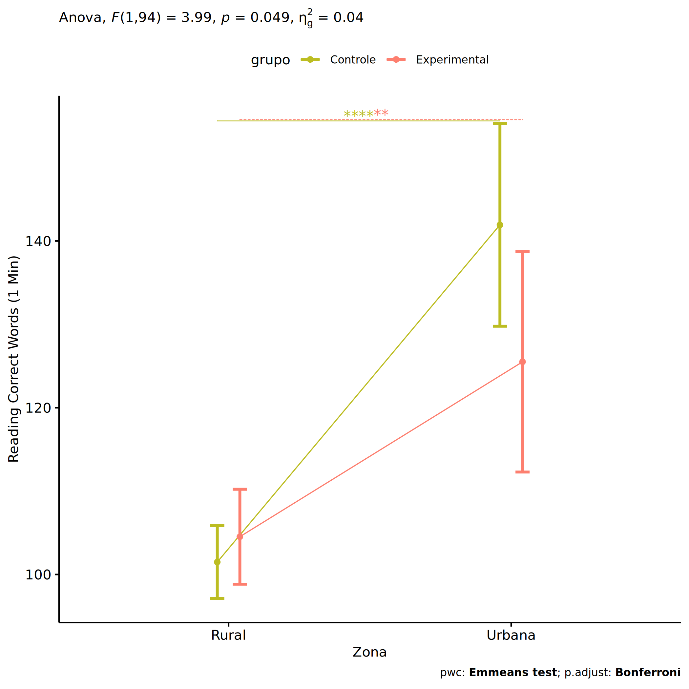<!-- -->

``` r
if (length(unique(pdat[["Zona"]])) >= 2) {
  plots <- twoWayAncovaBoxPlots(
    wdat.long, "TFL.corretas.per.min", c("grupo","Zona"), aov, pwc.long,
    pre.post = "time",
    theme = "classic", color = color$prepost)
}
```

``` r
if (length(unique(pdat[["Zona"]])) >= 2) 
  plots[["grupo:Zona"]] + ggplot2::ylab("Reading Correct Words (1 Min)") +
    if (ymin < ymax) ggplot2::ylim(ymin, ymax)
```

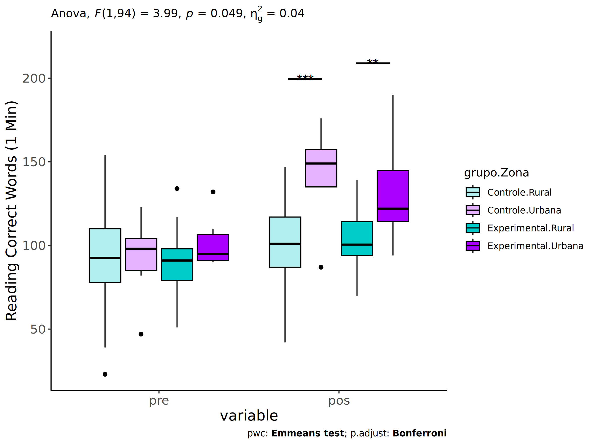<!-- -->

### Checking linearity assumption

``` r
if (length(unique(pdat[["Zona"]])) >= 2) {
  ggscatter(wdat, x = "TFL.corretas.per.min.pre", y = "TFL.corretas.per.min.pos", size = 0.5,
            facet.by = c("grupo","Zona"), add = "reg.line")+
    stat_regline_equation(
      aes(label =  paste(..eq.label.., ..rr.label.., sep = "~~~~"))
    ) +
    if (ymin < ymax) ggplot2::ylim(ymin, ymax)
}
```

<!-- -->

``` r
if (length(unique(pdat[["Zona"]])) >= 2) {
  ggscatter(wdat, x = "TFL.corretas.per.min.pre", y = "TFL.corretas.per.min.pos", size = 0.5,
            color = "grupo", facet.by = "Zona", add = "reg.line")+
    stat_regline_equation(
      aes(label =  paste(..eq.label.., ..rr.label.., sep = "~~~~"), color = grupo)
    ) +
    ggplot2::labs(subtitle = rstatix::get_test_label(aov, detailed = T, row = which(aov$Effect == "grupo:Zona"))) +
    ggplot2::scale_color_manual(values = color[["grupo"]]) +
    if (ymin < ymax) ggplot2::ylim(ymin, ymax)
}
```

<!-- -->

``` r
if (length(unique(pdat[["Zona"]])) >= 2) {
  ggscatter(wdat, x = "TFL.corretas.per.min.pre", y = "TFL.corretas.per.min.pos", size = 0.5,
            color = "Zona", facet.by = "grupo", add = "reg.line")+
    stat_regline_equation(
      aes(label =  paste(..eq.label.., ..rr.label.., sep = "~~~~"), color = Zona)
    ) +
    ggplot2::labs(subtitle = rstatix::get_test_label(aov, detailed = T, row = which(aov$Effect == "grupo:Zona"))) +
    ggplot2::scale_color_manual(values = color[["Zona"]]) +
    if (ymin < ymax) ggplot2::ylim(ymin, ymax)
}
```

<!-- -->

### Checking normality and homogeneity

``` r
if (length(unique(pdat[["Zona"]])) >= 2) 
  res <- augment(lm(TFL.corretas.per.min.pos ~ TFL.corretas.per.min.pre + grupo*Zona, data = wdat))
```

``` r
if (length(unique(pdat[["Zona"]])) >= 2)
  shapiro_test(res$.resid)
```

    ## # A tibble: 1 × 3
    ##   variable   statistic p.value
    ##   <chr>          <dbl>   <dbl>
    ## 1 res$.resid     0.980   0.133

``` r
if (length(unique(pdat[["Zona"]])) >= 2) 
  levene_test(res, .resid ~ grupo*Zona)
```

    ## # A tibble: 1 × 4
    ##     df1   df2 statistic      p
    ##   <int> <int>     <dbl>  <dbl>
    ## 1     3    95      3.55 0.0173

# ANCOVA and Pairwise for two factors **grupo:Cor.Raca**

## Without remove non-normal data

``` r
pdat = remove_group_data(dat[!is.na(dat[["grupo"]]) & !is.na(dat[["Cor.Raca"]]),],
                         "TFL.corretas.per.min.pos", c("grupo","Cor.Raca"))
```

    ## Warning: There were 2 warnings in `mutate()`.
    ## The first warning was:
    ## ℹ In argument: `ci = abs(stats::qt(alpha/2, .data$n - 1) * .data$se)`.
    ## Caused by warning:
    ## ! There was 1 warning in `mutate()`.
    ## ℹ In argument: `ci = abs(stats::qt(alpha/2, .data$n - 1) * .data$se)`.
    ## Caused by warning in `stats::qt()`:
    ## ! NaNs produced
    ## ℹ Run `dplyr::last_dplyr_warnings()` to see the 1 remaining warning.

``` r
pdat = pdat[pdat[["Cor.Raca"]] %in% do.call(
  intersect, lapply(unique(pdat[["grupo"]]), FUN = function(x) {
    unique(pdat[["Cor.Raca"]][which(pdat[["grupo"]] == x)])
  })),]
pdat[["grupo"]] = factor(pdat[["grupo"]], level[["grupo"]])
pdat[["Cor.Raca"]] = factor(
  pdat[["Cor.Raca"]],
  level[["Cor.Raca"]][level[["Cor.Raca"]] %in% unique(pdat[["Cor.Raca"]])])

pdat.long <- rbind(pdat[,c("id","grupo","Cor.Raca")], pdat[,c("id","grupo","Cor.Raca")])
pdat.long[["time"]] <- c(rep("pre", nrow(pdat)), rep("pos", nrow(pdat)))
pdat.long[["time"]] <- factor(pdat.long[["time"]], c("pre","pos"))
pdat.long[["TFL.corretas.per.min"]] <- c(pdat[["TFL.corretas.per.min.pre"]], pdat[["TFL.corretas.per.min.pos"]])

if (length(unique(pdat[["Cor.Raca"]])) >= 2) {
  aov = anova_test(pdat, TFL.corretas.per.min.pos ~ TFL.corretas.per.min.pre + grupo*Cor.Raca)
  laov[["grupo:Cor.Raca"]] <- get_anova_table(aov)
}
```

``` r
if (length(unique(pdat[["Cor.Raca"]])) >= 2) {
  pwcs <- list()
  pwcs[["Cor.Raca"]] <- emmeans_test(
    group_by(pdat, grupo), TFL.corretas.per.min.pos ~ Cor.Raca,
    covariate = TFL.corretas.per.min.pre, p.adjust.method = "bonferroni")
  pwcs[["grupo"]] <- emmeans_test(
    group_by(pdat, Cor.Raca), TFL.corretas.per.min.pos ~ grupo,
    covariate = TFL.corretas.per.min.pre, p.adjust.method = "bonferroni")
  
  pwc <- plyr::rbind.fill(pwcs[["grupo"]], pwcs[["Cor.Raca"]])
  pwc <- pwc[,c("grupo","Cor.Raca", colnames(pwc)[!colnames(pwc) %in% c("grupo","Cor.Raca")])]
}
```

``` r
if (length(unique(pdat[["Cor.Raca"]])) >= 2) {
  pwc.long <- emmeans_test(dplyr::group_by_at(pdat.long, c("grupo","Cor.Raca")),
                           TFL.corretas.per.min ~ time,
                           p.adjust.method = "bonferroni")
  lpwc[["grupo:Cor.Raca"]] <- plyr::rbind.fill(pwc, pwc.long)
}
```

``` r
if (length(unique(pdat[["Cor.Raca"]])) >= 2) {
  ds <- get.descriptives(pdat, "TFL.corretas.per.min.pos", c("grupo","Cor.Raca"), covar = "TFL.corretas.per.min.pre")
  ds <- merge(ds[ds$variable != "TFL.corretas.per.min.pre",],
              ds[ds$variable == "TFL.corretas.per.min.pre", !colnames(ds) %in% c("variable")],
              by = c("grupo","Cor.Raca"), all.x = T, suffixes = c("", ".TFL.corretas.per.min.pre"))
  ds <- merge(get_emmeans(pwcs[["grupo"]]), ds,
              by = c("grupo","Cor.Raca"), suffixes = c(".emms", ""))
  ds <- ds[,c("grupo","Cor.Raca","n","mean.TFL.corretas.per.min.pre","se.TFL.corretas.per.min.pre","mean","se",
              "emmean","se.emms","conf.low","conf.high")]
  
  colnames(ds) <- c("grupo","Cor.Raca", "N", paste0(c("M","SE")," (pre)"),
                    paste0(c("M","SE"), " (unadj)"),
                    paste0(c("M", "SE"), " (adj)"), "conf.low", "conf.high")
  
  lemms[["grupo:Cor.Raca"]] <- ds
}
```

## Computing ANCOVA and PairWise After removing non-normal data (OK)

``` r
if (length(unique(pdat[["Cor.Raca"]])) >= 2) {
  wdat = pdat 
  
  res = residuals(lm(TFL.corretas.per.min.pos ~ TFL.corretas.per.min.pre + grupo*Cor.Raca, data = wdat))
  non.normal = getNonNormal(res, wdat$id, plimit = 0.05)
  
  wdat = wdat[!wdat$id %in% non.normal,]
  
  wdat.long <- rbind(wdat[,c("id","grupo","Cor.Raca")], wdat[,c("id","grupo","Cor.Raca")])
  wdat.long[["time"]] <- c(rep("pre", nrow(wdat)), rep("pos", nrow(wdat)))
  wdat.long[["time"]] <- factor(wdat.long[["time"]], c("pre","pos"))
  wdat.long[["TFL.corretas.per.min"]] <- c(wdat[["TFL.corretas.per.min.pre"]], wdat[["TFL.corretas.per.min.pos"]])
  
  
  ldat[["grupo:Cor.Raca"]] = wdat
  
  (non.normal)
}
```

    ## [1] "P510"  "P623"  "P1728"

``` r
if (length(unique(pdat[["Cor.Raca"]])) >= 2) {
  aov = anova_test(wdat, TFL.corretas.per.min.pos ~ TFL.corretas.per.min.pre + grupo*Cor.Raca)
  laov[["grupo:Cor.Raca"]] <- merge(get_anova_table(aov), laov[["grupo:Cor.Raca"]],
                                         by="Effect", suffixes = c("","'"))
  df = get_anova_table(aov)
}
```

| Effect                   | DFn | DFd |      F |     p | p\<.05 |   ges |
|:-------------------------|----:|----:|-------:|------:|:-------|------:|
| TFL.corretas.per.min.pre |   1 |  66 | 58.124 | 0.000 | \*     | 0.468 |
| grupo                    |   1 |  66 |  3.567 | 0.063 |        | 0.051 |
| Cor.Raca                 |   1 |  66 |  6.843 | 0.011 | \*     | 0.094 |
| grupo:Cor.Raca           |   1 |  66 |  0.365 | 0.548 |        | 0.005 |

``` r
if (length(unique(pdat[["Cor.Raca"]])) >= 2) {
  pwcs <- list()
  pwcs[["Cor.Raca"]] <- emmeans_test(
    group_by(wdat, grupo), TFL.corretas.per.min.pos ~ Cor.Raca,
    covariate = TFL.corretas.per.min.pre, p.adjust.method = "bonferroni")
  pwcs[["grupo"]] <- emmeans_test(
    group_by(wdat, Cor.Raca), TFL.corretas.per.min.pos ~ grupo,
    covariate = TFL.corretas.per.min.pre, p.adjust.method = "bonferroni")
  
  pwc <- plyr::rbind.fill(pwcs[["grupo"]], pwcs[["Cor.Raca"]])
  pwc <- pwc[,c("grupo","Cor.Raca", colnames(pwc)[!colnames(pwc) %in% c("grupo","Cor.Raca")])]
}
```

| grupo        | Cor.Raca | term                               | .y.                      | group1   | group2       |  df | statistic |     p | p.adj | p.adj.signif |
|:-------------|:---------|:-----------------------------------|:-------------------------|:---------|:-------------|----:|----------:|------:|------:|:-------------|
|              | Parda    | TFL.corretas.per.min.pre\*grupo    | TFL.corretas.per.min.pos | Controle | Experimental |  66 |    -1.351 | 0.181 | 0.181 | ns           |
|              | Branca   | TFL.corretas.per.min.pre\*grupo    | TFL.corretas.per.min.pos | Controle | Experimental |  66 |    -1.451 | 0.151 | 0.151 | ns           |
| Controle     |          | TFL.corretas.per.min.pre\*Cor.Raca | TFL.corretas.per.min.pos | Parda    | Branca       |  66 |    -1.915 | 0.060 | 0.060 | ns           |
| Experimental |          | TFL.corretas.per.min.pre\*Cor.Raca | TFL.corretas.per.min.pos | Parda    | Branca       |  66 |    -1.954 | 0.055 | 0.055 | ns           |

``` r
if (length(unique(pdat[["Cor.Raca"]])) >= 2) {
  pwc.long <- emmeans_test(dplyr::group_by_at(wdat.long, c("grupo","Cor.Raca")),
                           TFL.corretas.per.min ~ time,
                           p.adjust.method = "bonferroni")
  lpwc[["grupo:Cor.Raca"]] <- merge(plyr::rbind.fill(pwc, pwc.long),
                                         lpwc[["grupo:Cor.Raca"]],
                                         by=c("grupo","Cor.Raca","term",".y.","group1","group2"),
                                         suffixes = c("","'"))
}
```

| grupo        | Cor.Raca | term | .y.                  | group1 | group2 |  df | statistic |     p | p.adj | p.adj.signif |
|:-------------|:---------|:-----|:---------------------|:-------|:-------|----:|----------:|------:|------:|:-------------|
| Controle     | Parda    | time | TFL.corretas.per.min | pre    | pos    | 134 |    -1.048 | 0.296 | 0.296 | ns           |
| Controle     | Branca   | time | TFL.corretas.per.min | pre    | pos    | 134 |    -1.211 | 0.228 | 0.228 | ns           |
| Experimental | Parda    | time | TFL.corretas.per.min | pre    | pos    | 134 |    -1.683 | 0.095 | 0.095 | ns           |
| Experimental | Branca   | time | TFL.corretas.per.min | pre    | pos    | 134 |    -1.664 | 0.098 | 0.098 | ns           |

``` r
if (length(unique(pdat[["Cor.Raca"]])) >= 2) {
  ds <- get.descriptives(wdat, "TFL.corretas.per.min.pos", c("grupo","Cor.Raca"), covar = "TFL.corretas.per.min.pre")
  ds <- merge(ds[ds$variable != "TFL.corretas.per.min.pre",],
              ds[ds$variable == "TFL.corretas.per.min.pre", !colnames(ds) %in% c("variable")],
              by = c("grupo","Cor.Raca"), all.x = T, suffixes = c("", ".TFL.corretas.per.min.pre"))
  ds <- merge(get_emmeans(pwcs[["grupo"]]), ds,
              by = c("grupo","Cor.Raca"), suffixes = c(".emms", ""))
  ds <- ds[,c("grupo","Cor.Raca","n","mean.TFL.corretas.per.min.pre","se.TFL.corretas.per.min.pre",
              "mean","se","emmean","se.emms","conf.low","conf.high")]
  
  colnames(ds) <- c("grupo","Cor.Raca", "N", paste0(c("M","SE")," (pre)"),
                    paste0(c("M","SE"), " (unadj)"),
                    paste0(c("M", "SE"), " (adj)"), "conf.low", "conf.high")
  
  lemms[["grupo:Cor.Raca"]] <- merge(ds, lemms[["grupo:Cor.Raca"]],
                                          by=c("grupo","Cor.Raca"), suffixes = c("","'"))
}
```

| grupo        | Cor.Raca |   N | M (pre) | SE (pre) | M (unadj) | SE (unadj) | M (adj) | SE (adj) | conf.low | conf.high |
|:-------------|:---------|----:|--------:|---------:|----------:|-----------:|--------:|---------:|---------:|----------:|
| Controle     | Branca   |  12 | 103.667 |    4.606 |     114.0 |      5.510 | 107.117 |    4.418 |   98.297 |   115.938 |
| Controle     | Parda    |  38 |  90.974 |    3.848 |      96.0 |      3.471 |  97.395 |    2.437 |   92.529 |   102.261 |
| Experimental | Branca   |   5 | 103.400 |    5.591 |     125.4 |      8.310 | 118.691 |    6.757 |  105.200 |   132.182 |
| Experimental | Parda    |  16 |  87.062 |    5.173 |      99.5 |      4.798 | 103.446 |    3.781 |   95.897 |   110.994 |

### Plots for ancova

``` r
if (length(unique(pdat[["Cor.Raca"]])) >= 2) {
  ggPlotAoC2(pwcs, "grupo", "Cor.Raca", aov, ylab = "Reading Correct Words (1 Min)",
             subtitle = which(aov$Effect == "grupo:Cor.Raca"), addParam = "errorbar") +
    ggplot2::scale_color_manual(values = color[["Cor.Raca"]]) +
    if (ymin.ci < ymax.ci) ggplot2::ylim(ymin.ci, ymax.ci)
}
```

    ## Scale for colour is already present.
    ## Adding another scale for colour, which will replace the existing scale.

<!-- -->

``` r
if (length(unique(pdat[["Cor.Raca"]])) >= 2) {
  ggPlotAoC2(pwcs, "Cor.Raca", "grupo", aov, ylab = "Reading Correct Words (1 Min)",
               subtitle = which(aov$Effect == "grupo:Cor.Raca"), addParam = "errorbar") +
      ggplot2::scale_color_manual(values = color[["grupo"]]) +
      if (ymin.ci < ymax.ci) ggplot2::ylim(ymin.ci, ymax.ci)
}
```

    ## Scale for colour is already present.
    ## Adding another scale for colour, which will replace the existing scale.

<!-- -->

``` r
if (length(unique(pdat[["Cor.Raca"]])) >= 2) {
  plots <- twoWayAncovaBoxPlots(
    wdat, "TFL.corretas.per.min.pos", c("grupo","Cor.Raca"), aov, pwcs, covar = "TFL.corretas.per.min.pre",
    theme = "classic", color = color[["grupo:Cor.Raca"]],
    subtitle = which(aov$Effect == "grupo:Cor.Raca"))
}
```

``` r
if (length(unique(pdat[["Cor.Raca"]])) >= 2) {
  plots[["grupo:Cor.Raca"]] + ggplot2::ylab("Reading Correct Words (1 Min)") +
  ggplot2::scale_x_discrete(labels=c('pre', 'pos')) +
  if (ymin < ymax) ggplot2::ylim(ymin, ymax)
}
```

    ## Warning: No shared levels found between `names(values)` of the manual scale and the data's colour
    ## values.

<!-- -->

``` r
if (length(unique(pdat[["Cor.Raca"]])) >= 2) {
  plots <- twoWayAncovaBoxPlots(
    wdat.long, "TFL.corretas.per.min", c("grupo","Cor.Raca"), aov, pwc.long,
    pre.post = "time",
    theme = "classic", color = color$prepost)
}
```

``` r
if (length(unique(pdat[["Cor.Raca"]])) >= 2) 
  plots[["grupo:Cor.Raca"]] + ggplot2::ylab("Reading Correct Words (1 Min)") +
    if (ymin < ymax) ggplot2::ylim(ymin, ymax)
```

<!-- -->

### Checking linearity assumption

``` r
if (length(unique(pdat[["Cor.Raca"]])) >= 2) {
  ggscatter(wdat, x = "TFL.corretas.per.min.pre", y = "TFL.corretas.per.min.pos", size = 0.5,
            facet.by = c("grupo","Cor.Raca"), add = "reg.line")+
    stat_regline_equation(
      aes(label =  paste(..eq.label.., ..rr.label.., sep = "~~~~"))
    ) +
    if (ymin < ymax) ggplot2::ylim(ymin, ymax)
}
```

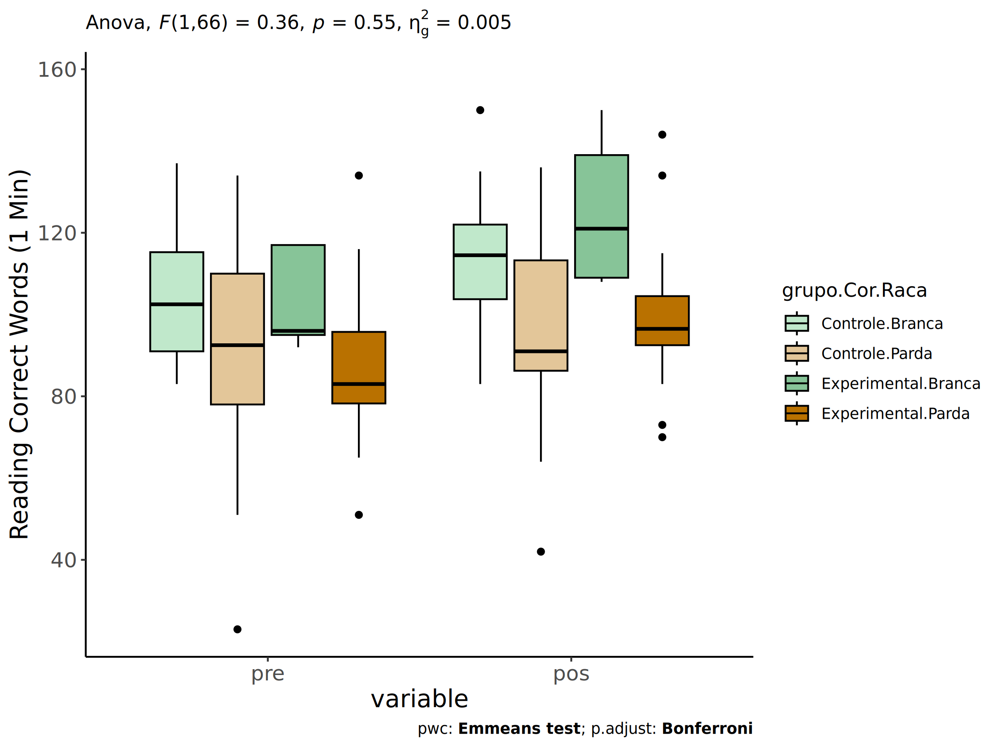<!-- -->

``` r
if (length(unique(pdat[["Cor.Raca"]])) >= 2) {
  ggscatter(wdat, x = "TFL.corretas.per.min.pre", y = "TFL.corretas.per.min.pos", size = 0.5,
            color = "grupo", facet.by = "Cor.Raca", add = "reg.line")+
    stat_regline_equation(
      aes(label =  paste(..eq.label.., ..rr.label.., sep = "~~~~"), color = grupo)
    ) +
    ggplot2::labs(subtitle = rstatix::get_test_label(aov, detailed = T, row = which(aov$Effect == "grupo:Cor.Raca"))) +
    ggplot2::scale_color_manual(values = color[["grupo"]]) +
    if (ymin < ymax) ggplot2::ylim(ymin, ymax)
}
```

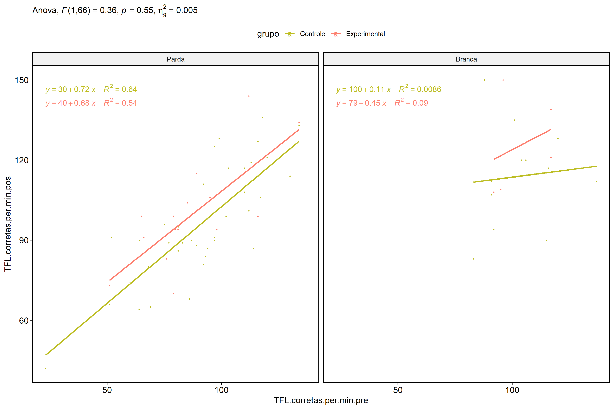<!-- -->

``` r
if (length(unique(pdat[["Cor.Raca"]])) >= 2) {
  ggscatter(wdat, x = "TFL.corretas.per.min.pre", y = "TFL.corretas.per.min.pos", size = 0.5,
            color = "Cor.Raca", facet.by = "grupo", add = "reg.line")+
    stat_regline_equation(
      aes(label =  paste(..eq.label.., ..rr.label.., sep = "~~~~"), color = Cor.Raca)
    ) +
    ggplot2::labs(subtitle = rstatix::get_test_label(aov, detailed = T, row = which(aov$Effect == "grupo:Cor.Raca"))) +
    ggplot2::scale_color_manual(values = color[["Cor.Raca"]]) +
    if (ymin < ymax) ggplot2::ylim(ymin, ymax)
}
```

<!-- -->

### Checking normality and homogeneity

``` r
if (length(unique(pdat[["Cor.Raca"]])) >= 2) 
  res <- augment(lm(TFL.corretas.per.min.pos ~ TFL.corretas.per.min.pre + grupo*Cor.Raca, data = wdat))
```

``` r
if (length(unique(pdat[["Cor.Raca"]])) >= 2)
  shapiro_test(res$.resid)
```

    ## # A tibble: 1 × 3
    ##   variable   statistic p.value
    ##   <chr>          <dbl>   <dbl>
    ## 1 res$.resid     0.982   0.383

``` r
if (length(unique(pdat[["Cor.Raca"]])) >= 2) 
  levene_test(res, .resid ~ grupo*Cor.Raca)
```

    ## # A tibble: 1 × 4
    ##     df1   df2 statistic     p
    ##   <int> <int>     <dbl> <dbl>
    ## 1     3    67     0.750 0.526

# ANCOVA and Pairwise for two factors **grupo:Serie**

## Without remove non-normal data

``` r
pdat = remove_group_data(dat[!is.na(dat[["grupo"]]) & !is.na(dat[["Serie"]]),],
                         "TFL.corretas.per.min.pos", c("grupo","Serie"))
pdat = pdat[pdat[["Serie"]] %in% do.call(
  intersect, lapply(unique(pdat[["grupo"]]), FUN = function(x) {
    unique(pdat[["Serie"]][which(pdat[["grupo"]] == x)])
  })),]
pdat[["grupo"]] = factor(pdat[["grupo"]], level[["grupo"]])
pdat[["Serie"]] = factor(
  pdat[["Serie"]],
  level[["Serie"]][level[["Serie"]] %in% unique(pdat[["Serie"]])])

pdat.long <- rbind(pdat[,c("id","grupo","Serie")], pdat[,c("id","grupo","Serie")])
pdat.long[["time"]] <- c(rep("pre", nrow(pdat)), rep("pos", nrow(pdat)))
pdat.long[["time"]] <- factor(pdat.long[["time"]], c("pre","pos"))
pdat.long[["TFL.corretas.per.min"]] <- c(pdat[["TFL.corretas.per.min.pre"]], pdat[["TFL.corretas.per.min.pos"]])

if (length(unique(pdat[["Serie"]])) >= 2) {
  aov = anova_test(pdat, TFL.corretas.per.min.pos ~ TFL.corretas.per.min.pre + grupo*Serie)
  laov[["grupo:Serie"]] <- get_anova_table(aov)
}
```

``` r
if (length(unique(pdat[["Serie"]])) >= 2) {
  pwcs <- list()
  pwcs[["Serie"]] <- emmeans_test(
    group_by(pdat, grupo), TFL.corretas.per.min.pos ~ Serie,
    covariate = TFL.corretas.per.min.pre, p.adjust.method = "bonferroni")
  pwcs[["grupo"]] <- emmeans_test(
    group_by(pdat, Serie), TFL.corretas.per.min.pos ~ grupo,
    covariate = TFL.corretas.per.min.pre, p.adjust.method = "bonferroni")
  
  pwc <- plyr::rbind.fill(pwcs[["grupo"]], pwcs[["Serie"]])
  pwc <- pwc[,c("grupo","Serie", colnames(pwc)[!colnames(pwc) %in% c("grupo","Serie")])]
}
```

``` r
if (length(unique(pdat[["Serie"]])) >= 2) {
  pwc.long <- emmeans_test(dplyr::group_by_at(pdat.long, c("grupo","Serie")),
                           TFL.corretas.per.min ~ time,
                           p.adjust.method = "bonferroni")
  lpwc[["grupo:Serie"]] <- plyr::rbind.fill(pwc, pwc.long)
}
```

``` r
if (length(unique(pdat[["Serie"]])) >= 2) {
  ds <- get.descriptives(pdat, "TFL.corretas.per.min.pos", c("grupo","Serie"), covar = "TFL.corretas.per.min.pre")
  ds <- merge(ds[ds$variable != "TFL.corretas.per.min.pre",],
              ds[ds$variable == "TFL.corretas.per.min.pre", !colnames(ds) %in% c("variable")],
              by = c("grupo","Serie"), all.x = T, suffixes = c("", ".TFL.corretas.per.min.pre"))
  ds <- merge(get_emmeans(pwcs[["grupo"]]), ds,
              by = c("grupo","Serie"), suffixes = c(".emms", ""))
  ds <- ds[,c("grupo","Serie","n","mean.TFL.corretas.per.min.pre","se.TFL.corretas.per.min.pre","mean","se",
              "emmean","se.emms","conf.low","conf.high")]
  
  colnames(ds) <- c("grupo","Serie", "N", paste0(c("M","SE")," (pre)"),
                    paste0(c("M","SE"), " (unadj)"),
                    paste0(c("M", "SE"), " (adj)"), "conf.low", "conf.high")
  
  lemms[["grupo:Serie"]] <- ds
}
```

## Computing ANCOVA and PairWise After removing non-normal data (OK)

``` r
if (length(unique(pdat[["Serie"]])) >= 2) {
  wdat = pdat 
  
  res = residuals(lm(TFL.corretas.per.min.pos ~ TFL.corretas.per.min.pre + grupo*Serie, data = wdat))
  non.normal = getNonNormal(res, wdat$id, plimit = 0.05)
  
  wdat = wdat[!wdat$id %in% non.normal,]
  
  wdat.long <- rbind(wdat[,c("id","grupo","Serie")], wdat[,c("id","grupo","Serie")])
  wdat.long[["time"]] <- c(rep("pre", nrow(wdat)), rep("pos", nrow(wdat)))
  wdat.long[["time"]] <- factor(wdat.long[["time"]], c("pre","pos"))
  wdat.long[["TFL.corretas.per.min"]] <- c(wdat[["TFL.corretas.per.min.pre"]], wdat[["TFL.corretas.per.min.pos"]])
  
  
  ldat[["grupo:Serie"]] = wdat
  
  (non.normal)
}
```

    ##   [1] "P1010" "P3609" "P956"  "P3721" "P3498" "P1109" "P808"  "P3729" "P1017" "P628"  "P621" 
    ##  [12] "P1097" "P463"  "P820"  "P133"  "P128"  "P1716" "P994"  "P3516" "P3505" "P445"  "P3581"
    ##  [23] "P942"  "P3521" "P616"  "P3627" "P3615" "P3504" "P997"  "P446"  "P614"  "P1089" "P3566"
    ##  [34] "P947"  "P3492" "P829"  "P465"  "P184"  "P625"  "P3734" "P451"  "P3606" "P618"  "P3501"
    ##  [45] "P3624" "P950"  "P612"  "P2210" "P1004" "P620"  "P3558" "P1107" "P1000" "P816"  "P3512"
    ##  [56] "P3495" "P3509" "P3565" "P448"  "P615"  "P241"  "P3524" "P521"  "P3502" "P613"  "P1084"
    ##  [67] "P3518" "P812"  "P2239" "P626"  "P3598" "P936"  "P513"  "P516"  "P1742" "P143"  "P1091"
    ##  [78] "P459"  "P515"  "P3560" "P958"  "P512"  "P948"  "P622"  "P460"  "P457"  "P523"  "P813" 
    ##  [89] "P943"  "P238"  "P522"  "P464"  "P449"  "P2378" "P1743" "P1768" "P3569" "P510"  "P121" 
    ## [100] "P176"  "P3519" "P1728" "P3508" "P945"

``` r
if (length(unique(pdat[["Serie"]])) >= 2) {
  aov = anova_test(wdat, TFL.corretas.per.min.pos ~ TFL.corretas.per.min.pre + grupo*Serie)
  laov[["grupo:Serie"]] <- merge(get_anova_table(aov), laov[["grupo:Serie"]],
                                         by="Effect", suffixes = c("","'"))
  df = get_anova_table(aov)
}
```

| Effect                   | DFn | DFd |       F |     p | p\<.05 |   ges |
|:-------------------------|----:|----:|--------:|------:|:-------|------:|
| TFL.corretas.per.min.pre |   1 |  30 | 109.483 | 0.000 | \*     | 0.785 |
| grupo                    |   1 |  30 |   1.303 | 0.263 |        | 0.042 |
| Serie                    |   3 |  30 |  11.753 | 0.000 | \*     | 0.540 |
| grupo:Serie              |   3 |  30 |   7.184 | 0.001 | \*     | 0.418 |

``` r
if (length(unique(pdat[["Serie"]])) >= 2) {
  pwcs <- list()
  pwcs[["Serie"]] <- emmeans_test(
    group_by(wdat, grupo), TFL.corretas.per.min.pos ~ Serie,
    covariate = TFL.corretas.per.min.pre, p.adjust.method = "bonferroni")
  pwcs[["grupo"]] <- emmeans_test(
    group_by(wdat, Serie), TFL.corretas.per.min.pos ~ grupo,
    covariate = TFL.corretas.per.min.pre, p.adjust.method = "bonferroni")
  
  pwc <- plyr::rbind.fill(pwcs[["grupo"]], pwcs[["Serie"]])
  pwc <- pwc[,c("grupo","Serie", colnames(pwc)[!colnames(pwc) %in% c("grupo","Serie")])]
}
```

| grupo        | Serie | term                            | .y.                      | group1   | group2       |  df | statistic |     p | p.adj | p.adj.signif |
|:-------------|:------|:--------------------------------|:-------------------------|:---------|:-------------|----:|----------:|------:|------:|:-------------|
|              | 6 ano | TFL.corretas.per.min.pre\*grupo | TFL.corretas.per.min.pos | Controle | Experimental |  30 |    -3.450 | 0.002 | 0.002 | \*\*         |
|              | 7 ano | TFL.corretas.per.min.pre\*grupo | TFL.corretas.per.min.pos | Controle | Experimental |  30 |     0.449 | 0.657 | 0.657 | ns           |
|              | 8 ano | TFL.corretas.per.min.pre\*grupo | TFL.corretas.per.min.pos | Controle | Experimental |  30 |     2.418 | 0.022 | 0.022 | \*           |
|              | 9 ano | TFL.corretas.per.min.pre\*grupo | TFL.corretas.per.min.pos | Controle | Experimental |  30 |     2.386 | 0.024 | 0.024 | \*           |
| Controle     |       | TFL.corretas.per.min.pre\*Serie | TFL.corretas.per.min.pos | 6 ano    | 7 ano        |  30 |     1.244 | 0.223 | 1.000 | ns           |
| Controle     |       | TFL.corretas.per.min.pre\*Serie | TFL.corretas.per.min.pos | 6 ano    | 8 ano        |  30 |    -4.332 | 0.000 | 0.001 | \*\*\*       |
| Controle     |       | TFL.corretas.per.min.pre\*Serie | TFL.corretas.per.min.pos | 6 ano    | 9 ano        |  30 |    -4.191 | 0.000 | 0.001 | \*\*         |
| Controle     |       | TFL.corretas.per.min.pre\*Serie | TFL.corretas.per.min.pos | 7 ano    | 8 ano        |  30 |    -4.090 | 0.000 | 0.002 | \*\*         |
| Controle     |       | TFL.corretas.per.min.pre\*Serie | TFL.corretas.per.min.pos | 7 ano    | 9 ano        |  30 |    -3.938 | 0.000 | 0.003 | \*\*         |
| Controle     |       | TFL.corretas.per.min.pre\*Serie | TFL.corretas.per.min.pos | 8 ano    | 9 ano        |  30 |     0.369 | 0.714 | 1.000 | ns           |
| Experimental |       | TFL.corretas.per.min.pre\*Serie | TFL.corretas.per.min.pos | 6 ano    | 7 ano        |  30 |     4.539 | 0.000 | 0.001 | \*\*\*       |
| Experimental |       | TFL.corretas.per.min.pre\*Serie | TFL.corretas.per.min.pos | 6 ano    | 8 ano        |  30 |     2.319 | 0.027 | 0.164 | ns           |
| Experimental |       | TFL.corretas.per.min.pre\*Serie | TFL.corretas.per.min.pos | 6 ano    | 9 ano        |  30 |     2.477 | 0.019 | 0.115 | ns           |
| Experimental |       | TFL.corretas.per.min.pre\*Serie | TFL.corretas.per.min.pos | 7 ano    | 8 ano        |  30 |    -2.805 | 0.009 | 0.052 | ns           |
| Experimental |       | TFL.corretas.per.min.pre\*Serie | TFL.corretas.per.min.pos | 7 ano    | 9 ano        |  30 |    -2.306 | 0.028 | 0.169 | ns           |
| Experimental |       | TFL.corretas.per.min.pre\*Serie | TFL.corretas.per.min.pos | 8 ano    | 9 ano        |  30 |     0.339 | 0.737 | 1.000 | ns           |

``` r
if (length(unique(pdat[["Serie"]])) >= 2) {
  pwc.long <- emmeans_test(dplyr::group_by_at(wdat.long, c("grupo","Serie")),
                           TFL.corretas.per.min ~ time,
                           p.adjust.method = "bonferroni")
  lpwc[["grupo:Serie"]] <- merge(plyr::rbind.fill(pwc, pwc.long),
                                         lpwc[["grupo:Serie"]],
                                         by=c("grupo","Serie","term",".y.","group1","group2"),
                                         suffixes = c("","'"))
}
```

| grupo        | Serie | term | .y.                  | group1 | group2 |  df | statistic |     p | p.adj | p.adj.signif |
|:-------------|:------|:-----|:---------------------|:-------|:-------|----:|----------:|------:|------:|:-------------|
| Controle     | 6 ano | time | TFL.corretas.per.min | pre    | pos    |  62 |    -3.569 | 0.001 | 0.001 | \*\*\*       |
| Controle     | 7 ano | time | TFL.corretas.per.min | pre    | pos    |  62 |    -1.634 | 0.107 | 0.107 | ns           |
| Controle     | 8 ano | time | TFL.corretas.per.min | pre    | pos    |  62 |    -5.635 | 0.000 | 0.000 | \*\*\*\*     |
| Controle     | 9 ano | time | TFL.corretas.per.min | pre    | pos    |  62 |    -6.046 | 0.000 | 0.000 | \*\*\*\*     |
| Experimental | 6 ano | time | TFL.corretas.per.min | pre    | pos    |  62 |    -3.078 | 0.003 | 0.003 | \*\*         |
| Experimental | 7 ano | time | TFL.corretas.per.min | pre    | pos    |  62 |    -1.373 | 0.175 | 0.175 | ns           |
| Experimental | 8 ano | time | TFL.corretas.per.min | pre    | pos    |  62 |    -2.729 | 0.008 | 0.008 | \*\*         |
| Experimental | 9 ano | time | TFL.corretas.per.min | pre    | pos    |  62 |    -2.204 | 0.031 | 0.031 | \*           |

``` r
if (length(unique(pdat[["Serie"]])) >= 2) {
  ds <- get.descriptives(wdat, "TFL.corretas.per.min.pos", c("grupo","Serie"), covar = "TFL.corretas.per.min.pre")
  ds <- merge(ds[ds$variable != "TFL.corretas.per.min.pre",],
              ds[ds$variable == "TFL.corretas.per.min.pre", !colnames(ds) %in% c("variable")],
              by = c("grupo","Serie"), all.x = T, suffixes = c("", ".TFL.corretas.per.min.pre"))
  ds <- merge(get_emmeans(pwcs[["grupo"]]), ds,
              by = c("grupo","Serie"), suffixes = c(".emms", ""))
  ds <- ds[,c("grupo","Serie","n","mean.TFL.corretas.per.min.pre","se.TFL.corretas.per.min.pre",
              "mean","se","emmean","se.emms","conf.low","conf.high")]
  
  colnames(ds) <- c("grupo","Serie", "N", paste0(c("M","SE")," (pre)"),
                    paste0(c("M","SE"), " (unadj)"),
                    paste0(c("M", "SE"), " (adj)"), "conf.low", "conf.high")
  
  lemms[["grupo:Serie"]] <- merge(ds, lemms[["grupo:Serie"]],
                                          by=c("grupo","Serie"), suffixes = c("","'"))
}
```

| grupo        | Serie |   N | M (pre) | SE (pre) | M (unadj) | SE (unadj) | M (adj) | SE (adj) | conf.low | conf.high |
|:-------------|:------|----:|--------:|---------:|----------:|-----------:|--------:|---------:|---------:|----------:|
| Controle     | 6 ano |   7 |  85.429 |   12.656 |   125.714 |      8.662 | 128.623 |    3.234 |  122.018 |   135.228 |
| Controle     | 7 ano |   2 |  77.000 |   20.000 |   111.500 |     13.500 | 120.090 |    6.084 |  107.666 |   132.515 |
| Controle     | 8 ano |   8 |  85.125 |    8.649 |   144.625 |      6.732 | 147.738 |    3.029 |  141.553 |   153.924 |
| Controle     | 9 ano |  10 |  87.900 |    6.747 |   145.000 |      5.615 | 146.243 |    2.698 |  140.732 |   151.754 |
| Experimental | 6 ano |   2 |  82.000 |   14.000 |   147.000 |      3.000 | 152.220 |    6.049 |  139.867 |   164.573 |
| Experimental | 7 ano |   3 |  99.333 |    8.950 |   123.000 |      8.021 | 116.536 |    4.961 |  106.405 |   126.666 |
| Experimental | 8 ano |   4 | 103.000 |    6.403 |   143.750 |      7.962 | 134.814 |    4.347 |  125.936 |   143.692 |
| Experimental | 9 ano |   3 | 104.667 |    7.446 |   142.667 |      3.667 | 132.607 |    5.015 |  122.365 |   142.849 |

### Plots for ancova

``` r
if (length(unique(pdat[["Serie"]])) >= 2) {
  ggPlotAoC2(pwcs, "grupo", "Serie", aov, ylab = "Reading Correct Words (1 Min)",
             subtitle = which(aov$Effect == "grupo:Serie"), addParam = "errorbar") +
    ggplot2::scale_color_manual(values = color[["Serie"]]) +
    if (ymin.ci < ymax.ci) ggplot2::ylim(ymin.ci, ymax.ci)
}
```

    ## Scale for colour is already present.
    ## Adding another scale for colour, which will replace the existing scale.

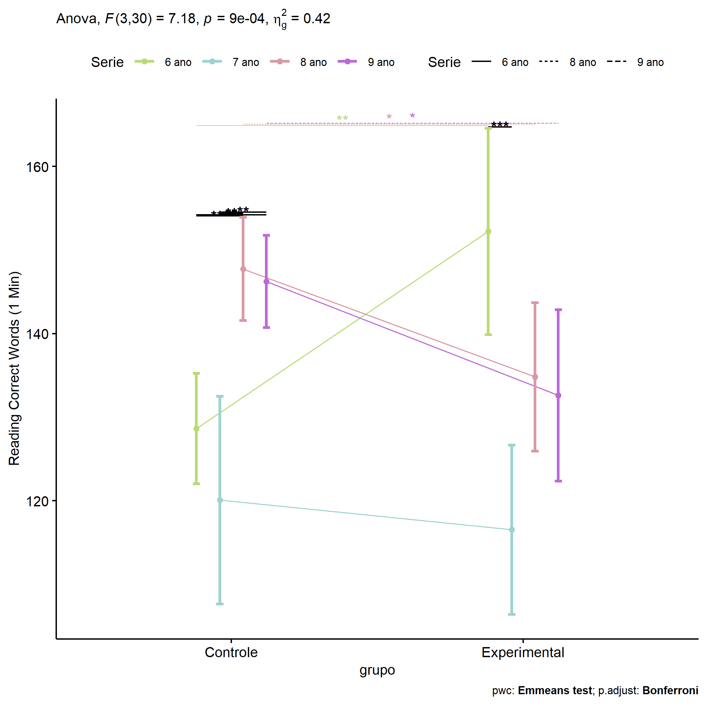<!-- -->

``` r
if (length(unique(pdat[["Serie"]])) >= 2) {
  ggPlotAoC2(pwcs, "Serie", "grupo", aov, ylab = "Reading Correct Words (1 Min)",
               subtitle = which(aov$Effect == "grupo:Serie"), addParam = "errorbar") +
      ggplot2::scale_color_manual(values = color[["grupo"]]) +
      if (ymin.ci < ymax.ci) ggplot2::ylim(ymin.ci, ymax.ci)
}
```

    ## Scale for colour is already present.
    ## Adding another scale for colour, which will replace the existing scale.

<!-- -->

``` r
if (length(unique(pdat[["Serie"]])) >= 2) {
  plots <- twoWayAncovaBoxPlots(
    wdat, "TFL.corretas.per.min.pos", c("grupo","Serie"), aov, pwcs, covar = "TFL.corretas.per.min.pre",
    theme = "classic", color = color[["grupo:Serie"]],
    subtitle = which(aov$Effect == "grupo:Serie"))
}
```

``` r
if (length(unique(pdat[["Serie"]])) >= 2) {
  plots[["grupo:Serie"]] + ggplot2::ylab("Reading Correct Words (1 Min)") +
  ggplot2::scale_x_discrete(labels=c('pre', 'pos')) +
  if (ymin < ymax) ggplot2::ylim(ymin, ymax)
}
```

<!-- -->

``` r
if (length(unique(pdat[["Serie"]])) >= 2) {
  plots <- twoWayAncovaBoxPlots(
    wdat.long, "TFL.corretas.per.min", c("grupo","Serie"), aov, pwc.long,
    pre.post = "time",
    theme = "classic", color = color$prepost)
}
```

``` r
if (length(unique(pdat[["Serie"]])) >= 2) 
  plots[["grupo:Serie"]] + ggplot2::ylab("Reading Correct Words (1 Min)") +
    if (ymin < ymax) ggplot2::ylim(ymin, ymax)
```

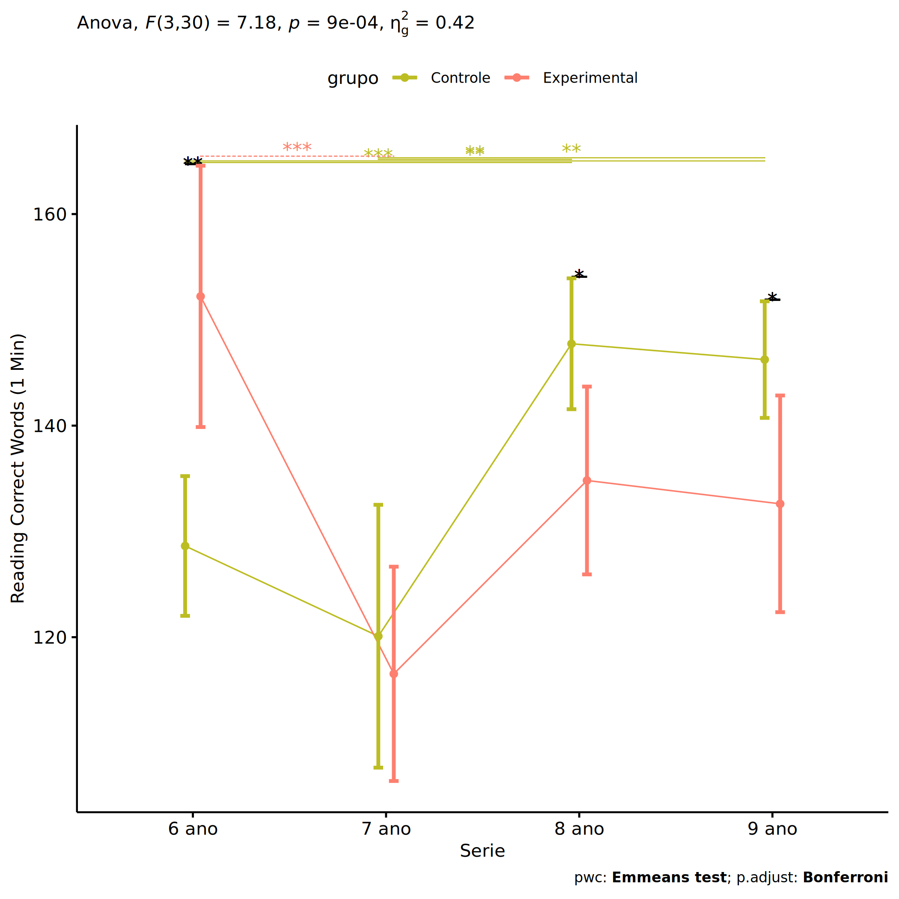<!-- -->

### Checking linearity assumption

``` r
if (length(unique(pdat[["Serie"]])) >= 2) {
  ggscatter(wdat, x = "TFL.corretas.per.min.pre", y = "TFL.corretas.per.min.pos", size = 0.5,
            facet.by = c("grupo","Serie"), add = "reg.line")+
    stat_regline_equation(
      aes(label =  paste(..eq.label.., ..rr.label.., sep = "~~~~"))
    ) +
    if (ymin < ymax) ggplot2::ylim(ymin, ymax)
}
```

<!-- -->

``` r
if (length(unique(pdat[["Serie"]])) >= 2) {
  ggscatter(wdat, x = "TFL.corretas.per.min.pre", y = "TFL.corretas.per.min.pos", size = 0.5,
            color = "grupo", facet.by = "Serie", add = "reg.line")+
    stat_regline_equation(
      aes(label =  paste(..eq.label.., ..rr.label.., sep = "~~~~"), color = grupo)
    ) +
    ggplot2::labs(subtitle = rstatix::get_test_label(aov, detailed = T, row = which(aov$Effect == "grupo:Serie"))) +
    ggplot2::scale_color_manual(values = color[["grupo"]]) +
    if (ymin < ymax) ggplot2::ylim(ymin, ymax)
}
```

<!-- -->

``` r
if (length(unique(pdat[["Serie"]])) >= 2) {
  ggscatter(wdat, x = "TFL.corretas.per.min.pre", y = "TFL.corretas.per.min.pos", size = 0.5,
            color = "Serie", facet.by = "grupo", add = "reg.line")+
    stat_regline_equation(
      aes(label =  paste(..eq.label.., ..rr.label.., sep = "~~~~"), color = Serie)
    ) +
    ggplot2::labs(subtitle = rstatix::get_test_label(aov, detailed = T, row = which(aov$Effect == "grupo:Serie"))) +
    ggplot2::scale_color_manual(values = color[["Serie"]]) +
    if (ymin < ymax) ggplot2::ylim(ymin, ymax)
}
```

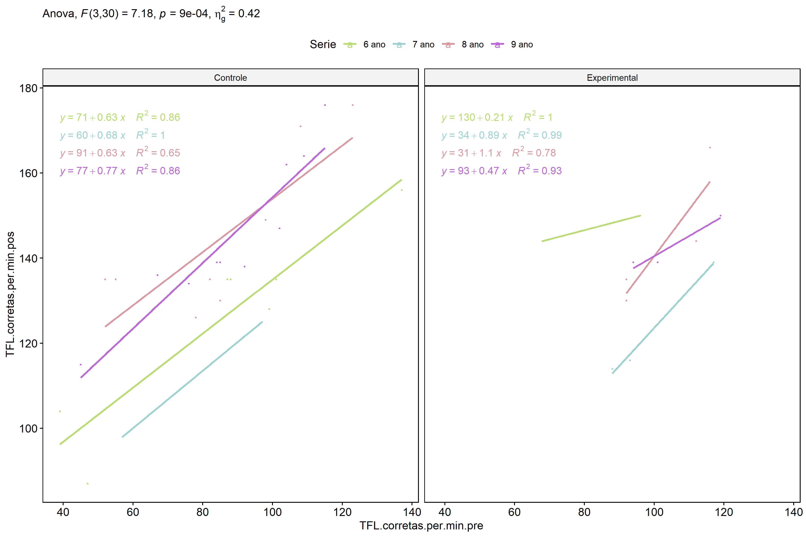<!-- -->

### Checking normality and homogeneity

``` r
if (length(unique(pdat[["Serie"]])) >= 2) 
  res <- augment(lm(TFL.corretas.per.min.pos ~ TFL.corretas.per.min.pre + grupo*Serie, data = wdat))
```

``` r
if (length(unique(pdat[["Serie"]])) >= 2)
  shapiro_test(res$.resid)
```

    ## # A tibble: 1 × 3
    ##   variable   statistic p.value
    ##   <chr>          <dbl>   <dbl>
    ## 1 res$.resid     0.967   0.309

``` r
if (length(unique(pdat[["Serie"]])) >= 2) 
  levene_test(res, .resid ~ grupo*Serie)
```

    ## # A tibble: 1 × 4
    ##     df1   df2 statistic      p
    ##   <int> <int>     <dbl>  <dbl>
    ## 1     7    31      2.34 0.0489

# ANCOVA and Pairwise for two factors **grupo:TFL.corretas.per.min.quintile**

## Without remove non-normal data

``` r
pdat = remove_group_data(dat[!is.na(dat[["grupo"]]) & !is.na(dat[["TFL.corretas.per.min.quintile"]]),],
                         "TFL.corretas.per.min.pos", c("grupo","TFL.corretas.per.min.quintile"))
pdat = pdat[pdat[["TFL.corretas.per.min.quintile"]] %in% do.call(
  intersect, lapply(unique(pdat[["grupo"]]), FUN = function(x) {
    unique(pdat[["TFL.corretas.per.min.quintile"]][which(pdat[["grupo"]] == x)])
  })),]
pdat[["grupo"]] = factor(pdat[["grupo"]], level[["grupo"]])
pdat[["TFL.corretas.per.min.quintile"]] = factor(
  pdat[["TFL.corretas.per.min.quintile"]],
  level[["TFL.corretas.per.min.quintile"]][level[["TFL.corretas.per.min.quintile"]] %in% unique(pdat[["TFL.corretas.per.min.quintile"]])])

pdat.long <- rbind(pdat[,c("id","grupo","TFL.corretas.per.min.quintile")], pdat[,c("id","grupo","TFL.corretas.per.min.quintile")])
pdat.long[["time"]] <- c(rep("pre", nrow(pdat)), rep("pos", nrow(pdat)))
pdat.long[["time"]] <- factor(pdat.long[["time"]], c("pre","pos"))
pdat.long[["TFL.corretas.per.min"]] <- c(pdat[["TFL.corretas.per.min.pre"]], pdat[["TFL.corretas.per.min.pos"]])

if (length(unique(pdat[["TFL.corretas.per.min.quintile"]])) >= 2) {
  aov = anova_test(pdat, TFL.corretas.per.min.pos ~ TFL.corretas.per.min.pre + grupo*TFL.corretas.per.min.quintile)
  laov[["grupo:TFL.corretas.per.min.quintile"]] <- get_anova_table(aov)
}
```

``` r
if (length(unique(pdat[["TFL.corretas.per.min.quintile"]])) >= 2) {
  pwcs <- list()
  pwcs[["TFL.corretas.per.min.quintile"]] <- emmeans_test(
    group_by(pdat, grupo), TFL.corretas.per.min.pos ~ TFL.corretas.per.min.quintile,
    covariate = TFL.corretas.per.min.pre, p.adjust.method = "bonferroni")
  pwcs[["grupo"]] <- emmeans_test(
    group_by(pdat, TFL.corretas.per.min.quintile), TFL.corretas.per.min.pos ~ grupo,
    covariate = TFL.corretas.per.min.pre, p.adjust.method = "bonferroni")
  
  pwc <- plyr::rbind.fill(pwcs[["grupo"]], pwcs[["TFL.corretas.per.min.quintile"]])
  pwc <- pwc[,c("grupo","TFL.corretas.per.min.quintile", colnames(pwc)[!colnames(pwc) %in% c("grupo","TFL.corretas.per.min.quintile")])]
}
```

``` r
if (length(unique(pdat[["TFL.corretas.per.min.quintile"]])) >= 2) {
  pwc.long <- emmeans_test(dplyr::group_by_at(pdat.long, c("grupo","TFL.corretas.per.min.quintile")),
                           TFL.corretas.per.min ~ time,
                           p.adjust.method = "bonferroni")
  lpwc[["grupo:TFL.corretas.per.min.quintile"]] <- plyr::rbind.fill(pwc, pwc.long)
}
```

``` r
if (length(unique(pdat[["TFL.corretas.per.min.quintile"]])) >= 2) {
  ds <- get.descriptives(pdat, "TFL.corretas.per.min.pos", c("grupo","TFL.corretas.per.min.quintile"), covar = "TFL.corretas.per.min.pre")
  ds <- merge(ds[ds$variable != "TFL.corretas.per.min.pre",],
              ds[ds$variable == "TFL.corretas.per.min.pre", !colnames(ds) %in% c("variable")],
              by = c("grupo","TFL.corretas.per.min.quintile"), all.x = T, suffixes = c("", ".TFL.corretas.per.min.pre"))
  ds <- merge(get_emmeans(pwcs[["grupo"]]), ds,
              by = c("grupo","TFL.corretas.per.min.quintile"), suffixes = c(".emms", ""))
  ds <- ds[,c("grupo","TFL.corretas.per.min.quintile","n","mean.TFL.corretas.per.min.pre","se.TFL.corretas.per.min.pre","mean","se",
              "emmean","se.emms","conf.low","conf.high")]
  
  colnames(ds) <- c("grupo","TFL.corretas.per.min.quintile", "N", paste0(c("M","SE")," (pre)"),
                    paste0(c("M","SE"), " (unadj)"),
                    paste0(c("M", "SE"), " (adj)"), "conf.low", "conf.high")
  
  lemms[["grupo:TFL.corretas.per.min.quintile"]] <- ds
}
```

## Computing ANCOVA and PairWise After removing non-normal data (OK)

``` r
if (length(unique(pdat[["TFL.corretas.per.min.quintile"]])) >= 2) {
  wdat = pdat 
  
  res = residuals(lm(TFL.corretas.per.min.pos ~ TFL.corretas.per.min.pre + grupo*TFL.corretas.per.min.quintile, data = wdat))
  non.normal = getNonNormal(res, wdat$id, plimit = 0.05)
  
  wdat = wdat[!wdat$id %in% non.normal,]
  
  wdat.long <- rbind(wdat[,c("id","grupo","TFL.corretas.per.min.quintile")], wdat[,c("id","grupo","TFL.corretas.per.min.quintile")])
  wdat.long[["time"]] <- c(rep("pre", nrow(wdat)), rep("pos", nrow(wdat)))
  wdat.long[["time"]] <- factor(wdat.long[["time"]], c("pre","pos"))
  wdat.long[["TFL.corretas.per.min"]] <- c(wdat[["TFL.corretas.per.min.pre"]], wdat[["TFL.corretas.per.min.pos"]])
  
  
  ldat[["grupo:TFL.corretas.per.min.quintile"]] = wdat
  
  (non.normal)
}
```

    ##  [1] "P3516" "P2378" "P1010" "P1768" "P2294" "P2250" "P510"  "P1698" "P808"  "P1743" "P121" 
    ## [12] "P2408" "P2404" "P2240" "P2380" "P2385" "P2211" "P2376" "P1699" "P2390" "P1762" "P2377"
    ## [23] "P2214" "P2220" "P2209" "P1713" "P2247" "P2244" "P945"  "P463"  "P623"  "P2222" "P2401"
    ## [34] "P2383" "P2249"

``` r
if (length(unique(pdat[["TFL.corretas.per.min.quintile"]])) >= 2) {
  aov = anova_test(wdat, TFL.corretas.per.min.pos ~ TFL.corretas.per.min.pre + grupo*TFL.corretas.per.min.quintile)
  laov[["grupo:TFL.corretas.per.min.quintile"]] <- merge(get_anova_table(aov), laov[["grupo:TFL.corretas.per.min.quintile"]],
                                         by="Effect", suffixes = c("","'"))
  df = get_anova_table(aov)
}
```

| Effect                              | DFn | DFd |      F |     p | p\<.05 |   ges |
|:------------------------------------|----:|----:|-------:|------:|:-------|------:|
| TFL.corretas.per.min.pre            |   1 |  97 | 18.514 | 0.000 | \*     | 0.160 |
| grupo                               |   1 |  97 |  3.717 | 0.057 |        | 0.037 |
| TFL.corretas.per.min.quintile       |   4 |  97 |  4.324 | 0.003 | \*     | 0.151 |
| grupo:TFL.corretas.per.min.quintile |   4 |  97 |  3.059 | 0.020 | \*     | 0.112 |

``` r
if (length(unique(pdat[["TFL.corretas.per.min.quintile"]])) >= 2) {
  pwcs <- list()
  pwcs[["TFL.corretas.per.min.quintile"]] <- emmeans_test(
    group_by(wdat, grupo), TFL.corretas.per.min.pos ~ TFL.corretas.per.min.quintile,
    covariate = TFL.corretas.per.min.pre, p.adjust.method = "bonferroni")
  pwcs[["grupo"]] <- emmeans_test(
    group_by(wdat, TFL.corretas.per.min.quintile), TFL.corretas.per.min.pos ~ grupo,
    covariate = TFL.corretas.per.min.pre, p.adjust.method = "bonferroni")
  
  pwc <- plyr::rbind.fill(pwcs[["grupo"]], pwcs[["TFL.corretas.per.min.quintile"]])
  pwc <- pwc[,c("grupo","TFL.corretas.per.min.quintile", colnames(pwc)[!colnames(pwc) %in% c("grupo","TFL.corretas.per.min.quintile")])]
}
```

| grupo        | TFL.corretas.per.min.quintile | term                                                    | .y.                      | group1       | group2       |  df | statistic |     p | p.adj | p.adj.signif |
|:-------------|:------------------------------|:--------------------------------------------------------|:-------------------------|:-------------|:-------------|----:|----------:|------:|------:|:-------------|
|              | 1st quintile                  | TFL.corretas.per.min.pre\*grupo                         | TFL.corretas.per.min.pos | Controle     | Experimental |  97 |     0.582 | 0.562 | 0.562 | ns           |
|              | 2nd quintile                  | TFL.corretas.per.min.pre\*grupo                         | TFL.corretas.per.min.pos | Controle     | Experimental |  97 |     0.159 | 0.874 | 0.874 | ns           |
|              | 3rd quintile                  | TFL.corretas.per.min.pre\*grupo                         | TFL.corretas.per.min.pos | Controle     | Experimental |  97 |    -2.721 | 0.008 | 0.008 | \*\*         |
|              | 4th quintile                  | TFL.corretas.per.min.pre\*grupo                         | TFL.corretas.per.min.pos | Controle     | Experimental |  97 |     0.888 | 0.377 | 0.377 | ns           |
|              | 5th quintile                  | TFL.corretas.per.min.pre\*grupo                         | TFL.corretas.per.min.pos | Controle     | Experimental |  97 |    -2.732 | 0.007 | 0.007 | \*\*         |
| Controle     |                               | TFL.corretas.per.min.pre\*TFL.corretas.per.min.quintile | TFL.corretas.per.min.pos | 1st quintile | 2nd quintile |  97 |     2.281 | 0.025 | 0.247 | ns           |
| Controle     |                               | TFL.corretas.per.min.pre\*TFL.corretas.per.min.quintile | TFL.corretas.per.min.pos | 1st quintile | 3rd quintile |  97 |     2.168 | 0.033 | 0.326 | ns           |
| Controle     |                               | TFL.corretas.per.min.pre\*TFL.corretas.per.min.quintile | TFL.corretas.per.min.pos | 1st quintile | 4th quintile |  97 |     0.469 | 0.640 | 1.000 | ns           |
| Controle     |                               | TFL.corretas.per.min.pre\*TFL.corretas.per.min.quintile | TFL.corretas.per.min.pos | 1st quintile | 5th quintile |  97 |     1.207 | 0.231 | 1.000 | ns           |
| Controle     |                               | TFL.corretas.per.min.pre\*TFL.corretas.per.min.quintile | TFL.corretas.per.min.pos | 2nd quintile | 3rd quintile |  97 |     0.517 | 0.606 | 1.000 | ns           |
| Controle     |                               | TFL.corretas.per.min.pre\*TFL.corretas.per.min.quintile | TFL.corretas.per.min.pos | 2nd quintile | 4th quintile |  97 |    -1.769 | 0.080 | 0.801 | ns           |
| Controle     |                               | TFL.corretas.per.min.pre\*TFL.corretas.per.min.quintile | TFL.corretas.per.min.pos | 2nd quintile | 5th quintile |  97 |     0.057 | 0.954 | 1.000 | ns           |
| Controle     |                               | TFL.corretas.per.min.pre\*TFL.corretas.per.min.quintile | TFL.corretas.per.min.pos | 3rd quintile | 4th quintile |  97 |    -2.781 | 0.007 | 0.065 | ns           |
| Controle     |                               | TFL.corretas.per.min.pre\*TFL.corretas.per.min.quintile | TFL.corretas.per.min.pos | 3rd quintile | 5th quintile |  97 |    -0.318 | 0.751 | 1.000 | ns           |
| Controle     |                               | TFL.corretas.per.min.pre\*TFL.corretas.per.min.quintile | TFL.corretas.per.min.pos | 4th quintile | 5th quintile |  97 |     2.000 | 0.048 | 0.483 | ns           |
| Experimental |                               | TFL.corretas.per.min.pre\*TFL.corretas.per.min.quintile | TFL.corretas.per.min.pos | 1st quintile | 2nd quintile |  97 |     1.709 | 0.091 | 0.907 | ns           |
| Experimental |                               | TFL.corretas.per.min.pre\*TFL.corretas.per.min.quintile | TFL.corretas.per.min.pos | 1st quintile | 3rd quintile |  97 |     0.152 | 0.879 | 1.000 | ns           |
| Experimental |                               | TFL.corretas.per.min.pre\*TFL.corretas.per.min.quintile | TFL.corretas.per.min.pos | 1st quintile | 4th quintile |  97 |     0.553 | 0.581 | 1.000 | ns           |
| Experimental |                               | TFL.corretas.per.min.pre\*TFL.corretas.per.min.quintile | TFL.corretas.per.min.pos | 1st quintile | 5th quintile |  97 |    -0.153 | 0.879 | 1.000 | ns           |
| Experimental |                               | TFL.corretas.per.min.pre\*TFL.corretas.per.min.quintile | TFL.corretas.per.min.pos | 2nd quintile | 3rd quintile |  97 |    -2.059 | 0.042 | 0.422 | ns           |
| Experimental |                               | TFL.corretas.per.min.pre\*TFL.corretas.per.min.quintile | TFL.corretas.per.min.pos | 2nd quintile | 4th quintile |  97 |    -0.998 | 0.321 | 1.000 | ns           |
| Experimental |                               | TFL.corretas.per.min.pre\*TFL.corretas.per.min.quintile | TFL.corretas.per.min.pos | 2nd quintile | 5th quintile |  97 |    -1.617 | 0.109 | 1.000 | ns           |
| Experimental |                               | TFL.corretas.per.min.pre\*TFL.corretas.per.min.quintile | TFL.corretas.per.min.pos | 3rd quintile | 4th quintile |  97 |     0.729 | 0.468 | 1.000 | ns           |
| Experimental |                               | TFL.corretas.per.min.pre\*TFL.corretas.per.min.quintile | TFL.corretas.per.min.pos | 3rd quintile | 5th quintile |  97 |    -0.443 | 0.659 | 1.000 | ns           |
| Experimental |                               | TFL.corretas.per.min.pre\*TFL.corretas.per.min.quintile | TFL.corretas.per.min.pos | 4th quintile | 5th quintile |  97 |    -1.086 | 0.280 | 1.000 | ns           |

``` r
if (length(unique(pdat[["TFL.corretas.per.min.quintile"]])) >= 2) {
  pwc.long <- emmeans_test(dplyr::group_by_at(wdat.long, c("grupo","TFL.corretas.per.min.quintile")),
                           TFL.corretas.per.min ~ time,
                           p.adjust.method = "bonferroni")
  lpwc[["grupo:TFL.corretas.per.min.quintile"]] <- merge(plyr::rbind.fill(pwc, pwc.long),
                                         lpwc[["grupo:TFL.corretas.per.min.quintile"]],
                                         by=c("grupo","TFL.corretas.per.min.quintile","term",".y.","group1","group2"),
                                         suffixes = c("","'"))
}
```

| grupo        | TFL.corretas.per.min.quintile | term | .y.                  | group1 | group2 |  df | statistic |     p | p.adj | p.adj.signif |
|:-------------|:------------------------------|:-----|:---------------------|:-------|:-------|----:|----------:|------:|------:|:-------------|
| Controle     | 1st quintile                  | time | TFL.corretas.per.min | pre    | pos    | 196 |    -7.042 | 0.000 | 0.000 | \*\*\*\*     |
| Controle     | 2nd quintile                  | time | TFL.corretas.per.min | pre    | pos    | 196 |    -2.113 | 0.036 | 0.036 | \*           |
| Controle     | 3rd quintile                  | time | TFL.corretas.per.min | pre    | pos    | 196 |    -0.743 | 0.458 | 0.458 | ns           |
| Controle     | 4th quintile                  | time | TFL.corretas.per.min | pre    | pos    | 196 |    -4.091 | 0.000 | 0.000 | \*\*\*\*     |
| Controle     | 5th quintile                  | time | TFL.corretas.per.min | pre    | pos    | 196 |     0.555 | 0.580 | 0.580 | ns           |
| Experimental | 1st quintile                  | time | TFL.corretas.per.min | pre    | pos    | 196 |    -3.888 | 0.000 | 0.000 | \*\*\*       |
| Experimental | 2nd quintile                  | time | TFL.corretas.per.min | pre    | pos    | 196 |    -1.805 | 0.073 | 0.073 | ns           |
| Experimental | 3rd quintile                  | time | TFL.corretas.per.min | pre    | pos    | 196 |    -4.084 | 0.000 | 0.000 | \*\*\*\*     |
| Experimental | 4th quintile                  | time | TFL.corretas.per.min | pre    | pos    | 196 |    -1.815 | 0.071 | 0.071 | ns           |
| Experimental | 5th quintile                  | time | TFL.corretas.per.min | pre    | pos    | 196 |    -2.660 | 0.008 | 0.008 | \*\*         |

``` r
if (length(unique(pdat[["TFL.corretas.per.min.quintile"]])) >= 2) {
  ds <- get.descriptives(wdat, "TFL.corretas.per.min.pos", c("grupo","TFL.corretas.per.min.quintile"), covar = "TFL.corretas.per.min.pre")
  ds <- merge(ds[ds$variable != "TFL.corretas.per.min.pre",],
              ds[ds$variable == "TFL.corretas.per.min.pre", !colnames(ds) %in% c("variable")],
              by = c("grupo","TFL.corretas.per.min.quintile"), all.x = T, suffixes = c("", ".TFL.corretas.per.min.pre"))
  ds <- merge(get_emmeans(pwcs[["grupo"]]), ds,
              by = c("grupo","TFL.corretas.per.min.quintile"), suffixes = c(".emms", ""))
  ds <- ds[,c("grupo","TFL.corretas.per.min.quintile","n","mean.TFL.corretas.per.min.pre","se.TFL.corretas.per.min.pre",
              "mean","se","emmean","se.emms","conf.low","conf.high")]
  
  colnames(ds) <- c("grupo","TFL.corretas.per.min.quintile", "N", paste0(c("M","SE")," (pre)"),
                    paste0(c("M","SE"), " (unadj)"),
                    paste0(c("M", "SE"), " (adj)"), "conf.low", "conf.high")
  
  lemms[["grupo:TFL.corretas.per.min.quintile"]] <- merge(ds, lemms[["grupo:TFL.corretas.per.min.quintile"]],
                                          by=c("grupo","TFL.corretas.per.min.quintile"), suffixes = c("","'"))
}
```

| grupo        | TFL.corretas.per.min.quintile |   N | M (pre) | SE (pre) | M (unadj) | SE (unadj) | M (adj) | SE (adj) | conf.low | conf.high |
|:-------------|:------------------------------|----:|--------:|---------:|----------:|-----------:|--------:|---------:|---------:|----------:|
| Controle     | 1st quintile                  |  11 |  50.000 |    3.382 |    82.727 |      5.360 | 114.071 |    8.208 |   97.781 |   130.362 |
| Controle     | 2nd quintile                  |  11 |  77.000 |    1.763 |    86.818 |      2.866 |  97.765 |    4.558 |   88.718 |   106.812 |
| Controle     | 3rd quintile                  |  11 |  90.636 |    0.704 |    94.091 |      3.288 |  94.736 |    3.785 |   87.223 |   102.249 |
| Controle     | 4th quintile                  |  17 | 101.588 |    1.064 |   116.882 |      3.662 | 109.254 |    3.521 |  102.265 |   116.243 |
| Controle     | 5th quintile                  |  14 | 124.214 |    3.285 |   121.929 |      4.734 |  97.208 |    6.652 |   84.005 |   110.410 |
| Experimental | 1st quintile                  |   5 |  57.800 |    3.367 |    84.600 |      6.392 | 110.052 |    8.152 |   93.871 |   126.232 |
| Experimental | 2nd quintile                  |  10 |  77.600 |    1.360 |    86.400 |      2.876 |  96.894 |    4.657 |   87.651 |   106.136 |
| Experimental | 3rd quintile                  |  13 |  90.538 |    0.773 |   108.000 |      3.111 | 108.719 |    3.483 |  101.806 |   115.633 |
| Experimental | 4th quintile                  |   7 | 100.429 |    2.114 |   111.000 |      5.345 | 104.248 |    4.994 |   94.335 |   114.160 |
| Experimental | 5th quintile                  |   9 | 119.556 |    2.646 |   133.222 |      3.589 | 112.021 |    6.463 |   99.194 |   124.847 |

### Plots for ancova

``` r
if (length(unique(pdat[["TFL.corretas.per.min.quintile"]])) >= 2) {
  ggPlotAoC2(pwcs, "grupo", "TFL.corretas.per.min.quintile", aov, ylab = "Reading Correct Words (1 Min)",
             subtitle = which(aov$Effect == "grupo:TFL.corretas.per.min.quintile"), addParam = "errorbar") +
    ggplot2::scale_color_manual(values = color[["TFL.corretas.per.min.quintile"]]) +
    if (ymin.ci < ymax.ci) ggplot2::ylim(ymin.ci, ymax.ci)
}
```

    ## Scale for colour is already present.
    ## Adding another scale for colour, which will replace the existing scale.

<!-- -->

``` r
if (length(unique(pdat[["TFL.corretas.per.min.quintile"]])) >= 2) {
  ggPlotAoC2(pwcs, "TFL.corretas.per.min.quintile", "grupo", aov, ylab = "Reading Correct Words (1 Min)",
               subtitle = which(aov$Effect == "grupo:TFL.corretas.per.min.quintile"), addParam = "errorbar") +
      ggplot2::scale_color_manual(values = color[["grupo"]]) +
      if (ymin.ci < ymax.ci) ggplot2::ylim(ymin.ci, ymax.ci)
}
```

    ## Scale for colour is already present.
    ## Adding another scale for colour, which will replace the existing scale.

<!-- -->

``` r
if (length(unique(pdat[["TFL.corretas.per.min.quintile"]])) >= 2) {
  plots <- twoWayAncovaBoxPlots(
    wdat, "TFL.corretas.per.min.pos", c("grupo","TFL.corretas.per.min.quintile"), aov, pwcs, covar = "TFL.corretas.per.min.pre",
    theme = "classic", color = color[["grupo:TFL.corretas.per.min.quintile"]],
    subtitle = which(aov$Effect == "grupo:TFL.corretas.per.min.quintile"))
}
```

``` r
if (length(unique(pdat[["TFL.corretas.per.min.quintile"]])) >= 2) {
  plots[["grupo:TFL.corretas.per.min.quintile"]] + ggplot2::ylab("Reading Correct Words (1 Min)") +
  ggplot2::scale_x_discrete(labels=c('pre', 'pos')) +
  if (ymin < ymax) ggplot2::ylim(ymin, ymax)
}
```

    ## Warning: No shared levels found between `names(values)` of the manual scale and the data's colour
    ## values.

<!-- -->

``` r
if (length(unique(pdat[["TFL.corretas.per.min.quintile"]])) >= 2) {
  plots <- twoWayAncovaBoxPlots(
    wdat.long, "TFL.corretas.per.min", c("grupo","TFL.corretas.per.min.quintile"), aov, pwc.long,
    pre.post = "time",
    theme = "classic", color = color$prepost)
}
```

``` r
if (length(unique(pdat[["TFL.corretas.per.min.quintile"]])) >= 2) 
  plots[["grupo:TFL.corretas.per.min.quintile"]] + ggplot2::ylab("Reading Correct Words (1 Min)") +
    if (ymin < ymax) ggplot2::ylim(ymin, ymax)
```

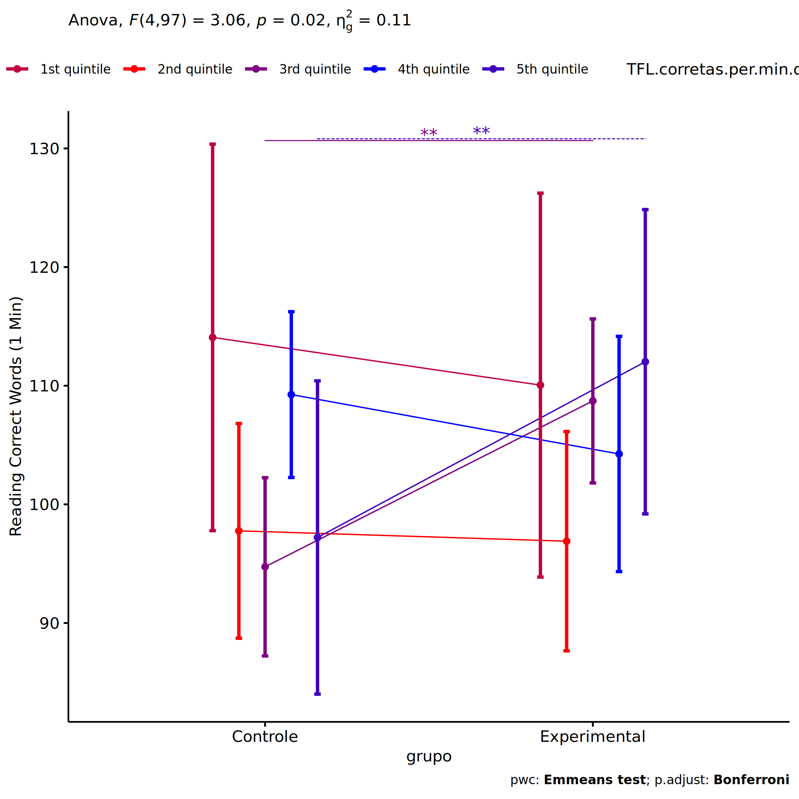<!-- -->

### Checking linearity assumption

``` r
if (length(unique(pdat[["TFL.corretas.per.min.quintile"]])) >= 2) {
  ggscatter(wdat, x = "TFL.corretas.per.min.pre", y = "TFL.corretas.per.min.pos", size = 0.5,
            facet.by = c("grupo","TFL.corretas.per.min.quintile"), add = "reg.line")+
    stat_regline_equation(
      aes(label =  paste(..eq.label.., ..rr.label.., sep = "~~~~"))
    ) +
    if (ymin < ymax) ggplot2::ylim(ymin, ymax)
}
```

<!-- -->

``` r
if (length(unique(pdat[["TFL.corretas.per.min.quintile"]])) >= 2) {
  ggscatter(wdat, x = "TFL.corretas.per.min.pre", y = "TFL.corretas.per.min.pos", size = 0.5,
            color = "grupo", facet.by = "TFL.corretas.per.min.quintile", add = "reg.line")+
    stat_regline_equation(
      aes(label =  paste(..eq.label.., ..rr.label.., sep = "~~~~"), color = grupo)
    ) +
    ggplot2::labs(subtitle = rstatix::get_test_label(aov, detailed = T, row = which(aov$Effect == "grupo:TFL.corretas.per.min.quintile"))) +
    ggplot2::scale_color_manual(values = color[["grupo"]]) +
    if (ymin < ymax) ggplot2::ylim(ymin, ymax)
}
```

<!-- -->

``` r
if (length(unique(pdat[["TFL.corretas.per.min.quintile"]])) >= 2) {
  ggscatter(wdat, x = "TFL.corretas.per.min.pre", y = "TFL.corretas.per.min.pos", size = 0.5,
            color = "TFL.corretas.per.min.quintile", facet.by = "grupo", add = "reg.line")+
    stat_regline_equation(
      aes(label =  paste(..eq.label.., ..rr.label.., sep = "~~~~"), color = TFL.corretas.per.min.quintile)
    ) +
    ggplot2::labs(subtitle = rstatix::get_test_label(aov, detailed = T, row = which(aov$Effect == "grupo:TFL.corretas.per.min.quintile"))) +
    ggplot2::scale_color_manual(values = color[["TFL.corretas.per.min.quintile"]]) +
    if (ymin < ymax) ggplot2::ylim(ymin, ymax)
}
```

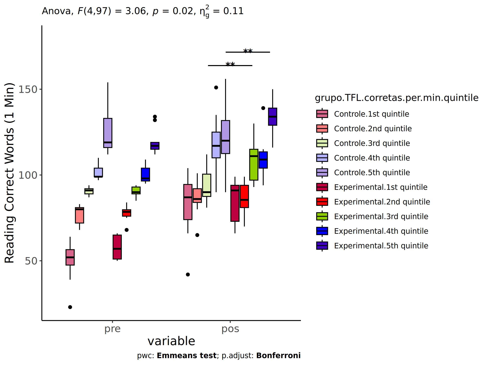<!-- -->

### Checking normality and homogeneity

``` r
if (length(unique(pdat[["TFL.corretas.per.min.quintile"]])) >= 2) 
  res <- augment(lm(TFL.corretas.per.min.pos ~ TFL.corretas.per.min.pre + grupo*TFL.corretas.per.min.quintile, data = wdat))
```

``` r
if (length(unique(pdat[["TFL.corretas.per.min.quintile"]])) >= 2)
  shapiro_test(res$.resid)
```

    ## # A tibble: 1 × 3
    ##   variable   statistic p.value
    ##   <chr>          <dbl>   <dbl>
    ## 1 res$.resid     0.987   0.376

``` r
if (length(unique(pdat[["TFL.corretas.per.min.quintile"]])) >= 2) 
  levene_test(res, .resid ~ grupo*TFL.corretas.per.min.quintile)
```

    ## # A tibble: 1 × 4
    ##     df1   df2 statistic     p
    ##   <int> <int>     <dbl> <dbl>
    ## 1     9    98     0.804 0.613

# Summary of Results

## Descriptive Statistics

``` r
df <- get.descriptives(ldat[["grupo"]], c(dv.pre, dv.pos), c("grupo"), 
                       include.global = T, symmetry.test = T, normality.test = F)
df <- plyr::rbind.fill(
  df, do.call(plyr::rbind.fill, lapply(lfatores2, FUN = function(f) {
    if (nrow(dat) > 0 && sum(!is.na(unique(dat[[f]]))) > 1 && paste0("grupo:",f) %in% names(ldat))
      get.descriptives(ldat[[paste0("grupo:",f)]], c(dv.pre,dv.pos), c("grupo", f),
                       symmetry.test = T, normality.test = F)
    }))
)
df <- df[,c(fatores1[fatores1 %in% colnames(df)],"variable",
             colnames(df)[!colnames(df) %in% c(fatores1,"variable")])]
```

| grupo        | Sexo | Zona   | Cor.Raca | Serie | TFL.corretas.per.min.quintile | variable                 |   n |    mean | median | min | max |     sd |     se |      ci |   iqr | symmetry | skewness | kurtosis |
|:-------------|:-----|:-------|:---------|:------|:------------------------------|:-------------------------|----:|--------:|-------:|----:|----:|-------:|-------:|--------:|------:|:---------|---------:|---------:|
| Controle     |      |        |          |       |                               | TFL.corretas.per.min.pre |  33 |  88.061 |   88.0 |  39 | 137 | 24.458 |  4.258 |   8.672 | 28.00 | YES      |   -0.256 |   -0.790 |
| Experimental |      |        |          |       |                               | TFL.corretas.per.min.pre |  19 |  94.263 |   94.0 |  57 | 119 | 19.835 |  4.550 |   9.560 | 23.50 | NO       |   -0.516 |   -1.039 |
|              |      |        |          |       |                               | TFL.corretas.per.min.pre |  52 |  90.327 |   92.0 |  39 | 137 | 22.875 |  3.172 |   6.369 | 30.75 | YES      |   -0.395 |   -0.680 |
| Controle     |      |        |          |       |                               | TFL.corretas.per.min.pos |  33 | 139.909 |  136.0 |  98 | 184 | 20.711 |  3.605 |   7.344 | 20.00 | YES      |    0.075 |   -0.175 |
| Experimental |      |        |          |       |                               | TFL.corretas.per.min.pos |  19 | 138.632 |  139.0 |  94 | 190 | 25.020 |  5.740 |  12.059 | 27.50 | YES      |    0.205 |   -0.415 |
|              |      |        |          |       |                               | TFL.corretas.per.min.pos |  52 | 139.442 |  137.5 |  94 | 190 | 22.147 |  3.071 |   6.166 | 20.50 | YES      |    0.132 |   -0.098 |
| Controle     | F    |        |          |       |                               | TFL.corretas.per.min.pre |  15 |  86.600 |   92.0 |  39 | 154 | 30.085 |  7.768 |  16.661 | 37.50 | YES      |    0.259 |   -0.453 |
| Controle     | M    |        |          |       |                               | TFL.corretas.per.min.pre |  17 |  97.706 |   99.0 |  48 | 134 | 24.695 |  5.989 |  12.697 | 25.00 | NO       |   -0.651 |   -0.749 |
| Experimental | F    |        |          |       |                               | TFL.corretas.per.min.pre |   8 |  99.875 |   91.5 |  88 | 119 | 13.799 |  4.879 |  11.536 | 24.25 | YES      |    0.431 |   -1.950 |
| Experimental | M    |        |          |       |                               | TFL.corretas.per.min.pre |  19 |  89.158 |   85.0 |  51 | 134 | 22.054 |  5.059 |  10.630 | 23.50 | YES      |    0.195 |   -0.841 |
| Controle     | F    |        |          |       |                               | TFL.corretas.per.min.pos |  15 | 112.000 |  115.0 |  87 | 147 | 16.018 |  4.136 |   8.870 | 20.50 | YES      |    0.287 |   -0.647 |
| Controle     | M    |        |          |       |                               | TFL.corretas.per.min.pos |  17 | 111.706 |  116.0 |  74 | 136 | 17.779 |  4.312 |   9.141 | 20.00 | NO       |   -0.585 |   -0.827 |
| Experimental | F    |        |          |       |                               | TFL.corretas.per.min.pos |   8 | 125.000 |  115.5 | 114 | 150 | 14.580 |  5.155 |  12.189 | 22.75 | NO       |    0.593 |   -1.601 |
| Experimental | M    |        |          |       |                               | TFL.corretas.per.min.pos |  19 | 104.053 |  104.0 |  73 | 134 | 14.782 |  3.391 |   7.125 | 17.50 | YES      |    0.157 |   -0.392 |
| Controle     |      | Rural  |          |       |                               | TFL.corretas.per.min.pre |  54 |  91.111 |   92.5 |  23 | 154 | 26.515 |  3.608 |   7.237 | 32.25 | YES      |   -0.279 |   -0.123 |
| Controle     |      | Urbana |          |       |                               | TFL.corretas.per.min.pre |   7 |  92.286 |   98.0 |  47 | 123 | 24.067 |  9.097 |  22.259 | 19.00 | NO       |   -0.614 |   -0.791 |
| Experimental |      | Rural  |          |       |                               | TFL.corretas.per.min.pre |  32 |  89.969 |   91.0 |  51 | 134 | 18.485 |  3.268 |   6.665 | 19.00 | YES      |    0.118 |   -0.233 |
| Experimental |      | Urbana |          |       |                               | TFL.corretas.per.min.pre |   6 | 102.000 |   95.0 |  90 | 132 | 16.444 |  6.713 |  17.257 | 15.50 | NO       |    0.874 |   -1.037 |
| Controle     |      | Rural  |          |       |                               | TFL.corretas.per.min.pos |  54 | 101.259 |  101.0 |  42 | 147 | 21.712 |  2.955 |   5.926 | 30.00 | YES      |   -0.231 |   -0.391 |
| Controle     |      | Urbana |          |       |                               | TFL.corretas.per.min.pos |   7 | 142.429 |  149.0 |  87 | 176 | 28.553 | 10.792 |  26.407 | 22.50 | NO       |   -0.751 |   -0.649 |
| Experimental |      | Rural  |          |       |                               | TFL.corretas.per.min.pos |  32 | 103.594 |  100.5 |  70 | 139 | 17.186 |  3.038 |   6.196 | 20.25 | YES      |    0.239 |   -0.434 |
| Experimental |      | Urbana |          |       |                               | TFL.corretas.per.min.pos |   6 | 132.000 |  122.0 |  94 | 190 | 33.923 | 13.849 |  35.600 | 30.50 | NO       |    0.578 |   -1.276 |
| Controle     |      |        | Parda    |       |                               | TFL.corretas.per.min.pre |  38 |  90.974 |   92.5 |  23 | 134 | 23.723 |  3.848 |   7.798 | 32.00 | NO       |   -0.535 |    0.131 |
| Controle     |      |        | Branca   |       |                               | TFL.corretas.per.min.pre |  12 | 103.667 |  102.5 |  83 | 137 | 15.956 |  4.606 |  10.138 | 24.25 | NO       |    0.541 |   -0.868 |
| Experimental |      |        | Parda    |       |                               | TFL.corretas.per.min.pre |  16 |  87.062 |   83.0 |  51 | 134 | 20.693 |  5.173 |  11.026 | 17.50 | NO       |    0.529 |   -0.235 |
| Experimental |      |        | Branca   |       |                               | TFL.corretas.per.min.pre |   5 | 103.400 |   96.0 |  92 | 117 | 12.502 |  5.591 |  15.523 | 22.00 | YES      |    0.261 |   -2.236 |
| Controle     |      |        | Parda    |       |                               | TFL.corretas.per.min.pos |  38 |  96.000 |   91.0 |  42 | 136 | 21.400 |  3.471 |   7.034 | 27.00 | YES      |   -0.090 |   -0.406 |
| Controle     |      |        | Branca   |       |                               | TFL.corretas.per.min.pos |  12 | 114.000 |  114.5 |  83 | 150 | 19.088 |  5.510 |  12.128 | 18.25 | YES      |    0.086 |   -0.908 |
| Experimental |      |        | Parda    |       |                               | TFL.corretas.per.min.pos |  16 |  99.500 |   96.5 |  70 | 144 | 19.190 |  4.798 |  10.226 | 12.00 | NO       |    0.735 |    0.103 |
| Experimental |      |        | Branca   |       |                               | TFL.corretas.per.min.pos |   5 | 125.400 |  121.0 | 108 | 150 | 18.582 |  8.310 |  23.073 | 30.00 | YES      |    0.238 |   -2.053 |
| Controle     |      |        |          | 6 ano |                               | TFL.corretas.per.min.pre |   7 |  85.429 |   88.0 |  39 | 137 | 33.486 | 12.656 |  30.969 | 33.00 | YES      |   -0.051 |   -1.410 |
| Controle     |      |        |          | 7 ano |                               | TFL.corretas.per.min.pre |   2 |  77.000 |   77.0 |  57 |  97 | 28.284 | 20.000 | 254.124 | 20.00 | few data |    0.000 |    0.000 |
| Controle     |      |        |          | 8 ano |                               | TFL.corretas.per.min.pre |   8 |  85.125 |   83.5 |  52 | 123 | 24.462 |  8.649 |  20.451 | 28.25 | YES      |    0.037 |   -1.468 |
| Controle     |      |        |          | 9 ano |                               | TFL.corretas.per.min.pre |  10 |  87.900 |   88.5 |  45 | 115 | 21.336 |  6.747 |  15.263 | 25.50 | NO       |   -0.551 |   -0.856 |
| Experimental |      |        |          | 6 ano |                               | TFL.corretas.per.min.pre |   2 |  82.000 |   82.0 |  68 |  96 | 19.799 | 14.000 | 177.887 | 14.00 | few data |    0.000 |    0.000 |
| Experimental |      |        |          | 7 ano |                               | TFL.corretas.per.min.pre |   3 |  99.333 |   93.0 |  88 | 117 | 15.503 |  8.950 |  38.511 | 14.50 | few data |    0.000 |    0.000 |
| Experimental |      |        |          | 8 ano |                               | TFL.corretas.per.min.pre |   4 | 103.000 |  102.0 |  92 | 116 | 12.806 |  6.403 |  20.378 | 21.00 | few data |    0.000 |    0.000 |
| Experimental |      |        |          | 9 ano |                               | TFL.corretas.per.min.pre |   3 | 104.667 |  101.0 |  94 | 119 | 12.897 |  7.446 |  32.038 | 12.50 | few data |    0.000 |    0.000 |
| Controle     |      |        |          | 6 ano |                               | TFL.corretas.per.min.pos |   7 | 125.714 |  135.0 |  87 | 156 | 22.918 |  8.662 |  21.196 | 19.00 | YES      |   -0.452 |   -1.274 |
| Controle     |      |        |          | 7 ano |                               | TFL.corretas.per.min.pos |   2 | 111.500 |  111.5 |  98 | 125 | 19.092 | 13.500 | 171.534 | 13.50 | few data |    0.000 |    0.000 |
| Controle     |      |        |          | 8 ano |                               | TFL.corretas.per.min.pos |   8 | 144.625 |  135.0 | 126 | 176 | 19.041 |  6.732 |  15.919 | 20.75 | NO       |    0.671 |   -1.436 |
| Controle     |      |        |          | 9 ano |                               | TFL.corretas.per.min.pos |  10 | 145.000 |  139.0 | 115 | 176 | 17.758 |  5.615 |  12.703 | 21.75 | YES      |    0.210 |   -1.015 |
| Experimental |      |        |          | 6 ano |                               | TFL.corretas.per.min.pos |   2 | 147.000 |  147.0 | 144 | 150 |  4.243 |  3.000 |  38.119 |  3.00 | few data |    0.000 |    0.000 |
| Experimental |      |        |          | 7 ano |                               | TFL.corretas.per.min.pos |   3 | 123.000 |  116.0 | 114 | 139 | 13.892 |  8.021 |  34.511 | 12.50 | few data |    0.000 |    0.000 |
| Experimental |      |        |          | 8 ano |                               | TFL.corretas.per.min.pos |   4 | 143.750 |  139.5 | 130 | 166 | 15.924 |  7.962 |  25.339 | 15.75 | YES      |    0.480 |   -1.885 |
| Experimental |      |        |          | 9 ano |                               | TFL.corretas.per.min.pos |   3 | 142.667 |  139.0 | 139 | 150 |  6.351 |  3.667 |  15.776 |  5.50 | few data |    0.000 |    0.000 |
| Controle     |      |        |          |       | 1st quintile                  | TFL.corretas.per.min.pre |  11 |  50.000 |   52.0 |  23 |  64 | 11.216 |  3.382 |   7.535 |  9.00 | NO       |   -1.077 |    0.437 |
| Controle     |      |        |          |       | 2nd quintile                  | TFL.corretas.per.min.pre |  11 |  77.000 |   80.0 |  68 |  83 |  5.848 |  1.763 |   3.929 |  9.00 | NO       |   -0.505 |   -1.585 |
| Controle     |      |        |          |       | 3rd quintile                  | TFL.corretas.per.min.pre |  11 |  90.636 |   91.0 |  87 |  94 |  2.335 |  0.704 |   1.569 |  3.00 | YES      |   -0.328 |   -1.369 |
| Controle     |      |        |          |       | 4th quintile                  | TFL.corretas.per.min.pre |  17 | 101.588 |   99.0 |  97 | 110 |  4.388 |  1.064 |   2.256 |  5.00 | NO       |    0.716 |   -0.937 |
| Controle     |      |        |          |       | 5th quintile                  | TFL.corretas.per.min.pre |  14 | 124.214 |  119.0 | 112 | 154 | 12.292 |  3.285 |   7.097 | 17.00 | NO       |    0.994 |   -0.153 |
| Experimental |      |        |          |       | 1st quintile                  | TFL.corretas.per.min.pre |   5 |  57.800 |   57.0 |  50 |  66 |  7.530 |  3.367 |   9.350 | 14.00 | YES      |    0.063 |   -2.188 |
| Experimental |      |        |          |       | 2nd quintile                  | TFL.corretas.per.min.pre |  10 |  77.600 |   78.5 |  68 |  84 |  4.300 |  1.360 |   3.076 |  3.75 | NO       |   -0.742 |    0.044 |
| Experimental |      |        |          |       | 3rd quintile                  | TFL.corretas.per.min.pre |  13 |  90.538 |   90.0 |  85 |  94 |  2.787 |  0.773 |   1.684 |  4.00 | YES      |   -0.411 |   -1.070 |
| Experimental |      |        |          |       | 4th quintile                  | TFL.corretas.per.min.pre |   7 | 100.429 |   98.0 |  95 | 109 |  5.593 |  2.114 |   5.173 |  7.50 | YES      |    0.461 |   -1.676 |
| Experimental |      |        |          |       | 5th quintile                  | TFL.corretas.per.min.pre |   9 | 119.556 |  117.0 | 112 | 134 |  7.939 |  2.646 |   6.102 |  4.00 | NO       |    0.907 |   -0.953 |
| Controle     |      |        |          |       | 1st quintile                  | TFL.corretas.per.min.pos |  11 |  82.727 |   87.0 |  42 | 104 | 17.777 |  5.360 |  11.943 | 20.50 | NO       |   -0.902 |   -0.121 |
| Controle     |      |        |          |       | 2nd quintile                  | TFL.corretas.per.min.pos |  11 |  86.818 |   86.0 |  65 | 101 |  9.506 |  2.866 |   6.386 |  8.00 | NO       |   -0.695 |    0.129 |
| Controle     |      |        |          |       | 3rd quintile                  | TFL.corretas.per.min.pos |  11 |  94.091 |   90.0 |  81 | 112 | 10.904 |  3.288 |   7.325 | 13.00 | NO       |    0.602 |   -1.343 |
| Controle     |      |        |          |       | 4th quintile                  | TFL.corretas.per.min.pos |  17 | 116.882 |  117.0 |  90 | 151 | 15.099 |  3.662 |   7.763 | 15.00 | YES      |    0.088 |   -0.086 |
| Controle     |      |        |          |       | 5th quintile                  | TFL.corretas.per.min.pos |  14 | 121.929 |  120.0 |  90 | 156 | 17.713 |  4.734 |  10.227 | 19.25 | YES      |    0.160 |   -0.744 |
| Experimental |      |        |          |       | 1st quintile                  | TFL.corretas.per.min.pos |   5 |  84.600 |   91.0 |  66 |  99 | 14.293 |  6.392 |  17.748 | 21.00 | YES      |   -0.268 |   -2.088 |
| Experimental |      |        |          |       | 2nd quintile                  | TFL.corretas.per.min.pos |  10 |  86.400 |   85.5 |  70 |  99 |  9.095 |  2.876 |   6.506 | 13.00 | YES      |   -0.220 |   -1.326 |
| Experimental |      |        |          |       | 3rd quintile                  | TFL.corretas.per.min.pos |  13 | 108.000 |  111.0 |  93 | 130 | 11.218 |  3.111 |   6.779 | 18.00 | YES      |    0.077 |   -1.055 |
| Experimental |      |        |          |       | 4th quintile                  | TFL.corretas.per.min.pos |   7 | 111.000 |  109.0 |  94 | 139 | 14.142 |  5.345 |  13.079 |  9.50 | NO       |    0.820 |   -0.480 |
| Experimental |      |        |          |       | 5th quintile                  | TFL.corretas.per.min.pos |   9 | 133.222 |  134.0 | 116 | 150 | 10.768 |  3.589 |   8.277 | 10.00 | YES      |   -0.077 |   -1.306 |

## ANCOVA Table Comparison

``` r
df <- do.call(plyr::rbind.fill, laov)
df <- df[!duplicated(df$Effect),]
```

|     | Effect                              | DFn | DFd |      F |     p | p\<.05 |   ges | DFn’ | DFd’ |     F’ |    p’ | p\<.05’ |  ges’ |
|:----|:------------------------------------|----:|----:|-------:|------:|:-------|------:|-----:|-----:|-------:|------:|:--------|------:|
| 1   | grupo                               |   1 |  49 |  1.106 | 0.298 |        | 0.022 |    1 |  140 |  0.020 | 0.888 |         | 0.000 |
| 2   | TFL.corretas.per.min.pre            |   1 |  49 | 36.320 | 0.000 | \*     | 0.426 |    1 |  140 | 50.194 | 0.000 | \*      | 0.264 |
| 4   | grupo:Sexo                          |   1 |  54 |  3.690 | 0.060 |        | 0.064 |    1 |  138 |  0.075 | 0.784 |         | 0.001 |
| 5   | Sexo                                |   1 |  54 | 26.602 | 0.000 | \*     | 0.330 |    1 |  138 |  6.483 | 0.012 | \*      | 0.045 |
| 8   | grupo:Zona                          |   1 |  94 |  3.994 | 0.049 | \*     | 0.041 |    1 |  101 |  2.270 | 0.135 |         | 0.022 |
| 10  | Zona                                |   1 |  94 | 42.906 | 0.000 | \*     | 0.313 |    1 |  101 | 17.714 | 0.000 | \*      | 0.149 |
| 11  | Cor.Raca                            |   1 |  66 |  6.843 | 0.011 | \*     | 0.094 |    1 |   69 |  2.443 | 0.123 |         | 0.034 |
| 13  | grupo:Cor.Raca                      |   1 |  66 |  0.365 | 0.548 |        | 0.005 |    1 |   69 |  0.721 | 0.399 |         | 0.010 |
| 16  | grupo:Serie                         |   3 |  30 |  7.184 | 0.001 | \*     | 0.418 |    3 |  134 |  2.275 | 0.083 |         | 0.048 |
| 17  | Serie                               |   3 |  30 | 11.753 | 0.000 | \*     | 0.540 |    3 |  134 |  2.212 | 0.090 |         | 0.047 |
| 20  | grupo:TFL.corretas.per.min.quintile |   4 |  97 |  3.059 | 0.020 | \*     | 0.112 |    4 |  132 |  0.603 | 0.661 |         | 0.018 |
| 22  | TFL.corretas.per.min.quintile       |   4 |  97 |  4.324 | 0.003 | \*     | 0.151 |    4 |  132 |  1.851 | 0.123 |         | 0.053 |

## PairWise Table Comparison

``` r
df <- do.call(plyr::rbind.fill, lpwc)
df <- df[,c(names(lfatores)[names(lfatores) %in% colnames(df)],
            names(df)[!names(df) %in% c(names(lfatores),"term",".y.")])]
```

| grupo        | Sexo | Zona   | Cor.Raca | Serie | TFL.corretas.per.min.quintile | group1       | group2       |  df | statistic |     p | p.adj | p.adj.signif | df’ | statistic’ |    p’ | p.adj’ | p.adj.signif’ |
|:-------------|:-----|:-------|:---------|:------|:------------------------------|:-------------|:-------------|----:|----------:|------:|------:|:-------------|----:|-----------:|------:|-------:|:--------------|
| Controle     |      |        |          |       |                               | pre          | pos          | 100 |    -9.306 | 0.000 | 0.000 | \*\*\*\*     | 282 |     -5.948 | 0.000 |  0.000 | \*\*\*\*      |
| Experimental |      |        |          |       |                               | pre          | pos          | 100 |    -6.043 | 0.000 | 0.000 | \*\*\*\*     | 282 |     -4.302 | 0.000 |  0.000 | \*\*\*\*      |
|              |      |        |          |       |                               | Controle     | Experimental |  49 |     1.051 | 0.298 | 0.298 | ns           | 140 |      0.141 | 0.888 |  0.888 | ns            |
| Controle     | F    |        |          |       |                               | pre          | pos          | 110 |    -3.380 | 0.001 | 0.001 | \*\*         | 278 |     -4.647 | 0.000 |  0.000 | \*\*\*\*      |
| Controle     | M    |        |          |       |                               | pre          | pos          | 110 |    -1.983 | 0.050 | 0.050 | \*           | 278 |     -4.007 | 0.000 |  0.000 | \*\*\*\*      |
| Controle     |      |        |          |       |                               | F            | M            |  54 |     2.633 | 0.011 | 0.011 | \*           | 138 |      1.862 | 0.065 |  0.065 | ns            |
| Experimental | F    |        |          |       |                               | pre          | pos          | 110 |    -2.442 | 0.016 | 0.016 | \*           | 278 |     -3.443 | 0.001 |  0.001 | \*\*\*        |
| Experimental | M    |        |          |       |                               | pre          | pos          | 110 |    -2.231 | 0.028 | 0.028 | \*           | 278 |     -2.815 | 0.005 |  0.005 | \*\*          |
| Experimental |      |        |          |       |                               | F            | M            |  54 |     4.769 | 0.000 | 0.000 | \*\*\*\*     | 138 |      1.773 | 0.078 |  0.078 | ns            |
|              | F    |        |          |       |                               | Controle     | Experimental |  54 |    -1.620 | 0.111 | 0.111 | ns           | 138 |     -0.104 | 0.918 |  0.918 | ns            |
|              | M    |        |          |       |                               | Controle     | Experimental |  54 |     1.078 | 0.286 | 0.286 | ns           | 138 |      0.305 | 0.761 |  0.761 | ns            |
| Controle     |      |        |          |       |                               | Rural        | Urbana       |  94 |    -6.213 | 0.000 | 0.000 | \*\*\*\*     | 101 |     -4.139 | 0.000 |  0.000 | \*\*\*\*      |
| Controle     |      | Rural  |          |       |                               | pre          | pos          | 190 |    -2.328 | 0.021 | 0.021 | \*           | 204 |     -3.196 | 0.002 |  0.002 | \*\*          |
| Controle     |      | Urbana |          |       |                               | pre          | pos          | 190 |    -4.142 | 0.000 | 0.000 | \*\*\*\*     | 204 |     -3.804 | 0.000 |  0.000 | \*\*\*        |
| Experimental |      |        |          |       |                               | Rural        | Urbana       |  94 |    -2.890 | 0.005 | 0.005 | \*\*         | 101 |     -1.698 | 0.093 |  0.093 | ns            |
| Experimental |      | Rural  |          |       |                               | pre          | pos          | 190 |    -2.406 | 0.017 | 0.017 | \*           | 204 |     -3.266 | 0.001 |  0.001 | \*\*          |
| Experimental |      | Urbana |          |       |                               | pre          | pos          | 190 |    -2.294 | 0.023 | 0.023 | \*           | 204 |     -2.107 | 0.036 |  0.036 | \*            |
|              |      | Rural  |          |       |                               | Controle     | Experimental |  94 |    -0.841 | 0.403 | 0.403 | ns           | 101 |     -0.869 | 0.387 |  0.387 | ns            |
|              |      | Urbana |          |       |                               | Controle     | Experimental |  94 |     1.817 | 0.072 | 0.072 | ns           | 101 |      1.281 | 0.203 |  0.203 | ns            |
| Controle     |      |        | Branca   |       |                               | pre          | pos          | 134 |    -1.211 | 0.228 | 0.228 | ns           | 140 |     -1.116 | 0.266 |  0.266 | ns            |
| Controle     |      |        |          |       |                               | Parda        | Branca       |  66 |    -1.915 | 0.060 | 0.060 | ns           |  69 |     -0.892 | 0.376 |  0.376 | ns            |
| Controle     |      |        | Parda    |       |                               | pre          | pos          | 134 |    -1.048 | 0.296 | 0.296 | ns           | 140 |     -1.835 | 0.069 |  0.069 | ns            |
| Experimental |      |        | Branca   |       |                               | pre          | pos          | 134 |    -1.664 | 0.098 | 0.098 | ns           | 140 |     -1.533 | 0.127 |  0.127 | ns            |
| Experimental |      |        |          |       |                               | Parda        | Branca       |  66 |    -1.954 | 0.055 | 0.055 | ns           |  69 |     -1.570 | 0.121 |  0.121 | ns            |
| Experimental |      |        | Parda    |       |                               | pre          | pos          | 134 |    -1.683 | 0.095 | 0.095 | ns           | 140 |     -1.551 | 0.123 |  0.123 | ns            |
|              |      |        | Branca   |       |                               | Controle     | Experimental |  66 |    -1.451 | 0.151 | 0.151 | ns           |  69 |     -1.172 | 0.245 |  0.245 | ns            |
|              |      |        | Parda    |       |                               | Controle     | Experimental |  66 |    -1.351 | 0.181 | 0.181 | ns           |  69 |     -0.361 | 0.719 |  0.719 | ns            |
| Controle     |      |        |          | 6 ano |                               | pre          | pos          |  62 |    -3.569 | 0.001 | 0.001 | \*\*\*       | 270 |     -2.157 | 0.032 |  0.032 | \*            |
| Controle     |      |        |          | 7 ano |                               | pre          | pos          |  62 |    -1.634 | 0.107 | 0.107 | ns           | 270 |     -2.190 | 0.029 |  0.029 | \*            |
| Controle     |      |        |          | 8 ano |                               | pre          | pos          |  62 |    -5.635 | 0.000 | 0.000 | \*\*\*\*     | 270 |     -3.708 | 0.000 |  0.000 | \*\*\*        |
| Controle     |      |        |          | 9 ano |                               | pre          | pos          |  62 |    -6.046 | 0.000 | 0.000 | \*\*\*\*     | 270 |     -4.172 | 0.000 |  0.000 | \*\*\*\*      |
| Controle     |      |        |          |       |                               | 6 ano        | 7 ano        |  30 |     1.244 | 0.223 | 1.000 | ns           | 134 |     -0.936 | 0.351 |  1.000 | ns            |
| Controle     |      |        |          |       |                               | 6 ano        | 8 ano        |  30 |    -4.332 | 0.000 | 0.001 | \*\*\*       | 134 |     -2.806 | 0.006 |  0.035 | \*            |
| Controle     |      |        |          |       |                               | 6 ano        | 9 ano        |  30 |    -4.191 | 0.000 | 0.001 | \*\*         | 134 |     -2.769 | 0.006 |  0.038 | \*            |
| Controle     |      |        |          |       |                               | 7 ano        | 8 ano        |  30 |    -4.090 | 0.000 | 0.002 | \*\*         | 134 |     -1.760 | 0.081 |  0.484 | ns            |
| Controle     |      |        |          |       |                               | 7 ano        | 9 ano        |  30 |    -3.938 | 0.000 | 0.003 | \*\*         | 134 |     -1.550 | 0.123 |  0.741 | ns            |
| Controle     |      |        |          |       |                               | 8 ano        | 9 ano        |  30 |     0.369 | 0.714 | 1.000 | ns           | 134 |      0.419 | 0.676 |  1.000 | ns            |
| Experimental |      |        |          | 6 ano |                               | pre          | pos          |  62 |    -3.078 | 0.003 | 0.003 | \*\*         | 270 |     -3.288 | 0.001 |  0.001 | \*\*          |
| Experimental |      |        |          | 7 ano |                               | pre          | pos          |  62 |    -1.373 | 0.175 | 0.175 | ns           | 270 |     -1.293 | 0.197 |  0.197 | ns            |
| Experimental |      |        |          | 8 ano |                               | pre          | pos          |  62 |    -2.729 | 0.008 | 0.008 | \*\*         | 270 |     -2.072 | 0.039 |  0.039 | \*            |
| Experimental |      |        |          | 9 ano |                               | pre          | pos          |  62 |    -2.204 | 0.031 | 0.031 | \*           | 270 |     -1.715 | 0.088 |  0.088 | ns            |
| Experimental |      |        |          |       |                               | 6 ano        | 7 ano        |  30 |     4.539 | 0.000 | 0.001 | \*\*\*       | 134 |      1.294 | 0.198 |  1.000 | ns            |
| Experimental |      |        |          |       |                               | 6 ano        | 8 ano        |  30 |     2.319 | 0.027 | 0.164 | ns           | 134 |      0.647 | 0.519 |  1.000 | ns            |
| Experimental |      |        |          |       |                               | 6 ano        | 9 ano        |  30 |     2.477 | 0.019 | 0.115 | ns           | 134 |      0.339 | 0.735 |  1.000 | ns            |
| Experimental |      |        |          |       |                               | 7 ano        | 8 ano        |  30 |    -2.805 | 0.009 | 0.052 | ns           | 134 |     -0.629 | 0.530 |  1.000 | ns            |
| Experimental |      |        |          |       |                               | 7 ano        | 9 ano        |  30 |    -2.306 | 0.028 | 0.169 | ns           | 134 |     -0.816 | 0.416 |  1.000 | ns            |
| Experimental |      |        |          |       |                               | 8 ano        | 9 ano        |  30 |     0.339 | 0.737 | 1.000 | ns           | 134 |     -0.236 | 0.814 |  1.000 | ns            |
|              |      |        |          | 6 ano |                               | Controle     | Experimental |  30 |    -3.450 | 0.002 | 0.002 | \*\*         | 134 |     -1.961 | 0.052 |  0.052 | ns            |
|              |      |        |          | 7 ano |                               | Controle     | Experimental |  30 |     0.449 | 0.657 | 0.657 | ns           | 134 |      0.509 | 0.612 |  0.612 | ns            |
|              |      |        |          | 8 ano |                               | Controle     | Experimental |  30 |     2.418 | 0.022 | 0.022 | \*           | 134 |      1.436 | 0.153 |  0.153 | ns            |
|              |      |        |          | 9 ano |                               | Controle     | Experimental |  30 |     2.386 | 0.024 | 0.024 | \*           | 134 |      0.819 | 0.414 |  0.414 | ns            |
| Controle     |      |        |          |       | 1st quintile                  | pre          | pos          | 196 |    -7.042 | 0.000 | 0.000 | \*\*\*\*     | 266 |     -7.186 | 0.000 |  0.000 | \*\*\*\*      |
| Controle     |      |        |          |       | 2nd quintile                  | pre          | pos          | 196 |    -2.113 | 0.036 | 0.036 | \*           | 266 |     -3.254 | 0.001 |  0.001 | \*\*          |
| Controle     |      |        |          |       | 3rd quintile                  | pre          | pos          | 196 |    -0.743 | 0.458 | 0.458 | ns           | 266 |     -2.971 | 0.003 |  0.003 | \*\*          |
| Controle     |      |        |          |       | 4th quintile                  | pre          | pos          | 196 |    -4.091 | 0.000 | 0.000 | \*\*\*\*     | 266 |     -4.439 | 0.000 |  0.000 | \*\*\*\*      |
| Controle     |      |        |          |       | 5th quintile                  | pre          | pos          | 196 |     0.555 | 0.580 | 0.580 | ns           | 266 |     -1.098 | 0.273 |  0.273 | ns            |
| Controle     |      |        |          |       |                               | 1st quintile | 2nd quintile |  97 |     2.281 | 0.025 | 0.247 | ns           | 132 |      1.437 | 0.153 |  1.000 | ns            |
| Controle     |      |        |          |       |                               | 1st quintile | 3rd quintile |  97 |     2.168 | 0.033 | 0.326 | ns           | 132 |      1.243 | 0.216 |  1.000 | ns            |
| Controle     |      |        |          |       |                               | 1st quintile | 4th quintile |  97 |     0.469 | 0.640 | 1.000 | ns           | 132 |      0.460 | 0.646 |  1.000 | ns            |
| Controle     |      |        |          |       |                               | 1st quintile | 5th quintile |  97 |     1.207 | 0.231 | 1.000 | ns           | 132 |      0.881 | 0.380 |  1.000 | ns            |
| Controle     |      |        |          |       |                               | 2nd quintile | 3rd quintile |  97 |     0.517 | 0.606 | 1.000 | ns           | 132 |      0.077 | 0.939 |  1.000 | ns            |
| Controle     |      |        |          |       |                               | 2nd quintile | 4th quintile |  97 |    -1.769 | 0.080 | 0.801 | ns           | 132 |     -0.800 | 0.425 |  1.000 | ns            |
| Controle     |      |        |          |       |                               | 2nd quintile | 5th quintile |  97 |     0.057 | 0.954 | 1.000 | ns           | 132 |      0.226 | 0.822 |  1.000 | ns            |
| Controle     |      |        |          |       |                               | 3rd quintile | 4th quintile |  97 |    -2.781 | 0.007 | 0.065 | ns           | 132 |     -1.102 | 0.273 |  1.000 | ns            |
| Controle     |      |        |          |       |                               | 3rd quintile | 5th quintile |  97 |    -0.318 | 0.751 | 1.000 | ns           | 132 |      0.226 | 0.822 |  1.000 | ns            |
| Controle     |      |        |          |       |                               | 4th quintile | 5th quintile |  97 |     2.000 | 0.048 | 0.483 | ns           | 132 |      1.252 | 0.213 |  1.000 | ns            |
| Experimental |      |        |          |       | 1st quintile                  | pre          | pos          | 196 |    -3.888 | 0.000 | 0.000 | \*\*\*       | 266 |     -3.579 | 0.000 |  0.000 | \*\*\*        |
| Experimental |      |        |          |       | 2nd quintile                  | pre          | pos          | 196 |    -1.805 | 0.073 | 0.073 | ns           | 266 |     -1.935 | 0.054 |  0.054 | ns            |
| Experimental |      |        |          |       | 3rd quintile                  | pre          | pos          | 196 |    -4.084 | 0.000 | 0.000 | \*\*\*\*     | 266 |     -3.183 | 0.002 |  0.002 | \*\*          |
| Experimental |      |        |          |       | 4th quintile                  | pre          | pos          | 196 |    -1.815 | 0.071 | 0.071 | ns           | 266 |     -2.714 | 0.007 |  0.007 | \*\*          |
| Experimental |      |        |          |       | 5th quintile                  | pre          | pos          | 196 |    -2.660 | 0.008 | 0.008 | \*\*         | 266 |     -2.576 | 0.011 |  0.011 | \*            |
| Experimental |      |        |          |       |                               | 1st quintile | 2nd quintile |  97 |     1.709 | 0.091 | 0.907 | ns           | 132 |      1.319 | 0.190 |  1.000 | ns            |
| Experimental |      |        |          |       |                               | 1st quintile | 3rd quintile |  97 |     0.152 | 0.879 | 1.000 | ns           | 132 |      0.534 | 0.594 |  1.000 | ns            |
| Experimental |      |        |          |       |                               | 1st quintile | 4th quintile |  97 |     0.553 | 0.581 | 1.000 | ns           | 132 |      0.195 | 0.846 |  1.000 | ns            |
| Experimental |      |        |          |       |                               | 1st quintile | 5th quintile |  97 |    -0.153 | 0.879 | 1.000 | ns           | 132 |      0.152 | 0.879 |  1.000 | ns            |
| Experimental |      |        |          |       |                               | 2nd quintile | 3rd quintile |  97 |    -2.059 | 0.042 | 0.422 | ns           | 132 |     -0.915 | 0.362 |  1.000 | ns            |
| Experimental |      |        |          |       |                               | 2nd quintile | 4th quintile |  97 |    -0.998 | 0.321 | 1.000 | ns           | 132 |     -1.085 | 0.280 |  1.000 | ns            |
| Experimental |      |        |          |       |                               | 2nd quintile | 5th quintile |  97 |    -1.617 | 0.109 | 1.000 | ns           | 132 |     -0.892 | 0.374 |  1.000 | ns            |
| Experimental |      |        |          |       |                               | 3rd quintile | 4th quintile |  97 |     0.729 | 0.468 | 1.000 | ns           | 132 |     -0.436 | 0.664 |  1.000 | ns            |
| Experimental |      |        |          |       |                               | 3rd quintile | 5th quintile |  97 |    -0.443 | 0.659 | 1.000 | ns           | 132 |     -0.386 | 0.700 |  1.000 | ns            |
| Experimental |      |        |          |       |                               | 4th quintile | 5th quintile |  97 |    -1.086 | 0.280 | 1.000 | ns           | 132 |     -0.017 | 0.986 |  1.000 | ns            |
|              |      |        |          |       | 1st quintile                  | Controle     | Experimental |  97 |     0.582 | 0.562 | 0.562 | ns           | 132 |      0.490 | 0.625 |  0.625 | ns            |
|              |      |        |          |       | 2nd quintile                  | Controle     | Experimental |  97 |     0.159 | 0.874 | 0.874 | ns           | 132 |      0.711 | 0.478 |  0.478 | ns            |
|              |      |        |          |       | 3rd quintile                  | Controle     | Experimental |  97 |    -2.721 | 0.008 | 0.008 | \*\*         | 132 |     -0.413 | 0.680 |  0.680 | ns            |
|              |      |        |          |       | 4th quintile                  | Controle     | Experimental |  97 |     0.888 | 0.377 | 0.377 | ns           | 132 |      0.143 | 0.887 |  0.887 | ns            |
|              |      |        |          |       | 5th quintile                  | Controle     | Experimental |  97 |    -2.732 | 0.007 | 0.007 | \*\*         | 132 |     -1.238 | 0.218 |  0.218 | ns            |

## EMMS Table Comparison

``` r
df <- do.call(plyr::rbind.fill, lemms)
df[["N-N'"]] <- df[["N"]] - df[["N'"]]
df <- df[,c(names(lfatores)[names(lfatores) %in% colnames(df)],
            names(df)[!names(df) %in% names(lfatores)])]
```

| grupo        | Sexo | Zona   | Cor.Raca | Serie | TFL.corretas.per.min.quintile |   N | M (pre) | SE (pre) | M (unadj) | SE (unadj) | M (adj) | SE (adj) | conf.low | conf.high |  N’ | M (pre)’ | SE (pre)’ | M (unadj)’ | SE (unadj)’ | M (adj)’ | SE (adj)’ | conf.low’ | conf.high’ | N-N’ |
|:-------------|:-----|:-------|:---------|:------|:------------------------------|----:|--------:|---------:|----------:|-----------:|--------:|---------:|---------:|----------:|----:|---------:|----------:|-----------:|------------:|---------:|----------:|----------:|-----------:|-----:|
| Controle     |      |        |          |       |                               |  33 |  88.061 |    4.258 |   139.909 |      3.605 | 141.353 |    2.989 |  135.346 |   147.360 |  90 |   90.222 |     2.600 |    113.022 |       3.024 |  113.479 |     2.563 |   108.412 |    118.546 |  -57 |
| Experimental |      |        |          |       |                               |  19 |  94.263 |    4.550 |   138.632 |      5.740 | 136.124 |    3.949 |  128.189 |   144.059 |  53 |   92.170 |     2.691 |    113.660 |       3.769 |  112.885 |     3.341 |   106.280 |    119.490 |  -34 |
| Controle     | F    |        |          |       |                               |  15 |  86.600 |    7.768 |   112.000 |      4.136 | 115.427 |    1.877 |  111.664 |   119.190 |  36 |   92.333 |     4.096 |    120.056 |       4.439 |  119.217 |     3.989 |   111.330 |    127.104 |  -21 |
| Controle     | M    |        |          |       |                               |  17 |  97.706 |    5.989 |   111.706 |      4.312 | 108.597 |    1.762 |  105.064 |   112.130 |  54 |   88.815 |     3.381 |    108.333 |       3.984 |  109.618 |     3.261 |   103.170 |    116.066 |  -37 |
| Experimental | F    |        |          |       |                               |   8 |  99.875 |    4.879 |   125.000 |      5.155 | 120.615 |    2.568 |  115.467 |   125.763 |  22 |   97.682 |     3.682 |    123.955 |       5.482 |  119.889 |     5.135 |   109.736 |    130.043 |  -14 |
| Experimental | M    |        |          |       |                               |  19 |  89.158 |    5.059 |   104.053 |      3.391 | 105.975 |    1.660 |  102.646 |   109.303 |  31 |   88.258 |     3.673 |    106.355 |       4.784 |  107.975 |     4.303 |    99.467 |    116.484 |  -12 |
| Controle     |      | Rural  |          |       |                               |  54 |  91.111 |    3.608 |   101.259 |      2.955 | 101.490 |    2.205 |   97.112 |   105.868 |  58 |   90.276 |     3.514 |    104.914 |       3.334 |  105.138 |     2.887 |    99.411 |    110.865 |   -4 |
| Controle     |      | Urbana |          |       |                               |   7 |  92.286 |    9.097 |   142.429 |     10.792 | 141.934 |    6.124 |  129.774 |   154.094 |   7 |   92.286 |     9.097 |    142.429 |      10.792 |  141.560 |     8.311 |   125.073 |    158.046 |    0 |
| Experimental |      | Rural  |          |       |                               |  32 |  89.969 |    3.268 |   103.594 |      3.038 | 104.530 |    2.866 |   98.840 |   110.221 |  35 |   89.114 |     3.232 |    108.371 |       3.954 |  109.228 |     3.719 |   101.851 |    116.605 |   -3 |
| Experimental |      | Urbana |          |       |                               |   6 | 102.000 |    6.713 |   132.000 |     13.849 | 125.503 |    6.656 |  112.288 |   138.719 |   6 |  102.000 |     6.713 |    132.000 |      13.849 |  125.846 |     9.034 |   107.924 |    143.768 |    0 |
| Controle     |      |        | Branca   |       |                               |  12 | 103.667 |    4.606 |   114.000 |      5.510 | 107.117 |    4.418 |   98.297 |   115.938 |  12 |  103.667 |     4.606 |    114.000 |       5.510 |  106.922 |     5.467 |    96.014 |    117.829 |    0 |
| Controle     |      |        | Parda    |       |                               |  38 |  90.974 |    3.848 |    96.000 |      3.471 |  97.395 |    2.437 |   92.529 |   102.261 |  41 |   90.756 |     3.813 |     99.951 |       4.090 |  101.365 |     2.907 |    95.566 |    107.164 |   -3 |
| Experimental |      |        | Branca   |       |                               |   5 | 103.400 |    5.591 |   125.400 |      8.310 | 118.691 |    6.757 |  105.200 |   132.182 |   5 |  103.400 |     5.591 |    125.400 |       8.310 |  118.497 |     8.368 |   101.803 |    135.191 |    0 |
| Experimental |      |        | Parda    |       |                               |  16 |  87.062 |    5.173 |    99.500 |      4.798 | 103.446 |    3.781 |   95.897 |   110.994 |  16 |   87.062 |     5.173 |     99.500 |       4.798 |  103.343 |     4.678 |    94.012 |    112.675 |    0 |
| Controle     |      |        |          | 6 ano |                               |   7 |  85.429 |   12.656 |   125.714 |      8.662 | 128.623 |    3.234 |  122.018 |   135.228 |  31 |   87.645 |     4.661 |    101.645 |       4.675 |  103.718 |     4.264 |    95.285 |    112.151 |  -24 |
| Controle     |      |        |          | 7 ano |                               |   2 |  77.000 |   20.000 |   111.500 |     13.500 | 120.090 |    6.084 |  107.666 |   132.515 |  19 |   93.895 |     5.668 |    112.053 |       6.218 |  110.198 |     5.440 |    99.439 |    120.957 |  -17 |
| Controle     |      |        |          | 8 ano |                               |   8 |  85.125 |    8.649 |   144.625 |      6.732 | 147.738 |    3.029 |  141.553 |   153.924 |  15 |   88.467 |     6.524 |    123.067 |       8.332 |  124.624 |     6.119 |   112.521 |    136.726 |   -7 |
| Controle     |      |        |          | 9 ano |                               |  10 |  87.900 |    6.747 |   145.000 |      5.615 | 146.243 |    2.698 |  140.732 |   151.754 |  25 |   91.680 |     4.733 |    121.840 |       5.418 |  121.378 |     4.737 |   112.008 |    130.747 |  -15 |
| Experimental |      |        |          | 6 ano |                               |   2 |  82.000 |   14.000 |   147.000 |      3.000 | 152.220 |    6.049 |  139.867 |   164.573 |  19 |   88.368 |     4.042 |    115.632 |       7.869 |  117.250 |     5.438 |   106.494 |    128.006 |  -17 |
| Experimental |      |        |          | 7 ano |                               |   3 |  99.333 |    8.950 |   123.000 |      8.021 | 116.536 |    4.961 |  106.405 |   126.666 |  11 |   92.545 |     5.443 |    106.636 |       5.568 |  105.630 |     7.143 |    91.503 |    119.757 |   -8 |
| Experimental |      |        |          | 8 ano |                               |   4 | 103.000 |    6.403 |   143.750 |      7.962 | 134.814 |    4.347 |  125.936 |   143.692 |  13 |   91.000 |     6.690 |    111.769 |       8.089 |  111.734 |     6.569 |    98.742 |    124.726 |   -9 |
| Experimental |      |        |          | 9 ano |                               |   3 | 104.667 |    7.446 |   142.667 |      3.667 | 132.607 |    5.015 |  122.365 |   142.849 |  10 |  100.500 |     5.903 |    120.100 |       6.036 |  114.095 |     7.537 |    99.188 |    129.001 |   -7 |
| Controle     |      |        |          |       | 1st quintile                  |  11 |  50.000 |    3.382 |    82.727 |      5.360 | 114.071 |    8.208 |   97.781 |   130.362 |  17 |   52.118 |     2.522 |     96.647 |       7.129 |  125.803 |    13.202 |    99.688 |    151.918 |   -6 |
| Controle     |      |        |          |       | 2nd quintile                  |  11 |  77.000 |    1.763 |    86.818 |      2.866 |  97.765 |    4.558 |   88.718 |   106.812 |  15 |   77.800 |     1.395 |     99.267 |       5.930 |  109.137 |     7.411 |    94.476 |    123.798 |   -4 |
| Controle     |      |        |          |       | 3rd quintile                  |  11 |  90.636 |    0.704 |    94.091 |      3.288 |  94.736 |    3.785 |   87.223 |   102.249 |  18 |   89.333 |     0.672 |    107.222 |       5.850 |  108.432 |     5.714 |    97.130 |    119.734 |   -7 |
| Controle     |      |        |          |       | 4th quintile                  |  17 | 101.588 |    1.064 |   116.882 |      3.662 | 109.254 |    3.521 |  102.265 |   116.243 |  22 |  102.182 |     0.948 |    126.364 |       4.833 |  117.925 |     6.184 |   105.693 |    130.157 |   -5 |
| Controle     |      |        |          |       | 5th quintile                  |  14 | 124.214 |    3.285 |   121.929 |      4.734 |  97.208 |    6.652 |   84.005 |   110.410 |  18 |  122.833 |     2.644 |    129.444 |       6.760 |  105.498 |    11.262 |    83.220 |    127.776 |   -4 |
| Experimental |      |        |          |       | 1st quintile                  |   5 |  57.800 |    3.367 |    84.600 |      6.392 | 110.052 |    8.152 |   93.871 |   126.232 |   6 |   58.167 |     2.774 |     95.500 |      12.085 |  120.114 |    14.035 |    92.351 |    147.876 |   -1 |
| Experimental |      |        |          |       | 2nd quintile                  |  10 |  77.600 |    1.360 |    86.400 |      2.876 |  96.894 |    4.657 |   87.651 |   106.136 |  11 |   76.727 |     1.508 |     91.636 |       5.847 |  102.312 |     8.473 |    85.551 |    119.073 |   -1 |
| Experimental |      |        |          |       | 3rd quintile                  |  13 |  90.538 |    0.773 |   108.000 |      3.111 | 108.719 |    3.483 |  101.806 |   115.633 |  15 |   90.867 |     0.710 |    111.867 |       3.764 |  111.925 |     6.236 |    99.589 |    124.260 |   -2 |
| Experimental |      |        |          |       | 4th quintile                  |   7 | 100.429 |    2.114 |   111.000 |      5.345 | 104.248 |    4.994 |   94.335 |   114.160 |   9 |  101.000 |     2.028 |    124.111 |      10.148 |  116.560 |     8.614 |    99.520 |    133.599 |   -2 |
| Experimental |      |        |          |       | 5th quintile                  |   9 | 119.556 |    2.646 |   133.222 |      3.589 | 112.021 |    6.463 |   99.194 |   124.847 |  12 |  118.333 |     2.076 |    137.333 |       6.483 |  116.766 |    10.875 |    95.254 |    138.278 |   -3 |
