ANCOVA in Reading Words (1 Min) (Reading Words (1 Min))
================
Geiser C. Challco <geiser@alumni.usp.br>

- [Setting Initial Variables](#setting-initial-variables)
- [Descriptive Statistics of Initial
  Data](#descriptive-statistics-of-initial-data)
- [ANCOVA and Pairwise for one factor:
  **grupo**](#ancova-and-pairwise-for-one-factor-grupo)
  - [Without remove non-normal data](#without-remove-non-normal-data)
  - [Computing ANCOVA and PairWise After removing non-normal data
    (OK)](#computing-ancova-and-pairwise-after-removing-non-normal-data-ok)
    - [Plots for ancova](#plots-for-ancova)
    - [Checking linearity assumption](#checking-linearity-assumption)
    - [Checking normality and
      homogeneity](#checking-normality-and-homogeneity)
- [ANCOVA and Pairwise for two factors
  **grupo:Sexo**](#ancova-and-pairwise-for-two-factors-gruposexo)
  - [Without remove non-normal data](#without-remove-non-normal-data-1)
  - [Computing ANCOVA and PairWise After removing non-normal data
    (OK)](#computing-ancova-and-pairwise-after-removing-non-normal-data-ok-1)
    - [Plots for ancova](#plots-for-ancova-1)
    - [Checking linearity assumption](#checking-linearity-assumption-1)
    - [Checking normality and
      homogeneity](#checking-normality-and-homogeneity-1)
- [ANCOVA and Pairwise for two factors
  **grupo:Zona**](#ancova-and-pairwise-for-two-factors-grupozona)
  - [Without remove non-normal data](#without-remove-non-normal-data-2)
  - [Computing ANCOVA and PairWise After removing non-normal data
    (OK)](#computing-ancova-and-pairwise-after-removing-non-normal-data-ok-2)
    - [Plots for ancova](#plots-for-ancova-2)
    - [Checking linearity assumption](#checking-linearity-assumption-2)
    - [Checking normality and
      homogeneity](#checking-normality-and-homogeneity-2)
- [ANCOVA and Pairwise for two factors
  **grupo:Cor.Raca**](#ancova-and-pairwise-for-two-factors-grupocorraca)
  - [Without remove non-normal data](#without-remove-non-normal-data-3)
  - [Computing ANCOVA and PairWise After removing non-normal data
    (OK)](#computing-ancova-and-pairwise-after-removing-non-normal-data-ok-3)
    - [Plots for ancova](#plots-for-ancova-3)
    - [Checking linearity assumption](#checking-linearity-assumption-3)
    - [Checking normality and
      homogeneity](#checking-normality-and-homogeneity-3)
- [ANCOVA and Pairwise for two factors
  **grupo:Serie**](#ancova-and-pairwise-for-two-factors-gruposerie)
  - [Without remove non-normal data](#without-remove-non-normal-data-4)
  - [Computing ANCOVA and PairWise After removing non-normal data
    (OK)](#computing-ancova-and-pairwise-after-removing-non-normal-data-ok-4)
    - [Plots for ancova](#plots-for-ancova-4)
    - [Checking linearity assumption](#checking-linearity-assumption-4)
    - [Checking normality and
      homogeneity](#checking-normality-and-homogeneity-4)
- [ANCOVA and Pairwise for two factors
  **grupo:TFL.lidas.per.min.quintile**](#ancova-and-pairwise-for-two-factors-grupotfllidasperminquintile)
  - [Without remove non-normal data](#without-remove-non-normal-data-5)
  - [Computing ANCOVA and PairWise After removing non-normal data
    (OK)](#computing-ancova-and-pairwise-after-removing-non-normal-data-ok-5)
    - [Plots for ancova](#plots-for-ancova-5)
    - [Checking linearity assumption](#checking-linearity-assumption-5)
    - [Checking normality and
      homogeneity](#checking-normality-and-homogeneity-5)
- [Summary of Results](#summary-of-results)
  - [Descriptive Statistics](#descriptive-statistics)
  - [ANCOVA Table Comparison](#ancova-table-comparison)
  - [PairWise Table Comparison](#pairwise-table-comparison)
  - [EMMS Table Comparison](#emms-table-comparison)

**NOTE**:

- Teste ANCOVA para determinar se houve diferenças significativas no
  Reading Words (1 Min) (medido usando pre- e pos-testes).
- ANCOVA test to determine whether there were significant differences in
  Reading Words (1 Min) (measured using pre- and post-tests).

# Setting Initial Variables

``` r
dv = "TFL.lidas.per.min"
dv.pos = "TFL.lidas.per.min.pos"
dv.pre = "TFL.lidas.per.min.pre"

fatores2 <- c("Sexo","Zona","Cor.Raca","Serie","TFL.lidas.per.min.quintile")
lfatores2 <- as.list(fatores2)
names(lfatores2) <- fatores2

fatores1 <- c("grupo", fatores2)
lfatores1 <- as.list(fatores1)
names(lfatores1) <- fatores1

lfatores <- c(lfatores1)

color <- list()
color[["prepost"]] = c("#ffee65","#f28e2B")
color[["grupo"]] = c("#bcbd22","#fd7f6f")
color[["Sexo"]] = c("#FF007F","#4D4DFF")
color[["Zona"]] = c("#AA00FF","#00CCCC")
color[["Cor.Raca"]] = c(
  "Parda"="#b97100","Indígena"="#9F262F",
  "Branca"="#87c498", "Preta"="#848283","Amarela"="#D6B91C"
)

level <- list()
level[["grupo"]] = c("Controle","Experimental")
level[["Sexo"]] = c("F","M")
level[["Zona"]] = c("Rural","Urbana")
level[["Cor.Raca"]] = c("Parda","Indígena","Branca", "Preta","Amarela")
level[["Serie"]] = c("6 ano","7 ano","8 ano","9 ano")

# ..

ymin <- 0
ymax <- 0

ymin.ci <- 0
ymax.ci <- 0


color[["grupo:Sexo"]] = c(
  "Controle:F"="#ff99cb", "Controle:M"="#b7b7ff",
  "Experimental:F"="#FF007F", "Experimental:M"="#4D4DFF",
  "Controle.F"="#ff99cb", "Controle.M"="#b7b7ff",
  "Experimental.F"="#FF007F", "Experimental.M"="#4D4DFF"
)
color[["grupo:Zona"]] = c(
  "Controle:Rural"="#b2efef","Controle:Urbana"="#e5b2ff",
  "Experimental:Rural"="#00CCCC", "Experimental:Urbana"="#AA00FF",
  "Controle.Rural"="#b2efef","Controle.Urbana"="#e5b2ff",
  "Experimental.Rural"="#00CCCC", "Experimental.Urbana"="#AA00FF"
)
color[["grupo:Cor.Raca"]] = c(
    "Controle:Parda"="#e3c699", "Experimental:Parda"="#b97100",
    "Controle:Indígena"="#e2bdc0", "Experimental:Indígena"="#9F262F",
    "Controle:Branca"="#c0e8cb", "Experimental:Branca"="#87c498",
    "Controle:Preta"="#dad9d9", "Experimental:Preta"="#848283",
    "Controle:Amarela"="#eee3a4", "Experimental:Amarela"="#D6B91C",
    
    "Controle.Parda"="#e3c699", "Experimental.Parda"="#b97100",
    "Controle.Indígena"="#e2bdc0", "Experimental.Indígena"="#9F262F",
    "Controle.Branca"="#c0e8cb", "Experimental.Branca"="#87c498",
    "Controle.Preta"="#dad9d9", "Experimental.Preta"="#848283",
    "Controle.Amarela"="#eee3a4", "Experimental.Amarela"="#D6B91C"
)


for (coln in c("vocab","vocab.teach","vocab.non.teach","score.tde",
               "TFL.lidas.per.min","TFL.corretas.per.min","TFL.erradas.per.min","TFL.omitidas.per.min",
               "leitura.compreensao")) {
  color[[paste0(coln,".quintile")]] = c("#BF0040","#FF0000","#800080","#0000FF","#4000BF")
  level[[paste0(coln,".quintile")]] = c("1st quintile","2nd quintile","3rd quintile","4th quintile","5th quintile")
  color[[paste0("grupo:",coln,".quintile")]] = c(
    "Experimental.1st quintile"="#BF0040", "Controle.1st quintile"="#d8668c",
    "Experimental.2nd quintile"="#FF0000", "Controle.2nd quintile"="#ff7f7f",
    "Experimental.3rd quintile"="#8fce00", "Controle.3rd quintile"="#ddf0b2",
    "Experimental.4th quintile"="#0000FF", "Controle.4th quintile"="#b2b2ff",
    "Experimental.5th quintile"="#4000BF", "Controle.5th quintile"="#b299e5",
    
    "Experimental:1st quintile"="#BF0040", "Controle:1st quintile"="#d8668c",
    "Experimental:2nd quintile"="#FF0000", "Controle:2nd quintile"="#ff7f7f",
    "Experimental:3rd quintile"="#8fce00", "Controle:3rd quintile"="#ddf0b2",
    "Experimental:4th quintile"="#0000FF", "Controle:4th quintile"="#b2b2ff",
    "Experimental:5th quintile"="#4000BF", "Controle:5th quintile"="#b299e5")
}


gdat <- read_excel("../data/data.xlsx", sheet = "sumary")
gdat <- gdat[which(is.na(gdat$Necessidade.Deficiencia) & !is.na(gdat$Stari.Grupo)),]


dat <- gdat
dat$grupo <- factor(dat[["Stari.Grupo"]], level[["grupo"]])
for (coln in c(names(lfatores))) {
  dat[[coln]] <- factor(dat[[coln]], level[[coln]][level[[coln]] %in% unique(dat[[coln]])])
}
dat <- dat[which(!is.na(dat[[dv.pre]]) & !is.na(dat[[dv.pos]])),]
dat <- dat[,c("id",names(lfatores),dv.pre,dv.pos)]

dat.long <- rbind(dat, dat)
dat.long$time <- c(rep("pre", nrow(dat)), rep("pos", nrow(dat)))
dat.long$time <- factor(dat.long$time, c("pre","pos"))
dat.long[[dv]] <- c(dat[[dv.pre]], dat[[dv.pos]])


for (f in c("grupo", names(lfatores))) {
  if (is.null(color[[f]]) && length(unique(dat[[f]])) > 0) 
      color[[f]] <- distinctColorPalette(length(unique(dat[[f]])))
}
for (f in c(fatores2)) {
  if (is.null(color[[paste0("grupo:",f)]]) && length(unique(dat[[f]])) > 0)
    color[[paste0("grupo:",f)]] <- distinctColorPalette(length(unique(dat[["grupo"]]))*length(unique(dat[[f]])))
}

ldat <- list()
laov <- list()
lpwc <- list()
lemms <- list()
```

# Descriptive Statistics of Initial Data

``` r
df <- get.descriptives(dat, c(dv.pre, dv.pos), c("grupo"), 
                       include.global = T, symmetry.test = T, normality.test = F)
df <- plyr::rbind.fill(
  df, do.call(plyr::rbind.fill, lapply(lfatores2, FUN = function(f) {
    if (nrow(dat) > 0 && sum(!is.na(unique(dat[[f]]))) > 1)
      get.descriptives(dat, c(dv.pre,dv.pos), c("grupo", f),
                       symmetry.test = T, normality.test = F)
    }))
)
```

    ## Warning: There were 2 warnings in `mutate()`.
    ## The first warning was:
    ## ℹ In argument: `ci = abs(stats::qt(alpha/2, .data$n - 1) * .data$se)`.
    ## Caused by warning:
    ## ! There was 1 warning in `mutate()`.
    ## ℹ In argument: `ci = abs(stats::qt(alpha/2, .data$n - 1) * .data$se)`.
    ## Caused by warning in `stats::qt()`:
    ## ! NaNs produced
    ## ℹ Run `dplyr::last_dplyr_warnings()` to see the 1 remaining warning.
    ## There were 2 warnings in `mutate()`.
    ## The first warning was:
    ## ℹ In argument: `ci = abs(stats::qt(alpha/2, .data$n - 1) * .data$se)`.
    ## Caused by warning:
    ## ! There was 1 warning in `mutate()`.
    ## ℹ In argument: `ci = abs(stats::qt(alpha/2, .data$n - 1) * .data$se)`.
    ## Caused by warning in `stats::qt()`:
    ## ! NaNs produced
    ## ℹ Run `dplyr::last_dplyr_warnings()` to see the 1 remaining warning.

``` r
df <- df[,c(fatores1[fatores1 %in% colnames(df)],"variable",
            colnames(df)[!colnames(df) %in% c(fatores1,"variable")])]
```

| grupo        | Sexo | Zona   | Cor.Raca | Serie | TFL.lidas.per.min.quintile | variable              |   n |    mean | median | min | max |     sd |     se |     ci |   iqr | symmetry | skewness | kurtosis |
|:-------------|:-----|:-------|:---------|:------|:---------------------------|:----------------------|----:|--------:|-------:|----:|----:|-------:|-------:|-------:|------:|:---------|---------:|---------:|
| Controle     |      |        |          |       |                            | TFL.lidas.per.min.pre |  91 |  91.923 |   94.0 |  27 | 154 | 24.115 |  2.528 |  5.022 | 30.50 | YES      |   -0.184 |   -0.128 |
| Experimental |      |        |          |       |                            | TFL.lidas.per.min.pre |  53 |  93.528 |   95.0 |  54 | 135 | 19.277 |  2.648 |  5.313 | 27.00 | YES      |   -0.069 |   -0.471 |
|              |      |        |          |       |                            | TFL.lidas.per.min.pre | 144 |  92.514 |   95.0 |  27 | 154 | 22.399 |  1.867 |  3.690 | 29.00 | YES      |   -0.183 |   -0.033 |
| Controle     |      |        |          |       |                            | TFL.lidas.per.min.pos |  91 | 113.593 |  114.0 |  43 | 187 | 28.508 |  2.988 |  5.937 | 44.00 | YES      |    0.253 |   -0.327 |
| Experimental |      |        |          |       |                            | TFL.lidas.per.min.pos |  53 | 114.774 |  112.0 |  67 | 195 | 27.425 |  3.767 |  7.559 | 40.00 | NO       |    0.701 |    0.273 |
|              |      |        |          |       |                            | TFL.lidas.per.min.pos | 144 | 114.028 |  112.0 |  43 | 195 | 28.024 |  2.335 |  4.616 | 42.00 | YES      |    0.408 |   -0.068 |
| Controle     | F    |        |          |       |                            | TFL.lidas.per.min.pre |  36 |  93.917 |   96.5 |  40 | 154 | 24.110 |  4.018 |  8.158 | 23.75 | YES      |   -0.129 |    0.165 |
| Controle     | M    |        |          |       |                            | TFL.lidas.per.min.pre |  55 |  90.618 |   92.0 |  27 | 141 | 24.250 |  3.270 |  6.556 | 33.50 | YES      |   -0.214 |   -0.440 |
| Experimental | F    |        |          |       |                            | TFL.lidas.per.min.pre |  22 |  98.455 |   96.5 |  60 | 135 | 17.470 |  3.725 |  7.746 | 22.25 | YES      |   -0.190 |   -0.260 |
| Experimental | M    |        |          |       |                            | TFL.lidas.per.min.pre |  31 |  90.032 |   90.0 |  54 | 135 | 20.001 |  3.592 |  7.336 | 19.50 | YES      |    0.105 |   -0.607 |
| Controle     | F    |        |          |       |                            | TFL.lidas.per.min.pos |  36 | 121.194 |  118.5 |  87 | 187 | 26.148 |  4.358 |  8.847 | 37.00 | NO       |    0.615 |   -0.443 |
| Controle     | M    |        |          |       |                            | TFL.lidas.per.min.pos |  55 | 108.618 |  108.0 |  43 | 176 | 29.114 |  3.926 |  7.871 | 42.00 | YES      |    0.196 |   -0.580 |
| Experimental | F    |        |          |       |                            | TFL.lidas.per.min.pos |  22 | 125.318 |  117.5 |  82 | 195 | 26.032 |  5.550 | 11.542 | 38.75 | NO       |    0.587 |    0.116 |
| Experimental | M    |        |          |       |                            | TFL.lidas.per.min.pos |  31 | 107.290 |  101.0 |  67 | 184 | 26.267 |  4.718 |  9.635 | 26.00 | NO       |    0.962 |    0.822 |
| Controle     |      | Rural  |          |       |                            | TFL.lidas.per.min.pre |  58 |  91.914 |   94.5 |  27 | 154 | 26.233 |  3.445 |  6.898 | 38.25 | YES      |   -0.189 |   -0.347 |
| Controle     |      | Urbana |          |       |                            | TFL.lidas.per.min.pre |   7 |  93.000 |   99.0 |  48 | 124 | 24.055 |  9.092 | 22.248 | 19.00 | NO       |   -0.586 |   -0.815 |
| Controle     |      |        |          |       |                            | TFL.lidas.per.min.pre |  26 |  91.654 |   92.0 |  54 | 139 | 19.626 |  3.849 |  7.927 | 22.25 | YES      |    0.088 |   -0.247 |
| Experimental |      | Rural  |          |       |                            | TFL.lidas.per.min.pre |  35 |  90.714 |   90.0 |  54 | 135 | 18.909 |  3.196 |  6.496 | 19.00 | YES      |    0.062 |   -0.526 |
| Experimental |      | Urbana |          |       |                            | TFL.lidas.per.min.pre |   6 | 102.667 |   95.5 |  90 | 135 | 17.455 |  7.126 | 18.318 | 15.25 | NO       |    0.921 |   -0.930 |
| Experimental |      |        |          |       |                            | TFL.lidas.per.min.pre |  12 |  97.167 |   98.5 |  54 | 117 | 20.683 |  5.971 | 13.141 | 32.00 | NO       |   -0.611 |   -0.922 |
| Controle     |      | Rural  |          |       |                            | TFL.lidas.per.min.pos |  58 | 106.276 |  105.5 |  43 | 187 | 25.144 |  3.302 |  6.611 | 31.50 | YES      |    0.330 |    0.649 |
| Controle     |      | Urbana |          |       |                            | TFL.lidas.per.min.pos |   7 | 142.857 |  150.0 |  88 | 176 | 28.399 | 10.734 | 26.264 | 23.00 | NO       |   -0.735 |   -0.690 |
| Controle     |      |        |          |       |                            | TFL.lidas.per.min.pos |  26 | 122.038 |  128.0 |  68 | 176 | 29.198 |  5.726 | 11.793 | 42.25 | YES      |    0.007 |   -1.036 |
| Experimental |      | Rural  |          |       |                            | TFL.lidas.per.min.pos |  35 | 109.371 |  105.0 |  70 | 184 | 23.204 |  3.922 |  7.971 | 22.50 | NO       |    1.008 |    1.248 |
| Experimental |      | Urbana |          |       |                            | TFL.lidas.per.min.pos |   6 | 134.333 |  123.0 |  99 | 195 | 34.541 | 14.101 | 36.248 | 31.00 | NO       |    0.685 |   -1.190 |
| Experimental |      |        |          |       |                            | TFL.lidas.per.min.pos |  12 | 120.750 |  133.0 |  67 | 166 | 31.758 |  9.168 | 20.178 | 48.75 | YES      |   -0.359 |   -1.448 |
| Controle     |      |        | Parda    |       |                            | TFL.lidas.per.min.pre |  42 |  92.381 |   95.0 |  27 | 135 | 23.486 |  3.624 |  7.319 | 33.00 | NO       |   -0.511 |   -0.178 |
| Controle     |      |        | Indígena |       |                            | TFL.lidas.per.min.pre |   3 | 117.000 |  101.0 |  96 | 154 | 32.140 | 18.556 | 79.841 | 29.00 | few data |    0.000 |    0.000 |
| Controle     |      |        | Branca   |       |                            | TFL.lidas.per.min.pre |  12 | 105.500 |  103.5 |  90 | 141 | 15.895 |  4.588 | 10.099 | 25.00 | NO       |    0.771 |   -0.536 |
| Controle     |      |        | Preta    |       |                            | TFL.lidas.per.min.pre |   1 |  99.000 |   99.0 |  99 |  99 |        |        |        |  0.00 | few data |    0.000 |    0.000 |
| Controle     |      |        |          |       |                            | TFL.lidas.per.min.pre |  33 |  83.909 |   85.0 |  40 | 139 | 24.108 |  4.197 |  8.548 | 39.00 | YES      |    0.119 |   -0.757 |
| Experimental |      |        | Parda    |       |                            | TFL.lidas.per.min.pre |  16 |  88.688 |   86.0 |  54 | 135 | 20.261 |  5.065 | 10.796 | 17.00 | NO       |    0.549 |   -0.209 |
| Experimental |      |        | Indígena |       |                            | TFL.lidas.per.min.pre |   8 |  95.125 |   98.5 |  54 | 115 | 19.342 |  6.839 | 16.171 | 14.25 | NO       |   -1.028 |   -0.229 |
| Experimental |      |        | Branca   |       |                            | TFL.lidas.per.min.pre |   5 | 104.000 |   96.0 |  95 | 117 | 11.874 |  5.310 | 14.744 | 22.00 | few data |    0.000 |    0.000 |
| Experimental |      |        | Amarela  |       |                            | TFL.lidas.per.min.pre |   1 |  76.000 |   76.0 |  76 |  76 |        |        |        |  0.00 | few data |    0.000 |    0.000 |
| Experimental |      |        |          |       |                            | TFL.lidas.per.min.pre |  23 |  94.826 |   95.0 |  59 | 135 | 19.878 |  4.145 |  8.596 | 24.00 | YES      |   -0.085 |   -0.758 |
| Controle     |      |        | Parda    |       |                            | TFL.lidas.per.min.pos |  42 | 101.095 |   96.0 |  43 | 187 | 25.697 |  3.965 |  8.008 | 29.00 | NO       |    0.745 |    1.536 |
| Controle     |      |        | Indígena |       |                            | TFL.lidas.per.min.pos |   3 | 118.667 |  117.0 |  92 | 147 | 27.538 | 15.899 | 68.408 | 27.50 | few data |    0.000 |    0.000 |
| Controle     |      |        | Branca   |       |                            | TFL.lidas.per.min.pos |  12 | 115.417 |  116.5 |  87 | 150 | 18.143 |  5.237 | 11.528 | 15.75 | YES      |    0.092 |   -0.875 |
| Controle     |      |        | Preta    |       |                            | TFL.lidas.per.min.pos |   1 | 118.000 |  118.0 | 118 | 118 |        |        |        |  0.00 | few data |    0.000 |    0.000 |
| Controle     |      |        |          |       |                            | TFL.lidas.per.min.pos |  33 | 128.242 |  135.0 |  68 | 176 | 29.130 |  5.071 | 10.329 | 42.00 | YES      |   -0.309 |   -0.824 |
| Experimental |      |        | Parda    |       |                            | TFL.lidas.per.min.pos |  16 | 100.750 |   97.0 |  70 | 145 | 19.039 |  4.760 | 10.145 | 10.75 | NO       |    0.737 |    0.167 |
| Experimental |      |        | Indígena |       |                            | TFL.lidas.per.min.pos |   8 | 106.875 |  112.0 |  67 | 139 | 21.290 |  7.527 | 17.799 | 16.75 | YES      |   -0.427 |   -0.751 |
| Experimental |      |        | Branca   |       |                            | TFL.lidas.per.min.pos |   5 | 126.600 |  121.0 | 110 | 151 | 18.609 |  8.322 | 23.106 | 31.00 | YES      |    0.254 |   -2.082 |
| Experimental |      |        | Amarela  |       |                            | TFL.lidas.per.min.pos |   1 |  82.000 |   82.0 |  82 |  82 |        |        |        |  0.00 | few data |    0.000 |    0.000 |
| Experimental |      |        |          |       |                            | TFL.lidas.per.min.pos |  23 | 126.130 |  130.0 |  80 | 195 | 30.697 |  6.401 | 13.274 | 43.50 | YES      |    0.450 |   -0.569 |
| Controle     |      |        |          | 6 ano |                            | TFL.lidas.per.min.pre |  31 |  89.355 |   93.0 |  27 | 141 | 25.605 |  4.599 |  9.392 | 22.00 | YES      |   -0.403 |    0.118 |
| Controle     |      |        |          | 7 ano |                            | TFL.lidas.per.min.pre |  19 |  96.211 |   99.0 |  54 | 154 | 23.797 |  5.459 | 11.470 | 29.50 | YES      |    0.281 |   -0.122 |
| Controle     |      |        |          | 8 ano |                            | TFL.lidas.per.min.pre |  15 |  88.667 |   86.0 |  51 | 135 | 25.519 |  6.589 | 14.132 | 29.50 | YES      |    0.143 |   -1.110 |
| Controle     |      |        |          | 9 ano |                            | TFL.lidas.per.min.pre |  26 |  93.731 |   97.0 |  54 | 130 | 22.413 |  4.396 |  9.053 | 36.50 | YES      |   -0.316 |   -1.130 |
| Experimental |      |        |          | 6 ano |                            | TFL.lidas.per.min.pre |  19 |  89.368 |   90.0 |  59 | 117 | 17.824 |  4.089 |  8.591 | 19.50 | YES      |   -0.121 |   -1.106 |
| Experimental |      |        |          | 7 ano |                            | TFL.lidas.per.min.pre |  11 |  93.636 |   90.0 |  66 | 117 | 17.580 |  5.301 | 11.810 | 26.50 | YES      |    0.127 |   -1.451 |
| Experimental |      |        |          | 8 ano |                            | TFL.lidas.per.min.pre |  13 |  93.462 |   95.0 |  54 | 135 | 23.642 |  6.557 | 14.287 | 29.00 | YES      |   -0.128 |   -0.872 |
| Experimental |      |        |          | 9 ano |                            | TFL.lidas.per.min.pre |  10 | 101.400 |  100.5 |  68 | 135 | 17.821 |  5.636 | 12.749 | 14.25 | YES      |    0.035 |   -0.403 |
| Controle     |      |        |          | 6 ano |                            | TFL.lidas.per.min.pos |  31 | 103.000 |   96.0 |  43 | 158 | 25.616 |  4.601 |  9.396 | 29.50 | YES      |    0.077 |   -0.305 |
| Controle     |      |        |          | 7 ano |                            | TFL.lidas.per.min.pos |  19 | 113.684 |  102.0 |  87 | 187 | 26.719 |  6.130 | 12.878 | 35.50 | NO       |    1.074 |    0.543 |
| Controle     |      |        |          | 8 ano |                            | TFL.lidas.per.min.pos |  15 | 123.533 |  135.0 |  70 | 176 | 32.089 |  8.285 | 17.770 | 43.00 | YES      |   -0.126 |   -1.208 |
| Controle     |      |        |          | 9 ano |                            | TFL.lidas.per.min.pos |  26 | 120.423 |  117.0 |  67 | 176 | 28.297 |  5.550 | 11.430 | 34.50 | YES      |   -0.064 |   -0.663 |
| Experimental |      |        |          | 6 ano |                            | TFL.lidas.per.min.pos |  19 | 116.842 |  105.0 |  70 | 195 | 34.656 |  7.951 | 16.704 | 47.00 | NO       |    0.812 |   -0.436 |
| Experimental |      |        |          | 7 ano |                            | TFL.lidas.per.min.pos |  11 | 107.727 |  102.0 |  82 | 141 | 18.714 |  5.643 | 12.572 | 26.50 | YES      |    0.325 |   -1.368 |
| Experimental |      |        |          | 8 ano |                            | TFL.lidas.per.min.pos |  13 | 113.000 |  115.0 |  67 | 166 | 28.589 |  7.929 | 17.276 | 36.00 | YES      |    0.074 |   -1.092 |
| Experimental |      |        |          | 9 ano |                            | TFL.lidas.per.min.pos |  10 | 120.900 |  113.5 |  95 | 151 | 18.675 |  5.906 | 13.360 | 27.50 | YES      |    0.211 |   -1.594 |
| Controle     |      |        |          |       | 1st quintile               | TFL.lidas.per.min.pre |  15 |  53.267 |   54.0 |  27 |  67 |  9.669 |  2.497 |  5.355 |  5.50 | NO       |   -1.196 |    1.265 |
| Controle     |      |        |          |       | 2nd quintile               | TFL.lidas.per.min.pre |  19 |  78.263 |   81.0 |  68 |  86 |  6.814 |  1.563 |  3.284 | 11.00 | YES      |   -0.392 |   -1.481 |
| Controle     |      |        |          |       | 3rd quintile               | TFL.lidas.per.min.pre |  15 |  91.600 |   92.0 |  88 |  95 |  2.530 |  0.653 |  1.401 |  3.50 | YES      |   -0.072 |   -1.435 |
| Controle     |      |        |          |       | 4th quintile               | TFL.lidas.per.min.pre |  23 | 102.609 |  102.0 |  96 | 110 |  4.261 |  0.889 |  1.843 |  6.50 | YES      |    0.475 |   -1.090 |
| Controle     |      |        |          |       | 5th quintile               | TFL.lidas.per.min.pre |  19 | 123.421 |  118.0 | 112 | 154 | 11.217 |  2.573 |  5.406 | 10.00 | NO       |    1.297 |    0.630 |
| Experimental |      |        |          |       | 1st quintile               | TFL.lidas.per.min.pre |   5 |  58.600 |   59.0 |  54 |  66 |  4.980 |  2.227 |  6.183 |  6.00 | YES      |    0.346 |   -1.732 |
| Experimental |      |        |          |       | 2nd quintile               | TFL.lidas.per.min.pre |  12 |  77.417 |   79.5 |  68 |  86 |  6.360 |  1.836 |  4.041 |  8.00 | YES      |   -0.441 |   -1.376 |
| Experimental |      |        |          |       | 3rd quintile               | TFL.lidas.per.min.pre |  13 |  91.923 |   90.0 |  88 |  95 |  2.900 |  0.804 |  1.752 |  5.00 | YES      |   -0.005 |   -1.903 |
| Experimental |      |        |          |       | 4th quintile               | TFL.lidas.per.min.pre |  11 | 100.818 |   99.0 |  96 | 110 |  5.382 |  1.623 |  3.616 |  8.00 | NO       |    0.661 |   -1.378 |
| Experimental |      |        |          |       | 5th quintile               | TFL.lidas.per.min.pre |  12 | 119.250 |  117.0 | 113 | 135 |  7.485 |  2.161 |  4.756 |  0.50 | NO       |    1.445 |    0.342 |
| Controle     |      |        |          |       | 1st quintile               | TFL.lidas.per.min.pos |  15 |  93.467 |   88.0 |  43 | 149 | 29.715 |  7.672 | 16.456 | 33.50 | YES      |    0.326 |   -0.949 |
| Controle     |      |        |          |       | 2nd quintile               | TFL.lidas.per.min.pos |  19 | 104.632 |   95.0 |  67 | 139 | 24.683 |  5.663 | 11.897 | 44.50 | YES      |    0.214 |   -1.577 |
| Controle     |      |        |          |       | 3rd quintile               | TFL.lidas.per.min.pos |  15 | 107.067 |   96.0 |  81 | 150 | 22.827 |  5.894 | 12.641 | 36.50 | NO       |    0.552 |   -1.311 |
| Controle     |      |        |          |       | 4th quintile               | TFL.lidas.per.min.pos |  23 | 124.174 |  118.0 |  91 | 171 | 23.704 |  4.943 | 10.250 | 32.00 | YES      |    0.448 |   -0.945 |
| Controle     |      |        |          |       | 5th quintile               | TFL.lidas.per.min.pos |  19 | 130.789 |  128.0 |  90 | 187 | 27.614 |  6.335 | 13.309 | 25.00 | NO       |    0.520 |   -0.698 |
| Experimental |      |        |          |       | 1st quintile               | TFL.lidas.per.min.pos |   5 |  96.000 |   93.0 |  67 | 150 | 32.435 | 14.505 | 40.273 | 20.00 | NO       |    0.726 |   -1.300 |
| Experimental |      |        |          |       | 2nd quintile               | TFL.lidas.per.min.pos |  12 |  93.500 |   92.5 |  70 | 145 | 18.594 |  5.368 | 11.814 | 14.75 | NO       |    1.535 |    2.169 |
| Experimental |      |        |          |       | 3rd quintile               | TFL.lidas.per.min.pos |  13 | 111.231 |  110.0 |  93 | 139 | 14.066 |  3.901 |  8.500 | 16.00 | NO       |    0.566 |   -0.740 |
| Experimental |      |        |          |       | 4th quintile               | TFL.lidas.per.min.pos |  11 | 125.000 |  115.0 |  95 | 195 | 28.415 |  8.567 | 19.089 | 25.50 | NO       |    1.235 |    0.597 |
| Experimental |      |        |          |       | 5th quintile               | TFL.lidas.per.min.pos |  12 | 138.333 |  137.0 |  99 | 184 | 22.329 |  6.446 | 14.187 | 18.00 | YES      |    0.316 |   -0.433 |

# ANCOVA and Pairwise for one factor: **grupo**

## Without remove non-normal data

``` r
pdat = remove_group_data(dat[!is.na(dat[["grupo"]]),], "TFL.lidas.per.min.pos", "grupo")

pdat.long <- rbind(pdat[,c("id","grupo")], pdat[,c("id","grupo")])
pdat.long[["time"]] <- c(rep("pre", nrow(pdat)), rep("pos", nrow(pdat)))
pdat.long[["time"]] <- factor(pdat.long[["time"]], c("pre","pos"))
pdat.long[["TFL.lidas.per.min"]] <- c(pdat[["TFL.lidas.per.min.pre"]], pdat[["TFL.lidas.per.min.pos"]])

aov = anova_test(pdat, TFL.lidas.per.min.pos ~ TFL.lidas.per.min.pre + grupo)
laov[["grupo"]] <- get_anova_table(aov)
```

``` r
pwc <- emmeans_test(pdat, TFL.lidas.per.min.pos ~ grupo, covariate = TFL.lidas.per.min.pre,
                    p.adjust.method = "bonferroni")
```

``` r
pwc.long <- emmeans_test(dplyr::group_by_at(pdat.long, "grupo"),
                          TFL.lidas.per.min ~ time,
                          p.adjust.method = "bonferroni")
lpwc[["grupo"]] <- plyr::rbind.fill(pwc, pwc.long)
```

``` r
ds <- get.descriptives(pdat, "TFL.lidas.per.min.pos", "grupo", covar = "TFL.lidas.per.min.pre")
ds <- merge(ds[ds$variable != "TFL.lidas.per.min.pre",],
            ds[ds$variable == "TFL.lidas.per.min.pre", !colnames(ds) %in% c("variable")],
            by = "grupo", all.x = T, suffixes = c("", ".TFL.lidas.per.min.pre"))
ds <- merge(get_emmeans(pwc), ds, by = "grupo", suffixes = c(".emms", ""))
ds <- ds[,c("grupo","n","mean.TFL.lidas.per.min.pre","se.TFL.lidas.per.min.pre","mean","se",
            "emmean","se.emms","conf.low","conf.high")]

colnames(ds) <- c("grupo", "N", paste0(c("M","SE")," (pre)"),
                  paste0(c("M","SE"), " (unadj)"),
                  paste0(c("M", "SE"), " (adj)"), "conf.low", "conf.high")

lemms[["grupo"]] <- ds
```

## Computing ANCOVA and PairWise After removing non-normal data (OK)

``` r
wdat = pdat 

res = residuals(lm(TFL.lidas.per.min.pos ~ TFL.lidas.per.min.pre + grupo, data = wdat))
non.normal = getNonNormal(res, wdat$id, plimit = 0.05)

wdat = wdat[!wdat$id %in% non.normal,]

wdat.long <- rbind(wdat[,c("id","grupo")], wdat[,c("id","grupo")])
wdat.long[["time"]] <- c(rep("pre", nrow(wdat)), rep("pos", nrow(wdat)))
wdat.long[["time"]] <- factor(wdat.long[["time"]], c("pre","pos"))
wdat.long[["TFL.lidas.per.min"]] <- c(wdat[["TFL.lidas.per.min.pre"]], wdat[["TFL.lidas.per.min.pos"]])

ldat[["grupo"]] = wdat

(non.normal)
```

    ##  [1] "P463"  "P956"  "P3498" "P3609" "P3721" "P3516" "P808"  "P445"  "P3521" "P3504" "P1010"
    ## [12] "P3729" "P446"  "P1109" "P465"  "P3492" "P942"  "P3581" "P1091" "P820"  "P1094" "P3627"
    ## [23] "P621"  "P3566" "P184"  "P133"  "P628"  "P3501" "P816"  "P1017" "P950"  "P947"  "P1097"
    ## [34] "P3495" "P3615" "P1716" "P3505" "P3512" "P3524" "P3565" "P3502" "P128"  "P1089" "P812" 
    ## [45] "P521"  "P448"  "P3558" "P3606" "P3518" "P3624" "P1004" "P994"  "P1000" "P616"  "P618" 
    ## [56] "P829"  "P241"  "P451"  "P515"  "P615"  "P460"  "P813"  "P936"  "P614"  "P457"  "P513" 
    ## [67] "P958"  "P516"  "P1084" "P997"  "P626"  "P3509" "P3734" "P613"  "P3598" "P1107" "P512" 
    ## [78] "P464"  "P625"  "P612"  "P3560" "P3519" "P620"  "P523"  "P948"  "P2210" "P3508" "P943" 
    ## [89] "P3577" "P176"  "P3569" "P1742"

``` r
aov = anova_test(wdat, TFL.lidas.per.min.pos ~ TFL.lidas.per.min.pre + grupo)
laov[["grupo"]] <- merge(get_anova_table(aov), laov[["grupo"]],
                            by="Effect", suffixes = c("","'"))

(df = get_anova_table(aov))
```

    ## ANOVA Table (type II tests)
    ## 
    ##                  Effect DFn DFd      F       p p<.05   ges
    ## 1 TFL.lidas.per.min.pre   1  49 39.759 7.9e-08     * 0.448
    ## 2                 grupo   1  49  0.929 3.4e-01       0.019

| Effect                | DFn | DFd |      F |    p | p\<.05 |   ges |
|:----------------------|----:|----:|-------:|-----:|:-------|------:|
| TFL.lidas.per.min.pre |   1 |  49 | 39.759 | 0.00 | \*     | 0.448 |
| grupo                 |   1 |  49 |  0.929 | 0.34 |        | 0.019 |

``` r
pwc <- emmeans_test(wdat, TFL.lidas.per.min.pos ~ grupo, covariate = TFL.lidas.per.min.pre,
                    p.adjust.method = "bonferroni")
```

| term                         | .y.                   | group1   | group2       |  df | statistic |    p | p.adj | p.adj.signif |
|:-----------------------------|:----------------------|:---------|:-------------|----:|----------:|-----:|------:|:-------------|
| TFL.lidas.per.min.pre\*grupo | TFL.lidas.per.min.pos | Controle | Experimental |  49 |     0.964 | 0.34 |  0.34 | ns           |

``` r
pwc.long <- emmeans_test(dplyr::group_by_at(wdat.long, "grupo"),
                         TFL.lidas.per.min ~ time,
                         p.adjust.method = "bonferroni")
lpwc[["grupo"]] <- merge(plyr::rbind.fill(pwc, pwc.long), lpwc[["grupo"]],
                            by=c("grupo","term",".y.","group1","group2"),
                            suffixes = c("","'"))
```

| grupo        | term | .y.               | group1 | group2 |  df | statistic |   p | p.adj | p.adj.signif |
|:-------------|:-----|:------------------|:-------|:-------|----:|----------:|----:|------:|:-------------|
| Controle     | time | TFL.lidas.per.min | pre    | pos    | 100 |    -9.206 |   0 |     0 | \*\*\*\*     |
| Experimental | time | TFL.lidas.per.min | pre    | pos    | 100 |    -5.917 |   0 |     0 | \*\*\*\*     |

``` r
ds <- get.descriptives(wdat, "TFL.lidas.per.min.pos", "grupo", covar = "TFL.lidas.per.min.pre")
ds <- merge(ds[ds$variable != "TFL.lidas.per.min.pre",],
            ds[ds$variable == "TFL.lidas.per.min.pre", !colnames(ds) %in% c("variable")],
            by = "grupo", all.x = T, suffixes = c("", ".TFL.lidas.per.min.pre"))
ds <- merge(get_emmeans(pwc), ds, by = "grupo", suffixes = c(".emms", ""))
ds <- ds[,c("grupo","n","mean.TFL.lidas.per.min.pre","se.TFL.lidas.per.min.pre","mean","se",
            "emmean","se.emms","conf.low","conf.high")]

colnames(ds) <- c("grupo", "N", paste0(c("M","SE")," (pre)"),
                  paste0(c("M","SE"), " (unadj)"),
                  paste0(c("M", "SE"), " (adj)"), "conf.low", "conf.high")

lemms[["grupo"]] <- merge(ds, lemms[["grupo"]], by=c("grupo"), suffixes = c("","'"))
```

| grupo        |   N | M (pre) | SE (pre) | M (unadj) | SE (unadj) | M (adj) | SE (adj) | conf.low | conf.high |
|:-------------|----:|--------:|---------:|----------:|-----------:|--------:|---------:|---------:|----------:|
| Controle     |  33 |  87.364 |    4.315 |   139.000 |      3.971 | 141.414 |    3.045 |  135.295 |   147.532 |
| Experimental |  19 |  96.947 |    4.019 |   140.684 |      5.427 | 136.492 |    4.036 |  128.382 |   144.602 |

### Plots for ancova

``` r
plots <- oneWayAncovaPlots(
  wdat, "TFL.lidas.per.min.pos", "grupo", aov, list("grupo"=pwc), addParam = c("mean_ci"),
  font.label.size=10, step.increase=0.05, p.label="p.adj",
  subtitle = which(aov$Effect == "grupo"))
```

``` r
if (!is.null(nrow(plots[["grupo"]]$data)))
  plots[["grupo"]] +
  if (ymin.ci < ymax.ci) ggplot2::ylim(ymin.ci, ymax.ci)
```

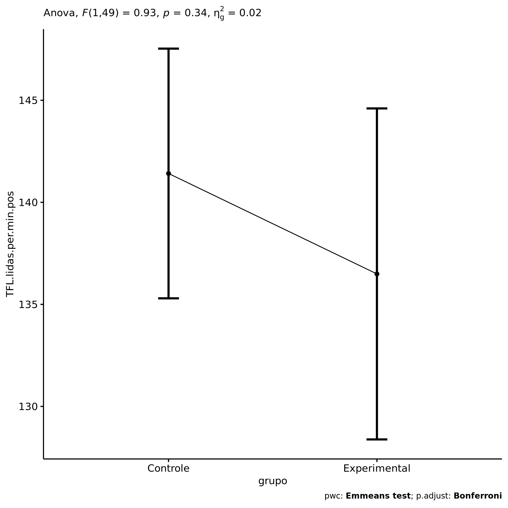<!-- -->

``` r
plots <- oneWayAncovaBoxPlots(
  wdat, "TFL.lidas.per.min.pos", "grupo", aov, pwc, covar = "TFL.lidas.per.min.pre",
  theme = "classic", color = color[["grupo"]],
  subtitle = which(aov$Effect == "grupo"))
```

``` r
if (length(unique(wdat[["grupo"]])) > 1)
  plots[["grupo"]] + ggplot2::ylab("Reading Words (1 Min)") +
  ggplot2::scale_x_discrete(labels=c('pre', 'pos')) +
  if (ymin < ymax) ggplot2::ylim(ymin, ymax)
```

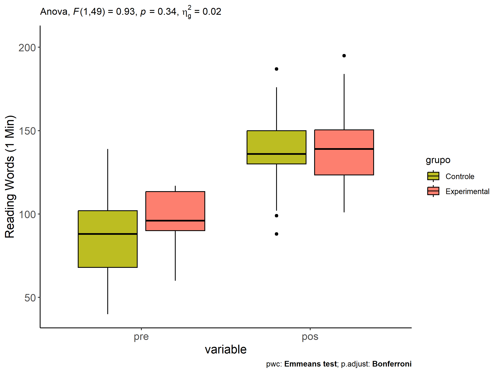<!-- -->

``` r
if (length(unique(wdat.long[["grupo"]])) > 1)
  plots <- oneWayAncovaBoxPlots(
    wdat.long, "TFL.lidas.per.min", "grupo", aov, pwc.long,
    pre.post = "time", theme = "classic", color = color$prepost)
```

``` r
if (length(unique(wdat.long[["grupo"]])) > 1)
  plots[["grupo"]] + ggplot2::ylab("Reading Words (1 Min)") +
  if (ymin < ymax) ggplot2::ylim(ymin, ymax) 
```

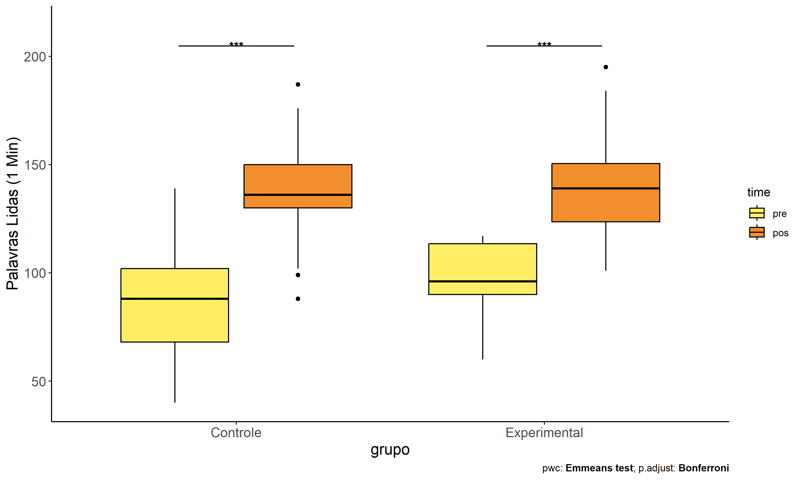<!-- -->

### Checking linearity assumption

``` r
ggscatter(wdat, x = "TFL.lidas.per.min.pre", y = "TFL.lidas.per.min.pos", size = 0.5,
          color = "grupo", add = "reg.line")+
  stat_regline_equation(
    aes(label =  paste(..eq.label.., ..rr.label.., sep = "~~~~"), color = grupo)
  ) +
  ggplot2::labs(subtitle = rstatix::get_test_label(aov, detailed = T, row = which(aov$Effect == "grupo"))) +
  ggplot2::scale_color_manual(values = color[["grupo"]]) +
  if (ymin < ymax) ggplot2::ylim(ymin, ymax)
```

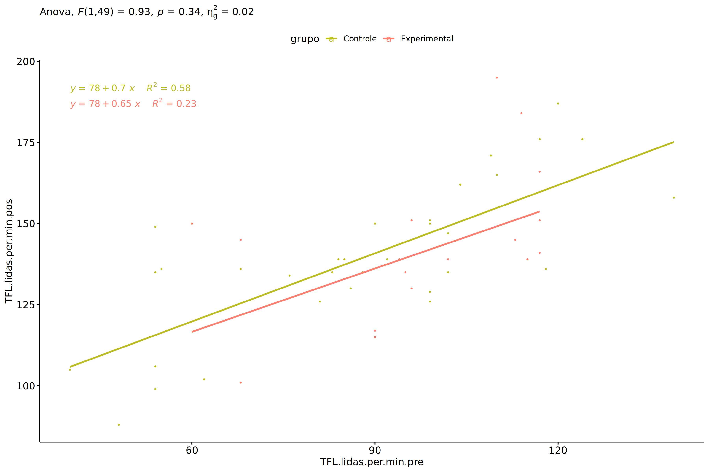<!-- -->

### Checking normality and homogeneity

``` r
res <- augment(lm(TFL.lidas.per.min.pos ~ TFL.lidas.per.min.pre + grupo, data = wdat))
```

``` r
shapiro_test(res$.resid)
```

    ## # A tibble: 1 × 3
    ##   variable   statistic p.value
    ##   <chr>          <dbl>   <dbl>
    ## 1 res$.resid     0.950  0.0305

``` r
levene_test(res, .resid ~ grupo)
```

    ## # A tibble: 1 × 4
    ##     df1   df2 statistic     p
    ##   <int> <int>     <dbl> <dbl>
    ## 1     1    50      1.37 0.248

# ANCOVA and Pairwise for two factors **grupo:Sexo**

## Without remove non-normal data

``` r
pdat = remove_group_data(dat[!is.na(dat[["grupo"]]) & !is.na(dat[["Sexo"]]),],
                         "TFL.lidas.per.min.pos", c("grupo","Sexo"))
pdat = pdat[pdat[["Sexo"]] %in% do.call(
  intersect, lapply(unique(pdat[["grupo"]]), FUN = function(x) {
    unique(pdat[["Sexo"]][which(pdat[["grupo"]] == x)])
  })),]
pdat[["grupo"]] = factor(pdat[["grupo"]], level[["grupo"]])
pdat[["Sexo"]] = factor(
  pdat[["Sexo"]],
  level[["Sexo"]][level[["Sexo"]] %in% unique(pdat[["Sexo"]])])

pdat.long <- rbind(pdat[,c("id","grupo","Sexo")], pdat[,c("id","grupo","Sexo")])
pdat.long[["time"]] <- c(rep("pre", nrow(pdat)), rep("pos", nrow(pdat)))
pdat.long[["time"]] <- factor(pdat.long[["time"]], c("pre","pos"))
pdat.long[["TFL.lidas.per.min"]] <- c(pdat[["TFL.lidas.per.min.pre"]], pdat[["TFL.lidas.per.min.pos"]])

if (length(unique(pdat[["Sexo"]])) >= 2) {
  aov = anova_test(pdat, TFL.lidas.per.min.pos ~ TFL.lidas.per.min.pre + grupo*Sexo)
  laov[["grupo:Sexo"]] <- get_anova_table(aov)
}
```

``` r
if (length(unique(pdat[["Sexo"]])) >= 2) {
  pwcs <- list()
  pwcs[["Sexo"]] <- emmeans_test(
    group_by(pdat, grupo), TFL.lidas.per.min.pos ~ Sexo,
    covariate = TFL.lidas.per.min.pre, p.adjust.method = "bonferroni")
  pwcs[["grupo"]] <- emmeans_test(
    group_by(pdat, Sexo), TFL.lidas.per.min.pos ~ grupo,
    covariate = TFL.lidas.per.min.pre, p.adjust.method = "bonferroni")
  
  pwc <- plyr::rbind.fill(pwcs[["grupo"]], pwcs[["Sexo"]])
  pwc <- pwc[,c("grupo","Sexo", colnames(pwc)[!colnames(pwc) %in% c("grupo","Sexo")])]
}
```

``` r
if (length(unique(pdat[["Sexo"]])) >= 2) {
  pwc.long <- emmeans_test(dplyr::group_by_at(pdat.long, c("grupo","Sexo")),
                           TFL.lidas.per.min ~ time,
                           p.adjust.method = "bonferroni")
  lpwc[["grupo:Sexo"]] <- plyr::rbind.fill(pwc, pwc.long)
}
```

``` r
if (length(unique(pdat[["Sexo"]])) >= 2) {
  ds <- get.descriptives(pdat, "TFL.lidas.per.min.pos", c("grupo","Sexo"), covar = "TFL.lidas.per.min.pre")
  ds <- merge(ds[ds$variable != "TFL.lidas.per.min.pre",],
              ds[ds$variable == "TFL.lidas.per.min.pre", !colnames(ds) %in% c("variable")],
              by = c("grupo","Sexo"), all.x = T, suffixes = c("", ".TFL.lidas.per.min.pre"))
  ds <- merge(get_emmeans(pwcs[["grupo"]]), ds,
              by = c("grupo","Sexo"), suffixes = c(".emms", ""))
  ds <- ds[,c("grupo","Sexo","n","mean.TFL.lidas.per.min.pre","se.TFL.lidas.per.min.pre","mean","se",
              "emmean","se.emms","conf.low","conf.high")]
  
  colnames(ds) <- c("grupo","Sexo", "N", paste0(c("M","SE")," (pre)"),
                    paste0(c("M","SE"), " (unadj)"),
                    paste0(c("M", "SE"), " (adj)"), "conf.low", "conf.high")
  
  lemms[["grupo:Sexo"]] <- ds
}
```

## Computing ANCOVA and PairWise After removing non-normal data (OK)

``` r
if (length(unique(pdat[["Sexo"]])) >= 2) {
  wdat = pdat 
  
  res = residuals(lm(TFL.lidas.per.min.pos ~ TFL.lidas.per.min.pre + grupo*Sexo, data = wdat))
  non.normal = getNonNormal(res, wdat$id, plimit = 0.05)
  
  wdat = wdat[!wdat$id %in% non.normal,]
  
  wdat.long <- rbind(wdat[,c("id","grupo","Sexo")], wdat[,c("id","grupo","Sexo")])
  wdat.long[["time"]] <- c(rep("pre", nrow(wdat)), rep("pos", nrow(wdat)))
  wdat.long[["time"]] <- factor(wdat.long[["time"]], c("pre","pos"))
  wdat.long[["TFL.lidas.per.min"]] <- c(wdat[["TFL.lidas.per.min.pre"]], wdat[["TFL.lidas.per.min.pos"]])
  
  
  ldat[["grupo:Sexo"]] = wdat
  
  (non.normal)
}
```

    ##  [1] "P1768" "P121"  "P2250" "P2380" "P1743" "P2220" "P2378" "P510"  "P2385" "P2404" "P2214"
    ## [12] "P2377" "P2294" "P1698" "P945"  "P2209"

``` r
if (length(unique(pdat[["Sexo"]])) >= 2) {
  aov = anova_test(wdat, TFL.lidas.per.min.pos ~ TFL.lidas.per.min.pre + grupo*Sexo)
  laov[["grupo:Sexo"]] <- merge(get_anova_table(aov), laov[["grupo:Sexo"]],
                                         by="Effect", suffixes = c("","'"))
  df = get_anova_table(aov)
}
```

| Effect                | DFn | DFd |      F |     p | p\<.05 |   ges |
|:----------------------|----:|----:|-------:|------:|:-------|------:|
| TFL.lidas.per.min.pre |   1 | 123 | 81.449 | 0.000 | \*     | 0.398 |
| grupo                 |   1 | 123 |  0.506 | 0.478 |        | 0.004 |
| Sexo                  |   1 | 123 | 11.520 | 0.001 | \*     | 0.086 |
| grupo:Sexo            |   1 | 123 |  0.986 | 0.323 |        | 0.008 |

``` r
if (length(unique(pdat[["Sexo"]])) >= 2) {
  pwcs <- list()
  pwcs[["Sexo"]] <- emmeans_test(
    group_by(wdat, grupo), TFL.lidas.per.min.pos ~ Sexo,
    covariate = TFL.lidas.per.min.pre, p.adjust.method = "bonferroni")
  pwcs[["grupo"]] <- emmeans_test(
    group_by(wdat, Sexo), TFL.lidas.per.min.pos ~ grupo,
    covariate = TFL.lidas.per.min.pre, p.adjust.method = "bonferroni")
  
  pwc <- plyr::rbind.fill(pwcs[["grupo"]], pwcs[["Sexo"]])
  pwc <- pwc[,c("grupo","Sexo", colnames(pwc)[!colnames(pwc) %in% c("grupo","Sexo")])]
}
```

| grupo        | Sexo | term                         | .y.                   | group1   | group2       |  df | statistic |     p | p.adj | p.adj.signif |
|:-------------|:-----|:-----------------------------|:----------------------|:---------|:-------------|----:|----------:|------:|------:|:-------------|
|              | F    | TFL.lidas.per.min.pre\*grupo | TFL.lidas.per.min.pos | Controle | Experimental | 123 |     0.332 | 0.741 | 0.741 | ns           |
|              | M    | TFL.lidas.per.min.pre\*grupo | TFL.lidas.per.min.pos | Controle | Experimental | 123 |    -1.177 | 0.241 | 0.241 | ns           |
| Controle     |      | TFL.lidas.per.min.pre\*Sexo  | TFL.lidas.per.min.pos | F        | M            | 123 |     3.299 | 0.001 | 0.001 | \*\*         |
| Experimental |      | TFL.lidas.per.min.pre\*Sexo  | TFL.lidas.per.min.pos | F        | M            | 123 |     1.293 | 0.198 | 0.198 | ns           |

``` r
if (length(unique(pdat[["Sexo"]])) >= 2) {
  pwc.long <- emmeans_test(dplyr::group_by_at(wdat.long, c("grupo","Sexo")),
                           TFL.lidas.per.min ~ time,
                           p.adjust.method = "bonferroni")
  lpwc[["grupo:Sexo"]] <- merge(plyr::rbind.fill(pwc, pwc.long),
                                         lpwc[["grupo:Sexo"]],
                                         by=c("grupo","Sexo","term",".y.","group1","group2"),
                                         suffixes = c("","'"))
}
```

| grupo        | Sexo | term | .y.               | group1 | group2 |  df | statistic |     p | p.adj | p.adj.signif |
|:-------------|:-----|:-----|:------------------|:-------|:-------|----:|----------:|------:|------:|:-------------|
| Controle     | F    | time | TFL.lidas.per.min | pre    | pos    | 248 |    -4.063 | 0.000 | 0.000 | \*\*\*\*     |
| Controle     | M    | time | TFL.lidas.per.min | pre    | pos    | 248 |    -2.189 | 0.030 | 0.030 | \*           |
| Experimental | F    | time | TFL.lidas.per.min | pre    | pos    | 248 |    -2.483 | 0.014 | 0.014 | \*           |
| Experimental | M    | time | TFL.lidas.per.min | pre    | pos    | 248 |    -2.710 | 0.007 | 0.007 | \*\*         |

``` r
if (length(unique(pdat[["Sexo"]])) >= 2) {
  ds <- get.descriptives(wdat, "TFL.lidas.per.min.pos", c("grupo","Sexo"), covar = "TFL.lidas.per.min.pre")
  ds <- merge(ds[ds$variable != "TFL.lidas.per.min.pre",],
              ds[ds$variable == "TFL.lidas.per.min.pre", !colnames(ds) %in% c("variable")],
              by = c("grupo","Sexo"), all.x = T, suffixes = c("", ".TFL.lidas.per.min.pre"))
  ds <- merge(get_emmeans(pwcs[["grupo"]]), ds,
              by = c("grupo","Sexo"), suffixes = c(".emms", ""))
  ds <- ds[,c("grupo","Sexo","n","mean.TFL.lidas.per.min.pre","se.TFL.lidas.per.min.pre",
              "mean","se","emmean","se.emms","conf.low","conf.high")]
  
  colnames(ds) <- c("grupo","Sexo", "N", paste0(c("M","SE")," (pre)"),
                    paste0(c("M","SE"), " (unadj)"),
                    paste0(c("M", "SE"), " (adj)"), "conf.low", "conf.high")
  
  lemms[["grupo:Sexo"]] <- merge(ds, lemms[["grupo:Sexo"]],
                                          by=c("grupo","Sexo"), suffixes = c("","'"))
}
```

| grupo        | Sexo |   N | M (pre) | SE (pre) | M (unadj) | SE (unadj) | M (adj) | SE (adj) | conf.low | conf.high |
|:-------------|:-----|----:|--------:|---------:|----------:|-----------:|--------:|---------:|---------:|----------:|
| Controle     | F    |  32 |  93.125 |    4.171 |   115.625 |      3.688 | 115.384 |    3.080 |  109.287 |   121.480 |
| Controle     | M    |  47 |  91.213 |    3.550 |   101.213 |      3.485 | 102.203 |    2.544 |   97.168 |   107.238 |
| Experimental | F    |  19 | 101.474 |    3.288 |   119.316 |      4.743 | 113.698 |    4.045 |  105.691 |   121.705 |
| Experimental | M    |  30 |  89.233 |    3.621 |   104.733 |      4.099 | 106.998 |    3.191 |  100.682 |   113.314 |

### Plots for ancova

``` r
if (length(unique(pdat[["Sexo"]])) >= 2) {
  ggPlotAoC2(pwcs, "grupo", "Sexo", aov, ylab = "Reading Words (1 Min)",
             subtitle = which(aov$Effect == "grupo:Sexo"), addParam = "errorbar") +
    ggplot2::scale_color_manual(values = color[["Sexo"]]) +
    if (ymin.ci < ymax.ci) ggplot2::ylim(ymin.ci, ymax.ci)
}
```

    ## Scale for colour is already present.
    ## Adding another scale for colour, which will replace the existing scale.

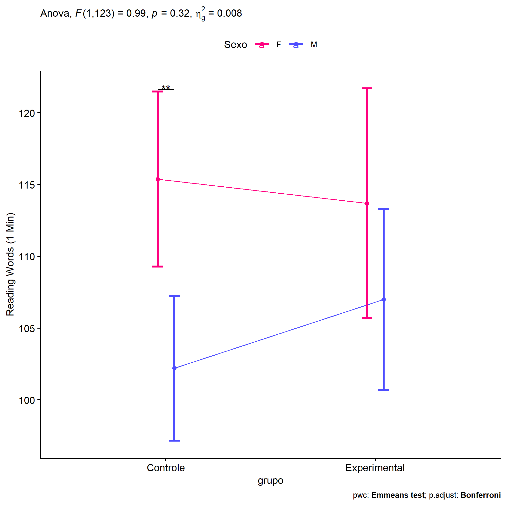<!-- -->

``` r
if (length(unique(pdat[["Sexo"]])) >= 2) {
  ggPlotAoC2(pwcs, "Sexo", "grupo", aov, ylab = "Reading Words (1 Min)",
               subtitle = which(aov$Effect == "grupo:Sexo"), addParam = "errorbar") +
      ggplot2::scale_color_manual(values = color[["grupo"]]) +
      if (ymin.ci < ymax.ci) ggplot2::ylim(ymin.ci, ymax.ci)
}
```

    ## Scale for colour is already present.
    ## Adding another scale for colour, which will replace the existing scale.

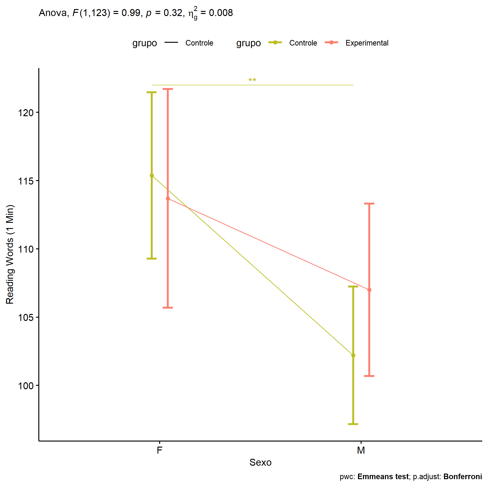<!-- -->

``` r
if (length(unique(pdat[["Sexo"]])) >= 2) {
  plots <- twoWayAncovaBoxPlots(
    wdat, "TFL.lidas.per.min.pos", c("grupo","Sexo"), aov, pwcs, covar = "TFL.lidas.per.min.pre",
    theme = "classic", color = color[["grupo:Sexo"]],
    subtitle = which(aov$Effect == "grupo:Sexo"))
}
```

``` r
if (length(unique(pdat[["Sexo"]])) >= 2) {
  plots[["grupo:Sexo"]] + ggplot2::ylab("Reading Words (1 Min)") +
  ggplot2::scale_x_discrete(labels=c('pre', 'pos')) +
  if (ymin < ymax) ggplot2::ylim(ymin, ymax)
}
```

    ## Warning: No shared levels found between `names(values)` of the manual scale and the data's colour
    ## values.

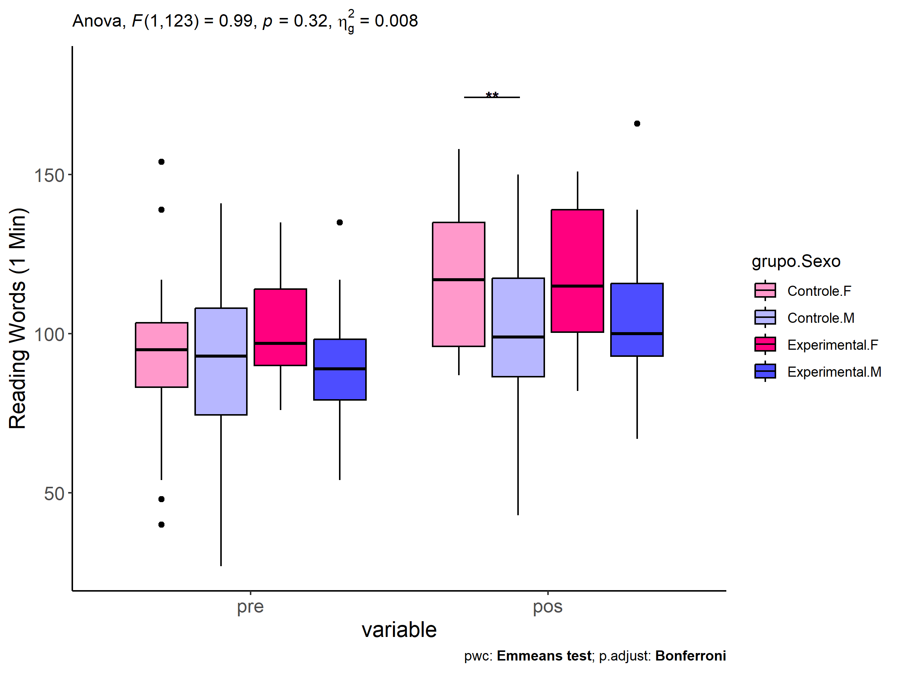<!-- -->

``` r
if (length(unique(pdat[["Sexo"]])) >= 2) {
  plots <- twoWayAncovaBoxPlots(
    wdat.long, "TFL.lidas.per.min", c("grupo","Sexo"), aov, pwc.long,
    pre.post = "time",
    theme = "classic", color = color$prepost)
}
```

``` r
if (length(unique(pdat[["Sexo"]])) >= 2) 
  plots[["grupo:Sexo"]] + ggplot2::ylab("Reading Words (1 Min)") +
    if (ymin < ymax) ggplot2::ylim(ymin, ymax)
```

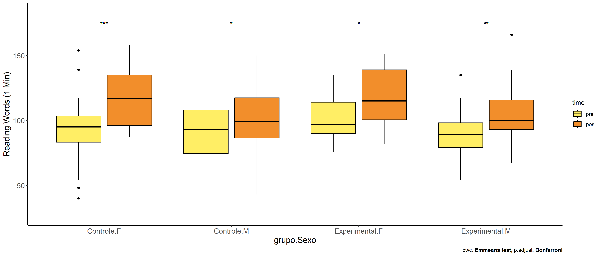<!-- -->

### Checking linearity assumption

``` r
if (length(unique(pdat[["Sexo"]])) >= 2) {
  ggscatter(wdat, x = "TFL.lidas.per.min.pre", y = "TFL.lidas.per.min.pos", size = 0.5,
            facet.by = c("grupo","Sexo"), add = "reg.line")+
    stat_regline_equation(
      aes(label =  paste(..eq.label.., ..rr.label.., sep = "~~~~"))
    ) +
    if (ymin < ymax) ggplot2::ylim(ymin, ymax)
}
```

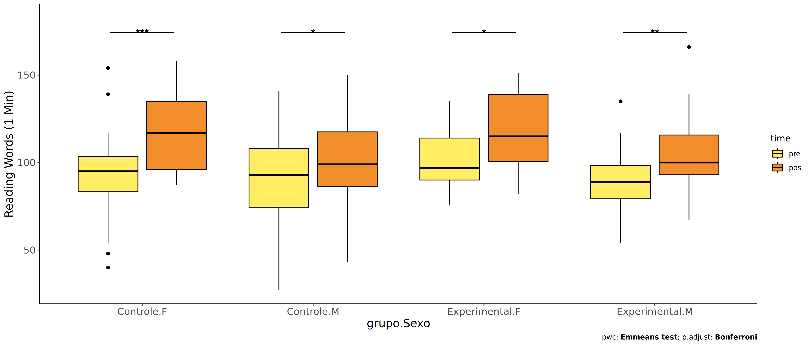<!-- -->

``` r
if (length(unique(pdat[["Sexo"]])) >= 2) {
  ggscatter(wdat, x = "TFL.lidas.per.min.pre", y = "TFL.lidas.per.min.pos", size = 0.5,
            color = "grupo", facet.by = "Sexo", add = "reg.line")+
    stat_regline_equation(
      aes(label =  paste(..eq.label.., ..rr.label.., sep = "~~~~"), color = grupo)
    ) +
    ggplot2::labs(subtitle = rstatix::get_test_label(aov, detailed = T, row = which(aov$Effect == "grupo:Sexo"))) +
    ggplot2::scale_color_manual(values = color[["grupo"]]) +
    if (ymin < ymax) ggplot2::ylim(ymin, ymax)
}
```

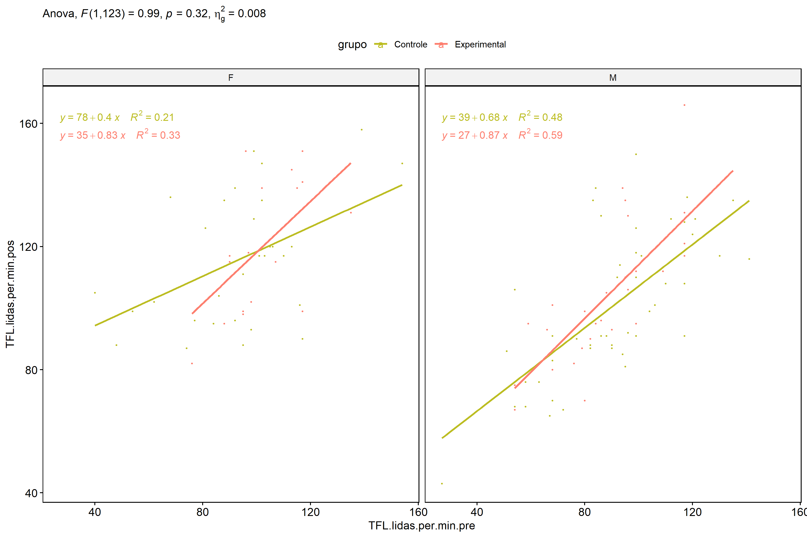<!-- -->

``` r
if (length(unique(pdat[["Sexo"]])) >= 2) {
  ggscatter(wdat, x = "TFL.lidas.per.min.pre", y = "TFL.lidas.per.min.pos", size = 0.5,
            color = "Sexo", facet.by = "grupo", add = "reg.line")+
    stat_regline_equation(
      aes(label =  paste(..eq.label.., ..rr.label.., sep = "~~~~"), color = Sexo)
    ) +
    ggplot2::labs(subtitle = rstatix::get_test_label(aov, detailed = T, row = which(aov$Effect == "grupo:Sexo"))) +
    ggplot2::scale_color_manual(values = color[["Sexo"]]) +
    if (ymin < ymax) ggplot2::ylim(ymin, ymax)
}
```

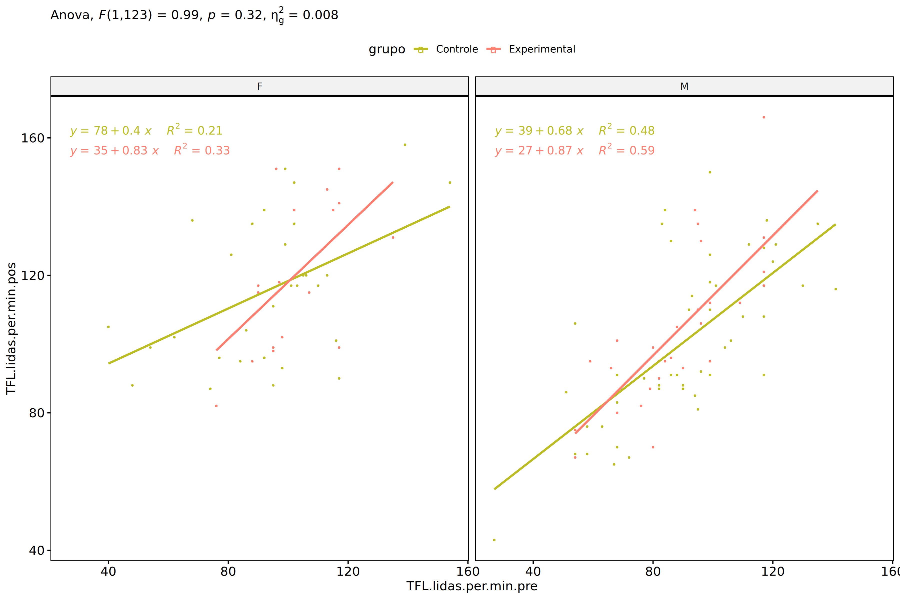<!-- -->

### Checking normality and homogeneity

``` r
if (length(unique(pdat[["Sexo"]])) >= 2) 
  res <- augment(lm(TFL.lidas.per.min.pos ~ TFL.lidas.per.min.pre + grupo*Sexo, data = wdat))
```

``` r
if (length(unique(pdat[["Sexo"]])) >= 2)
  shapiro_test(res$.resid)
```

    ## # A tibble: 1 × 3
    ##   variable   statistic p.value
    ##   <chr>          <dbl>   <dbl>
    ## 1 res$.resid     0.972  0.0102

``` r
if (length(unique(pdat[["Sexo"]])) >= 2) 
  levene_test(res, .resid ~ grupo*Sexo)
```

    ## # A tibble: 1 × 4
    ##     df1   df2 statistic     p
    ##   <int> <int>     <dbl> <dbl>
    ## 1     3   124      1.04 0.376

# ANCOVA and Pairwise for two factors **grupo:Zona**

## Without remove non-normal data

``` r
pdat = remove_group_data(dat[!is.na(dat[["grupo"]]) & !is.na(dat[["Zona"]]),],
                         "TFL.lidas.per.min.pos", c("grupo","Zona"))
pdat = pdat[pdat[["Zona"]] %in% do.call(
  intersect, lapply(unique(pdat[["grupo"]]), FUN = function(x) {
    unique(pdat[["Zona"]][which(pdat[["grupo"]] == x)])
  })),]
pdat[["grupo"]] = factor(pdat[["grupo"]], level[["grupo"]])
pdat[["Zona"]] = factor(
  pdat[["Zona"]],
  level[["Zona"]][level[["Zona"]] %in% unique(pdat[["Zona"]])])

pdat.long <- rbind(pdat[,c("id","grupo","Zona")], pdat[,c("id","grupo","Zona")])
pdat.long[["time"]] <- c(rep("pre", nrow(pdat)), rep("pos", nrow(pdat)))
pdat.long[["time"]] <- factor(pdat.long[["time"]], c("pre","pos"))
pdat.long[["TFL.lidas.per.min"]] <- c(pdat[["TFL.lidas.per.min.pre"]], pdat[["TFL.lidas.per.min.pos"]])

if (length(unique(pdat[["Zona"]])) >= 2) {
  aov = anova_test(pdat, TFL.lidas.per.min.pos ~ TFL.lidas.per.min.pre + grupo*Zona)
  laov[["grupo:Zona"]] <- get_anova_table(aov)
}
```

``` r
if (length(unique(pdat[["Zona"]])) >= 2) {
  pwcs <- list()
  pwcs[["Zona"]] <- emmeans_test(
    group_by(pdat, grupo), TFL.lidas.per.min.pos ~ Zona,
    covariate = TFL.lidas.per.min.pre, p.adjust.method = "bonferroni")
  pwcs[["grupo"]] <- emmeans_test(
    group_by(pdat, Zona), TFL.lidas.per.min.pos ~ grupo,
    covariate = TFL.lidas.per.min.pre, p.adjust.method = "bonferroni")
  
  pwc <- plyr::rbind.fill(pwcs[["grupo"]], pwcs[["Zona"]])
  pwc <- pwc[,c("grupo","Zona", colnames(pwc)[!colnames(pwc) %in% c("grupo","Zona")])]
}
```

``` r
if (length(unique(pdat[["Zona"]])) >= 2) {
  pwc.long <- emmeans_test(dplyr::group_by_at(pdat.long, c("grupo","Zona")),
                           TFL.lidas.per.min ~ time,
                           p.adjust.method = "bonferroni")
  lpwc[["grupo:Zona"]] <- plyr::rbind.fill(pwc, pwc.long)
}
```

``` r
if (length(unique(pdat[["Zona"]])) >= 2) {
  ds <- get.descriptives(pdat, "TFL.lidas.per.min.pos", c("grupo","Zona"), covar = "TFL.lidas.per.min.pre")
  ds <- merge(ds[ds$variable != "TFL.lidas.per.min.pre",],
              ds[ds$variable == "TFL.lidas.per.min.pre", !colnames(ds) %in% c("variable")],
              by = c("grupo","Zona"), all.x = T, suffixes = c("", ".TFL.lidas.per.min.pre"))
  ds <- merge(get_emmeans(pwcs[["grupo"]]), ds,
              by = c("grupo","Zona"), suffixes = c(".emms", ""))
  ds <- ds[,c("grupo","Zona","n","mean.TFL.lidas.per.min.pre","se.TFL.lidas.per.min.pre","mean","se",
              "emmean","se.emms","conf.low","conf.high")]
  
  colnames(ds) <- c("grupo","Zona", "N", paste0(c("M","SE")," (pre)"),
                    paste0(c("M","SE"), " (unadj)"),
                    paste0(c("M", "SE"), " (adj)"), "conf.low", "conf.high")
  
  lemms[["grupo:Zona"]] <- ds
}
```

## Computing ANCOVA and PairWise After removing non-normal data (OK)

``` r
if (length(unique(pdat[["Zona"]])) >= 2) {
  wdat = pdat 
  
  res = residuals(lm(TFL.lidas.per.min.pos ~ TFL.lidas.per.min.pre + grupo*Zona, data = wdat))
  non.normal = getNonNormal(res, wdat$id, plimit = 0.05)
  
  wdat = wdat[!wdat$id %in% non.normal,]
  
  wdat.long <- rbind(wdat[,c("id","grupo","Zona")], wdat[,c("id","grupo","Zona")])
  wdat.long[["time"]] <- c(rep("pre", nrow(wdat)), rep("pos", nrow(wdat)))
  wdat.long[["time"]] <- factor(wdat.long[["time"]], c("pre","pos"))
  wdat.long[["TFL.lidas.per.min"]] <- c(wdat[["TFL.lidas.per.min.pre"]], wdat[["TFL.lidas.per.min.pos"]])
  
  
  ldat[["grupo:Zona"]] = wdat
  
  (non.normal)
}
```

    ## [1] "P1768" "P121"  "P2378" "P1743" "P2220" "P510"  "P1698"

``` r
if (length(unique(pdat[["Zona"]])) >= 2) {
  aov = anova_test(wdat, TFL.lidas.per.min.pos ~ TFL.lidas.per.min.pre + grupo*Zona)
  laov[["grupo:Zona"]] <- merge(get_anova_table(aov), laov[["grupo:Zona"]],
                                         by="Effect", suffixes = c("","'"))
  df = get_anova_table(aov)
}
```

| Effect                | DFn | DFd |      F |     p | p\<.05 |   ges |
|:----------------------|----:|----:|-------:|------:|:-------|------:|
| TFL.lidas.per.min.pre |   1 |  94 | 84.400 | 0.000 | \*     | 0.473 |
| grupo                 |   1 |  94 |  0.260 | 0.611 |        | 0.003 |
| Zona                  |   1 |  94 | 34.869 | 0.000 | \*     | 0.271 |
| grupo:Zona            |   1 |  94 |  8.262 | 0.005 | \*     | 0.081 |

``` r
if (length(unique(pdat[["Zona"]])) >= 2) {
  pwcs <- list()
  pwcs[["Zona"]] <- emmeans_test(
    group_by(wdat, grupo), TFL.lidas.per.min.pos ~ Zona,
    covariate = TFL.lidas.per.min.pre, p.adjust.method = "bonferroni")
  pwcs[["grupo"]] <- emmeans_test(
    group_by(wdat, Zona), TFL.lidas.per.min.pos ~ grupo,
    covariate = TFL.lidas.per.min.pre, p.adjust.method = "bonferroni")
  
  pwc <- plyr::rbind.fill(pwcs[["grupo"]], pwcs[["Zona"]])
  pwc <- pwc[,c("grupo","Zona", colnames(pwc)[!colnames(pwc) %in% c("grupo","Zona")])]
}
```

| grupo        | Zona   | term                         | .y.                   | group1   | group2       |  df | statistic |     p | p.adj | p.adj.signif |
|:-------------|:-------|:-----------------------------|:----------------------|:---------|:-------------|----:|----------:|------:|------:|:-------------|
|              | Rural  | TFL.lidas.per.min.pre\*grupo | TFL.lidas.per.min.pos | Controle | Experimental |  94 |    -0.545 | 0.587 | 0.587 | ns           |
|              | Urbana | TFL.lidas.per.min.pre\*grupo | TFL.lidas.per.min.pos | Controle | Experimental |  94 |     2.869 | 0.005 | 0.005 | \*\*         |
| Controle     |        | TFL.lidas.per.min.pre\*Zona  | TFL.lidas.per.min.pos | Rural    | Urbana       |  94 |    -6.379 | 0.000 | 0.000 | \*\*\*\*     |
| Experimental |        | TFL.lidas.per.min.pre\*Zona  | TFL.lidas.per.min.pos | Rural    | Urbana       |  94 |    -1.565 | 0.121 | 0.121 | ns           |

``` r
if (length(unique(pdat[["Zona"]])) >= 2) {
  pwc.long <- emmeans_test(dplyr::group_by_at(wdat.long, c("grupo","Zona")),
                           TFL.lidas.per.min ~ time,
                           p.adjust.method = "bonferroni")
  lpwc[["grupo:Zona"]] <- merge(plyr::rbind.fill(pwc, pwc.long),
                                         lpwc[["grupo:Zona"]],
                                         by=c("grupo","Zona","term",".y.","group1","group2"),
                                         suffixes = c("","'"))
}
```

| grupo        | Zona   | term | .y.               | group1 | group2 |  df | statistic |     p | p.adj | p.adj.signif |
|:-------------|:-------|:-----|:------------------|:-------|:-------|----:|----------:|------:|------:|:-------------|
| Controle     | Rural  | time | TFL.lidas.per.min | pre    | pos    | 190 |    -2.549 | 0.012 | 0.012 | \*           |
| Controle     | Urbana | time | TFL.lidas.per.min | pre    | pos    | 190 |    -4.227 | 0.000 | 0.000 | \*\*\*\*     |
| Experimental | Rural  | time | TFL.lidas.per.min | pre    | pos    | 190 |    -2.356 | 0.019 | 0.019 | \*           |
| Experimental | Urbana | time | TFL.lidas.per.min | pre    | pos    | 190 |    -1.505 | 0.134 | 0.134 | ns           |

``` r
if (length(unique(pdat[["Zona"]])) >= 2) {
  ds <- get.descriptives(wdat, "TFL.lidas.per.min.pos", c("grupo","Zona"), covar = "TFL.lidas.per.min.pre")
  ds <- merge(ds[ds$variable != "TFL.lidas.per.min.pre",],
              ds[ds$variable == "TFL.lidas.per.min.pre", !colnames(ds) %in% c("variable")],
              by = c("grupo","Zona"), all.x = T, suffixes = c("", ".TFL.lidas.per.min.pre"))
  ds <- merge(get_emmeans(pwcs[["grupo"]]), ds,
              by = c("grupo","Zona"), suffixes = c(".emms", ""))
  ds <- ds[,c("grupo","Zona","n","mean.TFL.lidas.per.min.pre","se.TFL.lidas.per.min.pre",
              "mean","se","emmean","se.emms","conf.low","conf.high")]
  
  colnames(ds) <- c("grupo","Zona", "N", paste0(c("M","SE")," (pre)"),
                    paste0(c("M","SE"), " (unadj)"),
                    paste0(c("M", "SE"), " (adj)"), "conf.low", "conf.high")
  
  lemms[["grupo:Zona"]] <- merge(ds, lemms[["grupo:Zona"]],
                                          by=c("grupo","Zona"), suffixes = c("","'"))
}
```

| grupo        | Zona   |   N | M (pre) | SE (pre) | M (unadj) | SE (unadj) | M (adj) | SE (adj) | conf.low | conf.high |
|:-------------|:-------|----:|--------:|---------:|----------:|-----------:|--------:|---------:|---------:|----------:|
| Controle     | Rural  |  55 |  92.764 |    3.462 |   103.491 |      2.981 | 103.544 |    2.066 |   99.442 |   107.646 |
| Controle     | Urbana |   7 |  93.000 |    9.092 |   142.857 |     10.734 | 142.762 |    5.791 |  131.264 |   154.260 |
| Experimental | Rural  |  32 |  91.656 |    3.195 |   104.656 |      3.030 | 105.402 |    2.710 |  100.022 |   110.782 |
| Experimental | Urbana |   5 | 101.200 |    8.540 |   122.200 |      8.800 | 116.977 |    6.875 |  103.325 |   130.628 |

### Plots for ancova

``` r
if (length(unique(pdat[["Zona"]])) >= 2) {
  ggPlotAoC2(pwcs, "grupo", "Zona", aov, ylab = "Reading Words (1 Min)",
             subtitle = which(aov$Effect == "grupo:Zona"), addParam = "errorbar") +
    ggplot2::scale_color_manual(values = color[["Zona"]]) +
    if (ymin.ci < ymax.ci) ggplot2::ylim(ymin.ci, ymax.ci)
}
```

    ## Scale for colour is already present.
    ## Adding another scale for colour, which will replace the existing scale.

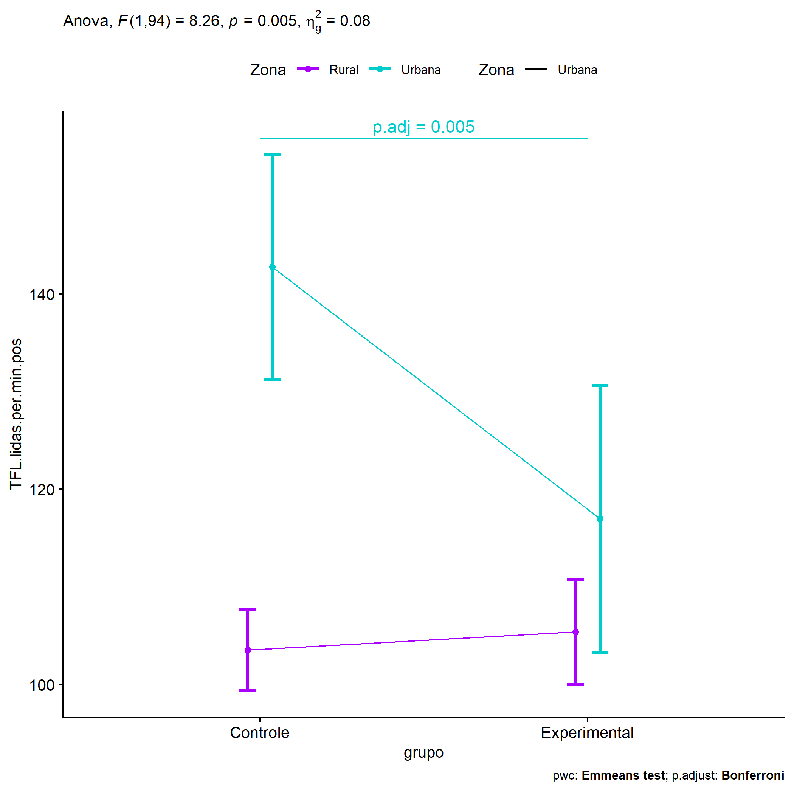<!-- -->

``` r
if (length(unique(pdat[["Zona"]])) >= 2) {
  ggPlotAoC2(pwcs, "Zona", "grupo", aov, ylab = "Reading Words (1 Min)",
               subtitle = which(aov$Effect == "grupo:Zona"), addParam = "errorbar") +
      ggplot2::scale_color_manual(values = color[["grupo"]]) +
      if (ymin.ci < ymax.ci) ggplot2::ylim(ymin.ci, ymax.ci)
}
```

    ## Scale for colour is already present.
    ## Adding another scale for colour, which will replace the existing scale.

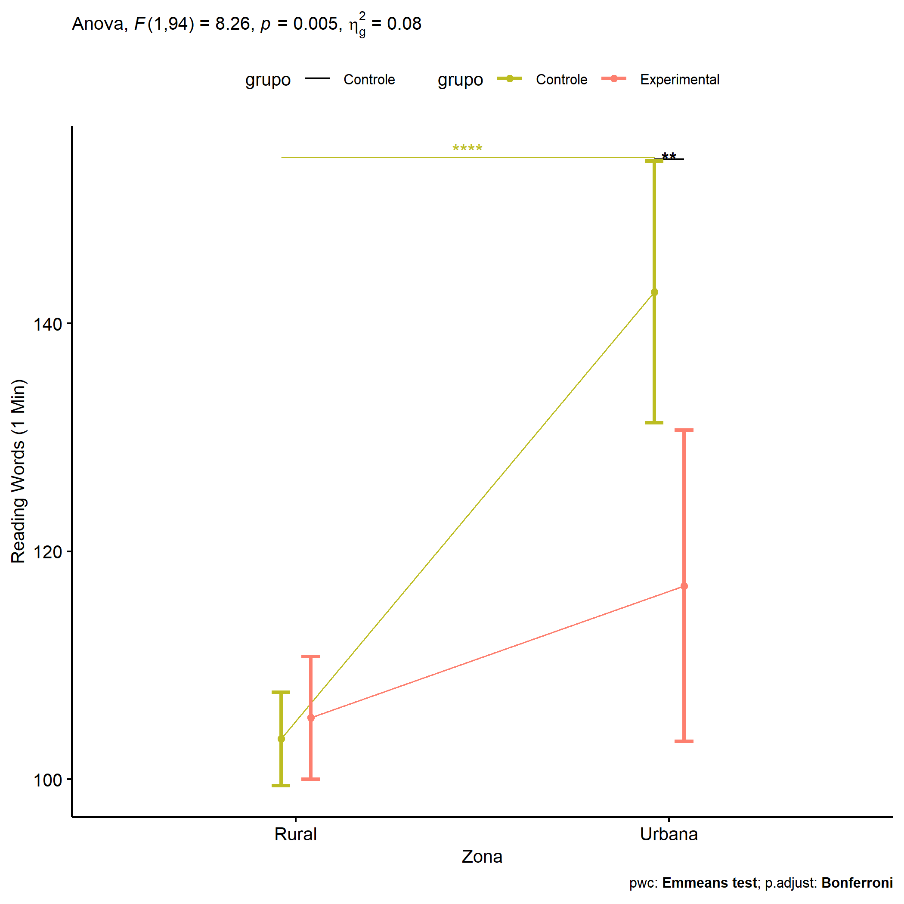<!-- -->

``` r
if (length(unique(pdat[["Zona"]])) >= 2) {
  plots <- twoWayAncovaBoxPlots(
    wdat, "TFL.lidas.per.min.pos", c("grupo","Zona"), aov, pwcs, covar = "TFL.lidas.per.min.pre",
    theme = "classic", color = color[["grupo:Zona"]],
    subtitle = which(aov$Effect == "grupo:Zona"))
}
```

``` r
if (length(unique(pdat[["Zona"]])) >= 2) {
  plots[["grupo:Zona"]] + ggplot2::ylab("Reading Words (1 Min)") +
  ggplot2::scale_x_discrete(labels=c('pre', 'pos')) +
  if (ymin < ymax) ggplot2::ylim(ymin, ymax)
}
```

    ## Warning: No shared levels found between `names(values)` of the manual scale and the data's colour
    ## values.

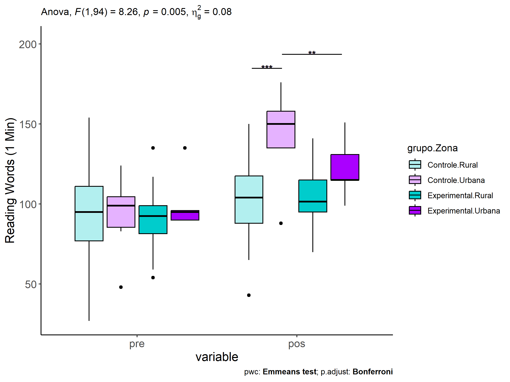<!-- -->

``` r
if (length(unique(pdat[["Zona"]])) >= 2) {
  plots <- twoWayAncovaBoxPlots(
    wdat.long, "TFL.lidas.per.min", c("grupo","Zona"), aov, pwc.long,
    pre.post = "time",
    theme = "classic", color = color$prepost)
}
```

``` r
if (length(unique(pdat[["Zona"]])) >= 2) 
  plots[["grupo:Zona"]] + ggplot2::ylab("Reading Words (1 Min)") +
    if (ymin < ymax) ggplot2::ylim(ymin, ymax)
```

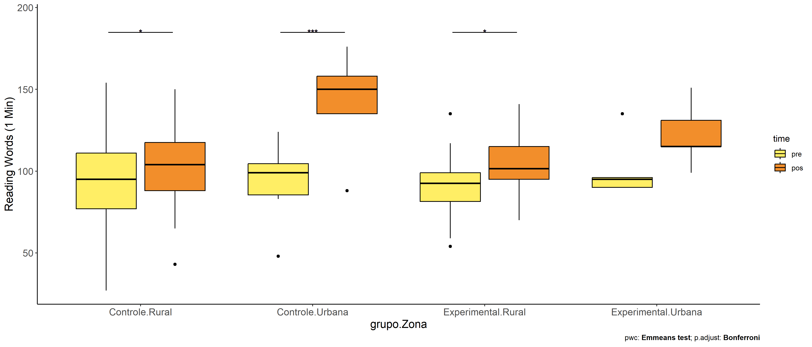<!-- -->

### Checking linearity assumption

``` r
if (length(unique(pdat[["Zona"]])) >= 2) {
  ggscatter(wdat, x = "TFL.lidas.per.min.pre", y = "TFL.lidas.per.min.pos", size = 0.5,
            facet.by = c("grupo","Zona"), add = "reg.line")+
    stat_regline_equation(
      aes(label =  paste(..eq.label.., ..rr.label.., sep = "~~~~"))
    ) +
    if (ymin < ymax) ggplot2::ylim(ymin, ymax)
}
```

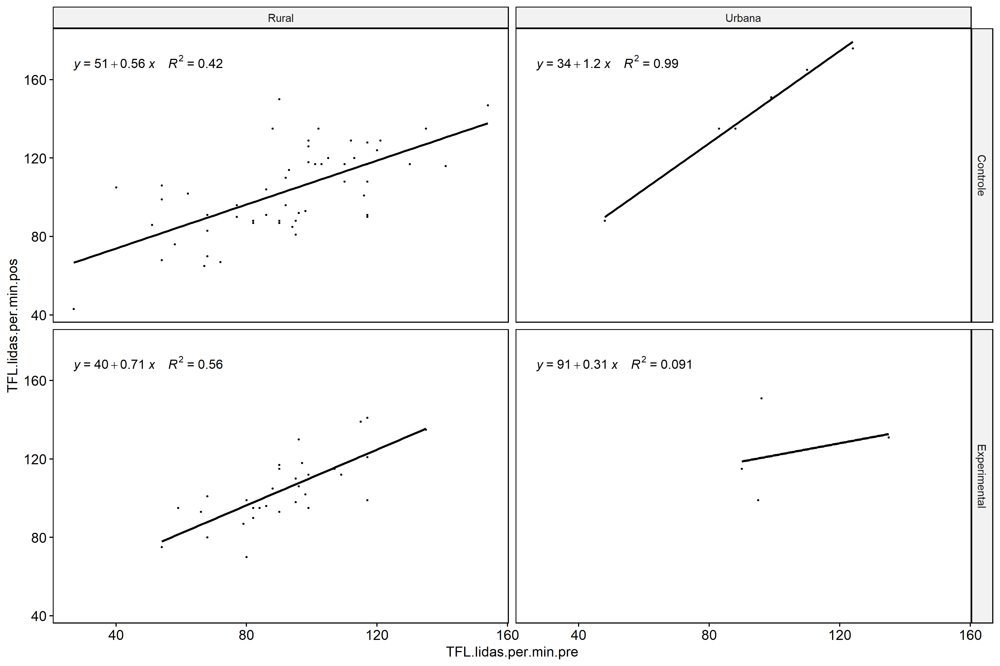<!-- -->

``` r
if (length(unique(pdat[["Zona"]])) >= 2) {
  ggscatter(wdat, x = "TFL.lidas.per.min.pre", y = "TFL.lidas.per.min.pos", size = 0.5,
            color = "grupo", facet.by = "Zona", add = "reg.line")+
    stat_regline_equation(
      aes(label =  paste(..eq.label.., ..rr.label.., sep = "~~~~"), color = grupo)
    ) +
    ggplot2::labs(subtitle = rstatix::get_test_label(aov, detailed = T, row = which(aov$Effect == "grupo:Zona"))) +
    ggplot2::scale_color_manual(values = color[["grupo"]]) +
    if (ymin < ymax) ggplot2::ylim(ymin, ymax)
}
```

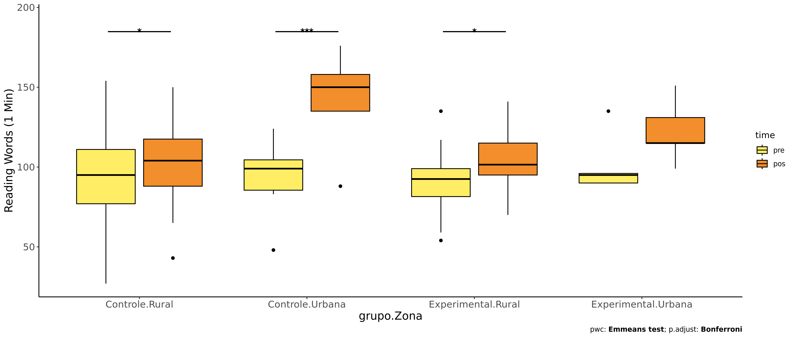<!-- -->

``` r
if (length(unique(pdat[["Zona"]])) >= 2) {
  ggscatter(wdat, x = "TFL.lidas.per.min.pre", y = "TFL.lidas.per.min.pos", size = 0.5,
            color = "Zona", facet.by = "grupo", add = "reg.line")+
    stat_regline_equation(
      aes(label =  paste(..eq.label.., ..rr.label.., sep = "~~~~"), color = Zona)
    ) +
    ggplot2::labs(subtitle = rstatix::get_test_label(aov, detailed = T, row = which(aov$Effect == "grupo:Zona"))) +
    ggplot2::scale_color_manual(values = color[["Zona"]]) +
    if (ymin < ymax) ggplot2::ylim(ymin, ymax)
}
```

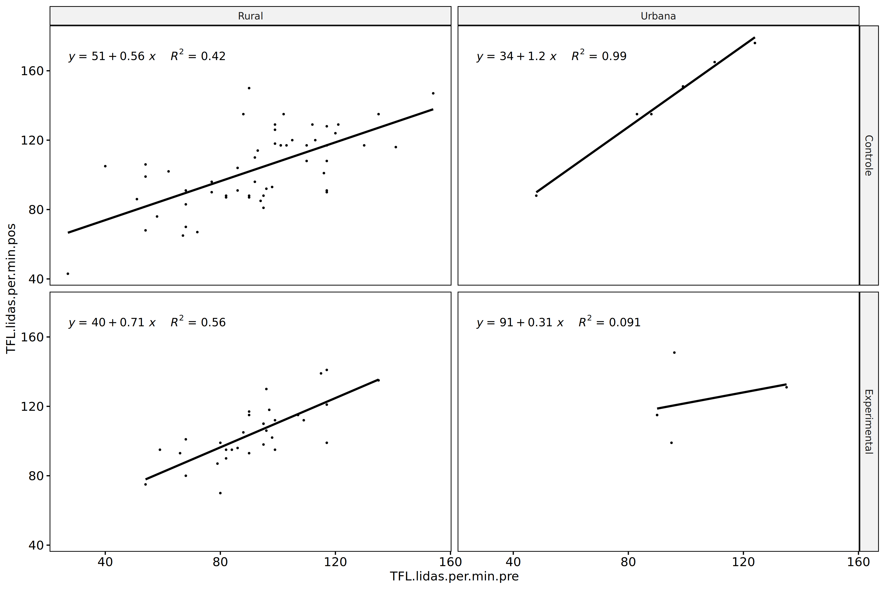<!-- -->

### Checking normality and homogeneity

``` r
if (length(unique(pdat[["Zona"]])) >= 2) 
  res <- augment(lm(TFL.lidas.per.min.pos ~ TFL.lidas.per.min.pre + grupo*Zona, data = wdat))
```

``` r
if (length(unique(pdat[["Zona"]])) >= 2)
  shapiro_test(res$.resid)
```

    ## # A tibble: 1 × 3
    ##   variable   statistic p.value
    ##   <chr>          <dbl>   <dbl>
    ## 1 res$.resid     0.982   0.212

``` r
if (length(unique(pdat[["Zona"]])) >= 2) 
  levene_test(res, .resid ~ grupo*Zona)
```

    ## # A tibble: 1 × 4
    ##     df1   df2 statistic     p
    ##   <int> <int>     <dbl> <dbl>
    ## 1     3    95      2.06 0.111

# ANCOVA and Pairwise for two factors **grupo:Cor.Raca**

## Without remove non-normal data

``` r
pdat = remove_group_data(dat[!is.na(dat[["grupo"]]) & !is.na(dat[["Cor.Raca"]]),],
                         "TFL.lidas.per.min.pos", c("grupo","Cor.Raca"))
```

    ## Warning: There were 2 warnings in `mutate()`.
    ## The first warning was:
    ## ℹ In argument: `ci = abs(stats::qt(alpha/2, .data$n - 1) * .data$se)`.
    ## Caused by warning:
    ## ! There was 1 warning in `mutate()`.
    ## ℹ In argument: `ci = abs(stats::qt(alpha/2, .data$n - 1) * .data$se)`.
    ## Caused by warning in `stats::qt()`:
    ## ! NaNs produced
    ## ℹ Run `dplyr::last_dplyr_warnings()` to see the 1 remaining warning.

``` r
pdat = pdat[pdat[["Cor.Raca"]] %in% do.call(
  intersect, lapply(unique(pdat[["grupo"]]), FUN = function(x) {
    unique(pdat[["Cor.Raca"]][which(pdat[["grupo"]] == x)])
  })),]
pdat[["grupo"]] = factor(pdat[["grupo"]], level[["grupo"]])
pdat[["Cor.Raca"]] = factor(
  pdat[["Cor.Raca"]],
  level[["Cor.Raca"]][level[["Cor.Raca"]] %in% unique(pdat[["Cor.Raca"]])])

pdat.long <- rbind(pdat[,c("id","grupo","Cor.Raca")], pdat[,c("id","grupo","Cor.Raca")])
pdat.long[["time"]] <- c(rep("pre", nrow(pdat)), rep("pos", nrow(pdat)))
pdat.long[["time"]] <- factor(pdat.long[["time"]], c("pre","pos"))
pdat.long[["TFL.lidas.per.min"]] <- c(pdat[["TFL.lidas.per.min.pre"]], pdat[["TFL.lidas.per.min.pos"]])

if (length(unique(pdat[["Cor.Raca"]])) >= 2) {
  aov = anova_test(pdat, TFL.lidas.per.min.pos ~ TFL.lidas.per.min.pre + grupo*Cor.Raca)
  laov[["grupo:Cor.Raca"]] <- get_anova_table(aov)
}
```

``` r
if (length(unique(pdat[["Cor.Raca"]])) >= 2) {
  pwcs <- list()
  pwcs[["Cor.Raca"]] <- emmeans_test(
    group_by(pdat, grupo), TFL.lidas.per.min.pos ~ Cor.Raca,
    covariate = TFL.lidas.per.min.pre, p.adjust.method = "bonferroni")
  pwcs[["grupo"]] <- emmeans_test(
    group_by(pdat, Cor.Raca), TFL.lidas.per.min.pos ~ grupo,
    covariate = TFL.lidas.per.min.pre, p.adjust.method = "bonferroni")
  
  pwc <- plyr::rbind.fill(pwcs[["grupo"]], pwcs[["Cor.Raca"]])
  pwc <- pwc[,c("grupo","Cor.Raca", colnames(pwc)[!colnames(pwc) %in% c("grupo","Cor.Raca")])]
}
```

``` r
if (length(unique(pdat[["Cor.Raca"]])) >= 2) {
  pwc.long <- emmeans_test(dplyr::group_by_at(pdat.long, c("grupo","Cor.Raca")),
                           TFL.lidas.per.min ~ time,
                           p.adjust.method = "bonferroni")
  lpwc[["grupo:Cor.Raca"]] <- plyr::rbind.fill(pwc, pwc.long)
}
```

``` r
if (length(unique(pdat[["Cor.Raca"]])) >= 2) {
  ds <- get.descriptives(pdat, "TFL.lidas.per.min.pos", c("grupo","Cor.Raca"), covar = "TFL.lidas.per.min.pre")
  ds <- merge(ds[ds$variable != "TFL.lidas.per.min.pre",],
              ds[ds$variable == "TFL.lidas.per.min.pre", !colnames(ds) %in% c("variable")],
              by = c("grupo","Cor.Raca"), all.x = T, suffixes = c("", ".TFL.lidas.per.min.pre"))
  ds <- merge(get_emmeans(pwcs[["grupo"]]), ds,
              by = c("grupo","Cor.Raca"), suffixes = c(".emms", ""))
  ds <- ds[,c("grupo","Cor.Raca","n","mean.TFL.lidas.per.min.pre","se.TFL.lidas.per.min.pre","mean","se",
              "emmean","se.emms","conf.low","conf.high")]
  
  colnames(ds) <- c("grupo","Cor.Raca", "N", paste0(c("M","SE")," (pre)"),
                    paste0(c("M","SE"), " (unadj)"),
                    paste0(c("M", "SE"), " (adj)"), "conf.low", "conf.high")
  
  lemms[["grupo:Cor.Raca"]] <- ds
}
```

## Computing ANCOVA and PairWise After removing non-normal data (OK)

``` r
if (length(unique(pdat[["Cor.Raca"]])) >= 2) {
  wdat = pdat 
  
  res = residuals(lm(TFL.lidas.per.min.pos ~ TFL.lidas.per.min.pre + grupo*Cor.Raca, data = wdat))
  non.normal = getNonNormal(res, wdat$id, plimit = 0.05)
  
  wdat = wdat[!wdat$id %in% non.normal,]
  
  wdat.long <- rbind(wdat[,c("id","grupo","Cor.Raca")], wdat[,c("id","grupo","Cor.Raca")])
  wdat.long[["time"]] <- c(rep("pre", nrow(wdat)), rep("pos", nrow(wdat)))
  wdat.long[["time"]] <- factor(wdat.long[["time"]], c("pre","pos"))
  wdat.long[["TFL.lidas.per.min"]] <- c(wdat[["TFL.lidas.per.min.pre"]], wdat[["TFL.lidas.per.min.pos"]])
  
  
  ldat[["grupo:Cor.Raca"]] = wdat
  
  (non.normal)
}
```

    ## [1] "P510" "P945"

``` r
if (length(unique(pdat[["Cor.Raca"]])) >= 2) {
  aov = anova_test(wdat, TFL.lidas.per.min.pos ~ TFL.lidas.per.min.pre + grupo*Cor.Raca)
  laov[["grupo:Cor.Raca"]] <- merge(get_anova_table(aov), laov[["grupo:Cor.Raca"]],
                                         by="Effect", suffixes = c("","'"))
  df = get_anova_table(aov)
}
```

| Effect                | DFn | DFd |      F |     p | p\<.05 |   ges |
|:----------------------|----:|----:|-------:|------:|:-------|------:|
| TFL.lidas.per.min.pre |   1 |  68 | 54.835 | 0.000 | \*     | 0.446 |
| grupo                 |   1 |  68 |  2.749 | 0.102 |        | 0.039 |
| Cor.Raca              |   1 |  68 |  2.633 | 0.109 |        | 0.037 |
| grupo:Cor.Raca        |   1 |  68 |  1.775 | 0.187 |        | 0.025 |

``` r
if (length(unique(pdat[["Cor.Raca"]])) >= 2) {
  pwcs <- list()
  pwcs[["Cor.Raca"]] <- emmeans_test(
    group_by(wdat, grupo), TFL.lidas.per.min.pos ~ Cor.Raca,
    covariate = TFL.lidas.per.min.pre, p.adjust.method = "bonferroni")
  pwcs[["grupo"]] <- emmeans_test(
    group_by(wdat, Cor.Raca), TFL.lidas.per.min.pos ~ grupo,
    covariate = TFL.lidas.per.min.pre, p.adjust.method = "bonferroni")
  
  pwc <- plyr::rbind.fill(pwcs[["grupo"]], pwcs[["Cor.Raca"]])
  pwc <- pwc[,c("grupo","Cor.Raca", colnames(pwc)[!colnames(pwc) %in% c("grupo","Cor.Raca")])]
}
```

| grupo        | Cor.Raca | term                            | .y.                   | group1   | group2       |  df | statistic |     p | p.adj | p.adj.signif |
|:-------------|:---------|:--------------------------------|:----------------------|:---------|:-------------|----:|----------:|------:|------:|:-------------|
|              | Parda    | TFL.lidas.per.min.pre\*grupo    | TFL.lidas.per.min.pos | Controle | Experimental |  68 |    -0.818 | 0.416 | 0.416 | ns           |
|              | Branca   | TFL.lidas.per.min.pre\*grupo    | TFL.lidas.per.min.pos | Controle | Experimental |  68 |    -1.965 | 0.054 | 0.054 | ns           |
| Controle     |          | TFL.lidas.per.min.pre\*Cor.Raca | TFL.lidas.per.min.pos | Parda    | Branca       |  68 |    -0.658 | 0.513 | 0.513 | ns           |
| Experimental |          | TFL.lidas.per.min.pre\*Cor.Raca | TFL.lidas.per.min.pos | Parda    | Branca       |  68 |    -2.019 | 0.047 | 0.047 | \*           |

``` r
if (length(unique(pdat[["Cor.Raca"]])) >= 2) {
  pwc.long <- emmeans_test(dplyr::group_by_at(wdat.long, c("grupo","Cor.Raca")),
                           TFL.lidas.per.min ~ time,
                           p.adjust.method = "bonferroni")
  lpwc[["grupo:Cor.Raca"]] <- merge(plyr::rbind.fill(pwc, pwc.long),
                                         lpwc[["grupo:Cor.Raca"]],
                                         by=c("grupo","Cor.Raca","term",".y.","group1","group2"),
                                         suffixes = c("","'"))
}
```

| grupo        | Cor.Raca | term | .y.               | group1 | group2 |  df | statistic |     p | p.adj | p.adj.signif |
|:-------------|:---------|:-----|:------------------|:-------|:-------|----:|----------:|------:|------:|:-------------|
| Controle     | Parda    | time | TFL.lidas.per.min | pre    | pos    | 138 |    -1.587 | 0.115 | 0.115 | ns           |
| Controle     | Branca   | time | TFL.lidas.per.min | pre    | pos    | 138 |    -0.605 | 0.546 | 0.546 | ns           |
| Experimental | Parda    | time | TFL.lidas.per.min | pre    | pos    | 138 |    -1.640 | 0.103 | 0.103 | ns           |
| Experimental | Branca   | time | TFL.lidas.per.min | pre    | pos    | 138 |    -1.718 | 0.088 | 0.088 | ns           |

``` r
if (length(unique(pdat[["Cor.Raca"]])) >= 2) {
  ds <- get.descriptives(wdat, "TFL.lidas.per.min.pos", c("grupo","Cor.Raca"), covar = "TFL.lidas.per.min.pre")
  ds <- merge(ds[ds$variable != "TFL.lidas.per.min.pre",],
              ds[ds$variable == "TFL.lidas.per.min.pre", !colnames(ds) %in% c("variable")],
              by = c("grupo","Cor.Raca"), all.x = T, suffixes = c("", ".TFL.lidas.per.min.pre"))
  ds <- merge(get_emmeans(pwcs[["grupo"]]), ds,
              by = c("grupo","Cor.Raca"), suffixes = c(".emms", ""))
  ds <- ds[,c("grupo","Cor.Raca","n","mean.TFL.lidas.per.min.pre","se.TFL.lidas.per.min.pre",
              "mean","se","emmean","se.emms","conf.low","conf.high")]
  
  colnames(ds) <- c("grupo","Cor.Raca", "N", paste0(c("M","SE")," (pre)"),
                    paste0(c("M","SE"), " (unadj)"),
                    paste0(c("M", "SE"), " (adj)"), "conf.low", "conf.high")
  
  lemms[["grupo:Cor.Raca"]] <- merge(ds, lemms[["grupo:Cor.Raca"]],
                                          by=c("grupo","Cor.Raca"), suffixes = c("","'"))
}
```

| grupo        | Cor.Raca |   N | M (pre) | SE (pre) | M (unadj) | SE (unadj) | M (adj) | SE (adj) | conf.low | conf.high |
|:-------------|:---------|----:|--------:|---------:|----------:|-----------:|--------:|---------:|---------:|----------:|
| Controle     | Branca   |  11 | 106.909 |    4.783 |   112.273 |      4.589 | 104.105 |    4.735 |   94.656 |   113.554 |
| Controle     | Parda    |  41 |  91.707 |    3.649 |    99.000 |      3.449 | 100.585 |    2.395 |   95.806 |   105.364 |
| Experimental | Branca   |   5 | 104.000 |    5.310 |   126.600 |      8.322 | 120.298 |    6.883 |  106.563 |   134.033 |
| Experimental | Parda    |  16 |  88.688 |    5.065 |   100.750 |      4.760 | 104.273 |    3.848 |   96.595 |   111.951 |

### Plots for ancova

``` r
if (length(unique(pdat[["Cor.Raca"]])) >= 2) {
  ggPlotAoC2(pwcs, "grupo", "Cor.Raca", aov, ylab = "Reading Words (1 Min)",
             subtitle = which(aov$Effect == "grupo:Cor.Raca"), addParam = "errorbar") +
    ggplot2::scale_color_manual(values = color[["Cor.Raca"]]) +
    if (ymin.ci < ymax.ci) ggplot2::ylim(ymin.ci, ymax.ci)
}
```

    ## Scale for colour is already present.
    ## Adding another scale for colour, which will replace the existing scale.

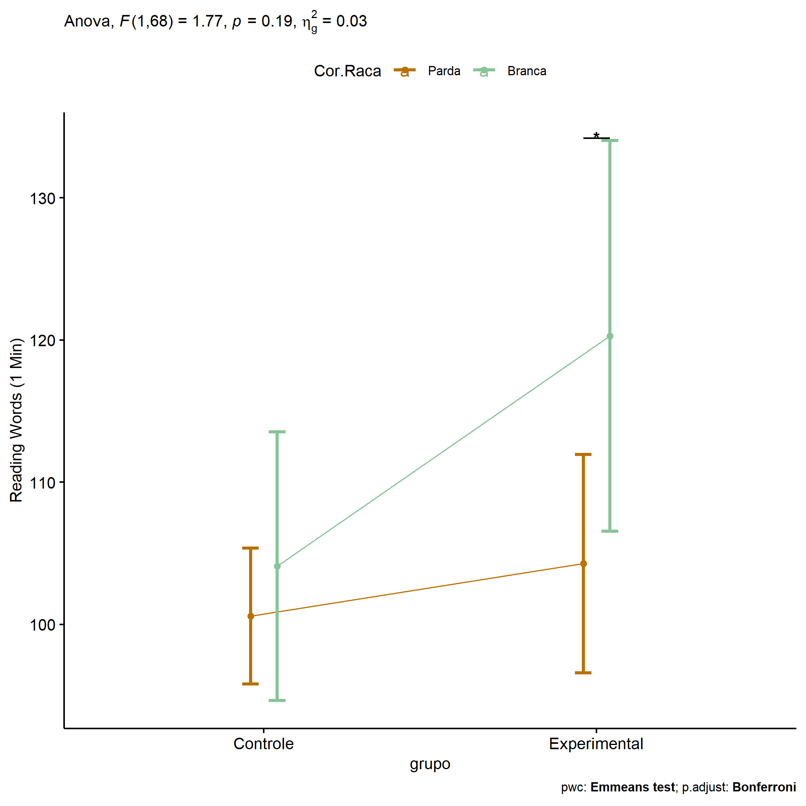<!-- -->

``` r
if (length(unique(pdat[["Cor.Raca"]])) >= 2) {
  ggPlotAoC2(pwcs, "Cor.Raca", "grupo", aov, ylab = "Reading Words (1 Min)",
               subtitle = which(aov$Effect == "grupo:Cor.Raca"), addParam = "errorbar") +
      ggplot2::scale_color_manual(values = color[["grupo"]]) +
      if (ymin.ci < ymax.ci) ggplot2::ylim(ymin.ci, ymax.ci)
}
```

    ## Scale for colour is already present.
    ## Adding another scale for colour, which will replace the existing scale.

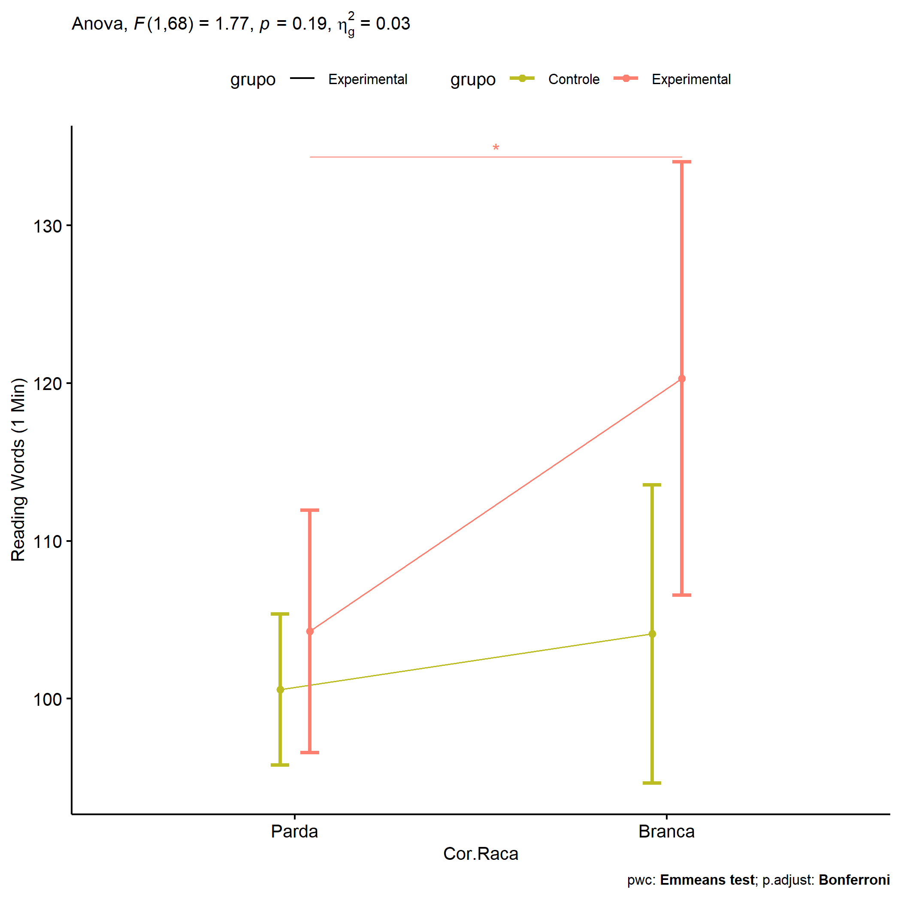<!-- -->

``` r
if (length(unique(pdat[["Cor.Raca"]])) >= 2) {
  plots <- twoWayAncovaBoxPlots(
    wdat, "TFL.lidas.per.min.pos", c("grupo","Cor.Raca"), aov, pwcs, covar = "TFL.lidas.per.min.pre",
    theme = "classic", color = color[["grupo:Cor.Raca"]],
    subtitle = which(aov$Effect == "grupo:Cor.Raca"))
}
```

``` r
if (length(unique(pdat[["Cor.Raca"]])) >= 2) {
  plots[["grupo:Cor.Raca"]] + ggplot2::ylab("Reading Words (1 Min)") +
  ggplot2::scale_x_discrete(labels=c('pre', 'pos')) +
  if (ymin < ymax) ggplot2::ylim(ymin, ymax)
}
```

    ## Warning: No shared levels found between `names(values)` of the manual scale and the data's colour
    ## values.

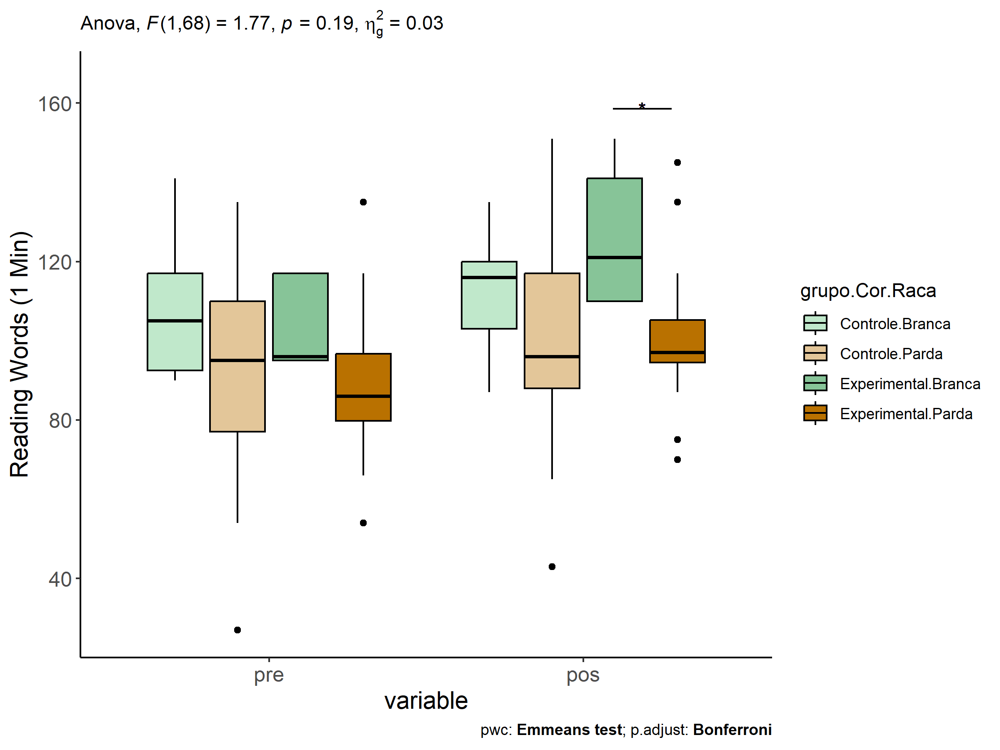<!-- -->

``` r
if (length(unique(pdat[["Cor.Raca"]])) >= 2) {
  plots <- twoWayAncovaBoxPlots(
    wdat.long, "TFL.lidas.per.min", c("grupo","Cor.Raca"), aov, pwc.long,
    pre.post = "time",
    theme = "classic", color = color$prepost)
}
```

``` r
if (length(unique(pdat[["Cor.Raca"]])) >= 2) 
  plots[["grupo:Cor.Raca"]] + ggplot2::ylab("Reading Words (1 Min)") +
    if (ymin < ymax) ggplot2::ylim(ymin, ymax)
```

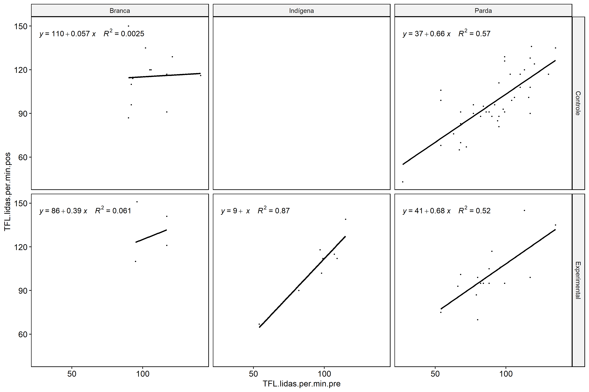<!-- -->

### Checking linearity assumption

``` r
if (length(unique(pdat[["Cor.Raca"]])) >= 2) {
  ggscatter(wdat, x = "TFL.lidas.per.min.pre", y = "TFL.lidas.per.min.pos", size = 0.5,
            facet.by = c("grupo","Cor.Raca"), add = "reg.line")+
    stat_regline_equation(
      aes(label =  paste(..eq.label.., ..rr.label.., sep = "~~~~"))
    ) +
    if (ymin < ymax) ggplot2::ylim(ymin, ymax)
}
```

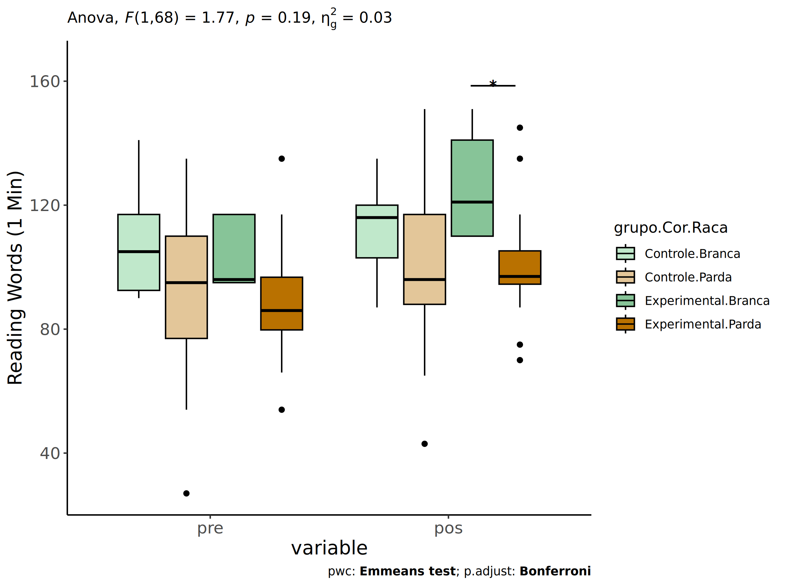<!-- -->

``` r
if (length(unique(pdat[["Cor.Raca"]])) >= 2) {
  ggscatter(wdat, x = "TFL.lidas.per.min.pre", y = "TFL.lidas.per.min.pos", size = 0.5,
            color = "grupo", facet.by = "Cor.Raca", add = "reg.line")+
    stat_regline_equation(
      aes(label =  paste(..eq.label.., ..rr.label.., sep = "~~~~"), color = grupo)
    ) +
    ggplot2::labs(subtitle = rstatix::get_test_label(aov, detailed = T, row = which(aov$Effect == "grupo:Cor.Raca"))) +
    ggplot2::scale_color_manual(values = color[["grupo"]]) +
    if (ymin < ymax) ggplot2::ylim(ymin, ymax)
}
```

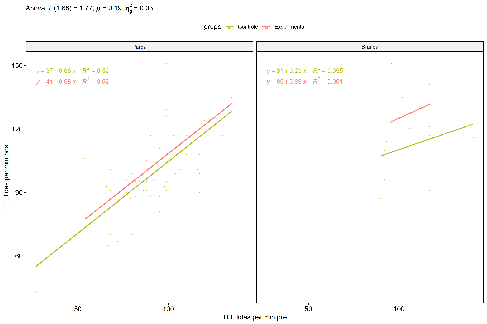<!-- -->

``` r
if (length(unique(pdat[["Cor.Raca"]])) >= 2) {
  ggscatter(wdat, x = "TFL.lidas.per.min.pre", y = "TFL.lidas.per.min.pos", size = 0.5,
            color = "Cor.Raca", facet.by = "grupo", add = "reg.line")+
    stat_regline_equation(
      aes(label =  paste(..eq.label.., ..rr.label.., sep = "~~~~"), color = Cor.Raca)
    ) +
    ggplot2::labs(subtitle = rstatix::get_test_label(aov, detailed = T, row = which(aov$Effect == "grupo:Cor.Raca"))) +
    ggplot2::scale_color_manual(values = color[["Cor.Raca"]]) +
    if (ymin < ymax) ggplot2::ylim(ymin, ymax)
}
```

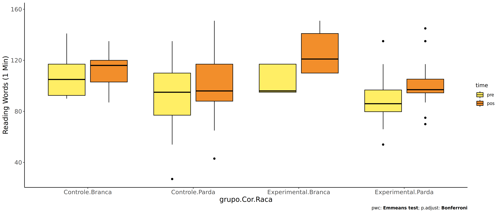<!-- -->

### Checking normality and homogeneity

``` r
if (length(unique(pdat[["Cor.Raca"]])) >= 2) 
  res <- augment(lm(TFL.lidas.per.min.pos ~ TFL.lidas.per.min.pre + grupo*Cor.Raca, data = wdat))
```

``` r
if (length(unique(pdat[["Cor.Raca"]])) >= 2)
  shapiro_test(res$.resid)
```

    ## # A tibble: 1 × 3
    ##   variable   statistic p.value
    ##   <chr>          <dbl>   <dbl>
    ## 1 res$.resid     0.968  0.0636

``` r
if (length(unique(pdat[["Cor.Raca"]])) >= 2) 
  levene_test(res, .resid ~ grupo*Cor.Raca)
```

    ## # A tibble: 1 × 4
    ##     df1   df2 statistic     p
    ##   <int> <int>     <dbl> <dbl>
    ## 1     3    69     0.135 0.939

# ANCOVA and Pairwise for two factors **grupo:Serie**

## Without remove non-normal data

``` r
pdat = remove_group_data(dat[!is.na(dat[["grupo"]]) & !is.na(dat[["Serie"]]),],
                         "TFL.lidas.per.min.pos", c("grupo","Serie"))
pdat = pdat[pdat[["Serie"]] %in% do.call(
  intersect, lapply(unique(pdat[["grupo"]]), FUN = function(x) {
    unique(pdat[["Serie"]][which(pdat[["grupo"]] == x)])
  })),]
pdat[["grupo"]] = factor(pdat[["grupo"]], level[["grupo"]])
pdat[["Serie"]] = factor(
  pdat[["Serie"]],
  level[["Serie"]][level[["Serie"]] %in% unique(pdat[["Serie"]])])

pdat.long <- rbind(pdat[,c("id","grupo","Serie")], pdat[,c("id","grupo","Serie")])
pdat.long[["time"]] <- c(rep("pre", nrow(pdat)), rep("pos", nrow(pdat)))
pdat.long[["time"]] <- factor(pdat.long[["time"]], c("pre","pos"))
pdat.long[["TFL.lidas.per.min"]] <- c(pdat[["TFL.lidas.per.min.pre"]], pdat[["TFL.lidas.per.min.pos"]])

if (length(unique(pdat[["Serie"]])) >= 2) {
  aov = anova_test(pdat, TFL.lidas.per.min.pos ~ TFL.lidas.per.min.pre + grupo*Serie)
  laov[["grupo:Serie"]] <- get_anova_table(aov)
}
```

``` r
if (length(unique(pdat[["Serie"]])) >= 2) {
  pwcs <- list()
  pwcs[["Serie"]] <- emmeans_test(
    group_by(pdat, grupo), TFL.lidas.per.min.pos ~ Serie,
    covariate = TFL.lidas.per.min.pre, p.adjust.method = "bonferroni")
  pwcs[["grupo"]] <- emmeans_test(
    group_by(pdat, Serie), TFL.lidas.per.min.pos ~ grupo,
    covariate = TFL.lidas.per.min.pre, p.adjust.method = "bonferroni")
  
  pwc <- plyr::rbind.fill(pwcs[["grupo"]], pwcs[["Serie"]])
  pwc <- pwc[,c("grupo","Serie", colnames(pwc)[!colnames(pwc) %in% c("grupo","Serie")])]
}
```

``` r
if (length(unique(pdat[["Serie"]])) >= 2) {
  pwc.long <- emmeans_test(dplyr::group_by_at(pdat.long, c("grupo","Serie")),
                           TFL.lidas.per.min ~ time,
                           p.adjust.method = "bonferroni")
  lpwc[["grupo:Serie"]] <- plyr::rbind.fill(pwc, pwc.long)
}
```

``` r
if (length(unique(pdat[["Serie"]])) >= 2) {
  ds <- get.descriptives(pdat, "TFL.lidas.per.min.pos", c("grupo","Serie"), covar = "TFL.lidas.per.min.pre")
  ds <- merge(ds[ds$variable != "TFL.lidas.per.min.pre",],
              ds[ds$variable == "TFL.lidas.per.min.pre", !colnames(ds) %in% c("variable")],
              by = c("grupo","Serie"), all.x = T, suffixes = c("", ".TFL.lidas.per.min.pre"))
  ds <- merge(get_emmeans(pwcs[["grupo"]]), ds,
              by = c("grupo","Serie"), suffixes = c(".emms", ""))
  ds <- ds[,c("grupo","Serie","n","mean.TFL.lidas.per.min.pre","se.TFL.lidas.per.min.pre","mean","se",
              "emmean","se.emms","conf.low","conf.high")]
  
  colnames(ds) <- c("grupo","Serie", "N", paste0(c("M","SE")," (pre)"),
                    paste0(c("M","SE"), " (unadj)"),
                    paste0(c("M", "SE"), " (adj)"), "conf.low", "conf.high")
  
  lemms[["grupo:Serie"]] <- ds
}
```

## Computing ANCOVA and PairWise After removing non-normal data (OK)

``` r
if (length(unique(pdat[["Serie"]])) >= 2) {
  wdat = pdat 
  
  res = residuals(lm(TFL.lidas.per.min.pos ~ TFL.lidas.per.min.pre + grupo*Serie, data = wdat))
  non.normal = getNonNormal(res, wdat$id, plimit = 0.05)
  
  wdat = wdat[!wdat$id %in% non.normal,]
  
  wdat.long <- rbind(wdat[,c("id","grupo","Serie")], wdat[,c("id","grupo","Serie")])
  wdat.long[["time"]] <- c(rep("pre", nrow(wdat)), rep("pos", nrow(wdat)))
  wdat.long[["time"]] <- factor(wdat.long[["time"]], c("pre","pos"))
  wdat.long[["TFL.lidas.per.min"]] <- c(wdat[["TFL.lidas.per.min.pre"]], wdat[["TFL.lidas.per.min.pos"]])
  
  
  ldat[["grupo:Serie"]] = wdat
  
  (non.normal)
}
```

    ##  [1] "P3609" "P3498" "P1010" "P3721" "P956"  "P808"  "P3729" "P1109" "P1017" "P463"  "P1091"
    ## [12] "P820"  "P1094" "P621"  "P628"  "P133"  "P994"  "P1097" "P3516" "P1716" "P3505" "P942" 
    ## [23] "P3581" "P128"  "P445"  "P3627" "P3521" "P3504" "P3566" "P446"  "P997"  "P616"  "P1089"
    ## [34] "P829"  "P3615" "P947"  "P465"  "P3492" "P451"  "P184"  "P618"  "P614"  "P2210" "P3606"
    ## [45] "P950"  "P3558" "P3624" "P3501" "P1004" "P3734" "P816"  "P1000" "P3509" "P1107" "P3565"
    ## [56] "P3495" "P615"  "P625"  "P612"  "P241"  "P3512" "P3524" "P521"  "P3502" "P620"  "P1084"
    ## [67] "P626"  "P613"  "P812"  "P2239" "P448"  "P936"  "P3518" "P513"  "P516"  "P3598" "P143" 
    ## [78] "P1742" "P515"  "P459"  "P3560" "P958"  "P523"  "P460"  "P813"  "P948"  "P622"  "P457" 
    ## [89] "P943"  "P512"  "P238"  "P3569" "P464"  "P449"  "P3519" "P2249" "P3577" "P121"  "P176"

``` r
if (length(unique(pdat[["Serie"]])) >= 2) {
  aov = anova_test(wdat, TFL.lidas.per.min.pos ~ TFL.lidas.per.min.pre + grupo*Serie)
  laov[["grupo:Serie"]] <- merge(get_anova_table(aov), laov[["grupo:Serie"]],
                                         by="Effect", suffixes = c("","'"))
  df = get_anova_table(aov)
}
```

| Effect                | DFn | DFd |      F |     p | p\<.05 |   ges |
|:----------------------|----:|----:|-------:|------:|:-------|------:|
| TFL.lidas.per.min.pre |   1 |  36 | 78.106 | 0.000 | \*     | 0.685 |
| grupo                 |   1 |  36 |  0.017 | 0.896 |        | 0.000 |
| Serie                 |   3 |  36 |  2.179 | 0.107 |        | 0.154 |
| grupo:Serie           |   3 |  36 | 10.000 | 0.000 | \*     | 0.455 |

``` r
if (length(unique(pdat[["Serie"]])) >= 2) {
  pwcs <- list()
  pwcs[["Serie"]] <- emmeans_test(
    group_by(wdat, grupo), TFL.lidas.per.min.pos ~ Serie,
    covariate = TFL.lidas.per.min.pre, p.adjust.method = "bonferroni")
  pwcs[["grupo"]] <- emmeans_test(
    group_by(wdat, Serie), TFL.lidas.per.min.pos ~ grupo,
    covariate = TFL.lidas.per.min.pre, p.adjust.method = "bonferroni")
  
  pwc <- plyr::rbind.fill(pwcs[["grupo"]], pwcs[["Serie"]])
  pwc <- pwc[,c("grupo","Serie", colnames(pwc)[!colnames(pwc) %in% c("grupo","Serie")])]
}
```

| grupo        | Serie | term                         | .y.                   | group1   | group2       |  df | statistic |     p | p.adj | p.adj.signif |
|:-------------|:------|:-----------------------------|:----------------------|:---------|:-------------|----:|----------:|------:|------:|:-------------|
|              | 6 ano | TFL.lidas.per.min.pre\*grupo | TFL.lidas.per.min.pos | Controle | Experimental |  36 |    -4.437 | 0.000 | 0.000 | \*\*\*\*     |
|              | 7 ano | TFL.lidas.per.min.pre\*grupo | TFL.lidas.per.min.pos | Controle | Experimental |  36 |     1.780 | 0.083 | 0.083 | ns           |
|              | 8 ano | TFL.lidas.per.min.pre\*grupo | TFL.lidas.per.min.pos | Controle | Experimental |  36 |     2.164 | 0.037 | 0.037 | \*           |
|              | 9 ano | TFL.lidas.per.min.pre\*grupo | TFL.lidas.per.min.pos | Controle | Experimental |  36 |     1.877 | 0.069 | 0.069 | ns           |
| Controle     |       | TFL.lidas.per.min.pre\*Serie | TFL.lidas.per.min.pos | 6 ano    | 7 ano        |  36 |    -1.107 | 0.275 | 1.000 | ns           |
| Controle     |       | TFL.lidas.per.min.pre\*Serie | TFL.lidas.per.min.pos | 6 ano    | 8 ano        |  36 |    -3.368 | 0.002 | 0.011 | \*           |
| Controle     |       | TFL.lidas.per.min.pre\*Serie | TFL.lidas.per.min.pos | 6 ano    | 9 ano        |  36 |    -3.410 | 0.002 | 0.010 | \*\*         |
| Controle     |       | TFL.lidas.per.min.pre\*Serie | TFL.lidas.per.min.pos | 7 ano    | 8 ano        |  36 |    -1.843 | 0.074 | 0.441 | ns           |
| Controle     |       | TFL.lidas.per.min.pre\*Serie | TFL.lidas.per.min.pos | 7 ano    | 9 ano        |  36 |    -1.697 | 0.098 | 0.589 | ns           |
| Controle     |       | TFL.lidas.per.min.pre\*Serie | TFL.lidas.per.min.pos | 8 ano    | 9 ano        |  36 |     0.339 | 0.737 | 1.000 | ns           |
| Experimental |       | TFL.lidas.per.min.pre\*Serie | TFL.lidas.per.min.pos | 6 ano    | 7 ano        |  36 |     4.062 | 0.000 | 0.002 | \*\*         |
| Experimental |       | TFL.lidas.per.min.pre\*Serie | TFL.lidas.per.min.pos | 6 ano    | 8 ano        |  36 |     3.264 | 0.002 | 0.014 | \*           |
| Experimental |       | TFL.lidas.per.min.pre\*Serie | TFL.lidas.per.min.pos | 6 ano    | 9 ano        |  36 |     3.069 | 0.004 | 0.024 | \*           |
| Experimental |       | TFL.lidas.per.min.pre\*Serie | TFL.lidas.per.min.pos | 7 ano    | 8 ano        |  36 |    -1.390 | 0.173 | 1.000 | ns           |
| Experimental |       | TFL.lidas.per.min.pre\*Serie | TFL.lidas.per.min.pos | 7 ano    | 9 ano        |  36 |    -1.289 | 0.205 | 1.000 | ns           |
| Experimental |       | TFL.lidas.per.min.pre\*Serie | TFL.lidas.per.min.pos | 8 ano    | 9 ano        |  36 |     0.035 | 0.972 | 1.000 | ns           |

``` r
if (length(unique(pdat[["Serie"]])) >= 2) {
  pwc.long <- emmeans_test(dplyr::group_by_at(wdat.long, c("grupo","Serie")),
                           TFL.lidas.per.min ~ time,
                           p.adjust.method = "bonferroni")
  lpwc[["grupo:Serie"]] <- merge(plyr::rbind.fill(pwc, pwc.long),
                                         lpwc[["grupo:Serie"]],
                                         by=c("grupo","Serie","term",".y.","group1","group2"),
                                         suffixes = c("","'"))
}
```

| grupo        | Serie | term | .y.               | group1 | group2 |  df | statistic |     p | p.adj | p.adj.signif |
|:-------------|:------|:-----|:------------------|:-------|:-------|----:|----------:|------:|------:|:-------------|
| Controle     | 6 ano | time | TFL.lidas.per.min | pre    | pos    |  74 |    -3.653 | 0.000 | 0.000 | \*\*\*       |
| Controle     | 7 ano | time | TFL.lidas.per.min | pre    | pos    |  74 |    -3.309 | 0.001 | 0.001 | \*\*         |
| Controle     | 8 ano | time | TFL.lidas.per.min | pre    | pos    |  74 |    -4.949 | 0.000 | 0.000 | \*\*\*\*     |
| Controle     | 9 ano | time | TFL.lidas.per.min | pre    | pos    |  74 |    -6.030 | 0.000 | 0.000 | \*\*\*\*     |
| Experimental | 6 ano | time | TFL.lidas.per.min | pre    | pos    |  74 |    -4.520 | 0.000 | 0.000 | \*\*\*\*     |
| Experimental | 7 ano | time | TFL.lidas.per.min | pre    | pos    |  74 |    -1.073 | 0.287 | 0.287 | ns           |
| Experimental | 8 ano | time | TFL.lidas.per.min | pre    | pos    |  74 |    -2.399 | 0.019 | 0.019 | \*           |
| Experimental | 9 ano | time | TFL.lidas.per.min | pre    | pos    |  74 |    -2.073 | 0.042 | 0.042 | \*           |

``` r
if (length(unique(pdat[["Serie"]])) >= 2) {
  ds <- get.descriptives(wdat, "TFL.lidas.per.min.pos", c("grupo","Serie"), covar = "TFL.lidas.per.min.pre")
  ds <- merge(ds[ds$variable != "TFL.lidas.per.min.pre",],
              ds[ds$variable == "TFL.lidas.per.min.pre", !colnames(ds) %in% c("variable")],
              by = c("grupo","Serie"), all.x = T, suffixes = c("", ".TFL.lidas.per.min.pre"))
  ds <- merge(get_emmeans(pwcs[["grupo"]]), ds,
              by = c("grupo","Serie"), suffixes = c(".emms", ""))
  ds <- ds[,c("grupo","Serie","n","mean.TFL.lidas.per.min.pre","se.TFL.lidas.per.min.pre",
              "mean","se","emmean","se.emms","conf.low","conf.high")]
  
  colnames(ds) <- c("grupo","Serie", "N", paste0(c("M","SE")," (pre)"),
                    paste0(c("M","SE"), " (unadj)"),
                    paste0(c("M", "SE"), " (adj)"), "conf.low", "conf.high")
  
  lemms[["grupo:Serie"]] <- merge(ds, lemms[["grupo:Serie"]],
                                          by=c("grupo","Serie"), suffixes = c("","'"))
}
```

| grupo        | Serie |   N | M (pre) | SE (pre) | M (unadj) | SE (unadj) | M (adj) | SE (adj) | conf.low | conf.high |
|:-------------|:------|----:|--------:|---------:|----------:|-----------:|--------:|---------:|---------:|----------:|
| Controle     | 6 ano |   9 |  88.444 |    9.836 |   127.778 |      7.361 | 129.020 |    4.077 |  120.752 |   137.288 |
| Controle     | 7 ano |   5 |  85.000 |   12.116 |   132.800 |     16.387 | 136.577 |    5.483 |  125.457 |   147.696 |
| Controle     | 8 ano |   7 |  87.143 |    9.913 |   147.571 |      7.108 | 149.771 |    4.627 |  140.388 |   159.154 |
| Controle     | 9 ano |  11 |  86.000 |    6.488 |   144.727 |      5.641 | 147.768 |    3.701 |  140.261 |   155.275 |
| Experimental | 6 ano |   4 |  84.500 |   12.500 |   157.500 |      8.930 | 161.644 |    6.129 |  149.213 |   174.075 |
| Experimental | 7 ano |   2 | 103.500 |   13.500 |   128.000 |     13.000 | 118.166 |    8.714 |  100.493 |   135.840 |
| Experimental | 8 ano |   4 | 105.250 |    5.692 |   144.000 |      7.969 | 132.879 |    6.240 |  120.224 |   145.534 |
| Experimental | 9 ano |   3 | 104.333 |    6.741 |   143.000 |      4.000 | 132.553 |    7.155 |  118.042 |   147.065 |

### Plots for ancova

``` r
if (length(unique(pdat[["Serie"]])) >= 2) {
  ggPlotAoC2(pwcs, "grupo", "Serie", aov, ylab = "Reading Words (1 Min)",
             subtitle = which(aov$Effect == "grupo:Serie"), addParam = "errorbar") +
    ggplot2::scale_color_manual(values = color[["Serie"]]) +
    if (ymin.ci < ymax.ci) ggplot2::ylim(ymin.ci, ymax.ci)
}
```

    ## Scale for colour is already present.
    ## Adding another scale for colour, which will replace the existing scale.

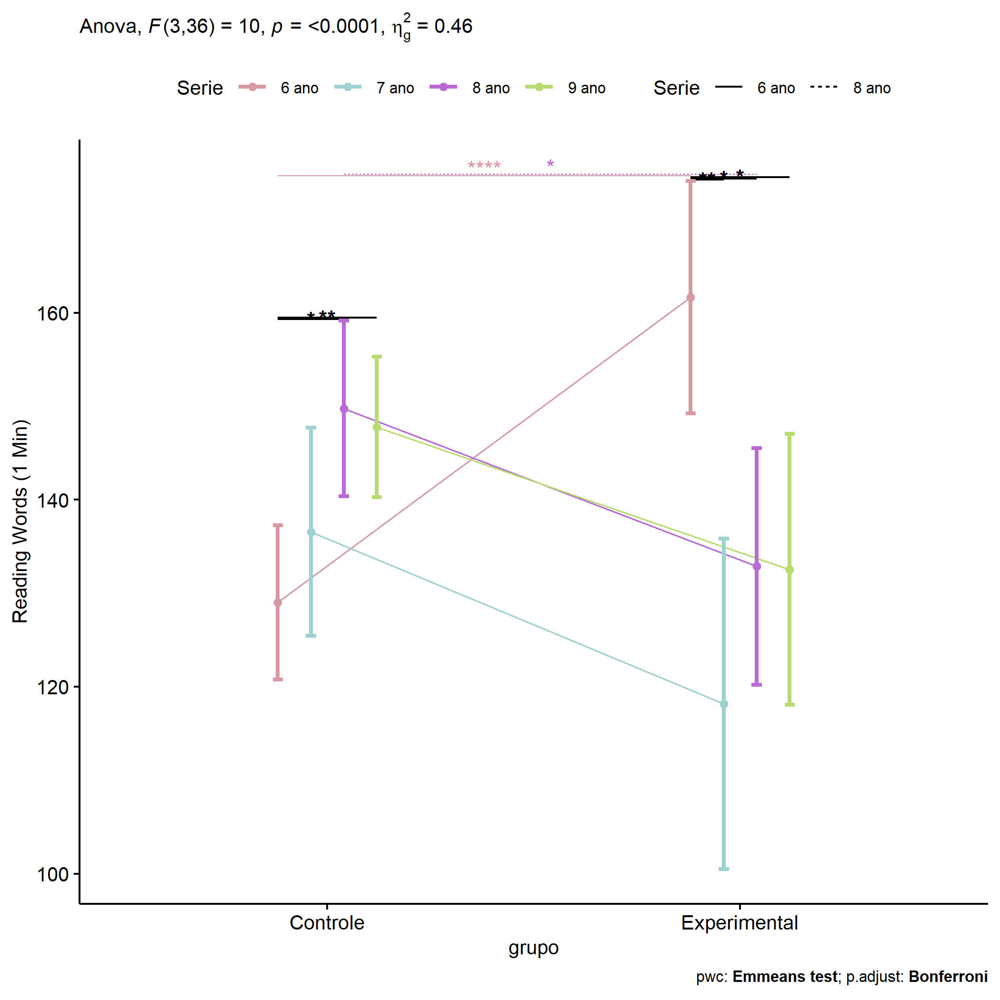<!-- -->

``` r
if (length(unique(pdat[["Serie"]])) >= 2) {
  ggPlotAoC2(pwcs, "Serie", "grupo", aov, ylab = "Reading Words (1 Min)",
               subtitle = which(aov$Effect == "grupo:Serie"), addParam = "errorbar") +
      ggplot2::scale_color_manual(values = color[["grupo"]]) +
      if (ymin.ci < ymax.ci) ggplot2::ylim(ymin.ci, ymax.ci)
}
```

    ## Scale for colour is already present.
    ## Adding another scale for colour, which will replace the existing scale.

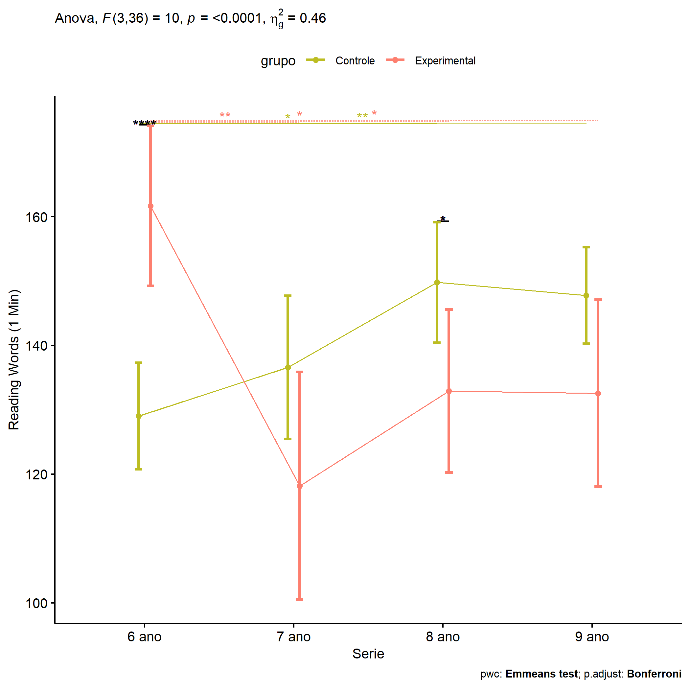<!-- -->

``` r
if (length(unique(pdat[["Serie"]])) >= 2) {
  plots <- twoWayAncovaBoxPlots(
    wdat, "TFL.lidas.per.min.pos", c("grupo","Serie"), aov, pwcs, covar = "TFL.lidas.per.min.pre",
    theme = "classic", color = color[["grupo:Serie"]],
    subtitle = which(aov$Effect == "grupo:Serie"))
}
```

``` r
if (length(unique(pdat[["Serie"]])) >= 2) {
  plots[["grupo:Serie"]] + ggplot2::ylab("Reading Words (1 Min)") +
  ggplot2::scale_x_discrete(labels=c('pre', 'pos')) +
  if (ymin < ymax) ggplot2::ylim(ymin, ymax)
}
```

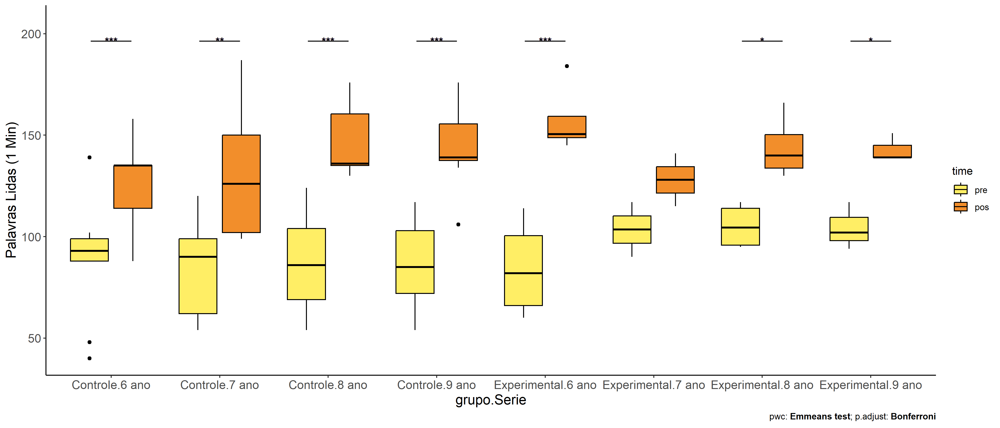<!-- -->

``` r
if (length(unique(pdat[["Serie"]])) >= 2) {
  plots <- twoWayAncovaBoxPlots(
    wdat.long, "TFL.lidas.per.min", c("grupo","Serie"), aov, pwc.long,
    pre.post = "time",
    theme = "classic", color = color$prepost)
}
```

``` r
if (length(unique(pdat[["Serie"]])) >= 2) 
  plots[["grupo:Serie"]] + ggplot2::ylab("Reading Words (1 Min)") +
    if (ymin < ymax) ggplot2::ylim(ymin, ymax)
```

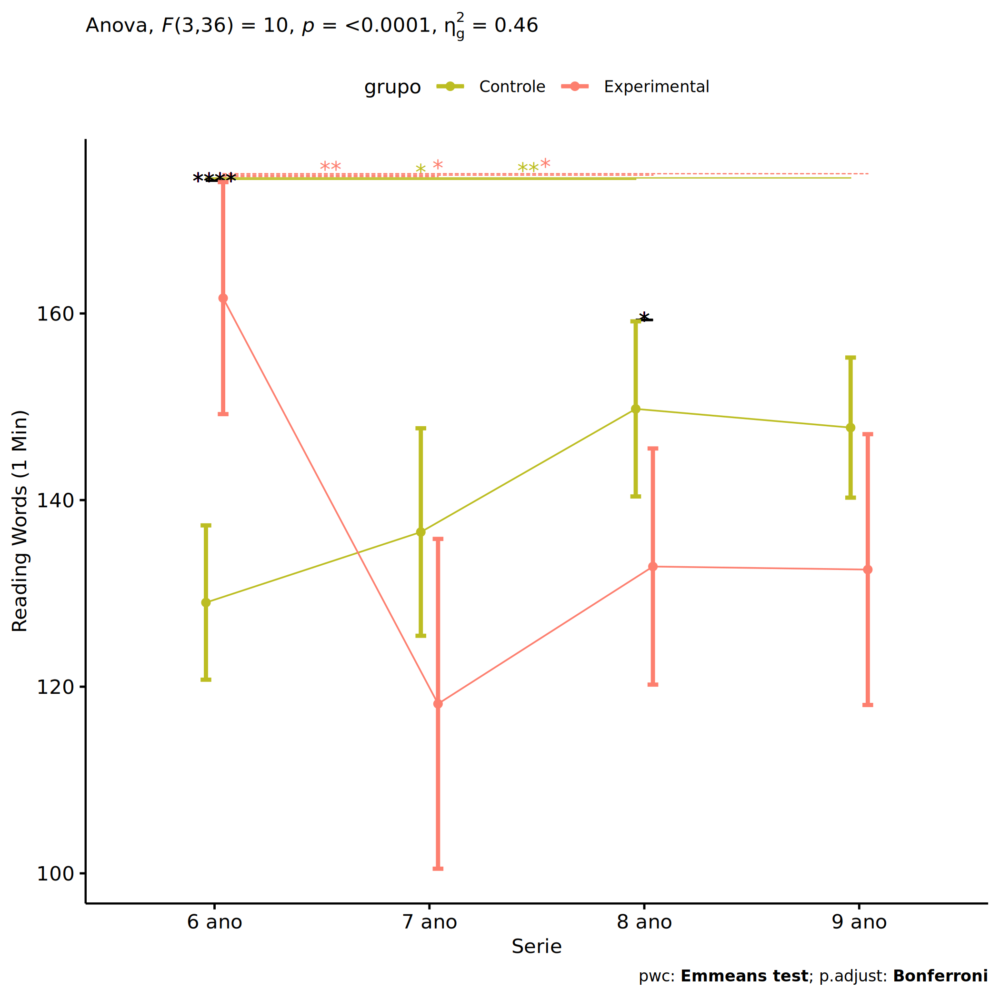<!-- -->

### Checking linearity assumption

``` r
if (length(unique(pdat[["Serie"]])) >= 2) {
  ggscatter(wdat, x = "TFL.lidas.per.min.pre", y = "TFL.lidas.per.min.pos", size = 0.5,
            facet.by = c("grupo","Serie"), add = "reg.line")+
    stat_regline_equation(
      aes(label =  paste(..eq.label.., ..rr.label.., sep = "~~~~"))
    ) +
    if (ymin < ymax) ggplot2::ylim(ymin, ymax)
}
```

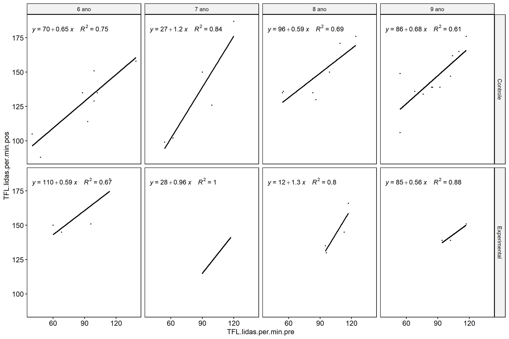<!-- -->

``` r
if (length(unique(pdat[["Serie"]])) >= 2) {
  ggscatter(wdat, x = "TFL.lidas.per.min.pre", y = "TFL.lidas.per.min.pos", size = 0.5,
            color = "grupo", facet.by = "Serie", add = "reg.line")+
    stat_regline_equation(
      aes(label =  paste(..eq.label.., ..rr.label.., sep = "~~~~"), color = grupo)
    ) +
    ggplot2::labs(subtitle = rstatix::get_test_label(aov, detailed = T, row = which(aov$Effect == "grupo:Serie"))) +
    ggplot2::scale_color_manual(values = color[["grupo"]]) +
    if (ymin < ymax) ggplot2::ylim(ymin, ymax)
}
```

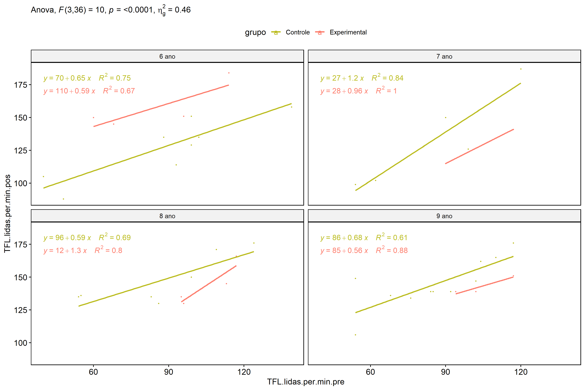<!-- -->

``` r
if (length(unique(pdat[["Serie"]])) >= 2) {
  ggscatter(wdat, x = "TFL.lidas.per.min.pre", y = "TFL.lidas.per.min.pos", size = 0.5,
            color = "Serie", facet.by = "grupo", add = "reg.line")+
    stat_regline_equation(
      aes(label =  paste(..eq.label.., ..rr.label.., sep = "~~~~"), color = Serie)
    ) +
    ggplot2::labs(subtitle = rstatix::get_test_label(aov, detailed = T, row = which(aov$Effect == "grupo:Serie"))) +
    ggplot2::scale_color_manual(values = color[["Serie"]]) +
    if (ymin < ymax) ggplot2::ylim(ymin, ymax)
}
```

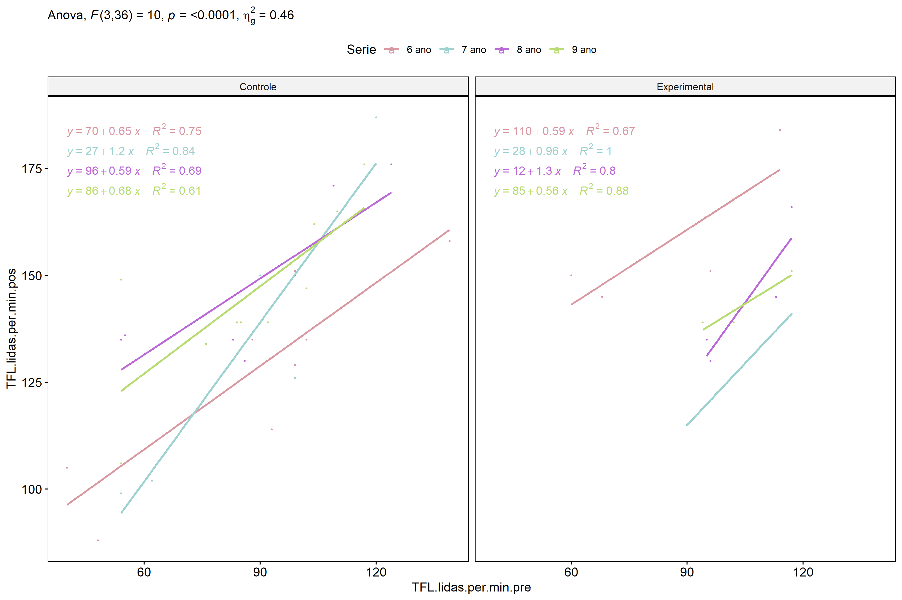<!-- -->

### Checking normality and homogeneity

``` r
if (length(unique(pdat[["Serie"]])) >= 2) 
  res <- augment(lm(TFL.lidas.per.min.pos ~ TFL.lidas.per.min.pre + grupo*Serie, data = wdat))
```

``` r
if (length(unique(pdat[["Serie"]])) >= 2)
  shapiro_test(res$.resid)
```

    ## # A tibble: 1 × 3
    ##   variable   statistic p.value
    ##   <chr>          <dbl>   <dbl>
    ## 1 res$.resid     0.963   0.153

``` r
if (length(unique(pdat[["Serie"]])) >= 2) 
  levene_test(res, .resid ~ grupo*Serie)
```

    ## # A tibble: 1 × 4
    ##     df1   df2 statistic     p
    ##   <int> <int>     <dbl> <dbl>
    ## 1     7    37     0.819 0.578

# ANCOVA and Pairwise for two factors **grupo:TFL.lidas.per.min.quintile**

## Without remove non-normal data

``` r
pdat = remove_group_data(dat[!is.na(dat[["grupo"]]) & !is.na(dat[["TFL.lidas.per.min.quintile"]]),],
                         "TFL.lidas.per.min.pos", c("grupo","TFL.lidas.per.min.quintile"))
pdat = pdat[pdat[["TFL.lidas.per.min.quintile"]] %in% do.call(
  intersect, lapply(unique(pdat[["grupo"]]), FUN = function(x) {
    unique(pdat[["TFL.lidas.per.min.quintile"]][which(pdat[["grupo"]] == x)])
  })),]
pdat[["grupo"]] = factor(pdat[["grupo"]], level[["grupo"]])
pdat[["TFL.lidas.per.min.quintile"]] = factor(
  pdat[["TFL.lidas.per.min.quintile"]],
  level[["TFL.lidas.per.min.quintile"]][level[["TFL.lidas.per.min.quintile"]] %in% unique(pdat[["TFL.lidas.per.min.quintile"]])])

pdat.long <- rbind(pdat[,c("id","grupo","TFL.lidas.per.min.quintile")], pdat[,c("id","grupo","TFL.lidas.per.min.quintile")])
pdat.long[["time"]] <- c(rep("pre", nrow(pdat)), rep("pos", nrow(pdat)))
pdat.long[["time"]] <- factor(pdat.long[["time"]], c("pre","pos"))
pdat.long[["TFL.lidas.per.min"]] <- c(pdat[["TFL.lidas.per.min.pre"]], pdat[["TFL.lidas.per.min.pos"]])

if (length(unique(pdat[["TFL.lidas.per.min.quintile"]])) >= 2) {
  aov = anova_test(pdat, TFL.lidas.per.min.pos ~ TFL.lidas.per.min.pre + grupo*TFL.lidas.per.min.quintile)
  laov[["grupo:TFL.lidas.per.min.quintile"]] <- get_anova_table(aov)
}
```

``` r
if (length(unique(pdat[["TFL.lidas.per.min.quintile"]])) >= 2) {
  pwcs <- list()
  pwcs[["TFL.lidas.per.min.quintile"]] <- emmeans_test(
    group_by(pdat, grupo), TFL.lidas.per.min.pos ~ TFL.lidas.per.min.quintile,
    covariate = TFL.lidas.per.min.pre, p.adjust.method = "bonferroni")
  pwcs[["grupo"]] <- emmeans_test(
    group_by(pdat, TFL.lidas.per.min.quintile), TFL.lidas.per.min.pos ~ grupo,
    covariate = TFL.lidas.per.min.pre, p.adjust.method = "bonferroni")
  
  pwc <- plyr::rbind.fill(pwcs[["grupo"]], pwcs[["TFL.lidas.per.min.quintile"]])
  pwc <- pwc[,c("grupo","TFL.lidas.per.min.quintile", colnames(pwc)[!colnames(pwc) %in% c("grupo","TFL.lidas.per.min.quintile")])]
}
```

``` r
if (length(unique(pdat[["TFL.lidas.per.min.quintile"]])) >= 2) {
  pwc.long <- emmeans_test(dplyr::group_by_at(pdat.long, c("grupo","TFL.lidas.per.min.quintile")),
                           TFL.lidas.per.min ~ time,
                           p.adjust.method = "bonferroni")
  lpwc[["grupo:TFL.lidas.per.min.quintile"]] <- plyr::rbind.fill(pwc, pwc.long)
}
```

``` r
if (length(unique(pdat[["TFL.lidas.per.min.quintile"]])) >= 2) {
  ds <- get.descriptives(pdat, "TFL.lidas.per.min.pos", c("grupo","TFL.lidas.per.min.quintile"), covar = "TFL.lidas.per.min.pre")
  ds <- merge(ds[ds$variable != "TFL.lidas.per.min.pre",],
              ds[ds$variable == "TFL.lidas.per.min.pre", !colnames(ds) %in% c("variable")],
              by = c("grupo","TFL.lidas.per.min.quintile"), all.x = T, suffixes = c("", ".TFL.lidas.per.min.pre"))
  ds <- merge(get_emmeans(pwcs[["grupo"]]), ds,
              by = c("grupo","TFL.lidas.per.min.quintile"), suffixes = c(".emms", ""))
  ds <- ds[,c("grupo","TFL.lidas.per.min.quintile","n","mean.TFL.lidas.per.min.pre","se.TFL.lidas.per.min.pre","mean","se",
              "emmean","se.emms","conf.low","conf.high")]
  
  colnames(ds) <- c("grupo","TFL.lidas.per.min.quintile", "N", paste0(c("M","SE")," (pre)"),
                    paste0(c("M","SE"), " (unadj)"),
                    paste0(c("M", "SE"), " (adj)"), "conf.low", "conf.high")
  
  lemms[["grupo:TFL.lidas.per.min.quintile"]] <- ds
}
```

## Computing ANCOVA and PairWise After removing non-normal data (OK)

``` r
if (length(unique(pdat[["TFL.lidas.per.min.quintile"]])) >= 2) {
  wdat = pdat 
  
  res = residuals(lm(TFL.lidas.per.min.pos ~ TFL.lidas.per.min.pre + grupo*TFL.lidas.per.min.quintile, data = wdat))
  non.normal = getNonNormal(res, wdat$id, plimit = 0.05)
  
  wdat = wdat[!wdat$id %in% non.normal,]
  
  wdat.long <- rbind(wdat[,c("id","grupo","TFL.lidas.per.min.quintile")], wdat[,c("id","grupo","TFL.lidas.per.min.quintile")])
  wdat.long[["time"]] <- c(rep("pre", nrow(wdat)), rep("pos", nrow(wdat)))
  wdat.long[["time"]] <- factor(wdat.long[["time"]], c("pre","pos"))
  wdat.long[["TFL.lidas.per.min"]] <- c(wdat[["TFL.lidas.per.min.pre"]], wdat[["TFL.lidas.per.min.pos"]])
  
  
  ldat[["grupo:TFL.lidas.per.min.quintile"]] = wdat
  
  (non.normal)
}
```

    ##  [1] "P808"  "P463"  "P3516" "P956"  "P3504" "P3721" "P1109" "P820"  "P1010" "P3492" "P3581"
    ## [12] "P1091" "P3609" "P3627" "P1094" "P3501" "P3729" "P3566" "P3498" "P3521" "P445"  "P1097"
    ## [23] "P521"  "P446"  "P3502" "P812"  "P1000" "P816"  "P465"  "P621"  "P947"  "P3606" "P942" 
    ## [34] "P3495" "P618"  "P628"  "P950"  "P241"  "P451"  "P515"  "P448"  "P3558" "P3505" "P128" 
    ## [45] "P1017" "P1089" "P3518" "P615"  "P994"  "P1084" "P813"  "P626"  "P460"  "P3512" "P3524"
    ## [56] "P184"  "P133"  "P616"  "P1716" "P936"  "P513"  "P3615" "P464"  "P512"  "P3519" "P620" 
    ## [67] "P3565" "P2210" "P3560" "P176"  "P523"  "P3734" "P614"  "P3577" "P457"  "P943"  "P3509"
    ## [78] "P613"  "P3598" "P997"  "P3624" "P1729" "P1004" "P516"  "P1742" "P829"  "P612"  "P948" 
    ## [89] "P1107" "P625"  "P449"  "P3578" "P941"  "P953"  "P958"  "P3569" "P174"

``` r
if (length(unique(pdat[["TFL.lidas.per.min.quintile"]])) >= 2) {
  aov = anova_test(wdat, TFL.lidas.per.min.pos ~ TFL.lidas.per.min.pre + grupo*TFL.lidas.per.min.quintile)
  laov[["grupo:TFL.lidas.per.min.quintile"]] <- merge(get_anova_table(aov), laov[["grupo:TFL.lidas.per.min.quintile"]],
                                         by="Effect", suffixes = c("","'"))
  df = get_anova_table(aov)
}
```

| Effect                           | DFn | DFd |     F |     p | p\<.05 |   ges |
|:---------------------------------|----:|----:|------:|------:|:-------|------:|
| TFL.lidas.per.min.pre            |   1 |  36 | 3.613 | 0.065 |        | 0.091 |
| grupo                            |   1 |  36 | 0.022 | 0.882 |        | 0.001 |
| TFL.lidas.per.min.quintile       |   4 |  36 | 2.148 | 0.095 |        | 0.193 |
| grupo:TFL.lidas.per.min.quintile |   4 |  36 | 0.705 | 0.594 |        | 0.073 |

``` r
if (length(unique(pdat[["TFL.lidas.per.min.quintile"]])) >= 2) {
  pwcs <- list()
  pwcs[["TFL.lidas.per.min.quintile"]] <- emmeans_test(
    group_by(wdat, grupo), TFL.lidas.per.min.pos ~ TFL.lidas.per.min.quintile,
    covariate = TFL.lidas.per.min.pre, p.adjust.method = "bonferroni")
  pwcs[["grupo"]] <- emmeans_test(
    group_by(wdat, TFL.lidas.per.min.quintile), TFL.lidas.per.min.pos ~ grupo,
    covariate = TFL.lidas.per.min.pre, p.adjust.method = "bonferroni")
  
  pwc <- plyr::rbind.fill(pwcs[["grupo"]], pwcs[["TFL.lidas.per.min.quintile"]])
  pwc <- pwc[,c("grupo","TFL.lidas.per.min.quintile", colnames(pwc)[!colnames(pwc) %in% c("grupo","TFL.lidas.per.min.quintile")])]
}
```

| grupo        | TFL.lidas.per.min.quintile | term                                              | .y.                   | group1       | group2       |  df | statistic |     p | p.adj | p.adj.signif |
|:-------------|:---------------------------|:--------------------------------------------------|:----------------------|:-------------|:-------------|----:|----------:|------:|------:|:-------------|
|              | 1st quintile               | TFL.lidas.per.min.pre\*grupo                      | TFL.lidas.per.min.pos | Controle     | Experimental |  36 |    -1.106 | 0.276 | 0.276 | ns           |
|              | 2nd quintile               | TFL.lidas.per.min.pre\*grupo                      | TFL.lidas.per.min.pos | Controle     | Experimental |  36 |    -0.061 | 0.951 | 0.951 | ns           |
|              | 3rd quintile               | TFL.lidas.per.min.pre\*grupo                      | TFL.lidas.per.min.pos | Controle     | Experimental |  36 |     1.131 | 0.265 | 0.265 | ns           |
|              | 4th quintile               | TFL.lidas.per.min.pre\*grupo                      | TFL.lidas.per.min.pos | Controle     | Experimental |  36 |    -0.433 | 0.667 | 0.667 | ns           |
|              | 5th quintile               | TFL.lidas.per.min.pre\*grupo                      | TFL.lidas.per.min.pos | Controle     | Experimental |  36 |    -0.251 | 0.804 | 0.804 | ns           |
| Controle     |                            | TFL.lidas.per.min.pre\*TFL.lidas.per.min.quintile | TFL.lidas.per.min.pos | 1st quintile | 2nd quintile |  36 |     0.882 | 0.383 | 1.000 | ns           |
| Controle     |                            | TFL.lidas.per.min.pre\*TFL.lidas.per.min.quintile | TFL.lidas.per.min.pos | 1st quintile | 3rd quintile |  36 |     1.102 | 0.278 | 1.000 | ns           |
| Controle     |                            | TFL.lidas.per.min.pre\*TFL.lidas.per.min.quintile | TFL.lidas.per.min.pos | 1st quintile | 4th quintile |  36 |     0.725 | 0.473 | 1.000 | ns           |
| Controle     |                            | TFL.lidas.per.min.pre\*TFL.lidas.per.min.quintile | TFL.lidas.per.min.pos | 1st quintile | 5th quintile |  36 |     0.649 | 0.520 | 1.000 | ns           |
| Controle     |                            | TFL.lidas.per.min.pre\*TFL.lidas.per.min.quintile | TFL.lidas.per.min.pos | 2nd quintile | 3rd quintile |  36 |     0.823 | 0.416 | 1.000 | ns           |
| Controle     |                            | TFL.lidas.per.min.pre\*TFL.lidas.per.min.quintile | TFL.lidas.per.min.pos | 2nd quintile | 4th quintile |  36 |     0.332 | 0.742 | 1.000 | ns           |
| Controle     |                            | TFL.lidas.per.min.pre\*TFL.lidas.per.min.quintile | TFL.lidas.per.min.pos | 2nd quintile | 5th quintile |  36 |     0.390 | 0.699 | 1.000 | ns           |
| Controle     |                            | TFL.lidas.per.min.pre\*TFL.lidas.per.min.quintile | TFL.lidas.per.min.pos | 3rd quintile | 4th quintile |  36 |    -0.368 | 0.715 | 1.000 | ns           |
| Controle     |                            | TFL.lidas.per.min.pre\*TFL.lidas.per.min.quintile | TFL.lidas.per.min.pos | 3rd quintile | 5th quintile |  36 |     0.019 | 0.985 | 1.000 | ns           |
| Controle     |                            | TFL.lidas.per.min.pre\*TFL.lidas.per.min.quintile | TFL.lidas.per.min.pos | 4th quintile | 5th quintile |  36 |     0.326 | 0.746 | 1.000 | ns           |
| Experimental |                            | TFL.lidas.per.min.pre\*TFL.lidas.per.min.quintile | TFL.lidas.per.min.pos | 1st quintile | 2nd quintile |  36 |     1.671 | 0.103 | 1.000 | ns           |
| Experimental |                            | TFL.lidas.per.min.pre\*TFL.lidas.per.min.quintile | TFL.lidas.per.min.pos | 1st quintile | 3rd quintile |  36 |     2.320 | 0.026 | 0.261 | ns           |
| Experimental |                            | TFL.lidas.per.min.pre\*TFL.lidas.per.min.quintile | TFL.lidas.per.min.pos | 1st quintile | 4th quintile |  36 |     1.286 | 0.207 | 1.000 | ns           |
| Experimental |                            | TFL.lidas.per.min.pre\*TFL.lidas.per.min.quintile | TFL.lidas.per.min.pos | 1st quintile | 5th quintile |  36 |     1.245 | 0.221 | 1.000 | ns           |
| Experimental |                            | TFL.lidas.per.min.pre\*TFL.lidas.per.min.quintile | TFL.lidas.per.min.pos | 2nd quintile | 3rd quintile |  36 |     1.184 | 0.244 | 1.000 | ns           |
| Experimental |                            | TFL.lidas.per.min.pre\*TFL.lidas.per.min.quintile | TFL.lidas.per.min.pos | 2nd quintile | 4th quintile |  36 |     0.056 | 0.956 | 1.000 | ns           |
| Experimental |                            | TFL.lidas.per.min.pre\*TFL.lidas.per.min.quintile | TFL.lidas.per.min.pos | 2nd quintile | 5th quintile |  36 |     0.260 | 0.796 | 1.000 | ns           |
| Experimental |                            | TFL.lidas.per.min.pre\*TFL.lidas.per.min.quintile | TFL.lidas.per.min.pos | 3rd quintile | 4th quintile |  36 |    -1.703 | 0.097 | 0.972 | ns           |
| Experimental |                            | TFL.lidas.per.min.pre\*TFL.lidas.per.min.quintile | TFL.lidas.per.min.pos | 3rd quintile | 5th quintile |  36 |    -0.890 | 0.379 | 1.000 | ns           |
| Experimental |                            | TFL.lidas.per.min.pre\*TFL.lidas.per.min.quintile | TFL.lidas.per.min.pos | 4th quintile | 5th quintile |  36 |     0.438 | 0.664 | 1.000 | ns           |

``` r
if (length(unique(pdat[["TFL.lidas.per.min.quintile"]])) >= 2) {
  pwc.long <- emmeans_test(dplyr::group_by_at(wdat.long, c("grupo","TFL.lidas.per.min.quintile")),
                           TFL.lidas.per.min ~ time,
                           p.adjust.method = "bonferroni")
  lpwc[["grupo:TFL.lidas.per.min.quintile"]] <- merge(plyr::rbind.fill(pwc, pwc.long),
                                         lpwc[["grupo:TFL.lidas.per.min.quintile"]],
                                         by=c("grupo","TFL.lidas.per.min.quintile","term",".y.","group1","group2"),
                                         suffixes = c("","'"))
}
```

| grupo        | TFL.lidas.per.min.quintile | term | .y.               | group1 | group2 |  df | statistic |   p | p.adj | p.adj.signif |
|:-------------|:---------------------------|:-----|:------------------|:-------|:-------|----:|----------:|----:|------:|:-------------|
| Controle     | 1st quintile               | time | TFL.lidas.per.min | pre    | pos    |  74 |    -9.478 |   0 |     0 | \*\*\*\*     |
| Controle     | 2nd quintile               | time | TFL.lidas.per.min | pre    | pos    |  74 |    -7.875 |   0 |     0 | \*\*\*\*     |
| Controle     | 3rd quintile               | time | TFL.lidas.per.min | pre    | pos    |  74 |    -5.501 |   0 |     0 | \*\*\*\*     |
| Controle     | 4th quintile               | time | TFL.lidas.per.min | pre    | pos    |  74 |    -7.562 |   0 |     0 | \*\*\*\*     |
| Controle     | 5th quintile               | time | TFL.lidas.per.min | pre    | pos    |  74 |    -5.328 |   0 |     0 | \*\*\*\*     |
| Experimental | 1st quintile               | time | TFL.lidas.per.min | pre    | pos    |  74 |    -4.987 |   0 |     0 | \*\*\*\*     |
| Experimental | 2nd quintile               | time | TFL.lidas.per.min | pre    | pos    |  74 |    -4.310 |   0 |     0 | \*\*\*\*     |
| Experimental | 3rd quintile               | time | TFL.lidas.per.min | pre    | pos    |  74 |    -4.014 |   0 |     0 | \*\*\*       |
| Experimental | 4th quintile               | time | TFL.lidas.per.min | pre    | pos    |  74 |    -5.846 |   0 |     0 | \*\*\*\*     |
| Experimental | 5th quintile               | time | TFL.lidas.per.min | pre    | pos    |  74 |    -5.125 |   0 |     0 | \*\*\*\*     |

``` r
if (length(unique(pdat[["TFL.lidas.per.min.quintile"]])) >= 2) {
  ds <- get.descriptives(wdat, "TFL.lidas.per.min.pos", c("grupo","TFL.lidas.per.min.quintile"), covar = "TFL.lidas.per.min.pre")
  ds <- merge(ds[ds$variable != "TFL.lidas.per.min.pre",],
              ds[ds$variable == "TFL.lidas.per.min.pre", !colnames(ds) %in% c("variable")],
              by = c("grupo","TFL.lidas.per.min.quintile"), all.x = T, suffixes = c("", ".TFL.lidas.per.min.pre"))
  ds <- merge(get_emmeans(pwcs[["grupo"]]), ds,
              by = c("grupo","TFL.lidas.per.min.quintile"), suffixes = c(".emms", ""))
  ds <- ds[,c("grupo","TFL.lidas.per.min.quintile","n","mean.TFL.lidas.per.min.pre","se.TFL.lidas.per.min.pre",
              "mean","se","emmean","se.emms","conf.low","conf.high")]
  
  colnames(ds) <- c("grupo","TFL.lidas.per.min.quintile", "N", paste0(c("M","SE")," (pre)"),
                    paste0(c("M","SE"), " (unadj)"),
                    paste0(c("M", "SE"), " (adj)"), "conf.low", "conf.high")
  
  lemms[["grupo:TFL.lidas.per.min.quintile"]] <- merge(ds, lemms[["grupo:TFL.lidas.per.min.quintile"]],
                                          by=c("grupo","TFL.lidas.per.min.quintile"), suffixes = c("","'"))
}
```

    ## Warning: There was 1 warning in `mutate()`.
    ## ℹ In argument: `ci = abs(stats::qt(alpha/2, .data$n - 1) * .data$se)`.
    ## Caused by warning:
    ## ! There was 1 warning in `mutate()`.
    ## ℹ In argument: `ci = abs(stats::qt(alpha/2, .data$n - 1) * .data$se)`.
    ## Caused by warning in `stats::qt()`:
    ## ! NaNs produced

| grupo        | TFL.lidas.per.min.quintile |   N | M (pre) | SE (pre) | M (unadj) | SE (unadj) | M (adj) | SE (adj) | conf.low | conf.high |
|:-------------|:---------------------------|----:|--------:|---------:|----------:|-----------:|--------:|---------:|---------:|----------:|
| Controle     | 1st quintile               |   6 |  51.833 |    2.372 |   121.667 |      8.500 | 159.843 |   21.203 |  116.842 |   202.845 |
| Controle     | 2nd quintile               |   7 |  80.429 |    2.419 |   134.143 |      1.792 | 144.598 |    8.358 |  127.646 |   161.549 |
| Controle     | 3rd quintile               |   5 |  90.200 |    1.020 |   134.600 |      5.836 | 135.582 |    7.465 |  120.442 |   150.722 |
| Controle     | 4th quintile               |   8 | 103.000 |    1.558 |   151.250 |      5.130 | 139.823 |    8.414 |  122.758 |   156.888 |
| Controle     | 5th quintile               |   5 | 123.600 |    4.032 |   166.600 |      8.953 | 135.202 |   18.119 |   98.455 |   171.949 |
| Experimental | 1st quintile               |   1 |  60.000 |          |   150.000 |            | 180.260 |   23.037 |  133.538 |   226.981 |
| Experimental | 2nd quintile               |   2 |  68.000 |    0.000 |   123.000 |     22.000 | 145.504 |   16.697 |  111.640 |   179.368 |
| Experimental | 3rd quintile               |   5 |  91.800 |    1.114 |   124.200 |      5.276 | 123.631 |    7.453 |  108.515 |   138.746 |
| Experimental | 4th quintile               |   4 | 101.000 |    3.317 |   153.750 |     14.407 | 144.262 |    9.708 |  124.574 |   163.950 |
| Experimental | 5th quintile               |   4 | 115.250 |    1.031 |   161.500 |      8.703 | 138.197 |   14.819 |  108.142 |   168.252 |

### Plots for ancova

``` r
if (length(unique(pdat[["TFL.lidas.per.min.quintile"]])) >= 2) {
  ggPlotAoC2(pwcs, "grupo", "TFL.lidas.per.min.quintile", aov, ylab = "Reading Words (1 Min)",
             subtitle = which(aov$Effect == "grupo:TFL.lidas.per.min.quintile"), addParam = "errorbar") +
    ggplot2::scale_color_manual(values = color[["TFL.lidas.per.min.quintile"]]) +
    if (ymin.ci < ymax.ci) ggplot2::ylim(ymin.ci, ymax.ci)
}
```

    ## Scale for colour is already present.
    ## Adding another scale for colour, which will replace the existing scale.

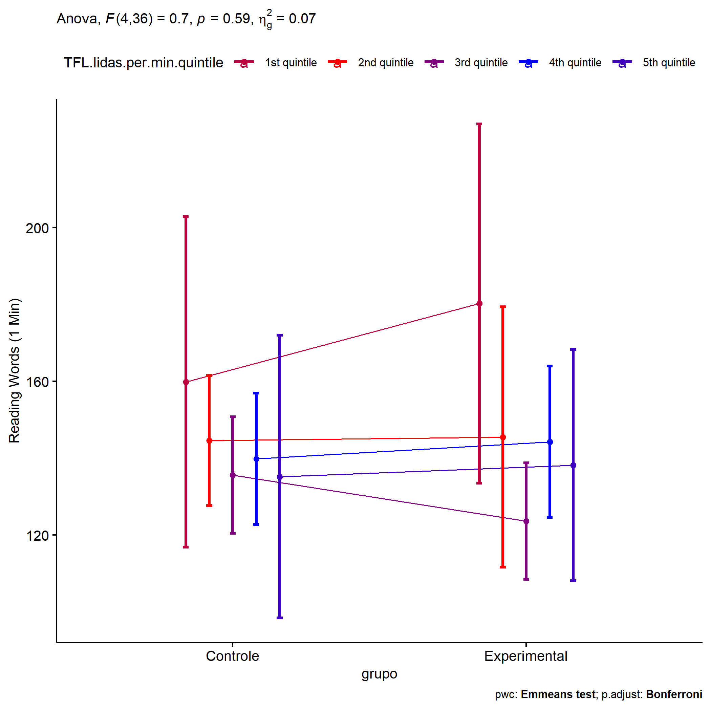<!-- -->

``` r
if (length(unique(pdat[["TFL.lidas.per.min.quintile"]])) >= 2) {
  ggPlotAoC2(pwcs, "TFL.lidas.per.min.quintile", "grupo", aov, ylab = "Reading Words (1 Min)",
               subtitle = which(aov$Effect == "grupo:TFL.lidas.per.min.quintile"), addParam = "errorbar") +
      ggplot2::scale_color_manual(values = color[["grupo"]]) +
      if (ymin.ci < ymax.ci) ggplot2::ylim(ymin.ci, ymax.ci)
}
```

    ## Scale for colour is already present.
    ## Adding another scale for colour, which will replace the existing scale.

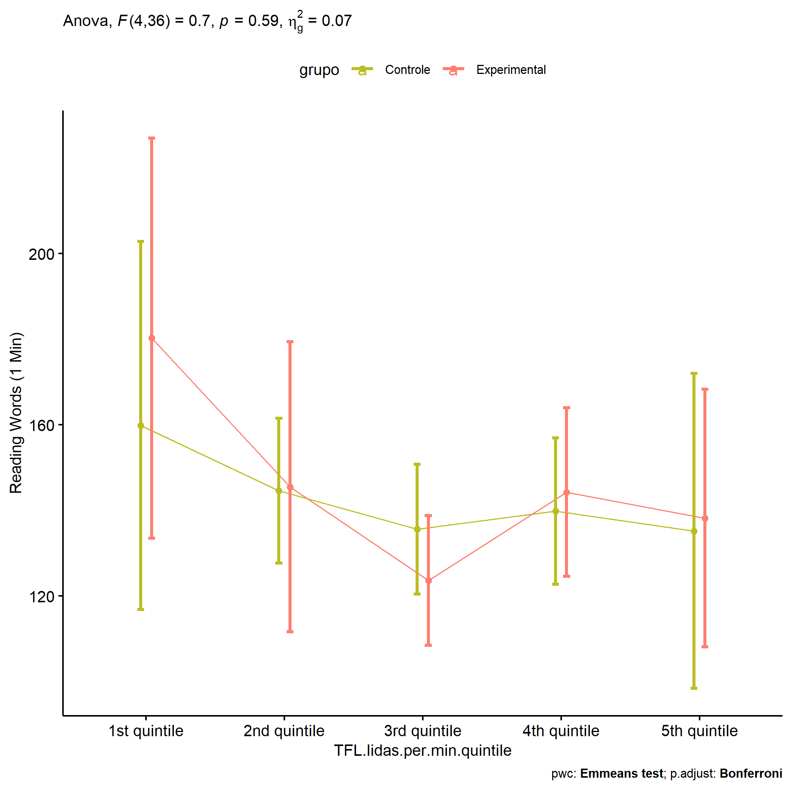<!-- -->

``` r
if (length(unique(pdat[["TFL.lidas.per.min.quintile"]])) >= 2) {
  plots <- twoWayAncovaBoxPlots(
    wdat, "TFL.lidas.per.min.pos", c("grupo","TFL.lidas.per.min.quintile"), aov, pwcs, covar = "TFL.lidas.per.min.pre",
    theme = "classic", color = color[["grupo:TFL.lidas.per.min.quintile"]],
    subtitle = which(aov$Effect == "grupo:TFL.lidas.per.min.quintile"))
}
```

``` r
if (length(unique(pdat[["TFL.lidas.per.min.quintile"]])) >= 2) {
  plots[["grupo:TFL.lidas.per.min.quintile"]] + ggplot2::ylab("Reading Words (1 Min)") +
  ggplot2::scale_x_discrete(labels=c('pre', 'pos')) +
  if (ymin < ymax) ggplot2::ylim(ymin, ymax)
}
```

    ## Warning: No shared levels found between `names(values)` of the manual scale and the data's colour
    ## values.

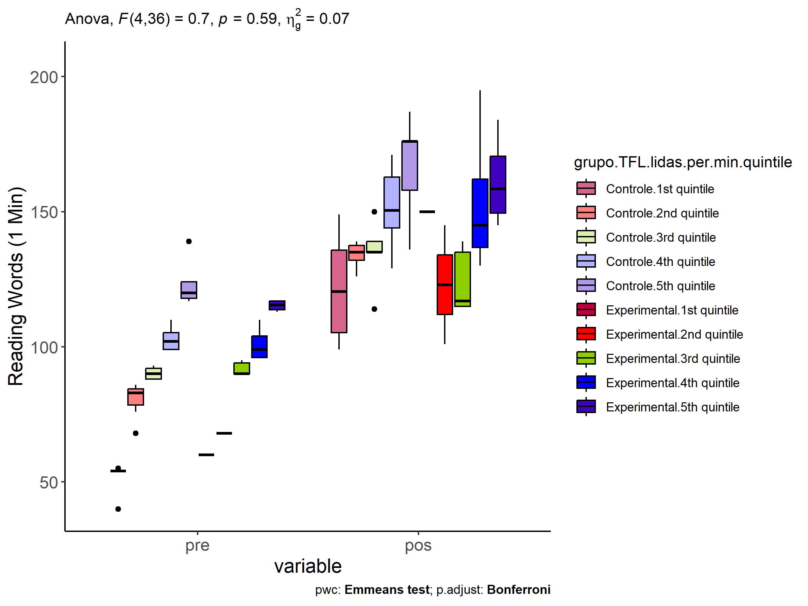<!-- -->

``` r
if (length(unique(pdat[["TFL.lidas.per.min.quintile"]])) >= 2) {
  plots <- twoWayAncovaBoxPlots(
    wdat.long, "TFL.lidas.per.min", c("grupo","TFL.lidas.per.min.quintile"), aov, pwc.long,
    pre.post = "time",
    theme = "classic", color = color$prepost)
}
```

``` r
if (length(unique(pdat[["TFL.lidas.per.min.quintile"]])) >= 2) 
  plots[["grupo:TFL.lidas.per.min.quintile"]] + ggplot2::ylab("Reading Words (1 Min)") +
    if (ymin < ymax) ggplot2::ylim(ymin, ymax)
```

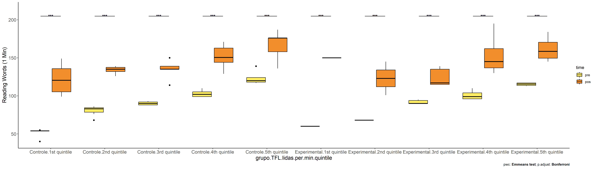<!-- -->

### Checking linearity assumption

``` r
if (length(unique(pdat[["TFL.lidas.per.min.quintile"]])) >= 2) {
  ggscatter(wdat, x = "TFL.lidas.per.min.pre", y = "TFL.lidas.per.min.pos", size = 0.5,
            facet.by = c("grupo","TFL.lidas.per.min.quintile"), add = "reg.line")+
    stat_regline_equation(
      aes(label =  paste(..eq.label.., ..rr.label.., sep = "~~~~"))
    ) +
    if (ymin < ymax) ggplot2::ylim(ymin, ymax)
}
```

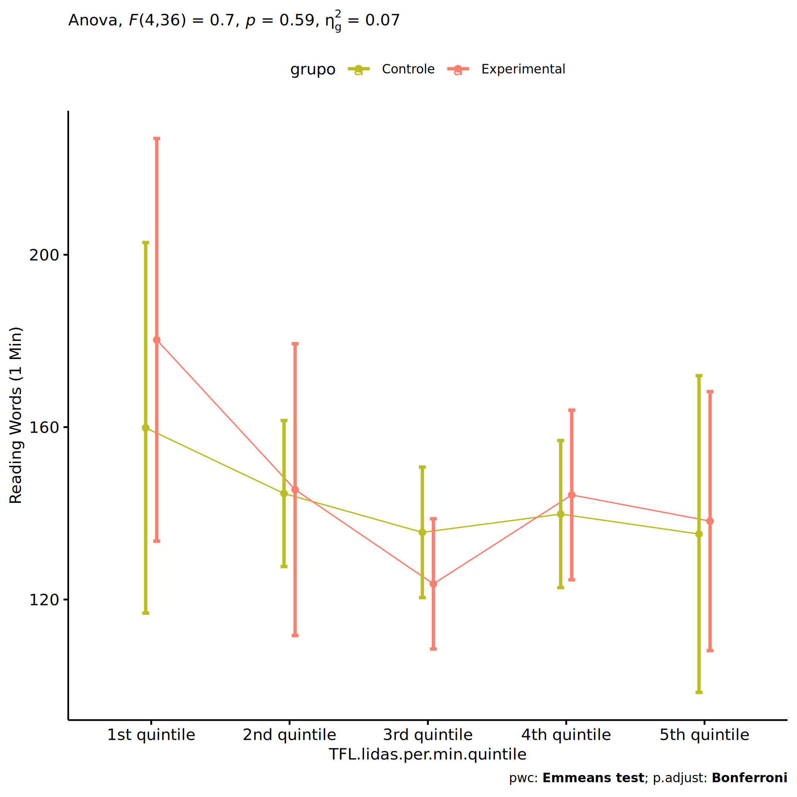<!-- -->

``` r
if (length(unique(pdat[["TFL.lidas.per.min.quintile"]])) >= 2) {
  ggscatter(wdat, x = "TFL.lidas.per.min.pre", y = "TFL.lidas.per.min.pos", size = 0.5,
            color = "grupo", facet.by = "TFL.lidas.per.min.quintile", add = "reg.line")+
    stat_regline_equation(
      aes(label =  paste(..eq.label.., ..rr.label.., sep = "~~~~"), color = grupo)
    ) +
    ggplot2::labs(subtitle = rstatix::get_test_label(aov, detailed = T, row = which(aov$Effect == "grupo:TFL.lidas.per.min.quintile"))) +
    ggplot2::scale_color_manual(values = color[["grupo"]]) +
    if (ymin < ymax) ggplot2::ylim(ymin, ymax)
}
```

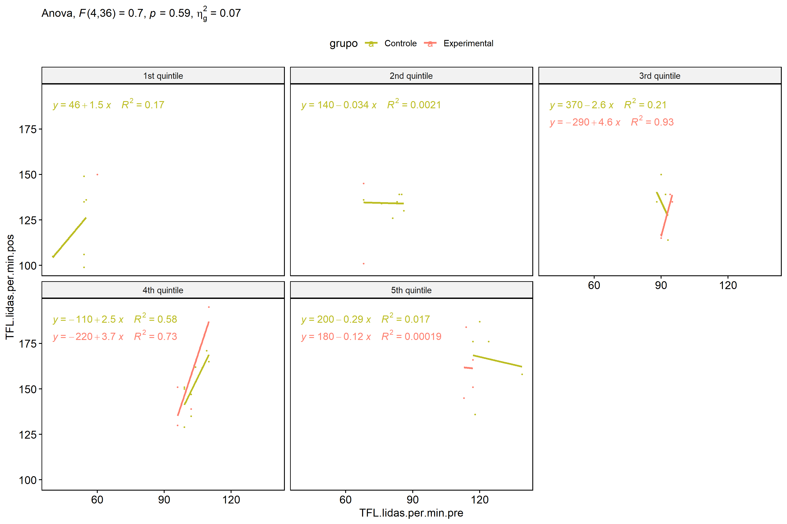<!-- -->

``` r
if (length(unique(pdat[["TFL.lidas.per.min.quintile"]])) >= 2) {
  ggscatter(wdat, x = "TFL.lidas.per.min.pre", y = "TFL.lidas.per.min.pos", size = 0.5,
            color = "TFL.lidas.per.min.quintile", facet.by = "grupo", add = "reg.line")+
    stat_regline_equation(
      aes(label =  paste(..eq.label.., ..rr.label.., sep = "~~~~"), color = TFL.lidas.per.min.quintile)
    ) +
    ggplot2::labs(subtitle = rstatix::get_test_label(aov, detailed = T, row = which(aov$Effect == "grupo:TFL.lidas.per.min.quintile"))) +
    ggplot2::scale_color_manual(values = color[["TFL.lidas.per.min.quintile"]]) +
    if (ymin < ymax) ggplot2::ylim(ymin, ymax)
}
```

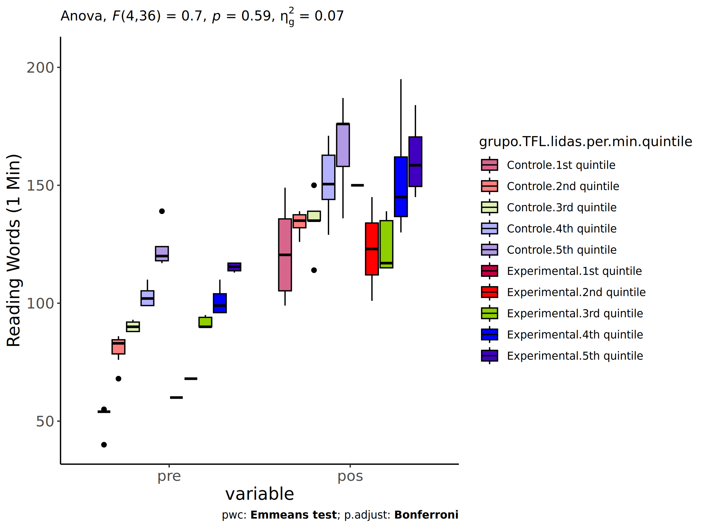<!-- -->

### Checking normality and homogeneity

``` r
if (length(unique(pdat[["TFL.lidas.per.min.quintile"]])) >= 2) 
  res <- augment(lm(TFL.lidas.per.min.pos ~ TFL.lidas.per.min.pre + grupo*TFL.lidas.per.min.quintile, data = wdat))
```

``` r
if (length(unique(pdat[["TFL.lidas.per.min.quintile"]])) >= 2)
  shapiro_test(res$.resid)
```

    ## # A tibble: 1 × 3
    ##   variable   statistic p.value
    ##   <chr>          <dbl>   <dbl>
    ## 1 res$.resid     0.975   0.398

``` r
if (length(unique(pdat[["TFL.lidas.per.min.quintile"]])) >= 2) 
  levene_test(res, .resid ~ grupo*TFL.lidas.per.min.quintile)
```

    ## # A tibble: 1 × 4
    ##     df1   df2 statistic     p
    ##   <int> <int>     <dbl> <dbl>
    ## 1     9    37      1.44 0.207

# Summary of Results

## Descriptive Statistics

``` r
df <- get.descriptives(ldat[["grupo"]], c(dv.pre, dv.pos), c("grupo"), 
                       include.global = T, symmetry.test = T, normality.test = F)
df <- plyr::rbind.fill(
  df, do.call(plyr::rbind.fill, lapply(lfatores2, FUN = function(f) {
    if (nrow(dat) > 0 && sum(!is.na(unique(dat[[f]]))) > 1 && paste0("grupo:",f) %in% names(ldat))
      get.descriptives(ldat[[paste0("grupo:",f)]], c(dv.pre,dv.pos), c("grupo", f),
                       symmetry.test = T, normality.test = F)
    }))
)
```

    ## Warning: There was 1 warning in `mutate()`.
    ## ℹ In argument: `ci = abs(stats::qt(alpha/2, .data$n - 1) * .data$se)`.
    ## Caused by warning:
    ## ! There was 1 warning in `mutate()`.
    ## ℹ In argument: `ci = abs(stats::qt(alpha/2, .data$n - 1) * .data$se)`.
    ## Caused by warning in `stats::qt()`:
    ## ! NaNs produced
    ## There was 1 warning in `mutate()`.
    ## ℹ In argument: `ci = abs(stats::qt(alpha/2, .data$n - 1) * .data$se)`.
    ## Caused by warning:
    ## ! There was 1 warning in `mutate()`.
    ## ℹ In argument: `ci = abs(stats::qt(alpha/2, .data$n - 1) * .data$se)`.
    ## Caused by warning in `stats::qt()`:
    ## ! NaNs produced

``` r
df <- df[,c(fatores1[fatores1 %in% colnames(df)],"variable",
             colnames(df)[!colnames(df) %in% c(fatores1,"variable")])]
```

| grupo        | Sexo | Zona   | Cor.Raca | Serie | TFL.lidas.per.min.quintile | variable              |   n |    mean | median | min | max |     sd |     se |      ci |   iqr | symmetry | skewness | kurtosis |
|:-------------|:-----|:-------|:---------|:------|:---------------------------|:----------------------|----:|--------:|-------:|----:|----:|-------:|-------:|--------:|------:|:---------|---------:|---------:|
| Controle     |      |        |          |       |                            | TFL.lidas.per.min.pre |  33 |  87.364 |   88.0 |  40 | 139 | 24.790 |  4.315 |   8.790 | 34.00 | YES      |   -0.119 |   -0.875 |
| Experimental |      |        |          |       |                            | TFL.lidas.per.min.pre |  19 |  96.947 |   96.0 |  60 | 117 | 17.520 |  4.019 |   8.444 | 23.50 | NO       |   -0.576 |   -0.738 |
|              |      |        |          |       |                            | TFL.lidas.per.min.pre |  52 |  90.865 |   93.0 |  40 | 139 | 22.708 |  3.149 |   6.322 | 29.50 | YES      |   -0.364 |   -0.639 |
| Controle     |      |        |          |       |                            | TFL.lidas.per.min.pos |  33 | 139.000 |  136.0 |  88 | 187 | 22.809 |  3.971 |   8.088 | 20.00 | YES      |   -0.107 |   -0.220 |
| Experimental |      |        |          |       |                            | TFL.lidas.per.min.pos |  19 | 140.684 |  139.0 | 101 | 195 | 23.657 |  5.427 |  11.403 | 27.00 | NO       |    0.528 |   -0.181 |
|              |      |        |          |       |                            | TFL.lidas.per.min.pos |  52 | 139.615 |  139.0 |  88 | 195 | 22.905 |  3.176 |   6.377 | 20.50 | YES      |    0.148 |   -0.038 |
| Controle     | F    |        |          |       |                            | TFL.lidas.per.min.pre |  32 |  93.125 |   95.0 |  40 | 154 | 23.596 |  4.171 |   8.507 | 20.25 | YES      |    0.013 |    0.538 |
| Controle     | M    |        |          |       |                            | TFL.lidas.per.min.pre |  47 |  91.213 |   93.0 |  27 | 141 | 24.340 |  3.550 |   7.146 | 33.50 | YES      |   -0.243 |   -0.321 |
| Experimental | F    |        |          |       |                            | TFL.lidas.per.min.pre |  19 | 101.474 |   97.0 |  76 | 135 | 14.331 |  3.288 |   6.907 | 24.00 | YES      |    0.487 |   -0.482 |
| Experimental | M    |        |          |       |                            | TFL.lidas.per.min.pre |  30 |  89.233 |   89.0 |  54 | 135 | 19.833 |  3.621 |   7.406 | 19.00 | YES      |    0.170 |   -0.496 |
| Controle     | F    |        |          |       |                            | TFL.lidas.per.min.pos |  32 | 115.625 |  117.0 |  87 | 158 | 20.863 |  3.688 |   7.522 | 39.00 | YES      |    0.311 |   -1.184 |
| Controle     | M    |        |          |       |                            | TFL.lidas.per.min.pos |  47 | 101.213 |   99.0 |  43 | 150 | 23.890 |  3.485 |   7.014 | 31.00 | YES      |   -0.053 |   -0.743 |
| Experimental | F    |        |          |       |                            | TFL.lidas.per.min.pos |  19 | 119.316 |  115.0 |  82 | 151 | 20.675 |  4.743 |   9.965 | 38.50 | YES      |    0.055 |   -1.295 |
| Experimental | M    |        |          |       |                            | TFL.lidas.per.min.pos |  30 | 104.733 |  100.0 |  67 | 166 | 22.451 |  4.099 |   8.383 | 22.75 | NO       |    0.594 |    0.052 |
| Controle     |      | Rural  |          |       |                            | TFL.lidas.per.min.pre |  55 |  92.764 |   95.0 |  27 | 154 | 25.675 |  3.462 |   6.941 | 34.00 | YES      |   -0.221 |   -0.119 |
| Controle     |      | Urbana |          |       |                            | TFL.lidas.per.min.pre |   7 |  93.000 |   99.0 |  48 | 124 | 24.055 |  9.092 |  22.248 | 19.00 | NO       |   -0.586 |   -0.815 |
| Experimental |      | Rural  |          |       |                            | TFL.lidas.per.min.pre |  32 |  91.656 |   92.5 |  54 | 135 | 18.074 |  3.195 |   6.517 | 17.50 | YES      |    0.074 |   -0.215 |
| Experimental |      | Urbana |          |       |                            | TFL.lidas.per.min.pre |   5 | 101.200 |   95.0 |  90 | 135 | 19.097 |  8.540 |  23.712 |  6.00 | NO       |    1.017 |   -0.987 |
| Controle     |      | Rural  |          |       |                            | TFL.lidas.per.min.pos |  55 | 103.491 |  104.0 |  43 | 150 | 22.105 |  2.981 |   5.976 | 29.50 | YES      |   -0.176 |   -0.287 |
| Controle     |      | Urbana |          |       |                            | TFL.lidas.per.min.pos |   7 | 142.857 |  150.0 |  88 | 176 | 28.399 | 10.734 |  26.264 | 23.00 | NO       |   -0.735 |   -0.690 |
| Experimental |      | Rural  |          |       |                            | TFL.lidas.per.min.pos |  32 | 104.656 |  101.5 |  70 | 141 | 17.138 |  3.030 |   6.179 | 20.00 | YES      |    0.280 |   -0.333 |
| Experimental |      | Urbana |          |       |                            | TFL.lidas.per.min.pos |   5 | 122.200 |  115.0 |  99 | 151 | 19.677 |  8.800 |  24.433 | 16.00 | YES      |    0.298 |   -1.681 |
| Controle     |      |        | Parda    |       |                            | TFL.lidas.per.min.pre |  41 |  91.707 |   95.0 |  27 | 135 | 23.364 |  3.649 |   7.374 | 33.00 | YES      |   -0.488 |   -0.157 |
| Controle     |      |        | Branca   |       |                            | TFL.lidas.per.min.pre |  11 | 106.909 |  105.0 |  90 | 141 | 15.865 |  4.783 |  10.658 | 24.50 | NO       |    0.687 |   -0.662 |
| Experimental |      |        | Parda    |       |                            | TFL.lidas.per.min.pre |  16 |  88.688 |   86.0 |  54 | 135 | 20.261 |  5.065 |  10.796 | 17.00 | NO       |    0.549 |   -0.209 |
| Experimental |      |        | Branca   |       |                            | TFL.lidas.per.min.pre |   5 | 104.000 |   96.0 |  95 | 117 | 11.874 |  5.310 |  14.744 | 22.00 | few data |    0.000 |    0.000 |
| Controle     |      |        | Parda    |       |                            | TFL.lidas.per.min.pos |  41 |  99.000 |   96.0 |  43 | 151 | 22.087 |  3.449 |   6.972 | 29.00 | YES      |    0.046 |   -0.103 |
| Controle     |      |        | Branca   |       |                            | TFL.lidas.per.min.pos |  11 | 112.273 |  116.0 |  87 | 135 | 15.219 |  4.589 |  10.224 | 17.00 | YES      |   -0.325 |   -1.245 |
| Experimental |      |        | Parda    |       |                            | TFL.lidas.per.min.pos |  16 | 100.750 |   97.0 |  70 | 145 | 19.039 |  4.760 |  10.145 | 10.75 | NO       |    0.737 |    0.167 |
| Experimental |      |        | Branca   |       |                            | TFL.lidas.per.min.pos |   5 | 126.600 |  121.0 | 110 | 151 | 18.609 |  8.322 |  23.106 | 31.00 | YES      |    0.254 |   -2.082 |
| Controle     |      |        |          | 6 ano |                            | TFL.lidas.per.min.pre |   9 |  88.444 |   93.0 |  40 | 139 | 29.509 |  9.836 |  22.683 | 11.00 | YES      |   -0.198 |   -0.835 |
| Controle     |      |        |          | 7 ano |                            | TFL.lidas.per.min.pre |   5 |  85.000 |   90.0 |  54 | 120 | 27.092 | 12.116 |  33.640 | 37.00 | YES      |    0.038 |   -1.982 |
| Controle     |      |        |          | 8 ano |                            | TFL.lidas.per.min.pre |   7 |  87.143 |   86.0 |  54 | 124 | 26.226 |  9.913 |  24.255 | 35.00 | YES      |   -0.059 |   -1.681 |
| Controle     |      |        |          | 9 ano |                            | TFL.lidas.per.min.pre |  11 |  86.000 |   85.0 |  54 | 117 | 21.517 |  6.488 |  14.456 | 31.00 | YES      |   -0.170 |   -1.457 |
| Experimental |      |        |          | 6 ano |                            | TFL.lidas.per.min.pre |   4 |  84.500 |   82.0 |  60 | 114 | 25.000 | 12.500 |  39.781 | 34.50 | YES      |    0.128 |   -2.226 |
| Experimental |      |        |          | 7 ano |                            | TFL.lidas.per.min.pre |   2 | 103.500 |  103.5 |  90 | 117 | 19.092 | 13.500 | 171.534 | 13.50 | few data |    0.000 |    0.000 |
| Experimental |      |        |          | 8 ano |                            | TFL.lidas.per.min.pre |   4 | 105.250 |  104.5 |  95 | 117 | 11.383 |  5.692 |  18.114 | 18.25 | YES      |    0.037 |   -2.389 |
| Experimental |      |        |          | 9 ano |                            | TFL.lidas.per.min.pre |   3 | 104.333 |  102.0 |  94 | 117 | 11.676 |  6.741 |  29.005 | 11.50 | few data |    0.000 |    0.000 |
| Controle     |      |        |          | 6 ano |                            | TFL.lidas.per.min.pos |   9 | 127.778 |  135.0 |  88 | 158 | 22.084 |  7.361 |  16.975 | 21.00 | YES      |   -0.373 |   -1.158 |
| Controle     |      |        |          | 7 ano |                            | TFL.lidas.per.min.pos |   5 | 132.800 |  126.0 |  99 | 187 | 36.643 | 16.387 |  45.498 | 48.00 | YES      |    0.391 |   -1.788 |
| Controle     |      |        |          | 8 ano |                            | TFL.lidas.per.min.pos |   7 | 147.571 |  136.0 | 130 | 176 | 18.805 |  7.108 |  17.392 | 25.50 | NO       |    0.535 |   -1.723 |
| Controle     |      |        |          | 9 ano |                            | TFL.lidas.per.min.pos |  11 | 144.727 |  139.0 | 106 | 176 | 18.709 |  5.641 |  12.569 | 18.00 | YES      |   -0.227 |   -0.413 |
| Experimental |      |        |          | 6 ano |                            | TFL.lidas.per.min.pos |   4 | 157.500 |  150.5 | 145 | 184 | 17.861 |  8.930 |  28.420 | 10.50 | NO       |    0.700 |   -1.716 |
| Experimental |      |        |          | 7 ano |                            | TFL.lidas.per.min.pos |   2 | 128.000 |  128.0 | 115 | 141 | 18.385 | 13.000 | 165.181 | 13.00 | few data |    0.000 |    0.000 |
| Experimental |      |        |          | 8 ano |                            | TFL.lidas.per.min.pos |   4 | 144.000 |  140.0 | 130 | 166 | 15.937 |  7.969 |  25.360 | 16.50 | YES      |    0.443 |   -1.918 |
| Experimental |      |        |          | 9 ano |                            | TFL.lidas.per.min.pos |   3 | 143.000 |  139.0 | 139 | 151 |  6.928 |  4.000 |  17.211 |  6.00 | few data |    0.000 |    0.000 |
| Controle     |      |        |          |       | 1st quintile               | TFL.lidas.per.min.pre |   6 |  51.833 |   54.0 |  40 |  55 |  5.811 |  2.372 |   6.098 |  0.00 | few data |    0.000 |    0.000 |
| Controle     |      |        |          |       | 2nd quintile               | TFL.lidas.per.min.pre |   7 |  80.429 |   83.0 |  68 |  86 |  6.399 |  2.419 |   5.918 |  6.00 | NO       |   -0.913 |   -0.798 |
| Controle     |      |        |          |       | 3rd quintile               | TFL.lidas.per.min.pre |   5 |  90.200 |   90.0 |  88 |  93 |  2.280 |  1.020 |   2.831 |  4.00 | YES      |    0.109 |   -2.121 |
| Controle     |      |        |          |       | 4th quintile               | TFL.lidas.per.min.pre |   8 | 103.000 |  102.0 |  99 | 110 |  4.408 |  1.558 |   3.685 |  6.25 | NO       |    0.534 |   -1.520 |
| Controle     |      |        |          |       | 5th quintile               | TFL.lidas.per.min.pre |   5 | 123.600 |  120.0 | 117 | 139 |  9.017 |  4.032 |  11.196 |  6.00 | NO       |    0.857 |   -1.206 |
| Experimental |      |        |          |       | 1st quintile               | TFL.lidas.per.min.pre |   1 |  60.000 |   60.0 |  60 |  60 |        |        |         |  0.00 | few data |    0.000 |    0.000 |
| Experimental |      |        |          |       | 2nd quintile               | TFL.lidas.per.min.pre |   2 |  68.000 |   68.0 |  68 |  68 |  0.000 |  0.000 |   0.000 |  0.00 | few data |    0.000 |    0.000 |
| Experimental |      |        |          |       | 3rd quintile               | TFL.lidas.per.min.pre |   5 |  91.800 |   90.0 |  90 |  95 |  2.490 |  1.114 |   3.092 |  4.00 | few data |    0.000 |    0.000 |
| Experimental |      |        |          |       | 4th quintile               | TFL.lidas.per.min.pre |   4 | 101.000 |   99.0 |  96 | 110 |  6.633 |  3.317 |  10.555 |  8.00 | few data |    0.000 |    0.000 |
| Experimental |      |        |          |       | 5th quintile               | TFL.lidas.per.min.pre |   4 | 115.250 |  115.5 | 113 | 117 |  2.062 |  1.031 |   3.280 |  3.25 | few data |    0.000 |    0.000 |
| Controle     |      |        |          |       | 1st quintile               | TFL.lidas.per.min.pos |   6 | 121.667 |  120.5 |  99 | 149 | 20.820 |  8.500 |  21.849 | 30.50 | YES      |    0.104 |   -2.083 |
| Controle     |      |        |          |       | 2nd quintile               | TFL.lidas.per.min.pos |   7 | 134.143 |  135.0 | 126 | 139 |  4.741 |  1.792 |   4.385 |  5.50 | NO       |   -0.503 |   -1.355 |
| Controle     |      |        |          |       | 3rd quintile               | TFL.lidas.per.min.pos |   5 | 134.600 |  135.0 | 114 | 150 | 13.050 |  5.836 |  16.204 |  4.00 | YES      |   -0.450 |   -1.368 |
| Controle     |      |        |          |       | 4th quintile               | TFL.lidas.per.min.pos |   8 | 151.250 |  150.5 | 129 | 171 | 14.509 |  5.130 |  12.130 | 18.75 | YES      |   -0.157 |   -1.543 |
| Controle     |      |        |          |       | 5th quintile               | TFL.lidas.per.min.pos |   5 | 166.600 |  176.0 | 136 | 187 | 20.020 |  8.953 |  24.858 | 18.00 | YES      |   -0.477 |   -1.667 |
| Experimental |      |        |          |       | 1st quintile               | TFL.lidas.per.min.pos |   1 | 150.000 |  150.0 | 150 | 150 |        |        |         |  0.00 | few data |    0.000 |    0.000 |
| Experimental |      |        |          |       | 2nd quintile               | TFL.lidas.per.min.pos |   2 | 123.000 |  123.0 | 101 | 145 | 31.113 | 22.000 | 279.537 | 22.00 | few data |    0.000 |    0.000 |
| Experimental |      |        |          |       | 3rd quintile               | TFL.lidas.per.min.pos |   5 | 124.200 |  117.0 | 115 | 139 | 11.798 |  5.276 |  14.650 | 20.00 | YES      |    0.313 |   -2.189 |
| Experimental |      |        |          |       | 4th quintile               | TFL.lidas.per.min.pos |   4 | 153.750 |  145.0 | 130 | 195 | 28.814 | 14.407 |  45.850 | 25.25 | NO       |    0.560 |   -1.817 |
| Experimental |      |        |          |       | 5th quintile               | TFL.lidas.per.min.pos |   4 | 161.500 |  158.5 | 145 | 184 | 17.407 |  8.703 |  27.698 | 21.00 | YES      |    0.276 |   -2.066 |

## ANCOVA Table Comparison

``` r
df <- do.call(plyr::rbind.fill, laov)
df <- df[!duplicated(df$Effect),]
```

|     | Effect                           | DFn | DFd |      F |     p | p\<.05 |   ges | DFn’ | DFd’ |     F’ |    p’ | p\<.05’ |  ges’ |
|:----|:---------------------------------|----:|----:|-------:|------:|:-------|------:|-----:|-----:|-------:|------:|:--------|------:|
| 1   | grupo                            |   1 |  49 |  0.929 | 0.340 |        | 0.019 |    1 |  141 |  0.001 | 0.972 |         | 0.000 |
| 2   | TFL.lidas.per.min.pre            |   1 |  49 | 39.759 | 0.000 | \*     | 0.448 |    1 |  141 | 50.978 | 0.000 | \*      | 0.266 |
| 4   | grupo:Sexo                       |   1 | 123 |  0.986 | 0.323 |        | 0.008 |    1 |  139 |  0.076 | 0.783 |         | 0.001 |
| 5   | Sexo                             |   1 | 123 | 11.520 | 0.001 | \*     | 0.086 |    1 |  139 |  7.912 | 0.006 | \*      | 0.054 |
| 8   | grupo:Zona                       |   1 |  94 |  8.262 | 0.005 | \*     | 0.081 |    1 |  101 |  1.833 | 0.179 |         | 0.018 |
| 10  | Zona                             |   1 |  94 | 34.869 | 0.000 | \*     | 0.271 |    1 |  101 | 18.781 | 0.000 | \*      | 0.157 |
| 11  | Cor.Raca                         |   1 |  68 |  2.633 | 0.109 |        | 0.037 |    1 |   70 |  2.592 | 0.112 |         | 0.036 |
| 13  | grupo:Cor.Raca                   |   1 |  68 |  1.775 | 0.187 |        | 0.025 |    1 |   70 |  0.839 | 0.363 |         | 0.012 |
| 16  | grupo:Serie                      |   3 |  36 | 10.000 | 0.000 | \*     | 0.455 |    3 |  135 |  2.266 | 0.084 |         | 0.048 |
| 17  | Serie                            |   3 |  36 |  2.179 | 0.107 |        | 0.154 |    3 |  135 |  1.687 | 0.173 |         | 0.036 |
| 20  | grupo:TFL.lidas.per.min.quintile |   4 |  36 |  0.705 | 0.594 |        | 0.073 |    4 |  133 |  0.701 | 0.592 |         | 0.021 |
| 22  | TFL.lidas.per.min.quintile       |   4 |  36 |  2.148 | 0.095 |        | 0.193 |    4 |  133 |  0.977 | 0.422 |         | 0.029 |

## PairWise Table Comparison

``` r
df <- do.call(plyr::rbind.fill, lpwc)
df <- df[,c(names(lfatores)[names(lfatores) %in% colnames(df)],
            names(df)[!names(df) %in% c(names(lfatores),"term",".y.")])]
```

| grupo        | Sexo | Zona   | Cor.Raca | Serie | TFL.lidas.per.min.quintile | group1       | group2       |  df | statistic |     p | p.adj | p.adj.signif | df’ | statistic’ |    p’ | p.adj’ | p.adj.signif’ |
|:-------------|:-----|:-------|:---------|:------|:---------------------------|:-------------|:-------------|----:|----------:|------:|------:|:-------------|----:|-----------:|------:|-------:|:--------------|
| Controle     |      |        |          |       |                            | pre          | pos          | 100 |    -9.206 | 0.000 | 0.000 | \*\*\*\*     | 284 |     -5.744 | 0.000 |  0.000 | \*\*\*\*      |
| Experimental |      |        |          |       |                            | pre          | pos          | 100 |    -5.917 | 0.000 | 0.000 | \*\*\*\*     | 284 |     -4.298 | 0.000 |  0.000 | \*\*\*\*      |
|              |      |        |          |       |                            | Controle     | Experimental |  49 |     0.964 | 0.340 | 0.340 | ns           | 141 |     -0.035 | 0.972 |  0.972 | ns            |
| Controle     | F    |        |          |       |                            | pre          | pos          | 248 |    -4.063 | 0.000 | 0.000 | \*\*\*\*     | 280 |     -4.627 | 0.000 |  0.000 | \*\*\*\*      |
| Controle     | M    |        |          |       |                            | pre          | pos          | 248 |    -2.189 | 0.030 | 0.030 | \*           | 280 |     -3.774 | 0.000 |  0.000 | \*\*\*        |
| Controle     |      |        |          |       |                            | F            | M            | 123 |     3.299 | 0.001 | 0.001 | \*\*         | 139 |      2.074 | 0.040 |  0.040 | \*            |
| Experimental | F    |        |          |       |                            | pre          | pos          | 248 |    -2.483 | 0.014 | 0.014 | \*           | 280 |     -3.562 | 0.000 |  0.000 | \*\*\*        |
| Experimental | M    |        |          |       |                            | pre          | pos          | 248 |    -2.710 | 0.007 | 0.007 | \*\*         | 280 |     -2.717 | 0.007 |  0.007 | \*\*          |
| Experimental |      |        |          |       |                            | F            | M            | 123 |     1.293 | 0.198 | 0.198 | ns           | 139 |      1.934 | 0.055 |  0.055 | ns            |
|              | F    |        |          |       |                            | Controle     | Experimental | 123 |     0.332 | 0.741 | 0.741 | ns           | 139 |     -0.208 | 0.836 |  0.836 | ns            |
|              | M    |        |          |       |                            | Controle     | Experimental | 123 |    -1.177 | 0.241 | 0.241 | ns           | 139 |      0.182 | 0.856 |  0.856 | ns            |
| Controle     |      |        |          |       |                            | Rural        | Urbana       |  94 |    -6.379 | 0.000 | 0.000 | \*\*\*\*     | 101 |     -4.128 | 0.000 |  0.000 | \*\*\*\*      |
| Controle     |      | Rural  |          |       |                            | pre          | pos          | 190 |    -2.549 | 0.012 | 0.012 | \*           | 204 |     -3.169 | 0.002 |  0.002 | \*\*          |
| Controle     |      | Urbana |          |       |                            | pre          | pos          | 190 |    -4.227 | 0.000 | 0.000 | \*\*\*\*     | 204 |     -3.822 | 0.000 |  0.000 | \*\*\*        |
| Experimental |      |        |          |       |                            | Rural        | Urbana       |  94 |    -1.565 | 0.121 | 0.121 | ns           | 101 |     -1.895 | 0.061 |  0.061 | ns            |
| Experimental |      | Rural  |          |       |                            | pre          | pos          | 190 |    -2.356 | 0.019 | 0.019 | \*           | 204 |     -3.198 | 0.002 |  0.002 | \*\*          |
| Experimental |      | Urbana |          |       |                            | pre          | pos          | 190 |    -1.505 | 0.134 | 0.134 | ns           | 204 |     -2.247 | 0.026 |  0.026 | \*            |
|              |      | Rural  |          |       |                            | Controle     | Experimental |  94 |    -0.545 | 0.587 | 0.587 | ns           | 101 |     -0.806 | 0.422 |  0.422 | ns            |
|              |      | Urbana |          |       |                            | Controle     | Experimental |  94 |     2.869 | 0.005 | 0.005 | \*\*         | 101 |      1.141 | 0.256 |  0.256 | ns            |
| Controle     |      |        | Branca   |       |                            | pre          | pos          | 138 |    -0.605 | 0.546 | 0.546 | ns           | 142 |     -1.097 | 0.275 |  0.275 | ns            |
| Controle     |      |        |          |       |                            | Parda        | Branca       |  68 |    -0.658 | 0.513 | 0.513 | ns           |  70 |     -0.897 | 0.373 |  0.373 | ns            |
| Controle     |      |        | Parda    |       |                            | pre          | pos          | 138 |    -1.587 | 0.115 | 0.115 | ns           | 142 |     -1.803 | 0.073 |  0.073 | ns            |
| Experimental |      |        | Branca   |       |                            | pre          | pos          | 138 |    -1.718 | 0.088 | 0.088 | ns           | 142 |     -1.614 | 0.109 |  0.109 | ns            |
| Experimental |      |        |          |       |                            | Parda        | Branca       |  68 |    -2.019 | 0.047 | 0.047 | \*           |  70 |     -1.652 | 0.103 |  0.103 | ns            |
| Experimental |      |        | Parda    |       |                            | pre          | pos          | 138 |    -1.640 | 0.103 | 0.103 | ns           | 142 |     -1.541 | 0.126 |  0.126 | ns            |
|              |      |        | Branca   |       |                            | Controle     | Experimental |  68 |    -1.965 | 0.054 | 0.054 | ns           |  70 |     -1.271 | 0.208 |  0.208 | ns            |
|              |      |        | Parda    |       |                            | Controle     | Experimental |  68 |    -0.818 | 0.416 | 0.416 | ns           |  70 |     -0.407 | 0.685 |  0.685 | ns            |
| Controle     |      |        |          | 6 ano |                            | pre          | pos          |  74 |    -3.653 | 0.000 | 0.000 | \*\*\*       | 272 |     -2.118 | 0.035 |  0.035 | \*            |
| Controle     |      |        |          | 7 ano |                            | pre          | pos          |  74 |    -3.309 | 0.001 | 0.001 | \*\*         | 272 |     -2.124 | 0.035 |  0.035 | \*            |
| Controle     |      |        |          | 8 ano |                            | pre          | pos          |  74 |    -4.949 | 0.000 | 0.000 | \*\*\*\*     | 272 |     -3.765 | 0.000 |  0.000 | \*\*\*        |
| Controle     |      |        |          | 9 ano |                            | pre          | pos          |  74 |    -6.030 | 0.000 | 0.000 | \*\*\*\*     | 272 |     -3.795 | 0.000 |  0.000 | \*\*\*        |
| Controle     |      |        |          |       |                            | 6 ano        | 7 ano        |  36 |    -1.107 | 0.275 | 1.000 | ns           | 135 |     -0.902 | 0.369 |  1.000 | ns            |
| Controle     |      |        |          |       |                            | 6 ano        | 8 ano        |  36 |    -3.368 | 0.002 | 0.011 | \*           | 135 |     -2.815 | 0.006 |  0.034 | \*            |
| Controle     |      |        |          |       |                            | 6 ano        | 9 ano        |  36 |    -3.410 | 0.002 | 0.010 | \*\*         | 135 |     -2.311 | 0.022 |  0.134 | ns            |
| Controle     |      |        |          |       |                            | 7 ano        | 8 ano        |  36 |    -1.843 | 0.074 | 0.441 | ns           | 135 |     -1.794 | 0.075 |  0.451 | ns            |
| Controle     |      |        |          |       |                            | 7 ano        | 9 ano        |  36 |    -1.697 | 0.098 | 0.589 | ns           | 135 |     -1.166 | 0.246 |  1.000 | ns            |
| Controle     |      |        |          |       |                            | 8 ano        | 9 ano        |  36 |     0.339 | 0.737 | 1.000 | ns           | 135 |      0.830 | 0.408 |  1.000 | ns            |
| Experimental |      |        |          | 6 ano |                            | pre          | pos          |  74 |    -4.520 | 0.000 | 0.000 | \*\*\*\*     | 272 |     -3.339 | 0.001 |  0.001 | \*\*\*        |
| Experimental |      |        |          | 7 ano |                            | pre          | pos          |  74 |    -1.073 | 0.287 | 0.287 | ns           | 272 |     -1.303 | 0.194 |  0.194 | ns            |
| Experimental |      |        |          | 8 ano |                            | pre          | pos          |  74 |    -2.399 | 0.019 | 0.019 | \*           | 272 |     -1.964 | 0.051 |  0.051 | ns            |
| Experimental |      |        |          | 9 ano |                            | pre          | pos          |  74 |    -2.073 | 0.042 | 0.042 | \*           | 272 |     -1.719 | 0.087 |  0.087 | ns            |
| Experimental |      |        |          |       |                            | 6 ano        | 7 ano        |  36 |     4.062 | 0.000 | 0.002 | \*\*         | 135 |      1.322 | 0.189 |  1.000 | ns            |
| Experimental |      |        |          |       |                            | 6 ano        | 8 ano        |  36 |     3.264 | 0.002 | 0.014 | \*           | 135 |      0.760 | 0.448 |  1.000 | ns            |
| Experimental |      |        |          |       |                            | 6 ano        | 9 ano        |  36 |     3.069 | 0.004 | 0.024 | \*           | 135 |      0.400 | 0.690 |  1.000 | ns            |
| Experimental |      |        |          |       |                            | 7 ano        | 8 ano        |  36 |    -1.390 | 0.173 | 1.000 | ns           | 135 |     -0.555 | 0.580 |  1.000 | ns            |
| Experimental |      |        |          |       |                            | 7 ano        | 9 ano        |  36 |    -1.289 | 0.205 | 1.000 | ns           | 135 |     -0.786 | 0.433 |  1.000 | ns            |
| Experimental |      |        |          |       |                            | 8 ano        | 9 ano        |  36 |     0.035 | 0.972 | 1.000 | ns           | 135 |     -0.277 | 0.782 |  1.000 | ns            |
|              |      |        |          | 6 ano |                            | Controle     | Experimental |  36 |    -4.437 | 0.000 | 0.000 | \*\*\*\*     | 135 |     -2.004 | 0.047 |  0.047 | \*            |
|              |      |        |          | 7 ano |                            | Controle     | Experimental |  36 |     1.780 | 0.083 | 0.083 | ns           | 135 |      0.478 | 0.633 |  0.633 | ns            |
|              |      |        |          | 8 ano |                            | Controle     | Experimental |  36 |     2.164 | 0.037 | 0.037 | \*           | 135 |      1.517 | 0.132 |  0.132 | ns            |
|              |      |        |          | 9 ano |                            | Controle     | Experimental |  36 |     1.877 | 0.069 | 0.069 | ns           | 135 |      0.507 | 0.613 |  0.613 | ns            |
| Controle     |      |        |          |       | 1st quintile               | pre          | pos          |  74 |    -9.478 | 0.000 | 0.000 | \*\*\*\*     | 268 |     -6.107 | 0.000 |  0.000 | \*\*\*\*      |
| Controle     |      |        |          |       | 2nd quintile               | pre          | pos          |  74 |    -7.875 | 0.000 | 0.000 | \*\*\*\*     | 268 |     -4.508 | 0.000 |  0.000 | \*\*\*\*      |
| Controle     |      |        |          |       | 3rd quintile               | pre          | pos          |  74 |    -5.501 | 0.000 | 0.000 | \*\*\*\*     | 268 |     -2.350 | 0.020 |  0.020 | \*            |
| Controle     |      |        |          |       | 4th quintile               | pre          | pos          |  74 |    -7.562 | 0.000 | 0.000 | \*\*\*\*     | 268 |     -4.057 | 0.000 |  0.000 | \*\*\*\*      |
| Controle     |      |        |          |       | 5th quintile               | pre          | pos          |  74 |    -5.328 | 0.000 | 0.000 | \*\*\*\*     | 268 |     -1.260 | 0.209 |  0.209 | ns            |
| Controle     |      |        |          |       |                            | 1st quintile | 2nd quintile |  36 |     0.882 | 0.383 | 1.000 | ns           | 133 |      0.295 | 0.768 |  1.000 | ns            |
| Controle     |      |        |          |       |                            | 1st quintile | 3rd quintile |  36 |     1.102 | 0.278 | 1.000 | ns           | 133 |      0.591 | 0.555 |  1.000 | ns            |
| Controle     |      |        |          |       |                            | 1st quintile | 4th quintile |  36 |     0.725 | 0.473 | 1.000 | ns           | 133 |     -0.123 | 0.902 |  1.000 | ns            |
| Controle     |      |        |          |       |                            | 1st quintile | 5th quintile |  36 |     0.649 | 0.520 | 1.000 | ns           | 133 |      0.147 | 0.883 |  1.000 | ns            |
| Controle     |      |        |          |       |                            | 2nd quintile | 3rd quintile |  36 |     0.823 | 0.416 | 1.000 | ns           | 133 |      0.569 | 0.570 |  1.000 | ns            |
| Controle     |      |        |          |       |                            | 2nd quintile | 4th quintile |  36 |     0.332 | 0.742 | 1.000 | ns           | 133 |     -0.515 | 0.608 |  1.000 | ns            |
| Controle     |      |        |          |       |                            | 2nd quintile | 5th quintile |  36 |     0.390 | 0.699 | 1.000 | ns           | 133 |      0.002 | 0.998 |  1.000 | ns            |
| Controle     |      |        |          |       |                            | 3rd quintile | 4th quintile |  36 |    -0.368 | 0.715 | 1.000 | ns           | 133 |     -1.229 | 0.221 |  1.000 | ns            |
| Controle     |      |        |          |       |                            | 3rd quintile | 5th quintile |  36 |     0.019 | 0.985 | 1.000 | ns           | 133 |     -0.413 | 0.681 |  1.000 | ns            |
| Controle     |      |        |          |       |                            | 4th quintile | 5th quintile |  36 |     0.326 | 0.746 | 1.000 | ns           | 133 |      0.556 | 0.579 |  1.000 | ns            |
| Experimental |      |        |          |       | 1st quintile               | pre          | pos          |  74 |    -4.987 | 0.000 | 0.000 | \*\*\*\*     | 268 |     -3.280 | 0.001 |  0.001 | \*\*          |
| Experimental |      |        |          |       | 2nd quintile               | pre          | pos          |  74 |    -4.310 | 0.000 | 0.000 | \*\*\*\*     | 268 |     -2.185 | 0.030 |  0.030 | \*            |
| Experimental |      |        |          |       | 3rd quintile               | pre          | pos          |  74 |    -4.014 | 0.000 | 0.000 | \*\*\*       | 268 |     -2.730 | 0.007 |  0.007 | \*\*          |
| Experimental |      |        |          |       | 4th quintile               | pre          | pos          |  74 |    -5.846 | 0.000 | 0.000 | \*\*\*\*     | 268 |     -3.146 | 0.002 |  0.002 | \*\*          |
| Experimental |      |        |          |       | 5th quintile               | pre          | pos          |  74 |    -5.125 | 0.000 | 0.000 | \*\*\*\*     | 268 |     -2.593 | 0.010 |  0.010 | \*            |
| Experimental |      |        |          |       |                            | 1st quintile | 2nd quintile |  36 |     1.671 | 0.103 | 1.000 | ns           | 133 |      0.949 | 0.344 |  1.000 | ns            |
| Experimental |      |        |          |       |                            | 1st quintile | 3rd quintile |  36 |     2.320 | 0.026 | 0.261 | ns           | 133 |      0.252 | 0.802 |  1.000 | ns            |
| Experimental |      |        |          |       |                            | 1st quintile | 4th quintile |  36 |     1.286 | 0.207 | 1.000 | ns           | 133 |     -0.247 | 0.805 |  1.000 | ns            |
| Experimental |      |        |          |       |                            | 1st quintile | 5th quintile |  36 |     1.245 | 0.221 | 1.000 | ns           | 133 |     -0.319 | 0.750 |  1.000 | ns            |
| Experimental |      |        |          |       |                            | 2nd quintile | 3rd quintile |  36 |     1.184 | 0.244 | 1.000 | ns           | 133 |     -0.873 | 0.384 |  1.000 | ns            |
| Experimental |      |        |          |       |                            | 2nd quintile | 4th quintile |  36 |     0.056 | 0.956 | 1.000 | ns           | 133 |     -1.450 | 0.149 |  1.000 | ns            |
| Experimental |      |        |          |       |                            | 2nd quintile | 5th quintile |  36 |     0.260 | 0.796 | 1.000 | ns           | 133 |     -1.280 | 0.203 |  1.000 | ns            |
| Experimental |      |        |          |       |                            | 3rd quintile | 4th quintile |  36 |    -1.703 | 0.097 | 0.972 | ns           | 133 |     -0.835 | 0.405 |  1.000 | ns            |
| Experimental |      |        |          |       |                            | 3rd quintile | 5th quintile |  36 |    -0.890 | 0.379 | 1.000 | ns           | 133 |     -0.882 | 0.380 |  1.000 | ns            |
| Experimental |      |        |          |       |                            | 4th quintile | 5th quintile |  36 |     0.438 | 0.664 | 1.000 | ns           | 133 |     -0.228 | 0.820 |  1.000 | ns            |
|              |      |        |          |       | 1st quintile               | Controle     | Experimental |  36 |    -1.106 | 0.276 | 0.276 | ns           | 133 |      0.044 | 0.965 |  0.965 | ns            |
|              |      |        |          |       | 2nd quintile               | Controle     | Experimental |  36 |    -0.061 | 0.951 | 0.951 | ns           | 133 |      1.187 | 0.237 |  0.237 | ns            |
|              |      |        |          |       | 3rd quintile               | Controle     | Experimental |  36 |     1.131 | 0.265 | 0.265 | ns           | 133 |     -0.432 | 0.666 |  0.666 | ns            |
|              |      |        |          |       | 4th quintile               | Controle     | Experimental |  36 |    -0.433 | 0.667 | 0.667 | ns           | 133 |     -0.209 | 0.835 |  0.835 | ns            |
|              |      |        |          |       | 5th quintile               | Controle     | Experimental |  36 |    -0.251 | 0.804 | 0.804 | ns           | 133 |     -1.101 | 0.273 |  0.273 | ns            |

## EMMS Table Comparison

``` r
df <- do.call(plyr::rbind.fill, lemms)
df[["N-N'"]] <- df[["N"]] - df[["N'"]]
df <- df[,c(names(lfatores)[names(lfatores) %in% colnames(df)],
            names(df)[!names(df) %in% names(lfatores)])]
```

| grupo        | Sexo | Zona   | Cor.Raca | Serie | TFL.lidas.per.min.quintile |   N | M (pre) | SE (pre) | M (unadj) | SE (unadj) | M (adj) | SE (adj) | conf.low | conf.high |  N’ | M (pre)’ | SE (pre)’ | M (unadj)’ | SE (unadj)’ | M (adj)’ | SE (adj)’ | conf.low’ | conf.high’ | N-N’ |
|:-------------|:-----|:-------|:---------|:------|:---------------------------|----:|--------:|---------:|----------:|-----------:|--------:|---------:|---------:|----------:|----:|---------:|----------:|-----------:|------------:|---------:|----------:|----------:|-----------:|-----:|
| Controle     |      |        |          |       |                            |  33 |  87.364 |    4.315 |   139.000 |      3.971 | 141.414 |    3.045 |  135.295 |   147.532 |  91 |   91.923 |     2.528 |    113.593 |       2.988 |  113.974 |     2.535 |   108.962 |    118.987 |  -58 |
| Experimental |      |        |          |       |                            |  19 |  96.947 |    4.019 |   140.684 |      5.427 | 136.492 |    4.036 |  128.382 |   144.602 |  53 |   93.528 |     2.648 |    114.774 |       3.767 |  114.119 |     3.323 |   107.550 |    120.688 |  -34 |
| Controle     | F    |        |          |       |                            |  32 |  93.125 |    4.171 |   115.625 |      3.688 | 115.384 |    3.080 |  109.287 |   121.480 |  36 |   93.917 |     4.018 |    121.194 |       4.358 |  120.332 |     3.949 |   112.523 |    128.140 |   -4 |
| Controle     | M    |        |          |       |                            |  47 |  91.213 |    3.550 |   101.213 |      3.485 | 102.203 |    2.544 |   97.168 |   107.238 |  55 |   90.618 |     3.270 |    108.618 |       3.926 |  109.784 |     3.198 |   103.461 |    116.107 |   -8 |
| Experimental | F    |        |          |       |                            |  19 | 101.474 |    3.288 |   119.316 |      4.743 | 113.698 |    4.045 |  105.691 |   121.705 |  22 |   98.455 |     3.725 |    125.318 |       5.550 |  121.665 |     5.077 |   111.627 |    131.703 |   -3 |
| Experimental | M    |        |          |       |                            |  30 |  89.233 |    3.621 |   104.733 |      4.099 | 106.998 |    3.191 |  100.682 |   113.314 |  31 |   90.032 |     3.592 |    107.290 |       4.718 |  108.816 |     4.259 |   100.395 |    117.238 |   -1 |
| Controle     |      | Rural  |          |       |                            |  55 |  92.764 |    3.462 |   103.491 |      2.981 | 103.544 |    2.066 |   99.442 |   107.646 |  58 |   91.914 |     3.445 |    106.276 |       3.302 |  106.433 |     2.860 |   100.760 |    112.107 |   -3 |
| Controle     |      | Urbana |          |       |                            |   7 |  93.000 |    9.092 |   142.857 |     10.734 | 142.762 |    5.791 |  131.264 |   154.260 |   7 |   93.000 |     9.092 |    142.857 |      10.734 |  142.414 |     8.233 |   126.083 |    158.745 |    0 |
| Experimental |      | Rural  |          |       |                            |  32 |  91.656 |    3.195 |   104.656 |      3.030 | 105.402 |    2.710 |  100.022 |   110.782 |  35 |   90.714 |     3.196 |    109.371 |       3.922 |  110.192 |     3.684 |   102.884 |    117.500 |   -3 |
| Experimental |      | Urbana |          |       |                            |   5 | 101.200 |    8.540 |   122.200 |      8.800 | 116.977 |    6.875 |  103.325 |   130.628 |   6 |  102.667 |     7.126 |    134.333 |      14.101 |  128.545 |     8.943 |   110.804 |    146.287 |   -1 |
| Controle     |      |        | Branca   |       |                            |  11 | 106.909 |    4.783 |   112.273 |      4.589 | 104.105 |    4.735 |   94.656 |   113.554 |  12 |  105.500 |     4.588 |    115.417 |       5.237 |  107.934 |     5.321 |    97.322 |    118.545 |   -1 |
| Controle     |      |        | Parda    |       |                            |  41 |  91.707 |    3.649 |    99.000 |      3.449 | 100.585 |    2.395 |   95.806 |   105.364 |  42 |   92.381 |     3.624 |    101.095 |       3.965 |  102.510 |     2.789 |    96.947 |    108.073 |   -1 |
| Experimental |      |        | Branca   |       |                            |   5 | 104.000 |    5.310 |   126.600 |      8.322 | 120.298 |    6.883 |  106.563 |   134.033 |   5 |  104.000 |     5.310 |    126.600 |       8.322 |  120.134 |     8.118 |   103.943 |    136.325 |    0 |
| Experimental |      |        | Parda    |       |                            |  16 |  88.688 |    5.065 |   100.750 |      4.760 | 104.273 |    3.848 |   96.595 |   111.951 |  16 |   88.688 |     5.065 |    100.750 |       4.760 |  104.670 |     4.544 |    95.607 |    113.732 |    0 |
| Controle     |      |        |          | 6 ano |                            |   9 |  88.444 |    9.836 |   127.778 |      7.361 | 129.020 |    4.077 |  120.752 |   137.288 |  31 |   89.355 |     4.599 |    103.000 |       4.601 |  105.043 |     4.265 |    96.608 |    113.478 |  -22 |
| Controle     |      |        |          | 7 ano |                            |   5 |  85.000 |   12.116 |   132.800 |     16.387 | 136.577 |    5.483 |  125.457 |   147.696 |  19 |   96.211 |     5.459 |    113.684 |       6.130 |  111.293 |     5.446 |   100.523 |    122.064 |  -14 |
| Controle     |      |        |          | 8 ano |                            |   7 |  87.143 |    9.913 |   147.571 |      7.108 | 149.771 |    4.627 |  140.388 |   159.154 |  15 |   88.667 |     6.589 |    123.533 |       8.285 |  126.022 |     6.127 |   113.903 |    138.140 |   -8 |
| Controle     |      |        |          | 9 ano |                            |  11 |  86.000 |    6.488 |   144.727 |      5.641 | 147.768 |    3.701 |  140.261 |   155.275 |  26 |   93.731 |     4.396 |    120.423 |       5.550 |  119.636 |     4.648 |   110.444 |    128.828 |  -15 |
| Experimental |      |        |          | 6 ano |                            |   4 |  84.500 |   12.500 |   157.500 |      8.930 | 161.644 |    6.129 |  149.213 |   174.075 |  19 |   89.368 |     4.089 |    116.842 |       7.951 |  118.877 |     5.443 |   108.112 |    129.641 |  -15 |
| Experimental |      |        |          | 7 ano |                            |   2 | 103.500 |   13.500 |   128.000 |     13.000 | 118.166 |    8.714 |  100.493 |   135.840 |  11 |   93.636 |     5.301 |    107.727 |       5.643 |  107.001 |     7.145 |    92.871 |    121.131 |   -9 |
| Experimental |      |        |          | 8 ano |                            |   4 | 105.250 |    5.692 |   144.000 |      7.969 | 132.879 |    6.240 |  120.224 |   145.534 |  13 |   93.462 |     6.557 |    113.000 |       7.929 |  112.387 |     6.572 |    99.389 |    125.385 |   -9 |
| Experimental |      |        |          | 9 ano |                            |   3 | 104.333 |    6.741 |   143.000 |      4.000 | 132.553 |    7.155 |  118.042 |   147.065 |  10 |  101.400 |     5.636 |    120.900 |       5.906 |  115.153 |     7.535 |   100.251 |    130.054 |   -7 |
| Controle     |      |        |          |       | 1st quintile               |   6 |  51.833 |    2.372 |   121.667 |      8.500 | 159.843 |   21.203 |  116.842 |   202.845 |  15 |   53.267 |     2.497 |     93.467 |       7.672 |  116.229 |    13.427 |    89.671 |    142.787 |   -9 |
| Controle     |      |        |          |       | 2nd quintile               |   7 |  80.429 |    2.419 |   134.143 |      1.792 | 144.598 |    8.358 |  127.646 |   161.549 |  19 |   78.263 |     1.563 |    104.632 |       5.663 |  112.897 |     7.046 |    98.961 |    126.832 |  -12 |
| Controle     |      |        |          |       | 3rd quintile               |   5 |  90.200 |    1.020 |   134.600 |      5.836 | 135.582 |    7.465 |  120.442 |   150.722 |  15 |   91.600 |     0.653 |    107.067 |       5.894 |  107.597 |     6.278 |    95.178 |    120.015 |  -10 |
| Controle     |      |        |          |       | 4th quintile               |   8 | 103.000 |    1.558 |   151.250 |      5.130 | 139.823 |    8.414 |  122.758 |   156.888 |  23 |  102.609 |     0.889 |    124.174 |       4.943 |  118.319 |     5.914 |   106.621 |    130.018 |  -15 |
| Controle     |      |        |          |       | 5th quintile               |   5 | 123.600 |    4.032 |   166.600 |      8.953 | 135.202 |   18.119 |   98.455 |   171.949 |  19 |  123.421 |     2.573 |    130.789 |       6.335 |  112.864 |    10.884 |    91.336 |    134.393 |  -14 |
| Experimental |      |        |          |       | 1st quintile               |   1 |  60.000 |          |   150.000 |            | 180.260 |   23.037 |  133.538 |   226.981 |   5 |   58.600 |     2.227 |     96.000 |      14.505 |  115.669 |    14.942 |    86.114 |    145.223 |   -4 |
| Experimental |      |        |          |       | 2nd quintile               |   2 |  68.000 |    0.000 |   123.000 |     22.000 | 145.504 |   16.697 |  111.640 |   179.368 |  12 |   77.417 |     1.836 |     93.500 |       5.368 |  102.256 |     8.368 |    85.703 |    118.808 |  -10 |
| Experimental |      |        |          |       | 3rd quintile               |   5 |  91.800 |    1.114 |   124.200 |      5.276 | 123.631 |    7.453 |  108.515 |   138.746 |  13 |   91.923 |     0.804 |    111.231 |       3.901 |  111.573 |     6.740 |    98.242 |    124.904 |   -8 |
| Experimental |      |        |          |       | 4th quintile               |   4 | 101.000 |    3.317 |   153.750 |     14.407 | 144.262 |    9.708 |  124.574 |   163.950 |  11 |  100.818 |     1.623 |    125.000 |       8.567 |  120.184 |     7.743 |   104.868 |    135.499 |   -7 |
| Experimental |      |        |          |       | 5th quintile               |   4 | 115.250 |    1.031 |   161.500 |      8.703 | 138.197 |   14.819 |  108.142 |   168.252 |  12 |  119.250 |     2.161 |    138.333 |       6.446 |  122.827 |    10.704 |   101.655 |    144.000 |   -8 |
