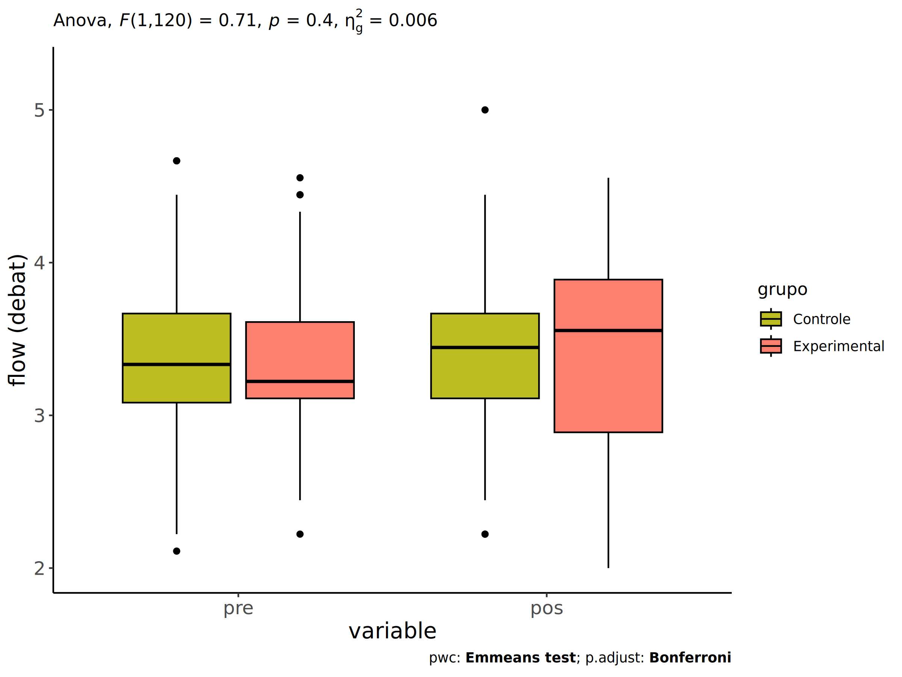
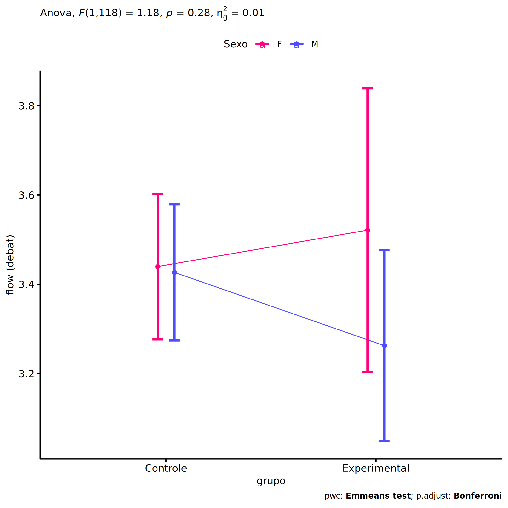
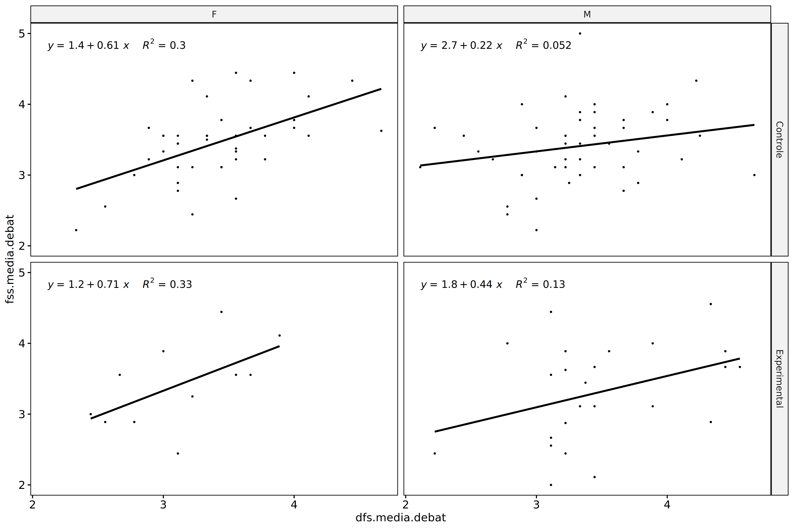
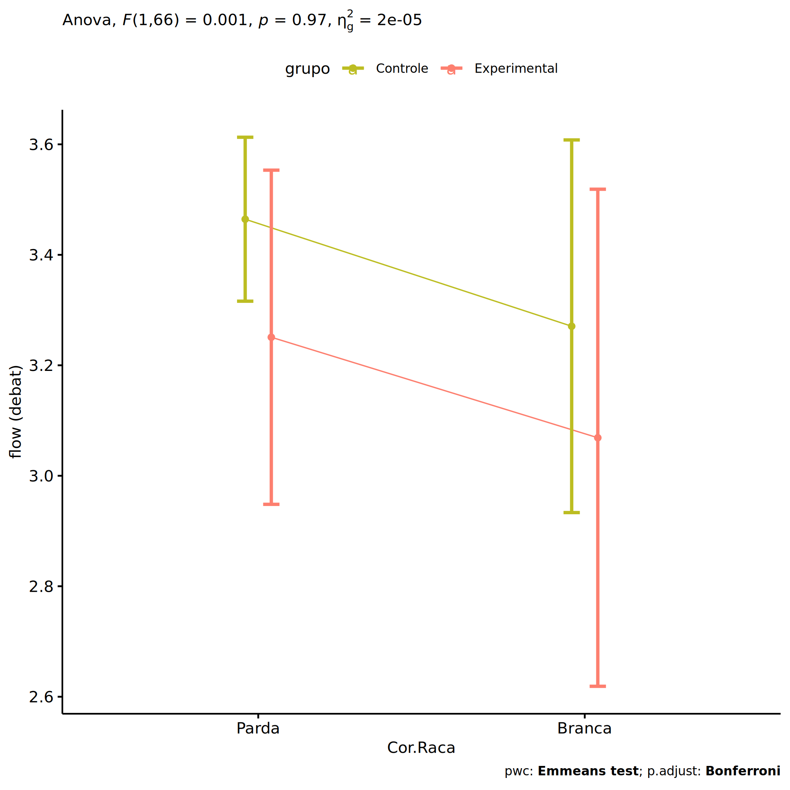
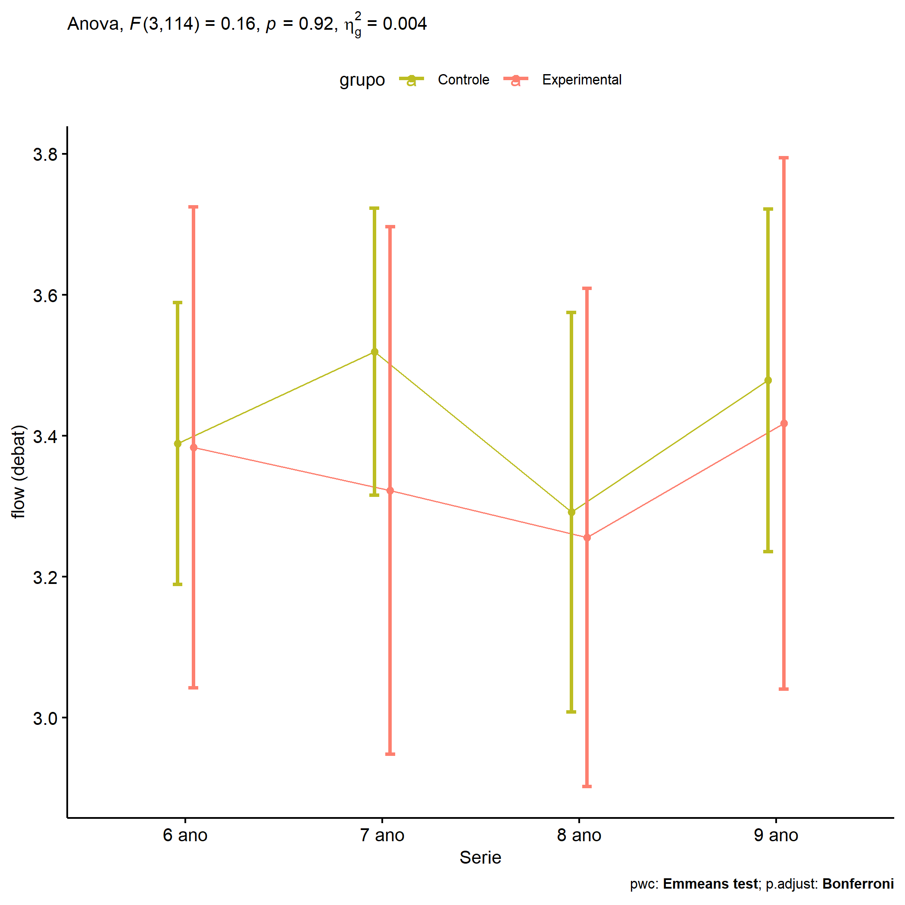

ANCOVA in flow (debate) (flow (debate))
================
Geiser C. Challco <geiser@alumni.usp.br>

- [Descriptive Statistics of Initial
  Data](#descriptive-statistics-of-initial-data)
- [ANCOVA and Pairwise for one factor:
  **grupo**](#ancova-and-pairwise-for-one-factor-grupo)
  - [Without remove non-normal data](#without-remove-non-normal-data)
  - [Computing ANCOVA and PairWise After removing non-normal data
    (OK)](#computing-ancova-and-pairwise-after-removing-non-normal-data-ok)
    - [Plots for ancova](#plots-for-ancova)
    - [Checking linearity assumption](#checking-linearity-assumption)
    - [Checking normality and
      homogeneity](#checking-normality-and-homogeneity)
- [ANCOVA and Pairwise for two factors
  **grupo:Sexo**](#ancova-and-pairwise-for-two-factors-gruposexo)
  - [Without remove non-normal data](#without-remove-non-normal-data-1)
  - [Computing ANCOVA and PairWise After removing non-normal data
    (OK)](#computing-ancova-and-pairwise-after-removing-non-normal-data-ok-1)
    - [Plots for ancova](#plots-for-ancova-1)
    - [Checking linearity assumption](#checking-linearity-assumption-1)
    - [Checking normality and
      homogeneity](#checking-normality-and-homogeneity-1)
- [ANCOVA and Pairwise for two factors
  **grupo:Zona**](#ancova-and-pairwise-for-two-factors-grupozona)
  - [Without remove non-normal data](#without-remove-non-normal-data-2)
  - [Computing ANCOVA and PairWise After removing non-normal data
    (OK)](#computing-ancova-and-pairwise-after-removing-non-normal-data-ok-2)
    - [Plots for ancova](#plots-for-ancova-2)
    - [Checking linearity assumption](#checking-linearity-assumption-2)
    - [Checking normality and
      homogeneity](#checking-normality-and-homogeneity-2)
- [ANCOVA and Pairwise for two factors
  **grupo:Cor.Raca**](#ancova-and-pairwise-for-two-factors-grupocorraca)
  - [Without remove non-normal data](#without-remove-non-normal-data-3)
  - [Computing ANCOVA and PairWise After removing non-normal data
    (OK)](#computing-ancova-and-pairwise-after-removing-non-normal-data-ok-3)
    - [Plots for ancova](#plots-for-ancova-3)
    - [Checking linearity assumption](#checking-linearity-assumption-3)
    - [Checking normality and
      homogeneity](#checking-normality-and-homogeneity-3)
- [ANCOVA and Pairwise for two factors
  **grupo:Serie**](#ancova-and-pairwise-for-two-factors-gruposerie)
  - [Without remove non-normal data](#without-remove-non-normal-data-4)
  - [Computing ANCOVA and PairWise After removing non-normal data
    (OK)](#computing-ancova-and-pairwise-after-removing-non-normal-data-ok-4)
    - [Plots for ancova](#plots-for-ancova-4)
    - [Checking linearity assumption](#checking-linearity-assumption-4)
    - [Checking normality and
      homogeneity](#checking-normality-and-homogeneity-4)
- [Summary of Results](#summary-of-results)
  - [Descriptive Statistics](#descriptive-statistics)
  - [ANCOVA Table Comparison](#ancova-table-comparison)
  - [PairWise Table Comparison](#pairwise-table-comparison)
  - [EMMS Table Comparison](#emms-table-comparison)

**NOTE**:

- Teste ANCOVA para determinar se houve diferenças significativas no
  flow (debate) (medido usando pre- e pos-testes).
- ANCOVA test to determine whether there were significant differences in
  flow (debate) (measured using pre- and post-tests).

# Descriptive Statistics of Initial Data

``` r
df <- get.descriptives(dat, c(dv.pre, dv.pos), c("grupo"), 
                       include.global = T, symmetry.test = T, normality.test = F)
df <- plyr::rbind.fill(
  df, do.call(plyr::rbind.fill, lapply(lfatores2, FUN = function(f) {
    if (nrow(dat) > 0 && sum(!is.na(unique(dat[[f]]))) > 1)
      get.descriptives(dat, c(dv.pre,dv.pos), c("grupo", f),
                       symmetry.test = T, normality.test = F)
    }))
)
```

    ## Warning: There was 1 warning in `mutate()`.
    ## ℹ In argument: `ci = abs(stats::qt(alpha/2, .data$n - 1) * .data$se)`.
    ## Caused by warning:
    ## ! There was 1 warning in `mutate()`.
    ## ℹ In argument: `ci = abs(stats::qt(alpha/2, .data$n - 1) * .data$se)`.
    ## Caused by warning in `stats::qt()`:
    ## ! NaNs produced
    ## There was 1 warning in `mutate()`.
    ## ℹ In argument: `ci = abs(stats::qt(alpha/2, .data$n - 1) * .data$se)`.
    ## Caused by warning:
    ## ! There was 1 warning in `mutate()`.
    ## ℹ In argument: `ci = abs(stats::qt(alpha/2, .data$n - 1) * .data$se)`.
    ## Caused by warning in `stats::qt()`:
    ## ! NaNs produced

``` r
(df <- df[,c(fatores1[fatores1 %in% colnames(df)],"variable",
             colnames(df)[!colnames(df) %in% c(fatores1,"variable")])])
```

    ##           grupo Sexo   Zona Cor.Raca Serie        variable   n  mean median   min   max    sd    se
    ## 1      Controle <NA>   <NA>     <NA>  <NA> dfs.media.debat  88 3.365  3.333 2.111 4.667 0.502 0.053
    ## 2  Experimental <NA>   <NA>     <NA>  <NA> dfs.media.debat  35 3.379  3.222 2.222 4.556 0.575 0.097
    ## 3          <NA> <NA>   <NA>     <NA>  <NA> dfs.media.debat 123 3.369  3.333 2.111 4.667 0.521 0.047
    ## 4      Controle <NA>   <NA>     <NA>  <NA> fss.media.debat  88 3.431  3.444 2.222 5.000 0.520 0.055
    ## 5  Experimental <NA>   <NA>     <NA>  <NA> fss.media.debat  35 3.348  3.556 2.000 4.556 0.666 0.113
    ## 6          <NA> <NA>   <NA>     <NA>  <NA> fss.media.debat 123 3.408  3.444 2.000 5.000 0.564 0.051
    ## 7      Controle    F   <NA>     <NA>  <NA> dfs.media.debat  41 3.415  3.333 2.333 4.667 0.480 0.075
    ## 8      Controle    M   <NA>     <NA>  <NA> dfs.media.debat  47 3.321  3.333 2.111 4.667 0.521 0.076
    ## 9  Experimental    F   <NA>     <NA>  <NA> dfs.media.debat  11 3.121  3.111 2.444 3.889 0.480 0.145
    ## 10 Experimental    M   <NA>     <NA>  <NA> dfs.media.debat  24 3.497  3.354 2.222 4.556 0.585 0.119
    ## 11     Controle    F   <NA>     <NA>  <NA> fss.media.debat  41 3.459  3.556 2.222 4.444 0.530 0.083
    ## 12     Controle    M   <NA>     <NA>  <NA> fss.media.debat  47 3.407  3.444 2.222 5.000 0.516 0.075
    ## 13 Experimental    F   <NA>     <NA>  <NA> fss.media.debat  11 3.417  3.556 2.444 4.444 0.594 0.179
    ## 14 Experimental    M   <NA>     <NA>  <NA> fss.media.debat  24 3.317  3.500 2.000 4.556 0.706 0.144
    ## 15     Controle <NA>  Rural     <NA>  <NA> dfs.media.debat  54 3.316  3.292 2.111 4.667 0.543 0.074
    ## 16     Controle <NA> Urbana     <NA>  <NA> dfs.media.debat   9 3.460  3.222 2.889 4.667 0.552 0.184
    ## 17     Controle <NA>   <NA>     <NA>  <NA> dfs.media.debat  25 3.436  3.444 2.667 4.222 0.381 0.076
    ## 18 Experimental <NA>  Rural     <NA>  <NA> dfs.media.debat  29 3.388  3.333 2.222 4.556 0.570 0.106
    ## 19 Experimental <NA>   <NA>     <NA>  <NA> dfs.media.debat   6 3.333  3.167 2.667 4.333 0.652 0.266
    ## 20     Controle <NA>  Rural     <NA>  <NA> fss.media.debat  54 3.402  3.444 2.222 4.444 0.492 0.067
    ## 21     Controle <NA> Urbana     <NA>  <NA> fss.media.debat   9 3.674  3.556 2.889 5.000 0.751 0.250
    ## 22     Controle <NA>   <NA>     <NA>  <NA> fss.media.debat  25 3.406  3.556 2.222 4.333 0.482 0.096
    ## 23 Experimental <NA>  Rural     <NA>  <NA> fss.media.debat  29 3.356  3.556 2.111 4.444 0.624 0.116
    ## 24 Experimental <NA>   <NA>     <NA>  <NA> fss.media.debat   6 3.312  3.222 2.000 4.556 0.913 0.373
    ## 25     Controle <NA>   <NA>   Branca  <NA> dfs.media.debat   9 3.198  3.444 2.111 4.111 0.654 0.218
    ## 26     Controle <NA>   <NA>    Parda  <NA> dfs.media.debat  46 3.453  3.333 2.222 4.667 0.514 0.076
    ## 27     Controle <NA>   <NA>    Preta  <NA> dfs.media.debat   1 3.222  3.222 3.222 3.222    NA    NA
    ## 28     Controle <NA>   <NA>     <NA>  <NA> dfs.media.debat  32 3.289  3.333 2.556 4.111 0.432 0.076
    ## 29 Experimental <NA>   <NA>   Branca  <NA> dfs.media.debat   5 3.244  3.444 2.222 3.556 0.574 0.257
    ## 30 Experimental <NA>   <NA> Indígena  <NA> dfs.media.debat   5 3.475  3.444 2.556 4.333 0.638 0.285
    ## 31 Experimental <NA>   <NA>    Parda  <NA> dfs.media.debat  11 3.404  3.222 2.444 4.556 0.652 0.197
    ## 32 Experimental <NA>   <NA>     <NA>  <NA> dfs.media.debat  14 3.373  3.222 2.667 4.444 0.547 0.146
    ## 33     Controle <NA>   <NA>   Branca  <NA> fss.media.debat   9 3.210  3.222 2.222 3.889 0.557 0.186
    ## 34     Controle <NA>   <NA>    Parda  <NA> fss.media.debat  46 3.481  3.472 2.667 5.000 0.512 0.076
    ## 35     Controle <NA>   <NA>    Preta  <NA> fss.media.debat   1 3.444  3.444 3.444 3.444    NA    NA
    ## 36     Controle <NA>   <NA>     <NA>  <NA> fss.media.debat  32 3.421  3.500 2.222 4.444 0.528 0.093
    ## 37 Experimental <NA>   <NA>   Branca  <NA> fss.media.debat   5 3.022  3.111 2.111 3.889 0.743 0.332
    ## 38 Experimental <NA>   <NA> Indígena  <NA> fss.media.debat   5 3.778  3.556 2.889 4.556 0.707 0.316
    ## 39 Experimental <NA>   <NA>    Parda  <NA> fss.media.debat  11 3.253  3.111 2.556 3.889 0.456 0.137
    ## 40 Experimental <NA>   <NA>     <NA>  <NA> fss.media.debat  14 3.387  3.590 2.000 4.444 0.745 0.199
    ## 41     Controle <NA>   <NA>     <NA> 6 ano dfs.media.debat  28 3.329  3.333 2.111 4.667 0.605 0.114
    ## 42     Controle <NA>   <NA>     <NA> 7 ano dfs.media.debat  27 3.392  3.333 2.889 4.222 0.317 0.061
    ## 43     Controle <NA>   <NA>     <NA> 8 ano dfs.media.debat  14 3.272  3.056 2.222 4.667 0.614 0.164
    ## 44     Controle <NA>   <NA>     <NA> 9 ano dfs.media.debat  19 3.446  3.444 2.444 4.250 0.483 0.111
    ## 45 Experimental <NA>   <NA>     <NA> 6 ano dfs.media.debat  10 3.722  3.667 3.000 4.444 0.550 0.174
    ## 46 Experimental <NA>   <NA>     <NA> 7 ano dfs.media.debat   8 3.361  3.333 2.556 4.556 0.622 0.220
    ## 47 Experimental <NA>   <NA>     <NA> 8 ano dfs.media.debat   9 3.247  3.222 2.444 4.333 0.490 0.163
    ## 48 Experimental <NA>   <NA>     <NA> 9 ano dfs.media.debat   8 3.116  3.243 2.222 3.889 0.534 0.189
    ## 49     Controle <NA>   <NA>     <NA> 6 ano fss.media.debat  28 3.374  3.444 2.222 4.444 0.557 0.105
    ## 50     Controle <NA>   <NA>     <NA> 7 ano fss.media.debat  27 3.528  3.556 2.444 5.000 0.581 0.112
    ## 51     Controle <NA>   <NA>     <NA> 8 ano fss.media.debat  14 3.254  3.222 2.222 4.000 0.486 0.130
    ## 52     Controle <NA>   <NA>     <NA> 9 ano fss.media.debat  19 3.509  3.556 3.000 4.333 0.363 0.083
    ## 53 Experimental <NA>   <NA>     <NA> 6 ano fss.media.debat  10 3.521  3.646 2.889 4.111 0.406 0.128
    ## 54 Experimental <NA>   <NA>     <NA> 7 ano fss.media.debat   8 3.319  3.556 2.444 4.000 0.604 0.214
    ## 55 Experimental <NA>   <NA>     <NA> 8 ano fss.media.debat   9 3.208  3.000 2.000 4.556 0.957 0.319
    ##       ci   iqr symmetry     skewness    kurtosis
    ## 1  0.106 0.583      YES  0.163516310  0.25478463
    ## 2  0.197 0.500      YES  0.347775268 -0.39736687
    ## 3  0.093 0.556      YES  0.241636453  0.10384049
    ## 4  0.110 0.556      YES  0.121410027  0.25842656
    ## 5  0.229 1.000      YES -0.162890273 -0.88211671
    ## 6  0.101 0.611      YES -0.054727297 -0.06377314
    ## 7  0.151 0.556      YES  0.358596502  0.13866635
    ## 8  0.153 0.667      YES  0.066793859  0.11242862
    ## 9  0.323 0.778      YES  0.085520398 -1.54636862
    ## 10 0.247 0.778      YES  0.282289481 -0.52827652
    ## 11 0.167 0.556      YES -0.068396322 -0.23234460
    ## 12 0.151 0.611      YES  0.290316636  0.65564384
    ## 13 0.399 0.778      YES  0.106052775 -1.18456582
    ## 14 0.298 1.066      YES -0.186123196 -1.04821907
    ## 15 0.148 0.667      YES  0.111777823 -0.10497728
    ## 16 0.424 0.413       NO  1.074590681 -0.19079883
    ## 17 0.157 0.444      YES  0.047367004 -0.59533796
    ## 18 0.217 0.444      YES  0.308078959 -0.19420790
    ## 19 0.684 0.861      YES  0.416333754 -1.71495854
    ## 20 0.134 0.556      YES -0.085300808 -0.30746097
    ## 21 0.577 1.222       NO  0.504872058 -1.45389640
    ## 22 0.199 0.556       NO -0.627659159  0.09042396
    ## 23 0.237 1.000      YES -0.186921846 -0.97295757
    ## 24 0.958 1.010      YES -0.035155320 -1.64623443
    ## 25 0.503 0.778      YES -0.419126827 -1.33379860
    ## 26 0.153 0.639      YES  0.358912900  0.20450195
    ## 27   NaN 0.000 few data  0.000000000  0.00000000
    ## 28 0.156 0.500      YES  0.212955694 -0.78717726
    ## 29 0.713 0.111 few data  0.000000000  0.00000000
    ## 30 0.793 0.292      YES -0.106814109 -1.48337126
    ## 31 0.438 0.556       NO  0.509920509 -0.98514847
    ## 32 0.316 0.611       NO  0.744593680 -0.83191968
    ## 33 0.428 0.444       NO -0.593394923 -1.17387887
    ## 34 0.152 0.556       NO  0.661497771  0.20507264
    ## 35   NaN 0.000 few data  0.000000000  0.00000000
    ## 36 0.190 0.667      YES -0.305875981 -0.36455136
    ## 37 0.922 1.111      YES -0.071151438 -2.05057970
    ## 38 0.878 1.000      YES  0.009311694 -2.03795153
    ## 39 0.306 0.722      YES -0.106534981 -1.65716207
    ## 40 0.430 1.094      YES -0.398827301 -1.29493581
    ## 41 0.235 0.750      YES  0.107605705 -0.42816291
    ## 42 0.126 0.333       NO  0.837862957  0.34030623
    ## 43 0.354 0.694       NO  0.650484526 -0.14862862
    ## 44 0.233 0.556      YES -0.238526558 -0.71099173
    ## 45 0.393 0.972      YES  0.170695165 -1.78556851
    ## 46 0.520 0.556       NO  0.516289180 -0.83828460
    ## 47 0.377 0.111       NO  0.723356008  0.49059289
    ## 48 0.446 0.694      YES -0.242611780 -1.34317409
    ## 49 0.216 0.552      YES -0.054785067 -0.45192902
    ## 50 0.230 0.667      YES  0.389014131 -0.13372936
    ## 51 0.281 0.639      YES -0.393693593 -0.77642059
    ## 52 0.175 0.556      YES  0.382970336 -0.78332432
    ## 53 0.290 0.687      YES -0.145400353 -1.59573954
    ## 54 0.505 0.917      YES -0.355874730 -1.77794144
    ## 55 0.736 1.444      YES  0.141168799 -1.70330232
    ##  [ reached 'max' / getOption("max.print") -- omitted 1 rows ]

| grupo        | Sexo | Zona   | Cor.Raca | Serie | variable        |   n |  mean | median |   min |   max |    sd |    se |    ci |   iqr | symmetry | skewness | kurtosis |
|:-------------|:-----|:-------|:---------|:------|:----------------|----:|------:|-------:|------:|------:|------:|------:|------:|------:|:---------|---------:|---------:|
| Controle     |      |        |          |       | dfs.media.debat |  88 | 3.365 |  3.333 | 2.111 | 4.667 | 0.502 | 0.053 | 0.106 | 0.583 | YES      |    0.164 |    0.255 |
| Experimental |      |        |          |       | dfs.media.debat |  35 | 3.379 |  3.222 | 2.222 | 4.556 | 0.575 | 0.097 | 0.197 | 0.500 | YES      |    0.348 |   -0.397 |
|              |      |        |          |       | dfs.media.debat | 123 | 3.369 |  3.333 | 2.111 | 4.667 | 0.521 | 0.047 | 0.093 | 0.556 | YES      |    0.242 |    0.104 |
| Controle     |      |        |          |       | fss.media.debat |  88 | 3.431 |  3.444 | 2.222 | 5.000 | 0.520 | 0.055 | 0.110 | 0.556 | YES      |    0.121 |    0.258 |
| Experimental |      |        |          |       | fss.media.debat |  35 | 3.348 |  3.556 | 2.000 | 4.556 | 0.666 | 0.113 | 0.229 | 1.000 | YES      |   -0.163 |   -0.882 |
|              |      |        |          |       | fss.media.debat | 123 | 3.408 |  3.444 | 2.000 | 5.000 | 0.564 | 0.051 | 0.101 | 0.611 | YES      |   -0.055 |   -0.064 |
| Controle     | F    |        |          |       | dfs.media.debat |  41 | 3.415 |  3.333 | 2.333 | 4.667 | 0.480 | 0.075 | 0.151 | 0.556 | YES      |    0.359 |    0.139 |
| Controle     | M    |        |          |       | dfs.media.debat |  47 | 3.321 |  3.333 | 2.111 | 4.667 | 0.521 | 0.076 | 0.153 | 0.667 | YES      |    0.067 |    0.112 |
| Experimental | F    |        |          |       | dfs.media.debat |  11 | 3.121 |  3.111 | 2.444 | 3.889 | 0.480 | 0.145 | 0.323 | 0.778 | YES      |    0.086 |   -1.546 |
| Experimental | M    |        |          |       | dfs.media.debat |  24 | 3.497 |  3.354 | 2.222 | 4.556 | 0.585 | 0.119 | 0.247 | 0.778 | YES      |    0.282 |   -0.528 |
| Controle     | F    |        |          |       | fss.media.debat |  41 | 3.459 |  3.556 | 2.222 | 4.444 | 0.530 | 0.083 | 0.167 | 0.556 | YES      |   -0.068 |   -0.232 |
| Controle     | M    |        |          |       | fss.media.debat |  47 | 3.407 |  3.444 | 2.222 | 5.000 | 0.516 | 0.075 | 0.151 | 0.611 | YES      |    0.290 |    0.656 |
| Experimental | F    |        |          |       | fss.media.debat |  11 | 3.417 |  3.556 | 2.444 | 4.444 | 0.594 | 0.179 | 0.399 | 0.778 | YES      |    0.106 |   -1.185 |
| Experimental | M    |        |          |       | fss.media.debat |  24 | 3.317 |  3.500 | 2.000 | 4.556 | 0.706 | 0.144 | 0.298 | 1.066 | YES      |   -0.186 |   -1.048 |
| Controle     |      | Rural  |          |       | dfs.media.debat |  54 | 3.316 |  3.292 | 2.111 | 4.667 | 0.543 | 0.074 | 0.148 | 0.667 | YES      |    0.112 |   -0.105 |
| Controle     |      | Urbana |          |       | dfs.media.debat |   9 | 3.460 |  3.222 | 2.889 | 4.667 | 0.552 | 0.184 | 0.424 | 0.413 | NO       |    1.075 |   -0.191 |
| Controle     |      |        |          |       | dfs.media.debat |  25 | 3.436 |  3.444 | 2.667 | 4.222 | 0.381 | 0.076 | 0.157 | 0.444 | YES      |    0.047 |   -0.595 |
| Experimental |      | Rural  |          |       | dfs.media.debat |  29 | 3.388 |  3.333 | 2.222 | 4.556 | 0.570 | 0.106 | 0.217 | 0.444 | YES      |    0.308 |   -0.194 |
| Experimental |      |        |          |       | dfs.media.debat |   6 | 3.333 |  3.167 | 2.667 | 4.333 | 0.652 | 0.266 | 0.684 | 0.861 | YES      |    0.416 |   -1.715 |
| Controle     |      | Rural  |          |       | fss.media.debat |  54 | 3.402 |  3.444 | 2.222 | 4.444 | 0.492 | 0.067 | 0.134 | 0.556 | YES      |   -0.085 |   -0.307 |
| Controle     |      | Urbana |          |       | fss.media.debat |   9 | 3.674 |  3.556 | 2.889 | 5.000 | 0.751 | 0.250 | 0.577 | 1.222 | NO       |    0.505 |   -1.454 |
| Controle     |      |        |          |       | fss.media.debat |  25 | 3.406 |  3.556 | 2.222 | 4.333 | 0.482 | 0.096 | 0.199 | 0.556 | NO       |   -0.628 |    0.090 |
| Experimental |      | Rural  |          |       | fss.media.debat |  29 | 3.356 |  3.556 | 2.111 | 4.444 | 0.624 | 0.116 | 0.237 | 1.000 | YES      |   -0.187 |   -0.973 |
| Experimental |      |        |          |       | fss.media.debat |   6 | 3.312 |  3.222 | 2.000 | 4.556 | 0.913 | 0.373 | 0.958 | 1.010 | YES      |   -0.035 |   -1.646 |
| Controle     |      |        | Branca   |       | dfs.media.debat |   9 | 3.198 |  3.444 | 2.111 | 4.111 | 0.654 | 0.218 | 0.503 | 0.778 | YES      |   -0.419 |   -1.334 |
| Controle     |      |        | Parda    |       | dfs.media.debat |  46 | 3.453 |  3.333 | 2.222 | 4.667 | 0.514 | 0.076 | 0.153 | 0.639 | YES      |    0.359 |    0.205 |
| Controle     |      |        | Preta    |       | dfs.media.debat |   1 | 3.222 |  3.222 | 3.222 | 3.222 |       |       |       | 0.000 | few data |    0.000 |    0.000 |
| Controle     |      |        |          |       | dfs.media.debat |  32 | 3.289 |  3.333 | 2.556 | 4.111 | 0.432 | 0.076 | 0.156 | 0.500 | YES      |    0.213 |   -0.787 |
| Experimental |      |        | Branca   |       | dfs.media.debat |   5 | 3.244 |  3.444 | 2.222 | 3.556 | 0.574 | 0.257 | 0.713 | 0.111 | few data |    0.000 |    0.000 |
| Experimental |      |        | Indígena |       | dfs.media.debat |   5 | 3.475 |  3.444 | 2.556 | 4.333 | 0.638 | 0.285 | 0.793 | 0.292 | YES      |   -0.107 |   -1.483 |
| Experimental |      |        | Parda    |       | dfs.media.debat |  11 | 3.404 |  3.222 | 2.444 | 4.556 | 0.652 | 0.197 | 0.438 | 0.556 | NO       |    0.510 |   -0.985 |
| Experimental |      |        |          |       | dfs.media.debat |  14 | 3.373 |  3.222 | 2.667 | 4.444 | 0.547 | 0.146 | 0.316 | 0.611 | NO       |    0.745 |   -0.832 |
| Controle     |      |        | Branca   |       | fss.media.debat |   9 | 3.210 |  3.222 | 2.222 | 3.889 | 0.557 | 0.186 | 0.428 | 0.444 | NO       |   -0.593 |   -1.174 |
| Controle     |      |        | Parda    |       | fss.media.debat |  46 | 3.481 |  3.472 | 2.667 | 5.000 | 0.512 | 0.076 | 0.152 | 0.556 | NO       |    0.661 |    0.205 |
| Controle     |      |        | Preta    |       | fss.media.debat |   1 | 3.444 |  3.444 | 3.444 | 3.444 |       |       |       | 0.000 | few data |    0.000 |    0.000 |
| Controle     |      |        |          |       | fss.media.debat |  32 | 3.421 |  3.500 | 2.222 | 4.444 | 0.528 | 0.093 | 0.190 | 0.667 | YES      |   -0.306 |   -0.365 |
| Experimental |      |        | Branca   |       | fss.media.debat |   5 | 3.022 |  3.111 | 2.111 | 3.889 | 0.743 | 0.332 | 0.922 | 1.111 | YES      |   -0.071 |   -2.051 |
| Experimental |      |        | Indígena |       | fss.media.debat |   5 | 3.778 |  3.556 | 2.889 | 4.556 | 0.707 | 0.316 | 0.878 | 1.000 | YES      |    0.009 |   -2.038 |
| Experimental |      |        | Parda    |       | fss.media.debat |  11 | 3.253 |  3.111 | 2.556 | 3.889 | 0.456 | 0.137 | 0.306 | 0.722 | YES      |   -0.107 |   -1.657 |
| Experimental |      |        |          |       | fss.media.debat |  14 | 3.387 |  3.590 | 2.000 | 4.444 | 0.745 | 0.199 | 0.430 | 1.094 | YES      |   -0.399 |   -1.295 |
| Controle     |      |        |          | 6 ano | dfs.media.debat |  28 | 3.329 |  3.333 | 2.111 | 4.667 | 0.605 | 0.114 | 0.235 | 0.750 | YES      |    0.108 |   -0.428 |
| Controle     |      |        |          | 7 ano | dfs.media.debat |  27 | 3.392 |  3.333 | 2.889 | 4.222 | 0.317 | 0.061 | 0.126 | 0.333 | NO       |    0.838 |    0.340 |
| Controle     |      |        |          | 8 ano | dfs.media.debat |  14 | 3.272 |  3.056 | 2.222 | 4.667 | 0.614 | 0.164 | 0.354 | 0.694 | NO       |    0.650 |   -0.149 |
| Controle     |      |        |          | 9 ano | dfs.media.debat |  19 | 3.446 |  3.444 | 2.444 | 4.250 | 0.483 | 0.111 | 0.233 | 0.556 | YES      |   -0.239 |   -0.711 |
| Experimental |      |        |          | 6 ano | dfs.media.debat |  10 | 3.722 |  3.667 | 3.000 | 4.444 | 0.550 | 0.174 | 0.393 | 0.972 | YES      |    0.171 |   -1.786 |
| Experimental |      |        |          | 7 ano | dfs.media.debat |   8 | 3.361 |  3.333 | 2.556 | 4.556 | 0.622 | 0.220 | 0.520 | 0.556 | NO       |    0.516 |   -0.838 |
| Experimental |      |        |          | 8 ano | dfs.media.debat |   9 | 3.247 |  3.222 | 2.444 | 4.333 | 0.490 | 0.163 | 0.377 | 0.111 | NO       |    0.723 |    0.491 |
| Experimental |      |        |          | 9 ano | dfs.media.debat |   8 | 3.116 |  3.243 | 2.222 | 3.889 | 0.534 | 0.189 | 0.446 | 0.694 | YES      |   -0.243 |   -1.343 |
| Controle     |      |        |          | 6 ano | fss.media.debat |  28 | 3.374 |  3.444 | 2.222 | 4.444 | 0.557 | 0.105 | 0.216 | 0.552 | YES      |   -0.055 |   -0.452 |
| Controle     |      |        |          | 7 ano | fss.media.debat |  27 | 3.528 |  3.556 | 2.444 | 5.000 | 0.581 | 0.112 | 0.230 | 0.667 | YES      |    0.389 |   -0.134 |
| Controle     |      |        |          | 8 ano | fss.media.debat |  14 | 3.254 |  3.222 | 2.222 | 4.000 | 0.486 | 0.130 | 0.281 | 0.639 | YES      |   -0.394 |   -0.776 |
| Controle     |      |        |          | 9 ano | fss.media.debat |  19 | 3.509 |  3.556 | 3.000 | 4.333 | 0.363 | 0.083 | 0.175 | 0.556 | YES      |    0.383 |   -0.783 |
| Experimental |      |        |          | 6 ano | fss.media.debat |  10 | 3.521 |  3.646 | 2.889 | 4.111 | 0.406 | 0.128 | 0.290 | 0.687 | YES      |   -0.145 |   -1.596 |
| Experimental |      |        |          | 7 ano | fss.media.debat |   8 | 3.319 |  3.556 | 2.444 | 4.000 | 0.604 | 0.214 | 0.505 | 0.917 | YES      |   -0.356 |   -1.778 |
| Experimental |      |        |          | 8 ano | fss.media.debat |   9 | 3.208 |  3.000 | 2.000 | 4.556 | 0.957 | 0.319 | 0.736 | 1.444 | YES      |    0.141 |   -1.703 |
| Experimental |      |        |          | 9 ano | fss.media.debat |   8 | 3.319 |  3.278 | 2.444 | 4.444 | 0.678 | 0.240 | 0.567 | 0.833 | YES      |    0.287 |   -1.451 |

# ANCOVA and Pairwise for one factor: **grupo**

## Without remove non-normal data

``` r
pdat = remove_group_data(dat[!is.na(dat[["grupo"]]),], "fss.media.debat", "grupo")

pdat.long <- rbind(pdat[,c("id","grupo")], pdat[,c("id","grupo")])
pdat.long[["time"]] <- c(rep("pre", nrow(pdat)), rep("pos", nrow(pdat)))
pdat.long[["time"]] <- factor(pdat.long[["time"]], c("pre","pos"))
pdat.long[["flow.debat"]] <- c(pdat[["dfs.media.debat"]], pdat[["fss.media.debat"]])

aov = anova_test(pdat, fss.media.debat ~ dfs.media.debat + grupo)
laov[["grupo"]] <- get_anova_table(aov)
```

``` r
pwc <- emmeans_test(pdat, fss.media.debat ~ grupo, covariate = dfs.media.debat,
                    p.adjust.method = "bonferroni")
```

``` r
pwc.long <- emmeans_test(dplyr::group_by_at(pdat.long, "grupo"),
                          flow.debat ~ time,
                          p.adjust.method = "bonferroni")
lpwc[["grupo"]] <- plyr::rbind.fill(pwc, pwc.long)
```

``` r
ds <- get.descriptives(pdat, "fss.media.debat", "grupo", covar = "dfs.media.debat")
ds <- merge(ds[ds$variable != "dfs.media.debat",],
            ds[ds$variable == "dfs.media.debat", !colnames(ds) %in% c("variable")],
            by = "grupo", all.x = T, suffixes = c("", ".dfs.media.debat"))
ds <- merge(get_emmeans(pwc), ds, by = "grupo", suffixes = c(".emms", ""))
ds <- ds[,c("grupo","n","mean.dfs.media.debat","se.dfs.media.debat","mean","se","emmean","se.emms")]

colnames(ds) <- c("grupo", "N", paste0(c("M","SE")," (pre)"),
                  paste0(c("M","SE"), " (unadj)"), paste0(c("M", "SE"), " (adj)"))

lemms[["grupo"]] <- ds
```

## Computing ANCOVA and PairWise After removing non-normal data (OK)

``` r
wdat = pdat 

res = residuals(lm(fss.media.debat ~ dfs.media.debat + grupo, data = wdat))
non.normal = getNonNormal(res, wdat$id, plimit = 0.05)

wdat = wdat[!wdat$id %in% non.normal,]

wdat.long <- rbind(wdat[,c("id","grupo")], wdat[,c("id","grupo")])
wdat.long[["time"]] <- c(rep("pre", nrow(wdat)), rep("pos", nrow(wdat)))
wdat.long[["time"]] <- factor(wdat.long[["time"]], c("pre","pos"))
wdat.long[["flow.debat"]] <- c(wdat[["dfs.media.debat"]], wdat[["fss.media.debat"]])

ldat[["grupo"]] = wdat

(non.normal)
```

    ## NULL

``` r
aov = anova_test(wdat, fss.media.debat ~ dfs.media.debat + grupo)
laov[["grupo"]] <- merge(get_anova_table(aov), laov[["grupo"]], by="Effect", suffixes = c("","'"))

(df = get_anova_table(aov))
```

    ## ANOVA Table (type II tests)
    ## 
    ##            Effect DFn DFd      F        p p<.05   ges
    ## 1 dfs.media.debat   1 120 19.387 2.33e-05     * 0.139
    ## 2           grupo   1 120  0.709 4.01e-01       0.006

| Effect          | DFn | DFd |      F |     p | p\<.05 |   ges |
|:----------------|----:|----:|-------:|------:|:-------|------:|
| dfs.media.debat |   1 | 120 | 19.387 | 0.000 | \*     | 0.139 |
| grupo           |   1 | 120 |  0.709 | 0.401 |        | 0.006 |

| term                   | .y.             | group1   | group2       |  df | statistic |     p | p.adj | p.adj.signif |
|:-----------------------|:----------------|:---------|:-------------|----:|----------:|------:|------:|:-------------|
| dfs.media.debat\*grupo | fss.media.debat | Controle | Experimental | 120 |     0.842 | 0.401 | 0.401 | ns           |

``` r
pwc.long <- emmeans_test(dplyr::group_by_at(wdat.long, "grupo"),
                         flow.debat ~ time,
                         p.adjust.method = "bonferroni")
lpwc[["grupo"]] <- merge(plyr::rbind.fill(pwc, pwc.long), lpwc[["grupo"]], by=c("grupo","term",".y.","group1","group2"), suffixes = c("","'"))
```

| grupo        | term | .y.        | group1 | group2 |  df | statistic |     p | p.adj | p.adj.signif |
|:-------------|:-----|:-----------|:-------|:-------|----:|----------:|------:|------:|:-------------|
| Controle     | time | flow.debat | pre    | pos    | 242 |    -0.811 | 0.418 | 0.418 | ns           |
| Experimental | time | flow.debat | pre    | pos    | 242 |     0.235 | 0.815 | 0.815 | ns           |

``` r
ds <- get.descriptives(wdat, "fss.media.debat", "grupo", covar = "dfs.media.debat")
ds <- merge(ds[ds$variable != "dfs.media.debat",],
            ds[ds$variable == "dfs.media.debat", !colnames(ds) %in% c("variable")],
            by = "grupo", all.x = T, suffixes = c("", ".dfs.media.debat"))
ds <- merge(get_emmeans(pwc), ds, by = "grupo", suffixes = c(".emms", ""))
ds <- ds[,c("grupo","n","mean.dfs.media.debat","se.dfs.media.debat","mean","se","emmean","se.emms")]

colnames(ds) <- c("grupo", "N", paste0(c("M","SE")," (pre)"),
                  paste0(c("M","SE"), " (unadj)"), paste0(c("M", "SE"), " (adj)"))

lemms[["grupo"]] <- merge(ds, lemms[["grupo"]], by=c("grupo"), suffixes = c("","'"))
```

| grupo        |   N | M (pre) | SE (pre) | M (unadj) | SE (unadj) | M (adj) | SE (adj) |
|:-------------|----:|--------:|---------:|----------:|-----------:|--------:|---------:|
| Controle     |  88 |   3.365 |    0.053 |     3.431 |      0.055 |   3.433 |    0.056 |
| Experimental |  35 |   3.379 |    0.097 |     3.348 |      0.113 |   3.344 |    0.089 |

### Plots for ancova

``` r
plots <- oneWayAncovaPlots(
  wdat, "fss.media.debat", "grupo", aov, list("grupo"=pwc), addParam = c("mean_se"),
  font.label.size=10, step.increase=0.05, p.label="p.adj",
  subtitle = which(aov$Effect == "grupo"))
```

``` r
if (!is.null(nrow(plots[["grupo"]]$data)))
  plots[["grupo"]] + ggplot2::scale_color_manual(values = color[["grupo"]])
```

    ## Scale for colour is already present.
    ## Adding another scale for colour, which will replace the existing scale.

<!-- -->

``` r
plots <- oneWayAncovaBoxPlots(
  wdat, "fss.media.debat", "grupo", aov, pwc, covar = "dfs.media.debat",
  theme = "classic", color = color[["grupo"]],
  subtitle = which(aov$Effect == "grupo"))
```

``` r
if (length(unique(wdat[["grupo"]])) > 1)
  plots[["grupo"]] + ggplot2::ylab("flow (debate)") + ggplot2::scale_x_discrete(labels=c('pre', 'pos'))
```

<!-- -->

``` r
if (length(unique(wdat.long[["grupo"]])) > 1)
  plots <- oneWayAncovaBoxPlots(
    wdat.long, "flow.debat", "grupo", aov, pwc.long, pre.post = "time",
    theme = "classic", color = color$prepost)
```

``` r
if (length(unique(wdat.long[["grupo"]])) > 1)
  plots[["grupo"]] + ggplot2::ylab("flow (debate)")
```

<!-- -->

### Checking linearity assumption

``` r
ggscatter(wdat, x = "dfs.media.debat", y = "fss.media.debat", size = 0.5,
          color = "grupo", add = "reg.line")+
  stat_regline_equation(
    aes(label =  paste(..eq.label.., ..rr.label.., sep = "~~~~"), color = grupo)
  )
```

<!-- -->

### Checking normality and homogeneity

``` r
res <- augment(lm(fss.media.debat ~ dfs.media.debat + grupo, data = wdat))
```

``` r
shapiro_test(res$.resid)
```

    ## # A tibble: 1 × 3
    ##   variable   statistic p.value
    ##   <chr>          <dbl>   <dbl>
    ## 1 res$.resid     0.995   0.962

``` r
levene_test(res, .resid ~ grupo)
```

    ## # A tibble: 1 × 4
    ##     df1   df2 statistic      p
    ##   <int> <int>     <dbl>  <dbl>
    ## 1     1   121      3.42 0.0668

# ANCOVA and Pairwise for two factors **grupo:Sexo**

## Without remove non-normal data

``` r
pdat = remove_group_data(dat[!is.na(dat[["grupo"]]) & !is.na(dat[["Sexo"]]),], "fss.media.debat", c("grupo","Sexo"))

pdat.long <- rbind(pdat[,c("id","grupo","Sexo")], pdat[,c("id","grupo","Sexo")])
pdat.long[["time"]] <- c(rep("pre", nrow(pdat)), rep("pos", nrow(pdat)))
pdat.long[["time"]] <- factor(pdat.long[["time"]], c("pre","pos"))
pdat.long[["flow.debat"]] <- c(pdat[["dfs.media.debat"]], pdat[["fss.media.debat"]])

aov = anova_test(pdat, fss.media.debat ~ dfs.media.debat + grupo*Sexo)
laov[["grupo:Sexo"]] <- get_anova_table(aov)
```

``` r
pwcs <- list()
pwcs[["Sexo"]] <- emmeans_test(
  group_by(pdat, grupo), fss.media.debat ~ Sexo,
  covariate = dfs.media.debat, p.adjust.method = "bonferroni")
pwcs[["grupo"]] <- emmeans_test(
  group_by(pdat, Sexo), fss.media.debat ~ grupo,
  covariate = dfs.media.debat, p.adjust.method = "bonferroni")

pwc <- plyr::rbind.fill(pwcs[["grupo"]], pwcs[["Sexo"]])
pwc <- pwc[,c("grupo","Sexo", colnames(pwc)[!colnames(pwc) %in% c("grupo","Sexo")])]
```

``` r
pwc.long <- emmeans_test(dplyr::group_by_at(pdat.long, c("grupo","Sexo")),
                         flow.debat ~ time,
                         p.adjust.method = "bonferroni")
lpwc[["grupo:Sexo"]] <- plyr::rbind.fill(pwc, pwc.long)
```

``` r
ds <- get.descriptives(pdat, "fss.media.debat", c("grupo","Sexo"), covar = "dfs.media.debat")
ds <- merge(ds[ds$variable != "dfs.media.debat",],
            ds[ds$variable == "dfs.media.debat", !colnames(ds) %in% c("variable")],
            by = c("grupo","Sexo"), all.x = T, suffixes = c("", ".dfs.media.debat"))
ds <- merge(get_emmeans(pwcs[["grupo"]]), ds, by = c("grupo","Sexo"), suffixes = c(".emms", ""))
ds <- ds[,c("grupo","Sexo","n","mean.dfs.media.debat","se.dfs.media.debat","mean","se","emmean","se.emms")]

colnames(ds) <- c("grupo","Sexo", "N", paste0(c("M","SE")," (pre)"),
                  paste0(c("M","SE"), " (unadj)"), paste0(c("M", "SE"), " (adj)"))

lemms[["grupo:Sexo"]] <- ds
```

## Computing ANCOVA and PairWise After removing non-normal data (OK)

``` r
wdat = pdat 

res = residuals(lm(fss.media.debat ~ dfs.media.debat + grupo*Sexo, data = wdat))
non.normal = getNonNormal(res, wdat$id, plimit = 0.05)

wdat = wdat[!wdat$id %in% non.normal,]

wdat.long <- rbind(wdat[,c("id","grupo","Sexo")], wdat[,c("id","grupo","Sexo")])
wdat.long[["time"]] <- c(rep("pre", nrow(wdat)), rep("pos", nrow(wdat)))
wdat.long[["time"]] <- factor(wdat.long[["time"]], c("pre","pos"))
wdat.long[["flow.debat"]] <- c(wdat[["dfs.media.debat"]], wdat[["fss.media.debat"]])


ldat[["grupo:Sexo"]] = wdat

(non.normal)
```

    ## NULL

``` r
aov = anova_test(wdat, fss.media.debat ~ dfs.media.debat + grupo*Sexo)
laov[["grupo:Sexo"]] <- merge(get_anova_table(aov), laov[["grupo:Sexo"]], by="Effect", suffixes = c("","'"))

(df = get_anova_table(aov))
```

    ## ANOVA Table (type II tests)
    ## 
    ##            Effect DFn DFd      F        p p<.05   ges
    ## 1 dfs.media.debat   1 118 20.644 1.35e-05     * 0.149
    ## 2           grupo   1 118  0.527 4.69e-01       0.004
    ## 3            Sexo   1 118  0.605 4.38e-01       0.005
    ## 4      grupo:Sexo   1 118  1.177 2.80e-01       0.010

| Effect          | DFn | DFd |      F |     p | p\<.05 |   ges |
|:----------------|----:|----:|-------:|------:|:-------|------:|
| dfs.media.debat |   1 | 118 | 20.644 | 0.000 | \*     | 0.149 |
| grupo           |   1 | 118 |  0.527 | 0.469 |        | 0.004 |
| Sexo            |   1 | 118 |  0.605 | 0.438 |        | 0.005 |
| grupo:Sexo      |   1 | 118 |  1.177 | 0.280 |        | 0.010 |

``` r
pwcs <- list()
pwcs[["Sexo"]] <- emmeans_test(
  group_by(wdat, grupo), fss.media.debat ~ Sexo,
  covariate = dfs.media.debat, p.adjust.method = "bonferroni")
pwcs[["grupo"]] <- emmeans_test(
  group_by(wdat, Sexo), fss.media.debat ~ grupo,
  covariate = dfs.media.debat, p.adjust.method = "bonferroni")

pwc <- plyr::rbind.fill(pwcs[["grupo"]], pwcs[["Sexo"]])
pwc <- pwc[,c("grupo","Sexo", colnames(pwc)[!colnames(pwc) %in% c("grupo","Sexo")])]
```

| grupo        | Sexo | term                   | .y.             | group1   | group2       |  df | statistic |     p | p.adj | p.adj.signif |
|:-------------|:-----|:-----------------------|:----------------|:---------|:-------------|----:|----------:|------:|------:|:-------------|
|              | F    | dfs.media.debat\*grupo | fss.media.debat | Controle | Experimental | 118 |    -0.451 | 0.653 | 0.653 | ns           |
|              | M    | dfs.media.debat\*grupo | fss.media.debat | Controle | Experimental | 118 |     1.233 | 0.220 | 0.220 | ns           |
| Controle     |      | dfs.media.debat\*Sexo  | fss.media.debat | F        | M            | 118 |     0.116 | 0.908 | 0.908 | ns           |
| Experimental |      | dfs.media.debat\*Sexo  | fss.media.debat | F        | M            | 118 |     1.328 | 0.187 | 0.187 | ns           |

``` r
pwc.long <- emmeans_test(dplyr::group_by_at(wdat.long, c("grupo","Sexo")),
                         flow.debat ~ time,
                         p.adjust.method = "bonferroni")
lpwc[["grupo:Sexo"]] <- merge(plyr::rbind.fill(pwc, pwc.long), lpwc[["grupo:Sexo"]], by=c("grupo","Sexo","term",".y.","group1","group2"), suffixes = c("","'"))
```

| grupo        | Sexo | term | .y.        | group1 | group2 |  df | statistic |     p | p.adj | p.adj.signif |
|:-------------|:-----|:-----|:-----------|:-------|:-------|----:|----------:|------:|------:|:-------------|
| Controle     | F    | time | flow.debat | pre    | pos    | 238 |    -0.372 | 0.710 | 0.710 | ns           |
| Controle     | M    | time | flow.debat | pre    | pos    | 238 |    -0.764 | 0.446 | 0.446 | ns           |
| Experimental | F    | time | flow.debat | pre    | pos    | 238 |    -1.275 | 0.204 | 0.204 | ns           |
| Experimental | M    | time | flow.debat | pre    | pos    | 238 |     1.147 | 0.253 | 0.253 | ns           |

``` r
ds <- get.descriptives(wdat, "fss.media.debat", c("grupo","Sexo"), covar = "dfs.media.debat")
ds <- merge(ds[ds$variable != "dfs.media.debat",],
            ds[ds$variable == "dfs.media.debat", !colnames(ds) %in% c("variable")],
            by = c("grupo","Sexo"), all.x = T, suffixes = c("", ".dfs.media.debat"))
ds <- merge(get_emmeans(pwcs[["grupo"]]), ds, by = c("grupo","Sexo"), suffixes = c(".emms", ""))
ds <- ds[,c("grupo","Sexo","n","mean.dfs.media.debat","se.dfs.media.debat","mean","se","emmean","se.emms")]

colnames(ds) <- c("grupo","Sexo", "N", paste0(c("M","SE")," (pre)"),
                  paste0(c("M","SE"), " (unadj)"), paste0(c("M", "SE"), " (adj)"))

lemms[["grupo:Sexo"]] <- merge(ds, lemms[["grupo:Sexo"]], by=c("grupo","Sexo"), suffixes = c("","'"))
```

| grupo        | Sexo |   N | M (pre) | SE (pre) | M (unadj) | SE (unadj) | M (adj) | SE (adj) |
|:-------------|:-----|----:|--------:|---------:|----------:|-----------:|--------:|---------:|
| Controle     | F    |  41 |   3.415 |    0.075 |     3.459 |      0.083 |   3.440 |    0.082 |
| Controle     | M    |  47 |   3.321 |    0.076 |     3.407 |      0.075 |   3.427 |    0.077 |
| Experimental | F    |  11 |   3.121 |    0.145 |     3.417 |      0.179 |   3.522 |    0.160 |
| Experimental | M    |  24 |   3.497 |    0.119 |     3.317 |      0.144 |   3.263 |    0.108 |

### Plots for ancova

``` r
plots <- twoWayAncovaPlots(
  wdat, "fss.media.debat", c("grupo","Sexo"), aov, pwcs, addParam = c("mean_se"),
  font.label.size=10, step.increase=0.05, p.label="p.adj",
  subtitle = which(aov$Effect == "grupo:Sexo"))
```

``` r
if (!is.null(plots[["grupo"]]))
  plots[["grupo"]] + ggplot2::scale_color_manual(values = color[["Sexo"]])
```

    ## Scale for colour is already present.
    ## Adding another scale for colour, which will replace the existing scale.

<!-- -->

``` r
if (!is.null(plots[["Sexo"]]))
  plots[["Sexo"]] + ggplot2::scale_color_manual(values = color[["grupo"]])
```

    ## Scale for colour is already present.
    ## Adding another scale for colour, which will replace the existing scale.

<!-- -->

``` r
plots <- twoWayAncovaBoxPlots(
  wdat, "fss.media.debat", c("grupo","Sexo"), aov, pwcs, covar = "dfs.media.debat",
  theme = "classic", color = color[["grupo:Sexo"]],
  subtitle = which(aov$Effect == "grupo:Sexo"))
```

``` r
plots[["grupo:Sexo"]] + ggplot2::ylab("flow (debate)") + ggplot2::scale_x_discrete(labels=c('pre', 'pos'))
```

<!-- -->

``` r
plots <- twoWayAncovaBoxPlots(
  wdat.long, "flow.debat", c("grupo","Sexo"), aov, pwc.long, pre.post = "time",
  theme = "classic", color = color$prepost)
```

``` r
plots[["grupo:Sexo"]] + ggplot2::ylab("flow (debate)")
```

<!-- -->

### Checking linearity assumption

``` r
ggscatter(wdat, x = "dfs.media.debat", y = "fss.media.debat", size = 0.5,
          facet.by = c("grupo","Sexo"), add = "reg.line")+
  stat_regline_equation(
    aes(label =  paste(..eq.label.., ..rr.label.., sep = "~~~~"))
  )
```

<!-- -->

### Checking normality and homogeneity

``` r
res <- augment(lm(fss.media.debat ~ dfs.media.debat + grupo*Sexo, data = wdat))
```

``` r
shapiro_test(res$.resid)
```

    ## # A tibble: 1 × 3
    ##   variable   statistic p.value
    ##   <chr>          <dbl>   <dbl>
    ## 1 res$.resid     0.994   0.910

``` r
levene_test(res, .resid ~ grupo*Sexo)
```

    ## # A tibble: 1 × 4
    ##     df1   df2 statistic     p
    ##   <int> <int>     <dbl> <dbl>
    ## 1     3   119      1.72 0.166

# ANCOVA and Pairwise for two factors **grupo:Zona**

## Without remove non-normal data

``` r
pdat = remove_group_data(dat[!is.na(dat[["grupo"]]) & !is.na(dat[["Zona"]]),], "fss.media.debat", c("grupo","Zona"))

pdat.long <- rbind(pdat[,c("id","grupo","Zona")], pdat[,c("id","grupo","Zona")])
pdat.long[["time"]] <- c(rep("pre", nrow(pdat)), rep("pos", nrow(pdat)))
pdat.long[["time"]] <- factor(pdat.long[["time"]], c("pre","pos"))
pdat.long[["flow.debat"]] <- c(pdat[["dfs.media.debat"]], pdat[["fss.media.debat"]])

aov = anova_test(pdat, fss.media.debat ~ dfs.media.debat + grupo*Zona)
laov[["grupo:Zona"]] <- get_anova_table(aov)
```

``` r
pwcs <- list()
pwcs[["Zona"]] <- emmeans_test(
  group_by(pdat, grupo), fss.media.debat ~ Zona,
  covariate = dfs.media.debat, p.adjust.method = "bonferroni")
pwcs[["grupo"]] <- emmeans_test(
  group_by(pdat, Zona), fss.media.debat ~ grupo,
  covariate = dfs.media.debat, p.adjust.method = "bonferroni")

pwc <- plyr::rbind.fill(pwcs[["grupo"]], pwcs[["Zona"]])
pwc <- pwc[,c("grupo","Zona", colnames(pwc)[!colnames(pwc) %in% c("grupo","Zona")])]
```

``` r
pwc.long <- emmeans_test(dplyr::group_by_at(pdat.long, c("grupo","Zona")),
                         flow.debat ~ time,
                         p.adjust.method = "bonferroni")
lpwc[["grupo:Zona"]] <- plyr::rbind.fill(pwc, pwc.long)
```

``` r
ds <- get.descriptives(pdat, "fss.media.debat", c("grupo","Zona"), covar = "dfs.media.debat")
ds <- merge(ds[ds$variable != "dfs.media.debat",],
            ds[ds$variable == "dfs.media.debat", !colnames(ds) %in% c("variable")],
            by = c("grupo","Zona"), all.x = T, suffixes = c("", ".dfs.media.debat"))
ds <- merge(get_emmeans(pwcs[["grupo"]]), ds, by = c("grupo","Zona"), suffixes = c(".emms", ""))
ds <- ds[,c("grupo","Zona","n","mean.dfs.media.debat","se.dfs.media.debat","mean","se","emmean","se.emms")]

colnames(ds) <- c("grupo","Zona", "N", paste0(c("M","SE")," (pre)"),
                  paste0(c("M","SE"), " (unadj)"), paste0(c("M", "SE"), " (adj)"))

lemms[["grupo:Zona"]] <- ds
```

## Computing ANCOVA and PairWise After removing non-normal data (OK)

``` r
wdat = pdat 

res = residuals(lm(fss.media.debat ~ dfs.media.debat + grupo*Zona, data = wdat))
non.normal = getNonNormal(res, wdat$id, plimit = 0.05)

wdat = wdat[!wdat$id %in% non.normal,]

wdat.long <- rbind(wdat[,c("id","grupo","Zona")], wdat[,c("id","grupo","Zona")])
wdat.long[["time"]] <- c(rep("pre", nrow(wdat)), rep("pos", nrow(wdat)))
wdat.long[["time"]] <- factor(wdat.long[["time"]], c("pre","pos"))
wdat.long[["flow.debat"]] <- c(wdat[["dfs.media.debat"]], wdat[["fss.media.debat"]])


ldat[["grupo:Zona"]] = wdat

(non.normal)
```

    ## NULL

``` r
aov = anova_test(wdat, fss.media.debat ~ dfs.media.debat + grupo*Zona)
laov[["grupo:Zona"]] <- merge(get_anova_table(aov), laov[["grupo:Zona"]], by="Effect", suffixes = c("","'"))

(df = get_anova_table(aov))
```

    ## ANOVA Table (type II tests)
    ## 
    ##            Effect DFn DFd      F     p p<.05   ges
    ## 1 dfs.media.debat   1  88 10.345 0.002     * 0.105
    ## 2           grupo   1  88  0.325 0.570       0.004
    ## 3            Zona   1  88  1.345 0.249       0.015
    ## 4      grupo:Zona   0  88     NA    NA  <NA>    NA

| Effect          | DFn | DFd |      F |     p | p\<.05 |   ges |
|:----------------|----:|----:|-------:|------:|:-------|------:|
| dfs.media.debat |   1 |  88 | 10.345 | 0.002 | \*     | 0.105 |
| grupo           |   1 |  88 |  0.325 | 0.570 |        | 0.004 |
| Zona            |   1 |  88 |  1.345 | 0.249 |        | 0.015 |
| grupo:Zona      |   0 |  88 |        |       |        |       |

``` r
pwcs <- list()
pwcs[["Zona"]] <- emmeans_test(
  group_by(wdat, grupo), fss.media.debat ~ Zona,
  covariate = dfs.media.debat, p.adjust.method = "bonferroni")
pwcs[["grupo"]] <- emmeans_test(
  group_by(wdat, Zona), fss.media.debat ~ grupo,
  covariate = dfs.media.debat, p.adjust.method = "bonferroni")

pwc <- plyr::rbind.fill(pwcs[["grupo"]], pwcs[["Zona"]])
pwc <- pwc[,c("grupo","Zona", colnames(pwc)[!colnames(pwc) %in% c("grupo","Zona")])]
```

| grupo        | Zona   | term                   | .y.             | group1   | group2       |  df | statistic |     p | p.adj | p.adj.signif |
|:-------------|:-------|:-----------------------|:----------------|:---------|:-------------|----:|----------:|------:|------:|:-------------|
|              | Rural  | dfs.media.debat\*grupo | fss.media.debat | Controle | Experimental |  88 |      0.57 | 0.570 | 0.570 | ns           |
|              | Urbana | dfs.media.debat\*grupo | fss.media.debat | Controle | Experimental |     |           |       |       |              |
| Controle     |        | dfs.media.debat\*Zona  | fss.media.debat | Rural    | Urbana       |  88 |     -1.16 | 0.249 | 0.249 | ns           |
| Experimental |        | dfs.media.debat\*Zona  | fss.media.debat | Rural    | Urbana       |     |           |       |       |              |

``` r
pwc.long <- emmeans_test(dplyr::group_by_at(wdat.long, c("grupo","Zona")),
                         flow.debat ~ time,
                         p.adjust.method = "bonferroni")
lpwc[["grupo:Zona"]] <- merge(plyr::rbind.fill(pwc, pwc.long), lpwc[["grupo:Zona"]], by=c("grupo","Zona","term",".y.","group1","group2"), suffixes = c("","'"))
```

| grupo        | Zona   | term | .y.        | group1 | group2 |  df | statistic |     p | p.adj | p.adj.signif |
|:-------------|:-------|:-----|:-----------|:-------|:-------|----:|----------:|------:|------:|:-------------|
| Controle     | Rural  | time | flow.debat | pre    | pos    | 178 |    -0.805 | 0.422 | 0.422 | ns           |
| Controle     | Urbana | time | flow.debat | pre    | pos    | 178 |    -0.814 | 0.417 | 0.417 | ns           |
| Experimental | Rural  | time | flow.debat | pre    | pos    | 178 |     0.222 | 0.824 | 0.824 | ns           |
| Experimental | Urbana | time | flow.debat | pre    | pos    |     |           |       |       |              |

``` r
ds <- get.descriptives(wdat, "fss.media.debat", c("grupo","Zona"), covar = "dfs.media.debat")
ds <- merge(ds[ds$variable != "dfs.media.debat",],
            ds[ds$variable == "dfs.media.debat", !colnames(ds) %in% c("variable")],
            by = c("grupo","Zona"), all.x = T, suffixes = c("", ".dfs.media.debat"))
ds <- merge(get_emmeans(pwcs[["grupo"]]), ds, by = c("grupo","Zona"), suffixes = c(".emms", ""))
ds <- ds[,c("grupo","Zona","n","mean.dfs.media.debat","se.dfs.media.debat","mean","se","emmean","se.emms")]

colnames(ds) <- c("grupo","Zona", "N", paste0(c("M","SE")," (pre)"),
                  paste0(c("M","SE"), " (unadj)"), paste0(c("M", "SE"), " (adj)"))

lemms[["grupo:Zona"]] <- merge(ds, lemms[["grupo:Zona"]], by=c("grupo","Zona"), suffixes = c("","'"))
```

| grupo        | Zona   |   N | M (pre) | SE (pre) | M (unadj) | SE (unadj) | M (adj) | SE (adj) |
|:-------------|:-------|----:|--------:|---------:|----------:|-----------:|--------:|---------:|
| Controle     | Rural  |  54 |   3.316 |    0.074 |     3.402 |      0.067 |   3.414 |    0.073 |
| Controle     | Urbana |   9 |   3.460 |    0.184 |     3.674 |      0.250 |   3.639 |    0.179 |
| Experimental | Rural  |  29 |   3.388 |    0.106 |     3.356 |      0.116 |   3.344 |    0.100 |

### Plots for ancova

``` r
plots <- twoWayAncovaPlots(
  wdat, "fss.media.debat", c("grupo","Zona"), aov, pwcs, addParam = c("mean_se"),
  font.label.size=10, step.increase=0.05, p.label="p.adj",
  subtitle = which(aov$Effect == "grupo:Zona"))
```

``` r
if (!is.null(plots[["grupo"]]))
  plots[["grupo"]] + ggplot2::scale_color_manual(values = color[["Zona"]])
```

<!-- -->

``` r
if (!is.null(plots[["Zona"]]))
  plots[["Zona"]] + ggplot2::scale_color_manual(values = color[["grupo"]])
```

<!-- -->

``` r
plots <- twoWayAncovaBoxPlots(
  wdat, "fss.media.debat", c("grupo","Zona"), aov, pwcs, covar = "dfs.media.debat",
  theme = "classic", color = color[["grupo:Zona"]],
  subtitle = which(aov$Effect == "grupo:Zona"))
```

``` r
plots[["grupo:Zona"]] + ggplot2::ylab("flow (debate)") + ggplot2::scale_x_discrete(labels=c('pre', 'pos'))
```

<!-- -->

``` r
plots <- twoWayAncovaBoxPlots(
  wdat.long, "flow.debat", c("grupo","Zona"), aov, pwc.long, pre.post = "time",
  theme = "classic", color = color$prepost)
```

``` r
plots[["grupo:Zona"]] + ggplot2::ylab("flow (debate)")
```

<!-- -->

### Checking linearity assumption

``` r
ggscatter(wdat, x = "dfs.media.debat", y = "fss.media.debat", size = 0.5,
          facet.by = c("grupo","Zona"), add = "reg.line")+
  stat_regline_equation(
    aes(label =  paste(..eq.label.., ..rr.label.., sep = "~~~~"))
  )
```

<!-- -->

### Checking normality and homogeneity

``` r
res <- augment(lm(fss.media.debat ~ dfs.media.debat + grupo*Zona, data = wdat))
```

``` r
shapiro_test(res$.resid)
```

    ## # A tibble: 1 × 3
    ##   variable   statistic p.value
    ##   <chr>          <dbl>   <dbl>
    ## 1 res$.resid     0.990   0.750

``` r
levene_test(res, .resid ~ grupo*Zona)
```

    ## # A tibble: 1 × 4
    ##     df1   df2 statistic     p
    ##   <int> <int>     <dbl> <dbl>
    ## 1     2    89      1.24 0.294

# ANCOVA and Pairwise for two factors **grupo:Cor.Raca**

## Without remove non-normal data

``` r
pdat = remove_group_data(dat[!is.na(dat[["grupo"]]) & !is.na(dat[["Cor.Raca"]]),], "fss.media.debat", c("grupo","Cor.Raca"))
```

    ## Warning: There was 1 warning in `mutate()`.
    ## ℹ In argument: `ci = abs(stats::qt(alpha/2, .data$n - 1) * .data$se)`.
    ## Caused by warning:
    ## ! There was 1 warning in `mutate()`.
    ## ℹ In argument: `ci = abs(stats::qt(alpha/2, .data$n - 1) * .data$se)`.
    ## Caused by warning in `stats::qt()`:
    ## ! NaNs produced

``` r
pdat.long <- rbind(pdat[,c("id","grupo","Cor.Raca")], pdat[,c("id","grupo","Cor.Raca")])
pdat.long[["time"]] <- c(rep("pre", nrow(pdat)), rep("pos", nrow(pdat)))
pdat.long[["time"]] <- factor(pdat.long[["time"]], c("pre","pos"))
pdat.long[["flow.debat"]] <- c(pdat[["dfs.media.debat"]], pdat[["fss.media.debat"]])

aov = anova_test(pdat, fss.media.debat ~ dfs.media.debat + grupo*Cor.Raca)
laov[["grupo:Cor.Raca"]] <- get_anova_table(aov)
```

``` r
pwcs <- list()
pwcs[["Cor.Raca"]] <- emmeans_test(
  group_by(pdat, grupo), fss.media.debat ~ Cor.Raca,
  covariate = dfs.media.debat, p.adjust.method = "bonferroni")
pwcs[["grupo"]] <- emmeans_test(
  group_by(pdat, Cor.Raca), fss.media.debat ~ grupo,
  covariate = dfs.media.debat, p.adjust.method = "bonferroni")

pwc <- plyr::rbind.fill(pwcs[["grupo"]], pwcs[["Cor.Raca"]])
pwc <- pwc[,c("grupo","Cor.Raca", colnames(pwc)[!colnames(pwc) %in% c("grupo","Cor.Raca")])]
```

``` r
pwc.long <- emmeans_test(dplyr::group_by_at(pdat.long, c("grupo","Cor.Raca")),
                         flow.debat ~ time,
                         p.adjust.method = "bonferroni")
lpwc[["grupo:Cor.Raca"]] <- plyr::rbind.fill(pwc, pwc.long)
```

``` r
ds <- get.descriptives(pdat, "fss.media.debat", c("grupo","Cor.Raca"), covar = "dfs.media.debat")
ds <- merge(ds[ds$variable != "dfs.media.debat",],
            ds[ds$variable == "dfs.media.debat", !colnames(ds) %in% c("variable")],
            by = c("grupo","Cor.Raca"), all.x = T, suffixes = c("", ".dfs.media.debat"))
ds <- merge(get_emmeans(pwcs[["grupo"]]), ds, by = c("grupo","Cor.Raca"), suffixes = c(".emms", ""))
ds <- ds[,c("grupo","Cor.Raca","n","mean.dfs.media.debat","se.dfs.media.debat","mean","se","emmean","se.emms")]

colnames(ds) <- c("grupo","Cor.Raca", "N", paste0(c("M","SE")," (pre)"),
                  paste0(c("M","SE"), " (unadj)"), paste0(c("M", "SE"), " (adj)"))

lemms[["grupo:Cor.Raca"]] <- ds
```

## Computing ANCOVA and PairWise After removing non-normal data (OK)

``` r
wdat = pdat 

res = residuals(lm(fss.media.debat ~ dfs.media.debat + grupo*Cor.Raca, data = wdat))
non.normal = getNonNormal(res, wdat$id, plimit = 0.05)

wdat = wdat[!wdat$id %in% non.normal,]

wdat.long <- rbind(wdat[,c("id","grupo","Cor.Raca")], wdat[,c("id","grupo","Cor.Raca")])
wdat.long[["time"]] <- c(rep("pre", nrow(wdat)), rep("pos", nrow(wdat)))
wdat.long[["time"]] <- factor(wdat.long[["time"]], c("pre","pos"))
wdat.long[["flow.debat"]] <- c(wdat[["dfs.media.debat"]], wdat[["fss.media.debat"]])


ldat[["grupo:Cor.Raca"]] = wdat

(non.normal)
```

    ## NULL

``` r
aov = anova_test(wdat, fss.media.debat ~ dfs.media.debat + grupo*Cor.Raca)
laov[["grupo:Cor.Raca"]] <- merge(get_anova_table(aov), laov[["grupo:Cor.Raca"]], by="Effect", suffixes = c("","'"))

(df = get_anova_table(aov))
```

    ## ANOVA Table (type II tests)
    ## 
    ##            Effect DFn DFd         F     p p<.05      ges
    ## 1 dfs.media.debat   1  70 10.513000 0.002     * 1.31e-01
    ## 2           grupo   1  70  2.076000 0.154       2.90e-02
    ## 3        Cor.Raca   2  70  2.956000 0.059       7.80e-02
    ## 4  grupo:Cor.Raca   1  70  0.000547 0.981       7.81e-06

| Effect          | DFn | DFd |      F |     p | p\<.05 |   ges |
|:----------------|----:|----:|-------:|------:|:-------|------:|
| dfs.media.debat |   1 |  70 | 10.513 | 0.002 | \*     | 0.131 |
| grupo           |   1 |  70 |  2.076 | 0.154 |        | 0.029 |
| Cor.Raca        |   2 |  70 |  2.956 | 0.059 |        | 0.078 |
| grupo:Cor.Raca  |   1 |  70 |  0.001 | 0.981 |        | 0.000 |

``` r
pwcs <- list()
pwcs[["Cor.Raca"]] <- emmeans_test(
  group_by(wdat, grupo), fss.media.debat ~ Cor.Raca,
  covariate = dfs.media.debat, p.adjust.method = "bonferroni")
pwcs[["grupo"]] <- emmeans_test(
  group_by(wdat, Cor.Raca), fss.media.debat ~ grupo,
  covariate = dfs.media.debat, p.adjust.method = "bonferroni")

pwc <- plyr::rbind.fill(pwcs[["grupo"]], pwcs[["Cor.Raca"]])
pwc <- pwc[,c("grupo","Cor.Raca", colnames(pwc)[!colnames(pwc) %in% c("grupo","Cor.Raca")])]
```

| grupo        | Cor.Raca | term                      | .y.             | group1   | group2       |  df | statistic |     p | p.adj | p.adj.signif |
|:-------------|:---------|:--------------------------|:----------------|:---------|:-------------|----:|----------:|------:|------:|:-------------|
|              | Branca   | dfs.media.debat\*grupo    | fss.media.debat | Controle | Experimental |  70 |     0.723 | 0.472 | 0.472 | ns           |
|              | Indígena | dfs.media.debat\*grupo    | fss.media.debat | Controle | Experimental |     |           |       |       |              |
|              | Parda    | dfs.media.debat\*grupo    | fss.media.debat | Controle | Experimental |  70 |     1.246 | 0.217 | 0.217 | ns           |
| Controle     |          | dfs.media.debat\*Cor.Raca | fss.media.debat | Branca   | Indígena     |     |           |       |       |              |
| Controle     |          | dfs.media.debat\*Cor.Raca | fss.media.debat | Branca   | Parda        |  70 |    -0.982 | 0.330 | 0.330 | ns           |
| Controle     |          | dfs.media.debat\*Cor.Raca | fss.media.debat | Indígena | Parda        |     |           |       |       |              |
| Experimental |          | dfs.media.debat\*Cor.Raca | fss.media.debat | Branca   | Indígena     |  70 |    -2.108 | 0.039 | 0.116 | ns           |
| Experimental |          | dfs.media.debat\*Cor.Raca | fss.media.debat | Branca   | Parda        |  70 |    -0.641 | 0.524 | 1.000 | ns           |
| Experimental |          | dfs.media.debat\*Cor.Raca | fss.media.debat | Indígena | Parda        |  70 |     1.836 | 0.071 | 0.212 | ns           |

``` r
pwc.long <- emmeans_test(dplyr::group_by_at(wdat.long, c("grupo","Cor.Raca")),
                         flow.debat ~ time,
                         p.adjust.method = "bonferroni")
lpwc[["grupo:Cor.Raca"]] <- merge(plyr::rbind.fill(pwc, pwc.long), lpwc[["grupo:Cor.Raca"]], by=c("grupo","Cor.Raca","term",".y.","group1","group2"), suffixes = c("","'"))
```

| grupo        | Cor.Raca | term | .y.        | group1 | group2 |  df | statistic |     p | p.adj | p.adj.signif |
|:-------------|:---------|:-----|:-----------|:-------|:-------|----:|----------:|------:|------:|:-------------|
| Controle     | Branca   | time | flow.debat | pre    | pos    | 142 |    -0.048 | 0.962 | 0.962 | ns           |
| Controle     | Indígena | time | flow.debat | pre    | pos    |     |           |       |       |              |
| Controle     | Parda    | time | flow.debat | pre    | pos    | 142 |    -0.245 | 0.807 | 0.807 | ns           |
| Experimental | Branca   | time | flow.debat | pre    | pos    | 142 |     0.638 | 0.525 | 0.525 | ns           |
| Experimental | Indígena | time | flow.debat | pre    | pos    | 142 |    -0.869 | 0.386 | 0.386 | ns           |
| Experimental | Parda    | time | flow.debat | pre    | pos    | 142 |     0.645 | 0.520 | 0.520 | ns           |

``` r
ds <- get.descriptives(wdat, "fss.media.debat", c("grupo","Cor.Raca"), covar = "dfs.media.debat")
ds <- merge(ds[ds$variable != "dfs.media.debat",],
            ds[ds$variable == "dfs.media.debat", !colnames(ds) %in% c("variable")],
            by = c("grupo","Cor.Raca"), all.x = T, suffixes = c("", ".dfs.media.debat"))
ds <- merge(get_emmeans(pwcs[["grupo"]]), ds, by = c("grupo","Cor.Raca"), suffixes = c(".emms", ""))
ds <- ds[,c("grupo","Cor.Raca","n","mean.dfs.media.debat","se.dfs.media.debat","mean","se","emmean","se.emms")]

colnames(ds) <- c("grupo","Cor.Raca", "N", paste0(c("M","SE")," (pre)"),
                  paste0(c("M","SE"), " (unadj)"), paste0(c("M", "SE"), " (adj)"))

lemms[["grupo:Cor.Raca"]] <- merge(ds, lemms[["grupo:Cor.Raca"]], by=c("grupo","Cor.Raca"), suffixes = c("","'"))
```

| grupo        | Cor.Raca |   N | M (pre) | SE (pre) | M (unadj) | SE (unadj) | M (adj) | SE (adj) |
|:-------------|:---------|----:|--------:|---------:|----------:|-----------:|--------:|---------:|
| Controle     | Branca   |   9 |   3.198 |    0.218 |     3.210 |      0.186 |   3.281 |    0.170 |
| Controle     | Parda    |  46 |   3.453 |    0.076 |     3.481 |      0.076 |   3.464 |    0.075 |
| Experimental | Branca   |   5 |   3.244 |    0.257 |     3.022 |      0.332 |   3.077 |    0.227 |
| Experimental | Indígena |   5 |   3.475 |    0.285 |     3.778 |      0.316 |   3.753 |    0.226 |
| Experimental | Parda    |  11 |   3.404 |    0.197 |     3.253 |      0.137 |   3.252 |    0.152 |

### Plots for ancova

``` r
plots <- twoWayAncovaPlots(
  wdat, "fss.media.debat", c("grupo","Cor.Raca"), aov, pwcs, addParam = c("mean_se"),
  font.label.size=10, step.increase=0.05, p.label="p.adj",
  subtitle = which(aov$Effect == "grupo:Cor.Raca"))
```

``` r
if (!is.null(plots[["grupo"]]))
  plots[["grupo"]] + ggplot2::scale_color_manual(values = color[["Cor.Raca"]])
```

<!-- -->

``` r
if (!is.null(plots[["Cor.Raca"]]))
  plots[["Cor.Raca"]] + ggplot2::scale_color_manual(values = color[["grupo"]])
```

    ## Scale for colour is already present.
    ## Adding another scale for colour, which will replace the existing scale.

    ## Warning: Removed 2 rows containing non-finite values (`stat_bracket()`).

    ## Warning: Removed 1 rows containing missing values (`geom_point()`).

<!-- -->

``` r
plots <- twoWayAncovaBoxPlots(
  wdat, "fss.media.debat", c("grupo","Cor.Raca"), aov, pwcs, covar = "dfs.media.debat",
  theme = "classic", color = color[["grupo:Cor.Raca"]],
  subtitle = which(aov$Effect == "grupo:Cor.Raca"))
```

``` r
plots[["grupo:Cor.Raca"]] + ggplot2::ylab("flow (debate)") + ggplot2::scale_x_discrete(labels=c('pre', 'pos'))
```

<!-- -->

``` r
plots <- twoWayAncovaBoxPlots(
  wdat.long, "flow.debat", c("grupo","Cor.Raca"), aov, pwc.long, pre.post = "time",
  theme = "classic", color = color$prepost)
```

``` r
plots[["grupo:Cor.Raca"]] + ggplot2::ylab("flow (debate)")
```

<!-- -->

### Checking linearity assumption

``` r
ggscatter(wdat, x = "dfs.media.debat", y = "fss.media.debat", size = 0.5,
          facet.by = c("grupo","Cor.Raca"), add = "reg.line")+
  stat_regline_equation(
    aes(label =  paste(..eq.label.., ..rr.label.., sep = "~~~~"))
  )
```

<!-- -->

### Checking normality and homogeneity

``` r
res <- augment(lm(fss.media.debat ~ dfs.media.debat + grupo*Cor.Raca, data = wdat))
```

``` r
shapiro_test(res$.resid)
```

    ## # A tibble: 1 × 3
    ##   variable   statistic p.value
    ##   <chr>          <dbl>   <dbl>
    ## 1 res$.resid     0.985   0.518

``` r
levene_test(res, .resid ~ grupo*Cor.Raca)
```

    ## # A tibble: 1 × 4
    ##     df1   df2 statistic     p
    ##   <int> <int>     <dbl> <dbl>
    ## 1     4    71     0.351 0.843

# ANCOVA and Pairwise for two factors **grupo:Serie**

## Without remove non-normal data

``` r
pdat = remove_group_data(dat[!is.na(dat[["grupo"]]) & !is.na(dat[["Serie"]]),], "fss.media.debat", c("grupo","Serie"))

pdat.long <- rbind(pdat[,c("id","grupo","Serie")], pdat[,c("id","grupo","Serie")])
pdat.long[["time"]] <- c(rep("pre", nrow(pdat)), rep("pos", nrow(pdat)))
pdat.long[["time"]] <- factor(pdat.long[["time"]], c("pre","pos"))
pdat.long[["flow.debat"]] <- c(pdat[["dfs.media.debat"]], pdat[["fss.media.debat"]])

aov = anova_test(pdat, fss.media.debat ~ dfs.media.debat + grupo*Serie)
laov[["grupo:Serie"]] <- get_anova_table(aov)
```

``` r
pwcs <- list()
pwcs[["Serie"]] <- emmeans_test(
  group_by(pdat, grupo), fss.media.debat ~ Serie,
  covariate = dfs.media.debat, p.adjust.method = "bonferroni")
pwcs[["grupo"]] <- emmeans_test(
  group_by(pdat, Serie), fss.media.debat ~ grupo,
  covariate = dfs.media.debat, p.adjust.method = "bonferroni")

pwc <- plyr::rbind.fill(pwcs[["grupo"]], pwcs[["Serie"]])
pwc <- pwc[,c("grupo","Serie", colnames(pwc)[!colnames(pwc) %in% c("grupo","Serie")])]
```

``` r
pwc.long <- emmeans_test(dplyr::group_by_at(pdat.long, c("grupo","Serie")),
                         flow.debat ~ time,
                         p.adjust.method = "bonferroni")
lpwc[["grupo:Serie"]] <- plyr::rbind.fill(pwc, pwc.long)
```

``` r
ds <- get.descriptives(pdat, "fss.media.debat", c("grupo","Serie"), covar = "dfs.media.debat")
ds <- merge(ds[ds$variable != "dfs.media.debat",],
            ds[ds$variable == "dfs.media.debat", !colnames(ds) %in% c("variable")],
            by = c("grupo","Serie"), all.x = T, suffixes = c("", ".dfs.media.debat"))
ds <- merge(get_emmeans(pwcs[["grupo"]]), ds, by = c("grupo","Serie"), suffixes = c(".emms", ""))
ds <- ds[,c("grupo","Serie","n","mean.dfs.media.debat","se.dfs.media.debat","mean","se","emmean","se.emms")]

colnames(ds) <- c("grupo","Serie", "N", paste0(c("M","SE")," (pre)"),
                  paste0(c("M","SE"), " (unadj)"), paste0(c("M", "SE"), " (adj)"))

lemms[["grupo:Serie"]] <- ds
```

## Computing ANCOVA and PairWise After removing non-normal data (OK)

``` r
wdat = pdat 

res = residuals(lm(fss.media.debat ~ dfs.media.debat + grupo*Serie, data = wdat))
non.normal = getNonNormal(res, wdat$id, plimit = 0.05)

wdat = wdat[!wdat$id %in% non.normal,]

wdat.long <- rbind(wdat[,c("id","grupo","Serie")], wdat[,c("id","grupo","Serie")])
wdat.long[["time"]] <- c(rep("pre", nrow(wdat)), rep("pos", nrow(wdat)))
wdat.long[["time"]] <- factor(wdat.long[["time"]], c("pre","pos"))
wdat.long[["flow.debat"]] <- c(wdat[["dfs.media.debat"]], wdat[["fss.media.debat"]])


ldat[["grupo:Serie"]] = wdat

(non.normal)
```

    ## NULL

``` r
aov = anova_test(wdat, fss.media.debat ~ dfs.media.debat + grupo*Serie)
laov[["grupo:Serie"]] <- merge(get_anova_table(aov), laov[["grupo:Serie"]], by="Effect", suffixes = c("","'"))

(df = get_anova_table(aov))
```

    ## ANOVA Table (type II tests)
    ## 
    ##            Effect DFn DFd      F        p p<.05   ges
    ## 1 dfs.media.debat   1 114 16.406 9.36e-05     * 0.126
    ## 2           grupo   1 114  0.461 4.99e-01       0.004
    ## 3           Serie   3 114  0.662 5.77e-01       0.017
    ## 4     grupo:Serie   3 114  0.158 9.24e-01       0.004

| Effect          | DFn | DFd |      F |     p | p\<.05 |   ges |
|:----------------|----:|----:|-------:|------:|:-------|------:|
| dfs.media.debat |   1 | 114 | 16.406 | 0.000 | \*     | 0.126 |
| grupo           |   1 | 114 |  0.461 | 0.499 |        | 0.004 |
| Serie           |   3 | 114 |  0.662 | 0.577 |        | 0.017 |
| grupo:Serie     |   3 | 114 |  0.158 | 0.924 |        | 0.004 |

``` r
pwcs <- list()
pwcs[["Serie"]] <- emmeans_test(
  group_by(wdat, grupo), fss.media.debat ~ Serie,
  covariate = dfs.media.debat, p.adjust.method = "bonferroni")
pwcs[["grupo"]] <- emmeans_test(
  group_by(wdat, Serie), fss.media.debat ~ grupo,
  covariate = dfs.media.debat, p.adjust.method = "bonferroni")

pwc <- plyr::rbind.fill(pwcs[["grupo"]], pwcs[["Serie"]])
pwc <- pwc[,c("grupo","Serie", colnames(pwc)[!colnames(pwc) %in% c("grupo","Serie")])]
```

| grupo        | Serie | term                   | .y.             | group1   | group2       |  df | statistic |     p | p.adj | p.adj.signif |
|:-------------|:------|:-----------------------|:----------------|:---------|:-------------|----:|----------:|------:|------:|:-------------|
|              | 6 ano | dfs.media.debat\*grupo | fss.media.debat | Controle | Experimental | 114 |     0.027 | 0.978 | 0.978 | ns           |
|              | 7 ano | dfs.media.debat\*grupo | fss.media.debat | Controle | Experimental | 114 |     0.916 | 0.362 | 0.362 | ns           |
|              | 8 ano | dfs.media.debat\*grupo | fss.media.debat | Controle | Experimental | 114 |     0.157 | 0.875 | 0.875 | ns           |
|              | 9 ano | dfs.media.debat\*grupo | fss.media.debat | Controle | Experimental | 114 |     0.269 | 0.788 | 0.788 | ns           |
| Controle     |       | dfs.media.debat\*Serie | fss.media.debat | 6 ano    | 7 ano        | 114 |    -0.905 | 0.367 | 1.000 | ns           |
| Controle     |       | dfs.media.debat\*Serie | fss.media.debat | 6 ano    | 8 ano        | 114 |     0.556 | 0.579 | 1.000 | ns           |
| Controle     |       | dfs.media.debat\*Serie | fss.media.debat | 6 ano    | 9 ano        | 114 |    -0.565 | 0.573 | 1.000 | ns           |
| Controle     |       | dfs.media.debat\*Serie | fss.media.debat | 7 ano    | 8 ano        | 114 |     1.292 | 0.199 | 1.000 | ns           |
| Controle     |       | dfs.media.debat\*Serie | fss.media.debat | 7 ano    | 9 ano        | 114 |     0.253 | 0.801 | 1.000 | ns           |
| Controle     |       | dfs.media.debat\*Serie | fss.media.debat | 8 ano    | 9 ano        | 114 |    -0.991 | 0.324 | 1.000 | ns           |
| Experimental |       | dfs.media.debat\*Serie | fss.media.debat | 6 ano    | 7 ano        | 114 |     0.238 | 0.812 | 1.000 | ns           |
| Experimental |       | dfs.media.debat\*Serie | fss.media.debat | 6 ano    | 8 ano        | 114 |     0.512 | 0.610 | 1.000 | ns           |
| Experimental |       | dfs.media.debat\*Serie | fss.media.debat | 6 ano    | 9 ano        | 114 |    -0.132 | 0.895 | 1.000 | ns           |
| Experimental |       | dfs.media.debat\*Serie | fss.media.debat | 7 ano    | 8 ano        | 114 |     0.257 | 0.798 | 1.000 | ns           |
| Experimental |       | dfs.media.debat\*Serie | fss.media.debat | 7 ano    | 9 ano        | 114 |    -0.355 | 0.723 | 1.000 | ns           |
| Experimental |       | dfs.media.debat\*Serie | fss.media.debat | 8 ano    | 9 ano        | 114 |    -0.623 | 0.534 | 1.000 | ns           |

``` r
pwc.long <- emmeans_test(dplyr::group_by_at(wdat.long, c("grupo","Serie")),
                         flow.debat ~ time,
                         p.adjust.method = "bonferroni")
lpwc[["grupo:Serie"]] <- merge(plyr::rbind.fill(pwc, pwc.long), lpwc[["grupo:Serie"]], by=c("grupo","Serie","term",".y.","group1","group2"), suffixes = c("","'"))
```

| grupo        | Serie | term | .y.        | group1 | group2 |  df | statistic |     p | p.adj | p.adj.signif |
|:-------------|:------|:-----|:-----------|:-------|:-------|----:|----------:|------:|------:|:-------------|
| Controle     | 6 ano | time | flow.debat | pre    | pos    | 230 |    -0.303 | 0.762 | 0.762 | ns           |
| Controle     | 7 ano | time | flow.debat | pre    | pos    | 230 |    -0.920 | 0.358 | 0.358 | ns           |
| Controle     | 8 ano | time | flow.debat | pre    | pos    | 230 |     0.088 | 0.930 | 0.930 | ns           |
| Controle     | 9 ano | time | flow.debat | pre    | pos    | 230 |    -0.356 | 0.722 | 0.722 | ns           |
| Experimental | 6 ano | time | flow.debat | pre    | pos    | 230 |     0.827 | 0.409 | 0.409 | ns           |
| Experimental | 7 ano | time | flow.debat | pre    | pos    | 230 |     0.153 | 0.878 | 0.878 | ns           |
| Experimental | 8 ano | time | flow.debat | pre    | pos    | 230 |     0.150 | 0.881 | 0.881 | ns           |
| Experimental | 9 ano | time | flow.debat | pre    | pos    | 230 |    -0.746 | 0.456 | 0.456 | ns           |

``` r
ds <- get.descriptives(wdat, "fss.media.debat", c("grupo","Serie"), covar = "dfs.media.debat")
ds <- merge(ds[ds$variable != "dfs.media.debat",],
            ds[ds$variable == "dfs.media.debat", !colnames(ds) %in% c("variable")],
            by = c("grupo","Serie"), all.x = T, suffixes = c("", ".dfs.media.debat"))
ds <- merge(get_emmeans(pwcs[["grupo"]]), ds, by = c("grupo","Serie"), suffixes = c(".emms", ""))
ds <- ds[,c("grupo","Serie","n","mean.dfs.media.debat","se.dfs.media.debat","mean","se","emmean","se.emms")]

colnames(ds) <- c("grupo","Serie", "N", paste0(c("M","SE")," (pre)"),
                  paste0(c("M","SE"), " (unadj)"), paste0(c("M", "SE"), " (adj)"))

lemms[["grupo:Serie"]] <- merge(ds, lemms[["grupo:Serie"]], by=c("grupo","Serie"), suffixes = c("","'"))
```

| grupo        | Serie |   N | M (pre) | SE (pre) | M (unadj) | SE (unadj) | M (adj) | SE (adj) |
|:-------------|:------|----:|--------:|---------:|----------:|-----------:|--------:|---------:|
| Controle     | 6 ano |  28 |   3.329 |    0.114 |     3.374 |      0.105 |   3.389 |    0.101 |
| Controle     | 7 ano |  27 |   3.392 |    0.061 |     3.528 |      0.112 |   3.519 |    0.103 |
| Controle     | 8 ano |  14 |   3.272 |    0.164 |     3.254 |      0.130 |   3.292 |    0.143 |
| Controle     | 9 ano |  19 |   3.446 |    0.111 |     3.509 |      0.083 |   3.479 |    0.123 |
| Experimental | 6 ano |  10 |   3.722 |    0.174 |     3.521 |      0.128 |   3.383 |    0.172 |
| Experimental | 7 ano |   8 |   3.361 |    0.220 |     3.319 |      0.214 |   3.322 |    0.189 |
| Experimental | 8 ano |   9 |   3.247 |    0.163 |     3.208 |      0.319 |   3.256 |    0.178 |
| Experimental | 9 ano |   8 |   3.116 |    0.189 |     3.319 |      0.240 |   3.418 |    0.190 |

### Plots for ancova

``` r
plots <- twoWayAncovaPlots(
  wdat, "fss.media.debat", c("grupo","Serie"), aov, pwcs, addParam = c("mean_se"),
  font.label.size=10, step.increase=0.05, p.label="p.adj",
  subtitle = which(aov$Effect == "grupo:Serie"))
```

``` r
if (!is.null(plots[["grupo"]]))
  plots[["grupo"]] + ggplot2::scale_color_manual(values = color[["Serie"]])
```

    ## Scale for colour is already present.
    ## Adding another scale for colour, which will replace the existing scale.

<!-- -->

``` r
if (!is.null(plots[["Serie"]]))
  plots[["Serie"]] + ggplot2::scale_color_manual(values = color[["grupo"]])
```

    ## Scale for colour is already present.
    ## Adding another scale for colour, which will replace the existing scale.

<!-- -->

``` r
plots <- twoWayAncovaBoxPlots(
  wdat, "fss.media.debat", c("grupo","Serie"), aov, pwcs, covar = "dfs.media.debat",
  theme = "classic", color = color[["grupo:Serie"]],
  subtitle = which(aov$Effect == "grupo:Serie"))
```

``` r
plots[["grupo:Serie"]] + ggplot2::ylab("flow (debate)") + ggplot2::scale_x_discrete(labels=c('pre', 'pos'))
```

<!-- -->

``` r
plots <- twoWayAncovaBoxPlots(
  wdat.long, "flow.debat", c("grupo","Serie"), aov, pwc.long, pre.post = "time",
  theme = "classic", color = color$prepost)
```

``` r
plots[["grupo:Serie"]] + ggplot2::ylab("flow (debate)")
```

<!-- -->

### Checking linearity assumption

``` r
ggscatter(wdat, x = "dfs.media.debat", y = "fss.media.debat", size = 0.5,
          facet.by = c("grupo","Serie"), add = "reg.line")+
  stat_regline_equation(
    aes(label =  paste(..eq.label.., ..rr.label.., sep = "~~~~"))
  )
```

<!-- -->

### Checking normality and homogeneity

``` r
res <- augment(lm(fss.media.debat ~ dfs.media.debat + grupo*Serie, data = wdat))
```

``` r
shapiro_test(res$.resid)
```

    ## # A tibble: 1 × 3
    ##   variable   statistic p.value
    ##   <chr>          <dbl>   <dbl>
    ## 1 res$.resid     0.994   0.879

``` r
levene_test(res, .resid ~ grupo*Serie)
```

    ## # A tibble: 1 × 4
    ##     df1   df2 statistic      p
    ##   <int> <int>     <dbl>  <dbl>
    ## 1     7   115      1.98 0.0634

# Summary of Results

## Descriptive Statistics

``` r
df <- get.descriptives(ldat[["grupo"]], c(dv.pre, dv.pos), c("grupo"), 
                       include.global = T, symmetry.test = T, normality.test = F)
df <- plyr::rbind.fill(
  df, do.call(plyr::rbind.fill, lapply(lfatores2, FUN = function(f) {
    if (nrow(dat) > 0 && sum(!is.na(unique(dat[[f]]))) > 1)
      get.descriptives(ldat[[paste0("grupo:",f)]], c(dv.pre,dv.pos), c("grupo", f),
                       symmetry.test = T, normality.test = F)
    }))
)
(df <- df[,c(fatores1[fatores1 %in% colnames(df)],"variable",
             colnames(df)[!colnames(df) %in% c(fatores1,"variable")])])
```

    ##           grupo Sexo   Zona Cor.Raca Serie        variable   n  mean median   min   max    sd    se
    ## 1      Controle <NA>   <NA>     <NA>  <NA> dfs.media.debat  88 3.365  3.333 2.111 4.667 0.502 0.053
    ## 2  Experimental <NA>   <NA>     <NA>  <NA> dfs.media.debat  35 3.379  3.222 2.222 4.556 0.575 0.097
    ## 3          <NA> <NA>   <NA>     <NA>  <NA> dfs.media.debat 123 3.369  3.333 2.111 4.667 0.521 0.047
    ## 4      Controle <NA>   <NA>     <NA>  <NA> fss.media.debat  88 3.431  3.444 2.222 5.000 0.520 0.055
    ## 5  Experimental <NA>   <NA>     <NA>  <NA> fss.media.debat  35 3.348  3.556 2.000 4.556 0.666 0.113
    ## 6          <NA> <NA>   <NA>     <NA>  <NA> fss.media.debat 123 3.408  3.444 2.000 5.000 0.564 0.051
    ## 7      Controle    F   <NA>     <NA>  <NA> dfs.media.debat  41 3.415  3.333 2.333 4.667 0.480 0.075
    ## 8      Controle    M   <NA>     <NA>  <NA> dfs.media.debat  47 3.321  3.333 2.111 4.667 0.521 0.076
    ## 9  Experimental    F   <NA>     <NA>  <NA> dfs.media.debat  11 3.121  3.111 2.444 3.889 0.480 0.145
    ## 10 Experimental    M   <NA>     <NA>  <NA> dfs.media.debat  24 3.497  3.354 2.222 4.556 0.585 0.119
    ## 11     Controle    F   <NA>     <NA>  <NA> fss.media.debat  41 3.459  3.556 2.222 4.444 0.530 0.083
    ## 12     Controle    M   <NA>     <NA>  <NA> fss.media.debat  47 3.407  3.444 2.222 5.000 0.516 0.075
    ## 13 Experimental    F   <NA>     <NA>  <NA> fss.media.debat  11 3.417  3.556 2.444 4.444 0.594 0.179
    ## 14 Experimental    M   <NA>     <NA>  <NA> fss.media.debat  24 3.317  3.500 2.000 4.556 0.706 0.144
    ## 15     Controle <NA>  Rural     <NA>  <NA> dfs.media.debat  54 3.316  3.292 2.111 4.667 0.543 0.074
    ## 16     Controle <NA> Urbana     <NA>  <NA> dfs.media.debat   9 3.460  3.222 2.889 4.667 0.552 0.184
    ## 17 Experimental <NA>  Rural     <NA>  <NA> dfs.media.debat  29 3.388  3.333 2.222 4.556 0.570 0.106
    ## 18     Controle <NA>  Rural     <NA>  <NA> fss.media.debat  54 3.402  3.444 2.222 4.444 0.492 0.067
    ## 19     Controle <NA> Urbana     <NA>  <NA> fss.media.debat   9 3.674  3.556 2.889 5.000 0.751 0.250
    ## 20 Experimental <NA>  Rural     <NA>  <NA> fss.media.debat  29 3.356  3.556 2.111 4.444 0.624 0.116
    ## 21     Controle <NA>   <NA>   Branca  <NA> dfs.media.debat   9 3.198  3.444 2.111 4.111 0.654 0.218
    ## 22     Controle <NA>   <NA>    Parda  <NA> dfs.media.debat  46 3.453  3.333 2.222 4.667 0.514 0.076
    ## 23 Experimental <NA>   <NA>   Branca  <NA> dfs.media.debat   5 3.244  3.444 2.222 3.556 0.574 0.257
    ## 24 Experimental <NA>   <NA> Indígena  <NA> dfs.media.debat   5 3.475  3.444 2.556 4.333 0.638 0.285
    ## 25 Experimental <NA>   <NA>    Parda  <NA> dfs.media.debat  11 3.404  3.222 2.444 4.556 0.652 0.197
    ## 26     Controle <NA>   <NA>   Branca  <NA> fss.media.debat   9 3.210  3.222 2.222 3.889 0.557 0.186
    ## 27     Controle <NA>   <NA>    Parda  <NA> fss.media.debat  46 3.481  3.472 2.667 5.000 0.512 0.076
    ## 28 Experimental <NA>   <NA>   Branca  <NA> fss.media.debat   5 3.022  3.111 2.111 3.889 0.743 0.332
    ## 29 Experimental <NA>   <NA> Indígena  <NA> fss.media.debat   5 3.778  3.556 2.889 4.556 0.707 0.316
    ## 30 Experimental <NA>   <NA>    Parda  <NA> fss.media.debat  11 3.253  3.111 2.556 3.889 0.456 0.137
    ## 31     Controle <NA>   <NA>     <NA> 6 ano dfs.media.debat  28 3.329  3.333 2.111 4.667 0.605 0.114
    ## 32     Controle <NA>   <NA>     <NA> 7 ano dfs.media.debat  27 3.392  3.333 2.889 4.222 0.317 0.061
    ## 33     Controle <NA>   <NA>     <NA> 8 ano dfs.media.debat  14 3.272  3.056 2.222 4.667 0.614 0.164
    ## 34     Controle <NA>   <NA>     <NA> 9 ano dfs.media.debat  19 3.446  3.444 2.444 4.250 0.483 0.111
    ## 35 Experimental <NA>   <NA>     <NA> 6 ano dfs.media.debat  10 3.722  3.667 3.000 4.444 0.550 0.174
    ## 36 Experimental <NA>   <NA>     <NA> 7 ano dfs.media.debat   8 3.361  3.333 2.556 4.556 0.622 0.220
    ## 37 Experimental <NA>   <NA>     <NA> 8 ano dfs.media.debat   9 3.247  3.222 2.444 4.333 0.490 0.163
    ## 38 Experimental <NA>   <NA>     <NA> 9 ano dfs.media.debat   8 3.116  3.243 2.222 3.889 0.534 0.189
    ## 39     Controle <NA>   <NA>     <NA> 6 ano fss.media.debat  28 3.374  3.444 2.222 4.444 0.557 0.105
    ## 40     Controle <NA>   <NA>     <NA> 7 ano fss.media.debat  27 3.528  3.556 2.444 5.000 0.581 0.112
    ## 41     Controle <NA>   <NA>     <NA> 8 ano fss.media.debat  14 3.254  3.222 2.222 4.000 0.486 0.130
    ## 42     Controle <NA>   <NA>     <NA> 9 ano fss.media.debat  19 3.509  3.556 3.000 4.333 0.363 0.083
    ## 43 Experimental <NA>   <NA>     <NA> 6 ano fss.media.debat  10 3.521  3.646 2.889 4.111 0.406 0.128
    ## 44 Experimental <NA>   <NA>     <NA> 7 ano fss.media.debat   8 3.319  3.556 2.444 4.000 0.604 0.214
    ## 45 Experimental <NA>   <NA>     <NA> 8 ano fss.media.debat   9 3.208  3.000 2.000 4.556 0.957 0.319
    ## 46 Experimental <NA>   <NA>     <NA> 9 ano fss.media.debat   8 3.319  3.278 2.444 4.444 0.678 0.240
    ##       ci   iqr symmetry     skewness    kurtosis
    ## 1  0.106 0.583      YES  0.163516310  0.25478463
    ## 2  0.197 0.500      YES  0.347775268 -0.39736687
    ## 3  0.093 0.556      YES  0.241636453  0.10384049
    ## 4  0.110 0.556      YES  0.121410027  0.25842656
    ## 5  0.229 1.000      YES -0.162890273 -0.88211671
    ## 6  0.101 0.611      YES -0.054727297 -0.06377314
    ## 7  0.151 0.556      YES  0.358596502  0.13866635
    ## 8  0.153 0.667      YES  0.066793859  0.11242862
    ## 9  0.323 0.778      YES  0.085520398 -1.54636862
    ## 10 0.247 0.778      YES  0.282289481 -0.52827652
    ## 11 0.167 0.556      YES -0.068396322 -0.23234460
    ## 12 0.151 0.611      YES  0.290316636  0.65564384
    ## 13 0.399 0.778      YES  0.106052775 -1.18456582
    ## 14 0.298 1.066      YES -0.186123196 -1.04821907
    ## 15 0.148 0.667      YES  0.111777823 -0.10497728
    ## 16 0.424 0.413       NO  1.074590681 -0.19079883
    ## 17 0.217 0.444      YES  0.308078959 -0.19420790
    ## 18 0.134 0.556      YES -0.085300808 -0.30746097
    ## 19 0.577 1.222       NO  0.504872058 -1.45389640
    ## 20 0.237 1.000      YES -0.186921846 -0.97295757
    ## 21 0.503 0.778      YES -0.419126827 -1.33379860
    ## 22 0.153 0.639      YES  0.358912900  0.20450195
    ## 23 0.713 0.111 few data  0.000000000  0.00000000
    ## 24 0.793 0.292      YES -0.106814109 -1.48337126
    ## 25 0.438 0.556       NO  0.509920509 -0.98514847
    ## 26 0.428 0.444       NO -0.593394923 -1.17387887
    ## 27 0.152 0.556       NO  0.661497771  0.20507264
    ## 28 0.922 1.111      YES -0.071151438 -2.05057970
    ## 29 0.878 1.000      YES  0.009311694 -2.03795153
    ## 30 0.306 0.722      YES -0.106534981 -1.65716207
    ## 31 0.235 0.750      YES  0.107605705 -0.42816291
    ## 32 0.126 0.333       NO  0.837862957  0.34030623
    ## 33 0.354 0.694       NO  0.650484526 -0.14862862
    ## 34 0.233 0.556      YES -0.238526558 -0.71099173
    ## 35 0.393 0.972      YES  0.170695165 -1.78556851
    ## 36 0.520 0.556       NO  0.516289180 -0.83828460
    ## 37 0.377 0.111       NO  0.723356008  0.49059289
    ## 38 0.446 0.694      YES -0.242611780 -1.34317409
    ## 39 0.216 0.552      YES -0.054785067 -0.45192902
    ## 40 0.230 0.667      YES  0.389014131 -0.13372936
    ## 41 0.281 0.639      YES -0.393693593 -0.77642059
    ## 42 0.175 0.556      YES  0.382970336 -0.78332432
    ## 43 0.290 0.687      YES -0.145400353 -1.59573954
    ## 44 0.505 0.917      YES -0.355874730 -1.77794144
    ## 45 0.736 1.444      YES  0.141168799 -1.70330232
    ## 46 0.567 0.833      YES  0.287263403 -1.45074812

| grupo        | Sexo | Zona   | Cor.Raca | Serie | variable        |   n |  mean | median |   min |   max |    sd |    se |    ci |   iqr | symmetry | skewness | kurtosis |
|:-------------|:-----|:-------|:---------|:------|:----------------|----:|------:|-------:|------:|------:|------:|------:|------:|------:|:---------|---------:|---------:|
| Controle     |      |        |          |       | dfs.media.debat |  88 | 3.365 |  3.333 | 2.111 | 4.667 | 0.502 | 0.053 | 0.106 | 0.583 | YES      |    0.164 |    0.255 |
| Experimental |      |        |          |       | dfs.media.debat |  35 | 3.379 |  3.222 | 2.222 | 4.556 | 0.575 | 0.097 | 0.197 | 0.500 | YES      |    0.348 |   -0.397 |
|              |      |        |          |       | dfs.media.debat | 123 | 3.369 |  3.333 | 2.111 | 4.667 | 0.521 | 0.047 | 0.093 | 0.556 | YES      |    0.242 |    0.104 |
| Controle     |      |        |          |       | fss.media.debat |  88 | 3.431 |  3.444 | 2.222 | 5.000 | 0.520 | 0.055 | 0.110 | 0.556 | YES      |    0.121 |    0.258 |
| Experimental |      |        |          |       | fss.media.debat |  35 | 3.348 |  3.556 | 2.000 | 4.556 | 0.666 | 0.113 | 0.229 | 1.000 | YES      |   -0.163 |   -0.882 |
|              |      |        |          |       | fss.media.debat | 123 | 3.408 |  3.444 | 2.000 | 5.000 | 0.564 | 0.051 | 0.101 | 0.611 | YES      |   -0.055 |   -0.064 |
| Controle     | F    |        |          |       | dfs.media.debat |  41 | 3.415 |  3.333 | 2.333 | 4.667 | 0.480 | 0.075 | 0.151 | 0.556 | YES      |    0.359 |    0.139 |
| Controle     | M    |        |          |       | dfs.media.debat |  47 | 3.321 |  3.333 | 2.111 | 4.667 | 0.521 | 0.076 | 0.153 | 0.667 | YES      |    0.067 |    0.112 |
| Experimental | F    |        |          |       | dfs.media.debat |  11 | 3.121 |  3.111 | 2.444 | 3.889 | 0.480 | 0.145 | 0.323 | 0.778 | YES      |    0.086 |   -1.546 |
| Experimental | M    |        |          |       | dfs.media.debat |  24 | 3.497 |  3.354 | 2.222 | 4.556 | 0.585 | 0.119 | 0.247 | 0.778 | YES      |    0.282 |   -0.528 |
| Controle     | F    |        |          |       | fss.media.debat |  41 | 3.459 |  3.556 | 2.222 | 4.444 | 0.530 | 0.083 | 0.167 | 0.556 | YES      |   -0.068 |   -0.232 |
| Controle     | M    |        |          |       | fss.media.debat |  47 | 3.407 |  3.444 | 2.222 | 5.000 | 0.516 | 0.075 | 0.151 | 0.611 | YES      |    0.290 |    0.656 |
| Experimental | F    |        |          |       | fss.media.debat |  11 | 3.417 |  3.556 | 2.444 | 4.444 | 0.594 | 0.179 | 0.399 | 0.778 | YES      |    0.106 |   -1.185 |
| Experimental | M    |        |          |       | fss.media.debat |  24 | 3.317 |  3.500 | 2.000 | 4.556 | 0.706 | 0.144 | 0.298 | 1.066 | YES      |   -0.186 |   -1.048 |
| Controle     |      | Rural  |          |       | dfs.media.debat |  54 | 3.316 |  3.292 | 2.111 | 4.667 | 0.543 | 0.074 | 0.148 | 0.667 | YES      |    0.112 |   -0.105 |
| Controle     |      | Urbana |          |       | dfs.media.debat |   9 | 3.460 |  3.222 | 2.889 | 4.667 | 0.552 | 0.184 | 0.424 | 0.413 | NO       |    1.075 |   -0.191 |
| Experimental |      | Rural  |          |       | dfs.media.debat |  29 | 3.388 |  3.333 | 2.222 | 4.556 | 0.570 | 0.106 | 0.217 | 0.444 | YES      |    0.308 |   -0.194 |
| Controle     |      | Rural  |          |       | fss.media.debat |  54 | 3.402 |  3.444 | 2.222 | 4.444 | 0.492 | 0.067 | 0.134 | 0.556 | YES      |   -0.085 |   -0.307 |
| Controle     |      | Urbana |          |       | fss.media.debat |   9 | 3.674 |  3.556 | 2.889 | 5.000 | 0.751 | 0.250 | 0.577 | 1.222 | NO       |    0.505 |   -1.454 |
| Experimental |      | Rural  |          |       | fss.media.debat |  29 | 3.356 |  3.556 | 2.111 | 4.444 | 0.624 | 0.116 | 0.237 | 1.000 | YES      |   -0.187 |   -0.973 |
| Controle     |      |        | Branca   |       | dfs.media.debat |   9 | 3.198 |  3.444 | 2.111 | 4.111 | 0.654 | 0.218 | 0.503 | 0.778 | YES      |   -0.419 |   -1.334 |
| Controle     |      |        | Parda    |       | dfs.media.debat |  46 | 3.453 |  3.333 | 2.222 | 4.667 | 0.514 | 0.076 | 0.153 | 0.639 | YES      |    0.359 |    0.205 |
| Experimental |      |        | Branca   |       | dfs.media.debat |   5 | 3.244 |  3.444 | 2.222 | 3.556 | 0.574 | 0.257 | 0.713 | 0.111 | few data |    0.000 |    0.000 |
| Experimental |      |        | Indígena |       | dfs.media.debat |   5 | 3.475 |  3.444 | 2.556 | 4.333 | 0.638 | 0.285 | 0.793 | 0.292 | YES      |   -0.107 |   -1.483 |
| Experimental |      |        | Parda    |       | dfs.media.debat |  11 | 3.404 |  3.222 | 2.444 | 4.556 | 0.652 | 0.197 | 0.438 | 0.556 | NO       |    0.510 |   -0.985 |
| Controle     |      |        | Branca   |       | fss.media.debat |   9 | 3.210 |  3.222 | 2.222 | 3.889 | 0.557 | 0.186 | 0.428 | 0.444 | NO       |   -0.593 |   -1.174 |
| Controle     |      |        | Parda    |       | fss.media.debat |  46 | 3.481 |  3.472 | 2.667 | 5.000 | 0.512 | 0.076 | 0.152 | 0.556 | NO       |    0.661 |    0.205 |
| Experimental |      |        | Branca   |       | fss.media.debat |   5 | 3.022 |  3.111 | 2.111 | 3.889 | 0.743 | 0.332 | 0.922 | 1.111 | YES      |   -0.071 |   -2.051 |
| Experimental |      |        | Indígena |       | fss.media.debat |   5 | 3.778 |  3.556 | 2.889 | 4.556 | 0.707 | 0.316 | 0.878 | 1.000 | YES      |    0.009 |   -2.038 |
| Experimental |      |        | Parda    |       | fss.media.debat |  11 | 3.253 |  3.111 | 2.556 | 3.889 | 0.456 | 0.137 | 0.306 | 0.722 | YES      |   -0.107 |   -1.657 |
| Controle     |      |        |          | 6 ano | dfs.media.debat |  28 | 3.329 |  3.333 | 2.111 | 4.667 | 0.605 | 0.114 | 0.235 | 0.750 | YES      |    0.108 |   -0.428 |
| Controle     |      |        |          | 7 ano | dfs.media.debat |  27 | 3.392 |  3.333 | 2.889 | 4.222 | 0.317 | 0.061 | 0.126 | 0.333 | NO       |    0.838 |    0.340 |
| Controle     |      |        |          | 8 ano | dfs.media.debat |  14 | 3.272 |  3.056 | 2.222 | 4.667 | 0.614 | 0.164 | 0.354 | 0.694 | NO       |    0.650 |   -0.149 |
| Controle     |      |        |          | 9 ano | dfs.media.debat |  19 | 3.446 |  3.444 | 2.444 | 4.250 | 0.483 | 0.111 | 0.233 | 0.556 | YES      |   -0.239 |   -0.711 |
| Experimental |      |        |          | 6 ano | dfs.media.debat |  10 | 3.722 |  3.667 | 3.000 | 4.444 | 0.550 | 0.174 | 0.393 | 0.972 | YES      |    0.171 |   -1.786 |
| Experimental |      |        |          | 7 ano | dfs.media.debat |   8 | 3.361 |  3.333 | 2.556 | 4.556 | 0.622 | 0.220 | 0.520 | 0.556 | NO       |    0.516 |   -0.838 |
| Experimental |      |        |          | 8 ano | dfs.media.debat |   9 | 3.247 |  3.222 | 2.444 | 4.333 | 0.490 | 0.163 | 0.377 | 0.111 | NO       |    0.723 |    0.491 |
| Experimental |      |        |          | 9 ano | dfs.media.debat |   8 | 3.116 |  3.243 | 2.222 | 3.889 | 0.534 | 0.189 | 0.446 | 0.694 | YES      |   -0.243 |   -1.343 |
| Controle     |      |        |          | 6 ano | fss.media.debat |  28 | 3.374 |  3.444 | 2.222 | 4.444 | 0.557 | 0.105 | 0.216 | 0.552 | YES      |   -0.055 |   -0.452 |
| Controle     |      |        |          | 7 ano | fss.media.debat |  27 | 3.528 |  3.556 | 2.444 | 5.000 | 0.581 | 0.112 | 0.230 | 0.667 | YES      |    0.389 |   -0.134 |
| Controle     |      |        |          | 8 ano | fss.media.debat |  14 | 3.254 |  3.222 | 2.222 | 4.000 | 0.486 | 0.130 | 0.281 | 0.639 | YES      |   -0.394 |   -0.776 |
| Controle     |      |        |          | 9 ano | fss.media.debat |  19 | 3.509 |  3.556 | 3.000 | 4.333 | 0.363 | 0.083 | 0.175 | 0.556 | YES      |    0.383 |   -0.783 |
| Experimental |      |        |          | 6 ano | fss.media.debat |  10 | 3.521 |  3.646 | 2.889 | 4.111 | 0.406 | 0.128 | 0.290 | 0.687 | YES      |   -0.145 |   -1.596 |
| Experimental |      |        |          | 7 ano | fss.media.debat |   8 | 3.319 |  3.556 | 2.444 | 4.000 | 0.604 | 0.214 | 0.505 | 0.917 | YES      |   -0.356 |   -1.778 |
| Experimental |      |        |          | 8 ano | fss.media.debat |   9 | 3.208 |  3.000 | 2.000 | 4.556 | 0.957 | 0.319 | 0.736 | 1.444 | YES      |    0.141 |   -1.703 |
| Experimental |      |        |          | 9 ano | fss.media.debat |   8 | 3.319 |  3.278 | 2.444 | 4.444 | 0.678 | 0.240 | 0.567 | 0.833 | YES      |    0.287 |   -1.451 |

## ANCOVA Table Comparison

``` r
df <- do.call(plyr::rbind.fill, laov)
(df <- df[!duplicated(df$Effect),])
```

    ##             Effect DFn DFd         F        p p<.05      ges DFn' DFd'        F'       p' p<.05'
    ## 1  dfs.media.debat   1 120 19.387000 2.33e-05     * 1.39e-01    1  120 19.387000 2.33e-05      *
    ## 2            grupo   1 120  0.709000 4.01e-01       6.00e-03    1  120  0.709000 4.01e-01       
    ## 5       grupo:Sexo   1 118  1.177000 2.80e-01       1.00e-02    1  118  1.177000 2.80e-01       
    ## 6             Sexo   1 118  0.605000 4.38e-01       5.00e-03    1  118  0.605000 4.38e-01       
    ## 9       grupo:Zona   0  88        NA       NA  <NA>       NA    0   88        NA       NA   <NA>
    ## 10            Zona   1  88  1.345000 2.49e-01       1.50e-02    1   88  1.345000 2.49e-01       
    ## 11        Cor.Raca   2  70  2.956000 5.90e-02       7.80e-02    2   70  2.956000 5.90e-02       
    ## 14  grupo:Cor.Raca   1  70  0.000547 9.81e-01       7.81e-06    1   70  0.000547 9.81e-01       
    ## 17     grupo:Serie   3 114  0.158000 9.24e-01       4.00e-03    3  114  0.158000 9.24e-01       
    ## 18           Serie   3 114  0.662000 5.77e-01       1.70e-02    3  114  0.662000 5.77e-01       
    ##        ges'
    ## 1  1.39e-01
    ## 2  6.00e-03
    ## 5  1.00e-02
    ## 6  5.00e-03
    ## 9        NA
    ## 10 1.50e-02
    ## 11 7.80e-02
    ## 14 7.81e-06
    ## 17 4.00e-03
    ## 18 1.70e-02

|     | Effect          | DFn | DFd |      F |     p | p\<.05 |   ges | DFn’ | DFd’ |     F’ |    p’ | p\<.05’ |  ges’ |
|:----|:----------------|----:|----:|-------:|------:|:-------|------:|-----:|-----:|-------:|------:|:--------|------:|
| 1   | dfs.media.debat |   1 | 120 | 19.387 | 0.000 | \*     | 0.139 |    1 |  120 | 19.387 | 0.000 | \*      | 0.139 |
| 2   | grupo           |   1 | 120 |  0.709 | 0.401 |        | 0.006 |    1 |  120 |  0.709 | 0.401 |         | 0.006 |
| 5   | grupo:Sexo      |   1 | 118 |  1.177 | 0.280 |        | 0.010 |    1 |  118 |  1.177 | 0.280 |         | 0.010 |
| 6   | Sexo            |   1 | 118 |  0.605 | 0.438 |        | 0.005 |    1 |  118 |  0.605 | 0.438 |         | 0.005 |
| 9   | grupo:Zona      |   0 |  88 |        |       |        |       |    0 |   88 |        |       |         |       |
| 10  | Zona            |   1 |  88 |  1.345 | 0.249 |        | 0.015 |    1 |   88 |  1.345 | 0.249 |         | 0.015 |
| 11  | Cor.Raca        |   2 |  70 |  2.956 | 0.059 |        | 0.078 |    2 |   70 |  2.956 | 0.059 |         | 0.078 |
| 14  | grupo:Cor.Raca  |   1 |  70 |  0.001 | 0.981 |        | 0.000 |    1 |   70 |  0.001 | 0.981 |         | 0.000 |
| 17  | grupo:Serie     |   3 | 114 |  0.158 | 0.924 |        | 0.004 |    3 |  114 |  0.158 | 0.924 |         | 0.004 |
| 18  | Serie           |   3 | 114 |  0.662 | 0.577 |        | 0.017 |    3 |  114 |  0.662 | 0.577 |         | 0.017 |

## PairWise Table Comparison

``` r
df <- do.call(plyr::rbind.fill, lpwc)
df <- df[,c(names(lfatores), names(df)[!names(df) %in% c(names(lfatores),"term",".y.")])]
```

| grupo        | Sexo | Zona   | Cor.Raca | Serie | group1   | group2       |  df | statistic |     p | p.adj | p.adj.signif | df’ | statistic’ |    p’ | p.adj’ | p.adj.signif’ |
|:-------------|:-----|:-------|:---------|:------|:---------|:-------------|----:|----------:|------:|------:|:-------------|----:|-----------:|------:|-------:|:--------------|
| Controle     |      |        |          |       | pre      | pos          | 242 |    -0.811 | 0.418 | 0.418 | ns           | 242 |     -0.811 | 0.418 |  0.418 | ns            |
| Experimental |      |        |          |       | pre      | pos          | 242 |     0.235 | 0.815 | 0.815 | ns           | 242 |      0.235 | 0.815 |  0.815 | ns            |
|              |      |        |          |       | Controle | Experimental | 120 |     0.842 | 0.401 | 0.401 | ns           | 120 |      0.842 | 0.401 |  0.401 | ns            |
| Controle     | F    |        |          |       | pre      | pos          | 238 |    -0.372 | 0.710 | 0.710 | ns           | 238 |     -0.372 | 0.710 |  0.710 | ns            |
| Controle     | M    |        |          |       | pre      | pos          | 238 |    -0.764 | 0.446 | 0.446 | ns           | 238 |     -0.764 | 0.446 |  0.446 | ns            |
| Controle     |      |        |          |       | F        | M            | 118 |     0.116 | 0.908 | 0.908 | ns           | 118 |      0.116 | 0.908 |  0.908 | ns            |
| Experimental | F    |        |          |       | pre      | pos          | 238 |    -1.275 | 0.204 | 0.204 | ns           | 238 |     -1.275 | 0.204 |  0.204 | ns            |
| Experimental | M    |        |          |       | pre      | pos          | 238 |     1.147 | 0.253 | 0.253 | ns           | 238 |      1.147 | 0.253 |  0.253 | ns            |
| Experimental |      |        |          |       | F        | M            | 118 |     1.328 | 0.187 | 0.187 | ns           | 118 |      1.328 | 0.187 |  0.187 | ns            |
|              | F    |        |          |       | Controle | Experimental | 118 |    -0.451 | 0.653 | 0.653 | ns           | 118 |     -0.451 | 0.653 |  0.653 | ns            |
|              | M    |        |          |       | Controle | Experimental | 118 |     1.233 | 0.220 | 0.220 | ns           | 118 |      1.233 | 0.220 |  0.220 | ns            |
| Controle     |      |        |          |       | Rural    | Urbana       |  88 |    -1.160 | 0.249 | 0.249 | ns           |  88 |     -1.160 | 0.249 |  0.249 | ns            |
| Controle     |      | Rural  |          |       | pre      | pos          | 178 |    -0.805 | 0.422 | 0.422 | ns           | 178 |     -0.805 | 0.422 |  0.422 | ns            |
| Controle     |      | Urbana |          |       | pre      | pos          | 178 |    -0.814 | 0.417 | 0.417 | ns           | 178 |     -0.814 | 0.417 |  0.417 | ns            |
| Experimental |      |        |          |       | Rural    | Urbana       |     |           |       |       |              |     |            |       |        |               |
| Experimental |      | Rural  |          |       | pre      | pos          | 178 |     0.222 | 0.824 | 0.824 | ns           | 178 |      0.222 | 0.824 |  0.824 | ns            |
| Experimental |      | Urbana |          |       | pre      | pos          |     |           |       |       |              |     |            |       |        |               |
|              |      | Rural  |          |       | Controle | Experimental |  88 |     0.570 | 0.570 | 0.570 | ns           |  88 |      0.570 | 0.570 |  0.570 | ns            |
|              |      | Urbana |          |       | Controle | Experimental |     |           |       |       |              |     |            |       |        |               |
| Controle     |      |        | Branca   |       | pre      | pos          | 142 |    -0.048 | 0.962 | 0.962 | ns           | 142 |     -0.048 | 0.962 |  0.962 | ns            |
| Controle     |      |        | Indígena |       | pre      | pos          |     |           |       |       |              |     |            |       |        |               |
| Controle     |      |        |          |       | Branca   | Indígena     |     |           |       |       |              |     |            |       |        |               |
| Controle     |      |        |          |       | Branca   | Parda        |  70 |    -0.982 | 0.330 | 0.330 | ns           |  70 |     -0.982 | 0.330 |  0.330 | ns            |
| Controle     |      |        |          |       | Indígena | Parda        |     |           |       |       |              |     |            |       |        |               |
| Controle     |      |        | Parda    |       | pre      | pos          | 142 |    -0.245 | 0.807 | 0.807 | ns           | 142 |     -0.245 | 0.807 |  0.807 | ns            |
| Experimental |      |        | Branca   |       | pre      | pos          | 142 |     0.638 | 0.525 | 0.525 | ns           | 142 |      0.638 | 0.525 |  0.525 | ns            |
| Experimental |      |        | Indígena |       | pre      | pos          | 142 |    -0.869 | 0.386 | 0.386 | ns           | 142 |     -0.869 | 0.386 |  0.386 | ns            |
| Experimental |      |        |          |       | Branca   | Indígena     |  70 |    -2.108 | 0.039 | 0.116 | ns           |  70 |     -2.108 | 0.039 |  0.116 | ns            |
| Experimental |      |        |          |       | Branca   | Parda        |  70 |    -0.641 | 0.524 | 1.000 | ns           |  70 |     -0.641 | 0.524 |  1.000 | ns            |
| Experimental |      |        |          |       | Indígena | Parda        |  70 |     1.836 | 0.071 | 0.212 | ns           |  70 |      1.836 | 0.071 |  0.212 | ns            |
| Experimental |      |        | Parda    |       | pre      | pos          | 142 |     0.645 | 0.520 | 0.520 | ns           | 142 |      0.645 | 0.520 |  0.520 | ns            |
|              |      |        | Branca   |       | Controle | Experimental |  70 |     0.723 | 0.472 | 0.472 | ns           |  70 |      0.723 | 0.472 |  0.472 | ns            |
|              |      |        | Indígena |       | Controle | Experimental |     |           |       |       |              |     |            |       |        |               |
|              |      |        | Parda    |       | Controle | Experimental |  70 |     1.246 | 0.217 | 0.217 | ns           |  70 |      1.246 | 0.217 |  0.217 | ns            |
| Controle     |      |        |          | 6 ano | pre      | pos          | 230 |    -0.303 | 0.762 | 0.762 | ns           | 230 |     -0.303 | 0.762 |  0.762 | ns            |
| Controle     |      |        |          | 7 ano | pre      | pos          | 230 |    -0.920 | 0.358 | 0.358 | ns           | 230 |     -0.920 | 0.358 |  0.358 | ns            |
| Controle     |      |        |          | 8 ano | pre      | pos          | 230 |     0.088 | 0.930 | 0.930 | ns           | 230 |      0.088 | 0.930 |  0.930 | ns            |
| Controle     |      |        |          | 9 ano | pre      | pos          | 230 |    -0.356 | 0.722 | 0.722 | ns           | 230 |     -0.356 | 0.722 |  0.722 | ns            |
| Controle     |      |        |          |       | 6 ano    | 7 ano        | 114 |    -0.905 | 0.367 | 1.000 | ns           | 114 |     -0.905 | 0.367 |  1.000 | ns            |
| Controle     |      |        |          |       | 6 ano    | 8 ano        | 114 |     0.556 | 0.579 | 1.000 | ns           | 114 |      0.556 | 0.579 |  1.000 | ns            |
| Controle     |      |        |          |       | 6 ano    | 9 ano        | 114 |    -0.565 | 0.573 | 1.000 | ns           | 114 |     -0.565 | 0.573 |  1.000 | ns            |
| Controle     |      |        |          |       | 7 ano    | 8 ano        | 114 |     1.292 | 0.199 | 1.000 | ns           | 114 |      1.292 | 0.199 |  1.000 | ns            |
| Controle     |      |        |          |       | 7 ano    | 9 ano        | 114 |     0.253 | 0.801 | 1.000 | ns           | 114 |      0.253 | 0.801 |  1.000 | ns            |
| Controle     |      |        |          |       | 8 ano    | 9 ano        | 114 |    -0.991 | 0.324 | 1.000 | ns           | 114 |     -0.991 | 0.324 |  1.000 | ns            |
| Experimental |      |        |          | 6 ano | pre      | pos          | 230 |     0.827 | 0.409 | 0.409 | ns           | 230 |      0.827 | 0.409 |  0.409 | ns            |
| Experimental |      |        |          | 7 ano | pre      | pos          | 230 |     0.153 | 0.878 | 0.878 | ns           | 230 |      0.153 | 0.878 |  0.878 | ns            |
| Experimental |      |        |          | 8 ano | pre      | pos          | 230 |     0.150 | 0.881 | 0.881 | ns           | 230 |      0.150 | 0.881 |  0.881 | ns            |
| Experimental |      |        |          | 9 ano | pre      | pos          | 230 |    -0.746 | 0.456 | 0.456 | ns           | 230 |     -0.746 | 0.456 |  0.456 | ns            |
| Experimental |      |        |          |       | 6 ano    | 7 ano        | 114 |     0.238 | 0.812 | 1.000 | ns           | 114 |      0.238 | 0.812 |  1.000 | ns            |
| Experimental |      |        |          |       | 6 ano    | 8 ano        | 114 |     0.512 | 0.610 | 1.000 | ns           | 114 |      0.512 | 0.610 |  1.000 | ns            |
| Experimental |      |        |          |       | 6 ano    | 9 ano        | 114 |    -0.132 | 0.895 | 1.000 | ns           | 114 |     -0.132 | 0.895 |  1.000 | ns            |
| Experimental |      |        |          |       | 7 ano    | 8 ano        | 114 |     0.257 | 0.798 | 1.000 | ns           | 114 |      0.257 | 0.798 |  1.000 | ns            |
| Experimental |      |        |          |       | 7 ano    | 9 ano        | 114 |    -0.355 | 0.723 | 1.000 | ns           | 114 |     -0.355 | 0.723 |  1.000 | ns            |
| Experimental |      |        |          |       | 8 ano    | 9 ano        | 114 |    -0.623 | 0.534 | 1.000 | ns           | 114 |     -0.623 | 0.534 |  1.000 | ns            |
|              |      |        |          | 6 ano | Controle | Experimental | 114 |     0.027 | 0.978 | 0.978 | ns           | 114 |      0.027 | 0.978 |  0.978 | ns            |
|              |      |        |          | 7 ano | Controle | Experimental | 114 |     0.916 | 0.362 | 0.362 | ns           | 114 |      0.916 | 0.362 |  0.362 | ns            |
|              |      |        |          | 8 ano | Controle | Experimental | 114 |     0.157 | 0.875 | 0.875 | ns           | 114 |      0.157 | 0.875 |  0.875 | ns            |
|              |      |        |          | 9 ano | Controle | Experimental | 114 |     0.269 | 0.788 | 0.788 | ns           | 114 |      0.269 | 0.788 |  0.788 | ns            |

## EMMS Table Comparison

``` r
df <- do.call(plyr::rbind.fill, lemms)
df[["N-N'"]] <- df[["N"]] - df[["N'"]]
df <- df[,c(names(lfatores), names(df)[!names(df) %in% names(lfatores)])]
```

| grupo        | Sexo | Zona   | Cor.Raca | Serie |   N | M (pre) | SE (pre) | M (unadj) | SE (unadj) | M (adj) | SE (adj) |  N’ | M (pre)’ | SE (pre)’ | M (unadj)’ | SE (unadj)’ | M (adj)’ | SE (adj)’ | N-N’ |
|:-------------|:-----|:-------|:---------|:------|----:|--------:|---------:|----------:|-----------:|--------:|---------:|----:|---------:|----------:|-----------:|------------:|---------:|----------:|-----:|
| Controle     |      |        |          |       |  88 |   3.365 |    0.053 |     3.431 |      0.055 |   3.433 |    0.056 |  88 |    3.365 |     0.053 |      3.431 |       0.055 |    3.433 |     0.056 |    0 |
| Experimental |      |        |          |       |  35 |   3.379 |    0.097 |     3.348 |      0.113 |   3.344 |    0.089 |  35 |    3.379 |     0.097 |      3.348 |       0.113 |    3.344 |     0.089 |    0 |
| Controle     | F    |        |          |       |  41 |   3.415 |    0.075 |     3.459 |      0.083 |   3.440 |    0.082 |  41 |    3.415 |     0.075 |      3.459 |       0.083 |    3.440 |     0.082 |    0 |
| Controle     | M    |        |          |       |  47 |   3.321 |    0.076 |     3.407 |      0.075 |   3.427 |    0.077 |  47 |    3.321 |     0.076 |      3.407 |       0.075 |    3.427 |     0.077 |    0 |
| Experimental | F    |        |          |       |  11 |   3.121 |    0.145 |     3.417 |      0.179 |   3.522 |    0.160 |  11 |    3.121 |     0.145 |      3.417 |       0.179 |    3.522 |     0.160 |    0 |
| Experimental | M    |        |          |       |  24 |   3.497 |    0.119 |     3.317 |      0.144 |   3.263 |    0.108 |  24 |    3.497 |     0.119 |      3.317 |       0.144 |    3.263 |     0.108 |    0 |
| Controle     |      | Rural  |          |       |  54 |   3.316 |    0.074 |     3.402 |      0.067 |   3.414 |    0.073 |  54 |    3.316 |     0.074 |      3.402 |       0.067 |    3.414 |     0.073 |    0 |
| Controle     |      | Urbana |          |       |   9 |   3.460 |    0.184 |     3.674 |      0.250 |   3.639 |    0.179 |   9 |    3.460 |     0.184 |      3.674 |       0.250 |    3.639 |     0.179 |    0 |
| Experimental |      | Rural  |          |       |  29 |   3.388 |    0.106 |     3.356 |      0.116 |   3.344 |    0.100 |  29 |    3.388 |     0.106 |      3.356 |       0.116 |    3.344 |     0.100 |    0 |
| Controle     |      |        | Branca   |       |   9 |   3.198 |    0.218 |     3.210 |      0.186 |   3.281 |    0.170 |   9 |    3.198 |     0.218 |      3.210 |       0.186 |    3.281 |     0.170 |    0 |
| Controle     |      |        | Parda    |       |  46 |   3.453 |    0.076 |     3.481 |      0.076 |   3.464 |    0.075 |  46 |    3.453 |     0.076 |      3.481 |       0.076 |    3.464 |     0.075 |    0 |
| Experimental |      |        | Branca   |       |   5 |   3.244 |    0.257 |     3.022 |      0.332 |   3.077 |    0.227 |   5 |    3.244 |     0.257 |      3.022 |       0.332 |    3.077 |     0.227 |    0 |
| Experimental |      |        | Indígena |       |   5 |   3.475 |    0.285 |     3.778 |      0.316 |   3.753 |    0.226 |   5 |    3.475 |     0.285 |      3.778 |       0.316 |    3.753 |     0.226 |    0 |
| Experimental |      |        | Parda    |       |  11 |   3.404 |    0.197 |     3.253 |      0.137 |   3.252 |    0.152 |  11 |    3.404 |     0.197 |      3.253 |       0.137 |    3.252 |     0.152 |    0 |
| Controle     |      |        |          | 6 ano |  28 |   3.329 |    0.114 |     3.374 |      0.105 |   3.389 |    0.101 |  28 |    3.329 |     0.114 |      3.374 |       0.105 |    3.389 |     0.101 |    0 |
| Controle     |      |        |          | 7 ano |  27 |   3.392 |    0.061 |     3.528 |      0.112 |   3.519 |    0.103 |  27 |    3.392 |     0.061 |      3.528 |       0.112 |    3.519 |     0.103 |    0 |
| Controle     |      |        |          | 8 ano |  14 |   3.272 |    0.164 |     3.254 |      0.130 |   3.292 |    0.143 |  14 |    3.272 |     0.164 |      3.254 |       0.130 |    3.292 |     0.143 |    0 |
| Controle     |      |        |          | 9 ano |  19 |   3.446 |    0.111 |     3.509 |      0.083 |   3.479 |    0.123 |  19 |    3.446 |     0.111 |      3.509 |       0.083 |    3.479 |     0.123 |    0 |
| Experimental |      |        |          | 6 ano |  10 |   3.722 |    0.174 |     3.521 |      0.128 |   3.383 |    0.172 |  10 |    3.722 |     0.174 |      3.521 |       0.128 |    3.383 |     0.172 |    0 |
| Experimental |      |        |          | 7 ano |   8 |   3.361 |    0.220 |     3.319 |      0.214 |   3.322 |    0.189 |   8 |    3.361 |     0.220 |      3.319 |       0.214 |    3.322 |     0.189 |    0 |
| Experimental |      |        |          | 8 ano |   9 |   3.247 |    0.163 |     3.208 |      0.319 |   3.256 |    0.178 |   9 |    3.247 |     0.163 |      3.208 |       0.319 |    3.256 |     0.178 |    0 |
| Experimental |      |        |          | 9 ano |   8 |   3.116 |    0.189 |     3.319 |      0.240 |   3.418 |    0.190 |   8 |    3.116 |     0.189 |      3.319 |       0.240 |    3.418 |     0.190 |    0 |
