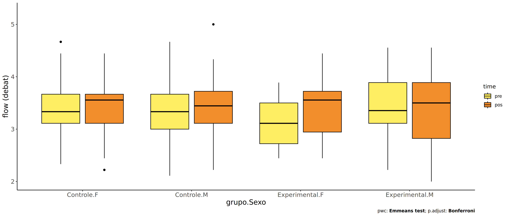
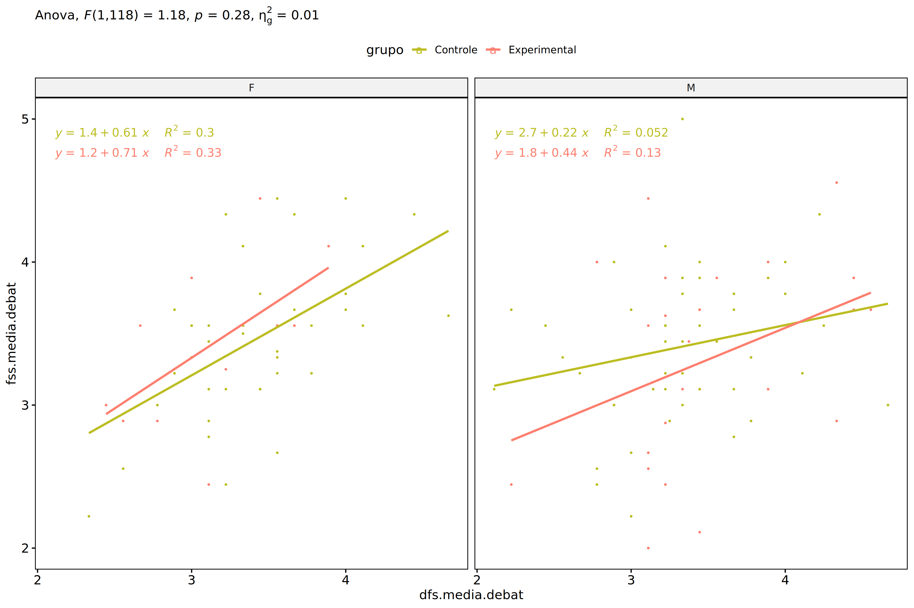
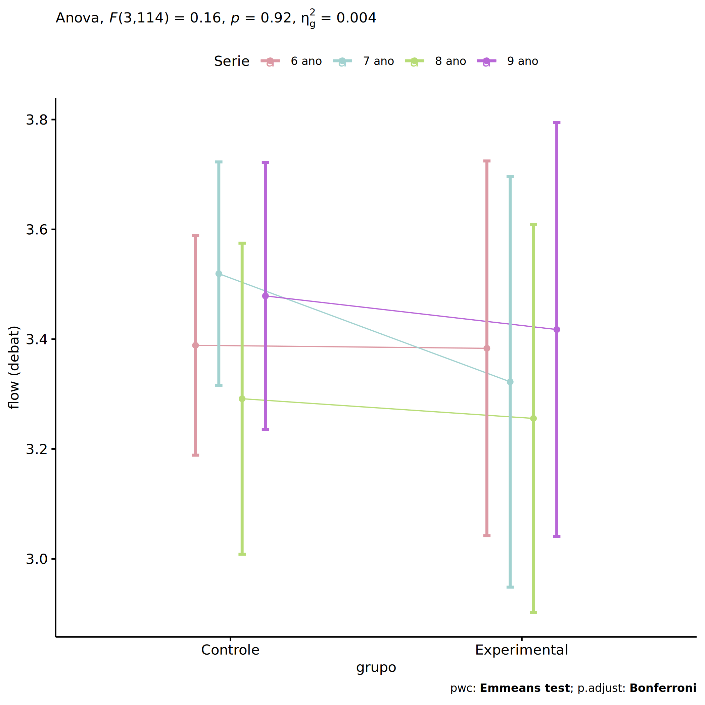
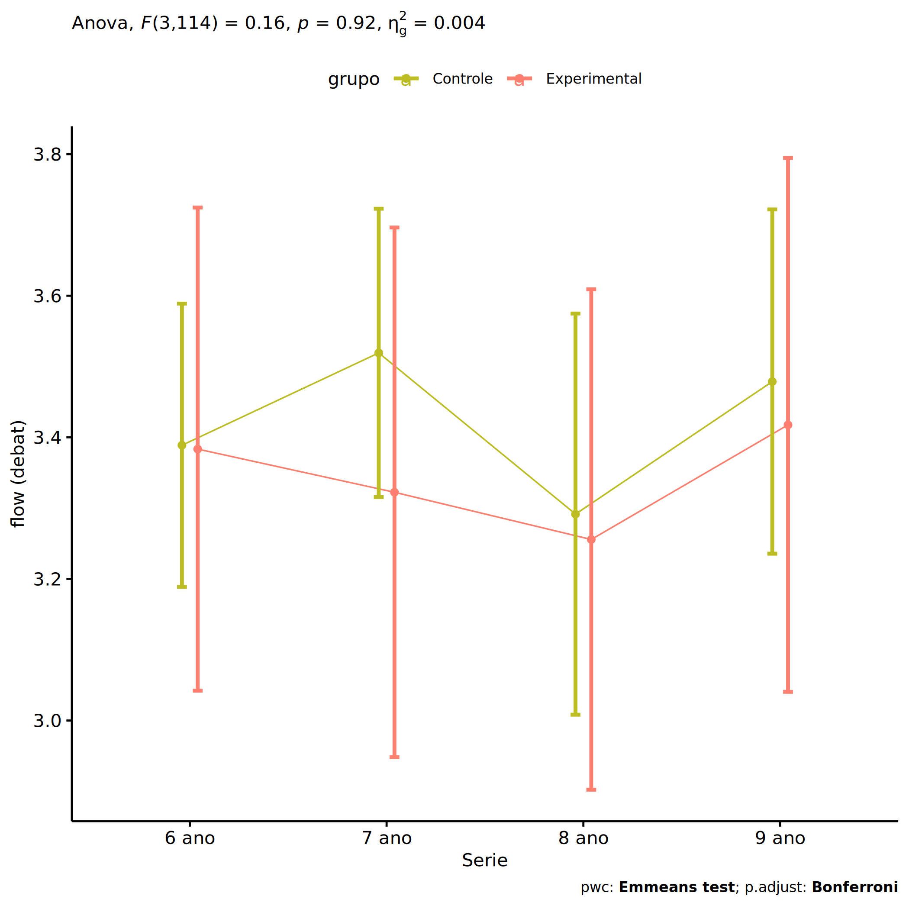
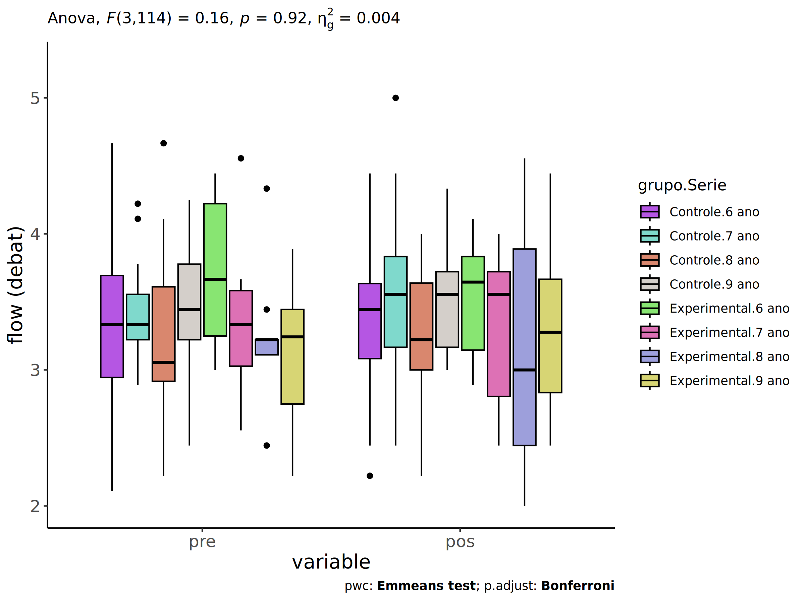

ANCOVA in flow (debat) (flow (debat))
================
Geiser C. Challco <geiser@alumni.usp.br>

- [Setting Initial Variables](#setting-initial-variables)
- [Descriptive Statistics of Initial
  Data](#descriptive-statistics-of-initial-data)
- [ANCOVA and Pairwise for one factor:
  **grupo**](#ancova-and-pairwise-for-one-factor-grupo)
  - [Without remove non-normal data](#without-remove-non-normal-data)
  - [Computing ANCOVA and PairWise After removing non-normal data
    (OK)](#computing-ancova-and-pairwise-after-removing-non-normal-data-ok)
    - [Plots for ancova](#plots-for-ancova)
    - [Checking linearity assumption](#checking-linearity-assumption)
    - [Checking normality and
      homogeneity](#checking-normality-and-homogeneity)
- [ANCOVA and Pairwise for two factors
  **grupo:Sexo**](#ancova-and-pairwise-for-two-factors-gruposexo)
  - [Without remove non-normal data](#without-remove-non-normal-data-1)
  - [Computing ANCOVA and PairWise After removing non-normal data
    (OK)](#computing-ancova-and-pairwise-after-removing-non-normal-data-ok-1)
    - [Plots for ancova](#plots-for-ancova-1)
    - [Checking linearity assumption](#checking-linearity-assumption-1)
    - [Checking normality and
      homogeneity](#checking-normality-and-homogeneity-1)
- [ANCOVA and Pairwise for two factors
  **grupo:Zona**](#ancova-and-pairwise-for-two-factors-grupozona)
  - [Without remove non-normal data](#without-remove-non-normal-data-2)
  - [Computing ANCOVA and PairWise After removing non-normal data
    (OK)](#computing-ancova-and-pairwise-after-removing-non-normal-data-ok-2)
    - [Plots for ancova](#plots-for-ancova-2)
    - [Checking linearity assumption](#checking-linearity-assumption-2)
    - [Checking normality and
      homogeneity](#checking-normality-and-homogeneity-2)
- [ANCOVA and Pairwise for two factors
  **grupo:Cor.Raca**](#ancova-and-pairwise-for-two-factors-grupocorraca)
  - [Without remove non-normal data](#without-remove-non-normal-data-3)
  - [Computing ANCOVA and PairWise After removing non-normal data
    (OK)](#computing-ancova-and-pairwise-after-removing-non-normal-data-ok-3)
    - [Plots for ancova](#plots-for-ancova-3)
    - [Checking linearity assumption](#checking-linearity-assumption-3)
    - [Checking normality and
      homogeneity](#checking-normality-and-homogeneity-3)
- [ANCOVA and Pairwise for two factors
  **grupo:Serie**](#ancova-and-pairwise-for-two-factors-gruposerie)
  - [Without remove non-normal data](#without-remove-non-normal-data-4)
  - [Computing ANCOVA and PairWise After removing non-normal data
    (OK)](#computing-ancova-and-pairwise-after-removing-non-normal-data-ok-4)
    - [Plots for ancova](#plots-for-ancova-4)
    - [Checking linearity assumption](#checking-linearity-assumption-4)
    - [Checking normality and
      homogeneity](#checking-normality-and-homogeneity-4)
- [Summary of Results](#summary-of-results)
  - [Descriptive Statistics](#descriptive-statistics)
  - [ANCOVA Table Comparison](#ancova-table-comparison)
  - [PairWise Table Comparison](#pairwise-table-comparison)
  - [EMMS Table Comparison](#emms-table-comparison)

**NOTE**:

- Teste ANCOVA para determinar se houve diferenças significativas no
  flow (debat) (medido usando pre- e pos-testes).
- ANCOVA test to determine whether there were significant differences in
  flow (debat) (measured using pre- and post-tests).

# Setting Initial Variables

``` r
dv = "flow.debat"
dv.pos = "fss.media.debat"
dv.pre = "dfs.media.debat"

fatores2 <- c("Sexo","Zona","Cor.Raca","Serie")
lfatores2 <- as.list(fatores2)
names(lfatores2) <- fatores2

fatores1 <- c("grupo", fatores2)
lfatores1 <- as.list(fatores1)
names(lfatores1) <- fatores1

lfatores <- c(lfatores1)

color <- list()
color[["prepost"]] = c("#ffee65","#f28e2B")
color[["grupo"]] = c("#bcbd22","#fd7f6f")
color[["Sexo"]] = c("#FF007F","#4D4DFF")
color[["Zona"]] = c("#AA00FF","#00CCCC")
color[["Cor.Raca"]] = c(
  "Parda"="#b97100","Indígena"="#9F262F",
  "Branca"="#87c498", "Preta"="#848283","Amarela"="#D6B91C"
)

level <- list()
level[["grupo"]] = c("Controle","Experimental")
level[["Sexo"]] = c("F","M")
level[["Zona"]] = c("Rural","Urbana")
level[["Cor.Raca"]] = c("Parda","Indígena","Branca", "Preta","Amarela")
level[["Serie"]] = c("6 ano","7 ano","8 ano","9 ano")

# ..

ymin <- 0
ymax <- 0

ymin.ci <- 0
ymax.ci <- 0


color[["grupo:Sexo"]] = c(
  "Controle:F"="#ff99cb", "Controle:M"="#b7b7ff",
  "Experimental:F"="#FF007F", "Experimental:M"="#4D4DFF",
  "Controle.F"="#ff99cb", "Controle.M"="#b7b7ff",
  "Experimental.F"="#FF007F", "Experimental.M"="#4D4DFF"
)
color[["grupo:Zona"]] = c(
  "Controle:Rural"="#b2efef","Controle:Urbana"="#e5b2ff",
  "Experimental:Rural"="#00CCCC", "Experimental:Urbana"="#AA00FF",
  "Controle.Rural"="#b2efef","Controle.Urbana"="#e5b2ff",
  "Experimental.Rural"="#00CCCC", "Experimental.Urbana"="#AA00FF"
)
color[["grupo:Cor.Raca"]] = c(
    "Controle:Parda"="#e3c699", "Experimental:Parda"="#b97100",
    "Controle:Indígena"="#e2bdc0", "Experimental:Indígena"="#9F262F",
    "Controle:Branca"="#c0e8cb", "Experimental:Branca"="#87c498",
    "Controle:Preta"="#dad9d9", "Experimental:Preta"="#848283",
    "Controle:Amarela"="#eee3a4", "Experimental:Amarela"="#D6B91C",
    
    "Controle.Parda"="#e3c699", "Experimental.Parda"="#b97100",
    "Controle.Indígena"="#e2bdc0", "Experimental.Indígena"="#9F262F",
    "Controle.Branca"="#c0e8cb", "Experimental.Branca"="#87c498",
    "Controle.Preta"="#dad9d9", "Experimental.Preta"="#848283",
    "Controle.Amarela"="#eee3a4", "Experimental.Amarela"="#D6B91C"
)


for (coln in c("vocab","vocab.teach","vocab.non.teach","score.tde",
               "TFL.lidas.per.min","TFL.corretas.per.min","TFL.erradas.per.min","TFL.omitidas.per.min",
               "leitura.compreensao")) {
  color[[paste0(coln,".quintile")]] = c("#BF0040","#FF0000","#800080","#0000FF","#4000BF")
  level[[paste0(coln,".quintile")]] = c("1st quintile","2nd quintile","3rd quintile","4th quintile","5th quintile")
  color[[paste0("grupo:",coln,".quintile")]] = c(
    "Experimental.1st quintile"="#BF0040", "Controle.1st quintile"="#d8668c",
    "Experimental.2nd quintile"="#FF0000", "Controle.2nd quintile"="#ff7f7f",
    "Experimental.3rd quintile"="#8fce00", "Controle.3rd quintile"="#ddf0b2",
    "Experimental.4th quintile"="#0000FF", "Controle.4th quintile"="#b2b2ff",
    "Experimental.5th quintile"="#4000BF", "Controle.5th quintile"="#b299e5",
    
    "Experimental:1st quintile"="#BF0040", "Controle:1st quintile"="#d8668c",
    "Experimental:2nd quintile"="#FF0000", "Controle:2nd quintile"="#ff7f7f",
    "Experimental:3rd quintile"="#8fce00", "Controle:3rd quintile"="#ddf0b2",
    "Experimental:4th quintile"="#0000FF", "Controle:4th quintile"="#b2b2ff",
    "Experimental:5th quintile"="#4000BF", "Controle:5th quintile"="#b299e5")
}


gdat <- read_excel("../data/data.xlsx", sheet = "sumary")
gdat <- gdat[which(is.na(gdat$Necessidade.Deficiencia) & !is.na(gdat$Stari.Grupo)),]


dat <- gdat
dat$grupo <- factor(dat[["Stari.Grupo"]], level[["grupo"]])
for (coln in c(names(lfatores))) {
  dat[[coln]] <- factor(dat[[coln]], level[[coln]][level[[coln]] %in% unique(dat[[coln]])])
}
dat <- dat[which(!is.na(dat[[dv.pre]]) & !is.na(dat[[dv.pos]])),]
dat <- dat[,c("id",names(lfatores),dv.pre,dv.pos)]

dat.long <- rbind(dat, dat)
dat.long$time <- c(rep("pre", nrow(dat)), rep("pos", nrow(dat)))
dat.long$time <- factor(dat.long$time, c("pre","pos"))
dat.long[[dv]] <- c(dat[[dv.pre]], dat[[dv.pos]])


for (f in c("grupo", names(lfatores))) {
  if (is.null(color[[f]]) && length(unique(dat[[f]])) > 0) 
      color[[f]] <- distinctColorPalette(length(unique(dat[[f]])))
}
for (f in c(fatores2)) {
  if (is.null(color[[paste0("grupo:",f)]]) && length(unique(dat[[f]])) > 0)
    color[[paste0("grupo:",f)]] <- distinctColorPalette(length(unique(dat[["grupo"]]))*length(unique(dat[[f]])))
}

ldat <- list()
laov <- list()
lpwc <- list()
lemms <- list()
```

# Descriptive Statistics of Initial Data

``` r
df <- get.descriptives(dat, c(dv.pre, dv.pos), c("grupo"), 
                       include.global = T, symmetry.test = T, normality.test = F)
df <- plyr::rbind.fill(
  df, do.call(plyr::rbind.fill, lapply(lfatores2, FUN = function(f) {
    if (nrow(dat) > 0 && sum(!is.na(unique(dat[[f]]))) > 1)
      get.descriptives(dat, c(dv.pre,dv.pos), c("grupo", f),
                       symmetry.test = T, normality.test = F)
    }))
)
```

    ## Warning: There was 1 warning in `mutate()`.
    ## ℹ In argument: `ci = abs(stats::qt(alpha/2, .data$n - 1) * .data$se)`.
    ## Caused by warning:
    ## ! There was 1 warning in `mutate()`.
    ## ℹ In argument: `ci = abs(stats::qt(alpha/2, .data$n - 1) * .data$se)`.
    ## Caused by warning in `stats::qt()`:
    ## ! NaNs produced
    ## There was 1 warning in `mutate()`.
    ## ℹ In argument: `ci = abs(stats::qt(alpha/2, .data$n - 1) * .data$se)`.
    ## Caused by warning:
    ## ! There was 1 warning in `mutate()`.
    ## ℹ In argument: `ci = abs(stats::qt(alpha/2, .data$n - 1) * .data$se)`.
    ## Caused by warning in `stats::qt()`:
    ## ! NaNs produced

``` r
df <- df[,c(fatores1[fatores1 %in% colnames(df)],"variable",
            colnames(df)[!colnames(df) %in% c(fatores1,"variable")])]
```

| grupo | Sexo | Zona | Cor.Raca | Serie | variable | n | mean | median | min | max | sd | se | ci | iqr | symmetry | skewness | kurtosis |
|:---|:---|:---|:---|:---|:---|---:|---:|---:|---:|---:|---:|---:|---:|---:|:---|---:|---:|
| Controle |  |  |  |  | dfs.media.debat | 88 | 3.365 | 3.333 | 2.111 | 4.667 | 0.502 | 0.053 | 0.106 | 0.583 | YES | 0.164 | 0.255 |
| Experimental |  |  |  |  | dfs.media.debat | 35 | 3.379 | 3.222 | 2.222 | 4.556 | 0.575 | 0.097 | 0.197 | 0.500 | YES | 0.348 | -0.397 |
|  |  |  |  |  | dfs.media.debat | 123 | 3.369 | 3.333 | 2.111 | 4.667 | 0.521 | 0.047 | 0.093 | 0.556 | YES | 0.242 | 0.104 |
| Controle |  |  |  |  | fss.media.debat | 88 | 3.431 | 3.444 | 2.222 | 5.000 | 0.520 | 0.055 | 0.110 | 0.556 | YES | 0.121 | 0.258 |
| Experimental |  |  |  |  | fss.media.debat | 35 | 3.348 | 3.556 | 2.000 | 4.556 | 0.666 | 0.113 | 0.229 | 1.000 | YES | -0.163 | -0.882 |
|  |  |  |  |  | fss.media.debat | 123 | 3.408 | 3.444 | 2.000 | 5.000 | 0.564 | 0.051 | 0.101 | 0.611 | YES | -0.055 | -0.064 |
| Controle | F |  |  |  | dfs.media.debat | 41 | 3.415 | 3.333 | 2.333 | 4.667 | 0.480 | 0.075 | 0.151 | 0.556 | YES | 0.359 | 0.139 |
| Controle | M |  |  |  | dfs.media.debat | 47 | 3.321 | 3.333 | 2.111 | 4.667 | 0.521 | 0.076 | 0.153 | 0.667 | YES | 0.067 | 0.112 |
| Experimental | F |  |  |  | dfs.media.debat | 11 | 3.121 | 3.111 | 2.444 | 3.889 | 0.480 | 0.145 | 0.323 | 0.778 | YES | 0.086 | -1.546 |
| Experimental | M |  |  |  | dfs.media.debat | 24 | 3.497 | 3.354 | 2.222 | 4.556 | 0.585 | 0.119 | 0.247 | 0.778 | YES | 0.282 | -0.528 |
| Controle | F |  |  |  | fss.media.debat | 41 | 3.459 | 3.556 | 2.222 | 4.444 | 0.530 | 0.083 | 0.167 | 0.556 | YES | -0.068 | -0.232 |
| Controle | M |  |  |  | fss.media.debat | 47 | 3.407 | 3.444 | 2.222 | 5.000 | 0.516 | 0.075 | 0.151 | 0.611 | YES | 0.290 | 0.656 |
| Experimental | F |  |  |  | fss.media.debat | 11 | 3.417 | 3.556 | 2.444 | 4.444 | 0.594 | 0.179 | 0.399 | 0.778 | YES | 0.106 | -1.185 |
| Experimental | M |  |  |  | fss.media.debat | 24 | 3.317 | 3.500 | 2.000 | 4.556 | 0.706 | 0.144 | 0.298 | 1.066 | YES | -0.186 | -1.048 |
| Controle |  | Rural |  |  | dfs.media.debat | 54 | 3.316 | 3.292 | 2.111 | 4.667 | 0.543 | 0.074 | 0.148 | 0.667 | YES | 0.112 | -0.105 |
| Controle |  | Urbana |  |  | dfs.media.debat | 9 | 3.460 | 3.222 | 2.889 | 4.667 | 0.552 | 0.184 | 0.424 | 0.413 | NO | 1.075 | -0.191 |
| Controle |  |  |  |  | dfs.media.debat | 25 | 3.436 | 3.444 | 2.667 | 4.222 | 0.381 | 0.076 | 0.157 | 0.444 | YES | 0.047 | -0.595 |
| Experimental |  | Rural |  |  | dfs.media.debat | 29 | 3.388 | 3.333 | 2.222 | 4.556 | 0.570 | 0.106 | 0.217 | 0.444 | YES | 0.308 | -0.194 |
| Experimental |  |  |  |  | dfs.media.debat | 6 | 3.333 | 3.167 | 2.667 | 4.333 | 0.652 | 0.266 | 0.684 | 0.861 | YES | 0.416 | -1.715 |
| Controle |  | Rural |  |  | fss.media.debat | 54 | 3.402 | 3.444 | 2.222 | 4.444 | 0.492 | 0.067 | 0.134 | 0.556 | YES | -0.085 | -0.307 |
| Controle |  | Urbana |  |  | fss.media.debat | 9 | 3.674 | 3.556 | 2.889 | 5.000 | 0.751 | 0.250 | 0.577 | 1.222 | NO | 0.505 | -1.454 |
| Controle |  |  |  |  | fss.media.debat | 25 | 3.406 | 3.556 | 2.222 | 4.333 | 0.482 | 0.096 | 0.199 | 0.556 | NO | -0.628 | 0.090 |
| Experimental |  | Rural |  |  | fss.media.debat | 29 | 3.356 | 3.556 | 2.111 | 4.444 | 0.624 | 0.116 | 0.237 | 1.000 | YES | -0.187 | -0.973 |
| Experimental |  |  |  |  | fss.media.debat | 6 | 3.312 | 3.222 | 2.000 | 4.556 | 0.913 | 0.373 | 0.958 | 1.010 | YES | -0.035 | -1.646 |
| Controle |  |  | Parda |  | dfs.media.debat | 46 | 3.453 | 3.333 | 2.222 | 4.667 | 0.514 | 0.076 | 0.153 | 0.639 | YES | 0.359 | 0.205 |
| Controle |  |  | Branca |  | dfs.media.debat | 9 | 3.198 | 3.444 | 2.111 | 4.111 | 0.654 | 0.218 | 0.503 | 0.778 | YES | -0.419 | -1.334 |
| Controle |  |  | Preta |  | dfs.media.debat | 1 | 3.222 | 3.222 | 3.222 | 3.222 |  |  |  | 0.000 | few data | 0.000 | 0.000 |
| Controle |  |  |  |  | dfs.media.debat | 32 | 3.289 | 3.333 | 2.556 | 4.111 | 0.432 | 0.076 | 0.156 | 0.500 | YES | 0.213 | -0.787 |
| Experimental |  |  | Parda |  | dfs.media.debat | 11 | 3.404 | 3.222 | 2.444 | 4.556 | 0.652 | 0.197 | 0.438 | 0.556 | NO | 0.510 | -0.985 |
| Experimental |  |  | Indígena |  | dfs.media.debat | 5 | 3.475 | 3.444 | 2.556 | 4.333 | 0.638 | 0.285 | 0.793 | 0.292 | YES | -0.107 | -1.483 |
| Experimental |  |  | Branca |  | dfs.media.debat | 5 | 3.244 | 3.444 | 2.222 | 3.556 | 0.574 | 0.257 | 0.713 | 0.111 | few data | 0.000 | 0.000 |
| Experimental |  |  |  |  | dfs.media.debat | 14 | 3.373 | 3.222 | 2.667 | 4.444 | 0.547 | 0.146 | 0.316 | 0.611 | NO | 0.745 | -0.832 |
| Controle |  |  | Parda |  | fss.media.debat | 46 | 3.481 | 3.472 | 2.667 | 5.000 | 0.512 | 0.076 | 0.152 | 0.556 | NO | 0.661 | 0.205 |
| Controle |  |  | Branca |  | fss.media.debat | 9 | 3.210 | 3.222 | 2.222 | 3.889 | 0.557 | 0.186 | 0.428 | 0.444 | NO | -0.593 | -1.174 |
| Controle |  |  | Preta |  | fss.media.debat | 1 | 3.444 | 3.444 | 3.444 | 3.444 |  |  |  | 0.000 | few data | 0.000 | 0.000 |
| Controle |  |  |  |  | fss.media.debat | 32 | 3.421 | 3.500 | 2.222 | 4.444 | 0.528 | 0.093 | 0.190 | 0.667 | YES | -0.306 | -0.365 |
| Experimental |  |  | Parda |  | fss.media.debat | 11 | 3.253 | 3.111 | 2.556 | 3.889 | 0.456 | 0.137 | 0.306 | 0.722 | YES | -0.107 | -1.657 |
| Experimental |  |  | Indígena |  | fss.media.debat | 5 | 3.778 | 3.556 | 2.889 | 4.556 | 0.707 | 0.316 | 0.878 | 1.000 | YES | 0.009 | -2.038 |
| Experimental |  |  | Branca |  | fss.media.debat | 5 | 3.022 | 3.111 | 2.111 | 3.889 | 0.743 | 0.332 | 0.922 | 1.111 | YES | -0.071 | -2.051 |
| Experimental |  |  |  |  | fss.media.debat | 14 | 3.387 | 3.590 | 2.000 | 4.444 | 0.745 | 0.199 | 0.430 | 1.094 | YES | -0.399 | -1.295 |
| Controle |  |  |  | 6 ano | dfs.media.debat | 28 | 3.329 | 3.333 | 2.111 | 4.667 | 0.605 | 0.114 | 0.235 | 0.750 | YES | 0.108 | -0.428 |
| Controle |  |  |  | 7 ano | dfs.media.debat | 27 | 3.392 | 3.333 | 2.889 | 4.222 | 0.317 | 0.061 | 0.126 | 0.333 | NO | 0.838 | 0.340 |
| Controle |  |  |  | 8 ano | dfs.media.debat | 14 | 3.272 | 3.056 | 2.222 | 4.667 | 0.614 | 0.164 | 0.354 | 0.694 | NO | 0.650 | -0.149 |
| Controle |  |  |  | 9 ano | dfs.media.debat | 19 | 3.446 | 3.444 | 2.444 | 4.250 | 0.483 | 0.111 | 0.233 | 0.556 | YES | -0.239 | -0.711 |
| Experimental |  |  |  | 6 ano | dfs.media.debat | 10 | 3.722 | 3.667 | 3.000 | 4.444 | 0.550 | 0.174 | 0.393 | 0.972 | YES | 0.171 | -1.786 |
| Experimental |  |  |  | 7 ano | dfs.media.debat | 8 | 3.361 | 3.333 | 2.556 | 4.556 | 0.622 | 0.220 | 0.520 | 0.556 | NO | 0.516 | -0.838 |
| Experimental |  |  |  | 8 ano | dfs.media.debat | 9 | 3.247 | 3.222 | 2.444 | 4.333 | 0.490 | 0.163 | 0.377 | 0.111 | NO | 0.723 | 0.491 |
| Experimental |  |  |  | 9 ano | dfs.media.debat | 8 | 3.116 | 3.243 | 2.222 | 3.889 | 0.534 | 0.189 | 0.446 | 0.694 | YES | -0.243 | -1.343 |
| Controle |  |  |  | 6 ano | fss.media.debat | 28 | 3.374 | 3.444 | 2.222 | 4.444 | 0.557 | 0.105 | 0.216 | 0.552 | YES | -0.055 | -0.452 |
| Controle |  |  |  | 7 ano | fss.media.debat | 27 | 3.528 | 3.556 | 2.444 | 5.000 | 0.581 | 0.112 | 0.230 | 0.667 | YES | 0.389 | -0.134 |
| Controle |  |  |  | 8 ano | fss.media.debat | 14 | 3.254 | 3.222 | 2.222 | 4.000 | 0.486 | 0.130 | 0.281 | 0.639 | YES | -0.394 | -0.776 |
| Controle |  |  |  | 9 ano | fss.media.debat | 19 | 3.509 | 3.556 | 3.000 | 4.333 | 0.363 | 0.083 | 0.175 | 0.556 | YES | 0.383 | -0.783 |
| Experimental |  |  |  | 6 ano | fss.media.debat | 10 | 3.521 | 3.646 | 2.889 | 4.111 | 0.406 | 0.128 | 0.290 | 0.687 | YES | -0.145 | -1.596 |
| Experimental |  |  |  | 7 ano | fss.media.debat | 8 | 3.319 | 3.556 | 2.444 | 4.000 | 0.604 | 0.214 | 0.505 | 0.917 | YES | -0.356 | -1.778 |
| Experimental |  |  |  | 8 ano | fss.media.debat | 9 | 3.208 | 3.000 | 2.000 | 4.556 | 0.957 | 0.319 | 0.736 | 1.444 | YES | 0.141 | -1.703 |
| Experimental |  |  |  | 9 ano | fss.media.debat | 8 | 3.319 | 3.278 | 2.444 | 4.444 | 0.678 | 0.240 | 0.567 | 0.833 | YES | 0.287 | -1.451 |

# ANCOVA and Pairwise for one factor: **grupo**

## Without remove non-normal data

``` r
pdat = remove_group_data(dat[!is.na(dat[["grupo"]]),], "fss.media.debat", "grupo")

pdat.long <- rbind(pdat[,c("id","grupo")], pdat[,c("id","grupo")])
pdat.long[["time"]] <- c(rep("pre", nrow(pdat)), rep("pos", nrow(pdat)))
pdat.long[["time"]] <- factor(pdat.long[["time"]], c("pre","pos"))
pdat.long[["flow.debat"]] <- c(pdat[["dfs.media.debat"]], pdat[["fss.media.debat"]])

aov = anova_test(pdat, fss.media.debat ~ dfs.media.debat + grupo)
laov[["grupo"]] <- get_anova_table(aov)
```

``` r
pwc <- emmeans_test(pdat, fss.media.debat ~ grupo, covariate = dfs.media.debat,
                    p.adjust.method = "bonferroni")
```

``` r
pwc.long <- emmeans_test(dplyr::group_by_at(pdat.long, "grupo"),
                          flow.debat ~ time,
                          p.adjust.method = "bonferroni")
lpwc[["grupo"]] <- plyr::rbind.fill(pwc, pwc.long)
```

``` r
ds <- get.descriptives(pdat, "fss.media.debat", "grupo", covar = "dfs.media.debat")
ds <- merge(ds[ds$variable != "dfs.media.debat",],
            ds[ds$variable == "dfs.media.debat", !colnames(ds) %in% c("variable")],
            by = "grupo", all.x = T, suffixes = c("", ".dfs.media.debat"))
ds <- merge(get_emmeans(pwc), ds, by = "grupo", suffixes = c(".emms", ""))
ds <- ds[,c("grupo","n","mean.dfs.media.debat","se.dfs.media.debat","mean","se",
            "emmean","se.emms","conf.low","conf.high")]

colnames(ds) <- c("grupo", "N", paste0(c("M","SE")," (pre)"),
                  paste0(c("M","SE"), " (unadj)"),
                  paste0(c("M", "SE"), " (adj)"), "conf.low", "conf.high")

lemms[["grupo"]] <- ds
```

## Computing ANCOVA and PairWise After removing non-normal data (OK)

``` r
wdat = pdat 

res = residuals(lm(fss.media.debat ~ dfs.media.debat + grupo, data = wdat))
non.normal = getNonNormal(res, wdat$id, plimit = 0.05)

wdat = wdat[!wdat$id %in% non.normal,]

wdat.long <- rbind(wdat[,c("id","grupo")], wdat[,c("id","grupo")])
wdat.long[["time"]] <- c(rep("pre", nrow(wdat)), rep("pos", nrow(wdat)))
wdat.long[["time"]] <- factor(wdat.long[["time"]], c("pre","pos"))
wdat.long[["flow.debat"]] <- c(wdat[["dfs.media.debat"]], wdat[["fss.media.debat"]])

ldat[["grupo"]] = wdat

(non.normal)
```

    ## NULL

``` r
aov = anova_test(wdat, fss.media.debat ~ dfs.media.debat + grupo)
laov[["grupo"]] <- merge(get_anova_table(aov), laov[["grupo"]],
                            by="Effect", suffixes = c("","'"))

(df = get_anova_table(aov))
```

    ## ANOVA Table (type II tests)
    ## 
    ##            Effect DFn DFd      F        p p<.05   ges
    ## 1 dfs.media.debat   1 120 19.387 2.33e-05     * 0.139
    ## 2           grupo   1 120  0.709 4.01e-01       0.006

| Effect          | DFn | DFd |      F |     p | p\<.05 |   ges |
|:----------------|----:|----:|-------:|------:|:-------|------:|
| dfs.media.debat |   1 | 120 | 19.387 | 0.000 | \*     | 0.139 |
| grupo           |   1 | 120 |  0.709 | 0.401 |        | 0.006 |

``` r
pwc <- emmeans_test(wdat, fss.media.debat ~ grupo, covariate = dfs.media.debat,
                    p.adjust.method = "bonferroni")
```

| term | .y. | group1 | group2 | df | statistic | p | p.adj | p.adj.signif |
|:---|:---|:---|:---|---:|---:|---:|---:|:---|
| dfs.media.debat\*grupo | fss.media.debat | Controle | Experimental | 120 | 0.842 | 0.401 | 0.401 | ns |

``` r
pwc.long <- emmeans_test(dplyr::group_by_at(wdat.long, "grupo"),
                         flow.debat ~ time,
                         p.adjust.method = "bonferroni")
lpwc[["grupo"]] <- merge(plyr::rbind.fill(pwc, pwc.long), lpwc[["grupo"]],
                            by=c("grupo","term",".y.","group1","group2"),
                            suffixes = c("","'"))
```

| grupo        | term | .y.        | group1 | group2 |  df | statistic |     p | p.adj | p.adj.signif |
|:-------------|:-----|:-----------|:-------|:-------|----:|----------:|------:|------:|:-------------|
| Controle     | time | flow.debat | pre    | pos    | 242 |    -0.811 | 0.418 | 0.418 | ns           |
| Experimental | time | flow.debat | pre    | pos    | 242 |     0.235 | 0.815 | 0.815 | ns           |

``` r
ds <- get.descriptives(wdat, "fss.media.debat", "grupo", covar = "dfs.media.debat")
ds <- merge(ds[ds$variable != "dfs.media.debat",],
            ds[ds$variable == "dfs.media.debat", !colnames(ds) %in% c("variable")],
            by = "grupo", all.x = T, suffixes = c("", ".dfs.media.debat"))
ds <- merge(get_emmeans(pwc), ds, by = "grupo", suffixes = c(".emms", ""))
ds <- ds[,c("grupo","n","mean.dfs.media.debat","se.dfs.media.debat","mean","se",
            "emmean","se.emms","conf.low","conf.high")]

colnames(ds) <- c("grupo", "N", paste0(c("M","SE")," (pre)"),
                  paste0(c("M","SE"), " (unadj)"),
                  paste0(c("M", "SE"), " (adj)"), "conf.low", "conf.high")

lemms[["grupo"]] <- merge(ds, lemms[["grupo"]], by=c("grupo"), suffixes = c("","'"))
```

| grupo | N | M (pre) | SE (pre) | M (unadj) | SE (unadj) | M (adj) | SE (adj) | conf.low | conf.high |
|:---|---:|---:|---:|---:|---:|---:|---:|---:|---:|
| Controle | 88 | 3.365 | 0.053 | 3.431 | 0.055 | 3.433 | 0.056 | 3.322 | 3.544 |
| Experimental | 35 | 3.379 | 0.097 | 3.348 | 0.113 | 3.344 | 0.089 | 3.168 | 3.520 |

### Plots for ancova

``` r
plots <- oneWayAncovaPlots(
  wdat, "fss.media.debat", "grupo", aov, list("grupo"=pwc), addParam = c("mean_ci"),
  font.label.size=10, step.increase=0.05, p.label="p.adj",
  subtitle = which(aov$Effect == "grupo"))
```

``` r
if (!is.null(nrow(plots[["grupo"]]$data)))
  plots[["grupo"]] +
  if (ymin.ci < ymax.ci) ggplot2::ylim(ymin.ci, ymax.ci)
```

<!-- -->

``` r
plots <- oneWayAncovaBoxPlots(
  wdat, "fss.media.debat", "grupo", aov, pwc, covar = "dfs.media.debat",
  theme = "classic", color = color[["grupo"]],
  subtitle = which(aov$Effect == "grupo"))
```

``` r
if (length(unique(wdat[["grupo"]])) > 1)
  plots[["grupo"]] + ggplot2::ylab("flow (debat)") +
  ggplot2::scale_x_discrete(labels=c('pre', 'pos')) +
  if (ymin < ymax) ggplot2::ylim(ymin, ymax)
```

<!-- -->

``` r
if (length(unique(wdat.long[["grupo"]])) > 1)
  plots <- oneWayAncovaBoxPlots(
    wdat.long, "flow.debat", "grupo", aov, pwc.long,
    pre.post = "time", theme = "classic", color = color$prepost)
```

``` r
if (length(unique(wdat.long[["grupo"]])) > 1)
  plots[["grupo"]] + ggplot2::ylab("flow (debat)") +
  if (ymin < ymax) ggplot2::ylim(ymin, ymax) 
```

<!-- -->

### Checking linearity assumption

``` r
ggscatter(wdat, x = "dfs.media.debat", y = "fss.media.debat", size = 0.5,
          color = "grupo", add = "reg.line")+
  stat_regline_equation(
    aes(label =  paste(..eq.label.., ..rr.label.., sep = "~~~~"), color = grupo)
  ) +
  ggplot2::labs(subtitle = rstatix::get_test_label(aov, detailed = T, row = which(aov$Effect == "grupo"))) +
  ggplot2::scale_color_manual(values = color[["grupo"]]) +
  if (ymin < ymax) ggplot2::ylim(ymin, ymax)
```

<!-- -->

### Checking normality and homogeneity

``` r
res <- augment(lm(fss.media.debat ~ dfs.media.debat + grupo, data = wdat))
```

``` r
shapiro_test(res$.resid)
```

    ## # A tibble: 1 × 3
    ##   variable   statistic p.value
    ##   <chr>          <dbl>   <dbl>
    ## 1 res$.resid     0.995   0.962

``` r
levene_test(res, .resid ~ grupo)
```

    ## # A tibble: 1 × 4
    ##     df1   df2 statistic      p
    ##   <int> <int>     <dbl>  <dbl>
    ## 1     1   121      3.42 0.0668

# ANCOVA and Pairwise for two factors **grupo:Sexo**

## Without remove non-normal data

``` r
pdat = remove_group_data(dat[!is.na(dat[["grupo"]]) & !is.na(dat[["Sexo"]]),],
                         "fss.media.debat", c("grupo","Sexo"))
pdat = pdat[pdat[["Sexo"]] %in% do.call(
  intersect, lapply(unique(pdat[["grupo"]]), FUN = function(x) {
    unique(pdat[["Sexo"]][which(pdat[["grupo"]] == x)])
  })),]
pdat[["grupo"]] = factor(pdat[["grupo"]], level[["grupo"]])
pdat[["Sexo"]] = factor(
  pdat[["Sexo"]],
  level[["Sexo"]][level[["Sexo"]] %in% unique(pdat[["Sexo"]])])

pdat.long <- rbind(pdat[,c("id","grupo","Sexo")], pdat[,c("id","grupo","Sexo")])
pdat.long[["time"]] <- c(rep("pre", nrow(pdat)), rep("pos", nrow(pdat)))
pdat.long[["time"]] <- factor(pdat.long[["time"]], c("pre","pos"))
pdat.long[["flow.debat"]] <- c(pdat[["dfs.media.debat"]], pdat[["fss.media.debat"]])

if (length(unique(pdat[["Sexo"]])) >= 2) {
  aov = anova_test(pdat, fss.media.debat ~ dfs.media.debat + grupo*Sexo)
  laov[["grupo:Sexo"]] <- get_anova_table(aov)
}
```

``` r
if (length(unique(pdat[["Sexo"]])) >= 2) {
  pwcs <- list()
  pwcs[["Sexo"]] <- emmeans_test(
    group_by(pdat, grupo), fss.media.debat ~ Sexo,
    covariate = dfs.media.debat, p.adjust.method = "bonferroni")
  pwcs[["grupo"]] <- emmeans_test(
    group_by(pdat, Sexo), fss.media.debat ~ grupo,
    covariate = dfs.media.debat, p.adjust.method = "bonferroni")
  
  pwc <- plyr::rbind.fill(pwcs[["grupo"]], pwcs[["Sexo"]])
  pwc <- pwc[,c("grupo","Sexo", colnames(pwc)[!colnames(pwc) %in% c("grupo","Sexo")])]
}
```

``` r
if (length(unique(pdat[["Sexo"]])) >= 2) {
  pwc.long <- emmeans_test(dplyr::group_by_at(pdat.long, c("grupo","Sexo")),
                           flow.debat ~ time,
                           p.adjust.method = "bonferroni")
  lpwc[["grupo:Sexo"]] <- plyr::rbind.fill(pwc, pwc.long)
}
```

``` r
if (length(unique(pdat[["Sexo"]])) >= 2) {
  ds <- get.descriptives(pdat, "fss.media.debat", c("grupo","Sexo"), covar = "dfs.media.debat")
  ds <- merge(ds[ds$variable != "dfs.media.debat",],
              ds[ds$variable == "dfs.media.debat", !colnames(ds) %in% c("variable")],
              by = c("grupo","Sexo"), all.x = T, suffixes = c("", ".dfs.media.debat"))
  ds <- merge(get_emmeans(pwcs[["grupo"]]), ds,
              by = c("grupo","Sexo"), suffixes = c(".emms", ""))
  ds <- ds[,c("grupo","Sexo","n","mean.dfs.media.debat","se.dfs.media.debat","mean","se",
              "emmean","se.emms","conf.low","conf.high")]
  
  colnames(ds) <- c("grupo","Sexo", "N", paste0(c("M","SE")," (pre)"),
                    paste0(c("M","SE"), " (unadj)"),
                    paste0(c("M", "SE"), " (adj)"), "conf.low", "conf.high")
  
  lemms[["grupo:Sexo"]] <- ds
}
```

## Computing ANCOVA and PairWise After removing non-normal data (OK)

``` r
if (length(unique(pdat[["Sexo"]])) >= 2) {
  wdat = pdat 
  
  res = residuals(lm(fss.media.debat ~ dfs.media.debat + grupo*Sexo, data = wdat))
  non.normal = getNonNormal(res, wdat$id, plimit = 0.05)
  
  wdat = wdat[!wdat$id %in% non.normal,]
  
  wdat.long <- rbind(wdat[,c("id","grupo","Sexo")], wdat[,c("id","grupo","Sexo")])
  wdat.long[["time"]] <- c(rep("pre", nrow(wdat)), rep("pos", nrow(wdat)))
  wdat.long[["time"]] <- factor(wdat.long[["time"]], c("pre","pos"))
  wdat.long[["flow.debat"]] <- c(wdat[["dfs.media.debat"]], wdat[["fss.media.debat"]])
  
  
  ldat[["grupo:Sexo"]] = wdat
  
  (non.normal)
}
```

    ## NULL

``` r
if (length(unique(pdat[["Sexo"]])) >= 2) {
  aov = anova_test(wdat, fss.media.debat ~ dfs.media.debat + grupo*Sexo)
  laov[["grupo:Sexo"]] <- merge(get_anova_table(aov), laov[["grupo:Sexo"]],
                                         by="Effect", suffixes = c("","'"))
  df = get_anova_table(aov)
}
```

| Effect          | DFn | DFd |      F |     p | p\<.05 |   ges |
|:----------------|----:|----:|-------:|------:|:-------|------:|
| dfs.media.debat |   1 | 118 | 20.644 | 0.000 | \*     | 0.149 |
| grupo           |   1 | 118 |  0.527 | 0.469 |        | 0.004 |
| Sexo            |   1 | 118 |  0.605 | 0.438 |        | 0.005 |
| grupo:Sexo      |   1 | 118 |  1.177 | 0.280 |        | 0.010 |

``` r
if (length(unique(pdat[["Sexo"]])) >= 2) {
  pwcs <- list()
  pwcs[["Sexo"]] <- emmeans_test(
    group_by(wdat, grupo), fss.media.debat ~ Sexo,
    covariate = dfs.media.debat, p.adjust.method = "bonferroni")
  pwcs[["grupo"]] <- emmeans_test(
    group_by(wdat, Sexo), fss.media.debat ~ grupo,
    covariate = dfs.media.debat, p.adjust.method = "bonferroni")
  
  pwc <- plyr::rbind.fill(pwcs[["grupo"]], pwcs[["Sexo"]])
  pwc <- pwc[,c("grupo","Sexo", colnames(pwc)[!colnames(pwc) %in% c("grupo","Sexo")])]
}
```

| grupo | Sexo | term | .y. | group1 | group2 | df | statistic | p | p.adj | p.adj.signif |
|:---|:---|:---|:---|:---|:---|---:|---:|---:|---:|:---|
|  | F | dfs.media.debat\*grupo | fss.media.debat | Controle | Experimental | 118 | -0.451 | 0.653 | 0.653 | ns |
|  | M | dfs.media.debat\*grupo | fss.media.debat | Controle | Experimental | 118 | 1.233 | 0.220 | 0.220 | ns |
| Controle |  | dfs.media.debat\*Sexo | fss.media.debat | F | M | 118 | 0.116 | 0.908 | 0.908 | ns |
| Experimental |  | dfs.media.debat\*Sexo | fss.media.debat | F | M | 118 | 1.328 | 0.187 | 0.187 | ns |

``` r
if (length(unique(pdat[["Sexo"]])) >= 2) {
  pwc.long <- emmeans_test(dplyr::group_by_at(wdat.long, c("grupo","Sexo")),
                           flow.debat ~ time,
                           p.adjust.method = "bonferroni")
  lpwc[["grupo:Sexo"]] <- merge(plyr::rbind.fill(pwc, pwc.long),
                                         lpwc[["grupo:Sexo"]],
                                         by=c("grupo","Sexo","term",".y.","group1","group2"),
                                         suffixes = c("","'"))
}
```

| grupo | Sexo | term | .y. | group1 | group2 | df | statistic | p | p.adj | p.adj.signif |
|:---|:---|:---|:---|:---|:---|---:|---:|---:|---:|:---|
| Controle | F | time | flow.debat | pre | pos | 238 | -0.372 | 0.710 | 0.710 | ns |
| Controle | M | time | flow.debat | pre | pos | 238 | -0.764 | 0.446 | 0.446 | ns |
| Experimental | F | time | flow.debat | pre | pos | 238 | -1.275 | 0.204 | 0.204 | ns |
| Experimental | M | time | flow.debat | pre | pos | 238 | 1.147 | 0.253 | 0.253 | ns |

``` r
if (length(unique(pdat[["Sexo"]])) >= 2) {
  ds <- get.descriptives(wdat, "fss.media.debat", c("grupo","Sexo"), covar = "dfs.media.debat")
  ds <- merge(ds[ds$variable != "dfs.media.debat",],
              ds[ds$variable == "dfs.media.debat", !colnames(ds) %in% c("variable")],
              by = c("grupo","Sexo"), all.x = T, suffixes = c("", ".dfs.media.debat"))
  ds <- merge(get_emmeans(pwcs[["grupo"]]), ds,
              by = c("grupo","Sexo"), suffixes = c(".emms", ""))
  ds <- ds[,c("grupo","Sexo","n","mean.dfs.media.debat","se.dfs.media.debat",
              "mean","se","emmean","se.emms","conf.low","conf.high")]
  
  colnames(ds) <- c("grupo","Sexo", "N", paste0(c("M","SE")," (pre)"),
                    paste0(c("M","SE"), " (unadj)"),
                    paste0(c("M", "SE"), " (adj)"), "conf.low", "conf.high")
  
  lemms[["grupo:Sexo"]] <- merge(ds, lemms[["grupo:Sexo"]],
                                          by=c("grupo","Sexo"), suffixes = c("","'"))
}
```

| grupo | Sexo | N | M (pre) | SE (pre) | M (unadj) | SE (unadj) | M (adj) | SE (adj) | conf.low | conf.high |
|:---|:---|---:|---:|---:|---:|---:|---:|---:|---:|---:|
| Controle | F | 41 | 3.415 | 0.075 | 3.459 | 0.083 | 3.440 | 0.082 | 3.277 | 3.603 |
| Controle | M | 47 | 3.321 | 0.076 | 3.407 | 0.075 | 3.427 | 0.077 | 3.274 | 3.579 |
| Experimental | F | 11 | 3.121 | 0.145 | 3.417 | 0.179 | 3.522 | 0.160 | 3.204 | 3.839 |
| Experimental | M | 24 | 3.497 | 0.119 | 3.317 | 0.144 | 3.263 | 0.108 | 3.049 | 3.477 |

### Plots for ancova

``` r
if (length(unique(pdat[["Sexo"]])) >= 2) {
  ggPlotAoC2(pwcs, "grupo", "Sexo", aov, ylab = "flow (debat)",
             subtitle = which(aov$Effect == "grupo:Sexo"), addParam = "errorbar") +
    ggplot2::scale_color_manual(values = color[["Sexo"]]) +
    if (ymin.ci < ymax.ci) ggplot2::ylim(ymin.ci, ymax.ci)
}
```

    ## Scale for colour is already present.
    ## Adding another scale for colour, which will replace the existing scale.

<!-- -->

``` r
if (length(unique(pdat[["Sexo"]])) >= 2) {
  ggPlotAoC2(pwcs, "Sexo", "grupo", aov, ylab = "flow (debat)",
               subtitle = which(aov$Effect == "grupo:Sexo"), addParam = "errorbar") +
      ggplot2::scale_color_manual(values = color[["grupo"]]) +
      if (ymin.ci < ymax.ci) ggplot2::ylim(ymin.ci, ymax.ci)
}
```

    ## Scale for colour is already present.
    ## Adding another scale for colour, which will replace the existing scale.

<!-- -->

``` r
if (length(unique(pdat[["Sexo"]])) >= 2) {
  plots <- twoWayAncovaBoxPlots(
    wdat, "fss.media.debat", c("grupo","Sexo"), aov, pwcs, covar = "dfs.media.debat",
    theme = "classic", color = color[["grupo:Sexo"]],
    subtitle = which(aov$Effect == "grupo:Sexo"))
}
```

``` r
if (length(unique(pdat[["Sexo"]])) >= 2) {
  plots[["grupo:Sexo"]] + ggplot2::ylab("flow (debat)") +
  ggplot2::scale_x_discrete(labels=c('pre', 'pos')) +
  if (ymin < ymax) ggplot2::ylim(ymin, ymax)
}
```

    ## Warning: No shared levels found between `names(values)` of the manual scale and the data's colour values.

<!-- -->

``` r
if (length(unique(pdat[["Sexo"]])) >= 2) {
  plots <- twoWayAncovaBoxPlots(
    wdat.long, "flow.debat", c("grupo","Sexo"), aov, pwc.long,
    pre.post = "time",
    theme = "classic", color = color$prepost)
}
```

``` r
if (length(unique(pdat[["Sexo"]])) >= 2) 
  plots[["grupo:Sexo"]] + ggplot2::ylab("flow (debat)") +
    if (ymin < ymax) ggplot2::ylim(ymin, ymax)
```

<!-- -->

### Checking linearity assumption

``` r
if (length(unique(pdat[["Sexo"]])) >= 2) {
  ggscatter(wdat, x = "dfs.media.debat", y = "fss.media.debat", size = 0.5,
            facet.by = c("grupo","Sexo"), add = "reg.line")+
    stat_regline_equation(
      aes(label =  paste(..eq.label.., ..rr.label.., sep = "~~~~"))
    ) +
    if (ymin < ymax) ggplot2::ylim(ymin, ymax)
}
```

<!-- -->

``` r
if (length(unique(pdat[["Sexo"]])) >= 2) {
  ggscatter(wdat, x = "dfs.media.debat", y = "fss.media.debat", size = 0.5,
            color = "grupo", facet.by = "Sexo", add = "reg.line")+
    stat_regline_equation(
      aes(label =  paste(..eq.label.., ..rr.label.., sep = "~~~~"), color = grupo)
    ) +
    ggplot2::labs(subtitle = rstatix::get_test_label(aov, detailed = T, row = which(aov$Effect == "grupo:Sexo"))) +
    ggplot2::scale_color_manual(values = color[["grupo"]]) +
    if (ymin < ymax) ggplot2::ylim(ymin, ymax)
}
```

<!-- -->

``` r
if (length(unique(pdat[["Sexo"]])) >= 2) {
  ggscatter(wdat, x = "dfs.media.debat", y = "fss.media.debat", size = 0.5,
            color = "Sexo", facet.by = "grupo", add = "reg.line")+
    stat_regline_equation(
      aes(label =  paste(..eq.label.., ..rr.label.., sep = "~~~~"), color = Sexo)
    ) +
    ggplot2::labs(subtitle = rstatix::get_test_label(aov, detailed = T, row = which(aov$Effect == "grupo:Sexo"))) +
    ggplot2::scale_color_manual(values = color[["Sexo"]]) +
    if (ymin < ymax) ggplot2::ylim(ymin, ymax)
}
```

<!-- -->

### Checking normality and homogeneity

``` r
if (length(unique(pdat[["Sexo"]])) >= 2) 
  res <- augment(lm(fss.media.debat ~ dfs.media.debat + grupo*Sexo, data = wdat))
```

``` r
if (length(unique(pdat[["Sexo"]])) >= 2)
  shapiro_test(res$.resid)
```

    ## # A tibble: 1 × 3
    ##   variable   statistic p.value
    ##   <chr>          <dbl>   <dbl>
    ## 1 res$.resid     0.994   0.910

``` r
if (length(unique(pdat[["Sexo"]])) >= 2) 
  levene_test(res, .resid ~ grupo*Sexo)
```

    ## # A tibble: 1 × 4
    ##     df1   df2 statistic     p
    ##   <int> <int>     <dbl> <dbl>
    ## 1     3   119      1.72 0.166

# ANCOVA and Pairwise for two factors **grupo:Zona**

## Without remove non-normal data

``` r
pdat = remove_group_data(dat[!is.na(dat[["grupo"]]) & !is.na(dat[["Zona"]]),],
                         "fss.media.debat", c("grupo","Zona"))
pdat = pdat[pdat[["Zona"]] %in% do.call(
  intersect, lapply(unique(pdat[["grupo"]]), FUN = function(x) {
    unique(pdat[["Zona"]][which(pdat[["grupo"]] == x)])
  })),]
pdat[["grupo"]] = factor(pdat[["grupo"]], level[["grupo"]])
pdat[["Zona"]] = factor(
  pdat[["Zona"]],
  level[["Zona"]][level[["Zona"]] %in% unique(pdat[["Zona"]])])

pdat.long <- rbind(pdat[,c("id","grupo","Zona")], pdat[,c("id","grupo","Zona")])
pdat.long[["time"]] <- c(rep("pre", nrow(pdat)), rep("pos", nrow(pdat)))
pdat.long[["time"]] <- factor(pdat.long[["time"]], c("pre","pos"))
pdat.long[["flow.debat"]] <- c(pdat[["dfs.media.debat"]], pdat[["fss.media.debat"]])

if (length(unique(pdat[["Zona"]])) >= 2) {
  aov = anova_test(pdat, fss.media.debat ~ dfs.media.debat + grupo*Zona)
  laov[["grupo:Zona"]] <- get_anova_table(aov)
}
```

``` r
if (length(unique(pdat[["Zona"]])) >= 2) {
  pwcs <- list()
  pwcs[["Zona"]] <- emmeans_test(
    group_by(pdat, grupo), fss.media.debat ~ Zona,
    covariate = dfs.media.debat, p.adjust.method = "bonferroni")
  pwcs[["grupo"]] <- emmeans_test(
    group_by(pdat, Zona), fss.media.debat ~ grupo,
    covariate = dfs.media.debat, p.adjust.method = "bonferroni")
  
  pwc <- plyr::rbind.fill(pwcs[["grupo"]], pwcs[["Zona"]])
  pwc <- pwc[,c("grupo","Zona", colnames(pwc)[!colnames(pwc) %in% c("grupo","Zona")])]
}
```

``` r
if (length(unique(pdat[["Zona"]])) >= 2) {
  pwc.long <- emmeans_test(dplyr::group_by_at(pdat.long, c("grupo","Zona")),
                           flow.debat ~ time,
                           p.adjust.method = "bonferroni")
  lpwc[["grupo:Zona"]] <- plyr::rbind.fill(pwc, pwc.long)
}
```

``` r
if (length(unique(pdat[["Zona"]])) >= 2) {
  ds <- get.descriptives(pdat, "fss.media.debat", c("grupo","Zona"), covar = "dfs.media.debat")
  ds <- merge(ds[ds$variable != "dfs.media.debat",],
              ds[ds$variable == "dfs.media.debat", !colnames(ds) %in% c("variable")],
              by = c("grupo","Zona"), all.x = T, suffixes = c("", ".dfs.media.debat"))
  ds <- merge(get_emmeans(pwcs[["grupo"]]), ds,
              by = c("grupo","Zona"), suffixes = c(".emms", ""))
  ds <- ds[,c("grupo","Zona","n","mean.dfs.media.debat","se.dfs.media.debat","mean","se",
              "emmean","se.emms","conf.low","conf.high")]
  
  colnames(ds) <- c("grupo","Zona", "N", paste0(c("M","SE")," (pre)"),
                    paste0(c("M","SE"), " (unadj)"),
                    paste0(c("M", "SE"), " (adj)"), "conf.low", "conf.high")
  
  lemms[["grupo:Zona"]] <- ds
}
```

## Computing ANCOVA and PairWise After removing non-normal data (OK)

``` r
if (length(unique(pdat[["Zona"]])) >= 2) {
  wdat = pdat 
  
  res = residuals(lm(fss.media.debat ~ dfs.media.debat + grupo*Zona, data = wdat))
  non.normal = getNonNormal(res, wdat$id, plimit = 0.05)
  
  wdat = wdat[!wdat$id %in% non.normal,]
  
  wdat.long <- rbind(wdat[,c("id","grupo","Zona")], wdat[,c("id","grupo","Zona")])
  wdat.long[["time"]] <- c(rep("pre", nrow(wdat)), rep("pos", nrow(wdat)))
  wdat.long[["time"]] <- factor(wdat.long[["time"]], c("pre","pos"))
  wdat.long[["flow.debat"]] <- c(wdat[["dfs.media.debat"]], wdat[["fss.media.debat"]])
  
  
  ldat[["grupo:Zona"]] = wdat
  
  (non.normal)
}
```

``` r
if (length(unique(pdat[["Zona"]])) >= 2) {
  aov = anova_test(wdat, fss.media.debat ~ dfs.media.debat + grupo*Zona)
  laov[["grupo:Zona"]] <- merge(get_anova_table(aov), laov[["grupo:Zona"]],
                                         by="Effect", suffixes = c("","'"))
  df = get_anova_table(aov)
}
```

``` r
if (length(unique(pdat[["Zona"]])) >= 2) {
  pwcs <- list()
  pwcs[["Zona"]] <- emmeans_test(
    group_by(wdat, grupo), fss.media.debat ~ Zona,
    covariate = dfs.media.debat, p.adjust.method = "bonferroni")
  pwcs[["grupo"]] <- emmeans_test(
    group_by(wdat, Zona), fss.media.debat ~ grupo,
    covariate = dfs.media.debat, p.adjust.method = "bonferroni")
  
  pwc <- plyr::rbind.fill(pwcs[["grupo"]], pwcs[["Zona"]])
  pwc <- pwc[,c("grupo","Zona", colnames(pwc)[!colnames(pwc) %in% c("grupo","Zona")])]
}
```

``` r
if (length(unique(pdat[["Zona"]])) >= 2) {
  pwc.long <- emmeans_test(dplyr::group_by_at(wdat.long, c("grupo","Zona")),
                           flow.debat ~ time,
                           p.adjust.method = "bonferroni")
  lpwc[["grupo:Zona"]] <- merge(plyr::rbind.fill(pwc, pwc.long),
                                         lpwc[["grupo:Zona"]],
                                         by=c("grupo","Zona","term",".y.","group1","group2"),
                                         suffixes = c("","'"))
}
```

``` r
if (length(unique(pdat[["Zona"]])) >= 2) {
  ds <- get.descriptives(wdat, "fss.media.debat", c("grupo","Zona"), covar = "dfs.media.debat")
  ds <- merge(ds[ds$variable != "dfs.media.debat",],
              ds[ds$variable == "dfs.media.debat", !colnames(ds) %in% c("variable")],
              by = c("grupo","Zona"), all.x = T, suffixes = c("", ".dfs.media.debat"))
  ds <- merge(get_emmeans(pwcs[["grupo"]]), ds,
              by = c("grupo","Zona"), suffixes = c(".emms", ""))
  ds <- ds[,c("grupo","Zona","n","mean.dfs.media.debat","se.dfs.media.debat",
              "mean","se","emmean","se.emms","conf.low","conf.high")]
  
  colnames(ds) <- c("grupo","Zona", "N", paste0(c("M","SE")," (pre)"),
                    paste0(c("M","SE"), " (unadj)"),
                    paste0(c("M", "SE"), " (adj)"), "conf.low", "conf.high")
  
  lemms[["grupo:Zona"]] <- merge(ds, lemms[["grupo:Zona"]],
                                          by=c("grupo","Zona"), suffixes = c("","'"))
}
```

### Plots for ancova

``` r
if (length(unique(pdat[["Zona"]])) >= 2) {
  ggPlotAoC2(pwcs, "grupo", "Zona", aov, ylab = "flow (debat)",
             subtitle = which(aov$Effect == "grupo:Zona"), addParam = "errorbar") +
    ggplot2::scale_color_manual(values = color[["Zona"]]) +
    if (ymin.ci < ymax.ci) ggplot2::ylim(ymin.ci, ymax.ci)
}
```

``` r
if (length(unique(pdat[["Zona"]])) >= 2) {
  ggPlotAoC2(pwcs, "Zona", "grupo", aov, ylab = "flow (debat)",
               subtitle = which(aov$Effect == "grupo:Zona"), addParam = "errorbar") +
      ggplot2::scale_color_manual(values = color[["grupo"]]) +
      if (ymin.ci < ymax.ci) ggplot2::ylim(ymin.ci, ymax.ci)
}
```

``` r
if (length(unique(pdat[["Zona"]])) >= 2) {
  plots <- twoWayAncovaBoxPlots(
    wdat, "fss.media.debat", c("grupo","Zona"), aov, pwcs, covar = "dfs.media.debat",
    theme = "classic", color = color[["grupo:Zona"]],
    subtitle = which(aov$Effect == "grupo:Zona"))
}
```

``` r
if (length(unique(pdat[["Zona"]])) >= 2) {
  plots[["grupo:Zona"]] + ggplot2::ylab("flow (debat)") +
  ggplot2::scale_x_discrete(labels=c('pre', 'pos')) +
  if (ymin < ymax) ggplot2::ylim(ymin, ymax)
}
```

``` r
if (length(unique(pdat[["Zona"]])) >= 2) {
  plots <- twoWayAncovaBoxPlots(
    wdat.long, "flow.debat", c("grupo","Zona"), aov, pwc.long,
    pre.post = "time",
    theme = "classic", color = color$prepost)
}
```

``` r
if (length(unique(pdat[["Zona"]])) >= 2) 
  plots[["grupo:Zona"]] + ggplot2::ylab("flow (debat)") +
    if (ymin < ymax) ggplot2::ylim(ymin, ymax)
```

### Checking linearity assumption

``` r
if (length(unique(pdat[["Zona"]])) >= 2) {
  ggscatter(wdat, x = "dfs.media.debat", y = "fss.media.debat", size = 0.5,
            facet.by = c("grupo","Zona"), add = "reg.line")+
    stat_regline_equation(
      aes(label =  paste(..eq.label.., ..rr.label.., sep = "~~~~"))
    ) +
    if (ymin < ymax) ggplot2::ylim(ymin, ymax)
}
```

``` r
if (length(unique(pdat[["Zona"]])) >= 2) {
  ggscatter(wdat, x = "dfs.media.debat", y = "fss.media.debat", size = 0.5,
            color = "grupo", facet.by = "Zona", add = "reg.line")+
    stat_regline_equation(
      aes(label =  paste(..eq.label.., ..rr.label.., sep = "~~~~"), color = grupo)
    ) +
    ggplot2::labs(subtitle = rstatix::get_test_label(aov, detailed = T, row = which(aov$Effect == "grupo:Zona"))) +
    ggplot2::scale_color_manual(values = color[["grupo"]]) +
    if (ymin < ymax) ggplot2::ylim(ymin, ymax)
}
```

``` r
if (length(unique(pdat[["Zona"]])) >= 2) {
  ggscatter(wdat, x = "dfs.media.debat", y = "fss.media.debat", size = 0.5,
            color = "Zona", facet.by = "grupo", add = "reg.line")+
    stat_regline_equation(
      aes(label =  paste(..eq.label.., ..rr.label.., sep = "~~~~"), color = Zona)
    ) +
    ggplot2::labs(subtitle = rstatix::get_test_label(aov, detailed = T, row = which(aov$Effect == "grupo:Zona"))) +
    ggplot2::scale_color_manual(values = color[["Zona"]]) +
    if (ymin < ymax) ggplot2::ylim(ymin, ymax)
}
```

### Checking normality and homogeneity

``` r
if (length(unique(pdat[["Zona"]])) >= 2) 
  res <- augment(lm(fss.media.debat ~ dfs.media.debat + grupo*Zona, data = wdat))
```

``` r
if (length(unique(pdat[["Zona"]])) >= 2)
  shapiro_test(res$.resid)
```

``` r
if (length(unique(pdat[["Zona"]])) >= 2) 
  levene_test(res, .resid ~ grupo*Zona)
```

# ANCOVA and Pairwise for two factors **grupo:Cor.Raca**

## Without remove non-normal data

``` r
pdat = remove_group_data(dat[!is.na(dat[["grupo"]]) & !is.na(dat[["Cor.Raca"]]),],
                         "fss.media.debat", c("grupo","Cor.Raca"))
```

    ## Warning: There was 1 warning in `mutate()`.
    ## ℹ In argument: `ci = abs(stats::qt(alpha/2, .data$n - 1) * .data$se)`.
    ## Caused by warning:
    ## ! There was 1 warning in `mutate()`.
    ## ℹ In argument: `ci = abs(stats::qt(alpha/2, .data$n - 1) * .data$se)`.
    ## Caused by warning in `stats::qt()`:
    ## ! NaNs produced

``` r
pdat = pdat[pdat[["Cor.Raca"]] %in% do.call(
  intersect, lapply(unique(pdat[["grupo"]]), FUN = function(x) {
    unique(pdat[["Cor.Raca"]][which(pdat[["grupo"]] == x)])
  })),]
pdat[["grupo"]] = factor(pdat[["grupo"]], level[["grupo"]])
pdat[["Cor.Raca"]] = factor(
  pdat[["Cor.Raca"]],
  level[["Cor.Raca"]][level[["Cor.Raca"]] %in% unique(pdat[["Cor.Raca"]])])

pdat.long <- rbind(pdat[,c("id","grupo","Cor.Raca")], pdat[,c("id","grupo","Cor.Raca")])
pdat.long[["time"]] <- c(rep("pre", nrow(pdat)), rep("pos", nrow(pdat)))
pdat.long[["time"]] <- factor(pdat.long[["time"]], c("pre","pos"))
pdat.long[["flow.debat"]] <- c(pdat[["dfs.media.debat"]], pdat[["fss.media.debat"]])

if (length(unique(pdat[["Cor.Raca"]])) >= 2) {
  aov = anova_test(pdat, fss.media.debat ~ dfs.media.debat + grupo*Cor.Raca)
  laov[["grupo:Cor.Raca"]] <- get_anova_table(aov)
}
```

``` r
if (length(unique(pdat[["Cor.Raca"]])) >= 2) {
  pwcs <- list()
  pwcs[["Cor.Raca"]] <- emmeans_test(
    group_by(pdat, grupo), fss.media.debat ~ Cor.Raca,
    covariate = dfs.media.debat, p.adjust.method = "bonferroni")
  pwcs[["grupo"]] <- emmeans_test(
    group_by(pdat, Cor.Raca), fss.media.debat ~ grupo,
    covariate = dfs.media.debat, p.adjust.method = "bonferroni")
  
  pwc <- plyr::rbind.fill(pwcs[["grupo"]], pwcs[["Cor.Raca"]])
  pwc <- pwc[,c("grupo","Cor.Raca", colnames(pwc)[!colnames(pwc) %in% c("grupo","Cor.Raca")])]
}
```

``` r
if (length(unique(pdat[["Cor.Raca"]])) >= 2) {
  pwc.long <- emmeans_test(dplyr::group_by_at(pdat.long, c("grupo","Cor.Raca")),
                           flow.debat ~ time,
                           p.adjust.method = "bonferroni")
  lpwc[["grupo:Cor.Raca"]] <- plyr::rbind.fill(pwc, pwc.long)
}
```

``` r
if (length(unique(pdat[["Cor.Raca"]])) >= 2) {
  ds <- get.descriptives(pdat, "fss.media.debat", c("grupo","Cor.Raca"), covar = "dfs.media.debat")
  ds <- merge(ds[ds$variable != "dfs.media.debat",],
              ds[ds$variable == "dfs.media.debat", !colnames(ds) %in% c("variable")],
              by = c("grupo","Cor.Raca"), all.x = T, suffixes = c("", ".dfs.media.debat"))
  ds <- merge(get_emmeans(pwcs[["grupo"]]), ds,
              by = c("grupo","Cor.Raca"), suffixes = c(".emms", ""))
  ds <- ds[,c("grupo","Cor.Raca","n","mean.dfs.media.debat","se.dfs.media.debat","mean","se",
              "emmean","se.emms","conf.low","conf.high")]
  
  colnames(ds) <- c("grupo","Cor.Raca", "N", paste0(c("M","SE")," (pre)"),
                    paste0(c("M","SE"), " (unadj)"),
                    paste0(c("M", "SE"), " (adj)"), "conf.low", "conf.high")
  
  lemms[["grupo:Cor.Raca"]] <- ds
}
```

## Computing ANCOVA and PairWise After removing non-normal data (OK)

``` r
if (length(unique(pdat[["Cor.Raca"]])) >= 2) {
  wdat = pdat 
  
  res = residuals(lm(fss.media.debat ~ dfs.media.debat + grupo*Cor.Raca, data = wdat))
  non.normal = getNonNormal(res, wdat$id, plimit = 0.05)
  
  wdat = wdat[!wdat$id %in% non.normal,]
  
  wdat.long <- rbind(wdat[,c("id","grupo","Cor.Raca")], wdat[,c("id","grupo","Cor.Raca")])
  wdat.long[["time"]] <- c(rep("pre", nrow(wdat)), rep("pos", nrow(wdat)))
  wdat.long[["time"]] <- factor(wdat.long[["time"]], c("pre","pos"))
  wdat.long[["flow.debat"]] <- c(wdat[["dfs.media.debat"]], wdat[["fss.media.debat"]])
  
  
  ldat[["grupo:Cor.Raca"]] = wdat
  
  (non.normal)
}
```

    ## NULL

``` r
if (length(unique(pdat[["Cor.Raca"]])) >= 2) {
  aov = anova_test(wdat, fss.media.debat ~ dfs.media.debat + grupo*Cor.Raca)
  laov[["grupo:Cor.Raca"]] <- merge(get_anova_table(aov), laov[["grupo:Cor.Raca"]],
                                         by="Effect", suffixes = c("","'"))
  df = get_anova_table(aov)
}
```

| Effect          | DFn | DFd |     F |     p | p\<.05 |   ges |
|:----------------|----:|----:|------:|------:|:-------|------:|
| dfs.media.debat |   1 |  66 | 7.580 | 0.008 | \*     | 0.103 |
| grupo           |   1 |  66 | 2.122 | 0.150 |        | 0.031 |
| Cor.Raca        |   1 |  66 | 1.528 | 0.221 |        | 0.023 |
| grupo:Cor.Raca  |   1 |  66 | 0.001 | 0.971 |        | 0.000 |

``` r
if (length(unique(pdat[["Cor.Raca"]])) >= 2) {
  pwcs <- list()
  pwcs[["Cor.Raca"]] <- emmeans_test(
    group_by(wdat, grupo), fss.media.debat ~ Cor.Raca,
    covariate = dfs.media.debat, p.adjust.method = "bonferroni")
  pwcs[["grupo"]] <- emmeans_test(
    group_by(wdat, Cor.Raca), fss.media.debat ~ grupo,
    covariate = dfs.media.debat, p.adjust.method = "bonferroni")
  
  pwc <- plyr::rbind.fill(pwcs[["grupo"]], pwcs[["Cor.Raca"]])
  pwc <- pwc[,c("grupo","Cor.Raca", colnames(pwc)[!colnames(pwc) %in% c("grupo","Cor.Raca")])]
}
```

| grupo | Cor.Raca | term | .y. | group1 | group2 | df | statistic | p | p.adj | p.adj.signif |
|:---|:---|:---|:---|:---|:---|---:|---:|---:|---:|:---|
|  | Parda | dfs.media.debat\*grupo | fss.media.debat | Controle | Experimental | 66 | 1.266 | 0.210 | 0.210 | ns |
|  | Branca | dfs.media.debat\*grupo | fss.media.debat | Controle | Experimental | 66 | 0.720 | 0.474 | 0.474 | ns |
| Controle |  | dfs.media.debat\*Cor.Raca | fss.media.debat | Parda | Branca | 66 | 1.046 | 0.299 | 0.299 | ns |
| Experimental |  | dfs.media.debat\*Cor.Raca | fss.media.debat | Parda | Branca | 66 | 0.670 | 0.505 | 0.505 | ns |

``` r
if (length(unique(pdat[["Cor.Raca"]])) >= 2) {
  pwc.long <- emmeans_test(dplyr::group_by_at(wdat.long, c("grupo","Cor.Raca")),
                           flow.debat ~ time,
                           p.adjust.method = "bonferroni")
  lpwc[["grupo:Cor.Raca"]] <- merge(plyr::rbind.fill(pwc, pwc.long),
                                         lpwc[["grupo:Cor.Raca"]],
                                         by=c("grupo","Cor.Raca","term",".y.","group1","group2"),
                                         suffixes = c("","'"))
}
```

| grupo | Cor.Raca | term | .y. | group1 | group2 | df | statistic | p | p.adj | p.adj.signif |
|:---|:---|:---|:---|:---|:---|---:|---:|---:|---:|:---|
| Controle | Parda | time | flow.debat | pre | pos | 134 | -0.248 | 0.804 | 0.804 | ns |
| Controle | Branca | time | flow.debat | pre | pos | 134 | -0.048 | 0.962 | 0.962 | ns |
| Experimental | Parda | time | flow.debat | pre | pos | 134 | 0.655 | 0.514 | 0.514 | ns |
| Experimental | Branca | time | flow.debat | pre | pos | 134 | 0.648 | 0.518 | 0.518 | ns |

``` r
if (length(unique(pdat[["Cor.Raca"]])) >= 2) {
  ds <- get.descriptives(wdat, "fss.media.debat", c("grupo","Cor.Raca"), covar = "dfs.media.debat")
  ds <- merge(ds[ds$variable != "dfs.media.debat",],
              ds[ds$variable == "dfs.media.debat", !colnames(ds) %in% c("variable")],
              by = c("grupo","Cor.Raca"), all.x = T, suffixes = c("", ".dfs.media.debat"))
  ds <- merge(get_emmeans(pwcs[["grupo"]]), ds,
              by = c("grupo","Cor.Raca"), suffixes = c(".emms", ""))
  ds <- ds[,c("grupo","Cor.Raca","n","mean.dfs.media.debat","se.dfs.media.debat",
              "mean","se","emmean","se.emms","conf.low","conf.high")]
  
  colnames(ds) <- c("grupo","Cor.Raca", "N", paste0(c("M","SE")," (pre)"),
                    paste0(c("M","SE"), " (unadj)"),
                    paste0(c("M", "SE"), " (adj)"), "conf.low", "conf.high")
  
  lemms[["grupo:Cor.Raca"]] <- merge(ds, lemms[["grupo:Cor.Raca"]],
                                          by=c("grupo","Cor.Raca"), suffixes = c("","'"))
}
```

| grupo | Cor.Raca | N | M (pre) | SE (pre) | M (unadj) | SE (unadj) | M (adj) | SE (adj) | conf.low | conf.high |
|:---|:---|---:|---:|---:|---:|---:|---:|---:|---:|---:|
| Controle | Branca | 9 | 3.198 | 0.218 | 3.210 | 0.186 | 3.271 | 0.169 | 2.933 | 3.608 |
| Controle | Parda | 46 | 3.453 | 0.076 | 3.481 | 0.076 | 3.464 | 0.074 | 3.316 | 3.613 |
| Experimental | Branca | 5 | 3.244 | 0.257 | 3.022 | 0.332 | 3.069 | 0.225 | 2.619 | 3.519 |
| Experimental | Parda | 11 | 3.404 | 0.197 | 3.253 | 0.137 | 3.251 | 0.152 | 2.948 | 3.553 |

### Plots for ancova

``` r
if (length(unique(pdat[["Cor.Raca"]])) >= 2) {
  ggPlotAoC2(pwcs, "grupo", "Cor.Raca", aov, ylab = "flow (debat)",
             subtitle = which(aov$Effect == "grupo:Cor.Raca"), addParam = "errorbar") +
    ggplot2::scale_color_manual(values = color[["Cor.Raca"]]) +
    if (ymin.ci < ymax.ci) ggplot2::ylim(ymin.ci, ymax.ci)
}
```

    ## Scale for colour is already present.
    ## Adding another scale for colour, which will replace the existing scale.

<!-- -->

``` r
if (length(unique(pdat[["Cor.Raca"]])) >= 2) {
  ggPlotAoC2(pwcs, "Cor.Raca", "grupo", aov, ylab = "flow (debat)",
               subtitle = which(aov$Effect == "grupo:Cor.Raca"), addParam = "errorbar") +
      ggplot2::scale_color_manual(values = color[["grupo"]]) +
      if (ymin.ci < ymax.ci) ggplot2::ylim(ymin.ci, ymax.ci)
}
```

    ## Scale for colour is already present.
    ## Adding another scale for colour, which will replace the existing scale.

<!-- -->

``` r
if (length(unique(pdat[["Cor.Raca"]])) >= 2) {
  plots <- twoWayAncovaBoxPlots(
    wdat, "fss.media.debat", c("grupo","Cor.Raca"), aov, pwcs, covar = "dfs.media.debat",
    theme = "classic", color = color[["grupo:Cor.Raca"]],
    subtitle = which(aov$Effect == "grupo:Cor.Raca"))
}
```

``` r
if (length(unique(pdat[["Cor.Raca"]])) >= 2) {
  plots[["grupo:Cor.Raca"]] + ggplot2::ylab("flow (debat)") +
  ggplot2::scale_x_discrete(labels=c('pre', 'pos')) +
  if (ymin < ymax) ggplot2::ylim(ymin, ymax)
}
```

    ## Warning: No shared levels found between `names(values)` of the manual scale and the data's colour values.

<!-- -->

``` r
if (length(unique(pdat[["Cor.Raca"]])) >= 2) {
  plots <- twoWayAncovaBoxPlots(
    wdat.long, "flow.debat", c("grupo","Cor.Raca"), aov, pwc.long,
    pre.post = "time",
    theme = "classic", color = color$prepost)
}
```

``` r
if (length(unique(pdat[["Cor.Raca"]])) >= 2) 
  plots[["grupo:Cor.Raca"]] + ggplot2::ylab("flow (debat)") +
    if (ymin < ymax) ggplot2::ylim(ymin, ymax)
```

<!-- -->

### Checking linearity assumption

``` r
if (length(unique(pdat[["Cor.Raca"]])) >= 2) {
  ggscatter(wdat, x = "dfs.media.debat", y = "fss.media.debat", size = 0.5,
            facet.by = c("grupo","Cor.Raca"), add = "reg.line")+
    stat_regline_equation(
      aes(label =  paste(..eq.label.., ..rr.label.., sep = "~~~~"))
    ) +
    if (ymin < ymax) ggplot2::ylim(ymin, ymax)
}
```

<!-- -->

``` r
if (length(unique(pdat[["Cor.Raca"]])) >= 2) {
  ggscatter(wdat, x = "dfs.media.debat", y = "fss.media.debat", size = 0.5,
            color = "grupo", facet.by = "Cor.Raca", add = "reg.line")+
    stat_regline_equation(
      aes(label =  paste(..eq.label.., ..rr.label.., sep = "~~~~"), color = grupo)
    ) +
    ggplot2::labs(subtitle = rstatix::get_test_label(aov, detailed = T, row = which(aov$Effect == "grupo:Cor.Raca"))) +
    ggplot2::scale_color_manual(values = color[["grupo"]]) +
    if (ymin < ymax) ggplot2::ylim(ymin, ymax)
}
```

<!-- -->

``` r
if (length(unique(pdat[["Cor.Raca"]])) >= 2) {
  ggscatter(wdat, x = "dfs.media.debat", y = "fss.media.debat", size = 0.5,
            color = "Cor.Raca", facet.by = "grupo", add = "reg.line")+
    stat_regline_equation(
      aes(label =  paste(..eq.label.., ..rr.label.., sep = "~~~~"), color = Cor.Raca)
    ) +
    ggplot2::labs(subtitle = rstatix::get_test_label(aov, detailed = T, row = which(aov$Effect == "grupo:Cor.Raca"))) +
    ggplot2::scale_color_manual(values = color[["Cor.Raca"]]) +
    if (ymin < ymax) ggplot2::ylim(ymin, ymax)
}
```

<!-- -->

### Checking normality and homogeneity

``` r
if (length(unique(pdat[["Cor.Raca"]])) >= 2) 
  res <- augment(lm(fss.media.debat ~ dfs.media.debat + grupo*Cor.Raca, data = wdat))
```

``` r
if (length(unique(pdat[["Cor.Raca"]])) >= 2)
  shapiro_test(res$.resid)
```

    ## # A tibble: 1 × 3
    ##   variable   statistic p.value
    ##   <chr>          <dbl>   <dbl>
    ## 1 res$.resid     0.985   0.587

``` r
if (length(unique(pdat[["Cor.Raca"]])) >= 2) 
  levene_test(res, .resid ~ grupo*Cor.Raca)
```

    ## # A tibble: 1 × 4
    ##     df1   df2 statistic     p
    ##   <int> <int>     <dbl> <dbl>
    ## 1     3    67     0.488 0.692

# ANCOVA and Pairwise for two factors **grupo:Serie**

## Without remove non-normal data

``` r
pdat = remove_group_data(dat[!is.na(dat[["grupo"]]) & !is.na(dat[["Serie"]]),],
                         "fss.media.debat", c("grupo","Serie"))
pdat = pdat[pdat[["Serie"]] %in% do.call(
  intersect, lapply(unique(pdat[["grupo"]]), FUN = function(x) {
    unique(pdat[["Serie"]][which(pdat[["grupo"]] == x)])
  })),]
pdat[["grupo"]] = factor(pdat[["grupo"]], level[["grupo"]])
pdat[["Serie"]] = factor(
  pdat[["Serie"]],
  level[["Serie"]][level[["Serie"]] %in% unique(pdat[["Serie"]])])

pdat.long <- rbind(pdat[,c("id","grupo","Serie")], pdat[,c("id","grupo","Serie")])
pdat.long[["time"]] <- c(rep("pre", nrow(pdat)), rep("pos", nrow(pdat)))
pdat.long[["time"]] <- factor(pdat.long[["time"]], c("pre","pos"))
pdat.long[["flow.debat"]] <- c(pdat[["dfs.media.debat"]], pdat[["fss.media.debat"]])

if (length(unique(pdat[["Serie"]])) >= 2) {
  aov = anova_test(pdat, fss.media.debat ~ dfs.media.debat + grupo*Serie)
  laov[["grupo:Serie"]] <- get_anova_table(aov)
}
```

``` r
if (length(unique(pdat[["Serie"]])) >= 2) {
  pwcs <- list()
  pwcs[["Serie"]] <- emmeans_test(
    group_by(pdat, grupo), fss.media.debat ~ Serie,
    covariate = dfs.media.debat, p.adjust.method = "bonferroni")
  pwcs[["grupo"]] <- emmeans_test(
    group_by(pdat, Serie), fss.media.debat ~ grupo,
    covariate = dfs.media.debat, p.adjust.method = "bonferroni")
  
  pwc <- plyr::rbind.fill(pwcs[["grupo"]], pwcs[["Serie"]])
  pwc <- pwc[,c("grupo","Serie", colnames(pwc)[!colnames(pwc) %in% c("grupo","Serie")])]
}
```

``` r
if (length(unique(pdat[["Serie"]])) >= 2) {
  pwc.long <- emmeans_test(dplyr::group_by_at(pdat.long, c("grupo","Serie")),
                           flow.debat ~ time,
                           p.adjust.method = "bonferroni")
  lpwc[["grupo:Serie"]] <- plyr::rbind.fill(pwc, pwc.long)
}
```

``` r
if (length(unique(pdat[["Serie"]])) >= 2) {
  ds <- get.descriptives(pdat, "fss.media.debat", c("grupo","Serie"), covar = "dfs.media.debat")
  ds <- merge(ds[ds$variable != "dfs.media.debat",],
              ds[ds$variable == "dfs.media.debat", !colnames(ds) %in% c("variable")],
              by = c("grupo","Serie"), all.x = T, suffixes = c("", ".dfs.media.debat"))
  ds <- merge(get_emmeans(pwcs[["grupo"]]), ds,
              by = c("grupo","Serie"), suffixes = c(".emms", ""))
  ds <- ds[,c("grupo","Serie","n","mean.dfs.media.debat","se.dfs.media.debat","mean","se",
              "emmean","se.emms","conf.low","conf.high")]
  
  colnames(ds) <- c("grupo","Serie", "N", paste0(c("M","SE")," (pre)"),
                    paste0(c("M","SE"), " (unadj)"),
                    paste0(c("M", "SE"), " (adj)"), "conf.low", "conf.high")
  
  lemms[["grupo:Serie"]] <- ds
}
```

## Computing ANCOVA and PairWise After removing non-normal data (OK)

``` r
if (length(unique(pdat[["Serie"]])) >= 2) {
  wdat = pdat 
  
  res = residuals(lm(fss.media.debat ~ dfs.media.debat + grupo*Serie, data = wdat))
  non.normal = getNonNormal(res, wdat$id, plimit = 0.05)
  
  wdat = wdat[!wdat$id %in% non.normal,]
  
  wdat.long <- rbind(wdat[,c("id","grupo","Serie")], wdat[,c("id","grupo","Serie")])
  wdat.long[["time"]] <- c(rep("pre", nrow(wdat)), rep("pos", nrow(wdat)))
  wdat.long[["time"]] <- factor(wdat.long[["time"]], c("pre","pos"))
  wdat.long[["flow.debat"]] <- c(wdat[["dfs.media.debat"]], wdat[["fss.media.debat"]])
  
  
  ldat[["grupo:Serie"]] = wdat
  
  (non.normal)
}
```

    ## NULL

``` r
if (length(unique(pdat[["Serie"]])) >= 2) {
  aov = anova_test(wdat, fss.media.debat ~ dfs.media.debat + grupo*Serie)
  laov[["grupo:Serie"]] <- merge(get_anova_table(aov), laov[["grupo:Serie"]],
                                         by="Effect", suffixes = c("","'"))
  df = get_anova_table(aov)
}
```

| Effect          | DFn | DFd |      F |     p | p\<.05 |   ges |
|:----------------|----:|----:|-------:|------:|:-------|------:|
| dfs.media.debat |   1 | 114 | 16.406 | 0.000 | \*     | 0.126 |
| grupo           |   1 | 114 |  0.461 | 0.499 |        | 0.004 |
| Serie           |   3 | 114 |  0.662 | 0.577 |        | 0.017 |
| grupo:Serie     |   3 | 114 |  0.158 | 0.924 |        | 0.004 |

``` r
if (length(unique(pdat[["Serie"]])) >= 2) {
  pwcs <- list()
  pwcs[["Serie"]] <- emmeans_test(
    group_by(wdat, grupo), fss.media.debat ~ Serie,
    covariate = dfs.media.debat, p.adjust.method = "bonferroni")
  pwcs[["grupo"]] <- emmeans_test(
    group_by(wdat, Serie), fss.media.debat ~ grupo,
    covariate = dfs.media.debat, p.adjust.method = "bonferroni")
  
  pwc <- plyr::rbind.fill(pwcs[["grupo"]], pwcs[["Serie"]])
  pwc <- pwc[,c("grupo","Serie", colnames(pwc)[!colnames(pwc) %in% c("grupo","Serie")])]
}
```

| grupo | Serie | term | .y. | group1 | group2 | df | statistic | p | p.adj | p.adj.signif |
|:---|:---|:---|:---|:---|:---|---:|---:|---:|---:|:---|
|  | 6 ano | dfs.media.debat\*grupo | fss.media.debat | Controle | Experimental | 114 | 0.027 | 0.978 | 0.978 | ns |
|  | 7 ano | dfs.media.debat\*grupo | fss.media.debat | Controle | Experimental | 114 | 0.916 | 0.362 | 0.362 | ns |
|  | 8 ano | dfs.media.debat\*grupo | fss.media.debat | Controle | Experimental | 114 | 0.157 | 0.875 | 0.875 | ns |
|  | 9 ano | dfs.media.debat\*grupo | fss.media.debat | Controle | Experimental | 114 | 0.269 | 0.788 | 0.788 | ns |
| Controle |  | dfs.media.debat\*Serie | fss.media.debat | 6 ano | 7 ano | 114 | -0.905 | 0.367 | 1.000 | ns |
| Controle |  | dfs.media.debat\*Serie | fss.media.debat | 6 ano | 8 ano | 114 | 0.556 | 0.579 | 1.000 | ns |
| Controle |  | dfs.media.debat\*Serie | fss.media.debat | 6 ano | 9 ano | 114 | -0.565 | 0.573 | 1.000 | ns |
| Controle |  | dfs.media.debat\*Serie | fss.media.debat | 7 ano | 8 ano | 114 | 1.292 | 0.199 | 1.000 | ns |
| Controle |  | dfs.media.debat\*Serie | fss.media.debat | 7 ano | 9 ano | 114 | 0.253 | 0.801 | 1.000 | ns |
| Controle |  | dfs.media.debat\*Serie | fss.media.debat | 8 ano | 9 ano | 114 | -0.991 | 0.324 | 1.000 | ns |
| Experimental |  | dfs.media.debat\*Serie | fss.media.debat | 6 ano | 7 ano | 114 | 0.238 | 0.812 | 1.000 | ns |
| Experimental |  | dfs.media.debat\*Serie | fss.media.debat | 6 ano | 8 ano | 114 | 0.512 | 0.610 | 1.000 | ns |
| Experimental |  | dfs.media.debat\*Serie | fss.media.debat | 6 ano | 9 ano | 114 | -0.132 | 0.895 | 1.000 | ns |
| Experimental |  | dfs.media.debat\*Serie | fss.media.debat | 7 ano | 8 ano | 114 | 0.257 | 0.798 | 1.000 | ns |
| Experimental |  | dfs.media.debat\*Serie | fss.media.debat | 7 ano | 9 ano | 114 | -0.355 | 0.723 | 1.000 | ns |
| Experimental |  | dfs.media.debat\*Serie | fss.media.debat | 8 ano | 9 ano | 114 | -0.623 | 0.534 | 1.000 | ns |

``` r
if (length(unique(pdat[["Serie"]])) >= 2) {
  pwc.long <- emmeans_test(dplyr::group_by_at(wdat.long, c("grupo","Serie")),
                           flow.debat ~ time,
                           p.adjust.method = "bonferroni")
  lpwc[["grupo:Serie"]] <- merge(plyr::rbind.fill(pwc, pwc.long),
                                         lpwc[["grupo:Serie"]],
                                         by=c("grupo","Serie","term",".y.","group1","group2"),
                                         suffixes = c("","'"))
}
```

| grupo | Serie | term | .y. | group1 | group2 | df | statistic | p | p.adj | p.adj.signif |
|:---|:---|:---|:---|:---|:---|---:|---:|---:|---:|:---|
| Controle | 6 ano | time | flow.debat | pre | pos | 230 | -0.303 | 0.762 | 0.762 | ns |
| Controle | 7 ano | time | flow.debat | pre | pos | 230 | -0.920 | 0.358 | 0.358 | ns |
| Controle | 8 ano | time | flow.debat | pre | pos | 230 | 0.088 | 0.930 | 0.930 | ns |
| Controle | 9 ano | time | flow.debat | pre | pos | 230 | -0.356 | 0.722 | 0.722 | ns |
| Experimental | 6 ano | time | flow.debat | pre | pos | 230 | 0.827 | 0.409 | 0.409 | ns |
| Experimental | 7 ano | time | flow.debat | pre | pos | 230 | 0.153 | 0.878 | 0.878 | ns |
| Experimental | 8 ano | time | flow.debat | pre | pos | 230 | 0.150 | 0.881 | 0.881 | ns |
| Experimental | 9 ano | time | flow.debat | pre | pos | 230 | -0.746 | 0.456 | 0.456 | ns |

``` r
if (length(unique(pdat[["Serie"]])) >= 2) {
  ds <- get.descriptives(wdat, "fss.media.debat", c("grupo","Serie"), covar = "dfs.media.debat")
  ds <- merge(ds[ds$variable != "dfs.media.debat",],
              ds[ds$variable == "dfs.media.debat", !colnames(ds) %in% c("variable")],
              by = c("grupo","Serie"), all.x = T, suffixes = c("", ".dfs.media.debat"))
  ds <- merge(get_emmeans(pwcs[["grupo"]]), ds,
              by = c("grupo","Serie"), suffixes = c(".emms", ""))
  ds <- ds[,c("grupo","Serie","n","mean.dfs.media.debat","se.dfs.media.debat",
              "mean","se","emmean","se.emms","conf.low","conf.high")]
  
  colnames(ds) <- c("grupo","Serie", "N", paste0(c("M","SE")," (pre)"),
                    paste0(c("M","SE"), " (unadj)"),
                    paste0(c("M", "SE"), " (adj)"), "conf.low", "conf.high")
  
  lemms[["grupo:Serie"]] <- merge(ds, lemms[["grupo:Serie"]],
                                          by=c("grupo","Serie"), suffixes = c("","'"))
}
```

| grupo | Serie | N | M (pre) | SE (pre) | M (unadj) | SE (unadj) | M (adj) | SE (adj) | conf.low | conf.high |
|:---|:---|---:|---:|---:|---:|---:|---:|---:|---:|---:|
| Controle | 6 ano | 28 | 3.329 | 0.114 | 3.374 | 0.105 | 3.389 | 0.101 | 3.189 | 3.589 |
| Controle | 7 ano | 27 | 3.392 | 0.061 | 3.528 | 0.112 | 3.519 | 0.103 | 3.316 | 3.723 |
| Controle | 8 ano | 14 | 3.272 | 0.164 | 3.254 | 0.130 | 3.292 | 0.143 | 3.008 | 3.575 |
| Controle | 9 ano | 19 | 3.446 | 0.111 | 3.509 | 0.083 | 3.479 | 0.123 | 3.236 | 3.722 |
| Experimental | 6 ano | 10 | 3.722 | 0.174 | 3.521 | 0.128 | 3.383 | 0.172 | 3.042 | 3.725 |
| Experimental | 7 ano | 8 | 3.361 | 0.220 | 3.319 | 0.214 | 3.322 | 0.189 | 2.948 | 3.696 |
| Experimental | 8 ano | 9 | 3.247 | 0.163 | 3.208 | 0.319 | 3.256 | 0.178 | 2.902 | 3.609 |
| Experimental | 9 ano | 8 | 3.116 | 0.189 | 3.319 | 0.240 | 3.418 | 0.190 | 3.040 | 3.795 |

### Plots for ancova

``` r
if (length(unique(pdat[["Serie"]])) >= 2) {
  ggPlotAoC2(pwcs, "grupo", "Serie", aov, ylab = "flow (debat)",
             subtitle = which(aov$Effect == "grupo:Serie"), addParam = "errorbar") +
    ggplot2::scale_color_manual(values = color[["Serie"]]) +
    if (ymin.ci < ymax.ci) ggplot2::ylim(ymin.ci, ymax.ci)
}
```

    ## Scale for colour is already present.
    ## Adding another scale for colour, which will replace the existing scale.

<!-- -->

``` r
if (length(unique(pdat[["Serie"]])) >= 2) {
  ggPlotAoC2(pwcs, "Serie", "grupo", aov, ylab = "flow (debat)",
               subtitle = which(aov$Effect == "grupo:Serie"), addParam = "errorbar") +
      ggplot2::scale_color_manual(values = color[["grupo"]]) +
      if (ymin.ci < ymax.ci) ggplot2::ylim(ymin.ci, ymax.ci)
}
```

    ## Scale for colour is already present.
    ## Adding another scale for colour, which will replace the existing scale.

<!-- -->

``` r
if (length(unique(pdat[["Serie"]])) >= 2) {
  plots <- twoWayAncovaBoxPlots(
    wdat, "fss.media.debat", c("grupo","Serie"), aov, pwcs, covar = "dfs.media.debat",
    theme = "classic", color = color[["grupo:Serie"]],
    subtitle = which(aov$Effect == "grupo:Serie"))
}
```

``` r
if (length(unique(pdat[["Serie"]])) >= 2) {
  plots[["grupo:Serie"]] + ggplot2::ylab("flow (debat)") +
  ggplot2::scale_x_discrete(labels=c('pre', 'pos')) +
  if (ymin < ymax) ggplot2::ylim(ymin, ymax)
}
```

<!-- -->

``` r
if (length(unique(pdat[["Serie"]])) >= 2) {
  plots <- twoWayAncovaBoxPlots(
    wdat.long, "flow.debat", c("grupo","Serie"), aov, pwc.long,
    pre.post = "time",
    theme = "classic", color = color$prepost)
}
```

``` r
if (length(unique(pdat[["Serie"]])) >= 2) 
  plots[["grupo:Serie"]] + ggplot2::ylab("flow (debat)") +
    if (ymin < ymax) ggplot2::ylim(ymin, ymax)
```

<!-- -->

### Checking linearity assumption

``` r
if (length(unique(pdat[["Serie"]])) >= 2) {
  ggscatter(wdat, x = "dfs.media.debat", y = "fss.media.debat", size = 0.5,
            facet.by = c("grupo","Serie"), add = "reg.line")+
    stat_regline_equation(
      aes(label =  paste(..eq.label.., ..rr.label.., sep = "~~~~"))
    ) +
    if (ymin < ymax) ggplot2::ylim(ymin, ymax)
}
```

<!-- -->

``` r
if (length(unique(pdat[["Serie"]])) >= 2) {
  ggscatter(wdat, x = "dfs.media.debat", y = "fss.media.debat", size = 0.5,
            color = "grupo", facet.by = "Serie", add = "reg.line")+
    stat_regline_equation(
      aes(label =  paste(..eq.label.., ..rr.label.., sep = "~~~~"), color = grupo)
    ) +
    ggplot2::labs(subtitle = rstatix::get_test_label(aov, detailed = T, row = which(aov$Effect == "grupo:Serie"))) +
    ggplot2::scale_color_manual(values = color[["grupo"]]) +
    if (ymin < ymax) ggplot2::ylim(ymin, ymax)
}
```

<!-- -->

``` r
if (length(unique(pdat[["Serie"]])) >= 2) {
  ggscatter(wdat, x = "dfs.media.debat", y = "fss.media.debat", size = 0.5,
            color = "Serie", facet.by = "grupo", add = "reg.line")+
    stat_regline_equation(
      aes(label =  paste(..eq.label.., ..rr.label.., sep = "~~~~"), color = Serie)
    ) +
    ggplot2::labs(subtitle = rstatix::get_test_label(aov, detailed = T, row = which(aov$Effect == "grupo:Serie"))) +
    ggplot2::scale_color_manual(values = color[["Serie"]]) +
    if (ymin < ymax) ggplot2::ylim(ymin, ymax)
}
```

<!-- -->

### Checking normality and homogeneity

``` r
if (length(unique(pdat[["Serie"]])) >= 2) 
  res <- augment(lm(fss.media.debat ~ dfs.media.debat + grupo*Serie, data = wdat))
```

``` r
if (length(unique(pdat[["Serie"]])) >= 2)
  shapiro_test(res$.resid)
```

    ## # A tibble: 1 × 3
    ##   variable   statistic p.value
    ##   <chr>          <dbl>   <dbl>
    ## 1 res$.resid     0.994   0.879

``` r
if (length(unique(pdat[["Serie"]])) >= 2) 
  levene_test(res, .resid ~ grupo*Serie)
```

    ## # A tibble: 1 × 4
    ##     df1   df2 statistic      p
    ##   <int> <int>     <dbl>  <dbl>
    ## 1     7   115      1.98 0.0634

# Summary of Results

## Descriptive Statistics

``` r
df <- get.descriptives(ldat[["grupo"]], c(dv.pre, dv.pos), c("grupo"), 
                       include.global = T, symmetry.test = T, normality.test = F)
df <- plyr::rbind.fill(
  df, do.call(plyr::rbind.fill, lapply(lfatores2, FUN = function(f) {
    if (nrow(dat) > 0 && sum(!is.na(unique(dat[[f]]))) > 1 && paste0("grupo:",f) %in% names(ldat))
      get.descriptives(ldat[[paste0("grupo:",f)]], c(dv.pre,dv.pos), c("grupo", f),
                       symmetry.test = T, normality.test = F)
    }))
)
df <- df[,c(fatores1[fatores1 %in% colnames(df)],"variable",
             colnames(df)[!colnames(df) %in% c(fatores1,"variable")])]
```

| grupo | Sexo | Cor.Raca | Serie | variable | n | mean | median | min | max | sd | se | ci | iqr | symmetry | skewness | kurtosis |
|:---|:---|:---|:---|:---|---:|---:|---:|---:|---:|---:|---:|---:|---:|:---|---:|---:|
| Controle |  |  |  | dfs.media.debat | 88 | 3.365 | 3.333 | 2.111 | 4.667 | 0.502 | 0.053 | 0.106 | 0.583 | YES | 0.164 | 0.255 |
| Experimental |  |  |  | dfs.media.debat | 35 | 3.379 | 3.222 | 2.222 | 4.556 | 0.575 | 0.097 | 0.197 | 0.500 | YES | 0.348 | -0.397 |
|  |  |  |  | dfs.media.debat | 123 | 3.369 | 3.333 | 2.111 | 4.667 | 0.521 | 0.047 | 0.093 | 0.556 | YES | 0.242 | 0.104 |
| Controle |  |  |  | fss.media.debat | 88 | 3.431 | 3.444 | 2.222 | 5.000 | 0.520 | 0.055 | 0.110 | 0.556 | YES | 0.121 | 0.258 |
| Experimental |  |  |  | fss.media.debat | 35 | 3.348 | 3.556 | 2.000 | 4.556 | 0.666 | 0.113 | 0.229 | 1.000 | YES | -0.163 | -0.882 |
|  |  |  |  | fss.media.debat | 123 | 3.408 | 3.444 | 2.000 | 5.000 | 0.564 | 0.051 | 0.101 | 0.611 | YES | -0.055 | -0.064 |
| Controle | F |  |  | dfs.media.debat | 41 | 3.415 | 3.333 | 2.333 | 4.667 | 0.480 | 0.075 | 0.151 | 0.556 | YES | 0.359 | 0.139 |
| Controle | M |  |  | dfs.media.debat | 47 | 3.321 | 3.333 | 2.111 | 4.667 | 0.521 | 0.076 | 0.153 | 0.667 | YES | 0.067 | 0.112 |
| Experimental | F |  |  | dfs.media.debat | 11 | 3.121 | 3.111 | 2.444 | 3.889 | 0.480 | 0.145 | 0.323 | 0.778 | YES | 0.086 | -1.546 |
| Experimental | M |  |  | dfs.media.debat | 24 | 3.497 | 3.354 | 2.222 | 4.556 | 0.585 | 0.119 | 0.247 | 0.778 | YES | 0.282 | -0.528 |
| Controle | F |  |  | fss.media.debat | 41 | 3.459 | 3.556 | 2.222 | 4.444 | 0.530 | 0.083 | 0.167 | 0.556 | YES | -0.068 | -0.232 |
| Controle | M |  |  | fss.media.debat | 47 | 3.407 | 3.444 | 2.222 | 5.000 | 0.516 | 0.075 | 0.151 | 0.611 | YES | 0.290 | 0.656 |
| Experimental | F |  |  | fss.media.debat | 11 | 3.417 | 3.556 | 2.444 | 4.444 | 0.594 | 0.179 | 0.399 | 0.778 | YES | 0.106 | -1.185 |
| Experimental | M |  |  | fss.media.debat | 24 | 3.317 | 3.500 | 2.000 | 4.556 | 0.706 | 0.144 | 0.298 | 1.066 | YES | -0.186 | -1.048 |
| Controle |  | Parda |  | dfs.media.debat | 46 | 3.453 | 3.333 | 2.222 | 4.667 | 0.514 | 0.076 | 0.153 | 0.639 | YES | 0.359 | 0.205 |
| Controle |  | Branca |  | dfs.media.debat | 9 | 3.198 | 3.444 | 2.111 | 4.111 | 0.654 | 0.218 | 0.503 | 0.778 | YES | -0.419 | -1.334 |
| Experimental |  | Parda |  | dfs.media.debat | 11 | 3.404 | 3.222 | 2.444 | 4.556 | 0.652 | 0.197 | 0.438 | 0.556 | NO | 0.510 | -0.985 |
| Experimental |  | Branca |  | dfs.media.debat | 5 | 3.244 | 3.444 | 2.222 | 3.556 | 0.574 | 0.257 | 0.713 | 0.111 | few data | 0.000 | 0.000 |
| Controle |  | Parda |  | fss.media.debat | 46 | 3.481 | 3.472 | 2.667 | 5.000 | 0.512 | 0.076 | 0.152 | 0.556 | NO | 0.661 | 0.205 |
| Controle |  | Branca |  | fss.media.debat | 9 | 3.210 | 3.222 | 2.222 | 3.889 | 0.557 | 0.186 | 0.428 | 0.444 | NO | -0.593 | -1.174 |
| Experimental |  | Parda |  | fss.media.debat | 11 | 3.253 | 3.111 | 2.556 | 3.889 | 0.456 | 0.137 | 0.306 | 0.722 | YES | -0.107 | -1.657 |
| Experimental |  | Branca |  | fss.media.debat | 5 | 3.022 | 3.111 | 2.111 | 3.889 | 0.743 | 0.332 | 0.922 | 1.111 | YES | -0.071 | -2.051 |
| Controle |  |  | 6 ano | dfs.media.debat | 28 | 3.329 | 3.333 | 2.111 | 4.667 | 0.605 | 0.114 | 0.235 | 0.750 | YES | 0.108 | -0.428 |
| Controle |  |  | 7 ano | dfs.media.debat | 27 | 3.392 | 3.333 | 2.889 | 4.222 | 0.317 | 0.061 | 0.126 | 0.333 | NO | 0.838 | 0.340 |
| Controle |  |  | 8 ano | dfs.media.debat | 14 | 3.272 | 3.056 | 2.222 | 4.667 | 0.614 | 0.164 | 0.354 | 0.694 | NO | 0.650 | -0.149 |
| Controle |  |  | 9 ano | dfs.media.debat | 19 | 3.446 | 3.444 | 2.444 | 4.250 | 0.483 | 0.111 | 0.233 | 0.556 | YES | -0.239 | -0.711 |
| Experimental |  |  | 6 ano | dfs.media.debat | 10 | 3.722 | 3.667 | 3.000 | 4.444 | 0.550 | 0.174 | 0.393 | 0.972 | YES | 0.171 | -1.786 |
| Experimental |  |  | 7 ano | dfs.media.debat | 8 | 3.361 | 3.333 | 2.556 | 4.556 | 0.622 | 0.220 | 0.520 | 0.556 | NO | 0.516 | -0.838 |
| Experimental |  |  | 8 ano | dfs.media.debat | 9 | 3.247 | 3.222 | 2.444 | 4.333 | 0.490 | 0.163 | 0.377 | 0.111 | NO | 0.723 | 0.491 |
| Experimental |  |  | 9 ano | dfs.media.debat | 8 | 3.116 | 3.243 | 2.222 | 3.889 | 0.534 | 0.189 | 0.446 | 0.694 | YES | -0.243 | -1.343 |
| Controle |  |  | 6 ano | fss.media.debat | 28 | 3.374 | 3.444 | 2.222 | 4.444 | 0.557 | 0.105 | 0.216 | 0.552 | YES | -0.055 | -0.452 |
| Controle |  |  | 7 ano | fss.media.debat | 27 | 3.528 | 3.556 | 2.444 | 5.000 | 0.581 | 0.112 | 0.230 | 0.667 | YES | 0.389 | -0.134 |
| Controle |  |  | 8 ano | fss.media.debat | 14 | 3.254 | 3.222 | 2.222 | 4.000 | 0.486 | 0.130 | 0.281 | 0.639 | YES | -0.394 | -0.776 |
| Controle |  |  | 9 ano | fss.media.debat | 19 | 3.509 | 3.556 | 3.000 | 4.333 | 0.363 | 0.083 | 0.175 | 0.556 | YES | 0.383 | -0.783 |
| Experimental |  |  | 6 ano | fss.media.debat | 10 | 3.521 | 3.646 | 2.889 | 4.111 | 0.406 | 0.128 | 0.290 | 0.687 | YES | -0.145 | -1.596 |
| Experimental |  |  | 7 ano | fss.media.debat | 8 | 3.319 | 3.556 | 2.444 | 4.000 | 0.604 | 0.214 | 0.505 | 0.917 | YES | -0.356 | -1.778 |
| Experimental |  |  | 8 ano | fss.media.debat | 9 | 3.208 | 3.000 | 2.000 | 4.556 | 0.957 | 0.319 | 0.736 | 1.444 | YES | 0.141 | -1.703 |
| Experimental |  |  | 9 ano | fss.media.debat | 8 | 3.319 | 3.278 | 2.444 | 4.444 | 0.678 | 0.240 | 0.567 | 0.833 | YES | 0.287 | -1.451 |

## ANCOVA Table Comparison

``` r
df <- do.call(plyr::rbind.fill, laov)
df <- df[!duplicated(df$Effect),]
```

|  | Effect | DFn | DFd | F | p | p\<.05 | ges | DFn’ | DFd’ | F’ | p’ | p\<.05’ | ges’ |
|:---|:---|---:|---:|---:|---:|:---|---:|---:|---:|---:|---:|:---|---:|
| 1 | dfs.media.debat | 1 | 120 | 19.387 | 0.000 | \* | 0.139 | 1 | 120 | 19.387 | 0.000 | \* | 0.139 |
| 2 | grupo | 1 | 120 | 0.709 | 0.401 |  | 0.006 | 1 | 120 | 0.709 | 0.401 |  | 0.006 |
| 5 | grupo:Sexo | 1 | 118 | 1.177 | 0.280 |  | 0.010 | 1 | 118 | 1.177 | 0.280 |  | 0.010 |
| 6 | Sexo | 1 | 118 | 0.605 | 0.438 |  | 0.005 | 1 | 118 | 0.605 | 0.438 |  | 0.005 |
| 7 | Cor.Raca | 1 | 66 | 1.528 | 0.221 |  | 0.023 | 1 | 66 | 1.528 | 0.221 |  | 0.023 |
| 10 | grupo:Cor.Raca | 1 | 66 | 0.001 | 0.971 |  | 0.000 | 1 | 66 | 0.001 | 0.971 |  | 0.000 |
| 13 | grupo:Serie | 3 | 114 | 0.158 | 0.924 |  | 0.004 | 3 | 114 | 0.158 | 0.924 |  | 0.004 |
| 14 | Serie | 3 | 114 | 0.662 | 0.577 |  | 0.017 | 3 | 114 | 0.662 | 0.577 |  | 0.017 |

## PairWise Table Comparison

``` r
df <- do.call(plyr::rbind.fill, lpwc)
df <- df[,c(names(lfatores)[names(lfatores) %in% colnames(df)],
            names(df)[!names(df) %in% c(names(lfatores),"term",".y.")])]
```

| grupo | Sexo | Cor.Raca | Serie | group1 | group2 | df | statistic | p | p.adj | p.adj.signif | df’ | statistic’ | p’ | p.adj’ | p.adj.signif’ |
|:---|:---|:---|:---|:---|:---|---:|---:|---:|---:|:---|---:|---:|---:|---:|:---|
| Controle |  |  |  | pre | pos | 242 | -0.811 | 0.418 | 0.418 | ns | 242 | -0.811 | 0.418 | 0.418 | ns |
| Experimental |  |  |  | pre | pos | 242 | 0.235 | 0.815 | 0.815 | ns | 242 | 0.235 | 0.815 | 0.815 | ns |
|  |  |  |  | Controle | Experimental | 120 | 0.842 | 0.401 | 0.401 | ns | 120 | 0.842 | 0.401 | 0.401 | ns |
| Controle | F |  |  | pre | pos | 238 | -0.372 | 0.710 | 0.710 | ns | 238 | -0.372 | 0.710 | 0.710 | ns |
| Controle | M |  |  | pre | pos | 238 | -0.764 | 0.446 | 0.446 | ns | 238 | -0.764 | 0.446 | 0.446 | ns |
| Controle |  |  |  | F | M | 118 | 0.116 | 0.908 | 0.908 | ns | 118 | 0.116 | 0.908 | 0.908 | ns |
| Experimental | F |  |  | pre | pos | 238 | -1.275 | 0.204 | 0.204 | ns | 238 | -1.275 | 0.204 | 0.204 | ns |
| Experimental | M |  |  | pre | pos | 238 | 1.147 | 0.253 | 0.253 | ns | 238 | 1.147 | 0.253 | 0.253 | ns |
| Experimental |  |  |  | F | M | 118 | 1.328 | 0.187 | 0.187 | ns | 118 | 1.328 | 0.187 | 0.187 | ns |
|  | F |  |  | Controle | Experimental | 118 | -0.451 | 0.653 | 0.653 | ns | 118 | -0.451 | 0.653 | 0.653 | ns |
|  | M |  |  | Controle | Experimental | 118 | 1.233 | 0.220 | 0.220 | ns | 118 | 1.233 | 0.220 | 0.220 | ns |
| Controle |  | Branca |  | pre | pos | 134 | -0.048 | 0.962 | 0.962 | ns | 134 | -0.048 | 0.962 | 0.962 | ns |
| Controle |  |  |  | Parda | Branca | 66 | 1.046 | 0.299 | 0.299 | ns | 66 | 1.046 | 0.299 | 0.299 | ns |
| Controle |  | Parda |  | pre | pos | 134 | -0.248 | 0.804 | 0.804 | ns | 134 | -0.248 | 0.804 | 0.804 | ns |
| Experimental |  | Branca |  | pre | pos | 134 | 0.648 | 0.518 | 0.518 | ns | 134 | 0.648 | 0.518 | 0.518 | ns |
| Experimental |  |  |  | Parda | Branca | 66 | 0.670 | 0.505 | 0.505 | ns | 66 | 0.670 | 0.505 | 0.505 | ns |
| Experimental |  | Parda |  | pre | pos | 134 | 0.655 | 0.514 | 0.514 | ns | 134 | 0.655 | 0.514 | 0.514 | ns |
|  |  | Branca |  | Controle | Experimental | 66 | 0.720 | 0.474 | 0.474 | ns | 66 | 0.720 | 0.474 | 0.474 | ns |
|  |  | Parda |  | Controle | Experimental | 66 | 1.266 | 0.210 | 0.210 | ns | 66 | 1.266 | 0.210 | 0.210 | ns |
| Controle |  |  | 6 ano | pre | pos | 230 | -0.303 | 0.762 | 0.762 | ns | 230 | -0.303 | 0.762 | 0.762 | ns |
| Controle |  |  | 7 ano | pre | pos | 230 | -0.920 | 0.358 | 0.358 | ns | 230 | -0.920 | 0.358 | 0.358 | ns |
| Controle |  |  | 8 ano | pre | pos | 230 | 0.088 | 0.930 | 0.930 | ns | 230 | 0.088 | 0.930 | 0.930 | ns |
| Controle |  |  | 9 ano | pre | pos | 230 | -0.356 | 0.722 | 0.722 | ns | 230 | -0.356 | 0.722 | 0.722 | ns |
| Controle |  |  |  | 6 ano | 7 ano | 114 | -0.905 | 0.367 | 1.000 | ns | 114 | -0.905 | 0.367 | 1.000 | ns |
| Controle |  |  |  | 6 ano | 8 ano | 114 | 0.556 | 0.579 | 1.000 | ns | 114 | 0.556 | 0.579 | 1.000 | ns |
| Controle |  |  |  | 6 ano | 9 ano | 114 | -0.565 | 0.573 | 1.000 | ns | 114 | -0.565 | 0.573 | 1.000 | ns |
| Controle |  |  |  | 7 ano | 8 ano | 114 | 1.292 | 0.199 | 1.000 | ns | 114 | 1.292 | 0.199 | 1.000 | ns |
| Controle |  |  |  | 7 ano | 9 ano | 114 | 0.253 | 0.801 | 1.000 | ns | 114 | 0.253 | 0.801 | 1.000 | ns |
| Controle |  |  |  | 8 ano | 9 ano | 114 | -0.991 | 0.324 | 1.000 | ns | 114 | -0.991 | 0.324 | 1.000 | ns |
| Experimental |  |  | 6 ano | pre | pos | 230 | 0.827 | 0.409 | 0.409 | ns | 230 | 0.827 | 0.409 | 0.409 | ns |
| Experimental |  |  | 7 ano | pre | pos | 230 | 0.153 | 0.878 | 0.878 | ns | 230 | 0.153 | 0.878 | 0.878 | ns |
| Experimental |  |  | 8 ano | pre | pos | 230 | 0.150 | 0.881 | 0.881 | ns | 230 | 0.150 | 0.881 | 0.881 | ns |
| Experimental |  |  | 9 ano | pre | pos | 230 | -0.746 | 0.456 | 0.456 | ns | 230 | -0.746 | 0.456 | 0.456 | ns |
| Experimental |  |  |  | 6 ano | 7 ano | 114 | 0.238 | 0.812 | 1.000 | ns | 114 | 0.238 | 0.812 | 1.000 | ns |
| Experimental |  |  |  | 6 ano | 8 ano | 114 | 0.512 | 0.610 | 1.000 | ns | 114 | 0.512 | 0.610 | 1.000 | ns |
| Experimental |  |  |  | 6 ano | 9 ano | 114 | -0.132 | 0.895 | 1.000 | ns | 114 | -0.132 | 0.895 | 1.000 | ns |
| Experimental |  |  |  | 7 ano | 8 ano | 114 | 0.257 | 0.798 | 1.000 | ns | 114 | 0.257 | 0.798 | 1.000 | ns |
| Experimental |  |  |  | 7 ano | 9 ano | 114 | -0.355 | 0.723 | 1.000 | ns | 114 | -0.355 | 0.723 | 1.000 | ns |
| Experimental |  |  |  | 8 ano | 9 ano | 114 | -0.623 | 0.534 | 1.000 | ns | 114 | -0.623 | 0.534 | 1.000 | ns |
|  |  |  | 6 ano | Controle | Experimental | 114 | 0.027 | 0.978 | 0.978 | ns | 114 | 0.027 | 0.978 | 0.978 | ns |
|  |  |  | 7 ano | Controle | Experimental | 114 | 0.916 | 0.362 | 0.362 | ns | 114 | 0.916 | 0.362 | 0.362 | ns |
|  |  |  | 8 ano | Controle | Experimental | 114 | 0.157 | 0.875 | 0.875 | ns | 114 | 0.157 | 0.875 | 0.875 | ns |
|  |  |  | 9 ano | Controle | Experimental | 114 | 0.269 | 0.788 | 0.788 | ns | 114 | 0.269 | 0.788 | 0.788 | ns |

## EMMS Table Comparison

``` r
df <- do.call(plyr::rbind.fill, lemms)
df[["N-N'"]] <- df[["N"]] - df[["N'"]]
df <- df[,c(names(lfatores)[names(lfatores) %in% colnames(df)],
            names(df)[!names(df) %in% names(lfatores)])]
```

| grupo | Sexo | Cor.Raca | Serie | N | M (pre) | SE (pre) | M (unadj) | SE (unadj) | M (adj) | SE (adj) | conf.low | conf.high | N’ | M (pre)’ | SE (pre)’ | M (unadj)’ | SE (unadj)’ | M (adj)’ | SE (adj)’ | conf.low’ | conf.high’ | N-N’ |
|:---|:---|:---|:---|---:|---:|---:|---:|---:|---:|---:|---:|---:|---:|---:|---:|---:|---:|---:|---:|---:|---:|---:|
| Controle |  |  |  | 88 | 3.365 | 0.053 | 3.431 | 0.055 | 3.433 | 0.056 | 3.322 | 3.544 | 88 | 3.365 | 0.053 | 3.431 | 0.055 | 3.433 | 0.056 | 3.322 | 3.544 | 0 |
| Experimental |  |  |  | 35 | 3.379 | 0.097 | 3.348 | 0.113 | 3.344 | 0.089 | 3.168 | 3.520 | 35 | 3.379 | 0.097 | 3.348 | 0.113 | 3.344 | 0.089 | 3.168 | 3.520 | 0 |
| Controle | F |  |  | 41 | 3.415 | 0.075 | 3.459 | 0.083 | 3.440 | 0.082 | 3.277 | 3.603 | 41 | 3.415 | 0.075 | 3.459 | 0.083 | 3.440 | 0.082 | 3.277 | 3.603 | 0 |
| Controle | M |  |  | 47 | 3.321 | 0.076 | 3.407 | 0.075 | 3.427 | 0.077 | 3.274 | 3.579 | 47 | 3.321 | 0.076 | 3.407 | 0.075 | 3.427 | 0.077 | 3.274 | 3.579 | 0 |
| Experimental | F |  |  | 11 | 3.121 | 0.145 | 3.417 | 0.179 | 3.522 | 0.160 | 3.204 | 3.839 | 11 | 3.121 | 0.145 | 3.417 | 0.179 | 3.522 | 0.160 | 3.204 | 3.839 | 0 |
| Experimental | M |  |  | 24 | 3.497 | 0.119 | 3.317 | 0.144 | 3.263 | 0.108 | 3.049 | 3.477 | 24 | 3.497 | 0.119 | 3.317 | 0.144 | 3.263 | 0.108 | 3.049 | 3.477 | 0 |
| Controle |  | Branca |  | 9 | 3.198 | 0.218 | 3.210 | 0.186 | 3.271 | 0.169 | 2.933 | 3.608 | 9 | 3.198 | 0.218 | 3.210 | 0.186 | 3.271 | 0.169 | 2.933 | 3.608 | 0 |
| Controle |  | Parda |  | 46 | 3.453 | 0.076 | 3.481 | 0.076 | 3.464 | 0.074 | 3.316 | 3.613 | 46 | 3.453 | 0.076 | 3.481 | 0.076 | 3.464 | 0.074 | 3.316 | 3.613 | 0 |
| Experimental |  | Branca |  | 5 | 3.244 | 0.257 | 3.022 | 0.332 | 3.069 | 0.225 | 2.619 | 3.519 | 5 | 3.244 | 0.257 | 3.022 | 0.332 | 3.069 | 0.225 | 2.619 | 3.519 | 0 |
| Experimental |  | Parda |  | 11 | 3.404 | 0.197 | 3.253 | 0.137 | 3.251 | 0.152 | 2.948 | 3.553 | 11 | 3.404 | 0.197 | 3.253 | 0.137 | 3.251 | 0.152 | 2.948 | 3.553 | 0 |
| Controle |  |  | 6 ano | 28 | 3.329 | 0.114 | 3.374 | 0.105 | 3.389 | 0.101 | 3.189 | 3.589 | 28 | 3.329 | 0.114 | 3.374 | 0.105 | 3.389 | 0.101 | 3.189 | 3.589 | 0 |
| Controle |  |  | 7 ano | 27 | 3.392 | 0.061 | 3.528 | 0.112 | 3.519 | 0.103 | 3.316 | 3.723 | 27 | 3.392 | 0.061 | 3.528 | 0.112 | 3.519 | 0.103 | 3.316 | 3.723 | 0 |
| Controle |  |  | 8 ano | 14 | 3.272 | 0.164 | 3.254 | 0.130 | 3.292 | 0.143 | 3.008 | 3.575 | 14 | 3.272 | 0.164 | 3.254 | 0.130 | 3.292 | 0.143 | 3.008 | 3.575 | 0 |
| Controle |  |  | 9 ano | 19 | 3.446 | 0.111 | 3.509 | 0.083 | 3.479 | 0.123 | 3.236 | 3.722 | 19 | 3.446 | 0.111 | 3.509 | 0.083 | 3.479 | 0.123 | 3.236 | 3.722 | 0 |
| Experimental |  |  | 6 ano | 10 | 3.722 | 0.174 | 3.521 | 0.128 | 3.383 | 0.172 | 3.042 | 3.725 | 10 | 3.722 | 0.174 | 3.521 | 0.128 | 3.383 | 0.172 | 3.042 | 3.725 | 0 |
| Experimental |  |  | 7 ano | 8 | 3.361 | 0.220 | 3.319 | 0.214 | 3.322 | 0.189 | 2.948 | 3.696 | 8 | 3.361 | 0.220 | 3.319 | 0.214 | 3.322 | 0.189 | 2.948 | 3.696 | 0 |
| Experimental |  |  | 8 ano | 9 | 3.247 | 0.163 | 3.208 | 0.319 | 3.256 | 0.178 | 2.902 | 3.609 | 9 | 3.247 | 0.163 | 3.208 | 0.319 | 3.256 | 0.178 | 2.902 | 3.609 | 0 |
| Experimental |  |  | 9 ano | 8 | 3.116 | 0.189 | 3.319 | 0.240 | 3.418 | 0.190 | 3.040 | 3.795 | 8 | 3.116 | 0.189 | 3.319 | 0.240 | 3.418 | 0.190 | 3.040 | 3.795 | 0 |
