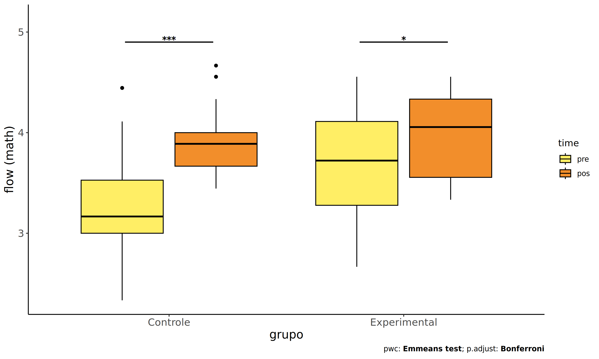
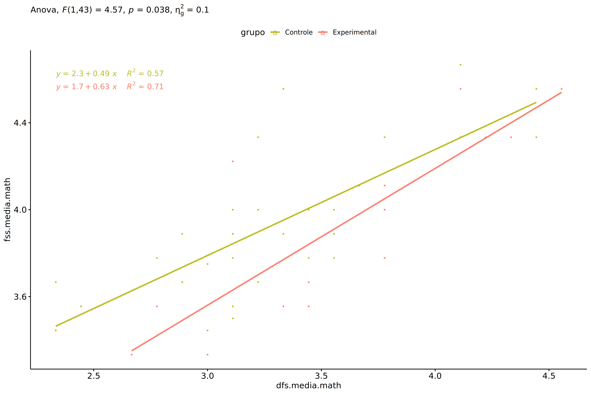
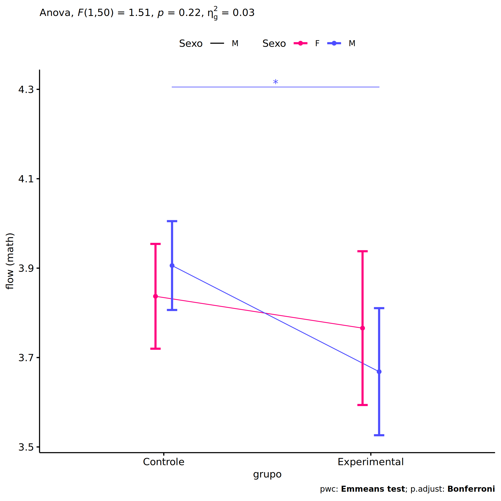
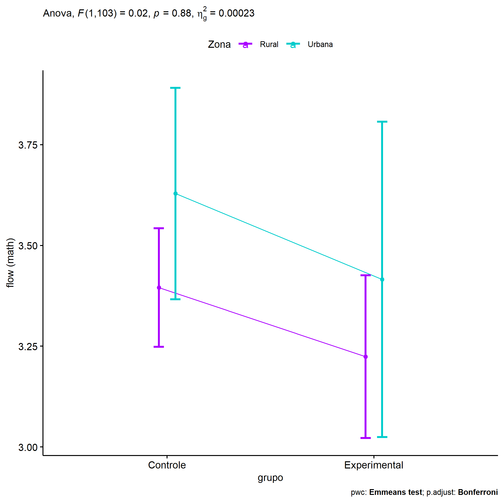
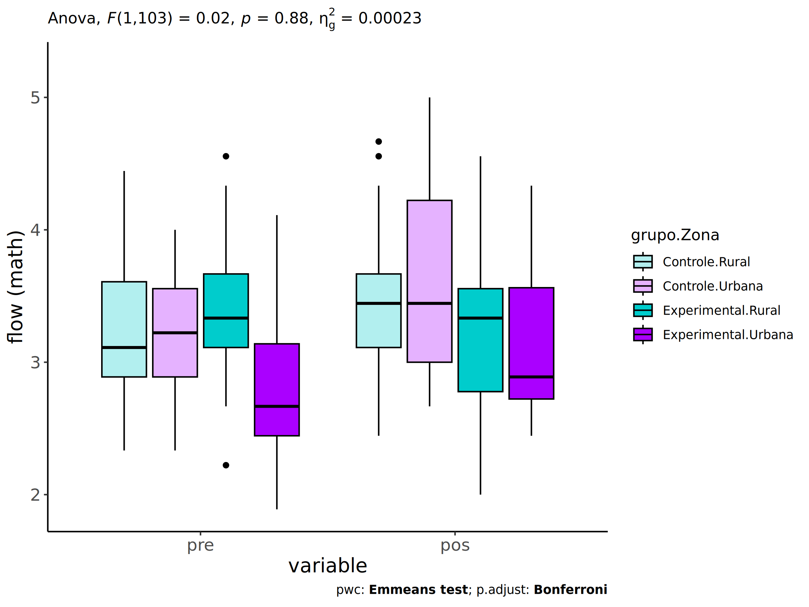
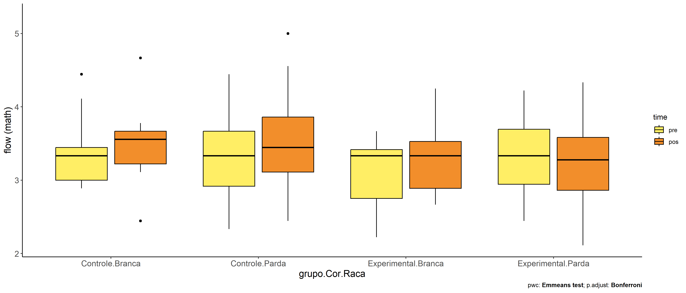
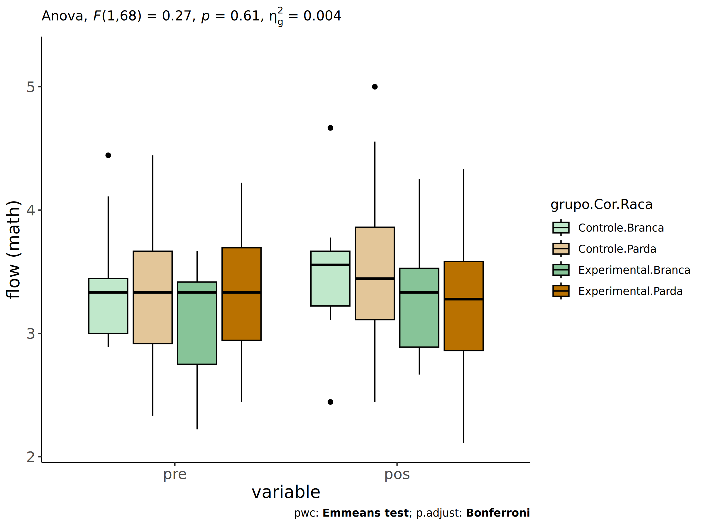
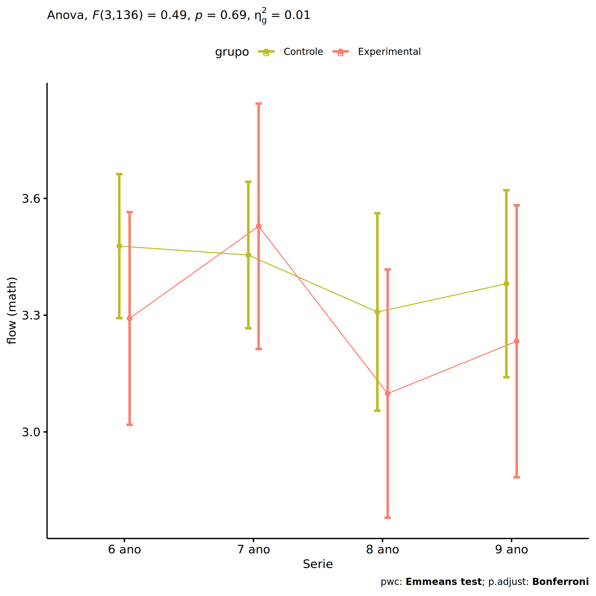
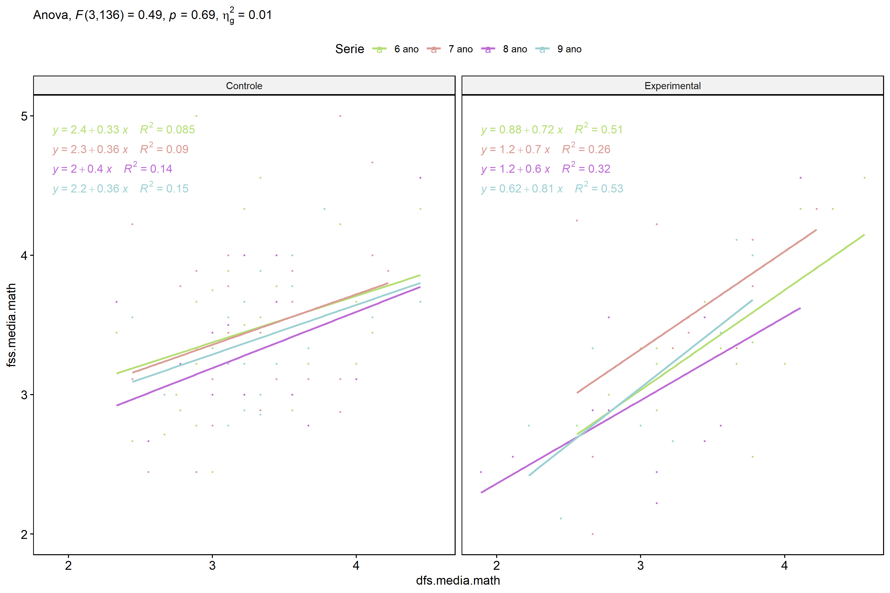

ANCOVA in flow (math) (flow (math))
================
Geiser C. Challco <geiser@alumni.usp.br>

- [Setting Initial Variables](#setting-initial-variables)
- [Descriptive Statistics of Initial
  Data](#descriptive-statistics-of-initial-data)
- [ANCOVA and Pairwise for one factor:
  **grupo**](#ancova-and-pairwise-for-one-factor-grupo)
  - [Without remove non-normal data](#without-remove-non-normal-data)
  - [Computing ANCOVA and PairWise After removing non-normal data
    (OK)](#computing-ancova-and-pairwise-after-removing-non-normal-data-ok)
    - [Plots for ancova](#plots-for-ancova)
    - [Checking linearity assumption](#checking-linearity-assumption)
    - [Checking normality and
      homogeneity](#checking-normality-and-homogeneity)
- [ANCOVA and Pairwise for two factors
  **grupo:Sexo**](#ancova-and-pairwise-for-two-factors-gruposexo)
  - [Without remove non-normal data](#without-remove-non-normal-data-1)
  - [Computing ANCOVA and PairWise After removing non-normal data
    (OK)](#computing-ancova-and-pairwise-after-removing-non-normal-data-ok-1)
    - [Plots for ancova](#plots-for-ancova-1)
    - [Checking linearity assumption](#checking-linearity-assumption-1)
    - [Checking normality and
      homogeneity](#checking-normality-and-homogeneity-1)
- [ANCOVA and Pairwise for two factors
  **grupo:Zona**](#ancova-and-pairwise-for-two-factors-grupozona)
  - [Without remove non-normal data](#without-remove-non-normal-data-2)
  - [Computing ANCOVA and PairWise After removing non-normal data
    (OK)](#computing-ancova-and-pairwise-after-removing-non-normal-data-ok-2)
    - [Plots for ancova](#plots-for-ancova-2)
    - [Checking linearity assumption](#checking-linearity-assumption-2)
    - [Checking normality and
      homogeneity](#checking-normality-and-homogeneity-2)
- [ANCOVA and Pairwise for two factors
  **grupo:Cor.Raca**](#ancova-and-pairwise-for-two-factors-grupocorraca)
  - [Without remove non-normal data](#without-remove-non-normal-data-3)
  - [Computing ANCOVA and PairWise After removing non-normal data
    (OK)](#computing-ancova-and-pairwise-after-removing-non-normal-data-ok-3)
    - [Plots for ancova](#plots-for-ancova-3)
    - [Checking linearity assumption](#checking-linearity-assumption-3)
    - [Checking normality and
      homogeneity](#checking-normality-and-homogeneity-3)
- [ANCOVA and Pairwise for two factors
  **grupo:Serie**](#ancova-and-pairwise-for-two-factors-gruposerie)
  - [Without remove non-normal data](#without-remove-non-normal-data-4)
  - [Computing ANCOVA and PairWise After removing non-normal data
    (OK)](#computing-ancova-and-pairwise-after-removing-non-normal-data-ok-4)
    - [Plots for ancova](#plots-for-ancova-4)
    - [Checking linearity assumption](#checking-linearity-assumption-4)
    - [Checking normality and
      homogeneity](#checking-normality-and-homogeneity-4)
- [Summary of Results](#summary-of-results)
  - [Descriptive Statistics](#descriptive-statistics)
  - [ANCOVA Table Comparison](#ancova-table-comparison)
  - [PairWise Table Comparison](#pairwise-table-comparison)
  - [EMMS Table Comparison](#emms-table-comparison)

**NOTE**:

- Teste ANCOVA para determinar se houve diferenças significativas no
  flow (math) (medido usando pre- e pos-testes).
- ANCOVA test to determine whether there were significant differences in
  flow (math) (measured using pre- and post-tests).

# Setting Initial Variables

``` r
dv = "flow.math"
dv.pos = "fss.media.math"
dv.pre = "dfs.media.math"

fatores2 <- c("Sexo","Zona","Cor.Raca","Serie")
lfatores2 <- as.list(fatores2)
names(lfatores2) <- fatores2

fatores1 <- c("grupo", fatores2)
lfatores1 <- as.list(fatores1)
names(lfatores1) <- fatores1

lfatores <- c(lfatores1)

color <- list()
color[["prepost"]] = c("#ffee65","#f28e2B")
color[["grupo"]] = c("#bcbd22","#fd7f6f")
color[["Sexo"]] = c("#FF007F","#4D4DFF")
color[["Zona"]] = c("#AA00FF","#00CCCC")
color[["Cor.Raca"]] = c(
  "Parda"="#b97100","Indígena"="#9F262F",
  "Branca"="#87c498", "Preta"="#848283","Amarela"="#D6B91C"
)

level <- list()
level[["grupo"]] = c("Controle","Experimental")
level[["Sexo"]] = c("F","M")
level[["Zona"]] = c("Rural","Urbana")
level[["Cor.Raca"]] = c("Parda","Indígena","Branca", "Preta","Amarela")
level[["Serie"]] = c("6 ano","7 ano","8 ano","9 ano")

# ..

ymin <- 0
ymax <- 0

ymin.ci <- 0
ymax.ci <- 0


color[["grupo:Sexo"]] = c(
  "Controle:F"="#ff99cb", "Controle:M"="#b7b7ff",
  "Experimental:F"="#FF007F", "Experimental:M"="#4D4DFF",
  "Controle.F"="#ff99cb", "Controle.M"="#b7b7ff",
  "Experimental.F"="#FF007F", "Experimental.M"="#4D4DFF"
)
color[["grupo:Zona"]] = c(
  "Controle:Rural"="#b2efef","Controle:Urbana"="#e5b2ff",
  "Experimental:Rural"="#00CCCC", "Experimental:Urbana"="#AA00FF",
  "Controle.Rural"="#b2efef","Controle.Urbana"="#e5b2ff",
  "Experimental.Rural"="#00CCCC", "Experimental.Urbana"="#AA00FF"
)
color[["grupo:Cor.Raca"]] = c(
    "Controle:Parda"="#e3c699", "Experimental:Parda"="#b97100",
    "Controle:Indígena"="#e2bdc0", "Experimental:Indígena"="#9F262F",
    "Controle:Branca"="#c0e8cb", "Experimental:Branca"="#87c498",
    "Controle:Preta"="#dad9d9", "Experimental:Preta"="#848283",
    "Controle:Amarela"="#eee3a4", "Experimental:Amarela"="#D6B91C",
    
    "Controle.Parda"="#e3c699", "Experimental.Parda"="#b97100",
    "Controle.Indígena"="#e2bdc0", "Experimental.Indígena"="#9F262F",
    "Controle.Branca"="#c0e8cb", "Experimental.Branca"="#87c498",
    "Controle.Preta"="#dad9d9", "Experimental.Preta"="#848283",
    "Controle.Amarela"="#eee3a4", "Experimental.Amarela"="#D6B91C"
)


for (coln in c("vocab","vocab.teach","vocab.non.teach","score.tde",
               "TFL.lidas.per.min","TFL.corretas.per.min","TFL.erradas.per.min","TFL.omitidas.per.min",
               "leitura.compreensao")) {
  color[[paste0(coln,".quintile")]] = c("#BF0040","#FF0000","#800080","#0000FF","#4000BF")
  level[[paste0(coln,".quintile")]] = c("1st quintile","2nd quintile","3rd quintile","4th quintile","5th quintile")
  color[[paste0("grupo:",coln,".quintile")]] = c(
    "Experimental.1st quintile"="#BF0040", "Controle.1st quintile"="#d8668c",
    "Experimental.2nd quintile"="#FF0000", "Controle.2nd quintile"="#ff7f7f",
    "Experimental.3rd quintile"="#8fce00", "Controle.3rd quintile"="#ddf0b2",
    "Experimental.4th quintile"="#0000FF", "Controle.4th quintile"="#b2b2ff",
    "Experimental.5th quintile"="#4000BF", "Controle.5th quintile"="#b299e5",
    
    "Experimental:1st quintile"="#BF0040", "Controle:1st quintile"="#d8668c",
    "Experimental:2nd quintile"="#FF0000", "Controle:2nd quintile"="#ff7f7f",
    "Experimental:3rd quintile"="#8fce00", "Controle:3rd quintile"="#ddf0b2",
    "Experimental:4th quintile"="#0000FF", "Controle:4th quintile"="#b2b2ff",
    "Experimental:5th quintile"="#4000BF", "Controle:5th quintile"="#b299e5")
}


gdat <- read_excel("../data/data.xlsx", sheet = "sumary")
gdat <- gdat[which(is.na(gdat$Necessidade.Deficiencia) & !is.na(gdat$Stari.Grupo)),]


dat <- gdat
dat$grupo <- factor(dat[["Stari.Grupo"]], level[["grupo"]])
for (coln in c(names(lfatores))) {
  dat[[coln]] <- factor(dat[[coln]], level[[coln]][level[[coln]] %in% unique(dat[[coln]])])
}
dat <- dat[which(!is.na(dat[[dv.pre]]) & !is.na(dat[[dv.pos]])),]
dat <- dat[,c("id",names(lfatores),dv.pre,dv.pos)]

dat.long <- rbind(dat, dat)
dat.long$time <- c(rep("pre", nrow(dat)), rep("pos", nrow(dat)))
dat.long$time <- factor(dat.long$time, c("pre","pos"))
dat.long[[dv]] <- c(dat[[dv.pre]], dat[[dv.pos]])


for (f in c("grupo", names(lfatores))) {
  if (is.null(color[[f]]) && length(unique(dat[[f]])) > 0) 
      color[[f]] <- distinctColorPalette(length(unique(dat[[f]])))
}
for (f in c(fatores2)) {
  if (is.null(color[[paste0("grupo:",f)]]) && length(unique(dat[[f]])) > 0)
    color[[paste0("grupo:",f)]] <- distinctColorPalette(length(unique(dat[["grupo"]]))*length(unique(dat[[f]])))
}

ldat <- list()
laov <- list()
lpwc <- list()
lemms <- list()
```

# Descriptive Statistics of Initial Data

``` r
df <- get.descriptives(dat, c(dv.pre, dv.pos), c("grupo"), 
                       include.global = T, symmetry.test = T, normality.test = F)
df <- plyr::rbind.fill(
  df, do.call(plyr::rbind.fill, lapply(lfatores2, FUN = function(f) {
    if (nrow(dat) > 0 && sum(!is.na(unique(dat[[f]]))) > 1)
      get.descriptives(dat, c(dv.pre,dv.pos), c("grupo", f),
                       symmetry.test = T, normality.test = F)
    }))
)
```

    ## Warning: There were 2 warnings in `mutate()`.
    ## The first warning was:
    ## ℹ In argument: `ci = abs(stats::qt(alpha/2, .data$n - 1) * .data$se)`.
    ## Caused by warning:
    ## ! There was 1 warning in `mutate()`.
    ## ℹ In argument: `ci = abs(stats::qt(alpha/2, .data$n - 1) * .data$se)`.
    ## Caused by warning in `stats::qt()`:
    ## ! NaNs produced
    ## ℹ Run `dplyr::last_dplyr_warnings()` to see the 1 remaining warning.
    ## There were 2 warnings in `mutate()`.
    ## The first warning was:
    ## ℹ In argument: `ci = abs(stats::qt(alpha/2, .data$n - 1) * .data$se)`.
    ## Caused by warning:
    ## ! There was 1 warning in `mutate()`.
    ## ℹ In argument: `ci = abs(stats::qt(alpha/2, .data$n - 1) * .data$se)`.
    ## Caused by warning in `stats::qt()`:
    ## ! NaNs produced
    ## ℹ Run `dplyr::last_dplyr_warnings()` to see the 1 remaining warning.

``` r
df <- df[,c(fatores1[fatores1 %in% colnames(df)],"variable",
            colnames(df)[!colnames(df) %in% c(fatores1,"variable")])]
```

| grupo        | Sexo | Zona   | Cor.Raca | Serie | variable       |   n |  mean | median |   min |   max |    sd |    se |    ci |   iqr | symmetry | skewness | kurtosis |
|:-------------|:-----|:-------|:---------|:------|:---------------|----:|------:|-------:|------:|------:|------:|------:|------:|------:|:---------|---------:|---------:|
| Controle     |      |        |          |       | dfs.media.math |  99 | 3.290 |  3.222 | 2.333 | 4.444 | 0.487 | 0.049 | 0.097 | 0.556 | YES      |    0.309 |   -0.323 |
| Experimental |      |        |          |       | dfs.media.math |  46 | 3.271 |  3.278 | 1.889 | 4.556 | 0.604 | 0.089 | 0.179 | 0.889 | YES      |   -0.118 |   -0.567 |
|              |      |        |          |       | dfs.media.math | 145 | 3.284 |  3.222 | 1.889 | 4.556 | 0.525 | 0.044 | 0.086 | 0.778 | YES      |    0.100 |   -0.276 |
| Controle     |      |        |          |       | fss.media.math |  99 | 3.426 |  3.444 | 2.444 | 5.000 | 0.546 | 0.055 | 0.109 | 0.764 | NO       |    0.577 |    0.193 |
| Experimental |      |        |          |       | fss.media.math |  46 | 3.284 |  3.333 | 2.000 | 4.556 | 0.674 | 0.099 | 0.200 | 0.861 | YES      |    0.183 |   -0.872 |
|              |      |        |          |       | fss.media.math | 145 | 3.381 |  3.333 | 2.000 | 5.000 | 0.591 | 0.049 | 0.097 | 0.750 | YES      |    0.330 |   -0.146 |
| Controle     | F    |        |          |       | dfs.media.math |  45 | 3.310 |  3.333 | 2.444 | 4.444 | 0.464 | 0.069 | 0.139 | 0.667 | YES      |    0.293 |   -0.617 |
| Controle     | M    |        |          |       | dfs.media.math |  54 | 3.273 |  3.222 | 2.333 | 4.444 | 0.509 | 0.069 | 0.139 | 0.556 | YES      |    0.328 |   -0.260 |
| Experimental | F    |        |          |       | dfs.media.math |  17 | 3.046 |  3.000 | 1.889 | 4.556 | 0.688 | 0.167 | 0.354 | 0.667 | YES      |    0.455 |   -0.463 |
| Experimental | M    |        |          |       | dfs.media.math |  29 | 3.402 |  3.444 | 2.222 | 4.333 | 0.517 | 0.096 | 0.197 | 0.667 | YES      |   -0.360 |   -0.523 |
| Controle     | F    |        |          |       | fss.media.math |  45 | 3.389 |  3.333 | 2.444 | 4.556 | 0.507 | 0.076 | 0.152 | 0.667 | YES      |    0.401 |   -0.472 |
| Controle     | M    |        |          |       | fss.media.math |  54 | 3.456 |  3.444 | 2.444 | 5.000 | 0.580 | 0.079 | 0.158 | 0.771 | NO       |    0.625 |    0.273 |
| Experimental | F    |        |          |       | fss.media.math |  17 | 3.218 |  3.333 | 2.000 | 4.556 | 0.777 | 0.188 | 0.399 | 1.000 | YES      |    0.157 |   -1.234 |
| Experimental | M    |        |          |       | fss.media.math |  29 | 3.323 |  3.333 | 2.222 | 4.556 | 0.617 | 0.115 | 0.235 | 0.889 | YES      |    0.295 |   -0.878 |
| Controle     |      | Rural  |          |       | dfs.media.math |  54 | 3.274 |  3.111 | 2.333 | 4.444 | 0.553 | 0.075 | 0.151 | 0.719 | YES      |    0.404 |   -0.685 |
| Controle     |      | Urbana |          |       | dfs.media.math |  17 | 3.222 |  3.222 | 2.333 | 4.000 | 0.480 | 0.116 | 0.247 | 0.667 | YES      |   -0.031 |   -1.067 |
| Controle     |      |        |          |       | dfs.media.math |  28 | 3.361 |  3.333 | 2.667 | 4.222 | 0.340 | 0.064 | 0.132 | 0.444 | NO       |    0.667 |    0.374 |
| Experimental |      | Rural  |          |       | dfs.media.math |  29 | 3.360 |  3.333 | 2.222 | 4.556 | 0.524 | 0.097 | 0.199 | 0.556 | YES      |    0.262 |   -0.189 |
| Experimental |      | Urbana |          |       | dfs.media.math |   8 | 2.819 |  2.667 | 1.889 | 4.111 | 0.732 | 0.259 | 0.612 | 0.694 | YES      |    0.434 |   -1.220 |
| Experimental |      |        |          |       | dfs.media.math |   9 | 3.383 |  3.667 | 2.444 | 4.111 | 0.614 | 0.205 | 0.472 | 1.111 | YES      |   -0.461 |   -1.699 |
| Controle     |      | Rural  |          |       | fss.media.math |  54 | 3.406 |  3.444 | 2.444 | 4.667 | 0.528 | 0.072 | 0.144 | 0.556 | YES      |    0.139 |   -0.317 |
| Controle     |      | Urbana |          |       | fss.media.math |  17 | 3.611 |  3.444 | 2.667 | 5.000 | 0.749 | 0.182 | 0.385 | 1.222 | NO       |    0.645 |   -1.076 |
| Controle     |      |        |          |       | fss.media.math |  28 | 3.352 |  3.333 | 2.778 | 4.000 | 0.420 | 0.079 | 0.163 | 0.750 | YES      |    0.220 |   -1.413 |
| Experimental |      | Rural  |          |       | fss.media.math |  29 | 3.280 |  3.333 | 2.000 | 4.556 | 0.653 | 0.121 | 0.248 | 0.778 | YES      |    0.093 |   -0.754 |
| Experimental |      | Urbana |          |       | fss.media.math |   8 | 3.184 |  2.889 | 2.444 | 4.333 | 0.735 | 0.260 | 0.615 | 0.840 | NO       |    0.610 |   -1.484 |
| Experimental |      |        |          |       | fss.media.math |   9 | 3.387 |  3.333 | 2.111 | 4.556 | 0.752 | 0.251 | 0.578 | 1.111 | YES      |   -0.059 |   -1.213 |
| Controle     |      |        | Parda    |       | dfs.media.math |  46 | 3.346 |  3.333 | 2.333 | 4.444 | 0.552 | 0.081 | 0.164 | 0.750 | YES      |    0.106 |   -0.877 |
| Controle     |      |        | Branca   |       | dfs.media.math |   9 | 3.395 |  3.333 | 2.889 | 4.444 | 0.553 | 0.184 | 0.425 | 0.444 | NO       |    0.749 |   -1.034 |
| Controle     |      |        | Preta    |       | dfs.media.math |   1 | 2.889 |  2.889 | 2.889 | 2.889 |       |       |       | 0.000 | few data |    0.000 |    0.000 |
| Controle     |      |        |          |       | dfs.media.math |  43 | 3.217 |  3.222 | 2.333 | 4.111 | 0.392 | 0.060 | 0.121 | 0.444 | YES      |   -0.020 |   -0.194 |
| Experimental |      |        | Parda    |       | dfs.media.math |  12 | 3.315 |  3.333 | 2.444 | 4.222 | 0.540 | 0.156 | 0.343 | 0.750 | YES      |    0.097 |   -1.312 |
| Experimental |      |        | Indígena |       | dfs.media.math |   5 | 3.422 |  3.556 | 2.667 | 4.111 | 0.552 | 0.247 | 0.686 | 0.556 | YES      |   -0.140 |   -1.786 |
| Experimental |      |        | Branca   |       | dfs.media.math |   6 | 3.093 |  3.333 | 2.222 | 3.667 | 0.568 | 0.232 | 0.596 | 0.667 | NO       |   -0.502 |   -1.742 |
| Experimental |      |        | Amarela  |       | dfs.media.math |   1 | 3.778 |  3.778 | 3.778 | 3.778 |       |       |       | 0.000 | few data |    0.000 |    0.000 |
| Experimental |      |        |          |       | dfs.media.math |  22 | 3.237 |  3.111 | 1.889 | 4.556 | 0.683 | 0.146 | 0.303 | 1.056 | YES      |    0.004 |   -0.728 |
| Controle     |      |        | Parda    |       | fss.media.math |  46 | 3.478 |  3.444 | 2.444 | 5.000 | 0.552 | 0.081 | 0.164 | 0.750 | YES      |    0.321 |   -0.031 |
| Controle     |      |        | Branca   |       | fss.media.math |   9 | 3.481 |  3.556 | 2.444 | 4.667 | 0.603 | 0.201 | 0.464 | 0.444 | YES      |    0.254 |   -0.347 |
| Controle     |      |        | Preta    |       | fss.media.math |   1 | 3.333 |  3.333 | 3.333 | 3.333 |       |       |       | 0.000 | few data |    0.000 |    0.000 |
| Controle     |      |        |          |       | fss.media.math |  43 | 3.361 |  3.222 | 2.667 | 5.000 | 0.540 | 0.082 | 0.166 | 0.778 | NO       |    0.899 |    0.451 |
| Experimental |      |        | Parda    |       | fss.media.math |  12 | 3.259 |  3.278 | 2.111 | 4.333 | 0.589 | 0.170 | 0.374 | 0.722 | YES      |   -0.158 |   -0.653 |
| Experimental |      |        | Indígena |       | fss.media.math |   5 | 3.778 |  4.111 | 2.556 | 4.556 | 0.793 | 0.355 | 0.985 | 0.778 | NO       |   -0.507 |   -1.657 |
| Experimental |      |        | Branca   |       | fss.media.math |   6 | 3.319 |  3.333 | 2.667 | 4.250 | 0.577 | 0.236 | 0.606 | 0.639 | YES      |    0.332 |   -1.468 |
| Experimental |      |        | Amarela  |       | fss.media.math |   1 | 3.375 |  3.375 | 3.375 | 3.375 |       |       |       | 0.000 | few data |    0.000 |    0.000 |
| Experimental |      |        |          |       | fss.media.math |  22 | 3.172 |  3.111 | 2.000 | 4.556 | 0.721 | 0.154 | 0.320 | 0.722 | YES      |    0.404 |   -0.949 |
| Controle     |      |        |          | 6 ano | dfs.media.math |  32 | 3.232 |  3.167 | 2.333 | 4.444 | 0.510 | 0.090 | 0.184 | 0.583 | NO       |    0.542 |   -0.503 |
| Controle     |      |        |          | 7 ano | dfs.media.math |  31 | 3.336 |  3.333 | 2.444 | 4.222 | 0.482 | 0.087 | 0.177 | 0.646 | YES      |   -0.050 |   -0.883 |
| Controle     |      |        |          | 8 ano | dfs.media.math |  17 | 3.248 |  3.222 | 2.333 | 4.444 | 0.510 | 0.124 | 0.262 | 0.444 | YES      |    0.431 |   -0.031 |
| Controle     |      |        |          | 9 ano | dfs.media.math |  19 | 3.351 |  3.333 | 2.444 | 4.444 | 0.459 | 0.105 | 0.221 | 0.444 | YES      |    0.392 |    0.252 |
| Experimental |      |        |          | 6 ano | dfs.media.math |  15 | 3.526 |  3.556 | 2.556 | 4.556 | 0.581 | 0.150 | 0.322 | 0.778 | YES      |    0.091 |   -1.193 |
| Experimental |      |        |          | 7 ano | dfs.media.math |  11 | 3.303 |  3.333 | 2.556 | 4.222 | 0.533 | 0.161 | 0.358 | 0.833 | YES      |    0.059 |   -1.340 |
| Experimental |      |        |          | 8 ano | dfs.media.math |  11 | 3.000 |  3.111 | 1.889 | 4.111 | 0.648 | 0.195 | 0.435 | 0.722 | YES      |   -0.138 |   -1.007 |
| Experimental |      |        |          | 9 ano | dfs.media.math |   9 | 3.136 |  3.222 | 2.222 | 3.778 | 0.582 | 0.194 | 0.447 | 1.000 | YES      |   -0.316 |   -1.709 |
| Controle     |      |        |          | 6 ano | fss.media.math |  32 | 3.452 |  3.444 | 2.444 | 5.000 | 0.585 | 0.103 | 0.211 | 0.604 | NO       |    0.621 |   -0.007 |
| Controle     |      |        |          | 7 ano | fss.media.math |  31 | 3.480 |  3.444 | 2.444 | 5.000 | 0.582 | 0.104 | 0.213 | 0.778 | YES      |    0.463 |    0.060 |
| Controle     |      |        |          | 8 ano | fss.media.math |  17 | 3.291 |  3.111 | 2.444 | 4.556 | 0.551 | 0.134 | 0.283 | 0.667 | NO       |    0.597 |   -0.517 |
| Controle     |      |        |          | 9 ano | fss.media.math |  19 | 3.414 |  3.333 | 2.778 | 4.333 | 0.421 | 0.097 | 0.203 | 0.556 | YES      |    0.310 |   -0.807 |
| Experimental |      |        |          | 6 ano | fss.media.math |  15 | 3.410 |  3.333 | 2.556 | 4.556 | 0.584 | 0.151 | 0.323 | 0.410 | NO       |    0.663 |   -0.723 |
| Experimental |      |        |          | 7 ano | fss.media.math |  11 | 3.538 |  3.556 | 2.000 | 4.333 | 0.736 | 0.222 | 0.494 | 0.833 | NO       |   -0.733 |   -0.671 |
| Experimental |      |        |          | 8 ano | fss.media.math |  11 | 2.960 |  2.778 | 2.222 | 4.556 | 0.680 | 0.205 | 0.457 | 0.722 | NO       |    1.074 |    0.066 |
| Experimental |      |        |          | 9 ano | fss.media.math |   9 | 3.160 |  3.222 | 2.111 | 4.111 | 0.648 | 0.216 | 0.498 | 0.667 | YES      |    0.037 |   -1.341 |

# ANCOVA and Pairwise for one factor: **grupo**

## Without remove non-normal data

``` r
pdat = remove_group_data(dat[!is.na(dat[["grupo"]]),], "fss.media.math", "grupo")

pdat.long <- rbind(pdat[,c("id","grupo")], pdat[,c("id","grupo")])
pdat.long[["time"]] <- c(rep("pre", nrow(pdat)), rep("pos", nrow(pdat)))
pdat.long[["time"]] <- factor(pdat.long[["time"]], c("pre","pos"))
pdat.long[["flow.math"]] <- c(pdat[["dfs.media.math"]], pdat[["fss.media.math"]])

aov = anova_test(pdat, fss.media.math ~ dfs.media.math + grupo)
laov[["grupo"]] <- get_anova_table(aov)
```

``` r
pwc <- emmeans_test(pdat, fss.media.math ~ grupo, covariate = dfs.media.math,
                    p.adjust.method = "bonferroni")
```

``` r
pwc.long <- emmeans_test(dplyr::group_by_at(pdat.long, "grupo"),
                          flow.math ~ time,
                          p.adjust.method = "bonferroni")
lpwc[["grupo"]] <- plyr::rbind.fill(pwc, pwc.long)
```

``` r
ds <- get.descriptives(pdat, "fss.media.math", "grupo", covar = "dfs.media.math")
ds <- merge(ds[ds$variable != "dfs.media.math",],
            ds[ds$variable == "dfs.media.math", !colnames(ds) %in% c("variable")],
            by = "grupo", all.x = T, suffixes = c("", ".dfs.media.math"))
ds <- merge(get_emmeans(pwc), ds, by = "grupo", suffixes = c(".emms", ""))
ds <- ds[,c("grupo","n","mean.dfs.media.math","se.dfs.media.math","mean","se",
            "emmean","se.emms","conf.low","conf.high")]

colnames(ds) <- c("grupo", "N", paste0(c("M","SE")," (pre)"),
                  paste0(c("M","SE"), " (unadj)"),
                  paste0(c("M", "SE"), " (adj)"), "conf.low", "conf.high")

lemms[["grupo"]] <- ds
```

## Computing ANCOVA and PairWise After removing non-normal data (OK)

``` r
wdat = pdat 

res = residuals(lm(fss.media.math ~ dfs.media.math + grupo, data = wdat))
non.normal = getNonNormal(res, wdat$id, plimit = 0.05)

wdat = wdat[!wdat$id %in% non.normal,]

wdat.long <- rbind(wdat[,c("id","grupo")], wdat[,c("id","grupo")])
wdat.long[["time"]] <- c(rep("pre", nrow(wdat)), rep("pos", nrow(wdat)))
wdat.long[["time"]] <- factor(wdat.long[["time"]], c("pre","pos"))
wdat.long[["flow.math"]] <- c(wdat[["dfs.media.math"]], wdat[["fss.media.math"]])

ldat[["grupo"]] = wdat

(non.normal)
```

    ##  [1] "P1768" "P3630" "P130"  "P3013" "P3014" "P2244" "P3508" "P1010" "P510"  "P3624" "P1089"
    ## [12] "P3598" "P1728" "P3160" "P3495" "P2247" "P3578" "P3094" "P622"  "P2294" "P3502" "P3031"
    ## [23] "P231"  "P1016" "P3055" "P2408" "P3116" "P2380" "P1705" "P3027" "P3244" "P3516" "P829" 
    ## [34] "P3577" "P3511" "P1701" "P3002" "P458"  "P3566" "P2250" "P3153" "P2240" "P3239" "P612" 
    ## [45] "P3519" "P1698" "P3721" "P2383" "P812"  "P523"  "P960"  "P2390" "P997"  "P3091" "P124" 
    ## [56] "P613"  "P2378" "P820"  "P3560" "P133"  "P448"  "P184"  "P952"  "P3615" "P123"  "P238" 
    ## [67] "P232"  "P3492" "P1091" "P2376" "P140"  "P121"  "P2222" "P3098" "P3022" "P1764" "P626" 
    ## [78] "P1742" "P1101" "P457"  "P192"  "P1094" "P463"  "P3093" "P1711" "P3178" "P950"  "P3008"
    ## [89] "P947"  "P3512" "P138"  "P813"  "P3569" "P943"  "P3016" "P515"  "P3505" "P936"  "P3174"

``` r
aov = anova_test(wdat, fss.media.math ~ dfs.media.math + grupo)
laov[["grupo"]] <- merge(get_anova_table(aov), laov[["grupo"]],
                            by="Effect", suffixes = c("","'"))

(df = get_anova_table(aov))
```

    ## ANOVA Table (type II tests)
    ## 
    ##           Effect DFn DFd      F        p p<.05   ges
    ## 1 dfs.media.math   1  43 70.878 1.22e-10     * 0.622
    ## 2          grupo   1  43  4.567 3.80e-02     * 0.096

| Effect         | DFn | DFd |      F |     p | p\<.05 |   ges |
|:---------------|----:|----:|-------:|------:|:-------|------:|
| dfs.media.math |   1 |  43 | 70.878 | 0.000 | \*     | 0.622 |
| grupo          |   1 |  43 |  4.567 | 0.038 | \*     | 0.096 |

``` r
pwc <- emmeans_test(wdat, fss.media.math ~ grupo, covariate = dfs.media.math,
                    p.adjust.method = "bonferroni")
```

| term                  | .y.            | group1   | group2       |  df | statistic |     p | p.adj | p.adj.signif |
|:----------------------|:---------------|:---------|:-------------|----:|----------:|------:|------:|:-------------|
| dfs.media.math\*grupo | fss.media.math | Controle | Experimental |  43 |     2.137 | 0.038 | 0.038 | \*           |

``` r
pwc.long <- emmeans_test(dplyr::group_by_at(wdat.long, "grupo"),
                         flow.math ~ time,
                         p.adjust.method = "bonferroni")
lpwc[["grupo"]] <- merge(plyr::rbind.fill(pwc, pwc.long), lpwc[["grupo"]],
                            by=c("grupo","term",".y.","group1","group2"),
                            suffixes = c("","'"))
```

| grupo        | term | .y.       | group1 | group2 |  df | statistic |     p | p.adj | p.adj.signif |
|:-------------|:-----|:----------|:-------|:-------|----:|----------:|------:|------:|:-------------|
| Controle     | time | flow.math | pre    | pos    |  88 |    -5.554 | 0.000 | 0.000 | \*\*\*\*     |
| Experimental | time | flow.math | pre    | pos    |  88 |    -2.017 | 0.047 | 0.047 | \*           |

``` r
ds <- get.descriptives(wdat, "fss.media.math", "grupo", covar = "dfs.media.math")
ds <- merge(ds[ds$variable != "dfs.media.math",],
            ds[ds$variable == "dfs.media.math", !colnames(ds) %in% c("variable")],
            by = "grupo", all.x = T, suffixes = c("", ".dfs.media.math"))
ds <- merge(get_emmeans(pwc), ds, by = "grupo", suffixes = c(".emms", ""))
ds <- ds[,c("grupo","n","mean.dfs.media.math","se.dfs.media.math","mean","se",
            "emmean","se.emms","conf.low","conf.high")]

colnames(ds) <- c("grupo", "N", paste0(c("M","SE")," (pre)"),
                  paste0(c("M","SE"), " (unadj)"),
                  paste0(c("M", "SE"), " (adj)"), "conf.low", "conf.high")

lemms[["grupo"]] <- merge(ds, lemms[["grupo"]], by=c("grupo"), suffixes = c("","'"))
```

| grupo        |   N | M (pre) | SE (pre) | M (unadj) | SE (unadj) | M (adj) | SE (adj) | conf.low | conf.high |
|:-------------|----:|--------:|---------:|----------:|-----------:|--------:|---------:|---------:|----------:|
| Controle     |  30 |   3.259 |    0.095 |     3.916 |      0.061 |   3.986 |    0.042 |    3.900 |     4.071 |
| Experimental |  16 |   3.632 |    0.140 |     3.958 |      0.105 |   3.827 |    0.059 |    3.708 |     3.946 |

### Plots for ancova

``` r
plots <- oneWayAncovaPlots(
  wdat, "fss.media.math", "grupo", aov, list("grupo"=pwc), addParam = c("mean_ci"),
  font.label.size=10, step.increase=0.05, p.label="p.adj",
  subtitle = which(aov$Effect == "grupo"))
```

``` r
if (!is.null(nrow(plots[["grupo"]]$data)))
  plots[["grupo"]] +
  if (ymin.ci < ymax.ci) ggplot2::ylim(ymin.ci, ymax.ci)
```

<!-- -->

``` r
plots <- oneWayAncovaBoxPlots(
  wdat, "fss.media.math", "grupo", aov, pwc, covar = "dfs.media.math",
  theme = "classic", color = color[["grupo"]],
  subtitle = which(aov$Effect == "grupo"))
```

``` r
if (length(unique(wdat[["grupo"]])) > 1)
  plots[["grupo"]] + ggplot2::ylab("flow (math)") +
  ggplot2::scale_x_discrete(labels=c('pre', 'pos')) +
  if (ymin < ymax) ggplot2::ylim(ymin, ymax)
```

<!-- -->

``` r
if (length(unique(wdat.long[["grupo"]])) > 1)
  plots <- oneWayAncovaBoxPlots(
    wdat.long, "flow.math", "grupo", aov, pwc.long,
    pre.post = "time", theme = "classic", color = color$prepost)
```

``` r
if (length(unique(wdat.long[["grupo"]])) > 1)
  plots[["grupo"]] + ggplot2::ylab("flow (math)") +
  if (ymin < ymax) ggplot2::ylim(ymin, ymax) 
```

<!-- -->

### Checking linearity assumption

``` r
ggscatter(wdat, x = "dfs.media.math", y = "fss.media.math", size = 0.5,
          color = "grupo", add = "reg.line")+
  stat_regline_equation(
    aes(label =  paste(..eq.label.., ..rr.label.., sep = "~~~~"), color = grupo)
  ) +
  ggplot2::labs(subtitle = rstatix::get_test_label(aov, detailed = T, row = which(aov$Effect == "grupo"))) +
  ggplot2::scale_color_manual(values = color[["grupo"]]) +
  if (ymin < ymax) ggplot2::ylim(ymin, ymax)
```

<!-- -->

### Checking normality and homogeneity

``` r
res <- augment(lm(fss.media.math ~ dfs.media.math + grupo, data = wdat))
```

``` r
shapiro_test(res$.resid)
```

    ## # A tibble: 1 × 3
    ##   variable   statistic p.value
    ##   <chr>          <dbl>   <dbl>
    ## 1 res$.resid     0.948  0.0409

``` r
levene_test(res, .resid ~ grupo)
```

    ## # A tibble: 1 × 4
    ##     df1   df2 statistic     p
    ##   <int> <int>     <dbl> <dbl>
    ## 1     1    44    0.0726 0.789

# ANCOVA and Pairwise for two factors **grupo:Sexo**

## Without remove non-normal data

``` r
pdat = remove_group_data(dat[!is.na(dat[["grupo"]]) & !is.na(dat[["Sexo"]]),],
                         "fss.media.math", c("grupo","Sexo"))
pdat = pdat[pdat[["Sexo"]] %in% do.call(
  intersect, lapply(unique(pdat[["grupo"]]), FUN = function(x) {
    unique(pdat[["Sexo"]][which(pdat[["grupo"]] == x)])
  })),]
pdat[["grupo"]] = factor(pdat[["grupo"]], level[["grupo"]])
pdat[["Sexo"]] = factor(
  pdat[["Sexo"]],
  level[["Sexo"]][level[["Sexo"]] %in% unique(pdat[["Sexo"]])])

pdat.long <- rbind(pdat[,c("id","grupo","Sexo")], pdat[,c("id","grupo","Sexo")])
pdat.long[["time"]] <- c(rep("pre", nrow(pdat)), rep("pos", nrow(pdat)))
pdat.long[["time"]] <- factor(pdat.long[["time"]], c("pre","pos"))
pdat.long[["flow.math"]] <- c(pdat[["dfs.media.math"]], pdat[["fss.media.math"]])

if (length(unique(pdat[["Sexo"]])) >= 2) {
  aov = anova_test(pdat, fss.media.math ~ dfs.media.math + grupo*Sexo)
  laov[["grupo:Sexo"]] <- get_anova_table(aov)
}
```

``` r
if (length(unique(pdat[["Sexo"]])) >= 2) {
  pwcs <- list()
  pwcs[["Sexo"]] <- emmeans_test(
    group_by(pdat, grupo), fss.media.math ~ Sexo,
    covariate = dfs.media.math, p.adjust.method = "bonferroni")
  pwcs[["grupo"]] <- emmeans_test(
    group_by(pdat, Sexo), fss.media.math ~ grupo,
    covariate = dfs.media.math, p.adjust.method = "bonferroni")
  
  pwc <- plyr::rbind.fill(pwcs[["grupo"]], pwcs[["Sexo"]])
  pwc <- pwc[,c("grupo","Sexo", colnames(pwc)[!colnames(pwc) %in% c("grupo","Sexo")])]
}
```

``` r
if (length(unique(pdat[["Sexo"]])) >= 2) {
  pwc.long <- emmeans_test(dplyr::group_by_at(pdat.long, c("grupo","Sexo")),
                           flow.math ~ time,
                           p.adjust.method = "bonferroni")
  lpwc[["grupo:Sexo"]] <- plyr::rbind.fill(pwc, pwc.long)
}
```

``` r
if (length(unique(pdat[["Sexo"]])) >= 2) {
  ds <- get.descriptives(pdat, "fss.media.math", c("grupo","Sexo"), covar = "dfs.media.math")
  ds <- merge(ds[ds$variable != "dfs.media.math",],
              ds[ds$variable == "dfs.media.math", !colnames(ds) %in% c("variable")],
              by = c("grupo","Sexo"), all.x = T, suffixes = c("", ".dfs.media.math"))
  ds <- merge(get_emmeans(pwcs[["grupo"]]), ds,
              by = c("grupo","Sexo"), suffixes = c(".emms", ""))
  ds <- ds[,c("grupo","Sexo","n","mean.dfs.media.math","se.dfs.media.math","mean","se",
              "emmean","se.emms","conf.low","conf.high")]
  
  colnames(ds) <- c("grupo","Sexo", "N", paste0(c("M","SE")," (pre)"),
                    paste0(c("M","SE"), " (unadj)"),
                    paste0(c("M", "SE"), " (adj)"), "conf.low", "conf.high")
  
  lemms[["grupo:Sexo"]] <- ds
}
```

## Computing ANCOVA and PairWise After removing non-normal data (OK)

``` r
if (length(unique(pdat[["Sexo"]])) >= 2) {
  wdat = pdat 
  
  res = residuals(lm(fss.media.math ~ dfs.media.math + grupo*Sexo, data = wdat))
  non.normal = getNonNormal(res, wdat$id, plimit = 0.05)
  
  wdat = wdat[!wdat$id %in% non.normal,]
  
  wdat.long <- rbind(wdat[,c("id","grupo","Sexo")], wdat[,c("id","grupo","Sexo")])
  wdat.long[["time"]] <- c(rep("pre", nrow(wdat)), rep("pos", nrow(wdat)))
  wdat.long[["time"]] <- factor(wdat.long[["time"]], c("pre","pos"))
  wdat.long[["flow.math"]] <- c(wdat[["dfs.media.math"]], wdat[["fss.media.math"]])
  
  
  ldat[["grupo:Sexo"]] = wdat
  
  (non.normal)
}
```

    ##  [1] "P3013" "P1768" "P3630" "P2244" "P130"  "P3508" "P1010" "P3014" "P3624" "P1089" "P510" 
    ## [12] "P3160" "P3495" "P3598" "P1728" "P2247" "P3502" "P231"  "P3578" "P622"  "P3094" "P2294"
    ## [23] "P2380" "P1705" "P3027" "P3031" "P1016" "P3055" "P2408" "P3244" "P3516" "P3577" "P3116"
    ## [34] "P3566" "P2250" "P2240" "P3239" "P829"  "P612"  "P1698" "P3519" "P3511" "P3002" "P458" 
    ## [45] "P3091" "P3153" "P1701" "P3721" "P812"  "P960"  "P2390" "P997"  "P2383" "P613"  "P3093"
    ## [56] "P820"  "P523"  "P124"  "P3178" "P1711" "P133"  "P2378" "P448"  "P238"  "P463"  "P232" 
    ## [67] "P1091" "P184"  "P3560" "P3615" "P123"  "P952"  "P121"  "P3492" "P140"  "P3098" "P2376"
    ## [78] "P192"  "P2222" "P1094" "P626"  "P3022" "P1742" "P1764" "P3008" "P947"  "P1101" "P138" 
    ## [89] "P1762" "P521"

``` r
if (length(unique(pdat[["Sexo"]])) >= 2) {
  aov = anova_test(wdat, fss.media.math ~ dfs.media.math + grupo*Sexo)
  laov[["grupo:Sexo"]] <- merge(get_anova_table(aov), laov[["grupo:Sexo"]],
                                         by="Effect", suffixes = c("","'"))
  df = get_anova_table(aov)
}
```

| Effect         | DFn | DFd |      F |     p | p\<.05 |   ges |
|:---------------|----:|----:|-------:|------:|:-------|------:|
| dfs.media.math |   1 |  50 | 98.948 | 0.000 | \*     | 0.664 |
| grupo          |   1 |  50 |  6.031 | 0.018 | \*     | 0.108 |
| Sexo           |   1 |  50 |  0.052 | 0.820 |        | 0.001 |
| grupo:Sexo     |   1 |  50 |  1.515 | 0.224 |        | 0.029 |

``` r
if (length(unique(pdat[["Sexo"]])) >= 2) {
  pwcs <- list()
  pwcs[["Sexo"]] <- emmeans_test(
    group_by(wdat, grupo), fss.media.math ~ Sexo,
    covariate = dfs.media.math, p.adjust.method = "bonferroni")
  pwcs[["grupo"]] <- emmeans_test(
    group_by(wdat, Sexo), fss.media.math ~ grupo,
    covariate = dfs.media.math, p.adjust.method = "bonferroni")
  
  pwc <- plyr::rbind.fill(pwcs[["grupo"]], pwcs[["Sexo"]])
  pwc <- pwc[,c("grupo","Sexo", colnames(pwc)[!colnames(pwc) %in% c("grupo","Sexo")])]
}
```

| grupo        | Sexo | term                  | .y.            | group1   | group2       |  df | statistic |     p | p.adj | p.adj.signif |
|:-------------|:-----|:----------------------|:---------------|:---------|:-------------|----:|----------:|------:|------:|:-------------|
|              | F    | dfs.media.math\*grupo | fss.media.math | Controle | Experimental |  50 |     0.687 | 0.495 | 0.495 | ns           |
|              | M    | dfs.media.math\*grupo | fss.media.math | Controle | Experimental |  50 |     2.674 | 0.010 | 0.010 | \*           |
| Controle     |      | dfs.media.math\*Sexo  | fss.media.math | F        | M            |  50 |    -0.900 | 0.373 | 0.373 | ns           |
| Experimental |      | dfs.media.math\*Sexo  | fss.media.math | F        | M            |  50 |     0.886 | 0.380 | 0.380 | ns           |

``` r
if (length(unique(pdat[["Sexo"]])) >= 2) {
  pwc.long <- emmeans_test(dplyr::group_by_at(wdat.long, c("grupo","Sexo")),
                           flow.math ~ time,
                           p.adjust.method = "bonferroni")
  lpwc[["grupo:Sexo"]] <- merge(plyr::rbind.fill(pwc, pwc.long),
                                         lpwc[["grupo:Sexo"]],
                                         by=c("grupo","Sexo","term",".y.","group1","group2"),
                                         suffixes = c("","'"))
}
```

| grupo        | Sexo | term | .y.       | group1 | group2 |  df | statistic |     p | p.adj | p.adj.signif |
|:-------------|:-----|:-----|:----------|:-------|:-------|----:|----------:|------:|------:|:-------------|
| Controle     | F    | time | flow.math | pre    | pos    | 102 |    -2.851 | 0.005 | 0.005 | \*\*         |
| Controle     | M    | time | flow.math | pre    | pos    | 102 |    -4.463 | 0.000 | 0.000 | \*\*\*\*     |
| Experimental | F    | time | flow.math | pre    | pos    | 102 |    -1.488 | 0.140 | 0.140 | ns           |
| Experimental | M    | time | flow.math | pre    | pos    | 102 |    -0.929 | 0.355 | 0.355 | ns           |

``` r
if (length(unique(pdat[["Sexo"]])) >= 2) {
  ds <- get.descriptives(wdat, "fss.media.math", c("grupo","Sexo"), covar = "dfs.media.math")
  ds <- merge(ds[ds$variable != "dfs.media.math",],
              ds[ds$variable == "dfs.media.math", !colnames(ds) %in% c("variable")],
              by = c("grupo","Sexo"), all.x = T, suffixes = c("", ".dfs.media.math"))
  ds <- merge(get_emmeans(pwcs[["grupo"]]), ds,
              by = c("grupo","Sexo"), suffixes = c(".emms", ""))
  ds <- ds[,c("grupo","Sexo","n","mean.dfs.media.math","se.dfs.media.math",
              "mean","se","emmean","se.emms","conf.low","conf.high")]
  
  colnames(ds) <- c("grupo","Sexo", "N", paste0(c("M","SE")," (pre)"),
                    paste0(c("M","SE"), " (unadj)"),
                    paste0(c("M", "SE"), " (adj)"), "conf.low", "conf.high")
  
  lemms[["grupo:Sexo"]] <- merge(ds, lemms[["grupo:Sexo"]],
                                          by=c("grupo","Sexo"), suffixes = c("","'"))
}
```

| grupo        | Sexo |   N | M (pre) | SE (pre) | M (unadj) | SE (unadj) | M (adj) | SE (adj) | conf.low | conf.high |
|:-------------|:-----|----:|--------:|---------:|----------:|-----------:|--------:|---------:|---------:|----------:|
| Controle     | F    |  15 |   3.356 |    0.117 |     3.833 |      0.081 |   3.837 |    0.058 |    3.720 |     3.954 |
| Controle     | M    |  22 |   3.177 |    0.116 |     3.794 |      0.079 |   3.906 |    0.049 |    3.806 |     4.005 |
| Experimental | F    |   7 |   3.460 |    0.263 |     3.825 |      0.189 |   3.766 |    0.086 |    3.594 |     3.938 |
| Experimental | M    |  11 |   3.677 |    0.129 |     3.859 |      0.131 |   3.668 |    0.071 |    3.526 |     3.811 |

### Plots for ancova

``` r
if (length(unique(pdat[["Sexo"]])) >= 2) {
  ggPlotAoC2(pwcs, "grupo", "Sexo", aov, ylab = "flow (math)",
             subtitle = which(aov$Effect == "grupo:Sexo"), addParam = "errorbar") +
    ggplot2::scale_color_manual(values = color[["Sexo"]]) +
    if (ymin.ci < ymax.ci) ggplot2::ylim(ymin.ci, ymax.ci)
}
```

    ## Scale for colour is already present.
    ## Adding another scale for colour, which will replace the existing scale.

<!-- -->

``` r
if (length(unique(pdat[["Sexo"]])) >= 2) {
  ggPlotAoC2(pwcs, "Sexo", "grupo", aov, ylab = "flow (math)",
               subtitle = which(aov$Effect == "grupo:Sexo"), addParam = "errorbar") +
      ggplot2::scale_color_manual(values = color[["grupo"]]) +
      if (ymin.ci < ymax.ci) ggplot2::ylim(ymin.ci, ymax.ci)
}
```

    ## Scale for colour is already present.
    ## Adding another scale for colour, which will replace the existing scale.

<!-- -->

``` r
if (length(unique(pdat[["Sexo"]])) >= 2) {
  plots <- twoWayAncovaBoxPlots(
    wdat, "fss.media.math", c("grupo","Sexo"), aov, pwcs, covar = "dfs.media.math",
    theme = "classic", color = color[["grupo:Sexo"]],
    subtitle = which(aov$Effect == "grupo:Sexo"))
}
```

``` r
if (length(unique(pdat[["Sexo"]])) >= 2) {
  plots[["grupo:Sexo"]] + ggplot2::ylab("flow (math)") +
  ggplot2::scale_x_discrete(labels=c('pre', 'pos')) +
  if (ymin < ymax) ggplot2::ylim(ymin, ymax)
}
```

    ## Warning: No shared levels found between `names(values)` of the manual scale and the data's colour
    ## values.

<!-- -->

``` r
if (length(unique(pdat[["Sexo"]])) >= 2) {
  plots <- twoWayAncovaBoxPlots(
    wdat.long, "flow.math", c("grupo","Sexo"), aov, pwc.long,
    pre.post = "time",
    theme = "classic", color = color$prepost)
}
```

``` r
if (length(unique(pdat[["Sexo"]])) >= 2) 
  plots[["grupo:Sexo"]] + ggplot2::ylab("flow (math)") +
    if (ymin < ymax) ggplot2::ylim(ymin, ymax)
```

<!-- -->

### Checking linearity assumption

``` r
if (length(unique(pdat[["Sexo"]])) >= 2) {
  ggscatter(wdat, x = "dfs.media.math", y = "fss.media.math", size = 0.5,
            facet.by = c("grupo","Sexo"), add = "reg.line")+
    stat_regline_equation(
      aes(label =  paste(..eq.label.., ..rr.label.., sep = "~~~~"))
    ) +
    if (ymin < ymax) ggplot2::ylim(ymin, ymax)
}
```

<!-- -->

``` r
if (length(unique(pdat[["Sexo"]])) >= 2) {
  ggscatter(wdat, x = "dfs.media.math", y = "fss.media.math", size = 0.5,
            color = "grupo", facet.by = "Sexo", add = "reg.line")+
    stat_regline_equation(
      aes(label =  paste(..eq.label.., ..rr.label.., sep = "~~~~"), color = grupo)
    ) +
    ggplot2::labs(subtitle = rstatix::get_test_label(aov, detailed = T, row = which(aov$Effect == "grupo:Sexo"))) +
    ggplot2::scale_color_manual(values = color[["grupo"]]) +
    if (ymin < ymax) ggplot2::ylim(ymin, ymax)
}
```

<!-- -->

``` r
if (length(unique(pdat[["Sexo"]])) >= 2) {
  ggscatter(wdat, x = "dfs.media.math", y = "fss.media.math", size = 0.5,
            color = "Sexo", facet.by = "grupo", add = "reg.line")+
    stat_regline_equation(
      aes(label =  paste(..eq.label.., ..rr.label.., sep = "~~~~"), color = Sexo)
    ) +
    ggplot2::labs(subtitle = rstatix::get_test_label(aov, detailed = T, row = which(aov$Effect == "grupo:Sexo"))) +
    ggplot2::scale_color_manual(values = color[["Sexo"]]) +
    if (ymin < ymax) ggplot2::ylim(ymin, ymax)
}
```

<!-- -->

### Checking normality and homogeneity

``` r
if (length(unique(pdat[["Sexo"]])) >= 2) 
  res <- augment(lm(fss.media.math ~ dfs.media.math + grupo*Sexo, data = wdat))
```

``` r
if (length(unique(pdat[["Sexo"]])) >= 2)
  shapiro_test(res$.resid)
```

    ## # A tibble: 1 × 3
    ##   variable   statistic p.value
    ##   <chr>          <dbl>   <dbl>
    ## 1 res$.resid     0.956  0.0421

``` r
if (length(unique(pdat[["Sexo"]])) >= 2) 
  levene_test(res, .resid ~ grupo*Sexo)
```

    ## # A tibble: 1 × 4
    ##     df1   df2 statistic     p
    ##   <int> <int>     <dbl> <dbl>
    ## 1     3    51     0.800 0.500

# ANCOVA and Pairwise for two factors **grupo:Zona**

## Without remove non-normal data

``` r
pdat = remove_group_data(dat[!is.na(dat[["grupo"]]) & !is.na(dat[["Zona"]]),],
                         "fss.media.math", c("grupo","Zona"))
pdat = pdat[pdat[["Zona"]] %in% do.call(
  intersect, lapply(unique(pdat[["grupo"]]), FUN = function(x) {
    unique(pdat[["Zona"]][which(pdat[["grupo"]] == x)])
  })),]
pdat[["grupo"]] = factor(pdat[["grupo"]], level[["grupo"]])
pdat[["Zona"]] = factor(
  pdat[["Zona"]],
  level[["Zona"]][level[["Zona"]] %in% unique(pdat[["Zona"]])])

pdat.long <- rbind(pdat[,c("id","grupo","Zona")], pdat[,c("id","grupo","Zona")])
pdat.long[["time"]] <- c(rep("pre", nrow(pdat)), rep("pos", nrow(pdat)))
pdat.long[["time"]] <- factor(pdat.long[["time"]], c("pre","pos"))
pdat.long[["flow.math"]] <- c(pdat[["dfs.media.math"]], pdat[["fss.media.math"]])

if (length(unique(pdat[["Zona"]])) >= 2) {
  aov = anova_test(pdat, fss.media.math ~ dfs.media.math + grupo*Zona)
  laov[["grupo:Zona"]] <- get_anova_table(aov)
}
```

``` r
if (length(unique(pdat[["Zona"]])) >= 2) {
  pwcs <- list()
  pwcs[["Zona"]] <- emmeans_test(
    group_by(pdat, grupo), fss.media.math ~ Zona,
    covariate = dfs.media.math, p.adjust.method = "bonferroni")
  pwcs[["grupo"]] <- emmeans_test(
    group_by(pdat, Zona), fss.media.math ~ grupo,
    covariate = dfs.media.math, p.adjust.method = "bonferroni")
  
  pwc <- plyr::rbind.fill(pwcs[["grupo"]], pwcs[["Zona"]])
  pwc <- pwc[,c("grupo","Zona", colnames(pwc)[!colnames(pwc) %in% c("grupo","Zona")])]
}
```

``` r
if (length(unique(pdat[["Zona"]])) >= 2) {
  pwc.long <- emmeans_test(dplyr::group_by_at(pdat.long, c("grupo","Zona")),
                           flow.math ~ time,
                           p.adjust.method = "bonferroni")
  lpwc[["grupo:Zona"]] <- plyr::rbind.fill(pwc, pwc.long)
}
```

``` r
if (length(unique(pdat[["Zona"]])) >= 2) {
  ds <- get.descriptives(pdat, "fss.media.math", c("grupo","Zona"), covar = "dfs.media.math")
  ds <- merge(ds[ds$variable != "dfs.media.math",],
              ds[ds$variable == "dfs.media.math", !colnames(ds) %in% c("variable")],
              by = c("grupo","Zona"), all.x = T, suffixes = c("", ".dfs.media.math"))
  ds <- merge(get_emmeans(pwcs[["grupo"]]), ds,
              by = c("grupo","Zona"), suffixes = c(".emms", ""))
  ds <- ds[,c("grupo","Zona","n","mean.dfs.media.math","se.dfs.media.math","mean","se",
              "emmean","se.emms","conf.low","conf.high")]
  
  colnames(ds) <- c("grupo","Zona", "N", paste0(c("M","SE")," (pre)"),
                    paste0(c("M","SE"), " (unadj)"),
                    paste0(c("M", "SE"), " (adj)"), "conf.low", "conf.high")
  
  lemms[["grupo:Zona"]] <- ds
}
```

## Computing ANCOVA and PairWise After removing non-normal data (OK)

``` r
if (length(unique(pdat[["Zona"]])) >= 2) {
  wdat = pdat 
  
  res = residuals(lm(fss.media.math ~ dfs.media.math + grupo*Zona, data = wdat))
  non.normal = getNonNormal(res, wdat$id, plimit = 0.05)
  
  wdat = wdat[!wdat$id %in% non.normal,]
  
  wdat.long <- rbind(wdat[,c("id","grupo","Zona")], wdat[,c("id","grupo","Zona")])
  wdat.long[["time"]] <- c(rep("pre", nrow(wdat)), rep("pos", nrow(wdat)))
  wdat.long[["time"]] <- factor(wdat.long[["time"]], c("pre","pos"))
  wdat.long[["flow.math"]] <- c(wdat[["dfs.media.math"]], wdat[["fss.media.math"]])
  
  
  ldat[["grupo:Zona"]] = wdat
  
  (non.normal)
}
```

    ## NULL

``` r
if (length(unique(pdat[["Zona"]])) >= 2) {
  aov = anova_test(wdat, fss.media.math ~ dfs.media.math + grupo*Zona)
  laov[["grupo:Zona"]] <- merge(get_anova_table(aov), laov[["grupo:Zona"]],
                                         by="Effect", suffixes = c("","'"))
  df = get_anova_table(aov)
}
```

| Effect         | DFn | DFd |      F |     p | p\<.05 |   ges |
|:---------------|----:|----:|-------:|------:|:-------|------:|
| dfs.media.math |   1 | 103 | 29.791 | 0.000 | \*     | 0.224 |
| grupo          |   1 | 103 |  2.673 | 0.105 |        | 0.025 |
| Zona           |   1 | 103 |  3.051 | 0.084 |        | 0.029 |
| grupo:Zona     |   1 | 103 |  0.024 | 0.878 |        | 0.000 |

``` r
if (length(unique(pdat[["Zona"]])) >= 2) {
  pwcs <- list()
  pwcs[["Zona"]] <- emmeans_test(
    group_by(wdat, grupo), fss.media.math ~ Zona,
    covariate = dfs.media.math, p.adjust.method = "bonferroni")
  pwcs[["grupo"]] <- emmeans_test(
    group_by(wdat, Zona), fss.media.math ~ grupo,
    covariate = dfs.media.math, p.adjust.method = "bonferroni")
  
  pwc <- plyr::rbind.fill(pwcs[["grupo"]], pwcs[["Zona"]])
  pwc <- pwc[,c("grupo","Zona", colnames(pwc)[!colnames(pwc) %in% c("grupo","Zona")])]
}
```

| grupo        | Zona   | term                  | .y.            | group1   | group2       |  df | statistic |     p | p.adj | p.adj.signif |
|:-------------|:-------|:----------------------|:---------------|:---------|:-------------|----:|----------:|------:|------:|:-------------|
|              | Rural  | dfs.media.math\*grupo | fss.media.math | Controle | Experimental | 103 |     1.364 | 0.175 | 0.175 | ns           |
|              | Urbana | dfs.media.math\*grupo | fss.media.math | Controle | Experimental | 103 |     0.899 | 0.371 | 0.371 | ns           |
| Controle     |        | dfs.media.math\*Zona  | fss.media.math | Rural    | Urbana       | 103 |    -1.537 | 0.127 | 0.127 | ns           |
| Experimental |        | dfs.media.math\*Zona  | fss.media.math | Rural    | Urbana       | 103 |    -0.856 | 0.394 | 0.394 | ns           |

``` r
if (length(unique(pdat[["Zona"]])) >= 2) {
  pwc.long <- emmeans_test(dplyr::group_by_at(wdat.long, c("grupo","Zona")),
                           flow.math ~ time,
                           p.adjust.method = "bonferroni")
  lpwc[["grupo:Zona"]] <- merge(plyr::rbind.fill(pwc, pwc.long),
                                         lpwc[["grupo:Zona"]],
                                         by=c("grupo","Zona","term",".y.","group1","group2"),
                                         suffixes = c("","'"))
}
```

| grupo        | Zona   | term | .y.       | group1 | group2 |  df | statistic |     p | p.adj | p.adj.signif |
|:-------------|:-------|:-----|:----------|:-------|:-------|----:|----------:|------:|------:|:-------------|
| Controle     | Rural  | time | flow.math | pre    | pos    | 208 |    -1.169 | 0.244 | 0.244 | ns           |
| Controle     | Urbana | time | flow.math | pre    | pos    | 208 |    -1.943 | 0.053 | 0.053 | ns           |
| Experimental | Rural  | time | flow.math | pre    | pos    | 208 |     0.525 | 0.600 | 0.600 | ns           |
| Experimental | Urbana | time | flow.math | pre    | pos    | 208 |    -1.250 | 0.213 | 0.213 | ns           |

``` r
if (length(unique(pdat[["Zona"]])) >= 2) {
  ds <- get.descriptives(wdat, "fss.media.math", c("grupo","Zona"), covar = "dfs.media.math")
  ds <- merge(ds[ds$variable != "dfs.media.math",],
              ds[ds$variable == "dfs.media.math", !colnames(ds) %in% c("variable")],
              by = c("grupo","Zona"), all.x = T, suffixes = c("", ".dfs.media.math"))
  ds <- merge(get_emmeans(pwcs[["grupo"]]), ds,
              by = c("grupo","Zona"), suffixes = c(".emms", ""))
  ds <- ds[,c("grupo","Zona","n","mean.dfs.media.math","se.dfs.media.math",
              "mean","se","emmean","se.emms","conf.low","conf.high")]
  
  colnames(ds) <- c("grupo","Zona", "N", paste0(c("M","SE")," (pre)"),
                    paste0(c("M","SE"), " (unadj)"),
                    paste0(c("M", "SE"), " (adj)"), "conf.low", "conf.high")
  
  lemms[["grupo:Zona"]] <- merge(ds, lemms[["grupo:Zona"]],
                                          by=c("grupo","Zona"), suffixes = c("","'"))
}
```

| grupo        | Zona   |   N | M (pre) | SE (pre) | M (unadj) | SE (unadj) | M (adj) | SE (adj) | conf.low | conf.high |
|:-------------|:-------|----:|--------:|---------:|----------:|-----------:|--------:|---------:|---------:|----------:|
| Controle     | Rural  |  54 |   3.274 |    0.075 |     3.406 |      0.072 |   3.396 |    0.074 |    3.249 |     3.543 |
| Controle     | Urbana |  17 |   3.222 |    0.116 |     3.611 |      0.182 |   3.629 |    0.132 |    3.367 |     3.891 |
| Experimental | Rural  |  29 |   3.360 |    0.097 |     3.280 |      0.121 |   3.224 |    0.102 |    3.022 |     3.426 |
| Experimental | Urbana |   8 |   2.819 |    0.259 |     3.184 |      0.260 |   3.416 |    0.197 |    3.024 |     3.807 |

### Plots for ancova

``` r
if (length(unique(pdat[["Zona"]])) >= 2) {
  ggPlotAoC2(pwcs, "grupo", "Zona", aov, ylab = "flow (math)",
             subtitle = which(aov$Effect == "grupo:Zona"), addParam = "errorbar") +
    ggplot2::scale_color_manual(values = color[["Zona"]]) +
    if (ymin.ci < ymax.ci) ggplot2::ylim(ymin.ci, ymax.ci)
}
```

    ## Scale for colour is already present.
    ## Adding another scale for colour, which will replace the existing scale.

<!-- -->

``` r
if (length(unique(pdat[["Zona"]])) >= 2) {
  ggPlotAoC2(pwcs, "Zona", "grupo", aov, ylab = "flow (math)",
               subtitle = which(aov$Effect == "grupo:Zona"), addParam = "errorbar") +
      ggplot2::scale_color_manual(values = color[["grupo"]]) +
      if (ymin.ci < ymax.ci) ggplot2::ylim(ymin.ci, ymax.ci)
}
```

    ## Scale for colour is already present.
    ## Adding another scale for colour, which will replace the existing scale.

<!-- -->

``` r
if (length(unique(pdat[["Zona"]])) >= 2) {
  plots <- twoWayAncovaBoxPlots(
    wdat, "fss.media.math", c("grupo","Zona"), aov, pwcs, covar = "dfs.media.math",
    theme = "classic", color = color[["grupo:Zona"]],
    subtitle = which(aov$Effect == "grupo:Zona"))
}
```

``` r
if (length(unique(pdat[["Zona"]])) >= 2) {
  plots[["grupo:Zona"]] + ggplot2::ylab("flow (math)") +
  ggplot2::scale_x_discrete(labels=c('pre', 'pos')) +
  if (ymin < ymax) ggplot2::ylim(ymin, ymax)
}
```

    ## Warning: No shared levels found between `names(values)` of the manual scale and the data's colour
    ## values.

<!-- -->

``` r
if (length(unique(pdat[["Zona"]])) >= 2) {
  plots <- twoWayAncovaBoxPlots(
    wdat.long, "flow.math", c("grupo","Zona"), aov, pwc.long,
    pre.post = "time",
    theme = "classic", color = color$prepost)
}
```

``` r
if (length(unique(pdat[["Zona"]])) >= 2) 
  plots[["grupo:Zona"]] + ggplot2::ylab("flow (math)") +
    if (ymin < ymax) ggplot2::ylim(ymin, ymax)
```

<!-- -->

### Checking linearity assumption

``` r
if (length(unique(pdat[["Zona"]])) >= 2) {
  ggscatter(wdat, x = "dfs.media.math", y = "fss.media.math", size = 0.5,
            facet.by = c("grupo","Zona"), add = "reg.line")+
    stat_regline_equation(
      aes(label =  paste(..eq.label.., ..rr.label.., sep = "~~~~"))
    ) +
    if (ymin < ymax) ggplot2::ylim(ymin, ymax)
}
```

<!-- -->

``` r
if (length(unique(pdat[["Zona"]])) >= 2) {
  ggscatter(wdat, x = "dfs.media.math", y = "fss.media.math", size = 0.5,
            color = "grupo", facet.by = "Zona", add = "reg.line")+
    stat_regline_equation(
      aes(label =  paste(..eq.label.., ..rr.label.., sep = "~~~~"), color = grupo)
    ) +
    ggplot2::labs(subtitle = rstatix::get_test_label(aov, detailed = T, row = which(aov$Effect == "grupo:Zona"))) +
    ggplot2::scale_color_manual(values = color[["grupo"]]) +
    if (ymin < ymax) ggplot2::ylim(ymin, ymax)
}
```

<!-- -->

``` r
if (length(unique(pdat[["Zona"]])) >= 2) {
  ggscatter(wdat, x = "dfs.media.math", y = "fss.media.math", size = 0.5,
            color = "Zona", facet.by = "grupo", add = "reg.line")+
    stat_regline_equation(
      aes(label =  paste(..eq.label.., ..rr.label.., sep = "~~~~"), color = Zona)
    ) +
    ggplot2::labs(subtitle = rstatix::get_test_label(aov, detailed = T, row = which(aov$Effect == "grupo:Zona"))) +
    ggplot2::scale_color_manual(values = color[["Zona"]]) +
    if (ymin < ymax) ggplot2::ylim(ymin, ymax)
}
```

<!-- -->

### Checking normality and homogeneity

``` r
if (length(unique(pdat[["Zona"]])) >= 2) 
  res <- augment(lm(fss.media.math ~ dfs.media.math + grupo*Zona, data = wdat))
```

``` r
if (length(unique(pdat[["Zona"]])) >= 2)
  shapiro_test(res$.resid)
```

    ## # A tibble: 1 × 3
    ##   variable   statistic p.value
    ##   <chr>          <dbl>   <dbl>
    ## 1 res$.resid     0.980  0.0971

``` r
if (length(unique(pdat[["Zona"]])) >= 2) 
  levene_test(res, .resid ~ grupo*Zona)
```

    ## # A tibble: 1 × 4
    ##     df1   df2 statistic     p
    ##   <int> <int>     <dbl> <dbl>
    ## 1     3   104      1.83 0.146

# ANCOVA and Pairwise for two factors **grupo:Cor.Raca**

## Without remove non-normal data

``` r
pdat = remove_group_data(dat[!is.na(dat[["grupo"]]) & !is.na(dat[["Cor.Raca"]]),],
                         "fss.media.math", c("grupo","Cor.Raca"))
```

    ## Warning: There were 2 warnings in `mutate()`.
    ## The first warning was:
    ## ℹ In argument: `ci = abs(stats::qt(alpha/2, .data$n - 1) * .data$se)`.
    ## Caused by warning:
    ## ! There was 1 warning in `mutate()`.
    ## ℹ In argument: `ci = abs(stats::qt(alpha/2, .data$n - 1) * .data$se)`.
    ## Caused by warning in `stats::qt()`:
    ## ! NaNs produced
    ## ℹ Run `dplyr::last_dplyr_warnings()` to see the 1 remaining warning.

``` r
pdat = pdat[pdat[["Cor.Raca"]] %in% do.call(
  intersect, lapply(unique(pdat[["grupo"]]), FUN = function(x) {
    unique(pdat[["Cor.Raca"]][which(pdat[["grupo"]] == x)])
  })),]
pdat[["grupo"]] = factor(pdat[["grupo"]], level[["grupo"]])
pdat[["Cor.Raca"]] = factor(
  pdat[["Cor.Raca"]],
  level[["Cor.Raca"]][level[["Cor.Raca"]] %in% unique(pdat[["Cor.Raca"]])])

pdat.long <- rbind(pdat[,c("id","grupo","Cor.Raca")], pdat[,c("id","grupo","Cor.Raca")])
pdat.long[["time"]] <- c(rep("pre", nrow(pdat)), rep("pos", nrow(pdat)))
pdat.long[["time"]] <- factor(pdat.long[["time"]], c("pre","pos"))
pdat.long[["flow.math"]] <- c(pdat[["dfs.media.math"]], pdat[["fss.media.math"]])

if (length(unique(pdat[["Cor.Raca"]])) >= 2) {
  aov = anova_test(pdat, fss.media.math ~ dfs.media.math + grupo*Cor.Raca)
  laov[["grupo:Cor.Raca"]] <- get_anova_table(aov)
}
```

``` r
if (length(unique(pdat[["Cor.Raca"]])) >= 2) {
  pwcs <- list()
  pwcs[["Cor.Raca"]] <- emmeans_test(
    group_by(pdat, grupo), fss.media.math ~ Cor.Raca,
    covariate = dfs.media.math, p.adjust.method = "bonferroni")
  pwcs[["grupo"]] <- emmeans_test(
    group_by(pdat, Cor.Raca), fss.media.math ~ grupo,
    covariate = dfs.media.math, p.adjust.method = "bonferroni")
  
  pwc <- plyr::rbind.fill(pwcs[["grupo"]], pwcs[["Cor.Raca"]])
  pwc <- pwc[,c("grupo","Cor.Raca", colnames(pwc)[!colnames(pwc) %in% c("grupo","Cor.Raca")])]
}
```

``` r
if (length(unique(pdat[["Cor.Raca"]])) >= 2) {
  pwc.long <- emmeans_test(dplyr::group_by_at(pdat.long, c("grupo","Cor.Raca")),
                           flow.math ~ time,
                           p.adjust.method = "bonferroni")
  lpwc[["grupo:Cor.Raca"]] <- plyr::rbind.fill(pwc, pwc.long)
}
```

``` r
if (length(unique(pdat[["Cor.Raca"]])) >= 2) {
  ds <- get.descriptives(pdat, "fss.media.math", c("grupo","Cor.Raca"), covar = "dfs.media.math")
  ds <- merge(ds[ds$variable != "dfs.media.math",],
              ds[ds$variable == "dfs.media.math", !colnames(ds) %in% c("variable")],
              by = c("grupo","Cor.Raca"), all.x = T, suffixes = c("", ".dfs.media.math"))
  ds <- merge(get_emmeans(pwcs[["grupo"]]), ds,
              by = c("grupo","Cor.Raca"), suffixes = c(".emms", ""))
  ds <- ds[,c("grupo","Cor.Raca","n","mean.dfs.media.math","se.dfs.media.math","mean","se",
              "emmean","se.emms","conf.low","conf.high")]
  
  colnames(ds) <- c("grupo","Cor.Raca", "N", paste0(c("M","SE")," (pre)"),
                    paste0(c("M","SE"), " (unadj)"),
                    paste0(c("M", "SE"), " (adj)"), "conf.low", "conf.high")
  
  lemms[["grupo:Cor.Raca"]] <- ds
}
```

## Computing ANCOVA and PairWise After removing non-normal data (OK)

``` r
if (length(unique(pdat[["Cor.Raca"]])) >= 2) {
  wdat = pdat 
  
  res = residuals(lm(fss.media.math ~ dfs.media.math + grupo*Cor.Raca, data = wdat))
  non.normal = getNonNormal(res, wdat$id, plimit = 0.05)
  
  wdat = wdat[!wdat$id %in% non.normal,]
  
  wdat.long <- rbind(wdat[,c("id","grupo","Cor.Raca")], wdat[,c("id","grupo","Cor.Raca")])
  wdat.long[["time"]] <- c(rep("pre", nrow(wdat)), rep("pos", nrow(wdat)))
  wdat.long[["time"]] <- factor(wdat.long[["time"]], c("pre","pos"))
  wdat.long[["flow.math"]] <- c(wdat[["dfs.media.math"]], wdat[["fss.media.math"]])
  
  
  ldat[["grupo:Cor.Raca"]] = wdat
  
  (non.normal)
}
```

    ## NULL

``` r
if (length(unique(pdat[["Cor.Raca"]])) >= 2) {
  aov = anova_test(wdat, fss.media.math ~ dfs.media.math + grupo*Cor.Raca)
  laov[["grupo:Cor.Raca"]] <- merge(get_anova_table(aov), laov[["grupo:Cor.Raca"]],
                                         by="Effect", suffixes = c("","'"))
  df = get_anova_table(aov)
}
```

| Effect         | DFn | DFd |      F |     p | p\<.05 |   ges |
|:---------------|----:|----:|-------:|------:|:-------|------:|
| dfs.media.math |   1 |  68 | 12.974 | 0.001 | \*     | 0.160 |
| grupo          |   1 |  68 |  1.221 | 0.273 |        | 0.018 |
| Cor.Raca       |   1 |  68 |  0.073 | 0.787 |        | 0.001 |
| grupo:Cor.Raca |   1 |  68 |  0.266 | 0.607 |        | 0.004 |

``` r
if (length(unique(pdat[["Cor.Raca"]])) >= 2) {
  pwcs <- list()
  pwcs[["Cor.Raca"]] <- emmeans_test(
    group_by(wdat, grupo), fss.media.math ~ Cor.Raca,
    covariate = dfs.media.math, p.adjust.method = "bonferroni")
  pwcs[["grupo"]] <- emmeans_test(
    group_by(wdat, Cor.Raca), fss.media.math ~ grupo,
    covariate = dfs.media.math, p.adjust.method = "bonferroni")
  
  pwc <- plyr::rbind.fill(pwcs[["grupo"]], pwcs[["Cor.Raca"]])
  pwc <- pwc[,c("grupo","Cor.Raca", colnames(pwc)[!colnames(pwc) %in% c("grupo","Cor.Raca")])]
}
```

| grupo        | Cor.Raca | term                     | .y.            | group1   | group2       |  df | statistic |     p | p.adj | p.adj.signif |
|:-------------|:---------|:-------------------------|:---------------|:---------|:-------------|----:|----------:|------:|------:|:-------------|
|              | Parda    | dfs.media.math\*grupo    | fss.media.math | Controle | Experimental |  68 |     1.212 | 0.230 | 0.230 | ns           |
|              | Branca   | dfs.media.math\*grupo    | fss.media.math | Controle | Experimental |  68 |     0.136 | 0.892 | 0.892 | ns           |
| Controle     |          | dfs.media.math\*Cor.Raca | fss.media.math | Parda    | Branca       |  68 |     0.085 | 0.932 | 0.932 | ns           |
| Experimental |          | dfs.media.math\*Cor.Raca | fss.media.math | Parda    | Branca       |  68 |    -0.577 | 0.566 | 0.566 | ns           |

``` r
if (length(unique(pdat[["Cor.Raca"]])) >= 2) {
  pwc.long <- emmeans_test(dplyr::group_by_at(wdat.long, c("grupo","Cor.Raca")),
                           flow.math ~ time,
                           p.adjust.method = "bonferroni")
  lpwc[["grupo:Cor.Raca"]] <- merge(plyr::rbind.fill(pwc, pwc.long),
                                         lpwc[["grupo:Cor.Raca"]],
                                         by=c("grupo","Cor.Raca","term",".y.","group1","group2"),
                                         suffixes = c("","'"))
}
```

| grupo        | Cor.Raca | term | .y.       | group1 | group2 |  df | statistic |     p | p.adj | p.adj.signif |
|:-------------|:---------|:-----|:----------|:-------|:-------|----:|----------:|------:|------:|:-------------|
| Controle     | Parda    | time | flow.math | pre    | pos    | 138 |    -1.127 | 0.262 | 0.262 | ns           |
| Controle     | Branca   | time | flow.math | pre    | pos    | 138 |    -0.328 | 0.743 | 0.743 | ns           |
| Experimental | Parda    | time | flow.math | pre    | pos    | 138 |     0.243 | 0.808 | 0.808 | ns           |
| Experimental | Branca   | time | flow.math | pre    | pos    | 138 |    -0.703 | 0.483 | 0.483 | ns           |

``` r
if (length(unique(pdat[["Cor.Raca"]])) >= 2) {
  ds <- get.descriptives(wdat, "fss.media.math", c("grupo","Cor.Raca"), covar = "dfs.media.math")
  ds <- merge(ds[ds$variable != "dfs.media.math",],
              ds[ds$variable == "dfs.media.math", !colnames(ds) %in% c("variable")],
              by = c("grupo","Cor.Raca"), all.x = T, suffixes = c("", ".dfs.media.math"))
  ds <- merge(get_emmeans(pwcs[["grupo"]]), ds,
              by = c("grupo","Cor.Raca"), suffixes = c(".emms", ""))
  ds <- ds[,c("grupo","Cor.Raca","n","mean.dfs.media.math","se.dfs.media.math",
              "mean","se","emmean","se.emms","conf.low","conf.high")]
  
  colnames(ds) <- c("grupo","Cor.Raca", "N", paste0(c("M","SE")," (pre)"),
                    paste0(c("M","SE"), " (unadj)"),
                    paste0(c("M", "SE"), " (adj)"), "conf.low", "conf.high")
  
  lemms[["grupo:Cor.Raca"]] <- merge(ds, lemms[["grupo:Cor.Raca"]],
                                          by=c("grupo","Cor.Raca"), suffixes = c("","'"))
}
```

| grupo        | Cor.Raca |   N | M (pre) | SE (pre) | M (unadj) | SE (unadj) | M (adj) | SE (adj) | conf.low | conf.high |
|:-------------|:---------|----:|--------:|---------:|----------:|-----------:|--------:|---------:|---------:|----------:|
| Controle     | Branca   |   9 |   3.395 |    0.184 |     3.481 |      0.201 |   3.453 |    0.174 |    3.105 |     3.801 |
| Controle     | Parda    |  46 |   3.346 |    0.081 |     3.478 |      0.081 |   3.469 |    0.077 |    3.316 |     3.623 |
| Experimental | Branca   |   6 |   3.093 |    0.232 |     3.319 |      0.236 |   3.415 |    0.215 |    2.986 |     3.845 |
| Experimental | Parda    |  12 |   3.315 |    0.156 |     3.259 |      0.170 |   3.264 |    0.151 |    2.963 |     3.565 |

### Plots for ancova

``` r
if (length(unique(pdat[["Cor.Raca"]])) >= 2) {
  ggPlotAoC2(pwcs, "grupo", "Cor.Raca", aov, ylab = "flow (math)",
             subtitle = which(aov$Effect == "grupo:Cor.Raca"), addParam = "errorbar") +
    ggplot2::scale_color_manual(values = color[["Cor.Raca"]]) +
    if (ymin.ci < ymax.ci) ggplot2::ylim(ymin.ci, ymax.ci)
}
```

    ## Scale for colour is already present.
    ## Adding another scale for colour, which will replace the existing scale.

<!-- -->

``` r
if (length(unique(pdat[["Cor.Raca"]])) >= 2) {
  ggPlotAoC2(pwcs, "Cor.Raca", "grupo", aov, ylab = "flow (math)",
               subtitle = which(aov$Effect == "grupo:Cor.Raca"), addParam = "errorbar") +
      ggplot2::scale_color_manual(values = color[["grupo"]]) +
      if (ymin.ci < ymax.ci) ggplot2::ylim(ymin.ci, ymax.ci)
}
```

    ## Scale for colour is already present.
    ## Adding another scale for colour, which will replace the existing scale.

<!-- -->

``` r
if (length(unique(pdat[["Cor.Raca"]])) >= 2) {
  plots <- twoWayAncovaBoxPlots(
    wdat, "fss.media.math", c("grupo","Cor.Raca"), aov, pwcs, covar = "dfs.media.math",
    theme = "classic", color = color[["grupo:Cor.Raca"]],
    subtitle = which(aov$Effect == "grupo:Cor.Raca"))
}
```

``` r
if (length(unique(pdat[["Cor.Raca"]])) >= 2) {
  plots[["grupo:Cor.Raca"]] + ggplot2::ylab("flow (math)") +
  ggplot2::scale_x_discrete(labels=c('pre', 'pos')) +
  if (ymin < ymax) ggplot2::ylim(ymin, ymax)
}
```

    ## Warning: No shared levels found between `names(values)` of the manual scale and the data's colour
    ## values.

<!-- -->

``` r
if (length(unique(pdat[["Cor.Raca"]])) >= 2) {
  plots <- twoWayAncovaBoxPlots(
    wdat.long, "flow.math", c("grupo","Cor.Raca"), aov, pwc.long,
    pre.post = "time",
    theme = "classic", color = color$prepost)
}
```

``` r
if (length(unique(pdat[["Cor.Raca"]])) >= 2) 
  plots[["grupo:Cor.Raca"]] + ggplot2::ylab("flow (math)") +
    if (ymin < ymax) ggplot2::ylim(ymin, ymax)
```

<!-- -->

### Checking linearity assumption

``` r
if (length(unique(pdat[["Cor.Raca"]])) >= 2) {
  ggscatter(wdat, x = "dfs.media.math", y = "fss.media.math", size = 0.5,
            facet.by = c("grupo","Cor.Raca"), add = "reg.line")+
    stat_regline_equation(
      aes(label =  paste(..eq.label.., ..rr.label.., sep = "~~~~"))
    ) +
    if (ymin < ymax) ggplot2::ylim(ymin, ymax)
}
```

<!-- -->

``` r
if (length(unique(pdat[["Cor.Raca"]])) >= 2) {
  ggscatter(wdat, x = "dfs.media.math", y = "fss.media.math", size = 0.5,
            color = "grupo", facet.by = "Cor.Raca", add = "reg.line")+
    stat_regline_equation(
      aes(label =  paste(..eq.label.., ..rr.label.., sep = "~~~~"), color = grupo)
    ) +
    ggplot2::labs(subtitle = rstatix::get_test_label(aov, detailed = T, row = which(aov$Effect == "grupo:Cor.Raca"))) +
    ggplot2::scale_color_manual(values = color[["grupo"]]) +
    if (ymin < ymax) ggplot2::ylim(ymin, ymax)
}
```

<!-- -->

``` r
if (length(unique(pdat[["Cor.Raca"]])) >= 2) {
  ggscatter(wdat, x = "dfs.media.math", y = "fss.media.math", size = 0.5,
            color = "Cor.Raca", facet.by = "grupo", add = "reg.line")+
    stat_regline_equation(
      aes(label =  paste(..eq.label.., ..rr.label.., sep = "~~~~"), color = Cor.Raca)
    ) +
    ggplot2::labs(subtitle = rstatix::get_test_label(aov, detailed = T, row = which(aov$Effect == "grupo:Cor.Raca"))) +
    ggplot2::scale_color_manual(values = color[["Cor.Raca"]]) +
    if (ymin < ymax) ggplot2::ylim(ymin, ymax)
}
```

<!-- -->

### Checking normality and homogeneity

``` r
if (length(unique(pdat[["Cor.Raca"]])) >= 2) 
  res <- augment(lm(fss.media.math ~ dfs.media.math + grupo*Cor.Raca, data = wdat))
```

``` r
if (length(unique(pdat[["Cor.Raca"]])) >= 2)
  shapiro_test(res$.resid)
```

    ## # A tibble: 1 × 3
    ##   variable   statistic p.value
    ##   <chr>          <dbl>   <dbl>
    ## 1 res$.resid     0.979   0.256

``` r
if (length(unique(pdat[["Cor.Raca"]])) >= 2) 
  levene_test(res, .resid ~ grupo*Cor.Raca)
```

    ## # A tibble: 1 × 4
    ##     df1   df2 statistic     p
    ##   <int> <int>     <dbl> <dbl>
    ## 1     3    69     0.141 0.935

# ANCOVA and Pairwise for two factors **grupo:Serie**

## Without remove non-normal data

``` r
pdat = remove_group_data(dat[!is.na(dat[["grupo"]]) & !is.na(dat[["Serie"]]),],
                         "fss.media.math", c("grupo","Serie"))
pdat = pdat[pdat[["Serie"]] %in% do.call(
  intersect, lapply(unique(pdat[["grupo"]]), FUN = function(x) {
    unique(pdat[["Serie"]][which(pdat[["grupo"]] == x)])
  })),]
pdat[["grupo"]] = factor(pdat[["grupo"]], level[["grupo"]])
pdat[["Serie"]] = factor(
  pdat[["Serie"]],
  level[["Serie"]][level[["Serie"]] %in% unique(pdat[["Serie"]])])

pdat.long <- rbind(pdat[,c("id","grupo","Serie")], pdat[,c("id","grupo","Serie")])
pdat.long[["time"]] <- c(rep("pre", nrow(pdat)), rep("pos", nrow(pdat)))
pdat.long[["time"]] <- factor(pdat.long[["time"]], c("pre","pos"))
pdat.long[["flow.math"]] <- c(pdat[["dfs.media.math"]], pdat[["fss.media.math"]])

if (length(unique(pdat[["Serie"]])) >= 2) {
  aov = anova_test(pdat, fss.media.math ~ dfs.media.math + grupo*Serie)
  laov[["grupo:Serie"]] <- get_anova_table(aov)
}
```

``` r
if (length(unique(pdat[["Serie"]])) >= 2) {
  pwcs <- list()
  pwcs[["Serie"]] <- emmeans_test(
    group_by(pdat, grupo), fss.media.math ~ Serie,
    covariate = dfs.media.math, p.adjust.method = "bonferroni")
  pwcs[["grupo"]] <- emmeans_test(
    group_by(pdat, Serie), fss.media.math ~ grupo,
    covariate = dfs.media.math, p.adjust.method = "bonferroni")
  
  pwc <- plyr::rbind.fill(pwcs[["grupo"]], pwcs[["Serie"]])
  pwc <- pwc[,c("grupo","Serie", colnames(pwc)[!colnames(pwc) %in% c("grupo","Serie")])]
}
```

``` r
if (length(unique(pdat[["Serie"]])) >= 2) {
  pwc.long <- emmeans_test(dplyr::group_by_at(pdat.long, c("grupo","Serie")),
                           flow.math ~ time,
                           p.adjust.method = "bonferroni")
  lpwc[["grupo:Serie"]] <- plyr::rbind.fill(pwc, pwc.long)
}
```

``` r
if (length(unique(pdat[["Serie"]])) >= 2) {
  ds <- get.descriptives(pdat, "fss.media.math", c("grupo","Serie"), covar = "dfs.media.math")
  ds <- merge(ds[ds$variable != "dfs.media.math",],
              ds[ds$variable == "dfs.media.math", !colnames(ds) %in% c("variable")],
              by = c("grupo","Serie"), all.x = T, suffixes = c("", ".dfs.media.math"))
  ds <- merge(get_emmeans(pwcs[["grupo"]]), ds,
              by = c("grupo","Serie"), suffixes = c(".emms", ""))
  ds <- ds[,c("grupo","Serie","n","mean.dfs.media.math","se.dfs.media.math","mean","se",
              "emmean","se.emms","conf.low","conf.high")]
  
  colnames(ds) <- c("grupo","Serie", "N", paste0(c("M","SE")," (pre)"),
                    paste0(c("M","SE"), " (unadj)"),
                    paste0(c("M", "SE"), " (adj)"), "conf.low", "conf.high")
  
  lemms[["grupo:Serie"]] <- ds
}
```

## Computing ANCOVA and PairWise After removing non-normal data (OK)

``` r
if (length(unique(pdat[["Serie"]])) >= 2) {
  wdat = pdat 
  
  res = residuals(lm(fss.media.math ~ dfs.media.math + grupo*Serie, data = wdat))
  non.normal = getNonNormal(res, wdat$id, plimit = 0.05)
  
  wdat = wdat[!wdat$id %in% non.normal,]
  
  wdat.long <- rbind(wdat[,c("id","grupo","Serie")], wdat[,c("id","grupo","Serie")])
  wdat.long[["time"]] <- c(rep("pre", nrow(wdat)), rep("pos", nrow(wdat)))
  wdat.long[["time"]] <- factor(wdat.long[["time"]], c("pre","pos"))
  wdat.long[["flow.math"]] <- c(wdat[["dfs.media.math"]], wdat[["fss.media.math"]])
  
  
  ldat[["grupo:Serie"]] = wdat
  
  (non.normal)
}
```

    ## NULL

``` r
if (length(unique(pdat[["Serie"]])) >= 2) {
  aov = anova_test(wdat, fss.media.math ~ dfs.media.math + grupo*Serie)
  laov[["grupo:Serie"]] <- merge(get_anova_table(aov), laov[["grupo:Serie"]],
                                         by="Effect", suffixes = c("","'"))
  df = get_anova_table(aov)
}
```

| Effect         | DFn | DFd |      F |     p | p\<.05 |   ges |
|:---------------|----:|----:|-------:|------:|:-------|------:|
| dfs.media.math |   1 | 136 | 32.072 | 0.000 | \*     | 0.191 |
| grupo          |   1 | 136 |  1.490 | 0.224 |        | 0.011 |
| Serie          |   3 | 136 |  1.218 | 0.305 |        | 0.026 |
| grupo:Serie    |   3 | 136 |  0.486 | 0.693 |        | 0.011 |

``` r
if (length(unique(pdat[["Serie"]])) >= 2) {
  pwcs <- list()
  pwcs[["Serie"]] <- emmeans_test(
    group_by(wdat, grupo), fss.media.math ~ Serie,
    covariate = dfs.media.math, p.adjust.method = "bonferroni")
  pwcs[["grupo"]] <- emmeans_test(
    group_by(wdat, Serie), fss.media.math ~ grupo,
    covariate = dfs.media.math, p.adjust.method = "bonferroni")
  
  pwc <- plyr::rbind.fill(pwcs[["grupo"]], pwcs[["Serie"]])
  pwc <- pwc[,c("grupo","Serie", colnames(pwc)[!colnames(pwc) %in% c("grupo","Serie")])]
}
```

| grupo        | Serie | term                  | .y.            | group1   | group2       |  df | statistic |     p | p.adj | p.adj.signif |
|:-------------|:------|:----------------------|:---------------|:---------|:-------------|----:|----------:|------:|------:|:-------------|
|              | 6 ano | dfs.media.math\*grupo | fss.media.math | Controle | Experimental | 136 |     1.110 | 0.269 | 0.269 | ns           |
|              | 7 ano | dfs.media.math\*grupo | fss.media.math | Controle | Experimental | 136 |    -0.398 | 0.691 | 0.691 | ns           |
|              | 8 ano | dfs.media.math\*grupo | fss.media.math | Controle | Experimental | 136 |     1.019 | 0.310 | 0.310 | ns           |
|              | 9 ano | dfs.media.math\*grupo | fss.media.math | Controle | Experimental | 136 |     0.688 | 0.493 | 0.493 | ns           |
| Controle     |       | dfs.media.math\*Serie | fss.media.math | 6 ano    | 7 ano        | 136 |     0.172 | 0.864 | 1.000 | ns           |
| Controle     |       | dfs.media.math\*Serie | fss.media.math | 6 ano    | 8 ano        | 136 |     1.067 | 0.288 | 1.000 | ns           |
| Controle     |       | dfs.media.math\*Serie | fss.media.math | 6 ano    | 9 ano        | 136 |     0.630 | 0.530 | 1.000 | ns           |
| Controle     |       | dfs.media.math\*Serie | fss.media.math | 7 ano    | 8 ano        | 136 |     0.916 | 0.361 | 1.000 | ns           |
| Controle     |       | dfs.media.math\*Serie | fss.media.math | 7 ano    | 9 ano        | 136 |     0.479 | 0.633 | 1.000 | ns           |
| Controle     |       | dfs.media.math\*Serie | fss.media.math | 8 ano    | 9 ano        | 136 |    -0.410 | 0.682 | 1.000 | ns           |
| Experimental |       | dfs.media.math\*Serie | fss.media.math | 6 ano    | 7 ano        | 136 |    -1.123 | 0.263 | 1.000 | ns           |
| Experimental |       | dfs.media.math\*Serie | fss.media.math | 6 ano    | 8 ano        | 136 |     0.900 | 0.370 | 1.000 | ns           |
| Experimental |       | dfs.media.math\*Serie | fss.media.math | 6 ano    | 9 ano        | 136 |     0.261 | 0.795 | 1.000 | ns           |
| Experimental |       | dfs.media.math\*Serie | fss.media.math | 7 ano    | 8 ano        | 136 |     1.894 | 0.060 | 0.362 | ns           |
| Experimental |       | dfs.media.math\*Serie | fss.media.math | 7 ano    | 9 ano        | 136 |     1.241 | 0.217 | 1.000 | ns           |
| Experimental |       | dfs.media.math\*Serie | fss.media.math | 8 ano    | 9 ano        | 136 |    -0.565 | 0.573 | 1.000 | ns           |

``` r
if (length(unique(pdat[["Serie"]])) >= 2) {
  pwc.long <- emmeans_test(dplyr::group_by_at(wdat.long, c("grupo","Serie")),
                           flow.math ~ time,
                           p.adjust.method = "bonferroni")
  lpwc[["grupo:Serie"]] <- merge(plyr::rbind.fill(pwc, pwc.long),
                                         lpwc[["grupo:Serie"]],
                                         by=c("grupo","Serie","term",".y.","group1","group2"),
                                         suffixes = c("","'"))
}
```

| grupo        | Serie | term | .y.       | group1 | group2 |  df | statistic |     p | p.adj | p.adj.signif |
|:-------------|:------|:-----|:----------|:-------|:-------|----:|----------:|------:|------:|:-------------|
| Controle     | 6 ano | time | flow.math | pre    | pos    | 274 |    -1.587 | 0.114 | 0.114 | ns           |
| Controle     | 7 ano | time | flow.math | pre    | pos    | 274 |    -1.023 | 0.307 | 0.307 | ns           |
| Controle     | 8 ano | time | flow.math | pre    | pos    | 274 |    -0.223 | 0.824 | 0.824 | ns           |
| Controle     | 9 ano | time | flow.math | pre    | pos    | 274 |    -0.348 | 0.728 | 0.728 | ns           |
| Experimental | 6 ano | time | flow.math | pre    | pos    | 274 |     0.571 | 0.569 | 0.569 | ns           |
| Experimental | 7 ano | time | flow.math | pre    | pos    | 274 |    -0.992 | 0.322 | 0.322 | ns           |
| Experimental | 8 ano | time | flow.math | pre    | pos    | 274 |     0.171 | 0.865 | 0.865 | ns           |
| Experimental | 9 ano | time | flow.math | pre    | pos    | 274 |    -0.094 | 0.925 | 0.925 | ns           |

``` r
if (length(unique(pdat[["Serie"]])) >= 2) {
  ds <- get.descriptives(wdat, "fss.media.math", c("grupo","Serie"), covar = "dfs.media.math")
  ds <- merge(ds[ds$variable != "dfs.media.math",],
              ds[ds$variable == "dfs.media.math", !colnames(ds) %in% c("variable")],
              by = c("grupo","Serie"), all.x = T, suffixes = c("", ".dfs.media.math"))
  ds <- merge(get_emmeans(pwcs[["grupo"]]), ds,
              by = c("grupo","Serie"), suffixes = c(".emms", ""))
  ds <- ds[,c("grupo","Serie","n","mean.dfs.media.math","se.dfs.media.math",
              "mean","se","emmean","se.emms","conf.low","conf.high")]
  
  colnames(ds) <- c("grupo","Serie", "N", paste0(c("M","SE")," (pre)"),
                    paste0(c("M","SE"), " (unadj)"),
                    paste0(c("M", "SE"), " (adj)"), "conf.low", "conf.high")
  
  lemms[["grupo:Serie"]] <- merge(ds, lemms[["grupo:Serie"]],
                                          by=c("grupo","Serie"), suffixes = c("","'"))
}
```

| grupo        | Serie |   N | M (pre) | SE (pre) | M (unadj) | SE (unadj) | M (adj) | SE (adj) | conf.low | conf.high |
|:-------------|:------|----:|--------:|---------:|----------:|-----------:|--------:|---------:|---------:|----------:|
| Controle     | 6 ano |  32 |   3.232 |    0.090 |     3.452 |      0.103 |   3.477 |    0.094 |    3.292 |     3.663 |
| Controle     | 7 ano |  31 |   3.336 |    0.087 |     3.480 |      0.104 |   3.455 |    0.095 |    3.266 |     3.643 |
| Controle     | 8 ano |  17 |   3.248 |    0.124 |     3.291 |      0.134 |   3.308 |    0.128 |    3.054 |     3.562 |
| Controle     | 9 ano |  19 |   3.351 |    0.105 |     3.414 |      0.097 |   3.381 |    0.121 |    3.141 |     3.621 |
| Experimental | 6 ano |  15 |   3.526 |    0.150 |     3.410 |      0.151 |   3.292 |    0.138 |    3.019 |     3.565 |
| Experimental | 7 ano |  11 |   3.303 |    0.161 |     3.538 |      0.222 |   3.528 |    0.159 |    3.213 |     3.844 |
| Experimental | 8 ano |  11 |   3.000 |    0.195 |     2.960 |      0.205 |   3.098 |    0.161 |    2.779 |     3.417 |
| Experimental | 9 ano |   9 |   3.136 |    0.194 |     3.160 |      0.216 |   3.233 |    0.177 |    2.883 |     3.582 |

### Plots for ancova

``` r
if (length(unique(pdat[["Serie"]])) >= 2) {
  ggPlotAoC2(pwcs, "grupo", "Serie", aov, ylab = "flow (math)",
             subtitle = which(aov$Effect == "grupo:Serie"), addParam = "errorbar") +
    ggplot2::scale_color_manual(values = color[["Serie"]]) +
    if (ymin.ci < ymax.ci) ggplot2::ylim(ymin.ci, ymax.ci)
}
```

    ## Scale for colour is already present.
    ## Adding another scale for colour, which will replace the existing scale.

<!-- -->

``` r
if (length(unique(pdat[["Serie"]])) >= 2) {
  ggPlotAoC2(pwcs, "Serie", "grupo", aov, ylab = "flow (math)",
               subtitle = which(aov$Effect == "grupo:Serie"), addParam = "errorbar") +
      ggplot2::scale_color_manual(values = color[["grupo"]]) +
      if (ymin.ci < ymax.ci) ggplot2::ylim(ymin.ci, ymax.ci)
}
```

    ## Scale for colour is already present.
    ## Adding another scale for colour, which will replace the existing scale.

<!-- -->

``` r
if (length(unique(pdat[["Serie"]])) >= 2) {
  plots <- twoWayAncovaBoxPlots(
    wdat, "fss.media.math", c("grupo","Serie"), aov, pwcs, covar = "dfs.media.math",
    theme = "classic", color = color[["grupo:Serie"]],
    subtitle = which(aov$Effect == "grupo:Serie"))
}
```

``` r
if (length(unique(pdat[["Serie"]])) >= 2) {
  plots[["grupo:Serie"]] + ggplot2::ylab("flow (math)") +
  ggplot2::scale_x_discrete(labels=c('pre', 'pos')) +
  if (ymin < ymax) ggplot2::ylim(ymin, ymax)
}
```

<!-- -->

``` r
if (length(unique(pdat[["Serie"]])) >= 2) {
  plots <- twoWayAncovaBoxPlots(
    wdat.long, "flow.math", c("grupo","Serie"), aov, pwc.long,
    pre.post = "time",
    theme = "classic", color = color$prepost)
}
```

``` r
if (length(unique(pdat[["Serie"]])) >= 2) 
  plots[["grupo:Serie"]] + ggplot2::ylab("flow (math)") +
    if (ymin < ymax) ggplot2::ylim(ymin, ymax)
```

<!-- -->

### Checking linearity assumption

``` r
if (length(unique(pdat[["Serie"]])) >= 2) {
  ggscatter(wdat, x = "dfs.media.math", y = "fss.media.math", size = 0.5,
            facet.by = c("grupo","Serie"), add = "reg.line")+
    stat_regline_equation(
      aes(label =  paste(..eq.label.., ..rr.label.., sep = "~~~~"))
    ) +
    if (ymin < ymax) ggplot2::ylim(ymin, ymax)
}
```

<!-- -->

``` r
if (length(unique(pdat[["Serie"]])) >= 2) {
  ggscatter(wdat, x = "dfs.media.math", y = "fss.media.math", size = 0.5,
            color = "grupo", facet.by = "Serie", add = "reg.line")+
    stat_regline_equation(
      aes(label =  paste(..eq.label.., ..rr.label.., sep = "~~~~"), color = grupo)
    ) +
    ggplot2::labs(subtitle = rstatix::get_test_label(aov, detailed = T, row = which(aov$Effect == "grupo:Serie"))) +
    ggplot2::scale_color_manual(values = color[["grupo"]]) +
    if (ymin < ymax) ggplot2::ylim(ymin, ymax)
}
```

<!-- -->

``` r
if (length(unique(pdat[["Serie"]])) >= 2) {
  ggscatter(wdat, x = "dfs.media.math", y = "fss.media.math", size = 0.5,
            color = "Serie", facet.by = "grupo", add = "reg.line")+
    stat_regline_equation(
      aes(label =  paste(..eq.label.., ..rr.label.., sep = "~~~~"), color = Serie)
    ) +
    ggplot2::labs(subtitle = rstatix::get_test_label(aov, detailed = T, row = which(aov$Effect == "grupo:Serie"))) +
    ggplot2::scale_color_manual(values = color[["Serie"]]) +
    if (ymin < ymax) ggplot2::ylim(ymin, ymax)
}
```

<!-- -->

### Checking normality and homogeneity

``` r
if (length(unique(pdat[["Serie"]])) >= 2) 
  res <- augment(lm(fss.media.math ~ dfs.media.math + grupo*Serie, data = wdat))
```

``` r
if (length(unique(pdat[["Serie"]])) >= 2)
  shapiro_test(res$.resid)
```

    ## # A tibble: 1 × 3
    ##   variable   statistic p.value
    ##   <chr>          <dbl>   <dbl>
    ## 1 res$.resid     0.986   0.151

``` r
if (length(unique(pdat[["Serie"]])) >= 2) 
  levene_test(res, .resid ~ grupo*Serie)
```

    ## # A tibble: 1 × 4
    ##     df1   df2 statistic     p
    ##   <int> <int>     <dbl> <dbl>
    ## 1     7   137     0.477 0.850

# Summary of Results

## Descriptive Statistics

``` r
df <- get.descriptives(ldat[["grupo"]], c(dv.pre, dv.pos), c("grupo"), 
                       include.global = T, symmetry.test = T, normality.test = F)
df <- plyr::rbind.fill(
  df, do.call(plyr::rbind.fill, lapply(lfatores2, FUN = function(f) {
    if (nrow(dat) > 0 && sum(!is.na(unique(dat[[f]]))) > 1 && paste0("grupo:",f) %in% names(ldat))
      get.descriptives(ldat[[paste0("grupo:",f)]], c(dv.pre,dv.pos), c("grupo", f),
                       symmetry.test = T, normality.test = F)
    }))
)
df <- df[,c(fatores1[fatores1 %in% colnames(df)],"variable",
             colnames(df)[!colnames(df) %in% c(fatores1,"variable")])]
```

| grupo        | Sexo | Zona   | Cor.Raca | Serie | variable       |   n |  mean | median |   min |   max |    sd |    se |    ci |   iqr | symmetry | skewness | kurtosis |
|:-------------|:-----|:-------|:---------|:------|:---------------|----:|------:|-------:|------:|------:|------:|------:|------:|------:|:---------|---------:|---------:|
| Controle     |      |        |          |       | dfs.media.math |  30 | 3.259 |  3.167 | 2.333 | 4.444 | 0.520 | 0.095 | 0.194 | 0.528 | YES      |    0.470 |    0.087 |
| Experimental |      |        |          |       | dfs.media.math |  16 | 3.632 |  3.722 | 2.667 | 4.556 | 0.560 | 0.140 | 0.299 | 0.833 | YES      |   -0.138 |   -1.198 |
|              |      |        |          |       | dfs.media.math |  46 | 3.389 |  3.333 | 2.333 | 4.556 | 0.558 | 0.082 | 0.166 | 0.750 | YES      |    0.269 |   -0.590 |
| Controle     |      |        |          |       | fss.media.math |  30 | 3.916 |  3.889 | 3.444 | 4.667 | 0.335 | 0.061 | 0.125 | 0.333 | NO       |    0.659 |   -0.538 |
| Experimental |      |        |          |       | fss.media.math |  16 | 3.958 |  4.056 | 3.333 | 4.556 | 0.419 | 0.105 | 0.224 | 0.778 | YES      |   -0.089 |   -1.562 |
|              |      |        |          |       | fss.media.math |  46 | 3.931 |  3.889 | 3.333 | 4.667 | 0.363 | 0.053 | 0.108 | 0.556 | YES      |    0.326 |   -0.981 |
| Controle     | F    |        |          |       | dfs.media.math |  15 | 3.356 |  3.222 | 2.778 | 4.444 | 0.455 | 0.117 | 0.252 | 0.389 | NO       |    1.004 |    0.045 |
| Controle     | M    |        |          |       | dfs.media.math |  22 | 3.177 |  3.111 | 2.333 | 4.444 | 0.545 | 0.116 | 0.242 | 0.556 | YES      |    0.365 |   -0.289 |
| Experimental | F    |        |          |       | dfs.media.math |   7 | 3.460 |  3.333 | 2.667 | 4.556 | 0.695 | 0.263 | 0.643 | 0.944 | YES      |    0.313 |   -1.624 |
| Experimental | M    |        |          |       | dfs.media.math |  11 | 3.677 |  3.778 | 3.000 | 4.333 | 0.429 | 0.129 | 0.288 | 0.556 | YES      |    0.070 |   -1.433 |
| Controle     | F    |        |          |       | fss.media.math |  15 | 3.833 |  3.778 | 3.444 | 4.333 | 0.312 | 0.081 | 0.173 | 0.389 | YES      |    0.435 |   -1.212 |
| Controle     | M    |        |          |       | fss.media.math |  22 | 3.794 |  3.764 | 3.111 | 4.667 | 0.369 | 0.079 | 0.164 | 0.417 | NO       |    0.589 |    0.089 |
| Experimental | F    |        |          |       | fss.media.math |   7 | 3.825 |  3.556 | 3.333 | 4.556 | 0.500 | 0.189 | 0.463 | 0.778 | YES      |    0.303 |   -1.895 |
| Experimental | M    |        |          |       | fss.media.math |  11 | 3.859 |  3.778 | 3.333 | 4.556 | 0.433 | 0.131 | 0.291 | 0.722 | YES      |    0.196 |   -1.626 |
| Controle     |      | Rural  |          |       | dfs.media.math |  54 | 3.274 |  3.111 | 2.333 | 4.444 | 0.553 | 0.075 | 0.151 | 0.719 | YES      |    0.404 |   -0.685 |
| Controle     |      | Urbana |          |       | dfs.media.math |  17 | 3.222 |  3.222 | 2.333 | 4.000 | 0.480 | 0.116 | 0.247 | 0.667 | YES      |   -0.031 |   -1.067 |
| Experimental |      | Rural  |          |       | dfs.media.math |  29 | 3.360 |  3.333 | 2.222 | 4.556 | 0.524 | 0.097 | 0.199 | 0.556 | YES      |    0.262 |   -0.189 |
| Experimental |      | Urbana |          |       | dfs.media.math |   8 | 2.819 |  2.667 | 1.889 | 4.111 | 0.732 | 0.259 | 0.612 | 0.694 | YES      |    0.434 |   -1.220 |
| Controle     |      | Rural  |          |       | fss.media.math |  54 | 3.406 |  3.444 | 2.444 | 4.667 | 0.528 | 0.072 | 0.144 | 0.556 | YES      |    0.139 |   -0.317 |
| Controle     |      | Urbana |          |       | fss.media.math |  17 | 3.611 |  3.444 | 2.667 | 5.000 | 0.749 | 0.182 | 0.385 | 1.222 | NO       |    0.645 |   -1.076 |
| Experimental |      | Rural  |          |       | fss.media.math |  29 | 3.280 |  3.333 | 2.000 | 4.556 | 0.653 | 0.121 | 0.248 | 0.778 | YES      |    0.093 |   -0.754 |
| Experimental |      | Urbana |          |       | fss.media.math |   8 | 3.184 |  2.889 | 2.444 | 4.333 | 0.735 | 0.260 | 0.615 | 0.840 | NO       |    0.610 |   -1.484 |
| Controle     |      |        | Parda    |       | dfs.media.math |  46 | 3.346 |  3.333 | 2.333 | 4.444 | 0.552 | 0.081 | 0.164 | 0.750 | YES      |    0.106 |   -0.877 |
| Controle     |      |        | Branca   |       | dfs.media.math |   9 | 3.395 |  3.333 | 2.889 | 4.444 | 0.553 | 0.184 | 0.425 | 0.444 | NO       |    0.749 |   -1.034 |
| Experimental |      |        | Parda    |       | dfs.media.math |  12 | 3.315 |  3.333 | 2.444 | 4.222 | 0.540 | 0.156 | 0.343 | 0.750 | YES      |    0.097 |   -1.312 |
| Experimental |      |        | Branca   |       | dfs.media.math |   6 | 3.093 |  3.333 | 2.222 | 3.667 | 0.568 | 0.232 | 0.596 | 0.667 | NO       |   -0.502 |   -1.742 |
| Controle     |      |        | Parda    |       | fss.media.math |  46 | 3.478 |  3.444 | 2.444 | 5.000 | 0.552 | 0.081 | 0.164 | 0.750 | YES      |    0.321 |   -0.031 |
| Controle     |      |        | Branca   |       | fss.media.math |   9 | 3.481 |  3.556 | 2.444 | 4.667 | 0.603 | 0.201 | 0.464 | 0.444 | YES      |    0.254 |   -0.347 |
| Experimental |      |        | Parda    |       | fss.media.math |  12 | 3.259 |  3.278 | 2.111 | 4.333 | 0.589 | 0.170 | 0.374 | 0.722 | YES      |   -0.158 |   -0.653 |
| Experimental |      |        | Branca   |       | fss.media.math |   6 | 3.319 |  3.333 | 2.667 | 4.250 | 0.577 | 0.236 | 0.606 | 0.639 | YES      |    0.332 |   -1.468 |
| Controle     |      |        |          | 6 ano | dfs.media.math |  32 | 3.232 |  3.167 | 2.333 | 4.444 | 0.510 | 0.090 | 0.184 | 0.583 | NO       |    0.542 |   -0.503 |
| Controle     |      |        |          | 7 ano | dfs.media.math |  31 | 3.336 |  3.333 | 2.444 | 4.222 | 0.482 | 0.087 | 0.177 | 0.646 | YES      |   -0.050 |   -0.883 |
| Controle     |      |        |          | 8 ano | dfs.media.math |  17 | 3.248 |  3.222 | 2.333 | 4.444 | 0.510 | 0.124 | 0.262 | 0.444 | YES      |    0.431 |   -0.031 |
| Controle     |      |        |          | 9 ano | dfs.media.math |  19 | 3.351 |  3.333 | 2.444 | 4.444 | 0.459 | 0.105 | 0.221 | 0.444 | YES      |    0.392 |    0.252 |
| Experimental |      |        |          | 6 ano | dfs.media.math |  15 | 3.526 |  3.556 | 2.556 | 4.556 | 0.581 | 0.150 | 0.322 | 0.778 | YES      |    0.091 |   -1.193 |
| Experimental |      |        |          | 7 ano | dfs.media.math |  11 | 3.303 |  3.333 | 2.556 | 4.222 | 0.533 | 0.161 | 0.358 | 0.833 | YES      |    0.059 |   -1.340 |
| Experimental |      |        |          | 8 ano | dfs.media.math |  11 | 3.000 |  3.111 | 1.889 | 4.111 | 0.648 | 0.195 | 0.435 | 0.722 | YES      |   -0.138 |   -1.007 |
| Experimental |      |        |          | 9 ano | dfs.media.math |   9 | 3.136 |  3.222 | 2.222 | 3.778 | 0.582 | 0.194 | 0.447 | 1.000 | YES      |   -0.316 |   -1.709 |
| Controle     |      |        |          | 6 ano | fss.media.math |  32 | 3.452 |  3.444 | 2.444 | 5.000 | 0.585 | 0.103 | 0.211 | 0.604 | NO       |    0.621 |   -0.007 |
| Controle     |      |        |          | 7 ano | fss.media.math |  31 | 3.480 |  3.444 | 2.444 | 5.000 | 0.582 | 0.104 | 0.213 | 0.778 | YES      |    0.463 |    0.060 |
| Controle     |      |        |          | 8 ano | fss.media.math |  17 | 3.291 |  3.111 | 2.444 | 4.556 | 0.551 | 0.134 | 0.283 | 0.667 | NO       |    0.597 |   -0.517 |
| Controle     |      |        |          | 9 ano | fss.media.math |  19 | 3.414 |  3.333 | 2.778 | 4.333 | 0.421 | 0.097 | 0.203 | 0.556 | YES      |    0.310 |   -0.807 |
| Experimental |      |        |          | 6 ano | fss.media.math |  15 | 3.410 |  3.333 | 2.556 | 4.556 | 0.584 | 0.151 | 0.323 | 0.410 | NO       |    0.663 |   -0.723 |
| Experimental |      |        |          | 7 ano | fss.media.math |  11 | 3.538 |  3.556 | 2.000 | 4.333 | 0.736 | 0.222 | 0.494 | 0.833 | NO       |   -0.733 |   -0.671 |
| Experimental |      |        |          | 8 ano | fss.media.math |  11 | 2.960 |  2.778 | 2.222 | 4.556 | 0.680 | 0.205 | 0.457 | 0.722 | NO       |    1.074 |    0.066 |
| Experimental |      |        |          | 9 ano | fss.media.math |   9 | 3.160 |  3.222 | 2.111 | 4.111 | 0.648 | 0.216 | 0.498 | 0.667 | YES      |    0.037 |   -1.341 |

## ANCOVA Table Comparison

``` r
df <- do.call(plyr::rbind.fill, laov)
df <- df[!duplicated(df$Effect),]
```

|     | Effect         | DFn | DFd |      F |     p | p\<.05 |   ges | DFn’ | DFd’ |     F’ |    p’ | p\<.05’ |  ges’ |
|:----|:---------------|----:|----:|-------:|------:|:-------|------:|-----:|-----:|-------:|------:|:--------|------:|
| 1   | dfs.media.math |   1 |  43 | 70.878 | 0.000 | \*     | 0.622 |    1 |  142 | 36.730 | 0.000 | \*      | 0.206 |
| 2   | grupo          |   1 |  43 |  4.567 | 0.038 | \*     | 0.096 |    1 |  142 |  1.959 | 0.164 |         | 0.014 |
| 5   | grupo:Sexo     |   1 |  50 |  1.515 | 0.224 |        | 0.029 |    1 |  140 |  0.713 | 0.400 |         | 0.005 |
| 6   | Sexo           |   1 |  50 |  0.052 | 0.820 |        | 0.001 |    1 |  140 |  0.172 | 0.679 |         | 0.001 |
| 9   | grupo:Zona     |   1 | 103 |  0.024 | 0.878 |        | 0.000 |    1 |  103 |  0.024 | 0.878 |         | 0.000 |
| 10  | Zona           |   1 | 103 |  3.051 | 0.084 |        | 0.029 |    1 |  103 |  3.051 | 0.084 |         | 0.029 |
| 11  | Cor.Raca       |   1 |  68 |  0.073 | 0.787 |        | 0.001 |    1 |   68 |  0.073 | 0.787 |         | 0.001 |
| 14  | grupo:Cor.Raca |   1 |  68 |  0.266 | 0.607 |        | 0.004 |    1 |   68 |  0.266 | 0.607 |         | 0.004 |
| 17  | grupo:Serie    |   3 | 136 |  0.486 | 0.693 |        | 0.011 |    3 |  136 |  0.486 | 0.693 |         | 0.011 |
| 18  | Serie          |   3 | 136 |  1.218 | 0.305 |        | 0.026 |    3 |  136 |  1.218 | 0.305 |         | 0.026 |

## PairWise Table Comparison

``` r
df <- do.call(plyr::rbind.fill, lpwc)
df <- df[,c(names(lfatores)[names(lfatores) %in% colnames(df)],
            names(df)[!names(df) %in% c(names(lfatores),"term",".y.")])]
```

| grupo        | Sexo | Zona   | Cor.Raca | Serie | group1   | group2       |  df | statistic |     p | p.adj | p.adj.signif | df’ | statistic’ |    p’ | p.adj’ | p.adj.signif’ |
|:-------------|:-----|:-------|:---------|:------|:---------|:-------------|----:|----------:|------:|------:|:-------------|----:|-----------:|------:|-------:|:--------------|
| Controle     |      |        |          |       | pre      | pos          |  88 |    -5.554 | 0.000 | 0.000 | \*\*\*\*     | 286 |     -1.708 | 0.089 |  0.089 | ns            |
| Experimental |      |        |          |       | pre      | pos          |  88 |    -2.017 | 0.047 | 0.047 | \*           | 286 |     -0.117 | 0.907 |  0.907 | ns            |
|              |      |        |          |       | Controle | Experimental |  43 |     2.137 | 0.038 | 0.038 | \*           | 142 |      1.400 | 0.164 |  0.164 | ns            |
| Controle     | F    |        |          |       | pre      | pos          | 102 |    -2.851 | 0.005 | 0.005 | \*\*         | 282 |     -0.670 | 0.504 |  0.504 | ns            |
| Controle     | M    |        |          |       | pre      | pos          | 102 |    -4.463 | 0.000 | 0.000 | \*\*\*\*     | 282 |     -1.706 | 0.089 |  0.089 | ns            |
| Controle     |      |        |          |       | F        | M            |  50 |    -0.900 | 0.373 | 0.373 | ns           | 140 |     -0.809 | 0.420 |  0.420 | ns            |
| Experimental | F    |        |          |       | pre      | pos          | 102 |    -1.488 | 0.140 | 0.140 | ns           | 282 |     -0.901 | 0.368 |  0.368 | ns            |
| Experimental | M    |        |          |       | pre      | pos          | 102 |    -0.929 | 0.355 | 0.355 | ns           | 282 |      0.543 | 0.588 |  0.588 | ns            |
| Experimental |      |        |          |       | F        | M            |  50 |     0.886 | 0.380 | 0.380 | ns           | 140 |      0.484 | 0.629 |  0.629 | ns            |
|              | F    |        |          |       | Controle | Experimental |  50 |     0.687 | 0.495 | 0.495 | ns           | 140 |      0.224 | 0.823 |  0.823 | ns            |
|              | M    |        |          |       | Controle | Experimental |  50 |     2.674 | 0.010 | 0.010 | \*           | 140 |      1.637 | 0.104 |  0.104 | ns            |
| Controle     |      |        |          |       | Rural    | Urbana       | 103 |    -1.537 | 0.127 | 0.127 | ns           | 103 |     -1.537 | 0.127 |  0.127 | ns            |
| Controle     |      | Rural  |          |       | pre      | pos          | 208 |    -1.169 | 0.244 | 0.244 | ns           | 208 |     -1.169 | 0.244 |  0.244 | ns            |
| Controle     |      | Urbana |          |       | pre      | pos          | 208 |    -1.943 | 0.053 | 0.053 | ns           | 208 |     -1.943 | 0.053 |  0.053 | ns            |
| Experimental |      |        |          |       | Rural    | Urbana       | 103 |    -0.856 | 0.394 | 0.394 | ns           | 103 |     -0.856 | 0.394 |  0.394 | ns            |
| Experimental |      | Rural  |          |       | pre      | pos          | 208 |     0.525 | 0.600 | 0.600 | ns           | 208 |      0.525 | 0.600 |  0.600 | ns            |
| Experimental |      | Urbana |          |       | pre      | pos          | 208 |    -1.250 | 0.213 | 0.213 | ns           | 208 |     -1.250 | 0.213 |  0.213 | ns            |
|              |      | Rural  |          |       | Controle | Experimental | 103 |     1.364 | 0.175 | 0.175 | ns           | 103 |      1.364 | 0.175 |  0.175 | ns            |
|              |      | Urbana |          |       | Controle | Experimental | 103 |     0.899 | 0.371 | 0.371 | ns           | 103 |      0.899 | 0.371 |  0.371 | ns            |
| Controle     |      |        | Branca   |       | pre      | pos          | 138 |    -0.328 | 0.743 | 0.743 | ns           | 138 |     -0.328 | 0.743 |  0.743 | ns            |
| Controle     |      |        |          |       | Parda    | Branca       |  68 |     0.085 | 0.932 | 0.932 | ns           |  68 |      0.085 | 0.932 |  0.932 | ns            |
| Controle     |      |        | Parda    |       | pre      | pos          | 138 |    -1.127 | 0.262 | 0.262 | ns           | 138 |     -1.127 | 0.262 |  0.262 | ns            |
| Experimental |      |        | Branca   |       | pre      | pos          | 138 |    -0.703 | 0.483 | 0.483 | ns           | 138 |     -0.703 | 0.483 |  0.483 | ns            |
| Experimental |      |        |          |       | Parda    | Branca       |  68 |    -0.577 | 0.566 | 0.566 | ns           |  68 |     -0.577 | 0.566 |  0.566 | ns            |
| Experimental |      |        | Parda    |       | pre      | pos          | 138 |     0.243 | 0.808 | 0.808 | ns           | 138 |      0.243 | 0.808 |  0.808 | ns            |
|              |      |        | Branca   |       | Controle | Experimental |  68 |     0.136 | 0.892 | 0.892 | ns           |  68 |      0.136 | 0.892 |  0.892 | ns            |
|              |      |        | Parda    |       | Controle | Experimental |  68 |     1.212 | 0.230 | 0.230 | ns           |  68 |      1.212 | 0.230 |  0.230 | ns            |
| Controle     |      |        |          | 6 ano | pre      | pos          | 274 |    -1.587 | 0.114 | 0.114 | ns           | 274 |     -1.587 | 0.114 |  0.114 | ns            |
| Controle     |      |        |          | 7 ano | pre      | pos          | 274 |    -1.023 | 0.307 | 0.307 | ns           | 274 |     -1.023 | 0.307 |  0.307 | ns            |
| Controle     |      |        |          | 8 ano | pre      | pos          | 274 |    -0.223 | 0.824 | 0.824 | ns           | 274 |     -0.223 | 0.824 |  0.824 | ns            |
| Controle     |      |        |          | 9 ano | pre      | pos          | 274 |    -0.348 | 0.728 | 0.728 | ns           | 274 |     -0.348 | 0.728 |  0.728 | ns            |
| Controle     |      |        |          |       | 6 ano    | 7 ano        | 136 |     0.172 | 0.864 | 1.000 | ns           | 136 |      0.172 | 0.864 |  1.000 | ns            |
| Controle     |      |        |          |       | 6 ano    | 8 ano        | 136 |     1.067 | 0.288 | 1.000 | ns           | 136 |      1.067 | 0.288 |  1.000 | ns            |
| Controle     |      |        |          |       | 6 ano    | 9 ano        | 136 |     0.630 | 0.530 | 1.000 | ns           | 136 |      0.630 | 0.530 |  1.000 | ns            |
| Controle     |      |        |          |       | 7 ano    | 8 ano        | 136 |     0.916 | 0.361 | 1.000 | ns           | 136 |      0.916 | 0.361 |  1.000 | ns            |
| Controle     |      |        |          |       | 7 ano    | 9 ano        | 136 |     0.479 | 0.633 | 1.000 | ns           | 136 |      0.479 | 0.633 |  1.000 | ns            |
| Controle     |      |        |          |       | 8 ano    | 9 ano        | 136 |    -0.410 | 0.682 | 1.000 | ns           | 136 |     -0.410 | 0.682 |  1.000 | ns            |
| Experimental |      |        |          | 6 ano | pre      | pos          | 274 |     0.571 | 0.569 | 0.569 | ns           | 274 |      0.571 | 0.569 |  0.569 | ns            |
| Experimental |      |        |          | 7 ano | pre      | pos          | 274 |    -0.992 | 0.322 | 0.322 | ns           | 274 |     -0.992 | 0.322 |  0.322 | ns            |
| Experimental |      |        |          | 8 ano | pre      | pos          | 274 |     0.171 | 0.865 | 0.865 | ns           | 274 |      0.171 | 0.865 |  0.865 | ns            |
| Experimental |      |        |          | 9 ano | pre      | pos          | 274 |    -0.094 | 0.925 | 0.925 | ns           | 274 |     -0.094 | 0.925 |  0.925 | ns            |
| Experimental |      |        |          |       | 6 ano    | 7 ano        | 136 |    -1.123 | 0.263 | 1.000 | ns           | 136 |     -1.123 | 0.263 |  1.000 | ns            |
| Experimental |      |        |          |       | 6 ano    | 8 ano        | 136 |     0.900 | 0.370 | 1.000 | ns           | 136 |      0.900 | 0.370 |  1.000 | ns            |
| Experimental |      |        |          |       | 6 ano    | 9 ano        | 136 |     0.261 | 0.795 | 1.000 | ns           | 136 |      0.261 | 0.795 |  1.000 | ns            |
| Experimental |      |        |          |       | 7 ano    | 8 ano        | 136 |     1.894 | 0.060 | 0.362 | ns           | 136 |      1.894 | 0.060 |  0.362 | ns            |
| Experimental |      |        |          |       | 7 ano    | 9 ano        | 136 |     1.241 | 0.217 | 1.000 | ns           | 136 |      1.241 | 0.217 |  1.000 | ns            |
| Experimental |      |        |          |       | 8 ano    | 9 ano        | 136 |    -0.565 | 0.573 | 1.000 | ns           | 136 |     -0.565 | 0.573 |  1.000 | ns            |
|              |      |        |          | 6 ano | Controle | Experimental | 136 |     1.110 | 0.269 | 0.269 | ns           | 136 |      1.110 | 0.269 |  0.269 | ns            |
|              |      |        |          | 7 ano | Controle | Experimental | 136 |    -0.398 | 0.691 | 0.691 | ns           | 136 |     -0.398 | 0.691 |  0.691 | ns            |
|              |      |        |          | 8 ano | Controle | Experimental | 136 |     1.019 | 0.310 | 0.310 | ns           | 136 |      1.019 | 0.310 |  0.310 | ns            |
|              |      |        |          | 9 ano | Controle | Experimental | 136 |     0.688 | 0.493 | 0.493 | ns           | 136 |      0.688 | 0.493 |  0.493 | ns            |

## EMMS Table Comparison

``` r
df <- do.call(plyr::rbind.fill, lemms)
df[["N-N'"]] <- df[["N"]] - df[["N'"]]
df <- df[,c(names(lfatores)[names(lfatores) %in% colnames(df)],
            names(df)[!names(df) %in% names(lfatores)])]
```

| grupo        | Sexo | Zona   | Cor.Raca | Serie |   N | M (pre) | SE (pre) | M (unadj) | SE (unadj) | M (adj) | SE (adj) | conf.low | conf.high |  N’ | M (pre)’ | SE (pre)’ | M (unadj)’ | SE (unadj)’ | M (adj)’ | SE (adj)’ | conf.low’ | conf.high’ | N-N’ |
|:-------------|:-----|:-------|:---------|:------|----:|--------:|---------:|----------:|-----------:|--------:|---------:|---------:|----------:|----:|---------:|----------:|-----------:|------------:|---------:|----------:|----------:|-----------:|-----:|
| Controle     |      |        |          |       |  30 |   3.259 |    0.095 |     3.916 |      0.061 |   3.986 |    0.042 |    3.900 |     4.071 |  99 |    3.290 |     0.049 |      3.426 |       0.055 |    3.423 |     0.053 |     3.318 |      3.527 |  -69 |
| Experimental |      |        |          |       |  16 |   3.632 |    0.140 |     3.958 |      0.105 |   3.827 |    0.059 |    3.708 |     3.946 |  46 |    3.271 |     0.089 |      3.284 |       0.099 |    3.291 |     0.078 |     3.137 |      3.445 |  -30 |
| Controle     | F    |        |          |       |  15 |   3.356 |    0.117 |     3.833 |      0.081 |   3.837 |    0.058 |    3.720 |     3.954 |  45 |    3.310 |     0.069 |      3.389 |       0.076 |    3.375 |     0.079 |     3.219 |      3.531 |  -30 |
| Controle     | M    |        |          |       |  22 |   3.177 |    0.116 |     3.794 |      0.079 |   3.906 |    0.049 |    3.806 |     4.005 |  54 |    3.273 |     0.069 |      3.456 |       0.079 |    3.462 |     0.072 |     3.319 |      3.604 |  -32 |
| Experimental | F    |        |          |       |   7 |   3.460 |    0.263 |     3.825 |      0.189 |   3.766 |    0.086 |    3.594 |     3.938 |  17 |    3.046 |     0.167 |      3.218 |       0.188 |    3.341 |     0.130 |     3.084 |      3.598 |  -10 |
| Experimental | M    |        |          |       |  11 |   3.677 |    0.129 |     3.859 |      0.131 |   3.668 |    0.071 |    3.526 |     3.811 |  29 |    3.402 |     0.096 |      3.323 |       0.115 |    3.262 |     0.099 |     3.066 |      3.457 |  -18 |
| Controle     |      | Rural  |          |       |  54 |   3.274 |    0.075 |     3.406 |      0.072 |   3.396 |    0.074 |    3.249 |     3.543 |  54 |    3.274 |     0.075 |      3.406 |       0.072 |    3.396 |     0.074 |     3.249 |      3.543 |    0 |
| Controle     |      | Urbana |          |       |  17 |   3.222 |    0.116 |     3.611 |      0.182 |   3.629 |    0.132 |    3.367 |     3.891 |  17 |    3.222 |     0.116 |      3.611 |       0.182 |    3.629 |     0.132 |     3.367 |      3.891 |    0 |
| Experimental |      | Rural  |          |       |  29 |   3.360 |    0.097 |     3.280 |      0.121 |   3.224 |    0.102 |    3.022 |     3.426 |  29 |    3.360 |     0.097 |      3.280 |       0.121 |    3.224 |     0.102 |     3.022 |      3.426 |    0 |
| Experimental |      | Urbana |          |       |   8 |   2.819 |    0.259 |     3.184 |      0.260 |   3.416 |    0.197 |    3.024 |     3.807 |   8 |    2.819 |     0.259 |      3.184 |       0.260 |    3.416 |     0.197 |     3.024 |      3.807 |    0 |
| Controle     |      |        | Branca   |       |   9 |   3.395 |    0.184 |     3.481 |      0.201 |   3.453 |    0.174 |    3.105 |     3.801 |   9 |    3.395 |     0.184 |      3.481 |       0.201 |    3.453 |     0.174 |     3.105 |      3.801 |    0 |
| Controle     |      |        | Parda    |       |  46 |   3.346 |    0.081 |     3.478 |      0.081 |   3.469 |    0.077 |    3.316 |     3.623 |  46 |    3.346 |     0.081 |      3.478 |       0.081 |    3.469 |     0.077 |     3.316 |      3.623 |    0 |
| Experimental |      |        | Branca   |       |   6 |   3.093 |    0.232 |     3.319 |      0.236 |   3.415 |    0.215 |    2.986 |     3.845 |   6 |    3.093 |     0.232 |      3.319 |       0.236 |    3.415 |     0.215 |     2.986 |      3.845 |    0 |
| Experimental |      |        | Parda    |       |  12 |   3.315 |    0.156 |     3.259 |      0.170 |   3.264 |    0.151 |    2.963 |     3.565 |  12 |    3.315 |     0.156 |      3.259 |       0.170 |    3.264 |     0.151 |     2.963 |      3.565 |    0 |
| Controle     |      |        |          | 6 ano |  32 |   3.232 |    0.090 |     3.452 |      0.103 |   3.477 |    0.094 |    3.292 |     3.663 |  32 |    3.232 |     0.090 |      3.452 |       0.103 |    3.477 |     0.094 |     3.292 |      3.663 |    0 |
| Controle     |      |        |          | 7 ano |  31 |   3.336 |    0.087 |     3.480 |      0.104 |   3.455 |    0.095 |    3.266 |     3.643 |  31 |    3.336 |     0.087 |      3.480 |       0.104 |    3.455 |     0.095 |     3.266 |      3.643 |    0 |
| Controle     |      |        |          | 8 ano |  17 |   3.248 |    0.124 |     3.291 |      0.134 |   3.308 |    0.128 |    3.054 |     3.562 |  17 |    3.248 |     0.124 |      3.291 |       0.134 |    3.308 |     0.128 |     3.054 |      3.562 |    0 |
| Controle     |      |        |          | 9 ano |  19 |   3.351 |    0.105 |     3.414 |      0.097 |   3.381 |    0.121 |    3.141 |     3.621 |  19 |    3.351 |     0.105 |      3.414 |       0.097 |    3.381 |     0.121 |     3.141 |      3.621 |    0 |
| Experimental |      |        |          | 6 ano |  15 |   3.526 |    0.150 |     3.410 |      0.151 |   3.292 |    0.138 |    3.019 |     3.565 |  15 |    3.526 |     0.150 |      3.410 |       0.151 |    3.292 |     0.138 |     3.019 |      3.565 |    0 |
| Experimental |      |        |          | 7 ano |  11 |   3.303 |    0.161 |     3.538 |      0.222 |   3.528 |    0.159 |    3.213 |     3.844 |  11 |    3.303 |     0.161 |      3.538 |       0.222 |    3.528 |     0.159 |     3.213 |      3.844 |    0 |
| Experimental |      |        |          | 8 ano |  11 |   3.000 |    0.195 |     2.960 |      0.205 |   3.098 |    0.161 |    2.779 |     3.417 |  11 |    3.000 |     0.195 |      2.960 |       0.205 |    3.098 |     0.161 |     2.779 |      3.417 |    0 |
| Experimental |      |        |          | 9 ano |   9 |   3.136 |    0.194 |     3.160 |      0.216 |   3.233 |    0.177 |    2.883 |     3.582 |   9 |    3.136 |     0.194 |      3.160 |       0.216 |    3.233 |     0.177 |     2.883 |      3.582 |    0 |
