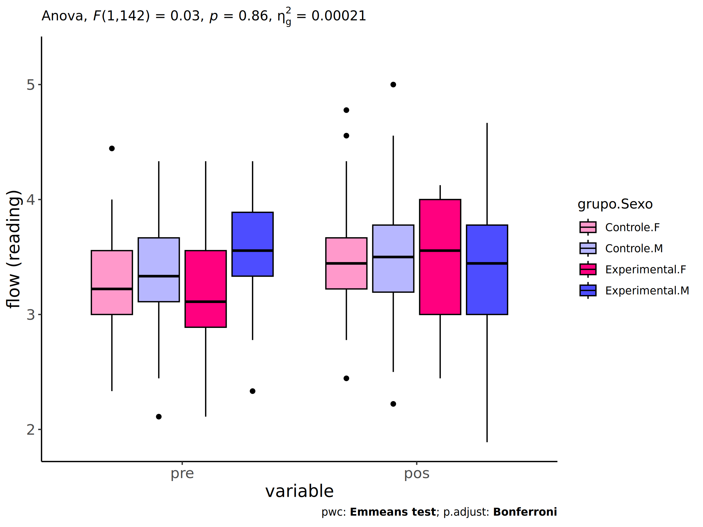
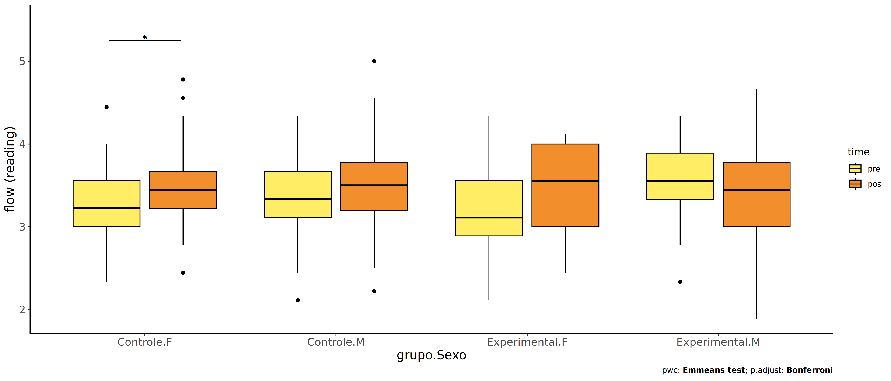
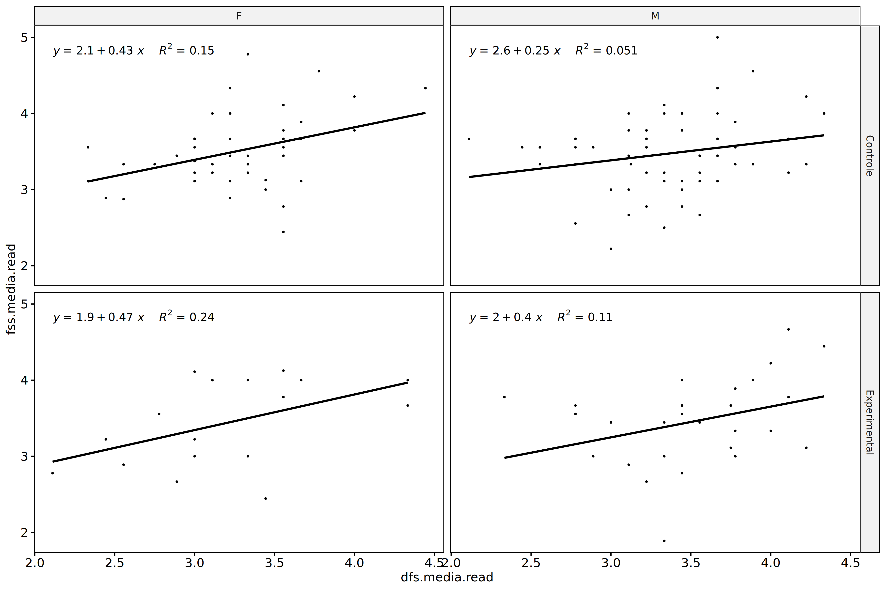
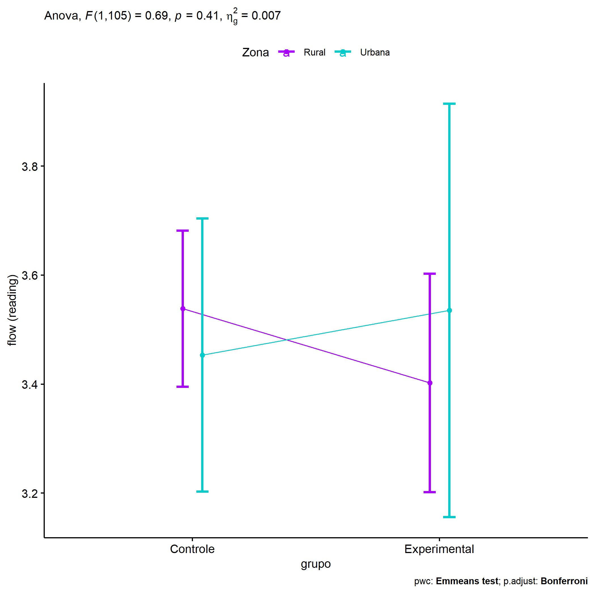
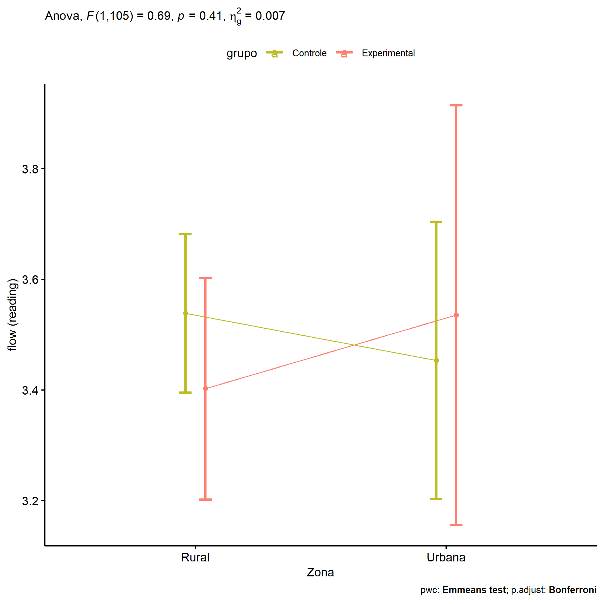
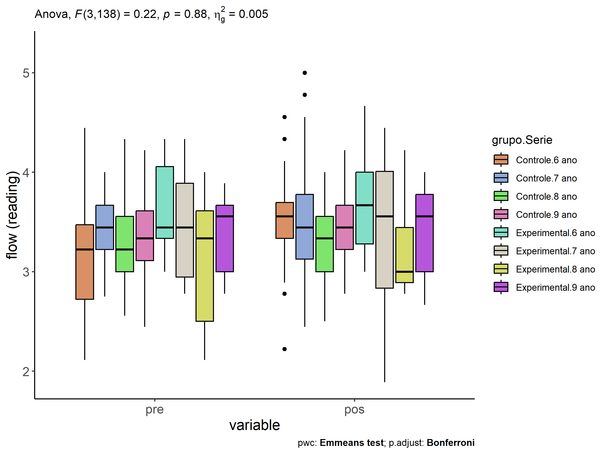

ANCOVA in flow (ativ. leitura) (flow (ativ. leitura))
================
Geiser C. Challco <geiser@alumni.usp.br>

- [Descriptive Statistics of Initial
  Data](#descriptive-statistics-of-initial-data)
- [ANCOVA and Pairwise for one factor:
  **grupo**](#ancova-and-pairwise-for-one-factor-grupo)
  - [Without remove non-normal data](#without-remove-non-normal-data)
  - [Computing ANCOVA and PairWise After removing non-normal data
    (OK)](#computing-ancova-and-pairwise-after-removing-non-normal-data-ok)
    - [Plots for ancova](#plots-for-ancova)
    - [Checking linearity assumption](#checking-linearity-assumption)
    - [Checking normality and
      homogeneity](#checking-normality-and-homogeneity)
- [ANCOVA and Pairwise for two factors
  **grupo:Sexo**](#ancova-and-pairwise-for-two-factors-gruposexo)
  - [Without remove non-normal data](#without-remove-non-normal-data-1)
  - [Computing ANCOVA and PairWise After removing non-normal data
    (OK)](#computing-ancova-and-pairwise-after-removing-non-normal-data-ok-1)
    - [Plots for ancova](#plots-for-ancova-1)
    - [Checking linearity assumption](#checking-linearity-assumption-1)
    - [Checking normality and
      homogeneity](#checking-normality-and-homogeneity-1)
- [ANCOVA and Pairwise for two factors
  **grupo:Zona**](#ancova-and-pairwise-for-two-factors-grupozona)
  - [Without remove non-normal data](#without-remove-non-normal-data-2)
  - [Computing ANCOVA and PairWise After removing non-normal data
    (OK)](#computing-ancova-and-pairwise-after-removing-non-normal-data-ok-2)
    - [Plots for ancova](#plots-for-ancova-2)
    - [Checking linearity assumption](#checking-linearity-assumption-2)
    - [Checking normality and
      homogeneity](#checking-normality-and-homogeneity-2)
- [ANCOVA and Pairwise for two factors
  **grupo:Cor.Raca**](#ancova-and-pairwise-for-two-factors-grupocorraca)
  - [Without remove non-normal data](#without-remove-non-normal-data-3)
  - [Computing ANCOVA and PairWise After removing non-normal data
    (OK)](#computing-ancova-and-pairwise-after-removing-non-normal-data-ok-3)
    - [Plots for ancova](#plots-for-ancova-3)
    - [Checking linearity assumption](#checking-linearity-assumption-3)
    - [Checking normality and
      homogeneity](#checking-normality-and-homogeneity-3)
- [ANCOVA and Pairwise for two factors
  **grupo:Serie**](#ancova-and-pairwise-for-two-factors-gruposerie)
  - [Without remove non-normal data](#without-remove-non-normal-data-4)
  - [Computing ANCOVA and PairWise After removing non-normal data
    (OK)](#computing-ancova-and-pairwise-after-removing-non-normal-data-ok-4)
    - [Plots for ancova](#plots-for-ancova-4)
    - [Checking linearity assumption](#checking-linearity-assumption-4)
    - [Checking normality and
      homogeneity](#checking-normality-and-homogeneity-4)
- [Summary of Results](#summary-of-results)
  - [Descriptive Statistics](#descriptive-statistics)
  - [ANCOVA Table Comparison](#ancova-table-comparison)
  - [PairWise Table Comparison](#pairwise-table-comparison)
  - [EMMS Table Comparison](#emms-table-comparison)

**NOTE**:

- Teste ANCOVA para determinar se houve diferenças significativas no
  flow (ativ. leitura) (medido usando pre- e pos-testes).
- ANCOVA test to determine whether there were significant differences in
  flow (ativ. leitura) (measured using pre- and post-tests).

# Descriptive Statistics of Initial Data

``` r
df <- get.descriptives(dat, c(dv.pre, dv.pos), c("grupo"), 
                       include.global = T, symmetry.test = T, normality.test = F)
df <- plyr::rbind.fill(
  df, do.call(plyr::rbind.fill, lapply(lfatores2, FUN = function(f) {
    if (nrow(dat) > 0 && sum(!is.na(unique(dat[[f]]))) > 1)
      get.descriptives(dat, c(dv.pre,dv.pos), c("grupo", f),
                       symmetry.test = T, normality.test = F)
    }))
)
```

    ## Warning: There were 2 warnings in `mutate()`.
    ## The first warning was:
    ## ℹ In argument: `ci = abs(stats::qt(alpha/2, .data$n - 1) * .data$se)`.
    ## Caused by warning:
    ## ! There was 1 warning in `mutate()`.
    ## ℹ In argument: `ci = abs(stats::qt(alpha/2, .data$n - 1) * .data$se)`.
    ## Caused by warning in `stats::qt()`:
    ## ! NaNs produced
    ## ℹ Run `dplyr::last_dplyr_warnings()` to see the 1 remaining warning.
    ## There were 2 warnings in `mutate()`.
    ## The first warning was:
    ## ℹ In argument: `ci = abs(stats::qt(alpha/2, .data$n - 1) * .data$se)`.
    ## Caused by warning:
    ## ! There was 1 warning in `mutate()`.
    ## ℹ In argument: `ci = abs(stats::qt(alpha/2, .data$n - 1) * .data$se)`.
    ## Caused by warning in `stats::qt()`:
    ## ! NaNs produced
    ## ℹ Run `dplyr::last_dplyr_warnings()` to see the 1 remaining warning.

``` r
(df <- df[,c(fatores1[fatores1 %in% colnames(df)],"variable",
             colnames(df)[!colnames(df) %in% c(fatores1,"variable")])])
```

    ##           grupo Sexo   Zona Cor.Raca Serie       variable   n  mean median   min   max    sd    se    ci
    ## 1      Controle <NA>   <NA>     <NA>  <NA> dfs.media.read 101 3.303  3.333 2.111 4.444 0.455 0.045 0.090
    ## 2  Experimental <NA>   <NA>     <NA>  <NA> dfs.media.read  46 3.417  3.444 2.111 4.333 0.549 0.081 0.163
    ## 3          <NA> <NA>   <NA>     <NA>  <NA> dfs.media.read 147 3.339  3.333 2.111 4.444 0.487 0.040 0.079
    ## 4      Controle <NA>   <NA>     <NA>  <NA> fss.media.read 101 3.483  3.444 2.222 5.000 0.498 0.050 0.098
    ## 5  Experimental <NA>   <NA>     <NA>  <NA> fss.media.read  46 3.457  3.500 1.889 4.667 0.575 0.085 0.171
    ## 6          <NA> <NA>   <NA>     <NA>  <NA> fss.media.read 147 3.475  3.444 1.889 5.000 0.521 0.043 0.085
    ## 7      Controle    F   <NA>     <NA>  <NA> dfs.media.read  45 3.254  3.222 2.333 4.444 0.436 0.065 0.131
    ## 8      Controle    M   <NA>     <NA>  <NA> dfs.media.read  56 3.344  3.333 2.111 4.333 0.469 0.063 0.126
    ## 9  Experimental    F   <NA>     <NA>  <NA> dfs.media.read  17 3.203  3.111 2.111 4.333 0.597 0.145 0.307
    ## 10 Experimental    M   <NA>     <NA>  <NA> dfs.media.read  29 3.542  3.556 2.333 4.333 0.486 0.090 0.185
    ## 11     Controle    F   <NA>     <NA>  <NA> fss.media.read  45 3.500  3.444 2.444 4.778 0.481 0.072 0.145
    ## 12     Controle    M   <NA>     <NA>  <NA> fss.media.read  56 3.469  3.500 2.222 5.000 0.515 0.069 0.138
    ## 13 Experimental    F   <NA>     <NA>  <NA> fss.media.read  17 3.439  3.556 2.444 4.125 0.568 0.138 0.292
    ## 14 Experimental    M   <NA>     <NA>  <NA> fss.media.read  29 3.467  3.444 1.889 4.667 0.589 0.109 0.224
    ## 15     Controle <NA>  Rural     <NA>  <NA> dfs.media.read  55 3.307  3.333 2.111 4.444 0.549 0.074 0.148
    ## 16     Controle <NA> Urbana     <NA>  <NA> dfs.media.read  18 3.241  3.333 2.556 3.778 0.380 0.089 0.189
    ## 17     Controle <NA>   <NA>     <NA>  <NA> dfs.media.read  28 3.338  3.278 2.889 3.778 0.262 0.050 0.102
    ## 18 Experimental <NA>  Rural     <NA>  <NA> dfs.media.read  29 3.531  3.556 2.333 4.333 0.550 0.102 0.209
    ## 19 Experimental <NA> Urbana     <NA>  <NA> dfs.media.read   8 3.042  3.167 2.111 3.556 0.493 0.174 0.412
    ## 20 Experimental <NA>   <NA>     <NA>  <NA> dfs.media.read   9 3.383  3.333 2.778 4.000 0.481 0.160 0.370
    ## 21     Controle <NA>  Rural     <NA>  <NA> fss.media.read  55 3.528  3.444 2.556 4.778 0.446 0.060 0.121
    ## 22     Controle <NA> Urbana     <NA>  <NA> fss.media.read  18 3.420  3.278 2.222 5.000 0.769 0.181 0.382
    ## 23     Controle <NA>   <NA>     <NA>  <NA> fss.media.read  28 3.435  3.500 2.500 4.000 0.373 0.070 0.145
    ## 24 Experimental <NA>  Rural     <NA>  <NA> fss.media.read  29 3.472  3.556 1.889 4.667 0.630 0.117 0.239
    ## 25 Experimental <NA> Urbana     <NA>  <NA> fss.media.read   8 3.431  3.444 2.778 4.111 0.509 0.180 0.425
    ## 26 Experimental <NA>   <NA>     <NA>  <NA> fss.media.read   9 3.432  3.222 3.000 4.222 0.495 0.165 0.381
    ## 27     Controle <NA>   <NA>   Branca  <NA> dfs.media.read  11 3.202  3.333 2.111 4.222 0.618 0.186 0.415
    ## 28     Controle <NA>   <NA>    Parda  <NA> dfs.media.read  46 3.451  3.500 2.444 4.444 0.457 0.067 0.136
    ## 29     Controle <NA>   <NA>    Preta  <NA> dfs.media.read   1 3.111  3.111 3.111 3.111    NA    NA   NaN
    ## 30     Controle <NA>   <NA>     <NA>  <NA> dfs.media.read  43 3.176  3.222 2.333 3.778 0.365 0.056 0.112
    ## 31 Experimental <NA>   <NA>  Amarela  <NA> dfs.media.read   1 3.000  3.000 3.000 3.000    NA    NA   NaN
    ## 32 Experimental <NA>   <NA>   Branca  <NA> dfs.media.read   6 3.611  3.778 2.778 4.333 0.599 0.245 0.629
    ## 33 Experimental <NA>   <NA> Indígena  <NA> dfs.media.read   5 3.644  3.556 3.444 4.000 0.214 0.096 0.265
    ## 34 Experimental <NA>   <NA>    Parda  <NA> dfs.media.read  12 3.479  3.444 2.444 4.333 0.523 0.151 0.332
    ## 35 Experimental <NA>   <NA>     <NA>  <NA> dfs.media.read  22 3.297  3.333 2.111 4.333 0.599 0.128 0.266
    ## 36     Controle <NA>   <NA>   Branca  <NA> fss.media.read  11 3.596  3.556 2.667 4.556 0.505 0.152 0.339
    ## 37     Controle <NA>   <NA>    Parda  <NA> fss.media.read  46 3.514  3.444 2.444 5.000 0.530 0.078 0.157
    ## 38     Controle <NA>   <NA>    Preta  <NA> fss.media.read   1 3.444  3.444 3.444 3.444    NA    NA   NaN
    ## 39     Controle <NA>   <NA>     <NA>  <NA> fss.media.read  43 3.421  3.444 2.222 4.556 0.469 0.072 0.144
    ## 40 Experimental <NA>   <NA>  Amarela  <NA> fss.media.read   1 3.222  3.222 3.222 3.222    NA    NA   NaN
    ## 41 Experimental <NA>   <NA>   Branca  <NA> fss.media.read   6 3.556  3.556 3.000 4.222 0.410 0.167 0.430
    ## 42 Experimental <NA>   <NA> Indígena  <NA> fss.media.read   5 3.647  4.000 2.444 4.222 0.737 0.329 0.915
    ## 43 Experimental <NA>   <NA>    Parda  <NA> fss.media.read  12 3.278  3.278 1.889 4.444 0.650 0.188 0.413
    ## 44 Experimental <NA>   <NA>     <NA>  <NA> fss.media.read  22 3.495  3.556 2.667 4.667 0.557 0.119 0.247
    ## 45     Controle <NA>   <NA>     <NA> 6 ano dfs.media.read  32 3.156  3.222 2.111 4.444 0.561 0.099 0.202
    ## 46     Controle <NA>   <NA>     <NA> 7 ano dfs.media.read  33 3.420  3.444 2.750 4.000 0.302 0.053 0.107
    ## 47     Controle <NA>   <NA>     <NA> 8 ano dfs.media.read  17 3.268  3.222 2.556 4.333 0.445 0.108 0.229
    ## 48     Controle <NA>   <NA>     <NA> 9 ano dfs.media.read  19 3.381  3.333 2.444 4.222 0.444 0.102 0.214
    ## 49 Experimental <NA>   <NA>     <NA> 6 ano dfs.media.read  15 3.619  3.444 3.000 4.333 0.453 0.117 0.251
    ## 50 Experimental <NA>   <NA>     <NA> 7 ano dfs.media.read  11 3.485  3.444 2.778 4.333 0.571 0.172 0.384
    ## 51 Experimental <NA>   <NA>     <NA> 8 ano dfs.media.read  11 3.121  3.333 2.111 4.000 0.656 0.198 0.441
    ## 52 Experimental <NA>   <NA>     <NA> 9 ano dfs.media.read   9 3.358  3.556 2.778 3.889 0.426 0.142 0.327
    ## 53     Controle <NA>   <NA>     <NA> 6 ano fss.media.read  32 3.521  3.556 2.222 4.556 0.465 0.082 0.168
    ## 54     Controle <NA>   <NA>     <NA> 7 ano fss.media.read  33 3.546  3.444 2.444 5.000 0.573 0.100 0.203
    ## 55     Controle <NA>   <NA>     <NA> 8 ano fss.media.read  17 3.273  3.333 2.500 4.000 0.477 0.116 0.245
    ##      iqr symmetry     skewness    kurtosis
    ## 1  0.556      YES -0.085417695  0.06681269
    ## 2  0.778      YES -0.262838726 -0.59627039
    ## 3  0.667      YES -0.107575380 -0.16951893
    ## 4  0.556      YES  0.311595504  0.49101782
    ## 5  0.972      YES -0.247328625 -0.30627257
    ## 6  0.667      YES  0.073130072  0.27096299
    ## 7  0.556      YES -0.004642665  0.27171722
    ## 8  0.556      YES -0.172048220 -0.11391874
    ## 9  0.667      YES  0.264190525 -0.54098006
    ## 10 0.556       NO -0.501071047 -0.44699873
    ## 11 0.444       NO  0.528594062  0.15000686
    ## 12 0.583      YES  0.171644794  0.53954084
    ## 13 1.000      YES -0.224549708 -1.57109102
    ## 14 0.778      YES -0.252023497  0.15976112
    ## 15 0.722      YES -0.009752280 -0.60189732
    ## 16 0.500       NO -0.652101471 -0.81016154
    ## 17 0.434      YES  0.087599334 -1.32029513
    ## 18 0.778      YES -0.367760853 -0.68866093
    ## 19 0.472       NO -0.698588021 -1.06311461
    ## 20 0.778      YES  0.034019454 -1.97483100
    ## 21 0.500       NO  0.528842281  0.25468316
    ## 22 1.122      YES  0.372186993 -0.95771655
    ## 23 0.472       NO -0.514816857 -0.26917834
    ## 24 0.889      YES -0.392519123 -0.26959884
    ## 25 0.861      YES  0.023532271 -1.81480058
    ## 26 0.889      YES  0.404179933 -1.74532073
    ## 27 0.500      YES -0.228485538 -0.92175351
    ## 28 0.444      YES -0.028018367 -0.39214292
    ## 29 0.000 few data  0.000000000  0.00000000
    ## 30 0.444      YES -0.466690559 -0.44543463
    ## 31 0.000 few data  0.000000000  0.00000000
    ## 32 0.750      YES -0.280293607 -1.81430014
    ## 33 0.111       NO  0.728387370 -1.30276114
    ## 34 0.618      YES -0.146320359 -0.77429278
    ## 35 0.882      YES -0.092682103 -0.90166139
    ## 36 0.333      YES  0.139603004 -0.47048953
    ## 37 0.628       NO  0.545293148  0.34280366
    ## 38 0.000 few data  0.000000000  0.00000000
    ## 39 0.500      YES -0.090629632  0.15614806
    ## 40 0.000 few data  0.000000000  0.00000000
    ## 41 0.306      YES  0.279138457 -1.25187428
    ## 42 0.681       NO -0.702835036 -1.45801588
    ## 43 0.722      YES -0.325205228 -0.25529991
    ## 44 1.000      YES  0.133129885 -1.21203996
    ## 45 0.750      YES  0.203277823 -0.44954622
    ## 46 0.444      YES -0.315181241 -0.57125001
    ## 47 0.556       NO  0.613026382 -0.21426553
    ## 48 0.500      YES  0.151608945 -0.54752029
    ## 49 0.722      YES  0.144062248 -1.54785806
    ## 50 0.944      YES  0.238437326 -1.57463767
    ## 51 1.111      YES -0.221506042 -1.66222624
    ## 52 0.667      YES -0.245521432 -1.76409395
    ## 53 0.361      YES -0.132225107  0.78537784
    ## 54 0.653       NO  0.566658926  0.13755579
    ## 55 0.556      YES  0.026273346 -1.12251722
    ##  [ reached 'max' / getOption("max.print") -- omitted 5 rows ]

| grupo        | Sexo | Zona   | Cor.Raca | Serie | variable       |   n |  mean | median |   min |   max |    sd |    se |    ci |   iqr | symmetry | skewness | kurtosis |
|:-------------|:-----|:-------|:---------|:------|:---------------|----:|------:|-------:|------:|------:|------:|------:|------:|------:|:---------|---------:|---------:|
| Controle     |      |        |          |       | dfs.media.read | 101 | 3.303 |  3.333 | 2.111 | 4.444 | 0.455 | 0.045 | 0.090 | 0.556 | YES      |   -0.085 |    0.067 |
| Experimental |      |        |          |       | dfs.media.read |  46 | 3.417 |  3.444 | 2.111 | 4.333 | 0.549 | 0.081 | 0.163 | 0.778 | YES      |   -0.263 |   -0.596 |
|              |      |        |          |       | dfs.media.read | 147 | 3.339 |  3.333 | 2.111 | 4.444 | 0.487 | 0.040 | 0.079 | 0.667 | YES      |   -0.108 |   -0.170 |
| Controle     |      |        |          |       | fss.media.read | 101 | 3.483 |  3.444 | 2.222 | 5.000 | 0.498 | 0.050 | 0.098 | 0.556 | YES      |    0.312 |    0.491 |
| Experimental |      |        |          |       | fss.media.read |  46 | 3.457 |  3.500 | 1.889 | 4.667 | 0.575 | 0.085 | 0.171 | 0.972 | YES      |   -0.247 |   -0.306 |
|              |      |        |          |       | fss.media.read | 147 | 3.475 |  3.444 | 1.889 | 5.000 | 0.521 | 0.043 | 0.085 | 0.667 | YES      |    0.073 |    0.271 |
| Controle     | F    |        |          |       | dfs.media.read |  45 | 3.254 |  3.222 | 2.333 | 4.444 | 0.436 | 0.065 | 0.131 | 0.556 | YES      |   -0.005 |    0.272 |
| Controle     | M    |        |          |       | dfs.media.read |  56 | 3.344 |  3.333 | 2.111 | 4.333 | 0.469 | 0.063 | 0.126 | 0.556 | YES      |   -0.172 |   -0.114 |
| Experimental | F    |        |          |       | dfs.media.read |  17 | 3.203 |  3.111 | 2.111 | 4.333 | 0.597 | 0.145 | 0.307 | 0.667 | YES      |    0.264 |   -0.541 |
| Experimental | M    |        |          |       | dfs.media.read |  29 | 3.542 |  3.556 | 2.333 | 4.333 | 0.486 | 0.090 | 0.185 | 0.556 | NO       |   -0.501 |   -0.447 |
| Controle     | F    |        |          |       | fss.media.read |  45 | 3.500 |  3.444 | 2.444 | 4.778 | 0.481 | 0.072 | 0.145 | 0.444 | NO       |    0.529 |    0.150 |
| Controle     | M    |        |          |       | fss.media.read |  56 | 3.469 |  3.500 | 2.222 | 5.000 | 0.515 | 0.069 | 0.138 | 0.583 | YES      |    0.172 |    0.540 |
| Experimental | F    |        |          |       | fss.media.read |  17 | 3.439 |  3.556 | 2.444 | 4.125 | 0.568 | 0.138 | 0.292 | 1.000 | YES      |   -0.225 |   -1.571 |
| Experimental | M    |        |          |       | fss.media.read |  29 | 3.467 |  3.444 | 1.889 | 4.667 | 0.589 | 0.109 | 0.224 | 0.778 | YES      |   -0.252 |    0.160 |
| Controle     |      | Rural  |          |       | dfs.media.read |  55 | 3.307 |  3.333 | 2.111 | 4.444 | 0.549 | 0.074 | 0.148 | 0.722 | YES      |   -0.010 |   -0.602 |
| Controle     |      | Urbana |          |       | dfs.media.read |  18 | 3.241 |  3.333 | 2.556 | 3.778 | 0.380 | 0.089 | 0.189 | 0.500 | NO       |   -0.652 |   -0.810 |
| Controle     |      |        |          |       | dfs.media.read |  28 | 3.338 |  3.278 | 2.889 | 3.778 | 0.262 | 0.050 | 0.102 | 0.434 | YES      |    0.088 |   -1.320 |
| Experimental |      | Rural  |          |       | dfs.media.read |  29 | 3.531 |  3.556 | 2.333 | 4.333 | 0.550 | 0.102 | 0.209 | 0.778 | YES      |   -0.368 |   -0.689 |
| Experimental |      | Urbana |          |       | dfs.media.read |   8 | 3.042 |  3.167 | 2.111 | 3.556 | 0.493 | 0.174 | 0.412 | 0.472 | NO       |   -0.699 |   -1.063 |
| Experimental |      |        |          |       | dfs.media.read |   9 | 3.383 |  3.333 | 2.778 | 4.000 | 0.481 | 0.160 | 0.370 | 0.778 | YES      |    0.034 |   -1.975 |
| Controle     |      | Rural  |          |       | fss.media.read |  55 | 3.528 |  3.444 | 2.556 | 4.778 | 0.446 | 0.060 | 0.121 | 0.500 | NO       |    0.529 |    0.255 |
| Controle     |      | Urbana |          |       | fss.media.read |  18 | 3.420 |  3.278 | 2.222 | 5.000 | 0.769 | 0.181 | 0.382 | 1.122 | YES      |    0.372 |   -0.958 |
| Controle     |      |        |          |       | fss.media.read |  28 | 3.435 |  3.500 | 2.500 | 4.000 | 0.373 | 0.070 | 0.145 | 0.472 | NO       |   -0.515 |   -0.269 |
| Experimental |      | Rural  |          |       | fss.media.read |  29 | 3.472 |  3.556 | 1.889 | 4.667 | 0.630 | 0.117 | 0.239 | 0.889 | YES      |   -0.393 |   -0.270 |
| Experimental |      | Urbana |          |       | fss.media.read |   8 | 3.431 |  3.444 | 2.778 | 4.111 | 0.509 | 0.180 | 0.425 | 0.861 | YES      |    0.024 |   -1.815 |
| Experimental |      |        |          |       | fss.media.read |   9 | 3.432 |  3.222 | 3.000 | 4.222 | 0.495 | 0.165 | 0.381 | 0.889 | YES      |    0.404 |   -1.745 |
| Controle     |      |        | Branca   |       | dfs.media.read |  11 | 3.202 |  3.333 | 2.111 | 4.222 | 0.618 | 0.186 | 0.415 | 0.500 | YES      |   -0.228 |   -0.922 |
| Controle     |      |        | Parda    |       | dfs.media.read |  46 | 3.451 |  3.500 | 2.444 | 4.444 | 0.457 | 0.067 | 0.136 | 0.444 | YES      |   -0.028 |   -0.392 |
| Controle     |      |        | Preta    |       | dfs.media.read |   1 | 3.111 |  3.111 | 3.111 | 3.111 |       |       |       | 0.000 | few data |    0.000 |    0.000 |
| Controle     |      |        |          |       | dfs.media.read |  43 | 3.176 |  3.222 | 2.333 | 3.778 | 0.365 | 0.056 | 0.112 | 0.444 | YES      |   -0.467 |   -0.445 |
| Experimental |      |        | Amarela  |       | dfs.media.read |   1 | 3.000 |  3.000 | 3.000 | 3.000 |       |       |       | 0.000 | few data |    0.000 |    0.000 |
| Experimental |      |        | Branca   |       | dfs.media.read |   6 | 3.611 |  3.778 | 2.778 | 4.333 | 0.599 | 0.245 | 0.629 | 0.750 | YES      |   -0.280 |   -1.814 |
| Experimental |      |        | Indígena |       | dfs.media.read |   5 | 3.644 |  3.556 | 3.444 | 4.000 | 0.214 | 0.096 | 0.265 | 0.111 | NO       |    0.728 |   -1.303 |
| Experimental |      |        | Parda    |       | dfs.media.read |  12 | 3.479 |  3.444 | 2.444 | 4.333 | 0.523 | 0.151 | 0.332 | 0.618 | YES      |   -0.146 |   -0.774 |
| Experimental |      |        |          |       | dfs.media.read |  22 | 3.297 |  3.333 | 2.111 | 4.333 | 0.599 | 0.128 | 0.266 | 0.882 | YES      |   -0.093 |   -0.902 |
| Controle     |      |        | Branca   |       | fss.media.read |  11 | 3.596 |  3.556 | 2.667 | 4.556 | 0.505 | 0.152 | 0.339 | 0.333 | YES      |    0.140 |   -0.470 |
| Controle     |      |        | Parda    |       | fss.media.read |  46 | 3.514 |  3.444 | 2.444 | 5.000 | 0.530 | 0.078 | 0.157 | 0.628 | NO       |    0.545 |    0.343 |
| Controle     |      |        | Preta    |       | fss.media.read |   1 | 3.444 |  3.444 | 3.444 | 3.444 |       |       |       | 0.000 | few data |    0.000 |    0.000 |
| Controle     |      |        |          |       | fss.media.read |  43 | 3.421 |  3.444 | 2.222 | 4.556 | 0.469 | 0.072 | 0.144 | 0.500 | YES      |   -0.091 |    0.156 |
| Experimental |      |        | Amarela  |       | fss.media.read |   1 | 3.222 |  3.222 | 3.222 | 3.222 |       |       |       | 0.000 | few data |    0.000 |    0.000 |
| Experimental |      |        | Branca   |       | fss.media.read |   6 | 3.556 |  3.556 | 3.000 | 4.222 | 0.410 | 0.167 | 0.430 | 0.306 | YES      |    0.279 |   -1.252 |
| Experimental |      |        | Indígena |       | fss.media.read |   5 | 3.647 |  4.000 | 2.444 | 4.222 | 0.737 | 0.329 | 0.915 | 0.681 | NO       |   -0.703 |   -1.458 |
| Experimental |      |        | Parda    |       | fss.media.read |  12 | 3.278 |  3.278 | 1.889 | 4.444 | 0.650 | 0.188 | 0.413 | 0.722 | YES      |   -0.325 |   -0.255 |
| Experimental |      |        |          |       | fss.media.read |  22 | 3.495 |  3.556 | 2.667 | 4.667 | 0.557 | 0.119 | 0.247 | 1.000 | YES      |    0.133 |   -1.212 |
| Controle     |      |        |          | 6 ano | dfs.media.read |  32 | 3.156 |  3.222 | 2.111 | 4.444 | 0.561 | 0.099 | 0.202 | 0.750 | YES      |    0.203 |   -0.450 |
| Controle     |      |        |          | 7 ano | dfs.media.read |  33 | 3.420 |  3.444 | 2.750 | 4.000 | 0.302 | 0.053 | 0.107 | 0.444 | YES      |   -0.315 |   -0.571 |
| Controle     |      |        |          | 8 ano | dfs.media.read |  17 | 3.268 |  3.222 | 2.556 | 4.333 | 0.445 | 0.108 | 0.229 | 0.556 | NO       |    0.613 |   -0.214 |
| Controle     |      |        |          | 9 ano | dfs.media.read |  19 | 3.381 |  3.333 | 2.444 | 4.222 | 0.444 | 0.102 | 0.214 | 0.500 | YES      |    0.152 |   -0.548 |
| Experimental |      |        |          | 6 ano | dfs.media.read |  15 | 3.619 |  3.444 | 3.000 | 4.333 | 0.453 | 0.117 | 0.251 | 0.722 | YES      |    0.144 |   -1.548 |
| Experimental |      |        |          | 7 ano | dfs.media.read |  11 | 3.485 |  3.444 | 2.778 | 4.333 | 0.571 | 0.172 | 0.384 | 0.944 | YES      |    0.238 |   -1.575 |
| Experimental |      |        |          | 8 ano | dfs.media.read |  11 | 3.121 |  3.333 | 2.111 | 4.000 | 0.656 | 0.198 | 0.441 | 1.111 | YES      |   -0.222 |   -1.662 |
| Experimental |      |        |          | 9 ano | dfs.media.read |   9 | 3.358 |  3.556 | 2.778 | 3.889 | 0.426 | 0.142 | 0.327 | 0.667 | YES      |   -0.246 |   -1.764 |
| Controle     |      |        |          | 6 ano | fss.media.read |  32 | 3.521 |  3.556 | 2.222 | 4.556 | 0.465 | 0.082 | 0.168 | 0.361 | YES      |   -0.132 |    0.785 |
| Controle     |      |        |          | 7 ano | fss.media.read |  33 | 3.546 |  3.444 | 2.444 | 5.000 | 0.573 | 0.100 | 0.203 | 0.653 | NO       |    0.567 |    0.138 |
| Controle     |      |        |          | 8 ano | fss.media.read |  17 | 3.273 |  3.333 | 2.500 | 4.000 | 0.477 | 0.116 | 0.245 | 0.556 | YES      |    0.026 |   -1.123 |
| Controle     |      |        |          | 9 ano | fss.media.read |  19 | 3.497 |  3.444 | 2.778 | 4.222 | 0.410 | 0.094 | 0.197 | 0.444 | YES      |    0.234 |   -0.930 |
| Experimental |      |        |          | 6 ano | fss.media.read |  15 | 3.674 |  3.667 | 3.000 | 4.667 | 0.469 | 0.121 | 0.259 | 0.722 | YES      |    0.255 |   -0.900 |
| Experimental |      |        |          | 7 ano | fss.media.read |  11 | 3.395 |  3.556 | 1.889 | 4.444 | 0.808 | 0.244 | 0.543 | 1.174 | YES      |   -0.427 |   -1.227 |
| Experimental |      |        |          | 8 ano | fss.media.read |  11 | 3.222 |  3.000 | 2.778 | 4.222 | 0.463 | 0.140 | 0.311 | 0.556 | NO       |    0.857 |   -0.606 |
| Experimental |      |        |          | 9 ano | fss.media.read |   9 | 3.457 |  3.556 | 2.667 | 4.000 | 0.473 | 0.158 | 0.363 | 0.778 | YES      |   -0.336 |   -1.525 |

# ANCOVA and Pairwise for one factor: **grupo**

## Without remove non-normal data

``` r
pdat = remove_group_data(dat[!is.na(dat[["grupo"]]),], "fss.media.read", "grupo")

pdat.long <- rbind(pdat[,c("id","grupo")], pdat[,c("id","grupo")])
pdat.long[["time"]] <- c(rep("pre", nrow(pdat)), rep("pos", nrow(pdat)))
pdat.long[["time"]] <- factor(pdat.long[["time"]], c("pre","pos"))
pdat.long[["flow.read"]] <- c(pdat[["dfs.media.read"]], pdat[["fss.media.read"]])

aov = anova_test(pdat, fss.media.read ~ dfs.media.read + grupo)
laov[["grupo"]] <- get_anova_table(aov)
```

``` r
pwc <- emmeans_test(pdat, fss.media.read ~ grupo, covariate = dfs.media.read,
                    p.adjust.method = "bonferroni")
```

``` r
pwc.long <- emmeans_test(dplyr::group_by_at(pdat.long, "grupo"),
                          flow.read ~ time,
                          p.adjust.method = "bonferroni")
lpwc[["grupo"]] <- plyr::rbind.fill(pwc, pwc.long)
```

``` r
ds <- get.descriptives(pdat, "fss.media.read", "grupo", covar = "dfs.media.read")
ds <- merge(ds[ds$variable != "dfs.media.read",],
            ds[ds$variable == "dfs.media.read", !colnames(ds) %in% c("variable")],
            by = "grupo", all.x = T, suffixes = c("", ".dfs.media.read"))
ds <- merge(get_emmeans(pwc), ds, by = "grupo", suffixes = c(".emms", ""))
ds <- ds[,c("grupo","n","mean.dfs.media.read","se.dfs.media.read","mean","se","emmean","se.emms")]

colnames(ds) <- c("grupo", "N", paste0(c("M","SE")," (pre)"),
                  paste0(c("M","SE"), " (unadj)"), paste0(c("M", "SE"), " (adj)"))

lemms[["grupo"]] <- ds
```

## Computing ANCOVA and PairWise After removing non-normal data (OK)

``` r
wdat = pdat 

res = residuals(lm(fss.media.read ~ dfs.media.read + grupo, data = wdat))
non.normal = getNonNormal(res, wdat$id, plimit = 0.05)

wdat = wdat[!wdat$id %in% non.normal,]

wdat.long <- rbind(wdat[,c("id","grupo")], wdat[,c("id","grupo")])
wdat.long[["time"]] <- c(rep("pre", nrow(wdat)), rep("pos", nrow(wdat)))
wdat.long[["time"]] <- factor(wdat.long[["time"]], c("pre","pos"))
wdat.long[["flow.read"]] <- c(wdat[["dfs.media.read"]], wdat[["fss.media.read"]])

ldat[["grupo"]] = wdat

(non.normal)
```

    ## NULL

``` r
aov = anova_test(wdat, fss.media.read ~ dfs.media.read + grupo)
laov[["grupo"]] <- merge(get_anova_table(aov), laov[["grupo"]], by="Effect", suffixes = c("","'"))

(df = get_anova_table(aov))
```

    ## ANOVA Table (type II tests)
    ## 
    ##           Effect DFn DFd      F        p p<.05   ges
    ## 1 dfs.media.read   1 144 16.860 6.72e-05     * 0.105
    ## 2          grupo   1 144  0.542 4.63e-01       0.004

| Effect         | DFn | DFd |      F |     p | p\<.05 |   ges |
|:---------------|----:|----:|-------:|------:|:-------|------:|
| dfs.media.read |   1 | 144 | 16.860 | 0.000 | \*     | 0.105 |
| grupo          |   1 | 144 |  0.542 | 0.463 |        | 0.004 |

| term                  | .y.            | group1   | group2       |  df | statistic |     p | p.adj | p.adj.signif |
|:----------------------|:---------------|:---------|:-------------|----:|----------:|------:|------:|:-------------|
| dfs.media.read\*grupo | fss.media.read | Controle | Experimental | 144 |     0.737 | 0.463 | 0.463 | ns           |

``` r
pwc.long <- emmeans_test(dplyr::group_by_at(wdat.long, "grupo"),
                         flow.read ~ time,
                         p.adjust.method = "bonferroni")
lpwc[["grupo"]] <- merge(plyr::rbind.fill(pwc, pwc.long), lpwc[["grupo"]], by=c("grupo","term",".y.","group1","group2"), suffixes = c("","'"))
```

| grupo        | term | .y.       | group1 | group2 |  df | statistic |     p | p.adj | p.adj.signif |
|:-------------|:-----|:----------|:-------|:-------|----:|----------:|------:|------:|:-------------|
| Controle     | time | flow.read | pre    | pos    | 290 |    -2.525 | 0.012 | 0.012 | \*           |
| Experimental | time | flow.read | pre    | pos    | 290 |    -0.382 | 0.703 | 0.703 | ns           |

``` r
ds <- get.descriptives(wdat, "fss.media.read", "grupo", covar = "dfs.media.read")
ds <- merge(ds[ds$variable != "dfs.media.read",],
            ds[ds$variable == "dfs.media.read", !colnames(ds) %in% c("variable")],
            by = "grupo", all.x = T, suffixes = c("", ".dfs.media.read"))
ds <- merge(get_emmeans(pwc), ds, by = "grupo", suffixes = c(".emms", ""))
ds <- ds[,c("grupo","n","mean.dfs.media.read","se.dfs.media.read","mean","se","emmean","se.emms")]

colnames(ds) <- c("grupo", "N", paste0(c("M","SE")," (pre)"),
                  paste0(c("M","SE"), " (unadj)"), paste0(c("M", "SE"), " (adj)"))

lemms[["grupo"]] <- merge(ds, lemms[["grupo"]], by=c("grupo"), suffixes = c("","'"))
```

| grupo        |   N | M (pre) | SE (pre) | M (unadj) | SE (unadj) | M (adj) | SE (adj) |
|:-------------|----:|--------:|---------:|----------:|-----------:|--------:|---------:|
| Controle     | 101 |   3.303 |    0.045 |     3.483 |      0.050 |   3.495 |    0.050 |
| Experimental |  46 |   3.417 |    0.081 |     3.457 |      0.085 |   3.430 |    0.074 |

### Plots for ancova

``` r
plots <- oneWayAncovaPlots(
  wdat, "fss.media.read", "grupo", aov, list("grupo"=pwc), addParam = c("mean_se"),
  font.label.size=10, step.increase=0.05, p.label="p.adj",
  subtitle = which(aov$Effect == "grupo"))
```

``` r
if (!is.null(nrow(plots[["grupo"]]$data)))
  plots[["grupo"]] + ggplot2::scale_color_manual(values = color[["grupo"]])
```

    ## Scale for colour is already present.
    ## Adding another scale for colour, which will replace the existing scale.

<!-- -->

``` r
plots <- oneWayAncovaBoxPlots(
  wdat, "fss.media.read", "grupo", aov, pwc, covar = "dfs.media.read",
  theme = "classic", color = color[["grupo"]],
  subtitle = which(aov$Effect == "grupo"))
```

``` r
if (length(unique(wdat[["grupo"]])) > 1)
  plots[["grupo"]] + ggplot2::ylab("flow (ativ. leitura)") + ggplot2::scale_x_discrete(labels=c('pre', 'pos'))
```

<!-- -->

``` r
if (length(unique(wdat.long[["grupo"]])) > 1)
  plots <- oneWayAncovaBoxPlots(
    wdat.long, "flow.read", "grupo", aov, pwc.long, pre.post = "time",
    theme = "classic", color = color$prepost)
```

``` r
if (length(unique(wdat.long[["grupo"]])) > 1)
  plots[["grupo"]] + ggplot2::ylab("flow (ativ. leitura)")
```

<!-- -->

### Checking linearity assumption

``` r
ggscatter(wdat, x = "dfs.media.read", y = "fss.media.read", size = 0.5,
          color = "grupo", add = "reg.line")+
  stat_regline_equation(
    aes(label =  paste(..eq.label.., ..rr.label.., sep = "~~~~"), color = grupo)
  )
```

<!-- -->

### Checking normality and homogeneity

``` r
res <- augment(lm(fss.media.read ~ dfs.media.read + grupo, data = wdat))
```

``` r
shapiro_test(res$.resid)
```

    ## # A tibble: 1 × 3
    ##   variable   statistic p.value
    ##   <chr>          <dbl>   <dbl>
    ## 1 res$.resid     0.996   0.951

``` r
levene_test(res, .resid ~ grupo)
```

    ## # A tibble: 1 × 4
    ##     df1   df2 statistic     p
    ##   <int> <int>     <dbl> <dbl>
    ## 1     1   145      1.24 0.267

# ANCOVA and Pairwise for two factors **grupo:Sexo**

## Without remove non-normal data

``` r
pdat = remove_group_data(dat[!is.na(dat[["grupo"]]) & !is.na(dat[["Sexo"]]),], "fss.media.read", c("grupo","Sexo"))

pdat.long <- rbind(pdat[,c("id","grupo","Sexo")], pdat[,c("id","grupo","Sexo")])
pdat.long[["time"]] <- c(rep("pre", nrow(pdat)), rep("pos", nrow(pdat)))
pdat.long[["time"]] <- factor(pdat.long[["time"]], c("pre","pos"))
pdat.long[["flow.read"]] <- c(pdat[["dfs.media.read"]], pdat[["fss.media.read"]])

aov = anova_test(pdat, fss.media.read ~ dfs.media.read + grupo*Sexo)
laov[["grupo:Sexo"]] <- get_anova_table(aov)
```

``` r
pwcs <- list()
pwcs[["Sexo"]] <- emmeans_test(
  group_by(pdat, grupo), fss.media.read ~ Sexo,
  covariate = dfs.media.read, p.adjust.method = "bonferroni")
pwcs[["grupo"]] <- emmeans_test(
  group_by(pdat, Sexo), fss.media.read ~ grupo,
  covariate = dfs.media.read, p.adjust.method = "bonferroni")

pwc <- plyr::rbind.fill(pwcs[["grupo"]], pwcs[["Sexo"]])
pwc <- pwc[,c("grupo","Sexo", colnames(pwc)[!colnames(pwc) %in% c("grupo","Sexo")])]
```

``` r
pwc.long <- emmeans_test(dplyr::group_by_at(pdat.long, c("grupo","Sexo")),
                         flow.read ~ time,
                         p.adjust.method = "bonferroni")
lpwc[["grupo:Sexo"]] <- plyr::rbind.fill(pwc, pwc.long)
```

``` r
ds <- get.descriptives(pdat, "fss.media.read", c("grupo","Sexo"), covar = "dfs.media.read")
ds <- merge(ds[ds$variable != "dfs.media.read",],
            ds[ds$variable == "dfs.media.read", !colnames(ds) %in% c("variable")],
            by = c("grupo","Sexo"), all.x = T, suffixes = c("", ".dfs.media.read"))
ds <- merge(get_emmeans(pwcs[["grupo"]]), ds, by = c("grupo","Sexo"), suffixes = c(".emms", ""))
ds <- ds[,c("grupo","Sexo","n","mean.dfs.media.read","se.dfs.media.read","mean","se","emmean","se.emms")]

colnames(ds) <- c("grupo","Sexo", "N", paste0(c("M","SE")," (pre)"),
                  paste0(c("M","SE"), " (unadj)"), paste0(c("M", "SE"), " (adj)"))

lemms[["grupo:Sexo"]] <- ds
```

## Computing ANCOVA and PairWise After removing non-normal data (OK)

``` r
wdat = pdat 

res = residuals(lm(fss.media.read ~ dfs.media.read + grupo*Sexo, data = wdat))
non.normal = getNonNormal(res, wdat$id, plimit = 0.05)

wdat = wdat[!wdat$id %in% non.normal,]

wdat.long <- rbind(wdat[,c("id","grupo","Sexo")], wdat[,c("id","grupo","Sexo")])
wdat.long[["time"]] <- c(rep("pre", nrow(wdat)), rep("pos", nrow(wdat)))
wdat.long[["time"]] <- factor(wdat.long[["time"]], c("pre","pos"))
wdat.long[["flow.read"]] <- c(wdat[["dfs.media.read"]], wdat[["fss.media.read"]])


ldat[["grupo:Sexo"]] = wdat

(non.normal)
```

    ## NULL

``` r
aov = anova_test(wdat, fss.media.read ~ dfs.media.read + grupo*Sexo)
laov[["grupo:Sexo"]] <- merge(get_anova_table(aov), laov[["grupo:Sexo"]], by="Effect", suffixes = c("","'"))

(df = get_anova_table(aov))
```

    ## ANOVA Table (type II tests)
    ## 
    ##           Effect DFn DFd      F        p p<.05      ges
    ## 1 dfs.media.read   1 142 17.341 5.39e-05     * 0.109000
    ## 2          grupo   1 142  0.471 4.93e-01       0.003000
    ## 3           Sexo   1 142  0.726 3.96e-01       0.005000
    ## 4     grupo:Sexo   1 142  0.029 8.64e-01       0.000207

| Effect         | DFn | DFd |      F |     p | p\<.05 |   ges |
|:---------------|----:|----:|-------:|------:|:-------|------:|
| dfs.media.read |   1 | 142 | 17.341 | 0.000 | \*     | 0.109 |
| grupo          |   1 | 142 |  0.471 | 0.493 |        | 0.003 |
| Sexo           |   1 | 142 |  0.726 | 0.396 |        | 0.005 |
| grupo:Sexo     |   1 | 142 |  0.029 | 0.864 |        | 0.000 |

``` r
pwcs <- list()
pwcs[["Sexo"]] <- emmeans_test(
  group_by(wdat, grupo), fss.media.read ~ Sexo,
  covariate = dfs.media.read, p.adjust.method = "bonferroni")
pwcs[["grupo"]] <- emmeans_test(
  group_by(wdat, Sexo), fss.media.read ~ grupo,
  covariate = dfs.media.read, p.adjust.method = "bonferroni")

pwc <- plyr::rbind.fill(pwcs[["grupo"]], pwcs[["Sexo"]])
pwc <- pwc[,c("grupo","Sexo", colnames(pwc)[!colnames(pwc) %in% c("grupo","Sexo")])]
```

| grupo        | Sexo | term                  | .y.            | group1   | group2       |  df | statistic |     p | p.adj | p.adj.signif |
|:-------------|:-----|:----------------------|:---------------|:---------|:-------------|----:|----------:|------:|------:|:-------------|
|              | F    | dfs.media.read\*grupo | fss.media.read | Controle | Experimental | 142 |     0.299 | 0.766 | 0.766 | ns           |
|              | M    | dfs.media.read\*grupo | fss.media.read | Controle | Experimental | 142 |     0.640 | 0.523 | 0.523 | ns           |
| Controle     |      | dfs.media.read\*Sexo  | fss.media.read | F        | M            | 142 |     0.629 | 0.530 | 0.530 | ns           |
| Experimental |      | dfs.media.read\*Sexo  | fss.media.read | F        | M            | 142 |     0.609 | 0.544 | 0.544 | ns           |

``` r
pwc.long <- emmeans_test(dplyr::group_by_at(wdat.long, c("grupo","Sexo")),
                         flow.read ~ time,
                         p.adjust.method = "bonferroni")
lpwc[["grupo:Sexo"]] <- merge(plyr::rbind.fill(pwc, pwc.long), lpwc[["grupo:Sexo"]], by=c("grupo","Sexo","term",".y.","group1","group2"), suffixes = c("","'"))
```

| grupo        | Sexo | term | .y.       | group1 | group2 |  df | statistic |     p | p.adj | p.adj.signif |
|:-------------|:-----|:-----|:----------|:-------|:-------|----:|----------:|------:|------:|:-------------|
| Controle     | F    | time | flow.read | pre    | pos    | 286 |    -2.319 | 0.021 | 0.021 | \*           |
| Controle     | M    | time | flow.read | pre    | pos    | 286 |    -1.322 | 0.187 | 0.187 | ns           |
| Experimental | F    | time | flow.read | pre    | pos    | 286 |    -1.368 | 0.172 | 0.172 | ns           |
| Experimental | M    | time | flow.read | pre    | pos    | 286 |     0.565 | 0.572 | 0.572 | ns           |

``` r
ds <- get.descriptives(wdat, "fss.media.read", c("grupo","Sexo"), covar = "dfs.media.read")
ds <- merge(ds[ds$variable != "dfs.media.read",],
            ds[ds$variable == "dfs.media.read", !colnames(ds) %in% c("variable")],
            by = c("grupo","Sexo"), all.x = T, suffixes = c("", ".dfs.media.read"))
ds <- merge(get_emmeans(pwcs[["grupo"]]), ds, by = c("grupo","Sexo"), suffixes = c(".emms", ""))
ds <- ds[,c("grupo","Sexo","n","mean.dfs.media.read","se.dfs.media.read","mean","se","emmean","se.emms")]

colnames(ds) <- c("grupo","Sexo", "N", paste0(c("M","SE")," (pre)"),
                  paste0(c("M","SE"), " (unadj)"), paste0(c("M", "SE"), " (adj)"))

lemms[["grupo:Sexo"]] <- merge(ds, lemms[["grupo:Sexo"]], by=c("grupo","Sexo"), suffixes = c("","'"))
```

| grupo        | Sexo |   N | M (pre) | SE (pre) | M (unadj) | SE (unadj) | M (adj) | SE (adj) |
|:-------------|:-----|----:|--------:|---------:|----------:|-----------:|--------:|---------:|
| Controle     | F    |  45 |   3.254 |    0.065 |     3.500 |      0.072 |   3.531 |    0.075 |
| Controle     | M    |  56 |   3.344 |    0.063 |     3.469 |      0.069 |   3.468 |    0.067 |
| Experimental | F    |  17 |   3.203 |    0.145 |     3.439 |      0.138 |   3.488 |    0.122 |
| Experimental | M    |  29 |   3.542 |    0.090 |     3.467 |      0.109 |   3.394 |    0.094 |

### Plots for ancova

``` r
plots <- twoWayAncovaPlots(
  wdat, "fss.media.read", c("grupo","Sexo"), aov, pwcs, addParam = c("mean_se"),
  font.label.size=10, step.increase=0.05, p.label="p.adj",
  subtitle = which(aov$Effect == "grupo:Sexo"))
```

``` r
if (!is.null(plots[["grupo"]]))
  plots[["grupo"]] + ggplot2::scale_color_manual(values = color[["Sexo"]])
```

    ## Scale for colour is already present.
    ## Adding another scale for colour, which will replace the existing scale.

<!-- -->

``` r
if (!is.null(plots[["Sexo"]]))
  plots[["Sexo"]] + ggplot2::scale_color_manual(values = color[["grupo"]])
```

    ## Scale for colour is already present.
    ## Adding another scale for colour, which will replace the existing scale.

<!-- -->

``` r
plots <- twoWayAncovaBoxPlots(
  wdat, "fss.media.read", c("grupo","Sexo"), aov, pwcs, covar = "dfs.media.read",
  theme = "classic", color = color[["grupo:Sexo"]],
  subtitle = which(aov$Effect == "grupo:Sexo"))
```

``` r
plots[["grupo:Sexo"]] + ggplot2::ylab("flow (ativ. leitura)") + ggplot2::scale_x_discrete(labels=c('pre', 'pos'))
```

<!-- -->

``` r
plots <- twoWayAncovaBoxPlots(
  wdat.long, "flow.read", c("grupo","Sexo"), aov, pwc.long, pre.post = "time",
  theme = "classic", color = color$prepost)
```

``` r
plots[["grupo:Sexo"]] + ggplot2::ylab("flow (ativ. leitura)")
```

<!-- -->

### Checking linearity assumption

``` r
ggscatter(wdat, x = "dfs.media.read", y = "fss.media.read", size = 0.5,
          facet.by = c("grupo","Sexo"), add = "reg.line")+
  stat_regline_equation(
    aes(label =  paste(..eq.label.., ..rr.label.., sep = "~~~~"))
  )
```

<!-- -->

### Checking normality and homogeneity

``` r
res <- augment(lm(fss.media.read ~ dfs.media.read + grupo*Sexo, data = wdat))
```

``` r
shapiro_test(res$.resid)
```

    ## # A tibble: 1 × 3
    ##   variable   statistic p.value
    ##   <chr>          <dbl>   <dbl>
    ## 1 res$.resid     0.996   0.956

``` r
levene_test(res, .resid ~ grupo*Sexo)
```

    ## # A tibble: 1 × 4
    ##     df1   df2 statistic     p
    ##   <int> <int>     <dbl> <dbl>
    ## 1     3   143      1.11 0.345

# ANCOVA and Pairwise for two factors **grupo:Zona**

## Without remove non-normal data

``` r
pdat = remove_group_data(dat[!is.na(dat[["grupo"]]) & !is.na(dat[["Zona"]]),], "fss.media.read", c("grupo","Zona"))

pdat.long <- rbind(pdat[,c("id","grupo","Zona")], pdat[,c("id","grupo","Zona")])
pdat.long[["time"]] <- c(rep("pre", nrow(pdat)), rep("pos", nrow(pdat)))
pdat.long[["time"]] <- factor(pdat.long[["time"]], c("pre","pos"))
pdat.long[["flow.read"]] <- c(pdat[["dfs.media.read"]], pdat[["fss.media.read"]])

aov = anova_test(pdat, fss.media.read ~ dfs.media.read + grupo*Zona)
laov[["grupo:Zona"]] <- get_anova_table(aov)
```

``` r
pwcs <- list()
pwcs[["Zona"]] <- emmeans_test(
  group_by(pdat, grupo), fss.media.read ~ Zona,
  covariate = dfs.media.read, p.adjust.method = "bonferroni")
pwcs[["grupo"]] <- emmeans_test(
  group_by(pdat, Zona), fss.media.read ~ grupo,
  covariate = dfs.media.read, p.adjust.method = "bonferroni")

pwc <- plyr::rbind.fill(pwcs[["grupo"]], pwcs[["Zona"]])
pwc <- pwc[,c("grupo","Zona", colnames(pwc)[!colnames(pwc) %in% c("grupo","Zona")])]
```

``` r
pwc.long <- emmeans_test(dplyr::group_by_at(pdat.long, c("grupo","Zona")),
                         flow.read ~ time,
                         p.adjust.method = "bonferroni")
lpwc[["grupo:Zona"]] <- plyr::rbind.fill(pwc, pwc.long)
```

``` r
ds <- get.descriptives(pdat, "fss.media.read", c("grupo","Zona"), covar = "dfs.media.read")
ds <- merge(ds[ds$variable != "dfs.media.read",],
            ds[ds$variable == "dfs.media.read", !colnames(ds) %in% c("variable")],
            by = c("grupo","Zona"), all.x = T, suffixes = c("", ".dfs.media.read"))
ds <- merge(get_emmeans(pwcs[["grupo"]]), ds, by = c("grupo","Zona"), suffixes = c(".emms", ""))
ds <- ds[,c("grupo","Zona","n","mean.dfs.media.read","se.dfs.media.read","mean","se","emmean","se.emms")]

colnames(ds) <- c("grupo","Zona", "N", paste0(c("M","SE")," (pre)"),
                  paste0(c("M","SE"), " (unadj)"), paste0(c("M", "SE"), " (adj)"))

lemms[["grupo:Zona"]] <- ds
```

## Computing ANCOVA and PairWise After removing non-normal data (OK)

``` r
wdat = pdat 

res = residuals(lm(fss.media.read ~ dfs.media.read + grupo*Zona, data = wdat))
non.normal = getNonNormal(res, wdat$id, plimit = 0.05)

wdat = wdat[!wdat$id %in% non.normal,]

wdat.long <- rbind(wdat[,c("id","grupo","Zona")], wdat[,c("id","grupo","Zona")])
wdat.long[["time"]] <- c(rep("pre", nrow(wdat)), rep("pos", nrow(wdat)))
wdat.long[["time"]] <- factor(wdat.long[["time"]], c("pre","pos"))
wdat.long[["flow.read"]] <- c(wdat[["dfs.media.read"]], wdat[["fss.media.read"]])


ldat[["grupo:Zona"]] = wdat

(non.normal)
```

    ## NULL

``` r
aov = anova_test(wdat, fss.media.read ~ dfs.media.read + grupo*Zona)
laov[["grupo:Zona"]] <- merge(get_anova_table(aov), laov[["grupo:Zona"]], by="Effect", suffixes = c("","'"))

(df = get_anova_table(aov))
```

    ## ANOVA Table (type II tests)
    ## 
    ##           Effect DFn DFd      F        p p<.05      ges
    ## 1 dfs.media.read   1 105 12.840 0.000516     * 0.109000
    ## 2          grupo   1 105  0.615 0.435000       0.006000
    ## 3           Zona   1 105  0.023 0.879000       0.000222
    ## 4     grupo:Zona   1 105  0.694 0.407000       0.007000

| Effect         | DFn | DFd |      F |     p | p\<.05 |   ges |
|:---------------|----:|----:|-------:|------:|:-------|------:|
| dfs.media.read |   1 | 105 | 12.840 | 0.001 | \*     | 0.109 |
| grupo          |   1 | 105 |  0.615 | 0.435 |        | 0.006 |
| Zona           |   1 | 105 |  0.023 | 0.879 |        | 0.000 |
| grupo:Zona     |   1 | 105 |  0.694 | 0.407 |        | 0.007 |

``` r
pwcs <- list()
pwcs[["Zona"]] <- emmeans_test(
  group_by(wdat, grupo), fss.media.read ~ Zona,
  covariate = dfs.media.read, p.adjust.method = "bonferroni")
pwcs[["grupo"]] <- emmeans_test(
  group_by(wdat, Zona), fss.media.read ~ grupo,
  covariate = dfs.media.read, p.adjust.method = "bonferroni")

pwc <- plyr::rbind.fill(pwcs[["grupo"]], pwcs[["Zona"]])
pwc <- pwc[,c("grupo","Zona", colnames(pwc)[!colnames(pwc) %in% c("grupo","Zona")])]
```

| grupo        | Zona   | term                  | .y.            | group1   | group2       |  df | statistic |     p | p.adj | p.adj.signif |
|:-------------|:-------|:----------------------|:---------------|:---------|:-------------|----:|----------:|------:|------:|:-------------|
|              | Rural  | dfs.media.read\*grupo | fss.media.read | Controle | Experimental | 105 |     1.092 | 0.277 | 0.277 | ns           |
|              | Urbana | dfs.media.read\*grupo | fss.media.read | Controle | Experimental | 105 |    -0.359 | 0.721 | 0.721 | ns           |
| Controle     |        | dfs.media.read\*Zona  | fss.media.read | Rural    | Urbana       | 105 |     0.584 | 0.561 | 0.561 | ns           |
| Experimental |        | dfs.media.read\*Zona  | fss.media.read | Rural    | Urbana       | 105 |    -0.608 | 0.545 | 0.545 | ns           |

``` r
pwc.long <- emmeans_test(dplyr::group_by_at(wdat.long, c("grupo","Zona")),
                         flow.read ~ time,
                         p.adjust.method = "bonferroni")
lpwc[["grupo:Zona"]] <- merge(plyr::rbind.fill(pwc, pwc.long), lpwc[["grupo:Zona"]], by=c("grupo","Zona","term",".y.","group1","group2"), suffixes = c("","'"))
```

| grupo        | Zona   | term | .y.       | group1 | group2 |  df | statistic |     p | p.adj | p.adj.signif |
|:-------------|:-------|:-----|:----------|:-------|:-------|----:|----------:|------:|------:|:-------------|
| Controle     | Rural  | time | flow.read | pre    | pos    | 212 |    -2.138 | 0.034 | 0.034 | \*           |
| Controle     | Urbana | time | flow.read | pre    | pos    | 212 |    -0.989 | 0.324 | 0.324 | ns           |
| Experimental | Rural  | time | flow.read | pre    | pos    | 212 |     0.413 | 0.680 | 0.680 | ns           |
| Experimental | Urbana | time | flow.read | pre    | pos    | 212 |    -1.432 | 0.154 | 0.154 | ns           |

``` r
ds <- get.descriptives(wdat, "fss.media.read", c("grupo","Zona"), covar = "dfs.media.read")
ds <- merge(ds[ds$variable != "dfs.media.read",],
            ds[ds$variable == "dfs.media.read", !colnames(ds) %in% c("variable")],
            by = c("grupo","Zona"), all.x = T, suffixes = c("", ".dfs.media.read"))
ds <- merge(get_emmeans(pwcs[["grupo"]]), ds, by = c("grupo","Zona"), suffixes = c(".emms", ""))
ds <- ds[,c("grupo","Zona","n","mean.dfs.media.read","se.dfs.media.read","mean","se","emmean","se.emms")]

colnames(ds) <- c("grupo","Zona", "N", paste0(c("M","SE")," (pre)"),
                  paste0(c("M","SE"), " (unadj)"), paste0(c("M", "SE"), " (adj)"))

lemms[["grupo:Zona"]] <- merge(ds, lemms[["grupo:Zona"]], by=c("grupo","Zona"), suffixes = c("","'"))
```

| grupo        | Zona   |   N | M (pre) | SE (pre) | M (unadj) | SE (unadj) | M (adj) | SE (adj) |
|:-------------|:-------|----:|--------:|---------:|----------:|-----------:|--------:|---------:|
| Controle     | Rural  |  55 |   3.307 |    0.074 |     3.528 |      0.060 |   3.538 |    0.072 |
| Controle     | Urbana |  18 |   3.241 |    0.089 |     3.420 |      0.181 |   3.454 |    0.126 |
| Experimental | Rural  |  29 |   3.531 |    0.102 |     3.472 |      0.117 |   3.402 |    0.101 |
| Experimental | Urbana |   8 |   3.042 |    0.174 |     3.431 |      0.180 |   3.535 |    0.191 |

### Plots for ancova

``` r
plots <- twoWayAncovaPlots(
  wdat, "fss.media.read", c("grupo","Zona"), aov, pwcs, addParam = c("mean_se"),
  font.label.size=10, step.increase=0.05, p.label="p.adj",
  subtitle = which(aov$Effect == "grupo:Zona"))
```

``` r
if (!is.null(plots[["grupo"]]))
  plots[["grupo"]] + ggplot2::scale_color_manual(values = color[["Zona"]])
```

    ## Scale for colour is already present.
    ## Adding another scale for colour, which will replace the existing scale.

<!-- -->

``` r
if (!is.null(plots[["Zona"]]))
  plots[["Zona"]] + ggplot2::scale_color_manual(values = color[["grupo"]])
```

    ## Scale for colour is already present.
    ## Adding another scale for colour, which will replace the existing scale.

<!-- -->

``` r
plots <- twoWayAncovaBoxPlots(
  wdat, "fss.media.read", c("grupo","Zona"), aov, pwcs, covar = "dfs.media.read",
  theme = "classic", color = color[["grupo:Zona"]],
  subtitle = which(aov$Effect == "grupo:Zona"))
```

``` r
plots[["grupo:Zona"]] + ggplot2::ylab("flow (ativ. leitura)") + ggplot2::scale_x_discrete(labels=c('pre', 'pos'))
```

<!-- -->

``` r
plots <- twoWayAncovaBoxPlots(
  wdat.long, "flow.read", c("grupo","Zona"), aov, pwc.long, pre.post = "time",
  theme = "classic", color = color$prepost)
```

``` r
plots[["grupo:Zona"]] + ggplot2::ylab("flow (ativ. leitura)")
```

<!-- -->

### Checking linearity assumption

``` r
ggscatter(wdat, x = "dfs.media.read", y = "fss.media.read", size = 0.5,
          facet.by = c("grupo","Zona"), add = "reg.line")+
  stat_regline_equation(
    aes(label =  paste(..eq.label.., ..rr.label.., sep = "~~~~"))
  )
```

<!-- -->

### Checking normality and homogeneity

``` r
res <- augment(lm(fss.media.read ~ dfs.media.read + grupo*Zona, data = wdat))
```

``` r
shapiro_test(res$.resid)
```

    ## # A tibble: 1 × 3
    ##   variable   statistic p.value
    ##   <chr>          <dbl>   <dbl>
    ## 1 res$.resid     0.997   0.999

``` r
levene_test(res, .resid ~ grupo*Zona)
```

    ## # A tibble: 1 × 4
    ##     df1   df2 statistic       p
    ##   <int> <int>     <dbl>   <dbl>
    ## 1     3   106      4.32 0.00645

# ANCOVA and Pairwise for two factors **grupo:Cor.Raca**

## Without remove non-normal data

``` r
pdat = remove_group_data(dat[!is.na(dat[["grupo"]]) & !is.na(dat[["Cor.Raca"]]),], "fss.media.read", c("grupo","Cor.Raca"))
```

    ## Warning: There were 2 warnings in `mutate()`.
    ## The first warning was:
    ## ℹ In argument: `ci = abs(stats::qt(alpha/2, .data$n - 1) * .data$se)`.
    ## Caused by warning:
    ## ! There was 1 warning in `mutate()`.
    ## ℹ In argument: `ci = abs(stats::qt(alpha/2, .data$n - 1) * .data$se)`.
    ## Caused by warning in `stats::qt()`:
    ## ! NaNs produced
    ## ℹ Run `dplyr::last_dplyr_warnings()` to see the 1 remaining warning.

``` r
pdat.long <- rbind(pdat[,c("id","grupo","Cor.Raca")], pdat[,c("id","grupo","Cor.Raca")])
pdat.long[["time"]] <- c(rep("pre", nrow(pdat)), rep("pos", nrow(pdat)))
pdat.long[["time"]] <- factor(pdat.long[["time"]], c("pre","pos"))
pdat.long[["flow.read"]] <- c(pdat[["dfs.media.read"]], pdat[["fss.media.read"]])

aov = anova_test(pdat, fss.media.read ~ dfs.media.read + grupo*Cor.Raca)
laov[["grupo:Cor.Raca"]] <- get_anova_table(aov)
```

``` r
pwcs <- list()
pwcs[["Cor.Raca"]] <- emmeans_test(
  group_by(pdat, grupo), fss.media.read ~ Cor.Raca,
  covariate = dfs.media.read, p.adjust.method = "bonferroni")
pwcs[["grupo"]] <- emmeans_test(
  group_by(pdat, Cor.Raca), fss.media.read ~ grupo,
  covariate = dfs.media.read, p.adjust.method = "bonferroni")

pwc <- plyr::rbind.fill(pwcs[["grupo"]], pwcs[["Cor.Raca"]])
pwc <- pwc[,c("grupo","Cor.Raca", colnames(pwc)[!colnames(pwc) %in% c("grupo","Cor.Raca")])]
```

``` r
pwc.long <- emmeans_test(dplyr::group_by_at(pdat.long, c("grupo","Cor.Raca")),
                         flow.read ~ time,
                         p.adjust.method = "bonferroni")
lpwc[["grupo:Cor.Raca"]] <- plyr::rbind.fill(pwc, pwc.long)
```

``` r
ds <- get.descriptives(pdat, "fss.media.read", c("grupo","Cor.Raca"), covar = "dfs.media.read")
ds <- merge(ds[ds$variable != "dfs.media.read",],
            ds[ds$variable == "dfs.media.read", !colnames(ds) %in% c("variable")],
            by = c("grupo","Cor.Raca"), all.x = T, suffixes = c("", ".dfs.media.read"))
ds <- merge(get_emmeans(pwcs[["grupo"]]), ds, by = c("grupo","Cor.Raca"), suffixes = c(".emms", ""))
ds <- ds[,c("grupo","Cor.Raca","n","mean.dfs.media.read","se.dfs.media.read","mean","se","emmean","se.emms")]

colnames(ds) <- c("grupo","Cor.Raca", "N", paste0(c("M","SE")," (pre)"),
                  paste0(c("M","SE"), " (unadj)"), paste0(c("M", "SE"), " (adj)"))

lemms[["grupo:Cor.Raca"]] <- ds
```

## Computing ANCOVA and PairWise After removing non-normal data (OK)

``` r
wdat = pdat 

res = residuals(lm(fss.media.read ~ dfs.media.read + grupo*Cor.Raca, data = wdat))
non.normal = getNonNormal(res, wdat$id, plimit = 0.05)

wdat = wdat[!wdat$id %in% non.normal,]

wdat.long <- rbind(wdat[,c("id","grupo","Cor.Raca")], wdat[,c("id","grupo","Cor.Raca")])
wdat.long[["time"]] <- c(rep("pre", nrow(wdat)), rep("pos", nrow(wdat)))
wdat.long[["time"]] <- factor(wdat.long[["time"]], c("pre","pos"))
wdat.long[["flow.read"]] <- c(wdat[["dfs.media.read"]], wdat[["fss.media.read"]])


ldat[["grupo:Cor.Raca"]] = wdat

(non.normal)
```

    ## NULL

``` r
aov = anova_test(wdat, fss.media.read ~ dfs.media.read + grupo*Cor.Raca)
laov[["grupo:Cor.Raca"]] <- merge(get_anova_table(aov), laov[["grupo:Cor.Raca"]], by="Effect", suffixes = c("","'"))

(df = get_anova_table(aov))
```

    ## ANOVA Table (type II tests)
    ## 
    ##           Effect DFn DFd     F     p p<.05      ges
    ## 1 dfs.media.read   1  74 9.172 0.003     * 0.110000
    ## 2          grupo   1  74 2.585 0.112       0.034000
    ## 3       Cor.Raca   2  74 1.236 0.296       0.032000
    ## 4 grupo:Cor.Raca   1  74 0.029 0.865       0.000394

| Effect         | DFn | DFd |     F |     p | p\<.05 |   ges |
|:---------------|----:|----:|------:|------:|:-------|------:|
| dfs.media.read |   1 |  74 | 9.172 | 0.003 | \*     | 0.110 |
| grupo          |   1 |  74 | 2.585 | 0.112 |        | 0.034 |
| Cor.Raca       |   2 |  74 | 1.236 | 0.296 |        | 0.032 |
| grupo:Cor.Raca |   1 |  74 | 0.029 | 0.865 |        | 0.000 |

``` r
pwcs <- list()
pwcs[["Cor.Raca"]] <- emmeans_test(
  group_by(wdat, grupo), fss.media.read ~ Cor.Raca,
  covariate = dfs.media.read, p.adjust.method = "bonferroni")
pwcs[["grupo"]] <- emmeans_test(
  group_by(wdat, Cor.Raca), fss.media.read ~ grupo,
  covariate = dfs.media.read, p.adjust.method = "bonferroni")

pwc <- plyr::rbind.fill(pwcs[["grupo"]], pwcs[["Cor.Raca"]])
pwc <- pwc[,c("grupo","Cor.Raca", colnames(pwc)[!colnames(pwc) %in% c("grupo","Cor.Raca")])]
```

| grupo        | Cor.Raca | term                     | .y.            | group1   | group2       |  df | statistic |     p | p.adj | p.adj.signif |
|:-------------|:---------|:-------------------------|:---------------|:---------|:-------------|----:|----------:|------:|------:|:-------------|
|              | Branca   | dfs.media.read\*grupo    | fss.media.read | Controle | Experimental |  74 |     0.712 | 0.479 | 0.479 | ns           |
|              | Indígena | dfs.media.read\*grupo    | fss.media.read | Controle | Experimental |     |           |       |       |              |
|              | Parda    | dfs.media.read\*grupo    | fss.media.read | Controle | Experimental |  74 |     1.455 | 0.150 | 0.150 | ns           |
| Controle     |          | dfs.media.read\*Cor.Raca | fss.media.read | Branca   | Indígena     |     |           |       |       |              |
| Controle     |          | dfs.media.read\*Cor.Raca | fss.media.read | Branca   | Parda        |  74 |     0.975 | 0.333 | 0.333 | ns           |
| Controle     |          | dfs.media.read\*Cor.Raca | fss.media.read | Indígena | Parda        |     |           |       |       |              |
| Experimental |          | dfs.media.read\*Cor.Raca | fss.media.read | Branca   | Indígena     |  74 |    -0.250 | 0.803 | 1.000 | ns           |
| Experimental |          | dfs.media.read\*Cor.Raca | fss.media.read | Branca   | Parda        |  74 |     0.871 | 0.387 | 1.000 | ns           |
| Experimental |          | dfs.media.read\*Cor.Raca | fss.media.read | Indígena | Parda        |  74 |     1.101 | 0.275 | 0.824 | ns           |

``` r
pwc.long <- emmeans_test(dplyr::group_by_at(wdat.long, c("grupo","Cor.Raca")),
                         flow.read ~ time,
                         p.adjust.method = "bonferroni")
lpwc[["grupo:Cor.Raca"]] <- merge(plyr::rbind.fill(pwc, pwc.long), lpwc[["grupo:Cor.Raca"]], by=c("grupo","Cor.Raca","term",".y.","group1","group2"), suffixes = c("","'"))
```

| grupo        | Cor.Raca | term | .y.       | group1 | group2 |  df | statistic |     p | p.adj | p.adj.signif |
|:-------------|:---------|:-----|:----------|:-------|:-------|----:|----------:|------:|------:|:-------------|
| Controle     | Branca   | time | flow.read | pre    | pos    | 150 |    -1.766 | 0.079 | 0.079 | ns           |
| Controle     | Indígena | time | flow.read | pre    | pos    |     |           |       |       |              |
| Controle     | Parda    | time | flow.read | pre    | pos    | 150 |    -0.581 | 0.562 | 0.562 | ns           |
| Experimental | Branca   | time | flow.read | pre    | pos    | 150 |     0.184 | 0.854 | 0.854 | ns           |
| Experimental | Indígena | time | flow.read | pre    | pos    | 150 |    -0.008 | 0.993 | 0.993 | ns           |
| Experimental | Parda    | time | flow.read | pre    | pos    | 150 |     0.943 | 0.347 | 0.347 | ns           |

``` r
ds <- get.descriptives(wdat, "fss.media.read", c("grupo","Cor.Raca"), covar = "dfs.media.read")
ds <- merge(ds[ds$variable != "dfs.media.read",],
            ds[ds$variable == "dfs.media.read", !colnames(ds) %in% c("variable")],
            by = c("grupo","Cor.Raca"), all.x = T, suffixes = c("", ".dfs.media.read"))
ds <- merge(get_emmeans(pwcs[["grupo"]]), ds, by = c("grupo","Cor.Raca"), suffixes = c(".emms", ""))
ds <- ds[,c("grupo","Cor.Raca","n","mean.dfs.media.read","se.dfs.media.read","mean","se","emmean","se.emms")]

colnames(ds) <- c("grupo","Cor.Raca", "N", paste0(c("M","SE")," (pre)"),
                  paste0(c("M","SE"), " (unadj)"), paste0(c("M", "SE"), " (adj)"))

lemms[["grupo:Cor.Raca"]] <- merge(ds, lemms[["grupo:Cor.Raca"]], by=c("grupo","Cor.Raca"), suffixes = c("","'"))
```

| grupo        | Cor.Raca |   N | M (pre) | SE (pre) | M (unadj) | SE (unadj) | M (adj) | SE (adj) |
|:-------------|:---------|----:|--------:|---------:|----------:|-----------:|--------:|---------:|
| Controle     | Branca   |  11 |   3.202 |    0.186 |     3.596 |      0.152 |   3.686 |    0.161 |
| Controle     | Parda    |  46 |   3.451 |    0.067 |     3.514 |      0.078 |   3.512 |    0.077 |
| Experimental | Branca   |   6 |   3.611 |    0.245 |     3.556 |      0.167 |   3.494 |    0.215 |
| Experimental | Indígena |   5 |   3.644 |    0.096 |     3.647 |      0.329 |   3.573 |    0.236 |
| Experimental | Parda    |  12 |   3.479 |    0.151 |     3.278 |      0.188 |   3.265 |    0.151 |

### Plots for ancova

``` r
plots <- twoWayAncovaPlots(
  wdat, "fss.media.read", c("grupo","Cor.Raca"), aov, pwcs, addParam = c("mean_se"),
  font.label.size=10, step.increase=0.05, p.label="p.adj",
  subtitle = which(aov$Effect == "grupo:Cor.Raca"))
```

``` r
if (!is.null(plots[["grupo"]]))
  plots[["grupo"]] + ggplot2::scale_color_manual(values = color[["Cor.Raca"]])
```

<!-- -->

``` r
if (!is.null(plots[["Cor.Raca"]]))
  plots[["Cor.Raca"]] + ggplot2::scale_color_manual(values = color[["grupo"]])
```

    ## Scale for colour is already present.
    ## Adding another scale for colour, which will replace the existing scale.

    ## Warning: Removed 2 rows containing non-finite values (`stat_bracket()`).

    ## Warning: Removed 1 rows containing missing values (`geom_point()`).

<!-- -->

``` r
plots <- twoWayAncovaBoxPlots(
  wdat, "fss.media.read", c("grupo","Cor.Raca"), aov, pwcs, covar = "dfs.media.read",
  theme = "classic", color = color[["grupo:Cor.Raca"]],
  subtitle = which(aov$Effect == "grupo:Cor.Raca"))
```

``` r
plots[["grupo:Cor.Raca"]] + ggplot2::ylab("flow (ativ. leitura)") + ggplot2::scale_x_discrete(labels=c('pre', 'pos'))
```

<!-- -->

``` r
plots <- twoWayAncovaBoxPlots(
  wdat.long, "flow.read", c("grupo","Cor.Raca"), aov, pwc.long, pre.post = "time",
  theme = "classic", color = color$prepost)
```

``` r
plots[["grupo:Cor.Raca"]] + ggplot2::ylab("flow (ativ. leitura)")
```

<!-- -->

### Checking linearity assumption

``` r
ggscatter(wdat, x = "dfs.media.read", y = "fss.media.read", size = 0.5,
          facet.by = c("grupo","Cor.Raca"), add = "reg.line")+
  stat_regline_equation(
    aes(label =  paste(..eq.label.., ..rr.label.., sep = "~~~~"))
  )
```

<!-- -->

### Checking normality and homogeneity

``` r
res <- augment(lm(fss.media.read ~ dfs.media.read + grupo*Cor.Raca, data = wdat))
```

``` r
shapiro_test(res$.resid)
```

    ## # A tibble: 1 × 3
    ##   variable   statistic p.value
    ##   <chr>          <dbl>   <dbl>
    ## 1 res$.resid     0.985   0.484

``` r
levene_test(res, .resid ~ grupo*Cor.Raca)
```

    ## # A tibble: 1 × 4
    ##     df1   df2 statistic     p
    ##   <int> <int>     <dbl> <dbl>
    ## 1     4    75     0.137 0.968

# ANCOVA and Pairwise for two factors **grupo:Serie**

## Without remove non-normal data

``` r
pdat = remove_group_data(dat[!is.na(dat[["grupo"]]) & !is.na(dat[["Serie"]]),], "fss.media.read", c("grupo","Serie"))

pdat.long <- rbind(pdat[,c("id","grupo","Serie")], pdat[,c("id","grupo","Serie")])
pdat.long[["time"]] <- c(rep("pre", nrow(pdat)), rep("pos", nrow(pdat)))
pdat.long[["time"]] <- factor(pdat.long[["time"]], c("pre","pos"))
pdat.long[["flow.read"]] <- c(pdat[["dfs.media.read"]], pdat[["fss.media.read"]])

aov = anova_test(pdat, fss.media.read ~ dfs.media.read + grupo*Serie)
laov[["grupo:Serie"]] <- get_anova_table(aov)
```

``` r
pwcs <- list()
pwcs[["Serie"]] <- emmeans_test(
  group_by(pdat, grupo), fss.media.read ~ Serie,
  covariate = dfs.media.read, p.adjust.method = "bonferroni")
pwcs[["grupo"]] <- emmeans_test(
  group_by(pdat, Serie), fss.media.read ~ grupo,
  covariate = dfs.media.read, p.adjust.method = "bonferroni")

pwc <- plyr::rbind.fill(pwcs[["grupo"]], pwcs[["Serie"]])
pwc <- pwc[,c("grupo","Serie", colnames(pwc)[!colnames(pwc) %in% c("grupo","Serie")])]
```

``` r
pwc.long <- emmeans_test(dplyr::group_by_at(pdat.long, c("grupo","Serie")),
                         flow.read ~ time,
                         p.adjust.method = "bonferroni")
lpwc[["grupo:Serie"]] <- plyr::rbind.fill(pwc, pwc.long)
```

``` r
ds <- get.descriptives(pdat, "fss.media.read", c("grupo","Serie"), covar = "dfs.media.read")
ds <- merge(ds[ds$variable != "dfs.media.read",],
            ds[ds$variable == "dfs.media.read", !colnames(ds) %in% c("variable")],
            by = c("grupo","Serie"), all.x = T, suffixes = c("", ".dfs.media.read"))
ds <- merge(get_emmeans(pwcs[["grupo"]]), ds, by = c("grupo","Serie"), suffixes = c(".emms", ""))
ds <- ds[,c("grupo","Serie","n","mean.dfs.media.read","se.dfs.media.read","mean","se","emmean","se.emms")]

colnames(ds) <- c("grupo","Serie", "N", paste0(c("M","SE")," (pre)"),
                  paste0(c("M","SE"), " (unadj)"), paste0(c("M", "SE"), " (adj)"))

lemms[["grupo:Serie"]] <- ds
```

## Computing ANCOVA and PairWise After removing non-normal data (OK)

``` r
wdat = pdat 

res = residuals(lm(fss.media.read ~ dfs.media.read + grupo*Serie, data = wdat))
non.normal = getNonNormal(res, wdat$id, plimit = 0.05)

wdat = wdat[!wdat$id %in% non.normal,]

wdat.long <- rbind(wdat[,c("id","grupo","Serie")], wdat[,c("id","grupo","Serie")])
wdat.long[["time"]] <- c(rep("pre", nrow(wdat)), rep("pos", nrow(wdat)))
wdat.long[["time"]] <- factor(wdat.long[["time"]], c("pre","pos"))
wdat.long[["flow.read"]] <- c(wdat[["dfs.media.read"]], wdat[["fss.media.read"]])


ldat[["grupo:Serie"]] = wdat

(non.normal)
```

    ## NULL

``` r
aov = anova_test(wdat, fss.media.read ~ dfs.media.read + grupo*Serie)
laov[["grupo:Serie"]] <- merge(get_anova_table(aov), laov[["grupo:Serie"]], by="Effect", suffixes = c("","'"))

(df = get_anova_table(aov))
```

    ## ANOVA Table (type II tests)
    ## 
    ##           Effect DFn DFd      F        p p<.05   ges
    ## 1 dfs.media.read   1 138 13.891 0.000282     * 0.091
    ## 2          grupo   1 138  0.347 0.557000       0.003
    ## 3          Serie   3 138  1.871 0.137000       0.039
    ## 4    grupo:Serie   3 138  0.224 0.880000       0.005

| Effect         | DFn | DFd |      F |     p | p\<.05 |   ges |
|:---------------|----:|----:|-------:|------:|:-------|------:|
| dfs.media.read |   1 | 138 | 13.891 | 0.000 | \*     | 0.091 |
| grupo          |   1 | 138 |  0.347 | 0.557 |        | 0.003 |
| Serie          |   3 | 138 |  1.871 | 0.137 |        | 0.039 |
| grupo:Serie    |   3 | 138 |  0.224 | 0.880 |        | 0.005 |

``` r
pwcs <- list()
pwcs[["Serie"]] <- emmeans_test(
  group_by(wdat, grupo), fss.media.read ~ Serie,
  covariate = dfs.media.read, p.adjust.method = "bonferroni")
pwcs[["grupo"]] <- emmeans_test(
  group_by(wdat, Serie), fss.media.read ~ grupo,
  covariate = dfs.media.read, p.adjust.method = "bonferroni")

pwc <- plyr::rbind.fill(pwcs[["grupo"]], pwcs[["Serie"]])
pwc <- pwc[,c("grupo","Serie", colnames(pwc)[!colnames(pwc) %in% c("grupo","Serie")])]
```

| grupo        | Serie | term                  | .y.            | group1   | group2       |  df | statistic |     p | p.adj | p.adj.signif |
|:-------------|:------|:----------------------|:---------------|:---------|:-------------|----:|----------:|------:|------:|:-------------|
|              | 6 ano | dfs.media.read\*grupo | fss.media.read | Controle | Experimental | 138 |    -0.003 | 0.998 | 0.998 | ns           |
|              | 7 ano | dfs.media.read\*grupo | fss.media.read | Controle | Experimental | 138 |     0.996 | 0.321 | 0.321 | ns           |
|              | 8 ano | dfs.media.read\*grupo | fss.media.read | Controle | Experimental | 138 |     0.011 | 0.991 | 0.991 | ns           |
|              | 9 ano | dfs.media.read\*grupo | fss.media.read | Controle | Experimental | 138 |     0.163 | 0.871 | 0.871 | ns           |
| Controle     |       | dfs.media.read\*Serie | fss.media.read | 6 ano    | 7 ano        | 138 |     0.496 | 0.621 | 1.000 | ns           |
| Controle     |       | dfs.media.read\*Serie | fss.media.read | 6 ano    | 8 ano        | 138 |     1.909 | 0.058 | 0.350 | ns           |
| Controle     |       | dfs.media.read\*Serie | fss.media.read | 6 ano    | 9 ano        | 138 |     0.676 | 0.500 | 1.000 | ns           |
| Controle     |       | dfs.media.read\*Serie | fss.media.read | 7 ano    | 8 ano        | 138 |     1.498 | 0.137 | 0.819 | ns           |
| Controle     |       | dfs.media.read\*Serie | fss.media.read | 7 ano    | 9 ano        | 138 |     0.251 | 0.802 | 1.000 | ns           |
| Controle     |       | dfs.media.read\*Serie | fss.media.read | 8 ano    | 9 ano        | 138 |    -1.126 | 0.262 | 1.000 | ns           |
| Experimental |       | dfs.media.read\*Serie | fss.media.read | 6 ano    | 7 ano        | 138 |     1.190 | 0.236 | 1.000 | ns           |
| Experimental |       | dfs.media.read\*Serie | fss.media.read | 6 ano    | 8 ano        | 138 |     1.424 | 0.157 | 0.940 | ns           |
| Experimental |       | dfs.media.read\*Serie | fss.media.read | 6 ano    | 9 ano        | 138 |     0.623 | 0.534 | 1.000 | ns           |
| Experimental |       | dfs.media.read\*Serie | fss.media.read | 7 ano    | 8 ano        | 138 |     0.247 | 0.806 | 1.000 | ns           |
| Experimental |       | dfs.media.read\*Serie | fss.media.read | 7 ano    | 9 ano        | 138 |    -0.464 | 0.644 | 1.000 | ns           |
| Experimental |       | dfs.media.read\*Serie | fss.media.read | 8 ano    | 9 ano        | 138 |    -0.698 | 0.486 | 1.000 | ns           |

``` r
pwc.long <- emmeans_test(dplyr::group_by_at(wdat.long, c("grupo","Serie")),
                         flow.read ~ time,
                         p.adjust.method = "bonferroni")
lpwc[["grupo:Serie"]] <- merge(plyr::rbind.fill(pwc, pwc.long), lpwc[["grupo:Serie"]], by=c("grupo","Serie","term",".y.","group1","group2"), suffixes = c("","'"))
```

| grupo        | Serie | term | .y.       | group1 | group2 |  df | statistic |     p | p.adj | p.adj.signif |
|:-------------|:------|:-----|:----------|:-------|:-------|----:|----------:|------:|------:|:-------------|
| Controle     | 6 ano | time | flow.read | pre    | pos    | 278 |    -2.934 | 0.004 | 0.004 | \*\*         |
| Controle     | 7 ano | time | flow.read | pre    | pos    | 278 |    -1.029 | 0.305 | 0.305 | ns           |
| Controle     | 8 ano | time | flow.read | pre    | pos    | 278 |    -0.029 | 0.977 | 0.977 | ns           |
| Controle     | 9 ano | time | flow.read | pre    | pos    | 278 |    -0.721 | 0.472 | 0.472 | ns           |
| Experimental | 6 ano | time | flow.read | pre    | pos    | 278 |    -0.306 | 0.760 | 0.760 | ns           |
| Experimental | 7 ano | time | flow.read | pre    | pos    | 278 |     0.423 | 0.673 | 0.673 | ns           |
| Experimental | 8 ano | time | flow.read | pre    | pos    | 278 |    -0.477 | 0.634 | 0.634 | ns           |
| Experimental | 9 ano | time | flow.read | pre    | pos    | 278 |    -0.422 | 0.674 | 0.674 | ns           |

``` r
ds <- get.descriptives(wdat, "fss.media.read", c("grupo","Serie"), covar = "dfs.media.read")
ds <- merge(ds[ds$variable != "dfs.media.read",],
            ds[ds$variable == "dfs.media.read", !colnames(ds) %in% c("variable")],
            by = c("grupo","Serie"), all.x = T, suffixes = c("", ".dfs.media.read"))
ds <- merge(get_emmeans(pwcs[["grupo"]]), ds, by = c("grupo","Serie"), suffixes = c(".emms", ""))
ds <- ds[,c("grupo","Serie","n","mean.dfs.media.read","se.dfs.media.read","mean","se","emmean","se.emms")]

colnames(ds) <- c("grupo","Serie", "N", paste0(c("M","SE")," (pre)"),
                  paste0(c("M","SE"), " (unadj)"), paste0(c("M", "SE"), " (adj)"))

lemms[["grupo:Serie"]] <- merge(ds, lemms[["grupo:Serie"]], by=c("grupo","Serie"), suffixes = c("","'"))
```

| grupo        | Serie |   N | M (pre) | SE (pre) | M (unadj) | SE (unadj) | M (adj) | SE (adj) |
|:-------------|:------|----:|--------:|---------:|----------:|-----------:|--------:|---------:|
| Controle     | 6 ano |  32 |   3.156 |    0.099 |     3.521 |      0.082 |   3.581 |    0.089 |
| Controle     | 7 ano |  33 |   3.420 |    0.053 |     3.546 |      0.100 |   3.519 |    0.087 |
| Controle     | 8 ano |  17 |   3.268 |    0.108 |     3.273 |      0.116 |   3.296 |    0.120 |
| Controle     | 9 ano |  19 |   3.381 |    0.102 |     3.497 |      0.094 |   3.483 |    0.114 |
| Experimental | 6 ano |  15 |   3.619 |    0.117 |     3.674 |      0.121 |   3.582 |    0.130 |
| Experimental | 7 ano |  11 |   3.485 |    0.172 |     3.395 |      0.244 |   3.347 |    0.150 |
| Experimental | 8 ano |  11 |   3.121 |    0.198 |     3.222 |      0.140 |   3.294 |    0.151 |
| Experimental | 9 ano |   9 |   3.358 |    0.142 |     3.457 |      0.158 |   3.450 |    0.165 |

### Plots for ancova

``` r
plots <- twoWayAncovaPlots(
  wdat, "fss.media.read", c("grupo","Serie"), aov, pwcs, addParam = c("mean_se"),
  font.label.size=10, step.increase=0.05, p.label="p.adj",
  subtitle = which(aov$Effect == "grupo:Serie"))
```

``` r
if (!is.null(plots[["grupo"]]))
  plots[["grupo"]] + ggplot2::scale_color_manual(values = color[["Serie"]])
```

    ## Scale for colour is already present.
    ## Adding another scale for colour, which will replace the existing scale.

<!-- -->

``` r
if (!is.null(plots[["Serie"]]))
  plots[["Serie"]] + ggplot2::scale_color_manual(values = color[["grupo"]])
```

    ## Scale for colour is already present.
    ## Adding another scale for colour, which will replace the existing scale.

<!-- -->

``` r
plots <- twoWayAncovaBoxPlots(
  wdat, "fss.media.read", c("grupo","Serie"), aov, pwcs, covar = "dfs.media.read",
  theme = "classic", color = color[["grupo:Serie"]],
  subtitle = which(aov$Effect == "grupo:Serie"))
```

``` r
plots[["grupo:Serie"]] + ggplot2::ylab("flow (ativ. leitura)") + ggplot2::scale_x_discrete(labels=c('pre', 'pos'))
```

<!-- -->

``` r
plots <- twoWayAncovaBoxPlots(
  wdat.long, "flow.read", c("grupo","Serie"), aov, pwc.long, pre.post = "time",
  theme = "classic", color = color$prepost)
```

``` r
plots[["grupo:Serie"]] + ggplot2::ylab("flow (ativ. leitura)")
```

<!-- -->

### Checking linearity assumption

``` r
ggscatter(wdat, x = "dfs.media.read", y = "fss.media.read", size = 0.5,
          facet.by = c("grupo","Serie"), add = "reg.line")+
  stat_regline_equation(
    aes(label =  paste(..eq.label.., ..rr.label.., sep = "~~~~"))
  )
```

<!-- -->

### Checking normality and homogeneity

``` r
res <- augment(lm(fss.media.read ~ dfs.media.read + grupo*Serie, data = wdat))
```

``` r
shapiro_test(res$.resid)
```

    ## # A tibble: 1 × 3
    ##   variable   statistic p.value
    ##   <chr>          <dbl>   <dbl>
    ## 1 res$.resid     0.995   0.881

``` r
levene_test(res, .resid ~ grupo*Serie)
```

    ## # A tibble: 1 × 4
    ##     df1   df2 statistic     p
    ##   <int> <int>     <dbl> <dbl>
    ## 1     7   139     0.749 0.631

# Summary of Results

## Descriptive Statistics

``` r
df <- get.descriptives(ldat[["grupo"]], c(dv.pre, dv.pos), c("grupo"), 
                       include.global = T, symmetry.test = T, normality.test = F)
df <- plyr::rbind.fill(
  df, do.call(plyr::rbind.fill, lapply(lfatores2, FUN = function(f) {
    if (nrow(dat) > 0 && sum(!is.na(unique(dat[[f]]))) > 1)
      get.descriptives(ldat[[paste0("grupo:",f)]], c(dv.pre,dv.pos), c("grupo", f),
                       symmetry.test = T, normality.test = F)
    }))
)
(df <- df[,c(fatores1[fatores1 %in% colnames(df)],"variable",
             colnames(df)[!colnames(df) %in% c(fatores1,"variable")])])
```

    ##           grupo Sexo   Zona Cor.Raca Serie       variable   n  mean median   min   max    sd    se    ci
    ## 1      Controle <NA>   <NA>     <NA>  <NA> dfs.media.read 101 3.303  3.333 2.111 4.444 0.455 0.045 0.090
    ## 2  Experimental <NA>   <NA>     <NA>  <NA> dfs.media.read  46 3.417  3.444 2.111 4.333 0.549 0.081 0.163
    ## 3          <NA> <NA>   <NA>     <NA>  <NA> dfs.media.read 147 3.339  3.333 2.111 4.444 0.487 0.040 0.079
    ## 4      Controle <NA>   <NA>     <NA>  <NA> fss.media.read 101 3.483  3.444 2.222 5.000 0.498 0.050 0.098
    ## 5  Experimental <NA>   <NA>     <NA>  <NA> fss.media.read  46 3.457  3.500 1.889 4.667 0.575 0.085 0.171
    ## 6          <NA> <NA>   <NA>     <NA>  <NA> fss.media.read 147 3.475  3.444 1.889 5.000 0.521 0.043 0.085
    ## 7      Controle    F   <NA>     <NA>  <NA> dfs.media.read  45 3.254  3.222 2.333 4.444 0.436 0.065 0.131
    ## 8      Controle    M   <NA>     <NA>  <NA> dfs.media.read  56 3.344  3.333 2.111 4.333 0.469 0.063 0.126
    ## 9  Experimental    F   <NA>     <NA>  <NA> dfs.media.read  17 3.203  3.111 2.111 4.333 0.597 0.145 0.307
    ## 10 Experimental    M   <NA>     <NA>  <NA> dfs.media.read  29 3.542  3.556 2.333 4.333 0.486 0.090 0.185
    ## 11     Controle    F   <NA>     <NA>  <NA> fss.media.read  45 3.500  3.444 2.444 4.778 0.481 0.072 0.145
    ## 12     Controle    M   <NA>     <NA>  <NA> fss.media.read  56 3.469  3.500 2.222 5.000 0.515 0.069 0.138
    ## 13 Experimental    F   <NA>     <NA>  <NA> fss.media.read  17 3.439  3.556 2.444 4.125 0.568 0.138 0.292
    ## 14 Experimental    M   <NA>     <NA>  <NA> fss.media.read  29 3.467  3.444 1.889 4.667 0.589 0.109 0.224
    ## 15     Controle <NA>  Rural     <NA>  <NA> dfs.media.read  55 3.307  3.333 2.111 4.444 0.549 0.074 0.148
    ## 16     Controle <NA> Urbana     <NA>  <NA> dfs.media.read  18 3.241  3.333 2.556 3.778 0.380 0.089 0.189
    ## 17 Experimental <NA>  Rural     <NA>  <NA> dfs.media.read  29 3.531  3.556 2.333 4.333 0.550 0.102 0.209
    ## 18 Experimental <NA> Urbana     <NA>  <NA> dfs.media.read   8 3.042  3.167 2.111 3.556 0.493 0.174 0.412
    ## 19     Controle <NA>  Rural     <NA>  <NA> fss.media.read  55 3.528  3.444 2.556 4.778 0.446 0.060 0.121
    ## 20     Controle <NA> Urbana     <NA>  <NA> fss.media.read  18 3.420  3.278 2.222 5.000 0.769 0.181 0.382
    ## 21 Experimental <NA>  Rural     <NA>  <NA> fss.media.read  29 3.472  3.556 1.889 4.667 0.630 0.117 0.239
    ## 22 Experimental <NA> Urbana     <NA>  <NA> fss.media.read   8 3.431  3.444 2.778 4.111 0.509 0.180 0.425
    ## 23     Controle <NA>   <NA>   Branca  <NA> dfs.media.read  11 3.202  3.333 2.111 4.222 0.618 0.186 0.415
    ## 24     Controle <NA>   <NA>    Parda  <NA> dfs.media.read  46 3.451  3.500 2.444 4.444 0.457 0.067 0.136
    ## 25 Experimental <NA>   <NA>   Branca  <NA> dfs.media.read   6 3.611  3.778 2.778 4.333 0.599 0.245 0.629
    ## 26 Experimental <NA>   <NA> Indígena  <NA> dfs.media.read   5 3.644  3.556 3.444 4.000 0.214 0.096 0.265
    ## 27 Experimental <NA>   <NA>    Parda  <NA> dfs.media.read  12 3.479  3.444 2.444 4.333 0.523 0.151 0.332
    ## 28     Controle <NA>   <NA>   Branca  <NA> fss.media.read  11 3.596  3.556 2.667 4.556 0.505 0.152 0.339
    ## 29     Controle <NA>   <NA>    Parda  <NA> fss.media.read  46 3.514  3.444 2.444 5.000 0.530 0.078 0.157
    ## 30 Experimental <NA>   <NA>   Branca  <NA> fss.media.read   6 3.556  3.556 3.000 4.222 0.410 0.167 0.430
    ## 31 Experimental <NA>   <NA> Indígena  <NA> fss.media.read   5 3.647  4.000 2.444 4.222 0.737 0.329 0.915
    ## 32 Experimental <NA>   <NA>    Parda  <NA> fss.media.read  12 3.278  3.278 1.889 4.444 0.650 0.188 0.413
    ## 33     Controle <NA>   <NA>     <NA> 6 ano dfs.media.read  32 3.156  3.222 2.111 4.444 0.561 0.099 0.202
    ## 34     Controle <NA>   <NA>     <NA> 7 ano dfs.media.read  33 3.420  3.444 2.750 4.000 0.302 0.053 0.107
    ## 35     Controle <NA>   <NA>     <NA> 8 ano dfs.media.read  17 3.268  3.222 2.556 4.333 0.445 0.108 0.229
    ## 36     Controle <NA>   <NA>     <NA> 9 ano dfs.media.read  19 3.381  3.333 2.444 4.222 0.444 0.102 0.214
    ## 37 Experimental <NA>   <NA>     <NA> 6 ano dfs.media.read  15 3.619  3.444 3.000 4.333 0.453 0.117 0.251
    ## 38 Experimental <NA>   <NA>     <NA> 7 ano dfs.media.read  11 3.485  3.444 2.778 4.333 0.571 0.172 0.384
    ## 39 Experimental <NA>   <NA>     <NA> 8 ano dfs.media.read  11 3.121  3.333 2.111 4.000 0.656 0.198 0.441
    ## 40 Experimental <NA>   <NA>     <NA> 9 ano dfs.media.read   9 3.358  3.556 2.778 3.889 0.426 0.142 0.327
    ## 41     Controle <NA>   <NA>     <NA> 6 ano fss.media.read  32 3.521  3.556 2.222 4.556 0.465 0.082 0.168
    ## 42     Controle <NA>   <NA>     <NA> 7 ano fss.media.read  33 3.546  3.444 2.444 5.000 0.573 0.100 0.203
    ## 43     Controle <NA>   <NA>     <NA> 8 ano fss.media.read  17 3.273  3.333 2.500 4.000 0.477 0.116 0.245
    ## 44     Controle <NA>   <NA>     <NA> 9 ano fss.media.read  19 3.497  3.444 2.778 4.222 0.410 0.094 0.197
    ## 45 Experimental <NA>   <NA>     <NA> 6 ano fss.media.read  15 3.674  3.667 3.000 4.667 0.469 0.121 0.259
    ## 46 Experimental <NA>   <NA>     <NA> 7 ano fss.media.read  11 3.395  3.556 1.889 4.444 0.808 0.244 0.543
    ## 47 Experimental <NA>   <NA>     <NA> 8 ano fss.media.read  11 3.222  3.000 2.778 4.222 0.463 0.140 0.311
    ## 48 Experimental <NA>   <NA>     <NA> 9 ano fss.media.read   9 3.457  3.556 2.667 4.000 0.473 0.158 0.363
    ##      iqr symmetry     skewness    kurtosis
    ## 1  0.556      YES -0.085417695  0.06681269
    ## 2  0.778      YES -0.262838726 -0.59627039
    ## 3  0.667      YES -0.107575380 -0.16951893
    ## 4  0.556      YES  0.311595504  0.49101782
    ## 5  0.972      YES -0.247328625 -0.30627257
    ## 6  0.667      YES  0.073130072  0.27096299
    ## 7  0.556      YES -0.004642665  0.27171722
    ## 8  0.556      YES -0.172048220 -0.11391874
    ## 9  0.667      YES  0.264190525 -0.54098006
    ## 10 0.556       NO -0.501071047 -0.44699873
    ## 11 0.444       NO  0.528594062  0.15000686
    ## 12 0.583      YES  0.171644794  0.53954084
    ## 13 1.000      YES -0.224549708 -1.57109102
    ## 14 0.778      YES -0.252023497  0.15976112
    ## 15 0.722      YES -0.009752280 -0.60189732
    ## 16 0.500       NO -0.652101471 -0.81016154
    ## 17 0.778      YES -0.367760853 -0.68866093
    ## 18 0.472       NO -0.698588021 -1.06311461
    ## 19 0.500       NO  0.528842281  0.25468316
    ## 20 1.122      YES  0.372186993 -0.95771655
    ## 21 0.889      YES -0.392519123 -0.26959884
    ## 22 0.861      YES  0.023532271 -1.81480058
    ## 23 0.500      YES -0.228485538 -0.92175351
    ## 24 0.444      YES -0.028018367 -0.39214292
    ## 25 0.750      YES -0.280293607 -1.81430014
    ## 26 0.111       NO  0.728387370 -1.30276114
    ## 27 0.618      YES -0.146320359 -0.77429278
    ## 28 0.333      YES  0.139603004 -0.47048953
    ## 29 0.628       NO  0.545293148  0.34280366
    ## 30 0.306      YES  0.279138457 -1.25187428
    ## 31 0.681       NO -0.702835036 -1.45801588
    ## 32 0.722      YES -0.325205228 -0.25529991
    ## 33 0.750      YES  0.203277823 -0.44954622
    ## 34 0.444      YES -0.315181241 -0.57125001
    ## 35 0.556       NO  0.613026382 -0.21426553
    ## 36 0.500      YES  0.151608945 -0.54752029
    ## 37 0.722      YES  0.144062248 -1.54785806
    ## 38 0.944      YES  0.238437326 -1.57463767
    ## 39 1.111      YES -0.221506042 -1.66222624
    ## 40 0.667      YES -0.245521432 -1.76409395
    ## 41 0.361      YES -0.132225107  0.78537784
    ## 42 0.653       NO  0.566658926  0.13755579
    ## 43 0.556      YES  0.026273346 -1.12251722
    ## 44 0.444      YES  0.234311633 -0.92973201
    ## 45 0.722      YES  0.255372477 -0.90028234
    ## 46 1.174      YES -0.426502842 -1.22651574
    ## 47 0.556       NO  0.856721260 -0.60566425
    ## 48 0.778      YES -0.336333924 -1.52513720

| grupo        | Sexo | Zona   | Cor.Raca | Serie | variable       |   n |  mean | median |   min |   max |    sd |    se |    ci |   iqr | symmetry | skewness | kurtosis |
|:-------------|:-----|:-------|:---------|:------|:---------------|----:|------:|-------:|------:|------:|------:|------:|------:|------:|:---------|---------:|---------:|
| Controle     |      |        |          |       | dfs.media.read | 101 | 3.303 |  3.333 | 2.111 | 4.444 | 0.455 | 0.045 | 0.090 | 0.556 | YES      |   -0.085 |    0.067 |
| Experimental |      |        |          |       | dfs.media.read |  46 | 3.417 |  3.444 | 2.111 | 4.333 | 0.549 | 0.081 | 0.163 | 0.778 | YES      |   -0.263 |   -0.596 |
|              |      |        |          |       | dfs.media.read | 147 | 3.339 |  3.333 | 2.111 | 4.444 | 0.487 | 0.040 | 0.079 | 0.667 | YES      |   -0.108 |   -0.170 |
| Controle     |      |        |          |       | fss.media.read | 101 | 3.483 |  3.444 | 2.222 | 5.000 | 0.498 | 0.050 | 0.098 | 0.556 | YES      |    0.312 |    0.491 |
| Experimental |      |        |          |       | fss.media.read |  46 | 3.457 |  3.500 | 1.889 | 4.667 | 0.575 | 0.085 | 0.171 | 0.972 | YES      |   -0.247 |   -0.306 |
|              |      |        |          |       | fss.media.read | 147 | 3.475 |  3.444 | 1.889 | 5.000 | 0.521 | 0.043 | 0.085 | 0.667 | YES      |    0.073 |    0.271 |
| Controle     | F    |        |          |       | dfs.media.read |  45 | 3.254 |  3.222 | 2.333 | 4.444 | 0.436 | 0.065 | 0.131 | 0.556 | YES      |   -0.005 |    0.272 |
| Controle     | M    |        |          |       | dfs.media.read |  56 | 3.344 |  3.333 | 2.111 | 4.333 | 0.469 | 0.063 | 0.126 | 0.556 | YES      |   -0.172 |   -0.114 |
| Experimental | F    |        |          |       | dfs.media.read |  17 | 3.203 |  3.111 | 2.111 | 4.333 | 0.597 | 0.145 | 0.307 | 0.667 | YES      |    0.264 |   -0.541 |
| Experimental | M    |        |          |       | dfs.media.read |  29 | 3.542 |  3.556 | 2.333 | 4.333 | 0.486 | 0.090 | 0.185 | 0.556 | NO       |   -0.501 |   -0.447 |
| Controle     | F    |        |          |       | fss.media.read |  45 | 3.500 |  3.444 | 2.444 | 4.778 | 0.481 | 0.072 | 0.145 | 0.444 | NO       |    0.529 |    0.150 |
| Controle     | M    |        |          |       | fss.media.read |  56 | 3.469 |  3.500 | 2.222 | 5.000 | 0.515 | 0.069 | 0.138 | 0.583 | YES      |    0.172 |    0.540 |
| Experimental | F    |        |          |       | fss.media.read |  17 | 3.439 |  3.556 | 2.444 | 4.125 | 0.568 | 0.138 | 0.292 | 1.000 | YES      |   -0.225 |   -1.571 |
| Experimental | M    |        |          |       | fss.media.read |  29 | 3.467 |  3.444 | 1.889 | 4.667 | 0.589 | 0.109 | 0.224 | 0.778 | YES      |   -0.252 |    0.160 |
| Controle     |      | Rural  |          |       | dfs.media.read |  55 | 3.307 |  3.333 | 2.111 | 4.444 | 0.549 | 0.074 | 0.148 | 0.722 | YES      |   -0.010 |   -0.602 |
| Controle     |      | Urbana |          |       | dfs.media.read |  18 | 3.241 |  3.333 | 2.556 | 3.778 | 0.380 | 0.089 | 0.189 | 0.500 | NO       |   -0.652 |   -0.810 |
| Experimental |      | Rural  |          |       | dfs.media.read |  29 | 3.531 |  3.556 | 2.333 | 4.333 | 0.550 | 0.102 | 0.209 | 0.778 | YES      |   -0.368 |   -0.689 |
| Experimental |      | Urbana |          |       | dfs.media.read |   8 | 3.042 |  3.167 | 2.111 | 3.556 | 0.493 | 0.174 | 0.412 | 0.472 | NO       |   -0.699 |   -1.063 |
| Controle     |      | Rural  |          |       | fss.media.read |  55 | 3.528 |  3.444 | 2.556 | 4.778 | 0.446 | 0.060 | 0.121 | 0.500 | NO       |    0.529 |    0.255 |
| Controle     |      | Urbana |          |       | fss.media.read |  18 | 3.420 |  3.278 | 2.222 | 5.000 | 0.769 | 0.181 | 0.382 | 1.122 | YES      |    0.372 |   -0.958 |
| Experimental |      | Rural  |          |       | fss.media.read |  29 | 3.472 |  3.556 | 1.889 | 4.667 | 0.630 | 0.117 | 0.239 | 0.889 | YES      |   -0.393 |   -0.270 |
| Experimental |      | Urbana |          |       | fss.media.read |   8 | 3.431 |  3.444 | 2.778 | 4.111 | 0.509 | 0.180 | 0.425 | 0.861 | YES      |    0.024 |   -1.815 |
| Controle     |      |        | Branca   |       | dfs.media.read |  11 | 3.202 |  3.333 | 2.111 | 4.222 | 0.618 | 0.186 | 0.415 | 0.500 | YES      |   -0.228 |   -0.922 |
| Controle     |      |        | Parda    |       | dfs.media.read |  46 | 3.451 |  3.500 | 2.444 | 4.444 | 0.457 | 0.067 | 0.136 | 0.444 | YES      |   -0.028 |   -0.392 |
| Experimental |      |        | Branca   |       | dfs.media.read |   6 | 3.611 |  3.778 | 2.778 | 4.333 | 0.599 | 0.245 | 0.629 | 0.750 | YES      |   -0.280 |   -1.814 |
| Experimental |      |        | Indígena |       | dfs.media.read |   5 | 3.644 |  3.556 | 3.444 | 4.000 | 0.214 | 0.096 | 0.265 | 0.111 | NO       |    0.728 |   -1.303 |
| Experimental |      |        | Parda    |       | dfs.media.read |  12 | 3.479 |  3.444 | 2.444 | 4.333 | 0.523 | 0.151 | 0.332 | 0.618 | YES      |   -0.146 |   -0.774 |
| Controle     |      |        | Branca   |       | fss.media.read |  11 | 3.596 |  3.556 | 2.667 | 4.556 | 0.505 | 0.152 | 0.339 | 0.333 | YES      |    0.140 |   -0.470 |
| Controle     |      |        | Parda    |       | fss.media.read |  46 | 3.514 |  3.444 | 2.444 | 5.000 | 0.530 | 0.078 | 0.157 | 0.628 | NO       |    0.545 |    0.343 |
| Experimental |      |        | Branca   |       | fss.media.read |   6 | 3.556 |  3.556 | 3.000 | 4.222 | 0.410 | 0.167 | 0.430 | 0.306 | YES      |    0.279 |   -1.252 |
| Experimental |      |        | Indígena |       | fss.media.read |   5 | 3.647 |  4.000 | 2.444 | 4.222 | 0.737 | 0.329 | 0.915 | 0.681 | NO       |   -0.703 |   -1.458 |
| Experimental |      |        | Parda    |       | fss.media.read |  12 | 3.278 |  3.278 | 1.889 | 4.444 | 0.650 | 0.188 | 0.413 | 0.722 | YES      |   -0.325 |   -0.255 |
| Controle     |      |        |          | 6 ano | dfs.media.read |  32 | 3.156 |  3.222 | 2.111 | 4.444 | 0.561 | 0.099 | 0.202 | 0.750 | YES      |    0.203 |   -0.450 |
| Controle     |      |        |          | 7 ano | dfs.media.read |  33 | 3.420 |  3.444 | 2.750 | 4.000 | 0.302 | 0.053 | 0.107 | 0.444 | YES      |   -0.315 |   -0.571 |
| Controle     |      |        |          | 8 ano | dfs.media.read |  17 | 3.268 |  3.222 | 2.556 | 4.333 | 0.445 | 0.108 | 0.229 | 0.556 | NO       |    0.613 |   -0.214 |
| Controle     |      |        |          | 9 ano | dfs.media.read |  19 | 3.381 |  3.333 | 2.444 | 4.222 | 0.444 | 0.102 | 0.214 | 0.500 | YES      |    0.152 |   -0.548 |
| Experimental |      |        |          | 6 ano | dfs.media.read |  15 | 3.619 |  3.444 | 3.000 | 4.333 | 0.453 | 0.117 | 0.251 | 0.722 | YES      |    0.144 |   -1.548 |
| Experimental |      |        |          | 7 ano | dfs.media.read |  11 | 3.485 |  3.444 | 2.778 | 4.333 | 0.571 | 0.172 | 0.384 | 0.944 | YES      |    0.238 |   -1.575 |
| Experimental |      |        |          | 8 ano | dfs.media.read |  11 | 3.121 |  3.333 | 2.111 | 4.000 | 0.656 | 0.198 | 0.441 | 1.111 | YES      |   -0.222 |   -1.662 |
| Experimental |      |        |          | 9 ano | dfs.media.read |   9 | 3.358 |  3.556 | 2.778 | 3.889 | 0.426 | 0.142 | 0.327 | 0.667 | YES      |   -0.246 |   -1.764 |
| Controle     |      |        |          | 6 ano | fss.media.read |  32 | 3.521 |  3.556 | 2.222 | 4.556 | 0.465 | 0.082 | 0.168 | 0.361 | YES      |   -0.132 |    0.785 |
| Controle     |      |        |          | 7 ano | fss.media.read |  33 | 3.546 |  3.444 | 2.444 | 5.000 | 0.573 | 0.100 | 0.203 | 0.653 | NO       |    0.567 |    0.138 |
| Controle     |      |        |          | 8 ano | fss.media.read |  17 | 3.273 |  3.333 | 2.500 | 4.000 | 0.477 | 0.116 | 0.245 | 0.556 | YES      |    0.026 |   -1.123 |
| Controle     |      |        |          | 9 ano | fss.media.read |  19 | 3.497 |  3.444 | 2.778 | 4.222 | 0.410 | 0.094 | 0.197 | 0.444 | YES      |    0.234 |   -0.930 |
| Experimental |      |        |          | 6 ano | fss.media.read |  15 | 3.674 |  3.667 | 3.000 | 4.667 | 0.469 | 0.121 | 0.259 | 0.722 | YES      |    0.255 |   -0.900 |
| Experimental |      |        |          | 7 ano | fss.media.read |  11 | 3.395 |  3.556 | 1.889 | 4.444 | 0.808 | 0.244 | 0.543 | 1.174 | YES      |   -0.427 |   -1.227 |
| Experimental |      |        |          | 8 ano | fss.media.read |  11 | 3.222 |  3.000 | 2.778 | 4.222 | 0.463 | 0.140 | 0.311 | 0.556 | NO       |    0.857 |   -0.606 |
| Experimental |      |        |          | 9 ano | fss.media.read |   9 | 3.457 |  3.556 | 2.667 | 4.000 | 0.473 | 0.158 | 0.363 | 0.778 | YES      |   -0.336 |   -1.525 |

## ANCOVA Table Comparison

``` r
df <- do.call(plyr::rbind.fill, laov)
(df <- df[!duplicated(df$Effect),])
```

    ##            Effect DFn DFd      F        p p<.05      ges DFn' DFd'     F'       p' p<.05'     ges'
    ## 1  dfs.media.read   1 144 16.860 6.72e-05     * 0.105000    1  144 16.860 6.72e-05      * 0.105000
    ## 2           grupo   1 144  0.542 4.63e-01       0.004000    1  144  0.542 4.63e-01        0.004000
    ## 5      grupo:Sexo   1 142  0.029 8.64e-01       0.000207    1  142  0.029 8.64e-01        0.000207
    ## 6            Sexo   1 142  0.726 3.96e-01       0.005000    1  142  0.726 3.96e-01        0.005000
    ## 9      grupo:Zona   1 105  0.694 4.07e-01       0.007000    1  105  0.694 4.07e-01        0.007000
    ## 10           Zona   1 105  0.023 8.79e-01       0.000222    1  105  0.023 8.79e-01        0.000222
    ## 11       Cor.Raca   2  74  1.236 2.96e-01       0.032000    2   74  1.236 2.96e-01        0.032000
    ## 14 grupo:Cor.Raca   1  74  0.029 8.65e-01       0.000394    1   74  0.029 8.65e-01        0.000394
    ## 17    grupo:Serie   3 138  0.224 8.80e-01       0.005000    3  138  0.224 8.80e-01        0.005000
    ## 18          Serie   3 138  1.871 1.37e-01       0.039000    3  138  1.871 1.37e-01        0.039000

|     | Effect         | DFn | DFd |      F |     p | p\<.05 |   ges | DFn’ | DFd’ |     F’ |    p’ | p\<.05’ |  ges’ |
|:----|:---------------|----:|----:|-------:|------:|:-------|------:|-----:|-----:|-------:|------:|:--------|------:|
| 1   | dfs.media.read |   1 | 144 | 16.860 | 0.000 | \*     | 0.105 |    1 |  144 | 16.860 | 0.000 | \*      | 0.105 |
| 2   | grupo          |   1 | 144 |  0.542 | 0.463 |        | 0.004 |    1 |  144 |  0.542 | 0.463 |         | 0.004 |
| 5   | grupo:Sexo     |   1 | 142 |  0.029 | 0.864 |        | 0.000 |    1 |  142 |  0.029 | 0.864 |         | 0.000 |
| 6   | Sexo           |   1 | 142 |  0.726 | 0.396 |        | 0.005 |    1 |  142 |  0.726 | 0.396 |         | 0.005 |
| 9   | grupo:Zona     |   1 | 105 |  0.694 | 0.407 |        | 0.007 |    1 |  105 |  0.694 | 0.407 |         | 0.007 |
| 10  | Zona           |   1 | 105 |  0.023 | 0.879 |        | 0.000 |    1 |  105 |  0.023 | 0.879 |         | 0.000 |
| 11  | Cor.Raca       |   2 |  74 |  1.236 | 0.296 |        | 0.032 |    2 |   74 |  1.236 | 0.296 |         | 0.032 |
| 14  | grupo:Cor.Raca |   1 |  74 |  0.029 | 0.865 |        | 0.000 |    1 |   74 |  0.029 | 0.865 |         | 0.000 |
| 17  | grupo:Serie    |   3 | 138 |  0.224 | 0.880 |        | 0.005 |    3 |  138 |  0.224 | 0.880 |         | 0.005 |
| 18  | Serie          |   3 | 138 |  1.871 | 0.137 |        | 0.039 |    3 |  138 |  1.871 | 0.137 |         | 0.039 |

## PairWise Table Comparison

``` r
df <- do.call(plyr::rbind.fill, lpwc)
df <- df[,c(names(lfatores), names(df)[!names(df) %in% c(names(lfatores),"term",".y.")])]
```

| grupo        | Sexo | Zona   | Cor.Raca | Serie | group1   | group2       |  df | statistic |     p | p.adj | p.adj.signif | df’ | statistic’ |    p’ | p.adj’ | p.adj.signif’ |
|:-------------|:-----|:-------|:---------|:------|:---------|:-------------|----:|----------:|------:|------:|:-------------|----:|-----------:|------:|-------:|:--------------|
| Controle     |      |        |          |       | pre      | pos          | 290 |    -2.525 | 0.012 | 0.012 | \*           | 290 |     -2.525 | 0.012 |  0.012 | \*            |
| Experimental |      |        |          |       | pre      | pos          | 290 |    -0.382 | 0.703 | 0.703 | ns           | 290 |     -0.382 | 0.703 |  0.703 | ns            |
|              |      |        |          |       | Controle | Experimental | 144 |     0.737 | 0.463 | 0.463 | ns           | 144 |      0.737 | 0.463 |  0.463 | ns            |
| Controle     | F    |        |          |       | pre      | pos          | 286 |    -2.319 | 0.021 | 0.021 | \*           | 286 |     -2.319 | 0.021 |  0.021 | \*            |
| Controle     | M    |        |          |       | pre      | pos          | 286 |    -1.322 | 0.187 | 0.187 | ns           | 286 |     -1.322 | 0.187 |  0.187 | ns            |
| Controle     |      |        |          |       | F        | M            | 142 |     0.629 | 0.530 | 0.530 | ns           | 142 |      0.629 | 0.530 |  0.530 | ns            |
| Experimental | F    |        |          |       | pre      | pos          | 286 |    -1.368 | 0.172 | 0.172 | ns           | 286 |     -1.368 | 0.172 |  0.172 | ns            |
| Experimental | M    |        |          |       | pre      | pos          | 286 |     0.565 | 0.572 | 0.572 | ns           | 286 |      0.565 | 0.572 |  0.572 | ns            |
| Experimental |      |        |          |       | F        | M            | 142 |     0.609 | 0.544 | 0.544 | ns           | 142 |      0.609 | 0.544 |  0.544 | ns            |
|              | F    |        |          |       | Controle | Experimental | 142 |     0.299 | 0.766 | 0.766 | ns           | 142 |      0.299 | 0.766 |  0.766 | ns            |
|              | M    |        |          |       | Controle | Experimental | 142 |     0.640 | 0.523 | 0.523 | ns           | 142 |      0.640 | 0.523 |  0.523 | ns            |
| Controle     |      |        |          |       | Rural    | Urbana       | 105 |     0.584 | 0.561 | 0.561 | ns           | 105 |      0.584 | 0.561 |  0.561 | ns            |
| Controle     |      | Rural  |          |       | pre      | pos          | 212 |    -2.138 | 0.034 | 0.034 | \*           | 212 |     -2.138 | 0.034 |  0.034 | \*            |
| Controle     |      | Urbana |          |       | pre      | pos          | 212 |    -0.989 | 0.324 | 0.324 | ns           | 212 |     -0.989 | 0.324 |  0.324 | ns            |
| Experimental |      |        |          |       | Rural    | Urbana       | 105 |    -0.608 | 0.545 | 0.545 | ns           | 105 |     -0.608 | 0.545 |  0.545 | ns            |
| Experimental |      | Rural  |          |       | pre      | pos          | 212 |     0.413 | 0.680 | 0.680 | ns           | 212 |      0.413 | 0.680 |  0.680 | ns            |
| Experimental |      | Urbana |          |       | pre      | pos          | 212 |    -1.432 | 0.154 | 0.154 | ns           | 212 |     -1.432 | 0.154 |  0.154 | ns            |
|              |      | Rural  |          |       | Controle | Experimental | 105 |     1.092 | 0.277 | 0.277 | ns           | 105 |      1.092 | 0.277 |  0.277 | ns            |
|              |      | Urbana |          |       | Controle | Experimental | 105 |    -0.359 | 0.721 | 0.721 | ns           | 105 |     -0.359 | 0.721 |  0.721 | ns            |
| Controle     |      |        | Branca   |       | pre      | pos          | 150 |    -1.766 | 0.079 | 0.079 | ns           | 150 |     -1.766 | 0.079 |  0.079 | ns            |
| Controle     |      |        | Indígena |       | pre      | pos          |     |           |       |       |              |     |            |       |        |               |
| Controle     |      |        |          |       | Branca   | Indígena     |     |           |       |       |              |     |            |       |        |               |
| Controle     |      |        |          |       | Branca   | Parda        |  74 |     0.975 | 0.333 | 0.333 | ns           |  74 |      0.975 | 0.333 |  0.333 | ns            |
| Controle     |      |        |          |       | Indígena | Parda        |     |           |       |       |              |     |            |       |        |               |
| Controle     |      |        | Parda    |       | pre      | pos          | 150 |    -0.581 | 0.562 | 0.562 | ns           | 150 |     -0.581 | 0.562 |  0.562 | ns            |
| Experimental |      |        | Branca   |       | pre      | pos          | 150 |     0.184 | 0.854 | 0.854 | ns           | 150 |      0.184 | 0.854 |  0.854 | ns            |
| Experimental |      |        | Indígena |       | pre      | pos          | 150 |    -0.008 | 0.993 | 0.993 | ns           | 150 |     -0.008 | 0.993 |  0.993 | ns            |
| Experimental |      |        |          |       | Branca   | Indígena     |  74 |    -0.250 | 0.803 | 1.000 | ns           |  74 |     -0.250 | 0.803 |  1.000 | ns            |
| Experimental |      |        |          |       | Branca   | Parda        |  74 |     0.871 | 0.387 | 1.000 | ns           |  74 |      0.871 | 0.387 |  1.000 | ns            |
| Experimental |      |        |          |       | Indígena | Parda        |  74 |     1.101 | 0.275 | 0.824 | ns           |  74 |      1.101 | 0.275 |  0.824 | ns            |
| Experimental |      |        | Parda    |       | pre      | pos          | 150 |     0.943 | 0.347 | 0.347 | ns           | 150 |      0.943 | 0.347 |  0.347 | ns            |
|              |      |        | Branca   |       | Controle | Experimental |  74 |     0.712 | 0.479 | 0.479 | ns           |  74 |      0.712 | 0.479 |  0.479 | ns            |
|              |      |        | Indígena |       | Controle | Experimental |     |           |       |       |              |     |            |       |        |               |
|              |      |        | Parda    |       | Controle | Experimental |  74 |     1.455 | 0.150 | 0.150 | ns           |  74 |      1.455 | 0.150 |  0.150 | ns            |
| Controle     |      |        |          | 6 ano | pre      | pos          | 278 |    -2.934 | 0.004 | 0.004 | \*\*         | 278 |     -2.934 | 0.004 |  0.004 | \*\*          |
| Controle     |      |        |          | 7 ano | pre      | pos          | 278 |    -1.029 | 0.305 | 0.305 | ns           | 278 |     -1.029 | 0.305 |  0.305 | ns            |
| Controle     |      |        |          | 8 ano | pre      | pos          | 278 |    -0.029 | 0.977 | 0.977 | ns           | 278 |     -0.029 | 0.977 |  0.977 | ns            |
| Controle     |      |        |          | 9 ano | pre      | pos          | 278 |    -0.721 | 0.472 | 0.472 | ns           | 278 |     -0.721 | 0.472 |  0.472 | ns            |
| Controle     |      |        |          |       | 6 ano    | 7 ano        | 138 |     0.496 | 0.621 | 1.000 | ns           | 138 |      0.496 | 0.621 |  1.000 | ns            |
| Controle     |      |        |          |       | 6 ano    | 8 ano        | 138 |     1.909 | 0.058 | 0.350 | ns           | 138 |      1.909 | 0.058 |  0.350 | ns            |
| Controle     |      |        |          |       | 6 ano    | 9 ano        | 138 |     0.676 | 0.500 | 1.000 | ns           | 138 |      0.676 | 0.500 |  1.000 | ns            |
| Controle     |      |        |          |       | 7 ano    | 8 ano        | 138 |     1.498 | 0.137 | 0.819 | ns           | 138 |      1.498 | 0.137 |  0.819 | ns            |
| Controle     |      |        |          |       | 7 ano    | 9 ano        | 138 |     0.251 | 0.802 | 1.000 | ns           | 138 |      0.251 | 0.802 |  1.000 | ns            |
| Controle     |      |        |          |       | 8 ano    | 9 ano        | 138 |    -1.126 | 0.262 | 1.000 | ns           | 138 |     -1.126 | 0.262 |  1.000 | ns            |
| Experimental |      |        |          | 6 ano | pre      | pos          | 278 |    -0.306 | 0.760 | 0.760 | ns           | 278 |     -0.306 | 0.760 |  0.760 | ns            |
| Experimental |      |        |          | 7 ano | pre      | pos          | 278 |     0.423 | 0.673 | 0.673 | ns           | 278 |      0.423 | 0.673 |  0.673 | ns            |
| Experimental |      |        |          | 8 ano | pre      | pos          | 278 |    -0.477 | 0.634 | 0.634 | ns           | 278 |     -0.477 | 0.634 |  0.634 | ns            |
| Experimental |      |        |          | 9 ano | pre      | pos          | 278 |    -0.422 | 0.674 | 0.674 | ns           | 278 |     -0.422 | 0.674 |  0.674 | ns            |
| Experimental |      |        |          |       | 6 ano    | 7 ano        | 138 |     1.190 | 0.236 | 1.000 | ns           | 138 |      1.190 | 0.236 |  1.000 | ns            |
| Experimental |      |        |          |       | 6 ano    | 8 ano        | 138 |     1.424 | 0.157 | 0.940 | ns           | 138 |      1.424 | 0.157 |  0.940 | ns            |
| Experimental |      |        |          |       | 6 ano    | 9 ano        | 138 |     0.623 | 0.534 | 1.000 | ns           | 138 |      0.623 | 0.534 |  1.000 | ns            |
| Experimental |      |        |          |       | 7 ano    | 8 ano        | 138 |     0.247 | 0.806 | 1.000 | ns           | 138 |      0.247 | 0.806 |  1.000 | ns            |
| Experimental |      |        |          |       | 7 ano    | 9 ano        | 138 |    -0.464 | 0.644 | 1.000 | ns           | 138 |     -0.464 | 0.644 |  1.000 | ns            |
| Experimental |      |        |          |       | 8 ano    | 9 ano        | 138 |    -0.698 | 0.486 | 1.000 | ns           | 138 |     -0.698 | 0.486 |  1.000 | ns            |
|              |      |        |          | 6 ano | Controle | Experimental | 138 |    -0.003 | 0.998 | 0.998 | ns           | 138 |     -0.003 | 0.998 |  0.998 | ns            |
|              |      |        |          | 7 ano | Controle | Experimental | 138 |     0.996 | 0.321 | 0.321 | ns           | 138 |      0.996 | 0.321 |  0.321 | ns            |
|              |      |        |          | 8 ano | Controle | Experimental | 138 |     0.011 | 0.991 | 0.991 | ns           | 138 |      0.011 | 0.991 |  0.991 | ns            |
|              |      |        |          | 9 ano | Controle | Experimental | 138 |     0.163 | 0.871 | 0.871 | ns           | 138 |      0.163 | 0.871 |  0.871 | ns            |

## EMMS Table Comparison

``` r
df <- do.call(plyr::rbind.fill, lemms)
df[["N-N'"]] <- df[["N"]] - df[["N'"]]
df <- df[,c(names(lfatores), names(df)[!names(df) %in% names(lfatores)])]
```

| grupo        | Sexo | Zona   | Cor.Raca | Serie |   N | M (pre) | SE (pre) | M (unadj) | SE (unadj) | M (adj) | SE (adj) |  N’ | M (pre)’ | SE (pre)’ | M (unadj)’ | SE (unadj)’ | M (adj)’ | SE (adj)’ | N-N’ |
|:-------------|:-----|:-------|:---------|:------|----:|--------:|---------:|----------:|-----------:|--------:|---------:|----:|---------:|----------:|-----------:|------------:|---------:|----------:|-----:|
| Controle     |      |        |          |       | 101 |   3.303 |    0.045 |     3.483 |      0.050 |   3.495 |    0.050 | 101 |    3.303 |     0.045 |      3.483 |       0.050 |    3.495 |     0.050 |    0 |
| Experimental |      |        |          |       |  46 |   3.417 |    0.081 |     3.457 |      0.085 |   3.430 |    0.074 |  46 |    3.417 |     0.081 |      3.457 |       0.085 |    3.430 |     0.074 |    0 |
| Controle     | F    |        |          |       |  45 |   3.254 |    0.065 |     3.500 |      0.072 |   3.531 |    0.075 |  45 |    3.254 |     0.065 |      3.500 |       0.072 |    3.531 |     0.075 |    0 |
| Controle     | M    |        |          |       |  56 |   3.344 |    0.063 |     3.469 |      0.069 |   3.468 |    0.067 |  56 |    3.344 |     0.063 |      3.469 |       0.069 |    3.468 |     0.067 |    0 |
| Experimental | F    |        |          |       |  17 |   3.203 |    0.145 |     3.439 |      0.138 |   3.488 |    0.122 |  17 |    3.203 |     0.145 |      3.439 |       0.138 |    3.488 |     0.122 |    0 |
| Experimental | M    |        |          |       |  29 |   3.542 |    0.090 |     3.467 |      0.109 |   3.394 |    0.094 |  29 |    3.542 |     0.090 |      3.467 |       0.109 |    3.394 |     0.094 |    0 |
| Controle     |      | Rural  |          |       |  55 |   3.307 |    0.074 |     3.528 |      0.060 |   3.538 |    0.072 |  55 |    3.307 |     0.074 |      3.528 |       0.060 |    3.538 |     0.072 |    0 |
| Controle     |      | Urbana |          |       |  18 |   3.241 |    0.089 |     3.420 |      0.181 |   3.454 |    0.126 |  18 |    3.241 |     0.089 |      3.420 |       0.181 |    3.454 |     0.126 |    0 |
| Experimental |      | Rural  |          |       |  29 |   3.531 |    0.102 |     3.472 |      0.117 |   3.402 |    0.101 |  29 |    3.531 |     0.102 |      3.472 |       0.117 |    3.402 |     0.101 |    0 |
| Experimental |      | Urbana |          |       |   8 |   3.042 |    0.174 |     3.431 |      0.180 |   3.535 |    0.191 |   8 |    3.042 |     0.174 |      3.431 |       0.180 |    3.535 |     0.191 |    0 |
| Controle     |      |        | Branca   |       |  11 |   3.202 |    0.186 |     3.596 |      0.152 |   3.686 |    0.161 |  11 |    3.202 |     0.186 |      3.596 |       0.152 |    3.686 |     0.161 |    0 |
| Controle     |      |        | Parda    |       |  46 |   3.451 |    0.067 |     3.514 |      0.078 |   3.512 |    0.077 |  46 |    3.451 |     0.067 |      3.514 |       0.078 |    3.512 |     0.077 |    0 |
| Experimental |      |        | Branca   |       |   6 |   3.611 |    0.245 |     3.556 |      0.167 |   3.494 |    0.215 |   6 |    3.611 |     0.245 |      3.556 |       0.167 |    3.494 |     0.215 |    0 |
| Experimental |      |        | Indígena |       |   5 |   3.644 |    0.096 |     3.647 |      0.329 |   3.573 |    0.236 |   5 |    3.644 |     0.096 |      3.647 |       0.329 |    3.573 |     0.236 |    0 |
| Experimental |      |        | Parda    |       |  12 |   3.479 |    0.151 |     3.278 |      0.188 |   3.265 |    0.151 |  12 |    3.479 |     0.151 |      3.278 |       0.188 |    3.265 |     0.151 |    0 |
| Controle     |      |        |          | 6 ano |  32 |   3.156 |    0.099 |     3.521 |      0.082 |   3.581 |    0.089 |  32 |    3.156 |     0.099 |      3.521 |       0.082 |    3.581 |     0.089 |    0 |
| Controle     |      |        |          | 7 ano |  33 |   3.420 |    0.053 |     3.546 |      0.100 |   3.519 |    0.087 |  33 |    3.420 |     0.053 |      3.546 |       0.100 |    3.519 |     0.087 |    0 |
| Controle     |      |        |          | 8 ano |  17 |   3.268 |    0.108 |     3.273 |      0.116 |   3.296 |    0.120 |  17 |    3.268 |     0.108 |      3.273 |       0.116 |    3.296 |     0.120 |    0 |
| Controle     |      |        |          | 9 ano |  19 |   3.381 |    0.102 |     3.497 |      0.094 |   3.483 |    0.114 |  19 |    3.381 |     0.102 |      3.497 |       0.094 |    3.483 |     0.114 |    0 |
| Experimental |      |        |          | 6 ano |  15 |   3.619 |    0.117 |     3.674 |      0.121 |   3.582 |    0.130 |  15 |    3.619 |     0.117 |      3.674 |       0.121 |    3.582 |     0.130 |    0 |
| Experimental |      |        |          | 7 ano |  11 |   3.485 |    0.172 |     3.395 |      0.244 |   3.347 |    0.150 |  11 |    3.485 |     0.172 |      3.395 |       0.244 |    3.347 |     0.150 |    0 |
| Experimental |      |        |          | 8 ano |  11 |   3.121 |    0.198 |     3.222 |      0.140 |   3.294 |    0.151 |  11 |    3.121 |     0.198 |      3.222 |       0.140 |    3.294 |     0.151 |    0 |
| Experimental |      |        |          | 9 ano |   9 |   3.358 |    0.142 |     3.457 |      0.158 |   3.450 |    0.165 |   9 |    3.358 |     0.142 |      3.457 |       0.158 |    3.450 |     0.165 |    0 |
