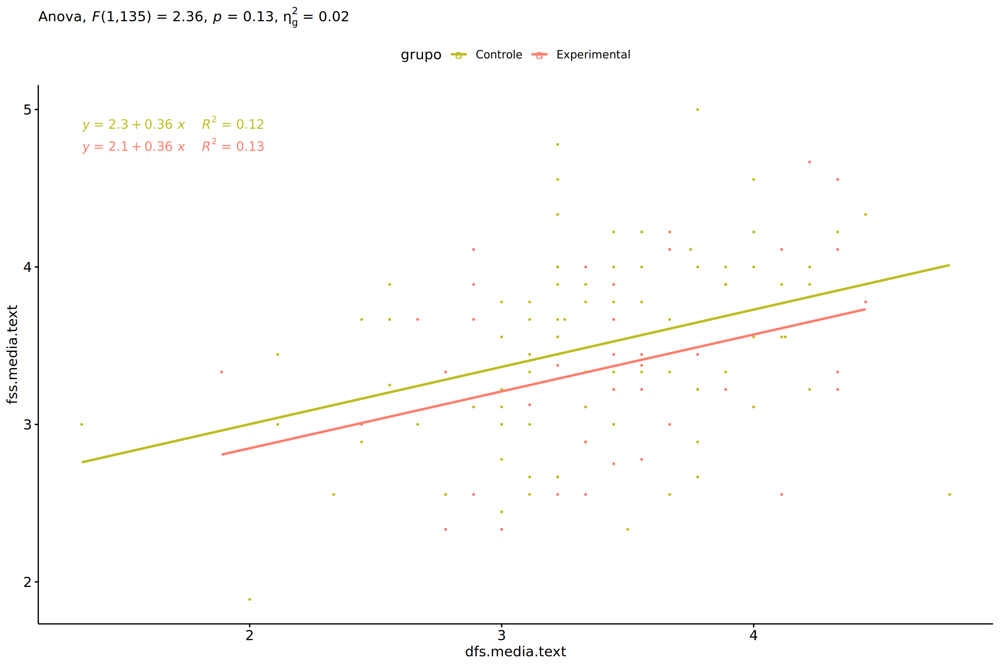
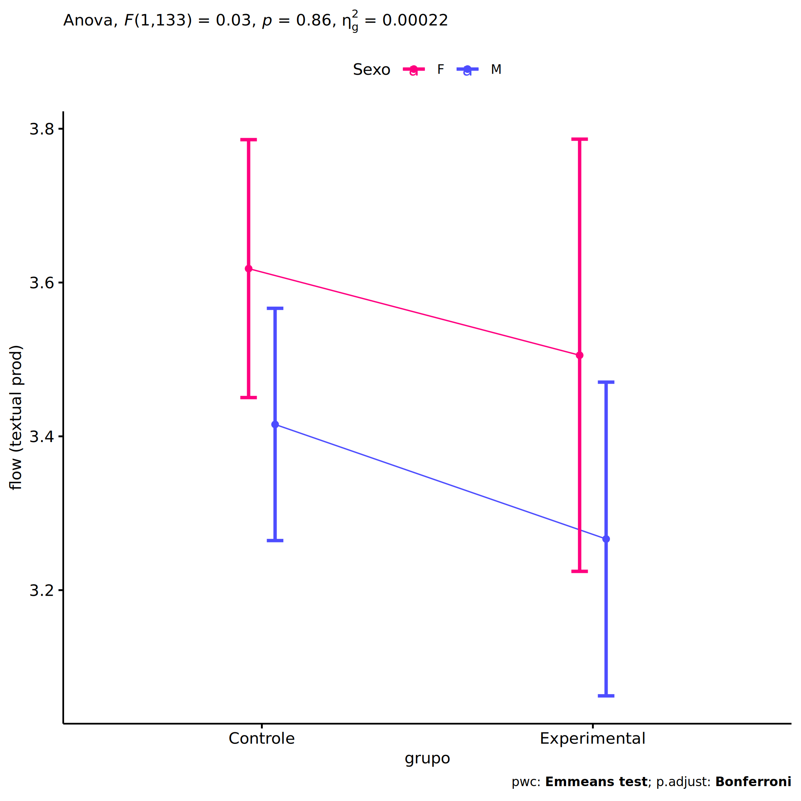
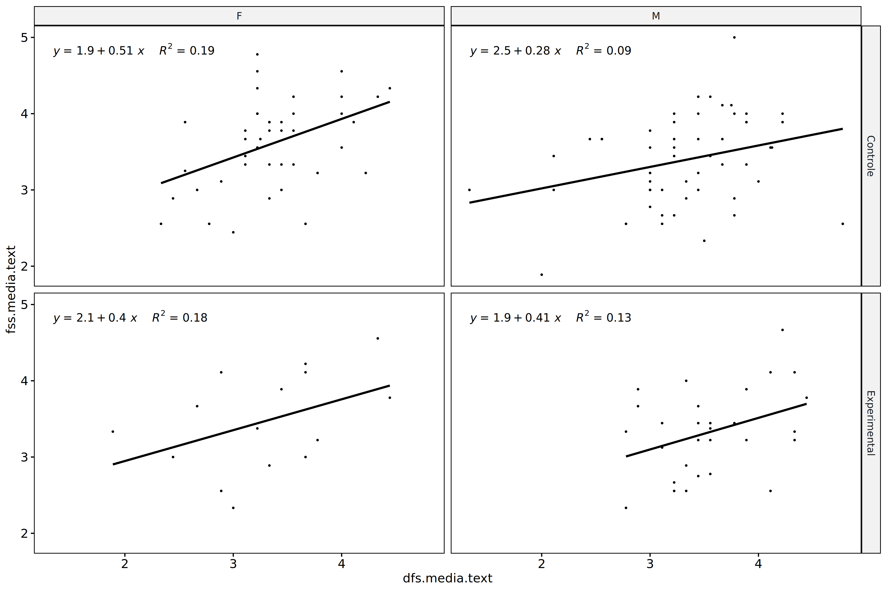
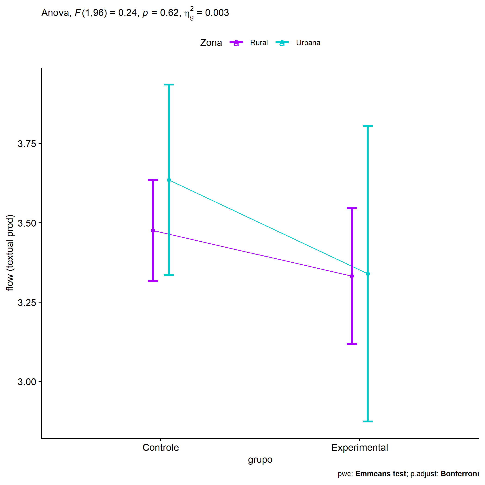
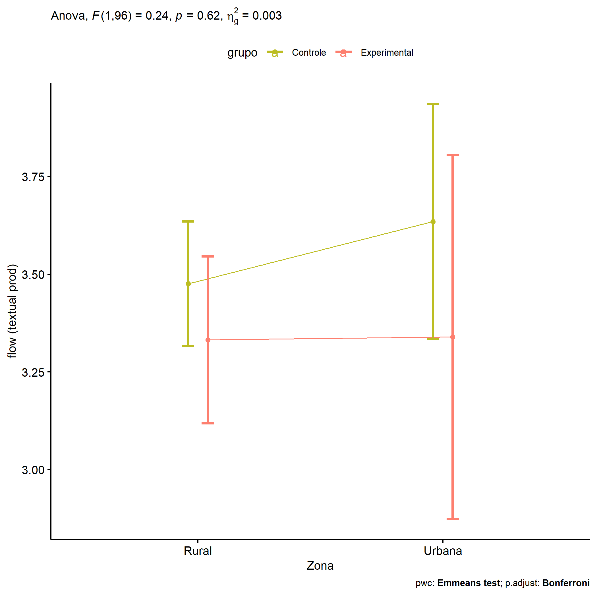
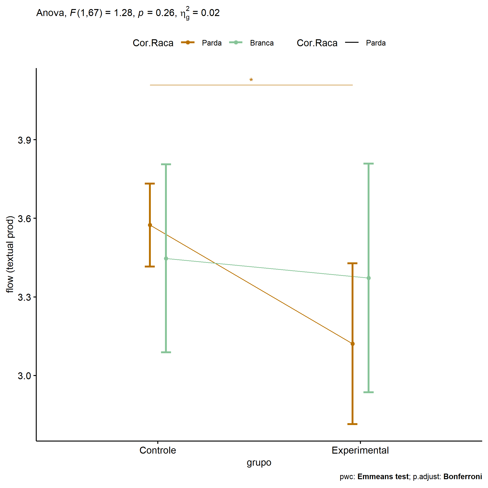
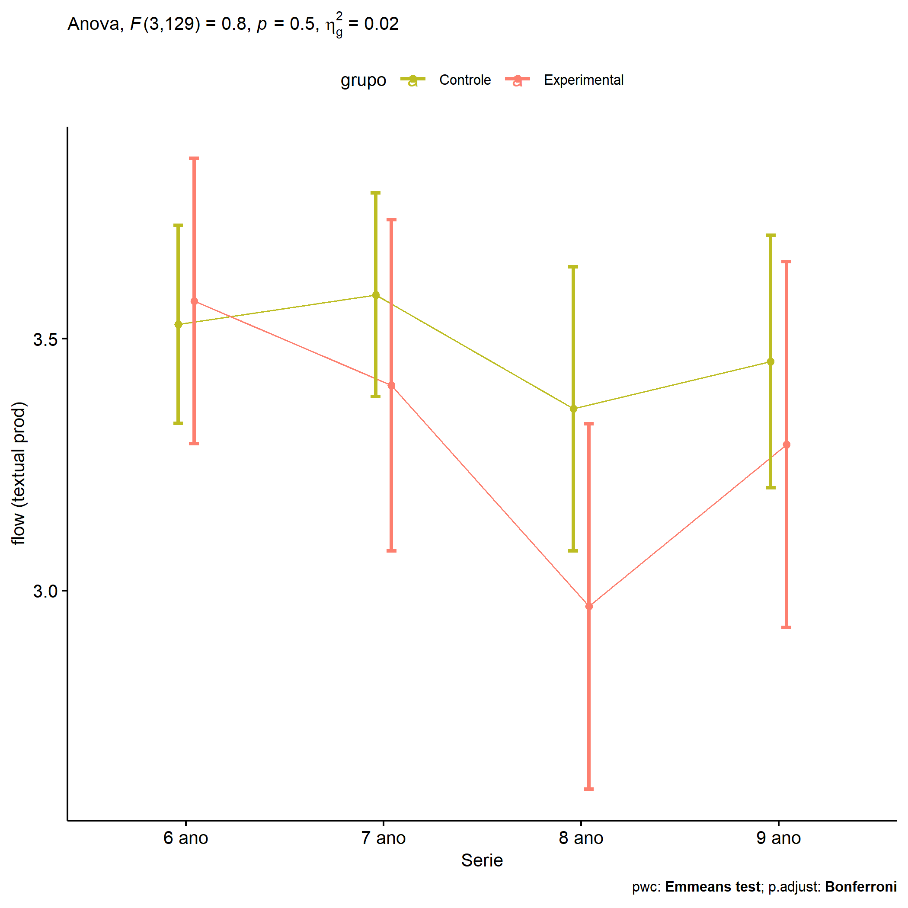

ANCOVA in flow (prod. textual) (flow (prod. textual))
================
Geiser C. Challco <geiser@alumni.usp.br>

- [Descriptive Statistics of Initial
  Data](#descriptive-statistics-of-initial-data)
- [ANCOVA and Pairwise for one factor:
  **grupo**](#ancova-and-pairwise-for-one-factor-grupo)
  - [Without remove non-normal data](#without-remove-non-normal-data)
  - [Computing ANCOVA and PairWise After removing non-normal data
    (OK)](#computing-ancova-and-pairwise-after-removing-non-normal-data-ok)
    - [Plots for ancova](#plots-for-ancova)
    - [Checking linearity assumption](#checking-linearity-assumption)
    - [Checking normality and
      homogeneity](#checking-normality-and-homogeneity)
- [ANCOVA and Pairwise for two factors
  **grupo:Sexo**](#ancova-and-pairwise-for-two-factors-gruposexo)
  - [Without remove non-normal data](#without-remove-non-normal-data-1)
  - [Computing ANCOVA and PairWise After removing non-normal data
    (OK)](#computing-ancova-and-pairwise-after-removing-non-normal-data-ok-1)
    - [Plots for ancova](#plots-for-ancova-1)
    - [Checking linearity assumption](#checking-linearity-assumption-1)
    - [Checking normality and
      homogeneity](#checking-normality-and-homogeneity-1)
- [ANCOVA and Pairwise for two factors
  **grupo:Zona**](#ancova-and-pairwise-for-two-factors-grupozona)
  - [Without remove non-normal data](#without-remove-non-normal-data-2)
  - [Computing ANCOVA and PairWise After removing non-normal data
    (OK)](#computing-ancova-and-pairwise-after-removing-non-normal-data-ok-2)
    - [Plots for ancova](#plots-for-ancova-2)
    - [Checking linearity assumption](#checking-linearity-assumption-2)
    - [Checking normality and
      homogeneity](#checking-normality-and-homogeneity-2)
- [ANCOVA and Pairwise for two factors
  **grupo:Cor.Raca**](#ancova-and-pairwise-for-two-factors-grupocorraca)
  - [Without remove non-normal data](#without-remove-non-normal-data-3)
  - [Computing ANCOVA and PairWise After removing non-normal data
    (OK)](#computing-ancova-and-pairwise-after-removing-non-normal-data-ok-3)
    - [Plots for ancova](#plots-for-ancova-3)
    - [Checking linearity assumption](#checking-linearity-assumption-3)
    - [Checking normality and
      homogeneity](#checking-normality-and-homogeneity-3)
- [ANCOVA and Pairwise for two factors
  **grupo:Serie**](#ancova-and-pairwise-for-two-factors-gruposerie)
  - [Without remove non-normal data](#without-remove-non-normal-data-4)
  - [Computing ANCOVA and PairWise After removing non-normal data
    (OK)](#computing-ancova-and-pairwise-after-removing-non-normal-data-ok-4)
    - [Plots for ancova](#plots-for-ancova-4)
    - [Checking linearity assumption](#checking-linearity-assumption-4)
    - [Checking normality and
      homogeneity](#checking-normality-and-homogeneity-4)
- [Summary of Results](#summary-of-results)
  - [Descriptive Statistics](#descriptive-statistics)
  - [ANCOVA Table Comparison](#ancova-table-comparison)
  - [PairWise Table Comparison](#pairwise-table-comparison)
  - [EMMS Table Comparison](#emms-table-comparison)

**NOTE**:

- Teste ANCOVA para determinar se houve diferenças significativas no
  flow (prod. textual) (medido usando pre- e pos-testes).
- ANCOVA test to determine whether there were significant differences in
  flow (prod. textual) (measured using pre- and post-tests).

# Descriptive Statistics of Initial Data

``` r
df <- get.descriptives(dat, c(dv.pre, dv.pos), c("grupo"), 
                       include.global = T, symmetry.test = T, normality.test = F)
df <- plyr::rbind.fill(
  df, do.call(plyr::rbind.fill, lapply(lfatores2, FUN = function(f) {
    if (nrow(dat) > 0 && sum(!is.na(unique(dat[[f]]))) > 1)
      get.descriptives(dat, c(dv.pre,dv.pos), c("grupo", f),
                       symmetry.test = T, normality.test = F)
    }))
)
```

    ## Warning: There were 2 warnings in `mutate()`.
    ## The first warning was:
    ## ℹ In argument: `ci = abs(stats::qt(alpha/2, .data$n - 1) * .data$se)`.
    ## Caused by warning:
    ## ! There was 1 warning in `mutate()`.
    ## ℹ In argument: `ci = abs(stats::qt(alpha/2, .data$n - 1) * .data$se)`.
    ## Caused by warning in `stats::qt()`:
    ## ! NaNs produced
    ## ℹ Run `dplyr::last_dplyr_warnings()` to see the 1 remaining warning.
    ## There were 2 warnings in `mutate()`.
    ## The first warning was:
    ## ℹ In argument: `ci = abs(stats::qt(alpha/2, .data$n - 1) * .data$se)`.
    ## Caused by warning:
    ## ! There was 1 warning in `mutate()`.
    ## ℹ In argument: `ci = abs(stats::qt(alpha/2, .data$n - 1) * .data$se)`.
    ## Caused by warning in `stats::qt()`:
    ## ! NaNs produced
    ## ℹ Run `dplyr::last_dplyr_warnings()` to see the 1 remaining warning.

``` r
(df <- df[,c(fatores1[fatores1 %in% colnames(df)],"variable",
             colnames(df)[!colnames(df) %in% c(fatores1,"variable")])])
```

    ##           grupo Sexo   Zona Cor.Raca Serie       variable   n  mean median   min   max    sd    se    ci
    ## 1      Controle <NA>   <NA>     <NA>  <NA> dfs.media.text  94 3.345  3.333 1.333 4.778 0.572 0.059 0.117
    ## 2  Experimental <NA>   <NA>     <NA>  <NA> dfs.media.text  44 3.472  3.444 1.889 4.444 0.575 0.087 0.175
    ## 3          <NA> <NA>   <NA>     <NA>  <NA> dfs.media.text 138 3.385  3.389 1.333 4.778 0.574 0.049 0.097
    ## 4      Controle <NA>   <NA>     <NA>  <NA> fss.media.text  94 3.491  3.556 1.889 5.000 0.594 0.061 0.122
    ## 5  Experimental <NA>   <NA>     <NA>  <NA> fss.media.text  44 3.380  3.354 2.333 4.667 0.586 0.088 0.178
    ## 6          <NA> <NA>   <NA>     <NA>  <NA> fss.media.text 138 3.456  3.444 1.889 5.000 0.591 0.050 0.100
    ## 7      Controle    F   <NA>     <NA>  <NA> dfs.media.text  42 3.368  3.333 2.333 4.444 0.500 0.077 0.156
    ## 8      Controle    M   <NA>     <NA>  <NA> dfs.media.text  52 3.326  3.389 1.333 4.778 0.628 0.087 0.175
    ## 9  Experimental    F   <NA>     <NA>  <NA> dfs.media.text  15 3.289  3.333 1.889 4.444 0.686 0.177 0.380
    ## 10 Experimental    M   <NA>     <NA>  <NA> dfs.media.text  29 3.567  3.444 2.778 4.444 0.495 0.092 0.188
    ## 11     Controle    F   <NA>     <NA>  <NA> fss.media.text  42 3.612  3.722 2.444 4.778 0.583 0.090 0.182
    ## 12     Controle    M   <NA>     <NA>  <NA> fss.media.text  52 3.393  3.444 1.889 5.000 0.589 0.082 0.164
    ## 13 Experimental    F   <NA>     <NA>  <NA> fss.media.text  15 3.469  3.375 2.333 4.556 0.648 0.167 0.359
    ## 14 Experimental    M   <NA>     <NA>  <NA> fss.media.text  29 3.334  3.333 2.333 4.667 0.558 0.104 0.212
    ## 15     Controle <NA>  Rural     <NA>  <NA> dfs.media.text  51 3.345  3.333 2.111 4.778 0.577 0.081 0.162
    ## 16     Controle <NA> Urbana     <NA>  <NA> dfs.media.text  15 3.020  3.222 1.333 4.000 0.740 0.191 0.410
    ## 17     Controle <NA>   <NA>     <NA>  <NA> dfs.media.text  28 3.518  3.472 2.778 4.222 0.369 0.070 0.143
    ## 18 Experimental <NA>  Rural     <NA>  <NA> dfs.media.text  29 3.494  3.556 1.889 4.444 0.625 0.116 0.238
    ## 19 Experimental <NA> Urbana     <NA>  <NA> dfs.media.text   6 3.444  3.444 2.889 4.333 0.544 0.222 0.571
    ## 20 Experimental <NA>   <NA>     <NA>  <NA> dfs.media.text   9 3.420  3.444 2.667 4.333 0.464 0.155 0.357
    ## 21     Controle <NA>  Rural     <NA>  <NA> fss.media.text  51 3.475  3.556 2.444 4.778 0.581 0.081 0.164
    ## 22     Controle <NA> Urbana     <NA>  <NA> fss.media.text  15 3.511  3.333 1.889 5.000 0.791 0.204 0.438
    ## 23     Controle <NA>   <NA>     <NA>  <NA> fss.media.text  28 3.508  3.667 2.333 4.222 0.512 0.097 0.198
    ## 24 Experimental <NA>  Rural     <NA>  <NA> fss.media.text  29 3.389  3.333 2.333 4.667 0.607 0.113 0.231
    ## 25 Experimental <NA> Urbana     <NA>  <NA> fss.media.text   6 3.377  3.299 2.889 4.111 0.453 0.185 0.476
    ## 26 Experimental <NA>   <NA>     <NA>  <NA> fss.media.text   9 3.355  3.444 2.333 4.111 0.655 0.218 0.504
    ## 27     Controle <NA>   <NA>   Branca  <NA> dfs.media.text   9 3.173  3.222 2.111 4.222 0.674 0.225 0.518
    ## 28     Controle <NA>   <NA>    Parda  <NA> dfs.media.text  45 3.421  3.333 2.444 4.444 0.466 0.069 0.140
    ## 29     Controle <NA>   <NA>    Preta  <NA> dfs.media.text   1 3.222  3.222 3.222 3.222    NA    NA   NaN
    ## 30     Controle <NA>   <NA>     <NA>  <NA> dfs.media.text  39 3.300  3.333 1.333 4.778 0.661 0.106 0.214
    ## 31 Experimental <NA>   <NA>  Amarela  <NA> dfs.media.text   1 3.444  3.444 3.444 3.444    NA    NA   NaN
    ## 32 Experimental <NA>   <NA>   Branca  <NA> dfs.media.text   6 3.593  3.500 2.889 4.444 0.529 0.216 0.555
    ## 33 Experimental <NA>   <NA> Indígena  <NA> dfs.media.text   5 3.711  3.667 3.222 4.333 0.405 0.181 0.503
    ## 34 Experimental <NA>   <NA>    Parda  <NA> dfs.media.text  12 3.426  3.278 2.444 4.444 0.599 0.173 0.381
    ## 35 Experimental <NA>   <NA>     <NA>  <NA> dfs.media.text  20 3.406  3.444 1.889 4.333 0.637 0.142 0.298
    ## 36     Controle <NA>   <NA>   Branca  <NA> fss.media.text   9 3.358  3.556 2.556 4.000 0.538 0.179 0.414
    ## 37     Controle <NA>   <NA>    Parda  <NA> fss.media.text  45 3.580  3.667 2.444 5.000 0.589 0.088 0.177
    ## 38     Controle <NA>   <NA>    Preta  <NA> fss.media.text   1 4.000  4.000 4.000 4.000    NA    NA   NaN
    ## 39     Controle <NA>   <NA>     <NA>  <NA> fss.media.text  39 3.405  3.444 1.889 4.556 0.609 0.098 0.197
    ## 40 Experimental <NA>   <NA>  Amarela  <NA> fss.media.text   1 3.889  3.889 3.889 3.889    NA    NA   NaN
    ## 41 Experimental <NA>   <NA>   Branca  <NA> fss.media.text   6 3.444  3.444 2.889 3.889 0.391 0.160 0.411
    ## 42 Experimental <NA>   <NA> Indígena  <NA> fss.media.text   5 3.675  3.444 3.222 4.222 0.458 0.205 0.568
    ## 43 Experimental <NA>   <NA>    Parda  <NA> fss.media.text  12 3.130  3.111 2.333 4.111 0.556 0.161 0.353
    ## 44 Experimental <NA>   <NA>     <NA>  <NA> fss.media.text  20 3.413  3.354 2.333 4.667 0.660 0.148 0.309
    ## 45     Controle <NA>   <NA>     <NA> 6 ano dfs.media.text  31 3.269  3.333 2.000 4.778 0.665 0.119 0.244
    ## 46     Controle <NA>   <NA>     <NA> 7 ano dfs.media.text  29 3.383  3.333 2.556 4.333 0.449 0.083 0.171
    ## 47     Controle <NA>   <NA>     <NA> 8 ano dfs.media.text  15 3.219  3.111 1.333 4.222 0.686 0.177 0.380
    ## 48     Controle <NA>   <NA>     <NA> 9 ano dfs.media.text  19 3.510  3.556 2.444 4.222 0.470 0.108 0.227
    ## 49 Experimental <NA>   <NA>     <NA> 6 ano dfs.media.text  15 3.600  3.667 1.889 4.444 0.717 0.185 0.397
    ## 50 Experimental <NA>   <NA>     <NA> 7 ano dfs.media.text  11 3.505  3.444 2.889 4.444 0.534 0.161 0.359
    ## 51 Experimental <NA>   <NA>     <NA> 8 ano dfs.media.text   9 3.395  3.444 2.444 4.333 0.591 0.197 0.454
    ## 52 Experimental <NA>   <NA>     <NA> 9 ano dfs.media.text   9 3.296  3.333 2.667 3.667 0.309 0.103 0.238
    ## 53     Controle <NA>   <NA>     <NA> 6 ano fss.media.text  31 3.488  3.556 1.889 4.556 0.595 0.107 0.218
    ## 54     Controle <NA>   <NA>     <NA> 7 ano fss.media.text  29 3.586  3.667 2.444 5.000 0.686 0.127 0.261
    ## 55     Controle <NA>   <NA>     <NA> 8 ano fss.media.text  15 3.304  3.333 2.333 4.000 0.480 0.124 0.266
    ##      iqr symmetry    skewness    kurtosis
    ## 1  0.618      YES -0.49029931  0.95376113
    ## 2  0.694      YES -0.20802904 -0.17323913
    ## 3  0.667      YES -0.39690450  0.68150552
    ## 4  0.889      YES -0.12111919 -0.34064960
    ## 5  0.833      YES  0.11072666 -0.75124133
    ## 6  0.889      YES -0.04510912 -0.46191454
    ## 7  0.444      YES  0.10197096 -0.36213605
    ## 8  0.778       NO -0.67714673  0.95605619
    ## 9  0.778      YES -0.15999641 -0.69661778
    ## 10 0.667      YES  0.22245438 -1.07820731
    ## 11 0.771      YES -0.19969062 -0.71554823
    ## 12 0.889      YES -0.05722179 -0.09092658
    ## 13 1.000      YES -0.07455941 -1.22961329
    ## 14 0.778      YES  0.18116572 -0.54992817
    ## 15 0.667      YES  0.20123291 -0.34014928
    ## 16 0.722       NO -0.79651253 -0.42417664
    ## 17 0.556      YES  0.10061845 -0.97533871
    ## 18 0.778      YES -0.38643458 -0.30443266
    ## 19 0.639      YES  0.38273277 -1.44791667
    ## 20 0.111      YES  0.34028361 -0.44668178
    ## 21 0.889      YES  0.03310595 -0.90269804
    ## 22 1.000      YES  0.03556035 -0.60246864
    ## 23 0.667       NO -0.82416801 -0.46536912
    ## 24 0.778      YES  0.25610680 -0.72891450
    ## 25 0.538      YES  0.43921428 -1.52022979
    ## 26 1.139      YES -0.36084587 -1.66044842
    ## 27 0.667      YES -0.13197251 -1.30319318
    ## 28 0.556      YES  0.14619010 -0.36366213
    ## 29 0.000 few data  0.00000000  0.00000000
    ## 30 0.764       NO -0.61797410  0.77523768
    ## 31 0.000 few data  0.00000000  0.00000000
    ## 32 0.444      YES  0.30957172 -1.33030565
    ## 33 0.222      YES  0.36219701 -1.45977048
    ## 34 0.861      YES  0.17654461 -1.24318380
    ## 35 0.806      YES -0.29883312 -0.36980918
    ## 36 0.778      YES -0.27322040 -1.73442329
    ## 37 0.778      YES  0.12247399 -0.43875671
    ## 38 0.000 few data  0.00000000  0.00000000
    ## 39 0.889      YES -0.31764843 -0.59290009
    ## 40 0.000 few data  0.00000000  0.00000000
    ## 41 0.528      YES -0.16031181 -1.90522026
    ## 42 0.736      YES  0.23938343 -2.18487440
    ## 43 0.861      YES  0.20067723 -1.37367625
    ## 44 0.972      YES  0.22829672 -0.97972856
    ## 45 0.500      YES -0.06079354 -0.32188277
    ## 46 0.667      YES  0.22660934 -0.71091435
    ## 47 0.417       NO -1.02271997  1.42974663
    ## 48 0.611      YES -0.44147267 -0.60797218
    ## 49 1.000       NO -0.72211795 -0.26221027
    ## 50 0.778      YES  0.24006232 -1.44077234
    ## 51 0.444      YES  0.04316674 -1.17035570
    ## 52 0.333       NO -0.71412956 -0.66046171
    ## 53 0.778       NO -0.55443721 -0.02733349
    ## 54 0.889      YES  0.08477602 -0.94617483
    ## 55 0.667      YES -0.40180962 -0.89868218
    ##  [ reached 'max' / getOption("max.print") -- omitted 5 rows ]

| grupo        | Sexo | Zona   | Cor.Raca | Serie | variable       |   n |  mean | median |   min |   max |    sd |    se |    ci |   iqr | symmetry | skewness | kurtosis |
|:-------------|:-----|:-------|:---------|:------|:---------------|----:|------:|-------:|------:|------:|------:|------:|------:|------:|:---------|---------:|---------:|
| Controle     |      |        |          |       | dfs.media.text |  94 | 3.345 |  3.333 | 1.333 | 4.778 | 0.572 | 0.059 | 0.117 | 0.618 | YES      |   -0.490 |    0.954 |
| Experimental |      |        |          |       | dfs.media.text |  44 | 3.472 |  3.444 | 1.889 | 4.444 | 0.575 | 0.087 | 0.175 | 0.694 | YES      |   -0.208 |   -0.173 |
|              |      |        |          |       | dfs.media.text | 138 | 3.385 |  3.389 | 1.333 | 4.778 | 0.574 | 0.049 | 0.097 | 0.667 | YES      |   -0.397 |    0.682 |
| Controle     |      |        |          |       | fss.media.text |  94 | 3.491 |  3.556 | 1.889 | 5.000 | 0.594 | 0.061 | 0.122 | 0.889 | YES      |   -0.121 |   -0.341 |
| Experimental |      |        |          |       | fss.media.text |  44 | 3.380 |  3.354 | 2.333 | 4.667 | 0.586 | 0.088 | 0.178 | 0.833 | YES      |    0.111 |   -0.751 |
|              |      |        |          |       | fss.media.text | 138 | 3.456 |  3.444 | 1.889 | 5.000 | 0.591 | 0.050 | 0.100 | 0.889 | YES      |   -0.045 |   -0.462 |
| Controle     | F    |        |          |       | dfs.media.text |  42 | 3.368 |  3.333 | 2.333 | 4.444 | 0.500 | 0.077 | 0.156 | 0.444 | YES      |    0.102 |   -0.362 |
| Controle     | M    |        |          |       | dfs.media.text |  52 | 3.326 |  3.389 | 1.333 | 4.778 | 0.628 | 0.087 | 0.175 | 0.778 | NO       |   -0.677 |    0.956 |
| Experimental | F    |        |          |       | dfs.media.text |  15 | 3.289 |  3.333 | 1.889 | 4.444 | 0.686 | 0.177 | 0.380 | 0.778 | YES      |   -0.160 |   -0.697 |
| Experimental | M    |        |          |       | dfs.media.text |  29 | 3.567 |  3.444 | 2.778 | 4.444 | 0.495 | 0.092 | 0.188 | 0.667 | YES      |    0.222 |   -1.078 |
| Controle     | F    |        |          |       | fss.media.text |  42 | 3.612 |  3.722 | 2.444 | 4.778 | 0.583 | 0.090 | 0.182 | 0.771 | YES      |   -0.200 |   -0.716 |
| Controle     | M    |        |          |       | fss.media.text |  52 | 3.393 |  3.444 | 1.889 | 5.000 | 0.589 | 0.082 | 0.164 | 0.889 | YES      |   -0.057 |   -0.091 |
| Experimental | F    |        |          |       | fss.media.text |  15 | 3.469 |  3.375 | 2.333 | 4.556 | 0.648 | 0.167 | 0.359 | 1.000 | YES      |   -0.075 |   -1.230 |
| Experimental | M    |        |          |       | fss.media.text |  29 | 3.334 |  3.333 | 2.333 | 4.667 | 0.558 | 0.104 | 0.212 | 0.778 | YES      |    0.181 |   -0.550 |
| Controle     |      | Rural  |          |       | dfs.media.text |  51 | 3.345 |  3.333 | 2.111 | 4.778 | 0.577 | 0.081 | 0.162 | 0.667 | YES      |    0.201 |   -0.340 |
| Controle     |      | Urbana |          |       | dfs.media.text |  15 | 3.020 |  3.222 | 1.333 | 4.000 | 0.740 | 0.191 | 0.410 | 0.722 | NO       |   -0.797 |   -0.424 |
| Controle     |      |        |          |       | dfs.media.text |  28 | 3.518 |  3.472 | 2.778 | 4.222 | 0.369 | 0.070 | 0.143 | 0.556 | YES      |    0.101 |   -0.975 |
| Experimental |      | Rural  |          |       | dfs.media.text |  29 | 3.494 |  3.556 | 1.889 | 4.444 | 0.625 | 0.116 | 0.238 | 0.778 | YES      |   -0.386 |   -0.304 |
| Experimental |      | Urbana |          |       | dfs.media.text |   6 | 3.444 |  3.444 | 2.889 | 4.333 | 0.544 | 0.222 | 0.571 | 0.639 | YES      |    0.383 |   -1.448 |
| Experimental |      |        |          |       | dfs.media.text |   9 | 3.420 |  3.444 | 2.667 | 4.333 | 0.464 | 0.155 | 0.357 | 0.111 | YES      |    0.340 |   -0.447 |
| Controle     |      | Rural  |          |       | fss.media.text |  51 | 3.475 |  3.556 | 2.444 | 4.778 | 0.581 | 0.081 | 0.164 | 0.889 | YES      |    0.033 |   -0.903 |
| Controle     |      | Urbana |          |       | fss.media.text |  15 | 3.511 |  3.333 | 1.889 | 5.000 | 0.791 | 0.204 | 0.438 | 1.000 | YES      |    0.036 |   -0.602 |
| Controle     |      |        |          |       | fss.media.text |  28 | 3.508 |  3.667 | 2.333 | 4.222 | 0.512 | 0.097 | 0.198 | 0.667 | NO       |   -0.824 |   -0.465 |
| Experimental |      | Rural  |          |       | fss.media.text |  29 | 3.389 |  3.333 | 2.333 | 4.667 | 0.607 | 0.113 | 0.231 | 0.778 | YES      |    0.256 |   -0.729 |
| Experimental |      | Urbana |          |       | fss.media.text |   6 | 3.377 |  3.299 | 2.889 | 4.111 | 0.453 | 0.185 | 0.476 | 0.538 | YES      |    0.439 |   -1.520 |
| Experimental |      |        |          |       | fss.media.text |   9 | 3.355 |  3.444 | 2.333 | 4.111 | 0.655 | 0.218 | 0.504 | 1.139 | YES      |   -0.361 |   -1.660 |
| Controle     |      |        | Branca   |       | dfs.media.text |   9 | 3.173 |  3.222 | 2.111 | 4.222 | 0.674 | 0.225 | 0.518 | 0.667 | YES      |   -0.132 |   -1.303 |
| Controle     |      |        | Parda    |       | dfs.media.text |  45 | 3.421 |  3.333 | 2.444 | 4.444 | 0.466 | 0.069 | 0.140 | 0.556 | YES      |    0.146 |   -0.364 |
| Controle     |      |        | Preta    |       | dfs.media.text |   1 | 3.222 |  3.222 | 3.222 | 3.222 |       |       |       | 0.000 | few data |    0.000 |    0.000 |
| Controle     |      |        |          |       | dfs.media.text |  39 | 3.300 |  3.333 | 1.333 | 4.778 | 0.661 | 0.106 | 0.214 | 0.764 | NO       |   -0.618 |    0.775 |
| Experimental |      |        | Amarela  |       | dfs.media.text |   1 | 3.444 |  3.444 | 3.444 | 3.444 |       |       |       | 0.000 | few data |    0.000 |    0.000 |
| Experimental |      |        | Branca   |       | dfs.media.text |   6 | 3.593 |  3.500 | 2.889 | 4.444 | 0.529 | 0.216 | 0.555 | 0.444 | YES      |    0.310 |   -1.330 |
| Experimental |      |        | Indígena |       | dfs.media.text |   5 | 3.711 |  3.667 | 3.222 | 4.333 | 0.405 | 0.181 | 0.503 | 0.222 | YES      |    0.362 |   -1.460 |
| Experimental |      |        | Parda    |       | dfs.media.text |  12 | 3.426 |  3.278 | 2.444 | 4.444 | 0.599 | 0.173 | 0.381 | 0.861 | YES      |    0.177 |   -1.243 |
| Experimental |      |        |          |       | dfs.media.text |  20 | 3.406 |  3.444 | 1.889 | 4.333 | 0.637 | 0.142 | 0.298 | 0.806 | YES      |   -0.299 |   -0.370 |
| Controle     |      |        | Branca   |       | fss.media.text |   9 | 3.358 |  3.556 | 2.556 | 4.000 | 0.538 | 0.179 | 0.414 | 0.778 | YES      |   -0.273 |   -1.734 |
| Controle     |      |        | Parda    |       | fss.media.text |  45 | 3.580 |  3.667 | 2.444 | 5.000 | 0.589 | 0.088 | 0.177 | 0.778 | YES      |    0.122 |   -0.439 |
| Controle     |      |        | Preta    |       | fss.media.text |   1 | 4.000 |  4.000 | 4.000 | 4.000 |       |       |       | 0.000 | few data |    0.000 |    0.000 |
| Controle     |      |        |          |       | fss.media.text |  39 | 3.405 |  3.444 | 1.889 | 4.556 | 0.609 | 0.098 | 0.197 | 0.889 | YES      |   -0.318 |   -0.593 |
| Experimental |      |        | Amarela  |       | fss.media.text |   1 | 3.889 |  3.889 | 3.889 | 3.889 |       |       |       | 0.000 | few data |    0.000 |    0.000 |
| Experimental |      |        | Branca   |       | fss.media.text |   6 | 3.444 |  3.444 | 2.889 | 3.889 | 0.391 | 0.160 | 0.411 | 0.528 | YES      |   -0.160 |   -1.905 |
| Experimental |      |        | Indígena |       | fss.media.text |   5 | 3.675 |  3.444 | 3.222 | 4.222 | 0.458 | 0.205 | 0.568 | 0.736 | YES      |    0.239 |   -2.185 |
| Experimental |      |        | Parda    |       | fss.media.text |  12 | 3.130 |  3.111 | 2.333 | 4.111 | 0.556 | 0.161 | 0.353 | 0.861 | YES      |    0.201 |   -1.374 |
| Experimental |      |        |          |       | fss.media.text |  20 | 3.413 |  3.354 | 2.333 | 4.667 | 0.660 | 0.148 | 0.309 | 0.972 | YES      |    0.228 |   -0.980 |
| Controle     |      |        |          | 6 ano | dfs.media.text |  31 | 3.269 |  3.333 | 2.000 | 4.778 | 0.665 | 0.119 | 0.244 | 0.500 | YES      |   -0.061 |   -0.322 |
| Controle     |      |        |          | 7 ano | dfs.media.text |  29 | 3.383 |  3.333 | 2.556 | 4.333 | 0.449 | 0.083 | 0.171 | 0.667 | YES      |    0.227 |   -0.711 |
| Controle     |      |        |          | 8 ano | dfs.media.text |  15 | 3.219 |  3.111 | 1.333 | 4.222 | 0.686 | 0.177 | 0.380 | 0.417 | NO       |   -1.023 |    1.430 |
| Controle     |      |        |          | 9 ano | dfs.media.text |  19 | 3.510 |  3.556 | 2.444 | 4.222 | 0.470 | 0.108 | 0.227 | 0.611 | YES      |   -0.441 |   -0.608 |
| Experimental |      |        |          | 6 ano | dfs.media.text |  15 | 3.600 |  3.667 | 1.889 | 4.444 | 0.717 | 0.185 | 0.397 | 1.000 | NO       |   -0.722 |   -0.262 |
| Experimental |      |        |          | 7 ano | dfs.media.text |  11 | 3.505 |  3.444 | 2.889 | 4.444 | 0.534 | 0.161 | 0.359 | 0.778 | YES      |    0.240 |   -1.441 |
| Experimental |      |        |          | 8 ano | dfs.media.text |   9 | 3.395 |  3.444 | 2.444 | 4.333 | 0.591 | 0.197 | 0.454 | 0.444 | YES      |    0.043 |   -1.170 |
| Experimental |      |        |          | 9 ano | dfs.media.text |   9 | 3.296 |  3.333 | 2.667 | 3.667 | 0.309 | 0.103 | 0.238 | 0.333 | NO       |   -0.714 |   -0.660 |
| Controle     |      |        |          | 6 ano | fss.media.text |  31 | 3.488 |  3.556 | 1.889 | 4.556 | 0.595 | 0.107 | 0.218 | 0.778 | NO       |   -0.554 |   -0.027 |
| Controle     |      |        |          | 7 ano | fss.media.text |  29 | 3.586 |  3.667 | 2.444 | 5.000 | 0.686 | 0.127 | 0.261 | 0.889 | YES      |    0.085 |   -0.946 |
| Controle     |      |        |          | 8 ano | fss.media.text |  15 | 3.304 |  3.333 | 2.333 | 4.000 | 0.480 | 0.124 | 0.266 | 0.667 | YES      |   -0.402 |   -0.899 |
| Controle     |      |        |          | 9 ano | fss.media.text |  19 | 3.497 |  3.556 | 2.556 | 4.222 | 0.526 | 0.121 | 0.253 | 0.889 | YES      |   -0.284 |   -1.332 |
| Experimental |      |        |          | 6 ano | fss.media.text |  15 | 3.648 |  3.375 | 3.000 | 4.667 | 0.521 | 0.134 | 0.288 | 0.722 | NO       |    0.631 |   -1.000 |
| Experimental |      |        |          | 7 ano | fss.media.text |  11 | 3.448 |  3.444 | 2.556 | 4.111 | 0.513 | 0.155 | 0.345 | 0.535 | NO       |   -0.623 |   -0.963 |
| Experimental |      |        |          | 8 ano | fss.media.text |   9 | 2.972 |  2.778 | 2.333 | 4.111 | 0.551 | 0.184 | 0.423 | 0.667 | NO       |    0.781 |   -0.624 |
| Experimental |      |        |          | 9 ano | fss.media.text |   9 | 3.259 |  3.222 | 2.333 | 4.222 | 0.629 | 0.210 | 0.483 | 0.778 | YES      |    0.121 |   -1.515 |

# ANCOVA and Pairwise for one factor: **grupo**

## Without remove non-normal data

``` r
pdat = remove_group_data(dat[!is.na(dat[["grupo"]]),], "fss.media.text", "grupo")

pdat.long <- rbind(pdat[,c("id","grupo")], pdat[,c("id","grupo")])
pdat.long[["time"]] <- c(rep("pre", nrow(pdat)), rep("pos", nrow(pdat)))
pdat.long[["time"]] <- factor(pdat.long[["time"]], c("pre","pos"))
pdat.long[["flow.text"]] <- c(pdat[["dfs.media.text"]], pdat[["fss.media.text"]])

aov = anova_test(pdat, fss.media.text ~ dfs.media.text + grupo)
laov[["grupo"]] <- get_anova_table(aov)
```

``` r
pwc <- emmeans_test(pdat, fss.media.text ~ grupo, covariate = dfs.media.text,
                    p.adjust.method = "bonferroni")
```

``` r
pwc.long <- emmeans_test(dplyr::group_by_at(pdat.long, "grupo"),
                          flow.text ~ time,
                          p.adjust.method = "bonferroni")
lpwc[["grupo"]] <- plyr::rbind.fill(pwc, pwc.long)
```

``` r
ds <- get.descriptives(pdat, "fss.media.text", "grupo", covar = "dfs.media.text")
ds <- merge(ds[ds$variable != "dfs.media.text",],
            ds[ds$variable == "dfs.media.text", !colnames(ds) %in% c("variable")],
            by = "grupo", all.x = T, suffixes = c("", ".dfs.media.text"))
ds <- merge(get_emmeans(pwc), ds, by = "grupo", suffixes = c(".emms", ""))
ds <- ds[,c("grupo","n","mean.dfs.media.text","se.dfs.media.text","mean","se","emmean","se.emms")]

colnames(ds) <- c("grupo", "N", paste0(c("M","SE")," (pre)"),
                  paste0(c("M","SE"), " (unadj)"), paste0(c("M", "SE"), " (adj)"))

lemms[["grupo"]] <- ds
```

## Computing ANCOVA and PairWise After removing non-normal data (OK)

``` r
wdat = pdat 

res = residuals(lm(fss.media.text ~ dfs.media.text + grupo, data = wdat))
non.normal = getNonNormal(res, wdat$id, plimit = 0.05)

wdat = wdat[!wdat$id %in% non.normal,]

wdat.long <- rbind(wdat[,c("id","grupo")], wdat[,c("id","grupo")])
wdat.long[["time"]] <- c(rep("pre", nrow(wdat)), rep("pos", nrow(wdat)))
wdat.long[["time"]] <- factor(wdat.long[["time"]], c("pre","pos"))
wdat.long[["flow.text"]] <- c(wdat[["dfs.media.text"]], wdat[["fss.media.text"]])

ldat[["grupo"]] = wdat

(non.normal)
```

    ## NULL

``` r
aov = anova_test(wdat, fss.media.text ~ dfs.media.text + grupo)
laov[["grupo"]] <- merge(get_anova_table(aov), laov[["grupo"]], by="Effect", suffixes = c("","'"))

(df = get_anova_table(aov))
```

    ## ANOVA Table (type II tests)
    ## 
    ##           Effect DFn DFd      F        p p<.05   ges
    ## 1 dfs.media.text   1 135 19.051 2.51e-05     * 0.124
    ## 2          grupo   1 135  2.361 1.27e-01       0.017

| Effect         | DFn | DFd |      F |     p | p\<.05 |   ges |
|:---------------|----:|----:|-------:|------:|:-------|------:|
| dfs.media.text |   1 | 135 | 19.051 | 0.000 | \*     | 0.124 |
| grupo          |   1 | 135 |  2.361 | 0.127 |        | 0.017 |

| term                  | .y.            | group1   | group2       |  df | statistic |     p | p.adj | p.adj.signif |
|:----------------------|:---------------|:---------|:-------------|----:|----------:|------:|------:|:-------------|
| dfs.media.text\*grupo | fss.media.text | Controle | Experimental | 135 |     1.537 | 0.127 | 0.127 | ns           |

``` r
pwc.long <- emmeans_test(dplyr::group_by_at(wdat.long, "grupo"),
                         flow.text ~ time,
                         p.adjust.method = "bonferroni")
lpwc[["grupo"]] <- merge(plyr::rbind.fill(pwc, pwc.long), lpwc[["grupo"]], by=c("grupo","term",".y.","group1","group2"), suffixes = c("","'"))
```

| grupo        | term | .y.       | group1 | group2 |  df | statistic |     p | p.adj | p.adj.signif |
|:-------------|:-----|:----------|:-------|:-------|----:|----------:|------:|------:|:-------------|
| Controle     | time | flow.text | pre    | pos    | 272 |    -1.721 | 0.086 | 0.086 | ns           |
| Experimental | time | flow.text | pre    | pos    | 272 |     0.740 | 0.460 | 0.460 | ns           |

``` r
ds <- get.descriptives(wdat, "fss.media.text", "grupo", covar = "dfs.media.text")
ds <- merge(ds[ds$variable != "dfs.media.text",],
            ds[ds$variable == "dfs.media.text", !colnames(ds) %in% c("variable")],
            by = "grupo", all.x = T, suffixes = c("", ".dfs.media.text"))
ds <- merge(get_emmeans(pwc), ds, by = "grupo", suffixes = c(".emms", ""))
ds <- ds[,c("grupo","n","mean.dfs.media.text","se.dfs.media.text","mean","se","emmean","se.emms")]

colnames(ds) <- c("grupo", "N", paste0(c("M","SE")," (pre)"),
                  paste0(c("M","SE"), " (unadj)"), paste0(c("M", "SE"), " (adj)"))

lemms[["grupo"]] <- merge(ds, lemms[["grupo"]], by=c("grupo"), suffixes = c("","'"))
```

| grupo        |   N | M (pre) | SE (pre) | M (unadj) | SE (unadj) | M (adj) | SE (adj) |
|:-------------|----:|--------:|---------:|----------:|-----------:|--------:|---------:|
| Controle     |  94 |   3.345 |    0.059 |     3.491 |      0.061 |   3.506 |    0.057 |
| Experimental |  44 |   3.472 |    0.087 |     3.380 |      0.088 |   3.349 |    0.084 |

### Plots for ancova

``` r
plots <- oneWayAncovaPlots(
  wdat, "fss.media.text", "grupo", aov, list("grupo"=pwc), addParam = c("mean_se"),
  font.label.size=10, step.increase=0.05, p.label="p.adj",
  subtitle = which(aov$Effect == "grupo"))
```

``` r
if (!is.null(nrow(plots[["grupo"]]$data)))
  plots[["grupo"]] + ggplot2::scale_color_manual(values = color[["grupo"]])
```

    ## Scale for colour is already present.
    ## Adding another scale for colour, which will replace the existing scale.

<!-- -->

``` r
plots <- oneWayAncovaBoxPlots(
  wdat, "fss.media.text", "grupo", aov, pwc, covar = "dfs.media.text",
  theme = "classic", color = color[["grupo"]],
  subtitle = which(aov$Effect == "grupo"))
```

``` r
if (length(unique(wdat[["grupo"]])) > 1)
  plots[["grupo"]] + ggplot2::ylab("flow (prod. textual)") + ggplot2::scale_x_discrete(labels=c('pre', 'pos'))
```

<!-- -->

``` r
if (length(unique(wdat.long[["grupo"]])) > 1)
  plots <- oneWayAncovaBoxPlots(
    wdat.long, "flow.text", "grupo", aov, pwc.long, pre.post = "time",
    theme = "classic", color = color$prepost)
```

``` r
if (length(unique(wdat.long[["grupo"]])) > 1)
  plots[["grupo"]] + ggplot2::ylab("flow (prod. textual)")
```

<!-- -->

### Checking linearity assumption

``` r
ggscatter(wdat, x = "dfs.media.text", y = "fss.media.text", size = 0.5,
          color = "grupo", add = "reg.line")+
  stat_regline_equation(
    aes(label =  paste(..eq.label.., ..rr.label.., sep = "~~~~"), color = grupo)
  )
```

<!-- -->

### Checking normality and homogeneity

``` r
res <- augment(lm(fss.media.text ~ dfs.media.text + grupo, data = wdat))
```

``` r
shapiro_test(res$.resid)
```

    ## # A tibble: 1 × 3
    ##   variable   statistic p.value
    ##   <chr>          <dbl>   <dbl>
    ## 1 res$.resid     0.991   0.507

``` r
levene_test(res, .resid ~ grupo)
```

    ## # A tibble: 1 × 4
    ##     df1   df2 statistic     p
    ##   <int> <int>     <dbl> <dbl>
    ## 1     1   136   0.00832 0.927

# ANCOVA and Pairwise for two factors **grupo:Sexo**

## Without remove non-normal data

``` r
pdat = remove_group_data(dat[!is.na(dat[["grupo"]]) & !is.na(dat[["Sexo"]]),], "fss.media.text", c("grupo","Sexo"))

pdat.long <- rbind(pdat[,c("id","grupo","Sexo")], pdat[,c("id","grupo","Sexo")])
pdat.long[["time"]] <- c(rep("pre", nrow(pdat)), rep("pos", nrow(pdat)))
pdat.long[["time"]] <- factor(pdat.long[["time"]], c("pre","pos"))
pdat.long[["flow.text"]] <- c(pdat[["dfs.media.text"]], pdat[["fss.media.text"]])

aov = anova_test(pdat, fss.media.text ~ dfs.media.text + grupo*Sexo)
laov[["grupo:Sexo"]] <- get_anova_table(aov)
```

``` r
pwcs <- list()
pwcs[["Sexo"]] <- emmeans_test(
  group_by(pdat, grupo), fss.media.text ~ Sexo,
  covariate = dfs.media.text, p.adjust.method = "bonferroni")
pwcs[["grupo"]] <- emmeans_test(
  group_by(pdat, Sexo), fss.media.text ~ grupo,
  covariate = dfs.media.text, p.adjust.method = "bonferroni")

pwc <- plyr::rbind.fill(pwcs[["grupo"]], pwcs[["Sexo"]])
pwc <- pwc[,c("grupo","Sexo", colnames(pwc)[!colnames(pwc) %in% c("grupo","Sexo")])]
```

``` r
pwc.long <- emmeans_test(dplyr::group_by_at(pdat.long, c("grupo","Sexo")),
                         flow.text ~ time,
                         p.adjust.method = "bonferroni")
lpwc[["grupo:Sexo"]] <- plyr::rbind.fill(pwc, pwc.long)
```

``` r
ds <- get.descriptives(pdat, "fss.media.text", c("grupo","Sexo"), covar = "dfs.media.text")
ds <- merge(ds[ds$variable != "dfs.media.text",],
            ds[ds$variable == "dfs.media.text", !colnames(ds) %in% c("variable")],
            by = c("grupo","Sexo"), all.x = T, suffixes = c("", ".dfs.media.text"))
ds <- merge(get_emmeans(pwcs[["grupo"]]), ds, by = c("grupo","Sexo"), suffixes = c(".emms", ""))
ds <- ds[,c("grupo","Sexo","n","mean.dfs.media.text","se.dfs.media.text","mean","se","emmean","se.emms")]

colnames(ds) <- c("grupo","Sexo", "N", paste0(c("M","SE")," (pre)"),
                  paste0(c("M","SE"), " (unadj)"), paste0(c("M", "SE"), " (adj)"))

lemms[["grupo:Sexo"]] <- ds
```

## Computing ANCOVA and PairWise After removing non-normal data (OK)

``` r
wdat = pdat 

res = residuals(lm(fss.media.text ~ dfs.media.text + grupo*Sexo, data = wdat))
non.normal = getNonNormal(res, wdat$id, plimit = 0.05)

wdat = wdat[!wdat$id %in% non.normal,]

wdat.long <- rbind(wdat[,c("id","grupo","Sexo")], wdat[,c("id","grupo","Sexo")])
wdat.long[["time"]] <- c(rep("pre", nrow(wdat)), rep("pos", nrow(wdat)))
wdat.long[["time"]] <- factor(wdat.long[["time"]], c("pre","pos"))
wdat.long[["flow.text"]] <- c(wdat[["dfs.media.text"]], wdat[["fss.media.text"]])


ldat[["grupo:Sexo"]] = wdat

(non.normal)
```

    ## NULL

``` r
aov = anova_test(wdat, fss.media.text ~ dfs.media.text + grupo*Sexo)
laov[["grupo:Sexo"]] <- merge(get_anova_table(aov), laov[["grupo:Sexo"]], by="Effect", suffixes = c("","'"))

(df = get_anova_table(aov))
```

    ## ANOVA Table (type II tests)
    ## 
    ##           Effect DFn DFd      F        p p<.05      ges
    ## 1 dfs.media.text   1 133 20.216 1.49e-05     * 0.132000
    ## 2          grupo   1 133  1.780 1.84e-01       0.013000
    ## 3           Sexo   1 133  4.986 2.70e-02     * 0.036000
    ## 4     grupo:Sexo   1 133  0.030 8.63e-01       0.000224

| Effect         | DFn | DFd |      F |     p | p\<.05 |   ges |
|:---------------|----:|----:|-------:|------:|:-------|------:|
| dfs.media.text |   1 | 133 | 20.216 | 0.000 | \*     | 0.132 |
| grupo          |   1 | 133 |  1.780 | 0.184 |        | 0.013 |
| Sexo           |   1 | 133 |  4.986 | 0.027 | \*     | 0.036 |
| grupo:Sexo     |   1 | 133 |  0.030 | 0.863 |        | 0.000 |

``` r
pwcs <- list()
pwcs[["Sexo"]] <- emmeans_test(
  group_by(wdat, grupo), fss.media.text ~ Sexo,
  covariate = dfs.media.text, p.adjust.method = "bonferroni")
pwcs[["grupo"]] <- emmeans_test(
  group_by(wdat, Sexo), fss.media.text ~ grupo,
  covariate = dfs.media.text, p.adjust.method = "bonferroni")

pwc <- plyr::rbind.fill(pwcs[["grupo"]], pwcs[["Sexo"]])
pwc <- pwc[,c("grupo","Sexo", colnames(pwc)[!colnames(pwc) %in% c("grupo","Sexo")])]
```

| grupo        | Sexo | term                  | .y.            | group1   | group2       |  df | statistic |     p | p.adj | p.adj.signif |
|:-------------|:-----|:----------------------|:---------------|:---------|:-------------|----:|----------:|------:|------:|:-------------|
|              | F    | dfs.media.text\*grupo | fss.media.text | Controle | Experimental | 133 |     0.681 | 0.497 | 0.497 | ns           |
|              | M    | dfs.media.text\*grupo | fss.media.text | Controle | Experimental | 133 |     1.156 | 0.250 | 0.250 | ns           |
| Controle     |      | dfs.media.text\*Sexo  | fss.media.text | F        | M            | 133 |     1.777 | 0.078 | 0.078 | ns           |
| Experimental |      | dfs.media.text\*Sexo  | fss.media.text | F        | M            | 133 |     1.356 | 0.177 | 0.177 | ns           |

``` r
pwc.long <- emmeans_test(dplyr::group_by_at(wdat.long, c("grupo","Sexo")),
                         flow.text ~ time,
                         p.adjust.method = "bonferroni")
lpwc[["grupo:Sexo"]] <- merge(plyr::rbind.fill(pwc, pwc.long), lpwc[["grupo:Sexo"]], by=c("grupo","Sexo","term",".y.","group1","group2"), suffixes = c("","'"))
```

| grupo        | Sexo | term | .y.       | group1 | group2 |  df | statistic |     p | p.adj | p.adj.signif |
|:-------------|:-----|:-----|:----------|:-------|:-------|----:|----------:|------:|------:|:-------------|
| Controle     | F    | time | flow.text | pre    | pos    | 268 |    -1.924 | 0.055 | 0.055 | ns           |
| Controle     | M    | time | flow.text | pre    | pos    | 268 |    -0.594 | 0.553 | 0.553 | ns           |
| Experimental | F    | time | flow.text | pre    | pos    | 268 |    -0.853 | 0.394 | 0.394 | ns           |
| Experimental | M    | time | flow.text | pre    | pos    | 268 |     1.529 | 0.127 | 0.127 | ns           |

``` r
ds <- get.descriptives(wdat, "fss.media.text", c("grupo","Sexo"), covar = "dfs.media.text")
ds <- merge(ds[ds$variable != "dfs.media.text",],
            ds[ds$variable == "dfs.media.text", !colnames(ds) %in% c("variable")],
            by = c("grupo","Sexo"), all.x = T, suffixes = c("", ".dfs.media.text"))
ds <- merge(get_emmeans(pwcs[["grupo"]]), ds, by = c("grupo","Sexo"), suffixes = c(".emms", ""))
ds <- ds[,c("grupo","Sexo","n","mean.dfs.media.text","se.dfs.media.text","mean","se","emmean","se.emms")]

colnames(ds) <- c("grupo","Sexo", "N", paste0(c("M","SE")," (pre)"),
                  paste0(c("M","SE"), " (unadj)"), paste0(c("M", "SE"), " (adj)"))

lemms[["grupo:Sexo"]] <- merge(ds, lemms[["grupo:Sexo"]], by=c("grupo","Sexo"), suffixes = c("","'"))
```

| grupo        | Sexo |   N | M (pre) | SE (pre) | M (unadj) | SE (unadj) | M (adj) | SE (adj) |
|:-------------|:-----|----:|--------:|---------:|----------:|-----------:|--------:|---------:|
| Controle     | F    |  42 |   3.368 |    0.077 |     3.612 |      0.090 |   3.618 |    0.085 |
| Controle     | M    |  52 |   3.326 |    0.087 |     3.393 |      0.082 |   3.415 |    0.076 |
| Experimental | F    |  15 |   3.289 |    0.177 |     3.469 |      0.167 |   3.505 |    0.142 |
| Experimental | M    |  29 |   3.567 |    0.092 |     3.334 |      0.104 |   3.266 |    0.103 |

### Plots for ancova

``` r
plots <- twoWayAncovaPlots(
  wdat, "fss.media.text", c("grupo","Sexo"), aov, pwcs, addParam = c("mean_se"),
  font.label.size=10, step.increase=0.05, p.label="p.adj",
  subtitle = which(aov$Effect == "grupo:Sexo"))
```

``` r
if (!is.null(plots[["grupo"]]))
  plots[["grupo"]] + ggplot2::scale_color_manual(values = color[["Sexo"]])
```

    ## Scale for colour is already present.
    ## Adding another scale for colour, which will replace the existing scale.

<!-- -->

``` r
if (!is.null(plots[["Sexo"]]))
  plots[["Sexo"]] + ggplot2::scale_color_manual(values = color[["grupo"]])
```

    ## Scale for colour is already present.
    ## Adding another scale for colour, which will replace the existing scale.

<!-- -->

``` r
plots <- twoWayAncovaBoxPlots(
  wdat, "fss.media.text", c("grupo","Sexo"), aov, pwcs, covar = "dfs.media.text",
  theme = "classic", color = color[["grupo:Sexo"]],
  subtitle = which(aov$Effect == "grupo:Sexo"))
```

``` r
plots[["grupo:Sexo"]] + ggplot2::ylab("flow (prod. textual)") + ggplot2::scale_x_discrete(labels=c('pre', 'pos'))
```

<!-- -->

``` r
plots <- twoWayAncovaBoxPlots(
  wdat.long, "flow.text", c("grupo","Sexo"), aov, pwc.long, pre.post = "time",
  theme = "classic", color = color$prepost)
```

``` r
plots[["grupo:Sexo"]] + ggplot2::ylab("flow (prod. textual)")
```

<!-- -->

### Checking linearity assumption

``` r
ggscatter(wdat, x = "dfs.media.text", y = "fss.media.text", size = 0.5,
          facet.by = c("grupo","Sexo"), add = "reg.line")+
  stat_regline_equation(
    aes(label =  paste(..eq.label.., ..rr.label.., sep = "~~~~"))
  )
```

<!-- -->

### Checking normality and homogeneity

``` r
res <- augment(lm(fss.media.text ~ dfs.media.text + grupo*Sexo, data = wdat))
```

``` r
shapiro_test(res$.resid)
```

    ## # A tibble: 1 × 3
    ##   variable   statistic p.value
    ##   <chr>          <dbl>   <dbl>
    ## 1 res$.resid     0.989   0.364

``` r
levene_test(res, .resid ~ grupo*Sexo)
```

    ## # A tibble: 1 × 4
    ##     df1   df2 statistic     p
    ##   <int> <int>     <dbl> <dbl>
    ## 1     3   134     0.348 0.791

# ANCOVA and Pairwise for two factors **grupo:Zona**

## Without remove non-normal data

``` r
pdat = remove_group_data(dat[!is.na(dat[["grupo"]]) & !is.na(dat[["Zona"]]),], "fss.media.text", c("grupo","Zona"))

pdat.long <- rbind(pdat[,c("id","grupo","Zona")], pdat[,c("id","grupo","Zona")])
pdat.long[["time"]] <- c(rep("pre", nrow(pdat)), rep("pos", nrow(pdat)))
pdat.long[["time"]] <- factor(pdat.long[["time"]], c("pre","pos"))
pdat.long[["flow.text"]] <- c(pdat[["dfs.media.text"]], pdat[["fss.media.text"]])

aov = anova_test(pdat, fss.media.text ~ dfs.media.text + grupo*Zona)
laov[["grupo:Zona"]] <- get_anova_table(aov)
```

``` r
pwcs <- list()
pwcs[["Zona"]] <- emmeans_test(
  group_by(pdat, grupo), fss.media.text ~ Zona,
  covariate = dfs.media.text, p.adjust.method = "bonferroni")
pwcs[["grupo"]] <- emmeans_test(
  group_by(pdat, Zona), fss.media.text ~ grupo,
  covariate = dfs.media.text, p.adjust.method = "bonferroni")

pwc <- plyr::rbind.fill(pwcs[["grupo"]], pwcs[["Zona"]])
pwc <- pwc[,c("grupo","Zona", colnames(pwc)[!colnames(pwc) %in% c("grupo","Zona")])]
```

``` r
pwc.long <- emmeans_test(dplyr::group_by_at(pdat.long, c("grupo","Zona")),
                         flow.text ~ time,
                         p.adjust.method = "bonferroni")
lpwc[["grupo:Zona"]] <- plyr::rbind.fill(pwc, pwc.long)
```

``` r
ds <- get.descriptives(pdat, "fss.media.text", c("grupo","Zona"), covar = "dfs.media.text")
ds <- merge(ds[ds$variable != "dfs.media.text",],
            ds[ds$variable == "dfs.media.text", !colnames(ds) %in% c("variable")],
            by = c("grupo","Zona"), all.x = T, suffixes = c("", ".dfs.media.text"))
ds <- merge(get_emmeans(pwcs[["grupo"]]), ds, by = c("grupo","Zona"), suffixes = c(".emms", ""))
ds <- ds[,c("grupo","Zona","n","mean.dfs.media.text","se.dfs.media.text","mean","se","emmean","se.emms")]

colnames(ds) <- c("grupo","Zona", "N", paste0(c("M","SE")," (pre)"),
                  paste0(c("M","SE"), " (unadj)"), paste0(c("M", "SE"), " (adj)"))

lemms[["grupo:Zona"]] <- ds
```

## Computing ANCOVA and PairWise After removing non-normal data (OK)

``` r
wdat = pdat 

res = residuals(lm(fss.media.text ~ dfs.media.text + grupo*Zona, data = wdat))
non.normal = getNonNormal(res, wdat$id, plimit = 0.05)

wdat = wdat[!wdat$id %in% non.normal,]

wdat.long <- rbind(wdat[,c("id","grupo","Zona")], wdat[,c("id","grupo","Zona")])
wdat.long[["time"]] <- c(rep("pre", nrow(wdat)), rep("pos", nrow(wdat)))
wdat.long[["time"]] <- factor(wdat.long[["time"]], c("pre","pos"))
wdat.long[["flow.text"]] <- c(wdat[["dfs.media.text"]], wdat[["fss.media.text"]])


ldat[["grupo:Zona"]] = wdat

(non.normal)
```

    ## NULL

``` r
aov = anova_test(wdat, fss.media.text ~ dfs.media.text + grupo*Zona)
laov[["grupo:Zona"]] <- merge(get_anova_table(aov), laov[["grupo:Zona"]], by="Effect", suffixes = c("","'"))

(df = get_anova_table(aov))
```

    ## ANOVA Table (type II tests)
    ## 
    ##           Effect DFn DFd      F        p p<.05   ges
    ## 1 dfs.media.text   1  96 16.264 0.000111     * 0.145
    ## 2          grupo   1  96  1.981 0.162000       0.020
    ## 3           Zona   1  96  0.625 0.431000       0.006
    ## 4     grupo:Zona   1  96  0.243 0.623000       0.003

| Effect         | DFn | DFd |      F |     p | p\<.05 |   ges |
|:---------------|----:|----:|-------:|------:|:-------|------:|
| dfs.media.text |   1 |  96 | 16.264 | 0.000 | \*     | 0.145 |
| grupo          |   1 |  96 |  1.981 | 0.162 |        | 0.020 |
| Zona           |   1 |  96 |  0.625 | 0.431 |        | 0.006 |
| grupo:Zona     |   1 |  96 |  0.243 | 0.623 |        | 0.003 |

``` r
pwcs <- list()
pwcs[["Zona"]] <- emmeans_test(
  group_by(wdat, grupo), fss.media.text ~ Zona,
  covariate = dfs.media.text, p.adjust.method = "bonferroni")
pwcs[["grupo"]] <- emmeans_test(
  group_by(wdat, Zona), fss.media.text ~ grupo,
  covariate = dfs.media.text, p.adjust.method = "bonferroni")

pwc <- plyr::rbind.fill(pwcs[["grupo"]], pwcs[["Zona"]])
pwc <- pwc[,c("grupo","Zona", colnames(pwc)[!colnames(pwc) %in% c("grupo","Zona")])]
```

| grupo        | Zona   | term                  | .y.            | group1   | group2       |  df | statistic |     p | p.adj | p.adj.signif |
|:-------------|:-------|:----------------------|:---------------|:---------|:-------------|----:|----------:|------:|------:|:-------------|
|              | Rural  | dfs.media.text\*grupo | fss.media.text | Controle | Experimental |  96 |     1.069 | 0.288 | 0.288 | ns           |
|              | Urbana | dfs.media.text\*grupo | fss.media.text | Controle | Experimental |  96 |     1.055 | 0.294 | 0.294 | ns           |
| Controle     |        | dfs.media.text\*Zona  | fss.media.text | Rural    | Urbana       |  96 |    -0.931 | 0.354 | 0.354 | ns           |
| Experimental |        | dfs.media.text\*Zona  | fss.media.text | Rural    | Urbana       |  96 |    -0.029 | 0.977 | 0.977 | ns           |

``` r
pwc.long <- emmeans_test(dplyr::group_by_at(wdat.long, c("grupo","Zona")),
                         flow.text ~ time,
                         p.adjust.method = "bonferroni")
lpwc[["grupo:Zona"]] <- merge(plyr::rbind.fill(pwc, pwc.long), lpwc[["grupo:Zona"]], by=c("grupo","Zona","term",".y.","group1","group2"), suffixes = c("","'"))
```

| grupo        | Zona   | term | .y.       | group1 | group2 |  df | statistic |     p | p.adj | p.adj.signif |
|:-------------|:-------|:-----|:----------|:-------|:-------|----:|----------:|------:|------:|:-------------|
| Controle     | Rural  | time | flow.text | pre    | pos    | 194 |    -1.068 | 0.287 | 0.287 | ns           |
| Controle     | Urbana | time | flow.text | pre    | pos    | 194 |    -2.180 | 0.030 | 0.030 | \*           |
| Experimental | Rural  | time | flow.text | pre    | pos    | 194 |     0.651 | 0.516 | 0.516 | ns           |
| Experimental | Urbana | time | flow.text | pre    | pos    | 194 |     0.189 | 0.851 | 0.851 | ns           |

``` r
ds <- get.descriptives(wdat, "fss.media.text", c("grupo","Zona"), covar = "dfs.media.text")
ds <- merge(ds[ds$variable != "dfs.media.text",],
            ds[ds$variable == "dfs.media.text", !colnames(ds) %in% c("variable")],
            by = c("grupo","Zona"), all.x = T, suffixes = c("", ".dfs.media.text"))
ds <- merge(get_emmeans(pwcs[["grupo"]]), ds, by = c("grupo","Zona"), suffixes = c(".emms", ""))
ds <- ds[,c("grupo","Zona","n","mean.dfs.media.text","se.dfs.media.text","mean","se","emmean","se.emms")]

colnames(ds) <- c("grupo","Zona", "N", paste0(c("M","SE")," (pre)"),
                  paste0(c("M","SE"), " (unadj)"), paste0(c("M", "SE"), " (adj)"))

lemms[["grupo:Zona"]] <- merge(ds, lemms[["grupo:Zona"]], by=c("grupo","Zona"), suffixes = c("","'"))
```

| grupo        | Zona   |   N | M (pre) | SE (pre) | M (unadj) | SE (unadj) | M (adj) | SE (adj) |
|:-------------|:-------|----:|--------:|---------:|----------:|-----------:|--------:|---------:|
| Controle     | Rural  |  51 |   3.345 |    0.081 |     3.475 |      0.081 |   3.476 |    0.080 |
| Controle     | Urbana |  15 |   3.020 |    0.191 |     3.511 |      0.204 |   3.635 |    0.151 |
| Experimental | Rural  |  29 |   3.494 |    0.116 |     3.389 |      0.113 |   3.332 |    0.108 |
| Experimental | Urbana |   6 |   3.444 |    0.222 |     3.377 |      0.185 |   3.340 |    0.235 |

### Plots for ancova

``` r
plots <- twoWayAncovaPlots(
  wdat, "fss.media.text", c("grupo","Zona"), aov, pwcs, addParam = c("mean_se"),
  font.label.size=10, step.increase=0.05, p.label="p.adj",
  subtitle = which(aov$Effect == "grupo:Zona"))
```

``` r
if (!is.null(plots[["grupo"]]))
  plots[["grupo"]] + ggplot2::scale_color_manual(values = color[["Zona"]])
```

    ## Scale for colour is already present.
    ## Adding another scale for colour, which will replace the existing scale.

<!-- -->

``` r
if (!is.null(plots[["Zona"]]))
  plots[["Zona"]] + ggplot2::scale_color_manual(values = color[["grupo"]])
```

    ## Scale for colour is already present.
    ## Adding another scale for colour, which will replace the existing scale.

<!-- -->

``` r
plots <- twoWayAncovaBoxPlots(
  wdat, "fss.media.text", c("grupo","Zona"), aov, pwcs, covar = "dfs.media.text",
  theme = "classic", color = color[["grupo:Zona"]],
  subtitle = which(aov$Effect == "grupo:Zona"))
```

``` r
plots[["grupo:Zona"]] + ggplot2::ylab("flow (prod. textual)") + ggplot2::scale_x_discrete(labels=c('pre', 'pos'))
```

<!-- -->

``` r
plots <- twoWayAncovaBoxPlots(
  wdat.long, "flow.text", c("grupo","Zona"), aov, pwc.long, pre.post = "time",
  theme = "classic", color = color$prepost)
```

``` r
plots[["grupo:Zona"]] + ggplot2::ylab("flow (prod. textual)")
```

<!-- -->

### Checking linearity assumption

``` r
ggscatter(wdat, x = "dfs.media.text", y = "fss.media.text", size = 0.5,
          facet.by = c("grupo","Zona"), add = "reg.line")+
  stat_regline_equation(
    aes(label =  paste(..eq.label.., ..rr.label.., sep = "~~~~"))
  )
```

<!-- -->

### Checking normality and homogeneity

``` r
res <- augment(lm(fss.media.text ~ dfs.media.text + grupo*Zona, data = wdat))
```

``` r
shapiro_test(res$.resid)
```

    ## # A tibble: 1 × 3
    ##   variable   statistic p.value
    ##   <chr>          <dbl>   <dbl>
    ## 1 res$.resid     0.992   0.795

``` r
levene_test(res, .resid ~ grupo*Zona)
```

    ## # A tibble: 1 × 4
    ##     df1   df2 statistic     p
    ##   <int> <int>     <dbl> <dbl>
    ## 1     3    97     0.197 0.898

# ANCOVA and Pairwise for two factors **grupo:Cor.Raca**

## Without remove non-normal data

``` r
pdat = remove_group_data(dat[!is.na(dat[["grupo"]]) & !is.na(dat[["Cor.Raca"]]),], "fss.media.text", c("grupo","Cor.Raca"))
```

    ## Warning: There were 2 warnings in `mutate()`.
    ## The first warning was:
    ## ℹ In argument: `ci = abs(stats::qt(alpha/2, .data$n - 1) * .data$se)`.
    ## Caused by warning:
    ## ! There was 1 warning in `mutate()`.
    ## ℹ In argument: `ci = abs(stats::qt(alpha/2, .data$n - 1) * .data$se)`.
    ## Caused by warning in `stats::qt()`:
    ## ! NaNs produced
    ## ℹ Run `dplyr::last_dplyr_warnings()` to see the 1 remaining warning.

``` r
pdat.long <- rbind(pdat[,c("id","grupo","Cor.Raca")], pdat[,c("id","grupo","Cor.Raca")])
pdat.long[["time"]] <- c(rep("pre", nrow(pdat)), rep("pos", nrow(pdat)))
pdat.long[["time"]] <- factor(pdat.long[["time"]], c("pre","pos"))
pdat.long[["flow.text"]] <- c(pdat[["dfs.media.text"]], pdat[["fss.media.text"]])

aov = anova_test(pdat, fss.media.text ~ dfs.media.text + grupo*Cor.Raca)
laov[["grupo:Cor.Raca"]] <- get_anova_table(aov)
```

``` r
pwcs <- list()
pwcs[["Cor.Raca"]] <- emmeans_test(
  group_by(pdat, grupo), fss.media.text ~ Cor.Raca,
  covariate = dfs.media.text, p.adjust.method = "bonferroni")
pwcs[["grupo"]] <- emmeans_test(
  group_by(pdat, Cor.Raca), fss.media.text ~ grupo,
  covariate = dfs.media.text, p.adjust.method = "bonferroni")

pwc <- plyr::rbind.fill(pwcs[["grupo"]], pwcs[["Cor.Raca"]])
pwc <- pwc[,c("grupo","Cor.Raca", colnames(pwc)[!colnames(pwc) %in% c("grupo","Cor.Raca")])]
```

``` r
pwc.long <- emmeans_test(dplyr::group_by_at(pdat.long, c("grupo","Cor.Raca")),
                         flow.text ~ time,
                         p.adjust.method = "bonferroni")
lpwc[["grupo:Cor.Raca"]] <- plyr::rbind.fill(pwc, pwc.long)
```

``` r
ds <- get.descriptives(pdat, "fss.media.text", c("grupo","Cor.Raca"), covar = "dfs.media.text")
ds <- merge(ds[ds$variable != "dfs.media.text",],
            ds[ds$variable == "dfs.media.text", !colnames(ds) %in% c("variable")],
            by = c("grupo","Cor.Raca"), all.x = T, suffixes = c("", ".dfs.media.text"))
ds <- merge(get_emmeans(pwcs[["grupo"]]), ds, by = c("grupo","Cor.Raca"), suffixes = c(".emms", ""))
ds <- ds[,c("grupo","Cor.Raca","n","mean.dfs.media.text","se.dfs.media.text","mean","se","emmean","se.emms")]

colnames(ds) <- c("grupo","Cor.Raca", "N", paste0(c("M","SE")," (pre)"),
                  paste0(c("M","SE"), " (unadj)"), paste0(c("M", "SE"), " (adj)"))

lemms[["grupo:Cor.Raca"]] <- ds
```

## Computing ANCOVA and PairWise After removing non-normal data (OK)

``` r
wdat = pdat 

res = residuals(lm(fss.media.text ~ dfs.media.text + grupo*Cor.Raca, data = wdat))
non.normal = getNonNormal(res, wdat$id, plimit = 0.05)

wdat = wdat[!wdat$id %in% non.normal,]

wdat.long <- rbind(wdat[,c("id","grupo","Cor.Raca")], wdat[,c("id","grupo","Cor.Raca")])
wdat.long[["time"]] <- c(rep("pre", nrow(wdat)), rep("pos", nrow(wdat)))
wdat.long[["time"]] <- factor(wdat.long[["time"]], c("pre","pos"))
wdat.long[["flow.text"]] <- c(wdat[["dfs.media.text"]], wdat[["fss.media.text"]])


ldat[["grupo:Cor.Raca"]] = wdat

(non.normal)
```

    ## NULL

``` r
aov = anova_test(wdat, fss.media.text ~ dfs.media.text + grupo*Cor.Raca)
laov[["grupo:Cor.Raca"]] <- merge(get_anova_table(aov), laov[["grupo:Cor.Raca"]], by="Effect", suffixes = c("","'"))

(df = get_anova_table(aov))
```

    ## ANOVA Table (type II tests)
    ## 
    ##           Effect DFn DFd      F     p p<.05   ges
    ## 1 dfs.media.text   1  71 10.674 0.002     * 0.131
    ## 2          grupo   1  71  5.799 0.019     * 0.076
    ## 3       Cor.Raca   2  71  0.837 0.437       0.023
    ## 4 grupo:Cor.Raca   1  71  1.291 0.260       0.018

| Effect         | DFn | DFd |      F |     p | p\<.05 |   ges |
|:---------------|----:|----:|-------:|------:|:-------|------:|
| dfs.media.text |   1 |  71 | 10.674 | 0.002 | \*     | 0.131 |
| grupo          |   1 |  71 |  5.799 | 0.019 | \*     | 0.076 |
| Cor.Raca       |   2 |  71 |  0.837 | 0.437 |        | 0.023 |
| grupo:Cor.Raca |   1 |  71 |  1.291 | 0.260 |        | 0.018 |

``` r
pwcs <- list()
pwcs[["Cor.Raca"]] <- emmeans_test(
  group_by(wdat, grupo), fss.media.text ~ Cor.Raca,
  covariate = dfs.media.text, p.adjust.method = "bonferroni")
pwcs[["grupo"]] <- emmeans_test(
  group_by(wdat, Cor.Raca), fss.media.text ~ grupo,
  covariate = dfs.media.text, p.adjust.method = "bonferroni")

pwc <- plyr::rbind.fill(pwcs[["grupo"]], pwcs[["Cor.Raca"]])
pwc <- pwc[,c("grupo","Cor.Raca", colnames(pwc)[!colnames(pwc) %in% c("grupo","Cor.Raca")])]
```

| grupo        | Cor.Raca | term                     | .y.            | group1   | group2       |  df | statistic |     p | p.adj | p.adj.signif |
|:-------------|:---------|:-------------------------|:---------------|:---------|:-------------|----:|----------:|------:|------:|:-------------|
|              | Branca   | dfs.media.text\*grupo    | fss.media.text | Controle | Experimental |  71 |     0.278 | 0.782 | 0.782 | ns           |
|              | Indígena | dfs.media.text\*grupo    | fss.media.text | Controle | Experimental |     |           |       |       |              |
|              | Parda    | dfs.media.text\*grupo    | fss.media.text | Controle | Experimental |  71 |     2.648 | 0.010 | 0.010 | \*\*         |
| Controle     |          | dfs.media.text\*Cor.Raca | fss.media.text | Branca   | Indígena     |     |           |       |       |              |
| Controle     |          | dfs.media.text\*Cor.Raca | fss.media.text | Branca   | Parda        |  71 |    -0.643 | 0.522 | 0.522 | ns           |
| Controle     |          | dfs.media.text\*Cor.Raca | fss.media.text | Indígena | Parda        |     |           |       |       |              |
| Experimental |          | dfs.media.text\*Cor.Raca | fss.media.text | Branca   | Indígena     |  71 |    -0.577 | 0.566 | 1.000 | ns           |
| Experimental |          | dfs.media.text\*Cor.Raca | fss.media.text | Branca   | Parda        |  71 |     0.946 | 0.348 | 1.000 | ns           |
| Experimental |          | dfs.media.text\*Cor.Raca | fss.media.text | Indígena | Parda        |  71 |     1.537 | 0.129 | 0.386 | ns           |

``` r
pwc.long <- emmeans_test(dplyr::group_by_at(wdat.long, c("grupo","Cor.Raca")),
                         flow.text ~ time,
                         p.adjust.method = "bonferroni")
lpwc[["grupo:Cor.Raca"]] <- merge(plyr::rbind.fill(pwc, pwc.long), lpwc[["grupo:Cor.Raca"]], by=c("grupo","Cor.Raca","term",".y.","group1","group2"), suffixes = c("","'"))
```

| grupo        | Cor.Raca | term | .y.       | group1 | group2 |  df | statistic |     p | p.adj | p.adj.signif |
|:-------------|:---------|:-----|:----------|:-------|:-------|----:|----------:|------:|------:|:-------------|
| Controle     | Branca   | time | flow.text | pre    | pos    | 144 |    -0.729 | 0.467 | 0.467 | ns           |
| Controle     | Indígena | time | flow.text | pre    | pos    |     |           |       |       |              |
| Controle     | Parda    | time | flow.text | pre    | pos    | 144 |    -1.405 | 0.162 | 0.162 | ns           |
| Experimental | Branca   | time | flow.text | pre    | pos    | 144 |     0.476 | 0.635 | 0.635 | ns           |
| Experimental | Indígena | time | flow.text | pre    | pos    | 144 |     0.106 | 0.916 | 0.916 | ns           |
| Experimental | Parda    | time | flow.text | pre    | pos    | 144 |     1.347 | 0.180 | 0.180 | ns           |

``` r
ds <- get.descriptives(wdat, "fss.media.text", c("grupo","Cor.Raca"), covar = "dfs.media.text")
ds <- merge(ds[ds$variable != "dfs.media.text",],
            ds[ds$variable == "dfs.media.text", !colnames(ds) %in% c("variable")],
            by = c("grupo","Cor.Raca"), all.x = T, suffixes = c("", ".dfs.media.text"))
ds <- merge(get_emmeans(pwcs[["grupo"]]), ds, by = c("grupo","Cor.Raca"), suffixes = c(".emms", ""))
ds <- ds[,c("grupo","Cor.Raca","n","mean.dfs.media.text","se.dfs.media.text","mean","se","emmean","se.emms")]

colnames(ds) <- c("grupo","Cor.Raca", "N", paste0(c("M","SE")," (pre)"),
                  paste0(c("M","SE"), " (unadj)"), paste0(c("M", "SE"), " (adj)"))

lemms[["grupo:Cor.Raca"]] <- merge(ds, lemms[["grupo:Cor.Raca"]], by=c("grupo","Cor.Raca"), suffixes = c("","'"))
```

| grupo        | Cor.Raca |   N | M (pre) | SE (pre) | M (unadj) | SE (unadj) | M (adj) | SE (adj) |
|:-------------|:---------|----:|--------:|---------:|----------:|-----------:|--------:|---------:|
| Controle     | Branca   |   9 |   3.173 |    0.225 |     3.358 |      0.179 |   3.457 |    0.178 |
| Controle     | Parda    |  45 |   3.421 |    0.069 |     3.580 |      0.088 |   3.582 |    0.078 |
| Experimental | Branca   |   6 |   3.593 |    0.216 |     3.444 |      0.160 |   3.379 |    0.216 |
| Experimental | Indígena |   5 |   3.711 |    0.181 |     3.675 |      0.205 |   3.563 |    0.238 |
| Experimental | Parda    |  12 |   3.426 |    0.173 |     3.130 |      0.161 |   3.129 |    0.152 |

### Plots for ancova

``` r
plots <- twoWayAncovaPlots(
  wdat, "fss.media.text", c("grupo","Cor.Raca"), aov, pwcs, addParam = c("mean_se"),
  font.label.size=10, step.increase=0.05, p.label="p.adj",
  subtitle = which(aov$Effect == "grupo:Cor.Raca"))
```

``` r
if (!is.null(plots[["grupo"]]))
  plots[["grupo"]] + ggplot2::scale_color_manual(values = color[["Cor.Raca"]])
```

<!-- -->

``` r
if (!is.null(plots[["Cor.Raca"]]))
  plots[["Cor.Raca"]] + ggplot2::scale_color_manual(values = color[["grupo"]])
```

    ## Scale for colour is already present.
    ## Adding another scale for colour, which will replace the existing scale.

    ## Warning: Removed 2 rows containing non-finite values (`stat_bracket()`).

    ## Warning: Removed 1 rows containing missing values (`geom_point()`).

<!-- -->

``` r
plots <- twoWayAncovaBoxPlots(
  wdat, "fss.media.text", c("grupo","Cor.Raca"), aov, pwcs, covar = "dfs.media.text",
  theme = "classic", color = color[["grupo:Cor.Raca"]],
  subtitle = which(aov$Effect == "grupo:Cor.Raca"))
```

``` r
plots[["grupo:Cor.Raca"]] + ggplot2::ylab("flow (prod. textual)") + ggplot2::scale_x_discrete(labels=c('pre', 'pos'))
```

<!-- -->

``` r
plots <- twoWayAncovaBoxPlots(
  wdat.long, "flow.text", c("grupo","Cor.Raca"), aov, pwc.long, pre.post = "time",
  theme = "classic", color = color$prepost)
```

``` r
plots[["grupo:Cor.Raca"]] + ggplot2::ylab("flow (prod. textual)")
```

<!-- -->

### Checking linearity assumption

``` r
ggscatter(wdat, x = "dfs.media.text", y = "fss.media.text", size = 0.5,
          facet.by = c("grupo","Cor.Raca"), add = "reg.line")+
  stat_regline_equation(
    aes(label =  paste(..eq.label.., ..rr.label.., sep = "~~~~"))
  )
```

<!-- -->

### Checking normality and homogeneity

``` r
res <- augment(lm(fss.media.text ~ dfs.media.text + grupo*Cor.Raca, data = wdat))
```

``` r
shapiro_test(res$.resid)
```

    ## # A tibble: 1 × 3
    ##   variable   statistic p.value
    ##   <chr>          <dbl>   <dbl>
    ## 1 res$.resid     0.983   0.374

``` r
levene_test(res, .resid ~ grupo*Cor.Raca)
```

    ## # A tibble: 1 × 4
    ##     df1   df2 statistic     p
    ##   <int> <int>     <dbl> <dbl>
    ## 1     4    72      1.02 0.401

# ANCOVA and Pairwise for two factors **grupo:Serie**

## Without remove non-normal data

``` r
pdat = remove_group_data(dat[!is.na(dat[["grupo"]]) & !is.na(dat[["Serie"]]),], "fss.media.text", c("grupo","Serie"))

pdat.long <- rbind(pdat[,c("id","grupo","Serie")], pdat[,c("id","grupo","Serie")])
pdat.long[["time"]] <- c(rep("pre", nrow(pdat)), rep("pos", nrow(pdat)))
pdat.long[["time"]] <- factor(pdat.long[["time"]], c("pre","pos"))
pdat.long[["flow.text"]] <- c(pdat[["dfs.media.text"]], pdat[["fss.media.text"]])

aov = anova_test(pdat, fss.media.text ~ dfs.media.text + grupo*Serie)
laov[["grupo:Serie"]] <- get_anova_table(aov)
```

``` r
pwcs <- list()
pwcs[["Serie"]] <- emmeans_test(
  group_by(pdat, grupo), fss.media.text ~ Serie,
  covariate = dfs.media.text, p.adjust.method = "bonferroni")
pwcs[["grupo"]] <- emmeans_test(
  group_by(pdat, Serie), fss.media.text ~ grupo,
  covariate = dfs.media.text, p.adjust.method = "bonferroni")

pwc <- plyr::rbind.fill(pwcs[["grupo"]], pwcs[["Serie"]])
pwc <- pwc[,c("grupo","Serie", colnames(pwc)[!colnames(pwc) %in% c("grupo","Serie")])]
```

``` r
pwc.long <- emmeans_test(dplyr::group_by_at(pdat.long, c("grupo","Serie")),
                         flow.text ~ time,
                         p.adjust.method = "bonferroni")
lpwc[["grupo:Serie"]] <- plyr::rbind.fill(pwc, pwc.long)
```

``` r
ds <- get.descriptives(pdat, "fss.media.text", c("grupo","Serie"), covar = "dfs.media.text")
ds <- merge(ds[ds$variable != "dfs.media.text",],
            ds[ds$variable == "dfs.media.text", !colnames(ds) %in% c("variable")],
            by = c("grupo","Serie"), all.x = T, suffixes = c("", ".dfs.media.text"))
ds <- merge(get_emmeans(pwcs[["grupo"]]), ds, by = c("grupo","Serie"), suffixes = c(".emms", ""))
ds <- ds[,c("grupo","Serie","n","mean.dfs.media.text","se.dfs.media.text","mean","se","emmean","se.emms")]

colnames(ds) <- c("grupo","Serie", "N", paste0(c("M","SE")," (pre)"),
                  paste0(c("M","SE"), " (unadj)"), paste0(c("M", "SE"), " (adj)"))

lemms[["grupo:Serie"]] <- ds
```

## Computing ANCOVA and PairWise After removing non-normal data (OK)

``` r
wdat = pdat 

res = residuals(lm(fss.media.text ~ dfs.media.text + grupo*Serie, data = wdat))
non.normal = getNonNormal(res, wdat$id, plimit = 0.05)

wdat = wdat[!wdat$id %in% non.normal,]

wdat.long <- rbind(wdat[,c("id","grupo","Serie")], wdat[,c("id","grupo","Serie")])
wdat.long[["time"]] <- c(rep("pre", nrow(wdat)), rep("pos", nrow(wdat)))
wdat.long[["time"]] <- factor(wdat.long[["time"]], c("pre","pos"))
wdat.long[["flow.text"]] <- c(wdat[["dfs.media.text"]], wdat[["fss.media.text"]])


ldat[["grupo:Serie"]] = wdat

(non.normal)
```

    ## NULL

``` r
aov = anova_test(wdat, fss.media.text ~ dfs.media.text + grupo*Serie)
laov[["grupo:Serie"]] <- merge(get_anova_table(aov), laov[["grupo:Serie"]], by="Effect", suffixes = c("","'"))

(df = get_anova_table(aov))
```

    ## ANOVA Table (type II tests)
    ## 
    ##           Effect DFn DFd      F        p p<.05   ges
    ## 1 dfs.media.text   1 129 16.607 7.99e-05     * 0.114
    ## 2          grupo   1 129  1.939 1.66e-01       0.015
    ## 3          Serie   3 129  2.167 9.50e-02       0.048
    ## 4    grupo:Serie   3 129  0.797 4.98e-01       0.018

| Effect         | DFn | DFd |      F |     p | p\<.05 |   ges |
|:---------------|----:|----:|-------:|------:|:-------|------:|
| dfs.media.text |   1 | 129 | 16.607 | 0.000 | \*     | 0.114 |
| grupo          |   1 | 129 |  1.939 | 0.166 |        | 0.015 |
| Serie          |   3 | 129 |  2.167 | 0.095 |        | 0.048 |
| grupo:Serie    |   3 | 129 |  0.797 | 0.498 |        | 0.018 |

``` r
pwcs <- list()
pwcs[["Serie"]] <- emmeans_test(
  group_by(wdat, grupo), fss.media.text ~ Serie,
  covariate = dfs.media.text, p.adjust.method = "bonferroni")
pwcs[["grupo"]] <- emmeans_test(
  group_by(wdat, Serie), fss.media.text ~ grupo,
  covariate = dfs.media.text, p.adjust.method = "bonferroni")

pwc <- plyr::rbind.fill(pwcs[["grupo"]], pwcs[["Serie"]])
pwc <- pwc[,c("grupo","Serie", colnames(pwc)[!colnames(pwc) %in% c("grupo","Serie")])]
```

| grupo        | Serie | term                  | .y.            | group1   | group2       |  df | statistic |     p | p.adj | p.adj.signif |
|:-------------|:------|:----------------------|:---------------|:---------|:-------------|----:|----------:|------:|------:|:-------------|
|              | 6 ano | dfs.media.text\*grupo | fss.media.text | Controle | Experimental | 129 |    -0.267 | 0.790 | 0.790 | ns           |
|              | 7 ano | dfs.media.text\*grupo | fss.media.text | Controle | Experimental | 129 |     0.921 | 0.359 | 0.359 | ns           |
|              | 8 ano | dfs.media.text\*grupo | fss.media.text | Controle | Experimental | 129 |     1.687 | 0.094 | 0.094 | ns           |
|              | 9 ano | dfs.media.text\*grupo | fss.media.text | Controle | Experimental | 129 |     0.740 | 0.461 | 0.461 | ns           |
| Controle     |       | dfs.media.text\*Serie | fss.media.text | 6 ano    | 7 ano        | 129 |    -0.413 | 0.680 | 1.000 | ns           |
| Controle     |       | dfs.media.text\*Serie | fss.media.text | 6 ano    | 8 ano        | 129 |     0.969 | 0.335 | 1.000 | ns           |
| Controle     |       | dfs.media.text\*Serie | fss.media.text | 6 ano    | 9 ano        | 129 |     0.455 | 0.650 | 1.000 | ns           |
| Controle     |       | dfs.media.text\*Serie | fss.media.text | 7 ano    | 8 ano        | 129 |     1.291 | 0.199 | 1.000 | ns           |
| Controle     |       | dfs.media.text\*Serie | fss.media.text | 7 ano    | 9 ano        | 129 |     0.814 | 0.417 | 1.000 | ns           |
| Controle     |       | dfs.media.text\*Serie | fss.media.text | 8 ano    | 9 ano        | 129 |    -0.491 | 0.624 | 1.000 | ns           |
| Experimental |       | dfs.media.text\*Serie | fss.media.text | 6 ano    | 7 ano        | 129 |     0.767 | 0.444 | 1.000 | ns           |
| Experimental |       | dfs.media.text\*Serie | fss.media.text | 6 ano    | 8 ano        | 129 |     2.608 | 0.010 | 0.061 | ns           |
| Experimental |       | dfs.media.text\*Serie | fss.media.text | 6 ano    | 9 ano        | 129 |     1.223 | 0.223 | 1.000 | ns           |
| Experimental |       | dfs.media.text\*Serie | fss.media.text | 7 ano    | 8 ano        | 129 |     1.774 | 0.078 | 0.471 | ns           |
| Experimental |       | dfs.media.text\*Serie | fss.media.text | 7 ano    | 9 ano        | 129 |     0.475 | 0.635 | 1.000 | ns           |
| Experimental |       | dfs.media.text\*Serie | fss.media.text | 8 ano    | 9 ano        | 129 |    -1.237 | 0.218 | 1.000 | ns           |

``` r
pwc.long <- emmeans_test(dplyr::group_by_at(wdat.long, c("grupo","Serie")),
                         flow.text ~ time,
                         p.adjust.method = "bonferroni")
lpwc[["grupo:Serie"]] <- merge(plyr::rbind.fill(pwc, pwc.long), lpwc[["grupo:Serie"]], by=c("grupo","Serie","term",".y.","group1","group2"), suffixes = c("","'"))
```

| grupo        | Serie | term | .y.       | group1 | group2 |  df | statistic |     p | p.adj | p.adj.signif |
|:-------------|:------|:-----|:----------|:-------|:-------|----:|----------:|------:|------:|:-------------|
| Controle     | 6 ano | time | flow.text | pre    | pos    | 260 |    -1.494 | 0.136 | 0.136 | ns           |
| Controle     | 7 ano | time | flow.text | pre    | pos    | 260 |    -1.336 | 0.183 | 0.183 | ns           |
| Controle     | 8 ano | time | flow.text | pre    | pos    | 260 |    -0.403 | 0.687 | 0.687 | ns           |
| Controle     | 9 ano | time | flow.text | pre    | pos    | 260 |     0.066 | 0.947 | 0.947 | ns           |
| Experimental | 6 ano | time | flow.text | pre    | pos    | 260 |    -0.228 | 0.820 | 0.820 | ns           |
| Experimental | 7 ano | time | flow.text | pre    | pos    | 260 |     0.230 | 0.818 | 0.818 | ns           |
| Experimental | 8 ano | time | flow.text | pre    | pos    | 260 |     1.550 | 0.122 | 0.122 | ns           |
| Experimental | 9 ano | time | flow.text | pre    | pos    | 260 |     0.136 | 0.892 | 0.892 | ns           |

``` r
ds <- get.descriptives(wdat, "fss.media.text", c("grupo","Serie"), covar = "dfs.media.text")
ds <- merge(ds[ds$variable != "dfs.media.text",],
            ds[ds$variable == "dfs.media.text", !colnames(ds) %in% c("variable")],
            by = c("grupo","Serie"), all.x = T, suffixes = c("", ".dfs.media.text"))
ds <- merge(get_emmeans(pwcs[["grupo"]]), ds, by = c("grupo","Serie"), suffixes = c(".emms", ""))
ds <- ds[,c("grupo","Serie","n","mean.dfs.media.text","se.dfs.media.text","mean","se","emmean","se.emms")]

colnames(ds) <- c("grupo","Serie", "N", paste0(c("M","SE")," (pre)"),
                  paste0(c("M","SE"), " (unadj)"), paste0(c("M", "SE"), " (adj)"))

lemms[["grupo:Serie"]] <- merge(ds, lemms[["grupo:Serie"]], by=c("grupo","Serie"), suffixes = c("","'"))
```

| grupo        | Serie |   N | M (pre) | SE (pre) | M (unadj) | SE (unadj) | M (adj) | SE (adj) |
|:-------------|:------|----:|--------:|---------:|----------:|-----------:|--------:|---------:|
| Controle     | 6 ano |  31 |   3.269 |    0.119 |     3.488 |      0.107 |   3.528 |    0.099 |
| Controle     | 7 ano |  29 |   3.383 |    0.083 |     3.586 |      0.127 |   3.587 |    0.102 |
| Controle     | 8 ano |  15 |   3.219 |    0.177 |     3.304 |      0.124 |   3.361 |    0.143 |
| Controle     | 9 ano |  19 |   3.510 |    0.108 |     3.497 |      0.121 |   3.455 |    0.127 |
| Experimental | 6 ano |  15 |   3.600 |    0.185 |     3.648 |      0.134 |   3.575 |    0.143 |
| Experimental | 7 ano |  11 |   3.505 |    0.161 |     3.448 |      0.155 |   3.407 |    0.166 |
| Experimental | 8 ano |   9 |   3.395 |    0.197 |     2.972 |      0.184 |   2.969 |    0.183 |
| Experimental | 9 ano |   9 |   3.296 |    0.103 |     3.259 |      0.210 |   3.290 |    0.183 |

### Plots for ancova

``` r
plots <- twoWayAncovaPlots(
  wdat, "fss.media.text", c("grupo","Serie"), aov, pwcs, addParam = c("mean_se"),
  font.label.size=10, step.increase=0.05, p.label="p.adj",
  subtitle = which(aov$Effect == "grupo:Serie"))
```

``` r
if (!is.null(plots[["grupo"]]))
  plots[["grupo"]] + ggplot2::scale_color_manual(values = color[["Serie"]])
```

    ## Scale for colour is already present.
    ## Adding another scale for colour, which will replace the existing scale.

<!-- -->

``` r
if (!is.null(plots[["Serie"]]))
  plots[["Serie"]] + ggplot2::scale_color_manual(values = color[["grupo"]])
```

    ## Scale for colour is already present.
    ## Adding another scale for colour, which will replace the existing scale.

<!-- -->

``` r
plots <- twoWayAncovaBoxPlots(
  wdat, "fss.media.text", c("grupo","Serie"), aov, pwcs, covar = "dfs.media.text",
  theme = "classic", color = color[["grupo:Serie"]],
  subtitle = which(aov$Effect == "grupo:Serie"))
```

``` r
plots[["grupo:Serie"]] + ggplot2::ylab("flow (prod. textual)") + ggplot2::scale_x_discrete(labels=c('pre', 'pos'))
```

<!-- -->

``` r
plots <- twoWayAncovaBoxPlots(
  wdat.long, "flow.text", c("grupo","Serie"), aov, pwc.long, pre.post = "time",
  theme = "classic", color = color$prepost)
```

``` r
plots[["grupo:Serie"]] + ggplot2::ylab("flow (prod. textual)")
```

<!-- -->

### Checking linearity assumption

``` r
ggscatter(wdat, x = "dfs.media.text", y = "fss.media.text", size = 0.5,
          facet.by = c("grupo","Serie"), add = "reg.line")+
  stat_regline_equation(
    aes(label =  paste(..eq.label.., ..rr.label.., sep = "~~~~"))
  )
```

<!-- -->

### Checking normality and homogeneity

``` r
res <- augment(lm(fss.media.text ~ dfs.media.text + grupo*Serie, data = wdat))
```

``` r
shapiro_test(res$.resid)
```

    ## # A tibble: 1 × 3
    ##   variable   statistic p.value
    ##   <chr>          <dbl>   <dbl>
    ## 1 res$.resid     0.988   0.282

``` r
levene_test(res, .resid ~ grupo*Serie)
```

    ## # A tibble: 1 × 4
    ##     df1   df2 statistic     p
    ##   <int> <int>     <dbl> <dbl>
    ## 1     7   130     0.830 0.564

# Summary of Results

## Descriptive Statistics

``` r
df <- get.descriptives(ldat[["grupo"]], c(dv.pre, dv.pos), c("grupo"), 
                       include.global = T, symmetry.test = T, normality.test = F)
df <- plyr::rbind.fill(
  df, do.call(plyr::rbind.fill, lapply(lfatores2, FUN = function(f) {
    if (nrow(dat) > 0 && sum(!is.na(unique(dat[[f]]))) > 1)
      get.descriptives(ldat[[paste0("grupo:",f)]], c(dv.pre,dv.pos), c("grupo", f),
                       symmetry.test = T, normality.test = F)
    }))
)
(df <- df[,c(fatores1[fatores1 %in% colnames(df)],"variable",
             colnames(df)[!colnames(df) %in% c(fatores1,"variable")])])
```

    ##           grupo Sexo   Zona Cor.Raca Serie       variable   n  mean median   min   max    sd    se    ci
    ## 1      Controle <NA>   <NA>     <NA>  <NA> dfs.media.text  94 3.345  3.333 1.333 4.778 0.572 0.059 0.117
    ## 2  Experimental <NA>   <NA>     <NA>  <NA> dfs.media.text  44 3.472  3.444 1.889 4.444 0.575 0.087 0.175
    ## 3          <NA> <NA>   <NA>     <NA>  <NA> dfs.media.text 138 3.385  3.389 1.333 4.778 0.574 0.049 0.097
    ## 4      Controle <NA>   <NA>     <NA>  <NA> fss.media.text  94 3.491  3.556 1.889 5.000 0.594 0.061 0.122
    ## 5  Experimental <NA>   <NA>     <NA>  <NA> fss.media.text  44 3.380  3.354 2.333 4.667 0.586 0.088 0.178
    ## 6          <NA> <NA>   <NA>     <NA>  <NA> fss.media.text 138 3.456  3.444 1.889 5.000 0.591 0.050 0.100
    ## 7      Controle    F   <NA>     <NA>  <NA> dfs.media.text  42 3.368  3.333 2.333 4.444 0.500 0.077 0.156
    ## 8      Controle    M   <NA>     <NA>  <NA> dfs.media.text  52 3.326  3.389 1.333 4.778 0.628 0.087 0.175
    ## 9  Experimental    F   <NA>     <NA>  <NA> dfs.media.text  15 3.289  3.333 1.889 4.444 0.686 0.177 0.380
    ## 10 Experimental    M   <NA>     <NA>  <NA> dfs.media.text  29 3.567  3.444 2.778 4.444 0.495 0.092 0.188
    ## 11     Controle    F   <NA>     <NA>  <NA> fss.media.text  42 3.612  3.722 2.444 4.778 0.583 0.090 0.182
    ## 12     Controle    M   <NA>     <NA>  <NA> fss.media.text  52 3.393  3.444 1.889 5.000 0.589 0.082 0.164
    ## 13 Experimental    F   <NA>     <NA>  <NA> fss.media.text  15 3.469  3.375 2.333 4.556 0.648 0.167 0.359
    ## 14 Experimental    M   <NA>     <NA>  <NA> fss.media.text  29 3.334  3.333 2.333 4.667 0.558 0.104 0.212
    ## 15     Controle <NA>  Rural     <NA>  <NA> dfs.media.text  51 3.345  3.333 2.111 4.778 0.577 0.081 0.162
    ## 16     Controle <NA> Urbana     <NA>  <NA> dfs.media.text  15 3.020  3.222 1.333 4.000 0.740 0.191 0.410
    ## 17 Experimental <NA>  Rural     <NA>  <NA> dfs.media.text  29 3.494  3.556 1.889 4.444 0.625 0.116 0.238
    ## 18 Experimental <NA> Urbana     <NA>  <NA> dfs.media.text   6 3.444  3.444 2.889 4.333 0.544 0.222 0.571
    ## 19     Controle <NA>  Rural     <NA>  <NA> fss.media.text  51 3.475  3.556 2.444 4.778 0.581 0.081 0.164
    ## 20     Controle <NA> Urbana     <NA>  <NA> fss.media.text  15 3.511  3.333 1.889 5.000 0.791 0.204 0.438
    ## 21 Experimental <NA>  Rural     <NA>  <NA> fss.media.text  29 3.389  3.333 2.333 4.667 0.607 0.113 0.231
    ## 22 Experimental <NA> Urbana     <NA>  <NA> fss.media.text   6 3.377  3.299 2.889 4.111 0.453 0.185 0.476
    ## 23     Controle <NA>   <NA>   Branca  <NA> dfs.media.text   9 3.173  3.222 2.111 4.222 0.674 0.225 0.518
    ## 24     Controle <NA>   <NA>    Parda  <NA> dfs.media.text  45 3.421  3.333 2.444 4.444 0.466 0.069 0.140
    ## 25 Experimental <NA>   <NA>   Branca  <NA> dfs.media.text   6 3.593  3.500 2.889 4.444 0.529 0.216 0.555
    ## 26 Experimental <NA>   <NA> Indígena  <NA> dfs.media.text   5 3.711  3.667 3.222 4.333 0.405 0.181 0.503
    ## 27 Experimental <NA>   <NA>    Parda  <NA> dfs.media.text  12 3.426  3.278 2.444 4.444 0.599 0.173 0.381
    ## 28     Controle <NA>   <NA>   Branca  <NA> fss.media.text   9 3.358  3.556 2.556 4.000 0.538 0.179 0.414
    ## 29     Controle <NA>   <NA>    Parda  <NA> fss.media.text  45 3.580  3.667 2.444 5.000 0.589 0.088 0.177
    ## 30 Experimental <NA>   <NA>   Branca  <NA> fss.media.text   6 3.444  3.444 2.889 3.889 0.391 0.160 0.411
    ## 31 Experimental <NA>   <NA> Indígena  <NA> fss.media.text   5 3.675  3.444 3.222 4.222 0.458 0.205 0.568
    ## 32 Experimental <NA>   <NA>    Parda  <NA> fss.media.text  12 3.130  3.111 2.333 4.111 0.556 0.161 0.353
    ## 33     Controle <NA>   <NA>     <NA> 6 ano dfs.media.text  31 3.269  3.333 2.000 4.778 0.665 0.119 0.244
    ## 34     Controle <NA>   <NA>     <NA> 7 ano dfs.media.text  29 3.383  3.333 2.556 4.333 0.449 0.083 0.171
    ## 35     Controle <NA>   <NA>     <NA> 8 ano dfs.media.text  15 3.219  3.111 1.333 4.222 0.686 0.177 0.380
    ## 36     Controle <NA>   <NA>     <NA> 9 ano dfs.media.text  19 3.510  3.556 2.444 4.222 0.470 0.108 0.227
    ## 37 Experimental <NA>   <NA>     <NA> 6 ano dfs.media.text  15 3.600  3.667 1.889 4.444 0.717 0.185 0.397
    ## 38 Experimental <NA>   <NA>     <NA> 7 ano dfs.media.text  11 3.505  3.444 2.889 4.444 0.534 0.161 0.359
    ## 39 Experimental <NA>   <NA>     <NA> 8 ano dfs.media.text   9 3.395  3.444 2.444 4.333 0.591 0.197 0.454
    ## 40 Experimental <NA>   <NA>     <NA> 9 ano dfs.media.text   9 3.296  3.333 2.667 3.667 0.309 0.103 0.238
    ## 41     Controle <NA>   <NA>     <NA> 6 ano fss.media.text  31 3.488  3.556 1.889 4.556 0.595 0.107 0.218
    ## 42     Controle <NA>   <NA>     <NA> 7 ano fss.media.text  29 3.586  3.667 2.444 5.000 0.686 0.127 0.261
    ## 43     Controle <NA>   <NA>     <NA> 8 ano fss.media.text  15 3.304  3.333 2.333 4.000 0.480 0.124 0.266
    ## 44     Controle <NA>   <NA>     <NA> 9 ano fss.media.text  19 3.497  3.556 2.556 4.222 0.526 0.121 0.253
    ## 45 Experimental <NA>   <NA>     <NA> 6 ano fss.media.text  15 3.648  3.375 3.000 4.667 0.521 0.134 0.288
    ## 46 Experimental <NA>   <NA>     <NA> 7 ano fss.media.text  11 3.448  3.444 2.556 4.111 0.513 0.155 0.345
    ## 47 Experimental <NA>   <NA>     <NA> 8 ano fss.media.text   9 2.972  2.778 2.333 4.111 0.551 0.184 0.423
    ## 48 Experimental <NA>   <NA>     <NA> 9 ano fss.media.text   9 3.259  3.222 2.333 4.222 0.629 0.210 0.483
    ##      iqr symmetry    skewness    kurtosis
    ## 1  0.618      YES -0.49029931  0.95376113
    ## 2  0.694      YES -0.20802904 -0.17323913
    ## 3  0.667      YES -0.39690450  0.68150552
    ## 4  0.889      YES -0.12111919 -0.34064960
    ## 5  0.833      YES  0.11072666 -0.75124133
    ## 6  0.889      YES -0.04510912 -0.46191454
    ## 7  0.444      YES  0.10197096 -0.36213605
    ## 8  0.778       NO -0.67714673  0.95605619
    ## 9  0.778      YES -0.15999641 -0.69661778
    ## 10 0.667      YES  0.22245438 -1.07820731
    ## 11 0.771      YES -0.19969062 -0.71554823
    ## 12 0.889      YES -0.05722179 -0.09092658
    ## 13 1.000      YES -0.07455941 -1.22961329
    ## 14 0.778      YES  0.18116572 -0.54992817
    ## 15 0.667      YES  0.20123291 -0.34014928
    ## 16 0.722       NO -0.79651253 -0.42417664
    ## 17 0.778      YES -0.38643458 -0.30443266
    ## 18 0.639      YES  0.38273277 -1.44791667
    ## 19 0.889      YES  0.03310595 -0.90269804
    ## 20 1.000      YES  0.03556035 -0.60246864
    ## 21 0.778      YES  0.25610680 -0.72891450
    ## 22 0.538      YES  0.43921428 -1.52022979
    ## 23 0.667      YES -0.13197251 -1.30319318
    ## 24 0.556      YES  0.14619010 -0.36366213
    ## 25 0.444      YES  0.30957172 -1.33030565
    ## 26 0.222      YES  0.36219701 -1.45977048
    ## 27 0.861      YES  0.17654461 -1.24318380
    ## 28 0.778      YES -0.27322040 -1.73442329
    ## 29 0.778      YES  0.12247399 -0.43875671
    ## 30 0.528      YES -0.16031181 -1.90522026
    ## 31 0.736      YES  0.23938343 -2.18487440
    ## 32 0.861      YES  0.20067723 -1.37367625
    ## 33 0.500      YES -0.06079354 -0.32188277
    ## 34 0.667      YES  0.22660934 -0.71091435
    ## 35 0.417       NO -1.02271997  1.42974663
    ## 36 0.611      YES -0.44147267 -0.60797218
    ## 37 1.000       NO -0.72211795 -0.26221027
    ## 38 0.778      YES  0.24006232 -1.44077234
    ## 39 0.444      YES  0.04316674 -1.17035570
    ## 40 0.333       NO -0.71412956 -0.66046171
    ## 41 0.778       NO -0.55443721 -0.02733349
    ## 42 0.889      YES  0.08477602 -0.94617483
    ## 43 0.667      YES -0.40180962 -0.89868218
    ## 44 0.889      YES -0.28412528 -1.33230404
    ## 45 0.722       NO  0.63078821 -1.00025313
    ## 46 0.535       NO -0.62263054 -0.96264277
    ## 47 0.667       NO  0.78142233 -0.62350031
    ## 48 0.778      YES  0.12071557 -1.51519097

| grupo        | Sexo | Zona   | Cor.Raca | Serie | variable       |   n |  mean | median |   min |   max |    sd |    se |    ci |   iqr | symmetry | skewness | kurtosis |
|:-------------|:-----|:-------|:---------|:------|:---------------|----:|------:|-------:|------:|------:|------:|------:|------:|------:|:---------|---------:|---------:|
| Controle     |      |        |          |       | dfs.media.text |  94 | 3.345 |  3.333 | 1.333 | 4.778 | 0.572 | 0.059 | 0.117 | 0.618 | YES      |   -0.490 |    0.954 |
| Experimental |      |        |          |       | dfs.media.text |  44 | 3.472 |  3.444 | 1.889 | 4.444 | 0.575 | 0.087 | 0.175 | 0.694 | YES      |   -0.208 |   -0.173 |
|              |      |        |          |       | dfs.media.text | 138 | 3.385 |  3.389 | 1.333 | 4.778 | 0.574 | 0.049 | 0.097 | 0.667 | YES      |   -0.397 |    0.682 |
| Controle     |      |        |          |       | fss.media.text |  94 | 3.491 |  3.556 | 1.889 | 5.000 | 0.594 | 0.061 | 0.122 | 0.889 | YES      |   -0.121 |   -0.341 |
| Experimental |      |        |          |       | fss.media.text |  44 | 3.380 |  3.354 | 2.333 | 4.667 | 0.586 | 0.088 | 0.178 | 0.833 | YES      |    0.111 |   -0.751 |
|              |      |        |          |       | fss.media.text | 138 | 3.456 |  3.444 | 1.889 | 5.000 | 0.591 | 0.050 | 0.100 | 0.889 | YES      |   -0.045 |   -0.462 |
| Controle     | F    |        |          |       | dfs.media.text |  42 | 3.368 |  3.333 | 2.333 | 4.444 | 0.500 | 0.077 | 0.156 | 0.444 | YES      |    0.102 |   -0.362 |
| Controle     | M    |        |          |       | dfs.media.text |  52 | 3.326 |  3.389 | 1.333 | 4.778 | 0.628 | 0.087 | 0.175 | 0.778 | NO       |   -0.677 |    0.956 |
| Experimental | F    |        |          |       | dfs.media.text |  15 | 3.289 |  3.333 | 1.889 | 4.444 | 0.686 | 0.177 | 0.380 | 0.778 | YES      |   -0.160 |   -0.697 |
| Experimental | M    |        |          |       | dfs.media.text |  29 | 3.567 |  3.444 | 2.778 | 4.444 | 0.495 | 0.092 | 0.188 | 0.667 | YES      |    0.222 |   -1.078 |
| Controle     | F    |        |          |       | fss.media.text |  42 | 3.612 |  3.722 | 2.444 | 4.778 | 0.583 | 0.090 | 0.182 | 0.771 | YES      |   -0.200 |   -0.716 |
| Controle     | M    |        |          |       | fss.media.text |  52 | 3.393 |  3.444 | 1.889 | 5.000 | 0.589 | 0.082 | 0.164 | 0.889 | YES      |   -0.057 |   -0.091 |
| Experimental | F    |        |          |       | fss.media.text |  15 | 3.469 |  3.375 | 2.333 | 4.556 | 0.648 | 0.167 | 0.359 | 1.000 | YES      |   -0.075 |   -1.230 |
| Experimental | M    |        |          |       | fss.media.text |  29 | 3.334 |  3.333 | 2.333 | 4.667 | 0.558 | 0.104 | 0.212 | 0.778 | YES      |    0.181 |   -0.550 |
| Controle     |      | Rural  |          |       | dfs.media.text |  51 | 3.345 |  3.333 | 2.111 | 4.778 | 0.577 | 0.081 | 0.162 | 0.667 | YES      |    0.201 |   -0.340 |
| Controle     |      | Urbana |          |       | dfs.media.text |  15 | 3.020 |  3.222 | 1.333 | 4.000 | 0.740 | 0.191 | 0.410 | 0.722 | NO       |   -0.797 |   -0.424 |
| Experimental |      | Rural  |          |       | dfs.media.text |  29 | 3.494 |  3.556 | 1.889 | 4.444 | 0.625 | 0.116 | 0.238 | 0.778 | YES      |   -0.386 |   -0.304 |
| Experimental |      | Urbana |          |       | dfs.media.text |   6 | 3.444 |  3.444 | 2.889 | 4.333 | 0.544 | 0.222 | 0.571 | 0.639 | YES      |    0.383 |   -1.448 |
| Controle     |      | Rural  |          |       | fss.media.text |  51 | 3.475 |  3.556 | 2.444 | 4.778 | 0.581 | 0.081 | 0.164 | 0.889 | YES      |    0.033 |   -0.903 |
| Controle     |      | Urbana |          |       | fss.media.text |  15 | 3.511 |  3.333 | 1.889 | 5.000 | 0.791 | 0.204 | 0.438 | 1.000 | YES      |    0.036 |   -0.602 |
| Experimental |      | Rural  |          |       | fss.media.text |  29 | 3.389 |  3.333 | 2.333 | 4.667 | 0.607 | 0.113 | 0.231 | 0.778 | YES      |    0.256 |   -0.729 |
| Experimental |      | Urbana |          |       | fss.media.text |   6 | 3.377 |  3.299 | 2.889 | 4.111 | 0.453 | 0.185 | 0.476 | 0.538 | YES      |    0.439 |   -1.520 |
| Controle     |      |        | Branca   |       | dfs.media.text |   9 | 3.173 |  3.222 | 2.111 | 4.222 | 0.674 | 0.225 | 0.518 | 0.667 | YES      |   -0.132 |   -1.303 |
| Controle     |      |        | Parda    |       | dfs.media.text |  45 | 3.421 |  3.333 | 2.444 | 4.444 | 0.466 | 0.069 | 0.140 | 0.556 | YES      |    0.146 |   -0.364 |
| Experimental |      |        | Branca   |       | dfs.media.text |   6 | 3.593 |  3.500 | 2.889 | 4.444 | 0.529 | 0.216 | 0.555 | 0.444 | YES      |    0.310 |   -1.330 |
| Experimental |      |        | Indígena |       | dfs.media.text |   5 | 3.711 |  3.667 | 3.222 | 4.333 | 0.405 | 0.181 | 0.503 | 0.222 | YES      |    0.362 |   -1.460 |
| Experimental |      |        | Parda    |       | dfs.media.text |  12 | 3.426 |  3.278 | 2.444 | 4.444 | 0.599 | 0.173 | 0.381 | 0.861 | YES      |    0.177 |   -1.243 |
| Controle     |      |        | Branca   |       | fss.media.text |   9 | 3.358 |  3.556 | 2.556 | 4.000 | 0.538 | 0.179 | 0.414 | 0.778 | YES      |   -0.273 |   -1.734 |
| Controle     |      |        | Parda    |       | fss.media.text |  45 | 3.580 |  3.667 | 2.444 | 5.000 | 0.589 | 0.088 | 0.177 | 0.778 | YES      |    0.122 |   -0.439 |
| Experimental |      |        | Branca   |       | fss.media.text |   6 | 3.444 |  3.444 | 2.889 | 3.889 | 0.391 | 0.160 | 0.411 | 0.528 | YES      |   -0.160 |   -1.905 |
| Experimental |      |        | Indígena |       | fss.media.text |   5 | 3.675 |  3.444 | 3.222 | 4.222 | 0.458 | 0.205 | 0.568 | 0.736 | YES      |    0.239 |   -2.185 |
| Experimental |      |        | Parda    |       | fss.media.text |  12 | 3.130 |  3.111 | 2.333 | 4.111 | 0.556 | 0.161 | 0.353 | 0.861 | YES      |    0.201 |   -1.374 |
| Controle     |      |        |          | 6 ano | dfs.media.text |  31 | 3.269 |  3.333 | 2.000 | 4.778 | 0.665 | 0.119 | 0.244 | 0.500 | YES      |   -0.061 |   -0.322 |
| Controle     |      |        |          | 7 ano | dfs.media.text |  29 | 3.383 |  3.333 | 2.556 | 4.333 | 0.449 | 0.083 | 0.171 | 0.667 | YES      |    0.227 |   -0.711 |
| Controle     |      |        |          | 8 ano | dfs.media.text |  15 | 3.219 |  3.111 | 1.333 | 4.222 | 0.686 | 0.177 | 0.380 | 0.417 | NO       |   -1.023 |    1.430 |
| Controle     |      |        |          | 9 ano | dfs.media.text |  19 | 3.510 |  3.556 | 2.444 | 4.222 | 0.470 | 0.108 | 0.227 | 0.611 | YES      |   -0.441 |   -0.608 |
| Experimental |      |        |          | 6 ano | dfs.media.text |  15 | 3.600 |  3.667 | 1.889 | 4.444 | 0.717 | 0.185 | 0.397 | 1.000 | NO       |   -0.722 |   -0.262 |
| Experimental |      |        |          | 7 ano | dfs.media.text |  11 | 3.505 |  3.444 | 2.889 | 4.444 | 0.534 | 0.161 | 0.359 | 0.778 | YES      |    0.240 |   -1.441 |
| Experimental |      |        |          | 8 ano | dfs.media.text |   9 | 3.395 |  3.444 | 2.444 | 4.333 | 0.591 | 0.197 | 0.454 | 0.444 | YES      |    0.043 |   -1.170 |
| Experimental |      |        |          | 9 ano | dfs.media.text |   9 | 3.296 |  3.333 | 2.667 | 3.667 | 0.309 | 0.103 | 0.238 | 0.333 | NO       |   -0.714 |   -0.660 |
| Controle     |      |        |          | 6 ano | fss.media.text |  31 | 3.488 |  3.556 | 1.889 | 4.556 | 0.595 | 0.107 | 0.218 | 0.778 | NO       |   -0.554 |   -0.027 |
| Controle     |      |        |          | 7 ano | fss.media.text |  29 | 3.586 |  3.667 | 2.444 | 5.000 | 0.686 | 0.127 | 0.261 | 0.889 | YES      |    0.085 |   -0.946 |
| Controle     |      |        |          | 8 ano | fss.media.text |  15 | 3.304 |  3.333 | 2.333 | 4.000 | 0.480 | 0.124 | 0.266 | 0.667 | YES      |   -0.402 |   -0.899 |
| Controle     |      |        |          | 9 ano | fss.media.text |  19 | 3.497 |  3.556 | 2.556 | 4.222 | 0.526 | 0.121 | 0.253 | 0.889 | YES      |   -0.284 |   -1.332 |
| Experimental |      |        |          | 6 ano | fss.media.text |  15 | 3.648 |  3.375 | 3.000 | 4.667 | 0.521 | 0.134 | 0.288 | 0.722 | NO       |    0.631 |   -1.000 |
| Experimental |      |        |          | 7 ano | fss.media.text |  11 | 3.448 |  3.444 | 2.556 | 4.111 | 0.513 | 0.155 | 0.345 | 0.535 | NO       |   -0.623 |   -0.963 |
| Experimental |      |        |          | 8 ano | fss.media.text |   9 | 2.972 |  2.778 | 2.333 | 4.111 | 0.551 | 0.184 | 0.423 | 0.667 | NO       |    0.781 |   -0.624 |
| Experimental |      |        |          | 9 ano | fss.media.text |   9 | 3.259 |  3.222 | 2.333 | 4.222 | 0.629 | 0.210 | 0.483 | 0.778 | YES      |    0.121 |   -1.515 |

## ANCOVA Table Comparison

``` r
df <- do.call(plyr::rbind.fill, laov)
(df <- df[!duplicated(df$Effect),])
```

    ##            Effect DFn DFd      F        p p<.05      ges DFn' DFd'     F'       p' p<.05'     ges'
    ## 1  dfs.media.text   1 135 19.051 2.51e-05     * 0.124000    1  135 19.051 2.51e-05      * 0.124000
    ## 2           grupo   1 135  2.361 1.27e-01       0.017000    1  135  2.361 1.27e-01        0.017000
    ## 5      grupo:Sexo   1 133  0.030 8.63e-01       0.000224    1  133  0.030 8.63e-01        0.000224
    ## 6            Sexo   1 133  4.986 2.70e-02     * 0.036000    1  133  4.986 2.70e-02      * 0.036000
    ## 9      grupo:Zona   1  96  0.243 6.23e-01       0.003000    1   96  0.243 6.23e-01        0.003000
    ## 10           Zona   1  96  0.625 4.31e-01       0.006000    1   96  0.625 4.31e-01        0.006000
    ## 11       Cor.Raca   2  71  0.837 4.37e-01       0.023000    2   71  0.837 4.37e-01        0.023000
    ## 14 grupo:Cor.Raca   1  71  1.291 2.60e-01       0.018000    1   71  1.291 2.60e-01        0.018000
    ## 17    grupo:Serie   3 129  0.797 4.98e-01       0.018000    3  129  0.797 4.98e-01        0.018000
    ## 18          Serie   3 129  2.167 9.50e-02       0.048000    3  129  2.167 9.50e-02        0.048000

|     | Effect         | DFn | DFd |      F |     p | p\<.05 |   ges | DFn’ | DFd’ |     F’ |    p’ | p\<.05’ |  ges’ |
|:----|:---------------|----:|----:|-------:|------:|:-------|------:|-----:|-----:|-------:|------:|:--------|------:|
| 1   | dfs.media.text |   1 | 135 | 19.051 | 0.000 | \*     | 0.124 |    1 |  135 | 19.051 | 0.000 | \*      | 0.124 |
| 2   | grupo          |   1 | 135 |  2.361 | 0.127 |        | 0.017 |    1 |  135 |  2.361 | 0.127 |         | 0.017 |
| 5   | grupo:Sexo     |   1 | 133 |  0.030 | 0.863 |        | 0.000 |    1 |  133 |  0.030 | 0.863 |         | 0.000 |
| 6   | Sexo           |   1 | 133 |  4.986 | 0.027 | \*     | 0.036 |    1 |  133 |  4.986 | 0.027 | \*      | 0.036 |
| 9   | grupo:Zona     |   1 |  96 |  0.243 | 0.623 |        | 0.003 |    1 |   96 |  0.243 | 0.623 |         | 0.003 |
| 10  | Zona           |   1 |  96 |  0.625 | 0.431 |        | 0.006 |    1 |   96 |  0.625 | 0.431 |         | 0.006 |
| 11  | Cor.Raca       |   2 |  71 |  0.837 | 0.437 |        | 0.023 |    2 |   71 |  0.837 | 0.437 |         | 0.023 |
| 14  | grupo:Cor.Raca |   1 |  71 |  1.291 | 0.260 |        | 0.018 |    1 |   71 |  1.291 | 0.260 |         | 0.018 |
| 17  | grupo:Serie    |   3 | 129 |  0.797 | 0.498 |        | 0.018 |    3 |  129 |  0.797 | 0.498 |         | 0.018 |
| 18  | Serie          |   3 | 129 |  2.167 | 0.095 |        | 0.048 |    3 |  129 |  2.167 | 0.095 |         | 0.048 |

## PairWise Table Comparison

``` r
df <- do.call(plyr::rbind.fill, lpwc)
df <- df[,c(names(lfatores), names(df)[!names(df) %in% c(names(lfatores),"term",".y.")])]
```

| grupo        | Sexo | Zona   | Cor.Raca | Serie | group1   | group2       |  df | statistic |     p | p.adj | p.adj.signif | df’ | statistic’ |    p’ | p.adj’ | p.adj.signif’ |
|:-------------|:-----|:-------|:---------|:------|:---------|:-------------|----:|----------:|------:|------:|:-------------|----:|-----------:|------:|-------:|:--------------|
| Controle     |      |        |          |       | pre      | pos          | 272 |    -1.721 | 0.086 | 0.086 | ns           | 272 |     -1.721 | 0.086 |  0.086 | ns            |
| Experimental |      |        |          |       | pre      | pos          | 272 |     0.740 | 0.460 | 0.460 | ns           | 272 |      0.740 | 0.460 |  0.460 | ns            |
|              |      |        |          |       | Controle | Experimental | 135 |     1.537 | 0.127 | 0.127 | ns           | 135 |      1.537 | 0.127 |  0.127 | ns            |
| Controle     | F    |        |          |       | pre      | pos          | 268 |    -1.924 | 0.055 | 0.055 | ns           | 268 |     -1.924 | 0.055 |  0.055 | ns            |
| Controle     | M    |        |          |       | pre      | pos          | 268 |    -0.594 | 0.553 | 0.553 | ns           | 268 |     -0.594 | 0.553 |  0.553 | ns            |
| Controle     |      |        |          |       | F        | M            | 133 |     1.777 | 0.078 | 0.078 | ns           | 133 |      1.777 | 0.078 |  0.078 | ns            |
| Experimental | F    |        |          |       | pre      | pos          | 268 |    -0.853 | 0.394 | 0.394 | ns           | 268 |     -0.853 | 0.394 |  0.394 | ns            |
| Experimental | M    |        |          |       | pre      | pos          | 268 |     1.529 | 0.127 | 0.127 | ns           | 268 |      1.529 | 0.127 |  0.127 | ns            |
| Experimental |      |        |          |       | F        | M            | 133 |     1.356 | 0.177 | 0.177 | ns           | 133 |      1.356 | 0.177 |  0.177 | ns            |
|              | F    |        |          |       | Controle | Experimental | 133 |     0.681 | 0.497 | 0.497 | ns           | 133 |      0.681 | 0.497 |  0.497 | ns            |
|              | M    |        |          |       | Controle | Experimental | 133 |     1.156 | 0.250 | 0.250 | ns           | 133 |      1.156 | 0.250 |  0.250 | ns            |
| Controle     |      |        |          |       | Rural    | Urbana       |  96 |    -0.931 | 0.354 | 0.354 | ns           |  96 |     -0.931 | 0.354 |  0.354 | ns            |
| Controle     |      | Rural  |          |       | pre      | pos          | 194 |    -1.068 | 0.287 | 0.287 | ns           | 194 |     -1.068 | 0.287 |  0.287 | ns            |
| Controle     |      | Urbana |          |       | pre      | pos          | 194 |    -2.180 | 0.030 | 0.030 | \*           | 194 |     -2.180 | 0.030 |  0.030 | \*            |
| Experimental |      |        |          |       | Rural    | Urbana       |  96 |    -0.029 | 0.977 | 0.977 | ns           |  96 |     -0.029 | 0.977 |  0.977 | ns            |
| Experimental |      | Rural  |          |       | pre      | pos          | 194 |     0.651 | 0.516 | 0.516 | ns           | 194 |      0.651 | 0.516 |  0.516 | ns            |
| Experimental |      | Urbana |          |       | pre      | pos          | 194 |     0.189 | 0.851 | 0.851 | ns           | 194 |      0.189 | 0.851 |  0.851 | ns            |
|              |      | Rural  |          |       | Controle | Experimental |  96 |     1.069 | 0.288 | 0.288 | ns           |  96 |      1.069 | 0.288 |  0.288 | ns            |
|              |      | Urbana |          |       | Controle | Experimental |  96 |     1.055 | 0.294 | 0.294 | ns           |  96 |      1.055 | 0.294 |  0.294 | ns            |
| Controle     |      |        | Branca   |       | pre      | pos          | 144 |    -0.729 | 0.467 | 0.467 | ns           | 144 |     -0.729 | 0.467 |  0.467 | ns            |
| Controle     |      |        | Indígena |       | pre      | pos          |     |           |       |       |              |     |            |       |        |               |
| Controle     |      |        |          |       | Branca   | Indígena     |     |           |       |       |              |     |            |       |        |               |
| Controle     |      |        |          |       | Branca   | Parda        |  71 |    -0.643 | 0.522 | 0.522 | ns           |  71 |     -0.643 | 0.522 |  0.522 | ns            |
| Controle     |      |        |          |       | Indígena | Parda        |     |           |       |       |              |     |            |       |        |               |
| Controle     |      |        | Parda    |       | pre      | pos          | 144 |    -1.405 | 0.162 | 0.162 | ns           | 144 |     -1.405 | 0.162 |  0.162 | ns            |
| Experimental |      |        | Branca   |       | pre      | pos          | 144 |     0.476 | 0.635 | 0.635 | ns           | 144 |      0.476 | 0.635 |  0.635 | ns            |
| Experimental |      |        | Indígena |       | pre      | pos          | 144 |     0.106 | 0.916 | 0.916 | ns           | 144 |      0.106 | 0.916 |  0.916 | ns            |
| Experimental |      |        |          |       | Branca   | Indígena     |  71 |    -0.577 | 0.566 | 1.000 | ns           |  71 |     -0.577 | 0.566 |  1.000 | ns            |
| Experimental |      |        |          |       | Branca   | Parda        |  71 |     0.946 | 0.348 | 1.000 | ns           |  71 |      0.946 | 0.348 |  1.000 | ns            |
| Experimental |      |        |          |       | Indígena | Parda        |  71 |     1.537 | 0.129 | 0.386 | ns           |  71 |      1.537 | 0.129 |  0.386 | ns            |
| Experimental |      |        | Parda    |       | pre      | pos          | 144 |     1.347 | 0.180 | 0.180 | ns           | 144 |      1.347 | 0.180 |  0.180 | ns            |
|              |      |        | Branca   |       | Controle | Experimental |  71 |     0.278 | 0.782 | 0.782 | ns           |  71 |      0.278 | 0.782 |  0.782 | ns            |
|              |      |        | Indígena |       | Controle | Experimental |     |           |       |       |              |     |            |       |        |               |
|              |      |        | Parda    |       | Controle | Experimental |  71 |     2.648 | 0.010 | 0.010 | \*\*         |  71 |      2.648 | 0.010 |  0.010 | \*\*          |
| Controle     |      |        |          | 6 ano | pre      | pos          | 260 |    -1.494 | 0.136 | 0.136 | ns           | 260 |     -1.494 | 0.136 |  0.136 | ns            |
| Controle     |      |        |          | 7 ano | pre      | pos          | 260 |    -1.336 | 0.183 | 0.183 | ns           | 260 |     -1.336 | 0.183 |  0.183 | ns            |
| Controle     |      |        |          | 8 ano | pre      | pos          | 260 |    -0.403 | 0.687 | 0.687 | ns           | 260 |     -0.403 | 0.687 |  0.687 | ns            |
| Controle     |      |        |          | 9 ano | pre      | pos          | 260 |     0.066 | 0.947 | 0.947 | ns           | 260 |      0.066 | 0.947 |  0.947 | ns            |
| Controle     |      |        |          |       | 6 ano    | 7 ano        | 129 |    -0.413 | 0.680 | 1.000 | ns           | 129 |     -0.413 | 0.680 |  1.000 | ns            |
| Controle     |      |        |          |       | 6 ano    | 8 ano        | 129 |     0.969 | 0.335 | 1.000 | ns           | 129 |      0.969 | 0.335 |  1.000 | ns            |
| Controle     |      |        |          |       | 6 ano    | 9 ano        | 129 |     0.455 | 0.650 | 1.000 | ns           | 129 |      0.455 | 0.650 |  1.000 | ns            |
| Controle     |      |        |          |       | 7 ano    | 8 ano        | 129 |     1.291 | 0.199 | 1.000 | ns           | 129 |      1.291 | 0.199 |  1.000 | ns            |
| Controle     |      |        |          |       | 7 ano    | 9 ano        | 129 |     0.814 | 0.417 | 1.000 | ns           | 129 |      0.814 | 0.417 |  1.000 | ns            |
| Controle     |      |        |          |       | 8 ano    | 9 ano        | 129 |    -0.491 | 0.624 | 1.000 | ns           | 129 |     -0.491 | 0.624 |  1.000 | ns            |
| Experimental |      |        |          | 6 ano | pre      | pos          | 260 |    -0.228 | 0.820 | 0.820 | ns           | 260 |     -0.228 | 0.820 |  0.820 | ns            |
| Experimental |      |        |          | 7 ano | pre      | pos          | 260 |     0.230 | 0.818 | 0.818 | ns           | 260 |      0.230 | 0.818 |  0.818 | ns            |
| Experimental |      |        |          | 8 ano | pre      | pos          | 260 |     1.550 | 0.122 | 0.122 | ns           | 260 |      1.550 | 0.122 |  0.122 | ns            |
| Experimental |      |        |          | 9 ano | pre      | pos          | 260 |     0.136 | 0.892 | 0.892 | ns           | 260 |      0.136 | 0.892 |  0.892 | ns            |
| Experimental |      |        |          |       | 6 ano    | 7 ano        | 129 |     0.767 | 0.444 | 1.000 | ns           | 129 |      0.767 | 0.444 |  1.000 | ns            |
| Experimental |      |        |          |       | 6 ano    | 8 ano        | 129 |     2.608 | 0.010 | 0.061 | ns           | 129 |      2.608 | 0.010 |  0.061 | ns            |
| Experimental |      |        |          |       | 6 ano    | 9 ano        | 129 |     1.223 | 0.223 | 1.000 | ns           | 129 |      1.223 | 0.223 |  1.000 | ns            |
| Experimental |      |        |          |       | 7 ano    | 8 ano        | 129 |     1.774 | 0.078 | 0.471 | ns           | 129 |      1.774 | 0.078 |  0.471 | ns            |
| Experimental |      |        |          |       | 7 ano    | 9 ano        | 129 |     0.475 | 0.635 | 1.000 | ns           | 129 |      0.475 | 0.635 |  1.000 | ns            |
| Experimental |      |        |          |       | 8 ano    | 9 ano        | 129 |    -1.237 | 0.218 | 1.000 | ns           | 129 |     -1.237 | 0.218 |  1.000 | ns            |
|              |      |        |          | 6 ano | Controle | Experimental | 129 |    -0.267 | 0.790 | 0.790 | ns           | 129 |     -0.267 | 0.790 |  0.790 | ns            |
|              |      |        |          | 7 ano | Controle | Experimental | 129 |     0.921 | 0.359 | 0.359 | ns           | 129 |      0.921 | 0.359 |  0.359 | ns            |
|              |      |        |          | 8 ano | Controle | Experimental | 129 |     1.687 | 0.094 | 0.094 | ns           | 129 |      1.687 | 0.094 |  0.094 | ns            |
|              |      |        |          | 9 ano | Controle | Experimental | 129 |     0.740 | 0.461 | 0.461 | ns           | 129 |      0.740 | 0.461 |  0.461 | ns            |

## EMMS Table Comparison

``` r
df <- do.call(plyr::rbind.fill, lemms)
df[["N-N'"]] <- df[["N"]] - df[["N'"]]
df <- df[,c(names(lfatores), names(df)[!names(df) %in% names(lfatores)])]
```

| grupo        | Sexo | Zona   | Cor.Raca | Serie |   N | M (pre) | SE (pre) | M (unadj) | SE (unadj) | M (adj) | SE (adj) |  N’ | M (pre)’ | SE (pre)’ | M (unadj)’ | SE (unadj)’ | M (adj)’ | SE (adj)’ | N-N’ |
|:-------------|:-----|:-------|:---------|:------|----:|--------:|---------:|----------:|-----------:|--------:|---------:|----:|---------:|----------:|-----------:|------------:|---------:|----------:|-----:|
| Controle     |      |        |          |       |  94 |   3.345 |    0.059 |     3.491 |      0.061 |   3.506 |    0.057 |  94 |    3.345 |     0.059 |      3.491 |       0.061 |    3.506 |     0.057 |    0 |
| Experimental |      |        |          |       |  44 |   3.472 |    0.087 |     3.380 |      0.088 |   3.349 |    0.084 |  44 |    3.472 |     0.087 |      3.380 |       0.088 |    3.349 |     0.084 |    0 |
| Controle     | F    |        |          |       |  42 |   3.368 |    0.077 |     3.612 |      0.090 |   3.618 |    0.085 |  42 |    3.368 |     0.077 |      3.612 |       0.090 |    3.618 |     0.085 |    0 |
| Controle     | M    |        |          |       |  52 |   3.326 |    0.087 |     3.393 |      0.082 |   3.415 |    0.076 |  52 |    3.326 |     0.087 |      3.393 |       0.082 |    3.415 |     0.076 |    0 |
| Experimental | F    |        |          |       |  15 |   3.289 |    0.177 |     3.469 |      0.167 |   3.505 |    0.142 |  15 |    3.289 |     0.177 |      3.469 |       0.167 |    3.505 |     0.142 |    0 |
| Experimental | M    |        |          |       |  29 |   3.567 |    0.092 |     3.334 |      0.104 |   3.266 |    0.103 |  29 |    3.567 |     0.092 |      3.334 |       0.104 |    3.266 |     0.103 |    0 |
| Controle     |      | Rural  |          |       |  51 |   3.345 |    0.081 |     3.475 |      0.081 |   3.476 |    0.080 |  51 |    3.345 |     0.081 |      3.475 |       0.081 |    3.476 |     0.080 |    0 |
| Controle     |      | Urbana |          |       |  15 |   3.020 |    0.191 |     3.511 |      0.204 |   3.635 |    0.151 |  15 |    3.020 |     0.191 |      3.511 |       0.204 |    3.635 |     0.151 |    0 |
| Experimental |      | Rural  |          |       |  29 |   3.494 |    0.116 |     3.389 |      0.113 |   3.332 |    0.108 |  29 |    3.494 |     0.116 |      3.389 |       0.113 |    3.332 |     0.108 |    0 |
| Experimental |      | Urbana |          |       |   6 |   3.444 |    0.222 |     3.377 |      0.185 |   3.340 |    0.235 |   6 |    3.444 |     0.222 |      3.377 |       0.185 |    3.340 |     0.235 |    0 |
| Controle     |      |        | Branca   |       |   9 |   3.173 |    0.225 |     3.358 |      0.179 |   3.457 |    0.178 |   9 |    3.173 |     0.225 |      3.358 |       0.179 |    3.457 |     0.178 |    0 |
| Controle     |      |        | Parda    |       |  45 |   3.421 |    0.069 |     3.580 |      0.088 |   3.582 |    0.078 |  45 |    3.421 |     0.069 |      3.580 |       0.088 |    3.582 |     0.078 |    0 |
| Experimental |      |        | Branca   |       |   6 |   3.593 |    0.216 |     3.444 |      0.160 |   3.379 |    0.216 |   6 |    3.593 |     0.216 |      3.444 |       0.160 |    3.379 |     0.216 |    0 |
| Experimental |      |        | Indígena |       |   5 |   3.711 |    0.181 |     3.675 |      0.205 |   3.563 |    0.238 |   5 |    3.711 |     0.181 |      3.675 |       0.205 |    3.563 |     0.238 |    0 |
| Experimental |      |        | Parda    |       |  12 |   3.426 |    0.173 |     3.130 |      0.161 |   3.129 |    0.152 |  12 |    3.426 |     0.173 |      3.130 |       0.161 |    3.129 |     0.152 |    0 |
| Controle     |      |        |          | 6 ano |  31 |   3.269 |    0.119 |     3.488 |      0.107 |   3.528 |    0.099 |  31 |    3.269 |     0.119 |      3.488 |       0.107 |    3.528 |     0.099 |    0 |
| Controle     |      |        |          | 7 ano |  29 |   3.383 |    0.083 |     3.586 |      0.127 |   3.587 |    0.102 |  29 |    3.383 |     0.083 |      3.586 |       0.127 |    3.587 |     0.102 |    0 |
| Controle     |      |        |          | 8 ano |  15 |   3.219 |    0.177 |     3.304 |      0.124 |   3.361 |    0.143 |  15 |    3.219 |     0.177 |      3.304 |       0.124 |    3.361 |     0.143 |    0 |
| Controle     |      |        |          | 9 ano |  19 |   3.510 |    0.108 |     3.497 |      0.121 |   3.455 |    0.127 |  19 |    3.510 |     0.108 |      3.497 |       0.121 |    3.455 |     0.127 |    0 |
| Experimental |      |        |          | 6 ano |  15 |   3.600 |    0.185 |     3.648 |      0.134 |   3.575 |    0.143 |  15 |    3.600 |     0.185 |      3.648 |       0.134 |    3.575 |     0.143 |    0 |
| Experimental |      |        |          | 7 ano |  11 |   3.505 |    0.161 |     3.448 |      0.155 |   3.407 |    0.166 |  11 |    3.505 |     0.161 |      3.448 |       0.155 |    3.407 |     0.166 |    0 |
| Experimental |      |        |          | 8 ano |   9 |   3.395 |    0.197 |     2.972 |      0.184 |   2.969 |    0.183 |   9 |    3.395 |     0.197 |      2.972 |       0.184 |    2.969 |     0.183 |    0 |
| Experimental |      |        |          | 9 ano |   9 |   3.296 |    0.103 |     3.259 |      0.210 |   3.290 |    0.183 |   9 |    3.296 |     0.103 |      3.259 |       0.210 |    3.290 |     0.183 |    0 |
