ANCOVA in Fluencia Leitora (Compreensão) (Fluencia Leitora
(Compreensão))
================
Geiser C. Challco <geiser@alumni.usp.br>

- [Descriptive Statistics of Initial
  Data](#descriptive-statistics-of-initial-data)
- [ANCOVA and Pairwise for one factor:
  **grupo**](#ancova-and-pairwise-for-one-factor-grupo)
  - [Without remove non-normal data](#without-remove-non-normal-data)
  - [Computing ANCOVA and PairWise After removing non-normal data
    (OK)](#computing-ancova-and-pairwise-after-removing-non-normal-data-ok)
    - [Plots for ancova](#plots-for-ancova)
    - [Checking linearity assumption](#checking-linearity-assumption)
    - [Checking normality and
      homogeneity](#checking-normality-and-homogeneity)
- [ANCOVA and Pairwise for two factors
  **grupo:Sexo**](#ancova-and-pairwise-for-two-factors-gruposexo)
  - [Without remove non-normal data](#without-remove-non-normal-data-1)
  - [Computing ANCOVA and PairWise After removing non-normal data
    (OK)](#computing-ancova-and-pairwise-after-removing-non-normal-data-ok-1)
    - [Plots for ancova](#plots-for-ancova-1)
    - [Checking linearity assumption](#checking-linearity-assumption-1)
    - [Checking normality and
      homogeneity](#checking-normality-and-homogeneity-1)
- [ANCOVA and Pairwise for two factors
  **grupo:Zona**](#ancova-and-pairwise-for-two-factors-grupozona)
  - [Without remove non-normal data](#without-remove-non-normal-data-2)
  - [Computing ANCOVA and PairWise After removing non-normal data
    (OK)](#computing-ancova-and-pairwise-after-removing-non-normal-data-ok-2)
    - [Plots for ancova](#plots-for-ancova-2)
    - [Checking linearity assumption](#checking-linearity-assumption-2)
    - [Checking normality and
      homogeneity](#checking-normality-and-homogeneity-2)
- [ANCOVA and Pairwise for two factors
  **grupo:Cor.Raca**](#ancova-and-pairwise-for-two-factors-grupocorraca)
  - [Without remove non-normal data](#without-remove-non-normal-data-3)
  - [Computing ANCOVA and PairWise After removing non-normal data
    (OK)](#computing-ancova-and-pairwise-after-removing-non-normal-data-ok-3)
    - [Plots for ancova](#plots-for-ancova-3)
    - [Checking linearity assumption](#checking-linearity-assumption-3)
    - [Checking normality and
      homogeneity](#checking-normality-and-homogeneity-3)
- [ANCOVA and Pairwise for two factors
  **grupo:Serie**](#ancova-and-pairwise-for-two-factors-gruposerie)
  - [Without remove non-normal data](#without-remove-non-normal-data-4)
  - [Computing ANCOVA and PairWise After removing non-normal data
    (OK)](#computing-ancova-and-pairwise-after-removing-non-normal-data-ok-4)
    - [Plots for ancova](#plots-for-ancova-4)
    - [Checking linearity assumption](#checking-linearity-assumption-4)
    - [Checking normality and
      homogeneity](#checking-normality-and-homogeneity-4)
- [ANCOVA and Pairwise for two factors
  **grupo:leitura.compreensao.quintile**](#ancova-and-pairwise-for-two-factors-grupoleituracompreensaoquintile)
  - [Without remove non-normal data](#without-remove-non-normal-data-5)
  - [Computing ANCOVA and PairWise After removing non-normal data
    (OK)](#computing-ancova-and-pairwise-after-removing-non-normal-data-ok-5)
    - [Plots for ancova](#plots-for-ancova-5)
    - [Checking linearity assumption](#checking-linearity-assumption-5)
    - [Checking normality and
      homogeneity](#checking-normality-and-homogeneity-5)
- [Summary of Results](#summary-of-results)
  - [Descriptive Statistics](#descriptive-statistics)
  - [ANCOVA Table Comparison](#ancova-table-comparison)
  - [PairWise Table Comparison](#pairwise-table-comparison)
  - [EMMS Table Comparison](#emms-table-comparison)

**NOTE**:

- Teste ANCOVA para determinar se houve diferenças significativas no
  Fluencia Leitora (Compreensão) (medido usando pre- e pos-testes).
- ANCOVA test to determine whether there were significant differences in
  Fluencia Leitora (Compreensão) (measured using pre- and post-tests).

# Descriptive Statistics of Initial Data

``` r
df <- get.descriptives(dat, c(dv.pre, dv.pos), c("grupo"), 
                       include.global = T, symmetry.test = T, normality.test = F)
df <- plyr::rbind.fill(
  df, do.call(plyr::rbind.fill, lapply(lfatores2, FUN = function(f) {
    if (nrow(dat) > 0 && sum(!is.na(unique(dat[[f]]))) > 1)
      get.descriptives(dat, c(dv.pre,dv.pos), c("grupo", f),
                       symmetry.test = T, normality.test = F)
    }))
)
```

    ## Warning: There were 2 warnings in `mutate()`.
    ## The first warning was:
    ## ℹ In argument: `ci = abs(stats::qt(alpha/2, .data$n - 1) * .data$se)`.
    ## Caused by warning:
    ## ! There was 1 warning in `mutate()`.
    ## ℹ In argument: `ci = abs(stats::qt(alpha/2, .data$n - 1) * .data$se)`.
    ## Caused by warning in `stats::qt()`:
    ## ! NaNs produced
    ## ℹ Run `dplyr::last_dplyr_warnings()` to see the 1 remaining warning.
    ## There were 2 warnings in `mutate()`.
    ## The first warning was:
    ## ℹ In argument: `ci = abs(stats::qt(alpha/2, .data$n - 1) * .data$se)`.
    ## Caused by warning:
    ## ! There was 1 warning in `mutate()`.
    ## ℹ In argument: `ci = abs(stats::qt(alpha/2, .data$n - 1) * .data$se)`.
    ## Caused by warning in `stats::qt()`:
    ## ! NaNs produced
    ## ℹ Run `dplyr::last_dplyr_warnings()` to see the 1 remaining warning.

``` r
(df <- df[,c(fatores1[fatores1 %in% colnames(df)],"variable",
             colnames(df)[!colnames(df) %in% c(fatores1,"variable")])])
```

    ##           grupo Sexo   Zona Cor.Raca Serie leitura.compreensao.quintile                variable   n
    ## 1      Controle <NA>   <NA>     <NA>  <NA>                         <NA> leitura.compreensao.pre 141
    ## 2  Experimental <NA>   <NA>     <NA>  <NA>                         <NA> leitura.compreensao.pre  71
    ## 3          <NA> <NA>   <NA>     <NA>  <NA>                         <NA> leitura.compreensao.pre 212
    ## 4      Controle <NA>   <NA>     <NA>  <NA>                         <NA> leitura.compreensao.pos 141
    ## 5  Experimental <NA>   <NA>     <NA>  <NA>                         <NA> leitura.compreensao.pos  71
    ## 6          <NA> <NA>   <NA>     <NA>  <NA>                         <NA> leitura.compreensao.pos 212
    ## 7      Controle    F   <NA>     <NA>  <NA>                         <NA> leitura.compreensao.pre  59
    ## 8      Controle    M   <NA>     <NA>  <NA>                         <NA> leitura.compreensao.pre  82
    ## 9  Experimental    F   <NA>     <NA>  <NA>                         <NA> leitura.compreensao.pre  29
    ## 10 Experimental    M   <NA>     <NA>  <NA>                         <NA> leitura.compreensao.pre  42
    ## 11     Controle    F   <NA>     <NA>  <NA>                         <NA> leitura.compreensao.pos  59
    ## 12     Controle    M   <NA>     <NA>  <NA>                         <NA> leitura.compreensao.pos  82
    ## 13 Experimental    F   <NA>     <NA>  <NA>                         <NA> leitura.compreensao.pos  29
    ## 14 Experimental    M   <NA>     <NA>  <NA>                         <NA> leitura.compreensao.pos  42
    ## 15     Controle <NA>  Rural     <NA>  <NA>                         <NA> leitura.compreensao.pre  78
    ## 16     Controle <NA> Urbana     <NA>  <NA>                         <NA> leitura.compreensao.pre  25
    ## 17     Controle <NA>   <NA>     <NA>  <NA>                         <NA> leitura.compreensao.pre  38
    ## 18 Experimental <NA>  Rural     <NA>  <NA>                         <NA> leitura.compreensao.pre  42
    ## 19 Experimental <NA> Urbana     <NA>  <NA>                         <NA> leitura.compreensao.pre  15
    ## 20 Experimental <NA>   <NA>     <NA>  <NA>                         <NA> leitura.compreensao.pre  14
    ## 21     Controle <NA>  Rural     <NA>  <NA>                         <NA> leitura.compreensao.pos  78
    ## 22     Controle <NA> Urbana     <NA>  <NA>                         <NA> leitura.compreensao.pos  25
    ## 23     Controle <NA>   <NA>     <NA>  <NA>                         <NA> leitura.compreensao.pos  38
    ## 24 Experimental <NA>  Rural     <NA>  <NA>                         <NA> leitura.compreensao.pos  42
    ## 25 Experimental <NA> Urbana     <NA>  <NA>                         <NA> leitura.compreensao.pos  15
    ## 26 Experimental <NA>   <NA>     <NA>  <NA>                         <NA> leitura.compreensao.pos  14
    ## 27     Controle <NA>   <NA>   Branca  <NA>                         <NA> leitura.compreensao.pre  14
    ## 28     Controle <NA>   <NA> Indígena  <NA>                         <NA> leitura.compreensao.pre   3
    ## 29     Controle <NA>   <NA>    Parda  <NA>                         <NA> leitura.compreensao.pre  63
    ## 30     Controle <NA>   <NA>    Preta  <NA>                         <NA> leitura.compreensao.pre   1
    ## 31     Controle <NA>   <NA>     <NA>  <NA>                         <NA> leitura.compreensao.pre  60
    ## 32 Experimental <NA>   <NA>  Amarela  <NA>                         <NA> leitura.compreensao.pre   1
    ## 33 Experimental <NA>   <NA>   Branca  <NA>                         <NA> leitura.compreensao.pre   8
    ## 34 Experimental <NA>   <NA> Indígena  <NA>                         <NA> leitura.compreensao.pre   8
    ## 35 Experimental <NA>   <NA>    Parda  <NA>                         <NA> leitura.compreensao.pre  21
    ## 36 Experimental <NA>   <NA>     <NA>  <NA>                         <NA> leitura.compreensao.pre  33
    ## 37     Controle <NA>   <NA>   Branca  <NA>                         <NA> leitura.compreensao.pos  14
    ## 38     Controle <NA>   <NA> Indígena  <NA>                         <NA> leitura.compreensao.pos   3
    ## 39     Controle <NA>   <NA>    Parda  <NA>                         <NA> leitura.compreensao.pos  63
    ## 40     Controle <NA>   <NA>    Preta  <NA>                         <NA> leitura.compreensao.pos   1
    ## 41     Controle <NA>   <NA>     <NA>  <NA>                         <NA> leitura.compreensao.pos  60
    ## 42 Experimental <NA>   <NA>  Amarela  <NA>                         <NA> leitura.compreensao.pos   1
    ## 43 Experimental <NA>   <NA>   Branca  <NA>                         <NA> leitura.compreensao.pos   8
    ## 44 Experimental <NA>   <NA> Indígena  <NA>                         <NA> leitura.compreensao.pos   8
    ## 45 Experimental <NA>   <NA>    Parda  <NA>                         <NA> leitura.compreensao.pos  21
    ## 46 Experimental <NA>   <NA>     <NA>  <NA>                         <NA> leitura.compreensao.pos  33
    ## 47     Controle <NA>   <NA>     <NA> 6 ano                         <NA> leitura.compreensao.pre  40
    ## 48     Controle <NA>   <NA>     <NA> 7 ano                         <NA> leitura.compreensao.pre  41
    ## 49     Controle <NA>   <NA>     <NA> 8 ano                         <NA> leitura.compreensao.pre  29
    ## 50     Controle <NA>   <NA>     <NA> 9 ano                         <NA> leitura.compreensao.pre  31
    ## 51 Experimental <NA>   <NA>     <NA> 6 ano                         <NA> leitura.compreensao.pre  21
    ## 52 Experimental <NA>   <NA>     <NA> 7 ano                         <NA> leitura.compreensao.pre  18
    ##     mean median min max    sd    se    ci  iqr symmetry    skewness   kurtosis
    ## 1  4.220    5.0   0   9 2.201 0.185 0.366 3.00      YES -0.37770740 -0.5218943
    ## 2  4.634    5.0   0   8 1.767 0.210 0.418 2.00      YES -0.42527909  0.1910390
    ## 3  4.358    5.0   0   9 2.071 0.142 0.280 3.00      YES -0.44348274 -0.2508583
    ## 4  3.482    4.0   0   8 2.845 0.240 0.474 6.00      YES -0.09157435 -1.5275486
    ## 5  4.662    6.0   0  10 3.198 0.380 0.757 6.00      YES -0.37091109 -1.3269844
    ## 6  3.877    5.0   0  10 3.012 0.207 0.408 6.00      YES -0.13649974 -1.4232296
    ## 7  4.186    4.0   0   8 2.038 0.265 0.531 2.50      YES -0.35660629 -0.3114834
    ## 8  4.244    5.0   0   9 2.323 0.257 0.510 3.00      YES -0.38622346 -0.7081853
    ## 9  4.828    5.0   3   8 1.284 0.238 0.488 2.00      YES  0.21214459 -0.4127699
    ## 10 4.500    5.0   0   8 2.039 0.315 0.635 2.00      YES -0.38745298 -0.3969947
    ## 11 3.407    4.0   0   8 2.743 0.357 0.715 5.50      YES -0.13502652 -1.4999466
    ## 12 3.537    4.0   0   8 2.932 0.324 0.644 6.00      YES -0.07144588 -1.5891687
    ## 13 4.655    5.0   0   9 3.165 0.588 1.204 6.00      YES -0.38551388 -1.3999836
    ## 14 4.667    6.0   0  10 3.259 0.503 1.015 6.50      YES -0.34897695 -1.3600815
    ## 15 4.128    5.0   0   8 2.241 0.254 0.505 3.00      YES -0.49310524 -0.8124675
    ## 16 4.160    4.0   0   7 1.795 0.359 0.741 2.00       NO -0.64443938  0.0713418
    ## 17 4.447    4.0   0   9 2.390 0.388 0.786 2.50      YES -0.12740503 -0.6701893
    ## 18 4.714    5.0   0   8 1.979 0.305 0.617 2.00       NO -0.53265071  0.1029609
    ## 19 4.933    5.0   2   7 1.387 0.358 0.768 1.50       NO -0.63981788 -0.7042068
    ## 20 4.071    4.0   2   7 1.385 0.370 0.800 1.50      YES  0.36725773 -0.5070638
    ## 21 4.038    5.0   0   8 2.728 0.309 0.615 4.00      YES -0.35447536 -1.2614991
    ## 22 1.200    0.0   0   7 2.327 0.465 0.961 1.00       NO  1.55727883  0.7888121
    ## 23 3.842    5.0   0   8 2.707 0.439 0.890 6.00      YES -0.40275023 -1.3034747
    ## 24 5.452    6.0   0   9 2.981 0.460 0.929 4.00       NO -0.78663931 -0.7732455
    ## 25 2.133    0.0   0   7 2.825 0.729 1.564 5.00       NO  0.56555656 -1.6078936
    ## 26 5.000    5.0   0  10 2.987 0.798 1.725 3.75      YES -0.24118068 -1.0550790
    ## 27 4.714    6.0   0   8 2.785 0.744 1.608 4.00       NO -0.59902354 -1.3037214
    ## 28 4.333    4.0   4   5 0.577 0.333 1.434 0.50 few data  0.00000000  0.0000000
    ## 29 3.794    5.0   0   8 2.308 0.291 0.581 3.00      YES -0.41816409 -1.0242347
    ## 30 6.000    6.0   6   6    NA    NA   NaN 0.00 few data  0.00000000  0.0000000
    ## 31 4.517    4.0   0   9 1.944 0.251 0.502 3.00      YES  0.01610685 -0.2055506
    ## 32 6.000    6.0   6   6    NA    NA   NaN 0.00 few data  0.00000000  0.0000000
    ## 33 4.625    5.0   2   6 1.188 0.420 0.993 0.25       NO -1.15400220  0.2225930
    ## 34 4.625    5.0   3   6 1.408 0.498 1.177 3.00 few data  0.00000000  0.0000000
    ## 35 4.333    4.0   0   8 2.266 0.494 1.031 1.00      YES -0.29661055 -0.5913388
    ## 36 4.788    5.0   1   8 1.654 0.288 0.586 2.00      YES -0.15406096 -0.3835321
    ## 37 5.357    6.5   0   8 2.735 0.731 1.579 2.00       NO -0.99826968 -0.5620457
    ## 38 5.000    5.0   5   5 0.000 0.000 0.000 0.00 few data  0.00000000  0.0000000
    ## 39 3.635    4.0   0   8 2.807 0.354 0.707 6.00      YES -0.19429316 -1.4824319
    ## 40 5.000    5.0   5   5    NA    NA   NaN 0.00 few data  0.00000000  0.0000000
    ## 41 2.783    3.0   0   8 2.787 0.360 0.720 5.00      YES  0.27989036 -1.5046789
    ## 42 2.000    2.0   2   2    NA    NA   NaN 0.00 few data  0.00000000  0.0000000
    ## 43 4.750    6.5   0   9 4.097 1.449 3.425 8.00      YES -0.25764596 -2.0292471
    ## 44 7.250    7.5   6   8 0.886 0.313 0.741 1.25 few data  0.00000000  0.0000000
    ## 45 5.143    6.0   0   9 3.229 0.705 1.470 4.00       NO -0.66520577 -1.1836518
    ## 46 3.788    4.0   0  10 3.029 0.527 1.074 6.00      YES  0.05246700 -1.2219487
    ## 47 4.125    5.0   0   8 2.139 0.338 0.684 3.00       NO -0.61843665 -0.5390050
    ## 48 3.878    4.0   0   8 2.326 0.363 0.734 3.00      YES -0.26315800 -1.0002580
    ## 49 4.448    5.0   0   8 2.148 0.399 0.817 2.00      YES -0.25518095 -0.5476618
    ## 50 4.581    5.0   0   9 2.187 0.393 0.802 2.50      YES -0.27158182 -0.4234352
    ## 51 5.524    5.0   3   8 1.504 0.328 0.685 1.00      YES  0.12449108 -0.9494541
    ## 52 4.167    5.0   0   7 1.978 0.466 0.984 3.25       NO -0.60557463 -0.8937805
    ##  [ reached 'max' / getOption("max.print") -- omitted 30 rows ]

| grupo        | Sexo | Zona   | Cor.Raca | Serie | leitura.compreensao.quintile | variable                |   n |  mean | median | min | max |    sd |    se |    ci |  iqr | symmetry | skewness | kurtosis |
|:-------------|:-----|:-------|:---------|:------|:-----------------------------|:------------------------|----:|------:|-------:|----:|----:|------:|------:|------:|-----:|:---------|---------:|---------:|
| Controle     |      |        |          |       |                              | leitura.compreensao.pre | 141 | 4.220 |    5.0 |   0 |   9 | 2.201 | 0.185 | 0.366 | 3.00 | YES      |   -0.378 |   -0.522 |
| Experimental |      |        |          |       |                              | leitura.compreensao.pre |  71 | 4.634 |    5.0 |   0 |   8 | 1.767 | 0.210 | 0.418 | 2.00 | YES      |   -0.425 |    0.191 |
|              |      |        |          |       |                              | leitura.compreensao.pre | 212 | 4.358 |    5.0 |   0 |   9 | 2.071 | 0.142 | 0.280 | 3.00 | YES      |   -0.443 |   -0.251 |
| Controle     |      |        |          |       |                              | leitura.compreensao.pos | 141 | 3.482 |    4.0 |   0 |   8 | 2.845 | 0.240 | 0.474 | 6.00 | YES      |   -0.092 |   -1.528 |
| Experimental |      |        |          |       |                              | leitura.compreensao.pos |  71 | 4.662 |    6.0 |   0 |  10 | 3.198 | 0.380 | 0.757 | 6.00 | YES      |   -0.371 |   -1.327 |
|              |      |        |          |       |                              | leitura.compreensao.pos | 212 | 3.877 |    5.0 |   0 |  10 | 3.012 | 0.207 | 0.408 | 6.00 | YES      |   -0.136 |   -1.423 |
| Controle     | F    |        |          |       |                              | leitura.compreensao.pre |  59 | 4.186 |    4.0 |   0 |   8 | 2.038 | 0.265 | 0.531 | 2.50 | YES      |   -0.357 |   -0.311 |
| Controle     | M    |        |          |       |                              | leitura.compreensao.pre |  82 | 4.244 |    5.0 |   0 |   9 | 2.323 | 0.257 | 0.510 | 3.00 | YES      |   -0.386 |   -0.708 |
| Experimental | F    |        |          |       |                              | leitura.compreensao.pre |  29 | 4.828 |    5.0 |   3 |   8 | 1.284 | 0.238 | 0.488 | 2.00 | YES      |    0.212 |   -0.413 |
| Experimental | M    |        |          |       |                              | leitura.compreensao.pre |  42 | 4.500 |    5.0 |   0 |   8 | 2.039 | 0.315 | 0.635 | 2.00 | YES      |   -0.387 |   -0.397 |
| Controle     | F    |        |          |       |                              | leitura.compreensao.pos |  59 | 3.407 |    4.0 |   0 |   8 | 2.743 | 0.357 | 0.715 | 5.50 | YES      |   -0.135 |   -1.500 |
| Controle     | M    |        |          |       |                              | leitura.compreensao.pos |  82 | 3.537 |    4.0 |   0 |   8 | 2.932 | 0.324 | 0.644 | 6.00 | YES      |   -0.071 |   -1.589 |
| Experimental | F    |        |          |       |                              | leitura.compreensao.pos |  29 | 4.655 |    5.0 |   0 |   9 | 3.165 | 0.588 | 1.204 | 6.00 | YES      |   -0.386 |   -1.400 |
| Experimental | M    |        |          |       |                              | leitura.compreensao.pos |  42 | 4.667 |    6.0 |   0 |  10 | 3.259 | 0.503 | 1.015 | 6.50 | YES      |   -0.349 |   -1.360 |
| Controle     |      | Rural  |          |       |                              | leitura.compreensao.pre |  78 | 4.128 |    5.0 |   0 |   8 | 2.241 | 0.254 | 0.505 | 3.00 | YES      |   -0.493 |   -0.812 |
| Controle     |      | Urbana |          |       |                              | leitura.compreensao.pre |  25 | 4.160 |    4.0 |   0 |   7 | 1.795 | 0.359 | 0.741 | 2.00 | NO       |   -0.644 |    0.071 |
| Controle     |      |        |          |       |                              | leitura.compreensao.pre |  38 | 4.447 |    4.0 |   0 |   9 | 2.390 | 0.388 | 0.786 | 2.50 | YES      |   -0.127 |   -0.670 |
| Experimental |      | Rural  |          |       |                              | leitura.compreensao.pre |  42 | 4.714 |    5.0 |   0 |   8 | 1.979 | 0.305 | 0.617 | 2.00 | NO       |   -0.533 |    0.103 |
| Experimental |      | Urbana |          |       |                              | leitura.compreensao.pre |  15 | 4.933 |    5.0 |   2 |   7 | 1.387 | 0.358 | 0.768 | 1.50 | NO       |   -0.640 |   -0.704 |
| Experimental |      |        |          |       |                              | leitura.compreensao.pre |  14 | 4.071 |    4.0 |   2 |   7 | 1.385 | 0.370 | 0.800 | 1.50 | YES      |    0.367 |   -0.507 |
| Controle     |      | Rural  |          |       |                              | leitura.compreensao.pos |  78 | 4.038 |    5.0 |   0 |   8 | 2.728 | 0.309 | 0.615 | 4.00 | YES      |   -0.354 |   -1.261 |
| Controle     |      | Urbana |          |       |                              | leitura.compreensao.pos |  25 | 1.200 |    0.0 |   0 |   7 | 2.327 | 0.465 | 0.961 | 1.00 | NO       |    1.557 |    0.789 |
| Controle     |      |        |          |       |                              | leitura.compreensao.pos |  38 | 3.842 |    5.0 |   0 |   8 | 2.707 | 0.439 | 0.890 | 6.00 | YES      |   -0.403 |   -1.303 |
| Experimental |      | Rural  |          |       |                              | leitura.compreensao.pos |  42 | 5.452 |    6.0 |   0 |   9 | 2.981 | 0.460 | 0.929 | 4.00 | NO       |   -0.787 |   -0.773 |
| Experimental |      | Urbana |          |       |                              | leitura.compreensao.pos |  15 | 2.133 |    0.0 |   0 |   7 | 2.825 | 0.729 | 1.564 | 5.00 | NO       |    0.566 |   -1.608 |
| Experimental |      |        |          |       |                              | leitura.compreensao.pos |  14 | 5.000 |    5.0 |   0 |  10 | 2.987 | 0.798 | 1.725 | 3.75 | YES      |   -0.241 |   -1.055 |
| Controle     |      |        | Branca   |       |                              | leitura.compreensao.pre |  14 | 4.714 |    6.0 |   0 |   8 | 2.785 | 0.744 | 1.608 | 4.00 | NO       |   -0.599 |   -1.304 |
| Controle     |      |        | Indígena |       |                              | leitura.compreensao.pre |   3 | 4.333 |    4.0 |   4 |   5 | 0.577 | 0.333 | 1.434 | 0.50 | few data |    0.000 |    0.000 |
| Controle     |      |        | Parda    |       |                              | leitura.compreensao.pre |  63 | 3.794 |    5.0 |   0 |   8 | 2.308 | 0.291 | 0.581 | 3.00 | YES      |   -0.418 |   -1.024 |
| Controle     |      |        | Preta    |       |                              | leitura.compreensao.pre |   1 | 6.000 |    6.0 |   6 |   6 |       |       |       | 0.00 | few data |    0.000 |    0.000 |
| Controle     |      |        |          |       |                              | leitura.compreensao.pre |  60 | 4.517 |    4.0 |   0 |   9 | 1.944 | 0.251 | 0.502 | 3.00 | YES      |    0.016 |   -0.206 |
| Experimental |      |        | Amarela  |       |                              | leitura.compreensao.pre |   1 | 6.000 |    6.0 |   6 |   6 |       |       |       | 0.00 | few data |    0.000 |    0.000 |
| Experimental |      |        | Branca   |       |                              | leitura.compreensao.pre |   8 | 4.625 |    5.0 |   2 |   6 | 1.188 | 0.420 | 0.993 | 0.25 | NO       |   -1.154 |    0.223 |
| Experimental |      |        | Indígena |       |                              | leitura.compreensao.pre |   8 | 4.625 |    5.0 |   3 |   6 | 1.408 | 0.498 | 1.177 | 3.00 | few data |    0.000 |    0.000 |
| Experimental |      |        | Parda    |       |                              | leitura.compreensao.pre |  21 | 4.333 |    4.0 |   0 |   8 | 2.266 | 0.494 | 1.031 | 1.00 | YES      |   -0.297 |   -0.591 |
| Experimental |      |        |          |       |                              | leitura.compreensao.pre |  33 | 4.788 |    5.0 |   1 |   8 | 1.654 | 0.288 | 0.586 | 2.00 | YES      |   -0.154 |   -0.384 |
| Controle     |      |        | Branca   |       |                              | leitura.compreensao.pos |  14 | 5.357 |    6.5 |   0 |   8 | 2.735 | 0.731 | 1.579 | 2.00 | NO       |   -0.998 |   -0.562 |
| Controle     |      |        | Indígena |       |                              | leitura.compreensao.pos |   3 | 5.000 |    5.0 |   5 |   5 | 0.000 | 0.000 | 0.000 | 0.00 | few data |    0.000 |    0.000 |
| Controle     |      |        | Parda    |       |                              | leitura.compreensao.pos |  63 | 3.635 |    4.0 |   0 |   8 | 2.807 | 0.354 | 0.707 | 6.00 | YES      |   -0.194 |   -1.482 |
| Controle     |      |        | Preta    |       |                              | leitura.compreensao.pos |   1 | 5.000 |    5.0 |   5 |   5 |       |       |       | 0.00 | few data |    0.000 |    0.000 |
| Controle     |      |        |          |       |                              | leitura.compreensao.pos |  60 | 2.783 |    3.0 |   0 |   8 | 2.787 | 0.360 | 0.720 | 5.00 | YES      |    0.280 |   -1.505 |
| Experimental |      |        | Amarela  |       |                              | leitura.compreensao.pos |   1 | 2.000 |    2.0 |   2 |   2 |       |       |       | 0.00 | few data |    0.000 |    0.000 |
| Experimental |      |        | Branca   |       |                              | leitura.compreensao.pos |   8 | 4.750 |    6.5 |   0 |   9 | 4.097 | 1.449 | 3.425 | 8.00 | YES      |   -0.258 |   -2.029 |
| Experimental |      |        | Indígena |       |                              | leitura.compreensao.pos |   8 | 7.250 |    7.5 |   6 |   8 | 0.886 | 0.313 | 0.741 | 1.25 | few data |    0.000 |    0.000 |
| Experimental |      |        | Parda    |       |                              | leitura.compreensao.pos |  21 | 5.143 |    6.0 |   0 |   9 | 3.229 | 0.705 | 1.470 | 4.00 | NO       |   -0.665 |   -1.184 |
| Experimental |      |        |          |       |                              | leitura.compreensao.pos |  33 | 3.788 |    4.0 |   0 |  10 | 3.029 | 0.527 | 1.074 | 6.00 | YES      |    0.052 |   -1.222 |
| Controle     |      |        |          | 6 ano |                              | leitura.compreensao.pre |  40 | 4.125 |    5.0 |   0 |   8 | 2.139 | 0.338 | 0.684 | 3.00 | NO       |   -0.618 |   -0.539 |
| Controle     |      |        |          | 7 ano |                              | leitura.compreensao.pre |  41 | 3.878 |    4.0 |   0 |   8 | 2.326 | 0.363 | 0.734 | 3.00 | YES      |   -0.263 |   -1.000 |
| Controle     |      |        |          | 8 ano |                              | leitura.compreensao.pre |  29 | 4.448 |    5.0 |   0 |   8 | 2.148 | 0.399 | 0.817 | 2.00 | YES      |   -0.255 |   -0.548 |
| Controle     |      |        |          | 9 ano |                              | leitura.compreensao.pre |  31 | 4.581 |    5.0 |   0 |   9 | 2.187 | 0.393 | 0.802 | 2.50 | YES      |   -0.272 |   -0.423 |
| Experimental |      |        |          | 6 ano |                              | leitura.compreensao.pre |  21 | 5.524 |    5.0 |   3 |   8 | 1.504 | 0.328 | 0.685 | 1.00 | YES      |    0.124 |   -0.949 |
| Experimental |      |        |          | 7 ano |                              | leitura.compreensao.pre |  18 | 4.167 |    5.0 |   0 |   7 | 1.978 | 0.466 | 0.984 | 3.25 | NO       |   -0.606 |   -0.894 |
| Experimental |      |        |          | 8 ano |                              | leitura.compreensao.pre |  19 | 4.579 |    5.0 |   1 |   8 | 1.742 | 0.400 | 0.840 | 2.50 | YES      |   -0.155 |   -0.617 |
| Experimental |      |        |          | 9 ano |                              | leitura.compreensao.pre |  13 | 3.923 |    4.0 |   0 |   6 | 1.441 | 0.400 | 0.871 | 1.00 | NO       |   -1.266 |    1.654 |
| Controle     |      |        |          | 6 ano |                              | leitura.compreensao.pos |  40 | 3.825 |    4.5 |   0 |   8 | 2.678 | 0.423 | 0.857 | 5.25 | YES      |   -0.286 |   -1.319 |
| Controle     |      |        |          | 7 ano |                              | leitura.compreensao.pos |  41 | 2.780 |    2.0 |   0 |   8 | 3.004 | 0.469 | 0.948 | 5.00 | YES      |    0.373 |   -1.524 |
| Controle     |      |        |          | 8 ano |                              | leitura.compreensao.pos |  29 | 2.690 |    2.0 |   0 |   7 | 2.779 | 0.516 | 1.057 | 5.00 | YES      |    0.253 |   -1.709 |
| Controle     |      |        |          | 9 ano |                              | leitura.compreensao.pos |  31 | 4.710 |    5.0 |   0 |   8 | 2.493 | 0.448 | 0.914 | 3.00 | NO       |   -0.791 |   -0.532 |
| Experimental |      |        |          | 6 ano |                              | leitura.compreensao.pos |  21 | 5.048 |    5.0 |   0 |   9 | 2.655 | 0.579 | 1.208 | 4.00 | YES      |   -0.385 |   -0.998 |
| Experimental |      |        |          | 7 ano |                              | leitura.compreensao.pos |  18 | 4.667 |    6.5 |   0 |  10 | 3.941 | 0.929 | 1.960 | 8.00 | YES      |   -0.261 |   -1.832 |
| Experimental |      |        |          | 8 ano |                              | leitura.compreensao.pos |  19 | 4.158 |    5.0 |   0 |   8 | 3.149 | 0.723 | 1.518 | 7.00 | YES      |   -0.350 |   -1.648 |
| Experimental |      |        |          | 9 ano |                              | leitura.compreensao.pos |  13 | 4.769 |    5.0 |   0 |   9 | 3.219 | 0.893 | 1.945 | 5.00 | YES      |   -0.348 |   -1.413 |
| Controle     |      |        |          |       | 1st quintile                 | leitura.compreensao.pre |  27 | 0.704 |    0.0 |   0 |   2 | 0.869 | 0.167 | 0.344 | 1.50 | few data |    0.000 |    0.000 |
| Controle     |      |        |          |       | 2nd quintile                 | leitura.compreensao.pre |  20 | 3.000 |    3.0 |   3 |   3 | 0.000 | 0.000 | 0.000 | 0.00 | few data |    0.000 |    0.000 |
| Controle     |      |        |          |       | 3rd quintile                 | leitura.compreensao.pre |  54 | 4.574 |    5.0 |   4 |   5 | 0.499 | 0.068 | 0.136 | 1.00 | few data |    0.000 |    0.000 |
| Controle     |      |        |          |       | 4th quintile                 | leitura.compreensao.pre |  18 | 6.000 |    6.0 |   6 |   6 | 0.000 | 0.000 | 0.000 | 0.00 | few data |    0.000 |    0.000 |
| Controle     |      |        |          |       | 5th quintile                 | leitura.compreensao.pre |  22 | 7.318 |    7.0 |   7 |   9 | 0.568 | 0.121 | 0.252 | 0.75 | few data |    0.000 |    0.000 |
| Experimental |      |        |          |       | 1st quintile                 | leitura.compreensao.pre |   8 | 1.250 |    1.5 |   0 |   2 | 0.886 | 0.313 | 0.741 | 1.25 | few data |    0.000 |    0.000 |
| Experimental |      |        |          |       | 2nd quintile                 | leitura.compreensao.pre |   8 | 3.000 |    3.0 |   3 |   3 | 0.000 | 0.000 | 0.000 | 0.00 | few data |    0.000 |    0.000 |
| Experimental |      |        |          |       | 3rd quintile                 | leitura.compreensao.pre |  34 | 4.618 |    5.0 |   4 |   5 | 0.493 | 0.085 | 0.172 | 1.00 | few data |    0.000 |    0.000 |
| Experimental |      |        |          |       | 4th quintile                 | leitura.compreensao.pre |  13 | 6.000 |    6.0 |   6 |   6 | 0.000 | 0.000 | 0.000 | 0.00 | few data |    0.000 |    0.000 |
| Experimental |      |        |          |       | 5th quintile                 | leitura.compreensao.pre |   8 | 7.500 |    7.5 |   7 |   8 | 0.535 | 0.189 | 0.447 | 1.00 | few data |    0.000 |    0.000 |
| Controle     |      |        |          |       | 1st quintile                 | leitura.compreensao.pos |  27 | 2.000 |    0.0 |   0 |   7 | 2.370 | 0.456 | 0.937 | 4.00 | NO       |    0.585 |   -1.264 |
| Controle     |      |        |          |       | 2nd quintile                 | leitura.compreensao.pos |  20 | 2.750 |    2.5 |   0 |   7 | 2.613 | 0.584 | 1.223 | 5.00 | YES      |    0.226 |   -1.616 |
| Controle     |      |        |          |       | 3rd quintile                 | leitura.compreensao.pos |  54 | 3.407 |    4.0 |   0 |   8 | 2.771 | 0.377 | 0.756 | 6.00 | YES      |   -0.130 |   -1.523 |
| Controle     |      |        |          |       | 4th quintile                 | leitura.compreensao.pos |  18 | 4.944 |    5.0 |   0 |   8 | 2.555 | 0.602 | 1.270 | 2.75 | NO       |   -0.941 |   -0.404 |
| Controle     |      |        |          |       | 5th quintile                 | leitura.compreensao.pos |  22 | 4.955 |    6.0 |   0 |   8 | 2.952 | 0.629 | 1.309 | 2.75 | NO       |   -0.806 |   -0.944 |
| Experimental |      |        |          |       | 1st quintile                 | leitura.compreensao.pos |   8 | 3.375 |    2.5 |   0 |  10 | 3.889 | 1.375 | 3.251 | 6.00 | YES      |    0.377 |   -1.608 |
| Experimental |      |        |          |       | 2nd quintile                 | leitura.compreensao.pos |   8 | 4.750 |    5.0 |   0 |   8 | 2.550 | 0.901 | 2.131 | 2.50 | YES      |   -0.481 |   -1.044 |
| Experimental |      |        |          |       | 3rd quintile                 | leitura.compreensao.pos |  34 | 4.912 |    6.0 |   0 |   9 | 3.297 | 0.565 | 1.150 | 7.25 | NO       |   -0.525 |   -1.334 |
| Experimental |      |        |          |       | 4th quintile                 | leitura.compreensao.pos |  13 | 3.923 |    5.0 |   0 |   8 | 3.278 | 0.909 | 1.981 | 7.00 | YES      |   -0.134 |   -1.914 |
| Experimental |      |        |          |       | 5th quintile                 | leitura.compreensao.pos |   8 | 6.000 |    6.5 |   3 |   9 | 2.390 | 0.845 | 1.998 | 4.25 | YES      |   -0.165 |   -1.882 |

# ANCOVA and Pairwise for one factor: **grupo**

## Without remove non-normal data

``` r
pdat = remove_group_data(dat[!is.na(dat[["grupo"]]),], "leitura.compreensao.pos", "grupo")

pdat.long <- rbind(pdat[,c("id","grupo")], pdat[,c("id","grupo")])
pdat.long[["time"]] <- c(rep("pre", nrow(pdat)), rep("pos", nrow(pdat)))
pdat.long[["time"]] <- factor(pdat.long[["time"]], c("pre","pos"))
pdat.long[["leitura.compreensao"]] <- c(pdat[["leitura.compreensao.pre"]], pdat[["leitura.compreensao.pos"]])

aov = anova_test(pdat, leitura.compreensao.pos ~ leitura.compreensao.pre + grupo)
laov[["grupo"]] <- get_anova_table(aov)
```

``` r
pwc <- emmeans_test(pdat, leitura.compreensao.pos ~ grupo, covariate = leitura.compreensao.pre,
                    p.adjust.method = "bonferroni")
```

``` r
pwc.long <- emmeans_test(dplyr::group_by_at(pdat.long, "grupo"),
                          leitura.compreensao ~ time,
                          p.adjust.method = "bonferroni")
lpwc[["grupo"]] <- plyr::rbind.fill(pwc, pwc.long)
```

``` r
ds <- get.descriptives(pdat, "leitura.compreensao.pos", "grupo", covar = "leitura.compreensao.pre")
ds <- merge(ds[ds$variable != "leitura.compreensao.pre",],
            ds[ds$variable == "leitura.compreensao.pre", !colnames(ds) %in% c("variable")],
            by = "grupo", all.x = T, suffixes = c("", ".leitura.compreensao.pre"))
ds <- merge(get_emmeans(pwc), ds, by = "grupo", suffixes = c(".emms", ""))
ds <- ds[,c("grupo","n","mean.leitura.compreensao.pre","se.leitura.compreensao.pre","mean","se","emmean","se.emms")]

colnames(ds) <- c("grupo", "N", paste0(c("M","SE")," (pre)"),
                  paste0(c("M","SE"), " (unadj)"), paste0(c("M", "SE"), " (adj)"))

lemms[["grupo"]] <- ds
```

## Computing ANCOVA and PairWise After removing non-normal data (OK)

``` r
wdat = pdat 

res = residuals(lm(leitura.compreensao.pos ~ leitura.compreensao.pre + grupo, data = wdat))
non.normal = getNonNormal(res, wdat$id, plimit = 0.05)

wdat = wdat[!wdat$id %in% non.normal,]

wdat.long <- rbind(wdat[,c("id","grupo")], wdat[,c("id","grupo")])
wdat.long[["time"]] <- c(rep("pre", nrow(wdat)), rep("pos", nrow(wdat)))
wdat.long[["time"]] <- factor(wdat.long[["time"]], c("pre","pos"))
wdat.long[["leitura.compreensao"]] <- c(wdat[["leitura.compreensao.pre"]], wdat[["leitura.compreensao.pos"]])

ldat[["grupo"]] = wdat

(non.normal)
```

    ##  [1] "P2226" "P123"  "P140"  "P3049" "P1101" "P3035" "P3154" "P232"  "P3013" "P3165" "P3018" "P2386"
    ## [13] "P3014" "P246"  "P3170" "P3028" "P3234" "P3239" "P138"  "P3040" "P124"  "P3183" "P3002" "P231" 
    ## [25] "P3008" "P137"  "P3176" "P120"  "P126"  "P3178" "P3094" "P3016" "P3092" "P3093" "P186"  "P1746"
    ## [37] "P3091" "P3116" "P1098" "P1743" "P1716" "P813"  "P3181" "P941"  "P3153" "P3505" "P623"  "P612" 
    ## [49] "P3032" "P182"  "P2383" "P3022" "P3027" "P3172" "P133"  "P614"  "P1742" "P3167" "P1089" "P3108"
    ## [61] "P3055" "P3555" "P192"  "P1106" "P224"  "P2397" "P459"  "P445"  "P3504" "P3160" "P625"  "P3174"
    ## [73] "P3098" "P446"  "P3606" "P3518" "P3516" "P176"  "P816"  "P3609" "P3598" "P3058" "P130"  "P228"

``` r
aov = anova_test(wdat, leitura.compreensao.pos ~ leitura.compreensao.pre + grupo)
laov[["grupo"]] <- merge(get_anova_table(aov), laov[["grupo"]], by="Effect", suffixes = c("","'"))

(df = get_anova_table(aov))
```

    ## ANOVA Table (type II tests)
    ## 
    ##                    Effect DFn DFd      F        p p<.05   ges
    ## 1 leitura.compreensao.pre   1 125 53.010 3.25e-11     * 0.298
    ## 2                   grupo   1 125 30.645 1.74e-07     * 0.197

| Effect                  | DFn | DFd |      F |   p | p\<.05 |   ges |
|:------------------------|----:|----:|-------:|----:|:-------|------:|
| leitura.compreensao.pre |   1 | 125 | 53.010 |   0 | \*     | 0.298 |
| grupo                   |   1 | 125 | 30.645 |   0 | \*     | 0.197 |

| term                           | .y.                     | group1   | group2       |  df | statistic |   p | p.adj | p.adj.signif |
|:-------------------------------|:------------------------|:---------|:-------------|----:|----------:|----:|------:|:-------------|
| leitura.compreensao.pre\*grupo | leitura.compreensao.pos | Controle | Experimental | 125 |    -5.536 |   0 |     0 | \*\*\*\*     |

``` r
pwc.long <- emmeans_test(dplyr::group_by_at(wdat.long, "grupo"),
                         leitura.compreensao ~ time,
                         p.adjust.method = "bonferroni")
lpwc[["grupo"]] <- merge(plyr::rbind.fill(pwc, pwc.long), lpwc[["grupo"]], by=c("grupo","term",".y.","group1","group2"), suffixes = c("","'"))
```

| grupo        | term | .y.                 | group1 | group2 |  df | statistic |     p | p.adj | p.adj.signif |
|:-------------|:-----|:--------------------|:-------|:-------|----:|----------:|------:|------:|:-------------|
| Controle     | time | leitura.compreensao | pre    | pos    | 252 |    -1.185 | 0.237 | 0.237 | ns           |
| Experimental | time | leitura.compreensao | pre    | pos    | 252 |    -4.220 | 0.000 | 0.000 | \*\*\*\*     |

``` r
ds <- get.descriptives(wdat, "leitura.compreensao.pos", "grupo", covar = "leitura.compreensao.pre")
ds <- merge(ds[ds$variable != "leitura.compreensao.pre",],
            ds[ds$variable == "leitura.compreensao.pre", !colnames(ds) %in% c("variable")],
            by = "grupo", all.x = T, suffixes = c("", ".leitura.compreensao.pre"))
ds <- merge(get_emmeans(pwc), ds, by = "grupo", suffixes = c(".emms", ""))
ds <- ds[,c("grupo","n","mean.leitura.compreensao.pre","se.leitura.compreensao.pre","mean","se","emmean","se.emms")]

colnames(ds) <- c("grupo", "N", paste0(c("M","SE")," (pre)"),
                  paste0(c("M","SE"), " (unadj)"), paste0(c("M", "SE"), " (adj)"))

lemms[["grupo"]] <- merge(ds, lemms[["grupo"]], by=c("grupo"), suffixes = c("","'"))
```

| grupo        |   N | M (pre) | SE (pre) | M (unadj) | SE (unadj) | M (adj) | SE (adj) |
|:-------------|----:|--------:|---------:|----------:|-----------:|--------:|---------:|
| Controle     |  85 |   4.400 |    0.249 |     4.753 |      0.201 |   4.784 |    0.160 |
| Experimental |  43 |   4.605 |    0.258 |     6.372 |      0.233 |   6.311 |    0.225 |

### Plots for ancova

``` r
plots <- oneWayAncovaPlots(
  wdat, "leitura.compreensao.pos", "grupo", aov, list("grupo"=pwc), addParam = c("mean_se"),
  font.label.size=10, step.increase=0.05, p.label="p.adj",
  subtitle = which(aov$Effect == "grupo"))
```

``` r
if (!is.null(nrow(plots[["grupo"]]$data)))
  plots[["grupo"]] + ggplot2::scale_color_manual(values = color[["grupo"]])
```

    ## Scale for colour is already present.
    ## Adding another scale for colour, which will replace the existing scale.

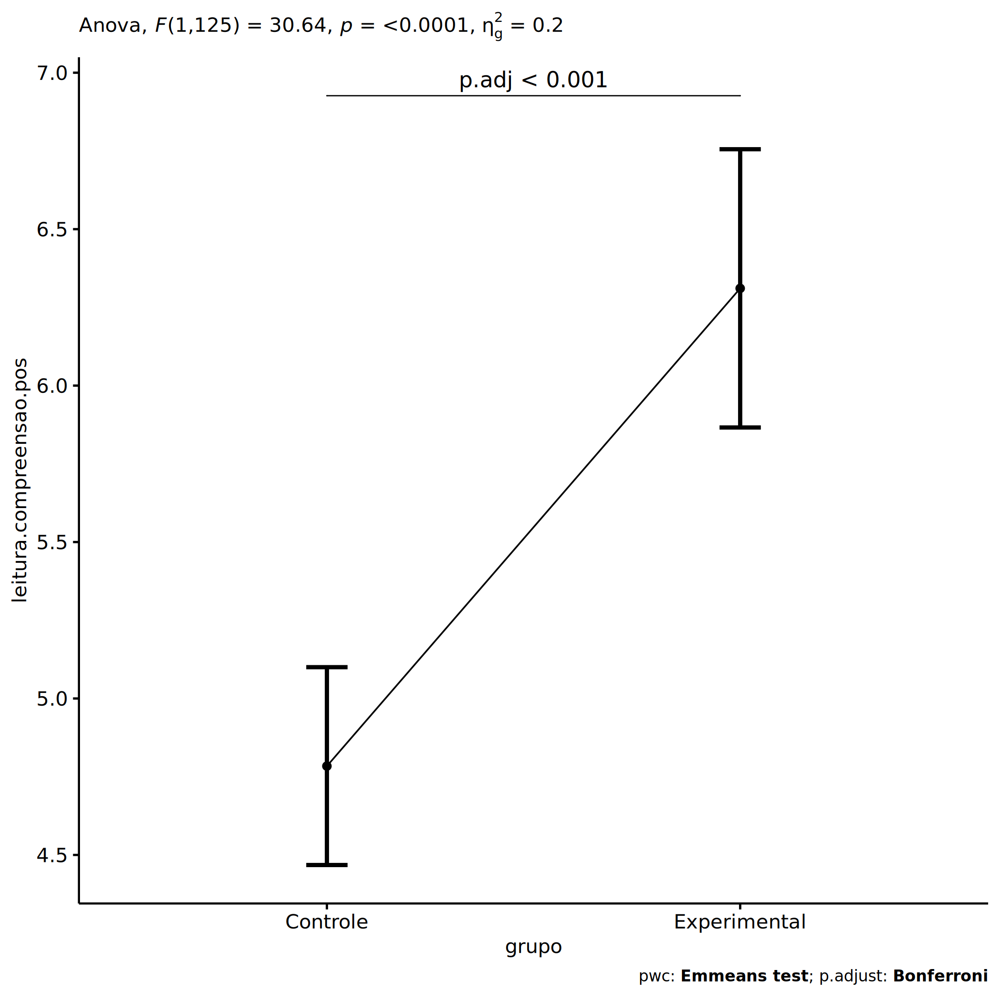<!-- -->

``` r
plots <- oneWayAncovaBoxPlots(
  wdat, "leitura.compreensao.pos", "grupo", aov, pwc, covar = "leitura.compreensao.pre",
  theme = "classic", color = color[["grupo"]],
  subtitle = which(aov$Effect == "grupo"))
```

``` r
if (length(unique(wdat[["grupo"]])) > 1)
  plots[["grupo"]] + ggplot2::ylab("Fluencia Leitora (Compreensão)") + ggplot2::scale_x_discrete(labels=c('pre', 'pos'))
```

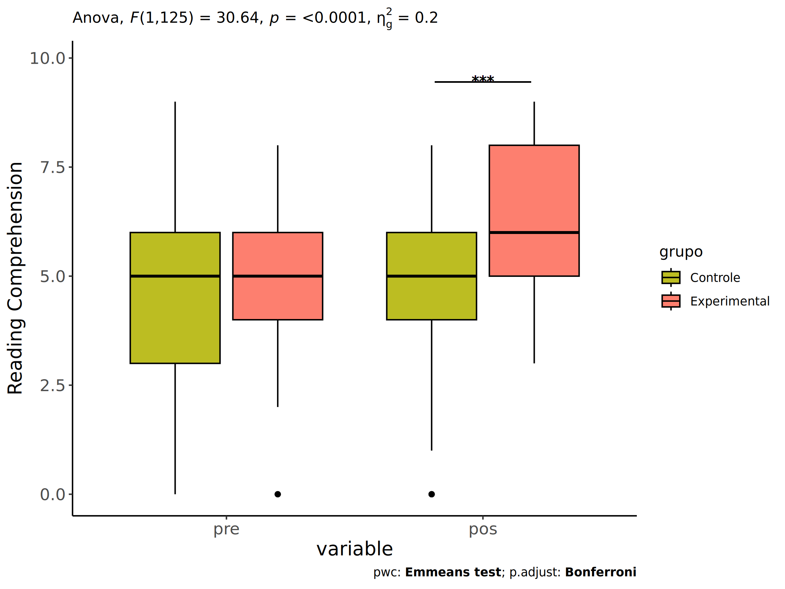<!-- -->

``` r
if (length(unique(wdat.long[["grupo"]])) > 1)
  plots <- oneWayAncovaBoxPlots(
    wdat.long, "leitura.compreensao", "grupo", aov, pwc.long, pre.post = "time",
    theme = "classic", color = color$prepost)
```

``` r
if (length(unique(wdat.long[["grupo"]])) > 1)
  plots[["grupo"]] + ggplot2::ylab("Fluencia Leitora (Compreensão)")
```

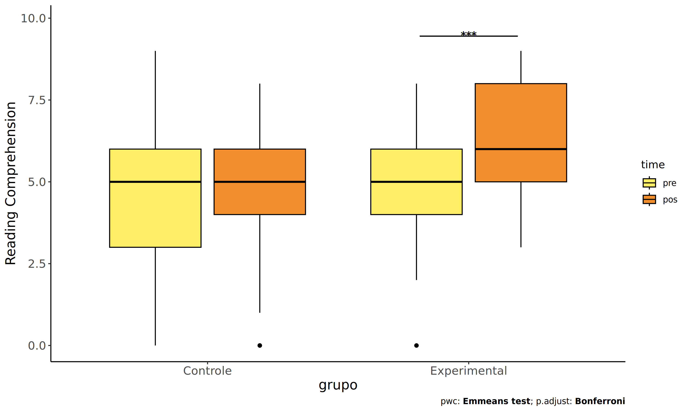<!-- -->

### Checking linearity assumption

``` r
ggscatter(wdat, x = "leitura.compreensao.pre", y = "leitura.compreensao.pos", size = 0.5,
          color = "grupo", add = "reg.line")+
  stat_regline_equation(
    aes(label =  paste(..eq.label.., ..rr.label.., sep = "~~~~"), color = grupo)
  )
```

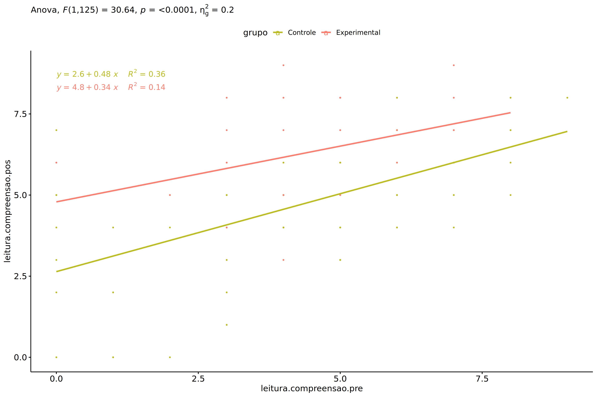<!-- -->

### Checking normality and homogeneity

``` r
res <- augment(lm(leitura.compreensao.pos ~ leitura.compreensao.pre + grupo, data = wdat))
```

``` r
shapiro_test(res$.resid)
```

    ## # A tibble: 1 × 3
    ##   variable   statistic p.value
    ##   <chr>          <dbl>   <dbl>
    ## 1 res$.resid     0.983   0.104

``` r
levene_test(res, .resid ~ grupo)
```

    ## # A tibble: 1 × 4
    ##     df1   df2 statistic     p
    ##   <int> <int>     <dbl> <dbl>
    ## 1     1   126   0.00771 0.930

# ANCOVA and Pairwise for two factors **grupo:Sexo**

## Without remove non-normal data

``` r
pdat = remove_group_data(dat[!is.na(dat[["grupo"]]) & !is.na(dat[["Sexo"]]),], "leitura.compreensao.pos", c("grupo","Sexo"))

pdat.long <- rbind(pdat[,c("id","grupo","Sexo")], pdat[,c("id","grupo","Sexo")])
pdat.long[["time"]] <- c(rep("pre", nrow(pdat)), rep("pos", nrow(pdat)))
pdat.long[["time"]] <- factor(pdat.long[["time"]], c("pre","pos"))
pdat.long[["leitura.compreensao"]] <- c(pdat[["leitura.compreensao.pre"]], pdat[["leitura.compreensao.pos"]])

aov = anova_test(pdat, leitura.compreensao.pos ~ leitura.compreensao.pre + grupo*Sexo)
laov[["grupo:Sexo"]] <- get_anova_table(aov)
```

``` r
pwcs <- list()
pwcs[["Sexo"]] <- emmeans_test(
  group_by(pdat, grupo), leitura.compreensao.pos ~ Sexo,
  covariate = leitura.compreensao.pre, p.adjust.method = "bonferroni")
pwcs[["grupo"]] <- emmeans_test(
  group_by(pdat, Sexo), leitura.compreensao.pos ~ grupo,
  covariate = leitura.compreensao.pre, p.adjust.method = "bonferroni")

pwc <- plyr::rbind.fill(pwcs[["grupo"]], pwcs[["Sexo"]])
pwc <- pwc[,c("grupo","Sexo", colnames(pwc)[!colnames(pwc) %in% c("grupo","Sexo")])]
```

``` r
pwc.long <- emmeans_test(dplyr::group_by_at(pdat.long, c("grupo","Sexo")),
                         leitura.compreensao ~ time,
                         p.adjust.method = "bonferroni")
lpwc[["grupo:Sexo"]] <- plyr::rbind.fill(pwc, pwc.long)
```

``` r
ds <- get.descriptives(pdat, "leitura.compreensao.pos", c("grupo","Sexo"), covar = "leitura.compreensao.pre")
ds <- merge(ds[ds$variable != "leitura.compreensao.pre",],
            ds[ds$variable == "leitura.compreensao.pre", !colnames(ds) %in% c("variable")],
            by = c("grupo","Sexo"), all.x = T, suffixes = c("", ".leitura.compreensao.pre"))
ds <- merge(get_emmeans(pwcs[["grupo"]]), ds, by = c("grupo","Sexo"), suffixes = c(".emms", ""))
ds <- ds[,c("grupo","Sexo","n","mean.leitura.compreensao.pre","se.leitura.compreensao.pre","mean","se","emmean","se.emms")]

colnames(ds) <- c("grupo","Sexo", "N", paste0(c("M","SE")," (pre)"),
                  paste0(c("M","SE"), " (unadj)"), paste0(c("M", "SE"), " (adj)"))

lemms[["grupo:Sexo"]] <- ds
```

## Computing ANCOVA and PairWise After removing non-normal data (OK)

``` r
wdat = pdat 

res = residuals(lm(leitura.compreensao.pos ~ leitura.compreensao.pre + grupo*Sexo, data = wdat))
non.normal = getNonNormal(res, wdat$id, plimit = 0.05)

wdat = wdat[!wdat$id %in% non.normal,]

wdat.long <- rbind(wdat[,c("id","grupo","Sexo")], wdat[,c("id","grupo","Sexo")])
wdat.long[["time"]] <- c(rep("pre", nrow(wdat)), rep("pos", nrow(wdat)))
wdat.long[["time"]] <- factor(wdat.long[["time"]], c("pre","pos"))
wdat.long[["leitura.compreensao"]] <- c(wdat[["leitura.compreensao.pre"]], wdat[["leitura.compreensao.pos"]])


ldat[["grupo:Sexo"]] = wdat

(non.normal)
```

    ##   [1] "P123"  "P140"  "P2226" "P3049" "P1101" "P3035" "P3165" "P3154" "P232"  "P3013" "P3018" "P2386"
    ##  [13] "P3170" "P3014" "P246"  "P3028" "P3234" "P3239" "P138"  "P3040" "P124"  "P3183" "P231"  "P3008"
    ##  [25] "P120"  "P126"  "P3016" "P3002" "P137"  "P3176" "P3178" "P3094" "P3092" "P3093" "P186"  "P3091"
    ##  [37] "P1098" "P2397" "P192"  "P1743" "P1746" "P3116" "P813"  "P228"  "P3153" "P613"  "P3505" "P941" 
    ##  [49] "P623"  "P615"  "P3032" "P3181" "P3022" "P182"  "P2383" "P3172" "P3027" "P3058" "P612"  "P1716"
    ##  [61] "P3108" "P133"  "P510"  "P1742" "P1089" "P1106" "P459"  "P614"  "P3509" "P445"  "P625"  "P958" 
    ##  [73] "P953"  "P1022" "P521"  "P446"  "P1016" "P952"  "P3518" "P816"  "P3609" "P448"  "P3598" "P626" 
    ##  [85] "P515"  "P622"  "P512"  "P523"  "P936"  "P3627" "P3577" "P3729" "P2404" "P176"  "P621"  "P3521"
    ##  [97] "P3508" "P945"  "P2385" "P812"  "P950"  "P956"  "P2250" "P628"  "P3498" "P121"  "P2294" "P1107"
    ## [109] "P3524" "P3512" "P522"  "P1109" "P997"  "P2209" "P451"  "P2376" "P241"  "P449"  "P1764" "P1762"
    ## [121] "P1699" "P1017" "P3566" "P829"  "P174"  "P3558" "P948"  "P3615" "P3630" "P3565" "P620"  "P2249"
    ## [133] "P3581" "P960"  "P1091" "P2239" "P3519" "P1097" "P184"  "P3560" "P947"  "P3502" "P2210" "P3495"
    ## [145] "P1000" "P2222" "P808"  "P516"  "P2211" "P3501" "P3624" "P1004" "P3511" "P3734" "P463"  "P3492"
    ## [157] "P458"  "P464"  "P943"  "P2378" "P618"  "P2402" "P2408" "P2214" "P1728" "P942"  "P2247" "P143" 
    ## [169] "P2377" "P616"  "P1698" "P128"  "P457"  "P2390" "P1094" "P513"  "P1084" "P2293" "P3578" "P2244"
    ## [181] "P1768"

``` r
aov = anova_test(wdat, leitura.compreensao.pos ~ leitura.compreensao.pre + grupo*Sexo)
laov[["grupo:Sexo"]] <- merge(get_anova_table(aov), laov[["grupo:Sexo"]], by="Effect", suffixes = c("","'"))

(df = get_anova_table(aov))
```

    ## ANOVA Table (type II tests)
    ## 
    ##                    Effect DFn DFd      F        p p<.05   ges
    ## 1 leitura.compreensao.pre   1  26 74.012 4.41e-09     * 0.740
    ## 2                   grupo   1  26  2.904 1.00e-01       0.100
    ## 3                    Sexo   1  26  0.104 7.50e-01       0.004
    ## 4              grupo:Sexo   1  26  4.510 4.30e-02     * 0.148

| Effect                  | DFn | DFd |      F |     p | p\<.05 |   ges |
|:------------------------|----:|----:|-------:|------:|:-------|------:|
| leitura.compreensao.pre |   1 |  26 | 74.012 | 0.000 | \*     | 0.740 |
| grupo                   |   1 |  26 |  2.904 | 0.100 |        | 0.100 |
| Sexo                    |   1 |  26 |  0.104 | 0.750 |        | 0.004 |
| grupo:Sexo              |   1 |  26 |  4.510 | 0.043 | \*     | 0.148 |

``` r
pwcs <- list()
pwcs[["Sexo"]] <- emmeans_test(
  group_by(wdat, grupo), leitura.compreensao.pos ~ Sexo,
  covariate = leitura.compreensao.pre, p.adjust.method = "bonferroni")
pwcs[["grupo"]] <- emmeans_test(
  group_by(wdat, Sexo), leitura.compreensao.pos ~ grupo,
  covariate = leitura.compreensao.pre, p.adjust.method = "bonferroni")

pwc <- plyr::rbind.fill(pwcs[["grupo"]], pwcs[["Sexo"]])
pwc <- pwc[,c("grupo","Sexo", colnames(pwc)[!colnames(pwc) %in% c("grupo","Sexo")])]
```

| grupo        | Sexo | term                           | .y.                     | group1   | group2       |  df | statistic |     p | p.adj | p.adj.signif |
|:-------------|:-----|:-------------------------------|:------------------------|:---------|:-------------|----:|----------:|------:|------:|:-------------|
|              | F    | leitura.compreensao.pre\*grupo | leitura.compreensao.pos | Controle | Experimental |  26 |    -2.712 | 0.012 | 0.012 | \*           |
|              | M    | leitura.compreensao.pre\*grupo | leitura.compreensao.pos | Controle | Experimental |  26 |    -0.309 | 0.759 | 0.759 | ns           |
| Controle     |      | leitura.compreensao.pre\*Sexo  | leitura.compreensao.pos | F        | M            |  26 |    -1.249 | 0.223 | 0.223 | ns           |
| Experimental |      | leitura.compreensao.pre\*Sexo  | leitura.compreensao.pos | F        | M            |  26 |     1.729 | 0.096 | 0.096 | ns           |

``` r
pwc.long <- emmeans_test(dplyr::group_by_at(wdat.long, c("grupo","Sexo")),
                         leitura.compreensao ~ time,
                         p.adjust.method = "bonferroni")
lpwc[["grupo:Sexo"]] <- merge(plyr::rbind.fill(pwc, pwc.long), lpwc[["grupo:Sexo"]], by=c("grupo","Sexo","term",".y.","group1","group2"), suffixes = c("","'"))
```

| grupo        | Sexo | term | .y.                 | group1 | group2 |  df | statistic |     p | p.adj | p.adj.signif |
|:-------------|:-----|:-----|:--------------------|:-------|:-------|----:|----------:|------:|------:|:-------------|
| Controle     | F    | time | leitura.compreensao | pre    | pos    |  54 |     1.853 | 0.069 | 0.069 | ns           |
| Controle     | M    | time | leitura.compreensao | pre    | pos    |  54 |     1.485 | 0.143 | 0.143 | ns           |
| Experimental | F    | time | leitura.compreensao | pre    | pos    |  54 |     0.247 | 0.806 | 0.806 | ns           |
| Experimental | M    | time | leitura.compreensao | pre    | pos    |  54 |     1.094 | 0.279 | 0.279 | ns           |

``` r
ds <- get.descriptives(wdat, "leitura.compreensao.pos", c("grupo","Sexo"), covar = "leitura.compreensao.pre")
ds <- merge(ds[ds$variable != "leitura.compreensao.pre",],
            ds[ds$variable == "leitura.compreensao.pre", !colnames(ds) %in% c("variable")],
            by = c("grupo","Sexo"), all.x = T, suffixes = c("", ".leitura.compreensao.pre"))
ds <- merge(get_emmeans(pwcs[["grupo"]]), ds, by = c("grupo","Sexo"), suffixes = c(".emms", ""))
ds <- ds[,c("grupo","Sexo","n","mean.leitura.compreensao.pre","se.leitura.compreensao.pre","mean","se","emmean","se.emms")]

colnames(ds) <- c("grupo","Sexo", "N", paste0(c("M","SE")," (pre)"),
                  paste0(c("M","SE"), " (unadj)"), paste0(c("M", "SE"), " (adj)"))

lemms[["grupo:Sexo"]] <- merge(ds, lemms[["grupo:Sexo"]], by=c("grupo","Sexo"), suffixes = c("","'"))
```

| grupo        | Sexo |   N | M (pre) | SE (pre) | M (unadj) | SE (unadj) | M (adj) | SE (adj) |
|:-------------|:-----|----:|--------:|---------:|----------:|-----------:|--------:|---------:|
| Controle     | F    |   8 |   3.250 |    0.750 |     1.375 |      0.596 |   1.183 |    0.305 |
| Controle     | M    |  16 |   2.375 |    0.569 |     1.312 |      0.384 |   1.655 |    0.219 |
| Experimental | F    |   2 |   4.500 |    1.500 |     4.000 |      1.000 |   3.044 |    0.619 |
| Experimental | M    |   5 |   3.600 |    1.288 |     2.200 |      0.917 |   1.794 |    0.388 |

### Plots for ancova

``` r
plots <- twoWayAncovaPlots(
  wdat, "leitura.compreensao.pos", c("grupo","Sexo"), aov, pwcs, addParam = c("mean_se"),
  font.label.size=10, step.increase=0.05, p.label="p.adj",
  subtitle = which(aov$Effect == "grupo:Sexo"))
```

``` r
if (!is.null(plots[["grupo"]]))
  plots[["grupo"]] + ggplot2::scale_color_manual(values = color[["Sexo"]])
```

    ## Scale for colour is already present.
    ## Adding another scale for colour, which will replace the existing scale.

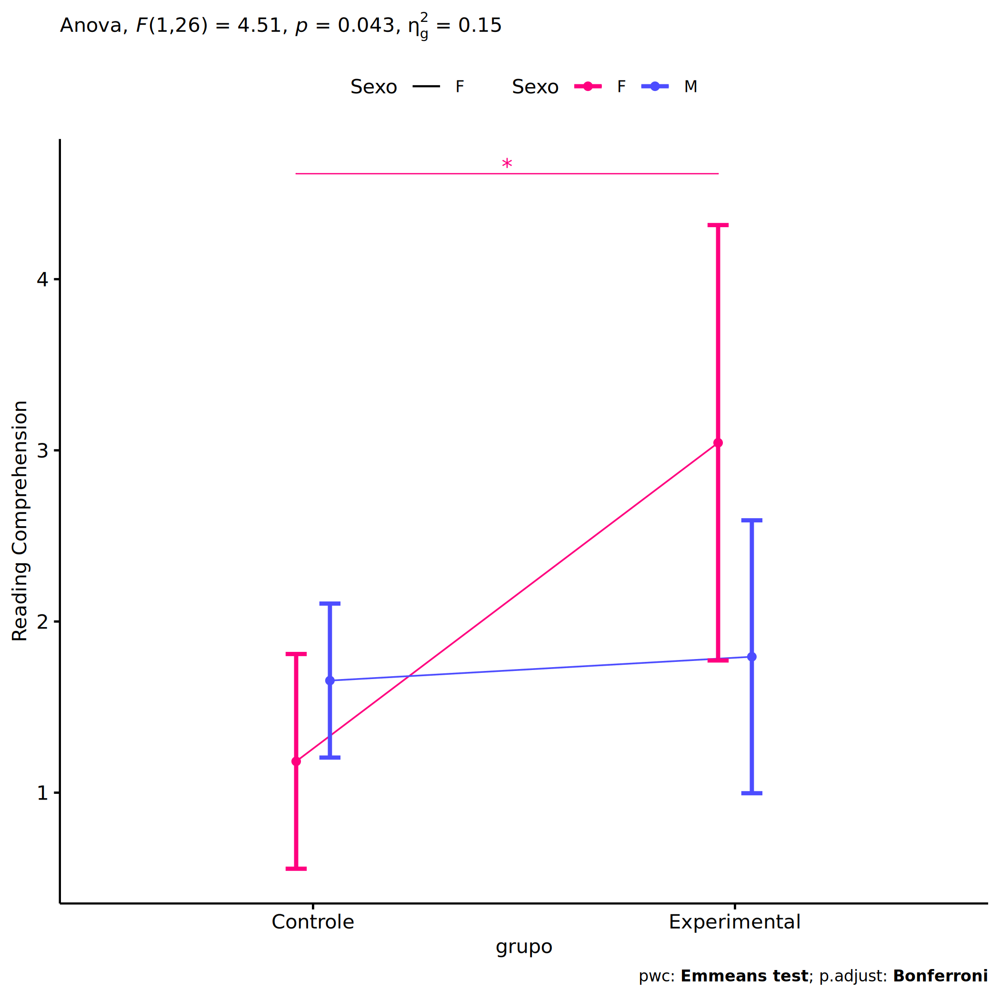<!-- -->

``` r
if (!is.null(plots[["Sexo"]]))
  plots[["Sexo"]] + ggplot2::scale_color_manual(values = color[["grupo"]])
```

    ## Scale for colour is already present.
    ## Adding another scale for colour, which will replace the existing scale.

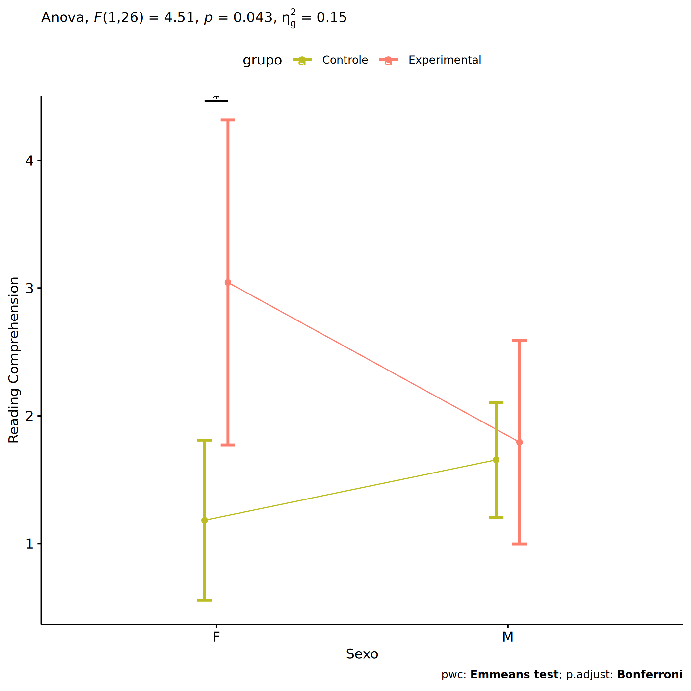<!-- -->

``` r
plots <- twoWayAncovaBoxPlots(
  wdat, "leitura.compreensao.pos", c("grupo","Sexo"), aov, pwcs, covar = "leitura.compreensao.pre",
  theme = "classic", color = color[["grupo:Sexo"]],
  subtitle = which(aov$Effect == "grupo:Sexo"))
```

``` r
plots[["grupo:Sexo"]] + ggplot2::ylab("Fluencia Leitora (Compreensão)") + ggplot2::scale_x_discrete(labels=c('pre', 'pos'))
```

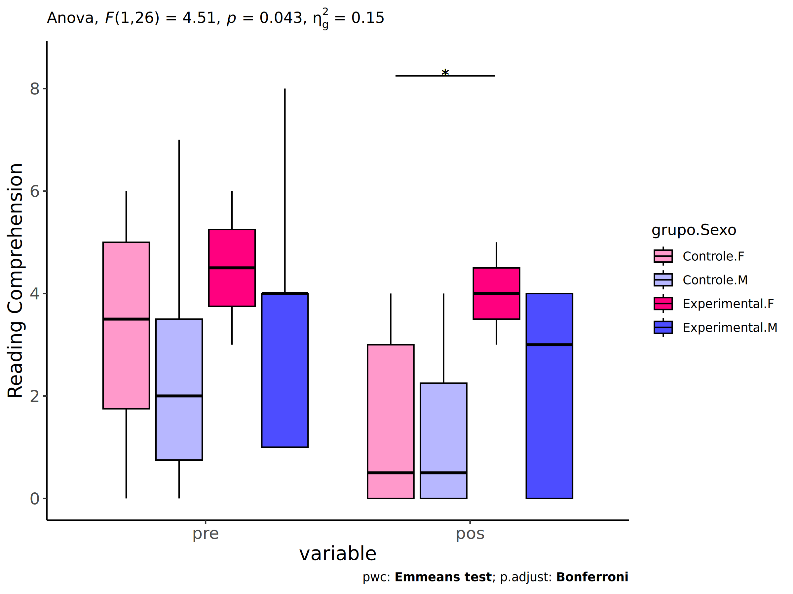<!-- -->

``` r
plots <- twoWayAncovaBoxPlots(
  wdat.long, "leitura.compreensao", c("grupo","Sexo"), aov, pwc.long, pre.post = "time",
  theme = "classic", color = color$prepost)
```

``` r
plots[["grupo:Sexo"]] + ggplot2::ylab("Fluencia Leitora (Compreensão)")
```

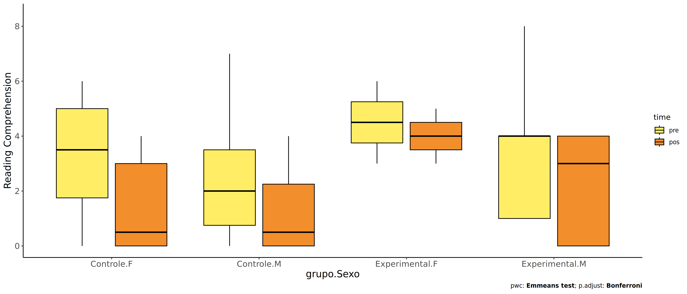<!-- -->

### Checking linearity assumption

``` r
ggscatter(wdat, x = "leitura.compreensao.pre", y = "leitura.compreensao.pos", size = 0.5,
          facet.by = c("grupo","Sexo"), add = "reg.line")+
  stat_regline_equation(
    aes(label =  paste(..eq.label.., ..rr.label.., sep = "~~~~"))
  )
```

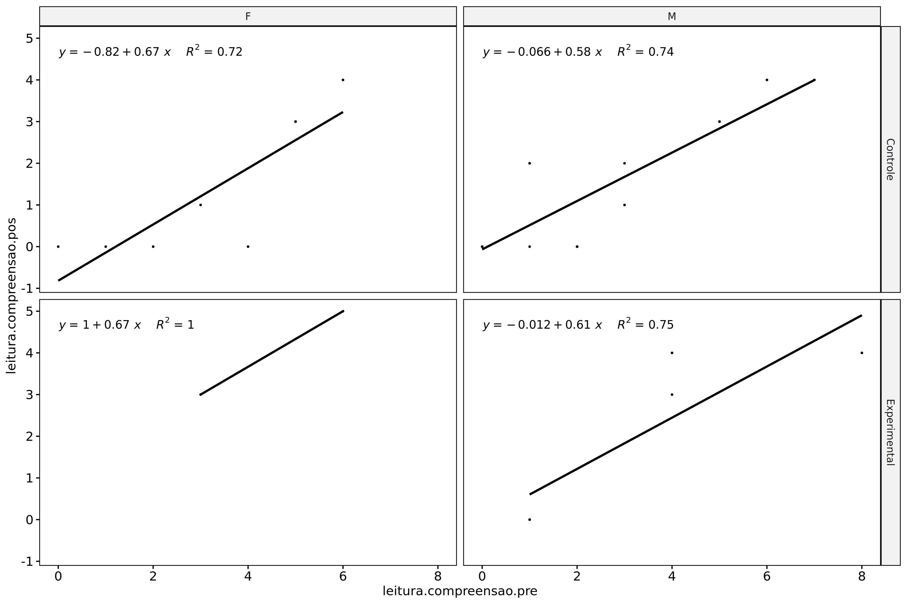<!-- -->

### Checking normality and homogeneity

``` r
res <- augment(lm(leitura.compreensao.pos ~ leitura.compreensao.pre + grupo*Sexo, data = wdat))
```

``` r
shapiro_test(res$.resid)
```

    ## # A tibble: 1 × 3
    ##   variable   statistic p.value
    ##   <chr>          <dbl>   <dbl>
    ## 1 res$.resid     0.968   0.453

``` r
levene_test(res, .resid ~ grupo*Sexo)
```

    ## # A tibble: 1 × 4
    ##     df1   df2 statistic     p
    ##   <int> <int>     <dbl> <dbl>
    ## 1     3    27     0.550 0.652

# ANCOVA and Pairwise for two factors **grupo:Zona**

## Without remove non-normal data

``` r
pdat = remove_group_data(dat[!is.na(dat[["grupo"]]) & !is.na(dat[["Zona"]]),], "leitura.compreensao.pos", c("grupo","Zona"))

pdat.long <- rbind(pdat[,c("id","grupo","Zona")], pdat[,c("id","grupo","Zona")])
pdat.long[["time"]] <- c(rep("pre", nrow(pdat)), rep("pos", nrow(pdat)))
pdat.long[["time"]] <- factor(pdat.long[["time"]], c("pre","pos"))
pdat.long[["leitura.compreensao"]] <- c(pdat[["leitura.compreensao.pre"]], pdat[["leitura.compreensao.pos"]])

aov = anova_test(pdat, leitura.compreensao.pos ~ leitura.compreensao.pre + grupo*Zona)
laov[["grupo:Zona"]] <- get_anova_table(aov)
```

``` r
pwcs <- list()
pwcs[["Zona"]] <- emmeans_test(
  group_by(pdat, grupo), leitura.compreensao.pos ~ Zona,
  covariate = leitura.compreensao.pre, p.adjust.method = "bonferroni")
pwcs[["grupo"]] <- emmeans_test(
  group_by(pdat, Zona), leitura.compreensao.pos ~ grupo,
  covariate = leitura.compreensao.pre, p.adjust.method = "bonferroni")

pwc <- plyr::rbind.fill(pwcs[["grupo"]], pwcs[["Zona"]])
pwc <- pwc[,c("grupo","Zona", colnames(pwc)[!colnames(pwc) %in% c("grupo","Zona")])]
```

``` r
pwc.long <- emmeans_test(dplyr::group_by_at(pdat.long, c("grupo","Zona")),
                         leitura.compreensao ~ time,
                         p.adjust.method = "bonferroni")
lpwc[["grupo:Zona"]] <- plyr::rbind.fill(pwc, pwc.long)
```

``` r
ds <- get.descriptives(pdat, "leitura.compreensao.pos", c("grupo","Zona"), covar = "leitura.compreensao.pre")
ds <- merge(ds[ds$variable != "leitura.compreensao.pre",],
            ds[ds$variable == "leitura.compreensao.pre", !colnames(ds) %in% c("variable")],
            by = c("grupo","Zona"), all.x = T, suffixes = c("", ".leitura.compreensao.pre"))
ds <- merge(get_emmeans(pwcs[["grupo"]]), ds, by = c("grupo","Zona"), suffixes = c(".emms", ""))
ds <- ds[,c("grupo","Zona","n","mean.leitura.compreensao.pre","se.leitura.compreensao.pre","mean","se","emmean","se.emms")]

colnames(ds) <- c("grupo","Zona", "N", paste0(c("M","SE")," (pre)"),
                  paste0(c("M","SE"), " (unadj)"), paste0(c("M", "SE"), " (adj)"))

lemms[["grupo:Zona"]] <- ds
```

## Computing ANCOVA and PairWise After removing non-normal data (OK)

``` r
wdat = pdat 

res = residuals(lm(leitura.compreensao.pos ~ leitura.compreensao.pre + grupo*Zona, data = wdat))
non.normal = getNonNormal(res, wdat$id, plimit = 0.05)

wdat = wdat[!wdat$id %in% non.normal,]

wdat.long <- rbind(wdat[,c("id","grupo","Zona")], wdat[,c("id","grupo","Zona")])
wdat.long[["time"]] <- c(rep("pre", nrow(wdat)), rep("pos", nrow(wdat)))
wdat.long[["time"]] <- factor(wdat.long[["time"]], c("pre","pos"))
wdat.long[["leitura.compreensao"]] <- c(wdat[["leitura.compreensao.pre"]], wdat[["leitura.compreensao.pos"]])


ldat[["grupo:Zona"]] = wdat

(non.normal)
```

    ##  [1] "P2404" "P1101" "P121"  "P241"  "P623"  "P2250" "P613"  "P960"  "P941"  "P1762" "P2211" "P3013"
    ## [13] "P3505" "P612"  "P615"  "P510"  "P143"  "P614"  "P3018" "P1728" "P128"  "P459"  "P3509" "P445" 
    ## [25] "P3170" "P625"  "P952"  "P448"  "P958"  "P446"  "P3518" "P3028" "P816"  "P3609" "P622"  "P512" 
    ## [37] "P1713" "P3040" "P3598" "P626"  "P953"  "P3183" "P515"  "P3002" "P521"  "P936"  "P523"  "P3008"
    ## [49] "P3729" "P621"  "P3094" "P3521" "P3508" "P945"  "P3016" "P3577" "P812"  "P950"  "P3092" "P628" 
    ## [61] "P1746" "P956"  "P238"  "P522"  "P3174" "P3498" "P997"  "P1742" "P3512" "P451"  "P1764" "P1699"
    ## [73] "P3555" "P449"  "P829"  "P948"  "P3615" "P3630" "P3565" "P3167" "P174"  "P3581" "P1716" "P620" 
    ## [85] "P3519" "P3495" "P1743" "P947"  "P3502" "P3172" "P2210" "P3501" "P516"  "P3027" "P3108" "P130" 
    ## [97] "P3624" "P1004"

``` r
aov = anova_test(wdat, leitura.compreensao.pos ~ leitura.compreensao.pre + grupo*Zona)
laov[["grupo:Zona"]] <- merge(get_anova_table(aov), laov[["grupo:Zona"]], by="Effect", suffixes = c("","'"))

(df = get_anova_table(aov))
```

    ## ANOVA Table (type II tests)
    ## 
    ##                    Effect DFn DFd       F        p p<.05   ges
    ## 1 leitura.compreensao.pre   1  57  41.047 3.08e-08     * 0.419
    ## 2                   grupo   1  57   2.138 1.49e-01       0.036
    ## 3                    Zona   1  57 154.052 7.68e-18     * 0.730
    ## 4              grupo:Zona   1  57   8.929 4.00e-03     * 0.135

| Effect                  | DFn | DFd |       F |     p | p\<.05 |   ges |
|:------------------------|----:|----:|--------:|------:|:-------|------:|
| leitura.compreensao.pre |   1 |  57 |  41.047 | 0.000 | \*     | 0.419 |
| grupo                   |   1 |  57 |   2.138 | 0.149 |        | 0.036 |
| Zona                    |   1 |  57 | 154.052 | 0.000 | \*     | 0.730 |
| grupo:Zona              |   1 |  57 |   8.929 | 0.004 | \*     | 0.135 |

``` r
pwcs <- list()
pwcs[["Zona"]] <- emmeans_test(
  group_by(wdat, grupo), leitura.compreensao.pos ~ Zona,
  covariate = leitura.compreensao.pre, p.adjust.method = "bonferroni")
pwcs[["grupo"]] <- emmeans_test(
  group_by(wdat, Zona), leitura.compreensao.pos ~ grupo,
  covariate = leitura.compreensao.pre, p.adjust.method = "bonferroni")

pwc <- plyr::rbind.fill(pwcs[["grupo"]], pwcs[["Zona"]])
pwc <- pwc[,c("grupo","Zona", colnames(pwc)[!colnames(pwc) %in% c("grupo","Zona")])]
```

| grupo        | Zona   | term                           | .y.                     | group1   | group2       |  df | statistic |     p | p.adj | p.adj.signif |
|:-------------|:-------|:-------------------------------|:------------------------|:---------|:-------------|----:|----------:|------:|------:|:-------------|
|              | Rural  | leitura.compreensao.pre\*grupo | leitura.compreensao.pos | Controle | Experimental |  57 |    -3.166 | 0.002 | 0.002 | \*\*         |
|              | Urbana | leitura.compreensao.pre\*grupo | leitura.compreensao.pos | Controle | Experimental |  57 |     0.934 | 0.354 | 0.354 | ns           |
| Controle     |        | leitura.compreensao.pre\*Zona  | leitura.compreensao.pos | Rural    | Urbana       |  57 |     9.013 | 0.000 | 0.000 | \*\*\*\*     |
| Experimental |        | leitura.compreensao.pre\*Zona  | leitura.compreensao.pos | Rural    | Urbana       |  57 |     9.007 | 0.000 | 0.000 | \*\*\*\*     |

``` r
pwc.long <- emmeans_test(dplyr::group_by_at(wdat.long, c("grupo","Zona")),
                         leitura.compreensao ~ time,
                         p.adjust.method = "bonferroni")
lpwc[["grupo:Zona"]] <- merge(plyr::rbind.fill(pwc, pwc.long), lpwc[["grupo:Zona"]], by=c("grupo","Zona","term",".y.","group1","group2"), suffixes = c("","'"))
```

| grupo        | Zona   | term | .y.                 | group1 | group2 |  df | statistic |     p | p.adj | p.adj.signif |
|:-------------|:-------|:-----|:--------------------|:-------|:-------|----:|----------:|------:|------:|:-------------|
| Controle     | Rural  | time | leitura.compreensao | pre    | pos    | 116 |     2.136 | 0.035 | 0.035 | \*           |
| Controle     | Urbana | time | leitura.compreensao | pre    | pos    | 116 |     7.888 | 0.000 | 0.000 | \*\*\*\*     |
| Experimental | Rural  | time | leitura.compreensao | pre    | pos    | 116 |     0.329 | 0.743 | 0.743 | ns           |
| Experimental | Urbana | time | leitura.compreensao | pre    | pos    | 116 |     6.519 | 0.000 | 0.000 | \*\*\*\*     |

``` r
ds <- get.descriptives(wdat, "leitura.compreensao.pos", c("grupo","Zona"), covar = "leitura.compreensao.pre")
ds <- merge(ds[ds$variable != "leitura.compreensao.pre",],
            ds[ds$variable == "leitura.compreensao.pre", !colnames(ds) %in% c("variable")],
            by = c("grupo","Zona"), all.x = T, suffixes = c("", ".leitura.compreensao.pre"))
ds <- merge(get_emmeans(pwcs[["grupo"]]), ds, by = c("grupo","Zona"), suffixes = c(".emms", ""))
ds <- ds[,c("grupo","Zona","n","mean.leitura.compreensao.pre","se.leitura.compreensao.pre","mean","se","emmean","se.emms")]

colnames(ds) <- c("grupo","Zona", "N", paste0(c("M","SE")," (pre)"),
                  paste0(c("M","SE"), " (unadj)"), paste0(c("M", "SE"), " (adj)"))

lemms[["grupo:Zona"]] <- merge(ds, lemms[["grupo:Zona"]], by=c("grupo","Zona"), suffixes = c("","'"))
```

| grupo        | Zona   |   N | M (pre) | SE (pre) | M (unadj) | SE (unadj) | M (adj) | SE (adj) |
|:-------------|:-------|----:|--------:|---------:|----------:|-----------:|--------:|---------:|
| Controle     | Rural  |  28 |   3.571 |    0.432 |     2.643 |      0.368 |   2.942 |    0.205 |
| Controle     | Urbana |  18 |   4.389 |    0.304 |     0.111 |      0.076 |   0.017 |    0.249 |
| Experimental | Rural  |   7 |   5.143 |    0.595 |     4.857 |      0.340 |   4.401 |    0.405 |
| Experimental | Urbana |   9 |   5.000 |    0.441 |     0.000 |      0.000 |  -0.387 |    0.357 |

### Plots for ancova

``` r
plots <- twoWayAncovaPlots(
  wdat, "leitura.compreensao.pos", c("grupo","Zona"), aov, pwcs, addParam = c("mean_se"),
  font.label.size=10, step.increase=0.05, p.label="p.adj",
  subtitle = which(aov$Effect == "grupo:Zona"))
```

``` r
if (!is.null(plots[["grupo"]]))
  plots[["grupo"]] + ggplot2::scale_color_manual(values = color[["Zona"]])
```

    ## Scale for colour is already present.
    ## Adding another scale for colour, which will replace the existing scale.

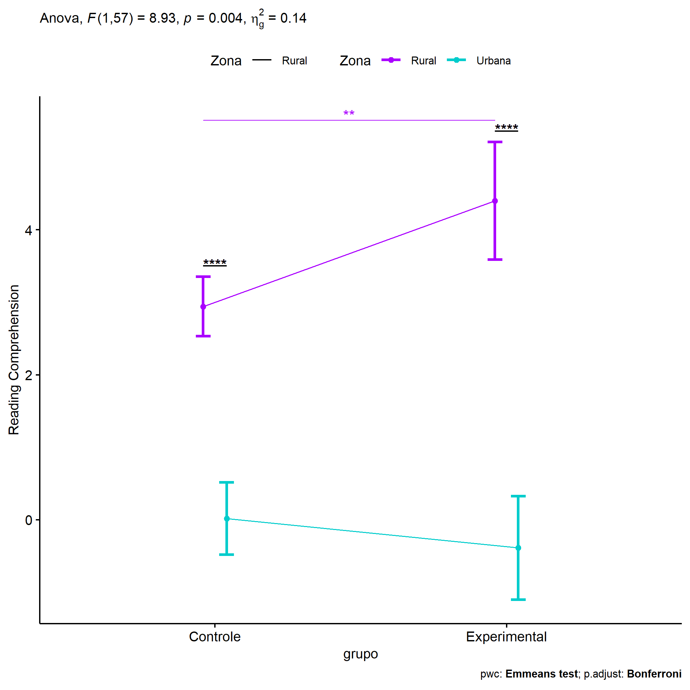<!-- -->

``` r
if (!is.null(plots[["Zona"]]))
  plots[["Zona"]] + ggplot2::scale_color_manual(values = color[["grupo"]])
```

    ## Scale for colour is already present.
    ## Adding another scale for colour, which will replace the existing scale.

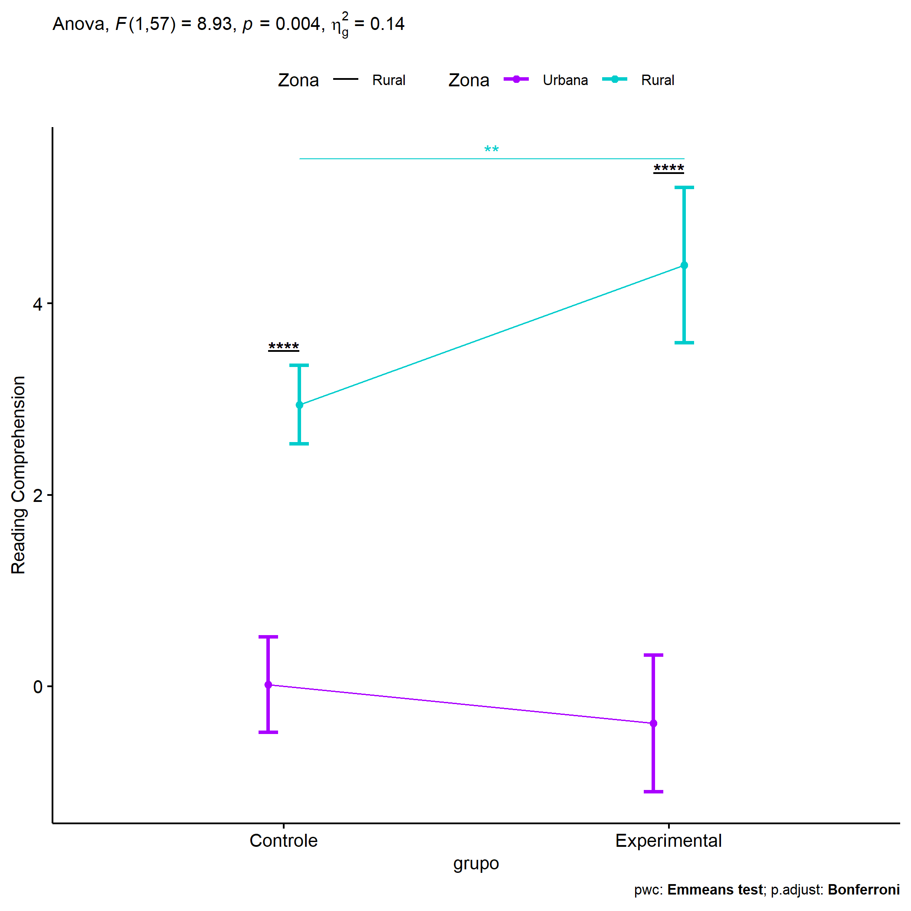<!-- -->

``` r
plots <- twoWayAncovaBoxPlots(
  wdat, "leitura.compreensao.pos", c("grupo","Zona"), aov, pwcs, covar = "leitura.compreensao.pre",
  theme = "classic", color = color[["grupo:Zona"]],
  subtitle = which(aov$Effect == "grupo:Zona"))
```

``` r
plots[["grupo:Zona"]] + ggplot2::ylab("Fluencia Leitora (Compreensão)") + ggplot2::scale_x_discrete(labels=c('pre', 'pos'))
```

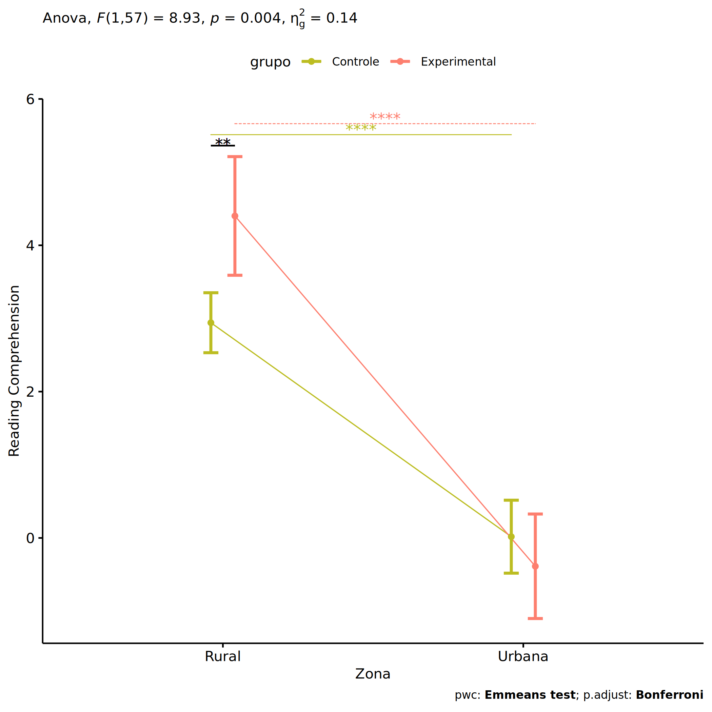<!-- -->

``` r
plots <- twoWayAncovaBoxPlots(
  wdat.long, "leitura.compreensao", c("grupo","Zona"), aov, pwc.long, pre.post = "time",
  theme = "classic", color = color$prepost)
```

``` r
plots[["grupo:Zona"]] + ggplot2::ylab("Fluencia Leitora (Compreensão)")
```

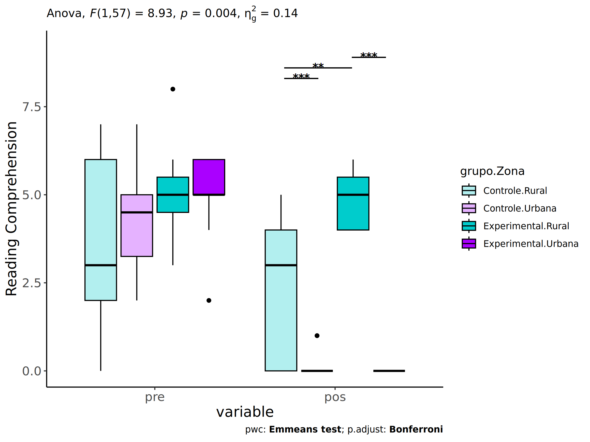<!-- -->

### Checking linearity assumption

``` r
ggscatter(wdat, x = "leitura.compreensao.pre", y = "leitura.compreensao.pos", size = 0.5,
          facet.by = c("grupo","Zona"), add = "reg.line")+
  stat_regline_equation(
    aes(label =  paste(..eq.label.., ..rr.label.., sep = "~~~~"))
  )
```

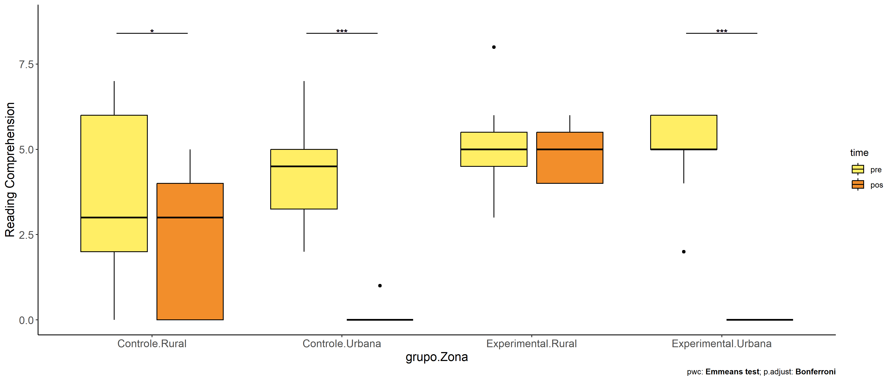<!-- -->

### Checking normality and homogeneity

``` r
res <- augment(lm(leitura.compreensao.pos ~ leitura.compreensao.pre + grupo*Zona, data = wdat))
```

``` r
shapiro_test(res$.resid)
```

    ## # A tibble: 1 × 3
    ##   variable   statistic p.value
    ##   <chr>          <dbl>   <dbl>
    ## 1 res$.resid     0.952  0.0174

``` r
levene_test(res, .resid ~ grupo*Zona)
```

    ## # A tibble: 1 × 4
    ##     df1   df2 statistic      p
    ##   <int> <int>     <dbl>  <dbl>
    ## 1     3    58      2.70 0.0539

# ANCOVA and Pairwise for two factors **grupo:Cor.Raca**

## Without remove non-normal data

``` r
pdat = remove_group_data(dat[!is.na(dat[["grupo"]]) & !is.na(dat[["Cor.Raca"]]),], "leitura.compreensao.pos", c("grupo","Cor.Raca"))
```

    ## Warning: There were 2 warnings in `mutate()`.
    ## The first warning was:
    ## ℹ In argument: `ci = abs(stats::qt(alpha/2, .data$n - 1) * .data$se)`.
    ## Caused by warning:
    ## ! There was 1 warning in `mutate()`.
    ## ℹ In argument: `ci = abs(stats::qt(alpha/2, .data$n - 1) * .data$se)`.
    ## Caused by warning in `stats::qt()`:
    ## ! NaNs produced
    ## ℹ Run `dplyr::last_dplyr_warnings()` to see the 1 remaining warning.

``` r
pdat.long <- rbind(pdat[,c("id","grupo","Cor.Raca")], pdat[,c("id","grupo","Cor.Raca")])
pdat.long[["time"]] <- c(rep("pre", nrow(pdat)), rep("pos", nrow(pdat)))
pdat.long[["time"]] <- factor(pdat.long[["time"]], c("pre","pos"))
pdat.long[["leitura.compreensao"]] <- c(pdat[["leitura.compreensao.pre"]], pdat[["leitura.compreensao.pos"]])

aov = anova_test(pdat, leitura.compreensao.pos ~ leitura.compreensao.pre + grupo*Cor.Raca)
laov[["grupo:Cor.Raca"]] <- get_anova_table(aov)
```

``` r
pwcs <- list()
pwcs[["Cor.Raca"]] <- emmeans_test(
  group_by(pdat, grupo), leitura.compreensao.pos ~ Cor.Raca,
  covariate = leitura.compreensao.pre, p.adjust.method = "bonferroni")
pwcs[["grupo"]] <- emmeans_test(
  group_by(pdat, Cor.Raca), leitura.compreensao.pos ~ grupo,
  covariate = leitura.compreensao.pre, p.adjust.method = "bonferroni")

pwc <- plyr::rbind.fill(pwcs[["grupo"]], pwcs[["Cor.Raca"]])
pwc <- pwc[,c("grupo","Cor.Raca", colnames(pwc)[!colnames(pwc) %in% c("grupo","Cor.Raca")])]
```

``` r
pwc.long <- emmeans_test(dplyr::group_by_at(pdat.long, c("grupo","Cor.Raca")),
                         leitura.compreensao ~ time,
                         p.adjust.method = "bonferroni")
lpwc[["grupo:Cor.Raca"]] <- plyr::rbind.fill(pwc, pwc.long)
```

``` r
ds <- get.descriptives(pdat, "leitura.compreensao.pos", c("grupo","Cor.Raca"), covar = "leitura.compreensao.pre")
ds <- merge(ds[ds$variable != "leitura.compreensao.pre",],
            ds[ds$variable == "leitura.compreensao.pre", !colnames(ds) %in% c("variable")],
            by = c("grupo","Cor.Raca"), all.x = T, suffixes = c("", ".leitura.compreensao.pre"))
ds <- merge(get_emmeans(pwcs[["grupo"]]), ds, by = c("grupo","Cor.Raca"), suffixes = c(".emms", ""))
ds <- ds[,c("grupo","Cor.Raca","n","mean.leitura.compreensao.pre","se.leitura.compreensao.pre","mean","se","emmean","se.emms")]

colnames(ds) <- c("grupo","Cor.Raca", "N", paste0(c("M","SE")," (pre)"),
                  paste0(c("M","SE"), " (unadj)"), paste0(c("M", "SE"), " (adj)"))

lemms[["grupo:Cor.Raca"]] <- ds
```

## Computing ANCOVA and PairWise After removing non-normal data (OK)

``` r
wdat = pdat 

res = residuals(lm(leitura.compreensao.pos ~ leitura.compreensao.pre + grupo*Cor.Raca, data = wdat))
non.normal = getNonNormal(res, wdat$id, plimit = 0.05)

wdat = wdat[!wdat$id %in% non.normal,]

wdat.long <- rbind(wdat[,c("id","grupo","Cor.Raca")], wdat[,c("id","grupo","Cor.Raca")])
wdat.long[["time"]] <- c(rep("pre", nrow(wdat)), rep("pos", nrow(wdat)))
wdat.long[["time"]] <- factor(wdat.long[["time"]], c("pre","pos"))
wdat.long[["leitura.compreensao"]] <- c(wdat[["leitura.compreensao.pre"]], wdat[["leitura.compreensao.pos"]])


ldat[["grupo:Cor.Raca"]] = wdat

(non.normal)
```

    ##  [1] "P960"  "P613"  "P623"  "P941"  "P510"  "P614"  "P1016" "P952"  "P448"  "P3598" "P953"  "P515" 
    ## [13] "P1089" "P459"  "P3509" "P622"  "P512"  "P445"  "P3609" "P446"  "P3518" "P936"  "P958"  "P1022"
    ## [25] "P612"  "P3729" "P621"  "P628"  "P522"  "P1109" "P997"  "P1107" "P3524" "P3566" "P3498" "P615" 
    ## [37] "P451"  "P625"  "P1017" "P948"  "P2239" "P1097" "P3495" "P3501" "P829"  "P3615" "P523"  "P3521"
    ## [49] "P3508" "P945"  "P947"  "P3502" "P463"  "P626"  "P521"  "P3627" "P1004" "P808"  "P956"  "P3512"
    ## [61] "P1764" "P3492" "P458"  "P3170" "P3028" "P464"  "P3239" "P1101" "P3035" "P3040" "P3183" "P3002"
    ## [73] "P3008" "P942"  "P3176" "P1728" "P3178" "P513"  "P3577" "P457"  "P1094"

``` r
aov = anova_test(wdat, leitura.compreensao.pos ~ leitura.compreensao.pre + grupo*Cor.Raca)
laov[["grupo:Cor.Raca"]] <- merge(get_anova_table(aov), laov[["grupo:Cor.Raca"]], by="Effect", suffixes = c("","'"))

(df = get_anova_table(aov))
```

    ## ANOVA Table (type II tests)
    ## 
    ##                    Effect DFn DFd      F        p p<.05   ges
    ## 1 leitura.compreensao.pre   1  27 35.107 2.58e-06     * 0.565
    ## 2                   grupo   1  27  1.972 1.72e-01       0.068
    ## 3                Cor.Raca   2  27  9.789 6.35e-04     * 0.420
    ## 4          grupo:Cor.Raca   1  27  2.586 1.19e-01       0.087

| Effect                  | DFn | DFd |      F |     p | p\<.05 |   ges |
|:------------------------|----:|----:|-------:|------:|:-------|------:|
| leitura.compreensao.pre |   1 |  27 | 35.107 | 0.000 | \*     | 0.565 |
| grupo                   |   1 |  27 |  1.972 | 0.172 |        | 0.068 |
| Cor.Raca                |   2 |  27 |  9.789 | 0.001 | \*     | 0.420 |
| grupo:Cor.Raca          |   1 |  27 |  2.586 | 0.119 |        | 0.087 |

``` r
pwcs <- list()
pwcs[["Cor.Raca"]] <- emmeans_test(
  group_by(wdat, grupo), leitura.compreensao.pos ~ Cor.Raca,
  covariate = leitura.compreensao.pre, p.adjust.method = "bonferroni")
pwcs[["grupo"]] <- emmeans_test(
  group_by(wdat, Cor.Raca), leitura.compreensao.pos ~ grupo,
  covariate = leitura.compreensao.pre, p.adjust.method = "bonferroni")

pwc <- plyr::rbind.fill(pwcs[["grupo"]], pwcs[["Cor.Raca"]])
pwc <- pwc[,c("grupo","Cor.Raca", colnames(pwc)[!colnames(pwc) %in% c("grupo","Cor.Raca")])]
```

| grupo        | Cor.Raca | term                              | .y.                     | group1   | group2       |  df | statistic |     p | p.adj | p.adj.signif |
|:-------------|:---------|:----------------------------------|:------------------------|:---------|:-------------|----:|----------:|------:|------:|:-------------|
|              | Branca   | leitura.compreensao.pre\*grupo    | leitura.compreensao.pos | Controle | Experimental |  27 |     0.633 | 0.532 | 0.532 | ns           |
|              | Indígena | leitura.compreensao.pre\*grupo    | leitura.compreensao.pos | Controle | Experimental |     |           |       |       |              |
|              | Parda    | leitura.compreensao.pre\*grupo    | leitura.compreensao.pos | Controle | Experimental |  27 |    -2.029 | 0.052 | 0.052 | ns           |
| Controle     |          | leitura.compreensao.pre\*Cor.Raca | leitura.compreensao.pos | Branca   | Indígena     |     |           |       |       |              |
| Controle     |          | leitura.compreensao.pre\*Cor.Raca | leitura.compreensao.pos | Branca   | Parda        |  27 |     2.952 | 0.006 | 0.006 | \*\*         |
| Controle     |          | leitura.compreensao.pre\*Cor.Raca | leitura.compreensao.pos | Indígena | Parda        |     |           |       |       |              |
| Experimental |          | leitura.compreensao.pre\*Cor.Raca | leitura.compreensao.pos | Branca   | Indígena     |  27 |    -2.845 | 0.008 | 0.025 | \*           |
| Experimental |          | leitura.compreensao.pre\*Cor.Raca | leitura.compreensao.pos | Branca   | Parda        |  27 |    -0.095 | 0.925 | 1.000 | ns           |
| Experimental |          | leitura.compreensao.pre\*Cor.Raca | leitura.compreensao.pos | Indígena | Parda        |  27 |     3.441 | 0.002 | 0.006 | \*\*         |

``` r
pwc.long <- emmeans_test(dplyr::group_by_at(wdat.long, c("grupo","Cor.Raca")),
                         leitura.compreensao ~ time,
                         p.adjust.method = "bonferroni")
lpwc[["grupo:Cor.Raca"]] <- merge(plyr::rbind.fill(pwc, pwc.long), lpwc[["grupo:Cor.Raca"]], by=c("grupo","Cor.Raca","term",".y.","group1","group2"), suffixes = c("","'"))
```

| grupo        | Cor.Raca | term | .y.                 | group1 | group2 |  df | statistic |     p | p.adj | p.adj.signif |
|:-------------|:---------|:-----|:--------------------|:-------|:-------|----:|----------:|------:|------:|:-------------|
| Controle     | Branca   | time | leitura.compreensao | pre    | pos    |  56 |     0.288 | 0.774 | 0.774 | ns           |
| Controle     | Indígena | time | leitura.compreensao | pre    | pos    |     |           |       |       |              |
| Controle     | Parda    | time | leitura.compreensao | pre    | pos    |  56 |     3.040 | 0.004 | 0.004 | \*\*         |
| Experimental | Branca   | time | leitura.compreensao | pre    | pos    |  56 |     0.684 | 0.497 | 0.497 | ns           |
| Experimental | Indígena | time | leitura.compreensao | pre    | pos    |  56 |    -0.745 | 0.460 | 0.460 | ns           |
| Experimental | Parda    | time | leitura.compreensao | pre    | pos    |  56 |     1.009 | 0.317 | 0.317 | ns           |

``` r
ds <- get.descriptives(wdat, "leitura.compreensao.pos", c("grupo","Cor.Raca"), covar = "leitura.compreensao.pre")
ds <- merge(ds[ds$variable != "leitura.compreensao.pre",],
            ds[ds$variable == "leitura.compreensao.pre", !colnames(ds) %in% c("variable")],
            by = c("grupo","Cor.Raca"), all.x = T, suffixes = c("", ".leitura.compreensao.pre"))
ds <- merge(get_emmeans(pwcs[["grupo"]]), ds, by = c("grupo","Cor.Raca"), suffixes = c(".emms", ""))
ds <- ds[,c("grupo","Cor.Raca","n","mean.leitura.compreensao.pre","se.leitura.compreensao.pre","mean","se","emmean","se.emms")]

colnames(ds) <- c("grupo","Cor.Raca", "N", paste0(c("M","SE")," (pre)"),
                  paste0(c("M","SE"), " (unadj)"), paste0(c("M", "SE"), " (adj)"))

lemms[["grupo:Cor.Raca"]] <- merge(ds, lemms[["grupo:Cor.Raca"]], by=c("grupo","Cor.Raca"), suffixes = c("","'"))
```

| grupo        | Cor.Raca |   N | M (pre) | SE (pre) | M (unadj) | SE (unadj) | M (adj) | SE (adj) |
|:-------------|:---------|----:|--------:|---------:|----------:|-----------:|--------:|---------:|
| Controle     | Branca   |   5 |   3.000 |    1.643 |     2.600 |      1.249 |   2.789 |    0.561 |
| Controle     | Parda    |  18 |   2.889 |    0.491 |     0.667 |      0.313 |   0.918 |    0.298 |
| Experimental | Branca   |   2 |   4.000 |    2.000 |     2.500 |      2.500 |   2.122 |    0.889 |
| Experimental | Indígena |   3 |   5.000 |    1.000 |     6.333 |      0.333 |   5.389 |    0.741 |
| Experimental | Parda    |   5 |   4.000 |    1.225 |     2.600 |      1.077 |   2.222 |    0.564 |

### Plots for ancova

``` r
plots <- twoWayAncovaPlots(
  wdat, "leitura.compreensao.pos", c("grupo","Cor.Raca"), aov, pwcs, addParam = c("mean_se"),
  font.label.size=10, step.increase=0.05, p.label="p.adj",
  subtitle = which(aov$Effect == "grupo:Cor.Raca"))
```

``` r
if (!is.null(plots[["grupo"]]))
  plots[["grupo"]] + ggplot2::scale_color_manual(values = color[["Cor.Raca"]])
```

<!-- -->

``` r
if (!is.null(plots[["Cor.Raca"]]))
  plots[["Cor.Raca"]] + ggplot2::scale_color_manual(values = color[["grupo"]])
```

    ## Scale for colour is already present.
    ## Adding another scale for colour, which will replace the existing scale.

    ## Warning: Removed 2 rows containing non-finite values (`stat_bracket()`).

    ## Warning: `position_dodge()` requires non-overlapping x intervals

    ## Warning: Removed 1 rows containing missing values (`geom_point()`).

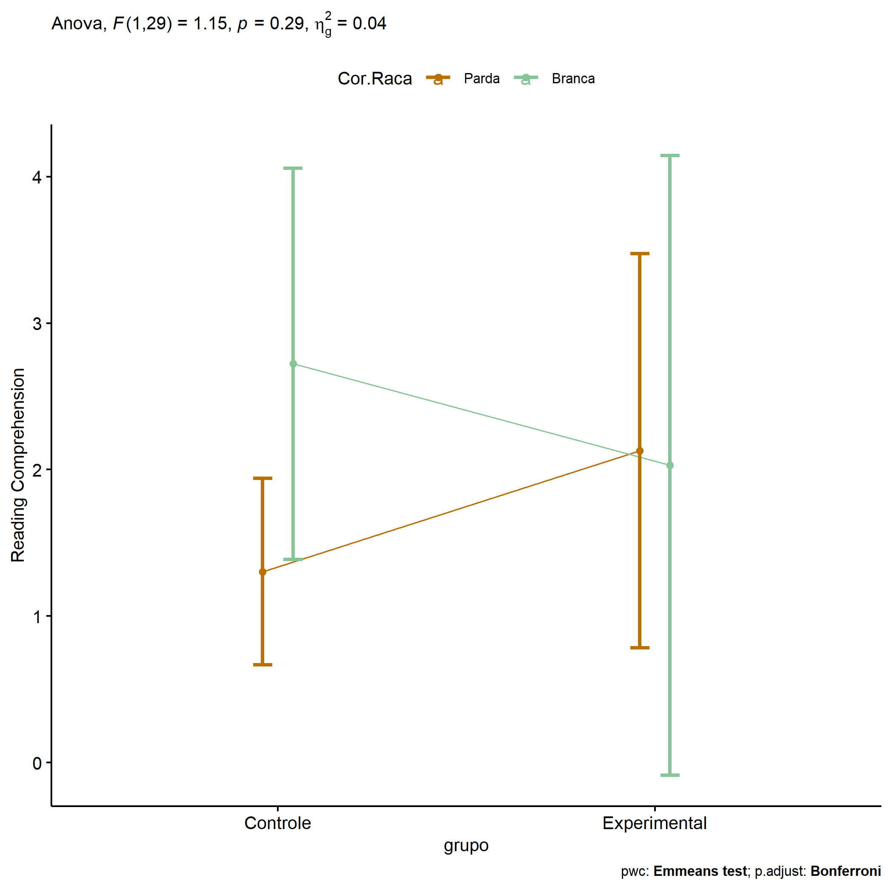<!-- -->

``` r
plots <- twoWayAncovaBoxPlots(
  wdat, "leitura.compreensao.pos", c("grupo","Cor.Raca"), aov, pwcs, covar = "leitura.compreensao.pre",
  theme = "classic", color = color[["grupo:Cor.Raca"]],
  subtitle = which(aov$Effect == "grupo:Cor.Raca"))
```

``` r
plots[["grupo:Cor.Raca"]] + ggplot2::ylab("Fluencia Leitora (Compreensão)") + ggplot2::scale_x_discrete(labels=c('pre', 'pos'))
```

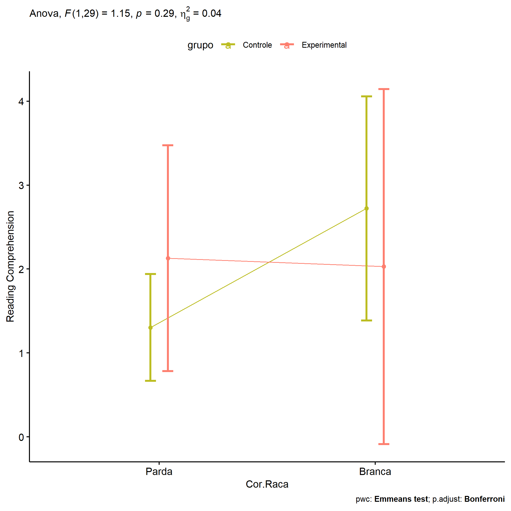<!-- -->

``` r
plots <- twoWayAncovaBoxPlots(
  wdat.long, "leitura.compreensao", c("grupo","Cor.Raca"), aov, pwc.long, pre.post = "time",
  theme = "classic", color = color$prepost)
```

``` r
plots[["grupo:Cor.Raca"]] + ggplot2::ylab("Fluencia Leitora (Compreensão)")
```

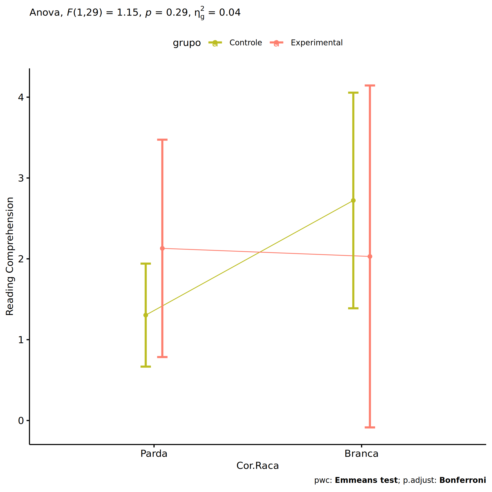<!-- -->

### Checking linearity assumption

``` r
ggscatter(wdat, x = "leitura.compreensao.pre", y = "leitura.compreensao.pos", size = 0.5,
          facet.by = c("grupo","Cor.Raca"), add = "reg.line")+
  stat_regline_equation(
    aes(label =  paste(..eq.label.., ..rr.label.., sep = "~~~~"))
  )
```

<!-- -->

### Checking normality and homogeneity

``` r
res <- augment(lm(leitura.compreensao.pos ~ leitura.compreensao.pre + grupo*Cor.Raca, data = wdat))
```

``` r
shapiro_test(res$.resid)
```

    ## # A tibble: 1 × 3
    ##   variable   statistic p.value
    ##   <chr>          <dbl>   <dbl>
    ## 1 res$.resid     0.952   0.148

``` r
levene_test(res, .resid ~ grupo*Cor.Raca)
```

    ## # A tibble: 1 × 4
    ##     df1   df2 statistic     p
    ##   <int> <int>     <dbl> <dbl>
    ## 1     4    28     0.558 0.695

# ANCOVA and Pairwise for two factors **grupo:Serie**

## Without remove non-normal data

``` r
pdat = remove_group_data(dat[!is.na(dat[["grupo"]]) & !is.na(dat[["Serie"]]),], "leitura.compreensao.pos", c("grupo","Serie"))

pdat.long <- rbind(pdat[,c("id","grupo","Serie")], pdat[,c("id","grupo","Serie")])
pdat.long[["time"]] <- c(rep("pre", nrow(pdat)), rep("pos", nrow(pdat)))
pdat.long[["time"]] <- factor(pdat.long[["time"]], c("pre","pos"))
pdat.long[["leitura.compreensao"]] <- c(pdat[["leitura.compreensao.pre"]], pdat[["leitura.compreensao.pos"]])

aov = anova_test(pdat, leitura.compreensao.pos ~ leitura.compreensao.pre + grupo*Serie)
laov[["grupo:Serie"]] <- get_anova_table(aov)
```

``` r
pwcs <- list()
pwcs[["Serie"]] <- emmeans_test(
  group_by(pdat, grupo), leitura.compreensao.pos ~ Serie,
  covariate = leitura.compreensao.pre, p.adjust.method = "bonferroni")
pwcs[["grupo"]] <- emmeans_test(
  group_by(pdat, Serie), leitura.compreensao.pos ~ grupo,
  covariate = leitura.compreensao.pre, p.adjust.method = "bonferroni")

pwc <- plyr::rbind.fill(pwcs[["grupo"]], pwcs[["Serie"]])
pwc <- pwc[,c("grupo","Serie", colnames(pwc)[!colnames(pwc) %in% c("grupo","Serie")])]
```

``` r
pwc.long <- emmeans_test(dplyr::group_by_at(pdat.long, c("grupo","Serie")),
                         leitura.compreensao ~ time,
                         p.adjust.method = "bonferroni")
lpwc[["grupo:Serie"]] <- plyr::rbind.fill(pwc, pwc.long)
```

``` r
ds <- get.descriptives(pdat, "leitura.compreensao.pos", c("grupo","Serie"), covar = "leitura.compreensao.pre")
ds <- merge(ds[ds$variable != "leitura.compreensao.pre",],
            ds[ds$variable == "leitura.compreensao.pre", !colnames(ds) %in% c("variable")],
            by = c("grupo","Serie"), all.x = T, suffixes = c("", ".leitura.compreensao.pre"))
ds <- merge(get_emmeans(pwcs[["grupo"]]), ds, by = c("grupo","Serie"), suffixes = c(".emms", ""))
ds <- ds[,c("grupo","Serie","n","mean.leitura.compreensao.pre","se.leitura.compreensao.pre","mean","se","emmean","se.emms")]

colnames(ds) <- c("grupo","Serie", "N", paste0(c("M","SE")," (pre)"),
                  paste0(c("M","SE"), " (unadj)"), paste0(c("M", "SE"), " (adj)"))

lemms[["grupo:Serie"]] <- ds
```

## Computing ANCOVA and PairWise After removing non-normal data (OK)

``` r
wdat = pdat 

res = residuals(lm(leitura.compreensao.pos ~ leitura.compreensao.pre + grupo*Serie, data = wdat))
non.normal = getNonNormal(res, wdat$id, plimit = 0.05)

wdat = wdat[!wdat$id %in% non.normal,]

wdat.long <- rbind(wdat[,c("id","grupo","Serie")], wdat[,c("id","grupo","Serie")])
wdat.long[["time"]] <- c(rep("pre", nrow(wdat)), rep("pos", nrow(wdat)))
wdat.long[["time"]] <- factor(wdat.long[["time"]], c("pre","pos"))
wdat.long[["leitura.compreensao"]] <- c(wdat[["leitura.compreensao.pre"]], wdat[["leitura.compreensao.pos"]])


ldat[["grupo:Serie"]] = wdat

(non.normal)
```

    ##  [1] "P2386" "P3049" "P123"  "P140"  "P1101" "P3035" "P3013" "P3234" "P3239" "P2226" "P3028" "P138" 
    ## [13] "P124"  "P1098" "P2397" "P3154" "P232"  "P3165" "P137"  "P120"  "P126"  "P3018" "P3014" "P3092"
    ## [25] "P3093" "P1746" "P3244" "P246"  "P3170" "P3040" "P3183" "P3555" "P1742" "P133"  "P3002" "P3008"
    ## [37] "P3094" "P3016" "P3516" "P1716" "P1743" "P1106" "P231"  "P3176" "P3178" "P186"  "P3091" "P3116"
    ## [49] "P192"  "P3167" "P228"  "P3174" "P3058" "P3027" "P182"  "P3032" "P1729" "P1701" "P130"  "P3504"
    ## [61] "P3172"

``` r
aov = anova_test(wdat, leitura.compreensao.pos ~ leitura.compreensao.pre + grupo*Serie)
laov[["grupo:Serie"]] <- merge(get_anova_table(aov), laov[["grupo:Serie"]], by="Effect", suffixes = c("","'"))

(df = get_anova_table(aov))
```

    ## ANOVA Table (type II tests)
    ## 
    ##                    Effect DFn DFd      F        p p<.05   ges
    ## 1 leitura.compreensao.pre   1 142 48.075 1.33e-10     * 0.253
    ## 2                   grupo   1 142 31.012 1.24e-07     * 0.179
    ## 3                   Serie   3 142  4.151 7.00e-03     * 0.081
    ## 4             grupo:Serie   3 142  2.280 8.20e-02       0.046

| Effect                  | DFn | DFd |      F |     p | p\<.05 |   ges |
|:------------------------|----:|----:|-------:|------:|:-------|------:|
| leitura.compreensao.pre |   1 | 142 | 48.075 | 0.000 | \*     | 0.253 |
| grupo                   |   1 | 142 | 31.012 | 0.000 | \*     | 0.179 |
| Serie                   |   3 | 142 |  4.151 | 0.007 | \*     | 0.081 |
| grupo:Serie             |   3 | 142 |  2.280 | 0.082 |        | 0.046 |

``` r
pwcs <- list()
pwcs[["Serie"]] <- emmeans_test(
  group_by(wdat, grupo), leitura.compreensao.pos ~ Serie,
  covariate = leitura.compreensao.pre, p.adjust.method = "bonferroni")
pwcs[["grupo"]] <- emmeans_test(
  group_by(wdat, Serie), leitura.compreensao.pos ~ grupo,
  covariate = leitura.compreensao.pre, p.adjust.method = "bonferroni")

pwc <- plyr::rbind.fill(pwcs[["grupo"]], pwcs[["Serie"]])
pwc <- pwc[,c("grupo","Serie", colnames(pwc)[!colnames(pwc) %in% c("grupo","Serie")])]
```

| grupo        | Serie | term                           | .y.                     | group1   | group2       |  df | statistic |     p | p.adj | p.adj.signif |
|:-------------|:------|:-------------------------------|:------------------------|:---------|:-------------|----:|----------:|------:|------:|:-------------|
|              | 6 ano | leitura.compreensao.pre\*grupo | leitura.compreensao.pos | Controle | Experimental | 142 |    -1.606 | 0.110 | 0.110 | ns           |
|              | 7 ano | leitura.compreensao.pre\*grupo | leitura.compreensao.pos | Controle | Experimental | 142 |    -4.495 | 0.000 | 0.000 | \*\*\*\*     |
|              | 8 ano | leitura.compreensao.pre\*grupo | leitura.compreensao.pos | Controle | Experimental | 142 |    -3.522 | 0.001 | 0.001 | \*\*\*       |
|              | 9 ano | leitura.compreensao.pre\*grupo | leitura.compreensao.pos | Controle | Experimental | 142 |    -1.658 | 0.100 | 0.100 | ns           |
| Controle     |       | leitura.compreensao.pre\*Serie | leitura.compreensao.pos | 6 ano    | 7 ano        | 142 |     0.896 | 0.372 | 1.000 | ns           |
| Controle     |       | leitura.compreensao.pre\*Serie | leitura.compreensao.pos | 6 ano    | 8 ano        | 142 |     2.935 | 0.004 | 0.023 | \*           |
| Controle     |       | leitura.compreensao.pre\*Serie | leitura.compreensao.pos | 6 ano    | 9 ano        | 142 |    -0.450 | 0.654 | 1.000 | ns           |
| Controle     |       | leitura.compreensao.pre\*Serie | leitura.compreensao.pos | 7 ano    | 8 ano        | 142 |     2.025 | 0.045 | 0.269 | ns           |
| Controle     |       | leitura.compreensao.pre\*Serie | leitura.compreensao.pos | 7 ano    | 9 ano        | 142 |    -1.297 | 0.197 | 1.000 | ns           |
| Controle     |       | leitura.compreensao.pre\*Serie | leitura.compreensao.pos | 8 ano    | 9 ano        | 142 |    -3.272 | 0.001 | 0.008 | \*\*         |
| Experimental |       | leitura.compreensao.pre\*Serie | leitura.compreensao.pos | 6 ano    | 7 ano        | 142 |    -2.191 | 0.030 | 0.181 | ns           |
| Experimental |       | leitura.compreensao.pre\*Serie | leitura.compreensao.pos | 6 ano    | 8 ano        | 142 |     0.286 | 0.775 | 1.000 | ns           |
| Experimental |       | leitura.compreensao.pre\*Serie | leitura.compreensao.pos | 6 ano    | 9 ano        | 142 |    -0.558 | 0.577 | 1.000 | ns           |
| Experimental |       | leitura.compreensao.pre\*Serie | leitura.compreensao.pos | 7 ano    | 8 ano        | 142 |     2.390 | 0.018 | 0.109 | ns           |
| Experimental |       | leitura.compreensao.pre\*Serie | leitura.compreensao.pos | 7 ano    | 9 ano        | 142 |     1.464 | 0.145 | 0.873 | ns           |
| Experimental |       | leitura.compreensao.pre\*Serie | leitura.compreensao.pos | 8 ano    | 9 ano        | 142 |    -0.801 | 0.425 | 1.000 | ns           |

``` r
pwc.long <- emmeans_test(dplyr::group_by_at(wdat.long, c("grupo","Serie")),
                         leitura.compreensao ~ time,
                         p.adjust.method = "bonferroni")
lpwc[["grupo:Serie"]] <- merge(plyr::rbind.fill(pwc, pwc.long), lpwc[["grupo:Serie"]], by=c("grupo","Serie","term",".y.","group1","group2"), suffixes = c("","'"))
```

| grupo        | Serie | term | .y.                 | group1 | group2 |  df | statistic |     p | p.adj | p.adj.signif |
|:-------------|:------|:-----|:--------------------|:-------|:-------|----:|----------:|------:|------:|:-------------|
| Controle     | 6 ano | time | leitura.compreensao | pre    | pos    | 286 |    -1.482 | 0.139 | 0.139 | ns           |
| Controle     | 7 ano | time | leitura.compreensao | pre    | pos    | 286 |    -1.565 | 0.119 | 0.119 | ns           |
| Controle     | 8 ano | time | leitura.compreensao | pre    | pos    | 286 |     0.833 | 0.406 | 0.406 | ns           |
| Controle     | 9 ano | time | leitura.compreensao | pre    | pos    | 286 |    -1.429 | 0.154 | 0.154 | ns           |
| Experimental | 6 ano | time | leitura.compreensao | pre    | pos    | 286 |    -1.792 | 0.074 | 0.074 | ns           |
| Experimental | 7 ano | time | leitura.compreensao | pre    | pos    | 286 |    -3.557 | 0.000 | 0.000 | \*\*\*       |
| Experimental | 8 ano | time | leitura.compreensao | pre    | pos    | 286 |    -1.636 | 0.103 | 0.103 | ns           |
| Experimental | 9 ano | time | leitura.compreensao | pre    | pos    | 286 |    -2.633 | 0.009 | 0.009 | \*\*         |

``` r
ds <- get.descriptives(wdat, "leitura.compreensao.pos", c("grupo","Serie"), covar = "leitura.compreensao.pre")
ds <- merge(ds[ds$variable != "leitura.compreensao.pre",],
            ds[ds$variable == "leitura.compreensao.pre", !colnames(ds) %in% c("variable")],
            by = c("grupo","Serie"), all.x = T, suffixes = c("", ".leitura.compreensao.pre"))
ds <- merge(get_emmeans(pwcs[["grupo"]]), ds, by = c("grupo","Serie"), suffixes = c(".emms", ""))
ds <- ds[,c("grupo","Serie","n","mean.leitura.compreensao.pre","se.leitura.compreensao.pre","mean","se","emmean","se.emms")]

colnames(ds) <- c("grupo","Serie", "N", paste0(c("M","SE")," (pre)"),
                  paste0(c("M","SE"), " (unadj)"), paste0(c("M", "SE"), " (adj)"))

lemms[["grupo:Serie"]] <- merge(ds, lemms[["grupo:Serie"]], by=c("grupo","Serie"), suffixes = c("","'"))
```

| grupo        | Serie |   N | M (pre) | SE (pre) | M (unadj) | SE (unadj) | M (adj) | SE (adj) |
|:-------------|:------|----:|--------:|---------:|----------:|-----------:|--------:|---------:|
| Controle     | 6 ano |  29 |   4.448 |    0.367 |     5.241 |      0.288 |   5.205 |    0.316 |
| Controle     | 7 ano |  26 |   3.500 |    0.527 |     4.385 |      0.524 |   4.790 |    0.338 |
| Controle     | 8 ano |  21 |   4.238 |    0.516 |     3.714 |      0.570 |   3.776 |    0.371 |
| Controle     | 9 ano |  26 |   4.808 |    0.408 |     5.615 |      0.289 |   5.412 |    0.334 |
| Experimental | 6 ano |  15 |   5.067 |    0.371 |     6.400 |      0.412 |   6.076 |    0.441 |
| Experimental | 7 ano |  11 |   4.545 |    0.608 |     7.636 |      0.364 |   7.555 |    0.512 |
| Experimental | 8 ano |  13 |   4.769 |    0.482 |     6.077 |      0.415 |   5.891 |    0.472 |
| Experimental | 9 ano |  10 |   3.800 |    0.512 |     6.200 |      0.629 |   6.466 |    0.539 |

### Plots for ancova

``` r
plots <- twoWayAncovaPlots(
  wdat, "leitura.compreensao.pos", c("grupo","Serie"), aov, pwcs, addParam = c("mean_se"),
  font.label.size=10, step.increase=0.05, p.label="p.adj",
  subtitle = which(aov$Effect == "grupo:Serie"))
```

``` r
if (!is.null(plots[["grupo"]]))
  plots[["grupo"]] + ggplot2::scale_color_manual(values = color[["Serie"]])
```

    ## Scale for colour is already present.
    ## Adding another scale for colour, which will replace the existing scale.

<!-- -->

``` r
if (!is.null(plots[["Serie"]]))
  plots[["Serie"]] + ggplot2::scale_color_manual(values = color[["grupo"]])
```

    ## Scale for colour is already present.
    ## Adding another scale for colour, which will replace the existing scale.

<!-- -->

``` r
plots <- twoWayAncovaBoxPlots(
  wdat, "leitura.compreensao.pos", c("grupo","Serie"), aov, pwcs, covar = "leitura.compreensao.pre",
  theme = "classic", color = color[["grupo:Serie"]],
  subtitle = which(aov$Effect == "grupo:Serie"))
```

``` r
plots[["grupo:Serie"]] + ggplot2::ylab("Fluencia Leitora (Compreensão)") + ggplot2::scale_x_discrete(labels=c('pre', 'pos'))
```

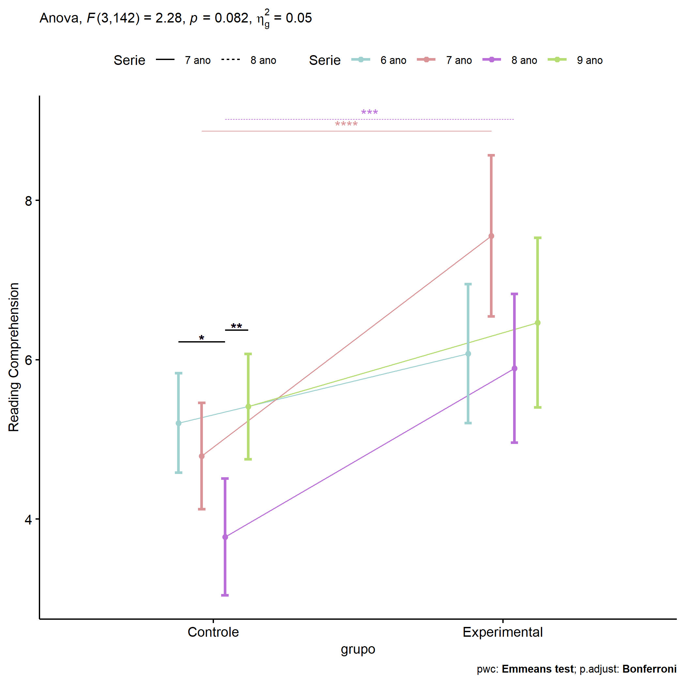<!-- -->

``` r
plots <- twoWayAncovaBoxPlots(
  wdat.long, "leitura.compreensao", c("grupo","Serie"), aov, pwc.long, pre.post = "time",
  theme = "classic", color = color$prepost)
```

``` r
plots[["grupo:Serie"]] + ggplot2::ylab("Fluencia Leitora (Compreensão)")
```

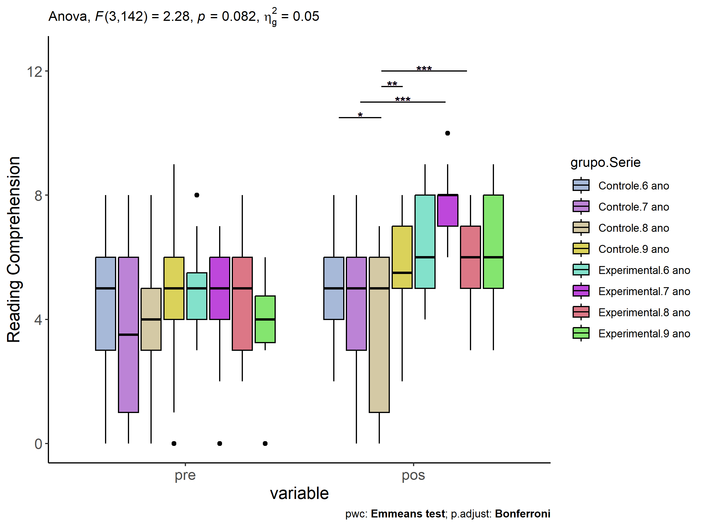<!-- -->

### Checking linearity assumption

``` r
ggscatter(wdat, x = "leitura.compreensao.pre", y = "leitura.compreensao.pos", size = 0.5,
          facet.by = c("grupo","Serie"), add = "reg.line")+
  stat_regline_equation(
    aes(label =  paste(..eq.label.., ..rr.label.., sep = "~~~~"))
  )
```

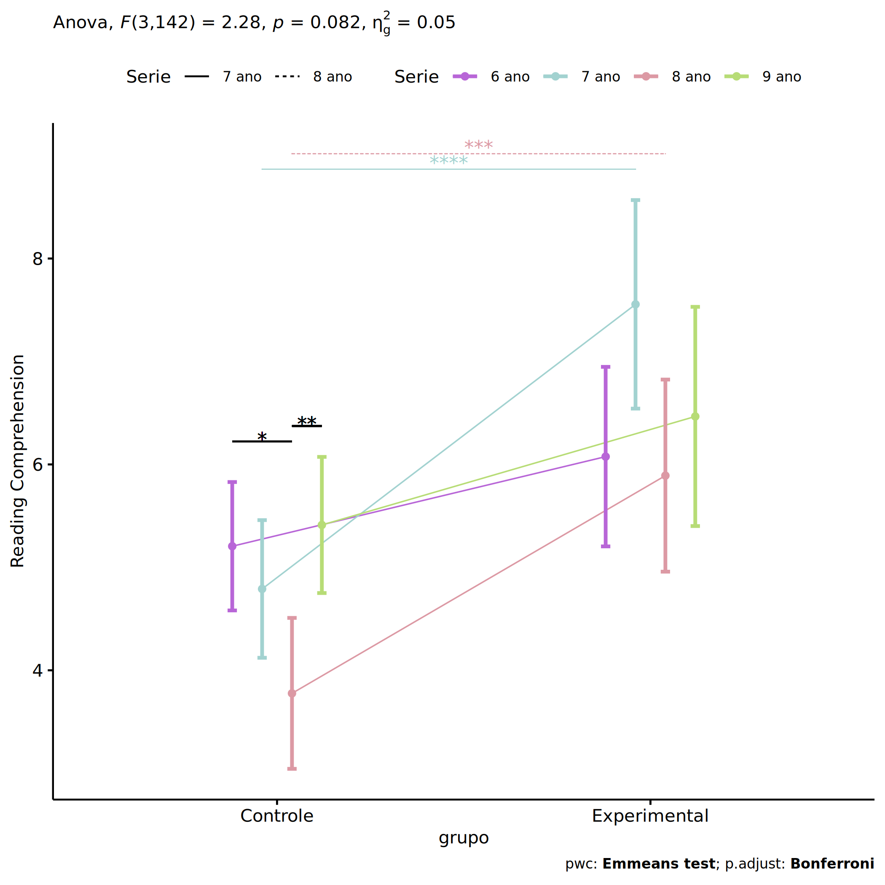<!-- -->

### Checking normality and homogeneity

``` r
res <- augment(lm(leitura.compreensao.pos ~ leitura.compreensao.pre + grupo*Serie, data = wdat))
```

``` r
shapiro_test(res$.resid)
```

    ## # A tibble: 1 × 3
    ##   variable   statistic p.value
    ##   <chr>          <dbl>   <dbl>
    ## 1 res$.resid     0.992   0.577

``` r
levene_test(res, .resid ~ grupo*Serie)
```

    ## # A tibble: 1 × 4
    ##     df1   df2 statistic      p
    ##   <int> <int>     <dbl>  <dbl>
    ## 1     7   143      2.44 0.0216

# ANCOVA and Pairwise for two factors **grupo:leitura.compreensao.quintile**

## Without remove non-normal data

``` r
pdat = remove_group_data(dat[!is.na(dat[["grupo"]]) & !is.na(dat[["leitura.compreensao.quintile"]]),], "leitura.compreensao.pos", c("grupo","leitura.compreensao.quintile"))

pdat.long <- rbind(pdat[,c("id","grupo","leitura.compreensao.quintile")], pdat[,c("id","grupo","leitura.compreensao.quintile")])
pdat.long[["time"]] <- c(rep("pre", nrow(pdat)), rep("pos", nrow(pdat)))
pdat.long[["time"]] <- factor(pdat.long[["time"]], c("pre","pos"))
pdat.long[["leitura.compreensao"]] <- c(pdat[["leitura.compreensao.pre"]], pdat[["leitura.compreensao.pos"]])

aov = anova_test(pdat, leitura.compreensao.pos ~ leitura.compreensao.pre + grupo*leitura.compreensao.quintile)
laov[["grupo:leitura.compreensao.quintile"]] <- get_anova_table(aov)
```

``` r
pwcs <- list()
pwcs[["leitura.compreensao.quintile"]] <- emmeans_test(
  group_by(pdat, grupo), leitura.compreensao.pos ~ leitura.compreensao.quintile,
  covariate = leitura.compreensao.pre, p.adjust.method = "bonferroni")
pwcs[["grupo"]] <- emmeans_test(
  group_by(pdat, leitura.compreensao.quintile), leitura.compreensao.pos ~ grupo,
  covariate = leitura.compreensao.pre, p.adjust.method = "bonferroni")

pwc <- plyr::rbind.fill(pwcs[["grupo"]], pwcs[["leitura.compreensao.quintile"]])
pwc <- pwc[,c("grupo","leitura.compreensao.quintile", colnames(pwc)[!colnames(pwc) %in% c("grupo","leitura.compreensao.quintile")])]
```

``` r
pwc.long <- emmeans_test(dplyr::group_by_at(pdat.long, c("grupo","leitura.compreensao.quintile")),
                         leitura.compreensao ~ time,
                         p.adjust.method = "bonferroni")
lpwc[["grupo:leitura.compreensao.quintile"]] <- plyr::rbind.fill(pwc, pwc.long)
```

``` r
ds <- get.descriptives(pdat, "leitura.compreensao.pos", c("grupo","leitura.compreensao.quintile"), covar = "leitura.compreensao.pre")
ds <- merge(ds[ds$variable != "leitura.compreensao.pre",],
            ds[ds$variable == "leitura.compreensao.pre", !colnames(ds) %in% c("variable")],
            by = c("grupo","leitura.compreensao.quintile"), all.x = T, suffixes = c("", ".leitura.compreensao.pre"))
ds <- merge(get_emmeans(pwcs[["grupo"]]), ds, by = c("grupo","leitura.compreensao.quintile"), suffixes = c(".emms", ""))
ds <- ds[,c("grupo","leitura.compreensao.quintile","n","mean.leitura.compreensao.pre","se.leitura.compreensao.pre","mean","se","emmean","se.emms")]

colnames(ds) <- c("grupo","leitura.compreensao.quintile", "N", paste0(c("M","SE")," (pre)"),
                  paste0(c("M","SE"), " (unadj)"), paste0(c("M", "SE"), " (adj)"))

lemms[["grupo:leitura.compreensao.quintile"]] <- ds
```

## Computing ANCOVA and PairWise After removing non-normal data (OK)

``` r
wdat = pdat 

res = residuals(lm(leitura.compreensao.pos ~ leitura.compreensao.pre + grupo*leitura.compreensao.quintile, data = wdat))
non.normal = getNonNormal(res, wdat$id, plimit = 0.05)

wdat = wdat[!wdat$id %in% non.normal,]

wdat.long <- rbind(wdat[,c("id","grupo","leitura.compreensao.quintile")], wdat[,c("id","grupo","leitura.compreensao.quintile")])
wdat.long[["time"]] <- c(rep("pre", nrow(wdat)), rep("pos", nrow(wdat)))
wdat.long[["time"]] <- factor(wdat.long[["time"]], c("pre","pos"))
wdat.long[["leitura.compreensao"]] <- c(wdat[["leitura.compreensao.pre"]], wdat[["leitura.compreensao.pos"]])


ldat[["grupo:leitura.compreensao.quintile"]] = wdat

(non.normal)
```

    ##  [1] "P3018" "P2386" "P3014" "P246"  "P3170" "P138"  "P3040" "P124"  "P3028" "P3234" "P3239" "P1101"
    ## [13] "P3035" "P3154" "P232"  "P3013" "P3165" "P3183" "P123"  "P140"  "P3049" "P2226" "P186"  "P1746"
    ## [25] "P3091" "P3116" "P1098" "P228"  "P3174" "P2397" "P192"  "P3002" "P231"  "P3008" "P137"  "P3176"
    ## [37] "P120"  "P126"  "P3178" "P3094" "P3016" "P3555" "P3167" "P3092" "P2401" "P133"  "P3022" "P3055"
    ## [49] "P3160" "P3516" "P3244" "P3606" "P3181" "P941"  "P3153" "P247"  "P612"  "P3032" "P2383" "P3505"
    ## [61] "P613"  "P3609" "P446"  "P3518" "P936"  "P3598" "P626"  "P953"  "P1022" "P515"  "P521"  "P182" 
    ## [73] "P1729" "P3031" "P1089" "P176"  "P3027" "P3108" "P3172" "P1742" "P459"  "P1106" "P1743" "P3509"
    ## [85] "P3615" "P3630" "P224"  "P3565" "P174"  "P510"  "P3058" "P2385" "P1716"

``` r
aov = anova_test(wdat, leitura.compreensao.pos ~ leitura.compreensao.pre + grupo*leitura.compreensao.quintile)
laov[["grupo:leitura.compreensao.quintile"]] <- merge(get_anova_table(aov), laov[["grupo:leitura.compreensao.quintile"]], by="Effect", suffixes = c("","'"))

(df = get_anova_table(aov))
```

    ## ANOVA Table (type II tests)
    ## 
    ##                               Effect DFn DFd     F     p p<.05      ges
    ## 1            leitura.compreensao.pre   1 108 0.059 0.808       0.000547
    ## 2                              grupo   1 108 9.695 0.002     * 0.082000
    ## 3       leitura.compreensao.quintile   4 108 1.000 0.411       0.036000
    ## 4 grupo:leitura.compreensao.quintile   4 108 0.358 0.838       0.013000

| Effect                             | DFn | DFd |     F |     p | p\<.05 |   ges |
|:-----------------------------------|----:|----:|------:|------:|:-------|------:|
| leitura.compreensao.pre            |   1 | 108 | 0.059 | 0.808 |        | 0.001 |
| grupo                              |   1 | 108 | 9.695 | 0.002 | \*     | 0.082 |
| leitura.compreensao.quintile       |   4 | 108 | 1.000 | 0.411 |        | 0.036 |
| grupo:leitura.compreensao.quintile |   4 | 108 | 0.358 | 0.838 |        | 0.013 |

``` r
pwcs <- list()
pwcs[["leitura.compreensao.quintile"]] <- emmeans_test(
  group_by(wdat, grupo), leitura.compreensao.pos ~ leitura.compreensao.quintile,
  covariate = leitura.compreensao.pre, p.adjust.method = "bonferroni")
pwcs[["grupo"]] <- emmeans_test(
  group_by(wdat, leitura.compreensao.quintile), leitura.compreensao.pos ~ grupo,
  covariate = leitura.compreensao.pre, p.adjust.method = "bonferroni")

pwc <- plyr::rbind.fill(pwcs[["grupo"]], pwcs[["leitura.compreensao.quintile"]])
pwc <- pwc[,c("grupo","leitura.compreensao.quintile", colnames(pwc)[!colnames(pwc) %in% c("grupo","leitura.compreensao.quintile")])]
```

| grupo        | leitura.compreensao.quintile | term                                                  | .y.                     | group1       | group2       |  df | statistic |     p | p.adj | p.adj.signif |
|:-------------|:-----------------------------|:------------------------------------------------------|:------------------------|:-------------|:-------------|----:|----------:|------:|------:|:-------------|
|              | 1st quintile                 | leitura.compreensao.pre\*grupo                        | leitura.compreensao.pos | Controle     | Experimental | 108 |    -1.286 | 0.201 | 0.201 | ns           |
|              | 2nd quintile                 | leitura.compreensao.pre\*grupo                        | leitura.compreensao.pos | Controle     | Experimental | 108 |    -2.141 | 0.035 | 0.035 | \*           |
|              | 3rd quintile                 | leitura.compreensao.pre\*grupo                        | leitura.compreensao.pos | Controle     | Experimental | 108 |    -1.378 | 0.171 | 0.171 | ns           |
|              | 4th quintile                 | leitura.compreensao.pre\*grupo                        | leitura.compreensao.pos | Controle     | Experimental | 108 |    -0.563 | 0.575 | 0.575 | ns           |
|              | 5th quintile                 | leitura.compreensao.pre\*grupo                        | leitura.compreensao.pos | Controle     | Experimental | 108 |    -1.631 | 0.106 | 0.106 | ns           |
| Controle     |                              | leitura.compreensao.pre\*leitura.compreensao.quintile | leitura.compreensao.pos | 1st quintile | 2nd quintile | 108 |    -0.796 | 0.428 | 1.000 | ns           |
| Controle     |                              | leitura.compreensao.pre\*leitura.compreensao.quintile | leitura.compreensao.pos | 1st quintile | 3rd quintile | 108 |    -1.630 | 0.106 | 1.000 | ns           |
| Controle     |                              | leitura.compreensao.pre\*leitura.compreensao.quintile | leitura.compreensao.pos | 1st quintile | 4th quintile | 108 |    -1.737 | 0.085 | 0.853 | ns           |
| Controle     |                              | leitura.compreensao.pre\*leitura.compreensao.quintile | leitura.compreensao.pos | 1st quintile | 5th quintile | 108 |    -1.731 | 0.086 | 0.863 | ns           |
| Controle     |                              | leitura.compreensao.pre\*leitura.compreensao.quintile | leitura.compreensao.pos | 2nd quintile | 3rd quintile | 108 |    -1.809 | 0.073 | 0.732 | ns           |
| Controle     |                              | leitura.compreensao.pre\*leitura.compreensao.quintile | leitura.compreensao.pos | 2nd quintile | 4th quintile | 108 |    -2.025 | 0.045 | 0.453 | ns           |
| Controle     |                              | leitura.compreensao.pre\*leitura.compreensao.quintile | leitura.compreensao.pos | 2nd quintile | 5th quintile | 108 |    -2.004 | 0.048 | 0.476 | ns           |
| Controle     |                              | leitura.compreensao.pre\*leitura.compreensao.quintile | leitura.compreensao.pos | 3rd quintile | 4th quintile | 108 |    -1.365 | 0.175 | 1.000 | ns           |
| Controle     |                              | leitura.compreensao.pre\*leitura.compreensao.quintile | leitura.compreensao.pos | 3rd quintile | 5th quintile | 108 |    -1.608 | 0.111 | 1.000 | ns           |
| Controle     |                              | leitura.compreensao.pre\*leitura.compreensao.quintile | leitura.compreensao.pos | 4th quintile | 5th quintile | 108 |    -0.913 | 0.363 | 1.000 | ns           |
| Experimental |                              | leitura.compreensao.pre\*leitura.compreensao.quintile | leitura.compreensao.pos | 1st quintile | 2nd quintile | 108 |    -1.175 | 0.243 | 1.000 | ns           |
| Experimental |                              | leitura.compreensao.pre\*leitura.compreensao.quintile | leitura.compreensao.pos | 1st quintile | 3rd quintile | 108 |    -1.236 | 0.219 | 1.000 | ns           |
| Experimental |                              | leitura.compreensao.pre\*leitura.compreensao.quintile | leitura.compreensao.pos | 1st quintile | 4th quintile | 108 |    -1.300 | 0.196 | 1.000 | ns           |
| Experimental |                              | leitura.compreensao.pre\*leitura.compreensao.quintile | leitura.compreensao.pos | 1st quintile | 5th quintile | 108 |    -1.814 | 0.072 | 0.725 | ns           |
| Experimental |                              | leitura.compreensao.pre\*leitura.compreensao.quintile | leitura.compreensao.pos | 2nd quintile | 3rd quintile | 108 |    -0.441 | 0.660 | 1.000 | ns           |
| Experimental |                              | leitura.compreensao.pre\*leitura.compreensao.quintile | leitura.compreensao.pos | 2nd quintile | 4th quintile | 108 |    -0.814 | 0.418 | 1.000 | ns           |
| Experimental |                              | leitura.compreensao.pre\*leitura.compreensao.quintile | leitura.compreensao.pos | 2nd quintile | 5th quintile | 108 |    -1.621 | 0.108 | 1.000 | ns           |
| Experimental |                              | leitura.compreensao.pre\*leitura.compreensao.quintile | leitura.compreensao.pos | 3rd quintile | 4th quintile | 108 |    -0.697 | 0.487 | 1.000 | ns           |
| Experimental |                              | leitura.compreensao.pre\*leitura.compreensao.quintile | leitura.compreensao.pos | 3rd quintile | 5th quintile | 108 |    -1.890 | 0.061 | 0.614 | ns           |
| Experimental |                              | leitura.compreensao.pre\*leitura.compreensao.quintile | leitura.compreensao.pos | 4th quintile | 5th quintile | 108 |    -1.154 | 0.251 | 1.000 | ns           |

``` r
pwc.long <- emmeans_test(dplyr::group_by_at(wdat.long, c("grupo","leitura.compreensao.quintile")),
                         leitura.compreensao ~ time,
                         p.adjust.method = "bonferroni")
lpwc[["grupo:leitura.compreensao.quintile"]] <- merge(plyr::rbind.fill(pwc, pwc.long), lpwc[["grupo:leitura.compreensao.quintile"]], by=c("grupo","leitura.compreensao.quintile","term",".y.","group1","group2"), suffixes = c("","'"))
```

| grupo        | leitura.compreensao.quintile | term | .y.                 | group1 | group2 |  df | statistic |     p | p.adj | p.adj.signif |
|:-------------|:-----------------------------|:-----|:--------------------|:-------|:-------|----:|----------:|------:|------:|:-------------|
| Controle     | 1st quintile                 | time | leitura.compreensao | pre    | pos    | 218 |    -7.112 | 0.000 | 0.000 | \*\*\*\*     |
| Controle     | 2nd quintile                 | time | leitura.compreensao | pre    | pos    | 218 |    -1.456 | 0.147 | 0.147 | ns           |
| Controle     | 3rd quintile                 | time | leitura.compreensao | pre    | pos    | 218 |    -1.569 | 0.118 | 0.118 | ns           |
| Controle     | 4th quintile                 | time | leitura.compreensao | pre    | pos    | 218 |     0.500 | 0.617 | 0.617 | ns           |
| Controle     | 5th quintile                 | time | leitura.compreensao | pre    | pos    | 218 |     2.496 | 0.013 | 0.013 | \*           |
| Experimental | 1st quintile                 | time | leitura.compreensao | pre    | pos    | 218 |    -4.055 | 0.000 | 0.000 | \*\*\*\*     |
| Experimental | 2nd quintile                 | time | leitura.compreensao | pre    | pos    | 218 |    -4.009 | 0.000 | 0.000 | \*\*\*\*     |
| Experimental | 3rd quintile                 | time | leitura.compreensao | pre    | pos    | 218 |    -2.423 | 0.016 | 0.016 | \*           |
| Experimental | 4th quintile                 | time | leitura.compreensao | pre    | pos    | 218 |    -0.360 | 0.719 | 0.719 | ns           |
| Experimental | 5th quintile                 | time | leitura.compreensao | pre    | pos    | 218 |    -0.558 | 0.577 | 0.577 | ns           |

``` r
ds <- get.descriptives(wdat, "leitura.compreensao.pos", c("grupo","leitura.compreensao.quintile"), covar = "leitura.compreensao.pre")
ds <- merge(ds[ds$variable != "leitura.compreensao.pre",],
            ds[ds$variable == "leitura.compreensao.pre", !colnames(ds) %in% c("variable")],
            by = c("grupo","leitura.compreensao.quintile"), all.x = T, suffixes = c("", ".leitura.compreensao.pre"))
ds <- merge(get_emmeans(pwcs[["grupo"]]), ds, by = c("grupo","leitura.compreensao.quintile"), suffixes = c(".emms", ""))
ds <- ds[,c("grupo","leitura.compreensao.quintile","n","mean.leitura.compreensao.pre","se.leitura.compreensao.pre","mean","se","emmean","se.emms")]

colnames(ds) <- c("grupo","leitura.compreensao.quintile", "N", paste0(c("M","SE")," (pre)"),
                  paste0(c("M","SE"), " (unadj)"), paste0(c("M", "SE"), " (adj)"))

lemms[["grupo:leitura.compreensao.quintile"]] <- merge(ds, lemms[["grupo:leitura.compreensao.quintile"]], by=c("grupo","leitura.compreensao.quintile"), suffixes = c("","'"))
```

| grupo        | leitura.compreensao.quintile |   N | M (pre) | SE (pre) | M (unadj) | SE (unadj) | M (adj) | SE (adj) |
|:-------------|:-----------------------------|----:|--------:|---------:|----------:|-----------:|--------:|---------:|
| Controle     | 1st quintile                 |  17 |   0.412 |    0.173 |     3.176 |      0.551 |   2.897 |    1.209 |
| Controle     | 2nd quintile                 |   9 |   3.000 |    0.000 |     3.778 |      0.494 |   3.683 |    0.642 |
| Controle     | 3rd quintile                 |  31 |   4.548 |    0.091 |     5.000 |      0.227 |   5.016 |    0.282 |
| Controle     | 4th quintile                 |  14 |   6.000 |    0.000 |     5.786 |      0.318 |   5.905 |    0.639 |
| Controle     | 5th quintile                 |  16 |   7.312 |    0.120 |     6.312 |      0.299 |   6.526 |    0.957 |
| Experimental | 1st quintile                 |   4 |   1.000 |    0.577 |     4.250 |      1.436 |   4.012 |    1.241 |
| Experimental | 2nd quintile                 |   7 |   3.000 |    0.000 |     5.429 |      0.685 |   5.334 |    0.698 |
| Experimental | 3rd quintile                 |  13 |   4.615 |    0.140 |     5.692 |      0.263 |   5.713 |    0.433 |
| Experimental | 4th quintile                 |   3 |   6.000 |    0.000 |     6.333 |      0.882 |   6.453 |    1.011 |
| Experimental | 5th quintile                 |   5 |   7.200 |    0.200 |     7.600 |      0.510 |   7.805 |    1.086 |

### Plots for ancova

``` r
plots <- twoWayAncovaPlots(
  wdat, "leitura.compreensao.pos", c("grupo","leitura.compreensao.quintile"), aov, pwcs, addParam = c("mean_se"),
  font.label.size=10, step.increase=0.05, p.label="p.adj",
  subtitle = which(aov$Effect == "grupo:leitura.compreensao.quintile"))
```

``` r
if (!is.null(plots[["grupo"]]))
  plots[["grupo"]] + ggplot2::scale_color_manual(values = color[["leitura.compreensao.quintile"]])
```

    ## Scale for colour is already present.
    ## Adding another scale for colour, which will replace the existing scale.

<!-- -->

``` r
if (!is.null(plots[["leitura.compreensao.quintile"]]))
  plots[["leitura.compreensao.quintile"]] + ggplot2::scale_color_manual(values = color[["grupo"]])
```

    ## Scale for colour is already present.
    ## Adding another scale for colour, which will replace the existing scale.

<!-- -->

``` r
plots <- twoWayAncovaBoxPlots(
  wdat, "leitura.compreensao.pos", c("grupo","leitura.compreensao.quintile"), aov, pwcs, covar = "leitura.compreensao.pre",
  theme = "classic", color = color[["grupo:leitura.compreensao.quintile"]],
  subtitle = which(aov$Effect == "grupo:leitura.compreensao.quintile"))
```

``` r
plots[["grupo:leitura.compreensao.quintile"]] + ggplot2::ylab("Fluencia Leitora (Compreensão)") + ggplot2::scale_x_discrete(labels=c('pre', 'pos'))
```

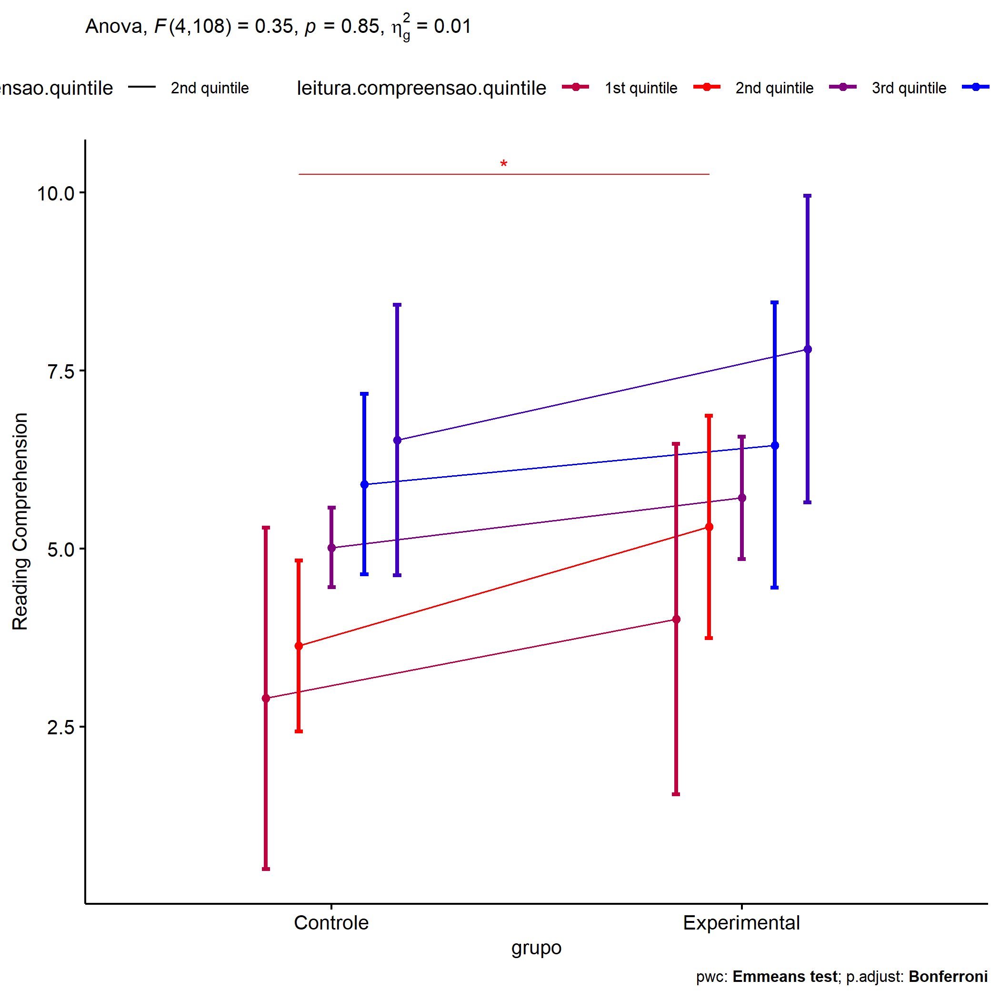<!-- -->

``` r
plots <- twoWayAncovaBoxPlots(
  wdat.long, "leitura.compreensao", c("grupo","leitura.compreensao.quintile"), aov, pwc.long, pre.post = "time",
  theme = "classic", color = color$prepost)
```

``` r
plots[["grupo:leitura.compreensao.quintile"]] + ggplot2::ylab("Fluencia Leitora (Compreensão)")
```

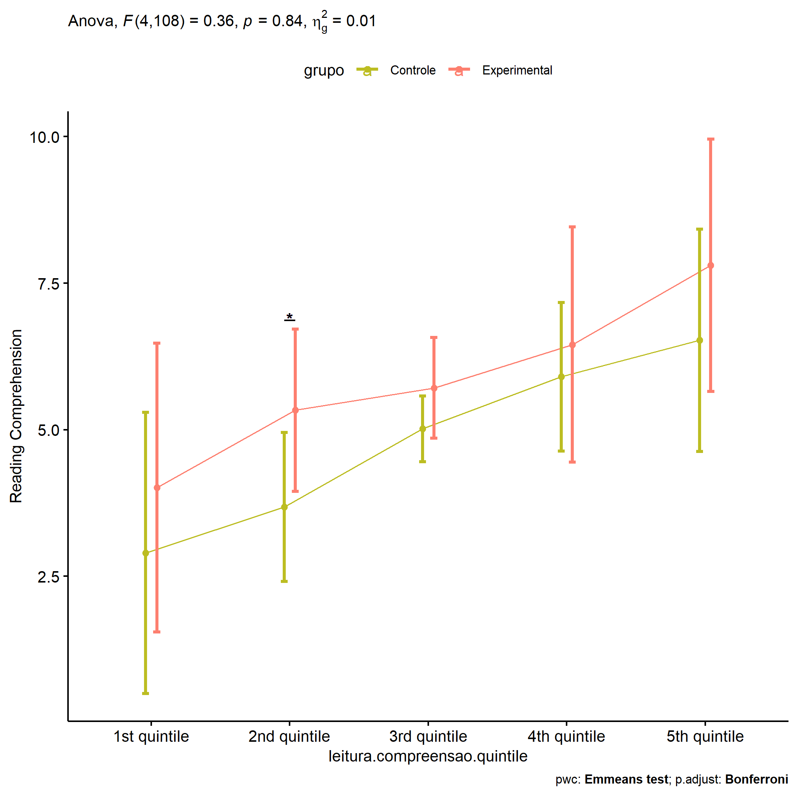<!-- -->

### Checking linearity assumption

``` r
ggscatter(wdat, x = "leitura.compreensao.pre", y = "leitura.compreensao.pos", size = 0.5,
          facet.by = c("grupo","leitura.compreensao.quintile"), add = "reg.line")+
  stat_regline_equation(
    aes(label =  paste(..eq.label.., ..rr.label.., sep = "~~~~"))
  )
```

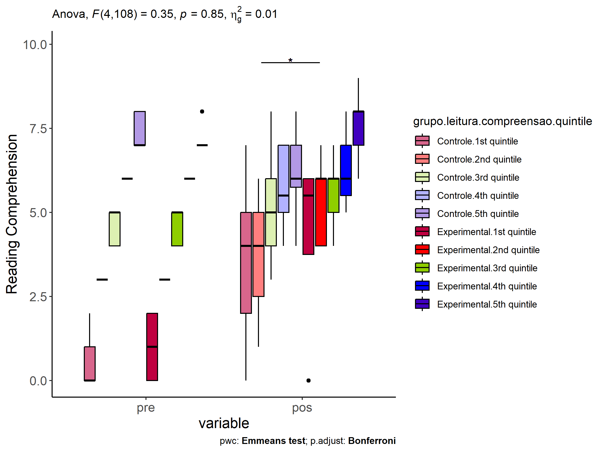<!-- -->

### Checking normality and homogeneity

``` r
res <- augment(lm(leitura.compreensao.pos ~ leitura.compreensao.pre + grupo*leitura.compreensao.quintile, data = wdat))
```

``` r
shapiro_test(res$.resid)
```

    ## # A tibble: 1 × 3
    ##   variable   statistic p.value
    ##   <chr>          <dbl>   <dbl>
    ## 1 res$.resid     0.984   0.170

``` r
levene_test(res, .resid ~ grupo*leitura.compreensao.quintile)
```

    ## # A tibble: 1 × 4
    ##     df1   df2 statistic      p
    ##   <int> <int>     <dbl>  <dbl>
    ## 1     9   109      1.75 0.0864

# Summary of Results

## Descriptive Statistics

``` r
df <- get.descriptives(ldat[["grupo"]], c(dv.pre, dv.pos), c("grupo"), 
                       include.global = T, symmetry.test = T, normality.test = F)
df <- plyr::rbind.fill(
  df, do.call(plyr::rbind.fill, lapply(lfatores2, FUN = function(f) {
    if (nrow(dat) > 0 && sum(!is.na(unique(dat[[f]]))) > 1)
      get.descriptives(ldat[[paste0("grupo:",f)]], c(dv.pre,dv.pos), c("grupo", f),
                       symmetry.test = T, normality.test = F)
    }))
)
(df <- df[,c(fatores1[fatores1 %in% colnames(df)],"variable",
             colnames(df)[!colnames(df) %in% c(fatores1,"variable")])])
```

    ##           grupo Sexo   Zona Cor.Raca Serie leitura.compreensao.quintile                variable   n
    ## 1      Controle <NA>   <NA>     <NA>  <NA>                         <NA> leitura.compreensao.pre  85
    ## 2  Experimental <NA>   <NA>     <NA>  <NA>                         <NA> leitura.compreensao.pre  43
    ## 3          <NA> <NA>   <NA>     <NA>  <NA>                         <NA> leitura.compreensao.pre 128
    ## 4      Controle <NA>   <NA>     <NA>  <NA>                         <NA> leitura.compreensao.pos  85
    ## 5  Experimental <NA>   <NA>     <NA>  <NA>                         <NA> leitura.compreensao.pos  43
    ## 6          <NA> <NA>   <NA>     <NA>  <NA>                         <NA> leitura.compreensao.pos 128
    ## 7      Controle    F   <NA>     <NA>  <NA>                         <NA> leitura.compreensao.pre   8
    ## 8      Controle    M   <NA>     <NA>  <NA>                         <NA> leitura.compreensao.pre  16
    ## 9  Experimental    F   <NA>     <NA>  <NA>                         <NA> leitura.compreensao.pre   2
    ## 10 Experimental    M   <NA>     <NA>  <NA>                         <NA> leitura.compreensao.pre   5
    ## 11     Controle    F   <NA>     <NA>  <NA>                         <NA> leitura.compreensao.pos   8
    ## 12     Controle    M   <NA>     <NA>  <NA>                         <NA> leitura.compreensao.pos  16
    ## 13 Experimental    F   <NA>     <NA>  <NA>                         <NA> leitura.compreensao.pos   2
    ## 14 Experimental    M   <NA>     <NA>  <NA>                         <NA> leitura.compreensao.pos   5
    ## 15     Controle <NA>  Rural     <NA>  <NA>                         <NA> leitura.compreensao.pre  28
    ## 16     Controle <NA> Urbana     <NA>  <NA>                         <NA> leitura.compreensao.pre  18
    ## 17 Experimental <NA>  Rural     <NA>  <NA>                         <NA> leitura.compreensao.pre   7
    ## 18 Experimental <NA> Urbana     <NA>  <NA>                         <NA> leitura.compreensao.pre   9
    ## 19     Controle <NA>  Rural     <NA>  <NA>                         <NA> leitura.compreensao.pos  28
    ## 20     Controle <NA> Urbana     <NA>  <NA>                         <NA> leitura.compreensao.pos  18
    ## 21 Experimental <NA>  Rural     <NA>  <NA>                         <NA> leitura.compreensao.pos   7
    ## 22 Experimental <NA> Urbana     <NA>  <NA>                         <NA> leitura.compreensao.pos   9
    ## 23     Controle <NA>   <NA>   Branca  <NA>                         <NA> leitura.compreensao.pre   5
    ## 24     Controle <NA>   <NA>    Parda  <NA>                         <NA> leitura.compreensao.pre  18
    ## 25 Experimental <NA>   <NA>   Branca  <NA>                         <NA> leitura.compreensao.pre   2
    ## 26 Experimental <NA>   <NA> Indígena  <NA>                         <NA> leitura.compreensao.pre   3
    ## 27 Experimental <NA>   <NA>    Parda  <NA>                         <NA> leitura.compreensao.pre   5
    ## 28     Controle <NA>   <NA>   Branca  <NA>                         <NA> leitura.compreensao.pos   5
    ## 29     Controle <NA>   <NA>    Parda  <NA>                         <NA> leitura.compreensao.pos  18
    ## 30 Experimental <NA>   <NA>   Branca  <NA>                         <NA> leitura.compreensao.pos   2
    ## 31 Experimental <NA>   <NA> Indígena  <NA>                         <NA> leitura.compreensao.pos   3
    ## 32 Experimental <NA>   <NA>    Parda  <NA>                         <NA> leitura.compreensao.pos   5
    ## 33     Controle <NA>   <NA>     <NA> 6 ano                         <NA> leitura.compreensao.pre  29
    ## 34     Controle <NA>   <NA>     <NA> 7 ano                         <NA> leitura.compreensao.pre  26
    ## 35     Controle <NA>   <NA>     <NA> 8 ano                         <NA> leitura.compreensao.pre  21
    ## 36     Controle <NA>   <NA>     <NA> 9 ano                         <NA> leitura.compreensao.pre  26
    ## 37 Experimental <NA>   <NA>     <NA> 6 ano                         <NA> leitura.compreensao.pre  15
    ## 38 Experimental <NA>   <NA>     <NA> 7 ano                         <NA> leitura.compreensao.pre  11
    ## 39 Experimental <NA>   <NA>     <NA> 8 ano                         <NA> leitura.compreensao.pre  13
    ## 40 Experimental <NA>   <NA>     <NA> 9 ano                         <NA> leitura.compreensao.pre  10
    ## 41     Controle <NA>   <NA>     <NA> 6 ano                         <NA> leitura.compreensao.pos  29
    ## 42     Controle <NA>   <NA>     <NA> 7 ano                         <NA> leitura.compreensao.pos  26
    ## 43     Controle <NA>   <NA>     <NA> 8 ano                         <NA> leitura.compreensao.pos  21
    ## 44     Controle <NA>   <NA>     <NA> 9 ano                         <NA> leitura.compreensao.pos  26
    ## 45 Experimental <NA>   <NA>     <NA> 6 ano                         <NA> leitura.compreensao.pos  15
    ## 46 Experimental <NA>   <NA>     <NA> 7 ano                         <NA> leitura.compreensao.pos  11
    ## 47 Experimental <NA>   <NA>     <NA> 8 ano                         <NA> leitura.compreensao.pos  13
    ## 48 Experimental <NA>   <NA>     <NA> 9 ano                         <NA> leitura.compreensao.pos  10
    ## 49     Controle <NA>   <NA>     <NA>  <NA>                 1st quintile leitura.compreensao.pre  17
    ## 50     Controle <NA>   <NA>     <NA>  <NA>                 2nd quintile leitura.compreensao.pre   9
    ## 51     Controle <NA>   <NA>     <NA>  <NA>                 3rd quintile leitura.compreensao.pre  31
    ## 52     Controle <NA>   <NA>     <NA>  <NA>                 4th quintile leitura.compreensao.pre  14
    ##     mean median min max    sd    se     ci  iqr symmetry     skewness   kurtosis
    ## 1  4.400    5.0   0   9 2.300 0.249  0.496 3.00      YES -0.383550915 -0.6428033
    ## 2  4.605    5.0   0   8 1.692 0.258  0.521 2.00       NO -0.622321128  0.6411397
    ## 3  4.469    5.0   0   9 2.111 0.187  0.369 3.00      YES -0.472590921 -0.2625174
    ## 4  4.753    5.0   0   8 1.851 0.201  0.399 2.00       NO -0.742728446  0.3867770
    ## 5  6.372    6.0   3   9 1.528 0.233  0.470 3.00      YES -0.349887418 -0.6717087
    ## 6  5.297    5.0   0   9 1.905 0.168  0.333 3.00       NO -0.641863817  0.4558895
    ## 7  3.250    3.5   0   6 2.121 0.750  1.773 3.25      YES -0.206239478 -1.6672454
    ## 8  2.375    2.0   0   7 2.277 0.569  1.213 2.75       NO  0.644484205 -0.9911402
    ## 9  4.500    4.5   3   6 2.121 1.500 19.059 1.50 few data  0.000000000  0.0000000
    ## 10 3.600    4.0   1   8 2.881 1.288  3.577 3.00 few data  0.000000000  0.0000000
    ## 11 1.375    0.5   0   4 1.685 0.596  1.409 3.00      YES  0.423753937 -1.8255329
    ## 12 1.312    0.5   0   4 1.537 0.384  0.819 2.25       NO  0.538536127 -1.3766196
    ## 13 4.000    4.0   3   5 1.414 1.000 12.706 1.00 few data  0.000000000  0.0000000
    ## 14 2.200    3.0   0   4 2.049 0.917  2.545 4.00 few data  0.000000000  0.0000000
    ## 15 3.571    3.0   0   7 2.284 0.432  0.886 4.00      YES -0.151940942 -1.3479989
    ## 16 4.389    4.5   2   7 1.290 0.304  0.641 1.75      YES  0.076409234 -0.8246979
    ## 17 5.143    5.0   3   8 1.574 0.595  1.455 1.00      YES  0.462400486 -0.9037858
    ## 18 5.000    5.0   2   6 1.323 0.441  1.017 1.00       NO -1.151891727  0.1201814
    ## 19 2.643    3.0   0   5 1.948 0.368  0.755 4.00      YES -0.265740319 -1.5194606
    ## 20 0.111    0.0   0   1 0.323 0.076  0.161 0.00 few data  0.000000000  0.0000000
    ## 21 4.857    5.0   4   6 0.900 0.340  0.832 1.50 few data  0.000000000  0.0000000
    ## 22 0.000    0.0   0   0 0.000 0.000  0.000 0.00 few data  0.000000000  0.0000000
    ## 23 3.000    1.0   0   7 3.674 1.643  4.562 7.00 few data  0.000000000  0.0000000
    ## 24 2.889    2.5   0   7 2.083 0.491  1.036 3.50      YES  0.138980213 -1.2107731
    ## 25 4.000    4.0   2   6 2.828 2.000 25.412 2.00 few data  0.000000000  0.0000000
    ## 26 5.000    6.0   3   6 1.732 1.000  4.303 1.50 few data  0.000000000  0.0000000
    ## 27 4.000    4.0   1   8 2.739 1.225  3.400 3.00      YES  0.292118697 -1.7413333
    ## 28 2.600    2.0   0   6 2.793 1.249  3.468 5.00      YES  0.163053848 -2.1507692
    ## 29 0.667    0.0   0   4 1.328 0.313  0.661 0.00       NO  1.437702832  0.3657202
    ## 30 2.500    2.5   0   5 3.536 2.500 31.766 2.50 few data  0.000000000  0.0000000
    ## 31 6.333    6.0   6   7 0.577 0.333  1.434 0.50 few data  0.000000000  0.0000000
    ## 32 2.600    4.0   0   5 2.408 1.077  2.990 4.00 few data  0.000000000  0.0000000
    ## 33 4.448    5.0   0   8 1.975 0.367  0.751 3.00       NO -0.637929221 -0.1474595
    ## 34 3.500    3.5   0   8 2.687 0.527  1.085 5.00      YES -0.005947605 -1.5091362
    ## 35 4.238    4.0   0   8 2.364 0.516  1.076 2.00      YES -0.119414447 -0.9179866
    ## 36 4.808    5.0   0   9 2.079 0.408  0.840 2.00      YES -0.267513862 -0.2549145
    ## 37 5.067    5.0   3   8 1.438 0.371  0.796 1.50      YES  0.431027851 -0.7662990
    ## 38 4.545    5.0   0   7 2.018 0.608  1.356 2.00       NO -0.955966313 -0.1560767
    ## 39 4.769    5.0   2   8 1.739 0.482  1.051 3.00      YES  0.150484958 -1.0937022
    ## 40 3.800    4.0   0   6 1.619 0.512  1.158 1.50       NO -0.983458979  0.4454668
    ## 41 5.241    5.0   2   8 1.550 0.288  0.590 2.00      YES -0.056895622 -0.8321450
    ## 42 4.385    5.0   0   8 2.669 0.524  1.078 3.00      YES -0.459038335 -1.0545822
    ## 43 3.714    5.0   0   7 2.610 0.570  1.188 5.00      YES -0.344514958 -1.5027251
    ## 44 5.615    5.5   2   8 1.472 0.289  0.594 2.00      YES -0.289965227 -0.5705477
    ## 45 6.400    6.0   4   9 1.595 0.412  0.883 3.00      YES -0.027620725 -1.4521584
    ## 46 7.636    8.0   6  10 1.206 0.364  0.810 1.00      YES  0.331491166 -0.8699638
    ## 47 6.077    6.0   3   8 1.498 0.415  0.905 2.00       NO -0.531476141 -0.8424171
    ## 48 6.200    6.0   3   9 1.989 0.629  1.423 3.00      YES -0.094571810 -1.5594660
    ## 49 0.412    0.0   0   2 0.712 0.173  0.366 1.00 few data  0.000000000  0.0000000
    ## 50 3.000    3.0   3   3 0.000 0.000  0.000 0.00 few data  0.000000000  0.0000000
    ## 51 4.548    5.0   4   5 0.506 0.091  0.186 1.00 few data  0.000000000  0.0000000
    ## 52 6.000    6.0   6   6 0.000 0.000  0.000 0.00 few data  0.000000000  0.0000000
    ##  [ reached 'max' / getOption("max.print") -- omitted 16 rows ]

| grupo        | Sexo | Zona   | Cor.Raca | Serie | leitura.compreensao.quintile | variable                |   n |  mean | median | min | max |    sd |    se |     ci |  iqr | symmetry | skewness | kurtosis |
|:-------------|:-----|:-------|:---------|:------|:-----------------------------|:------------------------|----:|------:|-------:|----:|----:|------:|------:|-------:|-----:|:---------|---------:|---------:|
| Controle     |      |        |          |       |                              | leitura.compreensao.pre |  85 | 4.400 |    5.0 |   0 |   9 | 2.300 | 0.249 |  0.496 | 3.00 | YES      |   -0.384 |   -0.643 |
| Experimental |      |        |          |       |                              | leitura.compreensao.pre |  43 | 4.605 |    5.0 |   0 |   8 | 1.692 | 0.258 |  0.521 | 2.00 | NO       |   -0.622 |    0.641 |
|              |      |        |          |       |                              | leitura.compreensao.pre | 128 | 4.469 |    5.0 |   0 |   9 | 2.111 | 0.187 |  0.369 | 3.00 | YES      |   -0.473 |   -0.263 |
| Controle     |      |        |          |       |                              | leitura.compreensao.pos |  85 | 4.753 |    5.0 |   0 |   8 | 1.851 | 0.201 |  0.399 | 2.00 | NO       |   -0.743 |    0.387 |
| Experimental |      |        |          |       |                              | leitura.compreensao.pos |  43 | 6.372 |    6.0 |   3 |   9 | 1.528 | 0.233 |  0.470 | 3.00 | YES      |   -0.350 |   -0.672 |
|              |      |        |          |       |                              | leitura.compreensao.pos | 128 | 5.297 |    5.0 |   0 |   9 | 1.905 | 0.168 |  0.333 | 3.00 | NO       |   -0.642 |    0.456 |
| Controle     | F    |        |          |       |                              | leitura.compreensao.pre |   8 | 3.250 |    3.5 |   0 |   6 | 2.121 | 0.750 |  1.773 | 3.25 | YES      |   -0.206 |   -1.667 |
| Controle     | M    |        |          |       |                              | leitura.compreensao.pre |  16 | 2.375 |    2.0 |   0 |   7 | 2.277 | 0.569 |  1.213 | 2.75 | NO       |    0.644 |   -0.991 |
| Experimental | F    |        |          |       |                              | leitura.compreensao.pre |   2 | 4.500 |    4.5 |   3 |   6 | 2.121 | 1.500 | 19.059 | 1.50 | few data |    0.000 |    0.000 |
| Experimental | M    |        |          |       |                              | leitura.compreensao.pre |   5 | 3.600 |    4.0 |   1 |   8 | 2.881 | 1.288 |  3.577 | 3.00 | few data |    0.000 |    0.000 |
| Controle     | F    |        |          |       |                              | leitura.compreensao.pos |   8 | 1.375 |    0.5 |   0 |   4 | 1.685 | 0.596 |  1.409 | 3.00 | YES      |    0.424 |   -1.826 |
| Controle     | M    |        |          |       |                              | leitura.compreensao.pos |  16 | 1.312 |    0.5 |   0 |   4 | 1.537 | 0.384 |  0.819 | 2.25 | NO       |    0.539 |   -1.377 |
| Experimental | F    |        |          |       |                              | leitura.compreensao.pos |   2 | 4.000 |    4.0 |   3 |   5 | 1.414 | 1.000 | 12.706 | 1.00 | few data |    0.000 |    0.000 |
| Experimental | M    |        |          |       |                              | leitura.compreensao.pos |   5 | 2.200 |    3.0 |   0 |   4 | 2.049 | 0.917 |  2.545 | 4.00 | few data |    0.000 |    0.000 |
| Controle     |      | Rural  |          |       |                              | leitura.compreensao.pre |  28 | 3.571 |    3.0 |   0 |   7 | 2.284 | 0.432 |  0.886 | 4.00 | YES      |   -0.152 |   -1.348 |
| Controle     |      | Urbana |          |       |                              | leitura.compreensao.pre |  18 | 4.389 |    4.5 |   2 |   7 | 1.290 | 0.304 |  0.641 | 1.75 | YES      |    0.076 |   -0.825 |
| Experimental |      | Rural  |          |       |                              | leitura.compreensao.pre |   7 | 5.143 |    5.0 |   3 |   8 | 1.574 | 0.595 |  1.455 | 1.00 | YES      |    0.462 |   -0.904 |
| Experimental |      | Urbana |          |       |                              | leitura.compreensao.pre |   9 | 5.000 |    5.0 |   2 |   6 | 1.323 | 0.441 |  1.017 | 1.00 | NO       |   -1.152 |    0.120 |
| Controle     |      | Rural  |          |       |                              | leitura.compreensao.pos |  28 | 2.643 |    3.0 |   0 |   5 | 1.948 | 0.368 |  0.755 | 4.00 | YES      |   -0.266 |   -1.519 |
| Controle     |      | Urbana |          |       |                              | leitura.compreensao.pos |  18 | 0.111 |    0.0 |   0 |   1 | 0.323 | 0.076 |  0.161 | 0.00 | few data |    0.000 |    0.000 |
| Experimental |      | Rural  |          |       |                              | leitura.compreensao.pos |   7 | 4.857 |    5.0 |   4 |   6 | 0.900 | 0.340 |  0.832 | 1.50 | few data |    0.000 |    0.000 |
| Experimental |      | Urbana |          |       |                              | leitura.compreensao.pos |   9 | 0.000 |    0.0 |   0 |   0 | 0.000 | 0.000 |  0.000 | 0.00 | few data |    0.000 |    0.000 |
| Controle     |      |        | Branca   |       |                              | leitura.compreensao.pre |   5 | 3.000 |    1.0 |   0 |   7 | 3.674 | 1.643 |  4.562 | 7.00 | few data |    0.000 |    0.000 |
| Controle     |      |        | Parda    |       |                              | leitura.compreensao.pre |  18 | 2.889 |    2.5 |   0 |   7 | 2.083 | 0.491 |  1.036 | 3.50 | YES      |    0.139 |   -1.211 |
| Experimental |      |        | Branca   |       |                              | leitura.compreensao.pre |   2 | 4.000 |    4.0 |   2 |   6 | 2.828 | 2.000 | 25.412 | 2.00 | few data |    0.000 |    0.000 |
| Experimental |      |        | Indígena |       |                              | leitura.compreensao.pre |   3 | 5.000 |    6.0 |   3 |   6 | 1.732 | 1.000 |  4.303 | 1.50 | few data |    0.000 |    0.000 |
| Experimental |      |        | Parda    |       |                              | leitura.compreensao.pre |   5 | 4.000 |    4.0 |   1 |   8 | 2.739 | 1.225 |  3.400 | 3.00 | YES      |    0.292 |   -1.741 |
| Controle     |      |        | Branca   |       |                              | leitura.compreensao.pos |   5 | 2.600 |    2.0 |   0 |   6 | 2.793 | 1.249 |  3.468 | 5.00 | YES      |    0.163 |   -2.151 |
| Controle     |      |        | Parda    |       |                              | leitura.compreensao.pos |  18 | 0.667 |    0.0 |   0 |   4 | 1.328 | 0.313 |  0.661 | 0.00 | NO       |    1.438 |    0.366 |
| Experimental |      |        | Branca   |       |                              | leitura.compreensao.pos |   2 | 2.500 |    2.5 |   0 |   5 | 3.536 | 2.500 | 31.766 | 2.50 | few data |    0.000 |    0.000 |
| Experimental |      |        | Indígena |       |                              | leitura.compreensao.pos |   3 | 6.333 |    6.0 |   6 |   7 | 0.577 | 0.333 |  1.434 | 0.50 | few data |    0.000 |    0.000 |
| Experimental |      |        | Parda    |       |                              | leitura.compreensao.pos |   5 | 2.600 |    4.0 |   0 |   5 | 2.408 | 1.077 |  2.990 | 4.00 | few data |    0.000 |    0.000 |
| Controle     |      |        |          | 6 ano |                              | leitura.compreensao.pre |  29 | 4.448 |    5.0 |   0 |   8 | 1.975 | 0.367 |  0.751 | 3.00 | NO       |   -0.638 |   -0.147 |
| Controle     |      |        |          | 7 ano |                              | leitura.compreensao.pre |  26 | 3.500 |    3.5 |   0 |   8 | 2.687 | 0.527 |  1.085 | 5.00 | YES      |   -0.006 |   -1.509 |
| Controle     |      |        |          | 8 ano |                              | leitura.compreensao.pre |  21 | 4.238 |    4.0 |   0 |   8 | 2.364 | 0.516 |  1.076 | 2.00 | YES      |   -0.119 |   -0.918 |
| Controle     |      |        |          | 9 ano |                              | leitura.compreensao.pre |  26 | 4.808 |    5.0 |   0 |   9 | 2.079 | 0.408 |  0.840 | 2.00 | YES      |   -0.268 |   -0.255 |
| Experimental |      |        |          | 6 ano |                              | leitura.compreensao.pre |  15 | 5.067 |    5.0 |   3 |   8 | 1.438 | 0.371 |  0.796 | 1.50 | YES      |    0.431 |   -0.766 |
| Experimental |      |        |          | 7 ano |                              | leitura.compreensao.pre |  11 | 4.545 |    5.0 |   0 |   7 | 2.018 | 0.608 |  1.356 | 2.00 | NO       |   -0.956 |   -0.156 |
| Experimental |      |        |          | 8 ano |                              | leitura.compreensao.pre |  13 | 4.769 |    5.0 |   2 |   8 | 1.739 | 0.482 |  1.051 | 3.00 | YES      |    0.150 |   -1.094 |
| Experimental |      |        |          | 9 ano |                              | leitura.compreensao.pre |  10 | 3.800 |    4.0 |   0 |   6 | 1.619 | 0.512 |  1.158 | 1.50 | NO       |   -0.983 |    0.445 |
| Controle     |      |        |          | 6 ano |                              | leitura.compreensao.pos |  29 | 5.241 |    5.0 |   2 |   8 | 1.550 | 0.288 |  0.590 | 2.00 | YES      |   -0.057 |   -0.832 |
| Controle     |      |        |          | 7 ano |                              | leitura.compreensao.pos |  26 | 4.385 |    5.0 |   0 |   8 | 2.669 | 0.524 |  1.078 | 3.00 | YES      |   -0.459 |   -1.055 |
| Controle     |      |        |          | 8 ano |                              | leitura.compreensao.pos |  21 | 3.714 |    5.0 |   0 |   7 | 2.610 | 0.570 |  1.188 | 5.00 | YES      |   -0.345 |   -1.503 |
| Controle     |      |        |          | 9 ano |                              | leitura.compreensao.pos |  26 | 5.615 |    5.5 |   2 |   8 | 1.472 | 0.289 |  0.594 | 2.00 | YES      |   -0.290 |   -0.571 |
| Experimental |      |        |          | 6 ano |                              | leitura.compreensao.pos |  15 | 6.400 |    6.0 |   4 |   9 | 1.595 | 0.412 |  0.883 | 3.00 | YES      |   -0.028 |   -1.452 |
| Experimental |      |        |          | 7 ano |                              | leitura.compreensao.pos |  11 | 7.636 |    8.0 |   6 |  10 | 1.206 | 0.364 |  0.810 | 1.00 | YES      |    0.331 |   -0.870 |
| Experimental |      |        |          | 8 ano |                              | leitura.compreensao.pos |  13 | 6.077 |    6.0 |   3 |   8 | 1.498 | 0.415 |  0.905 | 2.00 | NO       |   -0.531 |   -0.842 |
| Experimental |      |        |          | 9 ano |                              | leitura.compreensao.pos |  10 | 6.200 |    6.0 |   3 |   9 | 1.989 | 0.629 |  1.423 | 3.00 | YES      |   -0.095 |   -1.559 |
| Controle     |      |        |          |       | 1st quintile                 | leitura.compreensao.pre |  17 | 0.412 |    0.0 |   0 |   2 | 0.712 | 0.173 |  0.366 | 1.00 | few data |    0.000 |    0.000 |
| Controle     |      |        |          |       | 2nd quintile                 | leitura.compreensao.pre |   9 | 3.000 |    3.0 |   3 |   3 | 0.000 | 0.000 |  0.000 | 0.00 | few data |    0.000 |    0.000 |
| Controle     |      |        |          |       | 3rd quintile                 | leitura.compreensao.pre |  31 | 4.548 |    5.0 |   4 |   5 | 0.506 | 0.091 |  0.186 | 1.00 | few data |    0.000 |    0.000 |
| Controle     |      |        |          |       | 4th quintile                 | leitura.compreensao.pre |  14 | 6.000 |    6.0 |   6 |   6 | 0.000 | 0.000 |  0.000 | 0.00 | few data |    0.000 |    0.000 |
| Controle     |      |        |          |       | 5th quintile                 | leitura.compreensao.pre |  16 | 7.312 |    7.0 |   7 |   8 | 0.479 | 0.120 |  0.255 | 1.00 | few data |    0.000 |    0.000 |
| Experimental |      |        |          |       | 1st quintile                 | leitura.compreensao.pre |   4 | 1.000 |    1.0 |   0 |   2 | 1.155 | 0.577 |  1.837 | 2.00 | few data |    0.000 |    0.000 |
| Experimental |      |        |          |       | 2nd quintile                 | leitura.compreensao.pre |   7 | 3.000 |    3.0 |   3 |   3 | 0.000 | 0.000 |  0.000 | 0.00 | few data |    0.000 |    0.000 |
| Experimental |      |        |          |       | 3rd quintile                 | leitura.compreensao.pre |  13 | 4.615 |    5.0 |   4 |   5 | 0.506 | 0.140 |  0.306 | 1.00 | few data |    0.000 |    0.000 |
| Experimental |      |        |          |       | 4th quintile                 | leitura.compreensao.pre |   3 | 6.000 |    6.0 |   6 |   6 | 0.000 | 0.000 |  0.000 | 0.00 | few data |    0.000 |    0.000 |
| Experimental |      |        |          |       | 5th quintile                 | leitura.compreensao.pre |   5 | 7.200 |    7.0 |   7 |   8 | 0.447 | 0.200 |  0.555 | 0.00 | few data |    0.000 |    0.000 |
| Controle     |      |        |          |       | 1st quintile                 | leitura.compreensao.pos |  17 | 3.176 |    4.0 |   0 |   7 | 2.270 | 0.551 |  1.167 | 3.00 | YES      |   -0.145 |   -1.371 |
| Controle     |      |        |          |       | 2nd quintile                 | leitura.compreensao.pos |   9 | 3.778 |    4.0 |   1 |   5 | 1.481 | 0.494 |  1.139 | 2.00 | NO       |   -0.690 |   -1.181 |
| Controle     |      |        |          |       | 3rd quintile                 | leitura.compreensao.pos |  31 | 5.000 |    5.0 |   3 |   8 | 1.265 | 0.227 |  0.464 | 2.00 | YES      |    0.191 |   -0.581 |
| Controle     |      |        |          |       | 4th quintile                 | leitura.compreensao.pos |  14 | 5.786 |    5.5 |   4 |   7 | 1.188 | 0.318 |  0.686 | 2.00 | YES      |   -0.130 |   -1.736 |
| Controle     |      |        |          |       | 5th quintile                 | leitura.compreensao.pos |  16 | 6.312 |    6.0 |   4 |   8 | 1.195 | 0.299 |  0.637 | 1.25 | YES      |   -0.131 |   -1.079 |
| Experimental |      |        |          |       | 1st quintile                 | leitura.compreensao.pos |   4 | 4.250 |    5.5 |   0 |   6 | 2.872 | 1.436 |  4.570 | 2.25 | few data |    0.000 |    0.000 |
| Experimental |      |        |          |       | 2nd quintile                 | leitura.compreensao.pos |   7 | 5.429 |    6.0 |   3 |   8 | 1.813 | 0.685 |  1.676 | 2.50 | YES      |    0.026 |   -1.767 |
| Experimental |      |        |          |       | 3rd quintile                 | leitura.compreensao.pos |  13 | 5.692 |    6.0 |   4 |   7 | 0.947 | 0.263 |  0.572 | 1.00 | YES      |    0.029 |   -1.266 |
| Experimental |      |        |          |       | 4th quintile                 | leitura.compreensao.pos |   3 | 6.333 |    6.0 |   5 |   8 | 1.528 | 0.882 |  3.795 | 1.50 | few data |    0.000 |    0.000 |
| Experimental |      |        |          |       | 5th quintile                 | leitura.compreensao.pos |   5 | 7.600 |    8.0 |   6 |   9 | 1.140 | 0.510 |  1.416 | 1.00 | YES      |   -0.194 |   -1.748 |

## ANCOVA Table Comparison

``` r
df <- do.call(plyr::rbind.fill, laov)
(df <- df[!duplicated(df$Effect),])
```

    ##                                Effect DFn DFd       F        p p<.05   ges DFn' DFd'     F'       p'
    ## 1                               grupo   1 125  30.645 1.74e-07     * 0.197    1  209  5.907 1.60e-02
    ## 2             leitura.compreensao.pre   1 125  53.010 3.25e-11     * 0.298    1  209 17.220 4.84e-05
    ## 4                          grupo:Sexo   1  26   4.510 4.30e-02     * 0.148    1  207  0.002 9.68e-01
    ## 6                                Sexo   1  26   0.104 7.50e-01       0.004    1  207  0.088 7.68e-01
    ## 8                          grupo:Zona   1  57   8.929 4.00e-03     * 0.135    1  155  0.313 5.77e-01
    ## 10                               Zona   1  57 154.052 7.68e-18     * 0.730    1  155 40.491 2.12e-09
    ## 11                           Cor.Raca   2  27   9.789 6.35e-04     * 0.420    2  108  2.425 9.30e-02
    ## 13                     grupo:Cor.Raca   1  27   2.586 1.19e-01       0.087    1  108  1.727 1.92e-01
    ## 16                        grupo:Serie   3 142   2.280 8.20e-02       0.046    3  203  0.621 6.02e-01
    ## 18                              Serie   3 142   4.151 7.00e-03     * 0.081    3  203  2.929 3.50e-02
    ## 20 grupo:leitura.compreensao.quintile   4 108   0.358 8.38e-01       0.013    4  201  1.288 2.76e-01
    ## 22       leitura.compreensao.quintile   4 108   1.000 4.11e-01       0.036    4  201  0.309 8.72e-01
    ##    p<.05'     ges'
    ## 1       * 2.70e-02
    ## 2       * 7.60e-02
    ## 4         7.96e-06
    ## 6         4.23e-04
    ## 8         2.00e-03
    ## 10      * 2.07e-01
    ## 11        4.30e-02
    ## 13        1.60e-02
    ## 16        9.00e-03
    ## 18      * 4.10e-02
    ## 20        2.50e-02
    ## 22        6.00e-03

|     | Effect                             | DFn | DFd |       F |     p | p\<.05 |   ges | DFn’ | DFd’ |     F’ |    p’ | p\<.05’ |  ges’ |
|:----|:-----------------------------------|----:|----:|--------:|------:|:-------|------:|-----:|-----:|-------:|------:|:--------|------:|
| 1   | grupo                              |   1 | 125 |  30.645 | 0.000 | \*     | 0.197 |    1 |  209 |  5.907 | 0.016 | \*      | 0.027 |
| 2   | leitura.compreensao.pre            |   1 | 125 |  53.010 | 0.000 | \*     | 0.298 |    1 |  209 | 17.220 | 0.000 | \*      | 0.076 |
| 4   | grupo:Sexo                         |   1 |  26 |   4.510 | 0.043 | \*     | 0.148 |    1 |  207 |  0.002 | 0.968 |         | 0.000 |
| 6   | Sexo                               |   1 |  26 |   0.104 | 0.750 |        | 0.004 |    1 |  207 |  0.088 | 0.768 |         | 0.000 |
| 8   | grupo:Zona                         |   1 |  57 |   8.929 | 0.004 | \*     | 0.135 |    1 |  155 |  0.313 | 0.577 |         | 0.002 |
| 10  | Zona                               |   1 |  57 | 154.052 | 0.000 | \*     | 0.730 |    1 |  155 | 40.491 | 0.000 | \*      | 0.207 |
| 11  | Cor.Raca                           |   2 |  27 |   9.789 | 0.001 | \*     | 0.420 |    2 |  108 |  2.425 | 0.093 |         | 0.043 |
| 13  | grupo:Cor.Raca                     |   1 |  27 |   2.586 | 0.119 |        | 0.087 |    1 |  108 |  1.727 | 0.192 |         | 0.016 |
| 16  | grupo:Serie                        |   3 | 142 |   2.280 | 0.082 |        | 0.046 |    3 |  203 |  0.621 | 0.602 |         | 0.009 |
| 18  | Serie                              |   3 | 142 |   4.151 | 0.007 | \*     | 0.081 |    3 |  203 |  2.929 | 0.035 | \*      | 0.041 |
| 20  | grupo:leitura.compreensao.quintile |   4 | 108 |   0.358 | 0.838 |        | 0.013 |    4 |  201 |  1.288 | 0.276 |         | 0.025 |
| 22  | leitura.compreensao.quintile       |   4 | 108 |   1.000 | 0.411 |        | 0.036 |    4 |  201 |  0.309 | 0.872 |         | 0.006 |

## PairWise Table Comparison

``` r
df <- do.call(plyr::rbind.fill, lpwc)
df <- df[,c(names(lfatores), names(df)[!names(df) %in% c(names(lfatores),"term",".y.")])]
```

| grupo        | Sexo | Zona   | Cor.Raca | Serie | leitura.compreensao.quintile | group1       | group2       |  df | statistic |     p | p.adj | p.adj.signif | df’ | statistic’ |    p’ | p.adj’ | p.adj.signif’ |
|:-------------|:-----|:-------|:---------|:------|:-----------------------------|:-------------|:-------------|----:|----------:|------:|------:|:-------------|----:|-----------:|------:|-------:|:--------------|
| Controle     |      |        |          |       |                              | pre          | pos          | 252 |    -1.185 | 0.237 | 0.237 | ns           | 420 |      2.422 | 0.016 |  0.016 | \*            |
| Experimental |      |        |          |       |                              | pre          | pos          | 252 |    -4.220 | 0.000 | 0.000 | \*\*\*\*     | 420 |     -0.066 | 0.948 |  0.948 | ns            |
|              |      |        |          |       |                              | Controle     | Experimental | 125 |    -5.536 | 0.000 | 0.000 | \*\*\*\*     | 209 |     -2.430 | 0.016 |  0.016 | \*            |
| Controle     | F    |        |          |       |                              | pre          | pos          |  54 |     1.853 | 0.069 | 0.069 | ns           | 416 |      1.649 | 0.100 |  0.100 | ns            |
| Controle     | M    |        |          |       |                              | pre          | pos          |  54 |     1.485 | 0.143 | 0.143 | ns           | 416 |      1.764 | 0.079 |  0.079 | ns            |
| Controle     |      |        |          |       |                              | F            | M            |  26 |    -1.249 | 0.223 | 0.223 | ns           | 207 |     -0.218 | 0.827 |  0.827 | ns            |
| Experimental | F    |        |          |       |                              | pre          | pos          |  54 |     0.247 | 0.806 | 0.806 | ns           | 416 |      0.256 | 0.798 |  0.798 | ns            |
| Experimental | M    |        |          |       |                              | pre          | pos          |  54 |     1.094 | 0.279 | 0.279 | ns           | 416 |     -0.297 | 0.766 |  0.766 | ns            |
| Experimental |      |        |          |       |                              | F            | M            |  26 |     1.729 | 0.096 | 0.096 | ns           | 207 |     -0.204 | 0.839 |  0.839 | ns            |
|              | F    |        |          |       |                              | Controle     | Experimental |  26 |    -2.712 | 0.012 | 0.012 | \*           | 207 |     -1.519 | 0.130 |  0.130 | ns            |
|              | M    |        |          |       |                              | Controle     | Experimental |  26 |    -0.309 | 0.759 | 0.759 | ns           | 207 |     -1.885 | 0.061 |  0.061 | ns            |
| Controle     |      |        |          |       |                              | Rural        | Urbana       |  57 |     9.013 | 0.000 | 0.000 | \*\*\*\*     | 155 |      4.718 | 0.000 |  0.000 | \*\*\*\*      |
| Controle     |      | Rural  |          |       |                              | pre          | pos          | 116 |     2.136 | 0.035 | 0.035 | \*           | 312 |      0.231 | 0.817 |  0.817 | ns            |
| Controle     |      | Urbana |          |       |                              | pre          | pos          | 116 |     7.888 | 0.000 | 0.000 | \*\*\*\*     | 312 |      4.320 | 0.000 |  0.000 | \*\*\*\*      |
| Experimental |      |        |          |       |                              | Rural        | Urbana       |  57 |     9.007 | 0.000 | 0.000 | \*\*\*\*     | 155 |      4.307 | 0.000 |  0.000 | \*\*\*\*      |
| Experimental |      | Rural  |          |       |                              | pre          | pos          | 116 |     0.329 | 0.743 | 0.743 | ns           | 312 |     -1.396 | 0.164 |  0.164 | ns            |
| Experimental |      | Urbana |          |       |                              | pre          | pos          | 116 |     6.519 | 0.000 | 0.000 | \*\*\*\*     | 312 |      3.166 | 0.002 |  0.002 | \*\*          |
|              |      | Rural  |          |       |                              | Controle     | Experimental |  57 |    -3.166 | 0.002 | 0.002 | \*\*         | 155 |     -2.320 | 0.022 |  0.022 | \*            |
|              |      | Urbana |          |       |                              | Controle     | Experimental |  57 |     0.934 | 0.354 | 0.354 | ns           | 155 |     -0.718 | 0.474 |  0.474 | ns            |
| Controle     |      |        | Branca   |       |                              | pre          | pos          |  56 |     0.288 | 0.774 | 0.774 | ns           | 218 |     -0.654 | 0.514 |  0.514 | ns            |
| Controle     |      |        | Indígena |       |                              | pre          | pos          |     |           |       |       |              |     |            |       |        |               |
| Controle     |      |        |          |       |                              | Branca       | Indígena     |     |           |       |       |              |     |            |       |        |               |
| Controle     |      |        |          |       |                              | Branca       | Parda        |  27 |     2.952 | 0.006 | 0.006 | \*\*         | 108 |      1.585 | 0.116 |  0.116 | ns            |
| Controle     |      |        |          |       |                              | Indígena     | Parda        |     |           |       |       |              |     |            |       |        |               |
| Controle     |      |        | Parda    |       |                              | pre          | pos          |  56 |     3.040 | 0.004 | 0.004 | \*\*         | 218 |      0.342 | 0.732 |  0.732 | ns            |
| Experimental |      |        | Branca   |       |                              | pre          | pos          |  56 |     0.684 | 0.497 | 0.497 | ns           | 218 |     -0.096 | 0.924 |  0.924 | ns            |
| Experimental |      |        | Indígena |       |                              | pre          | pos          |  56 |    -0.745 | 0.460 | 0.460 | ns           | 218 |     -2.018 | 0.045 |  0.045 | \*            |
| Experimental |      |        |          |       |                              | Branca       | Indígena     |  27 |    -2.845 | 0.008 | 0.025 | \*           | 108 |     -1.855 | 0.066 |  0.199 | ns            |
| Experimental |      |        |          |       |                              | Branca       | Parda        |  27 |    -0.095 | 0.925 | 1.000 | ns           | 108 |     -0.477 | 0.634 |  1.000 | ns            |
| Experimental |      |        |          |       |                              | Indígena     | Parda        |  27 |     3.441 | 0.002 | 0.006 | \*\*         | 108 |      1.754 | 0.082 |  0.247 | ns            |
| Experimental |      |        | Parda    |       |                              | pre          | pos          |  56 |     1.009 | 0.317 | 0.317 | ns           | 218 |     -1.008 | 0.314 |  0.314 | ns            |
|              |      |        | Branca   |       |                              | Controle     | Experimental |  27 |     0.633 | 0.532 | 0.532 | ns           | 108 |      0.472 | 0.638 |  0.638 | ns            |
|              |      |        | Indígena |       |                              | Controle     | Experimental |     |           |       |       |              |     |            |       |        |               |
|              |      |        | Parda    |       |                              | Controle     | Experimental |  27 |    -2.029 | 0.052 | 0.052 | ns           | 108 |     -1.825 | 0.071 |  0.071 | ns            |
| Controle     |      |        |          | 6 ano |                              | pre          | pos          | 286 |    -1.482 | 0.139 | 0.139 | ns           | 408 |      0.530 | 0.596 |  0.596 | ns            |
| Controle     |      |        |          | 7 ano |                              | pre          | pos          | 286 |    -1.565 | 0.119 | 0.119 | ns           | 408 |      1.965 | 0.050 |  0.050 | ns            |
| Controle     |      |        |          | 8 ano |                              | pre          | pos          | 286 |     0.833 | 0.406 | 0.406 | ns           | 408 |      2.648 | 0.008 |  0.008 | \*\*          |
| Controle     |      |        |          | 9 ano |                              | pre          | pos          | 286 |    -1.429 | 0.154 | 0.154 | ns           | 408 |     -0.201 | 0.841 |  0.841 | ns            |
| Controle     |      |        |          |       |                              | 6 ano        | 7 ano        | 142 |     0.896 | 0.372 | 1.000 | ns           | 203 |      1.509 | 0.133 |  0.797 | ns            |
| Controle     |      |        |          |       |                              | 6 ano        | 8 ano        | 142 |     2.935 | 0.004 | 0.023 | \*           | 203 |      1.825 | 0.069 |  0.416 | ns            |
| Controle     |      |        |          |       |                              | 6 ano        | 9 ano        | 142 |    -0.450 | 0.654 | 1.000 | ns           | 203 |     -1.045 | 0.297 |  1.000 | ns            |
| Controle     |      |        |          |       |                              | 7 ano        | 8 ano        | 142 |     2.025 | 0.045 | 0.269 | ns           | 203 |      0.452 | 0.652 |  1.000 | ns            |
| Controle     |      |        |          |       |                              | 7 ano        | 9 ano        | 142 |    -1.297 | 0.197 | 1.000 | ns           | 203 |     -2.451 | 0.015 |  0.091 | ns            |
| Controle     |      |        |          |       |                              | 8 ano        | 9 ano        | 142 |    -3.272 | 0.001 | 0.008 | \*\*         | 203 |     -2.695 | 0.008 |  0.046 | \*            |
| Experimental |      |        |          | 6 ano |                              | pre          | pos          | 286 |    -1.792 | 0.074 | 0.074 | ns           | 408 |      0.610 | 0.542 |  0.542 | ns            |
| Experimental |      |        |          | 7 ano |                              | pre          | pos          | 286 |    -3.557 | 0.000 | 0.000 | \*\*\*       | 408 |     -0.593 | 0.553 |  0.553 | ns            |
| Experimental |      |        |          | 8 ano |                              | pre          | pos          | 286 |    -1.636 | 0.103 | 0.103 | ns           | 408 |      0.513 | 0.608 |  0.608 | ns            |
| Experimental |      |        |          | 9 ano |                              | pre          | pos          | 286 |    -2.633 | 0.009 | 0.009 | \*\*         | 408 |     -0.853 | 0.394 |  0.394 | ns            |
| Experimental |      |        |          |       |                              | 6 ano        | 7 ano        | 142 |    -2.191 | 0.030 | 0.181 | ns           | 203 |     -0.156 | 0.876 |  1.000 | ns            |
| Experimental |      |        |          |       |                              | 6 ano        | 8 ano        | 142 |     0.286 | 0.775 | 1.000 | ns           | 203 |      0.583 | 0.560 |  1.000 | ns            |
| Experimental |      |        |          |       |                              | 6 ano        | 9 ano        | 142 |    -0.558 | 0.577 | 1.000 | ns           | 203 |     -0.336 | 0.737 |  1.000 | ns            |
| Experimental |      |        |          |       |                              | 7 ano        | 8 ano        | 142 |     2.390 | 0.018 | 0.109 | ns           | 203 |      0.717 | 0.474 |  1.000 | ns            |
| Experimental |      |        |          |       |                              | 7 ano        | 9 ano        | 142 |     1.464 | 0.145 | 0.873 | ns           | 203 |     -0.191 | 0.849 |  1.000 | ns            |
| Experimental |      |        |          |       |                              | 8 ano        | 9 ano        | 142 |    -0.801 | 0.425 | 1.000 | ns           | 203 |     -0.848 | 0.398 |  1.000 | ns            |
|              |      |        |          | 6 ano |                              | Controle     | Experimental | 142 |    -1.606 | 0.110 | 0.110 | ns           | 203 |     -0.882 | 0.379 |  0.379 | ns            |
|              |      |        |          | 7 ano |                              | Controle     | Experimental | 142 |    -4.495 | 0.000 | 0.000 | \*\*\*\*     | 203 |     -2.218 | 0.028 |  0.028 | \*            |
|              |      |        |          | 8 ano |                              | Controle     | Experimental | 142 |    -3.522 | 0.001 | 0.001 | \*\*\*       | 203 |     -1.699 | 0.091 |  0.091 | ns            |
|              |      |        |          | 9 ano |                              | Controle     | Experimental | 142 |    -1.658 | 0.100 | 0.100 | ns           | 203 |     -0.335 | 0.738 |  0.738 | ns            |
| Controle     |      |        |          |       | 1st quintile                 | pre          | pos          | 218 |    -7.112 | 0.000 | 0.000 | \*\*\*\*     | 404 |     -2.314 | 0.021 |  0.021 | \*            |
| Controle     |      |        |          |       | 2nd quintile                 | pre          | pos          | 218 |    -1.456 | 0.147 | 0.147 | ns           | 404 |      0.384 | 0.701 |  0.701 | ns            |
| Controle     |      |        |          |       | 3rd quintile                 | pre          | pos          | 218 |    -1.569 | 0.118 | 0.118 | ns           | 404 |      2.946 | 0.003 |  0.003 | \*\*          |
| Controle     |      |        |          |       | 4th quintile                 | pre          | pos          | 218 |     0.500 | 0.617 | 0.617 | ns           | 404 |      1.539 | 0.125 |  0.125 | ns            |
| Controle     |      |        |          |       | 5th quintile                 | pre          | pos          | 218 |     2.496 | 0.013 | 0.013 | \*           | 404 |      3.809 | 0.000 |  0.000 | \*\*\*        |
| Controle     |      |        |          |       |                              | 1st quintile | 2nd quintile | 108 |    -0.796 | 0.428 | 1.000 | ns           | 201 |     -0.618 | 0.537 |  1.000 | ns            |
| Controle     |      |        |          |       |                              | 1st quintile | 3rd quintile | 108 |    -1.630 | 0.106 | 1.000 | ns           | 201 |     -0.866 | 0.387 |  1.000 | ns            |
| Controle     |      |        |          |       |                              | 1st quintile | 4th quintile | 108 |    -1.737 | 0.085 | 0.853 | ns           | 201 |     -1.332 | 0.184 |  1.000 | ns            |
| Controle     |      |        |          |       |                              | 1st quintile | 5th quintile | 108 |    -1.731 | 0.086 | 0.863 | ns           | 201 |     -1.109 | 0.269 |  1.000 | ns            |
| Controle     |      |        |          |       |                              | 2nd quintile | 3rd quintile | 108 |    -1.809 | 0.073 | 0.732 | ns           | 201 |     -0.686 | 0.493 |  1.000 | ns            |
| Controle     |      |        |          |       |                              | 2nd quintile | 4th quintile | 108 |    -2.025 | 0.045 | 0.453 | ns           | 201 |     -1.482 | 0.140 |  1.000 | ns            |
| Controle     |      |        |          |       |                              | 2nd quintile | 5th quintile | 108 |    -2.004 | 0.048 | 0.476 | ns           | 201 |     -1.175 | 0.241 |  1.000 | ns            |
| Controle     |      |        |          |       |                              | 3rd quintile | 4th quintile | 108 |    -1.365 | 0.175 | 1.000 | ns           | 201 |     -1.613 | 0.108 |  1.000 | ns            |
| Controle     |      |        |          |       |                              | 3rd quintile | 5th quintile | 108 |    -1.608 | 0.111 | 1.000 | ns           | 201 |     -1.212 | 0.227 |  1.000 | ns            |
| Controle     |      |        |          |       |                              | 4th quintile | 5th quintile | 108 |    -0.913 | 0.363 | 1.000 | ns           | 201 |     -0.014 | 0.988 |  1.000 | ns            |
| Experimental |      |        |          |       | 1st quintile                 | pre          | pos          | 218 |    -4.055 | 0.000 | 0.000 | \*\*\*\*     | 404 |     -2.065 | 0.040 |  0.040 | \*            |
| Experimental |      |        |          |       | 2nd quintile                 | pre          | pos          | 218 |    -4.009 | 0.000 | 0.000 | \*\*\*\*     | 404 |     -1.701 | 0.090 |  0.090 | ns            |
| Experimental |      |        |          |       | 3rd quintile                 | pre          | pos          | 218 |    -2.423 | 0.016 | 0.016 | \*           | 404 |     -0.589 | 0.556 |  0.556 | ns            |
| Experimental |      |        |          |       | 4th quintile                 | pre          | pos          | 218 |    -0.360 | 0.719 | 0.719 | ns           | 404 |      2.573 | 0.010 |  0.010 | \*            |
| Experimental |      |        |          |       | 5th quintile                 | pre          | pos          | 218 |    -0.558 | 0.577 | 0.577 | ns           | 404 |      1.458 | 0.146 |  0.146 | ns            |
| Experimental |      |        |          |       |                              | 1st quintile | 2nd quintile | 108 |    -1.175 | 0.243 | 1.000 | ns           | 201 |     -0.871 | 0.385 |  1.000 | ns            |
| Experimental |      |        |          |       |                              | 1st quintile | 3rd quintile | 108 |    -1.236 | 0.219 | 1.000 | ns           | 201 |     -0.900 | 0.369 |  1.000 | ns            |
| Experimental |      |        |          |       |                              | 1st quintile | 4th quintile | 108 |    -1.300 | 0.196 | 1.000 | ns           | 201 |     -0.252 | 0.801 |  1.000 | ns            |
| Experimental |      |        |          |       |                              | 1st quintile | 5th quintile | 108 |    -1.814 | 0.072 | 0.725 | ns           | 201 |     -0.943 | 0.347 |  1.000 | ns            |
| Experimental |      |        |          |       |                              | 2nd quintile | 3rd quintile | 108 |    -0.441 | 0.660 | 1.000 | ns           | 201 |     -0.130 | 0.897 |  1.000 | ns            |
| Experimental |      |        |          |       |                              | 2nd quintile | 4th quintile | 108 |    -0.814 | 0.418 | 1.000 | ns           | 201 |      0.470 | 0.639 |  1.000 | ns            |
| Experimental |      |        |          |       |                              | 2nd quintile | 5th quintile | 108 |    -1.621 | 0.108 | 1.000 | ns           | 201 |     -0.562 | 0.575 |  1.000 | ns            |
| Experimental |      |        |          |       |                              | 3rd quintile | 4th quintile | 108 |    -0.697 | 0.487 | 1.000 | ns           | 201 |      0.913 | 0.363 |  1.000 | ns            |
| Experimental |      |        |          |       |                              | 3rd quintile | 5th quintile | 108 |    -1.890 | 0.061 | 0.614 | ns           | 201 |     -0.693 | 0.489 |  1.000 | ns            |
| Experimental |      |        |          |       |                              | 4th quintile | 5th quintile | 108 |    -1.154 | 0.251 | 1.000 | ns           | 201 |     -1.473 | 0.142 |  1.000 | ns            |
|              |      |        |          |       | 1st quintile                 | Controle     | Experimental | 108 |    -1.286 | 0.201 | 0.201 | ns           | 201 |     -1.173 | 0.242 |  0.242 | ns            |
|              |      |        |          |       | 2nd quintile                 | Controle     | Experimental | 108 |    -2.141 | 0.035 | 0.035 | \*           | 201 |     -1.666 | 0.097 |  0.097 | ns            |
|              |      |        |          |       | 3rd quintile                 | Controle     | Experimental | 108 |    -1.378 | 0.171 | 0.171 | ns           | 201 |     -2.394 | 0.018 |  0.018 | \*            |
|              |      |        |          |       | 4th quintile                 | Controle     | Experimental | 108 |    -0.563 | 0.575 | 0.575 | ns           | 201 |      0.978 | 0.329 |  0.329 | ns            |
|              |      |        |          |       | 5th quintile                 | Controle     | Experimental | 108 |    -1.631 | 0.106 | 0.106 | ns           | 201 |     -0.881 | 0.379 |  0.379 | ns            |

## EMMS Table Comparison

``` r
df <- do.call(plyr::rbind.fill, lemms)
df[["N-N'"]] <- df[["N"]] - df[["N'"]]
df <- df[,c(names(lfatores), names(df)[!names(df) %in% names(lfatores)])]
```

| grupo        | Sexo | Zona   | Cor.Raca | Serie | leitura.compreensao.quintile |   N | M (pre) | SE (pre) | M (unadj) | SE (unadj) | M (adj) | SE (adj) |  N’ | M (pre)’ | SE (pre)’ | M (unadj)’ | SE (unadj)’ | M (adj)’ | SE (adj)’ | N-N’ |
|:-------------|:-----|:-------|:---------|:------|:-----------------------------|----:|--------:|---------:|----------:|-----------:|--------:|---------:|----:|---------:|----------:|-----------:|------------:|---------:|----------:|-----:|
| Controle     |      |        |          |       |                              |  85 |   4.400 |    0.249 |     4.753 |      0.201 |   4.784 |    0.160 | 141 |    4.220 |     0.185 |      3.482 |       0.240 |    3.537 |     0.241 |  -56 |
| Experimental |      |        |          |       |                              |  43 |   4.605 |    0.258 |     6.372 |      0.233 |   6.311 |    0.225 |  71 |    4.634 |     0.210 |      4.662 |       0.380 |    4.553 |     0.340 |  -28 |
| Controle     | F    |        |          |       |                              |   8 |   3.250 |    0.750 |     1.375 |      0.596 |   1.183 |    0.305 |  59 |    4.186 |     0.265 |      3.407 |       0.357 |    3.475 |     0.374 |  -51 |
| Controle     | M    |        |          |       |                              |  16 |   2.375 |    0.569 |     1.312 |      0.384 |   1.655 |    0.219 |  82 |    4.244 |     0.257 |      3.537 |       0.324 |    3.582 |     0.317 |  -66 |
| Experimental | F    |        |          |       |                              |   2 |   4.500 |    1.500 |     4.000 |      1.000 |   3.044 |    0.619 |  29 |    4.828 |     0.238 |      4.655 |       0.588 |    4.469 |     0.535 |  -27 |
| Experimental | M    |        |          |       |                              |   5 |   3.600 |    1.288 |     2.200 |      0.917 |   1.794 |    0.388 |  42 |    4.500 |     0.315 |      4.667 |       0.503 |    4.611 |     0.443 |  -37 |
| Controle     |      | Rural  |          |       |                              |  28 |   3.571 |    0.432 |     2.643 |      0.368 |   2.942 |    0.205 |  78 |    4.128 |     0.254 |      4.038 |       0.309 |    4.134 |     0.299 |  -50 |
| Controle     |      | Urbana |          |       |                              |  18 |   4.389 |    0.304 |     0.111 |      0.076 |   0.017 |    0.249 |  25 |    4.160 |     0.359 |      1.200 |       0.465 |    1.282 |     0.526 |   -7 |
| Experimental |      | Rural  |          |       |                              |   7 |   5.143 |    0.595 |     4.857 |      0.340 |   4.401 |    0.405 |  42 |    4.714 |     0.305 |      5.452 |       0.460 |    5.310 |     0.407 |  -35 |
| Experimental |      | Urbana |          |       |                              |   9 |   5.000 |    0.441 |     0.000 |      0.000 |  -0.387 |    0.357 |  15 |    4.933 |     0.358 |      2.133 |       0.729 |    1.902 |     0.681 |   -6 |
| Controle     |      |        | Branca   |       |                              |   5 |   3.000 |    1.643 |     2.600 |      1.249 |   2.789 |    0.561 |  14 |    4.714 |     0.744 |      5.357 |       0.731 |    5.069 |     0.724 |   -9 |
| Controle     |      |        | Parda    |       |                              |  18 |   2.889 |    0.491 |     0.667 |      0.313 |   0.918 |    0.298 |  63 |    3.794 |     0.291 |      3.635 |       0.354 |    3.795 |     0.342 |  -45 |
| Experimental |      |        | Branca   |       |                              |   2 |   4.000 |    2.000 |     2.500 |      2.500 |   2.122 |    0.889 |   8 |    4.625 |     0.420 |      4.750 |       1.449 |    4.505 |     0.955 |   -6 |
| Experimental |      |        | Indígena |       |                              |   3 |   5.000 |    1.000 |     6.333 |      0.333 |   5.389 |    0.741 |   8 |    4.625 |     0.498 |      7.250 |       0.313 |    7.005 |     0.955 |   -5 |
| Experimental |      |        | Parda    |       |                              |   5 |   4.000 |    1.225 |     2.600 |      1.077 |   2.222 |    0.564 |  21 |    4.333 |     0.494 |      5.143 |       0.705 |    5.040 |     0.589 |  -16 |
| Controle     |      |        |          | 6 ano |                              |  29 |   4.448 |    0.367 |     5.241 |      0.288 |   5.205 |    0.316 |  40 |    4.125 |     0.338 |      3.825 |       0.423 |    3.915 |     0.448 |  -11 |
| Controle     |      |        |          | 7 ano |                              |  26 |   3.500 |    0.527 |     4.385 |      0.524 |   4.790 |    0.338 |  41 |    3.878 |     0.363 |      2.780 |       0.469 |    2.966 |     0.444 |  -15 |
| Controle     |      |        |          | 8 ano |                              |  21 |   4.238 |    0.516 |     3.714 |      0.570 |   3.776 |    0.371 |  29 |    4.448 |     0.399 |      2.690 |       0.516 |    2.655 |     0.525 |   -8 |
| Controle     |      |        |          | 9 ano |                              |  26 |   4.808 |    0.408 |     5.615 |      0.289 |   5.412 |    0.334 |  31 |    4.581 |     0.393 |      4.710 |       0.448 |    4.624 |     0.508 |   -5 |
| Experimental |      |        |          | 6 ano |                              |  15 |   5.067 |    0.371 |     6.400 |      0.412 |   6.076 |    0.441 |  21 |    5.524 |     0.328 |      5.048 |       0.579 |    4.598 |     0.627 |   -6 |
| Experimental |      |        |          | 7 ano |                              |  11 |   4.545 |    0.608 |     7.636 |      0.364 |   7.555 |    0.512 |  18 |    4.167 |     0.466 |      4.667 |       0.929 |    4.741 |     0.667 |   -7 |
| Experimental |      |        |          | 8 ano |                              |  13 |   4.769 |    0.482 |     6.077 |      0.415 |   5.891 |    0.472 |  19 |    4.579 |     0.400 |      4.158 |       0.723 |    4.073 |     0.649 |   -6 |
| Experimental |      |        |          | 9 ano |                              |  10 |   3.800 |    0.512 |     6.200 |      0.629 |   6.466 |    0.539 |  13 |    3.923 |     0.400 |      4.769 |       0.893 |    4.937 |     0.785 |   -3 |
| Controle     |      |        |          |       | 1st quintile                 |  17 |   0.412 |    0.173 |     3.176 |      0.551 |   2.897 |    1.209 |  27 |    0.704 |     0.167 |      2.000 |       0.456 |    1.986 |     1.517 |  -10 |
| Controle     |      |        |          |       | 2nd quintile                 |   9 |   3.000 |    0.000 |     3.778 |      0.494 |   3.683 |    0.642 |  20 |    3.000 |     0.000 |      2.750 |       0.584 |    2.745 |     0.829 |  -11 |
| Controle     |      |        |          |       | 3rd quintile                 |  31 |   4.548 |    0.091 |     5.000 |      0.227 |   5.016 |    0.282 |  54 |    4.574 |     0.068 |      3.407 |       0.377 |    3.408 |     0.399 |  -23 |
| Controle     |      |        |          |       | 4th quintile                 |  14 |   6.000 |    0.000 |     5.786 |      0.318 |   5.905 |    0.639 |  18 |    6.000 |     0.000 |      4.944 |       0.602 |    4.951 |     0.927 |   -4 |
| Controle     |      |        |          |       | 5th quintile                 |  16 |   7.312 |    0.120 |     6.312 |      0.299 |   6.526 |    0.957 |  22 |    7.318 |     0.121 |      4.955 |       0.629 |    4.966 |     1.297 |   -6 |
| Experimental |      |        |          |       | 1st quintile                 |   4 |   1.000 |    0.577 |     4.250 |      1.436 |   4.012 |    1.241 |   8 |    1.250 |     0.313 |      3.375 |       1.375 |    3.363 |     1.573 |   -4 |
| Experimental |      |        |          |       | 2nd quintile                 |   7 |   3.000 |    0.000 |     5.429 |      0.685 |   5.334 |    0.698 |   8 |    3.000 |     0.000 |      4.750 |       0.901 |    4.745 |     1.143 |   -1 |
| Experimental |      |        |          |       | 3rd quintile                 |  13 |   4.615 |    0.140 |     5.692 |      0.263 |   5.713 |    0.433 |  34 |    4.618 |     0.085 |      4.912 |       0.565 |    4.913 |     0.502 |  -21 |
| Experimental |      |        |          |       | 4th quintile                 |   3 |   6.000 |    0.000 |     6.333 |      0.882 |   6.453 |    1.011 |  13 |    6.000 |     0.000 |      3.923 |       0.909 |    3.929 |     1.018 |  -10 |
| Experimental |      |        |          |       | 5th quintile                 |   5 |   7.200 |    0.200 |     7.600 |      0.510 |   7.805 |    1.086 |   8 |    7.500 |     0.189 |      6.000 |       0.845 |    6.012 |     1.582 |   -3 |
