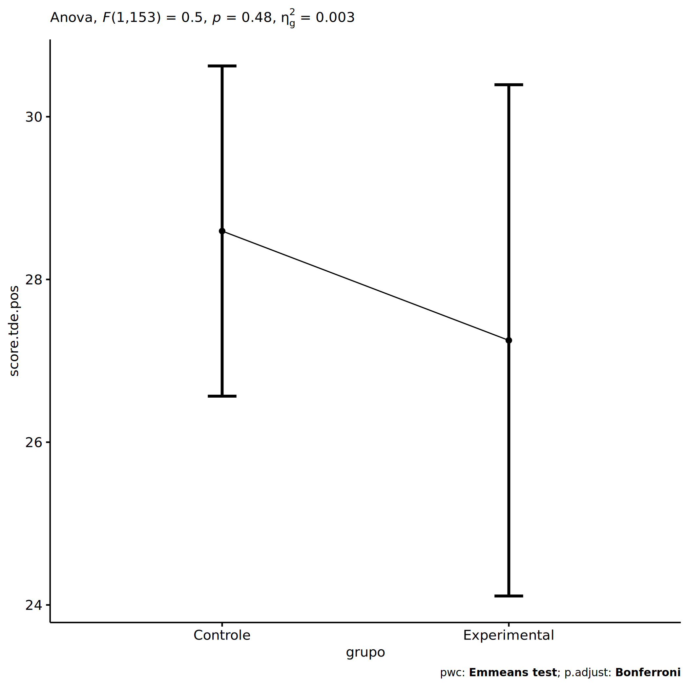
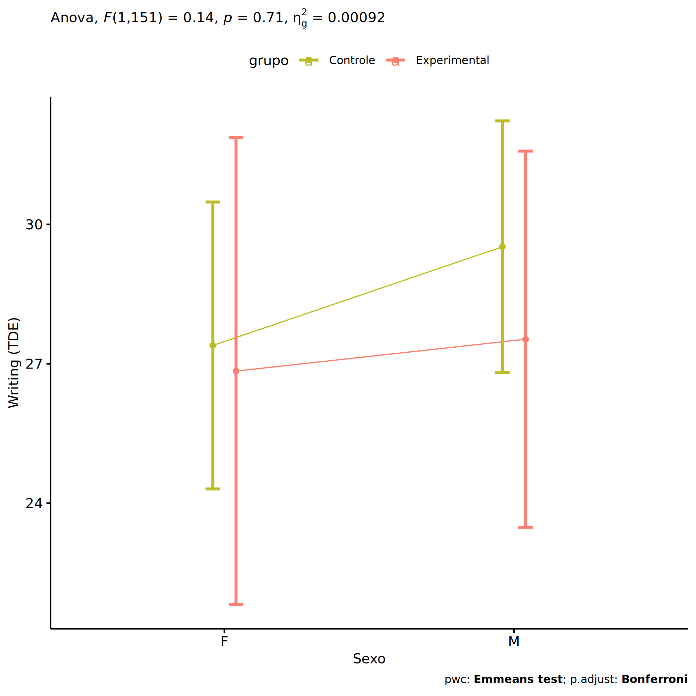
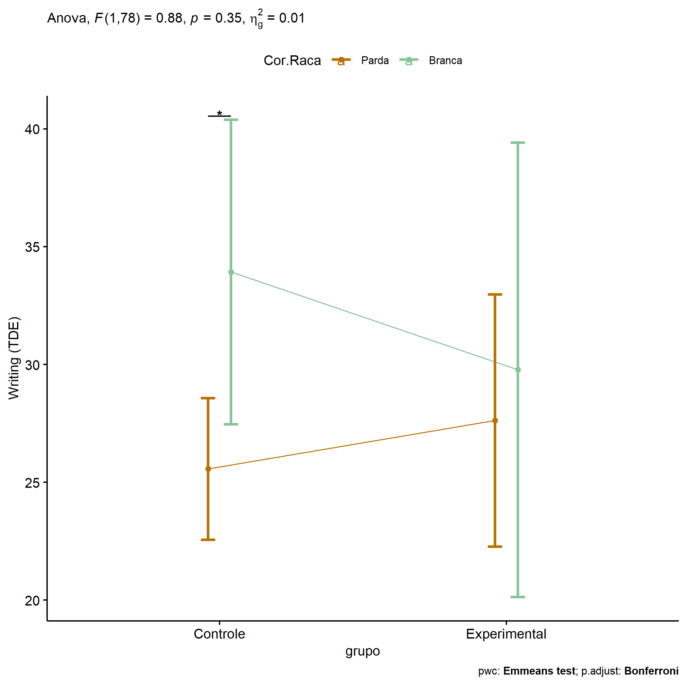
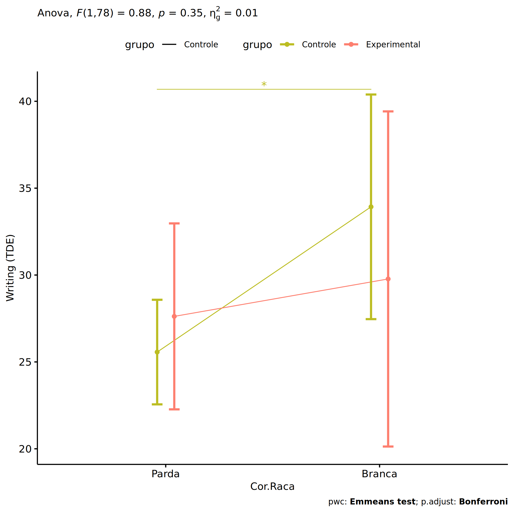
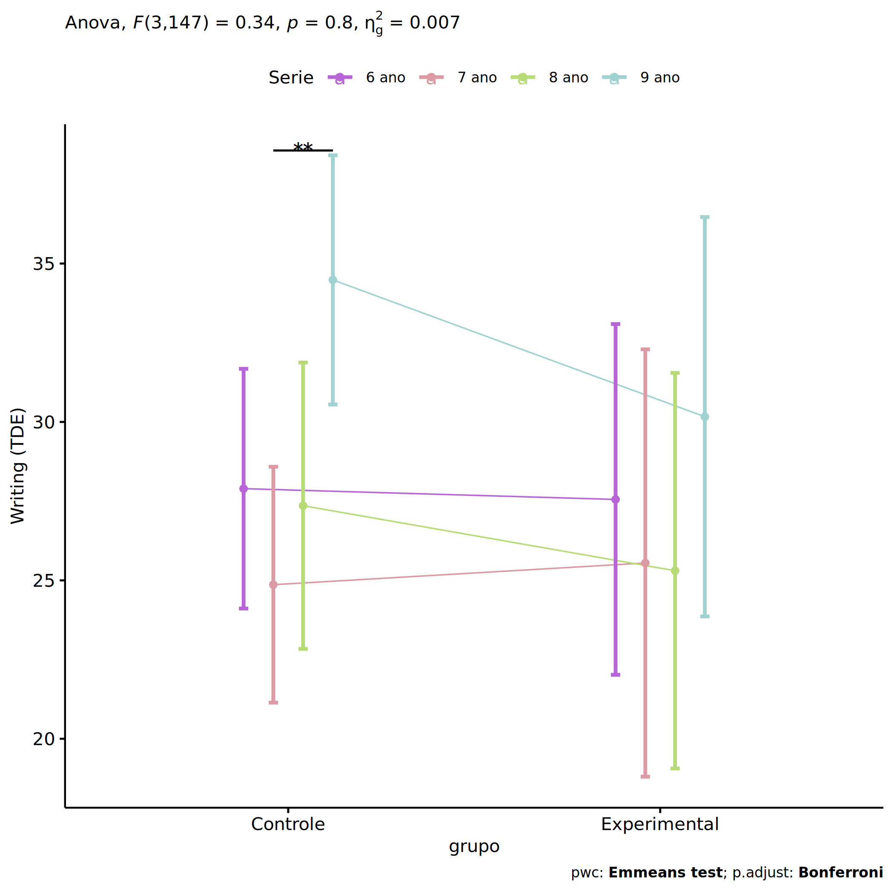

ANCOVA in TDE - Escrita (TDE - Escrita)
================
Geiser C. Challco <geiser@alumni.usp.br>

- [Descriptive Statistics of Initial
  Data](#descriptive-statistics-of-initial-data)
- [ANCOVA and Pairwise for one factor:
  **grupo**](#ancova-and-pairwise-for-one-factor-grupo)
  - [Without remove non-normal data](#without-remove-non-normal-data)
  - [Computing ANCOVA and PairWise After removing non-normal data
    (OK)](#computing-ancova-and-pairwise-after-removing-non-normal-data-ok)
    - [Plots for ancova](#plots-for-ancova)
    - [Checking linearity assumption](#checking-linearity-assumption)
    - [Checking normality and
      homogeneity](#checking-normality-and-homogeneity)
- [ANCOVA and Pairwise for two factors
  **grupo:Sexo**](#ancova-and-pairwise-for-two-factors-gruposexo)
  - [Without remove non-normal data](#without-remove-non-normal-data-1)
  - [Computing ANCOVA and PairWise After removing non-normal data
    (OK)](#computing-ancova-and-pairwise-after-removing-non-normal-data-ok-1)
    - [Plots for ancova](#plots-for-ancova-1)
    - [Checking linearity assumption](#checking-linearity-assumption-1)
    - [Checking normality and
      homogeneity](#checking-normality-and-homogeneity-1)
- [ANCOVA and Pairwise for two factors
  **grupo:Zona**](#ancova-and-pairwise-for-two-factors-grupozona)
  - [Without remove non-normal data](#without-remove-non-normal-data-2)
  - [Computing ANCOVA and PairWise After removing non-normal data
    (OK)](#computing-ancova-and-pairwise-after-removing-non-normal-data-ok-2)
    - [Plots for ancova](#plots-for-ancova-2)
    - [Checking linearity assumption](#checking-linearity-assumption-2)
    - [Checking normality and
      homogeneity](#checking-normality-and-homogeneity-2)
- [ANCOVA and Pairwise for two factors
  **grupo:Cor.Raca**](#ancova-and-pairwise-for-two-factors-grupocorraca)
  - [Without remove non-normal data](#without-remove-non-normal-data-3)
  - [Computing ANCOVA and PairWise After removing non-normal data
    (OK)](#computing-ancova-and-pairwise-after-removing-non-normal-data-ok-3)
    - [Plots for ancova](#plots-for-ancova-3)
    - [Checking linearity assumption](#checking-linearity-assumption-3)
    - [Checking normality and
      homogeneity](#checking-normality-and-homogeneity-3)
- [ANCOVA and Pairwise for two factors
  **grupo:Serie**](#ancova-and-pairwise-for-two-factors-gruposerie)
  - [Without remove non-normal data](#without-remove-non-normal-data-4)
  - [Computing ANCOVA and PairWise After removing non-normal data
    (OK)](#computing-ancova-and-pairwise-after-removing-non-normal-data-ok-4)
    - [Plots for ancova](#plots-for-ancova-4)
    - [Checking linearity assumption](#checking-linearity-assumption-4)
    - [Checking normality and
      homogeneity](#checking-normality-and-homogeneity-4)
- [ANCOVA and Pairwise for two factors
  **grupo:score.tde.quintile**](#ancova-and-pairwise-for-two-factors-gruposcoretdequintile)
  - [Without remove non-normal data](#without-remove-non-normal-data-5)
  - [Computing ANCOVA and PairWise After removing non-normal data
    (OK)](#computing-ancova-and-pairwise-after-removing-non-normal-data-ok-5)
    - [Plots for ancova](#plots-for-ancova-5)
    - [Checking linearity assumption](#checking-linearity-assumption-5)
    - [Checking normality and
      homogeneity](#checking-normality-and-homogeneity-5)
- [Summary of Results](#summary-of-results)
  - [Descriptive Statistics](#descriptive-statistics)
  - [ANCOVA Table Comparison](#ancova-table-comparison)
  - [PairWise Table Comparison](#pairwise-table-comparison)
  - [EMMS Table Comparison](#emms-table-comparison)

**NOTE**:

- Teste ANCOVA para determinar se houve diferenças significativas no
  TDE - Escrita (medido usando pre- e pos-testes).
- ANCOVA test to determine whether there were significant differences in
  TDE - Escrita (measured using pre- and post-tests).

# Descriptive Statistics of Initial Data

``` r
df <- get.descriptives(dat, c(dv.pre, dv.pos), c("grupo"), 
                       include.global = T, symmetry.test = T, normality.test = F)
df <- plyr::rbind.fill(
  df, do.call(plyr::rbind.fill, lapply(lfatores2, FUN = function(f) {
    if (nrow(dat) > 0 && sum(!is.na(unique(dat[[f]]))) > 1)
      get.descriptives(dat, c(dv.pre,dv.pos), c("grupo", f),
                       symmetry.test = T, normality.test = F)
    }))
)
```

    ## Warning: There was 1 warning in `mutate()`.
    ## ℹ In argument: `ci = abs(stats::qt(alpha/2, .data$n - 1) * .data$se)`.
    ## Caused by warning:
    ## ! There was 1 warning in `mutate()`.
    ## ℹ In argument: `ci = abs(stats::qt(alpha/2, .data$n - 1) * .data$se)`.
    ## Caused by warning in `stats::qt()`:
    ## ! NaNs produced
    ## There was 1 warning in `mutate()`.
    ## ℹ In argument: `ci = abs(stats::qt(alpha/2, .data$n - 1) * .data$se)`.
    ## Caused by warning:
    ## ! There was 1 warning in `mutate()`.
    ## ℹ In argument: `ci = abs(stats::qt(alpha/2, .data$n - 1) * .data$se)`.
    ## Caused by warning in `stats::qt()`:
    ## ! NaNs produced

    ## Warning: There were 2 warnings in `mutate()`.
    ## The first warning was:
    ## ℹ In argument: `ci = abs(stats::qt(alpha/2, .data$n - 1) * .data$se)`.
    ## Caused by warning:
    ## ! There was 1 warning in `mutate()`.
    ## ℹ In argument: `ci = abs(stats::qt(alpha/2, .data$n - 1) * .data$se)`.
    ## Caused by warning in `stats::qt()`:
    ## ! NaNs produced
    ## ℹ Run `dplyr::last_dplyr_warnings()` to see the 1 remaining warning.
    ## There were 2 warnings in `mutate()`.
    ## The first warning was:
    ## ℹ In argument: `ci = abs(stats::qt(alpha/2, .data$n - 1) * .data$se)`.
    ## Caused by warning:
    ## ! There was 1 warning in `mutate()`.
    ## ℹ In argument: `ci = abs(stats::qt(alpha/2, .data$n - 1) * .data$se)`.
    ## Caused by warning in `stats::qt()`:
    ## ! NaNs produced
    ## ℹ Run `dplyr::last_dplyr_warnings()` to see the 1 remaining warning.

``` r
(df <- df[,c(fatores1[fatores1 %in% colnames(df)],"variable",
             colnames(df)[!colnames(df) %in% c(fatores1,"variable")])])
```

    ##           grupo Sexo   Zona Cor.Raca Serie score.tde.quintile      variable   n   mean median min max
    ## 1      Controle <NA>   <NA>     <NA>  <NA>               <NA> score.tde.pre 110 31.136   31.0  17  46
    ## 2  Experimental <NA>   <NA>     <NA>  <NA>               <NA> score.tde.pre  46 30.022   29.0  19  46
    ## 3          <NA> <NA>   <NA>     <NA>  <NA>               <NA> score.tde.pre 156 30.808   30.5  17  46
    ## 4      Controle <NA>   <NA>     <NA>  <NA>               <NA> score.tde.pos 110 28.882   29.0   0  63
    ## 5  Experimental <NA>   <NA>     <NA>  <NA>               <NA> score.tde.pos  46 26.565   26.0   1  50
    ## 6          <NA> <NA>   <NA>     <NA>  <NA>               <NA> score.tde.pos 156 28.199   28.0   0  63
    ## 7      Controle    F   <NA>     <NA>  <NA>               <NA> score.tde.pre  48 31.729   31.5  20  41
    ## 8      Controle    M   <NA>     <NA>  <NA>               <NA> score.tde.pre  62 30.677   30.0  17  46
    ## 9  Experimental    F   <NA>     <NA>  <NA>               <NA> score.tde.pre  18 31.111   32.0  20  40
    ## 10 Experimental    M   <NA>     <NA>  <NA>               <NA> score.tde.pre  28 29.321   26.5  19  46
    ## 11     Controle    F   <NA>     <NA>  <NA>               <NA> score.tde.pos  48 28.208   28.5   7  63
    ## 12     Controle    M   <NA>     <NA>  <NA>               <NA> score.tde.pos  62 29.403   29.5   0  59
    ## 13 Experimental    F   <NA>     <NA>  <NA>               <NA> score.tde.pos  18 27.111   26.5   1  44
    ## 14 Experimental    M   <NA>     <NA>  <NA>               <NA> score.tde.pos  28 26.214   24.0   1  50
    ## 15     Controle <NA>  Rural     <NA>  <NA>               <NA> score.tde.pre  66 31.212   31.0  17  46
    ## 16     Controle <NA> Urbana     <NA>  <NA>               <NA> score.tde.pre  11 29.000   28.0  22  39
    ## 17     Controle <NA>   <NA>     <NA>  <NA>               <NA> score.tde.pre  33 31.697   33.0  20  39
    ## 18 Experimental <NA>  Rural     <NA>  <NA>               <NA> score.tde.pre  31 29.645   28.0  19  46
    ## 19 Experimental <NA> Urbana     <NA>  <NA>               <NA> score.tde.pre   5 29.200   30.0  21  38
    ## 20 Experimental <NA>   <NA>     <NA>  <NA>               <NA> score.tde.pre  10 31.600   30.5  22  40
    ## 21     Controle <NA>  Rural     <NA>  <NA>               <NA> score.tde.pos  66 28.015   27.5   0  50
    ## 22     Controle <NA> Urbana     <NA>  <NA>               <NA> score.tde.pos  11 28.364   29.0   8  42
    ## 23     Controle <NA>   <NA>     <NA>  <NA>               <NA> score.tde.pos  33 30.788   30.0   7  63
    ## 24 Experimental <NA>  Rural     <NA>  <NA>               <NA> score.tde.pos  31 28.065   26.0  11  50
    ## 25 Experimental <NA> Urbana     <NA>  <NA>               <NA> score.tde.pos   5 22.600   25.0   2  36
    ## 26 Experimental <NA>   <NA>     <NA>  <NA>               <NA> score.tde.pos  10 23.900   27.0   1  38
    ## 27     Controle <NA>   <NA>   Branca  <NA>               <NA> score.tde.pre  11 33.000   31.0  20  46
    ## 28     Controle <NA>   <NA> Indígena  <NA>               <NA> score.tde.pre   2 37.500   37.5  34  41
    ## 29     Controle <NA>   <NA>    Parda  <NA>               <NA> score.tde.pre  50 31.060   31.0  17  42
    ## 30     Controle <NA>   <NA>    Preta  <NA>               <NA> score.tde.pre   1 26.000   26.0  26  26
    ## 31     Controle <NA>   <NA>     <NA>  <NA>               <NA> score.tde.pre  46 30.609   30.5  20  39
    ## 32 Experimental <NA>   <NA>   Branca  <NA>               <NA> score.tde.pre   5 35.200   37.0  21  46
    ## 33 Experimental <NA>   <NA> Indígena  <NA>               <NA> score.tde.pre   8 30.000   27.0  21  42
    ## 34 Experimental <NA>   <NA>    Parda  <NA>               <NA> score.tde.pre  17 26.647   25.0  19  40
    ## 35 Experimental <NA>   <NA>     <NA>  <NA>               <NA> score.tde.pre  16 32.000   33.0  23  40
    ## 36     Controle <NA>   <NA>   Branca  <NA>               <NA> score.tde.pos  11 36.000   36.0  16  63
    ## 37     Controle <NA>   <NA> Indígena  <NA>               <NA> score.tde.pos   2 26.500   26.5  25  28
    ## 38     Controle <NA>   <NA>    Parda  <NA>               <NA> score.tde.pos  50 25.920   25.5   0  50
    ## 39     Controle <NA>   <NA>    Preta  <NA>               <NA> score.tde.pos   1 40.000   40.0  40  40
    ## 40     Controle <NA>   <NA>     <NA>  <NA>               <NA> score.tde.pos  46 30.261   32.0   5  59
    ## 41 Experimental <NA>   <NA>   Branca  <NA>               <NA> score.tde.pos   5 33.800   37.0   2  50
    ## 42 Experimental <NA>   <NA> Indígena  <NA>               <NA> score.tde.pos   8 29.250   26.5  15  50
    ## 43 Experimental <NA>   <NA>    Parda  <NA>               <NA> score.tde.pos  17 24.059   22.0   1  43
    ## 44 Experimental <NA>   <NA>     <NA>  <NA>               <NA> score.tde.pos  16 25.625   26.0   1  44
    ## 45     Controle <NA>   <NA>     <NA> 6 ano               <NA> score.tde.pre  30 30.200   30.0  20  39
    ## 46     Controle <NA>   <NA>     <NA> 7 ano               <NA> score.tde.pre  31 31.452   30.0  20  40
    ## 47     Controle <NA>   <NA>     <NA> 8 ano               <NA> score.tde.pre  21 30.429   31.0  20  39
    ## 48     Controle <NA>   <NA>     <NA> 9 ano               <NA> score.tde.pre  28 32.321   34.0  17  46
    ## 49 Experimental <NA>   <NA>     <NA> 6 ano               <NA> score.tde.pre  14 30.214   30.5  21  40
    ## 50 Experimental <NA>   <NA>     <NA> 7 ano               <NA> score.tde.pre  10 24.600   24.0  21  33
    ## 51 Experimental <NA>   <NA>     <NA> 8 ano               <NA> score.tde.pre  11 30.545   33.0  20  39
    ## 52 Experimental <NA>   <NA>     <NA> 9 ano               <NA> score.tde.pre  11 34.182   34.0  19  46
    ##        sd    se     ci   iqr symmetry     skewness    kurtosis
    ## 1   6.480 0.618  1.225 11.00      YES -0.109575190 -0.99988426
    ## 2   7.154 1.055  2.124 13.00      YES  0.228415929 -1.19466130
    ## 3   6.682 0.535  1.057 12.00      YES -0.007917176 -1.06872327
    ## 4  12.312 1.174  2.327 17.25      YES -0.061919348 -0.18407289
    ## 5  11.968 1.765  3.554 18.50      YES -0.068830301 -0.43836096
    ## 6  12.219 0.978  1.933 16.50      YES -0.056318640 -0.21485429
    ## 7   6.066 0.876  1.761 11.00      YES -0.306769177 -1.13961246
    ## 8   6.796 0.863  1.726 11.00      YES  0.041450527 -0.96582122
    ## 9   6.115 1.441  3.041  9.25      YES -0.199658860 -1.14131067
    ## 10  7.775 1.469  3.015 14.25      YES  0.456423720 -1.22351132
    ## 11 11.567 1.669  3.359 15.00      YES  0.292386674  0.18314249
    ## 12 12.929 1.642  3.283 18.75      YES -0.281122598 -0.41027558
    ## 13 10.471 2.468  5.207 11.25      YES -0.404846483  0.09874994
    ## 14 13.014 2.459  5.046 19.25      YES  0.076129127 -0.80223318
    ## 15  6.880 0.847  1.691 11.75      YES -0.061160124 -1.04391954
    ## 16  4.940 1.489  3.318  6.00       NO  0.561171376 -0.80056681
    ## 17  6.111 1.064  2.167  9.00      YES -0.498338933 -1.04192821
    ## 18  7.579 1.361  2.780 13.50      YES  0.332637618 -1.19411462
    ## 19  6.834 3.056  8.485  9.00      YES  0.028125971 -1.94921284
    ## 20  6.328 2.001  4.527  9.75      YES -0.008239808 -1.70722742
    ## 21 11.830 1.456  2.908 14.00      YES -0.282320291 -0.30608293
    ## 22  9.973 3.007  6.700 11.50       NO -0.525886618 -0.77778575
    ## 23 13.986 2.435  4.959 20.00      YES  0.145064107 -0.62763879
    ## 24 11.144 2.002  4.088 19.50       NO  0.518544635 -1.02492908
    ## 25 13.409 5.997 16.649 14.00      YES -0.463608724 -1.63516863
    ## 26 14.067 4.448 10.063 17.75       NO -0.562405770 -1.29536515
    ## 27  7.861 2.370  5.281  9.50      YES  0.216687152 -1.17407747
    ## 28  4.950 3.500 44.472  3.50 few data  0.000000000  0.00000000
    ## 29  6.412 0.907  1.822 11.00      YES -0.236635317 -1.19545328
    ## 30     NA    NA    NaN  0.00 few data  0.000000000  0.00000000
    ## 31  6.256 0.922  1.858 11.00      YES -0.216332286 -1.32939698
    ## 32  9.094 4.067 11.292  4.00      YES -0.419514142 -1.41101588
    ## 33  8.401 2.970  7.023 14.25      YES  0.325125493 -1.86147023
    ## 34  6.103 1.480  3.138  8.00       NO  0.641780026 -0.72439345
    ## 35  5.727 1.432  3.052 10.50      YES -0.251530728 -1.55485016
    ## 36 11.533 3.477  7.748  8.50       NO  0.686694197  0.59260763
    ## 37  2.121 1.500 19.059  1.50 few data  0.000000000  0.00000000
    ## 38 12.128 1.715  3.447 12.75      YES -0.070180152 -0.29593573
    ## 39     NA    NA    NaN  0.00 few data  0.000000000  0.00000000
    ## 40 12.259 1.808  3.641 20.00      YES -0.170851148 -0.82393715
    ## 41 18.660 8.345 23.170  8.00       NO -0.824978027 -1.18145128
    ## 42 11.877 4.199  9.930 14.00      YES  0.494556386 -1.32062196
    ## 43 10.503 2.547  5.400 11.00      YES  0.052171447 -0.30161606
    ## 44 11.135 2.784  5.933 14.50      YES -0.349365517 -0.54526762
    ## 45  5.684 1.038  2.122  9.25      YES -0.095555413 -1.07208314
    ## 46  5.954 1.069  2.184 10.50      YES -0.147899156 -1.37745994
    ## 47  6.801 1.484  3.096 12.00      YES -0.265202096 -1.56758546
    ## 48  7.631 1.442  2.959 11.75      YES -0.164615640 -1.07962913
    ## 49  6.565 1.755  3.791 11.50      YES -0.020537131 -1.60600700
    ## 50  3.658 1.157  2.616  3.25       NO  1.060942373  0.07588294
    ## 51  7.258 2.188  4.876 13.50      YES -0.242494605 -1.84471819
    ## 52  7.795 2.350  5.237 10.50      YES -0.297011659 -0.97035305
    ##  [ reached 'max' / getOption("max.print") -- omitted 22 rows ]

| grupo        | Sexo | Zona   | Cor.Raca | Serie | score.tde.quintile | variable      |   n |   mean | median | min | max |     sd |    se |     ci |   iqr | symmetry | skewness | kurtosis |
|:-------------|:-----|:-------|:---------|:------|:-------------------|:--------------|----:|-------:|-------:|----:|----:|-------:|------:|-------:|------:|:---------|---------:|---------:|
| Controle     |      |        |          |       |                    | score.tde.pre | 110 | 31.136 |   31.0 |  17 |  46 |  6.480 | 0.618 |  1.225 | 11.00 | YES      |   -0.110 |   -1.000 |
| Experimental |      |        |          |       |                    | score.tde.pre |  46 | 30.022 |   29.0 |  19 |  46 |  7.154 | 1.055 |  2.124 | 13.00 | YES      |    0.228 |   -1.195 |
|              |      |        |          |       |                    | score.tde.pre | 156 | 30.808 |   30.5 |  17 |  46 |  6.682 | 0.535 |  1.057 | 12.00 | YES      |   -0.008 |   -1.069 |
| Controle     |      |        |          |       |                    | score.tde.pos | 110 | 28.882 |   29.0 |   0 |  63 | 12.312 | 1.174 |  2.327 | 17.25 | YES      |   -0.062 |   -0.184 |
| Experimental |      |        |          |       |                    | score.tde.pos |  46 | 26.565 |   26.0 |   1 |  50 | 11.968 | 1.765 |  3.554 | 18.50 | YES      |   -0.069 |   -0.438 |
|              |      |        |          |       |                    | score.tde.pos | 156 | 28.199 |   28.0 |   0 |  63 | 12.219 | 0.978 |  1.933 | 16.50 | YES      |   -0.056 |   -0.215 |
| Controle     | F    |        |          |       |                    | score.tde.pre |  48 | 31.729 |   31.5 |  20 |  41 |  6.066 | 0.876 |  1.761 | 11.00 | YES      |   -0.307 |   -1.140 |
| Controle     | M    |        |          |       |                    | score.tde.pre |  62 | 30.677 |   30.0 |  17 |  46 |  6.796 | 0.863 |  1.726 | 11.00 | YES      |    0.041 |   -0.966 |
| Experimental | F    |        |          |       |                    | score.tde.pre |  18 | 31.111 |   32.0 |  20 |  40 |  6.115 | 1.441 |  3.041 |  9.25 | YES      |   -0.200 |   -1.141 |
| Experimental | M    |        |          |       |                    | score.tde.pre |  28 | 29.321 |   26.5 |  19 |  46 |  7.775 | 1.469 |  3.015 | 14.25 | YES      |    0.456 |   -1.224 |
| Controle     | F    |        |          |       |                    | score.tde.pos |  48 | 28.208 |   28.5 |   7 |  63 | 11.567 | 1.669 |  3.359 | 15.00 | YES      |    0.292 |    0.183 |
| Controle     | M    |        |          |       |                    | score.tde.pos |  62 | 29.403 |   29.5 |   0 |  59 | 12.929 | 1.642 |  3.283 | 18.75 | YES      |   -0.281 |   -0.410 |
| Experimental | F    |        |          |       |                    | score.tde.pos |  18 | 27.111 |   26.5 |   1 |  44 | 10.471 | 2.468 |  5.207 | 11.25 | YES      |   -0.405 |    0.099 |
| Experimental | M    |        |          |       |                    | score.tde.pos |  28 | 26.214 |   24.0 |   1 |  50 | 13.014 | 2.459 |  5.046 | 19.25 | YES      |    0.076 |   -0.802 |
| Controle     |      | Rural  |          |       |                    | score.tde.pre |  66 | 31.212 |   31.0 |  17 |  46 |  6.880 | 0.847 |  1.691 | 11.75 | YES      |   -0.061 |   -1.044 |
| Controle     |      | Urbana |          |       |                    | score.tde.pre |  11 | 29.000 |   28.0 |  22 |  39 |  4.940 | 1.489 |  3.318 |  6.00 | NO       |    0.561 |   -0.801 |
| Controle     |      |        |          |       |                    | score.tde.pre |  33 | 31.697 |   33.0 |  20 |  39 |  6.111 | 1.064 |  2.167 |  9.00 | YES      |   -0.498 |   -1.042 |
| Experimental |      | Rural  |          |       |                    | score.tde.pre |  31 | 29.645 |   28.0 |  19 |  46 |  7.579 | 1.361 |  2.780 | 13.50 | YES      |    0.333 |   -1.194 |
| Experimental |      | Urbana |          |       |                    | score.tde.pre |   5 | 29.200 |   30.0 |  21 |  38 |  6.834 | 3.056 |  8.485 |  9.00 | YES      |    0.028 |   -1.949 |
| Experimental |      |        |          |       |                    | score.tde.pre |  10 | 31.600 |   30.5 |  22 |  40 |  6.328 | 2.001 |  4.527 |  9.75 | YES      |   -0.008 |   -1.707 |
| Controle     |      | Rural  |          |       |                    | score.tde.pos |  66 | 28.015 |   27.5 |   0 |  50 | 11.830 | 1.456 |  2.908 | 14.00 | YES      |   -0.282 |   -0.306 |
| Controle     |      | Urbana |          |       |                    | score.tde.pos |  11 | 28.364 |   29.0 |   8 |  42 |  9.973 | 3.007 |  6.700 | 11.50 | NO       |   -0.526 |   -0.778 |
| Controle     |      |        |          |       |                    | score.tde.pos |  33 | 30.788 |   30.0 |   7 |  63 | 13.986 | 2.435 |  4.959 | 20.00 | YES      |    0.145 |   -0.628 |
| Experimental |      | Rural  |          |       |                    | score.tde.pos |  31 | 28.065 |   26.0 |  11 |  50 | 11.144 | 2.002 |  4.088 | 19.50 | NO       |    0.519 |   -1.025 |
| Experimental |      | Urbana |          |       |                    | score.tde.pos |   5 | 22.600 |   25.0 |   2 |  36 | 13.409 | 5.997 | 16.649 | 14.00 | YES      |   -0.464 |   -1.635 |
| Experimental |      |        |          |       |                    | score.tde.pos |  10 | 23.900 |   27.0 |   1 |  38 | 14.067 | 4.448 | 10.063 | 17.75 | NO       |   -0.562 |   -1.295 |
| Controle     |      |        | Branca   |       |                    | score.tde.pre |  11 | 33.000 |   31.0 |  20 |  46 |  7.861 | 2.370 |  5.281 |  9.50 | YES      |    0.217 |   -1.174 |
| Controle     |      |        | Indígena |       |                    | score.tde.pre |   2 | 37.500 |   37.5 |  34 |  41 |  4.950 | 3.500 | 44.472 |  3.50 | few data |    0.000 |    0.000 |
| Controle     |      |        | Parda    |       |                    | score.tde.pre |  50 | 31.060 |   31.0 |  17 |  42 |  6.412 | 0.907 |  1.822 | 11.00 | YES      |   -0.237 |   -1.195 |
| Controle     |      |        | Preta    |       |                    | score.tde.pre |   1 | 26.000 |   26.0 |  26 |  26 |        |       |        |  0.00 | few data |    0.000 |    0.000 |
| Controle     |      |        |          |       |                    | score.tde.pre |  46 | 30.609 |   30.5 |  20 |  39 |  6.256 | 0.922 |  1.858 | 11.00 | YES      |   -0.216 |   -1.329 |
| Experimental |      |        | Branca   |       |                    | score.tde.pre |   5 | 35.200 |   37.0 |  21 |  46 |  9.094 | 4.067 | 11.292 |  4.00 | YES      |   -0.420 |   -1.411 |
| Experimental |      |        | Indígena |       |                    | score.tde.pre |   8 | 30.000 |   27.0 |  21 |  42 |  8.401 | 2.970 |  7.023 | 14.25 | YES      |    0.325 |   -1.861 |
| Experimental |      |        | Parda    |       |                    | score.tde.pre |  17 | 26.647 |   25.0 |  19 |  40 |  6.103 | 1.480 |  3.138 |  8.00 | NO       |    0.642 |   -0.724 |
| Experimental |      |        |          |       |                    | score.tde.pre |  16 | 32.000 |   33.0 |  23 |  40 |  5.727 | 1.432 |  3.052 | 10.50 | YES      |   -0.252 |   -1.555 |
| Controle     |      |        | Branca   |       |                    | score.tde.pos |  11 | 36.000 |   36.0 |  16 |  63 | 11.533 | 3.477 |  7.748 |  8.50 | NO       |    0.687 |    0.593 |
| Controle     |      |        | Indígena |       |                    | score.tde.pos |   2 | 26.500 |   26.5 |  25 |  28 |  2.121 | 1.500 | 19.059 |  1.50 | few data |    0.000 |    0.000 |
| Controle     |      |        | Parda    |       |                    | score.tde.pos |  50 | 25.920 |   25.5 |   0 |  50 | 12.128 | 1.715 |  3.447 | 12.75 | YES      |   -0.070 |   -0.296 |
| Controle     |      |        | Preta    |       |                    | score.tde.pos |   1 | 40.000 |   40.0 |  40 |  40 |        |       |        |  0.00 | few data |    0.000 |    0.000 |
| Controle     |      |        |          |       |                    | score.tde.pos |  46 | 30.261 |   32.0 |   5 |  59 | 12.259 | 1.808 |  3.641 | 20.00 | YES      |   -0.171 |   -0.824 |
| Experimental |      |        | Branca   |       |                    | score.tde.pos |   5 | 33.800 |   37.0 |   2 |  50 | 18.660 | 8.345 | 23.170 |  8.00 | NO       |   -0.825 |   -1.181 |
| Experimental |      |        | Indígena |       |                    | score.tde.pos |   8 | 29.250 |   26.5 |  15 |  50 | 11.877 | 4.199 |  9.930 | 14.00 | YES      |    0.495 |   -1.321 |
| Experimental |      |        | Parda    |       |                    | score.tde.pos |  17 | 24.059 |   22.0 |   1 |  43 | 10.503 | 2.547 |  5.400 | 11.00 | YES      |    0.052 |   -0.302 |
| Experimental |      |        |          |       |                    | score.tde.pos |  16 | 25.625 |   26.0 |   1 |  44 | 11.135 | 2.784 |  5.933 | 14.50 | YES      |   -0.349 |   -0.545 |
| Controle     |      |        |          | 6 ano |                    | score.tde.pre |  30 | 30.200 |   30.0 |  20 |  39 |  5.684 | 1.038 |  2.122 |  9.25 | YES      |   -0.096 |   -1.072 |
| Controle     |      |        |          | 7 ano |                    | score.tde.pre |  31 | 31.452 |   30.0 |  20 |  40 |  5.954 | 1.069 |  2.184 | 10.50 | YES      |   -0.148 |   -1.377 |
| Controle     |      |        |          | 8 ano |                    | score.tde.pre |  21 | 30.429 |   31.0 |  20 |  39 |  6.801 | 1.484 |  3.096 | 12.00 | YES      |   -0.265 |   -1.568 |
| Controle     |      |        |          | 9 ano |                    | score.tde.pre |  28 | 32.321 |   34.0 |  17 |  46 |  7.631 | 1.442 |  2.959 | 11.75 | YES      |   -0.165 |   -1.080 |
| Experimental |      |        |          | 6 ano |                    | score.tde.pre |  14 | 30.214 |   30.5 |  21 |  40 |  6.565 | 1.755 |  3.791 | 11.50 | YES      |   -0.021 |   -1.606 |
| Experimental |      |        |          | 7 ano |                    | score.tde.pre |  10 | 24.600 |   24.0 |  21 |  33 |  3.658 | 1.157 |  2.616 |  3.25 | NO       |    1.061 |    0.076 |
| Experimental |      |        |          | 8 ano |                    | score.tde.pre |  11 | 30.545 |   33.0 |  20 |  39 |  7.258 | 2.188 |  4.876 | 13.50 | YES      |   -0.242 |   -1.845 |
| Experimental |      |        |          | 9 ano |                    | score.tde.pre |  11 | 34.182 |   34.0 |  19 |  46 |  7.795 | 2.350 |  5.237 | 10.50 | YES      |   -0.297 |   -0.970 |
| Controle     |      |        |          | 6 ano |                    | score.tde.pos |  30 | 27.400 |   26.0 |   0 |  45 | 10.374 | 1.894 |  3.874 | 14.75 | YES      |   -0.360 |   -0.269 |
| Controle     |      |        |          | 7 ano |                    | score.tde.pos |  31 | 25.387 |   28.0 |   0 |  63 | 13.925 | 2.501 |  5.108 | 17.50 | YES      |    0.301 |    0.017 |
| Controle     |      |        |          | 8 ano |                    | score.tde.pos |  21 | 27.048 |   28.0 |   7 |  44 | 11.236 | 2.452 |  5.115 | 19.00 | YES      |   -0.197 |   -1.179 |
| Controle     |      |        |          | 9 ano |                    | score.tde.pos |  28 | 35.714 |   38.0 |  12 |  59 | 10.951 | 2.069 |  4.246 | 15.00 | YES      |   -0.135 |   -0.703 |
| Experimental |      |        |          | 6 ano |                    | score.tde.pos |  14 | 27.071 |   26.0 |  11 |  44 | 10.217 | 2.731 |  5.899 | 14.25 | YES      |    0.322 |   -1.206 |
| Experimental |      |        |          | 7 ano |                    | score.tde.pos |  10 | 20.500 |   21.5 |   2 |  31 |  7.976 | 2.522 |  5.705 |  6.75 | NO       |   -0.924 |    0.307 |
| Experimental |      |        |          | 8 ano |                    | score.tde.pos |  11 | 25.091 |   30.0 |   1 |  44 | 14.474 | 4.364 |  9.724 | 18.00 | NO       |   -0.525 |   -1.207 |
| Experimental |      |        |          | 9 ano |                    | score.tde.pos |  11 | 32.909 |   37.0 |  15 |  50 | 12.581 | 3.793 |  8.452 | 19.00 | YES      |   -0.049 |   -1.639 |
| Controle     |      |        |          |       | 1st quintile       | score.tde.pre |   1 | 17.000 |   17.0 |  17 |  17 |        |       |        |  0.00 | few data |    0.000 |    0.000 |
| Controle     |      |        |          |       | 2nd quintile       | score.tde.pre |  58 | 26.121 |   26.0 |  20 |  31 |  3.559 | 0.467 |  0.936 |  6.50 | YES      |   -0.221 |   -1.231 |
| Controle     |      |        |          |       | 3rd quintile       | score.tde.pre |  49 | 36.796 |   37.0 |  32 |  42 |  2.236 | 0.319 |  0.642 |  4.00 | YES      |   -0.111 |   -0.550 |
| Controle     |      |        |          |       | 4th quintile       | score.tde.pre |   2 | 45.000 |   45.0 |  44 |  46 |  1.414 | 1.000 | 12.706 |  1.00 | few data |    0.000 |    0.000 |
| Experimental |      |        |          |       | 2nd quintile       | score.tde.pre |  25 | 24.280 |   24.0 |  19 |  30 |  3.156 | 0.631 |  1.303 |  5.00 | YES      |    0.218 |   -1.240 |
| Experimental |      |        |          |       | 3rd quintile       | score.tde.pre |  20 | 36.400 |   37.0 |  32 |  42 |  2.998 | 0.670 |  1.403 |  4.50 | YES      |   -0.023 |   -1.163 |
| Experimental |      |        |          |       | 4th quintile       | score.tde.pre |   1 | 46.000 |   46.0 |  46 |  46 |        |       |        |  0.00 | few data |    0.000 |    0.000 |
| Controle     |      |        |          |       | 1st quintile       | score.tde.pos |   1 | 24.000 |   24.0 |  24 |  24 |        |       |        |  0.00 | few data |    0.000 |    0.000 |
| Controle     |      |        |          |       | 2nd quintile       | score.tde.pos |  58 | 24.310 |   24.0 |   0 |  48 | 11.494 | 1.509 |  3.022 | 15.75 | YES      |   -0.121 |   -0.703 |
| Controle     |      |        |          |       | 3rd quintile       | score.tde.pos |  49 | 33.939 |   34.0 |   5 |  63 | 11.401 | 1.629 |  3.275 | 15.00 | YES      |    0.034 |    0.074 |
| Controle     |      |        |          |       | 4th quintile       | score.tde.pos |   2 | 40.000 |   40.0 |  37 |  43 |  4.243 | 3.000 | 38.119 |  3.00 | few data |    0.000 |    0.000 |
| Experimental |      |        |          |       | 2nd quintile       | score.tde.pos |  25 | 21.320 |   19.0 |   1 |  43 |  9.577 | 1.915 |  3.953 |  9.00 | YES      |    0.114 |    0.315 |
| Experimental |      |        |          |       | 3rd quintile       | score.tde.pos |  20 | 31.950 |   34.0 |   1 |  50 | 11.302 | 2.527 |  5.289 | 11.75 | NO       |   -0.862 |    0.633 |
| Experimental |      |        |          |       | 4th quintile       | score.tde.pos |   1 | 50.000 |   50.0 |  50 |  50 |        |       |        |  0.00 | few data |    0.000 |    0.000 |

# ANCOVA and Pairwise for one factor: **grupo**

## Without remove non-normal data

``` r
pdat = remove_group_data(dat[!is.na(dat[["grupo"]]),], "score.tde.pos", "grupo")

pdat.long <- rbind(pdat[,c("id","grupo")], pdat[,c("id","grupo")])
pdat.long[["time"]] <- c(rep("pre", nrow(pdat)), rep("pos", nrow(pdat)))
pdat.long[["time"]] <- factor(pdat.long[["time"]], c("pre","pos"))
pdat.long[["score.tde"]] <- c(pdat[["score.tde.pre"]], pdat[["score.tde.pos"]])

aov = anova_test(pdat, score.tde.pos ~ score.tde.pre + grupo)
laov[["grupo"]] <- get_anova_table(aov)
```

``` r
pwc <- emmeans_test(pdat, score.tde.pos ~ grupo, covariate = score.tde.pre,
                    p.adjust.method = "bonferroni")
```

``` r
pwc.long <- emmeans_test(dplyr::group_by_at(pdat.long, "grupo"),
                          score.tde ~ time,
                          p.adjust.method = "bonferroni")
lpwc[["grupo"]] <- plyr::rbind.fill(pwc, pwc.long)
```

``` r
ds <- get.descriptives(pdat, "score.tde.pos", "grupo", covar = "score.tde.pre")
ds <- merge(ds[ds$variable != "score.tde.pre",],
            ds[ds$variable == "score.tde.pre", !colnames(ds) %in% c("variable")],
            by = "grupo", all.x = T, suffixes = c("", ".score.tde.pre"))
ds <- merge(get_emmeans(pwc), ds, by = "grupo", suffixes = c(".emms", ""))
ds <- ds[,c("grupo","n","mean.score.tde.pre","se.score.tde.pre","mean","se","emmean","se.emms")]

colnames(ds) <- c("grupo", "N", paste0(c("M","SE")," (pre)"),
                  paste0(c("M","SE"), " (unadj)"), paste0(c("M", "SE"), " (adj)"))

lemms[["grupo"]] <- ds
```

## Computing ANCOVA and PairWise After removing non-normal data (OK)

``` r
wdat = pdat 

res = residuals(lm(score.tde.pos ~ score.tde.pre + grupo, data = wdat))
non.normal = getNonNormal(res, wdat$id, plimit = 0.05)

wdat = wdat[!wdat$id %in% non.normal,]

wdat.long <- rbind(wdat[,c("id","grupo")], wdat[,c("id","grupo")])
wdat.long[["time"]] <- c(rep("pre", nrow(wdat)), rep("pos", nrow(wdat)))
wdat.long[["time"]] <- factor(wdat.long[["time"]], c("pre","pos"))
wdat.long[["score.tde"]] <- c(wdat[["score.tde.pre"]], wdat[["score.tde.pos"]])

ldat[["grupo"]] = wdat

(non.normal)
```

    ## NULL

``` r
aov = anova_test(wdat, score.tde.pos ~ score.tde.pre + grupo)
laov[["grupo"]] <- merge(get_anova_table(aov), laov[["grupo"]], by="Effect", suffixes = c("","'"))

(df = get_anova_table(aov))
```

    ## ANOVA Table (type II tests)
    ## 
    ##          Effect DFn DFd      F        p p<.05   ges
    ## 1 score.tde.pre   1 153 45.279 3.22e-10     * 0.228
    ## 2         grupo   1 153  0.502 4.80e-01       0.003

| Effect        | DFn | DFd |      F |    p | p\<.05 |   ges |
|:--------------|----:|----:|-------:|-----:|:-------|------:|
| score.tde.pre |   1 | 153 | 45.279 | 0.00 | \*     | 0.228 |
| grupo         |   1 | 153 |  0.502 | 0.48 |        | 0.003 |

| term                 | .y.           | group1   | group2       |  df | statistic |    p | p.adj | p.adj.signif |
|:---------------------|:--------------|:---------|:-------------|----:|----------:|-----:|------:|:-------------|
| score.tde.pre\*grupo | score.tde.pos | Controle | Experimental | 153 |     0.709 | 0.48 |  0.48 | ns           |

``` r
pwc.long <- emmeans_test(dplyr::group_by_at(wdat.long, "grupo"),
                         score.tde ~ time,
                         p.adjust.method = "bonferroni")
lpwc[["grupo"]] <- merge(plyr::rbind.fill(pwc, pwc.long), lpwc[["grupo"]], by=c("grupo","term",".y.","group1","group2"), suffixes = c("","'"))
```

| grupo        | term | .y.       | group1 | group2 |  df | statistic |     p | p.adj | p.adj.signif |
|:-------------|:-----|:----------|:-------|:-------|----:|----------:|------:|------:|:-------------|
| Controle     | time | score.tde | pre    | pos    | 308 |     1.698 | 0.090 | 0.090 | ns           |
| Experimental | time | score.tde | pre    | pos    | 308 |     1.684 | 0.093 | 0.093 | ns           |

``` r
ds <- get.descriptives(wdat, "score.tde.pos", "grupo", covar = "score.tde.pre")
ds <- merge(ds[ds$variable != "score.tde.pre",],
            ds[ds$variable == "score.tde.pre", !colnames(ds) %in% c("variable")],
            by = "grupo", all.x = T, suffixes = c("", ".score.tde.pre"))
ds <- merge(get_emmeans(pwc), ds, by = "grupo", suffixes = c(".emms", ""))
ds <- ds[,c("grupo","n","mean.score.tde.pre","se.score.tde.pre","mean","se","emmean","se.emms")]

colnames(ds) <- c("grupo", "N", paste0(c("M","SE")," (pre)"),
                  paste0(c("M","SE"), " (unadj)"), paste0(c("M", "SE"), " (adj)"))

lemms[["grupo"]] <- merge(ds, lemms[["grupo"]], by=c("grupo"), suffixes = c("","'"))
```

| grupo        |   N | M (pre) | SE (pre) | M (unadj) | SE (unadj) | M (adj) | SE (adj) |
|:-------------|----:|--------:|---------:|----------:|-----------:|--------:|---------:|
| Controle     | 110 |  31.136 |    0.618 |    28.882 |      1.174 |  28.595 |    1.027 |
| Experimental |  46 |  30.022 |    1.055 |    26.565 |      1.765 |  27.251 |    1.590 |

### Plots for ancova

``` r
plots <- oneWayAncovaPlots(
  wdat, "score.tde.pos", "grupo", aov, list("grupo"=pwc), addParam = c("mean_se"),
  font.label.size=10, step.increase=0.05, p.label="p.adj",
  subtitle = which(aov$Effect == "grupo"))
```

``` r
if (!is.null(nrow(plots[["grupo"]]$data)))
  plots[["grupo"]] + ggplot2::scale_color_manual(values = color[["grupo"]])
```

    ## Scale for colour is already present.
    ## Adding another scale for colour, which will replace the existing scale.

<!-- -->

``` r
plots <- oneWayAncovaBoxPlots(
  wdat, "score.tde.pos", "grupo", aov, pwc, covar = "score.tde.pre",
  theme = "classic", color = color[["grupo"]],
  subtitle = which(aov$Effect == "grupo"))
```

``` r
if (length(unique(wdat[["grupo"]])) > 1)
  plots[["grupo"]] + ggplot2::ylab("TDE - Escrita") + ggplot2::scale_x_discrete(labels=c('pre', 'pos'))
```

<!-- -->

``` r
if (length(unique(wdat.long[["grupo"]])) > 1)
  plots <- oneWayAncovaBoxPlots(
    wdat.long, "score.tde", "grupo", aov, pwc.long, pre.post = "time",
    theme = "classic", color = color$prepost)
```

``` r
if (length(unique(wdat.long[["grupo"]])) > 1)
  plots[["grupo"]] + ggplot2::ylab("TDE - Escrita")
```

<!-- -->

### Checking linearity assumption

``` r
ggscatter(wdat, x = "score.tde.pre", y = "score.tde.pos", size = 0.5,
          color = "grupo", add = "reg.line")+
  stat_regline_equation(
    aes(label =  paste(..eq.label.., ..rr.label.., sep = "~~~~"), color = grupo)
  )
```

<!-- -->

### Checking normality and homogeneity

``` r
res <- augment(lm(score.tde.pos ~ score.tde.pre + grupo, data = wdat))
```

``` r
shapiro_test(res$.resid)
```

    ## # A tibble: 1 × 3
    ##   variable   statistic p.value
    ##   <chr>          <dbl>   <dbl>
    ## 1 res$.resid     0.990   0.363

``` r
levene_test(res, .resid ~ grupo)
```

    ## # A tibble: 1 × 4
    ##     df1   df2 statistic     p
    ##   <int> <int>     <dbl> <dbl>
    ## 1     1   154      1.76 0.186

# ANCOVA and Pairwise for two factors **grupo:Sexo**

## Without remove non-normal data

``` r
pdat = remove_group_data(dat[!is.na(dat[["grupo"]]) & !is.na(dat[["Sexo"]]),], "score.tde.pos", c("grupo","Sexo"))

pdat.long <- rbind(pdat[,c("id","grupo","Sexo")], pdat[,c("id","grupo","Sexo")])
pdat.long[["time"]] <- c(rep("pre", nrow(pdat)), rep("pos", nrow(pdat)))
pdat.long[["time"]] <- factor(pdat.long[["time"]], c("pre","pos"))
pdat.long[["score.tde"]] <- c(pdat[["score.tde.pre"]], pdat[["score.tde.pos"]])

aov = anova_test(pdat, score.tde.pos ~ score.tde.pre + grupo*Sexo)
laov[["grupo:Sexo"]] <- get_anova_table(aov)
```

``` r
pwcs <- list()
pwcs[["Sexo"]] <- emmeans_test(
  group_by(pdat, grupo), score.tde.pos ~ Sexo,
  covariate = score.tde.pre, p.adjust.method = "bonferroni")
pwcs[["grupo"]] <- emmeans_test(
  group_by(pdat, Sexo), score.tde.pos ~ grupo,
  covariate = score.tde.pre, p.adjust.method = "bonferroni")

pwc <- plyr::rbind.fill(pwcs[["grupo"]], pwcs[["Sexo"]])
pwc <- pwc[,c("grupo","Sexo", colnames(pwc)[!colnames(pwc) %in% c("grupo","Sexo")])]
```

``` r
pwc.long <- emmeans_test(dplyr::group_by_at(pdat.long, c("grupo","Sexo")),
                         score.tde ~ time,
                         p.adjust.method = "bonferroni")
lpwc[["grupo:Sexo"]] <- plyr::rbind.fill(pwc, pwc.long)
```

``` r
ds <- get.descriptives(pdat, "score.tde.pos", c("grupo","Sexo"), covar = "score.tde.pre")
ds <- merge(ds[ds$variable != "score.tde.pre",],
            ds[ds$variable == "score.tde.pre", !colnames(ds) %in% c("variable")],
            by = c("grupo","Sexo"), all.x = T, suffixes = c("", ".score.tde.pre"))
ds <- merge(get_emmeans(pwcs[["grupo"]]), ds, by = c("grupo","Sexo"), suffixes = c(".emms", ""))
ds <- ds[,c("grupo","Sexo","n","mean.score.tde.pre","se.score.tde.pre","mean","se","emmean","se.emms")]

colnames(ds) <- c("grupo","Sexo", "N", paste0(c("M","SE")," (pre)"),
                  paste0(c("M","SE"), " (unadj)"), paste0(c("M", "SE"), " (adj)"))

lemms[["grupo:Sexo"]] <- ds
```

## Computing ANCOVA and PairWise After removing non-normal data (OK)

``` r
wdat = pdat 

res = residuals(lm(score.tde.pos ~ score.tde.pre + grupo*Sexo, data = wdat))
non.normal = getNonNormal(res, wdat$id, plimit = 0.05)

wdat = wdat[!wdat$id %in% non.normal,]

wdat.long <- rbind(wdat[,c("id","grupo","Sexo")], wdat[,c("id","grupo","Sexo")])
wdat.long[["time"]] <- c(rep("pre", nrow(wdat)), rep("pos", nrow(wdat)))
wdat.long[["time"]] <- factor(wdat.long[["time"]], c("pre","pos"))
wdat.long[["score.tde"]] <- c(wdat[["score.tde.pre"]], wdat[["score.tde.pos"]])


ldat[["grupo:Sexo"]] = wdat

(non.normal)
```

    ## NULL

``` r
aov = anova_test(wdat, score.tde.pos ~ score.tde.pre + grupo*Sexo)
laov[["grupo:Sexo"]] <- merge(get_anova_table(aov), laov[["grupo:Sexo"]], by="Effect", suffixes = c("","'"))

(df = get_anova_table(aov))
```

    ## ANOVA Table (type II tests)
    ## 
    ##          Effect DFn DFd      F        p p<.05      ges
    ## 1 score.tde.pre   1 151 45.687 2.83e-10     * 0.232000
    ## 2         grupo   1 151  0.547 4.61e-01       0.004000
    ## 3          Sexo   1 151  0.947 3.32e-01       0.006000
    ## 4    grupo:Sexo   1 151  0.139 7.10e-01       0.000917

| Effect        | DFn | DFd |      F |     p | p\<.05 |   ges |
|:--------------|----:|----:|-------:|------:|:-------|------:|
| score.tde.pre |   1 | 151 | 45.687 | 0.000 | \*     | 0.232 |
| grupo         |   1 | 151 |  0.547 | 0.461 |        | 0.004 |
| Sexo          |   1 | 151 |  0.947 | 0.332 |        | 0.006 |
| grupo:Sexo    |   1 | 151 |  0.139 | 0.710 |        | 0.001 |

``` r
pwcs <- list()
pwcs[["Sexo"]] <- emmeans_test(
  group_by(wdat, grupo), score.tde.pos ~ Sexo,
  covariate = score.tde.pre, p.adjust.method = "bonferroni")
pwcs[["grupo"]] <- emmeans_test(
  group_by(wdat, Sexo), score.tde.pos ~ grupo,
  covariate = score.tde.pre, p.adjust.method = "bonferroni")

pwc <- plyr::rbind.fill(pwcs[["grupo"]], pwcs[["Sexo"]])
pwc <- pwc[,c("grupo","Sexo", colnames(pwc)[!colnames(pwc) %in% c("grupo","Sexo")])]
```

| grupo        | Sexo | term                 | .y.           | group1   | group2       |  df | statistic |     p | p.adj | p.adj.signif |
|:-------------|:-----|:---------------------|:--------------|:---------|:-------------|----:|----------:|------:|------:|:-------------|
|              | F    | score.tde.pre\*grupo | score.tde.pos | Controle | Experimental | 151 |     0.185 | 0.854 | 0.854 | ns           |
|              | M    | score.tde.pre\*grupo | score.tde.pos | Controle | Experimental | 151 |     0.808 | 0.421 | 0.421 | ns           |
| Controle     |      | score.tde.pre\*Sexo  | score.tde.pos | F        | M            | 151 |    -1.021 | 0.309 | 0.309 | ns           |
| Experimental |      | score.tde.pre\*Sexo  | score.tde.pos | F        | M            | 151 |    -0.210 | 0.834 | 0.834 | ns           |

``` r
pwc.long <- emmeans_test(dplyr::group_by_at(wdat.long, c("grupo","Sexo")),
                         score.tde ~ time,
                         p.adjust.method = "bonferroni")
lpwc[["grupo:Sexo"]] <- merge(plyr::rbind.fill(pwc, pwc.long), lpwc[["grupo:Sexo"]], by=c("grupo","Sexo","term",".y.","group1","group2"), suffixes = c("","'"))
```

| grupo        | Sexo | term | .y.       | group1 | group2 |  df | statistic |     p | p.adj | p.adj.signif |
|:-------------|:-----|:-----|:----------|:-------|:-------|----:|----------:|------:|------:|:-------------|
| Controle     | F    | time | score.tde | pre    | pos    | 304 |     1.744 | 0.082 | 0.082 | ns           |
| Controle     | M    | time | score.tde | pre    | pos    | 304 |     0.717 | 0.474 | 0.474 | ns           |
| Experimental | F    | time | score.tde | pre    | pos    | 304 |     1.213 | 0.226 | 0.226 | ns           |
| Experimental | M    | time | score.tde | pre    | pos    | 304 |     1.175 | 0.241 | 0.241 | ns           |

``` r
ds <- get.descriptives(wdat, "score.tde.pos", c("grupo","Sexo"), covar = "score.tde.pre")
ds <- merge(ds[ds$variable != "score.tde.pre",],
            ds[ds$variable == "score.tde.pre", !colnames(ds) %in% c("variable")],
            by = c("grupo","Sexo"), all.x = T, suffixes = c("", ".score.tde.pre"))
ds <- merge(get_emmeans(pwcs[["grupo"]]), ds, by = c("grupo","Sexo"), suffixes = c(".emms", ""))
ds <- ds[,c("grupo","Sexo","n","mean.score.tde.pre","se.score.tde.pre","mean","se","emmean","se.emms")]

colnames(ds) <- c("grupo","Sexo", "N", paste0(c("M","SE")," (pre)"),
                  paste0(c("M","SE"), " (unadj)"), paste0(c("M", "SE"), " (adj)"))

lemms[["grupo:Sexo"]] <- merge(ds, lemms[["grupo:Sexo"]], by=c("grupo","Sexo"), suffixes = c("","'"))
```

| grupo        | Sexo |   N | M (pre) | SE (pre) | M (unadj) | SE (unadj) | M (adj) | SE (adj) |
|:-------------|:-----|----:|--------:|---------:|----------:|-----------:|--------:|---------:|
| Controle     | F    |  48 |  31.729 |    0.876 |    28.208 |      1.669 |  27.394 |    1.563 |
| Controle     | M    |  62 |  30.677 |    0.863 |    29.403 |      1.642 |  29.518 |    1.371 |
| Experimental | F    |  18 |  31.111 |    1.441 |    27.111 |      2.468 |  26.843 |    2.545 |
| Experimental | M    |  28 |  29.321 |    1.469 |    26.214 |      2.459 |  27.528 |    2.049 |

### Plots for ancova

``` r
plots <- twoWayAncovaPlots(
  wdat, "score.tde.pos", c("grupo","Sexo"), aov, pwcs, addParam = c("mean_se"),
  font.label.size=10, step.increase=0.05, p.label="p.adj",
  subtitle = which(aov$Effect == "grupo:Sexo"))
```

``` r
if (!is.null(plots[["grupo"]]))
  plots[["grupo"]] + ggplot2::scale_color_manual(values = color[["Sexo"]])
```

    ## Scale for colour is already present.
    ## Adding another scale for colour, which will replace the existing scale.

<!-- -->

``` r
if (!is.null(plots[["Sexo"]]))
  plots[["Sexo"]] + ggplot2::scale_color_manual(values = color[["grupo"]])
```

    ## Scale for colour is already present.
    ## Adding another scale for colour, which will replace the existing scale.

<!-- -->

``` r
plots <- twoWayAncovaBoxPlots(
  wdat, "score.tde.pos", c("grupo","Sexo"), aov, pwcs, covar = "score.tde.pre",
  theme = "classic", color = color[["grupo:Sexo"]],
  subtitle = which(aov$Effect == "grupo:Sexo"))
```

``` r
plots[["grupo:Sexo"]] + ggplot2::ylab("TDE - Escrita") + ggplot2::scale_x_discrete(labels=c('pre', 'pos'))
```

<!-- -->

``` r
plots <- twoWayAncovaBoxPlots(
  wdat.long, "score.tde", c("grupo","Sexo"), aov, pwc.long, pre.post = "time",
  theme = "classic", color = color$prepost)
```

``` r
plots[["grupo:Sexo"]] + ggplot2::ylab("TDE - Escrita")
```

<!-- -->

### Checking linearity assumption

``` r
ggscatter(wdat, x = "score.tde.pre", y = "score.tde.pos", size = 0.5,
          facet.by = c("grupo","Sexo"), add = "reg.line")+
  stat_regline_equation(
    aes(label =  paste(..eq.label.., ..rr.label.., sep = "~~~~"))
  )
```

<!-- -->

### Checking normality and homogeneity

``` r
res <- augment(lm(score.tde.pos ~ score.tde.pre + grupo*Sexo, data = wdat))
```

``` r
shapiro_test(res$.resid)
```

    ## # A tibble: 1 × 3
    ##   variable   statistic p.value
    ##   <chr>          <dbl>   <dbl>
    ## 1 res$.resid     0.990   0.371

``` r
levene_test(res, .resid ~ grupo*Sexo)
```

    ## # A tibble: 1 × 4
    ##     df1   df2 statistic     p
    ##   <int> <int>     <dbl> <dbl>
    ## 1     3   152      1.65 0.181

# ANCOVA and Pairwise for two factors **grupo:Zona**

## Without remove non-normal data

``` r
pdat = remove_group_data(dat[!is.na(dat[["grupo"]]) & !is.na(dat[["Zona"]]),], "score.tde.pos", c("grupo","Zona"))

pdat.long <- rbind(pdat[,c("id","grupo","Zona")], pdat[,c("id","grupo","Zona")])
pdat.long[["time"]] <- c(rep("pre", nrow(pdat)), rep("pos", nrow(pdat)))
pdat.long[["time"]] <- factor(pdat.long[["time"]], c("pre","pos"))
pdat.long[["score.tde"]] <- c(pdat[["score.tde.pre"]], pdat[["score.tde.pos"]])

aov = anova_test(pdat, score.tde.pos ~ score.tde.pre + grupo*Zona)
laov[["grupo:Zona"]] <- get_anova_table(aov)
```

``` r
pwcs <- list()
pwcs[["Zona"]] <- emmeans_test(
  group_by(pdat, grupo), score.tde.pos ~ Zona,
  covariate = score.tde.pre, p.adjust.method = "bonferroni")
pwcs[["grupo"]] <- emmeans_test(
  group_by(pdat, Zona), score.tde.pos ~ grupo,
  covariate = score.tde.pre, p.adjust.method = "bonferroni")

pwc <- plyr::rbind.fill(pwcs[["grupo"]], pwcs[["Zona"]])
pwc <- pwc[,c("grupo","Zona", colnames(pwc)[!colnames(pwc) %in% c("grupo","Zona")])]
```

``` r
pwc.long <- emmeans_test(dplyr::group_by_at(pdat.long, c("grupo","Zona")),
                         score.tde ~ time,
                         p.adjust.method = "bonferroni")
lpwc[["grupo:Zona"]] <- plyr::rbind.fill(pwc, pwc.long)
```

``` r
ds <- get.descriptives(pdat, "score.tde.pos", c("grupo","Zona"), covar = "score.tde.pre")
ds <- merge(ds[ds$variable != "score.tde.pre",],
            ds[ds$variable == "score.tde.pre", !colnames(ds) %in% c("variable")],
            by = c("grupo","Zona"), all.x = T, suffixes = c("", ".score.tde.pre"))
ds <- merge(get_emmeans(pwcs[["grupo"]]), ds, by = c("grupo","Zona"), suffixes = c(".emms", ""))
ds <- ds[,c("grupo","Zona","n","mean.score.tde.pre","se.score.tde.pre","mean","se","emmean","se.emms")]

colnames(ds) <- c("grupo","Zona", "N", paste0(c("M","SE")," (pre)"),
                  paste0(c("M","SE"), " (unadj)"), paste0(c("M", "SE"), " (adj)"))

lemms[["grupo:Zona"]] <- ds
```

## Computing ANCOVA and PairWise After removing non-normal data (OK)

``` r
wdat = pdat 

res = residuals(lm(score.tde.pos ~ score.tde.pre + grupo*Zona, data = wdat))
non.normal = getNonNormal(res, wdat$id, plimit = 0.05)

wdat = wdat[!wdat$id %in% non.normal,]

wdat.long <- rbind(wdat[,c("id","grupo","Zona")], wdat[,c("id","grupo","Zona")])
wdat.long[["time"]] <- c(rep("pre", nrow(wdat)), rep("pos", nrow(wdat)))
wdat.long[["time"]] <- factor(wdat.long[["time"]], c("pre","pos"))
wdat.long[["score.tde"]] <- c(wdat[["score.tde.pre"]], wdat[["score.tde.pos"]])


ldat[["grupo:Zona"]] = wdat

(non.normal)
```

    ## NULL

``` r
aov = anova_test(wdat, score.tde.pos ~ score.tde.pre + grupo*Zona)
laov[["grupo:Zona"]] <- merge(get_anova_table(aov), laov[["grupo:Zona"]], by="Effect", suffixes = c("","'"))

(df = get_anova_table(aov))
```

    ## ANOVA Table (type II tests)
    ## 
    ##          Effect DFn DFd      F        p p<.05      ges
    ## 1 score.tde.pre   1 108 36.328 2.36e-08     * 2.52e-01
    ## 2         grupo   1 108  0.026 8.72e-01       2.42e-04
    ## 3          Zona   1 108  0.001 9.71e-01       1.23e-05
    ## 4    grupo:Zona   1 108  1.557 2.15e-01       1.40e-02

| Effect        | DFn | DFd |      F |     p | p\<.05 |   ges |
|:--------------|----:|----:|-------:|------:|:-------|------:|
| score.tde.pre |   1 | 108 | 36.328 | 0.000 | \*     | 0.252 |
| grupo         |   1 | 108 |  0.026 | 0.872 |        | 0.000 |
| Zona          |   1 | 108 |  0.001 | 0.971 |        | 0.000 |
| grupo:Zona    |   1 | 108 |  1.557 | 0.215 |        | 0.014 |

``` r
pwcs <- list()
pwcs[["Zona"]] <- emmeans_test(
  group_by(wdat, grupo), score.tde.pos ~ Zona,
  covariate = score.tde.pre, p.adjust.method = "bonferroni")
pwcs[["grupo"]] <- emmeans_test(
  group_by(wdat, Zona), score.tde.pos ~ grupo,
  covariate = score.tde.pre, p.adjust.method = "bonferroni")

pwc <- plyr::rbind.fill(pwcs[["grupo"]], pwcs[["Zona"]])
pwc <- pwc[,c("grupo","Zona", colnames(pwc)[!colnames(pwc) %in% c("grupo","Zona")])]
```

| grupo        | Zona   | term                 | .y.           | group1   | group2       |  df | statistic |     p | p.adj | p.adj.signif |
|:-------------|:-------|:---------------------|:--------------|:---------|:-------------|----:|----------:|------:|------:|:-------------|
|              | Rural  | score.tde.pre\*grupo | score.tde.pos | Controle | Experimental | 108 |    -0.619 | 0.537 | 0.537 | ns           |
|              | Urbana | score.tde.pre\*grupo | score.tde.pos | Controle | Experimental | 108 |     1.096 | 0.276 | 0.276 | ns           |
| Controle     |        | score.tde.pre\*Zona  | score.tde.pos | Rural    | Urbana       | 108 |    -0.670 | 0.504 | 0.504 | ns           |
| Experimental |        | score.tde.pre\*Zona  | score.tde.pos | Rural    | Urbana       | 108 |     1.053 | 0.295 | 0.295 | ns           |

``` r
pwc.long <- emmeans_test(dplyr::group_by_at(wdat.long, c("grupo","Zona")),
                         score.tde ~ time,
                         p.adjust.method = "bonferroni")
lpwc[["grupo:Zona"]] <- merge(plyr::rbind.fill(pwc, pwc.long), lpwc[["grupo:Zona"]], by=c("grupo","Zona","term",".y.","group1","group2"), suffixes = c("","'"))
```

| grupo        | Zona   | term | .y.       | group1 | group2 |  df | statistic |     p | p.adj | p.adj.signif |
|:-------------|:-------|:-----|:----------|:-------|:-------|----:|----------:|------:|------:|:-------------|
| Controle     | Rural  | time | score.tde | pre    | pos    | 218 |     1.929 | 0.055 | 0.055 | ns           |
| Controle     | Urbana | time | score.tde | pre    | pos    | 218 |     0.157 | 0.876 | 0.876 | ns           |
| Experimental | Rural  | time | score.tde | pre    | pos    | 218 |     0.654 | 0.514 | 0.514 | ns           |
| Experimental | Urbana | time | score.tde | pre    | pos    | 218 |     1.096 | 0.274 | 0.274 | ns           |

``` r
ds <- get.descriptives(wdat, "score.tde.pos", c("grupo","Zona"), covar = "score.tde.pre")
ds <- merge(ds[ds$variable != "score.tde.pre",],
            ds[ds$variable == "score.tde.pre", !colnames(ds) %in% c("variable")],
            by = c("grupo","Zona"), all.x = T, suffixes = c("", ".score.tde.pre"))
ds <- merge(get_emmeans(pwcs[["grupo"]]), ds, by = c("grupo","Zona"), suffixes = c(".emms", ""))
ds <- ds[,c("grupo","Zona","n","mean.score.tde.pre","se.score.tde.pre","mean","se","emmean","se.emms")]

colnames(ds) <- c("grupo","Zona", "N", paste0(c("M","SE")," (pre)"),
                  paste0(c("M","SE"), " (unadj)"), paste0(c("M", "SE"), " (adj)"))

lemms[["grupo:Zona"]] <- merge(ds, lemms[["grupo:Zona"]], by=c("grupo","Zona"), suffixes = c("","'"))
```

| grupo        | Zona   |   N | M (pre) | SE (pre) | M (unadj) | SE (unadj) | M (adj) | SE (adj) |
|:-------------|:-------|----:|--------:|---------:|----------:|-----------:|--------:|---------:|
| Controle     | Rural  |  66 |  31.212 |    0.847 |    28.015 |      1.456 |  27.401 |    1.240 |
| Controle     | Urbana |  11 |  29.000 |    1.489 |    28.364 |      3.007 |  29.600 |    3.033 |
| Experimental | Rural  |  31 |  29.645 |    1.361 |    28.065 |      2.002 |  28.761 |    1.806 |
| Experimental | Urbana |   5 |  29.200 |    3.056 |    22.600 |      5.997 |  23.669 |    4.492 |

### Plots for ancova

``` r
plots <- twoWayAncovaPlots(
  wdat, "score.tde.pos", c("grupo","Zona"), aov, pwcs, addParam = c("mean_se"),
  font.label.size=10, step.increase=0.05, p.label="p.adj",
  subtitle = which(aov$Effect == "grupo:Zona"))
```

``` r
if (!is.null(plots[["grupo"]]))
  plots[["grupo"]] + ggplot2::scale_color_manual(values = color[["Zona"]])
```

    ## Scale for colour is already present.
    ## Adding another scale for colour, which will replace the existing scale.

<!-- -->

``` r
if (!is.null(plots[["Zona"]]))
  plots[["Zona"]] + ggplot2::scale_color_manual(values = color[["grupo"]])
```

    ## Scale for colour is already present.
    ## Adding another scale for colour, which will replace the existing scale.

<!-- -->

``` r
plots <- twoWayAncovaBoxPlots(
  wdat, "score.tde.pos", c("grupo","Zona"), aov, pwcs, covar = "score.tde.pre",
  theme = "classic", color = color[["grupo:Zona"]],
  subtitle = which(aov$Effect == "grupo:Zona"))
```

``` r
plots[["grupo:Zona"]] + ggplot2::ylab("TDE - Escrita") + ggplot2::scale_x_discrete(labels=c('pre', 'pos'))
```

<!-- -->

``` r
plots <- twoWayAncovaBoxPlots(
  wdat.long, "score.tde", c("grupo","Zona"), aov, pwc.long, pre.post = "time",
  theme = "classic", color = color$prepost)
```

``` r
plots[["grupo:Zona"]] + ggplot2::ylab("TDE - Escrita")
```

<!-- -->

### Checking linearity assumption

``` r
ggscatter(wdat, x = "score.tde.pre", y = "score.tde.pos", size = 0.5,
          facet.by = c("grupo","Zona"), add = "reg.line")+
  stat_regline_equation(
    aes(label =  paste(..eq.label.., ..rr.label.., sep = "~~~~"))
  )
```

<!-- -->

### Checking normality and homogeneity

``` r
res <- augment(lm(score.tde.pos ~ score.tde.pre + grupo*Zona, data = wdat))
```

``` r
shapiro_test(res$.resid)
```

    ## # A tibble: 1 × 3
    ##   variable   statistic p.value
    ##   <chr>          <dbl>   <dbl>
    ## 1 res$.resid     0.989   0.458

``` r
levene_test(res, .resid ~ grupo*Zona)
```

    ## # A tibble: 1 × 4
    ##     df1   df2 statistic     p
    ##   <int> <int>     <dbl> <dbl>
    ## 1     3   109      1.68 0.176

# ANCOVA and Pairwise for two factors **grupo:Cor.Raca**

## Without remove non-normal data

``` r
pdat = remove_group_data(dat[!is.na(dat[["grupo"]]) & !is.na(dat[["Cor.Raca"]]),], "score.tde.pos", c("grupo","Cor.Raca"))
```

    ## Warning: There was 1 warning in `mutate()`.
    ## ℹ In argument: `ci = abs(stats::qt(alpha/2, .data$n - 1) * .data$se)`.
    ## Caused by warning:
    ## ! There was 1 warning in `mutate()`.
    ## ℹ In argument: `ci = abs(stats::qt(alpha/2, .data$n - 1) * .data$se)`.
    ## Caused by warning in `stats::qt()`:
    ## ! NaNs produced

``` r
pdat.long <- rbind(pdat[,c("id","grupo","Cor.Raca")], pdat[,c("id","grupo","Cor.Raca")])
pdat.long[["time"]] <- c(rep("pre", nrow(pdat)), rep("pos", nrow(pdat)))
pdat.long[["time"]] <- factor(pdat.long[["time"]], c("pre","pos"))
pdat.long[["score.tde"]] <- c(pdat[["score.tde.pre"]], pdat[["score.tde.pos"]])

aov = anova_test(pdat, score.tde.pos ~ score.tde.pre + grupo*Cor.Raca)
laov[["grupo:Cor.Raca"]] <- get_anova_table(aov)
```

``` r
pwcs <- list()
pwcs[["Cor.Raca"]] <- emmeans_test(
  group_by(pdat, grupo), score.tde.pos ~ Cor.Raca,
  covariate = score.tde.pre, p.adjust.method = "bonferroni")
pwcs[["grupo"]] <- emmeans_test(
  group_by(pdat, Cor.Raca), score.tde.pos ~ grupo,
  covariate = score.tde.pre, p.adjust.method = "bonferroni")

pwc <- plyr::rbind.fill(pwcs[["grupo"]], pwcs[["Cor.Raca"]])
pwc <- pwc[,c("grupo","Cor.Raca", colnames(pwc)[!colnames(pwc) %in% c("grupo","Cor.Raca")])]
```

``` r
pwc.long <- emmeans_test(dplyr::group_by_at(pdat.long, c("grupo","Cor.Raca")),
                         score.tde ~ time,
                         p.adjust.method = "bonferroni")
lpwc[["grupo:Cor.Raca"]] <- plyr::rbind.fill(pwc, pwc.long)
```

``` r
ds <- get.descriptives(pdat, "score.tde.pos", c("grupo","Cor.Raca"), covar = "score.tde.pre")
ds <- merge(ds[ds$variable != "score.tde.pre",],
            ds[ds$variable == "score.tde.pre", !colnames(ds) %in% c("variable")],
            by = c("grupo","Cor.Raca"), all.x = T, suffixes = c("", ".score.tde.pre"))
ds <- merge(get_emmeans(pwcs[["grupo"]]), ds, by = c("grupo","Cor.Raca"), suffixes = c(".emms", ""))
ds <- ds[,c("grupo","Cor.Raca","n","mean.score.tde.pre","se.score.tde.pre","mean","se","emmean","se.emms")]

colnames(ds) <- c("grupo","Cor.Raca", "N", paste0(c("M","SE")," (pre)"),
                  paste0(c("M","SE"), " (unadj)"), paste0(c("M", "SE"), " (adj)"))

lemms[["grupo:Cor.Raca"]] <- ds
```

## Computing ANCOVA and PairWise After removing non-normal data (OK)

``` r
wdat = pdat 

res = residuals(lm(score.tde.pos ~ score.tde.pre + grupo*Cor.Raca, data = wdat))
non.normal = getNonNormal(res, wdat$id, plimit = 0.05)

wdat = wdat[!wdat$id %in% non.normal,]

wdat.long <- rbind(wdat[,c("id","grupo","Cor.Raca")], wdat[,c("id","grupo","Cor.Raca")])
wdat.long[["time"]] <- c(rep("pre", nrow(wdat)), rep("pos", nrow(wdat)))
wdat.long[["time"]] <- factor(wdat.long[["time"]], c("pre","pos"))
wdat.long[["score.tde"]] <- c(wdat[["score.tde.pre"]], wdat[["score.tde.pos"]])


ldat[["grupo:Cor.Raca"]] = wdat

(non.normal)
```

    ## NULL

``` r
aov = anova_test(wdat, score.tde.pos ~ score.tde.pre + grupo*Cor.Raca)
laov[["grupo:Cor.Raca"]] <- merge(get_anova_table(aov), laov[["grupo:Cor.Raca"]], by="Effect", suffixes = c("","'"))

(df = get_anova_table(aov))
```

    ## ANOVA Table (type II tests)
    ## 
    ##           Effect DFn DFd      F        p p<.05      ges
    ## 1  score.tde.pre   1  85 26.886 1.44e-06     * 0.240000
    ## 2          grupo   1  85  0.048 8.27e-01       0.000567
    ## 3       Cor.Raca   2  85  2.492 8.90e-02       0.055000
    ## 4 grupo:Cor.Raca   1  85  0.855 3.58e-01       0.010000

| Effect         | DFn | DFd |      F |     p | p\<.05 |   ges |
|:---------------|----:|----:|-------:|------:|:-------|------:|
| score.tde.pre  |   1 |  85 | 26.886 | 0.000 | \*     | 0.240 |
| grupo          |   1 |  85 |  0.048 | 0.827 |        | 0.001 |
| Cor.Raca       |   2 |  85 |  2.492 | 0.089 |        | 0.055 |
| grupo:Cor.Raca |   1 |  85 |  0.855 | 0.358 |        | 0.010 |

``` r
pwcs <- list()
pwcs[["Cor.Raca"]] <- emmeans_test(
  group_by(wdat, grupo), score.tde.pos ~ Cor.Raca,
  covariate = score.tde.pre, p.adjust.method = "bonferroni")
pwcs[["grupo"]] <- emmeans_test(
  group_by(wdat, Cor.Raca), score.tde.pos ~ grupo,
  covariate = score.tde.pre, p.adjust.method = "bonferroni")

pwc <- plyr::rbind.fill(pwcs[["grupo"]], pwcs[["Cor.Raca"]])
pwc <- pwc[,c("grupo","Cor.Raca", colnames(pwc)[!colnames(pwc) %in% c("grupo","Cor.Raca")])]
```

| grupo        | Cor.Raca | term                    | .y.           | group1   | group2       |  df | statistic |     p | p.adj | p.adj.signif |
|:-------------|:---------|:------------------------|:--------------|:---------|:-------------|----:|----------:|------:|------:|:-------------|
|              | Branca   | score.tde.pre\*grupo    | score.tde.pos | Controle | Experimental |  85 |     0.714 | 0.477 | 0.477 | ns           |
|              | Indígena | score.tde.pre\*grupo    | score.tde.pos | Controle | Experimental |     |           |       |       |              |
|              | Parda    | score.tde.pre\*grupo    | score.tde.pos | Controle | Experimental |  85 |    -0.638 | 0.525 | 0.525 | ns           |
| Controle     |          | score.tde.pre\*Cor.Raca | score.tde.pos | Branca   | Indígena     |     |           |       |       |              |
| Controle     |          | score.tde.pre\*Cor.Raca | score.tde.pos | Branca   | Parda        |  85 |     2.359 | 0.021 | 0.021 | \*           |
| Controle     |          | score.tde.pre\*Cor.Raca | score.tde.pos | Indígena | Parda        |     |           |       |       |              |
| Experimental |          | score.tde.pre\*Cor.Raca | score.tde.pos | Branca   | Indígena     |  85 |     0.007 | 0.995 | 1.000 | ns           |
| Experimental |          | score.tde.pre\*Cor.Raca | score.tde.pos | Branca   | Parda        |  85 |     0.415 | 0.679 | 1.000 | ns           |
| Experimental |          | score.tde.pre\*Cor.Raca | score.tde.pos | Indígena | Parda        |  85 |     0.497 | 0.621 | 1.000 | ns           |

``` r
pwc.long <- emmeans_test(dplyr::group_by_at(wdat.long, c("grupo","Cor.Raca")),
                         score.tde ~ time,
                         p.adjust.method = "bonferroni")
lpwc[["grupo:Cor.Raca"]] <- merge(plyr::rbind.fill(pwc, pwc.long), lpwc[["grupo:Cor.Raca"]], by=c("grupo","Cor.Raca","term",".y.","group1","group2"), suffixes = c("","'"))
```

| grupo        | Cor.Raca | term | .y.       | group1 | group2 |  df | statistic |     p | p.adj | p.adj.signif |
|:-------------|:---------|:-----|:----------|:-------|:-------|----:|----------:|------:|------:|:-------------|
| Controle     | Branca   | time | score.tde | pre    | pos    | 172 |    -0.713 | 0.477 | 0.477 | ns           |
| Controle     | Indígena | time | score.tde | pre    | pos    |     |           |       |       |              |
| Controle     | Parda    | time | score.tde | pre    | pos    | 172 |     2.605 | 0.010 | 0.010 | \*\*         |
| Experimental | Branca   | time | score.tde | pre    | pos    | 172 |     0.224 | 0.823 | 0.823 | ns           |
| Experimental | Indígena | time | score.tde | pre    | pos    | 172 |     0.152 | 0.879 | 0.879 | ns           |
| Experimental | Parda    | time | score.tde | pre    | pos    | 172 |     0.765 | 0.445 | 0.445 | ns           |

``` r
ds <- get.descriptives(wdat, "score.tde.pos", c("grupo","Cor.Raca"), covar = "score.tde.pre")
ds <- merge(ds[ds$variable != "score.tde.pre",],
            ds[ds$variable == "score.tde.pre", !colnames(ds) %in% c("variable")],
            by = c("grupo","Cor.Raca"), all.x = T, suffixes = c("", ".score.tde.pre"))
ds <- merge(get_emmeans(pwcs[["grupo"]]), ds, by = c("grupo","Cor.Raca"), suffixes = c(".emms", ""))
ds <- ds[,c("grupo","Cor.Raca","n","mean.score.tde.pre","se.score.tde.pre","mean","se","emmean","se.emms")]

colnames(ds) <- c("grupo","Cor.Raca", "N", paste0(c("M","SE")," (pre)"),
                  paste0(c("M","SE"), " (unadj)"), paste0(c("M", "SE"), " (adj)"))

lemms[["grupo:Cor.Raca"]] <- merge(ds, lemms[["grupo:Cor.Raca"]], by=c("grupo","Cor.Raca"), suffixes = c("","'"))
```

| grupo        | Cor.Raca |   N | M (pre) | SE (pre) | M (unadj) | SE (unadj) | M (adj) | SE (adj) |
|:-------------|:---------|----:|--------:|---------:|----------:|-----------:|--------:|---------:|
| Controle     | Branca   |  11 |  33.000 |    2.370 |    36.000 |      3.477 |  33.923 |    3.235 |
| Controle     | Parda    |  50 |  31.060 |    0.907 |    25.920 |      1.715 |  25.525 |    1.508 |
| Experimental | Branca   |   5 |  35.200 |    4.067 |    33.800 |      8.345 |  29.815 |    4.823 |
| Experimental | Indígena |   8 |  30.000 |    2.970 |    29.250 |      4.199 |  29.774 |    3.766 |
| Experimental | Parda    |  17 |  26.647 |    1.480 |    24.059 |      2.547 |  27.490 |    2.666 |

### Plots for ancova

``` r
plots <- twoWayAncovaPlots(
  wdat, "score.tde.pos", c("grupo","Cor.Raca"), aov, pwcs, addParam = c("mean_se"),
  font.label.size=10, step.increase=0.05, p.label="p.adj",
  subtitle = which(aov$Effect == "grupo:Cor.Raca"))
```

``` r
if (!is.null(plots[["grupo"]]))
  plots[["grupo"]] + ggplot2::scale_color_manual(values = color[["Cor.Raca"]])
```

<!-- -->

``` r
if (!is.null(plots[["Cor.Raca"]]))
  plots[["Cor.Raca"]] + ggplot2::scale_color_manual(values = color[["grupo"]])
```

    ## Scale for colour is already present.
    ## Adding another scale for colour, which will replace the existing scale.

    ## Warning: Removed 2 rows containing non-finite values (`stat_bracket()`).

    ## Warning: Removed 1 rows containing missing values (`geom_point()`).

<!-- -->

``` r
plots <- twoWayAncovaBoxPlots(
  wdat, "score.tde.pos", c("grupo","Cor.Raca"), aov, pwcs, covar = "score.tde.pre",
  theme = "classic", color = color[["grupo:Cor.Raca"]],
  subtitle = which(aov$Effect == "grupo:Cor.Raca"))
```

``` r
plots[["grupo:Cor.Raca"]] + ggplot2::ylab("TDE - Escrita") + ggplot2::scale_x_discrete(labels=c('pre', 'pos'))
```

<!-- -->

``` r
plots <- twoWayAncovaBoxPlots(
  wdat.long, "score.tde", c("grupo","Cor.Raca"), aov, pwc.long, pre.post = "time",
  theme = "classic", color = color$prepost)
```

``` r
plots[["grupo:Cor.Raca"]] + ggplot2::ylab("TDE - Escrita")
```

<!-- -->

### Checking linearity assumption

``` r
ggscatter(wdat, x = "score.tde.pre", y = "score.tde.pos", size = 0.5,
          facet.by = c("grupo","Cor.Raca"), add = "reg.line")+
  stat_regline_equation(
    aes(label =  paste(..eq.label.., ..rr.label.., sep = "~~~~"))
  )
```

<!-- -->

### Checking normality and homogeneity

``` r
res <- augment(lm(score.tde.pos ~ score.tde.pre + grupo*Cor.Raca, data = wdat))
```

``` r
shapiro_test(res$.resid)
```

    ## # A tibble: 1 × 3
    ##   variable   statistic p.value
    ##   <chr>          <dbl>   <dbl>
    ## 1 res$.resid     0.990   0.728

``` r
levene_test(res, .resid ~ grupo*Cor.Raca)
```

    ## # A tibble: 1 × 4
    ##     df1   df2 statistic     p
    ##   <int> <int>     <dbl> <dbl>
    ## 1     4    86     0.498 0.737

# ANCOVA and Pairwise for two factors **grupo:Serie**

## Without remove non-normal data

``` r
pdat = remove_group_data(dat[!is.na(dat[["grupo"]]) & !is.na(dat[["Serie"]]),], "score.tde.pos", c("grupo","Serie"))

pdat.long <- rbind(pdat[,c("id","grupo","Serie")], pdat[,c("id","grupo","Serie")])
pdat.long[["time"]] <- c(rep("pre", nrow(pdat)), rep("pos", nrow(pdat)))
pdat.long[["time"]] <- factor(pdat.long[["time"]], c("pre","pos"))
pdat.long[["score.tde"]] <- c(pdat[["score.tde.pre"]], pdat[["score.tde.pos"]])

aov = anova_test(pdat, score.tde.pos ~ score.tde.pre + grupo*Serie)
laov[["grupo:Serie"]] <- get_anova_table(aov)
```

``` r
pwcs <- list()
pwcs[["Serie"]] <- emmeans_test(
  group_by(pdat, grupo), score.tde.pos ~ Serie,
  covariate = score.tde.pre, p.adjust.method = "bonferroni")
pwcs[["grupo"]] <- emmeans_test(
  group_by(pdat, Serie), score.tde.pos ~ grupo,
  covariate = score.tde.pre, p.adjust.method = "bonferroni")

pwc <- plyr::rbind.fill(pwcs[["grupo"]], pwcs[["Serie"]])
pwc <- pwc[,c("grupo","Serie", colnames(pwc)[!colnames(pwc) %in% c("grupo","Serie")])]
```

``` r
pwc.long <- emmeans_test(dplyr::group_by_at(pdat.long, c("grupo","Serie")),
                         score.tde ~ time,
                         p.adjust.method = "bonferroni")
lpwc[["grupo:Serie"]] <- plyr::rbind.fill(pwc, pwc.long)
```

``` r
ds <- get.descriptives(pdat, "score.tde.pos", c("grupo","Serie"), covar = "score.tde.pre")
ds <- merge(ds[ds$variable != "score.tde.pre",],
            ds[ds$variable == "score.tde.pre", !colnames(ds) %in% c("variable")],
            by = c("grupo","Serie"), all.x = T, suffixes = c("", ".score.tde.pre"))
ds <- merge(get_emmeans(pwcs[["grupo"]]), ds, by = c("grupo","Serie"), suffixes = c(".emms", ""))
ds <- ds[,c("grupo","Serie","n","mean.score.tde.pre","se.score.tde.pre","mean","se","emmean","se.emms")]

colnames(ds) <- c("grupo","Serie", "N", paste0(c("M","SE")," (pre)"),
                  paste0(c("M","SE"), " (unadj)"), paste0(c("M", "SE"), " (adj)"))

lemms[["grupo:Serie"]] <- ds
```

## Computing ANCOVA and PairWise After removing non-normal data (OK)

``` r
wdat = pdat 

res = residuals(lm(score.tde.pos ~ score.tde.pre + grupo*Serie, data = wdat))
non.normal = getNonNormal(res, wdat$id, plimit = 0.05)

wdat = wdat[!wdat$id %in% non.normal,]

wdat.long <- rbind(wdat[,c("id","grupo","Serie")], wdat[,c("id","grupo","Serie")])
wdat.long[["time"]] <- c(rep("pre", nrow(wdat)), rep("pos", nrow(wdat)))
wdat.long[["time"]] <- factor(wdat.long[["time"]], c("pre","pos"))
wdat.long[["score.tde"]] <- c(wdat[["score.tde.pre"]], wdat[["score.tde.pos"]])


ldat[["grupo:Serie"]] = wdat

(non.normal)
```

    ## NULL

``` r
aov = anova_test(wdat, score.tde.pos ~ score.tde.pre + grupo*Serie)
laov[["grupo:Serie"]] <- merge(get_anova_table(aov), laov[["grupo:Serie"]], by="Effect", suffixes = c("","'"))

(df = get_anova_table(aov))
```

    ## ANOVA Table (type II tests)
    ## 
    ##          Effect DFn DFd      F        p p<.05   ges
    ## 1 score.tde.pre   1 147 38.039 6.37e-09     * 0.206
    ## 2         grupo   1 147  0.643 4.24e-01       0.004
    ## 3         Serie   3 147  4.494 5.00e-03     * 0.084
    ## 4   grupo:Serie   3 147  0.335 8.00e-01       0.007

| Effect        | DFn | DFd |      F |     p | p\<.05 |   ges |
|:--------------|----:|----:|-------:|------:|:-------|------:|
| score.tde.pre |   1 | 147 | 38.039 | 0.000 | \*     | 0.206 |
| grupo         |   1 | 147 |  0.643 | 0.424 |        | 0.004 |
| Serie         |   3 | 147 |  4.494 | 0.005 | \*     | 0.084 |
| grupo:Serie   |   3 | 147 |  0.335 | 0.800 |        | 0.007 |

``` r
pwcs <- list()
pwcs[["Serie"]] <- emmeans_test(
  group_by(wdat, grupo), score.tde.pos ~ Serie,
  covariate = score.tde.pre, p.adjust.method = "bonferroni")
pwcs[["grupo"]] <- emmeans_test(
  group_by(wdat, Serie), score.tde.pos ~ grupo,
  covariate = score.tde.pre, p.adjust.method = "bonferroni")

pwc <- plyr::rbind.fill(pwcs[["grupo"]], pwcs[["Serie"]])
pwc <- pwc[,c("grupo","Serie", colnames(pwc)[!colnames(pwc) %in% c("grupo","Serie")])]
```

| grupo        | Serie | term                 | .y.           | group1   | group2       |  df | statistic |     p | p.adj | p.adj.signif |
|:-------------|:------|:---------------------|:--------------|:---------|:-------------|----:|----------:|------:|------:|:-------------|
|              | 6 ano | score.tde.pre\*grupo | score.tde.pos | Controle | Experimental | 147 |     0.100 | 0.920 | 0.920 | ns           |
|              | 7 ano | score.tde.pre\*grupo | score.tde.pos | Controle | Experimental | 147 |    -0.175 | 0.861 | 0.861 | ns           |
|              | 8 ano | score.tde.pre\*grupo | score.tde.pos | Controle | Experimental | 147 |     0.526 | 0.600 | 0.600 | ns           |
|              | 9 ano | score.tde.pre\*grupo | score.tde.pos | Controle | Experimental | 147 |     1.156 | 0.250 | 0.250 | ns           |
| Controle     |       | score.tde.pre\*Serie | score.tde.pos | 6 ano    | 7 ano        | 147 |     1.127 | 0.261 | 1.000 | ns           |
| Controle     |       | score.tde.pre\*Serie | score.tde.pos | 6 ano    | 8 ano        | 147 |     0.181 | 0.857 | 1.000 | ns           |
| Controle     |       | score.tde.pre\*Serie | score.tde.pos | 6 ano    | 9 ano        | 147 |    -2.381 | 0.019 | 0.111 | ns           |
| Controle     |       | score.tde.pre\*Serie | score.tde.pos | 7 ano    | 8 ano        | 147 |    -0.841 | 0.402 | 1.000 | ns           |
| Controle     |       | score.tde.pre\*Serie | score.tde.pos | 7 ano    | 9 ano        | 147 |    -3.519 | 0.001 | 0.003 | \*\*         |
| Controle     |       | score.tde.pre\*Serie | score.tde.pos | 8 ano    | 9 ano        | 147 |    -2.349 | 0.020 | 0.121 | ns           |
| Experimental |       | score.tde.pre\*Serie | score.tde.pos | 6 ano    | 7 ano        | 147 |     0.456 | 0.649 | 1.000 | ns           |
| Experimental |       | score.tde.pre\*Serie | score.tde.pos | 6 ano    | 8 ano        | 147 |     0.533 | 0.595 | 1.000 | ns           |
| Experimental |       | score.tde.pre\*Serie | score.tde.pos | 6 ano    | 9 ano        | 147 |    -0.614 | 0.540 | 1.000 | ns           |
| Experimental |       | score.tde.pre\*Serie | score.tde.pos | 7 ano    | 8 ano        | 147 |     0.053 | 0.958 | 1.000 | ns           |
| Experimental |       | score.tde.pre\*Serie | score.tde.pos | 7 ano    | 9 ano        | 147 |    -0.972 | 0.333 | 1.000 | ns           |
| Experimental |       | score.tde.pre\*Serie | score.tde.pos | 8 ano    | 9 ano        | 147 |    -1.082 | 0.281 | 1.000 | ns           |

``` r
pwc.long <- emmeans_test(dplyr::group_by_at(wdat.long, c("grupo","Serie")),
                         score.tde ~ time,
                         p.adjust.method = "bonferroni")
lpwc[["grupo:Serie"]] <- merge(plyr::rbind.fill(pwc, pwc.long), lpwc[["grupo:Serie"]], by=c("grupo","Serie","term",".y.","group1","group2"), suffixes = c("","'"))
```

| grupo        | Serie | term | .y.       | group1 | group2 |  df | statistic |     p | p.adj | p.adj.signif |
|:-------------|:------|:-----|:----------|:-------|:-------|----:|----------:|------:|------:|:-------------|
| Controle     | 6 ano | time | score.tde | pre    | pos    | 296 |     1.143 | 0.254 | 0.254 | ns           |
| Controle     | 7 ano | time | score.tde | pre    | pos    | 296 |     2.518 | 0.012 | 0.012 | \*           |
| Controle     | 8 ano | time | score.tde | pre    | pos    | 296 |     1.155 | 0.249 | 0.249 | ns           |
| Controle     | 9 ano | time | score.tde | pre    | pos    | 296 |    -1.339 | 0.182 | 0.182 | ns           |
| Experimental | 6 ano | time | score.tde | pre    | pos    | 296 |     0.877 | 0.381 | 0.381 | ns           |
| Experimental | 7 ano | time | score.tde | pre    | pos    | 296 |     0.967 | 0.334 | 0.334 | ns           |
| Experimental | 8 ano | time | score.tde | pre    | pos    | 296 |     1.349 | 0.178 | 0.178 | ns           |
| Experimental | 9 ano | time | score.tde | pre    | pos    | 296 |     0.315 | 0.753 | 0.753 | ns           |

``` r
ds <- get.descriptives(wdat, "score.tde.pos", c("grupo","Serie"), covar = "score.tde.pre")
ds <- merge(ds[ds$variable != "score.tde.pre",],
            ds[ds$variable == "score.tde.pre", !colnames(ds) %in% c("variable")],
            by = c("grupo","Serie"), all.x = T, suffixes = c("", ".score.tde.pre"))
ds <- merge(get_emmeans(pwcs[["grupo"]]), ds, by = c("grupo","Serie"), suffixes = c(".emms", ""))
ds <- ds[,c("grupo","Serie","n","mean.score.tde.pre","se.score.tde.pre","mean","se","emmean","se.emms")]

colnames(ds) <- c("grupo","Serie", "N", paste0(c("M","SE")," (pre)"),
                  paste0(c("M","SE"), " (unadj)"), paste0(c("M", "SE"), " (adj)"))

lemms[["grupo:Serie"]] <- merge(ds, lemms[["grupo:Serie"]], by=c("grupo","Serie"), suffixes = c("","'"))
```

| grupo        | Serie |   N | M (pre) | SE (pre) | M (unadj) | SE (unadj) | M (adj) | SE (adj) |
|:-------------|:------|----:|--------:|---------:|----------:|-----------:|--------:|---------:|
| Controle     | 6 ano |  30 |  30.200 |    1.038 |    27.400 |      1.894 |  27.894 |    1.914 |
| Controle     | 7 ano |  31 |  31.452 |    1.069 |    25.387 |      2.501 |  24.863 |    1.884 |
| Controle     | 8 ano |  21 |  30.429 |    1.484 |    27.048 |      2.452 |  27.356 |    2.287 |
| Controle     | 9 ano |  28 |  32.321 |    1.442 |    35.714 |      2.069 |  34.483 |    1.990 |
| Experimental | 6 ano |  14 |  30.214 |    1.755 |    27.071 |      2.731 |  27.554 |    2.801 |
| Experimental | 7 ano |  10 |  24.600 |    1.157 |    20.500 |      2.522 |  25.548 |    3.413 |
| Experimental | 8 ano |  11 |  30.545 |    2.188 |    25.091 |      4.364 |  25.304 |    3.159 |
| Experimental | 9 ano |  11 |  34.182 |    2.350 |    32.909 |      3.793 |  30.165 |    3.190 |

### Plots for ancova

``` r
plots <- twoWayAncovaPlots(
  wdat, "score.tde.pos", c("grupo","Serie"), aov, pwcs, addParam = c("mean_se"),
  font.label.size=10, step.increase=0.05, p.label="p.adj",
  subtitle = which(aov$Effect == "grupo:Serie"))
```

``` r
if (!is.null(plots[["grupo"]]))
  plots[["grupo"]] + ggplot2::scale_color_manual(values = color[["Serie"]])
```

    ## Scale for colour is already present.
    ## Adding another scale for colour, which will replace the existing scale.

<!-- -->

``` r
if (!is.null(plots[["Serie"]]))
  plots[["Serie"]] + ggplot2::scale_color_manual(values = color[["grupo"]])
```

    ## Scale for colour is already present.
    ## Adding another scale for colour, which will replace the existing scale.

<!-- -->

``` r
plots <- twoWayAncovaBoxPlots(
  wdat, "score.tde.pos", c("grupo","Serie"), aov, pwcs, covar = "score.tde.pre",
  theme = "classic", color = color[["grupo:Serie"]],
  subtitle = which(aov$Effect == "grupo:Serie"))
```

``` r
plots[["grupo:Serie"]] + ggplot2::ylab("TDE - Escrita") + ggplot2::scale_x_discrete(labels=c('pre', 'pos'))
```

<!-- -->

``` r
plots <- twoWayAncovaBoxPlots(
  wdat.long, "score.tde", c("grupo","Serie"), aov, pwc.long, pre.post = "time",
  theme = "classic", color = color$prepost)
```

``` r
plots[["grupo:Serie"]] + ggplot2::ylab("TDE - Escrita")
```

<!-- -->

### Checking linearity assumption

``` r
ggscatter(wdat, x = "score.tde.pre", y = "score.tde.pos", size = 0.5,
          facet.by = c("grupo","Serie"), add = "reg.line")+
  stat_regline_equation(
    aes(label =  paste(..eq.label.., ..rr.label.., sep = "~~~~"))
  )
```

<!-- -->

### Checking normality and homogeneity

``` r
res <- augment(lm(score.tde.pos ~ score.tde.pre + grupo*Serie, data = wdat))
```

``` r
shapiro_test(res$.resid)
```

    ## # A tibble: 1 × 3
    ##   variable   statistic p.value
    ##   <chr>          <dbl>   <dbl>
    ## 1 res$.resid     0.993   0.630

``` r
levene_test(res, .resid ~ grupo*Serie)
```

    ## # A tibble: 1 × 4
    ##     df1   df2 statistic     p
    ##   <int> <int>     <dbl> <dbl>
    ## 1     7   148      1.13 0.346

# ANCOVA and Pairwise for two factors **grupo:score.tde.quintile**

## Without remove non-normal data

``` r
pdat = remove_group_data(dat[!is.na(dat[["grupo"]]) & !is.na(dat[["score.tde.quintile"]]),], "score.tde.pos", c("grupo","score.tde.quintile"))
```

    ## Warning: There were 2 warnings in `mutate()`.
    ## The first warning was:
    ## ℹ In argument: `ci = abs(stats::qt(alpha/2, .data$n - 1) * .data$se)`.
    ## Caused by warning:
    ## ! There was 1 warning in `mutate()`.
    ## ℹ In argument: `ci = abs(stats::qt(alpha/2, .data$n - 1) * .data$se)`.
    ## Caused by warning in `stats::qt()`:
    ## ! NaNs produced
    ## ℹ Run `dplyr::last_dplyr_warnings()` to see the 1 remaining warning.

``` r
pdat.long <- rbind(pdat[,c("id","grupo","score.tde.quintile")], pdat[,c("id","grupo","score.tde.quintile")])
pdat.long[["time"]] <- c(rep("pre", nrow(pdat)), rep("pos", nrow(pdat)))
pdat.long[["time"]] <- factor(pdat.long[["time"]], c("pre","pos"))
pdat.long[["score.tde"]] <- c(pdat[["score.tde.pre"]], pdat[["score.tde.pos"]])

aov = anova_test(pdat, score.tde.pos ~ score.tde.pre + grupo*score.tde.quintile)
laov[["grupo:score.tde.quintile"]] <- get_anova_table(aov)
```

``` r
pwcs <- list()
pwcs[["score.tde.quintile"]] <- emmeans_test(
  group_by(pdat, grupo), score.tde.pos ~ score.tde.quintile,
  covariate = score.tde.pre, p.adjust.method = "bonferroni")
pwcs[["grupo"]] <- emmeans_test(
  group_by(pdat, score.tde.quintile), score.tde.pos ~ grupo,
  covariate = score.tde.pre, p.adjust.method = "bonferroni")

pwc <- plyr::rbind.fill(pwcs[["grupo"]], pwcs[["score.tde.quintile"]])
pwc <- pwc[,c("grupo","score.tde.quintile", colnames(pwc)[!colnames(pwc) %in% c("grupo","score.tde.quintile")])]
```

``` r
pwc.long <- emmeans_test(dplyr::group_by_at(pdat.long, c("grupo","score.tde.quintile")),
                         score.tde ~ time,
                         p.adjust.method = "bonferroni")
lpwc[["grupo:score.tde.quintile"]] <- plyr::rbind.fill(pwc, pwc.long)
```

``` r
ds <- get.descriptives(pdat, "score.tde.pos", c("grupo","score.tde.quintile"), covar = "score.tde.pre")
ds <- merge(ds[ds$variable != "score.tde.pre",],
            ds[ds$variable == "score.tde.pre", !colnames(ds) %in% c("variable")],
            by = c("grupo","score.tde.quintile"), all.x = T, suffixes = c("", ".score.tde.pre"))
ds <- merge(get_emmeans(pwcs[["grupo"]]), ds, by = c("grupo","score.tde.quintile"), suffixes = c(".emms", ""))
ds <- ds[,c("grupo","score.tde.quintile","n","mean.score.tde.pre","se.score.tde.pre","mean","se","emmean","se.emms")]

colnames(ds) <- c("grupo","score.tde.quintile", "N", paste0(c("M","SE")," (pre)"),
                  paste0(c("M","SE"), " (unadj)"), paste0(c("M", "SE"), " (adj)"))

lemms[["grupo:score.tde.quintile"]] <- ds
```

## Computing ANCOVA and PairWise After removing non-normal data (OK)

``` r
wdat = pdat 

res = residuals(lm(score.tde.pos ~ score.tde.pre + grupo*score.tde.quintile, data = wdat))
non.normal = getNonNormal(res, wdat$id, plimit = 0.05)

wdat = wdat[!wdat$id %in% non.normal,]

wdat.long <- rbind(wdat[,c("id","grupo","score.tde.quintile")], wdat[,c("id","grupo","score.tde.quintile")])
wdat.long[["time"]] <- c(rep("pre", nrow(wdat)), rep("pos", nrow(wdat)))
wdat.long[["time"]] <- factor(wdat.long[["time"]], c("pre","pos"))
wdat.long[["score.tde"]] <- c(wdat[["score.tde.pre"]], wdat[["score.tde.pos"]])


ldat[["grupo:score.tde.quintile"]] = wdat

(non.normal)
```

    ## NULL

``` r
aov = anova_test(wdat, score.tde.pos ~ score.tde.pre + grupo*score.tde.quintile)
laov[["grupo:score.tde.quintile"]] <- merge(get_anova_table(aov), laov[["grupo:score.tde.quintile"]], by="Effect", suffixes = c("","'"))

(df = get_anova_table(aov))
```

    ## ANOVA Table (type II tests)
    ## 
    ##                     Effect DFn DFd     F     p p<.05      ges
    ## 1            score.tde.pre   1 147 7.252 0.008     * 4.70e-02
    ## 2                    grupo   1 147 0.655 0.420       4.00e-03
    ## 3       score.tde.quintile   1 147 0.092 0.763       6.22e-04
    ## 4 grupo:score.tde.quintile   1 147 0.001 0.970       9.36e-06

| Effect                   | DFn | DFd |     F |     p | p\<.05 |   ges |
|:-------------------------|----:|----:|------:|------:|:-------|------:|
| score.tde.pre            |   1 | 147 | 7.252 | 0.008 | \*     | 0.047 |
| grupo                    |   1 | 147 | 0.655 | 0.420 |        | 0.004 |
| score.tde.quintile       |   1 | 147 | 0.092 | 0.763 |        | 0.001 |
| grupo:score.tde.quintile |   1 | 147 | 0.001 | 0.970 |        | 0.000 |

``` r
pwcs <- list()
pwcs[["score.tde.quintile"]] <- emmeans_test(
  group_by(wdat, grupo), score.tde.pos ~ score.tde.quintile,
  covariate = score.tde.pre, p.adjust.method = "bonferroni")
pwcs[["grupo"]] <- emmeans_test(
  group_by(wdat, score.tde.quintile), score.tde.pos ~ grupo,
  covariate = score.tde.pre, p.adjust.method = "bonferroni")

pwc <- plyr::rbind.fill(pwcs[["grupo"]], pwcs[["score.tde.quintile"]])
pwc <- pwc[,c("grupo","score.tde.quintile", colnames(pwc)[!colnames(pwc) %in% c("grupo","score.tde.quintile")])]
```

| grupo        | score.tde.quintile | term                              | .y.           | group1       | group2       |  df | statistic |     p | p.adj | p.adj.signif |
|:-------------|:-------------------|:----------------------------------|:--------------|:-------------|:-------------|----:|----------:|------:|------:|:-------------|
|              | 2nd quintile       | score.tde.pre\*grupo              | score.tde.pos | Controle     | Experimental | 147 |     0.573 | 0.568 | 0.568 | ns           |
|              | 3rd quintile       | score.tde.pre\*grupo              | score.tde.pos | Controle     | Experimental | 147 |     0.577 | 0.565 | 0.565 | ns           |
| Controle     |                    | score.tde.pre\*score.tde.quintile | score.tde.pos | 2nd quintile | 3rd quintile | 147 |    -0.304 | 0.762 | 0.762 | ns           |
| Experimental |                    | score.tde.pre\*score.tde.quintile | score.tde.pos | 2nd quintile | 3rd quintile | 147 |    -0.208 | 0.836 | 0.836 | ns           |

``` r
pwc.long <- emmeans_test(dplyr::group_by_at(wdat.long, c("grupo","score.tde.quintile")),
                         score.tde ~ time,
                         p.adjust.method = "bonferroni")
lpwc[["grupo:score.tde.quintile"]] <- merge(plyr::rbind.fill(pwc, pwc.long), lpwc[["grupo:score.tde.quintile"]], by=c("grupo","score.tde.quintile","term",".y.","group1","group2"), suffixes = c("","'"))
```

| grupo        | score.tde.quintile | term | .y.       | group1 | group2 |  df | statistic |     p | p.adj | p.adj.signif |
|:-------------|:-------------------|:-----|:----------|:-------|:-------|----:|----------:|------:|------:|:-------------|
| Controle     | 2nd quintile       | time | score.tde | pre    | pos    | 296 |     1.193 | 0.234 | 0.234 | ns           |
| Controle     | 3rd quintile       | time | score.tde | pre    | pos    | 296 |     1.730 | 0.085 | 0.085 | ns           |
| Experimental | 2nd quintile       | time | score.tde | pre    | pos    | 296 |     1.281 | 0.201 | 0.201 | ns           |
| Experimental | 3rd quintile       | time | score.tde | pre    | pos    | 296 |     1.722 | 0.086 | 0.086 | ns           |

``` r
ds <- get.descriptives(wdat, "score.tde.pos", c("grupo","score.tde.quintile"), covar = "score.tde.pre")
ds <- merge(ds[ds$variable != "score.tde.pre",],
            ds[ds$variable == "score.tde.pre", !colnames(ds) %in% c("variable")],
            by = c("grupo","score.tde.quintile"), all.x = T, suffixes = c("", ".score.tde.pre"))
ds <- merge(get_emmeans(pwcs[["grupo"]]), ds, by = c("grupo","score.tde.quintile"), suffixes = c(".emms", ""))
ds <- ds[,c("grupo","score.tde.quintile","n","mean.score.tde.pre","se.score.tde.pre","mean","se","emmean","se.emms")]

colnames(ds) <- c("grupo","score.tde.quintile", "N", paste0(c("M","SE")," (pre)"),
                  paste0(c("M","SE"), " (unadj)"), paste0(c("M", "SE"), " (adj)"))

lemms[["grupo:score.tde.quintile"]] <- merge(ds, lemms[["grupo:score.tde.quintile"]], by=c("grupo","score.tde.quintile"), suffixes = c("","'"))
```

| grupo        | score.tde.quintile |   N | M (pre) | SE (pre) | M (unadj) | SE (unadj) | M (adj) | SE (adj) |
|:-------------|:-------------------|----:|--------:|---------:|----------:|-----------:|--------:|---------:|
| Controle     | 2nd quintile       |  58 |  26.121 |    0.467 |    24.310 |      1.509 |  27.876 |    1.952 |
| Controle     | 3rd quintile       |  49 |  36.796 |    0.319 |    33.939 |      1.629 |  29.028 |    2.400 |
| Experimental | 2nd quintile       |  25 |  24.280 |    0.631 |    21.320 |      1.915 |  26.348 |    2.873 |
| Experimental | 3rd quintile       |  20 |  36.400 |    0.670 |    31.950 |      2.527 |  27.354 |    2.979 |

### Plots for ancova

``` r
plots <- twoWayAncovaPlots(
  wdat, "score.tde.pos", c("grupo","score.tde.quintile"), aov, pwcs, addParam = c("mean_se"),
  font.label.size=10, step.increase=0.05, p.label="p.adj",
  subtitle = which(aov$Effect == "grupo:score.tde.quintile"))
```

``` r
if (!is.null(plots[["grupo"]]))
  plots[["grupo"]] + ggplot2::scale_color_manual(values = color[["score.tde.quintile"]])
```

    ## Scale for colour is already present.
    ## Adding another scale for colour, which will replace the existing scale.

<!-- -->

``` r
if (!is.null(plots[["score.tde.quintile"]]))
  plots[["score.tde.quintile"]] + ggplot2::scale_color_manual(values = color[["grupo"]])
```

    ## Scale for colour is already present.
    ## Adding another scale for colour, which will replace the existing scale.

<!-- -->

``` r
plots <- twoWayAncovaBoxPlots(
  wdat, "score.tde.pos", c("grupo","score.tde.quintile"), aov, pwcs, covar = "score.tde.pre",
  theme = "classic", color = color[["grupo:score.tde.quintile"]],
  subtitle = which(aov$Effect == "grupo:score.tde.quintile"))
```

``` r
plots[["grupo:score.tde.quintile"]] + ggplot2::ylab("TDE - Escrita") + ggplot2::scale_x_discrete(labels=c('pre', 'pos'))
```

<!-- -->

``` r
plots <- twoWayAncovaBoxPlots(
  wdat.long, "score.tde", c("grupo","score.tde.quintile"), aov, pwc.long, pre.post = "time",
  theme = "classic", color = color$prepost)
```

``` r
plots[["grupo:score.tde.quintile"]] + ggplot2::ylab("TDE - Escrita")
```

<!-- -->

### Checking linearity assumption

``` r
ggscatter(wdat, x = "score.tde.pre", y = "score.tde.pos", size = 0.5,
          facet.by = c("grupo","score.tde.quintile"), add = "reg.line")+
  stat_regline_equation(
    aes(label =  paste(..eq.label.., ..rr.label.., sep = "~~~~"))
  )
```

<!-- -->

### Checking normality and homogeneity

``` r
res <- augment(lm(score.tde.pos ~ score.tde.pre + grupo*score.tde.quintile, data = wdat))
```

``` r
shapiro_test(res$.resid)
```

    ## # A tibble: 1 × 3
    ##   variable   statistic p.value
    ##   <chr>          <dbl>   <dbl>
    ## 1 res$.resid     0.991   0.483

``` r
levene_test(res, .resid ~ grupo*score.tde.quintile)
```

    ## # A tibble: 1 × 4
    ##     df1   df2 statistic     p
    ##   <int> <int>     <dbl> <dbl>
    ## 1     3   148     0.937 0.424

# Summary of Results

## Descriptive Statistics

``` r
df <- get.descriptives(ldat[["grupo"]], c(dv.pre, dv.pos), c("grupo"), 
                       include.global = T, symmetry.test = T, normality.test = F)
df <- plyr::rbind.fill(
  df, do.call(plyr::rbind.fill, lapply(lfatores2, FUN = function(f) {
    if (nrow(dat) > 0 && sum(!is.na(unique(dat[[f]]))) > 1)
      get.descriptives(ldat[[paste0("grupo:",f)]], c(dv.pre,dv.pos), c("grupo", f),
                       symmetry.test = T, normality.test = F)
    }))
)
(df <- df[,c(fatores1[fatores1 %in% colnames(df)],"variable",
             colnames(df)[!colnames(df) %in% c(fatores1,"variable")])])
```

    ##           grupo Sexo   Zona Cor.Raca Serie score.tde.quintile      variable   n   mean median min max
    ## 1      Controle <NA>   <NA>     <NA>  <NA>               <NA> score.tde.pre 110 31.136   31.0  17  46
    ## 2  Experimental <NA>   <NA>     <NA>  <NA>               <NA> score.tde.pre  46 30.022   29.0  19  46
    ## 3          <NA> <NA>   <NA>     <NA>  <NA>               <NA> score.tde.pre 156 30.808   30.5  17  46
    ## 4      Controle <NA>   <NA>     <NA>  <NA>               <NA> score.tde.pos 110 28.882   29.0   0  63
    ## 5  Experimental <NA>   <NA>     <NA>  <NA>               <NA> score.tde.pos  46 26.565   26.0   1  50
    ## 6          <NA> <NA>   <NA>     <NA>  <NA>               <NA> score.tde.pos 156 28.199   28.0   0  63
    ## 7      Controle    F   <NA>     <NA>  <NA>               <NA> score.tde.pre  48 31.729   31.5  20  41
    ## 8      Controle    M   <NA>     <NA>  <NA>               <NA> score.tde.pre  62 30.677   30.0  17  46
    ## 9  Experimental    F   <NA>     <NA>  <NA>               <NA> score.tde.pre  18 31.111   32.0  20  40
    ## 10 Experimental    M   <NA>     <NA>  <NA>               <NA> score.tde.pre  28 29.321   26.5  19  46
    ## 11     Controle    F   <NA>     <NA>  <NA>               <NA> score.tde.pos  48 28.208   28.5   7  63
    ## 12     Controle    M   <NA>     <NA>  <NA>               <NA> score.tde.pos  62 29.403   29.5   0  59
    ## 13 Experimental    F   <NA>     <NA>  <NA>               <NA> score.tde.pos  18 27.111   26.5   1  44
    ## 14 Experimental    M   <NA>     <NA>  <NA>               <NA> score.tde.pos  28 26.214   24.0   1  50
    ## 15     Controle <NA>  Rural     <NA>  <NA>               <NA> score.tde.pre  66 31.212   31.0  17  46
    ## 16     Controle <NA> Urbana     <NA>  <NA>               <NA> score.tde.pre  11 29.000   28.0  22  39
    ## 17 Experimental <NA>  Rural     <NA>  <NA>               <NA> score.tde.pre  31 29.645   28.0  19  46
    ## 18 Experimental <NA> Urbana     <NA>  <NA>               <NA> score.tde.pre   5 29.200   30.0  21  38
    ## 19     Controle <NA>  Rural     <NA>  <NA>               <NA> score.tde.pos  66 28.015   27.5   0  50
    ## 20     Controle <NA> Urbana     <NA>  <NA>               <NA> score.tde.pos  11 28.364   29.0   8  42
    ## 21 Experimental <NA>  Rural     <NA>  <NA>               <NA> score.tde.pos  31 28.065   26.0  11  50
    ## 22 Experimental <NA> Urbana     <NA>  <NA>               <NA> score.tde.pos   5 22.600   25.0   2  36
    ## 23     Controle <NA>   <NA>   Branca  <NA>               <NA> score.tde.pre  11 33.000   31.0  20  46
    ## 24     Controle <NA>   <NA>    Parda  <NA>               <NA> score.tde.pre  50 31.060   31.0  17  42
    ## 25 Experimental <NA>   <NA>   Branca  <NA>               <NA> score.tde.pre   5 35.200   37.0  21  46
    ## 26 Experimental <NA>   <NA> Indígena  <NA>               <NA> score.tde.pre   8 30.000   27.0  21  42
    ## 27 Experimental <NA>   <NA>    Parda  <NA>               <NA> score.tde.pre  17 26.647   25.0  19  40
    ## 28     Controle <NA>   <NA>   Branca  <NA>               <NA> score.tde.pos  11 36.000   36.0  16  63
    ## 29     Controle <NA>   <NA>    Parda  <NA>               <NA> score.tde.pos  50 25.920   25.5   0  50
    ## 30 Experimental <NA>   <NA>   Branca  <NA>               <NA> score.tde.pos   5 33.800   37.0   2  50
    ## 31 Experimental <NA>   <NA> Indígena  <NA>               <NA> score.tde.pos   8 29.250   26.5  15  50
    ## 32 Experimental <NA>   <NA>    Parda  <NA>               <NA> score.tde.pos  17 24.059   22.0   1  43
    ## 33     Controle <NA>   <NA>     <NA> 6 ano               <NA> score.tde.pre  30 30.200   30.0  20  39
    ## 34     Controle <NA>   <NA>     <NA> 7 ano               <NA> score.tde.pre  31 31.452   30.0  20  40
    ## 35     Controle <NA>   <NA>     <NA> 8 ano               <NA> score.tde.pre  21 30.429   31.0  20  39
    ## 36     Controle <NA>   <NA>     <NA> 9 ano               <NA> score.tde.pre  28 32.321   34.0  17  46
    ## 37 Experimental <NA>   <NA>     <NA> 6 ano               <NA> score.tde.pre  14 30.214   30.5  21  40
    ## 38 Experimental <NA>   <NA>     <NA> 7 ano               <NA> score.tde.pre  10 24.600   24.0  21  33
    ## 39 Experimental <NA>   <NA>     <NA> 8 ano               <NA> score.tde.pre  11 30.545   33.0  20  39
    ## 40 Experimental <NA>   <NA>     <NA> 9 ano               <NA> score.tde.pre  11 34.182   34.0  19  46
    ## 41     Controle <NA>   <NA>     <NA> 6 ano               <NA> score.tde.pos  30 27.400   26.0   0  45
    ## 42     Controle <NA>   <NA>     <NA> 7 ano               <NA> score.tde.pos  31 25.387   28.0   0  63
    ## 43     Controle <NA>   <NA>     <NA> 8 ano               <NA> score.tde.pos  21 27.048   28.0   7  44
    ## 44     Controle <NA>   <NA>     <NA> 9 ano               <NA> score.tde.pos  28 35.714   38.0  12  59
    ## 45 Experimental <NA>   <NA>     <NA> 6 ano               <NA> score.tde.pos  14 27.071   26.0  11  44
    ## 46 Experimental <NA>   <NA>     <NA> 7 ano               <NA> score.tde.pos  10 20.500   21.5   2  31
    ## 47 Experimental <NA>   <NA>     <NA> 8 ano               <NA> score.tde.pos  11 25.091   30.0   1  44
    ## 48 Experimental <NA>   <NA>     <NA> 9 ano               <NA> score.tde.pos  11 32.909   37.0  15  50
    ## 49     Controle <NA>   <NA>     <NA>  <NA>       2nd quintile score.tde.pre  58 26.121   26.0  20  31
    ## 50     Controle <NA>   <NA>     <NA>  <NA>       3rd quintile score.tde.pre  49 36.796   37.0  32  42
    ## 51 Experimental <NA>   <NA>     <NA>  <NA>       2nd quintile score.tde.pre  25 24.280   24.0  19  30
    ## 52 Experimental <NA>   <NA>     <NA>  <NA>       3rd quintile score.tde.pre  20 36.400   37.0  32  42
    ##        sd    se     ci   iqr symmetry     skewness    kurtosis
    ## 1   6.480 0.618  1.225 11.00      YES -0.109575190 -0.99988426
    ## 2   7.154 1.055  2.124 13.00      YES  0.228415929 -1.19466130
    ## 3   6.682 0.535  1.057 12.00      YES -0.007917176 -1.06872327
    ## 4  12.312 1.174  2.327 17.25      YES -0.061919348 -0.18407289
    ## 5  11.968 1.765  3.554 18.50      YES -0.068830301 -0.43836096
    ## 6  12.219 0.978  1.933 16.50      YES -0.056318640 -0.21485429
    ## 7   6.066 0.876  1.761 11.00      YES -0.306769177 -1.13961246
    ## 8   6.796 0.863  1.726 11.00      YES  0.041450527 -0.96582122
    ## 9   6.115 1.441  3.041  9.25      YES -0.199658860 -1.14131067
    ## 10  7.775 1.469  3.015 14.25      YES  0.456423720 -1.22351132
    ## 11 11.567 1.669  3.359 15.00      YES  0.292386674  0.18314249
    ## 12 12.929 1.642  3.283 18.75      YES -0.281122598 -0.41027558
    ## 13 10.471 2.468  5.207 11.25      YES -0.404846483  0.09874994
    ## 14 13.014 2.459  5.046 19.25      YES  0.076129127 -0.80223318
    ## 15  6.880 0.847  1.691 11.75      YES -0.061160124 -1.04391954
    ## 16  4.940 1.489  3.318  6.00       NO  0.561171376 -0.80056681
    ## 17  7.579 1.361  2.780 13.50      YES  0.332637618 -1.19411462
    ## 18  6.834 3.056  8.485  9.00      YES  0.028125971 -1.94921284
    ## 19 11.830 1.456  2.908 14.00      YES -0.282320291 -0.30608293
    ## 20  9.973 3.007  6.700 11.50       NO -0.525886618 -0.77778575
    ## 21 11.144 2.002  4.088 19.50       NO  0.518544635 -1.02492908
    ## 22 13.409 5.997 16.649 14.00      YES -0.463608724 -1.63516863
    ## 23  7.861 2.370  5.281  9.50      YES  0.216687152 -1.17407747
    ## 24  6.412 0.907  1.822 11.00      YES -0.236635317 -1.19545328
    ## 25  9.094 4.067 11.292  4.00      YES -0.419514142 -1.41101588
    ## 26  8.401 2.970  7.023 14.25      YES  0.325125493 -1.86147023
    ## 27  6.103 1.480  3.138  8.00       NO  0.641780026 -0.72439345
    ## 28 11.533 3.477  7.748  8.50       NO  0.686694197  0.59260763
    ## 29 12.128 1.715  3.447 12.75      YES -0.070180152 -0.29593573
    ## 30 18.660 8.345 23.170  8.00       NO -0.824978027 -1.18145128
    ## 31 11.877 4.199  9.930 14.00      YES  0.494556386 -1.32062196
    ## 32 10.503 2.547  5.400 11.00      YES  0.052171447 -0.30161606
    ## 33  5.684 1.038  2.122  9.25      YES -0.095555413 -1.07208314
    ## 34  5.954 1.069  2.184 10.50      YES -0.147899156 -1.37745994
    ## 35  6.801 1.484  3.096 12.00      YES -0.265202096 -1.56758546
    ## 36  7.631 1.442  2.959 11.75      YES -0.164615640 -1.07962913
    ## 37  6.565 1.755  3.791 11.50      YES -0.020537131 -1.60600700
    ## 38  3.658 1.157  2.616  3.25       NO  1.060942373  0.07588294
    ## 39  7.258 2.188  4.876 13.50      YES -0.242494605 -1.84471819
    ## 40  7.795 2.350  5.237 10.50      YES -0.297011659 -0.97035305
    ## 41 10.374 1.894  3.874 14.75      YES -0.359594573 -0.26851330
    ## 42 13.925 2.501  5.108 17.50      YES  0.300813490  0.01689585
    ## 43 11.236 2.452  5.115 19.00      YES -0.196775136 -1.17936909
    ## 44 10.951 2.069  4.246 15.00      YES -0.135230674 -0.70252463
    ## 45 10.217 2.731  5.899 14.25      YES  0.322193561 -1.20553931
    ## 46  7.976 2.522  5.705  6.75       NO -0.924231488  0.30749562
    ## 47 14.474 4.364  9.724 18.00       NO -0.525473660 -1.20709930
    ## 48 12.581 3.793  8.452 19.00      YES -0.048811096 -1.63884717
    ## 49  3.559 0.467  0.936  6.50      YES -0.221205472 -1.23119472
    ## 50  2.236 0.319  0.642  4.00      YES -0.110772437 -0.54984106
    ## 51  3.156 0.631  1.303  5.00      YES  0.218440932 -1.24029233
    ## 52  2.998 0.670  1.403  4.50      YES -0.022706491 -1.16292501
    ##  [ reached 'max' / getOption("max.print") -- omitted 4 rows ]

| grupo        | Sexo | Zona   | Cor.Raca | Serie | score.tde.quintile | variable      |   n |   mean | median | min | max |     sd |    se |     ci |   iqr | symmetry | skewness | kurtosis |
|:-------------|:-----|:-------|:---------|:------|:-------------------|:--------------|----:|-------:|-------:|----:|----:|-------:|------:|-------:|------:|:---------|---------:|---------:|
| Controle     |      |        |          |       |                    | score.tde.pre | 110 | 31.136 |   31.0 |  17 |  46 |  6.480 | 0.618 |  1.225 | 11.00 | YES      |   -0.110 |   -1.000 |
| Experimental |      |        |          |       |                    | score.tde.pre |  46 | 30.022 |   29.0 |  19 |  46 |  7.154 | 1.055 |  2.124 | 13.00 | YES      |    0.228 |   -1.195 |
|              |      |        |          |       |                    | score.tde.pre | 156 | 30.808 |   30.5 |  17 |  46 |  6.682 | 0.535 |  1.057 | 12.00 | YES      |   -0.008 |   -1.069 |
| Controle     |      |        |          |       |                    | score.tde.pos | 110 | 28.882 |   29.0 |   0 |  63 | 12.312 | 1.174 |  2.327 | 17.25 | YES      |   -0.062 |   -0.184 |
| Experimental |      |        |          |       |                    | score.tde.pos |  46 | 26.565 |   26.0 |   1 |  50 | 11.968 | 1.765 |  3.554 | 18.50 | YES      |   -0.069 |   -0.438 |
|              |      |        |          |       |                    | score.tde.pos | 156 | 28.199 |   28.0 |   0 |  63 | 12.219 | 0.978 |  1.933 | 16.50 | YES      |   -0.056 |   -0.215 |
| Controle     | F    |        |          |       |                    | score.tde.pre |  48 | 31.729 |   31.5 |  20 |  41 |  6.066 | 0.876 |  1.761 | 11.00 | YES      |   -0.307 |   -1.140 |
| Controle     | M    |        |          |       |                    | score.tde.pre |  62 | 30.677 |   30.0 |  17 |  46 |  6.796 | 0.863 |  1.726 | 11.00 | YES      |    0.041 |   -0.966 |
| Experimental | F    |        |          |       |                    | score.tde.pre |  18 | 31.111 |   32.0 |  20 |  40 |  6.115 | 1.441 |  3.041 |  9.25 | YES      |   -0.200 |   -1.141 |
| Experimental | M    |        |          |       |                    | score.tde.pre |  28 | 29.321 |   26.5 |  19 |  46 |  7.775 | 1.469 |  3.015 | 14.25 | YES      |    0.456 |   -1.224 |
| Controle     | F    |        |          |       |                    | score.tde.pos |  48 | 28.208 |   28.5 |   7 |  63 | 11.567 | 1.669 |  3.359 | 15.00 | YES      |    0.292 |    0.183 |
| Controle     | M    |        |          |       |                    | score.tde.pos |  62 | 29.403 |   29.5 |   0 |  59 | 12.929 | 1.642 |  3.283 | 18.75 | YES      |   -0.281 |   -0.410 |
| Experimental | F    |        |          |       |                    | score.tde.pos |  18 | 27.111 |   26.5 |   1 |  44 | 10.471 | 2.468 |  5.207 | 11.25 | YES      |   -0.405 |    0.099 |
| Experimental | M    |        |          |       |                    | score.tde.pos |  28 | 26.214 |   24.0 |   1 |  50 | 13.014 | 2.459 |  5.046 | 19.25 | YES      |    0.076 |   -0.802 |
| Controle     |      | Rural  |          |       |                    | score.tde.pre |  66 | 31.212 |   31.0 |  17 |  46 |  6.880 | 0.847 |  1.691 | 11.75 | YES      |   -0.061 |   -1.044 |
| Controle     |      | Urbana |          |       |                    | score.tde.pre |  11 | 29.000 |   28.0 |  22 |  39 |  4.940 | 1.489 |  3.318 |  6.00 | NO       |    0.561 |   -0.801 |
| Experimental |      | Rural  |          |       |                    | score.tde.pre |  31 | 29.645 |   28.0 |  19 |  46 |  7.579 | 1.361 |  2.780 | 13.50 | YES      |    0.333 |   -1.194 |
| Experimental |      | Urbana |          |       |                    | score.tde.pre |   5 | 29.200 |   30.0 |  21 |  38 |  6.834 | 3.056 |  8.485 |  9.00 | YES      |    0.028 |   -1.949 |
| Controle     |      | Rural  |          |       |                    | score.tde.pos |  66 | 28.015 |   27.5 |   0 |  50 | 11.830 | 1.456 |  2.908 | 14.00 | YES      |   -0.282 |   -0.306 |
| Controle     |      | Urbana |          |       |                    | score.tde.pos |  11 | 28.364 |   29.0 |   8 |  42 |  9.973 | 3.007 |  6.700 | 11.50 | NO       |   -0.526 |   -0.778 |
| Experimental |      | Rural  |          |       |                    | score.tde.pos |  31 | 28.065 |   26.0 |  11 |  50 | 11.144 | 2.002 |  4.088 | 19.50 | NO       |    0.519 |   -1.025 |
| Experimental |      | Urbana |          |       |                    | score.tde.pos |   5 | 22.600 |   25.0 |   2 |  36 | 13.409 | 5.997 | 16.649 | 14.00 | YES      |   -0.464 |   -1.635 |
| Controle     |      |        | Branca   |       |                    | score.tde.pre |  11 | 33.000 |   31.0 |  20 |  46 |  7.861 | 2.370 |  5.281 |  9.50 | YES      |    0.217 |   -1.174 |
| Controle     |      |        | Parda    |       |                    | score.tde.pre |  50 | 31.060 |   31.0 |  17 |  42 |  6.412 | 0.907 |  1.822 | 11.00 | YES      |   -0.237 |   -1.195 |
| Experimental |      |        | Branca   |       |                    | score.tde.pre |   5 | 35.200 |   37.0 |  21 |  46 |  9.094 | 4.067 | 11.292 |  4.00 | YES      |   -0.420 |   -1.411 |
| Experimental |      |        | Indígena |       |                    | score.tde.pre |   8 | 30.000 |   27.0 |  21 |  42 |  8.401 | 2.970 |  7.023 | 14.25 | YES      |    0.325 |   -1.861 |
| Experimental |      |        | Parda    |       |                    | score.tde.pre |  17 | 26.647 |   25.0 |  19 |  40 |  6.103 | 1.480 |  3.138 |  8.00 | NO       |    0.642 |   -0.724 |
| Controle     |      |        | Branca   |       |                    | score.tde.pos |  11 | 36.000 |   36.0 |  16 |  63 | 11.533 | 3.477 |  7.748 |  8.50 | NO       |    0.687 |    0.593 |
| Controle     |      |        | Parda    |       |                    | score.tde.pos |  50 | 25.920 |   25.5 |   0 |  50 | 12.128 | 1.715 |  3.447 | 12.75 | YES      |   -0.070 |   -0.296 |
| Experimental |      |        | Branca   |       |                    | score.tde.pos |   5 | 33.800 |   37.0 |   2 |  50 | 18.660 | 8.345 | 23.170 |  8.00 | NO       |   -0.825 |   -1.181 |
| Experimental |      |        | Indígena |       |                    | score.tde.pos |   8 | 29.250 |   26.5 |  15 |  50 | 11.877 | 4.199 |  9.930 | 14.00 | YES      |    0.495 |   -1.321 |
| Experimental |      |        | Parda    |       |                    | score.tde.pos |  17 | 24.059 |   22.0 |   1 |  43 | 10.503 | 2.547 |  5.400 | 11.00 | YES      |    0.052 |   -0.302 |
| Controle     |      |        |          | 6 ano |                    | score.tde.pre |  30 | 30.200 |   30.0 |  20 |  39 |  5.684 | 1.038 |  2.122 |  9.25 | YES      |   -0.096 |   -1.072 |
| Controle     |      |        |          | 7 ano |                    | score.tde.pre |  31 | 31.452 |   30.0 |  20 |  40 |  5.954 | 1.069 |  2.184 | 10.50 | YES      |   -0.148 |   -1.377 |
| Controle     |      |        |          | 8 ano |                    | score.tde.pre |  21 | 30.429 |   31.0 |  20 |  39 |  6.801 | 1.484 |  3.096 | 12.00 | YES      |   -0.265 |   -1.568 |
| Controle     |      |        |          | 9 ano |                    | score.tde.pre |  28 | 32.321 |   34.0 |  17 |  46 |  7.631 | 1.442 |  2.959 | 11.75 | YES      |   -0.165 |   -1.080 |
| Experimental |      |        |          | 6 ano |                    | score.tde.pre |  14 | 30.214 |   30.5 |  21 |  40 |  6.565 | 1.755 |  3.791 | 11.50 | YES      |   -0.021 |   -1.606 |
| Experimental |      |        |          | 7 ano |                    | score.tde.pre |  10 | 24.600 |   24.0 |  21 |  33 |  3.658 | 1.157 |  2.616 |  3.25 | NO       |    1.061 |    0.076 |
| Experimental |      |        |          | 8 ano |                    | score.tde.pre |  11 | 30.545 |   33.0 |  20 |  39 |  7.258 | 2.188 |  4.876 | 13.50 | YES      |   -0.242 |   -1.845 |
| Experimental |      |        |          | 9 ano |                    | score.tde.pre |  11 | 34.182 |   34.0 |  19 |  46 |  7.795 | 2.350 |  5.237 | 10.50 | YES      |   -0.297 |   -0.970 |
| Controle     |      |        |          | 6 ano |                    | score.tde.pos |  30 | 27.400 |   26.0 |   0 |  45 | 10.374 | 1.894 |  3.874 | 14.75 | YES      |   -0.360 |   -0.269 |
| Controle     |      |        |          | 7 ano |                    | score.tde.pos |  31 | 25.387 |   28.0 |   0 |  63 | 13.925 | 2.501 |  5.108 | 17.50 | YES      |    0.301 |    0.017 |
| Controle     |      |        |          | 8 ano |                    | score.tde.pos |  21 | 27.048 |   28.0 |   7 |  44 | 11.236 | 2.452 |  5.115 | 19.00 | YES      |   -0.197 |   -1.179 |
| Controle     |      |        |          | 9 ano |                    | score.tde.pos |  28 | 35.714 |   38.0 |  12 |  59 | 10.951 | 2.069 |  4.246 | 15.00 | YES      |   -0.135 |   -0.703 |
| Experimental |      |        |          | 6 ano |                    | score.tde.pos |  14 | 27.071 |   26.0 |  11 |  44 | 10.217 | 2.731 |  5.899 | 14.25 | YES      |    0.322 |   -1.206 |
| Experimental |      |        |          | 7 ano |                    | score.tde.pos |  10 | 20.500 |   21.5 |   2 |  31 |  7.976 | 2.522 |  5.705 |  6.75 | NO       |   -0.924 |    0.307 |
| Experimental |      |        |          | 8 ano |                    | score.tde.pos |  11 | 25.091 |   30.0 |   1 |  44 | 14.474 | 4.364 |  9.724 | 18.00 | NO       |   -0.525 |   -1.207 |
| Experimental |      |        |          | 9 ano |                    | score.tde.pos |  11 | 32.909 |   37.0 |  15 |  50 | 12.581 | 3.793 |  8.452 | 19.00 | YES      |   -0.049 |   -1.639 |
| Controle     |      |        |          |       | 2nd quintile       | score.tde.pre |  58 | 26.121 |   26.0 |  20 |  31 |  3.559 | 0.467 |  0.936 |  6.50 | YES      |   -0.221 |   -1.231 |
| Controle     |      |        |          |       | 3rd quintile       | score.tde.pre |  49 | 36.796 |   37.0 |  32 |  42 |  2.236 | 0.319 |  0.642 |  4.00 | YES      |   -0.111 |   -0.550 |
| Experimental |      |        |          |       | 2nd quintile       | score.tde.pre |  25 | 24.280 |   24.0 |  19 |  30 |  3.156 | 0.631 |  1.303 |  5.00 | YES      |    0.218 |   -1.240 |
| Experimental |      |        |          |       | 3rd quintile       | score.tde.pre |  20 | 36.400 |   37.0 |  32 |  42 |  2.998 | 0.670 |  1.403 |  4.50 | YES      |   -0.023 |   -1.163 |
| Controle     |      |        |          |       | 2nd quintile       | score.tde.pos |  58 | 24.310 |   24.0 |   0 |  48 | 11.494 | 1.509 |  3.022 | 15.75 | YES      |   -0.121 |   -0.703 |
| Controle     |      |        |          |       | 3rd quintile       | score.tde.pos |  49 | 33.939 |   34.0 |   5 |  63 | 11.401 | 1.629 |  3.275 | 15.00 | YES      |    0.034 |    0.074 |
| Experimental |      |        |          |       | 2nd quintile       | score.tde.pos |  25 | 21.320 |   19.0 |   1 |  43 |  9.577 | 1.915 |  3.953 |  9.00 | YES      |    0.114 |    0.315 |
| Experimental |      |        |          |       | 3rd quintile       | score.tde.pos |  20 | 31.950 |   34.0 |   1 |  50 | 11.302 | 2.527 |  5.289 | 11.75 | NO       |   -0.862 |    0.633 |

## ANCOVA Table Comparison

``` r
df <- do.call(plyr::rbind.fill, laov)
(df <- df[!duplicated(df$Effect),])
```

    ##                      Effect DFn DFd      F        p p<.05      ges DFn' DFd'     F'       p' p<.05'
    ## 1                     grupo   1 153  0.502 4.80e-01       3.00e-03    1  153  0.502 4.80e-01       
    ## 2             score.tde.pre   1 153 45.279 3.22e-10     * 2.28e-01    1  153 45.279 3.22e-10      *
    ## 4                grupo:Sexo   1 151  0.139 7.10e-01       9.17e-04    1  151  0.139 7.10e-01       
    ## 6                      Sexo   1 151  0.947 3.32e-01       6.00e-03    1  151  0.947 3.32e-01       
    ## 8                grupo:Zona   1 108  1.557 2.15e-01       1.40e-02    1  108  1.557 2.15e-01       
    ## 10                     Zona   1 108  0.001 9.71e-01       1.23e-05    1  108  0.001 9.71e-01       
    ## 11                 Cor.Raca   2  85  2.492 8.90e-02       5.50e-02    2   85  2.492 8.90e-02       
    ## 13           grupo:Cor.Raca   1  85  0.855 3.58e-01       1.00e-02    1   85  0.855 3.58e-01       
    ## 16              grupo:Serie   3 147  0.335 8.00e-01       7.00e-03    3  147  0.335 8.00e-01       
    ## 18                    Serie   3 147  4.494 5.00e-03     * 8.40e-02    3  147  4.494 5.00e-03      *
    ## 20 grupo:score.tde.quintile   1 147  0.001 9.70e-01       9.36e-06    1  147  0.001 9.70e-01       
    ## 22       score.tde.quintile   1 147  0.092 7.63e-01       6.22e-04    1  147  0.092 7.63e-01       
    ##        ges'
    ## 1  3.00e-03
    ## 2  2.28e-01
    ## 4  9.17e-04
    ## 6  6.00e-03
    ## 8  1.40e-02
    ## 10 1.23e-05
    ## 11 5.50e-02
    ## 13 1.00e-02
    ## 16 7.00e-03
    ## 18 8.40e-02
    ## 20 9.36e-06
    ## 22 6.22e-04

|     | Effect                   | DFn | DFd |      F |     p | p\<.05 |   ges | DFn’ | DFd’ |     F’ |    p’ | p\<.05’ |  ges’ |
|:----|:-------------------------|----:|----:|-------:|------:|:-------|------:|-----:|-----:|-------:|------:|:--------|------:|
| 1   | grupo                    |   1 | 153 |  0.502 | 0.480 |        | 0.003 |    1 |  153 |  0.502 | 0.480 |         | 0.003 |
| 2   | score.tde.pre            |   1 | 153 | 45.279 | 0.000 | \*     | 0.228 |    1 |  153 | 45.279 | 0.000 | \*      | 0.228 |
| 4   | grupo:Sexo               |   1 | 151 |  0.139 | 0.710 |        | 0.001 |    1 |  151 |  0.139 | 0.710 |         | 0.001 |
| 6   | Sexo                     |   1 | 151 |  0.947 | 0.332 |        | 0.006 |    1 |  151 |  0.947 | 0.332 |         | 0.006 |
| 8   | grupo:Zona               |   1 | 108 |  1.557 | 0.215 |        | 0.014 |    1 |  108 |  1.557 | 0.215 |         | 0.014 |
| 10  | Zona                     |   1 | 108 |  0.001 | 0.971 |        | 0.000 |    1 |  108 |  0.001 | 0.971 |         | 0.000 |
| 11  | Cor.Raca                 |   2 |  85 |  2.492 | 0.089 |        | 0.055 |    2 |   85 |  2.492 | 0.089 |         | 0.055 |
| 13  | grupo:Cor.Raca           |   1 |  85 |  0.855 | 0.358 |        | 0.010 |    1 |   85 |  0.855 | 0.358 |         | 0.010 |
| 16  | grupo:Serie              |   3 | 147 |  0.335 | 0.800 |        | 0.007 |    3 |  147 |  0.335 | 0.800 |         | 0.007 |
| 18  | Serie                    |   3 | 147 |  4.494 | 0.005 | \*     | 0.084 |    3 |  147 |  4.494 | 0.005 | \*      | 0.084 |
| 20  | grupo:score.tde.quintile |   1 | 147 |  0.001 | 0.970 |        | 0.000 |    1 |  147 |  0.001 | 0.970 |         | 0.000 |
| 22  | score.tde.quintile       |   1 | 147 |  0.092 | 0.763 |        | 0.001 |    1 |  147 |  0.092 | 0.763 |         | 0.001 |

## PairWise Table Comparison

``` r
df <- do.call(plyr::rbind.fill, lpwc)
df <- df[,c(names(lfatores), names(df)[!names(df) %in% c(names(lfatores),"term",".y.")])]
```

| grupo        | Sexo | Zona   | Cor.Raca | Serie | score.tde.quintile | group1       | group2       |  df | statistic |     p | p.adj | p.adj.signif | df’ | statistic’ |    p’ | p.adj’ | p.adj.signif’ |
|:-------------|:-----|:-------|:---------|:------|:-------------------|:-------------|:-------------|----:|----------:|------:|------:|:-------------|----:|-----------:|------:|-------:|:--------------|
| Controle     |      |        |          |       |                    | pre          | pos          | 308 |     1.698 | 0.090 | 0.090 | ns           | 308 |      1.698 | 0.090 |  0.090 | ns            |
| Experimental |      |        |          |       |                    | pre          | pos          | 308 |     1.684 | 0.093 | 0.093 | ns           | 308 |      1.684 | 0.093 |  0.093 | ns            |
|              |      |        |          |       |                    | Controle     | Experimental | 153 |     0.709 | 0.480 | 0.480 | ns           | 153 |      0.709 | 0.480 |  0.480 | ns            |
| Controle     | F    |        |          |       |                    | pre          | pos          | 304 |     1.744 | 0.082 | 0.082 | ns           | 304 |      1.744 | 0.082 |  0.082 | ns            |
| Controle     | M    |        |          |       |                    | pre          | pos          | 304 |     0.717 | 0.474 | 0.474 | ns           | 304 |      0.717 | 0.474 |  0.474 | ns            |
| Controle     |      |        |          |       |                    | F            | M            | 151 |    -1.021 | 0.309 | 0.309 | ns           | 151 |     -1.021 | 0.309 |  0.309 | ns            |
| Experimental | F    |        |          |       |                    | pre          | pos          | 304 |     1.213 | 0.226 | 0.226 | ns           | 304 |      1.213 | 0.226 |  0.226 | ns            |
| Experimental | M    |        |          |       |                    | pre          | pos          | 304 |     1.175 | 0.241 | 0.241 | ns           | 304 |      1.175 | 0.241 |  0.241 | ns            |
| Experimental |      |        |          |       |                    | F            | M            | 151 |    -0.210 | 0.834 | 0.834 | ns           | 151 |     -0.210 | 0.834 |  0.834 | ns            |
|              | F    |        |          |       |                    | Controle     | Experimental | 151 |     0.185 | 0.854 | 0.854 | ns           | 151 |      0.185 | 0.854 |  0.854 | ns            |
|              | M    |        |          |       |                    | Controle     | Experimental | 151 |     0.808 | 0.421 | 0.421 | ns           | 151 |      0.808 | 0.421 |  0.421 | ns            |
| Controle     |      |        |          |       |                    | Rural        | Urbana       | 108 |    -0.670 | 0.504 | 0.504 | ns           | 108 |     -0.670 | 0.504 |  0.504 | ns            |
| Controle     |      | Rural  |          |       |                    | pre          | pos          | 218 |     1.929 | 0.055 | 0.055 | ns           | 218 |      1.929 | 0.055 |  0.055 | ns            |
| Controle     |      | Urbana |          |       |                    | pre          | pos          | 218 |     0.157 | 0.876 | 0.876 | ns           | 218 |      0.157 | 0.876 |  0.876 | ns            |
| Experimental |      |        |          |       |                    | Rural        | Urbana       | 108 |     1.053 | 0.295 | 0.295 | ns           | 108 |      1.053 | 0.295 |  0.295 | ns            |
| Experimental |      | Rural  |          |       |                    | pre          | pos          | 218 |     0.654 | 0.514 | 0.514 | ns           | 218 |      0.654 | 0.514 |  0.514 | ns            |
| Experimental |      | Urbana |          |       |                    | pre          | pos          | 218 |     1.096 | 0.274 | 0.274 | ns           | 218 |      1.096 | 0.274 |  0.274 | ns            |
|              |      | Rural  |          |       |                    | Controle     | Experimental | 108 |    -0.619 | 0.537 | 0.537 | ns           | 108 |     -0.619 | 0.537 |  0.537 | ns            |
|              |      | Urbana |          |       |                    | Controle     | Experimental | 108 |     1.096 | 0.276 | 0.276 | ns           | 108 |      1.096 | 0.276 |  0.276 | ns            |
| Controle     |      |        | Branca   |       |                    | pre          | pos          | 172 |    -0.713 | 0.477 | 0.477 | ns           | 172 |     -0.713 | 0.477 |  0.477 | ns            |
| Controle     |      |        | Indígena |       |                    | pre          | pos          |     |           |       |       |              |     |            |       |        |               |
| Controle     |      |        |          |       |                    | Branca       | Indígena     |     |           |       |       |              |     |            |       |        |               |
| Controle     |      |        |          |       |                    | Branca       | Parda        |  85 |     2.359 | 0.021 | 0.021 | \*           |  85 |      2.359 | 0.021 |  0.021 | \*            |
| Controle     |      |        |          |       |                    | Indígena     | Parda        |     |           |       |       |              |     |            |       |        |               |
| Controle     |      |        | Parda    |       |                    | pre          | pos          | 172 |     2.605 | 0.010 | 0.010 | \*\*         | 172 |      2.605 | 0.010 |  0.010 | \*\*          |
| Experimental |      |        | Branca   |       |                    | pre          | pos          | 172 |     0.224 | 0.823 | 0.823 | ns           | 172 |      0.224 | 0.823 |  0.823 | ns            |
| Experimental |      |        | Indígena |       |                    | pre          | pos          | 172 |     0.152 | 0.879 | 0.879 | ns           | 172 |      0.152 | 0.879 |  0.879 | ns            |
| Experimental |      |        |          |       |                    | Branca       | Indígena     |  85 |     0.007 | 0.995 | 1.000 | ns           |  85 |      0.007 | 0.995 |  1.000 | ns            |
| Experimental |      |        |          |       |                    | Branca       | Parda        |  85 |     0.415 | 0.679 | 1.000 | ns           |  85 |      0.415 | 0.679 |  1.000 | ns            |
| Experimental |      |        |          |       |                    | Indígena     | Parda        |  85 |     0.497 | 0.621 | 1.000 | ns           |  85 |      0.497 | 0.621 |  1.000 | ns            |
| Experimental |      |        | Parda    |       |                    | pre          | pos          | 172 |     0.765 | 0.445 | 0.445 | ns           | 172 |      0.765 | 0.445 |  0.445 | ns            |
|              |      |        | Branca   |       |                    | Controle     | Experimental |  85 |     0.714 | 0.477 | 0.477 | ns           |  85 |      0.714 | 0.477 |  0.477 | ns            |
|              |      |        | Indígena |       |                    | Controle     | Experimental |     |           |       |       |              |     |            |       |        |               |
|              |      |        | Parda    |       |                    | Controle     | Experimental |  85 |    -0.638 | 0.525 | 0.525 | ns           |  85 |     -0.638 | 0.525 |  0.525 | ns            |
| Controle     |      |        |          | 6 ano |                    | pre          | pos          | 296 |     1.143 | 0.254 | 0.254 | ns           | 296 |      1.143 | 0.254 |  0.254 | ns            |
| Controle     |      |        |          | 7 ano |                    | pre          | pos          | 296 |     2.518 | 0.012 | 0.012 | \*           | 296 |      2.518 | 0.012 |  0.012 | \*            |
| Controle     |      |        |          | 8 ano |                    | pre          | pos          | 296 |     1.155 | 0.249 | 0.249 | ns           | 296 |      1.155 | 0.249 |  0.249 | ns            |
| Controle     |      |        |          | 9 ano |                    | pre          | pos          | 296 |    -1.339 | 0.182 | 0.182 | ns           | 296 |     -1.339 | 0.182 |  0.182 | ns            |
| Controle     |      |        |          |       |                    | 6 ano        | 7 ano        | 147 |     1.127 | 0.261 | 1.000 | ns           | 147 |      1.127 | 0.261 |  1.000 | ns            |
| Controle     |      |        |          |       |                    | 6 ano        | 8 ano        | 147 |     0.181 | 0.857 | 1.000 | ns           | 147 |      0.181 | 0.857 |  1.000 | ns            |
| Controle     |      |        |          |       |                    | 6 ano        | 9 ano        | 147 |    -2.381 | 0.019 | 0.111 | ns           | 147 |     -2.381 | 0.019 |  0.111 | ns            |
| Controle     |      |        |          |       |                    | 7 ano        | 8 ano        | 147 |    -0.841 | 0.402 | 1.000 | ns           | 147 |     -0.841 | 0.402 |  1.000 | ns            |
| Controle     |      |        |          |       |                    | 7 ano        | 9 ano        | 147 |    -3.519 | 0.001 | 0.003 | \*\*         | 147 |     -3.519 | 0.001 |  0.003 | \*\*          |
| Controle     |      |        |          |       |                    | 8 ano        | 9 ano        | 147 |    -2.349 | 0.020 | 0.121 | ns           | 147 |     -2.349 | 0.020 |  0.121 | ns            |
| Experimental |      |        |          | 6 ano |                    | pre          | pos          | 296 |     0.877 | 0.381 | 0.381 | ns           | 296 |      0.877 | 0.381 |  0.381 | ns            |
| Experimental |      |        |          | 7 ano |                    | pre          | pos          | 296 |     0.967 | 0.334 | 0.334 | ns           | 296 |      0.967 | 0.334 |  0.334 | ns            |
| Experimental |      |        |          | 8 ano |                    | pre          | pos          | 296 |     1.349 | 0.178 | 0.178 | ns           | 296 |      1.349 | 0.178 |  0.178 | ns            |
| Experimental |      |        |          | 9 ano |                    | pre          | pos          | 296 |     0.315 | 0.753 | 0.753 | ns           | 296 |      0.315 | 0.753 |  0.753 | ns            |
| Experimental |      |        |          |       |                    | 6 ano        | 7 ano        | 147 |     0.456 | 0.649 | 1.000 | ns           | 147 |      0.456 | 0.649 |  1.000 | ns            |
| Experimental |      |        |          |       |                    | 6 ano        | 8 ano        | 147 |     0.533 | 0.595 | 1.000 | ns           | 147 |      0.533 | 0.595 |  1.000 | ns            |
| Experimental |      |        |          |       |                    | 6 ano        | 9 ano        | 147 |    -0.614 | 0.540 | 1.000 | ns           | 147 |     -0.614 | 0.540 |  1.000 | ns            |
| Experimental |      |        |          |       |                    | 7 ano        | 8 ano        | 147 |     0.053 | 0.958 | 1.000 | ns           | 147 |      0.053 | 0.958 |  1.000 | ns            |
| Experimental |      |        |          |       |                    | 7 ano        | 9 ano        | 147 |    -0.972 | 0.333 | 1.000 | ns           | 147 |     -0.972 | 0.333 |  1.000 | ns            |
| Experimental |      |        |          |       |                    | 8 ano        | 9 ano        | 147 |    -1.082 | 0.281 | 1.000 | ns           | 147 |     -1.082 | 0.281 |  1.000 | ns            |
|              |      |        |          | 6 ano |                    | Controle     | Experimental | 147 |     0.100 | 0.920 | 0.920 | ns           | 147 |      0.100 | 0.920 |  0.920 | ns            |
|              |      |        |          | 7 ano |                    | Controle     | Experimental | 147 |    -0.175 | 0.861 | 0.861 | ns           | 147 |     -0.175 | 0.861 |  0.861 | ns            |
|              |      |        |          | 8 ano |                    | Controle     | Experimental | 147 |     0.526 | 0.600 | 0.600 | ns           | 147 |      0.526 | 0.600 |  0.600 | ns            |
|              |      |        |          | 9 ano |                    | Controle     | Experimental | 147 |     1.156 | 0.250 | 0.250 | ns           | 147 |      1.156 | 0.250 |  0.250 | ns            |
| Controle     |      |        |          |       | 2nd quintile       | pre          | pos          | 296 |     1.193 | 0.234 | 0.234 | ns           | 296 |      1.193 | 0.234 |  0.234 | ns            |
| Controle     |      |        |          |       | 3rd quintile       | pre          | pos          | 296 |     1.730 | 0.085 | 0.085 | ns           | 296 |      1.730 | 0.085 |  0.085 | ns            |
| Controle     |      |        |          |       |                    | 2nd quintile | 3rd quintile | 147 |    -0.304 | 0.762 | 0.762 | ns           | 147 |     -0.304 | 0.762 |  0.762 | ns            |
| Experimental |      |        |          |       | 2nd quintile       | pre          | pos          | 296 |     1.281 | 0.201 | 0.201 | ns           | 296 |      1.281 | 0.201 |  0.201 | ns            |
| Experimental |      |        |          |       | 3rd quintile       | pre          | pos          | 296 |     1.722 | 0.086 | 0.086 | ns           | 296 |      1.722 | 0.086 |  0.086 | ns            |
| Experimental |      |        |          |       |                    | 2nd quintile | 3rd quintile | 147 |    -0.208 | 0.836 | 0.836 | ns           | 147 |     -0.208 | 0.836 |  0.836 | ns            |
|              |      |        |          |       | 2nd quintile       | Controle     | Experimental | 147 |     0.573 | 0.568 | 0.568 | ns           | 147 |      0.573 | 0.568 |  0.568 | ns            |
|              |      |        |          |       | 3rd quintile       | Controle     | Experimental | 147 |     0.577 | 0.565 | 0.565 | ns           | 147 |      0.577 | 0.565 |  0.565 | ns            |

## EMMS Table Comparison

``` r
df <- do.call(plyr::rbind.fill, lemms)
df[["N-N'"]] <- df[["N"]] - df[["N'"]]
df <- df[,c(names(lfatores), names(df)[!names(df) %in% names(lfatores)])]
```

| grupo        | Sexo | Zona   | Cor.Raca | Serie | score.tde.quintile |   N | M (pre) | SE (pre) | M (unadj) | SE (unadj) | M (adj) | SE (adj) |  N’ | M (pre)’ | SE (pre)’ | M (unadj)’ | SE (unadj)’ | M (adj)’ | SE (adj)’ | N-N’ |
|:-------------|:-----|:-------|:---------|:------|:-------------------|----:|--------:|---------:|----------:|-----------:|--------:|---------:|----:|---------:|----------:|-----------:|------------:|---------:|----------:|-----:|
| Controle     |      |        |          |       |                    | 110 |  31.136 |    0.618 |    28.882 |      1.174 |  28.595 |    1.027 | 110 |   31.136 |     0.618 |     28.882 |       1.174 |   28.595 |     1.027 |    0 |
| Experimental |      |        |          |       |                    |  46 |  30.022 |    1.055 |    26.565 |      1.765 |  27.251 |    1.590 |  46 |   30.022 |     1.055 |     26.565 |       1.765 |   27.251 |     1.590 |    0 |
| Controle     | F    |        |          |       |                    |  48 |  31.729 |    0.876 |    28.208 |      1.669 |  27.394 |    1.563 |  48 |   31.729 |     0.876 |     28.208 |       1.669 |   27.394 |     1.563 |    0 |
| Controle     | M    |        |          |       |                    |  62 |  30.677 |    0.863 |    29.403 |      1.642 |  29.518 |    1.371 |  62 |   30.677 |     0.863 |     29.403 |       1.642 |   29.518 |     1.371 |    0 |
| Experimental | F    |        |          |       |                    |  18 |  31.111 |    1.441 |    27.111 |      2.468 |  26.843 |    2.545 |  18 |   31.111 |     1.441 |     27.111 |       2.468 |   26.843 |     2.545 |    0 |
| Experimental | M    |        |          |       |                    |  28 |  29.321 |    1.469 |    26.214 |      2.459 |  27.528 |    2.049 |  28 |   29.321 |     1.469 |     26.214 |       2.459 |   27.528 |     2.049 |    0 |
| Controle     |      | Rural  |          |       |                    |  66 |  31.212 |    0.847 |    28.015 |      1.456 |  27.401 |    1.240 |  66 |   31.212 |     0.847 |     28.015 |       1.456 |   27.401 |     1.240 |    0 |
| Controle     |      | Urbana |          |       |                    |  11 |  29.000 |    1.489 |    28.364 |      3.007 |  29.600 |    3.033 |  11 |   29.000 |     1.489 |     28.364 |       3.007 |   29.600 |     3.033 |    0 |
| Experimental |      | Rural  |          |       |                    |  31 |  29.645 |    1.361 |    28.065 |      2.002 |  28.761 |    1.806 |  31 |   29.645 |     1.361 |     28.065 |       2.002 |   28.761 |     1.806 |    0 |
| Experimental |      | Urbana |          |       |                    |   5 |  29.200 |    3.056 |    22.600 |      5.997 |  23.669 |    4.492 |   5 |   29.200 |     3.056 |     22.600 |       5.997 |   23.669 |     4.492 |    0 |
| Controle     |      |        | Branca   |       |                    |  11 |  33.000 |    2.370 |    36.000 |      3.477 |  33.923 |    3.235 |  11 |   33.000 |     2.370 |     36.000 |       3.477 |   33.923 |     3.235 |    0 |
| Controle     |      |        | Parda    |       |                    |  50 |  31.060 |    0.907 |    25.920 |      1.715 |  25.525 |    1.508 |  50 |   31.060 |     0.907 |     25.920 |       1.715 |   25.525 |     1.508 |    0 |
| Experimental |      |        | Branca   |       |                    |   5 |  35.200 |    4.067 |    33.800 |      8.345 |  29.815 |    4.823 |   5 |   35.200 |     4.067 |     33.800 |       8.345 |   29.815 |     4.823 |    0 |
| Experimental |      |        | Indígena |       |                    |   8 |  30.000 |    2.970 |    29.250 |      4.199 |  29.774 |    3.766 |   8 |   30.000 |     2.970 |     29.250 |       4.199 |   29.774 |     3.766 |    0 |
| Experimental |      |        | Parda    |       |                    |  17 |  26.647 |    1.480 |    24.059 |      2.547 |  27.490 |    2.666 |  17 |   26.647 |     1.480 |     24.059 |       2.547 |   27.490 |     2.666 |    0 |
| Controle     |      |        |          | 6 ano |                    |  30 |  30.200 |    1.038 |    27.400 |      1.894 |  27.894 |    1.914 |  30 |   30.200 |     1.038 |     27.400 |       1.894 |   27.894 |     1.914 |    0 |
| Controle     |      |        |          | 7 ano |                    |  31 |  31.452 |    1.069 |    25.387 |      2.501 |  24.863 |    1.884 |  31 |   31.452 |     1.069 |     25.387 |       2.501 |   24.863 |     1.884 |    0 |
| Controle     |      |        |          | 8 ano |                    |  21 |  30.429 |    1.484 |    27.048 |      2.452 |  27.356 |    2.287 |  21 |   30.429 |     1.484 |     27.048 |       2.452 |   27.356 |     2.287 |    0 |
| Controle     |      |        |          | 9 ano |                    |  28 |  32.321 |    1.442 |    35.714 |      2.069 |  34.483 |    1.990 |  28 |   32.321 |     1.442 |     35.714 |       2.069 |   34.483 |     1.990 |    0 |
| Experimental |      |        |          | 6 ano |                    |  14 |  30.214 |    1.755 |    27.071 |      2.731 |  27.554 |    2.801 |  14 |   30.214 |     1.755 |     27.071 |       2.731 |   27.554 |     2.801 |    0 |
| Experimental |      |        |          | 7 ano |                    |  10 |  24.600 |    1.157 |    20.500 |      2.522 |  25.548 |    3.413 |  10 |   24.600 |     1.157 |     20.500 |       2.522 |   25.548 |     3.413 |    0 |
| Experimental |      |        |          | 8 ano |                    |  11 |  30.545 |    2.188 |    25.091 |      4.364 |  25.304 |    3.159 |  11 |   30.545 |     2.188 |     25.091 |       4.364 |   25.304 |     3.159 |    0 |
| Experimental |      |        |          | 9 ano |                    |  11 |  34.182 |    2.350 |    32.909 |      3.793 |  30.165 |    3.190 |  11 |   34.182 |     2.350 |     32.909 |       3.793 |   30.165 |     3.190 |    0 |
| Controle     |      |        |          |       | 2nd quintile       |  58 |  26.121 |    0.467 |    24.310 |      1.509 |  27.876 |    1.952 |  58 |   26.121 |     0.467 |     24.310 |       1.509 |   27.876 |     1.952 |    0 |
| Controle     |      |        |          |       | 3rd quintile       |  49 |  36.796 |    0.319 |    33.939 |      1.629 |  29.028 |    2.400 |  49 |   36.796 |     0.319 |     33.939 |       1.629 |   29.028 |     2.400 |    0 |
| Experimental |      |        |          |       | 2nd quintile       |  25 |  24.280 |    0.631 |    21.320 |      1.915 |  26.348 |    2.873 |  25 |   24.280 |     0.631 |     21.320 |       1.915 |   26.348 |     2.873 |    0 |
| Experimental |      |        |          |       | 3rd quintile       |  20 |  36.400 |    0.670 |    31.950 |      2.527 |  27.354 |    2.979 |  20 |   36.400 |     0.670 |     31.950 |       2.527 |   27.354 |     2.979 |    0 |
