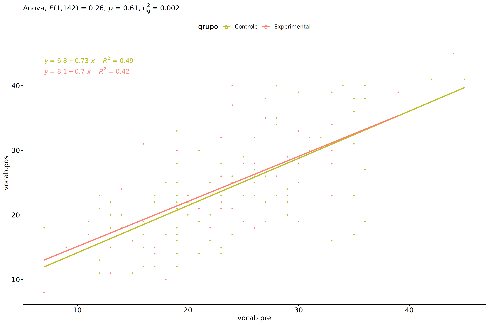
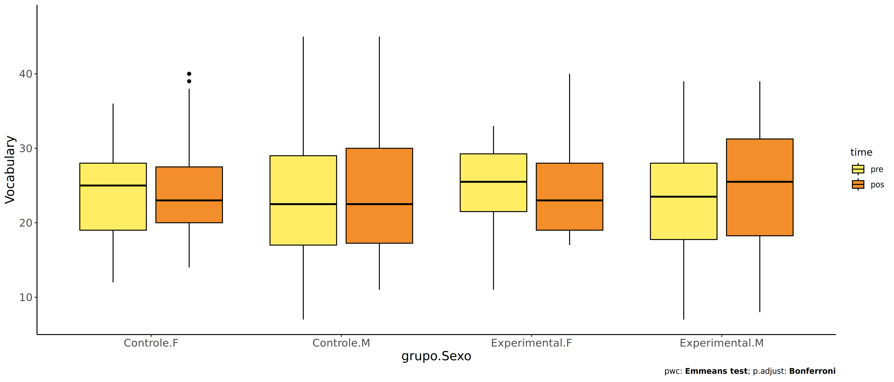
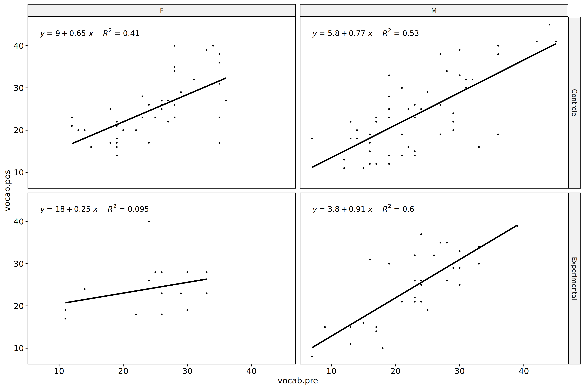
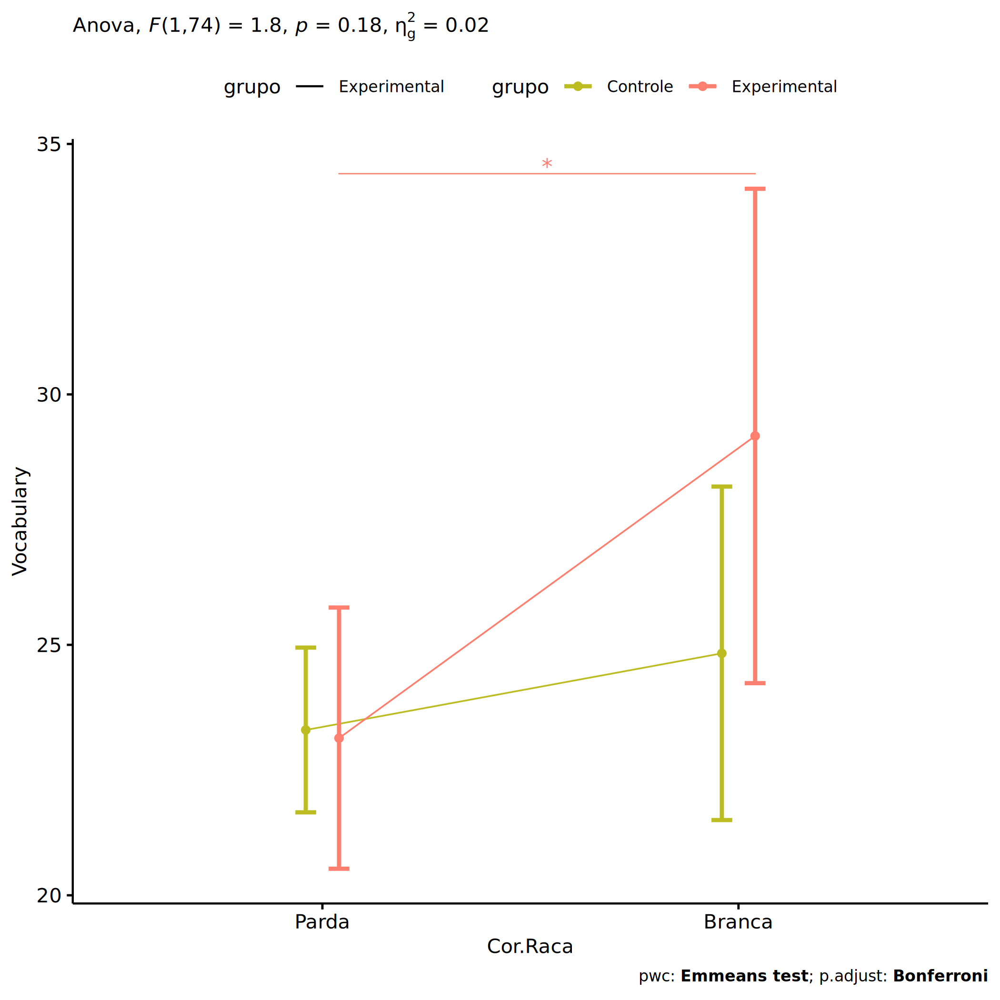
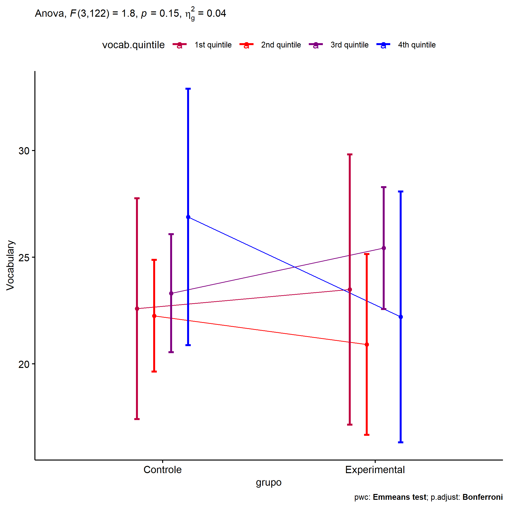

ANCOVA in Vocabulario (Vocabulario)
================
Geiser C. Challco <geiser@alumni.usp.br>

- [Descriptive Statistics of Initial
  Data](#descriptive-statistics-of-initial-data)
- [ANCOVA and Pairwise for one factor:
  **grupo**](#ancova-and-pairwise-for-one-factor-grupo)
  - [Without remove non-normal data](#without-remove-non-normal-data)
  - [Computing ANCOVA and PairWise After removing non-normal data
    (OK)](#computing-ancova-and-pairwise-after-removing-non-normal-data-ok)
    - [Plots for ancova](#plots-for-ancova)
    - [Checking linearity assumption](#checking-linearity-assumption)
    - [Checking normality and
      homogeneity](#checking-normality-and-homogeneity)
- [ANCOVA and Pairwise for two factors
  **grupo:Sexo**](#ancova-and-pairwise-for-two-factors-gruposexo)
  - [Without remove non-normal data](#without-remove-non-normal-data-1)
  - [Computing ANCOVA and PairWise After removing non-normal data
    (OK)](#computing-ancova-and-pairwise-after-removing-non-normal-data-ok-1)
    - [Plots for ancova](#plots-for-ancova-1)
    - [Checking linearity assumption](#checking-linearity-assumption-1)
    - [Checking normality and
      homogeneity](#checking-normality-and-homogeneity-1)
- [ANCOVA and Pairwise for two factors
  **grupo:Zona**](#ancova-and-pairwise-for-two-factors-grupozona)
  - [Without remove non-normal data](#without-remove-non-normal-data-2)
  - [Computing ANCOVA and PairWise After removing non-normal data
    (OK)](#computing-ancova-and-pairwise-after-removing-non-normal-data-ok-2)
    - [Plots for ancova](#plots-for-ancova-2)
    - [Checking linearity assumption](#checking-linearity-assumption-2)
    - [Checking normality and
      homogeneity](#checking-normality-and-homogeneity-2)
- [ANCOVA and Pairwise for two factors
  **grupo:Cor.Raca**](#ancova-and-pairwise-for-two-factors-grupocorraca)
  - [Without remove non-normal data](#without-remove-non-normal-data-3)
  - [Computing ANCOVA and PairWise After removing non-normal data
    (OK)](#computing-ancova-and-pairwise-after-removing-non-normal-data-ok-3)
    - [Plots for ancova](#plots-for-ancova-3)
    - [Checking linearity assumption](#checking-linearity-assumption-3)
    - [Checking normality and
      homogeneity](#checking-normality-and-homogeneity-3)
- [ANCOVA and Pairwise for two factors
  **grupo:Serie**](#ancova-and-pairwise-for-two-factors-gruposerie)
  - [Without remove non-normal data](#without-remove-non-normal-data-4)
  - [Computing ANCOVA and PairWise After removing non-normal data
    (OK)](#computing-ancova-and-pairwise-after-removing-non-normal-data-ok-4)
    - [Plots for ancova](#plots-for-ancova-4)
    - [Checking linearity assumption](#checking-linearity-assumption-4)
    - [Checking normality and
      homogeneity](#checking-normality-and-homogeneity-4)
- [ANCOVA and Pairwise for two factors
  **grupo:vocab.quintile**](#ancova-and-pairwise-for-two-factors-grupovocabquintile)
  - [Without remove non-normal data](#without-remove-non-normal-data-5)
  - [Computing ANCOVA and PairWise After removing non-normal data
    (OK)](#computing-ancova-and-pairwise-after-removing-non-normal-data-ok-5)
    - [Plots for ancova](#plots-for-ancova-5)
    - [Checking linearity assumption](#checking-linearity-assumption-5)
    - [Checking normality and
      homogeneity](#checking-normality-and-homogeneity-5)
- [Summary of Results](#summary-of-results)
  - [Descriptive Statistics](#descriptive-statistics)
  - [ANCOVA Table Comparison](#ancova-table-comparison)
  - [PairWise Table Comparison](#pairwise-table-comparison)
  - [EMMS Table Comparison](#emms-table-comparison)

**NOTE**:

- Teste ANCOVA para determinar se houve diferenças significativas no
  Vocabulario (medido usando pre- e pos-testes).
- ANCOVA test to determine whether there were significant differences in
  Vocabulario (measured using pre- and post-tests).

# Descriptive Statistics of Initial Data

``` r
df <- get.descriptives(dat, c(dv.pre, dv.pos), c("grupo"), 
                       include.global = T, symmetry.test = T, normality.test = F)
df <- plyr::rbind.fill(
  df, do.call(plyr::rbind.fill, lapply(lfatores2, FUN = function(f) {
    if (nrow(dat) > 0 && sum(!is.na(unique(dat[[f]]))) > 1)
      get.descriptives(dat, c(dv.pre,dv.pos), c("grupo", f),
                       symmetry.test = T, normality.test = F)
    }))
)
```

    ## Warning: There was 1 warning in `mutate()`.
    ## ℹ In argument: `ci = abs(stats::qt(alpha/2, .data$n - 1) * .data$se)`.
    ## Caused by warning:
    ## ! There was 1 warning in `mutate()`.
    ## ℹ In argument: `ci = abs(stats::qt(alpha/2, .data$n - 1) * .data$se)`.
    ## Caused by warning in `stats::qt()`:
    ## ! NaNs produced
    ## There was 1 warning in `mutate()`.
    ## ℹ In argument: `ci = abs(stats::qt(alpha/2, .data$n - 1) * .data$se)`.
    ## Caused by warning:
    ## ! There was 1 warning in `mutate()`.
    ## ℹ In argument: `ci = abs(stats::qt(alpha/2, .data$n - 1) * .data$se)`.
    ## Caused by warning in `stats::qt()`:
    ## ! NaNs produced
    ## There was 1 warning in `mutate()`.
    ## ℹ In argument: `ci = abs(stats::qt(alpha/2, .data$n - 1) * .data$se)`.
    ## Caused by warning:
    ## ! There was 1 warning in `mutate()`.
    ## ℹ In argument: `ci = abs(stats::qt(alpha/2, .data$n - 1) * .data$se)`.
    ## Caused by warning in `stats::qt()`:
    ## ! NaNs produced
    ## There was 1 warning in `mutate()`.
    ## ℹ In argument: `ci = abs(stats::qt(alpha/2, .data$n - 1) * .data$se)`.
    ## Caused by warning:
    ## ! There was 1 warning in `mutate()`.
    ## ℹ In argument: `ci = abs(stats::qt(alpha/2, .data$n - 1) * .data$se)`.
    ## Caused by warning in `stats::qt()`:
    ## ! NaNs produced

``` r
(df <- df[,c(fatores1[fatores1 %in% colnames(df)],"variable",
             colnames(df)[!colnames(df) %in% c(fatores1,"variable")])])
```

    ##           grupo Sexo   Zona Cor.Raca Serie vocab.quintile  variable   n   mean median min max     sd
    ## 1      Controle <NA>   <NA>     <NA>  <NA>           <NA> vocab.pre  98 23.980   23.0   7  45  7.824
    ## 2  Experimental <NA>   <NA>     <NA>  <NA>           <NA> vocab.pre  48 23.208   24.0   7  39  7.092
    ## 3          <NA> <NA>   <NA>     <NA>  <NA>           <NA> vocab.pre 146 23.726   24.0   7  45  7.575
    ## 4      Controle <NA>   <NA>     <NA>  <NA>           <NA> vocab.pos  98 24.633   23.0  11  47  8.458
    ## 5  Experimental <NA>   <NA>     <NA>  <NA>           <NA> vocab.pos  48 24.333   24.5   8  40  7.603
    ## 6          <NA> <NA>   <NA>     <NA>  <NA>           <NA> vocab.pos 146 24.534   23.0   8  47  8.161
    ## 7      Controle    F   <NA>     <NA>  <NA>           <NA> vocab.pre  43 24.535   25.0  12  36  6.874
    ## 8      Controle    M   <NA>     <NA>  <NA>           <NA> vocab.pre  55 23.545   22.0   7  45  8.531
    ## 9  Experimental    F   <NA>     <NA>  <NA>           <NA> vocab.pre  16 24.000   25.5  11  33  6.976
    ## 10 Experimental    M   <NA>     <NA>  <NA>           <NA> vocab.pre  32 22.812   23.5   7  39  7.226
    ## 11     Controle    F   <NA>     <NA>  <NA>           <NA> vocab.pos  43 24.907   23.0  14  40  6.938
    ## 12     Controle    M   <NA>     <NA>  <NA>           <NA> vocab.pos  55 24.418   23.0  11  47  9.537
    ## 13 Experimental    F   <NA>     <NA>  <NA>           <NA> vocab.pos  16 24.062   23.0  17  40  5.767
    ## 14 Experimental    M   <NA>     <NA>  <NA>           <NA> vocab.pos  32 24.469   25.5   8  39  8.455
    ## 15     Controle <NA>  Rural     <NA>  <NA>           <NA> vocab.pre  56 23.607   23.0  12  44  7.065
    ## 16     Controle <NA> Urbana     <NA>  <NA>           <NA> vocab.pre  11 22.455   20.0   7  45 10.539
    ## 17     Controle <NA>   <NA>     <NA>  <NA>           <NA> vocab.pre  31 25.194   24.0  12  42  8.171
    ## 18 Experimental <NA>  Rural     <NA>  <NA>           <NA> vocab.pre  34 22.618   24.0   7  39  7.274
    ## 19 Experimental <NA> Urbana     <NA>  <NA>           <NA> vocab.pre   5 26.200   26.0  15  33  7.463
    ## 20 Experimental <NA>   <NA>     <NA>  <NA>           <NA> vocab.pre   9 23.778   24.0  13  30  6.476
    ## 21     Controle <NA>  Rural     <NA>  <NA>           <NA> vocab.pos  56 24.821   23.0  11  47  8.651
    ## 22     Controle <NA> Urbana     <NA>  <NA>           <NA> vocab.pos  11 22.091   20.0  12  41  8.166
    ## 23     Controle <NA>   <NA>     <NA>  <NA>           <NA> vocab.pos  31 25.194   23.0  14  41  8.312
    ## 24 Experimental <NA>  Rural     <NA>  <NA>           <NA> vocab.pos  34 24.059   24.0   8  39  7.847
    ## 25 Experimental <NA> Urbana     <NA>  <NA>           <NA> vocab.pos   5 23.400   23.0  16  34  7.127
    ## 26 Experimental <NA>   <NA>     <NA>  <NA>           <NA> vocab.pos   9 25.889   26.0  15  40  7.524
    ## 27     Controle <NA>   <NA>   Branca  <NA>           <NA> vocab.pre  11 23.909   27.0  14  31  6.363
    ## 28     Controle <NA>   <NA> Indígena  <NA>           <NA> vocab.pre   3 27.000   26.0  24  31  3.606
    ## 29     Controle <NA>   <NA>    Parda  <NA>           <NA> vocab.pre  45 23.156   23.0  12  44  7.517
    ## 30     Controle <NA>   <NA>    Preta  <NA>           <NA> vocab.pre   1 19.000   19.0  19  19     NA
    ## 31     Controle <NA>   <NA>     <NA>  <NA>           <NA> vocab.pre  38 24.868   23.0   7  45  8.866
    ## 32 Experimental <NA>   <NA>   Branca  <NA>           <NA> vocab.pre   5 21.200   23.0  15  28  5.541
    ## 33 Experimental <NA>   <NA> Indígena  <NA>           <NA> vocab.pre   6 24.833   23.5  18  33  5.345
    ## 34 Experimental <NA>   <NA>    Parda  <NA>           <NA> vocab.pre  18 21.389   22.0   7  39  8.925
    ## 35 Experimental <NA>   <NA>     <NA>  <NA>           <NA> vocab.pre  19 24.947   25.0  13  33  5.730
    ## 36     Controle <NA>   <NA>   Branca  <NA>           <NA> vocab.pos  11 25.727   27.0  14  40  8.296
    ## 37     Controle <NA>   <NA> Indígena  <NA>           <NA> vocab.pos   3 28.000   27.0  25  32  3.606
    ## 38     Controle <NA>   <NA>    Parda  <NA>           <NA> vocab.pos  45 23.622   23.0  11  45  7.904
    ## 39     Controle <NA>   <NA>    Preta  <NA>           <NA> vocab.pos   1 23.000   23.0  23  23     NA
    ## 40     Controle <NA>   <NA>     <NA>  <NA>           <NA> vocab.pos  38 25.289   23.0  12  47  9.535
    ## 41 Experimental <NA>   <NA>   Branca  <NA>           <NA> vocab.pos   5 28.000   31.0  16  35  7.450
    ## 42 Experimental <NA>   <NA> Indígena  <NA>           <NA> vocab.pos   6 21.667   24.0  10  28  6.653
    ## 43 Experimental <NA>   <NA>    Parda  <NA>           <NA> vocab.pos  18 22.111   21.0   8  39  8.217
    ## 44 Experimental <NA>   <NA>     <NA>  <NA>           <NA> vocab.pos  19 26.316   26.0  14  40  6.880
    ## 45     Controle <NA>   <NA>     <NA> 6 ano           <NA> vocab.pre  26 19.423   18.5  12  29  5.551
    ## 46     Controle <NA>   <NA>     <NA> 7 ano           <NA> vocab.pre  28 23.286   23.0  12  35  5.974
    ## 47     Controle <NA>   <NA>     <NA> 8 ano           <NA> vocab.pre  17 23.882   19.0   7  45 10.688
    ## 48     Controle <NA>   <NA>     <NA> 9 ano           <NA> vocab.pre  27 29.148   29.0  13  42  6.509
    ## 49 Experimental <NA>   <NA>     <NA> 6 ano           <NA> vocab.pre  13 22.385   24.0   9  30  7.066
    ## 50 Experimental <NA>   <NA>     <NA> 7 ano           <NA> vocab.pre  13 23.692   23.0  13  39  7.674
    ## 51 Experimental <NA>   <NA>     <NA> 8 ano           <NA> vocab.pre  14 22.357   23.5   7  33  8.409
    ## 52 Experimental <NA>   <NA>     <NA> 9 ano           <NA> vocab.pre   8 25.250   25.0  19  29  3.454
    ##       se    ci   iqr symmetry     skewness     kurtosis
    ## 1  0.790 1.569 10.00      YES  0.388503168 -0.356388112
    ## 2  1.024 2.059  9.50      YES -0.314918142 -0.461920442
    ## 3  0.627 1.239 10.00      YES  0.215601865 -0.265439532
    ## 4  0.854 1.696 11.50       NO  0.597077962 -0.408656581
    ## 5  1.097 2.208 10.25      YES -0.015476056 -0.641567484
    ## 6  0.675 1.335 10.75      YES  0.447097877 -0.386468792
    ## 7  1.048 2.116  9.00      YES -0.003459875 -1.002798258
    ## 8  1.150 2.306 12.00       NO  0.588489893 -0.232832343
    ## 9  1.744 3.717  7.75       NO -0.630695852 -0.789107947
    ## 10 1.277 2.605 10.25      YES -0.147660996 -0.385547446
    ## 11 1.058 2.135  7.50       NO  0.698356303 -0.419140783
    ## 12 1.286 2.578 13.50       NO  0.563223535 -0.687431545
    ## 13 1.442 3.073  9.00       NO  1.054751440  1.067377370
    ## 14 1.495 3.048 13.00      YES -0.209851885 -1.095218245
    ## 15 0.944 1.892  9.50      YES  0.381641816 -0.340009665
    ## 16 3.178 7.080  9.50       NO  0.668754688 -0.408605900
    ## 17 1.468 2.997 12.50      YES  0.173199395 -1.104104505
    ## 18 1.247 2.538  8.50      YES -0.208194741 -0.361386229
    ## 19 3.338 9.267  9.00      YES -0.378501316 -1.708463460
    ## 20 2.159 4.978  6.00       NO -0.608704343 -1.314155292
    ## 21 1.156 2.317 11.25      YES  0.483202427 -0.337303706
    ## 22 2.462 5.486  7.50       NO  0.985344385  0.026694058
    ## 23 1.493 3.049 10.50       NO  0.641424151 -0.930413970
    ## 24 1.346 2.738 10.75      YES -0.141875409 -0.791518171
    ## 25 3.187 8.850  8.00      YES  0.356746209 -1.719739599
    ## 26 2.508 5.783  8.00      YES  0.380325234 -0.947692708
    ## 27 1.919 4.275 11.00      YES -0.422893999 -1.709313504
    ## 28 2.082 8.957  3.50 few data  0.000000000  0.000000000
    ## 29 1.120 2.258 10.00      YES  0.488158706 -0.334816886
    ## 30    NA   NaN  0.00 few data  0.000000000  0.000000000
    ## 31 1.438 2.914 14.00      YES  0.315276257 -0.706650014
    ## 32 2.478 6.880  8.00      YES -0.043174280 -2.062293287
    ## 33 2.182 5.609  5.50      YES  0.293031170 -1.569100214
    ## 34 2.104 4.439 12.75      YES  0.068285130 -1.052883555
    ## 35 1.315 2.762  6.00       NO -0.593627253 -0.555212639
    ## 36 2.501 5.573 13.00      YES  0.139857579 -1.465277218
    ## 37 2.082 8.957  3.50 few data  0.000000000  0.000000000
    ## 38 1.178 2.375  7.00       NO  0.611881167 -0.002706037
    ## 39    NA   NaN  0.00 few data  0.000000000  0.000000000
    ## 40 1.547 3.134 12.75       NO  0.606697221 -0.904175207
    ## 41 3.332 9.250  6.00       NO -0.629798331 -1.474799123
    ## 42 2.716 6.982  6.50       NO -0.714407154 -1.231291128
    ## 43 1.937 4.086 11.50      YES  0.330805751 -0.790153305
    ## 44 1.578 3.316  7.50      YES  0.123478265 -0.694853955
    ## 45 1.089 2.242  8.50      YES  0.274615131 -1.373380913
    ## 46 1.129 2.317  9.00      YES  0.142242516 -0.812648024
    ## 47 2.592 5.495 16.00       NO  0.657686522 -0.738905993
    ## 48 1.253 2.575  9.50      YES -0.369892451 -0.274739932
    ## 49 1.960 4.270 10.00       NO -0.582908926 -1.101693679
    ## 50 2.129 4.638  8.00      YES  0.454517233 -0.930150631
    ## 51 2.247 4.855 14.25      YES -0.362862553 -1.307276711
    ## 52 1.221 2.887  4.50      YES -0.402774428 -1.234771662
    ##  [ reached 'max' / getOption("max.print") -- omitted 28 rows ]

| grupo        | Sexo | Zona   | Cor.Raca | Serie | vocab.quintile | variable  |   n |   mean | median | min | max |     sd |    se |    ci |   iqr | symmetry | skewness | kurtosis |
|:-------------|:-----|:-------|:---------|:------|:---------------|:----------|----:|-------:|-------:|----:|----:|-------:|------:|------:|------:|:---------|---------:|---------:|
| Controle     |      |        |          |       |                | vocab.pre |  98 | 23.980 |   23.0 |   7 |  45 |  7.824 | 0.790 | 1.569 | 10.00 | YES      |    0.389 |   -0.356 |
| Experimental |      |        |          |       |                | vocab.pre |  48 | 23.208 |   24.0 |   7 |  39 |  7.092 | 1.024 | 2.059 |  9.50 | YES      |   -0.315 |   -0.462 |
|              |      |        |          |       |                | vocab.pre | 146 | 23.726 |   24.0 |   7 |  45 |  7.575 | 0.627 | 1.239 | 10.00 | YES      |    0.216 |   -0.265 |
| Controle     |      |        |          |       |                | vocab.pos |  98 | 24.633 |   23.0 |  11 |  47 |  8.458 | 0.854 | 1.696 | 11.50 | NO       |    0.597 |   -0.409 |
| Experimental |      |        |          |       |                | vocab.pos |  48 | 24.333 |   24.5 |   8 |  40 |  7.603 | 1.097 | 2.208 | 10.25 | YES      |   -0.015 |   -0.642 |
|              |      |        |          |       |                | vocab.pos | 146 | 24.534 |   23.0 |   8 |  47 |  8.161 | 0.675 | 1.335 | 10.75 | YES      |    0.447 |   -0.386 |
| Controle     | F    |        |          |       |                | vocab.pre |  43 | 24.535 |   25.0 |  12 |  36 |  6.874 | 1.048 | 2.116 |  9.00 | YES      |   -0.003 |   -1.003 |
| Controle     | M    |        |          |       |                | vocab.pre |  55 | 23.545 |   22.0 |   7 |  45 |  8.531 | 1.150 | 2.306 | 12.00 | NO       |    0.588 |   -0.233 |
| Experimental | F    |        |          |       |                | vocab.pre |  16 | 24.000 |   25.5 |  11 |  33 |  6.976 | 1.744 | 3.717 |  7.75 | NO       |   -0.631 |   -0.789 |
| Experimental | M    |        |          |       |                | vocab.pre |  32 | 22.812 |   23.5 |   7 |  39 |  7.226 | 1.277 | 2.605 | 10.25 | YES      |   -0.148 |   -0.386 |
| Controle     | F    |        |          |       |                | vocab.pos |  43 | 24.907 |   23.0 |  14 |  40 |  6.938 | 1.058 | 2.135 |  7.50 | NO       |    0.698 |   -0.419 |
| Controle     | M    |        |          |       |                | vocab.pos |  55 | 24.418 |   23.0 |  11 |  47 |  9.537 | 1.286 | 2.578 | 13.50 | NO       |    0.563 |   -0.687 |
| Experimental | F    |        |          |       |                | vocab.pos |  16 | 24.062 |   23.0 |  17 |  40 |  5.767 | 1.442 | 3.073 |  9.00 | NO       |    1.055 |    1.067 |
| Experimental | M    |        |          |       |                | vocab.pos |  32 | 24.469 |   25.5 |   8 |  39 |  8.455 | 1.495 | 3.048 | 13.00 | YES      |   -0.210 |   -1.095 |
| Controle     |      | Rural  |          |       |                | vocab.pre |  56 | 23.607 |   23.0 |  12 |  44 |  7.065 | 0.944 | 1.892 |  9.50 | YES      |    0.382 |   -0.340 |
| Controle     |      | Urbana |          |       |                | vocab.pre |  11 | 22.455 |   20.0 |   7 |  45 | 10.539 | 3.178 | 7.080 |  9.50 | NO       |    0.669 |   -0.409 |
| Controle     |      |        |          |       |                | vocab.pre |  31 | 25.194 |   24.0 |  12 |  42 |  8.171 | 1.468 | 2.997 | 12.50 | YES      |    0.173 |   -1.104 |
| Experimental |      | Rural  |          |       |                | vocab.pre |  34 | 22.618 |   24.0 |   7 |  39 |  7.274 | 1.247 | 2.538 |  8.50 | YES      |   -0.208 |   -0.361 |
| Experimental |      | Urbana |          |       |                | vocab.pre |   5 | 26.200 |   26.0 |  15 |  33 |  7.463 | 3.338 | 9.267 |  9.00 | YES      |   -0.379 |   -1.708 |
| Experimental |      |        |          |       |                | vocab.pre |   9 | 23.778 |   24.0 |  13 |  30 |  6.476 | 2.159 | 4.978 |  6.00 | NO       |   -0.609 |   -1.314 |
| Controle     |      | Rural  |          |       |                | vocab.pos |  56 | 24.821 |   23.0 |  11 |  47 |  8.651 | 1.156 | 2.317 | 11.25 | YES      |    0.483 |   -0.337 |
| Controle     |      | Urbana |          |       |                | vocab.pos |  11 | 22.091 |   20.0 |  12 |  41 |  8.166 | 2.462 | 5.486 |  7.50 | NO       |    0.985 |    0.027 |
| Controle     |      |        |          |       |                | vocab.pos |  31 | 25.194 |   23.0 |  14 |  41 |  8.312 | 1.493 | 3.049 | 10.50 | NO       |    0.641 |   -0.930 |
| Experimental |      | Rural  |          |       |                | vocab.pos |  34 | 24.059 |   24.0 |   8 |  39 |  7.847 | 1.346 | 2.738 | 10.75 | YES      |   -0.142 |   -0.792 |
| Experimental |      | Urbana |          |       |                | vocab.pos |   5 | 23.400 |   23.0 |  16 |  34 |  7.127 | 3.187 | 8.850 |  8.00 | YES      |    0.357 |   -1.720 |
| Experimental |      |        |          |       |                | vocab.pos |   9 | 25.889 |   26.0 |  15 |  40 |  7.524 | 2.508 | 5.783 |  8.00 | YES      |    0.380 |   -0.948 |
| Controle     |      |        | Branca   |       |                | vocab.pre |  11 | 23.909 |   27.0 |  14 |  31 |  6.363 | 1.919 | 4.275 | 11.00 | YES      |   -0.423 |   -1.709 |
| Controle     |      |        | Indígena |       |                | vocab.pre |   3 | 27.000 |   26.0 |  24 |  31 |  3.606 | 2.082 | 8.957 |  3.50 | few data |    0.000 |    0.000 |
| Controle     |      |        | Parda    |       |                | vocab.pre |  45 | 23.156 |   23.0 |  12 |  44 |  7.517 | 1.120 | 2.258 | 10.00 | YES      |    0.488 |   -0.335 |
| Controle     |      |        | Preta    |       |                | vocab.pre |   1 | 19.000 |   19.0 |  19 |  19 |        |       |       |  0.00 | few data |    0.000 |    0.000 |
| Controle     |      |        |          |       |                | vocab.pre |  38 | 24.868 |   23.0 |   7 |  45 |  8.866 | 1.438 | 2.914 | 14.00 | YES      |    0.315 |   -0.707 |
| Experimental |      |        | Branca   |       |                | vocab.pre |   5 | 21.200 |   23.0 |  15 |  28 |  5.541 | 2.478 | 6.880 |  8.00 | YES      |   -0.043 |   -2.062 |
| Experimental |      |        | Indígena |       |                | vocab.pre |   6 | 24.833 |   23.5 |  18 |  33 |  5.345 | 2.182 | 5.609 |  5.50 | YES      |    0.293 |   -1.569 |
| Experimental |      |        | Parda    |       |                | vocab.pre |  18 | 21.389 |   22.0 |   7 |  39 |  8.925 | 2.104 | 4.439 | 12.75 | YES      |    0.068 |   -1.053 |
| Experimental |      |        |          |       |                | vocab.pre |  19 | 24.947 |   25.0 |  13 |  33 |  5.730 | 1.315 | 2.762 |  6.00 | NO       |   -0.594 |   -0.555 |
| Controle     |      |        | Branca   |       |                | vocab.pos |  11 | 25.727 |   27.0 |  14 |  40 |  8.296 | 2.501 | 5.573 | 13.00 | YES      |    0.140 |   -1.465 |
| Controle     |      |        | Indígena |       |                | vocab.pos |   3 | 28.000 |   27.0 |  25 |  32 |  3.606 | 2.082 | 8.957 |  3.50 | few data |    0.000 |    0.000 |
| Controle     |      |        | Parda    |       |                | vocab.pos |  45 | 23.622 |   23.0 |  11 |  45 |  7.904 | 1.178 | 2.375 |  7.00 | NO       |    0.612 |   -0.003 |
| Controle     |      |        | Preta    |       |                | vocab.pos |   1 | 23.000 |   23.0 |  23 |  23 |        |       |       |  0.00 | few data |    0.000 |    0.000 |
| Controle     |      |        |          |       |                | vocab.pos |  38 | 25.289 |   23.0 |  12 |  47 |  9.535 | 1.547 | 3.134 | 12.75 | NO       |    0.607 |   -0.904 |
| Experimental |      |        | Branca   |       |                | vocab.pos |   5 | 28.000 |   31.0 |  16 |  35 |  7.450 | 3.332 | 9.250 |  6.00 | NO       |   -0.630 |   -1.475 |
| Experimental |      |        | Indígena |       |                | vocab.pos |   6 | 21.667 |   24.0 |  10 |  28 |  6.653 | 2.716 | 6.982 |  6.50 | NO       |   -0.714 |   -1.231 |
| Experimental |      |        | Parda    |       |                | vocab.pos |  18 | 22.111 |   21.0 |   8 |  39 |  8.217 | 1.937 | 4.086 | 11.50 | YES      |    0.331 |   -0.790 |
| Experimental |      |        |          |       |                | vocab.pos |  19 | 26.316 |   26.0 |  14 |  40 |  6.880 | 1.578 | 3.316 |  7.50 | YES      |    0.123 |   -0.695 |
| Controle     |      |        |          | 6 ano |                | vocab.pre |  26 | 19.423 |   18.5 |  12 |  29 |  5.551 | 1.089 | 2.242 |  8.50 | YES      |    0.275 |   -1.373 |
| Controle     |      |        |          | 7 ano |                | vocab.pre |  28 | 23.286 |   23.0 |  12 |  35 |  5.974 | 1.129 | 2.317 |  9.00 | YES      |    0.142 |   -0.813 |
| Controle     |      |        |          | 8 ano |                | vocab.pre |  17 | 23.882 |   19.0 |   7 |  45 | 10.688 | 2.592 | 5.495 | 16.00 | NO       |    0.658 |   -0.739 |
| Controle     |      |        |          | 9 ano |                | vocab.pre |  27 | 29.148 |   29.0 |  13 |  42 |  6.509 | 1.253 | 2.575 |  9.50 | YES      |   -0.370 |   -0.275 |
| Experimental |      |        |          | 6 ano |                | vocab.pre |  13 | 22.385 |   24.0 |   9 |  30 |  7.066 | 1.960 | 4.270 | 10.00 | NO       |   -0.583 |   -1.102 |
| Experimental |      |        |          | 7 ano |                | vocab.pre |  13 | 23.692 |   23.0 |  13 |  39 |  7.674 | 2.129 | 4.638 |  8.00 | YES      |    0.455 |   -0.930 |
| Experimental |      |        |          | 8 ano |                | vocab.pre |  14 | 22.357 |   23.5 |   7 |  33 |  8.409 | 2.247 | 4.855 | 14.25 | YES      |   -0.363 |   -1.307 |
| Experimental |      |        |          | 9 ano |                | vocab.pre |   8 | 25.250 |   25.0 |  19 |  29 |  3.454 | 1.221 | 2.887 |  4.50 | YES      |   -0.403 |   -1.235 |
| Controle     |      |        |          | 6 ano |                | vocab.pos |  26 | 18.692 |   18.5 |  11 |  27 |  4.994 | 0.979 | 2.017 |  8.25 | YES      |    0.037 |   -1.282 |
| Controle     |      |        |          | 7 ano |                | vocab.pos |  28 | 26.464 |   24.0 |  12 |  47 |  8.194 | 1.549 | 3.177 |  8.50 | NO       |    0.644 |   -0.211 |
| Controle     |      |        |          | 8 ano |                | vocab.pos |  17 | 24.000 |   21.0 |  14 |  45 |  9.605 | 2.329 | 4.938 | 11.00 | NO       |    0.940 |   -0.562 |
| Controle     |      |        |          | 9 ano |                | vocab.pos |  27 | 28.852 |   29.0 |  14 |  41 |  7.665 | 1.475 | 3.032 | 10.00 | YES      |   -0.076 |   -1.152 |
| Experimental |      |        |          | 6 ano |                | vocab.pos |  13 | 23.538 |   25.0 |  14 |  35 |  6.280 | 1.742 | 3.795 |  9.00 | YES      |   -0.102 |   -1.103 |
| Experimental |      |        |          | 7 ano |                | vocab.pos |  13 | 23.077 |   22.0 |  10 |  39 |  8.401 | 2.330 | 5.077 | 10.00 | YES      |    0.127 |   -1.001 |
| Experimental |      |        |          | 8 ano |                | vocab.pos |  14 | 24.857 |   25.0 |   8 |  37 |  8.690 | 2.323 | 5.017 | 13.25 | YES      |   -0.248 |   -1.225 |
| Experimental |      |        |          | 9 ano |                | vocab.pos |   8 | 26.750 |   25.5 |  18 |  40 |  6.923 | 2.448 | 5.788 |  7.25 | NO       |    0.589 |   -0.890 |
| Controle     |      |        |          |       | 1st quintile   | vocab.pre |  17 | 13.529 |   14.0 |   7 |  16 |  2.267 | 0.550 | 1.166 |  3.00 | NO       |   -1.142 |    1.450 |
| Controle     |      |        |          |       | 2nd quintile   | vocab.pre |  28 | 19.286 |   19.0 |  17 |  22 |  1.462 | 0.276 | 0.567 |  1.00 | YES      |    0.273 |   -0.622 |
| Controle     |      |        |          |       | 3rd quintile   | vocab.pre |  31 | 26.097 |   27.0 |  23 |  29 |  2.166 | 0.389 | 0.794 |  4.00 | YES      |   -0.216 |   -1.517 |
| Controle     |      |        |          |       | 4th quintile   | vocab.pre |   9 | 31.667 |   31.0 |  30 |  34 |  1.414 | 0.471 | 1.087 |  2.00 | YES      |    0.288 |   -1.556 |
| Controle     |      |        |          |       | 5th quintile   | vocab.pre |  13 | 37.385 |   36.0 |  35 |  45 |  3.664 | 1.016 | 2.214 |  1.00 | NO       |    1.171 |   -0.476 |
| Experimental |      |        |          |       | 1st quintile   | vocab.pre |   9 | 12.111 |   13.0 |   7 |  16 |  2.892 | 0.964 | 2.223 |  3.00 | YES      |   -0.346 |   -1.265 |
| Experimental |      |        |          |       | 2nd quintile   | vocab.pre |   8 | 19.125 |   19.0 |  17 |  22 |  1.808 | 0.639 | 1.511 |  2.50 | YES      |    0.220 |   -1.553 |
| Experimental |      |        |          |       | 3rd quintile   | vocab.pre |  21 | 25.286 |   25.0 |  23 |  29 |  1.978 | 0.432 | 0.901 |  2.00 | NO       |    0.544 |   -1.059 |
| Experimental |      |        |          |       | 4th quintile   | vocab.pre |   9 | 31.333 |   30.0 |  30 |  33 |  1.581 | 0.527 | 1.215 |  3.00 | few data |    0.000 |    0.000 |
| Experimental |      |        |          |       | 5th quintile   | vocab.pre |   1 | 39.000 |   39.0 |  39 |  39 |        |       |       |  0.00 | few data |    0.000 |    0.000 |
| Controle     |      |        |          |       | 1st quintile   | vocab.pos |  17 | 17.294 |   18.0 |  11 |  23 |  3.771 | 0.915 | 1.939 |  5.00 | YES      |   -0.367 |   -1.195 |
| Controle     |      |        |          |       | 2nd quintile   | vocab.pos |  28 | 21.393 |   21.5 |  12 |  47 |  7.233 | 1.367 | 2.805 |  6.75 | NO       |    1.512 |    3.304 |
| Controle     |      |        |          |       | 3rd quintile   | vocab.pos |  31 | 25.613 |   25.0 |  14 |  40 |  6.009 | 1.079 | 2.204 |  4.50 | YES      |    0.435 |    0.073 |
| Controle     |      |        |          |       | 4th quintile   | vocab.pos |   9 | 32.556 |   32.0 |  16 |  40 |  7.248 | 2.416 | 5.571 |  7.00 | NO       |   -1.053 |    0.290 |
| Controle     |      |        |          |       | 5th quintile   | vocab.pos |  13 | 33.385 |   38.0 |  17 |  45 |  9.106 | 2.526 | 5.503 | 13.00 | NO       |   -0.582 |   -1.250 |
| Experimental |      |        |          |       | 1st quintile   | vocab.pos |   9 | 17.333 |   16.0 |   8 |  31 |  6.837 | 2.279 | 5.256 |  4.00 | NO       |    0.611 |   -0.655 |
| Experimental |      |        |          |       | 2nd quintile   | vocab.pos |   8 | 19.000 |   19.5 |  10 |  30 |  6.188 | 2.188 | 5.173 |  6.75 | YES      |    0.260 |   -1.092 |
| Experimental |      |        |          |       | 3rd quintile   | vocab.pos |  21 | 27.238 |   26.0 |  18 |  40 |  6.057 | 1.322 | 2.757 |  9.00 | YES      |    0.433 |   -0.869 |
| Experimental |      |        |          |       | 4th quintile   | vocab.pos |   9 | 27.667 |   28.0 |  19 |  34 |  4.743 | 1.581 | 3.646 |  5.00 | YES      |   -0.365 |   -1.109 |
| Experimental |      |        |          |       | 5th quintile   | vocab.pos |   1 | 39.000 |   39.0 |  39 |  39 |        |       |       |  0.00 | few data |    0.000 |    0.000 |

# ANCOVA and Pairwise for one factor: **grupo**

## Without remove non-normal data

``` r
pdat = remove_group_data(dat[!is.na(dat[["grupo"]]),], "vocab.pos", "grupo")

pdat.long <- rbind(pdat[,c("id","grupo")], pdat[,c("id","grupo")])
pdat.long[["time"]] <- c(rep("pre", nrow(pdat)), rep("pos", nrow(pdat)))
pdat.long[["time"]] <- factor(pdat.long[["time"]], c("pre","pos"))
pdat.long[["vocab"]] <- c(pdat[["vocab.pre"]], pdat[["vocab.pos"]])

aov = anova_test(pdat, vocab.pos ~ vocab.pre + grupo)
laov[["grupo"]] <- get_anova_table(aov)
```

``` r
pwc <- emmeans_test(pdat, vocab.pos ~ grupo, covariate = vocab.pre,
                    p.adjust.method = "bonferroni")
```

``` r
pwc.long <- emmeans_test(dplyr::group_by_at(pdat.long, "grupo"),
                          vocab ~ time,
                          p.adjust.method = "bonferroni")
lpwc[["grupo"]] <- plyr::rbind.fill(pwc, pwc.long)
```

``` r
ds <- get.descriptives(pdat, "vocab.pos", "grupo", covar = "vocab.pre")
ds <- merge(ds[ds$variable != "vocab.pre",],
            ds[ds$variable == "vocab.pre", !colnames(ds) %in% c("variable")],
            by = "grupo", all.x = T, suffixes = c("", ".vocab.pre"))
ds <- merge(get_emmeans(pwc), ds, by = "grupo", suffixes = c(".emms", ""))
ds <- ds[,c("grupo","n","mean.vocab.pre","se.vocab.pre","mean","se","emmean","se.emms")]

colnames(ds) <- c("grupo", "N", paste0(c("M","SE")," (pre)"),
                  paste0(c("M","SE"), " (unadj)"), paste0(c("M", "SE"), " (adj)"))

lemms[["grupo"]] <- ds
```

## Computing ANCOVA and PairWise After removing non-normal data (OK)

``` r
wdat = pdat 

res = residuals(lm(vocab.pos ~ vocab.pre + grupo, data = wdat))
non.normal = getNonNormal(res, wdat$id, plimit = 0.05)

wdat = wdat[!wdat$id %in% non.normal,]

wdat.long <- rbind(wdat[,c("id","grupo")], wdat[,c("id","grupo")])
wdat.long[["time"]] <- c(rep("pre", nrow(wdat)), rep("pos", nrow(wdat)))
wdat.long[["time"]] <- factor(wdat.long[["time"]], c("pre","pos"))
wdat.long[["vocab"]] <- c(wdat[["vocab.pre"]], wdat[["vocab.pos"]])

ldat[["grupo"]] = wdat

(non.normal)
```

    ## [1] "P3569"

``` r
aov = anova_test(wdat, vocab.pos ~ vocab.pre + grupo)
laov[["grupo"]] <- merge(get_anova_table(aov), laov[["grupo"]], by="Effect", suffixes = c("","'"))

(df = get_anova_table(aov))
```

    ## ANOVA Table (type II tests)
    ## 
    ##      Effect DFn DFd       F        p p<.05   ges
    ## 1 vocab.pre   1 142 126.192 2.39e-21     * 0.471
    ## 2     grupo   1 142   0.258 6.12e-01       0.002

| Effect    | DFn | DFd |       F |     p | p\<.05 |   ges |
|:----------|----:|----:|--------:|------:|:-------|------:|
| vocab.pre |   1 | 142 | 126.192 | 0.000 | \*     | 0.471 |
| grupo     |   1 | 142 |   0.258 | 0.612 |        | 0.002 |

| term             | .y.       | group1   | group2       |  df | statistic |     p | p.adj | p.adj.signif |
|:-----------------|:----------|:---------|:-------------|----:|----------:|------:|------:|:-------------|
| vocab.pre\*grupo | vocab.pos | Controle | Experimental | 142 |    -0.508 | 0.612 | 0.612 | ns           |

``` r
pwc.long <- emmeans_test(dplyr::group_by_at(wdat.long, "grupo"),
                         vocab ~ time,
                         p.adjust.method = "bonferroni")
lpwc[["grupo"]] <- merge(plyr::rbind.fill(pwc, pwc.long), lpwc[["grupo"]], by=c("grupo","term",".y.","group1","group2"), suffixes = c("","'"))
```

| grupo        | term | .y.   | group1 | group2 |  df | statistic |     p | p.adj | p.adj.signif |
|:-------------|:-----|:------|:-------|:-------|----:|----------:|------:|------:|:-------------|
| Controle     | time | vocab | pre    | pos    | 286 |    -0.331 | 0.741 | 0.741 | ns           |
| Experimental | time | vocab | pre    | pos    | 286 |    -0.706 | 0.481 | 0.481 | ns           |

``` r
ds <- get.descriptives(wdat, "vocab.pos", "grupo", covar = "vocab.pre")
ds <- merge(ds[ds$variable != "vocab.pre",],
            ds[ds$variable == "vocab.pre", !colnames(ds) %in% c("variable")],
            by = "grupo", all.x = T, suffixes = c("", ".vocab.pre"))
ds <- merge(get_emmeans(pwc), ds, by = "grupo", suffixes = c(".emms", ""))
ds <- ds[,c("grupo","n","mean.vocab.pre","se.vocab.pre","mean","se","emmean","se.emms")]

colnames(ds) <- c("grupo", "N", paste0(c("M","SE")," (pre)"),
                  paste0(c("M","SE"), " (unadj)"), paste0(c("M", "SE"), " (adj)"))

lemms[["grupo"]] <- merge(ds, lemms[["grupo"]], by=c("grupo"), suffixes = c("","'"))
```

| grupo        |   N | M (pre) | SE (pre) | M (unadj) | SE (unadj) | M (adj) | SE (adj) |
|:-------------|----:|--------:|---------:|----------:|-----------:|--------:|---------:|
| Controle     |  97 |  24.031 |    0.797 |    24.402 |      0.831 |  24.206 |    0.593 |
| Experimental |  48 |  23.208 |    1.024 |    24.333 |      1.097 |  24.730 |    0.844 |

### Plots for ancova

``` r
plots <- oneWayAncovaPlots(
  wdat, "vocab.pos", "grupo", aov, list("grupo"=pwc), addParam = c("mean_se"),
  font.label.size=10, step.increase=0.05, p.label="p.adj",
  subtitle = which(aov$Effect == "grupo"))
```

``` r
if (!is.null(nrow(plots[["grupo"]]$data)))
  plots[["grupo"]] + ggplot2::scale_color_manual(values = color[["grupo"]])
```

    ## Scale for colour is already present.
    ## Adding another scale for colour, which will replace the existing scale.

<!-- -->

``` r
plots <- oneWayAncovaBoxPlots(
  wdat, "vocab.pos", "grupo", aov, pwc, covar = "vocab.pre",
  theme = "classic", color = color[["grupo"]],
  subtitle = which(aov$Effect == "grupo"))
```

``` r
if (length(unique(wdat[["grupo"]])) > 1)
  plots[["grupo"]] + ggplot2::ylab("Vocabulario") + ggplot2::scale_x_discrete(labels=c('pre', 'pos'))
```

<!-- -->

``` r
if (length(unique(wdat.long[["grupo"]])) > 1)
  plots <- oneWayAncovaBoxPlots(
    wdat.long, "vocab", "grupo", aov, pwc.long, pre.post = "time",
    theme = "classic", color = color$prepost)
```

``` r
if (length(unique(wdat.long[["grupo"]])) > 1)
  plots[["grupo"]] + ggplot2::ylab("Vocabulario")
```

<!-- -->

### Checking linearity assumption

``` r
ggscatter(wdat, x = "vocab.pre", y = "vocab.pos", size = 0.5,
          color = "grupo", add = "reg.line")+
  stat_regline_equation(
    aes(label =  paste(..eq.label.., ..rr.label.., sep = "~~~~"), color = grupo)
  )
```

<!-- -->

### Checking normality and homogeneity

``` r
res <- augment(lm(vocab.pos ~ vocab.pre + grupo, data = wdat))
```

``` r
shapiro_test(res$.resid)
```

    ## # A tibble: 1 × 3
    ##   variable   statistic p.value
    ##   <chr>          <dbl>   <dbl>
    ## 1 res$.resid     0.995   0.914

``` r
levene_test(res, .resid ~ grupo)
```

    ## # A tibble: 1 × 4
    ##     df1   df2 statistic     p
    ##   <int> <int>     <dbl> <dbl>
    ## 1     1   143    0.0402 0.841

# ANCOVA and Pairwise for two factors **grupo:Sexo**

## Without remove non-normal data

``` r
pdat = remove_group_data(dat[!is.na(dat[["grupo"]]) & !is.na(dat[["Sexo"]]),], "vocab.pos", c("grupo","Sexo"))

pdat.long <- rbind(pdat[,c("id","grupo","Sexo")], pdat[,c("id","grupo","Sexo")])
pdat.long[["time"]] <- c(rep("pre", nrow(pdat)), rep("pos", nrow(pdat)))
pdat.long[["time"]] <- factor(pdat.long[["time"]], c("pre","pos"))
pdat.long[["vocab"]] <- c(pdat[["vocab.pre"]], pdat[["vocab.pos"]])

aov = anova_test(pdat, vocab.pos ~ vocab.pre + grupo*Sexo)
laov[["grupo:Sexo"]] <- get_anova_table(aov)
```

``` r
pwcs <- list()
pwcs[["Sexo"]] <- emmeans_test(
  group_by(pdat, grupo), vocab.pos ~ Sexo,
  covariate = vocab.pre, p.adjust.method = "bonferroni")
pwcs[["grupo"]] <- emmeans_test(
  group_by(pdat, Sexo), vocab.pos ~ grupo,
  covariate = vocab.pre, p.adjust.method = "bonferroni")

pwc <- plyr::rbind.fill(pwcs[["grupo"]], pwcs[["Sexo"]])
pwc <- pwc[,c("grupo","Sexo", colnames(pwc)[!colnames(pwc) %in% c("grupo","Sexo")])]
```

``` r
pwc.long <- emmeans_test(dplyr::group_by_at(pdat.long, c("grupo","Sexo")),
                         vocab ~ time,
                         p.adjust.method = "bonferroni")
lpwc[["grupo:Sexo"]] <- plyr::rbind.fill(pwc, pwc.long)
```

``` r
ds <- get.descriptives(pdat, "vocab.pos", c("grupo","Sexo"), covar = "vocab.pre")
ds <- merge(ds[ds$variable != "vocab.pre",],
            ds[ds$variable == "vocab.pre", !colnames(ds) %in% c("variable")],
            by = c("grupo","Sexo"), all.x = T, suffixes = c("", ".vocab.pre"))
ds <- merge(get_emmeans(pwcs[["grupo"]]), ds, by = c("grupo","Sexo"), suffixes = c(".emms", ""))
ds <- ds[,c("grupo","Sexo","n","mean.vocab.pre","se.vocab.pre","mean","se","emmean","se.emms")]

colnames(ds) <- c("grupo","Sexo", "N", paste0(c("M","SE")," (pre)"),
                  paste0(c("M","SE"), " (unadj)"), paste0(c("M", "SE"), " (adj)"))

lemms[["grupo:Sexo"]] <- ds
```

## Computing ANCOVA and PairWise After removing non-normal data (OK)

``` r
wdat = pdat 

res = residuals(lm(vocab.pos ~ vocab.pre + grupo*Sexo, data = wdat))
non.normal = getNonNormal(res, wdat$id, plimit = 0.05)

wdat = wdat[!wdat$id %in% non.normal,]

wdat.long <- rbind(wdat[,c("id","grupo","Sexo")], wdat[,c("id","grupo","Sexo")])
wdat.long[["time"]] <- c(rep("pre", nrow(wdat)), rep("pos", nrow(wdat)))
wdat.long[["time"]] <- factor(wdat.long[["time"]], c("pre","pos"))
wdat.long[["vocab"]] <- c(wdat[["vocab.pre"]], wdat[["vocab.pos"]])


ldat[["grupo:Sexo"]] = wdat

(non.normal)
```

    ## [1] "P3569"

``` r
aov = anova_test(wdat, vocab.pos ~ vocab.pre + grupo*Sexo)
laov[["grupo:Sexo"]] <- merge(get_anova_table(aov), laov[["grupo:Sexo"]], by="Effect", suffixes = c("","'"))

(df = get_anova_table(aov))
```

    ## ANOVA Table (type II tests)
    ## 
    ##       Effect DFn DFd       F        p p<.05      ges
    ## 1  vocab.pre   1 140 124.810 4.09e-21     * 0.471000
    ## 2      grupo   1 140   0.231 6.31e-01       0.002000
    ## 3       Sexo   1 140   0.046 8.31e-01       0.000328
    ## 4 grupo:Sexo   1 140   0.493 4.84e-01       0.004000

| Effect     | DFn | DFd |       F |     p | p\<.05 |   ges |
|:-----------|----:|----:|--------:|------:|:-------|------:|
| vocab.pre  |   1 | 140 | 124.810 | 0.000 | \*     | 0.471 |
| grupo      |   1 | 140 |   0.231 | 0.631 |        | 0.002 |
| Sexo       |   1 | 140 |   0.046 | 0.831 |        | 0.000 |
| grupo:Sexo |   1 | 140 |   0.493 | 0.484 |        | 0.004 |

``` r
pwcs <- list()
pwcs[["Sexo"]] <- emmeans_test(
  group_by(wdat, grupo), vocab.pos ~ Sexo,
  covariate = vocab.pre, p.adjust.method = "bonferroni")
pwcs[["grupo"]] <- emmeans_test(
  group_by(wdat, Sexo), vocab.pos ~ grupo,
  covariate = vocab.pre, p.adjust.method = "bonferroni")

pwc <- plyr::rbind.fill(pwcs[["grupo"]], pwcs[["Sexo"]])
pwc <- pwc[,c("grupo","Sexo", colnames(pwc)[!colnames(pwc) %in% c("grupo","Sexo")])]
```

| grupo        | Sexo | term             | .y.       | group1   | group2       |  df | statistic |     p | p.adj | p.adj.signif |
|:-------------|:-----|:-----------------|:----------|:---------|:-------------|----:|----------:|------:|------:|:-------------|
|              | F    | vocab.pre\*grupo | vocab.pos | Controle | Experimental | 140 |     0.266 | 0.790 | 0.790 | ns           |
|              | M    | vocab.pre\*grupo | vocab.pos | Controle | Experimental | 140 |    -0.808 | 0.420 | 0.420 | ns           |
| Controle     |      | vocab.pre\*Sexo  | vocab.pos | F        | M            | 140 |     0.211 | 0.834 | 0.834 | ns           |
| Experimental |      | vocab.pre\*Sexo  | vocab.pos | F        | M            | 140 |    -0.703 | 0.483 | 0.483 | ns           |

``` r
pwc.long <- emmeans_test(dplyr::group_by_at(wdat.long, c("grupo","Sexo")),
                         vocab ~ time,
                         p.adjust.method = "bonferroni")
lpwc[["grupo:Sexo"]] <- merge(plyr::rbind.fill(pwc, pwc.long), lpwc[["grupo:Sexo"]], by=c("grupo","Sexo","term",".y.","group1","group2"), suffixes = c("","'"))
```

| grupo        | Sexo | term | .y.   | group1 | group2 |  df | statistic |     p | p.adj | p.adj.signif |
|:-------------|:-----|:-----|:------|:-------|:-------|----:|----------:|------:|------:|:-------------|
| Controle     | F    | time | vocab | pre    | pos    | 282 |    -0.220 | 0.826 | 0.826 | ns           |
| Controle     | M    | time | vocab | pre    | pos    | 282 |    -0.245 | 0.806 | 0.806 | ns           |
| Experimental | F    | time | vocab | pre    | pos    | 282 |    -0.023 | 0.982 | 0.982 | ns           |
| Experimental | M    | time | vocab | pre    | pos    | 282 |    -0.844 | 0.399 | 0.399 | ns           |

``` r
ds <- get.descriptives(wdat, "vocab.pos", c("grupo","Sexo"), covar = "vocab.pre")
ds <- merge(ds[ds$variable != "vocab.pre",],
            ds[ds$variable == "vocab.pre", !colnames(ds) %in% c("variable")],
            by = c("grupo","Sexo"), all.x = T, suffixes = c("", ".vocab.pre"))
ds <- merge(get_emmeans(pwcs[["grupo"]]), ds, by = c("grupo","Sexo"), suffixes = c(".emms", ""))
ds <- ds[,c("grupo","Sexo","n","mean.vocab.pre","se.vocab.pre","mean","se","emmean","se.emms")]

colnames(ds) <- c("grupo","Sexo", "N", paste0(c("M","SE")," (pre)"),
                  paste0(c("M","SE"), " (unadj)"), paste0(c("M", "SE"), " (adj)"))

lemms[["grupo:Sexo"]] <- merge(ds, lemms[["grupo:Sexo"]], by=c("grupo","Sexo"), suffixes = c("","'"))
```

| grupo        | Sexo |   N | M (pre) | SE (pre) | M (unadj) | SE (unadj) | M (adj) | SE (adj) |
|:-------------|:-----|----:|--------:|---------:|----------:|-----------:|--------:|---------:|
| Controle     | F    |  43 |  24.535 |    1.048 |    24.907 |      1.058 |  24.346 |    0.897 |
| Controle     | M    |  54 |  23.630 |    1.169 |    24.000 |      1.239 |  24.093 |    0.799 |
| Experimental | F    |  16 |  24.000 |    1.744 |    24.062 |      1.442 |  23.888 |    1.468 |
| Experimental | M    |  32 |  22.812 |    1.277 |    24.469 |      1.495 |  25.152 |    1.040 |

### Plots for ancova

``` r
plots <- twoWayAncovaPlots(
  wdat, "vocab.pos", c("grupo","Sexo"), aov, pwcs, addParam = c("mean_se"),
  font.label.size=10, step.increase=0.05, p.label="p.adj",
  subtitle = which(aov$Effect == "grupo:Sexo"))
```

``` r
if (!is.null(plots[["grupo"]]))
  plots[["grupo"]] + ggplot2::scale_color_manual(values = color[["Sexo"]])
```

    ## Scale for colour is already present.
    ## Adding another scale for colour, which will replace the existing scale.

<!-- -->

``` r
if (!is.null(plots[["Sexo"]]))
  plots[["Sexo"]] + ggplot2::scale_color_manual(values = color[["grupo"]])
```

    ## Scale for colour is already present.
    ## Adding another scale for colour, which will replace the existing scale.

<!-- -->

``` r
plots <- twoWayAncovaBoxPlots(
  wdat, "vocab.pos", c("grupo","Sexo"), aov, pwcs, covar = "vocab.pre",
  theme = "classic", color = color[["grupo:Sexo"]],
  subtitle = which(aov$Effect == "grupo:Sexo"))
```

``` r
plots[["grupo:Sexo"]] + ggplot2::ylab("Vocabulario") + ggplot2::scale_x_discrete(labels=c('pre', 'pos'))
```

<!-- -->

``` r
plots <- twoWayAncovaBoxPlots(
  wdat.long, "vocab", c("grupo","Sexo"), aov, pwc.long, pre.post = "time",
  theme = "classic", color = color$prepost)
```

``` r
plots[["grupo:Sexo"]] + ggplot2::ylab("Vocabulario")
```

<!-- -->

### Checking linearity assumption

``` r
ggscatter(wdat, x = "vocab.pre", y = "vocab.pos", size = 0.5,
          facet.by = c("grupo","Sexo"), add = "reg.line")+
  stat_regline_equation(
    aes(label =  paste(..eq.label.., ..rr.label.., sep = "~~~~"))
  )
```

<!-- -->

### Checking normality and homogeneity

``` r
res <- augment(lm(vocab.pos ~ vocab.pre + grupo*Sexo, data = wdat))
```

``` r
shapiro_test(res$.resid)
```

    ## # A tibble: 1 × 3
    ##   variable   statistic p.value
    ##   <chr>          <dbl>   <dbl>
    ## 1 res$.resid     0.995   0.917

``` r
levene_test(res, .resid ~ grupo*Sexo)
```

    ## # A tibble: 1 × 4
    ##     df1   df2 statistic     p
    ##   <int> <int>     <dbl> <dbl>
    ## 1     3   141     0.636 0.593

# ANCOVA and Pairwise for two factors **grupo:Zona**

## Without remove non-normal data

``` r
pdat = remove_group_data(dat[!is.na(dat[["grupo"]]) & !is.na(dat[["Zona"]]),], "vocab.pos", c("grupo","Zona"))

pdat.long <- rbind(pdat[,c("id","grupo","Zona")], pdat[,c("id","grupo","Zona")])
pdat.long[["time"]] <- c(rep("pre", nrow(pdat)), rep("pos", nrow(pdat)))
pdat.long[["time"]] <- factor(pdat.long[["time"]], c("pre","pos"))
pdat.long[["vocab"]] <- c(pdat[["vocab.pre"]], pdat[["vocab.pos"]])

aov = anova_test(pdat, vocab.pos ~ vocab.pre + grupo*Zona)
laov[["grupo:Zona"]] <- get_anova_table(aov)
```

``` r
pwcs <- list()
pwcs[["Zona"]] <- emmeans_test(
  group_by(pdat, grupo), vocab.pos ~ Zona,
  covariate = vocab.pre, p.adjust.method = "bonferroni")
pwcs[["grupo"]] <- emmeans_test(
  group_by(pdat, Zona), vocab.pos ~ grupo,
  covariate = vocab.pre, p.adjust.method = "bonferroni")

pwc <- plyr::rbind.fill(pwcs[["grupo"]], pwcs[["Zona"]])
pwc <- pwc[,c("grupo","Zona", colnames(pwc)[!colnames(pwc) %in% c("grupo","Zona")])]
```

``` r
pwc.long <- emmeans_test(dplyr::group_by_at(pdat.long, c("grupo","Zona")),
                         vocab ~ time,
                         p.adjust.method = "bonferroni")
lpwc[["grupo:Zona"]] <- plyr::rbind.fill(pwc, pwc.long)
```

``` r
ds <- get.descriptives(pdat, "vocab.pos", c("grupo","Zona"), covar = "vocab.pre")
ds <- merge(ds[ds$variable != "vocab.pre",],
            ds[ds$variable == "vocab.pre", !colnames(ds) %in% c("variable")],
            by = c("grupo","Zona"), all.x = T, suffixes = c("", ".vocab.pre"))
ds <- merge(get_emmeans(pwcs[["grupo"]]), ds, by = c("grupo","Zona"), suffixes = c(".emms", ""))
ds <- ds[,c("grupo","Zona","n","mean.vocab.pre","se.vocab.pre","mean","se","emmean","se.emms")]

colnames(ds) <- c("grupo","Zona", "N", paste0(c("M","SE")," (pre)"),
                  paste0(c("M","SE"), " (unadj)"), paste0(c("M", "SE"), " (adj)"))

lemms[["grupo:Zona"]] <- ds
```

## Computing ANCOVA and PairWise After removing non-normal data (OK)

``` r
wdat = pdat 

res = residuals(lm(vocab.pos ~ vocab.pre + grupo*Zona, data = wdat))
non.normal = getNonNormal(res, wdat$id, plimit = 0.05)

wdat = wdat[!wdat$id %in% non.normal,]

wdat.long <- rbind(wdat[,c("id","grupo","Zona")], wdat[,c("id","grupo","Zona")])
wdat.long[["time"]] <- c(rep("pre", nrow(wdat)), rep("pos", nrow(wdat)))
wdat.long[["time"]] <- factor(wdat.long[["time"]], c("pre","pos"))
wdat.long[["vocab"]] <- c(wdat[["vocab.pre"]], wdat[["vocab.pos"]])


ldat[["grupo:Zona"]] = wdat

(non.normal)
```

    ## [1] "P3569"

``` r
aov = anova_test(wdat, vocab.pos ~ vocab.pre + grupo*Zona)
laov[["grupo:Zona"]] <- merge(get_anova_table(aov), laov[["grupo:Zona"]], by="Effect", suffixes = c("","'"))

(df = get_anova_table(aov))
```

    ## ANOVA Table (type II tests)
    ## 
    ##       Effect DFn DFd       F        p p<.05      ges
    ## 1  vocab.pre   1 100 140.558 8.99e-21     * 0.584000
    ## 2      grupo   1 100   0.034 8.54e-01       0.000338
    ## 3       Zona   1 100   2.086 1.52e-01       0.020000
    ## 4 grupo:Zona   1 100   0.538 4.65e-01       0.005000

| Effect     | DFn | DFd |       F |     p | p\<.05 |   ges |
|:-----------|----:|----:|--------:|------:|:-------|------:|
| vocab.pre  |   1 | 100 | 140.558 | 0.000 | \*     | 0.584 |
| grupo      |   1 | 100 |   0.034 | 0.854 |        | 0.000 |
| Zona       |   1 | 100 |   2.086 | 0.152 |        | 0.020 |
| grupo:Zona |   1 | 100 |   0.538 | 0.465 |        | 0.005 |

``` r
pwcs <- list()
pwcs[["Zona"]] <- emmeans_test(
  group_by(wdat, grupo), vocab.pos ~ Zona,
  covariate = vocab.pre, p.adjust.method = "bonferroni")
pwcs[["grupo"]] <- emmeans_test(
  group_by(wdat, Zona), vocab.pos ~ grupo,
  covariate = vocab.pre, p.adjust.method = "bonferroni")

pwc <- plyr::rbind.fill(pwcs[["grupo"]], pwcs[["Zona"]])
pwc <- pwc[,c("grupo","Zona", colnames(pwc)[!colnames(pwc) %in% c("grupo","Zona")])]
```

| grupo        | Zona   | term             | .y.       | group1   | group2       |  df | statistic |     p | p.adj | p.adj.signif |
|:-------------|:-------|:-----------------|:----------|:---------|:-------------|----:|----------:|------:|------:|:-------------|
|              | Rural  | vocab.pre\*grupo | vocab.pos | Controle | Experimental | 100 |    -0.448 | 0.655 | 0.655 | ns           |
|              | Urbana | vocab.pre\*grupo | vocab.pos | Controle | Experimental | 100 |     0.612 | 0.542 | 0.542 | ns           |
| Controle     |        | vocab.pre\*Zona  | vocab.pos | Rural    | Urbana       | 100 |     0.770 | 0.443 | 0.443 | ns           |
| Experimental |        | vocab.pre\*Zona  | vocab.pos | Rural    | Urbana       | 100 |     1.421 | 0.158 | 0.158 | ns           |

``` r
pwc.long <- emmeans_test(dplyr::group_by_at(wdat.long, c("grupo","Zona")),
                         vocab ~ time,
                         p.adjust.method = "bonferroni")
lpwc[["grupo:Zona"]] <- merge(plyr::rbind.fill(pwc, pwc.long), lpwc[["grupo:Zona"]], by=c("grupo","Zona","term",".y.","group1","group2"), suffixes = c("","'"))
```

| grupo        | Zona   | term | .y.   | group1 | group2 |  df | statistic |     p | p.adj | p.adj.signif |
|:-------------|:-------|:-----|:------|:-------|:-------|----:|----------:|------:|------:|:-------------|
| Controle     | Rural  | time | vocab | pre    | pos    | 202 |    -0.488 | 0.626 | 0.626 | ns           |
| Controle     | Urbana | time | vocab | pre    | pos    | 202 |     0.109 | 0.913 | 0.913 | ns           |
| Experimental | Rural  | time | vocab | pre    | pos    | 202 |    -0.761 | 0.448 | 0.448 | ns           |
| Experimental | Urbana | time | vocab | pre    | pos    | 202 |     0.567 | 0.571 | 0.571 | ns           |

``` r
ds <- get.descriptives(wdat, "vocab.pos", c("grupo","Zona"), covar = "vocab.pre")
ds <- merge(ds[ds$variable != "vocab.pre",],
            ds[ds$variable == "vocab.pre", !colnames(ds) %in% c("variable")],
            by = c("grupo","Zona"), all.x = T, suffixes = c("", ".vocab.pre"))
ds <- merge(get_emmeans(pwcs[["grupo"]]), ds, by = c("grupo","Zona"), suffixes = c(".emms", ""))
ds <- ds[,c("grupo","Zona","n","mean.vocab.pre","se.vocab.pre","mean","se","emmean","se.emms")]

colnames(ds) <- c("grupo","Zona", "N", paste0(c("M","SE")," (pre)"),
                  paste0(c("M","SE"), " (unadj)"), paste0(c("M", "SE"), " (adj)"))

lemms[["grupo:Zona"]] <- merge(ds, lemms[["grupo:Zona"]], by=c("grupo","Zona"), suffixes = c("","'"))
```

| grupo        | Zona   |   N | M (pre) | SE (pre) | M (unadj) | SE (unadj) | M (adj) | SE (adj) |
|:-------------|:-------|----:|--------:|---------:|----------:|-----------:|--------:|---------:|
| Controle     | Rural  |  55 |  23.691 |    0.958 |    24.418 |      1.103 |  24.129 |    0.702 |
| Controle     | Urbana |  11 |  22.455 |    3.178 |    22.091 |      2.462 |  22.803 |    1.571 |
| Experimental | Rural  |  34 |  22.618 |    1.247 |    24.059 |      1.346 |  24.639 |    0.894 |
| Experimental | Urbana |   5 |  26.200 |    3.338 |    23.400 |      3.187 |  21.078 |    2.336 |

### Plots for ancova

``` r
plots <- twoWayAncovaPlots(
  wdat, "vocab.pos", c("grupo","Zona"), aov, pwcs, addParam = c("mean_se"),
  font.label.size=10, step.increase=0.05, p.label="p.adj",
  subtitle = which(aov$Effect == "grupo:Zona"))
```

``` r
if (!is.null(plots[["grupo"]]))
  plots[["grupo"]] + ggplot2::scale_color_manual(values = color[["Zona"]])
```

    ## Scale for colour is already present.
    ## Adding another scale for colour, which will replace the existing scale.

<!-- -->

``` r
if (!is.null(plots[["Zona"]]))
  plots[["Zona"]] + ggplot2::scale_color_manual(values = color[["grupo"]])
```

    ## Scale for colour is already present.
    ## Adding another scale for colour, which will replace the existing scale.

<!-- -->

``` r
plots <- twoWayAncovaBoxPlots(
  wdat, "vocab.pos", c("grupo","Zona"), aov, pwcs, covar = "vocab.pre",
  theme = "classic", color = color[["grupo:Zona"]],
  subtitle = which(aov$Effect == "grupo:Zona"))
```

``` r
plots[["grupo:Zona"]] + ggplot2::ylab("Vocabulario") + ggplot2::scale_x_discrete(labels=c('pre', 'pos'))
```

<!-- -->

``` r
plots <- twoWayAncovaBoxPlots(
  wdat.long, "vocab", c("grupo","Zona"), aov, pwc.long, pre.post = "time",
  theme = "classic", color = color$prepost)
```

``` r
plots[["grupo:Zona"]] + ggplot2::ylab("Vocabulario")
```

<!-- -->

### Checking linearity assumption

``` r
ggscatter(wdat, x = "vocab.pre", y = "vocab.pos", size = 0.5,
          facet.by = c("grupo","Zona"), add = "reg.line")+
  stat_regline_equation(
    aes(label =  paste(..eq.label.., ..rr.label.., sep = "~~~~"))
  )
```

<!-- -->

### Checking normality and homogeneity

``` r
res <- augment(lm(vocab.pos ~ vocab.pre + grupo*Zona, data = wdat))
```

``` r
shapiro_test(res$.resid)
```

    ## # A tibble: 1 × 3
    ##   variable   statistic p.value
    ##   <chr>          <dbl>   <dbl>
    ## 1 res$.resid     0.992   0.826

``` r
levene_test(res, .resid ~ grupo*Zona)
```

    ## # A tibble: 1 × 4
    ##     df1   df2 statistic     p
    ##   <int> <int>     <dbl> <dbl>
    ## 1     3   101     0.234 0.873

# ANCOVA and Pairwise for two factors **grupo:Cor.Raca**

## Without remove non-normal data

``` r
pdat = remove_group_data(dat[!is.na(dat[["grupo"]]) & !is.na(dat[["Cor.Raca"]]),], "vocab.pos", c("grupo","Cor.Raca"))
```

    ## Warning: There was 1 warning in `mutate()`.
    ## ℹ In argument: `ci = abs(stats::qt(alpha/2, .data$n - 1) * .data$se)`.
    ## Caused by warning:
    ## ! There was 1 warning in `mutate()`.
    ## ℹ In argument: `ci = abs(stats::qt(alpha/2, .data$n - 1) * .data$se)`.
    ## Caused by warning in `stats::qt()`:
    ## ! NaNs produced

``` r
pdat.long <- rbind(pdat[,c("id","grupo","Cor.Raca")], pdat[,c("id","grupo","Cor.Raca")])
pdat.long[["time"]] <- c(rep("pre", nrow(pdat)), rep("pos", nrow(pdat)))
pdat.long[["time"]] <- factor(pdat.long[["time"]], c("pre","pos"))
pdat.long[["vocab"]] <- c(pdat[["vocab.pre"]], pdat[["vocab.pos"]])

aov = anova_test(pdat, vocab.pos ~ vocab.pre + grupo*Cor.Raca)
laov[["grupo:Cor.Raca"]] <- get_anova_table(aov)
```

``` r
pwcs <- list()
pwcs[["Cor.Raca"]] <- emmeans_test(
  group_by(pdat, grupo), vocab.pos ~ Cor.Raca,
  covariate = vocab.pre, p.adjust.method = "bonferroni")
pwcs[["grupo"]] <- emmeans_test(
  group_by(pdat, Cor.Raca), vocab.pos ~ grupo,
  covariate = vocab.pre, p.adjust.method = "bonferroni")

pwc <- plyr::rbind.fill(pwcs[["grupo"]], pwcs[["Cor.Raca"]])
pwc <- pwc[,c("grupo","Cor.Raca", colnames(pwc)[!colnames(pwc) %in% c("grupo","Cor.Raca")])]
```

``` r
pwc.long <- emmeans_test(dplyr::group_by_at(pdat.long, c("grupo","Cor.Raca")),
                         vocab ~ time,
                         p.adjust.method = "bonferroni")
lpwc[["grupo:Cor.Raca"]] <- plyr::rbind.fill(pwc, pwc.long)
```

``` r
ds <- get.descriptives(pdat, "vocab.pos", c("grupo","Cor.Raca"), covar = "vocab.pre")
ds <- merge(ds[ds$variable != "vocab.pre",],
            ds[ds$variable == "vocab.pre", !colnames(ds) %in% c("variable")],
            by = c("grupo","Cor.Raca"), all.x = T, suffixes = c("", ".vocab.pre"))
ds <- merge(get_emmeans(pwcs[["grupo"]]), ds, by = c("grupo","Cor.Raca"), suffixes = c(".emms", ""))
ds <- ds[,c("grupo","Cor.Raca","n","mean.vocab.pre","se.vocab.pre","mean","se","emmean","se.emms")]

colnames(ds) <- c("grupo","Cor.Raca", "N", paste0(c("M","SE")," (pre)"),
                  paste0(c("M","SE"), " (unadj)"), paste0(c("M", "SE"), " (adj)"))

lemms[["grupo:Cor.Raca"]] <- ds
```

## Computing ANCOVA and PairWise After removing non-normal data (OK)

``` r
wdat = pdat 

res = residuals(lm(vocab.pos ~ vocab.pre + grupo*Cor.Raca, data = wdat))
non.normal = getNonNormal(res, wdat$id, plimit = 0.05)

wdat = wdat[!wdat$id %in% non.normal,]

wdat.long <- rbind(wdat[,c("id","grupo","Cor.Raca")], wdat[,c("id","grupo","Cor.Raca")])
wdat.long[["time"]] <- c(rep("pre", nrow(wdat)), rep("pos", nrow(wdat)))
wdat.long[["time"]] <- factor(wdat.long[["time"]], c("pre","pos"))
wdat.long[["vocab"]] <- c(wdat[["vocab.pre"]], wdat[["vocab.pos"]])


ldat[["grupo:Cor.Raca"]] = wdat

(non.normal)
```

    ## NULL

``` r
aov = anova_test(wdat, vocab.pos ~ vocab.pre + grupo*Cor.Raca)
laov[["grupo:Cor.Raca"]] <- merge(get_anova_table(aov), laov[["grupo:Cor.Raca"]], by="Effect", suffixes = c("","'"))

(df = get_anova_table(aov))
```

    ## ANOVA Table (type II tests)
    ## 
    ##           Effect DFn DFd      F        p p<.05   ges
    ## 1      vocab.pre   1  79 89.333 1.28e-14     * 0.531
    ## 2          grupo   1  79  0.339 5.62e-01       0.004
    ## 3       Cor.Raca   2  79  3.336 4.10e-02     * 0.078
    ## 4 grupo:Cor.Raca   1  79  1.845 1.78e-01       0.023

| Effect         | DFn | DFd |      F |     p | p\<.05 |   ges |
|:---------------|----:|----:|-------:|------:|:-------|------:|
| vocab.pre      |   1 |  79 | 89.333 | 0.000 | \*     | 0.531 |
| grupo          |   1 |  79 |  0.339 | 0.562 |        | 0.004 |
| Cor.Raca       |   2 |  79 |  3.336 | 0.041 | \*     | 0.078 |
| grupo:Cor.Raca |   1 |  79 |  1.845 | 0.178 |        | 0.023 |

``` r
pwcs <- list()
pwcs[["Cor.Raca"]] <- emmeans_test(
  group_by(wdat, grupo), vocab.pos ~ Cor.Raca,
  covariate = vocab.pre, p.adjust.method = "bonferroni")
pwcs[["grupo"]] <- emmeans_test(
  group_by(wdat, Cor.Raca), vocab.pos ~ grupo,
  covariate = vocab.pre, p.adjust.method = "bonferroni")

pwc <- plyr::rbind.fill(pwcs[["grupo"]], pwcs[["Cor.Raca"]])
pwc <- pwc[,c("grupo","Cor.Raca", colnames(pwc)[!colnames(pwc) %in% c("grupo","Cor.Raca")])]
```

| grupo        | Cor.Raca | term                | .y.       | group1   | group2       |  df | statistic |     p | p.adj | p.adj.signif |
|:-------------|:---------|:--------------------|:----------|:---------|:-------------|----:|----------:|------:|------:|:-------------|
|              | Branca   | vocab.pre\*grupo    | vocab.pos | Controle | Experimental |  79 |    -1.474 | 0.145 | 0.145 | ns           |
|              | Indígena | vocab.pre\*grupo    | vocab.pos | Controle | Experimental |     |           |       |       |              |
|              | Parda    | vocab.pre\*grupo    | vocab.pos | Controle | Experimental |  79 |     0.100 | 0.921 | 0.921 | ns           |
| Controle     |          | vocab.pre\*Cor.Raca | vocab.pos | Branca   | Indígena     |     |           |       |       |              |
| Controle     |          | vocab.pre\*Cor.Raca | vocab.pos | Branca   | Parda        |  79 |     0.829 | 0.409 | 0.409 | ns           |
| Controle     |          | vocab.pre\*Cor.Raca | vocab.pos | Indígena | Parda        |     |           |       |       |              |
| Experimental |          | vocab.pre\*Cor.Raca | vocab.pos | Branca   | Indígena     |  79 |     2.747 | 0.007 | 0.022 | \*           |
| Experimental |          | vocab.pre\*Cor.Raca | vocab.pos | Branca   | Parda        |  79 |     2.184 | 0.032 | 0.096 | ns           |
| Experimental |          | vocab.pre\*Cor.Raca | vocab.pos | Indígena | Parda        |  79 |    -1.194 | 0.236 | 0.708 | ns           |

``` r
pwc.long <- emmeans_test(dplyr::group_by_at(wdat.long, c("grupo","Cor.Raca")),
                         vocab ~ time,
                         p.adjust.method = "bonferroni")
lpwc[["grupo:Cor.Raca"]] <- merge(plyr::rbind.fill(pwc, pwc.long), lpwc[["grupo:Cor.Raca"]], by=c("grupo","Cor.Raca","term",".y.","group1","group2"), suffixes = c("","'"))
```

| grupo        | Cor.Raca | term | .y.   | group1 | group2 |  df | statistic |     p | p.adj | p.adj.signif |
|:-------------|:---------|:-----|:------|:-------|:-------|----:|----------:|------:|------:|:-------------|
| Controle     | Branca   | time | vocab | pre    | pos    | 160 |    -0.552 | 0.582 | 0.582 | ns           |
| Controle     | Indígena | time | vocab | pre    | pos    |     |           |       |       |              |
| Controle     | Parda    | time | vocab | pre    | pos    | 160 |    -0.287 | 0.775 | 0.775 | ns           |
| Experimental | Branca   | time | vocab | pre    | pos    | 160 |    -1.393 | 0.166 | 0.166 | ns           |
| Experimental | Indígena | time | vocab | pre    | pos    | 160 |     0.710 | 0.479 | 0.479 | ns           |
| Experimental | Parda    | time | vocab | pre    | pos    | 160 |    -0.281 | 0.779 | 0.779 | ns           |

``` r
ds <- get.descriptives(wdat, "vocab.pos", c("grupo","Cor.Raca"), covar = "vocab.pre")
ds <- merge(ds[ds$variable != "vocab.pre",],
            ds[ds$variable == "vocab.pre", !colnames(ds) %in% c("variable")],
            by = c("grupo","Cor.Raca"), all.x = T, suffixes = c("", ".vocab.pre"))
ds <- merge(get_emmeans(pwcs[["grupo"]]), ds, by = c("grupo","Cor.Raca"), suffixes = c(".emms", ""))
ds <- ds[,c("grupo","Cor.Raca","n","mean.vocab.pre","se.vocab.pre","mean","se","emmean","se.emms")]

colnames(ds) <- c("grupo","Cor.Raca", "N", paste0(c("M","SE")," (pre)"),
                  paste0(c("M","SE"), " (unadj)"), paste0(c("M", "SE"), " (adj)"))

lemms[["grupo:Cor.Raca"]] <- merge(ds, lemms[["grupo:Cor.Raca"]], by=c("grupo","Cor.Raca"), suffixes = c("","'"))
```

| grupo        | Cor.Raca |   N | M (pre) | SE (pre) | M (unadj) | SE (unadj) | M (adj) | SE (adj) |
|:-------------|:---------|----:|--------:|---------:|----------:|-----------:|--------:|---------:|
| Controle     | Branca   |  11 |  23.909 |    1.919 |    25.727 |      2.501 |  24.938 |    1.650 |
| Controle     | Parda    |  45 |  23.156 |    1.120 |    23.622 |      1.178 |  23.412 |    0.815 |
| Experimental | Branca   |   5 |  21.200 |    2.478 |    28.000 |      3.332 |  29.294 |    2.448 |
| Experimental | Indígena |   6 |  24.833 |    2.182 |    21.667 |      2.716 |  20.166 |    2.237 |
| Experimental | Parda    |  18 |  21.389 |    2.104 |    22.111 |      1.937 |  23.260 |    1.294 |

### Plots for ancova

``` r
plots <- twoWayAncovaPlots(
  wdat, "vocab.pos", c("grupo","Cor.Raca"), aov, pwcs, addParam = c("mean_se"),
  font.label.size=10, step.increase=0.05, p.label="p.adj",
  subtitle = which(aov$Effect == "grupo:Cor.Raca"))
```

``` r
if (!is.null(plots[["grupo"]]))
  plots[["grupo"]] + ggplot2::scale_color_manual(values = color[["Cor.Raca"]])
```

<!-- -->

``` r
if (!is.null(plots[["Cor.Raca"]]))
  plots[["Cor.Raca"]] + ggplot2::scale_color_manual(values = color[["grupo"]])
```

    ## Scale for colour is already present.
    ## Adding another scale for colour, which will replace the existing scale.

    ## Warning: Removed 2 rows containing non-finite values (`stat_bracket()`).

    ## Warning: Removed 1 rows containing missing values (`geom_point()`).

<!-- -->

``` r
plots <- twoWayAncovaBoxPlots(
  wdat, "vocab.pos", c("grupo","Cor.Raca"), aov, pwcs, covar = "vocab.pre",
  theme = "classic", color = color[["grupo:Cor.Raca"]],
  subtitle = which(aov$Effect == "grupo:Cor.Raca"))
```

``` r
plots[["grupo:Cor.Raca"]] + ggplot2::ylab("Vocabulario") + ggplot2::scale_x_discrete(labels=c('pre', 'pos'))
```

<!-- -->

``` r
plots <- twoWayAncovaBoxPlots(
  wdat.long, "vocab", c("grupo","Cor.Raca"), aov, pwc.long, pre.post = "time",
  theme = "classic", color = color$prepost)
```

``` r
plots[["grupo:Cor.Raca"]] + ggplot2::ylab("Vocabulario")
```

<!-- -->

### Checking linearity assumption

``` r
ggscatter(wdat, x = "vocab.pre", y = "vocab.pos", size = 0.5,
          facet.by = c("grupo","Cor.Raca"), add = "reg.line")+
  stat_regline_equation(
    aes(label =  paste(..eq.label.., ..rr.label.., sep = "~~~~"))
  )
```

<!-- -->

### Checking normality and homogeneity

``` r
res <- augment(lm(vocab.pos ~ vocab.pre + grupo*Cor.Raca, data = wdat))
```

``` r
shapiro_test(res$.resid)
```

    ## # A tibble: 1 × 3
    ##   variable   statistic p.value
    ##   <chr>          <dbl>   <dbl>
    ## 1 res$.resid     0.994   0.969

``` r
levene_test(res, .resid ~ grupo*Cor.Raca)
```

    ## # A tibble: 1 × 4
    ##     df1   df2 statistic     p
    ##   <int> <int>     <dbl> <dbl>
    ## 1     4    80     0.211 0.932

# ANCOVA and Pairwise for two factors **grupo:Serie**

## Without remove non-normal data

``` r
pdat = remove_group_data(dat[!is.na(dat[["grupo"]]) & !is.na(dat[["Serie"]]),], "vocab.pos", c("grupo","Serie"))

pdat.long <- rbind(pdat[,c("id","grupo","Serie")], pdat[,c("id","grupo","Serie")])
pdat.long[["time"]] <- c(rep("pre", nrow(pdat)), rep("pos", nrow(pdat)))
pdat.long[["time"]] <- factor(pdat.long[["time"]], c("pre","pos"))
pdat.long[["vocab"]] <- c(pdat[["vocab.pre"]], pdat[["vocab.pos"]])

aov = anova_test(pdat, vocab.pos ~ vocab.pre + grupo*Serie)
laov[["grupo:Serie"]] <- get_anova_table(aov)
```

``` r
pwcs <- list()
pwcs[["Serie"]] <- emmeans_test(
  group_by(pdat, grupo), vocab.pos ~ Serie,
  covariate = vocab.pre, p.adjust.method = "bonferroni")
pwcs[["grupo"]] <- emmeans_test(
  group_by(pdat, Serie), vocab.pos ~ grupo,
  covariate = vocab.pre, p.adjust.method = "bonferroni")

pwc <- plyr::rbind.fill(pwcs[["grupo"]], pwcs[["Serie"]])
pwc <- pwc[,c("grupo","Serie", colnames(pwc)[!colnames(pwc) %in% c("grupo","Serie")])]
```

``` r
pwc.long <- emmeans_test(dplyr::group_by_at(pdat.long, c("grupo","Serie")),
                         vocab ~ time,
                         p.adjust.method = "bonferroni")
lpwc[["grupo:Serie"]] <- plyr::rbind.fill(pwc, pwc.long)
```

``` r
ds <- get.descriptives(pdat, "vocab.pos", c("grupo","Serie"), covar = "vocab.pre")
ds <- merge(ds[ds$variable != "vocab.pre",],
            ds[ds$variable == "vocab.pre", !colnames(ds) %in% c("variable")],
            by = c("grupo","Serie"), all.x = T, suffixes = c("", ".vocab.pre"))
ds <- merge(get_emmeans(pwcs[["grupo"]]), ds, by = c("grupo","Serie"), suffixes = c(".emms", ""))
ds <- ds[,c("grupo","Serie","n","mean.vocab.pre","se.vocab.pre","mean","se","emmean","se.emms")]

colnames(ds) <- c("grupo","Serie", "N", paste0(c("M","SE")," (pre)"),
                  paste0(c("M","SE"), " (unadj)"), paste0(c("M", "SE"), " (adj)"))

lemms[["grupo:Serie"]] <- ds
```

## Computing ANCOVA and PairWise After removing non-normal data (OK)

``` r
wdat = pdat 

res = residuals(lm(vocab.pos ~ vocab.pre + grupo*Serie, data = wdat))
non.normal = getNonNormal(res, wdat$id, plimit = 0.05)

wdat = wdat[!wdat$id %in% non.normal,]

wdat.long <- rbind(wdat[,c("id","grupo","Serie")], wdat[,c("id","grupo","Serie")])
wdat.long[["time"]] <- c(rep("pre", nrow(wdat)), rep("pos", nrow(wdat)))
wdat.long[["time"]] <- factor(wdat.long[["time"]], c("pre","pos"))
wdat.long[["vocab"]] <- c(wdat[["vocab.pre"]], wdat[["vocab.pos"]])


ldat[["grupo:Serie"]] = wdat

(non.normal)
```

    ## NULL

``` r
aov = anova_test(wdat, vocab.pos ~ vocab.pre + grupo*Serie)
laov[["grupo:Serie"]] <- merge(get_anova_table(aov), laov[["grupo:Serie"]], by="Effect", suffixes = c("","'"))

(df = get_anova_table(aov))
```

    ## ANOVA Table (type II tests)
    ## 
    ##        Effect DFn DFd      F        p p<.05      ges
    ## 1   vocab.pre   1 137 80.486 1.97e-15     * 0.370000
    ## 2       grupo   1 137  0.083 7.74e-01       0.000602
    ## 3       Serie   3 137  1.966 1.22e-01       0.041000
    ## 4 grupo:Serie   3 137  1.941 1.26e-01       0.041000

| Effect      | DFn | DFd |      F |     p | p\<.05 |   ges |
|:------------|----:|----:|-------:|------:|:-------|------:|
| vocab.pre   |   1 | 137 | 80.486 | 0.000 | \*     | 0.370 |
| grupo       |   1 | 137 |  0.083 | 0.774 |        | 0.001 |
| Serie       |   3 | 137 |  1.966 | 0.122 |        | 0.041 |
| grupo:Serie |   3 | 137 |  1.941 | 0.126 |        | 0.041 |

``` r
pwcs <- list()
pwcs[["Serie"]] <- emmeans_test(
  group_by(wdat, grupo), vocab.pos ~ Serie,
  covariate = vocab.pre, p.adjust.method = "bonferroni")
pwcs[["grupo"]] <- emmeans_test(
  group_by(wdat, Serie), vocab.pos ~ grupo,
  covariate = vocab.pre, p.adjust.method = "bonferroni")

pwc <- plyr::rbind.fill(pwcs[["grupo"]], pwcs[["Serie"]])
pwc <- pwc[,c("grupo","Serie", colnames(pwc)[!colnames(pwc) %in% c("grupo","Serie")])]
```

| grupo        | Serie | term             | .y.       | group1   | group2       |  df | statistic |     p | p.adj | p.adj.signif |
|:-------------|:------|:-----------------|:----------|:---------|:-------------|----:|----------:|------:|------:|:-------------|
|              | 6 ano | vocab.pre\*grupo | vocab.pos | Controle | Experimental | 137 |    -1.397 | 0.165 | 0.165 | ns           |
|              | 7 ano | vocab.pre\*grupo | vocab.pos | Controle | Experimental | 137 |     1.786 | 0.076 | 0.076 | ns           |
|              | 8 ano | vocab.pre\*grupo | vocab.pos | Controle | Experimental | 137 |    -0.843 | 0.401 | 0.401 | ns           |
|              | 9 ano | vocab.pre\*grupo | vocab.pos | Controle | Experimental | 137 |    -0.182 | 0.855 | 0.855 | ns           |
| Controle     |       | vocab.pre\*Serie | vocab.pos | 6 ano    | 7 ano        | 137 |    -3.114 | 0.002 | 0.013 | \*           |
| Controle     |       | vocab.pre\*Serie | vocab.pos | 6 ano    | 8 ano        | 137 |    -1.238 | 0.218 | 1.000 | ns           |
| Controle     |       | vocab.pre\*Serie | vocab.pos | 6 ano    | 9 ano        | 137 |    -2.085 | 0.039 | 0.234 | ns           |
| Controle     |       | vocab.pre\*Serie | vocab.pos | 7 ano    | 8 ano        | 137 |     1.523 | 0.130 | 0.780 | ns           |
| Controle     |       | vocab.pre\*Serie | vocab.pos | 7 ano    | 9 ano        | 137 |     0.854 | 0.394 | 1.000 | ns           |
| Controle     |       | vocab.pre\*Serie | vocab.pos | 8 ano    | 9 ano        | 137 |    -0.729 | 0.467 | 1.000 | ns           |
| Experimental |       | vocab.pre\*Serie | vocab.pos | 6 ano    | 7 ano        | 137 |     0.551 | 0.583 | 1.000 | ns           |
| Experimental |       | vocab.pre\*Serie | vocab.pos | 6 ano    | 8 ano        | 137 |    -0.569 | 0.570 | 1.000 | ns           |
| Experimental |       | vocab.pre\*Serie | vocab.pos | 6 ano    | 9 ano        | 137 |    -0.486 | 0.628 | 1.000 | ns           |
| Experimental |       | vocab.pre\*Serie | vocab.pos | 7 ano    | 8 ano        | 137 |    -1.130 | 0.260 | 1.000 | ns           |
| Experimental |       | vocab.pre\*Serie | vocab.pos | 7 ano    | 9 ano        | 137 |    -0.968 | 0.335 | 1.000 | ns           |
| Experimental |       | vocab.pre\*Serie | vocab.pos | 8 ano    | 9 ano        | 137 |     0.001 | 1.000 | 1.000 | ns           |

``` r
pwc.long <- emmeans_test(dplyr::group_by_at(wdat.long, c("grupo","Serie")),
                         vocab ~ time,
                         p.adjust.method = "bonferroni")
lpwc[["grupo:Serie"]] <- merge(plyr::rbind.fill(pwc, pwc.long), lpwc[["grupo:Serie"]], by=c("grupo","Serie","term",".y.","group1","group2"), suffixes = c("","'"))
```

| grupo        | Serie | term | .y.   | group1 | group2 |  df | statistic |     p | p.adj | p.adj.signif |
|:-------------|:------|:-----|:------|:-------|:-------|----:|----------:|------:|------:|:-------------|
| Controle     | 6 ano | time | vocab | pre    | pos    | 276 |     0.357 | 0.721 | 0.721 | ns           |
| Controle     | 7 ano | time | vocab | pre    | pos    | 276 |    -1.611 | 0.108 | 0.108 | ns           |
| Controle     | 8 ano | time | vocab | pre    | pos    | 276 |    -0.046 | 0.963 | 0.963 | ns           |
| Controle     | 9 ano | time | vocab | pre    | pos    | 276 |     0.147 | 0.883 | 0.883 | ns           |
| Experimental | 6 ano | time | vocab | pre    | pos    | 276 |    -0.398 | 0.691 | 0.691 | ns           |
| Experimental | 7 ano | time | vocab | pre    | pos    | 276 |     0.212 | 0.832 | 0.832 | ns           |
| Experimental | 8 ano | time | vocab | pre    | pos    | 276 |    -0.896 | 0.371 | 0.371 | ns           |
| Experimental | 9 ano | time | vocab | pre    | pos    | 276 |    -0.406 | 0.685 | 0.685 | ns           |

``` r
ds <- get.descriptives(wdat, "vocab.pos", c("grupo","Serie"), covar = "vocab.pre")
ds <- merge(ds[ds$variable != "vocab.pre",],
            ds[ds$variable == "vocab.pre", !colnames(ds) %in% c("variable")],
            by = c("grupo","Serie"), all.x = T, suffixes = c("", ".vocab.pre"))
ds <- merge(get_emmeans(pwcs[["grupo"]]), ds, by = c("grupo","Serie"), suffixes = c(".emms", ""))
ds <- ds[,c("grupo","Serie","n","mean.vocab.pre","se.vocab.pre","mean","se","emmean","se.emms")]

colnames(ds) <- c("grupo","Serie", "N", paste0(c("M","SE")," (pre)"),
                  paste0(c("M","SE"), " (unadj)"), paste0(c("M", "SE"), " (adj)"))

lemms[["grupo:Serie"]] <- merge(ds, lemms[["grupo:Serie"]], by=c("grupo","Serie"), suffixes = c("","'"))
```

| grupo        | Serie |   N | M (pre) | SE (pre) | M (unadj) | SE (unadj) | M (adj) | SE (adj) |
|:-------------|:------|----:|--------:|---------:|----------:|-----------:|--------:|---------:|
| Controle     | 6 ano |  26 |  19.423 |    1.089 |    18.692 |      0.979 |  21.510 |    1.236 |
| Controle     | 7 ano |  28 |  23.286 |    1.129 |    26.464 |      1.549 |  26.753 |    1.152 |
| Controle     | 8 ano |  17 |  23.882 |    2.592 |    24.000 |      2.329 |  23.898 |    1.478 |
| Controle     | 9 ano |  27 |  29.148 |    1.253 |    28.852 |      1.475 |  25.301 |    1.238 |
| Experimental | 6 ano |  13 |  22.385 |    1.960 |    23.538 |      1.742 |  24.417 |    1.693 |
| Experimental | 7 ano |  13 |  23.692 |    2.129 |    23.077 |      2.330 |  23.099 |    1.690 |
| Experimental | 8 ano |  14 |  22.357 |    2.247 |    24.857 |      2.323 |  25.753 |    1.632 |
| Experimental | 9 ano |   8 |  25.250 |    1.221 |    26.750 |      2.448 |  25.752 |    2.157 |

### Plots for ancova

``` r
plots <- twoWayAncovaPlots(
  wdat, "vocab.pos", c("grupo","Serie"), aov, pwcs, addParam = c("mean_se"),
  font.label.size=10, step.increase=0.05, p.label="p.adj",
  subtitle = which(aov$Effect == "grupo:Serie"))
```

``` r
if (!is.null(plots[["grupo"]]))
  plots[["grupo"]] + ggplot2::scale_color_manual(values = color[["Serie"]])
```

    ## Scale for colour is already present.
    ## Adding another scale for colour, which will replace the existing scale.

<!-- -->

``` r
if (!is.null(plots[["Serie"]]))
  plots[["Serie"]] + ggplot2::scale_color_manual(values = color[["grupo"]])
```

    ## Scale for colour is already present.
    ## Adding another scale for colour, which will replace the existing scale.

<!-- -->

``` r
plots <- twoWayAncovaBoxPlots(
  wdat, "vocab.pos", c("grupo","Serie"), aov, pwcs, covar = "vocab.pre",
  theme = "classic", color = color[["grupo:Serie"]],
  subtitle = which(aov$Effect == "grupo:Serie"))
```

``` r
plots[["grupo:Serie"]] + ggplot2::ylab("Vocabulario") + ggplot2::scale_x_discrete(labels=c('pre', 'pos'))
```

<!-- -->

``` r
plots <- twoWayAncovaBoxPlots(
  wdat.long, "vocab", c("grupo","Serie"), aov, pwc.long, pre.post = "time",
  theme = "classic", color = color$prepost)
```

``` r
plots[["grupo:Serie"]] + ggplot2::ylab("Vocabulario")
```

<!-- -->

### Checking linearity assumption

``` r
ggscatter(wdat, x = "vocab.pre", y = "vocab.pos", size = 0.5,
          facet.by = c("grupo","Serie"), add = "reg.line")+
  stat_regline_equation(
    aes(label =  paste(..eq.label.., ..rr.label.., sep = "~~~~"))
  )
```

<!-- -->

### Checking normality and homogeneity

``` r
res <- augment(lm(vocab.pos ~ vocab.pre + grupo*Serie, data = wdat))
```

``` r
shapiro_test(res$.resid)
```

    ## # A tibble: 1 × 3
    ##   variable   statistic p.value
    ##   <chr>          <dbl>   <dbl>
    ## 1 res$.resid     0.987   0.191

``` r
levene_test(res, .resid ~ grupo*Serie)
```

    ## # A tibble: 1 × 4
    ##     df1   df2 statistic     p
    ##   <int> <int>     <dbl> <dbl>
    ## 1     7   138      1.12 0.354

# ANCOVA and Pairwise for two factors **grupo:vocab.quintile**

## Without remove non-normal data

``` r
pdat = remove_group_data(dat[!is.na(dat[["grupo"]]) & !is.na(dat[["vocab.quintile"]]),], "vocab.pos", c("grupo","vocab.quintile"))
```

    ## Warning: There was 1 warning in `mutate()`.
    ## ℹ In argument: `ci = abs(stats::qt(alpha/2, .data$n - 1) * .data$se)`.
    ## Caused by warning:
    ## ! There was 1 warning in `mutate()`.
    ## ℹ In argument: `ci = abs(stats::qt(alpha/2, .data$n - 1) * .data$se)`.
    ## Caused by warning in `stats::qt()`:
    ## ! NaNs produced

``` r
pdat.long <- rbind(pdat[,c("id","grupo","vocab.quintile")], pdat[,c("id","grupo","vocab.quintile")])
pdat.long[["time"]] <- c(rep("pre", nrow(pdat)), rep("pos", nrow(pdat)))
pdat.long[["time"]] <- factor(pdat.long[["time"]], c("pre","pos"))
pdat.long[["vocab"]] <- c(pdat[["vocab.pre"]], pdat[["vocab.pos"]])

aov = anova_test(pdat, vocab.pos ~ vocab.pre + grupo*vocab.quintile)
laov[["grupo:vocab.quintile"]] <- get_anova_table(aov)
```

``` r
pwcs <- list()
pwcs[["vocab.quintile"]] <- emmeans_test(
  group_by(pdat, grupo), vocab.pos ~ vocab.quintile,
  covariate = vocab.pre, p.adjust.method = "bonferroni")
pwcs[["grupo"]] <- emmeans_test(
  group_by(pdat, vocab.quintile), vocab.pos ~ grupo,
  covariate = vocab.pre, p.adjust.method = "bonferroni")

pwc <- plyr::rbind.fill(pwcs[["grupo"]], pwcs[["vocab.quintile"]])
pwc <- pwc[,c("grupo","vocab.quintile", colnames(pwc)[!colnames(pwc) %in% c("grupo","vocab.quintile")])]
```

``` r
pwc.long <- emmeans_test(dplyr::group_by_at(pdat.long, c("grupo","vocab.quintile")),
                         vocab ~ time,
                         p.adjust.method = "bonferroni")
lpwc[["grupo:vocab.quintile"]] <- plyr::rbind.fill(pwc, pwc.long)
```

``` r
ds <- get.descriptives(pdat, "vocab.pos", c("grupo","vocab.quintile"), covar = "vocab.pre")
ds <- merge(ds[ds$variable != "vocab.pre",],
            ds[ds$variable == "vocab.pre", !colnames(ds) %in% c("variable")],
            by = c("grupo","vocab.quintile"), all.x = T, suffixes = c("", ".vocab.pre"))
ds <- merge(get_emmeans(pwcs[["grupo"]]), ds, by = c("grupo","vocab.quintile"), suffixes = c(".emms", ""))
ds <- ds[,c("grupo","vocab.quintile","n","mean.vocab.pre","se.vocab.pre","mean","se","emmean","se.emms")]

colnames(ds) <- c("grupo","vocab.quintile", "N", paste0(c("M","SE")," (pre)"),
                  paste0(c("M","SE"), " (unadj)"), paste0(c("M", "SE"), " (adj)"))

lemms[["grupo:vocab.quintile"]] <- ds
```

## Computing ANCOVA and PairWise After removing non-normal data (OK)

``` r
wdat = pdat 

res = residuals(lm(vocab.pos ~ vocab.pre + grupo*vocab.quintile, data = wdat))
non.normal = getNonNormal(res, wdat$id, plimit = 0.05)

wdat = wdat[!wdat$id %in% non.normal,]

wdat.long <- rbind(wdat[,c("id","grupo","vocab.quintile")], wdat[,c("id","grupo","vocab.quintile")])
wdat.long[["time"]] <- c(rep("pre", nrow(wdat)), rep("pos", nrow(wdat)))
wdat.long[["time"]] <- factor(wdat.long[["time"]], c("pre","pos"))
wdat.long[["vocab"]] <- c(wdat[["vocab.pre"]], wdat[["vocab.pos"]])


ldat[["grupo:vocab.quintile"]] = wdat

(non.normal)
```

    ## [1] "P3569"

``` r
aov = anova_test(wdat, vocab.pos ~ vocab.pre + grupo*vocab.quintile)
laov[["grupo:vocab.quintile"]] <- merge(get_anova_table(aov), laov[["grupo:vocab.quintile"]], by="Effect", suffixes = c("","'"))

(df = get_anova_table(aov))
```

    ## ANOVA Table (type II tests)
    ## 
    ##                 Effect DFn DFd      F        p p<.05      ges
    ## 1            vocab.pre   1 134 12.310 0.000614     * 0.084000
    ## 2                grupo   1 134  0.036 0.850000       0.000267
    ## 3       vocab.quintile   4 134  0.458 0.767000       0.013000
    ## 4 grupo:vocab.quintile   3 134  1.729 0.164000       0.037000

| Effect               | DFn | DFd |      F |     p | p\<.05 |   ges |
|:---------------------|----:|----:|-------:|------:|:-------|------:|
| vocab.pre            |   1 | 134 | 12.310 | 0.001 | \*     | 0.084 |
| grupo                |   1 | 134 |  0.036 | 0.850 |        | 0.000 |
| vocab.quintile       |   4 | 134 |  0.458 | 0.767 |        | 0.013 |
| grupo:vocab.quintile |   3 | 134 |  1.729 | 0.164 |        | 0.037 |

``` r
pwcs <- list()
pwcs[["vocab.quintile"]] <- emmeans_test(
  group_by(wdat, grupo), vocab.pos ~ vocab.quintile,
  covariate = vocab.pre, p.adjust.method = "bonferroni")
pwcs[["grupo"]] <- emmeans_test(
  group_by(wdat, vocab.quintile), vocab.pos ~ grupo,
  covariate = vocab.pre, p.adjust.method = "bonferroni")

pwc <- plyr::rbind.fill(pwcs[["grupo"]], pwcs[["vocab.quintile"]])
pwc <- pwc[,c("grupo","vocab.quintile", colnames(pwc)[!colnames(pwc) %in% c("grupo","vocab.quintile")])]
```

| grupo        | vocab.quintile | term                      | .y.       | group1       | group2       |  df | statistic |     p | p.adj | p.adj.signif |
|:-------------|:---------------|:--------------------------|:----------|:-------------|:-------------|----:|----------:|------:|------:|:-------------|
|              | 1st quintile   | vocab.pre\*grupo          | vocab.pos | Controle     | Experimental | 134 |    -0.487 | 0.627 | 0.627 | ns           |
|              | 2nd quintile   | vocab.pre\*grupo          | vocab.pos | Controle     | Experimental | 134 |     0.554 | 0.580 | 0.580 | ns           |
|              | 3rd quintile   | vocab.pre\*grupo          | vocab.pos | Controle     | Experimental | 134 |    -1.370 | 0.173 | 0.173 | ns           |
|              | 4th quintile   | vocab.pre\*grupo          | vocab.pos | Controle     | Experimental | 134 |     1.673 | 0.097 | 0.097 | ns           |
|              | 5th quintile   | vocab.pre\*grupo          | vocab.pos | Controle     | Experimental |     |           |       |       |              |
| Controle     |                | vocab.pre\*vocab.quintile | vocab.pos | 1st quintile | 2nd quintile | 134 |     0.672 | 0.502 | 1.000 | ns           |
| Controle     |                | vocab.pre\*vocab.quintile | vocab.pos | 1st quintile | 3rd quintile | 134 |     0.542 | 0.588 | 1.000 | ns           |
| Controle     |                | vocab.pre\*vocab.quintile | vocab.pos | 1st quintile | 4th quintile | 134 |    -0.124 | 0.901 | 1.000 | ns           |
| Controle     |                | vocab.pre\*vocab.quintile | vocab.pos | 1st quintile | 5th quintile | 134 |     0.541 | 0.590 | 1.000 | ns           |
| Controle     |                | vocab.pre\*vocab.quintile | vocab.pos | 2nd quintile | 3rd quintile | 134 |     0.150 | 0.881 | 1.000 | ns           |
| Controle     |                | vocab.pre\*vocab.quintile | vocab.pos | 2nd quintile | 4th quintile | 134 |    -0.581 | 0.562 | 1.000 | ns           |
| Controle     |                | vocab.pre\*vocab.quintile | vocab.pos | 2nd quintile | 5th quintile | 134 |     0.365 | 0.716 | 1.000 | ns           |
| Controle     |                | vocab.pre\*vocab.quintile | vocab.pos | 3rd quintile | 4th quintile | 134 |    -0.953 | 0.342 | 1.000 | ns           |
| Controle     |                | vocab.pre\*vocab.quintile | vocab.pos | 3rd quintile | 5th quintile | 134 |     0.417 | 0.677 | 1.000 | ns           |
| Controle     |                | vocab.pre\*vocab.quintile | vocab.pos | 4th quintile | 5th quintile | 134 |     1.326 | 0.187 | 1.000 | ns           |
| Experimental |                | vocab.pre\*vocab.quintile | vocab.pos | 1st quintile | 2nd quintile | 134 |     1.223 | 0.223 | 1.000 | ns           |
| Experimental |                | vocab.pre\*vocab.quintile | vocab.pos | 1st quintile | 3rd quintile | 134 |     0.195 | 0.846 | 1.000 | ns           |
| Experimental |                | vocab.pre\*vocab.quintile | vocab.pos | 1st quintile | 4th quintile | 134 |     0.997 | 0.320 | 1.000 | ns           |
| Experimental |                | vocab.pre\*vocab.quintile | vocab.pos | 1st quintile | 5th quintile |     |           |       |       |              |
| Experimental |                | vocab.pre\*vocab.quintile | vocab.pos | 2nd quintile | 3rd quintile | 134 |    -1.157 | 0.249 | 1.000 | ns           |
| Experimental |                | vocab.pre\*vocab.quintile | vocab.pos | 2nd quintile | 4th quintile | 134 |     0.300 | 0.764 | 1.000 | ns           |
| Experimental |                | vocab.pre\*vocab.quintile | vocab.pos | 2nd quintile | 5th quintile |     |           |       |       |              |
| Experimental |                | vocab.pre\*vocab.quintile | vocab.pos | 3rd quintile | 4th quintile | 134 |     1.642 | 0.103 | 0.618 | ns           |
| Experimental |                | vocab.pre\*vocab.quintile | vocab.pos | 3rd quintile | 5th quintile |     |           |       |       |              |
| Experimental |                | vocab.pre\*vocab.quintile | vocab.pos | 4th quintile | 5th quintile |     |           |       |       |              |

``` r
pwc.long <- emmeans_test(dplyr::group_by_at(wdat.long, c("grupo","vocab.quintile")),
                         vocab ~ time,
                         p.adjust.method = "bonferroni")
lpwc[["grupo:vocab.quintile"]] <- merge(plyr::rbind.fill(pwc, pwc.long), lpwc[["grupo:vocab.quintile"]], by=c("grupo","vocab.quintile","term",".y.","group1","group2"), suffixes = c("","'"))
```

| grupo        | vocab.quintile | term | .y.   | group1 | group2 |  df | statistic |     p | p.adj | p.adj.signif |
|:-------------|:---------------|:-----|:------|:-------|:-------|----:|----------:|------:|------:|:-------------|
| Controle     | 1st quintile   | time | vocab | pre    | pos    | 270 |    -2.397 | 0.017 | 0.017 | \*           |
| Controle     | 2nd quintile   | time | vocab | pre    | pos    | 270 |    -0.921 | 0.358 | 0.358 | ns           |
| Controle     | 3rd quintile   | time | vocab | pre    | pos    | 270 |     0.416 | 0.678 | 0.678 | ns           |
| Controle     | 4th quintile   | time | vocab | pre    | pos    | 270 |    -0.412 | 0.681 | 0.681 | ns           |
| Controle     | 5th quintile   | time | vocab | pre    | pos    | 270 |     2.227 | 0.027 | 0.027 | \*           |
| Experimental | 1st quintile   | time | vocab | pre    | pos    | 270 |    -2.419 | 0.016 | 0.016 | \*           |
| Experimental | 2nd quintile   | time | vocab | pre    | pos    | 270 |     0.055 | 0.956 | 0.956 | ns           |
| Experimental | 3rd quintile   | time | vocab | pre    | pos    | 270 |    -1.382 | 0.168 | 0.168 | ns           |
| Experimental | 4th quintile   | time | vocab | pre    | pos    | 270 |     1.699 | 0.091 | 0.091 | ns           |
| Experimental | 5th quintile   | time | vocab | pre    | pos    |     |           |       |       |              |

``` r
ds <- get.descriptives(wdat, "vocab.pos", c("grupo","vocab.quintile"), covar = "vocab.pre")
ds <- merge(ds[ds$variable != "vocab.pre",],
            ds[ds$variable == "vocab.pre", !colnames(ds) %in% c("variable")],
            by = c("grupo","vocab.quintile"), all.x = T, suffixes = c("", ".vocab.pre"))
ds <- merge(get_emmeans(pwcs[["grupo"]]), ds, by = c("grupo","vocab.quintile"), suffixes = c(".emms", ""))
ds <- ds[,c("grupo","vocab.quintile","n","mean.vocab.pre","se.vocab.pre","mean","se","emmean","se.emms")]

colnames(ds) <- c("grupo","vocab.quintile", "N", paste0(c("M","SE")," (pre)"),
                  paste0(c("M","SE"), " (unadj)"), paste0(c("M", "SE"), " (adj)"))

lemms[["grupo:vocab.quintile"]] <- merge(ds, lemms[["grupo:vocab.quintile"]], by=c("grupo","vocab.quintile"), suffixes = c("","'"))
```

| grupo        | vocab.quintile |   N | M (pre) | SE (pre) | M (unadj) | SE (unadj) | M (adj) | SE (adj) |
|:-------------|:---------------|----:|--------:|---------:|----------:|-----------:|--------:|---------:|
| Controle     | 1st quintile   |  17 |  13.529 |    0.550 |    17.294 |      0.915 |  25.477 |    2.731 |
| Controle     | 2nd quintile   |  27 |  19.296 |    0.287 |    20.444 |      1.022 |  23.966 |    1.509 |
| Controle     | 3rd quintile   |  31 |  26.097 |    0.389 |    25.613 |      1.079 |  23.637 |    1.193 |
| Controle     | 4th quintile   |   9 |  31.667 |    0.471 |    32.556 |      2.416 |  26.078 |    2.686 |
| Controle     | 5th quintile   |  13 |  37.385 |    1.016 |    33.385 |      2.526 |  22.285 |    3.556 |
| Experimental | 1st quintile   |   9 |  12.111 |    0.964 |    17.333 |      2.279 |  26.663 |    3.298 |
| Experimental | 2nd quintile   |   8 |  19.125 |    0.639 |    19.000 |      2.188 |  22.660 |    2.318 |
| Experimental | 3rd quintile   |  21 |  25.286 |    0.432 |    27.238 |      1.322 |  25.918 |    1.332 |
| Experimental | 4th quintile   |   9 |  31.333 |    0.527 |    27.667 |      1.581 |  21.458 |    2.634 |

### Plots for ancova

``` r
plots <- twoWayAncovaPlots(
  wdat, "vocab.pos", c("grupo","vocab.quintile"), aov, pwcs, addParam = c("mean_se"),
  font.label.size=10, step.increase=0.05, p.label="p.adj",
  subtitle = which(aov$Effect == "grupo:vocab.quintile"))
```

``` r
if (!is.null(plots[["grupo"]]))
  plots[["grupo"]] + ggplot2::scale_color_manual(values = color[["vocab.quintile"]])
```

<!-- -->

``` r
if (!is.null(plots[["vocab.quintile"]]))
  plots[["vocab.quintile"]] + ggplot2::scale_color_manual(values = color[["grupo"]])
```

    ## Scale for colour is already present.
    ## Adding another scale for colour, which will replace the existing scale.

    ## Warning: Removed 4 rows containing non-finite values (`stat_bracket()`).

    ## Warning: Removed 1 row containing missing values (`geom_line()`).

    ## Warning: Removed 1 rows containing missing values (`geom_point()`).

<!-- -->

``` r
plots <- twoWayAncovaBoxPlots(
  wdat, "vocab.pos", c("grupo","vocab.quintile"), aov, pwcs, covar = "vocab.pre",
  theme = "classic", color = color[["grupo:vocab.quintile"]],
  subtitle = which(aov$Effect == "grupo:vocab.quintile"))
```

``` r
plots[["grupo:vocab.quintile"]] + ggplot2::ylab("Vocabulario") + ggplot2::scale_x_discrete(labels=c('pre', 'pos'))
```

<!-- -->

``` r
plots <- twoWayAncovaBoxPlots(
  wdat.long, "vocab", c("grupo","vocab.quintile"), aov, pwc.long, pre.post = "time",
  theme = "classic", color = color$prepost)
```

``` r
plots[["grupo:vocab.quintile"]] + ggplot2::ylab("Vocabulario")
```

<!-- -->

### Checking linearity assumption

``` r
ggscatter(wdat, x = "vocab.pre", y = "vocab.pos", size = 0.5,
          facet.by = c("grupo","vocab.quintile"), add = "reg.line")+
  stat_regline_equation(
    aes(label =  paste(..eq.label.., ..rr.label.., sep = "~~~~"))
  )
```

<!-- -->

### Checking normality and homogeneity

``` r
res <- augment(lm(vocab.pos ~ vocab.pre + grupo*vocab.quintile, data = wdat))
```

``` r
shapiro_test(res$.resid)
```

    ## # A tibble: 1 × 3
    ##   variable   statistic p.value
    ##   <chr>          <dbl>   <dbl>
    ## 1 res$.resid     0.992   0.605

``` r
levene_test(res, .resid ~ grupo*vocab.quintile)
```

    ## # A tibble: 1 × 4
    ##     df1   df2 statistic     p
    ##   <int> <int>     <dbl> <dbl>
    ## 1     8   135     0.400 0.919

# Summary of Results

## Descriptive Statistics

``` r
df <- get.descriptives(ldat[["grupo"]], c(dv.pre, dv.pos), c("grupo"), 
                       include.global = T, symmetry.test = T, normality.test = F)
df <- plyr::rbind.fill(
  df, do.call(plyr::rbind.fill, lapply(lfatores2, FUN = function(f) {
    if (nrow(dat) > 0 && sum(!is.na(unique(dat[[f]]))) > 1)
      get.descriptives(ldat[[paste0("grupo:",f)]], c(dv.pre,dv.pos), c("grupo", f),
                       symmetry.test = T, normality.test = F)
    }))
)
(df <- df[,c(fatores1[fatores1 %in% colnames(df)],"variable",
             colnames(df)[!colnames(df) %in% c(fatores1,"variable")])])
```

    ##           grupo Sexo   Zona Cor.Raca Serie vocab.quintile  variable   n   mean median min max     sd
    ## 1      Controle <NA>   <NA>     <NA>  <NA>           <NA> vocab.pre  97 24.031   23.0   7  45  7.848
    ## 2  Experimental <NA>   <NA>     <NA>  <NA>           <NA> vocab.pre  48 23.208   24.0   7  39  7.092
    ## 3          <NA> <NA>   <NA>     <NA>  <NA>           <NA> vocab.pre 145 23.759   24.0   7  45  7.591
    ## 4      Controle <NA>   <NA>     <NA>  <NA>           <NA> vocab.pos  97 24.402   23.0  11  45  8.186
    ## 5  Experimental <NA>   <NA>     <NA>  <NA>           <NA> vocab.pos  48 24.333   24.5   8  40  7.603
    ## 6          <NA> <NA>   <NA>     <NA>  <NA>           <NA> vocab.pos 145 24.379   23.0   8  45  7.971
    ## 7      Controle    F   <NA>     <NA>  <NA>           <NA> vocab.pre  43 24.535   25.0  12  36  6.874
    ## 8      Controle    M   <NA>     <NA>  <NA>           <NA> vocab.pre  54 23.630   22.5   7  45  8.588
    ## 9  Experimental    F   <NA>     <NA>  <NA>           <NA> vocab.pre  16 24.000   25.5  11  33  6.976
    ## 10 Experimental    M   <NA>     <NA>  <NA>           <NA> vocab.pre  32 22.812   23.5   7  39  7.226
    ## 11     Controle    F   <NA>     <NA>  <NA>           <NA> vocab.pos  43 24.907   23.0  14  40  6.938
    ## 12     Controle    M   <NA>     <NA>  <NA>           <NA> vocab.pos  54 24.000   22.5  11  45  9.103
    ## 13 Experimental    F   <NA>     <NA>  <NA>           <NA> vocab.pos  16 24.062   23.0  17  40  5.767
    ## 14 Experimental    M   <NA>     <NA>  <NA>           <NA> vocab.pos  32 24.469   25.5   8  39  8.455
    ## 15     Controle <NA>  Rural     <NA>  <NA>           <NA> vocab.pre  55 23.691   23.0  12  44  7.102
    ## 16     Controle <NA> Urbana     <NA>  <NA>           <NA> vocab.pre  11 22.455   20.0   7  45 10.539
    ## 17 Experimental <NA>  Rural     <NA>  <NA>           <NA> vocab.pre  34 22.618   24.0   7  39  7.274
    ## 18 Experimental <NA> Urbana     <NA>  <NA>           <NA> vocab.pre   5 26.200   26.0  15  33  7.463
    ## 19     Controle <NA>  Rural     <NA>  <NA>           <NA> vocab.pos  55 24.418   23.0  11  45  8.182
    ## 20     Controle <NA> Urbana     <NA>  <NA>           <NA> vocab.pos  11 22.091   20.0  12  41  8.166
    ## 21 Experimental <NA>  Rural     <NA>  <NA>           <NA> vocab.pos  34 24.059   24.0   8  39  7.847
    ## 22 Experimental <NA> Urbana     <NA>  <NA>           <NA> vocab.pos   5 23.400   23.0  16  34  7.127
    ## 23     Controle <NA>   <NA>   Branca  <NA>           <NA> vocab.pre  11 23.909   27.0  14  31  6.363
    ## 24     Controle <NA>   <NA>    Parda  <NA>           <NA> vocab.pre  45 23.156   23.0  12  44  7.517
    ## 25 Experimental <NA>   <NA>   Branca  <NA>           <NA> vocab.pre   5 21.200   23.0  15  28  5.541
    ## 26 Experimental <NA>   <NA> Indígena  <NA>           <NA> vocab.pre   6 24.833   23.5  18  33  5.345
    ## 27 Experimental <NA>   <NA>    Parda  <NA>           <NA> vocab.pre  18 21.389   22.0   7  39  8.925
    ## 28     Controle <NA>   <NA>   Branca  <NA>           <NA> vocab.pos  11 25.727   27.0  14  40  8.296
    ## 29     Controle <NA>   <NA>    Parda  <NA>           <NA> vocab.pos  45 23.622   23.0  11  45  7.904
    ## 30 Experimental <NA>   <NA>   Branca  <NA>           <NA> vocab.pos   5 28.000   31.0  16  35  7.450
    ## 31 Experimental <NA>   <NA> Indígena  <NA>           <NA> vocab.pos   6 21.667   24.0  10  28  6.653
    ## 32 Experimental <NA>   <NA>    Parda  <NA>           <NA> vocab.pos  18 22.111   21.0   8  39  8.217
    ## 33     Controle <NA>   <NA>     <NA> 6 ano           <NA> vocab.pre  26 19.423   18.5  12  29  5.551
    ## 34     Controle <NA>   <NA>     <NA> 7 ano           <NA> vocab.pre  28 23.286   23.0  12  35  5.974
    ## 35     Controle <NA>   <NA>     <NA> 8 ano           <NA> vocab.pre  17 23.882   19.0   7  45 10.688
    ## 36     Controle <NA>   <NA>     <NA> 9 ano           <NA> vocab.pre  27 29.148   29.0  13  42  6.509
    ## 37 Experimental <NA>   <NA>     <NA> 6 ano           <NA> vocab.pre  13 22.385   24.0   9  30  7.066
    ## 38 Experimental <NA>   <NA>     <NA> 7 ano           <NA> vocab.pre  13 23.692   23.0  13  39  7.674
    ## 39 Experimental <NA>   <NA>     <NA> 8 ano           <NA> vocab.pre  14 22.357   23.5   7  33  8.409
    ## 40 Experimental <NA>   <NA>     <NA> 9 ano           <NA> vocab.pre   8 25.250   25.0  19  29  3.454
    ## 41     Controle <NA>   <NA>     <NA> 6 ano           <NA> vocab.pos  26 18.692   18.5  11  27  4.994
    ## 42     Controle <NA>   <NA>     <NA> 7 ano           <NA> vocab.pos  28 26.464   24.0  12  47  8.194
    ## 43     Controle <NA>   <NA>     <NA> 8 ano           <NA> vocab.pos  17 24.000   21.0  14  45  9.605
    ## 44     Controle <NA>   <NA>     <NA> 9 ano           <NA> vocab.pos  27 28.852   29.0  14  41  7.665
    ## 45 Experimental <NA>   <NA>     <NA> 6 ano           <NA> vocab.pos  13 23.538   25.0  14  35  6.280
    ## 46 Experimental <NA>   <NA>     <NA> 7 ano           <NA> vocab.pos  13 23.077   22.0  10  39  8.401
    ## 47 Experimental <NA>   <NA>     <NA> 8 ano           <NA> vocab.pos  14 24.857   25.0   8  37  8.690
    ## 48 Experimental <NA>   <NA>     <NA> 9 ano           <NA> vocab.pos   8 26.750   25.5  18  40  6.923
    ## 49     Controle <NA>   <NA>     <NA>  <NA>   1st quintile vocab.pre  17 13.529   14.0   7  16  2.267
    ## 50     Controle <NA>   <NA>     <NA>  <NA>   2nd quintile vocab.pre  27 19.296   19.0  17  22  1.489
    ## 51     Controle <NA>   <NA>     <NA>  <NA>   3rd quintile vocab.pre  31 26.097   27.0  23  29  2.166
    ## 52     Controle <NA>   <NA>     <NA>  <NA>   4th quintile vocab.pre   9 31.667   31.0  30  34  1.414
    ##       se    ci   iqr symmetry     skewness     kurtosis
    ## 1  0.797 1.582 10.00      YES  0.372124747 -0.373366706
    ## 2  1.024 2.059  9.50      YES -0.314918142 -0.461920442
    ## 3  0.630 1.246 10.00      YES  0.204593235 -0.274348641
    ## 4  0.831 1.650 11.00       NO  0.538645246 -0.535471116
    ## 5  1.097 2.208 10.25      YES -0.015476056 -0.641567484
    ## 6  0.662 1.308 10.00      YES  0.386692527 -0.515603936
    ## 7  1.048 2.116  9.00      YES -0.003459875 -1.002798258
    ## 8  1.169 2.344 12.00       NO  0.561412612 -0.279724995
    ## 9  1.744 3.717  7.75       NO -0.630695852 -0.789107947
    ## 10 1.277 2.605 10.25      YES -0.147660996 -0.385547446
    ## 11 1.058 2.135  7.50       NO  0.698356303 -0.419140783
    ## 12 1.239 2.485 12.75       NO  0.512279970 -0.782208867
    ## 13 1.442 3.073  9.00       NO  1.054751440  1.067377370
    ## 14 1.495 3.048 13.00      YES -0.209851885 -1.095218245
    ## 15 0.958 1.920 10.00      YES  0.352760875 -0.368323561
    ## 16 3.178 7.080  9.50       NO  0.668754688 -0.408605900
    ## 17 1.247 2.538  8.50      YES -0.208194741 -0.361386229
    ## 18 3.338 9.267  9.00      YES -0.378501316 -1.708463460
    ## 19 1.103 2.212 11.00      YES  0.364660188 -0.536203043
    ## 20 2.462 5.486  7.50       NO  0.985344385  0.026694058
    ## 21 1.346 2.738 10.75      YES -0.141875409 -0.791518171
    ## 22 3.187 8.850  8.00      YES  0.356746209 -1.719739599
    ## 23 1.919 4.275 11.00      YES -0.422893999 -1.709313504
    ## 24 1.120 2.258 10.00      YES  0.488158706 -0.334816886
    ## 25 2.478 6.880  8.00      YES -0.043174280 -2.062293287
    ## 26 2.182 5.609  5.50      YES  0.293031170 -1.569100214
    ## 27 2.104 4.439 12.75      YES  0.068285130 -1.052883555
    ## 28 2.501 5.573 13.00      YES  0.139857579 -1.465277218
    ## 29 1.178 2.375  7.00       NO  0.611881167 -0.002706037
    ## 30 3.332 9.250  6.00       NO -0.629798331 -1.474799123
    ## 31 2.716 6.982  6.50       NO -0.714407154 -1.231291128
    ## 32 1.937 4.086 11.50      YES  0.330805751 -0.790153305
    ## 33 1.089 2.242  8.50      YES  0.274615131 -1.373380913
    ## 34 1.129 2.317  9.00      YES  0.142242516 -0.812648024
    ## 35 2.592 5.495 16.00       NO  0.657686522 -0.738905993
    ## 36 1.253 2.575  9.50      YES -0.369892451 -0.274739932
    ## 37 1.960 4.270 10.00       NO -0.582908926 -1.101693679
    ## 38 2.129 4.638  8.00      YES  0.454517233 -0.930150631
    ## 39 2.247 4.855 14.25      YES -0.362862553 -1.307276711
    ## 40 1.221 2.887  4.50      YES -0.402774428 -1.234771662
    ## 41 0.979 2.017  8.25      YES  0.036537738 -1.281868832
    ## 42 1.549 3.177  8.50       NO  0.643700643 -0.211360505
    ## 43 2.329 4.938 11.00       NO  0.940478245 -0.562193891
    ## 44 1.475 3.032 10.00      YES -0.076255971 -1.152266245
    ## 45 1.742 3.795  9.00      YES -0.101719190 -1.103125986
    ## 46 2.330 5.077 10.00      YES  0.127343014 -1.000644560
    ## 47 2.323 5.017 13.25      YES -0.248300361 -1.225336227
    ## 48 2.448 5.788  7.25       NO  0.589095369 -0.890323842
    ## 49 0.550 1.166  3.00       NO -1.141575706  1.449611092
    ## 50 0.287 0.589  1.00      YES  0.247717125 -0.713713439
    ## 51 0.389 0.794  4.00      YES -0.215561672 -1.516999065
    ## 52 0.471 1.087  2.00      YES  0.288080540 -1.555555556
    ##  [ reached 'max' / getOption("max.print") -- omitted 14 rows ]

| grupo        | Sexo | Zona   | Cor.Raca | Serie | vocab.quintile | variable  |   n |   mean | median | min | max |     sd |    se |    ci |   iqr | symmetry | skewness | kurtosis |
|:-------------|:-----|:-------|:---------|:------|:---------------|:----------|----:|-------:|-------:|----:|----:|-------:|------:|------:|------:|:---------|---------:|---------:|
| Controle     |      |        |          |       |                | vocab.pre |  97 | 24.031 |   23.0 |   7 |  45 |  7.848 | 0.797 | 1.582 | 10.00 | YES      |    0.372 |   -0.373 |
| Experimental |      |        |          |       |                | vocab.pre |  48 | 23.208 |   24.0 |   7 |  39 |  7.092 | 1.024 | 2.059 |  9.50 | YES      |   -0.315 |   -0.462 |
|              |      |        |          |       |                | vocab.pre | 145 | 23.759 |   24.0 |   7 |  45 |  7.591 | 0.630 | 1.246 | 10.00 | YES      |    0.205 |   -0.274 |
| Controle     |      |        |          |       |                | vocab.pos |  97 | 24.402 |   23.0 |  11 |  45 |  8.186 | 0.831 | 1.650 | 11.00 | NO       |    0.539 |   -0.535 |
| Experimental |      |        |          |       |                | vocab.pos |  48 | 24.333 |   24.5 |   8 |  40 |  7.603 | 1.097 | 2.208 | 10.25 | YES      |   -0.015 |   -0.642 |
|              |      |        |          |       |                | vocab.pos | 145 | 24.379 |   23.0 |   8 |  45 |  7.971 | 0.662 | 1.308 | 10.00 | YES      |    0.387 |   -0.516 |
| Controle     | F    |        |          |       |                | vocab.pre |  43 | 24.535 |   25.0 |  12 |  36 |  6.874 | 1.048 | 2.116 |  9.00 | YES      |   -0.003 |   -1.003 |
| Controle     | M    |        |          |       |                | vocab.pre |  54 | 23.630 |   22.5 |   7 |  45 |  8.588 | 1.169 | 2.344 | 12.00 | NO       |    0.561 |   -0.280 |
| Experimental | F    |        |          |       |                | vocab.pre |  16 | 24.000 |   25.5 |  11 |  33 |  6.976 | 1.744 | 3.717 |  7.75 | NO       |   -0.631 |   -0.789 |
| Experimental | M    |        |          |       |                | vocab.pre |  32 | 22.812 |   23.5 |   7 |  39 |  7.226 | 1.277 | 2.605 | 10.25 | YES      |   -0.148 |   -0.386 |
| Controle     | F    |        |          |       |                | vocab.pos |  43 | 24.907 |   23.0 |  14 |  40 |  6.938 | 1.058 | 2.135 |  7.50 | NO       |    0.698 |   -0.419 |
| Controle     | M    |        |          |       |                | vocab.pos |  54 | 24.000 |   22.5 |  11 |  45 |  9.103 | 1.239 | 2.485 | 12.75 | NO       |    0.512 |   -0.782 |
| Experimental | F    |        |          |       |                | vocab.pos |  16 | 24.062 |   23.0 |  17 |  40 |  5.767 | 1.442 | 3.073 |  9.00 | NO       |    1.055 |    1.067 |
| Experimental | M    |        |          |       |                | vocab.pos |  32 | 24.469 |   25.5 |   8 |  39 |  8.455 | 1.495 | 3.048 | 13.00 | YES      |   -0.210 |   -1.095 |
| Controle     |      | Rural  |          |       |                | vocab.pre |  55 | 23.691 |   23.0 |  12 |  44 |  7.102 | 0.958 | 1.920 | 10.00 | YES      |    0.353 |   -0.368 |
| Controle     |      | Urbana |          |       |                | vocab.pre |  11 | 22.455 |   20.0 |   7 |  45 | 10.539 | 3.178 | 7.080 |  9.50 | NO       |    0.669 |   -0.409 |
| Experimental |      | Rural  |          |       |                | vocab.pre |  34 | 22.618 |   24.0 |   7 |  39 |  7.274 | 1.247 | 2.538 |  8.50 | YES      |   -0.208 |   -0.361 |
| Experimental |      | Urbana |          |       |                | vocab.pre |   5 | 26.200 |   26.0 |  15 |  33 |  7.463 | 3.338 | 9.267 |  9.00 | YES      |   -0.379 |   -1.708 |
| Controle     |      | Rural  |          |       |                | vocab.pos |  55 | 24.418 |   23.0 |  11 |  45 |  8.182 | 1.103 | 2.212 | 11.00 | YES      |    0.365 |   -0.536 |
| Controle     |      | Urbana |          |       |                | vocab.pos |  11 | 22.091 |   20.0 |  12 |  41 |  8.166 | 2.462 | 5.486 |  7.50 | NO       |    0.985 |    0.027 |
| Experimental |      | Rural  |          |       |                | vocab.pos |  34 | 24.059 |   24.0 |   8 |  39 |  7.847 | 1.346 | 2.738 | 10.75 | YES      |   -0.142 |   -0.792 |
| Experimental |      | Urbana |          |       |                | vocab.pos |   5 | 23.400 |   23.0 |  16 |  34 |  7.127 | 3.187 | 8.850 |  8.00 | YES      |    0.357 |   -1.720 |
| Controle     |      |        | Branca   |       |                | vocab.pre |  11 | 23.909 |   27.0 |  14 |  31 |  6.363 | 1.919 | 4.275 | 11.00 | YES      |   -0.423 |   -1.709 |
| Controle     |      |        | Parda    |       |                | vocab.pre |  45 | 23.156 |   23.0 |  12 |  44 |  7.517 | 1.120 | 2.258 | 10.00 | YES      |    0.488 |   -0.335 |
| Experimental |      |        | Branca   |       |                | vocab.pre |   5 | 21.200 |   23.0 |  15 |  28 |  5.541 | 2.478 | 6.880 |  8.00 | YES      |   -0.043 |   -2.062 |
| Experimental |      |        | Indígena |       |                | vocab.pre |   6 | 24.833 |   23.5 |  18 |  33 |  5.345 | 2.182 | 5.609 |  5.50 | YES      |    0.293 |   -1.569 |
| Experimental |      |        | Parda    |       |                | vocab.pre |  18 | 21.389 |   22.0 |   7 |  39 |  8.925 | 2.104 | 4.439 | 12.75 | YES      |    0.068 |   -1.053 |
| Controle     |      |        | Branca   |       |                | vocab.pos |  11 | 25.727 |   27.0 |  14 |  40 |  8.296 | 2.501 | 5.573 | 13.00 | YES      |    0.140 |   -1.465 |
| Controle     |      |        | Parda    |       |                | vocab.pos |  45 | 23.622 |   23.0 |  11 |  45 |  7.904 | 1.178 | 2.375 |  7.00 | NO       |    0.612 |   -0.003 |
| Experimental |      |        | Branca   |       |                | vocab.pos |   5 | 28.000 |   31.0 |  16 |  35 |  7.450 | 3.332 | 9.250 |  6.00 | NO       |   -0.630 |   -1.475 |
| Experimental |      |        | Indígena |       |                | vocab.pos |   6 | 21.667 |   24.0 |  10 |  28 |  6.653 | 2.716 | 6.982 |  6.50 | NO       |   -0.714 |   -1.231 |
| Experimental |      |        | Parda    |       |                | vocab.pos |  18 | 22.111 |   21.0 |   8 |  39 |  8.217 | 1.937 | 4.086 | 11.50 | YES      |    0.331 |   -0.790 |
| Controle     |      |        |          | 6 ano |                | vocab.pre |  26 | 19.423 |   18.5 |  12 |  29 |  5.551 | 1.089 | 2.242 |  8.50 | YES      |    0.275 |   -1.373 |
| Controle     |      |        |          | 7 ano |                | vocab.pre |  28 | 23.286 |   23.0 |  12 |  35 |  5.974 | 1.129 | 2.317 |  9.00 | YES      |    0.142 |   -0.813 |
| Controle     |      |        |          | 8 ano |                | vocab.pre |  17 | 23.882 |   19.0 |   7 |  45 | 10.688 | 2.592 | 5.495 | 16.00 | NO       |    0.658 |   -0.739 |
| Controle     |      |        |          | 9 ano |                | vocab.pre |  27 | 29.148 |   29.0 |  13 |  42 |  6.509 | 1.253 | 2.575 |  9.50 | YES      |   -0.370 |   -0.275 |
| Experimental |      |        |          | 6 ano |                | vocab.pre |  13 | 22.385 |   24.0 |   9 |  30 |  7.066 | 1.960 | 4.270 | 10.00 | NO       |   -0.583 |   -1.102 |
| Experimental |      |        |          | 7 ano |                | vocab.pre |  13 | 23.692 |   23.0 |  13 |  39 |  7.674 | 2.129 | 4.638 |  8.00 | YES      |    0.455 |   -0.930 |
| Experimental |      |        |          | 8 ano |                | vocab.pre |  14 | 22.357 |   23.5 |   7 |  33 |  8.409 | 2.247 | 4.855 | 14.25 | YES      |   -0.363 |   -1.307 |
| Experimental |      |        |          | 9 ano |                | vocab.pre |   8 | 25.250 |   25.0 |  19 |  29 |  3.454 | 1.221 | 2.887 |  4.50 | YES      |   -0.403 |   -1.235 |
| Controle     |      |        |          | 6 ano |                | vocab.pos |  26 | 18.692 |   18.5 |  11 |  27 |  4.994 | 0.979 | 2.017 |  8.25 | YES      |    0.037 |   -1.282 |
| Controle     |      |        |          | 7 ano |                | vocab.pos |  28 | 26.464 |   24.0 |  12 |  47 |  8.194 | 1.549 | 3.177 |  8.50 | NO       |    0.644 |   -0.211 |
| Controle     |      |        |          | 8 ano |                | vocab.pos |  17 | 24.000 |   21.0 |  14 |  45 |  9.605 | 2.329 | 4.938 | 11.00 | NO       |    0.940 |   -0.562 |
| Controle     |      |        |          | 9 ano |                | vocab.pos |  27 | 28.852 |   29.0 |  14 |  41 |  7.665 | 1.475 | 3.032 | 10.00 | YES      |   -0.076 |   -1.152 |
| Experimental |      |        |          | 6 ano |                | vocab.pos |  13 | 23.538 |   25.0 |  14 |  35 |  6.280 | 1.742 | 3.795 |  9.00 | YES      |   -0.102 |   -1.103 |
| Experimental |      |        |          | 7 ano |                | vocab.pos |  13 | 23.077 |   22.0 |  10 |  39 |  8.401 | 2.330 | 5.077 | 10.00 | YES      |    0.127 |   -1.001 |
| Experimental |      |        |          | 8 ano |                | vocab.pos |  14 | 24.857 |   25.0 |   8 |  37 |  8.690 | 2.323 | 5.017 | 13.25 | YES      |   -0.248 |   -1.225 |
| Experimental |      |        |          | 9 ano |                | vocab.pos |   8 | 26.750 |   25.5 |  18 |  40 |  6.923 | 2.448 | 5.788 |  7.25 | NO       |    0.589 |   -0.890 |
| Controle     |      |        |          |       | 1st quintile   | vocab.pre |  17 | 13.529 |   14.0 |   7 |  16 |  2.267 | 0.550 | 1.166 |  3.00 | NO       |   -1.142 |    1.450 |
| Controle     |      |        |          |       | 2nd quintile   | vocab.pre |  27 | 19.296 |   19.0 |  17 |  22 |  1.489 | 0.287 | 0.589 |  1.00 | YES      |    0.248 |   -0.714 |
| Controle     |      |        |          |       | 3rd quintile   | vocab.pre |  31 | 26.097 |   27.0 |  23 |  29 |  2.166 | 0.389 | 0.794 |  4.00 | YES      |   -0.216 |   -1.517 |
| Controle     |      |        |          |       | 4th quintile   | vocab.pre |   9 | 31.667 |   31.0 |  30 |  34 |  1.414 | 0.471 | 1.087 |  2.00 | YES      |    0.288 |   -1.556 |
| Controle     |      |        |          |       | 5th quintile   | vocab.pre |  13 | 37.385 |   36.0 |  35 |  45 |  3.664 | 1.016 | 2.214 |  1.00 | NO       |    1.171 |   -0.476 |
| Experimental |      |        |          |       | 1st quintile   | vocab.pre |   9 | 12.111 |   13.0 |   7 |  16 |  2.892 | 0.964 | 2.223 |  3.00 | YES      |   -0.346 |   -1.265 |
| Experimental |      |        |          |       | 2nd quintile   | vocab.pre |   8 | 19.125 |   19.0 |  17 |  22 |  1.808 | 0.639 | 1.511 |  2.50 | YES      |    0.220 |   -1.553 |
| Experimental |      |        |          |       | 3rd quintile   | vocab.pre |  21 | 25.286 |   25.0 |  23 |  29 |  1.978 | 0.432 | 0.901 |  2.00 | NO       |    0.544 |   -1.059 |
| Experimental |      |        |          |       | 4th quintile   | vocab.pre |   9 | 31.333 |   30.0 |  30 |  33 |  1.581 | 0.527 | 1.215 |  3.00 | few data |    0.000 |    0.000 |
| Controle     |      |        |          |       | 1st quintile   | vocab.pos |  17 | 17.294 |   18.0 |  11 |  23 |  3.771 | 0.915 | 1.939 |  5.00 | YES      |   -0.367 |   -1.195 |
| Controle     |      |        |          |       | 2nd quintile   | vocab.pos |  27 | 20.444 |   21.0 |  12 |  33 |  5.308 | 1.022 | 2.100 |  6.50 | YES      |    0.331 |   -0.467 |
| Controle     |      |        |          |       | 3rd quintile   | vocab.pos |  31 | 25.613 |   25.0 |  14 |  40 |  6.009 | 1.079 | 2.204 |  4.50 | YES      |    0.435 |    0.073 |
| Controle     |      |        |          |       | 4th quintile   | vocab.pos |   9 | 32.556 |   32.0 |  16 |  40 |  7.248 | 2.416 | 5.571 |  7.00 | NO       |   -1.053 |    0.290 |
| Controle     |      |        |          |       | 5th quintile   | vocab.pos |  13 | 33.385 |   38.0 |  17 |  45 |  9.106 | 2.526 | 5.503 | 13.00 | NO       |   -0.582 |   -1.250 |
| Experimental |      |        |          |       | 1st quintile   | vocab.pos |   9 | 17.333 |   16.0 |   8 |  31 |  6.837 | 2.279 | 5.256 |  4.00 | NO       |    0.611 |   -0.655 |
| Experimental |      |        |          |       | 2nd quintile   | vocab.pos |   8 | 19.000 |   19.5 |  10 |  30 |  6.188 | 2.188 | 5.173 |  6.75 | YES      |    0.260 |   -1.092 |
| Experimental |      |        |          |       | 3rd quintile   | vocab.pos |  21 | 27.238 |   26.0 |  18 |  40 |  6.057 | 1.322 | 2.757 |  9.00 | YES      |    0.433 |   -0.869 |
| Experimental |      |        |          |       | 4th quintile   | vocab.pos |   9 | 27.667 |   28.0 |  19 |  34 |  4.743 | 1.581 | 3.646 |  5.00 | YES      |   -0.365 |   -1.109 |

## ANCOVA Table Comparison

``` r
df <- do.call(plyr::rbind.fill, laov)
(df <- df[!duplicated(df$Effect),])
```

    ##                  Effect DFn DFd       F        p p<.05      ges DFn' DFd'      F'       p' p<.05'
    ## 1                 grupo   1 142   0.258 6.12e-01       0.002000    1  143   0.050 8.24e-01       
    ## 2             vocab.pre   1 142 126.192 2.39e-21     * 0.471000    1  143 106.978 4.58e-19      *
    ## 4            grupo:Sexo   1 140   0.493 4.84e-01       0.004000    1  141   0.203 6.53e-01       
    ## 5                  Sexo   1 140   0.046 8.31e-01       0.000328    1  141   0.248 6.19e-01       
    ## 8            grupo:Zona   1 100   0.538 4.65e-01       0.005000    1  101   0.241 6.24e-01       
    ## 10                 Zona   1 100   2.086 1.52e-01       0.020000    1  101   2.238 1.38e-01       
    ## 11             Cor.Raca   2  79   3.336 4.10e-02     * 0.078000    2   79   3.336 4.10e-02      *
    ## 13       grupo:Cor.Raca   1  79   1.845 1.78e-01       0.023000    1   79   1.845 1.78e-01       
    ## 16          grupo:Serie   3 137   1.941 1.26e-01       0.041000    3  137   1.941 1.26e-01       
    ## 17                Serie   3 137   1.966 1.22e-01       0.041000    3  137   1.966 1.22e-01       
    ## 20 grupo:vocab.quintile   3 134   1.729 1.64e-01       0.037000    3  135   1.702 1.70e-01       
    ## 22       vocab.quintile   4 134   0.458 7.67e-01       0.013000    4  135   0.162 9.57e-01       
    ##        ges'
    ## 1  0.000349
    ## 2  0.428000
    ## 4  0.001000
    ## 5  0.002000
    ## 8  0.002000
    ## 10 0.022000
    ## 11 0.078000
    ## 13 0.023000
    ## 16 0.041000
    ## 17 0.041000
    ## 20 0.036000
    ## 22 0.005000

|     | Effect               | DFn | DFd |       F |     p | p\<.05 |   ges | DFn’ | DFd’ |      F’ |    p’ | p\<.05’ |  ges’ |
|:----|:---------------------|----:|----:|--------:|------:|:-------|------:|-----:|-----:|--------:|------:|:--------|------:|
| 1   | grupo                |   1 | 142 |   0.258 | 0.612 |        | 0.002 |    1 |  143 |   0.050 | 0.824 |         | 0.000 |
| 2   | vocab.pre            |   1 | 142 | 126.192 | 0.000 | \*     | 0.471 |    1 |  143 | 106.978 | 0.000 | \*      | 0.428 |
| 4   | grupo:Sexo           |   1 | 140 |   0.493 | 0.484 |        | 0.004 |    1 |  141 |   0.203 | 0.653 |         | 0.001 |
| 5   | Sexo                 |   1 | 140 |   0.046 | 0.831 |        | 0.000 |    1 |  141 |   0.248 | 0.619 |         | 0.002 |
| 8   | grupo:Zona           |   1 | 100 |   0.538 | 0.465 |        | 0.005 |    1 |  101 |   0.241 | 0.624 |         | 0.002 |
| 10  | Zona                 |   1 | 100 |   2.086 | 0.152 |        | 0.020 |    1 |  101 |   2.238 | 0.138 |         | 0.022 |
| 11  | Cor.Raca             |   2 |  79 |   3.336 | 0.041 | \*     | 0.078 |    2 |   79 |   3.336 | 0.041 | \*      | 0.078 |
| 13  | grupo:Cor.Raca       |   1 |  79 |   1.845 | 0.178 |        | 0.023 |    1 |   79 |   1.845 | 0.178 |         | 0.023 |
| 16  | grupo:Serie          |   3 | 137 |   1.941 | 0.126 |        | 0.041 |    3 |  137 |   1.941 | 0.126 |         | 0.041 |
| 17  | Serie                |   3 | 137 |   1.966 | 0.122 |        | 0.041 |    3 |  137 |   1.966 | 0.122 |         | 0.041 |
| 20  | grupo:vocab.quintile |   3 | 134 |   1.729 | 0.164 |        | 0.037 |    3 |  135 |   1.702 | 0.170 |         | 0.036 |
| 22  | vocab.quintile       |   4 | 134 |   0.458 | 0.767 |        | 0.013 |    4 |  135 |   0.162 | 0.957 |         | 0.005 |

## PairWise Table Comparison

``` r
df <- do.call(plyr::rbind.fill, lpwc)
df <- df[,c(names(lfatores), names(df)[!names(df) %in% c(names(lfatores),"term",".y.")])]
```

| grupo        | Sexo | Zona   | Cor.Raca | Serie | vocab.quintile | group1       | group2       |  df | statistic |     p | p.adj | p.adj.signif | df’ | statistic’ |    p’ | p.adj’ | p.adj.signif’ |
|:-------------|:-----|:-------|:---------|:------|:---------------|:-------------|:-------------|----:|----------:|------:|------:|:-------------|----:|-----------:|------:|-------:|:--------------|
| Controle     |      |        |          |       |                | pre          | pos          | 286 |    -0.331 | 0.741 | 0.741 | ns           | 288 |     -0.579 | 0.563 |  0.563 | ns            |
| Experimental |      |        |          |       |                | pre          | pos          | 286 |    -0.706 | 0.481 | 0.481 | ns           | 288 |     -0.698 | 0.486 |  0.486 | ns            |
|              |      |        |          |       |                | Controle     | Experimental | 142 |    -0.508 | 0.612 | 0.612 | ns           | 143 |     -0.223 | 0.824 |  0.824 | ns            |
| Controle     | F    |        |          |       |                | pre          | pos          | 282 |    -0.220 | 0.826 | 0.826 | ns           | 284 |     -0.217 | 0.828 |  0.828 | ns            |
| Controle     | M    |        |          |       |                | pre          | pos          | 282 |    -0.245 | 0.806 | 0.806 | ns           | 284 |     -0.576 | 0.565 |  0.565 | ns            |
| Controle     |      |        |          |       |                | F            | M            | 140 |     0.211 | 0.834 | 0.834 | ns           | 141 |     -0.166 | 0.868 |  0.868 | ns            |
| Experimental | F    |        |          |       |                | pre          | pos          | 282 |    -0.023 | 0.982 | 0.982 | ns           | 284 |     -0.022 | 0.982 |  0.982 | ns            |
| Experimental | M    |        |          |       |                | pre          | pos          | 282 |    -0.844 | 0.399 | 0.399 | ns           | 284 |     -0.834 | 0.405 |  0.405 | ns            |
| Experimental |      |        |          |       |                | F            | M            | 140 |    -0.703 | 0.483 | 0.483 | ns           | 141 |     -0.651 | 0.516 |  0.516 | ns            |
|              | F    |        |          |       |                | Controle     | Experimental | 140 |     0.266 | 0.790 | 0.790 | ns           | 141 |      0.254 | 0.799 |  0.799 | ns            |
|              | M    |        |          |       |                | Controle     | Experimental | 140 |    -0.808 | 0.420 | 0.420 | ns           | 141 |     -0.410 | 0.683 |  0.683 | ns            |
| Controle     |      |        |          |       |                | Rural        | Urbana       | 100 |     0.770 | 0.443 | 0.443 | ns           | 101 |      0.952 | 0.343 |  0.343 | ns            |
| Controle     |      | Rural  |          |       |                | pre          | pos          | 202 |    -0.488 | 0.626 | 0.626 | ns           | 204 |     -0.810 | 0.419 |  0.419 | ns            |
| Controle     |      | Urbana |          |       |                | pre          | pos          | 202 |     0.109 | 0.913 | 0.913 | ns           | 204 |      0.107 | 0.915 |  0.915 | ns            |
| Experimental |      |        |          |       |                | Rural        | Urbana       | 100 |     1.421 | 0.158 | 0.158 | ns           | 101 |      1.250 | 0.214 |  0.214 | ns            |
| Experimental |      | Rural  |          |       |                | pre          | pos          | 202 |    -0.761 | 0.448 | 0.448 | ns           | 204 |     -0.749 | 0.455 |  0.455 | ns            |
| Experimental |      | Urbana |          |       |                | pre          | pos          | 202 |     0.567 | 0.571 | 0.571 | ns           | 204 |      0.558 | 0.577 |  0.577 | ns            |
|              |      | Rural  |          |       |                | Controle     | Experimental | 100 |    -0.448 | 0.655 | 0.655 | ns           | 101 |     -0.015 | 0.988 |  0.988 | ns            |
|              |      | Urbana |          |       |                | Controle     | Experimental | 100 |     0.612 | 0.542 | 0.542 | ns           | 101 |      0.525 | 0.601 |  0.601 | ns            |
| Controle     |      |        | Branca   |       |                | pre          | pos          | 160 |    -0.552 | 0.582 | 0.582 | ns           | 160 |     -0.552 | 0.582 |  0.582 | ns            |
| Controle     |      |        | Indígena |       |                | pre          | pos          |     |           |       |       |              |     |            |       |        |               |
| Controle     |      |        |          |       |                | Branca       | Indígena     |     |           |       |       |              |     |            |       |        |               |
| Controle     |      |        |          |       |                | Branca       | Parda        |  79 |     0.829 | 0.409 | 0.409 | ns           |  79 |      0.829 | 0.409 |  0.409 | ns            |
| Controle     |      |        |          |       |                | Indígena     | Parda        |     |           |       |       |              |     |            |       |        |               |
| Controle     |      |        | Parda    |       |                | pre          | pos          | 160 |    -0.287 | 0.775 | 0.775 | ns           | 160 |     -0.287 | 0.775 |  0.775 | ns            |
| Experimental |      |        | Branca   |       |                | pre          | pos          | 160 |    -1.393 | 0.166 | 0.166 | ns           | 160 |     -1.393 | 0.166 |  0.166 | ns            |
| Experimental |      |        | Indígena |       |                | pre          | pos          | 160 |     0.710 | 0.479 | 0.479 | ns           | 160 |      0.710 | 0.479 |  0.479 | ns            |
| Experimental |      |        |          |       |                | Branca       | Indígena     |  79 |     2.747 | 0.007 | 0.022 | \*           |  79 |      2.747 | 0.007 |  0.022 | \*            |
| Experimental |      |        |          |       |                | Branca       | Parda        |  79 |     2.184 | 0.032 | 0.096 | ns           |  79 |      2.184 | 0.032 |  0.096 | ns            |
| Experimental |      |        |          |       |                | Indígena     | Parda        |  79 |    -1.194 | 0.236 | 0.708 | ns           |  79 |     -1.194 | 0.236 |  0.708 | ns            |
| Experimental |      |        | Parda    |       |                | pre          | pos          | 160 |    -0.281 | 0.779 | 0.779 | ns           | 160 |     -0.281 | 0.779 |  0.779 | ns            |
|              |      |        | Branca   |       |                | Controle     | Experimental |  79 |    -1.474 | 0.145 | 0.145 | ns           |  79 |     -1.474 | 0.145 |  0.145 | ns            |
|              |      |        | Indígena |       |                | Controle     | Experimental |     |           |       |       |              |     |            |       |        |               |
|              |      |        | Parda    |       |                | Controle     | Experimental |  79 |     0.100 | 0.921 | 0.921 | ns           |  79 |      0.100 | 0.921 |  0.921 | ns            |
| Controle     |      |        |          | 6 ano |                | pre          | pos          | 276 |     0.357 | 0.721 | 0.721 | ns           | 276 |      0.357 | 0.721 |  0.721 | ns            |
| Controle     |      |        |          | 7 ano |                | pre          | pos          | 276 |    -1.611 | 0.108 | 0.108 | ns           | 276 |     -1.611 | 0.108 |  0.108 | ns            |
| Controle     |      |        |          | 8 ano |                | pre          | pos          | 276 |    -0.046 | 0.963 | 0.963 | ns           | 276 |     -0.046 | 0.963 |  0.963 | ns            |
| Controle     |      |        |          | 9 ano |                | pre          | pos          | 276 |     0.147 | 0.883 | 0.883 | ns           | 276 |      0.147 | 0.883 |  0.883 | ns            |
| Controle     |      |        |          |       |                | 6 ano        | 7 ano        | 137 |    -3.114 | 0.002 | 0.013 | \*           | 137 |     -3.114 | 0.002 |  0.013 | \*            |
| Controle     |      |        |          |       |                | 6 ano        | 8 ano        | 137 |    -1.238 | 0.218 | 1.000 | ns           | 137 |     -1.238 | 0.218 |  1.000 | ns            |
| Controle     |      |        |          |       |                | 6 ano        | 9 ano        | 137 |    -2.085 | 0.039 | 0.234 | ns           | 137 |     -2.085 | 0.039 |  0.234 | ns            |
| Controle     |      |        |          |       |                | 7 ano        | 8 ano        | 137 |     1.523 | 0.130 | 0.780 | ns           | 137 |      1.523 | 0.130 |  0.780 | ns            |
| Controle     |      |        |          |       |                | 7 ano        | 9 ano        | 137 |     0.854 | 0.394 | 1.000 | ns           | 137 |      0.854 | 0.394 |  1.000 | ns            |
| Controle     |      |        |          |       |                | 8 ano        | 9 ano        | 137 |    -0.729 | 0.467 | 1.000 | ns           | 137 |     -0.729 | 0.467 |  1.000 | ns            |
| Experimental |      |        |          | 6 ano |                | pre          | pos          | 276 |    -0.398 | 0.691 | 0.691 | ns           | 276 |     -0.398 | 0.691 |  0.691 | ns            |
| Experimental |      |        |          | 7 ano |                | pre          | pos          | 276 |     0.212 | 0.832 | 0.832 | ns           | 276 |      0.212 | 0.832 |  0.832 | ns            |
| Experimental |      |        |          | 8 ano |                | pre          | pos          | 276 |    -0.896 | 0.371 | 0.371 | ns           | 276 |     -0.896 | 0.371 |  0.371 | ns            |
| Experimental |      |        |          | 9 ano |                | pre          | pos          | 276 |    -0.406 | 0.685 | 0.685 | ns           | 276 |     -0.406 | 0.685 |  0.685 | ns            |
| Experimental |      |        |          |       |                | 6 ano        | 7 ano        | 137 |     0.551 | 0.583 | 1.000 | ns           | 137 |      0.551 | 0.583 |  1.000 | ns            |
| Experimental |      |        |          |       |                | 6 ano        | 8 ano        | 137 |    -0.569 | 0.570 | 1.000 | ns           | 137 |     -0.569 | 0.570 |  1.000 | ns            |
| Experimental |      |        |          |       |                | 6 ano        | 9 ano        | 137 |    -0.486 | 0.628 | 1.000 | ns           | 137 |     -0.486 | 0.628 |  1.000 | ns            |
| Experimental |      |        |          |       |                | 7 ano        | 8 ano        | 137 |    -1.130 | 0.260 | 1.000 | ns           | 137 |     -1.130 | 0.260 |  1.000 | ns            |
| Experimental |      |        |          |       |                | 7 ano        | 9 ano        | 137 |    -0.968 | 0.335 | 1.000 | ns           | 137 |     -0.968 | 0.335 |  1.000 | ns            |
| Experimental |      |        |          |       |                | 8 ano        | 9 ano        | 137 |     0.001 | 1.000 | 1.000 | ns           | 137 |      0.001 | 1.000 |  1.000 | ns            |
|              |      |        |          | 6 ano |                | Controle     | Experimental | 137 |    -1.397 | 0.165 | 0.165 | ns           | 137 |     -1.397 | 0.165 |  0.165 | ns            |
|              |      |        |          | 7 ano |                | Controle     | Experimental | 137 |     1.786 | 0.076 | 0.076 | ns           | 137 |      1.786 | 0.076 |  0.076 | ns            |
|              |      |        |          | 8 ano |                | Controle     | Experimental | 137 |    -0.843 | 0.401 | 0.401 | ns           | 137 |     -0.843 | 0.401 |  0.401 | ns            |
|              |      |        |          | 9 ano |                | Controle     | Experimental | 137 |    -0.182 | 0.855 | 0.855 | ns           | 137 |     -0.182 | 0.855 |  0.855 | ns            |
| Controle     |      |        |          |       | 1st quintile   | pre          | pos          | 270 |    -2.397 | 0.017 | 0.017 | \*           | 272 |     -2.273 | 0.024 |  0.024 | \*            |
| Controle     |      |        |          |       | 2nd quintile   | pre          | pos          | 270 |    -0.921 | 0.358 | 0.358 | ns           | 272 |     -1.633 | 0.104 |  0.104 | ns            |
| Controle     |      |        |          |       | 3rd quintile   | pre          | pos          | 270 |     0.416 | 0.678 | 0.678 | ns           | 272 |      0.395 | 0.693 |  0.693 | ns            |
| Controle     |      |        |          |       | 4th quintile   | pre          | pos          | 270 |    -0.412 | 0.681 | 0.681 | ns           | 272 |     -0.391 | 0.696 |  0.696 | ns            |
| Controle     |      |        |          |       | 5th quintile   | pre          | pos          | 270 |     2.227 | 0.027 | 0.027 | \*           | 272 |      2.112 | 0.036 |  0.036 | \*            |
| Controle     |      |        |          |       |                | 1st quintile | 2nd quintile | 134 |     0.672 | 0.502 | 1.000 | ns           | 135 |      0.203 | 0.839 |  1.000 | ns            |
| Controle     |      |        |          |       |                | 1st quintile | 3rd quintile | 134 |     0.542 | 0.588 | 1.000 | ns           | 135 |      0.466 | 0.642 |  1.000 | ns            |
| Controle     |      |        |          |       |                | 1st quintile | 4th quintile | 134 |    -0.124 | 0.901 | 1.000 | ns           | 135 |     -0.158 | 0.875 |  1.000 | ns            |
| Controle     |      |        |          |       |                | 1st quintile | 5th quintile | 134 |     0.541 | 0.590 | 1.000 | ns           | 135 |      0.461 | 0.645 |  1.000 | ns            |
| Controle     |      |        |          |       |                | 2nd quintile | 3rd quintile | 134 |     0.150 | 0.881 | 1.000 | ns           | 135 |      0.515 | 0.607 |  1.000 | ns            |
| Controle     |      |        |          |       |                | 2nd quintile | 4th quintile | 134 |    -0.581 | 0.562 | 1.000 | ns           | 135 |     -0.336 | 0.738 |  1.000 | ns            |
| Controle     |      |        |          |       |                | 2nd quintile | 5th quintile | 134 |     0.365 | 0.716 | 1.000 | ns           | 135 |      0.492 | 0.624 |  1.000 | ns            |
| Controle     |      |        |          |       |                | 3rd quintile | 4th quintile | 134 |    -0.953 | 0.342 | 1.000 | ns           | 135 |     -0.916 | 0.362 |  1.000 | ns            |
| Controle     |      |        |          |       |                | 3rd quintile | 5th quintile | 134 |     0.417 | 0.677 | 1.000 | ns           | 135 |      0.352 | 0.725 |  1.000 | ns            |
| Controle     |      |        |          |       |                | 4th quintile | 5th quintile | 134 |     1.326 | 0.187 | 1.000 | ns           | 135 |      1.219 | 0.225 |  1.000 | ns            |
| Experimental |      |        |          |       | 1st quintile   | pre          | pos          | 270 |    -2.419 | 0.016 | 0.016 | \*           | 272 |     -2.294 | 0.023 |  0.023 | \*            |
| Experimental |      |        |          |       | 2nd quintile   | pre          | pos          | 270 |     0.055 | 0.956 | 0.956 | ns           | 272 |      0.052 | 0.959 |  0.959 | ns            |
| Experimental |      |        |          |       | 3rd quintile   | pre          | pos          | 270 |    -1.382 | 0.168 | 0.168 | ns           | 272 |     -1.310 | 0.191 |  0.191 | ns            |
| Experimental |      |        |          |       | 4th quintile   | pre          | pos          | 270 |     1.699 | 0.091 | 0.091 | ns           | 272 |      1.611 | 0.108 |  0.108 | ns            |
| Experimental |      |        |          |       | 5th quintile   | pre          | pos          |     |           |       |       |              |     |            |       |        |               |
| Experimental |      |        |          |       |                | 1st quintile | 2nd quintile | 134 |     1.223 | 0.223 | 1.000 | ns           | 135 |      1.121 | 0.264 |  1.000 | ns            |
| Experimental |      |        |          |       |                | 1st quintile | 3rd quintile | 134 |     0.195 | 0.846 | 1.000 | ns           | 135 |      0.144 | 0.886 |  1.000 | ns            |
| Experimental |      |        |          |       |                | 1st quintile | 4th quintile | 134 |     0.997 | 0.320 | 1.000 | ns           | 135 |      0.892 | 0.374 |  1.000 | ns            |
| Experimental |      |        |          |       |                | 1st quintile | 5th quintile |     |           |       |       |              |     |            |       |        |               |
| Experimental |      |        |          |       |                | 2nd quintile | 3rd quintile | 134 |    -1.157 | 0.249 | 1.000 | ns           | 135 |     -1.107 | 0.270 |  1.000 | ns            |
| Experimental |      |        |          |       |                | 2nd quintile | 4th quintile | 134 |     0.300 | 0.764 | 1.000 | ns           | 135 |      0.247 | 0.805 |  1.000 | ns            |
| Experimental |      |        |          |       |                | 2nd quintile | 5th quintile |     |           |       |       |              |     |            |       |        |               |
| Experimental |      |        |          |       |                | 3rd quintile | 4th quintile | 134 |     1.642 | 0.103 | 0.618 | ns           | 135 |      1.511 | 0.133 |  0.798 | ns            |
| Experimental |      |        |          |       |                | 3rd quintile | 5th quintile |     |           |       |       |              |     |            |       |        |               |
| Experimental |      |        |          |       |                | 4th quintile | 5th quintile |     |           |       |       |              |     |            |       |        |               |
|              |      |        |          |       | 1st quintile   | Controle     | Experimental | 134 |    -0.487 | 0.627 | 0.627 | ns           | 135 |     -0.449 | 0.654 |  0.654 | ns            |
|              |      |        |          |       | 2nd quintile   | Controle     | Experimental | 134 |     0.554 | 0.580 | 0.580 | ns           | 135 |      0.903 | 0.368 |  0.368 | ns            |
|              |      |        |          |       | 3rd quintile   | Controle     | Experimental | 134 |    -1.370 | 0.173 | 0.173 | ns           | 135 |     -1.276 | 0.204 |  0.204 | ns            |
|              |      |        |          |       | 4th quintile   | Controle     | Experimental | 134 |     1.673 | 0.097 | 0.097 | ns           | 135 |      1.567 | 0.119 |  0.119 | ns            |
|              |      |        |          |       | 5th quintile   | Controle     | Experimental |     |           |       |       |              |     |            |       |        |               |

## EMMS Table Comparison

``` r
df <- do.call(plyr::rbind.fill, lemms)
df[["N-N'"]] <- df[["N"]] - df[["N'"]]
df <- df[,c(names(lfatores), names(df)[!names(df) %in% names(lfatores)])]
```

| grupo        | Sexo | Zona   | Cor.Raca | Serie | vocab.quintile |   N | M (pre) | SE (pre) | M (unadj) | SE (unadj) | M (adj) | SE (adj) |  N’ | M (pre)’ | SE (pre)’ | M (unadj)’ | SE (unadj)’ | M (adj)’ | SE (adj)’ | N-N’ |
|:-------------|:-----|:-------|:---------|:------|:---------------|----:|--------:|---------:|----------:|-----------:|--------:|---------:|----:|---------:|----------:|-----------:|------------:|---------:|----------:|-----:|
| Controle     |      |        |          |       |                |  97 |  24.031 |    0.797 |    24.402 |      0.831 |  24.206 |    0.593 |  98 |   23.980 |     0.790 |     24.633 |       0.854 |   24.454 |     0.628 |   -1 |
| Experimental |      |        |          |       |                |  48 |  23.208 |    1.024 |    24.333 |      1.097 |  24.730 |    0.844 |  48 |   23.208 |     1.024 |     24.333 |       1.097 |   24.699 |     0.898 |    0 |
| Controle     | F    |        |          |       |                |  43 |  24.535 |    1.048 |    24.907 |      1.058 |  24.346 |    0.897 |  43 |   24.535 |     1.048 |     24.907 |       1.058 |   24.334 |     0.955 |    0 |
| Controle     | M    |        |          |       |                |  54 |  23.630 |    1.169 |    24.000 |      1.239 |  24.093 |    0.799 |  55 |   23.545 |     1.150 |     24.418 |       1.286 |   24.546 |     0.843 |   -1 |
| Experimental | F    |        |          |       |                |  16 |  24.000 |    1.744 |    24.062 |      1.442 |  23.888 |    1.468 |  16 |   24.000 |     1.744 |     24.062 |       1.442 |   23.869 |     1.562 |    0 |
| Experimental | M    |        |          |       |                |  32 |  22.812 |    1.277 |    24.469 |      1.495 |  25.152 |    1.040 |  32 |   22.812 |     1.277 |     24.469 |       1.495 |   25.116 |     1.106 |    0 |
| Controle     |      | Rural  |          |       |                |  55 |  23.691 |    0.958 |    24.418 |      1.103 |  24.129 |    0.702 |  56 |   23.607 |     0.944 |     24.821 |       1.156 |   24.573 |     0.775 |   -1 |
| Controle     |      | Urbana |          |       |                |  11 |  22.455 |    3.178 |    22.091 |      2.462 |  22.803 |    1.571 |  11 |   22.455 |     3.178 |     22.091 |       2.462 |   22.752 |     1.748 |    0 |
| Experimental |      | Rural  |          |       |                |  34 |  22.618 |    1.247 |    24.059 |      1.346 |  24.639 |    0.894 |  34 |   22.618 |     1.247 |     24.059 |       1.346 |   24.591 |     0.995 |    0 |
| Experimental |      | Urbana |          |       |                |   5 |  26.200 |    3.338 |    23.400 |      3.187 |  21.078 |    2.336 |   5 |   26.200 |     3.338 |     23.400 |       3.187 |   21.105 |     2.600 |    0 |
| Controle     |      |        | Branca   |       |                |  11 |  23.909 |    1.919 |    25.727 |      2.501 |  24.938 |    1.650 |  11 |   23.909 |     1.919 |     25.727 |       2.501 |   24.938 |     1.650 |    0 |
| Controle     |      |        | Parda    |       |                |  45 |  23.156 |    1.120 |    23.622 |      1.178 |  23.412 |    0.815 |  45 |   23.156 |     1.120 |     23.622 |       1.178 |   23.412 |     0.815 |    0 |
| Experimental |      |        | Branca   |       |                |   5 |  21.200 |    2.478 |    28.000 |      3.332 |  29.294 |    2.448 |   5 |   21.200 |     2.478 |     28.000 |       3.332 |   29.294 |     2.448 |    0 |
| Experimental |      |        | Indígena |       |                |   6 |  24.833 |    2.182 |    21.667 |      2.716 |  20.166 |    2.237 |   6 |   24.833 |     2.182 |     21.667 |       2.716 |   20.166 |     2.237 |    0 |
| Experimental |      |        | Parda    |       |                |  18 |  21.389 |    2.104 |    22.111 |      1.937 |  23.260 |    1.294 |  18 |   21.389 |     2.104 |     22.111 |       1.937 |   23.260 |     1.294 |    0 |
| Controle     |      |        |          | 6 ano |                |  26 |  19.423 |    1.089 |    18.692 |      0.979 |  21.510 |    1.236 |  26 |   19.423 |     1.089 |     18.692 |       0.979 |   21.510 |     1.236 |    0 |
| Controle     |      |        |          | 7 ano |                |  28 |  23.286 |    1.129 |    26.464 |      1.549 |  26.753 |    1.152 |  28 |   23.286 |     1.129 |     26.464 |       1.549 |   26.753 |     1.152 |    0 |
| Controle     |      |        |          | 8 ano |                |  17 |  23.882 |    2.592 |    24.000 |      2.329 |  23.898 |    1.478 |  17 |   23.882 |     2.592 |     24.000 |       2.329 |   23.898 |     1.478 |    0 |
| Controle     |      |        |          | 9 ano |                |  27 |  29.148 |    1.253 |    28.852 |      1.475 |  25.301 |    1.238 |  27 |   29.148 |     1.253 |     28.852 |       1.475 |   25.301 |     1.238 |    0 |
| Experimental |      |        |          | 6 ano |                |  13 |  22.385 |    1.960 |    23.538 |      1.742 |  24.417 |    1.693 |  13 |   22.385 |     1.960 |     23.538 |       1.742 |   24.417 |     1.693 |    0 |
| Experimental |      |        |          | 7 ano |                |  13 |  23.692 |    2.129 |    23.077 |      2.330 |  23.099 |    1.690 |  13 |   23.692 |     2.129 |     23.077 |       2.330 |   23.099 |     1.690 |    0 |
| Experimental |      |        |          | 8 ano |                |  14 |  22.357 |    2.247 |    24.857 |      2.323 |  25.753 |    1.632 |  14 |   22.357 |     2.247 |     24.857 |       2.323 |   25.753 |     1.632 |    0 |
| Experimental |      |        |          | 9 ano |                |   8 |  25.250 |    1.221 |    26.750 |      2.448 |  25.752 |    2.157 |   8 |   25.250 |     1.221 |     26.750 |       2.448 |   25.752 |     2.157 |    0 |
| Controle     |      |        |          |       | 1st quintile   |  17 |  13.529 |    0.550 |    17.294 |      0.915 |  25.477 |    2.731 |  17 |   13.529 |     0.550 |     17.294 |       0.915 |   25.332 |     2.911 |    0 |
| Controle     |      |        |          |       | 2nd quintile   |  27 |  19.296 |    0.287 |    20.444 |      1.022 |  23.966 |    1.509 |  28 |   19.286 |     0.276 |     21.393 |       1.367 |   24.846 |     1.593 |   -1 |
| Controle     |      |        |          |       | 3rd quintile   |  31 |  26.097 |    0.389 |    25.613 |      1.079 |  23.637 |    1.193 |  31 |   26.097 |     0.389 |     25.613 |       1.079 |   23.641 |     1.278 |    0 |
| Controle     |      |        |          |       | 4th quintile   |   9 |  31.667 |    0.471 |    32.556 |      2.416 |  26.078 |    2.686 |   9 |   31.667 |     0.471 |     32.556 |       2.416 |   26.147 |     2.877 |    0 |
| Controle     |      |        |          |       | 5th quintile   |  13 |  37.385 |    1.016 |    33.385 |      2.526 |  22.285 |    3.556 |  13 |   37.385 |     1.016 |     33.385 |       2.526 |   22.422 |     3.807 |    0 |
| Experimental |      |        |          |       | 1st quintile   |   9 |  12.111 |    0.964 |    17.333 |      2.279 |  26.663 |    3.298 |   9 |   12.111 |     0.964 |     17.333 |       2.279 |   26.500 |     3.519 |    0 |
| Experimental |      |        |          |       | 2nd quintile   |   8 |  19.125 |    0.639 |    19.000 |      2.188 |  22.660 |    2.318 |   8 |   19.125 |     0.639 |     19.000 |       2.188 |   22.581 |     2.474 |    0 |
| Experimental |      |        |          |       | 3rd quintile   |  21 |  25.286 |    0.432 |    27.238 |      1.322 |  25.918 |    1.332 |  21 |   25.286 |     0.432 |     27.238 |       1.322 |   25.912 |     1.426 |    0 |
| Experimental |      |        |          |       | 4th quintile   |   9 |  31.333 |    0.527 |    27.667 |      1.581 |  21.458 |    2.634 |   9 |   31.333 |     0.527 |     27.667 |       1.581 |   21.524 |     2.821 |    0 |
