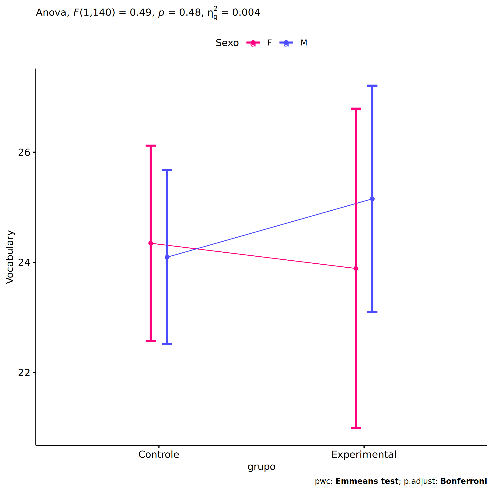
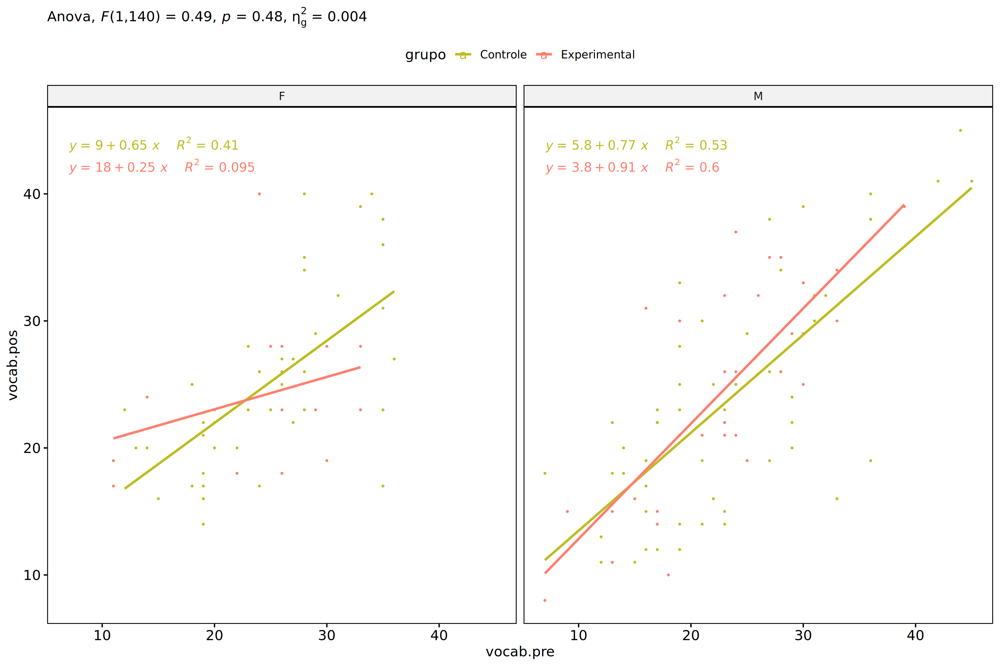
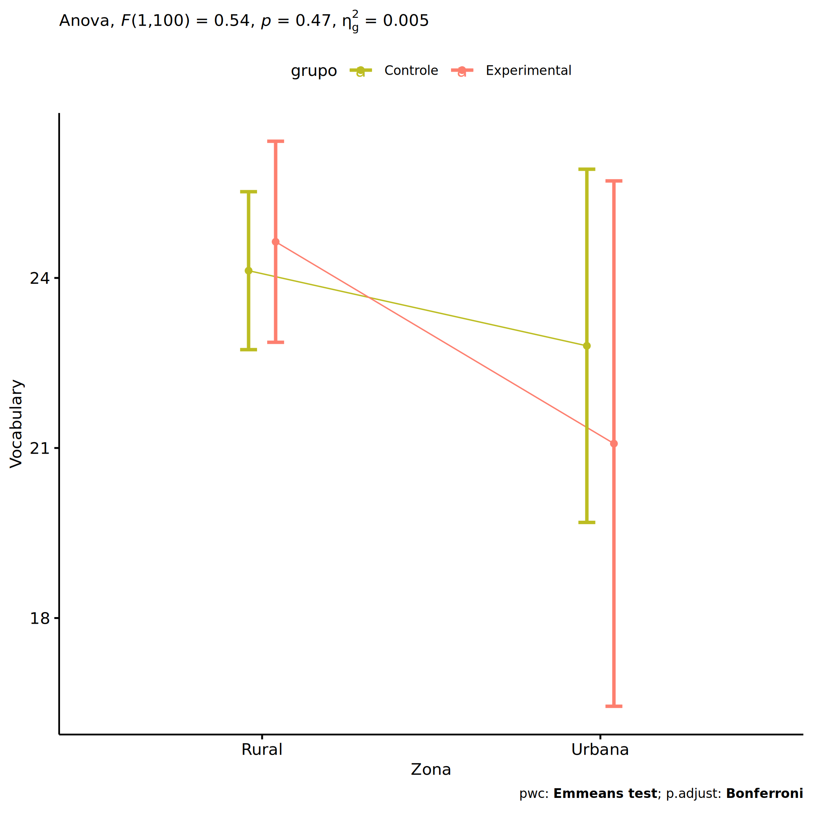
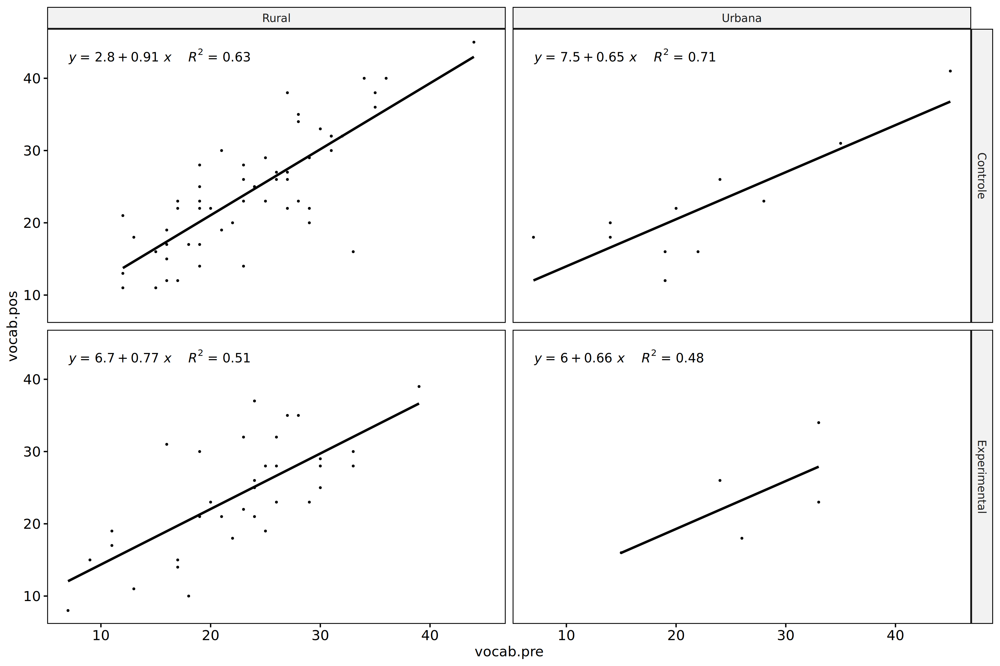
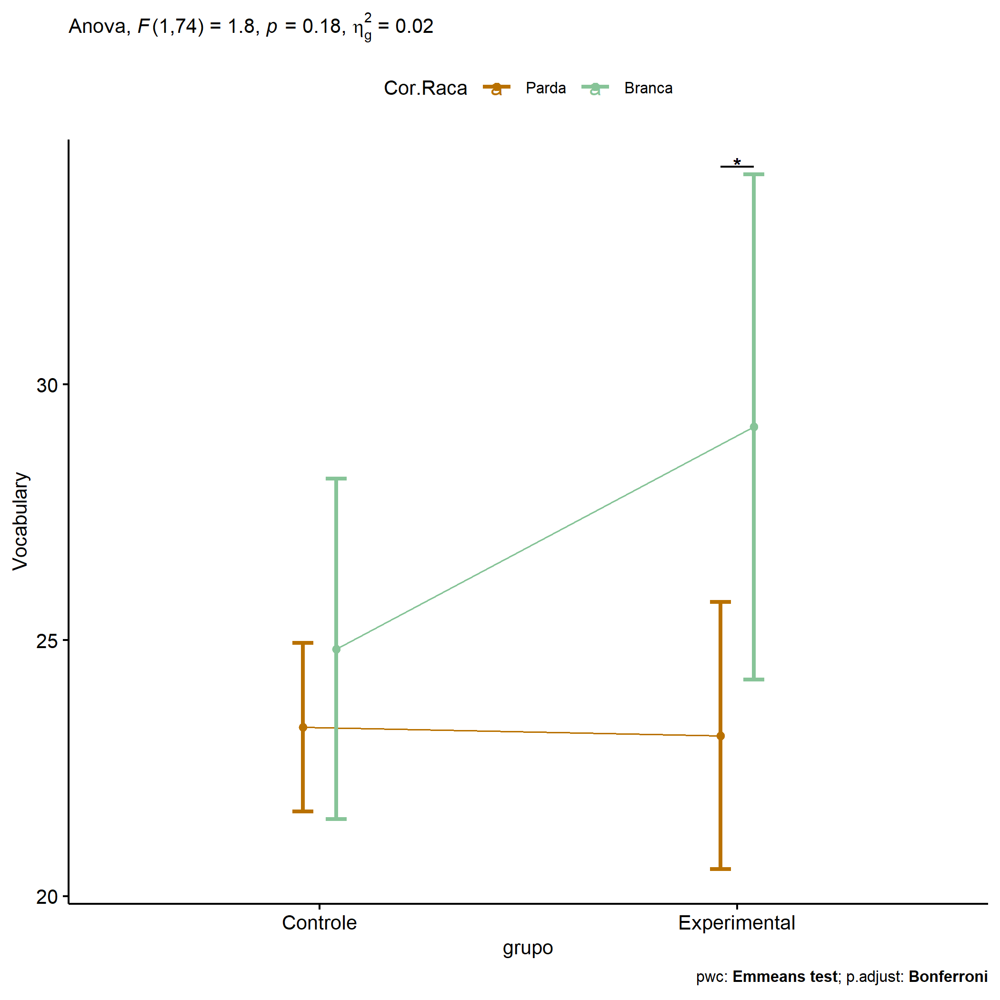
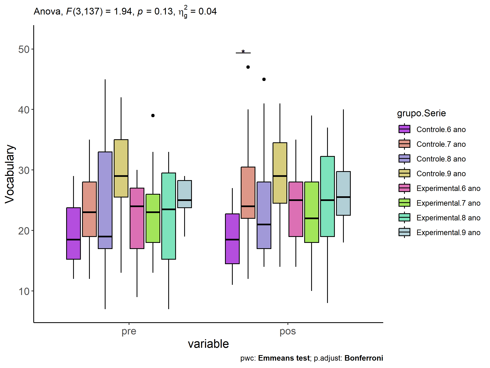
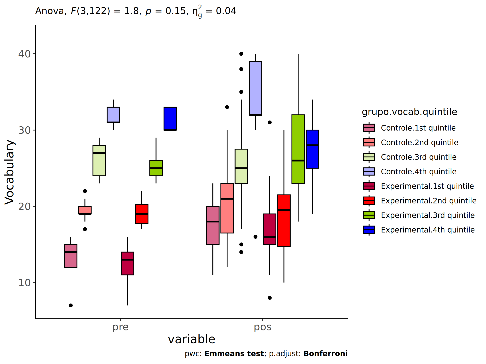

ANCOVA in Vocabulary (Vocabulary)
================
Geiser C. Challco <geiser@alumni.usp.br>

- [Setting Initial Variables](#setting-initial-variables)
- [Descriptive Statistics of Initial
  Data](#descriptive-statistics-of-initial-data)
- [ANCOVA and Pairwise for one factor:
  **grupo**](#ancova-and-pairwise-for-one-factor-grupo)
  - [Without remove non-normal data](#without-remove-non-normal-data)
  - [Computing ANCOVA and PairWise After removing non-normal data
    (OK)](#computing-ancova-and-pairwise-after-removing-non-normal-data-ok)
    - [Plots for ancova](#plots-for-ancova)
    - [Checking linearity assumption](#checking-linearity-assumption)
    - [Checking normality and
      homogeneity](#checking-normality-and-homogeneity)
- [ANCOVA and Pairwise for two factors
  **grupo:Sexo**](#ancova-and-pairwise-for-two-factors-gruposexo)
  - [Without remove non-normal data](#without-remove-non-normal-data-1)
  - [Computing ANCOVA and PairWise After removing non-normal data
    (OK)](#computing-ancova-and-pairwise-after-removing-non-normal-data-ok-1)
    - [Plots for ancova](#plots-for-ancova-1)
    - [Checking linearity assumption](#checking-linearity-assumption-1)
    - [Checking normality and
      homogeneity](#checking-normality-and-homogeneity-1)
- [ANCOVA and Pairwise for two factors
  **grupo:Zona**](#ancova-and-pairwise-for-two-factors-grupozona)
  - [Without remove non-normal data](#without-remove-non-normal-data-2)
  - [Computing ANCOVA and PairWise After removing non-normal data
    (OK)](#computing-ancova-and-pairwise-after-removing-non-normal-data-ok-2)
    - [Plots for ancova](#plots-for-ancova-2)
    - [Checking linearity assumption](#checking-linearity-assumption-2)
    - [Checking normality and
      homogeneity](#checking-normality-and-homogeneity-2)
- [ANCOVA and Pairwise for two factors
  **grupo:Cor.Raca**](#ancova-and-pairwise-for-two-factors-grupocorraca)
  - [Without remove non-normal data](#without-remove-non-normal-data-3)
  - [Computing ANCOVA and PairWise After removing non-normal data
    (OK)](#computing-ancova-and-pairwise-after-removing-non-normal-data-ok-3)
    - [Plots for ancova](#plots-for-ancova-3)
    - [Checking linearity assumption](#checking-linearity-assumption-3)
    - [Checking normality and
      homogeneity](#checking-normality-and-homogeneity-3)
- [ANCOVA and Pairwise for two factors
  **grupo:Serie**](#ancova-and-pairwise-for-two-factors-gruposerie)
  - [Without remove non-normal data](#without-remove-non-normal-data-4)
  - [Computing ANCOVA and PairWise After removing non-normal data
    (OK)](#computing-ancova-and-pairwise-after-removing-non-normal-data-ok-4)
    - [Plots for ancova](#plots-for-ancova-4)
    - [Checking linearity assumption](#checking-linearity-assumption-4)
    - [Checking normality and
      homogeneity](#checking-normality-and-homogeneity-4)
- [ANCOVA and Pairwise for two factors
  **grupo:vocab.quintile**](#ancova-and-pairwise-for-two-factors-grupovocabquintile)
  - [Without remove non-normal data](#without-remove-non-normal-data-5)
  - [Computing ANCOVA and PairWise After removing non-normal data
    (OK)](#computing-ancova-and-pairwise-after-removing-non-normal-data-ok-5)
    - [Plots for ancova](#plots-for-ancova-5)
    - [Checking linearity assumption](#checking-linearity-assumption-5)
    - [Checking normality and
      homogeneity](#checking-normality-and-homogeneity-5)
- [Summary of Results](#summary-of-results)
  - [Descriptive Statistics](#descriptive-statistics)
  - [ANCOVA Table Comparison](#ancova-table-comparison)
  - [PairWise Table Comparison](#pairwise-table-comparison)
  - [EMMS Table Comparison](#emms-table-comparison)

**NOTE**:

- Teste ANCOVA para determinar se houve diferenças significativas no
  Vocabulary (medido usando pre- e pos-testes).
- ANCOVA test to determine whether there were significant differences in
  Vocabulary (measured using pre- and post-tests).

# Setting Initial Variables

``` r
dv = "vocab"
dv.pos = "vocab.pos"
dv.pre = "vocab.pre"

fatores2 <- c("Sexo","Zona","Cor.Raca","Serie","vocab.quintile")
lfatores2 <- as.list(fatores2)
names(lfatores2) <- fatores2

fatores1 <- c("grupo", fatores2)
lfatores1 <- as.list(fatores1)
names(lfatores1) <- fatores1

lfatores <- c(lfatores1)

color <- list()
color[["prepost"]] = c("#ffee65","#f28e2B")
color[["grupo"]] = c("#bcbd22","#fd7f6f")
color[["Sexo"]] = c("#FF007F","#4D4DFF")
color[["Zona"]] = c("#AA00FF","#00CCCC")
color[["Cor.Raca"]] = c(
  "Parda"="#b97100","Indígena"="#9F262F",
  "Branca"="#87c498", "Preta"="#848283","Amarela"="#D6B91C"
)

level <- list()
level[["grupo"]] = c("Controle","Experimental")
level[["Sexo"]] = c("F","M")
level[["Zona"]] = c("Rural","Urbana")
level[["Cor.Raca"]] = c("Parda","Indígena","Branca", "Preta","Amarela")
level[["Serie"]] = c("6 ano","7 ano","8 ano","9 ano")

# ..

ymin <- 0
ymax <- 0

ymin.ci <- 0
ymax.ci <- 0


color[["grupo:Sexo"]] = c(
  "Controle:F"="#ff99cb", "Controle:M"="#b7b7ff",
  "Experimental:F"="#FF007F", "Experimental:M"="#4D4DFF",
  "Controle.F"="#ff99cb", "Controle.M"="#b7b7ff",
  "Experimental.F"="#FF007F", "Experimental.M"="#4D4DFF"
)
color[["grupo:Zona"]] = c(
  "Controle:Rural"="#b2efef","Controle:Urbana"="#e5b2ff",
  "Experimental:Rural"="#00CCCC", "Experimental:Urbana"="#AA00FF",
  "Controle.Rural"="#b2efef","Controle.Urbana"="#e5b2ff",
  "Experimental.Rural"="#00CCCC", "Experimental.Urbana"="#AA00FF"
)
color[["grupo:Cor.Raca"]] = c(
    "Controle:Parda"="#e3c699", "Experimental:Parda"="#b97100",
    "Controle:Indígena"="#e2bdc0", "Experimental:Indígena"="#9F262F",
    "Controle:Branca"="#c0e8cb", "Experimental:Branca"="#87c498",
    "Controle:Preta"="#dad9d9", "Experimental:Preta"="#848283",
    "Controle:Amarela"="#eee3a4", "Experimental:Amarela"="#D6B91C",
    
    "Controle.Parda"="#e3c699", "Experimental.Parda"="#b97100",
    "Controle.Indígena"="#e2bdc0", "Experimental.Indígena"="#9F262F",
    "Controle.Branca"="#c0e8cb", "Experimental.Branca"="#87c498",
    "Controle.Preta"="#dad9d9", "Experimental.Preta"="#848283",
    "Controle.Amarela"="#eee3a4", "Experimental.Amarela"="#D6B91C"
)


for (coln in c("vocab","vocab.teach","vocab.non.teach","score.tde",
               "TFL.lidas.per.min","TFL.corretas.per.min","TFL.erradas.per.min","TFL.omitidas.per.min",
               "leitura.compreensao")) {
  color[[paste0(coln,".quintile")]] = c("#BF0040","#FF0000","#800080","#0000FF","#4000BF")
  level[[paste0(coln,".quintile")]] = c("1st quintile","2nd quintile","3rd quintile","4th quintile","5th quintile")
  color[[paste0("grupo:",coln,".quintile")]] = c(
    "Experimental.1st quintile"="#BF0040", "Controle.1st quintile"="#d8668c",
    "Experimental.2nd quintile"="#FF0000", "Controle.2nd quintile"="#ff7f7f",
    "Experimental.3rd quintile"="#8fce00", "Controle.3rd quintile"="#ddf0b2",
    "Experimental.4th quintile"="#0000FF", "Controle.4th quintile"="#b2b2ff",
    "Experimental.5th quintile"="#4000BF", "Controle.5th quintile"="#b299e5",
    
    "Experimental:1st quintile"="#BF0040", "Controle:1st quintile"="#d8668c",
    "Experimental:2nd quintile"="#FF0000", "Controle:2nd quintile"="#ff7f7f",
    "Experimental:3rd quintile"="#8fce00", "Controle:3rd quintile"="#ddf0b2",
    "Experimental:4th quintile"="#0000FF", "Controle:4th quintile"="#b2b2ff",
    "Experimental:5th quintile"="#4000BF", "Controle:5th quintile"="#b299e5")
}


gdat <- read_excel("../data/data.xlsx", sheet = "sumary")
gdat <- gdat[which(is.na(gdat$Necessidade.Deficiencia) & !is.na(gdat$Stari.Grupo)),]


dat <- gdat
dat$grupo <- factor(dat[["Stari.Grupo"]], level[["grupo"]])
for (coln in c(names(lfatores))) {
  dat[[coln]] <- factor(dat[[coln]], level[[coln]][level[[coln]] %in% unique(dat[[coln]])])
}
dat <- dat[which(!is.na(dat[[dv.pre]]) & !is.na(dat[[dv.pos]])),]
dat <- dat[,c("id",names(lfatores),dv.pre,dv.pos)]

dat.long <- rbind(dat, dat)
dat.long$time <- c(rep("pre", nrow(dat)), rep("pos", nrow(dat)))
dat.long$time <- factor(dat.long$time, c("pre","pos"))
dat.long[[dv]] <- c(dat[[dv.pre]], dat[[dv.pos]])


for (f in c("grupo", names(lfatores))) {
  if (is.null(color[[f]]) && length(unique(dat[[f]])) > 0) 
      color[[f]] <- distinctColorPalette(length(unique(dat[[f]])))
}
for (f in c(fatores2)) {
  if (is.null(color[[paste0("grupo:",f)]]) && length(unique(dat[[f]])) > 0)
    color[[paste0("grupo:",f)]] <- distinctColorPalette(length(unique(dat[["grupo"]]))*length(unique(dat[[f]])))
}

ldat <- list()
laov <- list()
lpwc <- list()
lemms <- list()
```

# Descriptive Statistics of Initial Data

``` r
df <- get.descriptives(dat, c(dv.pre, dv.pos), c("grupo"), 
                       include.global = T, symmetry.test = T, normality.test = F)
df <- plyr::rbind.fill(
  df, do.call(plyr::rbind.fill, lapply(lfatores2, FUN = function(f) {
    if (nrow(dat) > 0 && sum(!is.na(unique(dat[[f]]))) > 1)
      get.descriptives(dat, c(dv.pre,dv.pos), c("grupo", f),
                       symmetry.test = T, normality.test = F)
    }))
)
```

    ## Warning: There was 1 warning in `mutate()`.
    ## ℹ In argument: `ci = abs(stats::qt(alpha/2, .data$n - 1) * .data$se)`.
    ## Caused by warning:
    ## ! There was 1 warning in `mutate()`.
    ## ℹ In argument: `ci = abs(stats::qt(alpha/2, .data$n - 1) * .data$se)`.
    ## Caused by warning in `stats::qt()`:
    ## ! NaNs produced
    ## There was 1 warning in `mutate()`.
    ## ℹ In argument: `ci = abs(stats::qt(alpha/2, .data$n - 1) * .data$se)`.
    ## Caused by warning:
    ## ! There was 1 warning in `mutate()`.
    ## ℹ In argument: `ci = abs(stats::qt(alpha/2, .data$n - 1) * .data$se)`.
    ## Caused by warning in `stats::qt()`:
    ## ! NaNs produced
    ## There was 1 warning in `mutate()`.
    ## ℹ In argument: `ci = abs(stats::qt(alpha/2, .data$n - 1) * .data$se)`.
    ## Caused by warning:
    ## ! There was 1 warning in `mutate()`.
    ## ℹ In argument: `ci = abs(stats::qt(alpha/2, .data$n - 1) * .data$se)`.
    ## Caused by warning in `stats::qt()`:
    ## ! NaNs produced
    ## There was 1 warning in `mutate()`.
    ## ℹ In argument: `ci = abs(stats::qt(alpha/2, .data$n - 1) * .data$se)`.
    ## Caused by warning:
    ## ! There was 1 warning in `mutate()`.
    ## ℹ In argument: `ci = abs(stats::qt(alpha/2, .data$n - 1) * .data$se)`.
    ## Caused by warning in `stats::qt()`:
    ## ! NaNs produced

``` r
df <- df[,c(fatores1[fatores1 %in% colnames(df)],"variable",
            colnames(df)[!colnames(df) %in% c(fatores1,"variable")])]
```

| grupo        | Sexo | Zona   | Cor.Raca | Serie | vocab.quintile | variable  |   n |   mean | median | min | max |     sd |    se |    ci |   iqr | symmetry | skewness | kurtosis |
|:-------------|:-----|:-------|:---------|:------|:---------------|:----------|----:|-------:|-------:|----:|----:|-------:|------:|------:|------:|:---------|---------:|---------:|
| Controle     |      |        |          |       |                | vocab.pre |  98 | 23.980 |   23.0 |   7 |  45 |  7.824 | 0.790 | 1.569 | 10.00 | YES      |    0.389 |   -0.356 |
| Experimental |      |        |          |       |                | vocab.pre |  48 | 23.208 |   24.0 |   7 |  39 |  7.092 | 1.024 | 2.059 |  9.50 | YES      |   -0.315 |   -0.462 |
|              |      |        |          |       |                | vocab.pre | 146 | 23.726 |   24.0 |   7 |  45 |  7.575 | 0.627 | 1.239 | 10.00 | YES      |    0.216 |   -0.265 |
| Controle     |      |        |          |       |                | vocab.pos |  98 | 24.633 |   23.0 |  11 |  47 |  8.458 | 0.854 | 1.696 | 11.50 | NO       |    0.597 |   -0.409 |
| Experimental |      |        |          |       |                | vocab.pos |  48 | 24.333 |   24.5 |   8 |  40 |  7.603 | 1.097 | 2.208 | 10.25 | YES      |   -0.015 |   -0.642 |
|              |      |        |          |       |                | vocab.pos | 146 | 24.534 |   23.0 |   8 |  47 |  8.161 | 0.675 | 1.335 | 10.75 | YES      |    0.447 |   -0.386 |
| Controle     | F    |        |          |       |                | vocab.pre |  43 | 24.535 |   25.0 |  12 |  36 |  6.874 | 1.048 | 2.116 |  9.00 | YES      |   -0.003 |   -1.003 |
| Controle     | M    |        |          |       |                | vocab.pre |  55 | 23.545 |   22.0 |   7 |  45 |  8.531 | 1.150 | 2.306 | 12.00 | NO       |    0.588 |   -0.233 |
| Experimental | F    |        |          |       |                | vocab.pre |  16 | 24.000 |   25.5 |  11 |  33 |  6.976 | 1.744 | 3.717 |  7.75 | NO       |   -0.631 |   -0.789 |
| Experimental | M    |        |          |       |                | vocab.pre |  32 | 22.812 |   23.5 |   7 |  39 |  7.226 | 1.277 | 2.605 | 10.25 | YES      |   -0.148 |   -0.386 |
| Controle     | F    |        |          |       |                | vocab.pos |  43 | 24.907 |   23.0 |  14 |  40 |  6.938 | 1.058 | 2.135 |  7.50 | NO       |    0.698 |   -0.419 |
| Controle     | M    |        |          |       |                | vocab.pos |  55 | 24.418 |   23.0 |  11 |  47 |  9.537 | 1.286 | 2.578 | 13.50 | NO       |    0.563 |   -0.687 |
| Experimental | F    |        |          |       |                | vocab.pos |  16 | 24.062 |   23.0 |  17 |  40 |  5.767 | 1.442 | 3.073 |  9.00 | NO       |    1.055 |    1.067 |
| Experimental | M    |        |          |       |                | vocab.pos |  32 | 24.469 |   25.5 |   8 |  39 |  8.455 | 1.495 | 3.048 | 13.00 | YES      |   -0.210 |   -1.095 |
| Controle     |      | Rural  |          |       |                | vocab.pre |  56 | 23.607 |   23.0 |  12 |  44 |  7.065 | 0.944 | 1.892 |  9.50 | YES      |    0.382 |   -0.340 |
| Controle     |      | Urbana |          |       |                | vocab.pre |  11 | 22.455 |   20.0 |   7 |  45 | 10.539 | 3.178 | 7.080 |  9.50 | NO       |    0.669 |   -0.409 |
| Controle     |      |        |          |       |                | vocab.pre |  31 | 25.194 |   24.0 |  12 |  42 |  8.171 | 1.468 | 2.997 | 12.50 | YES      |    0.173 |   -1.104 |
| Experimental |      | Rural  |          |       |                | vocab.pre |  34 | 22.618 |   24.0 |   7 |  39 |  7.274 | 1.247 | 2.538 |  8.50 | YES      |   -0.208 |   -0.361 |
| Experimental |      | Urbana |          |       |                | vocab.pre |   5 | 26.200 |   26.0 |  15 |  33 |  7.463 | 3.338 | 9.267 |  9.00 | YES      |   -0.379 |   -1.708 |
| Experimental |      |        |          |       |                | vocab.pre |   9 | 23.778 |   24.0 |  13 |  30 |  6.476 | 2.159 | 4.978 |  6.00 | NO       |   -0.609 |   -1.314 |
| Controle     |      | Rural  |          |       |                | vocab.pos |  56 | 24.821 |   23.0 |  11 |  47 |  8.651 | 1.156 | 2.317 | 11.25 | YES      |    0.483 |   -0.337 |
| Controle     |      | Urbana |          |       |                | vocab.pos |  11 | 22.091 |   20.0 |  12 |  41 |  8.166 | 2.462 | 5.486 |  7.50 | NO       |    0.985 |    0.027 |
| Controle     |      |        |          |       |                | vocab.pos |  31 | 25.194 |   23.0 |  14 |  41 |  8.312 | 1.493 | 3.049 | 10.50 | NO       |    0.641 |   -0.930 |
| Experimental |      | Rural  |          |       |                | vocab.pos |  34 | 24.059 |   24.0 |   8 |  39 |  7.847 | 1.346 | 2.738 | 10.75 | YES      |   -0.142 |   -0.792 |
| Experimental |      | Urbana |          |       |                | vocab.pos |   5 | 23.400 |   23.0 |  16 |  34 |  7.127 | 3.187 | 8.850 |  8.00 | YES      |    0.357 |   -1.720 |
| Experimental |      |        |          |       |                | vocab.pos |   9 | 25.889 |   26.0 |  15 |  40 |  7.524 | 2.508 | 5.783 |  8.00 | YES      |    0.380 |   -0.948 |
| Controle     |      |        | Parda    |       |                | vocab.pre |  45 | 23.156 |   23.0 |  12 |  44 |  7.517 | 1.120 | 2.258 | 10.00 | YES      |    0.488 |   -0.335 |
| Controle     |      |        | Indígena |       |                | vocab.pre |   3 | 27.000 |   26.0 |  24 |  31 |  3.606 | 2.082 | 8.957 |  3.50 | few data |    0.000 |    0.000 |
| Controle     |      |        | Branca   |       |                | vocab.pre |  11 | 23.909 |   27.0 |  14 |  31 |  6.363 | 1.919 | 4.275 | 11.00 | YES      |   -0.423 |   -1.709 |
| Controle     |      |        | Preta    |       |                | vocab.pre |   1 | 19.000 |   19.0 |  19 |  19 |        |       |       |  0.00 | few data |    0.000 |    0.000 |
| Controle     |      |        |          |       |                | vocab.pre |  38 | 24.868 |   23.0 |   7 |  45 |  8.866 | 1.438 | 2.914 | 14.00 | YES      |    0.315 |   -0.707 |
| Experimental |      |        | Parda    |       |                | vocab.pre |  18 | 21.389 |   22.0 |   7 |  39 |  8.925 | 2.104 | 4.439 | 12.75 | YES      |    0.068 |   -1.053 |
| Experimental |      |        | Indígena |       |                | vocab.pre |   6 | 24.833 |   23.5 |  18 |  33 |  5.345 | 2.182 | 5.609 |  5.50 | YES      |    0.293 |   -1.569 |
| Experimental |      |        | Branca   |       |                | vocab.pre |   5 | 21.200 |   23.0 |  15 |  28 |  5.541 | 2.478 | 6.880 |  8.00 | YES      |   -0.043 |   -2.062 |
| Experimental |      |        |          |       |                | vocab.pre |  19 | 24.947 |   25.0 |  13 |  33 |  5.730 | 1.315 | 2.762 |  6.00 | NO       |   -0.594 |   -0.555 |
| Controle     |      |        | Parda    |       |                | vocab.pos |  45 | 23.622 |   23.0 |  11 |  45 |  7.904 | 1.178 | 2.375 |  7.00 | NO       |    0.612 |   -0.003 |
| Controle     |      |        | Indígena |       |                | vocab.pos |   3 | 28.000 |   27.0 |  25 |  32 |  3.606 | 2.082 | 8.957 |  3.50 | few data |    0.000 |    0.000 |
| Controle     |      |        | Branca   |       |                | vocab.pos |  11 | 25.727 |   27.0 |  14 |  40 |  8.296 | 2.501 | 5.573 | 13.00 | YES      |    0.140 |   -1.465 |
| Controle     |      |        | Preta    |       |                | vocab.pos |   1 | 23.000 |   23.0 |  23 |  23 |        |       |       |  0.00 | few data |    0.000 |    0.000 |
| Controle     |      |        |          |       |                | vocab.pos |  38 | 25.289 |   23.0 |  12 |  47 |  9.535 | 1.547 | 3.134 | 12.75 | NO       |    0.607 |   -0.904 |
| Experimental |      |        | Parda    |       |                | vocab.pos |  18 | 22.111 |   21.0 |   8 |  39 |  8.217 | 1.937 | 4.086 | 11.50 | YES      |    0.331 |   -0.790 |
| Experimental |      |        | Indígena |       |                | vocab.pos |   6 | 21.667 |   24.0 |  10 |  28 |  6.653 | 2.716 | 6.982 |  6.50 | NO       |   -0.714 |   -1.231 |
| Experimental |      |        | Branca   |       |                | vocab.pos |   5 | 28.000 |   31.0 |  16 |  35 |  7.450 | 3.332 | 9.250 |  6.00 | NO       |   -0.630 |   -1.475 |
| Experimental |      |        |          |       |                | vocab.pos |  19 | 26.316 |   26.0 |  14 |  40 |  6.880 | 1.578 | 3.316 |  7.50 | YES      |    0.123 |   -0.695 |
| Controle     |      |        |          | 6 ano |                | vocab.pre |  26 | 19.423 |   18.5 |  12 |  29 |  5.551 | 1.089 | 2.242 |  8.50 | YES      |    0.275 |   -1.373 |
| Controle     |      |        |          | 7 ano |                | vocab.pre |  28 | 23.286 |   23.0 |  12 |  35 |  5.974 | 1.129 | 2.317 |  9.00 | YES      |    0.142 |   -0.813 |
| Controle     |      |        |          | 8 ano |                | vocab.pre |  17 | 23.882 |   19.0 |   7 |  45 | 10.688 | 2.592 | 5.495 | 16.00 | NO       |    0.658 |   -0.739 |
| Controle     |      |        |          | 9 ano |                | vocab.pre |  27 | 29.148 |   29.0 |  13 |  42 |  6.509 | 1.253 | 2.575 |  9.50 | YES      |   -0.370 |   -0.275 |
| Experimental |      |        |          | 6 ano |                | vocab.pre |  13 | 22.385 |   24.0 |   9 |  30 |  7.066 | 1.960 | 4.270 | 10.00 | NO       |   -0.583 |   -1.102 |
| Experimental |      |        |          | 7 ano |                | vocab.pre |  13 | 23.692 |   23.0 |  13 |  39 |  7.674 | 2.129 | 4.638 |  8.00 | YES      |    0.455 |   -0.930 |
| Experimental |      |        |          | 8 ano |                | vocab.pre |  14 | 22.357 |   23.5 |   7 |  33 |  8.409 | 2.247 | 4.855 | 14.25 | YES      |   -0.363 |   -1.307 |
| Experimental |      |        |          | 9 ano |                | vocab.pre |   8 | 25.250 |   25.0 |  19 |  29 |  3.454 | 1.221 | 2.887 |  4.50 | YES      |   -0.403 |   -1.235 |
| Controle     |      |        |          | 6 ano |                | vocab.pos |  26 | 18.692 |   18.5 |  11 |  27 |  4.994 | 0.979 | 2.017 |  8.25 | YES      |    0.037 |   -1.282 |
| Controle     |      |        |          | 7 ano |                | vocab.pos |  28 | 26.464 |   24.0 |  12 |  47 |  8.194 | 1.549 | 3.177 |  8.50 | NO       |    0.644 |   -0.211 |
| Controle     |      |        |          | 8 ano |                | vocab.pos |  17 | 24.000 |   21.0 |  14 |  45 |  9.605 | 2.329 | 4.938 | 11.00 | NO       |    0.940 |   -0.562 |
| Controle     |      |        |          | 9 ano |                | vocab.pos |  27 | 28.852 |   29.0 |  14 |  41 |  7.665 | 1.475 | 3.032 | 10.00 | YES      |   -0.076 |   -1.152 |
| Experimental |      |        |          | 6 ano |                | vocab.pos |  13 | 23.538 |   25.0 |  14 |  35 |  6.280 | 1.742 | 3.795 |  9.00 | YES      |   -0.102 |   -1.103 |
| Experimental |      |        |          | 7 ano |                | vocab.pos |  13 | 23.077 |   22.0 |  10 |  39 |  8.401 | 2.330 | 5.077 | 10.00 | YES      |    0.127 |   -1.001 |
| Experimental |      |        |          | 8 ano |                | vocab.pos |  14 | 24.857 |   25.0 |   8 |  37 |  8.690 | 2.323 | 5.017 | 13.25 | YES      |   -0.248 |   -1.225 |
| Experimental |      |        |          | 9 ano |                | vocab.pos |   8 | 26.750 |   25.5 |  18 |  40 |  6.923 | 2.448 | 5.788 |  7.25 | NO       |    0.589 |   -0.890 |
| Controle     |      |        |          |       | 1st quintile   | vocab.pre |  17 | 13.529 |   14.0 |   7 |  16 |  2.267 | 0.550 | 1.166 |  3.00 | NO       |   -1.142 |    1.450 |
| Controle     |      |        |          |       | 2nd quintile   | vocab.pre |  28 | 19.286 |   19.0 |  17 |  22 |  1.462 | 0.276 | 0.567 |  1.00 | YES      |    0.273 |   -0.622 |
| Controle     |      |        |          |       | 3rd quintile   | vocab.pre |  31 | 26.097 |   27.0 |  23 |  29 |  2.166 | 0.389 | 0.794 |  4.00 | YES      |   -0.216 |   -1.517 |
| Controle     |      |        |          |       | 4th quintile   | vocab.pre |   9 | 31.667 |   31.0 |  30 |  34 |  1.414 | 0.471 | 1.087 |  2.00 | YES      |    0.288 |   -1.556 |
| Controle     |      |        |          |       | 5th quintile   | vocab.pre |  13 | 37.385 |   36.0 |  35 |  45 |  3.664 | 1.016 | 2.214 |  1.00 | NO       |    1.171 |   -0.476 |
| Experimental |      |        |          |       | 1st quintile   | vocab.pre |   9 | 12.111 |   13.0 |   7 |  16 |  2.892 | 0.964 | 2.223 |  3.00 | YES      |   -0.346 |   -1.265 |
| Experimental |      |        |          |       | 2nd quintile   | vocab.pre |   8 | 19.125 |   19.0 |  17 |  22 |  1.808 | 0.639 | 1.511 |  2.50 | YES      |    0.220 |   -1.553 |
| Experimental |      |        |          |       | 3rd quintile   | vocab.pre |  21 | 25.286 |   25.0 |  23 |  29 |  1.978 | 0.432 | 0.901 |  2.00 | NO       |    0.544 |   -1.059 |
| Experimental |      |        |          |       | 4th quintile   | vocab.pre |   9 | 31.333 |   30.0 |  30 |  33 |  1.581 | 0.527 | 1.215 |  3.00 | few data |    0.000 |    0.000 |
| Experimental |      |        |          |       | 5th quintile   | vocab.pre |   1 | 39.000 |   39.0 |  39 |  39 |        |       |       |  0.00 | few data |    0.000 |    0.000 |
| Controle     |      |        |          |       | 1st quintile   | vocab.pos |  17 | 17.294 |   18.0 |  11 |  23 |  3.771 | 0.915 | 1.939 |  5.00 | YES      |   -0.367 |   -1.195 |
| Controle     |      |        |          |       | 2nd quintile   | vocab.pos |  28 | 21.393 |   21.5 |  12 |  47 |  7.233 | 1.367 | 2.805 |  6.75 | NO       |    1.512 |    3.304 |
| Controle     |      |        |          |       | 3rd quintile   | vocab.pos |  31 | 25.613 |   25.0 |  14 |  40 |  6.009 | 1.079 | 2.204 |  4.50 | YES      |    0.435 |    0.073 |
| Controle     |      |        |          |       | 4th quintile   | vocab.pos |   9 | 32.556 |   32.0 |  16 |  40 |  7.248 | 2.416 | 5.571 |  7.00 | NO       |   -1.053 |    0.290 |
| Controle     |      |        |          |       | 5th quintile   | vocab.pos |  13 | 33.385 |   38.0 |  17 |  45 |  9.106 | 2.526 | 5.503 | 13.00 | NO       |   -0.582 |   -1.250 |
| Experimental |      |        |          |       | 1st quintile   | vocab.pos |   9 | 17.333 |   16.0 |   8 |  31 |  6.837 | 2.279 | 5.256 |  4.00 | NO       |    0.611 |   -0.655 |
| Experimental |      |        |          |       | 2nd quintile   | vocab.pos |   8 | 19.000 |   19.5 |  10 |  30 |  6.188 | 2.188 | 5.173 |  6.75 | YES      |    0.260 |   -1.092 |
| Experimental |      |        |          |       | 3rd quintile   | vocab.pos |  21 | 27.238 |   26.0 |  18 |  40 |  6.057 | 1.322 | 2.757 |  9.00 | YES      |    0.433 |   -0.869 |
| Experimental |      |        |          |       | 4th quintile   | vocab.pos |   9 | 27.667 |   28.0 |  19 |  34 |  4.743 | 1.581 | 3.646 |  5.00 | YES      |   -0.365 |   -1.109 |
| Experimental |      |        |          |       | 5th quintile   | vocab.pos |   1 | 39.000 |   39.0 |  39 |  39 |        |       |       |  0.00 | few data |    0.000 |    0.000 |

# ANCOVA and Pairwise for one factor: **grupo**

## Without remove non-normal data

``` r
pdat = remove_group_data(dat[!is.na(dat[["grupo"]]),], "vocab.pos", "grupo")

pdat.long <- rbind(pdat[,c("id","grupo")], pdat[,c("id","grupo")])
pdat.long[["time"]] <- c(rep("pre", nrow(pdat)), rep("pos", nrow(pdat)))
pdat.long[["time"]] <- factor(pdat.long[["time"]], c("pre","pos"))
pdat.long[["vocab"]] <- c(pdat[["vocab.pre"]], pdat[["vocab.pos"]])

aov = anova_test(pdat, vocab.pos ~ vocab.pre + grupo)
laov[["grupo"]] <- get_anova_table(aov)
```

``` r
pwc <- emmeans_test(pdat, vocab.pos ~ grupo, covariate = vocab.pre,
                    p.adjust.method = "bonferroni")
```

``` r
pwc.long <- emmeans_test(dplyr::group_by_at(pdat.long, "grupo"),
                          vocab ~ time,
                          p.adjust.method = "bonferroni")
lpwc[["grupo"]] <- plyr::rbind.fill(pwc, pwc.long)
```

``` r
ds <- get.descriptives(pdat, "vocab.pos", "grupo", covar = "vocab.pre")
ds <- merge(ds[ds$variable != "vocab.pre",],
            ds[ds$variable == "vocab.pre", !colnames(ds) %in% c("variable")],
            by = "grupo", all.x = T, suffixes = c("", ".vocab.pre"))
ds <- merge(get_emmeans(pwc), ds, by = "grupo", suffixes = c(".emms", ""))
ds <- ds[,c("grupo","n","mean.vocab.pre","se.vocab.pre","mean","se",
            "emmean","se.emms","conf.low","conf.high")]

colnames(ds) <- c("grupo", "N", paste0(c("M","SE")," (pre)"),
                  paste0(c("M","SE"), " (unadj)"),
                  paste0(c("M", "SE"), " (adj)"), "conf.low", "conf.high")

lemms[["grupo"]] <- ds
```

## Computing ANCOVA and PairWise After removing non-normal data (OK)

``` r
wdat = pdat 

res = residuals(lm(vocab.pos ~ vocab.pre + grupo, data = wdat))
non.normal = getNonNormal(res, wdat$id, plimit = 0.05)

wdat = wdat[!wdat$id %in% non.normal,]

wdat.long <- rbind(wdat[,c("id","grupo")], wdat[,c("id","grupo")])
wdat.long[["time"]] <- c(rep("pre", nrow(wdat)), rep("pos", nrow(wdat)))
wdat.long[["time"]] <- factor(wdat.long[["time"]], c("pre","pos"))
wdat.long[["vocab"]] <- c(wdat[["vocab.pre"]], wdat[["vocab.pos"]])

ldat[["grupo"]] = wdat

(non.normal)
```

    ## [1] "P3569"

``` r
aov = anova_test(wdat, vocab.pos ~ vocab.pre + grupo)
laov[["grupo"]] <- merge(get_anova_table(aov), laov[["grupo"]],
                            by="Effect", suffixes = c("","'"))

(df = get_anova_table(aov))
```

    ## ANOVA Table (type II tests)
    ## 
    ##      Effect DFn DFd       F        p p<.05   ges
    ## 1 vocab.pre   1 142 126.192 2.39e-21     * 0.471
    ## 2     grupo   1 142   0.258 6.12e-01       0.002

| Effect    | DFn | DFd |       F |     p | p\<.05 |   ges |
|:----------|----:|----:|--------:|------:|:-------|------:|
| vocab.pre |   1 | 142 | 126.192 | 0.000 | \*     | 0.471 |
| grupo     |   1 | 142 |   0.258 | 0.612 |        | 0.002 |

``` r
pwc <- emmeans_test(wdat, vocab.pos ~ grupo, covariate = vocab.pre,
                    p.adjust.method = "bonferroni")
```

| term             | .y.       | group1   | group2       |  df | statistic |     p | p.adj | p.adj.signif |
|:-----------------|:----------|:---------|:-------------|----:|----------:|------:|------:|:-------------|
| vocab.pre\*grupo | vocab.pos | Controle | Experimental | 142 |    -0.508 | 0.612 | 0.612 | ns           |

``` r
pwc.long <- emmeans_test(dplyr::group_by_at(wdat.long, "grupo"),
                         vocab ~ time,
                         p.adjust.method = "bonferroni")
lpwc[["grupo"]] <- merge(plyr::rbind.fill(pwc, pwc.long), lpwc[["grupo"]],
                            by=c("grupo","term",".y.","group1","group2"),
                            suffixes = c("","'"))
```

| grupo        | term | .y.   | group1 | group2 |  df | statistic |     p | p.adj | p.adj.signif |
|:-------------|:-----|:------|:-------|:-------|----:|----------:|------:|------:|:-------------|
| Controle     | time | vocab | pre    | pos    | 286 |    -0.331 | 0.741 | 0.741 | ns           |
| Experimental | time | vocab | pre    | pos    | 286 |    -0.706 | 0.481 | 0.481 | ns           |

``` r
ds <- get.descriptives(wdat, "vocab.pos", "grupo", covar = "vocab.pre")
ds <- merge(ds[ds$variable != "vocab.pre",],
            ds[ds$variable == "vocab.pre", !colnames(ds) %in% c("variable")],
            by = "grupo", all.x = T, suffixes = c("", ".vocab.pre"))
ds <- merge(get_emmeans(pwc), ds, by = "grupo", suffixes = c(".emms", ""))
ds <- ds[,c("grupo","n","mean.vocab.pre","se.vocab.pre","mean","se",
            "emmean","se.emms","conf.low","conf.high")]

colnames(ds) <- c("grupo", "N", paste0(c("M","SE")," (pre)"),
                  paste0(c("M","SE"), " (unadj)"),
                  paste0(c("M", "SE"), " (adj)"), "conf.low", "conf.high")

lemms[["grupo"]] <- merge(ds, lemms[["grupo"]], by=c("grupo"), suffixes = c("","'"))
```

| grupo        |   N | M (pre) | SE (pre) | M (unadj) | SE (unadj) | M (adj) | SE (adj) | conf.low | conf.high |
|:-------------|----:|--------:|---------:|----------:|-----------:|--------:|---------:|---------:|----------:|
| Controle     |  97 |  24.031 |    0.797 |    24.402 |      0.831 |  24.206 |    0.593 |   23.033 |    25.379 |
| Experimental |  48 |  23.208 |    1.024 |    24.333 |      1.097 |  24.730 |    0.844 |   23.062 |    26.398 |

### Plots for ancova

``` r
plots <- oneWayAncovaPlots(
  wdat, "vocab.pos", "grupo", aov, list("grupo"=pwc), addParam = c("mean_ci"),
  font.label.size=10, step.increase=0.05, p.label="p.adj",
  subtitle = which(aov$Effect == "grupo"))
```

``` r
if (!is.null(nrow(plots[["grupo"]]$data)))
  plots[["grupo"]] +
  if (ymin.ci < ymax.ci) ggplot2::ylim(ymin.ci, ymax.ci)
```

<!-- -->

``` r
plots <- oneWayAncovaBoxPlots(
  wdat, "vocab.pos", "grupo", aov, pwc, covar = "vocab.pre",
  theme = "classic", color = color[["grupo"]],
  subtitle = which(aov$Effect == "grupo"))
```

``` r
if (length(unique(wdat[["grupo"]])) > 1)
  plots[["grupo"]] + ggplot2::ylab("Vocabulary") +
  ggplot2::scale_x_discrete(labels=c('pre', 'pos')) +
  if (ymin < ymax) ggplot2::ylim(ymin, ymax)
```

<!-- -->

``` r
if (length(unique(wdat.long[["grupo"]])) > 1)
  plots <- oneWayAncovaBoxPlots(
    wdat.long, "vocab", "grupo", aov, pwc.long,
    pre.post = "time", theme = "classic", color = color$prepost)
```

``` r
if (length(unique(wdat.long[["grupo"]])) > 1)
  plots[["grupo"]] + ggplot2::ylab("Vocabulary") +
  if (ymin < ymax) ggplot2::ylim(ymin, ymax) 
```

<!-- -->

### Checking linearity assumption

``` r
ggscatter(wdat, x = "vocab.pre", y = "vocab.pos", size = 0.5,
          color = "grupo", add = "reg.line")+
  stat_regline_equation(
    aes(label =  paste(..eq.label.., ..rr.label.., sep = "~~~~"), color = grupo)
  ) +
  ggplot2::labs(subtitle = rstatix::get_test_label(aov, detailed = T, row = which(aov$Effect == "grupo"))) +
  ggplot2::scale_color_manual(values = color[["grupo"]]) +
  if (ymin < ymax) ggplot2::ylim(ymin, ymax)
```

<!-- -->

### Checking normality and homogeneity

``` r
res <- augment(lm(vocab.pos ~ vocab.pre + grupo, data = wdat))
```

``` r
shapiro_test(res$.resid)
```

    ## # A tibble: 1 × 3
    ##   variable   statistic p.value
    ##   <chr>          <dbl>   <dbl>
    ## 1 res$.resid     0.995   0.914

``` r
levene_test(res, .resid ~ grupo)
```

    ## # A tibble: 1 × 4
    ##     df1   df2 statistic     p
    ##   <int> <int>     <dbl> <dbl>
    ## 1     1   143    0.0402 0.841

# ANCOVA and Pairwise for two factors **grupo:Sexo**

## Without remove non-normal data

``` r
pdat = remove_group_data(dat[!is.na(dat[["grupo"]]) & !is.na(dat[["Sexo"]]),],
                         "vocab.pos", c("grupo","Sexo"))
pdat = pdat[pdat[["Sexo"]] %in% do.call(
  intersect, lapply(unique(pdat[["grupo"]]), FUN = function(x) {
    unique(pdat[["Sexo"]][which(pdat[["grupo"]] == x)])
  })),]
pdat[["grupo"]] = factor(pdat[["grupo"]], level[["grupo"]])
pdat[["Sexo"]] = factor(
  pdat[["Sexo"]],
  level[["Sexo"]][level[["Sexo"]] %in% unique(pdat[["Sexo"]])])

pdat.long <- rbind(pdat[,c("id","grupo","Sexo")], pdat[,c("id","grupo","Sexo")])
pdat.long[["time"]] <- c(rep("pre", nrow(pdat)), rep("pos", nrow(pdat)))
pdat.long[["time"]] <- factor(pdat.long[["time"]], c("pre","pos"))
pdat.long[["vocab"]] <- c(pdat[["vocab.pre"]], pdat[["vocab.pos"]])

if (length(unique(pdat[["Sexo"]])) >= 2) {
  aov = anova_test(pdat, vocab.pos ~ vocab.pre + grupo*Sexo)
  laov[["grupo:Sexo"]] <- get_anova_table(aov)
}
```

``` r
if (length(unique(pdat[["Sexo"]])) >= 2) {
  pwcs <- list()
  pwcs[["Sexo"]] <- emmeans_test(
    group_by(pdat, grupo), vocab.pos ~ Sexo,
    covariate = vocab.pre, p.adjust.method = "bonferroni")
  pwcs[["grupo"]] <- emmeans_test(
    group_by(pdat, Sexo), vocab.pos ~ grupo,
    covariate = vocab.pre, p.adjust.method = "bonferroni")
  
  pwc <- plyr::rbind.fill(pwcs[["grupo"]], pwcs[["Sexo"]])
  pwc <- pwc[,c("grupo","Sexo", colnames(pwc)[!colnames(pwc) %in% c("grupo","Sexo")])]
}
```

``` r
if (length(unique(pdat[["Sexo"]])) >= 2) {
  pwc.long <- emmeans_test(dplyr::group_by_at(pdat.long, c("grupo","Sexo")),
                           vocab ~ time,
                           p.adjust.method = "bonferroni")
  lpwc[["grupo:Sexo"]] <- plyr::rbind.fill(pwc, pwc.long)
}
```

``` r
if (length(unique(pdat[["Sexo"]])) >= 2) {
  ds <- get.descriptives(pdat, "vocab.pos", c("grupo","Sexo"), covar = "vocab.pre")
  ds <- merge(ds[ds$variable != "vocab.pre",],
              ds[ds$variable == "vocab.pre", !colnames(ds) %in% c("variable")],
              by = c("grupo","Sexo"), all.x = T, suffixes = c("", ".vocab.pre"))
  ds <- merge(get_emmeans(pwcs[["grupo"]]), ds,
              by = c("grupo","Sexo"), suffixes = c(".emms", ""))
  ds <- ds[,c("grupo","Sexo","n","mean.vocab.pre","se.vocab.pre","mean","se",
              "emmean","se.emms","conf.low","conf.high")]
  
  colnames(ds) <- c("grupo","Sexo", "N", paste0(c("M","SE")," (pre)"),
                    paste0(c("M","SE"), " (unadj)"),
                    paste0(c("M", "SE"), " (adj)"), "conf.low", "conf.high")
  
  lemms[["grupo:Sexo"]] <- ds
}
```

## Computing ANCOVA and PairWise After removing non-normal data (OK)

``` r
if (length(unique(pdat[["Sexo"]])) >= 2) {
  wdat = pdat 
  
  res = residuals(lm(vocab.pos ~ vocab.pre + grupo*Sexo, data = wdat))
  non.normal = getNonNormal(res, wdat$id, plimit = 0.05)
  
  wdat = wdat[!wdat$id %in% non.normal,]
  
  wdat.long <- rbind(wdat[,c("id","grupo","Sexo")], wdat[,c("id","grupo","Sexo")])
  wdat.long[["time"]] <- c(rep("pre", nrow(wdat)), rep("pos", nrow(wdat)))
  wdat.long[["time"]] <- factor(wdat.long[["time"]], c("pre","pos"))
  wdat.long[["vocab"]] <- c(wdat[["vocab.pre"]], wdat[["vocab.pos"]])
  
  
  ldat[["grupo:Sexo"]] = wdat
  
  (non.normal)
}
```

    ## [1] "P3569"

``` r
if (length(unique(pdat[["Sexo"]])) >= 2) {
  aov = anova_test(wdat, vocab.pos ~ vocab.pre + grupo*Sexo)
  laov[["grupo:Sexo"]] <- merge(get_anova_table(aov), laov[["grupo:Sexo"]],
                                         by="Effect", suffixes = c("","'"))
  df = get_anova_table(aov)
}
```

| Effect     | DFn | DFd |       F |     p | p\<.05 |   ges |
|:-----------|----:|----:|--------:|------:|:-------|------:|
| vocab.pre  |   1 | 140 | 124.810 | 0.000 | \*     | 0.471 |
| grupo      |   1 | 140 |   0.231 | 0.631 |        | 0.002 |
| Sexo       |   1 | 140 |   0.046 | 0.831 |        | 0.000 |
| grupo:Sexo |   1 | 140 |   0.493 | 0.484 |        | 0.004 |

``` r
if (length(unique(pdat[["Sexo"]])) >= 2) {
  pwcs <- list()
  pwcs[["Sexo"]] <- emmeans_test(
    group_by(wdat, grupo), vocab.pos ~ Sexo,
    covariate = vocab.pre, p.adjust.method = "bonferroni")
  pwcs[["grupo"]] <- emmeans_test(
    group_by(wdat, Sexo), vocab.pos ~ grupo,
    covariate = vocab.pre, p.adjust.method = "bonferroni")
  
  pwc <- plyr::rbind.fill(pwcs[["grupo"]], pwcs[["Sexo"]])
  pwc <- pwc[,c("grupo","Sexo", colnames(pwc)[!colnames(pwc) %in% c("grupo","Sexo")])]
}
```

| grupo        | Sexo | term             | .y.       | group1   | group2       |  df | statistic |     p | p.adj | p.adj.signif |
|:-------------|:-----|:-----------------|:----------|:---------|:-------------|----:|----------:|------:|------:|:-------------|
|              | F    | vocab.pre\*grupo | vocab.pos | Controle | Experimental | 140 |     0.266 | 0.790 | 0.790 | ns           |
|              | M    | vocab.pre\*grupo | vocab.pos | Controle | Experimental | 140 |    -0.808 | 0.420 | 0.420 | ns           |
| Controle     |      | vocab.pre\*Sexo  | vocab.pos | F        | M            | 140 |     0.211 | 0.834 | 0.834 | ns           |
| Experimental |      | vocab.pre\*Sexo  | vocab.pos | F        | M            | 140 |    -0.703 | 0.483 | 0.483 | ns           |

``` r
if (length(unique(pdat[["Sexo"]])) >= 2) {
  pwc.long <- emmeans_test(dplyr::group_by_at(wdat.long, c("grupo","Sexo")),
                           vocab ~ time,
                           p.adjust.method = "bonferroni")
  lpwc[["grupo:Sexo"]] <- merge(plyr::rbind.fill(pwc, pwc.long),
                                         lpwc[["grupo:Sexo"]],
                                         by=c("grupo","Sexo","term",".y.","group1","group2"),
                                         suffixes = c("","'"))
}
```

| grupo        | Sexo | term | .y.   | group1 | group2 |  df | statistic |     p | p.adj | p.adj.signif |
|:-------------|:-----|:-----|:------|:-------|:-------|----:|----------:|------:|------:|:-------------|
| Controle     | F    | time | vocab | pre    | pos    | 282 |    -0.220 | 0.826 | 0.826 | ns           |
| Controle     | M    | time | vocab | pre    | pos    | 282 |    -0.245 | 0.806 | 0.806 | ns           |
| Experimental | F    | time | vocab | pre    | pos    | 282 |    -0.023 | 0.982 | 0.982 | ns           |
| Experimental | M    | time | vocab | pre    | pos    | 282 |    -0.844 | 0.399 | 0.399 | ns           |

``` r
if (length(unique(pdat[["Sexo"]])) >= 2) {
  ds <- get.descriptives(wdat, "vocab.pos", c("grupo","Sexo"), covar = "vocab.pre")
  ds <- merge(ds[ds$variable != "vocab.pre",],
              ds[ds$variable == "vocab.pre", !colnames(ds) %in% c("variable")],
              by = c("grupo","Sexo"), all.x = T, suffixes = c("", ".vocab.pre"))
  ds <- merge(get_emmeans(pwcs[["grupo"]]), ds,
              by = c("grupo","Sexo"), suffixes = c(".emms", ""))
  ds <- ds[,c("grupo","Sexo","n","mean.vocab.pre","se.vocab.pre",
              "mean","se","emmean","se.emms","conf.low","conf.high")]
  
  colnames(ds) <- c("grupo","Sexo", "N", paste0(c("M","SE")," (pre)"),
                    paste0(c("M","SE"), " (unadj)"),
                    paste0(c("M", "SE"), " (adj)"), "conf.low", "conf.high")
  
  lemms[["grupo:Sexo"]] <- merge(ds, lemms[["grupo:Sexo"]],
                                          by=c("grupo","Sexo"), suffixes = c("","'"))
}
```

| grupo        | Sexo |   N | M (pre) | SE (pre) | M (unadj) | SE (unadj) | M (adj) | SE (adj) | conf.low | conf.high |
|:-------------|:-----|----:|--------:|---------:|----------:|-----------:|--------:|---------:|---------:|----------:|
| Controle     | F    |  43 |  24.535 |    1.048 |    24.907 |      1.058 |  24.346 |    0.897 |   22.573 |    26.119 |
| Controle     | M    |  54 |  23.630 |    1.169 |    24.000 |      1.239 |  24.093 |    0.799 |   22.513 |    25.673 |
| Experimental | F    |  16 |  24.000 |    1.744 |    24.062 |      1.442 |  23.888 |    1.468 |   20.986 |    26.790 |
| Experimental | M    |  32 |  22.812 |    1.277 |    24.469 |      1.495 |  25.152 |    1.040 |   23.097 |    27.208 |

### Plots for ancova

``` r
if (length(unique(pdat[["Sexo"]])) >= 2) {
  ggPlotAoC2(pwcs, "grupo", "Sexo", aov, ylab = "Vocabulary",
             subtitle = which(aov$Effect == "grupo:Sexo"), addParam = "errorbar") +
    ggplot2::scale_color_manual(values = color[["Sexo"]]) +
    if (ymin.ci < ymax.ci) ggplot2::ylim(ymin.ci, ymax.ci)
}
```

    ## Scale for colour is already present.
    ## Adding another scale for colour, which will replace the existing scale.

<!-- -->

``` r
if (length(unique(pdat[["Sexo"]])) >= 2) {
  ggPlotAoC2(pwcs, "Sexo", "grupo", aov, ylab = "Vocabulary",
               subtitle = which(aov$Effect == "grupo:Sexo"), addParam = "errorbar") +
      ggplot2::scale_color_manual(values = color[["grupo"]]) +
      if (ymin.ci < ymax.ci) ggplot2::ylim(ymin.ci, ymax.ci)
}
```

    ## Scale for colour is already present.
    ## Adding another scale for colour, which will replace the existing scale.

<!-- -->

``` r
if (length(unique(pdat[["Sexo"]])) >= 2) {
  plots <- twoWayAncovaBoxPlots(
    wdat, "vocab.pos", c("grupo","Sexo"), aov, pwcs, covar = "vocab.pre",
    theme = "classic", color = color[["grupo:Sexo"]],
    subtitle = which(aov$Effect == "grupo:Sexo"))
}
```

``` r
if (length(unique(pdat[["Sexo"]])) >= 2) {
  plots[["grupo:Sexo"]] + ggplot2::ylab("Vocabulary") +
  ggplot2::scale_x_discrete(labels=c('pre', 'pos')) +
  if (ymin < ymax) ggplot2::ylim(ymin, ymax)
}
```

    ## Warning: No shared levels found between `names(values)` of the manual scale and the data's colour
    ## values.

<!-- -->

``` r
if (length(unique(pdat[["Sexo"]])) >= 2) {
  plots <- twoWayAncovaBoxPlots(
    wdat.long, "vocab", c("grupo","Sexo"), aov, pwc.long,
    pre.post = "time",
    theme = "classic", color = color$prepost)
}
```

``` r
if (length(unique(pdat[["Sexo"]])) >= 2) 
  plots[["grupo:Sexo"]] + ggplot2::ylab("Vocabulary") +
    if (ymin < ymax) ggplot2::ylim(ymin, ymax)
```

<!-- -->

### Checking linearity assumption

``` r
if (length(unique(pdat[["Sexo"]])) >= 2) {
  ggscatter(wdat, x = "vocab.pre", y = "vocab.pos", size = 0.5,
            facet.by = c("grupo","Sexo"), add = "reg.line")+
    stat_regline_equation(
      aes(label =  paste(..eq.label.., ..rr.label.., sep = "~~~~"))
    ) +
    if (ymin < ymax) ggplot2::ylim(ymin, ymax)
}
```

<!-- -->

``` r
if (length(unique(pdat[["Sexo"]])) >= 2) {
  ggscatter(wdat, x = "vocab.pre", y = "vocab.pos", size = 0.5,
            color = "grupo", facet.by = "Sexo", add = "reg.line")+
    stat_regline_equation(
      aes(label =  paste(..eq.label.., ..rr.label.., sep = "~~~~"), color = grupo)
    ) +
    ggplot2::labs(subtitle = rstatix::get_test_label(aov, detailed = T, row = which(aov$Effect == "grupo:Sexo"))) +
    ggplot2::scale_color_manual(values = color[["grupo"]]) +
    if (ymin < ymax) ggplot2::ylim(ymin, ymax)
}
```

<!-- -->

``` r
if (length(unique(pdat[["Sexo"]])) >= 2) {
  ggscatter(wdat, x = "vocab.pre", y = "vocab.pos", size = 0.5,
            color = "Sexo", facet.by = "grupo", add = "reg.line")+
    stat_regline_equation(
      aes(label =  paste(..eq.label.., ..rr.label.., sep = "~~~~"), color = Sexo)
    ) +
    ggplot2::labs(subtitle = rstatix::get_test_label(aov, detailed = T, row = which(aov$Effect == "grupo:Sexo"))) +
    ggplot2::scale_color_manual(values = color[["Sexo"]]) +
    if (ymin < ymax) ggplot2::ylim(ymin, ymax)
}
```

<!-- -->

### Checking normality and homogeneity

``` r
if (length(unique(pdat[["Sexo"]])) >= 2) 
  res <- augment(lm(vocab.pos ~ vocab.pre + grupo*Sexo, data = wdat))
```

``` r
if (length(unique(pdat[["Sexo"]])) >= 2)
  shapiro_test(res$.resid)
```

    ## # A tibble: 1 × 3
    ##   variable   statistic p.value
    ##   <chr>          <dbl>   <dbl>
    ## 1 res$.resid     0.995   0.917

``` r
if (length(unique(pdat[["Sexo"]])) >= 2) 
  levene_test(res, .resid ~ grupo*Sexo)
```

    ## # A tibble: 1 × 4
    ##     df1   df2 statistic     p
    ##   <int> <int>     <dbl> <dbl>
    ## 1     3   141     0.636 0.593

# ANCOVA and Pairwise for two factors **grupo:Zona**

## Without remove non-normal data

``` r
pdat = remove_group_data(dat[!is.na(dat[["grupo"]]) & !is.na(dat[["Zona"]]),],
                         "vocab.pos", c("grupo","Zona"))
pdat = pdat[pdat[["Zona"]] %in% do.call(
  intersect, lapply(unique(pdat[["grupo"]]), FUN = function(x) {
    unique(pdat[["Zona"]][which(pdat[["grupo"]] == x)])
  })),]
pdat[["grupo"]] = factor(pdat[["grupo"]], level[["grupo"]])
pdat[["Zona"]] = factor(
  pdat[["Zona"]],
  level[["Zona"]][level[["Zona"]] %in% unique(pdat[["Zona"]])])

pdat.long <- rbind(pdat[,c("id","grupo","Zona")], pdat[,c("id","grupo","Zona")])
pdat.long[["time"]] <- c(rep("pre", nrow(pdat)), rep("pos", nrow(pdat)))
pdat.long[["time"]] <- factor(pdat.long[["time"]], c("pre","pos"))
pdat.long[["vocab"]] <- c(pdat[["vocab.pre"]], pdat[["vocab.pos"]])

if (length(unique(pdat[["Zona"]])) >= 2) {
  aov = anova_test(pdat, vocab.pos ~ vocab.pre + grupo*Zona)
  laov[["grupo:Zona"]] <- get_anova_table(aov)
}
```

``` r
if (length(unique(pdat[["Zona"]])) >= 2) {
  pwcs <- list()
  pwcs[["Zona"]] <- emmeans_test(
    group_by(pdat, grupo), vocab.pos ~ Zona,
    covariate = vocab.pre, p.adjust.method = "bonferroni")
  pwcs[["grupo"]] <- emmeans_test(
    group_by(pdat, Zona), vocab.pos ~ grupo,
    covariate = vocab.pre, p.adjust.method = "bonferroni")
  
  pwc <- plyr::rbind.fill(pwcs[["grupo"]], pwcs[["Zona"]])
  pwc <- pwc[,c("grupo","Zona", colnames(pwc)[!colnames(pwc) %in% c("grupo","Zona")])]
}
```

``` r
if (length(unique(pdat[["Zona"]])) >= 2) {
  pwc.long <- emmeans_test(dplyr::group_by_at(pdat.long, c("grupo","Zona")),
                           vocab ~ time,
                           p.adjust.method = "bonferroni")
  lpwc[["grupo:Zona"]] <- plyr::rbind.fill(pwc, pwc.long)
}
```

``` r
if (length(unique(pdat[["Zona"]])) >= 2) {
  ds <- get.descriptives(pdat, "vocab.pos", c("grupo","Zona"), covar = "vocab.pre")
  ds <- merge(ds[ds$variable != "vocab.pre",],
              ds[ds$variable == "vocab.pre", !colnames(ds) %in% c("variable")],
              by = c("grupo","Zona"), all.x = T, suffixes = c("", ".vocab.pre"))
  ds <- merge(get_emmeans(pwcs[["grupo"]]), ds,
              by = c("grupo","Zona"), suffixes = c(".emms", ""))
  ds <- ds[,c("grupo","Zona","n","mean.vocab.pre","se.vocab.pre","mean","se",
              "emmean","se.emms","conf.low","conf.high")]
  
  colnames(ds) <- c("grupo","Zona", "N", paste0(c("M","SE")," (pre)"),
                    paste0(c("M","SE"), " (unadj)"),
                    paste0(c("M", "SE"), " (adj)"), "conf.low", "conf.high")
  
  lemms[["grupo:Zona"]] <- ds
}
```

## Computing ANCOVA and PairWise After removing non-normal data (OK)

``` r
if (length(unique(pdat[["Zona"]])) >= 2) {
  wdat = pdat 
  
  res = residuals(lm(vocab.pos ~ vocab.pre + grupo*Zona, data = wdat))
  non.normal = getNonNormal(res, wdat$id, plimit = 0.05)
  
  wdat = wdat[!wdat$id %in% non.normal,]
  
  wdat.long <- rbind(wdat[,c("id","grupo","Zona")], wdat[,c("id","grupo","Zona")])
  wdat.long[["time"]] <- c(rep("pre", nrow(wdat)), rep("pos", nrow(wdat)))
  wdat.long[["time"]] <- factor(wdat.long[["time"]], c("pre","pos"))
  wdat.long[["vocab"]] <- c(wdat[["vocab.pre"]], wdat[["vocab.pos"]])
  
  
  ldat[["grupo:Zona"]] = wdat
  
  (non.normal)
}
```

    ## [1] "P3569"

``` r
if (length(unique(pdat[["Zona"]])) >= 2) {
  aov = anova_test(wdat, vocab.pos ~ vocab.pre + grupo*Zona)
  laov[["grupo:Zona"]] <- merge(get_anova_table(aov), laov[["grupo:Zona"]],
                                         by="Effect", suffixes = c("","'"))
  df = get_anova_table(aov)
}
```

| Effect     | DFn | DFd |       F |     p | p\<.05 |   ges |
|:-----------|----:|----:|--------:|------:|:-------|------:|
| vocab.pre  |   1 | 100 | 140.558 | 0.000 | \*     | 0.584 |
| grupo      |   1 | 100 |   0.034 | 0.854 |        | 0.000 |
| Zona       |   1 | 100 |   2.086 | 0.152 |        | 0.020 |
| grupo:Zona |   1 | 100 |   0.538 | 0.465 |        | 0.005 |

``` r
if (length(unique(pdat[["Zona"]])) >= 2) {
  pwcs <- list()
  pwcs[["Zona"]] <- emmeans_test(
    group_by(wdat, grupo), vocab.pos ~ Zona,
    covariate = vocab.pre, p.adjust.method = "bonferroni")
  pwcs[["grupo"]] <- emmeans_test(
    group_by(wdat, Zona), vocab.pos ~ grupo,
    covariate = vocab.pre, p.adjust.method = "bonferroni")
  
  pwc <- plyr::rbind.fill(pwcs[["grupo"]], pwcs[["Zona"]])
  pwc <- pwc[,c("grupo","Zona", colnames(pwc)[!colnames(pwc) %in% c("grupo","Zona")])]
}
```

| grupo        | Zona   | term             | .y.       | group1   | group2       |  df | statistic |     p | p.adj | p.adj.signif |
|:-------------|:-------|:-----------------|:----------|:---------|:-------------|----:|----------:|------:|------:|:-------------|
|              | Rural  | vocab.pre\*grupo | vocab.pos | Controle | Experimental | 100 |    -0.448 | 0.655 | 0.655 | ns           |
|              | Urbana | vocab.pre\*grupo | vocab.pos | Controle | Experimental | 100 |     0.612 | 0.542 | 0.542 | ns           |
| Controle     |        | vocab.pre\*Zona  | vocab.pos | Rural    | Urbana       | 100 |     0.770 | 0.443 | 0.443 | ns           |
| Experimental |        | vocab.pre\*Zona  | vocab.pos | Rural    | Urbana       | 100 |     1.421 | 0.158 | 0.158 | ns           |

``` r
if (length(unique(pdat[["Zona"]])) >= 2) {
  pwc.long <- emmeans_test(dplyr::group_by_at(wdat.long, c("grupo","Zona")),
                           vocab ~ time,
                           p.adjust.method = "bonferroni")
  lpwc[["grupo:Zona"]] <- merge(plyr::rbind.fill(pwc, pwc.long),
                                         lpwc[["grupo:Zona"]],
                                         by=c("grupo","Zona","term",".y.","group1","group2"),
                                         suffixes = c("","'"))
}
```

| grupo        | Zona   | term | .y.   | group1 | group2 |  df | statistic |     p | p.adj | p.adj.signif |
|:-------------|:-------|:-----|:------|:-------|:-------|----:|----------:|------:|------:|:-------------|
| Controle     | Rural  | time | vocab | pre    | pos    | 202 |    -0.488 | 0.626 | 0.626 | ns           |
| Controle     | Urbana | time | vocab | pre    | pos    | 202 |     0.109 | 0.913 | 0.913 | ns           |
| Experimental | Rural  | time | vocab | pre    | pos    | 202 |    -0.761 | 0.448 | 0.448 | ns           |
| Experimental | Urbana | time | vocab | pre    | pos    | 202 |     0.567 | 0.571 | 0.571 | ns           |

``` r
if (length(unique(pdat[["Zona"]])) >= 2) {
  ds <- get.descriptives(wdat, "vocab.pos", c("grupo","Zona"), covar = "vocab.pre")
  ds <- merge(ds[ds$variable != "vocab.pre",],
              ds[ds$variable == "vocab.pre", !colnames(ds) %in% c("variable")],
              by = c("grupo","Zona"), all.x = T, suffixes = c("", ".vocab.pre"))
  ds <- merge(get_emmeans(pwcs[["grupo"]]), ds,
              by = c("grupo","Zona"), suffixes = c(".emms", ""))
  ds <- ds[,c("grupo","Zona","n","mean.vocab.pre","se.vocab.pre",
              "mean","se","emmean","se.emms","conf.low","conf.high")]
  
  colnames(ds) <- c("grupo","Zona", "N", paste0(c("M","SE")," (pre)"),
                    paste0(c("M","SE"), " (unadj)"),
                    paste0(c("M", "SE"), " (adj)"), "conf.low", "conf.high")
  
  lemms[["grupo:Zona"]] <- merge(ds, lemms[["grupo:Zona"]],
                                          by=c("grupo","Zona"), suffixes = c("","'"))
}
```

| grupo        | Zona   |   N | M (pre) | SE (pre) | M (unadj) | SE (unadj) | M (adj) | SE (adj) | conf.low | conf.high |
|:-------------|:-------|----:|--------:|---------:|----------:|-----------:|--------:|---------:|---------:|----------:|
| Controle     | Rural  |  55 |  23.691 |    0.958 |    24.418 |      1.103 |  24.129 |    0.702 |   22.735 |    25.522 |
| Controle     | Urbana |  11 |  22.455 |    3.178 |    22.091 |      2.462 |  22.803 |    1.571 |   19.687 |    25.919 |
| Experimental | Rural  |  34 |  22.618 |    1.247 |    24.059 |      1.346 |  24.639 |    0.894 |   22.865 |    26.412 |
| Experimental | Urbana |   5 |  26.200 |    3.338 |    23.400 |      3.187 |  21.078 |    2.336 |   16.443 |    25.712 |

### Plots for ancova

``` r
if (length(unique(pdat[["Zona"]])) >= 2) {
  ggPlotAoC2(pwcs, "grupo", "Zona", aov, ylab = "Vocabulary",
             subtitle = which(aov$Effect == "grupo:Zona"), addParam = "errorbar") +
    ggplot2::scale_color_manual(values = color[["Zona"]]) +
    if (ymin.ci < ymax.ci) ggplot2::ylim(ymin.ci, ymax.ci)
}
```

    ## Scale for colour is already present.
    ## Adding another scale for colour, which will replace the existing scale.

<!-- -->

``` r
if (length(unique(pdat[["Zona"]])) >= 2) {
  ggPlotAoC2(pwcs, "Zona", "grupo", aov, ylab = "Vocabulary",
               subtitle = which(aov$Effect == "grupo:Zona"), addParam = "errorbar") +
      ggplot2::scale_color_manual(values = color[["grupo"]]) +
      if (ymin.ci < ymax.ci) ggplot2::ylim(ymin.ci, ymax.ci)
}
```

    ## Scale for colour is already present.
    ## Adding another scale for colour, which will replace the existing scale.

<!-- -->

``` r
if (length(unique(pdat[["Zona"]])) >= 2) {
  plots <- twoWayAncovaBoxPlots(
    wdat, "vocab.pos", c("grupo","Zona"), aov, pwcs, covar = "vocab.pre",
    theme = "classic", color = color[["grupo:Zona"]],
    subtitle = which(aov$Effect == "grupo:Zona"))
}
```

``` r
if (length(unique(pdat[["Zona"]])) >= 2) {
  plots[["grupo:Zona"]] + ggplot2::ylab("Vocabulary") +
  ggplot2::scale_x_discrete(labels=c('pre', 'pos')) +
  if (ymin < ymax) ggplot2::ylim(ymin, ymax)
}
```

    ## Warning: No shared levels found between `names(values)` of the manual scale and the data's colour
    ## values.

<!-- -->

``` r
if (length(unique(pdat[["Zona"]])) >= 2) {
  plots <- twoWayAncovaBoxPlots(
    wdat.long, "vocab", c("grupo","Zona"), aov, pwc.long,
    pre.post = "time",
    theme = "classic", color = color$prepost)
}
```

``` r
if (length(unique(pdat[["Zona"]])) >= 2) 
  plots[["grupo:Zona"]] + ggplot2::ylab("Vocabulary") +
    if (ymin < ymax) ggplot2::ylim(ymin, ymax)
```

<!-- -->

### Checking linearity assumption

``` r
if (length(unique(pdat[["Zona"]])) >= 2) {
  ggscatter(wdat, x = "vocab.pre", y = "vocab.pos", size = 0.5,
            facet.by = c("grupo","Zona"), add = "reg.line")+
    stat_regline_equation(
      aes(label =  paste(..eq.label.., ..rr.label.., sep = "~~~~"))
    ) +
    if (ymin < ymax) ggplot2::ylim(ymin, ymax)
}
```

<!-- -->

``` r
if (length(unique(pdat[["Zona"]])) >= 2) {
  ggscatter(wdat, x = "vocab.pre", y = "vocab.pos", size = 0.5,
            color = "grupo", facet.by = "Zona", add = "reg.line")+
    stat_regline_equation(
      aes(label =  paste(..eq.label.., ..rr.label.., sep = "~~~~"), color = grupo)
    ) +
    ggplot2::labs(subtitle = rstatix::get_test_label(aov, detailed = T, row = which(aov$Effect == "grupo:Zona"))) +
    ggplot2::scale_color_manual(values = color[["grupo"]]) +
    if (ymin < ymax) ggplot2::ylim(ymin, ymax)
}
```

<!-- -->

``` r
if (length(unique(pdat[["Zona"]])) >= 2) {
  ggscatter(wdat, x = "vocab.pre", y = "vocab.pos", size = 0.5,
            color = "Zona", facet.by = "grupo", add = "reg.line")+
    stat_regline_equation(
      aes(label =  paste(..eq.label.., ..rr.label.., sep = "~~~~"), color = Zona)
    ) +
    ggplot2::labs(subtitle = rstatix::get_test_label(aov, detailed = T, row = which(aov$Effect == "grupo:Zona"))) +
    ggplot2::scale_color_manual(values = color[["Zona"]]) +
    if (ymin < ymax) ggplot2::ylim(ymin, ymax)
}
```

<!-- -->

### Checking normality and homogeneity

``` r
if (length(unique(pdat[["Zona"]])) >= 2) 
  res <- augment(lm(vocab.pos ~ vocab.pre + grupo*Zona, data = wdat))
```

``` r
if (length(unique(pdat[["Zona"]])) >= 2)
  shapiro_test(res$.resid)
```

    ## # A tibble: 1 × 3
    ##   variable   statistic p.value
    ##   <chr>          <dbl>   <dbl>
    ## 1 res$.resid     0.992   0.826

``` r
if (length(unique(pdat[["Zona"]])) >= 2) 
  levene_test(res, .resid ~ grupo*Zona)
```

    ## # A tibble: 1 × 4
    ##     df1   df2 statistic     p
    ##   <int> <int>     <dbl> <dbl>
    ## 1     3   101     0.234 0.873

# ANCOVA and Pairwise for two factors **grupo:Cor.Raca**

## Without remove non-normal data

``` r
pdat = remove_group_data(dat[!is.na(dat[["grupo"]]) & !is.na(dat[["Cor.Raca"]]),],
                         "vocab.pos", c("grupo","Cor.Raca"))
```

    ## Warning: There was 1 warning in `mutate()`.
    ## ℹ In argument: `ci = abs(stats::qt(alpha/2, .data$n - 1) * .data$se)`.
    ## Caused by warning:
    ## ! There was 1 warning in `mutate()`.
    ## ℹ In argument: `ci = abs(stats::qt(alpha/2, .data$n - 1) * .data$se)`.
    ## Caused by warning in `stats::qt()`:
    ## ! NaNs produced

``` r
pdat = pdat[pdat[["Cor.Raca"]] %in% do.call(
  intersect, lapply(unique(pdat[["grupo"]]), FUN = function(x) {
    unique(pdat[["Cor.Raca"]][which(pdat[["grupo"]] == x)])
  })),]
pdat[["grupo"]] = factor(pdat[["grupo"]], level[["grupo"]])
pdat[["Cor.Raca"]] = factor(
  pdat[["Cor.Raca"]],
  level[["Cor.Raca"]][level[["Cor.Raca"]] %in% unique(pdat[["Cor.Raca"]])])

pdat.long <- rbind(pdat[,c("id","grupo","Cor.Raca")], pdat[,c("id","grupo","Cor.Raca")])
pdat.long[["time"]] <- c(rep("pre", nrow(pdat)), rep("pos", nrow(pdat)))
pdat.long[["time"]] <- factor(pdat.long[["time"]], c("pre","pos"))
pdat.long[["vocab"]] <- c(pdat[["vocab.pre"]], pdat[["vocab.pos"]])

if (length(unique(pdat[["Cor.Raca"]])) >= 2) {
  aov = anova_test(pdat, vocab.pos ~ vocab.pre + grupo*Cor.Raca)
  laov[["grupo:Cor.Raca"]] <- get_anova_table(aov)
}
```

``` r
if (length(unique(pdat[["Cor.Raca"]])) >= 2) {
  pwcs <- list()
  pwcs[["Cor.Raca"]] <- emmeans_test(
    group_by(pdat, grupo), vocab.pos ~ Cor.Raca,
    covariate = vocab.pre, p.adjust.method = "bonferroni")
  pwcs[["grupo"]] <- emmeans_test(
    group_by(pdat, Cor.Raca), vocab.pos ~ grupo,
    covariate = vocab.pre, p.adjust.method = "bonferroni")
  
  pwc <- plyr::rbind.fill(pwcs[["grupo"]], pwcs[["Cor.Raca"]])
  pwc <- pwc[,c("grupo","Cor.Raca", colnames(pwc)[!colnames(pwc) %in% c("grupo","Cor.Raca")])]
}
```

``` r
if (length(unique(pdat[["Cor.Raca"]])) >= 2) {
  pwc.long <- emmeans_test(dplyr::group_by_at(pdat.long, c("grupo","Cor.Raca")),
                           vocab ~ time,
                           p.adjust.method = "bonferroni")
  lpwc[["grupo:Cor.Raca"]] <- plyr::rbind.fill(pwc, pwc.long)
}
```

``` r
if (length(unique(pdat[["Cor.Raca"]])) >= 2) {
  ds <- get.descriptives(pdat, "vocab.pos", c("grupo","Cor.Raca"), covar = "vocab.pre")
  ds <- merge(ds[ds$variable != "vocab.pre",],
              ds[ds$variable == "vocab.pre", !colnames(ds) %in% c("variable")],
              by = c("grupo","Cor.Raca"), all.x = T, suffixes = c("", ".vocab.pre"))
  ds <- merge(get_emmeans(pwcs[["grupo"]]), ds,
              by = c("grupo","Cor.Raca"), suffixes = c(".emms", ""))
  ds <- ds[,c("grupo","Cor.Raca","n","mean.vocab.pre","se.vocab.pre","mean","se",
              "emmean","se.emms","conf.low","conf.high")]
  
  colnames(ds) <- c("grupo","Cor.Raca", "N", paste0(c("M","SE")," (pre)"),
                    paste0(c("M","SE"), " (unadj)"),
                    paste0(c("M", "SE"), " (adj)"), "conf.low", "conf.high")
  
  lemms[["grupo:Cor.Raca"]] <- ds
}
```

## Computing ANCOVA and PairWise After removing non-normal data (OK)

``` r
if (length(unique(pdat[["Cor.Raca"]])) >= 2) {
  wdat = pdat 
  
  res = residuals(lm(vocab.pos ~ vocab.pre + grupo*Cor.Raca, data = wdat))
  non.normal = getNonNormal(res, wdat$id, plimit = 0.05)
  
  wdat = wdat[!wdat$id %in% non.normal,]
  
  wdat.long <- rbind(wdat[,c("id","grupo","Cor.Raca")], wdat[,c("id","grupo","Cor.Raca")])
  wdat.long[["time"]] <- c(rep("pre", nrow(wdat)), rep("pos", nrow(wdat)))
  wdat.long[["time"]] <- factor(wdat.long[["time"]], c("pre","pos"))
  wdat.long[["vocab"]] <- c(wdat[["vocab.pre"]], wdat[["vocab.pos"]])
  
  
  ldat[["grupo:Cor.Raca"]] = wdat
  
  (non.normal)
}
```

    ## NULL

``` r
if (length(unique(pdat[["Cor.Raca"]])) >= 2) {
  aov = anova_test(wdat, vocab.pos ~ vocab.pre + grupo*Cor.Raca)
  laov[["grupo:Cor.Raca"]] <- merge(get_anova_table(aov), laov[["grupo:Cor.Raca"]],
                                         by="Effect", suffixes = c("","'"))
  df = get_anova_table(aov)
}
```

| Effect         | DFn | DFd |      F |     p | p\<.05 |   ges |
|:---------------|----:|----:|-------:|------:|:-------|------:|
| vocab.pre      |   1 |  74 | 83.114 | 0.000 | \*     | 0.529 |
| grupo          |   1 |  74 |  0.321 | 0.573 |        | 0.004 |
| Cor.Raca       |   1 |  74 |  3.535 | 0.064 |        | 0.046 |
| grupo:Cor.Raca |   1 |  74 |  1.797 | 0.184 |        | 0.024 |

``` r
if (length(unique(pdat[["Cor.Raca"]])) >= 2) {
  pwcs <- list()
  pwcs[["Cor.Raca"]] <- emmeans_test(
    group_by(wdat, grupo), vocab.pos ~ Cor.Raca,
    covariate = vocab.pre, p.adjust.method = "bonferroni")
  pwcs[["grupo"]] <- emmeans_test(
    group_by(wdat, Cor.Raca), vocab.pos ~ grupo,
    covariate = vocab.pre, p.adjust.method = "bonferroni")
  
  pwc <- plyr::rbind.fill(pwcs[["grupo"]], pwcs[["Cor.Raca"]])
  pwc <- pwc[,c("grupo","Cor.Raca", colnames(pwc)[!colnames(pwc) %in% c("grupo","Cor.Raca")])]
}
```

| grupo        | Cor.Raca | term                | .y.       | group1   | group2       |  df | statistic |     p | p.adj | p.adj.signif |
|:-------------|:---------|:--------------------|:----------|:---------|:-------------|----:|----------:|------:|------:|:-------------|
|              | Parda    | vocab.pre\*grupo    | vocab.pos | Controle | Experimental |  74 |     0.105 | 0.916 | 0.916 | ns           |
|              | Branca   | vocab.pre\*grupo    | vocab.pos | Controle | Experimental |  74 |    -1.451 | 0.151 | 0.151 | ns           |
| Controle     |          | vocab.pre\*Cor.Raca | vocab.pos | Parda    | Branca       |  74 |    -0.822 | 0.414 | 0.414 | ns           |
| Experimental |          | vocab.pre\*Cor.Raca | vocab.pos | Parda    | Branca       |  74 |    -2.158 | 0.034 | 0.034 | \*           |

``` r
if (length(unique(pdat[["Cor.Raca"]])) >= 2) {
  pwc.long <- emmeans_test(dplyr::group_by_at(wdat.long, c("grupo","Cor.Raca")),
                           vocab ~ time,
                           p.adjust.method = "bonferroni")
  lpwc[["grupo:Cor.Raca"]] <- merge(plyr::rbind.fill(pwc, pwc.long),
                                         lpwc[["grupo:Cor.Raca"]],
                                         by=c("grupo","Cor.Raca","term",".y.","group1","group2"),
                                         suffixes = c("","'"))
}
```

| grupo        | Cor.Raca | term | .y.   | group1 | group2 |  df | statistic |     p | p.adj | p.adj.signif |
|:-------------|:---------|:-----|:------|:-------|:-------|----:|----------:|------:|------:|:-------------|
| Controle     | Parda    | time | vocab | pre    | pos    | 150 |    -0.283 | 0.778 | 0.778 | ns           |
| Controle     | Branca   | time | vocab | pre    | pos    | 150 |    -0.545 | 0.586 | 0.586 | ns           |
| Experimental | Parda    | time | vocab | pre    | pos    | 150 |    -0.277 | 0.782 | 0.782 | ns           |
| Experimental | Branca   | time | vocab | pre    | pos    | 150 |    -1.375 | 0.171 | 0.171 | ns           |

``` r
if (length(unique(pdat[["Cor.Raca"]])) >= 2) {
  ds <- get.descriptives(wdat, "vocab.pos", c("grupo","Cor.Raca"), covar = "vocab.pre")
  ds <- merge(ds[ds$variable != "vocab.pre",],
              ds[ds$variable == "vocab.pre", !colnames(ds) %in% c("variable")],
              by = c("grupo","Cor.Raca"), all.x = T, suffixes = c("", ".vocab.pre"))
  ds <- merge(get_emmeans(pwcs[["grupo"]]), ds,
              by = c("grupo","Cor.Raca"), suffixes = c(".emms", ""))
  ds <- ds[,c("grupo","Cor.Raca","n","mean.vocab.pre","se.vocab.pre",
              "mean","se","emmean","se.emms","conf.low","conf.high")]
  
  colnames(ds) <- c("grupo","Cor.Raca", "N", paste0(c("M","SE")," (pre)"),
                    paste0(c("M","SE"), " (unadj)"),
                    paste0(c("M", "SE"), " (adj)"), "conf.low", "conf.high")
  
  lemms[["grupo:Cor.Raca"]] <- merge(ds, lemms[["grupo:Cor.Raca"]],
                                          by=c("grupo","Cor.Raca"), suffixes = c("","'"))
}
```

| grupo        | Cor.Raca |   N | M (pre) | SE (pre) | M (unadj) | SE (unadj) | M (adj) | SE (adj) | conf.low | conf.high |
|:-------------|:---------|----:|--------:|---------:|----------:|-----------:|--------:|---------:|---------:|----------:|
| Controle     | Branca   |  11 |  23.909 |    1.919 |    25.727 |      2.501 |  24.831 |    1.671 |   21.502 |    28.160 |
| Controle     | Parda    |  45 |  23.156 |    1.120 |    23.622 |      1.178 |  23.301 |    0.825 |   21.656 |    24.945 |
| Experimental | Branca   |   5 |  21.200 |    2.478 |    28.000 |      3.332 |  29.171 |    2.477 |   24.235 |    34.106 |
| Experimental | Parda    |  18 |  21.389 |    2.104 |    22.111 |      1.937 |  23.138 |    1.309 |   20.530 |    25.745 |

### Plots for ancova

``` r
if (length(unique(pdat[["Cor.Raca"]])) >= 2) {
  ggPlotAoC2(pwcs, "grupo", "Cor.Raca", aov, ylab = "Vocabulary",
             subtitle = which(aov$Effect == "grupo:Cor.Raca"), addParam = "errorbar") +
    ggplot2::scale_color_manual(values = color[["Cor.Raca"]]) +
    if (ymin.ci < ymax.ci) ggplot2::ylim(ymin.ci, ymax.ci)
}
```

    ## Scale for colour is already present.
    ## Adding another scale for colour, which will replace the existing scale.

<!-- -->

``` r
if (length(unique(pdat[["Cor.Raca"]])) >= 2) {
  ggPlotAoC2(pwcs, "Cor.Raca", "grupo", aov, ylab = "Vocabulary",
               subtitle = which(aov$Effect == "grupo:Cor.Raca"), addParam = "errorbar") +
      ggplot2::scale_color_manual(values = color[["grupo"]]) +
      if (ymin.ci < ymax.ci) ggplot2::ylim(ymin.ci, ymax.ci)
}
```

    ## Scale for colour is already present.
    ## Adding another scale for colour, which will replace the existing scale.

<!-- -->

``` r
if (length(unique(pdat[["Cor.Raca"]])) >= 2) {
  plots <- twoWayAncovaBoxPlots(
    wdat, "vocab.pos", c("grupo","Cor.Raca"), aov, pwcs, covar = "vocab.pre",
    theme = "classic", color = color[["grupo:Cor.Raca"]],
    subtitle = which(aov$Effect == "grupo:Cor.Raca"))
}
```

``` r
if (length(unique(pdat[["Cor.Raca"]])) >= 2) {
  plots[["grupo:Cor.Raca"]] + ggplot2::ylab("Vocabulary") +
  ggplot2::scale_x_discrete(labels=c('pre', 'pos')) +
  if (ymin < ymax) ggplot2::ylim(ymin, ymax)
}
```

    ## Warning: No shared levels found between `names(values)` of the manual scale and the data's colour
    ## values.

<!-- -->

``` r
if (length(unique(pdat[["Cor.Raca"]])) >= 2) {
  plots <- twoWayAncovaBoxPlots(
    wdat.long, "vocab", c("grupo","Cor.Raca"), aov, pwc.long,
    pre.post = "time",
    theme = "classic", color = color$prepost)
}
```

``` r
if (length(unique(pdat[["Cor.Raca"]])) >= 2) 
  plots[["grupo:Cor.Raca"]] + ggplot2::ylab("Vocabulary") +
    if (ymin < ymax) ggplot2::ylim(ymin, ymax)
```

<!-- -->

### Checking linearity assumption

``` r
if (length(unique(pdat[["Cor.Raca"]])) >= 2) {
  ggscatter(wdat, x = "vocab.pre", y = "vocab.pos", size = 0.5,
            facet.by = c("grupo","Cor.Raca"), add = "reg.line")+
    stat_regline_equation(
      aes(label =  paste(..eq.label.., ..rr.label.., sep = "~~~~"))
    ) +
    if (ymin < ymax) ggplot2::ylim(ymin, ymax)
}
```

<!-- -->

``` r
if (length(unique(pdat[["Cor.Raca"]])) >= 2) {
  ggscatter(wdat, x = "vocab.pre", y = "vocab.pos", size = 0.5,
            color = "grupo", facet.by = "Cor.Raca", add = "reg.line")+
    stat_regline_equation(
      aes(label =  paste(..eq.label.., ..rr.label.., sep = "~~~~"), color = grupo)
    ) +
    ggplot2::labs(subtitle = rstatix::get_test_label(aov, detailed = T, row = which(aov$Effect == "grupo:Cor.Raca"))) +
    ggplot2::scale_color_manual(values = color[["grupo"]]) +
    if (ymin < ymax) ggplot2::ylim(ymin, ymax)
}
```

<!-- -->

``` r
if (length(unique(pdat[["Cor.Raca"]])) >= 2) {
  ggscatter(wdat, x = "vocab.pre", y = "vocab.pos", size = 0.5,
            color = "Cor.Raca", facet.by = "grupo", add = "reg.line")+
    stat_regline_equation(
      aes(label =  paste(..eq.label.., ..rr.label.., sep = "~~~~"), color = Cor.Raca)
    ) +
    ggplot2::labs(subtitle = rstatix::get_test_label(aov, detailed = T, row = which(aov$Effect == "grupo:Cor.Raca"))) +
    ggplot2::scale_color_manual(values = color[["Cor.Raca"]]) +
    if (ymin < ymax) ggplot2::ylim(ymin, ymax)
}
```

<!-- -->

### Checking normality and homogeneity

``` r
if (length(unique(pdat[["Cor.Raca"]])) >= 2) 
  res <- augment(lm(vocab.pos ~ vocab.pre + grupo*Cor.Raca, data = wdat))
```

``` r
if (length(unique(pdat[["Cor.Raca"]])) >= 2)
  shapiro_test(res$.resid)
```

    ## # A tibble: 1 × 3
    ##   variable   statistic p.value
    ##   <chr>          <dbl>   <dbl>
    ## 1 res$.resid     0.993   0.940

``` r
if (length(unique(pdat[["Cor.Raca"]])) >= 2) 
  levene_test(res, .resid ~ grupo*Cor.Raca)
```

    ## # A tibble: 1 × 4
    ##     df1   df2 statistic     p
    ##   <int> <int>     <dbl> <dbl>
    ## 1     3    75     0.143 0.934

# ANCOVA and Pairwise for two factors **grupo:Serie**

## Without remove non-normal data

``` r
pdat = remove_group_data(dat[!is.na(dat[["grupo"]]) & !is.na(dat[["Serie"]]),],
                         "vocab.pos", c("grupo","Serie"))
pdat = pdat[pdat[["Serie"]] %in% do.call(
  intersect, lapply(unique(pdat[["grupo"]]), FUN = function(x) {
    unique(pdat[["Serie"]][which(pdat[["grupo"]] == x)])
  })),]
pdat[["grupo"]] = factor(pdat[["grupo"]], level[["grupo"]])
pdat[["Serie"]] = factor(
  pdat[["Serie"]],
  level[["Serie"]][level[["Serie"]] %in% unique(pdat[["Serie"]])])

pdat.long <- rbind(pdat[,c("id","grupo","Serie")], pdat[,c("id","grupo","Serie")])
pdat.long[["time"]] <- c(rep("pre", nrow(pdat)), rep("pos", nrow(pdat)))
pdat.long[["time"]] <- factor(pdat.long[["time"]], c("pre","pos"))
pdat.long[["vocab"]] <- c(pdat[["vocab.pre"]], pdat[["vocab.pos"]])

if (length(unique(pdat[["Serie"]])) >= 2) {
  aov = anova_test(pdat, vocab.pos ~ vocab.pre + grupo*Serie)
  laov[["grupo:Serie"]] <- get_anova_table(aov)
}
```

``` r
if (length(unique(pdat[["Serie"]])) >= 2) {
  pwcs <- list()
  pwcs[["Serie"]] <- emmeans_test(
    group_by(pdat, grupo), vocab.pos ~ Serie,
    covariate = vocab.pre, p.adjust.method = "bonferroni")
  pwcs[["grupo"]] <- emmeans_test(
    group_by(pdat, Serie), vocab.pos ~ grupo,
    covariate = vocab.pre, p.adjust.method = "bonferroni")
  
  pwc <- plyr::rbind.fill(pwcs[["grupo"]], pwcs[["Serie"]])
  pwc <- pwc[,c("grupo","Serie", colnames(pwc)[!colnames(pwc) %in% c("grupo","Serie")])]
}
```

``` r
if (length(unique(pdat[["Serie"]])) >= 2) {
  pwc.long <- emmeans_test(dplyr::group_by_at(pdat.long, c("grupo","Serie")),
                           vocab ~ time,
                           p.adjust.method = "bonferroni")
  lpwc[["grupo:Serie"]] <- plyr::rbind.fill(pwc, pwc.long)
}
```

``` r
if (length(unique(pdat[["Serie"]])) >= 2) {
  ds <- get.descriptives(pdat, "vocab.pos", c("grupo","Serie"), covar = "vocab.pre")
  ds <- merge(ds[ds$variable != "vocab.pre",],
              ds[ds$variable == "vocab.pre", !colnames(ds) %in% c("variable")],
              by = c("grupo","Serie"), all.x = T, suffixes = c("", ".vocab.pre"))
  ds <- merge(get_emmeans(pwcs[["grupo"]]), ds,
              by = c("grupo","Serie"), suffixes = c(".emms", ""))
  ds <- ds[,c("grupo","Serie","n","mean.vocab.pre","se.vocab.pre","mean","se",
              "emmean","se.emms","conf.low","conf.high")]
  
  colnames(ds) <- c("grupo","Serie", "N", paste0(c("M","SE")," (pre)"),
                    paste0(c("M","SE"), " (unadj)"),
                    paste0(c("M", "SE"), " (adj)"), "conf.low", "conf.high")
  
  lemms[["grupo:Serie"]] <- ds
}
```

## Computing ANCOVA and PairWise After removing non-normal data (OK)

``` r
if (length(unique(pdat[["Serie"]])) >= 2) {
  wdat = pdat 
  
  res = residuals(lm(vocab.pos ~ vocab.pre + grupo*Serie, data = wdat))
  non.normal = getNonNormal(res, wdat$id, plimit = 0.05)
  
  wdat = wdat[!wdat$id %in% non.normal,]
  
  wdat.long <- rbind(wdat[,c("id","grupo","Serie")], wdat[,c("id","grupo","Serie")])
  wdat.long[["time"]] <- c(rep("pre", nrow(wdat)), rep("pos", nrow(wdat)))
  wdat.long[["time"]] <- factor(wdat.long[["time"]], c("pre","pos"))
  wdat.long[["vocab"]] <- c(wdat[["vocab.pre"]], wdat[["vocab.pos"]])
  
  
  ldat[["grupo:Serie"]] = wdat
  
  (non.normal)
}
```

    ## NULL

``` r
if (length(unique(pdat[["Serie"]])) >= 2) {
  aov = anova_test(wdat, vocab.pos ~ vocab.pre + grupo*Serie)
  laov[["grupo:Serie"]] <- merge(get_anova_table(aov), laov[["grupo:Serie"]],
                                         by="Effect", suffixes = c("","'"))
  df = get_anova_table(aov)
}
```

| Effect      | DFn | DFd |      F |     p | p\<.05 |   ges |
|:------------|----:|----:|-------:|------:|:-------|------:|
| vocab.pre   |   1 | 137 | 80.486 | 0.000 | \*     | 0.370 |
| grupo       |   1 | 137 |  0.083 | 0.774 |        | 0.001 |
| Serie       |   3 | 137 |  1.966 | 0.122 |        | 0.041 |
| grupo:Serie |   3 | 137 |  1.941 | 0.126 |        | 0.041 |

``` r
if (length(unique(pdat[["Serie"]])) >= 2) {
  pwcs <- list()
  pwcs[["Serie"]] <- emmeans_test(
    group_by(wdat, grupo), vocab.pos ~ Serie,
    covariate = vocab.pre, p.adjust.method = "bonferroni")
  pwcs[["grupo"]] <- emmeans_test(
    group_by(wdat, Serie), vocab.pos ~ grupo,
    covariate = vocab.pre, p.adjust.method = "bonferroni")
  
  pwc <- plyr::rbind.fill(pwcs[["grupo"]], pwcs[["Serie"]])
  pwc <- pwc[,c("grupo","Serie", colnames(pwc)[!colnames(pwc) %in% c("grupo","Serie")])]
}
```

| grupo        | Serie | term             | .y.       | group1   | group2       |  df | statistic |     p | p.adj | p.adj.signif |
|:-------------|:------|:-----------------|:----------|:---------|:-------------|----:|----------:|------:|------:|:-------------|
|              | 6 ano | vocab.pre\*grupo | vocab.pos | Controle | Experimental | 137 |    -1.397 | 0.165 | 0.165 | ns           |
|              | 7 ano | vocab.pre\*grupo | vocab.pos | Controle | Experimental | 137 |     1.786 | 0.076 | 0.076 | ns           |
|              | 8 ano | vocab.pre\*grupo | vocab.pos | Controle | Experimental | 137 |    -0.843 | 0.401 | 0.401 | ns           |
|              | 9 ano | vocab.pre\*grupo | vocab.pos | Controle | Experimental | 137 |    -0.182 | 0.855 | 0.855 | ns           |
| Controle     |       | vocab.pre\*Serie | vocab.pos | 6 ano    | 7 ano        | 137 |    -3.114 | 0.002 | 0.013 | \*           |
| Controle     |       | vocab.pre\*Serie | vocab.pos | 6 ano    | 8 ano        | 137 |    -1.238 | 0.218 | 1.000 | ns           |
| Controle     |       | vocab.pre\*Serie | vocab.pos | 6 ano    | 9 ano        | 137 |    -2.085 | 0.039 | 0.234 | ns           |
| Controle     |       | vocab.pre\*Serie | vocab.pos | 7 ano    | 8 ano        | 137 |     1.523 | 0.130 | 0.780 | ns           |
| Controle     |       | vocab.pre\*Serie | vocab.pos | 7 ano    | 9 ano        | 137 |     0.854 | 0.394 | 1.000 | ns           |
| Controle     |       | vocab.pre\*Serie | vocab.pos | 8 ano    | 9 ano        | 137 |    -0.729 | 0.467 | 1.000 | ns           |
| Experimental |       | vocab.pre\*Serie | vocab.pos | 6 ano    | 7 ano        | 137 |     0.551 | 0.583 | 1.000 | ns           |
| Experimental |       | vocab.pre\*Serie | vocab.pos | 6 ano    | 8 ano        | 137 |    -0.569 | 0.570 | 1.000 | ns           |
| Experimental |       | vocab.pre\*Serie | vocab.pos | 6 ano    | 9 ano        | 137 |    -0.486 | 0.628 | 1.000 | ns           |
| Experimental |       | vocab.pre\*Serie | vocab.pos | 7 ano    | 8 ano        | 137 |    -1.130 | 0.260 | 1.000 | ns           |
| Experimental |       | vocab.pre\*Serie | vocab.pos | 7 ano    | 9 ano        | 137 |    -0.968 | 0.335 | 1.000 | ns           |
| Experimental |       | vocab.pre\*Serie | vocab.pos | 8 ano    | 9 ano        | 137 |     0.001 | 1.000 | 1.000 | ns           |

``` r
if (length(unique(pdat[["Serie"]])) >= 2) {
  pwc.long <- emmeans_test(dplyr::group_by_at(wdat.long, c("grupo","Serie")),
                           vocab ~ time,
                           p.adjust.method = "bonferroni")
  lpwc[["grupo:Serie"]] <- merge(plyr::rbind.fill(pwc, pwc.long),
                                         lpwc[["grupo:Serie"]],
                                         by=c("grupo","Serie","term",".y.","group1","group2"),
                                         suffixes = c("","'"))
}
```

| grupo        | Serie | term | .y.   | group1 | group2 |  df | statistic |     p | p.adj | p.adj.signif |
|:-------------|:------|:-----|:------|:-------|:-------|----:|----------:|------:|------:|:-------------|
| Controle     | 6 ano | time | vocab | pre    | pos    | 276 |     0.357 | 0.721 | 0.721 | ns           |
| Controle     | 7 ano | time | vocab | pre    | pos    | 276 |    -1.611 | 0.108 | 0.108 | ns           |
| Controle     | 8 ano | time | vocab | pre    | pos    | 276 |    -0.046 | 0.963 | 0.963 | ns           |
| Controle     | 9 ano | time | vocab | pre    | pos    | 276 |     0.147 | 0.883 | 0.883 | ns           |
| Experimental | 6 ano | time | vocab | pre    | pos    | 276 |    -0.398 | 0.691 | 0.691 | ns           |
| Experimental | 7 ano | time | vocab | pre    | pos    | 276 |     0.212 | 0.832 | 0.832 | ns           |
| Experimental | 8 ano | time | vocab | pre    | pos    | 276 |    -0.896 | 0.371 | 0.371 | ns           |
| Experimental | 9 ano | time | vocab | pre    | pos    | 276 |    -0.406 | 0.685 | 0.685 | ns           |

``` r
if (length(unique(pdat[["Serie"]])) >= 2) {
  ds <- get.descriptives(wdat, "vocab.pos", c("grupo","Serie"), covar = "vocab.pre")
  ds <- merge(ds[ds$variable != "vocab.pre",],
              ds[ds$variable == "vocab.pre", !colnames(ds) %in% c("variable")],
              by = c("grupo","Serie"), all.x = T, suffixes = c("", ".vocab.pre"))
  ds <- merge(get_emmeans(pwcs[["grupo"]]), ds,
              by = c("grupo","Serie"), suffixes = c(".emms", ""))
  ds <- ds[,c("grupo","Serie","n","mean.vocab.pre","se.vocab.pre",
              "mean","se","emmean","se.emms","conf.low","conf.high")]
  
  colnames(ds) <- c("grupo","Serie", "N", paste0(c("M","SE")," (pre)"),
                    paste0(c("M","SE"), " (unadj)"),
                    paste0(c("M", "SE"), " (adj)"), "conf.low", "conf.high")
  
  lemms[["grupo:Serie"]] <- merge(ds, lemms[["grupo:Serie"]],
                                          by=c("grupo","Serie"), suffixes = c("","'"))
}
```

| grupo        | Serie |   N | M (pre) | SE (pre) | M (unadj) | SE (unadj) | M (adj) | SE (adj) | conf.low | conf.high |
|:-------------|:------|----:|--------:|---------:|----------:|-----------:|--------:|---------:|---------:|----------:|
| Controle     | 6 ano |  26 |  19.423 |    1.089 |    18.692 |      0.979 |  21.510 |    1.236 |   19.066 |    23.953 |
| Controle     | 7 ano |  28 |  23.286 |    1.129 |    26.464 |      1.549 |  26.753 |    1.152 |   24.474 |    29.031 |
| Controle     | 8 ano |  17 |  23.882 |    2.592 |    24.000 |      2.329 |  23.898 |    1.478 |   20.975 |    26.820 |
| Controle     | 9 ano |  27 |  29.148 |    1.253 |    28.852 |      1.475 |  25.301 |    1.238 |   22.854 |    27.749 |
| Experimental | 6 ano |  13 |  22.385 |    1.960 |    23.538 |      1.742 |  24.417 |    1.693 |   21.069 |    27.765 |
| Experimental | 7 ano |  13 |  23.692 |    2.129 |    23.077 |      2.330 |  23.099 |    1.690 |   19.757 |    26.441 |
| Experimental | 8 ano |  14 |  22.357 |    2.247 |    24.857 |      2.323 |  25.753 |    1.632 |   22.527 |    28.980 |
| Experimental | 9 ano |   8 |  25.250 |    1.221 |    26.750 |      2.448 |  25.752 |    2.157 |   21.486 |    30.018 |

### Plots for ancova

``` r
if (length(unique(pdat[["Serie"]])) >= 2) {
  ggPlotAoC2(pwcs, "grupo", "Serie", aov, ylab = "Vocabulary",
             subtitle = which(aov$Effect == "grupo:Serie"), addParam = "errorbar") +
    ggplot2::scale_color_manual(values = color[["Serie"]]) +
    if (ymin.ci < ymax.ci) ggplot2::ylim(ymin.ci, ymax.ci)
}
```

    ## Scale for colour is already present.
    ## Adding another scale for colour, which will replace the existing scale.

<!-- -->

``` r
if (length(unique(pdat[["Serie"]])) >= 2) {
  ggPlotAoC2(pwcs, "Serie", "grupo", aov, ylab = "Vocabulary",
               subtitle = which(aov$Effect == "grupo:Serie"), addParam = "errorbar") +
      ggplot2::scale_color_manual(values = color[["grupo"]]) +
      if (ymin.ci < ymax.ci) ggplot2::ylim(ymin.ci, ymax.ci)
}
```

    ## Scale for colour is already present.
    ## Adding another scale for colour, which will replace the existing scale.

<!-- -->

``` r
if (length(unique(pdat[["Serie"]])) >= 2) {
  plots <- twoWayAncovaBoxPlots(
    wdat, "vocab.pos", c("grupo","Serie"), aov, pwcs, covar = "vocab.pre",
    theme = "classic", color = color[["grupo:Serie"]],
    subtitle = which(aov$Effect == "grupo:Serie"))
}
```

``` r
if (length(unique(pdat[["Serie"]])) >= 2) {
  plots[["grupo:Serie"]] + ggplot2::ylab("Vocabulary") +
  ggplot2::scale_x_discrete(labels=c('pre', 'pos')) +
  if (ymin < ymax) ggplot2::ylim(ymin, ymax)
}
```

<!-- -->

``` r
if (length(unique(pdat[["Serie"]])) >= 2) {
  plots <- twoWayAncovaBoxPlots(
    wdat.long, "vocab", c("grupo","Serie"), aov, pwc.long,
    pre.post = "time",
    theme = "classic", color = color$prepost)
}
```

``` r
if (length(unique(pdat[["Serie"]])) >= 2) 
  plots[["grupo:Serie"]] + ggplot2::ylab("Vocabulary") +
    if (ymin < ymax) ggplot2::ylim(ymin, ymax)
```

<!-- -->

### Checking linearity assumption

``` r
if (length(unique(pdat[["Serie"]])) >= 2) {
  ggscatter(wdat, x = "vocab.pre", y = "vocab.pos", size = 0.5,
            facet.by = c("grupo","Serie"), add = "reg.line")+
    stat_regline_equation(
      aes(label =  paste(..eq.label.., ..rr.label.., sep = "~~~~"))
    ) +
    if (ymin < ymax) ggplot2::ylim(ymin, ymax)
}
```

<!-- -->

``` r
if (length(unique(pdat[["Serie"]])) >= 2) {
  ggscatter(wdat, x = "vocab.pre", y = "vocab.pos", size = 0.5,
            color = "grupo", facet.by = "Serie", add = "reg.line")+
    stat_regline_equation(
      aes(label =  paste(..eq.label.., ..rr.label.., sep = "~~~~"), color = grupo)
    ) +
    ggplot2::labs(subtitle = rstatix::get_test_label(aov, detailed = T, row = which(aov$Effect == "grupo:Serie"))) +
    ggplot2::scale_color_manual(values = color[["grupo"]]) +
    if (ymin < ymax) ggplot2::ylim(ymin, ymax)
}
```

<!-- -->

``` r
if (length(unique(pdat[["Serie"]])) >= 2) {
  ggscatter(wdat, x = "vocab.pre", y = "vocab.pos", size = 0.5,
            color = "Serie", facet.by = "grupo", add = "reg.line")+
    stat_regline_equation(
      aes(label =  paste(..eq.label.., ..rr.label.., sep = "~~~~"), color = Serie)
    ) +
    ggplot2::labs(subtitle = rstatix::get_test_label(aov, detailed = T, row = which(aov$Effect == "grupo:Serie"))) +
    ggplot2::scale_color_manual(values = color[["Serie"]]) +
    if (ymin < ymax) ggplot2::ylim(ymin, ymax)
}
```

<!-- -->

### Checking normality and homogeneity

``` r
if (length(unique(pdat[["Serie"]])) >= 2) 
  res <- augment(lm(vocab.pos ~ vocab.pre + grupo*Serie, data = wdat))
```

``` r
if (length(unique(pdat[["Serie"]])) >= 2)
  shapiro_test(res$.resid)
```

    ## # A tibble: 1 × 3
    ##   variable   statistic p.value
    ##   <chr>          <dbl>   <dbl>
    ## 1 res$.resid     0.987   0.191

``` r
if (length(unique(pdat[["Serie"]])) >= 2) 
  levene_test(res, .resid ~ grupo*Serie)
```

    ## # A tibble: 1 × 4
    ##     df1   df2 statistic     p
    ##   <int> <int>     <dbl> <dbl>
    ## 1     7   138      1.12 0.354

# ANCOVA and Pairwise for two factors **grupo:vocab.quintile**

## Without remove non-normal data

``` r
pdat = remove_group_data(dat[!is.na(dat[["grupo"]]) & !is.na(dat[["vocab.quintile"]]),],
                         "vocab.pos", c("grupo","vocab.quintile"))
```

    ## Warning: There was 1 warning in `mutate()`.
    ## ℹ In argument: `ci = abs(stats::qt(alpha/2, .data$n - 1) * .data$se)`.
    ## Caused by warning:
    ## ! There was 1 warning in `mutate()`.
    ## ℹ In argument: `ci = abs(stats::qt(alpha/2, .data$n - 1) * .data$se)`.
    ## Caused by warning in `stats::qt()`:
    ## ! NaNs produced

``` r
pdat = pdat[pdat[["vocab.quintile"]] %in% do.call(
  intersect, lapply(unique(pdat[["grupo"]]), FUN = function(x) {
    unique(pdat[["vocab.quintile"]][which(pdat[["grupo"]] == x)])
  })),]
pdat[["grupo"]] = factor(pdat[["grupo"]], level[["grupo"]])
pdat[["vocab.quintile"]] = factor(
  pdat[["vocab.quintile"]],
  level[["vocab.quintile"]][level[["vocab.quintile"]] %in% unique(pdat[["vocab.quintile"]])])

pdat.long <- rbind(pdat[,c("id","grupo","vocab.quintile")], pdat[,c("id","grupo","vocab.quintile")])
pdat.long[["time"]] <- c(rep("pre", nrow(pdat)), rep("pos", nrow(pdat)))
pdat.long[["time"]] <- factor(pdat.long[["time"]], c("pre","pos"))
pdat.long[["vocab"]] <- c(pdat[["vocab.pre"]], pdat[["vocab.pos"]])

if (length(unique(pdat[["vocab.quintile"]])) >= 2) {
  aov = anova_test(pdat, vocab.pos ~ vocab.pre + grupo*vocab.quintile)
  laov[["grupo:vocab.quintile"]] <- get_anova_table(aov)
}
```

``` r
if (length(unique(pdat[["vocab.quintile"]])) >= 2) {
  pwcs <- list()
  pwcs[["vocab.quintile"]] <- emmeans_test(
    group_by(pdat, grupo), vocab.pos ~ vocab.quintile,
    covariate = vocab.pre, p.adjust.method = "bonferroni")
  pwcs[["grupo"]] <- emmeans_test(
    group_by(pdat, vocab.quintile), vocab.pos ~ grupo,
    covariate = vocab.pre, p.adjust.method = "bonferroni")
  
  pwc <- plyr::rbind.fill(pwcs[["grupo"]], pwcs[["vocab.quintile"]])
  pwc <- pwc[,c("grupo","vocab.quintile", colnames(pwc)[!colnames(pwc) %in% c("grupo","vocab.quintile")])]
}
```

``` r
if (length(unique(pdat[["vocab.quintile"]])) >= 2) {
  pwc.long <- emmeans_test(dplyr::group_by_at(pdat.long, c("grupo","vocab.quintile")),
                           vocab ~ time,
                           p.adjust.method = "bonferroni")
  lpwc[["grupo:vocab.quintile"]] <- plyr::rbind.fill(pwc, pwc.long)
}
```

``` r
if (length(unique(pdat[["vocab.quintile"]])) >= 2) {
  ds <- get.descriptives(pdat, "vocab.pos", c("grupo","vocab.quintile"), covar = "vocab.pre")
  ds <- merge(ds[ds$variable != "vocab.pre",],
              ds[ds$variable == "vocab.pre", !colnames(ds) %in% c("variable")],
              by = c("grupo","vocab.quintile"), all.x = T, suffixes = c("", ".vocab.pre"))
  ds <- merge(get_emmeans(pwcs[["grupo"]]), ds,
              by = c("grupo","vocab.quintile"), suffixes = c(".emms", ""))
  ds <- ds[,c("grupo","vocab.quintile","n","mean.vocab.pre","se.vocab.pre","mean","se",
              "emmean","se.emms","conf.low","conf.high")]
  
  colnames(ds) <- c("grupo","vocab.quintile", "N", paste0(c("M","SE")," (pre)"),
                    paste0(c("M","SE"), " (unadj)"),
                    paste0(c("M", "SE"), " (adj)"), "conf.low", "conf.high")
  
  lemms[["grupo:vocab.quintile"]] <- ds
}
```

## Computing ANCOVA and PairWise After removing non-normal data (OK)

``` r
if (length(unique(pdat[["vocab.quintile"]])) >= 2) {
  wdat = pdat 
  
  res = residuals(lm(vocab.pos ~ vocab.pre + grupo*vocab.quintile, data = wdat))
  non.normal = getNonNormal(res, wdat$id, plimit = 0.05)
  
  wdat = wdat[!wdat$id %in% non.normal,]
  
  wdat.long <- rbind(wdat[,c("id","grupo","vocab.quintile")], wdat[,c("id","grupo","vocab.quintile")])
  wdat.long[["time"]] <- c(rep("pre", nrow(wdat)), rep("pos", nrow(wdat)))
  wdat.long[["time"]] <- factor(wdat.long[["time"]], c("pre","pos"))
  wdat.long[["vocab"]] <- c(wdat[["vocab.pre"]], wdat[["vocab.pos"]])
  
  
  ldat[["grupo:vocab.quintile"]] = wdat
  
  (non.normal)
}
```

    ## [1] "P3569"

``` r
if (length(unique(pdat[["vocab.quintile"]])) >= 2) {
  aov = anova_test(wdat, vocab.pos ~ vocab.pre + grupo*vocab.quintile)
  laov[["grupo:vocab.quintile"]] <- merge(get_anova_table(aov), laov[["grupo:vocab.quintile"]],
                                         by="Effect", suffixes = c("","'"))
  df = get_anova_table(aov)
}
```

| Effect               | DFn | DFd |     F |     p | p\<.05 |   ges |
|:---------------------|----:|----:|------:|------:|:-------|------:|
| vocab.pre            |   1 | 122 | 5.619 | 0.019 | \*     | 0.044 |
| grupo                |   1 | 122 | 0.003 | 0.959 |        | 0.000 |
| vocab.quintile       |   3 | 122 | 0.702 | 0.553 |        | 0.017 |
| grupo:vocab.quintile |   3 | 122 | 1.797 | 0.151 |        | 0.042 |

``` r
if (length(unique(pdat[["vocab.quintile"]])) >= 2) {
  pwcs <- list()
  pwcs[["vocab.quintile"]] <- emmeans_test(
    group_by(wdat, grupo), vocab.pos ~ vocab.quintile,
    covariate = vocab.pre, p.adjust.method = "bonferroni")
  pwcs[["grupo"]] <- emmeans_test(
    group_by(wdat, vocab.quintile), vocab.pos ~ grupo,
    covariate = vocab.pre, p.adjust.method = "bonferroni")
  
  pwc <- plyr::rbind.fill(pwcs[["grupo"]], pwcs[["vocab.quintile"]])
  pwc <- pwc[,c("grupo","vocab.quintile", colnames(pwc)[!colnames(pwc) %in% c("grupo","vocab.quintile")])]
}
```

| grupo        | vocab.quintile | term                      | .y.       | group1       | group2       |  df | statistic |     p | p.adj | p.adj.signif |
|:-------------|:---------------|:--------------------------|:----------|:-------------|:-------------|----:|----------:|------:|------:|:-------------|
|              | 1st quintile   | vocab.pre\*grupo          | vocab.pos | Controle     | Experimental | 122 |    -0.383 | 0.703 | 0.703 | ns           |
|              | 2nd quintile   | vocab.pre\*grupo          | vocab.pos | Controle     | Experimental | 122 |     0.593 | 0.554 | 0.554 | ns           |
|              | 3rd quintile   | vocab.pre\*grupo          | vocab.pos | Controle     | Experimental | 122 |    -1.322 | 0.188 | 0.188 | ns           |
|              | 4th quintile   | vocab.pre\*grupo          | vocab.pos | Controle     | Experimental | 122 |     1.771 | 0.079 | 0.079 | ns           |
| Controle     |                | vocab.pre\*vocab.quintile | vocab.pos | 1st quintile | 2nd quintile | 122 |     0.147 | 0.883 | 1.000 | ns           |
| Controle     |                | vocab.pre\*vocab.quintile | vocab.pos | 1st quintile | 3rd quintile | 122 |    -0.200 | 0.842 | 1.000 | ns           |
| Controle     |                | vocab.pre\*vocab.quintile | vocab.pos | 1st quintile | 4th quintile | 122 |    -0.832 | 0.407 | 1.000 | ns           |
| Controle     |                | vocab.pre\*vocab.quintile | vocab.pos | 2nd quintile | 3rd quintile | 122 |    -0.465 | 0.643 | 1.000 | ns           |
| Controle     |                | vocab.pre\*vocab.quintile | vocab.pos | 2nd quintile | 4th quintile | 122 |    -1.213 | 0.228 | 1.000 | ns           |
| Controle     |                | vocab.pre\*vocab.quintile | vocab.pos | 3rd quintile | 4th quintile | 122 |    -1.399 | 0.164 | 0.985 | ns           |
| Experimental |                | vocab.pre\*vocab.quintile | vocab.pos | 1st quintile | 2nd quintile | 122 |     0.789 | 0.432 | 1.000 | ns           |
| Experimental |                | vocab.pre\*vocab.quintile | vocab.pos | 1st quintile | 3rd quintile | 122 |    -0.482 | 0.631 | 1.000 | ns           |
| Experimental |                | vocab.pre\*vocab.quintile | vocab.pos | 1st quintile | 4th quintile | 122 |     0.230 | 0.818 | 1.000 | ns           |
| Experimental |                | vocab.pre\*vocab.quintile | vocab.pos | 2nd quintile | 3rd quintile | 122 |    -1.606 | 0.111 | 0.665 | ns           |
| Experimental |                | vocab.pre\*vocab.quintile | vocab.pos | 2nd quintile | 4th quintile | 122 |    -0.312 | 0.756 | 1.000 | ns           |
| Experimental |                | vocab.pre\*vocab.quintile | vocab.pos | 3rd quintile | 4th quintile | 122 |     1.188 | 0.237 | 1.000 | ns           |

``` r
if (length(unique(pdat[["vocab.quintile"]])) >= 2) {
  pwc.long <- emmeans_test(dplyr::group_by_at(wdat.long, c("grupo","vocab.quintile")),
                           vocab ~ time,
                           p.adjust.method = "bonferroni")
  lpwc[["grupo:vocab.quintile"]] <- merge(plyr::rbind.fill(pwc, pwc.long),
                                         lpwc[["grupo:vocab.quintile"]],
                                         by=c("grupo","vocab.quintile","term",".y.","group1","group2"),
                                         suffixes = c("","'"))
}
```

| grupo        | vocab.quintile | term | .y.   | group1 | group2 |  df | statistic |     p | p.adj | p.adj.signif |
|:-------------|:---------------|:-----|:------|:-------|:-------|----:|----------:|------:|------:|:-------------|
| Controle     | 1st quintile   | time | vocab | pre    | pos    | 246 |    -2.565 | 0.011 | 0.011 | \*           |
| Controle     | 2nd quintile   | time | vocab | pre    | pos    | 246 |    -0.986 | 0.325 | 0.325 | ns           |
| Controle     | 3rd quintile   | time | vocab | pre    | pos    | 246 |     0.445 | 0.657 | 0.657 | ns           |
| Controle     | 4th quintile   | time | vocab | pre    | pos    | 246 |    -0.441 | 0.660 | 0.660 | ns           |
| Experimental | 1st quintile   | time | vocab | pre    | pos    | 246 |    -2.589 | 0.010 | 0.010 | \*           |
| Experimental | 2nd quintile   | time | vocab | pre    | pos    | 246 |     0.058 | 0.953 | 0.953 | ns           |
| Experimental | 3rd quintile   | time | vocab | pre    | pos    | 246 |    -1.478 | 0.141 | 0.141 | ns           |
| Experimental | 4th quintile   | time | vocab | pre    | pos    | 246 |     1.818 | 0.070 | 0.070 | ns           |

``` r
if (length(unique(pdat[["vocab.quintile"]])) >= 2) {
  ds <- get.descriptives(wdat, "vocab.pos", c("grupo","vocab.quintile"), covar = "vocab.pre")
  ds <- merge(ds[ds$variable != "vocab.pre",],
              ds[ds$variable == "vocab.pre", !colnames(ds) %in% c("variable")],
              by = c("grupo","vocab.quintile"), all.x = T, suffixes = c("", ".vocab.pre"))
  ds <- merge(get_emmeans(pwcs[["grupo"]]), ds,
              by = c("grupo","vocab.quintile"), suffixes = c(".emms", ""))
  ds <- ds[,c("grupo","vocab.quintile","n","mean.vocab.pre","se.vocab.pre",
              "mean","se","emmean","se.emms","conf.low","conf.high")]
  
  colnames(ds) <- c("grupo","vocab.quintile", "N", paste0(c("M","SE")," (pre)"),
                    paste0(c("M","SE"), " (unadj)"),
                    paste0(c("M", "SE"), " (adj)"), "conf.low", "conf.high")
  
  lemms[["grupo:vocab.quintile"]] <- merge(ds, lemms[["grupo:vocab.quintile"]],
                                          by=c("grupo","vocab.quintile"), suffixes = c("","'"))
}
```

| grupo        | vocab.quintile |   N | M (pre) | SE (pre) | M (unadj) | SE (unadj) | M (adj) | SE (adj) | conf.low | conf.high |
|:-------------|:---------------|----:|--------:|---------:|----------:|-----------:|--------:|---------:|---------:|----------:|
| Controle     | 1st quintile   |  17 |  13.529 |    0.550 |    17.294 |      0.915 |  22.588 |    2.616 |   17.411 |    27.766 |
| Controle     | 2nd quintile   |  27 |  19.296 |    0.287 |    20.444 |      1.022 |  22.254 |    1.323 |   19.636 |    24.872 |
| Controle     | 3rd quintile   |  31 |  26.097 |    0.389 |    25.613 |      1.079 |  23.312 |    1.399 |   20.543 |    26.082 |
| Controle     | 4th quintile   |   9 |  31.667 |    0.471 |    32.556 |      2.416 |  26.889 |    3.035 |   20.880 |    32.898 |
| Experimental | 1st quintile   |   9 |  12.111 |    0.964 |    17.333 |      2.279 |  23.485 |    3.199 |   17.152 |    29.817 |
| Experimental | 2nd quintile   |   8 |  19.125 |    0.639 |    19.000 |      2.188 |  20.913 |    2.142 |   16.672 |    25.153 |
| Experimental | 3rd quintile   |  21 |  25.286 |    0.432 |    27.238 |      1.322 |  25.428 |    1.443 |   22.571 |    28.285 |
| Experimental | 4th quintile   |   9 |  31.333 |    0.527 |    27.667 |      1.581 |  22.202 |    2.969 |   16.324 |    28.079 |

### Plots for ancova

``` r
if (length(unique(pdat[["vocab.quintile"]])) >= 2) {
  ggPlotAoC2(pwcs, "grupo", "vocab.quintile", aov, ylab = "Vocabulary",
             subtitle = which(aov$Effect == "grupo:vocab.quintile"), addParam = "errorbar") +
    ggplot2::scale_color_manual(values = color[["vocab.quintile"]]) +
    if (ymin.ci < ymax.ci) ggplot2::ylim(ymin.ci, ymax.ci)
}
```

    ## Scale for colour is already present.
    ## Adding another scale for colour, which will replace the existing scale.

<!-- -->

``` r
if (length(unique(pdat[["vocab.quintile"]])) >= 2) {
  ggPlotAoC2(pwcs, "vocab.quintile", "grupo", aov, ylab = "Vocabulary",
               subtitle = which(aov$Effect == "grupo:vocab.quintile"), addParam = "errorbar") +
      ggplot2::scale_color_manual(values = color[["grupo"]]) +
      if (ymin.ci < ymax.ci) ggplot2::ylim(ymin.ci, ymax.ci)
}
```

    ## Scale for colour is already present.
    ## Adding another scale for colour, which will replace the existing scale.

<!-- -->

``` r
if (length(unique(pdat[["vocab.quintile"]])) >= 2) {
  plots <- twoWayAncovaBoxPlots(
    wdat, "vocab.pos", c("grupo","vocab.quintile"), aov, pwcs, covar = "vocab.pre",
    theme = "classic", color = color[["grupo:vocab.quintile"]],
    subtitle = which(aov$Effect == "grupo:vocab.quintile"))
}
```

``` r
if (length(unique(pdat[["vocab.quintile"]])) >= 2) {
  plots[["grupo:vocab.quintile"]] + ggplot2::ylab("Vocabulary") +
  ggplot2::scale_x_discrete(labels=c('pre', 'pos')) +
  if (ymin < ymax) ggplot2::ylim(ymin, ymax)
}
```

    ## Warning: No shared levels found between `names(values)` of the manual scale and the data's colour
    ## values.

<!-- -->

``` r
if (length(unique(pdat[["vocab.quintile"]])) >= 2) {
  plots <- twoWayAncovaBoxPlots(
    wdat.long, "vocab", c("grupo","vocab.quintile"), aov, pwc.long,
    pre.post = "time",
    theme = "classic", color = color$prepost)
}
```

``` r
if (length(unique(pdat[["vocab.quintile"]])) >= 2) 
  plots[["grupo:vocab.quintile"]] + ggplot2::ylab("Vocabulary") +
    if (ymin < ymax) ggplot2::ylim(ymin, ymax)
```

<!-- -->

### Checking linearity assumption

``` r
if (length(unique(pdat[["vocab.quintile"]])) >= 2) {
  ggscatter(wdat, x = "vocab.pre", y = "vocab.pos", size = 0.5,
            facet.by = c("grupo","vocab.quintile"), add = "reg.line")+
    stat_regline_equation(
      aes(label =  paste(..eq.label.., ..rr.label.., sep = "~~~~"))
    ) +
    if (ymin < ymax) ggplot2::ylim(ymin, ymax)
}
```

<!-- -->

``` r
if (length(unique(pdat[["vocab.quintile"]])) >= 2) {
  ggscatter(wdat, x = "vocab.pre", y = "vocab.pos", size = 0.5,
            color = "grupo", facet.by = "vocab.quintile", add = "reg.line")+
    stat_regline_equation(
      aes(label =  paste(..eq.label.., ..rr.label.., sep = "~~~~"), color = grupo)
    ) +
    ggplot2::labs(subtitle = rstatix::get_test_label(aov, detailed = T, row = which(aov$Effect == "grupo:vocab.quintile"))) +
    ggplot2::scale_color_manual(values = color[["grupo"]]) +
    if (ymin < ymax) ggplot2::ylim(ymin, ymax)
}
```

<!-- -->

``` r
if (length(unique(pdat[["vocab.quintile"]])) >= 2) {
  ggscatter(wdat, x = "vocab.pre", y = "vocab.pos", size = 0.5,
            color = "vocab.quintile", facet.by = "grupo", add = "reg.line")+
    stat_regline_equation(
      aes(label =  paste(..eq.label.., ..rr.label.., sep = "~~~~"), color = vocab.quintile)
    ) +
    ggplot2::labs(subtitle = rstatix::get_test_label(aov, detailed = T, row = which(aov$Effect == "grupo:vocab.quintile"))) +
    ggplot2::scale_color_manual(values = color[["vocab.quintile"]]) +
    if (ymin < ymax) ggplot2::ylim(ymin, ymax)
}
```

<!-- -->

### Checking normality and homogeneity

``` r
if (length(unique(pdat[["vocab.quintile"]])) >= 2) 
  res <- augment(lm(vocab.pos ~ vocab.pre + grupo*vocab.quintile, data = wdat))
```

``` r
if (length(unique(pdat[["vocab.quintile"]])) >= 2)
  shapiro_test(res$.resid)
```

    ## # A tibble: 1 × 3
    ##   variable   statistic p.value
    ##   <chr>          <dbl>   <dbl>
    ## 1 res$.resid     0.988   0.294

``` r
if (length(unique(pdat[["vocab.quintile"]])) >= 2) 
  levene_test(res, .resid ~ grupo*vocab.quintile)
```

    ## # A tibble: 1 × 4
    ##     df1   df2 statistic     p
    ##   <int> <int>     <dbl> <dbl>
    ## 1     7   123     0.203 0.984

# Summary of Results

## Descriptive Statistics

``` r
df <- get.descriptives(ldat[["grupo"]], c(dv.pre, dv.pos), c("grupo"), 
                       include.global = T, symmetry.test = T, normality.test = F)
df <- plyr::rbind.fill(
  df, do.call(plyr::rbind.fill, lapply(lfatores2, FUN = function(f) {
    if (nrow(dat) > 0 && sum(!is.na(unique(dat[[f]]))) > 1 && paste0("grupo:",f) %in% names(ldat))
      get.descriptives(ldat[[paste0("grupo:",f)]], c(dv.pre,dv.pos), c("grupo", f),
                       symmetry.test = T, normality.test = F)
    }))
)
df <- df[,c(fatores1[fatores1 %in% colnames(df)],"variable",
             colnames(df)[!colnames(df) %in% c(fatores1,"variable")])]
```

| grupo        | Sexo | Zona   | Cor.Raca | Serie | vocab.quintile | variable  |   n |   mean | median | min | max |     sd |    se |    ci |   iqr | symmetry | skewness | kurtosis |
|:-------------|:-----|:-------|:---------|:------|:---------------|:----------|----:|-------:|-------:|----:|----:|-------:|------:|------:|------:|:---------|---------:|---------:|
| Controle     |      |        |          |       |                | vocab.pre |  97 | 24.031 |   23.0 |   7 |  45 |  7.848 | 0.797 | 1.582 | 10.00 | YES      |    0.372 |   -0.373 |
| Experimental |      |        |          |       |                | vocab.pre |  48 | 23.208 |   24.0 |   7 |  39 |  7.092 | 1.024 | 2.059 |  9.50 | YES      |   -0.315 |   -0.462 |
|              |      |        |          |       |                | vocab.pre | 145 | 23.759 |   24.0 |   7 |  45 |  7.591 | 0.630 | 1.246 | 10.00 | YES      |    0.205 |   -0.274 |
| Controle     |      |        |          |       |                | vocab.pos |  97 | 24.402 |   23.0 |  11 |  45 |  8.186 | 0.831 | 1.650 | 11.00 | NO       |    0.539 |   -0.535 |
| Experimental |      |        |          |       |                | vocab.pos |  48 | 24.333 |   24.5 |   8 |  40 |  7.603 | 1.097 | 2.208 | 10.25 | YES      |   -0.015 |   -0.642 |
|              |      |        |          |       |                | vocab.pos | 145 | 24.379 |   23.0 |   8 |  45 |  7.971 | 0.662 | 1.308 | 10.00 | YES      |    0.387 |   -0.516 |
| Controle     | F    |        |          |       |                | vocab.pre |  43 | 24.535 |   25.0 |  12 |  36 |  6.874 | 1.048 | 2.116 |  9.00 | YES      |   -0.003 |   -1.003 |
| Controle     | M    |        |          |       |                | vocab.pre |  54 | 23.630 |   22.5 |   7 |  45 |  8.588 | 1.169 | 2.344 | 12.00 | NO       |    0.561 |   -0.280 |
| Experimental | F    |        |          |       |                | vocab.pre |  16 | 24.000 |   25.5 |  11 |  33 |  6.976 | 1.744 | 3.717 |  7.75 | NO       |   -0.631 |   -0.789 |
| Experimental | M    |        |          |       |                | vocab.pre |  32 | 22.812 |   23.5 |   7 |  39 |  7.226 | 1.277 | 2.605 | 10.25 | YES      |   -0.148 |   -0.386 |
| Controle     | F    |        |          |       |                | vocab.pos |  43 | 24.907 |   23.0 |  14 |  40 |  6.938 | 1.058 | 2.135 |  7.50 | NO       |    0.698 |   -0.419 |
| Controle     | M    |        |          |       |                | vocab.pos |  54 | 24.000 |   22.5 |  11 |  45 |  9.103 | 1.239 | 2.485 | 12.75 | NO       |    0.512 |   -0.782 |
| Experimental | F    |        |          |       |                | vocab.pos |  16 | 24.062 |   23.0 |  17 |  40 |  5.767 | 1.442 | 3.073 |  9.00 | NO       |    1.055 |    1.067 |
| Experimental | M    |        |          |       |                | vocab.pos |  32 | 24.469 |   25.5 |   8 |  39 |  8.455 | 1.495 | 3.048 | 13.00 | YES      |   -0.210 |   -1.095 |
| Controle     |      | Rural  |          |       |                | vocab.pre |  55 | 23.691 |   23.0 |  12 |  44 |  7.102 | 0.958 | 1.920 | 10.00 | YES      |    0.353 |   -0.368 |
| Controle     |      | Urbana |          |       |                | vocab.pre |  11 | 22.455 |   20.0 |   7 |  45 | 10.539 | 3.178 | 7.080 |  9.50 | NO       |    0.669 |   -0.409 |
| Experimental |      | Rural  |          |       |                | vocab.pre |  34 | 22.618 |   24.0 |   7 |  39 |  7.274 | 1.247 | 2.538 |  8.50 | YES      |   -0.208 |   -0.361 |
| Experimental |      | Urbana |          |       |                | vocab.pre |   5 | 26.200 |   26.0 |  15 |  33 |  7.463 | 3.338 | 9.267 |  9.00 | YES      |   -0.379 |   -1.708 |
| Controle     |      | Rural  |          |       |                | vocab.pos |  55 | 24.418 |   23.0 |  11 |  45 |  8.182 | 1.103 | 2.212 | 11.00 | YES      |    0.365 |   -0.536 |
| Controle     |      | Urbana |          |       |                | vocab.pos |  11 | 22.091 |   20.0 |  12 |  41 |  8.166 | 2.462 | 5.486 |  7.50 | NO       |    0.985 |    0.027 |
| Experimental |      | Rural  |          |       |                | vocab.pos |  34 | 24.059 |   24.0 |   8 |  39 |  7.847 | 1.346 | 2.738 | 10.75 | YES      |   -0.142 |   -0.792 |
| Experimental |      | Urbana |          |       |                | vocab.pos |   5 | 23.400 |   23.0 |  16 |  34 |  7.127 | 3.187 | 8.850 |  8.00 | YES      |    0.357 |   -1.720 |
| Controle     |      |        | Parda    |       |                | vocab.pre |  45 | 23.156 |   23.0 |  12 |  44 |  7.517 | 1.120 | 2.258 | 10.00 | YES      |    0.488 |   -0.335 |
| Controle     |      |        | Branca   |       |                | vocab.pre |  11 | 23.909 |   27.0 |  14 |  31 |  6.363 | 1.919 | 4.275 | 11.00 | YES      |   -0.423 |   -1.709 |
| Experimental |      |        | Parda    |       |                | vocab.pre |  18 | 21.389 |   22.0 |   7 |  39 |  8.925 | 2.104 | 4.439 | 12.75 | YES      |    0.068 |   -1.053 |
| Experimental |      |        | Branca   |       |                | vocab.pre |   5 | 21.200 |   23.0 |  15 |  28 |  5.541 | 2.478 | 6.880 |  8.00 | YES      |   -0.043 |   -2.062 |
| Controle     |      |        | Parda    |       |                | vocab.pos |  45 | 23.622 |   23.0 |  11 |  45 |  7.904 | 1.178 | 2.375 |  7.00 | NO       |    0.612 |   -0.003 |
| Controle     |      |        | Branca   |       |                | vocab.pos |  11 | 25.727 |   27.0 |  14 |  40 |  8.296 | 2.501 | 5.573 | 13.00 | YES      |    0.140 |   -1.465 |
| Experimental |      |        | Parda    |       |                | vocab.pos |  18 | 22.111 |   21.0 |   8 |  39 |  8.217 | 1.937 | 4.086 | 11.50 | YES      |    0.331 |   -0.790 |
| Experimental |      |        | Branca   |       |                | vocab.pos |   5 | 28.000 |   31.0 |  16 |  35 |  7.450 | 3.332 | 9.250 |  6.00 | NO       |   -0.630 |   -1.475 |
| Controle     |      |        |          | 6 ano |                | vocab.pre |  26 | 19.423 |   18.5 |  12 |  29 |  5.551 | 1.089 | 2.242 |  8.50 | YES      |    0.275 |   -1.373 |
| Controle     |      |        |          | 7 ano |                | vocab.pre |  28 | 23.286 |   23.0 |  12 |  35 |  5.974 | 1.129 | 2.317 |  9.00 | YES      |    0.142 |   -0.813 |
| Controle     |      |        |          | 8 ano |                | vocab.pre |  17 | 23.882 |   19.0 |   7 |  45 | 10.688 | 2.592 | 5.495 | 16.00 | NO       |    0.658 |   -0.739 |
| Controle     |      |        |          | 9 ano |                | vocab.pre |  27 | 29.148 |   29.0 |  13 |  42 |  6.509 | 1.253 | 2.575 |  9.50 | YES      |   -0.370 |   -0.275 |
| Experimental |      |        |          | 6 ano |                | vocab.pre |  13 | 22.385 |   24.0 |   9 |  30 |  7.066 | 1.960 | 4.270 | 10.00 | NO       |   -0.583 |   -1.102 |
| Experimental |      |        |          | 7 ano |                | vocab.pre |  13 | 23.692 |   23.0 |  13 |  39 |  7.674 | 2.129 | 4.638 |  8.00 | YES      |    0.455 |   -0.930 |
| Experimental |      |        |          | 8 ano |                | vocab.pre |  14 | 22.357 |   23.5 |   7 |  33 |  8.409 | 2.247 | 4.855 | 14.25 | YES      |   -0.363 |   -1.307 |
| Experimental |      |        |          | 9 ano |                | vocab.pre |   8 | 25.250 |   25.0 |  19 |  29 |  3.454 | 1.221 | 2.887 |  4.50 | YES      |   -0.403 |   -1.235 |
| Controle     |      |        |          | 6 ano |                | vocab.pos |  26 | 18.692 |   18.5 |  11 |  27 |  4.994 | 0.979 | 2.017 |  8.25 | YES      |    0.037 |   -1.282 |
| Controle     |      |        |          | 7 ano |                | vocab.pos |  28 | 26.464 |   24.0 |  12 |  47 |  8.194 | 1.549 | 3.177 |  8.50 | NO       |    0.644 |   -0.211 |
| Controle     |      |        |          | 8 ano |                | vocab.pos |  17 | 24.000 |   21.0 |  14 |  45 |  9.605 | 2.329 | 4.938 | 11.00 | NO       |    0.940 |   -0.562 |
| Controle     |      |        |          | 9 ano |                | vocab.pos |  27 | 28.852 |   29.0 |  14 |  41 |  7.665 | 1.475 | 3.032 | 10.00 | YES      |   -0.076 |   -1.152 |
| Experimental |      |        |          | 6 ano |                | vocab.pos |  13 | 23.538 |   25.0 |  14 |  35 |  6.280 | 1.742 | 3.795 |  9.00 | YES      |   -0.102 |   -1.103 |
| Experimental |      |        |          | 7 ano |                | vocab.pos |  13 | 23.077 |   22.0 |  10 |  39 |  8.401 | 2.330 | 5.077 | 10.00 | YES      |    0.127 |   -1.001 |
| Experimental |      |        |          | 8 ano |                | vocab.pos |  14 | 24.857 |   25.0 |   8 |  37 |  8.690 | 2.323 | 5.017 | 13.25 | YES      |   -0.248 |   -1.225 |
| Experimental |      |        |          | 9 ano |                | vocab.pos |   8 | 26.750 |   25.5 |  18 |  40 |  6.923 | 2.448 | 5.788 |  7.25 | NO       |    0.589 |   -0.890 |
| Controle     |      |        |          |       | 1st quintile   | vocab.pre |  17 | 13.529 |   14.0 |   7 |  16 |  2.267 | 0.550 | 1.166 |  3.00 | NO       |   -1.142 |    1.450 |
| Controle     |      |        |          |       | 2nd quintile   | vocab.pre |  27 | 19.296 |   19.0 |  17 |  22 |  1.489 | 0.287 | 0.589 |  1.00 | YES      |    0.248 |   -0.714 |
| Controle     |      |        |          |       | 3rd quintile   | vocab.pre |  31 | 26.097 |   27.0 |  23 |  29 |  2.166 | 0.389 | 0.794 |  4.00 | YES      |   -0.216 |   -1.517 |
| Controle     |      |        |          |       | 4th quintile   | vocab.pre |   9 | 31.667 |   31.0 |  30 |  34 |  1.414 | 0.471 | 1.087 |  2.00 | YES      |    0.288 |   -1.556 |
| Experimental |      |        |          |       | 1st quintile   | vocab.pre |   9 | 12.111 |   13.0 |   7 |  16 |  2.892 | 0.964 | 2.223 |  3.00 | YES      |   -0.346 |   -1.265 |
| Experimental |      |        |          |       | 2nd quintile   | vocab.pre |   8 | 19.125 |   19.0 |  17 |  22 |  1.808 | 0.639 | 1.511 |  2.50 | YES      |    0.220 |   -1.553 |
| Experimental |      |        |          |       | 3rd quintile   | vocab.pre |  21 | 25.286 |   25.0 |  23 |  29 |  1.978 | 0.432 | 0.901 |  2.00 | NO       |    0.544 |   -1.059 |
| Experimental |      |        |          |       | 4th quintile   | vocab.pre |   9 | 31.333 |   30.0 |  30 |  33 |  1.581 | 0.527 | 1.215 |  3.00 | few data |    0.000 |    0.000 |
| Controle     |      |        |          |       | 1st quintile   | vocab.pos |  17 | 17.294 |   18.0 |  11 |  23 |  3.771 | 0.915 | 1.939 |  5.00 | YES      |   -0.367 |   -1.195 |
| Controle     |      |        |          |       | 2nd quintile   | vocab.pos |  27 | 20.444 |   21.0 |  12 |  33 |  5.308 | 1.022 | 2.100 |  6.50 | YES      |    0.331 |   -0.467 |
| Controle     |      |        |          |       | 3rd quintile   | vocab.pos |  31 | 25.613 |   25.0 |  14 |  40 |  6.009 | 1.079 | 2.204 |  4.50 | YES      |    0.435 |    0.073 |
| Controle     |      |        |          |       | 4th quintile   | vocab.pos |   9 | 32.556 |   32.0 |  16 |  40 |  7.248 | 2.416 | 5.571 |  7.00 | NO       |   -1.053 |    0.290 |
| Experimental |      |        |          |       | 1st quintile   | vocab.pos |   9 | 17.333 |   16.0 |   8 |  31 |  6.837 | 2.279 | 5.256 |  4.00 | NO       |    0.611 |   -0.655 |
| Experimental |      |        |          |       | 2nd quintile   | vocab.pos |   8 | 19.000 |   19.5 |  10 |  30 |  6.188 | 2.188 | 5.173 |  6.75 | YES      |    0.260 |   -1.092 |
| Experimental |      |        |          |       | 3rd quintile   | vocab.pos |  21 | 27.238 |   26.0 |  18 |  40 |  6.057 | 1.322 | 2.757 |  9.00 | YES      |    0.433 |   -0.869 |
| Experimental |      |        |          |       | 4th quintile   | vocab.pos |   9 | 27.667 |   28.0 |  19 |  34 |  4.743 | 1.581 | 3.646 |  5.00 | YES      |   -0.365 |   -1.109 |

## ANCOVA Table Comparison

``` r
df <- do.call(plyr::rbind.fill, laov)
df <- df[!duplicated(df$Effect),]
```

|     | Effect               | DFn | DFd |       F |     p | p\<.05 |   ges | DFn’ | DFd’ |      F’ |    p’ | p\<.05’ |  ges’ |
|:----|:---------------------|----:|----:|--------:|------:|:-------|------:|-----:|-----:|--------:|------:|:--------|------:|
| 1   | grupo                |   1 | 142 |   0.258 | 0.612 |        | 0.002 |    1 |  143 |   0.050 | 0.824 |         | 0.000 |
| 2   | vocab.pre            |   1 | 142 | 126.192 | 0.000 | \*     | 0.471 |    1 |  143 | 106.978 | 0.000 | \*      | 0.428 |
| 4   | grupo:Sexo           |   1 | 140 |   0.493 | 0.484 |        | 0.004 |    1 |  141 |   0.203 | 0.653 |         | 0.001 |
| 5   | Sexo                 |   1 | 140 |   0.046 | 0.831 |        | 0.000 |    1 |  141 |   0.248 | 0.619 |         | 0.002 |
| 8   | grupo:Zona           |   1 | 100 |   0.538 | 0.465 |        | 0.005 |    1 |  101 |   0.241 | 0.624 |         | 0.002 |
| 10  | Zona                 |   1 | 100 |   2.086 | 0.152 |        | 0.020 |    1 |  101 |   2.238 | 0.138 |         | 0.022 |
| 11  | Cor.Raca             |   1 |  74 |   3.535 | 0.064 |        | 0.046 |    1 |   74 |   3.535 | 0.064 |         | 0.046 |
| 13  | grupo:Cor.Raca       |   1 |  74 |   1.797 | 0.184 |        | 0.024 |    1 |   74 |   1.797 | 0.184 |         | 0.024 |
| 16  | grupo:Serie          |   3 | 137 |   1.941 | 0.126 |        | 0.041 |    3 |  137 |   1.941 | 0.126 |         | 0.041 |
| 17  | Serie                |   3 | 137 |   1.966 | 0.122 |        | 0.041 |    3 |  137 |   1.966 | 0.122 |         | 0.041 |
| 20  | grupo:vocab.quintile |   3 | 122 |   1.797 | 0.151 |        | 0.042 |    3 |  123 |   1.721 | 0.166 |         | 0.040 |
| 22  | vocab.quintile       |   3 | 122 |   0.702 | 0.553 |        | 0.017 |    3 |  123 |   0.263 | 0.852 |         | 0.006 |

## PairWise Table Comparison

``` r
df <- do.call(plyr::rbind.fill, lpwc)
df <- df[,c(names(lfatores)[names(lfatores) %in% colnames(df)],
            names(df)[!names(df) %in% c(names(lfatores),"term",".y.")])]
```

| grupo        | Sexo | Zona   | Cor.Raca | Serie | vocab.quintile | group1       | group2       |  df | statistic |     p | p.adj | p.adj.signif | df’ | statistic’ |    p’ | p.adj’ | p.adj.signif’ |
|:-------------|:-----|:-------|:---------|:------|:---------------|:-------------|:-------------|----:|----------:|------:|------:|:-------------|----:|-----------:|------:|-------:|:--------------|
| Controle     |      |        |          |       |                | pre          | pos          | 286 |    -0.331 | 0.741 | 0.741 | ns           | 288 |     -0.579 | 0.563 |  0.563 | ns            |
| Experimental |      |        |          |       |                | pre          | pos          | 286 |    -0.706 | 0.481 | 0.481 | ns           | 288 |     -0.698 | 0.486 |  0.486 | ns            |
|              |      |        |          |       |                | Controle     | Experimental | 142 |    -0.508 | 0.612 | 0.612 | ns           | 143 |     -0.223 | 0.824 |  0.824 | ns            |
| Controle     | F    |        |          |       |                | pre          | pos          | 282 |    -0.220 | 0.826 | 0.826 | ns           | 284 |     -0.217 | 0.828 |  0.828 | ns            |
| Controle     | M    |        |          |       |                | pre          | pos          | 282 |    -0.245 | 0.806 | 0.806 | ns           | 284 |     -0.576 | 0.565 |  0.565 | ns            |
| Controle     |      |        |          |       |                | F            | M            | 140 |     0.211 | 0.834 | 0.834 | ns           | 141 |     -0.166 | 0.868 |  0.868 | ns            |
| Experimental | F    |        |          |       |                | pre          | pos          | 282 |    -0.023 | 0.982 | 0.982 | ns           | 284 |     -0.022 | 0.982 |  0.982 | ns            |
| Experimental | M    |        |          |       |                | pre          | pos          | 282 |    -0.844 | 0.399 | 0.399 | ns           | 284 |     -0.834 | 0.405 |  0.405 | ns            |
| Experimental |      |        |          |       |                | F            | M            | 140 |    -0.703 | 0.483 | 0.483 | ns           | 141 |     -0.651 | 0.516 |  0.516 | ns            |
|              | F    |        |          |       |                | Controle     | Experimental | 140 |     0.266 | 0.790 | 0.790 | ns           | 141 |      0.254 | 0.799 |  0.799 | ns            |
|              | M    |        |          |       |                | Controle     | Experimental | 140 |    -0.808 | 0.420 | 0.420 | ns           | 141 |     -0.410 | 0.683 |  0.683 | ns            |
| Controle     |      |        |          |       |                | Rural        | Urbana       | 100 |     0.770 | 0.443 | 0.443 | ns           | 101 |      0.952 | 0.343 |  0.343 | ns            |
| Controle     |      | Rural  |          |       |                | pre          | pos          | 202 |    -0.488 | 0.626 | 0.626 | ns           | 204 |     -0.810 | 0.419 |  0.419 | ns            |
| Controle     |      | Urbana |          |       |                | pre          | pos          | 202 |     0.109 | 0.913 | 0.913 | ns           | 204 |      0.107 | 0.915 |  0.915 | ns            |
| Experimental |      |        |          |       |                | Rural        | Urbana       | 100 |     1.421 | 0.158 | 0.158 | ns           | 101 |      1.250 | 0.214 |  0.214 | ns            |
| Experimental |      | Rural  |          |       |                | pre          | pos          | 202 |    -0.761 | 0.448 | 0.448 | ns           | 204 |     -0.749 | 0.455 |  0.455 | ns            |
| Experimental |      | Urbana |          |       |                | pre          | pos          | 202 |     0.567 | 0.571 | 0.571 | ns           | 204 |      0.558 | 0.577 |  0.577 | ns            |
|              |      | Rural  |          |       |                | Controle     | Experimental | 100 |    -0.448 | 0.655 | 0.655 | ns           | 101 |     -0.015 | 0.988 |  0.988 | ns            |
|              |      | Urbana |          |       |                | Controle     | Experimental | 100 |     0.612 | 0.542 | 0.542 | ns           | 101 |      0.525 | 0.601 |  0.601 | ns            |
| Controle     |      |        | Branca   |       |                | pre          | pos          | 150 |    -0.545 | 0.586 | 0.586 | ns           | 150 |     -0.545 | 0.586 |  0.586 | ns            |
| Controle     |      |        |          |       |                | Parda        | Branca       |  74 |    -0.822 | 0.414 | 0.414 | ns           |  74 |     -0.822 | 0.414 |  0.414 | ns            |
| Controle     |      |        | Parda    |       |                | pre          | pos          | 150 |    -0.283 | 0.778 | 0.778 | ns           | 150 |     -0.283 | 0.778 |  0.778 | ns            |
| Experimental |      |        | Branca   |       |                | pre          | pos          | 150 |    -1.375 | 0.171 | 0.171 | ns           | 150 |     -1.375 | 0.171 |  0.171 | ns            |
| Experimental |      |        |          |       |                | Parda        | Branca       |  74 |    -2.158 | 0.034 | 0.034 | \*           |  74 |     -2.158 | 0.034 |  0.034 | \*            |
| Experimental |      |        | Parda    |       |                | pre          | pos          | 150 |    -0.277 | 0.782 | 0.782 | ns           | 150 |     -0.277 | 0.782 |  0.782 | ns            |
|              |      |        | Branca   |       |                | Controle     | Experimental |  74 |    -1.451 | 0.151 | 0.151 | ns           |  74 |     -1.451 | 0.151 |  0.151 | ns            |
|              |      |        | Parda    |       |                | Controle     | Experimental |  74 |     0.105 | 0.916 | 0.916 | ns           |  74 |      0.105 | 0.916 |  0.916 | ns            |
| Controle     |      |        |          | 6 ano |                | pre          | pos          | 276 |     0.357 | 0.721 | 0.721 | ns           | 276 |      0.357 | 0.721 |  0.721 | ns            |
| Controle     |      |        |          | 7 ano |                | pre          | pos          | 276 |    -1.611 | 0.108 | 0.108 | ns           | 276 |     -1.611 | 0.108 |  0.108 | ns            |
| Controle     |      |        |          | 8 ano |                | pre          | pos          | 276 |    -0.046 | 0.963 | 0.963 | ns           | 276 |     -0.046 | 0.963 |  0.963 | ns            |
| Controle     |      |        |          | 9 ano |                | pre          | pos          | 276 |     0.147 | 0.883 | 0.883 | ns           | 276 |      0.147 | 0.883 |  0.883 | ns            |
| Controle     |      |        |          |       |                | 6 ano        | 7 ano        | 137 |    -3.114 | 0.002 | 0.013 | \*           | 137 |     -3.114 | 0.002 |  0.013 | \*            |
| Controle     |      |        |          |       |                | 6 ano        | 8 ano        | 137 |    -1.238 | 0.218 | 1.000 | ns           | 137 |     -1.238 | 0.218 |  1.000 | ns            |
| Controle     |      |        |          |       |                | 6 ano        | 9 ano        | 137 |    -2.085 | 0.039 | 0.234 | ns           | 137 |     -2.085 | 0.039 |  0.234 | ns            |
| Controle     |      |        |          |       |                | 7 ano        | 8 ano        | 137 |     1.523 | 0.130 | 0.780 | ns           | 137 |      1.523 | 0.130 |  0.780 | ns            |
| Controle     |      |        |          |       |                | 7 ano        | 9 ano        | 137 |     0.854 | 0.394 | 1.000 | ns           | 137 |      0.854 | 0.394 |  1.000 | ns            |
| Controle     |      |        |          |       |                | 8 ano        | 9 ano        | 137 |    -0.729 | 0.467 | 1.000 | ns           | 137 |     -0.729 | 0.467 |  1.000 | ns            |
| Experimental |      |        |          | 6 ano |                | pre          | pos          | 276 |    -0.398 | 0.691 | 0.691 | ns           | 276 |     -0.398 | 0.691 |  0.691 | ns            |
| Experimental |      |        |          | 7 ano |                | pre          | pos          | 276 |     0.212 | 0.832 | 0.832 | ns           | 276 |      0.212 | 0.832 |  0.832 | ns            |
| Experimental |      |        |          | 8 ano |                | pre          | pos          | 276 |    -0.896 | 0.371 | 0.371 | ns           | 276 |     -0.896 | 0.371 |  0.371 | ns            |
| Experimental |      |        |          | 9 ano |                | pre          | pos          | 276 |    -0.406 | 0.685 | 0.685 | ns           | 276 |     -0.406 | 0.685 |  0.685 | ns            |
| Experimental |      |        |          |       |                | 6 ano        | 7 ano        | 137 |     0.551 | 0.583 | 1.000 | ns           | 137 |      0.551 | 0.583 |  1.000 | ns            |
| Experimental |      |        |          |       |                | 6 ano        | 8 ano        | 137 |    -0.569 | 0.570 | 1.000 | ns           | 137 |     -0.569 | 0.570 |  1.000 | ns            |
| Experimental |      |        |          |       |                | 6 ano        | 9 ano        | 137 |    -0.486 | 0.628 | 1.000 | ns           | 137 |     -0.486 | 0.628 |  1.000 | ns            |
| Experimental |      |        |          |       |                | 7 ano        | 8 ano        | 137 |    -1.130 | 0.260 | 1.000 | ns           | 137 |     -1.130 | 0.260 |  1.000 | ns            |
| Experimental |      |        |          |       |                | 7 ano        | 9 ano        | 137 |    -0.968 | 0.335 | 1.000 | ns           | 137 |     -0.968 | 0.335 |  1.000 | ns            |
| Experimental |      |        |          |       |                | 8 ano        | 9 ano        | 137 |     0.001 | 1.000 | 1.000 | ns           | 137 |      0.001 | 1.000 |  1.000 | ns            |
|              |      |        |          | 6 ano |                | Controle     | Experimental | 137 |    -1.397 | 0.165 | 0.165 | ns           | 137 |     -1.397 | 0.165 |  0.165 | ns            |
|              |      |        |          | 7 ano |                | Controle     | Experimental | 137 |     1.786 | 0.076 | 0.076 | ns           | 137 |      1.786 | 0.076 |  0.076 | ns            |
|              |      |        |          | 8 ano |                | Controle     | Experimental | 137 |    -0.843 | 0.401 | 0.401 | ns           | 137 |     -0.843 | 0.401 |  0.401 | ns            |
|              |      |        |          | 9 ano |                | Controle     | Experimental | 137 |    -0.182 | 0.855 | 0.855 | ns           | 137 |     -0.182 | 0.855 |  0.855 | ns            |
| Controle     |      |        |          |       | 1st quintile   | pre          | pos          | 246 |    -2.565 | 0.011 | 0.011 | \*           | 248 |     -2.401 | 0.017 |  0.017 | \*            |
| Controle     |      |        |          |       | 2nd quintile   | pre          | pos          | 246 |    -0.986 | 0.325 | 0.325 | ns           | 248 |     -1.724 | 0.086 |  0.086 | ns            |
| Controle     |      |        |          |       | 3rd quintile   | pre          | pos          | 246 |     0.445 | 0.657 | 0.657 | ns           | 248 |      0.417 | 0.677 |  0.677 | ns            |
| Controle     |      |        |          |       | 4th quintile   | pre          | pos          | 246 |    -0.441 | 0.660 | 0.660 | ns           | 248 |     -0.412 | 0.680 |  0.680 | ns            |
| Controle     |      |        |          |       |                | 1st quintile | 2nd quintile | 122 |     0.147 | 0.883 | 1.000 | ns           | 123 |     -0.290 | 0.772 |  1.000 | ns            |
| Controle     |      |        |          |       |                | 1st quintile | 3rd quintile | 122 |    -0.200 | 0.842 | 1.000 | ns           | 123 |     -0.235 | 0.814 |  1.000 | ns            |
| Controle     |      |        |          |       |                | 1st quintile | 4th quintile | 122 |    -0.832 | 0.407 | 1.000 | ns           | 123 |     -0.820 | 0.414 |  1.000 | ns            |
| Controle     |      |        |          |       |                | 2nd quintile | 3rd quintile | 122 |    -0.465 | 0.643 | 1.000 | ns           | 123 |     -0.086 | 0.932 |  1.000 | ns            |
| Controle     |      |        |          |       |                | 2nd quintile | 4th quintile | 122 |    -1.213 | 0.228 | 1.000 | ns           | 123 |     -0.938 | 0.350 |  1.000 | ns            |
| Controle     |      |        |          |       |                | 3rd quintile | 4th quintile | 122 |    -1.399 | 0.164 | 0.985 | ns           | 123 |     -1.326 | 0.187 |  1.000 | ns            |
| Experimental |      |        |          |       | 1st quintile   | pre          | pos          | 246 |    -2.589 | 0.010 | 0.010 | \*           | 248 |     -2.423 | 0.016 |  0.016 | \*            |
| Experimental |      |        |          |       | 2nd quintile   | pre          | pos          | 246 |     0.058 | 0.953 | 0.953 | ns           | 248 |      0.055 | 0.956 |  0.956 | ns            |
| Experimental |      |        |          |       | 3rd quintile   | pre          | pos          | 246 |    -1.478 | 0.141 | 0.141 | ns           | 248 |     -1.384 | 0.168 |  0.168 | ns            |
| Experimental |      |        |          |       | 4th quintile   | pre          | pos          | 246 |     1.818 | 0.070 | 0.070 | ns           | 248 |      1.701 | 0.090 |  0.090 | ns            |
| Experimental |      |        |          |       |                | 1st quintile | 2nd quintile | 122 |     0.789 | 0.432 | 1.000 | ns           | 123 |      0.698 | 0.487 |  1.000 | ns            |
| Experimental |      |        |          |       |                | 1st quintile | 3rd quintile | 122 |    -0.482 | 0.631 | 1.000 | ns           | 123 |     -0.493 | 0.623 |  1.000 | ns            |
| Experimental |      |        |          |       |                | 1st quintile | 4th quintile | 122 |     0.230 | 0.818 | 1.000 | ns           | 123 |      0.163 | 0.871 |  1.000 | ns            |
| Experimental |      |        |          |       |                | 2nd quintile | 3rd quintile | 122 |    -1.606 | 0.111 | 0.665 | ns           | 123 |     -1.517 | 0.132 |  0.791 | ns            |
| Experimental |      |        |          |       |                | 2nd quintile | 4th quintile | 122 |    -0.312 | 0.756 | 1.000 | ns           | 123 |     -0.331 | 0.741 |  1.000 | ns            |
| Experimental |      |        |          |       |                | 3rd quintile | 4th quintile | 122 |     1.188 | 0.237 | 1.000 | ns           | 123 |      1.066 | 0.289 |  1.000 | ns            |
|              |      |        |          |       | 1st quintile   | Controle     | Experimental | 122 |    -0.383 | 0.703 | 0.703 | ns           | 123 |     -0.345 | 0.731 |  0.731 | ns            |
|              |      |        |          |       | 2nd quintile   | Controle     | Experimental | 122 |     0.593 | 0.554 | 0.554 | ns           | 123 |      0.944 | 0.347 |  0.347 | ns            |
|              |      |        |          |       | 3rd quintile   | Controle     | Experimental | 122 |    -1.322 | 0.188 | 0.188 | ns           | 123 |     -1.215 | 0.227 |  0.227 | ns            |
|              |      |        |          |       | 4th quintile   | Controle     | Experimental | 122 |     1.771 | 0.079 | 0.079 | ns           | 123 |      1.639 | 0.104 |  0.104 | ns            |

## EMMS Table Comparison

``` r
df <- do.call(plyr::rbind.fill, lemms)
df[["N-N'"]] <- df[["N"]] - df[["N'"]]
df <- df[,c(names(lfatores)[names(lfatores) %in% colnames(df)],
            names(df)[!names(df) %in% names(lfatores)])]
```

| grupo        | Sexo | Zona   | Cor.Raca | Serie | vocab.quintile |   N | M (pre) | SE (pre) | M (unadj) | SE (unadj) | M (adj) | SE (adj) | conf.low | conf.high |  N’ | M (pre)’ | SE (pre)’ | M (unadj)’ | SE (unadj)’ | M (adj)’ | SE (adj)’ | conf.low’ | conf.high’ | N-N’ |
|:-------------|:-----|:-------|:---------|:------|:---------------|----:|--------:|---------:|----------:|-----------:|--------:|---------:|---------:|----------:|----:|---------:|----------:|-----------:|------------:|---------:|----------:|----------:|-----------:|-----:|
| Controle     |      |        |          |       |                |  97 |  24.031 |    0.797 |    24.402 |      0.831 |  24.206 |    0.593 |   23.033 |    25.379 |  98 |   23.980 |     0.790 |     24.633 |       0.854 |   24.454 |     0.628 |    23.212 |     25.695 |   -1 |
| Experimental |      |        |          |       |                |  48 |  23.208 |    1.024 |    24.333 |      1.097 |  24.730 |    0.844 |   23.062 |    26.398 |  48 |   23.208 |     1.024 |     24.333 |       1.097 |   24.699 |     0.898 |    22.924 |     26.473 |    0 |
| Controle     | F    |        |          |       |                |  43 |  24.535 |    1.048 |    24.907 |      1.058 |  24.346 |    0.897 |   22.573 |    26.119 |  43 |   24.535 |     1.048 |     24.907 |       1.058 |   24.334 |     0.955 |    22.447 |     26.221 |    0 |
| Controle     | M    |        |          |       |                |  54 |  23.630 |    1.169 |    24.000 |      1.239 |  24.093 |    0.799 |   22.513 |    25.673 |  55 |   23.545 |     1.150 |     24.418 |       1.286 |   24.546 |     0.843 |    22.880 |     26.212 |   -1 |
| Experimental | F    |        |          |       |                |  16 |  24.000 |    1.744 |    24.062 |      1.442 |  23.888 |    1.468 |   20.986 |    26.790 |  16 |   24.000 |     1.744 |     24.062 |       1.442 |   23.869 |     1.562 |    20.780 |     26.957 |    0 |
| Experimental | M    |        |          |       |                |  32 |  22.812 |    1.277 |    24.469 |      1.495 |  25.152 |    1.040 |   23.097 |    27.208 |  32 |   22.812 |     1.277 |     24.469 |       1.495 |   25.116 |     1.106 |    22.928 |     27.303 |    0 |
| Controle     |      | Rural  |          |       |                |  55 |  23.691 |    0.958 |    24.418 |      1.103 |  24.129 |    0.702 |   22.735 |    25.522 |  56 |   23.607 |     0.944 |     24.821 |       1.156 |   24.573 |     0.775 |    23.037 |     26.110 |   -1 |
| Controle     |      | Urbana |          |       |                |  11 |  22.455 |    3.178 |    22.091 |      2.462 |  22.803 |    1.571 |   19.687 |    25.919 |  11 |   22.455 |     3.178 |     22.091 |       2.462 |   22.752 |     1.748 |    19.285 |     26.220 |    0 |
| Experimental |      | Rural  |          |       |                |  34 |  22.618 |    1.247 |    24.059 |      1.346 |  24.639 |    0.894 |   22.865 |    26.412 |  34 |   22.618 |     1.247 |     24.059 |       1.346 |   24.591 |     0.995 |    22.618 |     26.565 |    0 |
| Experimental |      | Urbana |          |       |                |   5 |  26.200 |    3.338 |    23.400 |      3.187 |  21.078 |    2.336 |   16.443 |    25.712 |   5 |   26.200 |     3.338 |     23.400 |       3.187 |   21.105 |     2.600 |    15.947 |     26.264 |    0 |
| Controle     |      |        | Branca   |       |                |  11 |  23.909 |    1.919 |    25.727 |      2.501 |  24.831 |    1.671 |   21.502 |    28.160 |  11 |   23.909 |     1.919 |     25.727 |       2.501 |   24.831 |     1.671 |    21.502 |     28.160 |    0 |
| Controle     |      |        | Parda    |       |                |  45 |  23.156 |    1.120 |    23.622 |      1.178 |  23.301 |    0.825 |   21.656 |    24.945 |  45 |   23.156 |     1.120 |     23.622 |       1.178 |   23.301 |     0.825 |    21.656 |     24.945 |    0 |
| Experimental |      |        | Branca   |       |                |   5 |  21.200 |    2.478 |    28.000 |      3.332 |  29.171 |    2.477 |   24.235 |    34.106 |   5 |   21.200 |     2.478 |     28.000 |       3.332 |   29.171 |     2.477 |    24.235 |     34.106 |    0 |
| Experimental |      |        | Parda    |       |                |  18 |  21.389 |    2.104 |    22.111 |      1.937 |  23.138 |    1.309 |   20.530 |    25.745 |  18 |   21.389 |     2.104 |     22.111 |       1.937 |   23.138 |     1.309 |    20.530 |     25.745 |    0 |
| Controle     |      |        |          | 6 ano |                |  26 |  19.423 |    1.089 |    18.692 |      0.979 |  21.510 |    1.236 |   19.066 |    23.953 |  26 |   19.423 |     1.089 |     18.692 |       0.979 |   21.510 |     1.236 |    19.066 |     23.953 |    0 |
| Controle     |      |        |          | 7 ano |                |  28 |  23.286 |    1.129 |    26.464 |      1.549 |  26.753 |    1.152 |   24.474 |    29.031 |  28 |   23.286 |     1.129 |     26.464 |       1.549 |   26.753 |     1.152 |    24.474 |     29.031 |    0 |
| Controle     |      |        |          | 8 ano |                |  17 |  23.882 |    2.592 |    24.000 |      2.329 |  23.898 |    1.478 |   20.975 |    26.820 |  17 |   23.882 |     2.592 |     24.000 |       2.329 |   23.898 |     1.478 |    20.975 |     26.820 |    0 |
| Controle     |      |        |          | 9 ano |                |  27 |  29.148 |    1.253 |    28.852 |      1.475 |  25.301 |    1.238 |   22.854 |    27.749 |  27 |   29.148 |     1.253 |     28.852 |       1.475 |   25.301 |     1.238 |    22.854 |     27.749 |    0 |
| Experimental |      |        |          | 6 ano |                |  13 |  22.385 |    1.960 |    23.538 |      1.742 |  24.417 |    1.693 |   21.069 |    27.765 |  13 |   22.385 |     1.960 |     23.538 |       1.742 |   24.417 |     1.693 |    21.069 |     27.765 |    0 |
| Experimental |      |        |          | 7 ano |                |  13 |  23.692 |    2.129 |    23.077 |      2.330 |  23.099 |    1.690 |   19.757 |    26.441 |  13 |   23.692 |     2.129 |     23.077 |       2.330 |   23.099 |     1.690 |    19.757 |     26.441 |    0 |
| Experimental |      |        |          | 8 ano |                |  14 |  22.357 |    2.247 |    24.857 |      2.323 |  25.753 |    1.632 |   22.527 |    28.980 |  14 |   22.357 |     2.247 |     24.857 |       2.323 |   25.753 |     1.632 |    22.527 |     28.980 |    0 |
| Experimental |      |        |          | 9 ano |                |   8 |  25.250 |    1.221 |    26.750 |      2.448 |  25.752 |    2.157 |   21.486 |    30.018 |   8 |   25.250 |     1.221 |     26.750 |       2.448 |   25.752 |     2.157 |    21.486 |     30.018 |    0 |
| Controle     |      |        |          |       | 1st quintile   |  17 |  13.529 |    0.550 |    17.294 |      0.915 |  22.588 |    2.616 |   17.411 |    27.766 |  17 |   13.529 |     0.550 |     17.294 |       0.915 |   22.436 |     2.823 |    16.848 |     28.023 |    0 |
| Controle     |      |        |          |       | 2nd quintile   |  27 |  19.296 |    0.287 |    20.444 |      1.022 |  22.254 |    1.323 |   19.636 |    24.872 |  28 |   19.286 |     0.276 |     21.393 |       1.367 |   23.146 |     1.411 |    20.354 |     25.939 |   -1 |
| Controle     |      |        |          |       | 3rd quintile   |  31 |  26.097 |    0.389 |    25.613 |      1.079 |  23.312 |    1.399 |   20.543 |    26.082 |  31 |   26.097 |     0.389 |     25.613 |       1.079 |   23.358 |     1.518 |    20.353 |     26.363 |    0 |
| Controle     |      |        |          |       | 4th quintile   |   9 |  31.667 |    0.471 |    32.556 |      2.416 |  26.889 |    3.035 |   20.880 |    32.898 |   9 |   31.667 |     0.471 |     32.556 |       2.416 |   27.022 |     3.288 |    20.514 |     33.531 |    0 |
| Experimental |      |        |          |       | 1st quintile   |   9 |  12.111 |    0.964 |    17.333 |      2.279 |  23.485 |    3.199 |   17.152 |    29.817 |   9 |   12.111 |     0.964 |     17.333 |       2.279 |   23.310 |     3.454 |    16.472 |     30.147 |    0 |
| Experimental |      |        |          |       | 2nd quintile   |   8 |  19.125 |    0.639 |    19.000 |      2.188 |  20.913 |    2.142 |   16.672 |    25.153 |   8 |   19.125 |     0.639 |     19.000 |       2.188 |   20.848 |     2.314 |    16.268 |     25.429 |    0 |
| Experimental |      |        |          |       | 3rd quintile   |  21 |  25.286 |    0.432 |    27.238 |      1.322 |  25.428 |    1.443 |   22.571 |    28.285 |  21 |   25.286 |     0.432 |     27.238 |       1.322 |   25.460 |     1.565 |    22.363 |     28.557 |    0 |
| Experimental |      |        |          |       | 4th quintile   |   9 |  31.333 |    0.527 |    27.667 |      1.581 |  22.202 |    2.969 |   16.324 |    28.079 |   9 |   31.333 |     0.527 |     27.667 |       1.581 |   22.330 |     3.216 |    15.963 |     28.696 |    0 |
