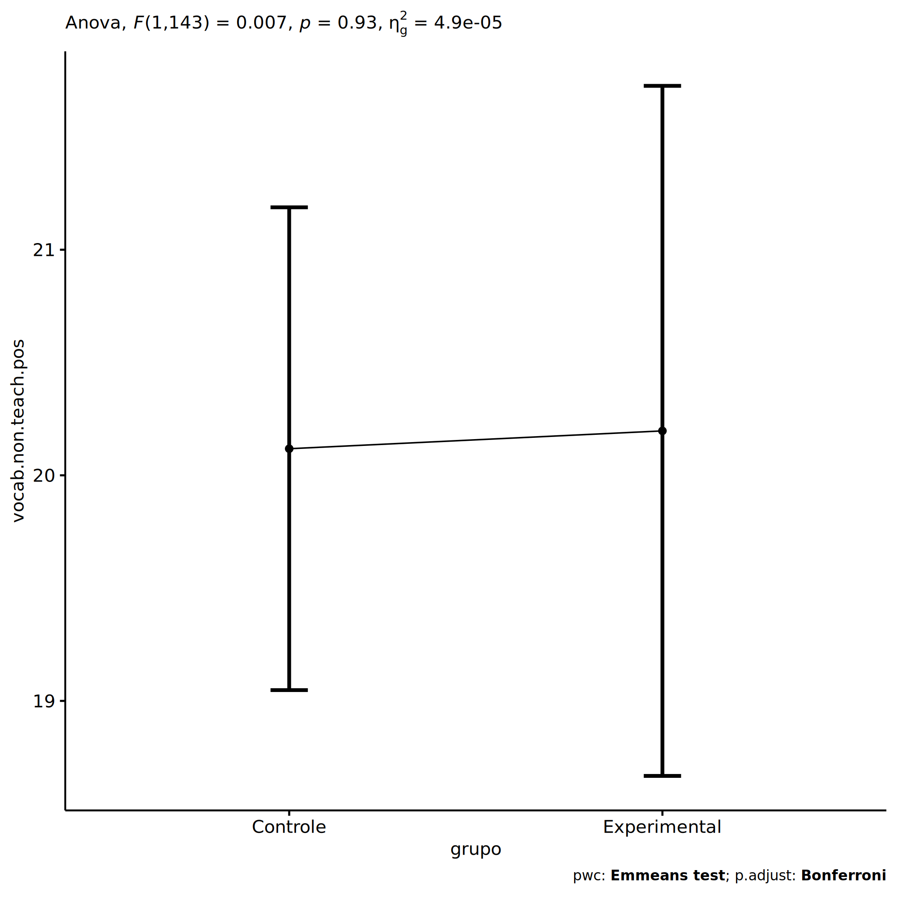
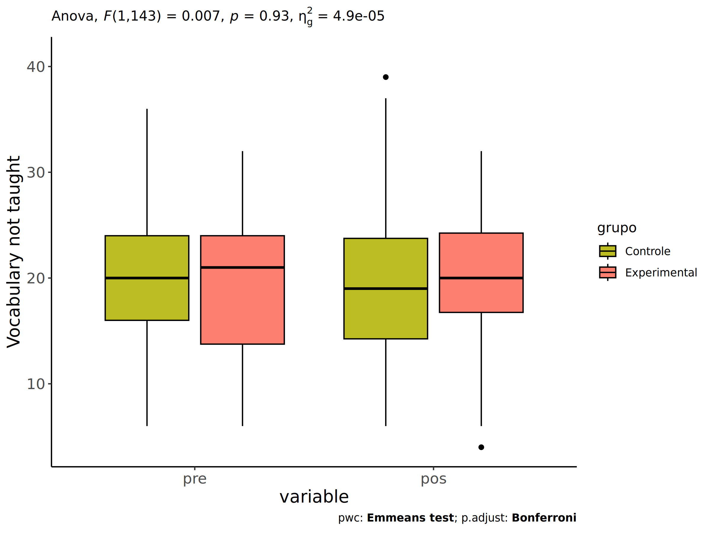
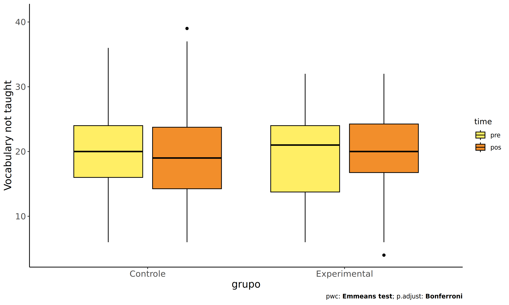
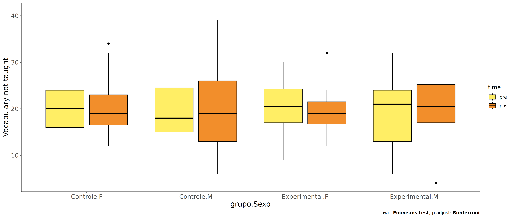
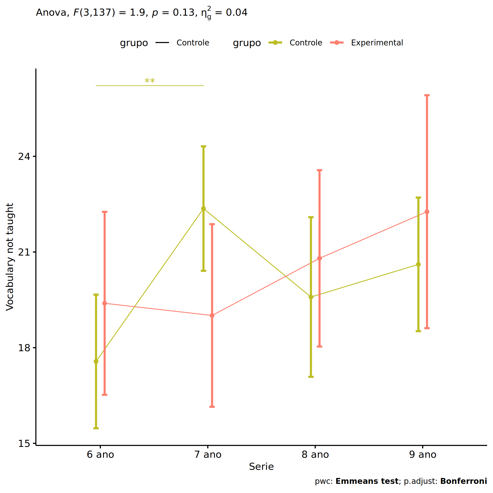
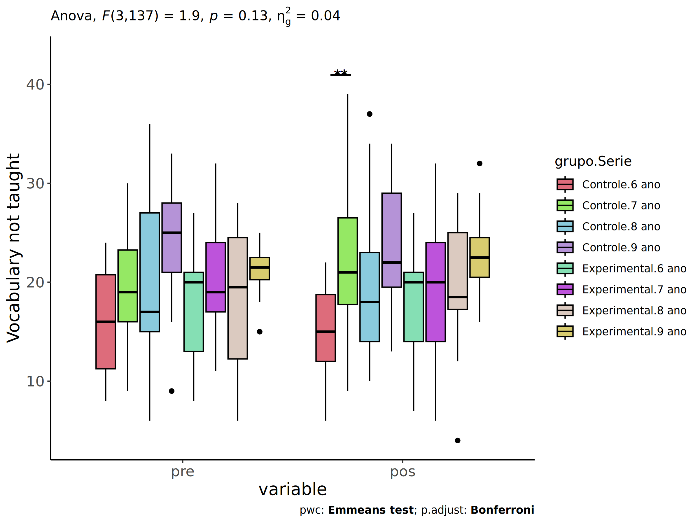
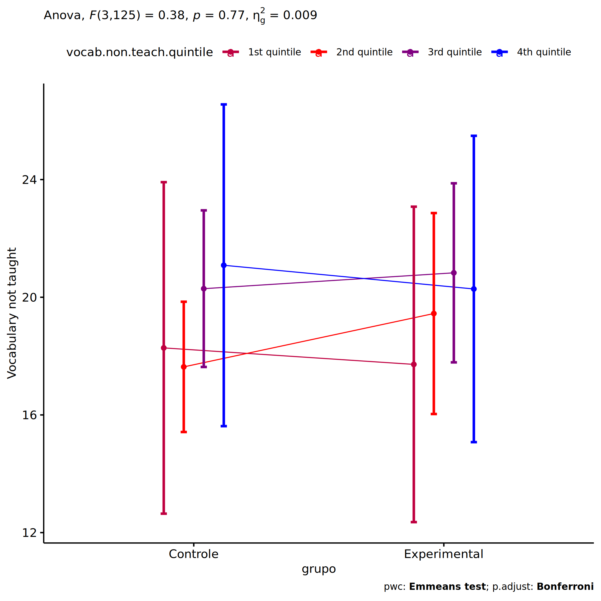
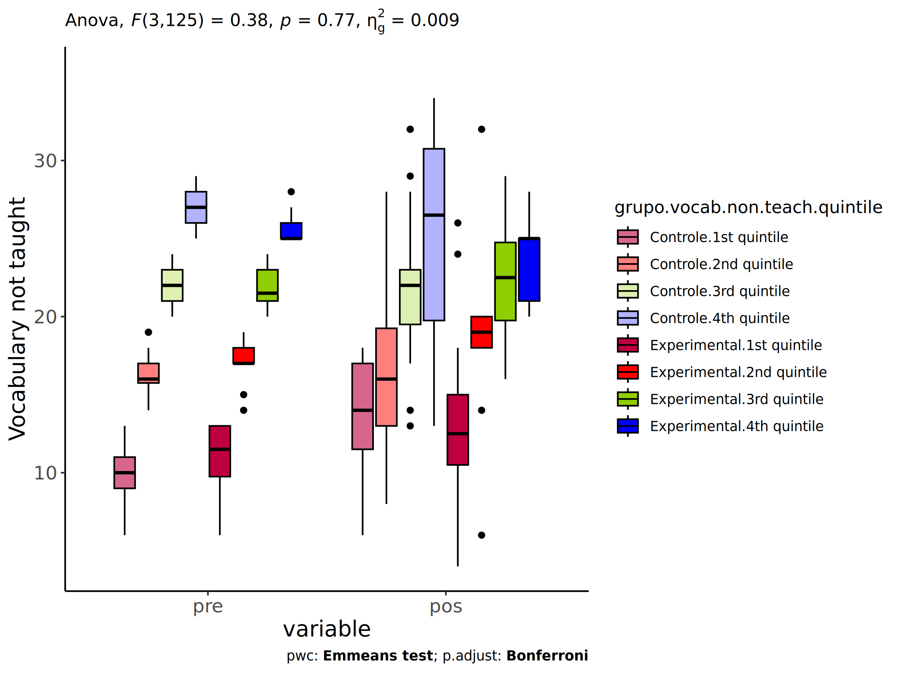

ANCOVA in Vocabulary not taught (Vocabulary not taught)
================
Geiser C. Challco <geiser@alumni.usp.br>

- [Setting Initial Variables](#setting-initial-variables)
- [Descriptive Statistics of Initial
  Data](#descriptive-statistics-of-initial-data)
- [ANCOVA and Pairwise for one factor:
  **grupo**](#ancova-and-pairwise-for-one-factor-grupo)
  - [Without remove non-normal data](#without-remove-non-normal-data)
  - [Computing ANCOVA and PairWise After removing non-normal data
    (OK)](#computing-ancova-and-pairwise-after-removing-non-normal-data-ok)
    - [Plots for ancova](#plots-for-ancova)
    - [Checking linearity assumption](#checking-linearity-assumption)
    - [Checking normality and
      homogeneity](#checking-normality-and-homogeneity)
- [ANCOVA and Pairwise for two factors
  **grupo:Sexo**](#ancova-and-pairwise-for-two-factors-gruposexo)
  - [Without remove non-normal data](#without-remove-non-normal-data-1)
  - [Computing ANCOVA and PairWise After removing non-normal data
    (OK)](#computing-ancova-and-pairwise-after-removing-non-normal-data-ok-1)
    - [Plots for ancova](#plots-for-ancova-1)
    - [Checking linearity assumption](#checking-linearity-assumption-1)
    - [Checking normality and
      homogeneity](#checking-normality-and-homogeneity-1)
- [ANCOVA and Pairwise for two factors
  **grupo:Zona**](#ancova-and-pairwise-for-two-factors-grupozona)
  - [Without remove non-normal data](#without-remove-non-normal-data-2)
  - [Computing ANCOVA and PairWise After removing non-normal data
    (OK)](#computing-ancova-and-pairwise-after-removing-non-normal-data-ok-2)
    - [Plots for ancova](#plots-for-ancova-2)
    - [Checking linearity assumption](#checking-linearity-assumption-2)
    - [Checking normality and
      homogeneity](#checking-normality-and-homogeneity-2)
- [ANCOVA and Pairwise for two factors
  **grupo:Cor.Raca**](#ancova-and-pairwise-for-two-factors-grupocorraca)
  - [Without remove non-normal data](#without-remove-non-normal-data-3)
  - [Computing ANCOVA and PairWise After removing non-normal data
    (OK)](#computing-ancova-and-pairwise-after-removing-non-normal-data-ok-3)
    - [Plots for ancova](#plots-for-ancova-3)
    - [Checking linearity assumption](#checking-linearity-assumption-3)
    - [Checking normality and
      homogeneity](#checking-normality-and-homogeneity-3)
- [ANCOVA and Pairwise for two factors
  **grupo:Serie**](#ancova-and-pairwise-for-two-factors-gruposerie)
  - [Without remove non-normal data](#without-remove-non-normal-data-4)
  - [Computing ANCOVA and PairWise After removing non-normal data
    (OK)](#computing-ancova-and-pairwise-after-removing-non-normal-data-ok-4)
    - [Plots for ancova](#plots-for-ancova-4)
    - [Checking linearity assumption](#checking-linearity-assumption-4)
    - [Checking normality and
      homogeneity](#checking-normality-and-homogeneity-4)
- [ANCOVA and Pairwise for two factors
  **grupo:vocab.non.teach.quintile**](#ancova-and-pairwise-for-two-factors-grupovocabnonteachquintile)
  - [Without remove non-normal data](#without-remove-non-normal-data-5)
  - [Computing ANCOVA and PairWise After removing non-normal data
    (OK)](#computing-ancova-and-pairwise-after-removing-non-normal-data-ok-5)
    - [Plots for ancova](#plots-for-ancova-5)
    - [Checking linearity assumption](#checking-linearity-assumption-5)
    - [Checking normality and
      homogeneity](#checking-normality-and-homogeneity-5)
- [Summary of Results](#summary-of-results)
  - [Descriptive Statistics](#descriptive-statistics)
  - [ANCOVA Table Comparison](#ancova-table-comparison)
  - [PairWise Table Comparison](#pairwise-table-comparison)
  - [EMMS Table Comparison](#emms-table-comparison)

**NOTE**:

- Teste ANCOVA para determinar se houve diferenças significativas no
  Vocabulary not taught (medido usando pre- e pos-testes).
- ANCOVA test to determine whether there were significant differences in
  Vocabulary not taught (measured using pre- and post-tests).

# Setting Initial Variables

``` r
dv = "vocab.non.teach"
dv.pos = "vocab.non.teach.pos"
dv.pre = "vocab.non.teach.pre"

fatores2 <- c("Sexo","Zona","Cor.Raca","Serie","vocab.non.teach.quintile")
lfatores2 <- as.list(fatores2)
names(lfatores2) <- fatores2

fatores1 <- c("grupo", fatores2)
lfatores1 <- as.list(fatores1)
names(lfatores1) <- fatores1

lfatores <- c(lfatores1)

color <- list()
color[["prepost"]] = c("#ffee65","#f28e2B")
color[["grupo"]] = c("#bcbd22","#fd7f6f")
color[["Sexo"]] = c("#FF007F","#4D4DFF")
color[["Zona"]] = c("#AA00FF","#00CCCC")
color[["Cor.Raca"]] = c(
  "Parda"="#b97100","Indígena"="#9F262F",
  "Branca"="#87c498", "Preta"="#848283","Amarela"="#D6B91C"
)

level <- list()
level[["grupo"]] = c("Controle","Experimental")
level[["Sexo"]] = c("F","M")
level[["Zona"]] = c("Rural","Urbana")
level[["Cor.Raca"]] = c("Parda","Indígena","Branca", "Preta","Amarela")
level[["Serie"]] = c("6 ano","7 ano","8 ano","9 ano")

# ..

ymin <- 0
ymax <- 0

ymin.ci <- 0
ymax.ci <- 0


color[["grupo:Sexo"]] = c(
  "Controle:F"="#ff99cb", "Controle:M"="#b7b7ff",
  "Experimental:F"="#FF007F", "Experimental:M"="#4D4DFF",
  "Controle.F"="#ff99cb", "Controle.M"="#b7b7ff",
  "Experimental.F"="#FF007F", "Experimental.M"="#4D4DFF"
)
color[["grupo:Zona"]] = c(
  "Controle:Rural"="#b2efef","Controle:Urbana"="#e5b2ff",
  "Experimental:Rural"="#00CCCC", "Experimental:Urbana"="#AA00FF",
  "Controle.Rural"="#b2efef","Controle.Urbana"="#e5b2ff",
  "Experimental.Rural"="#00CCCC", "Experimental.Urbana"="#AA00FF"
)
color[["grupo:Cor.Raca"]] = c(
    "Controle:Parda"="#e3c699", "Experimental:Parda"="#b97100",
    "Controle:Indígena"="#e2bdc0", "Experimental:Indígena"="#9F262F",
    "Controle:Branca"="#c0e8cb", "Experimental:Branca"="#87c498",
    "Controle:Preta"="#dad9d9", "Experimental:Preta"="#848283",
    "Controle:Amarela"="#eee3a4", "Experimental:Amarela"="#D6B91C",
    
    "Controle.Parda"="#e3c699", "Experimental.Parda"="#b97100",
    "Controle.Indígena"="#e2bdc0", "Experimental.Indígena"="#9F262F",
    "Controle.Branca"="#c0e8cb", "Experimental.Branca"="#87c498",
    "Controle.Preta"="#dad9d9", "Experimental.Preta"="#848283",
    "Controle.Amarela"="#eee3a4", "Experimental.Amarela"="#D6B91C"
)


for (coln in c("vocab","vocab.teach","vocab.non.teach","score.tde",
               "TFL.lidas.per.min","TFL.corretas.per.min","TFL.erradas.per.min","TFL.omitidas.per.min",
               "leitura.compreensao")) {
  color[[paste0(coln,".quintile")]] = c("#BF0040","#FF0000","#800080","#0000FF","#4000BF")
  level[[paste0(coln,".quintile")]] = c("1st quintile","2nd quintile","3rd quintile","4th quintile","5th quintile")
  color[[paste0("grupo:",coln,".quintile")]] = c(
    "Experimental.1st quintile"="#BF0040", "Controle.1st quintile"="#d8668c",
    "Experimental.2nd quintile"="#FF0000", "Controle.2nd quintile"="#ff7f7f",
    "Experimental.3rd quintile"="#8fce00", "Controle.3rd quintile"="#ddf0b2",
    "Experimental.4th quintile"="#0000FF", "Controle.4th quintile"="#b2b2ff",
    "Experimental.5th quintile"="#4000BF", "Controle.5th quintile"="#b299e5",
    
    "Experimental:1st quintile"="#BF0040", "Controle:1st quintile"="#d8668c",
    "Experimental:2nd quintile"="#FF0000", "Controle:2nd quintile"="#ff7f7f",
    "Experimental:3rd quintile"="#8fce00", "Controle:3rd quintile"="#ddf0b2",
    "Experimental:4th quintile"="#0000FF", "Controle:4th quintile"="#b2b2ff",
    "Experimental:5th quintile"="#4000BF", "Controle:5th quintile"="#b299e5")
}


gdat <- read_excel("../data/data.xlsx", sheet = "sumary")
gdat <- gdat[which(is.na(gdat$Necessidade.Deficiencia) & !is.na(gdat$Stari.Grupo)),]


dat <- gdat
dat$grupo <- factor(dat[["Stari.Grupo"]], level[["grupo"]])
for (coln in c(names(lfatores))) {
  dat[[coln]] <- factor(dat[[coln]], level[[coln]][level[[coln]] %in% unique(dat[[coln]])])
}
dat <- dat[which(!is.na(dat[[dv.pre]]) & !is.na(dat[[dv.pos]])),]
dat <- dat[,c("id",names(lfatores),dv.pre,dv.pos)]

dat.long <- rbind(dat, dat)
dat.long$time <- c(rep("pre", nrow(dat)), rep("pos", nrow(dat)))
dat.long$time <- factor(dat.long$time, c("pre","pos"))
dat.long[[dv]] <- c(dat[[dv.pre]], dat[[dv.pos]])


for (f in c("grupo", names(lfatores))) {
  if (is.null(color[[f]]) && length(unique(dat[[f]])) > 0) 
      color[[f]] <- distinctColorPalette(length(unique(dat[[f]])))
}
for (f in c(fatores2)) {
  if (is.null(color[[paste0("grupo:",f)]]) && length(unique(dat[[f]])) > 0)
    color[[paste0("grupo:",f)]] <- distinctColorPalette(length(unique(dat[["grupo"]]))*length(unique(dat[[f]])))
}

ldat <- list()
laov <- list()
lpwc <- list()
lemms <- list()
```

# Descriptive Statistics of Initial Data

``` r
df <- get.descriptives(dat, c(dv.pre, dv.pos), c("grupo"), 
                       include.global = T, symmetry.test = T, normality.test = F)
df <- plyr::rbind.fill(
  df, do.call(plyr::rbind.fill, lapply(lfatores2, FUN = function(f) {
    if (nrow(dat) > 0 && sum(!is.na(unique(dat[[f]]))) > 1)
      get.descriptives(dat, c(dv.pre,dv.pos), c("grupo", f),
                       symmetry.test = T, normality.test = F)
    }))
)
```

    ## Warning: There was 1 warning in `mutate()`.
    ## ℹ In argument: `ci = abs(stats::qt(alpha/2, .data$n - 1) * .data$se)`.
    ## Caused by warning:
    ## ! There was 1 warning in `mutate()`.
    ## ℹ In argument: `ci = abs(stats::qt(alpha/2, .data$n - 1) * .data$se)`.
    ## Caused by warning in `stats::qt()`:
    ## ! NaNs produced
    ## There was 1 warning in `mutate()`.
    ## ℹ In argument: `ci = abs(stats::qt(alpha/2, .data$n - 1) * .data$se)`.
    ## Caused by warning:
    ## ! There was 1 warning in `mutate()`.
    ## ℹ In argument: `ci = abs(stats::qt(alpha/2, .data$n - 1) * .data$se)`.
    ## Caused by warning in `stats::qt()`:
    ## ! NaNs produced

``` r
df <- df[,c(fatores1[fatores1 %in% colnames(df)],"variable",
            colnames(df)[!colnames(df) %in% c(fatores1,"variable")])]
```

| grupo        | Sexo | Zona   | Cor.Raca | Serie | vocab.non.teach.quintile | variable            |   n |   mean | median | min | max |    sd |    se |     ci |   iqr | symmetry | skewness | kurtosis |
|:-------------|:-----|:-------|:---------|:------|:-------------------------|:--------------------|----:|-------:|-------:|----:|----:|------:|------:|-------:|------:|:---------|---------:|---------:|
| Controle     |      |        |          |       |                          | vocab.non.teach.pre |  98 | 19.898 |   20.0 |   6 |  36 | 6.626 | 0.669 |  1.328 |  8.00 | YES      |    0.204 |   -0.588 |
| Experimental |      |        |          |       |                          | vocab.non.teach.pre |  48 | 19.312 |   21.0 |   6 |  32 | 6.158 | 0.889 |  1.788 | 10.25 | YES      |   -0.247 |   -0.803 |
|              |      |        |          |       |                          | vocab.non.teach.pre | 146 | 19.705 |   20.0 |   6 |  36 | 6.461 | 0.535 |  1.057 |  8.75 | YES      |    0.087 |   -0.568 |
| Controle     |      |        |          |       |                          | vocab.non.teach.pos |  98 | 20.255 |   19.0 |   6 |  39 | 7.307 | 0.738 |  1.465 |  9.50 | YES      |    0.496 |   -0.494 |
| Experimental |      |        |          |       |                          | vocab.non.teach.pos |  48 | 19.917 |   20.0 |   4 |  32 | 6.519 | 0.941 |  1.893 |  7.50 | YES      |   -0.409 |   -0.271 |
|              |      |        |          |       |                          | vocab.non.teach.pos | 146 | 20.144 |   20.0 |   4 |  39 | 7.037 | 0.582 |  1.151 |  9.00 | YES      |    0.273 |   -0.344 |
| Controle     | F    |        |          |       |                          | vocab.non.teach.pre |  43 | 20.326 |   20.0 |   9 |  31 | 6.113 | 0.932 |  1.881 |  8.00 | YES      |    0.016 |   -0.809 |
| Controle     | M    |        |          |       |                          | vocab.non.teach.pre |  55 | 19.564 |   18.0 |   6 |  36 | 7.039 | 0.949 |  1.903 |  9.50 | YES      |    0.330 |   -0.565 |
| Experimental | F    |        |          |       |                          | vocab.non.teach.pre |  16 | 19.750 |   20.5 |   9 |  30 | 6.202 | 1.551 |  3.305 |  7.25 | YES      |   -0.408 |   -1.011 |
| Experimental | M    |        |          |       |                          | vocab.non.teach.pre |  32 | 19.094 |   21.0 |   6 |  32 | 6.224 | 1.100 |  2.244 | 11.00 | YES      |   -0.153 |   -0.808 |
| Controle     | F    |        |          |       |                          | vocab.non.teach.pos |  43 | 20.419 |   19.0 |  12 |  34 | 5.889 | 0.898 |  1.812 |  6.50 | NO       |    0.674 |   -0.458 |
| Controle     | M    |        |          |       |                          | vocab.non.teach.pos |  55 | 20.127 |   19.0 |   6 |  39 | 8.300 | 1.119 |  2.244 | 13.00 | YES      |    0.437 |   -0.812 |
| Experimental | F    |        |          |       |                          | vocab.non.teach.pos |  16 | 19.562 |   19.0 |  12 |  32 | 4.802 | 1.201 |  2.559 |  4.75 | NO       |    0.710 |    0.526 |
| Experimental | M    |        |          |       |                          | vocab.non.teach.pos |  32 | 20.094 |   20.5 |   4 |  32 | 7.293 | 1.289 |  2.629 |  8.25 | NO       |   -0.580 |   -0.648 |
| Controle     |      | Rural  |          |       |                          | vocab.non.teach.pre |  56 | 19.768 |   20.0 |   8 |  36 | 6.185 | 0.827 |  1.656 |  8.25 | YES      |    0.260 |   -0.493 |
| Controle     |      | Urbana |          |       |                          | vocab.non.teach.pre |  11 | 18.182 |   17.0 |   6 |  35 | 8.364 | 2.522 |  5.619 |  8.50 | YES      |    0.450 |   -0.755 |
| Controle     |      |        |          |       |                          | vocab.non.teach.pre |  31 | 20.742 |   21.0 |   9 |  33 | 6.831 | 1.227 |  2.506 | 10.00 | YES      |    0.040 |   -1.060 |
| Experimental |      | Rural  |          |       |                          | vocab.non.teach.pre |  34 | 18.882 |   20.5 |   6 |  32 | 6.285 | 1.078 |  2.193 | 10.75 | YES      |   -0.207 |   -0.863 |
| Experimental |      | Urbana |          |       |                          | vocab.non.teach.pre |   5 | 22.400 |   22.0 |  12 |  30 | 7.127 | 3.187 |  8.850 |  8.00 | YES      |   -0.290 |   -1.756 |
| Experimental |      |        |          |       |                          | vocab.non.teach.pre |   9 | 19.222 |   21.0 |  10 |  25 | 5.263 | 1.754 |  4.045 |  5.00 | NO       |   -0.596 |   -1.281 |
| Controle     |      | Rural  |          |       |                          | vocab.non.teach.pos |  56 | 20.411 |   19.5 |   6 |  39 | 7.567 | 1.011 |  2.027 |  9.75 | YES      |    0.369 |   -0.496 |
| Controle     |      | Urbana |          |       |                          | vocab.non.teach.pos |  11 | 18.091 |   17.0 |   9 |  34 | 7.190 | 2.168 |  4.830 |  7.50 | NO       |    0.732 |   -0.332 |
| Controle     |      |        |          |       |                          | vocab.non.teach.pos |  31 | 20.742 |   19.0 |  12 |  34 | 6.957 | 1.249 |  2.552 |  8.50 | NO       |    0.661 |   -0.916 |
| Experimental |      | Rural  |          |       |                          | vocab.non.teach.pos |  34 | 19.618 |   20.5 |   4 |  32 | 6.950 | 1.192 |  2.425 |  9.75 | NO       |   -0.533 |   -0.525 |
| Experimental |      | Urbana |          |       |                          | vocab.non.teach.pos |   5 | 19.800 |   19.0 |  13 |  28 | 5.891 | 2.634 |  7.314 |  7.00 | YES      |    0.210 |   -1.842 |
| Experimental |      |        |          |       |                          | vocab.non.teach.pos |   9 | 21.111 |   19.0 |  14 |  32 | 5.578 | 1.859 |  4.287 |  5.00 | NO       |    0.643 |   -0.896 |
| Controle     |      |        | Parda    |       |                          | vocab.non.teach.pre |  45 | 19.289 |   18.0 |   8 |  36 | 6.388 | 0.952 |  1.919 |  7.00 | YES      |    0.425 |   -0.276 |
| Controle     |      |        | Indígena |       |                          | vocab.non.teach.pre |   3 | 23.667 |   22.0 |  21 |  28 | 3.786 | 2.186 |  9.405 |  3.50 | few data |    0.000 |    0.000 |
| Controle     |      |        | Branca   |       |                          | vocab.non.teach.pre |  11 | 19.545 |   21.0 |  10 |  28 | 6.314 | 1.904 |  4.242 |  9.00 | YES      |   -0.366 |   -1.506 |
| Controle     |      |        | Preta    |       |                          | vocab.non.teach.pre |   1 | 14.000 |   14.0 |  14 |  14 |       |       |        |  0.00 | few data |    0.000 |    0.000 |
| Controle     |      |        |          |       |                          | vocab.non.teach.pre |  38 | 20.579 |   19.5 |   6 |  35 | 7.210 | 1.170 |  2.370 | 11.00 | YES      |    0.090 |   -0.883 |
| Experimental |      |        | Parda    |       |                          | vocab.non.teach.pre |  18 | 17.444 |   17.0 |   6 |  32 | 7.350 | 1.732 |  3.655 | 11.25 | YES      |    0.181 |   -1.153 |
| Experimental |      |        | Indígena |       |                          | vocab.non.teach.pre |   6 | 21.000 |   20.0 |  17 |  26 | 3.742 | 1.528 |  3.927 |  5.75 | YES      |    0.286 |   -1.951 |
| Experimental |      |        | Branca   |       |                          | vocab.non.teach.pre |   5 | 18.200 |   20.0 |  12 |  25 | 5.541 | 2.478 |  6.880 |  8.00 | YES      |   -0.043 |   -2.062 |
| Experimental |      |        |          |       |                          | vocab.non.teach.pre |  19 | 20.842 |   22.0 |  10 |  30 | 5.480 | 1.257 |  2.641 |  6.50 | YES      |   -0.437 |   -0.847 |
| Controle     |      |        | Parda    |       |                          | vocab.non.teach.pos |  45 | 19.289 |   18.0 |   6 |  37 | 7.005 | 1.044 |  2.105 |  7.00 | YES      |    0.448 |   -0.187 |
| Controle     |      |        | Indígena |       |                          | vocab.non.teach.pos |   3 | 24.000 |   23.0 |  22 |  27 | 2.646 | 1.528 |  6.572 |  2.50 | few data |    0.000 |    0.000 |
| Controle     |      |        | Branca   |       |                          | vocab.non.teach.pos |  11 | 21.182 |   22.0 |  12 |  32 | 7.209 | 2.173 |  4.843 | 12.50 | YES      |    0.007 |   -1.702 |
| Controle     |      |        | Preta    |       |                          | vocab.non.teach.pos |   1 | 20.000 |   20.0 |  20 |  20 |       |       |        |  0.00 | few data |    0.000 |    0.000 |
| Controle     |      |        |          |       |                          | vocab.non.teach.pos |  38 | 20.842 |   19.5 |  10 |  39 | 8.019 | 1.301 |  2.636 | 10.50 | NO       |    0.628 |   -0.884 |
| Experimental |      |        | Parda    |       |                          | vocab.non.teach.pos |  18 | 18.222 |   19.5 |   4 |  32 | 7.076 | 1.668 |  3.519 | 10.75 | YES      |   -0.072 |   -0.748 |
| Experimental |      |        | Indígena |       |                          | vocab.non.teach.pos |   6 | 17.667 |   20.0 |   6 |  23 | 6.623 | 2.704 |  6.951 |  7.25 | NO       |   -0.743 |   -1.229 |
| Experimental |      |        | Branca   |       |                          | vocab.non.teach.pos |   5 | 23.200 |   25.0 |  13 |  29 | 6.099 | 2.728 |  7.573 |  3.00 | NO       |   -0.739 |   -1.262 |
| Experimental |      |        |          |       |                          | vocab.non.teach.pos |  19 | 21.368 |   21.0 |   7 |  32 | 5.785 | 1.327 |  2.788 |  7.00 | YES      |   -0.328 |    0.112 |
| Controle     |      |        |          | 6 ano |                          | vocab.non.teach.pre |  26 | 15.962 |   16.0 |   8 |  24 | 4.845 | 0.950 |  1.957 |  9.50 | YES      |    0.035 |   -1.408 |
| Controle     |      |        |          | 7 ano |                          | vocab.non.teach.pre |  28 | 19.214 |   19.0 |   9 |  30 | 5.273 | 0.996 |  2.045 |  7.25 | YES      |   -0.004 |   -0.788 |
| Controle     |      |        |          | 8 ano |                          | vocab.non.teach.pre |  17 | 20.059 |   17.0 |   6 |  36 | 8.518 | 2.066 |  4.380 | 12.00 | NO       |    0.507 |   -0.879 |
| Controle     |      |        |          | 9 ano |                          | vocab.non.teach.pre |  27 | 24.296 |   25.0 |   9 |  33 | 5.621 | 1.082 |  2.224 |  7.00 | NO       |   -0.671 |    0.014 |
| Experimental |      |        |          | 6 ano |                          | vocab.non.teach.pre |  13 | 18.308 |   20.0 |   8 |  27 | 6.074 | 1.685 |  3.671 |  8.00 | YES      |   -0.248 |   -1.425 |
| Experimental |      |        |          | 7 ano |                          | vocab.non.teach.pre |  13 | 20.385 |   19.0 |  11 |  32 | 6.715 | 1.862 |  4.058 |  7.00 | YES      |    0.205 |   -1.328 |
| Experimental |      |        |          | 8 ano |                          | vocab.non.teach.pre |  14 | 18.286 |   19.5 |   6 |  28 | 7.130 | 1.906 |  4.117 | 12.25 | YES      |   -0.288 |   -1.493 |
| Experimental |      |        |          | 9 ano |                          | vocab.non.teach.pre |   8 | 21.000 |   21.5 |  15 |  25 | 3.207 | 1.134 |  2.681 |  2.25 | NO       |   -0.568 |   -0.973 |
| Controle     |      |        |          | 6 ano |                          | vocab.non.teach.pos |  26 | 15.077 |   15.0 |   6 |  22 | 4.621 | 0.906 |  1.866 |  6.75 | YES      |   -0.043 |   -1.130 |
| Controle     |      |        |          | 7 ano |                          | vocab.non.teach.pos |  28 | 22.036 |   21.0 |   9 |  39 | 7.058 | 1.334 |  2.737 |  8.75 | YES      |    0.447 |   -0.490 |
| Controle     |      |        |          | 8 ano |                          | vocab.non.teach.pos |  17 | 19.824 |   18.0 |  10 |  37 | 8.087 | 1.961 |  4.158 |  9.00 | NO       |    0.817 |   -0.695 |
| Controle     |      |        |          | 9 ano |                          | vocab.non.teach.pos |  27 | 23.667 |   22.0 |  13 |  34 | 6.651 | 1.280 |  2.631 |  9.50 | YES      |    0.051 |   -1.226 |
| Experimental |      |        |          | 6 ano |                          | vocab.non.teach.pos |  13 | 18.462 |   20.0 |   7 |  27 | 5.825 | 1.616 |  3.520 |  7.00 | YES      |   -0.479 |   -0.983 |
| Experimental |      |        |          | 7 ano |                          | vocab.non.teach.pos |  13 | 19.462 |   20.0 |   6 |  32 | 7.378 | 2.046 |  4.459 | 10.00 | YES      |   -0.230 |   -0.980 |
| Experimental |      |        |          | 8 ano |                          | vocab.non.teach.pos |  14 | 19.857 |   18.5 |   4 |  29 | 7.004 | 1.872 |  4.044 |  7.75 | NO       |   -0.562 |   -0.507 |
| Experimental |      |        |          | 9 ano |                          | vocab.non.teach.pos |   8 | 23.125 |   22.5 |  16 |  32 | 5.167 | 1.827 |  4.320 |  4.00 | YES      |    0.416 |   -1.196 |
| Controle     |      |        |          |       | 1st quintile             | vocab.non.teach.pre |  15 | 10.000 |   10.0 |   6 |  13 | 1.690 | 0.436 |  0.936 |  2.00 | YES      |   -0.497 |    0.071 |
| Controle     |      |        |          |       | 2nd quintile             | vocab.non.teach.pre |  33 | 16.333 |   16.0 |  14 |  19 | 1.315 | 0.229 |  0.466 |  1.00 | YES      |    0.113 |   -0.583 |
| Controle     |      |        |          |       | 3rd quintile             | vocab.non.teach.pre |  27 | 22.000 |   22.0 |  20 |  24 | 1.468 | 0.282 |  0.581 |  2.00 | YES      |    0.070 |   -1.499 |
| Controle     |      |        |          |       | 4th quintile             | vocab.non.teach.pre |  14 | 27.071 |   27.0 |  25 |  29 | 1.328 | 0.355 |  0.767 |  2.00 | YES      |   -0.119 |   -1.360 |
| Controle     |      |        |          |       | 5th quintile             | vocab.non.teach.pre |   9 | 32.000 |   31.0 |  30 |  36 | 2.179 | 0.726 |  1.675 |  2.00 | NO       |    0.773 |   -1.158 |
| Experimental |      |        |          |       | 1st quintile             | vocab.non.teach.pre |  12 | 10.833 |   11.5 |   6 |  13 | 2.290 | 0.661 |  1.455 |  3.25 | NO       |   -0.688 |   -0.834 |
| Experimental |      |        |          |       | 2nd quintile             | vocab.non.teach.pre |   9 | 17.000 |   17.0 |  14 |  19 | 1.581 | 0.527 |  1.215 |  1.00 | NO       |   -0.675 |   -0.938 |
| Experimental |      |        |          |       | 3rd quintile             | vocab.non.teach.pre |  16 | 21.875 |   21.5 |  20 |  24 | 1.360 | 0.340 |  0.725 |  2.00 | YES      |    0.359 |   -1.309 |
| Experimental |      |        |          |       | 4th quintile             | vocab.non.teach.pre |   9 | 25.778 |   25.0 |  25 |  28 | 1.093 | 0.364 |  0.840 |  1.00 | NO       |    0.891 |   -0.784 |
| Experimental |      |        |          |       | 5th quintile             | vocab.non.teach.pre |   2 | 31.000 |   31.0 |  30 |  32 | 1.414 | 1.000 | 12.706 |  1.00 | few data |    0.000 |    0.000 |
| Controle     |      |        |          |       | 1st quintile             | vocab.non.teach.pos |  15 | 13.800 |   14.0 |   6 |  18 | 3.707 | 0.957 |  2.053 |  5.50 | YES      |   -0.489 |   -0.991 |
| Controle     |      |        |          |       | 2nd quintile             | vocab.non.teach.pos |  33 | 17.091 |   16.0 |   8 |  39 | 6.023 | 1.048 |  2.136 |  7.00 | NO       |    1.391 |    3.133 |
| Controle     |      |        |          |       | 3rd quintile             | vocab.non.teach.pos |  27 | 21.963 |   22.0 |  13 |  32 | 4.561 | 0.878 |  1.804 |  3.50 | YES      |    0.440 |    0.091 |
| Controle     |      |        |          |       | 4th quintile             | vocab.non.teach.pos |  14 | 25.357 |   26.5 |  13 |  34 | 6.890 | 1.842 |  3.978 | 11.00 | NO       |   -0.527 |   -1.296 |
| Controle     |      |        |          |       | 5th quintile             | vocab.non.teach.pos |   9 | 29.556 |   32.0 |  13 |  37 | 7.828 | 2.609 |  6.017 |  3.00 | NO       |   -1.092 |   -0.404 |
| Experimental |      |        |          |       | 1st quintile             | vocab.non.teach.pos |  12 | 13.667 |   12.5 |   4 |  26 | 6.401 | 1.848 |  4.067 |  4.50 | NO       |    0.550 |   -0.709 |
| Experimental |      |        |          |       | 2nd quintile             | vocab.non.teach.pos |   9 | 18.556 |   19.0 |   6 |  32 | 6.747 | 2.249 |  5.187 |  2.00 | YES      |    0.131 |    0.107 |
| Experimental |      |        |          |       | 3rd quintile             | vocab.non.teach.pos |  16 | 22.438 |   22.5 |  16 |  29 | 4.033 | 1.008 |  2.149 |  5.00 | YES      |    0.175 |   -1.170 |
| Experimental |      |        |          |       | 4th quintile             | vocab.non.teach.pos |   9 | 23.889 |   25.0 |  20 |  28 | 2.804 | 0.935 |  2.155 |  4.00 | YES      |   -0.020 |   -1.647 |
| Experimental |      |        |          |       | 5th quintile             | vocab.non.teach.pos |   2 | 25.500 |   25.5 |  19 |  32 | 9.192 | 6.500 | 82.590 |  6.50 | few data |    0.000 |    0.000 |

# ANCOVA and Pairwise for one factor: **grupo**

## Without remove non-normal data

``` r
pdat = remove_group_data(dat[!is.na(dat[["grupo"]]),], "vocab.non.teach.pos", "grupo")

pdat.long <- rbind(pdat[,c("id","grupo")], pdat[,c("id","grupo")])
pdat.long[["time"]] <- c(rep("pre", nrow(pdat)), rep("pos", nrow(pdat)))
pdat.long[["time"]] <- factor(pdat.long[["time"]], c("pre","pos"))
pdat.long[["vocab.non.teach"]] <- c(pdat[["vocab.non.teach.pre"]], pdat[["vocab.non.teach.pos"]])

aov = anova_test(pdat, vocab.non.teach.pos ~ vocab.non.teach.pre + grupo)
laov[["grupo"]] <- get_anova_table(aov)
```

``` r
pwc <- emmeans_test(pdat, vocab.non.teach.pos ~ grupo, covariate = vocab.non.teach.pre,
                    p.adjust.method = "bonferroni")
```

``` r
pwc.long <- emmeans_test(dplyr::group_by_at(pdat.long, "grupo"),
                          vocab.non.teach ~ time,
                          p.adjust.method = "bonferroni")
lpwc[["grupo"]] <- plyr::rbind.fill(pwc, pwc.long)
```

``` r
ds <- get.descriptives(pdat, "vocab.non.teach.pos", "grupo", covar = "vocab.non.teach.pre")
ds <- merge(ds[ds$variable != "vocab.non.teach.pre",],
            ds[ds$variable == "vocab.non.teach.pre", !colnames(ds) %in% c("variable")],
            by = "grupo", all.x = T, suffixes = c("", ".vocab.non.teach.pre"))
ds <- merge(get_emmeans(pwc), ds, by = "grupo", suffixes = c(".emms", ""))
ds <- ds[,c("grupo","n","mean.vocab.non.teach.pre","se.vocab.non.teach.pre","mean","se",
            "emmean","se.emms","conf.low","conf.high")]

colnames(ds) <- c("grupo", "N", paste0(c("M","SE")," (pre)"),
                  paste0(c("M","SE"), " (unadj)"),
                  paste0(c("M", "SE"), " (adj)"), "conf.low", "conf.high")

lemms[["grupo"]] <- ds
```

## Computing ANCOVA and PairWise After removing non-normal data (OK)

``` r
wdat = pdat 

res = residuals(lm(vocab.non.teach.pos ~ vocab.non.teach.pre + grupo, data = wdat))
non.normal = getNonNormal(res, wdat$id, plimit = 0.05)

wdat = wdat[!wdat$id %in% non.normal,]

wdat.long <- rbind(wdat[,c("id","grupo")], wdat[,c("id","grupo")])
wdat.long[["time"]] <- c(rep("pre", nrow(wdat)), rep("pos", nrow(wdat)))
wdat.long[["time"]] <- factor(wdat.long[["time"]], c("pre","pos"))
wdat.long[["vocab.non.teach"]] <- c(wdat[["vocab.non.teach.pre"]], wdat[["vocab.non.teach.pos"]])

ldat[["grupo"]] = wdat

(non.normal)
```

    ## NULL

``` r
aov = anova_test(wdat, vocab.non.teach.pos ~ vocab.non.teach.pre + grupo)
laov[["grupo"]] <- merge(get_anova_table(aov), laov[["grupo"]],
                            by="Effect", suffixes = c("","'"))

(df = get_anova_table(aov))
```

    ## ANOVA Table (type II tests)
    ## 
    ##                Effect DFn DFd       F        p p<.05      ges
    ## 1 vocab.non.teach.pre   1 143 107.016 4.53e-19     * 4.28e-01
    ## 2               grupo   1 143   0.007 9.33e-01       4.89e-05

| Effect              | DFn | DFd |       F |     p | p\<.05 |   ges |
|:--------------------|----:|----:|--------:|------:|:-------|------:|
| vocab.non.teach.pre |   1 | 143 | 107.016 | 0.000 | \*     | 0.428 |
| grupo               |   1 | 143 |   0.007 | 0.933 |        | 0.000 |

``` r
pwc <- emmeans_test(wdat, vocab.non.teach.pos ~ grupo, covariate = vocab.non.teach.pre,
                    p.adjust.method = "bonferroni")
```

| term                       | .y.                 | group1   | group2       |  df | statistic |     p | p.adj | p.adj.signif |
|:---------------------------|:--------------------|:---------|:-------------|----:|----------:|------:|------:|:-------------|
| vocab.non.teach.pre\*grupo | vocab.non.teach.pos | Controle | Experimental | 143 |    -0.084 | 0.933 | 0.933 | ns           |

``` r
pwc.long <- emmeans_test(dplyr::group_by_at(wdat.long, "grupo"),
                         vocab.non.teach ~ time,
                         p.adjust.method = "bonferroni")
lpwc[["grupo"]] <- merge(plyr::rbind.fill(pwc, pwc.long), lpwc[["grupo"]],
                            by=c("grupo","term",".y.","group1","group2"),
                            suffixes = c("","'"))
```

| grupo        | term | .y.             | group1 | group2 |  df | statistic |     p | p.adj | p.adj.signif |
|:-------------|:-----|:----------------|:-------|:-------|----:|----------:|------:|------:|:-------------|
| Controle     | time | vocab.non.teach | pre    | pos    | 288 |    -0.369 | 0.712 | 0.712 | ns           |
| Experimental | time | vocab.non.teach | pre    | pos    | 288 |    -0.437 | 0.663 | 0.663 | ns           |

``` r
ds <- get.descriptives(wdat, "vocab.non.teach.pos", "grupo", covar = "vocab.non.teach.pre")
ds <- merge(ds[ds$variable != "vocab.non.teach.pre",],
            ds[ds$variable == "vocab.non.teach.pre", !colnames(ds) %in% c("variable")],
            by = "grupo", all.x = T, suffixes = c("", ".vocab.non.teach.pre"))
ds <- merge(get_emmeans(pwc), ds, by = "grupo", suffixes = c(".emms", ""))
ds <- ds[,c("grupo","n","mean.vocab.non.teach.pre","se.vocab.non.teach.pre","mean","se",
            "emmean","se.emms","conf.low","conf.high")]

colnames(ds) <- c("grupo", "N", paste0(c("M","SE")," (pre)"),
                  paste0(c("M","SE"), " (unadj)"),
                  paste0(c("M", "SE"), " (adj)"), "conf.low", "conf.high")

lemms[["grupo"]] <- merge(ds, lemms[["grupo"]], by=c("grupo"), suffixes = c("","'"))
```

| grupo        |   N | M (pre) | SE (pre) | M (unadj) | SE (unadj) | M (adj) | SE (adj) | conf.low | conf.high |
|:-------------|----:|--------:|---------:|----------:|-----------:|--------:|---------:|---------:|----------:|
| Controle     |  98 |  19.898 |    0.669 |    20.255 |      0.738 |  20.118 |    0.541 |   19.048 |    21.188 |
| Experimental |  48 |  19.312 |    0.889 |    19.917 |      0.941 |  20.197 |    0.774 |   18.667 |    21.726 |

### Plots for ancova

``` r
plots <- oneWayAncovaPlots(
  wdat, "vocab.non.teach.pos", "grupo", aov, list("grupo"=pwc), addParam = c("mean_ci"),
  font.label.size=10, step.increase=0.05, p.label="p.adj",
  subtitle = which(aov$Effect == "grupo"))
```

``` r
if (!is.null(nrow(plots[["grupo"]]$data)))
  plots[["grupo"]] +
  if (ymin.ci < ymax.ci) ggplot2::ylim(ymin.ci, ymax.ci)
```

<!-- -->

``` r
plots <- oneWayAncovaBoxPlots(
  wdat, "vocab.non.teach.pos", "grupo", aov, pwc, covar = "vocab.non.teach.pre",
  theme = "classic", color = color[["grupo"]],
  subtitle = which(aov$Effect == "grupo"))
```

``` r
if (length(unique(wdat[["grupo"]])) > 1)
  plots[["grupo"]] + ggplot2::ylab("Vocabulary not taught") +
  ggplot2::scale_x_discrete(labels=c('pre', 'pos')) +
  if (ymin < ymax) ggplot2::ylim(ymin, ymax)
```

<!-- -->

``` r
if (length(unique(wdat.long[["grupo"]])) > 1)
  plots <- oneWayAncovaBoxPlots(
    wdat.long, "vocab.non.teach", "grupo", aov, pwc.long,
    pre.post = "time", theme = "classic", color = color$prepost)
```

``` r
if (length(unique(wdat.long[["grupo"]])) > 1)
  plots[["grupo"]] + ggplot2::ylab("Vocabulary not taught") +
  if (ymin < ymax) ggplot2::ylim(ymin, ymax) 
```

<!-- -->

### Checking linearity assumption

``` r
ggscatter(wdat, x = "vocab.non.teach.pre", y = "vocab.non.teach.pos", size = 0.5,
          color = "grupo", add = "reg.line")+
  stat_regline_equation(
    aes(label =  paste(..eq.label.., ..rr.label.., sep = "~~~~"), color = grupo)
  ) +
  ggplot2::labs(subtitle = rstatix::get_test_label(aov, detailed = T, row = which(aov$Effect == "grupo"))) +
  ggplot2::scale_color_manual(values = color[["grupo"]]) +
  if (ymin < ymax) ggplot2::ylim(ymin, ymax)
```

<!-- -->

### Checking normality and homogeneity

``` r
res <- augment(lm(vocab.non.teach.pos ~ vocab.non.teach.pre + grupo, data = wdat))
```

``` r
shapiro_test(res$.resid)
```

    ## # A tibble: 1 × 3
    ##   variable   statistic p.value
    ##   <chr>          <dbl>   <dbl>
    ## 1 res$.resid     0.984  0.0776

``` r
levene_test(res, .resid ~ grupo)
```

    ## # A tibble: 1 × 4
    ##     df1   df2 statistic     p
    ##   <int> <int>     <dbl> <dbl>
    ## 1     1   144      1.39 0.240

# ANCOVA and Pairwise for two factors **grupo:Sexo**

## Without remove non-normal data

``` r
pdat = remove_group_data(dat[!is.na(dat[["grupo"]]) & !is.na(dat[["Sexo"]]),],
                         "vocab.non.teach.pos", c("grupo","Sexo"))
pdat = pdat[pdat[["Sexo"]] %in% do.call(
  intersect, lapply(unique(pdat[["grupo"]]), FUN = function(x) {
    unique(pdat[["Sexo"]][which(pdat[["grupo"]] == x)])
  })),]
pdat[["grupo"]] = factor(pdat[["grupo"]], level[["grupo"]])
pdat[["Sexo"]] = factor(
  pdat[["Sexo"]],
  level[["Sexo"]][level[["Sexo"]] %in% unique(pdat[["Sexo"]])])

pdat.long <- rbind(pdat[,c("id","grupo","Sexo")], pdat[,c("id","grupo","Sexo")])
pdat.long[["time"]] <- c(rep("pre", nrow(pdat)), rep("pos", nrow(pdat)))
pdat.long[["time"]] <- factor(pdat.long[["time"]], c("pre","pos"))
pdat.long[["vocab.non.teach"]] <- c(pdat[["vocab.non.teach.pre"]], pdat[["vocab.non.teach.pos"]])

if (length(unique(pdat[["Sexo"]])) >= 2) {
  aov = anova_test(pdat, vocab.non.teach.pos ~ vocab.non.teach.pre + grupo*Sexo)
  laov[["grupo:Sexo"]] <- get_anova_table(aov)
}
```

``` r
if (length(unique(pdat[["Sexo"]])) >= 2) {
  pwcs <- list()
  pwcs[["Sexo"]] <- emmeans_test(
    group_by(pdat, grupo), vocab.non.teach.pos ~ Sexo,
    covariate = vocab.non.teach.pre, p.adjust.method = "bonferroni")
  pwcs[["grupo"]] <- emmeans_test(
    group_by(pdat, Sexo), vocab.non.teach.pos ~ grupo,
    covariate = vocab.non.teach.pre, p.adjust.method = "bonferroni")
  
  pwc <- plyr::rbind.fill(pwcs[["grupo"]], pwcs[["Sexo"]])
  pwc <- pwc[,c("grupo","Sexo", colnames(pwc)[!colnames(pwc) %in% c("grupo","Sexo")])]
}
```

``` r
if (length(unique(pdat[["Sexo"]])) >= 2) {
  pwc.long <- emmeans_test(dplyr::group_by_at(pdat.long, c("grupo","Sexo")),
                           vocab.non.teach ~ time,
                           p.adjust.method = "bonferroni")
  lpwc[["grupo:Sexo"]] <- plyr::rbind.fill(pwc, pwc.long)
}
```

``` r
if (length(unique(pdat[["Sexo"]])) >= 2) {
  ds <- get.descriptives(pdat, "vocab.non.teach.pos", c("grupo","Sexo"), covar = "vocab.non.teach.pre")
  ds <- merge(ds[ds$variable != "vocab.non.teach.pre",],
              ds[ds$variable == "vocab.non.teach.pre", !colnames(ds) %in% c("variable")],
              by = c("grupo","Sexo"), all.x = T, suffixes = c("", ".vocab.non.teach.pre"))
  ds <- merge(get_emmeans(pwcs[["grupo"]]), ds,
              by = c("grupo","Sexo"), suffixes = c(".emms", ""))
  ds <- ds[,c("grupo","Sexo","n","mean.vocab.non.teach.pre","se.vocab.non.teach.pre","mean","se",
              "emmean","se.emms","conf.low","conf.high")]
  
  colnames(ds) <- c("grupo","Sexo", "N", paste0(c("M","SE")," (pre)"),
                    paste0(c("M","SE"), " (unadj)"),
                    paste0(c("M", "SE"), " (adj)"), "conf.low", "conf.high")
  
  lemms[["grupo:Sexo"]] <- ds
}
```

## Computing ANCOVA and PairWise After removing non-normal data (OK)

``` r
if (length(unique(pdat[["Sexo"]])) >= 2) {
  wdat = pdat 
  
  res = residuals(lm(vocab.non.teach.pos ~ vocab.non.teach.pre + grupo*Sexo, data = wdat))
  non.normal = getNonNormal(res, wdat$id, plimit = 0.05)
  
  wdat = wdat[!wdat$id %in% non.normal,]
  
  wdat.long <- rbind(wdat[,c("id","grupo","Sexo")], wdat[,c("id","grupo","Sexo")])
  wdat.long[["time"]] <- c(rep("pre", nrow(wdat)), rep("pos", nrow(wdat)))
  wdat.long[["time"]] <- factor(wdat.long[["time"]], c("pre","pos"))
  wdat.long[["vocab.non.teach"]] <- c(wdat[["vocab.non.teach.pre"]], wdat[["vocab.non.teach.pos"]])
  
  
  ldat[["grupo:Sexo"]] = wdat
  
  (non.normal)
}
```

    ## NULL

``` r
if (length(unique(pdat[["Sexo"]])) >= 2) {
  aov = anova_test(wdat, vocab.non.teach.pos ~ vocab.non.teach.pre + grupo*Sexo)
  laov[["grupo:Sexo"]] <- merge(get_anova_table(aov), laov[["grupo:Sexo"]],
                                         by="Effect", suffixes = c("","'"))
  df = get_anova_table(aov)
}
```

| Effect              | DFn | DFd |       F |     p | p\<.05 |   ges |
|:--------------------|----:|----:|--------:|------:|:-------|------:|
| vocab.non.teach.pre |   1 | 141 | 106.080 | 0.000 | \*     | 0.429 |
| grupo               |   1 | 141 |   0.001 | 0.976 |        | 0.000 |
| Sexo                |   1 | 141 |   0.278 | 0.599 |        | 0.002 |
| grupo:Sexo          |   1 | 141 |   0.142 | 0.707 |        | 0.001 |

``` r
if (length(unique(pdat[["Sexo"]])) >= 2) {
  pwcs <- list()
  pwcs[["Sexo"]] <- emmeans_test(
    group_by(wdat, grupo), vocab.non.teach.pos ~ Sexo,
    covariate = vocab.non.teach.pre, p.adjust.method = "bonferroni")
  pwcs[["grupo"]] <- emmeans_test(
    group_by(wdat, Sexo), vocab.non.teach.pos ~ grupo,
    covariate = vocab.non.teach.pre, p.adjust.method = "bonferroni")
  
  pwc <- plyr::rbind.fill(pwcs[["grupo"]], pwcs[["Sexo"]])
  pwc <- pwc[,c("grupo","Sexo", colnames(pwc)[!colnames(pwc) %in% c("grupo","Sexo")])]
}
```

| grupo        | Sexo | term                       | .y.                 | group1   | group2       |  df | statistic |     p | p.adj | p.adj.signif |
|:-------------|:-----|:---------------------------|:--------------------|:---------|:-------------|----:|----------:|------:|------:|:-------------|
|              | F    | vocab.non.teach.pre\*grupo | vocab.non.teach.pos | Controle | Experimental | 141 |     0.282 | 0.779 | 0.779 | ns           |
|              | M    | vocab.non.teach.pre\*grupo | vocab.non.teach.pos | Controle | Experimental | 141 |    -0.252 | 0.801 | 0.801 | ns           |
| Controle     |      | vocab.non.teach.pre\*Sexo  | vocab.non.teach.pos | F        | M            | 141 |    -0.231 | 0.818 | 0.818 | ns           |
| Experimental |      | vocab.non.teach.pre\*Sexo  | vocab.non.teach.pos | F        | M            | 141 |    -0.606 | 0.545 | 0.545 | ns           |

``` r
if (length(unique(pdat[["Sexo"]])) >= 2) {
  pwc.long <- emmeans_test(dplyr::group_by_at(wdat.long, c("grupo","Sexo")),
                           vocab.non.teach ~ time,
                           p.adjust.method = "bonferroni")
  lpwc[["grupo:Sexo"]] <- merge(plyr::rbind.fill(pwc, pwc.long),
                                         lpwc[["grupo:Sexo"]],
                                         by=c("grupo","Sexo","term",".y.","group1","group2"),
                                         suffixes = c("","'"))
}
```

| grupo        | Sexo | term | .y.             | group1 | group2 |  df | statistic |     p | p.adj | p.adj.signif |
|:-------------|:-----|:-----|:----------------|:-------|:-------|----:|----------:|------:|------:|:-------------|
| Controle     | F    | time | vocab.non.teach | pre    | pos    | 284 |    -0.063 | 0.950 | 0.950 | ns           |
| Controle     | M    | time | vocab.non.teach | pre    | pos    | 284 |    -0.434 | 0.665 | 0.665 | ns           |
| Experimental | F    | time | vocab.non.teach | pre    | pos    | 284 |     0.078 | 0.938 | 0.938 | ns           |
| Experimental | M    | time | vocab.non.teach | pre    | pos    | 284 |    -0.587 | 0.558 | 0.558 | ns           |

``` r
if (length(unique(pdat[["Sexo"]])) >= 2) {
  ds <- get.descriptives(wdat, "vocab.non.teach.pos", c("grupo","Sexo"), covar = "vocab.non.teach.pre")
  ds <- merge(ds[ds$variable != "vocab.non.teach.pre",],
              ds[ds$variable == "vocab.non.teach.pre", !colnames(ds) %in% c("variable")],
              by = c("grupo","Sexo"), all.x = T, suffixes = c("", ".vocab.non.teach.pre"))
  ds <- merge(get_emmeans(pwcs[["grupo"]]), ds,
              by = c("grupo","Sexo"), suffixes = c(".emms", ""))
  ds <- ds[,c("grupo","Sexo","n","mean.vocab.non.teach.pre","se.vocab.non.teach.pre",
              "mean","se","emmean","se.emms","conf.low","conf.high")]
  
  colnames(ds) <- c("grupo","Sexo", "N", paste0(c("M","SE")," (pre)"),
                    paste0(c("M","SE"), " (unadj)"),
                    paste0(c("M", "SE"), " (adj)"), "conf.low", "conf.high")
  
  lemms[["grupo:Sexo"]] <- merge(ds, lemms[["grupo:Sexo"]],
                                          by=c("grupo","Sexo"), suffixes = c("","'"))
}
```

| grupo        | Sexo |   N | M (pre) | SE (pre) | M (unadj) | SE (unadj) | M (adj) | SE (adj) | conf.low | conf.high |
|:-------------|:-----|----:|--------:|---------:|----------:|-----------:|--------:|---------:|---------:|----------:|
| Controle     | F    |  43 |  20.326 |    0.932 |    20.419 |      0.898 |  19.975 |    0.823 |   18.349 |    21.602 |
| Controle     | M    |  55 |  19.564 |    0.949 |    20.127 |      1.119 |  20.229 |    0.727 |   18.792 |    21.665 |
| Experimental | F    |  16 |  19.750 |    1.551 |    19.562 |      1.201 |  19.531 |    1.347 |   16.868 |    22.193 |
| Experimental | M    |  32 |  19.094 |    1.100 |    20.094 |      1.289 |  20.531 |    0.953 |   18.647 |    22.416 |

### Plots for ancova

``` r
if (length(unique(pdat[["Sexo"]])) >= 2) {
  ggPlotAoC2(pwcs, "grupo", "Sexo", aov, ylab = "Vocabulary not taught",
             subtitle = which(aov$Effect == "grupo:Sexo"), addParam = "errorbar") +
    ggplot2::scale_color_manual(values = color[["Sexo"]]) +
    if (ymin.ci < ymax.ci) ggplot2::ylim(ymin.ci, ymax.ci)
}
```

    ## Scale for colour is already present.
    ## Adding another scale for colour, which will replace the existing scale.

<!-- -->

``` r
if (length(unique(pdat[["Sexo"]])) >= 2) {
  ggPlotAoC2(pwcs, "Sexo", "grupo", aov, ylab = "Vocabulary not taught",
               subtitle = which(aov$Effect == "grupo:Sexo"), addParam = "errorbar") +
      ggplot2::scale_color_manual(values = color[["grupo"]]) +
      if (ymin.ci < ymax.ci) ggplot2::ylim(ymin.ci, ymax.ci)
}
```

    ## Scale for colour is already present.
    ## Adding another scale for colour, which will replace the existing scale.

<!-- -->

``` r
if (length(unique(pdat[["Sexo"]])) >= 2) {
  plots <- twoWayAncovaBoxPlots(
    wdat, "vocab.non.teach.pos", c("grupo","Sexo"), aov, pwcs, covar = "vocab.non.teach.pre",
    theme = "classic", color = color[["grupo:Sexo"]],
    subtitle = which(aov$Effect == "grupo:Sexo"))
}
```

``` r
if (length(unique(pdat[["Sexo"]])) >= 2) {
  plots[["grupo:Sexo"]] + ggplot2::ylab("Vocabulary not taught") +
  ggplot2::scale_x_discrete(labels=c('pre', 'pos')) +
  if (ymin < ymax) ggplot2::ylim(ymin, ymax)
}
```

    ## Warning: No shared levels found between `names(values)` of the manual scale and the data's colour
    ## values.

<!-- -->

``` r
if (length(unique(pdat[["Sexo"]])) >= 2) {
  plots <- twoWayAncovaBoxPlots(
    wdat.long, "vocab.non.teach", c("grupo","Sexo"), aov, pwc.long,
    pre.post = "time",
    theme = "classic", color = color$prepost)
}
```

``` r
if (length(unique(pdat[["Sexo"]])) >= 2) 
  plots[["grupo:Sexo"]] + ggplot2::ylab("Vocabulary not taught") +
    if (ymin < ymax) ggplot2::ylim(ymin, ymax)
```

<!-- -->

### Checking linearity assumption

``` r
if (length(unique(pdat[["Sexo"]])) >= 2) {
  ggscatter(wdat, x = "vocab.non.teach.pre", y = "vocab.non.teach.pos", size = 0.5,
            facet.by = c("grupo","Sexo"), add = "reg.line")+
    stat_regline_equation(
      aes(label =  paste(..eq.label.., ..rr.label.., sep = "~~~~"))
    ) +
    if (ymin < ymax) ggplot2::ylim(ymin, ymax)
}
```

<!-- -->

``` r
if (length(unique(pdat[["Sexo"]])) >= 2) {
  ggscatter(wdat, x = "vocab.non.teach.pre", y = "vocab.non.teach.pos", size = 0.5,
            color = "grupo", facet.by = "Sexo", add = "reg.line")+
    stat_regline_equation(
      aes(label =  paste(..eq.label.., ..rr.label.., sep = "~~~~"), color = grupo)
    ) +
    ggplot2::labs(subtitle = rstatix::get_test_label(aov, detailed = T, row = which(aov$Effect == "grupo:Sexo"))) +
    ggplot2::scale_color_manual(values = color[["grupo"]]) +
    if (ymin < ymax) ggplot2::ylim(ymin, ymax)
}
```

<!-- -->

``` r
if (length(unique(pdat[["Sexo"]])) >= 2) {
  ggscatter(wdat, x = "vocab.non.teach.pre", y = "vocab.non.teach.pos", size = 0.5,
            color = "Sexo", facet.by = "grupo", add = "reg.line")+
    stat_regline_equation(
      aes(label =  paste(..eq.label.., ..rr.label.., sep = "~~~~"), color = Sexo)
    ) +
    ggplot2::labs(subtitle = rstatix::get_test_label(aov, detailed = T, row = which(aov$Effect == "grupo:Sexo"))) +
    ggplot2::scale_color_manual(values = color[["Sexo"]]) +
    if (ymin < ymax) ggplot2::ylim(ymin, ymax)
}
```

<!-- -->

### Checking normality and homogeneity

``` r
if (length(unique(pdat[["Sexo"]])) >= 2) 
  res <- augment(lm(vocab.non.teach.pos ~ vocab.non.teach.pre + grupo*Sexo, data = wdat))
```

``` r
if (length(unique(pdat[["Sexo"]])) >= 2)
  shapiro_test(res$.resid)
```

    ## # A tibble: 1 × 3
    ##   variable   statistic p.value
    ##   <chr>          <dbl>   <dbl>
    ## 1 res$.resid     0.983  0.0615

``` r
if (length(unique(pdat[["Sexo"]])) >= 2) 
  levene_test(res, .resid ~ grupo*Sexo)
```

    ## # A tibble: 1 × 4
    ##     df1   df2 statistic     p
    ##   <int> <int>     <dbl> <dbl>
    ## 1     3   142      1.19 0.317

# ANCOVA and Pairwise for two factors **grupo:Zona**

## Without remove non-normal data

``` r
pdat = remove_group_data(dat[!is.na(dat[["grupo"]]) & !is.na(dat[["Zona"]]),],
                         "vocab.non.teach.pos", c("grupo","Zona"))
pdat = pdat[pdat[["Zona"]] %in% do.call(
  intersect, lapply(unique(pdat[["grupo"]]), FUN = function(x) {
    unique(pdat[["Zona"]][which(pdat[["grupo"]] == x)])
  })),]
pdat[["grupo"]] = factor(pdat[["grupo"]], level[["grupo"]])
pdat[["Zona"]] = factor(
  pdat[["Zona"]],
  level[["Zona"]][level[["Zona"]] %in% unique(pdat[["Zona"]])])

pdat.long <- rbind(pdat[,c("id","grupo","Zona")], pdat[,c("id","grupo","Zona")])
pdat.long[["time"]] <- c(rep("pre", nrow(pdat)), rep("pos", nrow(pdat)))
pdat.long[["time"]] <- factor(pdat.long[["time"]], c("pre","pos"))
pdat.long[["vocab.non.teach"]] <- c(pdat[["vocab.non.teach.pre"]], pdat[["vocab.non.teach.pos"]])

if (length(unique(pdat[["Zona"]])) >= 2) {
  aov = anova_test(pdat, vocab.non.teach.pos ~ vocab.non.teach.pre + grupo*Zona)
  laov[["grupo:Zona"]] <- get_anova_table(aov)
}
```

``` r
if (length(unique(pdat[["Zona"]])) >= 2) {
  pwcs <- list()
  pwcs[["Zona"]] <- emmeans_test(
    group_by(pdat, grupo), vocab.non.teach.pos ~ Zona,
    covariate = vocab.non.teach.pre, p.adjust.method = "bonferroni")
  pwcs[["grupo"]] <- emmeans_test(
    group_by(pdat, Zona), vocab.non.teach.pos ~ grupo,
    covariate = vocab.non.teach.pre, p.adjust.method = "bonferroni")
  
  pwc <- plyr::rbind.fill(pwcs[["grupo"]], pwcs[["Zona"]])
  pwc <- pwc[,c("grupo","Zona", colnames(pwc)[!colnames(pwc) %in% c("grupo","Zona")])]
}
```

``` r
if (length(unique(pdat[["Zona"]])) >= 2) {
  pwc.long <- emmeans_test(dplyr::group_by_at(pdat.long, c("grupo","Zona")),
                           vocab.non.teach ~ time,
                           p.adjust.method = "bonferroni")
  lpwc[["grupo:Zona"]] <- plyr::rbind.fill(pwc, pwc.long)
}
```

``` r
if (length(unique(pdat[["Zona"]])) >= 2) {
  ds <- get.descriptives(pdat, "vocab.non.teach.pos", c("grupo","Zona"), covar = "vocab.non.teach.pre")
  ds <- merge(ds[ds$variable != "vocab.non.teach.pre",],
              ds[ds$variable == "vocab.non.teach.pre", !colnames(ds) %in% c("variable")],
              by = c("grupo","Zona"), all.x = T, suffixes = c("", ".vocab.non.teach.pre"))
  ds <- merge(get_emmeans(pwcs[["grupo"]]), ds,
              by = c("grupo","Zona"), suffixes = c(".emms", ""))
  ds <- ds[,c("grupo","Zona","n","mean.vocab.non.teach.pre","se.vocab.non.teach.pre","mean","se",
              "emmean","se.emms","conf.low","conf.high")]
  
  colnames(ds) <- c("grupo","Zona", "N", paste0(c("M","SE")," (pre)"),
                    paste0(c("M","SE"), " (unadj)"),
                    paste0(c("M", "SE"), " (adj)"), "conf.low", "conf.high")
  
  lemms[["grupo:Zona"]] <- ds
}
```

## Computing ANCOVA and PairWise After removing non-normal data (OK)

``` r
if (length(unique(pdat[["Zona"]])) >= 2) {
  wdat = pdat 
  
  res = residuals(lm(vocab.non.teach.pos ~ vocab.non.teach.pre + grupo*Zona, data = wdat))
  non.normal = getNonNormal(res, wdat$id, plimit = 0.05)
  
  wdat = wdat[!wdat$id %in% non.normal,]
  
  wdat.long <- rbind(wdat[,c("id","grupo","Zona")], wdat[,c("id","grupo","Zona")])
  wdat.long[["time"]] <- c(rep("pre", nrow(wdat)), rep("pos", nrow(wdat)))
  wdat.long[["time"]] <- factor(wdat.long[["time"]], c("pre","pos"))
  wdat.long[["vocab.non.teach"]] <- c(wdat[["vocab.non.teach.pre"]], wdat[["vocab.non.teach.pos"]])
  
  
  ldat[["grupo:Zona"]] = wdat
  
  (non.normal)
}
```

    ## [1] "P3569"

``` r
if (length(unique(pdat[["Zona"]])) >= 2) {
  aov = anova_test(wdat, vocab.non.teach.pos ~ vocab.non.teach.pre + grupo*Zona)
  laov[["grupo:Zona"]] <- merge(get_anova_table(aov), laov[["grupo:Zona"]],
                                         by="Effect", suffixes = c("","'"))
  df = get_anova_table(aov)
}
```

| Effect              | DFn | DFd |       F |     p | p\<.05 |   ges |
|:--------------------|----:|----:|--------:|------:|:-------|------:|
| vocab.non.teach.pre |   1 | 100 | 142.072 | 0.000 | \*     | 0.587 |
| grupo               |   1 | 100 |   0.002 | 0.969 |        | 0.000 |
| Zona                |   1 | 100 |   1.087 | 0.300 |        | 0.011 |
| grupo:Zona          |   1 | 100 |   0.632 | 0.429 |        | 0.006 |

``` r
if (length(unique(pdat[["Zona"]])) >= 2) {
  pwcs <- list()
  pwcs[["Zona"]] <- emmeans_test(
    group_by(wdat, grupo), vocab.non.teach.pos ~ Zona,
    covariate = vocab.non.teach.pre, p.adjust.method = "bonferroni")
  pwcs[["grupo"]] <- emmeans_test(
    group_by(wdat, Zona), vocab.non.teach.pos ~ grupo,
    covariate = vocab.non.teach.pre, p.adjust.method = "bonferroni")
  
  pwc <- plyr::rbind.fill(pwcs[["grupo"]], pwcs[["Zona"]])
  pwc <- pwc[,c("grupo","Zona", colnames(pwc)[!colnames(pwc) %in% c("grupo","Zona")])]
}
```

| grupo        | Zona   | term                       | .y.                 | group1   | group2       |  df | statistic |     p | p.adj | p.adj.signif |
|:-------------|:-------|:---------------------------|:--------------------|:---------|:-------------|----:|----------:|------:|------:|:-------------|
|              | Rural  | vocab.non.teach.pre\*grupo | vocab.non.teach.pos | Controle | Experimental | 100 |    -0.338 | 0.736 | 0.736 | ns           |
|              | Urbana | vocab.non.teach.pre\*grupo | vocab.non.teach.pos | Controle | Experimental | 100 |     0.723 | 0.471 | 0.471 | ns           |
| Controle     |        | vocab.non.teach.pre\*Zona  | vocab.non.teach.pos | Rural    | Urbana       | 100 |     0.402 | 0.689 | 0.689 | ns           |
| Experimental |        | vocab.non.teach.pre\*Zona  | vocab.non.teach.pos | Rural    | Urbana       | 100 |     1.244 | 0.216 | 0.216 | ns           |

``` r
if (length(unique(pdat[["Zona"]])) >= 2) {
  pwc.long <- emmeans_test(dplyr::group_by_at(wdat.long, c("grupo","Zona")),
                           vocab.non.teach ~ time,
                           p.adjust.method = "bonferroni")
  lpwc[["grupo:Zona"]] <- merge(plyr::rbind.fill(pwc, pwc.long),
                                         lpwc[["grupo:Zona"]],
                                         by=c("grupo","Zona","term",".y.","group1","group2"),
                                         suffixes = c("","'"))
}
```

| grupo        | Zona   | term | .y.             | group1 | group2 |  df | statistic |     p | p.adj | p.adj.signif |
|:-------------|:-------|:-----|:----------------|:-------|:-------|----:|----------:|------:|------:|:-------------|
| Controle     | Rural  | time | vocab.non.teach | pre    | pos    | 202 |    -0.182 | 0.856 | 0.856 | ns           |
| Controle     | Urbana | time | vocab.non.teach | pre    | pos    | 202 |     0.031 | 0.975 | 0.975 | ns           |
| Experimental | Rural  | time | vocab.non.teach | pre    | pos    | 202 |    -0.446 | 0.656 | 0.656 | ns           |
| Experimental | Urbana | time | vocab.non.teach | pre    | pos    | 202 |     0.604 | 0.546 | 0.546 | ns           |

``` r
if (length(unique(pdat[["Zona"]])) >= 2) {
  ds <- get.descriptives(wdat, "vocab.non.teach.pos", c("grupo","Zona"), covar = "vocab.non.teach.pre")
  ds <- merge(ds[ds$variable != "vocab.non.teach.pre",],
              ds[ds$variable == "vocab.non.teach.pre", !colnames(ds) %in% c("variable")],
              by = c("grupo","Zona"), all.x = T, suffixes = c("", ".vocab.non.teach.pre"))
  ds <- merge(get_emmeans(pwcs[["grupo"]]), ds,
              by = c("grupo","Zona"), suffixes = c(".emms", ""))
  ds <- ds[,c("grupo","Zona","n","mean.vocab.non.teach.pre","se.vocab.non.teach.pre",
              "mean","se","emmean","se.emms","conf.low","conf.high")]
  
  colnames(ds) <- c("grupo","Zona", "N", paste0(c("M","SE")," (pre)"),
                    paste0(c("M","SE"), " (unadj)"),
                    paste0(c("M", "SE"), " (adj)"), "conf.low", "conf.high")
  
  lemms[["grupo:Zona"]] <- merge(ds, lemms[["grupo:Zona"]],
                                          by=c("grupo","Zona"), suffixes = c("","'"))
}
```

| grupo        | Zona   |   N | M (pre) | SE (pre) | M (unadj) | SE (unadj) | M (adj) | SE (adj) | conf.low | conf.high |
|:-------------|:-------|----:|--------:|---------:|----------:|-----------:|--------:|---------:|---------:|----------:|
| Controle     | Rural  |  55 |  19.836 |    0.839 |    20.073 |      0.971 |  19.774 |    0.616 |   18.551 |    20.996 |
| Controle     | Urbana |  11 |  18.182 |    2.522 |    18.091 |      2.168 |  19.166 |    1.380 |   16.428 |    21.903 |
| Experimental | Rural  |  34 |  18.882 |    1.078 |    19.618 |      1.192 |  20.111 |    0.784 |   18.555 |    21.667 |
| Experimental | Urbana |   5 |  22.400 |    3.187 |    19.800 |      2.634 |  17.372 |    2.052 |   13.300 |    21.444 |

### Plots for ancova

``` r
if (length(unique(pdat[["Zona"]])) >= 2) {
  ggPlotAoC2(pwcs, "grupo", "Zona", aov, ylab = "Vocabulary not taught",
             subtitle = which(aov$Effect == "grupo:Zona"), addParam = "errorbar") +
    ggplot2::scale_color_manual(values = color[["Zona"]]) +
    if (ymin.ci < ymax.ci) ggplot2::ylim(ymin.ci, ymax.ci)
}
```

    ## Scale for colour is already present.
    ## Adding another scale for colour, which will replace the existing scale.

<!-- -->

``` r
if (length(unique(pdat[["Zona"]])) >= 2) {
  ggPlotAoC2(pwcs, "Zona", "grupo", aov, ylab = "Vocabulary not taught",
               subtitle = which(aov$Effect == "grupo:Zona"), addParam = "errorbar") +
      ggplot2::scale_color_manual(values = color[["grupo"]]) +
      if (ymin.ci < ymax.ci) ggplot2::ylim(ymin.ci, ymax.ci)
}
```

    ## Scale for colour is already present.
    ## Adding another scale for colour, which will replace the existing scale.

<!-- -->

``` r
if (length(unique(pdat[["Zona"]])) >= 2) {
  plots <- twoWayAncovaBoxPlots(
    wdat, "vocab.non.teach.pos", c("grupo","Zona"), aov, pwcs, covar = "vocab.non.teach.pre",
    theme = "classic", color = color[["grupo:Zona"]],
    subtitle = which(aov$Effect == "grupo:Zona"))
}
```

``` r
if (length(unique(pdat[["Zona"]])) >= 2) {
  plots[["grupo:Zona"]] + ggplot2::ylab("Vocabulary not taught") +
  ggplot2::scale_x_discrete(labels=c('pre', 'pos')) +
  if (ymin < ymax) ggplot2::ylim(ymin, ymax)
}
```

    ## Warning: No shared levels found between `names(values)` of the manual scale and the data's colour
    ## values.

<!-- -->

``` r
if (length(unique(pdat[["Zona"]])) >= 2) {
  plots <- twoWayAncovaBoxPlots(
    wdat.long, "vocab.non.teach", c("grupo","Zona"), aov, pwc.long,
    pre.post = "time",
    theme = "classic", color = color$prepost)
}
```

``` r
if (length(unique(pdat[["Zona"]])) >= 2) 
  plots[["grupo:Zona"]] + ggplot2::ylab("Vocabulary not taught") +
    if (ymin < ymax) ggplot2::ylim(ymin, ymax)
```

<!-- -->

### Checking linearity assumption

``` r
if (length(unique(pdat[["Zona"]])) >= 2) {
  ggscatter(wdat, x = "vocab.non.teach.pre", y = "vocab.non.teach.pos", size = 0.5,
            facet.by = c("grupo","Zona"), add = "reg.line")+
    stat_regline_equation(
      aes(label =  paste(..eq.label.., ..rr.label.., sep = "~~~~"))
    ) +
    if (ymin < ymax) ggplot2::ylim(ymin, ymax)
}
```

<!-- -->

``` r
if (length(unique(pdat[["Zona"]])) >= 2) {
  ggscatter(wdat, x = "vocab.non.teach.pre", y = "vocab.non.teach.pos", size = 0.5,
            color = "grupo", facet.by = "Zona", add = "reg.line")+
    stat_regline_equation(
      aes(label =  paste(..eq.label.., ..rr.label.., sep = "~~~~"), color = grupo)
    ) +
    ggplot2::labs(subtitle = rstatix::get_test_label(aov, detailed = T, row = which(aov$Effect == "grupo:Zona"))) +
    ggplot2::scale_color_manual(values = color[["grupo"]]) +
    if (ymin < ymax) ggplot2::ylim(ymin, ymax)
}
```

<!-- -->

``` r
if (length(unique(pdat[["Zona"]])) >= 2) {
  ggscatter(wdat, x = "vocab.non.teach.pre", y = "vocab.non.teach.pos", size = 0.5,
            color = "Zona", facet.by = "grupo", add = "reg.line")+
    stat_regline_equation(
      aes(label =  paste(..eq.label.., ..rr.label.., sep = "~~~~"), color = Zona)
    ) +
    ggplot2::labs(subtitle = rstatix::get_test_label(aov, detailed = T, row = which(aov$Effect == "grupo:Zona"))) +
    ggplot2::scale_color_manual(values = color[["Zona"]]) +
    if (ymin < ymax) ggplot2::ylim(ymin, ymax)
}
```

<!-- -->

### Checking normality and homogeneity

``` r
if (length(unique(pdat[["Zona"]])) >= 2) 
  res <- augment(lm(vocab.non.teach.pos ~ vocab.non.teach.pre + grupo*Zona, data = wdat))
```

``` r
if (length(unique(pdat[["Zona"]])) >= 2)
  shapiro_test(res$.resid)
```

    ## # A tibble: 1 × 3
    ##   variable   statistic p.value
    ##   <chr>          <dbl>   <dbl>
    ## 1 res$.resid     0.990   0.618

``` r
if (length(unique(pdat[["Zona"]])) >= 2) 
  levene_test(res, .resid ~ grupo*Zona)
```

    ## # A tibble: 1 × 4
    ##     df1   df2 statistic     p
    ##   <int> <int>     <dbl> <dbl>
    ## 1     3   101    0.0945 0.963

# ANCOVA and Pairwise for two factors **grupo:Cor.Raca**

## Without remove non-normal data

``` r
pdat = remove_group_data(dat[!is.na(dat[["grupo"]]) & !is.na(dat[["Cor.Raca"]]),],
                         "vocab.non.teach.pos", c("grupo","Cor.Raca"))
```

    ## Warning: There was 1 warning in `mutate()`.
    ## ℹ In argument: `ci = abs(stats::qt(alpha/2, .data$n - 1) * .data$se)`.
    ## Caused by warning:
    ## ! There was 1 warning in `mutate()`.
    ## ℹ In argument: `ci = abs(stats::qt(alpha/2, .data$n - 1) * .data$se)`.
    ## Caused by warning in `stats::qt()`:
    ## ! NaNs produced

``` r
pdat = pdat[pdat[["Cor.Raca"]] %in% do.call(
  intersect, lapply(unique(pdat[["grupo"]]), FUN = function(x) {
    unique(pdat[["Cor.Raca"]][which(pdat[["grupo"]] == x)])
  })),]
pdat[["grupo"]] = factor(pdat[["grupo"]], level[["grupo"]])
pdat[["Cor.Raca"]] = factor(
  pdat[["Cor.Raca"]],
  level[["Cor.Raca"]][level[["Cor.Raca"]] %in% unique(pdat[["Cor.Raca"]])])

pdat.long <- rbind(pdat[,c("id","grupo","Cor.Raca")], pdat[,c("id","grupo","Cor.Raca")])
pdat.long[["time"]] <- c(rep("pre", nrow(pdat)), rep("pos", nrow(pdat)))
pdat.long[["time"]] <- factor(pdat.long[["time"]], c("pre","pos"))
pdat.long[["vocab.non.teach"]] <- c(pdat[["vocab.non.teach.pre"]], pdat[["vocab.non.teach.pos"]])

if (length(unique(pdat[["Cor.Raca"]])) >= 2) {
  aov = anova_test(pdat, vocab.non.teach.pos ~ vocab.non.teach.pre + grupo*Cor.Raca)
  laov[["grupo:Cor.Raca"]] <- get_anova_table(aov)
}
```

``` r
if (length(unique(pdat[["Cor.Raca"]])) >= 2) {
  pwcs <- list()
  pwcs[["Cor.Raca"]] <- emmeans_test(
    group_by(pdat, grupo), vocab.non.teach.pos ~ Cor.Raca,
    covariate = vocab.non.teach.pre, p.adjust.method = "bonferroni")
  pwcs[["grupo"]] <- emmeans_test(
    group_by(pdat, Cor.Raca), vocab.non.teach.pos ~ grupo,
    covariate = vocab.non.teach.pre, p.adjust.method = "bonferroni")
  
  pwc <- plyr::rbind.fill(pwcs[["grupo"]], pwcs[["Cor.Raca"]])
  pwc <- pwc[,c("grupo","Cor.Raca", colnames(pwc)[!colnames(pwc) %in% c("grupo","Cor.Raca")])]
}
```

``` r
if (length(unique(pdat[["Cor.Raca"]])) >= 2) {
  pwc.long <- emmeans_test(dplyr::group_by_at(pdat.long, c("grupo","Cor.Raca")),
                           vocab.non.teach ~ time,
                           p.adjust.method = "bonferroni")
  lpwc[["grupo:Cor.Raca"]] <- plyr::rbind.fill(pwc, pwc.long)
}
```

``` r
if (length(unique(pdat[["Cor.Raca"]])) >= 2) {
  ds <- get.descriptives(pdat, "vocab.non.teach.pos", c("grupo","Cor.Raca"), covar = "vocab.non.teach.pre")
  ds <- merge(ds[ds$variable != "vocab.non.teach.pre",],
              ds[ds$variable == "vocab.non.teach.pre", !colnames(ds) %in% c("variable")],
              by = c("grupo","Cor.Raca"), all.x = T, suffixes = c("", ".vocab.non.teach.pre"))
  ds <- merge(get_emmeans(pwcs[["grupo"]]), ds,
              by = c("grupo","Cor.Raca"), suffixes = c(".emms", ""))
  ds <- ds[,c("grupo","Cor.Raca","n","mean.vocab.non.teach.pre","se.vocab.non.teach.pre","mean","se",
              "emmean","se.emms","conf.low","conf.high")]
  
  colnames(ds) <- c("grupo","Cor.Raca", "N", paste0(c("M","SE")," (pre)"),
                    paste0(c("M","SE"), " (unadj)"),
                    paste0(c("M", "SE"), " (adj)"), "conf.low", "conf.high")
  
  lemms[["grupo:Cor.Raca"]] <- ds
}
```

## Computing ANCOVA and PairWise After removing non-normal data (OK)

``` r
if (length(unique(pdat[["Cor.Raca"]])) >= 2) {
  wdat = pdat 
  
  res = residuals(lm(vocab.non.teach.pos ~ vocab.non.teach.pre + grupo*Cor.Raca, data = wdat))
  non.normal = getNonNormal(res, wdat$id, plimit = 0.05)
  
  wdat = wdat[!wdat$id %in% non.normal,]
  
  wdat.long <- rbind(wdat[,c("id","grupo","Cor.Raca")], wdat[,c("id","grupo","Cor.Raca")])
  wdat.long[["time"]] <- c(rep("pre", nrow(wdat)), rep("pos", nrow(wdat)))
  wdat.long[["time"]] <- factor(wdat.long[["time"]], c("pre","pos"))
  wdat.long[["vocab.non.teach"]] <- c(wdat[["vocab.non.teach.pre"]], wdat[["vocab.non.teach.pos"]])
  
  
  ldat[["grupo:Cor.Raca"]] = wdat
  
  (non.normal)
}
```

    ## NULL

``` r
if (length(unique(pdat[["Cor.Raca"]])) >= 2) {
  aov = anova_test(wdat, vocab.non.teach.pos ~ vocab.non.teach.pre + grupo*Cor.Raca)
  laov[["grupo:Cor.Raca"]] <- merge(get_anova_table(aov), laov[["grupo:Cor.Raca"]],
                                         by="Effect", suffixes = c("","'"))
  df = get_anova_table(aov)
}
```

| Effect              | DFn | DFd |      F |     p | p\<.05 |   ges |
|:--------------------|----:|----:|-------:|------:|:-------|------:|
| vocab.non.teach.pre |   1 |  74 | 91.183 | 0.000 | \*     | 0.552 |
| grupo               |   1 |  74 |  0.670 | 0.416 |        | 0.009 |
| Cor.Raca            |   1 |  74 |  3.618 | 0.061 |        | 0.047 |
| grupo:Cor.Raca      |   1 |  74 |  0.881 | 0.351 |        | 0.012 |

``` r
if (length(unique(pdat[["Cor.Raca"]])) >= 2) {
  pwcs <- list()
  pwcs[["Cor.Raca"]] <- emmeans_test(
    group_by(wdat, grupo), vocab.non.teach.pos ~ Cor.Raca,
    covariate = vocab.non.teach.pre, p.adjust.method = "bonferroni")
  pwcs[["grupo"]] <- emmeans_test(
    group_by(wdat, Cor.Raca), vocab.non.teach.pos ~ grupo,
    covariate = vocab.non.teach.pre, p.adjust.method = "bonferroni")
  
  pwc <- plyr::rbind.fill(pwcs[["grupo"]], pwcs[["Cor.Raca"]])
  pwc <- pwc[,c("grupo","Cor.Raca", colnames(pwc)[!colnames(pwc) %in% c("grupo","Cor.Raca")])]
}
```

| grupo        | Cor.Raca | term                          | .y.                 | group1   | group2       |  df | statistic |     p | p.adj | p.adj.signif |
|:-------------|:---------|:------------------------------|:--------------------|:---------|:-------------|----:|----------:|------:|------:|:-------------|
|              | Parda    | vocab.non.teach.pre\*grupo    | vocab.non.teach.pos | Controle | Experimental |  74 |    -0.298 | 0.767 | 0.767 | ns           |
|              | Branca   | vocab.non.teach.pre\*grupo    | vocab.non.teach.pos | Controle | Experimental |  74 |    -1.211 | 0.230 | 0.230 | ns           |
| Controle     |          | vocab.non.teach.pre\*Cor.Raca | vocab.non.teach.pos | Parda    | Branca       |  74 |    -1.064 | 0.291 | 0.291 | ns           |
| Experimental |          | vocab.non.teach.pre\*Cor.Raca | vocab.non.teach.pos | Parda    | Branca       |  74 |    -1.835 | 0.071 | 0.071 | ns           |

``` r
if (length(unique(pdat[["Cor.Raca"]])) >= 2) {
  pwc.long <- emmeans_test(dplyr::group_by_at(wdat.long, c("grupo","Cor.Raca")),
                           vocab.non.teach ~ time,
                           p.adjust.method = "bonferroni")
  lpwc[["grupo:Cor.Raca"]] <- merge(plyr::rbind.fill(pwc, pwc.long),
                                         lpwc[["grupo:Cor.Raca"]],
                                         by=c("grupo","Cor.Raca","term",".y.","group1","group2"),
                                         suffixes = c("","'"))
}
```

| grupo        | Cor.Raca | term | .y.             | group1 | group2 |  df | statistic |     p | p.adj | p.adj.signif |
|:-------------|:---------|:-----|:----------------|:-------|:-------|----:|----------:|------:|------:|:-------------|
| Controle     | Parda    | time | vocab.non.teach | pre    | pos    | 150 |     0.000 | 1.000 | 1.000 | ns           |
| Controle     | Branca   | time | vocab.non.teach | pre    | pos    | 150 |    -0.565 | 0.573 | 0.573 | ns           |
| Experimental | Parda    | time | vocab.non.teach | pre    | pos    | 150 |    -0.344 | 0.732 | 0.732 | ns           |
| Experimental | Branca   | time | vocab.non.teach | pre    | pos    | 150 |    -1.164 | 0.246 | 0.246 | ns           |

``` r
if (length(unique(pdat[["Cor.Raca"]])) >= 2) {
  ds <- get.descriptives(wdat, "vocab.non.teach.pos", c("grupo","Cor.Raca"), covar = "vocab.non.teach.pre")
  ds <- merge(ds[ds$variable != "vocab.non.teach.pre",],
              ds[ds$variable == "vocab.non.teach.pre", !colnames(ds) %in% c("variable")],
              by = c("grupo","Cor.Raca"), all.x = T, suffixes = c("", ".vocab.non.teach.pre"))
  ds <- merge(get_emmeans(pwcs[["grupo"]]), ds,
              by = c("grupo","Cor.Raca"), suffixes = c(".emms", ""))
  ds <- ds[,c("grupo","Cor.Raca","n","mean.vocab.non.teach.pre","se.vocab.non.teach.pre",
              "mean","se","emmean","se.emms","conf.low","conf.high")]
  
  colnames(ds) <- c("grupo","Cor.Raca", "N", paste0(c("M","SE")," (pre)"),
                    paste0(c("M","SE"), " (unadj)"),
                    paste0(c("M", "SE"), " (adj)"), "conf.low", "conf.high")
  
  lemms[["grupo:Cor.Raca"]] <- merge(ds, lemms[["grupo:Cor.Raca"]],
                                          by=c("grupo","Cor.Raca"), suffixes = c("","'"))
}
```

| grupo        | Cor.Raca |   N | M (pre) | SE (pre) | M (unadj) | SE (unadj) | M (adj) | SE (adj) | conf.low | conf.high |
|:-------------|:---------|----:|--------:|---------:|----------:|-----------:|--------:|---------:|---------:|----------:|
| Controle     | Branca   |  11 |  19.545 |    1.904 |    21.182 |      2.173 |  20.619 |    1.424 |   17.782 |    23.457 |
| Controle     | Parda    |  45 |  19.289 |    0.952 |    19.289 |      1.044 |  18.930 |    0.705 |   17.526 |    20.333 |
| Experimental | Branca   |   5 |  18.200 |    2.478 |    23.200 |      2.728 |  23.703 |    2.111 |   19.497 |    27.910 |
| Experimental | Parda    |  18 |  17.444 |    1.732 |    18.222 |      1.668 |  19.324 |    1.118 |   17.096 |    21.553 |

### Plots for ancova

``` r
if (length(unique(pdat[["Cor.Raca"]])) >= 2) {
  ggPlotAoC2(pwcs, "grupo", "Cor.Raca", aov, ylab = "Vocabulary not taught",
             subtitle = which(aov$Effect == "grupo:Cor.Raca"), addParam = "errorbar") +
    ggplot2::scale_color_manual(values = color[["Cor.Raca"]]) +
    if (ymin.ci < ymax.ci) ggplot2::ylim(ymin.ci, ymax.ci)
}
```

    ## Scale for colour is already present.
    ## Adding another scale for colour, which will replace the existing scale.

<!-- -->

``` r
if (length(unique(pdat[["Cor.Raca"]])) >= 2) {
  ggPlotAoC2(pwcs, "Cor.Raca", "grupo", aov, ylab = "Vocabulary not taught",
               subtitle = which(aov$Effect == "grupo:Cor.Raca"), addParam = "errorbar") +
      ggplot2::scale_color_manual(values = color[["grupo"]]) +
      if (ymin.ci < ymax.ci) ggplot2::ylim(ymin.ci, ymax.ci)
}
```

    ## Scale for colour is already present.
    ## Adding another scale for colour, which will replace the existing scale.

<!-- -->

``` r
if (length(unique(pdat[["Cor.Raca"]])) >= 2) {
  plots <- twoWayAncovaBoxPlots(
    wdat, "vocab.non.teach.pos", c("grupo","Cor.Raca"), aov, pwcs, covar = "vocab.non.teach.pre",
    theme = "classic", color = color[["grupo:Cor.Raca"]],
    subtitle = which(aov$Effect == "grupo:Cor.Raca"))
}
```

``` r
if (length(unique(pdat[["Cor.Raca"]])) >= 2) {
  plots[["grupo:Cor.Raca"]] + ggplot2::ylab("Vocabulary not taught") +
  ggplot2::scale_x_discrete(labels=c('pre', 'pos')) +
  if (ymin < ymax) ggplot2::ylim(ymin, ymax)
}
```

    ## Warning: No shared levels found between `names(values)` of the manual scale and the data's colour
    ## values.

<!-- -->

``` r
if (length(unique(pdat[["Cor.Raca"]])) >= 2) {
  plots <- twoWayAncovaBoxPlots(
    wdat.long, "vocab.non.teach", c("grupo","Cor.Raca"), aov, pwc.long,
    pre.post = "time",
    theme = "classic", color = color$prepost)
}
```

``` r
if (length(unique(pdat[["Cor.Raca"]])) >= 2) 
  plots[["grupo:Cor.Raca"]] + ggplot2::ylab("Vocabulary not taught") +
    if (ymin < ymax) ggplot2::ylim(ymin, ymax)
```

<!-- -->

### Checking linearity assumption

``` r
if (length(unique(pdat[["Cor.Raca"]])) >= 2) {
  ggscatter(wdat, x = "vocab.non.teach.pre", y = "vocab.non.teach.pos", size = 0.5,
            facet.by = c("grupo","Cor.Raca"), add = "reg.line")+
    stat_regline_equation(
      aes(label =  paste(..eq.label.., ..rr.label.., sep = "~~~~"))
    ) +
    if (ymin < ymax) ggplot2::ylim(ymin, ymax)
}
```

<!-- -->

``` r
if (length(unique(pdat[["Cor.Raca"]])) >= 2) {
  ggscatter(wdat, x = "vocab.non.teach.pre", y = "vocab.non.teach.pos", size = 0.5,
            color = "grupo", facet.by = "Cor.Raca", add = "reg.line")+
    stat_regline_equation(
      aes(label =  paste(..eq.label.., ..rr.label.., sep = "~~~~"), color = grupo)
    ) +
    ggplot2::labs(subtitle = rstatix::get_test_label(aov, detailed = T, row = which(aov$Effect == "grupo:Cor.Raca"))) +
    ggplot2::scale_color_manual(values = color[["grupo"]]) +
    if (ymin < ymax) ggplot2::ylim(ymin, ymax)
}
```

<!-- -->

``` r
if (length(unique(pdat[["Cor.Raca"]])) >= 2) {
  ggscatter(wdat, x = "vocab.non.teach.pre", y = "vocab.non.teach.pos", size = 0.5,
            color = "Cor.Raca", facet.by = "grupo", add = "reg.line")+
    stat_regline_equation(
      aes(label =  paste(..eq.label.., ..rr.label.., sep = "~~~~"), color = Cor.Raca)
    ) +
    ggplot2::labs(subtitle = rstatix::get_test_label(aov, detailed = T, row = which(aov$Effect == "grupo:Cor.Raca"))) +
    ggplot2::scale_color_manual(values = color[["Cor.Raca"]]) +
    if (ymin < ymax) ggplot2::ylim(ymin, ymax)
}
```

<!-- -->

### Checking normality and homogeneity

``` r
if (length(unique(pdat[["Cor.Raca"]])) >= 2) 
  res <- augment(lm(vocab.non.teach.pos ~ vocab.non.teach.pre + grupo*Cor.Raca, data = wdat))
```

``` r
if (length(unique(pdat[["Cor.Raca"]])) >= 2)
  shapiro_test(res$.resid)
```

    ## # A tibble: 1 × 3
    ##   variable   statistic p.value
    ##   <chr>          <dbl>   <dbl>
    ## 1 res$.resid     0.987   0.633

``` r
if (length(unique(pdat[["Cor.Raca"]])) >= 2) 
  levene_test(res, .resid ~ grupo*Cor.Raca)
```

    ## # A tibble: 1 × 4
    ##     df1   df2 statistic     p
    ##   <int> <int>     <dbl> <dbl>
    ## 1     3    75     0.564 0.641

# ANCOVA and Pairwise for two factors **grupo:Serie**

## Without remove non-normal data

``` r
pdat = remove_group_data(dat[!is.na(dat[["grupo"]]) & !is.na(dat[["Serie"]]),],
                         "vocab.non.teach.pos", c("grupo","Serie"))
pdat = pdat[pdat[["Serie"]] %in% do.call(
  intersect, lapply(unique(pdat[["grupo"]]), FUN = function(x) {
    unique(pdat[["Serie"]][which(pdat[["grupo"]] == x)])
  })),]
pdat[["grupo"]] = factor(pdat[["grupo"]], level[["grupo"]])
pdat[["Serie"]] = factor(
  pdat[["Serie"]],
  level[["Serie"]][level[["Serie"]] %in% unique(pdat[["Serie"]])])

pdat.long <- rbind(pdat[,c("id","grupo","Serie")], pdat[,c("id","grupo","Serie")])
pdat.long[["time"]] <- c(rep("pre", nrow(pdat)), rep("pos", nrow(pdat)))
pdat.long[["time"]] <- factor(pdat.long[["time"]], c("pre","pos"))
pdat.long[["vocab.non.teach"]] <- c(pdat[["vocab.non.teach.pre"]], pdat[["vocab.non.teach.pos"]])

if (length(unique(pdat[["Serie"]])) >= 2) {
  aov = anova_test(pdat, vocab.non.teach.pos ~ vocab.non.teach.pre + grupo*Serie)
  laov[["grupo:Serie"]] <- get_anova_table(aov)
}
```

``` r
if (length(unique(pdat[["Serie"]])) >= 2) {
  pwcs <- list()
  pwcs[["Serie"]] <- emmeans_test(
    group_by(pdat, grupo), vocab.non.teach.pos ~ Serie,
    covariate = vocab.non.teach.pre, p.adjust.method = "bonferroni")
  pwcs[["grupo"]] <- emmeans_test(
    group_by(pdat, Serie), vocab.non.teach.pos ~ grupo,
    covariate = vocab.non.teach.pre, p.adjust.method = "bonferroni")
  
  pwc <- plyr::rbind.fill(pwcs[["grupo"]], pwcs[["Serie"]])
  pwc <- pwc[,c("grupo","Serie", colnames(pwc)[!colnames(pwc) %in% c("grupo","Serie")])]
}
```

``` r
if (length(unique(pdat[["Serie"]])) >= 2) {
  pwc.long <- emmeans_test(dplyr::group_by_at(pdat.long, c("grupo","Serie")),
                           vocab.non.teach ~ time,
                           p.adjust.method = "bonferroni")
  lpwc[["grupo:Serie"]] <- plyr::rbind.fill(pwc, pwc.long)
}
```

``` r
if (length(unique(pdat[["Serie"]])) >= 2) {
  ds <- get.descriptives(pdat, "vocab.non.teach.pos", c("grupo","Serie"), covar = "vocab.non.teach.pre")
  ds <- merge(ds[ds$variable != "vocab.non.teach.pre",],
              ds[ds$variable == "vocab.non.teach.pre", !colnames(ds) %in% c("variable")],
              by = c("grupo","Serie"), all.x = T, suffixes = c("", ".vocab.non.teach.pre"))
  ds <- merge(get_emmeans(pwcs[["grupo"]]), ds,
              by = c("grupo","Serie"), suffixes = c(".emms", ""))
  ds <- ds[,c("grupo","Serie","n","mean.vocab.non.teach.pre","se.vocab.non.teach.pre","mean","se",
              "emmean","se.emms","conf.low","conf.high")]
  
  colnames(ds) <- c("grupo","Serie", "N", paste0(c("M","SE")," (pre)"),
                    paste0(c("M","SE"), " (unadj)"),
                    paste0(c("M", "SE"), " (adj)"), "conf.low", "conf.high")
  
  lemms[["grupo:Serie"]] <- ds
}
```

## Computing ANCOVA and PairWise After removing non-normal data (OK)

``` r
if (length(unique(pdat[["Serie"]])) >= 2) {
  wdat = pdat 
  
  res = residuals(lm(vocab.non.teach.pos ~ vocab.non.teach.pre + grupo*Serie, data = wdat))
  non.normal = getNonNormal(res, wdat$id, plimit = 0.05)
  
  wdat = wdat[!wdat$id %in% non.normal,]
  
  wdat.long <- rbind(wdat[,c("id","grupo","Serie")], wdat[,c("id","grupo","Serie")])
  wdat.long[["time"]] <- c(rep("pre", nrow(wdat)), rep("pos", nrow(wdat)))
  wdat.long[["time"]] <- factor(wdat.long[["time"]], c("pre","pos"))
  wdat.long[["vocab.non.teach"]] <- c(wdat[["vocab.non.teach.pre"]], wdat[["vocab.non.teach.pos"]])
  
  
  ldat[["grupo:Serie"]] = wdat
  
  (non.normal)
}
```

    ## NULL

``` r
if (length(unique(pdat[["Serie"]])) >= 2) {
  aov = anova_test(wdat, vocab.non.teach.pos ~ vocab.non.teach.pre + grupo*Serie)
  laov[["grupo:Serie"]] <- merge(get_anova_table(aov), laov[["grupo:Serie"]],
                                         by="Effect", suffixes = c("","'"))
  df = get_anova_table(aov)
}
```

| Effect              | DFn | DFd |      F |     p | p\<.05 |   ges |
|:--------------------|----:|----:|-------:|------:|:-------|------:|
| vocab.non.teach.pre |   1 | 137 | 81.871 | 0.000 | \*     | 0.374 |
| grupo               |   1 | 137 |  0.036 | 0.851 |        | 0.000 |
| Serie               |   3 | 137 |  2.674 | 0.050 | \*     | 0.055 |
| grupo:Serie         |   3 | 137 |  1.902 | 0.132 |        | 0.040 |

``` r
if (length(unique(pdat[["Serie"]])) >= 2) {
  pwcs <- list()
  pwcs[["Serie"]] <- emmeans_test(
    group_by(wdat, grupo), vocab.non.teach.pos ~ Serie,
    covariate = vocab.non.teach.pre, p.adjust.method = "bonferroni")
  pwcs[["grupo"]] <- emmeans_test(
    group_by(wdat, Serie), vocab.non.teach.pos ~ grupo,
    covariate = vocab.non.teach.pre, p.adjust.method = "bonferroni")
  
  pwc <- plyr::rbind.fill(pwcs[["grupo"]], pwcs[["Serie"]])
  pwc <- pwc[,c("grupo","Serie", colnames(pwc)[!colnames(pwc) %in% c("grupo","Serie")])]
}
```

| grupo        | Serie | term                       | .y.                 | group1   | group2       |  df | statistic |     p | p.adj | p.adj.signif |
|:-------------|:------|:---------------------------|:--------------------|:---------|:-------------|----:|----------:|------:|------:|:-------------|
|              | 6 ano | vocab.non.teach.pre\*grupo | vocab.non.teach.pos | Controle | Experimental | 137 |    -1.024 | 0.308 | 0.308 | ns           |
|              | 7 ano | vocab.non.teach.pre\*grupo | vocab.non.teach.pos | Controle | Experimental | 137 |     1.912 | 0.058 | 0.058 | ns           |
|              | 8 ano | vocab.non.teach.pre\*grupo | vocab.non.teach.pos | Controle | Experimental | 137 |    -0.643 | 0.522 | 0.522 | ns           |
|              | 9 ano | vocab.non.teach.pre\*grupo | vocab.non.teach.pos | Controle | Experimental | 137 |    -0.781 | 0.436 | 0.436 | ns           |
| Controle     |       | vocab.non.teach.pre\*Serie | vocab.non.teach.pos | 6 ano    | 7 ano        | 137 |    -3.327 | 0.001 | 0.007 | \*\*         |
| Controle     |       | vocab.non.teach.pre\*Serie | vocab.non.teach.pos | 6 ano    | 8 ano        | 137 |    -1.221 | 0.224 | 1.000 | ns           |
| Controle     |       | vocab.non.teach.pre\*Serie | vocab.non.teach.pos | 6 ano    | 9 ano        | 137 |    -1.952 | 0.053 | 0.318 | ns           |
| Controle     |       | vocab.non.teach.pre\*Serie | vocab.non.teach.pos | 7 ano    | 8 ano        | 137 |     1.728 | 0.086 | 0.518 | ns           |
| Controle     |       | vocab.non.teach.pre\*Serie | vocab.non.teach.pos | 7 ano    | 9 ano        | 137 |     1.202 | 0.232 | 1.000 | ns           |
| Controle     |       | vocab.non.teach.pre\*Serie | vocab.non.teach.pos | 8 ano    | 9 ano        | 137 |    -0.622 | 0.535 | 1.000 | ns           |
| Experimental |       | vocab.non.teach.pre\*Serie | vocab.non.teach.pos | 6 ano    | 7 ano        | 137 |     0.186 | 0.853 | 1.000 | ns           |
| Experimental |       | vocab.non.teach.pre\*Serie | vocab.non.teach.pos | 6 ano    | 8 ano        | 137 |    -0.702 | 0.484 | 1.000 | ns           |
| Experimental |       | vocab.non.teach.pre\*Serie | vocab.non.teach.pos | 6 ano    | 9 ano        | 137 |    -1.221 | 0.224 | 1.000 | ns           |
| Experimental |       | vocab.non.teach.pre\*Serie | vocab.non.teach.pos | 7 ano    | 8 ano        | 137 |    -0.889 | 0.376 | 1.000 | ns           |
| Experimental |       | vocab.non.teach.pre\*Serie | vocab.non.teach.pos | 7 ano    | 9 ano        | 137 |    -1.387 | 0.168 | 1.000 | ns           |
| Experimental |       | vocab.non.teach.pre\*Serie | vocab.non.teach.pos | 8 ano    | 9 ano        | 137 |    -0.630 | 0.530 | 1.000 | ns           |

``` r
if (length(unique(pdat[["Serie"]])) >= 2) {
  pwc.long <- emmeans_test(dplyr::group_by_at(wdat.long, c("grupo","Serie")),
                           vocab.non.teach ~ time,
                           p.adjust.method = "bonferroni")
  lpwc[["grupo:Serie"]] <- merge(plyr::rbind.fill(pwc, pwc.long),
                                         lpwc[["grupo:Serie"]],
                                         by=c("grupo","Serie","term",".y.","group1","group2"),
                                         suffixes = c("","'"))
}
```

| grupo        | Serie | term | .y.             | group1 | group2 |  df | statistic |     p | p.adj | p.adj.signif |
|:-------------|:------|:-----|:----------------|:-------|:-------|----:|----------:|------:|------:|:-------------|
| Controle     | 6 ano | time | vocab.non.teach | pre    | pos    | 276 |     0.505 | 0.614 | 0.614 | ns           |
| Controle     | 7 ano | time | vocab.non.teach | pre    | pos    | 276 |    -1.672 | 0.096 | 0.096 | ns           |
| Controle     | 8 ano | time | vocab.non.teach | pre    | pos    | 276 |     0.109 | 0.914 | 0.914 | ns           |
| Controle     | 9 ano | time | vocab.non.teach | pre    | pos    | 276 |     0.366 | 0.714 | 0.714 | ns           |
| Experimental | 6 ano | time | vocab.non.teach | pre    | pos    | 276 |    -0.062 | 0.950 | 0.950 | ns           |
| Experimental | 7 ano | time | vocab.non.teach | pre    | pos    | 276 |     0.373 | 0.710 | 0.710 | ns           |
| Experimental | 8 ano | time | vocab.non.teach | pre    | pos    | 276 |    -0.659 | 0.511 | 0.511 | ns           |
| Experimental | 9 ano | time | vocab.non.teach | pre    | pos    | 276 |    -0.673 | 0.501 | 0.501 | ns           |

``` r
if (length(unique(pdat[["Serie"]])) >= 2) {
  ds <- get.descriptives(wdat, "vocab.non.teach.pos", c("grupo","Serie"), covar = "vocab.non.teach.pre")
  ds <- merge(ds[ds$variable != "vocab.non.teach.pre",],
              ds[ds$variable == "vocab.non.teach.pre", !colnames(ds) %in% c("variable")],
              by = c("grupo","Serie"), all.x = T, suffixes = c("", ".vocab.non.teach.pre"))
  ds <- merge(get_emmeans(pwcs[["grupo"]]), ds,
              by = c("grupo","Serie"), suffixes = c(".emms", ""))
  ds <- ds[,c("grupo","Serie","n","mean.vocab.non.teach.pre","se.vocab.non.teach.pre",
              "mean","se","emmean","se.emms","conf.low","conf.high")]
  
  colnames(ds) <- c("grupo","Serie", "N", paste0(c("M","SE")," (pre)"),
                    paste0(c("M","SE"), " (unadj)"),
                    paste0(c("M", "SE"), " (adj)"), "conf.low", "conf.high")
  
  lemms[["grupo:Serie"]] <- merge(ds, lemms[["grupo:Serie"]],
                                          by=c("grupo","Serie"), suffixes = c("","'"))
}
```

| grupo        | Serie |   N | M (pre) | SE (pre) | M (unadj) | SE (unadj) | M (adj) | SE (adj) | conf.low | conf.high |
|:-------------|:------|----:|--------:|---------:|----------:|-----------:|--------:|---------:|---------:|----------:|
| Controle     | 6 ano |  26 |  15.962 |    0.950 |    15.077 |      0.906 |  17.568 |    1.060 |   15.472 |    19.663 |
| Controle     | 7 ano |  28 |  19.214 |    0.996 |    22.036 |      1.334 |  22.363 |    0.987 |   20.411 |    24.314 |
| Controle     | 8 ano |  17 |  20.059 |    2.066 |    19.824 |      1.961 |  19.588 |    1.266 |   17.085 |    22.092 |
| Controle     | 9 ano |  27 |  24.296 |    1.082 |    23.667 |      1.280 |  20.612 |    1.060 |   18.517 |    22.707 |
| Experimental | 6 ano |  13 |  18.308 |    1.685 |    18.462 |      1.616 |  19.391 |    1.451 |   16.522 |    22.261 |
| Experimental | 7 ano |  13 |  20.385 |    1.862 |    19.462 |      2.046 |  19.010 |    1.448 |   16.146 |    21.873 |
| Experimental | 8 ano |  14 |  18.286 |    1.906 |    19.857 |      1.872 |  20.802 |    1.399 |   18.036 |    23.567 |
| Experimental | 9 ano |   8 |  21.000 |    1.134 |    23.125 |      1.827 |  22.264 |    1.847 |   18.611 |    25.917 |

### Plots for ancova

``` r
if (length(unique(pdat[["Serie"]])) >= 2) {
  ggPlotAoC2(pwcs, "grupo", "Serie", aov, ylab = "Vocabulary not taught",
             subtitle = which(aov$Effect == "grupo:Serie"), addParam = "errorbar") +
    ggplot2::scale_color_manual(values = color[["Serie"]]) +
    if (ymin.ci < ymax.ci) ggplot2::ylim(ymin.ci, ymax.ci)
}
```

    ## Scale for colour is already present.
    ## Adding another scale for colour, which will replace the existing scale.

<!-- -->

``` r
if (length(unique(pdat[["Serie"]])) >= 2) {
  ggPlotAoC2(pwcs, "Serie", "grupo", aov, ylab = "Vocabulary not taught",
               subtitle = which(aov$Effect == "grupo:Serie"), addParam = "errorbar") +
      ggplot2::scale_color_manual(values = color[["grupo"]]) +
      if (ymin.ci < ymax.ci) ggplot2::ylim(ymin.ci, ymax.ci)
}
```

    ## Scale for colour is already present.
    ## Adding another scale for colour, which will replace the existing scale.

<!-- -->

``` r
if (length(unique(pdat[["Serie"]])) >= 2) {
  plots <- twoWayAncovaBoxPlots(
    wdat, "vocab.non.teach.pos", c("grupo","Serie"), aov, pwcs, covar = "vocab.non.teach.pre",
    theme = "classic", color = color[["grupo:Serie"]],
    subtitle = which(aov$Effect == "grupo:Serie"))
}
```

``` r
if (length(unique(pdat[["Serie"]])) >= 2) {
  plots[["grupo:Serie"]] + ggplot2::ylab("Vocabulary not taught") +
  ggplot2::scale_x_discrete(labels=c('pre', 'pos')) +
  if (ymin < ymax) ggplot2::ylim(ymin, ymax)
}
```

<!-- -->

``` r
if (length(unique(pdat[["Serie"]])) >= 2) {
  plots <- twoWayAncovaBoxPlots(
    wdat.long, "vocab.non.teach", c("grupo","Serie"), aov, pwc.long,
    pre.post = "time",
    theme = "classic", color = color$prepost)
}
```

``` r
if (length(unique(pdat[["Serie"]])) >= 2) 
  plots[["grupo:Serie"]] + ggplot2::ylab("Vocabulary not taught") +
    if (ymin < ymax) ggplot2::ylim(ymin, ymax)
```

<!-- -->

### Checking linearity assumption

``` r
if (length(unique(pdat[["Serie"]])) >= 2) {
  ggscatter(wdat, x = "vocab.non.teach.pre", y = "vocab.non.teach.pos", size = 0.5,
            facet.by = c("grupo","Serie"), add = "reg.line")+
    stat_regline_equation(
      aes(label =  paste(..eq.label.., ..rr.label.., sep = "~~~~"))
    ) +
    if (ymin < ymax) ggplot2::ylim(ymin, ymax)
}
```

<!-- -->

``` r
if (length(unique(pdat[["Serie"]])) >= 2) {
  ggscatter(wdat, x = "vocab.non.teach.pre", y = "vocab.non.teach.pos", size = 0.5,
            color = "grupo", facet.by = "Serie", add = "reg.line")+
    stat_regline_equation(
      aes(label =  paste(..eq.label.., ..rr.label.., sep = "~~~~"), color = grupo)
    ) +
    ggplot2::labs(subtitle = rstatix::get_test_label(aov, detailed = T, row = which(aov$Effect == "grupo:Serie"))) +
    ggplot2::scale_color_manual(values = color[["grupo"]]) +
    if (ymin < ymax) ggplot2::ylim(ymin, ymax)
}
```

<!-- -->

``` r
if (length(unique(pdat[["Serie"]])) >= 2) {
  ggscatter(wdat, x = "vocab.non.teach.pre", y = "vocab.non.teach.pos", size = 0.5,
            color = "Serie", facet.by = "grupo", add = "reg.line")+
    stat_regline_equation(
      aes(label =  paste(..eq.label.., ..rr.label.., sep = "~~~~"), color = Serie)
    ) +
    ggplot2::labs(subtitle = rstatix::get_test_label(aov, detailed = T, row = which(aov$Effect == "grupo:Serie"))) +
    ggplot2::scale_color_manual(values = color[["Serie"]]) +
    if (ymin < ymax) ggplot2::ylim(ymin, ymax)
}
```

<!-- -->

### Checking normality and homogeneity

``` r
if (length(unique(pdat[["Serie"]])) >= 2) 
  res <- augment(lm(vocab.non.teach.pos ~ vocab.non.teach.pre + grupo*Serie, data = wdat))
```

``` r
if (length(unique(pdat[["Serie"]])) >= 2)
  shapiro_test(res$.resid)
```

    ## # A tibble: 1 × 3
    ##   variable   statistic p.value
    ##   <chr>          <dbl>   <dbl>
    ## 1 res$.resid     0.984  0.0865

``` r
if (length(unique(pdat[["Serie"]])) >= 2) 
  levene_test(res, .resid ~ grupo*Serie)
```

    ## # A tibble: 1 × 4
    ##     df1   df2 statistic     p
    ##   <int> <int>     <dbl> <dbl>
    ## 1     7   138      1.11 0.361

# ANCOVA and Pairwise for two factors **grupo:vocab.non.teach.quintile**

## Without remove non-normal data

``` r
pdat = remove_group_data(dat[!is.na(dat[["grupo"]]) & !is.na(dat[["vocab.non.teach.quintile"]]),],
                         "vocab.non.teach.pos", c("grupo","vocab.non.teach.quintile"))
pdat = pdat[pdat[["vocab.non.teach.quintile"]] %in% do.call(
  intersect, lapply(unique(pdat[["grupo"]]), FUN = function(x) {
    unique(pdat[["vocab.non.teach.quintile"]][which(pdat[["grupo"]] == x)])
  })),]
pdat[["grupo"]] = factor(pdat[["grupo"]], level[["grupo"]])
pdat[["vocab.non.teach.quintile"]] = factor(
  pdat[["vocab.non.teach.quintile"]],
  level[["vocab.non.teach.quintile"]][level[["vocab.non.teach.quintile"]] %in% unique(pdat[["vocab.non.teach.quintile"]])])

pdat.long <- rbind(pdat[,c("id","grupo","vocab.non.teach.quintile")], pdat[,c("id","grupo","vocab.non.teach.quintile")])
pdat.long[["time"]] <- c(rep("pre", nrow(pdat)), rep("pos", nrow(pdat)))
pdat.long[["time"]] <- factor(pdat.long[["time"]], c("pre","pos"))
pdat.long[["vocab.non.teach"]] <- c(pdat[["vocab.non.teach.pre"]], pdat[["vocab.non.teach.pos"]])

if (length(unique(pdat[["vocab.non.teach.quintile"]])) >= 2) {
  aov = anova_test(pdat, vocab.non.teach.pos ~ vocab.non.teach.pre + grupo*vocab.non.teach.quintile)
  laov[["grupo:vocab.non.teach.quintile"]] <- get_anova_table(aov)
}
```

``` r
if (length(unique(pdat[["vocab.non.teach.quintile"]])) >= 2) {
  pwcs <- list()
  pwcs[["vocab.non.teach.quintile"]] <- emmeans_test(
    group_by(pdat, grupo), vocab.non.teach.pos ~ vocab.non.teach.quintile,
    covariate = vocab.non.teach.pre, p.adjust.method = "bonferroni")
  pwcs[["grupo"]] <- emmeans_test(
    group_by(pdat, vocab.non.teach.quintile), vocab.non.teach.pos ~ grupo,
    covariate = vocab.non.teach.pre, p.adjust.method = "bonferroni")
  
  pwc <- plyr::rbind.fill(pwcs[["grupo"]], pwcs[["vocab.non.teach.quintile"]])
  pwc <- pwc[,c("grupo","vocab.non.teach.quintile", colnames(pwc)[!colnames(pwc) %in% c("grupo","vocab.non.teach.quintile")])]
}
```

``` r
if (length(unique(pdat[["vocab.non.teach.quintile"]])) >= 2) {
  pwc.long <- emmeans_test(dplyr::group_by_at(pdat.long, c("grupo","vocab.non.teach.quintile")),
                           vocab.non.teach ~ time,
                           p.adjust.method = "bonferroni")
  lpwc[["grupo:vocab.non.teach.quintile"]] <- plyr::rbind.fill(pwc, pwc.long)
}
```

``` r
if (length(unique(pdat[["vocab.non.teach.quintile"]])) >= 2) {
  ds <- get.descriptives(pdat, "vocab.non.teach.pos", c("grupo","vocab.non.teach.quintile"), covar = "vocab.non.teach.pre")
  ds <- merge(ds[ds$variable != "vocab.non.teach.pre",],
              ds[ds$variable == "vocab.non.teach.pre", !colnames(ds) %in% c("variable")],
              by = c("grupo","vocab.non.teach.quintile"), all.x = T, suffixes = c("", ".vocab.non.teach.pre"))
  ds <- merge(get_emmeans(pwcs[["grupo"]]), ds,
              by = c("grupo","vocab.non.teach.quintile"), suffixes = c(".emms", ""))
  ds <- ds[,c("grupo","vocab.non.teach.quintile","n","mean.vocab.non.teach.pre","se.vocab.non.teach.pre","mean","se",
              "emmean","se.emms","conf.low","conf.high")]
  
  colnames(ds) <- c("grupo","vocab.non.teach.quintile", "N", paste0(c("M","SE")," (pre)"),
                    paste0(c("M","SE"), " (unadj)"),
                    paste0(c("M", "SE"), " (adj)"), "conf.low", "conf.high")
  
  lemms[["grupo:vocab.non.teach.quintile"]] <- ds
}
```

## Computing ANCOVA and PairWise After removing non-normal data (OK)

``` r
if (length(unique(pdat[["vocab.non.teach.quintile"]])) >= 2) {
  wdat = pdat 
  
  res = residuals(lm(vocab.non.teach.pos ~ vocab.non.teach.pre + grupo*vocab.non.teach.quintile, data = wdat))
  non.normal = getNonNormal(res, wdat$id, plimit = 0.05)
  
  wdat = wdat[!wdat$id %in% non.normal,]
  
  wdat.long <- rbind(wdat[,c("id","grupo","vocab.non.teach.quintile")], wdat[,c("id","grupo","vocab.non.teach.quintile")])
  wdat.long[["time"]] <- c(rep("pre", nrow(wdat)), rep("pos", nrow(wdat)))
  wdat.long[["time"]] <- factor(wdat.long[["time"]], c("pre","pos"))
  wdat.long[["vocab.non.teach"]] <- c(wdat[["vocab.non.teach.pre"]], wdat[["vocab.non.teach.pos"]])
  
  
  ldat[["grupo:vocab.non.teach.quintile"]] = wdat
  
  (non.normal)
}
```

    ## [1] "P3569"

``` r
if (length(unique(pdat[["vocab.non.teach.quintile"]])) >= 2) {
  aov = anova_test(wdat, vocab.non.teach.pos ~ vocab.non.teach.pre + grupo*vocab.non.teach.quintile)
  laov[["grupo:vocab.non.teach.quintile"]] <- merge(get_anova_table(aov), laov[["grupo:vocab.non.teach.quintile"]],
                                         by="Effect", suffixes = c("","'"))
  df = get_anova_table(aov)
}
```

| Effect                         | DFn | DFd |     F |     p | p\<.05 |   ges |
|:-------------------------------|----:|----:|------:|------:|:-------|------:|
| vocab.non.teach.pre            |   1 | 125 | 3.099 | 0.081 |        | 0.024 |
| grupo                          |   1 | 125 | 0.138 | 0.711 |        | 0.001 |
| vocab.non.teach.quintile       |   3 | 125 | 0.666 | 0.575 |        | 0.016 |
| grupo:vocab.non.teach.quintile |   3 | 125 | 0.380 | 0.768 |        | 0.009 |

``` r
if (length(unique(pdat[["vocab.non.teach.quintile"]])) >= 2) {
  pwcs <- list()
  pwcs[["vocab.non.teach.quintile"]] <- emmeans_test(
    group_by(wdat, grupo), vocab.non.teach.pos ~ vocab.non.teach.quintile,
    covariate = vocab.non.teach.pre, p.adjust.method = "bonferroni")
  pwcs[["grupo"]] <- emmeans_test(
    group_by(wdat, vocab.non.teach.quintile), vocab.non.teach.pos ~ grupo,
    covariate = vocab.non.teach.pre, p.adjust.method = "bonferroni")
  
  pwc <- plyr::rbind.fill(pwcs[["grupo"]], pwcs[["vocab.non.teach.quintile"]])
  pwc <- pwc[,c("grupo","vocab.non.teach.quintile", colnames(pwc)[!colnames(pwc) %in% c("grupo","vocab.non.teach.quintile")])]
}
```

| grupo        | vocab.non.teach.quintile | term                                          | .y.                 | group1       | group2       |  df | statistic |     p | p.adj | p.adj.signif |
|:-------------|:-------------------------|:----------------------------------------------|:--------------------|:-------------|:-------------|----:|----------:|------:|------:|:-------------|
|              | 1st quintile             | vocab.non.teach.pre\*grupo                    | vocab.non.teach.pos | Controle     | Experimental | 125 |     0.290 | 0.772 | 0.772 | ns           |
|              | 2nd quintile             | vocab.non.teach.pre\*grupo                    | vocab.non.teach.pos | Controle     | Experimental | 125 |    -0.966 | 0.336 | 0.336 | ns           |
|              | 3rd quintile             | vocab.non.teach.pre\*grupo                    | vocab.non.teach.pos | Controle     | Experimental | 125 |    -0.345 | 0.731 | 0.731 | ns           |
|              | 4th quintile             | vocab.non.teach.pre\*grupo                    | vocab.non.teach.pos | Controle     | Experimental | 125 |     0.375 | 0.708 | 0.708 | ns           |
| Controle     |                          | vocab.non.teach.pre\*vocab.non.teach.quintile | vocab.non.teach.pos | 1st quintile | 2nd quintile | 125 |     0.267 | 0.790 | 1.000 | ns           |
| Controle     |                          | vocab.non.teach.pre\*vocab.non.teach.quintile | vocab.non.teach.pos | 1st quintile | 3rd quintile | 125 |    -0.524 | 0.601 | 1.000 | ns           |
| Controle     |                          | vocab.non.teach.pre\*vocab.non.teach.quintile | vocab.non.teach.pos | 1st quintile | 4th quintile | 125 |    -0.530 | 0.597 | 1.000 | ns           |
| Controle     |                          | vocab.non.teach.pre\*vocab.non.teach.quintile | vocab.non.teach.pos | 2nd quintile | 3rd quintile | 125 |    -1.270 | 0.207 | 1.000 | ns           |
| Controle     |                          | vocab.non.teach.pre\*vocab.non.teach.quintile | vocab.non.teach.pos | 2nd quintile | 4th quintile | 125 |    -0.986 | 0.326 | 1.000 | ns           |
| Controle     |                          | vocab.non.teach.pre\*vocab.non.teach.quintile | vocab.non.teach.pos | 3rd quintile | 4th quintile | 125 |    -0.362 | 0.718 | 1.000 | ns           |
| Experimental |                          | vocab.non.teach.pre\*vocab.non.teach.quintile | vocab.non.teach.pos | 1st quintile | 2nd quintile | 125 |    -0.612 | 0.542 | 1.000 | ns           |
| Experimental |                          | vocab.non.teach.pre\*vocab.non.teach.quintile | vocab.non.teach.pos | 1st quintile | 3rd quintile | 125 |    -0.835 | 0.405 | 1.000 | ns           |
| Experimental |                          | vocab.non.teach.pre\*vocab.non.teach.quintile | vocab.non.teach.pos | 1st quintile | 4th quintile | 125 |    -0.527 | 0.599 | 1.000 | ns           |
| Experimental |                          | vocab.non.teach.pre\*vocab.non.teach.quintile | vocab.non.teach.pos | 2nd quintile | 3rd quintile | 125 |    -0.553 | 0.581 | 1.000 | ns           |
| Experimental |                          | vocab.non.teach.pre\*vocab.non.teach.quintile | vocab.non.teach.pos | 2nd quintile | 4th quintile | 125 |    -0.241 | 0.810 | 1.000 | ns           |
| Experimental |                          | vocab.non.teach.pre\*vocab.non.teach.quintile | vocab.non.teach.pos | 3rd quintile | 4th quintile | 125 |     0.233 | 0.816 | 1.000 | ns           |

``` r
if (length(unique(pdat[["vocab.non.teach.quintile"]])) >= 2) {
  pwc.long <- emmeans_test(dplyr::group_by_at(wdat.long, c("grupo","vocab.non.teach.quintile")),
                           vocab.non.teach ~ time,
                           p.adjust.method = "bonferroni")
  lpwc[["grupo:vocab.non.teach.quintile"]] <- merge(plyr::rbind.fill(pwc, pwc.long),
                                         lpwc[["grupo:vocab.non.teach.quintile"]],
                                         by=c("grupo","vocab.non.teach.quintile","term",".y.","group1","group2"),
                                         suffixes = c("","'"))
}
```

| grupo        | vocab.non.teach.quintile | term | .y.             | group1 | group2 |  df | statistic |     p | p.adj | p.adj.signif |
|:-------------|:-------------------------|:-----|:----------------|:-------|:-------|----:|----------:|------:|------:|:-------------|
| Controle     | 1st quintile             | time | vocab.non.teach | pre    | pos    | 252 |    -2.822 | 0.005 | 0.005 | \*\*         |
| Controle     | 2nd quintile             | time | vocab.non.teach | pre    | pos    | 252 |    -0.068 | 0.946 | 0.946 | ns           |
| Controle     | 3rd quintile             | time | vocab.non.teach | pre    | pos    | 252 |     0.037 | 0.971 | 0.971 | ns           |
| Controle     | 4th quintile             | time | vocab.non.teach | pre    | pos    | 252 |     1.230 | 0.220 | 0.220 | ns           |
| Experimental | 1st quintile             | time | vocab.non.teach | pre    | pos    | 252 |    -1.882 | 0.061 | 0.061 | ns           |
| Experimental | 2nd quintile             | time | vocab.non.teach | pre    | pos    | 252 |    -0.895 | 0.372 | 0.372 | ns           |
| Experimental | 3rd quintile             | time | vocab.non.teach | pre    | pos    | 252 |    -0.431 | 0.667 | 0.667 | ns           |
| Experimental | 4th quintile             | time | vocab.non.teach | pre    | pos    | 252 |     1.087 | 0.278 | 0.278 | ns           |

``` r
if (length(unique(pdat[["vocab.non.teach.quintile"]])) >= 2) {
  ds <- get.descriptives(wdat, "vocab.non.teach.pos", c("grupo","vocab.non.teach.quintile"), covar = "vocab.non.teach.pre")
  ds <- merge(ds[ds$variable != "vocab.non.teach.pre",],
              ds[ds$variable == "vocab.non.teach.pre", !colnames(ds) %in% c("variable")],
              by = c("grupo","vocab.non.teach.quintile"), all.x = T, suffixes = c("", ".vocab.non.teach.pre"))
  ds <- merge(get_emmeans(pwcs[["grupo"]]), ds,
              by = c("grupo","vocab.non.teach.quintile"), suffixes = c(".emms", ""))
  ds <- ds[,c("grupo","vocab.non.teach.quintile","n","mean.vocab.non.teach.pre","se.vocab.non.teach.pre",
              "mean","se","emmean","se.emms","conf.low","conf.high")]
  
  colnames(ds) <- c("grupo","vocab.non.teach.quintile", "N", paste0(c("M","SE")," (pre)"),
                    paste0(c("M","SE"), " (unadj)"),
                    paste0(c("M", "SE"), " (adj)"), "conf.low", "conf.high")
  
  lemms[["grupo:vocab.non.teach.quintile"]] <- merge(ds, lemms[["grupo:vocab.non.teach.quintile"]],
                                          by=c("grupo","vocab.non.teach.quintile"), suffixes = c("","'"))
}
```

| grupo        | vocab.non.teach.quintile |   N | M (pre) | SE (pre) | M (unadj) | SE (unadj) | M (adj) | SE (adj) | conf.low | conf.high |
|:-------------|:-------------------------|----:|--------:|---------:|----------:|-----------:|--------:|---------:|---------:|----------:|
| Controle     | 1st quintile             |  15 |  10.000 |    0.436 |    13.800 |      0.957 |  18.278 |    2.847 |   12.644 |    23.912 |
| Controle     | 2nd quintile             |  32 |  16.344 |    0.236 |    16.406 |      0.819 |  17.634 |    1.119 |   15.420 |    19.848 |
| Controle     | 3rd quintile             |  27 |  22.000 |    0.282 |    21.963 |      0.878 |  20.292 |    1.345 |   17.630 |    22.953 |
| Controle     | 4th quintile             |  14 |  27.071 |    0.355 |    25.357 |      1.842 |  21.087 |    2.763 |   15.619 |    26.555 |
| Experimental | 1st quintile             |  12 |  10.833 |    0.661 |    13.667 |      1.848 |  17.718 |    2.709 |   12.357 |    23.079 |
| Experimental | 2nd quintile             |   9 |  17.000 |    0.527 |    18.556 |      2.249 |  19.447 |    1.726 |   16.031 |    22.862 |
| Experimental | 3rd quintile             |  16 |  21.875 |    0.340 |    22.438 |      1.008 |  20.830 |    1.538 |   17.787 |    23.874 |
| Experimental | 4th quintile             |   9 |  25.778 |    0.364 |    23.889 |      0.935 |  20.282 |    2.631 |   15.076 |    25.488 |

### Plots for ancova

``` r
if (length(unique(pdat[["vocab.non.teach.quintile"]])) >= 2) {
  ggPlotAoC2(pwcs, "grupo", "vocab.non.teach.quintile", aov, ylab = "Vocabulary not taught",
             subtitle = which(aov$Effect == "grupo:vocab.non.teach.quintile"), addParam = "errorbar") +
    ggplot2::scale_color_manual(values = color[["vocab.non.teach.quintile"]]) +
    if (ymin.ci < ymax.ci) ggplot2::ylim(ymin.ci, ymax.ci)
}
```

    ## Scale for colour is already present.
    ## Adding another scale for colour, which will replace the existing scale.

<!-- -->

``` r
if (length(unique(pdat[["vocab.non.teach.quintile"]])) >= 2) {
  ggPlotAoC2(pwcs, "vocab.non.teach.quintile", "grupo", aov, ylab = "Vocabulary not taught",
               subtitle = which(aov$Effect == "grupo:vocab.non.teach.quintile"), addParam = "errorbar") +
      ggplot2::scale_color_manual(values = color[["grupo"]]) +
      if (ymin.ci < ymax.ci) ggplot2::ylim(ymin.ci, ymax.ci)
}
```

    ## Scale for colour is already present.
    ## Adding another scale for colour, which will replace the existing scale.

<!-- -->

``` r
if (length(unique(pdat[["vocab.non.teach.quintile"]])) >= 2) {
  plots <- twoWayAncovaBoxPlots(
    wdat, "vocab.non.teach.pos", c("grupo","vocab.non.teach.quintile"), aov, pwcs, covar = "vocab.non.teach.pre",
    theme = "classic", color = color[["grupo:vocab.non.teach.quintile"]],
    subtitle = which(aov$Effect == "grupo:vocab.non.teach.quintile"))
}
```

``` r
if (length(unique(pdat[["vocab.non.teach.quintile"]])) >= 2) {
  plots[["grupo:vocab.non.teach.quintile"]] + ggplot2::ylab("Vocabulary not taught") +
  ggplot2::scale_x_discrete(labels=c('pre', 'pos')) +
  if (ymin < ymax) ggplot2::ylim(ymin, ymax)
}
```

    ## Warning: No shared levels found between `names(values)` of the manual scale and the data's colour
    ## values.

<!-- -->

``` r
if (length(unique(pdat[["vocab.non.teach.quintile"]])) >= 2) {
  plots <- twoWayAncovaBoxPlots(
    wdat.long, "vocab.non.teach", c("grupo","vocab.non.teach.quintile"), aov, pwc.long,
    pre.post = "time",
    theme = "classic", color = color$prepost)
}
```

``` r
if (length(unique(pdat[["vocab.non.teach.quintile"]])) >= 2) 
  plots[["grupo:vocab.non.teach.quintile"]] + ggplot2::ylab("Vocabulary not taught") +
    if (ymin < ymax) ggplot2::ylim(ymin, ymax)
```

<!-- -->

### Checking linearity assumption

``` r
if (length(unique(pdat[["vocab.non.teach.quintile"]])) >= 2) {
  ggscatter(wdat, x = "vocab.non.teach.pre", y = "vocab.non.teach.pos", size = 0.5,
            facet.by = c("grupo","vocab.non.teach.quintile"), add = "reg.line")+
    stat_regline_equation(
      aes(label =  paste(..eq.label.., ..rr.label.., sep = "~~~~"))
    ) +
    if (ymin < ymax) ggplot2::ylim(ymin, ymax)
}
```

<!-- -->

``` r
if (length(unique(pdat[["vocab.non.teach.quintile"]])) >= 2) {
  ggscatter(wdat, x = "vocab.non.teach.pre", y = "vocab.non.teach.pos", size = 0.5,
            color = "grupo", facet.by = "vocab.non.teach.quintile", add = "reg.line")+
    stat_regline_equation(
      aes(label =  paste(..eq.label.., ..rr.label.., sep = "~~~~"), color = grupo)
    ) +
    ggplot2::labs(subtitle = rstatix::get_test_label(aov, detailed = T, row = which(aov$Effect == "grupo:vocab.non.teach.quintile"))) +
    ggplot2::scale_color_manual(values = color[["grupo"]]) +
    if (ymin < ymax) ggplot2::ylim(ymin, ymax)
}
```

<!-- -->

``` r
if (length(unique(pdat[["vocab.non.teach.quintile"]])) >= 2) {
  ggscatter(wdat, x = "vocab.non.teach.pre", y = "vocab.non.teach.pos", size = 0.5,
            color = "vocab.non.teach.quintile", facet.by = "grupo", add = "reg.line")+
    stat_regline_equation(
      aes(label =  paste(..eq.label.., ..rr.label.., sep = "~~~~"), color = vocab.non.teach.quintile)
    ) +
    ggplot2::labs(subtitle = rstatix::get_test_label(aov, detailed = T, row = which(aov$Effect == "grupo:vocab.non.teach.quintile"))) +
    ggplot2::scale_color_manual(values = color[["vocab.non.teach.quintile"]]) +
    if (ymin < ymax) ggplot2::ylim(ymin, ymax)
}
```

<!-- -->

### Checking normality and homogeneity

``` r
if (length(unique(pdat[["vocab.non.teach.quintile"]])) >= 2) 
  res <- augment(lm(vocab.non.teach.pos ~ vocab.non.teach.pre + grupo*vocab.non.teach.quintile, data = wdat))
```

``` r
if (length(unique(pdat[["vocab.non.teach.quintile"]])) >= 2)
  shapiro_test(res$.resid)
```

    ## # A tibble: 1 × 3
    ##   variable   statistic p.value
    ##   <chr>          <dbl>   <dbl>
    ## 1 res$.resid     0.995   0.913

``` r
if (length(unique(pdat[["vocab.non.teach.quintile"]])) >= 2) 
  levene_test(res, .resid ~ grupo*vocab.non.teach.quintile)
```

    ## # A tibble: 1 × 4
    ##     df1   df2 statistic     p
    ##   <int> <int>     <dbl> <dbl>
    ## 1     7   126      1.10 0.364

# Summary of Results

## Descriptive Statistics

``` r
df <- get.descriptives(ldat[["grupo"]], c(dv.pre, dv.pos), c("grupo"), 
                       include.global = T, symmetry.test = T, normality.test = F)
df <- plyr::rbind.fill(
  df, do.call(plyr::rbind.fill, lapply(lfatores2, FUN = function(f) {
    if (nrow(dat) > 0 && sum(!is.na(unique(dat[[f]]))) > 1 && paste0("grupo:",f) %in% names(ldat))
      get.descriptives(ldat[[paste0("grupo:",f)]], c(dv.pre,dv.pos), c("grupo", f),
                       symmetry.test = T, normality.test = F)
    }))
)
df <- df[,c(fatores1[fatores1 %in% colnames(df)],"variable",
             colnames(df)[!colnames(df) %in% c(fatores1,"variable")])]
```

| grupo        | Sexo | Zona   | Cor.Raca | Serie | vocab.non.teach.quintile | variable            |   n |   mean | median | min | max |    sd |    se |    ci |   iqr | symmetry | skewness | kurtosis |
|:-------------|:-----|:-------|:---------|:------|:-------------------------|:--------------------|----:|-------:|-------:|----:|----:|------:|------:|------:|------:|:---------|---------:|---------:|
| Controle     |      |        |          |       |                          | vocab.non.teach.pre |  98 | 19.898 |   20.0 |   6 |  36 | 6.626 | 0.669 | 1.328 |  8.00 | YES      |    0.204 |   -0.588 |
| Experimental |      |        |          |       |                          | vocab.non.teach.pre |  48 | 19.312 |   21.0 |   6 |  32 | 6.158 | 0.889 | 1.788 | 10.25 | YES      |   -0.247 |   -0.803 |
|              |      |        |          |       |                          | vocab.non.teach.pre | 146 | 19.705 |   20.0 |   6 |  36 | 6.461 | 0.535 | 1.057 |  8.75 | YES      |    0.087 |   -0.568 |
| Controle     |      |        |          |       |                          | vocab.non.teach.pos |  98 | 20.255 |   19.0 |   6 |  39 | 7.307 | 0.738 | 1.465 |  9.50 | YES      |    0.496 |   -0.494 |
| Experimental |      |        |          |       |                          | vocab.non.teach.pos |  48 | 19.917 |   20.0 |   4 |  32 | 6.519 | 0.941 | 1.893 |  7.50 | YES      |   -0.409 |   -0.271 |
|              |      |        |          |       |                          | vocab.non.teach.pos | 146 | 20.144 |   20.0 |   4 |  39 | 7.037 | 0.582 | 1.151 |  9.00 | YES      |    0.273 |   -0.344 |
| Controle     | F    |        |          |       |                          | vocab.non.teach.pre |  43 | 20.326 |   20.0 |   9 |  31 | 6.113 | 0.932 | 1.881 |  8.00 | YES      |    0.016 |   -0.809 |
| Controle     | M    |        |          |       |                          | vocab.non.teach.pre |  55 | 19.564 |   18.0 |   6 |  36 | 7.039 | 0.949 | 1.903 |  9.50 | YES      |    0.330 |   -0.565 |
| Experimental | F    |        |          |       |                          | vocab.non.teach.pre |  16 | 19.750 |   20.5 |   9 |  30 | 6.202 | 1.551 | 3.305 |  7.25 | YES      |   -0.408 |   -1.011 |
| Experimental | M    |        |          |       |                          | vocab.non.teach.pre |  32 | 19.094 |   21.0 |   6 |  32 | 6.224 | 1.100 | 2.244 | 11.00 | YES      |   -0.153 |   -0.808 |
| Controle     | F    |        |          |       |                          | vocab.non.teach.pos |  43 | 20.419 |   19.0 |  12 |  34 | 5.889 | 0.898 | 1.812 |  6.50 | NO       |    0.674 |   -0.458 |
| Controle     | M    |        |          |       |                          | vocab.non.teach.pos |  55 | 20.127 |   19.0 |   6 |  39 | 8.300 | 1.119 | 2.244 | 13.00 | YES      |    0.437 |   -0.812 |
| Experimental | F    |        |          |       |                          | vocab.non.teach.pos |  16 | 19.562 |   19.0 |  12 |  32 | 4.802 | 1.201 | 2.559 |  4.75 | NO       |    0.710 |    0.526 |
| Experimental | M    |        |          |       |                          | vocab.non.teach.pos |  32 | 20.094 |   20.5 |   4 |  32 | 7.293 | 1.289 | 2.629 |  8.25 | NO       |   -0.580 |   -0.648 |
| Controle     |      | Rural  |          |       |                          | vocab.non.teach.pre |  55 | 19.836 |   20.0 |   8 |  36 | 6.221 | 0.839 | 1.682 |  8.50 | YES      |    0.232 |   -0.518 |
| Controle     |      | Urbana |          |       |                          | vocab.non.teach.pre |  11 | 18.182 |   17.0 |   6 |  35 | 8.364 | 2.522 | 5.619 |  8.50 | YES      |    0.450 |   -0.755 |
| Experimental |      | Rural  |          |       |                          | vocab.non.teach.pre |  34 | 18.882 |   20.5 |   6 |  32 | 6.285 | 1.078 | 2.193 | 10.75 | YES      |   -0.207 |   -0.863 |
| Experimental |      | Urbana |          |       |                          | vocab.non.teach.pre |   5 | 22.400 |   22.0 |  12 |  30 | 7.127 | 3.187 | 8.850 |  8.00 | YES      |   -0.290 |   -1.756 |
| Controle     |      | Rural  |          |       |                          | vocab.non.teach.pos |  55 | 20.073 |   19.0 |   6 |  37 | 7.198 | 0.971 | 1.946 |  9.00 | YES      |    0.262 |   -0.658 |
| Controle     |      | Urbana |          |       |                          | vocab.non.teach.pos |  11 | 18.091 |   17.0 |   9 |  34 | 7.190 | 2.168 | 4.830 |  7.50 | NO       |    0.732 |   -0.332 |
| Experimental |      | Rural  |          |       |                          | vocab.non.teach.pos |  34 | 19.618 |   20.5 |   4 |  32 | 6.950 | 1.192 | 2.425 |  9.75 | NO       |   -0.533 |   -0.525 |
| Experimental |      | Urbana |          |       |                          | vocab.non.teach.pos |   5 | 19.800 |   19.0 |  13 |  28 | 5.891 | 2.634 | 7.314 |  7.00 | YES      |    0.210 |   -1.842 |
| Controle     |      |        | Parda    |       |                          | vocab.non.teach.pre |  45 | 19.289 |   18.0 |   8 |  36 | 6.388 | 0.952 | 1.919 |  7.00 | YES      |    0.425 |   -0.276 |
| Controle     |      |        | Branca   |       |                          | vocab.non.teach.pre |  11 | 19.545 |   21.0 |  10 |  28 | 6.314 | 1.904 | 4.242 |  9.00 | YES      |   -0.366 |   -1.506 |
| Experimental |      |        | Parda    |       |                          | vocab.non.teach.pre |  18 | 17.444 |   17.0 |   6 |  32 | 7.350 | 1.732 | 3.655 | 11.25 | YES      |    0.181 |   -1.153 |
| Experimental |      |        | Branca   |       |                          | vocab.non.teach.pre |   5 | 18.200 |   20.0 |  12 |  25 | 5.541 | 2.478 | 6.880 |  8.00 | YES      |   -0.043 |   -2.062 |
| Controle     |      |        | Parda    |       |                          | vocab.non.teach.pos |  45 | 19.289 |   18.0 |   6 |  37 | 7.005 | 1.044 | 2.105 |  7.00 | YES      |    0.448 |   -0.187 |
| Controle     |      |        | Branca   |       |                          | vocab.non.teach.pos |  11 | 21.182 |   22.0 |  12 |  32 | 7.209 | 2.173 | 4.843 | 12.50 | YES      |    0.007 |   -1.702 |
| Experimental |      |        | Parda    |       |                          | vocab.non.teach.pos |  18 | 18.222 |   19.5 |   4 |  32 | 7.076 | 1.668 | 3.519 | 10.75 | YES      |   -0.072 |   -0.748 |
| Experimental |      |        | Branca   |       |                          | vocab.non.teach.pos |   5 | 23.200 |   25.0 |  13 |  29 | 6.099 | 2.728 | 7.573 |  3.00 | NO       |   -0.739 |   -1.262 |
| Controle     |      |        |          | 6 ano |                          | vocab.non.teach.pre |  26 | 15.962 |   16.0 |   8 |  24 | 4.845 | 0.950 | 1.957 |  9.50 | YES      |    0.035 |   -1.408 |
| Controle     |      |        |          | 7 ano |                          | vocab.non.teach.pre |  28 | 19.214 |   19.0 |   9 |  30 | 5.273 | 0.996 | 2.045 |  7.25 | YES      |   -0.004 |   -0.788 |
| Controle     |      |        |          | 8 ano |                          | vocab.non.teach.pre |  17 | 20.059 |   17.0 |   6 |  36 | 8.518 | 2.066 | 4.380 | 12.00 | NO       |    0.507 |   -0.879 |
| Controle     |      |        |          | 9 ano |                          | vocab.non.teach.pre |  27 | 24.296 |   25.0 |   9 |  33 | 5.621 | 1.082 | 2.224 |  7.00 | NO       |   -0.671 |    0.014 |
| Experimental |      |        |          | 6 ano |                          | vocab.non.teach.pre |  13 | 18.308 |   20.0 |   8 |  27 | 6.074 | 1.685 | 3.671 |  8.00 | YES      |   -0.248 |   -1.425 |
| Experimental |      |        |          | 7 ano |                          | vocab.non.teach.pre |  13 | 20.385 |   19.0 |  11 |  32 | 6.715 | 1.862 | 4.058 |  7.00 | YES      |    0.205 |   -1.328 |
| Experimental |      |        |          | 8 ano |                          | vocab.non.teach.pre |  14 | 18.286 |   19.5 |   6 |  28 | 7.130 | 1.906 | 4.117 | 12.25 | YES      |   -0.288 |   -1.493 |
| Experimental |      |        |          | 9 ano |                          | vocab.non.teach.pre |   8 | 21.000 |   21.5 |  15 |  25 | 3.207 | 1.134 | 2.681 |  2.25 | NO       |   -0.568 |   -0.973 |
| Controle     |      |        |          | 6 ano |                          | vocab.non.teach.pos |  26 | 15.077 |   15.0 |   6 |  22 | 4.621 | 0.906 | 1.866 |  6.75 | YES      |   -0.043 |   -1.130 |
| Controle     |      |        |          | 7 ano |                          | vocab.non.teach.pos |  28 | 22.036 |   21.0 |   9 |  39 | 7.058 | 1.334 | 2.737 |  8.75 | YES      |    0.447 |   -0.490 |
| Controle     |      |        |          | 8 ano |                          | vocab.non.teach.pos |  17 | 19.824 |   18.0 |  10 |  37 | 8.087 | 1.961 | 4.158 |  9.00 | NO       |    0.817 |   -0.695 |
| Controle     |      |        |          | 9 ano |                          | vocab.non.teach.pos |  27 | 23.667 |   22.0 |  13 |  34 | 6.651 | 1.280 | 2.631 |  9.50 | YES      |    0.051 |   -1.226 |
| Experimental |      |        |          | 6 ano |                          | vocab.non.teach.pos |  13 | 18.462 |   20.0 |   7 |  27 | 5.825 | 1.616 | 3.520 |  7.00 | YES      |   -0.479 |   -0.983 |
| Experimental |      |        |          | 7 ano |                          | vocab.non.teach.pos |  13 | 19.462 |   20.0 |   6 |  32 | 7.378 | 2.046 | 4.459 | 10.00 | YES      |   -0.230 |   -0.980 |
| Experimental |      |        |          | 8 ano |                          | vocab.non.teach.pos |  14 | 19.857 |   18.5 |   4 |  29 | 7.004 | 1.872 | 4.044 |  7.75 | NO       |   -0.562 |   -0.507 |
| Experimental |      |        |          | 9 ano |                          | vocab.non.teach.pos |   8 | 23.125 |   22.5 |  16 |  32 | 5.167 | 1.827 | 4.320 |  4.00 | YES      |    0.416 |   -1.196 |
| Controle     |      |        |          |       | 1st quintile             | vocab.non.teach.pre |  15 | 10.000 |   10.0 |   6 |  13 | 1.690 | 0.436 | 0.936 |  2.00 | YES      |   -0.497 |    0.071 |
| Controle     |      |        |          |       | 2nd quintile             | vocab.non.teach.pre |  32 | 16.344 |   16.0 |  14 |  19 | 1.335 | 0.236 | 0.481 |  1.25 | YES      |    0.089 |   -0.655 |
| Controle     |      |        |          |       | 3rd quintile             | vocab.non.teach.pre |  27 | 22.000 |   22.0 |  20 |  24 | 1.468 | 0.282 | 0.581 |  2.00 | YES      |    0.070 |   -1.499 |
| Controle     |      |        |          |       | 4th quintile             | vocab.non.teach.pre |  14 | 27.071 |   27.0 |  25 |  29 | 1.328 | 0.355 | 0.767 |  2.00 | YES      |   -0.119 |   -1.360 |
| Experimental |      |        |          |       | 1st quintile             | vocab.non.teach.pre |  12 | 10.833 |   11.5 |   6 |  13 | 2.290 | 0.661 | 1.455 |  3.25 | NO       |   -0.688 |   -0.834 |
| Experimental |      |        |          |       | 2nd quintile             | vocab.non.teach.pre |   9 | 17.000 |   17.0 |  14 |  19 | 1.581 | 0.527 | 1.215 |  1.00 | NO       |   -0.675 |   -0.938 |
| Experimental |      |        |          |       | 3rd quintile             | vocab.non.teach.pre |  16 | 21.875 |   21.5 |  20 |  24 | 1.360 | 0.340 | 0.725 |  2.00 | YES      |    0.359 |   -1.309 |
| Experimental |      |        |          |       | 4th quintile             | vocab.non.teach.pre |   9 | 25.778 |   25.0 |  25 |  28 | 1.093 | 0.364 | 0.840 |  1.00 | NO       |    0.891 |   -0.784 |
| Controle     |      |        |          |       | 1st quintile             | vocab.non.teach.pos |  15 | 13.800 |   14.0 |   6 |  18 | 3.707 | 0.957 | 2.053 |  5.50 | YES      |   -0.489 |   -0.991 |
| Controle     |      |        |          |       | 2nd quintile             | vocab.non.teach.pos |  32 | 16.406 |   16.0 |   8 |  28 | 4.634 | 0.819 | 1.671 |  6.25 | YES      |    0.280 |   -0.531 |
| Controle     |      |        |          |       | 3rd quintile             | vocab.non.teach.pos |  27 | 21.963 |   22.0 |  13 |  32 | 4.561 | 0.878 | 1.804 |  3.50 | YES      |    0.440 |    0.091 |
| Controle     |      |        |          |       | 4th quintile             | vocab.non.teach.pos |  14 | 25.357 |   26.5 |  13 |  34 | 6.890 | 1.842 | 3.978 | 11.00 | NO       |   -0.527 |   -1.296 |
| Experimental |      |        |          |       | 1st quintile             | vocab.non.teach.pos |  12 | 13.667 |   12.5 |   4 |  26 | 6.401 | 1.848 | 4.067 |  4.50 | NO       |    0.550 |   -0.709 |
| Experimental |      |        |          |       | 2nd quintile             | vocab.non.teach.pos |   9 | 18.556 |   19.0 |   6 |  32 | 6.747 | 2.249 | 5.187 |  2.00 | YES      |    0.131 |    0.107 |
| Experimental |      |        |          |       | 3rd quintile             | vocab.non.teach.pos |  16 | 22.438 |   22.5 |  16 |  29 | 4.033 | 1.008 | 2.149 |  5.00 | YES      |    0.175 |   -1.170 |
| Experimental |      |        |          |       | 4th quintile             | vocab.non.teach.pos |   9 | 23.889 |   25.0 |  20 |  28 | 2.804 | 0.935 | 2.155 |  4.00 | YES      |   -0.020 |   -1.647 |

## ANCOVA Table Comparison

``` r
df <- do.call(plyr::rbind.fill, laov)
df <- df[!duplicated(df$Effect),]
```

|     | Effect                         | DFn | DFd |       F |     p | p\<.05 |   ges | DFn’ | DFd’ |      F’ |    p’ | p\<.05’ |  ges’ |
|:----|:-------------------------------|----:|----:|--------:|------:|:-------|------:|-----:|-----:|--------:|------:|:--------|------:|
| 1   | grupo                          |   1 | 143 |   0.007 | 0.933 |        | 0.000 |    1 |  143 |   0.007 | 0.933 |         | 0.000 |
| 2   | vocab.non.teach.pre            |   1 | 143 | 107.016 | 0.000 | \*     | 0.428 |    1 |  143 | 107.016 | 0.000 | \*      | 0.428 |
| 4   | grupo:Sexo                     |   1 | 141 |   0.142 | 0.707 |        | 0.001 |    1 |  141 |   0.142 | 0.707 |         | 0.001 |
| 5   | Sexo                           |   1 | 141 |   0.278 | 0.599 |        | 0.002 |    1 |  141 |   0.278 | 0.599 |         | 0.002 |
| 8   | grupo:Zona                     |   1 | 100 |   0.632 | 0.429 |        | 0.006 |    1 |  101 |   0.307 | 0.581 |         | 0.003 |
| 10  | Zona                           |   1 | 100 |   1.087 | 0.300 |        | 0.011 |    1 |  101 |   1.299 | 0.257 |         | 0.013 |
| 11  | Cor.Raca                       |   1 |  74 |   3.618 | 0.061 |        | 0.047 |    1 |   74 |   3.618 | 0.061 |         | 0.047 |
| 13  | grupo:Cor.Raca                 |   1 |  74 |   0.881 | 0.351 |        | 0.012 |    1 |   74 |   0.881 | 0.351 |         | 0.012 |
| 16  | grupo:Serie                    |   3 | 137 |   1.902 | 0.132 |        | 0.040 |    3 |  137 |   1.902 | 0.132 |         | 0.040 |
| 17  | Serie                          |   3 | 137 |   2.674 | 0.050 | \*     | 0.055 |    3 |  137 |   2.674 | 0.050 | \*      | 0.055 |
| 20  | grupo:vocab.non.teach.quintile |   3 | 125 |   0.380 | 0.768 |        | 0.009 |    3 |  126 |   0.197 | 0.898 |         | 0.005 |
| 22  | vocab.non.teach.quintile       |   3 | 125 |   0.666 | 0.575 |        | 0.016 |    3 |  126 |   0.329 | 0.804 |         | 0.008 |

## PairWise Table Comparison

``` r
df <- do.call(plyr::rbind.fill, lpwc)
df <- df[,c(names(lfatores)[names(lfatores) %in% colnames(df)],
            names(df)[!names(df) %in% c(names(lfatores),"term",".y.")])]
```

| grupo        | Sexo | Zona   | Cor.Raca | Serie | vocab.non.teach.quintile | group1       | group2       |  df | statistic |     p | p.adj | p.adj.signif | df’ | statistic’ |    p’ | p.adj’ | p.adj.signif’ |
|:-------------|:-----|:-------|:---------|:------|:-------------------------|:-------------|:-------------|----:|----------:|------:|------:|:-------------|----:|-----------:|------:|-------:|:--------------|
| Controle     |      |        |          |       |                          | pre          | pos          | 288 |    -0.369 | 0.712 | 0.712 | ns           | 288 |     -0.369 | 0.712 |  0.712 | ns            |
| Experimental |      |        |          |       |                          | pre          | pos          | 288 |    -0.437 | 0.663 | 0.663 | ns           | 288 |     -0.437 | 0.663 |  0.663 | ns            |
|              |      |        |          |       |                          | Controle     | Experimental | 143 |    -0.084 | 0.933 | 0.933 | ns           | 143 |     -0.084 | 0.933 |  0.933 | ns            |
| Controle     | F    |        |          |       |                          | pre          | pos          | 284 |    -0.063 | 0.950 | 0.950 | ns           | 284 |     -0.063 | 0.950 |  0.950 | ns            |
| Controle     | M    |        |          |       |                          | pre          | pos          | 284 |    -0.434 | 0.665 | 0.665 | ns           | 284 |     -0.434 | 0.665 |  0.665 | ns            |
| Controle     |      |        |          |       |                          | F            | M            | 141 |    -0.231 | 0.818 | 0.818 | ns           | 141 |     -0.231 | 0.818 |  0.818 | ns            |
| Experimental | F    |        |          |       |                          | pre          | pos          | 284 |     0.078 | 0.938 | 0.938 | ns           | 284 |      0.078 | 0.938 |  0.938 | ns            |
| Experimental | M    |        |          |       |                          | pre          | pos          | 284 |    -0.587 | 0.558 | 0.558 | ns           | 284 |     -0.587 | 0.558 |  0.558 | ns            |
| Experimental |      |        |          |       |                          | F            | M            | 141 |    -0.606 | 0.545 | 0.545 | ns           | 141 |     -0.606 | 0.545 |  0.545 | ns            |
|              | F    |        |          |       |                          | Controle     | Experimental | 141 |     0.282 | 0.779 | 0.779 | ns           | 141 |      0.282 | 0.779 |  0.779 | ns            |
|              | M    |        |          |       |                          | Controle     | Experimental | 141 |    -0.252 | 0.801 | 0.801 | ns           | 141 |     -0.252 | 0.801 |  0.801 | ns            |
| Controle     |      |        |          |       |                          | Rural        | Urbana       | 100 |     0.402 | 0.689 | 0.689 | ns           | 101 |      0.620 | 0.536 |  0.536 | ns            |
| Controle     |      | Rural  |          |       |                          | pre          | pos          | 202 |    -0.182 | 0.856 | 0.856 | ns           | 204 |     -0.493 | 0.622 |  0.622 | ns            |
| Controle     |      | Urbana |          |       |                          | pre          | pos          | 202 |     0.031 | 0.975 | 0.975 | ns           | 204 |      0.031 | 0.975 |  0.975 | ns            |
| Experimental |      |        |          |       |                          | Rural        | Urbana       | 100 |     1.244 | 0.216 | 0.216 | ns           | 101 |      1.100 | 0.274 |  0.274 | ns            |
| Experimental |      | Rural  |          |       |                          | pre          | pos          | 202 |    -0.446 | 0.656 | 0.656 | ns           | 204 |     -0.439 | 0.661 |  0.661 | ns            |
| Experimental |      | Urbana |          |       |                          | pre          | pos          | 202 |     0.604 | 0.546 | 0.546 | ns           | 204 |      0.596 | 0.552 |  0.552 | ns            |
|              |      | Rural  |          |       |                          | Controle     | Experimental | 100 |    -0.338 | 0.736 | 0.736 | ns           | 101 |      0.068 | 0.946 |  0.946 | ns            |
|              |      | Urbana |          |       |                          | Controle     | Experimental | 100 |     0.723 | 0.471 | 0.471 | ns           | 101 |      0.626 | 0.533 |  0.533 | ns            |
| Controle     |      |        | Branca   |       |                          | pre          | pos          | 150 |    -0.565 | 0.573 | 0.573 | ns           | 150 |     -0.565 | 0.573 |  0.573 | ns            |
| Controle     |      |        |          |       |                          | Parda        | Branca       |  74 |    -1.064 | 0.291 | 0.291 | ns           |  74 |     -1.064 | 0.291 |  0.291 | ns            |
| Controle     |      |        | Parda    |       |                          | pre          | pos          | 150 |     0.000 | 1.000 | 1.000 | ns           | 150 |      0.000 | 1.000 |  1.000 | ns            |
| Experimental |      |        | Branca   |       |                          | pre          | pos          | 150 |    -1.164 | 0.246 | 0.246 | ns           | 150 |     -1.164 | 0.246 |  0.246 | ns            |
| Experimental |      |        |          |       |                          | Parda        | Branca       |  74 |    -1.835 | 0.071 | 0.071 | ns           |  74 |     -1.835 | 0.071 |  0.071 | ns            |
| Experimental |      |        | Parda    |       |                          | pre          | pos          | 150 |    -0.344 | 0.732 | 0.732 | ns           | 150 |     -0.344 | 0.732 |  0.732 | ns            |
|              |      |        | Branca   |       |                          | Controle     | Experimental |  74 |    -1.211 | 0.230 | 0.230 | ns           |  74 |     -1.211 | 0.230 |  0.230 | ns            |
|              |      |        | Parda    |       |                          | Controle     | Experimental |  74 |    -0.298 | 0.767 | 0.767 | ns           |  74 |     -0.298 | 0.767 |  0.767 | ns            |
| Controle     |      |        |          | 6 ano |                          | pre          | pos          | 276 |     0.505 | 0.614 | 0.614 | ns           | 276 |      0.505 | 0.614 |  0.614 | ns            |
| Controle     |      |        |          | 7 ano |                          | pre          | pos          | 276 |    -1.672 | 0.096 | 0.096 | ns           | 276 |     -1.672 | 0.096 |  0.096 | ns            |
| Controle     |      |        |          | 8 ano |                          | pre          | pos          | 276 |     0.109 | 0.914 | 0.914 | ns           | 276 |      0.109 | 0.914 |  0.914 | ns            |
| Controle     |      |        |          | 9 ano |                          | pre          | pos          | 276 |     0.366 | 0.714 | 0.714 | ns           | 276 |      0.366 | 0.714 |  0.714 | ns            |
| Controle     |      |        |          |       |                          | 6 ano        | 7 ano        | 137 |    -3.327 | 0.001 | 0.007 | \*\*         | 137 |     -3.327 | 0.001 |  0.007 | \*\*          |
| Controle     |      |        |          |       |                          | 6 ano        | 8 ano        | 137 |    -1.221 | 0.224 | 1.000 | ns           | 137 |     -1.221 | 0.224 |  1.000 | ns            |
| Controle     |      |        |          |       |                          | 6 ano        | 9 ano        | 137 |    -1.952 | 0.053 | 0.318 | ns           | 137 |     -1.952 | 0.053 |  0.318 | ns            |
| Controle     |      |        |          |       |                          | 7 ano        | 8 ano        | 137 |     1.728 | 0.086 | 0.518 | ns           | 137 |      1.728 | 0.086 |  0.518 | ns            |
| Controle     |      |        |          |       |                          | 7 ano        | 9 ano        | 137 |     1.202 | 0.232 | 1.000 | ns           | 137 |      1.202 | 0.232 |  1.000 | ns            |
| Controle     |      |        |          |       |                          | 8 ano        | 9 ano        | 137 |    -0.622 | 0.535 | 1.000 | ns           | 137 |     -0.622 | 0.535 |  1.000 | ns            |
| Experimental |      |        |          | 6 ano |                          | pre          | pos          | 276 |    -0.062 | 0.950 | 0.950 | ns           | 276 |     -0.062 | 0.950 |  0.950 | ns            |
| Experimental |      |        |          | 7 ano |                          | pre          | pos          | 276 |     0.373 | 0.710 | 0.710 | ns           | 276 |      0.373 | 0.710 |  0.710 | ns            |
| Experimental |      |        |          | 8 ano |                          | pre          | pos          | 276 |    -0.659 | 0.511 | 0.511 | ns           | 276 |     -0.659 | 0.511 |  0.511 | ns            |
| Experimental |      |        |          | 9 ano |                          | pre          | pos          | 276 |    -0.673 | 0.501 | 0.501 | ns           | 276 |     -0.673 | 0.501 |  0.501 | ns            |
| Experimental |      |        |          |       |                          | 6 ano        | 7 ano        | 137 |     0.186 | 0.853 | 1.000 | ns           | 137 |      0.186 | 0.853 |  1.000 | ns            |
| Experimental |      |        |          |       |                          | 6 ano        | 8 ano        | 137 |    -0.702 | 0.484 | 1.000 | ns           | 137 |     -0.702 | 0.484 |  1.000 | ns            |
| Experimental |      |        |          |       |                          | 6 ano        | 9 ano        | 137 |    -1.221 | 0.224 | 1.000 | ns           | 137 |     -1.221 | 0.224 |  1.000 | ns            |
| Experimental |      |        |          |       |                          | 7 ano        | 8 ano        | 137 |    -0.889 | 0.376 | 1.000 | ns           | 137 |     -0.889 | 0.376 |  1.000 | ns            |
| Experimental |      |        |          |       |                          | 7 ano        | 9 ano        | 137 |    -1.387 | 0.168 | 1.000 | ns           | 137 |     -1.387 | 0.168 |  1.000 | ns            |
| Experimental |      |        |          |       |                          | 8 ano        | 9 ano        | 137 |    -0.630 | 0.530 | 1.000 | ns           | 137 |     -0.630 | 0.530 |  1.000 | ns            |
|              |      |        |          | 6 ano |                          | Controle     | Experimental | 137 |    -1.024 | 0.308 | 0.308 | ns           | 137 |     -1.024 | 0.308 |  0.308 | ns            |
|              |      |        |          | 7 ano |                          | Controle     | Experimental | 137 |     1.912 | 0.058 | 0.058 | ns           | 137 |      1.912 | 0.058 |  0.058 | ns            |
|              |      |        |          | 8 ano |                          | Controle     | Experimental | 137 |    -0.643 | 0.522 | 0.522 | ns           | 137 |     -0.643 | 0.522 |  0.522 | ns            |
|              |      |        |          | 9 ano |                          | Controle     | Experimental | 137 |    -0.781 | 0.436 | 0.436 | ns           | 137 |     -0.781 | 0.436 |  0.436 | ns            |
| Controle     |      |        |          |       | 1st quintile             | pre          | pos          | 252 |    -2.822 | 0.005 | 0.005 | \*\*         | 254 |     -2.648 | 0.009 |  0.009 | \*\*          |
| Controle     |      |        |          |       | 2nd quintile             | pre          | pos          | 252 |    -0.068 | 0.946 | 0.946 | ns           | 254 |     -0.783 | 0.434 |  0.434 | ns            |
| Controle     |      |        |          |       | 3rd quintile             | pre          | pos          | 252 |     0.037 | 0.971 | 0.971 | ns           | 254 |      0.035 | 0.972 |  0.972 | ns            |
| Controle     |      |        |          |       | 4th quintile             | pre          | pos          | 252 |     1.230 | 0.220 | 0.220 | ns           | 254 |      1.154 | 0.250 |  0.250 | ns            |
| Controle     |      |        |          |       |                          | 1st quintile | 2nd quintile | 125 |     0.267 | 0.790 | 1.000 | ns           | 126 |     -0.082 | 0.935 |  1.000 | ns            |
| Controle     |      |        |          |       |                          | 1st quintile | 3rd quintile | 125 |    -0.524 | 0.601 | 1.000 | ns           | 126 |     -0.564 | 0.573 |  1.000 | ns            |
| Controle     |      |        |          |       |                          | 1st quintile | 4th quintile | 125 |    -0.530 | 0.597 | 1.000 | ns           | 126 |     -0.572 | 0.568 |  1.000 | ns            |
| Controle     |      |        |          |       |                          | 2nd quintile | 3rd quintile | 125 |    -1.270 | 0.207 | 1.000 | ns           | 126 |     -0.942 | 0.348 |  1.000 | ns            |
| Controle     |      |        |          |       |                          | 2nd quintile | 4th quintile | 125 |    -0.986 | 0.326 | 1.000 | ns           | 126 |     -0.809 | 0.420 |  1.000 | ns            |
| Controle     |      |        |          |       |                          | 3rd quintile | 4th quintile | 125 |    -0.362 | 0.718 | 1.000 | ns           | 126 |     -0.393 | 0.695 |  1.000 | ns            |
| Experimental |      |        |          |       | 1st quintile             | pre          | pos          | 252 |    -1.882 | 0.061 | 0.061 | ns           | 254 |     -1.766 | 0.079 |  0.079 | ns            |
| Experimental |      |        |          |       | 2nd quintile             | pre          | pos          | 252 |    -0.895 | 0.372 | 0.372 | ns           | 254 |     -0.840 | 0.402 |  0.402 | ns            |
| Experimental |      |        |          |       | 3rd quintile             | pre          | pos          | 252 |    -0.431 | 0.667 | 0.667 | ns           | 254 |     -0.405 | 0.686 |  0.686 | ns            |
| Experimental |      |        |          |       | 4th quintile             | pre          | pos          | 252 |     1.087 | 0.278 | 0.278 | ns           | 254 |      1.020 | 0.309 |  0.309 | ns            |
| Experimental |      |        |          |       |                          | 1st quintile | 2nd quintile | 125 |    -0.612 | 0.542 | 1.000 | ns           | 126 |     -0.623 | 0.535 |  1.000 | ns            |
| Experimental |      |        |          |       |                          | 1st quintile | 3rd quintile | 125 |    -0.835 | 0.405 | 1.000 | ns           | 126 |     -0.849 | 0.397 |  1.000 | ns            |
| Experimental |      |        |          |       |                          | 1st quintile | 4th quintile | 125 |    -0.527 | 0.599 | 1.000 | ns           | 126 |     -0.565 | 0.573 |  1.000 | ns            |
| Experimental |      |        |          |       |                          | 2nd quintile | 3rd quintile | 125 |    -0.553 | 0.581 | 1.000 | ns           | 126 |     -0.562 | 0.575 |  1.000 | ns            |
| Experimental |      |        |          |       |                          | 2nd quintile | 4th quintile | 125 |    -0.241 | 0.810 | 1.000 | ns           | 126 |     -0.287 | 0.775 |  1.000 | ns            |
| Experimental |      |        |          |       |                          | 3rd quintile | 4th quintile | 125 |     0.233 | 0.816 | 1.000 | ns           | 126 |      0.176 | 0.860 |  1.000 | ns            |
|              |      |        |          |       | 1st quintile             | Controle     | Experimental | 125 |     0.290 | 0.772 | 0.772 | ns           | 126 |      0.259 | 0.796 |  0.796 | ns            |
|              |      |        |          |       | 2nd quintile             | Controle     | Experimental | 125 |    -0.966 | 0.336 | 0.336 | ns           | 126 |     -0.567 | 0.572 |  0.572 | ns            |
|              |      |        |          |       | 3rd quintile             | Controle     | Experimental | 125 |    -0.345 | 0.731 | 0.731 | ns           | 126 |     -0.319 | 0.750 |  0.750 | ns            |
|              |      |        |          |       | 4th quintile             | Controle     | Experimental | 125 |     0.375 | 0.708 | 0.708 | ns           | 126 |      0.364 | 0.717 |  0.717 | ns            |

## EMMS Table Comparison

``` r
df <- do.call(plyr::rbind.fill, lemms)
df[["N-N'"]] <- df[["N"]] - df[["N'"]]
df <- df[,c(names(lfatores)[names(lfatores) %in% colnames(df)],
            names(df)[!names(df) %in% names(lfatores)])]
```

| grupo        | Sexo | Zona   | Cor.Raca | Serie | vocab.non.teach.quintile |   N | M (pre) | SE (pre) | M (unadj) | SE (unadj) | M (adj) | SE (adj) | conf.low | conf.high |  N’ | M (pre)’ | SE (pre)’ | M (unadj)’ | SE (unadj)’ | M (adj)’ | SE (adj)’ | conf.low’ | conf.high’ | N-N’ |
|:-------------|:-----|:-------|:---------|:------|:-------------------------|----:|--------:|---------:|----------:|-----------:|--------:|---------:|---------:|----------:|----:|---------:|----------:|-----------:|------------:|---------:|----------:|----------:|-----------:|-----:|
| Controle     |      |        |          |       |                          |  98 |  19.898 |    0.669 |    20.255 |      0.738 |  20.118 |    0.541 |   19.048 |    21.188 |  98 |   19.898 |     0.669 |     20.255 |       0.738 |   20.118 |     0.541 |    19.048 |     21.188 |    0 |
| Experimental |      |        |          |       |                          |  48 |  19.312 |    0.889 |    19.917 |      0.941 |  20.197 |    0.774 |   18.667 |    21.726 |  48 |   19.312 |     0.889 |     19.917 |       0.941 |   20.197 |     0.774 |    18.667 |     21.726 |    0 |
| Controle     | F    |        |          |       |                          |  43 |  20.326 |    0.932 |    20.419 |      0.898 |  19.975 |    0.823 |   18.349 |    21.602 |  43 |   20.326 |     0.932 |     20.419 |       0.898 |   19.975 |     0.823 |    18.349 |     21.602 |    0 |
| Controle     | M    |        |          |       |                          |  55 |  19.564 |    0.949 |    20.127 |      1.119 |  20.229 |    0.727 |   18.792 |    21.665 |  55 |   19.564 |     0.949 |     20.127 |       1.119 |   20.229 |     0.727 |    18.792 |     21.665 |    0 |
| Experimental | F    |        |          |       |                          |  16 |  19.750 |    1.551 |    19.562 |      1.201 |  19.531 |    1.347 |   16.868 |    22.193 |  16 |   19.750 |     1.551 |     19.562 |       1.201 |   19.531 |     1.347 |    16.868 |     22.193 |    0 |
| Experimental | M    |        |          |       |                          |  32 |  19.094 |    1.100 |    20.094 |      1.289 |  20.531 |    0.953 |   18.647 |    22.416 |  32 |   19.094 |     1.100 |     20.094 |       1.289 |   20.531 |     0.953 |    18.647 |     22.416 |    0 |
| Controle     |      | Rural  |          |       |                          |  55 |  19.836 |    0.839 |    20.073 |      0.971 |  19.774 |    0.616 |   18.551 |    20.996 |  56 |   19.768 |     0.827 |     20.411 |       1.011 |   20.148 |     0.674 |    18.811 |     21.484 |   -1 |
| Controle     |      | Urbana |          |       |                          |  11 |  18.182 |    2.522 |    18.091 |      2.168 |  19.166 |    1.380 |   16.428 |    21.903 |  11 |   18.182 |     2.522 |     18.091 |       2.168 |   19.114 |     1.522 |    16.095 |     22.134 |    0 |
| Experimental |      | Rural  |          |       |                          |  34 |  18.882 |    1.078 |    19.618 |      1.192 |  20.111 |    0.784 |   18.555 |    21.667 |  34 |   18.882 |     1.078 |     19.618 |       1.192 |   20.073 |     0.865 |    18.357 |     21.789 |    0 |
| Experimental |      | Urbana |          |       |                          |   5 |  22.400 |    3.187 |    19.800 |      2.634 |  17.372 |    2.052 |   13.300 |    21.444 |   5 |   22.400 |     3.187 |     19.800 |       2.634 |   17.402 |     2.265 |    12.910 |     21.894 |    0 |
| Controle     |      |        | Branca   |       |                          |  11 |  19.545 |    1.904 |    21.182 |      2.173 |  20.619 |    1.424 |   17.782 |    23.457 |  11 |   19.545 |     1.904 |     21.182 |       2.173 |   20.619 |     1.424 |    17.782 |     23.457 |    0 |
| Controle     |      |        | Parda    |       |                          |  45 |  19.289 |    0.952 |    19.289 |      1.044 |  18.930 |    0.705 |   17.526 |    20.333 |  45 |   19.289 |     0.952 |     19.289 |       1.044 |   18.930 |     0.705 |    17.526 |     20.333 |    0 |
| Experimental |      |        | Branca   |       |                          |   5 |  18.200 |    2.478 |    23.200 |      2.728 |  23.703 |    2.111 |   19.497 |    27.910 |   5 |   18.200 |     2.478 |     23.200 |       2.728 |   23.703 |     2.111 |    19.497 |     27.910 |    0 |
| Experimental |      |        | Parda    |       |                          |  18 |  17.444 |    1.732 |    18.222 |      1.668 |  19.324 |    1.118 |   17.096 |    21.553 |  18 |   17.444 |     1.732 |     18.222 |       1.668 |   19.324 |     1.118 |    17.096 |     21.553 |    0 |
| Controle     |      |        |          | 6 ano |                          |  26 |  15.962 |    0.950 |    15.077 |      0.906 |  17.568 |    1.060 |   15.472 |    19.663 |  26 |   15.962 |     0.950 |     15.077 |       0.906 |   17.568 |     1.060 |    15.472 |     19.663 |    0 |
| Controle     |      |        |          | 7 ano |                          |  28 |  19.214 |    0.996 |    22.036 |      1.334 |  22.363 |    0.987 |   20.411 |    24.314 |  28 |   19.214 |     0.996 |     22.036 |       1.334 |   22.363 |     0.987 |    20.411 |     24.314 |    0 |
| Controle     |      |        |          | 8 ano |                          |  17 |  20.059 |    2.066 |    19.824 |      1.961 |  19.588 |    1.266 |   17.085 |    22.092 |  17 |   20.059 |     2.066 |     19.824 |       1.961 |   19.588 |     1.266 |    17.085 |     22.092 |    0 |
| Controle     |      |        |          | 9 ano |                          |  27 |  24.296 |    1.082 |    23.667 |      1.280 |  20.612 |    1.060 |   18.517 |    22.707 |  27 |   24.296 |     1.082 |     23.667 |       1.280 |   20.612 |     1.060 |    18.517 |     22.707 |    0 |
| Experimental |      |        |          | 6 ano |                          |  13 |  18.308 |    1.685 |    18.462 |      1.616 |  19.391 |    1.451 |   16.522 |    22.261 |  13 |   18.308 |     1.685 |     18.462 |       1.616 |   19.391 |     1.451 |    16.522 |     22.261 |    0 |
| Experimental |      |        |          | 7 ano |                          |  13 |  20.385 |    1.862 |    19.462 |      2.046 |  19.010 |    1.448 |   16.146 |    21.873 |  13 |   20.385 |     1.862 |     19.462 |       2.046 |   19.010 |     1.448 |    16.146 |     21.873 |    0 |
| Experimental |      |        |          | 8 ano |                          |  14 |  18.286 |    1.906 |    19.857 |      1.872 |  20.802 |    1.399 |   18.036 |    23.567 |  14 |   18.286 |     1.906 |     19.857 |       1.872 |   20.802 |     1.399 |    18.036 |     23.567 |    0 |
| Experimental |      |        |          | 9 ano |                          |   8 |  21.000 |    1.134 |    23.125 |      1.827 |  22.264 |    1.847 |   18.611 |    25.917 |   8 |   21.000 |     1.134 |     23.125 |       1.827 |   22.264 |     1.847 |    18.611 |     25.917 |    0 |
| Controle     |      |        |          |       | 1st quintile             |  15 |  10.000 |    0.436 |    13.800 |      0.957 |  18.278 |    2.847 |   12.644 |    23.912 |  15 |   10.000 |     0.436 |     13.800 |       0.957 |   18.039 |     3.053 |    11.997 |     24.081 |    0 |
| Controle     |      |        |          |       | 2nd quintile             |  32 |  16.344 |    0.236 |    16.406 |      0.819 |  17.634 |    1.119 |   15.420 |    19.848 |  33 |   16.333 |     0.229 |     17.091 |       1.048 |   18.251 |     1.189 |    15.898 |     20.604 |   -1 |
| Controle     |      |        |          |       | 3rd quintile             |  27 |  22.000 |    0.282 |    21.963 |      0.878 |  20.292 |    1.345 |   17.630 |    22.953 |  27 |   22.000 |     0.282 |     21.963 |       0.878 |   20.367 |     1.450 |    17.499 |     23.236 |    0 |
| Controle     |      |        |          |       | 4th quintile             |  14 |  27.071 |    0.355 |    25.357 |      1.842 |  21.087 |    2.763 |   15.619 |    26.555 |  14 |   27.071 |     0.355 |     25.357 |       1.842 |   21.296 |     2.974 |    15.410 |     27.182 |    0 |
| Experimental |      |        |          |       | 1st quintile             |  12 |  10.833 |    0.661 |    13.667 |      1.848 |  17.718 |    2.709 |   12.357 |    23.079 |  12 |   10.833 |     0.661 |     13.667 |       1.848 |   17.501 |     2.905 |    11.752 |     23.250 |    0 |
| Experimental |      |        |          |       | 2nd quintile             |   9 |  17.000 |    0.527 |    18.556 |      2.249 |  19.447 |    1.726 |   16.031 |    22.862 |   9 |   17.000 |     0.527 |     18.556 |       2.249 |   19.391 |     1.853 |    15.725 |     23.057 |    0 |
| Experimental |      |        |          |       | 3rd quintile             |  16 |  21.875 |    0.340 |    22.438 |      1.008 |  20.830 |    1.538 |   17.787 |    23.874 |  16 |   21.875 |     0.340 |     22.438 |       1.008 |   20.903 |     1.656 |    17.625 |     24.180 |    0 |
| Experimental |      |        |          |       | 4th quintile             |   9 |  25.778 |    0.364 |    23.889 |      0.935 |  20.282 |    2.631 |   15.076 |    25.488 |   9 |   25.778 |     0.364 |     23.889 |       0.935 |   20.457 |     2.832 |    14.853 |     26.060 |    0 |
