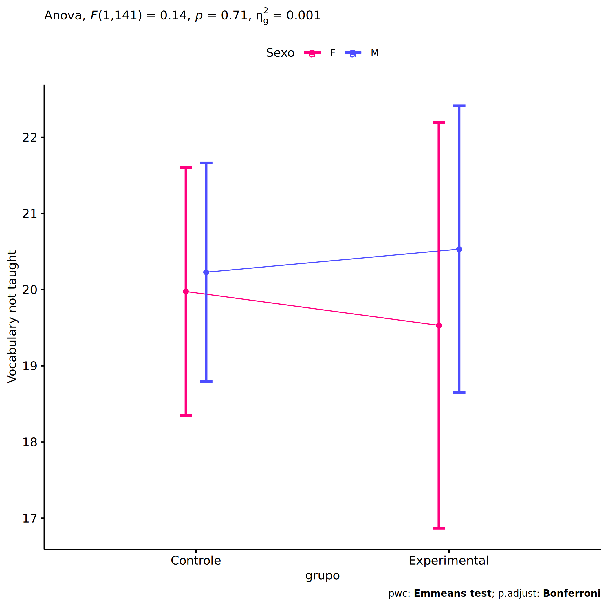
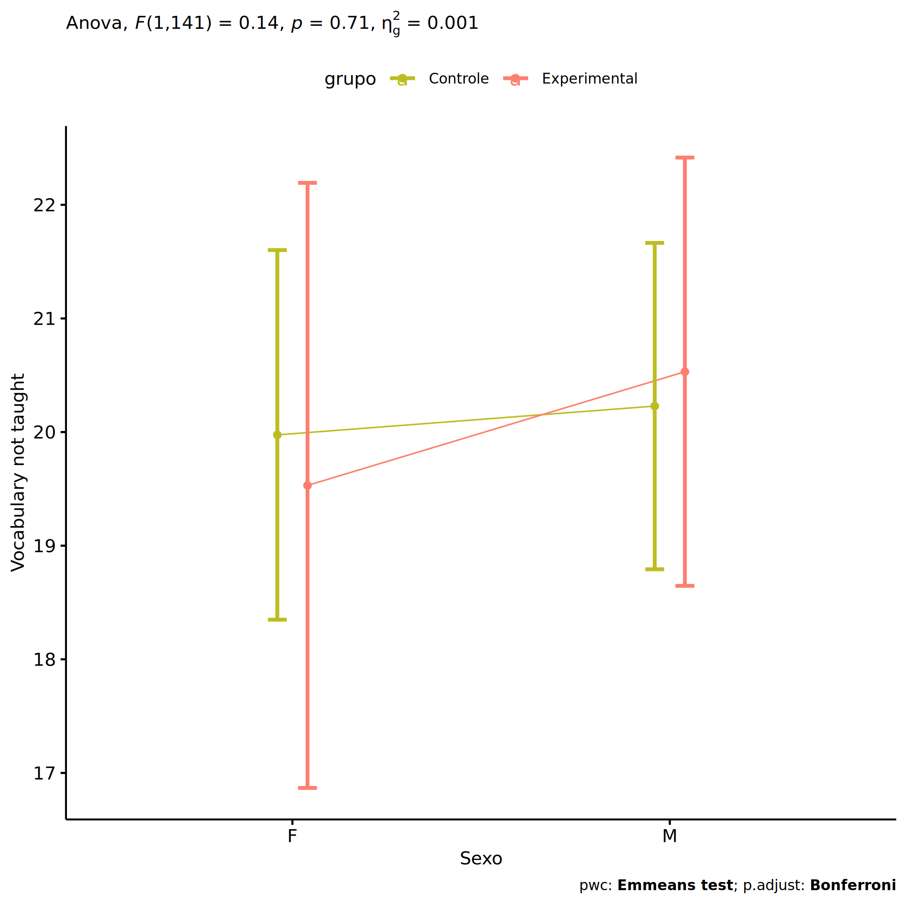
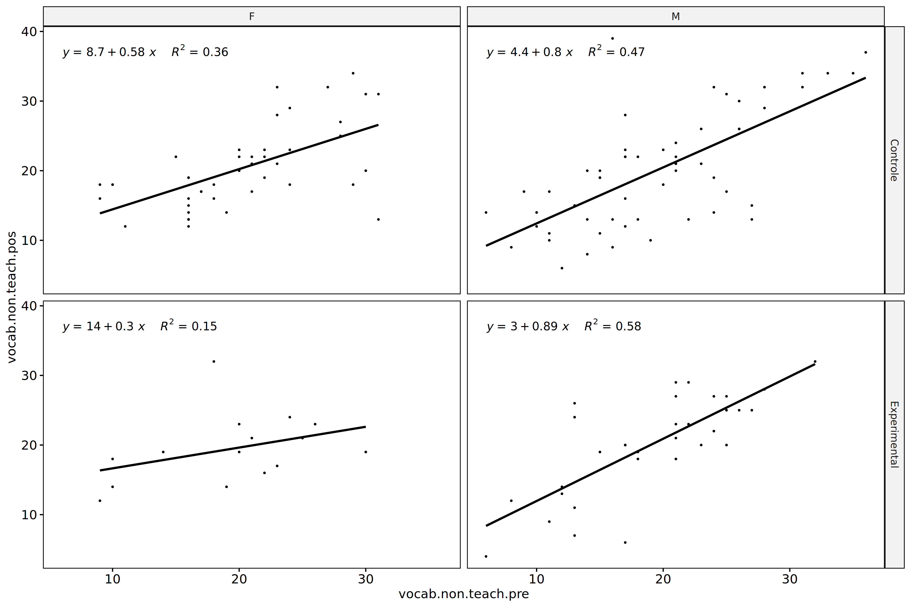
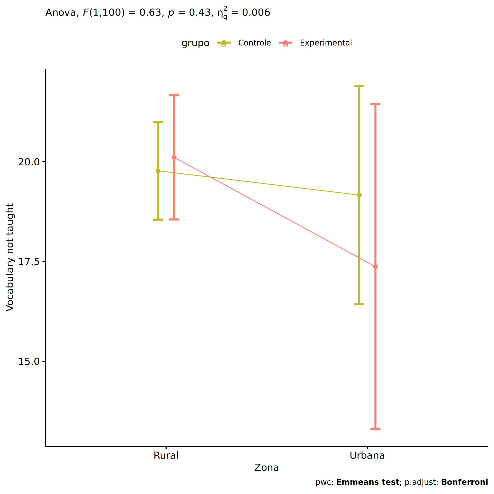
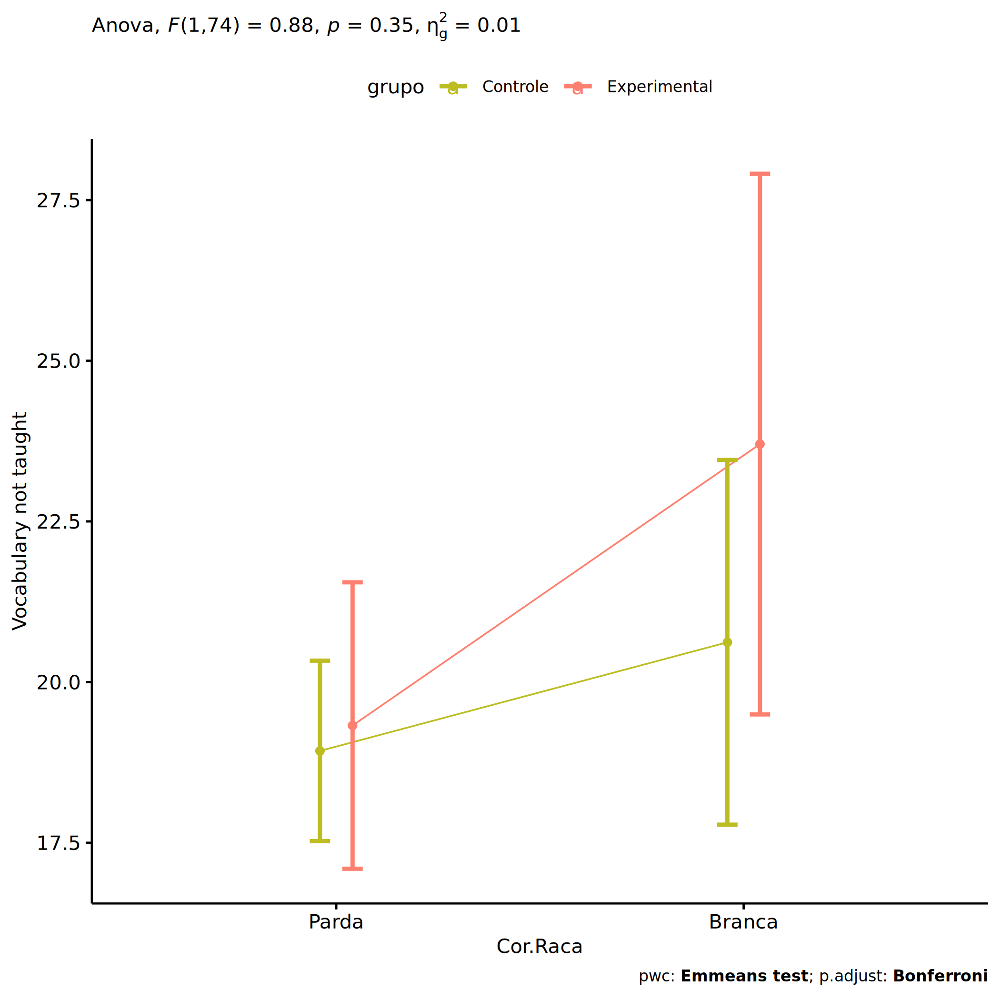

ANCOVA in Vocabulario Não Ensinado (Vocabulario Não Ensinado)
================
Geiser C. Challco <geiser@alumni.usp.br>

- [Descriptive Statistics of Initial
  Data](#descriptive-statistics-of-initial-data)
- [ANCOVA and Pairwise for one factor:
  **grupo**](#ancova-and-pairwise-for-one-factor-grupo)
  - [Without remove non-normal data](#without-remove-non-normal-data)
  - [Computing ANCOVA and PairWise After removing non-normal data
    (OK)](#computing-ancova-and-pairwise-after-removing-non-normal-data-ok)
    - [Plots for ancova](#plots-for-ancova)
    - [Checking linearity assumption](#checking-linearity-assumption)
    - [Checking normality and
      homogeneity](#checking-normality-and-homogeneity)
- [ANCOVA and Pairwise for two factors
  **grupo:Sexo**](#ancova-and-pairwise-for-two-factors-gruposexo)
  - [Without remove non-normal data](#without-remove-non-normal-data-1)
  - [Computing ANCOVA and PairWise After removing non-normal data
    (OK)](#computing-ancova-and-pairwise-after-removing-non-normal-data-ok-1)
    - [Plots for ancova](#plots-for-ancova-1)
    - [Checking linearity assumption](#checking-linearity-assumption-1)
    - [Checking normality and
      homogeneity](#checking-normality-and-homogeneity-1)
- [ANCOVA and Pairwise for two factors
  **grupo:Zona**](#ancova-and-pairwise-for-two-factors-grupozona)
  - [Without remove non-normal data](#without-remove-non-normal-data-2)
  - [Computing ANCOVA and PairWise After removing non-normal data
    (OK)](#computing-ancova-and-pairwise-after-removing-non-normal-data-ok-2)
    - [Plots for ancova](#plots-for-ancova-2)
    - [Checking linearity assumption](#checking-linearity-assumption-2)
    - [Checking normality and
      homogeneity](#checking-normality-and-homogeneity-2)
- [ANCOVA and Pairwise for two factors
  **grupo:Cor.Raca**](#ancova-and-pairwise-for-two-factors-grupocorraca)
  - [Without remove non-normal data](#without-remove-non-normal-data-3)
  - [Computing ANCOVA and PairWise After removing non-normal data
    (OK)](#computing-ancova-and-pairwise-after-removing-non-normal-data-ok-3)
    - [Plots for ancova](#plots-for-ancova-3)
    - [Checking linearity assumption](#checking-linearity-assumption-3)
    - [Checking normality and
      homogeneity](#checking-normality-and-homogeneity-3)
- [ANCOVA and Pairwise for two factors
  **grupo:Serie**](#ancova-and-pairwise-for-two-factors-gruposerie)
  - [Without remove non-normal data](#without-remove-non-normal-data-4)
  - [Computing ANCOVA and PairWise After removing non-normal data
    (OK)](#computing-ancova-and-pairwise-after-removing-non-normal-data-ok-4)
    - [Plots for ancova](#plots-for-ancova-4)
    - [Checking linearity assumption](#checking-linearity-assumption-4)
    - [Checking normality and
      homogeneity](#checking-normality-and-homogeneity-4)
- [ANCOVA and Pairwise for two factors
  **grupo:vocab.non.teach.quintile**](#ancova-and-pairwise-for-two-factors-grupovocabnonteachquintile)
  - [Without remove non-normal data](#without-remove-non-normal-data-5)
  - [Computing ANCOVA and PairWise After removing non-normal data
    (OK)](#computing-ancova-and-pairwise-after-removing-non-normal-data-ok-5)
    - [Plots for ancova](#plots-for-ancova-5)
    - [Checking linearity assumption](#checking-linearity-assumption-5)
    - [Checking normality and
      homogeneity](#checking-normality-and-homogeneity-5)
- [Summary of Results](#summary-of-results)
  - [Descriptive Statistics](#descriptive-statistics)
  - [ANCOVA Table Comparison](#ancova-table-comparison)
  - [PairWise Table Comparison](#pairwise-table-comparison)
  - [EMMS Table Comparison](#emms-table-comparison)

**NOTE**:

- Teste ANCOVA para determinar se houve diferenças significativas no
  Vocabulario Não Ensinado (medido usando pre- e pos-testes).
- ANCOVA test to determine whether there were significant differences in
  Vocabulario Não Ensinado (measured using pre- and post-tests).

# Descriptive Statistics of Initial Data

``` r
df <- get.descriptives(dat, c(dv.pre, dv.pos), c("grupo"), 
                       include.global = T, symmetry.test = T, normality.test = F)
df <- plyr::rbind.fill(
  df, do.call(plyr::rbind.fill, lapply(lfatores2, FUN = function(f) {
    if (nrow(dat) > 0 && sum(!is.na(unique(dat[[f]]))) > 1)
      get.descriptives(dat, c(dv.pre,dv.pos), c("grupo", f),
                       symmetry.test = T, normality.test = F)
    }))
)
```

    ## Warning: There was 1 warning in `mutate()`.
    ## ℹ In argument: `ci = abs(stats::qt(alpha/2, .data$n - 1) * .data$se)`.
    ## Caused by warning:
    ## ! There was 1 warning in `mutate()`.
    ## ℹ In argument: `ci = abs(stats::qt(alpha/2, .data$n - 1) * .data$se)`.
    ## Caused by warning in `stats::qt()`:
    ## ! NaNs produced
    ## There was 1 warning in `mutate()`.
    ## ℹ In argument: `ci = abs(stats::qt(alpha/2, .data$n - 1) * .data$se)`.
    ## Caused by warning:
    ## ! There was 1 warning in `mutate()`.
    ## ℹ In argument: `ci = abs(stats::qt(alpha/2, .data$n - 1) * .data$se)`.
    ## Caused by warning in `stats::qt()`:
    ## ! NaNs produced

``` r
(df <- df[,c(fatores1[fatores1 %in% colnames(df)],"variable",
             colnames(df)[!colnames(df) %in% c(fatores1,"variable")])])
```

    ##           grupo Sexo   Zona Cor.Raca Serie vocab.non.teach.quintile            variable   n   mean
    ## 1      Controle <NA>   <NA>     <NA>  <NA>                     <NA> vocab.non.teach.pre  98 19.898
    ## 2  Experimental <NA>   <NA>     <NA>  <NA>                     <NA> vocab.non.teach.pre  48 19.312
    ## 3          <NA> <NA>   <NA>     <NA>  <NA>                     <NA> vocab.non.teach.pre 146 19.705
    ## 4      Controle <NA>   <NA>     <NA>  <NA>                     <NA> vocab.non.teach.pos  98 20.255
    ## 5  Experimental <NA>   <NA>     <NA>  <NA>                     <NA> vocab.non.teach.pos  48 19.917
    ## 6          <NA> <NA>   <NA>     <NA>  <NA>                     <NA> vocab.non.teach.pos 146 20.144
    ## 7      Controle    F   <NA>     <NA>  <NA>                     <NA> vocab.non.teach.pre  43 20.326
    ## 8      Controle    M   <NA>     <NA>  <NA>                     <NA> vocab.non.teach.pre  55 19.564
    ## 9  Experimental    F   <NA>     <NA>  <NA>                     <NA> vocab.non.teach.pre  16 19.750
    ## 10 Experimental    M   <NA>     <NA>  <NA>                     <NA> vocab.non.teach.pre  32 19.094
    ## 11     Controle    F   <NA>     <NA>  <NA>                     <NA> vocab.non.teach.pos  43 20.419
    ## 12     Controle    M   <NA>     <NA>  <NA>                     <NA> vocab.non.teach.pos  55 20.127
    ## 13 Experimental    F   <NA>     <NA>  <NA>                     <NA> vocab.non.teach.pos  16 19.562
    ## 14 Experimental    M   <NA>     <NA>  <NA>                     <NA> vocab.non.teach.pos  32 20.094
    ## 15     Controle <NA>  Rural     <NA>  <NA>                     <NA> vocab.non.teach.pre  56 19.768
    ## 16     Controle <NA> Urbana     <NA>  <NA>                     <NA> vocab.non.teach.pre  11 18.182
    ## 17     Controle <NA>   <NA>     <NA>  <NA>                     <NA> vocab.non.teach.pre  31 20.742
    ## 18 Experimental <NA>  Rural     <NA>  <NA>                     <NA> vocab.non.teach.pre  34 18.882
    ## 19 Experimental <NA> Urbana     <NA>  <NA>                     <NA> vocab.non.teach.pre   5 22.400
    ## 20 Experimental <NA>   <NA>     <NA>  <NA>                     <NA> vocab.non.teach.pre   9 19.222
    ## 21     Controle <NA>  Rural     <NA>  <NA>                     <NA> vocab.non.teach.pos  56 20.411
    ## 22     Controle <NA> Urbana     <NA>  <NA>                     <NA> vocab.non.teach.pos  11 18.091
    ## 23     Controle <NA>   <NA>     <NA>  <NA>                     <NA> vocab.non.teach.pos  31 20.742
    ## 24 Experimental <NA>  Rural     <NA>  <NA>                     <NA> vocab.non.teach.pos  34 19.618
    ## 25 Experimental <NA> Urbana     <NA>  <NA>                     <NA> vocab.non.teach.pos   5 19.800
    ## 26 Experimental <NA>   <NA>     <NA>  <NA>                     <NA> vocab.non.teach.pos   9 21.111
    ## 27     Controle <NA>   <NA>   Branca  <NA>                     <NA> vocab.non.teach.pre  11 19.545
    ## 28     Controle <NA>   <NA> Indígena  <NA>                     <NA> vocab.non.teach.pre   3 23.667
    ## 29     Controle <NA>   <NA>    Parda  <NA>                     <NA> vocab.non.teach.pre  45 19.289
    ## 30     Controle <NA>   <NA>    Preta  <NA>                     <NA> vocab.non.teach.pre   1 14.000
    ## 31     Controle <NA>   <NA>     <NA>  <NA>                     <NA> vocab.non.teach.pre  38 20.579
    ## 32 Experimental <NA>   <NA>   Branca  <NA>                     <NA> vocab.non.teach.pre   5 18.200
    ## 33 Experimental <NA>   <NA> Indígena  <NA>                     <NA> vocab.non.teach.pre   6 21.000
    ## 34 Experimental <NA>   <NA>    Parda  <NA>                     <NA> vocab.non.teach.pre  18 17.444
    ## 35 Experimental <NA>   <NA>     <NA>  <NA>                     <NA> vocab.non.teach.pre  19 20.842
    ## 36     Controle <NA>   <NA>   Branca  <NA>                     <NA> vocab.non.teach.pos  11 21.182
    ## 37     Controle <NA>   <NA> Indígena  <NA>                     <NA> vocab.non.teach.pos   3 24.000
    ## 38     Controle <NA>   <NA>    Parda  <NA>                     <NA> vocab.non.teach.pos  45 19.289
    ## 39     Controle <NA>   <NA>    Preta  <NA>                     <NA> vocab.non.teach.pos   1 20.000
    ## 40     Controle <NA>   <NA>     <NA>  <NA>                     <NA> vocab.non.teach.pos  38 20.842
    ## 41 Experimental <NA>   <NA>   Branca  <NA>                     <NA> vocab.non.teach.pos   5 23.200
    ## 42 Experimental <NA>   <NA> Indígena  <NA>                     <NA> vocab.non.teach.pos   6 17.667
    ## 43 Experimental <NA>   <NA>    Parda  <NA>                     <NA> vocab.non.teach.pos  18 18.222
    ## 44 Experimental <NA>   <NA>     <NA>  <NA>                     <NA> vocab.non.teach.pos  19 21.368
    ## 45     Controle <NA>   <NA>     <NA> 6 ano                     <NA> vocab.non.teach.pre  26 15.962
    ## 46     Controle <NA>   <NA>     <NA> 7 ano                     <NA> vocab.non.teach.pre  28 19.214
    ## 47     Controle <NA>   <NA>     <NA> 8 ano                     <NA> vocab.non.teach.pre  17 20.059
    ## 48     Controle <NA>   <NA>     <NA> 9 ano                     <NA> vocab.non.teach.pre  27 24.296
    ## 49 Experimental <NA>   <NA>     <NA> 6 ano                     <NA> vocab.non.teach.pre  13 18.308
    ## 50 Experimental <NA>   <NA>     <NA> 7 ano                     <NA> vocab.non.teach.pre  13 20.385
    ## 51 Experimental <NA>   <NA>     <NA> 8 ano                     <NA> vocab.non.teach.pre  14 18.286
    ## 52 Experimental <NA>   <NA>     <NA> 9 ano                     <NA> vocab.non.teach.pre   8 21.000
    ##    median min max    sd    se    ci   iqr symmetry     skewness    kurtosis
    ## 1    20.0   6  36 6.626 0.669 1.328  8.00      YES  0.204260839 -0.58840545
    ## 2    21.0   6  32 6.158 0.889 1.788 10.25      YES -0.246887447 -0.80341805
    ## 3    20.0   6  36 6.461 0.535 1.057  8.75      YES  0.086669668 -0.56781744
    ## 4    19.0   6  39 7.307 0.738 1.465  9.50      YES  0.496018114 -0.49436208
    ## 5    20.0   4  32 6.519 0.941 1.893  7.50      YES -0.408888206 -0.27139065
    ## 6    20.0   4  39 7.037 0.582 1.151  9.00      YES  0.273040894 -0.34377862
    ## 7    20.0   9  31 6.113 0.932 1.881  8.00      YES  0.015635140 -0.80870478
    ## 8    18.0   6  36 7.039 0.949 1.903  9.50      YES  0.330476054 -0.56522737
    ## 9    20.5   9  30 6.202 1.551 3.305  7.25      YES -0.407888817 -1.01137657
    ## 10   21.0   6  32 6.224 1.100 2.244 11.00      YES -0.153066685 -0.80816683
    ## 11   19.0  12  34 5.889 0.898 1.812  6.50       NO  0.674158691 -0.45812177
    ## 12   19.0   6  39 8.300 1.119 2.244 13.00      YES  0.437359591 -0.81244195
    ## 13   19.0  12  32 4.802 1.201 2.559  4.75       NO  0.710122413  0.52586084
    ## 14   20.5   4  32 7.293 1.289 2.629  8.25       NO -0.580484085 -0.64768023
    ## 15   20.0   8  36 6.185 0.827 1.656  8.25      YES  0.260456141 -0.49266561
    ## 16   17.0   6  35 8.364 2.522 5.619  8.50      YES  0.449929434 -0.75501868
    ## 17   21.0   9  33 6.831 1.227 2.506 10.00      YES  0.039704160 -1.06023707
    ## 18   20.5   6  32 6.285 1.078 2.193 10.75      YES -0.206834983 -0.86329419
    ## 19   22.0  12  30 7.127 3.187 8.850  8.00      YES -0.289533155 -1.75600967
    ## 20   21.0  10  25 5.263 1.754 4.045  5.00       NO -0.596026462 -1.28081384
    ## 21   19.5   6  39 7.567 1.011 2.027  9.75      YES  0.368747327 -0.49623318
    ## 22   17.0   9  34 7.190 2.168 4.830  7.50       NO  0.731897136 -0.33217113
    ## 23   19.0  12  34 6.957 1.249 2.552  8.50       NO  0.660555072 -0.91625597
    ## 24   20.5   4  32 6.950 1.192 2.425  9.75       NO -0.533068946 -0.52528317
    ## 25   19.0  13  28 5.891 2.634 7.314  7.00      YES  0.209700026 -1.84175834
    ## 26   19.0  14  32 5.578 1.859 4.287  5.00       NO  0.642878055 -0.89644180
    ## 27   21.0  10  28 6.314 1.904 4.242  9.00      YES -0.366216184 -1.50583903
    ## 28   22.0  21  28 3.786 2.186 9.405  3.50 few data  0.000000000  0.00000000
    ## 29   18.0   8  36 6.388 0.952 1.919  7.00      YES  0.424973972 -0.27569660
    ## 30   14.0  14  14    NA    NA   NaN  0.00 few data  0.000000000  0.00000000
    ## 31   19.5   6  35 7.210 1.170 2.370 11.00      YES  0.090458941 -0.88255936
    ## 32   20.0  12  25 5.541 2.478 6.880  8.00      YES -0.043174280 -2.06229329
    ## 33   20.0  17  26 3.742 1.528 3.927  5.75      YES  0.286351331 -1.95068027
    ## 34   17.0   6  32 7.350 1.732 3.655 11.25      YES  0.181287817 -1.15288868
    ## 35   22.0  10  30 5.480 1.257 2.641  6.50      YES -0.437182051 -0.84672361
    ## 36   22.0  12  32 7.209 2.173 4.843 12.50      YES  0.007401147 -1.70196611
    ## 37   23.0  22  27 2.646 1.528 6.572  2.50 few data  0.000000000  0.00000000
    ## 38   18.0   6  37 7.005 1.044 2.105  7.00      YES  0.448392717 -0.18674289
    ## 39   20.0  20  20    NA    NA   NaN  0.00 few data  0.000000000  0.00000000
    ## 40   19.5  10  39 8.019 1.301 2.636 10.50       NO  0.628360228 -0.88439028
    ## 41   25.0  13  29 6.099 2.728 7.573  3.00       NO -0.738967627 -1.26165800
    ## 42   20.0   6  23 6.623 2.704 6.951  7.25       NO -0.742557713 -1.22862486
    ## 43   19.5   4  32 7.076 1.668 3.519 10.75      YES -0.072392226 -0.74797836
    ## 44   21.0   7  32 5.785 1.327 2.788  7.00      YES -0.327773953  0.11171526
    ## 45   16.0   8  24 4.845 0.950 1.957  9.50      YES  0.034730436 -1.40766895
    ## 46   19.0   9  30 5.273 0.996 2.045  7.25      YES -0.003624157 -0.78833872
    ## 47   17.0   6  36 8.518 2.066 4.380 12.00       NO  0.506524860 -0.87872786
    ## 48   25.0   9  33 5.621 1.082 2.224  7.00       NO -0.671132798  0.01412909
    ## 49   20.0   8  27 6.074 1.685 3.671  8.00      YES -0.248172683 -1.42481724
    ## 50   19.0  11  32 6.715 1.862 4.058  7.00      YES  0.205267198 -1.32753278
    ## 51   19.5   6  28 7.130 1.906 4.117 12.25      YES -0.288272551 -1.49299396
    ## 52   21.5  15  25 3.207 1.134 2.681  2.25       NO -0.568394134 -0.97251157
    ##  [ reached 'max' / getOption("max.print") -- omitted 28 rows ]

| grupo        | Sexo | Zona   | Cor.Raca | Serie | vocab.non.teach.quintile | variable            |   n |   mean | median | min | max |    sd |    se |     ci |   iqr | symmetry | skewness | kurtosis |
|:-------------|:-----|:-------|:---------|:------|:-------------------------|:--------------------|----:|-------:|-------:|----:|----:|------:|------:|-------:|------:|:---------|---------:|---------:|
| Controle     |      |        |          |       |                          | vocab.non.teach.pre |  98 | 19.898 |   20.0 |   6 |  36 | 6.626 | 0.669 |  1.328 |  8.00 | YES      |    0.204 |   -0.588 |
| Experimental |      |        |          |       |                          | vocab.non.teach.pre |  48 | 19.312 |   21.0 |   6 |  32 | 6.158 | 0.889 |  1.788 | 10.25 | YES      |   -0.247 |   -0.803 |
|              |      |        |          |       |                          | vocab.non.teach.pre | 146 | 19.705 |   20.0 |   6 |  36 | 6.461 | 0.535 |  1.057 |  8.75 | YES      |    0.087 |   -0.568 |
| Controle     |      |        |          |       |                          | vocab.non.teach.pos |  98 | 20.255 |   19.0 |   6 |  39 | 7.307 | 0.738 |  1.465 |  9.50 | YES      |    0.496 |   -0.494 |
| Experimental |      |        |          |       |                          | vocab.non.teach.pos |  48 | 19.917 |   20.0 |   4 |  32 | 6.519 | 0.941 |  1.893 |  7.50 | YES      |   -0.409 |   -0.271 |
|              |      |        |          |       |                          | vocab.non.teach.pos | 146 | 20.144 |   20.0 |   4 |  39 | 7.037 | 0.582 |  1.151 |  9.00 | YES      |    0.273 |   -0.344 |
| Controle     | F    |        |          |       |                          | vocab.non.teach.pre |  43 | 20.326 |   20.0 |   9 |  31 | 6.113 | 0.932 |  1.881 |  8.00 | YES      |    0.016 |   -0.809 |
| Controle     | M    |        |          |       |                          | vocab.non.teach.pre |  55 | 19.564 |   18.0 |   6 |  36 | 7.039 | 0.949 |  1.903 |  9.50 | YES      |    0.330 |   -0.565 |
| Experimental | F    |        |          |       |                          | vocab.non.teach.pre |  16 | 19.750 |   20.5 |   9 |  30 | 6.202 | 1.551 |  3.305 |  7.25 | YES      |   -0.408 |   -1.011 |
| Experimental | M    |        |          |       |                          | vocab.non.teach.pre |  32 | 19.094 |   21.0 |   6 |  32 | 6.224 | 1.100 |  2.244 | 11.00 | YES      |   -0.153 |   -0.808 |
| Controle     | F    |        |          |       |                          | vocab.non.teach.pos |  43 | 20.419 |   19.0 |  12 |  34 | 5.889 | 0.898 |  1.812 |  6.50 | NO       |    0.674 |   -0.458 |
| Controle     | M    |        |          |       |                          | vocab.non.teach.pos |  55 | 20.127 |   19.0 |   6 |  39 | 8.300 | 1.119 |  2.244 | 13.00 | YES      |    0.437 |   -0.812 |
| Experimental | F    |        |          |       |                          | vocab.non.teach.pos |  16 | 19.562 |   19.0 |  12 |  32 | 4.802 | 1.201 |  2.559 |  4.75 | NO       |    0.710 |    0.526 |
| Experimental | M    |        |          |       |                          | vocab.non.teach.pos |  32 | 20.094 |   20.5 |   4 |  32 | 7.293 | 1.289 |  2.629 |  8.25 | NO       |   -0.580 |   -0.648 |
| Controle     |      | Rural  |          |       |                          | vocab.non.teach.pre |  56 | 19.768 |   20.0 |   8 |  36 | 6.185 | 0.827 |  1.656 |  8.25 | YES      |    0.260 |   -0.493 |
| Controle     |      | Urbana |          |       |                          | vocab.non.teach.pre |  11 | 18.182 |   17.0 |   6 |  35 | 8.364 | 2.522 |  5.619 |  8.50 | YES      |    0.450 |   -0.755 |
| Controle     |      |        |          |       |                          | vocab.non.teach.pre |  31 | 20.742 |   21.0 |   9 |  33 | 6.831 | 1.227 |  2.506 | 10.00 | YES      |    0.040 |   -1.060 |
| Experimental |      | Rural  |          |       |                          | vocab.non.teach.pre |  34 | 18.882 |   20.5 |   6 |  32 | 6.285 | 1.078 |  2.193 | 10.75 | YES      |   -0.207 |   -0.863 |
| Experimental |      | Urbana |          |       |                          | vocab.non.teach.pre |   5 | 22.400 |   22.0 |  12 |  30 | 7.127 | 3.187 |  8.850 |  8.00 | YES      |   -0.290 |   -1.756 |
| Experimental |      |        |          |       |                          | vocab.non.teach.pre |   9 | 19.222 |   21.0 |  10 |  25 | 5.263 | 1.754 |  4.045 |  5.00 | NO       |   -0.596 |   -1.281 |
| Controle     |      | Rural  |          |       |                          | vocab.non.teach.pos |  56 | 20.411 |   19.5 |   6 |  39 | 7.567 | 1.011 |  2.027 |  9.75 | YES      |    0.369 |   -0.496 |
| Controle     |      | Urbana |          |       |                          | vocab.non.teach.pos |  11 | 18.091 |   17.0 |   9 |  34 | 7.190 | 2.168 |  4.830 |  7.50 | NO       |    0.732 |   -0.332 |
| Controle     |      |        |          |       |                          | vocab.non.teach.pos |  31 | 20.742 |   19.0 |  12 |  34 | 6.957 | 1.249 |  2.552 |  8.50 | NO       |    0.661 |   -0.916 |
| Experimental |      | Rural  |          |       |                          | vocab.non.teach.pos |  34 | 19.618 |   20.5 |   4 |  32 | 6.950 | 1.192 |  2.425 |  9.75 | NO       |   -0.533 |   -0.525 |
| Experimental |      | Urbana |          |       |                          | vocab.non.teach.pos |   5 | 19.800 |   19.0 |  13 |  28 | 5.891 | 2.634 |  7.314 |  7.00 | YES      |    0.210 |   -1.842 |
| Experimental |      |        |          |       |                          | vocab.non.teach.pos |   9 | 21.111 |   19.0 |  14 |  32 | 5.578 | 1.859 |  4.287 |  5.00 | NO       |    0.643 |   -0.896 |
| Controle     |      |        | Branca   |       |                          | vocab.non.teach.pre |  11 | 19.545 |   21.0 |  10 |  28 | 6.314 | 1.904 |  4.242 |  9.00 | YES      |   -0.366 |   -1.506 |
| Controle     |      |        | Indígena |       |                          | vocab.non.teach.pre |   3 | 23.667 |   22.0 |  21 |  28 | 3.786 | 2.186 |  9.405 |  3.50 | few data |    0.000 |    0.000 |
| Controle     |      |        | Parda    |       |                          | vocab.non.teach.pre |  45 | 19.289 |   18.0 |   8 |  36 | 6.388 | 0.952 |  1.919 |  7.00 | YES      |    0.425 |   -0.276 |
| Controle     |      |        | Preta    |       |                          | vocab.non.teach.pre |   1 | 14.000 |   14.0 |  14 |  14 |       |       |        |  0.00 | few data |    0.000 |    0.000 |
| Controle     |      |        |          |       |                          | vocab.non.teach.pre |  38 | 20.579 |   19.5 |   6 |  35 | 7.210 | 1.170 |  2.370 | 11.00 | YES      |    0.090 |   -0.883 |
| Experimental |      |        | Branca   |       |                          | vocab.non.teach.pre |   5 | 18.200 |   20.0 |  12 |  25 | 5.541 | 2.478 |  6.880 |  8.00 | YES      |   -0.043 |   -2.062 |
| Experimental |      |        | Indígena |       |                          | vocab.non.teach.pre |   6 | 21.000 |   20.0 |  17 |  26 | 3.742 | 1.528 |  3.927 |  5.75 | YES      |    0.286 |   -1.951 |
| Experimental |      |        | Parda    |       |                          | vocab.non.teach.pre |  18 | 17.444 |   17.0 |   6 |  32 | 7.350 | 1.732 |  3.655 | 11.25 | YES      |    0.181 |   -1.153 |
| Experimental |      |        |          |       |                          | vocab.non.teach.pre |  19 | 20.842 |   22.0 |  10 |  30 | 5.480 | 1.257 |  2.641 |  6.50 | YES      |   -0.437 |   -0.847 |
| Controle     |      |        | Branca   |       |                          | vocab.non.teach.pos |  11 | 21.182 |   22.0 |  12 |  32 | 7.209 | 2.173 |  4.843 | 12.50 | YES      |    0.007 |   -1.702 |
| Controle     |      |        | Indígena |       |                          | vocab.non.teach.pos |   3 | 24.000 |   23.0 |  22 |  27 | 2.646 | 1.528 |  6.572 |  2.50 | few data |    0.000 |    0.000 |
| Controle     |      |        | Parda    |       |                          | vocab.non.teach.pos |  45 | 19.289 |   18.0 |   6 |  37 | 7.005 | 1.044 |  2.105 |  7.00 | YES      |    0.448 |   -0.187 |
| Controle     |      |        | Preta    |       |                          | vocab.non.teach.pos |   1 | 20.000 |   20.0 |  20 |  20 |       |       |        |  0.00 | few data |    0.000 |    0.000 |
| Controle     |      |        |          |       |                          | vocab.non.teach.pos |  38 | 20.842 |   19.5 |  10 |  39 | 8.019 | 1.301 |  2.636 | 10.50 | NO       |    0.628 |   -0.884 |
| Experimental |      |        | Branca   |       |                          | vocab.non.teach.pos |   5 | 23.200 |   25.0 |  13 |  29 | 6.099 | 2.728 |  7.573 |  3.00 | NO       |   -0.739 |   -1.262 |
| Experimental |      |        | Indígena |       |                          | vocab.non.teach.pos |   6 | 17.667 |   20.0 |   6 |  23 | 6.623 | 2.704 |  6.951 |  7.25 | NO       |   -0.743 |   -1.229 |
| Experimental |      |        | Parda    |       |                          | vocab.non.teach.pos |  18 | 18.222 |   19.5 |   4 |  32 | 7.076 | 1.668 |  3.519 | 10.75 | YES      |   -0.072 |   -0.748 |
| Experimental |      |        |          |       |                          | vocab.non.teach.pos |  19 | 21.368 |   21.0 |   7 |  32 | 5.785 | 1.327 |  2.788 |  7.00 | YES      |   -0.328 |    0.112 |
| Controle     |      |        |          | 6 ano |                          | vocab.non.teach.pre |  26 | 15.962 |   16.0 |   8 |  24 | 4.845 | 0.950 |  1.957 |  9.50 | YES      |    0.035 |   -1.408 |
| Controle     |      |        |          | 7 ano |                          | vocab.non.teach.pre |  28 | 19.214 |   19.0 |   9 |  30 | 5.273 | 0.996 |  2.045 |  7.25 | YES      |   -0.004 |   -0.788 |
| Controle     |      |        |          | 8 ano |                          | vocab.non.teach.pre |  17 | 20.059 |   17.0 |   6 |  36 | 8.518 | 2.066 |  4.380 | 12.00 | NO       |    0.507 |   -0.879 |
| Controle     |      |        |          | 9 ano |                          | vocab.non.teach.pre |  27 | 24.296 |   25.0 |   9 |  33 | 5.621 | 1.082 |  2.224 |  7.00 | NO       |   -0.671 |    0.014 |
| Experimental |      |        |          | 6 ano |                          | vocab.non.teach.pre |  13 | 18.308 |   20.0 |   8 |  27 | 6.074 | 1.685 |  3.671 |  8.00 | YES      |   -0.248 |   -1.425 |
| Experimental |      |        |          | 7 ano |                          | vocab.non.teach.pre |  13 | 20.385 |   19.0 |  11 |  32 | 6.715 | 1.862 |  4.058 |  7.00 | YES      |    0.205 |   -1.328 |
| Experimental |      |        |          | 8 ano |                          | vocab.non.teach.pre |  14 | 18.286 |   19.5 |   6 |  28 | 7.130 | 1.906 |  4.117 | 12.25 | YES      |   -0.288 |   -1.493 |
| Experimental |      |        |          | 9 ano |                          | vocab.non.teach.pre |   8 | 21.000 |   21.5 |  15 |  25 | 3.207 | 1.134 |  2.681 |  2.25 | NO       |   -0.568 |   -0.973 |
| Controle     |      |        |          | 6 ano |                          | vocab.non.teach.pos |  26 | 15.077 |   15.0 |   6 |  22 | 4.621 | 0.906 |  1.866 |  6.75 | YES      |   -0.043 |   -1.130 |
| Controle     |      |        |          | 7 ano |                          | vocab.non.teach.pos |  28 | 22.036 |   21.0 |   9 |  39 | 7.058 | 1.334 |  2.737 |  8.75 | YES      |    0.447 |   -0.490 |
| Controle     |      |        |          | 8 ano |                          | vocab.non.teach.pos |  17 | 19.824 |   18.0 |  10 |  37 | 8.087 | 1.961 |  4.158 |  9.00 | NO       |    0.817 |   -0.695 |
| Controle     |      |        |          | 9 ano |                          | vocab.non.teach.pos |  27 | 23.667 |   22.0 |  13 |  34 | 6.651 | 1.280 |  2.631 |  9.50 | YES      |    0.051 |   -1.226 |
| Experimental |      |        |          | 6 ano |                          | vocab.non.teach.pos |  13 | 18.462 |   20.0 |   7 |  27 | 5.825 | 1.616 |  3.520 |  7.00 | YES      |   -0.479 |   -0.983 |
| Experimental |      |        |          | 7 ano |                          | vocab.non.teach.pos |  13 | 19.462 |   20.0 |   6 |  32 | 7.378 | 2.046 |  4.459 | 10.00 | YES      |   -0.230 |   -0.980 |
| Experimental |      |        |          | 8 ano |                          | vocab.non.teach.pos |  14 | 19.857 |   18.5 |   4 |  29 | 7.004 | 1.872 |  4.044 |  7.75 | NO       |   -0.562 |   -0.507 |
| Experimental |      |        |          | 9 ano |                          | vocab.non.teach.pos |   8 | 23.125 |   22.5 |  16 |  32 | 5.167 | 1.827 |  4.320 |  4.00 | YES      |    0.416 |   -1.196 |
| Controle     |      |        |          |       | 1st quintile             | vocab.non.teach.pre |  15 | 10.000 |   10.0 |   6 |  13 | 1.690 | 0.436 |  0.936 |  2.00 | YES      |   -0.497 |    0.071 |
| Controle     |      |        |          |       | 2nd quintile             | vocab.non.teach.pre |  33 | 16.333 |   16.0 |  14 |  19 | 1.315 | 0.229 |  0.466 |  1.00 | YES      |    0.113 |   -0.583 |
| Controle     |      |        |          |       | 3rd quintile             | vocab.non.teach.pre |  27 | 22.000 |   22.0 |  20 |  24 | 1.468 | 0.282 |  0.581 |  2.00 | YES      |    0.070 |   -1.499 |
| Controle     |      |        |          |       | 4th quintile             | vocab.non.teach.pre |  14 | 27.071 |   27.0 |  25 |  29 | 1.328 | 0.355 |  0.767 |  2.00 | YES      |   -0.119 |   -1.360 |
| Controle     |      |        |          |       | 5th quintile             | vocab.non.teach.pre |   9 | 32.000 |   31.0 |  30 |  36 | 2.179 | 0.726 |  1.675 |  2.00 | NO       |    0.773 |   -1.158 |
| Experimental |      |        |          |       | 1st quintile             | vocab.non.teach.pre |  12 | 10.833 |   11.5 |   6 |  13 | 2.290 | 0.661 |  1.455 |  3.25 | NO       |   -0.688 |   -0.834 |
| Experimental |      |        |          |       | 2nd quintile             | vocab.non.teach.pre |   9 | 17.000 |   17.0 |  14 |  19 | 1.581 | 0.527 |  1.215 |  1.00 | NO       |   -0.675 |   -0.938 |
| Experimental |      |        |          |       | 3rd quintile             | vocab.non.teach.pre |  16 | 21.875 |   21.5 |  20 |  24 | 1.360 | 0.340 |  0.725 |  2.00 | YES      |    0.359 |   -1.309 |
| Experimental |      |        |          |       | 4th quintile             | vocab.non.teach.pre |   9 | 25.778 |   25.0 |  25 |  28 | 1.093 | 0.364 |  0.840 |  1.00 | NO       |    0.891 |   -0.784 |
| Experimental |      |        |          |       | 5th quintile             | vocab.non.teach.pre |   2 | 31.000 |   31.0 |  30 |  32 | 1.414 | 1.000 | 12.706 |  1.00 | few data |    0.000 |    0.000 |
| Controle     |      |        |          |       | 1st quintile             | vocab.non.teach.pos |  15 | 13.800 |   14.0 |   6 |  18 | 3.707 | 0.957 |  2.053 |  5.50 | YES      |   -0.489 |   -0.991 |
| Controle     |      |        |          |       | 2nd quintile             | vocab.non.teach.pos |  33 | 17.091 |   16.0 |   8 |  39 | 6.023 | 1.048 |  2.136 |  7.00 | NO       |    1.391 |    3.133 |
| Controle     |      |        |          |       | 3rd quintile             | vocab.non.teach.pos |  27 | 21.963 |   22.0 |  13 |  32 | 4.561 | 0.878 |  1.804 |  3.50 | YES      |    0.440 |    0.091 |
| Controle     |      |        |          |       | 4th quintile             | vocab.non.teach.pos |  14 | 25.357 |   26.5 |  13 |  34 | 6.890 | 1.842 |  3.978 | 11.00 | NO       |   -0.527 |   -1.296 |
| Controle     |      |        |          |       | 5th quintile             | vocab.non.teach.pos |   9 | 29.556 |   32.0 |  13 |  37 | 7.828 | 2.609 |  6.017 |  3.00 | NO       |   -1.092 |   -0.404 |
| Experimental |      |        |          |       | 1st quintile             | vocab.non.teach.pos |  12 | 13.667 |   12.5 |   4 |  26 | 6.401 | 1.848 |  4.067 |  4.50 | NO       |    0.550 |   -0.709 |
| Experimental |      |        |          |       | 2nd quintile             | vocab.non.teach.pos |   9 | 18.556 |   19.0 |   6 |  32 | 6.747 | 2.249 |  5.187 |  2.00 | YES      |    0.131 |    0.107 |
| Experimental |      |        |          |       | 3rd quintile             | vocab.non.teach.pos |  16 | 22.438 |   22.5 |  16 |  29 | 4.033 | 1.008 |  2.149 |  5.00 | YES      |    0.175 |   -1.170 |
| Experimental |      |        |          |       | 4th quintile             | vocab.non.teach.pos |   9 | 23.889 |   25.0 |  20 |  28 | 2.804 | 0.935 |  2.155 |  4.00 | YES      |   -0.020 |   -1.647 |
| Experimental |      |        |          |       | 5th quintile             | vocab.non.teach.pos |   2 | 25.500 |   25.5 |  19 |  32 | 9.192 | 6.500 | 82.590 |  6.50 | few data |    0.000 |    0.000 |

# ANCOVA and Pairwise for one factor: **grupo**

## Without remove non-normal data

``` r
pdat = remove_group_data(dat[!is.na(dat[["grupo"]]),], "vocab.non.teach.pos", "grupo")

pdat.long <- rbind(pdat[,c("id","grupo")], pdat[,c("id","grupo")])
pdat.long[["time"]] <- c(rep("pre", nrow(pdat)), rep("pos", nrow(pdat)))
pdat.long[["time"]] <- factor(pdat.long[["time"]], c("pre","pos"))
pdat.long[["vocab.non.teach"]] <- c(pdat[["vocab.non.teach.pre"]], pdat[["vocab.non.teach.pos"]])

aov = anova_test(pdat, vocab.non.teach.pos ~ vocab.non.teach.pre + grupo)
laov[["grupo"]] <- get_anova_table(aov)
```

``` r
pwc <- emmeans_test(pdat, vocab.non.teach.pos ~ grupo, covariate = vocab.non.teach.pre,
                    p.adjust.method = "bonferroni")
```

``` r
pwc.long <- emmeans_test(dplyr::group_by_at(pdat.long, "grupo"),
                          vocab.non.teach ~ time,
                          p.adjust.method = "bonferroni")
lpwc[["grupo"]] <- plyr::rbind.fill(pwc, pwc.long)
```

``` r
ds <- get.descriptives(pdat, "vocab.non.teach.pos", "grupo", covar = "vocab.non.teach.pre")
ds <- merge(ds[ds$variable != "vocab.non.teach.pre",],
            ds[ds$variable == "vocab.non.teach.pre", !colnames(ds) %in% c("variable")],
            by = "grupo", all.x = T, suffixes = c("", ".vocab.non.teach.pre"))
ds <- merge(get_emmeans(pwc), ds, by = "grupo", suffixes = c(".emms", ""))
ds <- ds[,c("grupo","n","mean.vocab.non.teach.pre","se.vocab.non.teach.pre","mean","se","emmean","se.emms")]

colnames(ds) <- c("grupo", "N", paste0(c("M","SE")," (pre)"),
                  paste0(c("M","SE"), " (unadj)"), paste0(c("M", "SE"), " (adj)"))

lemms[["grupo"]] <- ds
```

## Computing ANCOVA and PairWise After removing non-normal data (OK)

``` r
wdat = pdat 

res = residuals(lm(vocab.non.teach.pos ~ vocab.non.teach.pre + grupo, data = wdat))
non.normal = getNonNormal(res, wdat$id, plimit = 0.05)

wdat = wdat[!wdat$id %in% non.normal,]

wdat.long <- rbind(wdat[,c("id","grupo")], wdat[,c("id","grupo")])
wdat.long[["time"]] <- c(rep("pre", nrow(wdat)), rep("pos", nrow(wdat)))
wdat.long[["time"]] <- factor(wdat.long[["time"]], c("pre","pos"))
wdat.long[["vocab.non.teach"]] <- c(wdat[["vocab.non.teach.pre"]], wdat[["vocab.non.teach.pos"]])

ldat[["grupo"]] = wdat

(non.normal)
```

    ## NULL

``` r
aov = anova_test(wdat, vocab.non.teach.pos ~ vocab.non.teach.pre + grupo)
laov[["grupo"]] <- merge(get_anova_table(aov), laov[["grupo"]], by="Effect", suffixes = c("","'"))

(df = get_anova_table(aov))
```

    ## ANOVA Table (type II tests)
    ## 
    ##                Effect DFn DFd       F        p p<.05      ges
    ## 1 vocab.non.teach.pre   1 143 107.016 4.53e-19     * 4.28e-01
    ## 2               grupo   1 143   0.007 9.33e-01       4.89e-05

| Effect              | DFn | DFd |       F |     p | p\<.05 |   ges |
|:--------------------|----:|----:|--------:|------:|:-------|------:|
| vocab.non.teach.pre |   1 | 143 | 107.016 | 0.000 | \*     | 0.428 |
| grupo               |   1 | 143 |   0.007 | 0.933 |        | 0.000 |

| term                       | .y.                 | group1   | group2       |  df | statistic |     p | p.adj | p.adj.signif |
|:---------------------------|:--------------------|:---------|:-------------|----:|----------:|------:|------:|:-------------|
| vocab.non.teach.pre\*grupo | vocab.non.teach.pos | Controle | Experimental | 143 |    -0.084 | 0.933 | 0.933 | ns           |

``` r
pwc.long <- emmeans_test(dplyr::group_by_at(wdat.long, "grupo"),
                         vocab.non.teach ~ time,
                         p.adjust.method = "bonferroni")
lpwc[["grupo"]] <- merge(plyr::rbind.fill(pwc, pwc.long), lpwc[["grupo"]], by=c("grupo","term",".y.","group1","group2"), suffixes = c("","'"))
```

| grupo        | term | .y.             | group1 | group2 |  df | statistic |     p | p.adj | p.adj.signif |
|:-------------|:-----|:----------------|:-------|:-------|----:|----------:|------:|------:|:-------------|
| Controle     | time | vocab.non.teach | pre    | pos    | 288 |    -0.369 | 0.712 | 0.712 | ns           |
| Experimental | time | vocab.non.teach | pre    | pos    | 288 |    -0.437 | 0.663 | 0.663 | ns           |

``` r
ds <- get.descriptives(wdat, "vocab.non.teach.pos", "grupo", covar = "vocab.non.teach.pre")
ds <- merge(ds[ds$variable != "vocab.non.teach.pre",],
            ds[ds$variable == "vocab.non.teach.pre", !colnames(ds) %in% c("variable")],
            by = "grupo", all.x = T, suffixes = c("", ".vocab.non.teach.pre"))
ds <- merge(get_emmeans(pwc), ds, by = "grupo", suffixes = c(".emms", ""))
ds <- ds[,c("grupo","n","mean.vocab.non.teach.pre","se.vocab.non.teach.pre","mean","se","emmean","se.emms")]

colnames(ds) <- c("grupo", "N", paste0(c("M","SE")," (pre)"),
                  paste0(c("M","SE"), " (unadj)"), paste0(c("M", "SE"), " (adj)"))

lemms[["grupo"]] <- merge(ds, lemms[["grupo"]], by=c("grupo"), suffixes = c("","'"))
```

| grupo        |   N | M (pre) | SE (pre) | M (unadj) | SE (unadj) | M (adj) | SE (adj) |
|:-------------|----:|--------:|---------:|----------:|-----------:|--------:|---------:|
| Controle     |  98 |  19.898 |    0.669 |    20.255 |      0.738 |  20.118 |    0.541 |
| Experimental |  48 |  19.312 |    0.889 |    19.917 |      0.941 |  20.197 |    0.774 |

### Plots for ancova

``` r
plots <- oneWayAncovaPlots(
  wdat, "vocab.non.teach.pos", "grupo", aov, list("grupo"=pwc), addParam = c("mean_se"),
  font.label.size=10, step.increase=0.05, p.label="p.adj",
  subtitle = which(aov$Effect == "grupo"))
```

``` r
if (!is.null(nrow(plots[["grupo"]]$data)))
  plots[["grupo"]] + ggplot2::scale_color_manual(values = color[["grupo"]])
```

    ## Scale for colour is already present.
    ## Adding another scale for colour, which will replace the existing scale.

<!-- -->

``` r
plots <- oneWayAncovaBoxPlots(
  wdat, "vocab.non.teach.pos", "grupo", aov, pwc, covar = "vocab.non.teach.pre",
  theme = "classic", color = color[["grupo"]],
  subtitle = which(aov$Effect == "grupo"))
```

``` r
if (length(unique(wdat[["grupo"]])) > 1)
  plots[["grupo"]] + ggplot2::ylab("Vocabulario Não Ensinado") + ggplot2::scale_x_discrete(labels=c('pre', 'pos'))
```

<!-- -->

``` r
if (length(unique(wdat.long[["grupo"]])) > 1)
  plots <- oneWayAncovaBoxPlots(
    wdat.long, "vocab.non.teach", "grupo", aov, pwc.long, pre.post = "time",
    theme = "classic", color = color$prepost)
```

``` r
if (length(unique(wdat.long[["grupo"]])) > 1)
  plots[["grupo"]] + ggplot2::ylab("Vocabulario Não Ensinado")
```

<!-- -->

### Checking linearity assumption

``` r
ggscatter(wdat, x = "vocab.non.teach.pre", y = "vocab.non.teach.pos", size = 0.5,
          color = "grupo", add = "reg.line")+
  stat_regline_equation(
    aes(label =  paste(..eq.label.., ..rr.label.., sep = "~~~~"), color = grupo)
  )
```

<!-- -->

### Checking normality and homogeneity

``` r
res <- augment(lm(vocab.non.teach.pos ~ vocab.non.teach.pre + grupo, data = wdat))
```

``` r
shapiro_test(res$.resid)
```

    ## # A tibble: 1 × 3
    ##   variable   statistic p.value
    ##   <chr>          <dbl>   <dbl>
    ## 1 res$.resid     0.984  0.0776

``` r
levene_test(res, .resid ~ grupo)
```

    ## # A tibble: 1 × 4
    ##     df1   df2 statistic     p
    ##   <int> <int>     <dbl> <dbl>
    ## 1     1   144      1.39 0.240

# ANCOVA and Pairwise for two factors **grupo:Sexo**

## Without remove non-normal data

``` r
pdat = remove_group_data(dat[!is.na(dat[["grupo"]]) & !is.na(dat[["Sexo"]]),], "vocab.non.teach.pos", c("grupo","Sexo"))

pdat.long <- rbind(pdat[,c("id","grupo","Sexo")], pdat[,c("id","grupo","Sexo")])
pdat.long[["time"]] <- c(rep("pre", nrow(pdat)), rep("pos", nrow(pdat)))
pdat.long[["time"]] <- factor(pdat.long[["time"]], c("pre","pos"))
pdat.long[["vocab.non.teach"]] <- c(pdat[["vocab.non.teach.pre"]], pdat[["vocab.non.teach.pos"]])

aov = anova_test(pdat, vocab.non.teach.pos ~ vocab.non.teach.pre + grupo*Sexo)
laov[["grupo:Sexo"]] <- get_anova_table(aov)
```

``` r
pwcs <- list()
pwcs[["Sexo"]] <- emmeans_test(
  group_by(pdat, grupo), vocab.non.teach.pos ~ Sexo,
  covariate = vocab.non.teach.pre, p.adjust.method = "bonferroni")
pwcs[["grupo"]] <- emmeans_test(
  group_by(pdat, Sexo), vocab.non.teach.pos ~ grupo,
  covariate = vocab.non.teach.pre, p.adjust.method = "bonferroni")

pwc <- plyr::rbind.fill(pwcs[["grupo"]], pwcs[["Sexo"]])
pwc <- pwc[,c("grupo","Sexo", colnames(pwc)[!colnames(pwc) %in% c("grupo","Sexo")])]
```

``` r
pwc.long <- emmeans_test(dplyr::group_by_at(pdat.long, c("grupo","Sexo")),
                         vocab.non.teach ~ time,
                         p.adjust.method = "bonferroni")
lpwc[["grupo:Sexo"]] <- plyr::rbind.fill(pwc, pwc.long)
```

``` r
ds <- get.descriptives(pdat, "vocab.non.teach.pos", c("grupo","Sexo"), covar = "vocab.non.teach.pre")
ds <- merge(ds[ds$variable != "vocab.non.teach.pre",],
            ds[ds$variable == "vocab.non.teach.pre", !colnames(ds) %in% c("variable")],
            by = c("grupo","Sexo"), all.x = T, suffixes = c("", ".vocab.non.teach.pre"))
ds <- merge(get_emmeans(pwcs[["grupo"]]), ds, by = c("grupo","Sexo"), suffixes = c(".emms", ""))
ds <- ds[,c("grupo","Sexo","n","mean.vocab.non.teach.pre","se.vocab.non.teach.pre","mean","se","emmean","se.emms")]

colnames(ds) <- c("grupo","Sexo", "N", paste0(c("M","SE")," (pre)"),
                  paste0(c("M","SE"), " (unadj)"), paste0(c("M", "SE"), " (adj)"))

lemms[["grupo:Sexo"]] <- ds
```

## Computing ANCOVA and PairWise After removing non-normal data (OK)

``` r
wdat = pdat 

res = residuals(lm(vocab.non.teach.pos ~ vocab.non.teach.pre + grupo*Sexo, data = wdat))
non.normal = getNonNormal(res, wdat$id, plimit = 0.05)

wdat = wdat[!wdat$id %in% non.normal,]

wdat.long <- rbind(wdat[,c("id","grupo","Sexo")], wdat[,c("id","grupo","Sexo")])
wdat.long[["time"]] <- c(rep("pre", nrow(wdat)), rep("pos", nrow(wdat)))
wdat.long[["time"]] <- factor(wdat.long[["time"]], c("pre","pos"))
wdat.long[["vocab.non.teach"]] <- c(wdat[["vocab.non.teach.pre"]], wdat[["vocab.non.teach.pos"]])


ldat[["grupo:Sexo"]] = wdat

(non.normal)
```

    ## NULL

``` r
aov = anova_test(wdat, vocab.non.teach.pos ~ vocab.non.teach.pre + grupo*Sexo)
laov[["grupo:Sexo"]] <- merge(get_anova_table(aov), laov[["grupo:Sexo"]], by="Effect", suffixes = c("","'"))

(df = get_anova_table(aov))
```

    ## ANOVA Table (type II tests)
    ## 
    ##                Effect DFn DFd          F        p p<.05      ges
    ## 1 vocab.non.teach.pre   1 141 106.080000 6.78e-19     * 4.29e-01
    ## 2               grupo   1 141   0.000945 9.76e-01       6.70e-06
    ## 3                Sexo   1 141   0.278000 5.99e-01       2.00e-03
    ## 4          grupo:Sexo   1 141   0.142000 7.07e-01       1.00e-03

| Effect              | DFn | DFd |       F |     p | p\<.05 |   ges |
|:--------------------|----:|----:|--------:|------:|:-------|------:|
| vocab.non.teach.pre |   1 | 141 | 106.080 | 0.000 | \*     | 0.429 |
| grupo               |   1 | 141 |   0.001 | 0.976 |        | 0.000 |
| Sexo                |   1 | 141 |   0.278 | 0.599 |        | 0.002 |
| grupo:Sexo          |   1 | 141 |   0.142 | 0.707 |        | 0.001 |

``` r
pwcs <- list()
pwcs[["Sexo"]] <- emmeans_test(
  group_by(wdat, grupo), vocab.non.teach.pos ~ Sexo,
  covariate = vocab.non.teach.pre, p.adjust.method = "bonferroni")
pwcs[["grupo"]] <- emmeans_test(
  group_by(wdat, Sexo), vocab.non.teach.pos ~ grupo,
  covariate = vocab.non.teach.pre, p.adjust.method = "bonferroni")

pwc <- plyr::rbind.fill(pwcs[["grupo"]], pwcs[["Sexo"]])
pwc <- pwc[,c("grupo","Sexo", colnames(pwc)[!colnames(pwc) %in% c("grupo","Sexo")])]
```

| grupo        | Sexo | term                       | .y.                 | group1   | group2       |  df | statistic |     p | p.adj | p.adj.signif |
|:-------------|:-----|:---------------------------|:--------------------|:---------|:-------------|----:|----------:|------:|------:|:-------------|
|              | F    | vocab.non.teach.pre\*grupo | vocab.non.teach.pos | Controle | Experimental | 141 |     0.282 | 0.779 | 0.779 | ns           |
|              | M    | vocab.non.teach.pre\*grupo | vocab.non.teach.pos | Controle | Experimental | 141 |    -0.252 | 0.801 | 0.801 | ns           |
| Controle     |      | vocab.non.teach.pre\*Sexo  | vocab.non.teach.pos | F        | M            | 141 |    -0.231 | 0.818 | 0.818 | ns           |
| Experimental |      | vocab.non.teach.pre\*Sexo  | vocab.non.teach.pos | F        | M            | 141 |    -0.606 | 0.545 | 0.545 | ns           |

``` r
pwc.long <- emmeans_test(dplyr::group_by_at(wdat.long, c("grupo","Sexo")),
                         vocab.non.teach ~ time,
                         p.adjust.method = "bonferroni")
lpwc[["grupo:Sexo"]] <- merge(plyr::rbind.fill(pwc, pwc.long), lpwc[["grupo:Sexo"]], by=c("grupo","Sexo","term",".y.","group1","group2"), suffixes = c("","'"))
```

| grupo        | Sexo | term | .y.             | group1 | group2 |  df | statistic |     p | p.adj | p.adj.signif |
|:-------------|:-----|:-----|:----------------|:-------|:-------|----:|----------:|------:|------:|:-------------|
| Controle     | F    | time | vocab.non.teach | pre    | pos    | 284 |    -0.063 | 0.950 | 0.950 | ns           |
| Controle     | M    | time | vocab.non.teach | pre    | pos    | 284 |    -0.434 | 0.665 | 0.665 | ns           |
| Experimental | F    | time | vocab.non.teach | pre    | pos    | 284 |     0.078 | 0.938 | 0.938 | ns           |
| Experimental | M    | time | vocab.non.teach | pre    | pos    | 284 |    -0.587 | 0.558 | 0.558 | ns           |

``` r
ds <- get.descriptives(wdat, "vocab.non.teach.pos", c("grupo","Sexo"), covar = "vocab.non.teach.pre")
ds <- merge(ds[ds$variable != "vocab.non.teach.pre",],
            ds[ds$variable == "vocab.non.teach.pre", !colnames(ds) %in% c("variable")],
            by = c("grupo","Sexo"), all.x = T, suffixes = c("", ".vocab.non.teach.pre"))
ds <- merge(get_emmeans(pwcs[["grupo"]]), ds, by = c("grupo","Sexo"), suffixes = c(".emms", ""))
ds <- ds[,c("grupo","Sexo","n","mean.vocab.non.teach.pre","se.vocab.non.teach.pre","mean","se","emmean","se.emms")]

colnames(ds) <- c("grupo","Sexo", "N", paste0(c("M","SE")," (pre)"),
                  paste0(c("M","SE"), " (unadj)"), paste0(c("M", "SE"), " (adj)"))

lemms[["grupo:Sexo"]] <- merge(ds, lemms[["grupo:Sexo"]], by=c("grupo","Sexo"), suffixes = c("","'"))
```

| grupo        | Sexo |   N | M (pre) | SE (pre) | M (unadj) | SE (unadj) | M (adj) | SE (adj) |
|:-------------|:-----|----:|--------:|---------:|----------:|-----------:|--------:|---------:|
| Controle     | F    |  43 |  20.326 |    0.932 |    20.419 |      0.898 |  19.975 |    0.823 |
| Controle     | M    |  55 |  19.564 |    0.949 |    20.127 |      1.119 |  20.229 |    0.727 |
| Experimental | F    |  16 |  19.750 |    1.551 |    19.562 |      1.201 |  19.531 |    1.347 |
| Experimental | M    |  32 |  19.094 |    1.100 |    20.094 |      1.289 |  20.531 |    0.953 |

### Plots for ancova

``` r
plots <- twoWayAncovaPlots(
  wdat, "vocab.non.teach.pos", c("grupo","Sexo"), aov, pwcs, addParam = c("mean_se"),
  font.label.size=10, step.increase=0.05, p.label="p.adj",
  subtitle = which(aov$Effect == "grupo:Sexo"))
```

``` r
if (!is.null(plots[["grupo"]]))
  plots[["grupo"]] + ggplot2::scale_color_manual(values = color[["Sexo"]])
```

    ## Scale for colour is already present.
    ## Adding another scale for colour, which will replace the existing scale.

<!-- -->

``` r
if (!is.null(plots[["Sexo"]]))
  plots[["Sexo"]] + ggplot2::scale_color_manual(values = color[["grupo"]])
```

    ## Scale for colour is already present.
    ## Adding another scale for colour, which will replace the existing scale.

<!-- -->

``` r
plots <- twoWayAncovaBoxPlots(
  wdat, "vocab.non.teach.pos", c("grupo","Sexo"), aov, pwcs, covar = "vocab.non.teach.pre",
  theme = "classic", color = color[["grupo:Sexo"]],
  subtitle = which(aov$Effect == "grupo:Sexo"))
```

``` r
plots[["grupo:Sexo"]] + ggplot2::ylab("Vocabulario Não Ensinado") + ggplot2::scale_x_discrete(labels=c('pre', 'pos'))
```

<!-- -->

``` r
plots <- twoWayAncovaBoxPlots(
  wdat.long, "vocab.non.teach", c("grupo","Sexo"), aov, pwc.long, pre.post = "time",
  theme = "classic", color = color$prepost)
```

``` r
plots[["grupo:Sexo"]] + ggplot2::ylab("Vocabulario Não Ensinado")
```

<!-- -->

### Checking linearity assumption

``` r
ggscatter(wdat, x = "vocab.non.teach.pre", y = "vocab.non.teach.pos", size = 0.5,
          facet.by = c("grupo","Sexo"), add = "reg.line")+
  stat_regline_equation(
    aes(label =  paste(..eq.label.., ..rr.label.., sep = "~~~~"))
  )
```

<!-- -->

### Checking normality and homogeneity

``` r
res <- augment(lm(vocab.non.teach.pos ~ vocab.non.teach.pre + grupo*Sexo, data = wdat))
```

``` r
shapiro_test(res$.resid)
```

    ## # A tibble: 1 × 3
    ##   variable   statistic p.value
    ##   <chr>          <dbl>   <dbl>
    ## 1 res$.resid     0.983  0.0615

``` r
levene_test(res, .resid ~ grupo*Sexo)
```

    ## # A tibble: 1 × 4
    ##     df1   df2 statistic     p
    ##   <int> <int>     <dbl> <dbl>
    ## 1     3   142      1.19 0.317

# ANCOVA and Pairwise for two factors **grupo:Zona**

## Without remove non-normal data

``` r
pdat = remove_group_data(dat[!is.na(dat[["grupo"]]) & !is.na(dat[["Zona"]]),], "vocab.non.teach.pos", c("grupo","Zona"))

pdat.long <- rbind(pdat[,c("id","grupo","Zona")], pdat[,c("id","grupo","Zona")])
pdat.long[["time"]] <- c(rep("pre", nrow(pdat)), rep("pos", nrow(pdat)))
pdat.long[["time"]] <- factor(pdat.long[["time"]], c("pre","pos"))
pdat.long[["vocab.non.teach"]] <- c(pdat[["vocab.non.teach.pre"]], pdat[["vocab.non.teach.pos"]])

aov = anova_test(pdat, vocab.non.teach.pos ~ vocab.non.teach.pre + grupo*Zona)
laov[["grupo:Zona"]] <- get_anova_table(aov)
```

``` r
pwcs <- list()
pwcs[["Zona"]] <- emmeans_test(
  group_by(pdat, grupo), vocab.non.teach.pos ~ Zona,
  covariate = vocab.non.teach.pre, p.adjust.method = "bonferroni")
pwcs[["grupo"]] <- emmeans_test(
  group_by(pdat, Zona), vocab.non.teach.pos ~ grupo,
  covariate = vocab.non.teach.pre, p.adjust.method = "bonferroni")

pwc <- plyr::rbind.fill(pwcs[["grupo"]], pwcs[["Zona"]])
pwc <- pwc[,c("grupo","Zona", colnames(pwc)[!colnames(pwc) %in% c("grupo","Zona")])]
```

``` r
pwc.long <- emmeans_test(dplyr::group_by_at(pdat.long, c("grupo","Zona")),
                         vocab.non.teach ~ time,
                         p.adjust.method = "bonferroni")
lpwc[["grupo:Zona"]] <- plyr::rbind.fill(pwc, pwc.long)
```

``` r
ds <- get.descriptives(pdat, "vocab.non.teach.pos", c("grupo","Zona"), covar = "vocab.non.teach.pre")
ds <- merge(ds[ds$variable != "vocab.non.teach.pre",],
            ds[ds$variable == "vocab.non.teach.pre", !colnames(ds) %in% c("variable")],
            by = c("grupo","Zona"), all.x = T, suffixes = c("", ".vocab.non.teach.pre"))
ds <- merge(get_emmeans(pwcs[["grupo"]]), ds, by = c("grupo","Zona"), suffixes = c(".emms", ""))
ds <- ds[,c("grupo","Zona","n","mean.vocab.non.teach.pre","se.vocab.non.teach.pre","mean","se","emmean","se.emms")]

colnames(ds) <- c("grupo","Zona", "N", paste0(c("M","SE")," (pre)"),
                  paste0(c("M","SE"), " (unadj)"), paste0(c("M", "SE"), " (adj)"))

lemms[["grupo:Zona"]] <- ds
```

## Computing ANCOVA and PairWise After removing non-normal data (OK)

``` r
wdat = pdat 

res = residuals(lm(vocab.non.teach.pos ~ vocab.non.teach.pre + grupo*Zona, data = wdat))
non.normal = getNonNormal(res, wdat$id, plimit = 0.05)

wdat = wdat[!wdat$id %in% non.normal,]

wdat.long <- rbind(wdat[,c("id","grupo","Zona")], wdat[,c("id","grupo","Zona")])
wdat.long[["time"]] <- c(rep("pre", nrow(wdat)), rep("pos", nrow(wdat)))
wdat.long[["time"]] <- factor(wdat.long[["time"]], c("pre","pos"))
wdat.long[["vocab.non.teach"]] <- c(wdat[["vocab.non.teach.pre"]], wdat[["vocab.non.teach.pos"]])


ldat[["grupo:Zona"]] = wdat

(non.normal)
```

    ## [1] "P3569"

``` r
aov = anova_test(wdat, vocab.non.teach.pos ~ vocab.non.teach.pre + grupo*Zona)
laov[["grupo:Zona"]] <- merge(get_anova_table(aov), laov[["grupo:Zona"]], by="Effect", suffixes = c("","'"))

(df = get_anova_table(aov))
```

    ## ANOVA Table (type II tests)
    ## 
    ##                Effect DFn DFd       F        p p<.05      ges
    ## 1 vocab.non.teach.pre   1 100 142.072 6.55e-21     * 5.87e-01
    ## 2               grupo   1 100   0.002 9.69e-01       1.51e-05
    ## 3                Zona   1 100   1.087 3.00e-01       1.10e-02
    ## 4          grupo:Zona   1 100   0.632 4.29e-01       6.00e-03

| Effect              | DFn | DFd |       F |     p | p\<.05 |   ges |
|:--------------------|----:|----:|--------:|------:|:-------|------:|
| vocab.non.teach.pre |   1 | 100 | 142.072 | 0.000 | \*     | 0.587 |
| grupo               |   1 | 100 |   0.002 | 0.969 |        | 0.000 |
| Zona                |   1 | 100 |   1.087 | 0.300 |        | 0.011 |
| grupo:Zona          |   1 | 100 |   0.632 | 0.429 |        | 0.006 |

``` r
pwcs <- list()
pwcs[["Zona"]] <- emmeans_test(
  group_by(wdat, grupo), vocab.non.teach.pos ~ Zona,
  covariate = vocab.non.teach.pre, p.adjust.method = "bonferroni")
pwcs[["grupo"]] <- emmeans_test(
  group_by(wdat, Zona), vocab.non.teach.pos ~ grupo,
  covariate = vocab.non.teach.pre, p.adjust.method = "bonferroni")

pwc <- plyr::rbind.fill(pwcs[["grupo"]], pwcs[["Zona"]])
pwc <- pwc[,c("grupo","Zona", colnames(pwc)[!colnames(pwc) %in% c("grupo","Zona")])]
```

| grupo        | Zona   | term                       | .y.                 | group1   | group2       |  df | statistic |     p | p.adj | p.adj.signif |
|:-------------|:-------|:---------------------------|:--------------------|:---------|:-------------|----:|----------:|------:|------:|:-------------|
|              | Rural  | vocab.non.teach.pre\*grupo | vocab.non.teach.pos | Controle | Experimental | 100 |    -0.338 | 0.736 | 0.736 | ns           |
|              | Urbana | vocab.non.teach.pre\*grupo | vocab.non.teach.pos | Controle | Experimental | 100 |     0.723 | 0.471 | 0.471 | ns           |
| Controle     |        | vocab.non.teach.pre\*Zona  | vocab.non.teach.pos | Rural    | Urbana       | 100 |     0.402 | 0.689 | 0.689 | ns           |
| Experimental |        | vocab.non.teach.pre\*Zona  | vocab.non.teach.pos | Rural    | Urbana       | 100 |     1.244 | 0.216 | 0.216 | ns           |

``` r
pwc.long <- emmeans_test(dplyr::group_by_at(wdat.long, c("grupo","Zona")),
                         vocab.non.teach ~ time,
                         p.adjust.method = "bonferroni")
lpwc[["grupo:Zona"]] <- merge(plyr::rbind.fill(pwc, pwc.long), lpwc[["grupo:Zona"]], by=c("grupo","Zona","term",".y.","group1","group2"), suffixes = c("","'"))
```

| grupo        | Zona   | term | .y.             | group1 | group2 |  df | statistic |     p | p.adj | p.adj.signif |
|:-------------|:-------|:-----|:----------------|:-------|:-------|----:|----------:|------:|------:|:-------------|
| Controle     | Rural  | time | vocab.non.teach | pre    | pos    | 202 |    -0.182 | 0.856 | 0.856 | ns           |
| Controle     | Urbana | time | vocab.non.teach | pre    | pos    | 202 |     0.031 | 0.975 | 0.975 | ns           |
| Experimental | Rural  | time | vocab.non.teach | pre    | pos    | 202 |    -0.446 | 0.656 | 0.656 | ns           |
| Experimental | Urbana | time | vocab.non.teach | pre    | pos    | 202 |     0.604 | 0.546 | 0.546 | ns           |

``` r
ds <- get.descriptives(wdat, "vocab.non.teach.pos", c("grupo","Zona"), covar = "vocab.non.teach.pre")
ds <- merge(ds[ds$variable != "vocab.non.teach.pre",],
            ds[ds$variable == "vocab.non.teach.pre", !colnames(ds) %in% c("variable")],
            by = c("grupo","Zona"), all.x = T, suffixes = c("", ".vocab.non.teach.pre"))
ds <- merge(get_emmeans(pwcs[["grupo"]]), ds, by = c("grupo","Zona"), suffixes = c(".emms", ""))
ds <- ds[,c("grupo","Zona","n","mean.vocab.non.teach.pre","se.vocab.non.teach.pre","mean","se","emmean","se.emms")]

colnames(ds) <- c("grupo","Zona", "N", paste0(c("M","SE")," (pre)"),
                  paste0(c("M","SE"), " (unadj)"), paste0(c("M", "SE"), " (adj)"))

lemms[["grupo:Zona"]] <- merge(ds, lemms[["grupo:Zona"]], by=c("grupo","Zona"), suffixes = c("","'"))
```

| grupo        | Zona   |   N | M (pre) | SE (pre) | M (unadj) | SE (unadj) | M (adj) | SE (adj) |
|:-------------|:-------|----:|--------:|---------:|----------:|-----------:|--------:|---------:|
| Controle     | Rural  |  55 |  19.836 |    0.839 |    20.073 |      0.971 |  19.774 |    0.616 |
| Controle     | Urbana |  11 |  18.182 |    2.522 |    18.091 |      2.168 |  19.166 |    1.380 |
| Experimental | Rural  |  34 |  18.882 |    1.078 |    19.618 |      1.192 |  20.111 |    0.784 |
| Experimental | Urbana |   5 |  22.400 |    3.187 |    19.800 |      2.634 |  17.372 |    2.052 |

### Plots for ancova

``` r
plots <- twoWayAncovaPlots(
  wdat, "vocab.non.teach.pos", c("grupo","Zona"), aov, pwcs, addParam = c("mean_se"),
  font.label.size=10, step.increase=0.05, p.label="p.adj",
  subtitle = which(aov$Effect == "grupo:Zona"))
```

``` r
if (!is.null(plots[["grupo"]]))
  plots[["grupo"]] + ggplot2::scale_color_manual(values = color[["Zona"]])
```

    ## Scale for colour is already present.
    ## Adding another scale for colour, which will replace the existing scale.

<!-- -->

``` r
if (!is.null(plots[["Zona"]]))
  plots[["Zona"]] + ggplot2::scale_color_manual(values = color[["grupo"]])
```

    ## Scale for colour is already present.
    ## Adding another scale for colour, which will replace the existing scale.

<!-- -->

``` r
plots <- twoWayAncovaBoxPlots(
  wdat, "vocab.non.teach.pos", c("grupo","Zona"), aov, pwcs, covar = "vocab.non.teach.pre",
  theme = "classic", color = color[["grupo:Zona"]],
  subtitle = which(aov$Effect == "grupo:Zona"))
```

``` r
plots[["grupo:Zona"]] + ggplot2::ylab("Vocabulario Não Ensinado") + ggplot2::scale_x_discrete(labels=c('pre', 'pos'))
```

<!-- -->

``` r
plots <- twoWayAncovaBoxPlots(
  wdat.long, "vocab.non.teach", c("grupo","Zona"), aov, pwc.long, pre.post = "time",
  theme = "classic", color = color$prepost)
```

``` r
plots[["grupo:Zona"]] + ggplot2::ylab("Vocabulario Não Ensinado")
```

<!-- -->

### Checking linearity assumption

``` r
ggscatter(wdat, x = "vocab.non.teach.pre", y = "vocab.non.teach.pos", size = 0.5,
          facet.by = c("grupo","Zona"), add = "reg.line")+
  stat_regline_equation(
    aes(label =  paste(..eq.label.., ..rr.label.., sep = "~~~~"))
  )
```

<!-- -->

### Checking normality and homogeneity

``` r
res <- augment(lm(vocab.non.teach.pos ~ vocab.non.teach.pre + grupo*Zona, data = wdat))
```

``` r
shapiro_test(res$.resid)
```

    ## # A tibble: 1 × 3
    ##   variable   statistic p.value
    ##   <chr>          <dbl>   <dbl>
    ## 1 res$.resid     0.990   0.618

``` r
levene_test(res, .resid ~ grupo*Zona)
```

    ## # A tibble: 1 × 4
    ##     df1   df2 statistic     p
    ##   <int> <int>     <dbl> <dbl>
    ## 1     3   101    0.0945 0.963

# ANCOVA and Pairwise for two factors **grupo:Cor.Raca**

## Without remove non-normal data

``` r
pdat = remove_group_data(dat[!is.na(dat[["grupo"]]) & !is.na(dat[["Cor.Raca"]]),], "vocab.non.teach.pos", c("grupo","Cor.Raca"))
```

    ## Warning: There was 1 warning in `mutate()`.
    ## ℹ In argument: `ci = abs(stats::qt(alpha/2, .data$n - 1) * .data$se)`.
    ## Caused by warning:
    ## ! There was 1 warning in `mutate()`.
    ## ℹ In argument: `ci = abs(stats::qt(alpha/2, .data$n - 1) * .data$se)`.
    ## Caused by warning in `stats::qt()`:
    ## ! NaNs produced

``` r
pdat.long <- rbind(pdat[,c("id","grupo","Cor.Raca")], pdat[,c("id","grupo","Cor.Raca")])
pdat.long[["time"]] <- c(rep("pre", nrow(pdat)), rep("pos", nrow(pdat)))
pdat.long[["time"]] <- factor(pdat.long[["time"]], c("pre","pos"))
pdat.long[["vocab.non.teach"]] <- c(pdat[["vocab.non.teach.pre"]], pdat[["vocab.non.teach.pos"]])

aov = anova_test(pdat, vocab.non.teach.pos ~ vocab.non.teach.pre + grupo*Cor.Raca)
laov[["grupo:Cor.Raca"]] <- get_anova_table(aov)
```

``` r
pwcs <- list()
pwcs[["Cor.Raca"]] <- emmeans_test(
  group_by(pdat, grupo), vocab.non.teach.pos ~ Cor.Raca,
  covariate = vocab.non.teach.pre, p.adjust.method = "bonferroni")
pwcs[["grupo"]] <- emmeans_test(
  group_by(pdat, Cor.Raca), vocab.non.teach.pos ~ grupo,
  covariate = vocab.non.teach.pre, p.adjust.method = "bonferroni")

pwc <- plyr::rbind.fill(pwcs[["grupo"]], pwcs[["Cor.Raca"]])
pwc <- pwc[,c("grupo","Cor.Raca", colnames(pwc)[!colnames(pwc) %in% c("grupo","Cor.Raca")])]
```

``` r
pwc.long <- emmeans_test(dplyr::group_by_at(pdat.long, c("grupo","Cor.Raca")),
                         vocab.non.teach ~ time,
                         p.adjust.method = "bonferroni")
lpwc[["grupo:Cor.Raca"]] <- plyr::rbind.fill(pwc, pwc.long)
```

``` r
ds <- get.descriptives(pdat, "vocab.non.teach.pos", c("grupo","Cor.Raca"), covar = "vocab.non.teach.pre")
ds <- merge(ds[ds$variable != "vocab.non.teach.pre",],
            ds[ds$variable == "vocab.non.teach.pre", !colnames(ds) %in% c("variable")],
            by = c("grupo","Cor.Raca"), all.x = T, suffixes = c("", ".vocab.non.teach.pre"))
ds <- merge(get_emmeans(pwcs[["grupo"]]), ds, by = c("grupo","Cor.Raca"), suffixes = c(".emms", ""))
ds <- ds[,c("grupo","Cor.Raca","n","mean.vocab.non.teach.pre","se.vocab.non.teach.pre","mean","se","emmean","se.emms")]

colnames(ds) <- c("grupo","Cor.Raca", "N", paste0(c("M","SE")," (pre)"),
                  paste0(c("M","SE"), " (unadj)"), paste0(c("M", "SE"), " (adj)"))

lemms[["grupo:Cor.Raca"]] <- ds
```

## Computing ANCOVA and PairWise After removing non-normal data (OK)

``` r
wdat = pdat 

res = residuals(lm(vocab.non.teach.pos ~ vocab.non.teach.pre + grupo*Cor.Raca, data = wdat))
non.normal = getNonNormal(res, wdat$id, plimit = 0.05)

wdat = wdat[!wdat$id %in% non.normal,]

wdat.long <- rbind(wdat[,c("id","grupo","Cor.Raca")], wdat[,c("id","grupo","Cor.Raca")])
wdat.long[["time"]] <- c(rep("pre", nrow(wdat)), rep("pos", nrow(wdat)))
wdat.long[["time"]] <- factor(wdat.long[["time"]], c("pre","pos"))
wdat.long[["vocab.non.teach"]] <- c(wdat[["vocab.non.teach.pre"]], wdat[["vocab.non.teach.pos"]])


ldat[["grupo:Cor.Raca"]] = wdat

(non.normal)
```

    ## NULL

``` r
aov = anova_test(wdat, vocab.non.teach.pos ~ vocab.non.teach.pre + grupo*Cor.Raca)
laov[["grupo:Cor.Raca"]] <- merge(get_anova_table(aov), laov[["grupo:Cor.Raca"]], by="Effect", suffixes = c("","'"))

(df = get_anova_table(aov))
```

    ## ANOVA Table (type II tests)
    ## 
    ##                Effect DFn DFd      F        p p<.05   ges
    ## 1 vocab.non.teach.pre   1  79 95.146 3.30e-15     * 0.546
    ## 2               grupo   1  79  0.692 4.08e-01       0.009
    ## 3            Cor.Raca   2  79  3.797 2.70e-02     * 0.088
    ## 4      grupo:Cor.Raca   1  79  0.873 3.53e-01       0.011

| Effect              | DFn | DFd |      F |     p | p\<.05 |   ges |
|:--------------------|----:|----:|-------:|------:|:-------|------:|
| vocab.non.teach.pre |   1 |  79 | 95.146 | 0.000 | \*     | 0.546 |
| grupo               |   1 |  79 |  0.692 | 0.408 |        | 0.009 |
| Cor.Raca            |   2 |  79 |  3.797 | 0.027 | \*     | 0.088 |
| grupo:Cor.Raca      |   1 |  79 |  0.873 | 0.353 |        | 0.011 |

``` r
pwcs <- list()
pwcs[["Cor.Raca"]] <- emmeans_test(
  group_by(wdat, grupo), vocab.non.teach.pos ~ Cor.Raca,
  covariate = vocab.non.teach.pre, p.adjust.method = "bonferroni")
pwcs[["grupo"]] <- emmeans_test(
  group_by(wdat, Cor.Raca), vocab.non.teach.pos ~ grupo,
  covariate = vocab.non.teach.pre, p.adjust.method = "bonferroni")

pwc <- plyr::rbind.fill(pwcs[["grupo"]], pwcs[["Cor.Raca"]])
pwc <- pwc[,c("grupo","Cor.Raca", colnames(pwc)[!colnames(pwc) %in% c("grupo","Cor.Raca")])]
```

| grupo        | Cor.Raca | term                          | .y.                 | group1   | group2       |  df | statistic |     p | p.adj | p.adj.signif |
|:-------------|:---------|:------------------------------|:--------------------|:---------|:-------------|----:|----------:|------:|------:|:-------------|
|              | Branca   | vocab.non.teach.pre\*grupo    | vocab.non.teach.pos | Controle | Experimental |  79 |    -1.213 | 0.229 | 0.229 | ns           |
|              | Indígena | vocab.non.teach.pre\*grupo    | vocab.non.teach.pos | Controle | Experimental |     |           |       |       |              |
|              | Parda    | vocab.non.teach.pre\*grupo    | vocab.non.teach.pos | Controle | Experimental |  79 |    -0.312 | 0.756 | 0.756 | ns           |
| Controle     |          | vocab.non.teach.pre\*Cor.Raca | vocab.non.teach.pos | Branca   | Indígena     |     |           |       |       |              |
| Controle     |          | vocab.non.teach.pre\*Cor.Raca | vocab.non.teach.pos | Branca   | Parda        |  79 |     1.060 | 0.292 | 0.292 | ns           |
| Controle     |          | vocab.non.teach.pre\*Cor.Raca | vocab.non.teach.pos | Indígena | Parda        |     |           |       |       |              |
| Experimental |          | vocab.non.teach.pre\*Cor.Raca | vocab.non.teach.pos | Branca   | Indígena     |  79 |     2.707 | 0.008 | 0.025 | \*           |
| Experimental |          | vocab.non.teach.pre\*Cor.Raca | vocab.non.teach.pos | Branca   | Parda        |  79 |     1.827 | 0.071 | 0.214 | ns           |
| Experimental |          | vocab.non.teach.pre\*Cor.Raca | vocab.non.teach.pos | Indígena | Parda        |  79 |    -1.516 | 0.134 | 0.401 | ns           |

``` r
pwc.long <- emmeans_test(dplyr::group_by_at(wdat.long, c("grupo","Cor.Raca")),
                         vocab.non.teach ~ time,
                         p.adjust.method = "bonferroni")
lpwc[["grupo:Cor.Raca"]] <- merge(plyr::rbind.fill(pwc, pwc.long), lpwc[["grupo:Cor.Raca"]], by=c("grupo","Cor.Raca","term",".y.","group1","group2"), suffixes = c("","'"))
```

| grupo        | Cor.Raca | term | .y.             | group1 | group2 |  df | statistic |     p | p.adj | p.adj.signif |
|:-------------|:---------|:-----|:----------------|:-------|:-------|----:|----------:|------:|------:|:-------------|
| Controle     | Branca   | time | vocab.non.teach | pre    | pos    | 160 |    -0.572 | 0.568 | 0.568 | ns           |
| Controle     | Indígena | time | vocab.non.teach | pre    | pos    |     |           |       |       |              |
| Controle     | Parda    | time | vocab.non.teach | pre    | pos    | 160 |     0.000 | 1.000 | 1.000 | ns           |
| Experimental | Branca   | time | vocab.non.teach | pre    | pos    | 160 |    -1.178 | 0.240 | 0.240 | ns           |
| Experimental | Indígena | time | vocab.non.teach | pre    | pos    | 160 |     0.860 | 0.391 | 0.391 | ns           |
| Experimental | Parda    | time | vocab.non.teach | pre    | pos    | 160 |    -0.348 | 0.728 | 0.728 | ns           |

``` r
ds <- get.descriptives(wdat, "vocab.non.teach.pos", c("grupo","Cor.Raca"), covar = "vocab.non.teach.pre")
ds <- merge(ds[ds$variable != "vocab.non.teach.pre",],
            ds[ds$variable == "vocab.non.teach.pre", !colnames(ds) %in% c("variable")],
            by = c("grupo","Cor.Raca"), all.x = T, suffixes = c("", ".vocab.non.teach.pre"))
ds <- merge(get_emmeans(pwcs[["grupo"]]), ds, by = c("grupo","Cor.Raca"), suffixes = c(".emms", ""))
ds <- ds[,c("grupo","Cor.Raca","n","mean.vocab.non.teach.pre","se.vocab.non.teach.pre","mean","se","emmean","se.emms")]

colnames(ds) <- c("grupo","Cor.Raca", "N", paste0(c("M","SE")," (pre)"),
                  paste0(c("M","SE"), " (unadj)"), paste0(c("M", "SE"), " (adj)"))

lemms[["grupo:Cor.Raca"]] <- merge(ds, lemms[["grupo:Cor.Raca"]], by=c("grupo","Cor.Raca"), suffixes = c("","'"))
```

| grupo        | Cor.Raca |   N | M (pre) | SE (pre) | M (unadj) | SE (unadj) | M (adj) | SE (adj) |
|:-------------|:---------|----:|--------:|---------:|----------:|-----------:|--------:|---------:|
| Controle     | Branca   |  11 |  19.545 |    1.904 |    21.182 |      2.173 |  20.735 |    1.427 |
| Controle     | Parda    |  45 |  19.289 |    0.952 |    19.289 |      1.044 |  19.048 |    0.706 |
| Experimental | Branca   |   5 |  18.200 |    2.478 |    23.200 |      2.728 |  23.833 |    2.117 |
| Experimental | Indígena |   6 |  21.000 |    1.528 |    17.667 |      2.704 |  16.052 |    1.939 |
| Experimental | Parda    |  18 |  17.444 |    1.732 |    18.222 |      1.668 |  19.461 |    1.122 |

### Plots for ancova

``` r
plots <- twoWayAncovaPlots(
  wdat, "vocab.non.teach.pos", c("grupo","Cor.Raca"), aov, pwcs, addParam = c("mean_se"),
  font.label.size=10, step.increase=0.05, p.label="p.adj",
  subtitle = which(aov$Effect == "grupo:Cor.Raca"))
```

``` r
if (!is.null(plots[["grupo"]]))
  plots[["grupo"]] + ggplot2::scale_color_manual(values = color[["Cor.Raca"]])
```

<!-- -->

``` r
if (!is.null(plots[["Cor.Raca"]]))
  plots[["Cor.Raca"]] + ggplot2::scale_color_manual(values = color[["grupo"]])
```

    ## Scale for colour is already present.
    ## Adding another scale for colour, which will replace the existing scale.

    ## Warning: Removed 2 rows containing non-finite values (`stat_bracket()`).

    ## Warning: Removed 1 rows containing missing values (`geom_point()`).

<!-- -->

``` r
plots <- twoWayAncovaBoxPlots(
  wdat, "vocab.non.teach.pos", c("grupo","Cor.Raca"), aov, pwcs, covar = "vocab.non.teach.pre",
  theme = "classic", color = color[["grupo:Cor.Raca"]],
  subtitle = which(aov$Effect == "grupo:Cor.Raca"))
```

``` r
plots[["grupo:Cor.Raca"]] + ggplot2::ylab("Vocabulario Não Ensinado") + ggplot2::scale_x_discrete(labels=c('pre', 'pos'))
```

<!-- -->

``` r
plots <- twoWayAncovaBoxPlots(
  wdat.long, "vocab.non.teach", c("grupo","Cor.Raca"), aov, pwc.long, pre.post = "time",
  theme = "classic", color = color$prepost)
```

``` r
plots[["grupo:Cor.Raca"]] + ggplot2::ylab("Vocabulario Não Ensinado")
```

<!-- -->

### Checking linearity assumption

``` r
ggscatter(wdat, x = "vocab.non.teach.pre", y = "vocab.non.teach.pos", size = 0.5,
          facet.by = c("grupo","Cor.Raca"), add = "reg.line")+
  stat_regline_equation(
    aes(label =  paste(..eq.label.., ..rr.label.., sep = "~~~~"))
  )
```

<!-- -->

### Checking normality and homogeneity

``` r
res <- augment(lm(vocab.non.teach.pos ~ vocab.non.teach.pre + grupo*Cor.Raca, data = wdat))
```

``` r
shapiro_test(res$.resid)
```

    ## # A tibble: 1 × 3
    ##   variable   statistic p.value
    ##   <chr>          <dbl>   <dbl>
    ## 1 res$.resid     0.987   0.564

``` r
levene_test(res, .resid ~ grupo*Cor.Raca)
```

    ## # A tibble: 1 × 4
    ##     df1   df2 statistic     p
    ##   <int> <int>     <dbl> <dbl>
    ## 1     4    80     0.409 0.801

# ANCOVA and Pairwise for two factors **grupo:Serie**

## Without remove non-normal data

``` r
pdat = remove_group_data(dat[!is.na(dat[["grupo"]]) & !is.na(dat[["Serie"]]),], "vocab.non.teach.pos", c("grupo","Serie"))

pdat.long <- rbind(pdat[,c("id","grupo","Serie")], pdat[,c("id","grupo","Serie")])
pdat.long[["time"]] <- c(rep("pre", nrow(pdat)), rep("pos", nrow(pdat)))
pdat.long[["time"]] <- factor(pdat.long[["time"]], c("pre","pos"))
pdat.long[["vocab.non.teach"]] <- c(pdat[["vocab.non.teach.pre"]], pdat[["vocab.non.teach.pos"]])

aov = anova_test(pdat, vocab.non.teach.pos ~ vocab.non.teach.pre + grupo*Serie)
laov[["grupo:Serie"]] <- get_anova_table(aov)
```

``` r
pwcs <- list()
pwcs[["Serie"]] <- emmeans_test(
  group_by(pdat, grupo), vocab.non.teach.pos ~ Serie,
  covariate = vocab.non.teach.pre, p.adjust.method = "bonferroni")
pwcs[["grupo"]] <- emmeans_test(
  group_by(pdat, Serie), vocab.non.teach.pos ~ grupo,
  covariate = vocab.non.teach.pre, p.adjust.method = "bonferroni")

pwc <- plyr::rbind.fill(pwcs[["grupo"]], pwcs[["Serie"]])
pwc <- pwc[,c("grupo","Serie", colnames(pwc)[!colnames(pwc) %in% c("grupo","Serie")])]
```

``` r
pwc.long <- emmeans_test(dplyr::group_by_at(pdat.long, c("grupo","Serie")),
                         vocab.non.teach ~ time,
                         p.adjust.method = "bonferroni")
lpwc[["grupo:Serie"]] <- plyr::rbind.fill(pwc, pwc.long)
```

``` r
ds <- get.descriptives(pdat, "vocab.non.teach.pos", c("grupo","Serie"), covar = "vocab.non.teach.pre")
ds <- merge(ds[ds$variable != "vocab.non.teach.pre",],
            ds[ds$variable == "vocab.non.teach.pre", !colnames(ds) %in% c("variable")],
            by = c("grupo","Serie"), all.x = T, suffixes = c("", ".vocab.non.teach.pre"))
ds <- merge(get_emmeans(pwcs[["grupo"]]), ds, by = c("grupo","Serie"), suffixes = c(".emms", ""))
ds <- ds[,c("grupo","Serie","n","mean.vocab.non.teach.pre","se.vocab.non.teach.pre","mean","se","emmean","se.emms")]

colnames(ds) <- c("grupo","Serie", "N", paste0(c("M","SE")," (pre)"),
                  paste0(c("M","SE"), " (unadj)"), paste0(c("M", "SE"), " (adj)"))

lemms[["grupo:Serie"]] <- ds
```

## Computing ANCOVA and PairWise After removing non-normal data (OK)

``` r
wdat = pdat 

res = residuals(lm(vocab.non.teach.pos ~ vocab.non.teach.pre + grupo*Serie, data = wdat))
non.normal = getNonNormal(res, wdat$id, plimit = 0.05)

wdat = wdat[!wdat$id %in% non.normal,]

wdat.long <- rbind(wdat[,c("id","grupo","Serie")], wdat[,c("id","grupo","Serie")])
wdat.long[["time"]] <- c(rep("pre", nrow(wdat)), rep("pos", nrow(wdat)))
wdat.long[["time"]] <- factor(wdat.long[["time"]], c("pre","pos"))
wdat.long[["vocab.non.teach"]] <- c(wdat[["vocab.non.teach.pre"]], wdat[["vocab.non.teach.pos"]])


ldat[["grupo:Serie"]] = wdat

(non.normal)
```

    ## NULL

``` r
aov = anova_test(wdat, vocab.non.teach.pos ~ vocab.non.teach.pre + grupo*Serie)
laov[["grupo:Serie"]] <- merge(get_anova_table(aov), laov[["grupo:Serie"]], by="Effect", suffixes = c("","'"))

(df = get_anova_table(aov))
```

    ## ANOVA Table (type II tests)
    ## 
    ##                Effect DFn DFd      F        p p<.05     ges
    ## 1 vocab.non.teach.pre   1 137 81.871 1.27e-15     * 0.37400
    ## 2               grupo   1 137  0.036 8.51e-01       0.00026
    ## 3               Serie   3 137  2.674 5.00e-02     * 0.05500
    ## 4         grupo:Serie   3 137  1.902 1.32e-01       0.04000

| Effect              | DFn | DFd |      F |     p | p\<.05 |   ges |
|:--------------------|----:|----:|-------:|------:|:-------|------:|
| vocab.non.teach.pre |   1 | 137 | 81.871 | 0.000 | \*     | 0.374 |
| grupo               |   1 | 137 |  0.036 | 0.851 |        | 0.000 |
| Serie               |   3 | 137 |  2.674 | 0.050 | \*     | 0.055 |
| grupo:Serie         |   3 | 137 |  1.902 | 0.132 |        | 0.040 |

``` r
pwcs <- list()
pwcs[["Serie"]] <- emmeans_test(
  group_by(wdat, grupo), vocab.non.teach.pos ~ Serie,
  covariate = vocab.non.teach.pre, p.adjust.method = "bonferroni")
pwcs[["grupo"]] <- emmeans_test(
  group_by(wdat, Serie), vocab.non.teach.pos ~ grupo,
  covariate = vocab.non.teach.pre, p.adjust.method = "bonferroni")

pwc <- plyr::rbind.fill(pwcs[["grupo"]], pwcs[["Serie"]])
pwc <- pwc[,c("grupo","Serie", colnames(pwc)[!colnames(pwc) %in% c("grupo","Serie")])]
```

| grupo        | Serie | term                       | .y.                 | group1   | group2       |  df | statistic |     p | p.adj | p.adj.signif |
|:-------------|:------|:---------------------------|:--------------------|:---------|:-------------|----:|----------:|------:|------:|:-------------|
|              | 6 ano | vocab.non.teach.pre\*grupo | vocab.non.teach.pos | Controle | Experimental | 137 |    -1.024 | 0.308 | 0.308 | ns           |
|              | 7 ano | vocab.non.teach.pre\*grupo | vocab.non.teach.pos | Controle | Experimental | 137 |     1.912 | 0.058 | 0.058 | ns           |
|              | 8 ano | vocab.non.teach.pre\*grupo | vocab.non.teach.pos | Controle | Experimental | 137 |    -0.643 | 0.522 | 0.522 | ns           |
|              | 9 ano | vocab.non.teach.pre\*grupo | vocab.non.teach.pos | Controle | Experimental | 137 |    -0.781 | 0.436 | 0.436 | ns           |
| Controle     |       | vocab.non.teach.pre\*Serie | vocab.non.teach.pos | 6 ano    | 7 ano        | 137 |    -3.327 | 0.001 | 0.007 | \*\*         |
| Controle     |       | vocab.non.teach.pre\*Serie | vocab.non.teach.pos | 6 ano    | 8 ano        | 137 |    -1.221 | 0.224 | 1.000 | ns           |
| Controle     |       | vocab.non.teach.pre\*Serie | vocab.non.teach.pos | 6 ano    | 9 ano        | 137 |    -1.952 | 0.053 | 0.318 | ns           |
| Controle     |       | vocab.non.teach.pre\*Serie | vocab.non.teach.pos | 7 ano    | 8 ano        | 137 |     1.728 | 0.086 | 0.518 | ns           |
| Controle     |       | vocab.non.teach.pre\*Serie | vocab.non.teach.pos | 7 ano    | 9 ano        | 137 |     1.202 | 0.232 | 1.000 | ns           |
| Controle     |       | vocab.non.teach.pre\*Serie | vocab.non.teach.pos | 8 ano    | 9 ano        | 137 |    -0.622 | 0.535 | 1.000 | ns           |
| Experimental |       | vocab.non.teach.pre\*Serie | vocab.non.teach.pos | 6 ano    | 7 ano        | 137 |     0.186 | 0.853 | 1.000 | ns           |
| Experimental |       | vocab.non.teach.pre\*Serie | vocab.non.teach.pos | 6 ano    | 8 ano        | 137 |    -0.702 | 0.484 | 1.000 | ns           |
| Experimental |       | vocab.non.teach.pre\*Serie | vocab.non.teach.pos | 6 ano    | 9 ano        | 137 |    -1.221 | 0.224 | 1.000 | ns           |
| Experimental |       | vocab.non.teach.pre\*Serie | vocab.non.teach.pos | 7 ano    | 8 ano        | 137 |    -0.889 | 0.376 | 1.000 | ns           |
| Experimental |       | vocab.non.teach.pre\*Serie | vocab.non.teach.pos | 7 ano    | 9 ano        | 137 |    -1.387 | 0.168 | 1.000 | ns           |
| Experimental |       | vocab.non.teach.pre\*Serie | vocab.non.teach.pos | 8 ano    | 9 ano        | 137 |    -0.630 | 0.530 | 1.000 | ns           |

``` r
pwc.long <- emmeans_test(dplyr::group_by_at(wdat.long, c("grupo","Serie")),
                         vocab.non.teach ~ time,
                         p.adjust.method = "bonferroni")
lpwc[["grupo:Serie"]] <- merge(plyr::rbind.fill(pwc, pwc.long), lpwc[["grupo:Serie"]], by=c("grupo","Serie","term",".y.","group1","group2"), suffixes = c("","'"))
```

| grupo        | Serie | term | .y.             | group1 | group2 |  df | statistic |     p | p.adj | p.adj.signif |
|:-------------|:------|:-----|:----------------|:-------|:-------|----:|----------:|------:|------:|:-------------|
| Controle     | 6 ano | time | vocab.non.teach | pre    | pos    | 276 |     0.505 | 0.614 | 0.614 | ns           |
| Controle     | 7 ano | time | vocab.non.teach | pre    | pos    | 276 |    -1.672 | 0.096 | 0.096 | ns           |
| Controle     | 8 ano | time | vocab.non.teach | pre    | pos    | 276 |     0.109 | 0.914 | 0.914 | ns           |
| Controle     | 9 ano | time | vocab.non.teach | pre    | pos    | 276 |     0.366 | 0.714 | 0.714 | ns           |
| Experimental | 6 ano | time | vocab.non.teach | pre    | pos    | 276 |    -0.062 | 0.950 | 0.950 | ns           |
| Experimental | 7 ano | time | vocab.non.teach | pre    | pos    | 276 |     0.373 | 0.710 | 0.710 | ns           |
| Experimental | 8 ano | time | vocab.non.teach | pre    | pos    | 276 |    -0.659 | 0.511 | 0.511 | ns           |
| Experimental | 9 ano | time | vocab.non.teach | pre    | pos    | 276 |    -0.673 | 0.501 | 0.501 | ns           |

``` r
ds <- get.descriptives(wdat, "vocab.non.teach.pos", c("grupo","Serie"), covar = "vocab.non.teach.pre")
ds <- merge(ds[ds$variable != "vocab.non.teach.pre",],
            ds[ds$variable == "vocab.non.teach.pre", !colnames(ds) %in% c("variable")],
            by = c("grupo","Serie"), all.x = T, suffixes = c("", ".vocab.non.teach.pre"))
ds <- merge(get_emmeans(pwcs[["grupo"]]), ds, by = c("grupo","Serie"), suffixes = c(".emms", ""))
ds <- ds[,c("grupo","Serie","n","mean.vocab.non.teach.pre","se.vocab.non.teach.pre","mean","se","emmean","se.emms")]

colnames(ds) <- c("grupo","Serie", "N", paste0(c("M","SE")," (pre)"),
                  paste0(c("M","SE"), " (unadj)"), paste0(c("M", "SE"), " (adj)"))

lemms[["grupo:Serie"]] <- merge(ds, lemms[["grupo:Serie"]], by=c("grupo","Serie"), suffixes = c("","'"))
```

| grupo        | Serie |   N | M (pre) | SE (pre) | M (unadj) | SE (unadj) | M (adj) | SE (adj) |
|:-------------|:------|----:|--------:|---------:|----------:|-----------:|--------:|---------:|
| Controle     | 6 ano |  26 |  15.962 |    0.950 |    15.077 |      0.906 |  17.568 |    1.060 |
| Controle     | 7 ano |  28 |  19.214 |    0.996 |    22.036 |      1.334 |  22.363 |    0.987 |
| Controle     | 8 ano |  17 |  20.059 |    2.066 |    19.824 |      1.961 |  19.588 |    1.266 |
| Controle     | 9 ano |  27 |  24.296 |    1.082 |    23.667 |      1.280 |  20.612 |    1.060 |
| Experimental | 6 ano |  13 |  18.308 |    1.685 |    18.462 |      1.616 |  19.391 |    1.451 |
| Experimental | 7 ano |  13 |  20.385 |    1.862 |    19.462 |      2.046 |  19.010 |    1.448 |
| Experimental | 8 ano |  14 |  18.286 |    1.906 |    19.857 |      1.872 |  20.802 |    1.399 |
| Experimental | 9 ano |   8 |  21.000 |    1.134 |    23.125 |      1.827 |  22.264 |    1.847 |

### Plots for ancova

``` r
plots <- twoWayAncovaPlots(
  wdat, "vocab.non.teach.pos", c("grupo","Serie"), aov, pwcs, addParam = c("mean_se"),
  font.label.size=10, step.increase=0.05, p.label="p.adj",
  subtitle = which(aov$Effect == "grupo:Serie"))
```

``` r
if (!is.null(plots[["grupo"]]))
  plots[["grupo"]] + ggplot2::scale_color_manual(values = color[["Serie"]])
```

    ## Scale for colour is already present.
    ## Adding another scale for colour, which will replace the existing scale.

<!-- -->

``` r
if (!is.null(plots[["Serie"]]))
  plots[["Serie"]] + ggplot2::scale_color_manual(values = color[["grupo"]])
```

    ## Scale for colour is already present.
    ## Adding another scale for colour, which will replace the existing scale.

<!-- -->

``` r
plots <- twoWayAncovaBoxPlots(
  wdat, "vocab.non.teach.pos", c("grupo","Serie"), aov, pwcs, covar = "vocab.non.teach.pre",
  theme = "classic", color = color[["grupo:Serie"]],
  subtitle = which(aov$Effect == "grupo:Serie"))
```

``` r
plots[["grupo:Serie"]] + ggplot2::ylab("Vocabulario Não Ensinado") + ggplot2::scale_x_discrete(labels=c('pre', 'pos'))
```

<!-- -->

``` r
plots <- twoWayAncovaBoxPlots(
  wdat.long, "vocab.non.teach", c("grupo","Serie"), aov, pwc.long, pre.post = "time",
  theme = "classic", color = color$prepost)
```

``` r
plots[["grupo:Serie"]] + ggplot2::ylab("Vocabulario Não Ensinado")
```

<!-- -->

### Checking linearity assumption

``` r
ggscatter(wdat, x = "vocab.non.teach.pre", y = "vocab.non.teach.pos", size = 0.5,
          facet.by = c("grupo","Serie"), add = "reg.line")+
  stat_regline_equation(
    aes(label =  paste(..eq.label.., ..rr.label.., sep = "~~~~"))
  )
```

<!-- -->

### Checking normality and homogeneity

``` r
res <- augment(lm(vocab.non.teach.pos ~ vocab.non.teach.pre + grupo*Serie, data = wdat))
```

``` r
shapiro_test(res$.resid)
```

    ## # A tibble: 1 × 3
    ##   variable   statistic p.value
    ##   <chr>          <dbl>   <dbl>
    ## 1 res$.resid     0.984  0.0865

``` r
levene_test(res, .resid ~ grupo*Serie)
```

    ## # A tibble: 1 × 4
    ##     df1   df2 statistic     p
    ##   <int> <int>     <dbl> <dbl>
    ## 1     7   138      1.11 0.361

# ANCOVA and Pairwise for two factors **grupo:vocab.non.teach.quintile**

## Without remove non-normal data

``` r
pdat = remove_group_data(dat[!is.na(dat[["grupo"]]) & !is.na(dat[["vocab.non.teach.quintile"]]),], "vocab.non.teach.pos", c("grupo","vocab.non.teach.quintile"))

pdat.long <- rbind(pdat[,c("id","grupo","vocab.non.teach.quintile")], pdat[,c("id","grupo","vocab.non.teach.quintile")])
pdat.long[["time"]] <- c(rep("pre", nrow(pdat)), rep("pos", nrow(pdat)))
pdat.long[["time"]] <- factor(pdat.long[["time"]], c("pre","pos"))
pdat.long[["vocab.non.teach"]] <- c(pdat[["vocab.non.teach.pre"]], pdat[["vocab.non.teach.pos"]])

aov = anova_test(pdat, vocab.non.teach.pos ~ vocab.non.teach.pre + grupo*vocab.non.teach.quintile)
laov[["grupo:vocab.non.teach.quintile"]] <- get_anova_table(aov)
```

``` r
pwcs <- list()
pwcs[["vocab.non.teach.quintile"]] <- emmeans_test(
  group_by(pdat, grupo), vocab.non.teach.pos ~ vocab.non.teach.quintile,
  covariate = vocab.non.teach.pre, p.adjust.method = "bonferroni")
pwcs[["grupo"]] <- emmeans_test(
  group_by(pdat, vocab.non.teach.quintile), vocab.non.teach.pos ~ grupo,
  covariate = vocab.non.teach.pre, p.adjust.method = "bonferroni")

pwc <- plyr::rbind.fill(pwcs[["grupo"]], pwcs[["vocab.non.teach.quintile"]])
pwc <- pwc[,c("grupo","vocab.non.teach.quintile", colnames(pwc)[!colnames(pwc) %in% c("grupo","vocab.non.teach.quintile")])]
```

``` r
pwc.long <- emmeans_test(dplyr::group_by_at(pdat.long, c("grupo","vocab.non.teach.quintile")),
                         vocab.non.teach ~ time,
                         p.adjust.method = "bonferroni")
lpwc[["grupo:vocab.non.teach.quintile"]] <- plyr::rbind.fill(pwc, pwc.long)
```

``` r
ds <- get.descriptives(pdat, "vocab.non.teach.pos", c("grupo","vocab.non.teach.quintile"), covar = "vocab.non.teach.pre")
ds <- merge(ds[ds$variable != "vocab.non.teach.pre",],
            ds[ds$variable == "vocab.non.teach.pre", !colnames(ds) %in% c("variable")],
            by = c("grupo","vocab.non.teach.quintile"), all.x = T, suffixes = c("", ".vocab.non.teach.pre"))
ds <- merge(get_emmeans(pwcs[["grupo"]]), ds, by = c("grupo","vocab.non.teach.quintile"), suffixes = c(".emms", ""))
ds <- ds[,c("grupo","vocab.non.teach.quintile","n","mean.vocab.non.teach.pre","se.vocab.non.teach.pre","mean","se","emmean","se.emms")]

colnames(ds) <- c("grupo","vocab.non.teach.quintile", "N", paste0(c("M","SE")," (pre)"),
                  paste0(c("M","SE"), " (unadj)"), paste0(c("M", "SE"), " (adj)"))

lemms[["grupo:vocab.non.teach.quintile"]] <- ds
```

## Computing ANCOVA and PairWise After removing non-normal data (OK)

``` r
wdat = pdat 

res = residuals(lm(vocab.non.teach.pos ~ vocab.non.teach.pre + grupo*vocab.non.teach.quintile, data = wdat))
non.normal = getNonNormal(res, wdat$id, plimit = 0.05)

wdat = wdat[!wdat$id %in% non.normal,]

wdat.long <- rbind(wdat[,c("id","grupo","vocab.non.teach.quintile")], wdat[,c("id","grupo","vocab.non.teach.quintile")])
wdat.long[["time"]] <- c(rep("pre", nrow(wdat)), rep("pos", nrow(wdat)))
wdat.long[["time"]] <- factor(wdat.long[["time"]], c("pre","pos"))
wdat.long[["vocab.non.teach"]] <- c(wdat[["vocab.non.teach.pre"]], wdat[["vocab.non.teach.pos"]])


ldat[["grupo:vocab.non.teach.quintile"]] = wdat

(non.normal)
```

    ## [1] "P3569"

``` r
aov = anova_test(wdat, vocab.non.teach.pos ~ vocab.non.teach.pre + grupo*vocab.non.teach.quintile)
laov[["grupo:vocab.non.teach.quintile"]] <- merge(get_anova_table(aov), laov[["grupo:vocab.non.teach.quintile"]], by="Effect", suffixes = c("","'"))

(df = get_anova_table(aov))
```

    ## ANOVA Table (type II tests)
    ## 
    ##                           Effect DFn DFd     F     p p<.05      ges
    ## 1            vocab.non.teach.pre   1 133 5.663 0.019     * 0.041000
    ## 2                          grupo   1 133 0.122 0.727       0.000918
    ## 3       vocab.non.teach.quintile   4 133 0.428 0.788       0.013000
    ## 4 grupo:vocab.non.teach.quintile   3 133 0.324 0.808       0.007000

| Effect                         | DFn | DFd |     F |     p | p\<.05 |   ges |
|:-------------------------------|----:|----:|------:|------:|:-------|------:|
| vocab.non.teach.pre            |   1 | 133 | 5.663 | 0.019 | \*     | 0.041 |
| grupo                          |   1 | 133 | 0.122 | 0.727 |        | 0.001 |
| vocab.non.teach.quintile       |   4 | 133 | 0.428 | 0.788 |        | 0.013 |
| grupo:vocab.non.teach.quintile |   3 | 133 | 0.324 | 0.808 |        | 0.007 |

``` r
pwcs <- list()
pwcs[["vocab.non.teach.quintile"]] <- emmeans_test(
  group_by(wdat, grupo), vocab.non.teach.pos ~ vocab.non.teach.quintile,
  covariate = vocab.non.teach.pre, p.adjust.method = "bonferroni")
pwcs[["grupo"]] <- emmeans_test(
  group_by(wdat, vocab.non.teach.quintile), vocab.non.teach.pos ~ grupo,
  covariate = vocab.non.teach.pre, p.adjust.method = "bonferroni")

pwc <- plyr::rbind.fill(pwcs[["grupo"]], pwcs[["vocab.non.teach.quintile"]])
pwc <- pwc[,c("grupo","vocab.non.teach.quintile", colnames(pwc)[!colnames(pwc) %in% c("grupo","vocab.non.teach.quintile")])]
```

| grupo        | vocab.non.teach.quintile | term                                          | .y.                 | group1       | group2       |  df | statistic |     p | p.adj | p.adj.signif |
|:-------------|:-------------------------|:----------------------------------------------|:--------------------|:-------------|:-------------|----:|----------:|------:|------:|:-------------|
|              | 1st quintile             | vocab.non.teach.pre\*grupo                    | vocab.non.teach.pos | Controle     | Experimental | 133 |     0.348 | 0.728 | 0.728 | ns           |
|              | 2nd quintile             | vocab.non.teach.pre\*grupo                    | vocab.non.teach.pos | Controle     | Experimental | 133 |    -0.881 | 0.380 | 0.380 | ns           |
|              | 3rd quintile             | vocab.non.teach.pre\*grupo                    | vocab.non.teach.pos | Controle     | Experimental | 133 |    -0.346 | 0.730 | 0.730 | ns           |
|              | 4th quintile             | vocab.non.teach.pre\*grupo                    | vocab.non.teach.pos | Controle     | Experimental | 133 |     0.270 | 0.788 | 0.788 | ns           |
|              | 5th quintile             | vocab.non.teach.pre\*grupo                    | vocab.non.teach.pos | Controle     | Experimental |     |           |       |       |              |
| Controle     |                          | vocab.non.teach.pre\*vocab.non.teach.quintile | vocab.non.teach.pos | 1st quintile | 2nd quintile | 133 |     0.692 | 0.490 | 1.000 | ns           |
| Controle     |                          | vocab.non.teach.pre\*vocab.non.teach.quintile | vocab.non.teach.pos | 1st quintile | 3rd quintile | 133 |    -0.023 | 0.982 | 1.000 | ns           |
| Controle     |                          | vocab.non.teach.pre\*vocab.non.teach.quintile | vocab.non.teach.pos | 1st quintile | 4th quintile | 133 |    -0.013 | 0.990 | 1.000 | ns           |
| Controle     |                          | vocab.non.teach.pre\*vocab.non.teach.quintile | vocab.non.teach.pos | 1st quintile | 5th quintile | 133 |    -0.144 | 0.886 | 1.000 | ns           |
| Controle     |                          | vocab.non.teach.pre\*vocab.non.teach.quintile | vocab.non.teach.pos | 2nd quintile | 3rd quintile | 133 |    -0.839 | 0.403 | 1.000 | ns           |
| Controle     |                          | vocab.non.teach.pre\*vocab.non.teach.quintile | vocab.non.teach.pos | 2nd quintile | 4th quintile | 133 |    -0.502 | 0.617 | 1.000 | ns           |
| Controle     |                          | vocab.non.teach.pre\*vocab.non.teach.quintile | vocab.non.teach.pos | 2nd quintile | 5th quintile | 133 |    -0.541 | 0.590 | 1.000 | ns           |
| Controle     |                          | vocab.non.teach.pre\*vocab.non.teach.quintile | vocab.non.teach.pos | 3rd quintile | 4th quintile | 133 |     0.009 | 0.993 | 1.000 | ns           |
| Controle     |                          | vocab.non.teach.pre\*vocab.non.teach.quintile | vocab.non.teach.pos | 3rd quintile | 5th quintile | 133 |    -0.250 | 0.803 | 1.000 | ns           |
| Controle     |                          | vocab.non.teach.pre\*vocab.non.teach.quintile | vocab.non.teach.pos | 4th quintile | 5th quintile | 133 |    -0.340 | 0.734 | 1.000 | ns           |
| Experimental |                          | vocab.non.teach.pre\*vocab.non.teach.quintile | vocab.non.teach.pos | 1st quintile | 2nd quintile | 133 |    -0.259 | 0.796 | 1.000 | ns           |
| Experimental |                          | vocab.non.teach.pre\*vocab.non.teach.quintile | vocab.non.teach.pos | 1st quintile | 3rd quintile | 133 |    -0.364 | 0.717 | 1.000 | ns           |
| Experimental |                          | vocab.non.teach.pre\*vocab.non.teach.quintile | vocab.non.teach.pos | 1st quintile | 4th quintile | 133 |    -0.034 | 0.973 | 1.000 | ns           |
| Experimental |                          | vocab.non.teach.pre\*vocab.non.teach.quintile | vocab.non.teach.pos | 1st quintile | 5th quintile |     |           |       |       |              |
| Experimental |                          | vocab.non.teach.pre\*vocab.non.teach.quintile | vocab.non.teach.pos | 2nd quintile | 3rd quintile | 133 |    -0.237 | 0.813 | 1.000 | ns           |
| Experimental |                          | vocab.non.teach.pre\*vocab.non.teach.quintile | vocab.non.teach.pos | 2nd quintile | 4th quintile | 133 |     0.166 | 0.868 | 1.000 | ns           |
| Experimental |                          | vocab.non.teach.pre\*vocab.non.teach.quintile | vocab.non.teach.pos | 2nd quintile | 5th quintile |     |           |       |       |              |
| Experimental |                          | vocab.non.teach.pre\*vocab.non.teach.quintile | vocab.non.teach.pos | 3rd quintile | 4th quintile | 133 |     0.490 | 0.625 | 1.000 | ns           |
| Experimental |                          | vocab.non.teach.pre\*vocab.non.teach.quintile | vocab.non.teach.pos | 3rd quintile | 5th quintile |     |           |       |       |              |
| Experimental |                          | vocab.non.teach.pre\*vocab.non.teach.quintile | vocab.non.teach.pos | 4th quintile | 5th quintile |     |           |       |       |              |

``` r
pwc.long <- emmeans_test(dplyr::group_by_at(wdat.long, c("grupo","vocab.non.teach.quintile")),
                         vocab.non.teach ~ time,
                         p.adjust.method = "bonferroni")
lpwc[["grupo:vocab.non.teach.quintile"]] <- merge(plyr::rbind.fill(pwc, pwc.long), lpwc[["grupo:vocab.non.teach.quintile"]], by=c("grupo","vocab.non.teach.quintile","term",".y.","group1","group2"), suffixes = c("","'"))
```

| grupo        | vocab.non.teach.quintile | term | .y.             | group1 | group2 |  df | statistic |     p | p.adj | p.adj.signif |
|:-------------|:-------------------------|:-----|:----------------|:-------|:-------|----:|----------:|------:|------:|:-------------|
| Controle     | 1st quintile             | time | vocab.non.teach | pre    | pos    | 268 |    -2.709 | 0.007 | 0.007 | \*\*         |
| Controle     | 2nd quintile             | time | vocab.non.teach | pre    | pos    | 268 |    -0.065 | 0.948 | 0.948 | ns           |
| Controle     | 3rd quintile             | time | vocab.non.teach | pre    | pos    | 268 |     0.035 | 0.972 | 0.972 | ns           |
| Controle     | 4th quintile             | time | vocab.non.teach | pre    | pos    | 268 |     1.181 | 0.239 | 0.239 | ns           |
| Controle     | 5th quintile             | time | vocab.non.teach | pre    | pos    | 268 |     1.350 | 0.178 | 0.178 | ns           |
| Experimental | 1st quintile             | time | vocab.non.teach | pre    | pos    | 268 |    -1.807 | 0.072 | 0.072 | ns           |
| Experimental | 2nd quintile             | time | vocab.non.teach | pre    | pos    | 268 |    -0.859 | 0.391 | 0.391 | ns           |
| Experimental | 3rd quintile             | time | vocab.non.teach | pre    | pos    | 268 |    -0.414 | 0.679 | 0.679 | ns           |
| Experimental | 4th quintile             | time | vocab.non.teach | pre    | pos    | 268 |     1.043 | 0.298 | 0.298 | ns           |
| Experimental | 5th quintile             | time | vocab.non.teach | pre    | pos    |     |           |       |       |              |

``` r
ds <- get.descriptives(wdat, "vocab.non.teach.pos", c("grupo","vocab.non.teach.quintile"), covar = "vocab.non.teach.pre")
ds <- merge(ds[ds$variable != "vocab.non.teach.pre",],
            ds[ds$variable == "vocab.non.teach.pre", !colnames(ds) %in% c("variable")],
            by = c("grupo","vocab.non.teach.quintile"), all.x = T, suffixes = c("", ".vocab.non.teach.pre"))
ds <- merge(get_emmeans(pwcs[["grupo"]]), ds, by = c("grupo","vocab.non.teach.quintile"), suffixes = c(".emms", ""))
ds <- ds[,c("grupo","vocab.non.teach.quintile","n","mean.vocab.non.teach.pre","se.vocab.non.teach.pre","mean","se","emmean","se.emms")]

colnames(ds) <- c("grupo","vocab.non.teach.quintile", "N", paste0(c("M","SE")," (pre)"),
                  paste0(c("M","SE"), " (unadj)"), paste0(c("M", "SE"), " (adj)"))

lemms[["grupo:vocab.non.teach.quintile"]] <- merge(ds, lemms[["grupo:vocab.non.teach.quintile"]], by=c("grupo","vocab.non.teach.quintile"), suffixes = c("","'"))
```

| grupo        | vocab.non.teach.quintile |   N | M (pre) | SE (pre) | M (unadj) | SE (unadj) | M (adj) | SE (adj) |
|:-------------|:-------------------------|----:|--------:|---------:|----------:|-----------:|--------:|---------:|
| Controle     | 1st quintile             |  15 |  10.000 |    0.436 |    13.800 |      0.957 |  20.243 |    3.013 |
| Controle     | 2nd quintile             |  32 |  16.344 |    0.236 |    16.406 |      0.819 |  18.580 |    1.285 |
| Controle     | 3rd quintile             |  27 |  22.000 |    0.282 |    21.963 |      0.878 |  20.330 |    1.200 |
| Controle     | 4th quintile             |  14 |  27.071 |    0.355 |    25.357 |      1.842 |  20.311 |    2.523 |
| Controle     | 5th quintile             |   9 |  32.000 |    0.726 |    29.556 |      2.609 |  21.192 |    3.906 |
| Experimental | 1st quintile             |  12 |  10.833 |    0.661 |    13.667 |      1.848 |  19.549 |    2.879 |
| Experimental | 2nd quintile             |   9 |  17.000 |    0.527 |    18.556 |      2.249 |  20.288 |    1.854 |
| Experimental | 3rd quintile             |  16 |  21.875 |    0.340 |    22.438 |      1.008 |  20.888 |    1.435 |
| Experimental | 4th quintile             |   9 |  25.778 |    0.364 |    23.889 |      0.935 |  19.713 |    2.447 |

### Plots for ancova

``` r
plots <- twoWayAncovaPlots(
  wdat, "vocab.non.teach.pos", c("grupo","vocab.non.teach.quintile"), aov, pwcs, addParam = c("mean_se"),
  font.label.size=10, step.increase=0.05, p.label="p.adj",
  subtitle = which(aov$Effect == "grupo:vocab.non.teach.quintile"))
```

``` r
if (!is.null(plots[["grupo"]]))
  plots[["grupo"]] + ggplot2::scale_color_manual(values = color[["vocab.non.teach.quintile"]])
```

<!-- -->

``` r
if (!is.null(plots[["vocab.non.teach.quintile"]]))
  plots[["vocab.non.teach.quintile"]] + ggplot2::scale_color_manual(values = color[["grupo"]])
```

    ## Scale for colour is already present.
    ## Adding another scale for colour, which will replace the existing scale.

    ## Warning: Removed 4 rows containing non-finite values (`stat_bracket()`).

    ## Warning: Removed 1 row containing missing values (`geom_line()`).

    ## Warning: Removed 1 rows containing missing values (`geom_point()`).

<!-- -->

``` r
plots <- twoWayAncovaBoxPlots(
  wdat, "vocab.non.teach.pos", c("grupo","vocab.non.teach.quintile"), aov, pwcs, covar = "vocab.non.teach.pre",
  theme = "classic", color = color[["grupo:vocab.non.teach.quintile"]],
  subtitle = which(aov$Effect == "grupo:vocab.non.teach.quintile"))
```

``` r
plots[["grupo:vocab.non.teach.quintile"]] + ggplot2::ylab("Vocabulario Não Ensinado") + ggplot2::scale_x_discrete(labels=c('pre', 'pos'))
```

<!-- -->

``` r
plots <- twoWayAncovaBoxPlots(
  wdat.long, "vocab.non.teach", c("grupo","vocab.non.teach.quintile"), aov, pwc.long, pre.post = "time",
  theme = "classic", color = color$prepost)
```

``` r
plots[["grupo:vocab.non.teach.quintile"]] + ggplot2::ylab("Vocabulario Não Ensinado")
```

<!-- -->

### Checking linearity assumption

``` r
ggscatter(wdat, x = "vocab.non.teach.pre", y = "vocab.non.teach.pos", size = 0.5,
          facet.by = c("grupo","vocab.non.teach.quintile"), add = "reg.line")+
  stat_regline_equation(
    aes(label =  paste(..eq.label.., ..rr.label.., sep = "~~~~"))
  )
```

<!-- -->

### Checking normality and homogeneity

``` r
res <- augment(lm(vocab.non.teach.pos ~ vocab.non.teach.pre + grupo*vocab.non.teach.quintile, data = wdat))
```

``` r
shapiro_test(res$.resid)
```

    ## # A tibble: 1 × 3
    ##   variable   statistic p.value
    ##   <chr>          <dbl>   <dbl>
    ## 1 res$.resid     0.992   0.577

``` r
levene_test(res, .resid ~ grupo*vocab.non.teach.quintile)
```

    ## # A tibble: 1 × 4
    ##     df1   df2 statistic     p
    ##   <int> <int>     <dbl> <dbl>
    ## 1     8   134     0.847 0.563

# Summary of Results

## Descriptive Statistics

``` r
df <- get.descriptives(ldat[["grupo"]], c(dv.pre, dv.pos), c("grupo"), 
                       include.global = T, symmetry.test = T, normality.test = F)
df <- plyr::rbind.fill(
  df, do.call(plyr::rbind.fill, lapply(lfatores2, FUN = function(f) {
    if (nrow(dat) > 0 && sum(!is.na(unique(dat[[f]]))) > 1)
      get.descriptives(ldat[[paste0("grupo:",f)]], c(dv.pre,dv.pos), c("grupo", f),
                       symmetry.test = T, normality.test = F)
    }))
)
(df <- df[,c(fatores1[fatores1 %in% colnames(df)],"variable",
             colnames(df)[!colnames(df) %in% c(fatores1,"variable")])])
```

    ##           grupo Sexo   Zona Cor.Raca Serie vocab.non.teach.quintile            variable   n   mean
    ## 1      Controle <NA>   <NA>     <NA>  <NA>                     <NA> vocab.non.teach.pre  98 19.898
    ## 2  Experimental <NA>   <NA>     <NA>  <NA>                     <NA> vocab.non.teach.pre  48 19.312
    ## 3          <NA> <NA>   <NA>     <NA>  <NA>                     <NA> vocab.non.teach.pre 146 19.705
    ## 4      Controle <NA>   <NA>     <NA>  <NA>                     <NA> vocab.non.teach.pos  98 20.255
    ## 5  Experimental <NA>   <NA>     <NA>  <NA>                     <NA> vocab.non.teach.pos  48 19.917
    ## 6          <NA> <NA>   <NA>     <NA>  <NA>                     <NA> vocab.non.teach.pos 146 20.144
    ## 7      Controle    F   <NA>     <NA>  <NA>                     <NA> vocab.non.teach.pre  43 20.326
    ## 8      Controle    M   <NA>     <NA>  <NA>                     <NA> vocab.non.teach.pre  55 19.564
    ## 9  Experimental    F   <NA>     <NA>  <NA>                     <NA> vocab.non.teach.pre  16 19.750
    ## 10 Experimental    M   <NA>     <NA>  <NA>                     <NA> vocab.non.teach.pre  32 19.094
    ## 11     Controle    F   <NA>     <NA>  <NA>                     <NA> vocab.non.teach.pos  43 20.419
    ## 12     Controle    M   <NA>     <NA>  <NA>                     <NA> vocab.non.teach.pos  55 20.127
    ## 13 Experimental    F   <NA>     <NA>  <NA>                     <NA> vocab.non.teach.pos  16 19.562
    ## 14 Experimental    M   <NA>     <NA>  <NA>                     <NA> vocab.non.teach.pos  32 20.094
    ## 15     Controle <NA>  Rural     <NA>  <NA>                     <NA> vocab.non.teach.pre  55 19.836
    ## 16     Controle <NA> Urbana     <NA>  <NA>                     <NA> vocab.non.teach.pre  11 18.182
    ## 17 Experimental <NA>  Rural     <NA>  <NA>                     <NA> vocab.non.teach.pre  34 18.882
    ## 18 Experimental <NA> Urbana     <NA>  <NA>                     <NA> vocab.non.teach.pre   5 22.400
    ## 19     Controle <NA>  Rural     <NA>  <NA>                     <NA> vocab.non.teach.pos  55 20.073
    ## 20     Controle <NA> Urbana     <NA>  <NA>                     <NA> vocab.non.teach.pos  11 18.091
    ## 21 Experimental <NA>  Rural     <NA>  <NA>                     <NA> vocab.non.teach.pos  34 19.618
    ## 22 Experimental <NA> Urbana     <NA>  <NA>                     <NA> vocab.non.teach.pos   5 19.800
    ## 23     Controle <NA>   <NA>   Branca  <NA>                     <NA> vocab.non.teach.pre  11 19.545
    ## 24     Controle <NA>   <NA>    Parda  <NA>                     <NA> vocab.non.teach.pre  45 19.289
    ## 25 Experimental <NA>   <NA>   Branca  <NA>                     <NA> vocab.non.teach.pre   5 18.200
    ## 26 Experimental <NA>   <NA> Indígena  <NA>                     <NA> vocab.non.teach.pre   6 21.000
    ## 27 Experimental <NA>   <NA>    Parda  <NA>                     <NA> vocab.non.teach.pre  18 17.444
    ## 28     Controle <NA>   <NA>   Branca  <NA>                     <NA> vocab.non.teach.pos  11 21.182
    ## 29     Controle <NA>   <NA>    Parda  <NA>                     <NA> vocab.non.teach.pos  45 19.289
    ## 30 Experimental <NA>   <NA>   Branca  <NA>                     <NA> vocab.non.teach.pos   5 23.200
    ## 31 Experimental <NA>   <NA> Indígena  <NA>                     <NA> vocab.non.teach.pos   6 17.667
    ## 32 Experimental <NA>   <NA>    Parda  <NA>                     <NA> vocab.non.teach.pos  18 18.222
    ## 33     Controle <NA>   <NA>     <NA> 6 ano                     <NA> vocab.non.teach.pre  26 15.962
    ## 34     Controle <NA>   <NA>     <NA> 7 ano                     <NA> vocab.non.teach.pre  28 19.214
    ## 35     Controle <NA>   <NA>     <NA> 8 ano                     <NA> vocab.non.teach.pre  17 20.059
    ## 36     Controle <NA>   <NA>     <NA> 9 ano                     <NA> vocab.non.teach.pre  27 24.296
    ## 37 Experimental <NA>   <NA>     <NA> 6 ano                     <NA> vocab.non.teach.pre  13 18.308
    ## 38 Experimental <NA>   <NA>     <NA> 7 ano                     <NA> vocab.non.teach.pre  13 20.385
    ## 39 Experimental <NA>   <NA>     <NA> 8 ano                     <NA> vocab.non.teach.pre  14 18.286
    ## 40 Experimental <NA>   <NA>     <NA> 9 ano                     <NA> vocab.non.teach.pre   8 21.000
    ## 41     Controle <NA>   <NA>     <NA> 6 ano                     <NA> vocab.non.teach.pos  26 15.077
    ## 42     Controle <NA>   <NA>     <NA> 7 ano                     <NA> vocab.non.teach.pos  28 22.036
    ## 43     Controle <NA>   <NA>     <NA> 8 ano                     <NA> vocab.non.teach.pos  17 19.824
    ## 44     Controle <NA>   <NA>     <NA> 9 ano                     <NA> vocab.non.teach.pos  27 23.667
    ## 45 Experimental <NA>   <NA>     <NA> 6 ano                     <NA> vocab.non.teach.pos  13 18.462
    ## 46 Experimental <NA>   <NA>     <NA> 7 ano                     <NA> vocab.non.teach.pos  13 19.462
    ## 47 Experimental <NA>   <NA>     <NA> 8 ano                     <NA> vocab.non.teach.pos  14 19.857
    ## 48 Experimental <NA>   <NA>     <NA> 9 ano                     <NA> vocab.non.teach.pos   8 23.125
    ## 49     Controle <NA>   <NA>     <NA>  <NA>             1st quintile vocab.non.teach.pre  15 10.000
    ## 50     Controle <NA>   <NA>     <NA>  <NA>             2nd quintile vocab.non.teach.pre  32 16.344
    ## 51     Controle <NA>   <NA>     <NA>  <NA>             3rd quintile vocab.non.teach.pre  27 22.000
    ## 52     Controle <NA>   <NA>     <NA>  <NA>             4th quintile vocab.non.teach.pre  14 27.071
    ##    median min max    sd    se    ci   iqr symmetry     skewness    kurtosis
    ## 1    20.0   6  36 6.626 0.669 1.328  8.00      YES  0.204260839 -0.58840545
    ## 2    21.0   6  32 6.158 0.889 1.788 10.25      YES -0.246887447 -0.80341805
    ## 3    20.0   6  36 6.461 0.535 1.057  8.75      YES  0.086669668 -0.56781744
    ## 4    19.0   6  39 7.307 0.738 1.465  9.50      YES  0.496018114 -0.49436208
    ## 5    20.0   4  32 6.519 0.941 1.893  7.50      YES -0.408888206 -0.27139065
    ## 6    20.0   4  39 7.037 0.582 1.151  9.00      YES  0.273040894 -0.34377862
    ## 7    20.0   9  31 6.113 0.932 1.881  8.00      YES  0.015635140 -0.80870478
    ## 8    18.0   6  36 7.039 0.949 1.903  9.50      YES  0.330476054 -0.56522737
    ## 9    20.5   9  30 6.202 1.551 3.305  7.25      YES -0.407888817 -1.01137657
    ## 10   21.0   6  32 6.224 1.100 2.244 11.00      YES -0.153066685 -0.80816683
    ## 11   19.0  12  34 5.889 0.898 1.812  6.50       NO  0.674158691 -0.45812177
    ## 12   19.0   6  39 8.300 1.119 2.244 13.00      YES  0.437359591 -0.81244195
    ## 13   19.0  12  32 4.802 1.201 2.559  4.75       NO  0.710122413  0.52586084
    ## 14   20.5   4  32 7.293 1.289 2.629  8.25       NO -0.580484085 -0.64768023
    ## 15   20.0   8  36 6.221 0.839 1.682  8.50      YES  0.232274891 -0.51829525
    ## 16   17.0   6  35 8.364 2.522 5.619  8.50      YES  0.449929434 -0.75501868
    ## 17   20.5   6  32 6.285 1.078 2.193 10.75      YES -0.206834983 -0.86329419
    ## 18   22.0  12  30 7.127 3.187 8.850  8.00      YES -0.289533155 -1.75600967
    ## 19   19.0   6  37 7.198 0.971 1.946  9.00      YES  0.261503821 -0.65833234
    ## 20   17.0   9  34 7.190 2.168 4.830  7.50       NO  0.731897136 -0.33217113
    ## 21   20.5   4  32 6.950 1.192 2.425  9.75       NO -0.533068946 -0.52528317
    ## 22   19.0  13  28 5.891 2.634 7.314  7.00      YES  0.209700026 -1.84175834
    ## 23   21.0  10  28 6.314 1.904 4.242  9.00      YES -0.366216184 -1.50583903
    ## 24   18.0   8  36 6.388 0.952 1.919  7.00      YES  0.424973972 -0.27569660
    ## 25   20.0  12  25 5.541 2.478 6.880  8.00      YES -0.043174280 -2.06229329
    ## 26   20.0  17  26 3.742 1.528 3.927  5.75      YES  0.286351331 -1.95068027
    ## 27   17.0   6  32 7.350 1.732 3.655 11.25      YES  0.181287817 -1.15288868
    ## 28   22.0  12  32 7.209 2.173 4.843 12.50      YES  0.007401147 -1.70196611
    ## 29   18.0   6  37 7.005 1.044 2.105  7.00      YES  0.448392717 -0.18674289
    ## 30   25.0  13  29 6.099 2.728 7.573  3.00       NO -0.738967627 -1.26165800
    ## 31   20.0   6  23 6.623 2.704 6.951  7.25       NO -0.742557713 -1.22862486
    ## 32   19.5   4  32 7.076 1.668 3.519 10.75      YES -0.072392226 -0.74797836
    ## 33   16.0   8  24 4.845 0.950 1.957  9.50      YES  0.034730436 -1.40766895
    ## 34   19.0   9  30 5.273 0.996 2.045  7.25      YES -0.003624157 -0.78833872
    ## 35   17.0   6  36 8.518 2.066 4.380 12.00       NO  0.506524860 -0.87872786
    ## 36   25.0   9  33 5.621 1.082 2.224  7.00       NO -0.671132798  0.01412909
    ## 37   20.0   8  27 6.074 1.685 3.671  8.00      YES -0.248172683 -1.42481724
    ## 38   19.0  11  32 6.715 1.862 4.058  7.00      YES  0.205267198 -1.32753278
    ## 39   19.5   6  28 7.130 1.906 4.117 12.25      YES -0.288272551 -1.49299396
    ## 40   21.5  15  25 3.207 1.134 2.681  2.25       NO -0.568394134 -0.97251157
    ## 41   15.0   6  22 4.621 0.906 1.866  6.75      YES -0.042566051 -1.12978301
    ## 42   21.0   9  39 7.058 1.334 2.737  8.75      YES  0.446853457 -0.49013491
    ## 43   18.0  10  37 8.087 1.961 4.158  9.00       NO  0.816620701 -0.69527926
    ## 44   22.0  13  34 6.651 1.280 2.631  9.50      YES  0.050866384 -1.22571811
    ## 45   20.0   7  27 5.825 1.616 3.520  7.00      YES -0.479042124 -0.98323342
    ## 46   20.0   6  32 7.378 2.046 4.459 10.00      YES -0.229784040 -0.98031026
    ## 47   18.5   4  29 7.004 1.872 4.044  7.75       NO -0.562288677 -0.50668389
    ## 48   22.5  16  32 5.167 1.827 4.320  4.00      YES  0.415866787 -1.19628955
    ## 49   10.0   6  13 1.690 0.436 0.936  2.00      YES -0.496950702  0.07066667
    ## 50   16.0  14  19 1.335 0.236 0.481  1.25      YES  0.088806204 -0.65476487
    ## 51   22.0  20  24 1.468 0.282 0.581  2.00      YES  0.070301642 -1.49905518
    ## 52   27.0  25  29 1.328 0.355 0.767  2.00      YES -0.119488648 -1.36013557
    ##  [ reached 'max' / getOption("max.print") -- omitted 14 rows ]

| grupo        | Sexo | Zona   | Cor.Raca | Serie | vocab.non.teach.quintile | variable            |   n |   mean | median | min | max |    sd |    se |    ci |   iqr | symmetry | skewness | kurtosis |
|:-------------|:-----|:-------|:---------|:------|:-------------------------|:--------------------|----:|-------:|-------:|----:|----:|------:|------:|------:|------:|:---------|---------:|---------:|
| Controle     |      |        |          |       |                          | vocab.non.teach.pre |  98 | 19.898 |   20.0 |   6 |  36 | 6.626 | 0.669 | 1.328 |  8.00 | YES      |    0.204 |   -0.588 |
| Experimental |      |        |          |       |                          | vocab.non.teach.pre |  48 | 19.312 |   21.0 |   6 |  32 | 6.158 | 0.889 | 1.788 | 10.25 | YES      |   -0.247 |   -0.803 |
|              |      |        |          |       |                          | vocab.non.teach.pre | 146 | 19.705 |   20.0 |   6 |  36 | 6.461 | 0.535 | 1.057 |  8.75 | YES      |    0.087 |   -0.568 |
| Controle     |      |        |          |       |                          | vocab.non.teach.pos |  98 | 20.255 |   19.0 |   6 |  39 | 7.307 | 0.738 | 1.465 |  9.50 | YES      |    0.496 |   -0.494 |
| Experimental |      |        |          |       |                          | vocab.non.teach.pos |  48 | 19.917 |   20.0 |   4 |  32 | 6.519 | 0.941 | 1.893 |  7.50 | YES      |   -0.409 |   -0.271 |
|              |      |        |          |       |                          | vocab.non.teach.pos | 146 | 20.144 |   20.0 |   4 |  39 | 7.037 | 0.582 | 1.151 |  9.00 | YES      |    0.273 |   -0.344 |
| Controle     | F    |        |          |       |                          | vocab.non.teach.pre |  43 | 20.326 |   20.0 |   9 |  31 | 6.113 | 0.932 | 1.881 |  8.00 | YES      |    0.016 |   -0.809 |
| Controle     | M    |        |          |       |                          | vocab.non.teach.pre |  55 | 19.564 |   18.0 |   6 |  36 | 7.039 | 0.949 | 1.903 |  9.50 | YES      |    0.330 |   -0.565 |
| Experimental | F    |        |          |       |                          | vocab.non.teach.pre |  16 | 19.750 |   20.5 |   9 |  30 | 6.202 | 1.551 | 3.305 |  7.25 | YES      |   -0.408 |   -1.011 |
| Experimental | M    |        |          |       |                          | vocab.non.teach.pre |  32 | 19.094 |   21.0 |   6 |  32 | 6.224 | 1.100 | 2.244 | 11.00 | YES      |   -0.153 |   -0.808 |
| Controle     | F    |        |          |       |                          | vocab.non.teach.pos |  43 | 20.419 |   19.0 |  12 |  34 | 5.889 | 0.898 | 1.812 |  6.50 | NO       |    0.674 |   -0.458 |
| Controle     | M    |        |          |       |                          | vocab.non.teach.pos |  55 | 20.127 |   19.0 |   6 |  39 | 8.300 | 1.119 | 2.244 | 13.00 | YES      |    0.437 |   -0.812 |
| Experimental | F    |        |          |       |                          | vocab.non.teach.pos |  16 | 19.562 |   19.0 |  12 |  32 | 4.802 | 1.201 | 2.559 |  4.75 | NO       |    0.710 |    0.526 |
| Experimental | M    |        |          |       |                          | vocab.non.teach.pos |  32 | 20.094 |   20.5 |   4 |  32 | 7.293 | 1.289 | 2.629 |  8.25 | NO       |   -0.580 |   -0.648 |
| Controle     |      | Rural  |          |       |                          | vocab.non.teach.pre |  55 | 19.836 |   20.0 |   8 |  36 | 6.221 | 0.839 | 1.682 |  8.50 | YES      |    0.232 |   -0.518 |
| Controle     |      | Urbana |          |       |                          | vocab.non.teach.pre |  11 | 18.182 |   17.0 |   6 |  35 | 8.364 | 2.522 | 5.619 |  8.50 | YES      |    0.450 |   -0.755 |
| Experimental |      | Rural  |          |       |                          | vocab.non.teach.pre |  34 | 18.882 |   20.5 |   6 |  32 | 6.285 | 1.078 | 2.193 | 10.75 | YES      |   -0.207 |   -0.863 |
| Experimental |      | Urbana |          |       |                          | vocab.non.teach.pre |   5 | 22.400 |   22.0 |  12 |  30 | 7.127 | 3.187 | 8.850 |  8.00 | YES      |   -0.290 |   -1.756 |
| Controle     |      | Rural  |          |       |                          | vocab.non.teach.pos |  55 | 20.073 |   19.0 |   6 |  37 | 7.198 | 0.971 | 1.946 |  9.00 | YES      |    0.262 |   -0.658 |
| Controle     |      | Urbana |          |       |                          | vocab.non.teach.pos |  11 | 18.091 |   17.0 |   9 |  34 | 7.190 | 2.168 | 4.830 |  7.50 | NO       |    0.732 |   -0.332 |
| Experimental |      | Rural  |          |       |                          | vocab.non.teach.pos |  34 | 19.618 |   20.5 |   4 |  32 | 6.950 | 1.192 | 2.425 |  9.75 | NO       |   -0.533 |   -0.525 |
| Experimental |      | Urbana |          |       |                          | vocab.non.teach.pos |   5 | 19.800 |   19.0 |  13 |  28 | 5.891 | 2.634 | 7.314 |  7.00 | YES      |    0.210 |   -1.842 |
| Controle     |      |        | Branca   |       |                          | vocab.non.teach.pre |  11 | 19.545 |   21.0 |  10 |  28 | 6.314 | 1.904 | 4.242 |  9.00 | YES      |   -0.366 |   -1.506 |
| Controle     |      |        | Parda    |       |                          | vocab.non.teach.pre |  45 | 19.289 |   18.0 |   8 |  36 | 6.388 | 0.952 | 1.919 |  7.00 | YES      |    0.425 |   -0.276 |
| Experimental |      |        | Branca   |       |                          | vocab.non.teach.pre |   5 | 18.200 |   20.0 |  12 |  25 | 5.541 | 2.478 | 6.880 |  8.00 | YES      |   -0.043 |   -2.062 |
| Experimental |      |        | Indígena |       |                          | vocab.non.teach.pre |   6 | 21.000 |   20.0 |  17 |  26 | 3.742 | 1.528 | 3.927 |  5.75 | YES      |    0.286 |   -1.951 |
| Experimental |      |        | Parda    |       |                          | vocab.non.teach.pre |  18 | 17.444 |   17.0 |   6 |  32 | 7.350 | 1.732 | 3.655 | 11.25 | YES      |    0.181 |   -1.153 |
| Controle     |      |        | Branca   |       |                          | vocab.non.teach.pos |  11 | 21.182 |   22.0 |  12 |  32 | 7.209 | 2.173 | 4.843 | 12.50 | YES      |    0.007 |   -1.702 |
| Controle     |      |        | Parda    |       |                          | vocab.non.teach.pos |  45 | 19.289 |   18.0 |   6 |  37 | 7.005 | 1.044 | 2.105 |  7.00 | YES      |    0.448 |   -0.187 |
| Experimental |      |        | Branca   |       |                          | vocab.non.teach.pos |   5 | 23.200 |   25.0 |  13 |  29 | 6.099 | 2.728 | 7.573 |  3.00 | NO       |   -0.739 |   -1.262 |
| Experimental |      |        | Indígena |       |                          | vocab.non.teach.pos |   6 | 17.667 |   20.0 |   6 |  23 | 6.623 | 2.704 | 6.951 |  7.25 | NO       |   -0.743 |   -1.229 |
| Experimental |      |        | Parda    |       |                          | vocab.non.teach.pos |  18 | 18.222 |   19.5 |   4 |  32 | 7.076 | 1.668 | 3.519 | 10.75 | YES      |   -0.072 |   -0.748 |
| Controle     |      |        |          | 6 ano |                          | vocab.non.teach.pre |  26 | 15.962 |   16.0 |   8 |  24 | 4.845 | 0.950 | 1.957 |  9.50 | YES      |    0.035 |   -1.408 |
| Controle     |      |        |          | 7 ano |                          | vocab.non.teach.pre |  28 | 19.214 |   19.0 |   9 |  30 | 5.273 | 0.996 | 2.045 |  7.25 | YES      |   -0.004 |   -0.788 |
| Controle     |      |        |          | 8 ano |                          | vocab.non.teach.pre |  17 | 20.059 |   17.0 |   6 |  36 | 8.518 | 2.066 | 4.380 | 12.00 | NO       |    0.507 |   -0.879 |
| Controle     |      |        |          | 9 ano |                          | vocab.non.teach.pre |  27 | 24.296 |   25.0 |   9 |  33 | 5.621 | 1.082 | 2.224 |  7.00 | NO       |   -0.671 |    0.014 |
| Experimental |      |        |          | 6 ano |                          | vocab.non.teach.pre |  13 | 18.308 |   20.0 |   8 |  27 | 6.074 | 1.685 | 3.671 |  8.00 | YES      |   -0.248 |   -1.425 |
| Experimental |      |        |          | 7 ano |                          | vocab.non.teach.pre |  13 | 20.385 |   19.0 |  11 |  32 | 6.715 | 1.862 | 4.058 |  7.00 | YES      |    0.205 |   -1.328 |
| Experimental |      |        |          | 8 ano |                          | vocab.non.teach.pre |  14 | 18.286 |   19.5 |   6 |  28 | 7.130 | 1.906 | 4.117 | 12.25 | YES      |   -0.288 |   -1.493 |
| Experimental |      |        |          | 9 ano |                          | vocab.non.teach.pre |   8 | 21.000 |   21.5 |  15 |  25 | 3.207 | 1.134 | 2.681 |  2.25 | NO       |   -0.568 |   -0.973 |
| Controle     |      |        |          | 6 ano |                          | vocab.non.teach.pos |  26 | 15.077 |   15.0 |   6 |  22 | 4.621 | 0.906 | 1.866 |  6.75 | YES      |   -0.043 |   -1.130 |
| Controle     |      |        |          | 7 ano |                          | vocab.non.teach.pos |  28 | 22.036 |   21.0 |   9 |  39 | 7.058 | 1.334 | 2.737 |  8.75 | YES      |    0.447 |   -0.490 |
| Controle     |      |        |          | 8 ano |                          | vocab.non.teach.pos |  17 | 19.824 |   18.0 |  10 |  37 | 8.087 | 1.961 | 4.158 |  9.00 | NO       |    0.817 |   -0.695 |
| Controle     |      |        |          | 9 ano |                          | vocab.non.teach.pos |  27 | 23.667 |   22.0 |  13 |  34 | 6.651 | 1.280 | 2.631 |  9.50 | YES      |    0.051 |   -1.226 |
| Experimental |      |        |          | 6 ano |                          | vocab.non.teach.pos |  13 | 18.462 |   20.0 |   7 |  27 | 5.825 | 1.616 | 3.520 |  7.00 | YES      |   -0.479 |   -0.983 |
| Experimental |      |        |          | 7 ano |                          | vocab.non.teach.pos |  13 | 19.462 |   20.0 |   6 |  32 | 7.378 | 2.046 | 4.459 | 10.00 | YES      |   -0.230 |   -0.980 |
| Experimental |      |        |          | 8 ano |                          | vocab.non.teach.pos |  14 | 19.857 |   18.5 |   4 |  29 | 7.004 | 1.872 | 4.044 |  7.75 | NO       |   -0.562 |   -0.507 |
| Experimental |      |        |          | 9 ano |                          | vocab.non.teach.pos |   8 | 23.125 |   22.5 |  16 |  32 | 5.167 | 1.827 | 4.320 |  4.00 | YES      |    0.416 |   -1.196 |
| Controle     |      |        |          |       | 1st quintile             | vocab.non.teach.pre |  15 | 10.000 |   10.0 |   6 |  13 | 1.690 | 0.436 | 0.936 |  2.00 | YES      |   -0.497 |    0.071 |
| Controle     |      |        |          |       | 2nd quintile             | vocab.non.teach.pre |  32 | 16.344 |   16.0 |  14 |  19 | 1.335 | 0.236 | 0.481 |  1.25 | YES      |    0.089 |   -0.655 |
| Controle     |      |        |          |       | 3rd quintile             | vocab.non.teach.pre |  27 | 22.000 |   22.0 |  20 |  24 | 1.468 | 0.282 | 0.581 |  2.00 | YES      |    0.070 |   -1.499 |
| Controle     |      |        |          |       | 4th quintile             | vocab.non.teach.pre |  14 | 27.071 |   27.0 |  25 |  29 | 1.328 | 0.355 | 0.767 |  2.00 | YES      |   -0.119 |   -1.360 |
| Controle     |      |        |          |       | 5th quintile             | vocab.non.teach.pre |   9 | 32.000 |   31.0 |  30 |  36 | 2.179 | 0.726 | 1.675 |  2.00 | NO       |    0.773 |   -1.158 |
| Experimental |      |        |          |       | 1st quintile             | vocab.non.teach.pre |  12 | 10.833 |   11.5 |   6 |  13 | 2.290 | 0.661 | 1.455 |  3.25 | NO       |   -0.688 |   -0.834 |
| Experimental |      |        |          |       | 2nd quintile             | vocab.non.teach.pre |   9 | 17.000 |   17.0 |  14 |  19 | 1.581 | 0.527 | 1.215 |  1.00 | NO       |   -0.675 |   -0.938 |
| Experimental |      |        |          |       | 3rd quintile             | vocab.non.teach.pre |  16 | 21.875 |   21.5 |  20 |  24 | 1.360 | 0.340 | 0.725 |  2.00 | YES      |    0.359 |   -1.309 |
| Experimental |      |        |          |       | 4th quintile             | vocab.non.teach.pre |   9 | 25.778 |   25.0 |  25 |  28 | 1.093 | 0.364 | 0.840 |  1.00 | NO       |    0.891 |   -0.784 |
| Controle     |      |        |          |       | 1st quintile             | vocab.non.teach.pos |  15 | 13.800 |   14.0 |   6 |  18 | 3.707 | 0.957 | 2.053 |  5.50 | YES      |   -0.489 |   -0.991 |
| Controle     |      |        |          |       | 2nd quintile             | vocab.non.teach.pos |  32 | 16.406 |   16.0 |   8 |  28 | 4.634 | 0.819 | 1.671 |  6.25 | YES      |    0.280 |   -0.531 |
| Controle     |      |        |          |       | 3rd quintile             | vocab.non.teach.pos |  27 | 21.963 |   22.0 |  13 |  32 | 4.561 | 0.878 | 1.804 |  3.50 | YES      |    0.440 |    0.091 |
| Controle     |      |        |          |       | 4th quintile             | vocab.non.teach.pos |  14 | 25.357 |   26.5 |  13 |  34 | 6.890 | 1.842 | 3.978 | 11.00 | NO       |   -0.527 |   -1.296 |
| Controle     |      |        |          |       | 5th quintile             | vocab.non.teach.pos |   9 | 29.556 |   32.0 |  13 |  37 | 7.828 | 2.609 | 6.017 |  3.00 | NO       |   -1.092 |   -0.404 |
| Experimental |      |        |          |       | 1st quintile             | vocab.non.teach.pos |  12 | 13.667 |   12.5 |   4 |  26 | 6.401 | 1.848 | 4.067 |  4.50 | NO       |    0.550 |   -0.709 |
| Experimental |      |        |          |       | 2nd quintile             | vocab.non.teach.pos |   9 | 18.556 |   19.0 |   6 |  32 | 6.747 | 2.249 | 5.187 |  2.00 | YES      |    0.131 |    0.107 |
| Experimental |      |        |          |       | 3rd quintile             | vocab.non.teach.pos |  16 | 22.438 |   22.5 |  16 |  29 | 4.033 | 1.008 | 2.149 |  5.00 | YES      |    0.175 |   -1.170 |
| Experimental |      |        |          |       | 4th quintile             | vocab.non.teach.pos |   9 | 23.889 |   25.0 |  20 |  28 | 2.804 | 0.935 | 2.155 |  4.00 | YES      |   -0.020 |   -1.647 |

## ANCOVA Table Comparison

``` r
df <- do.call(plyr::rbind.fill, laov)
(df <- df[!duplicated(df$Effect),])
```

    ##                            Effect DFn DFd       F        p p<.05      ges DFn' DFd'      F'       p'
    ## 1                           grupo   1 143   0.007 9.33e-01       4.89e-05    1  143   0.007 9.33e-01
    ## 2             vocab.non.teach.pre   1 143 107.016 4.53e-19     * 4.28e-01    1  143 107.016 4.53e-19
    ## 4                      grupo:Sexo   1 141   0.142 7.07e-01       1.00e-03    1  141   0.142 7.07e-01
    ## 5                            Sexo   1 141   0.278 5.99e-01       2.00e-03    1  141   0.278 5.99e-01
    ## 8                      grupo:Zona   1 100   0.632 4.29e-01       6.00e-03    1  101   0.307 5.81e-01
    ## 10                           Zona   1 100   1.087 3.00e-01       1.10e-02    1  101   1.299 2.57e-01
    ## 11                       Cor.Raca   2  79   3.797 2.70e-02     * 8.80e-02    2   79   3.797 2.70e-02
    ## 13                 grupo:Cor.Raca   1  79   0.873 3.53e-01       1.10e-02    1   79   0.873 3.53e-01
    ## 16                    grupo:Serie   3 137   1.902 1.32e-01       4.00e-02    3  137   1.902 1.32e-01
    ## 17                          Serie   3 137   2.674 5.00e-02     * 5.50e-02    3  137   2.674 5.00e-02
    ## 20 grupo:vocab.non.teach.quintile   3 133   0.324 8.08e-01       7.00e-03    3  134   0.167 9.18e-01
    ## 22       vocab.non.teach.quintile   4 133   0.428 7.88e-01       1.30e-02    4  134   0.179 9.49e-01
    ##    p<.05'     ges'
    ## 1         4.89e-05
    ## 2       * 4.28e-01
    ## 4         1.00e-03
    ## 5         2.00e-03
    ## 8         3.00e-03
    ## 10        1.30e-02
    ## 11      * 8.80e-02
    ## 13        1.10e-02
    ## 16        4.00e-02
    ## 17      * 5.50e-02
    ## 20        4.00e-03
    ## 22        5.00e-03

|     | Effect                         | DFn | DFd |       F |     p | p\<.05 |   ges | DFn’ | DFd’ |      F’ |    p’ | p\<.05’ |  ges’ |
|:----|:-------------------------------|----:|----:|--------:|------:|:-------|------:|-----:|-----:|--------:|------:|:--------|------:|
| 1   | grupo                          |   1 | 143 |   0.007 | 0.933 |        | 0.000 |    1 |  143 |   0.007 | 0.933 |         | 0.000 |
| 2   | vocab.non.teach.pre            |   1 | 143 | 107.016 | 0.000 | \*     | 0.428 |    1 |  143 | 107.016 | 0.000 | \*      | 0.428 |
| 4   | grupo:Sexo                     |   1 | 141 |   0.142 | 0.707 |        | 0.001 |    1 |  141 |   0.142 | 0.707 |         | 0.001 |
| 5   | Sexo                           |   1 | 141 |   0.278 | 0.599 |        | 0.002 |    1 |  141 |   0.278 | 0.599 |         | 0.002 |
| 8   | grupo:Zona                     |   1 | 100 |   0.632 | 0.429 |        | 0.006 |    1 |  101 |   0.307 | 0.581 |         | 0.003 |
| 10  | Zona                           |   1 | 100 |   1.087 | 0.300 |        | 0.011 |    1 |  101 |   1.299 | 0.257 |         | 0.013 |
| 11  | Cor.Raca                       |   2 |  79 |   3.797 | 0.027 | \*     | 0.088 |    2 |   79 |   3.797 | 0.027 | \*      | 0.088 |
| 13  | grupo:Cor.Raca                 |   1 |  79 |   0.873 | 0.353 |        | 0.011 |    1 |   79 |   0.873 | 0.353 |         | 0.011 |
| 16  | grupo:Serie                    |   3 | 137 |   1.902 | 0.132 |        | 0.040 |    3 |  137 |   1.902 | 0.132 |         | 0.040 |
| 17  | Serie                          |   3 | 137 |   2.674 | 0.050 | \*     | 0.055 |    3 |  137 |   2.674 | 0.050 | \*      | 0.055 |
| 20  | grupo:vocab.non.teach.quintile |   3 | 133 |   0.324 | 0.808 |        | 0.007 |    3 |  134 |   0.167 | 0.918 |         | 0.004 |
| 22  | vocab.non.teach.quintile       |   4 | 133 |   0.428 | 0.788 |        | 0.013 |    4 |  134 |   0.179 | 0.949 |         | 0.005 |

## PairWise Table Comparison

``` r
df <- do.call(plyr::rbind.fill, lpwc)
df <- df[,c(names(lfatores), names(df)[!names(df) %in% c(names(lfatores),"term",".y.")])]
```

| grupo        | Sexo | Zona   | Cor.Raca | Serie | vocab.non.teach.quintile | group1       | group2       |  df | statistic |     p | p.adj | p.adj.signif | df’ | statistic’ |    p’ | p.adj’ | p.adj.signif’ |
|:-------------|:-----|:-------|:---------|:------|:-------------------------|:-------------|:-------------|----:|----------:|------:|------:|:-------------|----:|-----------:|------:|-------:|:--------------|
| Controle     |      |        |          |       |                          | pre          | pos          | 288 |    -0.369 | 0.712 | 0.712 | ns           | 288 |     -0.369 | 0.712 |  0.712 | ns            |
| Experimental |      |        |          |       |                          | pre          | pos          | 288 |    -0.437 | 0.663 | 0.663 | ns           | 288 |     -0.437 | 0.663 |  0.663 | ns            |
|              |      |        |          |       |                          | Controle     | Experimental | 143 |    -0.084 | 0.933 | 0.933 | ns           | 143 |     -0.084 | 0.933 |  0.933 | ns            |
| Controle     | F    |        |          |       |                          | pre          | pos          | 284 |    -0.063 | 0.950 | 0.950 | ns           | 284 |     -0.063 | 0.950 |  0.950 | ns            |
| Controle     | M    |        |          |       |                          | pre          | pos          | 284 |    -0.434 | 0.665 | 0.665 | ns           | 284 |     -0.434 | 0.665 |  0.665 | ns            |
| Controle     |      |        |          |       |                          | F            | M            | 141 |    -0.231 | 0.818 | 0.818 | ns           | 141 |     -0.231 | 0.818 |  0.818 | ns            |
| Experimental | F    |        |          |       |                          | pre          | pos          | 284 |     0.078 | 0.938 | 0.938 | ns           | 284 |      0.078 | 0.938 |  0.938 | ns            |
| Experimental | M    |        |          |       |                          | pre          | pos          | 284 |    -0.587 | 0.558 | 0.558 | ns           | 284 |     -0.587 | 0.558 |  0.558 | ns            |
| Experimental |      |        |          |       |                          | F            | M            | 141 |    -0.606 | 0.545 | 0.545 | ns           | 141 |     -0.606 | 0.545 |  0.545 | ns            |
|              | F    |        |          |       |                          | Controle     | Experimental | 141 |     0.282 | 0.779 | 0.779 | ns           | 141 |      0.282 | 0.779 |  0.779 | ns            |
|              | M    |        |          |       |                          | Controle     | Experimental | 141 |    -0.252 | 0.801 | 0.801 | ns           | 141 |     -0.252 | 0.801 |  0.801 | ns            |
| Controle     |      |        |          |       |                          | Rural        | Urbana       | 100 |     0.402 | 0.689 | 0.689 | ns           | 101 |      0.620 | 0.536 |  0.536 | ns            |
| Controle     |      | Rural  |          |       |                          | pre          | pos          | 202 |    -0.182 | 0.856 | 0.856 | ns           | 204 |     -0.493 | 0.622 |  0.622 | ns            |
| Controle     |      | Urbana |          |       |                          | pre          | pos          | 202 |     0.031 | 0.975 | 0.975 | ns           | 204 |      0.031 | 0.975 |  0.975 | ns            |
| Experimental |      |        |          |       |                          | Rural        | Urbana       | 100 |     1.244 | 0.216 | 0.216 | ns           | 101 |      1.100 | 0.274 |  0.274 | ns            |
| Experimental |      | Rural  |          |       |                          | pre          | pos          | 202 |    -0.446 | 0.656 | 0.656 | ns           | 204 |     -0.439 | 0.661 |  0.661 | ns            |
| Experimental |      | Urbana |          |       |                          | pre          | pos          | 202 |     0.604 | 0.546 | 0.546 | ns           | 204 |      0.596 | 0.552 |  0.552 | ns            |
|              |      | Rural  |          |       |                          | Controle     | Experimental | 100 |    -0.338 | 0.736 | 0.736 | ns           | 101 |      0.068 | 0.946 |  0.946 | ns            |
|              |      | Urbana |          |       |                          | Controle     | Experimental | 100 |     0.723 | 0.471 | 0.471 | ns           | 101 |      0.626 | 0.533 |  0.533 | ns            |
| Controle     |      |        | Branca   |       |                          | pre          | pos          | 160 |    -0.572 | 0.568 | 0.568 | ns           | 160 |     -0.572 | 0.568 |  0.568 | ns            |
| Controle     |      |        | Indígena |       |                          | pre          | pos          |     |           |       |       |              |     |            |       |        |               |
| Controle     |      |        |          |       |                          | Branca       | Indígena     |     |           |       |       |              |     |            |       |        |               |
| Controle     |      |        |          |       |                          | Branca       | Parda        |  79 |     1.060 | 0.292 | 0.292 | ns           |  79 |      1.060 | 0.292 |  0.292 | ns            |
| Controle     |      |        |          |       |                          | Indígena     | Parda        |     |           |       |       |              |     |            |       |        |               |
| Controle     |      |        | Parda    |       |                          | pre          | pos          | 160 |     0.000 | 1.000 | 1.000 | ns           | 160 |      0.000 | 1.000 |  1.000 | ns            |
| Experimental |      |        | Branca   |       |                          | pre          | pos          | 160 |    -1.178 | 0.240 | 0.240 | ns           | 160 |     -1.178 | 0.240 |  0.240 | ns            |
| Experimental |      |        | Indígena |       |                          | pre          | pos          | 160 |     0.860 | 0.391 | 0.391 | ns           | 160 |      0.860 | 0.391 |  0.391 | ns            |
| Experimental |      |        |          |       |                          | Branca       | Indígena     |  79 |     2.707 | 0.008 | 0.025 | \*           |  79 |      2.707 | 0.008 |  0.025 | \*            |
| Experimental |      |        |          |       |                          | Branca       | Parda        |  79 |     1.827 | 0.071 | 0.214 | ns           |  79 |      1.827 | 0.071 |  0.214 | ns            |
| Experimental |      |        |          |       |                          | Indígena     | Parda        |  79 |    -1.516 | 0.134 | 0.401 | ns           |  79 |     -1.516 | 0.134 |  0.401 | ns            |
| Experimental |      |        | Parda    |       |                          | pre          | pos          | 160 |    -0.348 | 0.728 | 0.728 | ns           | 160 |     -0.348 | 0.728 |  0.728 | ns            |
|              |      |        | Branca   |       |                          | Controle     | Experimental |  79 |    -1.213 | 0.229 | 0.229 | ns           |  79 |     -1.213 | 0.229 |  0.229 | ns            |
|              |      |        | Indígena |       |                          | Controle     | Experimental |     |           |       |       |              |     |            |       |        |               |
|              |      |        | Parda    |       |                          | Controle     | Experimental |  79 |    -0.312 | 0.756 | 0.756 | ns           |  79 |     -0.312 | 0.756 |  0.756 | ns            |
| Controle     |      |        |          | 6 ano |                          | pre          | pos          | 276 |     0.505 | 0.614 | 0.614 | ns           | 276 |      0.505 | 0.614 |  0.614 | ns            |
| Controle     |      |        |          | 7 ano |                          | pre          | pos          | 276 |    -1.672 | 0.096 | 0.096 | ns           | 276 |     -1.672 | 0.096 |  0.096 | ns            |
| Controle     |      |        |          | 8 ano |                          | pre          | pos          | 276 |     0.109 | 0.914 | 0.914 | ns           | 276 |      0.109 | 0.914 |  0.914 | ns            |
| Controle     |      |        |          | 9 ano |                          | pre          | pos          | 276 |     0.366 | 0.714 | 0.714 | ns           | 276 |      0.366 | 0.714 |  0.714 | ns            |
| Controle     |      |        |          |       |                          | 6 ano        | 7 ano        | 137 |    -3.327 | 0.001 | 0.007 | \*\*         | 137 |     -3.327 | 0.001 |  0.007 | \*\*          |
| Controle     |      |        |          |       |                          | 6 ano        | 8 ano        | 137 |    -1.221 | 0.224 | 1.000 | ns           | 137 |     -1.221 | 0.224 |  1.000 | ns            |
| Controle     |      |        |          |       |                          | 6 ano        | 9 ano        | 137 |    -1.952 | 0.053 | 0.318 | ns           | 137 |     -1.952 | 0.053 |  0.318 | ns            |
| Controle     |      |        |          |       |                          | 7 ano        | 8 ano        | 137 |     1.728 | 0.086 | 0.518 | ns           | 137 |      1.728 | 0.086 |  0.518 | ns            |
| Controle     |      |        |          |       |                          | 7 ano        | 9 ano        | 137 |     1.202 | 0.232 | 1.000 | ns           | 137 |      1.202 | 0.232 |  1.000 | ns            |
| Controle     |      |        |          |       |                          | 8 ano        | 9 ano        | 137 |    -0.622 | 0.535 | 1.000 | ns           | 137 |     -0.622 | 0.535 |  1.000 | ns            |
| Experimental |      |        |          | 6 ano |                          | pre          | pos          | 276 |    -0.062 | 0.950 | 0.950 | ns           | 276 |     -0.062 | 0.950 |  0.950 | ns            |
| Experimental |      |        |          | 7 ano |                          | pre          | pos          | 276 |     0.373 | 0.710 | 0.710 | ns           | 276 |      0.373 | 0.710 |  0.710 | ns            |
| Experimental |      |        |          | 8 ano |                          | pre          | pos          | 276 |    -0.659 | 0.511 | 0.511 | ns           | 276 |     -0.659 | 0.511 |  0.511 | ns            |
| Experimental |      |        |          | 9 ano |                          | pre          | pos          | 276 |    -0.673 | 0.501 | 0.501 | ns           | 276 |     -0.673 | 0.501 |  0.501 | ns            |
| Experimental |      |        |          |       |                          | 6 ano        | 7 ano        | 137 |     0.186 | 0.853 | 1.000 | ns           | 137 |      0.186 | 0.853 |  1.000 | ns            |
| Experimental |      |        |          |       |                          | 6 ano        | 8 ano        | 137 |    -0.702 | 0.484 | 1.000 | ns           | 137 |     -0.702 | 0.484 |  1.000 | ns            |
| Experimental |      |        |          |       |                          | 6 ano        | 9 ano        | 137 |    -1.221 | 0.224 | 1.000 | ns           | 137 |     -1.221 | 0.224 |  1.000 | ns            |
| Experimental |      |        |          |       |                          | 7 ano        | 8 ano        | 137 |    -0.889 | 0.376 | 1.000 | ns           | 137 |     -0.889 | 0.376 |  1.000 | ns            |
| Experimental |      |        |          |       |                          | 7 ano        | 9 ano        | 137 |    -1.387 | 0.168 | 1.000 | ns           | 137 |     -1.387 | 0.168 |  1.000 | ns            |
| Experimental |      |        |          |       |                          | 8 ano        | 9 ano        | 137 |    -0.630 | 0.530 | 1.000 | ns           | 137 |     -0.630 | 0.530 |  1.000 | ns            |
|              |      |        |          | 6 ano |                          | Controle     | Experimental | 137 |    -1.024 | 0.308 | 0.308 | ns           | 137 |     -1.024 | 0.308 |  0.308 | ns            |
|              |      |        |          | 7 ano |                          | Controle     | Experimental | 137 |     1.912 | 0.058 | 0.058 | ns           | 137 |      1.912 | 0.058 |  0.058 | ns            |
|              |      |        |          | 8 ano |                          | Controle     | Experimental | 137 |    -0.643 | 0.522 | 0.522 | ns           | 137 |     -0.643 | 0.522 |  0.522 | ns            |
|              |      |        |          | 9 ano |                          | Controle     | Experimental | 137 |    -0.781 | 0.436 | 0.436 | ns           | 137 |     -0.781 | 0.436 |  0.436 | ns            |
| Controle     |      |        |          |       | 1st quintile             | pre          | pos          | 268 |    -2.709 | 0.007 | 0.007 | \*\*         | 270 |     -2.563 | 0.011 |  0.011 | \*            |
| Controle     |      |        |          |       | 2nd quintile             | pre          | pos          | 268 |    -0.065 | 0.948 | 0.948 | ns           | 270 |     -0.758 | 0.449 |  0.449 | ns            |
| Controle     |      |        |          |       | 3rd quintile             | pre          | pos          | 268 |     0.035 | 0.972 | 0.972 | ns           | 270 |      0.034 | 0.973 |  0.973 | ns            |
| Controle     |      |        |          |       | 4th quintile             | pre          | pos          | 268 |     1.181 | 0.239 | 0.239 | ns           | 270 |      1.117 | 0.265 |  0.265 | ns            |
| Controle     |      |        |          |       | 5th quintile             | pre          | pos          | 268 |     1.350 | 0.178 | 0.178 | ns           | 270 |      1.277 | 0.203 |  0.203 | ns            |
| Controle     |      |        |          |       |                          | 1st quintile | 2nd quintile | 133 |     0.692 | 0.490 | 1.000 | ns           | 134 |      0.323 | 0.747 |  1.000 | ns            |
| Controle     |      |        |          |       |                          | 1st quintile | 3rd quintile | 133 |    -0.023 | 0.982 | 1.000 | ns           | 134 |     -0.091 | 0.928 |  1.000 | ns            |
| Controle     |      |        |          |       |                          | 1st quintile | 4th quintile | 133 |    -0.013 | 0.990 | 1.000 | ns           | 134 |     -0.084 | 0.933 |  1.000 | ns            |
| Controle     |      |        |          |       |                          | 1st quintile | 5th quintile | 133 |    -0.144 | 0.886 | 1.000 | ns           | 134 |     -0.208 | 0.835 |  1.000 | ns            |
| Controle     |      |        |          |       |                          | 2nd quintile | 3rd quintile | 133 |    -0.839 | 0.403 | 1.000 | ns           | 134 |     -0.536 | 0.593 |  1.000 | ns            |
| Controle     |      |        |          |       |                          | 2nd quintile | 4th quintile | 133 |    -0.502 | 0.617 | 1.000 | ns           | 134 |     -0.351 | 0.726 |  1.000 | ns            |
| Controle     |      |        |          |       |                          | 2nd quintile | 5th quintile | 133 |    -0.541 | 0.590 | 1.000 | ns           | 134 |     -0.444 | 0.658 |  1.000 | ns            |
| Controle     |      |        |          |       |                          | 3rd quintile | 4th quintile | 133 |     0.009 | 0.993 | 1.000 | ns           | 134 |     -0.042 | 0.967 |  1.000 | ns            |
| Controle     |      |        |          |       |                          | 3rd quintile | 5th quintile | 133 |    -0.250 | 0.803 | 1.000 | ns           | 134 |     -0.298 | 0.766 |  1.000 | ns            |
| Controle     |      |        |          |       |                          | 4th quintile | 5th quintile | 133 |    -0.340 | 0.734 | 1.000 | ns           | 134 |     -0.360 | 0.719 |  1.000 | ns            |
| Experimental |      |        |          |       | 1st quintile             | pre          | pos          | 268 |    -1.807 | 0.072 | 0.072 | ns           | 270 |     -1.709 | 0.089 |  0.089 | ns            |
| Experimental |      |        |          |       | 2nd quintile             | pre          | pos          | 268 |    -0.859 | 0.391 | 0.391 | ns           | 270 |     -0.813 | 0.417 |  0.417 | ns            |
| Experimental |      |        |          |       | 3rd quintile             | pre          | pos          | 268 |    -0.414 | 0.679 | 0.679 | ns           | 270 |     -0.392 | 0.695 |  0.695 | ns            |
| Experimental |      |        |          |       | 4th quintile             | pre          | pos          | 268 |     1.043 | 0.298 | 0.298 | ns           | 270 |      0.987 | 0.325 |  0.325 | ns            |
| Experimental |      |        |          |       | 5th quintile             | pre          | pos          |     |           |       |       |              |     |            |       |        |               |
| Experimental |      |        |          |       |                          | 1st quintile | 2nd quintile | 133 |    -0.259 | 0.796 | 1.000 | ns           | 134 |     -0.290 | 0.772 |  1.000 | ns            |
| Experimental |      |        |          |       |                          | 1st quintile | 3rd quintile | 133 |    -0.364 | 0.717 | 1.000 | ns           | 134 |     -0.407 | 0.685 |  1.000 | ns            |
| Experimental |      |        |          |       |                          | 1st quintile | 4th quintile | 133 |    -0.034 | 0.973 | 1.000 | ns           | 134 |     -0.100 | 0.920 |  1.000 | ns            |
| Experimental |      |        |          |       |                          | 1st quintile | 5th quintile |     |           |       |       |              |     |            |       |        |               |
| Experimental |      |        |          |       |                          | 2nd quintile | 3rd quintile | 133 |    -0.237 | 0.813 | 1.000 | ns           | 134 |     -0.264 | 0.792 |  1.000 | ns            |
| Experimental |      |        |          |       |                          | 2nd quintile | 4th quintile | 133 |     0.166 | 0.868 | 1.000 | ns           | 134 |      0.100 | 0.920 |  1.000 | ns            |
| Experimental |      |        |          |       |                          | 2nd quintile | 5th quintile |     |           |       |       |              |     |            |       |        |               |
| Experimental |      |        |          |       |                          | 3rd quintile | 4th quintile | 133 |     0.490 | 0.625 | 1.000 | ns           | 134 |      0.424 | 0.672 |  1.000 | ns            |
| Experimental |      |        |          |       |                          | 3rd quintile | 5th quintile |     |           |       |       |              |     |            |       |        |               |
| Experimental |      |        |          |       |                          | 4th quintile | 5th quintile |     |           |       |       |              |     |            |       |        |               |
|              |      |        |          |       | 1st quintile             | Controle     | Experimental | 133 |     0.348 | 0.728 | 0.728 | ns           | 134 |      0.317 | 0.752 |  0.752 | ns            |
|              |      |        |          |       | 2nd quintile             | Controle     | Experimental | 133 |    -0.881 | 0.380 | 0.380 | ns           | 134 |     -0.501 | 0.617 |  0.617 | ns            |
|              |      |        |          |       | 3rd quintile             | Controle     | Experimental | 133 |    -0.346 | 0.730 | 0.730 | ns           | 134 |     -0.323 | 0.747 |  0.747 | ns            |
|              |      |        |          |       | 4th quintile             | Controle     | Experimental | 133 |     0.270 | 0.788 | 0.788 | ns           | 134 |      0.266 | 0.791 |  0.791 | ns            |
|              |      |        |          |       | 5th quintile             | Controle     | Experimental |     |           |       |       |              |     |            |       |        |               |

## EMMS Table Comparison

``` r
df <- do.call(plyr::rbind.fill, lemms)
df[["N-N'"]] <- df[["N"]] - df[["N'"]]
df <- df[,c(names(lfatores), names(df)[!names(df) %in% names(lfatores)])]
```

| grupo        | Sexo | Zona   | Cor.Raca | Serie | vocab.non.teach.quintile |   N | M (pre) | SE (pre) | M (unadj) | SE (unadj) | M (adj) | SE (adj) |  N’ | M (pre)’ | SE (pre)’ | M (unadj)’ | SE (unadj)’ | M (adj)’ | SE (adj)’ | N-N’ |
|:-------------|:-----|:-------|:---------|:------|:-------------------------|----:|--------:|---------:|----------:|-----------:|--------:|---------:|----:|---------:|----------:|-----------:|------------:|---------:|----------:|-----:|
| Controle     |      |        |          |       |                          |  98 |  19.898 |    0.669 |    20.255 |      0.738 |  20.118 |    0.541 |  98 |   19.898 |     0.669 |     20.255 |       0.738 |   20.118 |     0.541 |    0 |
| Experimental |      |        |          |       |                          |  48 |  19.312 |    0.889 |    19.917 |      0.941 |  20.197 |    0.774 |  48 |   19.312 |     0.889 |     19.917 |       0.941 |   20.197 |     0.774 |    0 |
| Controle     | F    |        |          |       |                          |  43 |  20.326 |    0.932 |    20.419 |      0.898 |  19.975 |    0.823 |  43 |   20.326 |     0.932 |     20.419 |       0.898 |   19.975 |     0.823 |    0 |
| Controle     | M    |        |          |       |                          |  55 |  19.564 |    0.949 |    20.127 |      1.119 |  20.229 |    0.727 |  55 |   19.564 |     0.949 |     20.127 |       1.119 |   20.229 |     0.727 |    0 |
| Experimental | F    |        |          |       |                          |  16 |  19.750 |    1.551 |    19.562 |      1.201 |  19.531 |    1.347 |  16 |   19.750 |     1.551 |     19.562 |       1.201 |   19.531 |     1.347 |    0 |
| Experimental | M    |        |          |       |                          |  32 |  19.094 |    1.100 |    20.094 |      1.289 |  20.531 |    0.953 |  32 |   19.094 |     1.100 |     20.094 |       1.289 |   20.531 |     0.953 |    0 |
| Controle     |      | Rural  |          |       |                          |  55 |  19.836 |    0.839 |    20.073 |      0.971 |  19.774 |    0.616 |  56 |   19.768 |     0.827 |     20.411 |       1.011 |   20.148 |     0.674 |   -1 |
| Controle     |      | Urbana |          |       |                          |  11 |  18.182 |    2.522 |    18.091 |      2.168 |  19.166 |    1.380 |  11 |   18.182 |     2.522 |     18.091 |       2.168 |   19.114 |     1.522 |    0 |
| Experimental |      | Rural  |          |       |                          |  34 |  18.882 |    1.078 |    19.618 |      1.192 |  20.111 |    0.784 |  34 |   18.882 |     1.078 |     19.618 |       1.192 |   20.073 |     0.865 |    0 |
| Experimental |      | Urbana |          |       |                          |   5 |  22.400 |    3.187 |    19.800 |      2.634 |  17.372 |    2.052 |   5 |   22.400 |     3.187 |     19.800 |       2.634 |   17.402 |     2.265 |    0 |
| Controle     |      |        | Branca   |       |                          |  11 |  19.545 |    1.904 |    21.182 |      2.173 |  20.735 |    1.427 |  11 |   19.545 |     1.904 |     21.182 |       2.173 |   20.735 |     1.427 |    0 |
| Controle     |      |        | Parda    |       |                          |  45 |  19.289 |    0.952 |    19.289 |      1.044 |  19.048 |    0.706 |  45 |   19.289 |     0.952 |     19.289 |       1.044 |   19.048 |     0.706 |    0 |
| Experimental |      |        | Branca   |       |                          |   5 |  18.200 |    2.478 |    23.200 |      2.728 |  23.833 |    2.117 |   5 |   18.200 |     2.478 |     23.200 |       2.728 |   23.833 |     2.117 |    0 |
| Experimental |      |        | Indígena |       |                          |   6 |  21.000 |    1.528 |    17.667 |      2.704 |  16.052 |    1.939 |   6 |   21.000 |     1.528 |     17.667 |       2.704 |   16.052 |     1.939 |    0 |
| Experimental |      |        | Parda    |       |                          |  18 |  17.444 |    1.732 |    18.222 |      1.668 |  19.461 |    1.122 |  18 |   17.444 |     1.732 |     18.222 |       1.668 |   19.461 |     1.122 |    0 |
| Controle     |      |        |          | 6 ano |                          |  26 |  15.962 |    0.950 |    15.077 |      0.906 |  17.568 |    1.060 |  26 |   15.962 |     0.950 |     15.077 |       0.906 |   17.568 |     1.060 |    0 |
| Controle     |      |        |          | 7 ano |                          |  28 |  19.214 |    0.996 |    22.036 |      1.334 |  22.363 |    0.987 |  28 |   19.214 |     0.996 |     22.036 |       1.334 |   22.363 |     0.987 |    0 |
| Controle     |      |        |          | 8 ano |                          |  17 |  20.059 |    2.066 |    19.824 |      1.961 |  19.588 |    1.266 |  17 |   20.059 |     2.066 |     19.824 |       1.961 |   19.588 |     1.266 |    0 |
| Controle     |      |        |          | 9 ano |                          |  27 |  24.296 |    1.082 |    23.667 |      1.280 |  20.612 |    1.060 |  27 |   24.296 |     1.082 |     23.667 |       1.280 |   20.612 |     1.060 |    0 |
| Experimental |      |        |          | 6 ano |                          |  13 |  18.308 |    1.685 |    18.462 |      1.616 |  19.391 |    1.451 |  13 |   18.308 |     1.685 |     18.462 |       1.616 |   19.391 |     1.451 |    0 |
| Experimental |      |        |          | 7 ano |                          |  13 |  20.385 |    1.862 |    19.462 |      2.046 |  19.010 |    1.448 |  13 |   20.385 |     1.862 |     19.462 |       2.046 |   19.010 |     1.448 |    0 |
| Experimental |      |        |          | 8 ano |                          |  14 |  18.286 |    1.906 |    19.857 |      1.872 |  20.802 |    1.399 |  14 |   18.286 |     1.906 |     19.857 |       1.872 |   20.802 |     1.399 |    0 |
| Experimental |      |        |          | 9 ano |                          |   8 |  21.000 |    1.134 |    23.125 |      1.827 |  22.264 |    1.847 |   8 |   21.000 |     1.134 |     23.125 |       1.827 |   22.264 |     1.847 |    0 |
| Controle     |      |        |          |       | 1st quintile             |  15 |  10.000 |    0.436 |    13.800 |      0.957 |  20.243 |    3.013 |  15 |   10.000 |     0.436 |     13.800 |       0.957 |   20.004 |     3.204 |    0 |
| Controle     |      |        |          |       | 2nd quintile             |  32 |  16.344 |    0.236 |    16.406 |      0.819 |  18.580 |    1.285 |  33 |   16.333 |     0.229 |     17.091 |       1.048 |   19.180 |     1.357 |   -1 |
| Controle     |      |        |          |       | 3rd quintile             |  27 |  22.000 |    0.282 |    21.963 |      0.878 |  20.330 |    1.200 |  27 |   22.000 |     0.282 |     21.963 |       0.878 |   20.370 |     1.284 |    0 |
| Controle     |      |        |          |       | 4th quintile             |  14 |  27.071 |    0.355 |    25.357 |      1.842 |  20.311 |    2.523 |  14 |   27.071 |     0.355 |     25.357 |       1.842 |   20.469 |     2.696 |    0 |
| Controle     |      |        |          |       | 5th quintile             |   9 |  32.000 |    0.726 |    29.556 |      2.609 |  21.192 |    3.906 |   9 |   32.000 |     0.726 |     29.556 |       2.609 |   21.465 |     4.171 |    0 |
| Experimental |      |        |          |       | 1st quintile             |  12 |  10.833 |    0.661 |    13.667 |      1.848 |  19.549 |    2.879 |  12 |   10.833 |     0.661 |     13.667 |       1.848 |   19.330 |     3.063 |    0 |
| Experimental |      |        |          |       | 2nd quintile             |   9 |  17.000 |    0.527 |    18.556 |      2.249 |  20.288 |    1.854 |   9 |   17.000 |     0.527 |     18.556 |       2.249 |   20.212 |     1.973 |    0 |
| Experimental |      |        |          |       | 3rd quintile             |  16 |  21.875 |    0.340 |    22.438 |      1.008 |  20.888 |    1.435 |  16 |   21.875 |     0.340 |     22.438 |       1.008 |   20.926 |     1.533 |    0 |
| Experimental |      |        |          |       | 4th quintile             |   9 |  25.778 |    0.364 |    23.889 |      0.935 |  19.713 |    2.447 |   9 |   25.778 |     0.364 |     23.889 |       0.935 |   19.841 |     2.614 |    0 |
