ANCOVA in Vocabulary taught (Vocabulary taught)
================
Geiser C. Challco <geiser@alumni.usp.br>

- [Setting Initial Variables](#setting-initial-variables)
- [Descriptive Statistics of Initial
  Data](#descriptive-statistics-of-initial-data)
- [ANCOVA and Pairwise for one factor:
  **grupo**](#ancova-and-pairwise-for-one-factor-grupo)
  - [Without remove non-normal data](#without-remove-non-normal-data)
  - [Computing ANCOVA and PairWise After removing non-normal data
    (OK)](#computing-ancova-and-pairwise-after-removing-non-normal-data-ok)
    - [Plots for ancova](#plots-for-ancova)
    - [Checking linearity assumption](#checking-linearity-assumption)
    - [Checking normality and
      homogeneity](#checking-normality-and-homogeneity)
- [ANCOVA and Pairwise for two factors
  **grupo:Sexo**](#ancova-and-pairwise-for-two-factors-gruposexo)
  - [Without remove non-normal data](#without-remove-non-normal-data-1)
  - [Computing ANCOVA and PairWise After removing non-normal data
    (OK)](#computing-ancova-and-pairwise-after-removing-non-normal-data-ok-1)
    - [Plots for ancova](#plots-for-ancova-1)
    - [Checking linearity assumption](#checking-linearity-assumption-1)
    - [Checking normality and
      homogeneity](#checking-normality-and-homogeneity-1)
- [ANCOVA and Pairwise for two factors
  **grupo:Zona**](#ancova-and-pairwise-for-two-factors-grupozona)
  - [Without remove non-normal data](#without-remove-non-normal-data-2)
  - [Computing ANCOVA and PairWise After removing non-normal data
    (OK)](#computing-ancova-and-pairwise-after-removing-non-normal-data-ok-2)
    - [Plots for ancova](#plots-for-ancova-2)
    - [Checking linearity assumption](#checking-linearity-assumption-2)
    - [Checking normality and
      homogeneity](#checking-normality-and-homogeneity-2)
- [ANCOVA and Pairwise for two factors
  **grupo:Cor.Raca**](#ancova-and-pairwise-for-two-factors-grupocorraca)
  - [Without remove non-normal data](#without-remove-non-normal-data-3)
  - [Computing ANCOVA and PairWise After removing non-normal data
    (OK)](#computing-ancova-and-pairwise-after-removing-non-normal-data-ok-3)
    - [Plots for ancova](#plots-for-ancova-3)
    - [Checking linearity assumption](#checking-linearity-assumption-3)
    - [Checking normality and
      homogeneity](#checking-normality-and-homogeneity-3)
- [ANCOVA and Pairwise for two factors
  **grupo:Serie**](#ancova-and-pairwise-for-two-factors-gruposerie)
  - [Without remove non-normal data](#without-remove-non-normal-data-4)
  - [Computing ANCOVA and PairWise After removing non-normal data
    (OK)](#computing-ancova-and-pairwise-after-removing-non-normal-data-ok-4)
    - [Plots for ancova](#plots-for-ancova-4)
    - [Checking linearity assumption](#checking-linearity-assumption-4)
    - [Checking normality and
      homogeneity](#checking-normality-and-homogeneity-4)
- [ANCOVA and Pairwise for two factors
  **grupo:vocab.teach.quintile**](#ancova-and-pairwise-for-two-factors-grupovocabteachquintile)
  - [Without remove non-normal data](#without-remove-non-normal-data-5)
  - [Computing ANCOVA and PairWise After removing non-normal data
    (OK)](#computing-ancova-and-pairwise-after-removing-non-normal-data-ok-5)
    - [Plots for ancova](#plots-for-ancova-5)
    - [Checking linearity assumption](#checking-linearity-assumption-5)
    - [Checking normality and
      homogeneity](#checking-normality-and-homogeneity-5)
- [Summary of Results](#summary-of-results)
  - [Descriptive Statistics](#descriptive-statistics)
  - [ANCOVA Table Comparison](#ancova-table-comparison)
  - [PairWise Table Comparison](#pairwise-table-comparison)
  - [EMMS Table Comparison](#emms-table-comparison)

**NOTE**:

- Teste ANCOVA para determinar se houve diferenças significativas no
  Vocabulary taught (medido usando pre- e pos-testes).
- ANCOVA test to determine whether there were significant differences in
  Vocabulary taught (measured using pre- and post-tests).

# Setting Initial Variables

``` r
dv = "vocab.teach"
dv.pos = "vocab.teach.pos"
dv.pre = "vocab.teach.pre"

fatores2 <- c("Sexo","Zona","Cor.Raca","Serie","vocab.teach.quintile")
lfatores2 <- as.list(fatores2)
names(lfatores2) <- fatores2

fatores1 <- c("grupo", fatores2)
lfatores1 <- as.list(fatores1)
names(lfatores1) <- fatores1

lfatores <- c(lfatores1)

color <- list()
color[["prepost"]] = c("#ffee65","#f28e2B")
color[["grupo"]] = c("#bcbd22","#fd7f6f")
color[["Sexo"]] = c("#FF007F","#4D4DFF")
color[["Zona"]] = c("#AA00FF","#00CCCC")
color[["Cor.Raca"]] = c(
  "Parda"="#b97100","Indígena"="#9F262F",
  "Branca"="#87c498", "Preta"="#848283","Amarela"="#D6B91C"
)

level <- list()
level[["grupo"]] = c("Controle","Experimental")
level[["Sexo"]] = c("F","M")
level[["Zona"]] = c("Rural","Urbana")
level[["Cor.Raca"]] = c("Parda","Indígena","Branca", "Preta","Amarela")
level[["Serie"]] = c("6 ano","7 ano","8 ano","9 ano")

# ..

ymin <- 0
ymax <- 0

ymin.ci <- 0
ymax.ci <- 0


color[["grupo:Sexo"]] = c(
  "Controle:F"="#ff99cb", "Controle:M"="#b7b7ff",
  "Experimental:F"="#FF007F", "Experimental:M"="#4D4DFF",
  "Controle.F"="#ff99cb", "Controle.M"="#b7b7ff",
  "Experimental.F"="#FF007F", "Experimental.M"="#4D4DFF"
)
color[["grupo:Zona"]] = c(
  "Controle:Rural"="#b2efef","Controle:Urbana"="#e5b2ff",
  "Experimental:Rural"="#00CCCC", "Experimental:Urbana"="#AA00FF",
  "Controle.Rural"="#b2efef","Controle.Urbana"="#e5b2ff",
  "Experimental.Rural"="#00CCCC", "Experimental.Urbana"="#AA00FF"
)
color[["grupo:Cor.Raca"]] = c(
    "Controle:Parda"="#e3c699", "Experimental:Parda"="#b97100",
    "Controle:Indígena"="#e2bdc0", "Experimental:Indígena"="#9F262F",
    "Controle:Branca"="#c0e8cb", "Experimental:Branca"="#87c498",
    "Controle:Preta"="#dad9d9", "Experimental:Preta"="#848283",
    "Controle:Amarela"="#eee3a4", "Experimental:Amarela"="#D6B91C",
    
    "Controle.Parda"="#e3c699", "Experimental.Parda"="#b97100",
    "Controle.Indígena"="#e2bdc0", "Experimental.Indígena"="#9F262F",
    "Controle.Branca"="#c0e8cb", "Experimental.Branca"="#87c498",
    "Controle.Preta"="#dad9d9", "Experimental.Preta"="#848283",
    "Controle.Amarela"="#eee3a4", "Experimental.Amarela"="#D6B91C"
)


for (coln in c("vocab","vocab.teach","vocab.non.teach","score.tde",
               "TFL.lidas.per.min","TFL.corretas.per.min","TFL.erradas.per.min","TFL.omitidas.per.min",
               "leitura.compreensao")) {
  color[[paste0(coln,".quintile")]] = c("#BF0040","#FF0000","#800080","#0000FF","#4000BF")
  level[[paste0(coln,".quintile")]] = c("1st quintile","2nd quintile","3rd quintile","4th quintile","5th quintile")
  color[[paste0("grupo:",coln,".quintile")]] = c(
    "Experimental.1st quintile"="#BF0040", "Controle.1st quintile"="#d8668c",
    "Experimental.2nd quintile"="#FF0000", "Controle.2nd quintile"="#ff7f7f",
    "Experimental.3rd quintile"="#8fce00", "Controle.3rd quintile"="#ddf0b2",
    "Experimental.4th quintile"="#0000FF", "Controle.4th quintile"="#b2b2ff",
    "Experimental.5th quintile"="#4000BF", "Controle.5th quintile"="#b299e5",
    
    "Experimental:1st quintile"="#BF0040", "Controle:1st quintile"="#d8668c",
    "Experimental:2nd quintile"="#FF0000", "Controle:2nd quintile"="#ff7f7f",
    "Experimental:3rd quintile"="#8fce00", "Controle:3rd quintile"="#ddf0b2",
    "Experimental:4th quintile"="#0000FF", "Controle:4th quintile"="#b2b2ff",
    "Experimental:5th quintile"="#4000BF", "Controle:5th quintile"="#b299e5")
}


gdat <- read_excel("../data/data.xlsx", sheet = "sumary")
gdat <- gdat[which(is.na(gdat$Necessidade.Deficiencia) & !is.na(gdat$Stari.Grupo)),]


dat <- gdat
dat$grupo <- factor(dat[["Stari.Grupo"]], level[["grupo"]])
for (coln in c(names(lfatores))) {
  dat[[coln]] <- factor(dat[[coln]], level[[coln]][level[[coln]] %in% unique(dat[[coln]])])
}
dat <- dat[which(!is.na(dat[[dv.pre]]) & !is.na(dat[[dv.pos]])),]
dat <- dat[,c("id",names(lfatores),dv.pre,dv.pos)]

dat.long <- rbind(dat, dat)
dat.long$time <- c(rep("pre", nrow(dat)), rep("pos", nrow(dat)))
dat.long$time <- factor(dat.long$time, c("pre","pos"))
dat.long[[dv]] <- c(dat[[dv.pre]], dat[[dv.pos]])


for (f in c("grupo", names(lfatores))) {
  if (is.null(color[[f]]) && length(unique(dat[[f]])) > 0) 
      color[[f]] <- distinctColorPalette(length(unique(dat[[f]])))
}
for (f in c(fatores2)) {
  if (is.null(color[[paste0("grupo:",f)]]) && length(unique(dat[[f]])) > 0)
    color[[paste0("grupo:",f)]] <- distinctColorPalette(length(unique(dat[["grupo"]]))*length(unique(dat[[f]])))
}

ldat <- list()
laov <- list()
lpwc <- list()
lemms <- list()
```

# Descriptive Statistics of Initial Data

``` r
df <- get.descriptives(dat, c(dv.pre, dv.pos), c("grupo"), 
                       include.global = T, symmetry.test = T, normality.test = F)
df <- plyr::rbind.fill(
  df, do.call(plyr::rbind.fill, lapply(lfatores2, FUN = function(f) {
    if (nrow(dat) > 0 && sum(!is.na(unique(dat[[f]]))) > 1)
      get.descriptives(dat, c(dv.pre,dv.pos), c("grupo", f),
                       symmetry.test = T, normality.test = F)
    }))
)
```

    ## Warning: There was 1 warning in `mutate()`.
    ## ℹ In argument: `ci = abs(stats::qt(alpha/2, .data$n - 1) * .data$se)`.
    ## Caused by warning:
    ## ! There was 1 warning in `mutate()`.
    ## ℹ In argument: `ci = abs(stats::qt(alpha/2, .data$n - 1) * .data$se)`.
    ## Caused by warning in `stats::qt()`:
    ## ! NaNs produced
    ## There was 1 warning in `mutate()`.
    ## ℹ In argument: `ci = abs(stats::qt(alpha/2, .data$n - 1) * .data$se)`.
    ## Caused by warning:
    ## ! There was 1 warning in `mutate()`.
    ## ℹ In argument: `ci = abs(stats::qt(alpha/2, .data$n - 1) * .data$se)`.
    ## Caused by warning in `stats::qt()`:
    ## ! NaNs produced

``` r
df <- df[,c(fatores1[fatores1 %in% colnames(df)],"variable",
            colnames(df)[!colnames(df) %in% c(fatores1,"variable")])]
```

| grupo | Sexo | Zona | Cor.Raca | Serie | vocab.teach.quintile | variable | n | mean | median | min | max | sd | se | ci | iqr | symmetry | skewness | kurtosis |
|:---|:---|:---|:---|:---|:---|:---|---:|---:|---:|---:|---:|---:|---:|---:|---:|:---|---:|---:|
| Controle |  |  |  |  |  | vocab.teach.pre | 98 | 4.082 | 4.0 | 1 | 10 | 1.797 | 0.182 | 0.360 | 2.00 | NO | 0.786 | 0.790 |
| Experimental |  |  |  |  |  | vocab.teach.pre | 48 | 3.896 | 4.0 | 1 | 7 | 1.949 | 0.281 | 0.566 | 3.25 | YES | 0.076 | -1.182 |
|  |  |  |  |  |  | vocab.teach.pre | 146 | 4.021 | 4.0 | 1 | 10 | 1.844 | 0.153 | 0.302 | 2.00 | NO | 0.508 | 0.114 |
| Controle |  |  |  |  |  | vocab.teach.pos | 98 | 4.378 | 4.0 | 1 | 8 | 1.881 | 0.190 | 0.377 | 2.75 | YES | 0.309 | -0.681 |
| Experimental |  |  |  |  |  | vocab.teach.pos | 48 | 4.417 | 4.0 | 1 | 10 | 2.152 | 0.311 | 0.625 | 3.00 | YES | 0.306 | -0.547 |
|  |  |  |  |  |  | vocab.teach.pos | 146 | 4.390 | 4.0 | 1 | 10 | 1.967 | 0.163 | 0.322 | 3.00 | YES | 0.317 | -0.539 |
| Controle | F |  |  |  |  | vocab.teach.pre | 43 | 4.209 | 4.0 | 2 | 7 | 1.245 | 0.190 | 0.383 | 2.00 | YES | 0.406 | -0.585 |
| Controle | M |  |  |  |  | vocab.teach.pre | 55 | 3.982 | 4.0 | 1 | 10 | 2.139 | 0.288 | 0.578 | 3.00 | NO | 0.860 | 0.279 |
| Experimental | F |  |  |  |  | vocab.teach.pre | 16 | 4.250 | 4.0 | 1 | 7 | 1.915 | 0.479 | 1.020 | 3.00 | YES | -0.227 | -1.155 |
| Experimental | M |  |  |  |  | vocab.teach.pre | 32 | 3.719 | 3.5 | 1 | 7 | 1.971 | 0.348 | 0.711 | 3.00 | YES | 0.234 | -1.191 |
| Controle | F |  |  |  |  | vocab.teach.pos | 43 | 4.488 | 5.0 | 1 | 8 | 1.609 | 0.245 | 0.495 | 1.50 | YES | 0.138 | -0.305 |
| Controle | M |  |  |  |  | vocab.teach.pos | 55 | 4.291 | 4.0 | 1 | 8 | 2.079 | 0.280 | 0.562 | 3.00 | YES | 0.407 | -0.950 |
| Experimental | F |  |  |  |  | vocab.teach.pos | 16 | 4.500 | 4.0 | 2 | 8 | 1.826 | 0.456 | 0.973 | 1.50 | YES | 0.277 | -0.998 |
| Experimental | M |  |  |  |  | vocab.teach.pos | 32 | 4.375 | 4.0 | 1 | 10 | 2.324 | 0.411 | 0.838 | 3.25 | YES | 0.318 | -0.668 |
| Controle |  | Rural |  |  |  | vocab.teach.pre | 56 | 3.839 | 4.0 | 1 | 8 | 1.581 | 0.211 | 0.424 | 2.00 | YES | 0.314 | -0.344 |
| Controle |  | Urbana |  |  |  | vocab.teach.pre | 11 | 4.273 | 4.0 | 1 | 10 | 2.412 | 0.727 | 1.620 | 1.50 | NO | 1.070 | 0.375 |
| Controle |  |  |  |  |  | vocab.teach.pre | 31 | 4.452 | 4.0 | 2 | 9 | 1.912 | 0.343 | 0.701 | 2.00 | NO | 0.722 | 0.006 |
| Experimental |  | Rural |  |  |  | vocab.teach.pre | 34 | 3.735 | 3.5 | 1 | 7 | 2.035 | 0.349 | 0.710 | 3.75 | YES | 0.182 | -1.324 |
| Experimental |  | Urbana |  |  |  | vocab.teach.pre | 5 | 3.800 | 4.0 | 3 | 5 | 0.837 | 0.374 | 1.039 | 1.00 | few data | 0.000 | 0.000 |
| Experimental |  |  |  |  |  | vocab.teach.pre | 9 | 4.556 | 5.0 | 1 | 7 | 2.068 | 0.689 | 1.590 | 2.00 | YES | -0.371 | -1.309 |
| Controle |  | Rural |  |  |  | vocab.teach.pos | 56 | 4.411 | 4.0 | 1 | 8 | 1.847 | 0.247 | 0.495 | 2.25 | YES | 0.386 | -0.570 |
| Controle |  | Urbana |  |  |  | vocab.teach.pos | 11 | 4.000 | 4.0 | 1 | 7 | 1.897 | 0.572 | 1.275 | 3.00 | YES | 0.000 | -1.401 |
| Controle |  |  |  |  |  | vocab.teach.pos | 31 | 4.452 | 4.0 | 1 | 8 | 1.981 | 0.356 | 0.726 | 2.50 | YES | 0.256 | -0.989 |
| Experimental |  | Rural |  |  |  | vocab.teach.pos | 34 | 4.441 | 4.0 | 1 | 10 | 2.191 | 0.376 | 0.764 | 2.00 | YES | 0.371 | -0.368 |
| Experimental |  | Urbana |  |  |  | vocab.teach.pos | 5 | 3.600 | 3.0 | 2 | 6 | 1.517 | 0.678 | 1.883 | 1.00 | NO | 0.537 | -1.487 |
| Experimental |  |  |  |  |  | vocab.teach.pos | 9 | 4.778 | 6.0 | 1 | 8 | 2.386 | 0.795 | 1.834 | 3.00 | YES | -0.258 | -1.587 |
| Controle |  |  | Parda |  |  | vocab.teach.pre | 45 | 3.867 | 4.0 | 1 | 8 | 1.575 | 0.235 | 0.473 | 2.00 | YES | 0.283 | -0.385 |
| Controle |  |  | Indígena |  |  | vocab.teach.pre | 3 | 3.333 | 3.0 | 3 | 4 | 0.577 | 0.333 | 1.434 | 0.50 | few data | 0.000 | 0.000 |
| Controle |  |  | Branca |  |  | vocab.teach.pre | 11 | 4.364 | 5.0 | 2 | 6 | 1.286 | 0.388 | 0.864 | 1.50 | YES | -0.366 | -1.235 |
| Controle |  |  | Preta |  |  | vocab.teach.pre | 1 | 5.000 | 5.0 | 5 | 5 |  |  |  | 0.00 | few data | 0.000 | 0.000 |
| Controle |  |  |  |  |  | vocab.teach.pre | 38 | 4.289 | 4.0 | 1 | 10 | 2.205 | 0.358 | 0.725 | 2.00 | NO | 0.864 | 0.085 |
| Experimental |  |  | Parda |  |  | vocab.teach.pre | 18 | 3.944 | 4.0 | 1 | 7 | 2.235 | 0.527 | 1.112 | 4.00 | YES | -0.024 | -1.562 |
| Experimental |  |  | Indígena |  |  | vocab.teach.pre | 6 | 3.833 | 3.5 | 1 | 7 | 2.041 | 0.833 | 2.142 | 1.75 | YES | 0.185 | -1.389 |
| Experimental |  |  | Branca |  |  | vocab.teach.pre | 5 | 3.000 | 3.0 | 2 | 4 | 0.707 | 0.316 | 0.878 | 0.00 | few data | 0.000 | 0.000 |
| Experimental |  |  |  |  |  | vocab.teach.pre | 19 | 4.105 | 4.0 | 1 | 7 | 1.912 | 0.439 | 0.921 | 3.00 | YES | -0.142 | -1.308 |
| Controle |  |  | Parda |  |  | vocab.teach.pos | 45 | 4.333 | 4.0 | 2 | 8 | 1.796 | 0.268 | 0.540 | 2.00 | NO | 0.634 | -0.518 |
| Controle |  |  | Indígena |  |  | vocab.teach.pos | 3 | 4.000 | 4.0 | 3 | 5 | 1.000 | 0.577 | 2.484 | 1.00 | few data | 0.000 | 0.000 |
| Controle |  |  | Branca |  |  | vocab.teach.pos | 11 | 4.545 | 4.0 | 2 | 8 | 1.572 | 0.474 | 1.056 | 1.00 | NO | 0.555 | -0.100 |
| Controle |  |  | Preta |  |  | vocab.teach.pos | 1 | 3.000 | 3.0 | 3 | 3 |  |  |  | 0.00 | few data | 0.000 | 0.000 |
| Controle |  |  |  |  |  | vocab.teach.pos | 38 | 4.447 | 4.5 | 1 | 8 | 2.152 | 0.349 | 0.707 | 3.00 | YES | -0.033 | -1.183 |
| Experimental |  |  | Parda |  |  | vocab.teach.pos | 18 | 3.889 | 4.0 | 1 | 8 | 2.166 | 0.511 | 1.077 | 3.00 | YES | 0.331 | -1.232 |
| Experimental |  |  | Indígena |  |  | vocab.teach.pos | 6 | 4.000 | 4.0 | 2 | 7 | 1.897 | 0.775 | 1.991 | 2.25 | YES | 0.293 | -1.534 |
| Experimental |  |  | Branca |  |  | vocab.teach.pos | 5 | 4.800 | 3.0 | 3 | 10 | 3.033 | 1.356 | 3.766 | 2.00 | few data | 0.000 | 0.000 |
| Experimental |  |  |  |  |  | vocab.teach.pos | 19 | 4.947 | 5.0 | 1 | 8 | 1.985 | 0.455 | 0.957 | 2.00 | YES | -0.375 | -0.567 |
| Controle |  |  |  | 6 ano |  | vocab.teach.pre | 26 | 3.462 | 3.0 | 1 | 7 | 1.655 | 0.325 | 0.668 | 2.00 | YES | 0.345 | -0.814 |
| Controle |  |  |  | 7 ano |  | vocab.teach.pre | 28 | 4.071 | 4.0 | 3 | 7 | 1.120 | 0.212 | 0.434 | 2.00 | NO | 0.629 | -0.504 |
| Controle |  |  |  | 8 ano |  | vocab.teach.pre | 17 | 3.824 | 3.0 | 1 | 10 | 2.481 | 0.602 | 1.276 | 3.00 | NO | 1.022 | 0.025 |
| Controle |  |  |  | 9 ano |  | vocab.teach.pre | 27 | 4.852 | 5.0 | 2 | 9 | 1.812 | 0.349 | 0.717 | 1.50 | NO | 0.734 | 0.050 |
| Experimental |  |  |  | 6 ano |  | vocab.teach.pre | 13 | 4.077 | 4.0 | 1 | 6 | 1.706 | 0.473 | 1.031 | 2.00 | NO | -0.574 | -0.955 |
| Experimental |  |  |  | 7 ano |  | vocab.teach.pre | 13 | 3.308 | 3.0 | 1 | 7 | 2.136 | 0.593 | 1.291 | 2.00 | NO | 0.624 | -1.097 |
| Experimental |  |  |  | 8 ano |  | vocab.teach.pre | 14 | 4.071 | 4.5 | 1 | 7 | 2.235 | 0.597 | 1.290 | 3.75 | YES | -0.006 | -1.651 |
| Experimental |  |  |  | 9 ano |  | vocab.teach.pre | 8 | 4.250 | 4.0 | 2 | 7 | 1.581 | 0.559 | 1.322 | 0.75 | YES | 0.403 | -1.107 |
| Controle |  |  |  | 6 ano |  | vocab.teach.pos | 26 | 3.615 | 4.0 | 1 | 8 | 1.899 | 0.372 | 0.767 | 2.75 | NO | 0.637 | -0.137 |
| Controle |  |  |  | 7 ano |  | vocab.teach.pos | 28 | 4.429 | 4.0 | 2 | 8 | 1.709 | 0.323 | 0.663 | 2.00 | NO | 0.676 | -0.428 |
| Controle |  |  |  | 8 ano |  | vocab.teach.pos | 17 | 4.176 | 4.0 | 2 | 8 | 1.944 | 0.472 | 1.000 | 2.00 | YES | 0.488 | -1.144 |
| Controle |  |  |  | 9 ano |  | vocab.teach.pos | 27 | 5.185 | 5.0 | 1 | 8 | 1.755 | 0.338 | 0.694 | 2.00 | YES | -0.231 | -0.542 |
| Experimental |  |  |  | 6 ano |  | vocab.teach.pos | 13 | 5.077 | 5.0 | 3 | 8 | 1.656 | 0.459 | 1.001 | 3.00 | YES | 0.396 | -1.399 |
| Experimental |  |  |  | 7 ano |  | vocab.teach.pos | 13 | 3.615 | 4.0 | 1 | 7 | 1.758 | 0.488 | 1.062 | 3.00 | YES | 0.036 | -0.988 |
| Experimental |  |  |  | 8 ano |  | vocab.teach.pos | 14 | 5.000 | 5.5 | 1 | 10 | 2.602 | 0.695 | 1.502 | 2.75 | YES | 0.000 | -0.917 |
| Experimental |  |  |  | 9 ano |  | vocab.teach.pos | 8 | 3.625 | 2.5 | 2 | 8 | 2.264 | 0.800 | 1.893 | 2.50 | NO | 0.860 | -0.971 |
| Controle |  |  |  |  | 1st quintile | vocab.teach.pre | 18 | 1.778 | 2.0 | 1 | 2 | 0.428 | 0.101 | 0.213 | 0.00 | few data | 0.000 | 0.000 |
| Controle |  |  |  |  | 2nd quintile | vocab.teach.pre | 22 | 3.000 | 3.0 | 3 | 3 | 0.000 | 0.000 | 0.000 | 0.00 | few data | 0.000 | 0.000 |
| Controle |  |  |  |  | 3rd quintile | vocab.teach.pre | 41 | 4.463 | 4.0 | 4 | 5 | 0.505 | 0.079 | 0.159 | 1.00 | few data | 0.000 | 0.000 |
| Controle |  |  |  |  | 4th quintile | vocab.teach.pre | 9 | 6.000 | 6.0 | 6 | 6 | 0.000 | 0.000 | 0.000 | 0.00 | few data | 0.000 | 0.000 |
| Controle |  |  |  |  | 5th quintile | vocab.teach.pre | 8 | 8.125 | 8.0 | 7 | 10 | 1.126 | 0.398 | 0.941 | 2.00 | YES | 0.320 | -1.574 |
| Experimental |  |  |  |  | 1st quintile | vocab.teach.pre | 13 | 1.462 | 1.0 | 1 | 2 | 0.519 | 0.144 | 0.314 | 1.00 | few data | 0.000 | 0.000 |
| Experimental |  |  |  |  | 2nd quintile | vocab.teach.pre | 8 | 3.000 | 3.0 | 3 | 3 | 0.000 | 0.000 | 0.000 | 0.00 | few data | 0.000 | 0.000 |
| Experimental |  |  |  |  | 3rd quintile | vocab.teach.pre | 15 | 4.400 | 4.0 | 4 | 5 | 0.507 | 0.131 | 0.281 | 1.00 | few data | 0.000 | 0.000 |
| Experimental |  |  |  |  | 4th quintile | vocab.teach.pre | 6 | 6.000 | 6.0 | 6 | 6 | 0.000 | 0.000 | 0.000 | 0.00 | few data | 0.000 | 0.000 |
| Experimental |  |  |  |  | 5th quintile | vocab.teach.pre | 6 | 7.000 | 7.0 | 7 | 7 | 0.000 | 0.000 | 0.000 | 0.00 | few data | 0.000 | 0.000 |
| Controle |  |  |  |  | 1st quintile | vocab.teach.pos | 18 | 3.278 | 3.0 | 1 | 8 | 1.708 | 0.403 | 0.850 | 2.00 | NO | 0.928 | 0.806 |
| Controle |  |  |  |  | 2nd quintile | vocab.teach.pos | 22 | 4.091 | 4.5 | 1 | 8 | 1.630 | 0.348 | 0.723 | 2.00 | YES | 0.239 | -0.395 |
| Controle |  |  |  |  | 3rd quintile | vocab.teach.pos | 41 | 4.488 | 4.0 | 1 | 8 | 1.804 | 0.282 | 0.570 | 3.00 | YES | 0.343 | -0.639 |
| Controle |  |  |  |  | 4th quintile | vocab.teach.pos | 9 | 4.667 | 5.0 | 2 | 7 | 1.732 | 0.577 | 1.331 | 2.00 | YES | -0.057 | -1.453 |
| Controle |  |  |  |  | 5th quintile | vocab.teach.pos | 8 | 6.750 | 7.0 | 4 | 8 | 1.389 | 0.491 | 1.161 | 2.00 | NO | -0.735 | -0.810 |
| Experimental |  |  |  |  | 1st quintile | vocab.teach.pos | 13 | 3.692 | 4.0 | 1 | 8 | 1.888 | 0.524 | 1.141 | 2.00 | YES | 0.479 | -0.171 |
| Experimental |  |  |  |  | 2nd quintile | vocab.teach.pos | 8 | 4.625 | 4.0 | 2 | 10 | 2.387 | 0.844 | 1.995 | 1.25 | NO | 1.216 | 0.427 |
| Experimental |  |  |  |  | 3rd quintile | vocab.teach.pos | 15 | 4.600 | 5.0 | 1 | 7 | 2.165 | 0.559 | 1.199 | 4.00 | YES | -0.265 | -1.615 |
| Experimental |  |  |  |  | 4th quintile | vocab.teach.pos | 6 | 5.333 | 5.0 | 2 | 8 | 2.422 | 0.989 | 2.542 | 3.50 | YES | -0.042 | -1.881 |
| Experimental |  |  |  |  | 5th quintile | vocab.teach.pos | 6 | 4.333 | 5.0 | 1 | 7 | 2.338 | 0.955 | 2.454 | 3.00 | YES | -0.333 | -1.819 |

# ANCOVA and Pairwise for one factor: **grupo**

## Without remove non-normal data

``` r
pdat = remove_group_data(dat[!is.na(dat[["grupo"]]),], "vocab.teach.pos", "grupo")

pdat.long <- rbind(pdat[,c("id","grupo")], pdat[,c("id","grupo")])
pdat.long[["time"]] <- c(rep("pre", nrow(pdat)), rep("pos", nrow(pdat)))
pdat.long[["time"]] <- factor(pdat.long[["time"]], c("pre","pos"))
pdat.long[["vocab.teach"]] <- c(pdat[["vocab.teach.pre"]], pdat[["vocab.teach.pos"]])

aov = anova_test(pdat, vocab.teach.pos ~ vocab.teach.pre + grupo)
laov[["grupo"]] <- get_anova_table(aov)
```

``` r
pwc <- emmeans_test(pdat, vocab.teach.pos ~ grupo, covariate = vocab.teach.pre,
                    p.adjust.method = "bonferroni")
```

``` r
pwc.long <- emmeans_test(dplyr::group_by_at(pdat.long, "grupo"),
                          vocab.teach ~ time,
                          p.adjust.method = "bonferroni")
lpwc[["grupo"]] <- plyr::rbind.fill(pwc, pwc.long)
```

``` r
ds <- get.descriptives(pdat, "vocab.teach.pos", "grupo", covar = "vocab.teach.pre")
ds <- merge(ds[ds$variable != "vocab.teach.pre",],
            ds[ds$variable == "vocab.teach.pre", !colnames(ds) %in% c("variable")],
            by = "grupo", all.x = T, suffixes = c("", ".vocab.teach.pre"))
ds <- merge(get_emmeans(pwc), ds, by = "grupo", suffixes = c(".emms", ""))
ds <- ds[,c("grupo","n","mean.vocab.teach.pre","se.vocab.teach.pre","mean","se",
            "emmean","se.emms","conf.low","conf.high")]

colnames(ds) <- c("grupo", "N", paste0(c("M","SE")," (pre)"),
                  paste0(c("M","SE"), " (unadj)"),
                  paste0(c("M", "SE"), " (adj)"), "conf.low", "conf.high")

lemms[["grupo"]] <- ds
```

## Computing ANCOVA and PairWise After removing non-normal data (OK)

``` r
wdat = pdat 

res = residuals(lm(vocab.teach.pos ~ vocab.teach.pre + grupo, data = wdat))
non.normal = getNonNormal(res, wdat$id, plimit = 0.05)

wdat = wdat[!wdat$id %in% non.normal,]

wdat.long <- rbind(wdat[,c("id","grupo")], wdat[,c("id","grupo")])
wdat.long[["time"]] <- c(rep("pre", nrow(wdat)), rep("pos", nrow(wdat)))
wdat.long[["time"]] <- factor(wdat.long[["time"]], c("pre","pos"))
wdat.long[["vocab.teach"]] <- c(wdat[["vocab.teach.pre"]], wdat[["vocab.teach.pos"]])

ldat[["grupo"]] = wdat

(non.normal)
```

    ## NULL

``` r
aov = anova_test(wdat, vocab.teach.pos ~ vocab.teach.pre + grupo)
laov[["grupo"]] <- merge(get_anova_table(aov), laov[["grupo"]],
                            by="Effect", suffixes = c("","'"))

(df = get_anova_table(aov))
```

    ## ANOVA Table (type II tests)
    ## 
    ##            Effect DFn DFd      F        p p<.05      ges
    ## 1 vocab.teach.pre   1 143 20.529 1.23e-05     * 0.126000
    ## 2           grupo   1 143  0.112 7.38e-01       0.000784

| Effect          | DFn | DFd |      F |     p | p\<.05 |   ges |
|:----------------|----:|----:|-------:|------:|:-------|------:|
| vocab.teach.pre |   1 | 143 | 20.529 | 0.000 | \*     | 0.126 |
| grupo           |   1 | 143 |  0.112 | 0.738 |        | 0.001 |

``` r
pwc <- emmeans_test(wdat, vocab.teach.pos ~ grupo, covariate = vocab.teach.pre,
                    p.adjust.method = "bonferroni")
```

| term | .y. | group1 | group2 | df | statistic | p | p.adj | p.adj.signif |
|:---|:---|:---|:---|---:|---:|---:|---:|:---|
| vocab.teach.pre\*grupo | vocab.teach.pos | Controle | Experimental | 143 | -0.335 | 0.738 | 0.738 | ns |

``` r
pwc.long <- emmeans_test(dplyr::group_by_at(wdat.long, "grupo"),
                         vocab.teach ~ time,
                         p.adjust.method = "bonferroni")
lpwc[["grupo"]] <- merge(plyr::rbind.fill(pwc, pwc.long), lpwc[["grupo"]],
                            by=c("grupo","term",".y.","group1","group2"),
                            suffixes = c("","'"))
```

| grupo | term | .y. | group1 | group2 | df | statistic | p | p.adj | p.adj.signif |
|:---|:---|:---|:---|:---|---:|---:|---:|---:|:---|
| Controle | time | vocab.teach | pre | pos | 288 | -1.084 | 0.279 | 0.279 | ns |
| Experimental | time | vocab.teach | pre | pos | 288 | -1.335 | 0.183 | 0.183 | ns |

``` r
ds <- get.descriptives(wdat, "vocab.teach.pos", "grupo", covar = "vocab.teach.pre")
ds <- merge(ds[ds$variable != "vocab.teach.pre",],
            ds[ds$variable == "vocab.teach.pre", !colnames(ds) %in% c("variable")],
            by = "grupo", all.x = T, suffixes = c("", ".vocab.teach.pre"))
ds <- merge(get_emmeans(pwc), ds, by = "grupo", suffixes = c(".emms", ""))
ds <- ds[,c("grupo","n","mean.vocab.teach.pre","se.vocab.teach.pre","mean","se",
            "emmean","se.emms","conf.low","conf.high")]

colnames(ds) <- c("grupo", "N", paste0(c("M","SE")," (pre)"),
                  paste0(c("M","SE"), " (unadj)"),
                  paste0(c("M", "SE"), " (adj)"), "conf.low", "conf.high")

lemms[["grupo"]] <- merge(ds, lemms[["grupo"]], by=c("grupo"), suffixes = c("","'"))
```

| grupo | N | M (pre) | SE (pre) | M (unadj) | SE (unadj) | M (adj) | SE (adj) | conf.low | conf.high |
|:---|---:|---:|---:|---:|---:|---:|---:|---:|---:|
| Controle | 98 | 4.082 | 0.182 | 4.378 | 0.190 | 4.354 | 0.187 | 3.985 | 4.724 |
| Experimental | 48 | 3.896 | 0.281 | 4.417 | 0.311 | 4.464 | 0.267 | 3.935 | 4.993 |

### Plots for ancova

``` r
plots <- oneWayAncovaPlots(
  wdat, "vocab.teach.pos", "grupo", aov, list("grupo"=pwc), addParam = c("mean_ci"),
  font.label.size=10, step.increase=0.05, p.label="p.adj",
  subtitle = which(aov$Effect == "grupo"))
```

``` r
if (!is.null(nrow(plots[["grupo"]]$data)))
  plots[["grupo"]] +
  if (ymin.ci < ymax.ci) ggplot2::ylim(ymin.ci, ymax.ci)
```

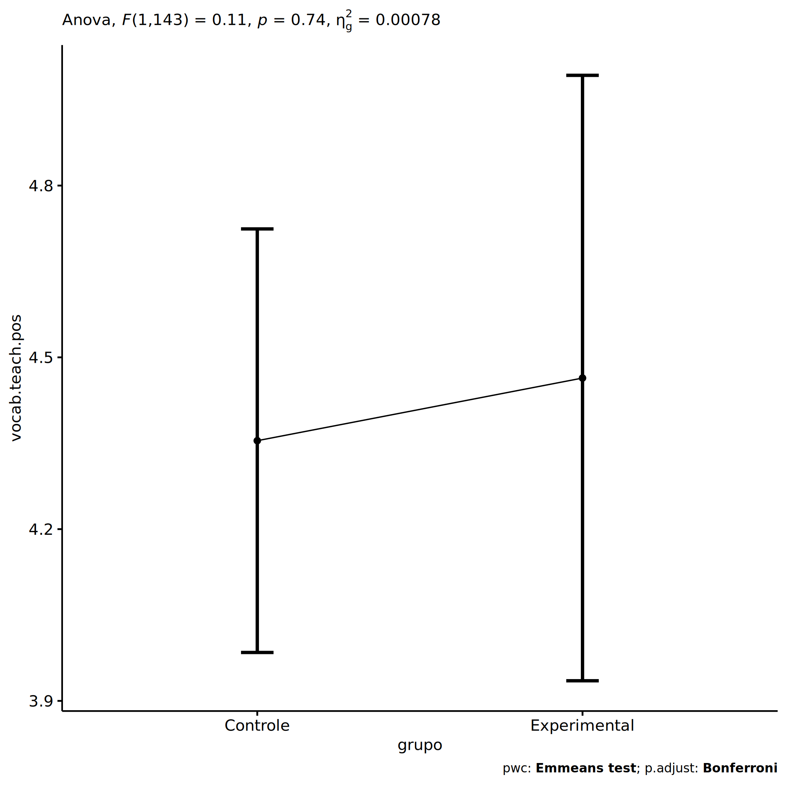<!-- -->

``` r
plots <- oneWayAncovaBoxPlots(
  wdat, "vocab.teach.pos", "grupo", aov, pwc, covar = "vocab.teach.pre",
  theme = "classic", color = color[["grupo"]],
  subtitle = which(aov$Effect == "grupo"))
```

``` r
if (length(unique(wdat[["grupo"]])) > 1)
  plots[["grupo"]] + ggplot2::ylab("Vocabulary taught") +
  ggplot2::scale_x_discrete(labels=c('pre', 'pos')) +
  if (ymin < ymax) ggplot2::ylim(ymin, ymax)
```

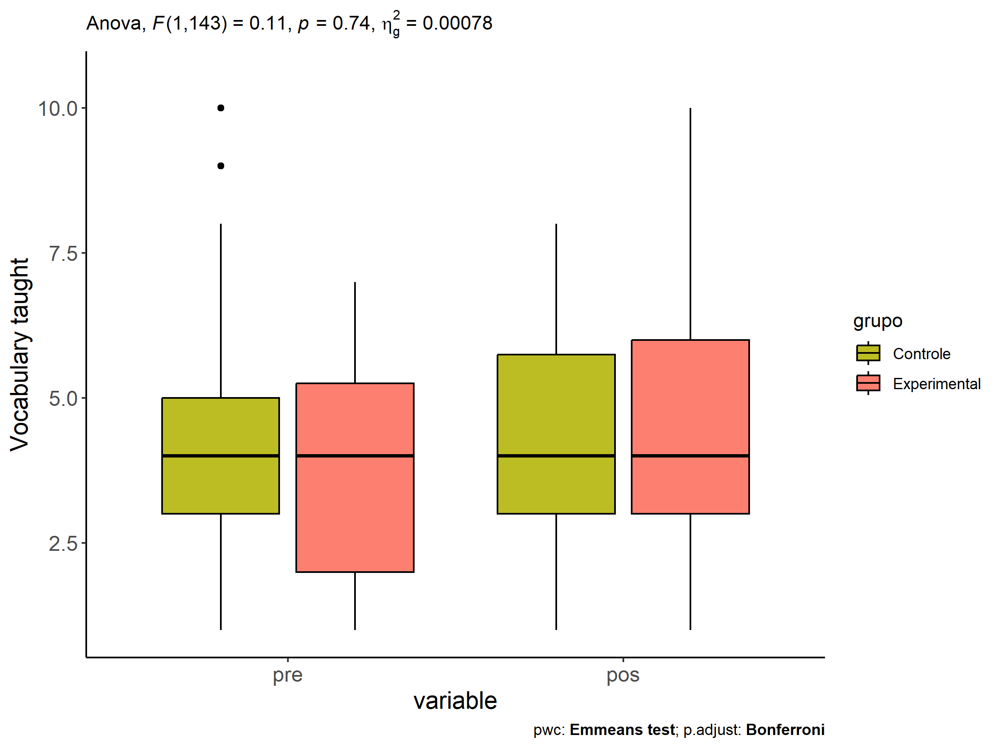<!-- -->

``` r
if (length(unique(wdat.long[["grupo"]])) > 1)
  plots <- oneWayAncovaBoxPlots(
    wdat.long, "vocab.teach", "grupo", aov, pwc.long,
    pre.post = "time", theme = "classic", color = color$prepost)
```

``` r
if (length(unique(wdat.long[["grupo"]])) > 1)
  plots[["grupo"]] + ggplot2::ylab("Vocabulary taught") +
  if (ymin < ymax) ggplot2::ylim(ymin, ymax) 
```

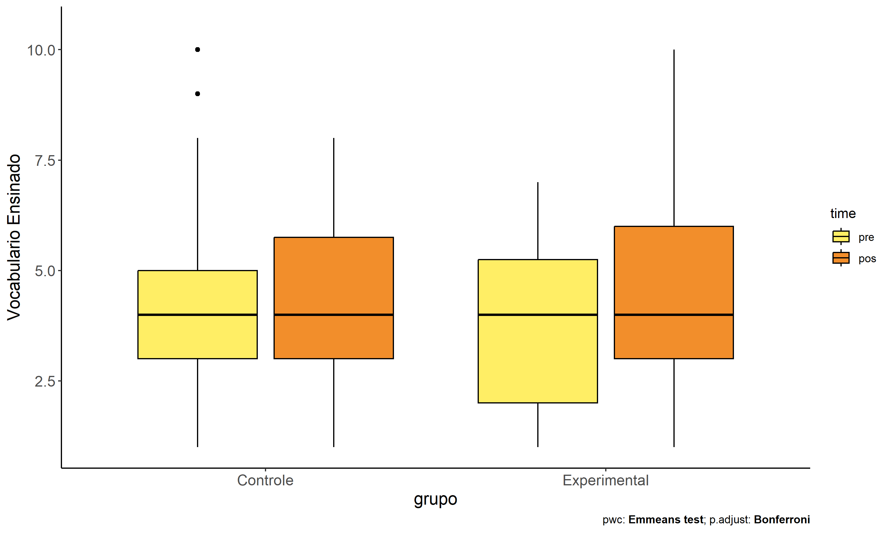<!-- -->

### Checking linearity assumption

``` r
ggscatter(wdat, x = "vocab.teach.pre", y = "vocab.teach.pos", size = 0.5,
          color = "grupo", add = "reg.line")+
  stat_regline_equation(
    aes(label =  paste(..eq.label.., ..rr.label.., sep = "~~~~"), color = grupo)
  ) +
  ggplot2::labs(subtitle = rstatix::get_test_label(aov, detailed = T, row = which(aov$Effect == "grupo"))) +
  ggplot2::scale_color_manual(values = color[["grupo"]]) +
  if (ymin < ymax) ggplot2::ylim(ymin, ymax)
```

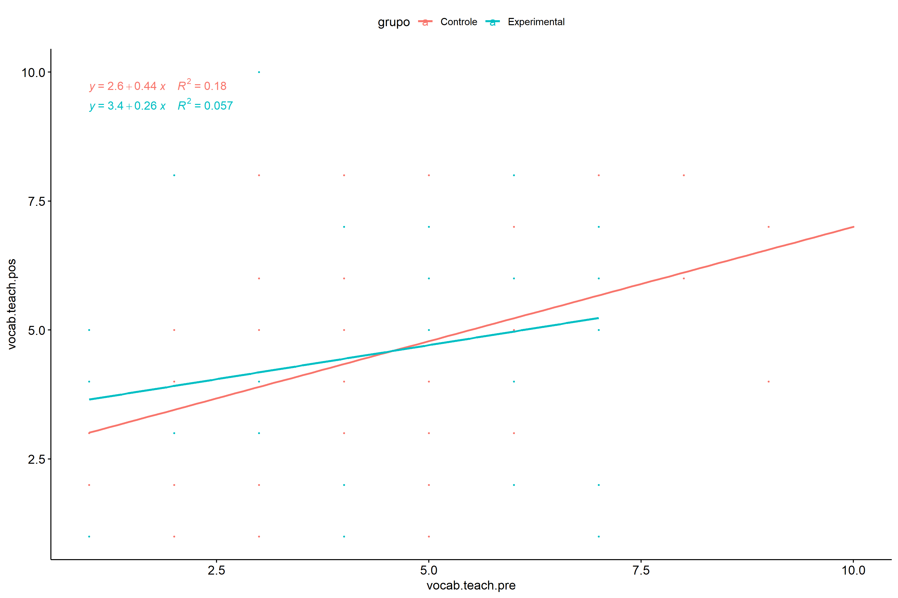<!-- -->

### Checking normality and homogeneity

``` r
res <- augment(lm(vocab.teach.pos ~ vocab.teach.pre + grupo, data = wdat))
```

``` r
shapiro_test(res$.resid)
```

    ## # A tibble: 1 × 3
    ##   variable   statistic p.value
    ##   <chr>          <dbl>   <dbl>
    ## 1 res$.resid     0.993   0.736

``` r
levene_test(res, .resid ~ grupo)
```

    ## # A tibble: 1 × 4
    ##     df1   df2 statistic     p
    ##   <int> <int>     <dbl> <dbl>
    ## 1     1   144      1.93 0.167

# ANCOVA and Pairwise for two factors **grupo:Sexo**

## Without remove non-normal data

``` r
pdat = remove_group_data(dat[!is.na(dat[["grupo"]]) & !is.na(dat[["Sexo"]]),],
                         "vocab.teach.pos", c("grupo","Sexo"))
pdat = pdat[pdat[["Sexo"]] %in% do.call(
  intersect, lapply(unique(pdat[["grupo"]]), FUN = function(x) {
    unique(pdat[["Sexo"]][which(pdat[["grupo"]] == x)])
  })),]
pdat[["grupo"]] = factor(pdat[["grupo"]], level[["grupo"]])
pdat[["Sexo"]] = factor(
  pdat[["Sexo"]],
  level[["Sexo"]][level[["Sexo"]] %in% unique(pdat[["Sexo"]])])

pdat.long <- rbind(pdat[,c("id","grupo","Sexo")], pdat[,c("id","grupo","Sexo")])
pdat.long[["time"]] <- c(rep("pre", nrow(pdat)), rep("pos", nrow(pdat)))
pdat.long[["time"]] <- factor(pdat.long[["time"]], c("pre","pos"))
pdat.long[["vocab.teach"]] <- c(pdat[["vocab.teach.pre"]], pdat[["vocab.teach.pos"]])

if (length(unique(pdat[["Sexo"]])) >= 2) {
  aov = anova_test(pdat, vocab.teach.pos ~ vocab.teach.pre + grupo*Sexo)
  laov[["grupo:Sexo"]] <- get_anova_table(aov)
}
```

``` r
if (length(unique(pdat[["Sexo"]])) >= 2) {
  pwcs <- list()
  pwcs[["Sexo"]] <- emmeans_test(
    group_by(pdat, grupo), vocab.teach.pos ~ Sexo,
    covariate = vocab.teach.pre, p.adjust.method = "bonferroni")
  pwcs[["grupo"]] <- emmeans_test(
    group_by(pdat, Sexo), vocab.teach.pos ~ grupo,
    covariate = vocab.teach.pre, p.adjust.method = "bonferroni")
  
  pwc <- plyr::rbind.fill(pwcs[["grupo"]], pwcs[["Sexo"]])
  pwc <- pwc[,c("grupo","Sexo", colnames(pwc)[!colnames(pwc) %in% c("grupo","Sexo")])]
}
```

``` r
if (length(unique(pdat[["Sexo"]])) >= 2) {
  pwc.long <- emmeans_test(dplyr::group_by_at(pdat.long, c("grupo","Sexo")),
                           vocab.teach ~ time,
                           p.adjust.method = "bonferroni")
  lpwc[["grupo:Sexo"]] <- plyr::rbind.fill(pwc, pwc.long)
}
```

``` r
if (length(unique(pdat[["Sexo"]])) >= 2) {
  ds <- get.descriptives(pdat, "vocab.teach.pos", c("grupo","Sexo"), covar = "vocab.teach.pre")
  ds <- merge(ds[ds$variable != "vocab.teach.pre",],
              ds[ds$variable == "vocab.teach.pre", !colnames(ds) %in% c("variable")],
              by = c("grupo","Sexo"), all.x = T, suffixes = c("", ".vocab.teach.pre"))
  ds <- merge(get_emmeans(pwcs[["grupo"]]), ds,
              by = c("grupo","Sexo"), suffixes = c(".emms", ""))
  ds <- ds[,c("grupo","Sexo","n","mean.vocab.teach.pre","se.vocab.teach.pre","mean","se",
              "emmean","se.emms","conf.low","conf.high")]
  
  colnames(ds) <- c("grupo","Sexo", "N", paste0(c("M","SE")," (pre)"),
                    paste0(c("M","SE"), " (unadj)"),
                    paste0(c("M", "SE"), " (adj)"), "conf.low", "conf.high")
  
  lemms[["grupo:Sexo"]] <- ds
}
```

## Computing ANCOVA and PairWise After removing non-normal data (OK)

``` r
if (length(unique(pdat[["Sexo"]])) >= 2) {
  wdat = pdat 
  
  res = residuals(lm(vocab.teach.pos ~ vocab.teach.pre + grupo*Sexo, data = wdat))
  non.normal = getNonNormal(res, wdat$id, plimit = 0.05)
  
  wdat = wdat[!wdat$id %in% non.normal,]
  
  wdat.long <- rbind(wdat[,c("id","grupo","Sexo")], wdat[,c("id","grupo","Sexo")])
  wdat.long[["time"]] <- c(rep("pre", nrow(wdat)), rep("pos", nrow(wdat)))
  wdat.long[["time"]] <- factor(wdat.long[["time"]], c("pre","pos"))
  wdat.long[["vocab.teach"]] <- c(wdat[["vocab.teach.pre"]], wdat[["vocab.teach.pos"]])
  
  
  ldat[["grupo:Sexo"]] = wdat
  
  (non.normal)
}
```

    ## NULL

``` r
if (length(unique(pdat[["Sexo"]])) >= 2) {
  aov = anova_test(wdat, vocab.teach.pos ~ vocab.teach.pre + grupo*Sexo)
  laov[["grupo:Sexo"]] <- merge(get_anova_table(aov), laov[["grupo:Sexo"]],
                                         by="Effect", suffixes = c("","'"))
  df = get_anova_table(aov)
}
```

| Effect          | DFn | DFd |      F |     p | p\<.05 |   ges |
|:----------------|----:|----:|-------:|------:|:-------|------:|
| vocab.teach.pre |   1 | 141 | 20.042 | 0.000 | \*     | 0.124 |
| grupo           |   1 | 141 |  0.121 | 0.728 |        | 0.001 |
| Sexo            |   1 | 141 |  0.029 | 0.864 |        | 0.000 |
| grupo:Sexo      |   1 | 141 |  0.075 | 0.785 |        | 0.001 |

``` r
if (length(unique(pdat[["Sexo"]])) >= 2) {
  pwcs <- list()
  pwcs[["Sexo"]] <- emmeans_test(
    group_by(wdat, grupo), vocab.teach.pos ~ Sexo,
    covariate = vocab.teach.pre, p.adjust.method = "bonferroni")
  pwcs[["grupo"]] <- emmeans_test(
    group_by(wdat, Sexo), vocab.teach.pos ~ grupo,
    covariate = vocab.teach.pre, p.adjust.method = "bonferroni")
  
  pwc <- plyr::rbind.fill(pwcs[["grupo"]], pwcs[["Sexo"]])
  pwc <- pwc[,c("grupo","Sexo", colnames(pwc)[!colnames(pwc) %in% c("grupo","Sexo")])]
}
```

| grupo | Sexo | term | .y. | group1 | group2 | df | statistic | p | p.adj | p.adj.signif |
|:---|:---|:---|:---|:---|:---|---:|---:|---:|---:|:---|
|  | F | vocab.teach.pre\*grupo | vocab.teach.pos | Controle | Experimental | 141 | 0.007 | 0.995 | 0.995 | ns |
|  | M | vocab.teach.pre\*grupo | vocab.teach.pos | Controle | Experimental | 141 | -0.442 | 0.659 | 0.659 | ns |
| Controle |  | vocab.teach.pre\*Sexo | vocab.teach.pos | F | M | 141 | 0.293 | 0.770 | 0.770 | ns |
| Experimental |  | vocab.teach.pre\*Sexo | vocab.teach.pos | F | M | 141 | -0.132 | 0.895 | 0.895 | ns |

``` r
if (length(unique(pdat[["Sexo"]])) >= 2) {
  pwc.long <- emmeans_test(dplyr::group_by_at(wdat.long, c("grupo","Sexo")),
                           vocab.teach ~ time,
                           p.adjust.method = "bonferroni")
  lpwc[["grupo:Sexo"]] <- merge(plyr::rbind.fill(pwc, pwc.long),
                                         lpwc[["grupo:Sexo"]],
                                         by=c("grupo","Sexo","term",".y.","group1","group2"),
                                         suffixes = c("","'"))
}
```

| grupo | Sexo | term | .y. | group1 | group2 | df | statistic | p | p.adj | p.adj.signif |
|:---|:---|:---|:---|:---|:---|---:|---:|---:|---:|:---|
| Controle | F | time | vocab.teach | pre | pos | 284 | -0.674 | 0.501 | 0.501 | ns |
| Controle | M | time | vocab.teach | pre | pos | 284 | -0.844 | 0.399 | 0.399 | ns |
| Experimental | F | time | vocab.teach | pre | pos | 284 | -0.368 | 0.713 | 0.713 | ns |
| Experimental | M | time | vocab.teach | pre | pos | 284 | -1.367 | 0.173 | 0.173 | ns |

``` r
if (length(unique(pdat[["Sexo"]])) >= 2) {
  ds <- get.descriptives(wdat, "vocab.teach.pos", c("grupo","Sexo"), covar = "vocab.teach.pre")
  ds <- merge(ds[ds$variable != "vocab.teach.pre",],
              ds[ds$variable == "vocab.teach.pre", !colnames(ds) %in% c("variable")],
              by = c("grupo","Sexo"), all.x = T, suffixes = c("", ".vocab.teach.pre"))
  ds <- merge(get_emmeans(pwcs[["grupo"]]), ds,
              by = c("grupo","Sexo"), suffixes = c(".emms", ""))
  ds <- ds[,c("grupo","Sexo","n","mean.vocab.teach.pre","se.vocab.teach.pre",
              "mean","se","emmean","se.emms","conf.low","conf.high")]
  
  colnames(ds) <- c("grupo","Sexo", "N", paste0(c("M","SE")," (pre)"),
                    paste0(c("M","SE"), " (unadj)"),
                    paste0(c("M", "SE"), " (adj)"), "conf.low", "conf.high")
  
  lemms[["grupo:Sexo"]] <- merge(ds, lemms[["grupo:Sexo"]],
                                          by=c("grupo","Sexo"), suffixes = c("","'"))
}
```

| grupo | Sexo | N | M (pre) | SE (pre) | M (unadj) | SE (unadj) | M (adj) | SE (adj) | conf.low | conf.high |
|:---|:---|---:|---:|---:|---:|---:|---:|---:|---:|---:|
| Controle | F | 43 | 4.209 | 0.190 | 4.488 | 0.245 | 4.417 | 0.285 | 3.854 | 4.980 |
| Controle | M | 55 | 3.982 | 0.288 | 4.291 | 0.280 | 4.306 | 0.251 | 3.809 | 4.802 |
| Experimental | F | 16 | 4.250 | 0.479 | 4.500 | 0.456 | 4.413 | 0.466 | 3.491 | 5.335 |
| Experimental | M | 32 | 3.719 | 0.348 | 4.375 | 0.411 | 4.489 | 0.331 | 3.836 | 5.142 |

### Plots for ancova

``` r
if (length(unique(pdat[["Sexo"]])) >= 2) {
  ggPlotAoC2(pwcs, "grupo", "Sexo", aov, ylab = "Vocabulary taught",
             subtitle = which(aov$Effect == "grupo:Sexo"), addParam = "errorbar") +
    ggplot2::scale_color_manual(values = color[["Sexo"]]) +
    if (ymin.ci < ymax.ci) ggplot2::ylim(ymin.ci, ymax.ci)
}
```

    ## Scale for colour is already present.
    ## Adding another scale for colour, which will replace the existing scale.

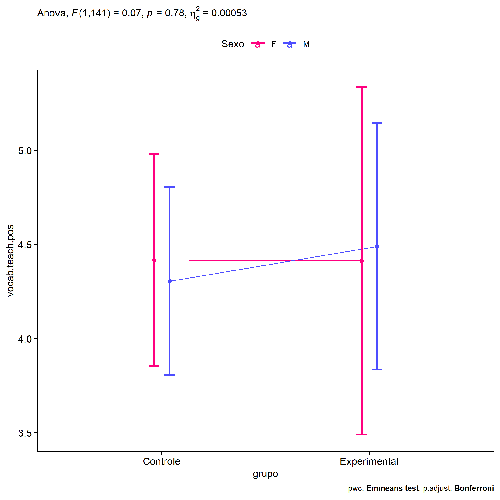<!-- -->

``` r
if (length(unique(pdat[["Sexo"]])) >= 2) {
  ggPlotAoC2(pwcs, "Sexo", "grupo", aov, ylab = "Vocabulary taught",
               subtitle = which(aov$Effect == "grupo:Sexo"), addParam = "errorbar") +
      ggplot2::scale_color_manual(values = color[["grupo"]]) +
      if (ymin.ci < ymax.ci) ggplot2::ylim(ymin.ci, ymax.ci)
}
```

    ## Scale for colour is already present.
    ## Adding another scale for colour, which will replace the existing scale.

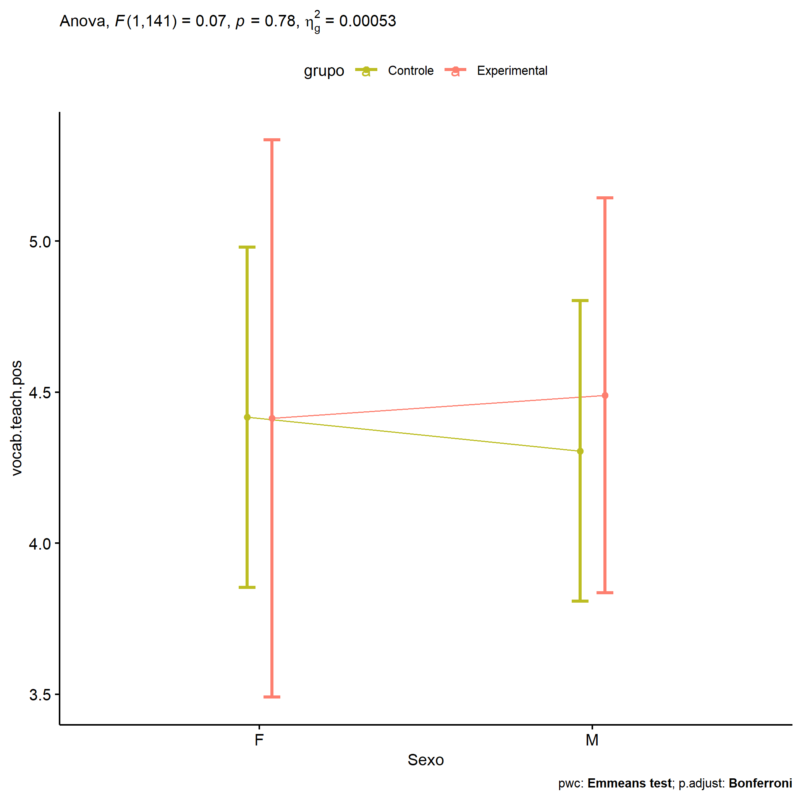<!-- -->

``` r
if (length(unique(pdat[["Sexo"]])) >= 2) {
  plots <- twoWayAncovaBoxPlots(
    wdat, "vocab.teach.pos", c("grupo","Sexo"), aov, pwcs, covar = "vocab.teach.pre",
    theme = "classic", color = color[["grupo:Sexo"]],
    subtitle = which(aov$Effect == "grupo:Sexo"))
}
```

``` r
if (length(unique(pdat[["Sexo"]])) >= 2) {
  plots[["grupo:Sexo"]] + ggplot2::ylab("Vocabulary taught") +
  ggplot2::scale_x_discrete(labels=c('pre', 'pos')) +
  if (ymin < ymax) ggplot2::ylim(ymin, ymax)
}
```

    ## Warning: No shared levels found between `names(values)` of the manual scale and the data's colour values.

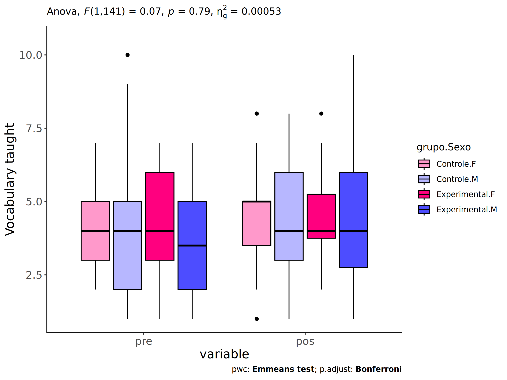<!-- -->

``` r
if (length(unique(pdat[["Sexo"]])) >= 2) {
  plots <- twoWayAncovaBoxPlots(
    wdat.long, "vocab.teach", c("grupo","Sexo"), aov, pwc.long,
    pre.post = "time",
    theme = "classic", color = color$prepost)
}
```

``` r
if (length(unique(pdat[["Sexo"]])) >= 2) 
  plots[["grupo:Sexo"]] + ggplot2::ylab("Vocabulary taught") +
    if (ymin < ymax) ggplot2::ylim(ymin, ymax)
```

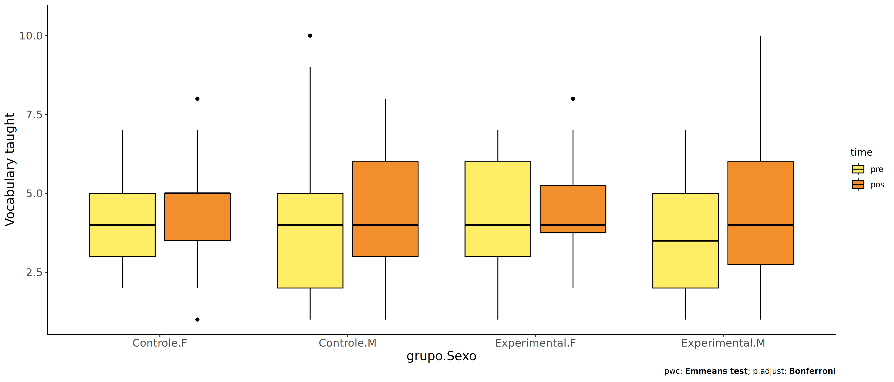<!-- -->

### Checking linearity assumption

``` r
if (length(unique(pdat[["Sexo"]])) >= 2) {
  ggscatter(wdat, x = "vocab.teach.pre", y = "vocab.teach.pos", size = 0.5,
            facet.by = c("grupo","Sexo"), add = "reg.line")+
    stat_regline_equation(
      aes(label =  paste(..eq.label.., ..rr.label.., sep = "~~~~"))
    ) +
    if (ymin < ymax) ggplot2::ylim(ymin, ymax)
}
```

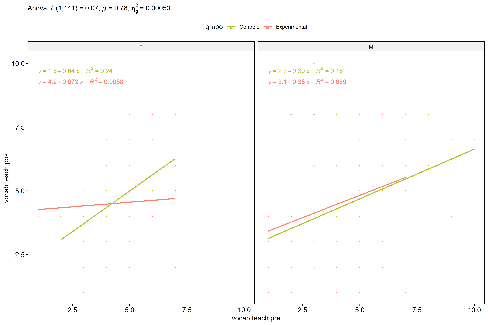<!-- -->

``` r
if (length(unique(pdat[["Sexo"]])) >= 2) {
  ggscatter(wdat, x = "vocab.teach.pre", y = "vocab.teach.pos", size = 0.5,
            color = "grupo", facet.by = "Sexo", add = "reg.line")+
    stat_regline_equation(
      aes(label =  paste(..eq.label.., ..rr.label.., sep = "~~~~"), color = grupo)
    ) +
    ggplot2::labs(subtitle = rstatix::get_test_label(aov, detailed = T, row = which(aov$Effect == "grupo:Sexo"))) +
    ggplot2::scale_color_manual(values = color[["grupo"]]) +
    if (ymin < ymax) ggplot2::ylim(ymin, ymax)
}
```

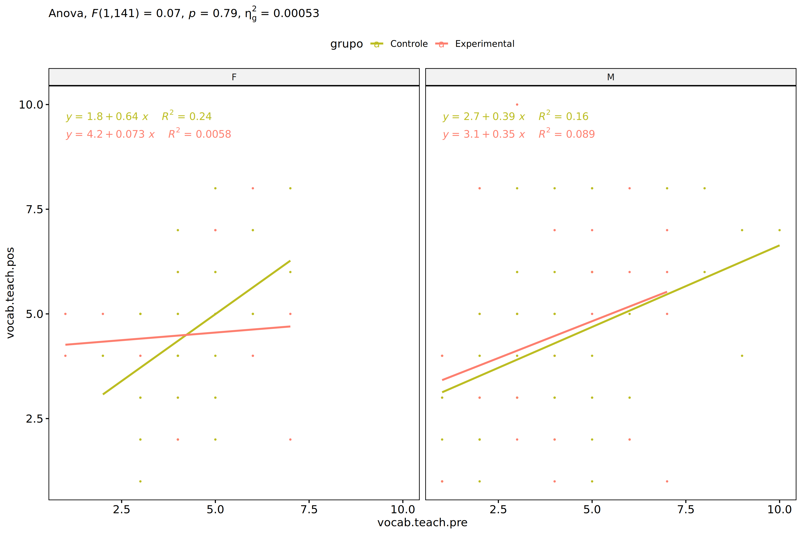<!-- -->

``` r
if (length(unique(pdat[["Sexo"]])) >= 2) {
  ggscatter(wdat, x = "vocab.teach.pre", y = "vocab.teach.pos", size = 0.5,
            color = "Sexo", facet.by = "grupo", add = "reg.line")+
    stat_regline_equation(
      aes(label =  paste(..eq.label.., ..rr.label.., sep = "~~~~"), color = Sexo)
    ) +
    ggplot2::labs(subtitle = rstatix::get_test_label(aov, detailed = T, row = which(aov$Effect == "grupo:Sexo"))) +
    ggplot2::scale_color_manual(values = color[["Sexo"]]) +
    if (ymin < ymax) ggplot2::ylim(ymin, ymax)
}
```

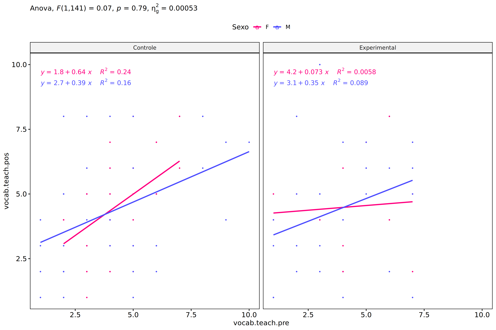<!-- -->

### Checking normality and homogeneity

``` r
if (length(unique(pdat[["Sexo"]])) >= 2) 
  res <- augment(lm(vocab.teach.pos ~ vocab.teach.pre + grupo*Sexo, data = wdat))
```

``` r
if (length(unique(pdat[["Sexo"]])) >= 2)
  shapiro_test(res$.resid)
```

    ## # A tibble: 1 × 3
    ##   variable   statistic p.value
    ##   <chr>          <dbl>   <dbl>
    ## 1 res$.resid     0.994   0.781

``` r
if (length(unique(pdat[["Sexo"]])) >= 2) 
  levene_test(res, .resid ~ grupo*Sexo)
```

    ## # A tibble: 1 × 4
    ##     df1   df2 statistic     p
    ##   <int> <int>     <dbl> <dbl>
    ## 1     3   142      1.92 0.129

# ANCOVA and Pairwise for two factors **grupo:Zona**

## Without remove non-normal data

``` r
pdat = remove_group_data(dat[!is.na(dat[["grupo"]]) & !is.na(dat[["Zona"]]),],
                         "vocab.teach.pos", c("grupo","Zona"))
pdat = pdat[pdat[["Zona"]] %in% do.call(
  intersect, lapply(unique(pdat[["grupo"]]), FUN = function(x) {
    unique(pdat[["Zona"]][which(pdat[["grupo"]] == x)])
  })),]
pdat[["grupo"]] = factor(pdat[["grupo"]], level[["grupo"]])
pdat[["Zona"]] = factor(
  pdat[["Zona"]],
  level[["Zona"]][level[["Zona"]] %in% unique(pdat[["Zona"]])])

pdat.long <- rbind(pdat[,c("id","grupo","Zona")], pdat[,c("id","grupo","Zona")])
pdat.long[["time"]] <- c(rep("pre", nrow(pdat)), rep("pos", nrow(pdat)))
pdat.long[["time"]] <- factor(pdat.long[["time"]], c("pre","pos"))
pdat.long[["vocab.teach"]] <- c(pdat[["vocab.teach.pre"]], pdat[["vocab.teach.pos"]])

if (length(unique(pdat[["Zona"]])) >= 2) {
  aov = anova_test(pdat, vocab.teach.pos ~ vocab.teach.pre + grupo*Zona)
  laov[["grupo:Zona"]] <- get_anova_table(aov)
}
```

``` r
if (length(unique(pdat[["Zona"]])) >= 2) {
  pwcs <- list()
  pwcs[["Zona"]] <- emmeans_test(
    group_by(pdat, grupo), vocab.teach.pos ~ Zona,
    covariate = vocab.teach.pre, p.adjust.method = "bonferroni")
  pwcs[["grupo"]] <- emmeans_test(
    group_by(pdat, Zona), vocab.teach.pos ~ grupo,
    covariate = vocab.teach.pre, p.adjust.method = "bonferroni")
  
  pwc <- plyr::rbind.fill(pwcs[["grupo"]], pwcs[["Zona"]])
  pwc <- pwc[,c("grupo","Zona", colnames(pwc)[!colnames(pwc) %in% c("grupo","Zona")])]
}
```

``` r
if (length(unique(pdat[["Zona"]])) >= 2) {
  pwc.long <- emmeans_test(dplyr::group_by_at(pdat.long, c("grupo","Zona")),
                           vocab.teach ~ time,
                           p.adjust.method = "bonferroni")
  lpwc[["grupo:Zona"]] <- plyr::rbind.fill(pwc, pwc.long)
}
```

``` r
if (length(unique(pdat[["Zona"]])) >= 2) {
  ds <- get.descriptives(pdat, "vocab.teach.pos", c("grupo","Zona"), covar = "vocab.teach.pre")
  ds <- merge(ds[ds$variable != "vocab.teach.pre",],
              ds[ds$variable == "vocab.teach.pre", !colnames(ds) %in% c("variable")],
              by = c("grupo","Zona"), all.x = T, suffixes = c("", ".vocab.teach.pre"))
  ds <- merge(get_emmeans(pwcs[["grupo"]]), ds,
              by = c("grupo","Zona"), suffixes = c(".emms", ""))
  ds <- ds[,c("grupo","Zona","n","mean.vocab.teach.pre","se.vocab.teach.pre","mean","se",
              "emmean","se.emms","conf.low","conf.high")]
  
  colnames(ds) <- c("grupo","Zona", "N", paste0(c("M","SE")," (pre)"),
                    paste0(c("M","SE"), " (unadj)"),
                    paste0(c("M", "SE"), " (adj)"), "conf.low", "conf.high")
  
  lemms[["grupo:Zona"]] <- ds
}
```

## Computing ANCOVA and PairWise After removing non-normal data (OK)

``` r
if (length(unique(pdat[["Zona"]])) >= 2) {
  wdat = pdat 
  
  res = residuals(lm(vocab.teach.pos ~ vocab.teach.pre + grupo*Zona, data = wdat))
  non.normal = getNonNormal(res, wdat$id, plimit = 0.05)
  
  wdat = wdat[!wdat$id %in% non.normal,]
  
  wdat.long <- rbind(wdat[,c("id","grupo","Zona")], wdat[,c("id","grupo","Zona")])
  wdat.long[["time"]] <- c(rep("pre", nrow(wdat)), rep("pos", nrow(wdat)))
  wdat.long[["time"]] <- factor(wdat.long[["time"]], c("pre","pos"))
  wdat.long[["vocab.teach"]] <- c(wdat[["vocab.teach.pre"]], wdat[["vocab.teach.pos"]])
  
  
  ldat[["grupo:Zona"]] = wdat
  
  (non.normal)
}
```

    ## NULL

``` r
if (length(unique(pdat[["Zona"]])) >= 2) {
  aov = anova_test(wdat, vocab.teach.pos ~ vocab.teach.pre + grupo*Zona)
  laov[["grupo:Zona"]] <- merge(get_anova_table(aov), laov[["grupo:Zona"]],
                                         by="Effect", suffixes = c("","'"))
  df = get_anova_table(aov)
}
```

| Effect          | DFn | DFd |      F |     p | p\<.05 |   ges |
|:----------------|----:|----:|-------:|------:|:-------|------:|
| vocab.teach.pre |   1 | 101 | 11.613 | 0.001 | \*     | 0.103 |
| grupo           |   1 | 101 |  0.004 | 0.948 |        | 0.000 |
| Zona            |   1 | 101 |  1.686 | 0.197 |        | 0.016 |
| grupo:Zona      |   1 | 101 |  0.078 | 0.781 |        | 0.001 |

``` r
if (length(unique(pdat[["Zona"]])) >= 2) {
  pwcs <- list()
  pwcs[["Zona"]] <- emmeans_test(
    group_by(wdat, grupo), vocab.teach.pos ~ Zona,
    covariate = vocab.teach.pre, p.adjust.method = "bonferroni")
  pwcs[["grupo"]] <- emmeans_test(
    group_by(wdat, Zona), vocab.teach.pos ~ grupo,
    covariate = vocab.teach.pre, p.adjust.method = "bonferroni")
  
  pwc <- plyr::rbind.fill(pwcs[["grupo"]], pwcs[["Zona"]])
  pwc <- pwc[,c("grupo","Zona", colnames(pwc)[!colnames(pwc) %in% c("grupo","Zona")])]
}
```

| grupo | Zona | term | .y. | group1 | group2 | df | statistic | p | p.adj | p.adj.signif |
|:---|:---|:---|:---|:---|:---|---:|---:|---:|---:|:---|
|  | Rural | vocab.teach.pre\*grupo | vocab.teach.pos | Controle | Experimental | 101 | -0.164 | 0.870 | 0.870 | ns |
|  | Urbana | vocab.teach.pre\*grupo | vocab.teach.pos | Controle | Experimental | 101 | 0.235 | 0.815 | 0.815 | ns |
| Controle |  | vocab.teach.pre\*Zona | vocab.teach.pos | Rural | Urbana | 101 | 0.911 | 0.365 | 0.365 | ns |
| Experimental |  | vocab.teach.pre\*Zona | vocab.teach.pos | Rural | Urbana | 101 | 0.967 | 0.336 | 0.336 | ns |

``` r
if (length(unique(pdat[["Zona"]])) >= 2) {
  pwc.long <- emmeans_test(dplyr::group_by_at(wdat.long, c("grupo","Zona")),
                           vocab.teach ~ time,
                           p.adjust.method = "bonferroni")
  lpwc[["grupo:Zona"]] <- merge(plyr::rbind.fill(pwc, pwc.long),
                                         lpwc[["grupo:Zona"]],
                                         by=c("grupo","Zona","term",".y.","group1","group2"),
                                         suffixes = c("","'"))
}
```

| grupo | Zona | term | .y. | group1 | group2 | df | statistic | p | p.adj | p.adj.signif |
|:---|:---|:---|:---|:---|:---|---:|---:|---:|---:|:---|
| Controle | Rural | time | vocab.teach | pre | pos | 204 | -1.603 | 0.111 | 0.111 | ns |
| Controle | Urbana | time | vocab.teach | pre | pos | 204 | 0.339 | 0.735 | 0.735 | ns |
| Experimental | Rural | time | vocab.teach | pre | pos | 204 | -1.542 | 0.125 | 0.125 | ns |
| Experimental | Urbana | time | vocab.teach | pre | pos | 204 | 0.168 | 0.867 | 0.867 | ns |

``` r
if (length(unique(pdat[["Zona"]])) >= 2) {
  ds <- get.descriptives(wdat, "vocab.teach.pos", c("grupo","Zona"), covar = "vocab.teach.pre")
  ds <- merge(ds[ds$variable != "vocab.teach.pre",],
              ds[ds$variable == "vocab.teach.pre", !colnames(ds) %in% c("variable")],
              by = c("grupo","Zona"), all.x = T, suffixes = c("", ".vocab.teach.pre"))
  ds <- merge(get_emmeans(pwcs[["grupo"]]), ds,
              by = c("grupo","Zona"), suffixes = c(".emms", ""))
  ds <- ds[,c("grupo","Zona","n","mean.vocab.teach.pre","se.vocab.teach.pre",
              "mean","se","emmean","se.emms","conf.low","conf.high")]
  
  colnames(ds) <- c("grupo","Zona", "N", paste0(c("M","SE")," (pre)"),
                    paste0(c("M","SE"), " (unadj)"),
                    paste0(c("M", "SE"), " (adj)"), "conf.low", "conf.high")
  
  lemms[["grupo:Zona"]] <- merge(ds, lemms[["grupo:Zona"]],
                                          by=c("grupo","Zona"), suffixes = c("","'"))
}
```

| grupo | Zona | N | M (pre) | SE (pre) | M (unadj) | SE (unadj) | M (adj) | SE (adj) | conf.low | conf.high |
|:---|:---|---:|---:|---:|---:|---:|---:|---:|---:|---:|
| Controle | Rural | 56 | 3.839 | 0.211 | 4.411 | 0.247 | 4.414 | 0.249 | 3.920 | 4.908 |
| Controle | Urbana | 11 | 4.273 | 0.727 | 4.000 | 0.572 | 3.853 | 0.564 | 2.735 | 4.971 |
| Experimental | Rural | 34 | 3.735 | 0.349 | 4.441 | 0.376 | 4.481 | 0.320 | 3.846 | 5.115 |
| Experimental | Urbana | 5 | 3.800 | 0.374 | 3.600 | 0.678 | 3.617 | 0.833 | 1.964 | 5.270 |

### Plots for ancova

``` r
if (length(unique(pdat[["Zona"]])) >= 2) {
  ggPlotAoC2(pwcs, "grupo", "Zona", aov, ylab = "Vocabulary taught",
             subtitle = which(aov$Effect == "grupo:Zona"), addParam = "errorbar") +
    ggplot2::scale_color_manual(values = color[["Zona"]]) +
    if (ymin.ci < ymax.ci) ggplot2::ylim(ymin.ci, ymax.ci)
}
```

    ## Scale for colour is already present.
    ## Adding another scale for colour, which will replace the existing scale.

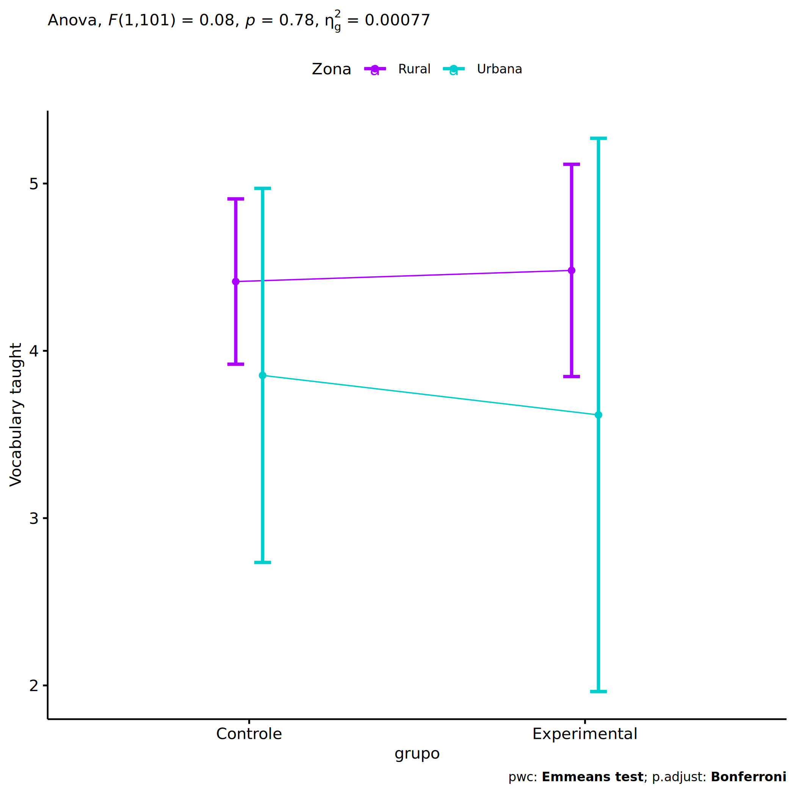<!-- -->

``` r
if (length(unique(pdat[["Zona"]])) >= 2) {
  ggPlotAoC2(pwcs, "Zona", "grupo", aov, ylab = "Vocabulary taught",
               subtitle = which(aov$Effect == "grupo:Zona"), addParam = "errorbar") +
      ggplot2::scale_color_manual(values = color[["grupo"]]) +
      if (ymin.ci < ymax.ci) ggplot2::ylim(ymin.ci, ymax.ci)
}
```

    ## Scale for colour is already present.
    ## Adding another scale for colour, which will replace the existing scale.

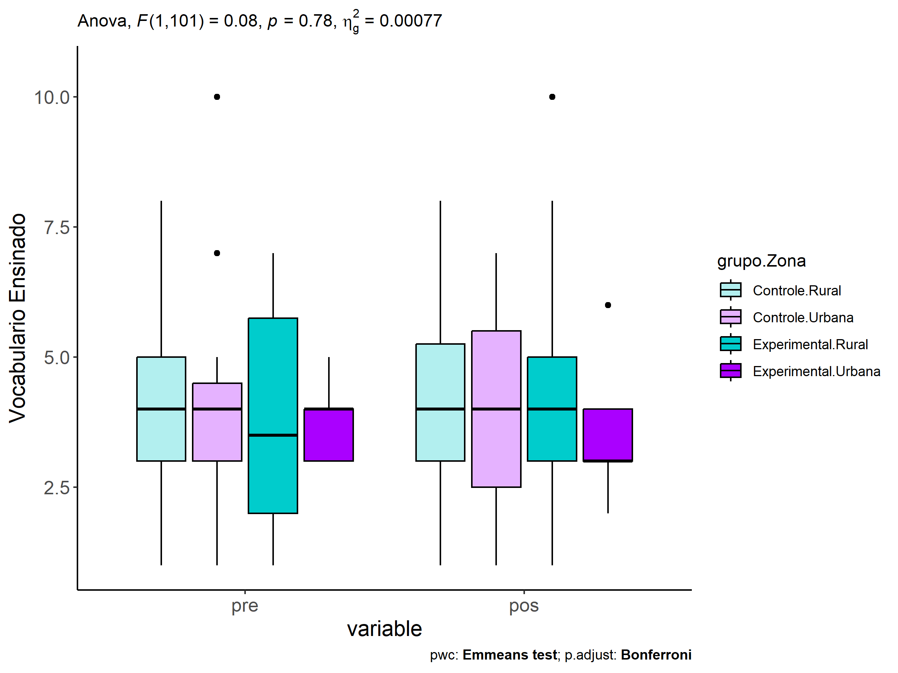<!-- -->

``` r
if (length(unique(pdat[["Zona"]])) >= 2) {
  plots <- twoWayAncovaBoxPlots(
    wdat, "vocab.teach.pos", c("grupo","Zona"), aov, pwcs, covar = "vocab.teach.pre",
    theme = "classic", color = color[["grupo:Zona"]],
    subtitle = which(aov$Effect == "grupo:Zona"))
}
```

``` r
if (length(unique(pdat[["Zona"]])) >= 2) {
  plots[["grupo:Zona"]] + ggplot2::ylab("Vocabulary taught") +
  ggplot2::scale_x_discrete(labels=c('pre', 'pos')) +
  if (ymin < ymax) ggplot2::ylim(ymin, ymax)
}
```

    ## Warning: No shared levels found between `names(values)` of the manual scale and the data's colour values.

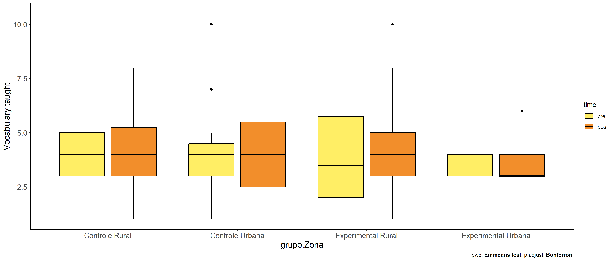<!-- -->

``` r
if (length(unique(pdat[["Zona"]])) >= 2) {
  plots <- twoWayAncovaBoxPlots(
    wdat.long, "vocab.teach", c("grupo","Zona"), aov, pwc.long,
    pre.post = "time",
    theme = "classic", color = color$prepost)
}
```

``` r
if (length(unique(pdat[["Zona"]])) >= 2) 
  plots[["grupo:Zona"]] + ggplot2::ylab("Vocabulary taught") +
    if (ymin < ymax) ggplot2::ylim(ymin, ymax)
```

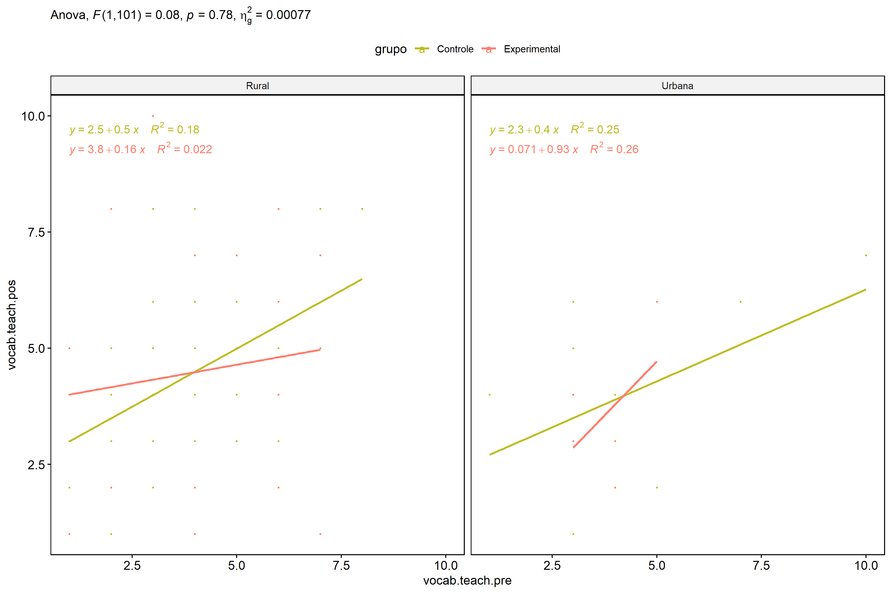<!-- -->

### Checking linearity assumption

``` r
if (length(unique(pdat[["Zona"]])) >= 2) {
  ggscatter(wdat, x = "vocab.teach.pre", y = "vocab.teach.pos", size = 0.5,
            facet.by = c("grupo","Zona"), add = "reg.line")+
    stat_regline_equation(
      aes(label =  paste(..eq.label.., ..rr.label.., sep = "~~~~"))
    ) +
    if (ymin < ymax) ggplot2::ylim(ymin, ymax)
}
```

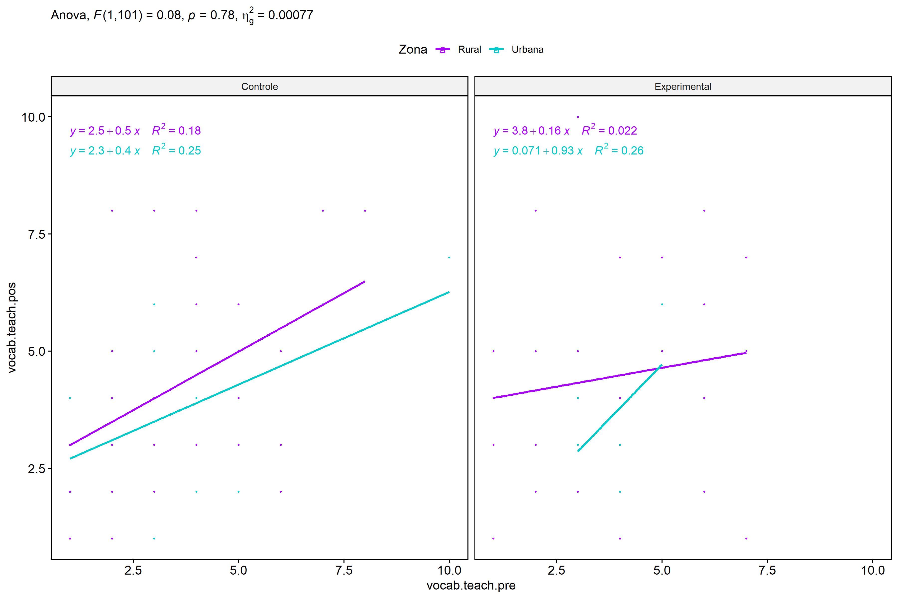<!-- -->

``` r
if (length(unique(pdat[["Zona"]])) >= 2) {
  ggscatter(wdat, x = "vocab.teach.pre", y = "vocab.teach.pos", size = 0.5,
            color = "grupo", facet.by = "Zona", add = "reg.line")+
    stat_regline_equation(
      aes(label =  paste(..eq.label.., ..rr.label.., sep = "~~~~"), color = grupo)
    ) +
    ggplot2::labs(subtitle = rstatix::get_test_label(aov, detailed = T, row = which(aov$Effect == "grupo:Zona"))) +
    ggplot2::scale_color_manual(values = color[["grupo"]]) +
    if (ymin < ymax) ggplot2::ylim(ymin, ymax)
}
```

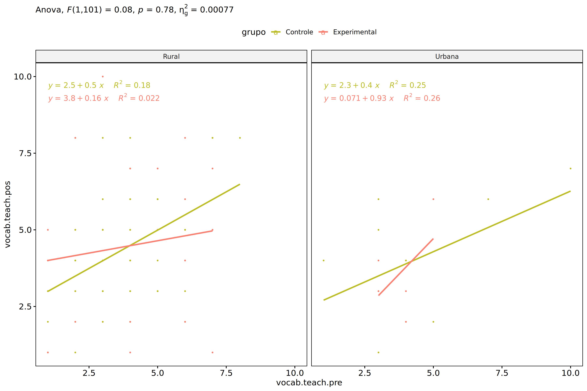<!-- -->

``` r
if (length(unique(pdat[["Zona"]])) >= 2) {
  ggscatter(wdat, x = "vocab.teach.pre", y = "vocab.teach.pos", size = 0.5,
            color = "Zona", facet.by = "grupo", add = "reg.line")+
    stat_regline_equation(
      aes(label =  paste(..eq.label.., ..rr.label.., sep = "~~~~"), color = Zona)
    ) +
    ggplot2::labs(subtitle = rstatix::get_test_label(aov, detailed = T, row = which(aov$Effect == "grupo:Zona"))) +
    ggplot2::scale_color_manual(values = color[["Zona"]]) +
    if (ymin < ymax) ggplot2::ylim(ymin, ymax)
}
```

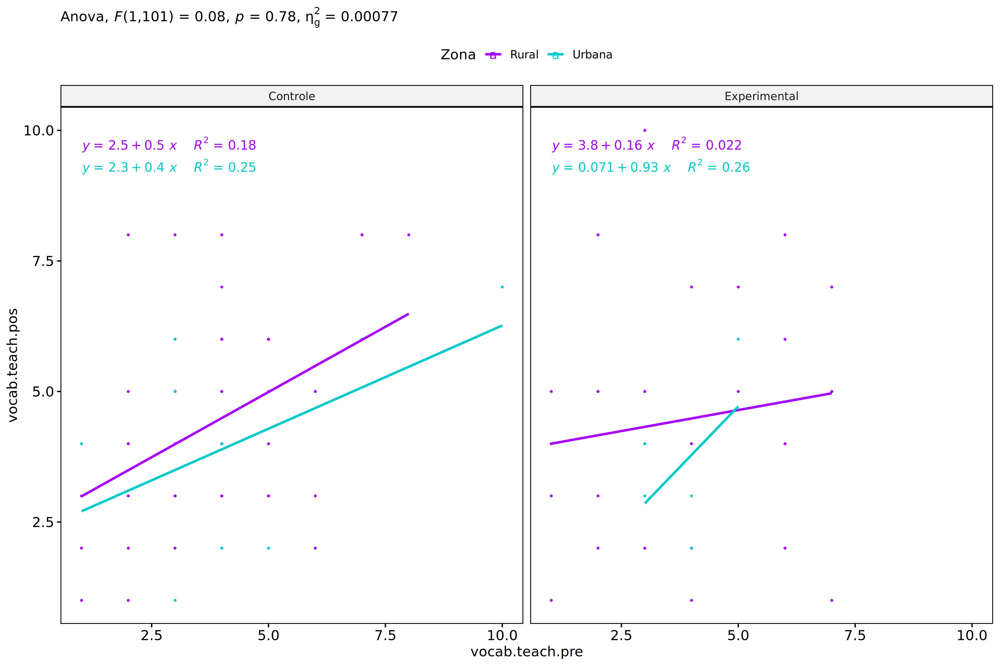<!-- -->

### Checking normality and homogeneity

``` r
if (length(unique(pdat[["Zona"]])) >= 2) 
  res <- augment(lm(vocab.teach.pos ~ vocab.teach.pre + grupo*Zona, data = wdat))
```

``` r
if (length(unique(pdat[["Zona"]])) >= 2)
  shapiro_test(res$.resid)
```

    ## # A tibble: 1 × 3
    ##   variable   statistic p.value
    ##   <chr>          <dbl>   <dbl>
    ## 1 res$.resid     0.990   0.619

``` r
if (length(unique(pdat[["Zona"]])) >= 2) 
  levene_test(res, .resid ~ grupo*Zona)
```

    ## # A tibble: 1 × 4
    ##     df1   df2 statistic     p
    ##   <int> <int>     <dbl> <dbl>
    ## 1     3   102      1.00 0.395

# ANCOVA and Pairwise for two factors **grupo:Cor.Raca**

## Without remove non-normal data

``` r
pdat = remove_group_data(dat[!is.na(dat[["grupo"]]) & !is.na(dat[["Cor.Raca"]]),],
                         "vocab.teach.pos", c("grupo","Cor.Raca"))
```

    ## Warning: There was 1 warning in `mutate()`.
    ## ℹ In argument: `ci = abs(stats::qt(alpha/2, .data$n - 1) * .data$se)`.
    ## Caused by warning:
    ## ! There was 1 warning in `mutate()`.
    ## ℹ In argument: `ci = abs(stats::qt(alpha/2, .data$n - 1) * .data$se)`.
    ## Caused by warning in `stats::qt()`:
    ## ! NaNs produced

``` r
pdat = pdat[pdat[["Cor.Raca"]] %in% do.call(
  intersect, lapply(unique(pdat[["grupo"]]), FUN = function(x) {
    unique(pdat[["Cor.Raca"]][which(pdat[["grupo"]] == x)])
  })),]
pdat[["grupo"]] = factor(pdat[["grupo"]], level[["grupo"]])
pdat[["Cor.Raca"]] = factor(
  pdat[["Cor.Raca"]],
  level[["Cor.Raca"]][level[["Cor.Raca"]] %in% unique(pdat[["Cor.Raca"]])])

pdat.long <- rbind(pdat[,c("id","grupo","Cor.Raca")], pdat[,c("id","grupo","Cor.Raca")])
pdat.long[["time"]] <- c(rep("pre", nrow(pdat)), rep("pos", nrow(pdat)))
pdat.long[["time"]] <- factor(pdat.long[["time"]], c("pre","pos"))
pdat.long[["vocab.teach"]] <- c(pdat[["vocab.teach.pre"]], pdat[["vocab.teach.pos"]])

if (length(unique(pdat[["Cor.Raca"]])) >= 2) {
  aov = anova_test(pdat, vocab.teach.pos ~ vocab.teach.pre + grupo*Cor.Raca)
  laov[["grupo:Cor.Raca"]] <- get_anova_table(aov)
}
```

``` r
if (length(unique(pdat[["Cor.Raca"]])) >= 2) {
  pwcs <- list()
  pwcs[["Cor.Raca"]] <- emmeans_test(
    group_by(pdat, grupo), vocab.teach.pos ~ Cor.Raca,
    covariate = vocab.teach.pre, p.adjust.method = "bonferroni")
  pwcs[["grupo"]] <- emmeans_test(
    group_by(pdat, Cor.Raca), vocab.teach.pos ~ grupo,
    covariate = vocab.teach.pre, p.adjust.method = "bonferroni")
  
  pwc <- plyr::rbind.fill(pwcs[["grupo"]], pwcs[["Cor.Raca"]])
  pwc <- pwc[,c("grupo","Cor.Raca", colnames(pwc)[!colnames(pwc) %in% c("grupo","Cor.Raca")])]
}
```

``` r
if (length(unique(pdat[["Cor.Raca"]])) >= 2) {
  pwc.long <- emmeans_test(dplyr::group_by_at(pdat.long, c("grupo","Cor.Raca")),
                           vocab.teach ~ time,
                           p.adjust.method = "bonferroni")
  lpwc[["grupo:Cor.Raca"]] <- plyr::rbind.fill(pwc, pwc.long)
}
```

``` r
if (length(unique(pdat[["Cor.Raca"]])) >= 2) {
  ds <- get.descriptives(pdat, "vocab.teach.pos", c("grupo","Cor.Raca"), covar = "vocab.teach.pre")
  ds <- merge(ds[ds$variable != "vocab.teach.pre",],
              ds[ds$variable == "vocab.teach.pre", !colnames(ds) %in% c("variable")],
              by = c("grupo","Cor.Raca"), all.x = T, suffixes = c("", ".vocab.teach.pre"))
  ds <- merge(get_emmeans(pwcs[["grupo"]]), ds,
              by = c("grupo","Cor.Raca"), suffixes = c(".emms", ""))
  ds <- ds[,c("grupo","Cor.Raca","n","mean.vocab.teach.pre","se.vocab.teach.pre","mean","se",
              "emmean","se.emms","conf.low","conf.high")]
  
  colnames(ds) <- c("grupo","Cor.Raca", "N", paste0(c("M","SE")," (pre)"),
                    paste0(c("M","SE"), " (unadj)"),
                    paste0(c("M", "SE"), " (adj)"), "conf.low", "conf.high")
  
  lemms[["grupo:Cor.Raca"]] <- ds
}
```

## Computing ANCOVA and PairWise After removing non-normal data (OK)

``` r
if (length(unique(pdat[["Cor.Raca"]])) >= 2) {
  wdat = pdat 
  
  res = residuals(lm(vocab.teach.pos ~ vocab.teach.pre + grupo*Cor.Raca, data = wdat))
  non.normal = getNonNormal(res, wdat$id, plimit = 0.05)
  
  wdat = wdat[!wdat$id %in% non.normal,]
  
  wdat.long <- rbind(wdat[,c("id","grupo","Cor.Raca")], wdat[,c("id","grupo","Cor.Raca")])
  wdat.long[["time"]] <- c(rep("pre", nrow(wdat)), rep("pos", nrow(wdat)))
  wdat.long[["time"]] <- factor(wdat.long[["time"]], c("pre","pos"))
  wdat.long[["vocab.teach"]] <- c(wdat[["vocab.teach.pre"]], wdat[["vocab.teach.pos"]])
  
  
  ldat[["grupo:Cor.Raca"]] = wdat
  
  (non.normal)
}
```

    ## NULL

``` r
if (length(unique(pdat[["Cor.Raca"]])) >= 2) {
  aov = anova_test(wdat, vocab.teach.pos ~ vocab.teach.pre + grupo*Cor.Raca)
  laov[["grupo:Cor.Raca"]] <- merge(get_anova_table(aov), laov[["grupo:Cor.Raca"]],
                                         by="Effect", suffixes = c("","'"))
  df = get_anova_table(aov)
}
```

| Effect          | DFn | DFd |     F |     p | p\<.05 |   ges |
|:----------------|----:|----:|------:|------:|:-------|------:|
| vocab.teach.pre |   1 |  74 | 9.737 | 0.003 | \*     | 0.116 |
| grupo           |   1 |  74 | 0.218 | 0.642 |        | 0.003 |
| Cor.Raca        |   1 |  74 | 0.622 | 0.433 |        | 0.008 |
| grupo:Cor.Raca  |   1 |  74 | 1.252 | 0.267 |        | 0.017 |

``` r
if (length(unique(pdat[["Cor.Raca"]])) >= 2) {
  pwcs <- list()
  pwcs[["Cor.Raca"]] <- emmeans_test(
    group_by(wdat, grupo), vocab.teach.pos ~ Cor.Raca,
    covariate = vocab.teach.pre, p.adjust.method = "bonferroni")
  pwcs[["grupo"]] <- emmeans_test(
    group_by(wdat, Cor.Raca), vocab.teach.pos ~ grupo,
    covariate = vocab.teach.pre, p.adjust.method = "bonferroni")
  
  pwc <- plyr::rbind.fill(pwcs[["grupo"]], pwcs[["Cor.Raca"]])
  pwc <- pwc[,c("grupo","Cor.Raca", colnames(pwc)[!colnames(pwc) %in% c("grupo","Cor.Raca")])]
}
```

| grupo | Cor.Raca | term | .y. | group1 | group2 | df | statistic | p | p.adj | p.adj.signif |
|:---|:---|:---|:---|:---|:---|---:|---:|---:|---:|:---|
|  | Parda | vocab.teach.pre\*grupo | vocab.teach.pos | Controle | Experimental | 74 | 0.926 | 0.358 | 0.358 | ns |
|  | Branca | vocab.teach.pre\*grupo | vocab.teach.pos | Controle | Experimental | 74 | -0.786 | 0.434 | 0.434 | ns |
| Controle |  | vocab.teach.pre\*Cor.Raca | vocab.teach.pos | Parda | Branca | 74 | -0.027 | 0.979 | 0.979 | ns |
| Experimental |  | vocab.teach.pre\*Cor.Raca | vocab.teach.pos | Parda | Branca | 74 | -1.368 | 0.175 | 0.175 | ns |

``` r
if (length(unique(pdat[["Cor.Raca"]])) >= 2) {
  pwc.long <- emmeans_test(dplyr::group_by_at(wdat.long, c("grupo","Cor.Raca")),
                           vocab.teach ~ time,
                           p.adjust.method = "bonferroni")
  lpwc[["grupo:Cor.Raca"]] <- merge(plyr::rbind.fill(pwc, pwc.long),
                                         lpwc[["grupo:Cor.Raca"]],
                                         by=c("grupo","Cor.Raca","term",".y.","group1","group2"),
                                         suffixes = c("","'"))
}
```

| grupo | Cor.Raca | term | .y. | group1 | group2 | df | statistic | p | p.adj | p.adj.signif |
|:---|:---|:---|:---|:---|:---|---:|---:|---:|---:|:---|
| Controle | Parda | time | vocab.teach | pre | pos | 150 | -1.217 | 0.225 | 0.225 | ns |
| Controle | Branca | time | vocab.teach | pre | pos | 150 | -0.234 | 0.815 | 0.815 | ns |
| Experimental | Parda | time | vocab.teach | pre | pos | 150 | 0.092 | 0.927 | 0.927 | ns |
| Experimental | Branca | time | vocab.teach | pre | pos | 150 | -1.565 | 0.120 | 0.120 | ns |

``` r
if (length(unique(pdat[["Cor.Raca"]])) >= 2) {
  ds <- get.descriptives(wdat, "vocab.teach.pos", c("grupo","Cor.Raca"), covar = "vocab.teach.pre")
  ds <- merge(ds[ds$variable != "vocab.teach.pre",],
              ds[ds$variable == "vocab.teach.pre", !colnames(ds) %in% c("variable")],
              by = c("grupo","Cor.Raca"), all.x = T, suffixes = c("", ".vocab.teach.pre"))
  ds <- merge(get_emmeans(pwcs[["grupo"]]), ds,
              by = c("grupo","Cor.Raca"), suffixes = c(".emms", ""))
  ds <- ds[,c("grupo","Cor.Raca","n","mean.vocab.teach.pre","se.vocab.teach.pre",
              "mean","se","emmean","se.emms","conf.low","conf.high")]
  
  colnames(ds) <- c("grupo","Cor.Raca", "N", paste0(c("M","SE")," (pre)"),
                    paste0(c("M","SE"), " (unadj)"),
                    paste0(c("M", "SE"), " (adj)"), "conf.low", "conf.high")
  
  lemms[["grupo:Cor.Raca"]] <- merge(ds, lemms[["grupo:Cor.Raca"]],
                                          by=c("grupo","Cor.Raca"), suffixes = c("","'"))
}
```

| grupo | Cor.Raca | N | M (pre) | SE (pre) | M (unadj) | SE (unadj) | M (adj) | SE (adj) | conf.low | conf.high |
|:---|:---|---:|---:|---:|---:|---:|---:|---:|---:|---:|
| Controle | Branca | 11 | 4.364 | 0.388 | 4.545 | 0.474 | 4.362 | 0.558 | 3.251 | 5.474 |
| Controle | Parda | 45 | 3.867 | 0.235 | 4.333 | 0.268 | 4.346 | 0.274 | 3.800 | 4.892 |
| Experimental | Branca | 5 | 3.000 | 0.316 | 4.800 | 1.356 | 5.154 | 0.830 | 3.499 | 6.808 |
| Experimental | Parda | 18 | 3.944 | 0.527 | 3.889 | 0.511 | 3.871 | 0.434 | 3.007 | 4.735 |

### Plots for ancova

``` r
if (length(unique(pdat[["Cor.Raca"]])) >= 2) {
  ggPlotAoC2(pwcs, "grupo", "Cor.Raca", aov, ylab = "Vocabulary taught",
             subtitle = which(aov$Effect == "grupo:Cor.Raca"), addParam = "errorbar") +
    ggplot2::scale_color_manual(values = color[["Cor.Raca"]]) +
    if (ymin.ci < ymax.ci) ggplot2::ylim(ymin.ci, ymax.ci)
}
```

    ## Scale for colour is already present.
    ## Adding another scale for colour, which will replace the existing scale.

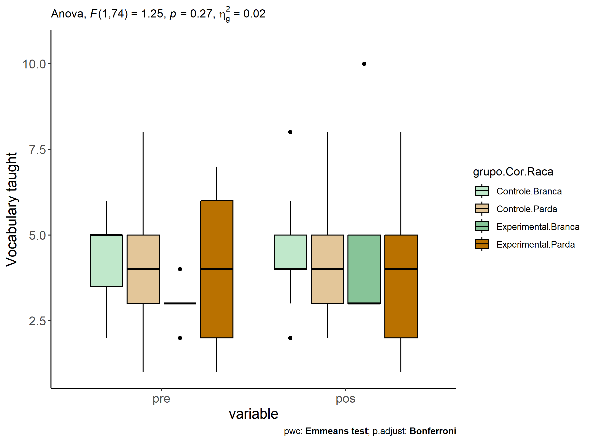<!-- -->

``` r
if (length(unique(pdat[["Cor.Raca"]])) >= 2) {
  ggPlotAoC2(pwcs, "Cor.Raca", "grupo", aov, ylab = "Vocabulary taught",
               subtitle = which(aov$Effect == "grupo:Cor.Raca"), addParam = "errorbar") +
      ggplot2::scale_color_manual(values = color[["grupo"]]) +
      if (ymin.ci < ymax.ci) ggplot2::ylim(ymin.ci, ymax.ci)
}
```

    ## Scale for colour is already present.
    ## Adding another scale for colour, which will replace the existing scale.

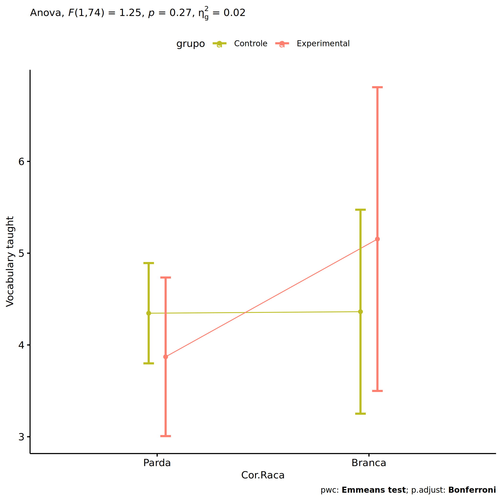<!-- -->

``` r
if (length(unique(pdat[["Cor.Raca"]])) >= 2) {
  plots <- twoWayAncovaBoxPlots(
    wdat, "vocab.teach.pos", c("grupo","Cor.Raca"), aov, pwcs, covar = "vocab.teach.pre",
    theme = "classic", color = color[["grupo:Cor.Raca"]],
    subtitle = which(aov$Effect == "grupo:Cor.Raca"))
}
```

``` r
if (length(unique(pdat[["Cor.Raca"]])) >= 2) {
  plots[["grupo:Cor.Raca"]] + ggplot2::ylab("Vocabulary taught") +
  ggplot2::scale_x_discrete(labels=c('pre', 'pos')) +
  if (ymin < ymax) ggplot2::ylim(ymin, ymax)
}
```

    ## Warning: No shared levels found between `names(values)` of the manual scale and the data's colour values.

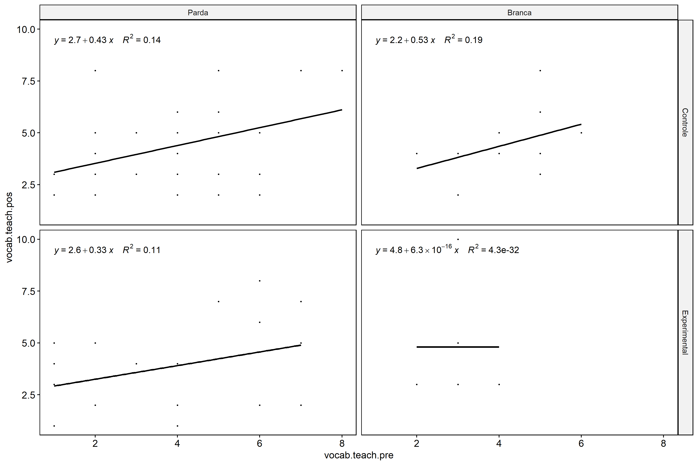<!-- -->

``` r
if (length(unique(pdat[["Cor.Raca"]])) >= 2) {
  plots <- twoWayAncovaBoxPlots(
    wdat.long, "vocab.teach", c("grupo","Cor.Raca"), aov, pwc.long,
    pre.post = "time",
    theme = "classic", color = color$prepost)
}
```

``` r
if (length(unique(pdat[["Cor.Raca"]])) >= 2) 
  plots[["grupo:Cor.Raca"]] + ggplot2::ylab("Vocabulary taught") +
    if (ymin < ymax) ggplot2::ylim(ymin, ymax)
```

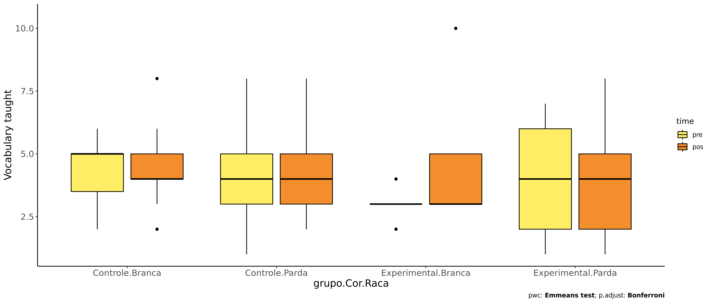<!-- -->

### Checking linearity assumption

``` r
if (length(unique(pdat[["Cor.Raca"]])) >= 2) {
  ggscatter(wdat, x = "vocab.teach.pre", y = "vocab.teach.pos", size = 0.5,
            facet.by = c("grupo","Cor.Raca"), add = "reg.line")+
    stat_regline_equation(
      aes(label =  paste(..eq.label.., ..rr.label.., sep = "~~~~"))
    ) +
    if (ymin < ymax) ggplot2::ylim(ymin, ymax)
}
```

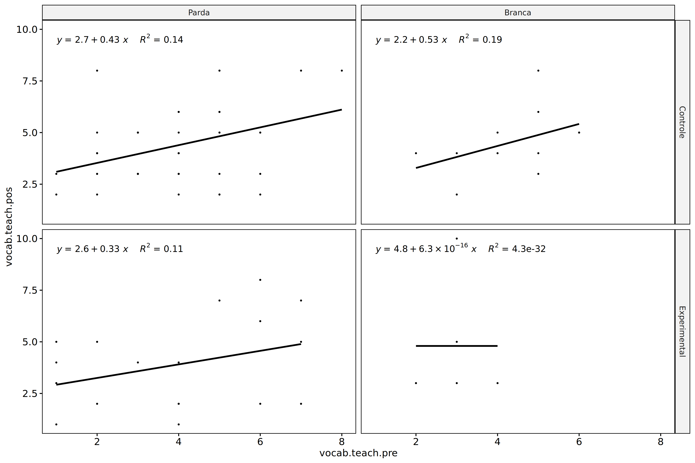<!-- -->

``` r
if (length(unique(pdat[["Cor.Raca"]])) >= 2) {
  ggscatter(wdat, x = "vocab.teach.pre", y = "vocab.teach.pos", size = 0.5,
            color = "grupo", facet.by = "Cor.Raca", add = "reg.line")+
    stat_regline_equation(
      aes(label =  paste(..eq.label.., ..rr.label.., sep = "~~~~"), color = grupo)
    ) +
    ggplot2::labs(subtitle = rstatix::get_test_label(aov, detailed = T, row = which(aov$Effect == "grupo:Cor.Raca"))) +
    ggplot2::scale_color_manual(values = color[["grupo"]]) +
    if (ymin < ymax) ggplot2::ylim(ymin, ymax)
}
```

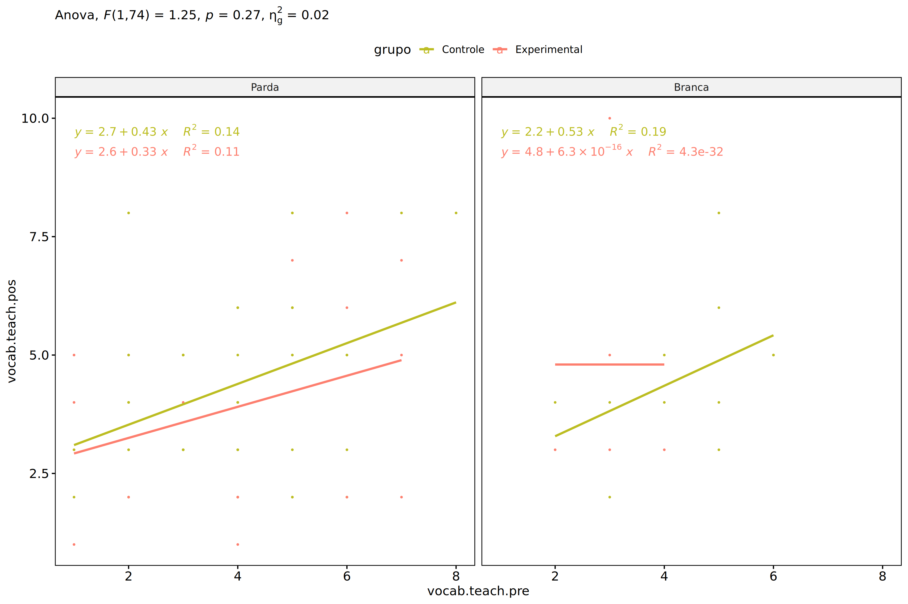<!-- -->

``` r
if (length(unique(pdat[["Cor.Raca"]])) >= 2) {
  ggscatter(wdat, x = "vocab.teach.pre", y = "vocab.teach.pos", size = 0.5,
            color = "Cor.Raca", facet.by = "grupo", add = "reg.line")+
    stat_regline_equation(
      aes(label =  paste(..eq.label.., ..rr.label.., sep = "~~~~"), color = Cor.Raca)
    ) +
    ggplot2::labs(subtitle = rstatix::get_test_label(aov, detailed = T, row = which(aov$Effect == "grupo:Cor.Raca"))) +
    ggplot2::scale_color_manual(values = color[["Cor.Raca"]]) +
    if (ymin < ymax) ggplot2::ylim(ymin, ymax)
}
```

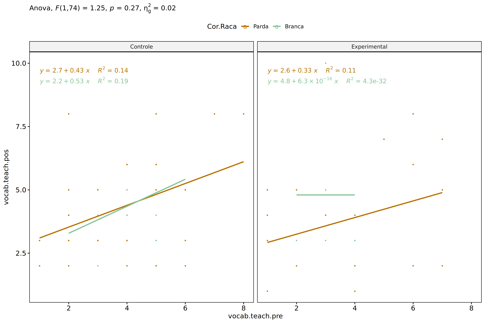<!-- -->

### Checking normality and homogeneity

``` r
if (length(unique(pdat[["Cor.Raca"]])) >= 2) 
  res <- augment(lm(vocab.teach.pos ~ vocab.teach.pre + grupo*Cor.Raca, data = wdat))
```

``` r
if (length(unique(pdat[["Cor.Raca"]])) >= 2)
  shapiro_test(res$.resid)
```

    ## # A tibble: 1 × 3
    ##   variable   statistic p.value
    ##   <chr>          <dbl>   <dbl>
    ## 1 res$.resid     0.979   0.210

``` r
if (length(unique(pdat[["Cor.Raca"]])) >= 2) 
  levene_test(res, .resid ~ grupo*Cor.Raca)
```

    ## # A tibble: 1 × 4
    ##     df1   df2 statistic     p
    ##   <int> <int>     <dbl> <dbl>
    ## 1     3    75      1.27 0.292

# ANCOVA and Pairwise for two factors **grupo:Serie**

## Without remove non-normal data

``` r
pdat = remove_group_data(dat[!is.na(dat[["grupo"]]) & !is.na(dat[["Serie"]]),],
                         "vocab.teach.pos", c("grupo","Serie"))
pdat = pdat[pdat[["Serie"]] %in% do.call(
  intersect, lapply(unique(pdat[["grupo"]]), FUN = function(x) {
    unique(pdat[["Serie"]][which(pdat[["grupo"]] == x)])
  })),]
pdat[["grupo"]] = factor(pdat[["grupo"]], level[["grupo"]])
pdat[["Serie"]] = factor(
  pdat[["Serie"]],
  level[["Serie"]][level[["Serie"]] %in% unique(pdat[["Serie"]])])

pdat.long <- rbind(pdat[,c("id","grupo","Serie")], pdat[,c("id","grupo","Serie")])
pdat.long[["time"]] <- c(rep("pre", nrow(pdat)), rep("pos", nrow(pdat)))
pdat.long[["time"]] <- factor(pdat.long[["time"]], c("pre","pos"))
pdat.long[["vocab.teach"]] <- c(pdat[["vocab.teach.pre"]], pdat[["vocab.teach.pos"]])

if (length(unique(pdat[["Serie"]])) >= 2) {
  aov = anova_test(pdat, vocab.teach.pos ~ vocab.teach.pre + grupo*Serie)
  laov[["grupo:Serie"]] <- get_anova_table(aov)
}
```

``` r
if (length(unique(pdat[["Serie"]])) >= 2) {
  pwcs <- list()
  pwcs[["Serie"]] <- emmeans_test(
    group_by(pdat, grupo), vocab.teach.pos ~ Serie,
    covariate = vocab.teach.pre, p.adjust.method = "bonferroni")
  pwcs[["grupo"]] <- emmeans_test(
    group_by(pdat, Serie), vocab.teach.pos ~ grupo,
    covariate = vocab.teach.pre, p.adjust.method = "bonferroni")
  
  pwc <- plyr::rbind.fill(pwcs[["grupo"]], pwcs[["Serie"]])
  pwc <- pwc[,c("grupo","Serie", colnames(pwc)[!colnames(pwc) %in% c("grupo","Serie")])]
}
```

``` r
if (length(unique(pdat[["Serie"]])) >= 2) {
  pwc.long <- emmeans_test(dplyr::group_by_at(pdat.long, c("grupo","Serie")),
                           vocab.teach ~ time,
                           p.adjust.method = "bonferroni")
  lpwc[["grupo:Serie"]] <- plyr::rbind.fill(pwc, pwc.long)
}
```

``` r
if (length(unique(pdat[["Serie"]])) >= 2) {
  ds <- get.descriptives(pdat, "vocab.teach.pos", c("grupo","Serie"), covar = "vocab.teach.pre")
  ds <- merge(ds[ds$variable != "vocab.teach.pre",],
              ds[ds$variable == "vocab.teach.pre", !colnames(ds) %in% c("variable")],
              by = c("grupo","Serie"), all.x = T, suffixes = c("", ".vocab.teach.pre"))
  ds <- merge(get_emmeans(pwcs[["grupo"]]), ds,
              by = c("grupo","Serie"), suffixes = c(".emms", ""))
  ds <- ds[,c("grupo","Serie","n","mean.vocab.teach.pre","se.vocab.teach.pre","mean","se",
              "emmean","se.emms","conf.low","conf.high")]
  
  colnames(ds) <- c("grupo","Serie", "N", paste0(c("M","SE")," (pre)"),
                    paste0(c("M","SE"), " (unadj)"),
                    paste0(c("M", "SE"), " (adj)"), "conf.low", "conf.high")
  
  lemms[["grupo:Serie"]] <- ds
}
```

## Computing ANCOVA and PairWise After removing non-normal data (OK)

``` r
if (length(unique(pdat[["Serie"]])) >= 2) {
  wdat = pdat 
  
  res = residuals(lm(vocab.teach.pos ~ vocab.teach.pre + grupo*Serie, data = wdat))
  non.normal = getNonNormal(res, wdat$id, plimit = 0.05)
  
  wdat = wdat[!wdat$id %in% non.normal,]
  
  wdat.long <- rbind(wdat[,c("id","grupo","Serie")], wdat[,c("id","grupo","Serie")])
  wdat.long[["time"]] <- c(rep("pre", nrow(wdat)), rep("pos", nrow(wdat)))
  wdat.long[["time"]] <- factor(wdat.long[["time"]], c("pre","pos"))
  wdat.long[["vocab.teach"]] <- c(wdat[["vocab.teach.pre"]], wdat[["vocab.teach.pos"]])
  
  
  ldat[["grupo:Serie"]] = wdat
  
  (non.normal)
}
```

    ## NULL

``` r
if (length(unique(pdat[["Serie"]])) >= 2) {
  aov = anova_test(wdat, vocab.teach.pos ~ vocab.teach.pre + grupo*Serie)
  laov[["grupo:Serie"]] <- merge(get_anova_table(aov), laov[["grupo:Serie"]],
                                         by="Effect", suffixes = c("","'"))
  df = get_anova_table(aov)
}
```

| Effect          | DFn | DFd |      F |     p | p\<.05 |   ges |
|:----------------|----:|----:|-------:|------:|:-------|------:|
| vocab.teach.pre |   1 | 137 | 14.638 | 0.000 | \*     | 0.097 |
| grupo           |   1 | 137 |  0.106 | 0.745 |        | 0.001 |
| Serie           |   3 | 137 |  0.412 | 0.744 |        | 0.009 |
| grupo:Serie     |   3 | 137 |  3.149 | 0.027 | \*     | 0.065 |

``` r
if (length(unique(pdat[["Serie"]])) >= 2) {
  pwcs <- list()
  pwcs[["Serie"]] <- emmeans_test(
    group_by(wdat, grupo), vocab.teach.pos ~ Serie,
    covariate = vocab.teach.pre, p.adjust.method = "bonferroni")
  pwcs[["grupo"]] <- emmeans_test(
    group_by(wdat, Serie), vocab.teach.pos ~ grupo,
    covariate = vocab.teach.pre, p.adjust.method = "bonferroni")
  
  pwc <- plyr::rbind.fill(pwcs[["grupo"]], pwcs[["Serie"]])
  pwc <- pwc[,c("grupo","Serie", colnames(pwc)[!colnames(pwc) %in% c("grupo","Serie")])]
}
```

| grupo | Serie | term | .y. | group1 | group2 | df | statistic | p | p.adj | p.adj.signif |
|:---|:---|:---|:---|:---|:---|---:|---:|---:|---:|:---|
|  | 6 ano | vocab.teach.pre\*grupo | vocab.teach.pos | Controle | Experimental | 137 | -2.030 | 0.044 | 0.044 | \* |
|  | 7 ano | vocab.teach.pre\*grupo | vocab.teach.pos | Controle | Experimental | 137 | 0.918 | 0.360 | 0.360 | ns |
|  | 8 ano | vocab.teach.pre\*grupo | vocab.teach.pos | Controle | Experimental | 137 | -1.129 | 0.261 | 0.261 | ns |
|  | 9 ano | vocab.teach.pre\*grupo | vocab.teach.pos | Controle | Experimental | 137 | 1.855 | 0.066 | 0.066 | ns |
| Controle |  | vocab.teach.pre\*Serie | vocab.teach.pos | 6 ano | 7 ano | 137 | -1.232 | 0.220 | 1.000 | ns |
| Controle |  | vocab.teach.pre\*Serie | vocab.teach.pos | 6 ano | 8 ano | 137 | -0.779 | 0.437 | 1.000 | ns |
| Controle |  | vocab.teach.pre\*Serie | vocab.teach.pos | 6 ano | 9 ano | 137 | -2.171 | 0.032 | 0.190 | ns |
| Controle |  | vocab.teach.pre\*Serie | vocab.teach.pos | 7 ano | 8 ano | 137 | 0.306 | 0.760 | 1.000 | ns |
| Controle |  | vocab.teach.pre\*Serie | vocab.teach.pos | 7 ano | 9 ano | 137 | -1.013 | 0.313 | 1.000 | ns |
| Controle |  | vocab.teach.pre\*Serie | vocab.teach.pos | 8 ano | 9 ano | 137 | -1.180 | 0.240 | 1.000 | ns |
| Experimental |  | vocab.teach.pre\*Serie | vocab.teach.pos | 6 ano | 7 ano | 137 | 1.687 | 0.094 | 0.563 | ns |
| Experimental |  | vocab.teach.pre\*Serie | vocab.teach.pos | 6 ano | 8 ano | 137 | 0.107 | 0.915 | 1.000 | ns |
| Experimental |  | vocab.teach.pre\*Serie | vocab.teach.pos | 6 ano | 9 ano | 137 | 1.842 | 0.068 | 0.406 | ns |
| Experimental |  | vocab.teach.pre\*Serie | vocab.teach.pos | 7 ano | 8 ano | 137 | -1.612 | 0.109 | 0.656 | ns |
| Experimental |  | vocab.teach.pre\*Serie | vocab.teach.pos | 7 ano | 9 ano | 137 | 0.361 | 0.718 | 1.000 | ns |
| Experimental |  | vocab.teach.pre\*Serie | vocab.teach.pos | 8 ano | 9 ano | 137 | 1.774 | 0.078 | 0.469 | ns |

``` r
if (length(unique(pdat[["Serie"]])) >= 2) {
  pwc.long <- emmeans_test(dplyr::group_by_at(wdat.long, c("grupo","Serie")),
                           vocab.teach ~ time,
                           p.adjust.method = "bonferroni")
  lpwc[["grupo:Serie"]] <- merge(plyr::rbind.fill(pwc, pwc.long),
                                         lpwc[["grupo:Serie"]],
                                         by=c("grupo","Serie","term",".y.","group1","group2"),
                                         suffixes = c("","'"))
}
```

| grupo | Serie | term | .y. | group1 | group2 | df | statistic | p | p.adj | p.adj.signif |
|:---|:---|:---|:---|:---|:---|---:|---:|---:|---:|:---|
| Controle | 6 ano | time | vocab.teach | pre | pos | 276 | -0.297 | 0.767 | 0.767 | ns |
| Controle | 7 ano | time | vocab.teach | pre | pos | 276 | -0.716 | 0.475 | 0.475 | ns |
| Controle | 8 ano | time | vocab.teach | pre | pos | 276 | -0.551 | 0.582 | 0.582 | ns |
| Controle | 9 ano | time | vocab.teach | pre | pos | 276 | -0.656 | 0.512 | 0.512 | ns |
| Experimental | 6 ano | time | vocab.teach | pre | pos | 276 | -1.366 | 0.173 | 0.173 | ns |
| Experimental | 7 ano | time | vocab.teach | pre | pos | 276 | -0.420 | 0.675 | 0.675 | ns |
| Experimental | 8 ano | time | vocab.teach | pre | pos | 276 | -1.316 | 0.189 | 0.189 | ns |
| Experimental | 9 ano | time | vocab.teach | pre | pos | 276 | 0.670 | 0.504 | 0.504 | ns |

``` r
if (length(unique(pdat[["Serie"]])) >= 2) {
  ds <- get.descriptives(wdat, "vocab.teach.pos", c("grupo","Serie"), covar = "vocab.teach.pre")
  ds <- merge(ds[ds$variable != "vocab.teach.pre",],
              ds[ds$variable == "vocab.teach.pre", !colnames(ds) %in% c("variable")],
              by = c("grupo","Serie"), all.x = T, suffixes = c("", ".vocab.teach.pre"))
  ds <- merge(get_emmeans(pwcs[["grupo"]]), ds,
              by = c("grupo","Serie"), suffixes = c(".emms", ""))
  ds <- ds[,c("grupo","Serie","n","mean.vocab.teach.pre","se.vocab.teach.pre",
              "mean","se","emmean","se.emms","conf.low","conf.high")]
  
  colnames(ds) <- c("grupo","Serie", "N", paste0(c("M","SE")," (pre)"),
                    paste0(c("M","SE"), " (unadj)"),
                    paste0(c("M", "SE"), " (adj)"), "conf.low", "conf.high")
  
  lemms[["grupo:Serie"]] <- merge(ds, lemms[["grupo:Serie"]],
                                          by=c("grupo","Serie"), suffixes = c("","'"))
}
```

| grupo | Serie | N | M (pre) | SE (pre) | M (unadj) | SE (unadj) | M (adj) | SE (adj) | conf.low | conf.high |
|:---|:---|---:|---:|---:|---:|---:|---:|---:|---:|---:|
| Controle | 6 ano | 26 | 3.462 | 0.325 | 3.615 | 0.372 | 3.797 | 0.360 | 3.085 | 4.510 |
| Controle | 7 ano | 28 | 4.071 | 0.212 | 4.429 | 0.323 | 4.412 | 0.344 | 3.731 | 5.093 |
| Controle | 8 ano | 17 | 3.824 | 0.602 | 4.176 | 0.472 | 4.241 | 0.442 | 3.366 | 5.115 |
| Controle | 9 ano | 27 | 4.852 | 0.349 | 5.185 | 0.338 | 4.914 | 0.358 | 4.207 | 5.622 |
| Experimental | 6 ano | 13 | 4.077 | 0.473 | 5.077 | 0.459 | 5.059 | 0.505 | 4.059 | 6.058 |
| Experimental | 7 ano | 13 | 3.308 | 0.593 | 3.615 | 0.488 | 3.848 | 0.509 | 2.841 | 4.854 |
| Experimental | 8 ano | 14 | 4.071 | 0.597 | 5.000 | 0.695 | 4.983 | 0.487 | 4.020 | 5.946 |
| Experimental | 9 ano | 8 | 4.250 | 0.559 | 3.625 | 0.800 | 3.550 | 0.644 | 2.276 | 4.825 |

### Plots for ancova

``` r
if (length(unique(pdat[["Serie"]])) >= 2) {
  ggPlotAoC2(pwcs, "grupo", "Serie", aov, ylab = "Vocabulary taught",
             subtitle = which(aov$Effect == "grupo:Serie"), addParam = "errorbar") +
    ggplot2::scale_color_manual(values = color[["Serie"]]) +
    if (ymin.ci < ymax.ci) ggplot2::ylim(ymin.ci, ymax.ci)
}
```

    ## Scale for colour is already present.
    ## Adding another scale for colour, which will replace the existing scale.

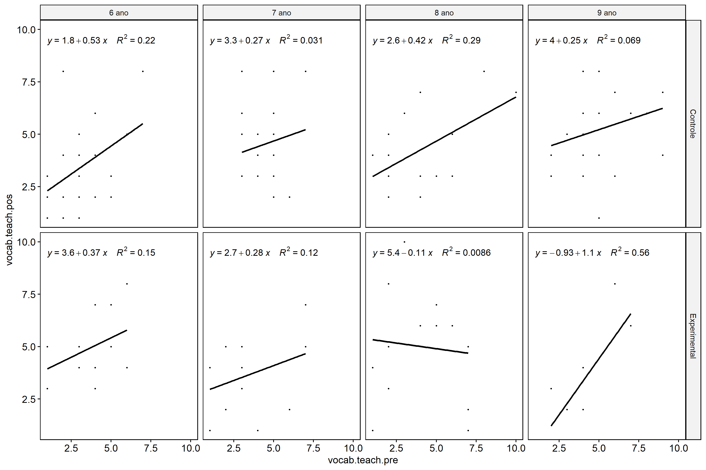<!-- -->

``` r
if (length(unique(pdat[["Serie"]])) >= 2) {
  ggPlotAoC2(pwcs, "Serie", "grupo", aov, ylab = "Vocabulary taught",
               subtitle = which(aov$Effect == "grupo:Serie"), addParam = "errorbar") +
      ggplot2::scale_color_manual(values = color[["grupo"]]) +
      if (ymin.ci < ymax.ci) ggplot2::ylim(ymin.ci, ymax.ci)
}
```

    ## Scale for colour is already present.
    ## Adding another scale for colour, which will replace the existing scale.

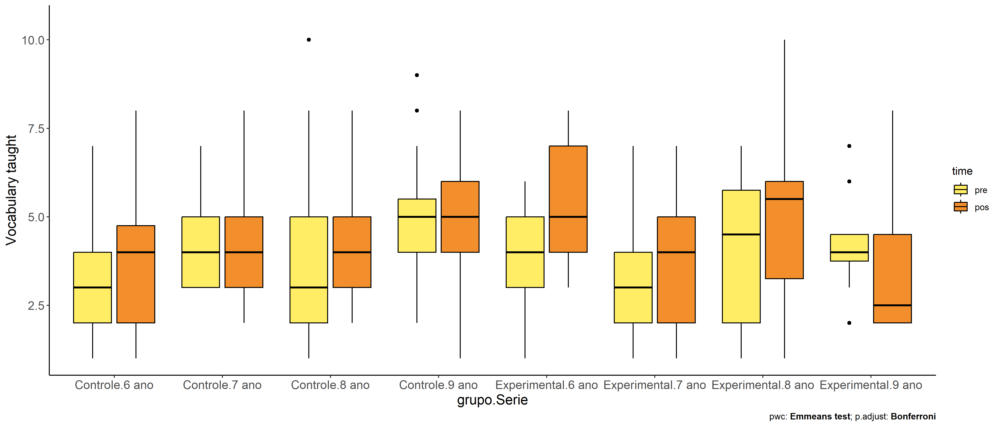<!-- -->

``` r
if (length(unique(pdat[["Serie"]])) >= 2) {
  plots <- twoWayAncovaBoxPlots(
    wdat, "vocab.teach.pos", c("grupo","Serie"), aov, pwcs, covar = "vocab.teach.pre",
    theme = "classic", color = color[["grupo:Serie"]],
    subtitle = which(aov$Effect == "grupo:Serie"))
}
```

``` r
if (length(unique(pdat[["Serie"]])) >= 2) {
  plots[["grupo:Serie"]] + ggplot2::ylab("Vocabulary taught") +
  ggplot2::scale_x_discrete(labels=c('pre', 'pos')) +
  if (ymin < ymax) ggplot2::ylim(ymin, ymax)
}
```

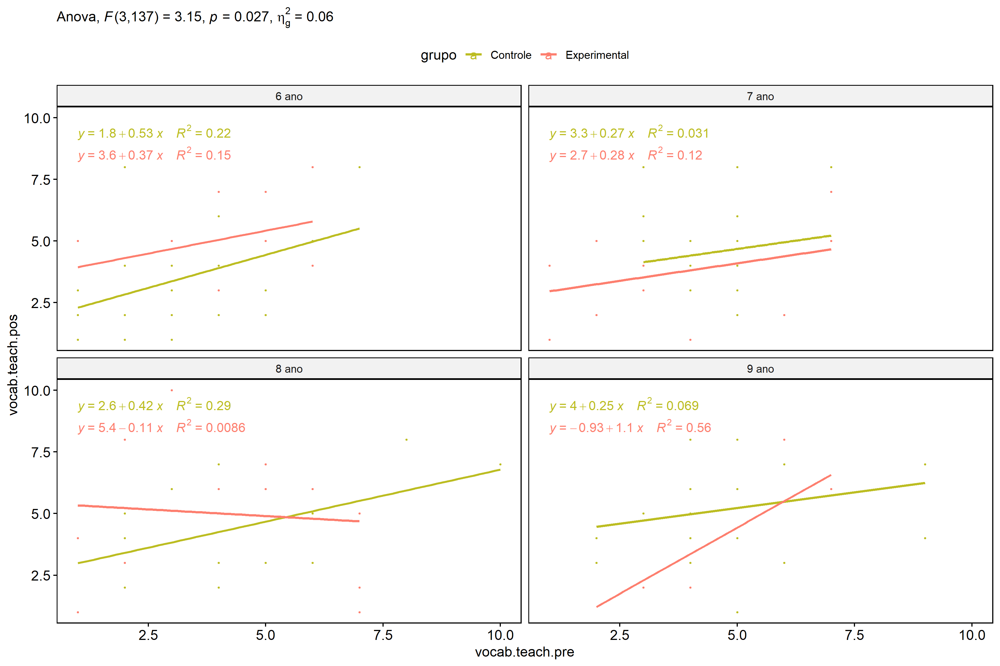<!-- -->

``` r
if (length(unique(pdat[["Serie"]])) >= 2) {
  plots <- twoWayAncovaBoxPlots(
    wdat.long, "vocab.teach", c("grupo","Serie"), aov, pwc.long,
    pre.post = "time",
    theme = "classic", color = color$prepost)
}
```

``` r
if (length(unique(pdat[["Serie"]])) >= 2) 
  plots[["grupo:Serie"]] + ggplot2::ylab("Vocabulary taught") +
    if (ymin < ymax) ggplot2::ylim(ymin, ymax)
```

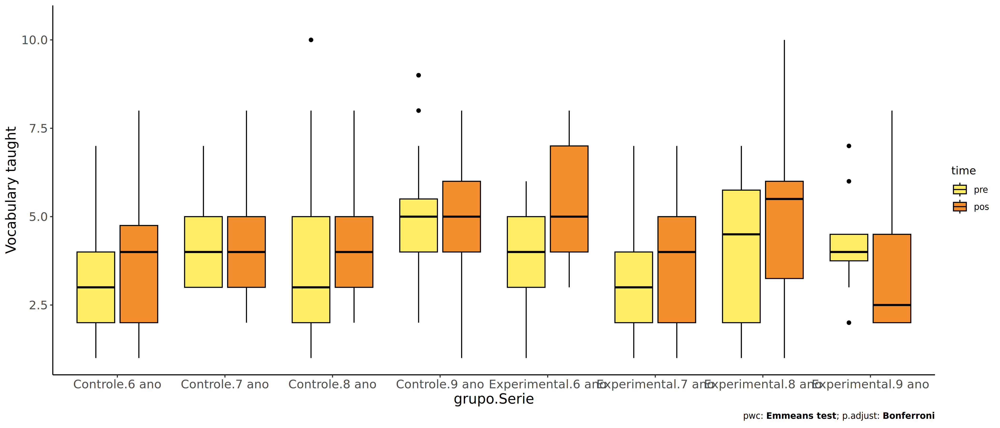<!-- -->

### Checking linearity assumption

``` r
if (length(unique(pdat[["Serie"]])) >= 2) {
  ggscatter(wdat, x = "vocab.teach.pre", y = "vocab.teach.pos", size = 0.5,
            facet.by = c("grupo","Serie"), add = "reg.line")+
    stat_regline_equation(
      aes(label =  paste(..eq.label.., ..rr.label.., sep = "~~~~"))
    ) +
    if (ymin < ymax) ggplot2::ylim(ymin, ymax)
}
```

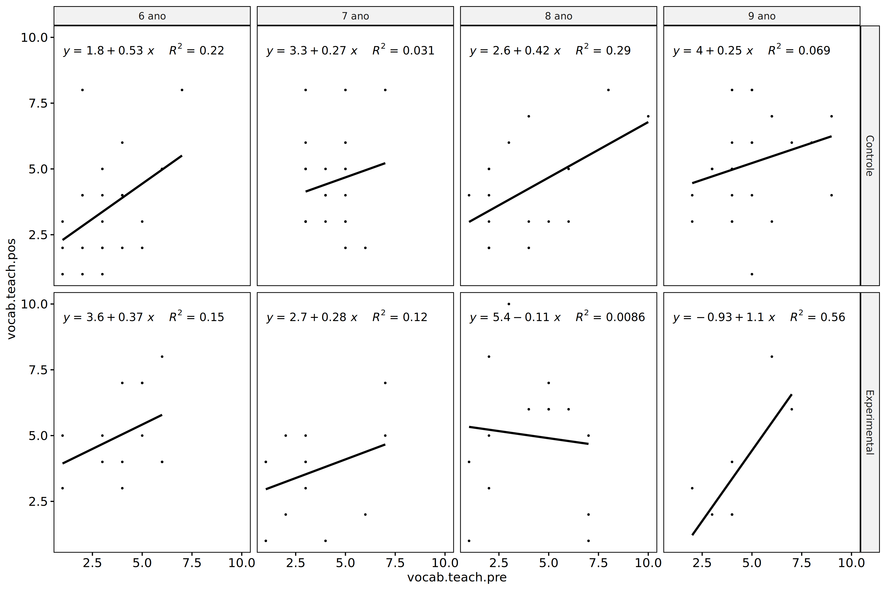<!-- -->

``` r
if (length(unique(pdat[["Serie"]])) >= 2) {
  ggscatter(wdat, x = "vocab.teach.pre", y = "vocab.teach.pos", size = 0.5,
            color = "grupo", facet.by = "Serie", add = "reg.line")+
    stat_regline_equation(
      aes(label =  paste(..eq.label.., ..rr.label.., sep = "~~~~"), color = grupo)
    ) +
    ggplot2::labs(subtitle = rstatix::get_test_label(aov, detailed = T, row = which(aov$Effect == "grupo:Serie"))) +
    ggplot2::scale_color_manual(values = color[["grupo"]]) +
    if (ymin < ymax) ggplot2::ylim(ymin, ymax)
}
```

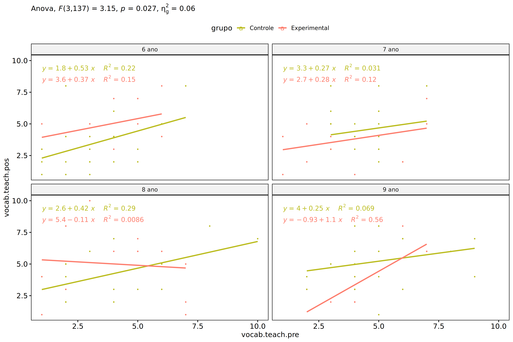<!-- -->

``` r
if (length(unique(pdat[["Serie"]])) >= 2) {
  ggscatter(wdat, x = "vocab.teach.pre", y = "vocab.teach.pos", size = 0.5,
            color = "Serie", facet.by = "grupo", add = "reg.line")+
    stat_regline_equation(
      aes(label =  paste(..eq.label.., ..rr.label.., sep = "~~~~"), color = Serie)
    ) +
    ggplot2::labs(subtitle = rstatix::get_test_label(aov, detailed = T, row = which(aov$Effect == "grupo:Serie"))) +
    ggplot2::scale_color_manual(values = color[["Serie"]]) +
    if (ymin < ymax) ggplot2::ylim(ymin, ymax)
}
```

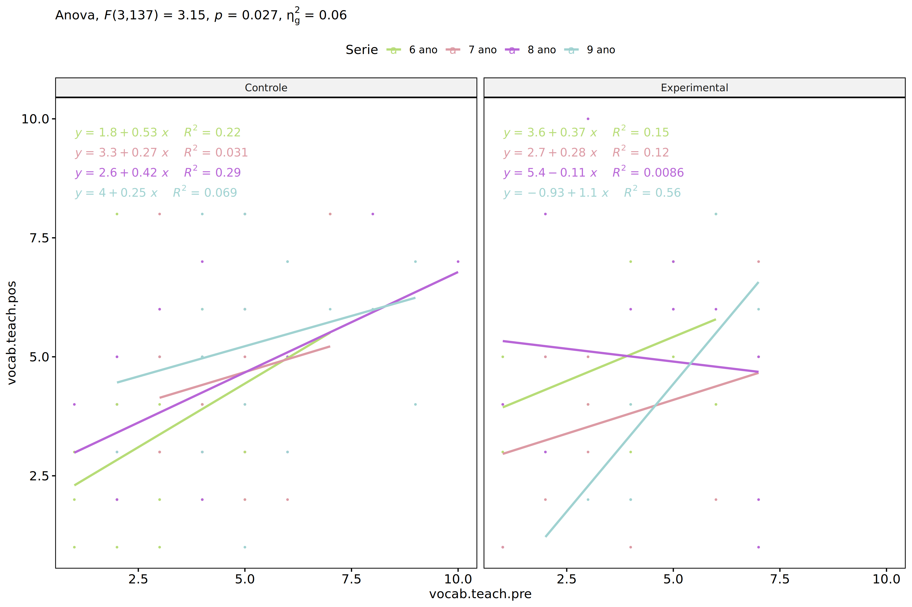<!-- -->

### Checking normality and homogeneity

``` r
if (length(unique(pdat[["Serie"]])) >= 2) 
  res <- augment(lm(vocab.teach.pos ~ vocab.teach.pre + grupo*Serie, data = wdat))
```

``` r
if (length(unique(pdat[["Serie"]])) >= 2)
  shapiro_test(res$.resid)
```

    ## # A tibble: 1 × 3
    ##   variable   statistic p.value
    ##   <chr>          <dbl>   <dbl>
    ## 1 res$.resid     0.989   0.339

``` r
if (length(unique(pdat[["Serie"]])) >= 2) 
  levene_test(res, .resid ~ grupo*Serie)
```

    ## # A tibble: 1 × 4
    ##     df1   df2 statistic     p
    ##   <int> <int>     <dbl> <dbl>
    ## 1     7   138     0.643 0.720

# ANCOVA and Pairwise for two factors **grupo:vocab.teach.quintile**

## Without remove non-normal data

``` r
pdat = remove_group_data(dat[!is.na(dat[["grupo"]]) & !is.na(dat[["vocab.teach.quintile"]]),],
                         "vocab.teach.pos", c("grupo","vocab.teach.quintile"))
pdat = pdat[pdat[["vocab.teach.quintile"]] %in% do.call(
  intersect, lapply(unique(pdat[["grupo"]]), FUN = function(x) {
    unique(pdat[["vocab.teach.quintile"]][which(pdat[["grupo"]] == x)])
  })),]
pdat[["grupo"]] = factor(pdat[["grupo"]], level[["grupo"]])
pdat[["vocab.teach.quintile"]] = factor(
  pdat[["vocab.teach.quintile"]],
  level[["vocab.teach.quintile"]][level[["vocab.teach.quintile"]] %in% unique(pdat[["vocab.teach.quintile"]])])

pdat.long <- rbind(pdat[,c("id","grupo","vocab.teach.quintile")], pdat[,c("id","grupo","vocab.teach.quintile")])
pdat.long[["time"]] <- c(rep("pre", nrow(pdat)), rep("pos", nrow(pdat)))
pdat.long[["time"]] <- factor(pdat.long[["time"]], c("pre","pos"))
pdat.long[["vocab.teach"]] <- c(pdat[["vocab.teach.pre"]], pdat[["vocab.teach.pos"]])

if (length(unique(pdat[["vocab.teach.quintile"]])) >= 2) {
  aov = anova_test(pdat, vocab.teach.pos ~ vocab.teach.pre + grupo*vocab.teach.quintile)
  laov[["grupo:vocab.teach.quintile"]] <- get_anova_table(aov)
}
```

``` r
if (length(unique(pdat[["vocab.teach.quintile"]])) >= 2) {
  pwcs <- list()
  pwcs[["vocab.teach.quintile"]] <- emmeans_test(
    group_by(pdat, grupo), vocab.teach.pos ~ vocab.teach.quintile,
    covariate = vocab.teach.pre, p.adjust.method = "bonferroni")
  pwcs[["grupo"]] <- emmeans_test(
    group_by(pdat, vocab.teach.quintile), vocab.teach.pos ~ grupo,
    covariate = vocab.teach.pre, p.adjust.method = "bonferroni")
  
  pwc <- plyr::rbind.fill(pwcs[["grupo"]], pwcs[["vocab.teach.quintile"]])
  pwc <- pwc[,c("grupo","vocab.teach.quintile", colnames(pwc)[!colnames(pwc) %in% c("grupo","vocab.teach.quintile")])]
}
```

``` r
if (length(unique(pdat[["vocab.teach.quintile"]])) >= 2) {
  pwc.long <- emmeans_test(dplyr::group_by_at(pdat.long, c("grupo","vocab.teach.quintile")),
                           vocab.teach ~ time,
                           p.adjust.method = "bonferroni")
  lpwc[["grupo:vocab.teach.quintile"]] <- plyr::rbind.fill(pwc, pwc.long)
}
```

``` r
if (length(unique(pdat[["vocab.teach.quintile"]])) >= 2) {
  ds <- get.descriptives(pdat, "vocab.teach.pos", c("grupo","vocab.teach.quintile"), covar = "vocab.teach.pre")
  ds <- merge(ds[ds$variable != "vocab.teach.pre",],
              ds[ds$variable == "vocab.teach.pre", !colnames(ds) %in% c("variable")],
              by = c("grupo","vocab.teach.quintile"), all.x = T, suffixes = c("", ".vocab.teach.pre"))
  ds <- merge(get_emmeans(pwcs[["grupo"]]), ds,
              by = c("grupo","vocab.teach.quintile"), suffixes = c(".emms", ""))
  ds <- ds[,c("grupo","vocab.teach.quintile","n","mean.vocab.teach.pre","se.vocab.teach.pre","mean","se",
              "emmean","se.emms","conf.low","conf.high")]
  
  colnames(ds) <- c("grupo","vocab.teach.quintile", "N", paste0(c("M","SE")," (pre)"),
                    paste0(c("M","SE"), " (unadj)"),
                    paste0(c("M", "SE"), " (adj)"), "conf.low", "conf.high")
  
  lemms[["grupo:vocab.teach.quintile"]] <- ds
}
```

## Computing ANCOVA and PairWise After removing non-normal data (OK)

``` r
if (length(unique(pdat[["vocab.teach.quintile"]])) >= 2) {
  wdat = pdat 
  
  res = residuals(lm(vocab.teach.pos ~ vocab.teach.pre + grupo*vocab.teach.quintile, data = wdat))
  non.normal = getNonNormal(res, wdat$id, plimit = 0.05)
  
  wdat = wdat[!wdat$id %in% non.normal,]
  
  wdat.long <- rbind(wdat[,c("id","grupo","vocab.teach.quintile")], wdat[,c("id","grupo","vocab.teach.quintile")])
  wdat.long[["time"]] <- c(rep("pre", nrow(wdat)), rep("pos", nrow(wdat)))
  wdat.long[["time"]] <- factor(wdat.long[["time"]], c("pre","pos"))
  wdat.long[["vocab.teach"]] <- c(wdat[["vocab.teach.pre"]], wdat[["vocab.teach.pos"]])
  
  
  ldat[["grupo:vocab.teach.quintile"]] = wdat
  
  (non.normal)
}
```

    ## NULL

``` r
if (length(unique(pdat[["vocab.teach.quintile"]])) >= 2) {
  aov = anova_test(wdat, vocab.teach.pos ~ vocab.teach.pre + grupo*vocab.teach.quintile)
  laov[["grupo:vocab.teach.quintile"]] <- merge(get_anova_table(aov), laov[["grupo:vocab.teach.quintile"]],
                                         by="Effect", suffixes = c("","'"))
  df = get_anova_table(aov)
}
```

| Effect                     | DFn | DFd |     F |     p | p\<.05 |   ges |
|:---------------------------|----:|----:|------:|------:|:-------|------:|
| vocab.teach.pre            |   1 | 135 | 2.991 | 0.086 |        | 0.022 |
| grupo                      |   1 | 135 | 0.446 | 0.505 |        | 0.003 |
| vocab.teach.quintile       |   4 | 135 | 0.593 | 0.668 |        | 0.017 |
| grupo:vocab.teach.quintile |   4 | 135 | 1.037 | 0.391 |        | 0.030 |

``` r
if (length(unique(pdat[["vocab.teach.quintile"]])) >= 2) {
  pwcs <- list()
  pwcs[["vocab.teach.quintile"]] <- emmeans_test(
    group_by(wdat, grupo), vocab.teach.pos ~ vocab.teach.quintile,
    covariate = vocab.teach.pre, p.adjust.method = "bonferroni")
  pwcs[["grupo"]] <- emmeans_test(
    group_by(wdat, vocab.teach.quintile), vocab.teach.pos ~ grupo,
    covariate = vocab.teach.pre, p.adjust.method = "bonferroni")
  
  pwc <- plyr::rbind.fill(pwcs[["grupo"]], pwcs[["vocab.teach.quintile"]])
  pwc <- pwc[,c("grupo","vocab.teach.quintile", colnames(pwc)[!colnames(pwc) %in% c("grupo","vocab.teach.quintile")])]
}
```

| grupo | vocab.teach.quintile | term | .y. | group1 | group2 | df | statistic | p | p.adj | p.adj.signif |
|:---|:---|:---|:---|:---|:---|---:|---:|---:|---:|:---|
|  | 1st quintile | vocab.teach.pre\*grupo | vocab.teach.pos | Controle | Experimental | 135 | -0.879 | 0.381 | 0.381 | ns |
|  | 2nd quintile | vocab.teach.pre\*grupo | vocab.teach.pos | Controle | Experimental | 135 | -0.695 | 0.488 | 0.488 | ns |
|  | 3rd quintile | vocab.teach.pre\*grupo | vocab.teach.pos | Controle | Experimental | 135 | -0.267 | 0.790 | 0.790 | ns |
|  | 4th quintile | vocab.teach.pre\*grupo | vocab.teach.pos | Controle | Experimental | 135 | -0.680 | 0.498 | 0.498 | ns |
|  | 5th quintile | vocab.teach.pre\*grupo | vocab.teach.pos | Controle | Experimental | 135 | 1.618 | 0.108 | 0.108 | ns |
| Controle |  | vocab.teach.pre\*vocab.teach.quintile | vocab.teach.pos | 1st quintile | 2nd quintile | 135 | -0.114 | 0.910 | 1.000 | ns |
| Controle |  | vocab.teach.pre\*vocab.teach.quintile | vocab.teach.pos | 1st quintile | 3rd quintile | 135 | 0.370 | 0.712 | 1.000 | ns |
| Controle |  | vocab.teach.pre\*vocab.teach.quintile | vocab.teach.pos | 1st quintile | 4th quintile | 135 | 0.690 | 0.492 | 1.000 | ns |
| Controle |  | vocab.teach.pre\*vocab.teach.quintile | vocab.teach.pos | 1st quintile | 5th quintile | 135 | 0.138 | 0.891 | 1.000 | ns |
| Controle |  | vocab.teach.pre\*vocab.teach.quintile | vocab.teach.pos | 2nd quintile | 3rd quintile | 135 | 0.677 | 0.499 | 1.000 | ns |
| Controle |  | vocab.teach.pre\*vocab.teach.quintile | vocab.teach.pos | 2nd quintile | 4th quintile | 135 | 0.957 | 0.340 | 1.000 | ns |
| Controle |  | vocab.teach.pre\*vocab.teach.quintile | vocab.teach.pos | 2nd quintile | 5th quintile | 135 | 0.209 | 0.835 | 1.000 | ns |
| Controle |  | vocab.teach.pre\*vocab.teach.quintile | vocab.teach.pos | 3rd quintile | 4th quintile | 135 | 0.853 | 0.395 | 1.000 | ns |
| Controle |  | vocab.teach.pre\*vocab.teach.quintile | vocab.teach.pos | 3rd quintile | 5th quintile | 135 | -0.051 | 0.960 | 1.000 | ns |
| Controle |  | vocab.teach.pre\*vocab.teach.quintile | vocab.teach.pos | 4th quintile | 5th quintile | 135 | -0.698 | 0.486 | 1.000 | ns |
| Experimental |  | vocab.teach.pre\*vocab.teach.quintile | vocab.teach.pos | 1st quintile | 2nd quintile | 135 | -0.013 | 0.989 | 1.000 | ns |
| Experimental |  | vocab.teach.pre\*vocab.teach.quintile | vocab.teach.pos | 1st quintile | 3rd quintile | 135 | 0.686 | 0.494 | 1.000 | ns |
| Experimental |  | vocab.teach.pre\*vocab.teach.quintile | vocab.teach.pos | 1st quintile | 4th quintile | 135 | 0.589 | 0.557 | 1.000 | ns |
| Experimental |  | vocab.teach.pre\*vocab.teach.quintile | vocab.teach.pos | 1st quintile | 5th quintile | 135 | 1.257 | 0.211 | 1.000 | ns |
| Experimental |  | vocab.teach.pre\*vocab.teach.quintile | vocab.teach.pos | 2nd quintile | 3rd quintile | 135 | 0.909 | 0.365 | 1.000 | ns |
| Experimental |  | vocab.teach.pre\*vocab.teach.quintile | vocab.teach.pos | 2nd quintile | 4th quintile | 135 | 0.751 | 0.454 | 1.000 | ns |
| Experimental |  | vocab.teach.pre\*vocab.teach.quintile | vocab.teach.pos | 2nd quintile | 5th quintile | 135 | 1.569 | 0.119 | 1.000 | ns |
| Experimental |  | vocab.teach.pre\*vocab.teach.quintile | vocab.teach.pos | 3rd quintile | 4th quintile | 135 | 0.211 | 0.833 | 1.000 | ns |
| Experimental |  | vocab.teach.pre\*vocab.teach.quintile | vocab.teach.pos | 3rd quintile | 5th quintile | 135 | 1.432 | 0.154 | 1.000 | ns |
| Experimental |  | vocab.teach.pre\*vocab.teach.quintile | vocab.teach.pos | 4th quintile | 5th quintile | 135 | 1.415 | 0.159 | 1.000 | ns |

``` r
if (length(unique(pdat[["vocab.teach.quintile"]])) >= 2) {
  pwc.long <- emmeans_test(dplyr::group_by_at(wdat.long, c("grupo","vocab.teach.quintile")),
                           vocab.teach ~ time,
                           p.adjust.method = "bonferroni")
  lpwc[["grupo:vocab.teach.quintile"]] <- merge(plyr::rbind.fill(pwc, pwc.long),
                                         lpwc[["grupo:vocab.teach.quintile"]],
                                         by=c("grupo","vocab.teach.quintile","term",".y.","group1","group2"),
                                         suffixes = c("","'"))
}
```

| grupo | vocab.teach.quintile | term | .y. | group1 | group2 | df | statistic | p | p.adj | p.adj.signif |
|:---|:---|:---|:---|:---|:---|---:|---:|---:|---:|:---|
| Controle | 1st quintile | time | vocab.teach | pre | pos | 272 | -3.296 | 0.001 | 0.001 | \*\* |
| Controle | 2nd quintile | time | vocab.teach | pre | pos | 272 | -2.650 | 0.009 | 0.009 | \*\* |
| Controle | 3rd quintile | time | vocab.teach | pre | pos | 272 | -0.081 | 0.936 | 0.936 | ns |
| Controle | 4th quintile | time | vocab.teach | pre | pos | 272 | 2.071 | 0.039 | 0.039 | \* |
| Controle | 5th quintile | time | vocab.teach | pre | pos | 272 | 2.014 | 0.045 | 0.045 | \* |
| Experimental | 1st quintile | time | vocab.teach | pre | pos | 272 | -4.165 | 0.000 | 0.000 | \*\*\*\* |
| Experimental | 2nd quintile | time | vocab.teach | pre | pos | 272 | -2.380 | 0.018 | 0.018 | \* |
| Experimental | 3rd quintile | time | vocab.teach | pre | pos | 272 | -0.401 | 0.689 | 0.689 | ns |
| Experimental | 4th quintile | time | vocab.teach | pre | pos | 272 | 0.846 | 0.398 | 0.398 | ns |
| Experimental | 5th quintile | time | vocab.teach | pre | pos | 272 | 3.383 | 0.001 | 0.001 | \*\*\* |

``` r
if (length(unique(pdat[["vocab.teach.quintile"]])) >= 2) {
  ds <- get.descriptives(wdat, "vocab.teach.pos", c("grupo","vocab.teach.quintile"), covar = "vocab.teach.pre")
  ds <- merge(ds[ds$variable != "vocab.teach.pre",],
              ds[ds$variable == "vocab.teach.pre", !colnames(ds) %in% c("variable")],
              by = c("grupo","vocab.teach.quintile"), all.x = T, suffixes = c("", ".vocab.teach.pre"))
  ds <- merge(get_emmeans(pwcs[["grupo"]]), ds,
              by = c("grupo","vocab.teach.quintile"), suffixes = c(".emms", ""))
  ds <- ds[,c("grupo","vocab.teach.quintile","n","mean.vocab.teach.pre","se.vocab.teach.pre",
              "mean","se","emmean","se.emms","conf.low","conf.high")]
  
  colnames(ds) <- c("grupo","vocab.teach.quintile", "N", paste0(c("M","SE")," (pre)"),
                    paste0(c("M","SE"), " (unadj)"),
                    paste0(c("M", "SE"), " (adj)"), "conf.low", "conf.high")
  
  lemms[["grupo:vocab.teach.quintile"]] <- merge(ds, lemms[["grupo:vocab.teach.quintile"]],
                                          by=c("grupo","vocab.teach.quintile"), suffixes = c("","'"))
}
```

| grupo | vocab.teach.quintile | N | M (pre) | SE (pre) | M (unadj) | SE (unadj) | M (adj) | SE (adj) | conf.low | conf.high |
|:---|:---|---:|---:|---:|---:|---:|---:|---:|---:|---:|
| Controle | 1st quintile | 18 | 1.778 | 0.101 | 3.278 | 0.403 | 4.618 | 0.891 | 2.857 | 6.379 |
| Controle | 2nd quintile | 22 | 3.000 | 0.000 | 4.091 | 0.348 | 4.701 | 0.531 | 3.651 | 5.751 |
| Controle | 3rd quintile | 41 | 4.463 | 0.079 | 4.488 | 0.282 | 4.223 | 0.329 | 3.573 | 4.873 |
| Controle | 4th quintile | 9 | 6.000 | 0.000 | 4.667 | 0.577 | 3.484 | 0.924 | 1.657 | 5.310 |
| Controle | 5th quintile | 8 | 8.125 | 0.398 | 6.750 | 0.491 | 4.297 | 1.564 | 1.205 | 7.389 |
| Experimental | 1st quintile | 13 | 1.462 | 0.144 | 3.692 | 0.524 | 5.222 | 1.024 | 3.197 | 7.247 |
| Experimental | 2nd quintile | 8 | 3.000 | 0.000 | 4.625 | 0.844 | 5.235 | 0.747 | 3.758 | 6.712 |
| Experimental | 3rd quintile | 15 | 4.400 | 0.131 | 4.600 | 0.559 | 4.373 | 0.498 | 3.388 | 5.358 |
| Experimental | 4th quintile | 6 | 6.000 | 0.000 | 5.333 | 0.989 | 4.150 | 1.022 | 2.128 | 6.172 |
| Experimental | 5th quintile | 6 | 7.000 | 0.000 | 4.333 | 0.955 | 2.553 | 1.280 | 0.022 | 5.083 |

### Plots for ancova

``` r
if (length(unique(pdat[["vocab.teach.quintile"]])) >= 2) {
  ggPlotAoC2(pwcs, "grupo", "vocab.teach.quintile", aov, ylab = "Vocabulary taught",
             subtitle = which(aov$Effect == "grupo:vocab.teach.quintile"), addParam = "errorbar") +
    ggplot2::scale_color_manual(values = color[["vocab.teach.quintile"]]) +
    if (ymin.ci < ymax.ci) ggplot2::ylim(ymin.ci, ymax.ci)
}
```

    ## Scale for colour is already present.
    ## Adding another scale for colour, which will replace the existing scale.

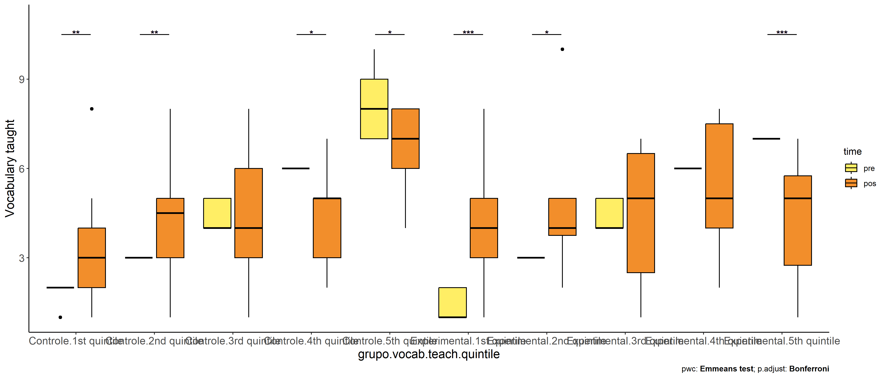<!-- -->

``` r
if (length(unique(pdat[["vocab.teach.quintile"]])) >= 2) {
  ggPlotAoC2(pwcs, "vocab.teach.quintile", "grupo", aov, ylab = "Vocabulary taught",
               subtitle = which(aov$Effect == "grupo:vocab.teach.quintile"), addParam = "errorbar") +
      ggplot2::scale_color_manual(values = color[["grupo"]]) +
      if (ymin.ci < ymax.ci) ggplot2::ylim(ymin.ci, ymax.ci)
}
```

    ## Scale for colour is already present.
    ## Adding another scale for colour, which will replace the existing scale.

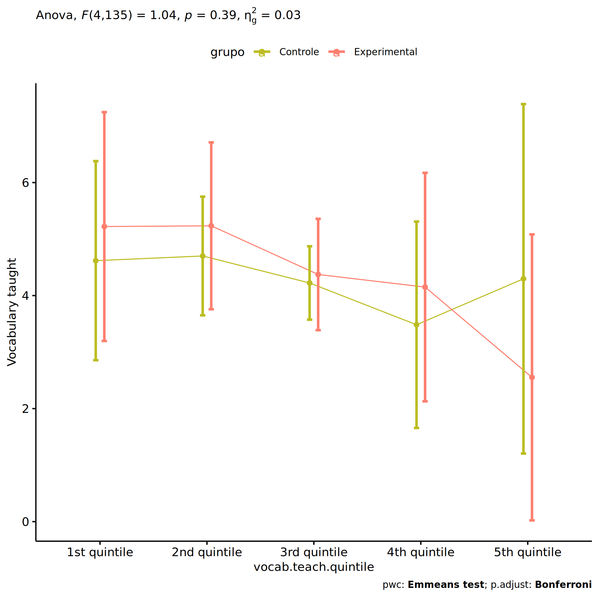<!-- -->

``` r
if (length(unique(pdat[["vocab.teach.quintile"]])) >= 2) {
  plots <- twoWayAncovaBoxPlots(
    wdat, "vocab.teach.pos", c("grupo","vocab.teach.quintile"), aov, pwcs, covar = "vocab.teach.pre",
    theme = "classic", color = color[["grupo:vocab.teach.quintile"]],
    subtitle = which(aov$Effect == "grupo:vocab.teach.quintile"))
}
```

``` r
if (length(unique(pdat[["vocab.teach.quintile"]])) >= 2) {
  plots[["grupo:vocab.teach.quintile"]] + ggplot2::ylab("Vocabulary taught") +
  ggplot2::scale_x_discrete(labels=c('pre', 'pos')) +
  if (ymin < ymax) ggplot2::ylim(ymin, ymax)
}
```

    ## Warning: No shared levels found between `names(values)` of the manual scale and the data's colour values.

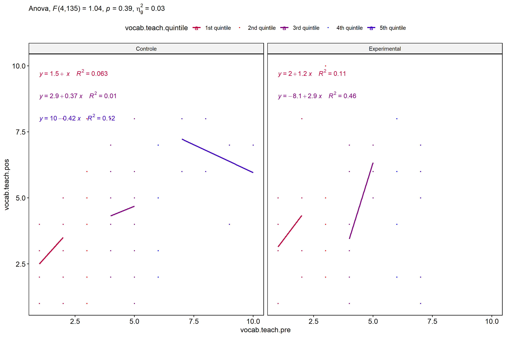<!-- -->

``` r
if (length(unique(pdat[["vocab.teach.quintile"]])) >= 2) {
  plots <- twoWayAncovaBoxPlots(
    wdat.long, "vocab.teach", c("grupo","vocab.teach.quintile"), aov, pwc.long,
    pre.post = "time",
    theme = "classic", color = color$prepost)
}
```

``` r
if (length(unique(pdat[["vocab.teach.quintile"]])) >= 2) 
  plots[["grupo:vocab.teach.quintile"]] + ggplot2::ylab("Vocabulary taught") +
    if (ymin < ymax) ggplot2::ylim(ymin, ymax)
```

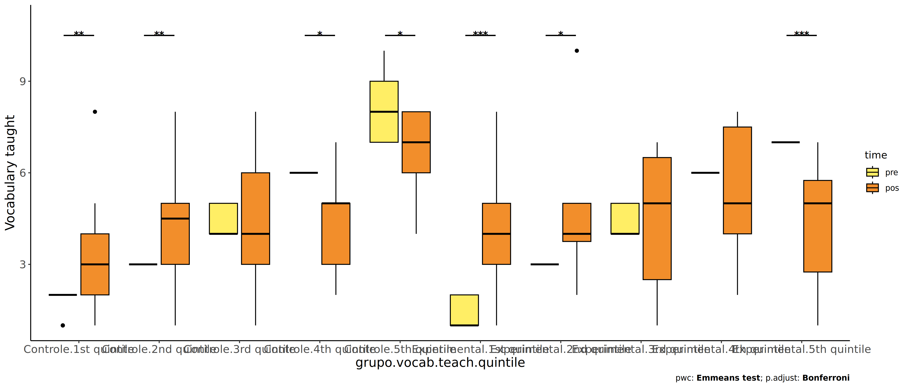<!-- -->

### Checking linearity assumption

``` r
if (length(unique(pdat[["vocab.teach.quintile"]])) >= 2) {
  ggscatter(wdat, x = "vocab.teach.pre", y = "vocab.teach.pos", size = 0.5,
            facet.by = c("grupo","vocab.teach.quintile"), add = "reg.line")+
    stat_regline_equation(
      aes(label =  paste(..eq.label.., ..rr.label.., sep = "~~~~"))
    ) +
    if (ymin < ymax) ggplot2::ylim(ymin, ymax)
}
```

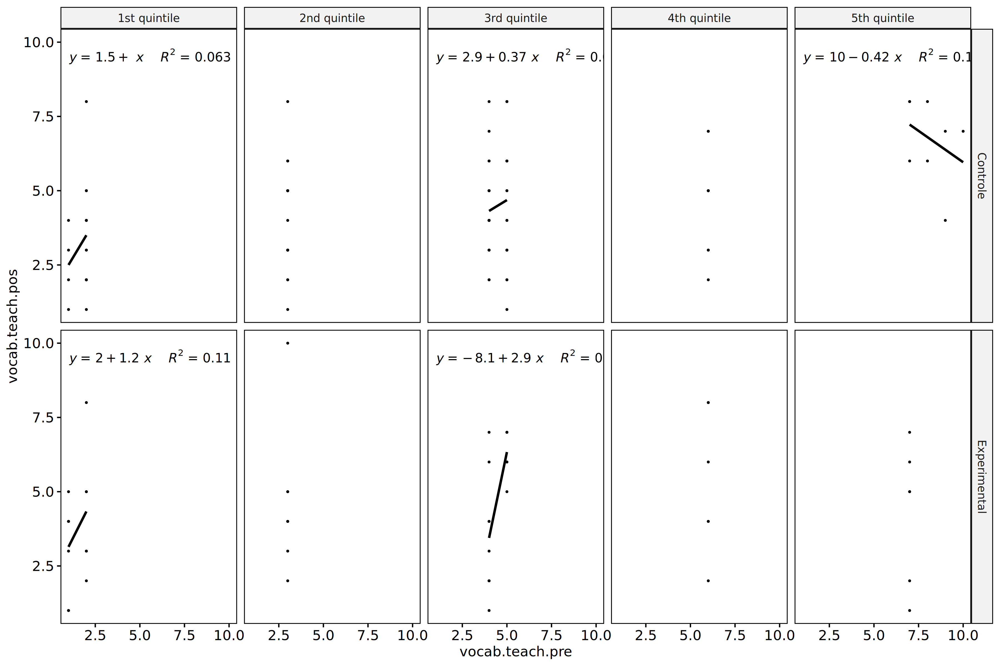<!-- -->

``` r
if (length(unique(pdat[["vocab.teach.quintile"]])) >= 2) {
  ggscatter(wdat, x = "vocab.teach.pre", y = "vocab.teach.pos", size = 0.5,
            color = "grupo", facet.by = "vocab.teach.quintile", add = "reg.line")+
    stat_regline_equation(
      aes(label =  paste(..eq.label.., ..rr.label.., sep = "~~~~"), color = grupo)
    ) +
    ggplot2::labs(subtitle = rstatix::get_test_label(aov, detailed = T, row = which(aov$Effect == "grupo:vocab.teach.quintile"))) +
    ggplot2::scale_color_manual(values = color[["grupo"]]) +
    if (ymin < ymax) ggplot2::ylim(ymin, ymax)
}
```

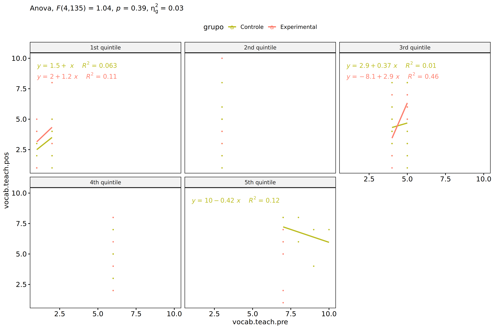<!-- -->

``` r
if (length(unique(pdat[["vocab.teach.quintile"]])) >= 2) {
  ggscatter(wdat, x = "vocab.teach.pre", y = "vocab.teach.pos", size = 0.5,
            color = "vocab.teach.quintile", facet.by = "grupo", add = "reg.line")+
    stat_regline_equation(
      aes(label =  paste(..eq.label.., ..rr.label.., sep = "~~~~"), color = vocab.teach.quintile)
    ) +
    ggplot2::labs(subtitle = rstatix::get_test_label(aov, detailed = T, row = which(aov$Effect == "grupo:vocab.teach.quintile"))) +
    ggplot2::scale_color_manual(values = color[["vocab.teach.quintile"]]) +
    if (ymin < ymax) ggplot2::ylim(ymin, ymax)
}
```

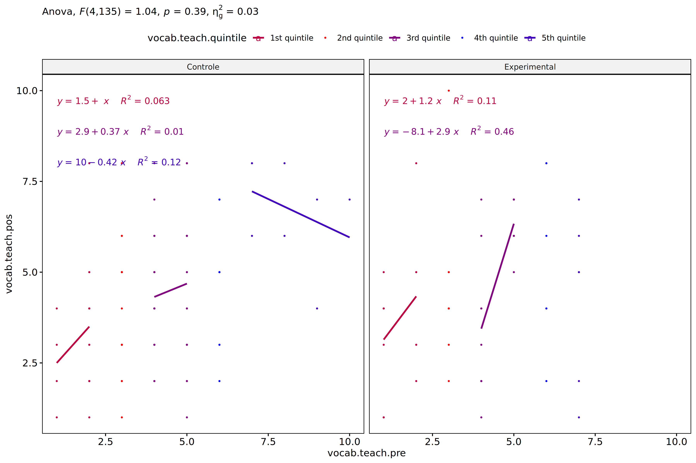<!-- -->

### Checking normality and homogeneity

``` r
if (length(unique(pdat[["vocab.teach.quintile"]])) >= 2) 
  res <- augment(lm(vocab.teach.pos ~ vocab.teach.pre + grupo*vocab.teach.quintile, data = wdat))
```

``` r
if (length(unique(pdat[["vocab.teach.quintile"]])) >= 2)
  shapiro_test(res$.resid)
```

    ## # A tibble: 1 × 3
    ##   variable   statistic p.value
    ##   <chr>          <dbl>   <dbl>
    ## 1 res$.resid     0.989   0.301

``` r
if (length(unique(pdat[["vocab.teach.quintile"]])) >= 2) 
  levene_test(res, .resid ~ grupo*vocab.teach.quintile)
```

    ## # A tibble: 1 × 4
    ##     df1   df2 statistic     p
    ##   <int> <int>     <dbl> <dbl>
    ## 1     9   136     0.350 0.956

# Summary of Results

## Descriptive Statistics

``` r
df <- get.descriptives(ldat[["grupo"]], c(dv.pre, dv.pos), c("grupo"), 
                       include.global = T, symmetry.test = T, normality.test = F)
df <- plyr::rbind.fill(
  df, do.call(plyr::rbind.fill, lapply(lfatores2, FUN = function(f) {
    if (nrow(dat) > 0 && sum(!is.na(unique(dat[[f]]))) > 1 && paste0("grupo:",f) %in% names(ldat))
      get.descriptives(ldat[[paste0("grupo:",f)]], c(dv.pre,dv.pos), c("grupo", f),
                       symmetry.test = T, normality.test = F)
    }))
)
df <- df[,c(fatores1[fatores1 %in% colnames(df)],"variable",
             colnames(df)[!colnames(df) %in% c(fatores1,"variable")])]
```

| grupo | Sexo | Zona | Cor.Raca | Serie | vocab.teach.quintile | variable | n | mean | median | min | max | sd | se | ci | iqr | symmetry | skewness | kurtosis |
|:---|:---|:---|:---|:---|:---|:---|---:|---:|---:|---:|---:|---:|---:|---:|---:|:---|---:|---:|
| Controle |  |  |  |  |  | vocab.teach.pre | 98 | 4.082 | 4.0 | 1 | 10 | 1.797 | 0.182 | 0.360 | 2.00 | NO | 0.786 | 0.790 |
| Experimental |  |  |  |  |  | vocab.teach.pre | 48 | 3.896 | 4.0 | 1 | 7 | 1.949 | 0.281 | 0.566 | 3.25 | YES | 0.076 | -1.182 |
|  |  |  |  |  |  | vocab.teach.pre | 146 | 4.021 | 4.0 | 1 | 10 | 1.844 | 0.153 | 0.302 | 2.00 | NO | 0.508 | 0.114 |
| Controle |  |  |  |  |  | vocab.teach.pos | 98 | 4.378 | 4.0 | 1 | 8 | 1.881 | 0.190 | 0.377 | 2.75 | YES | 0.309 | -0.681 |
| Experimental |  |  |  |  |  | vocab.teach.pos | 48 | 4.417 | 4.0 | 1 | 10 | 2.152 | 0.311 | 0.625 | 3.00 | YES | 0.306 | -0.547 |
|  |  |  |  |  |  | vocab.teach.pos | 146 | 4.390 | 4.0 | 1 | 10 | 1.967 | 0.163 | 0.322 | 3.00 | YES | 0.317 | -0.539 |
| Controle | F |  |  |  |  | vocab.teach.pre | 43 | 4.209 | 4.0 | 2 | 7 | 1.245 | 0.190 | 0.383 | 2.00 | YES | 0.406 | -0.585 |
| Controle | M |  |  |  |  | vocab.teach.pre | 55 | 3.982 | 4.0 | 1 | 10 | 2.139 | 0.288 | 0.578 | 3.00 | NO | 0.860 | 0.279 |
| Experimental | F |  |  |  |  | vocab.teach.pre | 16 | 4.250 | 4.0 | 1 | 7 | 1.915 | 0.479 | 1.020 | 3.00 | YES | -0.227 | -1.155 |
| Experimental | M |  |  |  |  | vocab.teach.pre | 32 | 3.719 | 3.5 | 1 | 7 | 1.971 | 0.348 | 0.711 | 3.00 | YES | 0.234 | -1.191 |
| Controle | F |  |  |  |  | vocab.teach.pos | 43 | 4.488 | 5.0 | 1 | 8 | 1.609 | 0.245 | 0.495 | 1.50 | YES | 0.138 | -0.305 |
| Controle | M |  |  |  |  | vocab.teach.pos | 55 | 4.291 | 4.0 | 1 | 8 | 2.079 | 0.280 | 0.562 | 3.00 | YES | 0.407 | -0.950 |
| Experimental | F |  |  |  |  | vocab.teach.pos | 16 | 4.500 | 4.0 | 2 | 8 | 1.826 | 0.456 | 0.973 | 1.50 | YES | 0.277 | -0.998 |
| Experimental | M |  |  |  |  | vocab.teach.pos | 32 | 4.375 | 4.0 | 1 | 10 | 2.324 | 0.411 | 0.838 | 3.25 | YES | 0.318 | -0.668 |
| Controle |  | Rural |  |  |  | vocab.teach.pre | 56 | 3.839 | 4.0 | 1 | 8 | 1.581 | 0.211 | 0.424 | 2.00 | YES | 0.314 | -0.344 |
| Controle |  | Urbana |  |  |  | vocab.teach.pre | 11 | 4.273 | 4.0 | 1 | 10 | 2.412 | 0.727 | 1.620 | 1.50 | NO | 1.070 | 0.375 |
| Experimental |  | Rural |  |  |  | vocab.teach.pre | 34 | 3.735 | 3.5 | 1 | 7 | 2.035 | 0.349 | 0.710 | 3.75 | YES | 0.182 | -1.324 |
| Experimental |  | Urbana |  |  |  | vocab.teach.pre | 5 | 3.800 | 4.0 | 3 | 5 | 0.837 | 0.374 | 1.039 | 1.00 | few data | 0.000 | 0.000 |
| Controle |  | Rural |  |  |  | vocab.teach.pos | 56 | 4.411 | 4.0 | 1 | 8 | 1.847 | 0.247 | 0.495 | 2.25 | YES | 0.386 | -0.570 |
| Controle |  | Urbana |  |  |  | vocab.teach.pos | 11 | 4.000 | 4.0 | 1 | 7 | 1.897 | 0.572 | 1.275 | 3.00 | YES | 0.000 | -1.401 |
| Experimental |  | Rural |  |  |  | vocab.teach.pos | 34 | 4.441 | 4.0 | 1 | 10 | 2.191 | 0.376 | 0.764 | 2.00 | YES | 0.371 | -0.368 |
| Experimental |  | Urbana |  |  |  | vocab.teach.pos | 5 | 3.600 | 3.0 | 2 | 6 | 1.517 | 0.678 | 1.883 | 1.00 | NO | 0.537 | -1.487 |
| Controle |  |  | Parda |  |  | vocab.teach.pre | 45 | 3.867 | 4.0 | 1 | 8 | 1.575 | 0.235 | 0.473 | 2.00 | YES | 0.283 | -0.385 |
| Controle |  |  | Branca |  |  | vocab.teach.pre | 11 | 4.364 | 5.0 | 2 | 6 | 1.286 | 0.388 | 0.864 | 1.50 | YES | -0.366 | -1.235 |
| Experimental |  |  | Parda |  |  | vocab.teach.pre | 18 | 3.944 | 4.0 | 1 | 7 | 2.235 | 0.527 | 1.112 | 4.00 | YES | -0.024 | -1.562 |
| Experimental |  |  | Branca |  |  | vocab.teach.pre | 5 | 3.000 | 3.0 | 2 | 4 | 0.707 | 0.316 | 0.878 | 0.00 | few data | 0.000 | 0.000 |
| Controle |  |  | Parda |  |  | vocab.teach.pos | 45 | 4.333 | 4.0 | 2 | 8 | 1.796 | 0.268 | 0.540 | 2.00 | NO | 0.634 | -0.518 |
| Controle |  |  | Branca |  |  | vocab.teach.pos | 11 | 4.545 | 4.0 | 2 | 8 | 1.572 | 0.474 | 1.056 | 1.00 | NO | 0.555 | -0.100 |
| Experimental |  |  | Parda |  |  | vocab.teach.pos | 18 | 3.889 | 4.0 | 1 | 8 | 2.166 | 0.511 | 1.077 | 3.00 | YES | 0.331 | -1.232 |
| Experimental |  |  | Branca |  |  | vocab.teach.pos | 5 | 4.800 | 3.0 | 3 | 10 | 3.033 | 1.356 | 3.766 | 2.00 | few data | 0.000 | 0.000 |
| Controle |  |  |  | 6 ano |  | vocab.teach.pre | 26 | 3.462 | 3.0 | 1 | 7 | 1.655 | 0.325 | 0.668 | 2.00 | YES | 0.345 | -0.814 |
| Controle |  |  |  | 7 ano |  | vocab.teach.pre | 28 | 4.071 | 4.0 | 3 | 7 | 1.120 | 0.212 | 0.434 | 2.00 | NO | 0.629 | -0.504 |
| Controle |  |  |  | 8 ano |  | vocab.teach.pre | 17 | 3.824 | 3.0 | 1 | 10 | 2.481 | 0.602 | 1.276 | 3.00 | NO | 1.022 | 0.025 |
| Controle |  |  |  | 9 ano |  | vocab.teach.pre | 27 | 4.852 | 5.0 | 2 | 9 | 1.812 | 0.349 | 0.717 | 1.50 | NO | 0.734 | 0.050 |
| Experimental |  |  |  | 6 ano |  | vocab.teach.pre | 13 | 4.077 | 4.0 | 1 | 6 | 1.706 | 0.473 | 1.031 | 2.00 | NO | -0.574 | -0.955 |
| Experimental |  |  |  | 7 ano |  | vocab.teach.pre | 13 | 3.308 | 3.0 | 1 | 7 | 2.136 | 0.593 | 1.291 | 2.00 | NO | 0.624 | -1.097 |
| Experimental |  |  |  | 8 ano |  | vocab.teach.pre | 14 | 4.071 | 4.5 | 1 | 7 | 2.235 | 0.597 | 1.290 | 3.75 | YES | -0.006 | -1.651 |
| Experimental |  |  |  | 9 ano |  | vocab.teach.pre | 8 | 4.250 | 4.0 | 2 | 7 | 1.581 | 0.559 | 1.322 | 0.75 | YES | 0.403 | -1.107 |
| Controle |  |  |  | 6 ano |  | vocab.teach.pos | 26 | 3.615 | 4.0 | 1 | 8 | 1.899 | 0.372 | 0.767 | 2.75 | NO | 0.637 | -0.137 |
| Controle |  |  |  | 7 ano |  | vocab.teach.pos | 28 | 4.429 | 4.0 | 2 | 8 | 1.709 | 0.323 | 0.663 | 2.00 | NO | 0.676 | -0.428 |
| Controle |  |  |  | 8 ano |  | vocab.teach.pos | 17 | 4.176 | 4.0 | 2 | 8 | 1.944 | 0.472 | 1.000 | 2.00 | YES | 0.488 | -1.144 |
| Controle |  |  |  | 9 ano |  | vocab.teach.pos | 27 | 5.185 | 5.0 | 1 | 8 | 1.755 | 0.338 | 0.694 | 2.00 | YES | -0.231 | -0.542 |
| Experimental |  |  |  | 6 ano |  | vocab.teach.pos | 13 | 5.077 | 5.0 | 3 | 8 | 1.656 | 0.459 | 1.001 | 3.00 | YES | 0.396 | -1.399 |
| Experimental |  |  |  | 7 ano |  | vocab.teach.pos | 13 | 3.615 | 4.0 | 1 | 7 | 1.758 | 0.488 | 1.062 | 3.00 | YES | 0.036 | -0.988 |
| Experimental |  |  |  | 8 ano |  | vocab.teach.pos | 14 | 5.000 | 5.5 | 1 | 10 | 2.602 | 0.695 | 1.502 | 2.75 | YES | 0.000 | -0.917 |
| Experimental |  |  |  | 9 ano |  | vocab.teach.pos | 8 | 3.625 | 2.5 | 2 | 8 | 2.264 | 0.800 | 1.893 | 2.50 | NO | 0.860 | -0.971 |
| Controle |  |  |  |  | 1st quintile | vocab.teach.pre | 18 | 1.778 | 2.0 | 1 | 2 | 0.428 | 0.101 | 0.213 | 0.00 | few data | 0.000 | 0.000 |
| Controle |  |  |  |  | 2nd quintile | vocab.teach.pre | 22 | 3.000 | 3.0 | 3 | 3 | 0.000 | 0.000 | 0.000 | 0.00 | few data | 0.000 | 0.000 |
| Controle |  |  |  |  | 3rd quintile | vocab.teach.pre | 41 | 4.463 | 4.0 | 4 | 5 | 0.505 | 0.079 | 0.159 | 1.00 | few data | 0.000 | 0.000 |
| Controle |  |  |  |  | 4th quintile | vocab.teach.pre | 9 | 6.000 | 6.0 | 6 | 6 | 0.000 | 0.000 | 0.000 | 0.00 | few data | 0.000 | 0.000 |
| Controle |  |  |  |  | 5th quintile | vocab.teach.pre | 8 | 8.125 | 8.0 | 7 | 10 | 1.126 | 0.398 | 0.941 | 2.00 | YES | 0.320 | -1.574 |
| Experimental |  |  |  |  | 1st quintile | vocab.teach.pre | 13 | 1.462 | 1.0 | 1 | 2 | 0.519 | 0.144 | 0.314 | 1.00 | few data | 0.000 | 0.000 |
| Experimental |  |  |  |  | 2nd quintile | vocab.teach.pre | 8 | 3.000 | 3.0 | 3 | 3 | 0.000 | 0.000 | 0.000 | 0.00 | few data | 0.000 | 0.000 |
| Experimental |  |  |  |  | 3rd quintile | vocab.teach.pre | 15 | 4.400 | 4.0 | 4 | 5 | 0.507 | 0.131 | 0.281 | 1.00 | few data | 0.000 | 0.000 |
| Experimental |  |  |  |  | 4th quintile | vocab.teach.pre | 6 | 6.000 | 6.0 | 6 | 6 | 0.000 | 0.000 | 0.000 | 0.00 | few data | 0.000 | 0.000 |
| Experimental |  |  |  |  | 5th quintile | vocab.teach.pre | 6 | 7.000 | 7.0 | 7 | 7 | 0.000 | 0.000 | 0.000 | 0.00 | few data | 0.000 | 0.000 |
| Controle |  |  |  |  | 1st quintile | vocab.teach.pos | 18 | 3.278 | 3.0 | 1 | 8 | 1.708 | 0.403 | 0.850 | 2.00 | NO | 0.928 | 0.806 |
| Controle |  |  |  |  | 2nd quintile | vocab.teach.pos | 22 | 4.091 | 4.5 | 1 | 8 | 1.630 | 0.348 | 0.723 | 2.00 | YES | 0.239 | -0.395 |
| Controle |  |  |  |  | 3rd quintile | vocab.teach.pos | 41 | 4.488 | 4.0 | 1 | 8 | 1.804 | 0.282 | 0.570 | 3.00 | YES | 0.343 | -0.639 |
| Controle |  |  |  |  | 4th quintile | vocab.teach.pos | 9 | 4.667 | 5.0 | 2 | 7 | 1.732 | 0.577 | 1.331 | 2.00 | YES | -0.057 | -1.453 |
| Controle |  |  |  |  | 5th quintile | vocab.teach.pos | 8 | 6.750 | 7.0 | 4 | 8 | 1.389 | 0.491 | 1.161 | 2.00 | NO | -0.735 | -0.810 |
| Experimental |  |  |  |  | 1st quintile | vocab.teach.pos | 13 | 3.692 | 4.0 | 1 | 8 | 1.888 | 0.524 | 1.141 | 2.00 | YES | 0.479 | -0.171 |
| Experimental |  |  |  |  | 2nd quintile | vocab.teach.pos | 8 | 4.625 | 4.0 | 2 | 10 | 2.387 | 0.844 | 1.995 | 1.25 | NO | 1.216 | 0.427 |
| Experimental |  |  |  |  | 3rd quintile | vocab.teach.pos | 15 | 4.600 | 5.0 | 1 | 7 | 2.165 | 0.559 | 1.199 | 4.00 | YES | -0.265 | -1.615 |
| Experimental |  |  |  |  | 4th quintile | vocab.teach.pos | 6 | 5.333 | 5.0 | 2 | 8 | 2.422 | 0.989 | 2.542 | 3.50 | YES | -0.042 | -1.881 |
| Experimental |  |  |  |  | 5th quintile | vocab.teach.pos | 6 | 4.333 | 5.0 | 1 | 7 | 2.338 | 0.955 | 2.454 | 3.00 | YES | -0.333 | -1.819 |

## ANCOVA Table Comparison

``` r
df <- do.call(plyr::rbind.fill, laov)
df <- df[!duplicated(df$Effect),]
```

|  | Effect | DFn | DFd | F | p | p\<.05 | ges | DFn’ | DFd’ | F’ | p’ | p\<.05’ | ges’ |
|:---|:---|---:|---:|---:|---:|:---|---:|---:|---:|---:|---:|:---|---:|
| 1 | grupo | 1 | 143 | 0.112 | 0.738 |  | 0.001 | 1 | 143 | 0.112 | 0.738 |  | 0.001 |
| 2 | vocab.teach.pre | 1 | 143 | 20.529 | 0.000 | \* | 0.126 | 1 | 143 | 20.529 | 0.000 | \* | 0.126 |
| 4 | grupo:Sexo | 1 | 141 | 0.075 | 0.785 |  | 0.001 | 1 | 141 | 0.075 | 0.785 |  | 0.001 |
| 5 | Sexo | 1 | 141 | 0.029 | 0.864 |  | 0.000 | 1 | 141 | 0.029 | 0.864 |  | 0.000 |
| 8 | grupo:Zona | 1 | 101 | 0.078 | 0.781 |  | 0.001 | 1 | 101 | 0.078 | 0.781 |  | 0.001 |
| 10 | Zona | 1 | 101 | 1.686 | 0.197 |  | 0.016 | 1 | 101 | 1.686 | 0.197 |  | 0.016 |
| 11 | Cor.Raca | 1 | 74 | 0.622 | 0.433 |  | 0.008 | 1 | 74 | 0.622 | 0.433 |  | 0.008 |
| 13 | grupo:Cor.Raca | 1 | 74 | 1.252 | 0.267 |  | 0.017 | 1 | 74 | 1.252 | 0.267 |  | 0.017 |
| 16 | grupo:Serie | 3 | 137 | 3.149 | 0.027 | \* | 0.065 | 3 | 137 | 3.149 | 0.027 | \* | 0.065 |
| 17 | Serie | 3 | 137 | 0.412 | 0.744 |  | 0.009 | 3 | 137 | 0.412 | 0.744 |  | 0.009 |
| 20 | grupo:vocab.teach.quintile | 4 | 135 | 1.037 | 0.391 |  | 0.030 | 4 | 135 | 1.037 | 0.391 |  | 0.030 |
| 22 | vocab.teach.quintile | 4 | 135 | 0.593 | 0.668 |  | 0.017 | 4 | 135 | 0.593 | 0.668 |  | 0.017 |

## PairWise Table Comparison

``` r
df <- do.call(plyr::rbind.fill, lpwc)
df <- df[,c(names(lfatores)[names(lfatores) %in% colnames(df)],
            names(df)[!names(df) %in% c(names(lfatores),"term",".y.")])]
```

| grupo | Sexo | Zona | Cor.Raca | Serie | vocab.teach.quintile | group1 | group2 | df | statistic | p | p.adj | p.adj.signif | df’ | statistic’ | p’ | p.adj’ | p.adj.signif’ |
|:---|:---|:---|:---|:---|:---|:---|:---|---:|---:|---:|---:|:---|---:|---:|---:|---:|:---|
| Controle |  |  |  |  |  | pre | pos | 288 | -1.084 | 0.279 | 0.279 | ns | 288 | -1.084 | 0.279 | 0.279 | ns |
| Experimental |  |  |  |  |  | pre | pos | 288 | -1.335 | 0.183 | 0.183 | ns | 288 | -1.335 | 0.183 | 0.183 | ns |
|  |  |  |  |  |  | Controle | Experimental | 143 | -0.335 | 0.738 | 0.738 | ns | 143 | -0.335 | 0.738 | 0.738 | ns |
| Controle | F |  |  |  |  | pre | pos | 284 | -0.674 | 0.501 | 0.501 | ns | 284 | -0.674 | 0.501 | 0.501 | ns |
| Controle | M |  |  |  |  | pre | pos | 284 | -0.844 | 0.399 | 0.399 | ns | 284 | -0.844 | 0.399 | 0.399 | ns |
| Controle |  |  |  |  |  | F | M | 141 | 0.293 | 0.770 | 0.770 | ns | 141 | 0.293 | 0.770 | 0.770 | ns |
| Experimental | F |  |  |  |  | pre | pos | 284 | -0.368 | 0.713 | 0.713 | ns | 284 | -0.368 | 0.713 | 0.713 | ns |
| Experimental | M |  |  |  |  | pre | pos | 284 | -1.367 | 0.173 | 0.173 | ns | 284 | -1.367 | 0.173 | 0.173 | ns |
| Experimental |  |  |  |  |  | F | M | 141 | -0.132 | 0.895 | 0.895 | ns | 141 | -0.132 | 0.895 | 0.895 | ns |
|  | F |  |  |  |  | Controle | Experimental | 141 | 0.007 | 0.995 | 0.995 | ns | 141 | 0.007 | 0.995 | 0.995 | ns |
|  | M |  |  |  |  | Controle | Experimental | 141 | -0.442 | 0.659 | 0.659 | ns | 141 | -0.442 | 0.659 | 0.659 | ns |
| Controle |  |  |  |  |  | Rural | Urbana | 101 | 0.911 | 0.365 | 0.365 | ns | 101 | 0.911 | 0.365 | 0.365 | ns |
| Controle |  | Rural |  |  |  | pre | pos | 204 | -1.603 | 0.111 | 0.111 | ns | 204 | -1.603 | 0.111 | 0.111 | ns |
| Controle |  | Urbana |  |  |  | pre | pos | 204 | 0.339 | 0.735 | 0.735 | ns | 204 | 0.339 | 0.735 | 0.735 | ns |
| Experimental |  |  |  |  |  | Rural | Urbana | 101 | 0.967 | 0.336 | 0.336 | ns | 101 | 0.967 | 0.336 | 0.336 | ns |
| Experimental |  | Rural |  |  |  | pre | pos | 204 | -1.542 | 0.125 | 0.125 | ns | 204 | -1.542 | 0.125 | 0.125 | ns |
| Experimental |  | Urbana |  |  |  | pre | pos | 204 | 0.168 | 0.867 | 0.867 | ns | 204 | 0.168 | 0.867 | 0.867 | ns |
|  |  | Rural |  |  |  | Controle | Experimental | 101 | -0.164 | 0.870 | 0.870 | ns | 101 | -0.164 | 0.870 | 0.870 | ns |
|  |  | Urbana |  |  |  | Controle | Experimental | 101 | 0.235 | 0.815 | 0.815 | ns | 101 | 0.235 | 0.815 | 0.815 | ns |
| Controle |  |  | Branca |  |  | pre | pos | 150 | -0.234 | 0.815 | 0.815 | ns | 150 | -0.234 | 0.815 | 0.815 | ns |
| Controle |  |  |  |  |  | Parda | Branca | 74 | -0.027 | 0.979 | 0.979 | ns | 74 | -0.027 | 0.979 | 0.979 | ns |
| Controle |  |  | Parda |  |  | pre | pos | 150 | -1.217 | 0.225 | 0.225 | ns | 150 | -1.217 | 0.225 | 0.225 | ns |
| Experimental |  |  | Branca |  |  | pre | pos | 150 | -1.565 | 0.120 | 0.120 | ns | 150 | -1.565 | 0.120 | 0.120 | ns |
| Experimental |  |  |  |  |  | Parda | Branca | 74 | -1.368 | 0.175 | 0.175 | ns | 74 | -1.368 | 0.175 | 0.175 | ns |
| Experimental |  |  | Parda |  |  | pre | pos | 150 | 0.092 | 0.927 | 0.927 | ns | 150 | 0.092 | 0.927 | 0.927 | ns |
|  |  |  | Branca |  |  | Controle | Experimental | 74 | -0.786 | 0.434 | 0.434 | ns | 74 | -0.786 | 0.434 | 0.434 | ns |
|  |  |  | Parda |  |  | Controle | Experimental | 74 | 0.926 | 0.358 | 0.358 | ns | 74 | 0.926 | 0.358 | 0.358 | ns |
| Controle |  |  |  | 6 ano |  | pre | pos | 276 | -0.297 | 0.767 | 0.767 | ns | 276 | -0.297 | 0.767 | 0.767 | ns |
| Controle |  |  |  | 7 ano |  | pre | pos | 276 | -0.716 | 0.475 | 0.475 | ns | 276 | -0.716 | 0.475 | 0.475 | ns |
| Controle |  |  |  | 8 ano |  | pre | pos | 276 | -0.551 | 0.582 | 0.582 | ns | 276 | -0.551 | 0.582 | 0.582 | ns |
| Controle |  |  |  | 9 ano |  | pre | pos | 276 | -0.656 | 0.512 | 0.512 | ns | 276 | -0.656 | 0.512 | 0.512 | ns |
| Controle |  |  |  |  |  | 6 ano | 7 ano | 137 | -1.232 | 0.220 | 1.000 | ns | 137 | -1.232 | 0.220 | 1.000 | ns |
| Controle |  |  |  |  |  | 6 ano | 8 ano | 137 | -0.779 | 0.437 | 1.000 | ns | 137 | -0.779 | 0.437 | 1.000 | ns |
| Controle |  |  |  |  |  | 6 ano | 9 ano | 137 | -2.171 | 0.032 | 0.190 | ns | 137 | -2.171 | 0.032 | 0.190 | ns |
| Controle |  |  |  |  |  | 7 ano | 8 ano | 137 | 0.306 | 0.760 | 1.000 | ns | 137 | 0.306 | 0.760 | 1.000 | ns |
| Controle |  |  |  |  |  | 7 ano | 9 ano | 137 | -1.013 | 0.313 | 1.000 | ns | 137 | -1.013 | 0.313 | 1.000 | ns |
| Controle |  |  |  |  |  | 8 ano | 9 ano | 137 | -1.180 | 0.240 | 1.000 | ns | 137 | -1.180 | 0.240 | 1.000 | ns |
| Experimental |  |  |  | 6 ano |  | pre | pos | 276 | -1.366 | 0.173 | 0.173 | ns | 276 | -1.366 | 0.173 | 0.173 | ns |
| Experimental |  |  |  | 7 ano |  | pre | pos | 276 | -0.420 | 0.675 | 0.675 | ns | 276 | -0.420 | 0.675 | 0.675 | ns |
| Experimental |  |  |  | 8 ano |  | pre | pos | 276 | -1.316 | 0.189 | 0.189 | ns | 276 | -1.316 | 0.189 | 0.189 | ns |
| Experimental |  |  |  | 9 ano |  | pre | pos | 276 | 0.670 | 0.504 | 0.504 | ns | 276 | 0.670 | 0.504 | 0.504 | ns |
| Experimental |  |  |  |  |  | 6 ano | 7 ano | 137 | 1.687 | 0.094 | 0.563 | ns | 137 | 1.687 | 0.094 | 0.563 | ns |
| Experimental |  |  |  |  |  | 6 ano | 8 ano | 137 | 0.107 | 0.915 | 1.000 | ns | 137 | 0.107 | 0.915 | 1.000 | ns |
| Experimental |  |  |  |  |  | 6 ano | 9 ano | 137 | 1.842 | 0.068 | 0.406 | ns | 137 | 1.842 | 0.068 | 0.406 | ns |
| Experimental |  |  |  |  |  | 7 ano | 8 ano | 137 | -1.612 | 0.109 | 0.656 | ns | 137 | -1.612 | 0.109 | 0.656 | ns |
| Experimental |  |  |  |  |  | 7 ano | 9 ano | 137 | 0.361 | 0.718 | 1.000 | ns | 137 | 0.361 | 0.718 | 1.000 | ns |
| Experimental |  |  |  |  |  | 8 ano | 9 ano | 137 | 1.774 | 0.078 | 0.469 | ns | 137 | 1.774 | 0.078 | 0.469 | ns |
|  |  |  |  | 6 ano |  | Controle | Experimental | 137 | -2.030 | 0.044 | 0.044 | \* | 137 | -2.030 | 0.044 | 0.044 | \* |
|  |  |  |  | 7 ano |  | Controle | Experimental | 137 | 0.918 | 0.360 | 0.360 | ns | 137 | 0.918 | 0.360 | 0.360 | ns |
|  |  |  |  | 8 ano |  | Controle | Experimental | 137 | -1.129 | 0.261 | 0.261 | ns | 137 | -1.129 | 0.261 | 0.261 | ns |
|  |  |  |  | 9 ano |  | Controle | Experimental | 137 | 1.855 | 0.066 | 0.066 | ns | 137 | 1.855 | 0.066 | 0.066 | ns |
| Controle |  |  |  |  | 1st quintile | pre | pos | 272 | -3.296 | 0.001 | 0.001 | \*\* | 272 | -3.296 | 0.001 | 0.001 | \*\* |
| Controle |  |  |  |  | 2nd quintile | pre | pos | 272 | -2.650 | 0.009 | 0.009 | \*\* | 272 | -2.650 | 0.009 | 0.009 | \*\* |
| Controle |  |  |  |  | 3rd quintile | pre | pos | 272 | -0.081 | 0.936 | 0.936 | ns | 272 | -0.081 | 0.936 | 0.936 | ns |
| Controle |  |  |  |  | 4th quintile | pre | pos | 272 | 2.071 | 0.039 | 0.039 | \* | 272 | 2.071 | 0.039 | 0.039 | \* |
| Controle |  |  |  |  | 5th quintile | pre | pos | 272 | 2.014 | 0.045 | 0.045 | \* | 272 | 2.014 | 0.045 | 0.045 | \* |
| Controle |  |  |  |  |  | 1st quintile | 2nd quintile | 135 | -0.114 | 0.910 | 1.000 | ns | 135 | -0.114 | 0.910 | 1.000 | ns |
| Controle |  |  |  |  |  | 1st quintile | 3rd quintile | 135 | 0.370 | 0.712 | 1.000 | ns | 135 | 0.370 | 0.712 | 1.000 | ns |
| Controle |  |  |  |  |  | 1st quintile | 4th quintile | 135 | 0.690 | 0.492 | 1.000 | ns | 135 | 0.690 | 0.492 | 1.000 | ns |
| Controle |  |  |  |  |  | 1st quintile | 5th quintile | 135 | 0.138 | 0.891 | 1.000 | ns | 135 | 0.138 | 0.891 | 1.000 | ns |
| Controle |  |  |  |  |  | 2nd quintile | 3rd quintile | 135 | 0.677 | 0.499 | 1.000 | ns | 135 | 0.677 | 0.499 | 1.000 | ns |
| Controle |  |  |  |  |  | 2nd quintile | 4th quintile | 135 | 0.957 | 0.340 | 1.000 | ns | 135 | 0.957 | 0.340 | 1.000 | ns |
| Controle |  |  |  |  |  | 2nd quintile | 5th quintile | 135 | 0.209 | 0.835 | 1.000 | ns | 135 | 0.209 | 0.835 | 1.000 | ns |
| Controle |  |  |  |  |  | 3rd quintile | 4th quintile | 135 | 0.853 | 0.395 | 1.000 | ns | 135 | 0.853 | 0.395 | 1.000 | ns |
| Controle |  |  |  |  |  | 3rd quintile | 5th quintile | 135 | -0.051 | 0.960 | 1.000 | ns | 135 | -0.051 | 0.960 | 1.000 | ns |
| Controle |  |  |  |  |  | 4th quintile | 5th quintile | 135 | -0.698 | 0.486 | 1.000 | ns | 135 | -0.698 | 0.486 | 1.000 | ns |
| Experimental |  |  |  |  | 1st quintile | pre | pos | 272 | -4.165 | 0.000 | 0.000 | \*\*\*\* | 272 | -4.165 | 0.000 | 0.000 | \*\*\*\* |
| Experimental |  |  |  |  | 2nd quintile | pre | pos | 272 | -2.380 | 0.018 | 0.018 | \* | 272 | -2.380 | 0.018 | 0.018 | \* |
| Experimental |  |  |  |  | 3rd quintile | pre | pos | 272 | -0.401 | 0.689 | 0.689 | ns | 272 | -0.401 | 0.689 | 0.689 | ns |
| Experimental |  |  |  |  | 4th quintile | pre | pos | 272 | 0.846 | 0.398 | 0.398 | ns | 272 | 0.846 | 0.398 | 0.398 | ns |
| Experimental |  |  |  |  | 5th quintile | pre | pos | 272 | 3.383 | 0.001 | 0.001 | \*\*\* | 272 | 3.383 | 0.001 | 0.001 | \*\*\* |
| Experimental |  |  |  |  |  | 1st quintile | 2nd quintile | 135 | -0.013 | 0.989 | 1.000 | ns | 135 | -0.013 | 0.989 | 1.000 | ns |
| Experimental |  |  |  |  |  | 1st quintile | 3rd quintile | 135 | 0.686 | 0.494 | 1.000 | ns | 135 | 0.686 | 0.494 | 1.000 | ns |
| Experimental |  |  |  |  |  | 1st quintile | 4th quintile | 135 | 0.589 | 0.557 | 1.000 | ns | 135 | 0.589 | 0.557 | 1.000 | ns |
| Experimental |  |  |  |  |  | 1st quintile | 5th quintile | 135 | 1.257 | 0.211 | 1.000 | ns | 135 | 1.257 | 0.211 | 1.000 | ns |
| Experimental |  |  |  |  |  | 2nd quintile | 3rd quintile | 135 | 0.909 | 0.365 | 1.000 | ns | 135 | 0.909 | 0.365 | 1.000 | ns |
| Experimental |  |  |  |  |  | 2nd quintile | 4th quintile | 135 | 0.751 | 0.454 | 1.000 | ns | 135 | 0.751 | 0.454 | 1.000 | ns |
| Experimental |  |  |  |  |  | 2nd quintile | 5th quintile | 135 | 1.569 | 0.119 | 1.000 | ns | 135 | 1.569 | 0.119 | 1.000 | ns |
| Experimental |  |  |  |  |  | 3rd quintile | 4th quintile | 135 | 0.211 | 0.833 | 1.000 | ns | 135 | 0.211 | 0.833 | 1.000 | ns |
| Experimental |  |  |  |  |  | 3rd quintile | 5th quintile | 135 | 1.432 | 0.154 | 1.000 | ns | 135 | 1.432 | 0.154 | 1.000 | ns |
| Experimental |  |  |  |  |  | 4th quintile | 5th quintile | 135 | 1.415 | 0.159 | 1.000 | ns | 135 | 1.415 | 0.159 | 1.000 | ns |
|  |  |  |  |  | 1st quintile | Controle | Experimental | 135 | -0.879 | 0.381 | 0.381 | ns | 135 | -0.879 | 0.381 | 0.381 | ns |
|  |  |  |  |  | 2nd quintile | Controle | Experimental | 135 | -0.695 | 0.488 | 0.488 | ns | 135 | -0.695 | 0.488 | 0.488 | ns |
|  |  |  |  |  | 3rd quintile | Controle | Experimental | 135 | -0.267 | 0.790 | 0.790 | ns | 135 | -0.267 | 0.790 | 0.790 | ns |
|  |  |  |  |  | 4th quintile | Controle | Experimental | 135 | -0.680 | 0.498 | 0.498 | ns | 135 | -0.680 | 0.498 | 0.498 | ns |
|  |  |  |  |  | 5th quintile | Controle | Experimental | 135 | 1.618 | 0.108 | 0.108 | ns | 135 | 1.618 | 0.108 | 0.108 | ns |

## EMMS Table Comparison

``` r
df <- do.call(plyr::rbind.fill, lemms)
df[["N-N'"]] <- df[["N"]] - df[["N'"]]
df <- df[,c(names(lfatores)[names(lfatores) %in% colnames(df)],
            names(df)[!names(df) %in% names(lfatores)])]
```

| grupo | Sexo | Zona | Cor.Raca | Serie | vocab.teach.quintile | N | M (pre) | SE (pre) | M (unadj) | SE (unadj) | M (adj) | SE (adj) | conf.low | conf.high | N’ | M (pre)’ | SE (pre)’ | M (unadj)’ | SE (unadj)’ | M (adj)’ | SE (adj)’ | conf.low’ | conf.high’ | N-N’ |
|:---|:---|:---|:---|:---|:---|---:|---:|---:|---:|---:|---:|---:|---:|---:|---:|---:|---:|---:|---:|---:|---:|---:|---:|---:|
| Controle |  |  |  |  |  | 98 | 4.082 | 0.182 | 4.378 | 0.190 | 4.354 | 0.187 | 3.985 | 4.724 | 98 | 4.082 | 0.182 | 4.378 | 0.190 | 4.354 | 0.187 | 3.985 | 4.724 | 0 |
| Experimental |  |  |  |  |  | 48 | 3.896 | 0.281 | 4.417 | 0.311 | 4.464 | 0.267 | 3.935 | 4.993 | 48 | 3.896 | 0.281 | 4.417 | 0.311 | 4.464 | 0.267 | 3.935 | 4.993 | 0 |
| Controle | F |  |  |  |  | 43 | 4.209 | 0.190 | 4.488 | 0.245 | 4.417 | 0.285 | 3.854 | 4.980 | 43 | 4.209 | 0.190 | 4.488 | 0.245 | 4.417 | 0.285 | 3.854 | 4.980 | 0 |
| Controle | M |  |  |  |  | 55 | 3.982 | 0.288 | 4.291 | 0.280 | 4.306 | 0.251 | 3.809 | 4.802 | 55 | 3.982 | 0.288 | 4.291 | 0.280 | 4.306 | 0.251 | 3.809 | 4.802 | 0 |
| Experimental | F |  |  |  |  | 16 | 4.250 | 0.479 | 4.500 | 0.456 | 4.413 | 0.466 | 3.491 | 5.335 | 16 | 4.250 | 0.479 | 4.500 | 0.456 | 4.413 | 0.466 | 3.491 | 5.335 | 0 |
| Experimental | M |  |  |  |  | 32 | 3.719 | 0.348 | 4.375 | 0.411 | 4.489 | 0.331 | 3.836 | 5.142 | 32 | 3.719 | 0.348 | 4.375 | 0.411 | 4.489 | 0.331 | 3.836 | 5.142 | 0 |
| Controle |  | Rural |  |  |  | 56 | 3.839 | 0.211 | 4.411 | 0.247 | 4.414 | 0.249 | 3.920 | 4.908 | 56 | 3.839 | 0.211 | 4.411 | 0.247 | 4.414 | 0.249 | 3.920 | 4.908 | 0 |
| Controle |  | Urbana |  |  |  | 11 | 4.273 | 0.727 | 4.000 | 0.572 | 3.853 | 0.564 | 2.735 | 4.971 | 11 | 4.273 | 0.727 | 4.000 | 0.572 | 3.853 | 0.564 | 2.735 | 4.971 | 0 |
| Experimental |  | Rural |  |  |  | 34 | 3.735 | 0.349 | 4.441 | 0.376 | 4.481 | 0.320 | 3.846 | 5.115 | 34 | 3.735 | 0.349 | 4.441 | 0.376 | 4.481 | 0.320 | 3.846 | 5.115 | 0 |
| Experimental |  | Urbana |  |  |  | 5 | 3.800 | 0.374 | 3.600 | 0.678 | 3.617 | 0.833 | 1.964 | 5.270 | 5 | 3.800 | 0.374 | 3.600 | 0.678 | 3.617 | 0.833 | 1.964 | 5.270 | 0 |
| Controle |  |  | Branca |  |  | 11 | 4.364 | 0.388 | 4.545 | 0.474 | 4.362 | 0.558 | 3.251 | 5.474 | 11 | 4.364 | 0.388 | 4.545 | 0.474 | 4.362 | 0.558 | 3.251 | 5.474 | 0 |
| Controle |  |  | Parda |  |  | 45 | 3.867 | 0.235 | 4.333 | 0.268 | 4.346 | 0.274 | 3.800 | 4.892 | 45 | 3.867 | 0.235 | 4.333 | 0.268 | 4.346 | 0.274 | 3.800 | 4.892 | 0 |
| Experimental |  |  | Branca |  |  | 5 | 3.000 | 0.316 | 4.800 | 1.356 | 5.154 | 0.830 | 3.499 | 6.808 | 5 | 3.000 | 0.316 | 4.800 | 1.356 | 5.154 | 0.830 | 3.499 | 6.808 | 0 |
| Experimental |  |  | Parda |  |  | 18 | 3.944 | 0.527 | 3.889 | 0.511 | 3.871 | 0.434 | 3.007 | 4.735 | 18 | 3.944 | 0.527 | 3.889 | 0.511 | 3.871 | 0.434 | 3.007 | 4.735 | 0 |
| Controle |  |  |  | 6 ano |  | 26 | 3.462 | 0.325 | 3.615 | 0.372 | 3.797 | 0.360 | 3.085 | 4.510 | 26 | 3.462 | 0.325 | 3.615 | 0.372 | 3.797 | 0.360 | 3.085 | 4.510 | 0 |
| Controle |  |  |  | 7 ano |  | 28 | 4.071 | 0.212 | 4.429 | 0.323 | 4.412 | 0.344 | 3.731 | 5.093 | 28 | 4.071 | 0.212 | 4.429 | 0.323 | 4.412 | 0.344 | 3.731 | 5.093 | 0 |
| Controle |  |  |  | 8 ano |  | 17 | 3.824 | 0.602 | 4.176 | 0.472 | 4.241 | 0.442 | 3.366 | 5.115 | 17 | 3.824 | 0.602 | 4.176 | 0.472 | 4.241 | 0.442 | 3.366 | 5.115 | 0 |
| Controle |  |  |  | 9 ano |  | 27 | 4.852 | 0.349 | 5.185 | 0.338 | 4.914 | 0.358 | 4.207 | 5.622 | 27 | 4.852 | 0.349 | 5.185 | 0.338 | 4.914 | 0.358 | 4.207 | 5.622 | 0 |
| Experimental |  |  |  | 6 ano |  | 13 | 4.077 | 0.473 | 5.077 | 0.459 | 5.059 | 0.505 | 4.059 | 6.058 | 13 | 4.077 | 0.473 | 5.077 | 0.459 | 5.059 | 0.505 | 4.059 | 6.058 | 0 |
| Experimental |  |  |  | 7 ano |  | 13 | 3.308 | 0.593 | 3.615 | 0.488 | 3.848 | 0.509 | 2.841 | 4.854 | 13 | 3.308 | 0.593 | 3.615 | 0.488 | 3.848 | 0.509 | 2.841 | 4.854 | 0 |
| Experimental |  |  |  | 8 ano |  | 14 | 4.071 | 0.597 | 5.000 | 0.695 | 4.983 | 0.487 | 4.020 | 5.946 | 14 | 4.071 | 0.597 | 5.000 | 0.695 | 4.983 | 0.487 | 4.020 | 5.946 | 0 |
| Experimental |  |  |  | 9 ano |  | 8 | 4.250 | 0.559 | 3.625 | 0.800 | 3.550 | 0.644 | 2.276 | 4.825 | 8 | 4.250 | 0.559 | 3.625 | 0.800 | 3.550 | 0.644 | 2.276 | 4.825 | 0 |
| Controle |  |  |  |  | 1st quintile | 18 | 1.778 | 0.101 | 3.278 | 0.403 | 4.618 | 0.891 | 2.857 | 6.379 | 18 | 1.778 | 0.101 | 3.278 | 0.403 | 4.618 | 0.891 | 2.857 | 6.379 | 0 |
| Controle |  |  |  |  | 2nd quintile | 22 | 3.000 | 0.000 | 4.091 | 0.348 | 4.701 | 0.531 | 3.651 | 5.751 | 22 | 3.000 | 0.000 | 4.091 | 0.348 | 4.701 | 0.531 | 3.651 | 5.751 | 0 |
| Controle |  |  |  |  | 3rd quintile | 41 | 4.463 | 0.079 | 4.488 | 0.282 | 4.223 | 0.329 | 3.573 | 4.873 | 41 | 4.463 | 0.079 | 4.488 | 0.282 | 4.223 | 0.329 | 3.573 | 4.873 | 0 |
| Controle |  |  |  |  | 4th quintile | 9 | 6.000 | 0.000 | 4.667 | 0.577 | 3.484 | 0.924 | 1.657 | 5.310 | 9 | 6.000 | 0.000 | 4.667 | 0.577 | 3.484 | 0.924 | 1.657 | 5.310 | 0 |
| Controle |  |  |  |  | 5th quintile | 8 | 8.125 | 0.398 | 6.750 | 0.491 | 4.297 | 1.564 | 1.205 | 7.389 | 8 | 8.125 | 0.398 | 6.750 | 0.491 | 4.297 | 1.564 | 1.205 | 7.389 | 0 |
| Experimental |  |  |  |  | 1st quintile | 13 | 1.462 | 0.144 | 3.692 | 0.524 | 5.222 | 1.024 | 3.197 | 7.247 | 13 | 1.462 | 0.144 | 3.692 | 0.524 | 5.222 | 1.024 | 3.197 | 7.247 | 0 |
| Experimental |  |  |  |  | 2nd quintile | 8 | 3.000 | 0.000 | 4.625 | 0.844 | 5.235 | 0.747 | 3.758 | 6.712 | 8 | 3.000 | 0.000 | 4.625 | 0.844 | 5.235 | 0.747 | 3.758 | 6.712 | 0 |
| Experimental |  |  |  |  | 3rd quintile | 15 | 4.400 | 0.131 | 4.600 | 0.559 | 4.373 | 0.498 | 3.388 | 5.358 | 15 | 4.400 | 0.131 | 4.600 | 0.559 | 4.373 | 0.498 | 3.388 | 5.358 | 0 |
| Experimental |  |  |  |  | 4th quintile | 6 | 6.000 | 0.000 | 5.333 | 0.989 | 4.150 | 1.022 | 2.128 | 6.172 | 6 | 6.000 | 0.000 | 5.333 | 0.989 | 4.150 | 1.022 | 2.128 | 6.172 | 0 |
| Experimental |  |  |  |  | 5th quintile | 6 | 7.000 | 0.000 | 4.333 | 0.955 | 2.553 | 1.280 | 0.022 | 5.083 | 6 | 7.000 | 0.000 | 4.333 | 0.955 | 2.553 | 1.280 | 0.022 | 5.083 | 0 |
