ANCOVA in flow (debate) (flow (debate))
================
Geiser C. Challco <geiser@alumni.usp.br>

- [Descriptive Statistics of Initial
  Data](#descriptive-statistics-of-initial-data)
- [ANCOVA and Pairwise for one factor:
  **grupo**](#ancova-and-pairwise-for-one-factor-grupo)
  - [Without remove non-normal data](#without-remove-non-normal-data)
  - [Computing ANCOVA and PairWise After removing non-normal data
    (OK)](#computing-ancova-and-pairwise-after-removing-non-normal-data-ok)
    - [Plots for ancova](#plots-for-ancova)
    - [Checking linearity assumption](#checking-linearity-assumption)
    - [Checking normality and
      homogeneity](#checking-normality-and-homogeneity)
- [ANCOVA and Pairwise for two factors
  **grupo:Sexo**](#ancova-and-pairwise-for-two-factors-gruposexo)
  - [Without remove non-normal data](#without-remove-non-normal-data-1)
  - [Computing ANCOVA and PairWise After removing non-normal data
    (OK)](#computing-ancova-and-pairwise-after-removing-non-normal-data-ok-1)
    - [Plots for ancova](#plots-for-ancova-1)
    - [Checking linearity assumption](#checking-linearity-assumption-1)
    - [Checking normality and
      homogeneity](#checking-normality-and-homogeneity-1)
- [ANCOVA and Pairwise for two factors
  **grupo:Zona**](#ancova-and-pairwise-for-two-factors-grupozona)
  - [Without remove non-normal data](#without-remove-non-normal-data-2)
  - [Computing ANCOVA and PairWise After removing non-normal data
    (OK)](#computing-ancova-and-pairwise-after-removing-non-normal-data-ok-2)
    - [Plots for ancova](#plots-for-ancova-2)
    - [Checking linearity assumption](#checking-linearity-assumption-2)
    - [Checking normality and
      homogeneity](#checking-normality-and-homogeneity-2)
- [ANCOVA and Pairwise for two factors
  **grupo:Cor.Raca**](#ancova-and-pairwise-for-two-factors-grupocorraca)
  - [Without remove non-normal data](#without-remove-non-normal-data-3)
  - [Computing ANCOVA and PairWise After removing non-normal data
    (OK)](#computing-ancova-and-pairwise-after-removing-non-normal-data-ok-3)
    - [Plots for ancova](#plots-for-ancova-3)
    - [Checking linearity assumption](#checking-linearity-assumption-3)
    - [Checking normality and
      homogeneity](#checking-normality-and-homogeneity-3)
- [Summary of Results](#summary-of-results)
  - [Descriptive Statistics](#descriptive-statistics)
  - [ANCOVA Table Comparison](#ancova-table-comparison)
  - [PairWise Table Comparison](#pairwise-table-comparison)
  - [EMMS Table Comparison](#emms-table-comparison)

**NOTE**:

- Teste ANCOVA para determinar se houve diferenças significativas no
  flow (debate) (medido usando pre- e pos-testes).
- ANCOVA test to determine whether there were significant differences in
  flow (debate) (measured using pre- and post-tests).

# Descriptive Statistics of Initial Data

``` r
df <- get.descriptives(dat, c(dv.pre, dv.pos), c("grupo"), 
                       include.global = T, symmetry.test = T, normality.test = F)
df <- plyr::rbind.fill(
  df, do.call(plyr::rbind.fill, lapply(lfatores2, FUN = function(f) {
    if (nrow(dat) > 0 && sum(!is.na(unique(dat[[f]]))) > 1)
      get.descriptives(dat, c(dv.pre,dv.pos), c("grupo", f),
                       symmetry.test = T, normality.test = F)
    }))
)
```

    ## Warning: There were 2 warnings in `mutate()`.
    ## The first warning was:
    ## ℹ In argument: `ci = abs(stats::qt(alpha/2, .data$n - 1) * .data$se)`.
    ## Caused by warning:
    ## ! There was 1 warning in `mutate()`.
    ## ℹ In argument: `ci = abs(stats::qt(alpha/2, .data$n - 1) * .data$se)`.
    ## Caused by warning in `stats::qt()`:
    ## ! NaNs produced
    ## ℹ Run `dplyr::last_dplyr_warnings()` to see the 1 remaining warning.
    ## There were 2 warnings in `mutate()`.
    ## The first warning was:
    ## ℹ In argument: `ci = abs(stats::qt(alpha/2, .data$n - 1) * .data$se)`.
    ## Caused by warning:
    ## ! There was 1 warning in `mutate()`.
    ## ℹ In argument: `ci = abs(stats::qt(alpha/2, .data$n - 1) * .data$se)`.
    ## Caused by warning in `stats::qt()`:
    ## ! NaNs produced
    ## ℹ Run `dplyr::last_dplyr_warnings()` to see the 1 remaining warning.

``` r
(df <- df[,c(fatores1[fatores1 %in% colnames(df)],"variable",
             colnames(df)[!colnames(df) %in% c(fatores1,"variable")])])
```

    ##           grupo Sexo   Zona Cor.Raca        variable   n  mean median   min   max    sd    se    ci   iqr
    ## 1      Controle <NA>   <NA>     <NA> dfs.media.debat 151 3.475  3.444 1.444 4.889 0.625 0.051 0.100 0.833
    ## 2  Experimental <NA>   <NA>     <NA> dfs.media.debat 167 3.409  3.444 1.667 5.000 0.598 0.046 0.091 0.778
    ## 3          <NA> <NA>   <NA>     <NA> dfs.media.debat 318 3.441  3.444 1.444 5.000 0.611 0.034 0.067 0.889
    ## 4      Controle <NA>   <NA>     <NA> fss.media.debat 151 3.450  3.444 1.444 5.000 0.616 0.050 0.099 0.778
    ## 5  Experimental <NA>   <NA>     <NA> fss.media.debat 167 3.415  3.444 1.333 5.000 0.602 0.047 0.092 0.778
    ## 6          <NA> <NA>   <NA>     <NA> fss.media.debat 318 3.432  3.444 1.333 5.000 0.608 0.034 0.067 0.778
    ## 7      Controle    F   <NA>     <NA> dfs.media.debat  71 3.514  3.667 1.444 4.667 0.636 0.075 0.150 0.833
    ## 8      Controle    M   <NA>     <NA> dfs.media.debat  80 3.441  3.389 2.111 4.889 0.617 0.069 0.137 0.889
    ## 9  Experimental    F   <NA>     <NA> dfs.media.debat  86 3.442  3.389 1.667 4.667 0.589 0.063 0.126 0.889
    ## 10 Experimental    M   <NA>     <NA> dfs.media.debat  81 3.375  3.444 1.875 5.000 0.611 0.068 0.135 0.778
    ## 11     Controle    F   <NA>     <NA> fss.media.debat  71 3.495  3.556 1.444 4.667 0.615 0.073 0.146 0.778
    ## 12     Controle    M   <NA>     <NA> fss.media.debat  80 3.409  3.444 2.000 5.000 0.618 0.069 0.138 0.667
    ## 13 Experimental    F   <NA>     <NA> fss.media.debat  86 3.433  3.444 1.333 5.000 0.635 0.068 0.136 0.778
    ## 14 Experimental    M   <NA>     <NA> fss.media.debat  81 3.397  3.444 2.000 4.556 0.569 0.063 0.126 0.778
    ## 15     Controle <NA>  Rural     <NA> dfs.media.debat 105 3.536  3.444 2.250 4.889 0.572 0.056 0.111 0.778
    ## 16     Controle <NA> Urbana     <NA> dfs.media.debat  24 3.494  3.556 2.111 4.778 0.732 0.149 0.309 0.917
    ## 17     Controle <NA>   <NA>     <NA> dfs.media.debat  22 3.167  3.056 1.444 4.333 0.680 0.145 0.302 0.889
    ## 18 Experimental <NA>  Rural     <NA> dfs.media.debat  79 3.366  3.444 1.667 4.556 0.570 0.064 0.128 0.778
    ## 19 Experimental <NA> Urbana     <NA> dfs.media.debat  42 3.365  3.222 2.000 5.000 0.607 0.094 0.189 0.778
    ## 20 Experimental <NA>   <NA>     <NA> dfs.media.debat  46 3.524  3.444 2.111 5.000 0.636 0.094 0.189 0.889
    ## 21     Controle <NA>  Rural     <NA> fss.media.debat 105 3.489  3.500 2.000 5.000 0.611 0.060 0.118 0.778
    ## 22     Controle <NA> Urbana     <NA> fss.media.debat  24 3.503  3.500 1.444 4.889 0.689 0.141 0.291 0.806
    ## 23     Controle <NA>   <NA>     <NA> fss.media.debat  22 3.203  3.156 2.222 4.444 0.521 0.111 0.231 0.722
    ## 24 Experimental <NA>  Rural     <NA> fss.media.debat  79 3.431  3.444 2.000 4.556 0.558 0.063 0.125 0.722
    ## 25 Experimental <NA> Urbana     <NA> fss.media.debat  42 3.330  3.333 2.000 4.556 0.562 0.087 0.175 0.639
    ## 26 Experimental <NA>   <NA>     <NA> fss.media.debat  46 3.466  3.556 1.333 5.000 0.708 0.104 0.210 0.889
    ## 27     Controle <NA>   <NA>   Branca dfs.media.debat  20 3.561  3.444 2.556 4.778 0.584 0.131 0.273 0.889
    ## 28     Controle <NA>   <NA> Indígena dfs.media.debat   3 3.806  3.750 3.444 4.222 0.392 0.226 0.973 0.389
    ## 29     Controle <NA>   <NA>    Parda dfs.media.debat  45 3.407  3.444 2.222 4.778 0.634 0.094 0.190 0.778
    ## 30     Controle <NA>   <NA>    Preta dfs.media.debat   1 3.556  3.556 3.556 3.556    NA    NA   NaN 0.000
    ## 31     Controle <NA>   <NA>     <NA> dfs.media.debat  82 3.479  3.444 1.444 4.889 0.642 0.071 0.141 0.778
    ## 32 Experimental <NA>   <NA>   Branca dfs.media.debat  17 3.373  3.444 2.556 4.111 0.478 0.116 0.246 0.667
    ## 33 Experimental <NA>   <NA> Indígena dfs.media.debat  12 3.351  3.222 2.667 4.333 0.549 0.159 0.349 0.726
    ## 34 Experimental <NA>   <NA>    Parda dfs.media.debat  46 3.214  3.222 2.222 4.556 0.467 0.069 0.139 0.639
    ## 35 Experimental <NA>   <NA>    Preta dfs.media.debat   1 3.222  3.222 3.222 3.222    NA    NA   NaN 0.000
    ## 36 Experimental <NA>   <NA>     <NA> dfs.media.debat  91 3.525  3.556 1.667 5.000 0.663 0.070 0.138 0.889
    ## 37     Controle <NA>   <NA>   Branca fss.media.debat  20 3.578  3.444 2.889 4.444 0.484 0.108 0.227 0.778
    ## 38     Controle <NA>   <NA> Indígena fss.media.debat   3 3.519  3.667 2.556 4.333 0.898 0.519 2.231 0.889
    ## 39     Controle <NA>   <NA>    Parda fss.media.debat  45 3.423  3.444 1.444 5.000 0.646 0.096 0.194 0.667
    ## 40     Controle <NA>   <NA>    Preta fss.media.debat   1 3.333  3.333 3.333 3.333    NA    NA   NaN 0.000
    ## 41     Controle <NA>   <NA>     <NA> fss.media.debat  82 3.432  3.444 2.000 4.889 0.630 0.070 0.138 0.833
    ## 42 Experimental <NA>   <NA>   Branca fss.media.debat  17 3.556  3.556 2.333 4.556 0.670 0.163 0.345 0.778
    ## 43 Experimental <NA>   <NA> Indígena fss.media.debat  12 3.237  3.250 2.222 4.222 0.604 0.174 0.384 0.694
    ## 44 Experimental <NA>   <NA>    Parda fss.media.debat  46 3.331  3.333 2.000 4.250 0.540 0.080 0.160 0.750
    ## 45 Experimental <NA>   <NA>    Preta fss.media.debat   1 4.444  4.444 4.444 4.444    NA    NA   NaN 0.000
    ## 46 Experimental <NA>   <NA>     <NA> fss.media.debat  91 3.444  3.556 1.333 5.000 0.612 0.064 0.128 0.667
    ##    symmetry    skewness    kurtosis
    ## 1       YES -0.11309282 -0.10918957
    ## 2       YES -0.01519053  0.17856420
    ## 3       YES -0.05801513  0.04263205
    ## 4       YES -0.19912368  0.14511493
    ## 5       YES -0.26996242  0.21143827
    ## 6       YES -0.23411153  0.20303939
    ## 7        NO -0.55466959  0.26991232
    ## 8       YES  0.30658383 -0.36644074
    ## 9       YES -0.14381935 -0.06323437
    ## 10      YES  0.11890867  0.37671911
    ## 11       NO -0.53887774  0.44914999
    ## 12      YES  0.10105146 -0.03049256
    ## 13      YES -0.37513717  0.51446649
    ## 14      YES -0.13054041 -0.43352621
    ## 15      YES  0.14123096 -0.54856210
    ## 16      YES -0.18683068 -0.77777450
    ## 17      YES -0.34738218 -0.11300606
    ## 18      YES -0.39581384  0.08702365
    ## 19      YES  0.36108493  0.29801765
    ## 20      YES  0.06906344 -0.21807189
    ## 21      YES -0.22697964 -0.20131838
    ## 22       NO -0.65436246  1.40580593
    ## 23       NO  0.55320431 -0.05345621
    ## 24      YES -0.26883894 -0.29012229
    ## 25      YES  0.04316295 -0.10492615
    ## 26      YES -0.47472402  0.35117243
    ## 27      YES  0.32440829 -0.85941568
    ## 28 few data  0.00000000  0.00000000
    ## 29      YES -0.08916832 -0.69398440
    ## 30 few data  0.00000000  0.00000000
    ## 31      YES -0.15073331  0.08427319
    ## 32      YES -0.05920116 -1.18399352
    ## 33       NO  0.51058292 -1.20320159
    ## 34      YES  0.24396168  0.15310158
    ## 35 few data  0.00000000  0.00000000
    ## 36      YES -0.35255848  0.26195068
    ## 37      YES  0.35657792 -1.30072216
    ## 38 few data  0.00000000  0.00000000
    ## 39      YES -0.30841946  0.82740946
    ## 40 few data  0.00000000  0.00000000
    ## 41      YES -0.13058028 -0.37675532
    ## 42      YES -0.21396832 -1.02848753
    ## 43      YES -0.13213555 -1.07011843
    ## 44      YES -0.34460973 -0.24744518
    ## 45 few data  0.00000000  0.00000000
    ## 46      YES -0.35498527  0.66641369

| grupo        | Sexo | Zona   | Cor.Raca | variable        |   n |  mean | median |   min |   max |    sd |    se |    ci |   iqr | symmetry | skewness | kurtosis |
|:-------------|:-----|:-------|:---------|:----------------|----:|------:|-------:|------:|------:|------:|------:|------:|------:|:---------|---------:|---------:|
| Controle     |      |        |          | dfs.media.debat | 151 | 3.475 |  3.444 | 1.444 | 4.889 | 0.625 | 0.051 | 0.100 | 0.833 | YES      |   -0.113 |   -0.109 |
| Experimental |      |        |          | dfs.media.debat | 167 | 3.409 |  3.444 | 1.667 | 5.000 | 0.598 | 0.046 | 0.091 | 0.778 | YES      |   -0.015 |    0.179 |
|              |      |        |          | dfs.media.debat | 318 | 3.441 |  3.444 | 1.444 | 5.000 | 0.611 | 0.034 | 0.067 | 0.889 | YES      |   -0.058 |    0.043 |
| Controle     |      |        |          | fss.media.debat | 151 | 3.450 |  3.444 | 1.444 | 5.000 | 0.616 | 0.050 | 0.099 | 0.778 | YES      |   -0.199 |    0.145 |
| Experimental |      |        |          | fss.media.debat | 167 | 3.415 |  3.444 | 1.333 | 5.000 | 0.602 | 0.047 | 0.092 | 0.778 | YES      |   -0.270 |    0.211 |
|              |      |        |          | fss.media.debat | 318 | 3.432 |  3.444 | 1.333 | 5.000 | 0.608 | 0.034 | 0.067 | 0.778 | YES      |   -0.234 |    0.203 |
| Controle     | F    |        |          | dfs.media.debat |  71 | 3.514 |  3.667 | 1.444 | 4.667 | 0.636 | 0.075 | 0.150 | 0.833 | NO       |   -0.555 |    0.270 |
| Controle     | M    |        |          | dfs.media.debat |  80 | 3.441 |  3.389 | 2.111 | 4.889 | 0.617 | 0.069 | 0.137 | 0.889 | YES      |    0.307 |   -0.366 |
| Experimental | F    |        |          | dfs.media.debat |  86 | 3.442 |  3.389 | 1.667 | 4.667 | 0.589 | 0.063 | 0.126 | 0.889 | YES      |   -0.144 |   -0.063 |
| Experimental | M    |        |          | dfs.media.debat |  81 | 3.375 |  3.444 | 1.875 | 5.000 | 0.611 | 0.068 | 0.135 | 0.778 | YES      |    0.119 |    0.377 |
| Controle     | F    |        |          | fss.media.debat |  71 | 3.495 |  3.556 | 1.444 | 4.667 | 0.615 | 0.073 | 0.146 | 0.778 | NO       |   -0.539 |    0.449 |
| Controle     | M    |        |          | fss.media.debat |  80 | 3.409 |  3.444 | 2.000 | 5.000 | 0.618 | 0.069 | 0.138 | 0.667 | YES      |    0.101 |   -0.030 |
| Experimental | F    |        |          | fss.media.debat |  86 | 3.433 |  3.444 | 1.333 | 5.000 | 0.635 | 0.068 | 0.136 | 0.778 | YES      |   -0.375 |    0.514 |
| Experimental | M    |        |          | fss.media.debat |  81 | 3.397 |  3.444 | 2.000 | 4.556 | 0.569 | 0.063 | 0.126 | 0.778 | YES      |   -0.131 |   -0.434 |
| Controle     |      | Rural  |          | dfs.media.debat | 105 | 3.536 |  3.444 | 2.250 | 4.889 | 0.572 | 0.056 | 0.111 | 0.778 | YES      |    0.141 |   -0.549 |
| Controle     |      | Urbana |          | dfs.media.debat |  24 | 3.494 |  3.556 | 2.111 | 4.778 | 0.732 | 0.149 | 0.309 | 0.917 | YES      |   -0.187 |   -0.778 |
| Controle     |      |        |          | dfs.media.debat |  22 | 3.167 |  3.056 | 1.444 | 4.333 | 0.680 | 0.145 | 0.302 | 0.889 | YES      |   -0.347 |   -0.113 |
| Experimental |      | Rural  |          | dfs.media.debat |  79 | 3.366 |  3.444 | 1.667 | 4.556 | 0.570 | 0.064 | 0.128 | 0.778 | YES      |   -0.396 |    0.087 |
| Experimental |      | Urbana |          | dfs.media.debat |  42 | 3.365 |  3.222 | 2.000 | 5.000 | 0.607 | 0.094 | 0.189 | 0.778 | YES      |    0.361 |    0.298 |
| Experimental |      |        |          | dfs.media.debat |  46 | 3.524 |  3.444 | 2.111 | 5.000 | 0.636 | 0.094 | 0.189 | 0.889 | YES      |    0.069 |   -0.218 |
| Controle     |      | Rural  |          | fss.media.debat | 105 | 3.489 |  3.500 | 2.000 | 5.000 | 0.611 | 0.060 | 0.118 | 0.778 | YES      |   -0.227 |   -0.201 |
| Controle     |      | Urbana |          | fss.media.debat |  24 | 3.503 |  3.500 | 1.444 | 4.889 | 0.689 | 0.141 | 0.291 | 0.806 | NO       |   -0.654 |    1.406 |
| Controle     |      |        |          | fss.media.debat |  22 | 3.203 |  3.156 | 2.222 | 4.444 | 0.521 | 0.111 | 0.231 | 0.722 | NO       |    0.553 |   -0.053 |
| Experimental |      | Rural  |          | fss.media.debat |  79 | 3.431 |  3.444 | 2.000 | 4.556 | 0.558 | 0.063 | 0.125 | 0.722 | YES      |   -0.269 |   -0.290 |
| Experimental |      | Urbana |          | fss.media.debat |  42 | 3.330 |  3.333 | 2.000 | 4.556 | 0.562 | 0.087 | 0.175 | 0.639 | YES      |    0.043 |   -0.105 |
| Experimental |      |        |          | fss.media.debat |  46 | 3.466 |  3.556 | 1.333 | 5.000 | 0.708 | 0.104 | 0.210 | 0.889 | YES      |   -0.475 |    0.351 |
| Controle     |      |        | Branca   | dfs.media.debat |  20 | 3.561 |  3.444 | 2.556 | 4.778 | 0.584 | 0.131 | 0.273 | 0.889 | YES      |    0.324 |   -0.859 |
| Controle     |      |        | Indígena | dfs.media.debat |   3 | 3.806 |  3.750 | 3.444 | 4.222 | 0.392 | 0.226 | 0.973 | 0.389 | few data |    0.000 |    0.000 |
| Controle     |      |        | Parda    | dfs.media.debat |  45 | 3.407 |  3.444 | 2.222 | 4.778 | 0.634 | 0.094 | 0.190 | 0.778 | YES      |   -0.089 |   -0.694 |
| Controle     |      |        | Preta    | dfs.media.debat |   1 | 3.556 |  3.556 | 3.556 | 3.556 |       |       |       | 0.000 | few data |    0.000 |    0.000 |
| Controle     |      |        |          | dfs.media.debat |  82 | 3.479 |  3.444 | 1.444 | 4.889 | 0.642 | 0.071 | 0.141 | 0.778 | YES      |   -0.151 |    0.084 |
| Experimental |      |        | Branca   | dfs.media.debat |  17 | 3.373 |  3.444 | 2.556 | 4.111 | 0.478 | 0.116 | 0.246 | 0.667 | YES      |   -0.059 |   -1.184 |
| Experimental |      |        | Indígena | dfs.media.debat |  12 | 3.351 |  3.222 | 2.667 | 4.333 | 0.549 | 0.159 | 0.349 | 0.726 | NO       |    0.511 |   -1.203 |
| Experimental |      |        | Parda    | dfs.media.debat |  46 | 3.214 |  3.222 | 2.222 | 4.556 | 0.467 | 0.069 | 0.139 | 0.639 | YES      |    0.244 |    0.153 |
| Experimental |      |        | Preta    | dfs.media.debat |   1 | 3.222 |  3.222 | 3.222 | 3.222 |       |       |       | 0.000 | few data |    0.000 |    0.000 |
| Experimental |      |        |          | dfs.media.debat |  91 | 3.525 |  3.556 | 1.667 | 5.000 | 0.663 | 0.070 | 0.138 | 0.889 | YES      |   -0.353 |    0.262 |
| Controle     |      |        | Branca   | fss.media.debat |  20 | 3.578 |  3.444 | 2.889 | 4.444 | 0.484 | 0.108 | 0.227 | 0.778 | YES      |    0.357 |   -1.301 |
| Controle     |      |        | Indígena | fss.media.debat |   3 | 3.519 |  3.667 | 2.556 | 4.333 | 0.898 | 0.519 | 2.231 | 0.889 | few data |    0.000 |    0.000 |
| Controle     |      |        | Parda    | fss.media.debat |  45 | 3.423 |  3.444 | 1.444 | 5.000 | 0.646 | 0.096 | 0.194 | 0.667 | YES      |   -0.308 |    0.827 |
| Controle     |      |        | Preta    | fss.media.debat |   1 | 3.333 |  3.333 | 3.333 | 3.333 |       |       |       | 0.000 | few data |    0.000 |    0.000 |
| Controle     |      |        |          | fss.media.debat |  82 | 3.432 |  3.444 | 2.000 | 4.889 | 0.630 | 0.070 | 0.138 | 0.833 | YES      |   -0.131 |   -0.377 |
| Experimental |      |        | Branca   | fss.media.debat |  17 | 3.556 |  3.556 | 2.333 | 4.556 | 0.670 | 0.163 | 0.345 | 0.778 | YES      |   -0.214 |   -1.028 |
| Experimental |      |        | Indígena | fss.media.debat |  12 | 3.237 |  3.250 | 2.222 | 4.222 | 0.604 | 0.174 | 0.384 | 0.694 | YES      |   -0.132 |   -1.070 |
| Experimental |      |        | Parda    | fss.media.debat |  46 | 3.331 |  3.333 | 2.000 | 4.250 | 0.540 | 0.080 | 0.160 | 0.750 | YES      |   -0.345 |   -0.247 |
| Experimental |      |        | Preta    | fss.media.debat |   1 | 4.444 |  4.444 | 4.444 | 4.444 |       |       |       | 0.000 | few data |    0.000 |    0.000 |
| Experimental |      |        |          | fss.media.debat |  91 | 3.444 |  3.556 | 1.333 | 5.000 | 0.612 | 0.064 | 0.128 | 0.667 | YES      |   -0.355 |    0.666 |

# ANCOVA and Pairwise for one factor: **grupo**

## Without remove non-normal data

``` r
pdat = remove_group_data(dat[!is.na(dat[["grupo"]]),], "fss.media.debat", "grupo")

pdat.long <- rbind(pdat[,c("id","grupo")], pdat[,c("id","grupo")])
pdat.long[["time"]] <- c(rep("pre", nrow(pdat)), rep("pos", nrow(pdat)))
pdat.long[["time"]] <- factor(pdat.long[["time"]], c("pre","pos"))
pdat.long[["flow.debat"]] <- c(pdat[["dfs.media.debat"]], pdat[["fss.media.debat"]])

aov = anova_test(pdat, fss.media.debat ~ dfs.media.debat + grupo)
laov[["grupo"]] <- get_anova_table(aov)
```

``` r
pwc <- emmeans_test(pdat, fss.media.debat ~ grupo, covariate = dfs.media.debat,
                    p.adjust.method = "bonferroni")
```

``` r
pwc.long <- emmeans_test(dplyr::group_by_at(pdat.long, "grupo"),
                          flow.debat ~ time,
                          p.adjust.method = "bonferroni")
lpwc[["grupo"]] <- plyr::rbind.fill(pwc, pwc.long)
```

``` r
ds <- get.descriptives(pdat, "fss.media.debat", "grupo", covar = "dfs.media.debat")
ds <- merge(ds[ds$variable != "dfs.media.debat",],
            ds[ds$variable == "dfs.media.debat", !colnames(ds) %in% c("variable")],
            by = "grupo", all.x = T, suffixes = c("", ".dfs.media.debat"))
ds <- merge(get_emmeans(pwc), ds, by = "grupo", suffixes = c(".emms", ""))
ds <- ds[,c("grupo","n","mean.dfs.media.debat","se.dfs.media.debat","mean","se","emmean","se.emms")]

colnames(ds) <- c("grupo", "N", paste0(c("M","SE")," (pre)"),
                  paste0(c("M","SE"), " (unadj)"), paste0(c("M", "SE"), " (adj)"))

lemms[["grupo"]] <- ds
```

## Computing ANCOVA and PairWise After removing non-normal data (OK)

``` r
wdat = pdat 

res = residuals(lm(fss.media.debat ~ dfs.media.debat + grupo, data = wdat))
non.normal = getNonNormal(res, wdat$id, plimit = 0.05)

wdat = wdat[!wdat$id %in% non.normal,]

wdat.long <- rbind(wdat[,c("id","grupo")], wdat[,c("id","grupo")])
wdat.long[["time"]] <- c(rep("pre", nrow(wdat)), rep("pos", nrow(wdat)))
wdat.long[["time"]] <- factor(wdat.long[["time"]], c("pre","pos"))
wdat.long[["flow.debat"]] <- c(wdat[["dfs.media.debat"]], wdat[["fss.media.debat"]])

ldat[["grupo"]] = wdat

(non.normal)
```

    ## NULL

``` r
aov = anova_test(wdat, fss.media.debat ~ dfs.media.debat + grupo)
laov[["grupo"]] <- merge(get_anova_table(aov), laov[["grupo"]], by="Effect", suffixes = c("","'"))

(df = get_anova_table(aov))
```

    ## ANOVA Table (type II tests)
    ## 
    ##            Effect DFn DFd      F        p p<.05      ges
    ## 1 dfs.media.debat   1 315 72.639 6.56e-16     * 1.87e-01
    ## 2           grupo   1 315  0.008 9.28e-01       2.62e-05

| Effect          | DFn | DFd |      F |     p | p\<.05 |   ges |
|:----------------|----:|----:|-------:|------:|:-------|------:|
| dfs.media.debat |   1 | 315 | 72.639 | 0.000 | \*     | 0.187 |
| grupo           |   1 | 315 |  0.008 | 0.928 |        | 0.000 |

| term                   | .y.             | group1   | group2       |  df | statistic |     p | p.adj | p.adj.signif |
|:-----------------------|:----------------|:---------|:-------------|----:|----------:|------:|------:|:-------------|
| dfs.media.debat\*grupo | fss.media.debat | Controle | Experimental | 315 |     0.091 | 0.928 | 0.928 | ns           |

``` r
pwc.long <- emmeans_test(dplyr::group_by_at(wdat.long, "grupo"),
                         flow.debat ~ time,
                         p.adjust.method = "bonferroni")
lpwc[["grupo"]] <- merge(plyr::rbind.fill(pwc, pwc.long), lpwc[["grupo"]], by=c("grupo","term",".y.","group1","group2"), suffixes = c("","'"))
```

| grupo        | term | .y.        | group1 | group2 |  df | statistic |     p | p.adj | p.adj.signif |
|:-------------|:-----|:-----------|:-------|:-------|----:|----------:|------:|------:|:-------------|
| Controle     | time | flow.debat | pre    | pos    | 632 |     0.369 | 0.712 | 0.712 | ns           |
| Experimental | time | flow.debat | pre    | pos    | 632 |    -0.090 | 0.929 | 0.929 | ns           |

``` r
ds <- get.descriptives(wdat, "fss.media.debat", "grupo", covar = "dfs.media.debat")
ds <- merge(ds[ds$variable != "dfs.media.debat",],
            ds[ds$variable == "dfs.media.debat", !colnames(ds) %in% c("variable")],
            by = "grupo", all.x = T, suffixes = c("", ".dfs.media.debat"))
ds <- merge(get_emmeans(pwc), ds, by = "grupo", suffixes = c(".emms", ""))
ds <- ds[,c("grupo","n","mean.dfs.media.debat","se.dfs.media.debat","mean","se","emmean","se.emms")]

colnames(ds) <- c("grupo", "N", paste0(c("M","SE")," (pre)"),
                  paste0(c("M","SE"), " (unadj)"), paste0(c("M", "SE"), " (adj)"))

lemms[["grupo"]] <- merge(ds, lemms[["grupo"]], by=c("grupo"), suffixes = c("","'"))
```

| grupo        |   N | M (pre) | SE (pre) | M (unadj) | SE (unadj) | M (adj) | SE (adj) |
|:-------------|----:|--------:|---------:|----------:|-----------:|--------:|---------:|
| Controle     | 151 |   3.475 |    0.051 |     3.450 |      0.050 |   3.435 |    0.045 |
| Experimental | 167 |   3.409 |    0.046 |     3.415 |      0.047 |   3.429 |    0.043 |

### Plots for ancova

``` r
plots <- oneWayAncovaPlots(
  wdat, "fss.media.debat", "grupo", aov, list("grupo"=pwc), addParam = c("mean_se"),
  font.label.size=10, step.increase=0.05, p.label="p.adj",
  subtitle = which(aov$Effect == "grupo"))
```

``` r
if (!is.null(nrow(plots[["grupo"]]$data)))
  plots[["grupo"]] + ggplot2::scale_color_manual(values = color[["grupo"]])
```

    ## Scale for colour is already present.
    ## Adding another scale for colour, which will replace the existing scale.

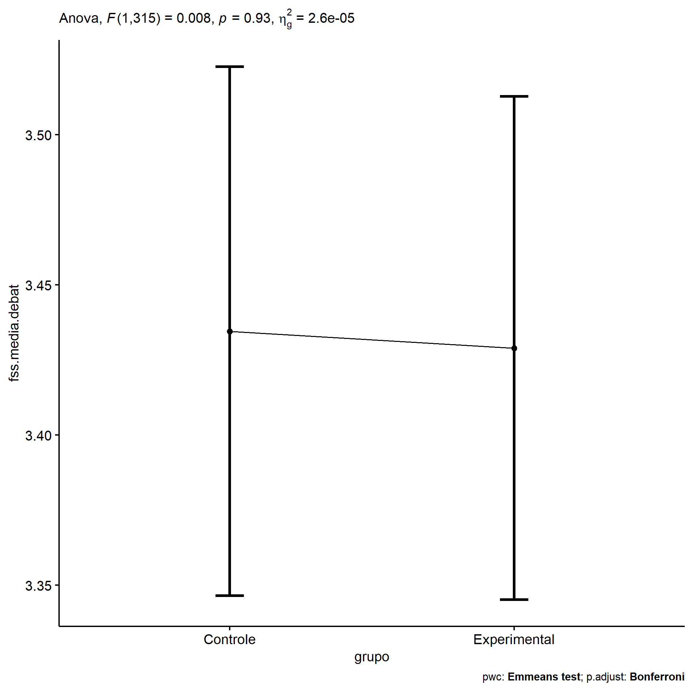<!-- -->

``` r
plots <- oneWayAncovaBoxPlots(
  wdat, "fss.media.debat", "grupo", aov, pwc, covar = "dfs.media.debat",
  theme = "classic", color = color[["grupo"]],
  subtitle = which(aov$Effect == "grupo"))
```

``` r
if (length(unique(wdat[["grupo"]])) > 1)
  plots[["grupo"]] + ggplot2::ylab("flow (debate)") + ggplot2::scale_x_discrete(labels=c('pre', 'pos'))
```

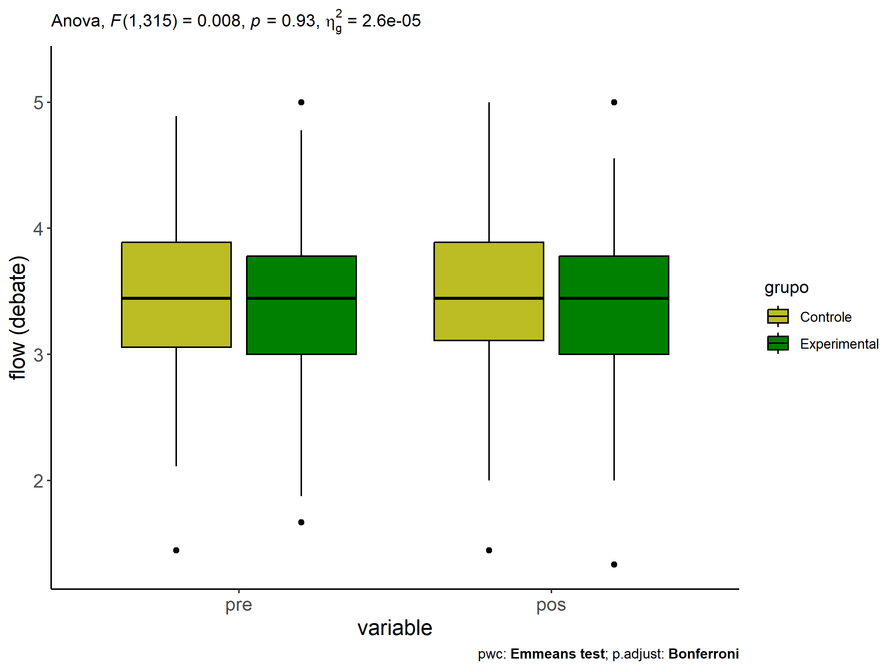<!-- -->

``` r
if (length(unique(wdat.long[["grupo"]])) > 1)
  plots <- oneWayAncovaBoxPlots(
    wdat.long, "flow.debat", "grupo", aov, pwc.long, pre.post = "time",
    theme = "classic", color = color$prepost)
```

``` r
if (length(unique(wdat.long[["grupo"]])) > 1)
  plots[["grupo"]] + ggplot2::ylab("flow (debate)")
```

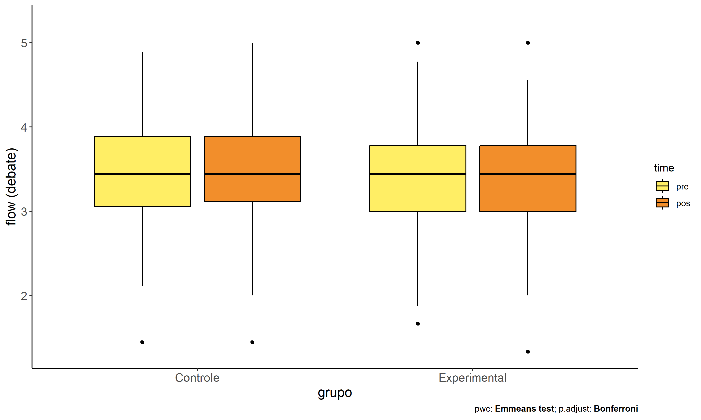<!-- -->

### Checking linearity assumption

``` r
ggscatter(wdat, x = "dfs.media.debat", y = "fss.media.debat", size = 0.5,
          color = "grupo", add = "reg.line")+
  stat_regline_equation(
    aes(label =  paste(..eq.label.., ..rr.label.., sep = "~~~~"), color = grupo)
  )
```

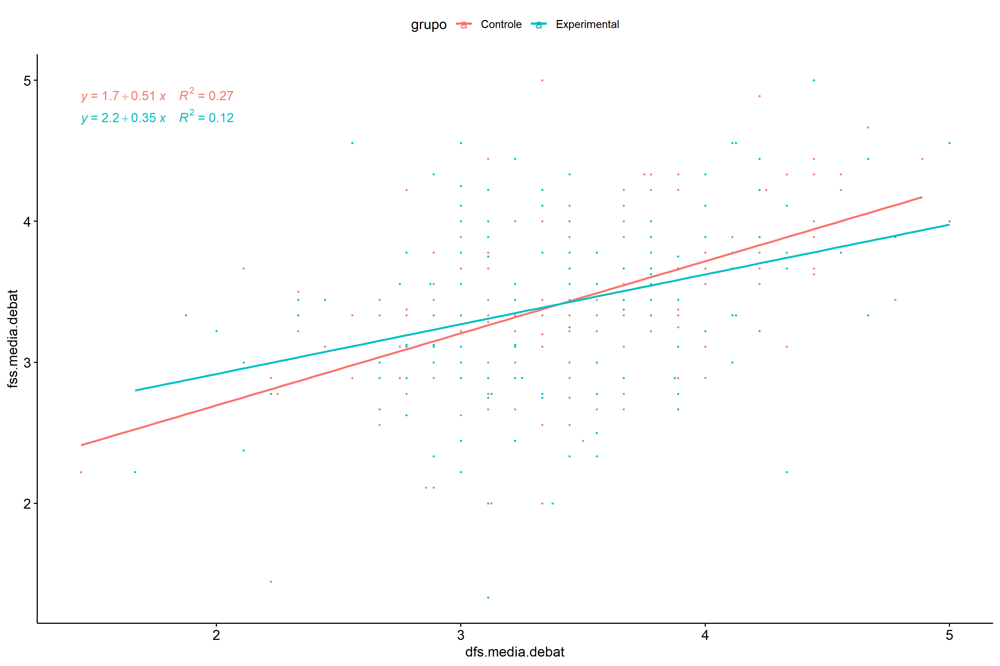<!-- -->

### Checking normality and homogeneity

``` r
res <- augment(lm(fss.media.debat ~ dfs.media.debat + grupo, data = wdat))
```

``` r
shapiro_test(res$.resid)
```

    ## # A tibble: 1 × 3
    ##   variable   statistic p.value
    ##   <chr>          <dbl>   <dbl>
    ## 1 res$.resid     0.994   0.212

``` r
levene_test(res, .resid ~ grupo)
```

    ## # A tibble: 1 × 4
    ##     df1   df2 statistic     p
    ##   <int> <int>     <dbl> <dbl>
    ## 1     1   316     0.612 0.434

# ANCOVA and Pairwise for two factors **grupo:Sexo**

## Without remove non-normal data

``` r
pdat = remove_group_data(dat[!is.na(dat[["grupo"]]) & !is.na(dat[["Sexo"]]),], "fss.media.debat", c("grupo","Sexo"))

pdat.long <- rbind(pdat[,c("id","grupo","Sexo")], pdat[,c("id","grupo","Sexo")])
pdat.long[["time"]] <- c(rep("pre", nrow(pdat)), rep("pos", nrow(pdat)))
pdat.long[["time"]] <- factor(pdat.long[["time"]], c("pre","pos"))
pdat.long[["flow.debat"]] <- c(pdat[["dfs.media.debat"]], pdat[["fss.media.debat"]])

aov = anova_test(pdat, fss.media.debat ~ dfs.media.debat + grupo*Sexo)
laov[["grupo:Sexo"]] <- get_anova_table(aov)
```

``` r
pwcs <- list()
pwcs[["Sexo"]] <- emmeans_test(
  group_by(pdat, grupo), fss.media.debat ~ Sexo,
  covariate = dfs.media.debat, p.adjust.method = "bonferroni")
pwcs[["grupo"]] <- emmeans_test(
  group_by(pdat, Sexo), fss.media.debat ~ grupo,
  covariate = dfs.media.debat, p.adjust.method = "bonferroni")

pwc <- plyr::rbind.fill(pwcs[["grupo"]], pwcs[["Sexo"]])
pwc <- pwc[,c("grupo","Sexo", colnames(pwc)[!colnames(pwc) %in% c("grupo","Sexo")])]
```

``` r
pwc.long <- emmeans_test(dplyr::group_by_at(pdat.long, c("grupo","Sexo")),
                         flow.debat ~ time,
                         p.adjust.method = "bonferroni")
lpwc[["grupo:Sexo"]] <- plyr::rbind.fill(pwc, pwc.long)
```

``` r
ds <- get.descriptives(pdat, "fss.media.debat", c("grupo","Sexo"), covar = "dfs.media.debat")
ds <- merge(ds[ds$variable != "dfs.media.debat",],
            ds[ds$variable == "dfs.media.debat", !colnames(ds) %in% c("variable")],
            by = c("grupo","Sexo"), all.x = T, suffixes = c("", ".dfs.media.debat"))
ds <- merge(get_emmeans(pwcs[["grupo"]]), ds, by = c("grupo","Sexo"), suffixes = c(".emms", ""))
ds <- ds[,c("grupo","Sexo","n","mean.dfs.media.debat","se.dfs.media.debat","mean","se","emmean","se.emms")]

colnames(ds) <- c("grupo","Sexo", "N", paste0(c("M","SE")," (pre)"),
                  paste0(c("M","SE"), " (unadj)"), paste0(c("M", "SE"), " (adj)"))

lemms[["grupo:Sexo"]] <- ds
```

## Computing ANCOVA and PairWise After removing non-normal data (OK)

``` r
wdat = pdat 

res = residuals(lm(fss.media.debat ~ dfs.media.debat + grupo*Sexo, data = wdat))
non.normal = getNonNormal(res, wdat$id, plimit = 0.05)

wdat = wdat[!wdat$id %in% non.normal,]

wdat.long <- rbind(wdat[,c("id","grupo","Sexo")], wdat[,c("id","grupo","Sexo")])
wdat.long[["time"]] <- c(rep("pre", nrow(wdat)), rep("pos", nrow(wdat)))
wdat.long[["time"]] <- factor(wdat.long[["time"]], c("pre","pos"))
wdat.long[["flow.debat"]] <- c(wdat[["dfs.media.debat"]], wdat[["fss.media.debat"]])


ldat[["grupo:Sexo"]] = wdat

(non.normal)
```

    ## NULL

``` r
aov = anova_test(wdat, fss.media.debat ~ dfs.media.debat + grupo*Sexo)
laov[["grupo:Sexo"]] <- merge(get_anova_table(aov), laov[["grupo:Sexo"]], by="Effect", suffixes = c("","'"))

(df = get_anova_table(aov))
```

    ## ANOVA Table (type II tests)
    ## 
    ##            Effect DFn DFd      F        p p<.05      ges
    ## 1 dfs.media.debat   1 313 71.548 1.05e-15     * 1.86e-01
    ## 2           grupo   1 313  0.013 9.10e-01       4.09e-05
    ## 3            Sexo   1 313  0.223 6.37e-01       7.11e-04
    ## 4      grupo:Sexo   1 313  0.138 7.10e-01       4.41e-04

| Effect          | DFn | DFd |      F |     p | p\<.05 |   ges |
|:----------------|----:|----:|-------:|------:|:-------|------:|
| dfs.media.debat |   1 | 313 | 71.548 | 0.000 | \*     | 0.186 |
| grupo           |   1 | 313 |  0.013 | 0.910 |        | 0.000 |
| Sexo            |   1 | 313 |  0.223 | 0.637 |        | 0.001 |
| grupo:Sexo      |   1 | 313 |  0.138 | 0.710 |        | 0.000 |

``` r
pwcs <- list()
pwcs[["Sexo"]] <- emmeans_test(
  group_by(wdat, grupo), fss.media.debat ~ Sexo,
  covariate = dfs.media.debat, p.adjust.method = "bonferroni")
pwcs[["grupo"]] <- emmeans_test(
  group_by(wdat, Sexo), fss.media.debat ~ grupo,
  covariate = dfs.media.debat, p.adjust.method = "bonferroni")

pwc <- plyr::rbind.fill(pwcs[["grupo"]], pwcs[["Sexo"]])
pwc <- pwc[,c("grupo","Sexo", colnames(pwc)[!colnames(pwc) %in% c("grupo","Sexo")])]
```

| grupo        | Sexo | term                   | .y.             | group1   | group2       |  df | statistic |     p | p.adj | p.adj.signif |
|:-------------|:-----|:-----------------------|:----------------|:---------|:-------------|----:|----------:|------:|------:|:-------------|
|              | F    | dfs.media.debat\*grupo | fss.media.debat | Controle | Experimental | 313 |     0.344 | 0.731 | 0.731 | ns           |
|              | M    | dfs.media.debat\*grupo | fss.media.debat | Controle | Experimental | 313 |    -0.180 | 0.858 | 0.858 | ns           |
| Controle     |      | dfs.media.debat\*Sexo  | fss.media.debat | F        | M            | 313 |     0.594 | 0.553 | 0.553 | ns           |
| Experimental |      | dfs.media.debat\*Sexo  | fss.media.debat | F        | M            | 313 |     0.087 | 0.931 | 0.931 | ns           |

``` r
pwc.long <- emmeans_test(dplyr::group_by_at(wdat.long, c("grupo","Sexo")),
                         flow.debat ~ time,
                         p.adjust.method = "bonferroni")
lpwc[["grupo:Sexo"]] <- merge(plyr::rbind.fill(pwc, pwc.long), lpwc[["grupo:Sexo"]], by=c("grupo","Sexo","term",".y.","group1","group2"), suffixes = c("","'"))
```

| grupo        | Sexo | term | .y.        | group1 | group2 |  df | statistic |     p | p.adj | p.adj.signif |
|:-------------|:-----|:-----|:-----------|:-------|:-------|----:|----------:|------:|------:|:-------------|
| Controle     | F    | time | flow.debat | pre    | pos    | 628 |     0.193 | 0.847 | 0.847 | ns           |
| Controle     | M    | time | flow.debat | pre    | pos    | 628 |     0.324 | 0.746 | 0.746 | ns           |
| Experimental | F    | time | flow.debat | pre    | pos    | 628 |     0.094 | 0.925 | 0.925 | ns           |
| Experimental | M    | time | flow.debat | pre    | pos    | 628 |    -0.225 | 0.822 | 0.822 | ns           |

``` r
ds <- get.descriptives(wdat, "fss.media.debat", c("grupo","Sexo"), covar = "dfs.media.debat")
ds <- merge(ds[ds$variable != "dfs.media.debat",],
            ds[ds$variable == "dfs.media.debat", !colnames(ds) %in% c("variable")],
            by = c("grupo","Sexo"), all.x = T, suffixes = c("", ".dfs.media.debat"))
ds <- merge(get_emmeans(pwcs[["grupo"]]), ds, by = c("grupo","Sexo"), suffixes = c(".emms", ""))
ds <- ds[,c("grupo","Sexo","n","mean.dfs.media.debat","se.dfs.media.debat","mean","se","emmean","se.emms")]

colnames(ds) <- c("grupo","Sexo", "N", paste0(c("M","SE")," (pre)"),
                  paste0(c("M","SE"), " (unadj)"), paste0(c("M", "SE"), " (adj)"))

lemms[["grupo:Sexo"]] <- merge(ds, lemms[["grupo:Sexo"]], by=c("grupo","Sexo"), suffixes = c("","'"))
```

| grupo        | Sexo |   N | M (pre) | SE (pre) | M (unadj) | SE (unadj) | M (adj) | SE (adj) |
|:-------------|:-----|----:|--------:|---------:|----------:|-----------:|--------:|---------:|
| Controle     | F    |  71 |   3.514 |    0.075 |     3.495 |      0.073 |   3.463 |    0.066 |
| Controle     | M    |  80 |   3.441 |    0.069 |     3.409 |      0.069 |   3.409 |    0.062 |
| Experimental | F    |  86 |   3.442 |    0.063 |     3.433 |      0.068 |   3.432 |    0.059 |
| Experimental | M    |  81 |   3.375 |    0.068 |     3.397 |      0.063 |   3.425 |    0.061 |

### Plots for ancova

``` r
plots <- twoWayAncovaPlots(
  wdat, "fss.media.debat", c("grupo","Sexo"), aov, pwcs, addParam = c("mean_se"),
  font.label.size=10, step.increase=0.05, p.label="p.adj",
  subtitle = which(aov$Effect == "grupo:Sexo"))
```

``` r
if (!is.null(plots[["grupo"]]))
  plots[["grupo"]] + ggplot2::scale_color_manual(values = color[["Sexo"]])
```

    ## Scale for colour is already present.
    ## Adding another scale for colour, which will replace the existing scale.

<!-- -->

``` r
if (!is.null(plots[["Sexo"]]))
  plots[["Sexo"]] + ggplot2::scale_color_manual(values = color[["grupo"]])
```

    ## Scale for colour is already present.
    ## Adding another scale for colour, which will replace the existing scale.

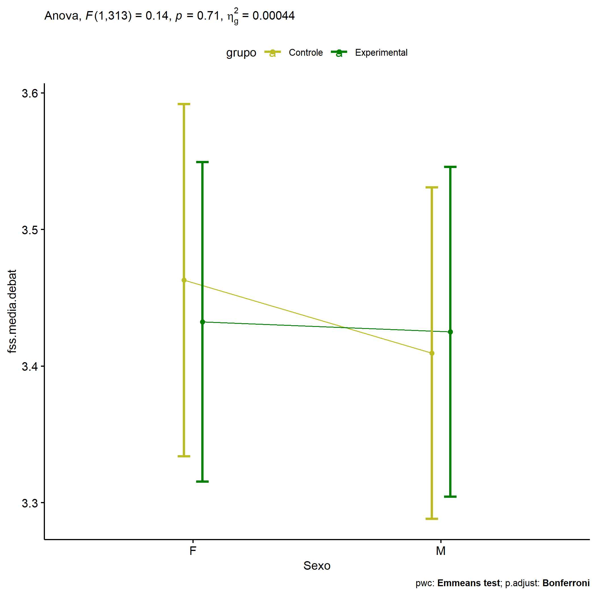<!-- -->

``` r
plots <- twoWayAncovaBoxPlots(
  wdat, "fss.media.debat", c("grupo","Sexo"), aov, pwcs, covar = "dfs.media.debat",
  theme = "classic", color = color[["grupo:Sexo"]],
  subtitle = which(aov$Effect == "grupo:Sexo"))
```

``` r
plots[["grupo:Sexo"]] + ggplot2::ylab("flow (debate)") + ggplot2::scale_x_discrete(labels=c('pre', 'pos'))
```

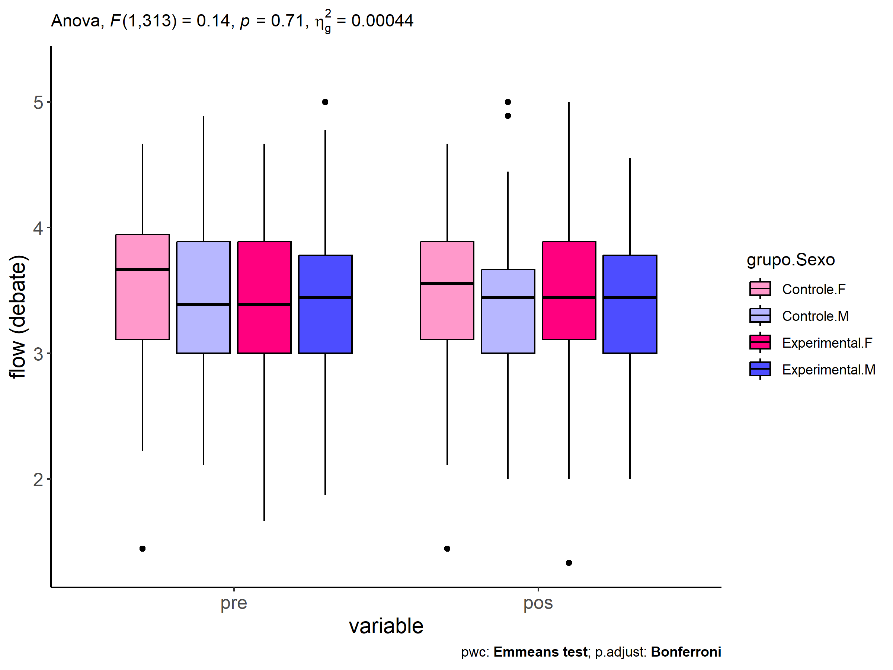<!-- -->

``` r
plots <- twoWayAncovaBoxPlots(
  wdat.long, "flow.debat", c("grupo","Sexo"), aov, pwc.long, pre.post = "time",
  theme = "classic", color = color$prepost)
```

``` r
plots[["grupo:Sexo"]] + ggplot2::ylab("flow (debate)")
```

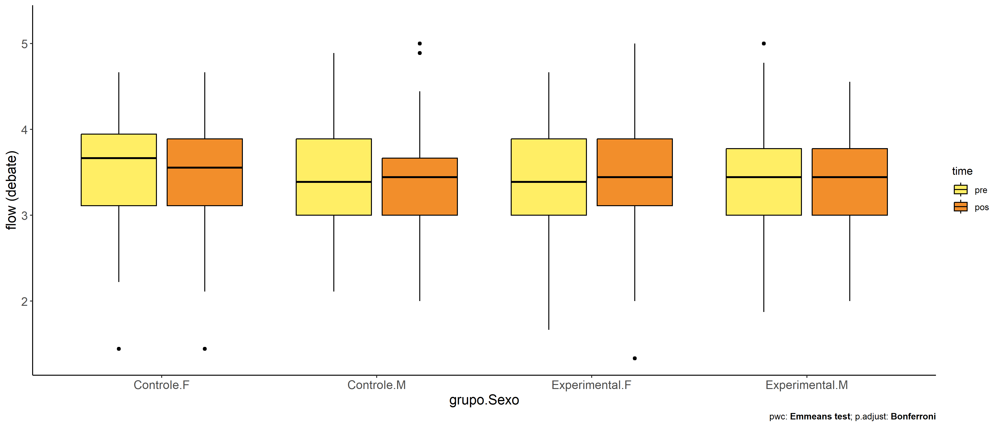<!-- -->

### Checking linearity assumption

``` r
ggscatter(wdat, x = "dfs.media.debat", y = "fss.media.debat", size = 0.5,
          facet.by = c("grupo","Sexo"), add = "reg.line")+
  stat_regline_equation(
    aes(label =  paste(..eq.label.., ..rr.label.., sep = "~~~~"))
  )
```

<!-- -->

### Checking normality and homogeneity

``` r
res <- augment(lm(fss.media.debat ~ dfs.media.debat + grupo*Sexo, data = wdat))
```

``` r
shapiro_test(res$.resid)
```

    ## # A tibble: 1 × 3
    ##   variable   statistic p.value
    ##   <chr>          <dbl>   <dbl>
    ## 1 res$.resid     0.994   0.245

``` r
levene_test(res, .resid ~ grupo*Sexo)
```

    ## # A tibble: 1 × 4
    ##     df1   df2 statistic     p
    ##   <int> <int>     <dbl> <dbl>
    ## 1     3   314     0.297 0.827

# ANCOVA and Pairwise for two factors **grupo:Zona**

## Without remove non-normal data

``` r
pdat = remove_group_data(dat[!is.na(dat[["grupo"]]) & !is.na(dat[["Zona"]]),], "fss.media.debat", c("grupo","Zona"))

pdat.long <- rbind(pdat[,c("id","grupo","Zona")], pdat[,c("id","grupo","Zona")])
pdat.long[["time"]] <- c(rep("pre", nrow(pdat)), rep("pos", nrow(pdat)))
pdat.long[["time"]] <- factor(pdat.long[["time"]], c("pre","pos"))
pdat.long[["flow.debat"]] <- c(pdat[["dfs.media.debat"]], pdat[["fss.media.debat"]])

aov = anova_test(pdat, fss.media.debat ~ dfs.media.debat + grupo*Zona)
laov[["grupo:Zona"]] <- get_anova_table(aov)
```

``` r
pwcs <- list()
pwcs[["Zona"]] <- emmeans_test(
  group_by(pdat, grupo), fss.media.debat ~ Zona,
  covariate = dfs.media.debat, p.adjust.method = "bonferroni")
pwcs[["grupo"]] <- emmeans_test(
  group_by(pdat, Zona), fss.media.debat ~ grupo,
  covariate = dfs.media.debat, p.adjust.method = "bonferroni")

pwc <- plyr::rbind.fill(pwcs[["grupo"]], pwcs[["Zona"]])
pwc <- pwc[,c("grupo","Zona", colnames(pwc)[!colnames(pwc) %in% c("grupo","Zona")])]
```

``` r
pwc.long <- emmeans_test(dplyr::group_by_at(pdat.long, c("grupo","Zona")),
                         flow.debat ~ time,
                         p.adjust.method = "bonferroni")
lpwc[["grupo:Zona"]] <- plyr::rbind.fill(pwc, pwc.long)
```

``` r
ds <- get.descriptives(pdat, "fss.media.debat", c("grupo","Zona"), covar = "dfs.media.debat")
ds <- merge(ds[ds$variable != "dfs.media.debat",],
            ds[ds$variable == "dfs.media.debat", !colnames(ds) %in% c("variable")],
            by = c("grupo","Zona"), all.x = T, suffixes = c("", ".dfs.media.debat"))
ds <- merge(get_emmeans(pwcs[["grupo"]]), ds, by = c("grupo","Zona"), suffixes = c(".emms", ""))
ds <- ds[,c("grupo","Zona","n","mean.dfs.media.debat","se.dfs.media.debat","mean","se","emmean","se.emms")]

colnames(ds) <- c("grupo","Zona", "N", paste0(c("M","SE")," (pre)"),
                  paste0(c("M","SE"), " (unadj)"), paste0(c("M", "SE"), " (adj)"))

lemms[["grupo:Zona"]] <- ds
```

## Computing ANCOVA and PairWise After removing non-normal data (OK)

``` r
wdat = pdat 

res = residuals(lm(fss.media.debat ~ dfs.media.debat + grupo*Zona, data = wdat))
non.normal = getNonNormal(res, wdat$id, plimit = 0.05)

wdat = wdat[!wdat$id %in% non.normal,]

wdat.long <- rbind(wdat[,c("id","grupo","Zona")], wdat[,c("id","grupo","Zona")])
wdat.long[["time"]] <- c(rep("pre", nrow(wdat)), rep("pos", nrow(wdat)))
wdat.long[["time"]] <- factor(wdat.long[["time"]], c("pre","pos"))
wdat.long[["flow.debat"]] <- c(wdat[["dfs.media.debat"]], wdat[["fss.media.debat"]])


ldat[["grupo:Zona"]] = wdat

(non.normal)
```

    ## NULL

``` r
aov = anova_test(wdat, fss.media.debat ~ dfs.media.debat + grupo*Zona)
laov[["grupo:Zona"]] <- merge(get_anova_table(aov), laov[["grupo:Zona"]], by="Effect", suffixes = c("","'"))

(df = get_anova_table(aov))
```

    ## ANOVA Table (type II tests)
    ## 
    ##            Effect DFn DFd      F        p p<.05      ges
    ## 1 dfs.media.debat   1 245 55.982 1.31e-12     * 0.186000
    ## 2           grupo   1 245  0.068 7.94e-01       0.000279
    ## 3            Zona   1 245  0.341 5.60e-01       0.001000
    ## 4      grupo:Zona   1 245  0.693 4.06e-01       0.003000

| Effect          | DFn | DFd |      F |     p | p\<.05 |   ges |
|:----------------|----:|----:|-------:|------:|:-------|------:|
| dfs.media.debat |   1 | 245 | 55.982 | 0.000 | \*     | 0.186 |
| grupo           |   1 | 245 |  0.068 | 0.794 |        | 0.000 |
| Zona            |   1 | 245 |  0.341 | 0.560 |        | 0.001 |
| grupo:Zona      |   1 | 245 |  0.693 | 0.406 |        | 0.003 |

``` r
pwcs <- list()
pwcs[["Zona"]] <- emmeans_test(
  group_by(wdat, grupo), fss.media.debat ~ Zona,
  covariate = dfs.media.debat, p.adjust.method = "bonferroni")
pwcs[["grupo"]] <- emmeans_test(
  group_by(wdat, Zona), fss.media.debat ~ grupo,
  covariate = dfs.media.debat, p.adjust.method = "bonferroni")

pwc <- plyr::rbind.fill(pwcs[["grupo"]], pwcs[["Zona"]])
pwc <- pwc[,c("grupo","Zona", colnames(pwc)[!colnames(pwc) %in% c("grupo","Zona")])]
```

| grupo        | Zona   | term                   | .y.             | group1   | group2       |  df | statistic |     p | p.adj | p.adj.signif |
|:-------------|:-------|:-----------------------|:----------------|:---------|:-------------|----:|----------:|------:|------:|:-------------|
|              | Rural  | dfs.media.debat\*grupo | fss.media.debat | Controle | Experimental | 245 |    -0.191 | 0.849 | 0.849 | ns           |
|              | Urbana | dfs.media.debat\*grupo | fss.media.debat | Controle | Experimental | 245 |     0.850 | 0.396 | 0.396 | ns           |
| Controle     |        | dfs.media.debat\*Zona  | fss.media.debat | Rural    | Urbana       | 245 |    -0.260 | 0.795 | 0.795 | ns           |
| Experimental |        | dfs.media.debat\*Zona  | fss.media.debat | Rural    | Urbana       | 245 |     0.983 | 0.327 | 0.327 | ns           |

``` r
pwc.long <- emmeans_test(dplyr::group_by_at(wdat.long, c("grupo","Zona")),
                         flow.debat ~ time,
                         p.adjust.method = "bonferroni")
lpwc[["grupo:Zona"]] <- merge(plyr::rbind.fill(pwc, pwc.long), lpwc[["grupo:Zona"]], by=c("grupo","Zona","term",".y.","group1","group2"), suffixes = c("","'"))
```

| grupo        | Zona   | term | .y.        | group1 | group2 |  df | statistic |     p | p.adj | p.adj.signif |
|:-------------|:-------|:-----|:-----------|:-------|:-------|----:|----------:|------:|------:|:-------------|
| Controle     | Rural  | time | flow.debat | pre    | pos    | 492 |     0.571 | 0.569 | 0.569 | ns           |
| Controle     | Urbana | time | flow.debat | pre    | pos    | 492 |    -0.049 | 0.961 | 0.961 | ns           |
| Experimental | Rural  | time | flow.debat | pre    | pos    | 492 |    -0.686 | 0.493 | 0.493 | ns           |
| Experimental | Urbana | time | flow.debat | pre    | pos    | 492 |     0.270 | 0.787 | 0.787 | ns           |

``` r
ds <- get.descriptives(wdat, "fss.media.debat", c("grupo","Zona"), covar = "dfs.media.debat")
ds <- merge(ds[ds$variable != "dfs.media.debat",],
            ds[ds$variable == "dfs.media.debat", !colnames(ds) %in% c("variable")],
            by = c("grupo","Zona"), all.x = T, suffixes = c("", ".dfs.media.debat"))
ds <- merge(get_emmeans(pwcs[["grupo"]]), ds, by = c("grupo","Zona"), suffixes = c(".emms", ""))
ds <- ds[,c("grupo","Zona","n","mean.dfs.media.debat","se.dfs.media.debat","mean","se","emmean","se.emms")]

colnames(ds) <- c("grupo","Zona", "N", paste0(c("M","SE")," (pre)"),
                  paste0(c("M","SE"), " (unadj)"), paste0(c("M", "SE"), " (adj)"))

lemms[["grupo:Zona"]] <- merge(ds, lemms[["grupo:Zona"]], by=c("grupo","Zona"), suffixes = c("","'"))
```

| grupo        | Zona   |   N | M (pre) | SE (pre) | M (unadj) | SE (unadj) | M (adj) | SE (adj) |
|:-------------|:-------|----:|--------:|---------:|----------:|-----------:|--------:|---------:|
| Controle     | Rural  | 105 |   3.536 |    0.056 |     3.489 |      0.060 |   3.452 |    0.053 |
| Controle     | Urbana |  24 |   3.494 |    0.149 |     3.503 |      0.141 |   3.483 |    0.110 |
| Experimental | Rural  |  79 |   3.366 |    0.064 |     3.431 |      0.063 |   3.467 |    0.061 |
| Experimental | Urbana |  42 |   3.365 |    0.094 |     3.330 |      0.087 |   3.366 |    0.083 |

### Plots for ancova

``` r
plots <- twoWayAncovaPlots(
  wdat, "fss.media.debat", c("grupo","Zona"), aov, pwcs, addParam = c("mean_se"),
  font.label.size=10, step.increase=0.05, p.label="p.adj",
  subtitle = which(aov$Effect == "grupo:Zona"))
```

``` r
if (!is.null(plots[["grupo"]]))
  plots[["grupo"]] + ggplot2::scale_color_manual(values = color[["Zona"]])
```

    ## Scale for colour is already present.
    ## Adding another scale for colour, which will replace the existing scale.

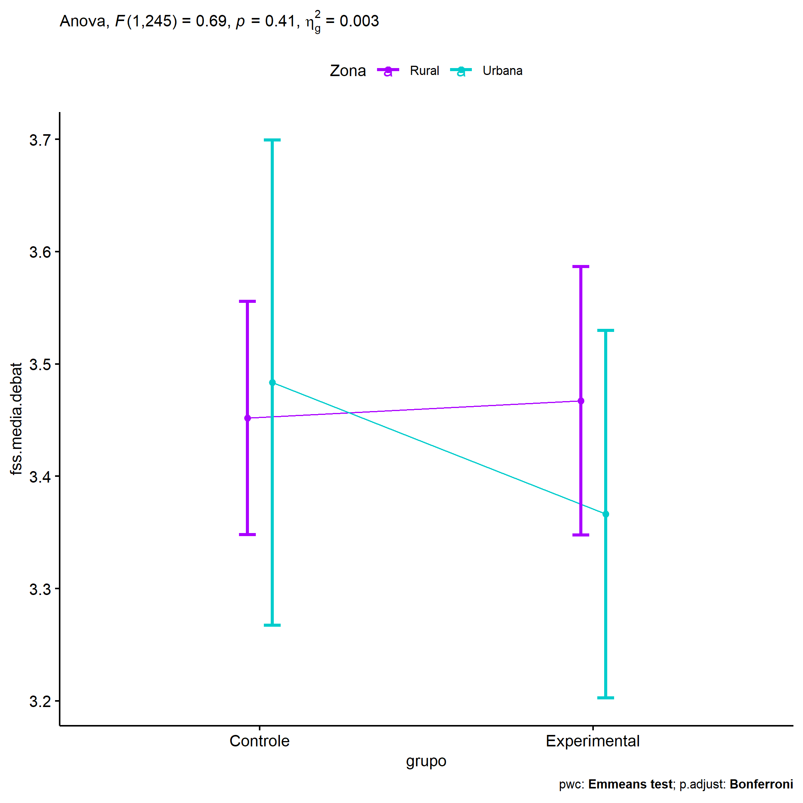<!-- -->

``` r
if (!is.null(plots[["Zona"]]))
  plots[["Zona"]] + ggplot2::scale_color_manual(values = color[["grupo"]])
```

    ## Scale for colour is already present.
    ## Adding another scale for colour, which will replace the existing scale.

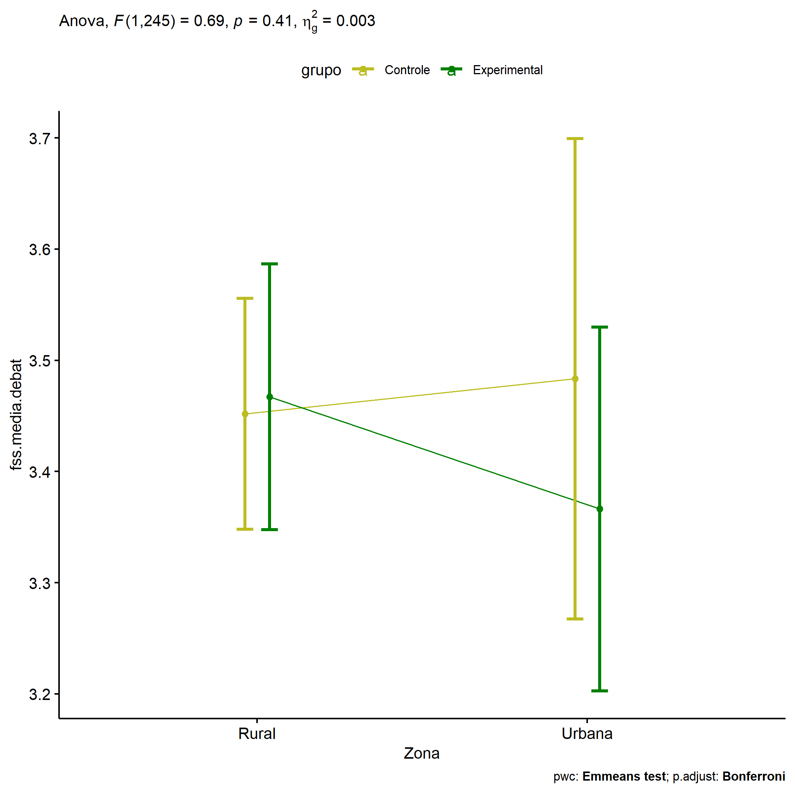<!-- -->

``` r
plots <- twoWayAncovaBoxPlots(
  wdat, "fss.media.debat", c("grupo","Zona"), aov, pwcs, covar = "dfs.media.debat",
  theme = "classic", color = color[["grupo:Zona"]],
  subtitle = which(aov$Effect == "grupo:Zona"))
```

``` r
plots[["grupo:Zona"]] + ggplot2::ylab("flow (debate)") + ggplot2::scale_x_discrete(labels=c('pre', 'pos'))
```

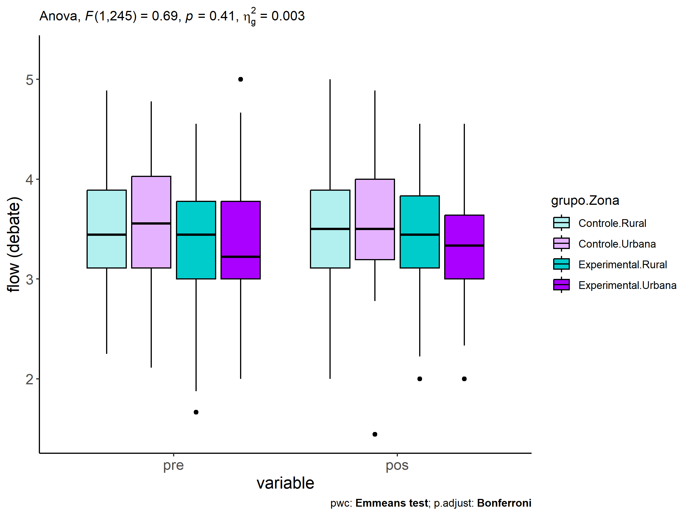<!-- -->

``` r
plots <- twoWayAncovaBoxPlots(
  wdat.long, "flow.debat", c("grupo","Zona"), aov, pwc.long, pre.post = "time",
  theme = "classic", color = color$prepost)
```

``` r
plots[["grupo:Zona"]] + ggplot2::ylab("flow (debate)")
```

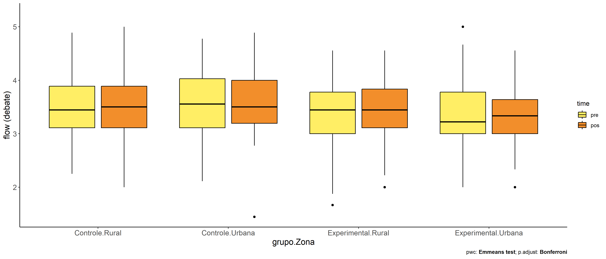<!-- -->

### Checking linearity assumption

``` r
ggscatter(wdat, x = "dfs.media.debat", y = "fss.media.debat", size = 0.5,
          facet.by = c("grupo","Zona"), add = "reg.line")+
  stat_regline_equation(
    aes(label =  paste(..eq.label.., ..rr.label.., sep = "~~~~"))
  )
```

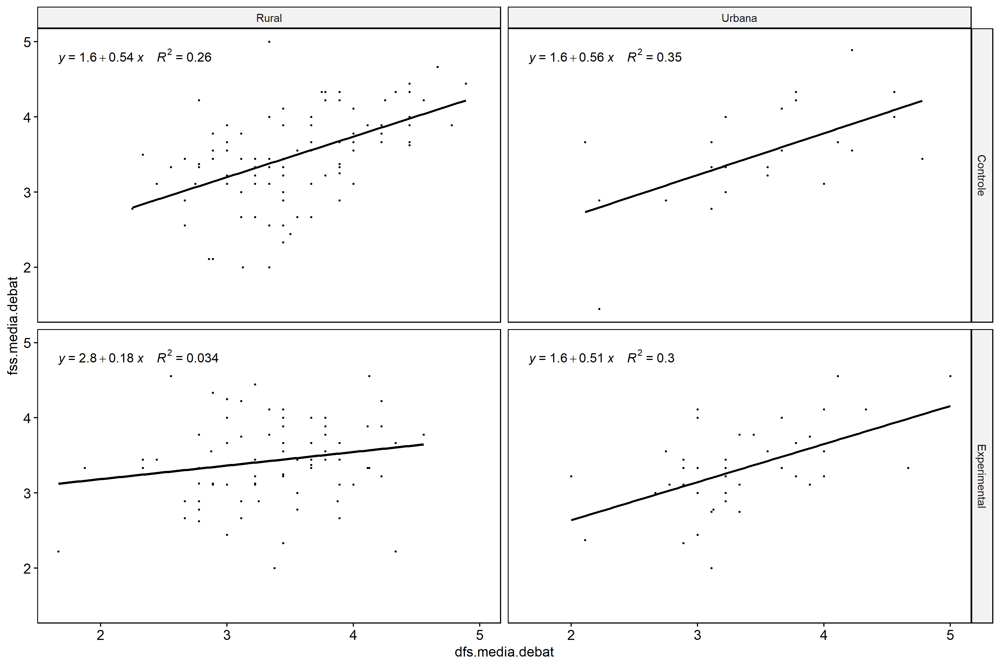<!-- -->

### Checking normality and homogeneity

``` r
res <- augment(lm(fss.media.debat ~ dfs.media.debat + grupo*Zona, data = wdat))
```

``` r
shapiro_test(res$.resid)
```

    ## # A tibble: 1 × 3
    ##   variable   statistic p.value
    ##   <chr>          <dbl>   <dbl>
    ## 1 res$.resid     0.991   0.138

``` r
levene_test(res, .resid ~ grupo*Zona)
```

    ## # A tibble: 1 × 4
    ##     df1   df2 statistic     p
    ##   <int> <int>     <dbl> <dbl>
    ## 1     3   246     0.364 0.779

# ANCOVA and Pairwise for two factors **grupo:Cor.Raca**

## Without remove non-normal data

``` r
pdat = remove_group_data(dat[!is.na(dat[["grupo"]]) & !is.na(dat[["Cor.Raca"]]),], "fss.media.debat", c("grupo","Cor.Raca"))
```

    ## Warning: There were 2 warnings in `mutate()`.
    ## The first warning was:
    ## ℹ In argument: `ci = abs(stats::qt(alpha/2, .data$n - 1) * .data$se)`.
    ## Caused by warning:
    ## ! There was 1 warning in `mutate()`.
    ## ℹ In argument: `ci = abs(stats::qt(alpha/2, .data$n - 1) * .data$se)`.
    ## Caused by warning in `stats::qt()`:
    ## ! NaNs produced
    ## ℹ Run `dplyr::last_dplyr_warnings()` to see the 1 remaining warning.

``` r
pdat.long <- rbind(pdat[,c("id","grupo","Cor.Raca")], pdat[,c("id","grupo","Cor.Raca")])
pdat.long[["time"]] <- c(rep("pre", nrow(pdat)), rep("pos", nrow(pdat)))
pdat.long[["time"]] <- factor(pdat.long[["time"]], c("pre","pos"))
pdat.long[["flow.debat"]] <- c(pdat[["dfs.media.debat"]], pdat[["fss.media.debat"]])

aov = anova_test(pdat, fss.media.debat ~ dfs.media.debat + grupo*Cor.Raca)
laov[["grupo:Cor.Raca"]] <- get_anova_table(aov)
```

``` r
pwcs <- list()
pwcs[["Cor.Raca"]] <- emmeans_test(
  group_by(pdat, grupo), fss.media.debat ~ Cor.Raca,
  covariate = dfs.media.debat, p.adjust.method = "bonferroni")
pwcs[["grupo"]] <- emmeans_test(
  group_by(pdat, Cor.Raca), fss.media.debat ~ grupo,
  covariate = dfs.media.debat, p.adjust.method = "bonferroni")

pwc <- plyr::rbind.fill(pwcs[["grupo"]], pwcs[["Cor.Raca"]])
pwc <- pwc[,c("grupo","Cor.Raca", colnames(pwc)[!colnames(pwc) %in% c("grupo","Cor.Raca")])]
```

``` r
pwc.long <- emmeans_test(dplyr::group_by_at(pdat.long, c("grupo","Cor.Raca")),
                         flow.debat ~ time,
                         p.adjust.method = "bonferroni")
lpwc[["grupo:Cor.Raca"]] <- plyr::rbind.fill(pwc, pwc.long)
```

``` r
ds <- get.descriptives(pdat, "fss.media.debat", c("grupo","Cor.Raca"), covar = "dfs.media.debat")
ds <- merge(ds[ds$variable != "dfs.media.debat",],
            ds[ds$variable == "dfs.media.debat", !colnames(ds) %in% c("variable")],
            by = c("grupo","Cor.Raca"), all.x = T, suffixes = c("", ".dfs.media.debat"))
ds <- merge(get_emmeans(pwcs[["grupo"]]), ds, by = c("grupo","Cor.Raca"), suffixes = c(".emms", ""))
ds <- ds[,c("grupo","Cor.Raca","n","mean.dfs.media.debat","se.dfs.media.debat","mean","se","emmean","se.emms")]

colnames(ds) <- c("grupo","Cor.Raca", "N", paste0(c("M","SE")," (pre)"),
                  paste0(c("M","SE"), " (unadj)"), paste0(c("M", "SE"), " (adj)"))

lemms[["grupo:Cor.Raca"]] <- ds
```

## Computing ANCOVA and PairWise After removing non-normal data (OK)

``` r
wdat = pdat 

res = residuals(lm(fss.media.debat ~ dfs.media.debat + grupo*Cor.Raca, data = wdat))
non.normal = getNonNormal(res, wdat$id, plimit = 0.05)

wdat = wdat[!wdat$id %in% non.normal,]

wdat.long <- rbind(wdat[,c("id","grupo","Cor.Raca")], wdat[,c("id","grupo","Cor.Raca")])
wdat.long[["time"]] <- c(rep("pre", nrow(wdat)), rep("pos", nrow(wdat)))
wdat.long[["time"]] <- factor(wdat.long[["time"]], c("pre","pos"))
wdat.long[["flow.debat"]] <- c(wdat[["dfs.media.debat"]], wdat[["fss.media.debat"]])


ldat[["grupo:Cor.Raca"]] = wdat

(non.normal)
```

    ## NULL

``` r
aov = anova_test(wdat, fss.media.debat ~ dfs.media.debat + grupo*Cor.Raca)
laov[["grupo:Cor.Raca"]] <- merge(get_anova_table(aov), laov[["grupo:Cor.Raca"]], by="Effect", suffixes = c("","'"))

(df = get_anova_table(aov))
```

    ## ANOVA Table (type II tests)
    ## 
    ##            Effect DFn DFd          F        p p<.05      ges
    ## 1 dfs.media.debat   1 134 18.7130000 2.95e-05     * 1.23e-01
    ## 2           grupo   1 134  0.0000047 9.98e-01       3.51e-08
    ## 3        Cor.Raca   2 134  1.2910000 2.78e-01       1.90e-02
    ## 4  grupo:Cor.Raca   1 134  0.0980000 7.55e-01       7.30e-04

| Effect          | DFn | DFd |      F |     p | p\<.05 |   ges |
|:----------------|----:|----:|-------:|------:|:-------|------:|
| dfs.media.debat |   1 | 134 | 18.713 | 0.000 | \*     | 0.123 |
| grupo           |   1 | 134 |  0.000 | 0.998 |        | 0.000 |
| Cor.Raca        |   2 | 134 |  1.291 | 0.278 |        | 0.019 |
| grupo:Cor.Raca  |   1 | 134 |  0.098 | 0.755 |        | 0.001 |

``` r
pwcs <- list()
pwcs[["Cor.Raca"]] <- emmeans_test(
  group_by(wdat, grupo), fss.media.debat ~ Cor.Raca,
  covariate = dfs.media.debat, p.adjust.method = "bonferroni")
pwcs[["grupo"]] <- emmeans_test(
  group_by(wdat, Cor.Raca), fss.media.debat ~ grupo,
  covariate = dfs.media.debat, p.adjust.method = "bonferroni")

pwc <- plyr::rbind.fill(pwcs[["grupo"]], pwcs[["Cor.Raca"]])
pwc <- pwc[,c("grupo","Cor.Raca", colnames(pwc)[!colnames(pwc) %in% c("grupo","Cor.Raca")])]
```

| grupo        | Cor.Raca | term                      | .y.             | group1   | group2       |  df | statistic |     p | p.adj | p.adj.signif |
|:-------------|:---------|:--------------------------|:----------------|:---------|:-------------|----:|----------:|------:|------:|:-------------|
|              | Branca   | dfs.media.debat\*grupo    | fss.media.debat | Controle | Experimental | 134 |    -0.264 | 0.792 | 0.792 | ns           |
|              | Indígena | dfs.media.debat\*grupo    | fss.media.debat | Controle | Experimental |     |           |       |       |              |
|              | Parda    | dfs.media.debat\*grupo    | fss.media.debat | Controle | Experimental | 134 |     0.164 | 0.870 | 0.870 | ns           |
| Controle     |          | dfs.media.debat\*Cor.Raca | fss.media.debat | Branca   | Indígena     |     |           |       |       |              |
| Controle     |          | dfs.media.debat\*Cor.Raca | fss.media.debat | Branca   | Parda        | 134 |     0.646 | 0.520 | 0.520 | ns           |
| Controle     |          | dfs.media.debat\*Cor.Raca | fss.media.debat | Indígena | Parda        |     |           |       |       |              |
| Experimental |          | dfs.media.debat\*Cor.Raca | fss.media.debat | Branca   | Indígena     | 134 |     1.481 | 0.141 | 0.423 | ns           |
| Experimental |          | dfs.media.debat\*Cor.Raca | fss.media.debat | Branca   | Parda        | 134 |     1.041 | 0.300 | 0.899 | ns           |
| Experimental |          | dfs.media.debat\*Cor.Raca | fss.media.debat | Indígena | Parda        | 134 |    -0.806 | 0.422 | 1.000 | ns           |

``` r
pwc.long <- emmeans_test(dplyr::group_by_at(wdat.long, c("grupo","Cor.Raca")),
                         flow.debat ~ time,
                         p.adjust.method = "bonferroni")
lpwc[["grupo:Cor.Raca"]] <- merge(plyr::rbind.fill(pwc, pwc.long), lpwc[["grupo:Cor.Raca"]], by=c("grupo","Cor.Raca","term",".y.","group1","group2"), suffixes = c("","'"))
```

| grupo        | Cor.Raca | term | .y.        | group1 | group2 |  df | statistic |     p | p.adj | p.adj.signif |
|:-------------|:---------|:-----|:-----------|:-------|:-------|----:|----------:|------:|------:|:-------------|
| Controle     | Branca   | time | flow.debat | pre    | pos    | 270 |    -0.092 | 0.927 | 0.927 | ns           |
| Controle     | Indígena | time | flow.debat | pre    | pos    |     |           |       |       |              |
| Controle     | Parda    | time | flow.debat | pre    | pos    | 270 |    -0.136 | 0.892 | 0.892 | ns           |
| Experimental | Branca   | time | flow.debat | pre    | pos    | 270 |    -0.934 | 0.351 | 0.351 | ns           |
| Experimental | Indígena | time | flow.debat | pre    | pos    | 270 |     0.487 | 0.627 | 0.627 | ns           |
| Experimental | Parda    | time | flow.debat | pre    | pos    | 270 |    -0.987 | 0.325 | 0.325 | ns           |

``` r
ds <- get.descriptives(wdat, "fss.media.debat", c("grupo","Cor.Raca"), covar = "dfs.media.debat")
ds <- merge(ds[ds$variable != "dfs.media.debat",],
            ds[ds$variable == "dfs.media.debat", !colnames(ds) %in% c("variable")],
            by = c("grupo","Cor.Raca"), all.x = T, suffixes = c("", ".dfs.media.debat"))
ds <- merge(get_emmeans(pwcs[["grupo"]]), ds, by = c("grupo","Cor.Raca"), suffixes = c(".emms", ""))
ds <- ds[,c("grupo","Cor.Raca","n","mean.dfs.media.debat","se.dfs.media.debat","mean","se","emmean","se.emms")]

colnames(ds) <- c("grupo","Cor.Raca", "N", paste0(c("M","SE")," (pre)"),
                  paste0(c("M","SE"), " (unadj)"), paste0(c("M", "SE"), " (adj)"))

lemms[["grupo:Cor.Raca"]] <- merge(ds, lemms[["grupo:Cor.Raca"]], by=c("grupo","Cor.Raca"), suffixes = c("","'"))
```

| grupo        | Cor.Raca |   N | M (pre) | SE (pre) | M (unadj) | SE (unadj) | M (adj) | SE (adj) |
|:-------------|:---------|----:|--------:|---------:|----------:|-----------:|--------:|---------:|
| Controle     | Branca   |  20 |   3.561 |    0.131 |     3.578 |      0.108 |   3.501 |    0.125 |
| Controle     | Parda    |  45 |   3.407 |    0.094 |     3.423 |      0.096 |   3.404 |    0.083 |
| Experimental | Branca   |  17 |   3.373 |    0.116 |     3.556 |      0.163 |   3.549 |    0.135 |
| Experimental | Indígena |  12 |   3.351 |    0.159 |     3.237 |      0.174 |   3.239 |    0.160 |
| Experimental | Parda    |  46 |   3.214 |    0.069 |     3.331 |      0.080 |   3.385 |    0.083 |

### Plots for ancova

``` r
plots <- twoWayAncovaPlots(
  wdat, "fss.media.debat", c("grupo","Cor.Raca"), aov, pwcs, addParam = c("mean_se"),
  font.label.size=10, step.increase=0.05, p.label="p.adj",
  subtitle = which(aov$Effect == "grupo:Cor.Raca"))
```

``` r
if (!is.null(plots[["grupo"]]))
  plots[["grupo"]] + ggplot2::scale_color_manual(values = color[["Cor.Raca"]])
```

<!-- -->

``` r
if (!is.null(plots[["Cor.Raca"]]))
  plots[["Cor.Raca"]] + ggplot2::scale_color_manual(values = color[["grupo"]])
```

    ## Scale for colour is already present.
    ## Adding another scale for colour, which will replace the existing scale.

    ## Warning: Removed 2 rows containing non-finite values (`stat_bracket()`).

    ## Warning: Removed 1 rows containing missing values (`geom_point()`).

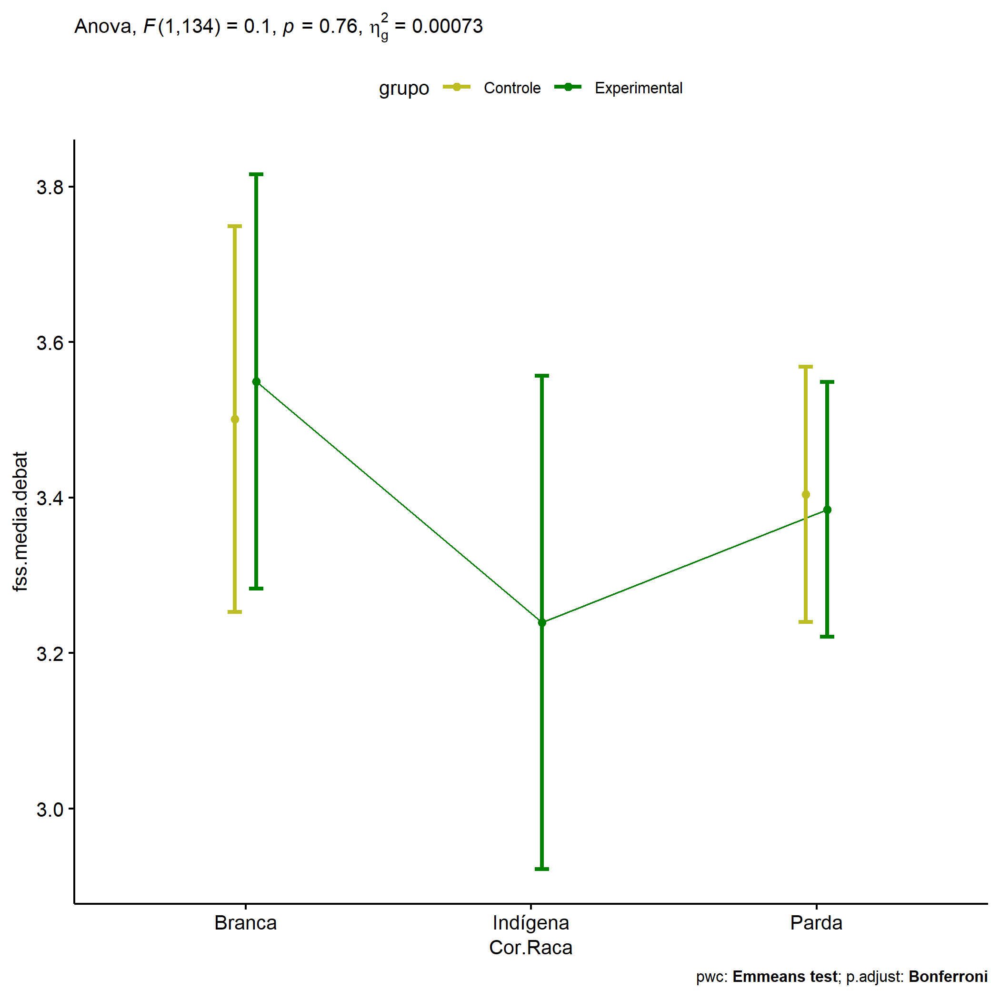<!-- -->

``` r
plots <- twoWayAncovaBoxPlots(
  wdat, "fss.media.debat", c("grupo","Cor.Raca"), aov, pwcs, covar = "dfs.media.debat",
  theme = "classic", color = color[["grupo:Cor.Raca"]],
  subtitle = which(aov$Effect == "grupo:Cor.Raca"))
```

``` r
plots[["grupo:Cor.Raca"]] + ggplot2::ylab("flow (debate)") + ggplot2::scale_x_discrete(labels=c('pre', 'pos'))
```

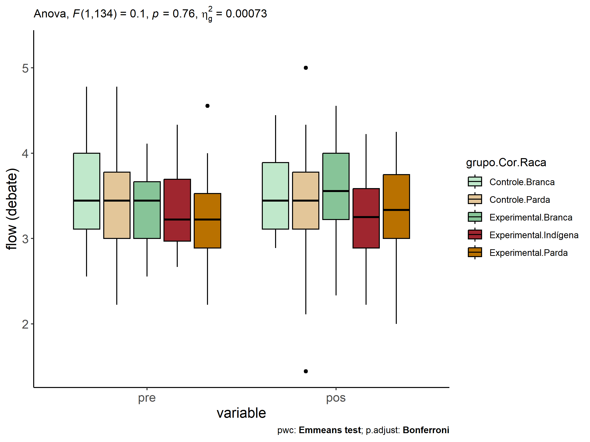<!-- -->

``` r
plots <- twoWayAncovaBoxPlots(
  wdat.long, "flow.debat", c("grupo","Cor.Raca"), aov, pwc.long, pre.post = "time",
  theme = "classic", color = color$prepost)
```

``` r
plots[["grupo:Cor.Raca"]] + ggplot2::ylab("flow (debate)")
```

<!-- -->

### Checking linearity assumption

``` r
ggscatter(wdat, x = "dfs.media.debat", y = "fss.media.debat", size = 0.5,
          facet.by = c("grupo","Cor.Raca"), add = "reg.line")+
  stat_regline_equation(
    aes(label =  paste(..eq.label.., ..rr.label.., sep = "~~~~"))
  )
```

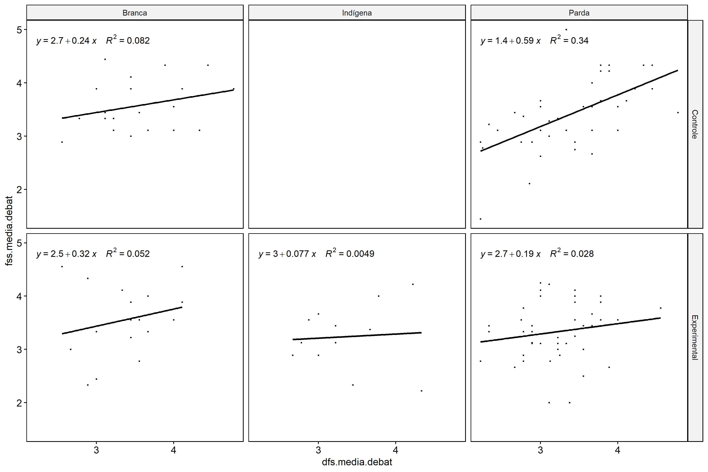<!-- -->

### Checking normality and homogeneity

``` r
res <- augment(lm(fss.media.debat ~ dfs.media.debat + grupo*Cor.Raca, data = wdat))
```

``` r
shapiro_test(res$.resid)
```

    ## # A tibble: 1 × 3
    ##   variable   statistic p.value
    ##   <chr>          <dbl>   <dbl>
    ## 1 res$.resid     0.988   0.252

``` r
levene_test(res, .resid ~ grupo*Cor.Raca)
```

    ## # A tibble: 1 × 4
    ##     df1   df2 statistic     p
    ##   <int> <int>     <dbl> <dbl>
    ## 1     4   135     0.343 0.849

# Summary of Results

## Descriptive Statistics

``` r
df <- get.descriptives(ldat[["grupo"]], c(dv.pre, dv.pos), c("grupo"), 
                       include.global = T, symmetry.test = T, normality.test = F)
df <- plyr::rbind.fill(
  df, do.call(plyr::rbind.fill, lapply(lfatores2, FUN = function(f) {
    if (nrow(dat) > 0 && sum(!is.na(unique(dat[[f]]))) > 1)
      get.descriptives(ldat[[paste0("grupo:",f)]], c(dv.pre,dv.pos), c("grupo", f),
                       symmetry.test = T, normality.test = F)
    }))
)
(df <- df[,c(fatores1[fatores1 %in% colnames(df)],"variable",
             colnames(df)[!colnames(df) %in% c(fatores1,"variable")])])
```

    ##           grupo Sexo   Zona Cor.Raca        variable   n  mean median   min   max    sd    se    ci   iqr
    ## 1      Controle <NA>   <NA>     <NA> dfs.media.debat 151 3.475  3.444 1.444 4.889 0.625 0.051 0.100 0.833
    ## 2  Experimental <NA>   <NA>     <NA> dfs.media.debat 167 3.409  3.444 1.667 5.000 0.598 0.046 0.091 0.778
    ## 3          <NA> <NA>   <NA>     <NA> dfs.media.debat 318 3.441  3.444 1.444 5.000 0.611 0.034 0.067 0.889
    ## 4      Controle <NA>   <NA>     <NA> fss.media.debat 151 3.450  3.444 1.444 5.000 0.616 0.050 0.099 0.778
    ## 5  Experimental <NA>   <NA>     <NA> fss.media.debat 167 3.415  3.444 1.333 5.000 0.602 0.047 0.092 0.778
    ## 6          <NA> <NA>   <NA>     <NA> fss.media.debat 318 3.432  3.444 1.333 5.000 0.608 0.034 0.067 0.778
    ## 7      Controle    F   <NA>     <NA> dfs.media.debat  71 3.514  3.667 1.444 4.667 0.636 0.075 0.150 0.833
    ## 8      Controle    M   <NA>     <NA> dfs.media.debat  80 3.441  3.389 2.111 4.889 0.617 0.069 0.137 0.889
    ## 9  Experimental    F   <NA>     <NA> dfs.media.debat  86 3.442  3.389 1.667 4.667 0.589 0.063 0.126 0.889
    ## 10 Experimental    M   <NA>     <NA> dfs.media.debat  81 3.375  3.444 1.875 5.000 0.611 0.068 0.135 0.778
    ## 11     Controle    F   <NA>     <NA> fss.media.debat  71 3.495  3.556 1.444 4.667 0.615 0.073 0.146 0.778
    ## 12     Controle    M   <NA>     <NA> fss.media.debat  80 3.409  3.444 2.000 5.000 0.618 0.069 0.138 0.667
    ## 13 Experimental    F   <NA>     <NA> fss.media.debat  86 3.433  3.444 1.333 5.000 0.635 0.068 0.136 0.778
    ## 14 Experimental    M   <NA>     <NA> fss.media.debat  81 3.397  3.444 2.000 4.556 0.569 0.063 0.126 0.778
    ## 15     Controle <NA>  Rural     <NA> dfs.media.debat 105 3.536  3.444 2.250 4.889 0.572 0.056 0.111 0.778
    ## 16     Controle <NA> Urbana     <NA> dfs.media.debat  24 3.494  3.556 2.111 4.778 0.732 0.149 0.309 0.917
    ## 17 Experimental <NA>  Rural     <NA> dfs.media.debat  79 3.366  3.444 1.667 4.556 0.570 0.064 0.128 0.778
    ## 18 Experimental <NA> Urbana     <NA> dfs.media.debat  42 3.365  3.222 2.000 5.000 0.607 0.094 0.189 0.778
    ## 19     Controle <NA>  Rural     <NA> fss.media.debat 105 3.489  3.500 2.000 5.000 0.611 0.060 0.118 0.778
    ## 20     Controle <NA> Urbana     <NA> fss.media.debat  24 3.503  3.500 1.444 4.889 0.689 0.141 0.291 0.806
    ## 21 Experimental <NA>  Rural     <NA> fss.media.debat  79 3.431  3.444 2.000 4.556 0.558 0.063 0.125 0.722
    ## 22 Experimental <NA> Urbana     <NA> fss.media.debat  42 3.330  3.333 2.000 4.556 0.562 0.087 0.175 0.639
    ## 23     Controle <NA>   <NA>   Branca dfs.media.debat  20 3.561  3.444 2.556 4.778 0.584 0.131 0.273 0.889
    ## 24     Controle <NA>   <NA>    Parda dfs.media.debat  45 3.407  3.444 2.222 4.778 0.634 0.094 0.190 0.778
    ## 25 Experimental <NA>   <NA>   Branca dfs.media.debat  17 3.373  3.444 2.556 4.111 0.478 0.116 0.246 0.667
    ## 26 Experimental <NA>   <NA> Indígena dfs.media.debat  12 3.351  3.222 2.667 4.333 0.549 0.159 0.349 0.726
    ## 27 Experimental <NA>   <NA>    Parda dfs.media.debat  46 3.214  3.222 2.222 4.556 0.467 0.069 0.139 0.639
    ## 28     Controle <NA>   <NA>   Branca fss.media.debat  20 3.578  3.444 2.889 4.444 0.484 0.108 0.227 0.778
    ## 29     Controle <NA>   <NA>    Parda fss.media.debat  45 3.423  3.444 1.444 5.000 0.646 0.096 0.194 0.667
    ## 30 Experimental <NA>   <NA>   Branca fss.media.debat  17 3.556  3.556 2.333 4.556 0.670 0.163 0.345 0.778
    ## 31 Experimental <NA>   <NA> Indígena fss.media.debat  12 3.237  3.250 2.222 4.222 0.604 0.174 0.384 0.694
    ## 32 Experimental <NA>   <NA>    Parda fss.media.debat  46 3.331  3.333 2.000 4.250 0.540 0.080 0.160 0.750
    ##    symmetry    skewness    kurtosis
    ## 1       YES -0.11309282 -0.10918957
    ## 2       YES -0.01519053  0.17856420
    ## 3       YES -0.05801513  0.04263205
    ## 4       YES -0.19912368  0.14511493
    ## 5       YES -0.26996242  0.21143827
    ## 6       YES -0.23411153  0.20303939
    ## 7        NO -0.55466959  0.26991232
    ## 8       YES  0.30658383 -0.36644074
    ## 9       YES -0.14381935 -0.06323437
    ## 10      YES  0.11890867  0.37671911
    ## 11       NO -0.53887774  0.44914999
    ## 12      YES  0.10105146 -0.03049256
    ## 13      YES -0.37513717  0.51446649
    ## 14      YES -0.13054041 -0.43352621
    ## 15      YES  0.14123096 -0.54856210
    ## 16      YES -0.18683068 -0.77777450
    ## 17      YES -0.39581384  0.08702365
    ## 18      YES  0.36108493  0.29801765
    ## 19      YES -0.22697964 -0.20131838
    ## 20       NO -0.65436246  1.40580593
    ## 21      YES -0.26883894 -0.29012229
    ## 22      YES  0.04316295 -0.10492615
    ## 23      YES  0.32440829 -0.85941568
    ## 24      YES -0.08916832 -0.69398440
    ## 25      YES -0.05920116 -1.18399352
    ## 26       NO  0.51058292 -1.20320159
    ## 27      YES  0.24396168  0.15310158
    ## 28      YES  0.35657792 -1.30072216
    ## 29      YES -0.30841946  0.82740946
    ## 30      YES -0.21396832 -1.02848753
    ## 31      YES -0.13213555 -1.07011843
    ## 32      YES -0.34460973 -0.24744518

| grupo        | Sexo | Zona   | Cor.Raca | variable        |   n |  mean | median |   min |   max |    sd |    se |    ci |   iqr | symmetry | skewness | kurtosis |
|:-------------|:-----|:-------|:---------|:----------------|----:|------:|-------:|------:|------:|------:|------:|------:|------:|:---------|---------:|---------:|
| Controle     |      |        |          | dfs.media.debat | 151 | 3.475 |  3.444 | 1.444 | 4.889 | 0.625 | 0.051 | 0.100 | 0.833 | YES      |   -0.113 |   -0.109 |
| Experimental |      |        |          | dfs.media.debat | 167 | 3.409 |  3.444 | 1.667 | 5.000 | 0.598 | 0.046 | 0.091 | 0.778 | YES      |   -0.015 |    0.179 |
|              |      |        |          | dfs.media.debat | 318 | 3.441 |  3.444 | 1.444 | 5.000 | 0.611 | 0.034 | 0.067 | 0.889 | YES      |   -0.058 |    0.043 |
| Controle     |      |        |          | fss.media.debat | 151 | 3.450 |  3.444 | 1.444 | 5.000 | 0.616 | 0.050 | 0.099 | 0.778 | YES      |   -0.199 |    0.145 |
| Experimental |      |        |          | fss.media.debat | 167 | 3.415 |  3.444 | 1.333 | 5.000 | 0.602 | 0.047 | 0.092 | 0.778 | YES      |   -0.270 |    0.211 |
|              |      |        |          | fss.media.debat | 318 | 3.432 |  3.444 | 1.333 | 5.000 | 0.608 | 0.034 | 0.067 | 0.778 | YES      |   -0.234 |    0.203 |
| Controle     | F    |        |          | dfs.media.debat |  71 | 3.514 |  3.667 | 1.444 | 4.667 | 0.636 | 0.075 | 0.150 | 0.833 | NO       |   -0.555 |    0.270 |
| Controle     | M    |        |          | dfs.media.debat |  80 | 3.441 |  3.389 | 2.111 | 4.889 | 0.617 | 0.069 | 0.137 | 0.889 | YES      |    0.307 |   -0.366 |
| Experimental | F    |        |          | dfs.media.debat |  86 | 3.442 |  3.389 | 1.667 | 4.667 | 0.589 | 0.063 | 0.126 | 0.889 | YES      |   -0.144 |   -0.063 |
| Experimental | M    |        |          | dfs.media.debat |  81 | 3.375 |  3.444 | 1.875 | 5.000 | 0.611 | 0.068 | 0.135 | 0.778 | YES      |    0.119 |    0.377 |
| Controle     | F    |        |          | fss.media.debat |  71 | 3.495 |  3.556 | 1.444 | 4.667 | 0.615 | 0.073 | 0.146 | 0.778 | NO       |   -0.539 |    0.449 |
| Controle     | M    |        |          | fss.media.debat |  80 | 3.409 |  3.444 | 2.000 | 5.000 | 0.618 | 0.069 | 0.138 | 0.667 | YES      |    0.101 |   -0.030 |
| Experimental | F    |        |          | fss.media.debat |  86 | 3.433 |  3.444 | 1.333 | 5.000 | 0.635 | 0.068 | 0.136 | 0.778 | YES      |   -0.375 |    0.514 |
| Experimental | M    |        |          | fss.media.debat |  81 | 3.397 |  3.444 | 2.000 | 4.556 | 0.569 | 0.063 | 0.126 | 0.778 | YES      |   -0.131 |   -0.434 |
| Controle     |      | Rural  |          | dfs.media.debat | 105 | 3.536 |  3.444 | 2.250 | 4.889 | 0.572 | 0.056 | 0.111 | 0.778 | YES      |    0.141 |   -0.549 |
| Controle     |      | Urbana |          | dfs.media.debat |  24 | 3.494 |  3.556 | 2.111 | 4.778 | 0.732 | 0.149 | 0.309 | 0.917 | YES      |   -0.187 |   -0.778 |
| Experimental |      | Rural  |          | dfs.media.debat |  79 | 3.366 |  3.444 | 1.667 | 4.556 | 0.570 | 0.064 | 0.128 | 0.778 | YES      |   -0.396 |    0.087 |
| Experimental |      | Urbana |          | dfs.media.debat |  42 | 3.365 |  3.222 | 2.000 | 5.000 | 0.607 | 0.094 | 0.189 | 0.778 | YES      |    0.361 |    0.298 |
| Controle     |      | Rural  |          | fss.media.debat | 105 | 3.489 |  3.500 | 2.000 | 5.000 | 0.611 | 0.060 | 0.118 | 0.778 | YES      |   -0.227 |   -0.201 |
| Controle     |      | Urbana |          | fss.media.debat |  24 | 3.503 |  3.500 | 1.444 | 4.889 | 0.689 | 0.141 | 0.291 | 0.806 | NO       |   -0.654 |    1.406 |
| Experimental |      | Rural  |          | fss.media.debat |  79 | 3.431 |  3.444 | 2.000 | 4.556 | 0.558 | 0.063 | 0.125 | 0.722 | YES      |   -0.269 |   -0.290 |
| Experimental |      | Urbana |          | fss.media.debat |  42 | 3.330 |  3.333 | 2.000 | 4.556 | 0.562 | 0.087 | 0.175 | 0.639 | YES      |    0.043 |   -0.105 |
| Controle     |      |        | Branca   | dfs.media.debat |  20 | 3.561 |  3.444 | 2.556 | 4.778 | 0.584 | 0.131 | 0.273 | 0.889 | YES      |    0.324 |   -0.859 |
| Controle     |      |        | Parda    | dfs.media.debat |  45 | 3.407 |  3.444 | 2.222 | 4.778 | 0.634 | 0.094 | 0.190 | 0.778 | YES      |   -0.089 |   -0.694 |
| Experimental |      |        | Branca   | dfs.media.debat |  17 | 3.373 |  3.444 | 2.556 | 4.111 | 0.478 | 0.116 | 0.246 | 0.667 | YES      |   -0.059 |   -1.184 |
| Experimental |      |        | Indígena | dfs.media.debat |  12 | 3.351 |  3.222 | 2.667 | 4.333 | 0.549 | 0.159 | 0.349 | 0.726 | NO       |    0.511 |   -1.203 |
| Experimental |      |        | Parda    | dfs.media.debat |  46 | 3.214 |  3.222 | 2.222 | 4.556 | 0.467 | 0.069 | 0.139 | 0.639 | YES      |    0.244 |    0.153 |
| Controle     |      |        | Branca   | fss.media.debat |  20 | 3.578 |  3.444 | 2.889 | 4.444 | 0.484 | 0.108 | 0.227 | 0.778 | YES      |    0.357 |   -1.301 |
| Controle     |      |        | Parda    | fss.media.debat |  45 | 3.423 |  3.444 | 1.444 | 5.000 | 0.646 | 0.096 | 0.194 | 0.667 | YES      |   -0.308 |    0.827 |
| Experimental |      |        | Branca   | fss.media.debat |  17 | 3.556 |  3.556 | 2.333 | 4.556 | 0.670 | 0.163 | 0.345 | 0.778 | YES      |   -0.214 |   -1.028 |
| Experimental |      |        | Indígena | fss.media.debat |  12 | 3.237 |  3.250 | 2.222 | 4.222 | 0.604 | 0.174 | 0.384 | 0.694 | YES      |   -0.132 |   -1.070 |
| Experimental |      |        | Parda    | fss.media.debat |  46 | 3.331 |  3.333 | 2.000 | 4.250 | 0.540 | 0.080 | 0.160 | 0.750 | YES      |   -0.345 |   -0.247 |

## ANCOVA Table Comparison

``` r
df <- do.call(plyr::rbind.fill, laov)
(df <- df[!duplicated(df$Effect),])
```

    ##             Effect DFn DFd      F        p p<.05      ges DFn' DFd'     F'       p' p<.05'     ges'
    ## 1  dfs.media.debat   1 315 72.639 6.56e-16     * 1.87e-01    1  315 72.639 6.56e-16      * 1.87e-01
    ## 2            grupo   1 315  0.008 9.28e-01       2.62e-05    1  315  0.008 9.28e-01        2.62e-05
    ## 5       grupo:Sexo   1 313  0.138 7.10e-01       4.41e-04    1  313  0.138 7.10e-01        4.41e-04
    ## 6             Sexo   1 313  0.223 6.37e-01       7.11e-04    1  313  0.223 6.37e-01        7.11e-04
    ## 9       grupo:Zona   1 245  0.693 4.06e-01       3.00e-03    1  245  0.693 4.06e-01        3.00e-03
    ## 10            Zona   1 245  0.341 5.60e-01       1.00e-03    1  245  0.341 5.60e-01        1.00e-03
    ## 11        Cor.Raca   2 134  1.291 2.78e-01       1.90e-02    2  134  1.291 2.78e-01        1.90e-02
    ## 14  grupo:Cor.Raca   1 134  0.098 7.55e-01       7.30e-04    1  134  0.098 7.55e-01        7.30e-04

|     | Effect          | DFn | DFd |      F |     p | p\<.05 |   ges | DFn’ | DFd’ |     F’ |    p’ | p\<.05’ |  ges’ |
|:----|:----------------|----:|----:|-------:|------:|:-------|------:|-----:|-----:|-------:|------:|:--------|------:|
| 1   | dfs.media.debat |   1 | 315 | 72.639 | 0.000 | \*     | 0.187 |    1 |  315 | 72.639 | 0.000 | \*      | 0.187 |
| 2   | grupo           |   1 | 315 |  0.008 | 0.928 |        | 0.000 |    1 |  315 |  0.008 | 0.928 |         | 0.000 |
| 5   | grupo:Sexo      |   1 | 313 |  0.138 | 0.710 |        | 0.000 |    1 |  313 |  0.138 | 0.710 |         | 0.000 |
| 6   | Sexo            |   1 | 313 |  0.223 | 0.637 |        | 0.001 |    1 |  313 |  0.223 | 0.637 |         | 0.001 |
| 9   | grupo:Zona      |   1 | 245 |  0.693 | 0.406 |        | 0.003 |    1 |  245 |  0.693 | 0.406 |         | 0.003 |
| 10  | Zona            |   1 | 245 |  0.341 | 0.560 |        | 0.001 |    1 |  245 |  0.341 | 0.560 |         | 0.001 |
| 11  | Cor.Raca        |   2 | 134 |  1.291 | 0.278 |        | 0.019 |    2 |  134 |  1.291 | 0.278 |         | 0.019 |
| 14  | grupo:Cor.Raca  |   1 | 134 |  0.098 | 0.755 |        | 0.001 |    1 |  134 |  0.098 | 0.755 |         | 0.001 |

## PairWise Table Comparison

``` r
df <- do.call(plyr::rbind.fill, lpwc)
df <- df[,c(names(lfatores), names(df)[!names(df) %in% c(names(lfatores),"term",".y.")])]
```

| grupo        | Sexo | Zona   | Cor.Raca | group1   | group2       |  df | statistic |     p | p.adj | p.adj.signif | df’ | statistic’ |    p’ | p.adj’ | p.adj.signif’ |
|:-------------|:-----|:-------|:---------|:---------|:-------------|----:|----------:|------:|------:|:-------------|----:|-----------:|------:|-------:|:--------------|
| Controle     |      |        |          | pre      | pos          | 632 |     0.369 | 0.712 | 0.712 | ns           | 632 |      0.369 | 0.712 |  0.712 | ns            |
| Experimental |      |        |          | pre      | pos          | 632 |    -0.090 | 0.929 | 0.929 | ns           | 632 |     -0.090 | 0.929 |  0.929 | ns            |
|              |      |        |          | Controle | Experimental | 315 |     0.091 | 0.928 | 0.928 | ns           | 315 |      0.091 | 0.928 |  0.928 | ns            |
| Controle     | F    |        |          | pre      | pos          | 628 |     0.193 | 0.847 | 0.847 | ns           | 628 |      0.193 | 0.847 |  0.847 | ns            |
| Controle     | M    |        |          | pre      | pos          | 628 |     0.324 | 0.746 | 0.746 | ns           | 628 |      0.324 | 0.746 |  0.746 | ns            |
| Controle     |      |        |          | F        | M            | 313 |     0.594 | 0.553 | 0.553 | ns           | 313 |      0.594 | 0.553 |  0.553 | ns            |
| Experimental | F    |        |          | pre      | pos          | 628 |     0.094 | 0.925 | 0.925 | ns           | 628 |      0.094 | 0.925 |  0.925 | ns            |
| Experimental | M    |        |          | pre      | pos          | 628 |    -0.225 | 0.822 | 0.822 | ns           | 628 |     -0.225 | 0.822 |  0.822 | ns            |
| Experimental |      |        |          | F        | M            | 313 |     0.087 | 0.931 | 0.931 | ns           | 313 |      0.087 | 0.931 |  0.931 | ns            |
|              | F    |        |          | Controle | Experimental | 313 |     0.344 | 0.731 | 0.731 | ns           | 313 |      0.344 | 0.731 |  0.731 | ns            |
|              | M    |        |          | Controle | Experimental | 313 |    -0.180 | 0.858 | 0.858 | ns           | 313 |     -0.180 | 0.858 |  0.858 | ns            |
| Controle     |      |        |          | Rural    | Urbana       | 245 |    -0.260 | 0.795 | 0.795 | ns           | 245 |     -0.260 | 0.795 |  0.795 | ns            |
| Controle     |      | Rural  |          | pre      | pos          | 492 |     0.571 | 0.569 | 0.569 | ns           | 492 |      0.571 | 0.569 |  0.569 | ns            |
| Controle     |      | Urbana |          | pre      | pos          | 492 |    -0.049 | 0.961 | 0.961 | ns           | 492 |     -0.049 | 0.961 |  0.961 | ns            |
| Experimental |      |        |          | Rural    | Urbana       | 245 |     0.983 | 0.327 | 0.327 | ns           | 245 |      0.983 | 0.327 |  0.327 | ns            |
| Experimental |      | Rural  |          | pre      | pos          | 492 |    -0.686 | 0.493 | 0.493 | ns           | 492 |     -0.686 | 0.493 |  0.493 | ns            |
| Experimental |      | Urbana |          | pre      | pos          | 492 |     0.270 | 0.787 | 0.787 | ns           | 492 |      0.270 | 0.787 |  0.787 | ns            |
|              |      | Rural  |          | Controle | Experimental | 245 |    -0.191 | 0.849 | 0.849 | ns           | 245 |     -0.191 | 0.849 |  0.849 | ns            |
|              |      | Urbana |          | Controle | Experimental | 245 |     0.850 | 0.396 | 0.396 | ns           | 245 |      0.850 | 0.396 |  0.396 | ns            |
| Controle     |      |        | Branca   | pre      | pos          | 270 |    -0.092 | 0.927 | 0.927 | ns           | 270 |     -0.092 | 0.927 |  0.927 | ns            |
| Controle     |      |        | Indígena | pre      | pos          |     |           |       |       |              |     |            |       |        |               |
| Controle     |      |        |          | Branca   | Indígena     |     |           |       |       |              |     |            |       |        |               |
| Controle     |      |        |          | Branca   | Parda        | 134 |     0.646 | 0.520 | 0.520 | ns           | 134 |      0.646 | 0.520 |  0.520 | ns            |
| Controle     |      |        |          | Indígena | Parda        |     |           |       |       |              |     |            |       |        |               |
| Controle     |      |        | Parda    | pre      | pos          | 270 |    -0.136 | 0.892 | 0.892 | ns           | 270 |     -0.136 | 0.892 |  0.892 | ns            |
| Experimental |      |        | Branca   | pre      | pos          | 270 |    -0.934 | 0.351 | 0.351 | ns           | 270 |     -0.934 | 0.351 |  0.351 | ns            |
| Experimental |      |        | Indígena | pre      | pos          | 270 |     0.487 | 0.627 | 0.627 | ns           | 270 |      0.487 | 0.627 |  0.627 | ns            |
| Experimental |      |        |          | Branca   | Indígena     | 134 |     1.481 | 0.141 | 0.423 | ns           | 134 |      1.481 | 0.141 |  0.423 | ns            |
| Experimental |      |        |          | Branca   | Parda        | 134 |     1.041 | 0.300 | 0.899 | ns           | 134 |      1.041 | 0.300 |  0.899 | ns            |
| Experimental |      |        |          | Indígena | Parda        | 134 |    -0.806 | 0.422 | 1.000 | ns           | 134 |     -0.806 | 0.422 |  1.000 | ns            |
| Experimental |      |        | Parda    | pre      | pos          | 270 |    -0.987 | 0.325 | 0.325 | ns           | 270 |     -0.987 | 0.325 |  0.325 | ns            |
|              |      |        | Branca   | Controle | Experimental | 134 |    -0.264 | 0.792 | 0.792 | ns           | 134 |     -0.264 | 0.792 |  0.792 | ns            |
|              |      |        | Indígena | Controle | Experimental |     |           |       |       |              |     |            |       |        |               |
|              |      |        | Parda    | Controle | Experimental | 134 |     0.164 | 0.870 | 0.870 | ns           | 134 |      0.164 | 0.870 |  0.870 | ns            |

## EMMS Table Comparison

``` r
df <- do.call(plyr::rbind.fill, lemms)
df[["N-N'"]] <- df[["N"]] - df[["N'"]]
df <- df[,c(names(lfatores), names(df)[!names(df) %in% names(lfatores)])]
```

| grupo        | Sexo | Zona   | Cor.Raca |   N | M (pre) | SE (pre) | M (unadj) | SE (unadj) | M (adj) | SE (adj) |  N’ | M (pre)’ | SE (pre)’ | M (unadj)’ | SE (unadj)’ | M (adj)’ | SE (adj)’ | N-N’ |
|:-------------|:-----|:-------|:---------|----:|--------:|---------:|----------:|-----------:|--------:|---------:|----:|---------:|----------:|-----------:|------------:|---------:|----------:|-----:|
| Controle     |      |        |          | 151 |   3.475 |    0.051 |     3.450 |      0.050 |   3.435 |    0.045 | 151 |    3.475 |     0.051 |      3.450 |       0.050 |    3.435 |     0.045 |    0 |
| Experimental |      |        |          | 167 |   3.409 |    0.046 |     3.415 |      0.047 |   3.429 |    0.043 | 167 |    3.409 |     0.046 |      3.415 |       0.047 |    3.429 |     0.043 |    0 |
| Controle     | F    |        |          |  71 |   3.514 |    0.075 |     3.495 |      0.073 |   3.463 |    0.066 |  71 |    3.514 |     0.075 |      3.495 |       0.073 |    3.463 |     0.066 |    0 |
| Controle     | M    |        |          |  80 |   3.441 |    0.069 |     3.409 |      0.069 |   3.409 |    0.062 |  80 |    3.441 |     0.069 |      3.409 |       0.069 |    3.409 |     0.062 |    0 |
| Experimental | F    |        |          |  86 |   3.442 |    0.063 |     3.433 |      0.068 |   3.432 |    0.059 |  86 |    3.442 |     0.063 |      3.433 |       0.068 |    3.432 |     0.059 |    0 |
| Experimental | M    |        |          |  81 |   3.375 |    0.068 |     3.397 |      0.063 |   3.425 |    0.061 |  81 |    3.375 |     0.068 |      3.397 |       0.063 |    3.425 |     0.061 |    0 |
| Controle     |      | Rural  |          | 105 |   3.536 |    0.056 |     3.489 |      0.060 |   3.452 |    0.053 | 105 |    3.536 |     0.056 |      3.489 |       0.060 |    3.452 |     0.053 |    0 |
| Controle     |      | Urbana |          |  24 |   3.494 |    0.149 |     3.503 |      0.141 |   3.483 |    0.110 |  24 |    3.494 |     0.149 |      3.503 |       0.141 |    3.483 |     0.110 |    0 |
| Experimental |      | Rural  |          |  79 |   3.366 |    0.064 |     3.431 |      0.063 |   3.467 |    0.061 |  79 |    3.366 |     0.064 |      3.431 |       0.063 |    3.467 |     0.061 |    0 |
| Experimental |      | Urbana |          |  42 |   3.365 |    0.094 |     3.330 |      0.087 |   3.366 |    0.083 |  42 |    3.365 |     0.094 |      3.330 |       0.087 |    3.366 |     0.083 |    0 |
| Controle     |      |        | Branca   |  20 |   3.561 |    0.131 |     3.578 |      0.108 |   3.501 |    0.125 |  20 |    3.561 |     0.131 |      3.578 |       0.108 |    3.501 |     0.125 |    0 |
| Controle     |      |        | Parda    |  45 |   3.407 |    0.094 |     3.423 |      0.096 |   3.404 |    0.083 |  45 |    3.407 |     0.094 |      3.423 |       0.096 |    3.404 |     0.083 |    0 |
| Experimental |      |        | Branca   |  17 |   3.373 |    0.116 |     3.556 |      0.163 |   3.549 |    0.135 |  17 |    3.373 |     0.116 |      3.556 |       0.163 |    3.549 |     0.135 |    0 |
| Experimental |      |        | Indígena |  12 |   3.351 |    0.159 |     3.237 |      0.174 |   3.239 |    0.160 |  12 |    3.351 |     0.159 |      3.237 |       0.174 |    3.239 |     0.160 |    0 |
| Experimental |      |        | Parda    |  46 |   3.214 |    0.069 |     3.331 |      0.080 |   3.385 |    0.083 |  46 |    3.214 |     0.069 |      3.331 |       0.080 |    3.385 |     0.083 |    0 |
