ANCOVA in flow (debate) (flow (debate))
================
Geiser C. Challco <geiser@alumni.usp.br>

- [Descriptive Statistics of Initial
  Data](#descriptive-statistics-of-initial-data)
- [ANCOVA and Pairwise for one factor:
  **grupo**](#ancova-and-pairwise-for-one-factor-grupo)
  - [Without remove non-normal data](#without-remove-non-normal-data)
  - [Computing ANCOVA and PairWise After removing non-normal data
    (OK)](#computing-ancova-and-pairwise-after-removing-non-normal-data-ok)
    - [Plots for ancova](#plots-for-ancova)
    - [Checking linearity assumption](#checking-linearity-assumption)
    - [Checking normality and
      homogeneity](#checking-normality-and-homogeneity)
- [ANCOVA and Pairwise for two factors
  **grupo:Sexo**](#ancova-and-pairwise-for-two-factors-gruposexo)
  - [Without remove non-normal data](#without-remove-non-normal-data-1)
  - [Computing ANCOVA and PairWise After removing non-normal data
    (OK)](#computing-ancova-and-pairwise-after-removing-non-normal-data-ok-1)
    - [Plots for ancova](#plots-for-ancova-1)
    - [Checking linearity assumption](#checking-linearity-assumption-1)
    - [Checking normality and
      homogeneity](#checking-normality-and-homogeneity-1)
- [ANCOVA and Pairwise for two factors
  **grupo:Zona**](#ancova-and-pairwise-for-two-factors-grupozona)
  - [Without remove non-normal data](#without-remove-non-normal-data-2)
  - [Computing ANCOVA and PairWise After removing non-normal data
    (OK)](#computing-ancova-and-pairwise-after-removing-non-normal-data-ok-2)
    - [Plots for ancova](#plots-for-ancova-2)
    - [Checking linearity assumption](#checking-linearity-assumption-2)
    - [Checking normality and
      homogeneity](#checking-normality-and-homogeneity-2)
- [ANCOVA and Pairwise for two factors
  **grupo:Cor.Raca**](#ancova-and-pairwise-for-two-factors-grupocorraca)
  - [Without remove non-normal data](#without-remove-non-normal-data-3)
  - [Computing ANCOVA and PairWise After removing non-normal data
    (OK)](#computing-ancova-and-pairwise-after-removing-non-normal-data-ok-3)
    - [Plots for ancova](#plots-for-ancova-3)
    - [Checking linearity assumption](#checking-linearity-assumption-3)
    - [Checking normality and
      homogeneity](#checking-normality-and-homogeneity-3)
- [Summary of Results](#summary-of-results)
  - [Descriptive Statistics](#descriptive-statistics)
  - [ANCOVA Table Comparison](#ancova-table-comparison)
  - [PairWise Table Comparison](#pairwise-table-comparison)
  - [EMMS Table Comparison](#emms-table-comparison)

**NOTE**:

- Teste ANCOVA para determinar se houve diferenças significativas no
  flow (debate) (medido usando pre- e pos-testes).
- ANCOVA test to determine whether there were significant differences in
  flow (debate) (measured using pre- and post-tests).

# Descriptive Statistics of Initial Data

``` r
df <- get.descriptives(dat, c(dv.pre, dv.pos), c("grupo"), 
                       include.global = T, symmetry.test = T, normality.test = F)
df <- plyr::rbind.fill(
  df, do.call(plyr::rbind.fill, lapply(lfatores2, FUN = function(f) {
    if (nrow(dat) > 0 && sum(!is.na(unique(dat[[f]]))) > 1)
      get.descriptives(dat, c(dv.pre,dv.pos), c("grupo", f),
                       symmetry.test = T, normality.test = F)
    }))
)
(df <- df[,c(fatores1[fatores1 %in% colnames(df)],"variable",
             colnames(df)[!colnames(df) %in% c(fatores1,"variable")])])
```

    ##           grupo Sexo   Zona Cor.Raca        variable   n  mean median   min   max    sd    se    ci   iqr
    ## 1      Controle <NA>   <NA>     <NA> dfs.media.debat 123 3.404  3.444 1.889 4.889 0.584 0.053 0.104 0.778
    ## 2  Experimental <NA>   <NA>     <NA> dfs.media.debat 177 3.463  3.444 1.333 4.667 0.566 0.043 0.084 0.778
    ## 3          <NA> <NA>   <NA>     <NA> dfs.media.debat 300 3.439  3.444 1.333 4.889 0.573 0.033 0.065 0.778
    ## 4      Controle <NA>   <NA>     <NA> fss.media.debat 123 3.374  3.444 2.111 4.556 0.526 0.047 0.094 0.778
    ## 5  Experimental <NA>   <NA>     <NA> fss.media.debat 177 3.551  3.556 1.778 5.000 0.591 0.044 0.088 0.778
    ## 6          <NA> <NA>   <NA>     <NA> fss.media.debat 300 3.478  3.444 1.778 5.000 0.571 0.033 0.065 0.889
    ## 7      Controle    F   <NA>     <NA> dfs.media.debat  67 3.495  3.556 2.333 4.889 0.520 0.064 0.127 0.667
    ## 8      Controle    M   <NA>     <NA> dfs.media.debat  56 3.294  3.333 1.889 4.556 0.639 0.085 0.171 0.833
    ## 9  Experimental    F   <NA>     <NA> dfs.media.debat  83 3.475  3.444 2.222 4.556 0.526 0.058 0.115 0.667
    ## 10 Experimental    M   <NA>     <NA> dfs.media.debat  94 3.452  3.444 1.333 4.667 0.602 0.062 0.123 0.778
    ## 11     Controle    F   <NA>     <NA> fss.media.debat  67 3.426  3.444 2.333 4.556 0.508 0.062 0.124 0.882
    ## 12     Controle    M   <NA>     <NA> fss.media.debat  56 3.311  3.437 2.111 4.444 0.544 0.073 0.146 0.694
    ## 13 Experimental    F   <NA>     <NA> fss.media.debat  83 3.519  3.556 1.778 5.000 0.605 0.066 0.132 0.833
    ## 14 Experimental    M   <NA>     <NA> fss.media.debat  94 3.578  3.556 2.222 5.000 0.579 0.060 0.119 0.667
    ## 15     Controle <NA>  Rural     <NA> dfs.media.debat  53 3.491  3.556 2.444 4.889 0.483 0.066 0.133 0.667
    ## 16     Controle <NA> Urbana     <NA> dfs.media.debat  54 3.346  3.333 1.889 4.667 0.630 0.086 0.172 0.889
    ## 17     Controle <NA>   <NA>     <NA> dfs.media.debat  16 3.309  3.111 2.333 4.444 0.714 0.178 0.380 1.299
    ## 18 Experimental <NA>  Rural     <NA> dfs.media.debat  75 3.474  3.444 1.333 4.667 0.616 0.071 0.142 0.778
    ## 19 Experimental <NA> Urbana     <NA> dfs.media.debat  76 3.487  3.444 2.333 4.667 0.487 0.056 0.111 0.608
    ## 20 Experimental <NA>   <NA>     <NA> dfs.media.debat  26 3.359  3.444 2.000 4.333 0.637 0.125 0.257 1.000
    ## 21     Controle <NA>  Rural     <NA> fss.media.debat  53 3.401  3.444 2.333 4.333 0.462 0.064 0.127 0.778
    ## 22     Controle <NA> Urbana     <NA> fss.media.debat  54 3.376  3.389 2.111 4.556 0.590 0.080 0.161 0.889
    ## 23     Controle <NA>   <NA>     <NA> fss.media.debat  16 3.277  3.325 2.222 4.222 0.513 0.128 0.273 0.472
    ## 24 Experimental <NA>  Rural     <NA> fss.media.debat  75 3.517  3.444 1.778 5.000 0.563 0.065 0.130 0.771
    ## 25 Experimental <NA> Urbana     <NA> fss.media.debat  76 3.572  3.556 2.111 5.000 0.620 0.071 0.142 0.889
    ## 26 Experimental <NA>   <NA>     <NA> fss.media.debat  26 3.586  3.556 2.222 4.889 0.600 0.118 0.242 0.639
    ## 27     Controle <NA>   <NA>   Branca dfs.media.debat  17 3.333  3.111 2.111 4.889 0.716 0.174 0.368 0.889
    ## 28     Controle <NA>   <NA> Indígena dfs.media.debat   4 3.833  3.889 3.667 3.889 0.111 0.056 0.177 0.056
    ## 29     Controle <NA>   <NA>    Parda dfs.media.debat  41 3.407  3.333 1.889 4.667 0.564 0.088 0.178 0.667
    ## 30     Controle <NA>   <NA>     <NA> dfs.media.debat  61 3.393  3.444 2.250 4.556 0.574 0.073 0.147 0.750
    ## 31 Experimental <NA>   <NA>   Branca dfs.media.debat  11 3.465  3.444 2.333 4.222 0.566 0.171 0.380 0.778
    ## 32 Experimental <NA>   <NA>    Parda dfs.media.debat  43 3.428  3.333 1.333 4.667 0.630 0.096 0.194 0.778
    ## 33 Experimental <NA>   <NA>     <NA> dfs.media.debat 123 3.475  3.444 2.000 4.667 0.547 0.049 0.098 0.771
    ## 34     Controle <NA>   <NA>   Branca fss.media.debat  17 3.366  3.111 2.556 4.333 0.535 0.130 0.275 0.889
    ## 35     Controle <NA>   <NA> Indígena fss.media.debat   4 3.833  3.889 3.556 4.000 0.192 0.096 0.306 0.111
    ## 36     Controle <NA>   <NA>    Parda fss.media.debat  41 3.384  3.444 2.222 4.556 0.545 0.085 0.172 0.667
    ## 37     Controle <NA>   <NA>     <NA> fss.media.debat  61 3.339  3.429 2.111 4.333 0.520 0.067 0.133 0.778
    ## 38 Experimental <NA>   <NA>   Branca fss.media.debat  11 3.352  3.333 2.222 4.333 0.642 0.194 0.431 0.889
    ## 39 Experimental <NA>   <NA>    Parda fss.media.debat  43 3.572  3.500 2.778 5.000 0.579 0.088 0.178 0.722
    ## 40 Experimental <NA>   <NA>     <NA> fss.media.debat 123 3.561  3.556 1.778 5.000 0.592 0.053 0.106 0.778
    ##    symmetry    skewness     kurtosis
    ## 1       YES -0.06707373 -0.370309949
    ## 2       YES -0.37900255  0.470347524
    ## 3       YES -0.24894186  0.094634365
    ## 4       YES -0.18948650 -0.507009028
    ## 5       YES  0.11363671  0.253450870
    ## 6       YES  0.06253050  0.150887025
    ## 7       YES  0.11413361 -0.127793065
    ## 8       YES -0.01555827 -0.814163759
    ## 9       YES -0.09782305 -0.348983911
    ## 10       NO -0.52438328  0.715302595
    ## 11      YES -0.07694645 -0.882354003
    ## 12      YES -0.25734987 -0.378125227
    ## 13      YES -0.15641195  0.200199076
    ## 14      YES  0.39722093  0.112941177
    ## 15      YES  0.35220854  0.280242703
    ## 16      YES -0.18099347 -0.648579064
    ## 17      YES  0.23073431 -1.593784137
    ## 18       NO -0.56544200  0.918903767
    ## 19      YES  0.05476782 -0.440401678
    ## 20      YES -0.26718738 -0.991362093
    ## 21      YES -0.29371408 -0.852626301
    ## 22      YES -0.17408862 -0.683151040
    ## 23      YES  0.10402439 -0.263582972
    ## 24      YES  0.19598587  0.781638169
    ## 25      YES  0.16758790 -0.187392375
    ## 26      YES -0.34373185  0.014247872
    ## 27      YES  0.20858702 -0.654231383
    ## 28 few data  0.00000000  0.000000000
    ## 29      YES -0.12538669  0.006016157
    ## 30      YES -0.01118116 -0.805991090
    ## 31      YES -0.49179208 -0.979156417
    ## 32       NO -0.63232977  1.205999905
    ## 33      YES -0.19798584 -0.140330847
    ## 34      YES  0.44513847 -1.304679324
    ## 35 few data  0.00000000  0.000000000
    ## 36      YES -0.08570037 -0.500004314
    ## 37      YES -0.35651002 -0.481217250
    ## 38      YES -0.23151644 -1.278642090
    ## 39       NO  0.82046548 -0.001063107
    ## 40      YES -0.06734508  0.331745071

| grupo        | Sexo | Zona   | Cor.Raca | variable        |   n |  mean | median |   min |   max |    sd |    se |    ci |   iqr | symmetry | skewness | kurtosis |
|:-------------|:-----|:-------|:---------|:----------------|----:|------:|-------:|------:|------:|------:|------:|------:|------:|:---------|---------:|---------:|
| Controle     |      |        |          | dfs.media.debat | 123 | 3.404 |  3.444 | 1.889 | 4.889 | 0.584 | 0.053 | 0.104 | 0.778 | YES      |   -0.067 |   -0.370 |
| Experimental |      |        |          | dfs.media.debat | 177 | 3.463 |  3.444 | 1.333 | 4.667 | 0.566 | 0.043 | 0.084 | 0.778 | YES      |   -0.379 |    0.470 |
|              |      |        |          | dfs.media.debat | 300 | 3.439 |  3.444 | 1.333 | 4.889 | 0.573 | 0.033 | 0.065 | 0.778 | YES      |   -0.249 |    0.095 |
| Controle     |      |        |          | fss.media.debat | 123 | 3.374 |  3.444 | 2.111 | 4.556 | 0.526 | 0.047 | 0.094 | 0.778 | YES      |   -0.189 |   -0.507 |
| Experimental |      |        |          | fss.media.debat | 177 | 3.551 |  3.556 | 1.778 | 5.000 | 0.591 | 0.044 | 0.088 | 0.778 | YES      |    0.114 |    0.253 |
|              |      |        |          | fss.media.debat | 300 | 3.478 |  3.444 | 1.778 | 5.000 | 0.571 | 0.033 | 0.065 | 0.889 | YES      |    0.063 |    0.151 |
| Controle     | F    |        |          | dfs.media.debat |  67 | 3.495 |  3.556 | 2.333 | 4.889 | 0.520 | 0.064 | 0.127 | 0.667 | YES      |    0.114 |   -0.128 |
| Controle     | M    |        |          | dfs.media.debat |  56 | 3.294 |  3.333 | 1.889 | 4.556 | 0.639 | 0.085 | 0.171 | 0.833 | YES      |   -0.016 |   -0.814 |
| Experimental | F    |        |          | dfs.media.debat |  83 | 3.475 |  3.444 | 2.222 | 4.556 | 0.526 | 0.058 | 0.115 | 0.667 | YES      |   -0.098 |   -0.349 |
| Experimental | M    |        |          | dfs.media.debat |  94 | 3.452 |  3.444 | 1.333 | 4.667 | 0.602 | 0.062 | 0.123 | 0.778 | NO       |   -0.524 |    0.715 |
| Controle     | F    |        |          | fss.media.debat |  67 | 3.426 |  3.444 | 2.333 | 4.556 | 0.508 | 0.062 | 0.124 | 0.882 | YES      |   -0.077 |   -0.882 |
| Controle     | M    |        |          | fss.media.debat |  56 | 3.311 |  3.437 | 2.111 | 4.444 | 0.544 | 0.073 | 0.146 | 0.694 | YES      |   -0.257 |   -0.378 |
| Experimental | F    |        |          | fss.media.debat |  83 | 3.519 |  3.556 | 1.778 | 5.000 | 0.605 | 0.066 | 0.132 | 0.833 | YES      |   -0.156 |    0.200 |
| Experimental | M    |        |          | fss.media.debat |  94 | 3.578 |  3.556 | 2.222 | 5.000 | 0.579 | 0.060 | 0.119 | 0.667 | YES      |    0.397 |    0.113 |
| Controle     |      | Rural  |          | dfs.media.debat |  53 | 3.491 |  3.556 | 2.444 | 4.889 | 0.483 | 0.066 | 0.133 | 0.667 | YES      |    0.352 |    0.280 |
| Controle     |      | Urbana |          | dfs.media.debat |  54 | 3.346 |  3.333 | 1.889 | 4.667 | 0.630 | 0.086 | 0.172 | 0.889 | YES      |   -0.181 |   -0.649 |
| Controle     |      |        |          | dfs.media.debat |  16 | 3.309 |  3.111 | 2.333 | 4.444 | 0.714 | 0.178 | 0.380 | 1.299 | YES      |    0.231 |   -1.594 |
| Experimental |      | Rural  |          | dfs.media.debat |  75 | 3.474 |  3.444 | 1.333 | 4.667 | 0.616 | 0.071 | 0.142 | 0.778 | NO       |   -0.565 |    0.919 |
| Experimental |      | Urbana |          | dfs.media.debat |  76 | 3.487 |  3.444 | 2.333 | 4.667 | 0.487 | 0.056 | 0.111 | 0.608 | YES      |    0.055 |   -0.440 |
| Experimental |      |        |          | dfs.media.debat |  26 | 3.359 |  3.444 | 2.000 | 4.333 | 0.637 | 0.125 | 0.257 | 1.000 | YES      |   -0.267 |   -0.991 |
| Controle     |      | Rural  |          | fss.media.debat |  53 | 3.401 |  3.444 | 2.333 | 4.333 | 0.462 | 0.064 | 0.127 | 0.778 | YES      |   -0.294 |   -0.853 |
| Controle     |      | Urbana |          | fss.media.debat |  54 | 3.376 |  3.389 | 2.111 | 4.556 | 0.590 | 0.080 | 0.161 | 0.889 | YES      |   -0.174 |   -0.683 |
| Controle     |      |        |          | fss.media.debat |  16 | 3.277 |  3.325 | 2.222 | 4.222 | 0.513 | 0.128 | 0.273 | 0.472 | YES      |    0.104 |   -0.264 |
| Experimental |      | Rural  |          | fss.media.debat |  75 | 3.517 |  3.444 | 1.778 | 5.000 | 0.563 | 0.065 | 0.130 | 0.771 | YES      |    0.196 |    0.782 |
| Experimental |      | Urbana |          | fss.media.debat |  76 | 3.572 |  3.556 | 2.111 | 5.000 | 0.620 | 0.071 | 0.142 | 0.889 | YES      |    0.168 |   -0.187 |
| Experimental |      |        |          | fss.media.debat |  26 | 3.586 |  3.556 | 2.222 | 4.889 | 0.600 | 0.118 | 0.242 | 0.639 | YES      |   -0.344 |    0.014 |
| Controle     |      |        | Branca   | dfs.media.debat |  17 | 3.333 |  3.111 | 2.111 | 4.889 | 0.716 | 0.174 | 0.368 | 0.889 | YES      |    0.209 |   -0.654 |
| Controle     |      |        | Indígena | dfs.media.debat |   4 | 3.833 |  3.889 | 3.667 | 3.889 | 0.111 | 0.056 | 0.177 | 0.056 | few data |    0.000 |    0.000 |
| Controle     |      |        | Parda    | dfs.media.debat |  41 | 3.407 |  3.333 | 1.889 | 4.667 | 0.564 | 0.088 | 0.178 | 0.667 | YES      |   -0.125 |    0.006 |
| Controle     |      |        |          | dfs.media.debat |  61 | 3.393 |  3.444 | 2.250 | 4.556 | 0.574 | 0.073 | 0.147 | 0.750 | YES      |   -0.011 |   -0.806 |
| Experimental |      |        | Branca   | dfs.media.debat |  11 | 3.465 |  3.444 | 2.333 | 4.222 | 0.566 | 0.171 | 0.380 | 0.778 | YES      |   -0.492 |   -0.979 |
| Experimental |      |        | Parda    | dfs.media.debat |  43 | 3.428 |  3.333 | 1.333 | 4.667 | 0.630 | 0.096 | 0.194 | 0.778 | NO       |   -0.632 |    1.206 |
| Experimental |      |        |          | dfs.media.debat | 123 | 3.475 |  3.444 | 2.000 | 4.667 | 0.547 | 0.049 | 0.098 | 0.771 | YES      |   -0.198 |   -0.140 |
| Controle     |      |        | Branca   | fss.media.debat |  17 | 3.366 |  3.111 | 2.556 | 4.333 | 0.535 | 0.130 | 0.275 | 0.889 | YES      |    0.445 |   -1.305 |
| Controle     |      |        | Indígena | fss.media.debat |   4 | 3.833 |  3.889 | 3.556 | 4.000 | 0.192 | 0.096 | 0.306 | 0.111 | few data |    0.000 |    0.000 |
| Controle     |      |        | Parda    | fss.media.debat |  41 | 3.384 |  3.444 | 2.222 | 4.556 | 0.545 | 0.085 | 0.172 | 0.667 | YES      |   -0.086 |   -0.500 |
| Controle     |      |        |          | fss.media.debat |  61 | 3.339 |  3.429 | 2.111 | 4.333 | 0.520 | 0.067 | 0.133 | 0.778 | YES      |   -0.357 |   -0.481 |
| Experimental |      |        | Branca   | fss.media.debat |  11 | 3.352 |  3.333 | 2.222 | 4.333 | 0.642 | 0.194 | 0.431 | 0.889 | YES      |   -0.232 |   -1.279 |
| Experimental |      |        | Parda    | fss.media.debat |  43 | 3.572 |  3.500 | 2.778 | 5.000 | 0.579 | 0.088 | 0.178 | 0.722 | NO       |    0.820 |   -0.001 |
| Experimental |      |        |          | fss.media.debat | 123 | 3.561 |  3.556 | 1.778 | 5.000 | 0.592 | 0.053 | 0.106 | 0.778 | YES      |   -0.067 |    0.332 |

# ANCOVA and Pairwise for one factor: **grupo**

## Without remove non-normal data

``` r
pdat = remove_group_data(dat[!is.na(dat[["grupo"]]),], "fss.media.debat", "grupo")

pdat.long <- rbind(pdat[,c("id","grupo")], pdat[,c("id","grupo")])
pdat.long[["time"]] <- c(rep("pre", nrow(pdat)), rep("pos", nrow(pdat)))
pdat.long[["time"]] <- factor(pdat.long[["time"]], c("pre","pos"))
pdat.long[["flow.debat"]] <- c(pdat[["dfs.media.debat"]], pdat[["fss.media.debat"]])

aov = anova_test(pdat, fss.media.debat ~ dfs.media.debat + grupo)
laov[["grupo"]] <- get_anova_table(aov)
```

``` r
pwc <- emmeans_test(pdat, fss.media.debat ~ grupo, covariate = dfs.media.debat,
                    p.adjust.method = "bonferroni")
```

``` r
pwc.long <- emmeans_test(dplyr::group_by_at(pdat.long, "grupo"),
                          flow.debat ~ time,
                          p.adjust.method = "bonferroni")
lpwc[["grupo"]] <- plyr::rbind.fill(pwc, pwc.long)
```

``` r
ds <- get.descriptives(pdat, "fss.media.debat", "grupo", covar = "dfs.media.debat")
ds <- merge(ds[ds$variable != "dfs.media.debat",],
            ds[ds$variable == "dfs.media.debat", !colnames(ds) %in% c("variable")],
            by = "grupo", all.x = T, suffixes = c("", ".dfs.media.debat"))
ds <- merge(get_emmeans(pwc), ds, by = "grupo", suffixes = c(".emms", ""))
ds <- ds[,c("grupo","n","mean.dfs.media.debat","se.dfs.media.debat","mean","se","emmean","se.emms")]

colnames(ds) <- c("grupo", "N", paste0(c("M","SE")," (pre)"),
                  paste0(c("M","SE"), " (unadj)"), paste0(c("M", "SE"), " (adj)"))

lemms[["grupo"]] <- ds
```

## Computing ANCOVA and PairWise After removing non-normal data (OK)

``` r
wdat = pdat 

res = residuals(lm(fss.media.debat ~ dfs.media.debat + grupo, data = wdat))
non.normal = getNonNormal(res, wdat$id, plimit = 0.05)

wdat = wdat[!wdat$id %in% non.normal,]

wdat.long <- rbind(wdat[,c("id","grupo")], wdat[,c("id","grupo")])
wdat.long[["time"]] <- c(rep("pre", nrow(wdat)), rep("pos", nrow(wdat)))
wdat.long[["time"]] <- factor(wdat.long[["time"]], c("pre","pos"))
wdat.long[["flow.debat"]] <- c(wdat[["dfs.media.debat"]], wdat[["fss.media.debat"]])

ldat[["grupo"]] = wdat

(non.normal)
```

    ## NULL

``` r
aov = anova_test(wdat, fss.media.debat ~ dfs.media.debat + grupo)
laov[["grupo"]] <- merge(get_anova_table(aov), laov[["grupo"]], by="Effect", suffixes = c("","'"))

(df = get_anova_table(aov))
```

    ## ANOVA Table (type II tests)
    ## 
    ##            Effect DFn DFd      F       p p<.05   ges
    ## 1 dfs.media.debat   1 297 43.018 2.4e-10     * 0.127
    ## 2           grupo   1 297  6.324 1.2e-02     * 0.021

| Effect          | DFn | DFd |      F |     p | p\<.05 |   ges |
|:----------------|----:|----:|-------:|------:|:-------|------:|
| dfs.media.debat |   1 | 297 | 43.018 | 0.000 | \*     | 0.127 |
| grupo           |   1 | 297 |  6.324 | 0.012 | \*     | 0.021 |

| term                   | .y.             | group1   | group2       |  df | statistic |     p | p.adj | p.adj.signif |
|:-----------------------|:----------------|:---------|:-------------|----:|----------:|------:|------:|:-------------|
| dfs.media.debat\*grupo | fss.media.debat | Controle | Experimental | 297 |    -2.515 | 0.012 | 0.012 | \*           |

``` r
pwc.long <- emmeans_test(dplyr::group_by_at(wdat.long, "grupo"),
                         flow.debat ~ time,
                         p.adjust.method = "bonferroni")
lpwc[["grupo"]] <- merge(plyr::rbind.fill(pwc, pwc.long), lpwc[["grupo"]], by=c("grupo","term",".y.","group1","group2"), suffixes = c("","'"))
```

| grupo        | term | .y.        | group1 | group2 |  df | statistic |     p | p.adj | p.adj.signif |
|:-------------|:-----|:-----------|:-------|:-------|----:|----------:|------:|------:|:-------------|
| Controle     | time | flow.debat | pre    | pos    | 596 |     0.416 | 0.678 | 0.678 | ns           |
| Experimental | time | flow.debat | pre    | pos    | 596 |    -1.453 | 0.147 | 0.147 | ns           |

``` r
ds <- get.descriptives(wdat, "fss.media.debat", "grupo", covar = "dfs.media.debat")
ds <- merge(ds[ds$variable != "dfs.media.debat",],
            ds[ds$variable == "dfs.media.debat", !colnames(ds) %in% c("variable")],
            by = "grupo", all.x = T, suffixes = c("", ".dfs.media.debat"))
ds <- merge(get_emmeans(pwc), ds, by = "grupo", suffixes = c(".emms", ""))
ds <- ds[,c("grupo","n","mean.dfs.media.debat","se.dfs.media.debat","mean","se","emmean","se.emms")]

colnames(ds) <- c("grupo", "N", paste0(c("M","SE")," (pre)"),
                  paste0(c("M","SE"), " (unadj)"), paste0(c("M", "SE"), " (adj)"))

lemms[["grupo"]] <- merge(ds, lemms[["grupo"]], by=c("grupo"), suffixes = c("","'"))
```

| grupo        |   N | M (pre) | SE (pre) | M (unadj) | SE (unadj) | M (adj) | SE (adj) |
|:-------------|----:|--------:|---------:|----------:|-----------:|--------:|---------:|
| Controle     | 123 |   3.404 |    0.053 |     3.374 |      0.047 |   3.386 |    0.048 |
| Experimental | 177 |   3.463 |    0.043 |     3.551 |      0.044 |   3.542 |    0.040 |

### Plots for ancova

``` r
plots <- oneWayAncovaPlots(
  wdat, "fss.media.debat", "grupo", aov, list("grupo"=pwc), addParam = c("mean_se"),
  font.label.size=10, step.increase=0.05, p.label="p.adj",
  subtitle = which(aov$Effect == "grupo"))
```

``` r
if (!is.null(nrow(plots[["grupo"]]$data)))
  plots[["grupo"]] + ggplot2::scale_color_manual(values = color[["grupo"]])
```

    ## Scale for colour is already present.
    ## Adding another scale for colour, which will replace the existing scale.

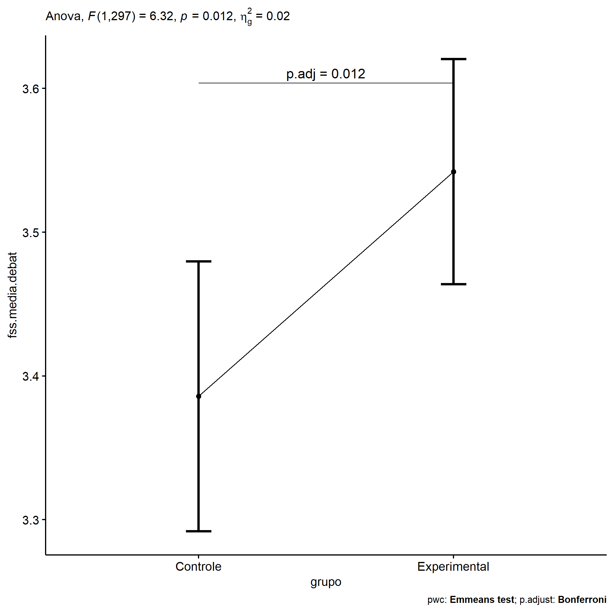<!-- -->

``` r
plots <- oneWayAncovaBoxPlots(
  wdat, "fss.media.debat", "grupo", aov, pwc, covar = "dfs.media.debat",
  theme = "classic", color = color[["grupo"]],
  subtitle = which(aov$Effect == "grupo"))
```

``` r
if (length(unique(wdat[["grupo"]])) > 1)
  plots[["grupo"]] + ggplot2::ylab("flow (debate)") + ggplot2::scale_x_discrete(labels=c('pre', 'pos'))
```

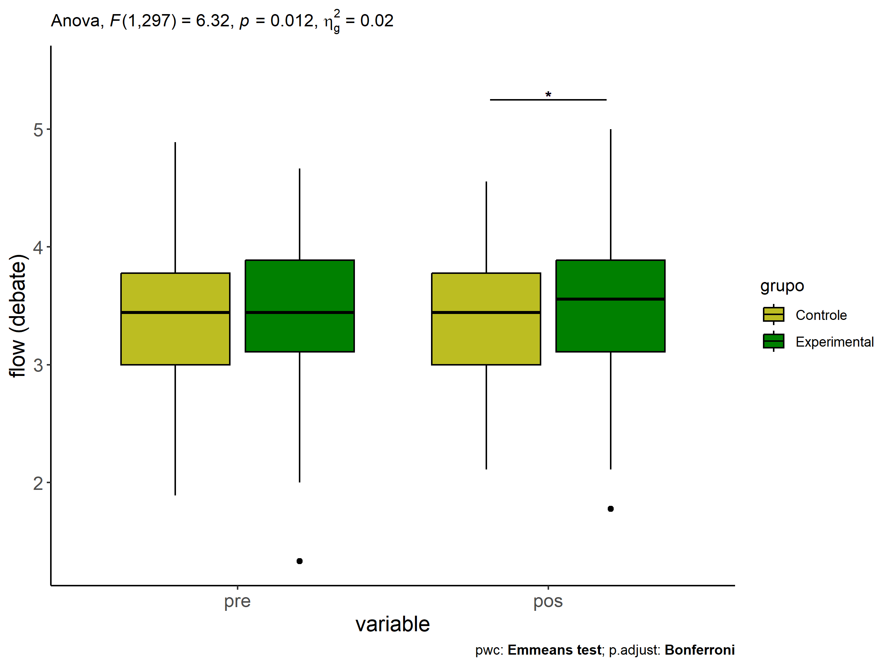<!-- -->

``` r
if (length(unique(wdat.long[["grupo"]])) > 1)
  plots <- oneWayAncovaBoxPlots(
    wdat.long, "flow.debat", "grupo", aov, pwc.long, pre.post = "time",
    theme = "classic", color = color$prepost)
```

``` r
if (length(unique(wdat.long[["grupo"]])) > 1)
  plots[["grupo"]] + ggplot2::ylab("flow (debate)")
```

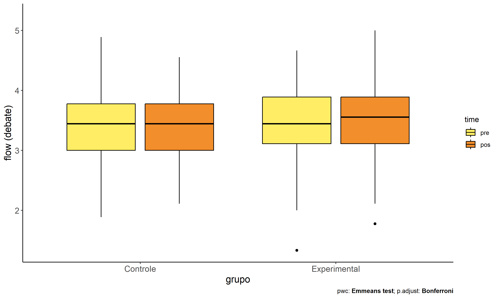<!-- -->

### Checking linearity assumption

``` r
ggscatter(wdat, x = "dfs.media.debat", y = "fss.media.debat", size = 0.5,
          color = "grupo", add = "reg.line")+
  stat_regline_equation(
    aes(label =  paste(..eq.label.., ..rr.label.., sep = "~~~~"), color = grupo)
  )
```

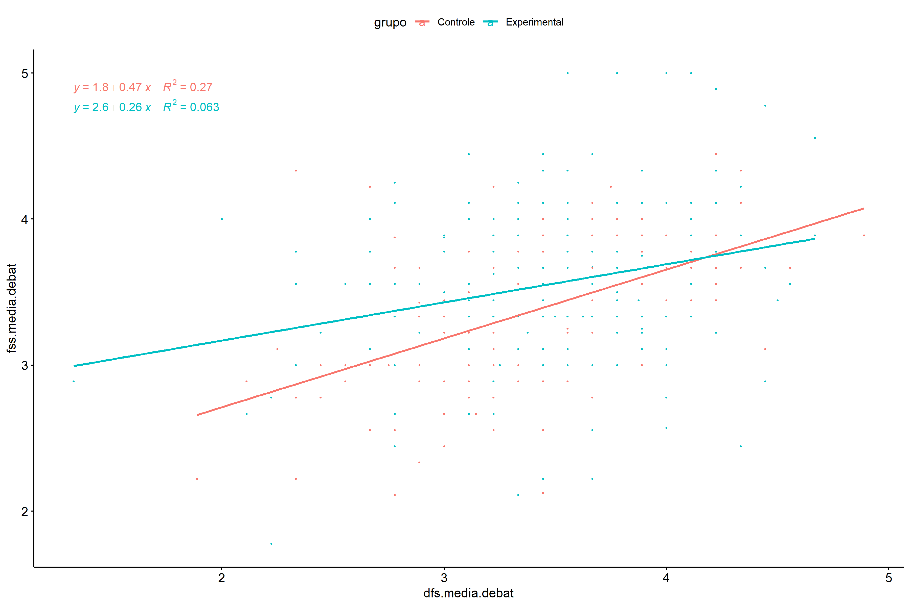<!-- -->

### Checking normality and homogeneity

``` r
res <- augment(lm(fss.media.debat ~ dfs.media.debat + grupo, data = wdat))
```

``` r
shapiro_test(res$.resid)
```

    ## # A tibble: 1 × 3
    ##   variable   statistic p.value
    ##   <chr>          <dbl>   <dbl>
    ## 1 res$.resid     0.995   0.476

``` r
levene_test(res, .resid ~ grupo)
```

    ## # A tibble: 1 × 4
    ##     df1   df2 statistic      p
    ##   <int> <int>     <dbl>  <dbl>
    ## 1     1   298      6.22 0.0132

# ANCOVA and Pairwise for two factors **grupo:Sexo**

## Without remove non-normal data

``` r
pdat = remove_group_data(dat[!is.na(dat[["grupo"]]) & !is.na(dat[["Sexo"]]),], "fss.media.debat", c("grupo","Sexo"))

pdat.long <- rbind(pdat[,c("id","grupo","Sexo")], pdat[,c("id","grupo","Sexo")])
pdat.long[["time"]] <- c(rep("pre", nrow(pdat)), rep("pos", nrow(pdat)))
pdat.long[["time"]] <- factor(pdat.long[["time"]], c("pre","pos"))
pdat.long[["flow.debat"]] <- c(pdat[["dfs.media.debat"]], pdat[["fss.media.debat"]])

aov = anova_test(pdat, fss.media.debat ~ dfs.media.debat + grupo*Sexo)
laov[["grupo:Sexo"]] <- get_anova_table(aov)
```

``` r
pwcs <- list()
pwcs[["Sexo"]] <- emmeans_test(
  group_by(pdat, grupo), fss.media.debat ~ Sexo,
  covariate = dfs.media.debat, p.adjust.method = "bonferroni")
pwcs[["grupo"]] <- emmeans_test(
  group_by(pdat, Sexo), fss.media.debat ~ grupo,
  covariate = dfs.media.debat, p.adjust.method = "bonferroni")

pwc <- plyr::rbind.fill(pwcs[["grupo"]], pwcs[["Sexo"]])
pwc <- pwc[,c("grupo","Sexo", colnames(pwc)[!colnames(pwc) %in% c("grupo","Sexo")])]
```

``` r
pwc.long <- emmeans_test(dplyr::group_by_at(pdat.long, c("grupo","Sexo")),
                         flow.debat ~ time,
                         p.adjust.method = "bonferroni")
lpwc[["grupo:Sexo"]] <- plyr::rbind.fill(pwc, pwc.long)
```

``` r
ds <- get.descriptives(pdat, "fss.media.debat", c("grupo","Sexo"), covar = "dfs.media.debat")
ds <- merge(ds[ds$variable != "dfs.media.debat",],
            ds[ds$variable == "dfs.media.debat", !colnames(ds) %in% c("variable")],
            by = c("grupo","Sexo"), all.x = T, suffixes = c("", ".dfs.media.debat"))
ds <- merge(get_emmeans(pwcs[["grupo"]]), ds, by = c("grupo","Sexo"), suffixes = c(".emms", ""))
ds <- ds[,c("grupo","Sexo","n","mean.dfs.media.debat","se.dfs.media.debat","mean","se","emmean","se.emms")]

colnames(ds) <- c("grupo","Sexo", "N", paste0(c("M","SE")," (pre)"),
                  paste0(c("M","SE"), " (unadj)"), paste0(c("M", "SE"), " (adj)"))

lemms[["grupo:Sexo"]] <- ds
```

## Computing ANCOVA and PairWise After removing non-normal data (OK)

``` r
wdat = pdat 

res = residuals(lm(fss.media.debat ~ dfs.media.debat + grupo*Sexo, data = wdat))
non.normal = getNonNormal(res, wdat$id, plimit = 0.05)

wdat = wdat[!wdat$id %in% non.normal,]

wdat.long <- rbind(wdat[,c("id","grupo","Sexo")], wdat[,c("id","grupo","Sexo")])
wdat.long[["time"]] <- c(rep("pre", nrow(wdat)), rep("pos", nrow(wdat)))
wdat.long[["time"]] <- factor(wdat.long[["time"]], c("pre","pos"))
wdat.long[["flow.debat"]] <- c(wdat[["dfs.media.debat"]], wdat[["fss.media.debat"]])


ldat[["grupo:Sexo"]] = wdat

(non.normal)
```

    ## NULL

``` r
aov = anova_test(wdat, fss.media.debat ~ dfs.media.debat + grupo*Sexo)
laov[["grupo:Sexo"]] <- merge(get_anova_table(aov), laov[["grupo:Sexo"]], by="Effect", suffixes = c("","'"))

(df = get_anova_table(aov))
```

    ## ANOVA Table (type II tests)
    ## 
    ##            Effect DFn DFd      F        p p<.05      ges
    ## 1 dfs.media.debat   1 295 41.800 4.18e-10     * 0.124000
    ## 2           grupo   1 295  6.123 1.40e-02     * 0.020000
    ## 3            Sexo   1 295  0.125 7.24e-01       0.000422
    ## 4      grupo:Sexo   1 295  0.802 3.71e-01       0.003000

| Effect          | DFn | DFd |      F |     p | p\<.05 |   ges |
|:----------------|----:|----:|-------:|------:|:-------|------:|
| dfs.media.debat |   1 | 295 | 41.800 | 0.000 | \*     | 0.124 |
| grupo           |   1 | 295 |  6.123 | 0.014 | \*     | 0.020 |
| Sexo            |   1 | 295 |  0.125 | 0.724 |        | 0.000 |
| grupo:Sexo      |   1 | 295 |  0.802 | 0.371 |        | 0.003 |

``` r
pwcs <- list()
pwcs[["Sexo"]] <- emmeans_test(
  group_by(wdat, grupo), fss.media.debat ~ Sexo,
  covariate = dfs.media.debat, p.adjust.method = "bonferroni")
pwcs[["grupo"]] <- emmeans_test(
  group_by(wdat, Sexo), fss.media.debat ~ grupo,
  covariate = dfs.media.debat, p.adjust.method = "bonferroni")

pwc <- plyr::rbind.fill(pwcs[["grupo"]], pwcs[["Sexo"]])
pwc <- pwc[,c("grupo","Sexo", colnames(pwc)[!colnames(pwc) %in% c("grupo","Sexo")])]
```

| grupo        | Sexo | term                   | .y.             | group1   | group2       |  df | statistic |     p | p.adj | p.adj.signif |
|:-------------|:-----|:-----------------------|:----------------|:---------|:-------------|----:|----------:|------:|------:|:-------------|
|              | F    | dfs.media.debat\*grupo | fss.media.debat | Controle | Experimental | 295 |    -1.153 | 0.250 | 0.250 | ns           |
|              | M    | dfs.media.debat\*grupo | fss.media.debat | Controle | Experimental | 295 |    -2.364 | 0.019 | 0.019 | \*           |
| Controle     |      | dfs.media.debat\*Sexo  | fss.media.debat | F        | M            | 295 |     0.465 | 0.642 | 0.642 | ns           |
| Experimental |      | dfs.media.debat\*Sexo  | fss.media.debat | F        | M            | 295 |    -0.842 | 0.400 | 0.400 | ns           |

``` r
pwc.long <- emmeans_test(dplyr::group_by_at(wdat.long, c("grupo","Sexo")),
                         flow.debat ~ time,
                         p.adjust.method = "bonferroni")
lpwc[["grupo:Sexo"]] <- merge(plyr::rbind.fill(pwc, pwc.long), lpwc[["grupo:Sexo"]], by=c("grupo","Sexo","term",".y.","group1","group2"), suffixes = c("","'"))
```

| grupo        | Sexo | term | .y.        | group1 | group2 |  df | statistic |     p | p.adj | p.adj.signif |
|:-------------|:-----|:-----|:-----------|:-------|:-------|----:|----------:|------:|------:|:-------------|
| Controle     | F    | time | flow.debat | pre    | pos    | 592 |     0.707 | 0.480 | 0.480 | ns           |
| Controle     | M    | time | flow.debat | pre    | pos    | 592 |    -0.156 | 0.876 | 0.876 | ns           |
| Experimental | F    | time | flow.debat | pre    | pos    | 592 |    -0.503 | 0.615 | 0.615 | ns           |
| Experimental | M    | time | flow.debat | pre    | pos    | 592 |    -1.524 | 0.128 | 0.128 | ns           |

``` r
ds <- get.descriptives(wdat, "fss.media.debat", c("grupo","Sexo"), covar = "dfs.media.debat")
ds <- merge(ds[ds$variable != "dfs.media.debat",],
            ds[ds$variable == "dfs.media.debat", !colnames(ds) %in% c("variable")],
            by = c("grupo","Sexo"), all.x = T, suffixes = c("", ".dfs.media.debat"))
ds <- merge(get_emmeans(pwcs[["grupo"]]), ds, by = c("grupo","Sexo"), suffixes = c(".emms", ""))
ds <- ds[,c("grupo","Sexo","n","mean.dfs.media.debat","se.dfs.media.debat","mean","se","emmean","se.emms")]

colnames(ds) <- c("grupo","Sexo", "N", paste0(c("M","SE")," (pre)"),
                  paste0(c("M","SE"), " (unadj)"), paste0(c("M", "SE"), " (adj)"))

lemms[["grupo:Sexo"]] <- merge(ds, lemms[["grupo:Sexo"]], by=c("grupo","Sexo"), suffixes = c("","'"))
```

| grupo        | Sexo |   N | M (pre) | SE (pre) | M (unadj) | SE (unadj) | M (adj) | SE (adj) |
|:-------------|:-----|----:|--------:|---------:|----------:|-----------:|--------:|---------:|
| Controle     | F    |  67 |   3.495 |    0.064 |     3.426 |      0.062 |   3.406 |    0.065 |
| Controle     | M    |  56 |   3.294 |    0.085 |     3.311 |      0.073 |   3.361 |    0.071 |
| Experimental | F    |  83 |   3.475 |    0.058 |     3.519 |      0.066 |   3.507 |    0.058 |
| Experimental | M    |  94 |   3.452 |    0.062 |     3.578 |      0.060 |   3.574 |    0.055 |

### Plots for ancova

``` r
plots <- twoWayAncovaPlots(
  wdat, "fss.media.debat", c("grupo","Sexo"), aov, pwcs, addParam = c("mean_se"),
  font.label.size=10, step.increase=0.05, p.label="p.adj",
  subtitle = which(aov$Effect == "grupo:Sexo"))
```

``` r
if (!is.null(plots[["grupo"]]))
  plots[["grupo"]] + ggplot2::scale_color_manual(values = color[["Sexo"]])
```

    ## Scale for colour is already present.
    ## Adding another scale for colour, which will replace the existing scale.

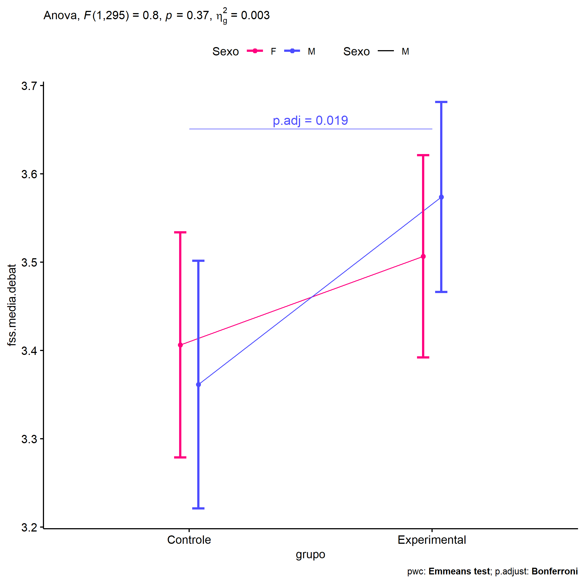<!-- -->

``` r
if (!is.null(plots[["Sexo"]]))
  plots[["Sexo"]] + ggplot2::scale_color_manual(values = color[["grupo"]])
```

    ## Scale for colour is already present.
    ## Adding another scale for colour, which will replace the existing scale.

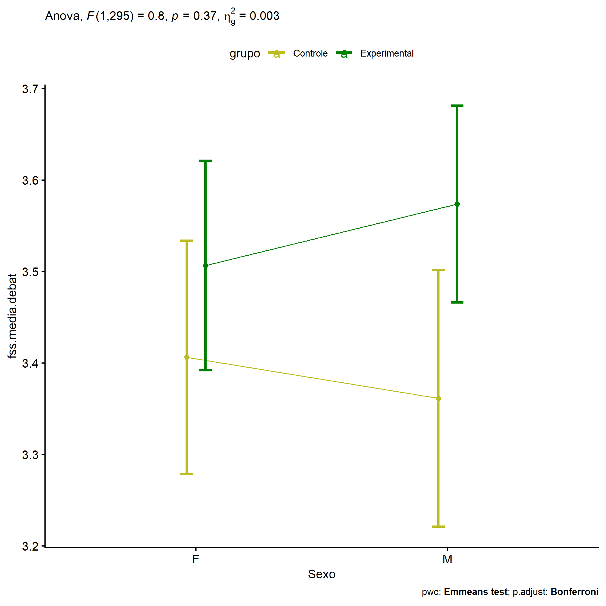<!-- -->

``` r
plots <- twoWayAncovaBoxPlots(
  wdat, "fss.media.debat", c("grupo","Sexo"), aov, pwcs, covar = "dfs.media.debat",
  theme = "classic", color = color[["grupo:Sexo"]],
  subtitle = which(aov$Effect == "grupo:Sexo"))
```

``` r
plots[["grupo:Sexo"]] + ggplot2::ylab("flow (debate)") + ggplot2::scale_x_discrete(labels=c('pre', 'pos'))
```

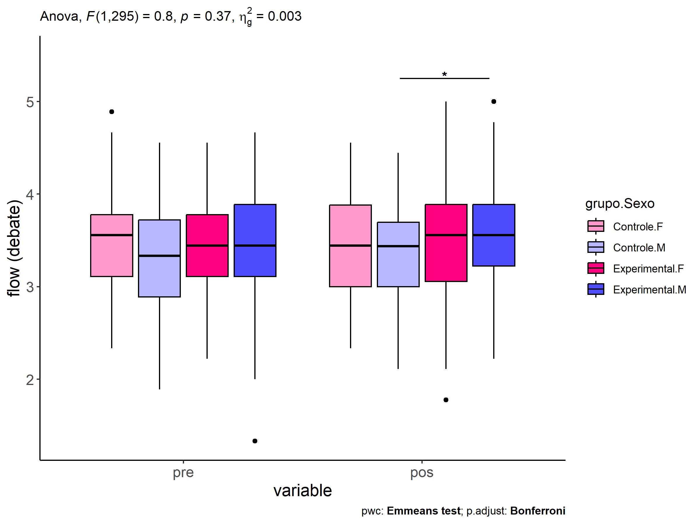<!-- -->

``` r
plots <- twoWayAncovaBoxPlots(
  wdat.long, "flow.debat", c("grupo","Sexo"), aov, pwc.long, pre.post = "time",
  theme = "classic", color = color$prepost)
```

``` r
plots[["grupo:Sexo"]] + ggplot2::ylab("flow (debate)")
```

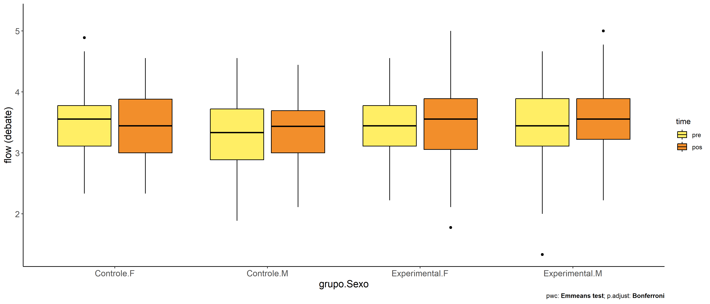<!-- -->

### Checking linearity assumption

``` r
ggscatter(wdat, x = "dfs.media.debat", y = "fss.media.debat", size = 0.5,
          facet.by = c("grupo","Sexo"), add = "reg.line")+
  stat_regline_equation(
    aes(label =  paste(..eq.label.., ..rr.label.., sep = "~~~~"))
  )
```

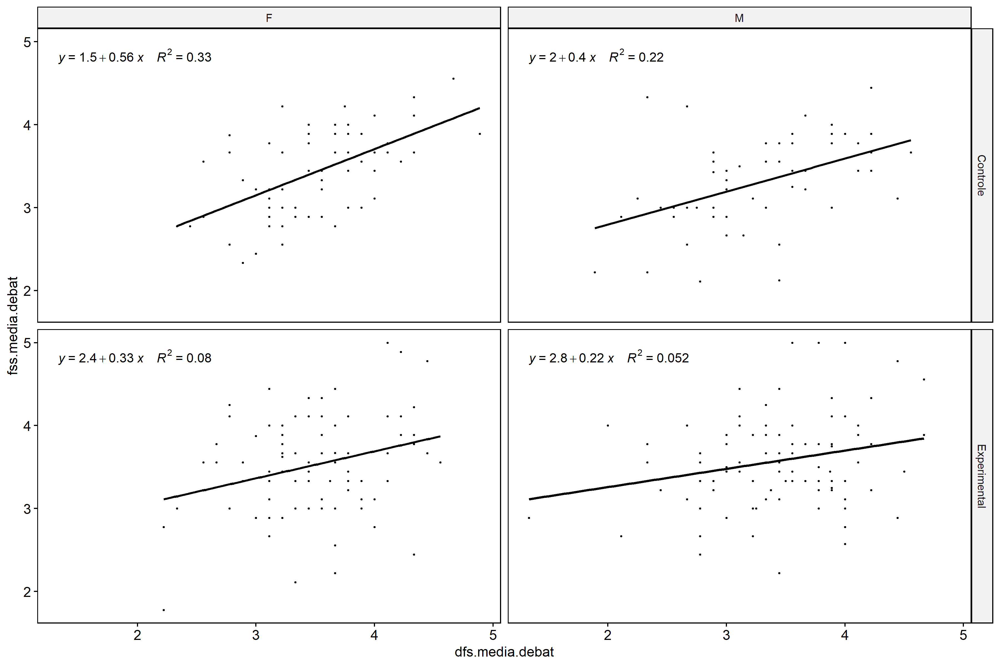<!-- -->

### Checking normality and homogeneity

``` r
res <- augment(lm(fss.media.debat ~ dfs.media.debat + grupo*Sexo, data = wdat))
```

``` r
shapiro_test(res$.resid)
```

    ## # A tibble: 1 × 3
    ##   variable   statistic p.value
    ##   <chr>          <dbl>   <dbl>
    ## 1 res$.resid     0.994   0.344

``` r
levene_test(res, .resid ~ grupo*Sexo)
```

    ## # A tibble: 1 × 4
    ##     df1   df2 statistic     p
    ##   <int> <int>     <dbl> <dbl>
    ## 1     3   296      2.06 0.105

# ANCOVA and Pairwise for two factors **grupo:Zona**

## Without remove non-normal data

``` r
pdat = remove_group_data(dat[!is.na(dat[["grupo"]]) & !is.na(dat[["Zona"]]),], "fss.media.debat", c("grupo","Zona"))

pdat.long <- rbind(pdat[,c("id","grupo","Zona")], pdat[,c("id","grupo","Zona")])
pdat.long[["time"]] <- c(rep("pre", nrow(pdat)), rep("pos", nrow(pdat)))
pdat.long[["time"]] <- factor(pdat.long[["time"]], c("pre","pos"))
pdat.long[["flow.debat"]] <- c(pdat[["dfs.media.debat"]], pdat[["fss.media.debat"]])

aov = anova_test(pdat, fss.media.debat ~ dfs.media.debat + grupo*Zona)
laov[["grupo:Zona"]] <- get_anova_table(aov)
```

``` r
pwcs <- list()
pwcs[["Zona"]] <- emmeans_test(
  group_by(pdat, grupo), fss.media.debat ~ Zona,
  covariate = dfs.media.debat, p.adjust.method = "bonferroni")
pwcs[["grupo"]] <- emmeans_test(
  group_by(pdat, Zona), fss.media.debat ~ grupo,
  covariate = dfs.media.debat, p.adjust.method = "bonferroni")

pwc <- plyr::rbind.fill(pwcs[["grupo"]], pwcs[["Zona"]])
pwc <- pwc[,c("grupo","Zona", colnames(pwc)[!colnames(pwc) %in% c("grupo","Zona")])]
```

``` r
pwc.long <- emmeans_test(dplyr::group_by_at(pdat.long, c("grupo","Zona")),
                         flow.debat ~ time,
                         p.adjust.method = "bonferroni")
lpwc[["grupo:Zona"]] <- plyr::rbind.fill(pwc, pwc.long)
```

``` r
ds <- get.descriptives(pdat, "fss.media.debat", c("grupo","Zona"), covar = "dfs.media.debat")
ds <- merge(ds[ds$variable != "dfs.media.debat",],
            ds[ds$variable == "dfs.media.debat", !colnames(ds) %in% c("variable")],
            by = c("grupo","Zona"), all.x = T, suffixes = c("", ".dfs.media.debat"))
ds <- merge(get_emmeans(pwcs[["grupo"]]), ds, by = c("grupo","Zona"), suffixes = c(".emms", ""))
ds <- ds[,c("grupo","Zona","n","mean.dfs.media.debat","se.dfs.media.debat","mean","se","emmean","se.emms")]

colnames(ds) <- c("grupo","Zona", "N", paste0(c("M","SE")," (pre)"),
                  paste0(c("M","SE"), " (unadj)"), paste0(c("M", "SE"), " (adj)"))

lemms[["grupo:Zona"]] <- ds
```

## Computing ANCOVA and PairWise After removing non-normal data (OK)

``` r
wdat = pdat 

res = residuals(lm(fss.media.debat ~ dfs.media.debat + grupo*Zona, data = wdat))
non.normal = getNonNormal(res, wdat$id, plimit = 0.05)

wdat = wdat[!wdat$id %in% non.normal,]

wdat.long <- rbind(wdat[,c("id","grupo","Zona")], wdat[,c("id","grupo","Zona")])
wdat.long[["time"]] <- c(rep("pre", nrow(wdat)), rep("pos", nrow(wdat)))
wdat.long[["time"]] <- factor(wdat.long[["time"]], c("pre","pos"))
wdat.long[["flow.debat"]] <- c(wdat[["dfs.media.debat"]], wdat[["fss.media.debat"]])


ldat[["grupo:Zona"]] = wdat

(non.normal)
```

    ## NULL

``` r
aov = anova_test(wdat, fss.media.debat ~ dfs.media.debat + grupo*Zona)
laov[["grupo:Zona"]] <- merge(get_anova_table(aov), laov[["grupo:Zona"]], by="Effect", suffixes = c("","'"))

(df = get_anova_table(aov))
```

    ## ANOVA Table (type II tests)
    ## 
    ##            Effect DFn DFd      F        p p<.05      ges
    ## 1 dfs.media.debat   1 253 49.686 1.71e-11     * 1.64e-01
    ## 2           grupo   1 253  3.940 4.80e-02     * 1.50e-02
    ## 3            Zona   1 253  0.461 4.98e-01       2.00e-03
    ## 4      grupo:Zona   1 253  0.014 9.06e-01       5.56e-05

| Effect          | DFn | DFd |      F |     p | p\<.05 |   ges |
|:----------------|----:|----:|-------:|------:|:-------|------:|
| dfs.media.debat |   1 | 253 | 49.686 | 0.000 | \*     | 0.164 |
| grupo           |   1 | 253 |  3.940 | 0.048 | \*     | 0.015 |
| Zona            |   1 | 253 |  0.461 | 0.498 |        | 0.002 |
| grupo:Zona      |   1 | 253 |  0.014 | 0.906 |        | 0.000 |

``` r
pwcs <- list()
pwcs[["Zona"]] <- emmeans_test(
  group_by(wdat, grupo), fss.media.debat ~ Zona,
  covariate = dfs.media.debat, p.adjust.method = "bonferroni")
pwcs[["grupo"]] <- emmeans_test(
  group_by(wdat, Zona), fss.media.debat ~ grupo,
  covariate = dfs.media.debat, p.adjust.method = "bonferroni")

pwc <- plyr::rbind.fill(pwcs[["grupo"]], pwcs[["Zona"]])
pwc <- pwc[,c("grupo","Zona", colnames(pwc)[!colnames(pwc) %in% c("grupo","Zona")])]
```

| grupo        | Zona   | term                   | .y.             | group1   | group2       |  df | statistic |     p | p.adj | p.adj.signif |
|:-------------|:-------|:-----------------------|:----------------|:---------|:-------------|----:|----------:|------:|------:|:-------------|
|              | Rural  | dfs.media.debat\*grupo | fss.media.debat | Controle | Experimental | 253 |    -1.316 | 0.189 | 0.189 | ns           |
|              | Urbana | dfs.media.debat\*grupo | fss.media.debat | Controle | Experimental | 253 |    -1.490 | 0.138 | 0.138 | ns           |
| Controle     |        | dfs.media.debat\*Zona  | fss.media.debat | Rural    | Urbana       | 253 |    -0.345 | 0.730 | 0.730 | ns           |
| Experimental |        | dfs.media.debat\*Zona  | fss.media.debat | Rural    | Urbana       | 253 |    -0.596 | 0.552 | 0.552 | ns           |

``` r
pwc.long <- emmeans_test(dplyr::group_by_at(wdat.long, c("grupo","Zona")),
                         flow.debat ~ time,
                         p.adjust.method = "bonferroni")
lpwc[["grupo:Zona"]] <- merge(plyr::rbind.fill(pwc, pwc.long), lpwc[["grupo:Zona"]], by=c("grupo","Zona","term",".y.","group1","group2"), suffixes = c("","'"))
```

| grupo        | Zona   | term | .y.        | group1 | group2 |  df | statistic |     p | p.adj | p.adj.signif |
|:-------------|:-------|:-----|:-----------|:-------|:-------|----:|----------:|------:|------:|:-------------|
| Controle     | Rural  | time | flow.debat | pre    | pos    | 508 |     0.827 | 0.408 | 0.408 | ns           |
| Controle     | Urbana | time | flow.debat | pre    | pos    | 508 |    -0.273 | 0.785 | 0.785 | ns           |
| Experimental | Rural  | time | flow.debat | pre    | pos    | 508 |    -0.460 | 0.646 | 0.646 | ns           |
| Experimental | Urbana | time | flow.debat | pre    | pos    | 508 |    -0.935 | 0.350 | 0.350 | ns           |

``` r
ds <- get.descriptives(wdat, "fss.media.debat", c("grupo","Zona"), covar = "dfs.media.debat")
ds <- merge(ds[ds$variable != "dfs.media.debat",],
            ds[ds$variable == "dfs.media.debat", !colnames(ds) %in% c("variable")],
            by = c("grupo","Zona"), all.x = T, suffixes = c("", ".dfs.media.debat"))
ds <- merge(get_emmeans(pwcs[["grupo"]]), ds, by = c("grupo","Zona"), suffixes = c(".emms", ""))
ds <- ds[,c("grupo","Zona","n","mean.dfs.media.debat","se.dfs.media.debat","mean","se","emmean","se.emms")]

colnames(ds) <- c("grupo","Zona", "N", paste0(c("M","SE")," (pre)"),
                  paste0(c("M","SE"), " (unadj)"), paste0(c("M", "SE"), " (adj)"))

lemms[["grupo:Zona"]] <- merge(ds, lemms[["grupo:Zona"]], by=c("grupo","Zona"), suffixes = c("","'"))
```

| grupo        | Zona   |   N | M (pre) | SE (pre) | M (unadj) | SE (unadj) | M (adj) | SE (adj) |
|:-------------|:-------|----:|--------:|---------:|----------:|-----------:|--------:|---------:|
| Controle     | Rural  |  53 |   3.491 |    0.066 |     3.401 |      0.064 |   3.386 |    0.071 |
| Controle     | Urbana |  54 |   3.346 |    0.086 |     3.376 |      0.080 |   3.420 |    0.071 |
| Experimental | Rural  |  75 |   3.474 |    0.071 |     3.517 |      0.065 |   3.508 |    0.060 |
| Experimental | Urbana |  76 |   3.487 |    0.056 |     3.572 |      0.071 |   3.559 |    0.060 |

### Plots for ancova

``` r
plots <- twoWayAncovaPlots(
  wdat, "fss.media.debat", c("grupo","Zona"), aov, pwcs, addParam = c("mean_se"),
  font.label.size=10, step.increase=0.05, p.label="p.adj",
  subtitle = which(aov$Effect == "grupo:Zona"))
```

``` r
if (!is.null(plots[["grupo"]]))
  plots[["grupo"]] + ggplot2::scale_color_manual(values = color[["Zona"]])
```

    ## Scale for colour is already present.
    ## Adding another scale for colour, which will replace the existing scale.

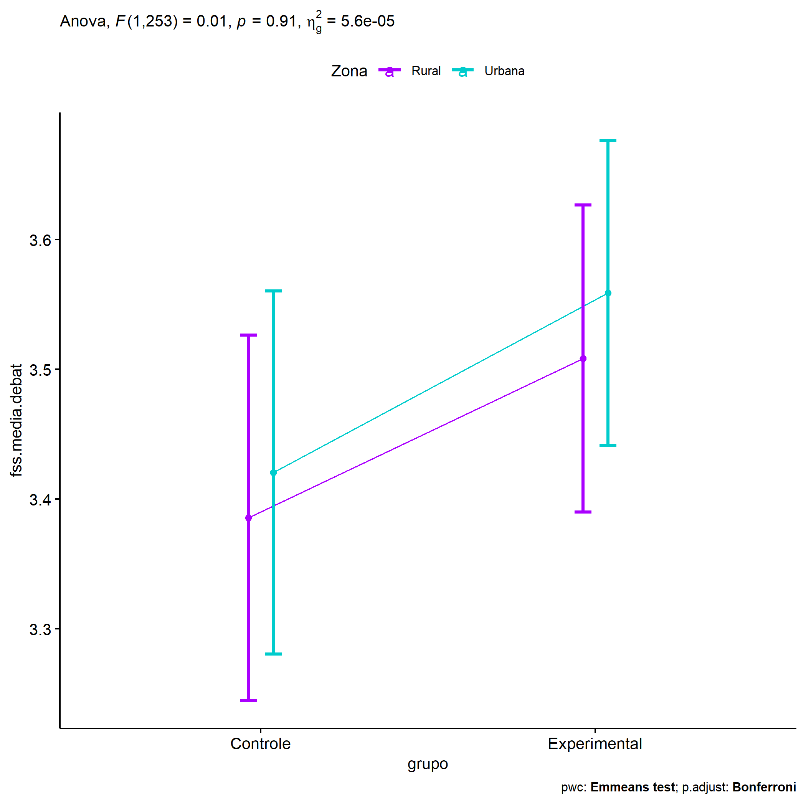<!-- -->

``` r
if (!is.null(plots[["Zona"]]))
  plots[["Zona"]] + ggplot2::scale_color_manual(values = color[["grupo"]])
```

    ## Scale for colour is already present.
    ## Adding another scale for colour, which will replace the existing scale.

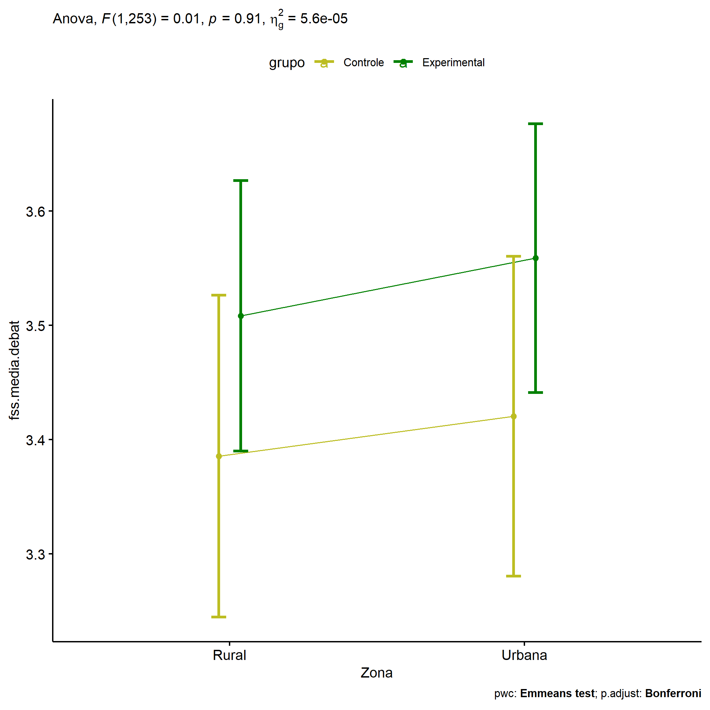<!-- -->

``` r
plots <- twoWayAncovaBoxPlots(
  wdat, "fss.media.debat", c("grupo","Zona"), aov, pwcs, covar = "dfs.media.debat",
  theme = "classic", color = color[["grupo:Zona"]],
  subtitle = which(aov$Effect == "grupo:Zona"))
```

``` r
plots[["grupo:Zona"]] + ggplot2::ylab("flow (debate)") + ggplot2::scale_x_discrete(labels=c('pre', 'pos'))
```

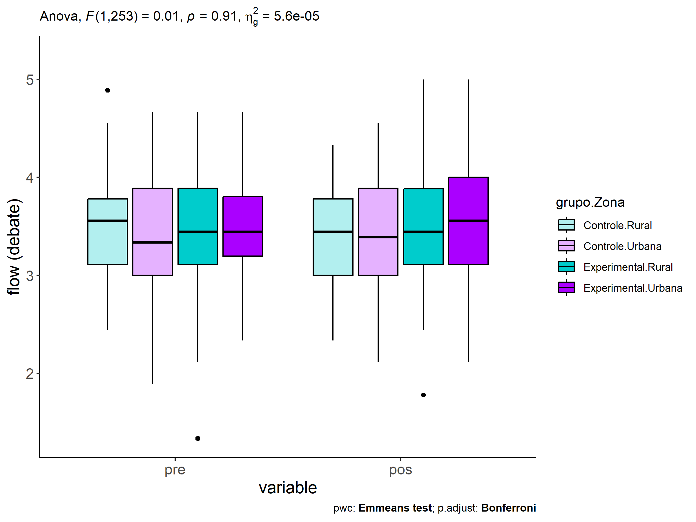<!-- -->

``` r
plots <- twoWayAncovaBoxPlots(
  wdat.long, "flow.debat", c("grupo","Zona"), aov, pwc.long, pre.post = "time",
  theme = "classic", color = color$prepost)
```

``` r
plots[["grupo:Zona"]] + ggplot2::ylab("flow (debate)")
```

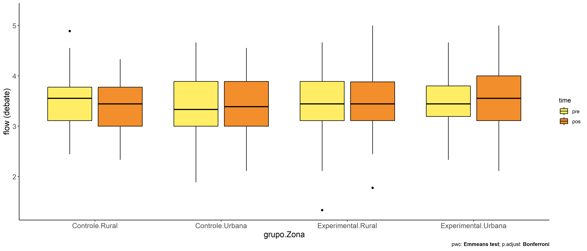<!-- -->

### Checking linearity assumption

``` r
ggscatter(wdat, x = "dfs.media.debat", y = "fss.media.debat", size = 0.5,
          facet.by = c("grupo","Zona"), add = "reg.line")+
  stat_regline_equation(
    aes(label =  paste(..eq.label.., ..rr.label.., sep = "~~~~"))
  )
```

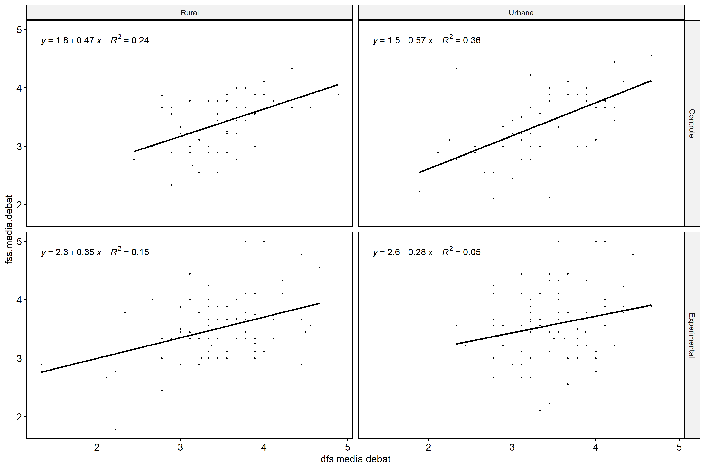<!-- -->

### Checking normality and homogeneity

``` r
res <- augment(lm(fss.media.debat ~ dfs.media.debat + grupo*Zona, data = wdat))
```

``` r
shapiro_test(res$.resid)
```

    ## # A tibble: 1 × 3
    ##   variable   statistic p.value
    ##   <chr>          <dbl>   <dbl>
    ## 1 res$.resid     0.996   0.723

``` r
levene_test(res, .resid ~ grupo*Zona)
```

    ## # A tibble: 1 × 4
    ##     df1   df2 statistic      p
    ##   <int> <int>     <dbl>  <dbl>
    ## 1     3   254      3.13 0.0263

# ANCOVA and Pairwise for two factors **grupo:Cor.Raca**

## Without remove non-normal data

``` r
pdat = remove_group_data(dat[!is.na(dat[["grupo"]]) & !is.na(dat[["Cor.Raca"]]),], "fss.media.debat", c("grupo","Cor.Raca"))

pdat.long <- rbind(pdat[,c("id","grupo","Cor.Raca")], pdat[,c("id","grupo","Cor.Raca")])
pdat.long[["time"]] <- c(rep("pre", nrow(pdat)), rep("pos", nrow(pdat)))
pdat.long[["time"]] <- factor(pdat.long[["time"]], c("pre","pos"))
pdat.long[["flow.debat"]] <- c(pdat[["dfs.media.debat"]], pdat[["fss.media.debat"]])

aov = anova_test(pdat, fss.media.debat ~ dfs.media.debat + grupo*Cor.Raca)
laov[["grupo:Cor.Raca"]] <- get_anova_table(aov)
```

``` r
pwcs <- list()
pwcs[["Cor.Raca"]] <- emmeans_test(
  group_by(pdat, grupo), fss.media.debat ~ Cor.Raca,
  covariate = dfs.media.debat, p.adjust.method = "bonferroni")
pwcs[["grupo"]] <- emmeans_test(
  group_by(pdat, Cor.Raca), fss.media.debat ~ grupo,
  covariate = dfs.media.debat, p.adjust.method = "bonferroni")

pwc <- plyr::rbind.fill(pwcs[["grupo"]], pwcs[["Cor.Raca"]])
pwc <- pwc[,c("grupo","Cor.Raca", colnames(pwc)[!colnames(pwc) %in% c("grupo","Cor.Raca")])]
```

``` r
pwc.long <- emmeans_test(dplyr::group_by_at(pdat.long, c("grupo","Cor.Raca")),
                         flow.debat ~ time,
                         p.adjust.method = "bonferroni")
lpwc[["grupo:Cor.Raca"]] <- plyr::rbind.fill(pwc, pwc.long)
```

``` r
ds <- get.descriptives(pdat, "fss.media.debat", c("grupo","Cor.Raca"), covar = "dfs.media.debat")
ds <- merge(ds[ds$variable != "dfs.media.debat",],
            ds[ds$variable == "dfs.media.debat", !colnames(ds) %in% c("variable")],
            by = c("grupo","Cor.Raca"), all.x = T, suffixes = c("", ".dfs.media.debat"))
ds <- merge(get_emmeans(pwcs[["grupo"]]), ds, by = c("grupo","Cor.Raca"), suffixes = c(".emms", ""))
ds <- ds[,c("grupo","Cor.Raca","n","mean.dfs.media.debat","se.dfs.media.debat","mean","se","emmean","se.emms")]

colnames(ds) <- c("grupo","Cor.Raca", "N", paste0(c("M","SE")," (pre)"),
                  paste0(c("M","SE"), " (unadj)"), paste0(c("M", "SE"), " (adj)"))

lemms[["grupo:Cor.Raca"]] <- ds
```

## Computing ANCOVA and PairWise After removing non-normal data (OK)

``` r
wdat = pdat 

res = residuals(lm(fss.media.debat ~ dfs.media.debat + grupo*Cor.Raca, data = wdat))
non.normal = getNonNormal(res, wdat$id, plimit = 0.05)

wdat = wdat[!wdat$id %in% non.normal,]

wdat.long <- rbind(wdat[,c("id","grupo","Cor.Raca")], wdat[,c("id","grupo","Cor.Raca")])
wdat.long[["time"]] <- c(rep("pre", nrow(wdat)), rep("pos", nrow(wdat)))
wdat.long[["time"]] <- factor(wdat.long[["time"]], c("pre","pos"))
wdat.long[["flow.debat"]] <- c(wdat[["dfs.media.debat"]], wdat[["fss.media.debat"]])


ldat[["grupo:Cor.Raca"]] = wdat

(non.normal)
```

    ## NULL

``` r
aov = anova_test(wdat, fss.media.debat ~ dfs.media.debat + grupo*Cor.Raca)
laov[["grupo:Cor.Raca"]] <- merge(get_anova_table(aov), laov[["grupo:Cor.Raca"]], by="Effect", suffixes = c("","'"))

(df = get_anova_table(aov))
```

    ## ANOVA Table (type II tests)
    ## 
    ##            Effect DFn DFd      F        p p<.05   ges
    ## 1 dfs.media.debat   1 107 24.219 3.13e-06     * 0.185
    ## 2           grupo   1 107  1.519 2.21e-01       0.014
    ## 3        Cor.Raca   1 107  0.668 4.15e-01       0.006
    ## 4  grupo:Cor.Raca   1 107  1.150 2.86e-01       0.011

| Effect          | DFn | DFd |      F |     p | p\<.05 |   ges |
|:----------------|----:|----:|-------:|------:|:-------|------:|
| dfs.media.debat |   1 | 107 | 24.219 | 0.000 | \*     | 0.185 |
| grupo           |   1 | 107 |  1.519 | 0.221 |        | 0.014 |
| Cor.Raca        |   1 | 107 |  0.668 | 0.415 |        | 0.006 |
| grupo:Cor.Raca  |   1 | 107 |  1.150 | 0.286 |        | 0.011 |

``` r
pwcs <- list()
pwcs[["Cor.Raca"]] <- emmeans_test(
  group_by(wdat, grupo), fss.media.debat ~ Cor.Raca,
  covariate = dfs.media.debat, p.adjust.method = "bonferroni")
pwcs[["grupo"]] <- emmeans_test(
  group_by(wdat, Cor.Raca), fss.media.debat ~ grupo,
  covariate = dfs.media.debat, p.adjust.method = "bonferroni")

pwc <- plyr::rbind.fill(pwcs[["grupo"]], pwcs[["Cor.Raca"]])
pwc <- pwc[,c("grupo","Cor.Raca", colnames(pwc)[!colnames(pwc) %in% c("grupo","Cor.Raca")])]
```

| grupo        | Cor.Raca | term                      | .y.             | group1   | group2       |  df | statistic |     p | p.adj | p.adj.signif |
|:-------------|:---------|:--------------------------|:----------------|:---------|:-------------|----:|----------:|------:|------:|:-------------|
|              | Branca   | dfs.media.debat\*grupo    | fss.media.debat | Controle | Experimental | 107 |     0.329 | 0.743 | 0.743 | ns           |
|              | Parda    | dfs.media.debat\*grupo    | fss.media.debat | Controle | Experimental | 107 |    -1.600 | 0.113 | 0.113 | ns           |
| Controle     |          | dfs.media.debat\*Cor.Raca | fss.media.debat | Branca   | Parda        | 107 |     0.076 | 0.940 | 0.940 | ns           |
| Experimental |          | dfs.media.debat\*Cor.Raca | fss.media.debat | Branca   | Parda        | 107 |    -1.346 | 0.181 | 0.181 | ns           |

``` r
pwc.long <- emmeans_test(dplyr::group_by_at(wdat.long, c("grupo","Cor.Raca")),
                         flow.debat ~ time,
                         p.adjust.method = "bonferroni")
lpwc[["grupo:Cor.Raca"]] <- merge(plyr::rbind.fill(pwc, pwc.long), lpwc[["grupo:Cor.Raca"]], by=c("grupo","Cor.Raca","term",".y.","group1","group2"), suffixes = c("","'"))
```

| grupo        | Cor.Raca | term | .y.        | group1 | group2 |  df | statistic |     p | p.adj | p.adj.signif |
|:-------------|:---------|:-----|:-----------|:-------|:-------|----:|----------:|------:|------:|:-------------|
| Controle     | Branca   | time | flow.debat | pre    | pos    | 216 |    -0.161 | 0.872 | 0.872 | ns           |
| Controle     | Parda    | time | flow.debat | pre    | pos    | 216 |     0.175 | 0.862 | 0.862 | ns           |
| Experimental | Branca   | time | flow.debat | pre    | pos    | 216 |     0.445 | 0.657 | 0.657 | ns           |
| Experimental | Parda    | time | flow.debat | pre    | pos    | 216 |    -1.128 | 0.260 | 0.260 | ns           |

``` r
ds <- get.descriptives(wdat, "fss.media.debat", c("grupo","Cor.Raca"), covar = "dfs.media.debat")
ds <- merge(ds[ds$variable != "dfs.media.debat",],
            ds[ds$variable == "dfs.media.debat", !colnames(ds) %in% c("variable")],
            by = c("grupo","Cor.Raca"), all.x = T, suffixes = c("", ".dfs.media.debat"))
ds <- merge(get_emmeans(pwcs[["grupo"]]), ds, by = c("grupo","Cor.Raca"), suffixes = c(".emms", ""))
ds <- ds[,c("grupo","Cor.Raca","n","mean.dfs.media.debat","se.dfs.media.debat","mean","se","emmean","se.emms")]

colnames(ds) <- c("grupo","Cor.Raca", "N", paste0(c("M","SE")," (pre)"),
                  paste0(c("M","SE"), " (unadj)"), paste0(c("M", "SE"), " (adj)"))

lemms[["grupo:Cor.Raca"]] <- merge(ds, lemms[["grupo:Cor.Raca"]], by=c("grupo","Cor.Raca"), suffixes = c("","'"))
```

| grupo        | Cor.Raca |   N | M (pre) | SE (pre) | M (unadj) | SE (unadj) | M (adj) | SE (adj) |
|:-------------|:---------|----:|--------:|---------:|----------:|-----------:|--------:|---------:|
| Controle     | Branca   |  17 |   3.333 |    0.174 |     3.366 |      0.130 |   3.396 |    0.125 |
| Controle     | Parda    |  41 |   3.407 |    0.088 |     3.384 |      0.085 |   3.385 |    0.080 |
| Experimental | Branca   |  11 |   3.465 |    0.171 |     3.352 |      0.194 |   3.331 |    0.155 |
| Experimental | Parda    |  43 |   3.428 |    0.096 |     3.572 |      0.088 |   3.564 |    0.078 |

### Plots for ancova

``` r
plots <- twoWayAncovaPlots(
  wdat, "fss.media.debat", c("grupo","Cor.Raca"), aov, pwcs, addParam = c("mean_se"),
  font.label.size=10, step.increase=0.05, p.label="p.adj",
  subtitle = which(aov$Effect == "grupo:Cor.Raca"))
```

``` r
if (!is.null(plots[["grupo"]]))
  plots[["grupo"]] + ggplot2::scale_color_manual(values = color[["Cor.Raca"]])
```

    ## Scale for colour is already present.
    ## Adding another scale for colour, which will replace the existing scale.

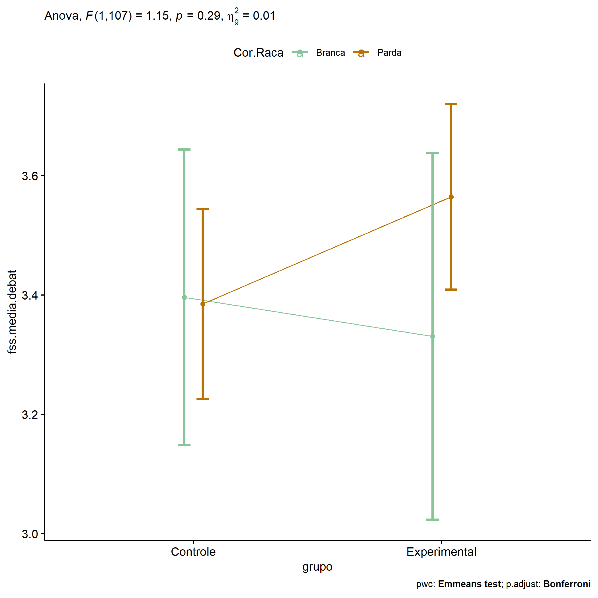<!-- -->

``` r
if (!is.null(plots[["Cor.Raca"]]))
  plots[["Cor.Raca"]] + ggplot2::scale_color_manual(values = color[["grupo"]])
```

    ## Scale for colour is already present.
    ## Adding another scale for colour, which will replace the existing scale.

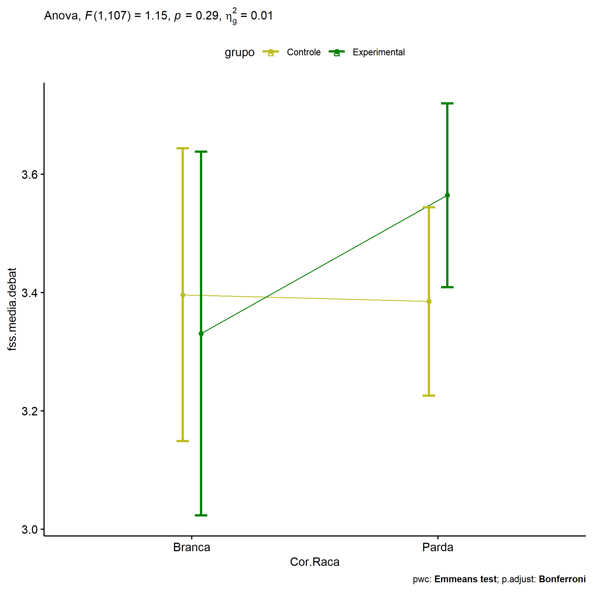<!-- -->

``` r
plots <- twoWayAncovaBoxPlots(
  wdat, "fss.media.debat", c("grupo","Cor.Raca"), aov, pwcs, covar = "dfs.media.debat",
  theme = "classic", color = color[["grupo:Cor.Raca"]],
  subtitle = which(aov$Effect == "grupo:Cor.Raca"))
```

``` r
plots[["grupo:Cor.Raca"]] + ggplot2::ylab("flow (debate)") + ggplot2::scale_x_discrete(labels=c('pre', 'pos'))
```

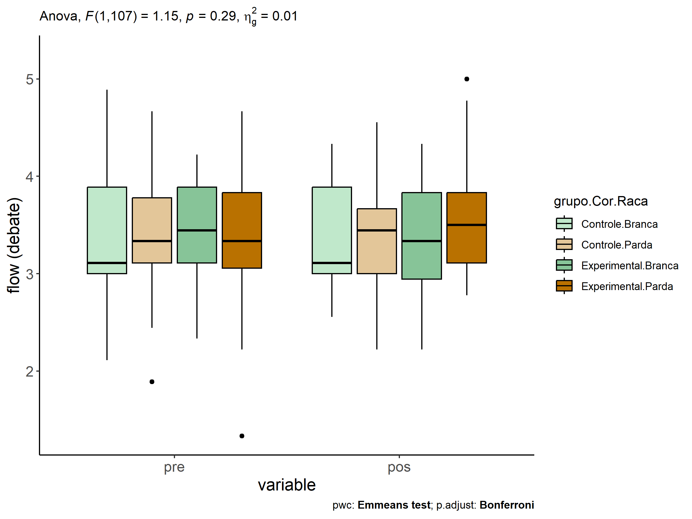<!-- -->

``` r
plots <- twoWayAncovaBoxPlots(
  wdat.long, "flow.debat", c("grupo","Cor.Raca"), aov, pwc.long, pre.post = "time",
  theme = "classic", color = color$prepost)
```

``` r
plots[["grupo:Cor.Raca"]] + ggplot2::ylab("flow (debate)")
```

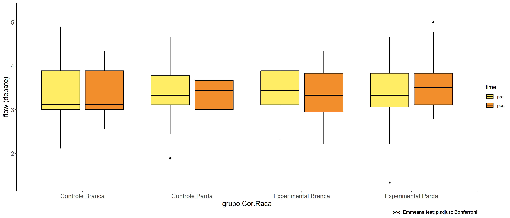<!-- -->

### Checking linearity assumption

``` r
ggscatter(wdat, x = "dfs.media.debat", y = "fss.media.debat", size = 0.5,
          facet.by = c("grupo","Cor.Raca"), add = "reg.line")+
  stat_regline_equation(
    aes(label =  paste(..eq.label.., ..rr.label.., sep = "~~~~"))
  )
```

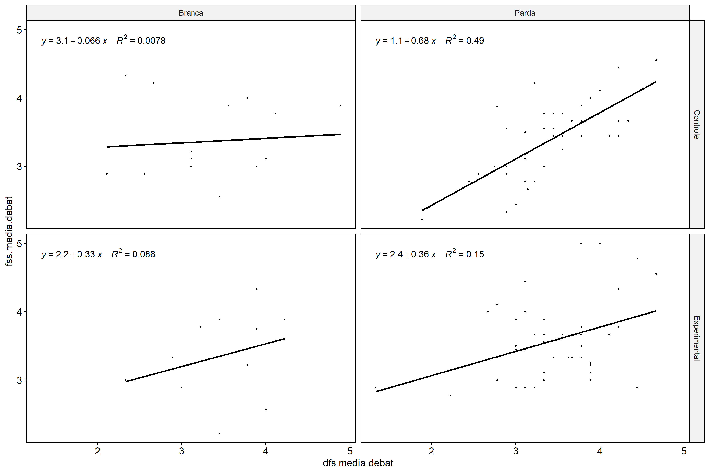<!-- -->

### Checking normality and homogeneity

``` r
res <- augment(lm(fss.media.debat ~ dfs.media.debat + grupo*Cor.Raca, data = wdat))
```

``` r
shapiro_test(res$.resid)
```

    ## # A tibble: 1 × 3
    ##   variable   statistic p.value
    ##   <chr>          <dbl>   <dbl>
    ## 1 res$.resid     0.985   0.268

``` r
levene_test(res, .resid ~ grupo*Cor.Raca)
```

    ## # A tibble: 1 × 4
    ##     df1   df2 statistic     p
    ##   <int> <int>     <dbl> <dbl>
    ## 1     3   108     0.539 0.657

# Summary of Results

## Descriptive Statistics

``` r
df <- get.descriptives(ldat[["grupo"]], c(dv.pre, dv.pos), c("grupo"), 
                       include.global = T, symmetry.test = T, normality.test = F)
df <- plyr::rbind.fill(
  df, do.call(plyr::rbind.fill, lapply(lfatores2, FUN = function(f) {
    if (nrow(dat) > 0 && sum(!is.na(unique(dat[[f]]))) > 1)
      get.descriptives(ldat[[paste0("grupo:",f)]], c(dv.pre,dv.pos), c("grupo", f),
                       symmetry.test = T, normality.test = F)
    }))
)
(df <- df[,c(fatores1[fatores1 %in% colnames(df)],"variable",
             colnames(df)[!colnames(df) %in% c(fatores1,"variable")])])
```

    ##           grupo Sexo   Zona Cor.Raca        variable   n  mean median   min   max    sd    se    ci   iqr
    ## 1      Controle <NA>   <NA>     <NA> dfs.media.debat 123 3.404  3.444 1.889 4.889 0.584 0.053 0.104 0.778
    ## 2  Experimental <NA>   <NA>     <NA> dfs.media.debat 177 3.463  3.444 1.333 4.667 0.566 0.043 0.084 0.778
    ## 3          <NA> <NA>   <NA>     <NA> dfs.media.debat 300 3.439  3.444 1.333 4.889 0.573 0.033 0.065 0.778
    ## 4      Controle <NA>   <NA>     <NA> fss.media.debat 123 3.374  3.444 2.111 4.556 0.526 0.047 0.094 0.778
    ## 5  Experimental <NA>   <NA>     <NA> fss.media.debat 177 3.551  3.556 1.778 5.000 0.591 0.044 0.088 0.778
    ## 6          <NA> <NA>   <NA>     <NA> fss.media.debat 300 3.478  3.444 1.778 5.000 0.571 0.033 0.065 0.889
    ## 7      Controle    F   <NA>     <NA> dfs.media.debat  67 3.495  3.556 2.333 4.889 0.520 0.064 0.127 0.667
    ## 8      Controle    M   <NA>     <NA> dfs.media.debat  56 3.294  3.333 1.889 4.556 0.639 0.085 0.171 0.833
    ## 9  Experimental    F   <NA>     <NA> dfs.media.debat  83 3.475  3.444 2.222 4.556 0.526 0.058 0.115 0.667
    ## 10 Experimental    M   <NA>     <NA> dfs.media.debat  94 3.452  3.444 1.333 4.667 0.602 0.062 0.123 0.778
    ## 11     Controle    F   <NA>     <NA> fss.media.debat  67 3.426  3.444 2.333 4.556 0.508 0.062 0.124 0.882
    ## 12     Controle    M   <NA>     <NA> fss.media.debat  56 3.311  3.437 2.111 4.444 0.544 0.073 0.146 0.694
    ## 13 Experimental    F   <NA>     <NA> fss.media.debat  83 3.519  3.556 1.778 5.000 0.605 0.066 0.132 0.833
    ## 14 Experimental    M   <NA>     <NA> fss.media.debat  94 3.578  3.556 2.222 5.000 0.579 0.060 0.119 0.667
    ## 15     Controle <NA>  Rural     <NA> dfs.media.debat  53 3.491  3.556 2.444 4.889 0.483 0.066 0.133 0.667
    ## 16     Controle <NA> Urbana     <NA> dfs.media.debat  54 3.346  3.333 1.889 4.667 0.630 0.086 0.172 0.889
    ## 17 Experimental <NA>  Rural     <NA> dfs.media.debat  75 3.474  3.444 1.333 4.667 0.616 0.071 0.142 0.778
    ## 18 Experimental <NA> Urbana     <NA> dfs.media.debat  76 3.487  3.444 2.333 4.667 0.487 0.056 0.111 0.608
    ## 19     Controle <NA>  Rural     <NA> fss.media.debat  53 3.401  3.444 2.333 4.333 0.462 0.064 0.127 0.778
    ## 20     Controle <NA> Urbana     <NA> fss.media.debat  54 3.376  3.389 2.111 4.556 0.590 0.080 0.161 0.889
    ## 21 Experimental <NA>  Rural     <NA> fss.media.debat  75 3.517  3.444 1.778 5.000 0.563 0.065 0.130 0.771
    ## 22 Experimental <NA> Urbana     <NA> fss.media.debat  76 3.572  3.556 2.111 5.000 0.620 0.071 0.142 0.889
    ## 23     Controle <NA>   <NA>   Branca dfs.media.debat  17 3.333  3.111 2.111 4.889 0.716 0.174 0.368 0.889
    ## 24     Controle <NA>   <NA>    Parda dfs.media.debat  41 3.407  3.333 1.889 4.667 0.564 0.088 0.178 0.667
    ## 25 Experimental <NA>   <NA>   Branca dfs.media.debat  11 3.465  3.444 2.333 4.222 0.566 0.171 0.380 0.778
    ## 26 Experimental <NA>   <NA>    Parda dfs.media.debat  43 3.428  3.333 1.333 4.667 0.630 0.096 0.194 0.778
    ## 27     Controle <NA>   <NA>   Branca fss.media.debat  17 3.366  3.111 2.556 4.333 0.535 0.130 0.275 0.889
    ## 28     Controle <NA>   <NA>    Parda fss.media.debat  41 3.384  3.444 2.222 4.556 0.545 0.085 0.172 0.667
    ## 29 Experimental <NA>   <NA>   Branca fss.media.debat  11 3.352  3.333 2.222 4.333 0.642 0.194 0.431 0.889
    ## 30 Experimental <NA>   <NA>    Parda fss.media.debat  43 3.572  3.500 2.778 5.000 0.579 0.088 0.178 0.722
    ##    symmetry    skewness     kurtosis
    ## 1       YES -0.06707373 -0.370309949
    ## 2       YES -0.37900255  0.470347524
    ## 3       YES -0.24894186  0.094634365
    ## 4       YES -0.18948650 -0.507009028
    ## 5       YES  0.11363671  0.253450870
    ## 6       YES  0.06253050  0.150887025
    ## 7       YES  0.11413361 -0.127793065
    ## 8       YES -0.01555827 -0.814163759
    ## 9       YES -0.09782305 -0.348983911
    ## 10       NO -0.52438328  0.715302595
    ## 11      YES -0.07694645 -0.882354003
    ## 12      YES -0.25734987 -0.378125227
    ## 13      YES -0.15641195  0.200199076
    ## 14      YES  0.39722093  0.112941177
    ## 15      YES  0.35220854  0.280242703
    ## 16      YES -0.18099347 -0.648579064
    ## 17       NO -0.56544200  0.918903767
    ## 18      YES  0.05476782 -0.440401678
    ## 19      YES -0.29371408 -0.852626301
    ## 20      YES -0.17408862 -0.683151040
    ## 21      YES  0.19598587  0.781638169
    ## 22      YES  0.16758790 -0.187392375
    ## 23      YES  0.20858702 -0.654231383
    ## 24      YES -0.12538669  0.006016157
    ## 25      YES -0.49179208 -0.979156417
    ## 26       NO -0.63232977  1.205999905
    ## 27      YES  0.44513847 -1.304679324
    ## 28      YES -0.08570037 -0.500004314
    ## 29      YES -0.23151644 -1.278642090
    ## 30       NO  0.82046548 -0.001063107

| grupo        | Sexo | Zona   | Cor.Raca | variable        |   n |  mean | median |   min |   max |    sd |    se |    ci |   iqr | symmetry | skewness | kurtosis |
|:-------------|:-----|:-------|:---------|:----------------|----:|------:|-------:|------:|------:|------:|------:|------:|------:|:---------|---------:|---------:|
| Controle     |      |        |          | dfs.media.debat | 123 | 3.404 |  3.444 | 1.889 | 4.889 | 0.584 | 0.053 | 0.104 | 0.778 | YES      |   -0.067 |   -0.370 |
| Experimental |      |        |          | dfs.media.debat | 177 | 3.463 |  3.444 | 1.333 | 4.667 | 0.566 | 0.043 | 0.084 | 0.778 | YES      |   -0.379 |    0.470 |
|              |      |        |          | dfs.media.debat | 300 | 3.439 |  3.444 | 1.333 | 4.889 | 0.573 | 0.033 | 0.065 | 0.778 | YES      |   -0.249 |    0.095 |
| Controle     |      |        |          | fss.media.debat | 123 | 3.374 |  3.444 | 2.111 | 4.556 | 0.526 | 0.047 | 0.094 | 0.778 | YES      |   -0.189 |   -0.507 |
| Experimental |      |        |          | fss.media.debat | 177 | 3.551 |  3.556 | 1.778 | 5.000 | 0.591 | 0.044 | 0.088 | 0.778 | YES      |    0.114 |    0.253 |
|              |      |        |          | fss.media.debat | 300 | 3.478 |  3.444 | 1.778 | 5.000 | 0.571 | 0.033 | 0.065 | 0.889 | YES      |    0.063 |    0.151 |
| Controle     | F    |        |          | dfs.media.debat |  67 | 3.495 |  3.556 | 2.333 | 4.889 | 0.520 | 0.064 | 0.127 | 0.667 | YES      |    0.114 |   -0.128 |
| Controle     | M    |        |          | dfs.media.debat |  56 | 3.294 |  3.333 | 1.889 | 4.556 | 0.639 | 0.085 | 0.171 | 0.833 | YES      |   -0.016 |   -0.814 |
| Experimental | F    |        |          | dfs.media.debat |  83 | 3.475 |  3.444 | 2.222 | 4.556 | 0.526 | 0.058 | 0.115 | 0.667 | YES      |   -0.098 |   -0.349 |
| Experimental | M    |        |          | dfs.media.debat |  94 | 3.452 |  3.444 | 1.333 | 4.667 | 0.602 | 0.062 | 0.123 | 0.778 | NO       |   -0.524 |    0.715 |
| Controle     | F    |        |          | fss.media.debat |  67 | 3.426 |  3.444 | 2.333 | 4.556 | 0.508 | 0.062 | 0.124 | 0.882 | YES      |   -0.077 |   -0.882 |
| Controle     | M    |        |          | fss.media.debat |  56 | 3.311 |  3.437 | 2.111 | 4.444 | 0.544 | 0.073 | 0.146 | 0.694 | YES      |   -0.257 |   -0.378 |
| Experimental | F    |        |          | fss.media.debat |  83 | 3.519 |  3.556 | 1.778 | 5.000 | 0.605 | 0.066 | 0.132 | 0.833 | YES      |   -0.156 |    0.200 |
| Experimental | M    |        |          | fss.media.debat |  94 | 3.578 |  3.556 | 2.222 | 5.000 | 0.579 | 0.060 | 0.119 | 0.667 | YES      |    0.397 |    0.113 |
| Controle     |      | Rural  |          | dfs.media.debat |  53 | 3.491 |  3.556 | 2.444 | 4.889 | 0.483 | 0.066 | 0.133 | 0.667 | YES      |    0.352 |    0.280 |
| Controle     |      | Urbana |          | dfs.media.debat |  54 | 3.346 |  3.333 | 1.889 | 4.667 | 0.630 | 0.086 | 0.172 | 0.889 | YES      |   -0.181 |   -0.649 |
| Experimental |      | Rural  |          | dfs.media.debat |  75 | 3.474 |  3.444 | 1.333 | 4.667 | 0.616 | 0.071 | 0.142 | 0.778 | NO       |   -0.565 |    0.919 |
| Experimental |      | Urbana |          | dfs.media.debat |  76 | 3.487 |  3.444 | 2.333 | 4.667 | 0.487 | 0.056 | 0.111 | 0.608 | YES      |    0.055 |   -0.440 |
| Controle     |      | Rural  |          | fss.media.debat |  53 | 3.401 |  3.444 | 2.333 | 4.333 | 0.462 | 0.064 | 0.127 | 0.778 | YES      |   -0.294 |   -0.853 |
| Controle     |      | Urbana |          | fss.media.debat |  54 | 3.376 |  3.389 | 2.111 | 4.556 | 0.590 | 0.080 | 0.161 | 0.889 | YES      |   -0.174 |   -0.683 |
| Experimental |      | Rural  |          | fss.media.debat |  75 | 3.517 |  3.444 | 1.778 | 5.000 | 0.563 | 0.065 | 0.130 | 0.771 | YES      |    0.196 |    0.782 |
| Experimental |      | Urbana |          | fss.media.debat |  76 | 3.572 |  3.556 | 2.111 | 5.000 | 0.620 | 0.071 | 0.142 | 0.889 | YES      |    0.168 |   -0.187 |
| Controle     |      |        | Branca   | dfs.media.debat |  17 | 3.333 |  3.111 | 2.111 | 4.889 | 0.716 | 0.174 | 0.368 | 0.889 | YES      |    0.209 |   -0.654 |
| Controle     |      |        | Parda    | dfs.media.debat |  41 | 3.407 |  3.333 | 1.889 | 4.667 | 0.564 | 0.088 | 0.178 | 0.667 | YES      |   -0.125 |    0.006 |
| Experimental |      |        | Branca   | dfs.media.debat |  11 | 3.465 |  3.444 | 2.333 | 4.222 | 0.566 | 0.171 | 0.380 | 0.778 | YES      |   -0.492 |   -0.979 |
| Experimental |      |        | Parda    | dfs.media.debat |  43 | 3.428 |  3.333 | 1.333 | 4.667 | 0.630 | 0.096 | 0.194 | 0.778 | NO       |   -0.632 |    1.206 |
| Controle     |      |        | Branca   | fss.media.debat |  17 | 3.366 |  3.111 | 2.556 | 4.333 | 0.535 | 0.130 | 0.275 | 0.889 | YES      |    0.445 |   -1.305 |
| Controle     |      |        | Parda    | fss.media.debat |  41 | 3.384 |  3.444 | 2.222 | 4.556 | 0.545 | 0.085 | 0.172 | 0.667 | YES      |   -0.086 |   -0.500 |
| Experimental |      |        | Branca   | fss.media.debat |  11 | 3.352 |  3.333 | 2.222 | 4.333 | 0.642 | 0.194 | 0.431 | 0.889 | YES      |   -0.232 |   -1.279 |
| Experimental |      |        | Parda    | fss.media.debat |  43 | 3.572 |  3.500 | 2.778 | 5.000 | 0.579 | 0.088 | 0.178 | 0.722 | NO       |    0.820 |   -0.001 |

## ANCOVA Table Comparison

``` r
df <- do.call(plyr::rbind.fill, laov)
(df <- df[!duplicated(df$Effect),])
```

    ##             Effect DFn DFd      F        p p<.05      ges DFn' DFd'     F'       p' p<.05'     ges'
    ## 1  dfs.media.debat   1 297 43.018 2.40e-10     * 1.27e-01    1  297 43.018 2.40e-10      * 1.27e-01
    ## 2            grupo   1 297  6.324 1.20e-02     * 2.10e-02    1  297  6.324 1.20e-02      * 2.10e-02
    ## 5       grupo:Sexo   1 295  0.802 3.71e-01       3.00e-03    1  295  0.802 3.71e-01        3.00e-03
    ## 6             Sexo   1 295  0.125 7.24e-01       4.22e-04    1  295  0.125 7.24e-01        4.22e-04
    ## 9       grupo:Zona   1 253  0.014 9.06e-01       5.56e-05    1  253  0.014 9.06e-01        5.56e-05
    ## 10            Zona   1 253  0.461 4.98e-01       2.00e-03    1  253  0.461 4.98e-01        2.00e-03
    ## 11        Cor.Raca   1 107  0.668 4.15e-01       6.00e-03    1  107  0.668 4.15e-01        6.00e-03
    ## 14  grupo:Cor.Raca   1 107  1.150 2.86e-01       1.10e-02    1  107  1.150 2.86e-01        1.10e-02

|     | Effect          | DFn | DFd |      F |     p | p\<.05 |   ges | DFn’ | DFd’ |     F’ |    p’ | p\<.05’ |  ges’ |
|:----|:----------------|----:|----:|-------:|------:|:-------|------:|-----:|-----:|-------:|------:|:--------|------:|
| 1   | dfs.media.debat |   1 | 297 | 43.018 | 0.000 | \*     | 0.127 |    1 |  297 | 43.018 | 0.000 | \*      | 0.127 |
| 2   | grupo           |   1 | 297 |  6.324 | 0.012 | \*     | 0.021 |    1 |  297 |  6.324 | 0.012 | \*      | 0.021 |
| 5   | grupo:Sexo      |   1 | 295 |  0.802 | 0.371 |        | 0.003 |    1 |  295 |  0.802 | 0.371 |         | 0.003 |
| 6   | Sexo            |   1 | 295 |  0.125 | 0.724 |        | 0.000 |    1 |  295 |  0.125 | 0.724 |         | 0.000 |
| 9   | grupo:Zona      |   1 | 253 |  0.014 | 0.906 |        | 0.000 |    1 |  253 |  0.014 | 0.906 |         | 0.000 |
| 10  | Zona            |   1 | 253 |  0.461 | 0.498 |        | 0.002 |    1 |  253 |  0.461 | 0.498 |         | 0.002 |
| 11  | Cor.Raca        |   1 | 107 |  0.668 | 0.415 |        | 0.006 |    1 |  107 |  0.668 | 0.415 |         | 0.006 |
| 14  | grupo:Cor.Raca  |   1 | 107 |  1.150 | 0.286 |        | 0.011 |    1 |  107 |  1.150 | 0.286 |         | 0.011 |

## PairWise Table Comparison

``` r
df <- do.call(plyr::rbind.fill, lpwc)
df <- df[,c(names(lfatores), names(df)[!names(df) %in% c(names(lfatores),"term",".y.")])]
```

| grupo        | Sexo | Zona   | Cor.Raca | group1   | group2       |  df | statistic |     p | p.adj | p.adj.signif | df’ | statistic’ |    p’ | p.adj’ | p.adj.signif’ |
|:-------------|:-----|:-------|:---------|:---------|:-------------|----:|----------:|------:|------:|:-------------|----:|-----------:|------:|-------:|:--------------|
| Controle     |      |        |          | pre      | pos          | 596 |     0.416 | 0.678 | 0.678 | ns           | 596 |      0.416 | 0.678 |  0.678 | ns            |
| Experimental |      |        |          | pre      | pos          | 596 |    -1.453 | 0.147 | 0.147 | ns           | 596 |     -1.453 | 0.147 |  0.147 | ns            |
|              |      |        |          | Controle | Experimental | 297 |    -2.515 | 0.012 | 0.012 | \*           | 297 |     -2.515 | 0.012 |  0.012 | \*            |
| Controle     | F    |        |          | pre      | pos          | 592 |     0.707 | 0.480 | 0.480 | ns           | 592 |      0.707 | 0.480 |  0.480 | ns            |
| Controle     | M    |        |          | pre      | pos          | 592 |    -0.156 | 0.876 | 0.876 | ns           | 592 |     -0.156 | 0.876 |  0.876 | ns            |
| Controle     |      |        |          | F        | M            | 295 |     0.465 | 0.642 | 0.642 | ns           | 295 |      0.465 | 0.642 |  0.642 | ns            |
| Experimental | F    |        |          | pre      | pos          | 592 |    -0.503 | 0.615 | 0.615 | ns           | 592 |     -0.503 | 0.615 |  0.615 | ns            |
| Experimental | M    |        |          | pre      | pos          | 592 |    -1.524 | 0.128 | 0.128 | ns           | 592 |     -1.524 | 0.128 |  0.128 | ns            |
| Experimental |      |        |          | F        | M            | 295 |    -0.842 | 0.400 | 0.400 | ns           | 295 |     -0.842 | 0.400 |  0.400 | ns            |
|              | F    |        |          | Controle | Experimental | 295 |    -1.153 | 0.250 | 0.250 | ns           | 295 |     -1.153 | 0.250 |  0.250 | ns            |
|              | M    |        |          | Controle | Experimental | 295 |    -2.364 | 0.019 | 0.019 | \*           | 295 |     -2.364 | 0.019 |  0.019 | \*            |
| Controle     |      |        |          | Rural    | Urbana       | 253 |    -0.345 | 0.730 | 0.730 | ns           | 253 |     -0.345 | 0.730 |  0.730 | ns            |
| Controle     |      | Rural  |          | pre      | pos          | 508 |     0.827 | 0.408 | 0.408 | ns           | 508 |      0.827 | 0.408 |  0.408 | ns            |
| Controle     |      | Urbana |          | pre      | pos          | 508 |    -0.273 | 0.785 | 0.785 | ns           | 508 |     -0.273 | 0.785 |  0.785 | ns            |
| Experimental |      |        |          | Rural    | Urbana       | 253 |    -0.596 | 0.552 | 0.552 | ns           | 253 |     -0.596 | 0.552 |  0.552 | ns            |
| Experimental |      | Rural  |          | pre      | pos          | 508 |    -0.460 | 0.646 | 0.646 | ns           | 508 |     -0.460 | 0.646 |  0.646 | ns            |
| Experimental |      | Urbana |          | pre      | pos          | 508 |    -0.935 | 0.350 | 0.350 | ns           | 508 |     -0.935 | 0.350 |  0.350 | ns            |
|              |      | Rural  |          | Controle | Experimental | 253 |    -1.316 | 0.189 | 0.189 | ns           | 253 |     -1.316 | 0.189 |  0.189 | ns            |
|              |      | Urbana |          | Controle | Experimental | 253 |    -1.490 | 0.138 | 0.138 | ns           | 253 |     -1.490 | 0.138 |  0.138 | ns            |
| Controle     |      |        | Branca   | pre      | pos          | 216 |    -0.161 | 0.872 | 0.872 | ns           | 216 |     -0.161 | 0.872 |  0.872 | ns            |
| Controle     |      |        |          | Branca   | Parda        | 107 |     0.076 | 0.940 | 0.940 | ns           | 107 |      0.076 | 0.940 |  0.940 | ns            |
| Controle     |      |        | Parda    | pre      | pos          | 216 |     0.175 | 0.862 | 0.862 | ns           | 216 |      0.175 | 0.862 |  0.862 | ns            |
| Experimental |      |        | Branca   | pre      | pos          | 216 |     0.445 | 0.657 | 0.657 | ns           | 216 |      0.445 | 0.657 |  0.657 | ns            |
| Experimental |      |        |          | Branca   | Parda        | 107 |    -1.346 | 0.181 | 0.181 | ns           | 107 |     -1.346 | 0.181 |  0.181 | ns            |
| Experimental |      |        | Parda    | pre      | pos          | 216 |    -1.128 | 0.260 | 0.260 | ns           | 216 |     -1.128 | 0.260 |  0.260 | ns            |
|              |      |        | Branca   | Controle | Experimental | 107 |     0.329 | 0.743 | 0.743 | ns           | 107 |      0.329 | 0.743 |  0.743 | ns            |
|              |      |        | Parda    | Controle | Experimental | 107 |    -1.600 | 0.113 | 0.113 | ns           | 107 |     -1.600 | 0.113 |  0.113 | ns            |

## EMMS Table Comparison

``` r
df <- do.call(plyr::rbind.fill, lemms)
df[["N-N'"]] <- df[["N"]] - df[["N'"]]
df <- df[,c(names(lfatores), names(df)[!names(df) %in% names(lfatores)])]
```

| grupo        | Sexo | Zona   | Cor.Raca |   N | M (pre) | SE (pre) | M (unadj) | SE (unadj) | M (adj) | SE (adj) |  N’ | M (pre)’ | SE (pre)’ | M (unadj)’ | SE (unadj)’ | M (adj)’ | SE (adj)’ | N-N’ |
|:-------------|:-----|:-------|:---------|----:|--------:|---------:|----------:|-----------:|--------:|---------:|----:|---------:|----------:|-----------:|------------:|---------:|----------:|-----:|
| Controle     |      |        |          | 123 |   3.404 |    0.053 |     3.374 |      0.047 |   3.386 |    0.048 | 123 |    3.404 |     0.053 |      3.374 |       0.047 |    3.386 |     0.048 |    0 |
| Experimental |      |        |          | 177 |   3.463 |    0.043 |     3.551 |      0.044 |   3.542 |    0.040 | 177 |    3.463 |     0.043 |      3.551 |       0.044 |    3.542 |     0.040 |    0 |
| Controle     | F    |        |          |  67 |   3.495 |    0.064 |     3.426 |      0.062 |   3.406 |    0.065 |  67 |    3.495 |     0.064 |      3.426 |       0.062 |    3.406 |     0.065 |    0 |
| Controle     | M    |        |          |  56 |   3.294 |    0.085 |     3.311 |      0.073 |   3.361 |    0.071 |  56 |    3.294 |     0.085 |      3.311 |       0.073 |    3.361 |     0.071 |    0 |
| Experimental | F    |        |          |  83 |   3.475 |    0.058 |     3.519 |      0.066 |   3.507 |    0.058 |  83 |    3.475 |     0.058 |      3.519 |       0.066 |    3.507 |     0.058 |    0 |
| Experimental | M    |        |          |  94 |   3.452 |    0.062 |     3.578 |      0.060 |   3.574 |    0.055 |  94 |    3.452 |     0.062 |      3.578 |       0.060 |    3.574 |     0.055 |    0 |
| Controle     |      | Rural  |          |  53 |   3.491 |    0.066 |     3.401 |      0.064 |   3.386 |    0.071 |  53 |    3.491 |     0.066 |      3.401 |       0.064 |    3.386 |     0.071 |    0 |
| Controle     |      | Urbana |          |  54 |   3.346 |    0.086 |     3.376 |      0.080 |   3.420 |    0.071 |  54 |    3.346 |     0.086 |      3.376 |       0.080 |    3.420 |     0.071 |    0 |
| Experimental |      | Rural  |          |  75 |   3.474 |    0.071 |     3.517 |      0.065 |   3.508 |    0.060 |  75 |    3.474 |     0.071 |      3.517 |       0.065 |    3.508 |     0.060 |    0 |
| Experimental |      | Urbana |          |  76 |   3.487 |    0.056 |     3.572 |      0.071 |   3.559 |    0.060 |  76 |    3.487 |     0.056 |      3.572 |       0.071 |    3.559 |     0.060 |    0 |
| Controle     |      |        | Branca   |  17 |   3.333 |    0.174 |     3.366 |      0.130 |   3.396 |    0.125 |  17 |    3.333 |     0.174 |      3.366 |       0.130 |    3.396 |     0.125 |    0 |
| Controle     |      |        | Parda    |  41 |   3.407 |    0.088 |     3.384 |      0.085 |   3.385 |    0.080 |  41 |    3.407 |     0.088 |      3.384 |       0.085 |    3.385 |     0.080 |    0 |
| Experimental |      |        | Branca   |  11 |   3.465 |    0.171 |     3.352 |      0.194 |   3.331 |    0.155 |  11 |    3.465 |     0.171 |      3.352 |       0.194 |    3.331 |     0.155 |    0 |
| Experimental |      |        | Parda    |  43 |   3.428 |    0.096 |     3.572 |      0.088 |   3.564 |    0.078 |  43 |    3.428 |     0.096 |      3.572 |       0.088 |    3.564 |     0.078 |    0 |
