ANCOVA in flow (debate) (flow (debate))
================
Geiser C. Challco <geiser@alumni.usp.br>

- [Descriptive Statistics of Initial
  Data](#descriptive-statistics-of-initial-data)
- [ANCOVA and Pairwise for one factor:
  **grupo**](#ancova-and-pairwise-for-one-factor-grupo)
  - [Without remove non-normal data](#without-remove-non-normal-data)
  - [Computing ANCOVA and PairWise After removing non-normal data
    (OK)](#computing-ancova-and-pairwise-after-removing-non-normal-data-ok)
    - [Plots for ancova](#plots-for-ancova)
    - [Checking linearity assumption](#checking-linearity-assumption)
    - [Checking normality and
      homogeneity](#checking-normality-and-homogeneity)
- [ANCOVA and Pairwise for two factors
  **grupo:Sexo**](#ancova-and-pairwise-for-two-factors-gruposexo)
  - [Without remove non-normal data](#without-remove-non-normal-data-1)
  - [Computing ANCOVA and PairWise After removing non-normal data
    (OK)](#computing-ancova-and-pairwise-after-removing-non-normal-data-ok-1)
    - [Plots for ancova](#plots-for-ancova-1)
    - [Checking linearity assumption](#checking-linearity-assumption-1)
    - [Checking normality and
      homogeneity](#checking-normality-and-homogeneity-1)
- [ANCOVA and Pairwise for two factors
  **grupo:Zona**](#ancova-and-pairwise-for-two-factors-grupozona)
  - [Without remove non-normal data](#without-remove-non-normal-data-2)
  - [Computing ANCOVA and PairWise After removing non-normal data
    (OK)](#computing-ancova-and-pairwise-after-removing-non-normal-data-ok-2)
    - [Plots for ancova](#plots-for-ancova-2)
    - [Checking linearity assumption](#checking-linearity-assumption-2)
    - [Checking normality and
      homogeneity](#checking-normality-and-homogeneity-2)
- [ANCOVA and Pairwise for two factors
  **grupo:Cor.Raca**](#ancova-and-pairwise-for-two-factors-grupocorraca)
  - [Without remove non-normal data](#without-remove-non-normal-data-3)
  - [Computing ANCOVA and PairWise After removing non-normal data
    (OK)](#computing-ancova-and-pairwise-after-removing-non-normal-data-ok-3)
    - [Plots for ancova](#plots-for-ancova-3)
    - [Checking linearity assumption](#checking-linearity-assumption-3)
    - [Checking normality and
      homogeneity](#checking-normality-and-homogeneity-3)
- [Summary of Results](#summary-of-results)
  - [Descriptive Statistics](#descriptive-statistics)
  - [ANCOVA Table Comparison](#ancova-table-comparison)
  - [PairWise Table Comparison](#pairwise-table-comparison)
  - [EMMS Table Comparison](#emms-table-comparison)

**NOTE**:

- Teste ANCOVA para determinar se houve diferenças significativas no
  flow (debate) (medido usando pre- e pos-testes).
- ANCOVA test to determine whether there were significant differences in
  flow (debate) (measured using pre- and post-tests).

# Descriptive Statistics of Initial Data

``` r
df <- get.descriptives(dat, c(dv.pre, dv.pos), c("grupo"), 
                       include.global = T, symmetry.test = T, normality.test = F)
df <- plyr::rbind.fill(
  df, do.call(plyr::rbind.fill, lapply(lfatores2, FUN = function(f) {
    if (nrow(dat) > 0 && sum(!is.na(unique(dat[[f]]))) > 1)
      get.descriptives(dat, c(dv.pre,dv.pos), c("grupo", f),
                       symmetry.test = T, normality.test = F)
    }))
)
```

    ## Warning: There was 1 warning in `mutate()`.
    ## ℹ In argument: `ci = abs(stats::qt(alpha/2, .data$n - 1) * .data$se)`.
    ## Caused by warning:
    ## ! There was 1 warning in `mutate()`.
    ## ℹ In argument: `ci = abs(stats::qt(alpha/2, .data$n - 1) * .data$se)`.
    ## Caused by warning in `stats::qt()`:
    ## ! NaNs produced
    ## There was 1 warning in `mutate()`.
    ## ℹ In argument: `ci = abs(stats::qt(alpha/2, .data$n - 1) * .data$se)`.
    ## Caused by warning:
    ## ! There was 1 warning in `mutate()`.
    ## ℹ In argument: `ci = abs(stats::qt(alpha/2, .data$n - 1) * .data$se)`.
    ## Caused by warning in `stats::qt()`:
    ## ! NaNs produced

``` r
(df <- df[,c(fatores1[fatores1 %in% colnames(df)],"variable",
             colnames(df)[!colnames(df) %in% c(fatores1,"variable")])])
```

    ##           grupo Sexo   Zona Cor.Raca        variable   n  mean median   min   max    sd    se    ci   iqr
    ## 1      Controle <NA>   <NA>     <NA> dfs.media.debat  80 3.453  3.444 2.500 5.000 0.506 0.057 0.113 0.778
    ## 2  Experimental <NA>   <NA>     <NA> dfs.media.debat 153 3.489  3.444 2.111 4.778 0.571 0.046 0.091 0.778
    ## 3          <NA> <NA>   <NA>     <NA> dfs.media.debat 233 3.477  3.444 2.111 5.000 0.548 0.036 0.071 0.778
    ## 4      Controle <NA>   <NA>     <NA> fss.media.debat  80 3.427  3.528 2.000 5.000 0.652 0.073 0.145 1.000
    ## 5  Experimental <NA>   <NA>     <NA> fss.media.debat 153 3.382  3.333 1.000 5.000 0.637 0.052 0.102 0.778
    ## 6          <NA> <NA>   <NA>     <NA> fss.media.debat 233 3.397  3.444 1.000 5.000 0.641 0.042 0.083 0.778
    ## 7      Controle    F   <NA>     <NA> dfs.media.debat  44 3.557  3.667 2.500 4.333 0.459 0.069 0.140 0.556
    ## 8      Controle    M   <NA>     <NA> dfs.media.debat  36 3.325  3.222 2.500 5.000 0.537 0.089 0.182 0.889
    ## 9  Experimental    F   <NA>     <NA> dfs.media.debat  88 3.547  3.500 2.444 4.778 0.551 0.059 0.117 0.778
    ## 10 Experimental    M   <NA>     <NA> dfs.media.debat  65 3.410  3.444 2.111 4.556 0.591 0.073 0.146 0.778
    ## 11     Controle    F   <NA>     <NA> fss.media.debat  44 3.550  3.556 2.000 5.000 0.681 0.103 0.207 0.944
    ## 12     Controle    M   <NA>     <NA> fss.media.debat  36 3.277  3.278 2.000 4.333 0.591 0.098 0.200 0.799
    ## 13 Experimental    F   <NA>     <NA> fss.media.debat  88 3.390  3.333 1.000 5.000 0.689 0.073 0.146 0.778
    ## 14 Experimental    M   <NA>     <NA> fss.media.debat  65 3.370  3.333 2.000 4.556 0.564 0.070 0.140 0.778
    ## 15     Controle <NA>  Rural     <NA> dfs.media.debat  31 3.342  3.444 2.500 4.111 0.459 0.082 0.168 0.722
    ## 16     Controle <NA> Urbana     <NA> dfs.media.debat  16 3.625  3.722 2.889 4.333 0.487 0.122 0.259 0.806
    ## 17     Controle <NA>   <NA>     <NA> dfs.media.debat  33 3.473  3.444 2.500 5.000 0.544 0.095 0.193 0.667
    ## 18 Experimental <NA>  Rural     <NA> dfs.media.debat  44 3.406  3.444 2.333 4.778 0.583 0.088 0.177 0.833
    ## 19 Experimental <NA> Urbana     <NA> dfs.media.debat  26 3.696  3.667 2.111 4.556 0.587 0.115 0.237 0.750
    ## 20 Experimental <NA>   <NA>     <NA> dfs.media.debat  83 3.469  3.444 2.444 4.556 0.550 0.060 0.120 0.778
    ## 21     Controle <NA>  Rural     <NA> fss.media.debat  31 3.301  3.556 2.000 4.333 0.569 0.102 0.209 0.778
    ## 22     Controle <NA> Urbana     <NA> fss.media.debat  16 3.720  3.708 2.667 4.667 0.533 0.133 0.284 0.694
    ## 23     Controle <NA>   <NA>     <NA> fss.media.debat  33 3.404  3.333 2.000 5.000 0.745 0.130 0.264 1.111
    ## 24 Experimental <NA>  Rural     <NA> fss.media.debat  44 3.402  3.444 1.000 4.667 0.763 0.115 0.232 0.806
    ## 25 Experimental <NA> Urbana     <NA> fss.media.debat  26 3.410  3.222 2.444 5.000 0.621 0.122 0.251 0.861
    ## 26 Experimental <NA>   <NA>     <NA> fss.media.debat  83 3.362  3.333 2.000 4.556 0.573 0.063 0.125 0.778
    ## 27     Controle <NA>   <NA>   Branca dfs.media.debat   3 3.444  3.444 3.000 3.889 0.444 0.257 1.104 0.444
    ## 28     Controle <NA>   <NA>    Parda dfs.media.debat  31 3.297  3.333 2.556 4.111 0.457 0.082 0.168 0.778
    ## 29     Controle <NA>   <NA>     <NA> dfs.media.debat  46 3.558  3.667 2.500 5.000 0.523 0.077 0.155 0.556
    ## 30 Experimental <NA>   <NA>  Amarela dfs.media.debat   1 3.444  3.444 3.444 3.444    NA    NA   NaN 0.000
    ## 31 Experimental <NA>   <NA>   Branca dfs.media.debat  16 3.410  3.500 2.111 4.222 0.611 0.153 0.326 0.583
    ## 32 Experimental <NA>   <NA>    Parda dfs.media.debat  41 3.419  3.444 2.444 4.778 0.565 0.088 0.178 0.667
    ## 33 Experimental <NA>   <NA>     <NA> dfs.media.debat  95 3.533  3.556 2.333 4.556 0.571 0.059 0.116 0.778
    ## 34     Controle <NA>   <NA>   Branca fss.media.debat   3 3.667  3.556 2.778 4.667 0.949 0.548 2.358 0.944
    ## 35     Controle <NA>   <NA>    Parda fss.media.debat  31 3.351  3.333 2.000 5.000 0.719 0.129 0.264 1.000
    ## 36     Controle <NA>   <NA>     <NA> fss.media.debat  46 3.462  3.528 2.000 4.667 0.594 0.088 0.176 0.774
    ## 37 Experimental <NA>   <NA>  Amarela fss.media.debat   1 3.556  3.556 3.556 3.556    NA    NA   NaN 0.000
    ## 38 Experimental <NA>   <NA>   Branca fss.media.debat  16 3.385  3.410 2.333 4.111 0.476 0.119 0.254 0.500
    ## 39 Experimental <NA>   <NA>    Parda fss.media.debat  41 3.469  3.444 1.778 4.667 0.661 0.103 0.209 1.000
    ## 40 Experimental <NA>   <NA>     <NA> fss.media.debat  95 3.342  3.333 1.000 5.000 0.655 0.067 0.133 0.833
    ##    symmetry      skewness    kurtosis
    ## 1       YES  0.1284363809 -0.22134654
    ## 2       YES -0.0511759061 -0.63907017
    ## 3       YES  0.0073211217 -0.49636858
    ## 4       YES -0.0822271754 -0.42204861
    ## 5       YES -0.2361718104  0.62277232
    ## 6       YES -0.1798060545  0.28049868
    ## 7       YES -0.4935861821 -0.40698179
    ## 8        NO  0.8041767249  0.69889725
    ## 9       YES -0.0618858770 -0.72499946
    ## 10      YES  0.0108637805 -0.64293857
    ## 11      YES -0.1070460923 -0.63762954
    ## 12      YES -0.2893855235 -0.49614465
    ## 13      YES -0.3111987727  0.74547668
    ## 14      YES -0.0629397153 -0.38056001
    ## 15      YES -0.0886439376 -1.18996938
    ## 16      YES -0.1111612703 -1.37929160
    ## 17      YES  0.2723054597  0.24499005
    ## 18      YES  0.1041214061 -0.75133080
    ## 19       NO -0.5401956162  0.17400717
    ## 20      YES  0.0088727273 -0.78837616
    ## 21      YES -0.4627741357 -0.62054964
    ## 22      YES -0.0902548287 -0.88466395
    ## 23      YES  0.1369721467 -0.76936159
    ## 24       NO -0.6329720140  0.81382501
    ## 25       NO  0.7539125835 -0.15803163
    ## 26      YES -0.1553832057 -0.37648611
    ## 27 few data  0.0000000000  0.00000000
    ## 28      YES  0.0871011310 -1.23749615
    ## 29      YES  0.0272718208  0.03512506
    ## 30 few data  0.0000000000  0.00000000
    ## 31       NO -0.5412856280 -0.72667691
    ## 32      YES  0.3294776513 -0.36501303
    ## 33      YES -0.1096044962 -0.85323147
    ## 34 few data  0.0000000000  0.00000000
    ## 35      YES  0.0082186507 -0.56249543
    ## 36      YES -0.1768265911 -0.52211570
    ## 37 few data  0.0000000000  0.00000000
    ## 38       NO -0.6025191654 -0.33082871
    ## 39      YES  0.0007791016 -0.38699908
    ## 40      YES -0.3033928796  0.78607584

| grupo        | Sexo | Zona   | Cor.Raca | variable        |   n |  mean | median |   min |   max |    sd |    se |    ci |   iqr | symmetry | skewness | kurtosis |
|:-------------|:-----|:-------|:---------|:----------------|----:|------:|-------:|------:|------:|------:|------:|------:|------:|:---------|---------:|---------:|
| Controle     |      |        |          | dfs.media.debat |  80 | 3.453 |  3.444 | 2.500 | 5.000 | 0.506 | 0.057 | 0.113 | 0.778 | YES      |    0.128 |   -0.221 |
| Experimental |      |        |          | dfs.media.debat | 153 | 3.489 |  3.444 | 2.111 | 4.778 | 0.571 | 0.046 | 0.091 | 0.778 | YES      |   -0.051 |   -0.639 |
|              |      |        |          | dfs.media.debat | 233 | 3.477 |  3.444 | 2.111 | 5.000 | 0.548 | 0.036 | 0.071 | 0.778 | YES      |    0.007 |   -0.496 |
| Controle     |      |        |          | fss.media.debat |  80 | 3.427 |  3.528 | 2.000 | 5.000 | 0.652 | 0.073 | 0.145 | 1.000 | YES      |   -0.082 |   -0.422 |
| Experimental |      |        |          | fss.media.debat | 153 | 3.382 |  3.333 | 1.000 | 5.000 | 0.637 | 0.052 | 0.102 | 0.778 | YES      |   -0.236 |    0.623 |
|              |      |        |          | fss.media.debat | 233 | 3.397 |  3.444 | 1.000 | 5.000 | 0.641 | 0.042 | 0.083 | 0.778 | YES      |   -0.180 |    0.280 |
| Controle     | F    |        |          | dfs.media.debat |  44 | 3.557 |  3.667 | 2.500 | 4.333 | 0.459 | 0.069 | 0.140 | 0.556 | YES      |   -0.494 |   -0.407 |
| Controle     | M    |        |          | dfs.media.debat |  36 | 3.325 |  3.222 | 2.500 | 5.000 | 0.537 | 0.089 | 0.182 | 0.889 | NO       |    0.804 |    0.699 |
| Experimental | F    |        |          | dfs.media.debat |  88 | 3.547 |  3.500 | 2.444 | 4.778 | 0.551 | 0.059 | 0.117 | 0.778 | YES      |   -0.062 |   -0.725 |
| Experimental | M    |        |          | dfs.media.debat |  65 | 3.410 |  3.444 | 2.111 | 4.556 | 0.591 | 0.073 | 0.146 | 0.778 | YES      |    0.011 |   -0.643 |
| Controle     | F    |        |          | fss.media.debat |  44 | 3.550 |  3.556 | 2.000 | 5.000 | 0.681 | 0.103 | 0.207 | 0.944 | YES      |   -0.107 |   -0.638 |
| Controle     | M    |        |          | fss.media.debat |  36 | 3.277 |  3.278 | 2.000 | 4.333 | 0.591 | 0.098 | 0.200 | 0.799 | YES      |   -0.289 |   -0.496 |
| Experimental | F    |        |          | fss.media.debat |  88 | 3.390 |  3.333 | 1.000 | 5.000 | 0.689 | 0.073 | 0.146 | 0.778 | YES      |   -0.311 |    0.745 |
| Experimental | M    |        |          | fss.media.debat |  65 | 3.370 |  3.333 | 2.000 | 4.556 | 0.564 | 0.070 | 0.140 | 0.778 | YES      |   -0.063 |   -0.381 |
| Controle     |      | Rural  |          | dfs.media.debat |  31 | 3.342 |  3.444 | 2.500 | 4.111 | 0.459 | 0.082 | 0.168 | 0.722 | YES      |   -0.089 |   -1.190 |
| Controle     |      | Urbana |          | dfs.media.debat |  16 | 3.625 |  3.722 | 2.889 | 4.333 | 0.487 | 0.122 | 0.259 | 0.806 | YES      |   -0.111 |   -1.379 |
| Controle     |      |        |          | dfs.media.debat |  33 | 3.473 |  3.444 | 2.500 | 5.000 | 0.544 | 0.095 | 0.193 | 0.667 | YES      |    0.272 |    0.245 |
| Experimental |      | Rural  |          | dfs.media.debat |  44 | 3.406 |  3.444 | 2.333 | 4.778 | 0.583 | 0.088 | 0.177 | 0.833 | YES      |    0.104 |   -0.751 |
| Experimental |      | Urbana |          | dfs.media.debat |  26 | 3.696 |  3.667 | 2.111 | 4.556 | 0.587 | 0.115 | 0.237 | 0.750 | NO       |   -0.540 |    0.174 |
| Experimental |      |        |          | dfs.media.debat |  83 | 3.469 |  3.444 | 2.444 | 4.556 | 0.550 | 0.060 | 0.120 | 0.778 | YES      |    0.009 |   -0.788 |
| Controle     |      | Rural  |          | fss.media.debat |  31 | 3.301 |  3.556 | 2.000 | 4.333 | 0.569 | 0.102 | 0.209 | 0.778 | YES      |   -0.463 |   -0.621 |
| Controle     |      | Urbana |          | fss.media.debat |  16 | 3.720 |  3.708 | 2.667 | 4.667 | 0.533 | 0.133 | 0.284 | 0.694 | YES      |   -0.090 |   -0.885 |
| Controle     |      |        |          | fss.media.debat |  33 | 3.404 |  3.333 | 2.000 | 5.000 | 0.745 | 0.130 | 0.264 | 1.111 | YES      |    0.137 |   -0.769 |
| Experimental |      | Rural  |          | fss.media.debat |  44 | 3.402 |  3.444 | 1.000 | 4.667 | 0.763 | 0.115 | 0.232 | 0.806 | NO       |   -0.633 |    0.814 |
| Experimental |      | Urbana |          | fss.media.debat |  26 | 3.410 |  3.222 | 2.444 | 5.000 | 0.621 | 0.122 | 0.251 | 0.861 | NO       |    0.754 |   -0.158 |
| Experimental |      |        |          | fss.media.debat |  83 | 3.362 |  3.333 | 2.000 | 4.556 | 0.573 | 0.063 | 0.125 | 0.778 | YES      |   -0.155 |   -0.376 |
| Controle     |      |        | Branca   | dfs.media.debat |   3 | 3.444 |  3.444 | 3.000 | 3.889 | 0.444 | 0.257 | 1.104 | 0.444 | few data |    0.000 |    0.000 |
| Controle     |      |        | Parda    | dfs.media.debat |  31 | 3.297 |  3.333 | 2.556 | 4.111 | 0.457 | 0.082 | 0.168 | 0.778 | YES      |    0.087 |   -1.237 |
| Controle     |      |        |          | dfs.media.debat |  46 | 3.558 |  3.667 | 2.500 | 5.000 | 0.523 | 0.077 | 0.155 | 0.556 | YES      |    0.027 |    0.035 |
| Experimental |      |        | Amarela  | dfs.media.debat |   1 | 3.444 |  3.444 | 3.444 | 3.444 |       |       |       | 0.000 | few data |    0.000 |    0.000 |
| Experimental |      |        | Branca   | dfs.media.debat |  16 | 3.410 |  3.500 | 2.111 | 4.222 | 0.611 | 0.153 | 0.326 | 0.583 | NO       |   -0.541 |   -0.727 |
| Experimental |      |        | Parda    | dfs.media.debat |  41 | 3.419 |  3.444 | 2.444 | 4.778 | 0.565 | 0.088 | 0.178 | 0.667 | YES      |    0.329 |   -0.365 |
| Experimental |      |        |          | dfs.media.debat |  95 | 3.533 |  3.556 | 2.333 | 4.556 | 0.571 | 0.059 | 0.116 | 0.778 | YES      |   -0.110 |   -0.853 |
| Controle     |      |        | Branca   | fss.media.debat |   3 | 3.667 |  3.556 | 2.778 | 4.667 | 0.949 | 0.548 | 2.358 | 0.944 | few data |    0.000 |    0.000 |
| Controle     |      |        | Parda    | fss.media.debat |  31 | 3.351 |  3.333 | 2.000 | 5.000 | 0.719 | 0.129 | 0.264 | 1.000 | YES      |    0.008 |   -0.562 |
| Controle     |      |        |          | fss.media.debat |  46 | 3.462 |  3.528 | 2.000 | 4.667 | 0.594 | 0.088 | 0.176 | 0.774 | YES      |   -0.177 |   -0.522 |
| Experimental |      |        | Amarela  | fss.media.debat |   1 | 3.556 |  3.556 | 3.556 | 3.556 |       |       |       | 0.000 | few data |    0.000 |    0.000 |
| Experimental |      |        | Branca   | fss.media.debat |  16 | 3.385 |  3.410 | 2.333 | 4.111 | 0.476 | 0.119 | 0.254 | 0.500 | NO       |   -0.603 |   -0.331 |
| Experimental |      |        | Parda    | fss.media.debat |  41 | 3.469 |  3.444 | 1.778 | 4.667 | 0.661 | 0.103 | 0.209 | 1.000 | YES      |    0.001 |   -0.387 |
| Experimental |      |        |          | fss.media.debat |  95 | 3.342 |  3.333 | 1.000 | 5.000 | 0.655 | 0.067 | 0.133 | 0.833 | YES      |   -0.303 |    0.786 |

# ANCOVA and Pairwise for one factor: **grupo**

## Without remove non-normal data

``` r
pdat = remove_group_data(dat[!is.na(dat[["grupo"]]),], "fss.media.debat", "grupo")

pdat.long <- rbind(pdat[,c("id","grupo")], pdat[,c("id","grupo")])
pdat.long[["time"]] <- c(rep("pre", nrow(pdat)), rep("pos", nrow(pdat)))
pdat.long[["time"]] <- factor(pdat.long[["time"]], c("pre","pos"))
pdat.long[["flow.debat"]] <- c(pdat[["dfs.media.debat"]], pdat[["fss.media.debat"]])

aov = anova_test(pdat, fss.media.debat ~ dfs.media.debat + grupo)
laov[["grupo"]] <- get_anova_table(aov)
```

``` r
pwc <- emmeans_test(pdat, fss.media.debat ~ grupo, covariate = dfs.media.debat,
                    p.adjust.method = "bonferroni")
```

``` r
pwc.long <- emmeans_test(dplyr::group_by_at(pdat.long, "grupo"),
                          flow.debat ~ time,
                          p.adjust.method = "bonferroni")
lpwc[["grupo"]] <- plyr::rbind.fill(pwc, pwc.long)
```

``` r
ds <- get.descriptives(pdat, "fss.media.debat", "grupo", covar = "dfs.media.debat")
ds <- merge(ds[ds$variable != "dfs.media.debat",],
            ds[ds$variable == "dfs.media.debat", !colnames(ds) %in% c("variable")],
            by = "grupo", all.x = T, suffixes = c("", ".dfs.media.debat"))
ds <- merge(get_emmeans(pwc), ds, by = "grupo", suffixes = c(".emms", ""))
ds <- ds[,c("grupo","n","mean.dfs.media.debat","se.dfs.media.debat","mean","se","emmean","se.emms")]

colnames(ds) <- c("grupo", "N", paste0(c("M","SE")," (pre)"),
                  paste0(c("M","SE"), " (unadj)"), paste0(c("M", "SE"), " (adj)"))

lemms[["grupo"]] <- ds
```

## Computing ANCOVA and PairWise After removing non-normal data (OK)

``` r
wdat = pdat 

res = residuals(lm(fss.media.debat ~ dfs.media.debat + grupo, data = wdat))
non.normal = getNonNormal(res, wdat$id, plimit = 0.05)

wdat = wdat[!wdat$id %in% non.normal,]

wdat.long <- rbind(wdat[,c("id","grupo")], wdat[,c("id","grupo")])
wdat.long[["time"]] <- c(rep("pre", nrow(wdat)), rep("pos", nrow(wdat)))
wdat.long[["time"]] <- factor(wdat.long[["time"]], c("pre","pos"))
wdat.long[["flow.debat"]] <- c(wdat[["dfs.media.debat"]], wdat[["fss.media.debat"]])

ldat[["grupo"]] = wdat

(non.normal)
```

    ## NULL

``` r
aov = anova_test(wdat, fss.media.debat ~ dfs.media.debat + grupo)
laov[["grupo"]] <- merge(get_anova_table(aov), laov[["grupo"]], by="Effect", suffixes = c("","'"))

(df = get_anova_table(aov))
```

    ## ANOVA Table (type II tests)
    ## 
    ##            Effect DFn DFd      F        p p<.05   ges
    ## 1 dfs.media.debat   1 230 20.372 1.02e-05     * 0.081
    ## 2           grupo   1 230  0.453 5.01e-01       0.002

| Effect          | DFn | DFd |      F |     p | p\<.05 |   ges |
|:----------------|----:|----:|-------:|------:|:-------|------:|
| dfs.media.debat |   1 | 230 | 20.372 | 0.000 | \*     | 0.081 |
| grupo           |   1 | 230 |  0.453 | 0.501 |        | 0.002 |

| term                   | .y.             | group1   | group2       |  df | statistic |     p | p.adj | p.adj.signif |
|:-----------------------|:----------------|:---------|:-------------|----:|----------:|------:|------:|:-------------|
| dfs.media.debat\*grupo | fss.media.debat | Controle | Experimental | 230 |     0.673 | 0.501 | 0.501 | ns           |

``` r
pwc.long <- emmeans_test(dplyr::group_by_at(wdat.long, "grupo"),
                         flow.debat ~ time,
                         p.adjust.method = "bonferroni")
lpwc[["grupo"]] <- merge(plyr::rbind.fill(pwc, pwc.long), lpwc[["grupo"]], by=c("grupo","term",".y.","group1","group2"), suffixes = c("","'"))
```

| grupo        | term | .y.        | group1 | group2 |  df | statistic |     p | p.adj | p.adj.signif |
|:-------------|:-----|:-----------|:-------|:-------|----:|----------:|------:|------:|:-------------|
| Controle     | time | flow.debat | pre    | pos    | 462 |     0.271 | 0.786 | 0.786 | ns           |
| Experimental | time | flow.debat | pre    | pos    | 462 |     1.570 | 0.117 | 0.117 | ns           |

``` r
ds <- get.descriptives(wdat, "fss.media.debat", "grupo", covar = "dfs.media.debat")
ds <- merge(ds[ds$variable != "dfs.media.debat",],
            ds[ds$variable == "dfs.media.debat", !colnames(ds) %in% c("variable")],
            by = "grupo", all.x = T, suffixes = c("", ".dfs.media.debat"))
ds <- merge(get_emmeans(pwc), ds, by = "grupo", suffixes = c(".emms", ""))
ds <- ds[,c("grupo","n","mean.dfs.media.debat","se.dfs.media.debat","mean","se","emmean","se.emms")]

colnames(ds) <- c("grupo", "N", paste0(c("M","SE")," (pre)"),
                  paste0(c("M","SE"), " (unadj)"), paste0(c("M", "SE"), " (adj)"))

lemms[["grupo"]] <- merge(ds, lemms[["grupo"]], by=c("grupo"), suffixes = c("","'"))
```

| grupo        |   N | M (pre) | SE (pre) | M (unadj) | SE (unadj) | M (adj) | SE (adj) |
|:-------------|----:|--------:|---------:|----------:|-----------:|--------:|---------:|
| Controle     |  80 |   3.453 |    0.057 |     3.427 |      0.073 |   3.435 |    0.069 |
| Experimental | 153 |   3.489 |    0.046 |     3.382 |      0.052 |   3.378 |    0.050 |

### Plots for ancova

``` r
plots <- oneWayAncovaPlots(
  wdat, "fss.media.debat", "grupo", aov, list("grupo"=pwc), addParam = c("mean_se"),
  font.label.size=10, step.increase=0.05, p.label="p.adj",
  subtitle = which(aov$Effect == "grupo"))
```

``` r
if (!is.null(nrow(plots[["grupo"]]$data)))
  plots[["grupo"]] + ggplot2::scale_color_manual(values = color[["grupo"]])
```

    ## Scale for colour is already present.
    ## Adding another scale for colour, which will replace the existing scale.

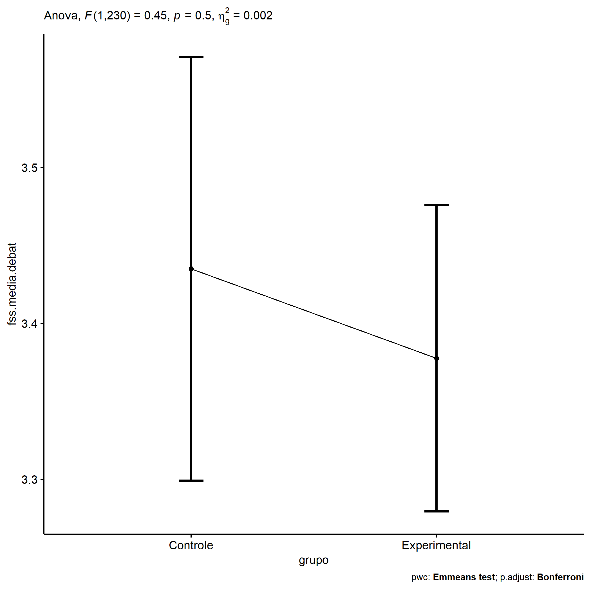<!-- -->

``` r
plots <- oneWayAncovaBoxPlots(
  wdat, "fss.media.debat", "grupo", aov, pwc, covar = "dfs.media.debat",
  theme = "classic", color = color[["grupo"]],
  subtitle = which(aov$Effect == "grupo"))
```

``` r
if (length(unique(wdat[["grupo"]])) > 1)
  plots[["grupo"]] + ggplot2::ylab("flow (debate)") + ggplot2::scale_x_discrete(labels=c('pre', 'pos'))
```

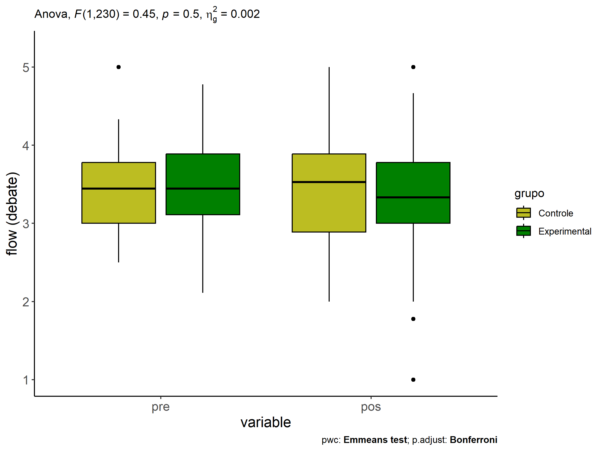<!-- -->

``` r
if (length(unique(wdat.long[["grupo"]])) > 1)
  plots <- oneWayAncovaBoxPlots(
    wdat.long, "flow.debat", "grupo", aov, pwc.long, pre.post = "time",
    theme = "classic", color = color$prepost)
```

``` r
if (length(unique(wdat.long[["grupo"]])) > 1)
  plots[["grupo"]] + ggplot2::ylab("flow (debate)")
```

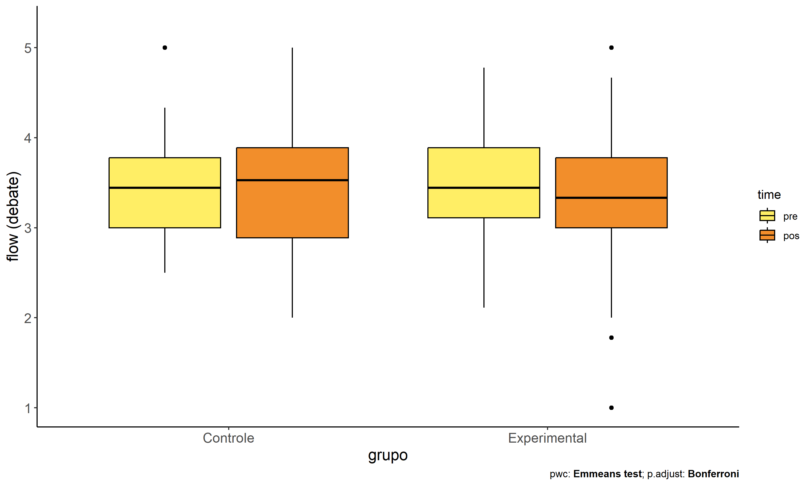<!-- -->

### Checking linearity assumption

``` r
ggscatter(wdat, x = "dfs.media.debat", y = "fss.media.debat", size = 0.5,
          color = "grupo", add = "reg.line")+
  stat_regline_equation(
    aes(label =  paste(..eq.label.., ..rr.label.., sep = "~~~~"), color = grupo)
  )
```

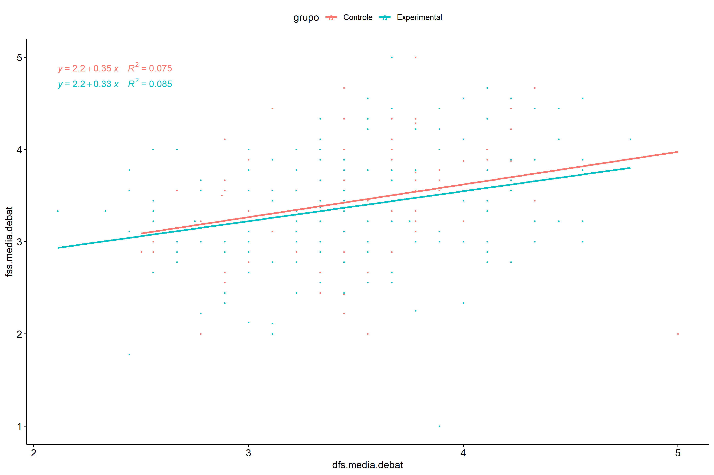<!-- -->

### Checking normality and homogeneity

``` r
res <- augment(lm(fss.media.debat ~ dfs.media.debat + grupo, data = wdat))
```

``` r
shapiro_test(res$.resid)
```

    ## # A tibble: 1 × 3
    ##   variable   statistic p.value
    ##   <chr>          <dbl>   <dbl>
    ## 1 res$.resid     0.988  0.0559

``` r
levene_test(res, .resid ~ grupo)
```

    ## # A tibble: 1 × 4
    ##     df1   df2 statistic     p
    ##   <int> <int>     <dbl> <dbl>
    ## 1     1   231    0.0194 0.889

# ANCOVA and Pairwise for two factors **grupo:Sexo**

## Without remove non-normal data

``` r
pdat = remove_group_data(dat[!is.na(dat[["grupo"]]) & !is.na(dat[["Sexo"]]),], "fss.media.debat", c("grupo","Sexo"))

pdat.long <- rbind(pdat[,c("id","grupo","Sexo")], pdat[,c("id","grupo","Sexo")])
pdat.long[["time"]] <- c(rep("pre", nrow(pdat)), rep("pos", nrow(pdat)))
pdat.long[["time"]] <- factor(pdat.long[["time"]], c("pre","pos"))
pdat.long[["flow.debat"]] <- c(pdat[["dfs.media.debat"]], pdat[["fss.media.debat"]])

aov = anova_test(pdat, fss.media.debat ~ dfs.media.debat + grupo*Sexo)
laov[["grupo:Sexo"]] <- get_anova_table(aov)
```

``` r
pwcs <- list()
pwcs[["Sexo"]] <- emmeans_test(
  group_by(pdat, grupo), fss.media.debat ~ Sexo,
  covariate = dfs.media.debat, p.adjust.method = "bonferroni")
pwcs[["grupo"]] <- emmeans_test(
  group_by(pdat, Sexo), fss.media.debat ~ grupo,
  covariate = dfs.media.debat, p.adjust.method = "bonferroni")

pwc <- plyr::rbind.fill(pwcs[["grupo"]], pwcs[["Sexo"]])
pwc <- pwc[,c("grupo","Sexo", colnames(pwc)[!colnames(pwc) %in% c("grupo","Sexo")])]
```

``` r
pwc.long <- emmeans_test(dplyr::group_by_at(pdat.long, c("grupo","Sexo")),
                         flow.debat ~ time,
                         p.adjust.method = "bonferroni")
lpwc[["grupo:Sexo"]] <- plyr::rbind.fill(pwc, pwc.long)
```

``` r
ds <- get.descriptives(pdat, "fss.media.debat", c("grupo","Sexo"), covar = "dfs.media.debat")
ds <- merge(ds[ds$variable != "dfs.media.debat",],
            ds[ds$variable == "dfs.media.debat", !colnames(ds) %in% c("variable")],
            by = c("grupo","Sexo"), all.x = T, suffixes = c("", ".dfs.media.debat"))
ds <- merge(get_emmeans(pwcs[["grupo"]]), ds, by = c("grupo","Sexo"), suffixes = c(".emms", ""))
ds <- ds[,c("grupo","Sexo","n","mean.dfs.media.debat","se.dfs.media.debat","mean","se","emmean","se.emms")]

colnames(ds) <- c("grupo","Sexo", "N", paste0(c("M","SE")," (pre)"),
                  paste0(c("M","SE"), " (unadj)"), paste0(c("M", "SE"), " (adj)"))

lemms[["grupo:Sexo"]] <- ds
```

## Computing ANCOVA and PairWise After removing non-normal data (OK)

``` r
wdat = pdat 

res = residuals(lm(fss.media.debat ~ dfs.media.debat + grupo*Sexo, data = wdat))
non.normal = getNonNormal(res, wdat$id, plimit = 0.05)

wdat = wdat[!wdat$id %in% non.normal,]

wdat.long <- rbind(wdat[,c("id","grupo","Sexo")], wdat[,c("id","grupo","Sexo")])
wdat.long[["time"]] <- c(rep("pre", nrow(wdat)), rep("pos", nrow(wdat)))
wdat.long[["time"]] <- factor(wdat.long[["time"]], c("pre","pos"))
wdat.long[["flow.debat"]] <- c(wdat[["dfs.media.debat"]], wdat[["fss.media.debat"]])


ldat[["grupo:Sexo"]] = wdat

(non.normal)
```

    ## NULL

``` r
aov = anova_test(wdat, fss.media.debat ~ dfs.media.debat + grupo*Sexo)
laov[["grupo:Sexo"]] <- merge(get_anova_table(aov), laov[["grupo:Sexo"]], by="Effect", suffixes = c("","'"))

(df = get_anova_table(aov))
```

    ## ANOVA Table (type II tests)
    ## 
    ##            Effect DFn DFd      F        p p<.05   ges
    ## 1 dfs.media.debat   1 228 18.548 2.46e-05     * 0.075
    ## 2           grupo   1 228  0.470 4.94e-01       0.002
    ## 3            Sexo   1 228  0.396 5.30e-01       0.002
    ## 4      grupo:Sexo   1 228  1.670 1.98e-01       0.007

| Effect          | DFn | DFd |      F |     p | p\<.05 |   ges |
|:----------------|----:|----:|-------:|------:|:-------|------:|
| dfs.media.debat |   1 | 228 | 18.548 | 0.000 | \*     | 0.075 |
| grupo           |   1 | 228 |  0.470 | 0.494 |        | 0.002 |
| Sexo            |   1 | 228 |  0.396 | 0.530 |        | 0.002 |
| grupo:Sexo      |   1 | 228 |  1.670 | 0.198 |        | 0.007 |

``` r
pwcs <- list()
pwcs[["Sexo"]] <- emmeans_test(
  group_by(wdat, grupo), fss.media.debat ~ Sexo,
  covariate = dfs.media.debat, p.adjust.method = "bonferroni")
pwcs[["grupo"]] <- emmeans_test(
  group_by(wdat, Sexo), fss.media.debat ~ grupo,
  covariate = dfs.media.debat, p.adjust.method = "bonferroni")

pwc <- plyr::rbind.fill(pwcs[["grupo"]], pwcs[["Sexo"]])
pwc <- pwc[,c("grupo","Sexo", colnames(pwc)[!colnames(pwc) %in% c("grupo","Sexo")])]
```

| grupo        | Sexo | term                   | .y.             | group1   | group2       |  df | statistic |     p | p.adj | p.adj.signif |
|:-------------|:-----|:-----------------------|:----------------|:---------|:-------------|----:|----------:|------:|------:|:-------------|
|              | F    | dfs.media.debat\*grupo | fss.media.debat | Controle | Experimental | 228 |     1.371 | 0.172 | 0.172 | ns           |
|              | M    | dfs.media.debat\*grupo | fss.media.debat | Controle | Experimental | 228 |    -0.512 | 0.609 | 0.609 | ns           |
| Controle     |      | dfs.media.debat\*Sexo  | fss.media.debat | F        | M            | 228 |     1.414 | 0.159 | 0.159 | ns           |
| Experimental |      | dfs.media.debat\*Sexo  | fss.media.debat | F        | M            | 228 |    -0.238 | 0.812 | 0.812 | ns           |

``` r
pwc.long <- emmeans_test(dplyr::group_by_at(wdat.long, c("grupo","Sexo")),
                         flow.debat ~ time,
                         p.adjust.method = "bonferroni")
lpwc[["grupo:Sexo"]] <- merge(plyr::rbind.fill(pwc, pwc.long), lpwc[["grupo:Sexo"]], by=c("grupo","Sexo","term",".y.","group1","group2"), suffixes = c("","'"))
```

| grupo        | Sexo | term | .y.        | group1 | group2 |  df | statistic |     p | p.adj | p.adj.signif |
|:-------------|:-----|:-----|:-----------|:-------|:-------|----:|----------:|------:|------:|:-------------|
| Controle     | F    | time | flow.debat | pre    | pos    | 458 |     0.058 | 0.954 | 0.954 | ns           |
| Controle     | M    | time | flow.debat | pre    | pos    | 458 |     0.343 | 0.732 | 0.732 | ns           |
| Experimental | F    | time | flow.debat | pre    | pos    | 458 |     1.753 | 0.080 | 0.080 | ns           |
| Experimental | M    | time | flow.debat | pre    | pos    | 458 |     0.383 | 0.702 | 0.702 | ns           |

``` r
ds <- get.descriptives(wdat, "fss.media.debat", c("grupo","Sexo"), covar = "dfs.media.debat")
ds <- merge(ds[ds$variable != "dfs.media.debat",],
            ds[ds$variable == "dfs.media.debat", !colnames(ds) %in% c("variable")],
            by = c("grupo","Sexo"), all.x = T, suffixes = c("", ".dfs.media.debat"))
ds <- merge(get_emmeans(pwcs[["grupo"]]), ds, by = c("grupo","Sexo"), suffixes = c(".emms", ""))
ds <- ds[,c("grupo","Sexo","n","mean.dfs.media.debat","se.dfs.media.debat","mean","se","emmean","se.emms")]

colnames(ds) <- c("grupo","Sexo", "N", paste0(c("M","SE")," (pre)"),
                  paste0(c("M","SE"), " (unadj)"), paste0(c("M", "SE"), " (adj)"))

lemms[["grupo:Sexo"]] <- merge(ds, lemms[["grupo:Sexo"]], by=c("grupo","Sexo"), suffixes = c("","'"))
```

| grupo        | Sexo |   N | M (pre) | SE (pre) | M (unadj) | SE (unadj) | M (adj) | SE (adj) |
|:-------------|:-----|----:|--------:|---------:|----------:|-----------:|--------:|---------:|
| Controle     | F    |  44 |   3.557 |    0.069 |     3.550 |      0.103 |   3.524 |    0.093 |
| Controle     | M    |  36 |   3.325 |    0.089 |     3.277 |      0.098 |   3.326 |    0.103 |
| Experimental | F    |  88 |   3.547 |    0.059 |     3.390 |      0.073 |   3.367 |    0.066 |
| Experimental | M    |  65 |   3.410 |    0.073 |     3.370 |      0.070 |   3.392 |    0.077 |

### Plots for ancova

``` r
plots <- twoWayAncovaPlots(
  wdat, "fss.media.debat", c("grupo","Sexo"), aov, pwcs, addParam = c("mean_se"),
  font.label.size=10, step.increase=0.05, p.label="p.adj",
  subtitle = which(aov$Effect == "grupo:Sexo"))
```

``` r
if (!is.null(plots[["grupo"]]))
  plots[["grupo"]] + ggplot2::scale_color_manual(values = color[["Sexo"]])
```

    ## Scale for colour is already present.
    ## Adding another scale for colour, which will replace the existing scale.

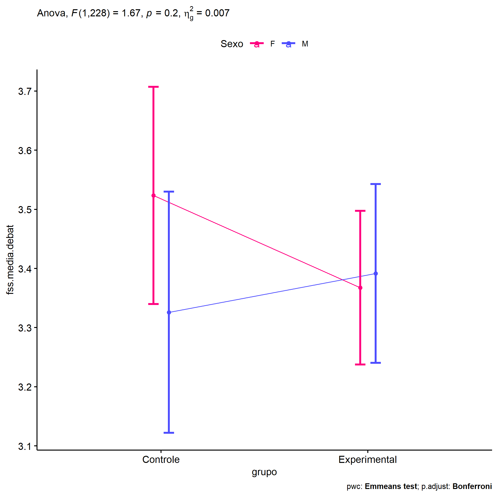<!-- -->

``` r
if (!is.null(plots[["Sexo"]]))
  plots[["Sexo"]] + ggplot2::scale_color_manual(values = color[["grupo"]])
```

    ## Scale for colour is already present.
    ## Adding another scale for colour, which will replace the existing scale.

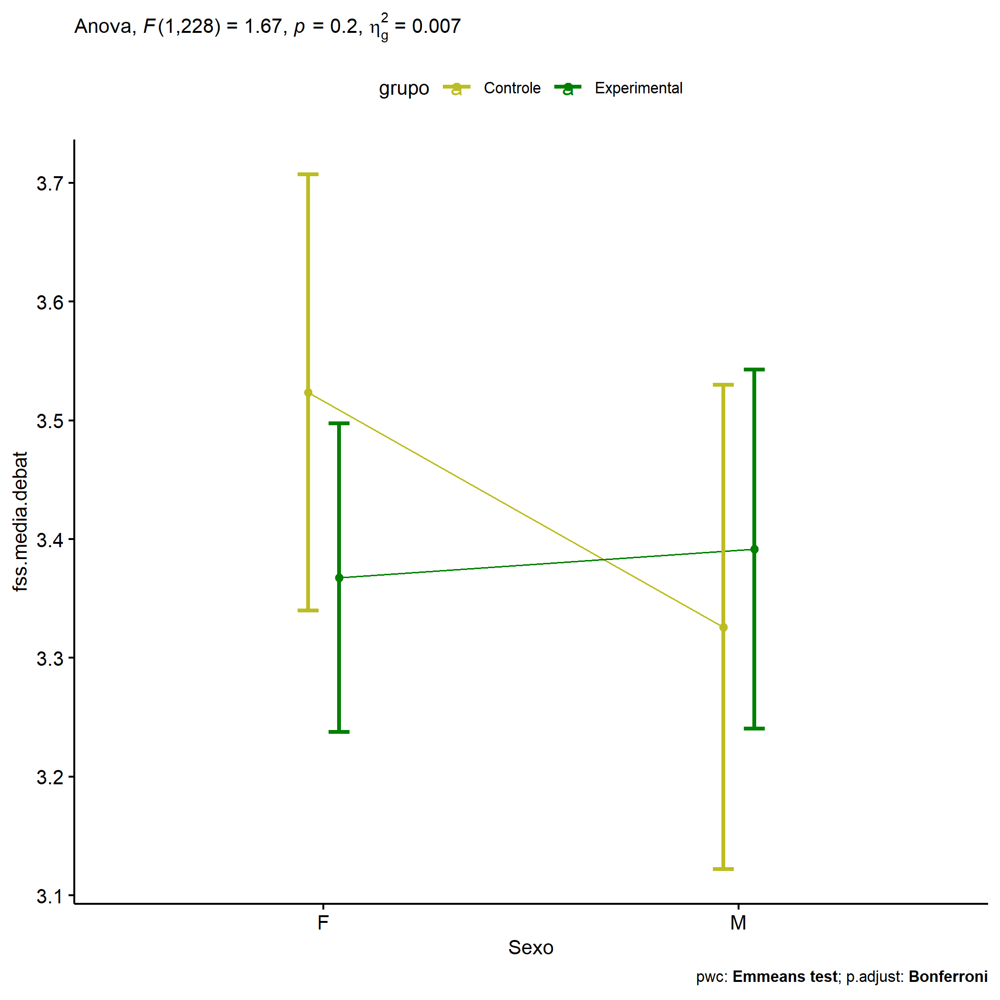<!-- -->

``` r
plots <- twoWayAncovaBoxPlots(
  wdat, "fss.media.debat", c("grupo","Sexo"), aov, pwcs, covar = "dfs.media.debat",
  theme = "classic", color = color[["grupo:Sexo"]],
  subtitle = which(aov$Effect == "grupo:Sexo"))
```

``` r
plots[["grupo:Sexo"]] + ggplot2::ylab("flow (debate)") + ggplot2::scale_x_discrete(labels=c('pre', 'pos'))
```

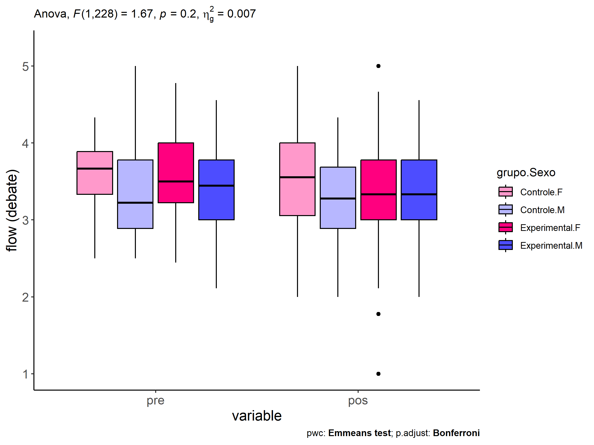<!-- -->

``` r
plots <- twoWayAncovaBoxPlots(
  wdat.long, "flow.debat", c("grupo","Sexo"), aov, pwc.long, pre.post = "time",
  theme = "classic", color = color$prepost)
```

``` r
plots[["grupo:Sexo"]] + ggplot2::ylab("flow (debate)")
```

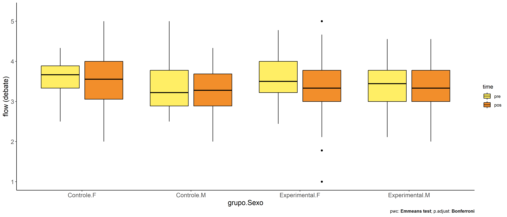<!-- -->

### Checking linearity assumption

``` r
ggscatter(wdat, x = "dfs.media.debat", y = "fss.media.debat", size = 0.5,
          facet.by = c("grupo","Sexo"), add = "reg.line")+
  stat_regline_equation(
    aes(label =  paste(..eq.label.., ..rr.label.., sep = "~~~~"))
  )
```

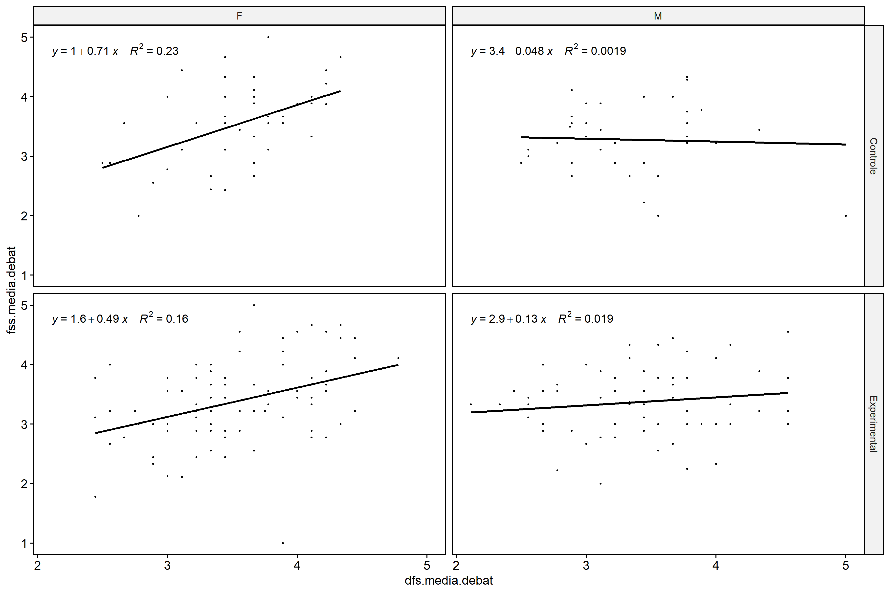<!-- -->

### Checking normality and homogeneity

``` r
res <- augment(lm(fss.media.debat ~ dfs.media.debat + grupo*Sexo, data = wdat))
```

``` r
shapiro_test(res$.resid)
```

    ## # A tibble: 1 × 3
    ##   variable   statistic p.value
    ##   <chr>          <dbl>   <dbl>
    ## 1 res$.resid     0.989  0.0782

``` r
levene_test(res, .resid ~ grupo*Sexo)
```

    ## # A tibble: 1 × 4
    ##     df1   df2 statistic     p
    ##   <int> <int>     <dbl> <dbl>
    ## 1     3   229    0.0375 0.990

# ANCOVA and Pairwise for two factors **grupo:Zona**

## Without remove non-normal data

``` r
pdat = remove_group_data(dat[!is.na(dat[["grupo"]]) & !is.na(dat[["Zona"]]),], "fss.media.debat", c("grupo","Zona"))

pdat.long <- rbind(pdat[,c("id","grupo","Zona")], pdat[,c("id","grupo","Zona")])
pdat.long[["time"]] <- c(rep("pre", nrow(pdat)), rep("pos", nrow(pdat)))
pdat.long[["time"]] <- factor(pdat.long[["time"]], c("pre","pos"))
pdat.long[["flow.debat"]] <- c(pdat[["dfs.media.debat"]], pdat[["fss.media.debat"]])

aov = anova_test(pdat, fss.media.debat ~ dfs.media.debat + grupo*Zona)
laov[["grupo:Zona"]] <- get_anova_table(aov)
```

``` r
pwcs <- list()
pwcs[["Zona"]] <- emmeans_test(
  group_by(pdat, grupo), fss.media.debat ~ Zona,
  covariate = dfs.media.debat, p.adjust.method = "bonferroni")
pwcs[["grupo"]] <- emmeans_test(
  group_by(pdat, Zona), fss.media.debat ~ grupo,
  covariate = dfs.media.debat, p.adjust.method = "bonferroni")

pwc <- plyr::rbind.fill(pwcs[["grupo"]], pwcs[["Zona"]])
pwc <- pwc[,c("grupo","Zona", colnames(pwc)[!colnames(pwc) %in% c("grupo","Zona")])]
```

``` r
pwc.long <- emmeans_test(dplyr::group_by_at(pdat.long, c("grupo","Zona")),
                         flow.debat ~ time,
                         p.adjust.method = "bonferroni")
lpwc[["grupo:Zona"]] <- plyr::rbind.fill(pwc, pwc.long)
```

``` r
ds <- get.descriptives(pdat, "fss.media.debat", c("grupo","Zona"), covar = "dfs.media.debat")
ds <- merge(ds[ds$variable != "dfs.media.debat",],
            ds[ds$variable == "dfs.media.debat", !colnames(ds) %in% c("variable")],
            by = c("grupo","Zona"), all.x = T, suffixes = c("", ".dfs.media.debat"))
ds <- merge(get_emmeans(pwcs[["grupo"]]), ds, by = c("grupo","Zona"), suffixes = c(".emms", ""))
ds <- ds[,c("grupo","Zona","n","mean.dfs.media.debat","se.dfs.media.debat","mean","se","emmean","se.emms")]

colnames(ds) <- c("grupo","Zona", "N", paste0(c("M","SE")," (pre)"),
                  paste0(c("M","SE"), " (unadj)"), paste0(c("M", "SE"), " (adj)"))

lemms[["grupo:Zona"]] <- ds
```

## Computing ANCOVA and PairWise After removing non-normal data (OK)

``` r
wdat = pdat 

res = residuals(lm(fss.media.debat ~ dfs.media.debat + grupo*Zona, data = wdat))
non.normal = getNonNormal(res, wdat$id, plimit = 0.05)

wdat = wdat[!wdat$id %in% non.normal,]

wdat.long <- rbind(wdat[,c("id","grupo","Zona")], wdat[,c("id","grupo","Zona")])
wdat.long[["time"]] <- c(rep("pre", nrow(wdat)), rep("pos", nrow(wdat)))
wdat.long[["time"]] <- factor(wdat.long[["time"]], c("pre","pos"))
wdat.long[["flow.debat"]] <- c(wdat[["dfs.media.debat"]], wdat[["fss.media.debat"]])


ldat[["grupo:Zona"]] = wdat

(non.normal)
```

    ## [1] "P2207"

``` r
aov = anova_test(wdat, fss.media.debat ~ dfs.media.debat + grupo*Zona)
laov[["grupo:Zona"]] <- merge(get_anova_table(aov), laov[["grupo:Zona"]], by="Effect", suffixes = c("","'"))

(df = get_anova_table(aov))
```

    ## ANOVA Table (type II tests)
    ## 
    ##            Effect DFn DFd      F        p p<.05      ges
    ## 1 dfs.media.debat   1 111 12.120 0.000714     * 0.098000
    ## 2           grupo   1 111  0.067 0.796000       0.000603
    ## 3            Zona   1 111  0.072 0.790000       0.000644
    ## 4      grupo:Zona   1 111  4.125 0.045000     * 0.036000

| Effect          | DFn | DFd |      F |     p | p\<.05 |   ges |
|:----------------|----:|----:|-------:|------:|:-------|------:|
| dfs.media.debat |   1 | 111 | 12.120 | 0.001 | \*     | 0.098 |
| grupo           |   1 | 111 |  0.067 | 0.796 |        | 0.001 |
| Zona            |   1 | 111 |  0.072 | 0.790 |        | 0.001 |
| grupo:Zona      |   1 | 111 |  4.125 | 0.045 | \*     | 0.036 |

``` r
pwcs <- list()
pwcs[["Zona"]] <- emmeans_test(
  group_by(wdat, grupo), fss.media.debat ~ Zona,
  covariate = dfs.media.debat, p.adjust.method = "bonferroni")
pwcs[["grupo"]] <- emmeans_test(
  group_by(wdat, Zona), fss.media.debat ~ grupo,
  covariate = dfs.media.debat, p.adjust.method = "bonferroni")

pwc <- plyr::rbind.fill(pwcs[["grupo"]], pwcs[["Zona"]])
pwc <- pwc[,c("grupo","Zona", colnames(pwc)[!colnames(pwc) %in% c("grupo","Zona")])]
```

| grupo        | Zona   | term                   | .y.             | group1   | group2       |  df | statistic |     p | p.adj | p.adj.signif |
|:-------------|:-------|:-----------------------|:----------------|:---------|:-------------|----:|----------:|------:|------:|:-------------|
|              | Rural  | dfs.media.debat\*grupo | fss.media.debat | Controle | Experimental | 111 |    -1.000 | 0.319 | 0.319 | ns           |
|              | Urbana | dfs.media.debat\*grupo | fss.media.debat | Controle | Experimental | 111 |     1.785 | 0.077 | 0.077 | ns           |
| Controle     |        | dfs.media.debat\*Zona  | fss.media.debat | Rural    | Urbana       | 111 |    -1.730 | 0.086 | 0.086 | ns           |
| Experimental |        | dfs.media.debat\*Zona  | fss.media.debat | Rural    | Urbana       | 111 |     1.041 | 0.300 | 0.300 | ns           |

``` r
pwc.long <- emmeans_test(dplyr::group_by_at(wdat.long, c("grupo","Zona")),
                         flow.debat ~ time,
                         p.adjust.method = "bonferroni")
lpwc[["grupo:Zona"]] <- merge(plyr::rbind.fill(pwc, pwc.long), lpwc[["grupo:Zona"]], by=c("grupo","Zona","term",".y.","group1","group2"), suffixes = c("","'"))
```

| grupo        | Zona   | term | .y.        | group1 | group2 |  df | statistic |     p | p.adj | p.adj.signif |
|:-------------|:-------|:-----|:-----------|:-------|:-------|----:|----------:|------:|------:|:-------------|
| Controle     | Rural  | time | flow.debat | pre    | pos    | 224 |     0.283 | 0.778 | 0.778 | ns           |
| Controle     | Urbana | time | flow.debat | pre    | pos    | 224 |    -0.461 | 0.646 | 0.646 | ns           |
| Experimental | Rural  | time | flow.debat | pre    | pos    | 224 |    -0.508 | 0.612 | 0.612 | ns           |
| Experimental | Urbana | time | flow.debat | pre    | pos    | 224 |     1.770 | 0.078 | 0.078 | ns           |

``` r
ds <- get.descriptives(wdat, "fss.media.debat", c("grupo","Zona"), covar = "dfs.media.debat")
ds <- merge(ds[ds$variable != "dfs.media.debat",],
            ds[ds$variable == "dfs.media.debat", !colnames(ds) %in% c("variable")],
            by = c("grupo","Zona"), all.x = T, suffixes = c("", ".dfs.media.debat"))
ds <- merge(get_emmeans(pwcs[["grupo"]]), ds, by = c("grupo","Zona"), suffixes = c(".emms", ""))
ds <- ds[,c("grupo","Zona","n","mean.dfs.media.debat","se.dfs.media.debat","mean","se","emmean","se.emms")]

colnames(ds) <- c("grupo","Zona", "N", paste0(c("M","SE")," (pre)"),
                  paste0(c("M","SE"), " (unadj)"), paste0(c("M", "SE"), " (adj)"))

lemms[["grupo:Zona"]] <- merge(ds, lemms[["grupo:Zona"]], by=c("grupo","Zona"), suffixes = c("","'"))
```

| grupo        | Zona   |   N | M (pre) | SE (pre) | M (unadj) | SE (unadj) | M (adj) | SE (adj) |
|:-------------|:-------|----:|--------:|---------:|----------:|-----------:|--------:|---------:|
| Controle     | Rural  |  31 |   3.342 |    0.082 |     3.301 |      0.102 |   3.350 |    0.107 |
| Controle     | Urbana |  16 |   3.625 |    0.122 |     3.720 |      0.133 |   3.668 |    0.148 |
| Experimental | Rural  |  43 |   3.395 |    0.089 |     3.458 |      0.103 |   3.489 |    0.090 |
| Experimental | Urbana |  26 |   3.696 |    0.115 |     3.410 |      0.122 |   3.333 |    0.118 |

### Plots for ancova

``` r
plots <- twoWayAncovaPlots(
  wdat, "fss.media.debat", c("grupo","Zona"), aov, pwcs, addParam = c("mean_se"),
  font.label.size=10, step.increase=0.05, p.label="p.adj",
  subtitle = which(aov$Effect == "grupo:Zona"))
```

``` r
if (!is.null(plots[["grupo"]]))
  plots[["grupo"]] + ggplot2::scale_color_manual(values = color[["Zona"]])
```

    ## Scale for colour is already present.
    ## Adding another scale for colour, which will replace the existing scale.

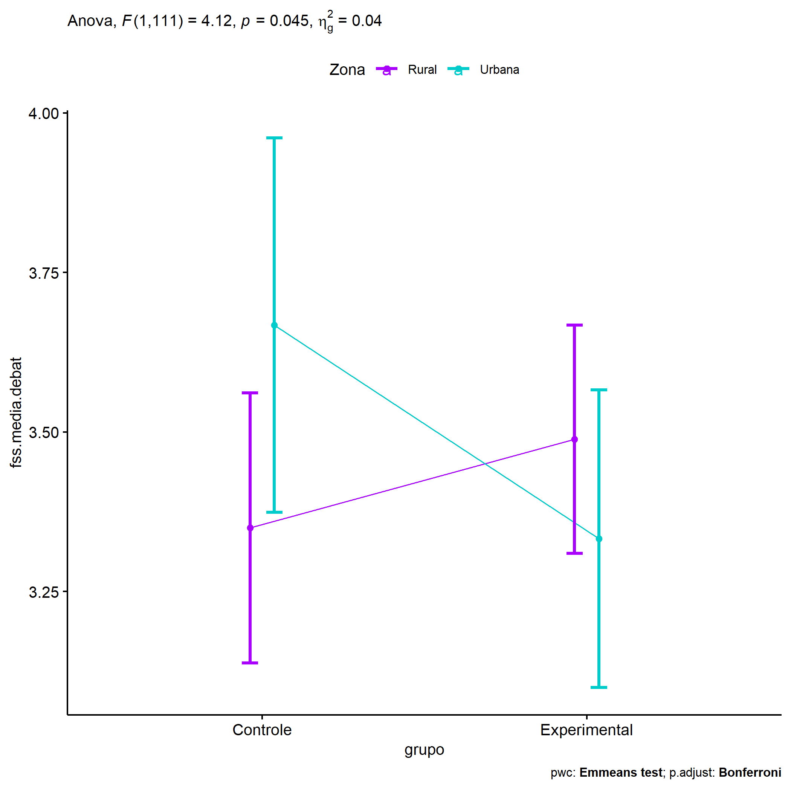<!-- -->

``` r
if (!is.null(plots[["Zona"]]))
  plots[["Zona"]] + ggplot2::scale_color_manual(values = color[["grupo"]])
```

    ## Scale for colour is already present.
    ## Adding another scale for colour, which will replace the existing scale.

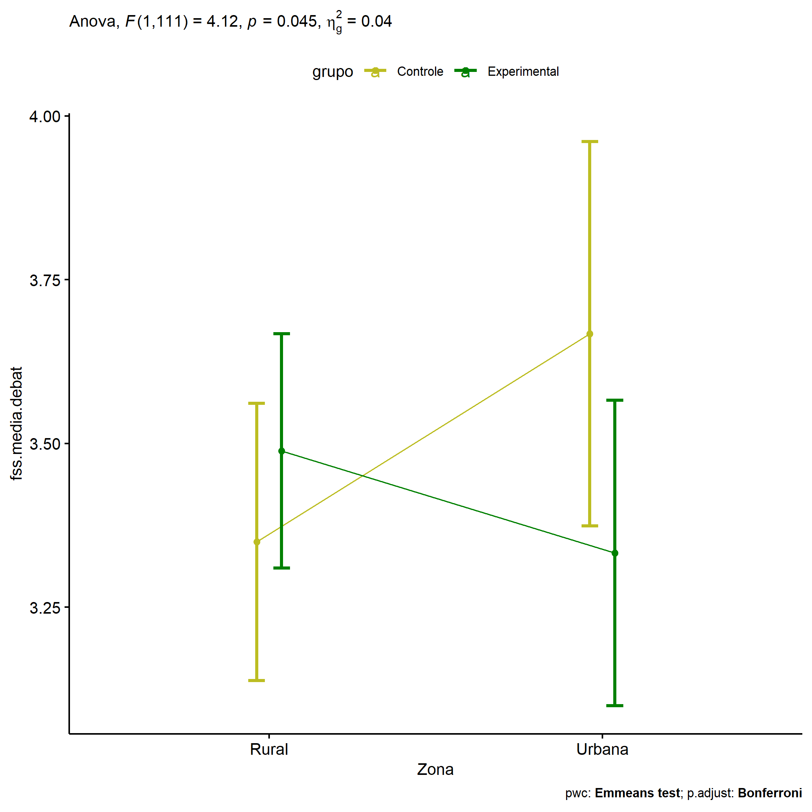<!-- -->

``` r
plots <- twoWayAncovaBoxPlots(
  wdat, "fss.media.debat", c("grupo","Zona"), aov, pwcs, covar = "dfs.media.debat",
  theme = "classic", color = color[["grupo:Zona"]],
  subtitle = which(aov$Effect == "grupo:Zona"))
```

``` r
plots[["grupo:Zona"]] + ggplot2::ylab("flow (debate)") + ggplot2::scale_x_discrete(labels=c('pre', 'pos'))
```

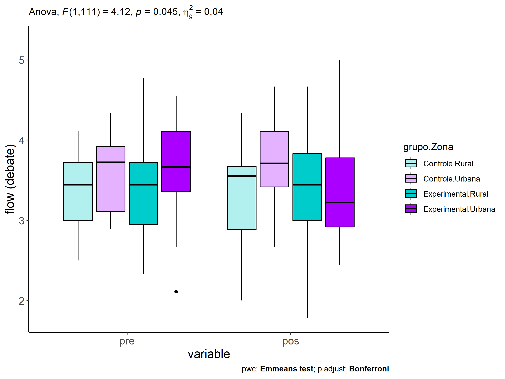<!-- -->

``` r
plots <- twoWayAncovaBoxPlots(
  wdat.long, "flow.debat", c("grupo","Zona"), aov, pwc.long, pre.post = "time",
  theme = "classic", color = color$prepost)
```

``` r
plots[["grupo:Zona"]] + ggplot2::ylab("flow (debate)")
```

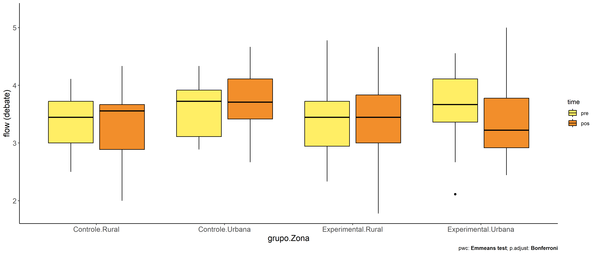<!-- -->

### Checking linearity assumption

``` r
ggscatter(wdat, x = "dfs.media.debat", y = "fss.media.debat", size = 0.5,
          facet.by = c("grupo","Zona"), add = "reg.line")+
  stat_regline_equation(
    aes(label =  paste(..eq.label.., ..rr.label.., sep = "~~~~"))
  )
```

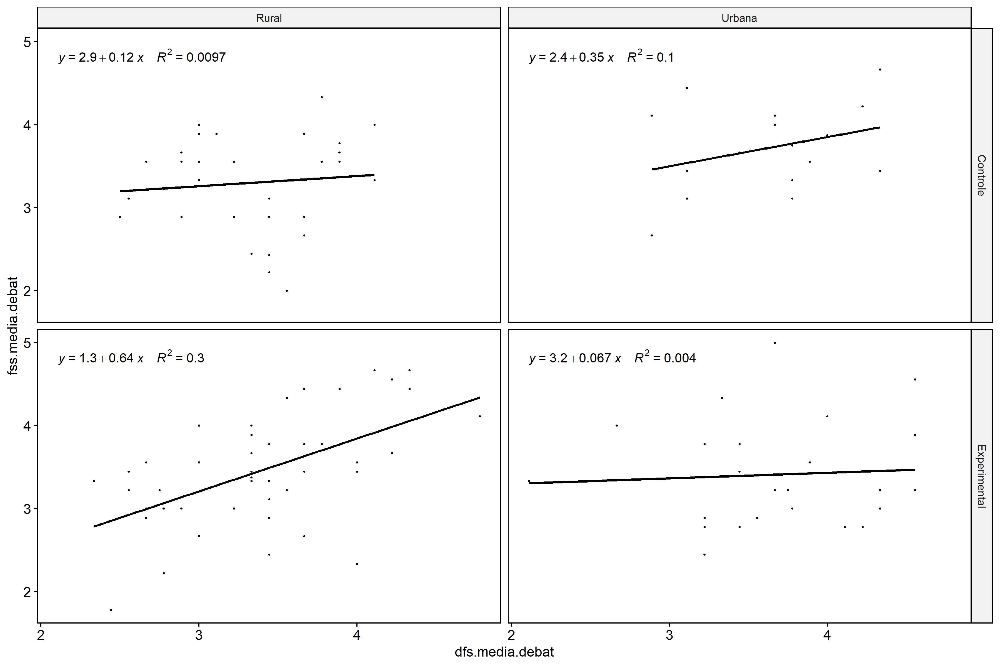<!-- -->

### Checking normality and homogeneity

``` r
res <- augment(lm(fss.media.debat ~ dfs.media.debat + grupo*Zona, data = wdat))
```

``` r
shapiro_test(res$.resid)
```

    ## # A tibble: 1 × 3
    ##   variable   statistic p.value
    ##   <chr>          <dbl>   <dbl>
    ## 1 res$.resid     0.992   0.781

``` r
levene_test(res, .resid ~ grupo*Zona)
```

    ## # A tibble: 1 × 4
    ##     df1   df2 statistic     p
    ##   <int> <int>     <dbl> <dbl>
    ## 1     3   112     0.292 0.831

# ANCOVA and Pairwise for two factors **grupo:Cor.Raca**

## Without remove non-normal data

``` r
pdat = remove_group_data(dat[!is.na(dat[["grupo"]]) & !is.na(dat[["Cor.Raca"]]),], "fss.media.debat", c("grupo","Cor.Raca"))
```

    ## Warning: There was 1 warning in `mutate()`.
    ## ℹ In argument: `ci = abs(stats::qt(alpha/2, .data$n - 1) * .data$se)`.
    ## Caused by warning:
    ## ! There was 1 warning in `mutate()`.
    ## ℹ In argument: `ci = abs(stats::qt(alpha/2, .data$n - 1) * .data$se)`.
    ## Caused by warning in `stats::qt()`:
    ## ! NaNs produced

``` r
pdat.long <- rbind(pdat[,c("id","grupo","Cor.Raca")], pdat[,c("id","grupo","Cor.Raca")])
pdat.long[["time"]] <- c(rep("pre", nrow(pdat)), rep("pos", nrow(pdat)))
pdat.long[["time"]] <- factor(pdat.long[["time"]], c("pre","pos"))
pdat.long[["flow.debat"]] <- c(pdat[["dfs.media.debat"]], pdat[["fss.media.debat"]])

aov = anova_test(pdat, fss.media.debat ~ dfs.media.debat + grupo*Cor.Raca)
laov[["grupo:Cor.Raca"]] <- get_anova_table(aov)
```

``` r
pwcs <- list()
pwcs[["Cor.Raca"]] <- emmeans_test(
  group_by(pdat, grupo), fss.media.debat ~ Cor.Raca,
  covariate = dfs.media.debat, p.adjust.method = "bonferroni")
pwcs[["grupo"]] <- emmeans_test(
  group_by(pdat, Cor.Raca), fss.media.debat ~ grupo,
  covariate = dfs.media.debat, p.adjust.method = "bonferroni")

pwc <- plyr::rbind.fill(pwcs[["grupo"]], pwcs[["Cor.Raca"]])
pwc <- pwc[,c("grupo","Cor.Raca", colnames(pwc)[!colnames(pwc) %in% c("grupo","Cor.Raca")])]
```

``` r
pwc.long <- emmeans_test(dplyr::group_by_at(pdat.long, c("grupo","Cor.Raca")),
                         flow.debat ~ time,
                         p.adjust.method = "bonferroni")
lpwc[["grupo:Cor.Raca"]] <- plyr::rbind.fill(pwc, pwc.long)
```

``` r
ds <- get.descriptives(pdat, "fss.media.debat", c("grupo","Cor.Raca"), covar = "dfs.media.debat")
ds <- merge(ds[ds$variable != "dfs.media.debat",],
            ds[ds$variable == "dfs.media.debat", !colnames(ds) %in% c("variable")],
            by = c("grupo","Cor.Raca"), all.x = T, suffixes = c("", ".dfs.media.debat"))
ds <- merge(get_emmeans(pwcs[["grupo"]]), ds, by = c("grupo","Cor.Raca"), suffixes = c(".emms", ""))
ds <- ds[,c("grupo","Cor.Raca","n","mean.dfs.media.debat","se.dfs.media.debat","mean","se","emmean","se.emms")]

colnames(ds) <- c("grupo","Cor.Raca", "N", paste0(c("M","SE")," (pre)"),
                  paste0(c("M","SE"), " (unadj)"), paste0(c("M", "SE"), " (adj)"))

lemms[["grupo:Cor.Raca"]] <- ds
```

## Computing ANCOVA and PairWise After removing non-normal data (OK)

``` r
wdat = pdat 

res = residuals(lm(fss.media.debat ~ dfs.media.debat + grupo*Cor.Raca, data = wdat))
non.normal = getNonNormal(res, wdat$id, plimit = 0.05)

wdat = wdat[!wdat$id %in% non.normal,]

wdat.long <- rbind(wdat[,c("id","grupo","Cor.Raca")], wdat[,c("id","grupo","Cor.Raca")])
wdat.long[["time"]] <- c(rep("pre", nrow(wdat)), rep("pos", nrow(wdat)))
wdat.long[["time"]] <- factor(wdat.long[["time"]], c("pre","pos"))
wdat.long[["flow.debat"]] <- c(wdat[["dfs.media.debat"]], wdat[["fss.media.debat"]])


ldat[["grupo:Cor.Raca"]] = wdat

(non.normal)
```

    ## NULL

``` r
aov = anova_test(wdat, fss.media.debat ~ dfs.media.debat + grupo*Cor.Raca)
laov[["grupo:Cor.Raca"]] <- merge(get_anova_table(aov), laov[["grupo:Cor.Raca"]], by="Effect", suffixes = c("","'"))

(df = get_anova_table(aov))
```

    ## ANOVA Table (type II tests)
    ## 
    ##            Effect DFn DFd     F     p p<.05   ges
    ## 1 dfs.media.debat   1  84 9.915 0.002     * 0.106
    ## 2           grupo   1  84 0.218 0.642       0.003
    ## 3        Cor.Raca   1  84 0.192 0.662       0.002
    ## 4  grupo:Cor.Raca   0  84    NA    NA  <NA>    NA

| Effect          | DFn | DFd |     F |     p | p\<.05 |   ges |
|:----------------|----:|----:|------:|------:|:-------|------:|
| dfs.media.debat |   1 |  84 | 9.915 | 0.002 | \*     | 0.106 |
| grupo           |   1 |  84 | 0.218 | 0.642 |        | 0.003 |
| Cor.Raca        |   1 |  84 | 0.192 | 0.662 |        | 0.002 |
| grupo:Cor.Raca  |   0 |  84 |       |       |        |       |

``` r
pwcs <- list()
pwcs[["Cor.Raca"]] <- emmeans_test(
  group_by(wdat, grupo), fss.media.debat ~ Cor.Raca,
  covariate = dfs.media.debat, p.adjust.method = "bonferroni")
pwcs[["grupo"]] <- emmeans_test(
  group_by(wdat, Cor.Raca), fss.media.debat ~ grupo,
  covariate = dfs.media.debat, p.adjust.method = "bonferroni")

pwc <- plyr::rbind.fill(pwcs[["grupo"]], pwcs[["Cor.Raca"]])
pwc <- pwc[,c("grupo","Cor.Raca", colnames(pwc)[!colnames(pwc) %in% c("grupo","Cor.Raca")])]
```

| grupo        | Cor.Raca | term                      | .y.             | group1   | group2       |  df | statistic |     p | p.adj | p.adj.signif |
|:-------------|:---------|:--------------------------|:----------------|:---------|:-------------|----:|----------:|------:|------:|:-------------|
|              | Branca   | dfs.media.debat\*grupo    | fss.media.debat | Controle | Experimental |     |           |       |       |              |
|              | Parda    | dfs.media.debat\*grupo    | fss.media.debat | Controle | Experimental |  84 |    -0.466 | 0.642 | 0.642 | ns           |
| Controle     |          | dfs.media.debat\*Cor.Raca | fss.media.debat | Branca   | Parda        |     |           |       |       |              |
| Experimental |          | dfs.media.debat\*Cor.Raca | fss.media.debat | Branca   | Parda        |  84 |    -0.439 | 0.662 | 0.662 | ns           |

``` r
pwc.long <- emmeans_test(dplyr::group_by_at(wdat.long, c("grupo","Cor.Raca")),
                         flow.debat ~ time,
                         p.adjust.method = "bonferroni")
lpwc[["grupo:Cor.Raca"]] <- merge(plyr::rbind.fill(pwc, pwc.long), lpwc[["grupo:Cor.Raca"]], by=c("grupo","Cor.Raca","term",".y.","group1","group2"), suffixes = c("","'"))
```

| grupo        | Cor.Raca | term | .y.        | group1 | group2 |  df | statistic |     p | p.adj | p.adj.signif |
|:-------------|:---------|:-----|:-----------|:-------|:-------|----:|----------:|------:|------:|:-------------|
| Controle     | Branca   | time | flow.debat | pre    | pos    |     |           |       |       |              |
| Controle     | Parda    | time | flow.debat | pre    | pos    | 170 |    -0.353 | 0.724 | 0.724 | ns           |
| Experimental | Branca   | time | flow.debat | pre    | pos    | 170 |     0.119 | 0.906 | 0.906 | ns           |
| Experimental | Parda    | time | flow.debat | pre    | pos    | 170 |    -0.374 | 0.709 | 0.709 | ns           |

``` r
ds <- get.descriptives(wdat, "fss.media.debat", c("grupo","Cor.Raca"), covar = "dfs.media.debat")
ds <- merge(ds[ds$variable != "dfs.media.debat",],
            ds[ds$variable == "dfs.media.debat", !colnames(ds) %in% c("variable")],
            by = c("grupo","Cor.Raca"), all.x = T, suffixes = c("", ".dfs.media.debat"))
ds <- merge(get_emmeans(pwcs[["grupo"]]), ds, by = c("grupo","Cor.Raca"), suffixes = c(".emms", ""))
ds <- ds[,c("grupo","Cor.Raca","n","mean.dfs.media.debat","se.dfs.media.debat","mean","se","emmean","se.emms")]

colnames(ds) <- c("grupo","Cor.Raca", "N", paste0(c("M","SE")," (pre)"),
                  paste0(c("M","SE"), " (unadj)"), paste0(c("M", "SE"), " (adj)"))

lemms[["grupo:Cor.Raca"]] <- merge(ds, lemms[["grupo:Cor.Raca"]], by=c("grupo","Cor.Raca"), suffixes = c("","'"))
```

| grupo        | Cor.Raca |   N | M (pre) | SE (pre) | M (unadj) | SE (unadj) | M (adj) | SE (adj) |
|:-------------|:---------|----:|--------:|---------:|----------:|-----------:|--------:|---------:|
| Controle     | Parda    |  31 |   3.297 |    0.082 |     3.351 |      0.129 |   3.382 |    0.112 |
| Experimental | Branca   |  16 |   3.410 |    0.153 |     3.385 |      0.119 |   3.371 |    0.156 |
| Experimental | Parda    |  41 |   3.419 |    0.088 |     3.469 |      0.103 |   3.451 |    0.097 |

### Plots for ancova

``` r
plots <- twoWayAncovaPlots(
  wdat, "fss.media.debat", c("grupo","Cor.Raca"), aov, pwcs, addParam = c("mean_se"),
  font.label.size=10, step.increase=0.05, p.label="p.adj",
  subtitle = which(aov$Effect == "grupo:Cor.Raca"))
```

``` r
if (!is.null(plots[["grupo"]]))
  plots[["grupo"]] + ggplot2::scale_color_manual(values = color[["Cor.Raca"]])
```

<!-- -->

``` r
if (!is.null(plots[["Cor.Raca"]]))
  plots[["Cor.Raca"]] + ggplot2::scale_color_manual(values = color[["grupo"]])
```

<!-- -->

``` r
plots <- twoWayAncovaBoxPlots(
  wdat, "fss.media.debat", c("grupo","Cor.Raca"), aov, pwcs, covar = "dfs.media.debat",
  theme = "classic", color = color[["grupo:Cor.Raca"]],
  subtitle = which(aov$Effect == "grupo:Cor.Raca"))
```

``` r
plots[["grupo:Cor.Raca"]] + ggplot2::ylab("flow (debate)") + ggplot2::scale_x_discrete(labels=c('pre', 'pos'))
```

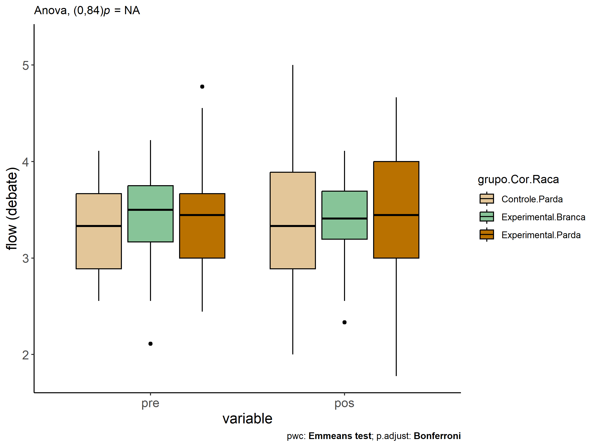<!-- -->

``` r
plots <- twoWayAncovaBoxPlots(
  wdat.long, "flow.debat", c("grupo","Cor.Raca"), aov, pwc.long, pre.post = "time",
  theme = "classic", color = color$prepost)
```

``` r
plots[["grupo:Cor.Raca"]] + ggplot2::ylab("flow (debate)")
```

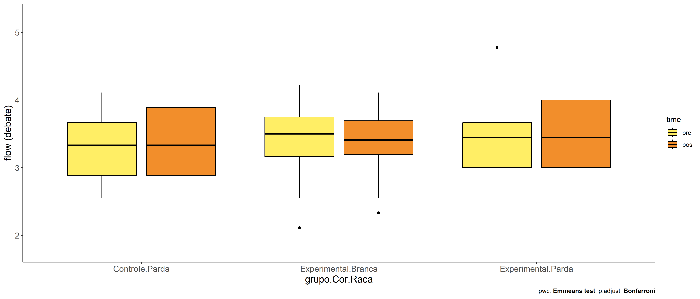<!-- -->

### Checking linearity assumption

``` r
ggscatter(wdat, x = "dfs.media.debat", y = "fss.media.debat", size = 0.5,
          facet.by = c("grupo","Cor.Raca"), add = "reg.line")+
  stat_regline_equation(
    aes(label =  paste(..eq.label.., ..rr.label.., sep = "~~~~"))
  )
```

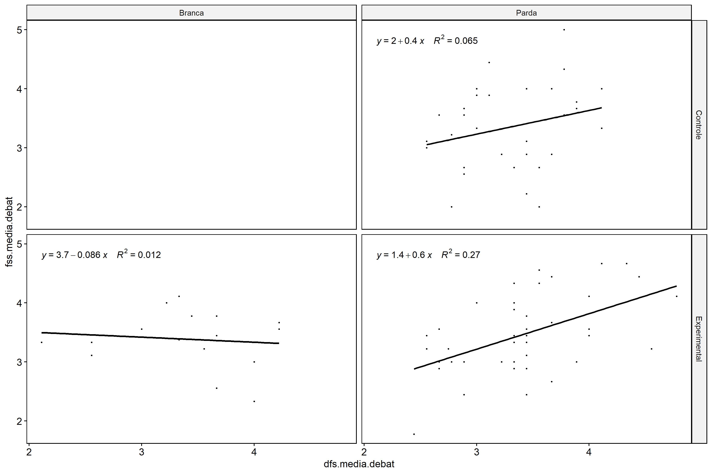<!-- -->

### Checking normality and homogeneity

``` r
res <- augment(lm(fss.media.debat ~ dfs.media.debat + grupo*Cor.Raca, data = wdat))
```

``` r
shapiro_test(res$.resid)
```

    ## # A tibble: 1 × 3
    ##   variable   statistic p.value
    ##   <chr>          <dbl>   <dbl>
    ## 1 res$.resid     0.991   0.813

``` r
levene_test(res, .resid ~ grupo*Cor.Raca)
```

    ## # A tibble: 1 × 4
    ##     df1   df2 statistic     p
    ##   <int> <int>     <dbl> <dbl>
    ## 1     2    85     0.941 0.394

# Summary of Results

## Descriptive Statistics

``` r
df <- get.descriptives(ldat[["grupo"]], c(dv.pre, dv.pos), c("grupo"), 
                       include.global = T, symmetry.test = T, normality.test = F)
df <- plyr::rbind.fill(
  df, do.call(plyr::rbind.fill, lapply(lfatores2, FUN = function(f) {
    if (nrow(dat) > 0 && sum(!is.na(unique(dat[[f]]))) > 1)
      get.descriptives(ldat[[paste0("grupo:",f)]], c(dv.pre,dv.pos), c("grupo", f),
                       symmetry.test = T, normality.test = F)
    }))
)
(df <- df[,c(fatores1[fatores1 %in% colnames(df)],"variable",
             colnames(df)[!colnames(df) %in% c(fatores1,"variable")])])
```

    ##           grupo Sexo   Zona Cor.Raca        variable   n  mean median   min   max    sd    se    ci   iqr
    ## 1      Controle <NA>   <NA>     <NA> dfs.media.debat  80 3.453  3.444 2.500 5.000 0.506 0.057 0.113 0.778
    ## 2  Experimental <NA>   <NA>     <NA> dfs.media.debat 153 3.489  3.444 2.111 4.778 0.571 0.046 0.091 0.778
    ## 3          <NA> <NA>   <NA>     <NA> dfs.media.debat 233 3.477  3.444 2.111 5.000 0.548 0.036 0.071 0.778
    ## 4      Controle <NA>   <NA>     <NA> fss.media.debat  80 3.427  3.528 2.000 5.000 0.652 0.073 0.145 1.000
    ## 5  Experimental <NA>   <NA>     <NA> fss.media.debat 153 3.382  3.333 1.000 5.000 0.637 0.052 0.102 0.778
    ## 6          <NA> <NA>   <NA>     <NA> fss.media.debat 233 3.397  3.444 1.000 5.000 0.641 0.042 0.083 0.778
    ## 7      Controle    F   <NA>     <NA> dfs.media.debat  44 3.557  3.667 2.500 4.333 0.459 0.069 0.140 0.556
    ## 8      Controle    M   <NA>     <NA> dfs.media.debat  36 3.325  3.222 2.500 5.000 0.537 0.089 0.182 0.889
    ## 9  Experimental    F   <NA>     <NA> dfs.media.debat  88 3.547  3.500 2.444 4.778 0.551 0.059 0.117 0.778
    ## 10 Experimental    M   <NA>     <NA> dfs.media.debat  65 3.410  3.444 2.111 4.556 0.591 0.073 0.146 0.778
    ## 11     Controle    F   <NA>     <NA> fss.media.debat  44 3.550  3.556 2.000 5.000 0.681 0.103 0.207 0.944
    ## 12     Controle    M   <NA>     <NA> fss.media.debat  36 3.277  3.278 2.000 4.333 0.591 0.098 0.200 0.799
    ## 13 Experimental    F   <NA>     <NA> fss.media.debat  88 3.390  3.333 1.000 5.000 0.689 0.073 0.146 0.778
    ## 14 Experimental    M   <NA>     <NA> fss.media.debat  65 3.370  3.333 2.000 4.556 0.564 0.070 0.140 0.778
    ## 15     Controle <NA>  Rural     <NA> dfs.media.debat  31 3.342  3.444 2.500 4.111 0.459 0.082 0.168 0.722
    ## 16     Controle <NA> Urbana     <NA> dfs.media.debat  16 3.625  3.722 2.889 4.333 0.487 0.122 0.259 0.806
    ## 17 Experimental <NA>  Rural     <NA> dfs.media.debat  43 3.395  3.444 2.333 4.778 0.585 0.089 0.180 0.778
    ## 18 Experimental <NA> Urbana     <NA> dfs.media.debat  26 3.696  3.667 2.111 4.556 0.587 0.115 0.237 0.750
    ## 19     Controle <NA>  Rural     <NA> fss.media.debat  31 3.301  3.556 2.000 4.333 0.569 0.102 0.209 0.778
    ## 20     Controle <NA> Urbana     <NA> fss.media.debat  16 3.720  3.708 2.667 4.667 0.533 0.133 0.284 0.694
    ## 21 Experimental <NA>  Rural     <NA> fss.media.debat  43 3.458  3.444 1.778 4.667 0.675 0.103 0.208 0.833
    ## 22 Experimental <NA> Urbana     <NA> fss.media.debat  26 3.410  3.222 2.444 5.000 0.621 0.122 0.251 0.861
    ## 23     Controle <NA>   <NA>    Parda dfs.media.debat  31 3.297  3.333 2.556 4.111 0.457 0.082 0.168 0.778
    ## 24 Experimental <NA>   <NA>   Branca dfs.media.debat  16 3.410  3.500 2.111 4.222 0.611 0.153 0.326 0.583
    ## 25 Experimental <NA>   <NA>    Parda dfs.media.debat  41 3.419  3.444 2.444 4.778 0.565 0.088 0.178 0.667
    ## 26     Controle <NA>   <NA>    Parda fss.media.debat  31 3.351  3.333 2.000 5.000 0.719 0.129 0.264 1.000
    ## 27 Experimental <NA>   <NA>   Branca fss.media.debat  16 3.385  3.410 2.333 4.111 0.476 0.119 0.254 0.500
    ## 28 Experimental <NA>   <NA>    Parda fss.media.debat  41 3.469  3.444 1.778 4.667 0.661 0.103 0.209 1.000
    ##    symmetry      skewness   kurtosis
    ## 1       YES  0.1284363809 -0.2213465
    ## 2       YES -0.0511759061 -0.6390702
    ## 3       YES  0.0073211217 -0.4963686
    ## 4       YES -0.0822271754 -0.4220486
    ## 5       YES -0.2361718104  0.6227723
    ## 6       YES -0.1798060545  0.2804987
    ## 7       YES -0.4935861821 -0.4069818
    ## 8        NO  0.8041767249  0.6988973
    ## 9       YES -0.0618858770 -0.7249995
    ## 10      YES  0.0108637805 -0.6429386
    ## 11      YES -0.1070460923 -0.6376295
    ## 12      YES -0.2893855235 -0.4961446
    ## 13      YES -0.3111987727  0.7454767
    ## 14      YES -0.0629397153 -0.3805600
    ## 15      YES -0.0886439376 -1.1899694
    ## 16      YES -0.1111612703 -1.3792916
    ## 17      YES  0.1485885674 -0.7329159
    ## 18       NO -0.5401956162  0.1740072
    ## 19      YES -0.4627741357 -0.6205496
    ## 20      YES -0.0902548287 -0.8846640
    ## 21      YES -0.1317495358 -0.3478380
    ## 22       NO  0.7539125835 -0.1580316
    ## 23      YES  0.0871011310 -1.2374962
    ## 24       NO -0.5412856280 -0.7266769
    ## 25      YES  0.3294776513 -0.3650130
    ## 26      YES  0.0082186507 -0.5624954
    ## 27       NO -0.6025191654 -0.3308287
    ## 28      YES  0.0007791016 -0.3869991

| grupo        | Sexo | Zona   | Cor.Raca | variable        |   n |  mean | median |   min |   max |    sd |    se |    ci |   iqr | symmetry | skewness | kurtosis |
|:-------------|:-----|:-------|:---------|:----------------|----:|------:|-------:|------:|------:|------:|------:|------:|------:|:---------|---------:|---------:|
| Controle     |      |        |          | dfs.media.debat |  80 | 3.453 |  3.444 | 2.500 | 5.000 | 0.506 | 0.057 | 0.113 | 0.778 | YES      |    0.128 |   -0.221 |
| Experimental |      |        |          | dfs.media.debat | 153 | 3.489 |  3.444 | 2.111 | 4.778 | 0.571 | 0.046 | 0.091 | 0.778 | YES      |   -0.051 |   -0.639 |
|              |      |        |          | dfs.media.debat | 233 | 3.477 |  3.444 | 2.111 | 5.000 | 0.548 | 0.036 | 0.071 | 0.778 | YES      |    0.007 |   -0.496 |
| Controle     |      |        |          | fss.media.debat |  80 | 3.427 |  3.528 | 2.000 | 5.000 | 0.652 | 0.073 | 0.145 | 1.000 | YES      |   -0.082 |   -0.422 |
| Experimental |      |        |          | fss.media.debat | 153 | 3.382 |  3.333 | 1.000 | 5.000 | 0.637 | 0.052 | 0.102 | 0.778 | YES      |   -0.236 |    0.623 |
|              |      |        |          | fss.media.debat | 233 | 3.397 |  3.444 | 1.000 | 5.000 | 0.641 | 0.042 | 0.083 | 0.778 | YES      |   -0.180 |    0.280 |
| Controle     | F    |        |          | dfs.media.debat |  44 | 3.557 |  3.667 | 2.500 | 4.333 | 0.459 | 0.069 | 0.140 | 0.556 | YES      |   -0.494 |   -0.407 |
| Controle     | M    |        |          | dfs.media.debat |  36 | 3.325 |  3.222 | 2.500 | 5.000 | 0.537 | 0.089 | 0.182 | 0.889 | NO       |    0.804 |    0.699 |
| Experimental | F    |        |          | dfs.media.debat |  88 | 3.547 |  3.500 | 2.444 | 4.778 | 0.551 | 0.059 | 0.117 | 0.778 | YES      |   -0.062 |   -0.725 |
| Experimental | M    |        |          | dfs.media.debat |  65 | 3.410 |  3.444 | 2.111 | 4.556 | 0.591 | 0.073 | 0.146 | 0.778 | YES      |    0.011 |   -0.643 |
| Controle     | F    |        |          | fss.media.debat |  44 | 3.550 |  3.556 | 2.000 | 5.000 | 0.681 | 0.103 | 0.207 | 0.944 | YES      |   -0.107 |   -0.638 |
| Controle     | M    |        |          | fss.media.debat |  36 | 3.277 |  3.278 | 2.000 | 4.333 | 0.591 | 0.098 | 0.200 | 0.799 | YES      |   -0.289 |   -0.496 |
| Experimental | F    |        |          | fss.media.debat |  88 | 3.390 |  3.333 | 1.000 | 5.000 | 0.689 | 0.073 | 0.146 | 0.778 | YES      |   -0.311 |    0.745 |
| Experimental | M    |        |          | fss.media.debat |  65 | 3.370 |  3.333 | 2.000 | 4.556 | 0.564 | 0.070 | 0.140 | 0.778 | YES      |   -0.063 |   -0.381 |
| Controle     |      | Rural  |          | dfs.media.debat |  31 | 3.342 |  3.444 | 2.500 | 4.111 | 0.459 | 0.082 | 0.168 | 0.722 | YES      |   -0.089 |   -1.190 |
| Controle     |      | Urbana |          | dfs.media.debat |  16 | 3.625 |  3.722 | 2.889 | 4.333 | 0.487 | 0.122 | 0.259 | 0.806 | YES      |   -0.111 |   -1.379 |
| Experimental |      | Rural  |          | dfs.media.debat |  43 | 3.395 |  3.444 | 2.333 | 4.778 | 0.585 | 0.089 | 0.180 | 0.778 | YES      |    0.149 |   -0.733 |
| Experimental |      | Urbana |          | dfs.media.debat |  26 | 3.696 |  3.667 | 2.111 | 4.556 | 0.587 | 0.115 | 0.237 | 0.750 | NO       |   -0.540 |    0.174 |
| Controle     |      | Rural  |          | fss.media.debat |  31 | 3.301 |  3.556 | 2.000 | 4.333 | 0.569 | 0.102 | 0.209 | 0.778 | YES      |   -0.463 |   -0.621 |
| Controle     |      | Urbana |          | fss.media.debat |  16 | 3.720 |  3.708 | 2.667 | 4.667 | 0.533 | 0.133 | 0.284 | 0.694 | YES      |   -0.090 |   -0.885 |
| Experimental |      | Rural  |          | fss.media.debat |  43 | 3.458 |  3.444 | 1.778 | 4.667 | 0.675 | 0.103 | 0.208 | 0.833 | YES      |   -0.132 |   -0.348 |
| Experimental |      | Urbana |          | fss.media.debat |  26 | 3.410 |  3.222 | 2.444 | 5.000 | 0.621 | 0.122 | 0.251 | 0.861 | NO       |    0.754 |   -0.158 |
| Controle     |      |        | Parda    | dfs.media.debat |  31 | 3.297 |  3.333 | 2.556 | 4.111 | 0.457 | 0.082 | 0.168 | 0.778 | YES      |    0.087 |   -1.237 |
| Experimental |      |        | Branca   | dfs.media.debat |  16 | 3.410 |  3.500 | 2.111 | 4.222 | 0.611 | 0.153 | 0.326 | 0.583 | NO       |   -0.541 |   -0.727 |
| Experimental |      |        | Parda    | dfs.media.debat |  41 | 3.419 |  3.444 | 2.444 | 4.778 | 0.565 | 0.088 | 0.178 | 0.667 | YES      |    0.329 |   -0.365 |
| Controle     |      |        | Parda    | fss.media.debat |  31 | 3.351 |  3.333 | 2.000 | 5.000 | 0.719 | 0.129 | 0.264 | 1.000 | YES      |    0.008 |   -0.562 |
| Experimental |      |        | Branca   | fss.media.debat |  16 | 3.385 |  3.410 | 2.333 | 4.111 | 0.476 | 0.119 | 0.254 | 0.500 | NO       |   -0.603 |   -0.331 |
| Experimental |      |        | Parda    | fss.media.debat |  41 | 3.469 |  3.444 | 1.778 | 4.667 | 0.661 | 0.103 | 0.209 | 1.000 | YES      |    0.001 |   -0.387 |

## ANCOVA Table Comparison

``` r
df <- do.call(plyr::rbind.fill, laov)
(df <- df[!duplicated(df$Effect),])
```

    ##             Effect DFn DFd      F        p p<.05      ges DFn' DFd'     F'       p' p<.05'  ges'
    ## 1  dfs.media.debat   1 230 20.372 1.02e-05     * 0.081000    1  230 20.372 1.02e-05      * 0.081
    ## 2            grupo   1 230  0.453 5.01e-01       0.002000    1  230  0.453 5.01e-01        0.002
    ## 5       grupo:Sexo   1 228  1.670 1.98e-01       0.007000    1  228  1.670 1.98e-01        0.007
    ## 6             Sexo   1 228  0.396 5.30e-01       0.002000    1  228  0.396 5.30e-01        0.002
    ## 9       grupo:Zona   1 111  4.125 4.50e-02     * 0.036000    1  112  2.710 1.03e-01        0.024
    ## 10            Zona   1 111  0.072 7.90e-01       0.000644    1  112  0.376 5.41e-01        0.003
    ## 11        Cor.Raca   1  84  0.192 6.62e-01       0.002000    1   84  0.192 6.62e-01        0.002
    ## 14  grupo:Cor.Raca   0  84     NA       NA  <NA>       NA    0   84     NA       NA   <NA>    NA

|     | Effect          | DFn | DFd |      F |     p | p\<.05 |   ges | DFn’ | DFd’ |     F’ |    p’ | p\<.05’ |  ges’ |
|:----|:----------------|----:|----:|-------:|------:|:-------|------:|-----:|-----:|-------:|------:|:--------|------:|
| 1   | dfs.media.debat |   1 | 230 | 20.372 | 0.000 | \*     | 0.081 |    1 |  230 | 20.372 | 0.000 | \*      | 0.081 |
| 2   | grupo           |   1 | 230 |  0.453 | 0.501 |        | 0.002 |    1 |  230 |  0.453 | 0.501 |         | 0.002 |
| 5   | grupo:Sexo      |   1 | 228 |  1.670 | 0.198 |        | 0.007 |    1 |  228 |  1.670 | 0.198 |         | 0.007 |
| 6   | Sexo            |   1 | 228 |  0.396 | 0.530 |        | 0.002 |    1 |  228 |  0.396 | 0.530 |         | 0.002 |
| 9   | grupo:Zona      |   1 | 111 |  4.125 | 0.045 | \*     | 0.036 |    1 |  112 |  2.710 | 0.103 |         | 0.024 |
| 10  | Zona            |   1 | 111 |  0.072 | 0.790 |        | 0.001 |    1 |  112 |  0.376 | 0.541 |         | 0.003 |
| 11  | Cor.Raca        |   1 |  84 |  0.192 | 0.662 |        | 0.002 |    1 |   84 |  0.192 | 0.662 |         | 0.002 |
| 14  | grupo:Cor.Raca  |   0 |  84 |        |       |        |       |    0 |   84 |        |       |         |       |

## PairWise Table Comparison

``` r
df <- do.call(plyr::rbind.fill, lpwc)
df <- df[,c(names(lfatores), names(df)[!names(df) %in% c(names(lfatores),"term",".y.")])]
```

| grupo        | Sexo | Zona   | Cor.Raca | group1   | group2       |  df | statistic |     p | p.adj | p.adj.signif | df’ | statistic’ |    p’ | p.adj’ | p.adj.signif’ |
|:-------------|:-----|:-------|:---------|:---------|:-------------|----:|----------:|------:|------:|:-------------|----:|-----------:|------:|-------:|:--------------|
| Controle     |      |        |          | pre      | pos          | 462 |     0.271 | 0.786 | 0.786 | ns           | 462 |      0.271 | 0.786 |  0.786 | ns            |
| Experimental |      |        |          | pre      | pos          | 462 |     1.570 | 0.117 | 0.117 | ns           | 462 |      1.570 | 0.117 |  0.117 | ns            |
|              |      |        |          | Controle | Experimental | 230 |     0.673 | 0.501 | 0.501 | ns           | 230 |      0.673 | 0.501 |  0.501 | ns            |
| Controle     | F    |        |          | pre      | pos          | 458 |     0.058 | 0.954 | 0.954 | ns           | 458 |      0.058 | 0.954 |  0.954 | ns            |
| Controle     | M    |        |          | pre      | pos          | 458 |     0.343 | 0.732 | 0.732 | ns           | 458 |      0.343 | 0.732 |  0.732 | ns            |
| Controle     |      |        |          | F        | M            | 228 |     1.414 | 0.159 | 0.159 | ns           | 228 |      1.414 | 0.159 |  0.159 | ns            |
| Experimental | F    |        |          | pre      | pos          | 458 |     1.753 | 0.080 | 0.080 | ns           | 458 |      1.753 | 0.080 |  0.080 | ns            |
| Experimental | M    |        |          | pre      | pos          | 458 |     0.383 | 0.702 | 0.702 | ns           | 458 |      0.383 | 0.702 |  0.702 | ns            |
| Experimental |      |        |          | F        | M            | 228 |    -0.238 | 0.812 | 0.812 | ns           | 228 |     -0.238 | 0.812 |  0.812 | ns            |
|              | F    |        |          | Controle | Experimental | 228 |     1.371 | 0.172 | 0.172 | ns           | 228 |      1.371 | 0.172 |  0.172 | ns            |
|              | M    |        |          | Controle | Experimental | 228 |    -0.512 | 0.609 | 0.609 | ns           | 228 |     -0.512 | 0.609 |  0.609 | ns            |
| Controle     |      |        |          | Rural    | Urbana       | 111 |    -1.730 | 0.086 | 0.086 | ns           | 112 |     -1.658 | 0.100 |  0.100 | ns            |
| Controle     |      | Rural  |          | pre      | pos          | 224 |     0.283 | 0.778 | 0.778 | ns           | 226 |      0.273 | 0.785 |  0.785 | ns            |
| Controle     |      | Urbana |          | pre      | pos          | 224 |    -0.461 | 0.646 | 0.646 | ns           | 226 |     -0.445 | 0.657 |  0.657 | ns            |
| Experimental |      |        |          | Rural    | Urbana       | 111 |     1.041 | 0.300 | 0.300 | ns           | 112 |      0.528 | 0.599 |  0.599 | ns            |
| Experimental |      | Rural  |          | pre      | pos          | 224 |    -0.508 | 0.612 | 0.612 | ns           | 226 |      0.027 | 0.978 |  0.978 | ns            |
| Experimental |      | Urbana |          | pre      | pos          | 224 |     1.770 | 0.078 | 0.078 | ns           | 226 |      1.710 | 0.089 |  0.089 | ns            |
|              |      | Rural  |          | Controle | Experimental | 111 |    -1.000 | 0.319 | 0.319 | ns           | 112 |     -0.546 | 0.586 |  0.586 | ns            |
|              |      | Urbana |          | Controle | Experimental | 111 |     1.785 | 0.077 | 0.077 | ns           | 112 |      1.641 | 0.104 |  0.104 | ns            |
| Controle     |      |        | Branca   | pre      | pos          |     |           |       |       |              |     |            |       |        |               |
| Controle     |      |        |          | Branca   | Parda        |     |           |       |       |              |     |            |       |        |               |
| Controle     |      |        | Parda    | pre      | pos          | 170 |    -0.353 | 0.724 | 0.724 | ns           | 170 |     -0.353 | 0.724 |  0.724 | ns            |
| Experimental |      |        | Branca   | pre      | pos          | 170 |     0.119 | 0.906 | 0.906 | ns           | 170 |      0.119 | 0.906 |  0.906 | ns            |
| Experimental |      |        |          | Branca   | Parda        |  84 |    -0.439 | 0.662 | 0.662 | ns           |  84 |     -0.439 | 0.662 |  0.662 | ns            |
| Experimental |      |        | Parda    | pre      | pos          | 170 |    -0.374 | 0.709 | 0.709 | ns           | 170 |     -0.374 | 0.709 |  0.709 | ns            |
|              |      |        | Branca   | Controle | Experimental |     |           |       |       |              |     |            |       |        |               |
|              |      |        | Parda    | Controle | Experimental |  84 |    -0.466 | 0.642 | 0.642 | ns           |  84 |     -0.466 | 0.642 |  0.642 | ns            |

## EMMS Table Comparison

``` r
df <- do.call(plyr::rbind.fill, lemms)
df[["N-N'"]] <- df[["N"]] - df[["N'"]]
df <- df[,c(names(lfatores), names(df)[!names(df) %in% names(lfatores)])]
```

| grupo        | Sexo | Zona   | Cor.Raca |   N | M (pre) | SE (pre) | M (unadj) | SE (unadj) | M (adj) | SE (adj) |  N’ | M (pre)’ | SE (pre)’ | M (unadj)’ | SE (unadj)’ | M (adj)’ | SE (adj)’ | N-N’ |
|:-------------|:-----|:-------|:---------|----:|--------:|---------:|----------:|-----------:|--------:|---------:|----:|---------:|----------:|-----------:|------------:|---------:|----------:|-----:|
| Controle     |      |        |          |  80 |   3.453 |    0.057 |     3.427 |      0.073 |   3.435 |    0.069 |  80 |    3.453 |     0.057 |      3.427 |       0.073 |    3.435 |     0.069 |    0 |
| Experimental |      |        |          | 153 |   3.489 |    0.046 |     3.382 |      0.052 |   3.378 |    0.050 | 153 |    3.489 |     0.046 |      3.382 |       0.052 |    3.378 |     0.050 |    0 |
| Controle     | F    |        |          |  44 |   3.557 |    0.069 |     3.550 |      0.103 |   3.524 |    0.093 |  44 |    3.557 |     0.069 |      3.550 |       0.103 |    3.524 |     0.093 |    0 |
| Controle     | M    |        |          |  36 |   3.325 |    0.089 |     3.277 |      0.098 |   3.326 |    0.103 |  36 |    3.325 |     0.089 |      3.277 |       0.098 |    3.326 |     0.103 |    0 |
| Experimental | F    |        |          |  88 |   3.547 |    0.059 |     3.390 |      0.073 |   3.367 |    0.066 |  88 |    3.547 |     0.059 |      3.390 |       0.073 |    3.367 |     0.066 |    0 |
| Experimental | M    |        |          |  65 |   3.410 |    0.073 |     3.370 |      0.070 |   3.392 |    0.077 |  65 |    3.410 |     0.073 |      3.370 |       0.070 |    3.392 |     0.077 |    0 |
| Controle     |      | Rural  |          |  31 |   3.342 |    0.082 |     3.301 |      0.102 |   3.350 |    0.107 |  31 |    3.342 |     0.082 |      3.301 |       0.102 |    3.346 |     0.115 |    0 |
| Controle     |      | Urbana |          |  16 |   3.625 |    0.122 |     3.720 |      0.133 |   3.668 |    0.148 |  16 |    3.625 |     0.122 |      3.720 |       0.133 |    3.674 |     0.160 |    0 |
| Experimental |      | Rural  |          |  43 |   3.395 |    0.089 |     3.458 |      0.103 |   3.489 |    0.090 |  44 |    3.406 |     0.088 |      3.402 |       0.115 |    3.427 |     0.096 |   -1 |
| Experimental |      | Urbana |          |  26 |   3.696 |    0.115 |     3.410 |      0.122 |   3.333 |    0.118 |  26 |    3.696 |     0.115 |      3.410 |       0.122 |    3.342 |     0.127 |    0 |
| Controle     |      |        | Parda    |  31 |   3.297 |    0.082 |     3.351 |      0.129 |   3.382 |    0.112 |  31 |    3.297 |     0.082 |      3.351 |       0.129 |    3.382 |     0.112 |    0 |
| Experimental |      |        | Branca   |  16 |   3.410 |    0.153 |     3.385 |      0.119 |   3.371 |    0.156 |  16 |    3.410 |     0.153 |      3.385 |       0.119 |    3.371 |     0.156 |    0 |
| Experimental |      |        | Parda    |  41 |   3.419 |    0.088 |     3.469 |      0.103 |   3.451 |    0.097 |  41 |    3.419 |     0.088 |      3.469 |       0.103 |    3.451 |     0.097 |    0 |
