ANCOVA in flow (debate) (flow (debate))
================
Geiser C. Challco <geiser@alumni.usp.br>

- [Descriptive Statistics of Initial
  Data](#descriptive-statistics-of-initial-data)
- [ANCOVA and Pairwise for one factor:
  **grupo**](#ancova-and-pairwise-for-one-factor-grupo)
  - [Without remove non-normal data](#without-remove-non-normal-data)
  - [Computing ANCOVA and PairWise After removing non-normal data
    (OK)](#computing-ancova-and-pairwise-after-removing-non-normal-data-ok)
    - [Plots for ancova](#plots-for-ancova)
    - [Checking linearity assumption](#checking-linearity-assumption)
    - [Checking normality and
      homogeneity](#checking-normality-and-homogeneity)
- [ANCOVA and Pairwise for two factors
  **grupo:Sexo**](#ancova-and-pairwise-for-two-factors-gruposexo)
  - [Without remove non-normal data](#without-remove-non-normal-data-1)
  - [Computing ANCOVA and PairWise After removing non-normal data
    (OK)](#computing-ancova-and-pairwise-after-removing-non-normal-data-ok-1)
    - [Plots for ancova](#plots-for-ancova-1)
    - [Checking linearity assumption](#checking-linearity-assumption-1)
    - [Checking normality and
      homogeneity](#checking-normality-and-homogeneity-1)
- [ANCOVA and Pairwise for two factors
  **grupo:Zona**](#ancova-and-pairwise-for-two-factors-grupozona)
  - [Without remove non-normal data](#without-remove-non-normal-data-2)
  - [Computing ANCOVA and PairWise After removing non-normal data
    (OK)](#computing-ancova-and-pairwise-after-removing-non-normal-data-ok-2)
    - [Plots for ancova](#plots-for-ancova-2)
    - [Checking linearity assumption](#checking-linearity-assumption-2)
    - [Checking normality and
      homogeneity](#checking-normality-and-homogeneity-2)
- [ANCOVA and Pairwise for two factors
  **grupo:Cor.Raca**](#ancova-and-pairwise-for-two-factors-grupocorraca)
  - [Without remove non-normal data](#without-remove-non-normal-data-3)
  - [Computing ANCOVA and PairWise After removing non-normal data
    (OK)](#computing-ancova-and-pairwise-after-removing-non-normal-data-ok-3)
    - [Plots for ancova](#plots-for-ancova-3)
    - [Checking linearity assumption](#checking-linearity-assumption-3)
    - [Checking normality and
      homogeneity](#checking-normality-and-homogeneity-3)
- [Summary of Results](#summary-of-results)
  - [Descriptive Statistics](#descriptive-statistics)
  - [ANCOVA Table Comparison](#ancova-table-comparison)
  - [PairWise Table Comparison](#pairwise-table-comparison)
  - [EMMS Table Comparison](#emms-table-comparison)

**NOTE**:

- Teste ANCOVA para determinar se houve diferenças significativas no
  flow (debate) (medido usando pre- e pos-testes).
- ANCOVA test to determine whether there were significant differences in
  flow (debate) (measured using pre- and post-tests).

# Descriptive Statistics of Initial Data

``` r
df <- get.descriptives(dat, c(dv.pre, dv.pos), c("grupo"), 
                       include.global = T, symmetry.test = T, normality.test = F)
df <- plyr::rbind.fill(
  df, do.call(plyr::rbind.fill, lapply(lfatores2, FUN = function(f) {
    if (nrow(dat) > 0 && sum(!is.na(unique(dat[[f]]))) > 1)
      get.descriptives(dat, c(dv.pre,dv.pos), c("grupo", f),
                       symmetry.test = T, normality.test = F)
    }))
)
(df <- df[,c(fatores1[fatores1 %in% colnames(df)],"variable",
             colnames(df)[!colnames(df) %in% c(fatores1,"variable")])])
```

    ##           grupo Sexo   Zona Cor.Raca        variable   n  mean median   min   max    sd    se    ci   iqr
    ## 1      Controle <NA>   <NA>     <NA> dfs.media.debat 104 3.411  3.444 1.000 4.667 0.596 0.058 0.116 0.667
    ## 2  Experimental <NA>   <NA>     <NA> dfs.media.debat 142 3.482  3.556 1.000 5.000 0.588 0.049 0.098 0.667
    ## 3          <NA> <NA>   <NA>     <NA> dfs.media.debat 246 3.452  3.500 1.000 5.000 0.591 0.038 0.074 0.750
    ## 4      Controle <NA>   <NA>     <NA> fss.media.debat 104 3.471  3.556 1.000 5.000 0.710 0.070 0.138 0.917
    ## 5  Experimental <NA>   <NA>     <NA> fss.media.debat 142 3.552  3.556 2.000 5.000 0.547 0.046 0.091 0.778
    ## 6          <NA> <NA>   <NA>     <NA> fss.media.debat 246 3.517  3.556 1.000 5.000 0.621 0.040 0.078 0.861
    ## 7      Controle    F   <NA>     <NA> dfs.media.debat  47 3.516  3.556 2.222 4.556 0.485 0.071 0.142 0.556
    ## 8      Controle    M   <NA>     <NA> dfs.media.debat  57 3.324  3.333 1.000 4.667 0.665 0.088 0.176 0.778
    ## 9  Experimental    F   <NA>     <NA> dfs.media.debat  69 3.547  3.556 2.444 5.000 0.515 0.062 0.124 0.667
    ## 10 Experimental    M   <NA>     <NA> dfs.media.debat  73 3.422  3.556 1.000 5.000 0.647 0.076 0.151 0.556
    ## 11     Controle    F   <NA>     <NA> fss.media.debat  47 3.473  3.556 1.889 4.444 0.619 0.090 0.182 0.778
    ## 12     Controle    M   <NA>     <NA> fss.media.debat  57 3.469  3.556 1.000 5.000 0.782 0.104 0.208 1.000
    ## 13 Experimental    F   <NA>     <NA> fss.media.debat  69 3.627  3.667 2.556 5.000 0.554 0.067 0.133 0.778
    ## 14 Experimental    M   <NA>     <NA> fss.media.debat  73 3.480  3.556 2.000 4.889 0.535 0.063 0.125 0.778
    ## 15     Controle <NA>  Rural     <NA> dfs.media.debat  39 3.597  3.556 2.333 4.556 0.478 0.077 0.155 0.667
    ## 16     Controle <NA> Urbana     <NA> dfs.media.debat  16 3.229  3.278 2.333 4.222 0.536 0.134 0.286 0.889
    ## 17     Controle <NA>   <NA>     <NA> dfs.media.debat  49 3.322  3.222 1.000 4.667 0.666 0.095 0.191 0.778
    ## 18 Experimental <NA>  Rural     <NA> dfs.media.debat  51 3.486  3.556 2.333 4.667 0.478 0.067 0.134 0.722
    ## 19 Experimental <NA> Urbana     <NA> dfs.media.debat  29 3.475  3.556 1.889 5.000 0.712 0.132 0.271 0.667
    ## 20 Experimental <NA>   <NA>     <NA> dfs.media.debat  62 3.483  3.556 1.000 5.000 0.615 0.078 0.156 0.667
    ## 21     Controle <NA>  Rural     <NA> fss.media.debat  39 3.642  3.667 2.556 5.000 0.604 0.097 0.196 0.667
    ## 22     Controle <NA> Urbana     <NA> fss.media.debat  16 3.389  3.611 2.111 4.333 0.696 0.174 0.371 0.972
    ## 23     Controle <NA>   <NA>     <NA> fss.media.debat  49 3.361  3.556 1.000 4.444 0.777 0.111 0.223 1.000
    ## 24 Experimental <NA>  Rural     <NA> fss.media.debat  51 3.575  3.667 2.667 4.444 0.459 0.064 0.129 0.771
    ## 25 Experimental <NA> Urbana     <NA> fss.media.debat  29 3.479  3.556 2.000 4.444 0.554 0.103 0.211 0.778
    ## 26 Experimental <NA>   <NA>     <NA> fss.media.debat  62 3.566  3.556 2.556 5.000 0.613 0.078 0.156 0.889
    ## 27     Controle <NA>   <NA>   Branca dfs.media.debat   7 3.778  3.667 3.222 4.667 0.574 0.217 0.531 0.889
    ## 28     Controle <NA>   <NA> Indígena dfs.media.debat   3 3.444  3.444 3.333 3.556 0.111 0.064 0.276 0.111
    ## 29     Controle <NA>   <NA>    Parda dfs.media.debat  43 3.328  3.444 1.000 4.556 0.683 0.104 0.210 0.722
    ## 30     Controle <NA>   <NA>     <NA> dfs.media.debat  51 3.429  3.444 2.222 4.444 0.523 0.073 0.147 0.667
    ## 31 Experimental <NA>   <NA>   Branca dfs.media.debat  13 3.538  3.556 2.889 4.333 0.382 0.106 0.231 0.444
    ## 32 Experimental <NA>   <NA> Indígena dfs.media.debat   3 3.148  3.000 3.000 3.444 0.257 0.148 0.637 0.222
    ## 33 Experimental <NA>   <NA>    Parda dfs.media.debat  42 3.421  3.444 1.889 4.667 0.537 0.083 0.167 0.556
    ## 34 Experimental <NA>   <NA>     <NA> dfs.media.debat  84 3.517  3.556 1.000 5.000 0.643 0.070 0.140 0.667
    ## 35     Controle <NA>   <NA>   Branca fss.media.debat   7 3.905  3.889 3.000 5.000 0.724 0.274 0.670 1.056
    ## 36     Controle <NA>   <NA> Indígena fss.media.debat   3 3.704  3.667 3.222 4.222 0.501 0.289 1.245 0.500
    ## 37     Controle <NA>   <NA>    Parda fss.media.debat  43 3.457  3.444 1.000 4.444 0.675 0.103 0.208 0.778
    ## 38     Controle <NA>   <NA>     <NA> fss.media.debat  51 3.409  3.556 1.333 4.889 0.741 0.104 0.208 0.944
    ## 39 Experimental <NA>   <NA>   Branca fss.media.debat  13 3.906  3.778 3.333 4.444 0.360 0.100 0.217 0.444
    ## 40 Experimental <NA>   <NA> Indígena fss.media.debat   3 3.185  2.889 2.778 3.889 0.612 0.353 1.520 0.556
    ## 41 Experimental <NA>   <NA>    Parda fss.media.debat  42 3.516  3.611 2.778 4.222 0.431 0.067 0.134 0.667
    ## 42 Experimental <NA>   <NA>     <NA> fss.media.debat  84 3.528  3.528 2.000 5.000 0.603 0.066 0.131 0.889
    ##    symmetry    skewness    kurtosis
    ## 1        NO -0.65720491  1.50127357
    ## 2        NO -0.60980632  2.00797064
    ## 3        NO -0.63303436  1.82281906
    ## 4        NO -0.68121855  0.85970715
    ## 5       YES -0.01660699 -0.34935815
    ## 6       YES -0.48608092  0.85890201
    ## 7       YES -0.17276070 -0.07879273
    ## 8        NO -0.62634626  1.14529314
    ## 9       YES  0.20707800 -0.19789938
    ## 10       NO -0.88649930  2.11648839
    ## 11       NO -0.64926772 -0.18307362
    ## 12       NO -0.66099163  0.86189134
    ## 13      YES  0.05685016 -0.62979216
    ## 14      YES -0.12121043 -0.25123018
    ## 15      YES -0.36632877  0.29029464
    ## 16      YES -0.02586373 -1.14508341
    ## 17       NO -0.67626811  1.53562108
    ## 18      YES  0.08452052 -0.33663468
    ## 19       NO -0.56245214  0.50098360
    ## 20       NO -0.83265700  2.80479362
    ## 21      YES  0.38439475 -0.57215391
    ## 22      YES -0.38045344 -1.34163337
    ## 23       NO -0.98094110  0.67082159
    ## 24      YES -0.27884939 -1.08787179
    ## 25      YES -0.42998941 -0.13294921
    ## 26      YES  0.22707141 -0.64673910
    ## 27      YES  0.34234406 -1.74562500
    ## 28 few data  0.00000000  0.00000000
    ## 29       NO -0.88092901  1.44795106
    ## 30      YES -0.15732431 -0.60997852
    ## 31      YES  0.27953461 -0.53895024
    ## 32 few data  0.00000000  0.00000000
    ## 33      YES -0.26980619  0.43445190
    ## 34       NO -0.77879239  2.10147704
    ## 35      YES  0.16397444 -1.73200799
    ## 36 few data  0.00000000  0.00000000
    ## 37       NO -1.04982862  2.02982236
    ## 38       NO -0.53579446 -0.03137271
    ## 39      YES  0.07701723 -1.34864705
    ## 40 few data  0.00000000  0.00000000
    ## 41      YES -0.23183648 -1.11440938
    ## 42      YES  0.09868994 -0.42692069

| grupo        | Sexo | Zona   | Cor.Raca | variable        |   n |  mean | median |   min |   max |    sd |    se |    ci |   iqr | symmetry | skewness | kurtosis |
|:-------------|:-----|:-------|:---------|:----------------|----:|------:|-------:|------:|------:|------:|------:|------:|------:|:---------|---------:|---------:|
| Controle     |      |        |          | dfs.media.debat | 104 | 3.411 |  3.444 | 1.000 | 4.667 | 0.596 | 0.058 | 0.116 | 0.667 | NO       |   -0.657 |    1.501 |
| Experimental |      |        |          | dfs.media.debat | 142 | 3.482 |  3.556 | 1.000 | 5.000 | 0.588 | 0.049 | 0.098 | 0.667 | NO       |   -0.610 |    2.008 |
|              |      |        |          | dfs.media.debat | 246 | 3.452 |  3.500 | 1.000 | 5.000 | 0.591 | 0.038 | 0.074 | 0.750 | NO       |   -0.633 |    1.823 |
| Controle     |      |        |          | fss.media.debat | 104 | 3.471 |  3.556 | 1.000 | 5.000 | 0.710 | 0.070 | 0.138 | 0.917 | NO       |   -0.681 |    0.860 |
| Experimental |      |        |          | fss.media.debat | 142 | 3.552 |  3.556 | 2.000 | 5.000 | 0.547 | 0.046 | 0.091 | 0.778 | YES      |   -0.017 |   -0.349 |
|              |      |        |          | fss.media.debat | 246 | 3.517 |  3.556 | 1.000 | 5.000 | 0.621 | 0.040 | 0.078 | 0.861 | YES      |   -0.486 |    0.859 |
| Controle     | F    |        |          | dfs.media.debat |  47 | 3.516 |  3.556 | 2.222 | 4.556 | 0.485 | 0.071 | 0.142 | 0.556 | YES      |   -0.173 |   -0.079 |
| Controle     | M    |        |          | dfs.media.debat |  57 | 3.324 |  3.333 | 1.000 | 4.667 | 0.665 | 0.088 | 0.176 | 0.778 | NO       |   -0.626 |    1.145 |
| Experimental | F    |        |          | dfs.media.debat |  69 | 3.547 |  3.556 | 2.444 | 5.000 | 0.515 | 0.062 | 0.124 | 0.667 | YES      |    0.207 |   -0.198 |
| Experimental | M    |        |          | dfs.media.debat |  73 | 3.422 |  3.556 | 1.000 | 5.000 | 0.647 | 0.076 | 0.151 | 0.556 | NO       |   -0.886 |    2.116 |
| Controle     | F    |        |          | fss.media.debat |  47 | 3.473 |  3.556 | 1.889 | 4.444 | 0.619 | 0.090 | 0.182 | 0.778 | NO       |   -0.649 |   -0.183 |
| Controle     | M    |        |          | fss.media.debat |  57 | 3.469 |  3.556 | 1.000 | 5.000 | 0.782 | 0.104 | 0.208 | 1.000 | NO       |   -0.661 |    0.862 |
| Experimental | F    |        |          | fss.media.debat |  69 | 3.627 |  3.667 | 2.556 | 5.000 | 0.554 | 0.067 | 0.133 | 0.778 | YES      |    0.057 |   -0.630 |
| Experimental | M    |        |          | fss.media.debat |  73 | 3.480 |  3.556 | 2.000 | 4.889 | 0.535 | 0.063 | 0.125 | 0.778 | YES      |   -0.121 |   -0.251 |
| Controle     |      | Rural  |          | dfs.media.debat |  39 | 3.597 |  3.556 | 2.333 | 4.556 | 0.478 | 0.077 | 0.155 | 0.667 | YES      |   -0.366 |    0.290 |
| Controle     |      | Urbana |          | dfs.media.debat |  16 | 3.229 |  3.278 | 2.333 | 4.222 | 0.536 | 0.134 | 0.286 | 0.889 | YES      |   -0.026 |   -1.145 |
| Controle     |      |        |          | dfs.media.debat |  49 | 3.322 |  3.222 | 1.000 | 4.667 | 0.666 | 0.095 | 0.191 | 0.778 | NO       |   -0.676 |    1.536 |
| Experimental |      | Rural  |          | dfs.media.debat |  51 | 3.486 |  3.556 | 2.333 | 4.667 | 0.478 | 0.067 | 0.134 | 0.722 | YES      |    0.085 |   -0.337 |
| Experimental |      | Urbana |          | dfs.media.debat |  29 | 3.475 |  3.556 | 1.889 | 5.000 | 0.712 | 0.132 | 0.271 | 0.667 | NO       |   -0.562 |    0.501 |
| Experimental |      |        |          | dfs.media.debat |  62 | 3.483 |  3.556 | 1.000 | 5.000 | 0.615 | 0.078 | 0.156 | 0.667 | NO       |   -0.833 |    2.805 |
| Controle     |      | Rural  |          | fss.media.debat |  39 | 3.642 |  3.667 | 2.556 | 5.000 | 0.604 | 0.097 | 0.196 | 0.667 | YES      |    0.384 |   -0.572 |
| Controle     |      | Urbana |          | fss.media.debat |  16 | 3.389 |  3.611 | 2.111 | 4.333 | 0.696 | 0.174 | 0.371 | 0.972 | YES      |   -0.380 |   -1.342 |
| Controle     |      |        |          | fss.media.debat |  49 | 3.361 |  3.556 | 1.000 | 4.444 | 0.777 | 0.111 | 0.223 | 1.000 | NO       |   -0.981 |    0.671 |
| Experimental |      | Rural  |          | fss.media.debat |  51 | 3.575 |  3.667 | 2.667 | 4.444 | 0.459 | 0.064 | 0.129 | 0.771 | YES      |   -0.279 |   -1.088 |
| Experimental |      | Urbana |          | fss.media.debat |  29 | 3.479 |  3.556 | 2.000 | 4.444 | 0.554 | 0.103 | 0.211 | 0.778 | YES      |   -0.430 |   -0.133 |
| Experimental |      |        |          | fss.media.debat |  62 | 3.566 |  3.556 | 2.556 | 5.000 | 0.613 | 0.078 | 0.156 | 0.889 | YES      |    0.227 |   -0.647 |
| Controle     |      |        | Branca   | dfs.media.debat |   7 | 3.778 |  3.667 | 3.222 | 4.667 | 0.574 | 0.217 | 0.531 | 0.889 | YES      |    0.342 |   -1.746 |
| Controle     |      |        | Indígena | dfs.media.debat |   3 | 3.444 |  3.444 | 3.333 | 3.556 | 0.111 | 0.064 | 0.276 | 0.111 | few data |    0.000 |    0.000 |
| Controle     |      |        | Parda    | dfs.media.debat |  43 | 3.328 |  3.444 | 1.000 | 4.556 | 0.683 | 0.104 | 0.210 | 0.722 | NO       |   -0.881 |    1.448 |
| Controle     |      |        |          | dfs.media.debat |  51 | 3.429 |  3.444 | 2.222 | 4.444 | 0.523 | 0.073 | 0.147 | 0.667 | YES      |   -0.157 |   -0.610 |
| Experimental |      |        | Branca   | dfs.media.debat |  13 | 3.538 |  3.556 | 2.889 | 4.333 | 0.382 | 0.106 | 0.231 | 0.444 | YES      |    0.280 |   -0.539 |
| Experimental |      |        | Indígena | dfs.media.debat |   3 | 3.148 |  3.000 | 3.000 | 3.444 | 0.257 | 0.148 | 0.637 | 0.222 | few data |    0.000 |    0.000 |
| Experimental |      |        | Parda    | dfs.media.debat |  42 | 3.421 |  3.444 | 1.889 | 4.667 | 0.537 | 0.083 | 0.167 | 0.556 | YES      |   -0.270 |    0.434 |
| Experimental |      |        |          | dfs.media.debat |  84 | 3.517 |  3.556 | 1.000 | 5.000 | 0.643 | 0.070 | 0.140 | 0.667 | NO       |   -0.779 |    2.101 |
| Controle     |      |        | Branca   | fss.media.debat |   7 | 3.905 |  3.889 | 3.000 | 5.000 | 0.724 | 0.274 | 0.670 | 1.056 | YES      |    0.164 |   -1.732 |
| Controle     |      |        | Indígena | fss.media.debat |   3 | 3.704 |  3.667 | 3.222 | 4.222 | 0.501 | 0.289 | 1.245 | 0.500 | few data |    0.000 |    0.000 |
| Controle     |      |        | Parda    | fss.media.debat |  43 | 3.457 |  3.444 | 1.000 | 4.444 | 0.675 | 0.103 | 0.208 | 0.778 | NO       |   -1.050 |    2.030 |
| Controle     |      |        |          | fss.media.debat |  51 | 3.409 |  3.556 | 1.333 | 4.889 | 0.741 | 0.104 | 0.208 | 0.944 | NO       |   -0.536 |   -0.031 |
| Experimental |      |        | Branca   | fss.media.debat |  13 | 3.906 |  3.778 | 3.333 | 4.444 | 0.360 | 0.100 | 0.217 | 0.444 | YES      |    0.077 |   -1.349 |
| Experimental |      |        | Indígena | fss.media.debat |   3 | 3.185 |  2.889 | 2.778 | 3.889 | 0.612 | 0.353 | 1.520 | 0.556 | few data |    0.000 |    0.000 |
| Experimental |      |        | Parda    | fss.media.debat |  42 | 3.516 |  3.611 | 2.778 | 4.222 | 0.431 | 0.067 | 0.134 | 0.667 | YES      |   -0.232 |   -1.114 |
| Experimental |      |        |          | fss.media.debat |  84 | 3.528 |  3.528 | 2.000 | 5.000 | 0.603 | 0.066 | 0.131 | 0.889 | YES      |    0.099 |   -0.427 |

# ANCOVA and Pairwise for one factor: **grupo**

## Without remove non-normal data

``` r
pdat = remove_group_data(dat[!is.na(dat[["grupo"]]),], "fss.media.debat", "grupo")

pdat.long <- rbind(pdat[,c("id","grupo")], pdat[,c("id","grupo")])
pdat.long[["time"]] <- c(rep("pre", nrow(pdat)), rep("pos", nrow(pdat)))
pdat.long[["time"]] <- factor(pdat.long[["time"]], c("pre","pos"))
pdat.long[["flow.debat"]] <- c(pdat[["dfs.media.debat"]], pdat[["fss.media.debat"]])

aov = anova_test(pdat, fss.media.debat ~ dfs.media.debat + grupo)
laov[["grupo"]] <- get_anova_table(aov)
```

``` r
pwc <- emmeans_test(pdat, fss.media.debat ~ grupo, covariate = dfs.media.debat,
                    p.adjust.method = "bonferroni")
```

``` r
pwc.long <- emmeans_test(dplyr::group_by_at(pdat.long, "grupo"),
                          flow.debat ~ time,
                          p.adjust.method = "bonferroni")
lpwc[["grupo"]] <- plyr::rbind.fill(pwc, pwc.long)
```

``` r
ds <- get.descriptives(pdat, "fss.media.debat", "grupo", covar = "dfs.media.debat")
ds <- merge(ds[ds$variable != "dfs.media.debat",],
            ds[ds$variable == "dfs.media.debat", !colnames(ds) %in% c("variable")],
            by = "grupo", all.x = T, suffixes = c("", ".dfs.media.debat"))
ds <- merge(get_emmeans(pwc), ds, by = "grupo", suffixes = c(".emms", ""))
ds <- ds[,c("grupo","n","mean.dfs.media.debat","se.dfs.media.debat","mean","se","emmean","se.emms")]

colnames(ds) <- c("grupo", "N", paste0(c("M","SE")," (pre)"),
                  paste0(c("M","SE"), " (unadj)"), paste0(c("M", "SE"), " (adj)"))

lemms[["grupo"]] <- ds
```

## Computing ANCOVA and PairWise After removing non-normal data (OK)

``` r
wdat = pdat 

res = residuals(lm(fss.media.debat ~ dfs.media.debat + grupo, data = wdat))
non.normal = getNonNormal(res, wdat$id, plimit = 0.05)

wdat = wdat[!wdat$id %in% non.normal,]

wdat.long <- rbind(wdat[,c("id","grupo")], wdat[,c("id","grupo")])
wdat.long[["time"]] <- c(rep("pre", nrow(wdat)), rep("pos", nrow(wdat)))
wdat.long[["time"]] <- factor(wdat.long[["time"]], c("pre","pos"))
wdat.long[["flow.debat"]] <- c(wdat[["dfs.media.debat"]], wdat[["fss.media.debat"]])

ldat[["grupo"]] = wdat

(non.normal)
```

    ## NULL

``` r
aov = anova_test(wdat, fss.media.debat ~ dfs.media.debat + grupo)
laov[["grupo"]] <- merge(get_anova_table(aov), laov[["grupo"]], by="Effect", suffixes = c("","'"))

(df = get_anova_table(aov))
```

    ## ANOVA Table (type II tests)
    ## 
    ##            Effect DFn DFd      F        p p<.05   ges
    ## 1 dfs.media.debat   1 243 58.017 5.77e-13     * 0.193
    ## 2           grupo   1 243  0.437 5.09e-01       0.002

| Effect          | DFn | DFd |      F |     p | p\<.05 |   ges |
|:----------------|----:|----:|-------:|------:|:-------|------:|
| dfs.media.debat |   1 | 243 | 58.017 | 0.000 | \*     | 0.193 |
| grupo           |   1 | 243 |  0.437 | 0.509 |        | 0.002 |

| term                   | .y.             | group1   | group2       |  df | statistic |     p | p.adj | p.adj.signif |
|:-----------------------|:----------------|:---------|:-------------|----:|----------:|------:|------:|:-------------|
| dfs.media.debat\*grupo | fss.media.debat | Controle | Experimental | 243 |    -0.661 | 0.509 | 0.509 | ns           |

``` r
pwc.long <- emmeans_test(dplyr::group_by_at(wdat.long, "grupo"),
                         flow.debat ~ time,
                         p.adjust.method = "bonferroni")
lpwc[["grupo"]] <- merge(plyr::rbind.fill(pwc, pwc.long), lpwc[["grupo"]], by=c("grupo","term",".y.","group1","group2"), suffixes = c("","'"))
```

| grupo        | term | .y.        | group1 | group2 |  df | statistic |     p | p.adj | p.adj.signif |
|:-------------|:-----|:-----------|:-------|:-------|----:|----------:|------:|------:|:-------------|
| Controle     | time | flow.debat | pre    | pos    | 488 |    -0.713 | 0.476 | 0.476 | ns           |
| Experimental | time | flow.debat | pre    | pos    | 488 |    -0.961 | 0.337 | 0.337 | ns           |

``` r
ds <- get.descriptives(wdat, "fss.media.debat", "grupo", covar = "dfs.media.debat")
ds <- merge(ds[ds$variable != "dfs.media.debat",],
            ds[ds$variable == "dfs.media.debat", !colnames(ds) %in% c("variable")],
            by = "grupo", all.x = T, suffixes = c("", ".dfs.media.debat"))
ds <- merge(get_emmeans(pwc), ds, by = "grupo", suffixes = c(".emms", ""))
ds <- ds[,c("grupo","n","mean.dfs.media.debat","se.dfs.media.debat","mean","se","emmean","se.emms")]

colnames(ds) <- c("grupo", "N", paste0(c("M","SE")," (pre)"),
                  paste0(c("M","SE"), " (unadj)"), paste0(c("M", "SE"), " (adj)"))

lemms[["grupo"]] <- merge(ds, lemms[["grupo"]], by=c("grupo"), suffixes = c("","'"))
```

| grupo        |   N | M (pre) | SE (pre) | M (unadj) | SE (unadj) | M (adj) | SE (adj) |
|:-------------|----:|--------:|---------:|----------:|-----------:|--------:|---------:|
| Controle     | 104 |   3.411 |    0.058 |     3.471 |      0.070 |   3.490 |    0.055 |
| Experimental | 142 |   3.482 |    0.049 |     3.552 |      0.046 |   3.538 |    0.047 |

### Plots for ancova

``` r
plots <- oneWayAncovaPlots(
  wdat, "fss.media.debat", "grupo", aov, list("grupo"=pwc), addParam = c("mean_se"),
  font.label.size=10, step.increase=0.05, p.label="p.adj",
  subtitle = which(aov$Effect == "grupo"))
```

``` r
if (!is.null(nrow(plots[["grupo"]]$data)))
  plots[["grupo"]] + ggplot2::scale_color_manual(values = color[["grupo"]])
```

    ## Scale for colour is already present.
    ## Adding another scale for colour, which will replace the existing scale.

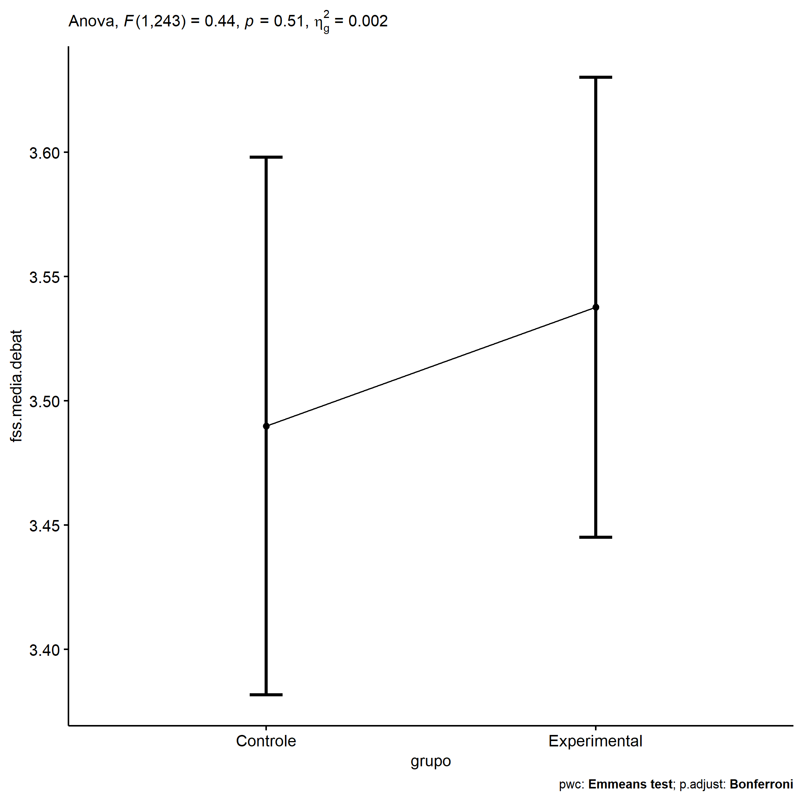<!-- -->

``` r
plots <- oneWayAncovaBoxPlots(
  wdat, "fss.media.debat", "grupo", aov, pwc, covar = "dfs.media.debat",
  theme = "classic", color = color[["grupo"]],
  subtitle = which(aov$Effect == "grupo"))
```

``` r
if (length(unique(wdat[["grupo"]])) > 1)
  plots[["grupo"]] + ggplot2::ylab("flow (debate)") + ggplot2::scale_x_discrete(labels=c('pre', 'pos'))
```

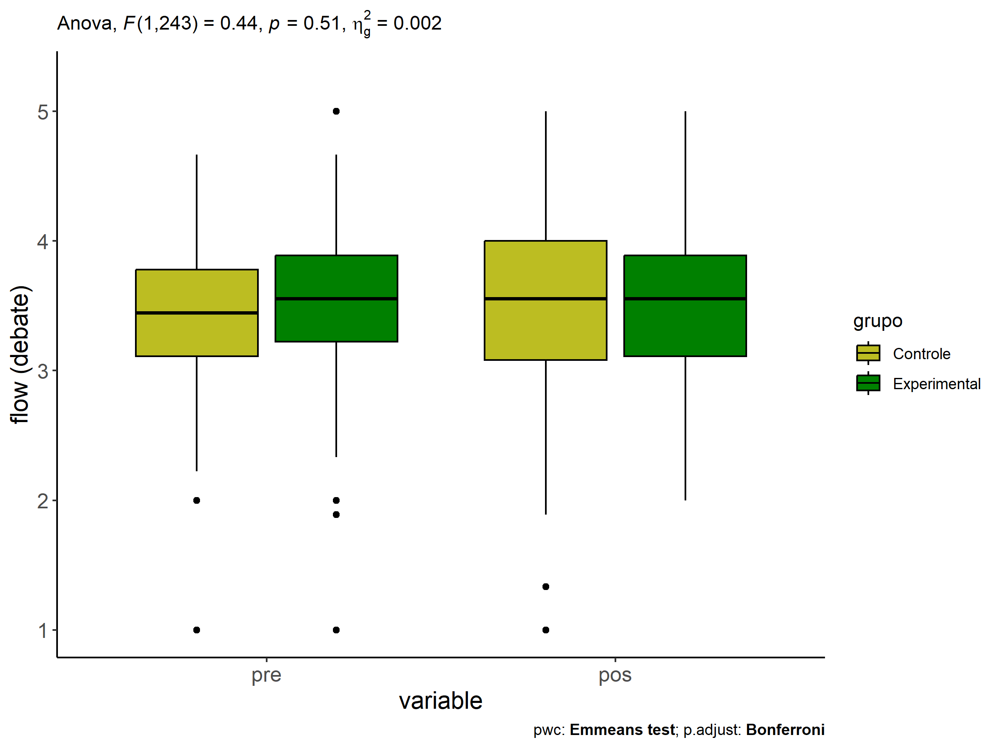<!-- -->

``` r
if (length(unique(wdat.long[["grupo"]])) > 1)
  plots <- oneWayAncovaBoxPlots(
    wdat.long, "flow.debat", "grupo", aov, pwc.long, pre.post = "time",
    theme = "classic", color = color$prepost)
```

``` r
if (length(unique(wdat.long[["grupo"]])) > 1)
  plots[["grupo"]] + ggplot2::ylab("flow (debate)")
```

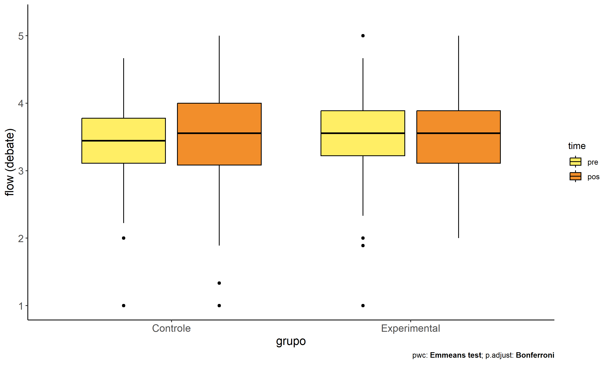<!-- -->

### Checking linearity assumption

``` r
ggscatter(wdat, x = "dfs.media.debat", y = "fss.media.debat", size = 0.5,
          color = "grupo", add = "reg.line")+
  stat_regline_equation(
    aes(label =  paste(..eq.label.., ..rr.label.., sep = "~~~~"), color = grupo)
  )
```

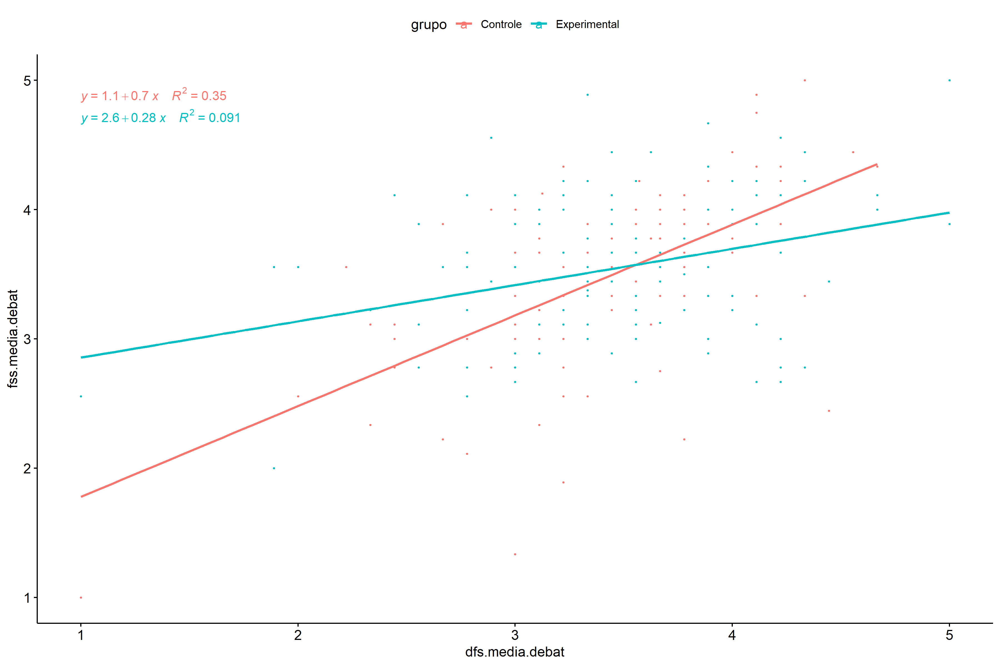<!-- -->

### Checking normality and homogeneity

``` r
res <- augment(lm(fss.media.debat ~ dfs.media.debat + grupo, data = wdat))
```

``` r
shapiro_test(res$.resid)
```

    ## # A tibble: 1 × 3
    ##   variable   statistic p.value
    ##   <chr>          <dbl>   <dbl>
    ## 1 res$.resid     0.991   0.117

``` r
levene_test(res, .resid ~ grupo)
```

    ## # A tibble: 1 × 4
    ##     df1   df2 statistic     p
    ##   <int> <int>     <dbl> <dbl>
    ## 1     1   244     0.396 0.529

# ANCOVA and Pairwise for two factors **grupo:Sexo**

## Without remove non-normal data

``` r
pdat = remove_group_data(dat[!is.na(dat[["grupo"]]) & !is.na(dat[["Sexo"]]),], "fss.media.debat", c("grupo","Sexo"))

pdat.long <- rbind(pdat[,c("id","grupo","Sexo")], pdat[,c("id","grupo","Sexo")])
pdat.long[["time"]] <- c(rep("pre", nrow(pdat)), rep("pos", nrow(pdat)))
pdat.long[["time"]] <- factor(pdat.long[["time"]], c("pre","pos"))
pdat.long[["flow.debat"]] <- c(pdat[["dfs.media.debat"]], pdat[["fss.media.debat"]])

aov = anova_test(pdat, fss.media.debat ~ dfs.media.debat + grupo*Sexo)
laov[["grupo:Sexo"]] <- get_anova_table(aov)
```

``` r
pwcs <- list()
pwcs[["Sexo"]] <- emmeans_test(
  group_by(pdat, grupo), fss.media.debat ~ Sexo,
  covariate = dfs.media.debat, p.adjust.method = "bonferroni")
pwcs[["grupo"]] <- emmeans_test(
  group_by(pdat, Sexo), fss.media.debat ~ grupo,
  covariate = dfs.media.debat, p.adjust.method = "bonferroni")

pwc <- plyr::rbind.fill(pwcs[["grupo"]], pwcs[["Sexo"]])
pwc <- pwc[,c("grupo","Sexo", colnames(pwc)[!colnames(pwc) %in% c("grupo","Sexo")])]
```

``` r
pwc.long <- emmeans_test(dplyr::group_by_at(pdat.long, c("grupo","Sexo")),
                         flow.debat ~ time,
                         p.adjust.method = "bonferroni")
lpwc[["grupo:Sexo"]] <- plyr::rbind.fill(pwc, pwc.long)
```

``` r
ds <- get.descriptives(pdat, "fss.media.debat", c("grupo","Sexo"), covar = "dfs.media.debat")
ds <- merge(ds[ds$variable != "dfs.media.debat",],
            ds[ds$variable == "dfs.media.debat", !colnames(ds) %in% c("variable")],
            by = c("grupo","Sexo"), all.x = T, suffixes = c("", ".dfs.media.debat"))
ds <- merge(get_emmeans(pwcs[["grupo"]]), ds, by = c("grupo","Sexo"), suffixes = c(".emms", ""))
ds <- ds[,c("grupo","Sexo","n","mean.dfs.media.debat","se.dfs.media.debat","mean","se","emmean","se.emms")]

colnames(ds) <- c("grupo","Sexo", "N", paste0(c("M","SE")," (pre)"),
                  paste0(c("M","SE"), " (unadj)"), paste0(c("M", "SE"), " (adj)"))

lemms[["grupo:Sexo"]] <- ds
```

## Computing ANCOVA and PairWise After removing non-normal data (OK)

``` r
wdat = pdat 

res = residuals(lm(fss.media.debat ~ dfs.media.debat + grupo*Sexo, data = wdat))
non.normal = getNonNormal(res, wdat$id, plimit = 0.05)

wdat = wdat[!wdat$id %in% non.normal,]

wdat.long <- rbind(wdat[,c("id","grupo","Sexo")], wdat[,c("id","grupo","Sexo")])
wdat.long[["time"]] <- c(rep("pre", nrow(wdat)), rep("pos", nrow(wdat)))
wdat.long[["time"]] <- factor(wdat.long[["time"]], c("pre","pos"))
wdat.long[["flow.debat"]] <- c(wdat[["dfs.media.debat"]], wdat[["fss.media.debat"]])


ldat[["grupo:Sexo"]] = wdat

(non.normal)
```

    ## NULL

``` r
aov = anova_test(wdat, fss.media.debat ~ dfs.media.debat + grupo*Sexo)
laov[["grupo:Sexo"]] <- merge(get_anova_table(aov), laov[["grupo:Sexo"]], by="Effect", suffixes = c("","'"))

(df = get_anova_table(aov))
```

    ## ANOVA Table (type II tests)
    ## 
    ##            Effect DFn DFd      F        p p<.05      ges
    ## 1 dfs.media.debat   1 241 56.944 9.17e-13     * 0.191000
    ## 2           grupo   1 241  0.428 5.13e-01       0.002000
    ## 3            Sexo   1 241  0.050 8.23e-01       0.000208
    ## 4      grupo:Sexo   1 241  1.445 2.31e-01       0.006000

| Effect          | DFn | DFd |      F |     p | p\<.05 |   ges |
|:----------------|----:|----:|-------:|------:|:-------|------:|
| dfs.media.debat |   1 | 241 | 56.944 | 0.000 | \*     | 0.191 |
| grupo           |   1 | 241 |  0.428 | 0.513 |        | 0.002 |
| Sexo            |   1 | 241 |  0.050 | 0.823 |        | 0.000 |
| grupo:Sexo      |   1 | 241 |  1.445 | 0.231 |        | 0.006 |

``` r
pwcs <- list()
pwcs[["Sexo"]] <- emmeans_test(
  group_by(wdat, grupo), fss.media.debat ~ Sexo,
  covariate = dfs.media.debat, p.adjust.method = "bonferroni")
pwcs[["grupo"]] <- emmeans_test(
  group_by(wdat, Sexo), fss.media.debat ~ grupo,
  covariate = dfs.media.debat, p.adjust.method = "bonferroni")

pwc <- plyr::rbind.fill(pwcs[["grupo"]], pwcs[["Sexo"]])
pwc <- pwc[,c("grupo","Sexo", colnames(pwc)[!colnames(pwc) %in% c("grupo","Sexo")])]
```

| grupo        | Sexo | term                   | .y.             | group1   | group2       |  df | statistic |     p | p.adj | p.adj.signif |
|:-------------|:-----|:-----------------------|:----------------|:---------|:-------------|----:|----------:|------:|------:|:-------------|
|              | F    | dfs.media.debat\*grupo | fss.media.debat | Controle | Experimental | 241 |    -1.325 | 0.187 | 0.187 | ns           |
|              | M    | dfs.media.debat\*grupo | fss.media.debat | Controle | Experimental | 241 |     0.343 | 0.732 | 0.732 | ns           |
| Controle     |      | dfs.media.debat\*Sexo  | fss.media.debat | F        | M            | 241 |    -0.767 | 0.444 | 0.444 | ns           |
| Experimental |      | dfs.media.debat\*Sexo  | fss.media.debat | F        | M            | 241 |     0.945 | 0.345 | 0.345 | ns           |

``` r
pwc.long <- emmeans_test(dplyr::group_by_at(wdat.long, c("grupo","Sexo")),
                         flow.debat ~ time,
                         p.adjust.method = "bonferroni")
lpwc[["grupo:Sexo"]] <- merge(plyr::rbind.fill(pwc, pwc.long), lpwc[["grupo:Sexo"]], by=c("grupo","Sexo","term",".y.","group1","group2"), suffixes = c("","'"))
```

| grupo        | Sexo | term | .y.        | group1 | group2 |  df | statistic |     p | p.adj | p.adj.signif |
|:-------------|:-----|:-----|:-----------|:-------|:-------|----:|----------:|------:|------:|:-------------|
| Controle     | F    | time | flow.debat | pre    | pos    | 484 |     0.348 | 0.728 | 0.728 | ns           |
| Controle     | M    | time | flow.debat | pre    | pos    | 484 |    -1.282 | 0.201 | 0.201 | ns           |
| Experimental | F    | time | flow.debat | pre    | pos    | 484 |    -0.780 | 0.436 | 0.436 | ns           |
| Experimental | M    | time | flow.debat | pre    | pos    | 484 |    -0.585 | 0.559 | 0.559 | ns           |

``` r
ds <- get.descriptives(wdat, "fss.media.debat", c("grupo","Sexo"), covar = "dfs.media.debat")
ds <- merge(ds[ds$variable != "dfs.media.debat",],
            ds[ds$variable == "dfs.media.debat", !colnames(ds) %in% c("variable")],
            by = c("grupo","Sexo"), all.x = T, suffixes = c("", ".dfs.media.debat"))
ds <- merge(get_emmeans(pwcs[["grupo"]]), ds, by = c("grupo","Sexo"), suffixes = c(".emms", ""))
ds <- ds[,c("grupo","Sexo","n","mean.dfs.media.debat","se.dfs.media.debat","mean","se","emmean","se.emms")]

colnames(ds) <- c("grupo","Sexo", "N", paste0(c("M","SE")," (pre)"),
                  paste0(c("M","SE"), " (unadj)"), paste0(c("M", "SE"), " (adj)"))

lemms[["grupo:Sexo"]] <- merge(ds, lemms[["grupo:Sexo"]], by=c("grupo","Sexo"), suffixes = c("","'"))
```

| grupo        | Sexo |   N | M (pre) | SE (pre) | M (unadj) | SE (unadj) | M (adj) | SE (adj) |
|:-------------|:-----|----:|--------:|---------:|----------:|-----------:|--------:|---------:|
| Controle     | F    |  47 |   3.516 |    0.071 |     3.473 |      0.090 |   3.443 |    0.082 |
| Controle     | M    |  57 |   3.324 |    0.088 |     3.469 |      0.104 |   3.528 |    0.075 |
| Experimental | F    |  69 |   3.547 |    0.062 |     3.627 |      0.067 |   3.583 |    0.068 |
| Experimental | M    |  73 |   3.422 |    0.076 |     3.480 |      0.063 |   3.494 |    0.066 |

### Plots for ancova

``` r
plots <- twoWayAncovaPlots(
  wdat, "fss.media.debat", c("grupo","Sexo"), aov, pwcs, addParam = c("mean_se"),
  font.label.size=10, step.increase=0.05, p.label="p.adj",
  subtitle = which(aov$Effect == "grupo:Sexo"))
```

``` r
if (!is.null(plots[["grupo"]]))
  plots[["grupo"]] + ggplot2::scale_color_manual(values = color[["Sexo"]])
```

    ## Scale for colour is already present.
    ## Adding another scale for colour, which will replace the existing scale.

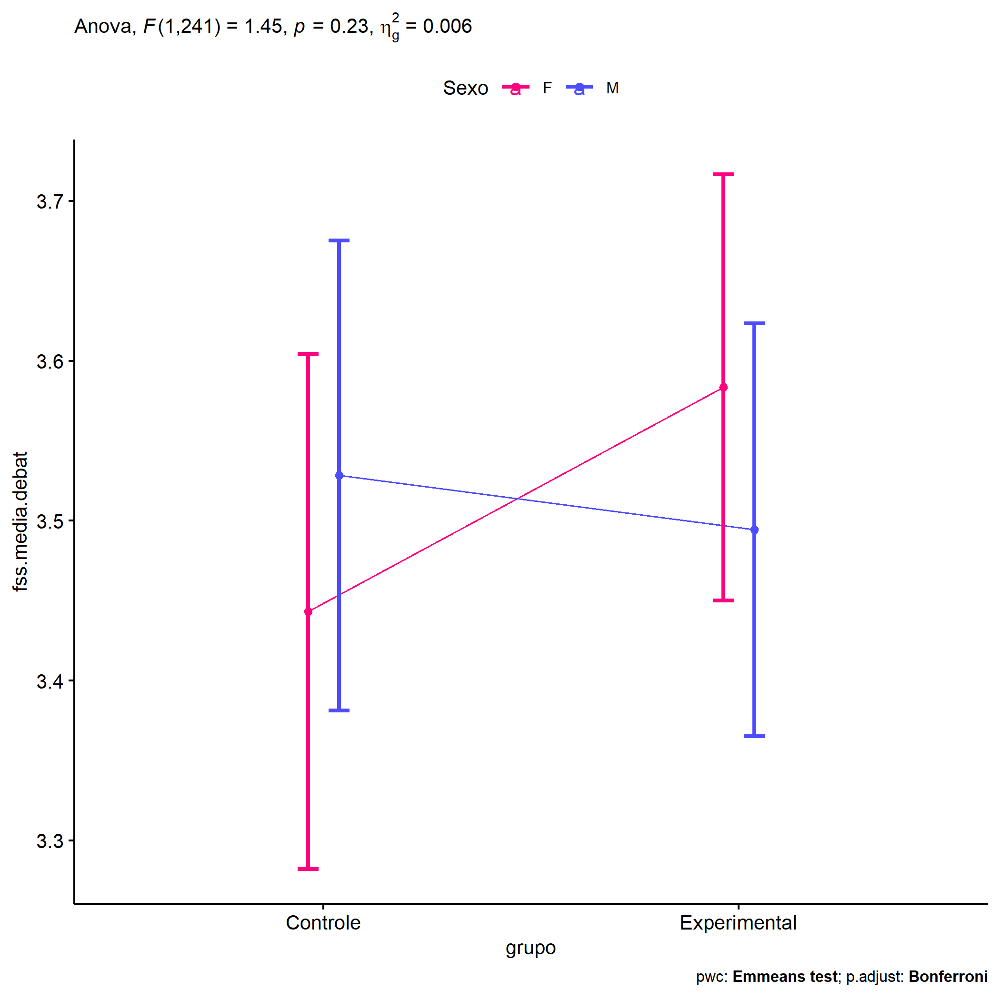<!-- -->

``` r
if (!is.null(plots[["Sexo"]]))
  plots[["Sexo"]] + ggplot2::scale_color_manual(values = color[["grupo"]])
```

    ## Scale for colour is already present.
    ## Adding another scale for colour, which will replace the existing scale.

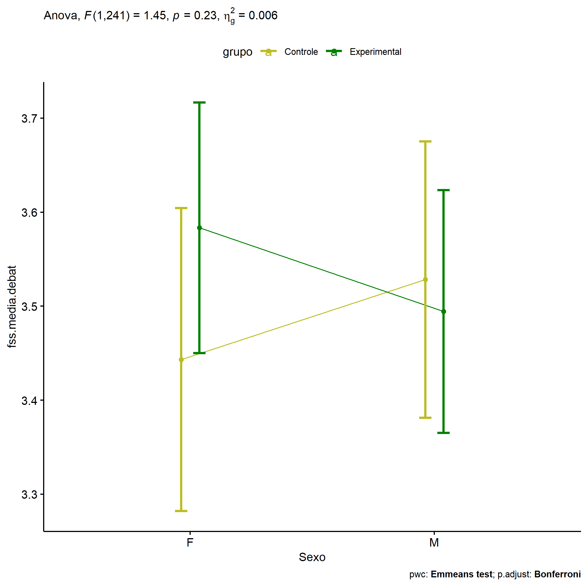<!-- -->

``` r
plots <- twoWayAncovaBoxPlots(
  wdat, "fss.media.debat", c("grupo","Sexo"), aov, pwcs, covar = "dfs.media.debat",
  theme = "classic", color = color[["grupo:Sexo"]],
  subtitle = which(aov$Effect == "grupo:Sexo"))
```

``` r
plots[["grupo:Sexo"]] + ggplot2::ylab("flow (debate)") + ggplot2::scale_x_discrete(labels=c('pre', 'pos'))
```

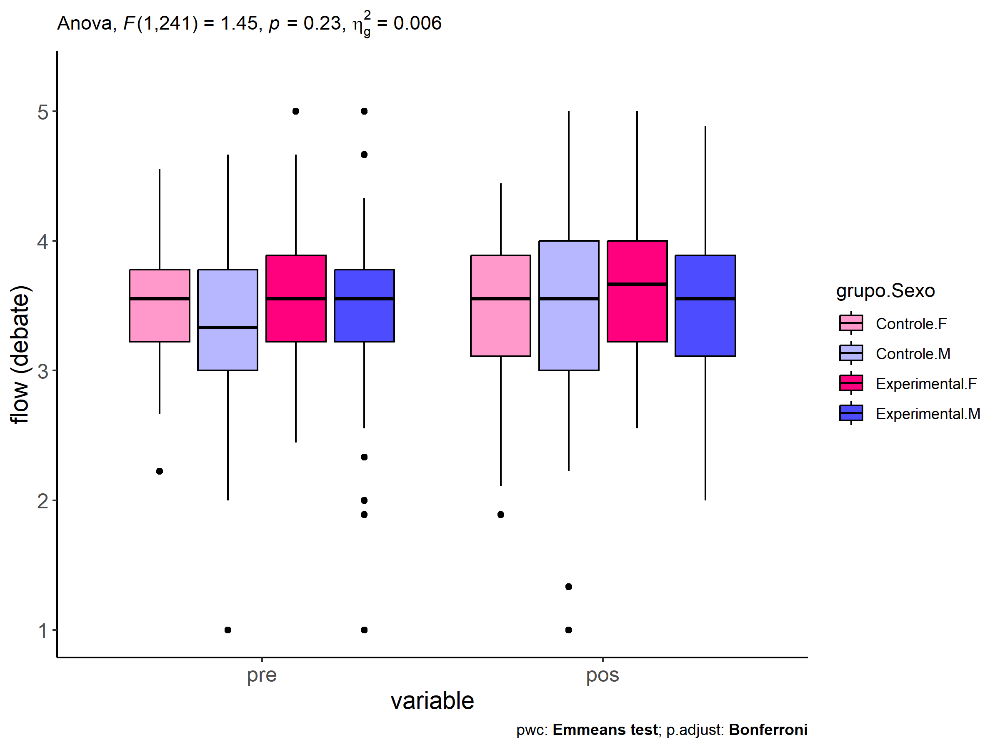<!-- -->

``` r
plots <- twoWayAncovaBoxPlots(
  wdat.long, "flow.debat", c("grupo","Sexo"), aov, pwc.long, pre.post = "time",
  theme = "classic", color = color$prepost)
```

``` r
plots[["grupo:Sexo"]] + ggplot2::ylab("flow (debate)")
```

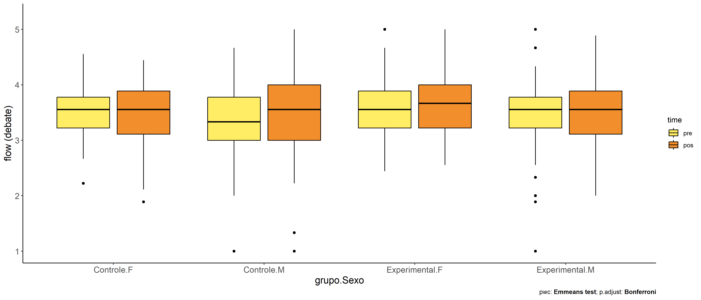<!-- -->

### Checking linearity assumption

``` r
ggscatter(wdat, x = "dfs.media.debat", y = "fss.media.debat", size = 0.5,
          facet.by = c("grupo","Sexo"), add = "reg.line")+
  stat_regline_equation(
    aes(label =  paste(..eq.label.., ..rr.label.., sep = "~~~~"))
  )
```

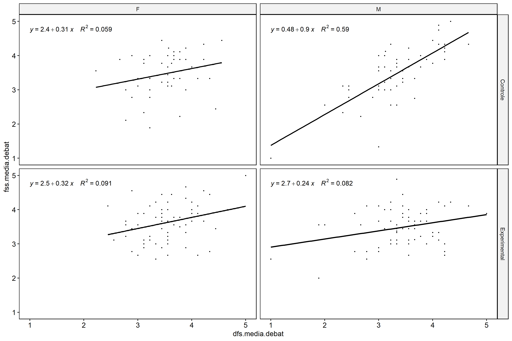<!-- -->

### Checking normality and homogeneity

``` r
res <- augment(lm(fss.media.debat ~ dfs.media.debat + grupo*Sexo, data = wdat))
```

``` r
shapiro_test(res$.resid)
```

    ## # A tibble: 1 × 3
    ##   variable   statistic p.value
    ##   <chr>          <dbl>   <dbl>
    ## 1 res$.resid     0.990   0.105

``` r
levene_test(res, .resid ~ grupo*Sexo)
```

    ## # A tibble: 1 × 4
    ##     df1   df2 statistic     p
    ##   <int> <int>     <dbl> <dbl>
    ## 1     3   242     0.278 0.841

# ANCOVA and Pairwise for two factors **grupo:Zona**

## Without remove non-normal data

``` r
pdat = remove_group_data(dat[!is.na(dat[["grupo"]]) & !is.na(dat[["Zona"]]),], "fss.media.debat", c("grupo","Zona"))

pdat.long <- rbind(pdat[,c("id","grupo","Zona")], pdat[,c("id","grupo","Zona")])
pdat.long[["time"]] <- c(rep("pre", nrow(pdat)), rep("pos", nrow(pdat)))
pdat.long[["time"]] <- factor(pdat.long[["time"]], c("pre","pos"))
pdat.long[["flow.debat"]] <- c(pdat[["dfs.media.debat"]], pdat[["fss.media.debat"]])

aov = anova_test(pdat, fss.media.debat ~ dfs.media.debat + grupo*Zona)
laov[["grupo:Zona"]] <- get_anova_table(aov)
```

``` r
pwcs <- list()
pwcs[["Zona"]] <- emmeans_test(
  group_by(pdat, grupo), fss.media.debat ~ Zona,
  covariate = dfs.media.debat, p.adjust.method = "bonferroni")
pwcs[["grupo"]] <- emmeans_test(
  group_by(pdat, Zona), fss.media.debat ~ grupo,
  covariate = dfs.media.debat, p.adjust.method = "bonferroni")

pwc <- plyr::rbind.fill(pwcs[["grupo"]], pwcs[["Zona"]])
pwc <- pwc[,c("grupo","Zona", colnames(pwc)[!colnames(pwc) %in% c("grupo","Zona")])]
```

``` r
pwc.long <- emmeans_test(dplyr::group_by_at(pdat.long, c("grupo","Zona")),
                         flow.debat ~ time,
                         p.adjust.method = "bonferroni")
lpwc[["grupo:Zona"]] <- plyr::rbind.fill(pwc, pwc.long)
```

``` r
ds <- get.descriptives(pdat, "fss.media.debat", c("grupo","Zona"), covar = "dfs.media.debat")
ds <- merge(ds[ds$variable != "dfs.media.debat",],
            ds[ds$variable == "dfs.media.debat", !colnames(ds) %in% c("variable")],
            by = c("grupo","Zona"), all.x = T, suffixes = c("", ".dfs.media.debat"))
ds <- merge(get_emmeans(pwcs[["grupo"]]), ds, by = c("grupo","Zona"), suffixes = c(".emms", ""))
ds <- ds[,c("grupo","Zona","n","mean.dfs.media.debat","se.dfs.media.debat","mean","se","emmean","se.emms")]

colnames(ds) <- c("grupo","Zona", "N", paste0(c("M","SE")," (pre)"),
                  paste0(c("M","SE"), " (unadj)"), paste0(c("M", "SE"), " (adj)"))

lemms[["grupo:Zona"]] <- ds
```

## Computing ANCOVA and PairWise After removing non-normal data (OK)

``` r
wdat = pdat 

res = residuals(lm(fss.media.debat ~ dfs.media.debat + grupo*Zona, data = wdat))
non.normal = getNonNormal(res, wdat$id, plimit = 0.05)

wdat = wdat[!wdat$id %in% non.normal,]

wdat.long <- rbind(wdat[,c("id","grupo","Zona")], wdat[,c("id","grupo","Zona")])
wdat.long[["time"]] <- c(rep("pre", nrow(wdat)), rep("pos", nrow(wdat)))
wdat.long[["time"]] <- factor(wdat.long[["time"]], c("pre","pos"))
wdat.long[["flow.debat"]] <- c(wdat[["dfs.media.debat"]], wdat[["fss.media.debat"]])


ldat[["grupo:Zona"]] = wdat

(non.normal)
```

    ## NULL

``` r
aov = anova_test(wdat, fss.media.debat ~ dfs.media.debat + grupo*Zona)
laov[["grupo:Zona"]] <- merge(get_anova_table(aov), laov[["grupo:Zona"]], by="Effect", suffixes = c("","'"))

(df = get_anova_table(aov))
```

    ## ANOVA Table (type II tests)
    ## 
    ##            Effect DFn DFd      F        p p<.05      ges
    ## 1 dfs.media.debat   1 130 34.234 3.75e-08     * 2.08e-01
    ## 2           grupo   1 130  0.044 8.33e-01       3.42e-04
    ## 3            Zona   1 130  0.931 3.36e-01       7.00e-03
    ## 4      grupo:Zona   1 130  0.002 9.62e-01       1.79e-05

| Effect          | DFn | DFd |      F |     p | p\<.05 |   ges |
|:----------------|----:|----:|-------:|------:|:-------|------:|
| dfs.media.debat |   1 | 130 | 34.234 | 0.000 | \*     | 0.208 |
| grupo           |   1 | 130 |  0.044 | 0.833 |        | 0.000 |
| Zona            |   1 | 130 |  0.931 | 0.336 |        | 0.007 |
| grupo:Zona      |   1 | 130 |  0.002 | 0.962 |        | 0.000 |

``` r
pwcs <- list()
pwcs[["Zona"]] <- emmeans_test(
  group_by(wdat, grupo), fss.media.debat ~ Zona,
  covariate = dfs.media.debat, p.adjust.method = "bonferroni")
pwcs[["grupo"]] <- emmeans_test(
  group_by(wdat, Zona), fss.media.debat ~ grupo,
  covariate = dfs.media.debat, p.adjust.method = "bonferroni")

pwc <- plyr::rbind.fill(pwcs[["grupo"]], pwcs[["Zona"]])
pwc <- pwc[,c("grupo","Zona", colnames(pwc)[!colnames(pwc) %in% c("grupo","Zona")])]
```

| grupo        | Zona   | term                   | .y.             | group1   | group2       |  df | statistic |     p | p.adj | p.adj.signif |
|:-------------|:-------|:-----------------------|:----------------|:---------|:-------------|----:|----------:|------:|------:|:-------------|
|              | Rural  | dfs.media.debat\*grupo | fss.media.debat | Controle | Experimental | 130 |     0.146 | 0.884 | 0.884 | ns           |
|              | Urbana | dfs.media.debat\*grupo | fss.media.debat | Controle | Experimental | 130 |     0.158 | 0.875 | 0.875 | ns           |
| Controle     |        | dfs.media.debat\*Zona  | fss.media.debat | Rural    | Urbana       | 130 |     0.550 | 0.583 | 0.583 | ns           |
| Experimental |        | dfs.media.debat\*Zona  | fss.media.debat | Rural    | Urbana       | 130 |     0.795 | 0.428 | 0.428 | ns           |

``` r
pwc.long <- emmeans_test(dplyr::group_by_at(wdat.long, c("grupo","Zona")),
                         flow.debat ~ time,
                         p.adjust.method = "bonferroni")
lpwc[["grupo:Zona"]] <- merge(plyr::rbind.fill(pwc, pwc.long), lpwc[["grupo:Zona"]], by=c("grupo","Zona","term",".y.","group1","group2"), suffixes = c("","'"))
```

| grupo        | Zona   | term | .y.        | group1 | group2 |  df | statistic |     p | p.adj | p.adj.signif |
|:-------------|:-------|:-----|:-----------|:-------|:-------|----:|----------:|------:|------:|:-------------|
| Controle     | Rural  | time | flow.debat | pre    | pos    | 262 |    -0.369 | 0.712 | 0.712 | ns           |
| Controle     | Urbana | time | flow.debat | pre    | pos    | 262 |    -0.823 | 0.411 | 0.411 | ns           |
| Experimental | Rural  | time | flow.debat | pre    | pos    | 262 |    -0.825 | 0.410 | 0.410 | ns           |
| Experimental | Urbana | time | flow.debat | pre    | pos    | 262 |    -0.027 | 0.979 | 0.979 | ns           |

``` r
ds <- get.descriptives(wdat, "fss.media.debat", c("grupo","Zona"), covar = "dfs.media.debat")
ds <- merge(ds[ds$variable != "dfs.media.debat",],
            ds[ds$variable == "dfs.media.debat", !colnames(ds) %in% c("variable")],
            by = c("grupo","Zona"), all.x = T, suffixes = c("", ".dfs.media.debat"))
ds <- merge(get_emmeans(pwcs[["grupo"]]), ds, by = c("grupo","Zona"), suffixes = c(".emms", ""))
ds <- ds[,c("grupo","Zona","n","mean.dfs.media.debat","se.dfs.media.debat","mean","se","emmean","se.emms")]

colnames(ds) <- c("grupo","Zona", "N", paste0(c("M","SE")," (pre)"),
                  paste0(c("M","SE"), " (unadj)"), paste0(c("M", "SE"), " (adj)"))

lemms[["grupo:Zona"]] <- merge(ds, lemms[["grupo:Zona"]], by=c("grupo","Zona"), suffixes = c("","'"))
```

| grupo        | Zona   |   N | M (pre) | SE (pre) | M (unadj) | SE (unadj) | M (adj) | SE (adj) |
|:-------------|:-------|----:|--------:|---------:|----------:|-----------:|--------:|---------:|
| Controle     | Rural  |  39 |   3.597 |    0.077 |     3.642 |      0.097 |   3.591 |    0.080 |
| Controle     | Urbana |  16 |   3.229 |    0.134 |     3.389 |      0.174 |   3.508 |    0.125 |
| Experimental | Rural  |  51 |   3.486 |    0.067 |     3.575 |      0.064 |   3.575 |    0.069 |
| Experimental | Urbana |  29 |   3.475 |    0.132 |     3.479 |      0.103 |   3.484 |    0.092 |

### Plots for ancova

``` r
plots <- twoWayAncovaPlots(
  wdat, "fss.media.debat", c("grupo","Zona"), aov, pwcs, addParam = c("mean_se"),
  font.label.size=10, step.increase=0.05, p.label="p.adj",
  subtitle = which(aov$Effect == "grupo:Zona"))
```

``` r
if (!is.null(plots[["grupo"]]))
  plots[["grupo"]] + ggplot2::scale_color_manual(values = color[["Zona"]])
```

    ## Scale for colour is already present.
    ## Adding another scale for colour, which will replace the existing scale.

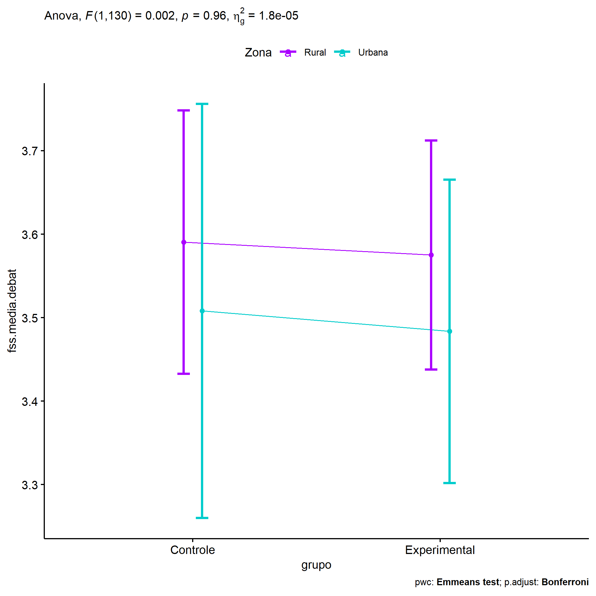<!-- -->

``` r
if (!is.null(plots[["Zona"]]))
  plots[["Zona"]] + ggplot2::scale_color_manual(values = color[["grupo"]])
```

    ## Scale for colour is already present.
    ## Adding another scale for colour, which will replace the existing scale.

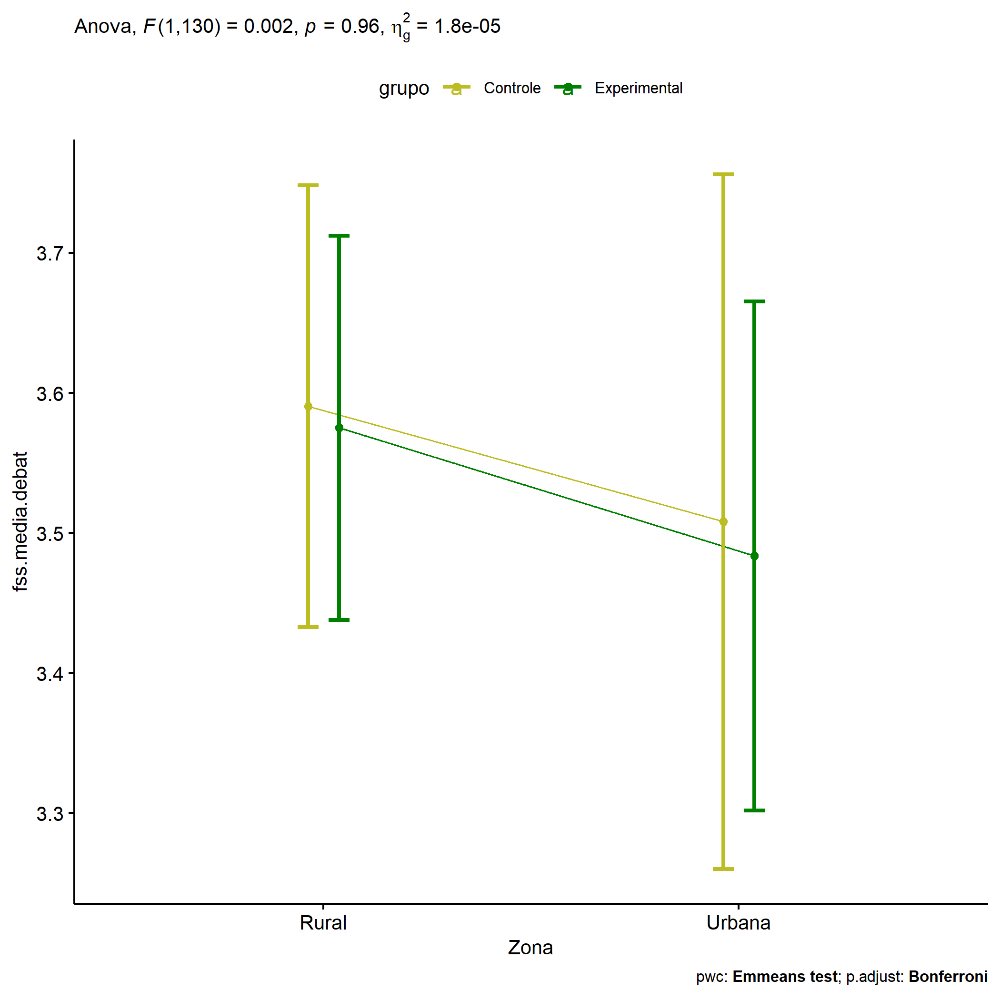<!-- -->

``` r
plots <- twoWayAncovaBoxPlots(
  wdat, "fss.media.debat", c("grupo","Zona"), aov, pwcs, covar = "dfs.media.debat",
  theme = "classic", color = color[["grupo:Zona"]],
  subtitle = which(aov$Effect == "grupo:Zona"))
```

``` r
plots[["grupo:Zona"]] + ggplot2::ylab("flow (debate)") + ggplot2::scale_x_discrete(labels=c('pre', 'pos'))
```

<!-- -->

``` r
plots <- twoWayAncovaBoxPlots(
  wdat.long, "flow.debat", c("grupo","Zona"), aov, pwc.long, pre.post = "time",
  theme = "classic", color = color$prepost)
```

``` r
plots[["grupo:Zona"]] + ggplot2::ylab("flow (debate)")
```

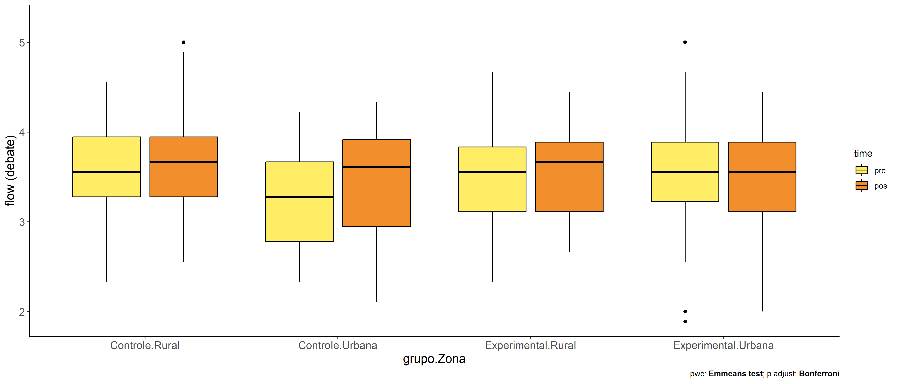<!-- -->

### Checking linearity assumption

``` r
ggscatter(wdat, x = "dfs.media.debat", y = "fss.media.debat", size = 0.5,
          facet.by = c("grupo","Zona"), add = "reg.line")+
  stat_regline_equation(
    aes(label =  paste(..eq.label.., ..rr.label.., sep = "~~~~"))
  )
```

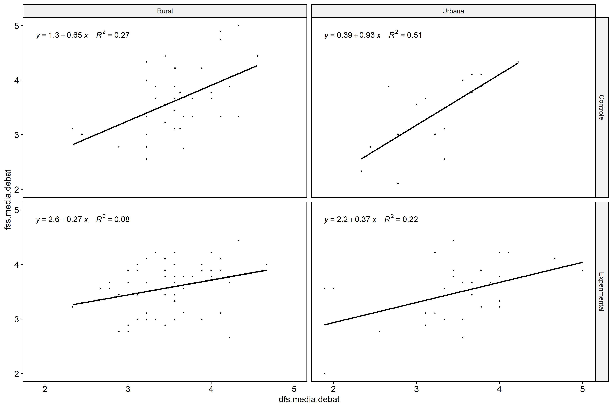<!-- -->

### Checking normality and homogeneity

``` r
res <- augment(lm(fss.media.debat ~ dfs.media.debat + grupo*Zona, data = wdat))
```

``` r
shapiro_test(res$.resid)
```

    ## # A tibble: 1 × 3
    ##   variable   statistic p.value
    ##   <chr>          <dbl>   <dbl>
    ## 1 res$.resid     0.990   0.414

``` r
levene_test(res, .resid ~ grupo*Zona)
```

    ## # A tibble: 1 × 4
    ##     df1   df2 statistic     p
    ##   <int> <int>     <dbl> <dbl>
    ## 1     3   131     0.370 0.775

# ANCOVA and Pairwise for two factors **grupo:Cor.Raca**

## Without remove non-normal data

``` r
pdat = remove_group_data(dat[!is.na(dat[["grupo"]]) & !is.na(dat[["Cor.Raca"]]),], "fss.media.debat", c("grupo","Cor.Raca"))

pdat.long <- rbind(pdat[,c("id","grupo","Cor.Raca")], pdat[,c("id","grupo","Cor.Raca")])
pdat.long[["time"]] <- c(rep("pre", nrow(pdat)), rep("pos", nrow(pdat)))
pdat.long[["time"]] <- factor(pdat.long[["time"]], c("pre","pos"))
pdat.long[["flow.debat"]] <- c(pdat[["dfs.media.debat"]], pdat[["fss.media.debat"]])

aov = anova_test(pdat, fss.media.debat ~ dfs.media.debat + grupo*Cor.Raca)
laov[["grupo:Cor.Raca"]] <- get_anova_table(aov)
```

``` r
pwcs <- list()
pwcs[["Cor.Raca"]] <- emmeans_test(
  group_by(pdat, grupo), fss.media.debat ~ Cor.Raca,
  covariate = dfs.media.debat, p.adjust.method = "bonferroni")
pwcs[["grupo"]] <- emmeans_test(
  group_by(pdat, Cor.Raca), fss.media.debat ~ grupo,
  covariate = dfs.media.debat, p.adjust.method = "bonferroni")

pwc <- plyr::rbind.fill(pwcs[["grupo"]], pwcs[["Cor.Raca"]])
pwc <- pwc[,c("grupo","Cor.Raca", colnames(pwc)[!colnames(pwc) %in% c("grupo","Cor.Raca")])]
```

``` r
pwc.long <- emmeans_test(dplyr::group_by_at(pdat.long, c("grupo","Cor.Raca")),
                         flow.debat ~ time,
                         p.adjust.method = "bonferroni")
lpwc[["grupo:Cor.Raca"]] <- plyr::rbind.fill(pwc, pwc.long)
```

``` r
ds <- get.descriptives(pdat, "fss.media.debat", c("grupo","Cor.Raca"), covar = "dfs.media.debat")
ds <- merge(ds[ds$variable != "dfs.media.debat",],
            ds[ds$variable == "dfs.media.debat", !colnames(ds) %in% c("variable")],
            by = c("grupo","Cor.Raca"), all.x = T, suffixes = c("", ".dfs.media.debat"))
ds <- merge(get_emmeans(pwcs[["grupo"]]), ds, by = c("grupo","Cor.Raca"), suffixes = c(".emms", ""))
ds <- ds[,c("grupo","Cor.Raca","n","mean.dfs.media.debat","se.dfs.media.debat","mean","se","emmean","se.emms")]

colnames(ds) <- c("grupo","Cor.Raca", "N", paste0(c("M","SE")," (pre)"),
                  paste0(c("M","SE"), " (unadj)"), paste0(c("M", "SE"), " (adj)"))

lemms[["grupo:Cor.Raca"]] <- ds
```

## Computing ANCOVA and PairWise After removing non-normal data (OK)

``` r
wdat = pdat 

res = residuals(lm(fss.media.debat ~ dfs.media.debat + grupo*Cor.Raca, data = wdat))
non.normal = getNonNormal(res, wdat$id, plimit = 0.05)

wdat = wdat[!wdat$id %in% non.normal,]

wdat.long <- rbind(wdat[,c("id","grupo","Cor.Raca")], wdat[,c("id","grupo","Cor.Raca")])
wdat.long[["time"]] <- c(rep("pre", nrow(wdat)), rep("pos", nrow(wdat)))
wdat.long[["time"]] <- factor(wdat.long[["time"]], c("pre","pos"))
wdat.long[["flow.debat"]] <- c(wdat[["dfs.media.debat"]], wdat[["fss.media.debat"]])


ldat[["grupo:Cor.Raca"]] = wdat

(non.normal)
```

    ## NULL

``` r
aov = anova_test(wdat, fss.media.debat ~ dfs.media.debat + grupo*Cor.Raca)
laov[["grupo:Cor.Raca"]] <- merge(get_anova_table(aov), laov[["grupo:Cor.Raca"]], by="Effect", suffixes = c("","'"))

(df = get_anova_table(aov))
```

    ## ANOVA Table (type II tests)
    ## 
    ##            Effect DFn DFd      F        p p<.05   ges
    ## 1 dfs.media.debat   1 100 52.376 9.53e-11     * 0.344
    ## 2           grupo   1 100  0.108 7.43e-01       0.001
    ## 3        Cor.Raca   1 100  5.817 1.80e-02     * 0.055
    ## 4  grupo:Cor.Raca   1 100  0.289 5.92e-01       0.003

| Effect          | DFn | DFd |      F |     p | p\<.05 |   ges |
|:----------------|----:|----:|-------:|------:|:-------|------:|
| dfs.media.debat |   1 | 100 | 52.376 | 0.000 | \*     | 0.344 |
| grupo           |   1 | 100 |  0.108 | 0.743 |        | 0.001 |
| Cor.Raca        |   1 | 100 |  5.817 | 0.018 | \*     | 0.055 |
| grupo:Cor.Raca  |   1 | 100 |  0.289 | 0.592 |        | 0.003 |

``` r
pwcs <- list()
pwcs[["Cor.Raca"]] <- emmeans_test(
  group_by(wdat, grupo), fss.media.debat ~ Cor.Raca,
  covariate = dfs.media.debat, p.adjust.method = "bonferroni")
pwcs[["grupo"]] <- emmeans_test(
  group_by(wdat, Cor.Raca), fss.media.debat ~ grupo,
  covariate = dfs.media.debat, p.adjust.method = "bonferroni")

pwc <- plyr::rbind.fill(pwcs[["grupo"]], pwcs[["Cor.Raca"]])
pwc <- pwc[,c("grupo","Cor.Raca", colnames(pwc)[!colnames(pwc) %in% c("grupo","Cor.Raca")])]
```

| grupo        | Cor.Raca | term                      | .y.             | group1   | group2       |  df | statistic |     p | p.adj | p.adj.signif |
|:-------------|:---------|:--------------------------|:----------------|:---------|:-------------|----:|----------:|------:|------:|:-------------|
|              | Branca   | dfs.media.debat\*grupo    | fss.media.debat | Controle | Experimental | 100 |    -0.626 | 0.533 | 0.533 | ns           |
|              | Parda    | dfs.media.debat\*grupo    | fss.media.debat | Controle | Experimental | 100 |    -0.070 | 0.944 | 0.944 | ns           |
| Controle     |          | dfs.media.debat\*Cor.Raca | fss.media.debat | Branca   | Parda        | 100 |     1.051 | 0.296 | 0.296 | ns           |
| Experimental |          | dfs.media.debat\*Cor.Raca | fss.media.debat | Branca   | Parda        | 100 |     2.249 | 0.027 | 0.027 | \*           |

``` r
pwc.long <- emmeans_test(dplyr::group_by_at(wdat.long, c("grupo","Cor.Raca")),
                         flow.debat ~ time,
                         p.adjust.method = "bonferroni")
lpwc[["grupo:Cor.Raca"]] <- merge(plyr::rbind.fill(pwc, pwc.long), lpwc[["grupo:Cor.Raca"]], by=c("grupo","Cor.Raca","term",".y.","group1","group2"), suffixes = c("","'"))
```

| grupo        | Cor.Raca | term | .y.        | group1 | group2 |  df | statistic |     p | p.adj | p.adj.signif |
|:-------------|:---------|:-----|:-----------|:-------|:-------|----:|----------:|------:|------:|:-------------|
| Controle     | Branca   | time | flow.debat | pre    | pos    | 202 |    -0.414 | 0.680 | 0.680 | ns           |
| Controle     | Parda    | time | flow.debat | pre    | pos    | 202 |    -1.048 | 0.296 | 0.296 | ns           |
| Experimental | Branca   | time | flow.debat | pre    | pos    | 202 |    -1.632 | 0.104 | 0.104 | ns           |
| Experimental | Parda    | time | flow.debat | pre    | pos    | 202 |    -0.760 | 0.448 | 0.448 | ns           |

``` r
ds <- get.descriptives(wdat, "fss.media.debat", c("grupo","Cor.Raca"), covar = "dfs.media.debat")
ds <- merge(ds[ds$variable != "dfs.media.debat",],
            ds[ds$variable == "dfs.media.debat", !colnames(ds) %in% c("variable")],
            by = c("grupo","Cor.Raca"), all.x = T, suffixes = c("", ".dfs.media.debat"))
ds <- merge(get_emmeans(pwcs[["grupo"]]), ds, by = c("grupo","Cor.Raca"), suffixes = c(".emms", ""))
ds <- ds[,c("grupo","Cor.Raca","n","mean.dfs.media.debat","se.dfs.media.debat","mean","se","emmean","se.emms")]

colnames(ds) <- c("grupo","Cor.Raca", "N", paste0(c("M","SE")," (pre)"),
                  paste0(c("M","SE"), " (unadj)"), paste0(c("M", "SE"), " (adj)"))

lemms[["grupo:Cor.Raca"]] <- merge(ds, lemms[["grupo:Cor.Raca"]], by=c("grupo","Cor.Raca"), suffixes = c("","'"))
```

| grupo        | Cor.Raca |   N | M (pre) | SE (pre) | M (unadj) | SE (unadj) | M (adj) | SE (adj) |
|:-------------|:---------|----:|--------:|---------:|----------:|-----------:|--------:|---------:|
| Controle     | Branca   |   7 |   3.778 |    0.217 |     3.905 |      0.274 |   3.707 |    0.174 |
| Controle     | Parda    |  43 |   3.328 |    0.104 |     3.457 |      0.103 |   3.509 |    0.070 |
| Experimental | Branca   |  13 |   3.538 |    0.106 |     3.906 |      0.100 |   3.841 |    0.126 |
| Experimental | Parda    |  42 |   3.421 |    0.083 |     3.516 |      0.067 |   3.516 |    0.070 |

### Plots for ancova

``` r
plots <- twoWayAncovaPlots(
  wdat, "fss.media.debat", c("grupo","Cor.Raca"), aov, pwcs, addParam = c("mean_se"),
  font.label.size=10, step.increase=0.05, p.label="p.adj",
  subtitle = which(aov$Effect == "grupo:Cor.Raca"))
```

``` r
if (!is.null(plots[["grupo"]]))
  plots[["grupo"]] + ggplot2::scale_color_manual(values = color[["Cor.Raca"]])
```

    ## Scale for colour is already present.
    ## Adding another scale for colour, which will replace the existing scale.

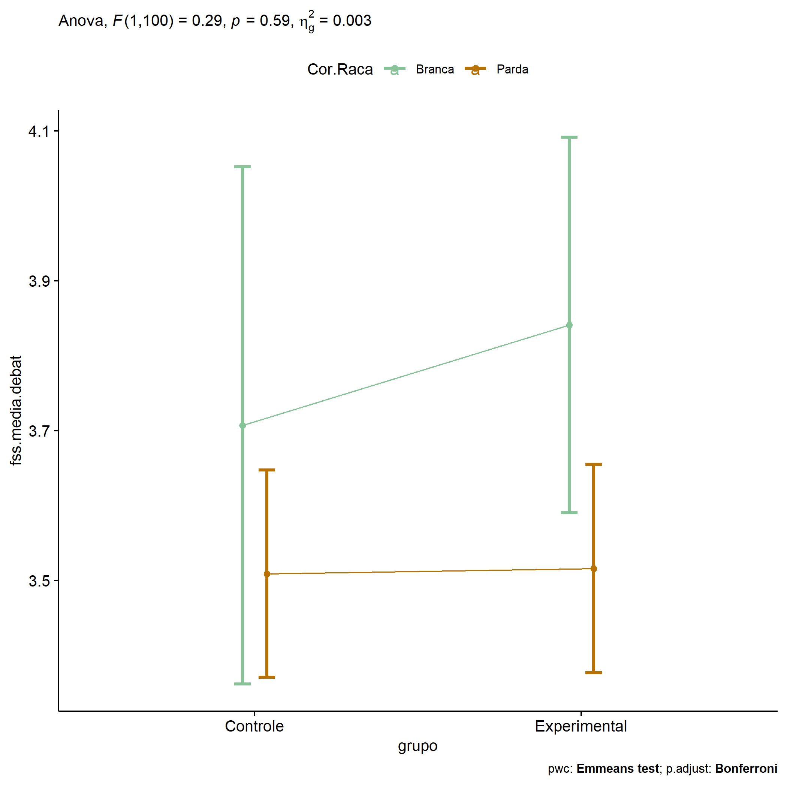<!-- -->

``` r
if (!is.null(plots[["Cor.Raca"]]))
  plots[["Cor.Raca"]] + ggplot2::scale_color_manual(values = color[["grupo"]])
```

    ## Scale for colour is already present.
    ## Adding another scale for colour, which will replace the existing scale.

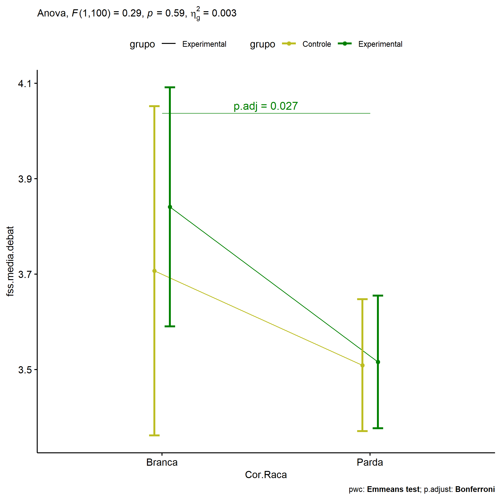<!-- -->

``` r
plots <- twoWayAncovaBoxPlots(
  wdat, "fss.media.debat", c("grupo","Cor.Raca"), aov, pwcs, covar = "dfs.media.debat",
  theme = "classic", color = color[["grupo:Cor.Raca"]],
  subtitle = which(aov$Effect == "grupo:Cor.Raca"))
```

``` r
plots[["grupo:Cor.Raca"]] + ggplot2::ylab("flow (debate)") + ggplot2::scale_x_discrete(labels=c('pre', 'pos'))
```

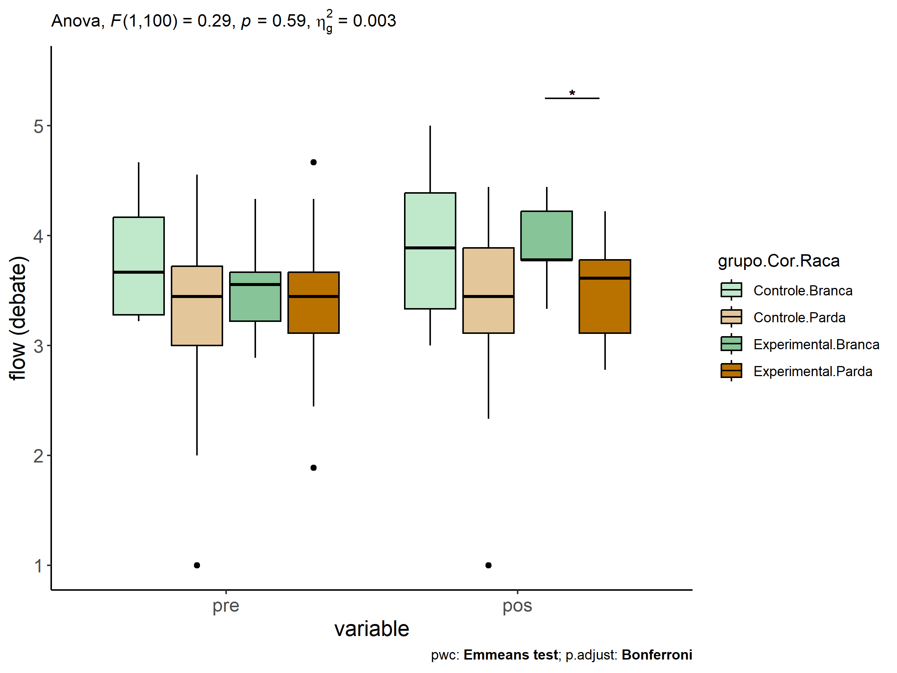<!-- -->

``` r
plots <- twoWayAncovaBoxPlots(
  wdat.long, "flow.debat", c("grupo","Cor.Raca"), aov, pwc.long, pre.post = "time",
  theme = "classic", color = color$prepost)
```

``` r
plots[["grupo:Cor.Raca"]] + ggplot2::ylab("flow (debate)")
```

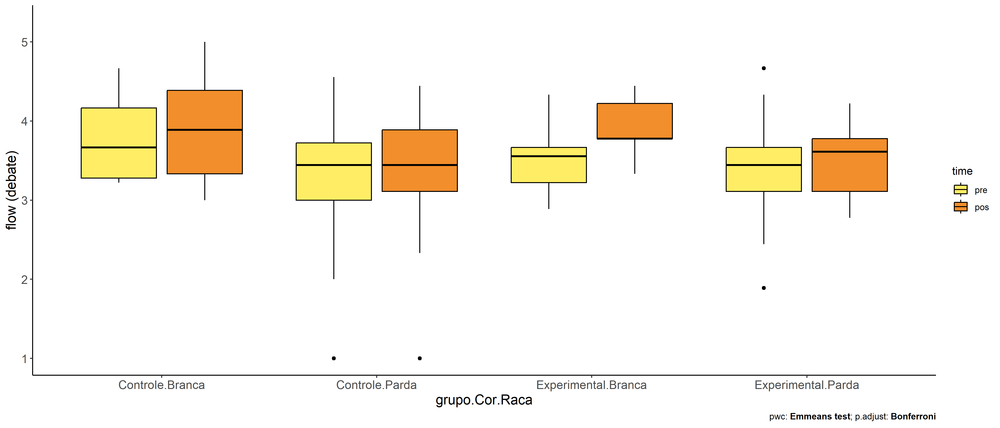<!-- -->

### Checking linearity assumption

``` r
ggscatter(wdat, x = "dfs.media.debat", y = "fss.media.debat", size = 0.5,
          facet.by = c("grupo","Cor.Raca"), add = "reg.line")+
  stat_regline_equation(
    aes(label =  paste(..eq.label.., ..rr.label.., sep = "~~~~"))
  )
```

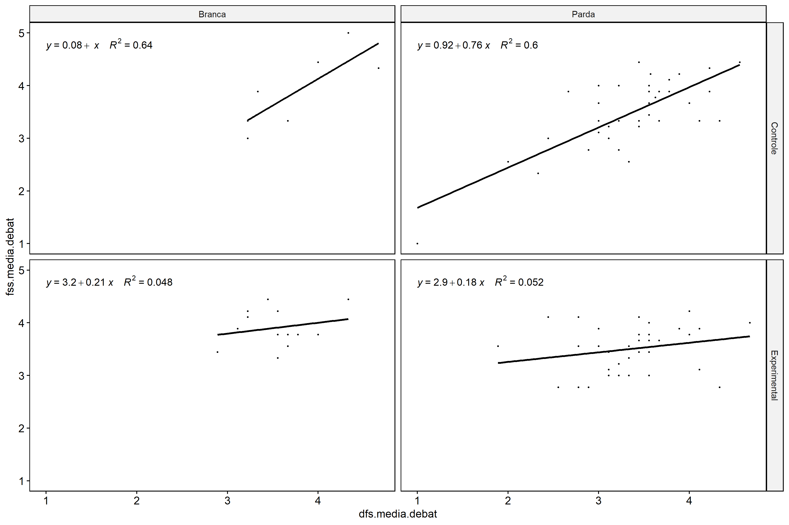<!-- -->

### Checking normality and homogeneity

``` r
res <- augment(lm(fss.media.debat ~ dfs.media.debat + grupo*Cor.Raca, data = wdat))
```

``` r
shapiro_test(res$.resid)
```

    ## # A tibble: 1 × 3
    ##   variable   statistic p.value
    ##   <chr>          <dbl>   <dbl>
    ## 1 res$.resid     0.993   0.864

``` r
levene_test(res, .resid ~ grupo*Cor.Raca)
```

    ## # A tibble: 1 × 4
    ##     df1   df2 statistic     p
    ##   <int> <int>     <dbl> <dbl>
    ## 1     3   101     0.154 0.927

# Summary of Results

## Descriptive Statistics

``` r
df <- get.descriptives(ldat[["grupo"]], c(dv.pre, dv.pos), c("grupo"), 
                       include.global = T, symmetry.test = T, normality.test = F)
df <- plyr::rbind.fill(
  df, do.call(plyr::rbind.fill, lapply(lfatores2, FUN = function(f) {
    if (nrow(dat) > 0 && sum(!is.na(unique(dat[[f]]))) > 1)
      get.descriptives(ldat[[paste0("grupo:",f)]], c(dv.pre,dv.pos), c("grupo", f),
                       symmetry.test = T, normality.test = F)
    }))
)
(df <- df[,c(fatores1[fatores1 %in% colnames(df)],"variable",
             colnames(df)[!colnames(df) %in% c(fatores1,"variable")])])
```

    ##           grupo Sexo   Zona Cor.Raca        variable   n  mean median   min   max    sd    se    ci   iqr
    ## 1      Controle <NA>   <NA>     <NA> dfs.media.debat 104 3.411  3.444 1.000 4.667 0.596 0.058 0.116 0.667
    ## 2  Experimental <NA>   <NA>     <NA> dfs.media.debat 142 3.482  3.556 1.000 5.000 0.588 0.049 0.098 0.667
    ## 3          <NA> <NA>   <NA>     <NA> dfs.media.debat 246 3.452  3.500 1.000 5.000 0.591 0.038 0.074 0.750
    ## 4      Controle <NA>   <NA>     <NA> fss.media.debat 104 3.471  3.556 1.000 5.000 0.710 0.070 0.138 0.917
    ## 5  Experimental <NA>   <NA>     <NA> fss.media.debat 142 3.552  3.556 2.000 5.000 0.547 0.046 0.091 0.778
    ## 6          <NA> <NA>   <NA>     <NA> fss.media.debat 246 3.517  3.556 1.000 5.000 0.621 0.040 0.078 0.861
    ## 7      Controle    F   <NA>     <NA> dfs.media.debat  47 3.516  3.556 2.222 4.556 0.485 0.071 0.142 0.556
    ## 8      Controle    M   <NA>     <NA> dfs.media.debat  57 3.324  3.333 1.000 4.667 0.665 0.088 0.176 0.778
    ## 9  Experimental    F   <NA>     <NA> dfs.media.debat  69 3.547  3.556 2.444 5.000 0.515 0.062 0.124 0.667
    ## 10 Experimental    M   <NA>     <NA> dfs.media.debat  73 3.422  3.556 1.000 5.000 0.647 0.076 0.151 0.556
    ## 11     Controle    F   <NA>     <NA> fss.media.debat  47 3.473  3.556 1.889 4.444 0.619 0.090 0.182 0.778
    ## 12     Controle    M   <NA>     <NA> fss.media.debat  57 3.469  3.556 1.000 5.000 0.782 0.104 0.208 1.000
    ## 13 Experimental    F   <NA>     <NA> fss.media.debat  69 3.627  3.667 2.556 5.000 0.554 0.067 0.133 0.778
    ## 14 Experimental    M   <NA>     <NA> fss.media.debat  73 3.480  3.556 2.000 4.889 0.535 0.063 0.125 0.778
    ## 15     Controle <NA>  Rural     <NA> dfs.media.debat  39 3.597  3.556 2.333 4.556 0.478 0.077 0.155 0.667
    ## 16     Controle <NA> Urbana     <NA> dfs.media.debat  16 3.229  3.278 2.333 4.222 0.536 0.134 0.286 0.889
    ## 17 Experimental <NA>  Rural     <NA> dfs.media.debat  51 3.486  3.556 2.333 4.667 0.478 0.067 0.134 0.722
    ## 18 Experimental <NA> Urbana     <NA> dfs.media.debat  29 3.475  3.556 1.889 5.000 0.712 0.132 0.271 0.667
    ## 19     Controle <NA>  Rural     <NA> fss.media.debat  39 3.642  3.667 2.556 5.000 0.604 0.097 0.196 0.667
    ## 20     Controle <NA> Urbana     <NA> fss.media.debat  16 3.389  3.611 2.111 4.333 0.696 0.174 0.371 0.972
    ## 21 Experimental <NA>  Rural     <NA> fss.media.debat  51 3.575  3.667 2.667 4.444 0.459 0.064 0.129 0.771
    ## 22 Experimental <NA> Urbana     <NA> fss.media.debat  29 3.479  3.556 2.000 4.444 0.554 0.103 0.211 0.778
    ## 23     Controle <NA>   <NA>   Branca dfs.media.debat   7 3.778  3.667 3.222 4.667 0.574 0.217 0.531 0.889
    ## 24     Controle <NA>   <NA>    Parda dfs.media.debat  43 3.328  3.444 1.000 4.556 0.683 0.104 0.210 0.722
    ## 25 Experimental <NA>   <NA>   Branca dfs.media.debat  13 3.538  3.556 2.889 4.333 0.382 0.106 0.231 0.444
    ## 26 Experimental <NA>   <NA>    Parda dfs.media.debat  42 3.421  3.444 1.889 4.667 0.537 0.083 0.167 0.556
    ## 27     Controle <NA>   <NA>   Branca fss.media.debat   7 3.905  3.889 3.000 5.000 0.724 0.274 0.670 1.056
    ## 28     Controle <NA>   <NA>    Parda fss.media.debat  43 3.457  3.444 1.000 4.444 0.675 0.103 0.208 0.778
    ## 29 Experimental <NA>   <NA>   Branca fss.media.debat  13 3.906  3.778 3.333 4.444 0.360 0.100 0.217 0.444
    ## 30 Experimental <NA>   <NA>    Parda fss.media.debat  42 3.516  3.611 2.778 4.222 0.431 0.067 0.134 0.667
    ##    symmetry    skewness    kurtosis
    ## 1        NO -0.65720491  1.50127357
    ## 2        NO -0.60980632  2.00797064
    ## 3        NO -0.63303436  1.82281906
    ## 4        NO -0.68121855  0.85970715
    ## 5       YES -0.01660699 -0.34935815
    ## 6       YES -0.48608092  0.85890201
    ## 7       YES -0.17276070 -0.07879273
    ## 8        NO -0.62634626  1.14529314
    ## 9       YES  0.20707800 -0.19789938
    ## 10       NO -0.88649930  2.11648839
    ## 11       NO -0.64926772 -0.18307362
    ## 12       NO -0.66099163  0.86189134
    ## 13      YES  0.05685016 -0.62979216
    ## 14      YES -0.12121043 -0.25123018
    ## 15      YES -0.36632877  0.29029464
    ## 16      YES -0.02586373 -1.14508341
    ## 17      YES  0.08452052 -0.33663468
    ## 18       NO -0.56245214  0.50098360
    ## 19      YES  0.38439475 -0.57215391
    ## 20      YES -0.38045344 -1.34163337
    ## 21      YES -0.27884939 -1.08787179
    ## 22      YES -0.42998941 -0.13294921
    ## 23      YES  0.34234406 -1.74562500
    ## 24       NO -0.88092901  1.44795106
    ## 25      YES  0.27953461 -0.53895024
    ## 26      YES -0.26980619  0.43445190
    ## 27      YES  0.16397444 -1.73200799
    ## 28       NO -1.04982862  2.02982236
    ## 29      YES  0.07701723 -1.34864705
    ## 30      YES -0.23183648 -1.11440938

| grupo        | Sexo | Zona   | Cor.Raca | variable        |   n |  mean | median |   min |   max |    sd |    se |    ci |   iqr | symmetry | skewness | kurtosis |
|:-------------|:-----|:-------|:---------|:----------------|----:|------:|-------:|------:|------:|------:|------:|------:|------:|:---------|---------:|---------:|
| Controle     |      |        |          | dfs.media.debat | 104 | 3.411 |  3.444 | 1.000 | 4.667 | 0.596 | 0.058 | 0.116 | 0.667 | NO       |   -0.657 |    1.501 |
| Experimental |      |        |          | dfs.media.debat | 142 | 3.482 |  3.556 | 1.000 | 5.000 | 0.588 | 0.049 | 0.098 | 0.667 | NO       |   -0.610 |    2.008 |
|              |      |        |          | dfs.media.debat | 246 | 3.452 |  3.500 | 1.000 | 5.000 | 0.591 | 0.038 | 0.074 | 0.750 | NO       |   -0.633 |    1.823 |
| Controle     |      |        |          | fss.media.debat | 104 | 3.471 |  3.556 | 1.000 | 5.000 | 0.710 | 0.070 | 0.138 | 0.917 | NO       |   -0.681 |    0.860 |
| Experimental |      |        |          | fss.media.debat | 142 | 3.552 |  3.556 | 2.000 | 5.000 | 0.547 | 0.046 | 0.091 | 0.778 | YES      |   -0.017 |   -0.349 |
|              |      |        |          | fss.media.debat | 246 | 3.517 |  3.556 | 1.000 | 5.000 | 0.621 | 0.040 | 0.078 | 0.861 | YES      |   -0.486 |    0.859 |
| Controle     | F    |        |          | dfs.media.debat |  47 | 3.516 |  3.556 | 2.222 | 4.556 | 0.485 | 0.071 | 0.142 | 0.556 | YES      |   -0.173 |   -0.079 |
| Controle     | M    |        |          | dfs.media.debat |  57 | 3.324 |  3.333 | 1.000 | 4.667 | 0.665 | 0.088 | 0.176 | 0.778 | NO       |   -0.626 |    1.145 |
| Experimental | F    |        |          | dfs.media.debat |  69 | 3.547 |  3.556 | 2.444 | 5.000 | 0.515 | 0.062 | 0.124 | 0.667 | YES      |    0.207 |   -0.198 |
| Experimental | M    |        |          | dfs.media.debat |  73 | 3.422 |  3.556 | 1.000 | 5.000 | 0.647 | 0.076 | 0.151 | 0.556 | NO       |   -0.886 |    2.116 |
| Controle     | F    |        |          | fss.media.debat |  47 | 3.473 |  3.556 | 1.889 | 4.444 | 0.619 | 0.090 | 0.182 | 0.778 | NO       |   -0.649 |   -0.183 |
| Controle     | M    |        |          | fss.media.debat |  57 | 3.469 |  3.556 | 1.000 | 5.000 | 0.782 | 0.104 | 0.208 | 1.000 | NO       |   -0.661 |    0.862 |
| Experimental | F    |        |          | fss.media.debat |  69 | 3.627 |  3.667 | 2.556 | 5.000 | 0.554 | 0.067 | 0.133 | 0.778 | YES      |    0.057 |   -0.630 |
| Experimental | M    |        |          | fss.media.debat |  73 | 3.480 |  3.556 | 2.000 | 4.889 | 0.535 | 0.063 | 0.125 | 0.778 | YES      |   -0.121 |   -0.251 |
| Controle     |      | Rural  |          | dfs.media.debat |  39 | 3.597 |  3.556 | 2.333 | 4.556 | 0.478 | 0.077 | 0.155 | 0.667 | YES      |   -0.366 |    0.290 |
| Controle     |      | Urbana |          | dfs.media.debat |  16 | 3.229 |  3.278 | 2.333 | 4.222 | 0.536 | 0.134 | 0.286 | 0.889 | YES      |   -0.026 |   -1.145 |
| Experimental |      | Rural  |          | dfs.media.debat |  51 | 3.486 |  3.556 | 2.333 | 4.667 | 0.478 | 0.067 | 0.134 | 0.722 | YES      |    0.085 |   -0.337 |
| Experimental |      | Urbana |          | dfs.media.debat |  29 | 3.475 |  3.556 | 1.889 | 5.000 | 0.712 | 0.132 | 0.271 | 0.667 | NO       |   -0.562 |    0.501 |
| Controle     |      | Rural  |          | fss.media.debat |  39 | 3.642 |  3.667 | 2.556 | 5.000 | 0.604 | 0.097 | 0.196 | 0.667 | YES      |    0.384 |   -0.572 |
| Controle     |      | Urbana |          | fss.media.debat |  16 | 3.389 |  3.611 | 2.111 | 4.333 | 0.696 | 0.174 | 0.371 | 0.972 | YES      |   -0.380 |   -1.342 |
| Experimental |      | Rural  |          | fss.media.debat |  51 | 3.575 |  3.667 | 2.667 | 4.444 | 0.459 | 0.064 | 0.129 | 0.771 | YES      |   -0.279 |   -1.088 |
| Experimental |      | Urbana |          | fss.media.debat |  29 | 3.479 |  3.556 | 2.000 | 4.444 | 0.554 | 0.103 | 0.211 | 0.778 | YES      |   -0.430 |   -0.133 |
| Controle     |      |        | Branca   | dfs.media.debat |   7 | 3.778 |  3.667 | 3.222 | 4.667 | 0.574 | 0.217 | 0.531 | 0.889 | YES      |    0.342 |   -1.746 |
| Controle     |      |        | Parda    | dfs.media.debat |  43 | 3.328 |  3.444 | 1.000 | 4.556 | 0.683 | 0.104 | 0.210 | 0.722 | NO       |   -0.881 |    1.448 |
| Experimental |      |        | Branca   | dfs.media.debat |  13 | 3.538 |  3.556 | 2.889 | 4.333 | 0.382 | 0.106 | 0.231 | 0.444 | YES      |    0.280 |   -0.539 |
| Experimental |      |        | Parda    | dfs.media.debat |  42 | 3.421 |  3.444 | 1.889 | 4.667 | 0.537 | 0.083 | 0.167 | 0.556 | YES      |   -0.270 |    0.434 |
| Controle     |      |        | Branca   | fss.media.debat |   7 | 3.905 |  3.889 | 3.000 | 5.000 | 0.724 | 0.274 | 0.670 | 1.056 | YES      |    0.164 |   -1.732 |
| Controle     |      |        | Parda    | fss.media.debat |  43 | 3.457 |  3.444 | 1.000 | 4.444 | 0.675 | 0.103 | 0.208 | 0.778 | NO       |   -1.050 |    2.030 |
| Experimental |      |        | Branca   | fss.media.debat |  13 | 3.906 |  3.778 | 3.333 | 4.444 | 0.360 | 0.100 | 0.217 | 0.444 | YES      |    0.077 |   -1.349 |
| Experimental |      |        | Parda    | fss.media.debat |  42 | 3.516 |  3.611 | 2.778 | 4.222 | 0.431 | 0.067 | 0.134 | 0.667 | YES      |   -0.232 |   -1.114 |

## ANCOVA Table Comparison

``` r
df <- do.call(plyr::rbind.fill, laov)
(df <- df[!duplicated(df$Effect),])
```

    ##             Effect DFn DFd      F        p p<.05      ges DFn' DFd'     F'       p' p<.05'     ges'
    ## 1  dfs.media.debat   1 243 58.017 5.77e-13     * 1.93e-01    1  243 58.017 5.77e-13      * 1.93e-01
    ## 2            grupo   1 243  0.437 5.09e-01       2.00e-03    1  243  0.437 5.09e-01        2.00e-03
    ## 5       grupo:Sexo   1 241  1.445 2.31e-01       6.00e-03    1  241  1.445 2.31e-01        6.00e-03
    ## 6             Sexo   1 241  0.050 8.23e-01       2.08e-04    1  241  0.050 8.23e-01        2.08e-04
    ## 9       grupo:Zona   1 130  0.002 9.62e-01       1.79e-05    1  130  0.002 9.62e-01        1.79e-05
    ## 10            Zona   1 130  0.931 3.36e-01       7.00e-03    1  130  0.931 3.36e-01        7.00e-03
    ## 11        Cor.Raca   1 100  5.817 1.80e-02     * 5.50e-02    1  100  5.817 1.80e-02      * 5.50e-02
    ## 14  grupo:Cor.Raca   1 100  0.289 5.92e-01       3.00e-03    1  100  0.289 5.92e-01        3.00e-03

|     | Effect          | DFn | DFd |      F |     p | p\<.05 |   ges | DFn’ | DFd’ |     F’ |    p’ | p\<.05’ |  ges’ |
|:----|:----------------|----:|----:|-------:|------:|:-------|------:|-----:|-----:|-------:|------:|:--------|------:|
| 1   | dfs.media.debat |   1 | 243 | 58.017 | 0.000 | \*     | 0.193 |    1 |  243 | 58.017 | 0.000 | \*      | 0.193 |
| 2   | grupo           |   1 | 243 |  0.437 | 0.509 |        | 0.002 |    1 |  243 |  0.437 | 0.509 |         | 0.002 |
| 5   | grupo:Sexo      |   1 | 241 |  1.445 | 0.231 |        | 0.006 |    1 |  241 |  1.445 | 0.231 |         | 0.006 |
| 6   | Sexo            |   1 | 241 |  0.050 | 0.823 |        | 0.000 |    1 |  241 |  0.050 | 0.823 |         | 0.000 |
| 9   | grupo:Zona      |   1 | 130 |  0.002 | 0.962 |        | 0.000 |    1 |  130 |  0.002 | 0.962 |         | 0.000 |
| 10  | Zona            |   1 | 130 |  0.931 | 0.336 |        | 0.007 |    1 |  130 |  0.931 | 0.336 |         | 0.007 |
| 11  | Cor.Raca        |   1 | 100 |  5.817 | 0.018 | \*     | 0.055 |    1 |  100 |  5.817 | 0.018 | \*      | 0.055 |
| 14  | grupo:Cor.Raca  |   1 | 100 |  0.289 | 0.592 |        | 0.003 |    1 |  100 |  0.289 | 0.592 |         | 0.003 |

## PairWise Table Comparison

``` r
df <- do.call(plyr::rbind.fill, lpwc)
df <- df[,c(names(lfatores), names(df)[!names(df) %in% c(names(lfatores),"term",".y.")])]
```

| grupo        | Sexo | Zona   | Cor.Raca | group1   | group2       |  df | statistic |     p | p.adj | p.adj.signif | df’ | statistic’ |    p’ | p.adj’ | p.adj.signif’ |
|:-------------|:-----|:-------|:---------|:---------|:-------------|----:|----------:|------:|------:|:-------------|----:|-----------:|------:|-------:|:--------------|
| Controle     |      |        |          | pre      | pos          | 488 |    -0.713 | 0.476 | 0.476 | ns           | 488 |     -0.713 | 0.476 |  0.476 | ns            |
| Experimental |      |        |          | pre      | pos          | 488 |    -0.961 | 0.337 | 0.337 | ns           | 488 |     -0.961 | 0.337 |  0.337 | ns            |
|              |      |        |          | Controle | Experimental | 243 |    -0.661 | 0.509 | 0.509 | ns           | 243 |     -0.661 | 0.509 |  0.509 | ns            |
| Controle     | F    |        |          | pre      | pos          | 484 |     0.348 | 0.728 | 0.728 | ns           | 484 |      0.348 | 0.728 |  0.728 | ns            |
| Controle     | M    |        |          | pre      | pos          | 484 |    -1.282 | 0.201 | 0.201 | ns           | 484 |     -1.282 | 0.201 |  0.201 | ns            |
| Controle     |      |        |          | F        | M            | 241 |    -0.767 | 0.444 | 0.444 | ns           | 241 |     -0.767 | 0.444 |  0.444 | ns            |
| Experimental | F    |        |          | pre      | pos          | 484 |    -0.780 | 0.436 | 0.436 | ns           | 484 |     -0.780 | 0.436 |  0.436 | ns            |
| Experimental | M    |        |          | pre      | pos          | 484 |    -0.585 | 0.559 | 0.559 | ns           | 484 |     -0.585 | 0.559 |  0.559 | ns            |
| Experimental |      |        |          | F        | M            | 241 |     0.945 | 0.345 | 0.345 | ns           | 241 |      0.945 | 0.345 |  0.345 | ns            |
|              | F    |        |          | Controle | Experimental | 241 |    -1.325 | 0.187 | 0.187 | ns           | 241 |     -1.325 | 0.187 |  0.187 | ns            |
|              | M    |        |          | Controle | Experimental | 241 |     0.343 | 0.732 | 0.732 | ns           | 241 |      0.343 | 0.732 |  0.732 | ns            |
| Controle     |      |        |          | Rural    | Urbana       | 130 |     0.550 | 0.583 | 0.583 | ns           | 130 |      0.550 | 0.583 |  0.583 | ns            |
| Controle     |      | Rural  |          | pre      | pos          | 262 |    -0.369 | 0.712 | 0.712 | ns           | 262 |     -0.369 | 0.712 |  0.712 | ns            |
| Controle     |      | Urbana |          | pre      | pos          | 262 |    -0.823 | 0.411 | 0.411 | ns           | 262 |     -0.823 | 0.411 |  0.411 | ns            |
| Experimental |      |        |          | Rural    | Urbana       | 130 |     0.795 | 0.428 | 0.428 | ns           | 130 |      0.795 | 0.428 |  0.428 | ns            |
| Experimental |      | Rural  |          | pre      | pos          | 262 |    -0.825 | 0.410 | 0.410 | ns           | 262 |     -0.825 | 0.410 |  0.410 | ns            |
| Experimental |      | Urbana |          | pre      | pos          | 262 |    -0.027 | 0.979 | 0.979 | ns           | 262 |     -0.027 | 0.979 |  0.979 | ns            |
|              |      | Rural  |          | Controle | Experimental | 130 |     0.146 | 0.884 | 0.884 | ns           | 130 |      0.146 | 0.884 |  0.884 | ns            |
|              |      | Urbana |          | Controle | Experimental | 130 |     0.158 | 0.875 | 0.875 | ns           | 130 |      0.158 | 0.875 |  0.875 | ns            |
| Controle     |      |        | Branca   | pre      | pos          | 202 |    -0.414 | 0.680 | 0.680 | ns           | 202 |     -0.414 | 0.680 |  0.680 | ns            |
| Controle     |      |        |          | Branca   | Parda        | 100 |     1.051 | 0.296 | 0.296 | ns           | 100 |      1.051 | 0.296 |  0.296 | ns            |
| Controle     |      |        | Parda    | pre      | pos          | 202 |    -1.048 | 0.296 | 0.296 | ns           | 202 |     -1.048 | 0.296 |  0.296 | ns            |
| Experimental |      |        | Branca   | pre      | pos          | 202 |    -1.632 | 0.104 | 0.104 | ns           | 202 |     -1.632 | 0.104 |  0.104 | ns            |
| Experimental |      |        |          | Branca   | Parda        | 100 |     2.249 | 0.027 | 0.027 | \*           | 100 |      2.249 | 0.027 |  0.027 | \*            |
| Experimental |      |        | Parda    | pre      | pos          | 202 |    -0.760 | 0.448 | 0.448 | ns           | 202 |     -0.760 | 0.448 |  0.448 | ns            |
|              |      |        | Branca   | Controle | Experimental | 100 |    -0.626 | 0.533 | 0.533 | ns           | 100 |     -0.626 | 0.533 |  0.533 | ns            |
|              |      |        | Parda    | Controle | Experimental | 100 |    -0.070 | 0.944 | 0.944 | ns           | 100 |     -0.070 | 0.944 |  0.944 | ns            |

## EMMS Table Comparison

``` r
df <- do.call(plyr::rbind.fill, lemms)
df[["N-N'"]] <- df[["N"]] - df[["N'"]]
df <- df[,c(names(lfatores), names(df)[!names(df) %in% names(lfatores)])]
```

| grupo        | Sexo | Zona   | Cor.Raca |   N | M (pre) | SE (pre) | M (unadj) | SE (unadj) | M (adj) | SE (adj) |  N’ | M (pre)’ | SE (pre)’ | M (unadj)’ | SE (unadj)’ | M (adj)’ | SE (adj)’ | N-N’ |
|:-------------|:-----|:-------|:---------|----:|--------:|---------:|----------:|-----------:|--------:|---------:|----:|---------:|----------:|-----------:|------------:|---------:|----------:|-----:|
| Controle     |      |        |          | 104 |   3.411 |    0.058 |     3.471 |      0.070 |   3.490 |    0.055 | 104 |    3.411 |     0.058 |      3.471 |       0.070 |    3.490 |     0.055 |    0 |
| Experimental |      |        |          | 142 |   3.482 |    0.049 |     3.552 |      0.046 |   3.538 |    0.047 | 142 |    3.482 |     0.049 |      3.552 |       0.046 |    3.538 |     0.047 |    0 |
| Controle     | F    |        |          |  47 |   3.516 |    0.071 |     3.473 |      0.090 |   3.443 |    0.082 |  47 |    3.516 |     0.071 |      3.473 |       0.090 |    3.443 |     0.082 |    0 |
| Controle     | M    |        |          |  57 |   3.324 |    0.088 |     3.469 |      0.104 |   3.528 |    0.075 |  57 |    3.324 |     0.088 |      3.469 |       0.104 |    3.528 |     0.075 |    0 |
| Experimental | F    |        |          |  69 |   3.547 |    0.062 |     3.627 |      0.067 |   3.583 |    0.068 |  69 |    3.547 |     0.062 |      3.627 |       0.067 |    3.583 |     0.068 |    0 |
| Experimental | M    |        |          |  73 |   3.422 |    0.076 |     3.480 |      0.063 |   3.494 |    0.066 |  73 |    3.422 |     0.076 |      3.480 |       0.063 |    3.494 |     0.066 |    0 |
| Controle     |      | Rural  |          |  39 |   3.597 |    0.077 |     3.642 |      0.097 |   3.591 |    0.080 |  39 |    3.597 |     0.077 |      3.642 |       0.097 |    3.591 |     0.080 |    0 |
| Controle     |      | Urbana |          |  16 |   3.229 |    0.134 |     3.389 |      0.174 |   3.508 |    0.125 |  16 |    3.229 |     0.134 |      3.389 |       0.174 |    3.508 |     0.125 |    0 |
| Experimental |      | Rural  |          |  51 |   3.486 |    0.067 |     3.575 |      0.064 |   3.575 |    0.069 |  51 |    3.486 |     0.067 |      3.575 |       0.064 |    3.575 |     0.069 |    0 |
| Experimental |      | Urbana |          |  29 |   3.475 |    0.132 |     3.479 |      0.103 |   3.484 |    0.092 |  29 |    3.475 |     0.132 |      3.479 |       0.103 |    3.484 |     0.092 |    0 |
| Controle     |      |        | Branca   |   7 |   3.778 |    0.217 |     3.905 |      0.274 |   3.707 |    0.174 |   7 |    3.778 |     0.217 |      3.905 |       0.274 |    3.707 |     0.174 |    0 |
| Controle     |      |        | Parda    |  43 |   3.328 |    0.104 |     3.457 |      0.103 |   3.509 |    0.070 |  43 |    3.328 |     0.104 |      3.457 |       0.103 |    3.509 |     0.070 |    0 |
| Experimental |      |        | Branca   |  13 |   3.538 |    0.106 |     3.906 |      0.100 |   3.841 |    0.126 |  13 |    3.538 |     0.106 |      3.906 |       0.100 |    3.841 |     0.126 |    0 |
| Experimental |      |        | Parda    |  42 |   3.421 |    0.083 |     3.516 |      0.067 |   3.516 |    0.070 |  42 |    3.421 |     0.083 |      3.516 |       0.067 |    3.516 |     0.070 |    0 |
