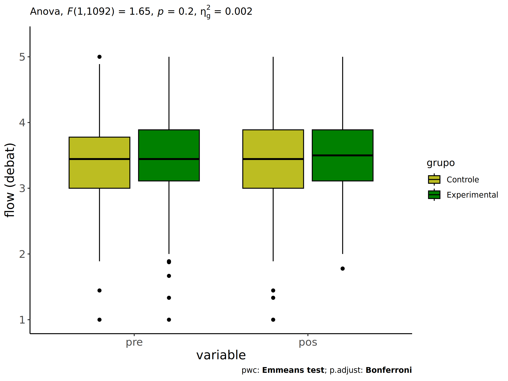
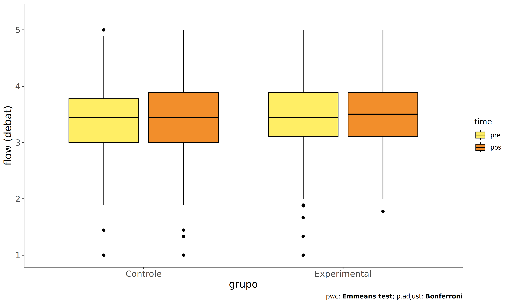
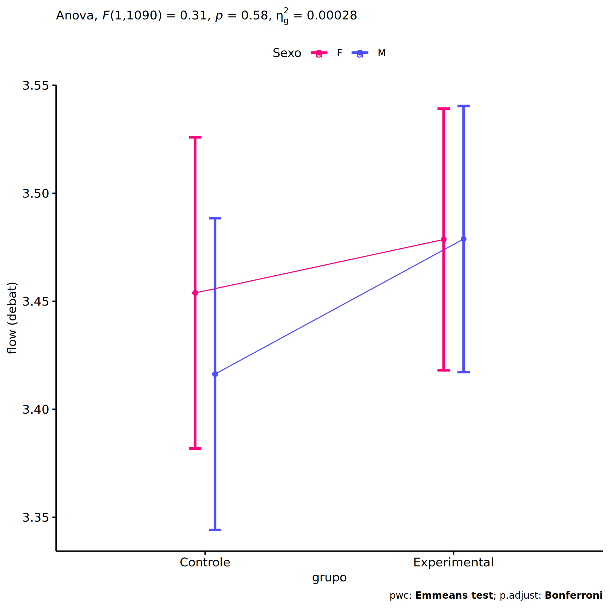
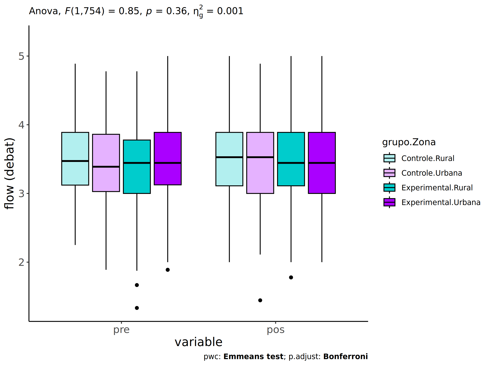
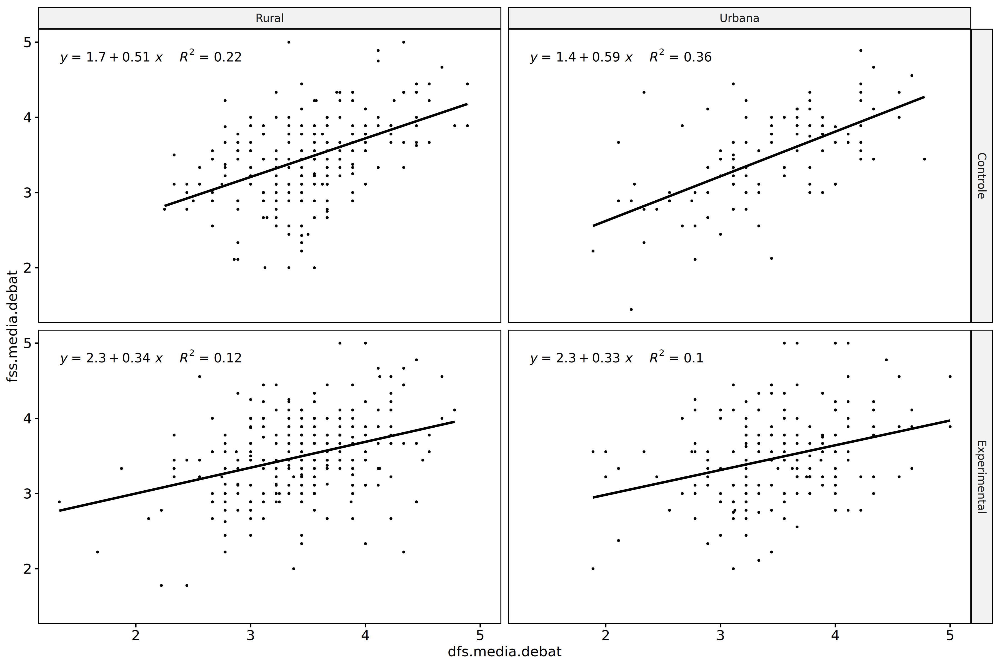
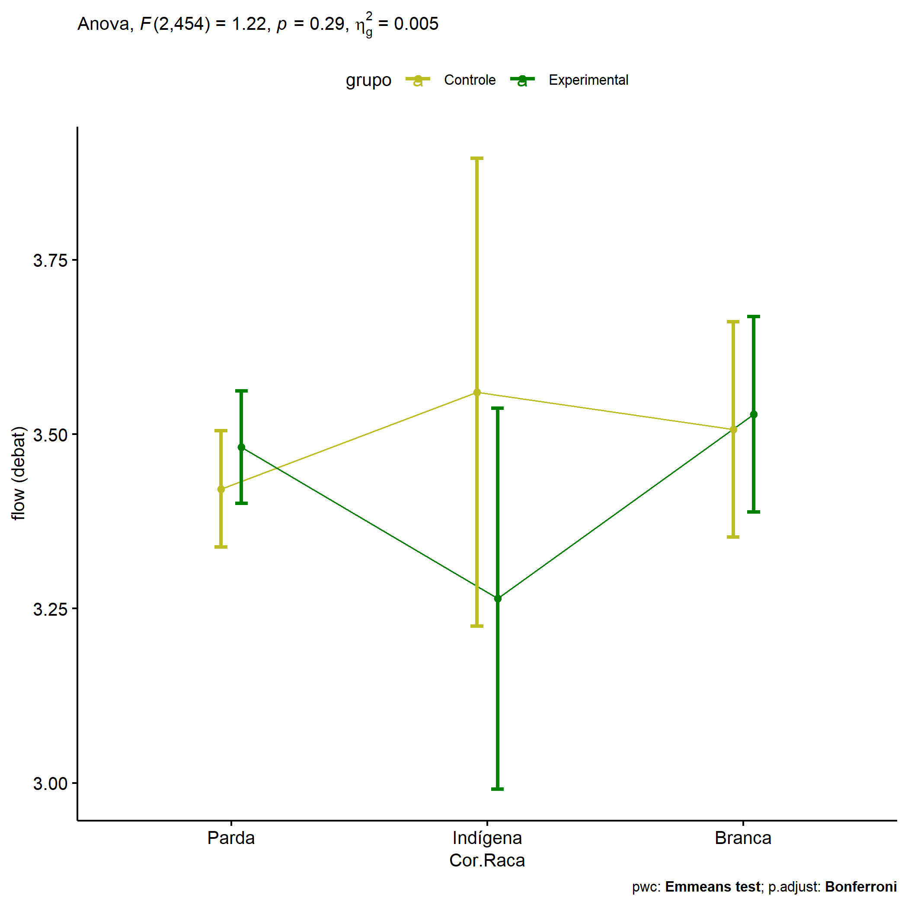
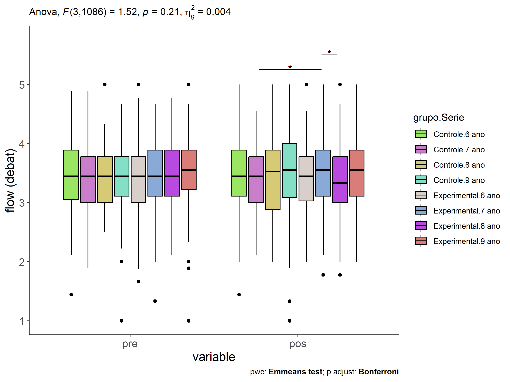
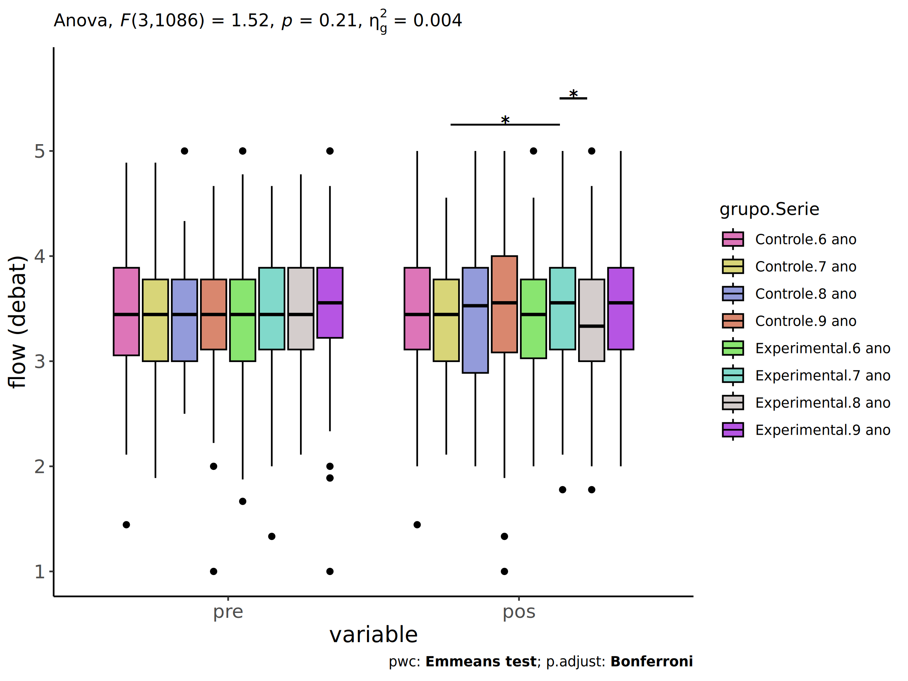

ANCOVA in flow (debat) (flow (debat))
================
Geiser C. Challco <geiser@alumni.usp.br>

- [Setting Initial Variables](#setting-initial-variables)
- [Descriptive Statistics of Initial
  Data](#descriptive-statistics-of-initial-data)
- [ANCOVA and Pairwise for one factor:
  **grupo**](#ancova-and-pairwise-for-one-factor-grupo)
  - [Without remove non-normal data](#without-remove-non-normal-data)
  - [Computing ANCOVA and PairWise After removing non-normal data
    (OK)](#computing-ancova-and-pairwise-after-removing-non-normal-data-ok)
    - [Plots for ancova](#plots-for-ancova)
    - [Checking linearity assumption](#checking-linearity-assumption)
    - [Checking normality and
      homogeneity](#checking-normality-and-homogeneity)
- [ANCOVA and Pairwise for two factors
  **grupo:Sexo**](#ancova-and-pairwise-for-two-factors-gruposexo)
  - [Without remove non-normal data](#without-remove-non-normal-data-1)
  - [Computing ANCOVA and PairWise After removing non-normal data
    (OK)](#computing-ancova-and-pairwise-after-removing-non-normal-data-ok-1)
    - [Plots for ancova](#plots-for-ancova-1)
    - [Checking linearity assumption](#checking-linearity-assumption-1)
    - [Checking normality and
      homogeneity](#checking-normality-and-homogeneity-1)
- [ANCOVA and Pairwise for two factors
  **grupo:Zona**](#ancova-and-pairwise-for-two-factors-grupozona)
  - [Without remove non-normal data](#without-remove-non-normal-data-2)
  - [Computing ANCOVA and PairWise After removing non-normal data
    (OK)](#computing-ancova-and-pairwise-after-removing-non-normal-data-ok-2)
    - [Plots for ancova](#plots-for-ancova-2)
    - [Checking linearity assumption](#checking-linearity-assumption-2)
    - [Checking normality and
      homogeneity](#checking-normality-and-homogeneity-2)
- [ANCOVA and Pairwise for two factors
  **grupo:Cor.Raca**](#ancova-and-pairwise-for-two-factors-grupocorraca)
  - [Without remove non-normal data](#without-remove-non-normal-data-3)
  - [Computing ANCOVA and PairWise After removing non-normal data
    (OK)](#computing-ancova-and-pairwise-after-removing-non-normal-data-ok-3)
    - [Plots for ancova](#plots-for-ancova-3)
    - [Checking linearity assumption](#checking-linearity-assumption-3)
    - [Checking normality and
      homogeneity](#checking-normality-and-homogeneity-3)
- [ANCOVA and Pairwise for two factors
  **grupo:Serie**](#ancova-and-pairwise-for-two-factors-gruposerie)
  - [Without remove non-normal data](#without-remove-non-normal-data-4)
  - [Computing ANCOVA and PairWise After removing non-normal data
    (OK)](#computing-ancova-and-pairwise-after-removing-non-normal-data-ok-4)
    - [Plots for ancova](#plots-for-ancova-4)
    - [Checking linearity assumption](#checking-linearity-assumption-4)
    - [Checking normality and
      homogeneity](#checking-normality-and-homogeneity-4)
- [Summary of Results](#summary-of-results)
  - [Descriptive Statistics](#descriptive-statistics)
  - [ANCOVA Table Comparison](#ancova-table-comparison)
  - [PairWise Table Comparison](#pairwise-table-comparison)
  - [EMMS Table Comparison](#emms-table-comparison)

**NOTE**:

- Teste ANCOVA para determinar se houve diferenças significativas no
  flow (debat) (medido usando pre- e pos-testes).
- ANCOVA test to determine whether there were significant differences in
  flow (debat) (measured using pre- and post-tests).

# Setting Initial Variables

``` r
dv = "flow.debat"
dv.pos = "fss.media.debat"
dv.pre = "dfs.media.debat"

fatores2 <- c("Sexo","Zona","Cor.Raca","Serie")
lfatores2 <- as.list(fatores2)
names(lfatores2) <- fatores2

fatores1 <- c("grupo", fatores2)
lfatores1 <- as.list(fatores1)
names(lfatores1) <- fatores1

lfatores <- c(lfatores1)

color <- list()
color[["prepost"]] = c("#ffee65","#f28e2B")
color[["grupo"]] = c("#bcbd22","#008000")
color[["Sexo"]] = c("#FF007F","#4D4DFF")
color[["Zona"]] = c("#AA00FF","#00CCCC")
color[["Cor.Raca"]] = c(
  "Parda"="#b97100","Indígena"="#9F262F",
  "Branca"="#87c498", "Preta"="#848283","Amarela"="#D6B91C"
)

level <- list()
level[["grupo"]] = c("Controle","Experimental")
level[["Sexo"]] = c("F","M")
level[["Zona"]] = c("Rural","Urbana")
level[["Cor.Raca"]] = c("Parda","Indígena","Branca", "Preta","Amarela")
level[["Serie"]] = c("6 ano","7 ano","8 ano","9 ano")

# ..

ymin <- 0
ymax <- 0

ymin.ci <- 0
ymax.ci <- 0


color[["grupo:Sexo"]] = c(
  "Controle:F"="#ff99cb", "Controle:M"="#b7b7ff",
  "Experimental:F"="#FF007F", "Experimental:M"="#4D4DFF",
  "Controle.F"="#ff99cb", "Controle.M"="#b7b7ff",
  "Experimental.F"="#FF007F", "Experimental.M"="#4D4DFF"
)
color[["grupo:Zona"]] = c(
  "Controle:Rural"="#b2efef","Controle:Urbana"="#e5b2ff",
  "Experimental:Rural"="#00CCCC", "Experimental:Urbana"="#AA00FF",
  "Controle.Rural"="#b2efef","Controle.Urbana"="#e5b2ff",
  "Experimental.Rural"="#00CCCC", "Experimental.Urbana"="#AA00FF"
)
color[["grupo:Cor.Raca"]] = c(
    "Controle:Parda"="#e3c699", "Experimental:Parda"="#b97100",
    "Controle:Indígena"="#e2bdc0", "Experimental:Indígena"="#9F262F",
    "Controle:Branca"="#c0e8cb", "Experimental:Branca"="#87c498",
    "Controle:Preta"="#dad9d9", "Experimental:Preta"="#848283",
    "Controle:Amarela"="#eee3a4", "Experimental:Amarela"="#D6B91C",
    
    "Controle.Parda"="#e3c699", "Experimental.Parda"="#b97100",
    "Controle.Indígena"="#e2bdc0", "Experimental.Indígena"="#9F262F",
    "Controle.Branca"="#c0e8cb", "Experimental.Branca"="#87c498",
    "Controle.Preta"="#dad9d9", "Experimental.Preta"="#848283",
    "Controle.Amarela"="#eee3a4", "Experimental.Amarela"="#D6B91C"
)


for (coln in c("vocab","vocab.teach","vocab.non.teach","score.tde",
               "TFL.lidas.per.min","TFL.corretas.per.min","TFL.erradas.per.min","TFL.omitidas.per.min",
               "leitura.compreensao")) {
  color[[paste0(coln,".quintile")]] = c("#BF0040","#FF0000","#800080","#0000FF","#4000BF")
  level[[paste0(coln,".quintile")]] = c("1st quintile","2nd quintile","3rd quintile","4th quintile","5th quintile")
  color[[paste0("grupo:",coln,".quintile")]] = c(
    "Experimental.1st quintile"="#BF0040", "Controle.1st quintile"="#d8668c",
    "Experimental.2nd quintile"="#FF0000", "Controle.2nd quintile"="#ff7f7f",
    "Experimental.3rd quintile"="#8fce00", "Controle.3rd quintile"="#ddf0b2",
    "Experimental.4th quintile"="#0000FF", "Controle.4th quintile"="#b2b2ff",
    "Experimental.5th quintile"="#4000BF", "Controle.5th quintile"="#b299e5",
    
    "Experimental:1st quintile"="#BF0040", "Controle:1st quintile"="#d8668c",
    "Experimental:2nd quintile"="#FF0000", "Controle:2nd quintile"="#ff7f7f",
    "Experimental:3rd quintile"="#8fce00", "Controle:3rd quintile"="#ddf0b2",
    "Experimental:4th quintile"="#0000FF", "Controle:4th quintile"="#b2b2ff",
    "Experimental:5th quintile"="#4000BF", "Controle:5th quintile"="#b299e5")
}


gdat <- read_excel("../data/data.xlsx", sheet = "sumary")
gdat <- gdat[which(is.na(gdat$Necessidade.Deficiencia) & !is.na(gdat$WG.Grupo)),]


dat <- gdat
dat$grupo <- factor(dat[["WG.Grupo"]], level[["grupo"]])
for (coln in c(names(lfatores))) {
  dat[[coln]] <- factor(dat[[coln]], level[[coln]][level[[coln]] %in% unique(dat[[coln]])])
}
dat <- dat[which(!is.na(dat[[dv.pre]]) & !is.na(dat[[dv.pos]])),]
dat <- dat[,c("id",names(lfatores),dv.pre,dv.pos)]

dat.long <- rbind(dat, dat)
dat.long$time <- c(rep("pre", nrow(dat)), rep("pos", nrow(dat)))
dat.long$time <- factor(dat.long$time, c("pre","pos"))
dat.long[[dv]] <- c(dat[[dv.pre]], dat[[dv.pos]])


for (f in c("grupo", names(lfatores))) {
  if (is.null(color[[f]]) && length(unique(dat[[f]])) > 0) 
      color[[f]] <- distinctColorPalette(length(unique(dat[[f]])))
}
for (f in c(fatores2)) {
  if (is.null(color[[paste0("grupo:",f)]]) && length(unique(dat[[f]])) > 0)
    color[[paste0("grupo:",f)]] <- distinctColorPalette(length(unique(dat[["grupo"]]))*length(unique(dat[[f]])))
}

ldat <- list()
laov <- list()
lpwc <- list()
lemms <- list()
```

# Descriptive Statistics of Initial Data

``` r
df <- get.descriptives(dat, c(dv.pre, dv.pos), c("grupo"), 
                       include.global = T, symmetry.test = T, normality.test = F)
df <- plyr::rbind.fill(
  df, do.call(plyr::rbind.fill, lapply(lfatores2, FUN = function(f) {
    if (nrow(dat) > 0 && sum(!is.na(unique(dat[[f]]))) > 1)
      get.descriptives(dat, c(dv.pre,dv.pos), c("grupo", f),
                       symmetry.test = T, normality.test = F)
    }))
)
```

    ## Warning: There were 3 warnings in `mutate()`.
    ## The first warning was:
    ## ℹ In argument: `ci = abs(stats::qt(alpha/2, .data$n - 1) * .data$se)`.
    ## Caused by warning:
    ## ! There was 1 warning in `mutate()`.
    ## ℹ In argument: `ci = abs(stats::qt(alpha/2, .data$n - 1) * .data$se)`.
    ## Caused by warning in `stats::qt()`:
    ## ! NaNs produced
    ## ℹ Run `dplyr::last_dplyr_warnings()` to see the 2 remaining warnings.
    ## There were 3 warnings in `mutate()`.
    ## The first warning was:
    ## ℹ In argument: `ci = abs(stats::qt(alpha/2, .data$n - 1) * .data$se)`.
    ## Caused by warning:
    ## ! There was 1 warning in `mutate()`.
    ## ℹ In argument: `ci = abs(stats::qt(alpha/2, .data$n - 1) * .data$se)`.
    ## Caused by warning in `stats::qt()`:
    ## ! NaNs produced
    ## ℹ Run `dplyr::last_dplyr_warnings()` to see the 2 remaining warnings.

``` r
df <- df[,c(fatores1[fatores1 %in% colnames(df)],"variable",
            colnames(df)[!colnames(df) %in% c(fatores1,"variable")])]
```

| grupo        | Sexo | Zona   | Cor.Raca | Serie | variable        |    n |  mean | median |   min |   max |    sd |    se |    ci |   iqr | symmetry | skewness | kurtosis |
|:-------------|:-----|:-------|:---------|:------|:----------------|-----:|------:|-------:|------:|------:|------:|------:|------:|------:|:---------|---------:|---------:|
| Controle     |      |        |          |       | dfs.media.debat |  458 | 3.438 |  3.444 | 1.000 | 5.000 | 0.587 | 0.027 | 0.054 | 0.778 | YES      |   -0.200 |    0.312 |
| Experimental |      |        |          |       | dfs.media.debat |  639 | 3.460 |  3.444 | 1.000 | 5.000 | 0.580 | 0.023 | 0.045 | 0.778 | YES      |   -0.260 |    0.508 |
|              |      |        |          |       | dfs.media.debat | 1097 | 3.450 |  3.444 | 1.000 | 5.000 | 0.583 | 0.018 | 0.035 | 0.778 | YES      |   -0.235 |    0.428 |
| Controle     |      |        |          |       | fss.media.debat |  458 | 3.430 |  3.444 | 1.000 | 5.000 | 0.622 | 0.029 | 0.057 | 0.889 | YES      |   -0.308 |    0.333 |
| Experimental |      |        |          |       | fss.media.debat |  639 | 3.475 |  3.444 | 1.000 | 5.000 | 0.600 | 0.024 | 0.047 | 0.833 | YES      |   -0.144 |    0.402 |
|              |      |        |          |       | fss.media.debat | 1097 | 3.456 |  3.444 | 1.000 | 5.000 | 0.609 | 0.018 | 0.036 | 0.889 | YES      |   -0.221 |    0.394 |
| Controle     | F    |        |          |       | dfs.media.debat |  229 | 3.517 |  3.556 | 1.444 | 4.889 | 0.539 | 0.036 | 0.070 | 0.778 | YES      |   -0.348 |    0.348 |
| Controle     | M    |        |          |       | dfs.media.debat |  229 | 3.358 |  3.333 | 1.000 | 5.000 | 0.622 | 0.041 | 0.081 | 0.778 | YES      |   -0.013 |    0.295 |
| Experimental | F    |        |          |       | dfs.media.debat |  326 | 3.501 |  3.444 | 1.667 | 5.000 | 0.547 | 0.030 | 0.060 | 0.778 | YES      |   -0.066 |   -0.213 |
| Experimental | M    |        |          |       | dfs.media.debat |  313 | 3.416 |  3.444 | 1.000 | 5.000 | 0.610 | 0.034 | 0.068 | 0.778 | YES      |   -0.364 |    0.825 |
| Controle     | F    |        |          |       | fss.media.debat |  229 | 3.481 |  3.556 | 1.444 | 5.000 | 0.598 | 0.040 | 0.078 | 0.778 | YES      |   -0.332 |   -0.039 |
| Controle     | M    |        |          |       | fss.media.debat |  229 | 3.379 |  3.444 | 1.000 | 5.000 | 0.643 | 0.042 | 0.084 | 0.778 | YES      |   -0.259 |    0.569 |
| Experimental | F    |        |          |       | fss.media.debat |  326 | 3.484 |  3.556 | 1.000 | 5.000 | 0.630 | 0.035 | 0.069 | 0.778 | YES      |   -0.297 |    0.604 |
| Experimental | M    |        |          |       | fss.media.debat |  313 | 3.465 |  3.444 | 2.000 | 5.000 | 0.567 | 0.032 | 0.063 | 0.889 | YES      |    0.064 |   -0.009 |
| Controle     |      | Rural  |          |       | dfs.media.debat |  228 | 3.510 |  3.472 | 2.250 | 4.889 | 0.524 | 0.035 | 0.068 | 0.767 | YES      |    0.123 |   -0.237 |
| Controle     |      | Urbana |          |       | dfs.media.debat |  110 | 3.402 |  3.389 | 1.889 | 4.778 | 0.627 | 0.060 | 0.119 | 0.833 | YES      |   -0.160 |   -0.538 |
| Controle     |      |        |          |       | dfs.media.debat |  120 | 3.333 |  3.333 | 1.000 | 5.000 | 0.644 | 0.059 | 0.116 | 0.806 | YES      |   -0.361 |    0.776 |
| Experimental |      | Rural  |          |       | dfs.media.debat |  249 | 3.430 |  3.444 | 1.333 | 4.778 | 0.568 | 0.036 | 0.071 | 0.778 | YES      |   -0.320 |    0.370 |
| Experimental |      | Urbana |          |       | dfs.media.debat |  173 | 3.487 |  3.444 | 1.889 | 5.000 | 0.578 | 0.044 | 0.087 | 0.764 | YES      |   -0.158 |    0.394 |
| Experimental |      |        |          |       | dfs.media.debat |  217 | 3.471 |  3.444 | 1.000 | 5.000 | 0.596 | 0.040 | 0.080 | 0.778 | YES      |   -0.279 |    0.631 |
| Controle     |      | Rural  |          |       | fss.media.debat |  228 | 3.469 |  3.528 | 2.000 | 5.000 | 0.578 | 0.038 | 0.075 | 0.778 | YES      |   -0.090 |   -0.048 |
| Controle     |      | Urbana |          |       | fss.media.debat |  110 | 3.455 |  3.528 | 1.444 | 4.889 | 0.624 | 0.060 | 0.118 | 0.889 | YES      |   -0.373 |    0.039 |
| Controle     |      |        |          |       | fss.media.debat |  120 | 3.333 |  3.333 | 1.000 | 5.000 | 0.692 | 0.063 | 0.125 | 1.000 | YES      |   -0.386 |    0.426 |
| Experimental |      | Rural  |          |       | fss.media.debat |  249 | 3.481 |  3.444 | 1.000 | 5.000 | 0.583 | 0.037 | 0.073 | 0.778 | YES      |   -0.384 |    1.067 |
| Experimental |      | Urbana |          |       | fss.media.debat |  173 | 3.473 |  3.444 | 2.000 | 5.000 | 0.599 | 0.046 | 0.090 | 0.889 | YES      |    0.192 |   -0.044 |
| Experimental |      |        |          |       | fss.media.debat |  217 | 3.469 |  3.556 | 1.333 | 5.000 | 0.621 | 0.042 | 0.083 | 0.889 | YES      |   -0.152 |    0.047 |
| Controle     |      |        | Parda    |       | dfs.media.debat |  160 | 3.364 |  3.444 | 1.000 | 4.778 | 0.597 | 0.047 | 0.093 | 0.778 | YES      |   -0.392 |    0.713 |
| Controle     |      |        | Indígena |       | dfs.media.debat |   10 | 3.708 |  3.708 | 3.333 | 4.222 | 0.273 | 0.086 | 0.195 | 0.417 | YES      |    0.298 |   -1.135 |
| Controle     |      |        | Branca   |       | dfs.media.debat |   47 | 3.504 |  3.444 | 2.111 | 4.889 | 0.628 | 0.092 | 0.184 | 0.833 | YES      |    0.137 |   -0.416 |
| Controle     |      |        | Preta    |       | dfs.media.debat |    1 | 3.556 |  3.556 | 3.556 | 3.556 |       |       |       | 0.000 | few data |    0.000 |    0.000 |
| Controle     |      |        |          |       | dfs.media.debat |  240 | 3.462 |  3.444 | 1.444 | 5.000 | 0.578 | 0.037 | 0.074 | 0.694 | YES      |   -0.096 |   -0.075 |
| Experimental |      |        | Parda    |       | dfs.media.debat |  172 | 3.367 |  3.333 | 1.333 | 4.778 | 0.554 | 0.042 | 0.083 | 0.667 | YES      |   -0.090 |    0.592 |
| Experimental |      |        | Indígena |       | dfs.media.debat |   15 | 3.310 |  3.222 | 2.667 | 4.333 | 0.503 | 0.130 | 0.279 | 0.556 | NO       |    0.712 |   -0.740 |
| Experimental |      |        | Branca   |       | dfs.media.debat |   57 | 3.439 |  3.444 | 2.111 | 4.333 | 0.508 | 0.067 | 0.135 | 0.667 | YES      |   -0.441 |   -0.327 |
| Experimental |      |        | Preta    |       | dfs.media.debat |    1 | 3.222 |  3.222 | 3.222 | 3.222 |       |       |       | 0.000 | few data |    0.000 |    0.000 |
| Experimental |      |        | Amarela  |       | dfs.media.debat |    1 | 3.444 |  3.444 | 3.444 | 3.444 |       |       |       | 0.000 | few data |    0.000 |    0.000 |
| Experimental |      |        |          |       | dfs.media.debat |  393 | 3.509 |  3.556 | 1.000 | 5.000 | 0.600 | 0.030 | 0.060 | 0.778 | YES      |   -0.373 |    0.599 |
| Controle     |      |        | Parda    |       | fss.media.debat |  160 | 3.408 |  3.444 | 1.000 | 5.000 | 0.640 | 0.051 | 0.100 | 0.889 | YES      |   -0.429 |    0.795 |
| Controle     |      |        | Indígena |       | fss.media.debat |   10 | 3.700 |  3.778 | 2.556 | 4.333 | 0.516 | 0.163 | 0.369 | 0.389 | NO       |   -0.855 |   -0.159 |
| Controle     |      |        | Branca   |       | fss.media.debat |   47 | 3.556 |  3.333 | 2.556 | 5.000 | 0.581 | 0.085 | 0.170 | 0.778 | YES      |    0.487 |   -0.790 |
| Controle     |      |        | Preta    |       | fss.media.debat |    1 | 3.333 |  3.333 | 3.333 | 3.333 |       |       |       | 0.000 | few data |    0.000 |    0.000 |
| Controle     |      |        |          |       | fss.media.debat |  240 | 3.409 |  3.444 | 1.333 | 4.889 | 0.621 | 0.040 | 0.079 | 0.889 | YES      |   -0.301 |   -0.030 |
| Experimental |      |        | Parda    |       | fss.media.debat |  172 | 3.469 |  3.444 | 1.778 | 5.000 | 0.560 | 0.043 | 0.084 | 0.806 | YES      |    0.115 |    0.240 |
| Experimental |      |        | Indígena |       | fss.media.debat |   15 | 3.227 |  3.125 | 2.222 | 4.222 | 0.584 | 0.151 | 0.323 | 0.722 | YES      |   -0.021 |   -1.094 |
| Experimental |      |        | Branca   |       | fss.media.debat |   57 | 3.548 |  3.556 | 2.222 | 4.556 | 0.579 | 0.077 | 0.154 | 0.667 | YES      |   -0.415 |   -0.393 |
| Experimental |      |        | Preta    |       | fss.media.debat |    1 | 4.444 |  4.444 | 4.444 | 4.444 |       |       |       | 0.000 | few data |    0.000 |    0.000 |
| Experimental |      |        | Amarela  |       | fss.media.debat |    1 | 3.556 |  3.556 | 3.556 | 3.556 |       |       |       | 0.000 | few data |    0.000 |    0.000 |
| Experimental |      |        |          |       | fss.media.debat |  393 | 3.474 |  3.556 | 1.000 | 5.000 | 0.618 | 0.031 | 0.061 | 0.778 | YES      |   -0.199 |    0.547 |
| Controle     |      |        |          | 6 ano | dfs.media.debat |  151 | 3.475 |  3.444 | 1.444 | 4.889 | 0.625 | 0.051 | 0.100 | 0.833 | YES      |   -0.113 |   -0.109 |
| Controle     |      |        |          | 7 ano | dfs.media.debat |  123 | 3.404 |  3.444 | 1.889 | 4.889 | 0.584 | 0.053 | 0.104 | 0.778 | YES      |   -0.067 |   -0.370 |
| Controle     |      |        |          | 8 ano | dfs.media.debat |   80 | 3.453 |  3.444 | 2.500 | 5.000 | 0.506 | 0.057 | 0.113 | 0.778 | YES      |    0.128 |   -0.221 |
| Controle     |      |        |          | 9 ano | dfs.media.debat |  104 | 3.411 |  3.444 | 1.000 | 4.667 | 0.596 | 0.058 | 0.116 | 0.667 | NO       |   -0.657 |    1.501 |
| Experimental |      |        |          | 6 ano | dfs.media.debat |  167 | 3.409 |  3.444 | 1.667 | 5.000 | 0.598 | 0.046 | 0.091 | 0.778 | YES      |   -0.015 |    0.179 |
| Experimental |      |        |          | 7 ano | dfs.media.debat |  177 | 3.463 |  3.444 | 1.333 | 4.667 | 0.566 | 0.043 | 0.084 | 0.778 | YES      |   -0.379 |    0.470 |
| Experimental |      |        |          | 8 ano | dfs.media.debat |  153 | 3.489 |  3.444 | 2.111 | 4.778 | 0.571 | 0.046 | 0.091 | 0.778 | YES      |   -0.051 |   -0.639 |
| Experimental |      |        |          | 9 ano | dfs.media.debat |  142 | 3.482 |  3.556 | 1.000 | 5.000 | 0.588 | 0.049 | 0.098 | 0.667 | NO       |   -0.610 |    2.008 |
| Controle     |      |        |          | 6 ano | fss.media.debat |  151 | 3.450 |  3.444 | 1.444 | 5.000 | 0.616 | 0.050 | 0.099 | 0.778 | YES      |   -0.199 |    0.145 |
| Controle     |      |        |          | 7 ano | fss.media.debat |  123 | 3.374 |  3.444 | 2.111 | 4.556 | 0.526 | 0.047 | 0.094 | 0.778 | YES      |   -0.189 |   -0.507 |
| Controle     |      |        |          | 8 ano | fss.media.debat |   80 | 3.427 |  3.528 | 2.000 | 5.000 | 0.652 | 0.073 | 0.145 | 1.000 | YES      |   -0.082 |   -0.422 |
| Controle     |      |        |          | 9 ano | fss.media.debat |  104 | 3.471 |  3.556 | 1.000 | 5.000 | 0.710 | 0.070 | 0.138 | 0.917 | NO       |   -0.681 |    0.860 |
| Experimental |      |        |          | 6 ano | fss.media.debat |  167 | 3.415 |  3.444 | 1.333 | 5.000 | 0.602 | 0.047 | 0.092 | 0.778 | YES      |   -0.270 |    0.211 |
| Experimental |      |        |          | 7 ano | fss.media.debat |  177 | 3.551 |  3.556 | 1.778 | 5.000 | 0.591 | 0.044 | 0.088 | 0.778 | YES      |    0.114 |    0.253 |
| Experimental |      |        |          | 8 ano | fss.media.debat |  153 | 3.382 |  3.333 | 1.000 | 5.000 | 0.637 | 0.052 | 0.102 | 0.778 | YES      |   -0.236 |    0.623 |
| Experimental |      |        |          | 9 ano | fss.media.debat |  142 | 3.552 |  3.556 | 2.000 | 5.000 | 0.547 | 0.046 | 0.091 | 0.778 | YES      |   -0.017 |   -0.349 |

# ANCOVA and Pairwise for one factor: **grupo**

## Without remove non-normal data

``` r
pdat = remove_group_data(dat[!is.na(dat[["grupo"]]),], "fss.media.debat", "grupo")

pdat.long <- rbind(pdat[,c("id","grupo")], pdat[,c("id","grupo")])
pdat.long[["time"]] <- c(rep("pre", nrow(pdat)), rep("pos", nrow(pdat)))
pdat.long[["time"]] <- factor(pdat.long[["time"]], c("pre","pos"))
pdat.long[["flow.debat"]] <- c(pdat[["dfs.media.debat"]], pdat[["fss.media.debat"]])

aov = anova_test(pdat, fss.media.debat ~ dfs.media.debat + grupo)
laov[["grupo"]] <- get_anova_table(aov)
```

``` r
pwc <- emmeans_test(pdat, fss.media.debat ~ grupo, covariate = dfs.media.debat,
                    p.adjust.method = "bonferroni")
```

``` r
pwc.long <- emmeans_test(dplyr::group_by_at(pdat.long, "grupo"),
                          flow.debat ~ time,
                          p.adjust.method = "bonferroni")
lpwc[["grupo"]] <- plyr::rbind.fill(pwc, pwc.long)
```

``` r
ds <- get.descriptives(pdat, "fss.media.debat", "grupo", covar = "dfs.media.debat")
ds <- merge(ds[ds$variable != "dfs.media.debat",],
            ds[ds$variable == "dfs.media.debat", !colnames(ds) %in% c("variable")],
            by = "grupo", all.x = T, suffixes = c("", ".dfs.media.debat"))
ds <- merge(get_emmeans(pwc), ds, by = "grupo", suffixes = c(".emms", ""))
ds <- ds[,c("grupo","n","mean.dfs.media.debat","se.dfs.media.debat","mean","se",
            "emmean","se.emms","conf.low","conf.high")]

colnames(ds) <- c("grupo", "N", paste0(c("M","SE")," (pre)"),
                  paste0(c("M","SE"), " (unadj)"),
                  paste0(c("M", "SE"), " (adj)"), "conf.low", "conf.high")

lemms[["grupo"]] <- ds
```

## Computing ANCOVA and PairWise After removing non-normal data (OK)

``` r
wdat = pdat 

res = residuals(lm(fss.media.debat ~ dfs.media.debat + grupo, data = wdat))
non.normal = getNonNormal(res, wdat$id, plimit = 0.05)

wdat = wdat[!wdat$id %in% non.normal,]

wdat.long <- rbind(wdat[,c("id","grupo")], wdat[,c("id","grupo")])
wdat.long[["time"]] <- c(rep("pre", nrow(wdat)), rep("pos", nrow(wdat)))
wdat.long[["time"]] <- factor(wdat.long[["time"]], c("pre","pos"))
wdat.long[["flow.debat"]] <- c(wdat[["dfs.media.debat"]], wdat[["fss.media.debat"]])

ldat[["grupo"]] = wdat

(non.normal)
```

    ## [1] "P2207" "P1790"

``` r
aov = anova_test(wdat, fss.media.debat ~ dfs.media.debat + grupo)
laov[["grupo"]] <- merge(get_anova_table(aov), laov[["grupo"]],
                            by="Effect", suffixes = c("","'"))

(df = get_anova_table(aov))
```

    ## ANOVA Table (type II tests)
    ## 
    ##            Effect DFn  DFd       F        p p<.05   ges
    ## 1 dfs.media.debat   1 1092 193.494 1.29e-40     * 0.151
    ## 2           grupo   1 1092   1.645 2.00e-01       0.002

| Effect          | DFn |  DFd |       F |   p | p\<.05 |   ges |
|:----------------|----:|-----:|--------:|----:|:-------|------:|
| dfs.media.debat |   1 | 1092 | 193.494 | 0.0 | \*     | 0.151 |
| grupo           |   1 | 1092 |   1.645 | 0.2 |        | 0.002 |

``` r
pwc <- emmeans_test(wdat, fss.media.debat ~ grupo, covariate = dfs.media.debat,
                    p.adjust.method = "bonferroni")
```

| term                   | .y.             | group1   | group2       |   df | statistic |   p | p.adj | p.adj.signif |
|:-----------------------|:----------------|:---------|:-------------|-----:|----------:|----:|------:|:-------------|
| dfs.media.debat\*grupo | fss.media.debat | Controle | Experimental | 1092 |    -1.283 | 0.2 |   0.2 | ns           |

``` r
pwc.long <- emmeans_test(dplyr::group_by_at(wdat.long, "grupo"),
                         flow.debat ~ time,
                         p.adjust.method = "bonferroni")
lpwc[["grupo"]] <- merge(plyr::rbind.fill(pwc, pwc.long), lpwc[["grupo"]],
                            by=c("grupo","term",".y.","group1","group2"),
                            suffixes = c("","'"))
```

| grupo        | term | .y.        | group1 | group2 |   df | statistic |     p | p.adj | p.adj.signif |
|:-------------|:-----|:-----------|:-------|:-------|-----:|----------:|------:|------:|:-------------|
| Controle     | time | flow.debat | pre    | pos    | 2186 |     0.192 | 0.848 | 0.848 | ns           |
| Experimental | time | flow.debat | pre    | pos    | 2186 |    -0.692 | 0.489 | 0.489 | ns           |

``` r
ds <- get.descriptives(wdat, "fss.media.debat", "grupo", covar = "dfs.media.debat")
ds <- merge(ds[ds$variable != "dfs.media.debat",],
            ds[ds$variable == "dfs.media.debat", !colnames(ds) %in% c("variable")],
            by = "grupo", all.x = T, suffixes = c("", ".dfs.media.debat"))
ds <- merge(get_emmeans(pwc), ds, by = "grupo", suffixes = c(".emms", ""))
ds <- ds[,c("grupo","n","mean.dfs.media.debat","se.dfs.media.debat","mean","se",
            "emmean","se.emms","conf.low","conf.high")]

colnames(ds) <- c("grupo", "N", paste0(c("M","SE")," (pre)"),
                  paste0(c("M","SE"), " (unadj)"),
                  paste0(c("M", "SE"), " (adj)"), "conf.low", "conf.high")

lemms[["grupo"]] <- merge(ds, lemms[["grupo"]], by=c("grupo"), suffixes = c("","'"))
```

| grupo        |   N | M (pre) | SE (pre) | M (unadj) | SE (unadj) | M (adj) | SE (adj) | conf.low | conf.high |
|:-------------|----:|--------:|---------:|----------:|-----------:|--------:|---------:|---------:|----------:|
| Controle     | 458 |   3.438 |    0.027 |     3.430 |      0.029 |   3.435 |    0.026 |    3.384 |     3.486 |
| Experimental | 637 |   3.459 |    0.023 |     3.482 |      0.023 |   3.479 |    0.022 |    3.436 |     3.522 |

### Plots for ancova

``` r
plots <- oneWayAncovaPlots(
  wdat, "fss.media.debat", "grupo", aov, list("grupo"=pwc), addParam = c("mean_ci"),
  font.label.size=10, step.increase=0.05, p.label="p.adj",
  subtitle = which(aov$Effect == "grupo"))
```

``` r
if (!is.null(nrow(plots[["grupo"]]$data)))
  plots[["grupo"]] +
  if (ymin.ci < ymax.ci) ggplot2::ylim(ymin.ci, ymax.ci)
```

<!-- -->

``` r
plots <- oneWayAncovaBoxPlots(
  wdat, "fss.media.debat", "grupo", aov, pwc, covar = "dfs.media.debat",
  theme = "classic", color = color[["grupo"]],
  subtitle = which(aov$Effect == "grupo"))
```

``` r
if (length(unique(wdat[["grupo"]])) > 1)
  plots[["grupo"]] + ggplot2::ylab("flow (debat)") +
  ggplot2::scale_x_discrete(labels=c('pre', 'pos')) +
  if (ymin < ymax) ggplot2::ylim(ymin, ymax)
```

<!-- -->

``` r
if (length(unique(wdat.long[["grupo"]])) > 1)
  plots <- oneWayAncovaBoxPlots(
    wdat.long, "flow.debat", "grupo", aov, pwc.long,
    pre.post = "time", theme = "classic", color = color$prepost)
```

``` r
if (length(unique(wdat.long[["grupo"]])) > 1)
  plots[["grupo"]] + ggplot2::ylab("flow (debat)") +
  if (ymin < ymax) ggplot2::ylim(ymin, ymax) 
```

<!-- -->

### Checking linearity assumption

``` r
ggscatter(wdat, x = "dfs.media.debat", y = "fss.media.debat", size = 0.5,
          color = "grupo", add = "reg.line")+
  stat_regline_equation(
    aes(label =  paste(..eq.label.., ..rr.label.., sep = "~~~~"), color = grupo)
  ) +
  ggplot2::labs(subtitle = rstatix::get_test_label(aov, detailed = T, row = which(aov$Effect == "grupo"))) +
  ggplot2::scale_color_manual(values = color[["grupo"]]) +
  if (ymin < ymax) ggplot2::ylim(ymin, ymax)
```

<!-- -->

### Checking normality and homogeneity

``` r
res <- augment(lm(fss.media.debat ~ dfs.media.debat + grupo, data = wdat))
```

``` r
shapiro_test(res$.resid)
```

    ## # A tibble: 1 × 3
    ##   variable   statistic p.value
    ##   <chr>          <dbl>   <dbl>
    ## 1 res$.resid     0.997  0.0611

``` r
levene_test(res, .resid ~ grupo)
```

    ## # A tibble: 1 × 4
    ##     df1   df2 statistic     p
    ##   <int> <int>     <dbl> <dbl>
    ## 1     1  1093      1.60 0.206

# ANCOVA and Pairwise for two factors **grupo:Sexo**

## Without remove non-normal data

``` r
pdat = remove_group_data(dat[!is.na(dat[["grupo"]]) & !is.na(dat[["Sexo"]]),],
                         "fss.media.debat", c("grupo","Sexo"))
pdat = pdat[pdat[["Sexo"]] %in% do.call(
  intersect, lapply(unique(pdat[["grupo"]]), FUN = function(x) {
    unique(pdat[["Sexo"]][which(pdat[["grupo"]] == x)])
  })),]
pdat[["grupo"]] = factor(pdat[["grupo"]], level[["grupo"]])
pdat[["Sexo"]] = factor(
  pdat[["Sexo"]],
  level[["Sexo"]][level[["Sexo"]] %in% unique(pdat[["Sexo"]])])

pdat.long <- rbind(pdat[,c("id","grupo","Sexo")], pdat[,c("id","grupo","Sexo")])
pdat.long[["time"]] <- c(rep("pre", nrow(pdat)), rep("pos", nrow(pdat)))
pdat.long[["time"]] <- factor(pdat.long[["time"]], c("pre","pos"))
pdat.long[["flow.debat"]] <- c(pdat[["dfs.media.debat"]], pdat[["fss.media.debat"]])

if (length(unique(pdat[["Sexo"]])) >= 2) {
  aov = anova_test(pdat, fss.media.debat ~ dfs.media.debat + grupo*Sexo)
  laov[["grupo:Sexo"]] <- get_anova_table(aov)
}
```

``` r
if (length(unique(pdat[["Sexo"]])) >= 2) {
  pwcs <- list()
  pwcs[["Sexo"]] <- emmeans_test(
    group_by(pdat, grupo), fss.media.debat ~ Sexo,
    covariate = dfs.media.debat, p.adjust.method = "bonferroni")
  pwcs[["grupo"]] <- emmeans_test(
    group_by(pdat, Sexo), fss.media.debat ~ grupo,
    covariate = dfs.media.debat, p.adjust.method = "bonferroni")
  
  pwc <- plyr::rbind.fill(pwcs[["grupo"]], pwcs[["Sexo"]])
  pwc <- pwc[,c("grupo","Sexo", colnames(pwc)[!colnames(pwc) %in% c("grupo","Sexo")])]
}
```

``` r
if (length(unique(pdat[["Sexo"]])) >= 2) {
  pwc.long <- emmeans_test(dplyr::group_by_at(pdat.long, c("grupo","Sexo")),
                           flow.debat ~ time,
                           p.adjust.method = "bonferroni")
  lpwc[["grupo:Sexo"]] <- plyr::rbind.fill(pwc, pwc.long)
}
```

``` r
if (length(unique(pdat[["Sexo"]])) >= 2) {
  ds <- get.descriptives(pdat, "fss.media.debat", c("grupo","Sexo"), covar = "dfs.media.debat")
  ds <- merge(ds[ds$variable != "dfs.media.debat",],
              ds[ds$variable == "dfs.media.debat", !colnames(ds) %in% c("variable")],
              by = c("grupo","Sexo"), all.x = T, suffixes = c("", ".dfs.media.debat"))
  ds <- merge(get_emmeans(pwcs[["grupo"]]), ds,
              by = c("grupo","Sexo"), suffixes = c(".emms", ""))
  ds <- ds[,c("grupo","Sexo","n","mean.dfs.media.debat","se.dfs.media.debat","mean","se",
              "emmean","se.emms","conf.low","conf.high")]
  
  colnames(ds) <- c("grupo","Sexo", "N", paste0(c("M","SE")," (pre)"),
                    paste0(c("M","SE"), " (unadj)"),
                    paste0(c("M", "SE"), " (adj)"), "conf.low", "conf.high")
  
  lemms[["grupo:Sexo"]] <- ds
}
```

## Computing ANCOVA and PairWise After removing non-normal data (OK)

``` r
if (length(unique(pdat[["Sexo"]])) >= 2) {
  wdat = pdat 
  
  res = residuals(lm(fss.media.debat ~ dfs.media.debat + grupo*Sexo, data = wdat))
  non.normal = getNonNormal(res, wdat$id, plimit = 0.05)
  
  wdat = wdat[!wdat$id %in% non.normal,]
  
  wdat.long <- rbind(wdat[,c("id","grupo","Sexo")], wdat[,c("id","grupo","Sexo")])
  wdat.long[["time"]] <- c(rep("pre", nrow(wdat)), rep("pos", nrow(wdat)))
  wdat.long[["time"]] <- factor(wdat.long[["time"]], c("pre","pos"))
  wdat.long[["flow.debat"]] <- c(wdat[["dfs.media.debat"]], wdat[["fss.media.debat"]])
  
  
  ldat[["grupo:Sexo"]] = wdat
  
  (non.normal)
}
```

    ## [1] "P2207" "P1790"

``` r
if (length(unique(pdat[["Sexo"]])) >= 2) {
  aov = anova_test(wdat, fss.media.debat ~ dfs.media.debat + grupo*Sexo)
  laov[["grupo:Sexo"]] <- merge(get_anova_table(aov), laov[["grupo:Sexo"]],
                                         by="Effect", suffixes = c("","'"))
  df = get_anova_table(aov)
}
```

| Effect          | DFn |  DFd |       F |     p | p\<.05 |   ges |
|:----------------|----:|-----:|--------:|------:|:-------|------:|
| dfs.media.debat |   1 | 1090 | 189.370 | 0.000 | \*     | 0.148 |
| grupo           |   1 | 1090 |   1.635 | 0.201 |        | 0.001 |
| Sexo            |   1 | 1090 |   0.212 | 0.645 |        | 0.000 |
| grupo:Sexo      |   1 | 1090 |   0.308 | 0.579 |        | 0.000 |

``` r
if (length(unique(pdat[["Sexo"]])) >= 2) {
  pwcs <- list()
  pwcs[["Sexo"]] <- emmeans_test(
    group_by(wdat, grupo), fss.media.debat ~ Sexo,
    covariate = dfs.media.debat, p.adjust.method = "bonferroni")
  pwcs[["grupo"]] <- emmeans_test(
    group_by(wdat, Sexo), fss.media.debat ~ grupo,
    covariate = dfs.media.debat, p.adjust.method = "bonferroni")
  
  pwc <- plyr::rbind.fill(pwcs[["grupo"]], pwcs[["Sexo"]])
  pwc <- pwc[,c("grupo","Sexo", colnames(pwc)[!colnames(pwc) %in% c("grupo","Sexo")])]
}
```

| grupo        | Sexo | term                   | .y.             | group1   | group2       |   df | statistic |     p | p.adj | p.adj.signif |
|:-------------|:-----|:-----------------------|:----------------|:---------|:-------------|-----:|----------:|------:|------:|:-------------|
|              | F    | dfs.media.debat\*grupo | fss.media.debat | Controle | Experimental | 1090 |    -0.516 | 0.606 | 0.606 | ns           |
|              | M    | dfs.media.debat\*grupo | fss.media.debat | Controle | Experimental | 1090 |    -1.294 | 0.196 | 0.196 | ns           |
| Controle     |      | dfs.media.debat\*Sexo  | fss.media.debat | F        | M            | 1090 |     0.721 | 0.471 | 0.471 | ns           |
| Experimental |      | dfs.media.debat\*Sexo  | fss.media.debat | F        | M            | 1090 |    -0.005 | 0.996 | 0.996 | ns           |

``` r
if (length(unique(pdat[["Sexo"]])) >= 2) {
  pwc.long <- emmeans_test(dplyr::group_by_at(wdat.long, c("grupo","Sexo")),
                           flow.debat ~ time,
                           p.adjust.method = "bonferroni")
  lpwc[["grupo:Sexo"]] <- merge(plyr::rbind.fill(pwc, pwc.long),
                                         lpwc[["grupo:Sexo"]],
                                         by=c("grupo","Sexo","term",".y.","group1","group2"),
                                         suffixes = c("","'"))
}
```

| grupo        | Sexo | term | .y.        | group1 | group2 |   df | statistic |     p | p.adj | p.adj.signif |
|:-------------|:-----|:-----|:-----------|:-------|:-------|-----:|----------:|------:|------:|:-------------|
| Controle     | F    | time | flow.debat | pre    | pos    | 2182 |     0.666 | 0.505 | 0.505 | ns           |
| Controle     | M    | time | flow.debat | pre    | pos    | 2182 |    -0.394 | 0.694 | 0.694 | ns           |
| Experimental | F    | time | flow.debat | pre    | pos    | 2182 |     0.045 | 0.964 | 0.964 | ns           |
| Experimental | M    | time | flow.debat | pre    | pos    | 2182 |    -1.035 | 0.301 | 0.301 | ns           |

``` r
if (length(unique(pdat[["Sexo"]])) >= 2) {
  ds <- get.descriptives(wdat, "fss.media.debat", c("grupo","Sexo"), covar = "dfs.media.debat")
  ds <- merge(ds[ds$variable != "dfs.media.debat",],
              ds[ds$variable == "dfs.media.debat", !colnames(ds) %in% c("variable")],
              by = c("grupo","Sexo"), all.x = T, suffixes = c("", ".dfs.media.debat"))
  ds <- merge(get_emmeans(pwcs[["grupo"]]), ds,
              by = c("grupo","Sexo"), suffixes = c(".emms", ""))
  ds <- ds[,c("grupo","Sexo","n","mean.dfs.media.debat","se.dfs.media.debat",
              "mean","se","emmean","se.emms","conf.low","conf.high")]
  
  colnames(ds) <- c("grupo","Sexo", "N", paste0(c("M","SE")," (pre)"),
                    paste0(c("M","SE"), " (unadj)"),
                    paste0(c("M", "SE"), " (adj)"), "conf.low", "conf.high")
  
  lemms[["grupo:Sexo"]] <- merge(ds, lemms[["grupo:Sexo"]],
                                          by=c("grupo","Sexo"), suffixes = c("","'"))
}
```

| grupo        | Sexo |   N | M (pre) | SE (pre) | M (unadj) | SE (unadj) | M (adj) | SE (adj) | conf.low | conf.high |
|:-------------|:-----|----:|--------:|---------:|----------:|-----------:|--------:|---------:|---------:|----------:|
| Controle     | F    | 229 |   3.517 |    0.036 |     3.481 |      0.040 |   3.454 |    0.037 |    3.382 |     3.526 |
| Controle     | M    | 229 |   3.358 |    0.041 |     3.379 |      0.042 |   3.416 |    0.037 |    3.344 |     3.488 |
| Experimental | F    | 324 |   3.501 |    0.030 |     3.499 |      0.034 |   3.479 |    0.031 |    3.418 |     3.539 |
| Experimental | M    | 313 |   3.416 |    0.034 |     3.465 |      0.032 |   3.479 |    0.031 |    3.417 |     3.540 |

### Plots for ancova

``` r
if (length(unique(pdat[["Sexo"]])) >= 2) {
  ggPlotAoC2(pwcs, "grupo", "Sexo", aov, ylab = "flow (debat)",
             subtitle = which(aov$Effect == "grupo:Sexo"), addParam = "errorbar") +
    ggplot2::scale_color_manual(values = color[["Sexo"]]) +
    if (ymin.ci < ymax.ci) ggplot2::ylim(ymin.ci, ymax.ci)
}
```

    ## Scale for colour is already present.
    ## Adding another scale for colour, which will replace the existing scale.

<!-- -->

``` r
if (length(unique(pdat[["Sexo"]])) >= 2) {
  ggPlotAoC2(pwcs, "Sexo", "grupo", aov, ylab = "flow (debat)",
               subtitle = which(aov$Effect == "grupo:Sexo"), addParam = "errorbar") +
      ggplot2::scale_color_manual(values = color[["grupo"]]) +
      if (ymin.ci < ymax.ci) ggplot2::ylim(ymin.ci, ymax.ci)
}
```

    ## Scale for colour is already present.
    ## Adding another scale for colour, which will replace the existing scale.

<!-- -->

``` r
if (length(unique(pdat[["Sexo"]])) >= 2) {
  plots <- twoWayAncovaBoxPlots(
    wdat, "fss.media.debat", c("grupo","Sexo"), aov, pwcs, covar = "dfs.media.debat",
    theme = "classic", color = color[["grupo:Sexo"]],
    subtitle = which(aov$Effect == "grupo:Sexo"))
}
```

``` r
if (length(unique(pdat[["Sexo"]])) >= 2) {
  plots[["grupo:Sexo"]] + ggplot2::ylab("flow (debat)") +
  ggplot2::scale_x_discrete(labels=c('pre', 'pos')) +
  if (ymin < ymax) ggplot2::ylim(ymin, ymax)
}
```

    ## Warning: No shared levels found between `names(values)` of the manual scale and the data's colour
    ## values.

<!-- -->

``` r
if (length(unique(pdat[["Sexo"]])) >= 2) {
  plots <- twoWayAncovaBoxPlots(
    wdat.long, "flow.debat", c("grupo","Sexo"), aov, pwc.long,
    pre.post = "time",
    theme = "classic", color = color$prepost)
}
```

``` r
if (length(unique(pdat[["Sexo"]])) >= 2) 
  plots[["grupo:Sexo"]] + ggplot2::ylab("flow (debat)") +
    if (ymin < ymax) ggplot2::ylim(ymin, ymax)
```

<!-- -->

### Checking linearity assumption

``` r
if (length(unique(pdat[["Sexo"]])) >= 2) {
  ggscatter(wdat, x = "dfs.media.debat", y = "fss.media.debat", size = 0.5,
            facet.by = c("grupo","Sexo"), add = "reg.line")+
    stat_regline_equation(
      aes(label =  paste(..eq.label.., ..rr.label.., sep = "~~~~"))
    ) +
    if (ymin < ymax) ggplot2::ylim(ymin, ymax)
}
```

<!-- -->

``` r
if (length(unique(pdat[["Sexo"]])) >= 2) {
  ggscatter(wdat, x = "dfs.media.debat", y = "fss.media.debat", size = 0.5,
            color = "grupo", facet.by = "Sexo", add = "reg.line")+
    stat_regline_equation(
      aes(label =  paste(..eq.label.., ..rr.label.., sep = "~~~~"), color = grupo)
    ) +
    ggplot2::labs(subtitle = rstatix::get_test_label(aov, detailed = T, row = which(aov$Effect == "grupo:Sexo"))) +
    ggplot2::scale_color_manual(values = color[["grupo"]]) +
    if (ymin < ymax) ggplot2::ylim(ymin, ymax)
}
```

<!-- -->

``` r
if (length(unique(pdat[["Sexo"]])) >= 2) {
  ggscatter(wdat, x = "dfs.media.debat", y = "fss.media.debat", size = 0.5,
            color = "Sexo", facet.by = "grupo", add = "reg.line")+
    stat_regline_equation(
      aes(label =  paste(..eq.label.., ..rr.label.., sep = "~~~~"), color = Sexo)
    ) +
    ggplot2::labs(subtitle = rstatix::get_test_label(aov, detailed = T, row = which(aov$Effect == "grupo:Sexo"))) +
    ggplot2::scale_color_manual(values = color[["Sexo"]]) +
    if (ymin < ymax) ggplot2::ylim(ymin, ymax)
}
```

<!-- -->

### Checking normality and homogeneity

``` r
if (length(unique(pdat[["Sexo"]])) >= 2) 
  res <- augment(lm(fss.media.debat ~ dfs.media.debat + grupo*Sexo, data = wdat))
```

``` r
if (length(unique(pdat[["Sexo"]])) >= 2)
  shapiro_test(res$.resid)
```

    ## # A tibble: 1 × 3
    ##   variable   statistic p.value
    ##   <chr>          <dbl>   <dbl>
    ## 1 res$.resid     0.997  0.0808

``` r
if (length(unique(pdat[["Sexo"]])) >= 2) 
  levene_test(res, .resid ~ grupo*Sexo)
```

    ## # A tibble: 1 × 4
    ##     df1   df2 statistic     p
    ##   <int> <int>     <dbl> <dbl>
    ## 1     3  1091     0.526 0.665

# ANCOVA and Pairwise for two factors **grupo:Zona**

## Without remove non-normal data

``` r
pdat = remove_group_data(dat[!is.na(dat[["grupo"]]) & !is.na(dat[["Zona"]]),],
                         "fss.media.debat", c("grupo","Zona"))
pdat = pdat[pdat[["Zona"]] %in% do.call(
  intersect, lapply(unique(pdat[["grupo"]]), FUN = function(x) {
    unique(pdat[["Zona"]][which(pdat[["grupo"]] == x)])
  })),]
pdat[["grupo"]] = factor(pdat[["grupo"]], level[["grupo"]])
pdat[["Zona"]] = factor(
  pdat[["Zona"]],
  level[["Zona"]][level[["Zona"]] %in% unique(pdat[["Zona"]])])

pdat.long <- rbind(pdat[,c("id","grupo","Zona")], pdat[,c("id","grupo","Zona")])
pdat.long[["time"]] <- c(rep("pre", nrow(pdat)), rep("pos", nrow(pdat)))
pdat.long[["time"]] <- factor(pdat.long[["time"]], c("pre","pos"))
pdat.long[["flow.debat"]] <- c(pdat[["dfs.media.debat"]], pdat[["fss.media.debat"]])

if (length(unique(pdat[["Zona"]])) >= 2) {
  aov = anova_test(pdat, fss.media.debat ~ dfs.media.debat + grupo*Zona)
  laov[["grupo:Zona"]] <- get_anova_table(aov)
}
```

``` r
if (length(unique(pdat[["Zona"]])) >= 2) {
  pwcs <- list()
  pwcs[["Zona"]] <- emmeans_test(
    group_by(pdat, grupo), fss.media.debat ~ Zona,
    covariate = dfs.media.debat, p.adjust.method = "bonferroni")
  pwcs[["grupo"]] <- emmeans_test(
    group_by(pdat, Zona), fss.media.debat ~ grupo,
    covariate = dfs.media.debat, p.adjust.method = "bonferroni")
  
  pwc <- plyr::rbind.fill(pwcs[["grupo"]], pwcs[["Zona"]])
  pwc <- pwc[,c("grupo","Zona", colnames(pwc)[!colnames(pwc) %in% c("grupo","Zona")])]
}
```

``` r
if (length(unique(pdat[["Zona"]])) >= 2) {
  pwc.long <- emmeans_test(dplyr::group_by_at(pdat.long, c("grupo","Zona")),
                           flow.debat ~ time,
                           p.adjust.method = "bonferroni")
  lpwc[["grupo:Zona"]] <- plyr::rbind.fill(pwc, pwc.long)
}
```

``` r
if (length(unique(pdat[["Zona"]])) >= 2) {
  ds <- get.descriptives(pdat, "fss.media.debat", c("grupo","Zona"), covar = "dfs.media.debat")
  ds <- merge(ds[ds$variable != "dfs.media.debat",],
              ds[ds$variable == "dfs.media.debat", !colnames(ds) %in% c("variable")],
              by = c("grupo","Zona"), all.x = T, suffixes = c("", ".dfs.media.debat"))
  ds <- merge(get_emmeans(pwcs[["grupo"]]), ds,
              by = c("grupo","Zona"), suffixes = c(".emms", ""))
  ds <- ds[,c("grupo","Zona","n","mean.dfs.media.debat","se.dfs.media.debat","mean","se",
              "emmean","se.emms","conf.low","conf.high")]
  
  colnames(ds) <- c("grupo","Zona", "N", paste0(c("M","SE")," (pre)"),
                    paste0(c("M","SE"), " (unadj)"),
                    paste0(c("M", "SE"), " (adj)"), "conf.low", "conf.high")
  
  lemms[["grupo:Zona"]] <- ds
}
```

## Computing ANCOVA and PairWise After removing non-normal data (OK)

``` r
if (length(unique(pdat[["Zona"]])) >= 2) {
  wdat = pdat 
  
  res = residuals(lm(fss.media.debat ~ dfs.media.debat + grupo*Zona, data = wdat))
  non.normal = getNonNormal(res, wdat$id, plimit = 0.05)
  
  wdat = wdat[!wdat$id %in% non.normal,]
  
  wdat.long <- rbind(wdat[,c("id","grupo","Zona")], wdat[,c("id","grupo","Zona")])
  wdat.long[["time"]] <- c(rep("pre", nrow(wdat)), rep("pos", nrow(wdat)))
  wdat.long[["time"]] <- factor(wdat.long[["time"]], c("pre","pos"))
  wdat.long[["flow.debat"]] <- c(wdat[["dfs.media.debat"]], wdat[["fss.media.debat"]])
  
  
  ldat[["grupo:Zona"]] = wdat
  
  (non.normal)
}
```

    ## [1] "P2207"

``` r
if (length(unique(pdat[["Zona"]])) >= 2) {
  aov = anova_test(wdat, fss.media.debat ~ dfs.media.debat + grupo*Zona)
  laov[["grupo:Zona"]] <- merge(get_anova_table(aov), laov[["grupo:Zona"]],
                                         by="Effect", suffixes = c("","'"))
  df = get_anova_table(aov)
}
```

| Effect          | DFn | DFd |       F |     p | p\<.05 |   ges |
|:----------------|----:|----:|--------:|------:|:-------|------:|
| dfs.media.debat |   1 | 754 | 157.091 | 0.000 | \*     | 0.172 |
| grupo           |   1 | 754 |   0.581 | 0.446 |        | 0.001 |
| Zona            |   1 | 754 |   0.079 | 0.779 |        | 0.000 |
| grupo:Zona      |   1 | 754 |   0.853 | 0.356 |        | 0.001 |

``` r
if (length(unique(pdat[["Zona"]])) >= 2) {
  pwcs <- list()
  pwcs[["Zona"]] <- emmeans_test(
    group_by(wdat, grupo), fss.media.debat ~ Zona,
    covariate = dfs.media.debat, p.adjust.method = "bonferroni")
  pwcs[["grupo"]] <- emmeans_test(
    group_by(wdat, Zona), fss.media.debat ~ grupo,
    covariate = dfs.media.debat, p.adjust.method = "bonferroni")
  
  pwc <- plyr::rbind.fill(pwcs[["grupo"]], pwcs[["Zona"]])
  pwc <- pwc[,c("grupo","Zona", colnames(pwc)[!colnames(pwc) %in% c("grupo","Zona")])]
}
```

| grupo        | Zona   | term                   | .y.             | group1   | group2       |  df | statistic |     p | p.adj | p.adj.signif |
|:-------------|:-------|:-----------------------|:----------------|:---------|:-------------|----:|----------:|------:|------:|:-------------|
|              | Rural  | dfs.media.debat\*grupo | fss.media.debat | Controle | Experimental | 754 |    -1.165 | 0.244 | 0.244 | ns           |
|              | Urbana | dfs.media.debat\*grupo | fss.media.debat | Controle | Experimental | 754 |     0.281 | 0.779 | 0.779 | ns           |
| Controle     |        | dfs.media.debat\*Zona  | fss.media.debat | Rural    | Urbana       | 754 |    -0.522 | 0.602 | 0.602 | ns           |
| Experimental |        | dfs.media.debat\*Zona  | fss.media.debat | Rural    | Urbana       | 754 |     0.814 | 0.416 | 0.416 | ns           |

``` r
if (length(unique(pdat[["Zona"]])) >= 2) {
  pwc.long <- emmeans_test(dplyr::group_by_at(wdat.long, c("grupo","Zona")),
                           flow.debat ~ time,
                           p.adjust.method = "bonferroni")
  lpwc[["grupo:Zona"]] <- merge(plyr::rbind.fill(pwc, pwc.long),
                                         lpwc[["grupo:Zona"]],
                                         by=c("grupo","Zona","term",".y.","group1","group2"),
                                         suffixes = c("","'"))
}
```

| grupo        | Zona   | term | .y.        | group1 | group2 |   df | statistic |     p | p.adj | p.adj.signif |
|:-------------|:-------|:-----|:-----------|:-------|:-------|-----:|----------:|------:|------:|:-------------|
| Controle     | Rural  | time | flow.debat | pre    | pos    | 1510 |     0.749 | 0.454 | 0.454 | ns           |
| Controle     | Urbana | time | flow.debat | pre    | pos    | 1510 |    -0.687 | 0.492 | 0.492 | ns           |
| Experimental | Rural  | time | flow.debat | pre    | pos    | 1510 |    -1.216 | 0.224 | 0.224 | ns           |
| Experimental | Urbana | time | flow.debat | pre    | pos    | 1510 |     0.214 | 0.831 | 0.831 | ns           |

``` r
if (length(unique(pdat[["Zona"]])) >= 2) {
  ds <- get.descriptives(wdat, "fss.media.debat", c("grupo","Zona"), covar = "dfs.media.debat")
  ds <- merge(ds[ds$variable != "dfs.media.debat",],
              ds[ds$variable == "dfs.media.debat", !colnames(ds) %in% c("variable")],
              by = c("grupo","Zona"), all.x = T, suffixes = c("", ".dfs.media.debat"))
  ds <- merge(get_emmeans(pwcs[["grupo"]]), ds,
              by = c("grupo","Zona"), suffixes = c(".emms", ""))
  ds <- ds[,c("grupo","Zona","n","mean.dfs.media.debat","se.dfs.media.debat",
              "mean","se","emmean","se.emms","conf.low","conf.high")]
  
  colnames(ds) <- c("grupo","Zona", "N", paste0(c("M","SE")," (pre)"),
                    paste0(c("M","SE"), " (unadj)"),
                    paste0(c("M", "SE"), " (adj)"), "conf.low", "conf.high")
  
  lemms[["grupo:Zona"]] <- merge(ds, lemms[["grupo:Zona"]],
                                          by=c("grupo","Zona"), suffixes = c("","'"))
}
```

| grupo        | Zona   |   N | M (pre) | SE (pre) | M (unadj) | SE (unadj) | M (adj) | SE (adj) | conf.low | conf.high |
|:-------------|:-------|----:|--------:|---------:|----------:|-----------:|--------:|---------:|---------:|----------:|
| Controle     | Rural  | 228 |   3.510 |    0.035 |     3.469 |      0.038 |   3.449 |    0.035 |    3.380 |     3.518 |
| Controle     | Urbana | 110 |   3.402 |    0.060 |     3.455 |      0.060 |   3.481 |    0.051 |    3.381 |     3.581 |
| Experimental | Rural  | 248 |   3.428 |    0.036 |     3.491 |      0.036 |   3.506 |    0.034 |    3.439 |     3.572 |
| Experimental | Urbana | 173 |   3.487 |    0.044 |     3.473 |      0.046 |   3.463 |    0.040 |    3.383 |     3.542 |

### Plots for ancova

``` r
if (length(unique(pdat[["Zona"]])) >= 2) {
  ggPlotAoC2(pwcs, "grupo", "Zona", aov, ylab = "flow (debat)",
             subtitle = which(aov$Effect == "grupo:Zona"), addParam = "errorbar") +
    ggplot2::scale_color_manual(values = color[["Zona"]]) +
    if (ymin.ci < ymax.ci) ggplot2::ylim(ymin.ci, ymax.ci)
}
```

    ## Scale for colour is already present.
    ## Adding another scale for colour, which will replace the existing scale.

<!-- -->

``` r
if (length(unique(pdat[["Zona"]])) >= 2) {
  ggPlotAoC2(pwcs, "Zona", "grupo", aov, ylab = "flow (debat)",
               subtitle = which(aov$Effect == "grupo:Zona"), addParam = "errorbar") +
      ggplot2::scale_color_manual(values = color[["grupo"]]) +
      if (ymin.ci < ymax.ci) ggplot2::ylim(ymin.ci, ymax.ci)
}
```

    ## Scale for colour is already present.
    ## Adding another scale for colour, which will replace the existing scale.

<!-- -->

``` r
if (length(unique(pdat[["Zona"]])) >= 2) {
  plots <- twoWayAncovaBoxPlots(
    wdat, "fss.media.debat", c("grupo","Zona"), aov, pwcs, covar = "dfs.media.debat",
    theme = "classic", color = color[["grupo:Zona"]],
    subtitle = which(aov$Effect == "grupo:Zona"))
}
```

``` r
if (length(unique(pdat[["Zona"]])) >= 2) {
  plots[["grupo:Zona"]] + ggplot2::ylab("flow (debat)") +
  ggplot2::scale_x_discrete(labels=c('pre', 'pos')) +
  if (ymin < ymax) ggplot2::ylim(ymin, ymax)
}
```

    ## Warning: No shared levels found between `names(values)` of the manual scale and the data's colour
    ## values.

<!-- -->

``` r
if (length(unique(pdat[["Zona"]])) >= 2) {
  plots <- twoWayAncovaBoxPlots(
    wdat.long, "flow.debat", c("grupo","Zona"), aov, pwc.long,
    pre.post = "time",
    theme = "classic", color = color$prepost)
}
```

``` r
if (length(unique(pdat[["Zona"]])) >= 2) 
  plots[["grupo:Zona"]] + ggplot2::ylab("flow (debat)") +
    if (ymin < ymax) ggplot2::ylim(ymin, ymax)
```

<!-- -->

### Checking linearity assumption

``` r
if (length(unique(pdat[["Zona"]])) >= 2) {
  ggscatter(wdat, x = "dfs.media.debat", y = "fss.media.debat", size = 0.5,
            facet.by = c("grupo","Zona"), add = "reg.line")+
    stat_regline_equation(
      aes(label =  paste(..eq.label.., ..rr.label.., sep = "~~~~"))
    ) +
    if (ymin < ymax) ggplot2::ylim(ymin, ymax)
}
```

<!-- -->

``` r
if (length(unique(pdat[["Zona"]])) >= 2) {
  ggscatter(wdat, x = "dfs.media.debat", y = "fss.media.debat", size = 0.5,
            color = "grupo", facet.by = "Zona", add = "reg.line")+
    stat_regline_equation(
      aes(label =  paste(..eq.label.., ..rr.label.., sep = "~~~~"), color = grupo)
    ) +
    ggplot2::labs(subtitle = rstatix::get_test_label(aov, detailed = T, row = which(aov$Effect == "grupo:Zona"))) +
    ggplot2::scale_color_manual(values = color[["grupo"]]) +
    if (ymin < ymax) ggplot2::ylim(ymin, ymax)
}
```

<!-- -->

``` r
if (length(unique(pdat[["Zona"]])) >= 2) {
  ggscatter(wdat, x = "dfs.media.debat", y = "fss.media.debat", size = 0.5,
            color = "Zona", facet.by = "grupo", add = "reg.line")+
    stat_regline_equation(
      aes(label =  paste(..eq.label.., ..rr.label.., sep = "~~~~"), color = Zona)
    ) +
    ggplot2::labs(subtitle = rstatix::get_test_label(aov, detailed = T, row = which(aov$Effect == "grupo:Zona"))) +
    ggplot2::scale_color_manual(values = color[["Zona"]]) +
    if (ymin < ymax) ggplot2::ylim(ymin, ymax)
}
```

<!-- -->

### Checking normality and homogeneity

``` r
if (length(unique(pdat[["Zona"]])) >= 2) 
  res <- augment(lm(fss.media.debat ~ dfs.media.debat + grupo*Zona, data = wdat))
```

``` r
if (length(unique(pdat[["Zona"]])) >= 2)
  shapiro_test(res$.resid)
```

    ## # A tibble: 1 × 3
    ##   variable   statistic p.value
    ##   <chr>          <dbl>   <dbl>
    ## 1 res$.resid     0.998   0.595

``` r
if (length(unique(pdat[["Zona"]])) >= 2) 
  levene_test(res, .resid ~ grupo*Zona)
```

    ## # A tibble: 1 × 4
    ##     df1   df2 statistic     p
    ##   <int> <int>     <dbl> <dbl>
    ## 1     3   755      1.48 0.219

# ANCOVA and Pairwise for two factors **grupo:Cor.Raca**

## Without remove non-normal data

``` r
pdat = remove_group_data(dat[!is.na(dat[["grupo"]]) & !is.na(dat[["Cor.Raca"]]),],
                         "fss.media.debat", c("grupo","Cor.Raca"))
```

    ## Warning: There were 3 warnings in `mutate()`.
    ## The first warning was:
    ## ℹ In argument: `ci = abs(stats::qt(alpha/2, .data$n - 1) * .data$se)`.
    ## Caused by warning:
    ## ! There was 1 warning in `mutate()`.
    ## ℹ In argument: `ci = abs(stats::qt(alpha/2, .data$n - 1) * .data$se)`.
    ## Caused by warning in `stats::qt()`:
    ## ! NaNs produced
    ## ℹ Run `dplyr::last_dplyr_warnings()` to see the 2 remaining warnings.

``` r
pdat = pdat[pdat[["Cor.Raca"]] %in% do.call(
  intersect, lapply(unique(pdat[["grupo"]]), FUN = function(x) {
    unique(pdat[["Cor.Raca"]][which(pdat[["grupo"]] == x)])
  })),]
pdat[["grupo"]] = factor(pdat[["grupo"]], level[["grupo"]])
pdat[["Cor.Raca"]] = factor(
  pdat[["Cor.Raca"]],
  level[["Cor.Raca"]][level[["Cor.Raca"]] %in% unique(pdat[["Cor.Raca"]])])

pdat.long <- rbind(pdat[,c("id","grupo","Cor.Raca")], pdat[,c("id","grupo","Cor.Raca")])
pdat.long[["time"]] <- c(rep("pre", nrow(pdat)), rep("pos", nrow(pdat)))
pdat.long[["time"]] <- factor(pdat.long[["time"]], c("pre","pos"))
pdat.long[["flow.debat"]] <- c(pdat[["dfs.media.debat"]], pdat[["fss.media.debat"]])

if (length(unique(pdat[["Cor.Raca"]])) >= 2) {
  aov = anova_test(pdat, fss.media.debat ~ dfs.media.debat + grupo*Cor.Raca)
  laov[["grupo:Cor.Raca"]] <- get_anova_table(aov)
}
```

``` r
if (length(unique(pdat[["Cor.Raca"]])) >= 2) {
  pwcs <- list()
  pwcs[["Cor.Raca"]] <- emmeans_test(
    group_by(pdat, grupo), fss.media.debat ~ Cor.Raca,
    covariate = dfs.media.debat, p.adjust.method = "bonferroni")
  pwcs[["grupo"]] <- emmeans_test(
    group_by(pdat, Cor.Raca), fss.media.debat ~ grupo,
    covariate = dfs.media.debat, p.adjust.method = "bonferroni")
  
  pwc <- plyr::rbind.fill(pwcs[["grupo"]], pwcs[["Cor.Raca"]])
  pwc <- pwc[,c("grupo","Cor.Raca", colnames(pwc)[!colnames(pwc) %in% c("grupo","Cor.Raca")])]
}
```

``` r
if (length(unique(pdat[["Cor.Raca"]])) >= 2) {
  pwc.long <- emmeans_test(dplyr::group_by_at(pdat.long, c("grupo","Cor.Raca")),
                           flow.debat ~ time,
                           p.adjust.method = "bonferroni")
  lpwc[["grupo:Cor.Raca"]] <- plyr::rbind.fill(pwc, pwc.long)
}
```

``` r
if (length(unique(pdat[["Cor.Raca"]])) >= 2) {
  ds <- get.descriptives(pdat, "fss.media.debat", c("grupo","Cor.Raca"), covar = "dfs.media.debat")
  ds <- merge(ds[ds$variable != "dfs.media.debat",],
              ds[ds$variable == "dfs.media.debat", !colnames(ds) %in% c("variable")],
              by = c("grupo","Cor.Raca"), all.x = T, suffixes = c("", ".dfs.media.debat"))
  ds <- merge(get_emmeans(pwcs[["grupo"]]), ds,
              by = c("grupo","Cor.Raca"), suffixes = c(".emms", ""))
  ds <- ds[,c("grupo","Cor.Raca","n","mean.dfs.media.debat","se.dfs.media.debat","mean","se",
              "emmean","se.emms","conf.low","conf.high")]
  
  colnames(ds) <- c("grupo","Cor.Raca", "N", paste0(c("M","SE")," (pre)"),
                    paste0(c("M","SE"), " (unadj)"),
                    paste0(c("M", "SE"), " (adj)"), "conf.low", "conf.high")
  
  lemms[["grupo:Cor.Raca"]] <- ds
}
```

## Computing ANCOVA and PairWise After removing non-normal data (OK)

``` r
if (length(unique(pdat[["Cor.Raca"]])) >= 2) {
  wdat = pdat 
  
  res = residuals(lm(fss.media.debat ~ dfs.media.debat + grupo*Cor.Raca, data = wdat))
  non.normal = getNonNormal(res, wdat$id, plimit = 0.05)
  
  wdat = wdat[!wdat$id %in% non.normal,]
  
  wdat.long <- rbind(wdat[,c("id","grupo","Cor.Raca")], wdat[,c("id","grupo","Cor.Raca")])
  wdat.long[["time"]] <- c(rep("pre", nrow(wdat)), rep("pos", nrow(wdat)))
  wdat.long[["time"]] <- factor(wdat.long[["time"]], c("pre","pos"))
  wdat.long[["flow.debat"]] <- c(wdat[["dfs.media.debat"]], wdat[["fss.media.debat"]])
  
  
  ldat[["grupo:Cor.Raca"]] = wdat
  
  (non.normal)
}
```

    ## NULL

``` r
if (length(unique(pdat[["Cor.Raca"]])) >= 2) {
  aov = anova_test(wdat, fss.media.debat ~ dfs.media.debat + grupo*Cor.Raca)
  laov[["grupo:Cor.Raca"]] <- merge(get_anova_table(aov), laov[["grupo:Cor.Raca"]],
                                         by="Effect", suffixes = c("","'"))
  df = get_anova_table(aov)
}
```

| Effect          | DFn | DFd |      F |     p | p\<.05 |   ges |
|:----------------|----:|----:|-------:|------:|:-------|------:|
| dfs.media.debat |   1 | 454 | 99.740 | 0.000 | \*     | 0.180 |
| grupo           |   1 | 454 |  0.425 | 0.515 |        | 0.001 |
| Cor.Raca        |   2 | 454 |  0.891 | 0.411 |        | 0.004 |
| grupo:Cor.Raca  |   2 | 454 |  1.224 | 0.295 |        | 0.005 |

``` r
if (length(unique(pdat[["Cor.Raca"]])) >= 2) {
  pwcs <- list()
  pwcs[["Cor.Raca"]] <- emmeans_test(
    group_by(wdat, grupo), fss.media.debat ~ Cor.Raca,
    covariate = dfs.media.debat, p.adjust.method = "bonferroni")
  pwcs[["grupo"]] <- emmeans_test(
    group_by(wdat, Cor.Raca), fss.media.debat ~ grupo,
    covariate = dfs.media.debat, p.adjust.method = "bonferroni")
  
  pwc <- plyr::rbind.fill(pwcs[["grupo"]], pwcs[["Cor.Raca"]])
  pwc <- pwc[,c("grupo","Cor.Raca", colnames(pwc)[!colnames(pwc) %in% c("grupo","Cor.Raca")])]
}
```

| grupo        | Cor.Raca | term                      | .y.             | group1   | group2       |  df | statistic |     p | p.adj | p.adj.signif |
|:-------------|:---------|:--------------------------|:----------------|:---------|:-------------|----:|----------:|------:|------:|:-------------|
|              | Parda    | dfs.media.debat\*grupo    | fss.media.debat | Controle | Experimental | 454 |    -1.012 | 0.312 | 0.312 | ns           |
|              | Indígena | dfs.media.debat\*grupo    | fss.media.debat | Controle | Experimental | 454 |     1.344 | 0.180 | 0.180 | ns           |
|              | Branca   | dfs.media.debat\*grupo    | fss.media.debat | Controle | Experimental | 454 |    -0.204 | 0.839 | 0.839 | ns           |
| Controle     |          | dfs.media.debat\*Cor.Raca | fss.media.debat | Parda    | Indígena     | 454 |    -0.788 | 0.431 | 1.000 | ns           |
| Controle     |          | dfs.media.debat\*Cor.Raca | fss.media.debat | Parda    | Branca       | 454 |    -0.954 | 0.341 | 1.000 | ns           |
| Controle     |          | dfs.media.debat\*Cor.Raca | fss.media.debat | Indígena | Branca       | 454 |     0.285 | 0.776 | 1.000 | ns           |
| Experimental |          | dfs.media.debat\*Cor.Raca | fss.media.debat | Parda    | Indígena     | 454 |     1.500 | 0.134 | 0.403 | ns           |
| Experimental |          | dfs.media.debat\*Cor.Raca | fss.media.debat | Parda    | Branca       | 454 |    -0.573 | 0.567 | 1.000 | ns           |
| Experimental |          | dfs.media.debat\*Cor.Raca | fss.media.debat | Indígena | Branca       | 454 |    -1.692 | 0.091 | 0.274 | ns           |

``` r
if (length(unique(pdat[["Cor.Raca"]])) >= 2) {
  pwc.long <- emmeans_test(dplyr::group_by_at(wdat.long, c("grupo","Cor.Raca")),
                           flow.debat ~ time,
                           p.adjust.method = "bonferroni")
  lpwc[["grupo:Cor.Raca"]] <- merge(plyr::rbind.fill(pwc, pwc.long),
                                         lpwc[["grupo:Cor.Raca"]],
                                         by=c("grupo","Cor.Raca","term",".y.","group1","group2"),
                                         suffixes = c("","'"))
}
```

| grupo        | Cor.Raca | term | .y.        | group1 | group2 |  df | statistic |     p | p.adj | p.adj.signif |
|:-------------|:---------|:-----|:-----------|:-------|:-------|----:|----------:|------:|------:|:-------------|
| Controle     | Parda    | time | flow.debat | pre    | pos    | 910 |    -0.679 | 0.497 | 0.497 | ns           |
| Controle     | Indígena | time | flow.debat | pre    | pos    | 910 |     0.032 | 0.974 | 0.974 | ns           |
| Controle     | Branca   | time | flow.debat | pre    | pos    | 910 |    -0.435 | 0.664 | 0.664 | ns           |
| Experimental | Parda    | time | flow.debat | pre    | pos    | 910 |    -1.637 | 0.102 | 0.102 | ns           |
| Experimental | Indígena | time | flow.debat | pre    | pos    | 910 |     0.393 | 0.694 | 0.694 | ns           |
| Experimental | Branca   | time | flow.debat | pre    | pos    | 910 |    -1.009 | 0.313 | 0.313 | ns           |

``` r
if (length(unique(pdat[["Cor.Raca"]])) >= 2) {
  ds <- get.descriptives(wdat, "fss.media.debat", c("grupo","Cor.Raca"), covar = "dfs.media.debat")
  ds <- merge(ds[ds$variable != "dfs.media.debat",],
              ds[ds$variable == "dfs.media.debat", !colnames(ds) %in% c("variable")],
              by = c("grupo","Cor.Raca"), all.x = T, suffixes = c("", ".dfs.media.debat"))
  ds <- merge(get_emmeans(pwcs[["grupo"]]), ds,
              by = c("grupo","Cor.Raca"), suffixes = c(".emms", ""))
  ds <- ds[,c("grupo","Cor.Raca","n","mean.dfs.media.debat","se.dfs.media.debat",
              "mean","se","emmean","se.emms","conf.low","conf.high")]
  
  colnames(ds) <- c("grupo","Cor.Raca", "N", paste0(c("M","SE")," (pre)"),
                    paste0(c("M","SE"), " (unadj)"),
                    paste0(c("M", "SE"), " (adj)"), "conf.low", "conf.high")
  
  lemms[["grupo:Cor.Raca"]] <- merge(ds, lemms[["grupo:Cor.Raca"]],
                                          by=c("grupo","Cor.Raca"), suffixes = c("","'"))
}
```

| grupo        | Cor.Raca |   N | M (pre) | SE (pre) | M (unadj) | SE (unadj) | M (adj) | SE (adj) | conf.low | conf.high |
|:-------------|:---------|----:|--------:|---------:|----------:|-----------:|--------:|---------:|---------:|----------:|
| Controle     | Branca   |  47 |   3.504 |    0.092 |     3.556 |      0.085 |   3.507 |    0.079 |    3.352 |     3.661 |
| Controle     | Indígena |  10 |   3.708 |    0.086 |     3.700 |      0.163 |   3.560 |    0.171 |    3.225 |     3.896 |
| Controle     | Parda    | 160 |   3.364 |    0.047 |     3.408 |      0.051 |   3.422 |    0.043 |    3.338 |     3.505 |
| Experimental | Branca   |  57 |   3.439 |    0.067 |     3.548 |      0.077 |   3.529 |    0.071 |    3.389 |     3.669 |
| Experimental | Indígena |  15 |   3.310 |    0.130 |     3.227 |      0.151 |   3.264 |    0.139 |    2.991 |     3.537 |
| Experimental | Parda    | 172 |   3.367 |    0.042 |     3.469 |      0.043 |   3.481 |    0.041 |    3.401 |     3.562 |

### Plots for ancova

``` r
if (length(unique(pdat[["Cor.Raca"]])) >= 2) {
  ggPlotAoC2(pwcs, "grupo", "Cor.Raca", aov, ylab = "flow (debat)",
             subtitle = which(aov$Effect == "grupo:Cor.Raca"), addParam = "errorbar") +
    ggplot2::scale_color_manual(values = color[["Cor.Raca"]]) +
    if (ymin.ci < ymax.ci) ggplot2::ylim(ymin.ci, ymax.ci)
}
```

    ## Scale for colour is already present.
    ## Adding another scale for colour, which will replace the existing scale.

<!-- -->

``` r
if (length(unique(pdat[["Cor.Raca"]])) >= 2) {
  ggPlotAoC2(pwcs, "Cor.Raca", "grupo", aov, ylab = "flow (debat)",
               subtitle = which(aov$Effect == "grupo:Cor.Raca"), addParam = "errorbar") +
      ggplot2::scale_color_manual(values = color[["grupo"]]) +
      if (ymin.ci < ymax.ci) ggplot2::ylim(ymin.ci, ymax.ci)
}
```

    ## Scale for colour is already present.
    ## Adding another scale for colour, which will replace the existing scale.

<!-- -->

``` r
if (length(unique(pdat[["Cor.Raca"]])) >= 2) {
  plots <- twoWayAncovaBoxPlots(
    wdat, "fss.media.debat", c("grupo","Cor.Raca"), aov, pwcs, covar = "dfs.media.debat",
    theme = "classic", color = color[["grupo:Cor.Raca"]],
    subtitle = which(aov$Effect == "grupo:Cor.Raca"))
}
```

``` r
if (length(unique(pdat[["Cor.Raca"]])) >= 2) {
  plots[["grupo:Cor.Raca"]] + ggplot2::ylab("flow (debat)") +
  ggplot2::scale_x_discrete(labels=c('pre', 'pos')) +
  if (ymin < ymax) ggplot2::ylim(ymin, ymax)
}
```

    ## Warning: No shared levels found between `names(values)` of the manual scale and the data's colour
    ## values.

<!-- -->

``` r
if (length(unique(pdat[["Cor.Raca"]])) >= 2) {
  plots <- twoWayAncovaBoxPlots(
    wdat.long, "flow.debat", c("grupo","Cor.Raca"), aov, pwc.long,
    pre.post = "time",
    theme = "classic", color = color$prepost)
}
```

``` r
if (length(unique(pdat[["Cor.Raca"]])) >= 2) 
  plots[["grupo:Cor.Raca"]] + ggplot2::ylab("flow (debat)") +
    if (ymin < ymax) ggplot2::ylim(ymin, ymax)
```

<!-- -->

### Checking linearity assumption

``` r
if (length(unique(pdat[["Cor.Raca"]])) >= 2) {
  ggscatter(wdat, x = "dfs.media.debat", y = "fss.media.debat", size = 0.5,
            facet.by = c("grupo","Cor.Raca"), add = "reg.line")+
    stat_regline_equation(
      aes(label =  paste(..eq.label.., ..rr.label.., sep = "~~~~"))
    ) +
    if (ymin < ymax) ggplot2::ylim(ymin, ymax)
}
```

<!-- -->

``` r
if (length(unique(pdat[["Cor.Raca"]])) >= 2) {
  ggscatter(wdat, x = "dfs.media.debat", y = "fss.media.debat", size = 0.5,
            color = "grupo", facet.by = "Cor.Raca", add = "reg.line")+
    stat_regline_equation(
      aes(label =  paste(..eq.label.., ..rr.label.., sep = "~~~~"), color = grupo)
    ) +
    ggplot2::labs(subtitle = rstatix::get_test_label(aov, detailed = T, row = which(aov$Effect == "grupo:Cor.Raca"))) +
    ggplot2::scale_color_manual(values = color[["grupo"]]) +
    if (ymin < ymax) ggplot2::ylim(ymin, ymax)
}
```

<!-- -->

``` r
if (length(unique(pdat[["Cor.Raca"]])) >= 2) {
  ggscatter(wdat, x = "dfs.media.debat", y = "fss.media.debat", size = 0.5,
            color = "Cor.Raca", facet.by = "grupo", add = "reg.line")+
    stat_regline_equation(
      aes(label =  paste(..eq.label.., ..rr.label.., sep = "~~~~"), color = Cor.Raca)
    ) +
    ggplot2::labs(subtitle = rstatix::get_test_label(aov, detailed = T, row = which(aov$Effect == "grupo:Cor.Raca"))) +
    ggplot2::scale_color_manual(values = color[["Cor.Raca"]]) +
    if (ymin < ymax) ggplot2::ylim(ymin, ymax)
}
```

<!-- -->

### Checking normality and homogeneity

``` r
if (length(unique(pdat[["Cor.Raca"]])) >= 2) 
  res <- augment(lm(fss.media.debat ~ dfs.media.debat + grupo*Cor.Raca, data = wdat))
```

``` r
if (length(unique(pdat[["Cor.Raca"]])) >= 2)
  shapiro_test(res$.resid)
```

    ## # A tibble: 1 × 3
    ##   variable   statistic p.value
    ##   <chr>          <dbl>   <dbl>
    ## 1 res$.resid     0.994  0.0659

``` r
if (length(unique(pdat[["Cor.Raca"]])) >= 2) 
  levene_test(res, .resid ~ grupo*Cor.Raca)
```

    ## # A tibble: 1 × 4
    ##     df1   df2 statistic     p
    ##   <int> <int>     <dbl> <dbl>
    ## 1     5   455     0.154 0.979

# ANCOVA and Pairwise for two factors **grupo:Serie**

## Without remove non-normal data

``` r
pdat = remove_group_data(dat[!is.na(dat[["grupo"]]) & !is.na(dat[["Serie"]]),],
                         "fss.media.debat", c("grupo","Serie"))
pdat = pdat[pdat[["Serie"]] %in% do.call(
  intersect, lapply(unique(pdat[["grupo"]]), FUN = function(x) {
    unique(pdat[["Serie"]][which(pdat[["grupo"]] == x)])
  })),]
pdat[["grupo"]] = factor(pdat[["grupo"]], level[["grupo"]])
pdat[["Serie"]] = factor(
  pdat[["Serie"]],
  level[["Serie"]][level[["Serie"]] %in% unique(pdat[["Serie"]])])

pdat.long <- rbind(pdat[,c("id","grupo","Serie")], pdat[,c("id","grupo","Serie")])
pdat.long[["time"]] <- c(rep("pre", nrow(pdat)), rep("pos", nrow(pdat)))
pdat.long[["time"]] <- factor(pdat.long[["time"]], c("pre","pos"))
pdat.long[["flow.debat"]] <- c(pdat[["dfs.media.debat"]], pdat[["fss.media.debat"]])

if (length(unique(pdat[["Serie"]])) >= 2) {
  aov = anova_test(pdat, fss.media.debat ~ dfs.media.debat + grupo*Serie)
  laov[["grupo:Serie"]] <- get_anova_table(aov)
}
```

``` r
if (length(unique(pdat[["Serie"]])) >= 2) {
  pwcs <- list()
  pwcs[["Serie"]] <- emmeans_test(
    group_by(pdat, grupo), fss.media.debat ~ Serie,
    covariate = dfs.media.debat, p.adjust.method = "bonferroni")
  pwcs[["grupo"]] <- emmeans_test(
    group_by(pdat, Serie), fss.media.debat ~ grupo,
    covariate = dfs.media.debat, p.adjust.method = "bonferroni")
  
  pwc <- plyr::rbind.fill(pwcs[["grupo"]], pwcs[["Serie"]])
  pwc <- pwc[,c("grupo","Serie", colnames(pwc)[!colnames(pwc) %in% c("grupo","Serie")])]
}
```

``` r
if (length(unique(pdat[["Serie"]])) >= 2) {
  pwc.long <- emmeans_test(dplyr::group_by_at(pdat.long, c("grupo","Serie")),
                           flow.debat ~ time,
                           p.adjust.method = "bonferroni")
  lpwc[["grupo:Serie"]] <- plyr::rbind.fill(pwc, pwc.long)
}
```

``` r
if (length(unique(pdat[["Serie"]])) >= 2) {
  ds <- get.descriptives(pdat, "fss.media.debat", c("grupo","Serie"), covar = "dfs.media.debat")
  ds <- merge(ds[ds$variable != "dfs.media.debat",],
              ds[ds$variable == "dfs.media.debat", !colnames(ds) %in% c("variable")],
              by = c("grupo","Serie"), all.x = T, suffixes = c("", ".dfs.media.debat"))
  ds <- merge(get_emmeans(pwcs[["grupo"]]), ds,
              by = c("grupo","Serie"), suffixes = c(".emms", ""))
  ds <- ds[,c("grupo","Serie","n","mean.dfs.media.debat","se.dfs.media.debat","mean","se",
              "emmean","se.emms","conf.low","conf.high")]
  
  colnames(ds) <- c("grupo","Serie", "N", paste0(c("M","SE")," (pre)"),
                    paste0(c("M","SE"), " (unadj)"),
                    paste0(c("M", "SE"), " (adj)"), "conf.low", "conf.high")
  
  lemms[["grupo:Serie"]] <- ds
}
```

## Computing ANCOVA and PairWise After removing non-normal data (OK)

``` r
if (length(unique(pdat[["Serie"]])) >= 2) {
  wdat = pdat 
  
  res = residuals(lm(fss.media.debat ~ dfs.media.debat + grupo*Serie, data = wdat))
  non.normal = getNonNormal(res, wdat$id, plimit = 0.05)
  
  wdat = wdat[!wdat$id %in% non.normal,]
  
  wdat.long <- rbind(wdat[,c("id","grupo","Serie")], wdat[,c("id","grupo","Serie")])
  wdat.long[["time"]] <- c(rep("pre", nrow(wdat)), rep("pos", nrow(wdat)))
  wdat.long[["time"]] <- factor(wdat.long[["time"]], c("pre","pos"))
  wdat.long[["flow.debat"]] <- c(wdat[["dfs.media.debat"]], wdat[["fss.media.debat"]])
  
  
  ldat[["grupo:Serie"]] = wdat
  
  (non.normal)
}
```

    ## [1] "P2207" "P1790"

``` r
if (length(unique(pdat[["Serie"]])) >= 2) {
  aov = anova_test(wdat, fss.media.debat ~ dfs.media.debat + grupo*Serie)
  laov[["grupo:Serie"]] <- merge(get_anova_table(aov), laov[["grupo:Serie"]],
                                         by="Effect", suffixes = c("","'"))
  df = get_anova_table(aov)
}
```

| Effect          | DFn |  DFd |       F |     p | p\<.05 |   ges |
|:----------------|----:|-----:|--------:|------:|:-------|------:|
| dfs.media.debat |   1 | 1086 | 193.422 | 0.000 | \*     | 0.151 |
| grupo           |   1 | 1086 |   1.881 | 0.170 |        | 0.002 |
| Serie           |   3 | 1086 |   2.199 | 0.087 |        | 0.006 |
| grupo:Serie     |   3 | 1086 |   1.517 | 0.208 |        | 0.004 |

``` r
if (length(unique(pdat[["Serie"]])) >= 2) {
  pwcs <- list()
  pwcs[["Serie"]] <- emmeans_test(
    group_by(wdat, grupo), fss.media.debat ~ Serie,
    covariate = dfs.media.debat, p.adjust.method = "bonferroni")
  pwcs[["grupo"]] <- emmeans_test(
    group_by(wdat, Serie), fss.media.debat ~ grupo,
    covariate = dfs.media.debat, p.adjust.method = "bonferroni")
  
  pwc <- plyr::rbind.fill(pwcs[["grupo"]], pwcs[["Serie"]])
  pwc <- pwc[,c("grupo","Serie", colnames(pwc)[!colnames(pwc) %in% c("grupo","Serie")])]
}
```

| grupo        | Serie | term                   | .y.             | group1   | group2       |   df | statistic |     p | p.adj | p.adj.signif |
|:-------------|:------|:-----------------------|:----------------|:---------|:-------------|-----:|----------:|------:|------:|:-------------|
|              | 6 ano | dfs.media.debat\*grupo | fss.media.debat | Controle | Experimental | 1086 |    -0.066 | 0.947 | 0.947 | ns           |
|              | 7 ano | dfs.media.debat\*grupo | fss.media.debat | Controle | Experimental | 1086 |    -2.362 | 0.018 | 0.018 | \*           |
|              | 8 ano | dfs.media.debat\*grupo | fss.media.debat | Controle | Experimental | 1086 |     0.563 | 0.573 | 0.573 | ns           |
|              | 9 ano | dfs.media.debat\*grupo | fss.media.debat | Controle | Experimental | 1086 |    -0.731 | 0.465 | 0.465 | ns           |
| Controle     |       | dfs.media.debat\*Serie | fss.media.debat | 6 ano    | 7 ano        | 1086 |     0.703 | 0.482 | 1.000 | ns           |
| Controle     |       | dfs.media.debat\*Serie | fss.media.debat | 6 ano    | 8 ano        | 1086 |     0.175 | 0.861 | 1.000 | ns           |
| Controle     |       | dfs.media.debat\*Serie | fss.media.debat | 6 ano    | 9 ano        | 1086 |    -0.667 | 0.505 | 1.000 | ns           |
| Controle     |       | dfs.media.debat\*Serie | fss.media.debat | 7 ano    | 8 ano        | 1086 |    -0.426 | 0.670 | 1.000 | ns           |
| Controle     |       | dfs.media.debat\*Serie | fss.media.debat | 7 ano    | 9 ano        | 1086 |    -1.280 | 0.201 | 1.000 | ns           |
| Controle     |       | dfs.media.debat\*Serie | fss.media.debat | 8 ano    | 9 ano        | 1086 |    -0.735 | 0.463 | 1.000 | ns           |
| Experimental |       | dfs.media.debat\*Serie | fss.media.debat | 6 ano    | 7 ano        | 1086 |    -1.707 | 0.088 | 0.529 | ns           |
| Experimental |       | dfs.media.debat\*Serie | fss.media.debat | 6 ano    | 8 ano        | 1086 |     0.974 | 0.330 | 1.000 | ns           |
| Experimental |       | dfs.media.debat\*Serie | fss.media.debat | 6 ano    | 9 ano        | 1086 |    -1.504 | 0.133 | 0.797 | ns           |
| Experimental |       | dfs.media.debat\*Serie | fss.media.debat | 7 ano    | 8 ano        | 1086 |     2.658 | 0.008 | 0.048 | \*           |
| Experimental |       | dfs.media.debat\*Serie | fss.media.debat | 7 ano    | 9 ano        | 1086 |     0.111 | 0.912 | 1.000 | ns           |
| Experimental |       | dfs.media.debat\*Serie | fss.media.debat | 8 ano    | 9 ano        | 1086 |    -2.412 | 0.016 | 0.096 | ns           |

``` r
if (length(unique(pdat[["Serie"]])) >= 2) {
  pwc.long <- emmeans_test(dplyr::group_by_at(wdat.long, c("grupo","Serie")),
                           flow.debat ~ time,
                           p.adjust.method = "bonferroni")
  lpwc[["grupo:Serie"]] <- merge(plyr::rbind.fill(pwc, pwc.long),
                                         lpwc[["grupo:Serie"]],
                                         by=c("grupo","Serie","term",".y.","group1","group2"),
                                         suffixes = c("","'"))
}
```

| grupo        | Serie | term | .y.        | group1 | group2 |   df | statistic |     p | p.adj | p.adj.signif |
|:-------------|:------|:-----|:-----------|:-------|:-------|-----:|----------:|------:|------:|:-------------|
| Controle     | 6 ano | time | flow.debat | pre    | pos    | 2174 |     0.380 | 0.704 | 0.704 | ns           |
| Controle     | 7 ano | time | flow.debat | pre    | pos    | 2174 |     0.400 | 0.689 | 0.689 | ns           |
| Controle     | 8 ano | time | flow.debat | pre    | pos    | 2174 |     0.274 | 0.784 | 0.784 | ns           |
| Controle     | 9 ano | time | flow.debat | pre    | pos    | 2174 |    -0.730 | 0.466 | 0.466 | ns           |
| Experimental | 6 ano | time | flow.debat | pre    | pos    | 2174 |    -0.257 | 0.797 | 0.797 | ns           |
| Experimental | 7 ano | time | flow.debat | pre    | pos    | 2174 |    -1.397 | 0.163 | 0.163 | ns           |
| Experimental | 8 ano | time | flow.debat | pre    | pos    | 2174 |     1.310 | 0.190 | 0.190 | ns           |
| Experimental | 9 ano | time | flow.debat | pre    | pos    | 2174 |    -0.984 | 0.325 | 0.325 | ns           |

``` r
if (length(unique(pdat[["Serie"]])) >= 2) {
  ds <- get.descriptives(wdat, "fss.media.debat", c("grupo","Serie"), covar = "dfs.media.debat")
  ds <- merge(ds[ds$variable != "dfs.media.debat",],
              ds[ds$variable == "dfs.media.debat", !colnames(ds) %in% c("variable")],
              by = c("grupo","Serie"), all.x = T, suffixes = c("", ".dfs.media.debat"))
  ds <- merge(get_emmeans(pwcs[["grupo"]]), ds,
              by = c("grupo","Serie"), suffixes = c(".emms", ""))
  ds <- ds[,c("grupo","Serie","n","mean.dfs.media.debat","se.dfs.media.debat",
              "mean","se","emmean","se.emms","conf.low","conf.high")]
  
  colnames(ds) <- c("grupo","Serie", "N", paste0(c("M","SE")," (pre)"),
                    paste0(c("M","SE"), " (unadj)"),
                    paste0(c("M", "SE"), " (adj)"), "conf.low", "conf.high")
  
  lemms[["grupo:Serie"]] <- merge(ds, lemms[["grupo:Serie"]],
                                          by=c("grupo","Serie"), suffixes = c("","'"))
}
```

| grupo        | Serie |   N | M (pre) | SE (pre) | M (unadj) | SE (unadj) | M (adj) | SE (adj) | conf.low | conf.high |
|:-------------|:------|----:|--------:|---------:|----------:|-----------:|--------:|---------:|---------:|----------:|
| Controle     | 6 ano | 151 |   3.475 |    0.051 |     3.450 |      0.050 |   3.439 |    0.045 |    3.351 |     3.528 |
| Controle     | 7 ano | 123 |   3.404 |    0.053 |     3.374 |      0.047 |   3.392 |    0.050 |    3.294 |     3.490 |
| Controle     | 8 ano |  80 |   3.453 |    0.057 |     3.427 |      0.073 |   3.426 |    0.062 |    3.305 |     3.547 |
| Controle     | 9 ano | 104 |   3.411 |    0.058 |     3.471 |      0.070 |   3.487 |    0.054 |    3.380 |     3.593 |
| Experimental | 6 ano | 166 |   3.411 |    0.047 |     3.428 |      0.045 |   3.444 |    0.043 |    3.359 |     3.528 |
| Experimental | 7 ano | 177 |   3.463 |    0.043 |     3.551 |      0.044 |   3.546 |    0.042 |    3.464 |     3.627 |
| Experimental | 8 ano | 152 |   3.486 |    0.046 |     3.397 |      0.049 |   3.383 |    0.045 |    3.295 |     3.471 |
| Experimental | 9 ano | 142 |   3.482 |    0.049 |     3.552 |      0.046 |   3.539 |    0.046 |    3.448 |     3.630 |

### Plots for ancova

``` r
if (length(unique(pdat[["Serie"]])) >= 2) {
  ggPlotAoC2(pwcs, "grupo", "Serie", aov, ylab = "flow (debat)",
             subtitle = which(aov$Effect == "grupo:Serie"), addParam = "errorbar") +
    ggplot2::scale_color_manual(values = color[["Serie"]]) +
    if (ymin.ci < ymax.ci) ggplot2::ylim(ymin.ci, ymax.ci)
}
```

    ## Scale for colour is already present.
    ## Adding another scale for colour, which will replace the existing scale.

<!-- -->

``` r
if (length(unique(pdat[["Serie"]])) >= 2) {
  ggPlotAoC2(pwcs, "Serie", "grupo", aov, ylab = "flow (debat)",
               subtitle = which(aov$Effect == "grupo:Serie"), addParam = "errorbar") +
      ggplot2::scale_color_manual(values = color[["grupo"]]) +
      if (ymin.ci < ymax.ci) ggplot2::ylim(ymin.ci, ymax.ci)
}
```

    ## Scale for colour is already present.
    ## Adding another scale for colour, which will replace the existing scale.

<!-- -->

``` r
if (length(unique(pdat[["Serie"]])) >= 2) {
  plots <- twoWayAncovaBoxPlots(
    wdat, "fss.media.debat", c("grupo","Serie"), aov, pwcs, covar = "dfs.media.debat",
    theme = "classic", color = color[["grupo:Serie"]],
    subtitle = which(aov$Effect == "grupo:Serie"))
}
```

``` r
if (length(unique(pdat[["Serie"]])) >= 2) {
  plots[["grupo:Serie"]] + ggplot2::ylab("flow (debat)") +
  ggplot2::scale_x_discrete(labels=c('pre', 'pos')) +
  if (ymin < ymax) ggplot2::ylim(ymin, ymax)
}
```

<!-- -->

``` r
if (length(unique(pdat[["Serie"]])) >= 2) {
  plots <- twoWayAncovaBoxPlots(
    wdat.long, "flow.debat", c("grupo","Serie"), aov, pwc.long,
    pre.post = "time",
    theme = "classic", color = color$prepost)
}
```

``` r
if (length(unique(pdat[["Serie"]])) >= 2) 
  plots[["grupo:Serie"]] + ggplot2::ylab("flow (debat)") +
    if (ymin < ymax) ggplot2::ylim(ymin, ymax)
```

<!-- -->

### Checking linearity assumption

``` r
if (length(unique(pdat[["Serie"]])) >= 2) {
  ggscatter(wdat, x = "dfs.media.debat", y = "fss.media.debat", size = 0.5,
            facet.by = c("grupo","Serie"), add = "reg.line")+
    stat_regline_equation(
      aes(label =  paste(..eq.label.., ..rr.label.., sep = "~~~~"))
    ) +
    if (ymin < ymax) ggplot2::ylim(ymin, ymax)
}
```

<!-- -->

``` r
if (length(unique(pdat[["Serie"]])) >= 2) {
  ggscatter(wdat, x = "dfs.media.debat", y = "fss.media.debat", size = 0.5,
            color = "grupo", facet.by = "Serie", add = "reg.line")+
    stat_regline_equation(
      aes(label =  paste(..eq.label.., ..rr.label.., sep = "~~~~"), color = grupo)
    ) +
    ggplot2::labs(subtitle = rstatix::get_test_label(aov, detailed = T, row = which(aov$Effect == "grupo:Serie"))) +
    ggplot2::scale_color_manual(values = color[["grupo"]]) +
    if (ymin < ymax) ggplot2::ylim(ymin, ymax)
}
```

<!-- -->

``` r
if (length(unique(pdat[["Serie"]])) >= 2) {
  ggscatter(wdat, x = "dfs.media.debat", y = "fss.media.debat", size = 0.5,
            color = "Serie", facet.by = "grupo", add = "reg.line")+
    stat_regline_equation(
      aes(label =  paste(..eq.label.., ..rr.label.., sep = "~~~~"), color = Serie)
    ) +
    ggplot2::labs(subtitle = rstatix::get_test_label(aov, detailed = T, row = which(aov$Effect == "grupo:Serie"))) +
    ggplot2::scale_color_manual(values = color[["Serie"]]) +
    if (ymin < ymax) ggplot2::ylim(ymin, ymax)
}
```

<!-- -->

### Checking normality and homogeneity

``` r
if (length(unique(pdat[["Serie"]])) >= 2) 
  res <- augment(lm(fss.media.debat ~ dfs.media.debat + grupo*Serie, data = wdat))
```

``` r
if (length(unique(pdat[["Serie"]])) >= 2)
  shapiro_test(res$.resid)
```

    ## # A tibble: 1 × 3
    ##   variable   statistic p.value
    ##   <chr>          <dbl>   <dbl>
    ## 1 res$.resid     0.997  0.0587

``` r
if (length(unique(pdat[["Serie"]])) >= 2) 
  levene_test(res, .resid ~ grupo*Serie)
```

    ## # A tibble: 1 × 4
    ##     df1   df2 statistic      p
    ##   <int> <int>     <dbl>  <dbl>
    ## 1     7  1087      1.81 0.0820

# Summary of Results

## Descriptive Statistics

``` r
df <- get.descriptives(ldat[["grupo"]], c(dv.pre, dv.pos), c("grupo"), 
                       include.global = T, symmetry.test = T, normality.test = F)
df <- plyr::rbind.fill(
  df, do.call(plyr::rbind.fill, lapply(lfatores2, FUN = function(f) {
    if (nrow(dat) > 0 && sum(!is.na(unique(dat[[f]]))) > 1 && paste0("grupo:",f) %in% names(ldat))
      get.descriptives(ldat[[paste0("grupo:",f)]], c(dv.pre,dv.pos), c("grupo", f),
                       symmetry.test = T, normality.test = F)
    }))
)
df <- df[,c(fatores1[fatores1 %in% colnames(df)],"variable",
             colnames(df)[!colnames(df) %in% c(fatores1,"variable")])]
```

| grupo        | Sexo | Zona   | Cor.Raca | Serie | variable        |    n |  mean | median |   min |   max |    sd |    se |    ci |   iqr | symmetry | skewness | kurtosis |
|:-------------|:-----|:-------|:---------|:------|:----------------|-----:|------:|-------:|------:|------:|------:|------:|------:|------:|:---------|---------:|---------:|
| Controle     |      |        |          |       | dfs.media.debat |  458 | 3.438 |  3.444 | 1.000 | 5.000 | 0.587 | 0.027 | 0.054 | 0.778 | YES      |   -0.200 |    0.312 |
| Experimental |      |        |          |       | dfs.media.debat |  637 | 3.459 |  3.444 | 1.000 | 5.000 | 0.581 | 0.023 | 0.045 | 0.778 | YES      |   -0.260 |    0.506 |
|              |      |        |          |       | dfs.media.debat | 1095 | 3.450 |  3.444 | 1.000 | 5.000 | 0.583 | 0.018 | 0.035 | 0.778 | YES      |   -0.235 |    0.427 |
| Controle     |      |        |          |       | fss.media.debat |  458 | 3.430 |  3.444 | 1.000 | 5.000 | 0.622 | 0.029 | 0.057 | 0.889 | YES      |   -0.308 |    0.333 |
| Experimental |      |        |          |       | fss.media.debat |  637 | 3.482 |  3.500 | 1.778 | 5.000 | 0.586 | 0.023 | 0.046 | 0.778 | YES      |    0.003 |   -0.046 |
|              |      |        |          |       | fss.media.debat | 1095 | 3.460 |  3.444 | 1.000 | 5.000 | 0.602 | 0.018 | 0.036 | 0.889 | YES      |   -0.148 |    0.180 |
| Controle     | F    |        |          |       | dfs.media.debat |  229 | 3.517 |  3.556 | 1.444 | 4.889 | 0.539 | 0.036 | 0.070 | 0.778 | YES      |   -0.348 |    0.348 |
| Controle     | M    |        |          |       | dfs.media.debat |  229 | 3.358 |  3.333 | 1.000 | 5.000 | 0.622 | 0.041 | 0.081 | 0.778 | YES      |   -0.013 |    0.295 |
| Experimental | F    |        |          |       | dfs.media.debat |  324 | 3.501 |  3.444 | 1.667 | 5.000 | 0.548 | 0.030 | 0.060 | 0.778 | YES      |   -0.066 |   -0.214 |
| Experimental | M    |        |          |       | dfs.media.debat |  313 | 3.416 |  3.444 | 1.000 | 5.000 | 0.610 | 0.034 | 0.068 | 0.778 | YES      |   -0.364 |    0.825 |
| Controle     | F    |        |          |       | fss.media.debat |  229 | 3.481 |  3.556 | 1.444 | 5.000 | 0.598 | 0.040 | 0.078 | 0.778 | YES      |   -0.332 |   -0.039 |
| Controle     | M    |        |          |       | fss.media.debat |  229 | 3.379 |  3.444 | 1.000 | 5.000 | 0.643 | 0.042 | 0.084 | 0.778 | YES      |   -0.259 |    0.569 |
| Experimental | F    |        |          |       | fss.media.debat |  324 | 3.499 |  3.556 | 1.778 | 5.000 | 0.605 | 0.034 | 0.066 | 0.778 | YES      |   -0.056 |   -0.100 |
| Experimental | M    |        |          |       | fss.media.debat |  313 | 3.465 |  3.444 | 2.000 | 5.000 | 0.567 | 0.032 | 0.063 | 0.889 | YES      |    0.064 |   -0.009 |
| Controle     |      | Rural  |          |       | dfs.media.debat |  228 | 3.510 |  3.472 | 2.250 | 4.889 | 0.524 | 0.035 | 0.068 | 0.767 | YES      |    0.123 |   -0.237 |
| Controle     |      | Urbana |          |       | dfs.media.debat |  110 | 3.402 |  3.389 | 1.889 | 4.778 | 0.627 | 0.060 | 0.119 | 0.833 | YES      |   -0.160 |   -0.538 |
| Experimental |      | Rural  |          |       | dfs.media.debat |  248 | 3.428 |  3.444 | 1.333 | 4.778 | 0.569 | 0.036 | 0.071 | 0.778 | YES      |   -0.313 |    0.368 |
| Experimental |      | Urbana |          |       | dfs.media.debat |  173 | 3.487 |  3.444 | 1.889 | 5.000 | 0.578 | 0.044 | 0.087 | 0.764 | YES      |   -0.158 |    0.394 |
| Controle     |      | Rural  |          |       | fss.media.debat |  228 | 3.469 |  3.528 | 2.000 | 5.000 | 0.578 | 0.038 | 0.075 | 0.778 | YES      |   -0.090 |   -0.048 |
| Controle     |      | Urbana |          |       | fss.media.debat |  110 | 3.455 |  3.528 | 1.444 | 4.889 | 0.624 | 0.060 | 0.118 | 0.889 | YES      |   -0.373 |    0.039 |
| Experimental |      | Rural  |          |       | fss.media.debat |  248 | 3.491 |  3.444 | 1.778 | 5.000 | 0.562 | 0.036 | 0.070 | 0.778 | YES      |   -0.137 |    0.197 |
| Experimental |      | Urbana |          |       | fss.media.debat |  173 | 3.473 |  3.444 | 2.000 | 5.000 | 0.599 | 0.046 | 0.090 | 0.889 | YES      |    0.192 |   -0.044 |
| Controle     |      |        | Parda    |       | dfs.media.debat |  160 | 3.364 |  3.444 | 1.000 | 4.778 | 0.597 | 0.047 | 0.093 | 0.778 | YES      |   -0.392 |    0.713 |
| Controle     |      |        | Indígena |       | dfs.media.debat |   10 | 3.708 |  3.708 | 3.333 | 4.222 | 0.273 | 0.086 | 0.195 | 0.417 | YES      |    0.298 |   -1.135 |
| Controle     |      |        | Branca   |       | dfs.media.debat |   47 | 3.504 |  3.444 | 2.111 | 4.889 | 0.628 | 0.092 | 0.184 | 0.833 | YES      |    0.137 |   -0.416 |
| Experimental |      |        | Parda    |       | dfs.media.debat |  172 | 3.367 |  3.333 | 1.333 | 4.778 | 0.554 | 0.042 | 0.083 | 0.667 | YES      |   -0.090 |    0.592 |
| Experimental |      |        | Indígena |       | dfs.media.debat |   15 | 3.310 |  3.222 | 2.667 | 4.333 | 0.503 | 0.130 | 0.279 | 0.556 | NO       |    0.712 |   -0.740 |
| Experimental |      |        | Branca   |       | dfs.media.debat |   57 | 3.439 |  3.444 | 2.111 | 4.333 | 0.508 | 0.067 | 0.135 | 0.667 | YES      |   -0.441 |   -0.327 |
| Controle     |      |        | Parda    |       | fss.media.debat |  160 | 3.408 |  3.444 | 1.000 | 5.000 | 0.640 | 0.051 | 0.100 | 0.889 | YES      |   -0.429 |    0.795 |
| Controle     |      |        | Indígena |       | fss.media.debat |   10 | 3.700 |  3.778 | 2.556 | 4.333 | 0.516 | 0.163 | 0.369 | 0.389 | NO       |   -0.855 |   -0.159 |
| Controle     |      |        | Branca   |       | fss.media.debat |   47 | 3.556 |  3.333 | 2.556 | 5.000 | 0.581 | 0.085 | 0.170 | 0.778 | YES      |    0.487 |   -0.790 |
| Experimental |      |        | Parda    |       | fss.media.debat |  172 | 3.469 |  3.444 | 1.778 | 5.000 | 0.560 | 0.043 | 0.084 | 0.806 | YES      |    0.115 |    0.240 |
| Experimental |      |        | Indígena |       | fss.media.debat |   15 | 3.227 |  3.125 | 2.222 | 4.222 | 0.584 | 0.151 | 0.323 | 0.722 | YES      |   -0.021 |   -1.094 |
| Experimental |      |        | Branca   |       | fss.media.debat |   57 | 3.548 |  3.556 | 2.222 | 4.556 | 0.579 | 0.077 | 0.154 | 0.667 | YES      |   -0.415 |   -0.393 |
| Controle     |      |        |          | 6 ano | dfs.media.debat |  151 | 3.475 |  3.444 | 1.444 | 4.889 | 0.625 | 0.051 | 0.100 | 0.833 | YES      |   -0.113 |   -0.109 |
| Controle     |      |        |          | 7 ano | dfs.media.debat |  123 | 3.404 |  3.444 | 1.889 | 4.889 | 0.584 | 0.053 | 0.104 | 0.778 | YES      |   -0.067 |   -0.370 |
| Controle     |      |        |          | 8 ano | dfs.media.debat |   80 | 3.453 |  3.444 | 2.500 | 5.000 | 0.506 | 0.057 | 0.113 | 0.778 | YES      |    0.128 |   -0.221 |
| Controle     |      |        |          | 9 ano | dfs.media.debat |  104 | 3.411 |  3.444 | 1.000 | 4.667 | 0.596 | 0.058 | 0.116 | 0.667 | NO       |   -0.657 |    1.501 |
| Experimental |      |        |          | 6 ano | dfs.media.debat |  166 | 3.411 |  3.444 | 1.667 | 5.000 | 0.600 | 0.047 | 0.092 | 0.778 | YES      |   -0.023 |    0.169 |
| Experimental |      |        |          | 7 ano | dfs.media.debat |  177 | 3.463 |  3.444 | 1.333 | 4.667 | 0.566 | 0.043 | 0.084 | 0.778 | YES      |   -0.379 |    0.470 |
| Experimental |      |        |          | 8 ano | dfs.media.debat |  152 | 3.486 |  3.444 | 2.111 | 4.778 | 0.572 | 0.046 | 0.092 | 0.778 | YES      |   -0.040 |   -0.642 |
| Experimental |      |        |          | 9 ano | dfs.media.debat |  142 | 3.482 |  3.556 | 1.000 | 5.000 | 0.588 | 0.049 | 0.098 | 0.667 | NO       |   -0.610 |    2.008 |
| Controle     |      |        |          | 6 ano | fss.media.debat |  151 | 3.450 |  3.444 | 1.444 | 5.000 | 0.616 | 0.050 | 0.099 | 0.778 | YES      |   -0.199 |    0.145 |
| Controle     |      |        |          | 7 ano | fss.media.debat |  123 | 3.374 |  3.444 | 2.111 | 4.556 | 0.526 | 0.047 | 0.094 | 0.778 | YES      |   -0.189 |   -0.507 |
| Controle     |      |        |          | 8 ano | fss.media.debat |   80 | 3.427 |  3.528 | 2.000 | 5.000 | 0.652 | 0.073 | 0.145 | 1.000 | YES      |   -0.082 |   -0.422 |
| Controle     |      |        |          | 9 ano | fss.media.debat |  104 | 3.471 |  3.556 | 1.000 | 5.000 | 0.710 | 0.070 | 0.138 | 0.917 | NO       |   -0.681 |    0.860 |
| Experimental |      |        |          | 6 ano | fss.media.debat |  166 | 3.428 |  3.444 | 2.000 | 5.000 | 0.582 | 0.045 | 0.089 | 0.750 | YES      |   -0.089 |   -0.273 |
| Experimental |      |        |          | 7 ano | fss.media.debat |  177 | 3.551 |  3.556 | 1.778 | 5.000 | 0.591 | 0.044 | 0.088 | 0.778 | YES      |    0.114 |    0.253 |
| Experimental |      |        |          | 8 ano | fss.media.debat |  152 | 3.397 |  3.333 | 1.778 | 5.000 | 0.609 | 0.049 | 0.098 | 0.778 | YES      |    0.045 |   -0.177 |
| Experimental |      |        |          | 9 ano | fss.media.debat |  142 | 3.552 |  3.556 | 2.000 | 5.000 | 0.547 | 0.046 | 0.091 | 0.778 | YES      |   -0.017 |   -0.349 |

## ANCOVA Table Comparison

``` r
df <- do.call(plyr::rbind.fill, laov)
df <- df[!duplicated(df$Effect),]
```

|     | Effect          | DFn |  DFd |       F |     p | p\<.05 |   ges | DFn’ | DFd’ |      F’ |    p’ | p\<.05’ |  ges’ |
|:----|:----------------|----:|-----:|--------:|------:|:-------|------:|-----:|-----:|--------:|------:|:--------|------:|
| 1   | dfs.media.debat |   1 | 1092 | 193.494 | 0.000 | \*     | 0.151 |    1 | 1094 | 186.723 | 0.000 | \*      | 0.146 |
| 2   | grupo           |   1 | 1092 |   1.645 | 0.200 |        | 0.002 |    1 | 1094 |   1.109 | 0.293 |         | 0.001 |
| 5   | grupo:Sexo      |   1 | 1090 |   0.308 | 0.579 |        | 0.000 |    1 | 1092 |   0.570 | 0.451 |         | 0.001 |
| 6   | Sexo            |   1 | 1090 |   0.212 | 0.645 |        | 0.000 |    1 | 1092 |   0.045 | 0.833 |         | 0.000 |
| 9   | grupo:Zona      |   1 |  754 |   0.853 | 0.356 |        | 0.001 |    1 |  755 |   0.591 | 0.442 |         | 0.001 |
| 10  | Zona            |   1 |  754 |   0.079 | 0.779 |        | 0.000 |    1 |  755 |   0.016 | 0.900 |         | 0.000 |
| 11  | Cor.Raca        |   2 |  454 |   0.891 | 0.411 |        | 0.004 |    2 |  454 |   0.891 | 0.411 |         | 0.004 |
| 14  | grupo:Cor.Raca  |   2 |  454 |   1.224 | 0.295 |        | 0.005 |    2 |  454 |   1.224 | 0.295 |         | 0.005 |
| 17  | grupo:Serie     |   3 | 1086 |   1.517 | 0.208 |        | 0.004 |    3 | 1088 |   1.742 | 0.157 |         | 0.005 |
| 18  | Serie           |   3 | 1086 |   2.199 | 0.087 |        | 0.006 |    3 | 1088 |   2.578 | 0.052 |         | 0.007 |

## PairWise Table Comparison

``` r
df <- do.call(plyr::rbind.fill, lpwc)
df <- df[,c(names(lfatores)[names(lfatores) %in% colnames(df)],
            names(df)[!names(df) %in% c(names(lfatores),"term",".y.")])]
```

| grupo        | Sexo | Zona   | Cor.Raca | Serie | group1   | group2       |   df | statistic |     p | p.adj | p.adj.signif |  df’ | statistic’ |    p’ | p.adj’ | p.adj.signif’ |
|:-------------|:-----|:-------|:---------|:------|:---------|:-------------|-----:|----------:|------:|------:|:-------------|-----:|-----------:|------:|-------:|:--------------|
| Controle     |      |        |          |       | pre      | pos          | 2186 |     0.192 | 0.848 | 0.848 | ns           | 2190 |      0.191 | 0.849 |  0.849 | ns            |
| Experimental |      |        |          |       | pre      | pos          | 2186 |    -0.692 | 0.489 | 0.489 | ns           | 2190 |     -0.468 | 0.640 |  0.640 | ns            |
|              |      |        |          |       | Controle | Experimental | 1092 |    -1.283 | 0.200 | 0.200 | ns           | 1094 |     -1.053 | 0.293 |  0.293 | ns            |
| Controle     | F    |        |          |       | pre      | pos          | 2182 |     0.666 | 0.505 | 0.505 | ns           | 2186 |      0.662 | 0.508 |  0.508 | ns            |
| Controle     | M    |        |          |       | pre      | pos          | 2182 |    -0.394 | 0.694 | 0.694 | ns           | 2186 |     -0.392 | 0.695 |  0.695 | ns            |
| Controle     |      |        |          |       | F        | M            | 1090 |     0.721 | 0.471 | 0.471 | ns           | 1092 |      0.712 | 0.476 |  0.476 | ns            |
| Experimental | F    |        |          |       | pre      | pos          | 2182 |     0.045 | 0.964 | 0.964 | ns           | 2186 |      0.352 | 0.725 |  0.725 | ns            |
| Experimental | M    |        |          |       | pre      | pos          | 2182 |    -1.035 | 0.301 | 0.301 | ns           | 2186 |     -1.029 | 0.304 |  0.304 | ns            |
| Experimental |      |        |          |       | F        | M            | 1090 |    -0.005 | 0.996 | 0.996 | ns           | 1092 |     -0.324 | 0.746 |  0.746 | ns            |
|              | F    |        |          |       | Controle | Experimental | 1090 |    -0.516 | 0.606 | 0.606 | ns           | 1092 |     -0.215 | 0.830 |  0.830 | ns            |
|              | M    |        |          |       | Controle | Experimental | 1090 |    -1.294 | 0.196 | 0.196 | ns           | 1092 |     -1.276 | 0.202 |  0.202 | ns            |
| Controle     |      |        |          |       | Rural    | Urbana       |  754 |    -0.522 | 0.602 | 0.602 | ns           |  755 |     -0.505 | 0.614 |  0.614 | ns            |
| Controle     |      | Rural  |          |       | pre      | pos          | 1510 |     0.749 | 0.454 | 0.454 | ns           | 1512 |      0.745 | 0.457 |  0.457 | ns            |
| Controle     |      | Urbana |          |       | pre      | pos          | 1510 |    -0.687 | 0.492 | 0.492 | ns           | 1512 |     -0.683 | 0.495 |  0.495 | ns            |
| Experimental |      |        |          |       | Rural    | Urbana       |  754 |     0.814 | 0.416 | 0.416 | ns           |  755 |      0.594 | 0.552 |  0.552 | ns            |
| Experimental |      | Rural  |          |       | pre      | pos          | 1510 |    -1.216 | 0.224 | 0.224 | ns           | 1512 |     -0.983 | 0.326 |  0.326 | ns            |
| Experimental |      | Urbana |          |       | pre      | pos          | 1510 |     0.214 | 0.831 | 0.831 | ns           | 1512 |      0.213 | 0.832 |  0.832 | ns            |
|              |      | Rural  |          |       | Controle | Experimental |  754 |    -1.165 | 0.244 | 0.244 | ns           |  755 |     -0.922 | 0.357 |  0.357 | ns            |
|              |      | Urbana |          |       | Controle | Experimental |  754 |     0.281 | 0.779 | 0.779 | ns           |  755 |      0.270 | 0.787 |  0.787 | ns            |
| Controle     |      |        | Branca   |       | pre      | pos          |  910 |    -0.435 | 0.664 | 0.664 | ns           |  910 |     -0.435 | 0.664 |  0.664 | ns            |
| Controle     |      |        | Indígena |       | pre      | pos          |  910 |     0.032 | 0.974 | 0.974 | ns           |  910 |      0.032 | 0.974 |  0.974 | ns            |
| Controle     |      |        |          |       | Indígena | Branca       |  454 |     0.285 | 0.776 | 1.000 | ns           |  454 |      0.285 | 0.776 |  1.000 | ns            |
| Controle     |      |        |          |       | Parda    | Branca       |  454 |    -0.954 | 0.341 | 1.000 | ns           |  454 |     -0.954 | 0.341 |  1.000 | ns            |
| Controle     |      |        |          |       | Parda    | Indígena     |  454 |    -0.788 | 0.431 | 1.000 | ns           |  454 |     -0.788 | 0.431 |  1.000 | ns            |
| Controle     |      |        | Parda    |       | pre      | pos          |  910 |    -0.679 | 0.497 | 0.497 | ns           |  910 |     -0.679 | 0.497 |  0.497 | ns            |
| Experimental |      |        | Branca   |       | pre      | pos          |  910 |    -1.009 | 0.313 | 0.313 | ns           |  910 |     -1.009 | 0.313 |  0.313 | ns            |
| Experimental |      |        | Indígena |       | pre      | pos          |  910 |     0.393 | 0.694 | 0.694 | ns           |  910 |      0.393 | 0.694 |  0.694 | ns            |
| Experimental |      |        |          |       | Indígena | Branca       |  454 |    -1.692 | 0.091 | 0.274 | ns           |  454 |     -1.692 | 0.091 |  0.274 | ns            |
| Experimental |      |        |          |       | Parda    | Branca       |  454 |    -0.573 | 0.567 | 1.000 | ns           |  454 |     -0.573 | 0.567 |  1.000 | ns            |
| Experimental |      |        |          |       | Parda    | Indígena     |  454 |     1.500 | 0.134 | 0.403 | ns           |  454 |      1.500 | 0.134 |  0.403 | ns            |
| Experimental |      |        | Parda    |       | pre      | pos          |  910 |    -1.637 | 0.102 | 0.102 | ns           |  910 |     -1.637 | 0.102 |  0.102 | ns            |
|              |      |        | Branca   |       | Controle | Experimental |  454 |    -0.204 | 0.839 | 0.839 | ns           |  454 |     -0.204 | 0.839 |  0.839 | ns            |
|              |      |        | Indígena |       | Controle | Experimental |  454 |     1.344 | 0.180 | 0.180 | ns           |  454 |      1.344 | 0.180 |  0.180 | ns            |
|              |      |        | Parda    |       | Controle | Experimental |  454 |    -1.012 | 0.312 | 0.312 | ns           |  454 |     -1.012 | 0.312 |  0.312 | ns            |
| Controle     |      |        |          | 6 ano | pre      | pos          | 2174 |     0.380 | 0.704 | 0.704 | ns           | 2178 |      0.378 | 0.705 |  0.705 | ns            |
| Controle     |      |        |          | 7 ano | pre      | pos          | 2174 |     0.400 | 0.689 | 0.689 | ns           | 2178 |      0.398 | 0.691 |  0.691 | ns            |
| Controle     |      |        |          | 8 ano | pre      | pos          | 2174 |     0.274 | 0.784 | 0.784 | ns           | 2178 |      0.272 | 0.786 |  0.786 | ns            |
| Controle     |      |        |          | 9 ano | pre      | pos          | 2174 |    -0.730 | 0.466 | 0.466 | ns           | 2178 |     -0.726 | 0.468 |  0.468 | ns            |
| Controle     |      |        |          |       | 6 ano    | 7 ano        | 1086 |     0.703 | 0.482 | 1.000 | ns           | 1088 |      0.694 | 0.488 |  1.000 | ns            |
| Controle     |      |        |          |       | 6 ano    | 8 ano        | 1086 |     0.175 | 0.861 | 1.000 | ns           | 1088 |      0.173 | 0.863 |  1.000 | ns            |
| Controle     |      |        |          |       | 6 ano    | 9 ano        | 1086 |    -0.667 | 0.505 | 1.000 | ns           | 1088 |     -0.657 | 0.511 |  1.000 | ns            |
| Controle     |      |        |          |       | 7 ano    | 8 ano        | 1086 |    -0.426 | 0.670 | 1.000 | ns           | 1088 |     -0.421 | 0.674 |  1.000 | ns            |
| Controle     |      |        |          |       | 7 ano    | 9 ano        | 1086 |    -1.280 | 0.201 | 1.000 | ns           | 1088 |     -1.261 | 0.207 |  1.000 | ns            |
| Controle     |      |        |          |       | 8 ano    | 9 ano        | 1086 |    -0.735 | 0.463 | 1.000 | ns           | 1088 |     -0.724 | 0.469 |  1.000 | ns            |
| Experimental |      |        |          | 6 ano | pre      | pos          | 2174 |    -0.257 | 0.797 | 0.797 | ns           | 2178 |     -0.092 | 0.927 |  0.927 | ns            |
| Experimental |      |        |          | 7 ano | pre      | pos          | 2174 |    -1.397 | 0.163 | 0.163 | ns           | 2178 |     -1.389 | 0.165 |  0.165 | ns            |
| Experimental |      |        |          | 8 ano | pre      | pos          | 2174 |     1.310 | 0.190 | 0.190 | ns           | 2178 |      1.576 | 0.115 |  0.115 | ns            |
| Experimental |      |        |          | 9 ano | pre      | pos          | 2174 |    -0.984 | 0.325 | 0.325 | ns           | 2178 |     -0.978 | 0.328 |  0.328 | ns            |
| Experimental |      |        |          |       | 6 ano    | 7 ano        | 1086 |    -1.707 | 0.088 | 0.529 | ns           | 1088 |     -1.881 | 0.060 |  0.361 | ns            |
| Experimental |      |        |          |       | 6 ano    | 8 ano        | 1086 |     0.974 | 0.330 | 1.000 | ns           | 1088 |      1.040 | 0.299 |  1.000 | ns            |
| Experimental |      |        |          |       | 6 ano    | 9 ano        | 1086 |    -1.504 | 0.133 | 0.797 | ns           | 1088 |     -1.670 | 0.095 |  0.571 | ns            |
| Experimental |      |        |          |       | 7 ano    | 8 ano        | 1086 |     2.658 | 0.008 | 0.048 | \*           | 1088 |      2.894 | 0.004 |  0.023 | \*            |
| Experimental |      |        |          |       | 7 ano    | 9 ano        | 1086 |     0.111 | 0.912 | 1.000 | ns           | 1088 |      0.109 | 0.913 |  1.000 | ns            |
| Experimental |      |        |          |       | 8 ano    | 9 ano        | 1086 |    -2.412 | 0.016 | 0.096 | ns           | 1088 |     -2.636 | 0.008 |  0.051 | ns            |
|              |      |        |          | 6 ano | Controle | Experimental | 1086 |    -0.066 | 0.947 | 0.947 | ns           | 1088 |      0.123 | 0.902 |  0.902 | ns            |
|              |      |        |          | 7 ano | Controle | Experimental | 1086 |    -2.362 | 0.018 | 0.018 | \*           | 1088 |     -2.329 | 0.020 |  0.020 | \*            |
|              |      |        |          | 8 ano | Controle | Experimental | 1086 |     0.563 | 0.573 | 0.573 | ns           | 1088 |      0.771 | 0.441 |  0.441 | ns            |
|              |      |        |          | 9 ano | Controle | Experimental | 1086 |    -0.731 | 0.465 | 0.465 | ns           | 1088 |     -0.722 | 0.471 |  0.471 | ns            |

## EMMS Table Comparison

``` r
df <- do.call(plyr::rbind.fill, lemms)
df[["N-N'"]] <- df[["N"]] - df[["N'"]]
df <- df[,c(names(lfatores)[names(lfatores) %in% colnames(df)],
            names(df)[!names(df) %in% names(lfatores)])]
```

| grupo        | Sexo | Zona   | Cor.Raca | Serie |   N | M (pre) | SE (pre) | M (unadj) | SE (unadj) | M (adj) | SE (adj) | conf.low | conf.high |  N’ | M (pre)’ | SE (pre)’ | M (unadj)’ | SE (unadj)’ | M (adj)’ | SE (adj)’ | conf.low’ | conf.high’ | N-N’ |
|:-------------|:-----|:-------|:---------|:------|----:|--------:|---------:|----------:|-----------:|--------:|---------:|---------:|----------:|----:|---------:|----------:|-----------:|------------:|---------:|----------:|----------:|-----------:|-----:|
| Controle     |      |        |          |       | 458 |   3.438 |    0.027 |     3.430 |      0.029 |   3.435 |    0.026 |    3.384 |     3.486 | 458 |    3.438 |     0.027 |      3.430 |       0.029 |    3.435 |     0.026 |     3.383 |      3.487 |    0 |
| Experimental |      |        |          |       | 637 |   3.459 |    0.023 |     3.482 |      0.023 |   3.479 |    0.022 |    3.436 |     3.522 | 639 |    3.460 |     0.023 |      3.475 |       0.024 |    3.471 |     0.022 |     3.428 |      3.515 |   -2 |
| Controle     | F    |        |          |       | 229 |   3.517 |    0.036 |     3.481 |      0.040 |   3.454 |    0.037 |    3.382 |     3.526 | 229 |    3.517 |     0.036 |      3.481 |       0.040 |    3.454 |     0.037 |     3.381 |      3.527 |    0 |
| Controle     | M    |        |          |       | 229 |   3.358 |    0.041 |     3.379 |      0.042 |   3.416 |    0.037 |    3.344 |     3.488 | 229 |    3.358 |     0.041 |      3.379 |       0.042 |    3.416 |     0.037 |     3.343 |      3.490 |    0 |
| Experimental | F    |        |          |       | 324 |   3.501 |    0.030 |     3.499 |      0.034 |   3.479 |    0.031 |    3.418 |     3.539 | 326 |    3.501 |     0.030 |      3.484 |       0.035 |    3.464 |     0.031 |     3.403 |      3.526 |   -2 |
| Experimental | M    |        |          |       | 313 |   3.416 |    0.034 |     3.465 |      0.032 |   3.479 |    0.031 |    3.417 |     3.540 | 313 |    3.416 |     0.034 |      3.465 |       0.032 |    3.479 |     0.032 |     3.416 |      3.541 |    0 |
| Controle     |      | Rural  |          |       | 228 |   3.510 |    0.035 |     3.469 |      0.038 |   3.449 |    0.035 |    3.380 |     3.518 | 228 |    3.510 |     0.035 |      3.469 |       0.038 |    3.449 |     0.036 |     3.379 |      3.520 |    0 |
| Controle     |      | Urbana |          |       | 110 |   3.402 |    0.060 |     3.455 |      0.060 |   3.481 |    0.051 |    3.381 |     3.581 | 110 |    3.402 |     0.060 |      3.455 |       0.060 |    3.481 |     0.052 |     3.380 |      3.582 |    0 |
| Experimental |      | Rural  |          |       | 248 |   3.428 |    0.036 |     3.491 |      0.036 |   3.506 |    0.034 |    3.439 |     3.572 | 249 |    3.430 |     0.036 |      3.481 |       0.037 |    3.495 |     0.034 |     3.428 |      3.562 |   -1 |
| Experimental |      | Urbana |          |       | 173 |   3.487 |    0.044 |     3.473 |      0.046 |   3.463 |    0.040 |    3.383 |     3.542 | 173 |    3.487 |     0.044 |      3.473 |       0.046 |    3.463 |     0.041 |     3.383 |      3.544 |    0 |
| Controle     |      |        | Branca   |       |  47 |   3.504 |    0.092 |     3.556 |      0.085 |   3.507 |    0.079 |    3.352 |     3.661 |  47 |    3.504 |     0.092 |      3.556 |       0.085 |    3.507 |     0.079 |     3.352 |      3.661 |    0 |
| Controle     |      |        | Indígena |       |  10 |   3.708 |    0.086 |     3.700 |      0.163 |   3.560 |    0.171 |    3.225 |     3.896 |  10 |    3.708 |     0.086 |      3.700 |       0.163 |    3.560 |     0.171 |     3.225 |      3.896 |    0 |
| Controle     |      |        | Parda    |       | 160 |   3.364 |    0.047 |     3.408 |      0.051 |   3.422 |    0.043 |    3.338 |     3.505 | 160 |    3.364 |     0.047 |      3.408 |       0.051 |    3.422 |     0.043 |     3.338 |      3.505 |    0 |
| Experimental |      |        | Branca   |       |  57 |   3.439 |    0.067 |     3.548 |      0.077 |   3.529 |    0.071 |    3.389 |     3.669 |  57 |    3.439 |     0.067 |      3.548 |       0.077 |    3.529 |     0.071 |     3.389 |      3.669 |    0 |
| Experimental |      |        | Indígena |       |  15 |   3.310 |    0.130 |     3.227 |      0.151 |   3.264 |    0.139 |    2.991 |     3.537 |  15 |    3.310 |     0.130 |      3.227 |       0.151 |    3.264 |     0.139 |     2.991 |      3.537 |    0 |
| Experimental |      |        | Parda    |       | 172 |   3.367 |    0.042 |     3.469 |      0.043 |   3.481 |    0.041 |    3.401 |     3.562 | 172 |    3.367 |     0.042 |      3.469 |       0.043 |    3.481 |     0.041 |     3.401 |      3.562 |    0 |
| Controle     |      |        |          | 6 ano | 151 |   3.475 |    0.051 |     3.450 |      0.050 |   3.439 |    0.045 |    3.351 |     3.528 | 151 |    3.475 |     0.051 |      3.450 |       0.050 |    3.440 |     0.046 |     3.350 |      3.529 |    0 |
| Controle     |      |        |          | 7 ano | 123 |   3.404 |    0.053 |     3.374 |      0.047 |   3.392 |    0.050 |    3.294 |     3.490 | 123 |    3.404 |     0.053 |      3.374 |       0.047 |    3.392 |     0.051 |     3.293 |      3.492 |    0 |
| Controle     |      |        |          | 8 ano |  80 |   3.453 |    0.057 |     3.427 |      0.073 |   3.426 |    0.062 |    3.305 |     3.547 |  80 |    3.453 |     0.057 |      3.427 |       0.073 |    3.426 |     0.063 |     3.303 |      3.549 |    0 |
| Controle     |      |        |          | 9 ano | 104 |   3.411 |    0.058 |     3.471 |      0.070 |   3.487 |    0.054 |    3.380 |     3.593 | 104 |    3.411 |     0.058 |      3.471 |       0.070 |    3.487 |     0.055 |     3.378 |      3.595 |    0 |
| Experimental |      |        |          | 6 ano | 166 |   3.411 |    0.047 |     3.428 |      0.045 |   3.444 |    0.043 |    3.359 |     3.528 | 167 |    3.409 |     0.046 |      3.415 |       0.047 |    3.432 |     0.043 |     3.346 |      3.517 |   -1 |
| Experimental |      |        |          | 7 ano | 177 |   3.463 |    0.043 |     3.551 |      0.044 |   3.546 |    0.042 |    3.464 |     3.627 | 177 |    3.463 |     0.043 |      3.551 |       0.044 |    3.546 |     0.042 |     3.463 |      3.629 |    0 |
| Experimental |      |        |          | 8 ano | 152 |   3.486 |    0.046 |     3.397 |      0.049 |   3.383 |    0.045 |    3.295 |     3.471 | 153 |    3.489 |     0.046 |      3.382 |       0.052 |    3.366 |     0.045 |     3.277 |      3.455 |   -1 |
| Experimental |      |        |          | 9 ano | 142 |   3.482 |    0.049 |     3.552 |      0.046 |   3.539 |    0.046 |    3.448 |     3.630 | 142 |    3.482 |     0.049 |      3.552 |       0.046 |    3.539 |     0.047 |     3.446 |      3.631 |    0 |
