ANCOVA in flow (prob. matemática) (flow (prob. matemática))
================
Geiser C. Challco <geiser@alumni.usp.br>

- [Descriptive Statistics of Initial
  Data](#descriptive-statistics-of-initial-data)
- [ANCOVA and Pairwise for one factor:
  **grupo**](#ancova-and-pairwise-for-one-factor-grupo)
  - [Without remove non-normal data](#without-remove-non-normal-data)
  - [Computing ANCOVA and PairWise After removing non-normal data
    (OK)](#computing-ancova-and-pairwise-after-removing-non-normal-data-ok)
    - [Plots for ancova](#plots-for-ancova)
    - [Checking linearity assumption](#checking-linearity-assumption)
    - [Checking normality and
      homogeneity](#checking-normality-and-homogeneity)
- [ANCOVA and Pairwise for two factors
  **grupo:Sexo**](#ancova-and-pairwise-for-two-factors-gruposexo)
  - [Without remove non-normal data](#without-remove-non-normal-data-1)
  - [Computing ANCOVA and PairWise After removing non-normal data
    (OK)](#computing-ancova-and-pairwise-after-removing-non-normal-data-ok-1)
    - [Plots for ancova](#plots-for-ancova-1)
    - [Checking linearity assumption](#checking-linearity-assumption-1)
    - [Checking normality and
      homogeneity](#checking-normality-and-homogeneity-1)
- [ANCOVA and Pairwise for two factors
  **grupo:Zona**](#ancova-and-pairwise-for-two-factors-grupozona)
  - [Without remove non-normal data](#without-remove-non-normal-data-2)
  - [Computing ANCOVA and PairWise After removing non-normal data
    (OK)](#computing-ancova-and-pairwise-after-removing-non-normal-data-ok-2)
    - [Plots for ancova](#plots-for-ancova-2)
    - [Checking linearity assumption](#checking-linearity-assumption-2)
    - [Checking normality and
      homogeneity](#checking-normality-and-homogeneity-2)
- [ANCOVA and Pairwise for two factors
  **grupo:Cor.Raca**](#ancova-and-pairwise-for-two-factors-grupocorraca)
  - [Without remove non-normal data](#without-remove-non-normal-data-3)
  - [Computing ANCOVA and PairWise After removing non-normal data
    (OK)](#computing-ancova-and-pairwise-after-removing-non-normal-data-ok-3)
    - [Plots for ancova](#plots-for-ancova-3)
    - [Checking linearity assumption](#checking-linearity-assumption-3)
    - [Checking normality and
      homogeneity](#checking-normality-and-homogeneity-3)
- [Summary of Results](#summary-of-results)
  - [Descriptive Statistics](#descriptive-statistics)
  - [ANCOVA Table Comparison](#ancova-table-comparison)
  - [PairWise Table Comparison](#pairwise-table-comparison)
  - [EMMS Table Comparison](#emms-table-comparison)

**NOTE**:

- Teste ANCOVA para determinar se houve diferenças significativas no
  flow (prob. matemática) (medido usando pre- e pos-testes).
- ANCOVA test to determine whether there were significant differences in
  flow (prob. matemática) (measured using pre- and post-tests).

# Descriptive Statistics of Initial Data

``` r
df <- get.descriptives(dat, c(dv.pre, dv.pos), c("grupo"), 
                       include.global = T, symmetry.test = T, normality.test = F)
df <- plyr::rbind.fill(
  df, do.call(plyr::rbind.fill, lapply(lfatores2, FUN = function(f) {
    if (nrow(dat) > 0 && sum(!is.na(unique(dat[[f]]))) > 1)
      get.descriptives(dat, c(dv.pre,dv.pos), c("grupo", f),
                       symmetry.test = T, normality.test = F)
    }))
)
```

    ## Warning: There were 2 warnings in `mutate()`.
    ## The first warning was:
    ## ℹ In argument: `ci = abs(stats::qt(alpha/2, .data$n - 1) * .data$se)`.
    ## Caused by warning:
    ## ! There was 1 warning in `mutate()`.
    ## ℹ In argument: `ci = abs(stats::qt(alpha/2, .data$n - 1) * .data$se)`.
    ## Caused by warning in `stats::qt()`:
    ## ! NaNs produced
    ## ℹ Run `dplyr::last_dplyr_warnings()` to see the 1 remaining warning.
    ## There were 2 warnings in `mutate()`.
    ## The first warning was:
    ## ℹ In argument: `ci = abs(stats::qt(alpha/2, .data$n - 1) * .data$se)`.
    ## Caused by warning:
    ## ! There was 1 warning in `mutate()`.
    ## ℹ In argument: `ci = abs(stats::qt(alpha/2, .data$n - 1) * .data$se)`.
    ## Caused by warning in `stats::qt()`:
    ## ! NaNs produced
    ## ℹ Run `dplyr::last_dplyr_warnings()` to see the 1 remaining warning.

``` r
(df <- df[,c(fatores1[fatores1 %in% colnames(df)],"variable",
             colnames(df)[!colnames(df) %in% c(fatores1,"variable")])])
```

    ##           grupo Sexo   Zona Cor.Raca       variable   n  mean median   min   max    sd    se    ci   iqr
    ## 1      Controle <NA>   <NA>     <NA> dfs.media.math 155 3.483  3.444 2.111 5.000 0.594 0.048 0.094 0.778
    ## 2  Experimental <NA>   <NA>     <NA> dfs.media.math 176 3.446  3.444 2.000 5.000 0.541 0.041 0.081 0.667
    ## 3          <NA> <NA>   <NA>     <NA> dfs.media.math 331 3.463  3.444 2.000 5.000 0.566 0.031 0.061 0.778
    ## 4      Controle <NA>   <NA>     <NA> fss.media.math 155 3.410  3.375 1.778 5.000 0.581 0.047 0.092 0.778
    ## 5  Experimental <NA>   <NA>     <NA> fss.media.math 176 3.362  3.333 1.111 4.667 0.539 0.041 0.080 0.667
    ## 6          <NA> <NA>   <NA>     <NA> fss.media.math 331 3.385  3.333 1.111 5.000 0.558 0.031 0.060 0.778
    ## 7      Controle    F   <NA>     <NA> dfs.media.math  73 3.474  3.444 2.111 4.667 0.596 0.070 0.139 1.000
    ## 8      Controle    M   <NA>     <NA> dfs.media.math  82 3.491  3.444 2.222 5.000 0.595 0.066 0.131 0.667
    ## 9  Experimental    F   <NA>     <NA> dfs.media.math  92 3.449  3.500 2.000 4.778 0.513 0.054 0.106 0.583
    ## 10 Experimental    M   <NA>     <NA> dfs.media.math  84 3.442  3.444 2.000 5.000 0.574 0.063 0.124 0.778
    ## 11     Controle    F   <NA>     <NA> fss.media.math  73 3.450  3.444 1.778 4.667 0.600 0.070 0.140 0.778
    ## 12     Controle    M   <NA>     <NA> fss.media.math  82 3.375  3.333 1.889 5.000 0.565 0.062 0.124 0.750
    ## 13 Experimental    F   <NA>     <NA> fss.media.math  92 3.348  3.333 2.000 4.444 0.512 0.053 0.106 0.778
    ## 14 Experimental    M   <NA>     <NA> fss.media.math  84 3.378  3.333 1.111 4.667 0.569 0.062 0.123 0.667
    ## 15     Controle <NA>  Rural     <NA> dfs.media.math 104 3.551  3.500 2.333 5.000 0.570 0.056 0.111 0.778
    ## 16     Controle <NA> Urbana     <NA> dfs.media.math  30 3.522  3.500 2.333 4.778 0.642 0.117 0.240 0.861
    ## 17     Controle <NA>   <NA>     <NA> dfs.media.math  21 3.090  3.111 2.111 3.889 0.505 0.110 0.230 0.778
    ## 18 Experimental <NA>  Rural     <NA> dfs.media.math  89 3.484  3.556 2.000 4.778 0.538 0.057 0.113 0.778
    ## 19 Experimental <NA> Urbana     <NA> dfs.media.math  41 3.393  3.222 2.667 4.556 0.544 0.085 0.172 0.778
    ## 20 Experimental <NA>   <NA>     <NA> dfs.media.math  46 3.420  3.389 2.000 5.000 0.551 0.081 0.164 0.444
    ## 21     Controle <NA>  Rural     <NA> fss.media.math 104 3.455  3.444 1.778 4.778 0.579 0.057 0.113 0.806
    ## 22     Controle <NA> Urbana     <NA> fss.media.math  30 3.372  3.444 1.889 5.000 0.570 0.104 0.213 0.417
    ## 23     Controle <NA>   <NA>     <NA> fss.media.math  21 3.242  3.222 2.222 4.444 0.596 0.130 0.271 0.889
    ## 24 Experimental <NA>  Rural     <NA> fss.media.math  89 3.454  3.444 2.333 4.667 0.466 0.049 0.098 0.667
    ## 25 Experimental <NA> Urbana     <NA> fss.media.math  41 3.184  3.111 1.111 4.444 0.617 0.096 0.195 0.444
    ## 26 Experimental <NA>   <NA>     <NA> fss.media.math  46 3.344  3.389 2.000 4.556 0.566 0.083 0.168 0.667
    ## 27     Controle <NA>   <NA>   Branca dfs.media.math  20 3.489  3.389 2.333 5.000 0.675 0.151 0.316 0.917
    ## 28     Controle <NA>   <NA> Indígena dfs.media.math   3 3.778  4.000 3.333 4.000 0.385 0.222 0.956 0.333
    ## 29     Controle <NA>   <NA>    Parda dfs.media.math  46 3.478  3.556 2.444 4.778 0.548 0.081 0.163 0.722
    ## 30     Controle <NA>   <NA>    Preta dfs.media.math   1 3.444  3.444 3.444 3.444    NA    NA   NaN 0.000
    ## 31     Controle <NA>   <NA>     <NA> dfs.media.math  85 3.474  3.444 2.111 5.000 0.613 0.066 0.132 0.889
    ## 32 Experimental <NA>   <NA>   Branca dfs.media.math  17 3.464  3.444 2.667 4.222 0.387 0.094 0.199 0.333
    ## 33 Experimental <NA>   <NA> Indígena dfs.media.math  13 3.544  3.625 2.778 4.000 0.383 0.106 0.231 0.556
    ## 34 Experimental <NA>   <NA>    Parda dfs.media.math  45 3.330  3.444 2.222 4.333 0.539 0.080 0.162 0.778
    ## 35 Experimental <NA>   <NA>    Preta dfs.media.math   1 3.222  3.222 3.222 3.222    NA    NA   NaN 0.000
    ## 36 Experimental <NA>   <NA>     <NA> dfs.media.math 100 3.485  3.444 2.000 5.000 0.581 0.058 0.115 0.778
    ## 37     Controle <NA>   <NA>   Branca fss.media.math  20 3.550  3.556 2.556 4.444 0.544 0.122 0.254 0.806
    ## 38     Controle <NA>   <NA> Indígena fss.media.math   3 3.889  4.222 2.889 4.556 0.882 0.509 2.191 0.833
    ## 39     Controle <NA>   <NA>    Parda fss.media.math  46 3.392  3.389 2.500 4.667 0.486 0.072 0.144 0.722
    ## 40     Controle <NA>   <NA>    Preta fss.media.math   1 3.222  3.222 3.222 3.222    NA    NA   NaN 0.000
    ## 41     Controle <NA>   <NA>     <NA> fss.media.math  85 3.372  3.333 1.778 5.000 0.626 0.068 0.135 0.778
    ## 42 Experimental <NA>   <NA>   Branca fss.media.math  17 3.471  3.444 2.333 4.667 0.618 0.150 0.318 0.875
    ## 43 Experimental <NA>   <NA> Indígena fss.media.math  13 3.265  3.222 2.778 3.889 0.373 0.103 0.225 0.556
    ## 44 Experimental <NA>   <NA>    Parda fss.media.math  45 3.334  3.222 2.333 4.333 0.488 0.073 0.147 0.667
    ## 45 Experimental <NA>   <NA>    Preta fss.media.math   1 3.889  3.889 3.889 3.889    NA    NA   NaN 0.000
    ## 46 Experimental <NA>   <NA>     <NA> fss.media.math 100 3.364  3.333 1.111 4.667 0.568 0.057 0.113 0.667
    ##    symmetry      skewness     kurtosis
    ## 1       YES  0.1754536743 -0.355589509
    ## 2       YES -0.1042964464  0.119323170
    ## 3       YES  0.0552887910 -0.085378707
    ## 4       YES  0.0015177557  0.126780633
    ## 5       YES -0.2857878108  1.048201756
    ## 6       YES -0.1259468307  0.609470320
    ## 7       YES -0.2033835179 -0.843463444
    ## 8        NO  0.5106324238 -0.022055473
    ## 9       YES -0.2299447641  0.269232620
    ## 10      YES  0.0004696771 -0.106904530
    ## 11      YES -0.2775891515  0.035508990
    ## 12      YES  0.2753784191  0.275809015
    ## 13      YES -0.0622849866 -0.350722722
    ## 14      YES -0.4740373234  1.948307701
    ## 15      YES  0.2496029060 -0.377841869
    ## 16      YES  0.0413396927 -0.832480579
    ## 17      YES -0.1590617463 -0.949293833
    ## 18       NO -0.5160310467  0.252412640
    ## 19       NO  0.5033080458 -0.922733793
    ## 20      YES  0.1279567016  0.952841421
    ## 21      YES -0.0629283778 -0.022087603
    ## 22      YES  0.0439207114  1.474089654
    ## 23      YES  0.2625054572 -0.953180181
    ## 24      YES  0.2526612749 -0.153185213
    ## 25       NO -0.5044979467  1.668624674
    ## 26      YES -0.1719044680 -0.452577656
    ## 27      YES  0.4834144126 -0.493264899
    ## 28 few data  0.0000000000  0.000000000
    ## 29      YES  0.0937639573 -0.634084682
    ## 30 few data  0.0000000000  0.000000000
    ## 31      YES  0.1334432568 -0.448644146
    ## 32      YES -0.2554949429 -0.257088328
    ## 33       NO -0.6419823962 -0.996061121
    ## 34      YES -0.1552127397 -0.441022642
    ## 35 few data  0.0000000000  0.000000000
    ## 36      YES -0.0564347580  0.006351634
    ## 37      YES -0.1351693983 -0.906967215
    ## 38 few data  0.0000000000  0.000000000
    ## 39      YES  0.1370806875 -0.562513316
    ## 40 few data  0.0000000000  0.000000000
    ## 41      YES -0.0110931347  0.246172221
    ## 42      YES  0.0312446843 -0.807286806
    ## 43      YES  0.1678403839 -1.485872993
    ## 44      YES  0.1296142726 -0.700264414
    ## 45 few data  0.0000000000  0.000000000
    ## 46       NO -0.5305342617  1.603314969

| grupo        | Sexo | Zona   | Cor.Raca | variable       |   n |  mean | median |   min |   max |    sd |    se |    ci |   iqr | symmetry | skewness | kurtosis |
|:-------------|:-----|:-------|:---------|:---------------|----:|------:|-------:|------:|------:|------:|------:|------:|------:|:---------|---------:|---------:|
| Controle     |      |        |          | dfs.media.math | 155 | 3.483 |  3.444 | 2.111 | 5.000 | 0.594 | 0.048 | 0.094 | 0.778 | YES      |    0.175 |   -0.356 |
| Experimental |      |        |          | dfs.media.math | 176 | 3.446 |  3.444 | 2.000 | 5.000 | 0.541 | 0.041 | 0.081 | 0.667 | YES      |   -0.104 |    0.119 |
|              |      |        |          | dfs.media.math | 331 | 3.463 |  3.444 | 2.000 | 5.000 | 0.566 | 0.031 | 0.061 | 0.778 | YES      |    0.055 |   -0.085 |
| Controle     |      |        |          | fss.media.math | 155 | 3.410 |  3.375 | 1.778 | 5.000 | 0.581 | 0.047 | 0.092 | 0.778 | YES      |    0.002 |    0.127 |
| Experimental |      |        |          | fss.media.math | 176 | 3.362 |  3.333 | 1.111 | 4.667 | 0.539 | 0.041 | 0.080 | 0.667 | YES      |   -0.286 |    1.048 |
|              |      |        |          | fss.media.math | 331 | 3.385 |  3.333 | 1.111 | 5.000 | 0.558 | 0.031 | 0.060 | 0.778 | YES      |   -0.126 |    0.609 |
| Controle     | F    |        |          | dfs.media.math |  73 | 3.474 |  3.444 | 2.111 | 4.667 | 0.596 | 0.070 | 0.139 | 1.000 | YES      |   -0.203 |   -0.843 |
| Controle     | M    |        |          | dfs.media.math |  82 | 3.491 |  3.444 | 2.222 | 5.000 | 0.595 | 0.066 | 0.131 | 0.667 | NO       |    0.511 |   -0.022 |
| Experimental | F    |        |          | dfs.media.math |  92 | 3.449 |  3.500 | 2.000 | 4.778 | 0.513 | 0.054 | 0.106 | 0.583 | YES      |   -0.230 |    0.269 |
| Experimental | M    |        |          | dfs.media.math |  84 | 3.442 |  3.444 | 2.000 | 5.000 | 0.574 | 0.063 | 0.124 | 0.778 | YES      |    0.000 |   -0.107 |
| Controle     | F    |        |          | fss.media.math |  73 | 3.450 |  3.444 | 1.778 | 4.667 | 0.600 | 0.070 | 0.140 | 0.778 | YES      |   -0.278 |    0.036 |
| Controle     | M    |        |          | fss.media.math |  82 | 3.375 |  3.333 | 1.889 | 5.000 | 0.565 | 0.062 | 0.124 | 0.750 | YES      |    0.275 |    0.276 |
| Experimental | F    |        |          | fss.media.math |  92 | 3.348 |  3.333 | 2.000 | 4.444 | 0.512 | 0.053 | 0.106 | 0.778 | YES      |   -0.062 |   -0.351 |
| Experimental | M    |        |          | fss.media.math |  84 | 3.378 |  3.333 | 1.111 | 4.667 | 0.569 | 0.062 | 0.123 | 0.667 | YES      |   -0.474 |    1.948 |
| Controle     |      | Rural  |          | dfs.media.math | 104 | 3.551 |  3.500 | 2.333 | 5.000 | 0.570 | 0.056 | 0.111 | 0.778 | YES      |    0.250 |   -0.378 |
| Controle     |      | Urbana |          | dfs.media.math |  30 | 3.522 |  3.500 | 2.333 | 4.778 | 0.642 | 0.117 | 0.240 | 0.861 | YES      |    0.041 |   -0.832 |
| Controle     |      |        |          | dfs.media.math |  21 | 3.090 |  3.111 | 2.111 | 3.889 | 0.505 | 0.110 | 0.230 | 0.778 | YES      |   -0.159 |   -0.949 |
| Experimental |      | Rural  |          | dfs.media.math |  89 | 3.484 |  3.556 | 2.000 | 4.778 | 0.538 | 0.057 | 0.113 | 0.778 | NO       |   -0.516 |    0.252 |
| Experimental |      | Urbana |          | dfs.media.math |  41 | 3.393 |  3.222 | 2.667 | 4.556 | 0.544 | 0.085 | 0.172 | 0.778 | NO       |    0.503 |   -0.923 |
| Experimental |      |        |          | dfs.media.math |  46 | 3.420 |  3.389 | 2.000 | 5.000 | 0.551 | 0.081 | 0.164 | 0.444 | YES      |    0.128 |    0.953 |
| Controle     |      | Rural  |          | fss.media.math | 104 | 3.455 |  3.444 | 1.778 | 4.778 | 0.579 | 0.057 | 0.113 | 0.806 | YES      |   -0.063 |   -0.022 |
| Controle     |      | Urbana |          | fss.media.math |  30 | 3.372 |  3.444 | 1.889 | 5.000 | 0.570 | 0.104 | 0.213 | 0.417 | YES      |    0.044 |    1.474 |
| Controle     |      |        |          | fss.media.math |  21 | 3.242 |  3.222 | 2.222 | 4.444 | 0.596 | 0.130 | 0.271 | 0.889 | YES      |    0.263 |   -0.953 |
| Experimental |      | Rural  |          | fss.media.math |  89 | 3.454 |  3.444 | 2.333 | 4.667 | 0.466 | 0.049 | 0.098 | 0.667 | YES      |    0.253 |   -0.153 |
| Experimental |      | Urbana |          | fss.media.math |  41 | 3.184 |  3.111 | 1.111 | 4.444 | 0.617 | 0.096 | 0.195 | 0.444 | NO       |   -0.504 |    1.669 |
| Experimental |      |        |          | fss.media.math |  46 | 3.344 |  3.389 | 2.000 | 4.556 | 0.566 | 0.083 | 0.168 | 0.667 | YES      |   -0.172 |   -0.453 |
| Controle     |      |        | Branca   | dfs.media.math |  20 | 3.489 |  3.389 | 2.333 | 5.000 | 0.675 | 0.151 | 0.316 | 0.917 | YES      |    0.483 |   -0.493 |
| Controle     |      |        | Indígena | dfs.media.math |   3 | 3.778 |  4.000 | 3.333 | 4.000 | 0.385 | 0.222 | 0.956 | 0.333 | few data |    0.000 |    0.000 |
| Controle     |      |        | Parda    | dfs.media.math |  46 | 3.478 |  3.556 | 2.444 | 4.778 | 0.548 | 0.081 | 0.163 | 0.722 | YES      |    0.094 |   -0.634 |
| Controle     |      |        | Preta    | dfs.media.math |   1 | 3.444 |  3.444 | 3.444 | 3.444 |       |       |       | 0.000 | few data |    0.000 |    0.000 |
| Controle     |      |        |          | dfs.media.math |  85 | 3.474 |  3.444 | 2.111 | 5.000 | 0.613 | 0.066 | 0.132 | 0.889 | YES      |    0.133 |   -0.449 |
| Experimental |      |        | Branca   | dfs.media.math |  17 | 3.464 |  3.444 | 2.667 | 4.222 | 0.387 | 0.094 | 0.199 | 0.333 | YES      |   -0.255 |   -0.257 |
| Experimental |      |        | Indígena | dfs.media.math |  13 | 3.544 |  3.625 | 2.778 | 4.000 | 0.383 | 0.106 | 0.231 | 0.556 | NO       |   -0.642 |   -0.996 |
| Experimental |      |        | Parda    | dfs.media.math |  45 | 3.330 |  3.444 | 2.222 | 4.333 | 0.539 | 0.080 | 0.162 | 0.778 | YES      |   -0.155 |   -0.441 |
| Experimental |      |        | Preta    | dfs.media.math |   1 | 3.222 |  3.222 | 3.222 | 3.222 |       |       |       | 0.000 | few data |    0.000 |    0.000 |
| Experimental |      |        |          | dfs.media.math | 100 | 3.485 |  3.444 | 2.000 | 5.000 | 0.581 | 0.058 | 0.115 | 0.778 | YES      |   -0.056 |    0.006 |
| Controle     |      |        | Branca   | fss.media.math |  20 | 3.550 |  3.556 | 2.556 | 4.444 | 0.544 | 0.122 | 0.254 | 0.806 | YES      |   -0.135 |   -0.907 |
| Controle     |      |        | Indígena | fss.media.math |   3 | 3.889 |  4.222 | 2.889 | 4.556 | 0.882 | 0.509 | 2.191 | 0.833 | few data |    0.000 |    0.000 |
| Controle     |      |        | Parda    | fss.media.math |  46 | 3.392 |  3.389 | 2.500 | 4.667 | 0.486 | 0.072 | 0.144 | 0.722 | YES      |    0.137 |   -0.563 |
| Controle     |      |        | Preta    | fss.media.math |   1 | 3.222 |  3.222 | 3.222 | 3.222 |       |       |       | 0.000 | few data |    0.000 |    0.000 |
| Controle     |      |        |          | fss.media.math |  85 | 3.372 |  3.333 | 1.778 | 5.000 | 0.626 | 0.068 | 0.135 | 0.778 | YES      |   -0.011 |    0.246 |
| Experimental |      |        | Branca   | fss.media.math |  17 | 3.471 |  3.444 | 2.333 | 4.667 | 0.618 | 0.150 | 0.318 | 0.875 | YES      |    0.031 |   -0.807 |
| Experimental |      |        | Indígena | fss.media.math |  13 | 3.265 |  3.222 | 2.778 | 3.889 | 0.373 | 0.103 | 0.225 | 0.556 | YES      |    0.168 |   -1.486 |
| Experimental |      |        | Parda    | fss.media.math |  45 | 3.334 |  3.222 | 2.333 | 4.333 | 0.488 | 0.073 | 0.147 | 0.667 | YES      |    0.130 |   -0.700 |
| Experimental |      |        | Preta    | fss.media.math |   1 | 3.889 |  3.889 | 3.889 | 3.889 |       |       |       | 0.000 | few data |    0.000 |    0.000 |
| Experimental |      |        |          | fss.media.math | 100 | 3.364 |  3.333 | 1.111 | 4.667 | 0.568 | 0.057 | 0.113 | 0.667 | NO       |   -0.531 |    1.603 |

# ANCOVA and Pairwise for one factor: **grupo**

## Without remove non-normal data

``` r
pdat = remove_group_data(dat[!is.na(dat[["grupo"]]),], "fss.media.math", "grupo")

pdat.long <- rbind(pdat[,c("id","grupo")], pdat[,c("id","grupo")])
pdat.long[["time"]] <- c(rep("pre", nrow(pdat)), rep("pos", nrow(pdat)))
pdat.long[["time"]] <- factor(pdat.long[["time"]], c("pre","pos"))
pdat.long[["flow.math"]] <- c(pdat[["dfs.media.math"]], pdat[["fss.media.math"]])

aov = anova_test(pdat, fss.media.math ~ dfs.media.math + grupo)
laov[["grupo"]] <- get_anova_table(aov)
```

``` r
pwc <- emmeans_test(pdat, fss.media.math ~ grupo, covariate = dfs.media.math,
                    p.adjust.method = "bonferroni")
```

``` r
pwc.long <- emmeans_test(dplyr::group_by_at(pdat.long, "grupo"),
                          flow.math ~ time,
                          p.adjust.method = "bonferroni")
lpwc[["grupo"]] <- plyr::rbind.fill(pwc, pwc.long)
```

``` r
ds <- get.descriptives(pdat, "fss.media.math", "grupo", covar = "dfs.media.math")
ds <- merge(ds[ds$variable != "dfs.media.math",],
            ds[ds$variable == "dfs.media.math", !colnames(ds) %in% c("variable")],
            by = "grupo", all.x = T, suffixes = c("", ".dfs.media.math"))
ds <- merge(get_emmeans(pwc), ds, by = "grupo", suffixes = c(".emms", ""))
ds <- ds[,c("grupo","n","mean.dfs.media.math","se.dfs.media.math","mean","se","emmean","se.emms")]

colnames(ds) <- c("grupo", "N", paste0(c("M","SE")," (pre)"),
                  paste0(c("M","SE"), " (unadj)"), paste0(c("M", "SE"), " (adj)"))

lemms[["grupo"]] <- ds
```

## Computing ANCOVA and PairWise After removing non-normal data (OK)

``` r
wdat = pdat 

res = residuals(lm(fss.media.math ~ dfs.media.math + grupo, data = wdat))
non.normal = getNonNormal(res, wdat$id, plimit = 0.05)

wdat = wdat[!wdat$id %in% non.normal,]

wdat.long <- rbind(wdat[,c("id","grupo")], wdat[,c("id","grupo")])
wdat.long[["time"]] <- c(rep("pre", nrow(wdat)), rep("pos", nrow(wdat)))
wdat.long[["time"]] <- factor(wdat.long[["time"]], c("pre","pos"))
wdat.long[["flow.math"]] <- c(wdat[["dfs.media.math"]], wdat[["fss.media.math"]])

ldat[["grupo"]] = wdat

(non.normal)
```

    ## [1] "P1772"

``` r
aov = anova_test(wdat, fss.media.math ~ dfs.media.math + grupo)
laov[["grupo"]] <- merge(get_anova_table(aov), laov[["grupo"]], by="Effect", suffixes = c("","'"))

(df = get_anova_table(aov))
```

    ## ANOVA Table (type II tests)
    ## 
    ##           Effect DFn DFd      F        p p<.05      ges
    ## 1 dfs.media.math   1 327 77.045 9.46e-17     * 0.191000
    ## 2          grupo   1 327  0.110 7.40e-01       0.000338

| Effect         | DFn | DFd |      F |    p | p\<.05 |   ges |
|:---------------|----:|----:|-------:|-----:|:-------|------:|
| dfs.media.math |   1 | 327 | 77.045 | 0.00 | \*     | 0.191 |
| grupo          |   1 | 327 |  0.110 | 0.74 |        | 0.000 |

| term                  | .y.            | group1   | group2       |  df | statistic |    p | p.adj | p.adj.signif |
|:----------------------|:---------------|:---------|:-------------|----:|----------:|-----:|------:|:-------------|
| dfs.media.math\*grupo | fss.media.math | Controle | Experimental | 327 |     0.332 | 0.74 |  0.74 | ns           |

``` r
pwc.long <- emmeans_test(dplyr::group_by_at(wdat.long, "grupo"),
                         flow.math ~ time,
                         p.adjust.method = "bonferroni")
lpwc[["grupo"]] <- merge(plyr::rbind.fill(pwc, pwc.long), lpwc[["grupo"]], by=c("grupo","term",".y.","group1","group2"), suffixes = c("","'"))
```

| grupo        | term | .y.       | group1 | group2 |  df | statistic |     p | p.adj | p.adj.signif |
|:-------------|:-----|:----------|:-------|:-------|----:|----------:|------:|------:|:-------------|
| Controle     | time | flow.math | pre    | pos    | 656 |     1.147 | 0.252 | 0.252 | ns           |
| Experimental | time | flow.math | pre    | pos    | 656 |     1.127 | 0.260 | 0.260 | ns           |

``` r
ds <- get.descriptives(wdat, "fss.media.math", "grupo", covar = "dfs.media.math")
ds <- merge(ds[ds$variable != "dfs.media.math",],
            ds[ds$variable == "dfs.media.math", !colnames(ds) %in% c("variable")],
            by = "grupo", all.x = T, suffixes = c("", ".dfs.media.math"))
ds <- merge(get_emmeans(pwc), ds, by = "grupo", suffixes = c(".emms", ""))
ds <- ds[,c("grupo","n","mean.dfs.media.math","se.dfs.media.math","mean","se","emmean","se.emms")]

colnames(ds) <- c("grupo", "N", paste0(c("M","SE")," (pre)"),
                  paste0(c("M","SE"), " (unadj)"), paste0(c("M", "SE"), " (adj)"))

lemms[["grupo"]] <- merge(ds, lemms[["grupo"]], by=c("grupo"), suffixes = c("","'"))
```

| grupo        |   N | M (pre) | SE (pre) | M (unadj) | SE (unadj) | M (adj) | SE (adj) |
|:-------------|----:|--------:|---------:|----------:|-----------:|--------:|---------:|
| Controle     | 155 |   3.483 |    0.048 |     3.410 |      0.047 |   3.401 |    0.039 |
| Experimental | 175 |   3.442 |    0.041 |     3.375 |      0.039 |   3.383 |    0.037 |

### Plots for ancova

``` r
plots <- oneWayAncovaPlots(
  wdat, "fss.media.math", "grupo", aov, list("grupo"=pwc), addParam = c("mean_se"),
  font.label.size=10, step.increase=0.05, p.label="p.adj",
  subtitle = which(aov$Effect == "grupo"))
```

``` r
if (!is.null(nrow(plots[["grupo"]]$data)))
  plots[["grupo"]] + ggplot2::scale_color_manual(values = color[["grupo"]])
```

    ## Scale for colour is already present.
    ## Adding another scale for colour, which will replace the existing scale.

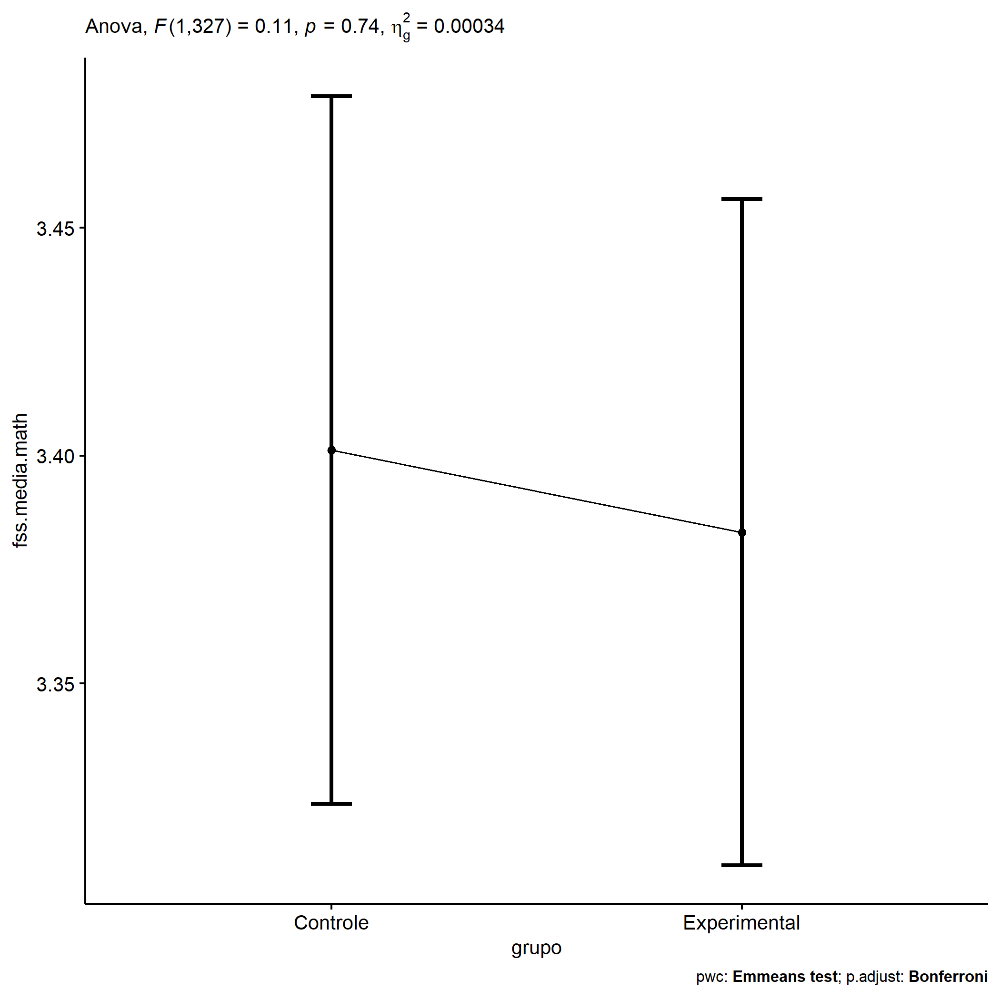<!-- -->

``` r
plots <- oneWayAncovaBoxPlots(
  wdat, "fss.media.math", "grupo", aov, pwc, covar = "dfs.media.math",
  theme = "classic", color = color[["grupo"]],
  subtitle = which(aov$Effect == "grupo"))
```

``` r
if (length(unique(wdat[["grupo"]])) > 1)
  plots[["grupo"]] + ggplot2::ylab("flow (prob. matemática)") + ggplot2::scale_x_discrete(labels=c('pre', 'pos'))
```

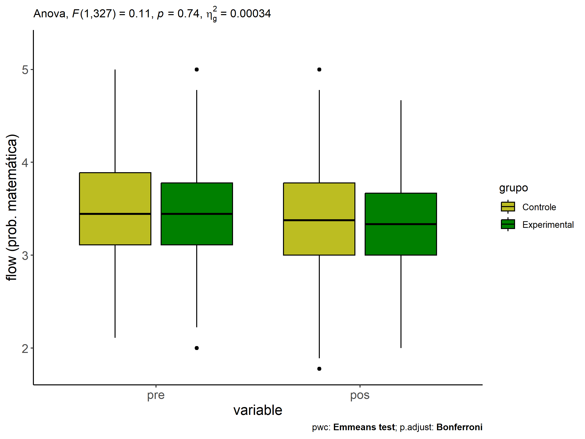<!-- -->

``` r
if (length(unique(wdat.long[["grupo"]])) > 1)
  plots <- oneWayAncovaBoxPlots(
    wdat.long, "flow.math", "grupo", aov, pwc.long, pre.post = "time",
    theme = "classic", color = color$prepost)
```

``` r
if (length(unique(wdat.long[["grupo"]])) > 1)
  plots[["grupo"]] + ggplot2::ylab("flow (prob. matemática)")
```

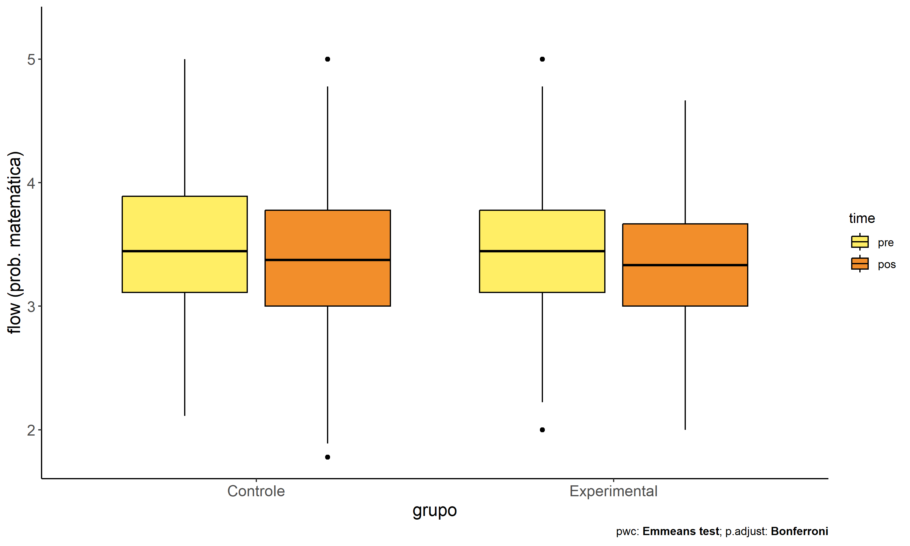<!-- -->

### Checking linearity assumption

``` r
ggscatter(wdat, x = "dfs.media.math", y = "fss.media.math", size = 0.5,
          color = "grupo", add = "reg.line")+
  stat_regline_equation(
    aes(label =  paste(..eq.label.., ..rr.label.., sep = "~~~~"), color = grupo)
  )
```

<!-- -->

### Checking normality and homogeneity

``` r
res <- augment(lm(fss.media.math ~ dfs.media.math + grupo, data = wdat))
```

``` r
shapiro_test(res$.resid)
```

    ## # A tibble: 1 × 3
    ##   variable   statistic p.value
    ##   <chr>          <dbl>   <dbl>
    ## 1 res$.resid     0.996   0.514

``` r
levene_test(res, .resid ~ grupo)
```

    ## # A tibble: 1 × 4
    ##     df1   df2 statistic     p
    ##   <int> <int>     <dbl> <dbl>
    ## 1     1   328    0.0354 0.851

# ANCOVA and Pairwise for two factors **grupo:Sexo**

## Without remove non-normal data

``` r
pdat = remove_group_data(dat[!is.na(dat[["grupo"]]) & !is.na(dat[["Sexo"]]),], "fss.media.math", c("grupo","Sexo"))

pdat.long <- rbind(pdat[,c("id","grupo","Sexo")], pdat[,c("id","grupo","Sexo")])
pdat.long[["time"]] <- c(rep("pre", nrow(pdat)), rep("pos", nrow(pdat)))
pdat.long[["time"]] <- factor(pdat.long[["time"]], c("pre","pos"))
pdat.long[["flow.math"]] <- c(pdat[["dfs.media.math"]], pdat[["fss.media.math"]])

aov = anova_test(pdat, fss.media.math ~ dfs.media.math + grupo*Sexo)
laov[["grupo:Sexo"]] <- get_anova_table(aov)
```

``` r
pwcs <- list()
pwcs[["Sexo"]] <- emmeans_test(
  group_by(pdat, grupo), fss.media.math ~ Sexo,
  covariate = dfs.media.math, p.adjust.method = "bonferroni")
pwcs[["grupo"]] <- emmeans_test(
  group_by(pdat, Sexo), fss.media.math ~ grupo,
  covariate = dfs.media.math, p.adjust.method = "bonferroni")

pwc <- plyr::rbind.fill(pwcs[["grupo"]], pwcs[["Sexo"]])
pwc <- pwc[,c("grupo","Sexo", colnames(pwc)[!colnames(pwc) %in% c("grupo","Sexo")])]
```

``` r
pwc.long <- emmeans_test(dplyr::group_by_at(pdat.long, c("grupo","Sexo")),
                         flow.math ~ time,
                         p.adjust.method = "bonferroni")
lpwc[["grupo:Sexo"]] <- plyr::rbind.fill(pwc, pwc.long)
```

``` r
ds <- get.descriptives(pdat, "fss.media.math", c("grupo","Sexo"), covar = "dfs.media.math")
ds <- merge(ds[ds$variable != "dfs.media.math",],
            ds[ds$variable == "dfs.media.math", !colnames(ds) %in% c("variable")],
            by = c("grupo","Sexo"), all.x = T, suffixes = c("", ".dfs.media.math"))
ds <- merge(get_emmeans(pwcs[["grupo"]]), ds, by = c("grupo","Sexo"), suffixes = c(".emms", ""))
ds <- ds[,c("grupo","Sexo","n","mean.dfs.media.math","se.dfs.media.math","mean","se","emmean","se.emms")]

colnames(ds) <- c("grupo","Sexo", "N", paste0(c("M","SE")," (pre)"),
                  paste0(c("M","SE"), " (unadj)"), paste0(c("M", "SE"), " (adj)"))

lemms[["grupo:Sexo"]] <- ds
```

## Computing ANCOVA and PairWise After removing non-normal data (OK)

``` r
wdat = pdat 

res = residuals(lm(fss.media.math ~ dfs.media.math + grupo*Sexo, data = wdat))
non.normal = getNonNormal(res, wdat$id, plimit = 0.05)

wdat = wdat[!wdat$id %in% non.normal,]

wdat.long <- rbind(wdat[,c("id","grupo","Sexo")], wdat[,c("id","grupo","Sexo")])
wdat.long[["time"]] <- c(rep("pre", nrow(wdat)), rep("pos", nrow(wdat)))
wdat.long[["time"]] <- factor(wdat.long[["time"]], c("pre","pos"))
wdat.long[["flow.math"]] <- c(wdat[["dfs.media.math"]], wdat[["fss.media.math"]])


ldat[["grupo:Sexo"]] = wdat

(non.normal)
```

    ## [1] "P1772"

``` r
aov = anova_test(wdat, fss.media.math ~ dfs.media.math + grupo*Sexo)
laov[["grupo:Sexo"]] <- merge(get_anova_table(aov), laov[["grupo:Sexo"]], by="Effect", suffixes = c("","'"))

(df = get_anova_table(aov))
```

    ## ANOVA Table (type II tests)
    ## 
    ##           Effect DFn DFd      F        p p<.05      ges
    ## 1 dfs.media.math   1 325 77.325 8.62e-17     * 1.92e-01
    ## 2          grupo   1 325  0.113 7.37e-01       3.48e-04
    ## 3           Sexo   1 325  0.008 9.30e-01       2.35e-05
    ## 4     grupo:Sexo   1 325  1.833 1.77e-01       6.00e-03

| Effect         | DFn | DFd |      F |     p | p\<.05 |   ges |
|:---------------|----:|----:|-------:|------:|:-------|------:|
| dfs.media.math |   1 | 325 | 77.325 | 0.000 | \*     | 0.192 |
| grupo          |   1 | 325 |  0.113 | 0.737 |        | 0.000 |
| Sexo           |   1 | 325 |  0.008 | 0.930 |        | 0.000 |
| grupo:Sexo     |   1 | 325 |  1.833 | 0.177 |        | 0.006 |

``` r
pwcs <- list()
pwcs[["Sexo"]] <- emmeans_test(
  group_by(wdat, grupo), fss.media.math ~ Sexo,
  covariate = dfs.media.math, p.adjust.method = "bonferroni")
pwcs[["grupo"]] <- emmeans_test(
  group_by(wdat, Sexo), fss.media.math ~ grupo,
  covariate = dfs.media.math, p.adjust.method = "bonferroni")

pwc <- plyr::rbind.fill(pwcs[["grupo"]], pwcs[["Sexo"]])
pwc <- pwc[,c("grupo","Sexo", colnames(pwc)[!colnames(pwc) %in% c("grupo","Sexo")])]
```

| grupo        | Sexo | term                  | .y.            | group1   | group2       |  df | statistic |     p | p.adj | p.adj.signif |
|:-------------|:-----|:----------------------|:---------------|:---------|:-------------|----:|----------:|------:|------:|:-------------|
|              | F    | dfs.media.math\*grupo | fss.media.math | Controle | Experimental | 325 |     1.197 | 0.232 | 0.232 | ns           |
|              | M    | dfs.media.math\*grupo | fss.media.math | Controle | Experimental | 325 |    -0.715 | 0.475 | 0.475 | ns           |
| Controle     |      | dfs.media.math\*Sexo  | fss.media.math | F        | M            | 325 |     1.046 | 0.296 | 0.296 | ns           |
| Experimental |      | dfs.media.math\*Sexo  | fss.media.math | F        | M            | 325 |    -0.864 | 0.388 | 0.388 | ns           |

``` r
pwc.long <- emmeans_test(dplyr::group_by_at(wdat.long, c("grupo","Sexo")),
                         flow.math ~ time,
                         p.adjust.method = "bonferroni")
lpwc[["grupo:Sexo"]] <- merge(plyr::rbind.fill(pwc, pwc.long), lpwc[["grupo:Sexo"]], by=c("grupo","Sexo","term",".y.","group1","group2"), suffixes = c("","'"))
```

| grupo        | Sexo | term | .y.       | group1 | group2 |  df | statistic |     p | p.adj | p.adj.signif |
|:-------------|:-----|:-----|:----------|:-------|:-------|----:|----------:|------:|------:|:-------------|
| Controle     | F    | time | flow.math | pre    | pos    | 652 |     0.256 | 0.798 | 0.798 | ns           |
| Controle     | M    | time | flow.math | pre    | pos    | 652 |     1.332 | 0.183 | 0.183 | ns           |
| Experimental | F    | time | flow.math | pre    | pos    | 652 |     1.237 | 0.217 | 0.217 | ns           |
| Experimental | M    | time | flow.math | pre    | pos    | 652 |     0.331 | 0.741 | 0.741 | ns           |

``` r
ds <- get.descriptives(wdat, "fss.media.math", c("grupo","Sexo"), covar = "dfs.media.math")
ds <- merge(ds[ds$variable != "dfs.media.math",],
            ds[ds$variable == "dfs.media.math", !colnames(ds) %in% c("variable")],
            by = c("grupo","Sexo"), all.x = T, suffixes = c("", ".dfs.media.math"))
ds <- merge(get_emmeans(pwcs[["grupo"]]), ds, by = c("grupo","Sexo"), suffixes = c(".emms", ""))
ds <- ds[,c("grupo","Sexo","n","mean.dfs.media.math","se.dfs.media.math","mean","se","emmean","se.emms")]

colnames(ds) <- c("grupo","Sexo", "N", paste0(c("M","SE")," (pre)"),
                  paste0(c("M","SE"), " (unadj)"), paste0(c("M", "SE"), " (adj)"))

lemms[["grupo:Sexo"]] <- merge(ds, lemms[["grupo:Sexo"]], by=c("grupo","Sexo"), suffixes = c("","'"))
```

| grupo        | Sexo |   N | M (pre) | SE (pre) | M (unadj) | SE (unadj) | M (adj) | SE (adj) |
|:-------------|:-----|----:|--------:|---------:|----------:|-----------:|--------:|---------:|
| Controle     | F    |  73 |   3.474 |    0.070 |     3.450 |      0.070 |   3.445 |    0.058 |
| Controle     | M    |  82 |   3.491 |    0.066 |     3.375 |      0.062 |   3.362 |    0.054 |
| Experimental | F    |  92 |   3.449 |    0.054 |     3.348 |      0.053 |   3.353 |    0.051 |
| Experimental | M    |  83 |   3.434 |    0.063 |     3.406 |      0.056 |   3.417 |    0.054 |

### Plots for ancova

``` r
plots <- twoWayAncovaPlots(
  wdat, "fss.media.math", c("grupo","Sexo"), aov, pwcs, addParam = c("mean_se"),
  font.label.size=10, step.increase=0.05, p.label="p.adj",
  subtitle = which(aov$Effect == "grupo:Sexo"))
```

``` r
if (!is.null(plots[["grupo"]]))
  plots[["grupo"]] + ggplot2::scale_color_manual(values = color[["Sexo"]])
```

    ## Scale for colour is already present.
    ## Adding another scale for colour, which will replace the existing scale.

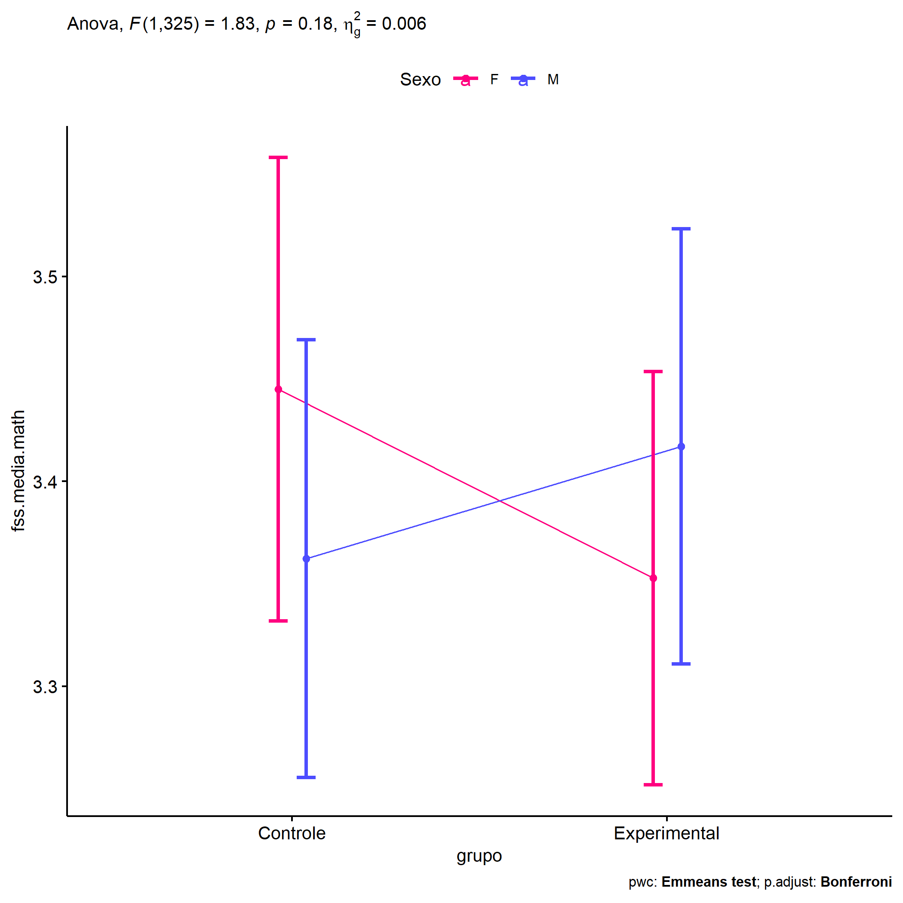<!-- -->

``` r
if (!is.null(plots[["Sexo"]]))
  plots[["Sexo"]] + ggplot2::scale_color_manual(values = color[["grupo"]])
```

    ## Scale for colour is already present.
    ## Adding another scale for colour, which will replace the existing scale.

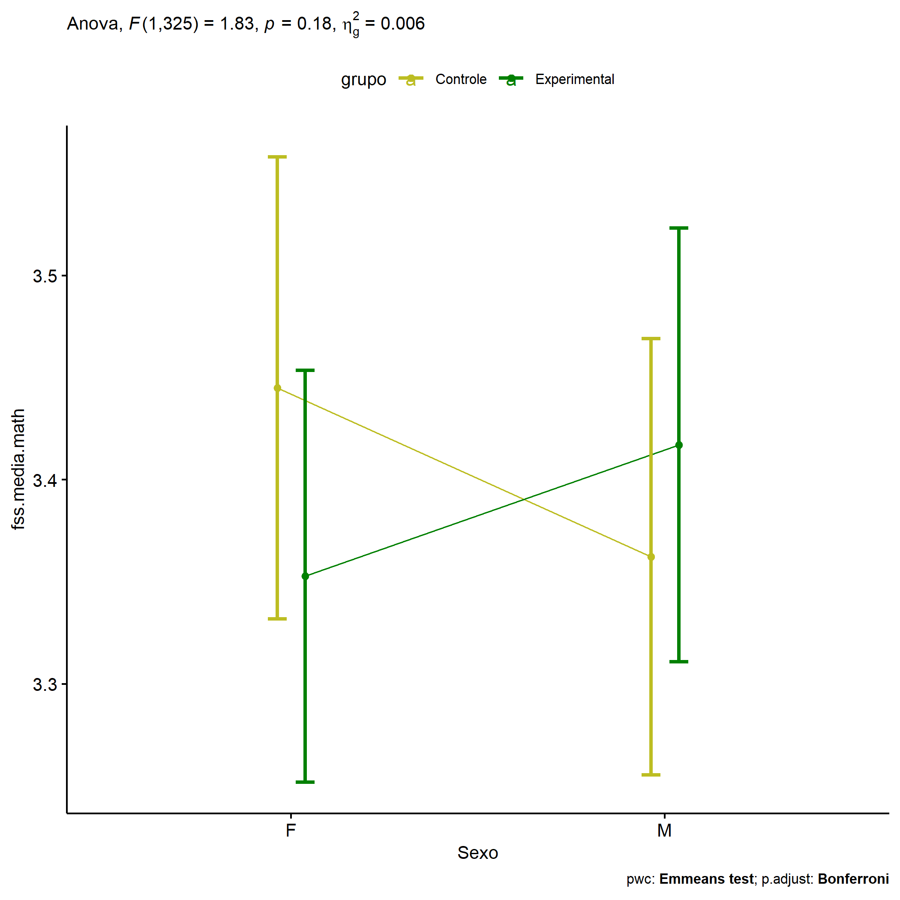<!-- -->

``` r
plots <- twoWayAncovaBoxPlots(
  wdat, "fss.media.math", c("grupo","Sexo"), aov, pwcs, covar = "dfs.media.math",
  theme = "classic", color = color[["grupo:Sexo"]],
  subtitle = which(aov$Effect == "grupo:Sexo"))
```

``` r
plots[["grupo:Sexo"]] + ggplot2::ylab("flow (prob. matemática)") + ggplot2::scale_x_discrete(labels=c('pre', 'pos'))
```

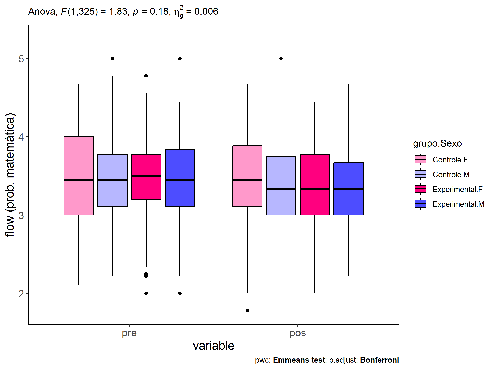<!-- -->

``` r
plots <- twoWayAncovaBoxPlots(
  wdat.long, "flow.math", c("grupo","Sexo"), aov, pwc.long, pre.post = "time",
  theme = "classic", color = color$prepost)
```

``` r
plots[["grupo:Sexo"]] + ggplot2::ylab("flow (prob. matemática)")
```

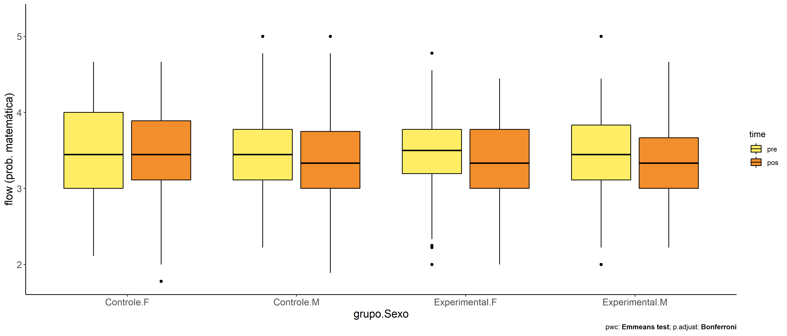<!-- -->

### Checking linearity assumption

``` r
ggscatter(wdat, x = "dfs.media.math", y = "fss.media.math", size = 0.5,
          facet.by = c("grupo","Sexo"), add = "reg.line")+
  stat_regline_equation(
    aes(label =  paste(..eq.label.., ..rr.label.., sep = "~~~~"))
  )
```

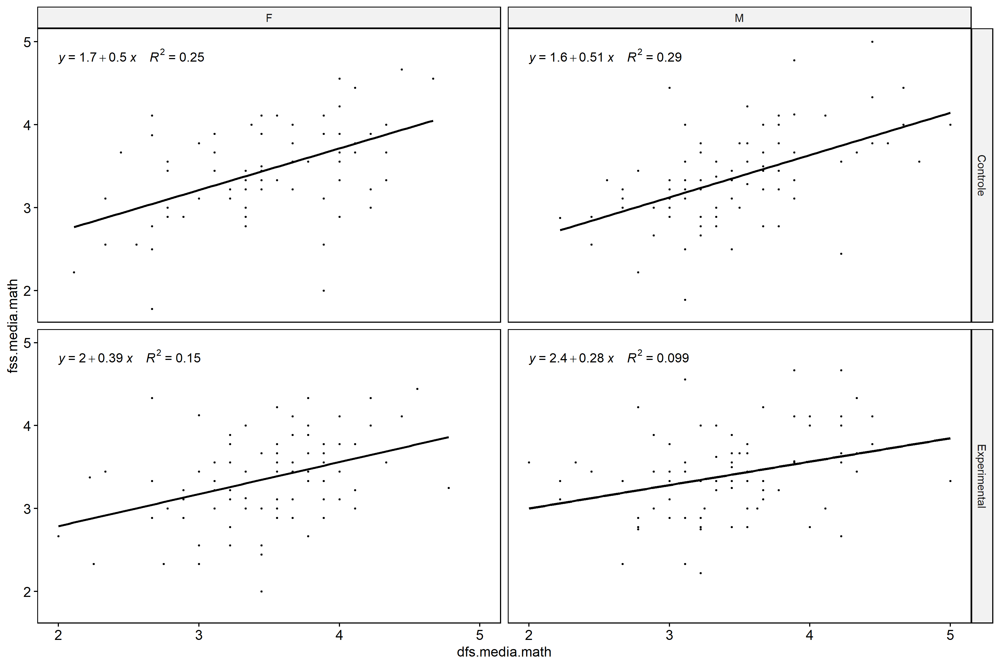<!-- -->

### Checking normality and homogeneity

``` r
res <- augment(lm(fss.media.math ~ dfs.media.math + grupo*Sexo, data = wdat))
```

``` r
shapiro_test(res$.resid)
```

    ## # A tibble: 1 × 3
    ##   variable   statistic p.value
    ##   <chr>          <dbl>   <dbl>
    ## 1 res$.resid     0.996   0.476

``` r
levene_test(res, .resid ~ grupo*Sexo)
```

    ## # A tibble: 1 × 4
    ##     df1   df2 statistic     p
    ##   <int> <int>     <dbl> <dbl>
    ## 1     3   326     0.541 0.655

# ANCOVA and Pairwise for two factors **grupo:Zona**

## Without remove non-normal data

``` r
pdat = remove_group_data(dat[!is.na(dat[["grupo"]]) & !is.na(dat[["Zona"]]),], "fss.media.math", c("grupo","Zona"))

pdat.long <- rbind(pdat[,c("id","grupo","Zona")], pdat[,c("id","grupo","Zona")])
pdat.long[["time"]] <- c(rep("pre", nrow(pdat)), rep("pos", nrow(pdat)))
pdat.long[["time"]] <- factor(pdat.long[["time"]], c("pre","pos"))
pdat.long[["flow.math"]] <- c(pdat[["dfs.media.math"]], pdat[["fss.media.math"]])

aov = anova_test(pdat, fss.media.math ~ dfs.media.math + grupo*Zona)
laov[["grupo:Zona"]] <- get_anova_table(aov)
```

``` r
pwcs <- list()
pwcs[["Zona"]] <- emmeans_test(
  group_by(pdat, grupo), fss.media.math ~ Zona,
  covariate = dfs.media.math, p.adjust.method = "bonferroni")
pwcs[["grupo"]] <- emmeans_test(
  group_by(pdat, Zona), fss.media.math ~ grupo,
  covariate = dfs.media.math, p.adjust.method = "bonferroni")

pwc <- plyr::rbind.fill(pwcs[["grupo"]], pwcs[["Zona"]])
pwc <- pwc[,c("grupo","Zona", colnames(pwc)[!colnames(pwc) %in% c("grupo","Zona")])]
```

``` r
pwc.long <- emmeans_test(dplyr::group_by_at(pdat.long, c("grupo","Zona")),
                         flow.math ~ time,
                         p.adjust.method = "bonferroni")
lpwc[["grupo:Zona"]] <- plyr::rbind.fill(pwc, pwc.long)
```

``` r
ds <- get.descriptives(pdat, "fss.media.math", c("grupo","Zona"), covar = "dfs.media.math")
ds <- merge(ds[ds$variable != "dfs.media.math",],
            ds[ds$variable == "dfs.media.math", !colnames(ds) %in% c("variable")],
            by = c("grupo","Zona"), all.x = T, suffixes = c("", ".dfs.media.math"))
ds <- merge(get_emmeans(pwcs[["grupo"]]), ds, by = c("grupo","Zona"), suffixes = c(".emms", ""))
ds <- ds[,c("grupo","Zona","n","mean.dfs.media.math","se.dfs.media.math","mean","se","emmean","se.emms")]

colnames(ds) <- c("grupo","Zona", "N", paste0(c("M","SE")," (pre)"),
                  paste0(c("M","SE"), " (unadj)"), paste0(c("M", "SE"), " (adj)"))

lemms[["grupo:Zona"]] <- ds
```

## Computing ANCOVA and PairWise After removing non-normal data (OK)

``` r
wdat = pdat 

res = residuals(lm(fss.media.math ~ dfs.media.math + grupo*Zona, data = wdat))
non.normal = getNonNormal(res, wdat$id, plimit = 0.05)

wdat = wdat[!wdat$id %in% non.normal,]

wdat.long <- rbind(wdat[,c("id","grupo","Zona")], wdat[,c("id","grupo","Zona")])
wdat.long[["time"]] <- c(rep("pre", nrow(wdat)), rep("pos", nrow(wdat)))
wdat.long[["time"]] <- factor(wdat.long[["time"]], c("pre","pos"))
wdat.long[["flow.math"]] <- c(wdat[["dfs.media.math"]], wdat[["fss.media.math"]])


ldat[["grupo:Zona"]] = wdat

(non.normal)
```

    ## [1] "P1772"

``` r
aov = anova_test(wdat, fss.media.math ~ dfs.media.math + grupo*Zona)
laov[["grupo:Zona"]] <- merge(get_anova_table(aov), laov[["grupo:Zona"]], by="Effect", suffixes = c("","'"))

(df = get_anova_table(aov))
```

    ## ANOVA Table (type II tests)
    ## 
    ##           Effect DFn DFd         F        p p<.05      ges
    ## 1 dfs.media.math   1 258 69.656000 4.32e-15     * 2.13e-01
    ## 2          grupo   1 258  0.000831 9.77e-01       3.22e-06
    ## 3           Zona   1 258  3.512000 6.20e-02       1.30e-02
    ## 4     grupo:Zona   1 258  0.552000 4.58e-01       2.00e-03

| Effect         | DFn | DFd |      F |     p | p\<.05 |   ges |
|:---------------|----:|----:|-------:|------:|:-------|------:|
| dfs.media.math |   1 | 258 | 69.656 | 0.000 | \*     | 0.213 |
| grupo          |   1 | 258 |  0.001 | 0.977 |        | 0.000 |
| Zona           |   1 | 258 |  3.512 | 0.062 |        | 0.013 |
| grupo:Zona     |   1 | 258 |  0.552 | 0.458 |        | 0.002 |

``` r
pwcs <- list()
pwcs[["Zona"]] <- emmeans_test(
  group_by(wdat, grupo), fss.media.math ~ Zona,
  covariate = dfs.media.math, p.adjust.method = "bonferroni")
pwcs[["grupo"]] <- emmeans_test(
  group_by(wdat, Zona), fss.media.math ~ grupo,
  covariate = dfs.media.math, p.adjust.method = "bonferroni")

pwc <- plyr::rbind.fill(pwcs[["grupo"]], pwcs[["Zona"]])
pwc <- pwc[,c("grupo","Zona", colnames(pwc)[!colnames(pwc) %in% c("grupo","Zona")])]
```

| grupo        | Zona   | term                  | .y.            | group1   | group2       |  df | statistic |     p | p.adj | p.adj.signif |
|:-------------|:-------|:----------------------|:---------------|:---------|:-------------|----:|----------:|------:|------:|:-------------|
|              | Rural  | dfs.media.math\*grupo | fss.media.math | Controle | Experimental | 258 |    -0.404 | 0.686 | 0.686 | ns           |
|              | Urbana | dfs.media.math\*grupo | fss.media.math | Controle | Experimental | 258 |     0.623 | 0.534 | 0.534 | ns           |
| Controle     |        | dfs.media.math\*Zona  | fss.media.math | Rural    | Urbana       | 258 |     0.723 | 0.470 | 0.470 | ns           |
| Experimental |        | dfs.media.math\*Zona  | fss.media.math | Rural    | Urbana       | 258 |     1.883 | 0.061 | 0.061 | ns           |

``` r
pwc.long <- emmeans_test(dplyr::group_by_at(wdat.long, c("grupo","Zona")),
                         flow.math ~ time,
                         p.adjust.method = "bonferroni")
lpwc[["grupo:Zona"]] <- merge(plyr::rbind.fill(pwc, pwc.long), lpwc[["grupo:Zona"]], by=c("grupo","Zona","term",".y.","group1","group2"), suffixes = c("","'"))
```

| grupo        | Zona   | term | .y.       | group1 | group2 |  df | statistic |     p | p.adj | p.adj.signif |
|:-------------|:-------|:-----|:----------|:-------|:-------|----:|----------:|------:|------:|:-------------|
| Controle     | Rural  | time | flow.math | pre    | pos    | 518 |     1.251 | 0.211 | 0.211 | ns           |
| Controle     | Urbana | time | flow.math | pre    | pos    | 518 |     1.061 | 0.289 | 0.289 | ns           |
| Experimental | Rural  | time | flow.math | pre    | pos    | 518 |     0.362 | 0.717 | 0.717 | ns           |
| Experimental | Urbana | time | flow.math | pre    | pos    | 518 |     1.134 | 0.257 | 0.257 | ns           |

``` r
ds <- get.descriptives(wdat, "fss.media.math", c("grupo","Zona"), covar = "dfs.media.math")
ds <- merge(ds[ds$variable != "dfs.media.math",],
            ds[ds$variable == "dfs.media.math", !colnames(ds) %in% c("variable")],
            by = c("grupo","Zona"), all.x = T, suffixes = c("", ".dfs.media.math"))
ds <- merge(get_emmeans(pwcs[["grupo"]]), ds, by = c("grupo","Zona"), suffixes = c(".emms", ""))
ds <- ds[,c("grupo","Zona","n","mean.dfs.media.math","se.dfs.media.math","mean","se","emmean","se.emms")]

colnames(ds) <- c("grupo","Zona", "N", paste0(c("M","SE")," (pre)"),
                  paste0(c("M","SE"), " (unadj)"), paste0(c("M", "SE"), " (adj)"))

lemms[["grupo:Zona"]] <- merge(ds, lemms[["grupo:Zona"]], by=c("grupo","Zona"), suffixes = c("","'"))
```

| grupo        | Zona   |   N | M (pre) | SE (pre) | M (unadj) | SE (unadj) | M (adj) | SE (adj) |
|:-------------|:-------|----:|--------:|---------:|----------:|-----------:|--------:|---------:|
| Controle     | Rural  | 104 |   3.551 |    0.056 |     3.455 |      0.057 |   3.432 |    0.047 |
| Controle     | Urbana |  30 |   3.522 |    0.117 |     3.372 |      0.104 |   3.361 |    0.087 |
| Experimental | Rural  |  89 |   3.484 |    0.057 |     3.454 |      0.049 |   3.460 |    0.050 |
| Experimental | Urbana |  40 |   3.375 |    0.085 |     3.236 |      0.083 |   3.290 |    0.075 |

### Plots for ancova

``` r
plots <- twoWayAncovaPlots(
  wdat, "fss.media.math", c("grupo","Zona"), aov, pwcs, addParam = c("mean_se"),
  font.label.size=10, step.increase=0.05, p.label="p.adj",
  subtitle = which(aov$Effect == "grupo:Zona"))
```

``` r
if (!is.null(plots[["grupo"]]))
  plots[["grupo"]] + ggplot2::scale_color_manual(values = color[["Zona"]])
```

    ## Scale for colour is already present.
    ## Adding another scale for colour, which will replace the existing scale.

<!-- -->

``` r
if (!is.null(plots[["Zona"]]))
  plots[["Zona"]] + ggplot2::scale_color_manual(values = color[["grupo"]])
```

    ## Scale for colour is already present.
    ## Adding another scale for colour, which will replace the existing scale.

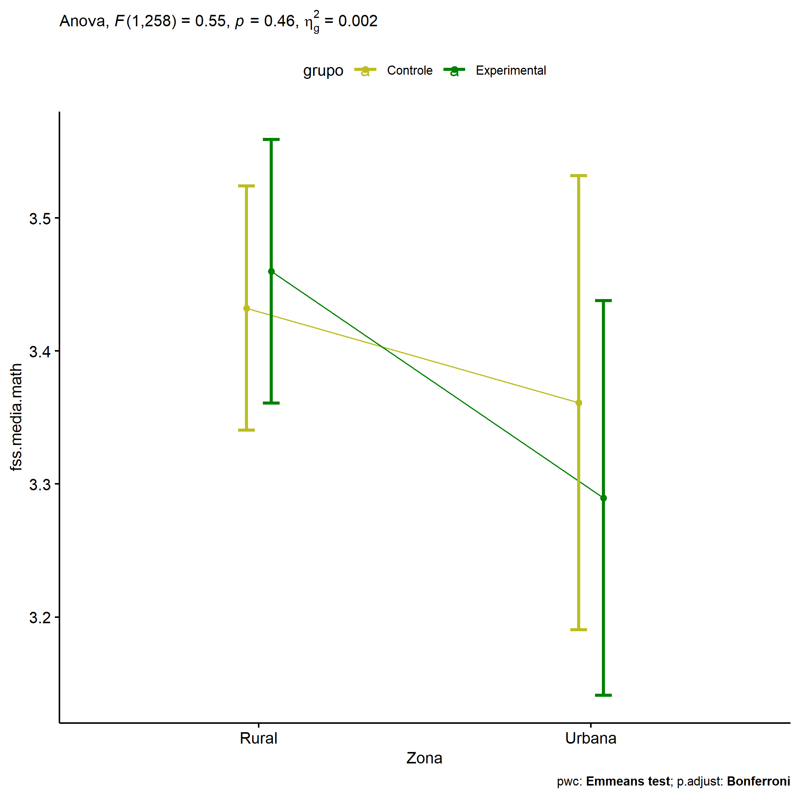<!-- -->

``` r
plots <- twoWayAncovaBoxPlots(
  wdat, "fss.media.math", c("grupo","Zona"), aov, pwcs, covar = "dfs.media.math",
  theme = "classic", color = color[["grupo:Zona"]],
  subtitle = which(aov$Effect == "grupo:Zona"))
```

``` r
plots[["grupo:Zona"]] + ggplot2::ylab("flow (prob. matemática)") + ggplot2::scale_x_discrete(labels=c('pre', 'pos'))
```

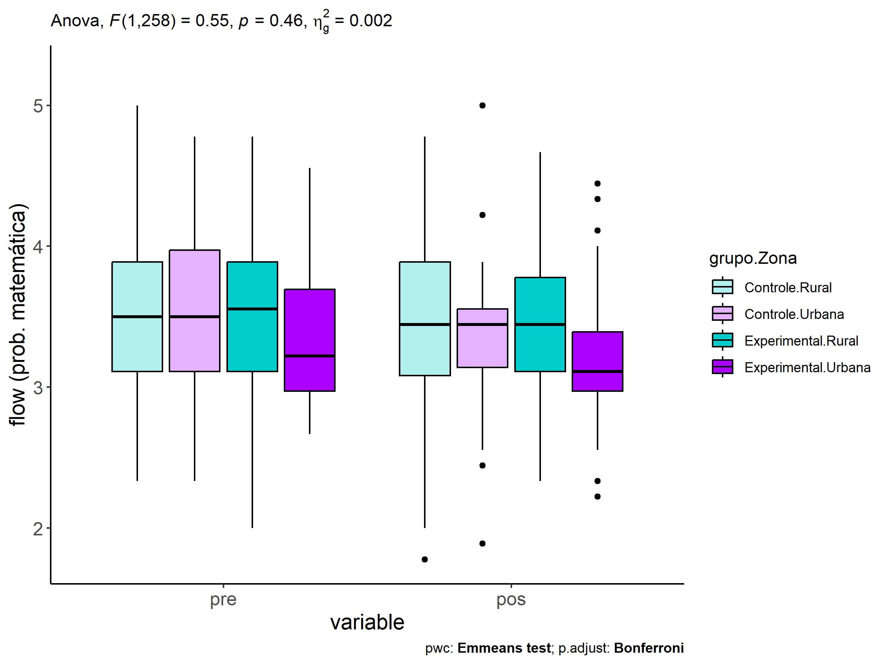<!-- -->

``` r
plots <- twoWayAncovaBoxPlots(
  wdat.long, "flow.math", c("grupo","Zona"), aov, pwc.long, pre.post = "time",
  theme = "classic", color = color$prepost)
```

``` r
plots[["grupo:Zona"]] + ggplot2::ylab("flow (prob. matemática)")
```

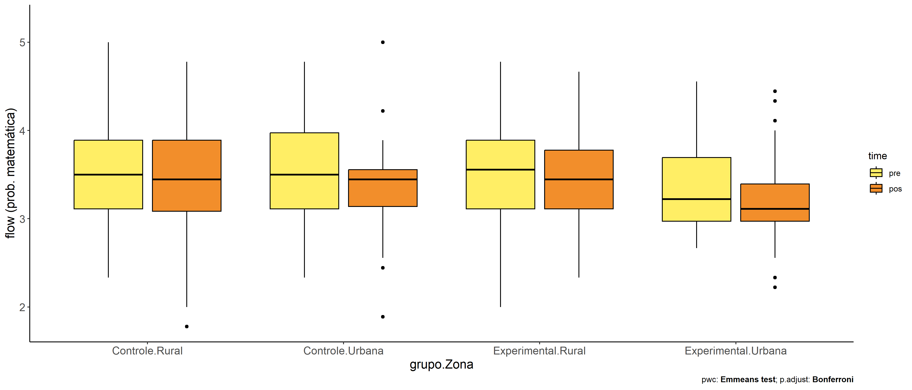<!-- -->

### Checking linearity assumption

``` r
ggscatter(wdat, x = "dfs.media.math", y = "fss.media.math", size = 0.5,
          facet.by = c("grupo","Zona"), add = "reg.line")+
  stat_regline_equation(
    aes(label =  paste(..eq.label.., ..rr.label.., sep = "~~~~"))
  )
```

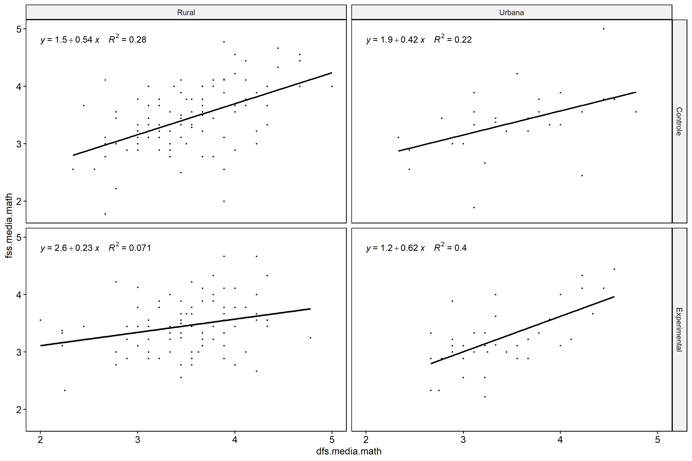<!-- -->

### Checking normality and homogeneity

``` r
res <- augment(lm(fss.media.math ~ dfs.media.math + grupo*Zona, data = wdat))
```

``` r
shapiro_test(res$.resid)
```

    ## # A tibble: 1 × 3
    ##   variable   statistic p.value
    ##   <chr>          <dbl>   <dbl>
    ## 1 res$.resid     0.993   0.311

``` r
levene_test(res, .resid ~ grupo*Zona)
```

    ## # A tibble: 1 × 4
    ##     df1   df2 statistic     p
    ##   <int> <int>     <dbl> <dbl>
    ## 1     3   259     0.517 0.671

# ANCOVA and Pairwise for two factors **grupo:Cor.Raca**

## Without remove non-normal data

``` r
pdat = remove_group_data(dat[!is.na(dat[["grupo"]]) & !is.na(dat[["Cor.Raca"]]),], "fss.media.math", c("grupo","Cor.Raca"))
```

    ## Warning: There were 2 warnings in `mutate()`.
    ## The first warning was:
    ## ℹ In argument: `ci = abs(stats::qt(alpha/2, .data$n - 1) * .data$se)`.
    ## Caused by warning:
    ## ! There was 1 warning in `mutate()`.
    ## ℹ In argument: `ci = abs(stats::qt(alpha/2, .data$n - 1) * .data$se)`.
    ## Caused by warning in `stats::qt()`:
    ## ! NaNs produced
    ## ℹ Run `dplyr::last_dplyr_warnings()` to see the 1 remaining warning.

``` r
pdat.long <- rbind(pdat[,c("id","grupo","Cor.Raca")], pdat[,c("id","grupo","Cor.Raca")])
pdat.long[["time"]] <- c(rep("pre", nrow(pdat)), rep("pos", nrow(pdat)))
pdat.long[["time"]] <- factor(pdat.long[["time"]], c("pre","pos"))
pdat.long[["flow.math"]] <- c(pdat[["dfs.media.math"]], pdat[["fss.media.math"]])

aov = anova_test(pdat, fss.media.math ~ dfs.media.math + grupo*Cor.Raca)
laov[["grupo:Cor.Raca"]] <- get_anova_table(aov)
```

``` r
pwcs <- list()
pwcs[["Cor.Raca"]] <- emmeans_test(
  group_by(pdat, grupo), fss.media.math ~ Cor.Raca,
  covariate = dfs.media.math, p.adjust.method = "bonferroni")
pwcs[["grupo"]] <- emmeans_test(
  group_by(pdat, Cor.Raca), fss.media.math ~ grupo,
  covariate = dfs.media.math, p.adjust.method = "bonferroni")

pwc <- plyr::rbind.fill(pwcs[["grupo"]], pwcs[["Cor.Raca"]])
pwc <- pwc[,c("grupo","Cor.Raca", colnames(pwc)[!colnames(pwc) %in% c("grupo","Cor.Raca")])]
```

``` r
pwc.long <- emmeans_test(dplyr::group_by_at(pdat.long, c("grupo","Cor.Raca")),
                         flow.math ~ time,
                         p.adjust.method = "bonferroni")
lpwc[["grupo:Cor.Raca"]] <- plyr::rbind.fill(pwc, pwc.long)
```

``` r
ds <- get.descriptives(pdat, "fss.media.math", c("grupo","Cor.Raca"), covar = "dfs.media.math")
ds <- merge(ds[ds$variable != "dfs.media.math",],
            ds[ds$variable == "dfs.media.math", !colnames(ds) %in% c("variable")],
            by = c("grupo","Cor.Raca"), all.x = T, suffixes = c("", ".dfs.media.math"))
ds <- merge(get_emmeans(pwcs[["grupo"]]), ds, by = c("grupo","Cor.Raca"), suffixes = c(".emms", ""))
ds <- ds[,c("grupo","Cor.Raca","n","mean.dfs.media.math","se.dfs.media.math","mean","se","emmean","se.emms")]

colnames(ds) <- c("grupo","Cor.Raca", "N", paste0(c("M","SE")," (pre)"),
                  paste0(c("M","SE"), " (unadj)"), paste0(c("M", "SE"), " (adj)"))

lemms[["grupo:Cor.Raca"]] <- ds
```

## Computing ANCOVA and PairWise After removing non-normal data (OK)

``` r
wdat = pdat 

res = residuals(lm(fss.media.math ~ dfs.media.math + grupo*Cor.Raca, data = wdat))
non.normal = getNonNormal(res, wdat$id, plimit = 0.05)

wdat = wdat[!wdat$id %in% non.normal,]

wdat.long <- rbind(wdat[,c("id","grupo","Cor.Raca")], wdat[,c("id","grupo","Cor.Raca")])
wdat.long[["time"]] <- c(rep("pre", nrow(wdat)), rep("pos", nrow(wdat)))
wdat.long[["time"]] <- factor(wdat.long[["time"]], c("pre","pos"))
wdat.long[["flow.math"]] <- c(wdat[["dfs.media.math"]], wdat[["fss.media.math"]])


ldat[["grupo:Cor.Raca"]] = wdat

(non.normal)
```

    ## NULL

``` r
aov = anova_test(wdat, fss.media.math ~ dfs.media.math + grupo*Cor.Raca)
laov[["grupo:Cor.Raca"]] <- merge(get_anova_table(aov), laov[["grupo:Cor.Raca"]], by="Effect", suffixes = c("","'"))

(df = get_anova_table(aov))
```

    ## ANOVA Table (type II tests)
    ## 
    ##           Effect DFn DFd      F        p p<.05      ges
    ## 1 dfs.media.math   1 135 27.928 4.93e-07     * 0.171000
    ## 2          grupo   1 135  0.061 8.05e-01       0.000452
    ## 3       Cor.Raca   2 135  1.695 1.87e-01       0.025000
    ## 4 grupo:Cor.Raca   1 135  0.145 7.04e-01       0.001000

| Effect         | DFn | DFd |      F |     p | p\<.05 |   ges |
|:---------------|----:|----:|-------:|------:|:-------|------:|
| dfs.media.math |   1 | 135 | 27.928 | 0.000 | \*     | 0.171 |
| grupo          |   1 | 135 |  0.061 | 0.805 |        | 0.000 |
| Cor.Raca       |   2 | 135 |  1.695 | 0.187 |        | 0.025 |
| grupo:Cor.Raca |   1 | 135 |  0.145 | 0.704 |        | 0.001 |

``` r
pwcs <- list()
pwcs[["Cor.Raca"]] <- emmeans_test(
  group_by(wdat, grupo), fss.media.math ~ Cor.Raca,
  covariate = dfs.media.math, p.adjust.method = "bonferroni")
pwcs[["grupo"]] <- emmeans_test(
  group_by(wdat, Cor.Raca), fss.media.math ~ grupo,
  covariate = dfs.media.math, p.adjust.method = "bonferroni")

pwc <- plyr::rbind.fill(pwcs[["grupo"]], pwcs[["Cor.Raca"]])
pwc <- pwc[,c("grupo","Cor.Raca", colnames(pwc)[!colnames(pwc) %in% c("grupo","Cor.Raca")])]
```

| grupo        | Cor.Raca | term                     | .y.            | group1   | group2       |  df | statistic |     p | p.adj | p.adj.signif |
|:-------------|:---------|:-------------------------|:---------------|:---------|:-------------|----:|----------:|------:|------:|:-------------|
|              | Branca   | dfs.media.math\*grupo    | fss.media.math | Controle | Experimental | 135 |     0.454 | 0.651 | 0.651 | ns           |
|              | Indígena | dfs.media.math\*grupo    | fss.media.math | Controle | Experimental |     |           |       |       |              |
|              | Parda    | dfs.media.math\*grupo    | fss.media.math | Controle | Experimental | 135 |     0.003 | 0.997 | 0.997 | ns           |
| Controle     |          | dfs.media.math\*Cor.Raca | fss.media.math | Branca   | Indígena     |     |           |       |       |              |
| Controle     |          | dfs.media.math\*Cor.Raca | fss.media.math | Branca   | Parda        | 135 |     1.245 | 0.215 | 0.215 | ns           |
| Controle     |          | dfs.media.math\*Cor.Raca | fss.media.math | Indígena | Parda        |     |           |       |       |              |
| Experimental |          | dfs.media.math\*Cor.Raca | fss.media.math | Branca   | Indígena     | 135 |     1.400 | 0.164 | 0.492 | ns           |
| Experimental |          | dfs.media.math\*Cor.Raca | fss.media.math | Branca   | Parda        | 135 |     0.646 | 0.519 | 1.000 | ns           |
| Experimental |          | dfs.media.math\*Cor.Raca | fss.media.math | Indígena | Parda        | 135 |    -1.047 | 0.297 | 0.891 | ns           |

``` r
pwc.long <- emmeans_test(dplyr::group_by_at(wdat.long, c("grupo","Cor.Raca")),
                         flow.math ~ time,
                         p.adjust.method = "bonferroni")
lpwc[["grupo:Cor.Raca"]] <- merge(plyr::rbind.fill(pwc, pwc.long), lpwc[["grupo:Cor.Raca"]], by=c("grupo","Cor.Raca","term",".y.","group1","group2"), suffixes = c("","'"))
```

| grupo        | Cor.Raca | term | .y.       | group1 | group2 |  df | statistic |     p | p.adj | p.adj.signif |
|:-------------|:---------|:-----|:----------|:-------|:-------|----:|----------:|------:|------:|:-------------|
| Controle     | Branca   | time | flow.math | pre    | pos    | 272 |    -0.371 | 0.711 | 0.711 | ns           |
| Controle     | Indígena | time | flow.math | pre    | pos    |     |           |       |       |              |
| Controle     | Parda    | time | flow.math | pre    | pos    | 272 |     0.792 | 0.429 | 0.429 | ns           |
| Experimental | Branca   | time | flow.math | pre    | pos    | 272 |    -0.041 | 0.967 | 0.967 | ns           |
| Experimental | Indígena | time | flow.math | pre    | pos    | 272 |     1.366 | 0.173 | 0.173 | ns           |
| Experimental | Parda    | time | flow.math | pre    | pos    | 272 |    -0.042 | 0.966 | 0.966 | ns           |

``` r
ds <- get.descriptives(wdat, "fss.media.math", c("grupo","Cor.Raca"), covar = "dfs.media.math")
ds <- merge(ds[ds$variable != "dfs.media.math",],
            ds[ds$variable == "dfs.media.math", !colnames(ds) %in% c("variable")],
            by = c("grupo","Cor.Raca"), all.x = T, suffixes = c("", ".dfs.media.math"))
ds <- merge(get_emmeans(pwcs[["grupo"]]), ds, by = c("grupo","Cor.Raca"), suffixes = c(".emms", ""))
ds <- ds[,c("grupo","Cor.Raca","n","mean.dfs.media.math","se.dfs.media.math","mean","se","emmean","se.emms")]

colnames(ds) <- c("grupo","Cor.Raca", "N", paste0(c("M","SE")," (pre)"),
                  paste0(c("M","SE"), " (unadj)"), paste0(c("M", "SE"), " (adj)"))

lemms[["grupo:Cor.Raca"]] <- merge(ds, lemms[["grupo:Cor.Raca"]], by=c("grupo","Cor.Raca"), suffixes = c("","'"))
```

| grupo        | Cor.Raca |   N | M (pre) | SE (pre) | M (unadj) | SE (unadj) | M (adj) | SE (adj) |
|:-------------|:---------|----:|--------:|---------:|----------:|-----------:|--------:|---------:|
| Controle     | Branca   |  20 |   3.489 |    0.151 |     3.550 |      0.122 |   3.530 |    0.103 |
| Controle     | Parda    |  46 |   3.478 |    0.081 |     3.392 |      0.072 |   3.376 |    0.068 |
| Experimental | Branca   |  17 |   3.464 |    0.094 |     3.471 |      0.150 |   3.461 |    0.112 |
| Experimental | Indígena |  13 |   3.544 |    0.106 |     3.265 |      0.103 |   3.223 |    0.128 |
| Experimental | Parda    |  45 |   3.330 |    0.080 |     3.334 |      0.073 |   3.376 |    0.069 |

### Plots for ancova

``` r
plots <- twoWayAncovaPlots(
  wdat, "fss.media.math", c("grupo","Cor.Raca"), aov, pwcs, addParam = c("mean_se"),
  font.label.size=10, step.increase=0.05, p.label="p.adj",
  subtitle = which(aov$Effect == "grupo:Cor.Raca"))
```

``` r
if (!is.null(plots[["grupo"]]))
  plots[["grupo"]] + ggplot2::scale_color_manual(values = color[["Cor.Raca"]])
```

<!-- -->

``` r
if (!is.null(plots[["Cor.Raca"]]))
  plots[["Cor.Raca"]] + ggplot2::scale_color_manual(values = color[["grupo"]])
```

    ## Scale for colour is already present.
    ## Adding another scale for colour, which will replace the existing scale.

    ## Warning: Removed 2 rows containing non-finite values (`stat_bracket()`).

    ## Warning: Removed 1 rows containing missing values (`geom_point()`).

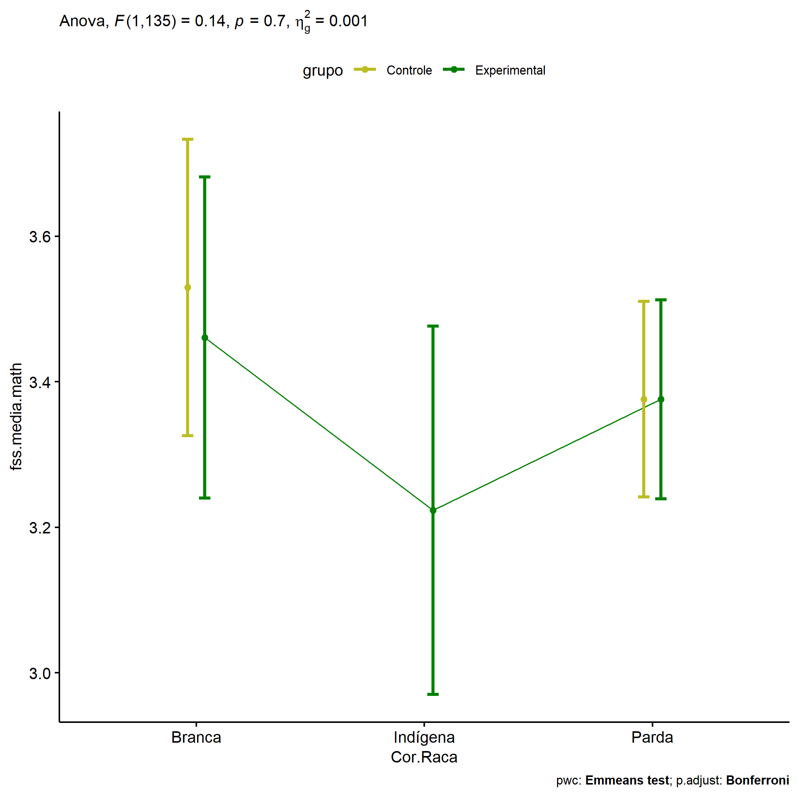<!-- -->

``` r
plots <- twoWayAncovaBoxPlots(
  wdat, "fss.media.math", c("grupo","Cor.Raca"), aov, pwcs, covar = "dfs.media.math",
  theme = "classic", color = color[["grupo:Cor.Raca"]],
  subtitle = which(aov$Effect == "grupo:Cor.Raca"))
```

``` r
plots[["grupo:Cor.Raca"]] + ggplot2::ylab("flow (prob. matemática)") + ggplot2::scale_x_discrete(labels=c('pre', 'pos'))
```

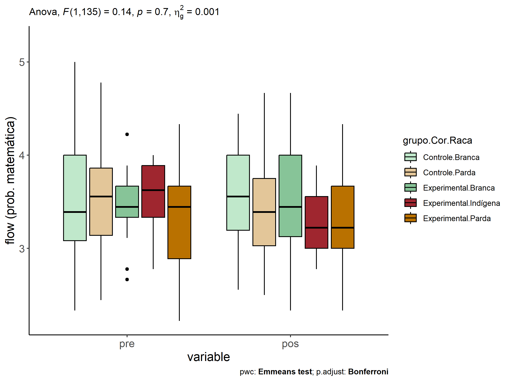<!-- -->

``` r
plots <- twoWayAncovaBoxPlots(
  wdat.long, "flow.math", c("grupo","Cor.Raca"), aov, pwc.long, pre.post = "time",
  theme = "classic", color = color$prepost)
```

``` r
plots[["grupo:Cor.Raca"]] + ggplot2::ylab("flow (prob. matemática)")
```

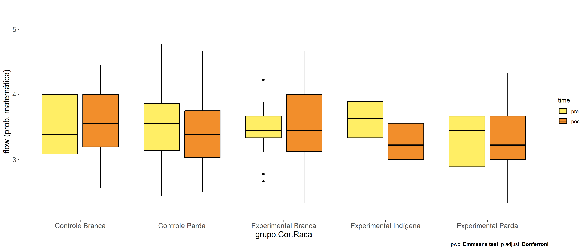<!-- -->

### Checking linearity assumption

``` r
ggscatter(wdat, x = "dfs.media.math", y = "fss.media.math", size = 0.5,
          facet.by = c("grupo","Cor.Raca"), add = "reg.line")+
  stat_regline_equation(
    aes(label =  paste(..eq.label.., ..rr.label.., sep = "~~~~"))
  )
```

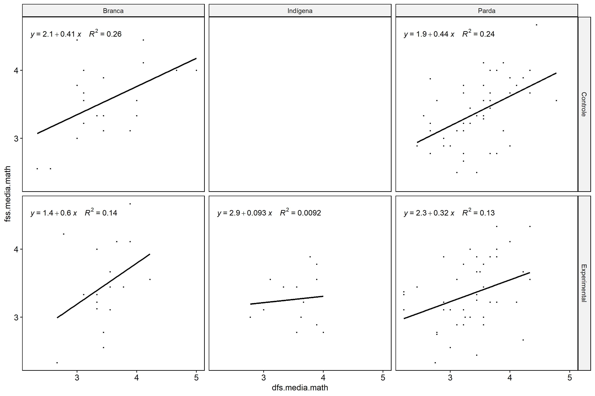<!-- -->

### Checking normality and homogeneity

``` r
res <- augment(lm(fss.media.math ~ dfs.media.math + grupo*Cor.Raca, data = wdat))
```

``` r
shapiro_test(res$.resid)
```

    ## # A tibble: 1 × 3
    ##   variable   statistic p.value
    ##   <chr>          <dbl>   <dbl>
    ## 1 res$.resid     0.992   0.602

``` r
levene_test(res, .resid ~ grupo*Cor.Raca)
```

    ## # A tibble: 1 × 4
    ##     df1   df2 statistic     p
    ##   <int> <int>     <dbl> <dbl>
    ## 1     4   136     0.629 0.643

# Summary of Results

## Descriptive Statistics

``` r
df <- get.descriptives(ldat[["grupo"]], c(dv.pre, dv.pos), c("grupo"), 
                       include.global = T, symmetry.test = T, normality.test = F)
df <- plyr::rbind.fill(
  df, do.call(plyr::rbind.fill, lapply(lfatores2, FUN = function(f) {
    if (nrow(dat) > 0 && sum(!is.na(unique(dat[[f]]))) > 1)
      get.descriptives(ldat[[paste0("grupo:",f)]], c(dv.pre,dv.pos), c("grupo", f),
                       symmetry.test = T, normality.test = F)
    }))
)
(df <- df[,c(fatores1[fatores1 %in% colnames(df)],"variable",
             colnames(df)[!colnames(df) %in% c(fatores1,"variable")])])
```

    ##           grupo Sexo   Zona Cor.Raca       variable   n  mean median   min   max    sd    se    ci   iqr
    ## 1      Controle <NA>   <NA>     <NA> dfs.media.math 155 3.483  3.444 2.111 5.000 0.594 0.048 0.094 0.778
    ## 2  Experimental <NA>   <NA>     <NA> dfs.media.math 175 3.442  3.444 2.000 5.000 0.541 0.041 0.081 0.667
    ## 3          <NA> <NA>   <NA>     <NA> dfs.media.math 330 3.461  3.444 2.000 5.000 0.566 0.031 0.061 0.778
    ## 4      Controle <NA>   <NA>     <NA> fss.media.math 155 3.410  3.375 1.778 5.000 0.581 0.047 0.092 0.778
    ## 5  Experimental <NA>   <NA>     <NA> fss.media.math 175 3.375  3.333 2.000 4.667 0.512 0.039 0.076 0.667
    ## 6          <NA> <NA>   <NA>     <NA> fss.media.math 330 3.392  3.333 1.778 5.000 0.545 0.030 0.059 0.778
    ## 7      Controle    F   <NA>     <NA> dfs.media.math  73 3.474  3.444 2.111 4.667 0.596 0.070 0.139 1.000
    ## 8      Controle    M   <NA>     <NA> dfs.media.math  82 3.491  3.444 2.222 5.000 0.595 0.066 0.131 0.667
    ## 9  Experimental    F   <NA>     <NA> dfs.media.math  92 3.449  3.500 2.000 4.778 0.513 0.054 0.106 0.583
    ## 10 Experimental    M   <NA>     <NA> dfs.media.math  83 3.434  3.444 2.000 5.000 0.572 0.063 0.125 0.722
    ## 11     Controle    F   <NA>     <NA> fss.media.math  73 3.450  3.444 1.778 4.667 0.600 0.070 0.140 0.778
    ## 12     Controle    M   <NA>     <NA> fss.media.math  82 3.375  3.333 1.889 5.000 0.565 0.062 0.124 0.750
    ## 13 Experimental    F   <NA>     <NA> fss.media.math  92 3.348  3.333 2.000 4.444 0.512 0.053 0.106 0.778
    ## 14 Experimental    M   <NA>     <NA> fss.media.math  83 3.406  3.333 2.222 4.667 0.514 0.056 0.112 0.667
    ## 15     Controle <NA>  Rural     <NA> dfs.media.math 104 3.551  3.500 2.333 5.000 0.570 0.056 0.111 0.778
    ## 16     Controle <NA> Urbana     <NA> dfs.media.math  30 3.522  3.500 2.333 4.778 0.642 0.117 0.240 0.861
    ## 17 Experimental <NA>  Rural     <NA> dfs.media.math  89 3.484  3.556 2.000 4.778 0.538 0.057 0.113 0.778
    ## 18 Experimental <NA> Urbana     <NA> dfs.media.math  40 3.375  3.222 2.667 4.556 0.538 0.085 0.172 0.722
    ## 19     Controle <NA>  Rural     <NA> fss.media.math 104 3.455  3.444 1.778 4.778 0.579 0.057 0.113 0.806
    ## 20     Controle <NA> Urbana     <NA> fss.media.math  30 3.372  3.444 1.889 5.000 0.570 0.104 0.213 0.417
    ## 21 Experimental <NA>  Rural     <NA> fss.media.math  89 3.454  3.444 2.333 4.667 0.466 0.049 0.098 0.667
    ## 22 Experimental <NA> Urbana     <NA> fss.media.math  40 3.236  3.111 2.222 4.444 0.527 0.083 0.168 0.421
    ## 23     Controle <NA>   <NA>   Branca dfs.media.math  20 3.489  3.389 2.333 5.000 0.675 0.151 0.316 0.917
    ## 24     Controle <NA>   <NA>    Parda dfs.media.math  46 3.478  3.556 2.444 4.778 0.548 0.081 0.163 0.722
    ## 25 Experimental <NA>   <NA>   Branca dfs.media.math  17 3.464  3.444 2.667 4.222 0.387 0.094 0.199 0.333
    ## 26 Experimental <NA>   <NA> Indígena dfs.media.math  13 3.544  3.625 2.778 4.000 0.383 0.106 0.231 0.556
    ## 27 Experimental <NA>   <NA>    Parda dfs.media.math  45 3.330  3.444 2.222 4.333 0.539 0.080 0.162 0.778
    ## 28     Controle <NA>   <NA>   Branca fss.media.math  20 3.550  3.556 2.556 4.444 0.544 0.122 0.254 0.806
    ## 29     Controle <NA>   <NA>    Parda fss.media.math  46 3.392  3.389 2.500 4.667 0.486 0.072 0.144 0.722
    ## 30 Experimental <NA>   <NA>   Branca fss.media.math  17 3.471  3.444 2.333 4.667 0.618 0.150 0.318 0.875
    ## 31 Experimental <NA>   <NA> Indígena fss.media.math  13 3.265  3.222 2.778 3.889 0.373 0.103 0.225 0.556
    ## 32 Experimental <NA>   <NA>    Parda fss.media.math  45 3.334  3.222 2.333 4.333 0.488 0.073 0.147 0.667
    ##    symmetry     skewness    kurtosis
    ## 1       YES  0.175453674 -0.35558951
    ## 2       YES -0.095036764  0.13985693
    ## 3       YES  0.061363245 -0.07537898
    ## 4       YES  0.001517756  0.12678063
    ## 5       YES  0.075877729 -0.16800049
    ## 6       YES  0.046308370  0.06934157
    ## 7       YES -0.203383518 -0.84346344
    ## 8        NO  0.510632424 -0.02205547
    ## 9       YES -0.229944764  0.26923262
    ## 10      YES  0.022982414 -0.06737035
    ## 11      YES -0.277589151  0.03550899
    ## 12      YES  0.275378419  0.27580902
    ## 13      YES -0.062284987 -0.35072272
    ## 14      YES  0.225368300 -0.10644944
    ## 15      YES  0.249602906 -0.37784187
    ## 16      YES  0.041339693 -0.83248058
    ## 17       NO -0.516031047  0.25241264
    ## 18       NO  0.570151920 -0.79178766
    ## 19      YES -0.062928378 -0.02208760
    ## 20      YES  0.043920711  1.47408965
    ## 21      YES  0.252661275 -0.15318521
    ## 22      YES  0.404604530 -0.20833638
    ## 23      YES  0.483414413 -0.49326490
    ## 24      YES  0.093763957 -0.63408468
    ## 25      YES -0.255494943 -0.25708833
    ## 26       NO -0.641982396 -0.99606112
    ## 27      YES -0.155212740 -0.44102264
    ## 28      YES -0.135169398 -0.90696722
    ## 29      YES  0.137080687 -0.56251332
    ## 30      YES  0.031244684 -0.80728681
    ## 31      YES  0.167840384 -1.48587299
    ## 32      YES  0.129614273 -0.70026441

| grupo        | Sexo | Zona   | Cor.Raca | variable       |   n |  mean | median |   min |   max |    sd |    se |    ci |   iqr | symmetry | skewness | kurtosis |
|:-------------|:-----|:-------|:---------|:---------------|----:|------:|-------:|------:|------:|------:|------:|------:|------:|:---------|---------:|---------:|
| Controle     |      |        |          | dfs.media.math | 155 | 3.483 |  3.444 | 2.111 | 5.000 | 0.594 | 0.048 | 0.094 | 0.778 | YES      |    0.175 |   -0.356 |
| Experimental |      |        |          | dfs.media.math | 175 | 3.442 |  3.444 | 2.000 | 5.000 | 0.541 | 0.041 | 0.081 | 0.667 | YES      |   -0.095 |    0.140 |
|              |      |        |          | dfs.media.math | 330 | 3.461 |  3.444 | 2.000 | 5.000 | 0.566 | 0.031 | 0.061 | 0.778 | YES      |    0.061 |   -0.075 |
| Controle     |      |        |          | fss.media.math | 155 | 3.410 |  3.375 | 1.778 | 5.000 | 0.581 | 0.047 | 0.092 | 0.778 | YES      |    0.002 |    0.127 |
| Experimental |      |        |          | fss.media.math | 175 | 3.375 |  3.333 | 2.000 | 4.667 | 0.512 | 0.039 | 0.076 | 0.667 | YES      |    0.076 |   -0.168 |
|              |      |        |          | fss.media.math | 330 | 3.392 |  3.333 | 1.778 | 5.000 | 0.545 | 0.030 | 0.059 | 0.778 | YES      |    0.046 |    0.069 |
| Controle     | F    |        |          | dfs.media.math |  73 | 3.474 |  3.444 | 2.111 | 4.667 | 0.596 | 0.070 | 0.139 | 1.000 | YES      |   -0.203 |   -0.843 |
| Controle     | M    |        |          | dfs.media.math |  82 | 3.491 |  3.444 | 2.222 | 5.000 | 0.595 | 0.066 | 0.131 | 0.667 | NO       |    0.511 |   -0.022 |
| Experimental | F    |        |          | dfs.media.math |  92 | 3.449 |  3.500 | 2.000 | 4.778 | 0.513 | 0.054 | 0.106 | 0.583 | YES      |   -0.230 |    0.269 |
| Experimental | M    |        |          | dfs.media.math |  83 | 3.434 |  3.444 | 2.000 | 5.000 | 0.572 | 0.063 | 0.125 | 0.722 | YES      |    0.023 |   -0.067 |
| Controle     | F    |        |          | fss.media.math |  73 | 3.450 |  3.444 | 1.778 | 4.667 | 0.600 | 0.070 | 0.140 | 0.778 | YES      |   -0.278 |    0.036 |
| Controle     | M    |        |          | fss.media.math |  82 | 3.375 |  3.333 | 1.889 | 5.000 | 0.565 | 0.062 | 0.124 | 0.750 | YES      |    0.275 |    0.276 |
| Experimental | F    |        |          | fss.media.math |  92 | 3.348 |  3.333 | 2.000 | 4.444 | 0.512 | 0.053 | 0.106 | 0.778 | YES      |   -0.062 |   -0.351 |
| Experimental | M    |        |          | fss.media.math |  83 | 3.406 |  3.333 | 2.222 | 4.667 | 0.514 | 0.056 | 0.112 | 0.667 | YES      |    0.225 |   -0.106 |
| Controle     |      | Rural  |          | dfs.media.math | 104 | 3.551 |  3.500 | 2.333 | 5.000 | 0.570 | 0.056 | 0.111 | 0.778 | YES      |    0.250 |   -0.378 |
| Controle     |      | Urbana |          | dfs.media.math |  30 | 3.522 |  3.500 | 2.333 | 4.778 | 0.642 | 0.117 | 0.240 | 0.861 | YES      |    0.041 |   -0.832 |
| Experimental |      | Rural  |          | dfs.media.math |  89 | 3.484 |  3.556 | 2.000 | 4.778 | 0.538 | 0.057 | 0.113 | 0.778 | NO       |   -0.516 |    0.252 |
| Experimental |      | Urbana |          | dfs.media.math |  40 | 3.375 |  3.222 | 2.667 | 4.556 | 0.538 | 0.085 | 0.172 | 0.722 | NO       |    0.570 |   -0.792 |
| Controle     |      | Rural  |          | fss.media.math | 104 | 3.455 |  3.444 | 1.778 | 4.778 | 0.579 | 0.057 | 0.113 | 0.806 | YES      |   -0.063 |   -0.022 |
| Controle     |      | Urbana |          | fss.media.math |  30 | 3.372 |  3.444 | 1.889 | 5.000 | 0.570 | 0.104 | 0.213 | 0.417 | YES      |    0.044 |    1.474 |
| Experimental |      | Rural  |          | fss.media.math |  89 | 3.454 |  3.444 | 2.333 | 4.667 | 0.466 | 0.049 | 0.098 | 0.667 | YES      |    0.253 |   -0.153 |
| Experimental |      | Urbana |          | fss.media.math |  40 | 3.236 |  3.111 | 2.222 | 4.444 | 0.527 | 0.083 | 0.168 | 0.421 | YES      |    0.405 |   -0.208 |
| Controle     |      |        | Branca   | dfs.media.math |  20 | 3.489 |  3.389 | 2.333 | 5.000 | 0.675 | 0.151 | 0.316 | 0.917 | YES      |    0.483 |   -0.493 |
| Controle     |      |        | Parda    | dfs.media.math |  46 | 3.478 |  3.556 | 2.444 | 4.778 | 0.548 | 0.081 | 0.163 | 0.722 | YES      |    0.094 |   -0.634 |
| Experimental |      |        | Branca   | dfs.media.math |  17 | 3.464 |  3.444 | 2.667 | 4.222 | 0.387 | 0.094 | 0.199 | 0.333 | YES      |   -0.255 |   -0.257 |
| Experimental |      |        | Indígena | dfs.media.math |  13 | 3.544 |  3.625 | 2.778 | 4.000 | 0.383 | 0.106 | 0.231 | 0.556 | NO       |   -0.642 |   -0.996 |
| Experimental |      |        | Parda    | dfs.media.math |  45 | 3.330 |  3.444 | 2.222 | 4.333 | 0.539 | 0.080 | 0.162 | 0.778 | YES      |   -0.155 |   -0.441 |
| Controle     |      |        | Branca   | fss.media.math |  20 | 3.550 |  3.556 | 2.556 | 4.444 | 0.544 | 0.122 | 0.254 | 0.806 | YES      |   -0.135 |   -0.907 |
| Controle     |      |        | Parda    | fss.media.math |  46 | 3.392 |  3.389 | 2.500 | 4.667 | 0.486 | 0.072 | 0.144 | 0.722 | YES      |    0.137 |   -0.563 |
| Experimental |      |        | Branca   | fss.media.math |  17 | 3.471 |  3.444 | 2.333 | 4.667 | 0.618 | 0.150 | 0.318 | 0.875 | YES      |    0.031 |   -0.807 |
| Experimental |      |        | Indígena | fss.media.math |  13 | 3.265 |  3.222 | 2.778 | 3.889 | 0.373 | 0.103 | 0.225 | 0.556 | YES      |    0.168 |   -1.486 |
| Experimental |      |        | Parda    | fss.media.math |  45 | 3.334 |  3.222 | 2.333 | 4.333 | 0.488 | 0.073 | 0.147 | 0.667 | YES      |    0.130 |   -0.700 |

## ANCOVA Table Comparison

``` r
df <- do.call(plyr::rbind.fill, laov)
(df <- df[!duplicated(df$Effect),])
```

    ##            Effect DFn DFd      F        p p<.05      ges DFn' DFd'     F'       p' p<.05'     ges'
    ## 1  dfs.media.math   1 327 77.045 9.46e-17     * 1.91e-01    1  328 66.412 7.79e-15      * 0.168000
    ## 2           grupo   1 327  0.110 7.40e-01       3.38e-04    1  328  0.346 5.57e-01        0.001000
    ## 5      grupo:Sexo   1 325  1.833 1.77e-01       6.00e-03    1  326  1.058 3.04e-01        0.003000
    ## 6            Sexo   1 325  0.008 9.30e-01       2.35e-05    1  326  0.136 7.12e-01        0.000418
    ## 9      grupo:Zona   1 258  0.552 4.58e-01       2.00e-03    1  259  1.324 2.51e-01        0.005000
    ## 10           Zona   1 258  3.512 6.20e-02       1.30e-02    1  259  5.263 2.30e-02      * 0.020000
    ## 11       Cor.Raca   2 135  1.695 1.87e-01       2.50e-02    2  135  1.695 1.87e-01        0.025000
    ## 14 grupo:Cor.Raca   1 135  0.145 7.04e-01       1.00e-03    1  135  0.145 7.04e-01        0.001000

|     | Effect         | DFn | DFd |      F |     p | p\<.05 |   ges | DFn’ | DFd’ |     F’ |    p’ | p\<.05’ |  ges’ |
|:----|:---------------|----:|----:|-------:|------:|:-------|------:|-----:|-----:|-------:|------:|:--------|------:|
| 1   | dfs.media.math |   1 | 327 | 77.045 | 0.000 | \*     | 0.191 |    1 |  328 | 66.412 | 0.000 | \*      | 0.168 |
| 2   | grupo          |   1 | 327 |  0.110 | 0.740 |        | 0.000 |    1 |  328 |  0.346 | 0.557 |         | 0.001 |
| 5   | grupo:Sexo     |   1 | 325 |  1.833 | 0.177 |        | 0.006 |    1 |  326 |  1.058 | 0.304 |         | 0.003 |
| 6   | Sexo           |   1 | 325 |  0.008 | 0.930 |        | 0.000 |    1 |  326 |  0.136 | 0.712 |         | 0.000 |
| 9   | grupo:Zona     |   1 | 258 |  0.552 | 0.458 |        | 0.002 |    1 |  259 |  1.324 | 0.251 |         | 0.005 |
| 10  | Zona           |   1 | 258 |  3.512 | 0.062 |        | 0.013 |    1 |  259 |  5.263 | 0.023 | \*      | 0.020 |
| 11  | Cor.Raca       |   2 | 135 |  1.695 | 0.187 |        | 0.025 |    2 |  135 |  1.695 | 0.187 |         | 0.025 |
| 14  | grupo:Cor.Raca |   1 | 135 |  0.145 | 0.704 |        | 0.001 |    1 |  135 |  0.145 | 0.704 |         | 0.001 |

## PairWise Table Comparison

``` r
df <- do.call(plyr::rbind.fill, lpwc)
df <- df[,c(names(lfatores), names(df)[!names(df) %in% c(names(lfatores),"term",".y.")])]
```

| grupo        | Sexo | Zona   | Cor.Raca | group1   | group2       |  df | statistic |     p | p.adj | p.adj.signif | df’ | statistic’ |    p’ | p.adj’ | p.adj.signif’ |
|:-------------|:-----|:-------|:---------|:---------|:-------------|----:|----------:|------:|------:|:-------------|----:|-----------:|------:|-------:|:--------------|
| Controle     |      |        |          | pre      | pos          | 656 |     1.147 | 0.252 | 0.252 | ns           | 658 |      1.133 | 0.257 |  0.257 | ns            |
| Experimental |      |        |          | pre      | pos          | 656 |     1.127 | 0.260 | 0.260 | ns           | 658 |      1.395 | 0.164 |  0.164 | ns            |
|              |      |        |          | Controle | Experimental | 327 |     0.332 | 0.740 | 0.740 | ns           | 328 |      0.588 | 0.557 |  0.557 | ns            |
| Controle     | F    |        |          | pre      | pos          | 652 |     0.256 | 0.798 | 0.798 | ns           | 654 |      0.253 | 0.801 |  0.801 | ns            |
| Controle     | M    |        |          | pre      | pos          | 652 |     1.332 | 0.183 | 0.183 | ns           | 654 |      1.316 | 0.189 |  0.189 | ns            |
| Controle     |      |        |          | F        | M            | 325 |     1.046 | 0.296 | 0.296 | ns           | 326 |      1.003 | 0.317 |  0.317 | ns            |
| Experimental | F    |        |          | pre      | pos          | 652 |     1.237 | 0.217 | 0.217 | ns           | 654 |      1.222 | 0.222 |  0.222 | ns            |
| Experimental | M    |        |          | pre      | pos          | 652 |     0.331 | 0.741 | 0.741 | ns           | 654 |      0.735 | 0.463 |  0.463 | ns            |
| Experimental |      |        |          | F        | M            | 325 |    -0.864 | 0.388 | 0.388 | ns           | 326 |     -0.434 | 0.664 |  0.664 | ns            |
|              | F    |        |          | Controle | Experimental | 325 |     1.197 | 0.232 | 0.232 | ns           | 326 |      1.157 | 0.248 |  0.248 | ns            |
|              | M    |        |          | Controle | Experimental | 325 |    -0.715 | 0.475 | 0.475 | ns           | 326 |     -0.293 | 0.769 |  0.769 | ns            |
| Controle     |      |        |          | Rural    | Urbana       | 258 |     0.723 | 0.470 | 0.470 | ns           | 259 |      0.697 | 0.487 |  0.487 | ns            |
| Controle     |      | Rural  |          | pre      | pos          | 518 |     1.251 | 0.211 | 0.211 | ns           | 520 |      1.235 | 0.218 |  0.218 | ns            |
| Controle     |      | Urbana |          | pre      | pos          | 518 |     1.061 | 0.289 | 0.289 | ns           | 520 |      1.047 | 0.296 |  0.296 | ns            |
| Experimental |      |        |          | Rural    | Urbana       | 258 |     1.883 | 0.061 | 0.061 | ns           | 259 |      2.471 | 0.014 |  0.014 | \*            |
| Experimental |      | Rural  |          | pre      | pos          | 518 |     0.362 | 0.717 | 0.717 | ns           | 520 |      0.357 | 0.721 |  0.721 | ns            |
| Experimental |      | Urbana |          | pre      | pos          | 518 |     1.134 | 0.257 | 0.257 | ns           | 520 |      1.700 | 0.090 |  0.090 | ns            |
|              |      | Rural  |          | Controle | Experimental | 258 |    -0.404 | 0.686 | 0.686 | ns           | 259 |     -0.366 | 0.714 |  0.714 | ns            |
|              |      | Urbana |          | Controle | Experimental | 258 |     0.623 | 0.534 | 0.534 | ns           | 259 |      1.120 | 0.264 |  0.264 | ns            |
| Controle     |      |        | Branca   | pre      | pos          | 272 |    -0.371 | 0.711 | 0.711 | ns           | 272 |     -0.371 | 0.711 |  0.711 | ns            |
| Controle     |      |        | Indígena | pre      | pos          |     |           |       |       |              |     |            |       |        |               |
| Controle     |      |        |          | Branca   | Indígena     |     |           |       |       |              |     |            |       |        |               |
| Controle     |      |        |          | Branca   | Parda        | 135 |     1.245 | 0.215 | 0.215 | ns           | 135 |      1.245 | 0.215 |  0.215 | ns            |
| Controle     |      |        |          | Indígena | Parda        |     |           |       |       |              |     |            |       |        |               |
| Controle     |      |        | Parda    | pre      | pos          | 272 |     0.792 | 0.429 | 0.429 | ns           | 272 |      0.792 | 0.429 |  0.429 | ns            |
| Experimental |      |        | Branca   | pre      | pos          | 272 |    -0.041 | 0.967 | 0.967 | ns           | 272 |     -0.041 | 0.967 |  0.967 | ns            |
| Experimental |      |        | Indígena | pre      | pos          | 272 |     1.366 | 0.173 | 0.173 | ns           | 272 |      1.366 | 0.173 |  0.173 | ns            |
| Experimental |      |        |          | Branca   | Indígena     | 135 |     1.400 | 0.164 | 0.492 | ns           | 135 |      1.400 | 0.164 |  0.492 | ns            |
| Experimental |      |        |          | Branca   | Parda        | 135 |     0.646 | 0.519 | 1.000 | ns           | 135 |      0.646 | 0.519 |  1.000 | ns            |
| Experimental |      |        |          | Indígena | Parda        | 135 |    -1.047 | 0.297 | 0.891 | ns           | 135 |     -1.047 | 0.297 |  0.891 | ns            |
| Experimental |      |        | Parda    | pre      | pos          | 272 |    -0.042 | 0.966 | 0.966 | ns           | 272 |     -0.042 | 0.966 |  0.966 | ns            |
|              |      |        | Branca   | Controle | Experimental | 135 |     0.454 | 0.651 | 0.651 | ns           | 135 |      0.454 | 0.651 |  0.651 | ns            |
|              |      |        | Indígena | Controle | Experimental |     |           |       |       |              |     |            |       |        |               |
|              |      |        | Parda    | Controle | Experimental | 135 |     0.003 | 0.997 | 0.997 | ns           | 135 |      0.003 | 0.997 |  0.997 | ns            |

## EMMS Table Comparison

``` r
df <- do.call(plyr::rbind.fill, lemms)
df[["N-N'"]] <- df[["N"]] - df[["N'"]]
df <- df[,c(names(lfatores), names(df)[!names(df) %in% names(lfatores)])]
```

| grupo        | Sexo | Zona   | Cor.Raca |   N | M (pre) | SE (pre) | M (unadj) | SE (unadj) | M (adj) | SE (adj) |  N’ | M (pre)’ | SE (pre)’ | M (unadj)’ | SE (unadj)’ | M (adj)’ | SE (adj)’ | N-N’ |
|:-------------|:-----|:-------|:---------|----:|--------:|---------:|----------:|-----------:|--------:|---------:|----:|---------:|----------:|-----------:|------------:|---------:|----------:|-----:|
| Controle     |      |        |          | 155 |   3.483 |    0.048 |     3.410 |      0.047 |   3.401 |    0.039 | 155 |    3.483 |     0.048 |      3.410 |       0.047 |    3.402 |     0.041 |    0 |
| Experimental |      |        |          | 175 |   3.442 |    0.041 |     3.375 |      0.039 |   3.383 |    0.037 | 176 |    3.446 |     0.041 |      3.362 |       0.041 |    3.369 |     0.038 |   -1 |
| Controle     | F    |        |          |  73 |   3.474 |    0.070 |     3.450 |      0.070 |   3.445 |    0.058 |  73 |    3.474 |     0.070 |      3.450 |       0.070 |    3.446 |     0.060 |    0 |
| Controle     | M    |        |          |  82 |   3.491 |    0.066 |     3.375 |      0.062 |   3.362 |    0.054 |  82 |    3.491 |     0.066 |      3.375 |       0.062 |    3.363 |     0.056 |    0 |
| Experimental | F    |        |          |  92 |   3.449 |    0.054 |     3.348 |      0.053 |   3.353 |    0.051 |  92 |    3.449 |     0.054 |      3.348 |       0.053 |    3.353 |     0.053 |    0 |
| Experimental | M    |        |          |  83 |   3.434 |    0.063 |     3.406 |      0.056 |   3.417 |    0.054 |  84 |    3.442 |     0.063 |      3.378 |       0.062 |    3.387 |     0.056 |   -1 |
| Controle     |      | Rural  |          | 104 |   3.551 |    0.056 |     3.455 |      0.057 |   3.432 |    0.047 | 104 |    3.551 |     0.056 |      3.455 |       0.057 |    3.434 |     0.049 |    0 |
| Controle     |      | Urbana |          |  30 |   3.522 |    0.117 |     3.372 |      0.104 |   3.361 |    0.087 |  30 |    3.522 |     0.117 |      3.372 |       0.104 |    3.363 |     0.091 |    0 |
| Experimental |      | Rural  |          |  89 |   3.484 |    0.057 |     3.454 |      0.049 |   3.460 |    0.050 |  89 |    3.484 |     0.057 |      3.454 |       0.049 |    3.461 |     0.053 |    0 |
| Experimental |      | Urbana |          |  40 |   3.375 |    0.085 |     3.236 |      0.083 |   3.290 |    0.075 |  41 |    3.393 |     0.085 |      3.184 |       0.096 |    3.229 |     0.078 |   -1 |
| Controle     |      |        | Branca   |  20 |   3.489 |    0.151 |     3.550 |      0.122 |   3.530 |    0.103 |  20 |    3.489 |     0.151 |      3.550 |       0.122 |    3.530 |     0.103 |    0 |
| Controle     |      |        | Parda    |  46 |   3.478 |    0.081 |     3.392 |      0.072 |   3.376 |    0.068 |  46 |    3.478 |     0.081 |      3.392 |       0.072 |    3.376 |     0.068 |    0 |
| Experimental |      |        | Branca   |  17 |   3.464 |    0.094 |     3.471 |      0.150 |   3.461 |    0.112 |  17 |    3.464 |     0.094 |      3.471 |       0.150 |    3.461 |     0.112 |    0 |
| Experimental |      |        | Indígena |  13 |   3.544 |    0.106 |     3.265 |      0.103 |   3.223 |    0.128 |  13 |    3.544 |     0.106 |      3.265 |       0.103 |    3.223 |     0.128 |    0 |
| Experimental |      |        | Parda    |  45 |   3.330 |    0.080 |     3.334 |      0.073 |   3.376 |    0.069 |  45 |    3.330 |     0.080 |      3.334 |       0.073 |    3.376 |     0.069 |    0 |
