ANCOVA in flow (prob. matemática) (flow (prob. matemática))
================
Geiser C. Challco <geiser@alumni.usp.br>

- [Descriptive Statistics of Initial
  Data](#descriptive-statistics-of-initial-data)
- [ANCOVA and Pairwise for one factor:
  **grupo**](#ancova-and-pairwise-for-one-factor-grupo)
  - [Without remove non-normal data](#without-remove-non-normal-data)
  - [Computing ANCOVA and PairWise After removing non-normal data
    (OK)](#computing-ancova-and-pairwise-after-removing-non-normal-data-ok)
    - [Plots for ancova](#plots-for-ancova)
    - [Checking linearity assumption](#checking-linearity-assumption)
    - [Checking normality and
      homogeneity](#checking-normality-and-homogeneity)
- [ANCOVA and Pairwise for two factors
  **grupo:Sexo**](#ancova-and-pairwise-for-two-factors-gruposexo)
  - [Without remove non-normal data](#without-remove-non-normal-data-1)
  - [Computing ANCOVA and PairWise After removing non-normal data
    (OK)](#computing-ancova-and-pairwise-after-removing-non-normal-data-ok-1)
    - [Plots for ancova](#plots-for-ancova-1)
    - [Checking linearity assumption](#checking-linearity-assumption-1)
    - [Checking normality and
      homogeneity](#checking-normality-and-homogeneity-1)
- [ANCOVA and Pairwise for two factors
  **grupo:Zona**](#ancova-and-pairwise-for-two-factors-grupozona)
  - [Without remove non-normal data](#without-remove-non-normal-data-2)
  - [Computing ANCOVA and PairWise After removing non-normal data
    (OK)](#computing-ancova-and-pairwise-after-removing-non-normal-data-ok-2)
    - [Plots for ancova](#plots-for-ancova-2)
    - [Checking linearity assumption](#checking-linearity-assumption-2)
    - [Checking normality and
      homogeneity](#checking-normality-and-homogeneity-2)
- [ANCOVA and Pairwise for two factors
  **grupo:Cor.Raca**](#ancova-and-pairwise-for-two-factors-grupocorraca)
  - [Without remove non-normal data](#without-remove-non-normal-data-3)
  - [Computing ANCOVA and PairWise After removing non-normal data
    (OK)](#computing-ancova-and-pairwise-after-removing-non-normal-data-ok-3)
    - [Plots for ancova](#plots-for-ancova-3)
    - [Checking linearity assumption](#checking-linearity-assumption-3)
    - [Checking normality and
      homogeneity](#checking-normality-and-homogeneity-3)
- [Summary of Results](#summary-of-results)
  - [Descriptive Statistics](#descriptive-statistics)
  - [ANCOVA Table Comparison](#ancova-table-comparison)
  - [PairWise Table Comparison](#pairwise-table-comparison)
  - [EMMS Table Comparison](#emms-table-comparison)

**NOTE**:

- Teste ANCOVA para determinar se houve diferenças significativas no
  flow (prob. matemática) (medido usando pre- e pos-testes).
- ANCOVA test to determine whether there were significant differences in
  flow (prob. matemática) (measured using pre- and post-tests).

# Descriptive Statistics of Initial Data

``` r
df <- get.descriptives(dat, c(dv.pre, dv.pos), c("grupo"), 
                       include.global = T, symmetry.test = T, normality.test = F)
df <- plyr::rbind.fill(
  df, do.call(plyr::rbind.fill, lapply(lfatores2, FUN = function(f) {
    if (nrow(dat) > 0 && sum(!is.na(unique(dat[[f]]))) > 1)
      get.descriptives(dat, c(dv.pre,dv.pos), c("grupo", f),
                       symmetry.test = T, normality.test = F)
    }))
)
(df <- df[,c(fatores1[fatores1 %in% colnames(df)],"variable",
             colnames(df)[!colnames(df) %in% c(fatores1,"variable")])])
```

    ##           grupo Sexo   Zona Cor.Raca       variable   n  mean median   min   max    sd    se    ci   iqr
    ## 1      Controle <NA>   <NA>     <NA> dfs.media.math 136 3.280  3.292 1.333 4.667 0.619 0.053 0.105 0.889
    ## 2  Experimental <NA>   <NA>     <NA> dfs.media.math 198 3.468  3.444 2.111 5.000 0.557 0.040 0.078 0.667
    ## 3          <NA> <NA>   <NA>     <NA> dfs.media.math 334 3.392  3.333 1.333 5.000 0.589 0.032 0.063 0.778
    ## 4      Controle <NA>   <NA>     <NA> fss.media.math 136 3.155  3.111 1.778 4.625 0.537 0.046 0.091 0.778
    ## 5  Experimental <NA>   <NA>     <NA> fss.media.math 198 3.417  3.444 1.000 5.000 0.625 0.044 0.088 0.667
    ## 6          <NA> <NA>   <NA>     <NA> fss.media.math 334 3.311  3.333 1.000 5.000 0.604 0.033 0.065 0.778
    ## 7      Controle    F   <NA>     <NA> dfs.media.math  74 3.360  3.333 1.889 4.444 0.545 0.063 0.126 0.667
    ## 8      Controle    M   <NA>     <NA> dfs.media.math  62 3.185  3.111 1.333 4.667 0.688 0.087 0.175 0.889
    ## 9  Experimental    F   <NA>     <NA> dfs.media.math  95 3.360  3.333 2.222 5.000 0.529 0.054 0.108 0.778
    ## 10 Experimental    M   <NA>     <NA> dfs.media.math 103 3.568  3.556 2.111 4.667 0.565 0.056 0.110 0.667
    ## 11     Controle    F   <NA>     <NA> fss.media.math  74 3.144  3.111 1.778 4.125 0.478 0.056 0.111 0.639
    ## 12     Controle    M   <NA>     <NA> fss.media.math  62 3.169  3.111 1.778 4.625 0.605 0.077 0.154 0.889
    ## 13 Experimental    F   <NA>     <NA> fss.media.math  95 3.334  3.333 1.000 5.000 0.673 0.069 0.137 0.889
    ## 14 Experimental    M   <NA>     <NA> fss.media.math 103 3.494  3.444 2.000 5.000 0.569 0.056 0.111 0.611
    ## 15     Controle <NA>  Rural     <NA> dfs.media.math  58 3.314  3.236 2.333 4.444 0.518 0.068 0.136 0.778
    ## 16     Controle <NA> Urbana     <NA> dfs.media.math  60 3.262  3.389 1.333 4.667 0.686 0.089 0.177 1.000
    ## 17     Controle <NA>   <NA>     <NA> dfs.media.math  18 3.228  3.278 1.889 4.444 0.705 0.166 0.351 0.639
    ## 18 Experimental <NA>  Rural     <NA> dfs.media.math  88 3.418  3.444 2.222 5.000 0.557 0.059 0.118 0.556
    ## 19 Experimental <NA> Urbana     <NA> dfs.media.math  80 3.520  3.500 2.111 4.778 0.567 0.063 0.126 0.778
    ## 20 Experimental <NA>   <NA>     <NA> dfs.media.math  30 3.476  3.354 2.667 4.444 0.531 0.097 0.198 0.889
    ## 21     Controle <NA>  Rural     <NA> fss.media.math  58 3.096  3.111 1.778 4.000 0.540 0.071 0.142 0.833
    ## 22     Controle <NA> Urbana     <NA> fss.media.math  60 3.206  3.174 2.143 4.333 0.495 0.064 0.128 0.684
    ## 23     Controle <NA>   <NA>     <NA> fss.media.math  18 3.177  3.222 1.889 4.625 0.667 0.157 0.332 0.861
    ## 24 Experimental <NA>  Rural     <NA> fss.media.math  88 3.485  3.556 2.333 5.000 0.552 0.059 0.117 0.778
    ## 25 Experimental <NA> Urbana     <NA> fss.media.math  80 3.371  3.333 1.000 5.000 0.708 0.079 0.158 0.694
    ## 26 Experimental <NA>   <NA>     <NA> fss.media.math  30 3.343  3.500 2.111 4.444 0.588 0.107 0.220 0.833
    ## 27     Controle <NA>   <NA>   Branca dfs.media.math  18 3.208  3.222 1.333 4.111 0.693 0.163 0.345 0.778
    ## 28     Controle <NA>   <NA> Indígena dfs.media.math   4 3.556  3.722 2.778 4.000 0.552 0.276 0.878 0.556
    ## 29     Controle <NA>   <NA>    Parda dfs.media.math  43 3.356  3.333 2.111 4.667 0.591 0.090 0.182 0.889
    ## 30     Controle <NA>   <NA>     <NA> dfs.media.math  71 3.237  3.222 1.889 4.444 0.622 0.074 0.147 0.833
    ## 31 Experimental <NA>   <NA>   Branca dfs.media.math  15 3.655  3.444 2.889 4.444 0.513 0.132 0.284 0.889
    ## 32 Experimental <NA>   <NA>    Parda dfs.media.math  48 3.432  3.444 2.222 5.000 0.586 0.085 0.170 0.500
    ## 33 Experimental <NA>   <NA>     <NA> dfs.media.math 135 3.461  3.444 2.111 4.778 0.551 0.047 0.094 0.667
    ## 34     Controle <NA>   <NA>   Branca fss.media.math  18 3.224  3.278 2.444 4.000 0.482 0.114 0.240 0.719
    ## 35     Controle <NA>   <NA> Indígena fss.media.math   4 3.472  3.611 2.778 3.889 0.500 0.250 0.796 0.528
    ## 36     Controle <NA>   <NA>    Parda fss.media.math  43 3.140  3.111 1.778 4.000 0.538 0.082 0.166 0.722
    ## 37     Controle <NA>   <NA>     <NA> fss.media.math  71 3.129  3.111 1.889 4.625 0.555 0.066 0.131 0.778
    ## 38 Experimental <NA>   <NA>   Branca fss.media.math  15 3.140  3.000 2.000 4.667 0.665 0.172 0.368 0.833
    ## 39 Experimental <NA>   <NA>    Parda fss.media.math  48 3.446  3.389 2.333 5.000 0.632 0.091 0.183 0.806
    ## 40 Experimental <NA>   <NA>     <NA> fss.media.math 135 3.438  3.444 1.000 5.000 0.615 0.053 0.105 0.667
    ##    symmetry     skewness     kurtosis
    ## 1       YES -0.149182095 -0.112272690
    ## 2       YES  0.195445760 -0.143575177
    ## 3       YES -0.021944132  0.034400149
    ## 4       YES -0.050564660 -0.243180196
    ## 5       YES -0.181033592  0.819364572
    ## 6       YES -0.049158990  0.478163493
    ## 7       YES -0.079307496 -0.248217620
    ## 8       YES -0.038150253 -0.337202513
    ## 9        NO  0.512464875  0.471529171
    ## 10      YES -0.093329665 -0.293413123
    ## 11      YES -0.278818369 -0.302651587
    ## 12      YES  0.060928203 -0.505253449
    ## 13      YES -0.192130375  0.761448034
    ## 14      YES -0.008159588  0.434774713
    ## 15      YES  0.402652436 -0.505579912
    ## 16      YES -0.405025360 -0.255979061
    ## 17      YES  0.159194012 -0.861440039
    ## 18      YES  0.291794492  0.201717624
    ## 19      YES  0.048723672 -0.273133098
    ## 20      YES  0.314286003 -1.138827601
    ## 21      YES -0.269481355 -0.499957714
    ## 22      YES  0.096577868 -0.656837295
    ## 23      YES  0.176730531 -0.439034890
    ## 24      YES  0.088870712 -0.180308723
    ## 25      YES -0.203109371  1.005121756
    ## 26      YES -0.316048745 -0.757146875
    ## 27       NO -0.835804997  0.572145513
    ## 28       NO -0.514250653 -1.875000000
    ## 29      YES -0.015768387 -0.587715344
    ## 30      YES  0.104584199 -0.433836706
    ## 31      YES  0.386114144 -1.407070724
    ## 32      YES  0.496226684  0.359907133
    ## 33      YES  0.073497206 -0.350339031
    ## 34      YES -0.076850623 -1.445005487
    ## 35      YES -0.468106996 -1.914294696
    ## 36       NO -0.543915063  0.007813525
    ## 37      YES  0.291316011 -0.271343570
    ## 38       NO  0.572933454 -0.273692910
    ## 39      YES  0.399550257 -0.260236822
    ## 40      YES -0.489313164  1.482287202

| grupo        | Sexo | Zona   | Cor.Raca | variable       |   n |  mean | median |   min |   max |    sd |    se |    ci |   iqr | symmetry | skewness | kurtosis |
|:-------------|:-----|:-------|:---------|:---------------|----:|------:|-------:|------:|------:|------:|------:|------:|------:|:---------|---------:|---------:|
| Controle     |      |        |          | dfs.media.math | 136 | 3.280 |  3.292 | 1.333 | 4.667 | 0.619 | 0.053 | 0.105 | 0.889 | YES      |   -0.149 |   -0.112 |
| Experimental |      |        |          | dfs.media.math | 198 | 3.468 |  3.444 | 2.111 | 5.000 | 0.557 | 0.040 | 0.078 | 0.667 | YES      |    0.195 |   -0.144 |
|              |      |        |          | dfs.media.math | 334 | 3.392 |  3.333 | 1.333 | 5.000 | 0.589 | 0.032 | 0.063 | 0.778 | YES      |   -0.022 |    0.034 |
| Controle     |      |        |          | fss.media.math | 136 | 3.155 |  3.111 | 1.778 | 4.625 | 0.537 | 0.046 | 0.091 | 0.778 | YES      |   -0.051 |   -0.243 |
| Experimental |      |        |          | fss.media.math | 198 | 3.417 |  3.444 | 1.000 | 5.000 | 0.625 | 0.044 | 0.088 | 0.667 | YES      |   -0.181 |    0.819 |
|              |      |        |          | fss.media.math | 334 | 3.311 |  3.333 | 1.000 | 5.000 | 0.604 | 0.033 | 0.065 | 0.778 | YES      |   -0.049 |    0.478 |
| Controle     | F    |        |          | dfs.media.math |  74 | 3.360 |  3.333 | 1.889 | 4.444 | 0.545 | 0.063 | 0.126 | 0.667 | YES      |   -0.079 |   -0.248 |
| Controle     | M    |        |          | dfs.media.math |  62 | 3.185 |  3.111 | 1.333 | 4.667 | 0.688 | 0.087 | 0.175 | 0.889 | YES      |   -0.038 |   -0.337 |
| Experimental | F    |        |          | dfs.media.math |  95 | 3.360 |  3.333 | 2.222 | 5.000 | 0.529 | 0.054 | 0.108 | 0.778 | NO       |    0.512 |    0.472 |
| Experimental | M    |        |          | dfs.media.math | 103 | 3.568 |  3.556 | 2.111 | 4.667 | 0.565 | 0.056 | 0.110 | 0.667 | YES      |   -0.093 |   -0.293 |
| Controle     | F    |        |          | fss.media.math |  74 | 3.144 |  3.111 | 1.778 | 4.125 | 0.478 | 0.056 | 0.111 | 0.639 | YES      |   -0.279 |   -0.303 |
| Controle     | M    |        |          | fss.media.math |  62 | 3.169 |  3.111 | 1.778 | 4.625 | 0.605 | 0.077 | 0.154 | 0.889 | YES      |    0.061 |   -0.505 |
| Experimental | F    |        |          | fss.media.math |  95 | 3.334 |  3.333 | 1.000 | 5.000 | 0.673 | 0.069 | 0.137 | 0.889 | YES      |   -0.192 |    0.761 |
| Experimental | M    |        |          | fss.media.math | 103 | 3.494 |  3.444 | 2.000 | 5.000 | 0.569 | 0.056 | 0.111 | 0.611 | YES      |   -0.008 |    0.435 |
| Controle     |      | Rural  |          | dfs.media.math |  58 | 3.314 |  3.236 | 2.333 | 4.444 | 0.518 | 0.068 | 0.136 | 0.778 | YES      |    0.403 |   -0.506 |
| Controle     |      | Urbana |          | dfs.media.math |  60 | 3.262 |  3.389 | 1.333 | 4.667 | 0.686 | 0.089 | 0.177 | 1.000 | YES      |   -0.405 |   -0.256 |
| Controle     |      |        |          | dfs.media.math |  18 | 3.228 |  3.278 | 1.889 | 4.444 | 0.705 | 0.166 | 0.351 | 0.639 | YES      |    0.159 |   -0.861 |
| Experimental |      | Rural  |          | dfs.media.math |  88 | 3.418 |  3.444 | 2.222 | 5.000 | 0.557 | 0.059 | 0.118 | 0.556 | YES      |    0.292 |    0.202 |
| Experimental |      | Urbana |          | dfs.media.math |  80 | 3.520 |  3.500 | 2.111 | 4.778 | 0.567 | 0.063 | 0.126 | 0.778 | YES      |    0.049 |   -0.273 |
| Experimental |      |        |          | dfs.media.math |  30 | 3.476 |  3.354 | 2.667 | 4.444 | 0.531 | 0.097 | 0.198 | 0.889 | YES      |    0.314 |   -1.139 |
| Controle     |      | Rural  |          | fss.media.math |  58 | 3.096 |  3.111 | 1.778 | 4.000 | 0.540 | 0.071 | 0.142 | 0.833 | YES      |   -0.269 |   -0.500 |
| Controle     |      | Urbana |          | fss.media.math |  60 | 3.206 |  3.174 | 2.143 | 4.333 | 0.495 | 0.064 | 0.128 | 0.684 | YES      |    0.097 |   -0.657 |
| Controle     |      |        |          | fss.media.math |  18 | 3.177 |  3.222 | 1.889 | 4.625 | 0.667 | 0.157 | 0.332 | 0.861 | YES      |    0.177 |   -0.439 |
| Experimental |      | Rural  |          | fss.media.math |  88 | 3.485 |  3.556 | 2.333 | 5.000 | 0.552 | 0.059 | 0.117 | 0.778 | YES      |    0.089 |   -0.180 |
| Experimental |      | Urbana |          | fss.media.math |  80 | 3.371 |  3.333 | 1.000 | 5.000 | 0.708 | 0.079 | 0.158 | 0.694 | YES      |   -0.203 |    1.005 |
| Experimental |      |        |          | fss.media.math |  30 | 3.343 |  3.500 | 2.111 | 4.444 | 0.588 | 0.107 | 0.220 | 0.833 | YES      |   -0.316 |   -0.757 |
| Controle     |      |        | Branca   | dfs.media.math |  18 | 3.208 |  3.222 | 1.333 | 4.111 | 0.693 | 0.163 | 0.345 | 0.778 | NO       |   -0.836 |    0.572 |
| Controle     |      |        | Indígena | dfs.media.math |   4 | 3.556 |  3.722 | 2.778 | 4.000 | 0.552 | 0.276 | 0.878 | 0.556 | NO       |   -0.514 |   -1.875 |
| Controle     |      |        | Parda    | dfs.media.math |  43 | 3.356 |  3.333 | 2.111 | 4.667 | 0.591 | 0.090 | 0.182 | 0.889 | YES      |   -0.016 |   -0.588 |
| Controle     |      |        |          | dfs.media.math |  71 | 3.237 |  3.222 | 1.889 | 4.444 | 0.622 | 0.074 | 0.147 | 0.833 | YES      |    0.105 |   -0.434 |
| Experimental |      |        | Branca   | dfs.media.math |  15 | 3.655 |  3.444 | 2.889 | 4.444 | 0.513 | 0.132 | 0.284 | 0.889 | YES      |    0.386 |   -1.407 |
| Experimental |      |        | Parda    | dfs.media.math |  48 | 3.432 |  3.444 | 2.222 | 5.000 | 0.586 | 0.085 | 0.170 | 0.500 | YES      |    0.496 |    0.360 |
| Experimental |      |        |          | dfs.media.math | 135 | 3.461 |  3.444 | 2.111 | 4.778 | 0.551 | 0.047 | 0.094 | 0.667 | YES      |    0.073 |   -0.350 |
| Controle     |      |        | Branca   | fss.media.math |  18 | 3.224 |  3.278 | 2.444 | 4.000 | 0.482 | 0.114 | 0.240 | 0.719 | YES      |   -0.077 |   -1.445 |
| Controle     |      |        | Indígena | fss.media.math |   4 | 3.472 |  3.611 | 2.778 | 3.889 | 0.500 | 0.250 | 0.796 | 0.528 | YES      |   -0.468 |   -1.914 |
| Controle     |      |        | Parda    | fss.media.math |  43 | 3.140 |  3.111 | 1.778 | 4.000 | 0.538 | 0.082 | 0.166 | 0.722 | NO       |   -0.544 |    0.008 |
| Controle     |      |        |          | fss.media.math |  71 | 3.129 |  3.111 | 1.889 | 4.625 | 0.555 | 0.066 | 0.131 | 0.778 | YES      |    0.291 |   -0.271 |
| Experimental |      |        | Branca   | fss.media.math |  15 | 3.140 |  3.000 | 2.000 | 4.667 | 0.665 | 0.172 | 0.368 | 0.833 | NO       |    0.573 |   -0.274 |
| Experimental |      |        | Parda    | fss.media.math |  48 | 3.446 |  3.389 | 2.333 | 5.000 | 0.632 | 0.091 | 0.183 | 0.806 | YES      |    0.400 |   -0.260 |
| Experimental |      |        |          | fss.media.math | 135 | 3.438 |  3.444 | 1.000 | 5.000 | 0.615 | 0.053 | 0.105 | 0.667 | YES      |   -0.489 |    1.482 |

# ANCOVA and Pairwise for one factor: **grupo**

## Without remove non-normal data

``` r
pdat = remove_group_data(dat[!is.na(dat[["grupo"]]),], "fss.media.math", "grupo")

pdat.long <- rbind(pdat[,c("id","grupo")], pdat[,c("id","grupo")])
pdat.long[["time"]] <- c(rep("pre", nrow(pdat)), rep("pos", nrow(pdat)))
pdat.long[["time"]] <- factor(pdat.long[["time"]], c("pre","pos"))
pdat.long[["flow.math"]] <- c(pdat[["dfs.media.math"]], pdat[["fss.media.math"]])

aov = anova_test(pdat, fss.media.math ~ dfs.media.math + grupo)
laov[["grupo"]] <- get_anova_table(aov)
```

``` r
pwc <- emmeans_test(pdat, fss.media.math ~ grupo, covariate = dfs.media.math,
                    p.adjust.method = "bonferroni")
```

``` r
pwc.long <- emmeans_test(dplyr::group_by_at(pdat.long, "grupo"),
                          flow.math ~ time,
                          p.adjust.method = "bonferroni")
lpwc[["grupo"]] <- plyr::rbind.fill(pwc, pwc.long)
```

``` r
ds <- get.descriptives(pdat, "fss.media.math", "grupo", covar = "dfs.media.math")
ds <- merge(ds[ds$variable != "dfs.media.math",],
            ds[ds$variable == "dfs.media.math", !colnames(ds) %in% c("variable")],
            by = "grupo", all.x = T, suffixes = c("", ".dfs.media.math"))
ds <- merge(get_emmeans(pwc), ds, by = "grupo", suffixes = c(".emms", ""))
ds <- ds[,c("grupo","n","mean.dfs.media.math","se.dfs.media.math","mean","se","emmean","se.emms")]

colnames(ds) <- c("grupo", "N", paste0(c("M","SE")," (pre)"),
                  paste0(c("M","SE"), " (unadj)"), paste0(c("M", "SE"), " (adj)"))

lemms[["grupo"]] <- ds
```

## Computing ANCOVA and PairWise After removing non-normal data (OK)

``` r
wdat = pdat 

res = residuals(lm(fss.media.math ~ dfs.media.math + grupo, data = wdat))
non.normal = getNonNormal(res, wdat$id, plimit = 0.05)

wdat = wdat[!wdat$id %in% non.normal,]

wdat.long <- rbind(wdat[,c("id","grupo")], wdat[,c("id","grupo")])
wdat.long[["time"]] <- c(rep("pre", nrow(wdat)), rep("pos", nrow(wdat)))
wdat.long[["time"]] <- factor(wdat.long[["time"]], c("pre","pos"))
wdat.long[["flow.math"]] <- c(wdat[["dfs.media.math"]], wdat[["fss.media.math"]])

ldat[["grupo"]] = wdat

(non.normal)
```

    ## [1] "P1848"

``` r
aov = anova_test(wdat, fss.media.math ~ dfs.media.math + grupo)
laov[["grupo"]] <- merge(get_anova_table(aov), laov[["grupo"]], by="Effect", suffixes = c("","'"))

(df = get_anova_table(aov))
```

    ## ANOVA Table (type II tests)
    ## 
    ##           Effect DFn DFd      F        p p<.05   ges
    ## 1 dfs.media.math   1 330 83.640 6.26e-18     * 0.202
    ## 2          grupo   1 330 10.755 1.00e-03     * 0.032

| Effect         | DFn | DFd |      F |     p | p\<.05 |   ges |
|:---------------|----:|----:|-------:|------:|:-------|------:|
| dfs.media.math |   1 | 330 | 83.640 | 0.000 | \*     | 0.202 |
| grupo          |   1 | 330 | 10.755 | 0.001 | \*     | 0.032 |

| term                  | .y.            | group1   | group2       |  df | statistic |     p | p.adj | p.adj.signif |
|:----------------------|:---------------|:---------|:-------------|----:|----------:|------:|------:|:-------------|
| dfs.media.math\*grupo | fss.media.math | Controle | Experimental | 330 |    -3.279 | 0.001 | 0.001 | \*\*         |

``` r
pwc.long <- emmeans_test(dplyr::group_by_at(wdat.long, "grupo"),
                         flow.math ~ time,
                         p.adjust.method = "bonferroni")
lpwc[["grupo"]] <- merge(plyr::rbind.fill(pwc, pwc.long), lpwc[["grupo"]], by=c("grupo","term",".y.","group1","group2"), suffixes = c("","'"))
```

| grupo        | term | .y.       | group1 | group2 |  df | statistic |     p | p.adj | p.adj.signif |
|:-------------|:-----|:----------|:-------|:-------|----:|----------:|------:|------:|:-------------|
| Controle     | time | flow.math | pre    | pos    | 662 |     1.776 | 0.076 | 0.076 | ns           |
| Experimental | time | flow.math | pre    | pos    | 662 |     0.656 | 0.512 | 0.512 | ns           |

``` r
ds <- get.descriptives(wdat, "fss.media.math", "grupo", covar = "dfs.media.math")
ds <- merge(ds[ds$variable != "dfs.media.math",],
            ds[ds$variable == "dfs.media.math", !colnames(ds) %in% c("variable")],
            by = "grupo", all.x = T, suffixes = c("", ".dfs.media.math"))
ds <- merge(get_emmeans(pwc), ds, by = "grupo", suffixes = c(".emms", ""))
ds <- ds[,c("grupo","n","mean.dfs.media.math","se.dfs.media.math","mean","se","emmean","se.emms")]

colnames(ds) <- c("grupo", "N", paste0(c("M","SE")," (pre)"),
                  paste0(c("M","SE"), " (unadj)"), paste0(c("M", "SE"), " (adj)"))

lemms[["grupo"]] <- merge(ds, lemms[["grupo"]], by=c("grupo"), suffixes = c("","'"))
```

| grupo        |   N | M (pre) | SE (pre) | M (unadj) | SE (unadj) | M (adj) | SE (adj) |
|:-------------|----:|--------:|---------:|----------:|-----------:|--------:|---------:|
| Controle     | 136 |   3.280 |    0.053 |     3.155 |      0.046 |   3.205 |    0.045 |
| Experimental | 197 |   3.468 |    0.040 |     3.430 |      0.043 |   3.396 |    0.037 |

### Plots for ancova

``` r
plots <- oneWayAncovaPlots(
  wdat, "fss.media.math", "grupo", aov, list("grupo"=pwc), addParam = c("mean_se"),
  font.label.size=10, step.increase=0.05, p.label="p.adj",
  subtitle = which(aov$Effect == "grupo"))
```

``` r
if (!is.null(nrow(plots[["grupo"]]$data)))
  plots[["grupo"]] + ggplot2::scale_color_manual(values = color[["grupo"]])
```

    ## Scale for colour is already present.
    ## Adding another scale for colour, which will replace the existing scale.

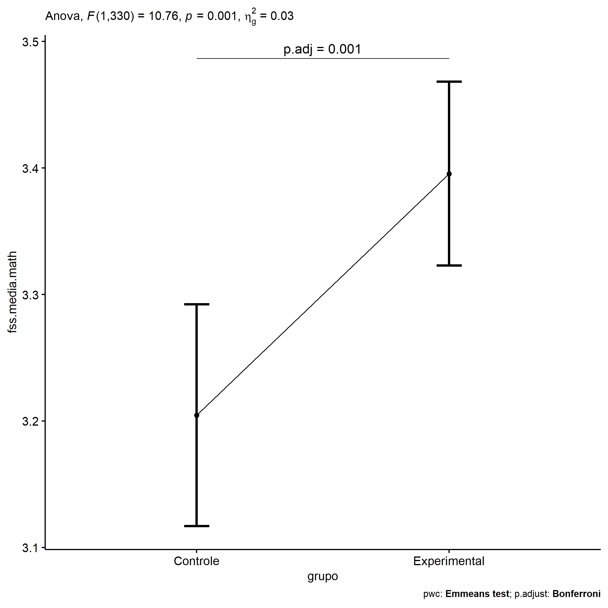<!-- -->

``` r
plots <- oneWayAncovaBoxPlots(
  wdat, "fss.media.math", "grupo", aov, pwc, covar = "dfs.media.math",
  theme = "classic", color = color[["grupo"]],
  subtitle = which(aov$Effect == "grupo"))
```

``` r
if (length(unique(wdat[["grupo"]])) > 1)
  plots[["grupo"]] + ggplot2::ylab("flow (prob. matemática)") + ggplot2::scale_x_discrete(labels=c('pre', 'pos'))
```

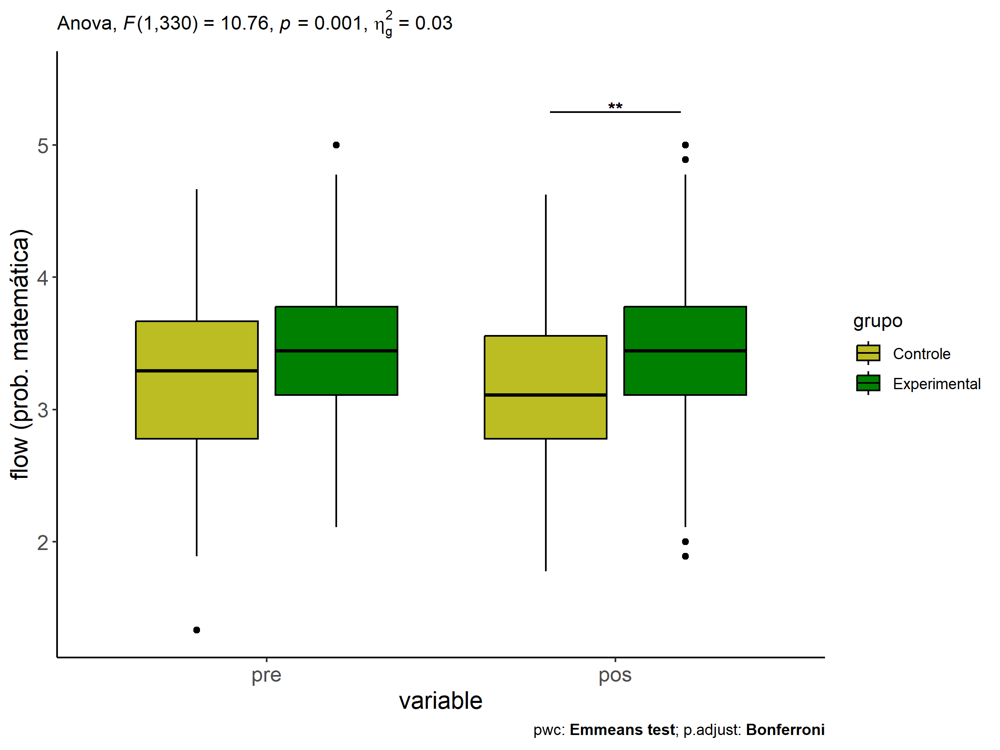<!-- -->

``` r
if (length(unique(wdat.long[["grupo"]])) > 1)
  plots <- oneWayAncovaBoxPlots(
    wdat.long, "flow.math", "grupo", aov, pwc.long, pre.post = "time",
    theme = "classic", color = color$prepost)
```

``` r
if (length(unique(wdat.long[["grupo"]])) > 1)
  plots[["grupo"]] + ggplot2::ylab("flow (prob. matemática)")
```

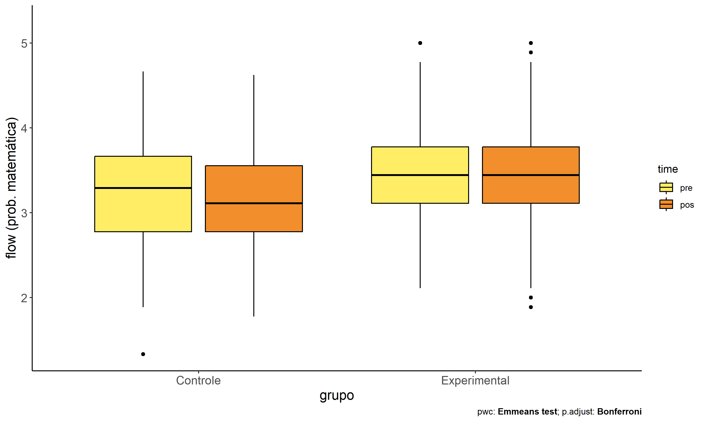<!-- -->

### Checking linearity assumption

``` r
ggscatter(wdat, x = "dfs.media.math", y = "fss.media.math", size = 0.5,
          color = "grupo", add = "reg.line")+
  stat_regline_equation(
    aes(label =  paste(..eq.label.., ..rr.label.., sep = "~~~~"), color = grupo)
  )
```

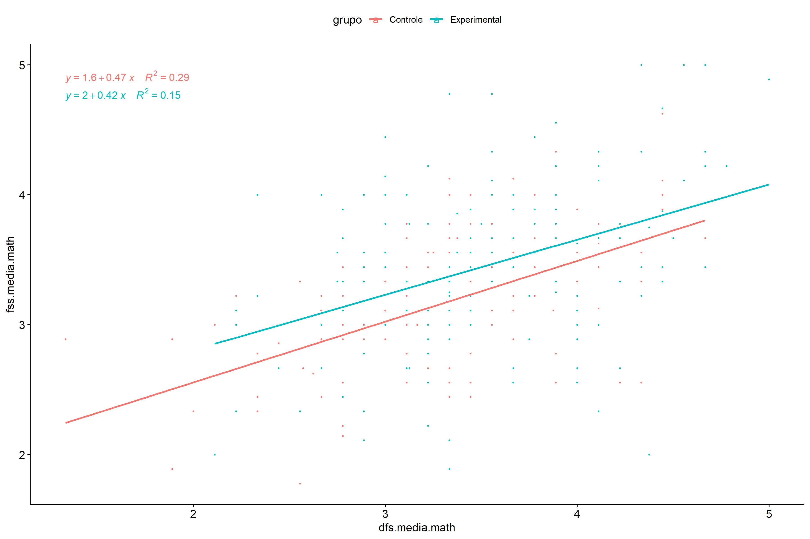<!-- -->

### Checking normality and homogeneity

``` r
res <- augment(lm(fss.media.math ~ dfs.media.math + grupo, data = wdat))
```

``` r
shapiro_test(res$.resid)
```

    ## # A tibble: 1 × 3
    ##   variable   statistic p.value
    ##   <chr>          <dbl>   <dbl>
    ## 1 res$.resid     0.996   0.505

``` r
levene_test(res, .resid ~ grupo)
```

    ## # A tibble: 1 × 4
    ##     df1   df2 statistic      p
    ##   <int> <int>     <dbl>  <dbl>
    ## 1     1   331      3.60 0.0588

# ANCOVA and Pairwise for two factors **grupo:Sexo**

## Without remove non-normal data

``` r
pdat = remove_group_data(dat[!is.na(dat[["grupo"]]) & !is.na(dat[["Sexo"]]),], "fss.media.math", c("grupo","Sexo"))

pdat.long <- rbind(pdat[,c("id","grupo","Sexo")], pdat[,c("id","grupo","Sexo")])
pdat.long[["time"]] <- c(rep("pre", nrow(pdat)), rep("pos", nrow(pdat)))
pdat.long[["time"]] <- factor(pdat.long[["time"]], c("pre","pos"))
pdat.long[["flow.math"]] <- c(pdat[["dfs.media.math"]], pdat[["fss.media.math"]])

aov = anova_test(pdat, fss.media.math ~ dfs.media.math + grupo*Sexo)
laov[["grupo:Sexo"]] <- get_anova_table(aov)
```

``` r
pwcs <- list()
pwcs[["Sexo"]] <- emmeans_test(
  group_by(pdat, grupo), fss.media.math ~ Sexo,
  covariate = dfs.media.math, p.adjust.method = "bonferroni")
pwcs[["grupo"]] <- emmeans_test(
  group_by(pdat, Sexo), fss.media.math ~ grupo,
  covariate = dfs.media.math, p.adjust.method = "bonferroni")

pwc <- plyr::rbind.fill(pwcs[["grupo"]], pwcs[["Sexo"]])
pwc <- pwc[,c("grupo","Sexo", colnames(pwc)[!colnames(pwc) %in% c("grupo","Sexo")])]
```

``` r
pwc.long <- emmeans_test(dplyr::group_by_at(pdat.long, c("grupo","Sexo")),
                         flow.math ~ time,
                         p.adjust.method = "bonferroni")
lpwc[["grupo:Sexo"]] <- plyr::rbind.fill(pwc, pwc.long)
```

``` r
ds <- get.descriptives(pdat, "fss.media.math", c("grupo","Sexo"), covar = "dfs.media.math")
ds <- merge(ds[ds$variable != "dfs.media.math",],
            ds[ds$variable == "dfs.media.math", !colnames(ds) %in% c("variable")],
            by = c("grupo","Sexo"), all.x = T, suffixes = c("", ".dfs.media.math"))
ds <- merge(get_emmeans(pwcs[["grupo"]]), ds, by = c("grupo","Sexo"), suffixes = c(".emms", ""))
ds <- ds[,c("grupo","Sexo","n","mean.dfs.media.math","se.dfs.media.math","mean","se","emmean","se.emms")]

colnames(ds) <- c("grupo","Sexo", "N", paste0(c("M","SE")," (pre)"),
                  paste0(c("M","SE"), " (unadj)"), paste0(c("M", "SE"), " (adj)"))

lemms[["grupo:Sexo"]] <- ds
```

## Computing ANCOVA and PairWise After removing non-normal data (OK)

``` r
wdat = pdat 

res = residuals(lm(fss.media.math ~ dfs.media.math + grupo*Sexo, data = wdat))
non.normal = getNonNormal(res, wdat$id, plimit = 0.05)

wdat = wdat[!wdat$id %in% non.normal,]

wdat.long <- rbind(wdat[,c("id","grupo","Sexo")], wdat[,c("id","grupo","Sexo")])
wdat.long[["time"]] <- c(rep("pre", nrow(wdat)), rep("pos", nrow(wdat)))
wdat.long[["time"]] <- factor(wdat.long[["time"]], c("pre","pos"))
wdat.long[["flow.math"]] <- c(wdat[["dfs.media.math"]], wdat[["fss.media.math"]])


ldat[["grupo:Sexo"]] = wdat

(non.normal)
```

    ## [1] "P1848"

``` r
aov = anova_test(wdat, fss.media.math ~ dfs.media.math + grupo*Sexo)
laov[["grupo:Sexo"]] <- merge(get_anova_table(aov), laov[["grupo:Sexo"]], by="Effect", suffixes = c("","'"))

(df = get_anova_table(aov))
```

    ## ANOVA Table (type II tests)
    ## 
    ##           Effect DFn DFd      F        p p<.05     ges
    ## 1 dfs.media.math   1 328 81.784 1.36e-17     * 0.20000
    ## 2          grupo   1 328 10.268 1.00e-03     * 0.03000
    ## 3           Sexo   1 328  1.375 2.42e-01       0.00400
    ## 4     grupo:Sexo   1 328  0.285 5.93e-01       0.00087

| Effect         | DFn | DFd |      F |     p | p\<.05 |   ges |
|:---------------|----:|----:|-------:|------:|:-------|------:|
| dfs.media.math |   1 | 328 | 81.784 | 0.000 | \*     | 0.200 |
| grupo          |   1 | 328 | 10.268 | 0.001 | \*     | 0.030 |
| Sexo           |   1 | 328 |  1.375 | 0.242 |        | 0.004 |
| grupo:Sexo     |   1 | 328 |  0.285 | 0.593 |        | 0.001 |

``` r
pwcs <- list()
pwcs[["Sexo"]] <- emmeans_test(
  group_by(wdat, grupo), fss.media.math ~ Sexo,
  covariate = dfs.media.math, p.adjust.method = "bonferroni")
pwcs[["grupo"]] <- emmeans_test(
  group_by(wdat, Sexo), fss.media.math ~ grupo,
  covariate = dfs.media.math, p.adjust.method = "bonferroni")

pwc <- plyr::rbind.fill(pwcs[["grupo"]], pwcs[["Sexo"]])
pwc <- pwc[,c("grupo","Sexo", colnames(pwc)[!colnames(pwc) %in% c("grupo","Sexo")])]
```

| grupo        | Sexo | term                  | .y.            | group1   | group2       |  df | statistic |     p | p.adj | p.adj.signif |
|:-------------|:-----|:----------------------|:---------------|:---------|:-------------|----:|----------:|------:|------:|:-------------|
|              | F    | dfs.media.math\*grupo | fss.media.math | Controle | Experimental | 328 |    -2.698 | 0.007 | 0.007 | \*\*         |
|              | M    | dfs.media.math\*grupo | fss.media.math | Controle | Experimental | 328 |    -1.809 | 0.071 | 0.071 | ns           |
| Controle     |      | dfs.media.math\*Sexo  | fss.media.math | F        | M            | 328 |    -1.158 | 0.248 | 0.248 | ns           |
| Experimental |      | dfs.media.math\*Sexo  | fss.media.math | F        | M            | 328 |    -0.550 | 0.583 | 0.583 | ns           |

``` r
pwc.long <- emmeans_test(dplyr::group_by_at(wdat.long, c("grupo","Sexo")),
                         flow.math ~ time,
                         p.adjust.method = "bonferroni")
lpwc[["grupo:Sexo"]] <- merge(plyr::rbind.fill(pwc, pwc.long), lpwc[["grupo:Sexo"]], by=c("grupo","Sexo","term",".y.","group1","group2"), suffixes = c("","'"))
```

| grupo        | Sexo | term | .y.       | group1 | group2 |  df | statistic |     p | p.adj | p.adj.signif |
|:-------------|:-----|:-----|:----------|:-------|:-------|----:|----------:|------:|------:|:-------------|
| Controle     | F    | time | flow.math | pre    | pos    | 658 |     2.282 | 0.023 | 0.023 | \*           |
| Controle     | M    | time | flow.math | pre    | pos    | 658 |     0.154 | 0.878 | 0.878 | ns           |
| Experimental | F    | time | flow.math | pre    | pos    | 658 |    -0.014 | 0.989 | 0.989 | ns           |
| Experimental | M    | time | flow.math | pre    | pos    | 658 |     0.927 | 0.354 | 0.354 | ns           |

``` r
ds <- get.descriptives(wdat, "fss.media.math", c("grupo","Sexo"), covar = "dfs.media.math")
ds <- merge(ds[ds$variable != "dfs.media.math",],
            ds[ds$variable == "dfs.media.math", !colnames(ds) %in% c("variable")],
            by = c("grupo","Sexo"), all.x = T, suffixes = c("", ".dfs.media.math"))
ds <- merge(get_emmeans(pwcs[["grupo"]]), ds, by = c("grupo","Sexo"), suffixes = c(".emms", ""))
ds <- ds[,c("grupo","Sexo","n","mean.dfs.media.math","se.dfs.media.math","mean","se","emmean","se.emms")]

colnames(ds) <- c("grupo","Sexo", "N", paste0(c("M","SE")," (pre)"),
                  paste0(c("M","SE"), " (unadj)"), paste0(c("M", "SE"), " (adj)"))

lemms[["grupo:Sexo"]] <- merge(ds, lemms[["grupo:Sexo"]], by=c("grupo","Sexo"), suffixes = c("","'"))
```

| grupo        | Sexo |   N | M (pre) | SE (pre) | M (unadj) | SE (unadj) | M (adj) | SE (adj) |
|:-------------|:-----|----:|--------:|---------:|----------:|-----------:|--------:|---------:|
| Controle     | F    |  74 |   3.360 |    0.063 |     3.144 |      0.056 |   3.158 |    0.060 |
| Controle     | M    |  62 |   3.185 |    0.087 |     3.169 |      0.077 |   3.261 |    0.066 |
| Experimental | F    |  94 |   3.358 |    0.055 |     3.359 |      0.065 |   3.374 |    0.053 |
| Experimental | M    | 103 |   3.568 |    0.056 |     3.494 |      0.056 |   3.415 |    0.052 |

### Plots for ancova

``` r
plots <- twoWayAncovaPlots(
  wdat, "fss.media.math", c("grupo","Sexo"), aov, pwcs, addParam = c("mean_se"),
  font.label.size=10, step.increase=0.05, p.label="p.adj",
  subtitle = which(aov$Effect == "grupo:Sexo"))
```

``` r
if (!is.null(plots[["grupo"]]))
  plots[["grupo"]] + ggplot2::scale_color_manual(values = color[["Sexo"]])
```

    ## Scale for colour is already present.
    ## Adding another scale for colour, which will replace the existing scale.

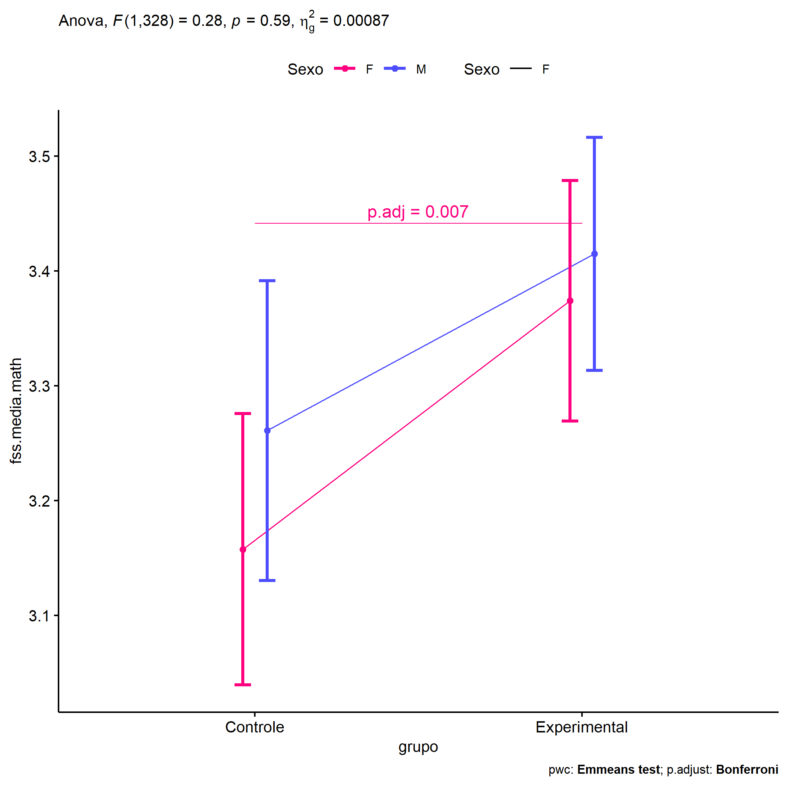<!-- -->

``` r
if (!is.null(plots[["Sexo"]]))
  plots[["Sexo"]] + ggplot2::scale_color_manual(values = color[["grupo"]])
```

    ## Scale for colour is already present.
    ## Adding another scale for colour, which will replace the existing scale.

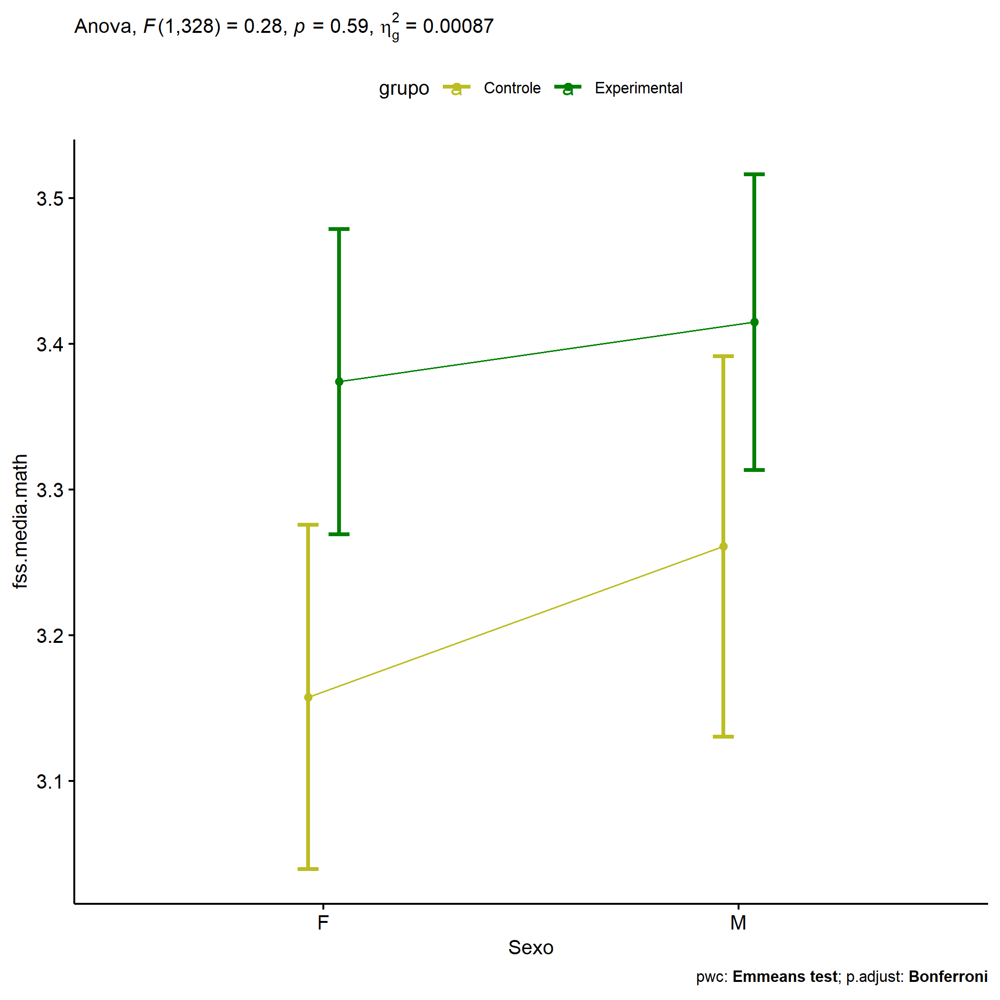<!-- -->

``` r
plots <- twoWayAncovaBoxPlots(
  wdat, "fss.media.math", c("grupo","Sexo"), aov, pwcs, covar = "dfs.media.math",
  theme = "classic", color = color[["grupo:Sexo"]],
  subtitle = which(aov$Effect == "grupo:Sexo"))
```

``` r
plots[["grupo:Sexo"]] + ggplot2::ylab("flow (prob. matemática)") + ggplot2::scale_x_discrete(labels=c('pre', 'pos'))
```

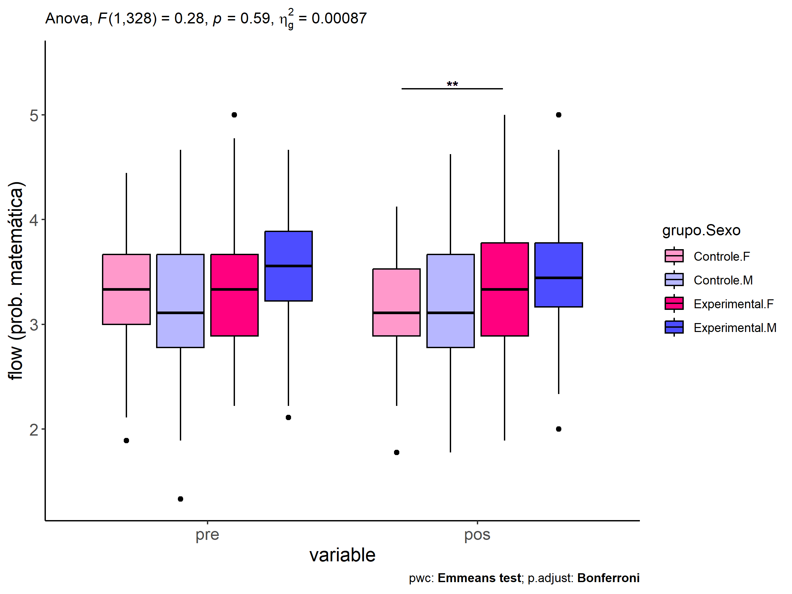<!-- -->

``` r
plots <- twoWayAncovaBoxPlots(
  wdat.long, "flow.math", c("grupo","Sexo"), aov, pwc.long, pre.post = "time",
  theme = "classic", color = color$prepost)
```

``` r
plots[["grupo:Sexo"]] + ggplot2::ylab("flow (prob. matemática)")
```

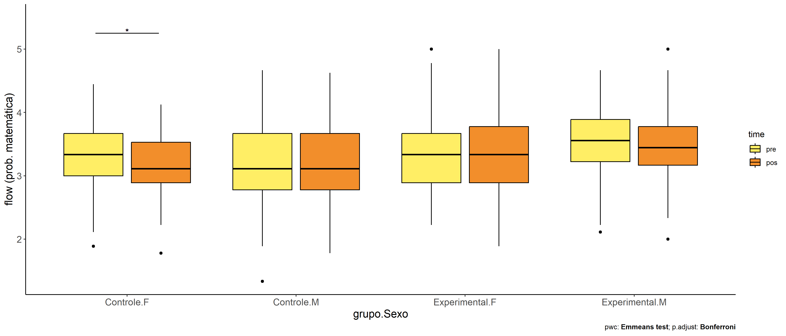<!-- -->

### Checking linearity assumption

``` r
ggscatter(wdat, x = "dfs.media.math", y = "fss.media.math", size = 0.5,
          facet.by = c("grupo","Sexo"), add = "reg.line")+
  stat_regline_equation(
    aes(label =  paste(..eq.label.., ..rr.label.., sep = "~~~~"))
  )
```

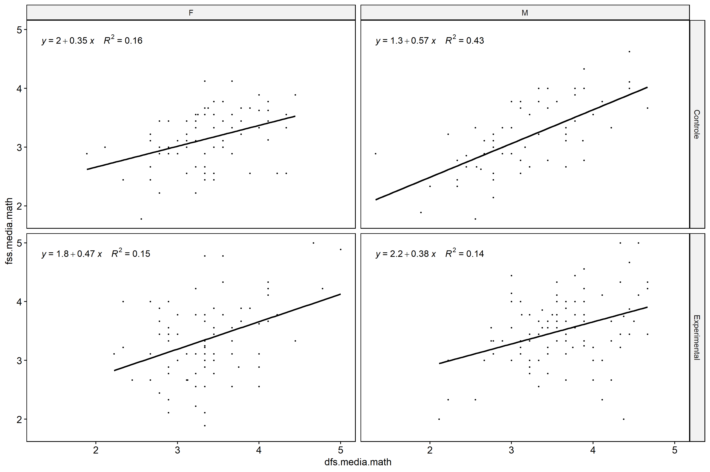<!-- -->

### Checking normality and homogeneity

``` r
res <- augment(lm(fss.media.math ~ dfs.media.math + grupo*Sexo, data = wdat))
```

``` r
shapiro_test(res$.resid)
```

    ## # A tibble: 1 × 3
    ##   variable   statistic p.value
    ##   <chr>          <dbl>   <dbl>
    ## 1 res$.resid     0.996   0.516

``` r
levene_test(res, .resid ~ grupo*Sexo)
```

    ## # A tibble: 1 × 4
    ##     df1   df2 statistic     p
    ##   <int> <int>     <dbl> <dbl>
    ## 1     3   329      1.93 0.124

# ANCOVA and Pairwise for two factors **grupo:Zona**

## Without remove non-normal data

``` r
pdat = remove_group_data(dat[!is.na(dat[["grupo"]]) & !is.na(dat[["Zona"]]),], "fss.media.math", c("grupo","Zona"))

pdat.long <- rbind(pdat[,c("id","grupo","Zona")], pdat[,c("id","grupo","Zona")])
pdat.long[["time"]] <- c(rep("pre", nrow(pdat)), rep("pos", nrow(pdat)))
pdat.long[["time"]] <- factor(pdat.long[["time"]], c("pre","pos"))
pdat.long[["flow.math"]] <- c(pdat[["dfs.media.math"]], pdat[["fss.media.math"]])

aov = anova_test(pdat, fss.media.math ~ dfs.media.math + grupo*Zona)
laov[["grupo:Zona"]] <- get_anova_table(aov)
```

``` r
pwcs <- list()
pwcs[["Zona"]] <- emmeans_test(
  group_by(pdat, grupo), fss.media.math ~ Zona,
  covariate = dfs.media.math, p.adjust.method = "bonferroni")
pwcs[["grupo"]] <- emmeans_test(
  group_by(pdat, Zona), fss.media.math ~ grupo,
  covariate = dfs.media.math, p.adjust.method = "bonferroni")

pwc <- plyr::rbind.fill(pwcs[["grupo"]], pwcs[["Zona"]])
pwc <- pwc[,c("grupo","Zona", colnames(pwc)[!colnames(pwc) %in% c("grupo","Zona")])]
```

``` r
pwc.long <- emmeans_test(dplyr::group_by_at(pdat.long, c("grupo","Zona")),
                         flow.math ~ time,
                         p.adjust.method = "bonferroni")
lpwc[["grupo:Zona"]] <- plyr::rbind.fill(pwc, pwc.long)
```

``` r
ds <- get.descriptives(pdat, "fss.media.math", c("grupo","Zona"), covar = "dfs.media.math")
ds <- merge(ds[ds$variable != "dfs.media.math",],
            ds[ds$variable == "dfs.media.math", !colnames(ds) %in% c("variable")],
            by = c("grupo","Zona"), all.x = T, suffixes = c("", ".dfs.media.math"))
ds <- merge(get_emmeans(pwcs[["grupo"]]), ds, by = c("grupo","Zona"), suffixes = c(".emms", ""))
ds <- ds[,c("grupo","Zona","n","mean.dfs.media.math","se.dfs.media.math","mean","se","emmean","se.emms")]

colnames(ds) <- c("grupo","Zona", "N", paste0(c("M","SE")," (pre)"),
                  paste0(c("M","SE"), " (unadj)"), paste0(c("M", "SE"), " (adj)"))

lemms[["grupo:Zona"]] <- ds
```

## Computing ANCOVA and PairWise After removing non-normal data (OK)

``` r
wdat = pdat 

res = residuals(lm(fss.media.math ~ dfs.media.math + grupo*Zona, data = wdat))
non.normal = getNonNormal(res, wdat$id, plimit = 0.05)

wdat = wdat[!wdat$id %in% non.normal,]

wdat.long <- rbind(wdat[,c("id","grupo","Zona")], wdat[,c("id","grupo","Zona")])
wdat.long[["time"]] <- c(rep("pre", nrow(wdat)), rep("pos", nrow(wdat)))
wdat.long[["time"]] <- factor(wdat.long[["time"]], c("pre","pos"))
wdat.long[["flow.math"]] <- c(wdat[["dfs.media.math"]], wdat[["fss.media.math"]])


ldat[["grupo:Zona"]] = wdat

(non.normal)
```

    ## [1] "P1848"

``` r
aov = anova_test(wdat, fss.media.math ~ dfs.media.math + grupo*Zona)
laov[["grupo:Zona"]] <- merge(get_anova_table(aov), laov[["grupo:Zona"]], by="Effect", suffixes = c("","'"))

(df = get_anova_table(aov))
```

    ## ANOVA Table (type II tests)
    ## 
    ##           Effect DFn DFd      F        p p<.05      ges
    ## 1 dfs.media.math   1 280 75.816 2.75e-16     * 0.213000
    ## 2          grupo   1 280 11.947 6.32e-04     * 0.041000
    ## 3           Zona   1 280  0.113 7.37e-01       0.000402
    ## 4     grupo:Zona   1 280  4.626 3.20e-02     * 0.016000

| Effect         | DFn | DFd |      F |     p | p\<.05 |   ges |
|:---------------|----:|----:|-------:|------:|:-------|------:|
| dfs.media.math |   1 | 280 | 75.816 | 0.000 | \*     | 0.213 |
| grupo          |   1 | 280 | 11.947 | 0.001 | \*     | 0.041 |
| Zona           |   1 | 280 |  0.113 | 0.737 |        | 0.000 |
| grupo:Zona     |   1 | 280 |  4.626 | 0.032 | \*     | 0.016 |

``` r
pwcs <- list()
pwcs[["Zona"]] <- emmeans_test(
  group_by(wdat, grupo), fss.media.math ~ Zona,
  covariate = dfs.media.math, p.adjust.method = "bonferroni")
pwcs[["grupo"]] <- emmeans_test(
  group_by(wdat, Zona), fss.media.math ~ grupo,
  covariate = dfs.media.math, p.adjust.method = "bonferroni")

pwc <- plyr::rbind.fill(pwcs[["grupo"]], pwcs[["Zona"]])
pwc <- pwc[,c("grupo","Zona", colnames(pwc)[!colnames(pwc) %in% c("grupo","Zona")])]
```

| grupo        | Zona   | term                  | .y.            | group1   | group2       |  df | statistic |     p | p.adj | p.adj.signif |
|:-------------|:-------|:----------------------|:---------------|:---------|:-------------|----:|----------:|------:|------:|:-------------|
|              | Rural  | dfs.media.math\*grupo | fss.media.math | Controle | Experimental | 280 |    -3.979 | 0.000 | 0.000 | \*\*\*\*     |
|              | Urbana | dfs.media.math\*grupo | fss.media.math | Controle | Experimental | 280 |    -0.898 | 0.370 | 0.370 | ns           |
| Controle     |        | dfs.media.math\*Zona  | fss.media.math | Rural    | Urbana       | 280 |    -1.429 | 0.154 | 0.154 | ns           |
| Experimental |        | dfs.media.math\*Zona  | fss.media.math | Rural    | Urbana       | 280 |     1.645 | 0.101 | 0.101 | ns           |

``` r
pwc.long <- emmeans_test(dplyr::group_by_at(wdat.long, c("grupo","Zona")),
                         flow.math ~ time,
                         p.adjust.method = "bonferroni")
lpwc[["grupo:Zona"]] <- merge(plyr::rbind.fill(pwc, pwc.long), lpwc[["grupo:Zona"]], by=c("grupo","Zona","term",".y.","group1","group2"), suffixes = c("","'"))
```

| grupo        | Zona   | term | .y.       | group1 | group2 |  df | statistic |     p | p.adj | p.adj.signif |
|:-------------|:-------|:-----|:----------|:-------|:-------|----:|----------:|------:|------:|:-------------|
| Controle     | Rural  | time | flow.math | pre    | pos    | 562 |     2.041 | 0.042 | 0.042 | \*           |
| Controle     | Urbana | time | flow.math | pre    | pos    | 562 |     0.537 | 0.592 | 0.592 | ns           |
| Experimental | Rural  | time | flow.math | pre    | pos    | 562 |    -0.764 | 0.445 | 0.445 | ns           |
| Experimental | Urbana | time | flow.math | pre    | pos    | 562 |     1.295 | 0.196 | 0.196 | ns           |

``` r
ds <- get.descriptives(wdat, "fss.media.math", c("grupo","Zona"), covar = "dfs.media.math")
ds <- merge(ds[ds$variable != "dfs.media.math",],
            ds[ds$variable == "dfs.media.math", !colnames(ds) %in% c("variable")],
            by = c("grupo","Zona"), all.x = T, suffixes = c("", ".dfs.media.math"))
ds <- merge(get_emmeans(pwcs[["grupo"]]), ds, by = c("grupo","Zona"), suffixes = c(".emms", ""))
ds <- ds[,c("grupo","Zona","n","mean.dfs.media.math","se.dfs.media.math","mean","se","emmean","se.emms")]

colnames(ds) <- c("grupo","Zona", "N", paste0(c("M","SE")," (pre)"),
                  paste0(c("M","SE"), " (unadj)"), paste0(c("M", "SE"), " (adj)"))

lemms[["grupo:Zona"]] <- merge(ds, lemms[["grupo:Zona"]], by=c("grupo","Zona"), suffixes = c("","'"))
```

| grupo        | Zona   |   N | M (pre) | SE (pre) | M (unadj) | SE (unadj) | M (adj) | SE (adj) |
|:-------------|:-------|----:|--------:|---------:|----------:|-----------:|--------:|---------:|
| Controle     | Rural  |  58 |   3.314 |    0.068 |     3.096 |      0.071 |   3.131 |    0.067 |
| Controle     | Urbana |  60 |   3.262 |    0.089 |     3.206 |      0.064 |   3.265 |    0.066 |
| Experimental | Rural  |  88 |   3.418 |    0.059 |     3.485 |      0.059 |   3.473 |    0.054 |
| Experimental | Urbana |  79 |   3.520 |    0.064 |     3.401 |      0.074 |   3.344 |    0.057 |

### Plots for ancova

``` r
plots <- twoWayAncovaPlots(
  wdat, "fss.media.math", c("grupo","Zona"), aov, pwcs, addParam = c("mean_se"),
  font.label.size=10, step.increase=0.05, p.label="p.adj",
  subtitle = which(aov$Effect == "grupo:Zona"))
```

``` r
if (!is.null(plots[["grupo"]]))
  plots[["grupo"]] + ggplot2::scale_color_manual(values = color[["Zona"]])
```

    ## Scale for colour is already present.
    ## Adding another scale for colour, which will replace the existing scale.

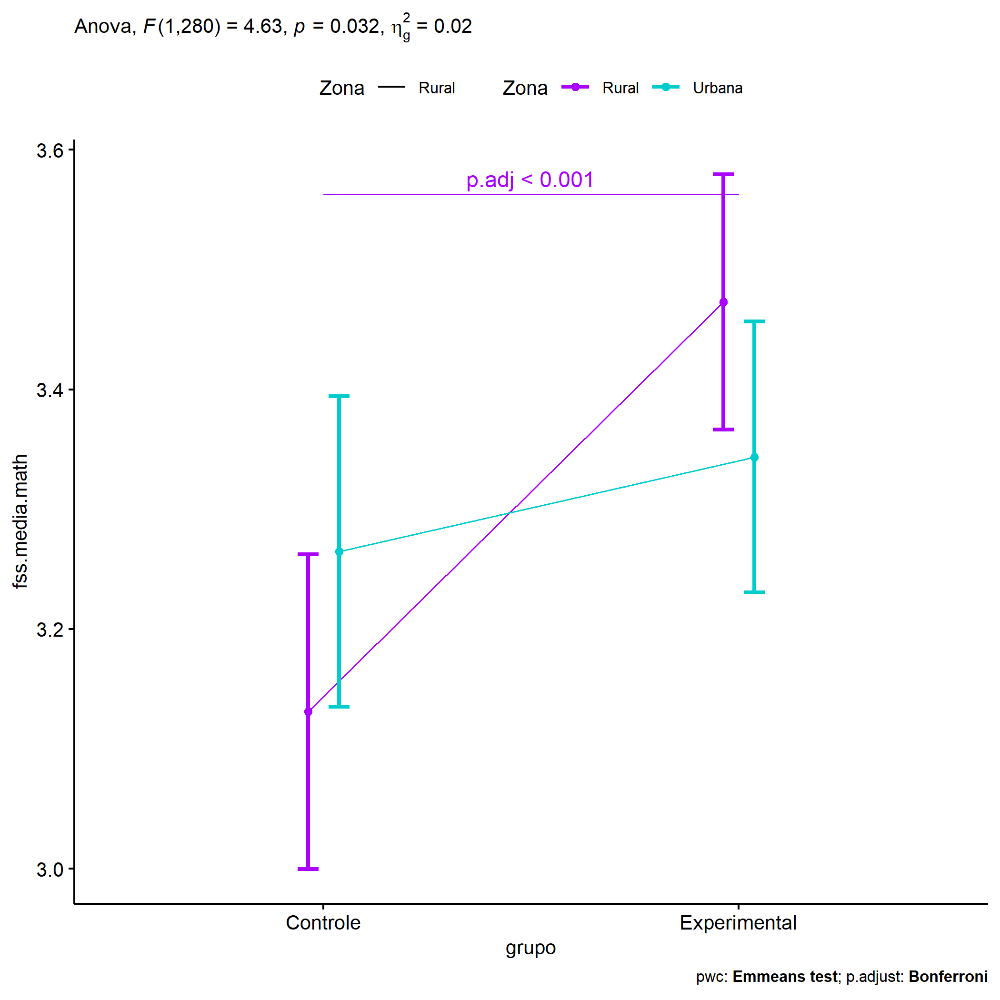<!-- -->

``` r
if (!is.null(plots[["Zona"]]))
  plots[["Zona"]] + ggplot2::scale_color_manual(values = color[["grupo"]])
```

    ## Scale for colour is already present.
    ## Adding another scale for colour, which will replace the existing scale.

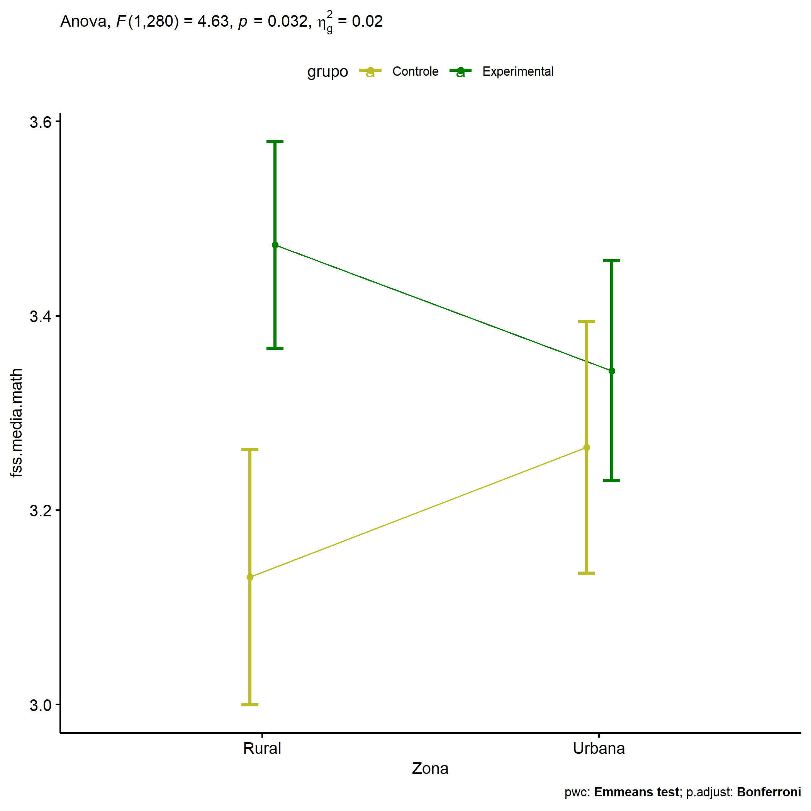<!-- -->

``` r
plots <- twoWayAncovaBoxPlots(
  wdat, "fss.media.math", c("grupo","Zona"), aov, pwcs, covar = "dfs.media.math",
  theme = "classic", color = color[["grupo:Zona"]],
  subtitle = which(aov$Effect == "grupo:Zona"))
```

``` r
plots[["grupo:Zona"]] + ggplot2::ylab("flow (prob. matemática)") + ggplot2::scale_x_discrete(labels=c('pre', 'pos'))
```

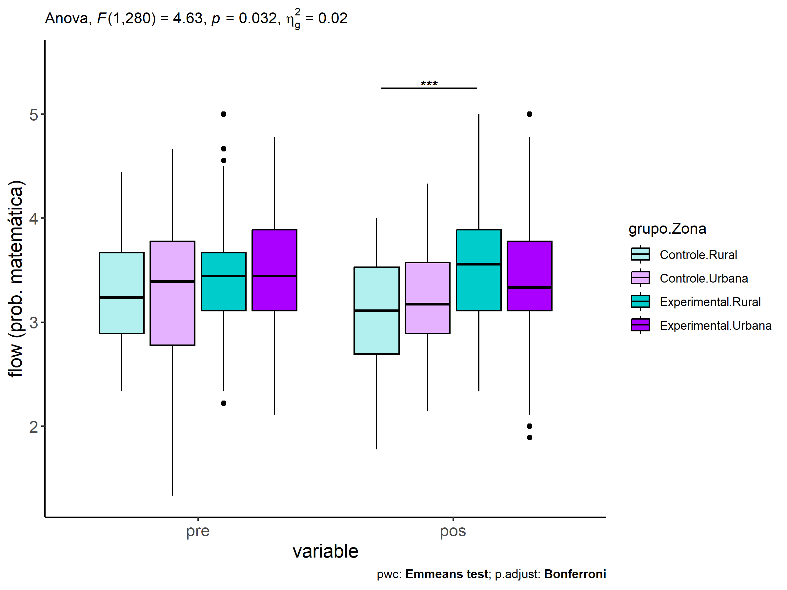<!-- -->

``` r
plots <- twoWayAncovaBoxPlots(
  wdat.long, "flow.math", c("grupo","Zona"), aov, pwc.long, pre.post = "time",
  theme = "classic", color = color$prepost)
```

``` r
plots[["grupo:Zona"]] + ggplot2::ylab("flow (prob. matemática)")
```

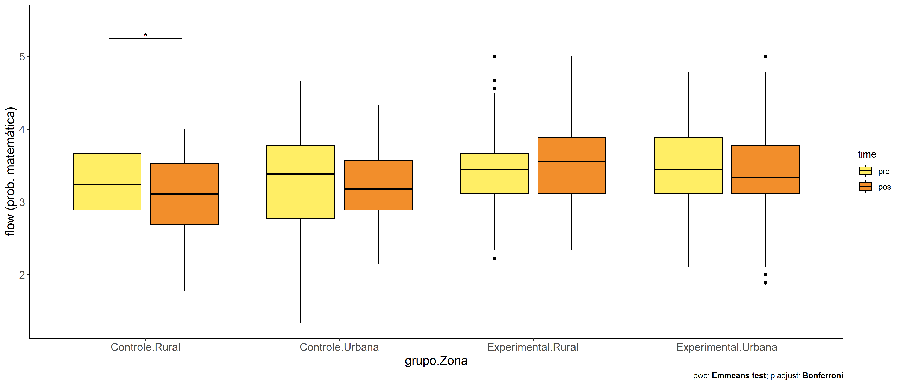<!-- -->

### Checking linearity assumption

``` r
ggscatter(wdat, x = "dfs.media.math", y = "fss.media.math", size = 0.5,
          facet.by = c("grupo","Zona"), add = "reg.line")+
  stat_regline_equation(
    aes(label =  paste(..eq.label.., ..rr.label.., sep = "~~~~"))
  )
```

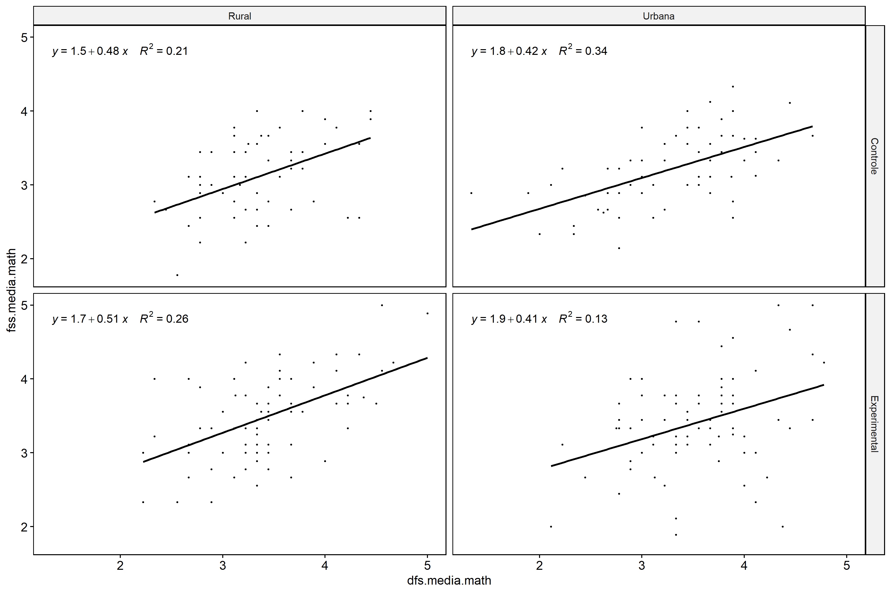<!-- -->

### Checking normality and homogeneity

``` r
res <- augment(lm(fss.media.math ~ dfs.media.math + grupo*Zona, data = wdat))
```

``` r
shapiro_test(res$.resid)
```

    ## # A tibble: 1 × 3
    ##   variable   statistic p.value
    ##   <chr>          <dbl>   <dbl>
    ## 1 res$.resid     0.996   0.741

``` r
levene_test(res, .resid ~ grupo*Zona)
```

    ## # A tibble: 1 × 4
    ##     df1   df2 statistic      p
    ##   <int> <int>     <dbl>  <dbl>
    ## 1     3   281      2.53 0.0575

# ANCOVA and Pairwise for two factors **grupo:Cor.Raca**

## Without remove non-normal data

``` r
pdat = remove_group_data(dat[!is.na(dat[["grupo"]]) & !is.na(dat[["Cor.Raca"]]),], "fss.media.math", c("grupo","Cor.Raca"))

pdat.long <- rbind(pdat[,c("id","grupo","Cor.Raca")], pdat[,c("id","grupo","Cor.Raca")])
pdat.long[["time"]] <- c(rep("pre", nrow(pdat)), rep("pos", nrow(pdat)))
pdat.long[["time"]] <- factor(pdat.long[["time"]], c("pre","pos"))
pdat.long[["flow.math"]] <- c(pdat[["dfs.media.math"]], pdat[["fss.media.math"]])

aov = anova_test(pdat, fss.media.math ~ dfs.media.math + grupo*Cor.Raca)
laov[["grupo:Cor.Raca"]] <- get_anova_table(aov)
```

``` r
pwcs <- list()
pwcs[["Cor.Raca"]] <- emmeans_test(
  group_by(pdat, grupo), fss.media.math ~ Cor.Raca,
  covariate = dfs.media.math, p.adjust.method = "bonferroni")
pwcs[["grupo"]] <- emmeans_test(
  group_by(pdat, Cor.Raca), fss.media.math ~ grupo,
  covariate = dfs.media.math, p.adjust.method = "bonferroni")

pwc <- plyr::rbind.fill(pwcs[["grupo"]], pwcs[["Cor.Raca"]])
pwc <- pwc[,c("grupo","Cor.Raca", colnames(pwc)[!colnames(pwc) %in% c("grupo","Cor.Raca")])]
```

``` r
pwc.long <- emmeans_test(dplyr::group_by_at(pdat.long, c("grupo","Cor.Raca")),
                         flow.math ~ time,
                         p.adjust.method = "bonferroni")
lpwc[["grupo:Cor.Raca"]] <- plyr::rbind.fill(pwc, pwc.long)
```

``` r
ds <- get.descriptives(pdat, "fss.media.math", c("grupo","Cor.Raca"), covar = "dfs.media.math")
ds <- merge(ds[ds$variable != "dfs.media.math",],
            ds[ds$variable == "dfs.media.math", !colnames(ds) %in% c("variable")],
            by = c("grupo","Cor.Raca"), all.x = T, suffixes = c("", ".dfs.media.math"))
ds <- merge(get_emmeans(pwcs[["grupo"]]), ds, by = c("grupo","Cor.Raca"), suffixes = c(".emms", ""))
ds <- ds[,c("grupo","Cor.Raca","n","mean.dfs.media.math","se.dfs.media.math","mean","se","emmean","se.emms")]

colnames(ds) <- c("grupo","Cor.Raca", "N", paste0(c("M","SE")," (pre)"),
                  paste0(c("M","SE"), " (unadj)"), paste0(c("M", "SE"), " (adj)"))

lemms[["grupo:Cor.Raca"]] <- ds
```

## Computing ANCOVA and PairWise After removing non-normal data (OK)

``` r
wdat = pdat 

res = residuals(lm(fss.media.math ~ dfs.media.math + grupo*Cor.Raca, data = wdat))
non.normal = getNonNormal(res, wdat$id, plimit = 0.05)

wdat = wdat[!wdat$id %in% non.normal,]

wdat.long <- rbind(wdat[,c("id","grupo","Cor.Raca")], wdat[,c("id","grupo","Cor.Raca")])
wdat.long[["time"]] <- c(rep("pre", nrow(wdat)), rep("pos", nrow(wdat)))
wdat.long[["time"]] <- factor(wdat.long[["time"]], c("pre","pos"))
wdat.long[["flow.math"]] <- c(wdat[["dfs.media.math"]], wdat[["fss.media.math"]])


ldat[["grupo:Cor.Raca"]] = wdat

(non.normal)
```

    ## NULL

``` r
aov = anova_test(wdat, fss.media.math ~ dfs.media.math + grupo*Cor.Raca)
laov[["grupo:Cor.Raca"]] <- merge(get_anova_table(aov), laov[["grupo:Cor.Raca"]], by="Effect", suffixes = c("","'"))

(df = get_anova_table(aov))
```

    ## ANOVA Table (type II tests)
    ## 
    ##           Effect DFn DFd      F        p p<.05   ges
    ## 1 dfs.media.math   1 119 54.046 2.71e-11     * 0.312
    ## 2          grupo   1 119  1.622 2.05e-01       0.013
    ## 3       Cor.Raca   1 119  1.342 2.49e-01       0.011
    ## 4 grupo:Cor.Raca   1 119  8.774 4.00e-03     * 0.069

| Effect         | DFn | DFd |      F |     p | p\<.05 |   ges |
|:---------------|----:|----:|-------:|------:|:-------|------:|
| dfs.media.math |   1 | 119 | 54.046 | 0.000 | \*     | 0.312 |
| grupo          |   1 | 119 |  1.622 | 0.205 |        | 0.013 |
| Cor.Raca       |   1 | 119 |  1.342 | 0.249 |        | 0.011 |
| grupo:Cor.Raca |   1 | 119 |  8.774 | 0.004 | \*     | 0.069 |

``` r
pwcs <- list()
pwcs[["Cor.Raca"]] <- emmeans_test(
  group_by(wdat, grupo), fss.media.math ~ Cor.Raca,
  covariate = dfs.media.math, p.adjust.method = "bonferroni")
pwcs[["grupo"]] <- emmeans_test(
  group_by(wdat, Cor.Raca), fss.media.math ~ grupo,
  covariate = dfs.media.math, p.adjust.method = "bonferroni")

pwc <- plyr::rbind.fill(pwcs[["grupo"]], pwcs[["Cor.Raca"]])
pwc <- pwc[,c("grupo","Cor.Raca", colnames(pwc)[!colnames(pwc) %in% c("grupo","Cor.Raca")])]
```

| grupo        | Cor.Raca | term                     | .y.            | group1   | group2       |  df | statistic |     p | p.adj | p.adj.signif |
|:-------------|:---------|:-------------------------|:---------------|:---------|:-------------|----:|----------:|------:|------:|:-------------|
|              | Branca   | dfs.media.math\*grupo    | fss.media.math | Controle | Experimental | 119 |     1.896 | 0.060 | 0.060 | ns           |
|              | Parda    | dfs.media.math\*grupo    | fss.media.math | Controle | Experimental | 119 |    -2.587 | 0.011 | 0.011 | \*           |
| Controle     |          | dfs.media.math\*Cor.Raca | fss.media.math | Branca   | Parda        | 119 |     1.208 | 0.229 | 0.229 | ns           |
| Experimental |          | dfs.media.math\*Cor.Raca | fss.media.math | Branca   | Parda        | 119 |    -2.953 | 0.004 | 0.004 | \*\*         |

``` r
pwc.long <- emmeans_test(dplyr::group_by_at(wdat.long, c("grupo","Cor.Raca")),
                         flow.math ~ time,
                         p.adjust.method = "bonferroni")
lpwc[["grupo:Cor.Raca"]] <- merge(plyr::rbind.fill(pwc, pwc.long), lpwc[["grupo:Cor.Raca"]], by=c("grupo","Cor.Raca","term",".y.","group1","group2"), suffixes = c("","'"))
```

| grupo        | Cor.Raca | term | .y.       | group1 | group2 |  df | statistic |     p | p.adj | p.adj.signif |
|:-------------|:---------|:-----|:----------|:-------|:-------|----:|----------:|------:|------:|:-------------|
| Controle     | Branca   | time | flow.math | pre    | pos    | 240 |    -0.082 | 0.934 | 0.934 | ns           |
| Controle     | Parda    | time | flow.math | pre    | pos    | 240 |     1.702 | 0.090 | 0.090 | ns           |
| Experimental | Branca   | time | flow.math | pre    | pos    | 240 |     2.387 | 0.018 | 0.018 | \*           |
| Experimental | Parda    | time | flow.math | pre    | pos    | 240 |    -0.118 | 0.906 | 0.906 | ns           |

``` r
ds <- get.descriptives(wdat, "fss.media.math", c("grupo","Cor.Raca"), covar = "dfs.media.math")
ds <- merge(ds[ds$variable != "dfs.media.math",],
            ds[ds$variable == "dfs.media.math", !colnames(ds) %in% c("variable")],
            by = c("grupo","Cor.Raca"), all.x = T, suffixes = c("", ".dfs.media.math"))
ds <- merge(get_emmeans(pwcs[["grupo"]]), ds, by = c("grupo","Cor.Raca"), suffixes = c(".emms", ""))
ds <- ds[,c("grupo","Cor.Raca","n","mean.dfs.media.math","se.dfs.media.math","mean","se","emmean","se.emms")]

colnames(ds) <- c("grupo","Cor.Raca", "N", paste0(c("M","SE")," (pre)"),
                  paste0(c("M","SE"), " (unadj)"), paste0(c("M", "SE"), " (adj)"))

lemms[["grupo:Cor.Raca"]] <- merge(ds, lemms[["grupo:Cor.Raca"]], by=c("grupo","Cor.Raca"), suffixes = c("","'"))
```

| grupo        | Cor.Raca |   N | M (pre) | SE (pre) | M (unadj) | SE (unadj) | M (adj) | SE (adj) |
|:-------------|:---------|----:|--------:|---------:|----------:|-----------:|--------:|---------:|
| Controle     | Branca   |  18 |   3.208 |    0.163 |     3.224 |      0.114 |   3.329 |    0.116 |
| Controle     | Parda    |  43 |   3.356 |    0.090 |     3.140 |      0.082 |   3.163 |    0.074 |
| Experimental | Branca   |  15 |   3.655 |    0.132 |     3.140 |      0.172 |   3.000 |    0.127 |
| Experimental | Parda    |  48 |   3.432 |    0.085 |     3.446 |      0.091 |   3.429 |    0.070 |

### Plots for ancova

``` r
plots <- twoWayAncovaPlots(
  wdat, "fss.media.math", c("grupo","Cor.Raca"), aov, pwcs, addParam = c("mean_se"),
  font.label.size=10, step.increase=0.05, p.label="p.adj",
  subtitle = which(aov$Effect == "grupo:Cor.Raca"))
```

``` r
if (!is.null(plots[["grupo"]]))
  plots[["grupo"]] + ggplot2::scale_color_manual(values = color[["Cor.Raca"]])
```

    ## Scale for colour is already present.
    ## Adding another scale for colour, which will replace the existing scale.

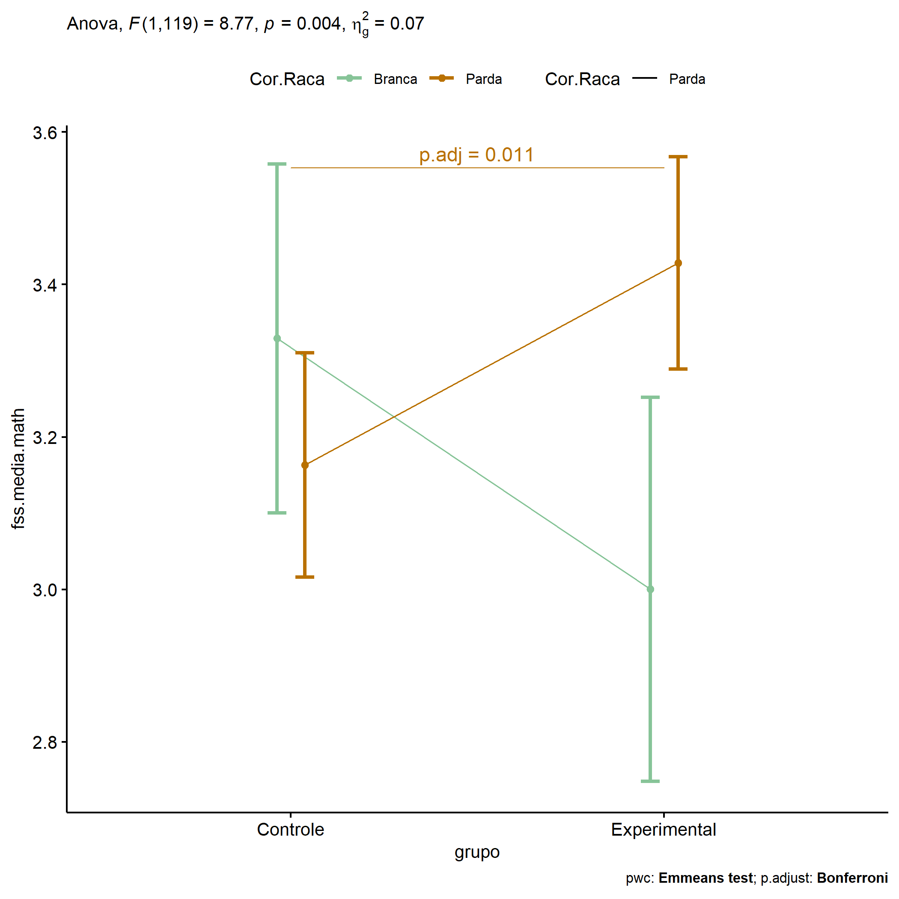<!-- -->

``` r
if (!is.null(plots[["Cor.Raca"]]))
  plots[["Cor.Raca"]] + ggplot2::scale_color_manual(values = color[["grupo"]])
```

    ## Scale for colour is already present.
    ## Adding another scale for colour, which will replace the existing scale.

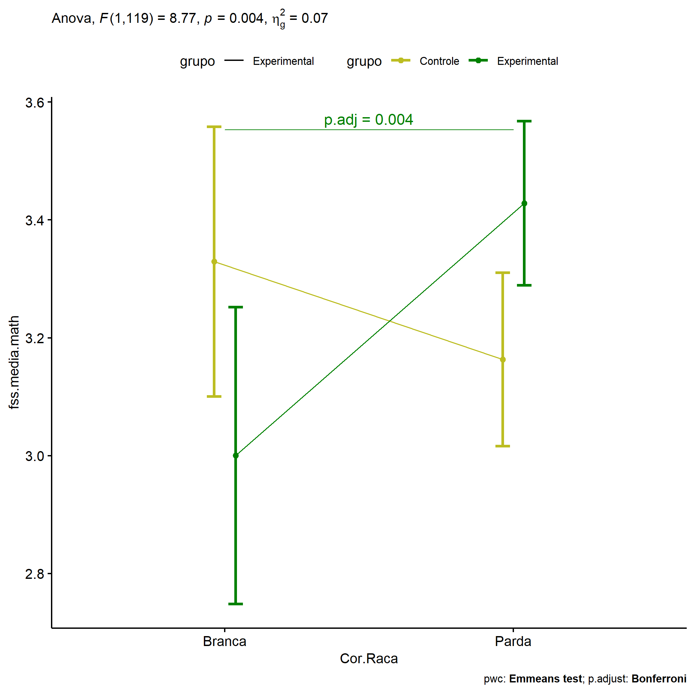<!-- -->

``` r
plots <- twoWayAncovaBoxPlots(
  wdat, "fss.media.math", c("grupo","Cor.Raca"), aov, pwcs, covar = "dfs.media.math",
  theme = "classic", color = color[["grupo:Cor.Raca"]],
  subtitle = which(aov$Effect == "grupo:Cor.Raca"))
```

``` r
plots[["grupo:Cor.Raca"]] + ggplot2::ylab("flow (prob. matemática)") + ggplot2::scale_x_discrete(labels=c('pre', 'pos'))
```

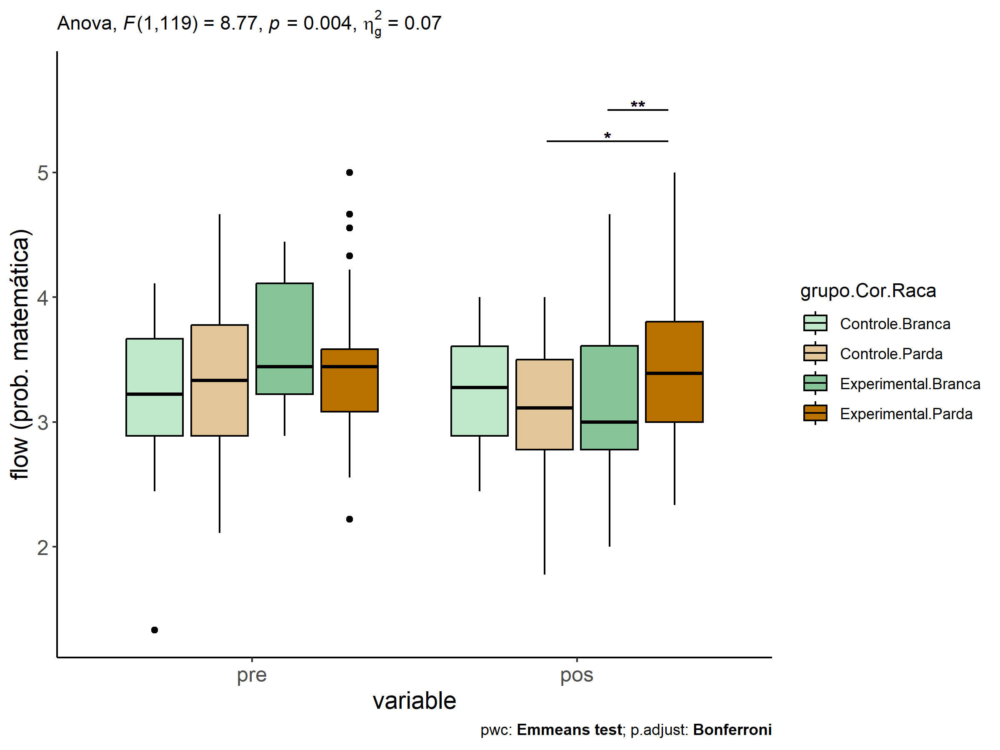<!-- -->

``` r
plots <- twoWayAncovaBoxPlots(
  wdat.long, "flow.math", c("grupo","Cor.Raca"), aov, pwc.long, pre.post = "time",
  theme = "classic", color = color$prepost)
```

``` r
plots[["grupo:Cor.Raca"]] + ggplot2::ylab("flow (prob. matemática)")
```

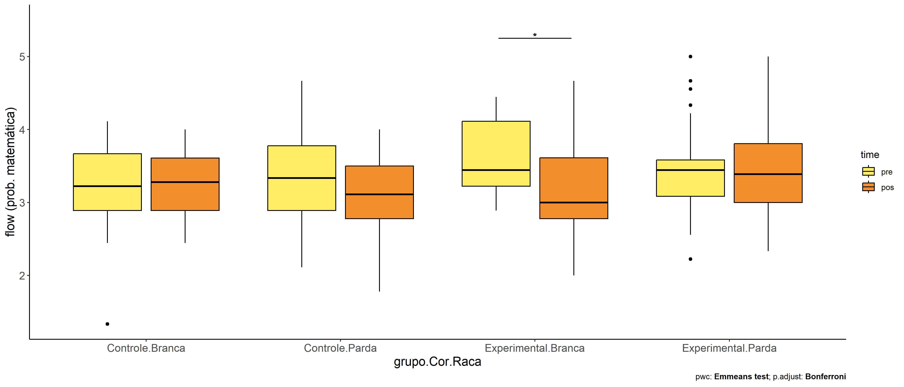<!-- -->

### Checking linearity assumption

``` r
ggscatter(wdat, x = "dfs.media.math", y = "fss.media.math", size = 0.5,
          facet.by = c("grupo","Cor.Raca"), add = "reg.line")+
  stat_regline_equation(
    aes(label =  paste(..eq.label.., ..rr.label.., sep = "~~~~"))
  )
```

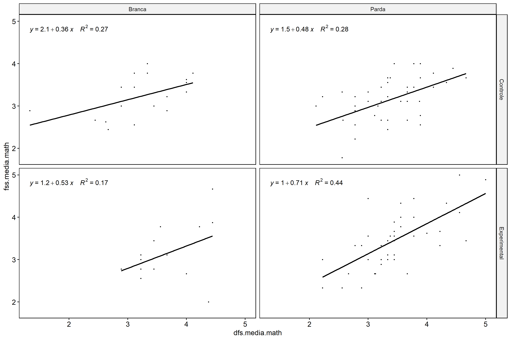<!-- -->

### Checking normality and homogeneity

``` r
res <- augment(lm(fss.media.math ~ dfs.media.math + grupo*Cor.Raca, data = wdat))
```

``` r
shapiro_test(res$.resid)
```

    ## # A tibble: 1 × 3
    ##   variable   statistic p.value
    ##   <chr>          <dbl>   <dbl>
    ## 1 res$.resid     0.995   0.952

``` r
levene_test(res, .resid ~ grupo*Cor.Raca)
```

    ## # A tibble: 1 × 4
    ##     df1   df2 statistic     p
    ##   <int> <int>     <dbl> <dbl>
    ## 1     3   120     0.211 0.889

# Summary of Results

## Descriptive Statistics

``` r
df <- get.descriptives(ldat[["grupo"]], c(dv.pre, dv.pos), c("grupo"), 
                       include.global = T, symmetry.test = T, normality.test = F)
df <- plyr::rbind.fill(
  df, do.call(plyr::rbind.fill, lapply(lfatores2, FUN = function(f) {
    if (nrow(dat) > 0 && sum(!is.na(unique(dat[[f]]))) > 1)
      get.descriptives(ldat[[paste0("grupo:",f)]], c(dv.pre,dv.pos), c("grupo", f),
                       symmetry.test = T, normality.test = F)
    }))
)
(df <- df[,c(fatores1[fatores1 %in% colnames(df)],"variable",
             colnames(df)[!colnames(df) %in% c(fatores1,"variable")])])
```

    ##           grupo Sexo   Zona Cor.Raca       variable   n  mean median   min   max    sd    se    ci   iqr
    ## 1      Controle <NA>   <NA>     <NA> dfs.media.math 136 3.280  3.292 1.333 4.667 0.619 0.053 0.105 0.889
    ## 2  Experimental <NA>   <NA>     <NA> dfs.media.math 197 3.468  3.444 2.111 5.000 0.558 0.040 0.078 0.667
    ## 3          <NA> <NA>   <NA>     <NA> dfs.media.math 333 3.391  3.333 1.333 5.000 0.590 0.032 0.064 0.778
    ## 4      Controle <NA>   <NA>     <NA> fss.media.math 136 3.155  3.111 1.778 4.625 0.537 0.046 0.091 0.778
    ## 5  Experimental <NA>   <NA>     <NA> fss.media.math 197 3.430  3.444 1.889 5.000 0.602 0.043 0.085 0.667
    ## 6          <NA> <NA>   <NA>     <NA> fss.media.math 333 3.318  3.333 1.778 5.000 0.591 0.032 0.064 0.778
    ## 7      Controle    F   <NA>     <NA> dfs.media.math  74 3.360  3.333 1.889 4.444 0.545 0.063 0.126 0.667
    ## 8      Controle    M   <NA>     <NA> dfs.media.math  62 3.185  3.111 1.333 4.667 0.688 0.087 0.175 0.889
    ## 9  Experimental    F   <NA>     <NA> dfs.media.math  94 3.358  3.333 2.222 5.000 0.531 0.055 0.109 0.778
    ## 10 Experimental    M   <NA>     <NA> dfs.media.math 103 3.568  3.556 2.111 4.667 0.565 0.056 0.110 0.667
    ## 11     Controle    F   <NA>     <NA> fss.media.math  74 3.144  3.111 1.778 4.125 0.478 0.056 0.111 0.639
    ## 12     Controle    M   <NA>     <NA> fss.media.math  62 3.169  3.111 1.778 4.625 0.605 0.077 0.154 0.889
    ## 13 Experimental    F   <NA>     <NA> fss.media.math  94 3.359  3.333 1.889 5.000 0.632 0.065 0.129 0.889
    ## 14 Experimental    M   <NA>     <NA> fss.media.math 103 3.494  3.444 2.000 5.000 0.569 0.056 0.111 0.611
    ## 15     Controle <NA>  Rural     <NA> dfs.media.math  58 3.314  3.236 2.333 4.444 0.518 0.068 0.136 0.778
    ## 16     Controle <NA> Urbana     <NA> dfs.media.math  60 3.262  3.389 1.333 4.667 0.686 0.089 0.177 1.000
    ## 17 Experimental <NA>  Rural     <NA> dfs.media.math  88 3.418  3.444 2.222 5.000 0.557 0.059 0.118 0.556
    ## 18 Experimental <NA> Urbana     <NA> dfs.media.math  79 3.520  3.444 2.111 4.778 0.571 0.064 0.128 0.778
    ## 19     Controle <NA>  Rural     <NA> fss.media.math  58 3.096  3.111 1.778 4.000 0.540 0.071 0.142 0.833
    ## 20     Controle <NA> Urbana     <NA> fss.media.math  60 3.206  3.174 2.143 4.333 0.495 0.064 0.128 0.684
    ## 21 Experimental <NA>  Rural     <NA> fss.media.math  88 3.485  3.556 2.333 5.000 0.552 0.059 0.117 0.778
    ## 22 Experimental <NA> Urbana     <NA> fss.media.math  79 3.401  3.333 1.889 5.000 0.660 0.074 0.148 0.667
    ## 23     Controle <NA>   <NA>   Branca dfs.media.math  18 3.208  3.222 1.333 4.111 0.693 0.163 0.345 0.778
    ## 24     Controle <NA>   <NA>    Parda dfs.media.math  43 3.356  3.333 2.111 4.667 0.591 0.090 0.182 0.889
    ## 25 Experimental <NA>   <NA>   Branca dfs.media.math  15 3.655  3.444 2.889 4.444 0.513 0.132 0.284 0.889
    ## 26 Experimental <NA>   <NA>    Parda dfs.media.math  48 3.432  3.444 2.222 5.000 0.586 0.085 0.170 0.500
    ## 27     Controle <NA>   <NA>   Branca fss.media.math  18 3.224  3.278 2.444 4.000 0.482 0.114 0.240 0.719
    ## 28     Controle <NA>   <NA>    Parda fss.media.math  43 3.140  3.111 1.778 4.000 0.538 0.082 0.166 0.722
    ## 29 Experimental <NA>   <NA>   Branca fss.media.math  15 3.140  3.000 2.000 4.667 0.665 0.172 0.368 0.833
    ## 30 Experimental <NA>   <NA>    Parda fss.media.math  48 3.446  3.389 2.333 5.000 0.632 0.091 0.183 0.806
    ##    symmetry     skewness     kurtosis
    ## 1       YES -0.149182095 -0.112272690
    ## 2       YES  0.197327262 -0.156818347
    ## 3       YES -0.019488131  0.026583928
    ## 4       YES -0.050564660 -0.243180196
    ## 5       YES  0.064056347  0.128298966
    ## 6       YES  0.091438227  0.090243355
    ## 7       YES -0.079307496 -0.248217620
    ## 8       YES -0.038150253 -0.337202513
    ## 9        NO  0.521887348  0.452207130
    ## 10      YES -0.093329665 -0.293413123
    ## 11      YES -0.278818369 -0.302651587
    ## 12      YES  0.060928203 -0.505253449
    ## 13      YES  0.184849552 -0.114389330
    ## 14      YES -0.008159588  0.434774713
    ## 15      YES  0.402652436 -0.505579912
    ## 16      YES -0.405025360 -0.255979061
    ## 17      YES  0.291794492  0.201717624
    ## 18      YES  0.050711593 -0.307663713
    ## 19      YES -0.269481355 -0.499957714
    ## 20      YES  0.096577868 -0.656837295
    ## 21      YES  0.088870712 -0.180308723
    ## 22      YES  0.198177920  0.230735454
    ## 23       NO -0.835804997  0.572145513
    ## 24      YES -0.015768387 -0.587715344
    ## 25      YES  0.386114144 -1.407070724
    ## 26      YES  0.496226684  0.359907133
    ## 27      YES -0.076850623 -1.445005487
    ## 28       NO -0.543915063  0.007813525
    ## 29       NO  0.572933454 -0.273692910
    ## 30      YES  0.399550257 -0.260236822

| grupo        | Sexo | Zona   | Cor.Raca | variable       |   n |  mean | median |   min |   max |    sd |    se |    ci |   iqr | symmetry | skewness | kurtosis |
|:-------------|:-----|:-------|:---------|:---------------|----:|------:|-------:|------:|------:|------:|------:|------:|------:|:---------|---------:|---------:|
| Controle     |      |        |          | dfs.media.math | 136 | 3.280 |  3.292 | 1.333 | 4.667 | 0.619 | 0.053 | 0.105 | 0.889 | YES      |   -0.149 |   -0.112 |
| Experimental |      |        |          | dfs.media.math | 197 | 3.468 |  3.444 | 2.111 | 5.000 | 0.558 | 0.040 | 0.078 | 0.667 | YES      |    0.197 |   -0.157 |
|              |      |        |          | dfs.media.math | 333 | 3.391 |  3.333 | 1.333 | 5.000 | 0.590 | 0.032 | 0.064 | 0.778 | YES      |   -0.019 |    0.027 |
| Controle     |      |        |          | fss.media.math | 136 | 3.155 |  3.111 | 1.778 | 4.625 | 0.537 | 0.046 | 0.091 | 0.778 | YES      |   -0.051 |   -0.243 |
| Experimental |      |        |          | fss.media.math | 197 | 3.430 |  3.444 | 1.889 | 5.000 | 0.602 | 0.043 | 0.085 | 0.667 | YES      |    0.064 |    0.128 |
|              |      |        |          | fss.media.math | 333 | 3.318 |  3.333 | 1.778 | 5.000 | 0.591 | 0.032 | 0.064 | 0.778 | YES      |    0.091 |    0.090 |
| Controle     | F    |        |          | dfs.media.math |  74 | 3.360 |  3.333 | 1.889 | 4.444 | 0.545 | 0.063 | 0.126 | 0.667 | YES      |   -0.079 |   -0.248 |
| Controle     | M    |        |          | dfs.media.math |  62 | 3.185 |  3.111 | 1.333 | 4.667 | 0.688 | 0.087 | 0.175 | 0.889 | YES      |   -0.038 |   -0.337 |
| Experimental | F    |        |          | dfs.media.math |  94 | 3.358 |  3.333 | 2.222 | 5.000 | 0.531 | 0.055 | 0.109 | 0.778 | NO       |    0.522 |    0.452 |
| Experimental | M    |        |          | dfs.media.math | 103 | 3.568 |  3.556 | 2.111 | 4.667 | 0.565 | 0.056 | 0.110 | 0.667 | YES      |   -0.093 |   -0.293 |
| Controle     | F    |        |          | fss.media.math |  74 | 3.144 |  3.111 | 1.778 | 4.125 | 0.478 | 0.056 | 0.111 | 0.639 | YES      |   -0.279 |   -0.303 |
| Controle     | M    |        |          | fss.media.math |  62 | 3.169 |  3.111 | 1.778 | 4.625 | 0.605 | 0.077 | 0.154 | 0.889 | YES      |    0.061 |   -0.505 |
| Experimental | F    |        |          | fss.media.math |  94 | 3.359 |  3.333 | 1.889 | 5.000 | 0.632 | 0.065 | 0.129 | 0.889 | YES      |    0.185 |   -0.114 |
| Experimental | M    |        |          | fss.media.math | 103 | 3.494 |  3.444 | 2.000 | 5.000 | 0.569 | 0.056 | 0.111 | 0.611 | YES      |   -0.008 |    0.435 |
| Controle     |      | Rural  |          | dfs.media.math |  58 | 3.314 |  3.236 | 2.333 | 4.444 | 0.518 | 0.068 | 0.136 | 0.778 | YES      |    0.403 |   -0.506 |
| Controle     |      | Urbana |          | dfs.media.math |  60 | 3.262 |  3.389 | 1.333 | 4.667 | 0.686 | 0.089 | 0.177 | 1.000 | YES      |   -0.405 |   -0.256 |
| Experimental |      | Rural  |          | dfs.media.math |  88 | 3.418 |  3.444 | 2.222 | 5.000 | 0.557 | 0.059 | 0.118 | 0.556 | YES      |    0.292 |    0.202 |
| Experimental |      | Urbana |          | dfs.media.math |  79 | 3.520 |  3.444 | 2.111 | 4.778 | 0.571 | 0.064 | 0.128 | 0.778 | YES      |    0.051 |   -0.308 |
| Controle     |      | Rural  |          | fss.media.math |  58 | 3.096 |  3.111 | 1.778 | 4.000 | 0.540 | 0.071 | 0.142 | 0.833 | YES      |   -0.269 |   -0.500 |
| Controle     |      | Urbana |          | fss.media.math |  60 | 3.206 |  3.174 | 2.143 | 4.333 | 0.495 | 0.064 | 0.128 | 0.684 | YES      |    0.097 |   -0.657 |
| Experimental |      | Rural  |          | fss.media.math |  88 | 3.485 |  3.556 | 2.333 | 5.000 | 0.552 | 0.059 | 0.117 | 0.778 | YES      |    0.089 |   -0.180 |
| Experimental |      | Urbana |          | fss.media.math |  79 | 3.401 |  3.333 | 1.889 | 5.000 | 0.660 | 0.074 | 0.148 | 0.667 | YES      |    0.198 |    0.231 |
| Controle     |      |        | Branca   | dfs.media.math |  18 | 3.208 |  3.222 | 1.333 | 4.111 | 0.693 | 0.163 | 0.345 | 0.778 | NO       |   -0.836 |    0.572 |
| Controle     |      |        | Parda    | dfs.media.math |  43 | 3.356 |  3.333 | 2.111 | 4.667 | 0.591 | 0.090 | 0.182 | 0.889 | YES      |   -0.016 |   -0.588 |
| Experimental |      |        | Branca   | dfs.media.math |  15 | 3.655 |  3.444 | 2.889 | 4.444 | 0.513 | 0.132 | 0.284 | 0.889 | YES      |    0.386 |   -1.407 |
| Experimental |      |        | Parda    | dfs.media.math |  48 | 3.432 |  3.444 | 2.222 | 5.000 | 0.586 | 0.085 | 0.170 | 0.500 | YES      |    0.496 |    0.360 |
| Controle     |      |        | Branca   | fss.media.math |  18 | 3.224 |  3.278 | 2.444 | 4.000 | 0.482 | 0.114 | 0.240 | 0.719 | YES      |   -0.077 |   -1.445 |
| Controle     |      |        | Parda    | fss.media.math |  43 | 3.140 |  3.111 | 1.778 | 4.000 | 0.538 | 0.082 | 0.166 | 0.722 | NO       |   -0.544 |    0.008 |
| Experimental |      |        | Branca   | fss.media.math |  15 | 3.140 |  3.000 | 2.000 | 4.667 | 0.665 | 0.172 | 0.368 | 0.833 | NO       |    0.573 |   -0.274 |
| Experimental |      |        | Parda    | fss.media.math |  48 | 3.446 |  3.389 | 2.333 | 5.000 | 0.632 | 0.091 | 0.183 | 0.806 | YES      |    0.400 |   -0.260 |

## ANCOVA Table Comparison

``` r
df <- do.call(plyr::rbind.fill, laov)
(df <- df[!duplicated(df$Effect),])
```

    ##            Effect DFn DFd      F        p p<.05      ges DFn' DFd'     F'       p' p<.05'     ges'
    ## 1  dfs.media.math   1 330 83.640 6.26e-18     * 0.202000    1  331 77.809 6.63e-17      * 0.190000
    ## 2           grupo   1 330 10.755 1.00e-03     * 0.032000    1  331  8.869 3.00e-03      * 0.026000
    ## 5      grupo:Sexo   1 328  0.285 5.93e-01       0.000870    1  329  0.085 7.71e-01        0.000257
    ## 6            Sexo   1 328  1.375 2.42e-01       0.004000    1  329  1.963 1.62e-01        0.006000
    ## 9      grupo:Zona   1 280  4.626 3.20e-02     * 0.016000    1  281  5.352 2.10e-02      * 0.019000
    ## 10           Zona   1 280  0.113 7.37e-01       0.000402    1  281  0.377 5.39e-01        0.001000
    ## 11       Cor.Raca   1 119  1.342 2.49e-01       0.011000    1  119  1.342 2.49e-01        0.011000
    ## 14 grupo:Cor.Raca   1 119  8.774 4.00e-03     * 0.069000    1  119  8.774 4.00e-03      * 0.069000

|     | Effect         | DFn | DFd |      F |     p | p\<.05 |   ges | DFn’ | DFd’ |     F’ |    p’ | p\<.05’ |  ges’ |
|:----|:---------------|----:|----:|-------:|------:|:-------|------:|-----:|-----:|-------:|------:|:--------|------:|
| 1   | dfs.media.math |   1 | 330 | 83.640 | 0.000 | \*     | 0.202 |    1 |  331 | 77.809 | 0.000 | \*      | 0.190 |
| 2   | grupo          |   1 | 330 | 10.755 | 0.001 | \*     | 0.032 |    1 |  331 |  8.869 | 0.003 | \*      | 0.026 |
| 5   | grupo:Sexo     |   1 | 328 |  0.285 | 0.593 |        | 0.001 |    1 |  329 |  0.085 | 0.771 |         | 0.000 |
| 6   | Sexo           |   1 | 328 |  1.375 | 0.242 |        | 0.004 |    1 |  329 |  1.963 | 0.162 |         | 0.006 |
| 9   | grupo:Zona     |   1 | 280 |  4.626 | 0.032 | \*     | 0.016 |    1 |  281 |  5.352 | 0.021 | \*      | 0.019 |
| 10  | Zona           |   1 | 280 |  0.113 | 0.737 |        | 0.000 |    1 |  281 |  0.377 | 0.539 |         | 0.001 |
| 11  | Cor.Raca       |   1 | 119 |  1.342 | 0.249 |        | 0.011 |    1 |  119 |  1.342 | 0.249 |         | 0.011 |
| 14  | grupo:Cor.Raca |   1 | 119 |  8.774 | 0.004 | \*     | 0.069 |    1 |  119 |  8.774 | 0.004 | \*      | 0.069 |

## PairWise Table Comparison

``` r
df <- do.call(plyr::rbind.fill, lpwc)
df <- df[,c(names(lfatores), names(df)[!names(df) %in% c(names(lfatores),"term",".y.")])]
```

| grupo        | Sexo | Zona   | Cor.Raca | group1   | group2       |  df | statistic |     p | p.adj | p.adj.signif | df’ | statistic’ |    p’ | p.adj’ | p.adj.signif’ |
|:-------------|:-----|:-------|:---------|:---------|:-------------|----:|----------:|------:|------:|:-------------|----:|-----------:|------:|-------:|:--------------|
| Controle     |      |        |          | pre      | pos          | 662 |     1.776 | 0.076 | 0.076 | ns           | 664 |      1.755 | 0.080 |  0.080 | ns            |
| Experimental |      |        |          | pre      | pos          | 662 |     0.656 | 0.512 | 0.512 | ns           | 664 |      0.866 | 0.387 |  0.387 | ns            |
|              |      |        |          | Controle | Experimental | 330 |    -3.279 | 0.001 | 0.001 | \*\*         | 331 |     -2.978 | 0.003 |  0.003 | \*\*          |
| Controle     | F    |        |          | pre      | pos          | 658 |     2.282 | 0.023 | 0.023 | \*           | 660 |      2.257 | 0.024 |  0.024 | \*            |
| Controle     | M    |        |          | pre      | pos          | 658 |     0.154 | 0.878 | 0.878 | ns           | 660 |      0.152 | 0.879 |  0.879 | ns            |
| Controle     |      |        |          | F        | M            | 328 |    -1.158 | 0.248 | 0.248 | ns           | 329 |     -1.114 | 0.266 |  0.266 | ns            |
| Experimental | F    |        |          | pre      | pos          | 658 |    -0.014 | 0.989 | 0.989 | ns           | 660 |      0.304 | 0.761 |  0.761 | ns            |
| Experimental | M    |        |          | pre      | pos          | 658 |     0.927 | 0.354 | 0.354 | ns           | 660 |      0.917 | 0.360 |  0.360 | ns            |
| Experimental |      |        |          | F        | M            | 328 |    -0.550 | 0.583 | 0.583 | ns           | 329 |     -0.883 | 0.378 |  0.378 | ns            |
|              | F    |        |          | Controle | Experimental | 328 |    -2.698 | 0.007 | 0.007 | \*\*         | 329 |     -2.309 | 0.022 |  0.022 | \*            |
|              | M    |        |          | Controle | Experimental | 328 |    -1.809 | 0.071 | 0.071 | ns           | 329 |     -1.772 | 0.077 |  0.077 | ns            |
| Controle     |      |        |          | Rural    | Urbana       | 280 |    -1.429 | 0.154 | 0.154 | ns           | 281 |     -1.377 | 0.170 |  0.170 | ns            |
| Controle     |      | Rural  |          | pre      | pos          | 562 |     2.041 | 0.042 | 0.042 | \*           | 564 |      2.014 | 0.044 |  0.044 | \*            |
| Controle     |      | Urbana |          | pre      | pos          | 562 |     0.537 | 0.592 | 0.592 | ns           | 564 |      0.530 | 0.597 |  0.597 | ns            |
| Experimental |      |        |          | Rural    | Urbana       | 280 |     1.645 | 0.101 | 0.101 | ns           | 281 |      1.960 | 0.051 |  0.051 | ns            |
| Experimental |      | Rural  |          | pre      | pos          | 562 |    -0.764 | 0.445 | 0.445 | ns           | 564 |     -0.754 | 0.451 |  0.451 | ns            |
| Experimental |      | Urbana |          | pre      | pos          | 562 |     1.295 | 0.196 | 0.196 | ns           | 564 |      1.615 | 0.107 |  0.107 | ns            |
|              |      | Rural  |          | Controle | Experimental | 280 |    -3.979 | 0.000 | 0.000 | \*\*\*\*     | 281 |     -3.837 | 0.000 |  0.000 | \*\*\*        |
|              |      | Urbana |          | Controle | Experimental | 280 |    -0.898 | 0.370 | 0.370 | ns           | 281 |     -0.538 | 0.591 |  0.591 | ns            |
| Controle     |      |        | Branca   | pre      | pos          | 240 |    -0.082 | 0.934 | 0.934 | ns           | 240 |     -0.082 | 0.934 |  0.934 | ns            |
| Controle     |      |        |          | Branca   | Parda        | 119 |     1.208 | 0.229 | 0.229 | ns           | 119 |      1.208 | 0.229 |  0.229 | ns            |
| Controle     |      |        | Parda    | pre      | pos          | 240 |     1.702 | 0.090 | 0.090 | ns           | 240 |      1.702 | 0.090 |  0.090 | ns            |
| Experimental |      |        | Branca   | pre      | pos          | 240 |     2.387 | 0.018 | 0.018 | \*           | 240 |      2.387 | 0.018 |  0.018 | \*            |
| Experimental |      |        |          | Branca   | Parda        | 119 |    -2.953 | 0.004 | 0.004 | \*\*         | 119 |     -2.953 | 0.004 |  0.004 | \*\*          |
| Experimental |      |        | Parda    | pre      | pos          | 240 |    -0.118 | 0.906 | 0.906 | ns           | 240 |     -0.118 | 0.906 |  0.906 | ns            |
|              |      |        | Branca   | Controle | Experimental | 119 |     1.896 | 0.060 | 0.060 | ns           | 119 |      1.896 | 0.060 |  0.060 | ns            |
|              |      |        | Parda    | Controle | Experimental | 119 |    -2.587 | 0.011 | 0.011 | \*           | 119 |     -2.587 | 0.011 |  0.011 | \*            |

## EMMS Table Comparison

``` r
df <- do.call(plyr::rbind.fill, lemms)
df[["N-N'"]] <- df[["N"]] - df[["N'"]]
df <- df[,c(names(lfatores), names(df)[!names(df) %in% names(lfatores)])]
```

| grupo        | Sexo | Zona   | Cor.Raca |   N | M (pre) | SE (pre) | M (unadj) | SE (unadj) | M (adj) | SE (adj) |  N’ | M (pre)’ | SE (pre)’ | M (unadj)’ | SE (unadj)’ | M (adj)’ | SE (adj)’ | N-N’ |
|:-------------|:-----|:-------|:---------|----:|--------:|---------:|----------:|-----------:|--------:|---------:|----:|---------:|----------:|-----------:|------------:|---------:|----------:|-----:|
| Controle     |      |        |          | 136 |   3.280 |    0.053 |     3.155 |      0.046 |   3.205 |    0.045 | 136 |    3.280 |     0.053 |      3.155 |       0.046 |    3.205 |     0.046 |    0 |
| Experimental |      |        |          | 197 |   3.468 |    0.040 |     3.430 |      0.043 |   3.396 |    0.037 | 198 |    3.468 |     0.040 |      3.417 |       0.044 |    3.383 |     0.038 |   -1 |
| Controle     | F    |        |          |  74 |   3.360 |    0.063 |     3.144 |      0.056 |   3.158 |    0.060 |  74 |    3.360 |     0.063 |      3.144 |       0.056 |    3.158 |     0.062 |    0 |
| Controle     | M    |        |          |  62 |   3.185 |    0.087 |     3.169 |      0.077 |   3.261 |    0.066 |  62 |    3.185 |     0.087 |      3.169 |       0.077 |    3.260 |     0.068 |    0 |
| Experimental | F    |        |          |  94 |   3.358 |    0.055 |     3.359 |      0.065 |   3.374 |    0.053 |  95 |    3.360 |     0.054 |      3.334 |       0.069 |    3.348 |     0.055 |   -1 |
| Experimental | M    |        |          | 103 |   3.568 |    0.056 |     3.494 |      0.056 |   3.415 |    0.052 | 103 |    3.568 |     0.056 |      3.494 |       0.056 |    3.416 |     0.053 |    0 |
| Controle     |      | Rural  |          |  58 |   3.314 |    0.068 |     3.096 |      0.071 |   3.131 |    0.067 |  58 |    3.314 |     0.068 |      3.096 |       0.071 |    3.131 |     0.069 |    0 |
| Controle     |      | Urbana |          |  60 |   3.262 |    0.089 |     3.206 |      0.064 |   3.265 |    0.066 |  60 |    3.262 |     0.089 |      3.206 |       0.064 |    3.265 |     0.068 |    0 |
| Experimental |      | Rural  |          |  88 |   3.418 |    0.059 |     3.485 |      0.059 |   3.473 |    0.054 |  88 |    3.418 |     0.059 |      3.485 |       0.059 |    3.473 |     0.056 |    0 |
| Experimental |      | Urbana |          |  79 |   3.520 |    0.064 |     3.401 |      0.074 |   3.344 |    0.057 |  80 |    3.520 |     0.063 |      3.371 |       0.079 |    3.314 |     0.059 |   -1 |
| Controle     |      |        | Branca   |  18 |   3.208 |    0.163 |     3.224 |      0.114 |   3.329 |    0.116 |  18 |    3.208 |     0.163 |      3.224 |       0.114 |    3.329 |     0.116 |    0 |
| Controle     |      |        | Parda    |  43 |   3.356 |    0.090 |     3.140 |      0.082 |   3.163 |    0.074 |  43 |    3.356 |     0.090 |      3.140 |       0.082 |    3.163 |     0.074 |    0 |
| Experimental |      |        | Branca   |  15 |   3.655 |    0.132 |     3.140 |      0.172 |   3.000 |    0.127 |  15 |    3.655 |     0.132 |      3.140 |       0.172 |    3.000 |     0.127 |    0 |
| Experimental |      |        | Parda    |  48 |   3.432 |    0.085 |     3.446 |      0.091 |   3.429 |    0.070 |  48 |    3.432 |     0.085 |      3.446 |       0.091 |    3.429 |     0.070 |    0 |
