ANCOVA in flow (prob. matemática) (flow (prob. matemática))
================
Geiser C. Challco <geiser@alumni.usp.br>

- [Descriptive Statistics of Initial
  Data](#descriptive-statistics-of-initial-data)
- [ANCOVA and Pairwise for one factor:
  **grupo**](#ancova-and-pairwise-for-one-factor-grupo)
  - [Without remove non-normal data](#without-remove-non-normal-data)
  - [Computing ANCOVA and PairWise After removing non-normal data
    (OK)](#computing-ancova-and-pairwise-after-removing-non-normal-data-ok)
    - [Plots for ancova](#plots-for-ancova)
    - [Checking linearity assumption](#checking-linearity-assumption)
    - [Checking normality and
      homogeneity](#checking-normality-and-homogeneity)
- [ANCOVA and Pairwise for two factors
  **grupo:Sexo**](#ancova-and-pairwise-for-two-factors-gruposexo)
  - [Without remove non-normal data](#without-remove-non-normal-data-1)
  - [Computing ANCOVA and PairWise After removing non-normal data
    (OK)](#computing-ancova-and-pairwise-after-removing-non-normal-data-ok-1)
    - [Plots for ancova](#plots-for-ancova-1)
    - [Checking linearity assumption](#checking-linearity-assumption-1)
    - [Checking normality and
      homogeneity](#checking-normality-and-homogeneity-1)
- [ANCOVA and Pairwise for two factors
  **grupo:Zona**](#ancova-and-pairwise-for-two-factors-grupozona)
  - [Without remove non-normal data](#without-remove-non-normal-data-2)
  - [Computing ANCOVA and PairWise After removing non-normal data
    (OK)](#computing-ancova-and-pairwise-after-removing-non-normal-data-ok-2)
    - [Plots for ancova](#plots-for-ancova-2)
    - [Checking linearity assumption](#checking-linearity-assumption-2)
    - [Checking normality and
      homogeneity](#checking-normality-and-homogeneity-2)
- [ANCOVA and Pairwise for two factors
  **grupo:Cor.Raca**](#ancova-and-pairwise-for-two-factors-grupocorraca)
  - [Without remove non-normal data](#without-remove-non-normal-data-3)
  - [Computing ANCOVA and PairWise After removing non-normal data
    (OK)](#computing-ancova-and-pairwise-after-removing-non-normal-data-ok-3)
    - [Plots for ancova](#plots-for-ancova-3)
    - [Checking linearity assumption](#checking-linearity-assumption-3)
    - [Checking normality and
      homogeneity](#checking-normality-and-homogeneity-3)
- [Summary of Results](#summary-of-results)
  - [Descriptive Statistics](#descriptive-statistics)
  - [ANCOVA Table Comparison](#ancova-table-comparison)
  - [PairWise Table Comparison](#pairwise-table-comparison)
  - [EMMS Table Comparison](#emms-table-comparison)

**NOTE**:

- Teste ANCOVA para determinar se houve diferenças significativas no
  flow (prob. matemática) (medido usando pre- e pos-testes).
- ANCOVA test to determine whether there were significant differences in
  flow (prob. matemática) (measured using pre- and post-tests).

# Descriptive Statistics of Initial Data

``` r
df <- get.descriptives(dat, c(dv.pre, dv.pos), c("grupo"), 
                       include.global = T, symmetry.test = T, normality.test = F)
df <- plyr::rbind.fill(
  df, do.call(plyr::rbind.fill, lapply(lfatores2, FUN = function(f) {
    if (nrow(dat) > 0 && sum(!is.na(unique(dat[[f]]))) > 1)
      get.descriptives(dat, c(dv.pre,dv.pos), c("grupo", f),
                       symmetry.test = T, normality.test = F)
    }))
)
(df <- df[,c(fatores1[fatores1 %in% colnames(df)],"variable",
             colnames(df)[!colnames(df) %in% c(fatores1,"variable")])])
```

    ##           grupo Sexo   Zona Cor.Raca       variable   n  mean median   min   max    sd    se    ci   iqr
    ## 1      Controle <NA>   <NA>     <NA> dfs.media.math  87 3.368  3.333 2.000 5.000 0.557 0.060 0.119 0.889
    ## 2  Experimental <NA>   <NA>     <NA> dfs.media.math 175 3.382  3.444 1.444 4.667 0.548 0.041 0.082 0.778
    ## 3          <NA> <NA>   <NA>     <NA> dfs.media.math 262 3.377  3.444 1.444 5.000 0.550 0.034 0.067 0.778
    ## 4      Controle <NA>   <NA>     <NA> fss.media.math  87 3.355  3.444 2.111 4.556 0.593 0.064 0.126 0.993
    ## 5  Experimental <NA>   <NA>     <NA> fss.media.math 175 3.283  3.333 2.000 4.889 0.600 0.045 0.090 0.778
    ## 6          <NA> <NA>   <NA>     <NA> fss.media.math 262 3.307  3.333 2.000 4.889 0.598 0.037 0.073 0.889
    ## 7      Controle    F   <NA>     <NA> dfs.media.math  47 3.380  3.556 2.333 4.333 0.561 0.082 0.165 0.889
    ## 8      Controle    M   <NA>     <NA> dfs.media.math  40 3.354  3.222 2.000 5.000 0.559 0.088 0.179 0.889
    ## 9  Experimental    F   <NA>     <NA> dfs.media.math 100 3.401  3.444 1.667 4.667 0.558 0.056 0.111 0.778
    ## 10 Experimental    M   <NA>     <NA> dfs.media.math  75 3.356  3.444 1.444 4.444 0.538 0.062 0.124 0.667
    ## 11     Controle    F   <NA>     <NA> fss.media.math  47 3.329  3.556 2.333 4.556 0.619 0.090 0.182 1.014
    ## 12     Controle    M   <NA>     <NA> fss.media.math  40 3.386  3.389 2.111 4.444 0.568 0.090 0.182 0.889
    ## 13 Experimental    F   <NA>     <NA> fss.media.math 100 3.244  3.222 2.000 4.889 0.625 0.062 0.124 0.806
    ## 14 Experimental    M   <NA>     <NA> fss.media.math  75 3.335  3.333 2.000 4.444 0.566 0.065 0.130 0.764
    ## 15     Controle <NA>  Rural     <NA> dfs.media.math  31 3.237  3.000 2.556 4.333 0.502 0.090 0.184 0.833
    ## 16     Controle <NA> Urbana     <NA> dfs.media.math  22 3.446  3.444 2.000 4.333 0.650 0.139 0.288 0.944
    ## 17     Controle <NA>   <NA>     <NA> dfs.media.math  34 3.438  3.500 2.333 5.000 0.535 0.092 0.187 0.667
    ## 18 Experimental <NA>  Rural     <NA> dfs.media.math  53 3.341  3.444 1.444 4.556 0.640 0.088 0.176 0.889
    ## 19 Experimental <NA> Urbana     <NA> dfs.media.math  31 3.463  3.444 2.778 4.667 0.435 0.078 0.160 0.549
    ## 20 Experimental <NA>   <NA>     <NA> dfs.media.math  91 3.378  3.444 1.667 4.444 0.528 0.055 0.110 0.778
    ## 21     Controle <NA>  Rural     <NA> fss.media.math  31 3.329  3.222 2.429 4.444 0.567 0.102 0.208 0.833
    ## 22     Controle <NA> Urbana     <NA> fss.media.math  22 3.515  3.500 2.667 4.556 0.540 0.115 0.240 0.774
    ## 23     Controle <NA>   <NA>     <NA> fss.media.math  34 3.276  3.500 2.111 4.333 0.645 0.111 0.225 1.111
    ## 24 Experimental <NA>  Rural     <NA> fss.media.math  53 3.399  3.333 2.333 4.556 0.494 0.068 0.136 0.667
    ## 25 Experimental <NA> Urbana     <NA> fss.media.math  31 3.280  3.333 2.000 4.889 0.717 0.129 0.263 1.042
    ## 26 Experimental <NA>   <NA>     <NA> fss.media.math  91 3.216  3.222 2.000 4.667 0.610 0.064 0.127 0.958
    ## 27     Controle <NA>   <NA>   Branca dfs.media.math   4 3.417  3.611 2.556 3.889 0.591 0.295 0.940 0.417
    ## 28     Controle <NA>   <NA>    Parda dfs.media.math  32 3.224  3.167 2.333 4.222 0.502 0.089 0.181 0.694
    ## 29     Controle <NA>   <NA>     <NA> dfs.media.math  51 3.455  3.500 2.000 5.000 0.580 0.081 0.163 0.889
    ## 30 Experimental <NA>   <NA>  Amarela dfs.media.math   2 3.000  3.000 2.444 3.556 0.786 0.556 7.059 0.556
    ## 31 Experimental <NA>   <NA>   Branca dfs.media.math  17 3.412  3.333 2.778 4.111 0.402 0.098 0.207 0.667
    ## 32 Experimental <NA>   <NA>    Parda dfs.media.math  44 3.469  3.444 2.333 4.556 0.506 0.076 0.154 0.611
    ## 33 Experimental <NA>   <NA>     <NA> dfs.media.math 112 3.350  3.444 1.444 4.667 0.580 0.055 0.109 0.778
    ## 34     Controle <NA>   <NA>   Branca fss.media.math   4 3.528  3.556 3.333 3.667 0.140 0.070 0.222 0.083
    ## 35     Controle <NA>   <NA>    Parda fss.media.math  32 3.306  3.222 2.333 4.444 0.574 0.102 0.207 0.806
    ## 36     Controle <NA>   <NA>     <NA> fss.media.math  51 3.373  3.444 2.111 4.556 0.629 0.088 0.177 1.056
    ## 37 Experimental <NA>   <NA>  Amarela fss.media.math   2 3.167  3.167 2.889 3.444 0.393 0.278 3.530 0.278
    ## 38 Experimental <NA>   <NA>   Branca fss.media.math  17 3.326  3.444 2.111 4.000 0.584 0.142 0.300 0.556
    ## 39 Experimental <NA>   <NA>    Parda fss.media.math  44 3.412  3.333 2.333 4.556 0.523 0.079 0.159 0.778
    ## 40 Experimental <NA>   <NA>     <NA> fss.media.math 112 3.228  3.222 2.000 4.889 0.631 0.060 0.118 0.938
    ##    symmetry     skewness    kurtosis
    ## 1       YES  0.130013359 -0.36706281
    ## 2        NO -0.548864513  0.88755829
    ## 3       YES -0.318351219  0.46564238
    ## 4       YES -0.026548867 -1.01097040
    ## 5       YES  0.058014769 -0.47711412
    ## 6       YES  0.028449840 -0.63608741
    ## 7       YES -0.086684368 -1.27089729
    ## 8       YES  0.381620772  0.62196581
    ## 9       YES -0.420142983  0.57611402
    ## 10       NO -0.742218885  1.19757585
    ## 11      YES  0.005055616 -1.23404316
    ## 12      YES -0.043014361 -0.79938079
    ## 13      YES  0.237611048 -0.45978409
    ## 14      YES -0.204872194 -0.48424763
    ## 15       NO  0.570226937 -1.08940001
    ## 16      YES -0.343891654 -0.79381452
    ## 17      YES  0.151826333  0.54215921
    ## 18       NO -0.818481287  0.70975198
    ## 19       NO  0.562559726  0.05159759
    ## 20      YES -0.329043895  0.16253657
    ## 21      YES  0.261342937 -1.05121499
    ## 22      YES  0.154995053 -1.09744505
    ## 23      YES -0.162758890 -1.38509367
    ## 24      YES  0.359583956 -0.03093073
    ## 25      YES  0.162618950 -0.81701227
    ## 26      YES  0.018022835 -0.83917252
    ## 27       NO -0.624996630 -1.75892298
    ## 28      YES  0.284446141 -1.05540336
    ## 29      YES  0.024646347 -0.14024014
    ## 30 few data  0.000000000  0.00000000
    ## 31      YES  0.112100158 -1.28621798
    ## 32      YES -0.242335436 -0.26423477
    ## 33       NO -0.608842625  0.94976700
    ## 34 few data  0.000000000  0.00000000
    ## 35      YES  0.224460422 -0.93478321
    ## 36      YES -0.110925775 -1.19242401
    ## 37 few data  0.000000000  0.00000000
    ## 38       NO -0.825087042 -0.60833446
    ## 39      YES  0.318355139 -0.57831502
    ## 40      YES  0.178719551 -0.57255129

| grupo        | Sexo | Zona   | Cor.Raca | variable       |   n |  mean | median |   min |   max |    sd |    se |    ci |   iqr | symmetry | skewness | kurtosis |
|:-------------|:-----|:-------|:---------|:---------------|----:|------:|-------:|------:|------:|------:|------:|------:|------:|:---------|---------:|---------:|
| Controle     |      |        |          | dfs.media.math |  87 | 3.368 |  3.333 | 2.000 | 5.000 | 0.557 | 0.060 | 0.119 | 0.889 | YES      |    0.130 |   -0.367 |
| Experimental |      |        |          | dfs.media.math | 175 | 3.382 |  3.444 | 1.444 | 4.667 | 0.548 | 0.041 | 0.082 | 0.778 | NO       |   -0.549 |    0.888 |
|              |      |        |          | dfs.media.math | 262 | 3.377 |  3.444 | 1.444 | 5.000 | 0.550 | 0.034 | 0.067 | 0.778 | YES      |   -0.318 |    0.466 |
| Controle     |      |        |          | fss.media.math |  87 | 3.355 |  3.444 | 2.111 | 4.556 | 0.593 | 0.064 | 0.126 | 0.993 | YES      |   -0.027 |   -1.011 |
| Experimental |      |        |          | fss.media.math | 175 | 3.283 |  3.333 | 2.000 | 4.889 | 0.600 | 0.045 | 0.090 | 0.778 | YES      |    0.058 |   -0.477 |
|              |      |        |          | fss.media.math | 262 | 3.307 |  3.333 | 2.000 | 4.889 | 0.598 | 0.037 | 0.073 | 0.889 | YES      |    0.028 |   -0.636 |
| Controle     | F    |        |          | dfs.media.math |  47 | 3.380 |  3.556 | 2.333 | 4.333 | 0.561 | 0.082 | 0.165 | 0.889 | YES      |   -0.087 |   -1.271 |
| Controle     | M    |        |          | dfs.media.math |  40 | 3.354 |  3.222 | 2.000 | 5.000 | 0.559 | 0.088 | 0.179 | 0.889 | YES      |    0.382 |    0.622 |
| Experimental | F    |        |          | dfs.media.math | 100 | 3.401 |  3.444 | 1.667 | 4.667 | 0.558 | 0.056 | 0.111 | 0.778 | YES      |   -0.420 |    0.576 |
| Experimental | M    |        |          | dfs.media.math |  75 | 3.356 |  3.444 | 1.444 | 4.444 | 0.538 | 0.062 | 0.124 | 0.667 | NO       |   -0.742 |    1.198 |
| Controle     | F    |        |          | fss.media.math |  47 | 3.329 |  3.556 | 2.333 | 4.556 | 0.619 | 0.090 | 0.182 | 1.014 | YES      |    0.005 |   -1.234 |
| Controle     | M    |        |          | fss.media.math |  40 | 3.386 |  3.389 | 2.111 | 4.444 | 0.568 | 0.090 | 0.182 | 0.889 | YES      |   -0.043 |   -0.799 |
| Experimental | F    |        |          | fss.media.math | 100 | 3.244 |  3.222 | 2.000 | 4.889 | 0.625 | 0.062 | 0.124 | 0.806 | YES      |    0.238 |   -0.460 |
| Experimental | M    |        |          | fss.media.math |  75 | 3.335 |  3.333 | 2.000 | 4.444 | 0.566 | 0.065 | 0.130 | 0.764 | YES      |   -0.205 |   -0.484 |
| Controle     |      | Rural  |          | dfs.media.math |  31 | 3.237 |  3.000 | 2.556 | 4.333 | 0.502 | 0.090 | 0.184 | 0.833 | NO       |    0.570 |   -1.089 |
| Controle     |      | Urbana |          | dfs.media.math |  22 | 3.446 |  3.444 | 2.000 | 4.333 | 0.650 | 0.139 | 0.288 | 0.944 | YES      |   -0.344 |   -0.794 |
| Controle     |      |        |          | dfs.media.math |  34 | 3.438 |  3.500 | 2.333 | 5.000 | 0.535 | 0.092 | 0.187 | 0.667 | YES      |    0.152 |    0.542 |
| Experimental |      | Rural  |          | dfs.media.math |  53 | 3.341 |  3.444 | 1.444 | 4.556 | 0.640 | 0.088 | 0.176 | 0.889 | NO       |   -0.818 |    0.710 |
| Experimental |      | Urbana |          | dfs.media.math |  31 | 3.463 |  3.444 | 2.778 | 4.667 | 0.435 | 0.078 | 0.160 | 0.549 | NO       |    0.563 |    0.052 |
| Experimental |      |        |          | dfs.media.math |  91 | 3.378 |  3.444 | 1.667 | 4.444 | 0.528 | 0.055 | 0.110 | 0.778 | YES      |   -0.329 |    0.163 |
| Controle     |      | Rural  |          | fss.media.math |  31 | 3.329 |  3.222 | 2.429 | 4.444 | 0.567 | 0.102 | 0.208 | 0.833 | YES      |    0.261 |   -1.051 |
| Controle     |      | Urbana |          | fss.media.math |  22 | 3.515 |  3.500 | 2.667 | 4.556 | 0.540 | 0.115 | 0.240 | 0.774 | YES      |    0.155 |   -1.097 |
| Controle     |      |        |          | fss.media.math |  34 | 3.276 |  3.500 | 2.111 | 4.333 | 0.645 | 0.111 | 0.225 | 1.111 | YES      |   -0.163 |   -1.385 |
| Experimental |      | Rural  |          | fss.media.math |  53 | 3.399 |  3.333 | 2.333 | 4.556 | 0.494 | 0.068 | 0.136 | 0.667 | YES      |    0.360 |   -0.031 |
| Experimental |      | Urbana |          | fss.media.math |  31 | 3.280 |  3.333 | 2.000 | 4.889 | 0.717 | 0.129 | 0.263 | 1.042 | YES      |    0.163 |   -0.817 |
| Experimental |      |        |          | fss.media.math |  91 | 3.216 |  3.222 | 2.000 | 4.667 | 0.610 | 0.064 | 0.127 | 0.958 | YES      |    0.018 |   -0.839 |
| Controle     |      |        | Branca   | dfs.media.math |   4 | 3.417 |  3.611 | 2.556 | 3.889 | 0.591 | 0.295 | 0.940 | 0.417 | NO       |   -0.625 |   -1.759 |
| Controle     |      |        | Parda    | dfs.media.math |  32 | 3.224 |  3.167 | 2.333 | 4.222 | 0.502 | 0.089 | 0.181 | 0.694 | YES      |    0.284 |   -1.055 |
| Controle     |      |        |          | dfs.media.math |  51 | 3.455 |  3.500 | 2.000 | 5.000 | 0.580 | 0.081 | 0.163 | 0.889 | YES      |    0.025 |   -0.140 |
| Experimental |      |        | Amarela  | dfs.media.math |   2 | 3.000 |  3.000 | 2.444 | 3.556 | 0.786 | 0.556 | 7.059 | 0.556 | few data |    0.000 |    0.000 |
| Experimental |      |        | Branca   | dfs.media.math |  17 | 3.412 |  3.333 | 2.778 | 4.111 | 0.402 | 0.098 | 0.207 | 0.667 | YES      |    0.112 |   -1.286 |
| Experimental |      |        | Parda    | dfs.media.math |  44 | 3.469 |  3.444 | 2.333 | 4.556 | 0.506 | 0.076 | 0.154 | 0.611 | YES      |   -0.242 |   -0.264 |
| Experimental |      |        |          | dfs.media.math | 112 | 3.350 |  3.444 | 1.444 | 4.667 | 0.580 | 0.055 | 0.109 | 0.778 | NO       |   -0.609 |    0.950 |
| Controle     |      |        | Branca   | fss.media.math |   4 | 3.528 |  3.556 | 3.333 | 3.667 | 0.140 | 0.070 | 0.222 | 0.083 | few data |    0.000 |    0.000 |
| Controle     |      |        | Parda    | fss.media.math |  32 | 3.306 |  3.222 | 2.333 | 4.444 | 0.574 | 0.102 | 0.207 | 0.806 | YES      |    0.224 |   -0.935 |
| Controle     |      |        |          | fss.media.math |  51 | 3.373 |  3.444 | 2.111 | 4.556 | 0.629 | 0.088 | 0.177 | 1.056 | YES      |   -0.111 |   -1.192 |
| Experimental |      |        | Amarela  | fss.media.math |   2 | 3.167 |  3.167 | 2.889 | 3.444 | 0.393 | 0.278 | 3.530 | 0.278 | few data |    0.000 |    0.000 |
| Experimental |      |        | Branca   | fss.media.math |  17 | 3.326 |  3.444 | 2.111 | 4.000 | 0.584 | 0.142 | 0.300 | 0.556 | NO       |   -0.825 |   -0.608 |
| Experimental |      |        | Parda    | fss.media.math |  44 | 3.412 |  3.333 | 2.333 | 4.556 | 0.523 | 0.079 | 0.159 | 0.778 | YES      |    0.318 |   -0.578 |
| Experimental |      |        |          | fss.media.math | 112 | 3.228 |  3.222 | 2.000 | 4.889 | 0.631 | 0.060 | 0.118 | 0.938 | YES      |    0.179 |   -0.573 |

# ANCOVA and Pairwise for one factor: **grupo**

## Without remove non-normal data

``` r
pdat = remove_group_data(dat[!is.na(dat[["grupo"]]),], "fss.media.math", "grupo")

pdat.long <- rbind(pdat[,c("id","grupo")], pdat[,c("id","grupo")])
pdat.long[["time"]] <- c(rep("pre", nrow(pdat)), rep("pos", nrow(pdat)))
pdat.long[["time"]] <- factor(pdat.long[["time"]], c("pre","pos"))
pdat.long[["flow.math"]] <- c(pdat[["dfs.media.math"]], pdat[["fss.media.math"]])

aov = anova_test(pdat, fss.media.math ~ dfs.media.math + grupo)
laov[["grupo"]] <- get_anova_table(aov)
```

``` r
pwc <- emmeans_test(pdat, fss.media.math ~ grupo, covariate = dfs.media.math,
                    p.adjust.method = "bonferroni")
```

``` r
pwc.long <- emmeans_test(dplyr::group_by_at(pdat.long, "grupo"),
                          flow.math ~ time,
                          p.adjust.method = "bonferroni")
lpwc[["grupo"]] <- plyr::rbind.fill(pwc, pwc.long)
```

``` r
ds <- get.descriptives(pdat, "fss.media.math", "grupo", covar = "dfs.media.math")
ds <- merge(ds[ds$variable != "dfs.media.math",],
            ds[ds$variable == "dfs.media.math", !colnames(ds) %in% c("variable")],
            by = "grupo", all.x = T, suffixes = c("", ".dfs.media.math"))
ds <- merge(get_emmeans(pwc), ds, by = "grupo", suffixes = c(".emms", ""))
ds <- ds[,c("grupo","n","mean.dfs.media.math","se.dfs.media.math","mean","se","emmean","se.emms")]

colnames(ds) <- c("grupo", "N", paste0(c("M","SE")," (pre)"),
                  paste0(c("M","SE"), " (unadj)"), paste0(c("M", "SE"), " (adj)"))

lemms[["grupo"]] <- ds
```

## Computing ANCOVA and PairWise After removing non-normal data (OK)

``` r
wdat = pdat 

res = residuals(lm(fss.media.math ~ dfs.media.math + grupo, data = wdat))
non.normal = getNonNormal(res, wdat$id, plimit = 0.05)

wdat = wdat[!wdat$id %in% non.normal,]

wdat.long <- rbind(wdat[,c("id","grupo")], wdat[,c("id","grupo")])
wdat.long[["time"]] <- c(rep("pre", nrow(wdat)), rep("pos", nrow(wdat)))
wdat.long[["time"]] <- factor(wdat.long[["time"]], c("pre","pos"))
wdat.long[["flow.math"]] <- c(wdat[["dfs.media.math"]], wdat[["fss.media.math"]])

ldat[["grupo"]] = wdat

(non.normal)
```

    ## NULL

``` r
aov = anova_test(wdat, fss.media.math ~ dfs.media.math + grupo)
laov[["grupo"]] <- merge(get_anova_table(aov), laov[["grupo"]], by="Effect", suffixes = c("","'"))

(df = get_anova_table(aov))
```

    ## ANOVA Table (type II tests)
    ## 
    ##           Effect DFn DFd      F        p p<.05   ges
    ## 1 dfs.media.math   1 259 52.176 5.66e-12     * 0.168
    ## 2          grupo   1 259  1.191 2.76e-01       0.005

| Effect         | DFn | DFd |      F |     p | p\<.05 |   ges |
|:---------------|----:|----:|-------:|------:|:-------|------:|
| dfs.media.math |   1 | 259 | 52.176 | 0.000 | \*     | 0.168 |
| grupo          |   1 | 259 |  1.191 | 0.276 |        | 0.005 |

| term                  | .y.            | group1   | group2       |  df | statistic |     p | p.adj | p.adj.signif |
|:----------------------|:---------------|:---------|:-------------|----:|----------:|------:|------:|:-------------|
| dfs.media.math\*grupo | fss.media.math | Controle | Experimental | 259 |     1.091 | 0.276 | 0.276 | ns           |

``` r
pwc.long <- emmeans_test(dplyr::group_by_at(wdat.long, "grupo"),
                         flow.math ~ time,
                         p.adjust.method = "bonferroni")
lpwc[["grupo"]] <- merge(plyr::rbind.fill(pwc, pwc.long), lpwc[["grupo"]], by=c("grupo","term",".y.","group1","group2"), suffixes = c("","'"))
```

| grupo        | term | .y.       | group1 | group2 |  df | statistic |     p | p.adj | p.adj.signif |
|:-------------|:-----|:----------|:-------|:-------|----:|----------:|------:|------:|:-------------|
| Controle     | time | flow.math | pre    | pos    | 520 |     0.150 | 0.881 | 0.881 | ns           |
| Experimental | time | flow.math | pre    | pos    | 520 |     1.609 | 0.108 | 0.108 | ns           |

``` r
ds <- get.descriptives(wdat, "fss.media.math", "grupo", covar = "dfs.media.math")
ds <- merge(ds[ds$variable != "dfs.media.math",],
            ds[ds$variable == "dfs.media.math", !colnames(ds) %in% c("variable")],
            by = "grupo", all.x = T, suffixes = c("", ".dfs.media.math"))
ds <- merge(get_emmeans(pwc), ds, by = "grupo", suffixes = c(".emms", ""))
ds <- ds[,c("grupo","n","mean.dfs.media.math","se.dfs.media.math","mean","se","emmean","se.emms")]

colnames(ds) <- c("grupo", "N", paste0(c("M","SE")," (pre)"),
                  paste0(c("M","SE"), " (unadj)"), paste0(c("M", "SE"), " (adj)"))

lemms[["grupo"]] <- merge(ds, lemms[["grupo"]], by=c("grupo"), suffixes = c("","'"))
```

| grupo        |   N | M (pre) | SE (pre) | M (unadj) | SE (unadj) | M (adj) | SE (adj) |
|:-------------|----:|--------:|---------:|----------:|-----------:|--------:|---------:|
| Controle     |  87 |   3.368 |    0.060 |     3.355 |      0.064 |   3.359 |    0.059 |
| Experimental | 175 |   3.382 |    0.041 |     3.283 |      0.045 |   3.281 |    0.041 |

### Plots for ancova

``` r
plots <- oneWayAncovaPlots(
  wdat, "fss.media.math", "grupo", aov, list("grupo"=pwc), addParam = c("mean_se"),
  font.label.size=10, step.increase=0.05, p.label="p.adj",
  subtitle = which(aov$Effect == "grupo"))
```

``` r
if (!is.null(nrow(plots[["grupo"]]$data)))
  plots[["grupo"]] + ggplot2::scale_color_manual(values = color[["grupo"]])
```

    ## Scale for colour is already present.
    ## Adding another scale for colour, which will replace the existing scale.

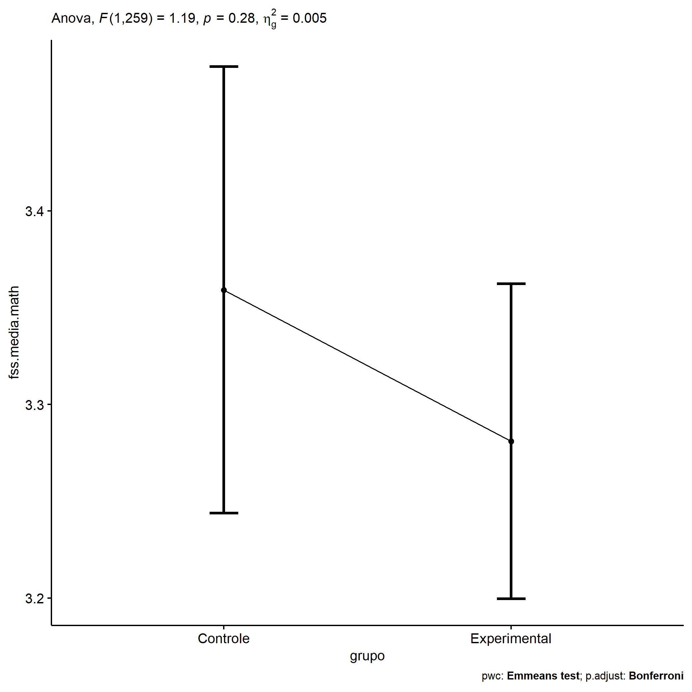<!-- -->

``` r
plots <- oneWayAncovaBoxPlots(
  wdat, "fss.media.math", "grupo", aov, pwc, covar = "dfs.media.math",
  theme = "classic", color = color[["grupo"]],
  subtitle = which(aov$Effect == "grupo"))
```

``` r
if (length(unique(wdat[["grupo"]])) > 1)
  plots[["grupo"]] + ggplot2::ylab("flow (prob. matemática)") + ggplot2::scale_x_discrete(labels=c('pre', 'pos'))
```

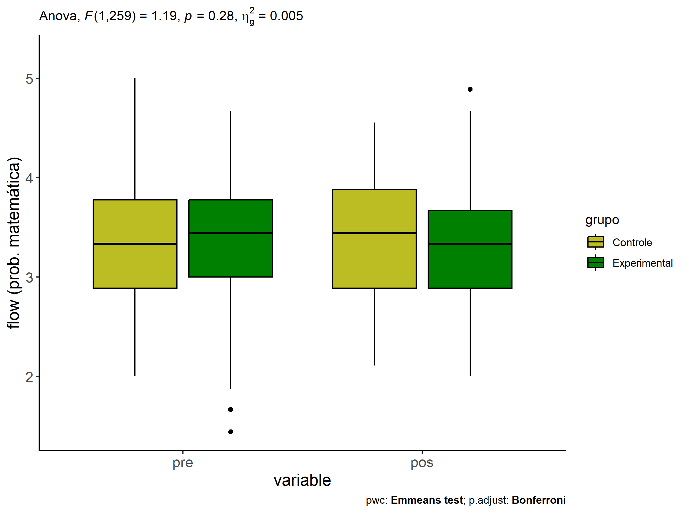<!-- -->

``` r
if (length(unique(wdat.long[["grupo"]])) > 1)
  plots <- oneWayAncovaBoxPlots(
    wdat.long, "flow.math", "grupo", aov, pwc.long, pre.post = "time",
    theme = "classic", color = color$prepost)
```

``` r
if (length(unique(wdat.long[["grupo"]])) > 1)
  plots[["grupo"]] + ggplot2::ylab("flow (prob. matemática)")
```

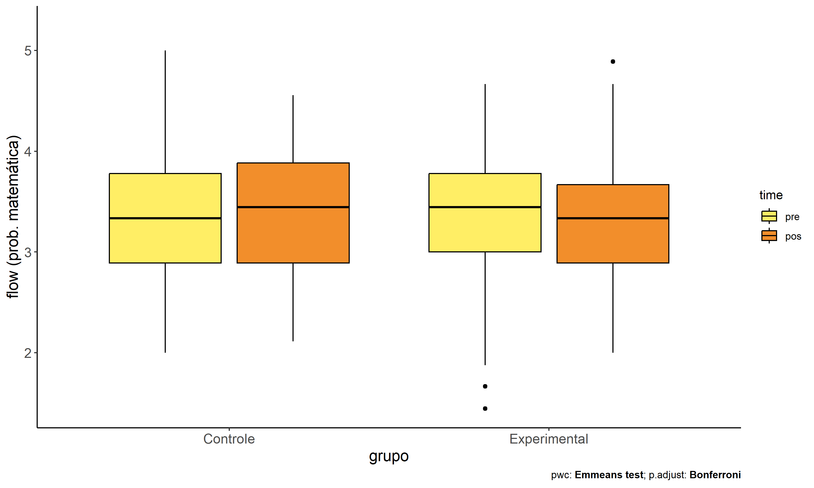<!-- -->

### Checking linearity assumption

``` r
ggscatter(wdat, x = "dfs.media.math", y = "fss.media.math", size = 0.5,
          color = "grupo", add = "reg.line")+
  stat_regline_equation(
    aes(label =  paste(..eq.label.., ..rr.label.., sep = "~~~~"), color = grupo)
  )
```

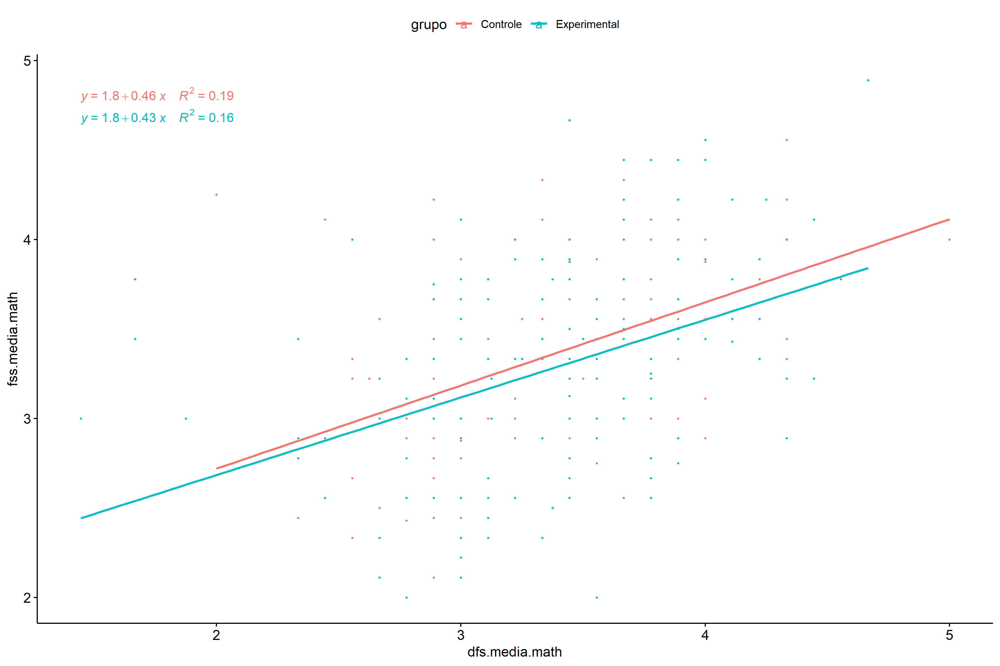<!-- -->

### Checking normality and homogeneity

``` r
res <- augment(lm(fss.media.math ~ dfs.media.math + grupo, data = wdat))
```

``` r
shapiro_test(res$.resid)
```

    ## # A tibble: 1 × 3
    ##   variable   statistic p.value
    ##   <chr>          <dbl>   <dbl>
    ## 1 res$.resid     0.992   0.201

``` r
levene_test(res, .resid ~ grupo)
```

    ## # A tibble: 1 × 4
    ##     df1   df2 statistic     p
    ##   <int> <int>     <dbl> <dbl>
    ## 1     1   260    0.0189 0.891

# ANCOVA and Pairwise for two factors **grupo:Sexo**

## Without remove non-normal data

``` r
pdat = remove_group_data(dat[!is.na(dat[["grupo"]]) & !is.na(dat[["Sexo"]]),], "fss.media.math", c("grupo","Sexo"))

pdat.long <- rbind(pdat[,c("id","grupo","Sexo")], pdat[,c("id","grupo","Sexo")])
pdat.long[["time"]] <- c(rep("pre", nrow(pdat)), rep("pos", nrow(pdat)))
pdat.long[["time"]] <- factor(pdat.long[["time"]], c("pre","pos"))
pdat.long[["flow.math"]] <- c(pdat[["dfs.media.math"]], pdat[["fss.media.math"]])

aov = anova_test(pdat, fss.media.math ~ dfs.media.math + grupo*Sexo)
laov[["grupo:Sexo"]] <- get_anova_table(aov)
```

``` r
pwcs <- list()
pwcs[["Sexo"]] <- emmeans_test(
  group_by(pdat, grupo), fss.media.math ~ Sexo,
  covariate = dfs.media.math, p.adjust.method = "bonferroni")
pwcs[["grupo"]] <- emmeans_test(
  group_by(pdat, Sexo), fss.media.math ~ grupo,
  covariate = dfs.media.math, p.adjust.method = "bonferroni")

pwc <- plyr::rbind.fill(pwcs[["grupo"]], pwcs[["Sexo"]])
pwc <- pwc[,c("grupo","Sexo", colnames(pwc)[!colnames(pwc) %in% c("grupo","Sexo")])]
```

``` r
pwc.long <- emmeans_test(dplyr::group_by_at(pdat.long, c("grupo","Sexo")),
                         flow.math ~ time,
                         p.adjust.method = "bonferroni")
lpwc[["grupo:Sexo"]] <- plyr::rbind.fill(pwc, pwc.long)
```

``` r
ds <- get.descriptives(pdat, "fss.media.math", c("grupo","Sexo"), covar = "dfs.media.math")
ds <- merge(ds[ds$variable != "dfs.media.math",],
            ds[ds$variable == "dfs.media.math", !colnames(ds) %in% c("variable")],
            by = c("grupo","Sexo"), all.x = T, suffixes = c("", ".dfs.media.math"))
ds <- merge(get_emmeans(pwcs[["grupo"]]), ds, by = c("grupo","Sexo"), suffixes = c(".emms", ""))
ds <- ds[,c("grupo","Sexo","n","mean.dfs.media.math","se.dfs.media.math","mean","se","emmean","se.emms")]

colnames(ds) <- c("grupo","Sexo", "N", paste0(c("M","SE")," (pre)"),
                  paste0(c("M","SE"), " (unadj)"), paste0(c("M", "SE"), " (adj)"))

lemms[["grupo:Sexo"]] <- ds
```

## Computing ANCOVA and PairWise After removing non-normal data (OK)

``` r
wdat = pdat 

res = residuals(lm(fss.media.math ~ dfs.media.math + grupo*Sexo, data = wdat))
non.normal = getNonNormal(res, wdat$id, plimit = 0.05)

wdat = wdat[!wdat$id %in% non.normal,]

wdat.long <- rbind(wdat[,c("id","grupo","Sexo")], wdat[,c("id","grupo","Sexo")])
wdat.long[["time"]] <- c(rep("pre", nrow(wdat)), rep("pos", nrow(wdat)))
wdat.long[["time"]] <- factor(wdat.long[["time"]], c("pre","pos"))
wdat.long[["flow.math"]] <- c(wdat[["dfs.media.math"]], wdat[["fss.media.math"]])


ldat[["grupo:Sexo"]] = wdat

(non.normal)
```

    ## NULL

``` r
aov = anova_test(wdat, fss.media.math ~ dfs.media.math + grupo*Sexo)
laov[["grupo:Sexo"]] <- merge(get_anova_table(aov), laov[["grupo:Sexo"]], by="Effect", suffixes = c("","'"))

(df = get_anova_table(aov))
```

    ## ANOVA Table (type II tests)
    ## 
    ##           Effect DFn DFd      F        p p<.05      ges
    ## 1 dfs.media.math   1 257 52.897 4.24e-12     * 0.171000
    ## 2          grupo   1 257  1.102 2.95e-01       0.004000
    ## 3           Sexo   1 257  2.039 1.55e-01       0.008000
    ## 4     grupo:Sexo   1 257  0.083 7.73e-01       0.000324

| Effect         | DFn | DFd |      F |     p | p\<.05 |   ges |
|:---------------|----:|----:|-------:|------:|:-------|------:|
| dfs.media.math |   1 | 257 | 52.897 | 0.000 | \*     | 0.171 |
| grupo          |   1 | 257 |  1.102 | 0.295 |        | 0.004 |
| Sexo           |   1 | 257 |  2.039 | 0.155 |        | 0.008 |
| grupo:Sexo     |   1 | 257 |  0.083 | 0.773 |        | 0.000 |

``` r
pwcs <- list()
pwcs[["Sexo"]] <- emmeans_test(
  group_by(wdat, grupo), fss.media.math ~ Sexo,
  covariate = dfs.media.math, p.adjust.method = "bonferroni")
pwcs[["grupo"]] <- emmeans_test(
  group_by(wdat, Sexo), fss.media.math ~ grupo,
  covariate = dfs.media.math, p.adjust.method = "bonferroni")

pwc <- plyr::rbind.fill(pwcs[["grupo"]], pwcs[["Sexo"]])
pwc <- pwc[,c("grupo","Sexo", colnames(pwc)[!colnames(pwc) %in% c("grupo","Sexo")])]
```

| grupo        | Sexo | term                  | .y.            | group1   | group2       |  df | statistic |     p | p.adj | p.adj.signif |
|:-------------|:-----|:----------------------|:---------------|:---------|:-------------|----:|----------:|------:|------:|:-------------|
|              | F    | dfs.media.math\*grupo | fss.media.math | Controle | Experimental | 257 |     0.972 | 0.332 | 0.332 | ns           |
|              | M    | dfs.media.math\*grupo | fss.media.math | Controle | Experimental | 257 |     0.490 | 0.625 | 0.625 | ns           |
| Controle     |      | dfs.media.math\*Sexo  | fss.media.math | F        | M            | 257 |    -0.592 | 0.554 | 0.554 | ns           |
| Experimental |      | dfs.media.math\*Sexo  | fss.media.math | F        | M            | 257 |    -1.331 | 0.184 | 0.184 | ns           |

``` r
pwc.long <- emmeans_test(dplyr::group_by_at(wdat.long, c("grupo","Sexo")),
                         flow.math ~ time,
                         p.adjust.method = "bonferroni")
lpwc[["grupo:Sexo"]] <- merge(plyr::rbind.fill(pwc, pwc.long), lpwc[["grupo:Sexo"]], by=c("grupo","Sexo","term",".y.","group1","group2"), suffixes = c("","'"))
```

| grupo        | Sexo | term | .y.       | group1 | group2 |  df | statistic |     p | p.adj | p.adj.signif |
|:-------------|:-----|:-----|:----------|:-------|:-------|----:|----------:|------:|------:|:-------------|
| Controle     | F    | time | flow.math | pre    | pos    | 516 |     0.435 | 0.664 | 0.664 | ns           |
| Controle     | M    | time | flow.math | pre    | pos    | 516 |    -0.251 | 0.802 | 0.802 | ns           |
| Experimental | F    | time | flow.math | pre    | pos    | 516 |     1.930 | 0.054 | 0.054 | ns           |
| Experimental | M    | time | flow.math | pre    | pos    | 516 |     0.223 | 0.824 | 0.824 | ns           |

``` r
ds <- get.descriptives(wdat, "fss.media.math", c("grupo","Sexo"), covar = "dfs.media.math")
ds <- merge(ds[ds$variable != "dfs.media.math",],
            ds[ds$variable == "dfs.media.math", !colnames(ds) %in% c("variable")],
            by = c("grupo","Sexo"), all.x = T, suffixes = c("", ".dfs.media.math"))
ds <- merge(get_emmeans(pwcs[["grupo"]]), ds, by = c("grupo","Sexo"), suffixes = c(".emms", ""))
ds <- ds[,c("grupo","Sexo","n","mean.dfs.media.math","se.dfs.media.math","mean","se","emmean","se.emms")]

colnames(ds) <- c("grupo","Sexo", "N", paste0(c("M","SE")," (pre)"),
                  paste0(c("M","SE"), " (unadj)"), paste0(c("M", "SE"), " (adj)"))

lemms[["grupo:Sexo"]] <- merge(ds, lemms[["grupo:Sexo"]], by=c("grupo","Sexo"), suffixes = c("","'"))
```

| grupo        | Sexo |   N | M (pre) | SE (pre) | M (unadj) | SE (unadj) | M (adj) | SE (adj) |
|:-------------|:-----|----:|--------:|---------:|----------:|-----------:|--------:|---------:|
| Controle     | F    |  47 |   3.380 |    0.082 |     3.329 |      0.090 |   3.327 |    0.080 |
| Controle     | M    |  40 |   3.354 |    0.088 |     3.386 |      0.090 |   3.397 |    0.086 |
| Experimental | F    | 100 |   3.401 |    0.056 |     3.244 |      0.062 |   3.233 |    0.055 |
| Experimental | M    |  75 |   3.356 |    0.062 |     3.335 |      0.065 |   3.344 |    0.063 |

### Plots for ancova

``` r
plots <- twoWayAncovaPlots(
  wdat, "fss.media.math", c("grupo","Sexo"), aov, pwcs, addParam = c("mean_se"),
  font.label.size=10, step.increase=0.05, p.label="p.adj",
  subtitle = which(aov$Effect == "grupo:Sexo"))
```

``` r
if (!is.null(plots[["grupo"]]))
  plots[["grupo"]] + ggplot2::scale_color_manual(values = color[["Sexo"]])
```

    ## Scale for colour is already present.
    ## Adding another scale for colour, which will replace the existing scale.

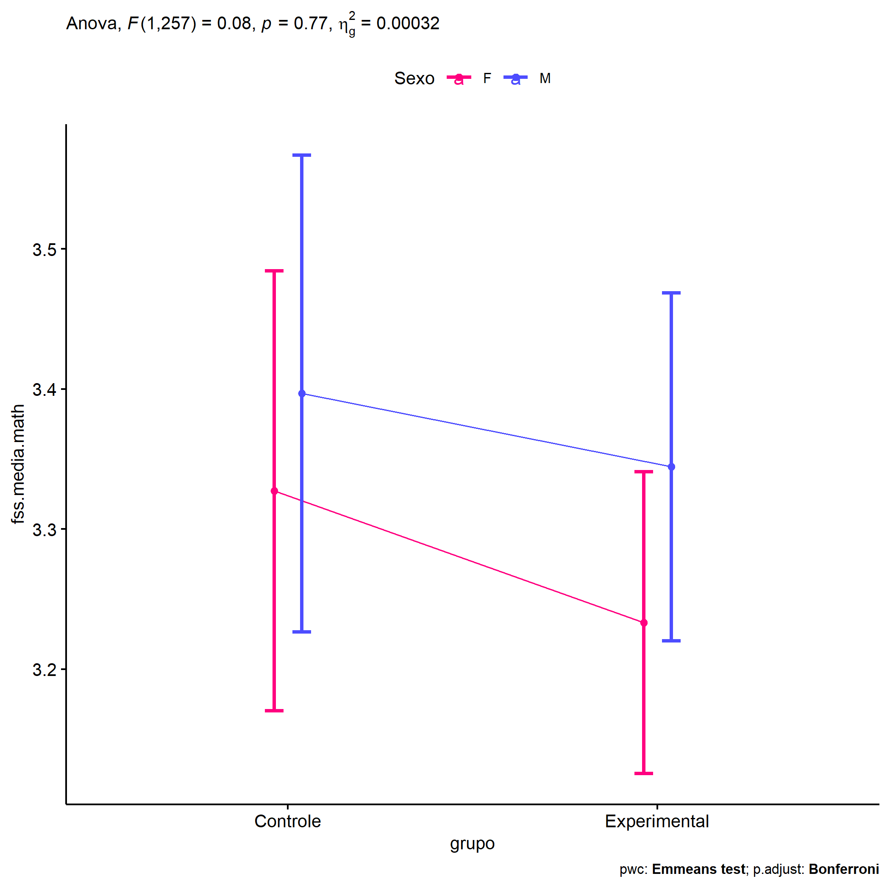<!-- -->

``` r
if (!is.null(plots[["Sexo"]]))
  plots[["Sexo"]] + ggplot2::scale_color_manual(values = color[["grupo"]])
```

    ## Scale for colour is already present.
    ## Adding another scale for colour, which will replace the existing scale.

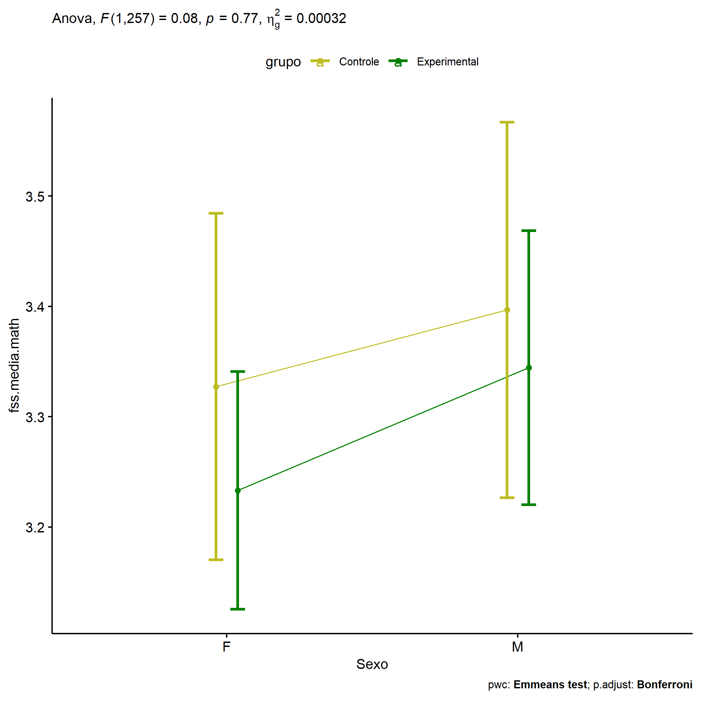<!-- -->

``` r
plots <- twoWayAncovaBoxPlots(
  wdat, "fss.media.math", c("grupo","Sexo"), aov, pwcs, covar = "dfs.media.math",
  theme = "classic", color = color[["grupo:Sexo"]],
  subtitle = which(aov$Effect == "grupo:Sexo"))
```

``` r
plots[["grupo:Sexo"]] + ggplot2::ylab("flow (prob. matemática)") + ggplot2::scale_x_discrete(labels=c('pre', 'pos'))
```

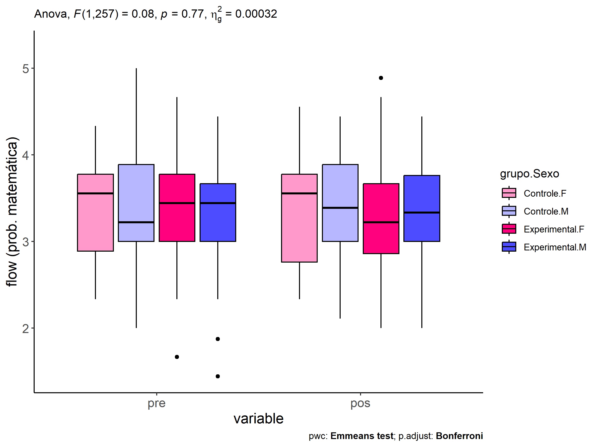<!-- -->

``` r
plots <- twoWayAncovaBoxPlots(
  wdat.long, "flow.math", c("grupo","Sexo"), aov, pwc.long, pre.post = "time",
  theme = "classic", color = color$prepost)
```

``` r
plots[["grupo:Sexo"]] + ggplot2::ylab("flow (prob. matemática)")
```

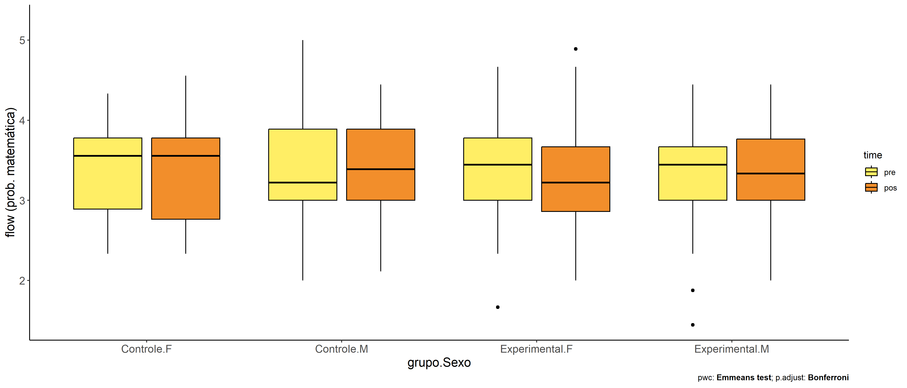<!-- -->

### Checking linearity assumption

``` r
ggscatter(wdat, x = "dfs.media.math", y = "fss.media.math", size = 0.5,
          facet.by = c("grupo","Sexo"), add = "reg.line")+
  stat_regline_equation(
    aes(label =  paste(..eq.label.., ..rr.label.., sep = "~~~~"))
  )
```

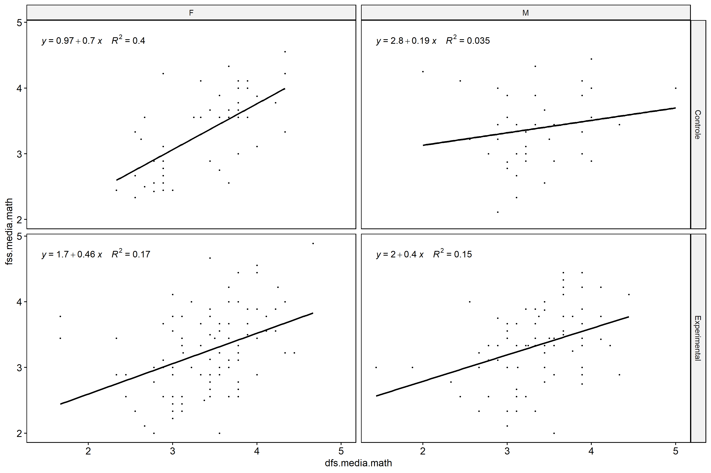<!-- -->

### Checking normality and homogeneity

``` r
res <- augment(lm(fss.media.math ~ dfs.media.math + grupo*Sexo, data = wdat))
```

``` r
shapiro_test(res$.resid)
```

    ## # A tibble: 1 × 3
    ##   variable   statistic p.value
    ##   <chr>          <dbl>   <dbl>
    ## 1 res$.resid     0.994   0.353

``` r
levene_test(res, .resid ~ grupo*Sexo)
```

    ## # A tibble: 1 × 4
    ##     df1   df2 statistic     p
    ##   <int> <int>     <dbl> <dbl>
    ## 1     3   258     0.433 0.730

# ANCOVA and Pairwise for two factors **grupo:Zona**

## Without remove non-normal data

``` r
pdat = remove_group_data(dat[!is.na(dat[["grupo"]]) & !is.na(dat[["Zona"]]),], "fss.media.math", c("grupo","Zona"))

pdat.long <- rbind(pdat[,c("id","grupo","Zona")], pdat[,c("id","grupo","Zona")])
pdat.long[["time"]] <- c(rep("pre", nrow(pdat)), rep("pos", nrow(pdat)))
pdat.long[["time"]] <- factor(pdat.long[["time"]], c("pre","pos"))
pdat.long[["flow.math"]] <- c(pdat[["dfs.media.math"]], pdat[["fss.media.math"]])

aov = anova_test(pdat, fss.media.math ~ dfs.media.math + grupo*Zona)
laov[["grupo:Zona"]] <- get_anova_table(aov)
```

``` r
pwcs <- list()
pwcs[["Zona"]] <- emmeans_test(
  group_by(pdat, grupo), fss.media.math ~ Zona,
  covariate = dfs.media.math, p.adjust.method = "bonferroni")
pwcs[["grupo"]] <- emmeans_test(
  group_by(pdat, Zona), fss.media.math ~ grupo,
  covariate = dfs.media.math, p.adjust.method = "bonferroni")

pwc <- plyr::rbind.fill(pwcs[["grupo"]], pwcs[["Zona"]])
pwc <- pwc[,c("grupo","Zona", colnames(pwc)[!colnames(pwc) %in% c("grupo","Zona")])]
```

``` r
pwc.long <- emmeans_test(dplyr::group_by_at(pdat.long, c("grupo","Zona")),
                         flow.math ~ time,
                         p.adjust.method = "bonferroni")
lpwc[["grupo:Zona"]] <- plyr::rbind.fill(pwc, pwc.long)
```

``` r
ds <- get.descriptives(pdat, "fss.media.math", c("grupo","Zona"), covar = "dfs.media.math")
ds <- merge(ds[ds$variable != "dfs.media.math",],
            ds[ds$variable == "dfs.media.math", !colnames(ds) %in% c("variable")],
            by = c("grupo","Zona"), all.x = T, suffixes = c("", ".dfs.media.math"))
ds <- merge(get_emmeans(pwcs[["grupo"]]), ds, by = c("grupo","Zona"), suffixes = c(".emms", ""))
ds <- ds[,c("grupo","Zona","n","mean.dfs.media.math","se.dfs.media.math","mean","se","emmean","se.emms")]

colnames(ds) <- c("grupo","Zona", "N", paste0(c("M","SE")," (pre)"),
                  paste0(c("M","SE"), " (unadj)"), paste0(c("M", "SE"), " (adj)"))

lemms[["grupo:Zona"]] <- ds
```

## Computing ANCOVA and PairWise After removing non-normal data (OK)

``` r
wdat = pdat 

res = residuals(lm(fss.media.math ~ dfs.media.math + grupo*Zona, data = wdat))
non.normal = getNonNormal(res, wdat$id, plimit = 0.05)

wdat = wdat[!wdat$id %in% non.normal,]

wdat.long <- rbind(wdat[,c("id","grupo","Zona")], wdat[,c("id","grupo","Zona")])
wdat.long[["time"]] <- c(rep("pre", nrow(wdat)), rep("pos", nrow(wdat)))
wdat.long[["time"]] <- factor(wdat.long[["time"]], c("pre","pos"))
wdat.long[["flow.math"]] <- c(wdat[["dfs.media.math"]], wdat[["fss.media.math"]])


ldat[["grupo:Zona"]] = wdat

(non.normal)
```

    ## NULL

``` r
aov = anova_test(wdat, fss.media.math ~ dfs.media.math + grupo*Zona)
laov[["grupo:Zona"]] <- merge(get_anova_table(aov), laov[["grupo:Zona"]], by="Effect", suffixes = c("","'"))

(df = get_anova_table(aov))
```

    ## ANOVA Table (type II tests)
    ## 
    ##           Effect DFn DFd      F        p p<.05   ges
    ## 1 dfs.media.math   1 132 22.643 5.05e-06     * 0.146
    ## 2          grupo   1 132  0.690 4.08e-01       0.005
    ## 3           Zona   1 132  0.384 5.37e-01       0.003
    ## 4     grupo:Zona   1 132  2.002 1.59e-01       0.015

| Effect         | DFn | DFd |      F |     p | p\<.05 |   ges |
|:---------------|----:|----:|-------:|------:|:-------|------:|
| dfs.media.math |   1 | 132 | 22.643 | 0.000 | \*     | 0.146 |
| grupo          |   1 | 132 |  0.690 | 0.408 |        | 0.005 |
| Zona           |   1 | 132 |  0.384 | 0.537 |        | 0.003 |
| grupo:Zona     |   1 | 132 |  2.002 | 0.159 |        | 0.015 |

``` r
pwcs <- list()
pwcs[["Zona"]] <- emmeans_test(
  group_by(wdat, grupo), fss.media.math ~ Zona,
  covariate = dfs.media.math, p.adjust.method = "bonferroni")
pwcs[["grupo"]] <- emmeans_test(
  group_by(wdat, Zona), fss.media.math ~ grupo,
  covariate = dfs.media.math, p.adjust.method = "bonferroni")

pwc <- plyr::rbind.fill(pwcs[["grupo"]], pwcs[["Zona"]])
pwc <- pwc[,c("grupo","Zona", colnames(pwc)[!colnames(pwc) %in% c("grupo","Zona")])]
```

| grupo        | Zona   | term                  | .y.            | group1   | group2       |  df | statistic |     p | p.adj | p.adj.signif |
|:-------------|:-------|:----------------------|:---------------|:---------|:-------------|----:|----------:|------:|------:|:-------------|
|              | Rural  | dfs.media.math\*grupo | fss.media.math | Controle | Experimental | 132 |    -0.247 | 0.805 | 0.805 | ns           |
|              | Urbana | dfs.media.math\*grupo | fss.media.math | Controle | Experimental | 132 |     1.622 | 0.107 | 0.107 | ns           |
| Controle     |        | dfs.media.math\*Zona  | fss.media.math | Rural    | Urbana       | 132 |    -0.706 | 0.482 | 0.482 | ns           |
| Experimental |        | dfs.media.math\*Zona  | fss.media.math | Rural    | Urbana       | 132 |     1.367 | 0.174 | 0.174 | ns           |

``` r
pwc.long <- emmeans_test(dplyr::group_by_at(wdat.long, c("grupo","Zona")),
                         flow.math ~ time,
                         p.adjust.method = "bonferroni")
lpwc[["grupo:Zona"]] <- merge(plyr::rbind.fill(pwc, pwc.long), lpwc[["grupo:Zona"]], by=c("grupo","Zona","term",".y.","group1","group2"), suffixes = c("","'"))
```

| grupo        | Zona   | term | .y.       | group1 | group2 |  df | statistic |     p | p.adj | p.adj.signif |
|:-------------|:-------|:-----|:----------|:-------|:-------|----:|----------:|------:|------:|:-------------|
| Controle     | Rural  | time | flow.math | pre    | pos    | 266 |    -0.631 | 0.529 | 0.529 | ns           |
| Controle     | Urbana | time | flow.math | pre    | pos    | 266 |    -0.398 | 0.691 | 0.691 | ns           |
| Experimental | Rural  | time | flow.math | pre    | pos    | 266 |    -0.520 | 0.603 | 0.603 | ns           |
| Experimental | Urbana | time | flow.math | pre    | pos    | 266 |     1.256 | 0.210 | 0.210 | ns           |

``` r
ds <- get.descriptives(wdat, "fss.media.math", c("grupo","Zona"), covar = "dfs.media.math")
ds <- merge(ds[ds$variable != "dfs.media.math",],
            ds[ds$variable == "dfs.media.math", !colnames(ds) %in% c("variable")],
            by = c("grupo","Zona"), all.x = T, suffixes = c("", ".dfs.media.math"))
ds <- merge(get_emmeans(pwcs[["grupo"]]), ds, by = c("grupo","Zona"), suffixes = c(".emms", ""))
ds <- ds[,c("grupo","Zona","n","mean.dfs.media.math","se.dfs.media.math","mean","se","emmean","se.emms")]

colnames(ds) <- c("grupo","Zona", "N", paste0(c("M","SE")," (pre)"),
                  paste0(c("M","SE"), " (unadj)"), paste0(c("M", "SE"), " (adj)"))

lemms[["grupo:Zona"]] <- merge(ds, lemms[["grupo:Zona"]], by=c("grupo","Zona"), suffixes = c("","'"))
```

| grupo        | Zona   |   N | M (pre) | SE (pre) | M (unadj) | SE (unadj) | M (adj) | SE (adj) |
|:-------------|:-------|----:|--------:|---------:|----------:|-----------:|--------:|---------:|
| Controle     | Rural  |  31 |   3.237 |    0.090 |     3.329 |      0.102 |   3.377 |    0.096 |
| Controle     | Urbana |  22 |   3.446 |    0.139 |     3.515 |      0.115 |   3.482 |    0.114 |
| Experimental | Rural  |  53 |   3.341 |    0.088 |     3.399 |      0.068 |   3.407 |    0.073 |
| Experimental | Urbana |  31 |   3.463 |    0.078 |     3.280 |      0.129 |   3.241 |    0.096 |

### Plots for ancova

``` r
plots <- twoWayAncovaPlots(
  wdat, "fss.media.math", c("grupo","Zona"), aov, pwcs, addParam = c("mean_se"),
  font.label.size=10, step.increase=0.05, p.label="p.adj",
  subtitle = which(aov$Effect == "grupo:Zona"))
```

``` r
if (!is.null(plots[["grupo"]]))
  plots[["grupo"]] + ggplot2::scale_color_manual(values = color[["Zona"]])
```

    ## Scale for colour is already present.
    ## Adding another scale for colour, which will replace the existing scale.

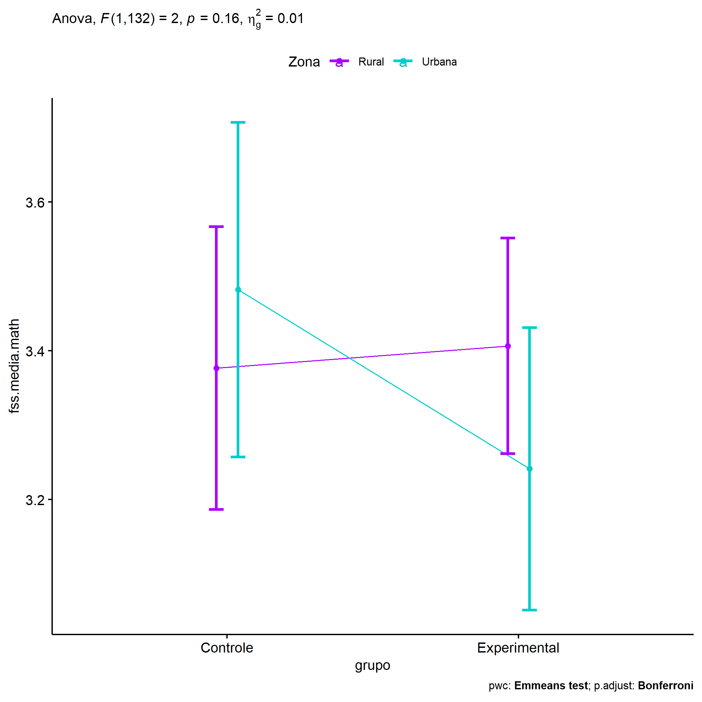<!-- -->

``` r
if (!is.null(plots[["Zona"]]))
  plots[["Zona"]] + ggplot2::scale_color_manual(values = color[["grupo"]])
```

    ## Scale for colour is already present.
    ## Adding another scale for colour, which will replace the existing scale.

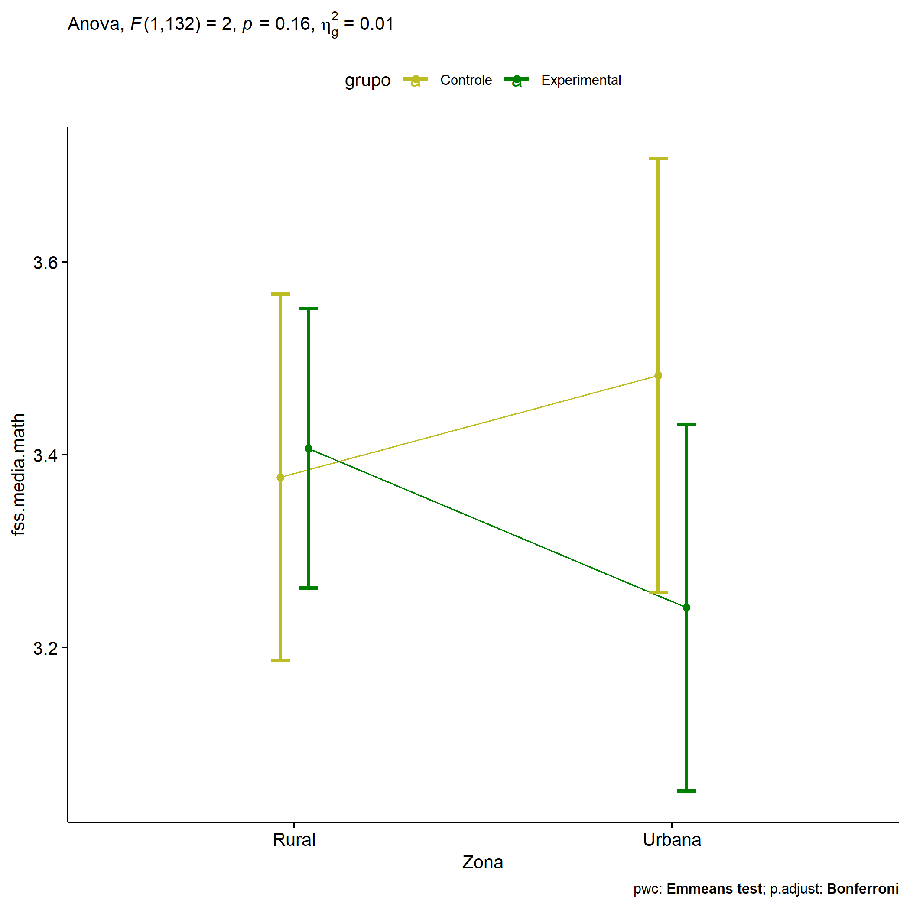<!-- -->

``` r
plots <- twoWayAncovaBoxPlots(
  wdat, "fss.media.math", c("grupo","Zona"), aov, pwcs, covar = "dfs.media.math",
  theme = "classic", color = color[["grupo:Zona"]],
  subtitle = which(aov$Effect == "grupo:Zona"))
```

``` r
plots[["grupo:Zona"]] + ggplot2::ylab("flow (prob. matemática)") + ggplot2::scale_x_discrete(labels=c('pre', 'pos'))
```

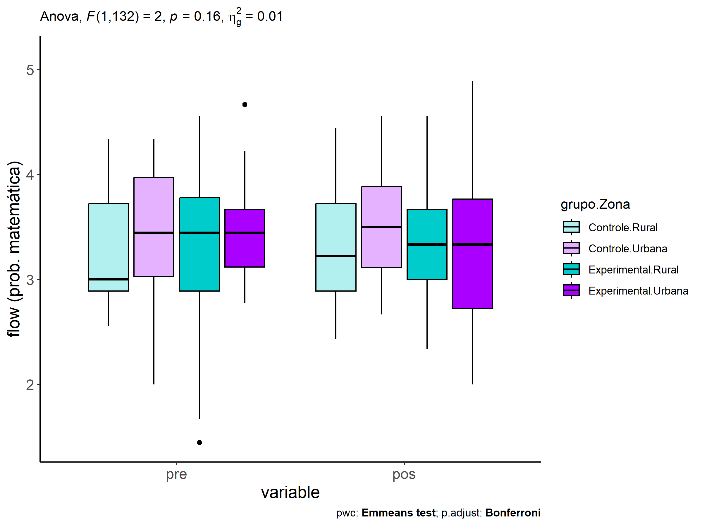<!-- -->

``` r
plots <- twoWayAncovaBoxPlots(
  wdat.long, "flow.math", c("grupo","Zona"), aov, pwc.long, pre.post = "time",
  theme = "classic", color = color$prepost)
```

``` r
plots[["grupo:Zona"]] + ggplot2::ylab("flow (prob. matemática)")
```

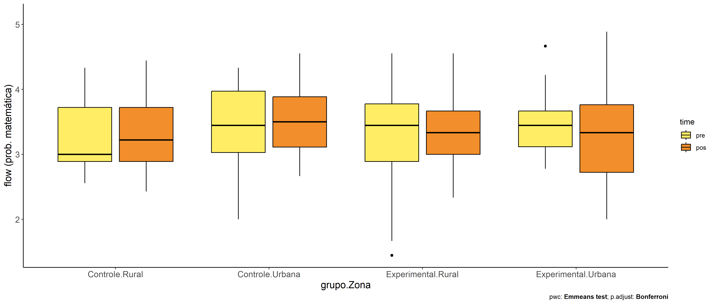<!-- -->

### Checking linearity assumption

``` r
ggscatter(wdat, x = "dfs.media.math", y = "fss.media.math", size = 0.5,
          facet.by = c("grupo","Zona"), add = "reg.line")+
  stat_regline_equation(
    aes(label =  paste(..eq.label.., ..rr.label.., sep = "~~~~"))
  )
```

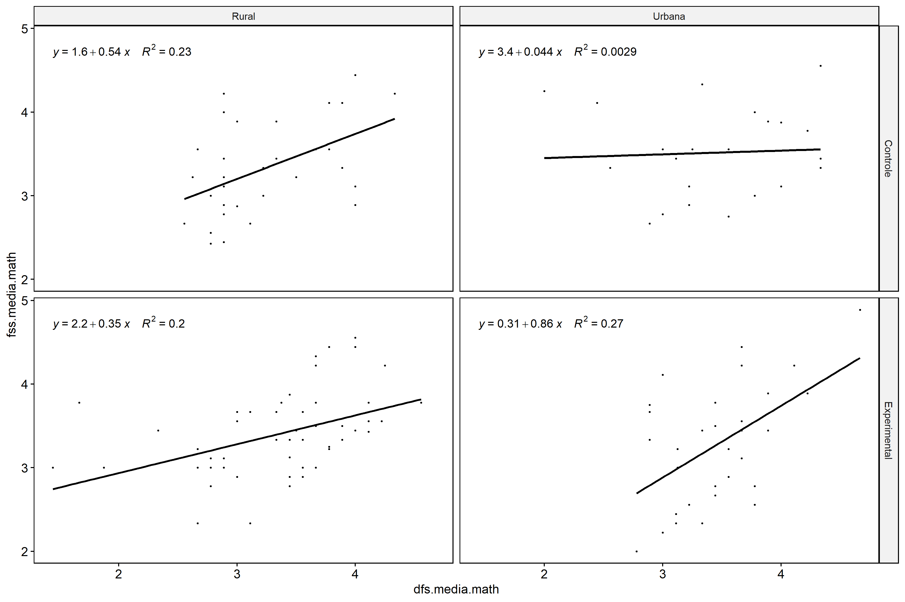<!-- -->

### Checking normality and homogeneity

``` r
res <- augment(lm(fss.media.math ~ dfs.media.math + grupo*Zona, data = wdat))
```

``` r
shapiro_test(res$.resid)
```

    ## # A tibble: 1 × 3
    ##   variable   statistic p.value
    ##   <chr>          <dbl>   <dbl>
    ## 1 res$.resid     0.981  0.0575

``` r
levene_test(res, .resid ~ grupo*Zona)
```

    ## # A tibble: 1 × 4
    ##     df1   df2 statistic      p
    ##   <int> <int>     <dbl>  <dbl>
    ## 1     3   133      2.96 0.0345

# ANCOVA and Pairwise for two factors **grupo:Cor.Raca**

## Without remove non-normal data

``` r
pdat = remove_group_data(dat[!is.na(dat[["grupo"]]) & !is.na(dat[["Cor.Raca"]]),], "fss.media.math", c("grupo","Cor.Raca"))

pdat.long <- rbind(pdat[,c("id","grupo","Cor.Raca")], pdat[,c("id","grupo","Cor.Raca")])
pdat.long[["time"]] <- c(rep("pre", nrow(pdat)), rep("pos", nrow(pdat)))
pdat.long[["time"]] <- factor(pdat.long[["time"]], c("pre","pos"))
pdat.long[["flow.math"]] <- c(pdat[["dfs.media.math"]], pdat[["fss.media.math"]])

aov = anova_test(pdat, fss.media.math ~ dfs.media.math + grupo*Cor.Raca)
laov[["grupo:Cor.Raca"]] <- get_anova_table(aov)
```

``` r
pwcs <- list()
pwcs[["Cor.Raca"]] <- emmeans_test(
  group_by(pdat, grupo), fss.media.math ~ Cor.Raca,
  covariate = dfs.media.math, p.adjust.method = "bonferroni")
pwcs[["grupo"]] <- emmeans_test(
  group_by(pdat, Cor.Raca), fss.media.math ~ grupo,
  covariate = dfs.media.math, p.adjust.method = "bonferroni")

pwc <- plyr::rbind.fill(pwcs[["grupo"]], pwcs[["Cor.Raca"]])
pwc <- pwc[,c("grupo","Cor.Raca", colnames(pwc)[!colnames(pwc) %in% c("grupo","Cor.Raca")])]
```

``` r
pwc.long <- emmeans_test(dplyr::group_by_at(pdat.long, c("grupo","Cor.Raca")),
                         flow.math ~ time,
                         p.adjust.method = "bonferroni")
lpwc[["grupo:Cor.Raca"]] <- plyr::rbind.fill(pwc, pwc.long)
```

``` r
ds <- get.descriptives(pdat, "fss.media.math", c("grupo","Cor.Raca"), covar = "dfs.media.math")
ds <- merge(ds[ds$variable != "dfs.media.math",],
            ds[ds$variable == "dfs.media.math", !colnames(ds) %in% c("variable")],
            by = c("grupo","Cor.Raca"), all.x = T, suffixes = c("", ".dfs.media.math"))
ds <- merge(get_emmeans(pwcs[["grupo"]]), ds, by = c("grupo","Cor.Raca"), suffixes = c(".emms", ""))
ds <- ds[,c("grupo","Cor.Raca","n","mean.dfs.media.math","se.dfs.media.math","mean","se","emmean","se.emms")]

colnames(ds) <- c("grupo","Cor.Raca", "N", paste0(c("M","SE")," (pre)"),
                  paste0(c("M","SE"), " (unadj)"), paste0(c("M", "SE"), " (adj)"))

lemms[["grupo:Cor.Raca"]] <- ds
```

## Computing ANCOVA and PairWise After removing non-normal data (OK)

``` r
wdat = pdat 

res = residuals(lm(fss.media.math ~ dfs.media.math + grupo*Cor.Raca, data = wdat))
non.normal = getNonNormal(res, wdat$id, plimit = 0.05)

wdat = wdat[!wdat$id %in% non.normal,]

wdat.long <- rbind(wdat[,c("id","grupo","Cor.Raca")], wdat[,c("id","grupo","Cor.Raca")])
wdat.long[["time"]] <- c(rep("pre", nrow(wdat)), rep("pos", nrow(wdat)))
wdat.long[["time"]] <- factor(wdat.long[["time"]], c("pre","pos"))
wdat.long[["flow.math"]] <- c(wdat[["dfs.media.math"]], wdat[["fss.media.math"]])


ldat[["grupo:Cor.Raca"]] = wdat

(non.normal)
```

    ## NULL

``` r
aov = anova_test(wdat, fss.media.math ~ dfs.media.math + grupo*Cor.Raca)
laov[["grupo:Cor.Raca"]] <- merge(get_anova_table(aov), laov[["grupo:Cor.Raca"]], by="Effect", suffixes = c("","'"))

(df = get_anova_table(aov))
```

    ## ANOVA Table (type II tests)
    ## 
    ##           Effect DFn DFd      F        p p<.05      ges
    ## 1 dfs.media.math   1  89 22.641 7.50e-06     * 0.203000
    ## 2          grupo   1  89  0.023 8.80e-01       0.000258
    ## 3       Cor.Raca   1  89  0.163 6.87e-01       0.002000
    ## 4 grupo:Cor.Raca   0  89     NA       NA  <NA>       NA

| Effect         | DFn | DFd |      F |     p | p\<.05 |   ges |
|:---------------|----:|----:|-------:|------:|:-------|------:|
| dfs.media.math |   1 |  89 | 22.641 | 0.000 | \*     | 0.203 |
| grupo          |   1 |  89 |  0.023 | 0.880 |        | 0.000 |
| Cor.Raca       |   1 |  89 |  0.163 | 0.687 |        | 0.002 |
| grupo:Cor.Raca |   0 |  89 |        |       |        |       |

``` r
pwcs <- list()
pwcs[["Cor.Raca"]] <- emmeans_test(
  group_by(wdat, grupo), fss.media.math ~ Cor.Raca,
  covariate = dfs.media.math, p.adjust.method = "bonferroni")
pwcs[["grupo"]] <- emmeans_test(
  group_by(wdat, Cor.Raca), fss.media.math ~ grupo,
  covariate = dfs.media.math, p.adjust.method = "bonferroni")

pwc <- plyr::rbind.fill(pwcs[["grupo"]], pwcs[["Cor.Raca"]])
pwc <- pwc[,c("grupo","Cor.Raca", colnames(pwc)[!colnames(pwc) %in% c("grupo","Cor.Raca")])]
```

| grupo        | Cor.Raca | term                     | .y.            | group1   | group2       |  df | statistic |     p | p.adj | p.adj.signif |
|:-------------|:---------|:-------------------------|:---------------|:---------|:-------------|----:|----------:|------:|------:|:-------------|
|              | Branca   | dfs.media.math\*grupo    | fss.media.math | Controle | Experimental |     |           |       |       |              |
|              | Parda    | dfs.media.math\*grupo    | fss.media.math | Controle | Experimental |  89 |     0.152 | 0.880 | 0.880 | ns           |
| Controle     |          | dfs.media.math\*Cor.Raca | fss.media.math | Branca   | Parda        |     |           |       |       |              |
| Experimental |          | dfs.media.math\*Cor.Raca | fss.media.math | Branca   | Parda        |  89 |    -0.404 | 0.687 | 0.687 | ns           |

``` r
pwc.long <- emmeans_test(dplyr::group_by_at(wdat.long, c("grupo","Cor.Raca")),
                         flow.math ~ time,
                         p.adjust.method = "bonferroni")
lpwc[["grupo:Cor.Raca"]] <- merge(plyr::rbind.fill(pwc, pwc.long), lpwc[["grupo:Cor.Raca"]], by=c("grupo","Cor.Raca","term",".y.","group1","group2"), suffixes = c("","'"))
```

| grupo        | Cor.Raca | term | .y.       | group1 | group2 |  df | statistic |     p | p.adj | p.adj.signif |
|:-------------|:---------|:-----|:----------|:-------|:-------|----:|----------:|------:|------:|:-------------|
| Controle     | Branca   | time | flow.math | pre    | pos    |     |           |       |       |              |
| Controle     | Parda    | time | flow.math | pre    | pos    | 180 |    -0.623 | 0.534 | 0.534 | ns           |
| Experimental | Branca   | time | flow.math | pre    | pos    | 180 |     0.480 | 0.632 | 0.632 | ns           |
| Experimental | Parda    | time | flow.math | pre    | pos    | 180 |     0.509 | 0.611 | 0.611 | ns           |

``` r
ds <- get.descriptives(wdat, "fss.media.math", c("grupo","Cor.Raca"), covar = "dfs.media.math")
ds <- merge(ds[ds$variable != "dfs.media.math",],
            ds[ds$variable == "dfs.media.math", !colnames(ds) %in% c("variable")],
            by = c("grupo","Cor.Raca"), all.x = T, suffixes = c("", ".dfs.media.math"))
ds <- merge(get_emmeans(pwcs[["grupo"]]), ds, by = c("grupo","Cor.Raca"), suffixes = c(".emms", ""))
ds <- ds[,c("grupo","Cor.Raca","n","mean.dfs.media.math","se.dfs.media.math","mean","se","emmean","se.emms")]

colnames(ds) <- c("grupo","Cor.Raca", "N", paste0(c("M","SE")," (pre)"),
                  paste0(c("M","SE"), " (unadj)"), paste0(c("M", "SE"), " (adj)"))

lemms[["grupo:Cor.Raca"]] <- merge(ds, lemms[["grupo:Cor.Raca"]], by=c("grupo","Cor.Raca"), suffixes = c("","'"))
```

| grupo        | Cor.Raca |   N | M (pre) | SE (pre) | M (unadj) | SE (unadj) | M (adj) | SE (adj) |
|:-------------|:---------|----:|--------:|---------:|----------:|-----------:|--------:|---------:|
| Controle     | Parda    |  32 |   3.224 |    0.089 |     3.306 |      0.102 |   3.382 |    0.089 |
| Experimental | Branca   |  17 |   3.412 |    0.098 |     3.326 |      0.142 |   3.307 |    0.120 |
| Experimental | Parda    |  44 |   3.469 |    0.076 |     3.412 |      0.079 |   3.364 |    0.075 |

### Plots for ancova

``` r
plots <- twoWayAncovaPlots(
  wdat, "fss.media.math", c("grupo","Cor.Raca"), aov, pwcs, addParam = c("mean_se"),
  font.label.size=10, step.increase=0.05, p.label="p.adj",
  subtitle = which(aov$Effect == "grupo:Cor.Raca"))
```

``` r
if (!is.null(plots[["grupo"]]))
  plots[["grupo"]] + ggplot2::scale_color_manual(values = color[["Cor.Raca"]])
```

<!-- -->

``` r
if (!is.null(plots[["Cor.Raca"]]))
  plots[["Cor.Raca"]] + ggplot2::scale_color_manual(values = color[["grupo"]])
```

<!-- -->

``` r
plots <- twoWayAncovaBoxPlots(
  wdat, "fss.media.math", c("grupo","Cor.Raca"), aov, pwcs, covar = "dfs.media.math",
  theme = "classic", color = color[["grupo:Cor.Raca"]],
  subtitle = which(aov$Effect == "grupo:Cor.Raca"))
```

``` r
plots[["grupo:Cor.Raca"]] + ggplot2::ylab("flow (prob. matemática)") + ggplot2::scale_x_discrete(labels=c('pre', 'pos'))
```

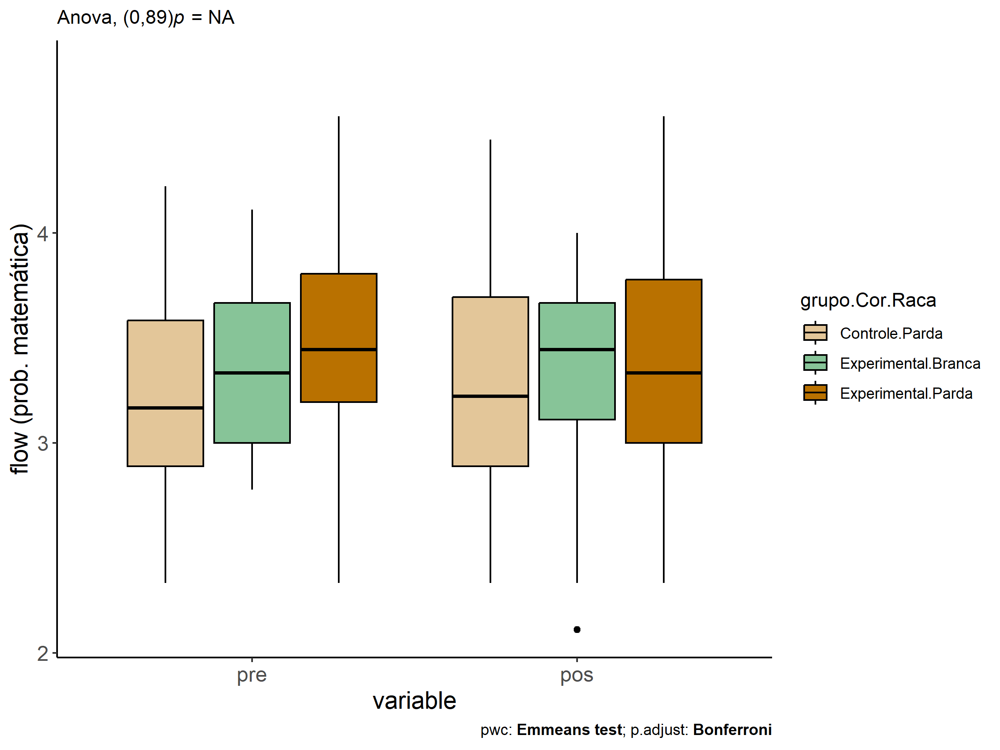<!-- -->

``` r
plots <- twoWayAncovaBoxPlots(
  wdat.long, "flow.math", c("grupo","Cor.Raca"), aov, pwc.long, pre.post = "time",
  theme = "classic", color = color$prepost)
```

``` r
plots[["grupo:Cor.Raca"]] + ggplot2::ylab("flow (prob. matemática)")
```

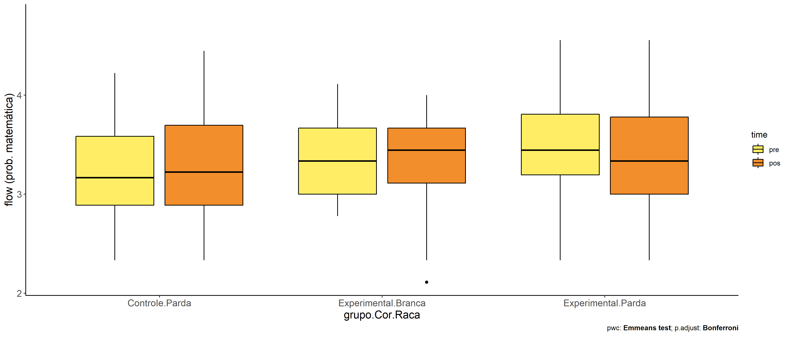<!-- -->

### Checking linearity assumption

``` r
ggscatter(wdat, x = "dfs.media.math", y = "fss.media.math", size = 0.5,
          facet.by = c("grupo","Cor.Raca"), add = "reg.line")+
  stat_regline_equation(
    aes(label =  paste(..eq.label.., ..rr.label.., sep = "~~~~"))
  )
```

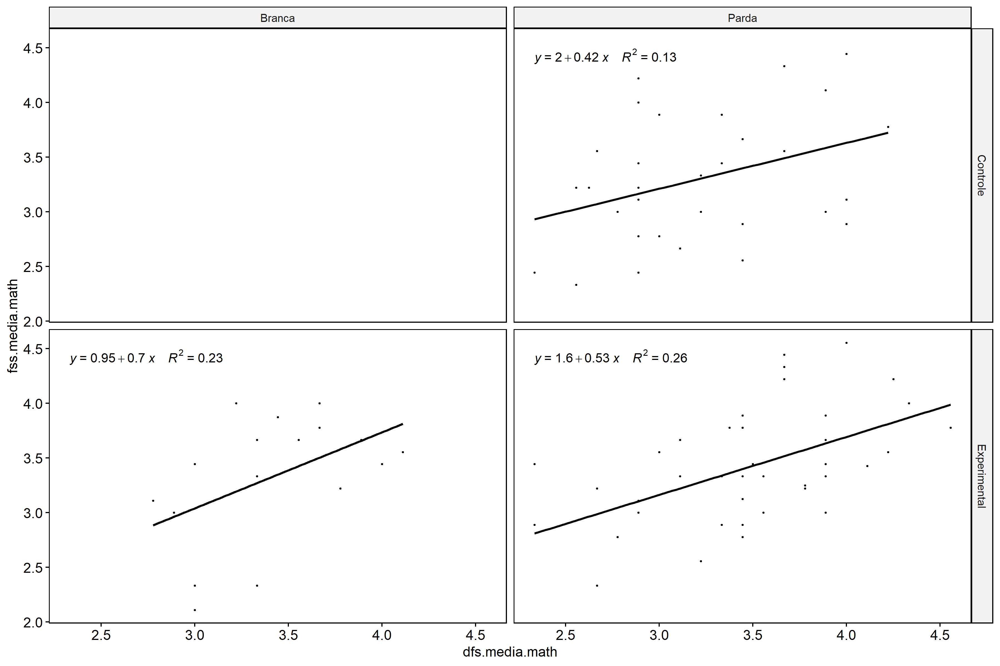<!-- -->

### Checking normality and homogeneity

``` r
res <- augment(lm(fss.media.math ~ dfs.media.math + grupo*Cor.Raca, data = wdat))
```

``` r
shapiro_test(res$.resid)
```

    ## # A tibble: 1 × 3
    ##   variable   statistic p.value
    ##   <chr>          <dbl>   <dbl>
    ## 1 res$.resid     0.986   0.424

``` r
levene_test(res, .resid ~ grupo*Cor.Raca)
```

    ## # A tibble: 1 × 4
    ##     df1   df2 statistic     p
    ##   <int> <int>     <dbl> <dbl>
    ## 1     2    90     0.585 0.559

# Summary of Results

## Descriptive Statistics

``` r
df <- get.descriptives(ldat[["grupo"]], c(dv.pre, dv.pos), c("grupo"), 
                       include.global = T, symmetry.test = T, normality.test = F)
df <- plyr::rbind.fill(
  df, do.call(plyr::rbind.fill, lapply(lfatores2, FUN = function(f) {
    if (nrow(dat) > 0 && sum(!is.na(unique(dat[[f]]))) > 1)
      get.descriptives(ldat[[paste0("grupo:",f)]], c(dv.pre,dv.pos), c("grupo", f),
                       symmetry.test = T, normality.test = F)
    }))
)
(df <- df[,c(fatores1[fatores1 %in% colnames(df)],"variable",
             colnames(df)[!colnames(df) %in% c(fatores1,"variable")])])
```

    ##           grupo Sexo   Zona Cor.Raca       variable   n  mean median   min   max    sd    se    ci   iqr
    ## 1      Controle <NA>   <NA>     <NA> dfs.media.math  87 3.368  3.333 2.000 5.000 0.557 0.060 0.119 0.889
    ## 2  Experimental <NA>   <NA>     <NA> dfs.media.math 175 3.382  3.444 1.444 4.667 0.548 0.041 0.082 0.778
    ## 3          <NA> <NA>   <NA>     <NA> dfs.media.math 262 3.377  3.444 1.444 5.000 0.550 0.034 0.067 0.778
    ## 4      Controle <NA>   <NA>     <NA> fss.media.math  87 3.355  3.444 2.111 4.556 0.593 0.064 0.126 0.993
    ## 5  Experimental <NA>   <NA>     <NA> fss.media.math 175 3.283  3.333 2.000 4.889 0.600 0.045 0.090 0.778
    ## 6          <NA> <NA>   <NA>     <NA> fss.media.math 262 3.307  3.333 2.000 4.889 0.598 0.037 0.073 0.889
    ## 7      Controle    F   <NA>     <NA> dfs.media.math  47 3.380  3.556 2.333 4.333 0.561 0.082 0.165 0.889
    ## 8      Controle    M   <NA>     <NA> dfs.media.math  40 3.354  3.222 2.000 5.000 0.559 0.088 0.179 0.889
    ## 9  Experimental    F   <NA>     <NA> dfs.media.math 100 3.401  3.444 1.667 4.667 0.558 0.056 0.111 0.778
    ## 10 Experimental    M   <NA>     <NA> dfs.media.math  75 3.356  3.444 1.444 4.444 0.538 0.062 0.124 0.667
    ## 11     Controle    F   <NA>     <NA> fss.media.math  47 3.329  3.556 2.333 4.556 0.619 0.090 0.182 1.014
    ## 12     Controle    M   <NA>     <NA> fss.media.math  40 3.386  3.389 2.111 4.444 0.568 0.090 0.182 0.889
    ## 13 Experimental    F   <NA>     <NA> fss.media.math 100 3.244  3.222 2.000 4.889 0.625 0.062 0.124 0.806
    ## 14 Experimental    M   <NA>     <NA> fss.media.math  75 3.335  3.333 2.000 4.444 0.566 0.065 0.130 0.764
    ## 15     Controle <NA>  Rural     <NA> dfs.media.math  31 3.237  3.000 2.556 4.333 0.502 0.090 0.184 0.833
    ## 16     Controle <NA> Urbana     <NA> dfs.media.math  22 3.446  3.444 2.000 4.333 0.650 0.139 0.288 0.944
    ## 17 Experimental <NA>  Rural     <NA> dfs.media.math  53 3.341  3.444 1.444 4.556 0.640 0.088 0.176 0.889
    ## 18 Experimental <NA> Urbana     <NA> dfs.media.math  31 3.463  3.444 2.778 4.667 0.435 0.078 0.160 0.549
    ## 19     Controle <NA>  Rural     <NA> fss.media.math  31 3.329  3.222 2.429 4.444 0.567 0.102 0.208 0.833
    ## 20     Controle <NA> Urbana     <NA> fss.media.math  22 3.515  3.500 2.667 4.556 0.540 0.115 0.240 0.774
    ## 21 Experimental <NA>  Rural     <NA> fss.media.math  53 3.399  3.333 2.333 4.556 0.494 0.068 0.136 0.667
    ## 22 Experimental <NA> Urbana     <NA> fss.media.math  31 3.280  3.333 2.000 4.889 0.717 0.129 0.263 1.042
    ## 23     Controle <NA>   <NA>    Parda dfs.media.math  32 3.224  3.167 2.333 4.222 0.502 0.089 0.181 0.694
    ## 24 Experimental <NA>   <NA>   Branca dfs.media.math  17 3.412  3.333 2.778 4.111 0.402 0.098 0.207 0.667
    ## 25 Experimental <NA>   <NA>    Parda dfs.media.math  44 3.469  3.444 2.333 4.556 0.506 0.076 0.154 0.611
    ## 26     Controle <NA>   <NA>    Parda fss.media.math  32 3.306  3.222 2.333 4.444 0.574 0.102 0.207 0.806
    ## 27 Experimental <NA>   <NA>   Branca fss.media.math  17 3.326  3.444 2.111 4.000 0.584 0.142 0.300 0.556
    ## 28 Experimental <NA>   <NA>    Parda fss.media.math  44 3.412  3.333 2.333 4.556 0.523 0.079 0.159 0.778
    ##    symmetry     skewness    kurtosis
    ## 1       YES  0.130013359 -0.36706281
    ## 2        NO -0.548864513  0.88755829
    ## 3       YES -0.318351219  0.46564238
    ## 4       YES -0.026548867 -1.01097040
    ## 5       YES  0.058014769 -0.47711412
    ## 6       YES  0.028449840 -0.63608741
    ## 7       YES -0.086684368 -1.27089729
    ## 8       YES  0.381620772  0.62196581
    ## 9       YES -0.420142983  0.57611402
    ## 10       NO -0.742218885  1.19757585
    ## 11      YES  0.005055616 -1.23404316
    ## 12      YES -0.043014361 -0.79938079
    ## 13      YES  0.237611048 -0.45978409
    ## 14      YES -0.204872194 -0.48424763
    ## 15       NO  0.570226937 -1.08940001
    ## 16      YES -0.343891654 -0.79381452
    ## 17       NO -0.818481287  0.70975198
    ## 18       NO  0.562559726  0.05159759
    ## 19      YES  0.261342937 -1.05121499
    ## 20      YES  0.154995053 -1.09744505
    ## 21      YES  0.359583956 -0.03093073
    ## 22      YES  0.162618950 -0.81701227
    ## 23      YES  0.284446141 -1.05540336
    ## 24      YES  0.112100158 -1.28621798
    ## 25      YES -0.242335436 -0.26423477
    ## 26      YES  0.224460422 -0.93478321
    ## 27       NO -0.825087042 -0.60833446
    ## 28      YES  0.318355139 -0.57831502

| grupo        | Sexo | Zona   | Cor.Raca | variable       |   n |  mean | median |   min |   max |    sd |    se |    ci |   iqr | symmetry | skewness | kurtosis |
|:-------------|:-----|:-------|:---------|:---------------|----:|------:|-------:|------:|------:|------:|------:|------:|------:|:---------|---------:|---------:|
| Controle     |      |        |          | dfs.media.math |  87 | 3.368 |  3.333 | 2.000 | 5.000 | 0.557 | 0.060 | 0.119 | 0.889 | YES      |    0.130 |   -0.367 |
| Experimental |      |        |          | dfs.media.math | 175 | 3.382 |  3.444 | 1.444 | 4.667 | 0.548 | 0.041 | 0.082 | 0.778 | NO       |   -0.549 |    0.888 |
|              |      |        |          | dfs.media.math | 262 | 3.377 |  3.444 | 1.444 | 5.000 | 0.550 | 0.034 | 0.067 | 0.778 | YES      |   -0.318 |    0.466 |
| Controle     |      |        |          | fss.media.math |  87 | 3.355 |  3.444 | 2.111 | 4.556 | 0.593 | 0.064 | 0.126 | 0.993 | YES      |   -0.027 |   -1.011 |
| Experimental |      |        |          | fss.media.math | 175 | 3.283 |  3.333 | 2.000 | 4.889 | 0.600 | 0.045 | 0.090 | 0.778 | YES      |    0.058 |   -0.477 |
|              |      |        |          | fss.media.math | 262 | 3.307 |  3.333 | 2.000 | 4.889 | 0.598 | 0.037 | 0.073 | 0.889 | YES      |    0.028 |   -0.636 |
| Controle     | F    |        |          | dfs.media.math |  47 | 3.380 |  3.556 | 2.333 | 4.333 | 0.561 | 0.082 | 0.165 | 0.889 | YES      |   -0.087 |   -1.271 |
| Controle     | M    |        |          | dfs.media.math |  40 | 3.354 |  3.222 | 2.000 | 5.000 | 0.559 | 0.088 | 0.179 | 0.889 | YES      |    0.382 |    0.622 |
| Experimental | F    |        |          | dfs.media.math | 100 | 3.401 |  3.444 | 1.667 | 4.667 | 0.558 | 0.056 | 0.111 | 0.778 | YES      |   -0.420 |    0.576 |
| Experimental | M    |        |          | dfs.media.math |  75 | 3.356 |  3.444 | 1.444 | 4.444 | 0.538 | 0.062 | 0.124 | 0.667 | NO       |   -0.742 |    1.198 |
| Controle     | F    |        |          | fss.media.math |  47 | 3.329 |  3.556 | 2.333 | 4.556 | 0.619 | 0.090 | 0.182 | 1.014 | YES      |    0.005 |   -1.234 |
| Controle     | M    |        |          | fss.media.math |  40 | 3.386 |  3.389 | 2.111 | 4.444 | 0.568 | 0.090 | 0.182 | 0.889 | YES      |   -0.043 |   -0.799 |
| Experimental | F    |        |          | fss.media.math | 100 | 3.244 |  3.222 | 2.000 | 4.889 | 0.625 | 0.062 | 0.124 | 0.806 | YES      |    0.238 |   -0.460 |
| Experimental | M    |        |          | fss.media.math |  75 | 3.335 |  3.333 | 2.000 | 4.444 | 0.566 | 0.065 | 0.130 | 0.764 | YES      |   -0.205 |   -0.484 |
| Controle     |      | Rural  |          | dfs.media.math |  31 | 3.237 |  3.000 | 2.556 | 4.333 | 0.502 | 0.090 | 0.184 | 0.833 | NO       |    0.570 |   -1.089 |
| Controle     |      | Urbana |          | dfs.media.math |  22 | 3.446 |  3.444 | 2.000 | 4.333 | 0.650 | 0.139 | 0.288 | 0.944 | YES      |   -0.344 |   -0.794 |
| Experimental |      | Rural  |          | dfs.media.math |  53 | 3.341 |  3.444 | 1.444 | 4.556 | 0.640 | 0.088 | 0.176 | 0.889 | NO       |   -0.818 |    0.710 |
| Experimental |      | Urbana |          | dfs.media.math |  31 | 3.463 |  3.444 | 2.778 | 4.667 | 0.435 | 0.078 | 0.160 | 0.549 | NO       |    0.563 |    0.052 |
| Controle     |      | Rural  |          | fss.media.math |  31 | 3.329 |  3.222 | 2.429 | 4.444 | 0.567 | 0.102 | 0.208 | 0.833 | YES      |    0.261 |   -1.051 |
| Controle     |      | Urbana |          | fss.media.math |  22 | 3.515 |  3.500 | 2.667 | 4.556 | 0.540 | 0.115 | 0.240 | 0.774 | YES      |    0.155 |   -1.097 |
| Experimental |      | Rural  |          | fss.media.math |  53 | 3.399 |  3.333 | 2.333 | 4.556 | 0.494 | 0.068 | 0.136 | 0.667 | YES      |    0.360 |   -0.031 |
| Experimental |      | Urbana |          | fss.media.math |  31 | 3.280 |  3.333 | 2.000 | 4.889 | 0.717 | 0.129 | 0.263 | 1.042 | YES      |    0.163 |   -0.817 |
| Controle     |      |        | Parda    | dfs.media.math |  32 | 3.224 |  3.167 | 2.333 | 4.222 | 0.502 | 0.089 | 0.181 | 0.694 | YES      |    0.284 |   -1.055 |
| Experimental |      |        | Branca   | dfs.media.math |  17 | 3.412 |  3.333 | 2.778 | 4.111 | 0.402 | 0.098 | 0.207 | 0.667 | YES      |    0.112 |   -1.286 |
| Experimental |      |        | Parda    | dfs.media.math |  44 | 3.469 |  3.444 | 2.333 | 4.556 | 0.506 | 0.076 | 0.154 | 0.611 | YES      |   -0.242 |   -0.264 |
| Controle     |      |        | Parda    | fss.media.math |  32 | 3.306 |  3.222 | 2.333 | 4.444 | 0.574 | 0.102 | 0.207 | 0.806 | YES      |    0.224 |   -0.935 |
| Experimental |      |        | Branca   | fss.media.math |  17 | 3.326 |  3.444 | 2.111 | 4.000 | 0.584 | 0.142 | 0.300 | 0.556 | NO       |   -0.825 |   -0.608 |
| Experimental |      |        | Parda    | fss.media.math |  44 | 3.412 |  3.333 | 2.333 | 4.556 | 0.523 | 0.079 | 0.159 | 0.778 | YES      |    0.318 |   -0.578 |

## ANCOVA Table Comparison

``` r
df <- do.call(plyr::rbind.fill, laov)
(df <- df[!duplicated(df$Effect),])
```

    ##            Effect DFn DFd      F        p p<.05      ges DFn' DFd'     F'       p' p<.05'     ges'
    ## 1  dfs.media.math   1 259 52.176 5.66e-12     * 0.168000    1  259 52.176 5.66e-12      * 0.168000
    ## 2           grupo   1 259  1.191 2.76e-01       0.005000    1  259  1.191 2.76e-01        0.005000
    ## 5      grupo:Sexo   1 257  0.083 7.73e-01       0.000324    1  257  0.083 7.73e-01        0.000324
    ## 6            Sexo   1 257  2.039 1.55e-01       0.008000    1  257  2.039 1.55e-01        0.008000
    ## 9      grupo:Zona   1 132  2.002 1.59e-01       0.015000    1  132  2.002 1.59e-01        0.015000
    ## 10           Zona   1 132  0.384 5.37e-01       0.003000    1  132  0.384 5.37e-01        0.003000
    ## 11       Cor.Raca   1  89  0.163 6.87e-01       0.002000    1   89  0.163 6.87e-01        0.002000
    ## 14 grupo:Cor.Raca   0  89     NA       NA  <NA>       NA    0   89     NA       NA   <NA>       NA

|     | Effect         | DFn | DFd |      F |     p | p\<.05 |   ges | DFn’ | DFd’ |     F’ |    p’ | p\<.05’ |  ges’ |
|:----|:---------------|----:|----:|-------:|------:|:-------|------:|-----:|-----:|-------:|------:|:--------|------:|
| 1   | dfs.media.math |   1 | 259 | 52.176 | 0.000 | \*     | 0.168 |    1 |  259 | 52.176 | 0.000 | \*      | 0.168 |
| 2   | grupo          |   1 | 259 |  1.191 | 0.276 |        | 0.005 |    1 |  259 |  1.191 | 0.276 |         | 0.005 |
| 5   | grupo:Sexo     |   1 | 257 |  0.083 | 0.773 |        | 0.000 |    1 |  257 |  0.083 | 0.773 |         | 0.000 |
| 6   | Sexo           |   1 | 257 |  2.039 | 0.155 |        | 0.008 |    1 |  257 |  2.039 | 0.155 |         | 0.008 |
| 9   | grupo:Zona     |   1 | 132 |  2.002 | 0.159 |        | 0.015 |    1 |  132 |  2.002 | 0.159 |         | 0.015 |
| 10  | Zona           |   1 | 132 |  0.384 | 0.537 |        | 0.003 |    1 |  132 |  0.384 | 0.537 |         | 0.003 |
| 11  | Cor.Raca       |   1 |  89 |  0.163 | 0.687 |        | 0.002 |    1 |   89 |  0.163 | 0.687 |         | 0.002 |
| 14  | grupo:Cor.Raca |   0 |  89 |        |       |        |       |    0 |   89 |        |       |         |       |

## PairWise Table Comparison

``` r
df <- do.call(plyr::rbind.fill, lpwc)
df <- df[,c(names(lfatores), names(df)[!names(df) %in% c(names(lfatores),"term",".y.")])]
```

| grupo        | Sexo | Zona   | Cor.Raca | group1   | group2       |  df | statistic |     p | p.adj | p.adj.signif | df’ | statistic’ |    p’ | p.adj’ | p.adj.signif’ |
|:-------------|:-----|:-------|:---------|:---------|:-------------|----:|----------:|------:|------:|:-------------|----:|-----------:|------:|-------:|:--------------|
| Controle     |      |        |          | pre      | pos          | 520 |     0.150 | 0.881 | 0.881 | ns           | 520 |      0.150 | 0.881 |  0.881 | ns            |
| Experimental |      |        |          | pre      | pos          | 520 |     1.609 | 0.108 | 0.108 | ns           | 520 |      1.609 | 0.108 |  0.108 | ns            |
|              |      |        |          | Controle | Experimental | 259 |     1.091 | 0.276 | 0.276 | ns           | 259 |      1.091 | 0.276 |  0.276 | ns            |
| Controle     | F    |        |          | pre      | pos          | 516 |     0.435 | 0.664 | 0.664 | ns           | 516 |      0.435 | 0.664 |  0.664 | ns            |
| Controle     | M    |        |          | pre      | pos          | 516 |    -0.251 | 0.802 | 0.802 | ns           | 516 |     -0.251 | 0.802 |  0.802 | ns            |
| Controle     |      |        |          | F        | M            | 257 |    -0.592 | 0.554 | 0.554 | ns           | 257 |     -0.592 | 0.554 |  0.554 | ns            |
| Experimental | F    |        |          | pre      | pos          | 516 |     1.930 | 0.054 | 0.054 | ns           | 516 |      1.930 | 0.054 |  0.054 | ns            |
| Experimental | M    |        |          | pre      | pos          | 516 |     0.223 | 0.824 | 0.824 | ns           | 516 |      0.223 | 0.824 |  0.824 | ns            |
| Experimental |      |        |          | F        | M            | 257 |    -1.331 | 0.184 | 0.184 | ns           | 257 |     -1.331 | 0.184 |  0.184 | ns            |
|              | F    |        |          | Controle | Experimental | 257 |     0.972 | 0.332 | 0.332 | ns           | 257 |      0.972 | 0.332 |  0.332 | ns            |
|              | M    |        |          | Controle | Experimental | 257 |     0.490 | 0.625 | 0.625 | ns           | 257 |      0.490 | 0.625 |  0.625 | ns            |
| Controle     |      |        |          | Rural    | Urbana       | 132 |    -0.706 | 0.482 | 0.482 | ns           | 132 |     -0.706 | 0.482 |  0.482 | ns            |
| Controle     |      | Rural  |          | pre      | pos          | 266 |    -0.631 | 0.529 | 0.529 | ns           | 266 |     -0.631 | 0.529 |  0.529 | ns            |
| Controle     |      | Urbana |          | pre      | pos          | 266 |    -0.398 | 0.691 | 0.691 | ns           | 266 |     -0.398 | 0.691 |  0.691 | ns            |
| Experimental |      |        |          | Rural    | Urbana       | 132 |     1.367 | 0.174 | 0.174 | ns           | 132 |      1.367 | 0.174 |  0.174 | ns            |
| Experimental |      | Rural  |          | pre      | pos          | 266 |    -0.520 | 0.603 | 0.603 | ns           | 266 |     -0.520 | 0.603 |  0.603 | ns            |
| Experimental |      | Urbana |          | pre      | pos          | 266 |     1.256 | 0.210 | 0.210 | ns           | 266 |      1.256 | 0.210 |  0.210 | ns            |
|              |      | Rural  |          | Controle | Experimental | 132 |    -0.247 | 0.805 | 0.805 | ns           | 132 |     -0.247 | 0.805 |  0.805 | ns            |
|              |      | Urbana |          | Controle | Experimental | 132 |     1.622 | 0.107 | 0.107 | ns           | 132 |      1.622 | 0.107 |  0.107 | ns            |
| Controle     |      |        | Branca   | pre      | pos          |     |           |       |       |              |     |            |       |        |               |
| Controle     |      |        |          | Branca   | Parda        |     |           |       |       |              |     |            |       |        |               |
| Controle     |      |        | Parda    | pre      | pos          | 180 |    -0.623 | 0.534 | 0.534 | ns           | 180 |     -0.623 | 0.534 |  0.534 | ns            |
| Experimental |      |        | Branca   | pre      | pos          | 180 |     0.480 | 0.632 | 0.632 | ns           | 180 |      0.480 | 0.632 |  0.632 | ns            |
| Experimental |      |        |          | Branca   | Parda        |  89 |    -0.404 | 0.687 | 0.687 | ns           |  89 |     -0.404 | 0.687 |  0.687 | ns            |
| Experimental |      |        | Parda    | pre      | pos          | 180 |     0.509 | 0.611 | 0.611 | ns           | 180 |      0.509 | 0.611 |  0.611 | ns            |
|              |      |        | Branca   | Controle | Experimental |     |           |       |       |              |     |            |       |        |               |
|              |      |        | Parda    | Controle | Experimental |  89 |     0.152 | 0.880 | 0.880 | ns           |  89 |      0.152 | 0.880 |  0.880 | ns            |

## EMMS Table Comparison

``` r
df <- do.call(plyr::rbind.fill, lemms)
df[["N-N'"]] <- df[["N"]] - df[["N'"]]
df <- df[,c(names(lfatores), names(df)[!names(df) %in% names(lfatores)])]
```

| grupo        | Sexo | Zona   | Cor.Raca |   N | M (pre) | SE (pre) | M (unadj) | SE (unadj) | M (adj) | SE (adj) |  N’ | M (pre)’ | SE (pre)’ | M (unadj)’ | SE (unadj)’ | M (adj)’ | SE (adj)’ | N-N’ |
|:-------------|:-----|:-------|:---------|----:|--------:|---------:|----------:|-----------:|--------:|---------:|----:|---------:|----------:|-----------:|------------:|---------:|----------:|-----:|
| Controle     |      |        |          |  87 |   3.368 |    0.060 |     3.355 |      0.064 |   3.359 |    0.059 |  87 |    3.368 |     0.060 |      3.355 |       0.064 |    3.359 |     0.059 |    0 |
| Experimental |      |        |          | 175 |   3.382 |    0.041 |     3.283 |      0.045 |   3.281 |    0.041 | 175 |    3.382 |     0.041 |      3.283 |       0.045 |    3.281 |     0.041 |    0 |
| Controle     | F    |        |          |  47 |   3.380 |    0.082 |     3.329 |      0.090 |   3.327 |    0.080 |  47 |    3.380 |     0.082 |      3.329 |       0.090 |    3.327 |     0.080 |    0 |
| Controle     | M    |        |          |  40 |   3.354 |    0.088 |     3.386 |      0.090 |   3.397 |    0.086 |  40 |    3.354 |     0.088 |      3.386 |       0.090 |    3.397 |     0.086 |    0 |
| Experimental | F    |        |          | 100 |   3.401 |    0.056 |     3.244 |      0.062 |   3.233 |    0.055 | 100 |    3.401 |     0.056 |      3.244 |       0.062 |    3.233 |     0.055 |    0 |
| Experimental | M    |        |          |  75 |   3.356 |    0.062 |     3.335 |      0.065 |   3.344 |    0.063 |  75 |    3.356 |     0.062 |      3.335 |       0.065 |    3.344 |     0.063 |    0 |
| Controle     |      | Rural  |          |  31 |   3.237 |    0.090 |     3.329 |      0.102 |   3.377 |    0.096 |  31 |    3.237 |     0.090 |      3.329 |       0.102 |    3.377 |     0.096 |    0 |
| Controle     |      | Urbana |          |  22 |   3.446 |    0.139 |     3.515 |      0.115 |   3.482 |    0.114 |  22 |    3.446 |     0.139 |      3.515 |       0.115 |    3.482 |     0.114 |    0 |
| Experimental |      | Rural  |          |  53 |   3.341 |    0.088 |     3.399 |      0.068 |   3.407 |    0.073 |  53 |    3.341 |     0.088 |      3.399 |       0.068 |    3.407 |     0.073 |    0 |
| Experimental |      | Urbana |          |  31 |   3.463 |    0.078 |     3.280 |      0.129 |   3.241 |    0.096 |  31 |    3.463 |     0.078 |      3.280 |       0.129 |    3.241 |     0.096 |    0 |
| Controle     |      |        | Parda    |  32 |   3.224 |    0.089 |     3.306 |      0.102 |   3.382 |    0.089 |  32 |    3.224 |     0.089 |      3.306 |       0.102 |    3.382 |     0.089 |    0 |
| Experimental |      |        | Branca   |  17 |   3.412 |    0.098 |     3.326 |      0.142 |   3.307 |    0.120 |  17 |    3.412 |     0.098 |      3.326 |       0.142 |    3.307 |     0.120 |    0 |
| Experimental |      |        | Parda    |  44 |   3.469 |    0.076 |     3.412 |      0.079 |   3.364 |    0.075 |  44 |    3.469 |     0.076 |      3.412 |       0.079 |    3.364 |     0.075 |    0 |
