ANCOVA in flow (prob. matemática) (flow (prob. matemática))
================
Geiser C. Challco <geiser@alumni.usp.br>

- [Descriptive Statistics of Initial
  Data](#descriptive-statistics-of-initial-data)
- [ANCOVA and Pairwise for one factor:
  **grupo**](#ancova-and-pairwise-for-one-factor-grupo)
  - [Without remove non-normal data](#without-remove-non-normal-data)
  - [Computing ANCOVA and PairWise After removing non-normal data
    (OK)](#computing-ancova-and-pairwise-after-removing-non-normal-data-ok)
    - [Plots for ancova](#plots-for-ancova)
    - [Checking linearity assumption](#checking-linearity-assumption)
    - [Checking normality and
      homogeneity](#checking-normality-and-homogeneity)
- [ANCOVA and Pairwise for two factors
  **grupo:Sexo**](#ancova-and-pairwise-for-two-factors-gruposexo)
  - [Without remove non-normal data](#without-remove-non-normal-data-1)
  - [Computing ANCOVA and PairWise After removing non-normal data
    (OK)](#computing-ancova-and-pairwise-after-removing-non-normal-data-ok-1)
    - [Plots for ancova](#plots-for-ancova-1)
    - [Checking linearity assumption](#checking-linearity-assumption-1)
    - [Checking normality and
      homogeneity](#checking-normality-and-homogeneity-1)
- [ANCOVA and Pairwise for two factors
  **grupo:Zona**](#ancova-and-pairwise-for-two-factors-grupozona)
  - [Without remove non-normal data](#without-remove-non-normal-data-2)
  - [Computing ANCOVA and PairWise After removing non-normal data
    (OK)](#computing-ancova-and-pairwise-after-removing-non-normal-data-ok-2)
    - [Plots for ancova](#plots-for-ancova-2)
    - [Checking linearity assumption](#checking-linearity-assumption-2)
    - [Checking normality and
      homogeneity](#checking-normality-and-homogeneity-2)
- [ANCOVA and Pairwise for two factors
  **grupo:Cor.Raca**](#ancova-and-pairwise-for-two-factors-grupocorraca)
  - [Without remove non-normal data](#without-remove-non-normal-data-3)
  - [Computing ANCOVA and PairWise After removing non-normal data
    (OK)](#computing-ancova-and-pairwise-after-removing-non-normal-data-ok-3)
    - [Plots for ancova](#plots-for-ancova-3)
    - [Checking linearity assumption](#checking-linearity-assumption-3)
    - [Checking normality and
      homogeneity](#checking-normality-and-homogeneity-3)
- [Summary of Results](#summary-of-results)
  - [Descriptive Statistics](#descriptive-statistics)
  - [ANCOVA Table Comparison](#ancova-table-comparison)
  - [PairWise Table Comparison](#pairwise-table-comparison)
  - [EMMS Table Comparison](#emms-table-comparison)

**NOTE**:

- Teste ANCOVA para determinar se houve diferenças significativas no
  flow (prob. matemática) (medido usando pre- e pos-testes).
- ANCOVA test to determine whether there were significant differences in
  flow (prob. matemática) (measured using pre- and post-tests).

# Descriptive Statistics of Initial Data

``` r
df <- get.descriptives(dat, c(dv.pre, dv.pos), c("grupo"), 
                       include.global = T, symmetry.test = T, normality.test = F)
df <- plyr::rbind.fill(
  df, do.call(plyr::rbind.fill, lapply(lfatores2, FUN = function(f) {
    if (nrow(dat) > 0 && sum(!is.na(unique(dat[[f]]))) > 1)
      get.descriptives(dat, c(dv.pre,dv.pos), c("grupo", f),
                       symmetry.test = T, normality.test = F)
    }))
)
(df <- df[,c(fatores1[fatores1 %in% colnames(df)],"variable",
             colnames(df)[!colnames(df) %in% c(fatores1,"variable")])])
```

    ##           grupo Sexo   Zona Cor.Raca       variable   n  mean median   min   max    sd    se    ci   iqr
    ## 1      Controle <NA>   <NA>     <NA> dfs.media.math 118 3.473  3.556 1.444 4.667 0.569 0.052 0.104 0.667
    ## 2  Experimental <NA>   <NA>     <NA> dfs.media.math 164 3.520  3.556 2.222 5.000 0.533 0.042 0.082 0.667
    ## 3          <NA> <NA>   <NA>     <NA> dfs.media.math 282 3.500  3.556 1.444 5.000 0.548 0.033 0.064 0.778
    ## 4      Controle <NA>   <NA>     <NA> fss.media.math 118 3.526  3.556 1.333 5.000 0.681 0.063 0.124 0.833
    ## 5  Experimental <NA>   <NA>     <NA> fss.media.math 164 3.537  3.556 2.111 5.000 0.571 0.045 0.088 0.806
    ## 6          <NA> <NA>   <NA>     <NA> fss.media.math 282 3.532  3.556 1.333 5.000 0.619 0.037 0.073 0.861
    ## 7      Controle    F   <NA>     <NA> dfs.media.math  53 3.472  3.556 2.444 4.556 0.504 0.069 0.139 0.667
    ## 8      Controle    M   <NA>     <NA> dfs.media.math  65 3.474  3.556 1.444 4.667 0.621 0.077 0.154 0.667
    ## 9  Experimental    F   <NA>     <NA> dfs.media.math  83 3.467  3.500 2.222 4.556 0.499 0.055 0.109 0.722
    ## 10 Experimental    M   <NA>     <NA> dfs.media.math  81 3.575  3.556 2.222 5.000 0.563 0.063 0.125 0.667
    ## 11     Controle    F   <NA>     <NA> fss.media.math  53 3.421  3.444 1.556 4.667 0.669 0.092 0.184 0.667
    ## 12     Controle    M   <NA>     <NA> fss.media.math  65 3.612  3.667 1.333 5.000 0.685 0.085 0.170 0.778
    ## 13 Experimental    F   <NA>     <NA> fss.media.math  83 3.529  3.444 2.222 5.000 0.575 0.063 0.126 0.833
    ## 14 Experimental    M   <NA>     <NA> fss.media.math  81 3.546  3.556 2.111 5.000 0.571 0.063 0.126 0.667
    ## 15     Controle <NA>  Rural     <NA> dfs.media.math  39 3.786  3.778 2.667 4.667 0.477 0.076 0.155 0.611
    ## 16     Controle <NA> Urbana     <NA> dfs.media.math  25 3.418  3.333 2.333 4.444 0.557 0.111 0.230 0.889
    ## 17     Controle <NA>   <NA>     <NA> dfs.media.math  54 3.273  3.389 1.444 4.444 0.546 0.074 0.149 0.750
    ## 18 Experimental <NA>  Rural     <NA> dfs.media.math  53 3.354  3.333 2.333 4.444 0.504 0.069 0.139 0.778
    ## 19 Experimental <NA> Urbana     <NA> dfs.media.math  40 3.665  3.667 2.222 4.667 0.535 0.085 0.171 0.583
    ## 20 Experimental <NA>   <NA>     <NA> dfs.media.math  71 3.562  3.556 2.222 5.000 0.528 0.063 0.125 0.556
    ## 21     Controle <NA>  Rural     <NA> fss.media.math  39 3.742  3.667 2.333 5.000 0.625 0.100 0.203 0.889
    ## 22     Controle <NA> Urbana     <NA> fss.media.math  25 3.529  3.667 2.000 5.000 0.782 0.156 0.323 0.778
    ## 23     Controle <NA>   <NA>     <NA> fss.media.math  54 3.369  3.389 1.333 4.778 0.639 0.087 0.175 0.778
    ## 24 Experimental <NA>  Rural     <NA> fss.media.math  53 3.471  3.444 2.222 4.444 0.537 0.074 0.148 0.889
    ## 25 Experimental <NA> Urbana     <NA> fss.media.math  40 3.527  3.556 2.111 4.778 0.640 0.101 0.205 0.719
    ## 26 Experimental <NA>   <NA>     <NA> fss.media.math  71 3.592  3.556 2.222 5.000 0.558 0.066 0.132 0.778
    ## 27     Controle <NA>   <NA>   Branca dfs.media.math   7 4.127  4.111 3.444 4.667 0.403 0.152 0.373 0.444
    ## 28     Controle <NA>   <NA> Indígena dfs.media.math   3 3.370  3.444 3.222 3.444 0.128 0.074 0.319 0.111
    ## 29     Controle <NA>   <NA>    Parda dfs.media.math  45 3.345  3.500 1.444 4.556 0.636 0.095 0.191 0.889
    ## 30     Controle <NA>   <NA>     <NA> dfs.media.math  63 3.497  3.556 2.444 4.667 0.497 0.063 0.125 0.667
    ## 31 Experimental <NA>   <NA>   Branca dfs.media.math  13 3.607  3.556 2.889 4.444 0.481 0.134 0.291 0.778
    ## 32 Experimental <NA>   <NA> Indígena dfs.media.math   3 3.556  3.556 3.333 3.778 0.222 0.128 0.552 0.222
    ## 33 Experimental <NA>   <NA>    Parda dfs.media.math  44 3.447  3.444 2.222 4.333 0.519 0.078 0.158 0.583
    ## 34 Experimental <NA>   <NA>     <NA> dfs.media.math 104 3.539  3.556 2.222 5.000 0.552 0.054 0.107 0.667
    ## 35     Controle <NA>   <NA>   Branca fss.media.math   7 4.111  4.111 3.000 5.000 0.745 0.282 0.689 1.111
    ## 36     Controle <NA>   <NA> Indígena fss.media.math   3 3.481  3.222 3.222 4.000 0.449 0.259 1.116 0.389
    ## 37     Controle <NA>   <NA>    Parda fss.media.math  45 3.458  3.444 2.000 5.000 0.622 0.093 0.187 0.667
    ## 38     Controle <NA>   <NA>     <NA> fss.media.math  63 3.511  3.556 1.333 5.000 0.707 0.089 0.178 0.833
    ## 39 Experimental <NA>   <NA>   Branca fss.media.math  13 3.863  3.889 2.889 4.444 0.467 0.130 0.282 0.556
    ## 40 Experimental <NA>   <NA> Indígena fss.media.math   3 3.185  3.333 2.778 3.444 0.357 0.206 0.887 0.333
    ## 41 Experimental <NA>   <NA>    Parda fss.media.math  44 3.423  3.437 2.222 4.667 0.547 0.083 0.166 0.878
    ## 42 Experimental <NA>   <NA>     <NA> fss.media.math 104 3.555  3.556 2.111 5.000 0.584 0.057 0.113 0.889
    ##    symmetry     skewness     kurtosis
    ## 1       YES -0.280506531  0.336485509
    ## 2       YES -0.171735499  0.102324750
    ## 3       YES -0.231753281  0.265595959
    ## 4       YES -0.464715422  0.783276393
    ## 5       YES -0.035037467 -0.237233991
    ## 6       YES -0.280664113  0.510456452
    ## 7       YES -0.005337804 -0.748615643
    ## 8       YES -0.391523839  0.478914121
    ## 9       YES -0.368278773 -0.179278880
    ## 10      YES -0.093462028  0.088340050
    ## 11       NO -0.602031265  0.287607147
    ## 12      YES -0.391367955  1.011138426
    ## 13      YES  0.109825259 -0.512969036
    ## 14      YES -0.185464329  0.001758539
    ## 15      YES  0.015120499 -0.599828499
    ## 16      YES  0.132332585 -0.972714738
    ## 17       NO -0.557473023  0.822283770
    ## 18      YES -0.103495808 -0.746812970
    ## 19       NO -0.527412815  0.786516927
    ## 20      YES -0.092059936  0.385058791
    ## 21      YES  0.184184221 -0.623256456
    ## 22      YES -0.461610317 -0.674689247
    ## 23       NO -0.942090973  1.778086993
    ## 24      YES -0.213992614 -0.830877376
    ## 25      YES -0.296886201 -0.524152381
    ## 26      YES  0.293857311 -0.104614840
    ## 27      YES -0.296275667 -1.278278230
    ## 28 few data  0.000000000  0.000000000
    ## 29      YES -0.354884640  0.267234855
    ## 30      YES  0.015381148 -0.490486691
    ## 31      YES  0.078388496 -1.445624466
    ## 32 few data  0.000000000  0.000000000
    ## 33      YES -0.463048420 -0.449257728
    ## 34      YES -0.085731901  0.142758489
    ## 35      YES -0.184564341 -1.772910053
    ## 36 few data  0.000000000  0.000000000
    ## 37      YES -0.167831233  0.292265228
    ## 38       NO -0.786759738  1.009320601
    ## 39       NO -0.595244399 -0.841959710
    ## 40 few data  0.000000000  0.000000000
    ## 41      YES -0.205457835 -0.489601671
    ## 42      YES  0.060544880 -0.178156998

| grupo        | Sexo | Zona   | Cor.Raca | variable       |   n |  mean | median |   min |   max |    sd |    se |    ci |   iqr | symmetry | skewness | kurtosis |
|:-------------|:-----|:-------|:---------|:---------------|----:|------:|-------:|------:|------:|------:|------:|------:|------:|:---------|---------:|---------:|
| Controle     |      |        |          | dfs.media.math | 118 | 3.473 |  3.556 | 1.444 | 4.667 | 0.569 | 0.052 | 0.104 | 0.667 | YES      |   -0.281 |    0.336 |
| Experimental |      |        |          | dfs.media.math | 164 | 3.520 |  3.556 | 2.222 | 5.000 | 0.533 | 0.042 | 0.082 | 0.667 | YES      |   -0.172 |    0.102 |
|              |      |        |          | dfs.media.math | 282 | 3.500 |  3.556 | 1.444 | 5.000 | 0.548 | 0.033 | 0.064 | 0.778 | YES      |   -0.232 |    0.266 |
| Controle     |      |        |          | fss.media.math | 118 | 3.526 |  3.556 | 1.333 | 5.000 | 0.681 | 0.063 | 0.124 | 0.833 | YES      |   -0.465 |    0.783 |
| Experimental |      |        |          | fss.media.math | 164 | 3.537 |  3.556 | 2.111 | 5.000 | 0.571 | 0.045 | 0.088 | 0.806 | YES      |   -0.035 |   -0.237 |
|              |      |        |          | fss.media.math | 282 | 3.532 |  3.556 | 1.333 | 5.000 | 0.619 | 0.037 | 0.073 | 0.861 | YES      |   -0.281 |    0.510 |
| Controle     | F    |        |          | dfs.media.math |  53 | 3.472 |  3.556 | 2.444 | 4.556 | 0.504 | 0.069 | 0.139 | 0.667 | YES      |   -0.005 |   -0.749 |
| Controle     | M    |        |          | dfs.media.math |  65 | 3.474 |  3.556 | 1.444 | 4.667 | 0.621 | 0.077 | 0.154 | 0.667 | YES      |   -0.392 |    0.479 |
| Experimental | F    |        |          | dfs.media.math |  83 | 3.467 |  3.500 | 2.222 | 4.556 | 0.499 | 0.055 | 0.109 | 0.722 | YES      |   -0.368 |   -0.179 |
| Experimental | M    |        |          | dfs.media.math |  81 | 3.575 |  3.556 | 2.222 | 5.000 | 0.563 | 0.063 | 0.125 | 0.667 | YES      |   -0.093 |    0.088 |
| Controle     | F    |        |          | fss.media.math |  53 | 3.421 |  3.444 | 1.556 | 4.667 | 0.669 | 0.092 | 0.184 | 0.667 | NO       |   -0.602 |    0.288 |
| Controle     | M    |        |          | fss.media.math |  65 | 3.612 |  3.667 | 1.333 | 5.000 | 0.685 | 0.085 | 0.170 | 0.778 | YES      |   -0.391 |    1.011 |
| Experimental | F    |        |          | fss.media.math |  83 | 3.529 |  3.444 | 2.222 | 5.000 | 0.575 | 0.063 | 0.126 | 0.833 | YES      |    0.110 |   -0.513 |
| Experimental | M    |        |          | fss.media.math |  81 | 3.546 |  3.556 | 2.111 | 5.000 | 0.571 | 0.063 | 0.126 | 0.667 | YES      |   -0.185 |    0.002 |
| Controle     |      | Rural  |          | dfs.media.math |  39 | 3.786 |  3.778 | 2.667 | 4.667 | 0.477 | 0.076 | 0.155 | 0.611 | YES      |    0.015 |   -0.600 |
| Controle     |      | Urbana |          | dfs.media.math |  25 | 3.418 |  3.333 | 2.333 | 4.444 | 0.557 | 0.111 | 0.230 | 0.889 | YES      |    0.132 |   -0.973 |
| Controle     |      |        |          | dfs.media.math |  54 | 3.273 |  3.389 | 1.444 | 4.444 | 0.546 | 0.074 | 0.149 | 0.750 | NO       |   -0.557 |    0.822 |
| Experimental |      | Rural  |          | dfs.media.math |  53 | 3.354 |  3.333 | 2.333 | 4.444 | 0.504 | 0.069 | 0.139 | 0.778 | YES      |   -0.103 |   -0.747 |
| Experimental |      | Urbana |          | dfs.media.math |  40 | 3.665 |  3.667 | 2.222 | 4.667 | 0.535 | 0.085 | 0.171 | 0.583 | NO       |   -0.527 |    0.787 |
| Experimental |      |        |          | dfs.media.math |  71 | 3.562 |  3.556 | 2.222 | 5.000 | 0.528 | 0.063 | 0.125 | 0.556 | YES      |   -0.092 |    0.385 |
| Controle     |      | Rural  |          | fss.media.math |  39 | 3.742 |  3.667 | 2.333 | 5.000 | 0.625 | 0.100 | 0.203 | 0.889 | YES      |    0.184 |   -0.623 |
| Controle     |      | Urbana |          | fss.media.math |  25 | 3.529 |  3.667 | 2.000 | 5.000 | 0.782 | 0.156 | 0.323 | 0.778 | YES      |   -0.462 |   -0.675 |
| Controle     |      |        |          | fss.media.math |  54 | 3.369 |  3.389 | 1.333 | 4.778 | 0.639 | 0.087 | 0.175 | 0.778 | NO       |   -0.942 |    1.778 |
| Experimental |      | Rural  |          | fss.media.math |  53 | 3.471 |  3.444 | 2.222 | 4.444 | 0.537 | 0.074 | 0.148 | 0.889 | YES      |   -0.214 |   -0.831 |
| Experimental |      | Urbana |          | fss.media.math |  40 | 3.527 |  3.556 | 2.111 | 4.778 | 0.640 | 0.101 | 0.205 | 0.719 | YES      |   -0.297 |   -0.524 |
| Experimental |      |        |          | fss.media.math |  71 | 3.592 |  3.556 | 2.222 | 5.000 | 0.558 | 0.066 | 0.132 | 0.778 | YES      |    0.294 |   -0.105 |
| Controle     |      |        | Branca   | dfs.media.math |   7 | 4.127 |  4.111 | 3.444 | 4.667 | 0.403 | 0.152 | 0.373 | 0.444 | YES      |   -0.296 |   -1.278 |
| Controle     |      |        | Indígena | dfs.media.math |   3 | 3.370 |  3.444 | 3.222 | 3.444 | 0.128 | 0.074 | 0.319 | 0.111 | few data |    0.000 |    0.000 |
| Controle     |      |        | Parda    | dfs.media.math |  45 | 3.345 |  3.500 | 1.444 | 4.556 | 0.636 | 0.095 | 0.191 | 0.889 | YES      |   -0.355 |    0.267 |
| Controle     |      |        |          | dfs.media.math |  63 | 3.497 |  3.556 | 2.444 | 4.667 | 0.497 | 0.063 | 0.125 | 0.667 | YES      |    0.015 |   -0.490 |
| Experimental |      |        | Branca   | dfs.media.math |  13 | 3.607 |  3.556 | 2.889 | 4.444 | 0.481 | 0.134 | 0.291 | 0.778 | YES      |    0.078 |   -1.446 |
| Experimental |      |        | Indígena | dfs.media.math |   3 | 3.556 |  3.556 | 3.333 | 3.778 | 0.222 | 0.128 | 0.552 | 0.222 | few data |    0.000 |    0.000 |
| Experimental |      |        | Parda    | dfs.media.math |  44 | 3.447 |  3.444 | 2.222 | 4.333 | 0.519 | 0.078 | 0.158 | 0.583 | YES      |   -0.463 |   -0.449 |
| Experimental |      |        |          | dfs.media.math | 104 | 3.539 |  3.556 | 2.222 | 5.000 | 0.552 | 0.054 | 0.107 | 0.667 | YES      |   -0.086 |    0.143 |
| Controle     |      |        | Branca   | fss.media.math |   7 | 4.111 |  4.111 | 3.000 | 5.000 | 0.745 | 0.282 | 0.689 | 1.111 | YES      |   -0.185 |   -1.773 |
| Controle     |      |        | Indígena | fss.media.math |   3 | 3.481 |  3.222 | 3.222 | 4.000 | 0.449 | 0.259 | 1.116 | 0.389 | few data |    0.000 |    0.000 |
| Controle     |      |        | Parda    | fss.media.math |  45 | 3.458 |  3.444 | 2.000 | 5.000 | 0.622 | 0.093 | 0.187 | 0.667 | YES      |   -0.168 |    0.292 |
| Controle     |      |        |          | fss.media.math |  63 | 3.511 |  3.556 | 1.333 | 5.000 | 0.707 | 0.089 | 0.178 | 0.833 | NO       |   -0.787 |    1.009 |
| Experimental |      |        | Branca   | fss.media.math |  13 | 3.863 |  3.889 | 2.889 | 4.444 | 0.467 | 0.130 | 0.282 | 0.556 | NO       |   -0.595 |   -0.842 |
| Experimental |      |        | Indígena | fss.media.math |   3 | 3.185 |  3.333 | 2.778 | 3.444 | 0.357 | 0.206 | 0.887 | 0.333 | few data |    0.000 |    0.000 |
| Experimental |      |        | Parda    | fss.media.math |  44 | 3.423 |  3.437 | 2.222 | 4.667 | 0.547 | 0.083 | 0.166 | 0.878 | YES      |   -0.205 |   -0.490 |
| Experimental |      |        |          | fss.media.math | 104 | 3.555 |  3.556 | 2.111 | 5.000 | 0.584 | 0.057 | 0.113 | 0.889 | YES      |    0.061 |   -0.178 |

# ANCOVA and Pairwise for one factor: **grupo**

## Without remove non-normal data

``` r
pdat = remove_group_data(dat[!is.na(dat[["grupo"]]),], "fss.media.math", "grupo")

pdat.long <- rbind(pdat[,c("id","grupo")], pdat[,c("id","grupo")])
pdat.long[["time"]] <- c(rep("pre", nrow(pdat)), rep("pos", nrow(pdat)))
pdat.long[["time"]] <- factor(pdat.long[["time"]], c("pre","pos"))
pdat.long[["flow.math"]] <- c(pdat[["dfs.media.math"]], pdat[["fss.media.math"]])

aov = anova_test(pdat, fss.media.math ~ dfs.media.math + grupo)
laov[["grupo"]] <- get_anova_table(aov)
```

``` r
pwc <- emmeans_test(pdat, fss.media.math ~ grupo, covariate = dfs.media.math,
                    p.adjust.method = "bonferroni")
```

``` r
pwc.long <- emmeans_test(dplyr::group_by_at(pdat.long, "grupo"),
                          flow.math ~ time,
                          p.adjust.method = "bonferroni")
lpwc[["grupo"]] <- plyr::rbind.fill(pwc, pwc.long)
```

``` r
ds <- get.descriptives(pdat, "fss.media.math", "grupo", covar = "dfs.media.math")
ds <- merge(ds[ds$variable != "dfs.media.math",],
            ds[ds$variable == "dfs.media.math", !colnames(ds) %in% c("variable")],
            by = "grupo", all.x = T, suffixes = c("", ".dfs.media.math"))
ds <- merge(get_emmeans(pwc), ds, by = "grupo", suffixes = c(".emms", ""))
ds <- ds[,c("grupo","n","mean.dfs.media.math","se.dfs.media.math","mean","se","emmean","se.emms")]

colnames(ds) <- c("grupo", "N", paste0(c("M","SE")," (pre)"),
                  paste0(c("M","SE"), " (unadj)"), paste0(c("M", "SE"), " (adj)"))

lemms[["grupo"]] <- ds
```

## Computing ANCOVA and PairWise After removing non-normal data (OK)

``` r
wdat = pdat 

res = residuals(lm(fss.media.math ~ dfs.media.math + grupo, data = wdat))
non.normal = getNonNormal(res, wdat$id, plimit = 0.05)

wdat = wdat[!wdat$id %in% non.normal,]

wdat.long <- rbind(wdat[,c("id","grupo")], wdat[,c("id","grupo")])
wdat.long[["time"]] <- c(rep("pre", nrow(wdat)), rep("pos", nrow(wdat)))
wdat.long[["time"]] <- factor(wdat.long[["time"]], c("pre","pos"))
wdat.long[["flow.math"]] <- c(wdat[["dfs.media.math"]], wdat[["fss.media.math"]])

ldat[["grupo"]] = wdat

(non.normal)
```

    ## NULL

``` r
aov = anova_test(wdat, fss.media.math ~ dfs.media.math + grupo)
laov[["grupo"]] <- merge(get_anova_table(aov), laov[["grupo"]], by="Effect", suffixes = c("","'"))

(df = get_anova_table(aov))
```

    ## ANOVA Table (type II tests)
    ## 
    ##           Effect DFn DFd      F        p p<.05      ges
    ## 1 dfs.media.math   1 279 48.466 2.41e-11     * 1.48e-01
    ## 2          grupo   1 279  0.018 8.94e-01       6.35e-05

| Effect         | DFn | DFd |      F |     p | p\<.05 |   ges |
|:---------------|----:|----:|-------:|------:|:-------|------:|
| dfs.media.math |   1 | 279 | 48.466 | 0.000 | \*     | 0.148 |
| grupo          |   1 | 279 |  0.018 | 0.894 |        | 0.000 |

| term                  | .y.            | group1   | group2       |  df | statistic |     p | p.adj | p.adj.signif |
|:----------------------|:---------------|:---------|:-------------|----:|----------:|------:|------:|:-------------|
| dfs.media.math\*grupo | fss.media.math | Controle | Experimental | 279 |     0.133 | 0.894 | 0.894 | ns           |

``` r
pwc.long <- emmeans_test(dplyr::group_by_at(wdat.long, "grupo"),
                         flow.math ~ time,
                         p.adjust.method = "bonferroni")
lpwc[["grupo"]] <- merge(plyr::rbind.fill(pwc, pwc.long), lpwc[["grupo"]], by=c("grupo","term",".y.","group1","group2"), suffixes = c("","'"))
```

| grupo        | term | .y.       | group1 | group2 |  df | statistic |     p | p.adj | p.adj.signif |
|:-------------|:-----|:----------|:-------|:-------|----:|----------:|------:|------:|:-------------|
| Controle     | time | flow.math | pre    | pos    | 560 |    -0.695 | 0.487 | 0.487 | ns           |
| Experimental | time | flow.math | pre    | pos    | 560 |    -0.267 | 0.789 | 0.789 | ns           |

``` r
ds <- get.descriptives(wdat, "fss.media.math", "grupo", covar = "dfs.media.math")
ds <- merge(ds[ds$variable != "dfs.media.math",],
            ds[ds$variable == "dfs.media.math", !colnames(ds) %in% c("variable")],
            by = "grupo", all.x = T, suffixes = c("", ".dfs.media.math"))
ds <- merge(get_emmeans(pwc), ds, by = "grupo", suffixes = c(".emms", ""))
ds <- ds[,c("grupo","n","mean.dfs.media.math","se.dfs.media.math","mean","se","emmean","se.emms")]

colnames(ds) <- c("grupo", "N", paste0(c("M","SE")," (pre)"),
                  paste0(c("M","SE"), " (unadj)"), paste0(c("M", "SE"), " (adj)"))

lemms[["grupo"]] <- merge(ds, lemms[["grupo"]], by=c("grupo"), suffixes = c("","'"))
```

| grupo        |   N | M (pre) | SE (pre) | M (unadj) | SE (unadj) | M (adj) | SE (adj) |
|:-------------|----:|--------:|---------:|----------:|-----------:|--------:|---------:|
| Controle     | 118 |   3.473 |    0.052 |     3.526 |      0.063 |   3.538 |    0.053 |
| Experimental | 164 |   3.520 |    0.042 |     3.537 |      0.045 |   3.529 |    0.045 |

### Plots for ancova

``` r
plots <- oneWayAncovaPlots(
  wdat, "fss.media.math", "grupo", aov, list("grupo"=pwc), addParam = c("mean_se"),
  font.label.size=10, step.increase=0.05, p.label="p.adj",
  subtitle = which(aov$Effect == "grupo"))
```

``` r
if (!is.null(nrow(plots[["grupo"]]$data)))
  plots[["grupo"]] + ggplot2::scale_color_manual(values = color[["grupo"]])
```

    ## Scale for colour is already present.
    ## Adding another scale for colour, which will replace the existing scale.

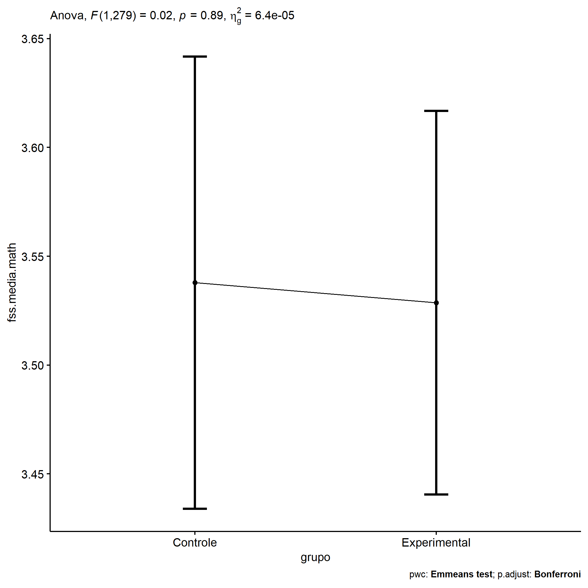<!-- -->

``` r
plots <- oneWayAncovaBoxPlots(
  wdat, "fss.media.math", "grupo", aov, pwc, covar = "dfs.media.math",
  theme = "classic", color = color[["grupo"]],
  subtitle = which(aov$Effect == "grupo"))
```

``` r
if (length(unique(wdat[["grupo"]])) > 1)
  plots[["grupo"]] + ggplot2::ylab("flow (prob. matemática)") + ggplot2::scale_x_discrete(labels=c('pre', 'pos'))
```

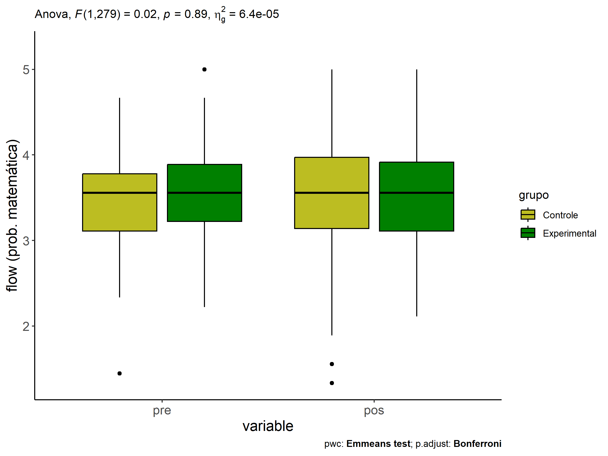<!-- -->

``` r
if (length(unique(wdat.long[["grupo"]])) > 1)
  plots <- oneWayAncovaBoxPlots(
    wdat.long, "flow.math", "grupo", aov, pwc.long, pre.post = "time",
    theme = "classic", color = color$prepost)
```

``` r
if (length(unique(wdat.long[["grupo"]])) > 1)
  plots[["grupo"]] + ggplot2::ylab("flow (prob. matemática)")
```

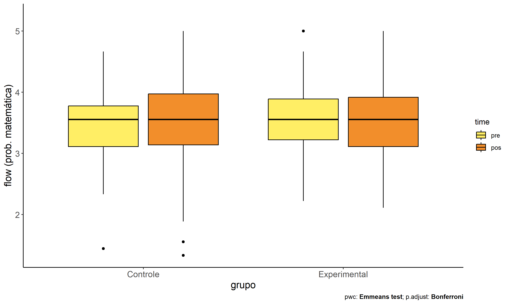<!-- -->

### Checking linearity assumption

``` r
ggscatter(wdat, x = "dfs.media.math", y = "fss.media.math", size = 0.5,
          color = "grupo", add = "reg.line")+
  stat_regline_equation(
    aes(label =  paste(..eq.label.., ..rr.label.., sep = "~~~~"), color = grupo)
  )
```

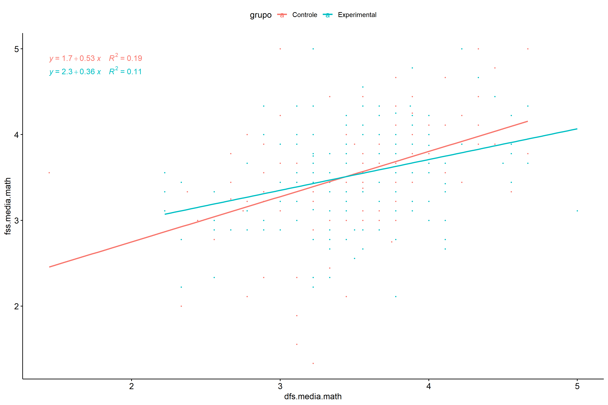<!-- -->

### Checking normality and homogeneity

``` r
res <- augment(lm(fss.media.math ~ dfs.media.math + grupo, data = wdat))
```

``` r
shapiro_test(res$.resid)
```

    ## # A tibble: 1 × 3
    ##   variable   statistic p.value
    ##   <chr>          <dbl>   <dbl>
    ## 1 res$.resid     0.991  0.0838

``` r
levene_test(res, .resid ~ grupo)
```

    ## # A tibble: 1 × 4
    ##     df1   df2 statistic     p
    ##   <int> <int>     <dbl> <dbl>
    ## 1     1   280     0.493 0.483

# ANCOVA and Pairwise for two factors **grupo:Sexo**

## Without remove non-normal data

``` r
pdat = remove_group_data(dat[!is.na(dat[["grupo"]]) & !is.na(dat[["Sexo"]]),], "fss.media.math", c("grupo","Sexo"))

pdat.long <- rbind(pdat[,c("id","grupo","Sexo")], pdat[,c("id","grupo","Sexo")])
pdat.long[["time"]] <- c(rep("pre", nrow(pdat)), rep("pos", nrow(pdat)))
pdat.long[["time"]] <- factor(pdat.long[["time"]], c("pre","pos"))
pdat.long[["flow.math"]] <- c(pdat[["dfs.media.math"]], pdat[["fss.media.math"]])

aov = anova_test(pdat, fss.media.math ~ dfs.media.math + grupo*Sexo)
laov[["grupo:Sexo"]] <- get_anova_table(aov)
```

``` r
pwcs <- list()
pwcs[["Sexo"]] <- emmeans_test(
  group_by(pdat, grupo), fss.media.math ~ Sexo,
  covariate = dfs.media.math, p.adjust.method = "bonferroni")
pwcs[["grupo"]] <- emmeans_test(
  group_by(pdat, Sexo), fss.media.math ~ grupo,
  covariate = dfs.media.math, p.adjust.method = "bonferroni")

pwc <- plyr::rbind.fill(pwcs[["grupo"]], pwcs[["Sexo"]])
pwc <- pwc[,c("grupo","Sexo", colnames(pwc)[!colnames(pwc) %in% c("grupo","Sexo")])]
```

``` r
pwc.long <- emmeans_test(dplyr::group_by_at(pdat.long, c("grupo","Sexo")),
                         flow.math ~ time,
                         p.adjust.method = "bonferroni")
lpwc[["grupo:Sexo"]] <- plyr::rbind.fill(pwc, pwc.long)
```

``` r
ds <- get.descriptives(pdat, "fss.media.math", c("grupo","Sexo"), covar = "dfs.media.math")
ds <- merge(ds[ds$variable != "dfs.media.math",],
            ds[ds$variable == "dfs.media.math", !colnames(ds) %in% c("variable")],
            by = c("grupo","Sexo"), all.x = T, suffixes = c("", ".dfs.media.math"))
ds <- merge(get_emmeans(pwcs[["grupo"]]), ds, by = c("grupo","Sexo"), suffixes = c(".emms", ""))
ds <- ds[,c("grupo","Sexo","n","mean.dfs.media.math","se.dfs.media.math","mean","se","emmean","se.emms")]

colnames(ds) <- c("grupo","Sexo", "N", paste0(c("M","SE")," (pre)"),
                  paste0(c("M","SE"), " (unadj)"), paste0(c("M", "SE"), " (adj)"))

lemms[["grupo:Sexo"]] <- ds
```

## Computing ANCOVA and PairWise After removing non-normal data (OK)

``` r
wdat = pdat 

res = residuals(lm(fss.media.math ~ dfs.media.math + grupo*Sexo, data = wdat))
non.normal = getNonNormal(res, wdat$id, plimit = 0.05)

wdat = wdat[!wdat$id %in% non.normal,]

wdat.long <- rbind(wdat[,c("id","grupo","Sexo")], wdat[,c("id","grupo","Sexo")])
wdat.long[["time"]] <- c(rep("pre", nrow(wdat)), rep("pos", nrow(wdat)))
wdat.long[["time"]] <- factor(wdat.long[["time"]], c("pre","pos"))
wdat.long[["flow.math"]] <- c(wdat[["dfs.media.math"]], wdat[["fss.media.math"]])


ldat[["grupo:Sexo"]] = wdat

(non.normal)
```

    ## NULL

``` r
aov = anova_test(wdat, fss.media.math ~ dfs.media.math + grupo*Sexo)
laov[["grupo:Sexo"]] <- merge(get_anova_table(aov), laov[["grupo:Sexo"]], by="Effect", suffixes = c("","'"))

(df = get_anova_table(aov))
```

    ## ANOVA Table (type II tests)
    ## 
    ##           Effect DFn DFd      F        p p<.05      ges
    ## 1 dfs.media.math   1 277 48.740 2.16e-11     * 1.50e-01
    ## 2          grupo   1 277  0.006 9.36e-01       2.31e-05
    ## 3           Sexo   1 277  0.819 3.66e-01       3.00e-03
    ## 4     grupo:Sexo   1 277  2.529 1.13e-01       9.00e-03

| Effect         | DFn | DFd |      F |     p | p\<.05 |   ges |
|:---------------|----:|----:|-------:|------:|:-------|------:|
| dfs.media.math |   1 | 277 | 48.740 | 0.000 | \*     | 0.150 |
| grupo          |   1 | 277 |  0.006 | 0.936 |        | 0.000 |
| Sexo           |   1 | 277 |  0.819 | 0.366 |        | 0.003 |
| grupo:Sexo     |   1 | 277 |  2.529 | 0.113 |        | 0.009 |

``` r
pwcs <- list()
pwcs[["Sexo"]] <- emmeans_test(
  group_by(wdat, grupo), fss.media.math ~ Sexo,
  covariate = dfs.media.math, p.adjust.method = "bonferroni")
pwcs[["grupo"]] <- emmeans_test(
  group_by(wdat, Sexo), fss.media.math ~ grupo,
  covariate = dfs.media.math, p.adjust.method = "bonferroni")

pwc <- plyr::rbind.fill(pwcs[["grupo"]], pwcs[["Sexo"]])
pwc <- pwc[,c("grupo","Sexo", colnames(pwc)[!colnames(pwc) %in% c("grupo","Sexo")])]
```

| grupo        | Sexo | term                  | .y.            | group1   | group2       |  df | statistic |     p | p.adj | p.adj.signif |
|:-------------|:-----|:----------------------|:---------------|:---------|:-------------|----:|----------:|------:|------:|:-------------|
|              | F    | dfs.media.math\*grupo | fss.media.math | Controle | Experimental | 277 |    -1.098 | 0.273 | 0.273 | ns           |
|              | M    | dfs.media.math\*grupo | fss.media.math | Controle | Experimental | 277 |     1.153 | 0.250 | 0.250 | ns           |
| Controle     |      | dfs.media.math\*Sexo  | fss.media.math | F        | M            | 277 |    -1.799 | 0.073 | 0.073 | ns           |
| Experimental |      | dfs.media.math\*Sexo  | fss.media.math | F        | M            | 277 |     0.336 | 0.737 | 0.737 | ns           |

``` r
pwc.long <- emmeans_test(dplyr::group_by_at(wdat.long, c("grupo","Sexo")),
                         flow.math ~ time,
                         p.adjust.method = "bonferroni")
lpwc[["grupo:Sexo"]] <- merge(plyr::rbind.fill(pwc, pwc.long), lpwc[["grupo:Sexo"]], by=c("grupo","Sexo","term",".y.","group1","group2"), suffixes = c("","'"))
```

| grupo        | Sexo | term | .y.       | group1 | group2 |  df | statistic |     p | p.adj | p.adj.signif |
|:-------------|:-----|:-----|:----------|:-------|:-------|----:|----------:|------:|------:|:-------------|
| Controle     | F    | time | flow.math | pre    | pos    | 556 |     0.450 | 0.653 | 0.653 | ns           |
| Controle     | M    | time | flow.math | pre    | pos    | 556 |    -1.343 | 0.180 | 0.180 | ns           |
| Experimental | F    | time | flow.math | pre    | pos    | 556 |    -0.685 | 0.493 | 0.493 | ns           |
| Experimental | M    | time | flow.math | pre    | pos    | 556 |     0.313 | 0.754 | 0.754 | ns           |

``` r
ds <- get.descriptives(wdat, "fss.media.math", c("grupo","Sexo"), covar = "dfs.media.math")
ds <- merge(ds[ds$variable != "dfs.media.math",],
            ds[ds$variable == "dfs.media.math", !colnames(ds) %in% c("variable")],
            by = c("grupo","Sexo"), all.x = T, suffixes = c("", ".dfs.media.math"))
ds <- merge(get_emmeans(pwcs[["grupo"]]), ds, by = c("grupo","Sexo"), suffixes = c(".emms", ""))
ds <- ds[,c("grupo","Sexo","n","mean.dfs.media.math","se.dfs.media.math","mean","se","emmean","se.emms")]

colnames(ds) <- c("grupo","Sexo", "N", paste0(c("M","SE")," (pre)"),
                  paste0(c("M","SE"), " (unadj)"), paste0(c("M", "SE"), " (adj)"))

lemms[["grupo:Sexo"]] <- merge(ds, lemms[["grupo:Sexo"]], by=c("grupo","Sexo"), suffixes = c("","'"))
```

| grupo        | Sexo |   N | M (pre) | SE (pre) | M (unadj) | SE (unadj) | M (adj) | SE (adj) |
|:-------------|:-----|----:|--------:|---------:|----------:|-----------:|--------:|---------:|
| Controle     | F    |  53 |   3.472 |    0.069 |     3.421 |      0.092 |   3.433 |    0.079 |
| Controle     | M    |  65 |   3.474 |    0.077 |     3.612 |      0.085 |   3.623 |    0.071 |
| Experimental | F    |  83 |   3.467 |    0.055 |     3.529 |      0.063 |   3.543 |    0.063 |
| Experimental | M    |  81 |   3.575 |    0.063 |     3.546 |      0.063 |   3.513 |    0.064 |

### Plots for ancova

``` r
plots <- twoWayAncovaPlots(
  wdat, "fss.media.math", c("grupo","Sexo"), aov, pwcs, addParam = c("mean_se"),
  font.label.size=10, step.increase=0.05, p.label="p.adj",
  subtitle = which(aov$Effect == "grupo:Sexo"))
```

``` r
if (!is.null(plots[["grupo"]]))
  plots[["grupo"]] + ggplot2::scale_color_manual(values = color[["Sexo"]])
```

    ## Scale for colour is already present.
    ## Adding another scale for colour, which will replace the existing scale.

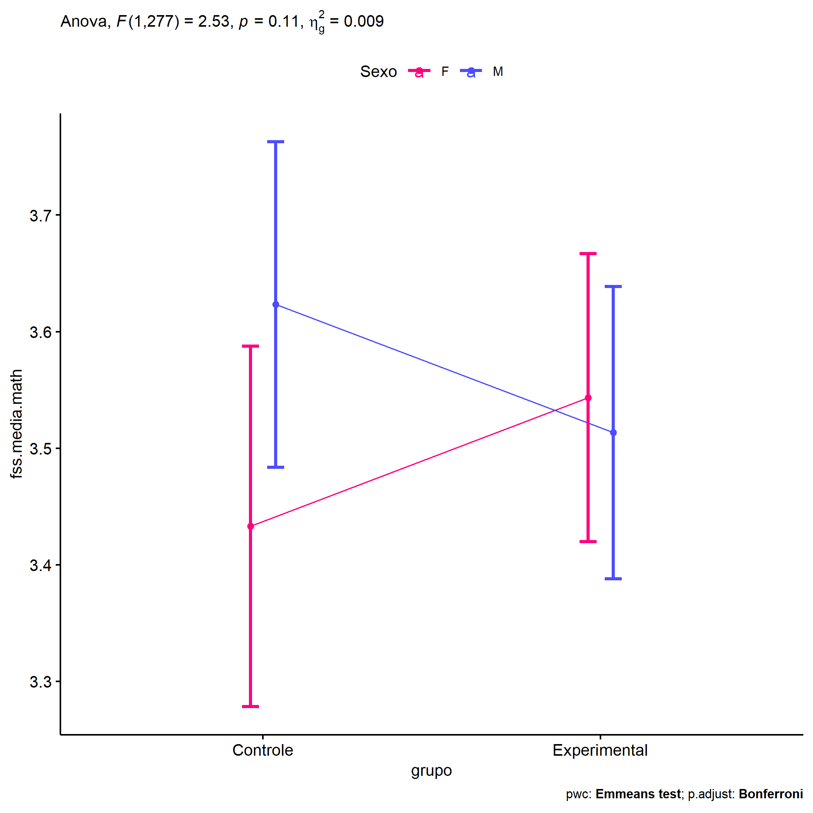<!-- -->

``` r
if (!is.null(plots[["Sexo"]]))
  plots[["Sexo"]] + ggplot2::scale_color_manual(values = color[["grupo"]])
```

    ## Scale for colour is already present.
    ## Adding another scale for colour, which will replace the existing scale.

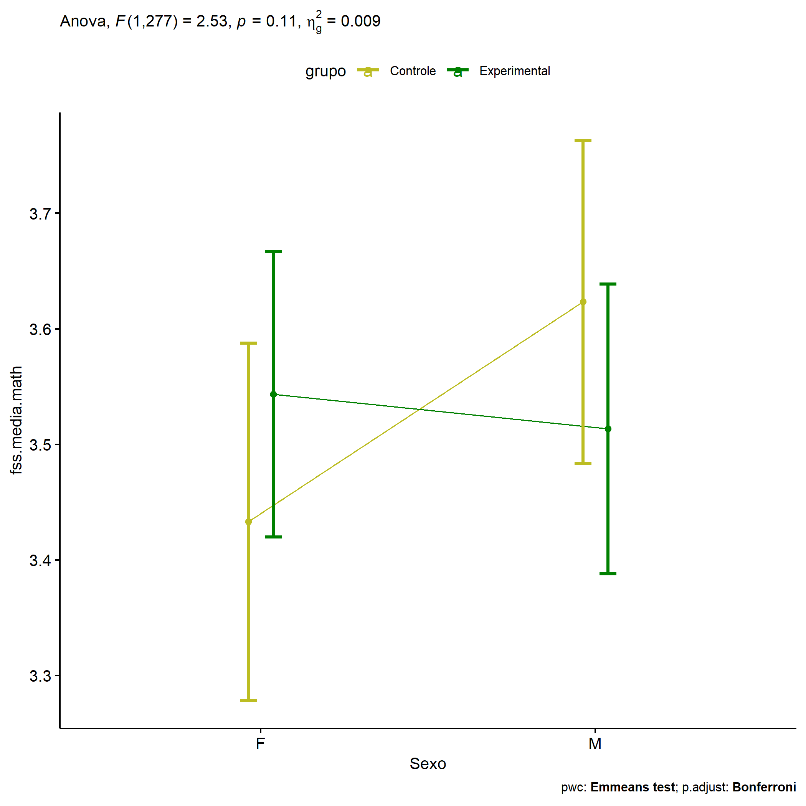<!-- -->

``` r
plots <- twoWayAncovaBoxPlots(
  wdat, "fss.media.math", c("grupo","Sexo"), aov, pwcs, covar = "dfs.media.math",
  theme = "classic", color = color[["grupo:Sexo"]],
  subtitle = which(aov$Effect == "grupo:Sexo"))
```

``` r
plots[["grupo:Sexo"]] + ggplot2::ylab("flow (prob. matemática)") + ggplot2::scale_x_discrete(labels=c('pre', 'pos'))
```

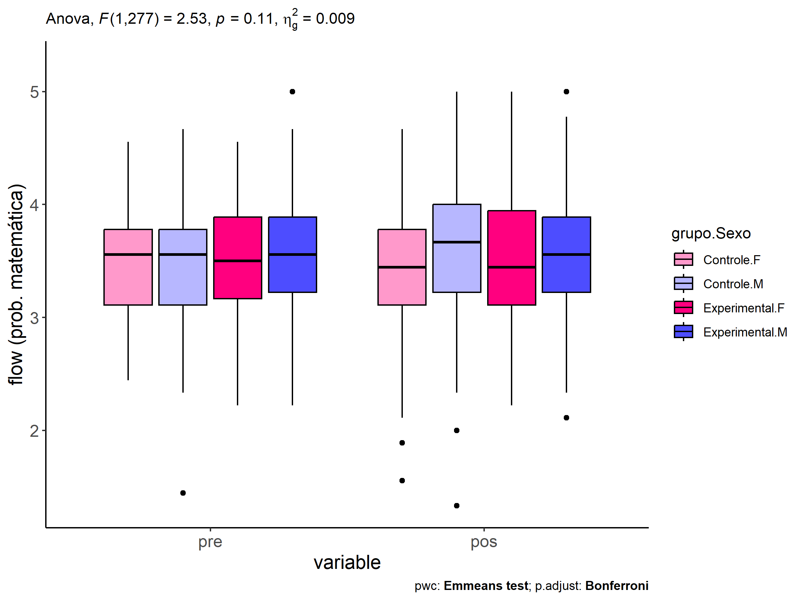<!-- -->

``` r
plots <- twoWayAncovaBoxPlots(
  wdat.long, "flow.math", c("grupo","Sexo"), aov, pwc.long, pre.post = "time",
  theme = "classic", color = color$prepost)
```

``` r
plots[["grupo:Sexo"]] + ggplot2::ylab("flow (prob. matemática)")
```

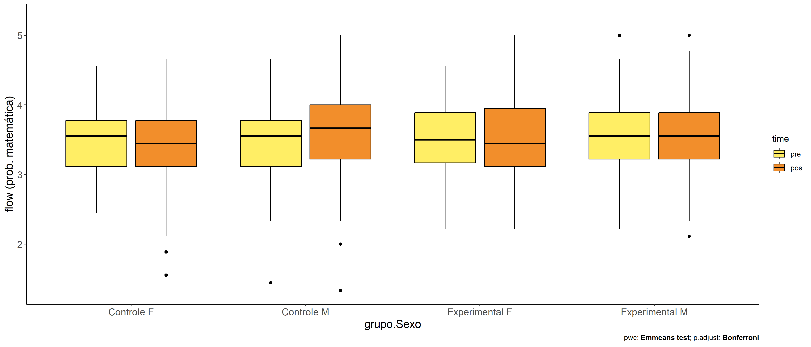<!-- -->

### Checking linearity assumption

``` r
ggscatter(wdat, x = "dfs.media.math", y = "fss.media.math", size = 0.5,
          facet.by = c("grupo","Sexo"), add = "reg.line")+
  stat_regline_equation(
    aes(label =  paste(..eq.label.., ..rr.label.., sep = "~~~~"))
  )
```

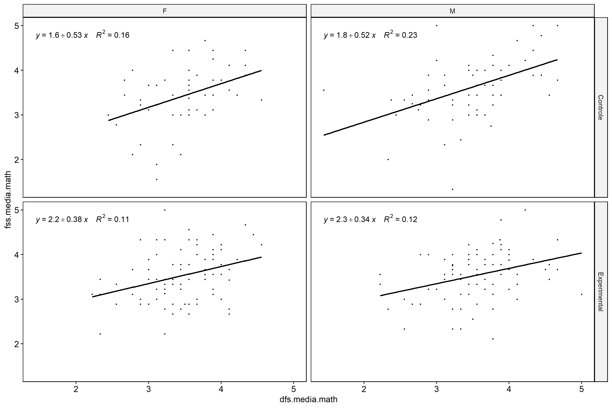<!-- -->

### Checking normality and homogeneity

``` r
res <- augment(lm(fss.media.math ~ dfs.media.math + grupo*Sexo, data = wdat))
```

``` r
shapiro_test(res$.resid)
```

    ## # A tibble: 1 × 3
    ##   variable   statistic p.value
    ##   <chr>          <dbl>   <dbl>
    ## 1 res$.resid     0.991  0.0985

``` r
levene_test(res, .resid ~ grupo*Sexo)
```

    ## # A tibble: 1 × 4
    ##     df1   df2 statistic     p
    ##   <int> <int>     <dbl> <dbl>
    ## 1     3   278     0.139 0.937

# ANCOVA and Pairwise for two factors **grupo:Zona**

## Without remove non-normal data

``` r
pdat = remove_group_data(dat[!is.na(dat[["grupo"]]) & !is.na(dat[["Zona"]]),], "fss.media.math", c("grupo","Zona"))

pdat.long <- rbind(pdat[,c("id","grupo","Zona")], pdat[,c("id","grupo","Zona")])
pdat.long[["time"]] <- c(rep("pre", nrow(pdat)), rep("pos", nrow(pdat)))
pdat.long[["time"]] <- factor(pdat.long[["time"]], c("pre","pos"))
pdat.long[["flow.math"]] <- c(pdat[["dfs.media.math"]], pdat[["fss.media.math"]])

aov = anova_test(pdat, fss.media.math ~ dfs.media.math + grupo*Zona)
laov[["grupo:Zona"]] <- get_anova_table(aov)
```

``` r
pwcs <- list()
pwcs[["Zona"]] <- emmeans_test(
  group_by(pdat, grupo), fss.media.math ~ Zona,
  covariate = dfs.media.math, p.adjust.method = "bonferroni")
pwcs[["grupo"]] <- emmeans_test(
  group_by(pdat, Zona), fss.media.math ~ grupo,
  covariate = dfs.media.math, p.adjust.method = "bonferroni")

pwc <- plyr::rbind.fill(pwcs[["grupo"]], pwcs[["Zona"]])
pwc <- pwc[,c("grupo","Zona", colnames(pwc)[!colnames(pwc) %in% c("grupo","Zona")])]
```

``` r
pwc.long <- emmeans_test(dplyr::group_by_at(pdat.long, c("grupo","Zona")),
                         flow.math ~ time,
                         p.adjust.method = "bonferroni")
lpwc[["grupo:Zona"]] <- plyr::rbind.fill(pwc, pwc.long)
```

``` r
ds <- get.descriptives(pdat, "fss.media.math", c("grupo","Zona"), covar = "dfs.media.math")
ds <- merge(ds[ds$variable != "dfs.media.math",],
            ds[ds$variable == "dfs.media.math", !colnames(ds) %in% c("variable")],
            by = c("grupo","Zona"), all.x = T, suffixes = c("", ".dfs.media.math"))
ds <- merge(get_emmeans(pwcs[["grupo"]]), ds, by = c("grupo","Zona"), suffixes = c(".emms", ""))
ds <- ds[,c("grupo","Zona","n","mean.dfs.media.math","se.dfs.media.math","mean","se","emmean","se.emms")]

colnames(ds) <- c("grupo","Zona", "N", paste0(c("M","SE")," (pre)"),
                  paste0(c("M","SE"), " (unadj)"), paste0(c("M", "SE"), " (adj)"))

lemms[["grupo:Zona"]] <- ds
```

## Computing ANCOVA and PairWise After removing non-normal data (OK)

``` r
wdat = pdat 

res = residuals(lm(fss.media.math ~ dfs.media.math + grupo*Zona, data = wdat))
non.normal = getNonNormal(res, wdat$id, plimit = 0.05)

wdat = wdat[!wdat$id %in% non.normal,]

wdat.long <- rbind(wdat[,c("id","grupo","Zona")], wdat[,c("id","grupo","Zona")])
wdat.long[["time"]] <- c(rep("pre", nrow(wdat)), rep("pos", nrow(wdat)))
wdat.long[["time"]] <- factor(wdat.long[["time"]], c("pre","pos"))
wdat.long[["flow.math"]] <- c(wdat[["dfs.media.math"]], wdat[["fss.media.math"]])


ldat[["grupo:Zona"]] = wdat

(non.normal)
```

    ## NULL

``` r
aov = anova_test(wdat, fss.media.math ~ dfs.media.math + grupo*Zona)
laov[["grupo:Zona"]] <- merge(get_anova_table(aov), laov[["grupo:Zona"]], by="Effect", suffixes = c("","'"))

(df = get_anova_table(aov))
```

    ## ANOVA Table (type II tests)
    ## 
    ##           Effect DFn DFd      F        p p<.05   ges
    ## 1 dfs.media.math   1 152 32.276 6.62e-08     * 0.175
    ## 2          grupo   1 152  0.786 3.77e-01       0.005
    ## 3           Zona   1 152  0.585 4.46e-01       0.004
    ## 4     grupo:Zona   1 152  0.153 6.96e-01       0.001

| Effect         | DFn | DFd |      F |     p | p\<.05 |   ges |
|:---------------|----:|----:|-------:|------:|:-------|------:|
| dfs.media.math |   1 | 152 | 32.276 | 0.000 | \*     | 0.175 |
| grupo          |   1 | 152 |  0.786 | 0.377 |        | 0.005 |
| Zona           |   1 | 152 |  0.585 | 0.446 |        | 0.004 |
| grupo:Zona     |   1 | 152 |  0.153 | 0.696 |        | 0.001 |

``` r
pwcs <- list()
pwcs[["Zona"]] <- emmeans_test(
  group_by(wdat, grupo), fss.media.math ~ Zona,
  covariate = dfs.media.math, p.adjust.method = "bonferroni")
pwcs[["grupo"]] <- emmeans_test(
  group_by(wdat, Zona), fss.media.math ~ grupo,
  covariate = dfs.media.math, p.adjust.method = "bonferroni")

pwc <- plyr::rbind.fill(pwcs[["grupo"]], pwcs[["Zona"]])
pwc <- pwc[,c("grupo","Zona", colnames(pwc)[!colnames(pwc) %in% c("grupo","Zona")])]
```

| grupo        | Zona   | term                  | .y.            | group1   | group2       |  df | statistic |     p | p.adj | p.adj.signif |
|:-------------|:-------|:----------------------|:---------------|:---------|:-------------|----:|----------:|------:|------:|:-------------|
|              | Rural  | dfs.media.math\*grupo | fss.media.math | Controle | Experimental | 152 |     0.394 | 0.694 | 0.694 | ns           |
|              | Urbana | dfs.media.math\*grupo | fss.media.math | Controle | Experimental | 152 |     0.866 | 0.388 | 0.388 | ns           |
| Controle     |        | dfs.media.math\*Zona  | fss.media.math | Rural    | Urbana       | 152 |     0.164 | 0.870 | 0.870 | ns           |
| Experimental |        | dfs.media.math\*Zona  | fss.media.math | Rural    | Urbana       | 152 |     0.834 | 0.406 | 0.406 | ns           |

``` r
pwc.long <- emmeans_test(dplyr::group_by_at(wdat.long, c("grupo","Zona")),
                         flow.math ~ time,
                         p.adjust.method = "bonferroni")
lpwc[["grupo:Zona"]] <- merge(plyr::rbind.fill(pwc, pwc.long), lpwc[["grupo:Zona"]], by=c("grupo","Zona","term",".y.","group1","group2"), suffixes = c("","'"))
```

| grupo        | Zona   | term | .y.       | group1 | group2 |  df | statistic |     p | p.adj | p.adj.signif |
|:-------------|:-------|:-----|:----------|:-------|:-------|----:|----------:|------:|------:|:-------------|
| Controle     | Rural  | time | flow.math | pre    | pos    | 306 |     0.337 | 0.736 | 0.736 | ns           |
| Controle     | Urbana | time | flow.math | pre    | pos    | 306 |    -0.684 | 0.494 | 0.494 | ns           |
| Experimental | Rural  | time | flow.math | pre    | pos    | 306 |    -1.048 | 0.296 | 0.296 | ns           |
| Experimental | Urbana | time | flow.math | pre    | pos    | 306 |     1.071 | 0.285 | 0.285 | ns           |

``` r
ds <- get.descriptives(wdat, "fss.media.math", c("grupo","Zona"), covar = "dfs.media.math")
ds <- merge(ds[ds$variable != "dfs.media.math",],
            ds[ds$variable == "dfs.media.math", !colnames(ds) %in% c("variable")],
            by = c("grupo","Zona"), all.x = T, suffixes = c("", ".dfs.media.math"))
ds <- merge(get_emmeans(pwcs[["grupo"]]), ds, by = c("grupo","Zona"), suffixes = c(".emms", ""))
ds <- ds[,c("grupo","Zona","n","mean.dfs.media.math","se.dfs.media.math","mean","se","emmean","se.emms")]

colnames(ds) <- c("grupo","Zona", "N", paste0(c("M","SE")," (pre)"),
                  paste0(c("M","SE"), " (unadj)"), paste0(c("M", "SE"), " (adj)"))

lemms[["grupo:Zona"]] <- merge(ds, lemms[["grupo:Zona"]], by=c("grupo","Zona"), suffixes = c("","'"))
```

| grupo        | Zona   |   N | M (pre) | SE (pre) | M (unadj) | SE (unadj) | M (adj) | SE (adj) |
|:-------------|:-------|----:|--------:|---------:|----------:|-----------:|--------:|---------:|
| Controle     | Rural  |  39 |   3.786 |    0.076 |     3.742 |      0.100 |   3.622 |    0.094 |
| Controle     | Urbana |  25 |   3.418 |    0.111 |     3.529 |      0.156 |   3.597 |    0.115 |
| Experimental | Rural  |  53 |   3.354 |    0.069 |     3.471 |      0.074 |   3.572 |    0.081 |
| Experimental | Urbana |  40 |   3.665 |    0.085 |     3.527 |      0.101 |   3.469 |    0.091 |

### Plots for ancova

``` r
plots <- twoWayAncovaPlots(
  wdat, "fss.media.math", c("grupo","Zona"), aov, pwcs, addParam = c("mean_se"),
  font.label.size=10, step.increase=0.05, p.label="p.adj",
  subtitle = which(aov$Effect == "grupo:Zona"))
```

``` r
if (!is.null(plots[["grupo"]]))
  plots[["grupo"]] + ggplot2::scale_color_manual(values = color[["Zona"]])
```

    ## Scale for colour is already present.
    ## Adding another scale for colour, which will replace the existing scale.

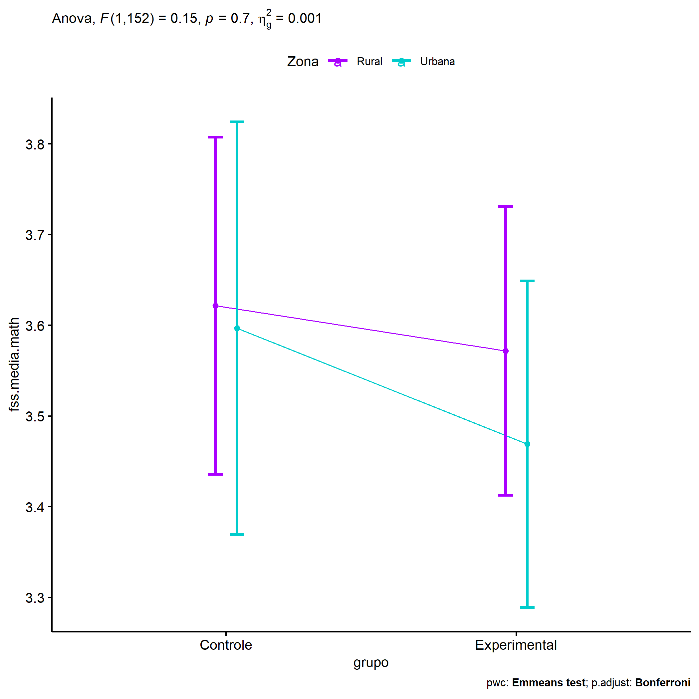<!-- -->

``` r
if (!is.null(plots[["Zona"]]))
  plots[["Zona"]] + ggplot2::scale_color_manual(values = color[["grupo"]])
```

    ## Scale for colour is already present.
    ## Adding another scale for colour, which will replace the existing scale.

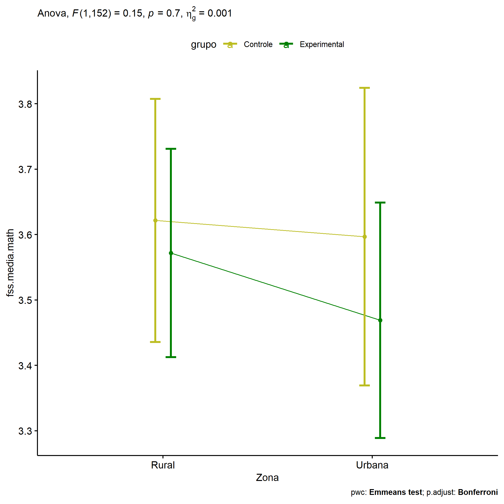<!-- -->

``` r
plots <- twoWayAncovaBoxPlots(
  wdat, "fss.media.math", c("grupo","Zona"), aov, pwcs, covar = "dfs.media.math",
  theme = "classic", color = color[["grupo:Zona"]],
  subtitle = which(aov$Effect == "grupo:Zona"))
```

``` r
plots[["grupo:Zona"]] + ggplot2::ylab("flow (prob. matemática)") + ggplot2::scale_x_discrete(labels=c('pre', 'pos'))
```

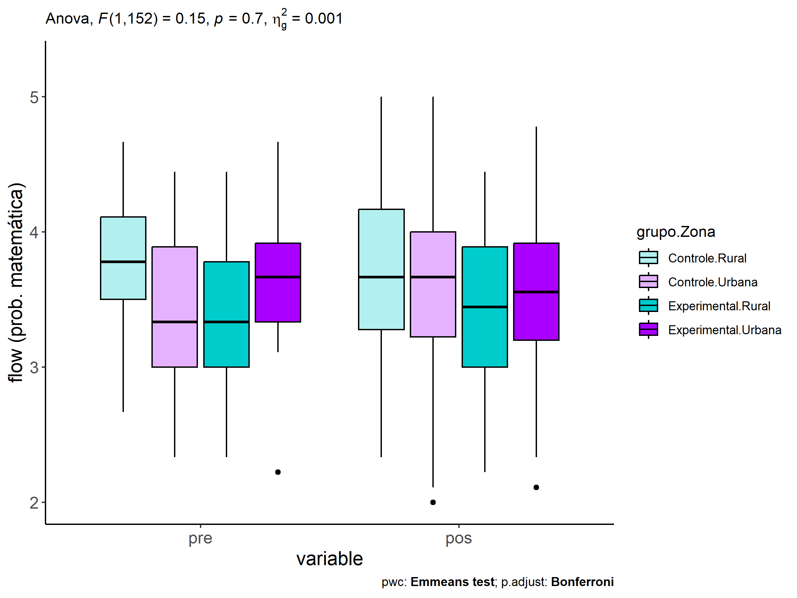<!-- -->

``` r
plots <- twoWayAncovaBoxPlots(
  wdat.long, "flow.math", c("grupo","Zona"), aov, pwc.long, pre.post = "time",
  theme = "classic", color = color$prepost)
```

``` r
plots[["grupo:Zona"]] + ggplot2::ylab("flow (prob. matemática)")
```

<!-- -->

### Checking linearity assumption

``` r
ggscatter(wdat, x = "dfs.media.math", y = "fss.media.math", size = 0.5,
          facet.by = c("grupo","Zona"), add = "reg.line")+
  stat_regline_equation(
    aes(label =  paste(..eq.label.., ..rr.label.., sep = "~~~~"))
  )
```

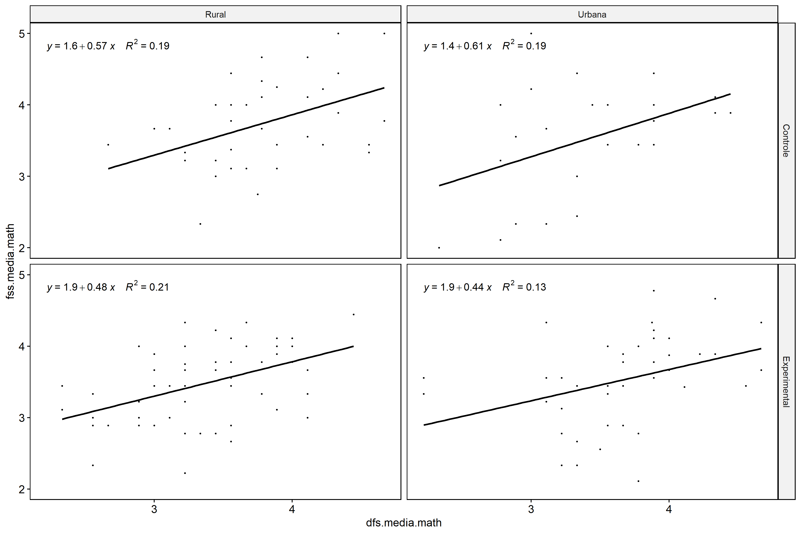<!-- -->

### Checking normality and homogeneity

``` r
res <- augment(lm(fss.media.math ~ dfs.media.math + grupo*Zona, data = wdat))
```

``` r
shapiro_test(res$.resid)
```

    ## # A tibble: 1 × 3
    ##   variable   statistic p.value
    ##   <chr>          <dbl>   <dbl>
    ## 1 res$.resid     0.991   0.458

``` r
levene_test(res, .resid ~ grupo*Zona)
```

    ## # A tibble: 1 × 4
    ##     df1   df2 statistic     p
    ##   <int> <int>     <dbl> <dbl>
    ## 1     3   153      1.61 0.190

# ANCOVA and Pairwise for two factors **grupo:Cor.Raca**

## Without remove non-normal data

``` r
pdat = remove_group_data(dat[!is.na(dat[["grupo"]]) & !is.na(dat[["Cor.Raca"]]),], "fss.media.math", c("grupo","Cor.Raca"))

pdat.long <- rbind(pdat[,c("id","grupo","Cor.Raca")], pdat[,c("id","grupo","Cor.Raca")])
pdat.long[["time"]] <- c(rep("pre", nrow(pdat)), rep("pos", nrow(pdat)))
pdat.long[["time"]] <- factor(pdat.long[["time"]], c("pre","pos"))
pdat.long[["flow.math"]] <- c(pdat[["dfs.media.math"]], pdat[["fss.media.math"]])

aov = anova_test(pdat, fss.media.math ~ dfs.media.math + grupo*Cor.Raca)
laov[["grupo:Cor.Raca"]] <- get_anova_table(aov)
```

``` r
pwcs <- list()
pwcs[["Cor.Raca"]] <- emmeans_test(
  group_by(pdat, grupo), fss.media.math ~ Cor.Raca,
  covariate = dfs.media.math, p.adjust.method = "bonferroni")
pwcs[["grupo"]] <- emmeans_test(
  group_by(pdat, Cor.Raca), fss.media.math ~ grupo,
  covariate = dfs.media.math, p.adjust.method = "bonferroni")

pwc <- plyr::rbind.fill(pwcs[["grupo"]], pwcs[["Cor.Raca"]])
pwc <- pwc[,c("grupo","Cor.Raca", colnames(pwc)[!colnames(pwc) %in% c("grupo","Cor.Raca")])]
```

``` r
pwc.long <- emmeans_test(dplyr::group_by_at(pdat.long, c("grupo","Cor.Raca")),
                         flow.math ~ time,
                         p.adjust.method = "bonferroni")
lpwc[["grupo:Cor.Raca"]] <- plyr::rbind.fill(pwc, pwc.long)
```

``` r
ds <- get.descriptives(pdat, "fss.media.math", c("grupo","Cor.Raca"), covar = "dfs.media.math")
ds <- merge(ds[ds$variable != "dfs.media.math",],
            ds[ds$variable == "dfs.media.math", !colnames(ds) %in% c("variable")],
            by = c("grupo","Cor.Raca"), all.x = T, suffixes = c("", ".dfs.media.math"))
ds <- merge(get_emmeans(pwcs[["grupo"]]), ds, by = c("grupo","Cor.Raca"), suffixes = c(".emms", ""))
ds <- ds[,c("grupo","Cor.Raca","n","mean.dfs.media.math","se.dfs.media.math","mean","se","emmean","se.emms")]

colnames(ds) <- c("grupo","Cor.Raca", "N", paste0(c("M","SE")," (pre)"),
                  paste0(c("M","SE"), " (unadj)"), paste0(c("M", "SE"), " (adj)"))

lemms[["grupo:Cor.Raca"]] <- ds
```

## Computing ANCOVA and PairWise After removing non-normal data (OK)

``` r
wdat = pdat 

res = residuals(lm(fss.media.math ~ dfs.media.math + grupo*Cor.Raca, data = wdat))
non.normal = getNonNormal(res, wdat$id, plimit = 0.05)

wdat = wdat[!wdat$id %in% non.normal,]

wdat.long <- rbind(wdat[,c("id","grupo","Cor.Raca")], wdat[,c("id","grupo","Cor.Raca")])
wdat.long[["time"]] <- c(rep("pre", nrow(wdat)), rep("pos", nrow(wdat)))
wdat.long[["time"]] <- factor(wdat.long[["time"]], c("pre","pos"))
wdat.long[["flow.math"]] <- c(wdat[["dfs.media.math"]], wdat[["fss.media.math"]])


ldat[["grupo:Cor.Raca"]] = wdat

(non.normal)
```

    ## NULL

``` r
aov = anova_test(wdat, fss.media.math ~ dfs.media.math + grupo*Cor.Raca)
laov[["grupo:Cor.Raca"]] <- merge(get_anova_table(aov), laov[["grupo:Cor.Raca"]], by="Effect", suffixes = c("","'"))

(df = get_anova_table(aov))
```

    ## ANOVA Table (type II tests)
    ## 
    ##           Effect DFn DFd      F        p p<.05      ges
    ## 1 dfs.media.math   1 104 16.209 0.000108     * 1.35e-01
    ## 2          grupo   1 104  0.442 0.508000       4.00e-03
    ## 3       Cor.Raca   1 104  6.900 0.010000     * 6.20e-02
    ## 4 grupo:Cor.Raca   1 104  0.008 0.930000       7.47e-05

| Effect         | DFn | DFd |      F |     p | p\<.05 |   ges |
|:---------------|----:|----:|-------:|------:|:-------|------:|
| dfs.media.math |   1 | 104 | 16.209 | 0.000 | \*     | 0.135 |
| grupo          |   1 | 104 |  0.442 | 0.508 |        | 0.004 |
| Cor.Raca       |   1 | 104 |  6.900 | 0.010 | \*     | 0.062 |
| grupo:Cor.Raca |   1 | 104 |  0.008 | 0.930 |        | 0.000 |

``` r
pwcs <- list()
pwcs[["Cor.Raca"]] <- emmeans_test(
  group_by(wdat, grupo), fss.media.math ~ Cor.Raca,
  covariate = dfs.media.math, p.adjust.method = "bonferroni")
pwcs[["grupo"]] <- emmeans_test(
  group_by(wdat, Cor.Raca), fss.media.math ~ grupo,
  covariate = dfs.media.math, p.adjust.method = "bonferroni")

pwc <- plyr::rbind.fill(pwcs[["grupo"]], pwcs[["Cor.Raca"]])
pwc <- pwc[,c("grupo","Cor.Raca", colnames(pwc)[!colnames(pwc) %in% c("grupo","Cor.Raca")])]
```

| grupo        | Cor.Raca | term                     | .y.            | group1   | group2       |  df | statistic |     p | p.adj | p.adj.signif |
|:-------------|:---------|:-------------------------|:---------------|:---------|:-------------|----:|----------:|------:|------:|:-------------|
|              | Branca   | dfs.media.math\*grupo    | fss.media.math | Controle | Experimental | 104 |     0.188 | 0.851 | 0.851 | ns           |
|              | Parda    | dfs.media.math\*grupo    | fss.media.math | Controle | Experimental | 104 |     0.641 | 0.523 | 0.523 | ns           |
| Controle     |          | dfs.media.math\*Cor.Raca | fss.media.math | Branca   | Parda        | 104 |     1.512 | 0.134 | 0.134 | ns           |
| Experimental |          | dfs.media.math\*Cor.Raca | fss.media.math | Branca   | Parda        | 104 |     2.191 | 0.031 | 0.031 | \*           |

``` r
pwc.long <- emmeans_test(dplyr::group_by_at(wdat.long, c("grupo","Cor.Raca")),
                         flow.math ~ time,
                         p.adjust.method = "bonferroni")
lpwc[["grupo:Cor.Raca"]] <- merge(plyr::rbind.fill(pwc, pwc.long), lpwc[["grupo:Cor.Raca"]], by=c("grupo","Cor.Raca","term",".y.","group1","group2"), suffixes = c("","'"))
```

| grupo        | Cor.Raca | term | .y.       | group1 | group2 |  df | statistic |     p | p.adj | p.adj.signif |
|:-------------|:---------|:-----|:----------|:-------|:-------|----:|----------:|------:|------:|:-------------|
| Controle     | Branca   | time | flow.math | pre    | pos    | 210 |     0.052 | 0.959 | 0.959 | ns           |
| Controle     | Parda    | time | flow.math | pre    | pos    | 210 |    -0.940 | 0.348 | 0.348 | ns           |
| Experimental | Branca   | time | flow.math | pre    | pos    | 210 |    -1.140 | 0.255 | 0.255 | ns           |
| Experimental | Parda    | time | flow.math | pre    | pos    | 210 |     0.197 | 0.844 | 0.844 | ns           |

``` r
ds <- get.descriptives(wdat, "fss.media.math", c("grupo","Cor.Raca"), covar = "dfs.media.math")
ds <- merge(ds[ds$variable != "dfs.media.math",],
            ds[ds$variable == "dfs.media.math", !colnames(ds) %in% c("variable")],
            by = c("grupo","Cor.Raca"), all.x = T, suffixes = c("", ".dfs.media.math"))
ds <- merge(get_emmeans(pwcs[["grupo"]]), ds, by = c("grupo","Cor.Raca"), suffixes = c(".emms", ""))
ds <- ds[,c("grupo","Cor.Raca","n","mean.dfs.media.math","se.dfs.media.math","mean","se","emmean","se.emms")]

colnames(ds) <- c("grupo","Cor.Raca", "N", paste0(c("M","SE")," (pre)"),
                  paste0(c("M","SE"), " (unadj)"), paste0(c("M", "SE"), " (adj)"))

lemms[["grupo:Cor.Raca"]] <- merge(ds, lemms[["grupo:Cor.Raca"]], by=c("grupo","Cor.Raca"), suffixes = c("","'"))
```

| grupo        | Cor.Raca |   N | M (pre) | SE (pre) | M (unadj) | SE (unadj) | M (adj) | SE (adj) |
|:-------------|:---------|----:|--------:|---------:|----------:|-----------:|--------:|---------:|
| Controle     | Branca   |   7 |   4.127 |    0.152 |     4.111 |      0.282 |   3.859 |    0.216 |
| Controle     | Parda    |  45 |   3.345 |    0.095 |     3.458 |      0.093 |   3.505 |    0.082 |
| Experimental | Branca   |  13 |   3.607 |    0.134 |     3.863 |      0.130 |   3.810 |    0.152 |
| Experimental | Parda    |  44 |   3.447 |    0.078 |     3.423 |      0.083 |   3.431 |    0.082 |

### Plots for ancova

``` r
plots <- twoWayAncovaPlots(
  wdat, "fss.media.math", c("grupo","Cor.Raca"), aov, pwcs, addParam = c("mean_se"),
  font.label.size=10, step.increase=0.05, p.label="p.adj",
  subtitle = which(aov$Effect == "grupo:Cor.Raca"))
```

``` r
if (!is.null(plots[["grupo"]]))
  plots[["grupo"]] + ggplot2::scale_color_manual(values = color[["Cor.Raca"]])
```

    ## Scale for colour is already present.
    ## Adding another scale for colour, which will replace the existing scale.

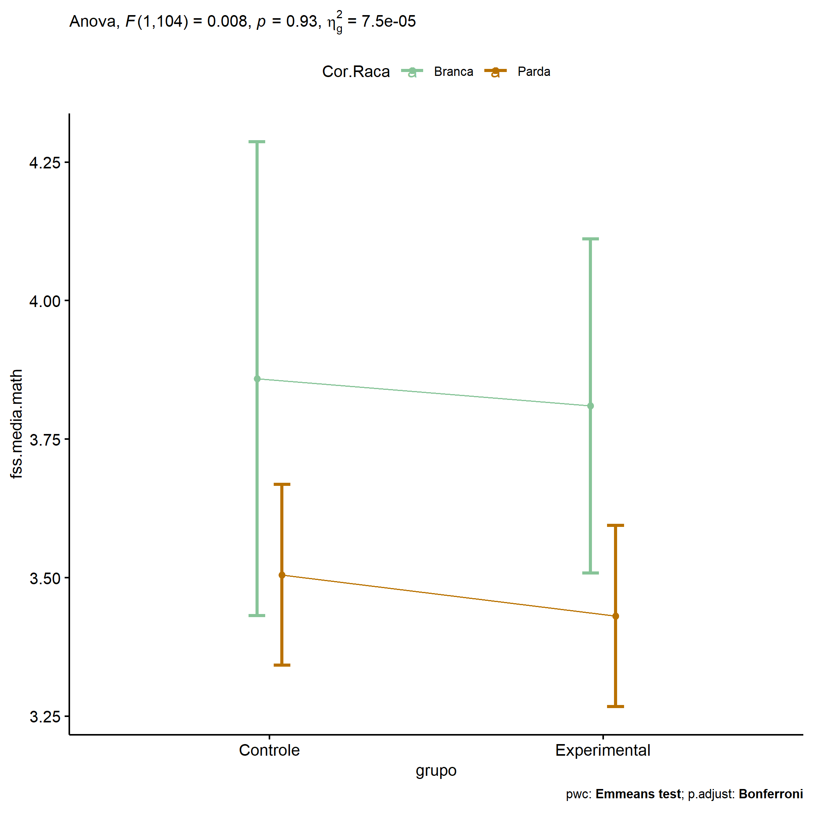<!-- -->

``` r
if (!is.null(plots[["Cor.Raca"]]))
  plots[["Cor.Raca"]] + ggplot2::scale_color_manual(values = color[["grupo"]])
```

    ## Scale for colour is already present.
    ## Adding another scale for colour, which will replace the existing scale.

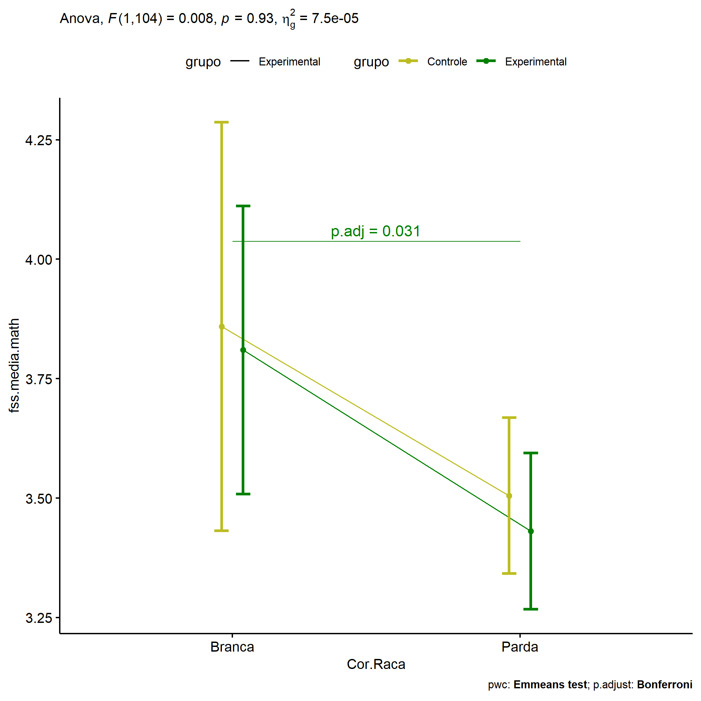<!-- -->

``` r
plots <- twoWayAncovaBoxPlots(
  wdat, "fss.media.math", c("grupo","Cor.Raca"), aov, pwcs, covar = "dfs.media.math",
  theme = "classic", color = color[["grupo:Cor.Raca"]],
  subtitle = which(aov$Effect == "grupo:Cor.Raca"))
```

``` r
plots[["grupo:Cor.Raca"]] + ggplot2::ylab("flow (prob. matemática)") + ggplot2::scale_x_discrete(labels=c('pre', 'pos'))
```

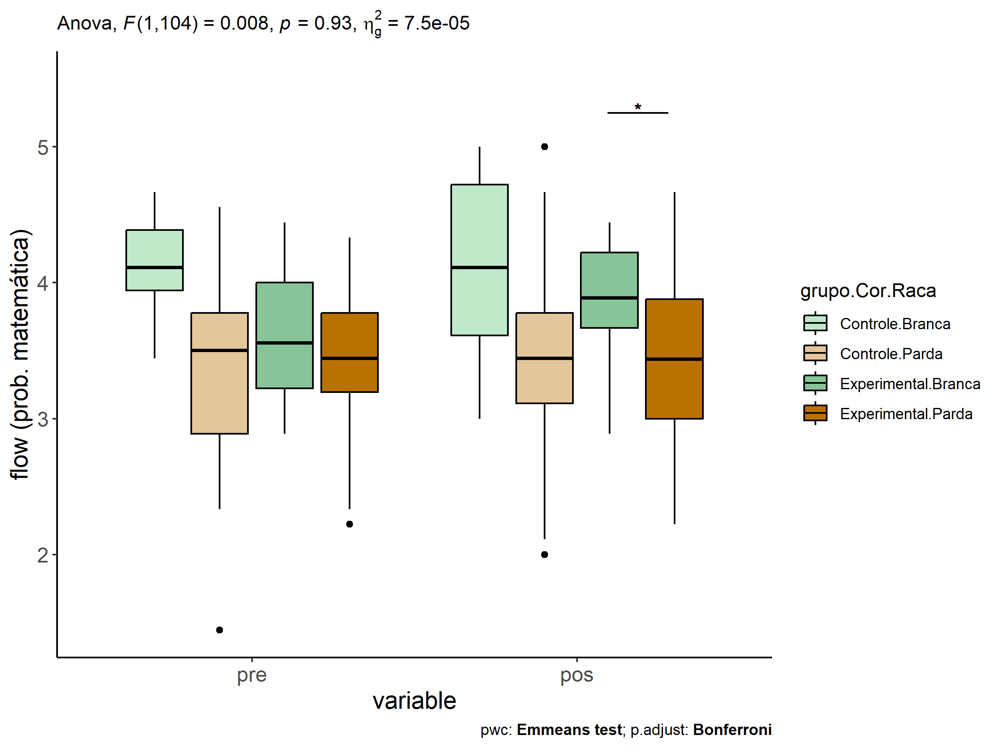<!-- -->

``` r
plots <- twoWayAncovaBoxPlots(
  wdat.long, "flow.math", c("grupo","Cor.Raca"), aov, pwc.long, pre.post = "time",
  theme = "classic", color = color$prepost)
```

``` r
plots[["grupo:Cor.Raca"]] + ggplot2::ylab("flow (prob. matemática)")
```

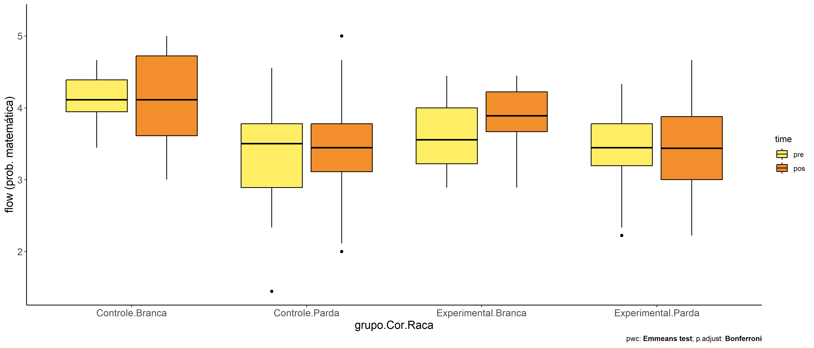<!-- -->

### Checking linearity assumption

``` r
ggscatter(wdat, x = "dfs.media.math", y = "fss.media.math", size = 0.5,
          facet.by = c("grupo","Cor.Raca"), add = "reg.line")+
  stat_regline_equation(
    aes(label =  paste(..eq.label.., ..rr.label.., sep = "~~~~"))
  )
```

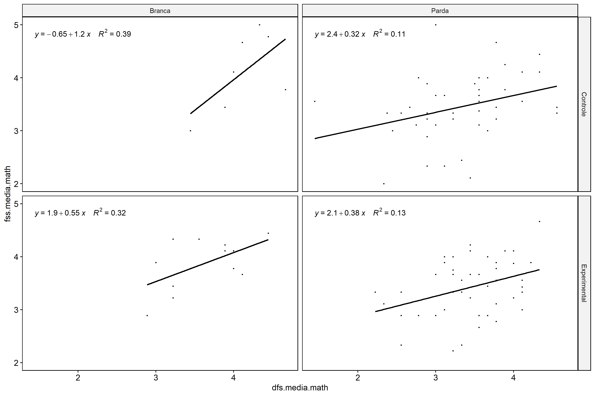<!-- -->

### Checking normality and homogeneity

``` r
res <- augment(lm(fss.media.math ~ dfs.media.math + grupo*Cor.Raca, data = wdat))
```

``` r
shapiro_test(res$.resid)
```

    ## # A tibble: 1 × 3
    ##   variable   statistic p.value
    ##   <chr>          <dbl>   <dbl>
    ## 1 res$.resid     0.989   0.535

``` r
levene_test(res, .resid ~ grupo*Cor.Raca)
```

    ## # A tibble: 1 × 4
    ##     df1   df2 statistic     p
    ##   <int> <int>     <dbl> <dbl>
    ## 1     3   105     0.898 0.445

# Summary of Results

## Descriptive Statistics

``` r
df <- get.descriptives(ldat[["grupo"]], c(dv.pre, dv.pos), c("grupo"), 
                       include.global = T, symmetry.test = T, normality.test = F)
df <- plyr::rbind.fill(
  df, do.call(plyr::rbind.fill, lapply(lfatores2, FUN = function(f) {
    if (nrow(dat) > 0 && sum(!is.na(unique(dat[[f]]))) > 1)
      get.descriptives(ldat[[paste0("grupo:",f)]], c(dv.pre,dv.pos), c("grupo", f),
                       symmetry.test = T, normality.test = F)
    }))
)
(df <- df[,c(fatores1[fatores1 %in% colnames(df)],"variable",
             colnames(df)[!colnames(df) %in% c(fatores1,"variable")])])
```

    ##           grupo Sexo   Zona Cor.Raca       variable   n  mean median   min   max    sd    se    ci   iqr
    ## 1      Controle <NA>   <NA>     <NA> dfs.media.math 118 3.473  3.556 1.444 4.667 0.569 0.052 0.104 0.667
    ## 2  Experimental <NA>   <NA>     <NA> dfs.media.math 164 3.520  3.556 2.222 5.000 0.533 0.042 0.082 0.667
    ## 3          <NA> <NA>   <NA>     <NA> dfs.media.math 282 3.500  3.556 1.444 5.000 0.548 0.033 0.064 0.778
    ## 4      Controle <NA>   <NA>     <NA> fss.media.math 118 3.526  3.556 1.333 5.000 0.681 0.063 0.124 0.833
    ## 5  Experimental <NA>   <NA>     <NA> fss.media.math 164 3.537  3.556 2.111 5.000 0.571 0.045 0.088 0.806
    ## 6          <NA> <NA>   <NA>     <NA> fss.media.math 282 3.532  3.556 1.333 5.000 0.619 0.037 0.073 0.861
    ## 7      Controle    F   <NA>     <NA> dfs.media.math  53 3.472  3.556 2.444 4.556 0.504 0.069 0.139 0.667
    ## 8      Controle    M   <NA>     <NA> dfs.media.math  65 3.474  3.556 1.444 4.667 0.621 0.077 0.154 0.667
    ## 9  Experimental    F   <NA>     <NA> dfs.media.math  83 3.467  3.500 2.222 4.556 0.499 0.055 0.109 0.722
    ## 10 Experimental    M   <NA>     <NA> dfs.media.math  81 3.575  3.556 2.222 5.000 0.563 0.063 0.125 0.667
    ## 11     Controle    F   <NA>     <NA> fss.media.math  53 3.421  3.444 1.556 4.667 0.669 0.092 0.184 0.667
    ## 12     Controle    M   <NA>     <NA> fss.media.math  65 3.612  3.667 1.333 5.000 0.685 0.085 0.170 0.778
    ## 13 Experimental    F   <NA>     <NA> fss.media.math  83 3.529  3.444 2.222 5.000 0.575 0.063 0.126 0.833
    ## 14 Experimental    M   <NA>     <NA> fss.media.math  81 3.546  3.556 2.111 5.000 0.571 0.063 0.126 0.667
    ## 15     Controle <NA>  Rural     <NA> dfs.media.math  39 3.786  3.778 2.667 4.667 0.477 0.076 0.155 0.611
    ## 16     Controle <NA> Urbana     <NA> dfs.media.math  25 3.418  3.333 2.333 4.444 0.557 0.111 0.230 0.889
    ## 17 Experimental <NA>  Rural     <NA> dfs.media.math  53 3.354  3.333 2.333 4.444 0.504 0.069 0.139 0.778
    ## 18 Experimental <NA> Urbana     <NA> dfs.media.math  40 3.665  3.667 2.222 4.667 0.535 0.085 0.171 0.583
    ## 19     Controle <NA>  Rural     <NA> fss.media.math  39 3.742  3.667 2.333 5.000 0.625 0.100 0.203 0.889
    ## 20     Controle <NA> Urbana     <NA> fss.media.math  25 3.529  3.667 2.000 5.000 0.782 0.156 0.323 0.778
    ## 21 Experimental <NA>  Rural     <NA> fss.media.math  53 3.471  3.444 2.222 4.444 0.537 0.074 0.148 0.889
    ## 22 Experimental <NA> Urbana     <NA> fss.media.math  40 3.527  3.556 2.111 4.778 0.640 0.101 0.205 0.719
    ## 23     Controle <NA>   <NA>   Branca dfs.media.math   7 4.127  4.111 3.444 4.667 0.403 0.152 0.373 0.444
    ## 24     Controle <NA>   <NA>    Parda dfs.media.math  45 3.345  3.500 1.444 4.556 0.636 0.095 0.191 0.889
    ## 25 Experimental <NA>   <NA>   Branca dfs.media.math  13 3.607  3.556 2.889 4.444 0.481 0.134 0.291 0.778
    ## 26 Experimental <NA>   <NA>    Parda dfs.media.math  44 3.447  3.444 2.222 4.333 0.519 0.078 0.158 0.583
    ## 27     Controle <NA>   <NA>   Branca fss.media.math   7 4.111  4.111 3.000 5.000 0.745 0.282 0.689 1.111
    ## 28     Controle <NA>   <NA>    Parda fss.media.math  45 3.458  3.444 2.000 5.000 0.622 0.093 0.187 0.667
    ## 29 Experimental <NA>   <NA>   Branca fss.media.math  13 3.863  3.889 2.889 4.444 0.467 0.130 0.282 0.556
    ## 30 Experimental <NA>   <NA>    Parda fss.media.math  44 3.423  3.437 2.222 4.667 0.547 0.083 0.166 0.878
    ##    symmetry     skewness     kurtosis
    ## 1       YES -0.280506531  0.336485509
    ## 2       YES -0.171735499  0.102324750
    ## 3       YES -0.231753281  0.265595959
    ## 4       YES -0.464715422  0.783276393
    ## 5       YES -0.035037467 -0.237233991
    ## 6       YES -0.280664113  0.510456452
    ## 7       YES -0.005337804 -0.748615643
    ## 8       YES -0.391523839  0.478914121
    ## 9       YES -0.368278773 -0.179278880
    ## 10      YES -0.093462028  0.088340050
    ## 11       NO -0.602031265  0.287607147
    ## 12      YES -0.391367955  1.011138426
    ## 13      YES  0.109825259 -0.512969036
    ## 14      YES -0.185464329  0.001758539
    ## 15      YES  0.015120499 -0.599828499
    ## 16      YES  0.132332585 -0.972714738
    ## 17      YES -0.103495808 -0.746812970
    ## 18       NO -0.527412815  0.786516927
    ## 19      YES  0.184184221 -0.623256456
    ## 20      YES -0.461610317 -0.674689247
    ## 21      YES -0.213992614 -0.830877376
    ## 22      YES -0.296886201 -0.524152381
    ## 23      YES -0.296275667 -1.278278230
    ## 24      YES -0.354884640  0.267234855
    ## 25      YES  0.078388496 -1.445624466
    ## 26      YES -0.463048420 -0.449257728
    ## 27      YES -0.184564341 -1.772910053
    ## 28      YES -0.167831233  0.292265228
    ## 29       NO -0.595244399 -0.841959710
    ## 30      YES -0.205457835 -0.489601671

| grupo        | Sexo | Zona   | Cor.Raca | variable       |   n |  mean | median |   min |   max |    sd |    se |    ci |   iqr | symmetry | skewness | kurtosis |
|:-------------|:-----|:-------|:---------|:---------------|----:|------:|-------:|------:|------:|------:|------:|------:|------:|:---------|---------:|---------:|
| Controle     |      |        |          | dfs.media.math | 118 | 3.473 |  3.556 | 1.444 | 4.667 | 0.569 | 0.052 | 0.104 | 0.667 | YES      |   -0.281 |    0.336 |
| Experimental |      |        |          | dfs.media.math | 164 | 3.520 |  3.556 | 2.222 | 5.000 | 0.533 | 0.042 | 0.082 | 0.667 | YES      |   -0.172 |    0.102 |
|              |      |        |          | dfs.media.math | 282 | 3.500 |  3.556 | 1.444 | 5.000 | 0.548 | 0.033 | 0.064 | 0.778 | YES      |   -0.232 |    0.266 |
| Controle     |      |        |          | fss.media.math | 118 | 3.526 |  3.556 | 1.333 | 5.000 | 0.681 | 0.063 | 0.124 | 0.833 | YES      |   -0.465 |    0.783 |
| Experimental |      |        |          | fss.media.math | 164 | 3.537 |  3.556 | 2.111 | 5.000 | 0.571 | 0.045 | 0.088 | 0.806 | YES      |   -0.035 |   -0.237 |
|              |      |        |          | fss.media.math | 282 | 3.532 |  3.556 | 1.333 | 5.000 | 0.619 | 0.037 | 0.073 | 0.861 | YES      |   -0.281 |    0.510 |
| Controle     | F    |        |          | dfs.media.math |  53 | 3.472 |  3.556 | 2.444 | 4.556 | 0.504 | 0.069 | 0.139 | 0.667 | YES      |   -0.005 |   -0.749 |
| Controle     | M    |        |          | dfs.media.math |  65 | 3.474 |  3.556 | 1.444 | 4.667 | 0.621 | 0.077 | 0.154 | 0.667 | YES      |   -0.392 |    0.479 |
| Experimental | F    |        |          | dfs.media.math |  83 | 3.467 |  3.500 | 2.222 | 4.556 | 0.499 | 0.055 | 0.109 | 0.722 | YES      |   -0.368 |   -0.179 |
| Experimental | M    |        |          | dfs.media.math |  81 | 3.575 |  3.556 | 2.222 | 5.000 | 0.563 | 0.063 | 0.125 | 0.667 | YES      |   -0.093 |    0.088 |
| Controle     | F    |        |          | fss.media.math |  53 | 3.421 |  3.444 | 1.556 | 4.667 | 0.669 | 0.092 | 0.184 | 0.667 | NO       |   -0.602 |    0.288 |
| Controle     | M    |        |          | fss.media.math |  65 | 3.612 |  3.667 | 1.333 | 5.000 | 0.685 | 0.085 | 0.170 | 0.778 | YES      |   -0.391 |    1.011 |
| Experimental | F    |        |          | fss.media.math |  83 | 3.529 |  3.444 | 2.222 | 5.000 | 0.575 | 0.063 | 0.126 | 0.833 | YES      |    0.110 |   -0.513 |
| Experimental | M    |        |          | fss.media.math |  81 | 3.546 |  3.556 | 2.111 | 5.000 | 0.571 | 0.063 | 0.126 | 0.667 | YES      |   -0.185 |    0.002 |
| Controle     |      | Rural  |          | dfs.media.math |  39 | 3.786 |  3.778 | 2.667 | 4.667 | 0.477 | 0.076 | 0.155 | 0.611 | YES      |    0.015 |   -0.600 |
| Controle     |      | Urbana |          | dfs.media.math |  25 | 3.418 |  3.333 | 2.333 | 4.444 | 0.557 | 0.111 | 0.230 | 0.889 | YES      |    0.132 |   -0.973 |
| Experimental |      | Rural  |          | dfs.media.math |  53 | 3.354 |  3.333 | 2.333 | 4.444 | 0.504 | 0.069 | 0.139 | 0.778 | YES      |   -0.103 |   -0.747 |
| Experimental |      | Urbana |          | dfs.media.math |  40 | 3.665 |  3.667 | 2.222 | 4.667 | 0.535 | 0.085 | 0.171 | 0.583 | NO       |   -0.527 |    0.787 |
| Controle     |      | Rural  |          | fss.media.math |  39 | 3.742 |  3.667 | 2.333 | 5.000 | 0.625 | 0.100 | 0.203 | 0.889 | YES      |    0.184 |   -0.623 |
| Controle     |      | Urbana |          | fss.media.math |  25 | 3.529 |  3.667 | 2.000 | 5.000 | 0.782 | 0.156 | 0.323 | 0.778 | YES      |   -0.462 |   -0.675 |
| Experimental |      | Rural  |          | fss.media.math |  53 | 3.471 |  3.444 | 2.222 | 4.444 | 0.537 | 0.074 | 0.148 | 0.889 | YES      |   -0.214 |   -0.831 |
| Experimental |      | Urbana |          | fss.media.math |  40 | 3.527 |  3.556 | 2.111 | 4.778 | 0.640 | 0.101 | 0.205 | 0.719 | YES      |   -0.297 |   -0.524 |
| Controle     |      |        | Branca   | dfs.media.math |   7 | 4.127 |  4.111 | 3.444 | 4.667 | 0.403 | 0.152 | 0.373 | 0.444 | YES      |   -0.296 |   -1.278 |
| Controle     |      |        | Parda    | dfs.media.math |  45 | 3.345 |  3.500 | 1.444 | 4.556 | 0.636 | 0.095 | 0.191 | 0.889 | YES      |   -0.355 |    0.267 |
| Experimental |      |        | Branca   | dfs.media.math |  13 | 3.607 |  3.556 | 2.889 | 4.444 | 0.481 | 0.134 | 0.291 | 0.778 | YES      |    0.078 |   -1.446 |
| Experimental |      |        | Parda    | dfs.media.math |  44 | 3.447 |  3.444 | 2.222 | 4.333 | 0.519 | 0.078 | 0.158 | 0.583 | YES      |   -0.463 |   -0.449 |
| Controle     |      |        | Branca   | fss.media.math |   7 | 4.111 |  4.111 | 3.000 | 5.000 | 0.745 | 0.282 | 0.689 | 1.111 | YES      |   -0.185 |   -1.773 |
| Controle     |      |        | Parda    | fss.media.math |  45 | 3.458 |  3.444 | 2.000 | 5.000 | 0.622 | 0.093 | 0.187 | 0.667 | YES      |   -0.168 |    0.292 |
| Experimental |      |        | Branca   | fss.media.math |  13 | 3.863 |  3.889 | 2.889 | 4.444 | 0.467 | 0.130 | 0.282 | 0.556 | NO       |   -0.595 |   -0.842 |
| Experimental |      |        | Parda    | fss.media.math |  44 | 3.423 |  3.437 | 2.222 | 4.667 | 0.547 | 0.083 | 0.166 | 0.878 | YES      |   -0.205 |   -0.490 |

## ANCOVA Table Comparison

``` r
df <- do.call(plyr::rbind.fill, laov)
(df <- df[!duplicated(df$Effect),])
```

    ##            Effect DFn DFd      F        p p<.05      ges DFn' DFd'     F'       p' p<.05'     ges'
    ## 1  dfs.media.math   1 279 48.466 2.41e-11     * 1.48e-01    1  279 48.466 2.41e-11      * 1.48e-01
    ## 2           grupo   1 279  0.018 8.94e-01       6.35e-05    1  279  0.018 8.94e-01        6.35e-05
    ## 5      grupo:Sexo   1 277  2.529 1.13e-01       9.00e-03    1  277  2.529 1.13e-01        9.00e-03
    ## 6            Sexo   1 277  0.819 3.66e-01       3.00e-03    1  277  0.819 3.66e-01        3.00e-03
    ## 9      grupo:Zona   1 152  0.153 6.96e-01       1.00e-03    1  152  0.153 6.96e-01        1.00e-03
    ## 10           Zona   1 152  0.585 4.46e-01       4.00e-03    1  152  0.585 4.46e-01        4.00e-03
    ## 11       Cor.Raca   1 104  6.900 1.00e-02     * 6.20e-02    1  104  6.900 1.00e-02      * 6.20e-02
    ## 14 grupo:Cor.Raca   1 104  0.008 9.30e-01       7.47e-05    1  104  0.008 9.30e-01        7.47e-05

|     | Effect         | DFn | DFd |      F |     p | p\<.05 |   ges | DFn’ | DFd’ |     F’ |    p’ | p\<.05’ |  ges’ |
|:----|:---------------|----:|----:|-------:|------:|:-------|------:|-----:|-----:|-------:|------:|:--------|------:|
| 1   | dfs.media.math |   1 | 279 | 48.466 | 0.000 | \*     | 0.148 |    1 |  279 | 48.466 | 0.000 | \*      | 0.148 |
| 2   | grupo          |   1 | 279 |  0.018 | 0.894 |        | 0.000 |    1 |  279 |  0.018 | 0.894 |         | 0.000 |
| 5   | grupo:Sexo     |   1 | 277 |  2.529 | 0.113 |        | 0.009 |    1 |  277 |  2.529 | 0.113 |         | 0.009 |
| 6   | Sexo           |   1 | 277 |  0.819 | 0.366 |        | 0.003 |    1 |  277 |  0.819 | 0.366 |         | 0.003 |
| 9   | grupo:Zona     |   1 | 152 |  0.153 | 0.696 |        | 0.001 |    1 |  152 |  0.153 | 0.696 |         | 0.001 |
| 10  | Zona           |   1 | 152 |  0.585 | 0.446 |        | 0.004 |    1 |  152 |  0.585 | 0.446 |         | 0.004 |
| 11  | Cor.Raca       |   1 | 104 |  6.900 | 0.010 | \*     | 0.062 |    1 |  104 |  6.900 | 0.010 | \*      | 0.062 |
| 14  | grupo:Cor.Raca |   1 | 104 |  0.008 | 0.930 |        | 0.000 |    1 |  104 |  0.008 | 0.930 |         | 0.000 |

## PairWise Table Comparison

``` r
df <- do.call(plyr::rbind.fill, lpwc)
df <- df[,c(names(lfatores), names(df)[!names(df) %in% c(names(lfatores),"term",".y.")])]
```

| grupo        | Sexo | Zona   | Cor.Raca | group1   | group2       |  df | statistic |     p | p.adj | p.adj.signif | df’ | statistic’ |    p’ | p.adj’ | p.adj.signif’ |
|:-------------|:-----|:-------|:---------|:---------|:-------------|----:|----------:|------:|------:|:-------------|----:|-----------:|------:|-------:|:--------------|
| Controle     |      |        |          | pre      | pos          | 560 |    -0.695 | 0.487 | 0.487 | ns           | 560 |     -0.695 | 0.487 |  0.487 | ns            |
| Experimental |      |        |          | pre      | pos          | 560 |    -0.267 | 0.789 | 0.789 | ns           | 560 |     -0.267 | 0.789 |  0.789 | ns            |
|              |      |        |          | Controle | Experimental | 279 |     0.133 | 0.894 | 0.894 | ns           | 279 |      0.133 | 0.894 |  0.894 | ns            |
| Controle     | F    |        |          | pre      | pos          | 556 |     0.450 | 0.653 | 0.653 | ns           | 556 |      0.450 | 0.653 |  0.653 | ns            |
| Controle     | M    |        |          | pre      | pos          | 556 |    -1.343 | 0.180 | 0.180 | ns           | 556 |     -1.343 | 0.180 |  0.180 | ns            |
| Controle     |      |        |          | F        | M            | 277 |    -1.799 | 0.073 | 0.073 | ns           | 277 |     -1.799 | 0.073 |  0.073 | ns            |
| Experimental | F    |        |          | pre      | pos          | 556 |    -0.685 | 0.493 | 0.493 | ns           | 556 |     -0.685 | 0.493 |  0.493 | ns            |
| Experimental | M    |        |          | pre      | pos          | 556 |     0.313 | 0.754 | 0.754 | ns           | 556 |      0.313 | 0.754 |  0.754 | ns            |
| Experimental |      |        |          | F        | M            | 277 |     0.336 | 0.737 | 0.737 | ns           | 277 |      0.336 | 0.737 |  0.737 | ns            |
|              | F    |        |          | Controle | Experimental | 277 |    -1.098 | 0.273 | 0.273 | ns           | 277 |     -1.098 | 0.273 |  0.273 | ns            |
|              | M    |        |          | Controle | Experimental | 277 |     1.153 | 0.250 | 0.250 | ns           | 277 |      1.153 | 0.250 |  0.250 | ns            |
| Controle     |      |        |          | Rural    | Urbana       | 152 |     0.164 | 0.870 | 0.870 | ns           | 152 |      0.164 | 0.870 |  0.870 | ns            |
| Controle     |      | Rural  |          | pre      | pos          | 306 |     0.337 | 0.736 | 0.736 | ns           | 306 |      0.337 | 0.736 |  0.736 | ns            |
| Controle     |      | Urbana |          | pre      | pos          | 306 |    -0.684 | 0.494 | 0.494 | ns           | 306 |     -0.684 | 0.494 |  0.494 | ns            |
| Experimental |      |        |          | Rural    | Urbana       | 152 |     0.834 | 0.406 | 0.406 | ns           | 152 |      0.834 | 0.406 |  0.406 | ns            |
| Experimental |      | Rural  |          | pre      | pos          | 306 |    -1.048 | 0.296 | 0.296 | ns           | 306 |     -1.048 | 0.296 |  0.296 | ns            |
| Experimental |      | Urbana |          | pre      | pos          | 306 |     1.071 | 0.285 | 0.285 | ns           | 306 |      1.071 | 0.285 |  0.285 | ns            |
|              |      | Rural  |          | Controle | Experimental | 152 |     0.394 | 0.694 | 0.694 | ns           | 152 |      0.394 | 0.694 |  0.694 | ns            |
|              |      | Urbana |          | Controle | Experimental | 152 |     0.866 | 0.388 | 0.388 | ns           | 152 |      0.866 | 0.388 |  0.388 | ns            |
| Controle     |      |        | Branca   | pre      | pos          | 210 |     0.052 | 0.959 | 0.959 | ns           | 210 |      0.052 | 0.959 |  0.959 | ns            |
| Controle     |      |        |          | Branca   | Parda        | 104 |     1.512 | 0.134 | 0.134 | ns           | 104 |      1.512 | 0.134 |  0.134 | ns            |
| Controle     |      |        | Parda    | pre      | pos          | 210 |    -0.940 | 0.348 | 0.348 | ns           | 210 |     -0.940 | 0.348 |  0.348 | ns            |
| Experimental |      |        | Branca   | pre      | pos          | 210 |    -1.140 | 0.255 | 0.255 | ns           | 210 |     -1.140 | 0.255 |  0.255 | ns            |
| Experimental |      |        |          | Branca   | Parda        | 104 |     2.191 | 0.031 | 0.031 | \*           | 104 |      2.191 | 0.031 |  0.031 | \*            |
| Experimental |      |        | Parda    | pre      | pos          | 210 |     0.197 | 0.844 | 0.844 | ns           | 210 |      0.197 | 0.844 |  0.844 | ns            |
|              |      |        | Branca   | Controle | Experimental | 104 |     0.188 | 0.851 | 0.851 | ns           | 104 |      0.188 | 0.851 |  0.851 | ns            |
|              |      |        | Parda    | Controle | Experimental | 104 |     0.641 | 0.523 | 0.523 | ns           | 104 |      0.641 | 0.523 |  0.523 | ns            |

## EMMS Table Comparison

``` r
df <- do.call(plyr::rbind.fill, lemms)
df[["N-N'"]] <- df[["N"]] - df[["N'"]]
df <- df[,c(names(lfatores), names(df)[!names(df) %in% names(lfatores)])]
```

| grupo        | Sexo | Zona   | Cor.Raca |   N | M (pre) | SE (pre) | M (unadj) | SE (unadj) | M (adj) | SE (adj) |  N’ | M (pre)’ | SE (pre)’ | M (unadj)’ | SE (unadj)’ | M (adj)’ | SE (adj)’ | N-N’ |
|:-------------|:-----|:-------|:---------|----:|--------:|---------:|----------:|-----------:|--------:|---------:|----:|---------:|----------:|-----------:|------------:|---------:|----------:|-----:|
| Controle     |      |        |          | 118 |   3.473 |    0.052 |     3.526 |      0.063 |   3.538 |    0.053 | 118 |    3.473 |     0.052 |      3.526 |       0.063 |    3.538 |     0.053 |    0 |
| Experimental |      |        |          | 164 |   3.520 |    0.042 |     3.537 |      0.045 |   3.529 |    0.045 | 164 |    3.520 |     0.042 |      3.537 |       0.045 |    3.529 |     0.045 |    0 |
| Controle     | F    |        |          |  53 |   3.472 |    0.069 |     3.421 |      0.092 |   3.433 |    0.079 |  53 |    3.472 |     0.069 |      3.421 |       0.092 |    3.433 |     0.079 |    0 |
| Controle     | M    |        |          |  65 |   3.474 |    0.077 |     3.612 |      0.085 |   3.623 |    0.071 |  65 |    3.474 |     0.077 |      3.612 |       0.085 |    3.623 |     0.071 |    0 |
| Experimental | F    |        |          |  83 |   3.467 |    0.055 |     3.529 |      0.063 |   3.543 |    0.063 |  83 |    3.467 |     0.055 |      3.529 |       0.063 |    3.543 |     0.063 |    0 |
| Experimental | M    |        |          |  81 |   3.575 |    0.063 |     3.546 |      0.063 |   3.513 |    0.064 |  81 |    3.575 |     0.063 |      3.546 |       0.063 |    3.513 |     0.064 |    0 |
| Controle     |      | Rural  |          |  39 |   3.786 |    0.076 |     3.742 |      0.100 |   3.622 |    0.094 |  39 |    3.786 |     0.076 |      3.742 |       0.100 |    3.622 |     0.094 |    0 |
| Controle     |      | Urbana |          |  25 |   3.418 |    0.111 |     3.529 |      0.156 |   3.597 |    0.115 |  25 |    3.418 |     0.111 |      3.529 |       0.156 |    3.597 |     0.115 |    0 |
| Experimental |      | Rural  |          |  53 |   3.354 |    0.069 |     3.471 |      0.074 |   3.572 |    0.081 |  53 |    3.354 |     0.069 |      3.471 |       0.074 |    3.572 |     0.081 |    0 |
| Experimental |      | Urbana |          |  40 |   3.665 |    0.085 |     3.527 |      0.101 |   3.469 |    0.091 |  40 |    3.665 |     0.085 |      3.527 |       0.101 |    3.469 |     0.091 |    0 |
| Controle     |      |        | Branca   |   7 |   4.127 |    0.152 |     4.111 |      0.282 |   3.859 |    0.216 |   7 |    4.127 |     0.152 |      4.111 |       0.282 |    3.859 |     0.216 |    0 |
| Controle     |      |        | Parda    |  45 |   3.345 |    0.095 |     3.458 |      0.093 |   3.505 |    0.082 |  45 |    3.345 |     0.095 |      3.458 |       0.093 |    3.505 |     0.082 |    0 |
| Experimental |      |        | Branca   |  13 |   3.607 |    0.134 |     3.863 |      0.130 |   3.810 |    0.152 |  13 |    3.607 |     0.134 |      3.863 |       0.130 |    3.810 |     0.152 |    0 |
| Experimental |      |        | Parda    |  44 |   3.447 |    0.078 |     3.423 |      0.083 |   3.431 |    0.082 |  44 |    3.447 |     0.078 |      3.423 |       0.083 |    3.431 |     0.082 |    0 |
