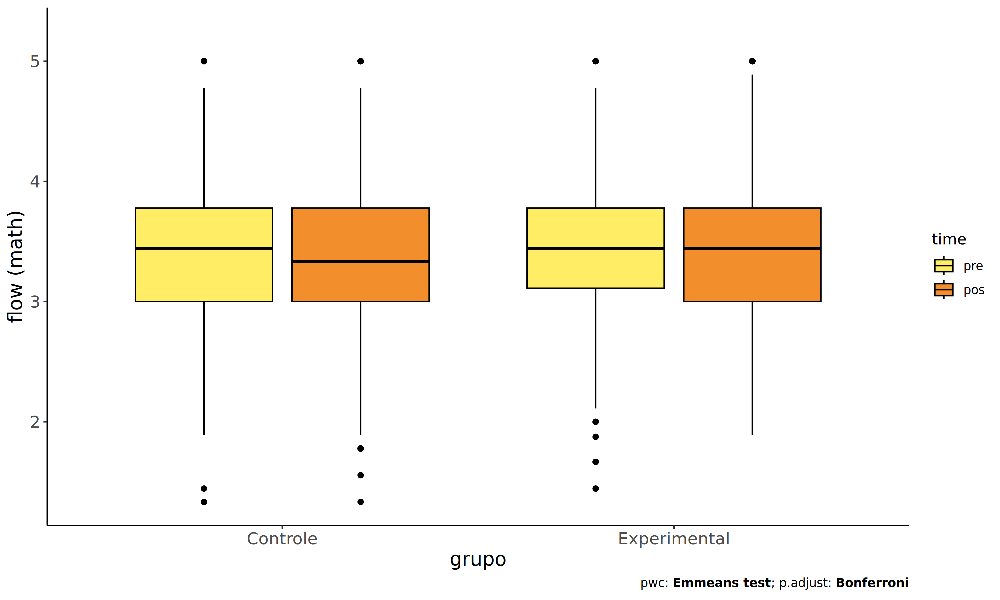
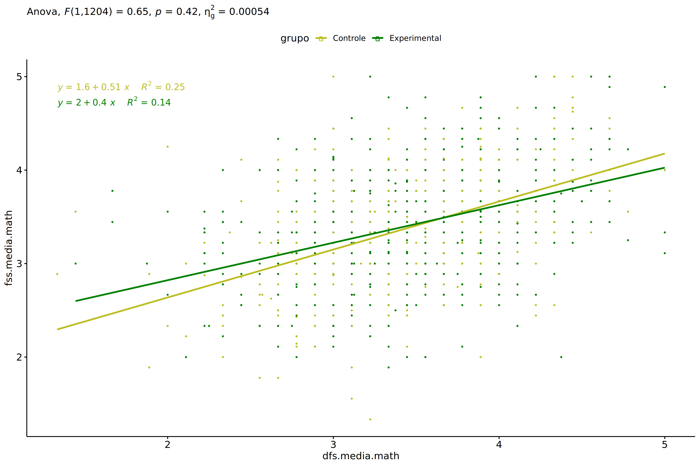
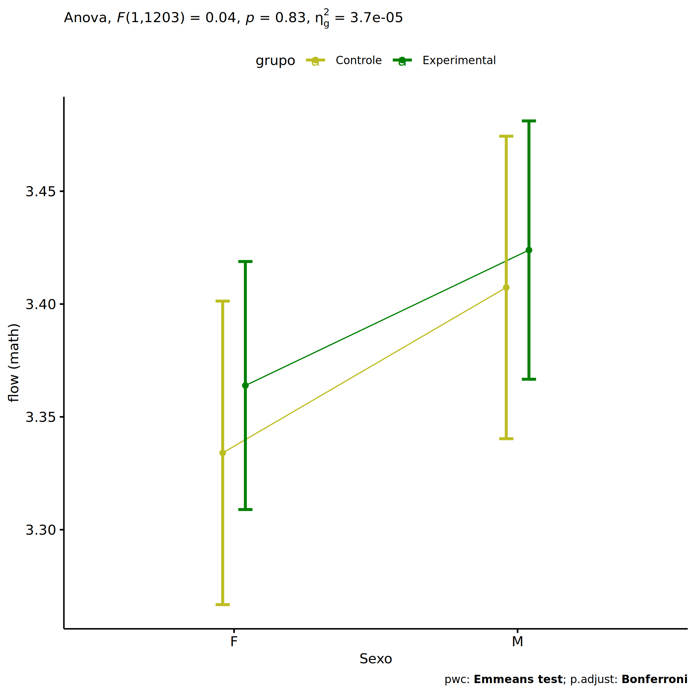
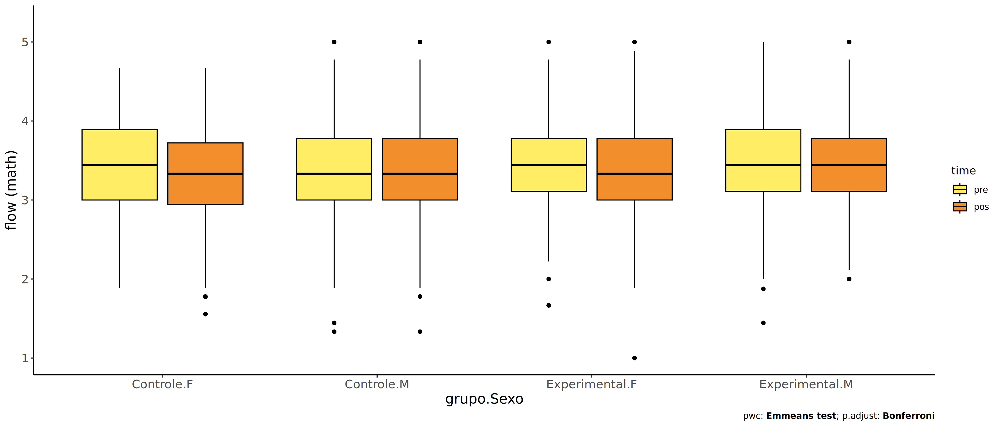
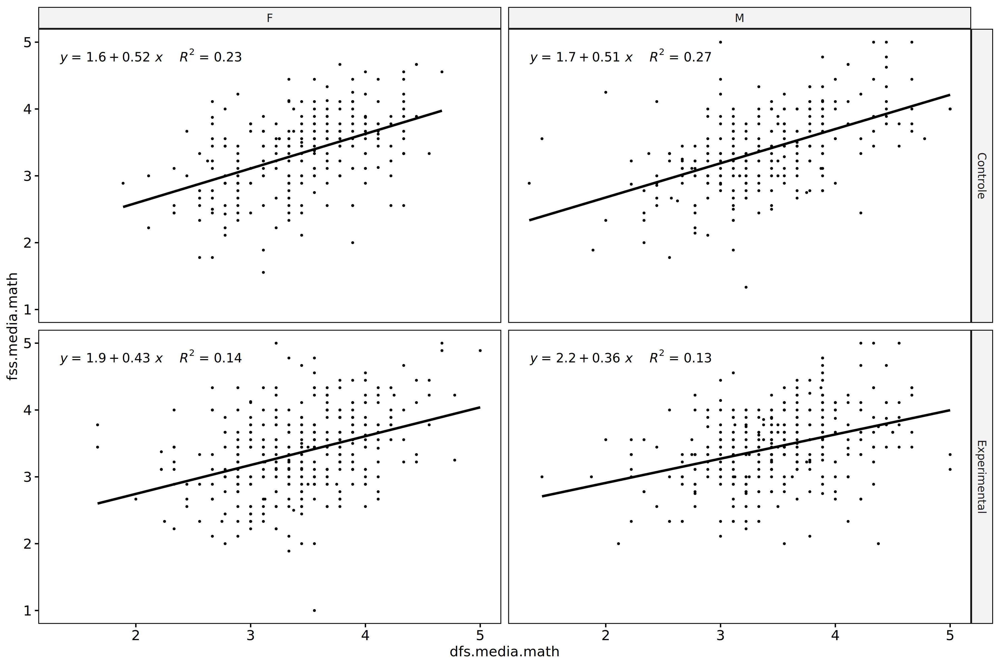
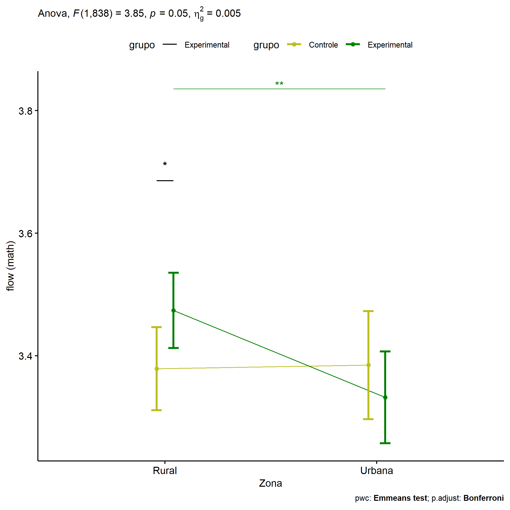
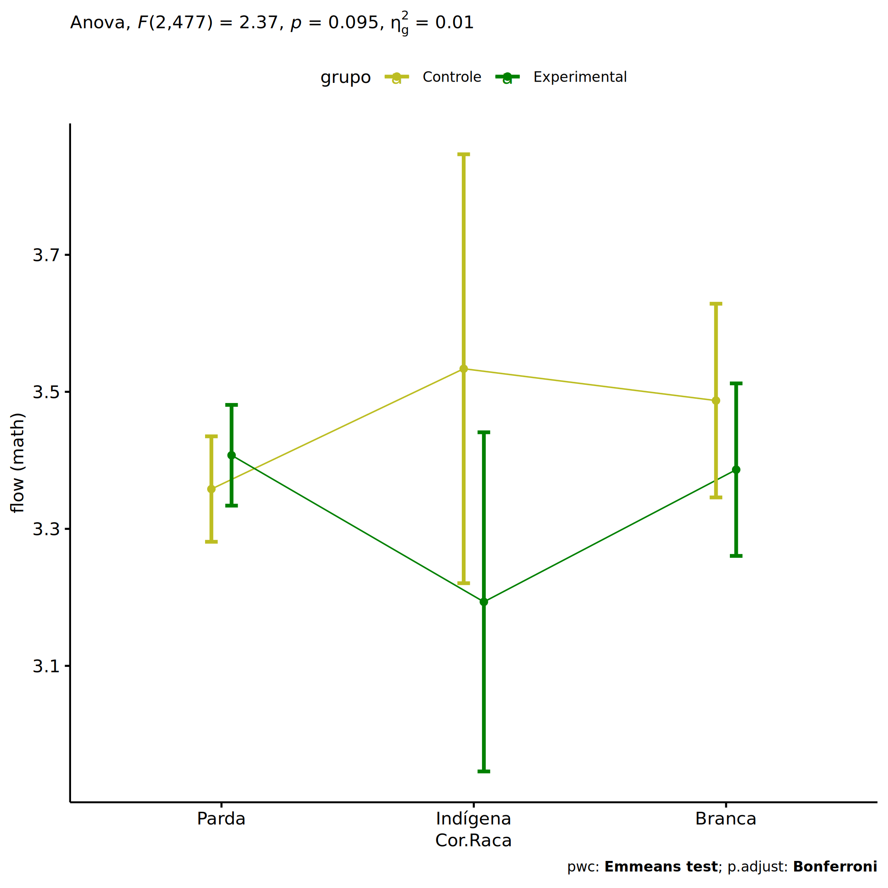
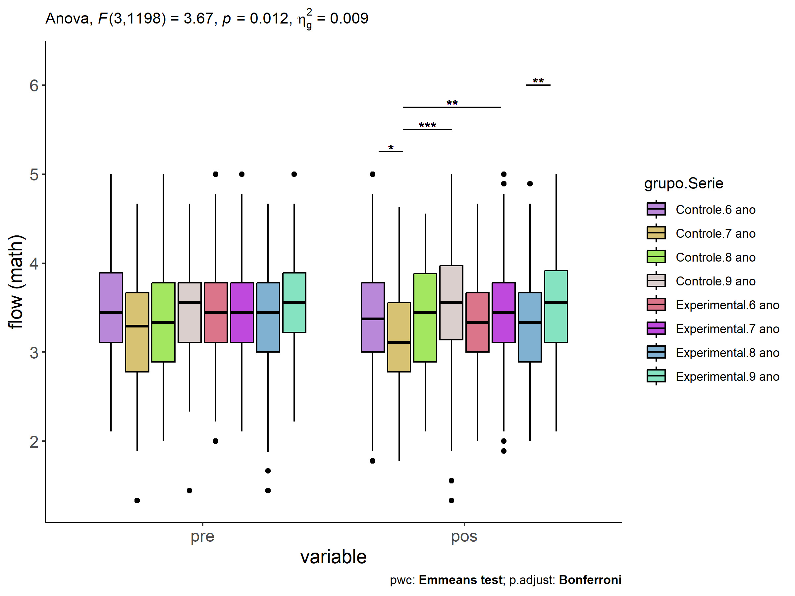

ANCOVA in flow (prob. matemática) (flow (prob. matemática))
================
Geiser C. Challco <geiser@alumni.usp.br>

- [Descriptive Statistics of Initial
  Data](#descriptive-statistics-of-initial-data)
- [ANCOVA and Pairwise for one factor:
  **grupo**](#ancova-and-pairwise-for-one-factor-grupo)
  - [Without remove non-normal data](#without-remove-non-normal-data)
  - [Computing ANCOVA and PairWise After removing non-normal data
    (OK)](#computing-ancova-and-pairwise-after-removing-non-normal-data-ok)
    - [Plots for ancova](#plots-for-ancova)
    - [Checking linearity assumption](#checking-linearity-assumption)
    - [Checking normality and
      homogeneity](#checking-normality-and-homogeneity)
- [ANCOVA and Pairwise for two factors
  **grupo:Sexo**](#ancova-and-pairwise-for-two-factors-gruposexo)
  - [Without remove non-normal data](#without-remove-non-normal-data-1)
  - [Computing ANCOVA and PairWise After removing non-normal data
    (OK)](#computing-ancova-and-pairwise-after-removing-non-normal-data-ok-1)
    - [Plots for ancova](#plots-for-ancova-1)
    - [Checking linearity assumption](#checking-linearity-assumption-1)
    - [Checking normality and
      homogeneity](#checking-normality-and-homogeneity-1)
- [ANCOVA and Pairwise for two factors
  **grupo:Zona**](#ancova-and-pairwise-for-two-factors-grupozona)
  - [Without remove non-normal data](#without-remove-non-normal-data-2)
  - [Computing ANCOVA and PairWise After removing non-normal data
    (OK)](#computing-ancova-and-pairwise-after-removing-non-normal-data-ok-2)
    - [Plots for ancova](#plots-for-ancova-2)
    - [Checking linearity assumption](#checking-linearity-assumption-2)
    - [Checking normality and
      homogeneity](#checking-normality-and-homogeneity-2)
- [ANCOVA and Pairwise for two factors
  **grupo:Cor.Raca**](#ancova-and-pairwise-for-two-factors-grupocorraca)
  - [Without remove non-normal data](#without-remove-non-normal-data-3)
  - [Computing ANCOVA and PairWise After removing non-normal data
    (OK)](#computing-ancova-and-pairwise-after-removing-non-normal-data-ok-3)
    - [Plots for ancova](#plots-for-ancova-3)
    - [Checking linearity assumption](#checking-linearity-assumption-3)
    - [Checking normality and
      homogeneity](#checking-normality-and-homogeneity-3)
- [ANCOVA and Pairwise for two factors
  **grupo:Serie**](#ancova-and-pairwise-for-two-factors-gruposerie)
  - [Without remove non-normal data](#without-remove-non-normal-data-4)
  - [Computing ANCOVA and PairWise After removing non-normal data
    (OK)](#computing-ancova-and-pairwise-after-removing-non-normal-data-ok-4)
    - [Plots for ancova](#plots-for-ancova-4)
    - [Checking linearity assumption](#checking-linearity-assumption-4)
    - [Checking normality and
      homogeneity](#checking-normality-and-homogeneity-4)
- [Summary of Results](#summary-of-results)
  - [Descriptive Statistics](#descriptive-statistics)
  - [ANCOVA Table Comparison](#ancova-table-comparison)
  - [PairWise Table Comparison](#pairwise-table-comparison)
  - [EMMS Table Comparison](#emms-table-comparison)

**NOTE**:

- Teste ANCOVA para determinar se houve diferenças significativas no
  flow (prob. matemática) (medido usando pre- e pos-testes).
- ANCOVA test to determine whether there were significant differences in
  flow (prob. matemática) (measured using pre- and post-tests).

# Descriptive Statistics of Initial Data

``` r
df <- get.descriptives(dat, c(dv.pre, dv.pos), c("grupo"), 
                       include.global = T, symmetry.test = T, normality.test = F)
df <- plyr::rbind.fill(
  df, do.call(plyr::rbind.fill, lapply(lfatores2, FUN = function(f) {
    if (nrow(dat) > 0 && sum(!is.na(unique(dat[[f]]))) > 1)
      get.descriptives(dat, c(dv.pre,dv.pos), c("grupo", f),
                       symmetry.test = T, normality.test = F)
    }))
)
```

    ## Warning: There were 2 warnings in `mutate()`.
    ## The first warning was:
    ## ℹ In argument: `ci = abs(stats::qt(alpha/2, .data$n - 1) * .data$se)`.
    ## Caused by warning:
    ## ! There was 1 warning in `mutate()`.
    ## ℹ In argument: `ci = abs(stats::qt(alpha/2, .data$n - 1) * .data$se)`.
    ## Caused by warning in `stats::qt()`:
    ## ! NaNs produced
    ## ℹ Run `dplyr::last_dplyr_warnings()` to see the 1 remaining warning.
    ## There were 2 warnings in `mutate()`.
    ## The first warning was:
    ## ℹ In argument: `ci = abs(stats::qt(alpha/2, .data$n - 1) * .data$se)`.
    ## Caused by warning:
    ## ! There was 1 warning in `mutate()`.
    ## ℹ In argument: `ci = abs(stats::qt(alpha/2, .data$n - 1) * .data$se)`.
    ## Caused by warning in `stats::qt()`:
    ## ! NaNs produced
    ## ℹ Run `dplyr::last_dplyr_warnings()` to see the 1 remaining warning.

``` r
(df <- df[,c(fatores1[fatores1 %in% colnames(df)],"variable",
             colnames(df)[!colnames(df) %in% c(fatores1,"variable")])])
```

    ##           grupo Sexo   Zona Cor.Raca Serie       variable    n  mean median   min   max    sd    se    ci   iqr
    ## 1      Controle <NA>   <NA>     <NA>  <NA> dfs.media.math  496 3.405  3.444 1.333 5.000 0.593 0.027 0.052 0.778
    ## 2  Experimental <NA>   <NA>     <NA>  <NA> dfs.media.math  713 3.453  3.444 1.444 5.000 0.546 0.020 0.040 0.667
    ## 3          <NA> <NA>   <NA>     <NA>  <NA> dfs.media.math 1209 3.433  3.444 1.333 5.000 0.566 0.016 0.032 0.667
    ## 4      Controle <NA>   <NA>     <NA>  <NA> fss.media.math  496 3.358  3.333 1.333 5.000 0.611 0.027 0.054 0.778
    ## 5  Experimental <NA>   <NA>     <NA>  <NA> fss.media.math  713 3.398  3.444 1.000 5.000 0.592 0.022 0.044 0.778
    ## 6          <NA> <NA>   <NA>     <NA>  <NA> fss.media.math 1209 3.382  3.333 1.000 5.000 0.600 0.017 0.034 0.778
    ## 7      Controle    F   <NA>     <NA>  <NA> dfs.media.math  247 3.421  3.444 1.889 4.667 0.555 0.035 0.070 0.889
    ## 8      Controle    M   <NA>     <NA>  <NA> dfs.media.math  249 3.388  3.333 1.333 5.000 0.630 0.040 0.079 0.778
    ## 9  Experimental    F   <NA>     <NA>  <NA> dfs.media.math  370 3.417  3.444 1.667 5.000 0.526 0.027 0.054 0.667
    ## 10 Experimental    M   <NA>     <NA>  <NA> dfs.media.math  343 3.492  3.444 1.444 5.000 0.566 0.031 0.060 0.778
    ## 11     Controle    F   <NA>     <NA>  <NA> fss.media.math  247 3.329  3.333 1.556 4.667 0.596 0.038 0.075 0.778
    ## 12     Controle    M   <NA>     <NA>  <NA> fss.media.math  249 3.387  3.333 1.333 5.000 0.625 0.040 0.078 0.778
    ## 13 Experimental    F   <NA>     <NA>  <NA> fss.media.math  370 3.357  3.333 1.000 5.000 0.607 0.032 0.062 0.778
    ## 14 Experimental    M   <NA>     <NA>  <NA> fss.media.math  343 3.443  3.444 1.111 5.000 0.572 0.031 0.061 0.667
    ## 15     Controle <NA>  Rural     <NA>  <NA> dfs.media.math  232 3.489  3.444 2.333 5.000 0.560 0.037 0.072 0.778
    ## 16     Controle <NA> Urbana     <NA>  <NA> dfs.media.math  137 3.377  3.444 1.333 4.778 0.651 0.056 0.110 0.889
    ## 17     Controle <NA>   <NA>     <NA>  <NA> dfs.media.math  127 3.281  3.333 1.444 5.000 0.567 0.050 0.100 0.778
    ## 18 Experimental <NA>  Rural     <NA>  <NA> dfs.media.math  283 3.412  3.444 1.444 5.000 0.558 0.033 0.065 0.667
    ## 19 Experimental <NA> Urbana     <NA>  <NA> dfs.media.math  192 3.514  3.528 2.111 4.778 0.540 0.039 0.077 0.778
    ## 20 Experimental <NA>   <NA>     <NA>  <NA> dfs.media.math  238 3.453  3.444 1.667 5.000 0.535 0.035 0.068 0.667
    ## 21     Controle <NA>  Rural     <NA>  <NA> fss.media.math  232 3.397  3.333 1.778 5.000 0.610 0.040 0.079 0.778
    ## 22     Controle <NA> Urbana     <NA>  <NA> fss.media.math  137 3.351  3.375 1.889 5.000 0.590 0.050 0.100 0.778
    ## 23     Controle <NA>   <NA>     <NA>  <NA> fss.media.math  127 3.296  3.333 1.333 4.778 0.634 0.056 0.111 0.889
    ## 24 Experimental <NA>  Rural     <NA>  <NA> fss.media.math  283 3.456  3.444 2.222 5.000 0.511 0.030 0.060 0.722
    ## 25 Experimental <NA> Urbana     <NA>  <NA> fss.media.math  192 3.349  3.333 1.000 5.000 0.682 0.049 0.097 0.778
    ## 26 Experimental <NA>   <NA>     <NA>  <NA> fss.media.math  238 3.369  3.333 2.000 5.000 0.600 0.039 0.077 0.778
    ## 27     Controle <NA>   <NA>   Branca  <NA> dfs.media.math   49 3.471  3.444 1.333 5.000 0.694 0.099 0.199 0.889
    ## 28     Controle <NA>   <NA> Indígena  <NA> dfs.media.math   10 3.567  3.500 2.778 4.000 0.407 0.129 0.291 0.611
    ## 29     Controle <NA>   <NA>    Parda  <NA> dfs.media.math  166 3.362  3.333 1.444 4.778 0.578 0.045 0.089 0.889
    ## 30     Controle <NA>   <NA>    Preta  <NA> dfs.media.math    1 3.444  3.444 3.444 3.444    NA    NA   NaN 0.000
    ## 31     Controle <NA>   <NA>     <NA>  <NA> dfs.media.math  270 3.413  3.444 1.889 5.000 0.591 0.036 0.071 0.778
    ## 32 Experimental <NA>   <NA>  Amarela  <NA> dfs.media.math    2 3.000  3.000 2.444 3.556 0.786 0.556 7.059 0.556
    ## 33 Experimental <NA>   <NA>   Branca  <NA> dfs.media.math   62 3.526  3.444 2.667 4.444 0.445 0.057 0.113 0.667
    ## 34 Experimental <NA>   <NA> Indígena  <NA> dfs.media.math   16 3.546  3.590 2.778 4.000 0.352 0.088 0.187 0.472
    ## 35 Experimental <NA>   <NA>    Parda  <NA> dfs.media.math  181 3.419  3.444 2.222 5.000 0.538 0.040 0.079 0.667
    ## 36 Experimental <NA>   <NA>    Preta  <NA> dfs.media.math    1 3.222  3.222 3.222 3.222    NA    NA   NaN 0.000
    ## 37 Experimental <NA>   <NA>     <NA>  <NA> dfs.media.math  451 3.457  3.444 1.444 5.000 0.567 0.027 0.053 0.778
    ## 38     Controle <NA>   <NA>   Branca  <NA> fss.media.math   49 3.509  3.556 2.444 5.000 0.595 0.085 0.171 0.667
    ## 39     Controle <NA>   <NA> Indígena  <NA> fss.media.math   10 3.600  3.611 2.778 4.556 0.584 0.185 0.418 0.750
    ## 40     Controle <NA>   <NA>    Parda  <NA> fss.media.math  166 3.328  3.333 1.778 5.000 0.564 0.044 0.086 0.667
    ## 41     Controle <NA>   <NA>    Preta  <NA> fss.media.math    1 3.222  3.222 3.222 3.222    NA    NA   NaN 0.000
    ## 42     Controle <NA>   <NA>     <NA>  <NA> fss.media.math  270 3.341  3.333 1.333 5.000 0.640 0.039 0.077 0.889
    ## 43 Experimental <NA>   <NA>  Amarela  <NA> fss.media.math    2 3.167  3.167 2.889 3.444 0.393 0.278 3.530 0.278
    ## 44 Experimental <NA>   <NA>   Branca  <NA> fss.media.math   62 3.433  3.444 2.000 4.667 0.631 0.080 0.160 0.847
    ## 45 Experimental <NA>   <NA> Indígena  <NA> fss.media.math   16 3.250  3.278 2.778 3.889 0.359 0.090 0.192 0.500
    ## 46 Experimental <NA>   <NA>    Parda  <NA> fss.media.math  181 3.404  3.333 2.222 5.000 0.549 0.041 0.080 0.778
    ## 47 Experimental <NA>   <NA>    Preta  <NA> fss.media.math    1 3.889  3.889 3.889 3.889    NA    NA   NaN 0.000
    ## 48 Experimental <NA>   <NA>     <NA>  <NA> fss.media.math  451 3.396  3.444 1.000 5.000 0.611 0.029 0.057 0.778
    ## 49     Controle <NA>   <NA>     <NA> 6 ano dfs.media.math  155 3.483  3.444 2.111 5.000 0.594 0.048 0.094 0.778
    ## 50     Controle <NA>   <NA>     <NA> 7 ano dfs.media.math  136 3.280  3.292 1.333 4.667 0.619 0.053 0.105 0.889
    ## 51     Controle <NA>   <NA>     <NA> 8 ano dfs.media.math   87 3.368  3.333 2.000 5.000 0.557 0.060 0.119 0.889
    ## 52     Controle <NA>   <NA>     <NA> 9 ano dfs.media.math  118 3.473  3.556 1.444 4.667 0.569 0.052 0.104 0.667
    ## 53 Experimental <NA>   <NA>     <NA> 6 ano dfs.media.math  176 3.446  3.444 2.000 5.000 0.541 0.041 0.081 0.667
    ## 54 Experimental <NA>   <NA>     <NA> 7 ano dfs.media.math  198 3.468  3.444 2.111 5.000 0.557 0.040 0.078 0.667
    ## 55 Experimental <NA>   <NA>     <NA> 8 ano dfs.media.math  175 3.382  3.444 1.444 4.667 0.548 0.041 0.082 0.778
    ##    symmetry     skewness    kurtosis
    ## 1       YES -0.050244827 -0.03693240
    ## 2       YES -0.144448003  0.31635099
    ## 3       YES -0.110560476  0.16295846
    ## 4       YES -0.070338801  0.08328120
    ## 5       YES -0.107987946  0.33331465
    ## 6       YES -0.094774158  0.22920804
    ## 7       YES -0.109952367 -0.66508929
    ## 8       YES  0.008474367  0.25246343
    ## 9       YES -0.137887371  0.33550443
    ## 10      YES -0.178862535  0.27667476
    ## 11      YES -0.188047119 -0.14656978
    ## 12      YES  0.018315130  0.20357840
    ## 13      YES -0.014155108  0.15431928
    ## 14      YES -0.200663016  0.59520461
    ## 15      YES  0.262566852 -0.54985020
    ## 16      YES -0.281430841 -0.21611507
    ## 17      YES -0.159241852  0.36070859
    ## 18      YES -0.319470564  0.46630207
    ## 19      YES  0.088349601 -0.26265753
    ## 20      YES -0.083104471  0.35801894
    ## 21      YES  0.076511155 -0.08357329
    ## 22      YES  0.042577802 -0.01026966
    ## 23      YES -0.388799161  0.12526152
    ## 24      YES  0.125049190 -0.20484127
    ## 25      YES -0.187343366  0.58881111
    ## 26      YES -0.028777024 -0.34478309
    ## 27      YES -0.322070772  0.40770013
    ## 28      YES -0.400688956 -1.10442075
    ## 29      YES -0.062381934 -0.15857589
    ## 30 few data  0.000000000  0.00000000
    ## 31      YES  0.031378975 -0.25657623
    ## 32 few data  0.000000000  0.00000000
    ## 33      YES  0.283685666 -0.63719704
    ## 34       NO -0.683961680 -0.68329229
    ## 35      YES -0.027369506  0.01912716
    ## 36 few data  0.000000000  0.00000000
    ## 37      YES -0.184641471  0.35347969
    ## 38      YES  0.323715720 -0.24581179
    ## 39      YES  0.090538844 -1.47442344
    ## 40      YES -0.080305566  0.14957589
    ## 41 few data  0.000000000  0.00000000
    ## 42      YES -0.124536746 -0.03621519
    ## 43 few data  0.000000000  0.00000000
    ## 44      YES -0.220566570 -0.61144605
    ## 45      YES  0.121817971 -1.35176107
    ## 46      YES  0.239056465 -0.20865352
    ## 47 few data  0.000000000  0.00000000
    ## 48      YES -0.207400991  0.52182607
    ## 49      YES  0.175453674 -0.35558951
    ## 50      YES -0.149182095 -0.11227269
    ## 51      YES  0.130013359 -0.36706281
    ## 52      YES -0.280506531  0.33648551
    ## 53      YES -0.104296446  0.11932317
    ## 54      YES  0.195445760 -0.14357518
    ## 55       NO -0.548864513  0.88755829
    ##  [ reached 'max' / getOption("max.print") -- omitted 9 rows ]

| grupo        | Sexo | Zona   | Cor.Raca | Serie | variable       |    n |  mean | median |   min |   max |    sd |    se |    ci |   iqr | symmetry | skewness | kurtosis |
|:-------------|:-----|:-------|:---------|:------|:---------------|-----:|------:|-------:|------:|------:|------:|------:|------:|------:|:---------|---------:|---------:|
| Controle     |      |        |          |       | dfs.media.math |  496 | 3.405 |  3.444 | 1.333 | 5.000 | 0.593 | 0.027 | 0.052 | 0.778 | YES      |   -0.050 |   -0.037 |
| Experimental |      |        |          |       | dfs.media.math |  713 | 3.453 |  3.444 | 1.444 | 5.000 | 0.546 | 0.020 | 0.040 | 0.667 | YES      |   -0.144 |    0.316 |
|              |      |        |          |       | dfs.media.math | 1209 | 3.433 |  3.444 | 1.333 | 5.000 | 0.566 | 0.016 | 0.032 | 0.667 | YES      |   -0.111 |    0.163 |
| Controle     |      |        |          |       | fss.media.math |  496 | 3.358 |  3.333 | 1.333 | 5.000 | 0.611 | 0.027 | 0.054 | 0.778 | YES      |   -0.070 |    0.083 |
| Experimental |      |        |          |       | fss.media.math |  713 | 3.398 |  3.444 | 1.000 | 5.000 | 0.592 | 0.022 | 0.044 | 0.778 | YES      |   -0.108 |    0.333 |
|              |      |        |          |       | fss.media.math | 1209 | 3.382 |  3.333 | 1.000 | 5.000 | 0.600 | 0.017 | 0.034 | 0.778 | YES      |   -0.095 |    0.229 |
| Controle     | F    |        |          |       | dfs.media.math |  247 | 3.421 |  3.444 | 1.889 | 4.667 | 0.555 | 0.035 | 0.070 | 0.889 | YES      |   -0.110 |   -0.665 |
| Controle     | M    |        |          |       | dfs.media.math |  249 | 3.388 |  3.333 | 1.333 | 5.000 | 0.630 | 0.040 | 0.079 | 0.778 | YES      |    0.008 |    0.252 |
| Experimental | F    |        |          |       | dfs.media.math |  370 | 3.417 |  3.444 | 1.667 | 5.000 | 0.526 | 0.027 | 0.054 | 0.667 | YES      |   -0.138 |    0.336 |
| Experimental | M    |        |          |       | dfs.media.math |  343 | 3.492 |  3.444 | 1.444 | 5.000 | 0.566 | 0.031 | 0.060 | 0.778 | YES      |   -0.179 |    0.277 |
| Controle     | F    |        |          |       | fss.media.math |  247 | 3.329 |  3.333 | 1.556 | 4.667 | 0.596 | 0.038 | 0.075 | 0.778 | YES      |   -0.188 |   -0.147 |
| Controle     | M    |        |          |       | fss.media.math |  249 | 3.387 |  3.333 | 1.333 | 5.000 | 0.625 | 0.040 | 0.078 | 0.778 | YES      |    0.018 |    0.204 |
| Experimental | F    |        |          |       | fss.media.math |  370 | 3.357 |  3.333 | 1.000 | 5.000 | 0.607 | 0.032 | 0.062 | 0.778 | YES      |   -0.014 |    0.154 |
| Experimental | M    |        |          |       | fss.media.math |  343 | 3.443 |  3.444 | 1.111 | 5.000 | 0.572 | 0.031 | 0.061 | 0.667 | YES      |   -0.201 |    0.595 |
| Controle     |      | Rural  |          |       | dfs.media.math |  232 | 3.489 |  3.444 | 2.333 | 5.000 | 0.560 | 0.037 | 0.072 | 0.778 | YES      |    0.263 |   -0.550 |
| Controle     |      | Urbana |          |       | dfs.media.math |  137 | 3.377 |  3.444 | 1.333 | 4.778 | 0.651 | 0.056 | 0.110 | 0.889 | YES      |   -0.281 |   -0.216 |
| Controle     |      |        |          |       | dfs.media.math |  127 | 3.281 |  3.333 | 1.444 | 5.000 | 0.567 | 0.050 | 0.100 | 0.778 | YES      |   -0.159 |    0.361 |
| Experimental |      | Rural  |          |       | dfs.media.math |  283 | 3.412 |  3.444 | 1.444 | 5.000 | 0.558 | 0.033 | 0.065 | 0.667 | YES      |   -0.319 |    0.466 |
| Experimental |      | Urbana |          |       | dfs.media.math |  192 | 3.514 |  3.528 | 2.111 | 4.778 | 0.540 | 0.039 | 0.077 | 0.778 | YES      |    0.088 |   -0.263 |
| Experimental |      |        |          |       | dfs.media.math |  238 | 3.453 |  3.444 | 1.667 | 5.000 | 0.535 | 0.035 | 0.068 | 0.667 | YES      |   -0.083 |    0.358 |
| Controle     |      | Rural  |          |       | fss.media.math |  232 | 3.397 |  3.333 | 1.778 | 5.000 | 0.610 | 0.040 | 0.079 | 0.778 | YES      |    0.077 |   -0.084 |
| Controle     |      | Urbana |          |       | fss.media.math |  137 | 3.351 |  3.375 | 1.889 | 5.000 | 0.590 | 0.050 | 0.100 | 0.778 | YES      |    0.043 |   -0.010 |
| Controle     |      |        |          |       | fss.media.math |  127 | 3.296 |  3.333 | 1.333 | 4.778 | 0.634 | 0.056 | 0.111 | 0.889 | YES      |   -0.389 |    0.125 |
| Experimental |      | Rural  |          |       | fss.media.math |  283 | 3.456 |  3.444 | 2.222 | 5.000 | 0.511 | 0.030 | 0.060 | 0.722 | YES      |    0.125 |   -0.205 |
| Experimental |      | Urbana |          |       | fss.media.math |  192 | 3.349 |  3.333 | 1.000 | 5.000 | 0.682 | 0.049 | 0.097 | 0.778 | YES      |   -0.187 |    0.589 |
| Experimental |      |        |          |       | fss.media.math |  238 | 3.369 |  3.333 | 2.000 | 5.000 | 0.600 | 0.039 | 0.077 | 0.778 | YES      |   -0.029 |   -0.345 |
| Controle     |      |        | Branca   |       | dfs.media.math |   49 | 3.471 |  3.444 | 1.333 | 5.000 | 0.694 | 0.099 | 0.199 | 0.889 | YES      |   -0.322 |    0.408 |
| Controle     |      |        | Indígena |       | dfs.media.math |   10 | 3.567 |  3.500 | 2.778 | 4.000 | 0.407 | 0.129 | 0.291 | 0.611 | YES      |   -0.401 |   -1.104 |
| Controle     |      |        | Parda    |       | dfs.media.math |  166 | 3.362 |  3.333 | 1.444 | 4.778 | 0.578 | 0.045 | 0.089 | 0.889 | YES      |   -0.062 |   -0.159 |
| Controle     |      |        | Preta    |       | dfs.media.math |    1 | 3.444 |  3.444 | 3.444 | 3.444 |       |       |       | 0.000 | few data |    0.000 |    0.000 |
| Controle     |      |        |          |       | dfs.media.math |  270 | 3.413 |  3.444 | 1.889 | 5.000 | 0.591 | 0.036 | 0.071 | 0.778 | YES      |    0.031 |   -0.257 |
| Experimental |      |        | Amarela  |       | dfs.media.math |    2 | 3.000 |  3.000 | 2.444 | 3.556 | 0.786 | 0.556 | 7.059 | 0.556 | few data |    0.000 |    0.000 |
| Experimental |      |        | Branca   |       | dfs.media.math |   62 | 3.526 |  3.444 | 2.667 | 4.444 | 0.445 | 0.057 | 0.113 | 0.667 | YES      |    0.284 |   -0.637 |
| Experimental |      |        | Indígena |       | dfs.media.math |   16 | 3.546 |  3.590 | 2.778 | 4.000 | 0.352 | 0.088 | 0.187 | 0.472 | NO       |   -0.684 |   -0.683 |
| Experimental |      |        | Parda    |       | dfs.media.math |  181 | 3.419 |  3.444 | 2.222 | 5.000 | 0.538 | 0.040 | 0.079 | 0.667 | YES      |   -0.027 |    0.019 |
| Experimental |      |        | Preta    |       | dfs.media.math |    1 | 3.222 |  3.222 | 3.222 | 3.222 |       |       |       | 0.000 | few data |    0.000 |    0.000 |
| Experimental |      |        |          |       | dfs.media.math |  451 | 3.457 |  3.444 | 1.444 | 5.000 | 0.567 | 0.027 | 0.053 | 0.778 | YES      |   -0.185 |    0.353 |
| Controle     |      |        | Branca   |       | fss.media.math |   49 | 3.509 |  3.556 | 2.444 | 5.000 | 0.595 | 0.085 | 0.171 | 0.667 | YES      |    0.324 |   -0.246 |
| Controle     |      |        | Indígena |       | fss.media.math |   10 | 3.600 |  3.611 | 2.778 | 4.556 | 0.584 | 0.185 | 0.418 | 0.750 | YES      |    0.091 |   -1.474 |
| Controle     |      |        | Parda    |       | fss.media.math |  166 | 3.328 |  3.333 | 1.778 | 5.000 | 0.564 | 0.044 | 0.086 | 0.667 | YES      |   -0.080 |    0.150 |
| Controle     |      |        | Preta    |       | fss.media.math |    1 | 3.222 |  3.222 | 3.222 | 3.222 |       |       |       | 0.000 | few data |    0.000 |    0.000 |
| Controle     |      |        |          |       | fss.media.math |  270 | 3.341 |  3.333 | 1.333 | 5.000 | 0.640 | 0.039 | 0.077 | 0.889 | YES      |   -0.125 |   -0.036 |
| Experimental |      |        | Amarela  |       | fss.media.math |    2 | 3.167 |  3.167 | 2.889 | 3.444 | 0.393 | 0.278 | 3.530 | 0.278 | few data |    0.000 |    0.000 |
| Experimental |      |        | Branca   |       | fss.media.math |   62 | 3.433 |  3.444 | 2.000 | 4.667 | 0.631 | 0.080 | 0.160 | 0.847 | YES      |   -0.221 |   -0.611 |
| Experimental |      |        | Indígena |       | fss.media.math |   16 | 3.250 |  3.278 | 2.778 | 3.889 | 0.359 | 0.090 | 0.192 | 0.500 | YES      |    0.122 |   -1.352 |
| Experimental |      |        | Parda    |       | fss.media.math |  181 | 3.404 |  3.333 | 2.222 | 5.000 | 0.549 | 0.041 | 0.080 | 0.778 | YES      |    0.239 |   -0.209 |
| Experimental |      |        | Preta    |       | fss.media.math |    1 | 3.889 |  3.889 | 3.889 | 3.889 |       |       |       | 0.000 | few data |    0.000 |    0.000 |
| Experimental |      |        |          |       | fss.media.math |  451 | 3.396 |  3.444 | 1.000 | 5.000 | 0.611 | 0.029 | 0.057 | 0.778 | YES      |   -0.207 |    0.522 |
| Controle     |      |        |          | 6 ano | dfs.media.math |  155 | 3.483 |  3.444 | 2.111 | 5.000 | 0.594 | 0.048 | 0.094 | 0.778 | YES      |    0.175 |   -0.356 |
| Controle     |      |        |          | 7 ano | dfs.media.math |  136 | 3.280 |  3.292 | 1.333 | 4.667 | 0.619 | 0.053 | 0.105 | 0.889 | YES      |   -0.149 |   -0.112 |
| Controle     |      |        |          | 8 ano | dfs.media.math |   87 | 3.368 |  3.333 | 2.000 | 5.000 | 0.557 | 0.060 | 0.119 | 0.889 | YES      |    0.130 |   -0.367 |
| Controle     |      |        |          | 9 ano | dfs.media.math |  118 | 3.473 |  3.556 | 1.444 | 4.667 | 0.569 | 0.052 | 0.104 | 0.667 | YES      |   -0.281 |    0.336 |
| Experimental |      |        |          | 6 ano | dfs.media.math |  176 | 3.446 |  3.444 | 2.000 | 5.000 | 0.541 | 0.041 | 0.081 | 0.667 | YES      |   -0.104 |    0.119 |
| Experimental |      |        |          | 7 ano | dfs.media.math |  198 | 3.468 |  3.444 | 2.111 | 5.000 | 0.557 | 0.040 | 0.078 | 0.667 | YES      |    0.195 |   -0.144 |
| Experimental |      |        |          | 8 ano | dfs.media.math |  175 | 3.382 |  3.444 | 1.444 | 4.667 | 0.548 | 0.041 | 0.082 | 0.778 | NO       |   -0.549 |    0.888 |
| Experimental |      |        |          | 9 ano | dfs.media.math |  164 | 3.520 |  3.556 | 2.222 | 5.000 | 0.533 | 0.042 | 0.082 | 0.667 | YES      |   -0.172 |    0.102 |
| Controle     |      |        |          | 6 ano | fss.media.math |  155 | 3.410 |  3.375 | 1.778 | 5.000 | 0.581 | 0.047 | 0.092 | 0.778 | YES      |    0.002 |    0.127 |
| Controle     |      |        |          | 7 ano | fss.media.math |  136 | 3.155 |  3.111 | 1.778 | 4.625 | 0.537 | 0.046 | 0.091 | 0.778 | YES      |   -0.051 |   -0.243 |
| Controle     |      |        |          | 8 ano | fss.media.math |   87 | 3.355 |  3.444 | 2.111 | 4.556 | 0.593 | 0.064 | 0.126 | 0.993 | YES      |   -0.027 |   -1.011 |
| Controle     |      |        |          | 9 ano | fss.media.math |  118 | 3.526 |  3.556 | 1.333 | 5.000 | 0.681 | 0.063 | 0.124 | 0.833 | YES      |   -0.465 |    0.783 |
| Experimental |      |        |          | 6 ano | fss.media.math |  176 | 3.362 |  3.333 | 1.111 | 4.667 | 0.539 | 0.041 | 0.080 | 0.667 | YES      |   -0.286 |    1.048 |
| Experimental |      |        |          | 7 ano | fss.media.math |  198 | 3.417 |  3.444 | 1.000 | 5.000 | 0.625 | 0.044 | 0.088 | 0.667 | YES      |   -0.181 |    0.819 |
| Experimental |      |        |          | 8 ano | fss.media.math |  175 | 3.283 |  3.333 | 2.000 | 4.889 | 0.600 | 0.045 | 0.090 | 0.778 | YES      |    0.058 |   -0.477 |
| Experimental |      |        |          | 9 ano | fss.media.math |  164 | 3.537 |  3.556 | 2.111 | 5.000 | 0.571 | 0.045 | 0.088 | 0.806 | YES      |   -0.035 |   -0.237 |

# ANCOVA and Pairwise for one factor: **grupo**

## Without remove non-normal data

``` r
pdat = remove_group_data(dat[!is.na(dat[["grupo"]]),], "fss.media.math", "grupo")

pdat.long <- rbind(pdat[,c("id","grupo")], pdat[,c("id","grupo")])
pdat.long[["time"]] <- c(rep("pre", nrow(pdat)), rep("pos", nrow(pdat)))
pdat.long[["time"]] <- factor(pdat.long[["time"]], c("pre","pos"))
pdat.long[["flow.math"]] <- c(pdat[["dfs.media.math"]], pdat[["fss.media.math"]])

aov = anova_test(pdat, fss.media.math ~ dfs.media.math + grupo)
laov[["grupo"]] <- get_anova_table(aov)
```

``` r
pwc <- emmeans_test(pdat, fss.media.math ~ grupo, covariate = dfs.media.math,
                    p.adjust.method = "bonferroni")
```

``` r
pwc.long <- emmeans_test(dplyr::group_by_at(pdat.long, "grupo"),
                          flow.math ~ time,
                          p.adjust.method = "bonferroni")
lpwc[["grupo"]] <- plyr::rbind.fill(pwc, pwc.long)
```

``` r
ds <- get.descriptives(pdat, "fss.media.math", "grupo", covar = "dfs.media.math")
ds <- merge(ds[ds$variable != "dfs.media.math",],
            ds[ds$variable == "dfs.media.math", !colnames(ds) %in% c("variable")],
            by = "grupo", all.x = T, suffixes = c("", ".dfs.media.math"))
ds <- merge(get_emmeans(pwc), ds, by = "grupo", suffixes = c(".emms", ""))
ds <- ds[,c("grupo","n","mean.dfs.media.math","se.dfs.media.math","mean","se","emmean","se.emms")]

colnames(ds) <- c("grupo", "N", paste0(c("M","SE")," (pre)"),
                  paste0(c("M","SE"), " (unadj)"), paste0(c("M", "SE"), " (adj)"))

lemms[["grupo"]] <- ds
```

## Computing ANCOVA and PairWise After removing non-normal data (OK)

``` r
wdat = pdat 

res = residuals(lm(fss.media.math ~ dfs.media.math + grupo, data = wdat))
non.normal = getNonNormal(res, wdat$id, plimit = 0.05)

wdat = wdat[!wdat$id %in% non.normal,]

wdat.long <- rbind(wdat[,c("id","grupo")], wdat[,c("id","grupo")])
wdat.long[["time"]] <- c(rep("pre", nrow(wdat)), rep("pos", nrow(wdat)))
wdat.long[["time"]] <- factor(wdat.long[["time"]], c("pre","pos"))
wdat.long[["flow.math"]] <- c(wdat[["dfs.media.math"]], wdat[["fss.media.math"]])

ldat[["grupo"]] = wdat

(non.normal)
```

    ## [1] "P1848" "P1772"

``` r
aov = anova_test(wdat, fss.media.math ~ dfs.media.math + grupo)
laov[["grupo"]] <- merge(get_anova_table(aov), laov[["grupo"]], by="Effect", suffixes = c("","'"))

(df = get_anova_table(aov))
```

    ## ANOVA Table (type II tests)
    ## 
    ##           Effect DFn  DFd       F        p p<.05      ges
    ## 1 dfs.media.math   1 1204 275.609 6.82e-56     * 0.186000
    ## 2          grupo   1 1204   0.649 4.21e-01       0.000539

| Effect         | DFn |  DFd |       F |     p | p\<.05 |   ges |
|:---------------|----:|-----:|--------:|------:|:-------|------:|
| dfs.media.math |   1 | 1204 | 275.609 | 0.000 | \*     | 0.186 |
| grupo          |   1 | 1204 |   0.649 | 0.421 |        | 0.001 |

| term                  | .y.            | group1   | group2       |   df | statistic |     p | p.adj | p.adj.signif |
|:----------------------|:---------------|:---------|:-------------|-----:|----------:|------:|------:|:-------------|
| dfs.media.math\*grupo | fss.media.math | Controle | Experimental | 1204 |    -0.806 | 0.421 | 0.421 | ns           |

``` r
pwc.long <- emmeans_test(dplyr::group_by_at(wdat.long, "grupo"),
                         flow.math ~ time,
                         p.adjust.method = "bonferroni")
lpwc[["grupo"]] <- merge(plyr::rbind.fill(pwc, pwc.long), lpwc[["grupo"]], by=c("grupo","term",".y.","group1","group2"), suffixes = c("","'"))
```

| grupo        | term | .y.       | group1 | group2 |   df | statistic |     p | p.adj | p.adj.signif |
|:-------------|:-----|:----------|:-------|:-------|-----:|----------:|------:|------:|:-------------|
| Controle     | time | flow.math | pre    | pos    | 2410 |     1.266 | 0.206 | 0.206 | ns           |
| Experimental | time | flow.math | pre    | pos    | 2410 |     1.544 | 0.123 | 0.123 | ns           |

``` r
ds <- get.descriptives(wdat, "fss.media.math", "grupo", covar = "dfs.media.math")
ds <- merge(ds[ds$variable != "dfs.media.math",],
            ds[ds$variable == "dfs.media.math", !colnames(ds) %in% c("variable")],
            by = "grupo", all.x = T, suffixes = c("", ".dfs.media.math"))
ds <- merge(get_emmeans(pwc), ds, by = "grupo", suffixes = c(".emms", ""))
ds <- ds[,c("grupo","n","mean.dfs.media.math","se.dfs.media.math","mean","se","emmean","se.emms")]

colnames(ds) <- c("grupo", "N", paste0(c("M","SE")," (pre)"),
                  paste0(c("M","SE"), " (unadj)"), paste0(c("M", "SE"), " (adj)"))

lemms[["grupo"]] <- merge(ds, lemms[["grupo"]], by=c("grupo"), suffixes = c("","'"))
```

| grupo        |   N | M (pre) | SE (pre) | M (unadj) | SE (unadj) | M (adj) | SE (adj) |
|:-------------|----:|--------:|---------:|----------:|-----------:|--------:|---------:|
| Controle     | 496 |   3.405 |    0.027 |     3.358 |      0.027 |   3.371 |    0.024 |
| Experimental | 711 |   3.452 |    0.021 |     3.405 |      0.022 |   3.396 |    0.020 |

### Plots for ancova

``` r
plots <- oneWayAncovaPlots(
  wdat, "fss.media.math", "grupo", aov, list("grupo"=pwc), addParam = c("mean_se"),
  font.label.size=10, step.increase=0.05, p.label="p.adj",
  subtitle = which(aov$Effect == "grupo"))
```

``` r
if (!is.null(nrow(plots[["grupo"]]$data)))
  plots[["grupo"]] + ggplot2::scale_color_manual(values = color[["grupo"]])
```

    ## Scale for colour is already present.
    ## Adding another scale for colour, which will replace the existing scale.

<!-- -->

``` r
plots <- oneWayAncovaBoxPlots(
  wdat, "fss.media.math", "grupo", aov, pwc, covar = "dfs.media.math",
  theme = "classic", color = color[["grupo"]],
  subtitle = which(aov$Effect == "grupo"))
```

``` r
if (length(unique(wdat[["grupo"]])) > 1)
  plots[["grupo"]] + ggplot2::ylab("flow (prob. matemática)") + ggplot2::scale_x_discrete(labels=c('pre', 'pos'))
```

<!-- -->

``` r
if (length(unique(wdat.long[["grupo"]])) > 1)
  plots <- oneWayAncovaBoxPlots(
    wdat.long, "flow.math", "grupo", aov, pwc.long, pre.post = "time",
    theme = "classic", color = color$prepost)
```

``` r
if (length(unique(wdat.long[["grupo"]])) > 1)
  plots[["grupo"]] + ggplot2::ylab("flow (prob. matemática)")
```

<!-- -->

### Checking linearity assumption

``` r
ggscatter(wdat, x = "dfs.media.math", y = "fss.media.math", size = 0.5,
          color = "grupo", add = "reg.line")+
  stat_regline_equation(
    aes(label =  paste(..eq.label.., ..rr.label.., sep = "~~~~"), color = grupo)
  )
```

<!-- -->

### Checking normality and homogeneity

``` r
res <- augment(lm(fss.media.math ~ dfs.media.math + grupo, data = wdat))
```

``` r
shapiro_test(res$.resid)
```

    ## # A tibble: 1 × 3
    ##   variable   statistic p.value
    ##   <chr>          <dbl>   <dbl>
    ## 1 res$.resid     0.999   0.790

``` r
levene_test(res, .resid ~ grupo)
```

    ## # A tibble: 1 × 4
    ##     df1   df2 statistic     p
    ##   <int> <int>     <dbl> <dbl>
    ## 1     1  1205     0.345 0.557

# ANCOVA and Pairwise for two factors **grupo:Sexo**

## Without remove non-normal data

``` r
pdat = remove_group_data(dat[!is.na(dat[["grupo"]]) & !is.na(dat[["Sexo"]]),], "fss.media.math", c("grupo","Sexo"))

pdat.long <- rbind(pdat[,c("id","grupo","Sexo")], pdat[,c("id","grupo","Sexo")])
pdat.long[["time"]] <- c(rep("pre", nrow(pdat)), rep("pos", nrow(pdat)))
pdat.long[["time"]] <- factor(pdat.long[["time"]], c("pre","pos"))
pdat.long[["flow.math"]] <- c(pdat[["dfs.media.math"]], pdat[["fss.media.math"]])

aov = anova_test(pdat, fss.media.math ~ dfs.media.math + grupo*Sexo)
laov[["grupo:Sexo"]] <- get_anova_table(aov)
```

``` r
pwcs <- list()
pwcs[["Sexo"]] <- emmeans_test(
  group_by(pdat, grupo), fss.media.math ~ Sexo,
  covariate = dfs.media.math, p.adjust.method = "bonferroni")
pwcs[["grupo"]] <- emmeans_test(
  group_by(pdat, Sexo), fss.media.math ~ grupo,
  covariate = dfs.media.math, p.adjust.method = "bonferroni")

pwc <- plyr::rbind.fill(pwcs[["grupo"]], pwcs[["Sexo"]])
pwc <- pwc[,c("grupo","Sexo", colnames(pwc)[!colnames(pwc) %in% c("grupo","Sexo")])]
```

``` r
pwc.long <- emmeans_test(dplyr::group_by_at(pdat.long, c("grupo","Sexo")),
                         flow.math ~ time,
                         p.adjust.method = "bonferroni")
lpwc[["grupo:Sexo"]] <- plyr::rbind.fill(pwc, pwc.long)
```

``` r
ds <- get.descriptives(pdat, "fss.media.math", c("grupo","Sexo"), covar = "dfs.media.math")
ds <- merge(ds[ds$variable != "dfs.media.math",],
            ds[ds$variable == "dfs.media.math", !colnames(ds) %in% c("variable")],
            by = c("grupo","Sexo"), all.x = T, suffixes = c("", ".dfs.media.math"))
ds <- merge(get_emmeans(pwcs[["grupo"]]), ds, by = c("grupo","Sexo"), suffixes = c(".emms", ""))
ds <- ds[,c("grupo","Sexo","n","mean.dfs.media.math","se.dfs.media.math","mean","se","emmean","se.emms")]

colnames(ds) <- c("grupo","Sexo", "N", paste0(c("M","SE")," (pre)"),
                  paste0(c("M","SE"), " (unadj)"), paste0(c("M", "SE"), " (adj)"))

lemms[["grupo:Sexo"]] <- ds
```

## Computing ANCOVA and PairWise After removing non-normal data (OK)

``` r
wdat = pdat 

res = residuals(lm(fss.media.math ~ dfs.media.math + grupo*Sexo, data = wdat))
non.normal = getNonNormal(res, wdat$id, plimit = 0.05)

wdat = wdat[!wdat$id %in% non.normal,]

wdat.long <- rbind(wdat[,c("id","grupo","Sexo")], wdat[,c("id","grupo","Sexo")])
wdat.long[["time"]] <- c(rep("pre", nrow(wdat)), rep("pos", nrow(wdat)))
wdat.long[["time"]] <- factor(wdat.long[["time"]], c("pre","pos"))
wdat.long[["flow.math"]] <- c(wdat[["dfs.media.math"]], wdat[["fss.media.math"]])


ldat[["grupo:Sexo"]] = wdat

(non.normal)
```

    ## [1] "P1772"

``` r
aov = anova_test(wdat, fss.media.math ~ dfs.media.math + grupo*Sexo)
laov[["grupo:Sexo"]] <- merge(get_anova_table(aov), laov[["grupo:Sexo"]], by="Effect", suffixes = c("","'"))

(df = get_anova_table(aov))
```

    ## ANOVA Table (type II tests)
    ## 
    ##           Effect DFn  DFd       F        p p<.05      ges
    ## 1 dfs.media.math   1 1203 268.645 1.19e-54     * 1.83e-01
    ## 2          grupo   1 1203   0.546 4.60e-01       4.54e-04
    ## 3           Sexo   1 1203   4.456 3.50e-02     * 4.00e-03
    ## 4     grupo:Sexo   1 1203   0.044 8.33e-01       3.68e-05

| Effect         | DFn |  DFd |       F |     p | p\<.05 |   ges |
|:---------------|----:|-----:|--------:|------:|:-------|------:|
| dfs.media.math |   1 | 1203 | 268.645 | 0.000 | \*     | 0.183 |
| grupo          |   1 | 1203 |   0.546 | 0.460 |        | 0.000 |
| Sexo           |   1 | 1203 |   4.456 | 0.035 | \*     | 0.004 |
| grupo:Sexo     |   1 | 1203 |   0.044 | 0.833 |        | 0.000 |

``` r
pwcs <- list()
pwcs[["Sexo"]] <- emmeans_test(
  group_by(wdat, grupo), fss.media.math ~ Sexo,
  covariate = dfs.media.math, p.adjust.method = "bonferroni")
pwcs[["grupo"]] <- emmeans_test(
  group_by(wdat, Sexo), fss.media.math ~ grupo,
  covariate = dfs.media.math, p.adjust.method = "bonferroni")

pwc <- plyr::rbind.fill(pwcs[["grupo"]], pwcs[["Sexo"]])
pwc <- pwc[,c("grupo","Sexo", colnames(pwc)[!colnames(pwc) %in% c("grupo","Sexo")])]
```

| grupo        | Sexo | term                  | .y.            | group1   | group2       |   df | statistic |     p | p.adj | p.adj.signif |
|:-------------|:-----|:----------------------|:---------------|:---------|:-------------|-----:|----------:|------:|------:|:-------------|
|              | F    | dfs.media.math\*grupo | fss.media.math | Controle | Experimental | 1203 |    -0.674 | 0.500 | 0.500 | ns           |
|              | M    | dfs.media.math\*grupo | fss.media.math | Controle | Experimental | 1203 |    -0.368 | 0.713 | 0.713 | ns           |
| Controle     |      | dfs.media.math\*Sexo  | fss.media.math | F        | M            | 1203 |    -1.515 | 0.130 | 0.130 | ns           |
| Experimental |      | dfs.media.math\*Sexo  | fss.media.math | F        | M            | 1203 |    -1.484 | 0.138 | 0.138 | ns           |

``` r
pwc.long <- emmeans_test(dplyr::group_by_at(wdat.long, c("grupo","Sexo")),
                         flow.math ~ time,
                         p.adjust.method = "bonferroni")
lpwc[["grupo:Sexo"]] <- merge(plyr::rbind.fill(pwc, pwc.long), lpwc[["grupo:Sexo"]], by=c("grupo","Sexo","term",".y.","group1","group2"), suffixes = c("","'"))
```

| grupo        | Sexo | term | .y.       | group1 | group2 |   df | statistic |     p | p.adj | p.adj.signif |
|:-------------|:-----|:-----|:----------|:-------|:-------|-----:|----------:|------:|------:|:-------------|
| Controle     | F    | time | flow.math | pre    | pos    | 2408 |     1.771 | 0.077 | 0.077 | ns           |
| Controle     | M    | time | flow.math | pre    | pos    | 2408 |     0.019 | 0.985 | 0.985 | ns           |
| Experimental | F    | time | flow.math | pre    | pos    | 2408 |     1.415 | 0.157 | 0.157 | ns           |
| Experimental | M    | time | flow.math | pre    | pos    | 2408 |     0.918 | 0.359 | 0.359 | ns           |

``` r
ds <- get.descriptives(wdat, "fss.media.math", c("grupo","Sexo"), covar = "dfs.media.math")
ds <- merge(ds[ds$variable != "dfs.media.math",],
            ds[ds$variable == "dfs.media.math", !colnames(ds) %in% c("variable")],
            by = c("grupo","Sexo"), all.x = T, suffixes = c("", ".dfs.media.math"))
ds <- merge(get_emmeans(pwcs[["grupo"]]), ds, by = c("grupo","Sexo"), suffixes = c(".emms", ""))
ds <- ds[,c("grupo","Sexo","n","mean.dfs.media.math","se.dfs.media.math","mean","se","emmean","se.emms")]

colnames(ds) <- c("grupo","Sexo", "N", paste0(c("M","SE")," (pre)"),
                  paste0(c("M","SE"), " (unadj)"), paste0(c("M", "SE"), " (adj)"))

lemms[["grupo:Sexo"]] <- merge(ds, lemms[["grupo:Sexo"]], by=c("grupo","Sexo"), suffixes = c("","'"))
```

| grupo        | Sexo |   N | M (pre) | SE (pre) | M (unadj) | SE (unadj) | M (adj) | SE (adj) |
|:-------------|:-----|----:|--------:|---------:|----------:|-----------:|--------:|---------:|
| Controle     | F    | 247 |   3.421 |    0.035 |     3.329 |      0.038 |   3.334 |    0.034 |
| Controle     | M    | 249 |   3.388 |    0.040 |     3.387 |      0.040 |   3.407 |    0.034 |
| Experimental | F    | 370 |   3.417 |    0.027 |     3.357 |      0.032 |   3.364 |    0.028 |
| Experimental | M    | 342 |   3.491 |    0.031 |     3.450 |      0.030 |   3.424 |    0.029 |

### Plots for ancova

``` r
plots <- twoWayAncovaPlots(
  wdat, "fss.media.math", c("grupo","Sexo"), aov, pwcs, addParam = c("mean_se"),
  font.label.size=10, step.increase=0.05, p.label="p.adj",
  subtitle = which(aov$Effect == "grupo:Sexo"))
```

``` r
if (!is.null(plots[["grupo"]]))
  plots[["grupo"]] + ggplot2::scale_color_manual(values = color[["Sexo"]])
```

    ## Scale for colour is already present.
    ## Adding another scale for colour, which will replace the existing scale.

<!-- -->

``` r
if (!is.null(plots[["Sexo"]]))
  plots[["Sexo"]] + ggplot2::scale_color_manual(values = color[["grupo"]])
```

    ## Scale for colour is already present.
    ## Adding another scale for colour, which will replace the existing scale.

<!-- -->

``` r
plots <- twoWayAncovaBoxPlots(
  wdat, "fss.media.math", c("grupo","Sexo"), aov, pwcs, covar = "dfs.media.math",
  theme = "classic", color = color[["grupo:Sexo"]],
  subtitle = which(aov$Effect == "grupo:Sexo"))
```

``` r
plots[["grupo:Sexo"]] + ggplot2::ylab("flow (prob. matemática)") + ggplot2::scale_x_discrete(labels=c('pre', 'pos'))
```

<!-- -->

``` r
plots <- twoWayAncovaBoxPlots(
  wdat.long, "flow.math", c("grupo","Sexo"), aov, pwc.long, pre.post = "time",
  theme = "classic", color = color$prepost)
```

``` r
plots[["grupo:Sexo"]] + ggplot2::ylab("flow (prob. matemática)")
```

<!-- -->

### Checking linearity assumption

``` r
ggscatter(wdat, x = "dfs.media.math", y = "fss.media.math", size = 0.5,
          facet.by = c("grupo","Sexo"), add = "reg.line")+
  stat_regline_equation(
    aes(label =  paste(..eq.label.., ..rr.label.., sep = "~~~~"))
  )
```

<!-- -->

### Checking normality and homogeneity

``` r
res <- augment(lm(fss.media.math ~ dfs.media.math + grupo*Sexo, data = wdat))
```

``` r
shapiro_test(res$.resid)
```

    ## # A tibble: 1 × 3
    ##   variable   statistic p.value
    ##   <chr>          <dbl>   <dbl>
    ## 1 res$.resid     0.998  0.0637

``` r
levene_test(res, .resid ~ grupo*Sexo)
```

    ## # A tibble: 1 × 4
    ##     df1   df2 statistic     p
    ##   <int> <int>     <dbl> <dbl>
    ## 1     3  1204     0.803 0.492

# ANCOVA and Pairwise for two factors **grupo:Zona**

## Without remove non-normal data

``` r
pdat = remove_group_data(dat[!is.na(dat[["grupo"]]) & !is.na(dat[["Zona"]]),], "fss.media.math", c("grupo","Zona"))

pdat.long <- rbind(pdat[,c("id","grupo","Zona")], pdat[,c("id","grupo","Zona")])
pdat.long[["time"]] <- c(rep("pre", nrow(pdat)), rep("pos", nrow(pdat)))
pdat.long[["time"]] <- factor(pdat.long[["time"]], c("pre","pos"))
pdat.long[["flow.math"]] <- c(pdat[["dfs.media.math"]], pdat[["fss.media.math"]])

aov = anova_test(pdat, fss.media.math ~ dfs.media.math + grupo*Zona)
laov[["grupo:Zona"]] <- get_anova_table(aov)
```

``` r
pwcs <- list()
pwcs[["Zona"]] <- emmeans_test(
  group_by(pdat, grupo), fss.media.math ~ Zona,
  covariate = dfs.media.math, p.adjust.method = "bonferroni")
pwcs[["grupo"]] <- emmeans_test(
  group_by(pdat, Zona), fss.media.math ~ grupo,
  covariate = dfs.media.math, p.adjust.method = "bonferroni")

pwc <- plyr::rbind.fill(pwcs[["grupo"]], pwcs[["Zona"]])
pwc <- pwc[,c("grupo","Zona", colnames(pwc)[!colnames(pwc) %in% c("grupo","Zona")])]
```

``` r
pwc.long <- emmeans_test(dplyr::group_by_at(pdat.long, c("grupo","Zona")),
                         flow.math ~ time,
                         p.adjust.method = "bonferroni")
lpwc[["grupo:Zona"]] <- plyr::rbind.fill(pwc, pwc.long)
```

``` r
ds <- get.descriptives(pdat, "fss.media.math", c("grupo","Zona"), covar = "dfs.media.math")
ds <- merge(ds[ds$variable != "dfs.media.math",],
            ds[ds$variable == "dfs.media.math", !colnames(ds) %in% c("variable")],
            by = c("grupo","Zona"), all.x = T, suffixes = c("", ".dfs.media.math"))
ds <- merge(get_emmeans(pwcs[["grupo"]]), ds, by = c("grupo","Zona"), suffixes = c(".emms", ""))
ds <- ds[,c("grupo","Zona","n","mean.dfs.media.math","se.dfs.media.math","mean","se","emmean","se.emms")]

colnames(ds) <- c("grupo","Zona", "N", paste0(c("M","SE")," (pre)"),
                  paste0(c("M","SE"), " (unadj)"), paste0(c("M", "SE"), " (adj)"))

lemms[["grupo:Zona"]] <- ds
```

## Computing ANCOVA and PairWise After removing non-normal data (OK)

``` r
wdat = pdat 

res = residuals(lm(fss.media.math ~ dfs.media.math + grupo*Zona, data = wdat))
non.normal = getNonNormal(res, wdat$id, plimit = 0.05)

wdat = wdat[!wdat$id %in% non.normal,]

wdat.long <- rbind(wdat[,c("id","grupo","Zona")], wdat[,c("id","grupo","Zona")])
wdat.long[["time"]] <- c(rep("pre", nrow(wdat)), rep("pos", nrow(wdat)))
wdat.long[["time"]] <- factor(wdat.long[["time"]], c("pre","pos"))
wdat.long[["flow.math"]] <- c(wdat[["dfs.media.math"]], wdat[["fss.media.math"]])


ldat[["grupo:Zona"]] = wdat

(non.normal)
```

    ## [1] "P1848"

``` r
aov = anova_test(wdat, fss.media.math ~ dfs.media.math + grupo*Zona)
laov[["grupo:Zona"]] <- merge(get_anova_table(aov), laov[["grupo:Zona"]], by="Effect", suffixes = c("","'"))

(df = get_anova_table(aov))
```

    ## ANOVA Table (type II tests)
    ## 
    ##           Effect DFn DFd       F        p p<.05   ges
    ## 1 dfs.media.math   1 838 211.946 5.70e-43     * 0.202
    ## 2          grupo   1 838   1.103 2.94e-01       0.001
    ## 3           Zona   1 838   4.439 3.50e-02     * 0.005
    ## 4     grupo:Zona   1 838   3.846 5.00e-02       0.005

| Effect         | DFn | DFd |       F |     p | p\<.05 |   ges |
|:---------------|----:|----:|--------:|------:|:-------|------:|
| dfs.media.math |   1 | 838 | 211.946 | 0.000 | \*     | 0.202 |
| grupo          |   1 | 838 |   1.103 | 0.294 |        | 0.001 |
| Zona           |   1 | 838 |   4.439 | 0.035 | \*     | 0.005 |
| grupo:Zona     |   1 | 838 |   3.846 | 0.050 |        | 0.005 |

``` r
pwcs <- list()
pwcs[["Zona"]] <- emmeans_test(
  group_by(wdat, grupo), fss.media.math ~ Zona,
  covariate = dfs.media.math, p.adjust.method = "bonferroni")
pwcs[["grupo"]] <- emmeans_test(
  group_by(wdat, Zona), fss.media.math ~ grupo,
  covariate = dfs.media.math, p.adjust.method = "bonferroni")

pwc <- plyr::rbind.fill(pwcs[["grupo"]], pwcs[["Zona"]])
pwc <- pwc[,c("grupo","Zona", colnames(pwc)[!colnames(pwc) %in% c("grupo","Zona")])]
```

| grupo        | Zona   | term                  | .y.            | group1   | group2       |  df | statistic |     p | p.adj | p.adj.signif |
|:-------------|:-------|:----------------------|:---------------|:---------|:-------------|----:|----------:|------:|------:|:-------------|
|              | Rural  | dfs.media.math\*grupo | fss.media.math | Controle | Experimental | 838 |    -2.042 | 0.041 | 0.041 | \*           |
|              | Urbana | dfs.media.math\*grupo | fss.media.math | Controle | Experimental | 838 |     0.891 | 0.373 | 0.373 | ns           |
| Controle     |        | dfs.media.math\*Zona  | fss.media.math | Rural    | Urbana       | 838 |    -0.103 | 0.918 | 0.918 | ns           |
| Experimental |        | dfs.media.math\*Zona  | fss.media.math | Rural    | Urbana       | 838 |     2.877 | 0.004 | 0.004 | \*\*         |

``` r
pwc.long <- emmeans_test(dplyr::group_by_at(wdat.long, c("grupo","Zona")),
                         flow.math ~ time,
                         p.adjust.method = "bonferroni")
lpwc[["grupo:Zona"]] <- merge(plyr::rbind.fill(pwc, pwc.long), lpwc[["grupo:Zona"]], by=c("grupo","Zona","term",".y.","group1","group2"), suffixes = c("","'"))
```

| grupo        | Zona   | term | .y.       | group1 | group2 |   df | statistic |     p | p.adj | p.adj.signif |
|:-------------|:-------|:-----|:----------|:-------|:-------|-----:|----------:|------:|------:|:-------------|
| Controle     | Rural  | time | flow.math | pre    | pos    | 1678 |     1.718 | 0.086 | 0.086 | ns           |
| Controle     | Urbana | time | flow.math | pre    | pos    | 1678 |     0.377 | 0.707 | 0.707 | ns           |
| Experimental | Rural  | time | flow.math | pre    | pos    | 1678 |    -0.903 | 0.367 | 0.367 | ns           |
| Experimental | Urbana | time | flow.math | pre    | pos    | 1678 |     2.571 | 0.010 | 0.010 | \*           |

``` r
ds <- get.descriptives(wdat, "fss.media.math", c("grupo","Zona"), covar = "dfs.media.math")
ds <- merge(ds[ds$variable != "dfs.media.math",],
            ds[ds$variable == "dfs.media.math", !colnames(ds) %in% c("variable")],
            by = c("grupo","Zona"), all.x = T, suffixes = c("", ".dfs.media.math"))
ds <- merge(get_emmeans(pwcs[["grupo"]]), ds, by = c("grupo","Zona"), suffixes = c(".emms", ""))
ds <- ds[,c("grupo","Zona","n","mean.dfs.media.math","se.dfs.media.math","mean","se","emmean","se.emms")]

colnames(ds) <- c("grupo","Zona", "N", paste0(c("M","SE")," (pre)"),
                  paste0(c("M","SE"), " (unadj)"), paste0(c("M", "SE"), " (adj)"))

lemms[["grupo:Zona"]] <- merge(ds, lemms[["grupo:Zona"]], by=c("grupo","Zona"), suffixes = c("","'"))
```

| grupo        | Zona   |   N | M (pre) | SE (pre) | M (unadj) | SE (unadj) | M (adj) | SE (adj) |
|:-------------|:-------|----:|--------:|---------:|----------:|-----------:|--------:|---------:|
| Controle     | Rural  | 232 |   3.489 |    0.037 |     3.397 |      0.040 |   3.379 |    0.035 |
| Controle     | Urbana | 137 |   3.377 |    0.056 |     3.351 |      0.050 |   3.385 |    0.045 |
| Experimental | Rural  | 283 |   3.412 |    0.033 |     3.456 |      0.030 |   3.474 |    0.031 |
| Experimental | Urbana | 191 |   3.514 |    0.039 |     3.361 |      0.048 |   3.332 |    0.038 |

### Plots for ancova

``` r
plots <- twoWayAncovaPlots(
  wdat, "fss.media.math", c("grupo","Zona"), aov, pwcs, addParam = c("mean_se"),
  font.label.size=10, step.increase=0.05, p.label="p.adj",
  subtitle = which(aov$Effect == "grupo:Zona"))
```

``` r
if (!is.null(plots[["grupo"]]))
  plots[["grupo"]] + ggplot2::scale_color_manual(values = color[["Zona"]])
```

    ## Scale for colour is already present.
    ## Adding another scale for colour, which will replace the existing scale.

<!-- -->

``` r
if (!is.null(plots[["Zona"]]))
  plots[["Zona"]] + ggplot2::scale_color_manual(values = color[["grupo"]])
```

    ## Scale for colour is already present.
    ## Adding another scale for colour, which will replace the existing scale.

<!-- -->

``` r
plots <- twoWayAncovaBoxPlots(
  wdat, "fss.media.math", c("grupo","Zona"), aov, pwcs, covar = "dfs.media.math",
  theme = "classic", color = color[["grupo:Zona"]],
  subtitle = which(aov$Effect == "grupo:Zona"))
```

``` r
plots[["grupo:Zona"]] + ggplot2::ylab("flow (prob. matemática)") + ggplot2::scale_x_discrete(labels=c('pre', 'pos'))
```

<!-- -->

``` r
plots <- twoWayAncovaBoxPlots(
  wdat.long, "flow.math", c("grupo","Zona"), aov, pwc.long, pre.post = "time",
  theme = "classic", color = color$prepost)
```

``` r
plots[["grupo:Zona"]] + ggplot2::ylab("flow (prob. matemática)")
```

<!-- -->

### Checking linearity assumption

``` r
ggscatter(wdat, x = "dfs.media.math", y = "fss.media.math", size = 0.5,
          facet.by = c("grupo","Zona"), add = "reg.line")+
  stat_regline_equation(
    aes(label =  paste(..eq.label.., ..rr.label.., sep = "~~~~"))
  )
```

<!-- -->

### Checking normality and homogeneity

``` r
res <- augment(lm(fss.media.math ~ dfs.media.math + grupo*Zona, data = wdat))
```

``` r
shapiro_test(res$.resid)
```

    ## # A tibble: 1 × 3
    ##   variable   statistic p.value
    ##   <chr>          <dbl>   <dbl>
    ## 1 res$.resid     0.996  0.0478

``` r
levene_test(res, .resid ~ grupo*Zona)
```

    ## # A tibble: 1 × 4
    ##     df1   df2 statistic      p
    ##   <int> <int>     <dbl>  <dbl>
    ## 1     3   839      2.88 0.0351

# ANCOVA and Pairwise for two factors **grupo:Cor.Raca**

## Without remove non-normal data

``` r
pdat = remove_group_data(dat[!is.na(dat[["grupo"]]) & !is.na(dat[["Cor.Raca"]]),], "fss.media.math", c("grupo","Cor.Raca"))
```

    ## Warning: There were 2 warnings in `mutate()`.
    ## The first warning was:
    ## ℹ In argument: `ci = abs(stats::qt(alpha/2, .data$n - 1) * .data$se)`.
    ## Caused by warning:
    ## ! There was 1 warning in `mutate()`.
    ## ℹ In argument: `ci = abs(stats::qt(alpha/2, .data$n - 1) * .data$se)`.
    ## Caused by warning in `stats::qt()`:
    ## ! NaNs produced
    ## ℹ Run `dplyr::last_dplyr_warnings()` to see the 1 remaining warning.

``` r
pdat.long <- rbind(pdat[,c("id","grupo","Cor.Raca")], pdat[,c("id","grupo","Cor.Raca")])
pdat.long[["time"]] <- c(rep("pre", nrow(pdat)), rep("pos", nrow(pdat)))
pdat.long[["time"]] <- factor(pdat.long[["time"]], c("pre","pos"))
pdat.long[["flow.math"]] <- c(pdat[["dfs.media.math"]], pdat[["fss.media.math"]])

aov = anova_test(pdat, fss.media.math ~ dfs.media.math + grupo*Cor.Raca)
laov[["grupo:Cor.Raca"]] <- get_anova_table(aov)
```

``` r
pwcs <- list()
pwcs[["Cor.Raca"]] <- emmeans_test(
  group_by(pdat, grupo), fss.media.math ~ Cor.Raca,
  covariate = dfs.media.math, p.adjust.method = "bonferroni")
pwcs[["grupo"]] <- emmeans_test(
  group_by(pdat, Cor.Raca), fss.media.math ~ grupo,
  covariate = dfs.media.math, p.adjust.method = "bonferroni")

pwc <- plyr::rbind.fill(pwcs[["grupo"]], pwcs[["Cor.Raca"]])
pwc <- pwc[,c("grupo","Cor.Raca", colnames(pwc)[!colnames(pwc) %in% c("grupo","Cor.Raca")])]
```

``` r
pwc.long <- emmeans_test(dplyr::group_by_at(pdat.long, c("grupo","Cor.Raca")),
                         flow.math ~ time,
                         p.adjust.method = "bonferroni")
lpwc[["grupo:Cor.Raca"]] <- plyr::rbind.fill(pwc, pwc.long)
```

``` r
ds <- get.descriptives(pdat, "fss.media.math", c("grupo","Cor.Raca"), covar = "dfs.media.math")
ds <- merge(ds[ds$variable != "dfs.media.math",],
            ds[ds$variable == "dfs.media.math", !colnames(ds) %in% c("variable")],
            by = c("grupo","Cor.Raca"), all.x = T, suffixes = c("", ".dfs.media.math"))
ds <- merge(get_emmeans(pwcs[["grupo"]]), ds, by = c("grupo","Cor.Raca"), suffixes = c(".emms", ""))
ds <- ds[,c("grupo","Cor.Raca","n","mean.dfs.media.math","se.dfs.media.math","mean","se","emmean","se.emms")]

colnames(ds) <- c("grupo","Cor.Raca", "N", paste0(c("M","SE")," (pre)"),
                  paste0(c("M","SE"), " (unadj)"), paste0(c("M", "SE"), " (adj)"))

lemms[["grupo:Cor.Raca"]] <- ds
```

## Computing ANCOVA and PairWise After removing non-normal data (OK)

``` r
wdat = pdat 

res = residuals(lm(fss.media.math ~ dfs.media.math + grupo*Cor.Raca, data = wdat))
non.normal = getNonNormal(res, wdat$id, plimit = 0.05)

wdat = wdat[!wdat$id %in% non.normal,]

wdat.long <- rbind(wdat[,c("id","grupo","Cor.Raca")], wdat[,c("id","grupo","Cor.Raca")])
wdat.long[["time"]] <- c(rep("pre", nrow(wdat)), rep("pos", nrow(wdat)))
wdat.long[["time"]] <- factor(wdat.long[["time"]], c("pre","pos"))
wdat.long[["flow.math"]] <- c(wdat[["dfs.media.math"]], wdat[["fss.media.math"]])


ldat[["grupo:Cor.Raca"]] = wdat

(non.normal)
```

    ## NULL

``` r
aov = anova_test(wdat, fss.media.math ~ dfs.media.math + grupo*Cor.Raca)
laov[["grupo:Cor.Raca"]] <- merge(get_anova_table(aov), laov[["grupo:Cor.Raca"]], by="Effect", suffixes = c("","'"))

(df = get_anova_table(aov))
```

    ## ANOVA Table (type II tests)
    ## 
    ##           Effect DFn DFd       F        p p<.05      ges
    ## 1 dfs.media.math   1 477 126.705 3.15e-26     * 2.10e-01
    ## 2          grupo   1 477   0.011 9.15e-01       2.39e-05
    ## 3       Cor.Raca   2 477   0.611 5.43e-01       3.00e-03
    ## 4 grupo:Cor.Raca   2 477   2.365 9.50e-02       1.00e-02

| Effect         | DFn | DFd |       F |     p | p\<.05 |   ges |
|:---------------|----:|----:|--------:|------:|:-------|------:|
| dfs.media.math |   1 | 477 | 126.705 | 0.000 | \*     | 0.210 |
| grupo          |   1 | 477 |   0.011 | 0.915 |        | 0.000 |
| Cor.Raca       |   2 | 477 |   0.611 | 0.543 |        | 0.003 |
| grupo:Cor.Raca |   2 | 477 |   2.365 | 0.095 |        | 0.010 |

``` r
pwcs <- list()
pwcs[["Cor.Raca"]] <- emmeans_test(
  group_by(wdat, grupo), fss.media.math ~ Cor.Raca,
  covariate = dfs.media.math, p.adjust.method = "bonferroni")
pwcs[["grupo"]] <- emmeans_test(
  group_by(wdat, Cor.Raca), fss.media.math ~ grupo,
  covariate = dfs.media.math, p.adjust.method = "bonferroni")

pwc <- plyr::rbind.fill(pwcs[["grupo"]], pwcs[["Cor.Raca"]])
pwc <- pwc[,c("grupo","Cor.Raca", colnames(pwc)[!colnames(pwc) %in% c("grupo","Cor.Raca")])]
```

| grupo        | Cor.Raca | term                     | .y.            | group1   | group2       |  df | statistic |     p | p.adj | p.adj.signif |
|:-------------|:---------|:-------------------------|:---------------|:---------|:-------------|----:|----------:|------:|------:|:-------------|
|              | Branca   | dfs.media.math\*grupo    | fss.media.math | Controle | Experimental | 477 |     1.048 | 0.295 | 0.295 | ns           |
|              | Indígena | dfs.media.math\*grupo    | fss.media.math | Controle | Experimental | 477 |     1.677 | 0.094 | 0.094 | ns           |
|              | Parda    | dfs.media.math\*grupo    | fss.media.math | Controle | Experimental | 477 |    -0.911 | 0.363 | 0.363 | ns           |
| Controle     |          | dfs.media.math\*Cor.Raca | fss.media.math | Branca   | Indígena     | 477 |    -0.266 | 0.790 | 1.000 | ns           |
| Controle     |          | dfs.media.math\*Cor.Raca | fss.media.math | Branca   | Parda        | 477 |     1.576 | 0.116 | 0.347 | ns           |
| Controle     |          | dfs.media.math\*Cor.Raca | fss.media.math | Indígena | Parda        | 477 |     1.070 | 0.285 | 0.856 | ns           |
| Experimental |          | dfs.media.math\*Cor.Raca | fss.media.math | Branca   | Indígena     | 477 |     1.367 | 0.172 | 0.517 | ns           |
| Experimental |          | dfs.media.math\*Cor.Raca | fss.media.math | Branca   | Parda        | 477 |    -0.283 | 0.777 | 1.000 | ns           |
| Experimental |          | dfs.media.math\*Cor.Raca | fss.media.math | Indígena | Parda        | 477 |    -1.628 | 0.104 | 0.312 | ns           |

``` r
pwc.long <- emmeans_test(dplyr::group_by_at(wdat.long, c("grupo","Cor.Raca")),
                         flow.math ~ time,
                         p.adjust.method = "bonferroni")
lpwc[["grupo:Cor.Raca"]] <- merge(plyr::rbind.fill(pwc, pwc.long), lpwc[["grupo:Cor.Raca"]], by=c("grupo","Cor.Raca","term",".y.","group1","group2"), suffixes = c("","'"))
```

| grupo        | Cor.Raca | term | .y.       | group1 | group2 |  df | statistic |     p | p.adj | p.adj.signif |
|:-------------|:---------|:-----|:----------|:-------|:-------|----:|----------:|------:|------:|:-------------|
| Controle     | Branca   | time | flow.math | pre    | pos    | 956 |    -0.334 | 0.739 | 0.739 | ns           |
| Controle     | Indígena | time | flow.math | pre    | pos    | 956 |    -0.133 | 0.894 | 0.894 | ns           |
| Controle     | Parda    | time | flow.math | pre    | pos    | 956 |     0.546 | 0.585 | 0.585 | ns           |
| Experimental | Branca   | time | flow.math | pre    | pos    | 956 |     0.919 | 0.358 | 0.358 | ns           |
| Experimental | Indígena | time | flow.math | pre    | pos    | 956 |     1.498 | 0.134 | 0.134 | ns           |
| Experimental | Parda    | time | flow.math | pre    | pos    | 956 |     0.250 | 0.803 | 0.803 | ns           |

``` r
ds <- get.descriptives(wdat, "fss.media.math", c("grupo","Cor.Raca"), covar = "dfs.media.math")
ds <- merge(ds[ds$variable != "dfs.media.math",],
            ds[ds$variable == "dfs.media.math", !colnames(ds) %in% c("variable")],
            by = c("grupo","Cor.Raca"), all.x = T, suffixes = c("", ".dfs.media.math"))
ds <- merge(get_emmeans(pwcs[["grupo"]]), ds, by = c("grupo","Cor.Raca"), suffixes = c(".emms", ""))
ds <- ds[,c("grupo","Cor.Raca","n","mean.dfs.media.math","se.dfs.media.math","mean","se","emmean","se.emms")]

colnames(ds) <- c("grupo","Cor.Raca", "N", paste0(c("M","SE")," (pre)"),
                  paste0(c("M","SE"), " (unadj)"), paste0(c("M", "SE"), " (adj)"))

lemms[["grupo:Cor.Raca"]] <- merge(ds, lemms[["grupo:Cor.Raca"]], by=c("grupo","Cor.Raca"), suffixes = c("","'"))
```

| grupo        | Cor.Raca |   N | M (pre) | SE (pre) | M (unadj) | SE (unadj) | M (adj) | SE (adj) |
|:-------------|:---------|----:|--------:|---------:|----------:|-----------:|--------:|---------:|
| Controle     | Branca   |  49 |   3.471 |    0.099 |     3.509 |      0.085 |   3.487 |    0.072 |
| Controle     | Indígena |  10 |   3.567 |    0.129 |     3.600 |      0.185 |   3.534 |    0.159 |
| Controle     | Parda    | 166 |   3.362 |    0.045 |     3.328 |      0.044 |   3.358 |    0.039 |
| Experimental | Branca   |  62 |   3.526 |    0.057 |     3.433 |      0.080 |   3.386 |    0.064 |
| Experimental | Indígena |  16 |   3.546 |    0.088 |     3.250 |      0.090 |   3.193 |    0.126 |
| Experimental | Parda    | 181 |   3.419 |    0.040 |     3.404 |      0.041 |   3.407 |    0.037 |

### Plots for ancova

``` r
plots <- twoWayAncovaPlots(
  wdat, "fss.media.math", c("grupo","Cor.Raca"), aov, pwcs, addParam = c("mean_se"),
  font.label.size=10, step.increase=0.05, p.label="p.adj",
  subtitle = which(aov$Effect == "grupo:Cor.Raca"))
```

``` r
if (!is.null(plots[["grupo"]]))
  plots[["grupo"]] + ggplot2::scale_color_manual(values = color[["Cor.Raca"]])
```

    ## Scale for colour is already present.
    ## Adding another scale for colour, which will replace the existing scale.

<!-- -->

``` r
if (!is.null(plots[["Cor.Raca"]]))
  plots[["Cor.Raca"]] + ggplot2::scale_color_manual(values = color[["grupo"]])
```

    ## Scale for colour is already present.
    ## Adding another scale for colour, which will replace the existing scale.

<!-- -->

``` r
plots <- twoWayAncovaBoxPlots(
  wdat, "fss.media.math", c("grupo","Cor.Raca"), aov, pwcs, covar = "dfs.media.math",
  theme = "classic", color = color[["grupo:Cor.Raca"]],
  subtitle = which(aov$Effect == "grupo:Cor.Raca"))
```

``` r
plots[["grupo:Cor.Raca"]] + ggplot2::ylab("flow (prob. matemática)") + ggplot2::scale_x_discrete(labels=c('pre', 'pos'))
```

<!-- -->

``` r
plots <- twoWayAncovaBoxPlots(
  wdat.long, "flow.math", c("grupo","Cor.Raca"), aov, pwc.long, pre.post = "time",
  theme = "classic", color = color$prepost)
```

``` r
plots[["grupo:Cor.Raca"]] + ggplot2::ylab("flow (prob. matemática)")
```

<!-- -->

### Checking linearity assumption

``` r
ggscatter(wdat, x = "dfs.media.math", y = "fss.media.math", size = 0.5,
          facet.by = c("grupo","Cor.Raca"), add = "reg.line")+
  stat_regline_equation(
    aes(label =  paste(..eq.label.., ..rr.label.., sep = "~~~~"))
  )
```

<!-- -->

### Checking normality and homogeneity

``` r
res <- augment(lm(fss.media.math ~ dfs.media.math + grupo*Cor.Raca, data = wdat))
```

``` r
shapiro_test(res$.resid)
```

    ## # A tibble: 1 × 3
    ##   variable   statistic p.value
    ##   <chr>          <dbl>   <dbl>
    ## 1 res$.resid     0.998   0.708

``` r
levene_test(res, .resid ~ grupo*Cor.Raca)
```

    ## # A tibble: 1 × 4
    ##     df1   df2 statistic     p
    ##   <int> <int>     <dbl> <dbl>
    ## 1     5   478     0.719 0.610

# ANCOVA and Pairwise for two factors **grupo:Serie**

## Without remove non-normal data

``` r
pdat = remove_group_data(dat[!is.na(dat[["grupo"]]) & !is.na(dat[["Serie"]]),], "fss.media.math", c("grupo","Serie"))

pdat.long <- rbind(pdat[,c("id","grupo","Serie")], pdat[,c("id","grupo","Serie")])
pdat.long[["time"]] <- c(rep("pre", nrow(pdat)), rep("pos", nrow(pdat)))
pdat.long[["time"]] <- factor(pdat.long[["time"]], c("pre","pos"))
pdat.long[["flow.math"]] <- c(pdat[["dfs.media.math"]], pdat[["fss.media.math"]])

aov = anova_test(pdat, fss.media.math ~ dfs.media.math + grupo*Serie)
laov[["grupo:Serie"]] <- get_anova_table(aov)
```

``` r
pwcs <- list()
pwcs[["Serie"]] <- emmeans_test(
  group_by(pdat, grupo), fss.media.math ~ Serie,
  covariate = dfs.media.math, p.adjust.method = "bonferroni")
pwcs[["grupo"]] <- emmeans_test(
  group_by(pdat, Serie), fss.media.math ~ grupo,
  covariate = dfs.media.math, p.adjust.method = "bonferroni")

pwc <- plyr::rbind.fill(pwcs[["grupo"]], pwcs[["Serie"]])
pwc <- pwc[,c("grupo","Serie", colnames(pwc)[!colnames(pwc) %in% c("grupo","Serie")])]
```

``` r
pwc.long <- emmeans_test(dplyr::group_by_at(pdat.long, c("grupo","Serie")),
                         flow.math ~ time,
                         p.adjust.method = "bonferroni")
lpwc[["grupo:Serie"]] <- plyr::rbind.fill(pwc, pwc.long)
```

``` r
ds <- get.descriptives(pdat, "fss.media.math", c("grupo","Serie"), covar = "dfs.media.math")
ds <- merge(ds[ds$variable != "dfs.media.math",],
            ds[ds$variable == "dfs.media.math", !colnames(ds) %in% c("variable")],
            by = c("grupo","Serie"), all.x = T, suffixes = c("", ".dfs.media.math"))
ds <- merge(get_emmeans(pwcs[["grupo"]]), ds, by = c("grupo","Serie"), suffixes = c(".emms", ""))
ds <- ds[,c("grupo","Serie","n","mean.dfs.media.math","se.dfs.media.math","mean","se","emmean","se.emms")]

colnames(ds) <- c("grupo","Serie", "N", paste0(c("M","SE")," (pre)"),
                  paste0(c("M","SE"), " (unadj)"), paste0(c("M", "SE"), " (adj)"))

lemms[["grupo:Serie"]] <- ds
```

## Computing ANCOVA and PairWise After removing non-normal data (OK)

``` r
wdat = pdat 

res = residuals(lm(fss.media.math ~ dfs.media.math + grupo*Serie, data = wdat))
non.normal = getNonNormal(res, wdat$id, plimit = 0.05)

wdat = wdat[!wdat$id %in% non.normal,]

wdat.long <- rbind(wdat[,c("id","grupo","Serie")], wdat[,c("id","grupo","Serie")])
wdat.long[["time"]] <- c(rep("pre", nrow(wdat)), rep("pos", nrow(wdat)))
wdat.long[["time"]] <- factor(wdat.long[["time"]], c("pre","pos"))
wdat.long[["flow.math"]] <- c(wdat[["dfs.media.math"]], wdat[["fss.media.math"]])


ldat[["grupo:Serie"]] = wdat

(non.normal)
```

    ## [1] "P1848" "P1772"

``` r
aov = anova_test(wdat, fss.media.math ~ dfs.media.math + grupo*Serie)
laov[["grupo:Serie"]] <- merge(get_anova_table(aov), laov[["grupo:Serie"]], by="Effect", suffixes = c("","'"))

(df = get_anova_table(aov))
```

    ## ANOVA Table (type II tests)
    ## 
    ##           Effect DFn  DFd       F        p p<.05      ges
    ## 1 dfs.media.math   1 1198 258.029 9.85e-53     * 0.177000
    ## 2          grupo   1 1198   0.950 3.30e-01       0.000793
    ## 3          Serie   3 1198   6.548 2.16e-04     * 0.016000
    ## 4    grupo:Serie   3 1198   3.666 1.20e-02     * 0.009000

| Effect         | DFn |  DFd |       F |     p | p\<.05 |   ges |
|:---------------|----:|-----:|--------:|------:|:-------|------:|
| dfs.media.math |   1 | 1198 | 258.029 | 0.000 | \*     | 0.177 |
| grupo          |   1 | 1198 |   0.950 | 0.330 |        | 0.001 |
| Serie          |   3 | 1198 |   6.548 | 0.000 | \*     | 0.016 |
| grupo:Serie    |   3 | 1198 |   3.666 | 0.012 | \*     | 0.009 |

``` r
pwcs <- list()
pwcs[["Serie"]] <- emmeans_test(
  group_by(wdat, grupo), fss.media.math ~ Serie,
  covariate = dfs.media.math, p.adjust.method = "bonferroni")
pwcs[["grupo"]] <- emmeans_test(
  group_by(wdat, Serie), fss.media.math ~ grupo,
  covariate = dfs.media.math, p.adjust.method = "bonferroni")

pwc <- plyr::rbind.fill(pwcs[["grupo"]], pwcs[["Serie"]])
pwc <- pwc[,c("grupo","Serie", colnames(pwc)[!colnames(pwc) %in% c("grupo","Serie")])]
```

| grupo        | Serie | term                  | .y.            | group1   | group2       |   df | statistic |     p | p.adj | p.adj.signif |
|:-------------|:------|:----------------------|:---------------|:---------|:-------------|-----:|----------:|------:|------:|:-------------|
|              | 6 ano | dfs.media.math\*grupo | fss.media.math | Controle | Experimental | 1198 |     0.298 | 0.766 | 0.766 | ns           |
|              | 7 ano | dfs.media.math\*grupo | fss.media.math | Controle | Experimental | 1198 |    -3.251 | 0.001 | 0.001 | \*\*         |
|              | 8 ano | dfs.media.math\*grupo | fss.media.math | Controle | Experimental | 1198 |     1.125 | 0.261 | 0.261 | ns           |
|              | 9 ano | dfs.media.math\*grupo | fss.media.math | Controle | Experimental | 1198 |     0.145 | 0.885 | 0.885 | ns           |
| Controle     |       | dfs.media.math\*Serie | fss.media.math | 6 ano    | 7 ano        | 1198 |     2.671 | 0.008 | 0.046 | \*           |
| Controle     |       | dfs.media.math\*Serie | fss.media.math | 6 ano    | 8 ano        | 1198 |     0.074 | 0.941 | 1.000 | ns           |
| Controle     |       | dfs.media.math\*Serie | fss.media.math | 6 ano    | 9 ano        | 1198 |    -1.854 | 0.064 | 0.384 | ns           |
| Controle     |       | dfs.media.math\*Serie | fss.media.math | 7 ano    | 8 ano        | 1198 |    -2.222 | 0.026 | 0.159 | ns           |
| Controle     |       | dfs.media.math\*Serie | fss.media.math | 7 ano    | 9 ano        | 1198 |    -4.292 | 0.000 | 0.000 | \*\*\*       |
| Controle     |       | dfs.media.math\*Serie | fss.media.math | 8 ano    | 9 ano        | 1198 |    -1.672 | 0.095 | 0.569 | ns           |
| Experimental |       | dfs.media.math\*Serie | fss.media.math | 6 ano    | 7 ano        | 1198 |    -0.785 | 0.432 | 1.000 | ns           |
| Experimental |       | dfs.media.math\*Serie | fss.media.math | 6 ano    | 8 ano        | 1198 |     1.165 | 0.244 | 1.000 | ns           |
| Experimental |       | dfs.media.math\*Serie | fss.media.math | 6 ano    | 9 ano        | 1198 |    -2.225 | 0.026 | 0.158 | ns           |
| Experimental |       | dfs.media.math\*Serie | fss.media.math | 7 ano    | 8 ano        | 1198 |     1.983 | 0.048 | 0.286 | ns           |
| Experimental |       | dfs.media.math\*Serie | fss.media.math | 7 ano    | 9 ano        | 1198 |    -1.517 | 0.130 | 0.778 | ns           |
| Experimental |       | dfs.media.math\*Serie | fss.media.math | 8 ano    | 9 ano        | 1198 |    -3.366 | 0.001 | 0.005 | \*\*         |

``` r
pwc.long <- emmeans_test(dplyr::group_by_at(wdat.long, c("grupo","Serie")),
                         flow.math ~ time,
                         p.adjust.method = "bonferroni")
lpwc[["grupo:Serie"]] <- merge(plyr::rbind.fill(pwc, pwc.long), lpwc[["grupo:Serie"]], by=c("grupo","Serie","term",".y.","group1","group2"), suffixes = c("","'"))
```

| grupo        | Serie | term | .y.       | group1 | group2 |   df | statistic |     p | p.adj | p.adj.signif |
|:-------------|:------|:-----|:----------|:-------|:-------|-----:|----------:|------:|------:|:-------------|
| Controle     | 6 ano | time | flow.math | pre    | pos    | 2398 |     1.112 | 0.266 | 0.266 | ns           |
| Controle     | 7 ano | time | flow.math | pre    | pos    | 2398 |     1.795 | 0.073 | 0.073 | ns           |
| Controle     | 8 ano | time | flow.math | pre    | pos    | 2398 |     0.151 | 0.880 | 0.880 | ns           |
| Controle     | 9 ano | time | flow.math | pre    | pos    | 2398 |    -0.709 | 0.478 | 0.478 | ns           |
| Experimental | 6 ano | time | flow.math | pre    | pos    | 2398 |     1.092 | 0.275 | 0.275 | ns           |
| Experimental | 7 ano | time | flow.math | pre    | pos    | 2398 |     0.663 | 0.507 | 0.507 | ns           |
| Experimental | 8 ano | time | flow.math | pre    | pos    | 2398 |     1.613 | 0.107 | 0.107 | ns           |
| Experimental | 9 ano | time | flow.math | pre    | pos    | 2398 |    -0.273 | 0.785 | 0.785 | ns           |

``` r
ds <- get.descriptives(wdat, "fss.media.math", c("grupo","Serie"), covar = "dfs.media.math")
ds <- merge(ds[ds$variable != "dfs.media.math",],
            ds[ds$variable == "dfs.media.math", !colnames(ds) %in% c("variable")],
            by = c("grupo","Serie"), all.x = T, suffixes = c("", ".dfs.media.math"))
ds <- merge(get_emmeans(pwcs[["grupo"]]), ds, by = c("grupo","Serie"), suffixes = c(".emms", ""))
ds <- ds[,c("grupo","Serie","n","mean.dfs.media.math","se.dfs.media.math","mean","se","emmean","se.emms")]

colnames(ds) <- c("grupo","Serie", "N", paste0(c("M","SE")," (pre)"),
                  paste0(c("M","SE"), " (unadj)"), paste0(c("M", "SE"), " (adj)"))

lemms[["grupo:Serie"]] <- merge(ds, lemms[["grupo:Serie"]], by=c("grupo","Serie"), suffixes = c("","'"))
```

| grupo        | Serie |   N | M (pre) | SE (pre) | M (unadj) | SE (unadj) | M (adj) | SE (adj) |
|:-------------|:------|----:|--------:|---------:|----------:|-----------:|--------:|---------:|
| Controle     | 6 ano | 155 |   3.483 |    0.048 |     3.410 |      0.047 |   3.389 |    0.043 |
| Controle     | 7 ano | 136 |   3.280 |    0.053 |     3.155 |      0.046 |   3.222 |    0.046 |
| Controle     | 8 ano |  87 |   3.368 |    0.060 |     3.355 |      0.064 |   3.383 |    0.057 |
| Controle     | 9 ano | 118 |   3.473 |    0.052 |     3.526 |      0.063 |   3.508 |    0.049 |
| Experimental | 6 ano | 175 |   3.442 |    0.041 |     3.375 |      0.039 |   3.371 |    0.040 |
| Experimental | 7 ano | 197 |   3.468 |    0.040 |     3.430 |      0.043 |   3.414 |    0.038 |
| Experimental | 8 ano | 175 |   3.382 |    0.041 |     3.283 |      0.045 |   3.305 |    0.040 |
| Experimental | 9 ano | 164 |   3.520 |    0.042 |     3.537 |      0.045 |   3.499 |    0.041 |

### Plots for ancova

``` r
plots <- twoWayAncovaPlots(
  wdat, "fss.media.math", c("grupo","Serie"), aov, pwcs, addParam = c("mean_se"),
  font.label.size=10, step.increase=0.05, p.label="p.adj",
  subtitle = which(aov$Effect == "grupo:Serie"))
```

``` r
if (!is.null(plots[["grupo"]]))
  plots[["grupo"]] + ggplot2::scale_color_manual(values = color[["Serie"]])
```

    ## Scale for colour is already present.
    ## Adding another scale for colour, which will replace the existing scale.

<!-- -->

``` r
if (!is.null(plots[["Serie"]]))
  plots[["Serie"]] + ggplot2::scale_color_manual(values = color[["grupo"]])
```

    ## Scale for colour is already present.
    ## Adding another scale for colour, which will replace the existing scale.

    ## Warning: `position_dodge()` requires non-overlapping x intervals

<!-- -->

``` r
plots <- twoWayAncovaBoxPlots(
  wdat, "fss.media.math", c("grupo","Serie"), aov, pwcs, covar = "dfs.media.math",
  theme = "classic", color = color[["grupo:Serie"]],
  subtitle = which(aov$Effect == "grupo:Serie"))
```

``` r
plots[["grupo:Serie"]] + ggplot2::ylab("flow (prob. matemática)") + ggplot2::scale_x_discrete(labels=c('pre', 'pos'))
```

<!-- -->

``` r
plots <- twoWayAncovaBoxPlots(
  wdat.long, "flow.math", c("grupo","Serie"), aov, pwc.long, pre.post = "time",
  theme = "classic", color = color$prepost)
```

``` r
plots[["grupo:Serie"]] + ggplot2::ylab("flow (prob. matemática)")
```

<!-- -->

### Checking linearity assumption

``` r
ggscatter(wdat, x = "dfs.media.math", y = "fss.media.math", size = 0.5,
          facet.by = c("grupo","Serie"), add = "reg.line")+
  stat_regline_equation(
    aes(label =  paste(..eq.label.., ..rr.label.., sep = "~~~~"))
  )
```

<!-- -->

### Checking normality and homogeneity

``` r
res <- augment(lm(fss.media.math ~ dfs.media.math + grupo*Serie, data = wdat))
```

``` r
shapiro_test(res$.resid)
```

    ## # A tibble: 1 × 3
    ##   variable   statistic p.value
    ##   <chr>          <dbl>   <dbl>
    ## 1 res$.resid     0.998   0.231

``` r
levene_test(res, .resid ~ grupo*Serie)
```

    ## # A tibble: 1 × 4
    ##     df1   df2 statistic      p
    ##   <int> <int>     <dbl>  <dbl>
    ## 1     7  1199      1.78 0.0878

# Summary of Results

## Descriptive Statistics

``` r
df <- get.descriptives(ldat[["grupo"]], c(dv.pre, dv.pos), c("grupo"), 
                       include.global = T, symmetry.test = T, normality.test = F)
df <- plyr::rbind.fill(
  df, do.call(plyr::rbind.fill, lapply(lfatores2, FUN = function(f) {
    if (nrow(dat) > 0 && sum(!is.na(unique(dat[[f]]))) > 1)
      get.descriptives(ldat[[paste0("grupo:",f)]], c(dv.pre,dv.pos), c("grupo", f),
                       symmetry.test = T, normality.test = F)
    }))
)
(df <- df[,c(fatores1[fatores1 %in% colnames(df)],"variable",
             colnames(df)[!colnames(df) %in% c(fatores1,"variable")])])
```

    ##           grupo Sexo   Zona Cor.Raca Serie       variable    n  mean median   min   max    sd    se    ci   iqr
    ## 1      Controle <NA>   <NA>     <NA>  <NA> dfs.media.math  496 3.405  3.444 1.333 5.000 0.593 0.027 0.052 0.778
    ## 2  Experimental <NA>   <NA>     <NA>  <NA> dfs.media.math  711 3.452  3.444 1.444 5.000 0.547 0.021 0.040 0.667
    ## 3          <NA> <NA>   <NA>     <NA>  <NA> dfs.media.math 1207 3.433  3.444 1.333 5.000 0.567 0.016 0.032 0.722
    ## 4      Controle <NA>   <NA>     <NA>  <NA> fss.media.math  496 3.358  3.333 1.333 5.000 0.611 0.027 0.054 0.778
    ## 5  Experimental <NA>   <NA>     <NA>  <NA> fss.media.math  711 3.405  3.444 1.889 5.000 0.579 0.022 0.043 0.778
    ## 6          <NA> <NA>   <NA>     <NA>  <NA> fss.media.math 1207 3.386  3.333 1.333 5.000 0.593 0.017 0.033 0.778
    ## 7      Controle    F   <NA>     <NA>  <NA> dfs.media.math  247 3.421  3.444 1.889 4.667 0.555 0.035 0.070 0.889
    ## 8      Controle    M   <NA>     <NA>  <NA> dfs.media.math  249 3.388  3.333 1.333 5.000 0.630 0.040 0.079 0.778
    ## 9  Experimental    F   <NA>     <NA>  <NA> dfs.media.math  370 3.417  3.444 1.667 5.000 0.526 0.027 0.054 0.667
    ## 10 Experimental    M   <NA>     <NA>  <NA> dfs.media.math  342 3.491  3.444 1.444 5.000 0.566 0.031 0.060 0.778
    ## 11     Controle    F   <NA>     <NA>  <NA> fss.media.math  247 3.329  3.333 1.556 4.667 0.596 0.038 0.075 0.778
    ## 12     Controle    M   <NA>     <NA>  <NA> fss.media.math  249 3.387  3.333 1.333 5.000 0.625 0.040 0.078 0.778
    ## 13 Experimental    F   <NA>     <NA>  <NA> fss.media.math  370 3.357  3.333 1.000 5.000 0.607 0.032 0.062 0.778
    ## 14 Experimental    M   <NA>     <NA>  <NA> fss.media.math  342 3.450  3.444 2.000 5.000 0.559 0.030 0.059 0.667
    ## 15     Controle <NA>  Rural     <NA>  <NA> dfs.media.math  232 3.489  3.444 2.333 5.000 0.560 0.037 0.072 0.778
    ## 16     Controle <NA> Urbana     <NA>  <NA> dfs.media.math  137 3.377  3.444 1.333 4.778 0.651 0.056 0.110 0.889
    ## 17 Experimental <NA>  Rural     <NA>  <NA> dfs.media.math  283 3.412  3.444 1.444 5.000 0.558 0.033 0.065 0.667
    ## 18 Experimental <NA> Urbana     <NA>  <NA> dfs.media.math  191 3.514  3.500 2.111 4.778 0.541 0.039 0.077 0.778
    ## 19     Controle <NA>  Rural     <NA>  <NA> fss.media.math  232 3.397  3.333 1.778 5.000 0.610 0.040 0.079 0.778
    ## 20     Controle <NA> Urbana     <NA>  <NA> fss.media.math  137 3.351  3.375 1.889 5.000 0.590 0.050 0.100 0.778
    ## 21 Experimental <NA>  Rural     <NA>  <NA> fss.media.math  283 3.456  3.444 2.222 5.000 0.511 0.030 0.060 0.722
    ## 22 Experimental <NA> Urbana     <NA>  <NA> fss.media.math  191 3.361  3.333 1.111 5.000 0.662 0.048 0.094 0.778
    ## 23     Controle <NA>   <NA>   Branca  <NA> dfs.media.math   49 3.471  3.444 1.333 5.000 0.694 0.099 0.199 0.889
    ## 24     Controle <NA>   <NA> Indígena  <NA> dfs.media.math   10 3.567  3.500 2.778 4.000 0.407 0.129 0.291 0.611
    ## 25     Controle <NA>   <NA>    Parda  <NA> dfs.media.math  166 3.362  3.333 1.444 4.778 0.578 0.045 0.089 0.889
    ## 26 Experimental <NA>   <NA>   Branca  <NA> dfs.media.math   62 3.526  3.444 2.667 4.444 0.445 0.057 0.113 0.667
    ## 27 Experimental <NA>   <NA> Indígena  <NA> dfs.media.math   16 3.546  3.590 2.778 4.000 0.352 0.088 0.187 0.472
    ## 28 Experimental <NA>   <NA>    Parda  <NA> dfs.media.math  181 3.419  3.444 2.222 5.000 0.538 0.040 0.079 0.667
    ## 29     Controle <NA>   <NA>   Branca  <NA> fss.media.math   49 3.509  3.556 2.444 5.000 0.595 0.085 0.171 0.667
    ## 30     Controle <NA>   <NA> Indígena  <NA> fss.media.math   10 3.600  3.611 2.778 4.556 0.584 0.185 0.418 0.750
    ## 31     Controle <NA>   <NA>    Parda  <NA> fss.media.math  166 3.328  3.333 1.778 5.000 0.564 0.044 0.086 0.667
    ## 32 Experimental <NA>   <NA>   Branca  <NA> fss.media.math   62 3.433  3.444 2.000 4.667 0.631 0.080 0.160 0.847
    ## 33 Experimental <NA>   <NA> Indígena  <NA> fss.media.math   16 3.250  3.278 2.778 3.889 0.359 0.090 0.192 0.500
    ## 34 Experimental <NA>   <NA>    Parda  <NA> fss.media.math  181 3.404  3.333 2.222 5.000 0.549 0.041 0.080 0.778
    ## 35     Controle <NA>   <NA>     <NA> 6 ano dfs.media.math  155 3.483  3.444 2.111 5.000 0.594 0.048 0.094 0.778
    ## 36     Controle <NA>   <NA>     <NA> 7 ano dfs.media.math  136 3.280  3.292 1.333 4.667 0.619 0.053 0.105 0.889
    ## 37     Controle <NA>   <NA>     <NA> 8 ano dfs.media.math   87 3.368  3.333 2.000 5.000 0.557 0.060 0.119 0.889
    ## 38     Controle <NA>   <NA>     <NA> 9 ano dfs.media.math  118 3.473  3.556 1.444 4.667 0.569 0.052 0.104 0.667
    ## 39 Experimental <NA>   <NA>     <NA> 6 ano dfs.media.math  175 3.442  3.444 2.000 5.000 0.541 0.041 0.081 0.667
    ## 40 Experimental <NA>   <NA>     <NA> 7 ano dfs.media.math  197 3.468  3.444 2.111 5.000 0.558 0.040 0.078 0.667
    ## 41 Experimental <NA>   <NA>     <NA> 8 ano dfs.media.math  175 3.382  3.444 1.444 4.667 0.548 0.041 0.082 0.778
    ## 42 Experimental <NA>   <NA>     <NA> 9 ano dfs.media.math  164 3.520  3.556 2.222 5.000 0.533 0.042 0.082 0.667
    ## 43     Controle <NA>   <NA>     <NA> 6 ano fss.media.math  155 3.410  3.375 1.778 5.000 0.581 0.047 0.092 0.778
    ## 44     Controle <NA>   <NA>     <NA> 7 ano fss.media.math  136 3.155  3.111 1.778 4.625 0.537 0.046 0.091 0.778
    ## 45     Controle <NA>   <NA>     <NA> 8 ano fss.media.math   87 3.355  3.444 2.111 4.556 0.593 0.064 0.126 0.993
    ## 46     Controle <NA>   <NA>     <NA> 9 ano fss.media.math  118 3.526  3.556 1.333 5.000 0.681 0.063 0.124 0.833
    ## 47 Experimental <NA>   <NA>     <NA> 6 ano fss.media.math  175 3.375  3.333 2.000 4.667 0.512 0.039 0.076 0.667
    ## 48 Experimental <NA>   <NA>     <NA> 7 ano fss.media.math  197 3.430  3.444 1.889 5.000 0.602 0.043 0.085 0.667
    ## 49 Experimental <NA>   <NA>     <NA> 8 ano fss.media.math  175 3.283  3.333 2.000 4.889 0.600 0.045 0.090 0.778
    ## 50 Experimental <NA>   <NA>     <NA> 9 ano fss.media.math  164 3.537  3.556 2.111 5.000 0.571 0.045 0.088 0.806
    ##    symmetry     skewness     kurtosis
    ## 1       YES -0.050244827 -0.036932398
    ## 2       YES -0.141299462  0.316794719
    ## 3       YES -0.108592387  0.163251500
    ## 4       YES -0.070338801  0.083281195
    ## 5       YES  0.036757070 -0.118458037
    ## 6       YES -0.017579860 -0.002911719
    ## 7       YES -0.109952367 -0.665089289
    ## 8       YES  0.008474367  0.252463432
    ## 9       YES -0.137887371  0.335504426
    ## 10      YES -0.173802579  0.283629137
    ## 11      YES -0.188047119 -0.146569777
    ## 12      YES  0.018315130  0.203578397
    ## 13      YES -0.014155108  0.154319280
    ## 14      YES -0.040244258  0.076952294
    ## 15      YES  0.262566852 -0.549850196
    ## 16      YES -0.281430841 -0.216115073
    ## 17      YES -0.319470564  0.466302073
    ## 18      YES  0.089313983 -0.276752693
    ## 19      YES  0.076511155 -0.083573285
    ## 20      YES  0.042577802 -0.010269664
    ## 21      YES  0.125049190 -0.204841268
    ## 22      YES -0.027345101  0.231291196
    ## 23      YES -0.322070772  0.407700132
    ## 24      YES -0.400688956 -1.104420753
    ## 25      YES -0.062381934 -0.158575888
    ## 26      YES  0.283685666 -0.637197043
    ## 27       NO -0.683961680 -0.683292289
    ## 28      YES -0.027369506  0.019127165
    ## 29      YES  0.323715720 -0.245811791
    ## 30      YES  0.090538844 -1.474423440
    ## 31      YES -0.080305566  0.149575892
    ## 32      YES -0.220566570 -0.611446049
    ## 33      YES  0.121817971 -1.351761069
    ## 34      YES  0.239056465 -0.208653518
    ## 35      YES  0.175453674 -0.355589509
    ## 36      YES -0.149182095 -0.112272690
    ## 37      YES  0.130013359 -0.367062807
    ## 38      YES -0.280506531  0.336485509
    ## 39      YES -0.095036764  0.139856935
    ## 40      YES  0.197327262 -0.156818347
    ## 41       NO -0.548864513  0.887558295
    ## 42      YES -0.171735499  0.102324750
    ## 43      YES  0.001517756  0.126780633
    ## 44      YES -0.050564660 -0.243180196
    ## 45      YES -0.026548867 -1.010970401
    ## 46      YES -0.464715422  0.783276393
    ## 47      YES  0.075877729 -0.168000488
    ## 48      YES  0.064056347  0.128298966
    ## 49      YES  0.058014769 -0.477114124
    ## 50      YES -0.035037467 -0.237233991

| grupo        | Sexo | Zona   | Cor.Raca | Serie | variable       |    n |  mean | median |   min |   max |    sd |    se |    ci |   iqr | symmetry | skewness | kurtosis |
|:-------------|:-----|:-------|:---------|:------|:---------------|-----:|------:|-------:|------:|------:|------:|------:|------:|------:|:---------|---------:|---------:|
| Controle     |      |        |          |       | dfs.media.math |  496 | 3.405 |  3.444 | 1.333 | 5.000 | 0.593 | 0.027 | 0.052 | 0.778 | YES      |   -0.050 |   -0.037 |
| Experimental |      |        |          |       | dfs.media.math |  711 | 3.452 |  3.444 | 1.444 | 5.000 | 0.547 | 0.021 | 0.040 | 0.667 | YES      |   -0.141 |    0.317 |
|              |      |        |          |       | dfs.media.math | 1207 | 3.433 |  3.444 | 1.333 | 5.000 | 0.567 | 0.016 | 0.032 | 0.722 | YES      |   -0.109 |    0.163 |
| Controle     |      |        |          |       | fss.media.math |  496 | 3.358 |  3.333 | 1.333 | 5.000 | 0.611 | 0.027 | 0.054 | 0.778 | YES      |   -0.070 |    0.083 |
| Experimental |      |        |          |       | fss.media.math |  711 | 3.405 |  3.444 | 1.889 | 5.000 | 0.579 | 0.022 | 0.043 | 0.778 | YES      |    0.037 |   -0.118 |
|              |      |        |          |       | fss.media.math | 1207 | 3.386 |  3.333 | 1.333 | 5.000 | 0.593 | 0.017 | 0.033 | 0.778 | YES      |   -0.018 |   -0.003 |
| Controle     | F    |        |          |       | dfs.media.math |  247 | 3.421 |  3.444 | 1.889 | 4.667 | 0.555 | 0.035 | 0.070 | 0.889 | YES      |   -0.110 |   -0.665 |
| Controle     | M    |        |          |       | dfs.media.math |  249 | 3.388 |  3.333 | 1.333 | 5.000 | 0.630 | 0.040 | 0.079 | 0.778 | YES      |    0.008 |    0.252 |
| Experimental | F    |        |          |       | dfs.media.math |  370 | 3.417 |  3.444 | 1.667 | 5.000 | 0.526 | 0.027 | 0.054 | 0.667 | YES      |   -0.138 |    0.336 |
| Experimental | M    |        |          |       | dfs.media.math |  342 | 3.491 |  3.444 | 1.444 | 5.000 | 0.566 | 0.031 | 0.060 | 0.778 | YES      |   -0.174 |    0.284 |
| Controle     | F    |        |          |       | fss.media.math |  247 | 3.329 |  3.333 | 1.556 | 4.667 | 0.596 | 0.038 | 0.075 | 0.778 | YES      |   -0.188 |   -0.147 |
| Controle     | M    |        |          |       | fss.media.math |  249 | 3.387 |  3.333 | 1.333 | 5.000 | 0.625 | 0.040 | 0.078 | 0.778 | YES      |    0.018 |    0.204 |
| Experimental | F    |        |          |       | fss.media.math |  370 | 3.357 |  3.333 | 1.000 | 5.000 | 0.607 | 0.032 | 0.062 | 0.778 | YES      |   -0.014 |    0.154 |
| Experimental | M    |        |          |       | fss.media.math |  342 | 3.450 |  3.444 | 2.000 | 5.000 | 0.559 | 0.030 | 0.059 | 0.667 | YES      |   -0.040 |    0.077 |
| Controle     |      | Rural  |          |       | dfs.media.math |  232 | 3.489 |  3.444 | 2.333 | 5.000 | 0.560 | 0.037 | 0.072 | 0.778 | YES      |    0.263 |   -0.550 |
| Controle     |      | Urbana |          |       | dfs.media.math |  137 | 3.377 |  3.444 | 1.333 | 4.778 | 0.651 | 0.056 | 0.110 | 0.889 | YES      |   -0.281 |   -0.216 |
| Experimental |      | Rural  |          |       | dfs.media.math |  283 | 3.412 |  3.444 | 1.444 | 5.000 | 0.558 | 0.033 | 0.065 | 0.667 | YES      |   -0.319 |    0.466 |
| Experimental |      | Urbana |          |       | dfs.media.math |  191 | 3.514 |  3.500 | 2.111 | 4.778 | 0.541 | 0.039 | 0.077 | 0.778 | YES      |    0.089 |   -0.277 |
| Controle     |      | Rural  |          |       | fss.media.math |  232 | 3.397 |  3.333 | 1.778 | 5.000 | 0.610 | 0.040 | 0.079 | 0.778 | YES      |    0.077 |   -0.084 |
| Controle     |      | Urbana |          |       | fss.media.math |  137 | 3.351 |  3.375 | 1.889 | 5.000 | 0.590 | 0.050 | 0.100 | 0.778 | YES      |    0.043 |   -0.010 |
| Experimental |      | Rural  |          |       | fss.media.math |  283 | 3.456 |  3.444 | 2.222 | 5.000 | 0.511 | 0.030 | 0.060 | 0.722 | YES      |    0.125 |   -0.205 |
| Experimental |      | Urbana |          |       | fss.media.math |  191 | 3.361 |  3.333 | 1.111 | 5.000 | 0.662 | 0.048 | 0.094 | 0.778 | YES      |   -0.027 |    0.231 |
| Controle     |      |        | Branca   |       | dfs.media.math |   49 | 3.471 |  3.444 | 1.333 | 5.000 | 0.694 | 0.099 | 0.199 | 0.889 | YES      |   -0.322 |    0.408 |
| Controle     |      |        | Indígena |       | dfs.media.math |   10 | 3.567 |  3.500 | 2.778 | 4.000 | 0.407 | 0.129 | 0.291 | 0.611 | YES      |   -0.401 |   -1.104 |
| Controle     |      |        | Parda    |       | dfs.media.math |  166 | 3.362 |  3.333 | 1.444 | 4.778 | 0.578 | 0.045 | 0.089 | 0.889 | YES      |   -0.062 |   -0.159 |
| Experimental |      |        | Branca   |       | dfs.media.math |   62 | 3.526 |  3.444 | 2.667 | 4.444 | 0.445 | 0.057 | 0.113 | 0.667 | YES      |    0.284 |   -0.637 |
| Experimental |      |        | Indígena |       | dfs.media.math |   16 | 3.546 |  3.590 | 2.778 | 4.000 | 0.352 | 0.088 | 0.187 | 0.472 | NO       |   -0.684 |   -0.683 |
| Experimental |      |        | Parda    |       | dfs.media.math |  181 | 3.419 |  3.444 | 2.222 | 5.000 | 0.538 | 0.040 | 0.079 | 0.667 | YES      |   -0.027 |    0.019 |
| Controle     |      |        | Branca   |       | fss.media.math |   49 | 3.509 |  3.556 | 2.444 | 5.000 | 0.595 | 0.085 | 0.171 | 0.667 | YES      |    0.324 |   -0.246 |
| Controle     |      |        | Indígena |       | fss.media.math |   10 | 3.600 |  3.611 | 2.778 | 4.556 | 0.584 | 0.185 | 0.418 | 0.750 | YES      |    0.091 |   -1.474 |
| Controle     |      |        | Parda    |       | fss.media.math |  166 | 3.328 |  3.333 | 1.778 | 5.000 | 0.564 | 0.044 | 0.086 | 0.667 | YES      |   -0.080 |    0.150 |
| Experimental |      |        | Branca   |       | fss.media.math |   62 | 3.433 |  3.444 | 2.000 | 4.667 | 0.631 | 0.080 | 0.160 | 0.847 | YES      |   -0.221 |   -0.611 |
| Experimental |      |        | Indígena |       | fss.media.math |   16 | 3.250 |  3.278 | 2.778 | 3.889 | 0.359 | 0.090 | 0.192 | 0.500 | YES      |    0.122 |   -1.352 |
| Experimental |      |        | Parda    |       | fss.media.math |  181 | 3.404 |  3.333 | 2.222 | 5.000 | 0.549 | 0.041 | 0.080 | 0.778 | YES      |    0.239 |   -0.209 |
| Controle     |      |        |          | 6 ano | dfs.media.math |  155 | 3.483 |  3.444 | 2.111 | 5.000 | 0.594 | 0.048 | 0.094 | 0.778 | YES      |    0.175 |   -0.356 |
| Controle     |      |        |          | 7 ano | dfs.media.math |  136 | 3.280 |  3.292 | 1.333 | 4.667 | 0.619 | 0.053 | 0.105 | 0.889 | YES      |   -0.149 |   -0.112 |
| Controle     |      |        |          | 8 ano | dfs.media.math |   87 | 3.368 |  3.333 | 2.000 | 5.000 | 0.557 | 0.060 | 0.119 | 0.889 | YES      |    0.130 |   -0.367 |
| Controle     |      |        |          | 9 ano | dfs.media.math |  118 | 3.473 |  3.556 | 1.444 | 4.667 | 0.569 | 0.052 | 0.104 | 0.667 | YES      |   -0.281 |    0.336 |
| Experimental |      |        |          | 6 ano | dfs.media.math |  175 | 3.442 |  3.444 | 2.000 | 5.000 | 0.541 | 0.041 | 0.081 | 0.667 | YES      |   -0.095 |    0.140 |
| Experimental |      |        |          | 7 ano | dfs.media.math |  197 | 3.468 |  3.444 | 2.111 | 5.000 | 0.558 | 0.040 | 0.078 | 0.667 | YES      |    0.197 |   -0.157 |
| Experimental |      |        |          | 8 ano | dfs.media.math |  175 | 3.382 |  3.444 | 1.444 | 4.667 | 0.548 | 0.041 | 0.082 | 0.778 | NO       |   -0.549 |    0.888 |
| Experimental |      |        |          | 9 ano | dfs.media.math |  164 | 3.520 |  3.556 | 2.222 | 5.000 | 0.533 | 0.042 | 0.082 | 0.667 | YES      |   -0.172 |    0.102 |
| Controle     |      |        |          | 6 ano | fss.media.math |  155 | 3.410 |  3.375 | 1.778 | 5.000 | 0.581 | 0.047 | 0.092 | 0.778 | YES      |    0.002 |    0.127 |
| Controle     |      |        |          | 7 ano | fss.media.math |  136 | 3.155 |  3.111 | 1.778 | 4.625 | 0.537 | 0.046 | 0.091 | 0.778 | YES      |   -0.051 |   -0.243 |
| Controle     |      |        |          | 8 ano | fss.media.math |   87 | 3.355 |  3.444 | 2.111 | 4.556 | 0.593 | 0.064 | 0.126 | 0.993 | YES      |   -0.027 |   -1.011 |
| Controle     |      |        |          | 9 ano | fss.media.math |  118 | 3.526 |  3.556 | 1.333 | 5.000 | 0.681 | 0.063 | 0.124 | 0.833 | YES      |   -0.465 |    0.783 |
| Experimental |      |        |          | 6 ano | fss.media.math |  175 | 3.375 |  3.333 | 2.000 | 4.667 | 0.512 | 0.039 | 0.076 | 0.667 | YES      |    0.076 |   -0.168 |
| Experimental |      |        |          | 7 ano | fss.media.math |  197 | 3.430 |  3.444 | 1.889 | 5.000 | 0.602 | 0.043 | 0.085 | 0.667 | YES      |    0.064 |    0.128 |
| Experimental |      |        |          | 8 ano | fss.media.math |  175 | 3.283 |  3.333 | 2.000 | 4.889 | 0.600 | 0.045 | 0.090 | 0.778 | YES      |    0.058 |   -0.477 |
| Experimental |      |        |          | 9 ano | fss.media.math |  164 | 3.537 |  3.556 | 2.111 | 5.000 | 0.571 | 0.045 | 0.088 | 0.806 | YES      |   -0.035 |   -0.237 |

## ANCOVA Table Comparison

``` r
df <- do.call(plyr::rbind.fill, laov)
(df <- df[!duplicated(df$Effect),])
```

    ##            Effect DFn  DFd       F        p p<.05      ges DFn' DFd'      F'       p' p<.05'     ges'
    ## 1  dfs.media.math   1 1204 275.609 6.82e-56     * 1.86e-01    1 1206 260.642 3.12e-53      * 1.78e-01
    ## 2           grupo   1 1204   0.649 4.21e-01       5.39e-04    1 1206   0.334 5.63e-01        2.77e-04
    ## 5      grupo:Sexo   1 1203   0.044 8.33e-01       3.68e-05    1 1204   0.103 7.48e-01        8.57e-05
    ## 6            Sexo   1 1203   4.456 3.50e-02     * 4.00e-03    1 1204   3.813 5.10e-02        3.00e-03
    ## 9      grupo:Zona   1  838   3.846 5.00e-02       5.00e-03    1  839   4.418 3.60e-02      * 5.00e-03
    ## 10           Zona   1  838   4.439 3.50e-02     * 5.00e-03    1  839   5.179 2.30e-02      * 6.00e-03
    ## 11       Cor.Raca   2  477   0.611 5.43e-01       3.00e-03    2  477   0.611 5.43e-01        3.00e-03
    ## 14 grupo:Cor.Raca   2  477   2.365 9.50e-02       1.00e-02    2  477   2.365 9.50e-02        1.00e-02
    ## 17    grupo:Serie   3 1198   3.666 1.20e-02     * 9.00e-03    3 1200   3.347 1.90e-02      * 8.00e-03
    ## 18          Serie   3 1198   6.548 2.16e-04     * 1.60e-02    3 1200   6.672 1.81e-04      * 1.60e-02

|     | Effect         | DFn |  DFd |       F |     p | p\<.05 |   ges | DFn’ | DFd’ |      F’ |    p’ | p\<.05’ |  ges’ |
|:----|:---------------|----:|-----:|--------:|------:|:-------|------:|-----:|-----:|--------:|------:|:--------|------:|
| 1   | dfs.media.math |   1 | 1204 | 275.609 | 0.000 | \*     | 0.186 |    1 | 1206 | 260.642 | 0.000 | \*      | 0.178 |
| 2   | grupo          |   1 | 1204 |   0.649 | 0.421 |        | 0.001 |    1 | 1206 |   0.334 | 0.563 |         | 0.000 |
| 5   | grupo:Sexo     |   1 | 1203 |   0.044 | 0.833 |        | 0.000 |    1 | 1204 |   0.103 | 0.748 |         | 0.000 |
| 6   | Sexo           |   1 | 1203 |   4.456 | 0.035 | \*     | 0.004 |    1 | 1204 |   3.813 | 0.051 |         | 0.003 |
| 9   | grupo:Zona     |   1 |  838 |   3.846 | 0.050 |        | 0.005 |    1 |  839 |   4.418 | 0.036 | \*      | 0.005 |
| 10  | Zona           |   1 |  838 |   4.439 | 0.035 | \*     | 0.005 |    1 |  839 |   5.179 | 0.023 | \*      | 0.006 |
| 11  | Cor.Raca       |   2 |  477 |   0.611 | 0.543 |        | 0.003 |    2 |  477 |   0.611 | 0.543 |         | 0.003 |
| 14  | grupo:Cor.Raca |   2 |  477 |   2.365 | 0.095 |        | 0.010 |    2 |  477 |   2.365 | 0.095 |         | 0.010 |
| 17  | grupo:Serie    |   3 | 1198 |   3.666 | 0.012 | \*     | 0.009 |    3 | 1200 |   3.347 | 0.019 | \*      | 0.008 |
| 18  | Serie          |   3 | 1198 |   6.548 | 0.000 | \*     | 0.016 |    3 | 1200 |   6.672 | 0.000 | \*      | 0.016 |

## PairWise Table Comparison

``` r
df <- do.call(plyr::rbind.fill, lpwc)
df <- df[,c(names(lfatores), names(df)[!names(df) %in% c(names(lfatores),"term",".y.")])]
```

| grupo        | Sexo | Zona   | Cor.Raca | Serie | group1   | group2       |   df | statistic |     p | p.adj | p.adj.signif |  df’ | statistic’ |    p’ | p.adj’ | p.adj.signif’ |
|:-------------|:-----|:-------|:---------|:------|:---------|:-------------|-----:|----------:|------:|------:|:-------------|-----:|-----------:|------:|-------:|:--------------|
| Controle     |      |        |          |       | pre      | pos          | 2410 |     1.266 | 0.206 | 0.206 | ns           | 2414 |      1.258 | 0.209 |  0.209 | ns            |
| Experimental |      |        |          |       | pre      | pos          | 2410 |     1.544 | 0.123 | 0.123 | ns           | 2414 |      1.785 | 0.074 |  0.074 | ns            |
|              |      |        |          |       | Controle | Experimental | 1204 |    -0.806 | 0.421 | 0.421 | ns           | 1206 |     -0.578 | 0.563 |  0.563 | ns            |
| Controle     | F    |        |          |       | pre      | pos          | 2408 |     1.771 | 0.077 | 0.077 | ns           | 2410 |      1.765 | 0.078 |  0.078 | ns            |
| Controle     | M    |        |          |       | pre      | pos          | 2408 |     0.019 | 0.985 | 0.985 | ns           | 2410 |      0.019 | 0.985 |  0.985 | ns            |
| Controle     |      |        |          |       | F        | M            | 1203 |    -1.515 | 0.130 | 0.130 | ns           | 1204 |     -1.498 | 0.134 |  0.134 | ns            |
| Experimental | F    |        |          |       | pre      | pos          | 2408 |     1.415 | 0.157 | 0.157 | ns           | 2410 |      1.411 | 0.158 |  0.158 | ns            |
| Experimental | M    |        |          |       | pre      | pos          | 2408 |     0.918 | 0.359 | 0.359 | ns           | 2410 |      1.110 | 0.267 |  0.267 | ns            |
| Experimental |      |        |          |       | F        | M            | 1203 |    -1.484 | 0.138 | 0.138 | ns           | 1204 |     -1.292 | 0.197 |  0.197 | ns            |
|              | F    |        |          |       | Controle | Experimental | 1203 |    -0.674 | 0.500 | 0.500 | ns           | 1204 |     -0.668 | 0.505 |  0.505 | ns            |
|              | M    |        |          |       | Controle | Experimental | 1203 |    -0.368 | 0.713 | 0.713 | ns           | 1204 |     -0.207 | 0.836 |  0.836 | ns            |
| Controle     |      |        |          |       | Rural    | Urbana       |  838 |    -0.103 | 0.918 | 0.918 | ns           |  839 |     -0.101 | 0.920 |  0.920 | ns            |
| Controle     |      | Rural  |          |       | pre      | pos          | 1678 |     1.718 | 0.086 | 0.086 | ns           | 1680 |      1.711 | 0.087 |  0.087 | ns            |
| Controle     |      | Urbana |          |       | pre      | pos          | 1678 |     0.377 | 0.707 | 0.707 | ns           | 1680 |      0.375 | 0.708 |  0.708 | ns            |
| Experimental |      |        |          |       | Rural    | Urbana       |  838 |     2.877 | 0.004 | 0.004 | \*\*         |  839 |      3.097 | 0.002 |  0.002 | \*\*          |
| Experimental |      | Rural  |          |       | pre      | pos          | 1678 |    -0.903 | 0.367 | 0.367 | ns           | 1680 |     -0.899 | 0.369 |  0.369 | ns            |
| Experimental |      | Urbana |          |       | pre      | pos          | 1678 |     2.571 | 0.010 | 0.010 | \*           | 1680 |      2.777 | 0.006 |  0.006 | \*\*          |
|              |      | Rural  |          |       | Controle | Experimental |  838 |    -2.042 | 0.041 | 0.041 | \*           |  839 |     -2.018 | 0.044 |  0.044 | \*            |
|              |      | Urbana |          |       | Controle | Experimental |  838 |     0.891 | 0.373 | 0.373 | ns           |  839 |      1.089 | 0.277 |  0.277 | ns            |
| Controle     |      |        | Branca   |       | pre      | pos          |  956 |    -0.334 | 0.739 | 0.739 | ns           |  956 |     -0.334 | 0.739 |  0.739 | ns            |
| Controle     |      |        | Indígena |       | pre      | pos          |  956 |    -0.133 | 0.894 | 0.894 | ns           |  956 |     -0.133 | 0.894 |  0.894 | ns            |
| Controle     |      |        |          |       | Branca   | Indígena     |  477 |    -0.266 | 0.790 | 1.000 | ns           |  477 |     -0.266 | 0.790 |  1.000 | ns            |
| Controle     |      |        |          |       | Branca   | Parda        |  477 |     1.576 | 0.116 | 0.347 | ns           |  477 |      1.576 | 0.116 |  0.347 | ns            |
| Controle     |      |        |          |       | Indígena | Parda        |  477 |     1.070 | 0.285 | 0.856 | ns           |  477 |      1.070 | 0.285 |  0.856 | ns            |
| Controle     |      |        | Parda    |       | pre      | pos          |  956 |     0.546 | 0.585 | 0.585 | ns           |  956 |      0.546 | 0.585 |  0.585 | ns            |
| Experimental |      |        | Branca   |       | pre      | pos          |  956 |     0.919 | 0.358 | 0.358 | ns           |  956 |      0.919 | 0.358 |  0.358 | ns            |
| Experimental |      |        | Indígena |       | pre      | pos          |  956 |     1.498 | 0.134 | 0.134 | ns           |  956 |      1.498 | 0.134 |  0.134 | ns            |
| Experimental |      |        |          |       | Branca   | Indígena     |  477 |     1.367 | 0.172 | 0.517 | ns           |  477 |      1.367 | 0.172 |  0.517 | ns            |
| Experimental |      |        |          |       | Branca   | Parda        |  477 |    -0.283 | 0.777 | 1.000 | ns           |  477 |     -0.283 | 0.777 |  1.000 | ns            |
| Experimental |      |        |          |       | Indígena | Parda        |  477 |    -1.628 | 0.104 | 0.312 | ns           |  477 |     -1.628 | 0.104 |  0.312 | ns            |
| Experimental |      |        | Parda    |       | pre      | pos          |  956 |     0.250 | 0.803 | 0.803 | ns           |  956 |      0.250 | 0.803 |  0.803 | ns            |
|              |      |        | Branca   |       | Controle | Experimental |  477 |     1.048 | 0.295 | 0.295 | ns           |  477 |      1.048 | 0.295 |  0.295 | ns            |
|              |      |        | Indígena |       | Controle | Experimental |  477 |     1.677 | 0.094 | 0.094 | ns           |  477 |      1.677 | 0.094 |  0.094 | ns            |
|              |      |        | Parda    |       | Controle | Experimental |  477 |    -0.911 | 0.363 | 0.363 | ns           |  477 |     -0.911 | 0.363 |  0.363 | ns            |
| Controle     |      |        |          | 6 ano | pre      | pos          | 2398 |     1.112 | 0.266 | 0.266 | ns           | 2402 |      1.105 | 0.269 |  0.269 | ns            |
| Controle     |      |        |          | 7 ano | pre      | pos          | 2398 |     1.795 | 0.073 | 0.073 | ns           | 2402 |      1.784 | 0.075 |  0.075 | ns            |
| Controle     |      |        |          | 8 ano | pre      | pos          | 2398 |     0.151 | 0.880 | 0.880 | ns           | 2402 |      0.150 | 0.881 |  0.881 | ns            |
| Controle     |      |        |          | 9 ano | pre      | pos          | 2398 |    -0.709 | 0.478 | 0.478 | ns           | 2402 |     -0.705 | 0.481 |  0.481 | ns            |
| Controle     |      |        |          |       | 6 ano    | 7 ano        | 1198 |     2.671 | 0.008 | 0.046 | \*           | 1200 |      2.641 | 0.008 |  0.050 | ns            |
| Controle     |      |        |          |       | 6 ano    | 8 ano        | 1198 |     0.074 | 0.941 | 1.000 | ns           | 1200 |      0.080 | 0.936 |  1.000 | ns            |
| Controle     |      |        |          |       | 6 ano    | 9 ano        | 1198 |    -1.854 | 0.064 | 0.384 | ns           | 1200 |     -1.821 | 0.069 |  0.413 | ns            |
| Controle     |      |        |          |       | 7 ano    | 8 ano        | 1198 |    -2.222 | 0.026 | 0.159 | ns           | 1200 |     -2.189 | 0.029 |  0.173 | ns            |
| Controle     |      |        |          |       | 7 ano    | 9 ano        | 1198 |    -4.292 | 0.000 | 0.000 | \*\*\*       | 1200 |     -4.232 | 0.000 |  0.000 | \*\*\*        |
| Controle     |      |        |          |       | 8 ano    | 9 ano        | 1198 |    -1.672 | 0.095 | 0.569 | ns           | 1200 |     -1.650 | 0.099 |  0.595 | ns            |
| Experimental |      |        |          | 6 ano | pre      | pos          | 2398 |     1.092 | 0.275 | 0.275 | ns           | 2402 |      1.359 | 0.174 |  0.174 | ns            |
| Experimental |      |        |          | 7 ano | pre      | pos          | 2398 |     0.663 | 0.507 | 0.507 | ns           | 2402 |      0.880 | 0.379 |  0.379 | ns            |
| Experimental |      |        |          | 8 ano | pre      | pos          | 2398 |     1.613 | 0.107 | 0.107 | ns           | 2402 |      1.602 | 0.109 |  0.109 | ns            |
| Experimental |      |        |          | 9 ano | pre      | pos          | 2398 |    -0.273 | 0.785 | 0.785 | ns           | 2402 |     -0.271 | 0.787 |  0.787 | ns            |
| Experimental |      |        |          |       | 6 ano    | 7 ano        | 1198 |    -0.785 | 0.432 | 1.000 | ns           | 1200 |     -0.813 | 0.416 |  1.000 | ns            |
| Experimental |      |        |          |       | 6 ano    | 8 ano        | 1198 |     1.165 | 0.244 | 1.000 | ns           | 1200 |      0.900 | 0.369 |  1.000 | ns            |
| Experimental |      |        |          |       | 6 ano    | 9 ano        | 1198 |    -2.225 | 0.026 | 0.158 | ns           | 1200 |     -2.444 | 0.015 |  0.088 | ns            |
| Experimental |      |        |          |       | 7 ano    | 8 ano        | 1198 |     1.983 | 0.048 | 0.286 | ns           | 1200 |      1.736 | 0.083 |  0.497 | ns            |
| Experimental |      |        |          |       | 7 ano    | 9 ano        | 1198 |    -1.517 | 0.130 | 0.778 | ns           | 1200 |     -1.716 | 0.087 |  0.519 | ns            |
| Experimental |      |        |          |       | 8 ano    | 9 ano        | 1198 |    -3.366 | 0.001 | 0.005 | \*\*         | 1200 |     -3.319 | 0.001 |  0.006 | \*\*          |
|              |      |        |          | 6 ano | Controle | Experimental | 1198 |     0.298 | 0.766 | 0.766 | ns           | 1200 |      0.541 | 0.588 |  0.588 | ns            |
|              |      |        |          | 7 ano | Controle | Experimental | 1198 |    -3.251 | 0.001 | 0.001 | \*\*         | 1200 |     -3.007 | 0.003 |  0.003 | \*\*          |
|              |      |        |          | 8 ano | Controle | Experimental | 1198 |     1.125 | 0.261 | 0.261 | ns           | 1200 |      1.105 | 0.270 |  0.270 | ns            |
|              |      |        |          | 9 ano | Controle | Experimental | 1198 |     0.145 | 0.885 | 0.885 | ns           | 1200 |      0.139 | 0.890 |  0.890 | ns            |

## EMMS Table Comparison

``` r
df <- do.call(plyr::rbind.fill, lemms)
df[["N-N'"]] <- df[["N"]] - df[["N'"]]
df <- df[,c(names(lfatores), names(df)[!names(df) %in% names(lfatores)])]
```

| grupo        | Sexo | Zona   | Cor.Raca | Serie |   N | M (pre) | SE (pre) | M (unadj) | SE (unadj) | M (adj) | SE (adj) |  N’ | M (pre)’ | SE (pre)’ | M (unadj)’ | SE (unadj)’ | M (adj)’ | SE (adj)’ | N-N’ |
|:-------------|:-----|:-------|:---------|:------|----:|--------:|---------:|----------:|-----------:|--------:|---------:|----:|---------:|----------:|-----------:|------------:|---------:|----------:|-----:|
| Controle     |      |        |          |       | 496 |   3.405 |    0.027 |     3.358 |      0.027 |   3.371 |    0.024 | 496 |    3.405 |     0.027 |      3.358 |       0.027 |    3.371 |     0.024 |    0 |
| Experimental |      |        |          |       | 711 |   3.452 |    0.021 |     3.405 |      0.022 |   3.396 |    0.020 | 713 |    3.453 |     0.020 |      3.398 |       0.022 |    3.389 |     0.020 |   -2 |
| Controle     | F    |        |          |       | 247 |   3.421 |    0.035 |     3.329 |      0.038 |   3.334 |    0.034 | 247 |    3.421 |     0.035 |      3.329 |       0.038 |    3.334 |     0.035 |    0 |
| Controle     | M    |        |          |       | 249 |   3.388 |    0.040 |     3.387 |      0.040 |   3.407 |    0.034 | 249 |    3.388 |     0.040 |      3.387 |       0.040 |    3.407 |     0.034 |    0 |
| Experimental | F    |        |          |       | 370 |   3.417 |    0.027 |     3.357 |      0.032 |   3.364 |    0.028 | 370 |    3.417 |     0.027 |      3.357 |       0.032 |    3.364 |     0.028 |    0 |
| Experimental | M    |        |          |       | 342 |   3.491 |    0.031 |     3.450 |      0.030 |   3.424 |    0.029 | 343 |    3.492 |     0.031 |      3.443 |       0.031 |    3.417 |     0.029 |   -1 |
| Controle     |      | Rural  |          |       | 232 |   3.489 |    0.037 |     3.397 |      0.040 |   3.379 |    0.035 | 232 |    3.489 |     0.037 |      3.397 |       0.040 |    3.379 |     0.035 |    0 |
| Controle     |      | Urbana |          |       | 137 |   3.377 |    0.056 |     3.351 |      0.050 |   3.385 |    0.045 | 137 |    3.377 |     0.056 |      3.351 |       0.050 |    3.385 |     0.045 |    0 |
| Experimental |      | Rural  |          |       | 283 |   3.412 |    0.033 |     3.456 |      0.030 |   3.474 |    0.031 | 283 |    3.412 |     0.033 |      3.456 |       0.030 |    3.474 |     0.032 |    0 |
| Experimental |      | Urbana |          |       | 191 |   3.514 |    0.039 |     3.361 |      0.048 |   3.332 |    0.038 | 192 |    3.514 |     0.039 |      3.349 |       0.049 |    3.320 |     0.038 |   -1 |
| Controle     |      |        | Branca   |       |  49 |   3.471 |    0.099 |     3.509 |      0.085 |   3.487 |    0.072 |  49 |    3.471 |     0.099 |      3.509 |       0.085 |    3.487 |     0.072 |    0 |
| Controle     |      |        | Indígena |       |  10 |   3.567 |    0.129 |     3.600 |      0.185 |   3.534 |    0.159 |  10 |    3.567 |     0.129 |      3.600 |       0.185 |    3.534 |     0.159 |    0 |
| Controle     |      |        | Parda    |       | 166 |   3.362 |    0.045 |     3.328 |      0.044 |   3.358 |    0.039 | 166 |    3.362 |     0.045 |      3.328 |       0.044 |    3.358 |     0.039 |    0 |
| Experimental |      |        | Branca   |       |  62 |   3.526 |    0.057 |     3.433 |      0.080 |   3.386 |    0.064 |  62 |    3.526 |     0.057 |      3.433 |       0.080 |    3.386 |     0.064 |    0 |
| Experimental |      |        | Indígena |       |  16 |   3.546 |    0.088 |     3.250 |      0.090 |   3.193 |    0.126 |  16 |    3.546 |     0.088 |      3.250 |       0.090 |    3.193 |     0.126 |    0 |
| Experimental |      |        | Parda    |       | 181 |   3.419 |    0.040 |     3.404 |      0.041 |   3.407 |    0.037 | 181 |    3.419 |     0.040 |      3.404 |       0.041 |    3.407 |     0.037 |    0 |
| Controle     |      |        |          | 6 ano | 155 |   3.483 |    0.048 |     3.410 |      0.047 |   3.389 |    0.043 | 155 |    3.483 |     0.048 |      3.410 |       0.047 |    3.389 |     0.043 |    0 |
| Controle     |      |        |          | 7 ano | 136 |   3.280 |    0.053 |     3.155 |      0.046 |   3.222 |    0.046 | 136 |    3.280 |     0.053 |      3.155 |       0.046 |    3.221 |     0.046 |    0 |
| Controle     |      |        |          | 8 ano |  87 |   3.368 |    0.060 |     3.355 |      0.064 |   3.383 |    0.057 |  87 |    3.368 |     0.060 |      3.355 |       0.064 |    3.383 |     0.058 |    0 |
| Controle     |      |        |          | 9 ano | 118 |   3.473 |    0.052 |     3.526 |      0.063 |   3.508 |    0.049 | 118 |    3.473 |     0.052 |      3.526 |       0.063 |    3.509 |     0.050 |    0 |
| Experimental |      |        |          | 6 ano | 175 |   3.442 |    0.041 |     3.375 |      0.039 |   3.371 |    0.040 | 176 |    3.446 |     0.041 |      3.362 |       0.041 |    3.357 |     0.041 |   -1 |
| Experimental |      |        |          | 7 ano | 197 |   3.468 |    0.040 |     3.430 |      0.043 |   3.414 |    0.038 | 198 |    3.468 |     0.040 |      3.417 |       0.044 |    3.402 |     0.038 |   -1 |
| Experimental |      |        |          | 8 ano | 175 |   3.382 |    0.041 |     3.283 |      0.045 |   3.305 |    0.040 | 175 |    3.382 |     0.041 |      3.283 |       0.045 |    3.305 |     0.041 |    0 |
| Experimental |      |        |          | 9 ano | 164 |   3.520 |    0.042 |     3.537 |      0.045 |   3.499 |    0.041 | 164 |    3.520 |     0.042 |      3.537 |       0.045 |    3.500 |     0.042 |    0 |
