ANCOVA in flow (ativ. leitura) (flow (ativ. leitura))
================
Geiser C. Challco <geiser@alumni.usp.br>

- [Descriptive Statistics of Initial
  Data](#descriptive-statistics-of-initial-data)
- [ANCOVA and Pairwise for one factor:
  **grupo**](#ancova-and-pairwise-for-one-factor-grupo)
  - [Without remove non-normal data](#without-remove-non-normal-data)
  - [Computing ANCOVA and PairWise After removing non-normal data
    (OK)](#computing-ancova-and-pairwise-after-removing-non-normal-data-ok)
    - [Plots for ancova](#plots-for-ancova)
    - [Checking linearity assumption](#checking-linearity-assumption)
    - [Checking normality and
      homogeneity](#checking-normality-and-homogeneity)
- [ANCOVA and Pairwise for two factors
  **grupo:Sexo**](#ancova-and-pairwise-for-two-factors-gruposexo)
  - [Without remove non-normal data](#without-remove-non-normal-data-1)
  - [Computing ANCOVA and PairWise After removing non-normal data
    (OK)](#computing-ancova-and-pairwise-after-removing-non-normal-data-ok-1)
    - [Plots for ancova](#plots-for-ancova-1)
    - [Checking linearity assumption](#checking-linearity-assumption-1)
    - [Checking normality and
      homogeneity](#checking-normality-and-homogeneity-1)
- [ANCOVA and Pairwise for two factors
  **grupo:Zona**](#ancova-and-pairwise-for-two-factors-grupozona)
  - [Without remove non-normal data](#without-remove-non-normal-data-2)
  - [Computing ANCOVA and PairWise After removing non-normal data
    (OK)](#computing-ancova-and-pairwise-after-removing-non-normal-data-ok-2)
    - [Plots for ancova](#plots-for-ancova-2)
    - [Checking linearity assumption](#checking-linearity-assumption-2)
    - [Checking normality and
      homogeneity](#checking-normality-and-homogeneity-2)
- [ANCOVA and Pairwise for two factors
  **grupo:Cor.Raca**](#ancova-and-pairwise-for-two-factors-grupocorraca)
  - [Without remove non-normal data](#without-remove-non-normal-data-3)
  - [Computing ANCOVA and PairWise After removing non-normal data
    (OK)](#computing-ancova-and-pairwise-after-removing-non-normal-data-ok-3)
    - [Plots for ancova](#plots-for-ancova-3)
    - [Checking linearity assumption](#checking-linearity-assumption-3)
    - [Checking normality and
      homogeneity](#checking-normality-and-homogeneity-3)
- [Summary of Results](#summary-of-results)
  - [Descriptive Statistics](#descriptive-statistics)
  - [ANCOVA Table Comparison](#ancova-table-comparison)
  - [PairWise Table Comparison](#pairwise-table-comparison)
  - [EMMS Table Comparison](#emms-table-comparison)

**NOTE**:

- Teste ANCOVA para determinar se houve diferenças significativas no
  flow (ativ. leitura) (medido usando pre- e pos-testes).
- ANCOVA test to determine whether there were significant differences in
  flow (ativ. leitura) (measured using pre- and post-tests).

# Descriptive Statistics of Initial Data

``` r
df <- get.descriptives(dat, c(dv.pre, dv.pos), c("grupo"), 
                       include.global = T, symmetry.test = T, normality.test = F)
df <- plyr::rbind.fill(
  df, do.call(plyr::rbind.fill, lapply(lfatores2, FUN = function(f) {
    if (nrow(dat) > 0 && sum(!is.na(unique(dat[[f]]))) > 1)
      get.descriptives(dat, c(dv.pre,dv.pos), c("grupo", f),
                       symmetry.test = T, normality.test = F)
    }))
)
```

    ## Warning: There were 2 warnings in `mutate()`.
    ## The first warning was:
    ## ℹ In argument: `ci = abs(stats::qt(alpha/2, .data$n - 1) * .data$se)`.
    ## Caused by warning:
    ## ! There was 1 warning in `mutate()`.
    ## ℹ In argument: `ci = abs(stats::qt(alpha/2, .data$n - 1) * .data$se)`.
    ## Caused by warning in `stats::qt()`:
    ## ! NaNs produced
    ## ℹ Run `dplyr::last_dplyr_warnings()` to see the 1 remaining warning.
    ## There were 2 warnings in `mutate()`.
    ## The first warning was:
    ## ℹ In argument: `ci = abs(stats::qt(alpha/2, .data$n - 1) * .data$se)`.
    ## Caused by warning:
    ## ! There was 1 warning in `mutate()`.
    ## ℹ In argument: `ci = abs(stats::qt(alpha/2, .data$n - 1) * .data$se)`.
    ## Caused by warning in `stats::qt()`:
    ## ! NaNs produced
    ## ℹ Run `dplyr::last_dplyr_warnings()` to see the 1 remaining warning.

``` r
(df <- df[,c(fatores1[fatores1 %in% colnames(df)],"variable",
             colnames(df)[!colnames(df) %in% c(fatores1,"variable")])])
```

    ##           grupo Sexo   Zona Cor.Raca       variable   n  mean median   min   max    sd    se    ci   iqr
    ## 1      Controle <NA>   <NA>     <NA> dfs.media.read 159 3.493  3.444 1.667 4.778 0.632 0.050 0.099 0.778
    ## 2  Experimental <NA>   <NA>     <NA> dfs.media.read 179 3.412  3.444 1.889 4.778 0.513 0.038 0.076 0.667
    ## 3          <NA> <NA>   <NA>     <NA> dfs.media.read 338 3.450  3.444 1.667 4.778 0.572 0.031 0.061 0.778
    ## 4      Controle <NA>   <NA>     <NA> fss.media.read 159 3.481  3.556 1.500 4.889 0.598 0.047 0.094 0.889
    ## 5  Experimental <NA>   <NA>     <NA> fss.media.read 179 3.416  3.444 2.222 4.556 0.485 0.036 0.072 0.667
    ## 6          <NA> <NA>   <NA>     <NA> fss.media.read 338 3.447  3.444 1.500 4.889 0.541 0.029 0.058 0.851
    ## 7      Controle    F   <NA>     <NA> dfs.media.read  73 3.568  3.556 1.667 4.778 0.641 0.075 0.150 0.889
    ## 8      Controle    M   <NA>     <NA> dfs.media.read  86 3.429  3.444 2.000 4.778 0.621 0.067 0.133 0.667
    ## 9  Experimental    F   <NA>     <NA> dfs.media.read  93 3.454  3.444 2.444 4.444 0.439 0.046 0.090 0.556
    ## 10 Experimental    M   <NA>     <NA> dfs.media.read  86 3.368  3.444 1.889 4.778 0.581 0.063 0.125 0.667
    ## 11     Controle    F   <NA>     <NA> fss.media.read  73 3.592  3.667 2.222 4.556 0.539 0.063 0.126 0.667
    ## 12     Controle    M   <NA>     <NA> fss.media.read  86 3.388  3.333 1.500 4.889 0.631 0.068 0.135 0.885
    ## 13 Experimental    F   <NA>     <NA> fss.media.read  93 3.439  3.444 2.222 4.556 0.497 0.052 0.102 0.667
    ## 14 Experimental    M   <NA>     <NA> fss.media.read  86 3.391  3.444 2.222 4.444 0.474 0.051 0.102 0.639
    ## 15     Controle <NA>  Rural     <NA> dfs.media.read 108 3.556  3.556 2.111 4.778 0.611 0.059 0.116 0.889
    ## 16     Controle <NA> Urbana     <NA> dfs.media.read  29 3.513  3.556 2.000 4.778 0.700 0.130 0.266 0.889
    ## 17     Controle <NA>   <NA>     <NA> dfs.media.read  22 3.157  3.222 1.667 4.000 0.559 0.119 0.248 0.750
    ## 18 Experimental <NA>  Rural     <NA> dfs.media.read  89 3.388  3.444 2.222 4.444 0.481 0.051 0.101 0.556
    ## 19 Experimental <NA> Urbana     <NA> dfs.media.read  44 3.476  3.444 2.333 4.778 0.500 0.075 0.152 0.556
    ## 20 Experimental <NA>   <NA>     <NA> dfs.media.read  46 3.399  3.444 1.889 4.556 0.586 0.086 0.174 0.833
    ## 21     Controle <NA>  Rural     <NA> fss.media.read 108 3.515  3.556 1.500 4.889 0.604 0.058 0.115 0.806
    ## 22     Controle <NA> Urbana     <NA> fss.media.read  29 3.529  3.444 2.444 4.889 0.564 0.105 0.214 0.889
    ## 23     Controle <NA>   <NA>     <NA> fss.media.read  22 3.253  3.056 2.222 4.333 0.585 0.125 0.259 0.889
    ## 24 Experimental <NA>  Rural     <NA> fss.media.read  89 3.427  3.444 2.222 4.556 0.461 0.049 0.097 0.667
    ## 25 Experimental <NA> Urbana     <NA> fss.media.read  44 3.382  3.444 2.500 4.444 0.474 0.071 0.144 0.667
    ## 26 Experimental <NA>   <NA>     <NA> fss.media.read  46 3.426  3.444 2.222 4.556 0.548 0.081 0.163 0.628
    ## 27     Controle <NA>   <NA>   Branca dfs.media.read  20 3.556  3.556 2.444 4.667 0.633 0.141 0.296 0.806
    ## 28     Controle <NA>   <NA> Indígena dfs.media.read   3 3.074  2.889 2.556 3.778 0.632 0.365 1.569 0.611
    ## 29     Controle <NA>   <NA>    Parda dfs.media.read  46 3.514  3.556 2.222 4.778 0.627 0.092 0.186 0.778
    ## 30     Controle <NA>   <NA>    Preta dfs.media.read   1 3.667  3.667 3.667 3.667    NA    NA   NaN 0.000
    ## 31     Controle <NA>   <NA>     <NA> dfs.media.read  89 3.480  3.444 1.667 4.778 0.643 0.068 0.135 0.778
    ## 32 Experimental <NA>   <NA>   Branca dfs.media.read  17 3.458  3.444 2.778 4.000 0.316 0.077 0.163 0.444
    ## 33 Experimental <NA>   <NA> Indígena dfs.media.read  13 3.374  3.333 2.667 3.889 0.401 0.111 0.243 0.653
    ## 34 Experimental <NA>   <NA>    Parda dfs.media.read  49 3.316  3.375 2.222 4.222 0.458 0.065 0.132 0.778
    ## 35 Experimental <NA>   <NA>    Preta dfs.media.read   1 3.222  3.222 3.222 3.222    NA    NA   NaN 0.000
    ## 36 Experimental <NA>   <NA>     <NA> dfs.media.read  99 3.459  3.556 1.889 4.778 0.575 0.058 0.115 0.833
    ## 37     Controle <NA>   <NA>   Branca fss.media.read  20 3.533  3.722 2.222 4.444 0.559 0.125 0.262 0.694
    ## 38     Controle <NA>   <NA> Indígena fss.media.read   3 4.000  4.000 3.556 4.444 0.444 0.257 1.104 0.444
    ## 39     Controle <NA>   <NA>    Parda fss.media.read  46 3.504  3.667 2.111 4.333 0.591 0.087 0.176 0.889
    ## 40     Controle <NA>   <NA>    Preta fss.media.read   1 3.667  3.667 3.667 3.667    NA    NA   NaN 0.000
    ## 41     Controle <NA>   <NA>     <NA> fss.media.read  89 3.438  3.444 1.500 4.889 0.615 0.065 0.130 0.889
    ## 42 Experimental <NA>   <NA>   Branca fss.media.read  17 3.425  3.625 2.500 3.889 0.415 0.101 0.213 0.444
    ## 43 Experimental <NA>   <NA> Indígena fss.media.read  13 3.256  3.222 2.667 4.556 0.483 0.134 0.292 0.333
    ## 44 Experimental <NA>   <NA>    Parda fss.media.read  49 3.361  3.333 2.375 4.444 0.483 0.069 0.139 0.778
    ## 45 Experimental <NA>   <NA>    Preta fss.media.read   1 3.222  3.222 3.222 3.222    NA    NA   NaN 0.000
    ## 46 Experimental <NA>   <NA>     <NA> fss.media.read  99 3.464  3.444 2.222 4.556 0.499 0.050 0.100 0.660
    ##    symmetry      skewness    kurtosis
    ## 1       YES -0.0520467725 -0.33204118
    ## 2       YES -0.3330685685  0.01884062
    ## 3       YES -0.1160548552 -0.05330601
    ## 4       YES -0.2725838051 -0.17148758
    ## 5       YES -0.1295291758 -0.23281336
    ## 6       YES -0.1847609425 -0.08546774
    ## 7       YES -0.1728650655 -0.29855900
    ## 8       YES  0.0402023018 -0.35593033
    ## 9       YES -0.0932577807 -0.85540713
    ## 10      YES -0.3347968423 -0.09388305
    ## 11      YES -0.4191686878 -0.30897485
    ## 12      YES -0.0874725334 -0.15397475
    ## 13      YES -0.1382035731 -0.16802749
    ## 14      YES -0.1331369207 -0.40058715
    ## 15      YES  0.0900819810 -0.69069378
    ## 16      YES -0.2646660648 -0.60096797
    ## 17       NO -0.6824001815  0.11833036
    ## 18      YES -0.3916247135 -0.36251440
    ## 19      YES  0.1480274875  0.07812590
    ## 20       NO -0.5295858733 -0.21275809
    ## 21      YES -0.4657405712  0.12038861
    ## 22      YES  0.0917790769 -0.46330677
    ## 23      YES  0.2965556007 -1.04289100
    ## 24      YES -0.0529166818 -0.10763939
    ## 25      YES  0.2980332632 -0.62066484
    ## 26      YES -0.4839155046 -0.38221565
    ## 27      YES  0.0910057043 -0.91575624
    ## 28 few data  0.0000000000  0.00000000
    ## 29      YES  0.0038444023 -0.73506663
    ## 30 few data  0.0000000000  0.00000000
    ## 31      YES -0.1156647515 -0.13743251
    ## 32      YES -0.4019550093 -0.69140023
    ## 33      YES -0.2166628309 -1.27237005
    ## 34      YES -0.2750642492 -0.60984201
    ## 35 few data  0.0000000000  0.00000000
    ## 36      YES -0.4216373645 -0.12107838
    ## 37       NO -0.6226181005 -0.44935704
    ## 38 few data  0.0000000000  0.00000000
    ## 39       NO -0.5199742370 -0.81876711
    ## 40 few data  0.0000000000  0.00000000
    ## 41      YES -0.0422335421  0.09653414
    ## 42       NO -0.7691580801 -0.67461363
    ## 43       NO  1.2063350237  1.42296289
    ## 44      YES -0.0001838563 -0.73494292
    ## 45 few data  0.0000000000  0.00000000
    ## 46      YES -0.3138415112 -0.06230437

| grupo        | Sexo | Zona   | Cor.Raca | variable       |   n |  mean | median |   min |   max |    sd |    se |    ci |   iqr | symmetry | skewness | kurtosis |
|:-------------|:-----|:-------|:---------|:---------------|----:|------:|-------:|------:|------:|------:|------:|------:|------:|:---------|---------:|---------:|
| Controle     |      |        |          | dfs.media.read | 159 | 3.493 |  3.444 | 1.667 | 4.778 | 0.632 | 0.050 | 0.099 | 0.778 | YES      |   -0.052 |   -0.332 |
| Experimental |      |        |          | dfs.media.read | 179 | 3.412 |  3.444 | 1.889 | 4.778 | 0.513 | 0.038 | 0.076 | 0.667 | YES      |   -0.333 |    0.019 |
|              |      |        |          | dfs.media.read | 338 | 3.450 |  3.444 | 1.667 | 4.778 | 0.572 | 0.031 | 0.061 | 0.778 | YES      |   -0.116 |   -0.053 |
| Controle     |      |        |          | fss.media.read | 159 | 3.481 |  3.556 | 1.500 | 4.889 | 0.598 | 0.047 | 0.094 | 0.889 | YES      |   -0.273 |   -0.171 |
| Experimental |      |        |          | fss.media.read | 179 | 3.416 |  3.444 | 2.222 | 4.556 | 0.485 | 0.036 | 0.072 | 0.667 | YES      |   -0.130 |   -0.233 |
|              |      |        |          | fss.media.read | 338 | 3.447 |  3.444 | 1.500 | 4.889 | 0.541 | 0.029 | 0.058 | 0.851 | YES      |   -0.185 |   -0.085 |
| Controle     | F    |        |          | dfs.media.read |  73 | 3.568 |  3.556 | 1.667 | 4.778 | 0.641 | 0.075 | 0.150 | 0.889 | YES      |   -0.173 |   -0.299 |
| Controle     | M    |        |          | dfs.media.read |  86 | 3.429 |  3.444 | 2.000 | 4.778 | 0.621 | 0.067 | 0.133 | 0.667 | YES      |    0.040 |   -0.356 |
| Experimental | F    |        |          | dfs.media.read |  93 | 3.454 |  3.444 | 2.444 | 4.444 | 0.439 | 0.046 | 0.090 | 0.556 | YES      |   -0.093 |   -0.855 |
| Experimental | M    |        |          | dfs.media.read |  86 | 3.368 |  3.444 | 1.889 | 4.778 | 0.581 | 0.063 | 0.125 | 0.667 | YES      |   -0.335 |   -0.094 |
| Controle     | F    |        |          | fss.media.read |  73 | 3.592 |  3.667 | 2.222 | 4.556 | 0.539 | 0.063 | 0.126 | 0.667 | YES      |   -0.419 |   -0.309 |
| Controle     | M    |        |          | fss.media.read |  86 | 3.388 |  3.333 | 1.500 | 4.889 | 0.631 | 0.068 | 0.135 | 0.885 | YES      |   -0.087 |   -0.154 |
| Experimental | F    |        |          | fss.media.read |  93 | 3.439 |  3.444 | 2.222 | 4.556 | 0.497 | 0.052 | 0.102 | 0.667 | YES      |   -0.138 |   -0.168 |
| Experimental | M    |        |          | fss.media.read |  86 | 3.391 |  3.444 | 2.222 | 4.444 | 0.474 | 0.051 | 0.102 | 0.639 | YES      |   -0.133 |   -0.401 |
| Controle     |      | Rural  |          | dfs.media.read | 108 | 3.556 |  3.556 | 2.111 | 4.778 | 0.611 | 0.059 | 0.116 | 0.889 | YES      |    0.090 |   -0.691 |
| Controle     |      | Urbana |          | dfs.media.read |  29 | 3.513 |  3.556 | 2.000 | 4.778 | 0.700 | 0.130 | 0.266 | 0.889 | YES      |   -0.265 |   -0.601 |
| Controle     |      |        |          | dfs.media.read |  22 | 3.157 |  3.222 | 1.667 | 4.000 | 0.559 | 0.119 | 0.248 | 0.750 | NO       |   -0.682 |    0.118 |
| Experimental |      | Rural  |          | dfs.media.read |  89 | 3.388 |  3.444 | 2.222 | 4.444 | 0.481 | 0.051 | 0.101 | 0.556 | YES      |   -0.392 |   -0.363 |
| Experimental |      | Urbana |          | dfs.media.read |  44 | 3.476 |  3.444 | 2.333 | 4.778 | 0.500 | 0.075 | 0.152 | 0.556 | YES      |    0.148 |    0.078 |
| Experimental |      |        |          | dfs.media.read |  46 | 3.399 |  3.444 | 1.889 | 4.556 | 0.586 | 0.086 | 0.174 | 0.833 | NO       |   -0.530 |   -0.213 |
| Controle     |      | Rural  |          | fss.media.read | 108 | 3.515 |  3.556 | 1.500 | 4.889 | 0.604 | 0.058 | 0.115 | 0.806 | YES      |   -0.466 |    0.120 |
| Controle     |      | Urbana |          | fss.media.read |  29 | 3.529 |  3.444 | 2.444 | 4.889 | 0.564 | 0.105 | 0.214 | 0.889 | YES      |    0.092 |   -0.463 |
| Controle     |      |        |          | fss.media.read |  22 | 3.253 |  3.056 | 2.222 | 4.333 | 0.585 | 0.125 | 0.259 | 0.889 | YES      |    0.297 |   -1.043 |
| Experimental |      | Rural  |          | fss.media.read |  89 | 3.427 |  3.444 | 2.222 | 4.556 | 0.461 | 0.049 | 0.097 | 0.667 | YES      |   -0.053 |   -0.108 |
| Experimental |      | Urbana |          | fss.media.read |  44 | 3.382 |  3.444 | 2.500 | 4.444 | 0.474 | 0.071 | 0.144 | 0.667 | YES      |    0.298 |   -0.621 |
| Experimental |      |        |          | fss.media.read |  46 | 3.426 |  3.444 | 2.222 | 4.556 | 0.548 | 0.081 | 0.163 | 0.628 | YES      |   -0.484 |   -0.382 |
| Controle     |      |        | Branca   | dfs.media.read |  20 | 3.556 |  3.556 | 2.444 | 4.667 | 0.633 | 0.141 | 0.296 | 0.806 | YES      |    0.091 |   -0.916 |
| Controle     |      |        | Indígena | dfs.media.read |   3 | 3.074 |  2.889 | 2.556 | 3.778 | 0.632 | 0.365 | 1.569 | 0.611 | few data |    0.000 |    0.000 |
| Controle     |      |        | Parda    | dfs.media.read |  46 | 3.514 |  3.556 | 2.222 | 4.778 | 0.627 | 0.092 | 0.186 | 0.778 | YES      |    0.004 |   -0.735 |
| Controle     |      |        | Preta    | dfs.media.read |   1 | 3.667 |  3.667 | 3.667 | 3.667 |       |       |       | 0.000 | few data |    0.000 |    0.000 |
| Controle     |      |        |          | dfs.media.read |  89 | 3.480 |  3.444 | 1.667 | 4.778 | 0.643 | 0.068 | 0.135 | 0.778 | YES      |   -0.116 |   -0.137 |
| Experimental |      |        | Branca   | dfs.media.read |  17 | 3.458 |  3.444 | 2.778 | 4.000 | 0.316 | 0.077 | 0.163 | 0.444 | YES      |   -0.402 |   -0.691 |
| Experimental |      |        | Indígena | dfs.media.read |  13 | 3.374 |  3.333 | 2.667 | 3.889 | 0.401 | 0.111 | 0.243 | 0.653 | YES      |   -0.217 |   -1.272 |
| Experimental |      |        | Parda    | dfs.media.read |  49 | 3.316 |  3.375 | 2.222 | 4.222 | 0.458 | 0.065 | 0.132 | 0.778 | YES      |   -0.275 |   -0.610 |
| Experimental |      |        | Preta    | dfs.media.read |   1 | 3.222 |  3.222 | 3.222 | 3.222 |       |       |       | 0.000 | few data |    0.000 |    0.000 |
| Experimental |      |        |          | dfs.media.read |  99 | 3.459 |  3.556 | 1.889 | 4.778 | 0.575 | 0.058 | 0.115 | 0.833 | YES      |   -0.422 |   -0.121 |
| Controle     |      |        | Branca   | fss.media.read |  20 | 3.533 |  3.722 | 2.222 | 4.444 | 0.559 | 0.125 | 0.262 | 0.694 | NO       |   -0.623 |   -0.449 |
| Controle     |      |        | Indígena | fss.media.read |   3 | 4.000 |  4.000 | 3.556 | 4.444 | 0.444 | 0.257 | 1.104 | 0.444 | few data |    0.000 |    0.000 |
| Controle     |      |        | Parda    | fss.media.read |  46 | 3.504 |  3.667 | 2.111 | 4.333 | 0.591 | 0.087 | 0.176 | 0.889 | NO       |   -0.520 |   -0.819 |
| Controle     |      |        | Preta    | fss.media.read |   1 | 3.667 |  3.667 | 3.667 | 3.667 |       |       |       | 0.000 | few data |    0.000 |    0.000 |
| Controle     |      |        |          | fss.media.read |  89 | 3.438 |  3.444 | 1.500 | 4.889 | 0.615 | 0.065 | 0.130 | 0.889 | YES      |   -0.042 |    0.097 |
| Experimental |      |        | Branca   | fss.media.read |  17 | 3.425 |  3.625 | 2.500 | 3.889 | 0.415 | 0.101 | 0.213 | 0.444 | NO       |   -0.769 |   -0.675 |
| Experimental |      |        | Indígena | fss.media.read |  13 | 3.256 |  3.222 | 2.667 | 4.556 | 0.483 | 0.134 | 0.292 | 0.333 | NO       |    1.206 |    1.423 |
| Experimental |      |        | Parda    | fss.media.read |  49 | 3.361 |  3.333 | 2.375 | 4.444 | 0.483 | 0.069 | 0.139 | 0.778 | YES      |    0.000 |   -0.735 |
| Experimental |      |        | Preta    | fss.media.read |   1 | 3.222 |  3.222 | 3.222 | 3.222 |       |       |       | 0.000 | few data |    0.000 |    0.000 |
| Experimental |      |        |          | fss.media.read |  99 | 3.464 |  3.444 | 2.222 | 4.556 | 0.499 | 0.050 | 0.100 | 0.660 | YES      |   -0.314 |   -0.062 |

# ANCOVA and Pairwise for one factor: **grupo**

## Without remove non-normal data

``` r
pdat = remove_group_data(dat[!is.na(dat[["grupo"]]),], "fss.media.read", "grupo")

pdat.long <- rbind(pdat[,c("id","grupo")], pdat[,c("id","grupo")])
pdat.long[["time"]] <- c(rep("pre", nrow(pdat)), rep("pos", nrow(pdat)))
pdat.long[["time"]] <- factor(pdat.long[["time"]], c("pre","pos"))
pdat.long[["flow.read"]] <- c(pdat[["dfs.media.read"]], pdat[["fss.media.read"]])

aov = anova_test(pdat, fss.media.read ~ dfs.media.read + grupo)
laov[["grupo"]] <- get_anova_table(aov)
```

``` r
pwc <- emmeans_test(pdat, fss.media.read ~ grupo, covariate = dfs.media.read,
                    p.adjust.method = "bonferroni")
```

``` r
pwc.long <- emmeans_test(dplyr::group_by_at(pdat.long, "grupo"),
                          flow.read ~ time,
                          p.adjust.method = "bonferroni")
lpwc[["grupo"]] <- plyr::rbind.fill(pwc, pwc.long)
```

``` r
ds <- get.descriptives(pdat, "fss.media.read", "grupo", covar = "dfs.media.read")
ds <- merge(ds[ds$variable != "dfs.media.read",],
            ds[ds$variable == "dfs.media.read", !colnames(ds) %in% c("variable")],
            by = "grupo", all.x = T, suffixes = c("", ".dfs.media.read"))
ds <- merge(get_emmeans(pwc), ds, by = "grupo", suffixes = c(".emms", ""))
ds <- ds[,c("grupo","n","mean.dfs.media.read","se.dfs.media.read","mean","se","emmean","se.emms")]

colnames(ds) <- c("grupo", "N", paste0(c("M","SE")," (pre)"),
                  paste0(c("M","SE"), " (unadj)"), paste0(c("M", "SE"), " (adj)"))

lemms[["grupo"]] <- ds
```

## Computing ANCOVA and PairWise After removing non-normal data (OK)

``` r
wdat = pdat 

res = residuals(lm(fss.media.read ~ dfs.media.read + grupo, data = wdat))
non.normal = getNonNormal(res, wdat$id, plimit = 0.05)

wdat = wdat[!wdat$id %in% non.normal,]

wdat.long <- rbind(wdat[,c("id","grupo")], wdat[,c("id","grupo")])
wdat.long[["time"]] <- c(rep("pre", nrow(wdat)), rep("pos", nrow(wdat)))
wdat.long[["time"]] <- factor(wdat.long[["time"]], c("pre","pos"))
wdat.long[["flow.read"]] <- c(wdat[["dfs.media.read"]], wdat[["fss.media.read"]])

ldat[["grupo"]] = wdat

(non.normal)
```

    ## NULL

``` r
aov = anova_test(wdat, fss.media.read ~ dfs.media.read + grupo)
laov[["grupo"]] <- merge(get_anova_table(aov), laov[["grupo"]], by="Effect", suffixes = c("","'"))

(df = get_anova_table(aov))
```

    ## ANOVA Table (type II tests)
    ## 
    ##           Effect DFn DFd      F        p p<.05   ges
    ## 1 dfs.media.read   1 335 76.643 1.03e-16     * 0.186
    ## 2          grupo   1 335  0.375 5.41e-01       0.001

| Effect         | DFn | DFd |      F |     p | p\<.05 |   ges |
|:---------------|----:|----:|-------:|------:|:-------|------:|
| dfs.media.read |   1 | 335 | 76.643 | 0.000 | \*     | 0.186 |
| grupo          |   1 | 335 |  0.375 | 0.541 |        | 0.001 |

| term                  | .y.            | group1   | group2       |  df | statistic |     p | p.adj | p.adj.signif |
|:----------------------|:---------------|:---------|:-------------|----:|----------:|------:|------:|:-------------|
| dfs.media.read\*grupo | fss.media.read | Controle | Experimental | 335 |     0.612 | 0.541 | 0.541 | ns           |

``` r
pwc.long <- emmeans_test(dplyr::group_by_at(wdat.long, "grupo"),
                         flow.read ~ time,
                         p.adjust.method = "bonferroni")
lpwc[["grupo"]] <- merge(plyr::rbind.fill(pwc, pwc.long), lpwc[["grupo"]], by=c("grupo","term",".y.","group1","group2"), suffixes = c("","'"))
```

| grupo        | term | .y.       | group1 | group2 |  df | statistic |     p | p.adj | p.adj.signif |
|:-------------|:-----|:----------|:-------|:-------|----:|----------:|------:|------:|:-------------|
| Controle     | time | flow.read | pre    | pos    | 672 |     0.187 | 0.852 | 0.852 | ns           |
| Experimental | time | flow.read | pre    | pos    | 672 |    -0.055 | 0.956 | 0.956 | ns           |

``` r
ds <- get.descriptives(wdat, "fss.media.read", "grupo", covar = "dfs.media.read")
ds <- merge(ds[ds$variable != "dfs.media.read",],
            ds[ds$variable == "dfs.media.read", !colnames(ds) %in% c("variable")],
            by = "grupo", all.x = T, suffixes = c("", ".dfs.media.read"))
ds <- merge(get_emmeans(pwc), ds, by = "grupo", suffixes = c(".emms", ""))
ds <- ds[,c("grupo","n","mean.dfs.media.read","se.dfs.media.read","mean","se","emmean","se.emms")]

colnames(ds) <- c("grupo", "N", paste0(c("M","SE")," (pre)"),
                  paste0(c("M","SE"), " (unadj)"), paste0(c("M", "SE"), " (adj)"))

lemms[["grupo"]] <- merge(ds, lemms[["grupo"]], by=c("grupo"), suffixes = c("","'"))
```

| grupo        |   N | M (pre) | SE (pre) | M (unadj) | SE (unadj) | M (adj) | SE (adj) |
|:-------------|----:|--------:|---------:|----------:|-----------:|--------:|---------:|
| Controle     | 159 |   3.493 |    0.050 |     3.481 |      0.047 |   3.464 |    0.039 |
| Experimental | 179 |   3.412 |    0.038 |     3.416 |      0.036 |   3.431 |    0.037 |

### Plots for ancova

``` r
plots <- oneWayAncovaPlots(
  wdat, "fss.media.read", "grupo", aov, list("grupo"=pwc), addParam = c("mean_se"),
  font.label.size=10, step.increase=0.05, p.label="p.adj",
  subtitle = which(aov$Effect == "grupo"))
```

``` r
if (!is.null(nrow(plots[["grupo"]]$data)))
  plots[["grupo"]] + ggplot2::scale_color_manual(values = color[["grupo"]])
```

    ## Scale for colour is already present.
    ## Adding another scale for colour, which will replace the existing scale.

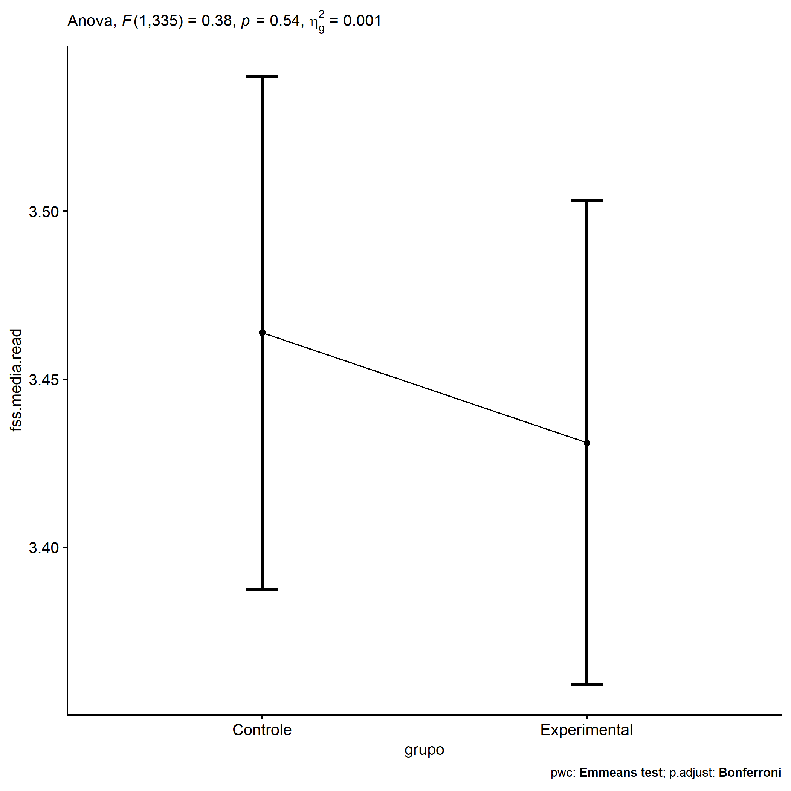<!-- -->

``` r
plots <- oneWayAncovaBoxPlots(
  wdat, "fss.media.read", "grupo", aov, pwc, covar = "dfs.media.read",
  theme = "classic", color = color[["grupo"]],
  subtitle = which(aov$Effect == "grupo"))
```

``` r
if (length(unique(wdat[["grupo"]])) > 1)
  plots[["grupo"]] + ggplot2::ylab("flow (ativ. leitura)") + ggplot2::scale_x_discrete(labels=c('pre', 'pos'))
```

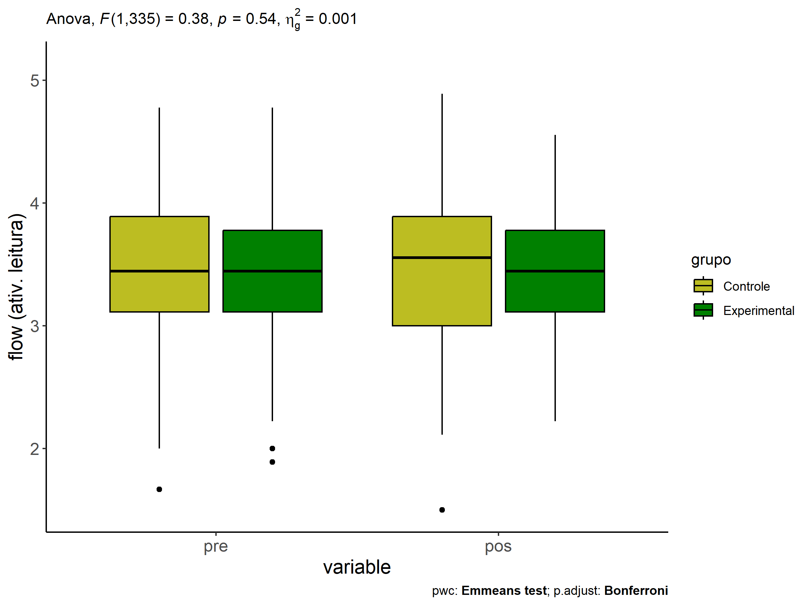<!-- -->

``` r
if (length(unique(wdat.long[["grupo"]])) > 1)
  plots <- oneWayAncovaBoxPlots(
    wdat.long, "flow.read", "grupo", aov, pwc.long, pre.post = "time",
    theme = "classic", color = color$prepost)
```

``` r
if (length(unique(wdat.long[["grupo"]])) > 1)
  plots[["grupo"]] + ggplot2::ylab("flow (ativ. leitura)")
```

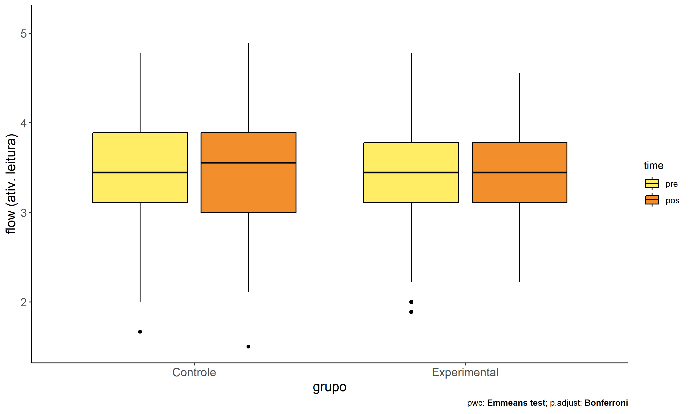<!-- -->

### Checking linearity assumption

``` r
ggscatter(wdat, x = "dfs.media.read", y = "fss.media.read", size = 0.5,
          color = "grupo", add = "reg.line")+
  stat_regline_equation(
    aes(label =  paste(..eq.label.., ..rr.label.., sep = "~~~~"), color = grupo)
  )
```

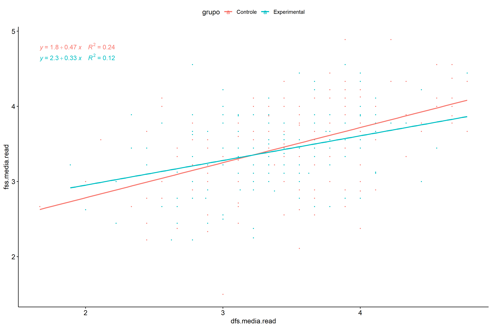<!-- -->

### Checking normality and homogeneity

``` r
res <- augment(lm(fss.media.read ~ dfs.media.read + grupo, data = wdat))
```

``` r
shapiro_test(res$.resid)
```

    ## # A tibble: 1 × 3
    ##   variable   statistic p.value
    ##   <chr>          <dbl>   <dbl>
    ## 1 res$.resid     0.994   0.223

``` r
levene_test(res, .resid ~ grupo)
```

    ## # A tibble: 1 × 4
    ##     df1   df2 statistic     p
    ##   <int> <int>     <dbl> <dbl>
    ## 1     1   336      2.12 0.146

# ANCOVA and Pairwise for two factors **grupo:Sexo**

## Without remove non-normal data

``` r
pdat = remove_group_data(dat[!is.na(dat[["grupo"]]) & !is.na(dat[["Sexo"]]),], "fss.media.read", c("grupo","Sexo"))

pdat.long <- rbind(pdat[,c("id","grupo","Sexo")], pdat[,c("id","grupo","Sexo")])
pdat.long[["time"]] <- c(rep("pre", nrow(pdat)), rep("pos", nrow(pdat)))
pdat.long[["time"]] <- factor(pdat.long[["time"]], c("pre","pos"))
pdat.long[["flow.read"]] <- c(pdat[["dfs.media.read"]], pdat[["fss.media.read"]])

aov = anova_test(pdat, fss.media.read ~ dfs.media.read + grupo*Sexo)
laov[["grupo:Sexo"]] <- get_anova_table(aov)
```

``` r
pwcs <- list()
pwcs[["Sexo"]] <- emmeans_test(
  group_by(pdat, grupo), fss.media.read ~ Sexo,
  covariate = dfs.media.read, p.adjust.method = "bonferroni")
pwcs[["grupo"]] <- emmeans_test(
  group_by(pdat, Sexo), fss.media.read ~ grupo,
  covariate = dfs.media.read, p.adjust.method = "bonferroni")

pwc <- plyr::rbind.fill(pwcs[["grupo"]], pwcs[["Sexo"]])
pwc <- pwc[,c("grupo","Sexo", colnames(pwc)[!colnames(pwc) %in% c("grupo","Sexo")])]
```

``` r
pwc.long <- emmeans_test(dplyr::group_by_at(pdat.long, c("grupo","Sexo")),
                         flow.read ~ time,
                         p.adjust.method = "bonferroni")
lpwc[["grupo:Sexo"]] <- plyr::rbind.fill(pwc, pwc.long)
```

``` r
ds <- get.descriptives(pdat, "fss.media.read", c("grupo","Sexo"), covar = "dfs.media.read")
ds <- merge(ds[ds$variable != "dfs.media.read",],
            ds[ds$variable == "dfs.media.read", !colnames(ds) %in% c("variable")],
            by = c("grupo","Sexo"), all.x = T, suffixes = c("", ".dfs.media.read"))
ds <- merge(get_emmeans(pwcs[["grupo"]]), ds, by = c("grupo","Sexo"), suffixes = c(".emms", ""))
ds <- ds[,c("grupo","Sexo","n","mean.dfs.media.read","se.dfs.media.read","mean","se","emmean","se.emms")]

colnames(ds) <- c("grupo","Sexo", "N", paste0(c("M","SE")," (pre)"),
                  paste0(c("M","SE"), " (unadj)"), paste0(c("M", "SE"), " (adj)"))

lemms[["grupo:Sexo"]] <- ds
```

## Computing ANCOVA and PairWise After removing non-normal data (OK)

``` r
wdat = pdat 

res = residuals(lm(fss.media.read ~ dfs.media.read + grupo*Sexo, data = wdat))
non.normal = getNonNormal(res, wdat$id, plimit = 0.05)

wdat = wdat[!wdat$id %in% non.normal,]

wdat.long <- rbind(wdat[,c("id","grupo","Sexo")], wdat[,c("id","grupo","Sexo")])
wdat.long[["time"]] <- c(rep("pre", nrow(wdat)), rep("pos", nrow(wdat)))
wdat.long[["time"]] <- factor(wdat.long[["time"]], c("pre","pos"))
wdat.long[["flow.read"]] <- c(wdat[["dfs.media.read"]], wdat[["fss.media.read"]])


ldat[["grupo:Sexo"]] = wdat

(non.normal)
```

    ## NULL

``` r
aov = anova_test(wdat, fss.media.read ~ dfs.media.read + grupo*Sexo)
laov[["grupo:Sexo"]] <- merge(get_anova_table(aov), laov[["grupo:Sexo"]], by="Effect", suffixes = c("","'"))

(df = get_anova_table(aov))
```

    ## ANOVA Table (type II tests)
    ## 
    ##           Effect DFn DFd      F        p p<.05   ges
    ## 1 dfs.media.read   1 333 73.354 4.08e-16     * 0.181
    ## 2          grupo   1 333  0.503 4.79e-01       0.002
    ## 3           Sexo   1 333  2.068 1.51e-01       0.006
    ## 4     grupo:Sexo   1 333  1.608 2.06e-01       0.005

| Effect         | DFn | DFd |      F |     p | p\<.05 |   ges |
|:---------------|----:|----:|-------:|------:|:-------|------:|
| dfs.media.read |   1 | 333 | 73.354 | 0.000 | \*     | 0.181 |
| grupo          |   1 | 333 |  0.503 | 0.479 |        | 0.002 |
| Sexo           |   1 | 333 |  2.068 | 0.151 |        | 0.006 |
| grupo:Sexo     |   1 | 333 |  1.608 | 0.206 |        | 0.005 |

``` r
pwcs <- list()
pwcs[["Sexo"]] <- emmeans_test(
  group_by(wdat, grupo), fss.media.read ~ Sexo,
  covariate = dfs.media.read, p.adjust.method = "bonferroni")
pwcs[["grupo"]] <- emmeans_test(
  group_by(wdat, Sexo), fss.media.read ~ grupo,
  covariate = dfs.media.read, p.adjust.method = "bonferroni")

pwc <- plyr::rbind.fill(pwcs[["grupo"]], pwcs[["Sexo"]])
pwc <- pwc[,c("grupo","Sexo", colnames(pwc)[!colnames(pwc) %in% c("grupo","Sexo")])]
```

| grupo        | Sexo | term                  | .y.            | group1   | group2       |  df | statistic |     p | p.adj | p.adj.signif |
|:-------------|:-----|:----------------------|:---------------|:---------|:-------------|----:|----------:|------:|------:|:-------------|
|              | F    | dfs.media.read\*grupo | fss.media.read | Controle | Experimental | 333 |     1.403 | 0.162 | 0.162 | ns           |
|              | M    | dfs.media.read\*grupo | fss.media.read | Controle | Experimental | 333 |    -0.375 | 0.708 | 0.708 | ns           |
| Controle     |      | dfs.media.read\*Sexo  | fss.media.read | F        | M            | 333 |     1.909 | 0.057 | 0.057 | ns           |
| Experimental |      | dfs.media.read\*Sexo  | fss.media.read | F        | M            | 333 |     0.186 | 0.853 | 0.853 | ns           |

``` r
pwc.long <- emmeans_test(dplyr::group_by_at(wdat.long, c("grupo","Sexo")),
                         flow.read ~ time,
                         p.adjust.method = "bonferroni")
lpwc[["grupo:Sexo"]] <- merge(plyr::rbind.fill(pwc, pwc.long), lpwc[["grupo:Sexo"]], by=c("grupo","Sexo","term",".y.","group1","group2"), suffixes = c("","'"))
```

| grupo        | Sexo | term | .y.       | group1 | group2 |  df | statistic |     p | p.adj | p.adj.signif |
|:-------------|:-----|:-----|:----------|:-------|:-------|----:|----------:|------:|------:|:-------------|
| Controle     | F    | time | flow.read | pre    | pos    | 668 |    -0.260 | 0.795 | 0.795 | ns           |
| Controle     | M    | time | flow.read | pre    | pos    | 668 |     0.495 | 0.621 | 0.621 | ns           |
| Experimental | F    | time | flow.read | pre    | pos    | 668 |     0.185 | 0.853 | 0.853 | ns           |
| Experimental | M    | time | flow.read | pre    | pos    | 668 |    -0.273 | 0.785 | 0.785 | ns           |

``` r
ds <- get.descriptives(wdat, "fss.media.read", c("grupo","Sexo"), covar = "dfs.media.read")
ds <- merge(ds[ds$variable != "dfs.media.read",],
            ds[ds$variable == "dfs.media.read", !colnames(ds) %in% c("variable")],
            by = c("grupo","Sexo"), all.x = T, suffixes = c("", ".dfs.media.read"))
ds <- merge(get_emmeans(pwcs[["grupo"]]), ds, by = c("grupo","Sexo"), suffixes = c(".emms", ""))
ds <- ds[,c("grupo","Sexo","n","mean.dfs.media.read","se.dfs.media.read","mean","se","emmean","se.emms")]

colnames(ds) <- c("grupo","Sexo", "N", paste0(c("M","SE")," (pre)"),
                  paste0(c("M","SE"), " (unadj)"), paste0(c("M", "SE"), " (adj)"))

lemms[["grupo:Sexo"]] <- merge(ds, lemms[["grupo:Sexo"]], by=c("grupo","Sexo"), suffixes = c("","'"))
```

| grupo        | Sexo |   N | M (pre) | SE (pre) | M (unadj) | SE (unadj) | M (adj) | SE (adj) |
|:-------------|:-----|----:|--------:|---------:|----------:|-----------:|--------:|---------:|
| Controle     | F    |  73 |   3.568 |    0.075 |     3.592 |      0.063 |   3.545 |    0.057 |
| Controle     | M    |  86 |   3.429 |    0.067 |     3.388 |      0.068 |   3.396 |    0.053 |
| Experimental | F    |  93 |   3.454 |    0.046 |     3.439 |      0.052 |   3.437 |    0.051 |
| Experimental | M    |  86 |   3.368 |    0.063 |     3.391 |      0.051 |   3.424 |    0.053 |

### Plots for ancova

``` r
plots <- twoWayAncovaPlots(
  wdat, "fss.media.read", c("grupo","Sexo"), aov, pwcs, addParam = c("mean_se"),
  font.label.size=10, step.increase=0.05, p.label="p.adj",
  subtitle = which(aov$Effect == "grupo:Sexo"))
```

``` r
if (!is.null(plots[["grupo"]]))
  plots[["grupo"]] + ggplot2::scale_color_manual(values = color[["Sexo"]])
```

    ## Scale for colour is already present.
    ## Adding another scale for colour, which will replace the existing scale.

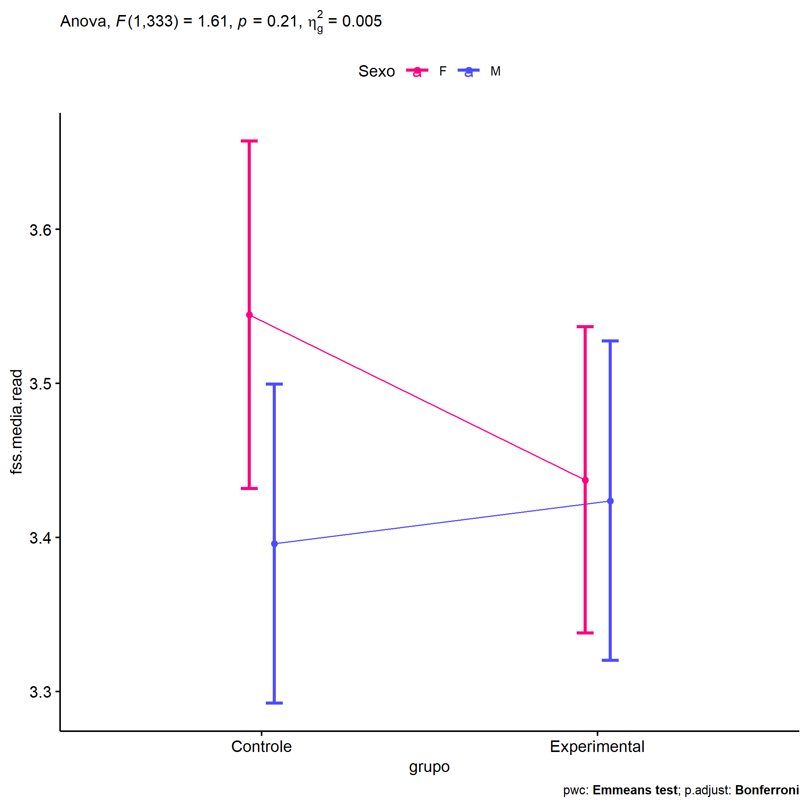<!-- -->

``` r
if (!is.null(plots[["Sexo"]]))
  plots[["Sexo"]] + ggplot2::scale_color_manual(values = color[["grupo"]])
```

    ## Scale for colour is already present.
    ## Adding another scale for colour, which will replace the existing scale.

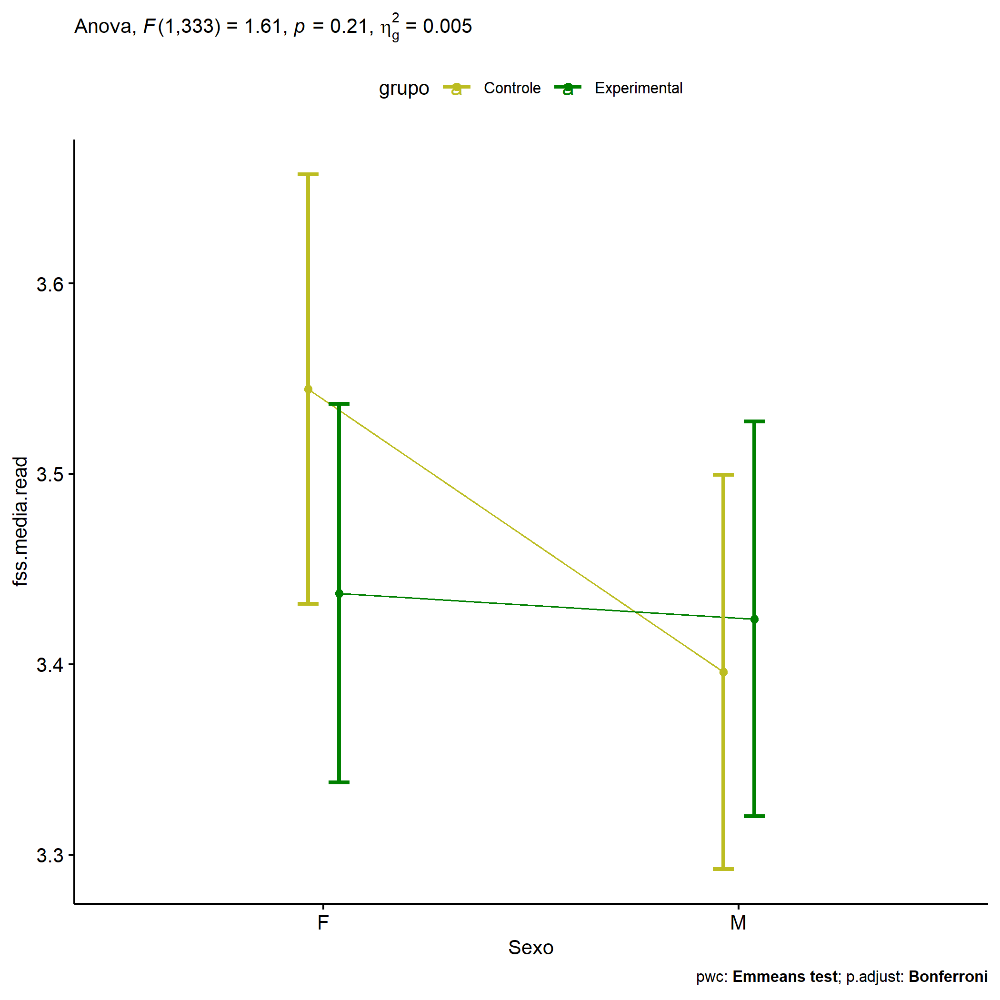<!-- -->

``` r
plots <- twoWayAncovaBoxPlots(
  wdat, "fss.media.read", c("grupo","Sexo"), aov, pwcs, covar = "dfs.media.read",
  theme = "classic", color = color[["grupo:Sexo"]],
  subtitle = which(aov$Effect == "grupo:Sexo"))
```

``` r
plots[["grupo:Sexo"]] + ggplot2::ylab("flow (ativ. leitura)") + ggplot2::scale_x_discrete(labels=c('pre', 'pos'))
```

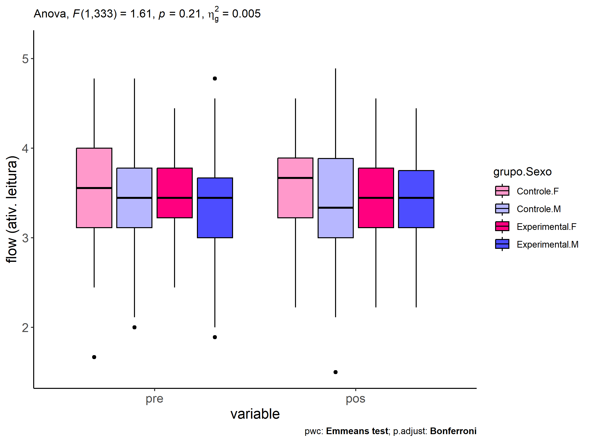<!-- -->

``` r
plots <- twoWayAncovaBoxPlots(
  wdat.long, "flow.read", c("grupo","Sexo"), aov, pwc.long, pre.post = "time",
  theme = "classic", color = color$prepost)
```

``` r
plots[["grupo:Sexo"]] + ggplot2::ylab("flow (ativ. leitura)")
```

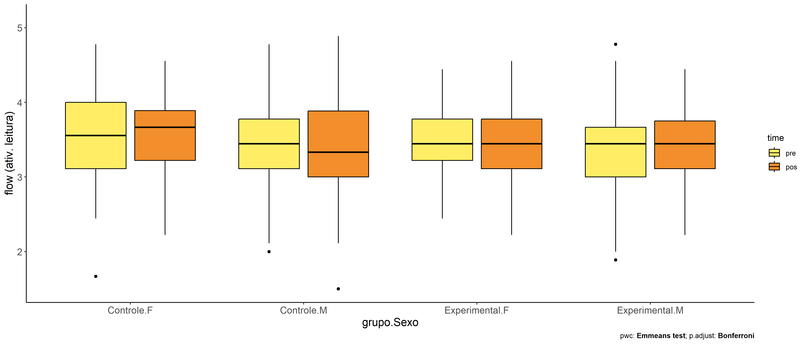<!-- -->

### Checking linearity assumption

``` r
ggscatter(wdat, x = "dfs.media.read", y = "fss.media.read", size = 0.5,
          facet.by = c("grupo","Sexo"), add = "reg.line")+
  stat_regline_equation(
    aes(label =  paste(..eq.label.., ..rr.label.., sep = "~~~~"))
  )
```

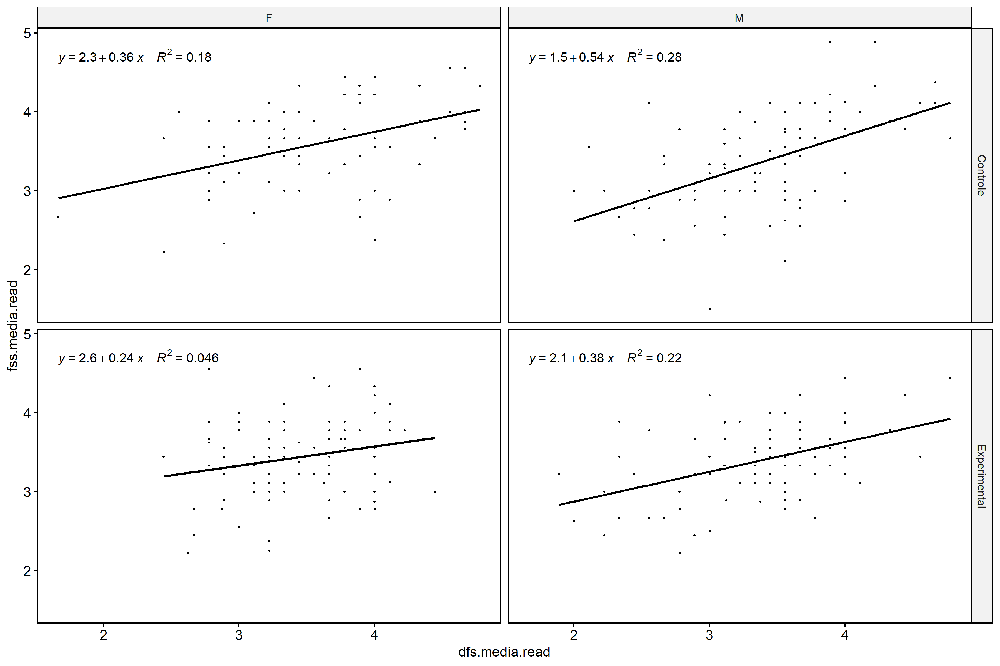<!-- -->

### Checking normality and homogeneity

``` r
res <- augment(lm(fss.media.read ~ dfs.media.read + grupo*Sexo, data = wdat))
```

``` r
shapiro_test(res$.resid)
```

    ## # A tibble: 1 × 3
    ##   variable   statistic p.value
    ##   <chr>          <dbl>   <dbl>
    ## 1 res$.resid     0.995   0.293

``` r
levene_test(res, .resid ~ grupo*Sexo)
```

    ## # A tibble: 1 × 4
    ##     df1   df2 statistic     p
    ##   <int> <int>     <dbl> <dbl>
    ## 1     3   334      1.38 0.250

# ANCOVA and Pairwise for two factors **grupo:Zona**

## Without remove non-normal data

``` r
pdat = remove_group_data(dat[!is.na(dat[["grupo"]]) & !is.na(dat[["Zona"]]),], "fss.media.read", c("grupo","Zona"))

pdat.long <- rbind(pdat[,c("id","grupo","Zona")], pdat[,c("id","grupo","Zona")])
pdat.long[["time"]] <- c(rep("pre", nrow(pdat)), rep("pos", nrow(pdat)))
pdat.long[["time"]] <- factor(pdat.long[["time"]], c("pre","pos"))
pdat.long[["flow.read"]] <- c(pdat[["dfs.media.read"]], pdat[["fss.media.read"]])

aov = anova_test(pdat, fss.media.read ~ dfs.media.read + grupo*Zona)
laov[["grupo:Zona"]] <- get_anova_table(aov)
```

``` r
pwcs <- list()
pwcs[["Zona"]] <- emmeans_test(
  group_by(pdat, grupo), fss.media.read ~ Zona,
  covariate = dfs.media.read, p.adjust.method = "bonferroni")
pwcs[["grupo"]] <- emmeans_test(
  group_by(pdat, Zona), fss.media.read ~ grupo,
  covariate = dfs.media.read, p.adjust.method = "bonferroni")

pwc <- plyr::rbind.fill(pwcs[["grupo"]], pwcs[["Zona"]])
pwc <- pwc[,c("grupo","Zona", colnames(pwc)[!colnames(pwc) %in% c("grupo","Zona")])]
```

``` r
pwc.long <- emmeans_test(dplyr::group_by_at(pdat.long, c("grupo","Zona")),
                         flow.read ~ time,
                         p.adjust.method = "bonferroni")
lpwc[["grupo:Zona"]] <- plyr::rbind.fill(pwc, pwc.long)
```

``` r
ds <- get.descriptives(pdat, "fss.media.read", c("grupo","Zona"), covar = "dfs.media.read")
ds <- merge(ds[ds$variable != "dfs.media.read",],
            ds[ds$variable == "dfs.media.read", !colnames(ds) %in% c("variable")],
            by = c("grupo","Zona"), all.x = T, suffixes = c("", ".dfs.media.read"))
ds <- merge(get_emmeans(pwcs[["grupo"]]), ds, by = c("grupo","Zona"), suffixes = c(".emms", ""))
ds <- ds[,c("grupo","Zona","n","mean.dfs.media.read","se.dfs.media.read","mean","se","emmean","se.emms")]

colnames(ds) <- c("grupo","Zona", "N", paste0(c("M","SE")," (pre)"),
                  paste0(c("M","SE"), " (unadj)"), paste0(c("M", "SE"), " (adj)"))

lemms[["grupo:Zona"]] <- ds
```

## Computing ANCOVA and PairWise After removing non-normal data (OK)

``` r
wdat = pdat 

res = residuals(lm(fss.media.read ~ dfs.media.read + grupo*Zona, data = wdat))
non.normal = getNonNormal(res, wdat$id, plimit = 0.05)

wdat = wdat[!wdat$id %in% non.normal,]

wdat.long <- rbind(wdat[,c("id","grupo","Zona")], wdat[,c("id","grupo","Zona")])
wdat.long[["time"]] <- c(rep("pre", nrow(wdat)), rep("pos", nrow(wdat)))
wdat.long[["time"]] <- factor(wdat.long[["time"]], c("pre","pos"))
wdat.long[["flow.read"]] <- c(wdat[["dfs.media.read"]], wdat[["fss.media.read"]])


ldat[["grupo:Zona"]] = wdat

(non.normal)
```

    ## NULL

``` r
aov = anova_test(wdat, fss.media.read ~ dfs.media.read + grupo*Zona)
laov[["grupo:Zona"]] <- merge(get_anova_table(aov), laov[["grupo:Zona"]], by="Effect", suffixes = c("","'"))

(df = get_anova_table(aov))
```

    ## ANOVA Table (type II tests)
    ## 
    ##           Effect DFn DFd      F        p p<.05      ges
    ## 1 dfs.media.read   1 265 55.405 1.38e-12     * 0.173000
    ## 2          grupo   1 265  0.718 3.98e-01       0.003000
    ## 3           Zona   1 265  0.213 6.45e-01       0.000802
    ## 4     grupo:Zona   1 265  0.661 4.17e-01       0.002000

| Effect         | DFn | DFd |      F |     p | p\<.05 |   ges |
|:---------------|----:|----:|-------:|------:|:-------|------:|
| dfs.media.read |   1 | 265 | 55.405 | 0.000 | \*     | 0.173 |
| grupo          |   1 | 265 |  0.718 | 0.398 |        | 0.003 |
| Zona           |   1 | 265 |  0.213 | 0.645 |        | 0.001 |
| grupo:Zona     |   1 | 265 |  0.661 | 0.417 |        | 0.002 |

``` r
pwcs <- list()
pwcs[["Zona"]] <- emmeans_test(
  group_by(wdat, grupo), fss.media.read ~ Zona,
  covariate = dfs.media.read, p.adjust.method = "bonferroni")
pwcs[["grupo"]] <- emmeans_test(
  group_by(wdat, Zona), fss.media.read ~ grupo,
  covariate = dfs.media.read, p.adjust.method = "bonferroni")

pwc <- plyr::rbind.fill(pwcs[["grupo"]], pwcs[["Zona"]])
pwc <- pwc[,c("grupo","Zona", colnames(pwc)[!colnames(pwc) %in% c("grupo","Zona")])]
```

| grupo        | Zona   | term                  | .y.            | group1   | group2       |  df | statistic |     p | p.adj | p.adj.signif |
|:-------------|:-------|:----------------------|:---------------|:---------|:-------------|----:|----------:|------:|------:|:-------------|
|              | Rural  | dfs.media.read\*grupo | fss.media.read | Controle | Experimental | 265 |     0.307 | 0.759 | 0.759 | ns           |
|              | Urbana | dfs.media.read\*grupo | fss.media.read | Controle | Experimental | 265 |     1.134 | 0.258 | 0.258 | ns           |
| Controle     |        | dfs.media.read\*Zona  | fss.media.read | Rural    | Urbana       | 265 |    -0.305 | 0.761 | 0.761 | ns           |
| Experimental |        | dfs.media.read\*Zona  | fss.media.read | Rural    | Urbana       | 265 |     0.884 | 0.378 | 0.378 | ns           |

``` r
pwc.long <- emmeans_test(dplyr::group_by_at(wdat.long, c("grupo","Zona")),
                         flow.read ~ time,
                         p.adjust.method = "bonferroni")
lpwc[["grupo:Zona"]] <- merge(plyr::rbind.fill(pwc, pwc.long), lpwc[["grupo:Zona"]], by=c("grupo","Zona","term",".y.","group1","group2"), suffixes = c("","'"))
```

| grupo        | Zona   | term | .y.       | group1 | group2 |  df | statistic |     p | p.adj | p.adj.signif |
|:-------------|:-------|:-----|:----------|:-------|:-------|----:|----------:|------:|------:|:-------------|
| Controle     | Rural  | time | flow.read | pre    | pos    | 532 |     0.548 | 0.584 | 0.584 | ns           |
| Controle     | Urbana | time | flow.read | pre    | pos    | 532 |    -0.109 | 0.913 | 0.913 | ns           |
| Experimental | Rural  | time | flow.read | pre    | pos    | 532 |    -0.473 | 0.636 | 0.636 | ns           |
| Experimental | Urbana | time | flow.read | pre    | pos    | 532 |     0.802 | 0.423 | 0.423 | ns           |

``` r
ds <- get.descriptives(wdat, "fss.media.read", c("grupo","Zona"), covar = "dfs.media.read")
ds <- merge(ds[ds$variable != "dfs.media.read",],
            ds[ds$variable == "dfs.media.read", !colnames(ds) %in% c("variable")],
            by = c("grupo","Zona"), all.x = T, suffixes = c("", ".dfs.media.read"))
ds <- merge(get_emmeans(pwcs[["grupo"]]), ds, by = c("grupo","Zona"), suffixes = c(".emms", ""))
ds <- ds[,c("grupo","Zona","n","mean.dfs.media.read","se.dfs.media.read","mean","se","emmean","se.emms")]

colnames(ds) <- c("grupo","Zona", "N", paste0(c("M","SE")," (pre)"),
                  paste0(c("M","SE"), " (unadj)"), paste0(c("M", "SE"), " (adj)"))

lemms[["grupo:Zona"]] <- merge(ds, lemms[["grupo:Zona"]], by=c("grupo","Zona"), suffixes = c("","'"))
```

| grupo        | Zona   |   N | M (pre) | SE (pre) | M (unadj) | SE (unadj) | M (adj) | SE (adj) |
|:-------------|:-------|----:|--------:|---------:|----------:|-----------:|--------:|---------:|
| Controle     | Rural  | 108 |   3.556 |    0.059 |     3.515 |      0.058 |   3.486 |    0.047 |
| Controle     | Urbana |  29 |   3.513 |    0.130 |     3.529 |      0.105 |   3.517 |    0.091 |
| Experimental | Rural  |  89 |   3.388 |    0.051 |     3.427 |      0.049 |   3.464 |    0.052 |
| Experimental | Urbana |  44 |   3.476 |    0.075 |     3.382 |      0.071 |   3.385 |    0.074 |

### Plots for ancova

``` r
plots <- twoWayAncovaPlots(
  wdat, "fss.media.read", c("grupo","Zona"), aov, pwcs, addParam = c("mean_se"),
  font.label.size=10, step.increase=0.05, p.label="p.adj",
  subtitle = which(aov$Effect == "grupo:Zona"))
```

``` r
if (!is.null(plots[["grupo"]]))
  plots[["grupo"]] + ggplot2::scale_color_manual(values = color[["Zona"]])
```

    ## Scale for colour is already present.
    ## Adding another scale for colour, which will replace the existing scale.

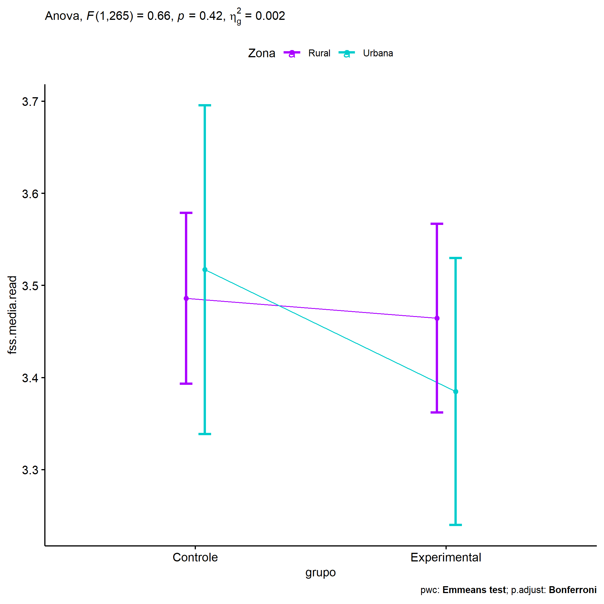<!-- -->

``` r
if (!is.null(plots[["Zona"]]))
  plots[["Zona"]] + ggplot2::scale_color_manual(values = color[["grupo"]])
```

    ## Scale for colour is already present.
    ## Adding another scale for colour, which will replace the existing scale.

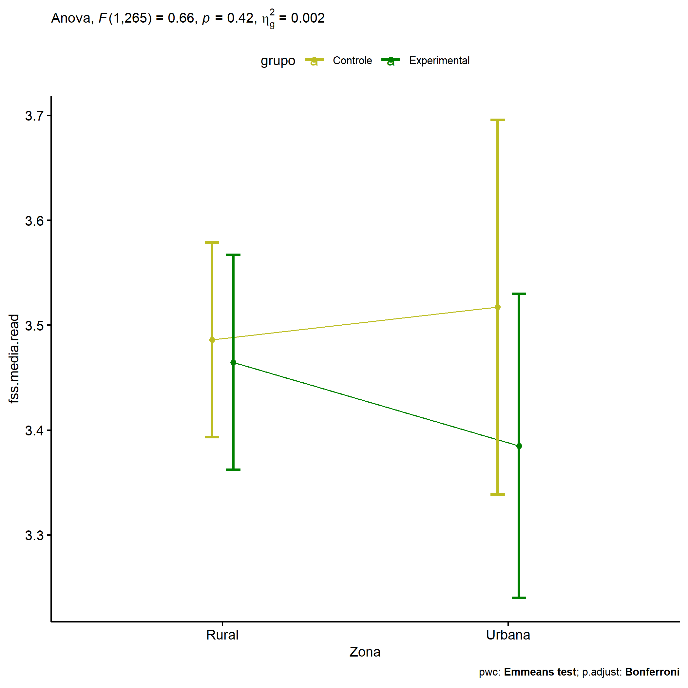<!-- -->

``` r
plots <- twoWayAncovaBoxPlots(
  wdat, "fss.media.read", c("grupo","Zona"), aov, pwcs, covar = "dfs.media.read",
  theme = "classic", color = color[["grupo:Zona"]],
  subtitle = which(aov$Effect == "grupo:Zona"))
```

``` r
plots[["grupo:Zona"]] + ggplot2::ylab("flow (ativ. leitura)") + ggplot2::scale_x_discrete(labels=c('pre', 'pos'))
```

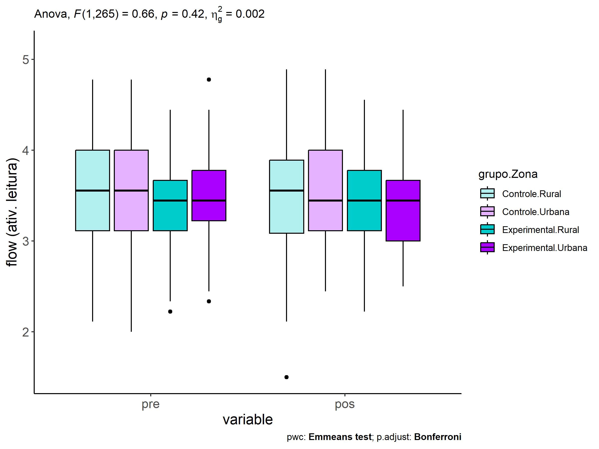<!-- -->

``` r
plots <- twoWayAncovaBoxPlots(
  wdat.long, "flow.read", c("grupo","Zona"), aov, pwc.long, pre.post = "time",
  theme = "classic", color = color$prepost)
```

``` r
plots[["grupo:Zona"]] + ggplot2::ylab("flow (ativ. leitura)")
```

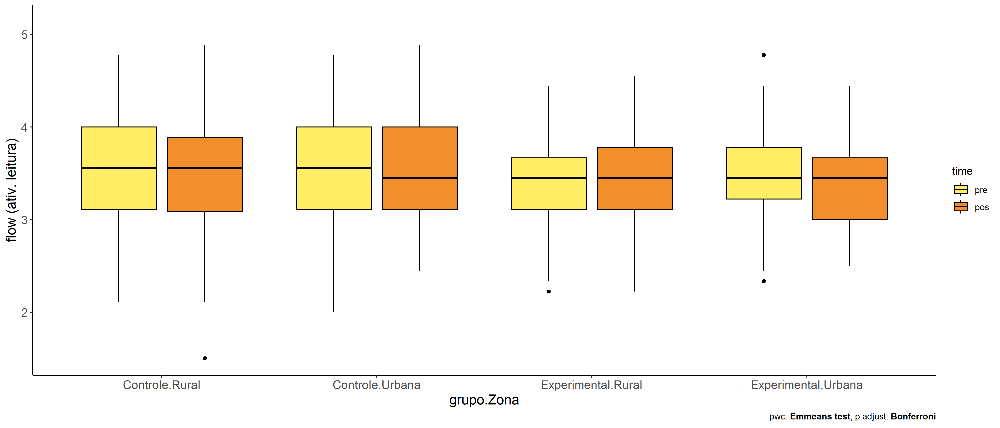<!-- -->

### Checking linearity assumption

``` r
ggscatter(wdat, x = "dfs.media.read", y = "fss.media.read", size = 0.5,
          facet.by = c("grupo","Zona"), add = "reg.line")+
  stat_regline_equation(
    aes(label =  paste(..eq.label.., ..rr.label.., sep = "~~~~"))
  )
```

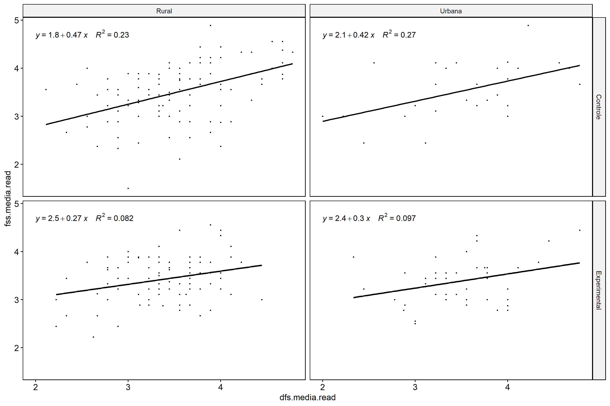<!-- -->

### Checking normality and homogeneity

``` r
res <- augment(lm(fss.media.read ~ dfs.media.read + grupo*Zona, data = wdat))
```

``` r
shapiro_test(res$.resid)
```

    ## # A tibble: 1 × 3
    ##   variable   statistic p.value
    ##   <chr>          <dbl>   <dbl>
    ## 1 res$.resid     0.991   0.102

``` r
levene_test(res, .resid ~ grupo*Zona)
```

    ## # A tibble: 1 × 4
    ##     df1   df2 statistic     p
    ##   <int> <int>     <dbl> <dbl>
    ## 1     3   266     0.561 0.641

# ANCOVA and Pairwise for two factors **grupo:Cor.Raca**

## Without remove non-normal data

``` r
pdat = remove_group_data(dat[!is.na(dat[["grupo"]]) & !is.na(dat[["Cor.Raca"]]),], "fss.media.read", c("grupo","Cor.Raca"))
```

    ## Warning: There were 2 warnings in `mutate()`.
    ## The first warning was:
    ## ℹ In argument: `ci = abs(stats::qt(alpha/2, .data$n - 1) * .data$se)`.
    ## Caused by warning:
    ## ! There was 1 warning in `mutate()`.
    ## ℹ In argument: `ci = abs(stats::qt(alpha/2, .data$n - 1) * .data$se)`.
    ## Caused by warning in `stats::qt()`:
    ## ! NaNs produced
    ## ℹ Run `dplyr::last_dplyr_warnings()` to see the 1 remaining warning.

``` r
pdat.long <- rbind(pdat[,c("id","grupo","Cor.Raca")], pdat[,c("id","grupo","Cor.Raca")])
pdat.long[["time"]] <- c(rep("pre", nrow(pdat)), rep("pos", nrow(pdat)))
pdat.long[["time"]] <- factor(pdat.long[["time"]], c("pre","pos"))
pdat.long[["flow.read"]] <- c(pdat[["dfs.media.read"]], pdat[["fss.media.read"]])

aov = anova_test(pdat, fss.media.read ~ dfs.media.read + grupo*Cor.Raca)
laov[["grupo:Cor.Raca"]] <- get_anova_table(aov)
```

``` r
pwcs <- list()
pwcs[["Cor.Raca"]] <- emmeans_test(
  group_by(pdat, grupo), fss.media.read ~ Cor.Raca,
  covariate = dfs.media.read, p.adjust.method = "bonferroni")
pwcs[["grupo"]] <- emmeans_test(
  group_by(pdat, Cor.Raca), fss.media.read ~ grupo,
  covariate = dfs.media.read, p.adjust.method = "bonferroni")

pwc <- plyr::rbind.fill(pwcs[["grupo"]], pwcs[["Cor.Raca"]])
pwc <- pwc[,c("grupo","Cor.Raca", colnames(pwc)[!colnames(pwc) %in% c("grupo","Cor.Raca")])]
```

``` r
pwc.long <- emmeans_test(dplyr::group_by_at(pdat.long, c("grupo","Cor.Raca")),
                         flow.read ~ time,
                         p.adjust.method = "bonferroni")
lpwc[["grupo:Cor.Raca"]] <- plyr::rbind.fill(pwc, pwc.long)
```

``` r
ds <- get.descriptives(pdat, "fss.media.read", c("grupo","Cor.Raca"), covar = "dfs.media.read")
ds <- merge(ds[ds$variable != "dfs.media.read",],
            ds[ds$variable == "dfs.media.read", !colnames(ds) %in% c("variable")],
            by = c("grupo","Cor.Raca"), all.x = T, suffixes = c("", ".dfs.media.read"))
ds <- merge(get_emmeans(pwcs[["grupo"]]), ds, by = c("grupo","Cor.Raca"), suffixes = c(".emms", ""))
ds <- ds[,c("grupo","Cor.Raca","n","mean.dfs.media.read","se.dfs.media.read","mean","se","emmean","se.emms")]

colnames(ds) <- c("grupo","Cor.Raca", "N", paste0(c("M","SE")," (pre)"),
                  paste0(c("M","SE"), " (unadj)"), paste0(c("M", "SE"), " (adj)"))

lemms[["grupo:Cor.Raca"]] <- ds
```

## Computing ANCOVA and PairWise After removing non-normal data (OK)

``` r
wdat = pdat 

res = residuals(lm(fss.media.read ~ dfs.media.read + grupo*Cor.Raca, data = wdat))
non.normal = getNonNormal(res, wdat$id, plimit = 0.05)

wdat = wdat[!wdat$id %in% non.normal,]

wdat.long <- rbind(wdat[,c("id","grupo","Cor.Raca")], wdat[,c("id","grupo","Cor.Raca")])
wdat.long[["time"]] <- c(rep("pre", nrow(wdat)), rep("pos", nrow(wdat)))
wdat.long[["time"]] <- factor(wdat.long[["time"]], c("pre","pos"))
wdat.long[["flow.read"]] <- c(wdat[["dfs.media.read"]], wdat[["fss.media.read"]])


ldat[["grupo:Cor.Raca"]] = wdat

(non.normal)
```

    ## NULL

``` r
aov = anova_test(wdat, fss.media.read ~ dfs.media.read + grupo*Cor.Raca)
laov[["grupo:Cor.Raca"]] <- merge(get_anova_table(aov), laov[["grupo:Cor.Raca"]], by="Effect", suffixes = c("","'"))

(df = get_anova_table(aov))
```

    ## ANOVA Table (type II tests)
    ## 
    ##           Effect DFn DFd      F        p p<.05      ges
    ## 1 dfs.media.read   1 139 34.979 2.46e-08     * 0.201000
    ## 2          grupo   1 139  0.474 4.93e-01       0.003000
    ## 3       Cor.Raca   2 139  0.423 6.56e-01       0.006000
    ## 4 grupo:Cor.Raca   1 139  0.003 9.53e-01       0.000025

| Effect         | DFn | DFd |      F |     p | p\<.05 |   ges |
|:---------------|----:|----:|-------:|------:|:-------|------:|
| dfs.media.read |   1 | 139 | 34.979 | 0.000 | \*     | 0.201 |
| grupo          |   1 | 139 |  0.474 | 0.493 |        | 0.003 |
| Cor.Raca       |   2 | 139 |  0.423 | 0.656 |        | 0.006 |
| grupo:Cor.Raca |   1 | 139 |  0.003 | 0.953 |        | 0.000 |

``` r
pwcs <- list()
pwcs[["Cor.Raca"]] <- emmeans_test(
  group_by(wdat, grupo), fss.media.read ~ Cor.Raca,
  covariate = dfs.media.read, p.adjust.method = "bonferroni")
pwcs[["grupo"]] <- emmeans_test(
  group_by(wdat, Cor.Raca), fss.media.read ~ grupo,
  covariate = dfs.media.read, p.adjust.method = "bonferroni")

pwc <- plyr::rbind.fill(pwcs[["grupo"]], pwcs[["Cor.Raca"]])
pwc <- pwc[,c("grupo","Cor.Raca", colnames(pwc)[!colnames(pwc) %in% c("grupo","Cor.Raca")])]
```

| grupo        | Cor.Raca | term                     | .y.            | group1   | group2       |  df | statistic |     p | p.adj | p.adj.signif |
|:-------------|:---------|:-------------------------|:---------------|:---------|:-------------|----:|----------:|------:|------:|:-------------|
|              | Branca   | dfs.media.read\*grupo    | fss.media.read | Controle | Experimental | 139 |     0.417 | 0.677 | 0.677 | ns           |
|              | Indígena | dfs.media.read\*grupo    | fss.media.read | Controle | Experimental |     |           |       |       |              |
|              | Parda    | dfs.media.read\*grupo    | fss.media.read | Controle | Experimental | 139 |     0.553 | 0.581 | 0.581 | ns           |
| Controle     |          | dfs.media.read\*Cor.Raca | fss.media.read | Branca   | Indígena     |     |           |       |       |              |
| Controle     |          | dfs.media.read\*Cor.Raca | fss.media.read | Branca   | Parda        | 139 |     0.089 | 0.929 | 0.929 | ns           |
| Controle     |          | dfs.media.read\*Cor.Raca | fss.media.read | Indígena | Parda        |     |           |       |       |              |
| Experimental |          | dfs.media.read\*Cor.Raca | fss.media.read | Branca   | Indígena     | 139 |     0.757 | 0.450 | 1.000 | ns           |
| Experimental |          | dfs.media.read\*Cor.Raca | fss.media.read | Branca   | Parda        | 139 |     0.003 | 0.998 | 1.000 | ns           |
| Experimental |          | dfs.media.read\*Cor.Raca | fss.media.read | Indígena | Parda        | 139 |    -0.891 | 0.374 | 1.000 | ns           |

``` r
pwc.long <- emmeans_test(dplyr::group_by_at(wdat.long, c("grupo","Cor.Raca")),
                         flow.read ~ time,
                         p.adjust.method = "bonferroni")
lpwc[["grupo:Cor.Raca"]] <- merge(plyr::rbind.fill(pwc, pwc.long), lpwc[["grupo:Cor.Raca"]], by=c("grupo","Cor.Raca","term",".y.","group1","group2"), suffixes = c("","'"))
```

| grupo        | Cor.Raca | term | .y.       | group1 | group2 |  df | statistic |     p | p.adj | p.adj.signif |
|:-------------|:---------|:-----|:----------|:-------|:-------|----:|----------:|------:|------:|:-------------|
| Controle     | Branca   | time | flow.read | pre    | pos    | 280 |     0.134 | 0.894 | 0.894 | ns           |
| Controle     | Indígena | time | flow.read | pre    | pos    |     |           |       |       |              |
| Controle     | Parda    | time | flow.read | pre    | pos    | 280 |     0.097 | 0.923 | 0.923 | ns           |
| Experimental | Branca   | time | flow.read | pre    | pos    | 280 |     0.181 | 0.856 | 0.856 | ns           |
| Experimental | Indígena | time | flow.read | pre    | pos    | 280 |     0.570 | 0.569 | 0.569 | ns           |
| Experimental | Parda    | time | flow.read | pre    | pos    | 280 |    -0.427 | 0.670 | 0.670 | ns           |

``` r
ds <- get.descriptives(wdat, "fss.media.read", c("grupo","Cor.Raca"), covar = "dfs.media.read")
ds <- merge(ds[ds$variable != "dfs.media.read",],
            ds[ds$variable == "dfs.media.read", !colnames(ds) %in% c("variable")],
            by = c("grupo","Cor.Raca"), all.x = T, suffixes = c("", ".dfs.media.read"))
ds <- merge(get_emmeans(pwcs[["grupo"]]), ds, by = c("grupo","Cor.Raca"), suffixes = c(".emms", ""))
ds <- ds[,c("grupo","Cor.Raca","n","mean.dfs.media.read","se.dfs.media.read","mean","se","emmean","se.emms")]

colnames(ds) <- c("grupo","Cor.Raca", "N", paste0(c("M","SE")," (pre)"),
                  paste0(c("M","SE"), " (unadj)"), paste0(c("M", "SE"), " (adj)"))

lemms[["grupo:Cor.Raca"]] <- merge(ds, lemms[["grupo:Cor.Raca"]], by=c("grupo","Cor.Raca"), suffixes = c("","'"))
```

| grupo        | Cor.Raca |   N | M (pre) | SE (pre) | M (unadj) | SE (unadj) | M (adj) | SE (adj) |
|:-------------|:---------|----:|--------:|---------:|----------:|-----------:|--------:|---------:|
| Controle     | Branca   |  20 |   3.556 |    0.141 |     3.533 |      0.125 |   3.479 |    0.106 |
| Controle     | Parda    |  46 |   3.514 |    0.092 |     3.504 |      0.087 |   3.468 |    0.070 |
| Experimental | Branca   |  17 |   3.458 |    0.077 |     3.425 |      0.101 |   3.414 |    0.114 |
| Experimental | Indígena |  13 |   3.374 |    0.111 |     3.256 |      0.134 |   3.283 |    0.130 |
| Experimental | Parda    |  49 |   3.316 |    0.065 |     3.361 |      0.069 |   3.414 |    0.068 |

### Plots for ancova

``` r
plots <- twoWayAncovaPlots(
  wdat, "fss.media.read", c("grupo","Cor.Raca"), aov, pwcs, addParam = c("mean_se"),
  font.label.size=10, step.increase=0.05, p.label="p.adj",
  subtitle = which(aov$Effect == "grupo:Cor.Raca"))
```

``` r
if (!is.null(plots[["grupo"]]))
  plots[["grupo"]] + ggplot2::scale_color_manual(values = color[["Cor.Raca"]])
```

<!-- -->

``` r
if (!is.null(plots[["Cor.Raca"]]))
  plots[["Cor.Raca"]] + ggplot2::scale_color_manual(values = color[["grupo"]])
```

    ## Scale for colour is already present.
    ## Adding another scale for colour, which will replace the existing scale.

    ## Warning: Removed 2 rows containing non-finite values (`stat_bracket()`).

    ## Warning: Removed 1 rows containing missing values (`geom_point()`).

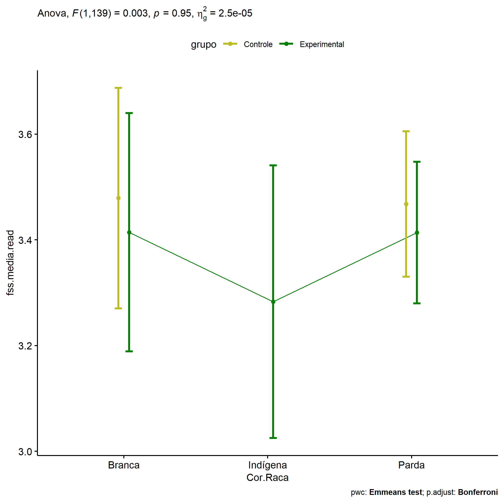<!-- -->

``` r
plots <- twoWayAncovaBoxPlots(
  wdat, "fss.media.read", c("grupo","Cor.Raca"), aov, pwcs, covar = "dfs.media.read",
  theme = "classic", color = color[["grupo:Cor.Raca"]],
  subtitle = which(aov$Effect == "grupo:Cor.Raca"))
```

``` r
plots[["grupo:Cor.Raca"]] + ggplot2::ylab("flow (ativ. leitura)") + ggplot2::scale_x_discrete(labels=c('pre', 'pos'))
```

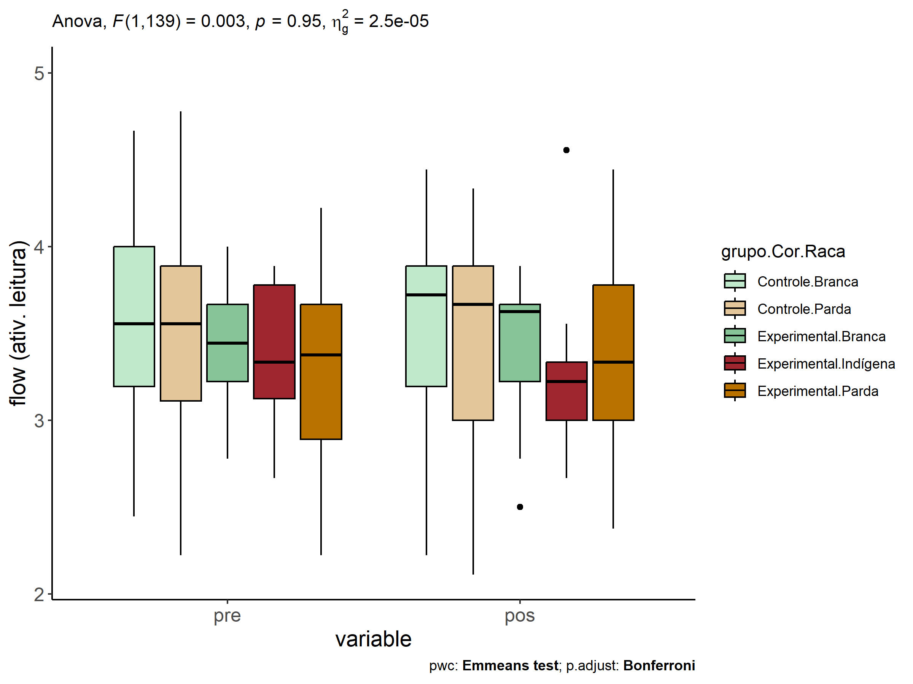<!-- -->

``` r
plots <- twoWayAncovaBoxPlots(
  wdat.long, "flow.read", c("grupo","Cor.Raca"), aov, pwc.long, pre.post = "time",
  theme = "classic", color = color$prepost)
```

``` r
plots[["grupo:Cor.Raca"]] + ggplot2::ylab("flow (ativ. leitura)")
```

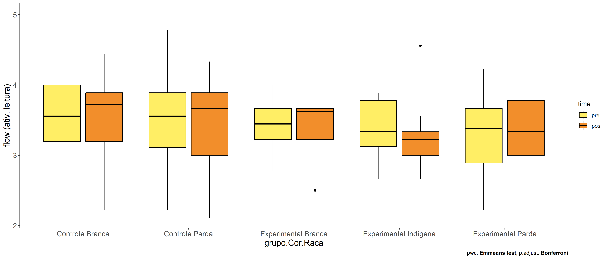<!-- -->

### Checking linearity assumption

``` r
ggscatter(wdat, x = "dfs.media.read", y = "fss.media.read", size = 0.5,
          facet.by = c("grupo","Cor.Raca"), add = "reg.line")+
  stat_regline_equation(
    aes(label =  paste(..eq.label.., ..rr.label.., sep = "~~~~"))
  )
```

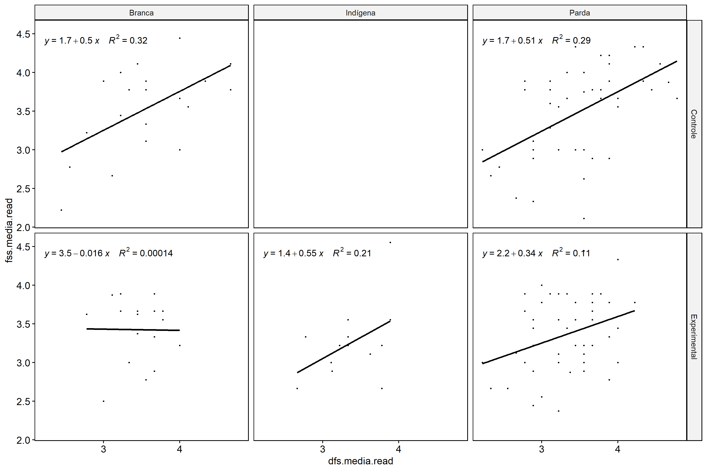<!-- -->

### Checking normality and homogeneity

``` r
res <- augment(lm(fss.media.read ~ dfs.media.read + grupo*Cor.Raca, data = wdat))
```

``` r
shapiro_test(res$.resid)
```

    ## # A tibble: 1 × 3
    ##   variable   statistic p.value
    ##   <chr>          <dbl>   <dbl>
    ## 1 res$.resid     0.989   0.296

``` r
levene_test(res, .resid ~ grupo*Cor.Raca)
```

    ## # A tibble: 1 × 4
    ##     df1   df2 statistic     p
    ##   <int> <int>     <dbl> <dbl>
    ## 1     4   140     0.361 0.836

# Summary of Results

## Descriptive Statistics

``` r
df <- get.descriptives(ldat[["grupo"]], c(dv.pre, dv.pos), c("grupo"), 
                       include.global = T, symmetry.test = T, normality.test = F)
df <- plyr::rbind.fill(
  df, do.call(plyr::rbind.fill, lapply(lfatores2, FUN = function(f) {
    if (nrow(dat) > 0 && sum(!is.na(unique(dat[[f]]))) > 1)
      get.descriptives(ldat[[paste0("grupo:",f)]], c(dv.pre,dv.pos), c("grupo", f),
                       symmetry.test = T, normality.test = F)
    }))
)
(df <- df[,c(fatores1[fatores1 %in% colnames(df)],"variable",
             colnames(df)[!colnames(df) %in% c(fatores1,"variable")])])
```

    ##           grupo Sexo   Zona Cor.Raca       variable   n  mean median   min   max    sd    se    ci   iqr
    ## 1      Controle <NA>   <NA>     <NA> dfs.media.read 159 3.493  3.444 1.667 4.778 0.632 0.050 0.099 0.778
    ## 2  Experimental <NA>   <NA>     <NA> dfs.media.read 179 3.412  3.444 1.889 4.778 0.513 0.038 0.076 0.667
    ## 3          <NA> <NA>   <NA>     <NA> dfs.media.read 338 3.450  3.444 1.667 4.778 0.572 0.031 0.061 0.778
    ## 4      Controle <NA>   <NA>     <NA> fss.media.read 159 3.481  3.556 1.500 4.889 0.598 0.047 0.094 0.889
    ## 5  Experimental <NA>   <NA>     <NA> fss.media.read 179 3.416  3.444 2.222 4.556 0.485 0.036 0.072 0.667
    ## 6          <NA> <NA>   <NA>     <NA> fss.media.read 338 3.447  3.444 1.500 4.889 0.541 0.029 0.058 0.851
    ## 7      Controle    F   <NA>     <NA> dfs.media.read  73 3.568  3.556 1.667 4.778 0.641 0.075 0.150 0.889
    ## 8      Controle    M   <NA>     <NA> dfs.media.read  86 3.429  3.444 2.000 4.778 0.621 0.067 0.133 0.667
    ## 9  Experimental    F   <NA>     <NA> dfs.media.read  93 3.454  3.444 2.444 4.444 0.439 0.046 0.090 0.556
    ## 10 Experimental    M   <NA>     <NA> dfs.media.read  86 3.368  3.444 1.889 4.778 0.581 0.063 0.125 0.667
    ## 11     Controle    F   <NA>     <NA> fss.media.read  73 3.592  3.667 2.222 4.556 0.539 0.063 0.126 0.667
    ## 12     Controle    M   <NA>     <NA> fss.media.read  86 3.388  3.333 1.500 4.889 0.631 0.068 0.135 0.885
    ## 13 Experimental    F   <NA>     <NA> fss.media.read  93 3.439  3.444 2.222 4.556 0.497 0.052 0.102 0.667
    ## 14 Experimental    M   <NA>     <NA> fss.media.read  86 3.391  3.444 2.222 4.444 0.474 0.051 0.102 0.639
    ## 15     Controle <NA>  Rural     <NA> dfs.media.read 108 3.556  3.556 2.111 4.778 0.611 0.059 0.116 0.889
    ## 16     Controle <NA> Urbana     <NA> dfs.media.read  29 3.513  3.556 2.000 4.778 0.700 0.130 0.266 0.889
    ## 17 Experimental <NA>  Rural     <NA> dfs.media.read  89 3.388  3.444 2.222 4.444 0.481 0.051 0.101 0.556
    ## 18 Experimental <NA> Urbana     <NA> dfs.media.read  44 3.476  3.444 2.333 4.778 0.500 0.075 0.152 0.556
    ## 19     Controle <NA>  Rural     <NA> fss.media.read 108 3.515  3.556 1.500 4.889 0.604 0.058 0.115 0.806
    ## 20     Controle <NA> Urbana     <NA> fss.media.read  29 3.529  3.444 2.444 4.889 0.564 0.105 0.214 0.889
    ## 21 Experimental <NA>  Rural     <NA> fss.media.read  89 3.427  3.444 2.222 4.556 0.461 0.049 0.097 0.667
    ## 22 Experimental <NA> Urbana     <NA> fss.media.read  44 3.382  3.444 2.500 4.444 0.474 0.071 0.144 0.667
    ## 23     Controle <NA>   <NA>   Branca dfs.media.read  20 3.556  3.556 2.444 4.667 0.633 0.141 0.296 0.806
    ## 24     Controle <NA>   <NA>    Parda dfs.media.read  46 3.514  3.556 2.222 4.778 0.627 0.092 0.186 0.778
    ## 25 Experimental <NA>   <NA>   Branca dfs.media.read  17 3.458  3.444 2.778 4.000 0.316 0.077 0.163 0.444
    ## 26 Experimental <NA>   <NA> Indígena dfs.media.read  13 3.374  3.333 2.667 3.889 0.401 0.111 0.243 0.653
    ## 27 Experimental <NA>   <NA>    Parda dfs.media.read  49 3.316  3.375 2.222 4.222 0.458 0.065 0.132 0.778
    ## 28     Controle <NA>   <NA>   Branca fss.media.read  20 3.533  3.722 2.222 4.444 0.559 0.125 0.262 0.694
    ## 29     Controle <NA>   <NA>    Parda fss.media.read  46 3.504  3.667 2.111 4.333 0.591 0.087 0.176 0.889
    ## 30 Experimental <NA>   <NA>   Branca fss.media.read  17 3.425  3.625 2.500 3.889 0.415 0.101 0.213 0.444
    ## 31 Experimental <NA>   <NA> Indígena fss.media.read  13 3.256  3.222 2.667 4.556 0.483 0.134 0.292 0.333
    ## 32 Experimental <NA>   <NA>    Parda fss.media.read  49 3.361  3.333 2.375 4.444 0.483 0.069 0.139 0.778
    ##    symmetry      skewness    kurtosis
    ## 1       YES -0.0520467725 -0.33204118
    ## 2       YES -0.3330685685  0.01884062
    ## 3       YES -0.1160548552 -0.05330601
    ## 4       YES -0.2725838051 -0.17148758
    ## 5       YES -0.1295291758 -0.23281336
    ## 6       YES -0.1847609425 -0.08546774
    ## 7       YES -0.1728650655 -0.29855900
    ## 8       YES  0.0402023018 -0.35593033
    ## 9       YES -0.0932577807 -0.85540713
    ## 10      YES -0.3347968423 -0.09388305
    ## 11      YES -0.4191686878 -0.30897485
    ## 12      YES -0.0874725334 -0.15397475
    ## 13      YES -0.1382035731 -0.16802749
    ## 14      YES -0.1331369207 -0.40058715
    ## 15      YES  0.0900819810 -0.69069378
    ## 16      YES -0.2646660648 -0.60096797
    ## 17      YES -0.3916247135 -0.36251440
    ## 18      YES  0.1480274875  0.07812590
    ## 19      YES -0.4657405712  0.12038861
    ## 20      YES  0.0917790769 -0.46330677
    ## 21      YES -0.0529166818 -0.10763939
    ## 22      YES  0.2980332632 -0.62066484
    ## 23      YES  0.0910057043 -0.91575624
    ## 24      YES  0.0038444023 -0.73506663
    ## 25      YES -0.4019550093 -0.69140023
    ## 26      YES -0.2166628309 -1.27237005
    ## 27      YES -0.2750642492 -0.60984201
    ## 28       NO -0.6226181005 -0.44935704
    ## 29       NO -0.5199742370 -0.81876711
    ## 30       NO -0.7691580801 -0.67461363
    ## 31       NO  1.2063350237  1.42296289
    ## 32      YES -0.0001838563 -0.73494292

| grupo        | Sexo | Zona   | Cor.Raca | variable       |   n |  mean | median |   min |   max |    sd |    se |    ci |   iqr | symmetry | skewness | kurtosis |
|:-------------|:-----|:-------|:---------|:---------------|----:|------:|-------:|------:|------:|------:|------:|------:|------:|:---------|---------:|---------:|
| Controle     |      |        |          | dfs.media.read | 159 | 3.493 |  3.444 | 1.667 | 4.778 | 0.632 | 0.050 | 0.099 | 0.778 | YES      |   -0.052 |   -0.332 |
| Experimental |      |        |          | dfs.media.read | 179 | 3.412 |  3.444 | 1.889 | 4.778 | 0.513 | 0.038 | 0.076 | 0.667 | YES      |   -0.333 |    0.019 |
|              |      |        |          | dfs.media.read | 338 | 3.450 |  3.444 | 1.667 | 4.778 | 0.572 | 0.031 | 0.061 | 0.778 | YES      |   -0.116 |   -0.053 |
| Controle     |      |        |          | fss.media.read | 159 | 3.481 |  3.556 | 1.500 | 4.889 | 0.598 | 0.047 | 0.094 | 0.889 | YES      |   -0.273 |   -0.171 |
| Experimental |      |        |          | fss.media.read | 179 | 3.416 |  3.444 | 2.222 | 4.556 | 0.485 | 0.036 | 0.072 | 0.667 | YES      |   -0.130 |   -0.233 |
|              |      |        |          | fss.media.read | 338 | 3.447 |  3.444 | 1.500 | 4.889 | 0.541 | 0.029 | 0.058 | 0.851 | YES      |   -0.185 |   -0.085 |
| Controle     | F    |        |          | dfs.media.read |  73 | 3.568 |  3.556 | 1.667 | 4.778 | 0.641 | 0.075 | 0.150 | 0.889 | YES      |   -0.173 |   -0.299 |
| Controle     | M    |        |          | dfs.media.read |  86 | 3.429 |  3.444 | 2.000 | 4.778 | 0.621 | 0.067 | 0.133 | 0.667 | YES      |    0.040 |   -0.356 |
| Experimental | F    |        |          | dfs.media.read |  93 | 3.454 |  3.444 | 2.444 | 4.444 | 0.439 | 0.046 | 0.090 | 0.556 | YES      |   -0.093 |   -0.855 |
| Experimental | M    |        |          | dfs.media.read |  86 | 3.368 |  3.444 | 1.889 | 4.778 | 0.581 | 0.063 | 0.125 | 0.667 | YES      |   -0.335 |   -0.094 |
| Controle     | F    |        |          | fss.media.read |  73 | 3.592 |  3.667 | 2.222 | 4.556 | 0.539 | 0.063 | 0.126 | 0.667 | YES      |   -0.419 |   -0.309 |
| Controle     | M    |        |          | fss.media.read |  86 | 3.388 |  3.333 | 1.500 | 4.889 | 0.631 | 0.068 | 0.135 | 0.885 | YES      |   -0.087 |   -0.154 |
| Experimental | F    |        |          | fss.media.read |  93 | 3.439 |  3.444 | 2.222 | 4.556 | 0.497 | 0.052 | 0.102 | 0.667 | YES      |   -0.138 |   -0.168 |
| Experimental | M    |        |          | fss.media.read |  86 | 3.391 |  3.444 | 2.222 | 4.444 | 0.474 | 0.051 | 0.102 | 0.639 | YES      |   -0.133 |   -0.401 |
| Controle     |      | Rural  |          | dfs.media.read | 108 | 3.556 |  3.556 | 2.111 | 4.778 | 0.611 | 0.059 | 0.116 | 0.889 | YES      |    0.090 |   -0.691 |
| Controle     |      | Urbana |          | dfs.media.read |  29 | 3.513 |  3.556 | 2.000 | 4.778 | 0.700 | 0.130 | 0.266 | 0.889 | YES      |   -0.265 |   -0.601 |
| Experimental |      | Rural  |          | dfs.media.read |  89 | 3.388 |  3.444 | 2.222 | 4.444 | 0.481 | 0.051 | 0.101 | 0.556 | YES      |   -0.392 |   -0.363 |
| Experimental |      | Urbana |          | dfs.media.read |  44 | 3.476 |  3.444 | 2.333 | 4.778 | 0.500 | 0.075 | 0.152 | 0.556 | YES      |    0.148 |    0.078 |
| Controle     |      | Rural  |          | fss.media.read | 108 | 3.515 |  3.556 | 1.500 | 4.889 | 0.604 | 0.058 | 0.115 | 0.806 | YES      |   -0.466 |    0.120 |
| Controle     |      | Urbana |          | fss.media.read |  29 | 3.529 |  3.444 | 2.444 | 4.889 | 0.564 | 0.105 | 0.214 | 0.889 | YES      |    0.092 |   -0.463 |
| Experimental |      | Rural  |          | fss.media.read |  89 | 3.427 |  3.444 | 2.222 | 4.556 | 0.461 | 0.049 | 0.097 | 0.667 | YES      |   -0.053 |   -0.108 |
| Experimental |      | Urbana |          | fss.media.read |  44 | 3.382 |  3.444 | 2.500 | 4.444 | 0.474 | 0.071 | 0.144 | 0.667 | YES      |    0.298 |   -0.621 |
| Controle     |      |        | Branca   | dfs.media.read |  20 | 3.556 |  3.556 | 2.444 | 4.667 | 0.633 | 0.141 | 0.296 | 0.806 | YES      |    0.091 |   -0.916 |
| Controle     |      |        | Parda    | dfs.media.read |  46 | 3.514 |  3.556 | 2.222 | 4.778 | 0.627 | 0.092 | 0.186 | 0.778 | YES      |    0.004 |   -0.735 |
| Experimental |      |        | Branca   | dfs.media.read |  17 | 3.458 |  3.444 | 2.778 | 4.000 | 0.316 | 0.077 | 0.163 | 0.444 | YES      |   -0.402 |   -0.691 |
| Experimental |      |        | Indígena | dfs.media.read |  13 | 3.374 |  3.333 | 2.667 | 3.889 | 0.401 | 0.111 | 0.243 | 0.653 | YES      |   -0.217 |   -1.272 |
| Experimental |      |        | Parda    | dfs.media.read |  49 | 3.316 |  3.375 | 2.222 | 4.222 | 0.458 | 0.065 | 0.132 | 0.778 | YES      |   -0.275 |   -0.610 |
| Controle     |      |        | Branca   | fss.media.read |  20 | 3.533 |  3.722 | 2.222 | 4.444 | 0.559 | 0.125 | 0.262 | 0.694 | NO       |   -0.623 |   -0.449 |
| Controle     |      |        | Parda    | fss.media.read |  46 | 3.504 |  3.667 | 2.111 | 4.333 | 0.591 | 0.087 | 0.176 | 0.889 | NO       |   -0.520 |   -0.819 |
| Experimental |      |        | Branca   | fss.media.read |  17 | 3.425 |  3.625 | 2.500 | 3.889 | 0.415 | 0.101 | 0.213 | 0.444 | NO       |   -0.769 |   -0.675 |
| Experimental |      |        | Indígena | fss.media.read |  13 | 3.256 |  3.222 | 2.667 | 4.556 | 0.483 | 0.134 | 0.292 | 0.333 | NO       |    1.206 |    1.423 |
| Experimental |      |        | Parda    | fss.media.read |  49 | 3.361 |  3.333 | 2.375 | 4.444 | 0.483 | 0.069 | 0.139 | 0.778 | YES      |    0.000 |   -0.735 |

## ANCOVA Table Comparison

``` r
df <- do.call(plyr::rbind.fill, laov)
(df <- df[!duplicated(df$Effect),])
```

    ##            Effect DFn DFd      F        p p<.05      ges DFn' DFd'     F'       p' p<.05'     ges'
    ## 1  dfs.media.read   1 335 76.643 1.03e-16     * 0.186000    1  335 76.643 1.03e-16      * 0.186000
    ## 2           grupo   1 335  0.375 5.41e-01       0.001000    1  335  0.375 5.41e-01        0.001000
    ## 5      grupo:Sexo   1 333  1.608 2.06e-01       0.005000    1  333  1.608 2.06e-01        0.005000
    ## 6            Sexo   1 333  2.068 1.51e-01       0.006000    1  333  2.068 1.51e-01        0.006000
    ## 9      grupo:Zona   1 265  0.661 4.17e-01       0.002000    1  265  0.661 4.17e-01        0.002000
    ## 10           Zona   1 265  0.213 6.45e-01       0.000802    1  265  0.213 6.45e-01        0.000802
    ## 11       Cor.Raca   2 139  0.423 6.56e-01       0.006000    2  139  0.423 6.56e-01        0.006000
    ## 14 grupo:Cor.Raca   1 139  0.003 9.53e-01       0.000025    1  139  0.003 9.53e-01        0.000025

|     | Effect         | DFn | DFd |      F |     p | p\<.05 |   ges | DFn’ | DFd’ |     F’ |    p’ | p\<.05’ |  ges’ |
|:----|:---------------|----:|----:|-------:|------:|:-------|------:|-----:|-----:|-------:|------:|:--------|------:|
| 1   | dfs.media.read |   1 | 335 | 76.643 | 0.000 | \*     | 0.186 |    1 |  335 | 76.643 | 0.000 | \*      | 0.186 |
| 2   | grupo          |   1 | 335 |  0.375 | 0.541 |        | 0.001 |    1 |  335 |  0.375 | 0.541 |         | 0.001 |
| 5   | grupo:Sexo     |   1 | 333 |  1.608 | 0.206 |        | 0.005 |    1 |  333 |  1.608 | 0.206 |         | 0.005 |
| 6   | Sexo           |   1 | 333 |  2.068 | 0.151 |        | 0.006 |    1 |  333 |  2.068 | 0.151 |         | 0.006 |
| 9   | grupo:Zona     |   1 | 265 |  0.661 | 0.417 |        | 0.002 |    1 |  265 |  0.661 | 0.417 |         | 0.002 |
| 10  | Zona           |   1 | 265 |  0.213 | 0.645 |        | 0.001 |    1 |  265 |  0.213 | 0.645 |         | 0.001 |
| 11  | Cor.Raca       |   2 | 139 |  0.423 | 0.656 |        | 0.006 |    2 |  139 |  0.423 | 0.656 |         | 0.006 |
| 14  | grupo:Cor.Raca |   1 | 139 |  0.003 | 0.953 |        | 0.000 |    1 |  139 |  0.003 | 0.953 |         | 0.000 |

## PairWise Table Comparison

``` r
df <- do.call(plyr::rbind.fill, lpwc)
df <- df[,c(names(lfatores), names(df)[!names(df) %in% c(names(lfatores),"term",".y.")])]
```

| grupo        | Sexo | Zona   | Cor.Raca | group1   | group2       |  df | statistic |     p | p.adj | p.adj.signif | df’ | statistic’ |    p’ | p.adj’ | p.adj.signif’ |
|:-------------|:-----|:-------|:---------|:---------|:-------------|----:|----------:|------:|------:|:-------------|----:|-----------:|------:|-------:|:--------------|
| Controle     |      |        |          | pre      | pos          | 672 |     0.187 | 0.852 | 0.852 | ns           | 672 |      0.187 | 0.852 |  0.852 | ns            |
| Experimental |      |        |          | pre      | pos          | 672 |    -0.055 | 0.956 | 0.956 | ns           | 672 |     -0.055 | 0.956 |  0.956 | ns            |
|              |      |        |          | Controle | Experimental | 335 |     0.612 | 0.541 | 0.541 | ns           | 335 |      0.612 | 0.541 |  0.541 | ns            |
| Controle     | F    |        |          | pre      | pos          | 668 |    -0.260 | 0.795 | 0.795 | ns           | 668 |     -0.260 | 0.795 |  0.795 | ns            |
| Controle     | M    |        |          | pre      | pos          | 668 |     0.495 | 0.621 | 0.621 | ns           | 668 |      0.495 | 0.621 |  0.621 | ns            |
| Controle     |      |        |          | F        | M            | 333 |     1.909 | 0.057 | 0.057 | ns           | 333 |      1.909 | 0.057 |  0.057 | ns            |
| Experimental | F    |        |          | pre      | pos          | 668 |     0.185 | 0.853 | 0.853 | ns           | 668 |      0.185 | 0.853 |  0.853 | ns            |
| Experimental | M    |        |          | pre      | pos          | 668 |    -0.273 | 0.785 | 0.785 | ns           | 668 |     -0.273 | 0.785 |  0.785 | ns            |
| Experimental |      |        |          | F        | M            | 333 |     0.186 | 0.853 | 0.853 | ns           | 333 |      0.186 | 0.853 |  0.853 | ns            |
|              | F    |        |          | Controle | Experimental | 333 |     1.403 | 0.162 | 0.162 | ns           | 333 |      1.403 | 0.162 |  0.162 | ns            |
|              | M    |        |          | Controle | Experimental | 333 |    -0.375 | 0.708 | 0.708 | ns           | 333 |     -0.375 | 0.708 |  0.708 | ns            |
| Controle     |      |        |          | Rural    | Urbana       | 265 |    -0.305 | 0.761 | 0.761 | ns           | 265 |     -0.305 | 0.761 |  0.761 | ns            |
| Controle     |      | Rural  |          | pre      | pos          | 532 |     0.548 | 0.584 | 0.584 | ns           | 532 |      0.548 | 0.584 |  0.584 | ns            |
| Controle     |      | Urbana |          | pre      | pos          | 532 |    -0.109 | 0.913 | 0.913 | ns           | 532 |     -0.109 | 0.913 |  0.913 | ns            |
| Experimental |      |        |          | Rural    | Urbana       | 265 |     0.884 | 0.378 | 0.378 | ns           | 265 |      0.884 | 0.378 |  0.378 | ns            |
| Experimental |      | Rural  |          | pre      | pos          | 532 |    -0.473 | 0.636 | 0.636 | ns           | 532 |     -0.473 | 0.636 |  0.636 | ns            |
| Experimental |      | Urbana |          | pre      | pos          | 532 |     0.802 | 0.423 | 0.423 | ns           | 532 |      0.802 | 0.423 |  0.423 | ns            |
|              |      | Rural  |          | Controle | Experimental | 265 |     0.307 | 0.759 | 0.759 | ns           | 265 |      0.307 | 0.759 |  0.759 | ns            |
|              |      | Urbana |          | Controle | Experimental | 265 |     1.134 | 0.258 | 0.258 | ns           | 265 |      1.134 | 0.258 |  0.258 | ns            |
| Controle     |      |        | Branca   | pre      | pos          | 280 |     0.134 | 0.894 | 0.894 | ns           | 280 |      0.134 | 0.894 |  0.894 | ns            |
| Controle     |      |        | Indígena | pre      | pos          |     |           |       |       |              |     |            |       |        |               |
| Controle     |      |        |          | Branca   | Indígena     |     |           |       |       |              |     |            |       |        |               |
| Controle     |      |        |          | Branca   | Parda        | 139 |     0.089 | 0.929 | 0.929 | ns           | 139 |      0.089 | 0.929 |  0.929 | ns            |
| Controle     |      |        |          | Indígena | Parda        |     |           |       |       |              |     |            |       |        |               |
| Controle     |      |        | Parda    | pre      | pos          | 280 |     0.097 | 0.923 | 0.923 | ns           | 280 |      0.097 | 0.923 |  0.923 | ns            |
| Experimental |      |        | Branca   | pre      | pos          | 280 |     0.181 | 0.856 | 0.856 | ns           | 280 |      0.181 | 0.856 |  0.856 | ns            |
| Experimental |      |        | Indígena | pre      | pos          | 280 |     0.570 | 0.569 | 0.569 | ns           | 280 |      0.570 | 0.569 |  0.569 | ns            |
| Experimental |      |        |          | Branca   | Indígena     | 139 |     0.757 | 0.450 | 1.000 | ns           | 139 |      0.757 | 0.450 |  1.000 | ns            |
| Experimental |      |        |          | Branca   | Parda        | 139 |     0.003 | 0.998 | 1.000 | ns           | 139 |      0.003 | 0.998 |  1.000 | ns            |
| Experimental |      |        |          | Indígena | Parda        | 139 |    -0.891 | 0.374 | 1.000 | ns           | 139 |     -0.891 | 0.374 |  1.000 | ns            |
| Experimental |      |        | Parda    | pre      | pos          | 280 |    -0.427 | 0.670 | 0.670 | ns           | 280 |     -0.427 | 0.670 |  0.670 | ns            |
|              |      |        | Branca   | Controle | Experimental | 139 |     0.417 | 0.677 | 0.677 | ns           | 139 |      0.417 | 0.677 |  0.677 | ns            |
|              |      |        | Indígena | Controle | Experimental |     |           |       |       |              |     |            |       |        |               |
|              |      |        | Parda    | Controle | Experimental | 139 |     0.553 | 0.581 | 0.581 | ns           | 139 |      0.553 | 0.581 |  0.581 | ns            |

## EMMS Table Comparison

``` r
df <- do.call(plyr::rbind.fill, lemms)
df[["N-N'"]] <- df[["N"]] - df[["N'"]]
df <- df[,c(names(lfatores), names(df)[!names(df) %in% names(lfatores)])]
```

| grupo        | Sexo | Zona   | Cor.Raca |   N | M (pre) | SE (pre) | M (unadj) | SE (unadj) | M (adj) | SE (adj) |  N’ | M (pre)’ | SE (pre)’ | M (unadj)’ | SE (unadj)’ | M (adj)’ | SE (adj)’ | N-N’ |
|:-------------|:-----|:-------|:---------|----:|--------:|---------:|----------:|-----------:|--------:|---------:|----:|---------:|----------:|-----------:|------------:|---------:|----------:|-----:|
| Controle     |      |        |          | 159 |   3.493 |    0.050 |     3.481 |      0.047 |   3.464 |    0.039 | 159 |    3.493 |     0.050 |      3.481 |       0.047 |    3.464 |     0.039 |    0 |
| Experimental |      |        |          | 179 |   3.412 |    0.038 |     3.416 |      0.036 |   3.431 |    0.037 | 179 |    3.412 |     0.038 |      3.416 |       0.036 |    3.431 |     0.037 |    0 |
| Controle     | F    |        |          |  73 |   3.568 |    0.075 |     3.592 |      0.063 |   3.545 |    0.057 |  73 |    3.568 |     0.075 |      3.592 |       0.063 |    3.545 |     0.057 |    0 |
| Controle     | M    |        |          |  86 |   3.429 |    0.067 |     3.388 |      0.068 |   3.396 |    0.053 |  86 |    3.429 |     0.067 |      3.388 |       0.068 |    3.396 |     0.053 |    0 |
| Experimental | F    |        |          |  93 |   3.454 |    0.046 |     3.439 |      0.052 |   3.437 |    0.051 |  93 |    3.454 |     0.046 |      3.439 |       0.052 |    3.437 |     0.051 |    0 |
| Experimental | M    |        |          |  86 |   3.368 |    0.063 |     3.391 |      0.051 |   3.424 |    0.053 |  86 |    3.368 |     0.063 |      3.391 |       0.051 |    3.424 |     0.053 |    0 |
| Controle     |      | Rural  |          | 108 |   3.556 |    0.059 |     3.515 |      0.058 |   3.486 |    0.047 | 108 |    3.556 |     0.059 |      3.515 |       0.058 |    3.486 |     0.047 |    0 |
| Controle     |      | Urbana |          |  29 |   3.513 |    0.130 |     3.529 |      0.105 |   3.517 |    0.091 |  29 |    3.513 |     0.130 |      3.529 |       0.105 |    3.517 |     0.091 |    0 |
| Experimental |      | Rural  |          |  89 |   3.388 |    0.051 |     3.427 |      0.049 |   3.464 |    0.052 |  89 |    3.388 |     0.051 |      3.427 |       0.049 |    3.464 |     0.052 |    0 |
| Experimental |      | Urbana |          |  44 |   3.476 |    0.075 |     3.382 |      0.071 |   3.385 |    0.074 |  44 |    3.476 |     0.075 |      3.382 |       0.071 |    3.385 |     0.074 |    0 |
| Controle     |      |        | Branca   |  20 |   3.556 |    0.141 |     3.533 |      0.125 |   3.479 |    0.106 |  20 |    3.556 |     0.141 |      3.533 |       0.125 |    3.479 |     0.106 |    0 |
| Controle     |      |        | Parda    |  46 |   3.514 |    0.092 |     3.504 |      0.087 |   3.468 |    0.070 |  46 |    3.514 |     0.092 |      3.504 |       0.087 |    3.468 |     0.070 |    0 |
| Experimental |      |        | Branca   |  17 |   3.458 |    0.077 |     3.425 |      0.101 |   3.414 |    0.114 |  17 |    3.458 |     0.077 |      3.425 |       0.101 |    3.414 |     0.114 |    0 |
| Experimental |      |        | Indígena |  13 |   3.374 |    0.111 |     3.256 |      0.134 |   3.283 |    0.130 |  13 |    3.374 |     0.111 |      3.256 |       0.134 |    3.283 |     0.130 |    0 |
| Experimental |      |        | Parda    |  49 |   3.316 |    0.065 |     3.361 |      0.069 |   3.414 |    0.068 |  49 |    3.316 |     0.065 |      3.361 |       0.069 |    3.414 |     0.068 |    0 |
