ANCOVA in flow (ativ. leitura) (flow (ativ. leitura))
================
Geiser C. Challco <geiser@alumni.usp.br>

- [Descriptive Statistics of Initial
  Data](#descriptive-statistics-of-initial-data)
- [ANCOVA and Pairwise for one factor:
  **grupo**](#ancova-and-pairwise-for-one-factor-grupo)
  - [Without remove non-normal data](#without-remove-non-normal-data)
  - [Computing ANCOVA and PairWise After removing non-normal data
    (OK)](#computing-ancova-and-pairwise-after-removing-non-normal-data-ok)
    - [Plots for ancova](#plots-for-ancova)
    - [Checking linearity assumption](#checking-linearity-assumption)
    - [Checking normality and
      homogeneity](#checking-normality-and-homogeneity)
- [ANCOVA and Pairwise for two factors
  **grupo:Sexo**](#ancova-and-pairwise-for-two-factors-gruposexo)
  - [Without remove non-normal data](#without-remove-non-normal-data-1)
  - [Computing ANCOVA and PairWise After removing non-normal data
    (OK)](#computing-ancova-and-pairwise-after-removing-non-normal-data-ok-1)
    - [Plots for ancova](#plots-for-ancova-1)
    - [Checking linearity assumption](#checking-linearity-assumption-1)
    - [Checking normality and
      homogeneity](#checking-normality-and-homogeneity-1)
- [ANCOVA and Pairwise for two factors
  **grupo:Zona**](#ancova-and-pairwise-for-two-factors-grupozona)
  - [Without remove non-normal data](#without-remove-non-normal-data-2)
  - [Computing ANCOVA and PairWise After removing non-normal data
    (OK)](#computing-ancova-and-pairwise-after-removing-non-normal-data-ok-2)
    - [Plots for ancova](#plots-for-ancova-2)
    - [Checking linearity assumption](#checking-linearity-assumption-2)
    - [Checking normality and
      homogeneity](#checking-normality-and-homogeneity-2)
- [ANCOVA and Pairwise for two factors
  **grupo:Cor.Raca**](#ancova-and-pairwise-for-two-factors-grupocorraca)
  - [Without remove non-normal data](#without-remove-non-normal-data-3)
  - [Computing ANCOVA and PairWise After removing non-normal data
    (OK)](#computing-ancova-and-pairwise-after-removing-non-normal-data-ok-3)
    - [Plots for ancova](#plots-for-ancova-3)
    - [Checking linearity assumption](#checking-linearity-assumption-3)
    - [Checking normality and
      homogeneity](#checking-normality-and-homogeneity-3)
- [Summary of Results](#summary-of-results)
  - [Descriptive Statistics](#descriptive-statistics)
  - [ANCOVA Table Comparison](#ancova-table-comparison)
  - [PairWise Table Comparison](#pairwise-table-comparison)
  - [EMMS Table Comparison](#emms-table-comparison)

**NOTE**:

- Teste ANCOVA para determinar se houve diferenças significativas no
  flow (ativ. leitura) (medido usando pre- e pos-testes).
- ANCOVA test to determine whether there were significant differences in
  flow (ativ. leitura) (measured using pre- and post-tests).

# Descriptive Statistics of Initial Data

``` r
df <- get.descriptives(dat, c(dv.pre, dv.pos), c("grupo"), 
                       include.global = T, symmetry.test = T, normality.test = F)
df <- plyr::rbind.fill(
  df, do.call(plyr::rbind.fill, lapply(lfatores2, FUN = function(f) {
    if (nrow(dat) > 0 && sum(!is.na(unique(dat[[f]]))) > 1)
      get.descriptives(dat, c(dv.pre,dv.pos), c("grupo", f),
                       symmetry.test = T, normality.test = F)
    }))
)
(df <- df[,c(fatores1[fatores1 %in% colnames(df)],"variable",
             colnames(df)[!colnames(df) %in% c(fatores1,"variable")])])
```

    ##           grupo Sexo   Zona Cor.Raca       variable   n  mean median   min   max    sd    se    ci   iqr
    ## 1      Controle <NA>   <NA>     <NA> dfs.media.read 136 3.431  3.410 2.111 4.556 0.538 0.046 0.091 0.694
    ## 2  Experimental <NA>   <NA>     <NA> dfs.media.read 207 3.505  3.444 2.222 4.625 0.445 0.031 0.061 0.556
    ## 3          <NA> <NA>   <NA>     <NA> dfs.media.read 343 3.476  3.444 2.111 4.625 0.485 0.026 0.051 0.653
    ## 4      Controle <NA>   <NA>     <NA> fss.media.read 136 3.345  3.333 1.778 4.889 0.546 0.047 0.093 0.688
    ## 5  Experimental <NA>   <NA>     <NA> fss.media.read 207 3.482  3.444 1.556 5.000 0.563 0.039 0.077 0.715
    ## 6          <NA> <NA>   <NA>     <NA> fss.media.read 343 3.428  3.444 1.556 5.000 0.560 0.030 0.059 0.667
    ## 7      Controle    F   <NA>     <NA> dfs.media.read  74 3.542  3.556 2.333 4.556 0.472 0.055 0.109 0.667
    ## 8      Controle    M   <NA>     <NA> dfs.media.read  62 3.299  3.222 2.111 4.444 0.584 0.074 0.148 0.778
    ## 9  Experimental    F   <NA>     <NA> dfs.media.read  97 3.502  3.444 2.556 4.444 0.411 0.042 0.083 0.444
    ## 10 Experimental    M   <NA>     <NA> dfs.media.read 110 3.508  3.528 2.222 4.625 0.474 0.045 0.090 0.750
    ## 11     Controle    F   <NA>     <NA> fss.media.read  74 3.400  3.333 2.222 4.889 0.529 0.061 0.123 0.743
    ## 12     Controle    M   <NA>     <NA> fss.media.read  62 3.280  3.222 1.778 4.444 0.563 0.071 0.143 0.750
    ## 13 Experimental    F   <NA>     <NA> fss.media.read  97 3.434  3.444 1.556 4.667 0.568 0.058 0.115 0.667
    ## 14 Experimental    M   <NA>     <NA> fss.media.read 110 3.525  3.444 2.000 5.000 0.558 0.053 0.105 0.736
    ## 15     Controle <NA>  Rural     <NA> dfs.media.read  55 3.443  3.375 2.222 4.556 0.496 0.067 0.134 0.667
    ## 16     Controle <NA> Urbana     <NA> dfs.media.read  61 3.480  3.556 2.111 4.444 0.539 0.069 0.138 0.778
    ## 17     Controle <NA>   <NA>     <NA> dfs.media.read  20 3.251  3.222 2.333 4.444 0.630 0.141 0.295 1.056
    ## 18 Experimental <NA>  Rural     <NA> dfs.media.read  92 3.488  3.472 2.222 4.625 0.468 0.049 0.097 0.556
    ## 19 Experimental <NA> Urbana     <NA> dfs.media.read  83 3.554  3.556 2.556 4.556 0.414 0.045 0.090 0.667
    ## 20 Experimental <NA>   <NA>     <NA> dfs.media.read  32 3.429  3.444 2.667 4.333 0.452 0.080 0.163 0.556
    ## 21     Controle <NA>  Rural     <NA> fss.media.read  55 3.370  3.333 1.778 4.444 0.508 0.069 0.137 0.611
    ## 22     Controle <NA> Urbana     <NA> fss.media.read  61 3.373  3.444 1.778 4.889 0.572 0.073 0.147 0.750
    ## 23     Controle <NA>   <NA>     <NA> fss.media.read  20 3.193  3.056 2.333 4.222 0.565 0.126 0.264 0.743
    ## 24 Experimental <NA>  Rural     <NA> fss.media.read  92 3.471  3.444 1.556 5.000 0.565 0.059 0.117 0.667
    ## 25 Experimental <NA> Urbana     <NA> fss.media.read  83 3.486  3.444 2.000 5.000 0.577 0.063 0.126 0.660
    ## 26 Experimental <NA>   <NA>     <NA> fss.media.read  32 3.507  3.528 2.111 5.000 0.537 0.095 0.194 0.667
    ## 27     Controle <NA>   <NA>   Branca dfs.media.read  18 3.486  3.333 2.556 4.444 0.600 0.141 0.298 1.028
    ## 28     Controle <NA>   <NA> Indígena dfs.media.read   4 3.528  3.722 2.889 3.778 0.429 0.215 0.683 0.306
    ## 29     Controle <NA>   <NA>    Parda dfs.media.read  42 3.424  3.333 2.333 4.556 0.545 0.084 0.170 0.750
    ## 30     Controle <NA>   <NA>     <NA> dfs.media.read  72 3.416  3.444 2.111 4.444 0.533 0.063 0.125 0.667
    ## 31 Experimental <NA>   <NA>   Branca dfs.media.read  15 3.511  3.444 2.556 4.333 0.531 0.137 0.294 0.722
    ## 32 Experimental <NA>   <NA>    Parda dfs.media.read  49 3.478  3.444 2.556 4.556 0.439 0.063 0.126 0.444
    ## 33 Experimental <NA>   <NA>     <NA> dfs.media.read 143 3.514  3.556 2.222 4.625 0.440 0.037 0.073 0.556
    ## 34     Controle <NA>   <NA>   Branca fss.media.read  18 3.647  3.667 2.667 4.889 0.580 0.137 0.288 0.694
    ## 35     Controle <NA>   <NA> Indígena fss.media.read   4 3.722  3.722 3.556 3.889 0.143 0.072 0.228 0.167
    ## 36     Controle <NA>   <NA>    Parda fss.media.read  42 3.206  3.111 1.778 4.000 0.448 0.069 0.139 0.556
    ## 37     Controle <NA>   <NA>     <NA> fss.media.read  72 3.330  3.236 1.778 4.444 0.572 0.067 0.134 0.757
    ## 38 Experimental <NA>   <NA>   Branca fss.media.read  15 3.270  3.333 2.000 3.889 0.496 0.128 0.275 0.444
    ## 39 Experimental <NA>   <NA>    Parda fss.media.read  49 3.454  3.444 2.556 5.000 0.520 0.074 0.149 0.778
    ## 40 Experimental <NA>   <NA>     <NA> fss.media.read 143 3.515  3.444 1.556 5.000 0.582 0.049 0.096 0.757
    ##    symmetry      skewness      kurtosis
    ## 1       YES -8.754134e-02 -0.6045166962
    ## 2       YES  9.980770e-02 -0.1722823329
    ## 3       YES -4.358864e-02 -0.2786227377
    ## 4       YES -1.058709e-01  0.0925700126
    ## 5       YES  3.677777e-02  0.6620226644
    ## 6       YES -5.807351e-03  0.4925926969
    ## 7       YES -1.289473e-01 -0.4724224642
    ## 8       YES  1.649993e-01 -0.7678473294
    ## 9       YES  2.457487e-01 -0.0575770744
    ## 10      YES  9.472812e-03 -0.3476754066
    ## 11      YES  2.087828e-01 -0.1964792884
    ## 12      YES -3.802372e-01  0.0006878018
    ## 13      YES -2.064202e-01  0.4430256066
    ## 14      YES  2.715867e-01  0.6660847334
    ## 15      YES  5.338038e-02 -0.4398368197
    ## 16      YES -2.896023e-01 -0.4502794636
    ## 17      YES  3.475341e-01 -1.2077678070
    ## 18      YES  8.916781e-02 -0.0637697143
    ## 19      YES  1.397423e-01 -0.3186833490
    ## 20      YES  2.007094e-01 -0.7489589518
    ## 21      YES -1.941956e-01  0.3895292173
    ## 22      YES -1.828583e-01  0.1808169507
    ## 23      YES  3.668296e-01 -0.9198123225
    ## 24      YES -7.020893e-02  0.5523082300
    ## 25      YES  1.737167e-01  0.5154990487
    ## 26      YES -3.303315e-02  0.9242896021
    ## 27      YES  1.123738e-01 -1.5071591946
    ## 28 few data  0.000000e+00  0.0000000000
    ## 29      YES  1.433451e-01 -0.7833650124
    ## 30      YES -2.804763e-01 -0.3909547779
    ## 31      YES -1.437567e-02 -1.1562131221
    ## 32      YES  1.944483e-01 -0.1150276490
    ## 33      YES  8.302384e-02 -0.1192488793
    ## 34      YES  9.870449e-02 -0.5970317420
    ## 35      YES -5.868570e-15 -2.0775000000
    ## 36       NO -5.869487e-01  0.6964740847
    ## 37      YES -1.353700e-01 -0.3901128434
    ## 38       NO -8.271245e-01  0.4737709034
    ## 39      YES  3.996677e-01  0.0153023674
    ## 40      YES -3.757974e-02  0.6735321422

| grupo        | Sexo | Zona   | Cor.Raca | variable       |   n |  mean | median |   min |   max |    sd |    se |    ci |   iqr | symmetry | skewness | kurtosis |
|:-------------|:-----|:-------|:---------|:---------------|----:|------:|-------:|------:|------:|------:|------:|------:|------:|:---------|---------:|---------:|
| Controle     |      |        |          | dfs.media.read | 136 | 3.431 |  3.410 | 2.111 | 4.556 | 0.538 | 0.046 | 0.091 | 0.694 | YES      |   -0.088 |   -0.605 |
| Experimental |      |        |          | dfs.media.read | 207 | 3.505 |  3.444 | 2.222 | 4.625 | 0.445 | 0.031 | 0.061 | 0.556 | YES      |    0.100 |   -0.172 |
|              |      |        |          | dfs.media.read | 343 | 3.476 |  3.444 | 2.111 | 4.625 | 0.485 | 0.026 | 0.051 | 0.653 | YES      |   -0.044 |   -0.279 |
| Controle     |      |        |          | fss.media.read | 136 | 3.345 |  3.333 | 1.778 | 4.889 | 0.546 | 0.047 | 0.093 | 0.688 | YES      |   -0.106 |    0.093 |
| Experimental |      |        |          | fss.media.read | 207 | 3.482 |  3.444 | 1.556 | 5.000 | 0.563 | 0.039 | 0.077 | 0.715 | YES      |    0.037 |    0.662 |
|              |      |        |          | fss.media.read | 343 | 3.428 |  3.444 | 1.556 | 5.000 | 0.560 | 0.030 | 0.059 | 0.667 | YES      |   -0.006 |    0.493 |
| Controle     | F    |        |          | dfs.media.read |  74 | 3.542 |  3.556 | 2.333 | 4.556 | 0.472 | 0.055 | 0.109 | 0.667 | YES      |   -0.129 |   -0.472 |
| Controle     | M    |        |          | dfs.media.read |  62 | 3.299 |  3.222 | 2.111 | 4.444 | 0.584 | 0.074 | 0.148 | 0.778 | YES      |    0.165 |   -0.768 |
| Experimental | F    |        |          | dfs.media.read |  97 | 3.502 |  3.444 | 2.556 | 4.444 | 0.411 | 0.042 | 0.083 | 0.444 | YES      |    0.246 |   -0.058 |
| Experimental | M    |        |          | dfs.media.read | 110 | 3.508 |  3.528 | 2.222 | 4.625 | 0.474 | 0.045 | 0.090 | 0.750 | YES      |    0.009 |   -0.348 |
| Controle     | F    |        |          | fss.media.read |  74 | 3.400 |  3.333 | 2.222 | 4.889 | 0.529 | 0.061 | 0.123 | 0.743 | YES      |    0.209 |   -0.196 |
| Controle     | M    |        |          | fss.media.read |  62 | 3.280 |  3.222 | 1.778 | 4.444 | 0.563 | 0.071 | 0.143 | 0.750 | YES      |   -0.380 |    0.001 |
| Experimental | F    |        |          | fss.media.read |  97 | 3.434 |  3.444 | 1.556 | 4.667 | 0.568 | 0.058 | 0.115 | 0.667 | YES      |   -0.206 |    0.443 |
| Experimental | M    |        |          | fss.media.read | 110 | 3.525 |  3.444 | 2.000 | 5.000 | 0.558 | 0.053 | 0.105 | 0.736 | YES      |    0.272 |    0.666 |
| Controle     |      | Rural  |          | dfs.media.read |  55 | 3.443 |  3.375 | 2.222 | 4.556 | 0.496 | 0.067 | 0.134 | 0.667 | YES      |    0.053 |   -0.440 |
| Controle     |      | Urbana |          | dfs.media.read |  61 | 3.480 |  3.556 | 2.111 | 4.444 | 0.539 | 0.069 | 0.138 | 0.778 | YES      |   -0.290 |   -0.450 |
| Controle     |      |        |          | dfs.media.read |  20 | 3.251 |  3.222 | 2.333 | 4.444 | 0.630 | 0.141 | 0.295 | 1.056 | YES      |    0.348 |   -1.208 |
| Experimental |      | Rural  |          | dfs.media.read |  92 | 3.488 |  3.472 | 2.222 | 4.625 | 0.468 | 0.049 | 0.097 | 0.556 | YES      |    0.089 |   -0.064 |
| Experimental |      | Urbana |          | dfs.media.read |  83 | 3.554 |  3.556 | 2.556 | 4.556 | 0.414 | 0.045 | 0.090 | 0.667 | YES      |    0.140 |   -0.319 |
| Experimental |      |        |          | dfs.media.read |  32 | 3.429 |  3.444 | 2.667 | 4.333 | 0.452 | 0.080 | 0.163 | 0.556 | YES      |    0.201 |   -0.749 |
| Controle     |      | Rural  |          | fss.media.read |  55 | 3.370 |  3.333 | 1.778 | 4.444 | 0.508 | 0.069 | 0.137 | 0.611 | YES      |   -0.194 |    0.390 |
| Controle     |      | Urbana |          | fss.media.read |  61 | 3.373 |  3.444 | 1.778 | 4.889 | 0.572 | 0.073 | 0.147 | 0.750 | YES      |   -0.183 |    0.181 |
| Controle     |      |        |          | fss.media.read |  20 | 3.193 |  3.056 | 2.333 | 4.222 | 0.565 | 0.126 | 0.264 | 0.743 | YES      |    0.367 |   -0.920 |
| Experimental |      | Rural  |          | fss.media.read |  92 | 3.471 |  3.444 | 1.556 | 5.000 | 0.565 | 0.059 | 0.117 | 0.667 | YES      |   -0.070 |    0.552 |
| Experimental |      | Urbana |          | fss.media.read |  83 | 3.486 |  3.444 | 2.000 | 5.000 | 0.577 | 0.063 | 0.126 | 0.660 | YES      |    0.174 |    0.515 |
| Experimental |      |        |          | fss.media.read |  32 | 3.507 |  3.528 | 2.111 | 5.000 | 0.537 | 0.095 | 0.194 | 0.667 | YES      |   -0.033 |    0.924 |
| Controle     |      |        | Branca   | dfs.media.read |  18 | 3.486 |  3.333 | 2.556 | 4.444 | 0.600 | 0.141 | 0.298 | 1.028 | YES      |    0.112 |   -1.507 |
| Controle     |      |        | Indígena | dfs.media.read |   4 | 3.528 |  3.722 | 2.889 | 3.778 | 0.429 | 0.215 | 0.683 | 0.306 | few data |    0.000 |    0.000 |
| Controle     |      |        | Parda    | dfs.media.read |  42 | 3.424 |  3.333 | 2.333 | 4.556 | 0.545 | 0.084 | 0.170 | 0.750 | YES      |    0.143 |   -0.783 |
| Controle     |      |        |          | dfs.media.read |  72 | 3.416 |  3.444 | 2.111 | 4.444 | 0.533 | 0.063 | 0.125 | 0.667 | YES      |   -0.280 |   -0.391 |
| Experimental |      |        | Branca   | dfs.media.read |  15 | 3.511 |  3.444 | 2.556 | 4.333 | 0.531 | 0.137 | 0.294 | 0.722 | YES      |   -0.014 |   -1.156 |
| Experimental |      |        | Parda    | dfs.media.read |  49 | 3.478 |  3.444 | 2.556 | 4.556 | 0.439 | 0.063 | 0.126 | 0.444 | YES      |    0.194 |   -0.115 |
| Experimental |      |        |          | dfs.media.read | 143 | 3.514 |  3.556 | 2.222 | 4.625 | 0.440 | 0.037 | 0.073 | 0.556 | YES      |    0.083 |   -0.119 |
| Controle     |      |        | Branca   | fss.media.read |  18 | 3.647 |  3.667 | 2.667 | 4.889 | 0.580 | 0.137 | 0.288 | 0.694 | YES      |    0.099 |   -0.597 |
| Controle     |      |        | Indígena | fss.media.read |   4 | 3.722 |  3.722 | 3.556 | 3.889 | 0.143 | 0.072 | 0.228 | 0.167 | YES      |    0.000 |   -2.077 |
| Controle     |      |        | Parda    | fss.media.read |  42 | 3.206 |  3.111 | 1.778 | 4.000 | 0.448 | 0.069 | 0.139 | 0.556 | NO       |   -0.587 |    0.696 |
| Controle     |      |        |          | fss.media.read |  72 | 3.330 |  3.236 | 1.778 | 4.444 | 0.572 | 0.067 | 0.134 | 0.757 | YES      |   -0.135 |   -0.390 |
| Experimental |      |        | Branca   | fss.media.read |  15 | 3.270 |  3.333 | 2.000 | 3.889 | 0.496 | 0.128 | 0.275 | 0.444 | NO       |   -0.827 |    0.474 |
| Experimental |      |        | Parda    | fss.media.read |  49 | 3.454 |  3.444 | 2.556 | 5.000 | 0.520 | 0.074 | 0.149 | 0.778 | YES      |    0.400 |    0.015 |
| Experimental |      |        |          | fss.media.read | 143 | 3.515 |  3.444 | 1.556 | 5.000 | 0.582 | 0.049 | 0.096 | 0.757 | YES      |   -0.038 |    0.674 |

# ANCOVA and Pairwise for one factor: **grupo**

## Without remove non-normal data

``` r
pdat = remove_group_data(dat[!is.na(dat[["grupo"]]),], "fss.media.read", "grupo")

pdat.long <- rbind(pdat[,c("id","grupo")], pdat[,c("id","grupo")])
pdat.long[["time"]] <- c(rep("pre", nrow(pdat)), rep("pos", nrow(pdat)))
pdat.long[["time"]] <- factor(pdat.long[["time"]], c("pre","pos"))
pdat.long[["flow.read"]] <- c(pdat[["dfs.media.read"]], pdat[["fss.media.read"]])

aov = anova_test(pdat, fss.media.read ~ dfs.media.read + grupo)
laov[["grupo"]] <- get_anova_table(aov)
```

``` r
pwc <- emmeans_test(pdat, fss.media.read ~ grupo, covariate = dfs.media.read,
                    p.adjust.method = "bonferroni")
```

``` r
pwc.long <- emmeans_test(dplyr::group_by_at(pdat.long, "grupo"),
                          flow.read ~ time,
                          p.adjust.method = "bonferroni")
lpwc[["grupo"]] <- plyr::rbind.fill(pwc, pwc.long)
```

``` r
ds <- get.descriptives(pdat, "fss.media.read", "grupo", covar = "dfs.media.read")
ds <- merge(ds[ds$variable != "dfs.media.read",],
            ds[ds$variable == "dfs.media.read", !colnames(ds) %in% c("variable")],
            by = "grupo", all.x = T, suffixes = c("", ".dfs.media.read"))
ds <- merge(get_emmeans(pwc), ds, by = "grupo", suffixes = c(".emms", ""))
ds <- ds[,c("grupo","n","mean.dfs.media.read","se.dfs.media.read","mean","se","emmean","se.emms")]

colnames(ds) <- c("grupo", "N", paste0(c("M","SE")," (pre)"),
                  paste0(c("M","SE"), " (unadj)"), paste0(c("M", "SE"), " (adj)"))

lemms[["grupo"]] <- ds
```

## Computing ANCOVA and PairWise After removing non-normal data (OK)

``` r
wdat = pdat 

res = residuals(lm(fss.media.read ~ dfs.media.read + grupo, data = wdat))
non.normal = getNonNormal(res, wdat$id, plimit = 0.05)

wdat = wdat[!wdat$id %in% non.normal,]

wdat.long <- rbind(wdat[,c("id","grupo")], wdat[,c("id","grupo")])
wdat.long[["time"]] <- c(rep("pre", nrow(wdat)), rep("pos", nrow(wdat)))
wdat.long[["time"]] <- factor(wdat.long[["time"]], c("pre","pos"))
wdat.long[["flow.read"]] <- c(wdat[["dfs.media.read"]], wdat[["fss.media.read"]])

ldat[["grupo"]] = wdat

(non.normal)
```

    ## NULL

``` r
aov = anova_test(wdat, fss.media.read ~ dfs.media.read + grupo)
laov[["grupo"]] <- merge(get_anova_table(aov), laov[["grupo"]], by="Effect", suffixes = c("","'"))

(df = get_anova_table(aov))
```

    ## ANOVA Table (type II tests)
    ## 
    ##           Effect DFn DFd      F        p p<.05   ges
    ## 1 dfs.media.read   1 340 67.743 4.03e-15     * 0.166
    ## 2          grupo   1 340  3.293 7.00e-02       0.010

| Effect         | DFn | DFd |      F |    p | p\<.05 |   ges |
|:---------------|----:|----:|-------:|-----:|:-------|------:|
| dfs.media.read |   1 | 340 | 67.743 | 0.00 | \*     | 0.166 |
| grupo          |   1 | 340 |  3.293 | 0.07 |        | 0.010 |

| term                  | .y.            | group1   | group2       |  df | statistic |    p | p.adj | p.adj.signif |
|:----------------------|:---------------|:---------|:-------------|----:|----------:|-----:|------:|:-------------|
| dfs.media.read\*grupo | fss.media.read | Controle | Experimental | 340 |    -1.815 | 0.07 |  0.07 | ns           |

``` r
pwc.long <- emmeans_test(dplyr::group_by_at(wdat.long, "grupo"),
                         flow.read ~ time,
                         p.adjust.method = "bonferroni")
lpwc[["grupo"]] <- merge(plyr::rbind.fill(pwc, pwc.long), lpwc[["grupo"]], by=c("grupo","term",".y.","group1","group2"), suffixes = c("","'"))
```

| grupo        | term | .y.       | group1 | group2 |  df | statistic |     p | p.adj | p.adj.signif |
|:-------------|:-----|:----------|:-------|:-------|----:|----------:|------:|------:|:-------------|
| Controle     | time | flow.read | pre    | pos    | 682 |     1.356 | 0.176 | 0.176 | ns           |
| Experimental | time | flow.read | pre    | pos    | 682 |     0.449 | 0.653 | 0.653 | ns           |

``` r
ds <- get.descriptives(wdat, "fss.media.read", "grupo", covar = "dfs.media.read")
ds <- merge(ds[ds$variable != "dfs.media.read",],
            ds[ds$variable == "dfs.media.read", !colnames(ds) %in% c("variable")],
            by = "grupo", all.x = T, suffixes = c("", ".dfs.media.read"))
ds <- merge(get_emmeans(pwc), ds, by = "grupo", suffixes = c(".emms", ""))
ds <- ds[,c("grupo","n","mean.dfs.media.read","se.dfs.media.read","mean","se","emmean","se.emms")]

colnames(ds) <- c("grupo", "N", paste0(c("M","SE")," (pre)"),
                  paste0(c("M","SE"), " (unadj)"), paste0(c("M", "SE"), " (adj)"))

lemms[["grupo"]] <- merge(ds, lemms[["grupo"]], by=c("grupo"), suffixes = c("","'"))
```

| grupo        |   N | M (pre) | SE (pre) | M (unadj) | SE (unadj) | M (adj) | SE (adj) |
|:-------------|----:|--------:|---------:|----------:|-----------:|--------:|---------:|
| Controle     | 136 |   3.431 |    0.046 |     3.345 |      0.047 |   3.366 |    0.044 |
| Experimental | 207 |   3.505 |    0.031 |     3.482 |      0.039 |   3.469 |    0.035 |

### Plots for ancova

``` r
plots <- oneWayAncovaPlots(
  wdat, "fss.media.read", "grupo", aov, list("grupo"=pwc), addParam = c("mean_se"),
  font.label.size=10, step.increase=0.05, p.label="p.adj",
  subtitle = which(aov$Effect == "grupo"))
```

``` r
if (!is.null(nrow(plots[["grupo"]]$data)))
  plots[["grupo"]] + ggplot2::scale_color_manual(values = color[["grupo"]])
```

    ## Scale for colour is already present.
    ## Adding another scale for colour, which will replace the existing scale.

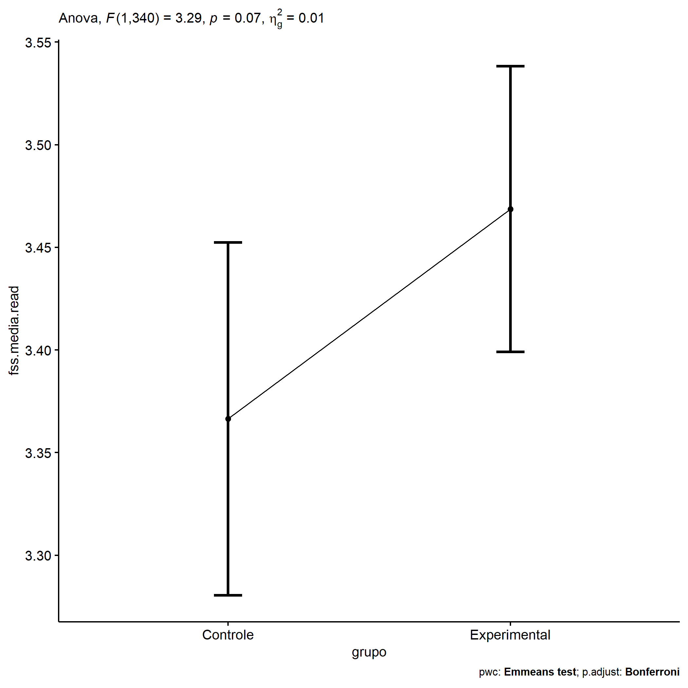<!-- -->

``` r
plots <- oneWayAncovaBoxPlots(
  wdat, "fss.media.read", "grupo", aov, pwc, covar = "dfs.media.read",
  theme = "classic", color = color[["grupo"]],
  subtitle = which(aov$Effect == "grupo"))
```

``` r
if (length(unique(wdat[["grupo"]])) > 1)
  plots[["grupo"]] + ggplot2::ylab("flow (ativ. leitura)") + ggplot2::scale_x_discrete(labels=c('pre', 'pos'))
```

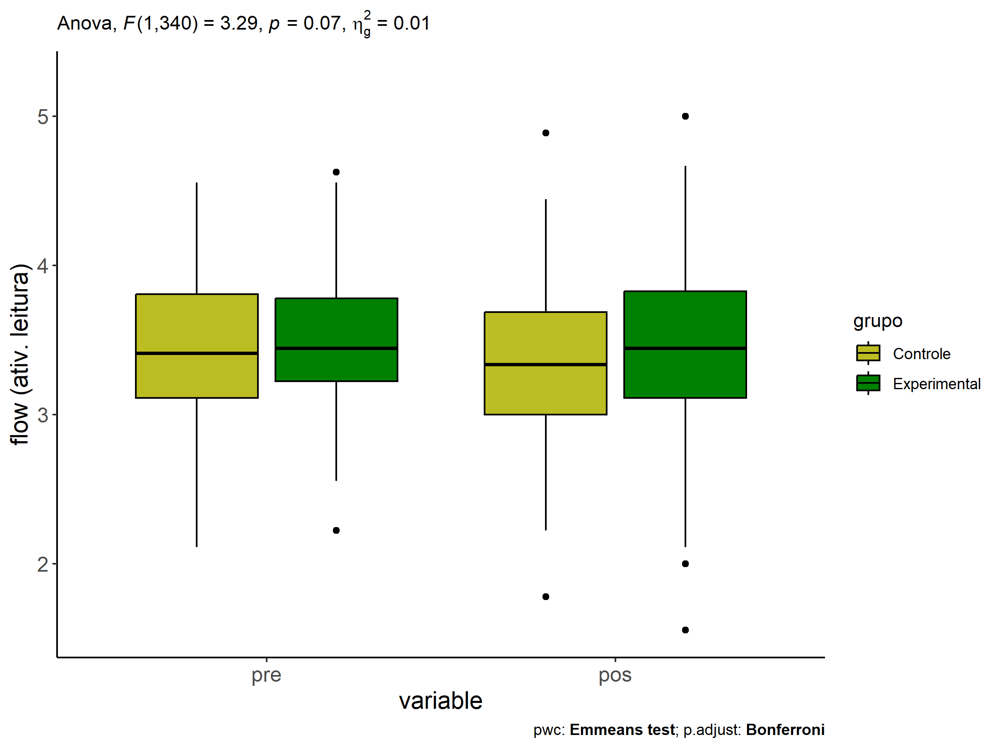<!-- -->

``` r
if (length(unique(wdat.long[["grupo"]])) > 1)
  plots <- oneWayAncovaBoxPlots(
    wdat.long, "flow.read", "grupo", aov, pwc.long, pre.post = "time",
    theme = "classic", color = color$prepost)
```

``` r
if (length(unique(wdat.long[["grupo"]])) > 1)
  plots[["grupo"]] + ggplot2::ylab("flow (ativ. leitura)")
```

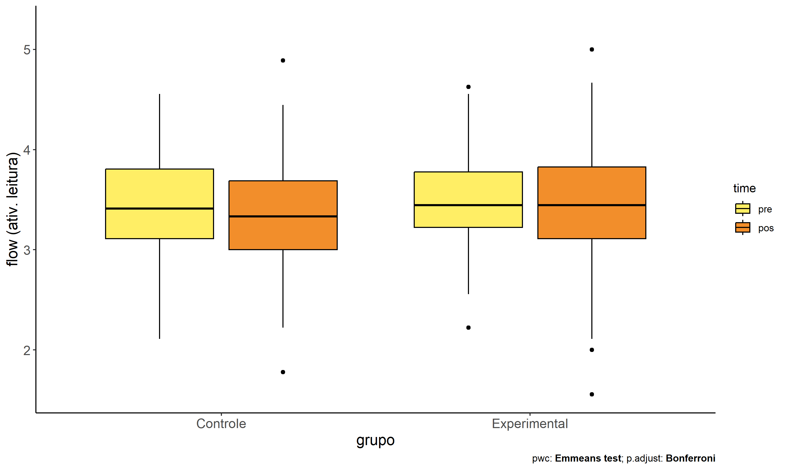<!-- -->

### Checking linearity assumption

``` r
ggscatter(wdat, x = "dfs.media.read", y = "fss.media.read", size = 0.5,
          color = "grupo", add = "reg.line")+
  stat_regline_equation(
    aes(label =  paste(..eq.label.., ..rr.label.., sep = "~~~~"), color = grupo)
  )
```

<!-- -->

### Checking normality and homogeneity

``` r
res <- augment(lm(fss.media.read ~ dfs.media.read + grupo, data = wdat))
```

``` r
shapiro_test(res$.resid)
```

    ## # A tibble: 1 × 3
    ##   variable   statistic p.value
    ##   <chr>          <dbl>   <dbl>
    ## 1 res$.resid     0.996   0.496

``` r
levene_test(res, .resid ~ grupo)
```

    ## # A tibble: 1 × 4
    ##     df1   df2 statistic     p
    ##   <int> <int>     <dbl> <dbl>
    ## 1     1   341     0.445 0.505

# ANCOVA and Pairwise for two factors **grupo:Sexo**

## Without remove non-normal data

``` r
pdat = remove_group_data(dat[!is.na(dat[["grupo"]]) & !is.na(dat[["Sexo"]]),], "fss.media.read", c("grupo","Sexo"))

pdat.long <- rbind(pdat[,c("id","grupo","Sexo")], pdat[,c("id","grupo","Sexo")])
pdat.long[["time"]] <- c(rep("pre", nrow(pdat)), rep("pos", nrow(pdat)))
pdat.long[["time"]] <- factor(pdat.long[["time"]], c("pre","pos"))
pdat.long[["flow.read"]] <- c(pdat[["dfs.media.read"]], pdat[["fss.media.read"]])

aov = anova_test(pdat, fss.media.read ~ dfs.media.read + grupo*Sexo)
laov[["grupo:Sexo"]] <- get_anova_table(aov)
```

``` r
pwcs <- list()
pwcs[["Sexo"]] <- emmeans_test(
  group_by(pdat, grupo), fss.media.read ~ Sexo,
  covariate = dfs.media.read, p.adjust.method = "bonferroni")
pwcs[["grupo"]] <- emmeans_test(
  group_by(pdat, Sexo), fss.media.read ~ grupo,
  covariate = dfs.media.read, p.adjust.method = "bonferroni")

pwc <- plyr::rbind.fill(pwcs[["grupo"]], pwcs[["Sexo"]])
pwc <- pwc[,c("grupo","Sexo", colnames(pwc)[!colnames(pwc) %in% c("grupo","Sexo")])]
```

``` r
pwc.long <- emmeans_test(dplyr::group_by_at(pdat.long, c("grupo","Sexo")),
                         flow.read ~ time,
                         p.adjust.method = "bonferroni")
lpwc[["grupo:Sexo"]] <- plyr::rbind.fill(pwc, pwc.long)
```

``` r
ds <- get.descriptives(pdat, "fss.media.read", c("grupo","Sexo"), covar = "dfs.media.read")
ds <- merge(ds[ds$variable != "dfs.media.read",],
            ds[ds$variable == "dfs.media.read", !colnames(ds) %in% c("variable")],
            by = c("grupo","Sexo"), all.x = T, suffixes = c("", ".dfs.media.read"))
ds <- merge(get_emmeans(pwcs[["grupo"]]), ds, by = c("grupo","Sexo"), suffixes = c(".emms", ""))
ds <- ds[,c("grupo","Sexo","n","mean.dfs.media.read","se.dfs.media.read","mean","se","emmean","se.emms")]

colnames(ds) <- c("grupo","Sexo", "N", paste0(c("M","SE")," (pre)"),
                  paste0(c("M","SE"), " (unadj)"), paste0(c("M", "SE"), " (adj)"))

lemms[["grupo:Sexo"]] <- ds
```

## Computing ANCOVA and PairWise After removing non-normal data (OK)

``` r
wdat = pdat 

res = residuals(lm(fss.media.read ~ dfs.media.read + grupo*Sexo, data = wdat))
non.normal = getNonNormal(res, wdat$id, plimit = 0.05)

wdat = wdat[!wdat$id %in% non.normal,]

wdat.long <- rbind(wdat[,c("id","grupo","Sexo")], wdat[,c("id","grupo","Sexo")])
wdat.long[["time"]] <- c(rep("pre", nrow(wdat)), rep("pos", nrow(wdat)))
wdat.long[["time"]] <- factor(wdat.long[["time"]], c("pre","pos"))
wdat.long[["flow.read"]] <- c(wdat[["dfs.media.read"]], wdat[["fss.media.read"]])


ldat[["grupo:Sexo"]] = wdat

(non.normal)
```

    ## NULL

``` r
aov = anova_test(wdat, fss.media.read ~ dfs.media.read + grupo*Sexo)
laov[["grupo:Sexo"]] <- merge(get_anova_table(aov), laov[["grupo:Sexo"]], by="Effect", suffixes = c("","'"))

(df = get_anova_table(aov))
```

    ## ANOVA Table (type II tests)
    ## 
    ##           Effect DFn DFd      F        p p<.05   ges
    ## 1 dfs.media.read   1 338 65.706 9.70e-15     * 0.163
    ## 2          grupo   1 338  3.000 8.40e-02       0.009
    ## 3           Sexo   1 338  0.865 3.53e-01       0.003
    ## 4     grupo:Sexo   1 338  0.684 4.09e-01       0.002

| Effect         | DFn | DFd |      F |     p | p\<.05 |   ges |
|:---------------|----:|----:|-------:|------:|:-------|------:|
| dfs.media.read |   1 | 338 | 65.706 | 0.000 | \*     | 0.163 |
| grupo          |   1 | 338 |  3.000 | 0.084 |        | 0.009 |
| Sexo           |   1 | 338 |  0.865 | 0.353 |        | 0.003 |
| grupo:Sexo     |   1 | 338 |  0.684 | 0.409 |        | 0.002 |

``` r
pwcs <- list()
pwcs[["Sexo"]] <- emmeans_test(
  group_by(wdat, grupo), fss.media.read ~ Sexo,
  covariate = dfs.media.read, p.adjust.method = "bonferroni")
pwcs[["grupo"]] <- emmeans_test(
  group_by(wdat, Sexo), fss.media.read ~ grupo,
  covariate = dfs.media.read, p.adjust.method = "bonferroni")

pwc <- plyr::rbind.fill(pwcs[["grupo"]], pwcs[["Sexo"]])
pwc <- pwc[,c("grupo","Sexo", colnames(pwc)[!colnames(pwc) %in% c("grupo","Sexo")])]
```

| grupo        | Sexo | term                  | .y.            | group1   | group2       |  df | statistic |     p | p.adj | p.adj.signif |
|:-------------|:-----|:----------------------|:---------------|:---------|:-------------|----:|----------:|------:|------:|:-------------|
|              | F    | dfs.media.read\*grupo | fss.media.read | Controle | Experimental | 338 |    -0.671 | 0.503 | 0.503 | ns           |
|              | M    | dfs.media.read\*grupo | fss.media.read | Controle | Experimental | 338 |    -1.796 | 0.073 | 0.073 | ns           |
| Controle     |      | dfs.media.read\*Sexo  | fss.media.read | F        | M            | 338 |     0.066 | 0.947 | 0.947 | ns           |
| Experimental |      | dfs.media.read\*Sexo  | fss.media.read | F        | M            | 338 |    -1.243 | 0.215 | 0.215 | ns           |

``` r
pwc.long <- emmeans_test(dplyr::group_by_at(wdat.long, c("grupo","Sexo")),
                         flow.read ~ time,
                         p.adjust.method = "bonferroni")
lpwc[["grupo:Sexo"]] <- merge(plyr::rbind.fill(pwc, pwc.long), lpwc[["grupo:Sexo"]], by=c("grupo","Sexo","term",".y.","group1","group2"), suffixes = c("","'"))
```

| grupo        | Sexo | term | .y.       | group1 | group2 |  df | statistic |     p | p.adj | p.adj.signif |
|:-------------|:-----|:-----|:----------|:-------|:-------|----:|----------:|------:|------:|:-------------|
| Controle     | F    | time | flow.read | pre    | pos    | 678 |     1.663 | 0.097 | 0.097 | ns           |
| Controle     | M    | time | flow.read | pre    | pos    | 678 |     0.200 | 0.841 | 0.841 | ns           |
| Experimental | F    | time | flow.read | pre    | pos    | 678 |     0.915 | 0.360 | 0.360 | ns           |
| Experimental | M    | time | flow.read | pre    | pos    | 678 |    -0.240 | 0.810 | 0.810 | ns           |

``` r
ds <- get.descriptives(wdat, "fss.media.read", c("grupo","Sexo"), covar = "dfs.media.read")
ds <- merge(ds[ds$variable != "dfs.media.read",],
            ds[ds$variable == "dfs.media.read", !colnames(ds) %in% c("variable")],
            by = c("grupo","Sexo"), all.x = T, suffixes = c("", ".dfs.media.read"))
ds <- merge(get_emmeans(pwcs[["grupo"]]), ds, by = c("grupo","Sexo"), suffixes = c(".emms", ""))
ds <- ds[,c("grupo","Sexo","n","mean.dfs.media.read","se.dfs.media.read","mean","se","emmean","se.emms")]

colnames(ds) <- c("grupo","Sexo", "N", paste0(c("M","SE")," (pre)"),
                  paste0(c("M","SE"), " (unadj)"), paste0(c("M", "SE"), " (adj)"))

lemms[["grupo:Sexo"]] <- merge(ds, lemms[["grupo:Sexo"]], by=c("grupo","Sexo"), suffixes = c("","'"))
```

| grupo        | Sexo |   N | M (pre) | SE (pre) | M (unadj) | SE (unadj) | M (adj) | SE (adj) |
|:-------------|:-----|----:|--------:|---------:|----------:|-----------:|--------:|---------:|
| Controle     | F    |  74 |   3.542 |    0.055 |     3.400 |      0.061 |   3.369 |    0.059 |
| Controle     | M    |  62 |   3.299 |    0.074 |     3.280 |      0.071 |   3.363 |    0.065 |
| Experimental | F    |  97 |   3.502 |    0.042 |     3.434 |      0.058 |   3.422 |    0.052 |
| Experimental | M    | 110 |   3.508 |    0.045 |     3.525 |      0.053 |   3.510 |    0.049 |

### Plots for ancova

``` r
plots <- twoWayAncovaPlots(
  wdat, "fss.media.read", c("grupo","Sexo"), aov, pwcs, addParam = c("mean_se"),
  font.label.size=10, step.increase=0.05, p.label="p.adj",
  subtitle = which(aov$Effect == "grupo:Sexo"))
```

``` r
if (!is.null(plots[["grupo"]]))
  plots[["grupo"]] + ggplot2::scale_color_manual(values = color[["Sexo"]])
```

    ## Scale for colour is already present.
    ## Adding another scale for colour, which will replace the existing scale.

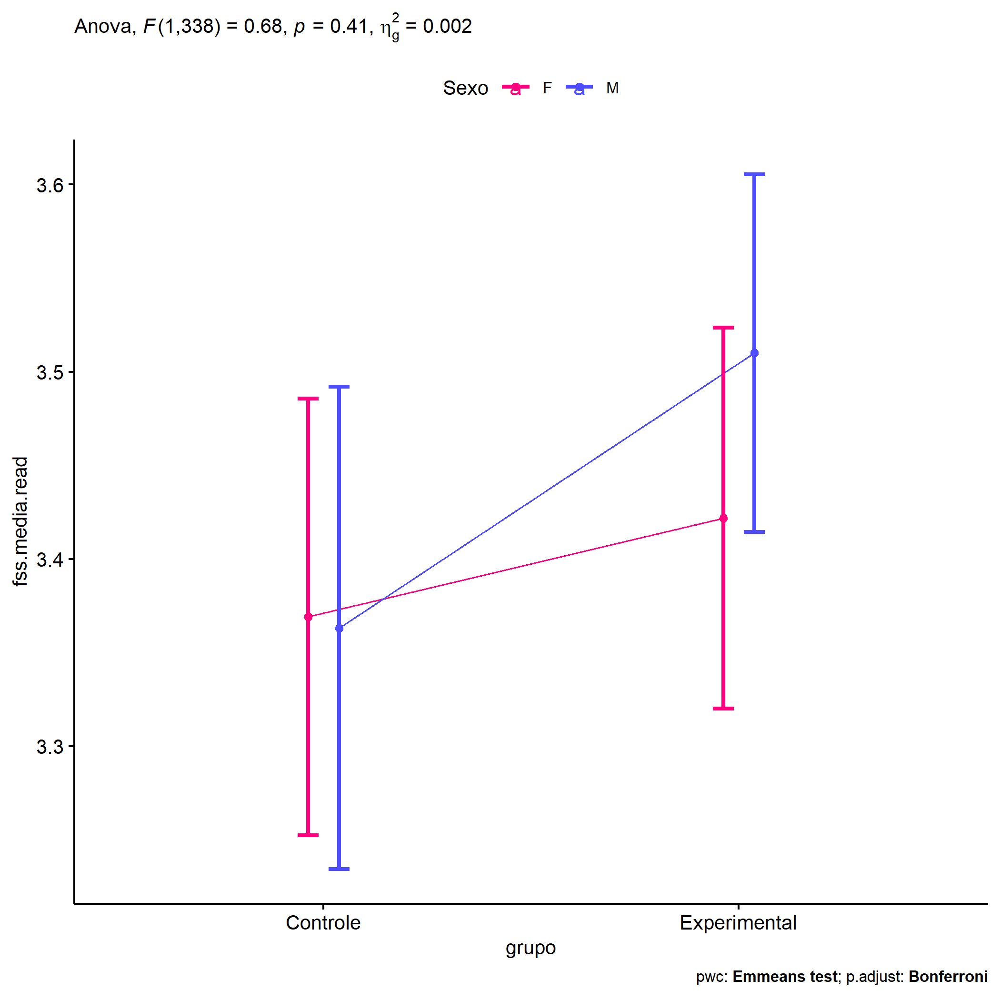<!-- -->

``` r
if (!is.null(plots[["Sexo"]]))
  plots[["Sexo"]] + ggplot2::scale_color_manual(values = color[["grupo"]])
```

    ## Scale for colour is already present.
    ## Adding another scale for colour, which will replace the existing scale.

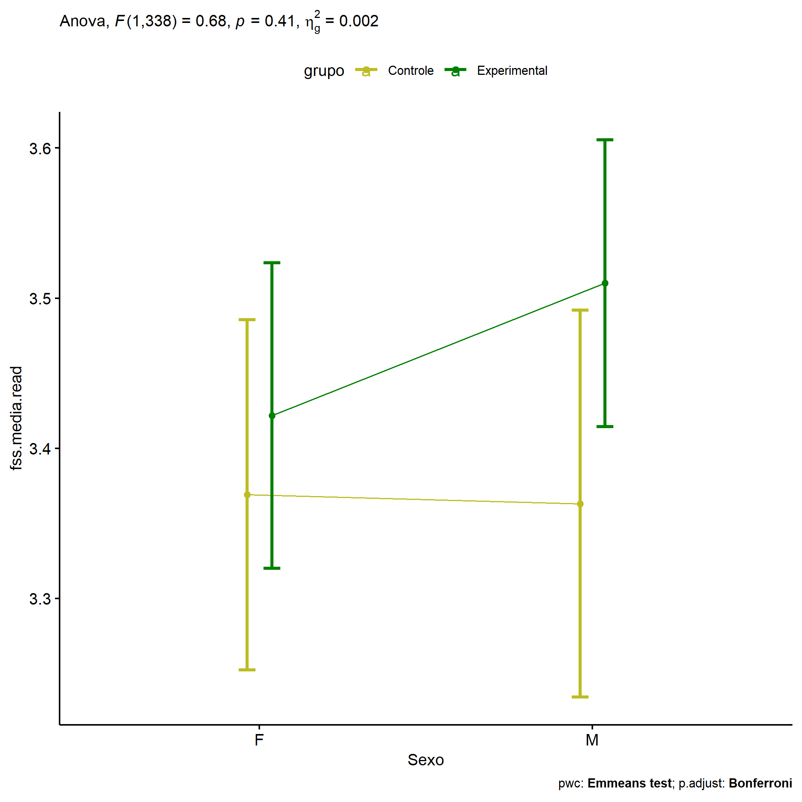<!-- -->

``` r
plots <- twoWayAncovaBoxPlots(
  wdat, "fss.media.read", c("grupo","Sexo"), aov, pwcs, covar = "dfs.media.read",
  theme = "classic", color = color[["grupo:Sexo"]],
  subtitle = which(aov$Effect == "grupo:Sexo"))
```

``` r
plots[["grupo:Sexo"]] + ggplot2::ylab("flow (ativ. leitura)") + ggplot2::scale_x_discrete(labels=c('pre', 'pos'))
```

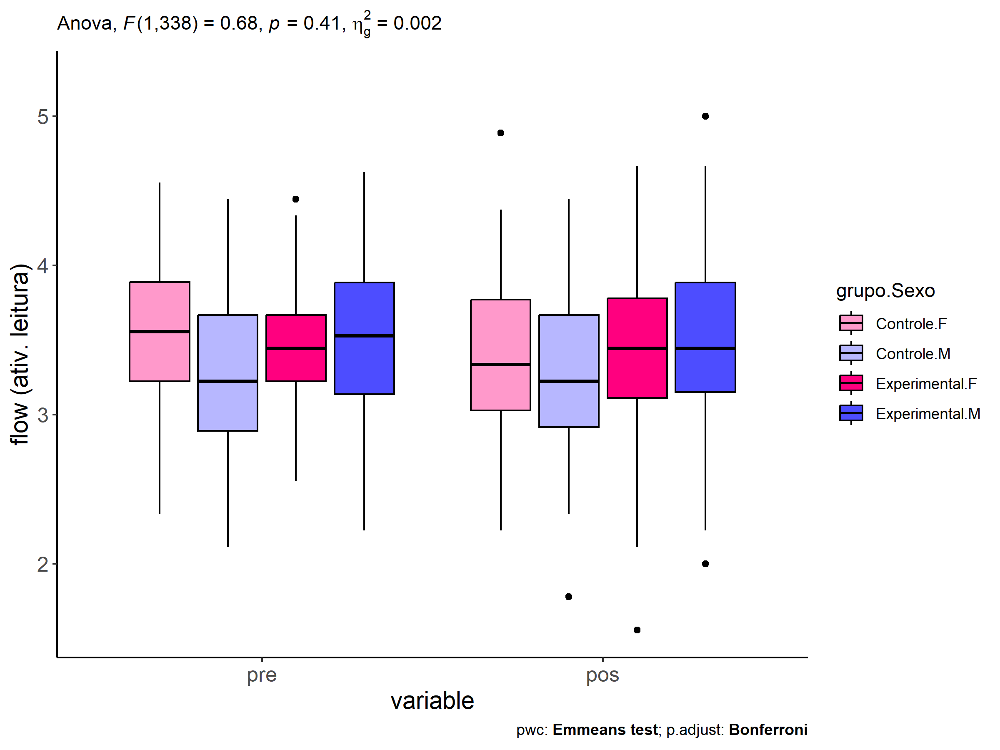<!-- -->

``` r
plots <- twoWayAncovaBoxPlots(
  wdat.long, "flow.read", c("grupo","Sexo"), aov, pwc.long, pre.post = "time",
  theme = "classic", color = color$prepost)
```

``` r
plots[["grupo:Sexo"]] + ggplot2::ylab("flow (ativ. leitura)")
```

<!-- -->

### Checking linearity assumption

``` r
ggscatter(wdat, x = "dfs.media.read", y = "fss.media.read", size = 0.5,
          facet.by = c("grupo","Sexo"), add = "reg.line")+
  stat_regline_equation(
    aes(label =  paste(..eq.label.., ..rr.label.., sep = "~~~~"))
  )
```

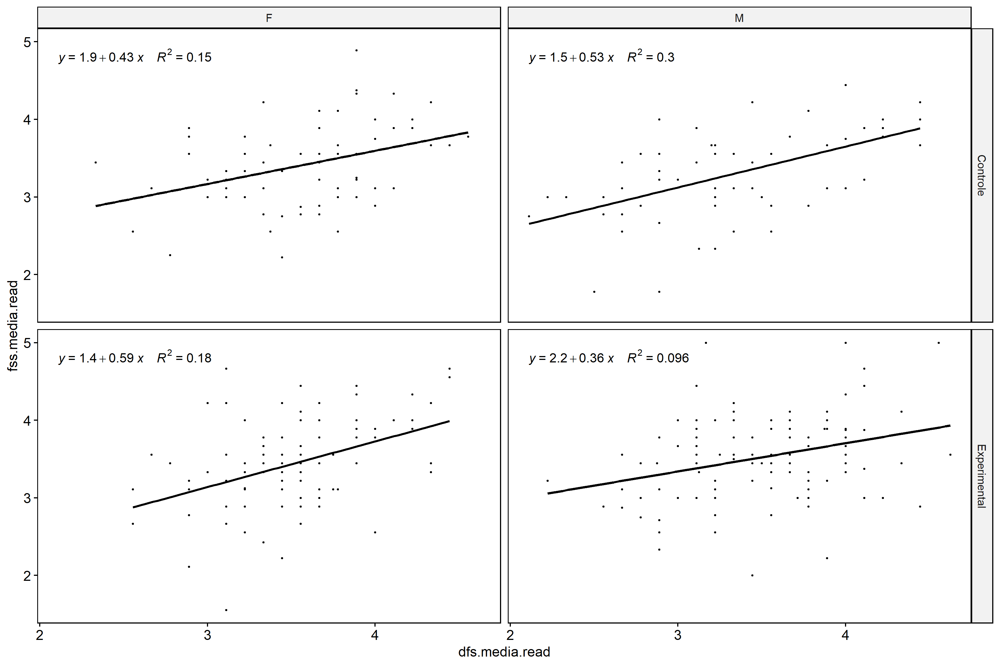<!-- -->

### Checking normality and homogeneity

``` r
res <- augment(lm(fss.media.read ~ dfs.media.read + grupo*Sexo, data = wdat))
```

``` r
shapiro_test(res$.resid)
```

    ## # A tibble: 1 × 3
    ##   variable   statistic p.value
    ##   <chr>          <dbl>   <dbl>
    ## 1 res$.resid     0.996   0.495

``` r
levene_test(res, .resid ~ grupo*Sexo)
```

    ## # A tibble: 1 × 4
    ##     df1   df2 statistic     p
    ##   <int> <int>     <dbl> <dbl>
    ## 1     3   339     0.381 0.767

# ANCOVA and Pairwise for two factors **grupo:Zona**

## Without remove non-normal data

``` r
pdat = remove_group_data(dat[!is.na(dat[["grupo"]]) & !is.na(dat[["Zona"]]),], "fss.media.read", c("grupo","Zona"))

pdat.long <- rbind(pdat[,c("id","grupo","Zona")], pdat[,c("id","grupo","Zona")])
pdat.long[["time"]] <- c(rep("pre", nrow(pdat)), rep("pos", nrow(pdat)))
pdat.long[["time"]] <- factor(pdat.long[["time"]], c("pre","pos"))
pdat.long[["flow.read"]] <- c(pdat[["dfs.media.read"]], pdat[["fss.media.read"]])

aov = anova_test(pdat, fss.media.read ~ dfs.media.read + grupo*Zona)
laov[["grupo:Zona"]] <- get_anova_table(aov)
```

``` r
pwcs <- list()
pwcs[["Zona"]] <- emmeans_test(
  group_by(pdat, grupo), fss.media.read ~ Zona,
  covariate = dfs.media.read, p.adjust.method = "bonferroni")
pwcs[["grupo"]] <- emmeans_test(
  group_by(pdat, Zona), fss.media.read ~ grupo,
  covariate = dfs.media.read, p.adjust.method = "bonferroni")

pwc <- plyr::rbind.fill(pwcs[["grupo"]], pwcs[["Zona"]])
pwc <- pwc[,c("grupo","Zona", colnames(pwc)[!colnames(pwc) %in% c("grupo","Zona")])]
```

``` r
pwc.long <- emmeans_test(dplyr::group_by_at(pdat.long, c("grupo","Zona")),
                         flow.read ~ time,
                         p.adjust.method = "bonferroni")
lpwc[["grupo:Zona"]] <- plyr::rbind.fill(pwc, pwc.long)
```

``` r
ds <- get.descriptives(pdat, "fss.media.read", c("grupo","Zona"), covar = "dfs.media.read")
ds <- merge(ds[ds$variable != "dfs.media.read",],
            ds[ds$variable == "dfs.media.read", !colnames(ds) %in% c("variable")],
            by = c("grupo","Zona"), all.x = T, suffixes = c("", ".dfs.media.read"))
ds <- merge(get_emmeans(pwcs[["grupo"]]), ds, by = c("grupo","Zona"), suffixes = c(".emms", ""))
ds <- ds[,c("grupo","Zona","n","mean.dfs.media.read","se.dfs.media.read","mean","se","emmean","se.emms")]

colnames(ds) <- c("grupo","Zona", "N", paste0(c("M","SE")," (pre)"),
                  paste0(c("M","SE"), " (unadj)"), paste0(c("M", "SE"), " (adj)"))

lemms[["grupo:Zona"]] <- ds
```

## Computing ANCOVA and PairWise After removing non-normal data (OK)

``` r
wdat = pdat 

res = residuals(lm(fss.media.read ~ dfs.media.read + grupo*Zona, data = wdat))
non.normal = getNonNormal(res, wdat$id, plimit = 0.05)

wdat = wdat[!wdat$id %in% non.normal,]

wdat.long <- rbind(wdat[,c("id","grupo","Zona")], wdat[,c("id","grupo","Zona")])
wdat.long[["time"]] <- c(rep("pre", nrow(wdat)), rep("pos", nrow(wdat)))
wdat.long[["time"]] <- factor(wdat.long[["time"]], c("pre","pos"))
wdat.long[["flow.read"]] <- c(wdat[["dfs.media.read"]], wdat[["fss.media.read"]])


ldat[["grupo:Zona"]] = wdat

(non.normal)
```

    ## NULL

``` r
aov = anova_test(wdat, fss.media.read ~ dfs.media.read + grupo*Zona)
laov[["grupo:Zona"]] <- merge(get_anova_table(aov), laov[["grupo:Zona"]], by="Effect", suffixes = c("","'"))

(df = get_anova_table(aov))
```

    ## ANOVA Table (type II tests)
    ## 
    ##           Effect DFn DFd         F        p p<.05      ges
    ## 1 dfs.media.read   1 286 64.804000 2.24e-14     * 1.85e-01
    ## 2          grupo   1 286  1.580000 2.10e-01       5.00e-03
    ## 3           Zona   1 286  0.081000 7.76e-01       2.84e-04
    ## 4     grupo:Zona   1 286  0.000715 9.79e-01       2.50e-06

| Effect         | DFn | DFd |      F |     p | p\<.05 |   ges |
|:---------------|----:|----:|-------:|------:|:-------|------:|
| dfs.media.read |   1 | 286 | 64.804 | 0.000 | \*     | 0.185 |
| grupo          |   1 | 286 |  1.580 | 0.210 |        | 0.005 |
| Zona           |   1 | 286 |  0.081 | 0.776 |        | 0.000 |
| grupo:Zona     |   1 | 286 |  0.001 | 0.979 |        | 0.000 |

``` r
pwcs <- list()
pwcs[["Zona"]] <- emmeans_test(
  group_by(wdat, grupo), fss.media.read ~ Zona,
  covariate = dfs.media.read, p.adjust.method = "bonferroni")
pwcs[["grupo"]] <- emmeans_test(
  group_by(wdat, Zona), fss.media.read ~ grupo,
  covariate = dfs.media.read, p.adjust.method = "bonferroni")

pwc <- plyr::rbind.fill(pwcs[["grupo"]], pwcs[["Zona"]])
pwc <- pwc[,c("grupo","Zona", colnames(pwc)[!colnames(pwc) %in% c("grupo","Zona")])]
```

| grupo        | Zona   | term                  | .y.            | group1   | group2       |  df | statistic |     p | p.adj | p.adj.signif |
|:-------------|:-------|:----------------------|:---------------|:---------|:-------------|----:|----------:|------:|------:|:-------------|
|              | Rural  | dfs.media.read\*grupo | fss.media.read | Controle | Experimental | 286 |    -0.904 | 0.367 | 0.367 | ns           |
|              | Urbana | dfs.media.read\*grupo | fss.media.read | Controle | Experimental | 286 |    -0.875 | 0.382 | 0.382 | ns           |
| Controle     |        | dfs.media.read\*Zona  | fss.media.read | Rural    | Urbana       | 286 |     0.159 | 0.873 | 0.873 | ns           |
| Experimental |        | dfs.media.read\*Zona  | fss.media.read | Rural    | Urbana       | 286 |     0.238 | 0.812 | 0.812 | ns           |

``` r
pwc.long <- emmeans_test(dplyr::group_by_at(wdat.long, c("grupo","Zona")),
                         flow.read ~ time,
                         p.adjust.method = "bonferroni")
lpwc[["grupo:Zona"]] <- merge(plyr::rbind.fill(pwc, pwc.long), lpwc[["grupo:Zona"]], by=c("grupo","Zona","term",".y.","group1","group2"), suffixes = c("","'"))
```

| grupo        | Zona   | term | .y.       | group1 | group2 |  df | statistic |     p | p.adj | p.adj.signif |
|:-------------|:-------|:-----|:----------|:-------|:-------|----:|----------:|------:|------:|:-------------|
| Controle     | Rural  | time | flow.read | pre    | pos    | 574 |     0.738 | 0.461 | 0.461 | ns           |
| Controle     | Urbana | time | flow.read | pre    | pos    | 574 |     1.131 | 0.259 | 0.259 | ns           |
| Experimental | Rural  | time | flow.read | pre    | pos    | 574 |     0.228 | 0.820 | 0.820 | ns           |
| Experimental | Urbana | time | flow.read | pre    | pos    | 574 |     0.845 | 0.398 | 0.398 | ns           |

``` r
ds <- get.descriptives(wdat, "fss.media.read", c("grupo","Zona"), covar = "dfs.media.read")
ds <- merge(ds[ds$variable != "dfs.media.read",],
            ds[ds$variable == "dfs.media.read", !colnames(ds) %in% c("variable")],
            by = c("grupo","Zona"), all.x = T, suffixes = c("", ".dfs.media.read"))
ds <- merge(get_emmeans(pwcs[["grupo"]]), ds, by = c("grupo","Zona"), suffixes = c(".emms", ""))
ds <- ds[,c("grupo","Zona","n","mean.dfs.media.read","se.dfs.media.read","mean","se","emmean","se.emms")]

colnames(ds) <- c("grupo","Zona", "N", paste0(c("M","SE")," (pre)"),
                  paste0(c("M","SE"), " (unadj)"), paste0(c("M", "SE"), " (adj)"))

lemms[["grupo:Zona"]] <- merge(ds, lemms[["grupo:Zona"]], by=c("grupo","Zona"), suffixes = c("","'"))
```

| grupo        | Zona   |   N | M (pre) | SE (pre) | M (unadj) | SE (unadj) | M (adj) | SE (adj) |
|:-------------|:-------|----:|--------:|---------:|----------:|-----------:|--------:|---------:|
| Controle     | Rural  |  55 |   3.443 |    0.067 |     3.370 |      0.069 |   3.397 |    0.068 |
| Controle     | Urbana |  61 |   3.480 |    0.069 |     3.373 |      0.073 |   3.382 |    0.065 |
| Experimental | Rural  |  92 |   3.488 |    0.049 |     3.471 |      0.059 |   3.475 |    0.053 |
| Experimental | Urbana |  83 |   3.554 |    0.045 |     3.486 |      0.063 |   3.457 |    0.056 |

### Plots for ancova

``` r
plots <- twoWayAncovaPlots(
  wdat, "fss.media.read", c("grupo","Zona"), aov, pwcs, addParam = c("mean_se"),
  font.label.size=10, step.increase=0.05, p.label="p.adj",
  subtitle = which(aov$Effect == "grupo:Zona"))
```

``` r
if (!is.null(plots[["grupo"]]))
  plots[["grupo"]] + ggplot2::scale_color_manual(values = color[["Zona"]])
```

    ## Scale for colour is already present.
    ## Adding another scale for colour, which will replace the existing scale.

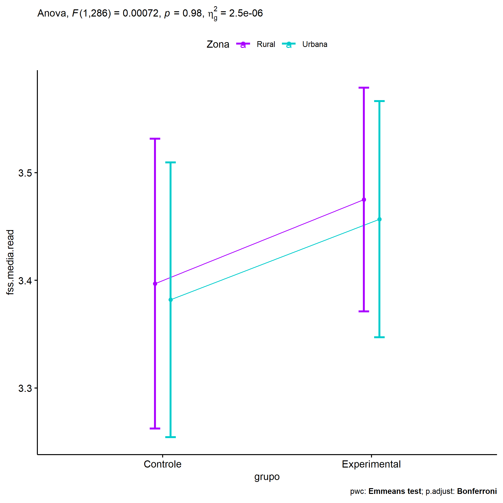<!-- -->

``` r
if (!is.null(plots[["Zona"]]))
  plots[["Zona"]] + ggplot2::scale_color_manual(values = color[["grupo"]])
```

    ## Scale for colour is already present.
    ## Adding another scale for colour, which will replace the existing scale.

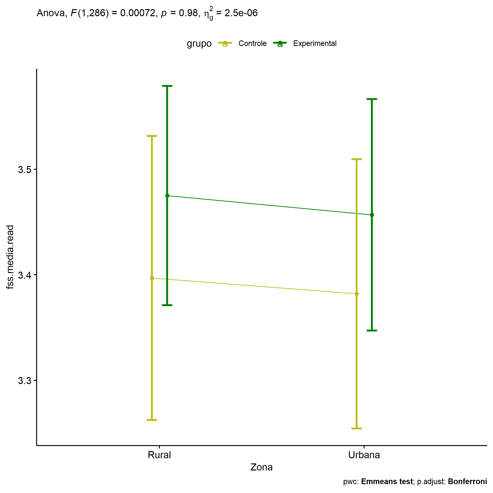<!-- -->

``` r
plots <- twoWayAncovaBoxPlots(
  wdat, "fss.media.read", c("grupo","Zona"), aov, pwcs, covar = "dfs.media.read",
  theme = "classic", color = color[["grupo:Zona"]],
  subtitle = which(aov$Effect == "grupo:Zona"))
```

``` r
plots[["grupo:Zona"]] + ggplot2::ylab("flow (ativ. leitura)") + ggplot2::scale_x_discrete(labels=c('pre', 'pos'))
```

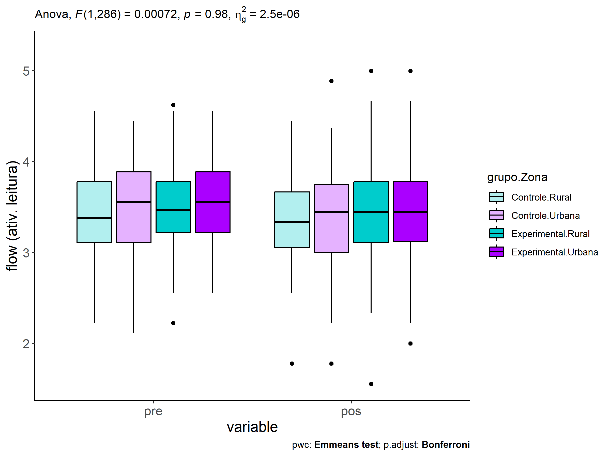<!-- -->

``` r
plots <- twoWayAncovaBoxPlots(
  wdat.long, "flow.read", c("grupo","Zona"), aov, pwc.long, pre.post = "time",
  theme = "classic", color = color$prepost)
```

``` r
plots[["grupo:Zona"]] + ggplot2::ylab("flow (ativ. leitura)")
```

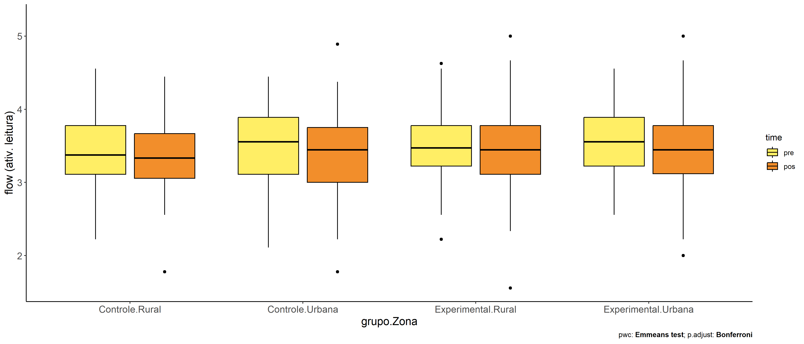<!-- -->

### Checking linearity assumption

``` r
ggscatter(wdat, x = "dfs.media.read", y = "fss.media.read", size = 0.5,
          facet.by = c("grupo","Zona"), add = "reg.line")+
  stat_regline_equation(
    aes(label =  paste(..eq.label.., ..rr.label.., sep = "~~~~"))
  )
```

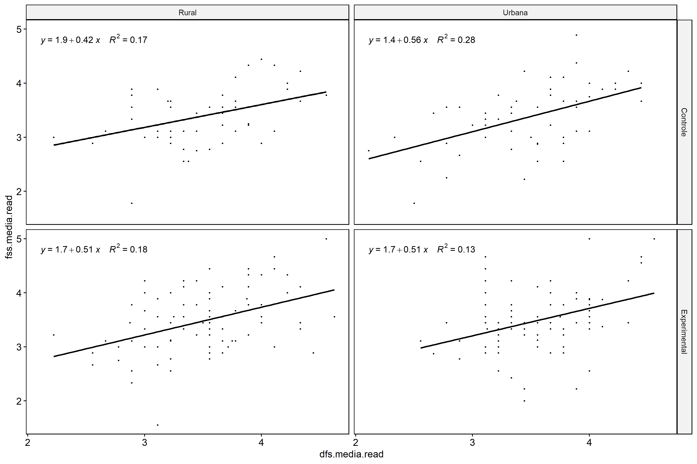<!-- -->

### Checking normality and homogeneity

``` r
res <- augment(lm(fss.media.read ~ dfs.media.read + grupo*Zona, data = wdat))
```

``` r
shapiro_test(res$.resid)
```

    ## # A tibble: 1 × 3
    ##   variable   statistic p.value
    ##   <chr>          <dbl>   <dbl>
    ## 1 res$.resid     0.994   0.315

``` r
levene_test(res, .resid ~ grupo*Zona)
```

    ## # A tibble: 1 × 4
    ##     df1   df2 statistic     p
    ##   <int> <int>     <dbl> <dbl>
    ## 1     3   287     0.199 0.897

# ANCOVA and Pairwise for two factors **grupo:Cor.Raca**

## Without remove non-normal data

``` r
pdat = remove_group_data(dat[!is.na(dat[["grupo"]]) & !is.na(dat[["Cor.Raca"]]),], "fss.media.read", c("grupo","Cor.Raca"))

pdat.long <- rbind(pdat[,c("id","grupo","Cor.Raca")], pdat[,c("id","grupo","Cor.Raca")])
pdat.long[["time"]] <- c(rep("pre", nrow(pdat)), rep("pos", nrow(pdat)))
pdat.long[["time"]] <- factor(pdat.long[["time"]], c("pre","pos"))
pdat.long[["flow.read"]] <- c(pdat[["dfs.media.read"]], pdat[["fss.media.read"]])

aov = anova_test(pdat, fss.media.read ~ dfs.media.read + grupo*Cor.Raca)
laov[["grupo:Cor.Raca"]] <- get_anova_table(aov)
```

``` r
pwcs <- list()
pwcs[["Cor.Raca"]] <- emmeans_test(
  group_by(pdat, grupo), fss.media.read ~ Cor.Raca,
  covariate = dfs.media.read, p.adjust.method = "bonferroni")
pwcs[["grupo"]] <- emmeans_test(
  group_by(pdat, Cor.Raca), fss.media.read ~ grupo,
  covariate = dfs.media.read, p.adjust.method = "bonferroni")

pwc <- plyr::rbind.fill(pwcs[["grupo"]], pwcs[["Cor.Raca"]])
pwc <- pwc[,c("grupo","Cor.Raca", colnames(pwc)[!colnames(pwc) %in% c("grupo","Cor.Raca")])]
```

``` r
pwc.long <- emmeans_test(dplyr::group_by_at(pdat.long, c("grupo","Cor.Raca")),
                         flow.read ~ time,
                         p.adjust.method = "bonferroni")
lpwc[["grupo:Cor.Raca"]] <- plyr::rbind.fill(pwc, pwc.long)
```

``` r
ds <- get.descriptives(pdat, "fss.media.read", c("grupo","Cor.Raca"), covar = "dfs.media.read")
ds <- merge(ds[ds$variable != "dfs.media.read",],
            ds[ds$variable == "dfs.media.read", !colnames(ds) %in% c("variable")],
            by = c("grupo","Cor.Raca"), all.x = T, suffixes = c("", ".dfs.media.read"))
ds <- merge(get_emmeans(pwcs[["grupo"]]), ds, by = c("grupo","Cor.Raca"), suffixes = c(".emms", ""))
ds <- ds[,c("grupo","Cor.Raca","n","mean.dfs.media.read","se.dfs.media.read","mean","se","emmean","se.emms")]

colnames(ds) <- c("grupo","Cor.Raca", "N", paste0(c("M","SE")," (pre)"),
                  paste0(c("M","SE"), " (unadj)"), paste0(c("M", "SE"), " (adj)"))

lemms[["grupo:Cor.Raca"]] <- ds
```

## Computing ANCOVA and PairWise After removing non-normal data (OK)

``` r
wdat = pdat 

res = residuals(lm(fss.media.read ~ dfs.media.read + grupo*Cor.Raca, data = wdat))
non.normal = getNonNormal(res, wdat$id, plimit = 0.05)

wdat = wdat[!wdat$id %in% non.normal,]

wdat.long <- rbind(wdat[,c("id","grupo","Cor.Raca")], wdat[,c("id","grupo","Cor.Raca")])
wdat.long[["time"]] <- c(rep("pre", nrow(wdat)), rep("pos", nrow(wdat)))
wdat.long[["time"]] <- factor(wdat.long[["time"]], c("pre","pos"))
wdat.long[["flow.read"]] <- c(wdat[["dfs.media.read"]], wdat[["fss.media.read"]])


ldat[["grupo:Cor.Raca"]] = wdat

(non.normal)
```

    ## NULL

``` r
aov = anova_test(wdat, fss.media.read ~ dfs.media.read + grupo*Cor.Raca)
laov[["grupo:Cor.Raca"]] <- merge(get_anova_table(aov), laov[["grupo:Cor.Raca"]], by="Effect", suffixes = c("","'"))

(df = get_anova_table(aov))
```

    ## ANOVA Table (type II tests)
    ## 
    ##           Effect DFn DFd      F        p p<.05   ges
    ## 1 dfs.media.read   1 119 26.955 8.70e-07     * 0.185
    ## 2          grupo   1 119  0.566 4.53e-01       0.005
    ## 3       Cor.Raca   1 119  1.726 1.91e-01       0.014
    ## 4 grupo:Cor.Raca   1 119 10.810 1.00e-03     * 0.083

| Effect         | DFn | DFd |      F |     p | p\<.05 |   ges |
|:---------------|----:|----:|-------:|------:|:-------|------:|
| dfs.media.read |   1 | 119 | 26.955 | 0.000 | \*     | 0.185 |
| grupo          |   1 | 119 |  0.566 | 0.453 |        | 0.005 |
| Cor.Raca       |   1 | 119 |  1.726 | 0.191 |        | 0.014 |
| grupo:Cor.Raca |   1 | 119 | 10.810 | 0.001 | \*     | 0.083 |

``` r
pwcs <- list()
pwcs[["Cor.Raca"]] <- emmeans_test(
  group_by(wdat, grupo), fss.media.read ~ Cor.Raca,
  covariate = dfs.media.read, p.adjust.method = "bonferroni")
pwcs[["grupo"]] <- emmeans_test(
  group_by(wdat, Cor.Raca), fss.media.read ~ grupo,
  covariate = dfs.media.read, p.adjust.method = "bonferroni")

pwc <- plyr::rbind.fill(pwcs[["grupo"]], pwcs[["Cor.Raca"]])
pwc <- pwc[,c("grupo","Cor.Raca", colnames(pwc)[!colnames(pwc) %in% c("grupo","Cor.Raca")])]
```

| grupo        | Cor.Raca | term                     | .y.            | group1   | group2       |  df | statistic |     p | p.adj | p.adj.signif |
|:-------------|:---------|:-------------------------|:---------------|:---------|:-------------|----:|----------:|------:|------:|:-------------|
|              | Branca   | dfs.media.read\*grupo    | fss.media.read | Controle | Experimental | 119 |     2.428 | 0.017 | 0.017 | \*           |
|              | Parda    | dfs.media.read\*grupo    | fss.media.read | Controle | Experimental | 119 |    -2.339 | 0.021 | 0.021 | \*           |
| Controle     |          | dfs.media.read\*Cor.Raca | fss.media.read | Branca   | Parda        | 119 |     3.220 | 0.002 | 0.002 | \*\*         |
| Experimental |          | dfs.media.read\*Cor.Raca | fss.media.read | Branca   | Parda        | 119 |    -1.469 | 0.145 | 0.145 | ns           |

``` r
pwc.long <- emmeans_test(dplyr::group_by_at(wdat.long, c("grupo","Cor.Raca")),
                         flow.read ~ time,
                         p.adjust.method = "bonferroni")
lpwc[["grupo:Cor.Raca"]] <- merge(plyr::rbind.fill(pwc, pwc.long), lpwc[["grupo:Cor.Raca"]], by=c("grupo","Cor.Raca","term",".y.","group1","group2"), suffixes = c("","'"))
```

| grupo        | Cor.Raca | term | .y.       | group1 | group2 |  df | statistic |     p | p.adj | p.adj.signif |
|:-------------|:---------|:-----|:----------|:-------|:-------|----:|----------:|------:|------:|:-------------|
| Controle     | Branca   | time | flow.read | pre    | pos    | 240 |    -0.947 | 0.345 | 0.345 | ns           |
| Controle     | Parda    | time | flow.read | pre    | pos    | 240 |     1.968 | 0.050 | 0.050 | ns           |
| Experimental | Branca   | time | flow.read | pre    | pos    | 240 |     1.302 | 0.194 | 0.194 | ns           |
| Experimental | Parda    | time | flow.read | pre    | pos    | 240 |     0.238 | 0.812 | 0.812 | ns           |

``` r
ds <- get.descriptives(wdat, "fss.media.read", c("grupo","Cor.Raca"), covar = "dfs.media.read")
ds <- merge(ds[ds$variable != "dfs.media.read",],
            ds[ds$variable == "dfs.media.read", !colnames(ds) %in% c("variable")],
            by = c("grupo","Cor.Raca"), all.x = T, suffixes = c("", ".dfs.media.read"))
ds <- merge(get_emmeans(pwcs[["grupo"]]), ds, by = c("grupo","Cor.Raca"), suffixes = c(".emms", ""))
ds <- ds[,c("grupo","Cor.Raca","n","mean.dfs.media.read","se.dfs.media.read","mean","se","emmean","se.emms")]

colnames(ds) <- c("grupo","Cor.Raca", "N", paste0(c("M","SE")," (pre)"),
                  paste0(c("M","SE"), " (unadj)"), paste0(c("M", "SE"), " (adj)"))

lemms[["grupo:Cor.Raca"]] <- merge(ds, lemms[["grupo:Cor.Raca"]], by=c("grupo","Cor.Raca"), suffixes = c("","'"))
```

| grupo        | Cor.Raca |   N | M (pre) | SE (pre) | M (unadj) | SE (unadj) | M (adj) | SE (adj) |
|:-------------|:---------|----:|--------:|---------:|----------:|-----------:|--------:|---------:|
| Controle     | Branca   |  18 |   3.486 |    0.141 |     3.647 |      0.137 |   3.638 |    0.107 |
| Controle     | Parda    |  42 |   3.424 |    0.084 |     3.206 |      0.069 |   3.224 |    0.070 |
| Experimental | Branca   |  15 |   3.511 |    0.137 |     3.270 |      0.128 |   3.250 |    0.118 |
| Experimental | Parda    |  49 |   3.478 |    0.063 |     3.454 |      0.074 |   3.448 |    0.065 |

### Plots for ancova

``` r
plots <- twoWayAncovaPlots(
  wdat, "fss.media.read", c("grupo","Cor.Raca"), aov, pwcs, addParam = c("mean_se"),
  font.label.size=10, step.increase=0.05, p.label="p.adj",
  subtitle = which(aov$Effect == "grupo:Cor.Raca"))
```

``` r
if (!is.null(plots[["grupo"]]))
  plots[["grupo"]] + ggplot2::scale_color_manual(values = color[["Cor.Raca"]])
```

    ## Scale for colour is already present.
    ## Adding another scale for colour, which will replace the existing scale.

<!-- -->

``` r
if (!is.null(plots[["Cor.Raca"]]))
  plots[["Cor.Raca"]] + ggplot2::scale_color_manual(values = color[["grupo"]])
```

    ## Scale for colour is already present.
    ## Adding another scale for colour, which will replace the existing scale.

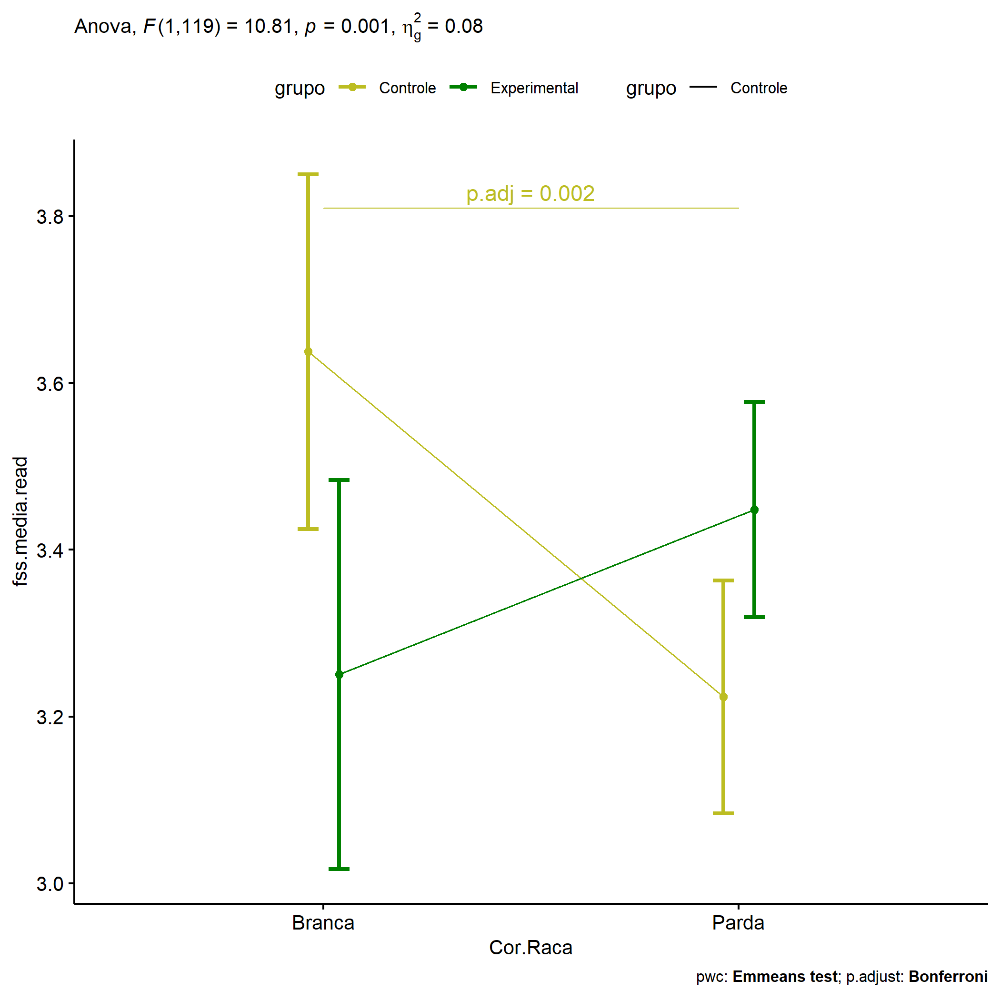<!-- -->

``` r
plots <- twoWayAncovaBoxPlots(
  wdat, "fss.media.read", c("grupo","Cor.Raca"), aov, pwcs, covar = "dfs.media.read",
  theme = "classic", color = color[["grupo:Cor.Raca"]],
  subtitle = which(aov$Effect == "grupo:Cor.Raca"))
```

``` r
plots[["grupo:Cor.Raca"]] + ggplot2::ylab("flow (ativ. leitura)") + ggplot2::scale_x_discrete(labels=c('pre', 'pos'))
```

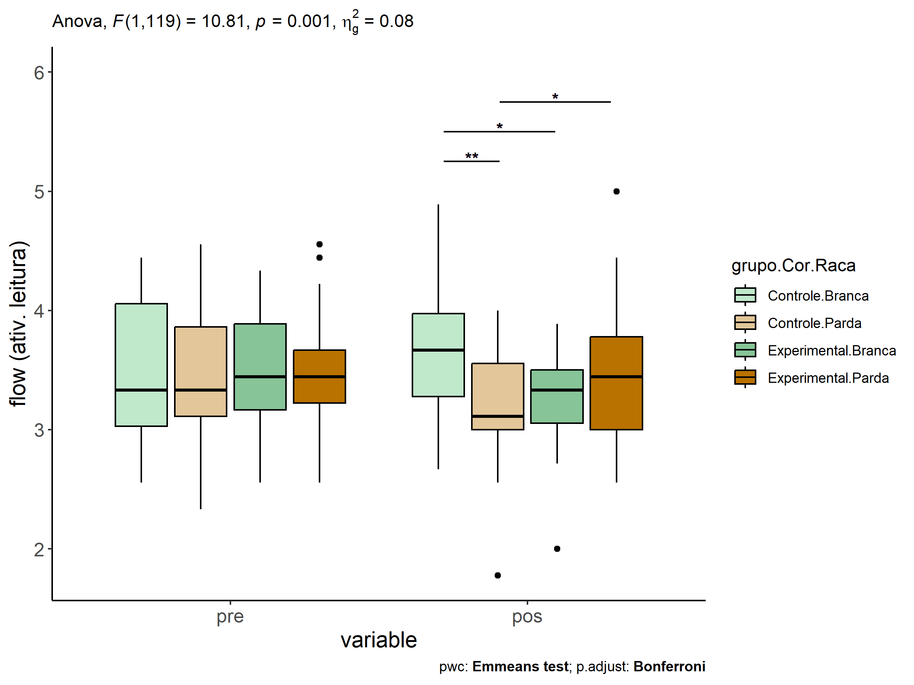<!-- -->

``` r
plots <- twoWayAncovaBoxPlots(
  wdat.long, "flow.read", c("grupo","Cor.Raca"), aov, pwc.long, pre.post = "time",
  theme = "classic", color = color$prepost)
```

``` r
plots[["grupo:Cor.Raca"]] + ggplot2::ylab("flow (ativ. leitura)")
```

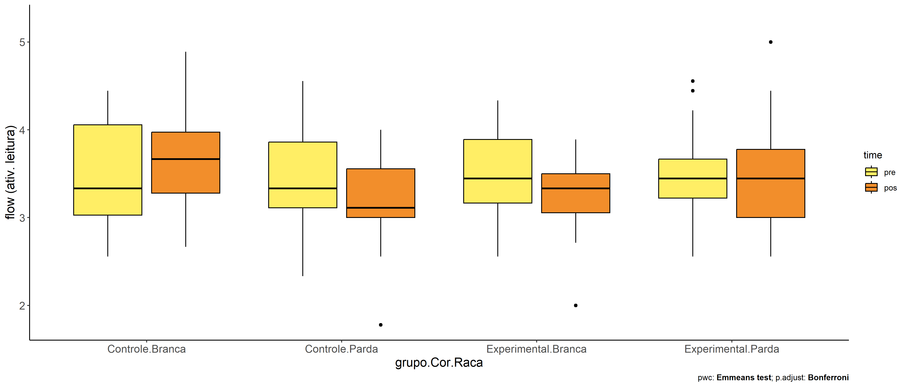<!-- -->

### Checking linearity assumption

``` r
ggscatter(wdat, x = "dfs.media.read", y = "fss.media.read", size = 0.5,
          facet.by = c("grupo","Cor.Raca"), add = "reg.line")+
  stat_regline_equation(
    aes(label =  paste(..eq.label.., ..rr.label.., sep = "~~~~"))
  )
```

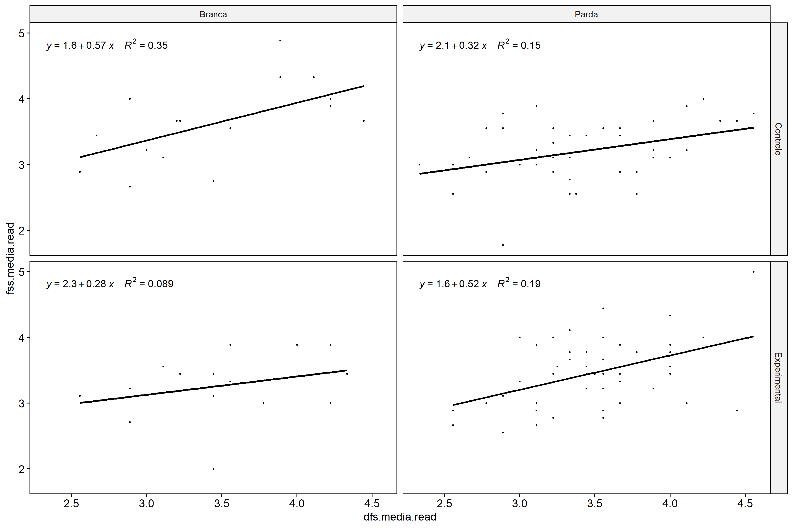<!-- -->

### Checking normality and homogeneity

``` r
res <- augment(lm(fss.media.read ~ dfs.media.read + grupo*Cor.Raca, data = wdat))
```

``` r
shapiro_test(res$.resid)
```

    ## # A tibble: 1 × 3
    ##   variable   statistic p.value
    ##   <chr>          <dbl>   <dbl>
    ## 1 res$.resid     0.994   0.897

``` r
levene_test(res, .resid ~ grupo*Cor.Raca)
```

    ## # A tibble: 1 × 4
    ##     df1   df2 statistic     p
    ##   <int> <int>     <dbl> <dbl>
    ## 1     3   120     0.243 0.866

# Summary of Results

## Descriptive Statistics

``` r
df <- get.descriptives(ldat[["grupo"]], c(dv.pre, dv.pos), c("grupo"), 
                       include.global = T, symmetry.test = T, normality.test = F)
df <- plyr::rbind.fill(
  df, do.call(plyr::rbind.fill, lapply(lfatores2, FUN = function(f) {
    if (nrow(dat) > 0 && sum(!is.na(unique(dat[[f]]))) > 1)
      get.descriptives(ldat[[paste0("grupo:",f)]], c(dv.pre,dv.pos), c("grupo", f),
                       symmetry.test = T, normality.test = F)
    }))
)
(df <- df[,c(fatores1[fatores1 %in% colnames(df)],"variable",
             colnames(df)[!colnames(df) %in% c(fatores1,"variable")])])
```

    ##           grupo Sexo   Zona Cor.Raca       variable   n  mean median   min   max    sd    se    ci   iqr
    ## 1      Controle <NA>   <NA>     <NA> dfs.media.read 136 3.431  3.410 2.111 4.556 0.538 0.046 0.091 0.694
    ## 2  Experimental <NA>   <NA>     <NA> dfs.media.read 207 3.505  3.444 2.222 4.625 0.445 0.031 0.061 0.556
    ## 3          <NA> <NA>   <NA>     <NA> dfs.media.read 343 3.476  3.444 2.111 4.625 0.485 0.026 0.051 0.653
    ## 4      Controle <NA>   <NA>     <NA> fss.media.read 136 3.345  3.333 1.778 4.889 0.546 0.047 0.093 0.688
    ## 5  Experimental <NA>   <NA>     <NA> fss.media.read 207 3.482  3.444 1.556 5.000 0.563 0.039 0.077 0.715
    ## 6          <NA> <NA>   <NA>     <NA> fss.media.read 343 3.428  3.444 1.556 5.000 0.560 0.030 0.059 0.667
    ## 7      Controle    F   <NA>     <NA> dfs.media.read  74 3.542  3.556 2.333 4.556 0.472 0.055 0.109 0.667
    ## 8      Controle    M   <NA>     <NA> dfs.media.read  62 3.299  3.222 2.111 4.444 0.584 0.074 0.148 0.778
    ## 9  Experimental    F   <NA>     <NA> dfs.media.read  97 3.502  3.444 2.556 4.444 0.411 0.042 0.083 0.444
    ## 10 Experimental    M   <NA>     <NA> dfs.media.read 110 3.508  3.528 2.222 4.625 0.474 0.045 0.090 0.750
    ## 11     Controle    F   <NA>     <NA> fss.media.read  74 3.400  3.333 2.222 4.889 0.529 0.061 0.123 0.743
    ## 12     Controle    M   <NA>     <NA> fss.media.read  62 3.280  3.222 1.778 4.444 0.563 0.071 0.143 0.750
    ## 13 Experimental    F   <NA>     <NA> fss.media.read  97 3.434  3.444 1.556 4.667 0.568 0.058 0.115 0.667
    ## 14 Experimental    M   <NA>     <NA> fss.media.read 110 3.525  3.444 2.000 5.000 0.558 0.053 0.105 0.736
    ## 15     Controle <NA>  Rural     <NA> dfs.media.read  55 3.443  3.375 2.222 4.556 0.496 0.067 0.134 0.667
    ## 16     Controle <NA> Urbana     <NA> dfs.media.read  61 3.480  3.556 2.111 4.444 0.539 0.069 0.138 0.778
    ## 17 Experimental <NA>  Rural     <NA> dfs.media.read  92 3.488  3.472 2.222 4.625 0.468 0.049 0.097 0.556
    ## 18 Experimental <NA> Urbana     <NA> dfs.media.read  83 3.554  3.556 2.556 4.556 0.414 0.045 0.090 0.667
    ## 19     Controle <NA>  Rural     <NA> fss.media.read  55 3.370  3.333 1.778 4.444 0.508 0.069 0.137 0.611
    ## 20     Controle <NA> Urbana     <NA> fss.media.read  61 3.373  3.444 1.778 4.889 0.572 0.073 0.147 0.750
    ## 21 Experimental <NA>  Rural     <NA> fss.media.read  92 3.471  3.444 1.556 5.000 0.565 0.059 0.117 0.667
    ## 22 Experimental <NA> Urbana     <NA> fss.media.read  83 3.486  3.444 2.000 5.000 0.577 0.063 0.126 0.660
    ## 23     Controle <NA>   <NA>   Branca dfs.media.read  18 3.486  3.333 2.556 4.444 0.600 0.141 0.298 1.028
    ## 24     Controle <NA>   <NA>    Parda dfs.media.read  42 3.424  3.333 2.333 4.556 0.545 0.084 0.170 0.750
    ## 25 Experimental <NA>   <NA>   Branca dfs.media.read  15 3.511  3.444 2.556 4.333 0.531 0.137 0.294 0.722
    ## 26 Experimental <NA>   <NA>    Parda dfs.media.read  49 3.478  3.444 2.556 4.556 0.439 0.063 0.126 0.444
    ## 27     Controle <NA>   <NA>   Branca fss.media.read  18 3.647  3.667 2.667 4.889 0.580 0.137 0.288 0.694
    ## 28     Controle <NA>   <NA>    Parda fss.media.read  42 3.206  3.111 1.778 4.000 0.448 0.069 0.139 0.556
    ## 29 Experimental <NA>   <NA>   Branca fss.media.read  15 3.270  3.333 2.000 3.889 0.496 0.128 0.275 0.444
    ## 30 Experimental <NA>   <NA>    Parda fss.media.read  49 3.454  3.444 2.556 5.000 0.520 0.074 0.149 0.778
    ##    symmetry     skewness      kurtosis
    ## 1       YES -0.087541335 -0.6045166962
    ## 2       YES  0.099807697 -0.1722823329
    ## 3       YES -0.043588640 -0.2786227377
    ## 4       YES -0.105870932  0.0925700126
    ## 5       YES  0.036777771  0.6620226644
    ## 6       YES -0.005807351  0.4925926969
    ## 7       YES -0.128947278 -0.4724224642
    ## 8       YES  0.164999342 -0.7678473294
    ## 9       YES  0.245748693 -0.0575770744
    ## 10      YES  0.009472812 -0.3476754066
    ## 11      YES  0.208782845 -0.1964792884
    ## 12      YES -0.380237198  0.0006878018
    ## 13      YES -0.206420178  0.4430256066
    ## 14      YES  0.271586706  0.6660847334
    ## 15      YES  0.053380384 -0.4398368197
    ## 16      YES -0.289602310 -0.4502794636
    ## 17      YES  0.089167814 -0.0637697143
    ## 18      YES  0.139742303 -0.3186833490
    ## 19      YES -0.194195628  0.3895292173
    ## 20      YES -0.182858328  0.1808169507
    ## 21      YES -0.070208932  0.5523082300
    ## 22      YES  0.173716690  0.5154990487
    ## 23      YES  0.112373763 -1.5071591946
    ## 24      YES  0.143345054 -0.7833650124
    ## 25      YES -0.014375665 -1.1562131221
    ## 26      YES  0.194448279 -0.1150276490
    ## 27      YES  0.098704487 -0.5970317420
    ## 28       NO -0.586948666  0.6964740847
    ## 29       NO -0.827124469  0.4737709034
    ## 30      YES  0.399667725  0.0153023674

| grupo        | Sexo | Zona   | Cor.Raca | variable       |   n |  mean | median |   min |   max |    sd |    se |    ci |   iqr | symmetry | skewness | kurtosis |
|:-------------|:-----|:-------|:---------|:---------------|----:|------:|-------:|------:|------:|------:|------:|------:|------:|:---------|---------:|---------:|
| Controle     |      |        |          | dfs.media.read | 136 | 3.431 |  3.410 | 2.111 | 4.556 | 0.538 | 0.046 | 0.091 | 0.694 | YES      |   -0.088 |   -0.605 |
| Experimental |      |        |          | dfs.media.read | 207 | 3.505 |  3.444 | 2.222 | 4.625 | 0.445 | 0.031 | 0.061 | 0.556 | YES      |    0.100 |   -0.172 |
|              |      |        |          | dfs.media.read | 343 | 3.476 |  3.444 | 2.111 | 4.625 | 0.485 | 0.026 | 0.051 | 0.653 | YES      |   -0.044 |   -0.279 |
| Controle     |      |        |          | fss.media.read | 136 | 3.345 |  3.333 | 1.778 | 4.889 | 0.546 | 0.047 | 0.093 | 0.688 | YES      |   -0.106 |    0.093 |
| Experimental |      |        |          | fss.media.read | 207 | 3.482 |  3.444 | 1.556 | 5.000 | 0.563 | 0.039 | 0.077 | 0.715 | YES      |    0.037 |    0.662 |
|              |      |        |          | fss.media.read | 343 | 3.428 |  3.444 | 1.556 | 5.000 | 0.560 | 0.030 | 0.059 | 0.667 | YES      |   -0.006 |    0.493 |
| Controle     | F    |        |          | dfs.media.read |  74 | 3.542 |  3.556 | 2.333 | 4.556 | 0.472 | 0.055 | 0.109 | 0.667 | YES      |   -0.129 |   -0.472 |
| Controle     | M    |        |          | dfs.media.read |  62 | 3.299 |  3.222 | 2.111 | 4.444 | 0.584 | 0.074 | 0.148 | 0.778 | YES      |    0.165 |   -0.768 |
| Experimental | F    |        |          | dfs.media.read |  97 | 3.502 |  3.444 | 2.556 | 4.444 | 0.411 | 0.042 | 0.083 | 0.444 | YES      |    0.246 |   -0.058 |
| Experimental | M    |        |          | dfs.media.read | 110 | 3.508 |  3.528 | 2.222 | 4.625 | 0.474 | 0.045 | 0.090 | 0.750 | YES      |    0.009 |   -0.348 |
| Controle     | F    |        |          | fss.media.read |  74 | 3.400 |  3.333 | 2.222 | 4.889 | 0.529 | 0.061 | 0.123 | 0.743 | YES      |    0.209 |   -0.196 |
| Controle     | M    |        |          | fss.media.read |  62 | 3.280 |  3.222 | 1.778 | 4.444 | 0.563 | 0.071 | 0.143 | 0.750 | YES      |   -0.380 |    0.001 |
| Experimental | F    |        |          | fss.media.read |  97 | 3.434 |  3.444 | 1.556 | 4.667 | 0.568 | 0.058 | 0.115 | 0.667 | YES      |   -0.206 |    0.443 |
| Experimental | M    |        |          | fss.media.read | 110 | 3.525 |  3.444 | 2.000 | 5.000 | 0.558 | 0.053 | 0.105 | 0.736 | YES      |    0.272 |    0.666 |
| Controle     |      | Rural  |          | dfs.media.read |  55 | 3.443 |  3.375 | 2.222 | 4.556 | 0.496 | 0.067 | 0.134 | 0.667 | YES      |    0.053 |   -0.440 |
| Controle     |      | Urbana |          | dfs.media.read |  61 | 3.480 |  3.556 | 2.111 | 4.444 | 0.539 | 0.069 | 0.138 | 0.778 | YES      |   -0.290 |   -0.450 |
| Experimental |      | Rural  |          | dfs.media.read |  92 | 3.488 |  3.472 | 2.222 | 4.625 | 0.468 | 0.049 | 0.097 | 0.556 | YES      |    0.089 |   -0.064 |
| Experimental |      | Urbana |          | dfs.media.read |  83 | 3.554 |  3.556 | 2.556 | 4.556 | 0.414 | 0.045 | 0.090 | 0.667 | YES      |    0.140 |   -0.319 |
| Controle     |      | Rural  |          | fss.media.read |  55 | 3.370 |  3.333 | 1.778 | 4.444 | 0.508 | 0.069 | 0.137 | 0.611 | YES      |   -0.194 |    0.390 |
| Controle     |      | Urbana |          | fss.media.read |  61 | 3.373 |  3.444 | 1.778 | 4.889 | 0.572 | 0.073 | 0.147 | 0.750 | YES      |   -0.183 |    0.181 |
| Experimental |      | Rural  |          | fss.media.read |  92 | 3.471 |  3.444 | 1.556 | 5.000 | 0.565 | 0.059 | 0.117 | 0.667 | YES      |   -0.070 |    0.552 |
| Experimental |      | Urbana |          | fss.media.read |  83 | 3.486 |  3.444 | 2.000 | 5.000 | 0.577 | 0.063 | 0.126 | 0.660 | YES      |    0.174 |    0.515 |
| Controle     |      |        | Branca   | dfs.media.read |  18 | 3.486 |  3.333 | 2.556 | 4.444 | 0.600 | 0.141 | 0.298 | 1.028 | YES      |    0.112 |   -1.507 |
| Controle     |      |        | Parda    | dfs.media.read |  42 | 3.424 |  3.333 | 2.333 | 4.556 | 0.545 | 0.084 | 0.170 | 0.750 | YES      |    0.143 |   -0.783 |
| Experimental |      |        | Branca   | dfs.media.read |  15 | 3.511 |  3.444 | 2.556 | 4.333 | 0.531 | 0.137 | 0.294 | 0.722 | YES      |   -0.014 |   -1.156 |
| Experimental |      |        | Parda    | dfs.media.read |  49 | 3.478 |  3.444 | 2.556 | 4.556 | 0.439 | 0.063 | 0.126 | 0.444 | YES      |    0.194 |   -0.115 |
| Controle     |      |        | Branca   | fss.media.read |  18 | 3.647 |  3.667 | 2.667 | 4.889 | 0.580 | 0.137 | 0.288 | 0.694 | YES      |    0.099 |   -0.597 |
| Controle     |      |        | Parda    | fss.media.read |  42 | 3.206 |  3.111 | 1.778 | 4.000 | 0.448 | 0.069 | 0.139 | 0.556 | NO       |   -0.587 |    0.696 |
| Experimental |      |        | Branca   | fss.media.read |  15 | 3.270 |  3.333 | 2.000 | 3.889 | 0.496 | 0.128 | 0.275 | 0.444 | NO       |   -0.827 |    0.474 |
| Experimental |      |        | Parda    | fss.media.read |  49 | 3.454 |  3.444 | 2.556 | 5.000 | 0.520 | 0.074 | 0.149 | 0.778 | YES      |    0.400 |    0.015 |

## ANCOVA Table Comparison

``` r
df <- do.call(plyr::rbind.fill, laov)
(df <- df[!duplicated(df$Effect),])
```

    ##            Effect DFn DFd         F        p p<.05      ges DFn' DFd'        F'       p' p<.05'     ges'
    ## 1  dfs.media.read   1 340 67.743000 4.03e-15     * 1.66e-01    1  340 67.743000 4.03e-15      * 1.66e-01
    ## 2           grupo   1 340  3.293000 7.00e-02       1.00e-02    1  340  3.293000 7.00e-02        1.00e-02
    ## 5      grupo:Sexo   1 338  0.684000 4.09e-01       2.00e-03    1  338  0.684000 4.09e-01        2.00e-03
    ## 6            Sexo   1 338  0.865000 3.53e-01       3.00e-03    1  338  0.865000 3.53e-01        3.00e-03
    ## 9      grupo:Zona   1 286  0.000715 9.79e-01       2.50e-06    1  286  0.000715 9.79e-01        2.50e-06
    ## 10           Zona   1 286  0.081000 7.76e-01       2.84e-04    1  286  0.081000 7.76e-01        2.84e-04
    ## 11       Cor.Raca   1 119  1.726000 1.91e-01       1.40e-02    1  119  1.726000 1.91e-01        1.40e-02
    ## 14 grupo:Cor.Raca   1 119 10.810000 1.00e-03     * 8.30e-02    1  119 10.810000 1.00e-03      * 8.30e-02

|     | Effect         | DFn | DFd |      F |     p | p\<.05 |   ges | DFn’ | DFd’ |     F’ |    p’ | p\<.05’ |  ges’ |
|:----|:---------------|----:|----:|-------:|------:|:-------|------:|-----:|-----:|-------:|------:|:--------|------:|
| 1   | dfs.media.read |   1 | 340 | 67.743 | 0.000 | \*     | 0.166 |    1 |  340 | 67.743 | 0.000 | \*      | 0.166 |
| 2   | grupo          |   1 | 340 |  3.293 | 0.070 |        | 0.010 |    1 |  340 |  3.293 | 0.070 |         | 0.010 |
| 5   | grupo:Sexo     |   1 | 338 |  0.684 | 0.409 |        | 0.002 |    1 |  338 |  0.684 | 0.409 |         | 0.002 |
| 6   | Sexo           |   1 | 338 |  0.865 | 0.353 |        | 0.003 |    1 |  338 |  0.865 | 0.353 |         | 0.003 |
| 9   | grupo:Zona     |   1 | 286 |  0.001 | 0.979 |        | 0.000 |    1 |  286 |  0.001 | 0.979 |         | 0.000 |
| 10  | Zona           |   1 | 286 |  0.081 | 0.776 |        | 0.000 |    1 |  286 |  0.081 | 0.776 |         | 0.000 |
| 11  | Cor.Raca       |   1 | 119 |  1.726 | 0.191 |        | 0.014 |    1 |  119 |  1.726 | 0.191 |         | 0.014 |
| 14  | grupo:Cor.Raca |   1 | 119 | 10.810 | 0.001 | \*     | 0.083 |    1 |  119 | 10.810 | 0.001 | \*      | 0.083 |

## PairWise Table Comparison

``` r
df <- do.call(plyr::rbind.fill, lpwc)
df <- df[,c(names(lfatores), names(df)[!names(df) %in% c(names(lfatores),"term",".y.")])]
```

| grupo        | Sexo | Zona   | Cor.Raca | group1   | group2       |  df | statistic |     p | p.adj | p.adj.signif | df’ | statistic’ |    p’ | p.adj’ | p.adj.signif’ |
|:-------------|:-----|:-------|:---------|:---------|:-------------|----:|----------:|------:|------:|:-------------|----:|-----------:|------:|-------:|:--------------|
| Controle     |      |        |          | pre      | pos          | 682 |     1.356 | 0.176 | 0.176 | ns           | 682 |      1.356 | 0.176 |  0.176 | ns            |
| Experimental |      |        |          | pre      | pos          | 682 |     0.449 | 0.653 | 0.653 | ns           | 682 |      0.449 | 0.653 |  0.653 | ns            |
|              |      |        |          | Controle | Experimental | 340 |    -1.815 | 0.070 | 0.070 | ns           | 340 |     -1.815 | 0.070 |  0.070 | ns            |
| Controle     | F    |        |          | pre      | pos          | 678 |     1.663 | 0.097 | 0.097 | ns           | 678 |      1.663 | 0.097 |  0.097 | ns            |
| Controle     | M    |        |          | pre      | pos          | 678 |     0.200 | 0.841 | 0.841 | ns           | 678 |      0.200 | 0.841 |  0.841 | ns            |
| Controle     |      |        |          | F        | M            | 338 |     0.066 | 0.947 | 0.947 | ns           | 338 |      0.066 | 0.947 |  0.947 | ns            |
| Experimental | F    |        |          | pre      | pos          | 678 |     0.915 | 0.360 | 0.360 | ns           | 678 |      0.915 | 0.360 |  0.360 | ns            |
| Experimental | M    |        |          | pre      | pos          | 678 |    -0.240 | 0.810 | 0.810 | ns           | 678 |     -0.240 | 0.810 |  0.810 | ns            |
| Experimental |      |        |          | F        | M            | 338 |    -1.243 | 0.215 | 0.215 | ns           | 338 |     -1.243 | 0.215 |  0.215 | ns            |
|              | F    |        |          | Controle | Experimental | 338 |    -0.671 | 0.503 | 0.503 | ns           | 338 |     -0.671 | 0.503 |  0.503 | ns            |
|              | M    |        |          | Controle | Experimental | 338 |    -1.796 | 0.073 | 0.073 | ns           | 338 |     -1.796 | 0.073 |  0.073 | ns            |
| Controle     |      |        |          | Rural    | Urbana       | 286 |     0.159 | 0.873 | 0.873 | ns           | 286 |      0.159 | 0.873 |  0.873 | ns            |
| Controle     |      | Rural  |          | pre      | pos          | 574 |     0.738 | 0.461 | 0.461 | ns           | 574 |      0.738 | 0.461 |  0.461 | ns            |
| Controle     |      | Urbana |          | pre      | pos          | 574 |     1.131 | 0.259 | 0.259 | ns           | 574 |      1.131 | 0.259 |  0.259 | ns            |
| Experimental |      |        |          | Rural    | Urbana       | 286 |     0.238 | 0.812 | 0.812 | ns           | 286 |      0.238 | 0.812 |  0.812 | ns            |
| Experimental |      | Rural  |          | pre      | pos          | 574 |     0.228 | 0.820 | 0.820 | ns           | 574 |      0.228 | 0.820 |  0.820 | ns            |
| Experimental |      | Urbana |          | pre      | pos          | 574 |     0.845 | 0.398 | 0.398 | ns           | 574 |      0.845 | 0.398 |  0.398 | ns            |
|              |      | Rural  |          | Controle | Experimental | 286 |    -0.904 | 0.367 | 0.367 | ns           | 286 |     -0.904 | 0.367 |  0.367 | ns            |
|              |      | Urbana |          | Controle | Experimental | 286 |    -0.875 | 0.382 | 0.382 | ns           | 286 |     -0.875 | 0.382 |  0.382 | ns            |
| Controle     |      |        | Branca   | pre      | pos          | 240 |    -0.947 | 0.345 | 0.345 | ns           | 240 |     -0.947 | 0.345 |  0.345 | ns            |
| Controle     |      |        |          | Branca   | Parda        | 119 |     3.220 | 0.002 | 0.002 | \*\*         | 119 |      3.220 | 0.002 |  0.002 | \*\*          |
| Controle     |      |        | Parda    | pre      | pos          | 240 |     1.968 | 0.050 | 0.050 | ns           | 240 |      1.968 | 0.050 |  0.050 | ns            |
| Experimental |      |        | Branca   | pre      | pos          | 240 |     1.302 | 0.194 | 0.194 | ns           | 240 |      1.302 | 0.194 |  0.194 | ns            |
| Experimental |      |        |          | Branca   | Parda        | 119 |    -1.469 | 0.145 | 0.145 | ns           | 119 |     -1.469 | 0.145 |  0.145 | ns            |
| Experimental |      |        | Parda    | pre      | pos          | 240 |     0.238 | 0.812 | 0.812 | ns           | 240 |      0.238 | 0.812 |  0.812 | ns            |
|              |      |        | Branca   | Controle | Experimental | 119 |     2.428 | 0.017 | 0.017 | \*           | 119 |      2.428 | 0.017 |  0.017 | \*            |
|              |      |        | Parda    | Controle | Experimental | 119 |    -2.339 | 0.021 | 0.021 | \*           | 119 |     -2.339 | 0.021 |  0.021 | \*            |

## EMMS Table Comparison

``` r
df <- do.call(plyr::rbind.fill, lemms)
df[["N-N'"]] <- df[["N"]] - df[["N'"]]
df <- df[,c(names(lfatores), names(df)[!names(df) %in% names(lfatores)])]
```

| grupo        | Sexo | Zona   | Cor.Raca |   N | M (pre) | SE (pre) | M (unadj) | SE (unadj) | M (adj) | SE (adj) |  N’ | M (pre)’ | SE (pre)’ | M (unadj)’ | SE (unadj)’ | M (adj)’ | SE (adj)’ | N-N’ |
|:-------------|:-----|:-------|:---------|----:|--------:|---------:|----------:|-----------:|--------:|---------:|----:|---------:|----------:|-----------:|------------:|---------:|----------:|-----:|
| Controle     |      |        |          | 136 |   3.431 |    0.046 |     3.345 |      0.047 |   3.366 |    0.044 | 136 |    3.431 |     0.046 |      3.345 |       0.047 |    3.366 |     0.044 |    0 |
| Experimental |      |        |          | 207 |   3.505 |    0.031 |     3.482 |      0.039 |   3.469 |    0.035 | 207 |    3.505 |     0.031 |      3.482 |       0.039 |    3.469 |     0.035 |    0 |
| Controle     | F    |        |          |  74 |   3.542 |    0.055 |     3.400 |      0.061 |   3.369 |    0.059 |  74 |    3.542 |     0.055 |      3.400 |       0.061 |    3.369 |     0.059 |    0 |
| Controle     | M    |        |          |  62 |   3.299 |    0.074 |     3.280 |      0.071 |   3.363 |    0.065 |  62 |    3.299 |     0.074 |      3.280 |       0.071 |    3.363 |     0.065 |    0 |
| Experimental | F    |        |          |  97 |   3.502 |    0.042 |     3.434 |      0.058 |   3.422 |    0.052 |  97 |    3.502 |     0.042 |      3.434 |       0.058 |    3.422 |     0.052 |    0 |
| Experimental | M    |        |          | 110 |   3.508 |    0.045 |     3.525 |      0.053 |   3.510 |    0.049 | 110 |    3.508 |     0.045 |      3.525 |       0.053 |    3.510 |     0.049 |    0 |
| Controle     |      | Rural  |          |  55 |   3.443 |    0.067 |     3.370 |      0.069 |   3.397 |    0.068 |  55 |    3.443 |     0.067 |      3.370 |       0.069 |    3.397 |     0.068 |    0 |
| Controle     |      | Urbana |          |  61 |   3.480 |    0.069 |     3.373 |      0.073 |   3.382 |    0.065 |  61 |    3.480 |     0.069 |      3.373 |       0.073 |    3.382 |     0.065 |    0 |
| Experimental |      | Rural  |          |  92 |   3.488 |    0.049 |     3.471 |      0.059 |   3.475 |    0.053 |  92 |    3.488 |     0.049 |      3.471 |       0.059 |    3.475 |     0.053 |    0 |
| Experimental |      | Urbana |          |  83 |   3.554 |    0.045 |     3.486 |      0.063 |   3.457 |    0.056 |  83 |    3.554 |     0.045 |      3.486 |       0.063 |    3.457 |     0.056 |    0 |
| Controle     |      |        | Branca   |  18 |   3.486 |    0.141 |     3.647 |      0.137 |   3.638 |    0.107 |  18 |    3.486 |     0.141 |      3.647 |       0.137 |    3.638 |     0.107 |    0 |
| Controle     |      |        | Parda    |  42 |   3.424 |    0.084 |     3.206 |      0.069 |   3.224 |    0.070 |  42 |    3.424 |     0.084 |      3.206 |       0.069 |    3.224 |     0.070 |    0 |
| Experimental |      |        | Branca   |  15 |   3.511 |    0.137 |     3.270 |      0.128 |   3.250 |    0.118 |  15 |    3.511 |     0.137 |      3.270 |       0.128 |    3.250 |     0.118 |    0 |
| Experimental |      |        | Parda    |  49 |   3.478 |    0.063 |     3.454 |      0.074 |   3.448 |    0.065 |  49 |    3.478 |     0.063 |      3.454 |       0.074 |    3.448 |     0.065 |    0 |
