ANCOVA in flow (ativ. leitura) (flow (ativ. leitura))
================
Geiser C. Challco <geiser@alumni.usp.br>

- [Descriptive Statistics of Initial
  Data](#descriptive-statistics-of-initial-data)
- [ANCOVA and Pairwise for one factor:
  **grupo**](#ancova-and-pairwise-for-one-factor-grupo)
  - [Without remove non-normal data](#without-remove-non-normal-data)
  - [Computing ANCOVA and PairWise After removing non-normal data
    (OK)](#computing-ancova-and-pairwise-after-removing-non-normal-data-ok)
    - [Plots for ancova](#plots-for-ancova)
    - [Checking linearity assumption](#checking-linearity-assumption)
    - [Checking normality and
      homogeneity](#checking-normality-and-homogeneity)
- [ANCOVA and Pairwise for two factors
  **grupo:Sexo**](#ancova-and-pairwise-for-two-factors-gruposexo)
  - [Without remove non-normal data](#without-remove-non-normal-data-1)
  - [Computing ANCOVA and PairWise After removing non-normal data
    (OK)](#computing-ancova-and-pairwise-after-removing-non-normal-data-ok-1)
    - [Plots for ancova](#plots-for-ancova-1)
    - [Checking linearity assumption](#checking-linearity-assumption-1)
    - [Checking normality and
      homogeneity](#checking-normality-and-homogeneity-1)
- [ANCOVA and Pairwise for two factors
  **grupo:Zona**](#ancova-and-pairwise-for-two-factors-grupozona)
  - [Without remove non-normal data](#without-remove-non-normal-data-2)
  - [Computing ANCOVA and PairWise After removing non-normal data
    (OK)](#computing-ancova-and-pairwise-after-removing-non-normal-data-ok-2)
    - [Plots for ancova](#plots-for-ancova-2)
    - [Checking linearity assumption](#checking-linearity-assumption-2)
    - [Checking normality and
      homogeneity](#checking-normality-and-homogeneity-2)
- [ANCOVA and Pairwise for two factors
  **grupo:Cor.Raca**](#ancova-and-pairwise-for-two-factors-grupocorraca)
  - [Without remove non-normal data](#without-remove-non-normal-data-3)
  - [Computing ANCOVA and PairWise After removing non-normal data
    (OK)](#computing-ancova-and-pairwise-after-removing-non-normal-data-ok-3)
    - [Plots for ancova](#plots-for-ancova-3)
    - [Checking linearity assumption](#checking-linearity-assumption-3)
    - [Checking normality and
      homogeneity](#checking-normality-and-homogeneity-3)
- [Summary of Results](#summary-of-results)
  - [Descriptive Statistics](#descriptive-statistics)
  - [ANCOVA Table Comparison](#ancova-table-comparison)
  - [PairWise Table Comparison](#pairwise-table-comparison)
  - [EMMS Table Comparison](#emms-table-comparison)

**NOTE**:

- Teste ANCOVA para determinar se houve diferenças significativas no
  flow (ativ. leitura) (medido usando pre- e pos-testes).
- ANCOVA test to determine whether there were significant differences in
  flow (ativ. leitura) (measured using pre- and post-tests).

# Descriptive Statistics of Initial Data

``` r
df <- get.descriptives(dat, c(dv.pre, dv.pos), c("grupo"), 
                       include.global = T, symmetry.test = T, normality.test = F)
df <- plyr::rbind.fill(
  df, do.call(plyr::rbind.fill, lapply(lfatores2, FUN = function(f) {
    if (nrow(dat) > 0 && sum(!is.na(unique(dat[[f]]))) > 1)
      get.descriptives(dat, c(dv.pre,dv.pos), c("grupo", f),
                       symmetry.test = T, normality.test = F)
    }))
)
(df <- df[,c(fatores1[fatores1 %in% colnames(df)],"variable",
             colnames(df)[!colnames(df) %in% c(fatores1,"variable")])])
```

    ##           grupo Sexo   Zona Cor.Raca       variable   n  mean median   min   max    sd    se    ci   iqr
    ## 1      Controle <NA>   <NA>     <NA> dfs.media.read  88 3.462  3.444 2.556 4.556 0.449 0.048 0.095 0.694
    ## 2  Experimental <NA>   <NA>     <NA> dfs.media.read 176 3.445  3.444 1.889 4.667 0.491 0.037 0.073 0.667
    ## 3          <NA> <NA>   <NA>     <NA> dfs.media.read 264 3.451  3.444 1.889 4.667 0.476 0.029 0.058 0.667
    ## 4      Controle <NA>   <NA>     <NA> fss.media.read  88 3.415  3.444 2.000 4.778 0.549 0.058 0.116 0.778
    ## 5  Experimental <NA>   <NA>     <NA> fss.media.read 176 3.406  3.444 1.000 4.667 0.542 0.041 0.081 0.778
    ## 6          <NA> <NA>   <NA>     <NA> fss.media.read 264 3.409  3.444 1.000 4.778 0.543 0.033 0.066 0.778
    ## 7      Controle    F   <NA>     <NA> dfs.media.read  47 3.520  3.667 2.556 4.556 0.453 0.066 0.133 0.556
    ## 8      Controle    M   <NA>     <NA> dfs.media.read  41 3.396  3.333 2.556 4.222 0.440 0.069 0.139 0.667
    ## 9  Experimental    F   <NA>     <NA> dfs.media.read 101 3.527  3.556 1.889 4.667 0.508 0.051 0.100 0.667
    ## 10 Experimental    M   <NA>     <NA> dfs.media.read  75 3.335  3.333 2.250 4.333 0.447 0.052 0.103 0.611
    ## 11     Controle    F   <NA>     <NA> fss.media.read  47 3.527  3.556 2.333 4.778 0.567 0.083 0.167 0.556
    ## 12     Controle    M   <NA>     <NA> fss.media.read  41 3.286  3.222 2.000 4.556 0.503 0.079 0.159 0.667
    ## 13 Experimental    F   <NA>     <NA> fss.media.read 101 3.408  3.444 2.444 4.667 0.497 0.049 0.098 0.667
    ## 14 Experimental    M   <NA>     <NA> fss.media.read  75 3.403  3.444 1.000 4.667 0.600 0.069 0.138 0.778
    ## 15     Controle <NA>  Rural     <NA> dfs.media.read  31 3.380  3.444 2.556 4.222 0.468 0.084 0.172 0.722
    ## 16     Controle <NA> Urbana     <NA> dfs.media.read  22 3.510  3.500 2.778 4.556 0.461 0.098 0.204 0.639
    ## 17     Controle <NA>   <NA>     <NA> dfs.media.read  35 3.505  3.444 2.556 4.222 0.426 0.072 0.146 0.500
    ## 18 Experimental <NA>  Rural     <NA> dfs.media.read  54 3.405  3.410 1.889 4.444 0.503 0.069 0.137 0.528
    ## 19 Experimental <NA> Urbana     <NA> dfs.media.read  30 3.644  3.667 2.667 4.667 0.430 0.079 0.161 0.500
    ## 20 Experimental <NA>   <NA>     <NA> dfs.media.read  92 3.404  3.333 2.333 4.444 0.491 0.051 0.102 0.757
    ## 21     Controle <NA>  Rural     <NA> fss.media.read  31 3.430  3.444 2.333 4.556 0.537 0.096 0.197 0.722
    ## 22     Controle <NA> Urbana     <NA> fss.media.read  22 3.415  3.444 2.556 4.778 0.485 0.103 0.215 0.639
    ## 23     Controle <NA>   <NA>     <NA> fss.media.read  35 3.401  3.444 2.000 4.667 0.609 0.103 0.209 0.778
    ## 24 Experimental <NA>  Rural     <NA> fss.media.read  54 3.466  3.444 2.333 4.667 0.520 0.071 0.142 0.667
    ## 25 Experimental <NA> Urbana     <NA> fss.media.read  30 3.379  3.278 2.444 4.667 0.605 0.110 0.226 0.944
    ## 26 Experimental <NA>   <NA>     <NA> fss.media.read  92 3.380  3.389 1.000 4.556 0.536 0.056 0.111 0.667
    ## 27     Controle <NA>   <NA>   Branca dfs.media.read   4 3.528  3.611 2.889 4.000 0.483 0.242 0.769 0.528
    ## 28     Controle <NA>   <NA>    Parda dfs.media.read  32 3.309  3.389 2.556 4.222 0.454 0.080 0.164 0.694
    ## 29     Controle <NA>   <NA>     <NA> dfs.media.read  52 3.551  3.556 2.667 4.556 0.426 0.059 0.119 0.583
    ## 30 Experimental <NA>   <NA>  Amarela dfs.media.read   2 2.889  2.889 2.444 3.333 0.629 0.444 5.647 0.444
    ## 31 Experimental <NA>   <NA>   Branca dfs.media.read  17 3.418  3.333 2.778 4.222 0.413 0.100 0.212 0.444
    ## 32 Experimental <NA>   <NA>    Parda dfs.media.read  45 3.514  3.444 2.333 4.444 0.447 0.067 0.134 0.556
    ## 33 Experimental <NA>   <NA>     <NA> dfs.media.read 112 3.432  3.444 1.889 4.667 0.514 0.049 0.096 0.667
    ## 34     Controle <NA>   <NA>   Branca fss.media.read   4 3.806  3.611 3.333 4.667 0.604 0.302 0.962 0.583
    ## 35     Controle <NA>   <NA>    Parda fss.media.read  32 3.375  3.333 2.333 4.556 0.549 0.097 0.198 0.694
    ## 36     Controle <NA>   <NA>     <NA> fss.media.read  52 3.409  3.444 2.000 4.778 0.544 0.075 0.151 0.778
    ## 37 Experimental <NA>   <NA>  Amarela fss.media.read   2 3.278  3.278 3.222 3.333 0.079 0.056 0.706 0.056
    ## 38 Experimental <NA>   <NA>   Branca fss.media.read  17 3.503  3.444 2.778 4.111 0.401 0.097 0.206 0.556
    ## 39 Experimental <NA>   <NA>    Parda fss.media.read  45 3.426  3.444 2.444 4.667 0.523 0.078 0.157 0.667
    ## 40 Experimental <NA>   <NA>     <NA> fss.media.read 112 3.385  3.389 1.000 4.667 0.573 0.054 0.107 0.730
    ##    symmetry    skewness     kurtosis
    ## 1       YES -0.04722543 -0.777740072
    ## 2       YES -0.13415164  0.011229146
    ## 3       YES -0.11509981 -0.151097913
    ## 4       YES  0.06843720 -0.035999715
    ## 5       YES -0.24397545  1.273623423
    ## 6       YES -0.13782349  0.856863389
    ## 7       YES -0.32105132 -0.537095775
    ## 8       YES  0.26682951 -0.894249067
    ## 9       YES -0.34973128  0.223506018
    ## 10      YES  0.06420895 -0.096444968
    ## 11      YES -0.10564361 -0.035589877
    ## 12      YES  0.16221637  0.015344708
    ## 13      YES  0.32758957 -0.286910485
    ## 14       NO -0.66673964  1.920731956
    ## 15      YES  0.04238334 -1.216738926
    ## 16      YES  0.20504509 -0.787046990
    ## 17      YES -0.27807792 -0.590381464
    ## 18      YES -0.44768063  0.698176524
    ## 19      YES  0.20160301 -0.108379279
    ## 20      YES  0.06598933 -0.657805633
    ## 21      YES -0.04732306 -0.495453366
    ## 22       NO  0.67323777  0.688430389
    ## 23      YES -0.04414630 -0.361705333
    ## 24      YES  0.01828975 -0.265660760
    ## 25      YES  0.37651278 -0.934237002
    ## 26       NO -0.64290726  2.859046738
    ## 27      YES -0.31107636 -1.990242145
    ## 28      YES  0.08931642 -1.113060259
    ## 29      YES -0.02642081 -0.658403997
    ## 30 few data  0.00000000  0.000000000
    ## 31      YES  0.25687796 -0.766588182
    ## 32      YES  0.23595522 -0.001301327
    ## 33      YES -0.22642058 -0.125085645
    ## 34       NO  0.55059520 -1.844421246
    ## 35      YES  0.19334486 -0.755399361
    ## 36      YES -0.07994952  0.226979262
    ## 37 few data  0.00000000  0.000000000
    ## 38      YES -0.18823983 -1.341499582
    ## 39      YES  0.30461077 -0.452360513
    ## 40      YES -0.37005389  1.501390801

| grupo        | Sexo | Zona   | Cor.Raca | variable       |   n |  mean | median |   min |   max |    sd |    se |    ci |   iqr | symmetry | skewness | kurtosis |
|:-------------|:-----|:-------|:---------|:---------------|----:|------:|-------:|------:|------:|------:|------:|------:|------:|:---------|---------:|---------:|
| Controle     |      |        |          | dfs.media.read |  88 | 3.462 |  3.444 | 2.556 | 4.556 | 0.449 | 0.048 | 0.095 | 0.694 | YES      |   -0.047 |   -0.778 |
| Experimental |      |        |          | dfs.media.read | 176 | 3.445 |  3.444 | 1.889 | 4.667 | 0.491 | 0.037 | 0.073 | 0.667 | YES      |   -0.134 |    0.011 |
|              |      |        |          | dfs.media.read | 264 | 3.451 |  3.444 | 1.889 | 4.667 | 0.476 | 0.029 | 0.058 | 0.667 | YES      |   -0.115 |   -0.151 |
| Controle     |      |        |          | fss.media.read |  88 | 3.415 |  3.444 | 2.000 | 4.778 | 0.549 | 0.058 | 0.116 | 0.778 | YES      |    0.068 |   -0.036 |
| Experimental |      |        |          | fss.media.read | 176 | 3.406 |  3.444 | 1.000 | 4.667 | 0.542 | 0.041 | 0.081 | 0.778 | YES      |   -0.244 |    1.274 |
|              |      |        |          | fss.media.read | 264 | 3.409 |  3.444 | 1.000 | 4.778 | 0.543 | 0.033 | 0.066 | 0.778 | YES      |   -0.138 |    0.857 |
| Controle     | F    |        |          | dfs.media.read |  47 | 3.520 |  3.667 | 2.556 | 4.556 | 0.453 | 0.066 | 0.133 | 0.556 | YES      |   -0.321 |   -0.537 |
| Controle     | M    |        |          | dfs.media.read |  41 | 3.396 |  3.333 | 2.556 | 4.222 | 0.440 | 0.069 | 0.139 | 0.667 | YES      |    0.267 |   -0.894 |
| Experimental | F    |        |          | dfs.media.read | 101 | 3.527 |  3.556 | 1.889 | 4.667 | 0.508 | 0.051 | 0.100 | 0.667 | YES      |   -0.350 |    0.224 |
| Experimental | M    |        |          | dfs.media.read |  75 | 3.335 |  3.333 | 2.250 | 4.333 | 0.447 | 0.052 | 0.103 | 0.611 | YES      |    0.064 |   -0.096 |
| Controle     | F    |        |          | fss.media.read |  47 | 3.527 |  3.556 | 2.333 | 4.778 | 0.567 | 0.083 | 0.167 | 0.556 | YES      |   -0.106 |   -0.036 |
| Controle     | M    |        |          | fss.media.read |  41 | 3.286 |  3.222 | 2.000 | 4.556 | 0.503 | 0.079 | 0.159 | 0.667 | YES      |    0.162 |    0.015 |
| Experimental | F    |        |          | fss.media.read | 101 | 3.408 |  3.444 | 2.444 | 4.667 | 0.497 | 0.049 | 0.098 | 0.667 | YES      |    0.328 |   -0.287 |
| Experimental | M    |        |          | fss.media.read |  75 | 3.403 |  3.444 | 1.000 | 4.667 | 0.600 | 0.069 | 0.138 | 0.778 | NO       |   -0.667 |    1.921 |
| Controle     |      | Rural  |          | dfs.media.read |  31 | 3.380 |  3.444 | 2.556 | 4.222 | 0.468 | 0.084 | 0.172 | 0.722 | YES      |    0.042 |   -1.217 |
| Controle     |      | Urbana |          | dfs.media.read |  22 | 3.510 |  3.500 | 2.778 | 4.556 | 0.461 | 0.098 | 0.204 | 0.639 | YES      |    0.205 |   -0.787 |
| Controle     |      |        |          | dfs.media.read |  35 | 3.505 |  3.444 | 2.556 | 4.222 | 0.426 | 0.072 | 0.146 | 0.500 | YES      |   -0.278 |   -0.590 |
| Experimental |      | Rural  |          | dfs.media.read |  54 | 3.405 |  3.410 | 1.889 | 4.444 | 0.503 | 0.069 | 0.137 | 0.528 | YES      |   -0.448 |    0.698 |
| Experimental |      | Urbana |          | dfs.media.read |  30 | 3.644 |  3.667 | 2.667 | 4.667 | 0.430 | 0.079 | 0.161 | 0.500 | YES      |    0.202 |   -0.108 |
| Experimental |      |        |          | dfs.media.read |  92 | 3.404 |  3.333 | 2.333 | 4.444 | 0.491 | 0.051 | 0.102 | 0.757 | YES      |    0.066 |   -0.658 |
| Controle     |      | Rural  |          | fss.media.read |  31 | 3.430 |  3.444 | 2.333 | 4.556 | 0.537 | 0.096 | 0.197 | 0.722 | YES      |   -0.047 |   -0.495 |
| Controle     |      | Urbana |          | fss.media.read |  22 | 3.415 |  3.444 | 2.556 | 4.778 | 0.485 | 0.103 | 0.215 | 0.639 | NO       |    0.673 |    0.688 |
| Controle     |      |        |          | fss.media.read |  35 | 3.401 |  3.444 | 2.000 | 4.667 | 0.609 | 0.103 | 0.209 | 0.778 | YES      |   -0.044 |   -0.362 |
| Experimental |      | Rural  |          | fss.media.read |  54 | 3.466 |  3.444 | 2.333 | 4.667 | 0.520 | 0.071 | 0.142 | 0.667 | YES      |    0.018 |   -0.266 |
| Experimental |      | Urbana |          | fss.media.read |  30 | 3.379 |  3.278 | 2.444 | 4.667 | 0.605 | 0.110 | 0.226 | 0.944 | YES      |    0.377 |   -0.934 |
| Experimental |      |        |          | fss.media.read |  92 | 3.380 |  3.389 | 1.000 | 4.556 | 0.536 | 0.056 | 0.111 | 0.667 | NO       |   -0.643 |    2.859 |
| Controle     |      |        | Branca   | dfs.media.read |   4 | 3.528 |  3.611 | 2.889 | 4.000 | 0.483 | 0.242 | 0.769 | 0.528 | YES      |   -0.311 |   -1.990 |
| Controle     |      |        | Parda    | dfs.media.read |  32 | 3.309 |  3.389 | 2.556 | 4.222 | 0.454 | 0.080 | 0.164 | 0.694 | YES      |    0.089 |   -1.113 |
| Controle     |      |        |          | dfs.media.read |  52 | 3.551 |  3.556 | 2.667 | 4.556 | 0.426 | 0.059 | 0.119 | 0.583 | YES      |   -0.026 |   -0.658 |
| Experimental |      |        | Amarela  | dfs.media.read |   2 | 2.889 |  2.889 | 2.444 | 3.333 | 0.629 | 0.444 | 5.647 | 0.444 | few data |    0.000 |    0.000 |
| Experimental |      |        | Branca   | dfs.media.read |  17 | 3.418 |  3.333 | 2.778 | 4.222 | 0.413 | 0.100 | 0.212 | 0.444 | YES      |    0.257 |   -0.767 |
| Experimental |      |        | Parda    | dfs.media.read |  45 | 3.514 |  3.444 | 2.333 | 4.444 | 0.447 | 0.067 | 0.134 | 0.556 | YES      |    0.236 |   -0.001 |
| Experimental |      |        |          | dfs.media.read | 112 | 3.432 |  3.444 | 1.889 | 4.667 | 0.514 | 0.049 | 0.096 | 0.667 | YES      |   -0.226 |   -0.125 |
| Controle     |      |        | Branca   | fss.media.read |   4 | 3.806 |  3.611 | 3.333 | 4.667 | 0.604 | 0.302 | 0.962 | 0.583 | NO       |    0.551 |   -1.844 |
| Controle     |      |        | Parda    | fss.media.read |  32 | 3.375 |  3.333 | 2.333 | 4.556 | 0.549 | 0.097 | 0.198 | 0.694 | YES      |    0.193 |   -0.755 |
| Controle     |      |        |          | fss.media.read |  52 | 3.409 |  3.444 | 2.000 | 4.778 | 0.544 | 0.075 | 0.151 | 0.778 | YES      |   -0.080 |    0.227 |
| Experimental |      |        | Amarela  | fss.media.read |   2 | 3.278 |  3.278 | 3.222 | 3.333 | 0.079 | 0.056 | 0.706 | 0.056 | few data |    0.000 |    0.000 |
| Experimental |      |        | Branca   | fss.media.read |  17 | 3.503 |  3.444 | 2.778 | 4.111 | 0.401 | 0.097 | 0.206 | 0.556 | YES      |   -0.188 |   -1.341 |
| Experimental |      |        | Parda    | fss.media.read |  45 | 3.426 |  3.444 | 2.444 | 4.667 | 0.523 | 0.078 | 0.157 | 0.667 | YES      |    0.305 |   -0.452 |
| Experimental |      |        |          | fss.media.read | 112 | 3.385 |  3.389 | 1.000 | 4.667 | 0.573 | 0.054 | 0.107 | 0.730 | YES      |   -0.370 |    1.501 |

# ANCOVA and Pairwise for one factor: **grupo**

## Without remove non-normal data

``` r
pdat = remove_group_data(dat[!is.na(dat[["grupo"]]),], "fss.media.read", "grupo")

pdat.long <- rbind(pdat[,c("id","grupo")], pdat[,c("id","grupo")])
pdat.long[["time"]] <- c(rep("pre", nrow(pdat)), rep("pos", nrow(pdat)))
pdat.long[["time"]] <- factor(pdat.long[["time"]], c("pre","pos"))
pdat.long[["flow.read"]] <- c(pdat[["dfs.media.read"]], pdat[["fss.media.read"]])

aov = anova_test(pdat, fss.media.read ~ dfs.media.read + grupo)
laov[["grupo"]] <- get_anova_table(aov)
```

``` r
pwc <- emmeans_test(pdat, fss.media.read ~ grupo, covariate = dfs.media.read,
                    p.adjust.method = "bonferroni")
```

``` r
pwc.long <- emmeans_test(dplyr::group_by_at(pdat.long, "grupo"),
                          flow.read ~ time,
                          p.adjust.method = "bonferroni")
lpwc[["grupo"]] <- plyr::rbind.fill(pwc, pwc.long)
```

``` r
ds <- get.descriptives(pdat, "fss.media.read", "grupo", covar = "dfs.media.read")
ds <- merge(ds[ds$variable != "dfs.media.read",],
            ds[ds$variable == "dfs.media.read", !colnames(ds) %in% c("variable")],
            by = "grupo", all.x = T, suffixes = c("", ".dfs.media.read"))
ds <- merge(get_emmeans(pwc), ds, by = "grupo", suffixes = c(".emms", ""))
ds <- ds[,c("grupo","n","mean.dfs.media.read","se.dfs.media.read","mean","se","emmean","se.emms")]

colnames(ds) <- c("grupo", "N", paste0(c("M","SE")," (pre)"),
                  paste0(c("M","SE"), " (unadj)"), paste0(c("M", "SE"), " (adj)"))

lemms[["grupo"]] <- ds
```

## Computing ANCOVA and PairWise After removing non-normal data (OK)

``` r
wdat = pdat 

res = residuals(lm(fss.media.read ~ dfs.media.read + grupo, data = wdat))
non.normal = getNonNormal(res, wdat$id, plimit = 0.05)

wdat = wdat[!wdat$id %in% non.normal,]

wdat.long <- rbind(wdat[,c("id","grupo")], wdat[,c("id","grupo")])
wdat.long[["time"]] <- c(rep("pre", nrow(wdat)), rep("pos", nrow(wdat)))
wdat.long[["time"]] <- factor(wdat.long[["time"]], c("pre","pos"))
wdat.long[["flow.read"]] <- c(wdat[["dfs.media.read"]], wdat[["fss.media.read"]])

ldat[["grupo"]] = wdat

(non.normal)
```

    ## [1] "P2052"

``` r
aov = anova_test(wdat, fss.media.read ~ dfs.media.read + grupo)
laov[["grupo"]] <- merge(get_anova_table(aov), laov[["grupo"]], by="Effect", suffixes = c("","'"))

(df = get_anova_table(aov))
```

    ## ANOVA Table (type II tests)
    ## 
    ##           Effect DFn DFd      F        p p<.05      ges
    ## 1 dfs.media.read   1 260 28.908 1.69e-07     * 1.00e-01
    ## 2          grupo   1 260  0.024 8.77e-01       9.22e-05

| Effect         | DFn | DFd |      F |     p | p\<.05 | ges |
|:---------------|----:|----:|-------:|------:|:-------|----:|
| dfs.media.read |   1 | 260 | 28.908 | 0.000 | \*     | 0.1 |
| grupo          |   1 | 260 |  0.024 | 0.877 |        | 0.0 |

| term                  | .y.            | group1   | group2       |  df | statistic |     p | p.adj | p.adj.signif |
|:----------------------|:---------------|:---------|:-------------|----:|----------:|------:|------:|:-------------|
| dfs.media.read\*grupo | fss.media.read | Controle | Experimental | 260 |    -0.155 | 0.877 | 0.877 | ns           |

``` r
pwc.long <- emmeans_test(dplyr::group_by_at(wdat.long, "grupo"),
                         flow.read ~ time,
                         p.adjust.method = "bonferroni")
lpwc[["grupo"]] <- merge(plyr::rbind.fill(pwc, pwc.long), lpwc[["grupo"]], by=c("grupo","term",".y.","group1","group2"), suffixes = c("","'"))
```

| grupo        | term | .y.       | group1 | group2 |  df | statistic |     p | p.adj | p.adj.signif |
|:-------------|:-----|:----------|:-------|:-------|----:|----------:|------:|------:|:-------------|
| Controle     | time | flow.read | pre    | pos    | 522 |     0.629 | 0.530 | 0.530 | ns           |
| Experimental | time | flow.read | pre    | pos    | 522 |     0.524 | 0.601 | 0.601 | ns           |

``` r
ds <- get.descriptives(wdat, "fss.media.read", "grupo", covar = "dfs.media.read")
ds <- merge(ds[ds$variable != "dfs.media.read",],
            ds[ds$variable == "dfs.media.read", !colnames(ds) %in% c("variable")],
            by = "grupo", all.x = T, suffixes = c("", ".dfs.media.read"))
ds <- merge(get_emmeans(pwc), ds, by = "grupo", suffixes = c(".emms", ""))
ds <- ds[,c("grupo","n","mean.dfs.media.read","se.dfs.media.read","mean","se","emmean","se.emms")]

colnames(ds) <- c("grupo", "N", paste0(c("M","SE")," (pre)"),
                  paste0(c("M","SE"), " (unadj)"), paste0(c("M", "SE"), " (adj)"))

lemms[["grupo"]] <- merge(ds, lemms[["grupo"]], by=c("grupo"), suffixes = c("","'"))
```

| grupo        |   N | M (pre) | SE (pre) | M (unadj) | SE (unadj) | M (adj) | SE (adj) |
|:-------------|----:|--------:|---------:|----------:|-----------:|--------:|---------:|
| Controle     |  88 |   3.462 |    0.048 |     3.415 |      0.058 |   3.411 |    0.053 |
| Experimental | 175 |   3.448 |    0.037 |     3.420 |      0.039 |   3.421 |    0.038 |

### Plots for ancova

``` r
plots <- oneWayAncovaPlots(
  wdat, "fss.media.read", "grupo", aov, list("grupo"=pwc), addParam = c("mean_se"),
  font.label.size=10, step.increase=0.05, p.label="p.adj",
  subtitle = which(aov$Effect == "grupo"))
```

``` r
if (!is.null(nrow(plots[["grupo"]]$data)))
  plots[["grupo"]] + ggplot2::scale_color_manual(values = color[["grupo"]])
```

    ## Scale for colour is already present.
    ## Adding another scale for colour, which will replace the existing scale.

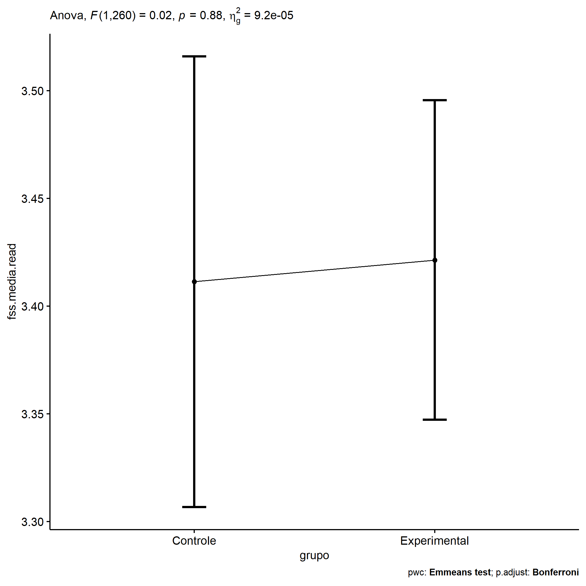<!-- -->

``` r
plots <- oneWayAncovaBoxPlots(
  wdat, "fss.media.read", "grupo", aov, pwc, covar = "dfs.media.read",
  theme = "classic", color = color[["grupo"]],
  subtitle = which(aov$Effect == "grupo"))
```

``` r
if (length(unique(wdat[["grupo"]])) > 1)
  plots[["grupo"]] + ggplot2::ylab("flow (ativ. leitura)") + ggplot2::scale_x_discrete(labels=c('pre', 'pos'))
```

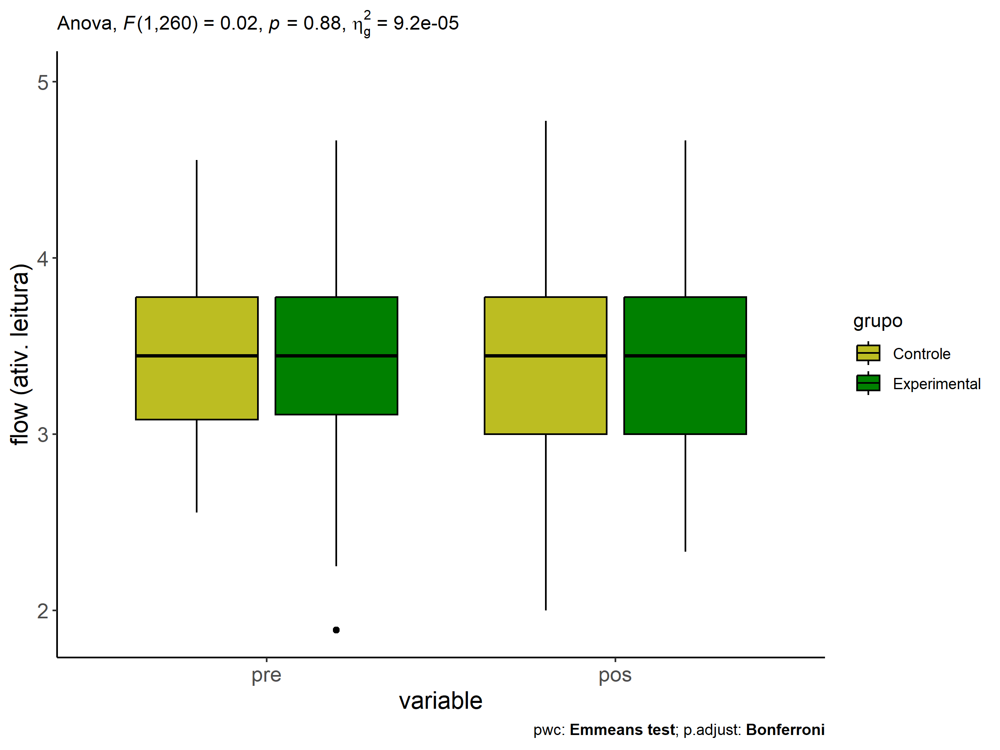<!-- -->

``` r
if (length(unique(wdat.long[["grupo"]])) > 1)
  plots <- oneWayAncovaBoxPlots(
    wdat.long, "flow.read", "grupo", aov, pwc.long, pre.post = "time",
    theme = "classic", color = color$prepost)
```

``` r
if (length(unique(wdat.long[["grupo"]])) > 1)
  plots[["grupo"]] + ggplot2::ylab("flow (ativ. leitura)")
```

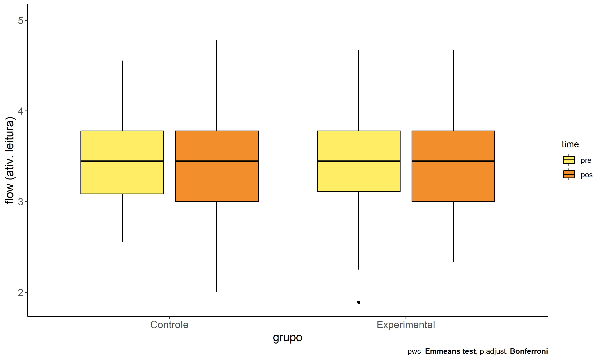<!-- -->

### Checking linearity assumption

``` r
ggscatter(wdat, x = "dfs.media.read", y = "fss.media.read", size = 0.5,
          color = "grupo", add = "reg.line")+
  stat_regline_equation(
    aes(label =  paste(..eq.label.., ..rr.label.., sep = "~~~~"), color = grupo)
  )
```

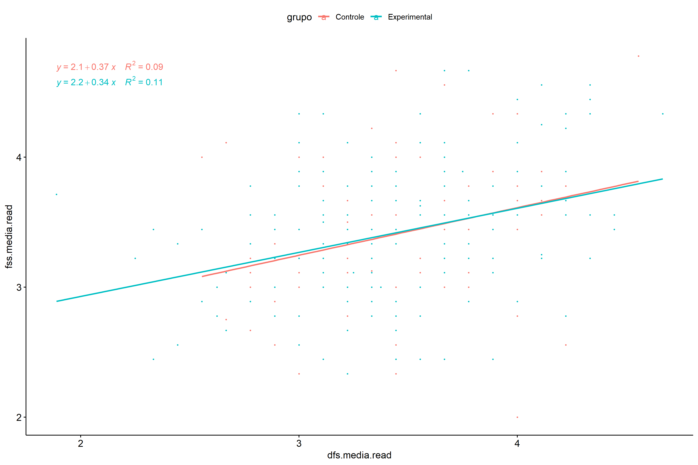<!-- -->

### Checking normality and homogeneity

``` r
res <- augment(lm(fss.media.read ~ dfs.media.read + grupo, data = wdat))
```

``` r
shapiro_test(res$.resid)
```

    ## # A tibble: 1 × 3
    ##   variable   statistic p.value
    ##   <chr>          <dbl>   <dbl>
    ## 1 res$.resid     0.993   0.250

``` r
levene_test(res, .resid ~ grupo)
```

    ## # A tibble: 1 × 4
    ##     df1   df2 statistic     p
    ##   <int> <int>     <dbl> <dbl>
    ## 1     1   261   0.00233 0.962

# ANCOVA and Pairwise for two factors **grupo:Sexo**

## Without remove non-normal data

``` r
pdat = remove_group_data(dat[!is.na(dat[["grupo"]]) & !is.na(dat[["Sexo"]]),], "fss.media.read", c("grupo","Sexo"))

pdat.long <- rbind(pdat[,c("id","grupo","Sexo")], pdat[,c("id","grupo","Sexo")])
pdat.long[["time"]] <- c(rep("pre", nrow(pdat)), rep("pos", nrow(pdat)))
pdat.long[["time"]] <- factor(pdat.long[["time"]], c("pre","pos"))
pdat.long[["flow.read"]] <- c(pdat[["dfs.media.read"]], pdat[["fss.media.read"]])

aov = anova_test(pdat, fss.media.read ~ dfs.media.read + grupo*Sexo)
laov[["grupo:Sexo"]] <- get_anova_table(aov)
```

``` r
pwcs <- list()
pwcs[["Sexo"]] <- emmeans_test(
  group_by(pdat, grupo), fss.media.read ~ Sexo,
  covariate = dfs.media.read, p.adjust.method = "bonferroni")
pwcs[["grupo"]] <- emmeans_test(
  group_by(pdat, Sexo), fss.media.read ~ grupo,
  covariate = dfs.media.read, p.adjust.method = "bonferroni")

pwc <- plyr::rbind.fill(pwcs[["grupo"]], pwcs[["Sexo"]])
pwc <- pwc[,c("grupo","Sexo", colnames(pwc)[!colnames(pwc) %in% c("grupo","Sexo")])]
```

``` r
pwc.long <- emmeans_test(dplyr::group_by_at(pdat.long, c("grupo","Sexo")),
                         flow.read ~ time,
                         p.adjust.method = "bonferroni")
lpwc[["grupo:Sexo"]] <- plyr::rbind.fill(pwc, pwc.long)
```

``` r
ds <- get.descriptives(pdat, "fss.media.read", c("grupo","Sexo"), covar = "dfs.media.read")
ds <- merge(ds[ds$variable != "dfs.media.read",],
            ds[ds$variable == "dfs.media.read", !colnames(ds) %in% c("variable")],
            by = c("grupo","Sexo"), all.x = T, suffixes = c("", ".dfs.media.read"))
ds <- merge(get_emmeans(pwcs[["grupo"]]), ds, by = c("grupo","Sexo"), suffixes = c(".emms", ""))
ds <- ds[,c("grupo","Sexo","n","mean.dfs.media.read","se.dfs.media.read","mean","se","emmean","se.emms")]

colnames(ds) <- c("grupo","Sexo", "N", paste0(c("M","SE")," (pre)"),
                  paste0(c("M","SE"), " (unadj)"), paste0(c("M", "SE"), " (adj)"))

lemms[["grupo:Sexo"]] <- ds
```

## Computing ANCOVA and PairWise After removing non-normal data (OK)

``` r
wdat = pdat 

res = residuals(lm(fss.media.read ~ dfs.media.read + grupo*Sexo, data = wdat))
non.normal = getNonNormal(res, wdat$id, plimit = 0.05)

wdat = wdat[!wdat$id %in% non.normal,]

wdat.long <- rbind(wdat[,c("id","grupo","Sexo")], wdat[,c("id","grupo","Sexo")])
wdat.long[["time"]] <- c(rep("pre", nrow(wdat)), rep("pos", nrow(wdat)))
wdat.long[["time"]] <- factor(wdat.long[["time"]], c("pre","pos"))
wdat.long[["flow.read"]] <- c(wdat[["dfs.media.read"]], wdat[["fss.media.read"]])


ldat[["grupo:Sexo"]] = wdat

(non.normal)
```

    ## [1] "P2052"

``` r
aov = anova_test(wdat, fss.media.read ~ dfs.media.read + grupo*Sexo)
laov[["grupo:Sexo"]] <- merge(get_anova_table(aov), laov[["grupo:Sexo"]], by="Effect", suffixes = c("","'"))

(df = get_anova_table(aov))
```

    ## ANOVA Table (type II tests)
    ## 
    ##           Effect DFn DFd      F        p p<.05      ges
    ## 1 dfs.media.read   1 258 28.917 1.69e-07     * 1.01e-01
    ## 2          grupo   1 258  0.023 8.80e-01       8.90e-05
    ## 3           Sexo   1 258  0.008 9.27e-01       3.28e-05
    ## 4     grupo:Sexo   1 258  4.954 2.70e-02     * 1.90e-02

| Effect         | DFn | DFd |      F |     p | p\<.05 |   ges |
|:---------------|----:|----:|-------:|------:|:-------|------:|
| dfs.media.read |   1 | 258 | 28.917 | 0.000 | \*     | 0.101 |
| grupo          |   1 | 258 |  0.023 | 0.880 |        | 0.000 |
| Sexo           |   1 | 258 |  0.008 | 0.927 |        | 0.000 |
| grupo:Sexo     |   1 | 258 |  4.954 | 0.027 | \*     | 0.019 |

``` r
pwcs <- list()
pwcs[["Sexo"]] <- emmeans_test(
  group_by(wdat, grupo), fss.media.read ~ Sexo,
  covariate = dfs.media.read, p.adjust.method = "bonferroni")
pwcs[["grupo"]] <- emmeans_test(
  group_by(wdat, Sexo), fss.media.read ~ grupo,
  covariate = dfs.media.read, p.adjust.method = "bonferroni")

pwc <- plyr::rbind.fill(pwcs[["grupo"]], pwcs[["Sexo"]])
pwc <- pwc[,c("grupo","Sexo", colnames(pwc)[!colnames(pwc) %in% c("grupo","Sexo")])]
```

| grupo        | Sexo | term                  | .y.            | group1   | group2       |  df | statistic |     p | p.adj | p.adj.signif |
|:-------------|:-----|:----------------------|:---------------|:---------|:-------------|----:|----------:|------:|------:|:-------------|
|              | F    | dfs.media.read\*grupo | fss.media.read | Controle | Experimental | 258 |     1.383 | 0.168 | 0.168 | ns           |
|              | M    | dfs.media.read\*grupo | fss.media.read | Controle | Experimental | 258 |    -1.751 | 0.081 | 0.081 | ns           |
| Controle     |      | dfs.media.read\*Sexo  | fss.media.read | F        | M            | 258 |     1.852 | 0.065 | 0.065 | ns           |
| Experimental |      | dfs.media.read\*Sexo  | fss.media.read | F        | M            | 258 |    -1.215 | 0.226 | 0.226 | ns           |

``` r
pwc.long <- emmeans_test(dplyr::group_by_at(wdat.long, c("grupo","Sexo")),
                         flow.read ~ time,
                         p.adjust.method = "bonferroni")
lpwc[["grupo:Sexo"]] <- merge(plyr::rbind.fill(pwc, pwc.long), lpwc[["grupo:Sexo"]], by=c("grupo","Sexo","term",".y.","group1","group2"), suffixes = c("","'"))
```

| grupo        | Sexo | term | .y.       | group1 | group2 |  df | statistic |     p | p.adj | p.adj.signif |
|:-------------|:-----|:-----|:----------|:-------|:-------|----:|----------:|------:|------:|:-------------|
| Controle     | F    | time | flow.read | pre    | pos    | 518 |    -0.063 | 0.949 | 0.949 | ns           |
| Controle     | M    | time | flow.read | pre    | pos    | 518 |     0.996 | 0.319 | 0.319 | ns           |
| Experimental | F    | time | flow.read | pre    | pos    | 518 |     1.703 | 0.089 | 0.089 | ns           |
| Experimental | M    | time | flow.read | pre    | pos    | 518 |    -1.178 | 0.239 | 0.239 | ns           |

``` r
ds <- get.descriptives(wdat, "fss.media.read", c("grupo","Sexo"), covar = "dfs.media.read")
ds <- merge(ds[ds$variable != "dfs.media.read",],
            ds[ds$variable == "dfs.media.read", !colnames(ds) %in% c("variable")],
            by = c("grupo","Sexo"), all.x = T, suffixes = c("", ".dfs.media.read"))
ds <- merge(get_emmeans(pwcs[["grupo"]]), ds, by = c("grupo","Sexo"), suffixes = c(".emms", ""))
ds <- ds[,c("grupo","Sexo","n","mean.dfs.media.read","se.dfs.media.read","mean","se","emmean","se.emms")]

colnames(ds) <- c("grupo","Sexo", "N", paste0(c("M","SE")," (pre)"),
                  paste0(c("M","SE"), " (unadj)"), paste0(c("M", "SE"), " (adj)"))

lemms[["grupo:Sexo"]] <- merge(ds, lemms[["grupo:Sexo"]], by=c("grupo","Sexo"), suffixes = c("","'"))
```

| grupo        | Sexo |   N | M (pre) | SE (pre) | M (unadj) | SE (unadj) | M (adj) | SE (adj) |
|:-------------|:-----|----:|--------:|---------:|----------:|-----------:|--------:|---------:|
| Controle     | F    |  47 |   3.520 |    0.066 |     3.527 |      0.083 |   3.503 |    0.072 |
| Controle     | M    |  41 |   3.396 |    0.069 |     3.286 |      0.079 |   3.306 |    0.077 |
| Experimental | F    | 101 |   3.527 |    0.051 |     3.408 |      0.049 |   3.382 |    0.050 |
| Experimental | M    |  74 |   3.339 |    0.052 |     3.435 |      0.062 |   3.475 |    0.058 |

### Plots for ancova

``` r
plots <- twoWayAncovaPlots(
  wdat, "fss.media.read", c("grupo","Sexo"), aov, pwcs, addParam = c("mean_se"),
  font.label.size=10, step.increase=0.05, p.label="p.adj",
  subtitle = which(aov$Effect == "grupo:Sexo"))
```

``` r
if (!is.null(plots[["grupo"]]))
  plots[["grupo"]] + ggplot2::scale_color_manual(values = color[["Sexo"]])
```

    ## Scale for colour is already present.
    ## Adding another scale for colour, which will replace the existing scale.

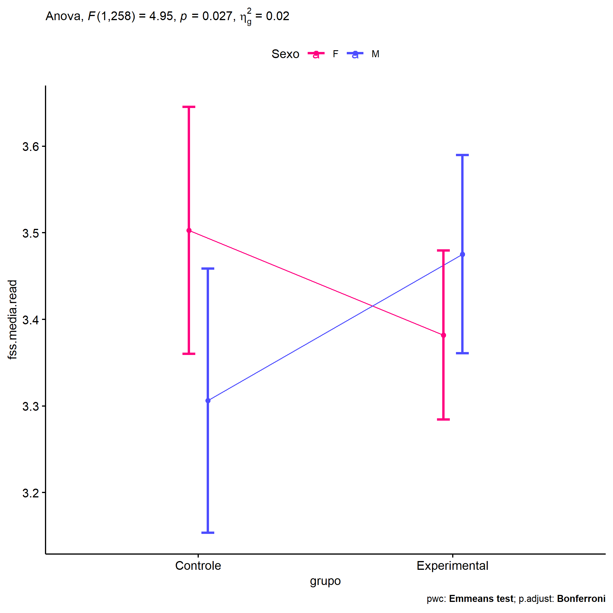<!-- -->

``` r
if (!is.null(plots[["Sexo"]]))
  plots[["Sexo"]] + ggplot2::scale_color_manual(values = color[["grupo"]])
```

    ## Scale for colour is already present.
    ## Adding another scale for colour, which will replace the existing scale.

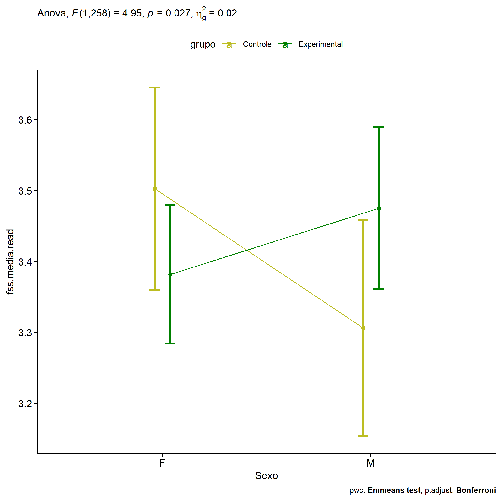<!-- -->

``` r
plots <- twoWayAncovaBoxPlots(
  wdat, "fss.media.read", c("grupo","Sexo"), aov, pwcs, covar = "dfs.media.read",
  theme = "classic", color = color[["grupo:Sexo"]],
  subtitle = which(aov$Effect == "grupo:Sexo"))
```

``` r
plots[["grupo:Sexo"]] + ggplot2::ylab("flow (ativ. leitura)") + ggplot2::scale_x_discrete(labels=c('pre', 'pos'))
```

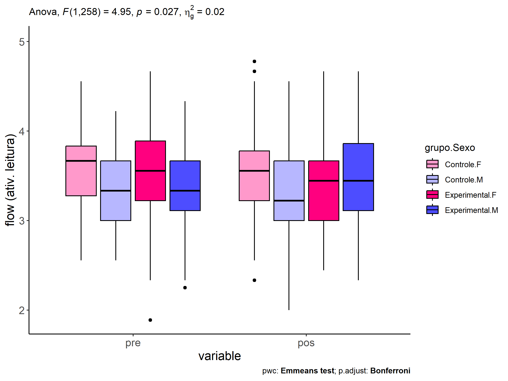<!-- -->

``` r
plots <- twoWayAncovaBoxPlots(
  wdat.long, "flow.read", c("grupo","Sexo"), aov, pwc.long, pre.post = "time",
  theme = "classic", color = color$prepost)
```

``` r
plots[["grupo:Sexo"]] + ggplot2::ylab("flow (ativ. leitura)")
```

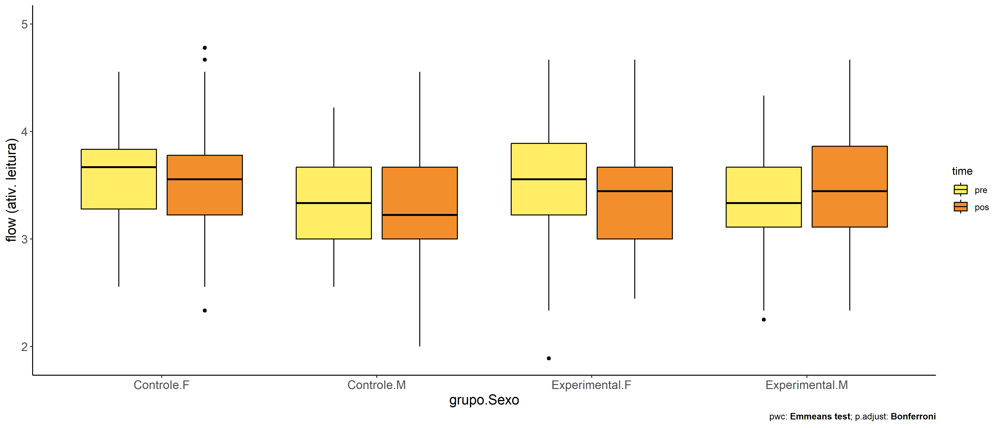<!-- -->

### Checking linearity assumption

``` r
ggscatter(wdat, x = "dfs.media.read", y = "fss.media.read", size = 0.5,
          facet.by = c("grupo","Sexo"), add = "reg.line")+
  stat_regline_equation(
    aes(label =  paste(..eq.label.., ..rr.label.., sep = "~~~~"))
  )
```

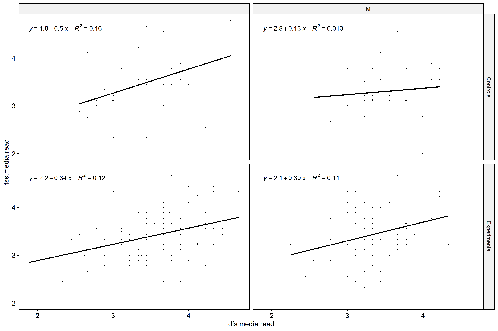<!-- -->

### Checking normality and homogeneity

``` r
res <- augment(lm(fss.media.read ~ dfs.media.read + grupo*Sexo, data = wdat))
```

``` r
shapiro_test(res$.resid)
```

    ## # A tibble: 1 × 3
    ##   variable   statistic p.value
    ##   <chr>          <dbl>   <dbl>
    ## 1 res$.resid     0.992   0.156

``` r
levene_test(res, .resid ~ grupo*Sexo)
```

    ## # A tibble: 1 × 4
    ##     df1   df2 statistic     p
    ##   <int> <int>     <dbl> <dbl>
    ## 1     3   259     0.323 0.809

# ANCOVA and Pairwise for two factors **grupo:Zona**

## Without remove non-normal data

``` r
pdat = remove_group_data(dat[!is.na(dat[["grupo"]]) & !is.na(dat[["Zona"]]),], "fss.media.read", c("grupo","Zona"))

pdat.long <- rbind(pdat[,c("id","grupo","Zona")], pdat[,c("id","grupo","Zona")])
pdat.long[["time"]] <- c(rep("pre", nrow(pdat)), rep("pos", nrow(pdat)))
pdat.long[["time"]] <- factor(pdat.long[["time"]], c("pre","pos"))
pdat.long[["flow.read"]] <- c(pdat[["dfs.media.read"]], pdat[["fss.media.read"]])

aov = anova_test(pdat, fss.media.read ~ dfs.media.read + grupo*Zona)
laov[["grupo:Zona"]] <- get_anova_table(aov)
```

``` r
pwcs <- list()
pwcs[["Zona"]] <- emmeans_test(
  group_by(pdat, grupo), fss.media.read ~ Zona,
  covariate = dfs.media.read, p.adjust.method = "bonferroni")
pwcs[["grupo"]] <- emmeans_test(
  group_by(pdat, Zona), fss.media.read ~ grupo,
  covariate = dfs.media.read, p.adjust.method = "bonferroni")

pwc <- plyr::rbind.fill(pwcs[["grupo"]], pwcs[["Zona"]])
pwc <- pwc[,c("grupo","Zona", colnames(pwc)[!colnames(pwc) %in% c("grupo","Zona")])]
```

``` r
pwc.long <- emmeans_test(dplyr::group_by_at(pdat.long, c("grupo","Zona")),
                         flow.read ~ time,
                         p.adjust.method = "bonferroni")
lpwc[["grupo:Zona"]] <- plyr::rbind.fill(pwc, pwc.long)
```

``` r
ds <- get.descriptives(pdat, "fss.media.read", c("grupo","Zona"), covar = "dfs.media.read")
ds <- merge(ds[ds$variable != "dfs.media.read",],
            ds[ds$variable == "dfs.media.read", !colnames(ds) %in% c("variable")],
            by = c("grupo","Zona"), all.x = T, suffixes = c("", ".dfs.media.read"))
ds <- merge(get_emmeans(pwcs[["grupo"]]), ds, by = c("grupo","Zona"), suffixes = c(".emms", ""))
ds <- ds[,c("grupo","Zona","n","mean.dfs.media.read","se.dfs.media.read","mean","se","emmean","se.emms")]

colnames(ds) <- c("grupo","Zona", "N", paste0(c("M","SE")," (pre)"),
                  paste0(c("M","SE"), " (unadj)"), paste0(c("M", "SE"), " (adj)"))

lemms[["grupo:Zona"]] <- ds
```

## Computing ANCOVA and PairWise After removing non-normal data (OK)

``` r
wdat = pdat 

res = residuals(lm(fss.media.read ~ dfs.media.read + grupo*Zona, data = wdat))
non.normal = getNonNormal(res, wdat$id, plimit = 0.05)

wdat = wdat[!wdat$id %in% non.normal,]

wdat.long <- rbind(wdat[,c("id","grupo","Zona")], wdat[,c("id","grupo","Zona")])
wdat.long[["time"]] <- c(rep("pre", nrow(wdat)), rep("pos", nrow(wdat)))
wdat.long[["time"]] <- factor(wdat.long[["time"]], c("pre","pos"))
wdat.long[["flow.read"]] <- c(wdat[["dfs.media.read"]], wdat[["fss.media.read"]])


ldat[["grupo:Zona"]] = wdat

(non.normal)
```

    ## NULL

``` r
aov = anova_test(wdat, fss.media.read ~ dfs.media.read + grupo*Zona)
laov[["grupo:Zona"]] <- merge(get_anova_table(aov), laov[["grupo:Zona"]], by="Effect", suffixes = c("","'"))

(df = get_anova_table(aov))
```

    ## ANOVA Table (type II tests)
    ## 
    ##           Effect DFn DFd      F        p p<.05      ges
    ## 1 dfs.media.read   1 132 21.034 1.04e-05     * 0.137000
    ## 2          grupo   1 132  0.056 8.13e-01       0.000425
    ## 3           Zona   1 132  2.408 1.23e-01       0.018000
    ## 4     grupo:Zona   1 132  0.423 5.17e-01       0.003000

| Effect         | DFn | DFd |      F |     p | p\<.05 |   ges |
|:---------------|----:|----:|-------:|------:|:-------|------:|
| dfs.media.read |   1 | 132 | 21.034 | 0.000 | \*     | 0.137 |
| grupo          |   1 | 132 |  0.056 | 0.813 |        | 0.000 |
| Zona           |   1 | 132 |  2.408 | 0.123 |        | 0.018 |
| grupo:Zona     |   1 | 132 |  0.423 | 0.517 |        | 0.003 |

``` r
pwcs <- list()
pwcs[["Zona"]] <- emmeans_test(
  group_by(wdat, grupo), fss.media.read ~ Zona,
  covariate = dfs.media.read, p.adjust.method = "bonferroni")
pwcs[["grupo"]] <- emmeans_test(
  group_by(wdat, Zona), fss.media.read ~ grupo,
  covariate = dfs.media.read, p.adjust.method = "bonferroni")

pwc <- plyr::rbind.fill(pwcs[["grupo"]], pwcs[["Zona"]])
pwc <- pwc[,c("grupo","Zona", colnames(pwc)[!colnames(pwc) %in% c("grupo","Zona")])]
```

| grupo        | Zona   | term                  | .y.            | group1   | group2       |  df | statistic |     p | p.adj | p.adj.signif |
|:-------------|:-------|:----------------------|:---------------|:---------|:-------------|----:|----------:|------:|------:|:-------------|
|              | Rural  | dfs.media.read\*grupo | fss.media.read | Controle | Experimental | 132 |    -0.221 | 0.826 | 0.826 | ns           |
|              | Urbana | dfs.media.read\*grupo | fss.media.read | Controle | Experimental | 132 |     0.656 | 0.513 | 0.513 | ns           |
| Controle     |        | dfs.media.read\*Zona  | fss.media.read | Rural    | Urbana       | 132 |     0.500 | 0.618 | 0.618 | ns           |
| Experimental |        | dfs.media.read\*Zona  | fss.media.read | Rural    | Urbana       | 132 |     1.614 | 0.109 | 0.109 | ns           |

``` r
pwc.long <- emmeans_test(dplyr::group_by_at(wdat.long, c("grupo","Zona")),
                         flow.read ~ time,
                         p.adjust.method = "bonferroni")
lpwc[["grupo:Zona"]] <- merge(plyr::rbind.fill(pwc, pwc.long), lpwc[["grupo:Zona"]], by=c("grupo","Zona","term",".y.","group1","group2"), suffixes = c("","'"))
```

| grupo        | Zona   | term | .y.       | group1 | group2 |  df | statistic |     p | p.adj | p.adj.signif |
|:-------------|:-------|:-----|:----------|:-------|:-------|----:|----------:|------:|------:|:-------------|
| Controle     | Rural  | time | flow.read | pre    | pos    | 266 |    -0.390 | 0.697 | 0.697 | ns           |
| Controle     | Urbana | time | flow.read | pre    | pos    | 266 |     0.624 | 0.533 | 0.533 | ns           |
| Experimental | Rural  | time | flow.read | pre    | pos    | 266 |    -0.621 | 0.535 | 0.535 | ns           |
| Experimental | Urbana | time | flow.read | pre    | pos    | 266 |     2.031 | 0.043 | 0.043 | \*           |

``` r
ds <- get.descriptives(wdat, "fss.media.read", c("grupo","Zona"), covar = "dfs.media.read")
ds <- merge(ds[ds$variable != "dfs.media.read",],
            ds[ds$variable == "dfs.media.read", !colnames(ds) %in% c("variable")],
            by = c("grupo","Zona"), all.x = T, suffixes = c("", ".dfs.media.read"))
ds <- merge(get_emmeans(pwcs[["grupo"]]), ds, by = c("grupo","Zona"), suffixes = c(".emms", ""))
ds <- ds[,c("grupo","Zona","n","mean.dfs.media.read","se.dfs.media.read","mean","se","emmean","se.emms")]

colnames(ds) <- c("grupo","Zona", "N", paste0(c("M","SE")," (pre)"),
                  paste0(c("M","SE"), " (unadj)"), paste0(c("M", "SE"), " (adj)"))

lemms[["grupo:Zona"]] <- merge(ds, lemms[["grupo:Zona"]], by=c("grupo","Zona"), suffixes = c("","'"))
```

| grupo        | Zona   |   N | M (pre) | SE (pre) | M (unadj) | SE (unadj) | M (adj) | SE (adj) |
|:-------------|:-------|----:|--------:|---------:|----------:|-----------:|--------:|---------:|
| Controle     | Rural  |  31 |   3.380 |    0.084 |     3.430 |      0.096 |   3.467 |    0.090 |
| Controle     | Urbana |  22 |   3.510 |    0.098 |     3.415 |      0.103 |   3.397 |    0.107 |
| Experimental | Rural  |  54 |   3.405 |    0.069 |     3.466 |      0.071 |   3.492 |    0.068 |
| Experimental | Urbana |  30 |   3.644 |    0.079 |     3.379 |      0.110 |   3.305 |    0.093 |

### Plots for ancova

``` r
plots <- twoWayAncovaPlots(
  wdat, "fss.media.read", c("grupo","Zona"), aov, pwcs, addParam = c("mean_se"),
  font.label.size=10, step.increase=0.05, p.label="p.adj",
  subtitle = which(aov$Effect == "grupo:Zona"))
```

``` r
if (!is.null(plots[["grupo"]]))
  plots[["grupo"]] + ggplot2::scale_color_manual(values = color[["Zona"]])
```

    ## Scale for colour is already present.
    ## Adding another scale for colour, which will replace the existing scale.

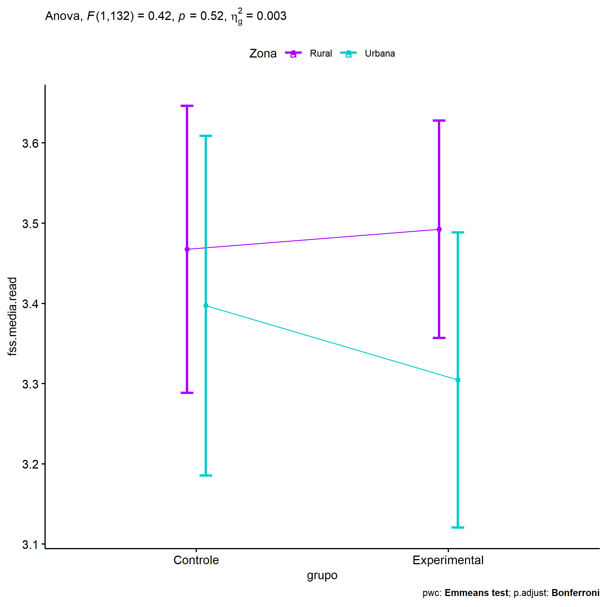<!-- -->

``` r
if (!is.null(plots[["Zona"]]))
  plots[["Zona"]] + ggplot2::scale_color_manual(values = color[["grupo"]])
```

    ## Scale for colour is already present.
    ## Adding another scale for colour, which will replace the existing scale.

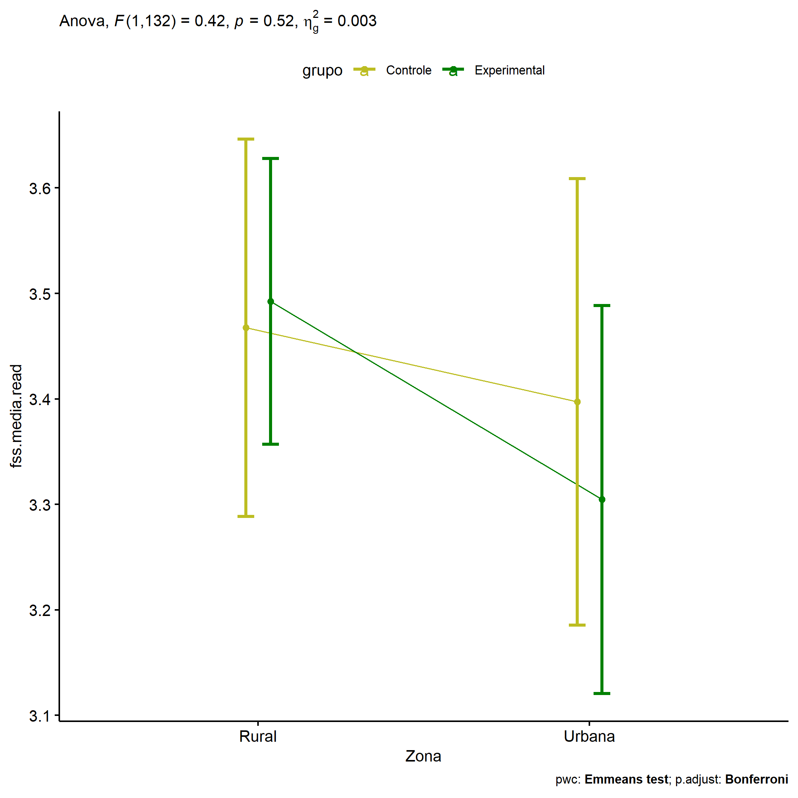<!-- -->

``` r
plots <- twoWayAncovaBoxPlots(
  wdat, "fss.media.read", c("grupo","Zona"), aov, pwcs, covar = "dfs.media.read",
  theme = "classic", color = color[["grupo:Zona"]],
  subtitle = which(aov$Effect == "grupo:Zona"))
```

``` r
plots[["grupo:Zona"]] + ggplot2::ylab("flow (ativ. leitura)") + ggplot2::scale_x_discrete(labels=c('pre', 'pos'))
```

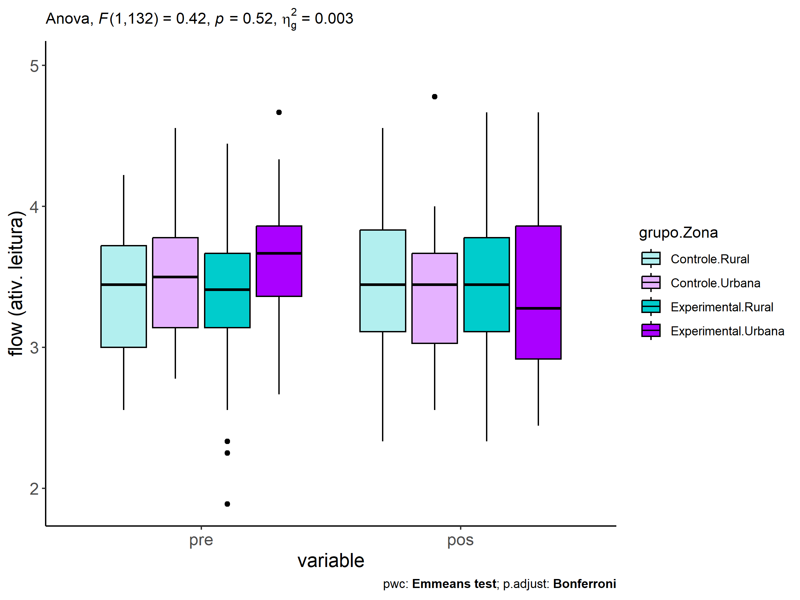<!-- -->

``` r
plots <- twoWayAncovaBoxPlots(
  wdat.long, "flow.read", c("grupo","Zona"), aov, pwc.long, pre.post = "time",
  theme = "classic", color = color$prepost)
```

``` r
plots[["grupo:Zona"]] + ggplot2::ylab("flow (ativ. leitura)")
```

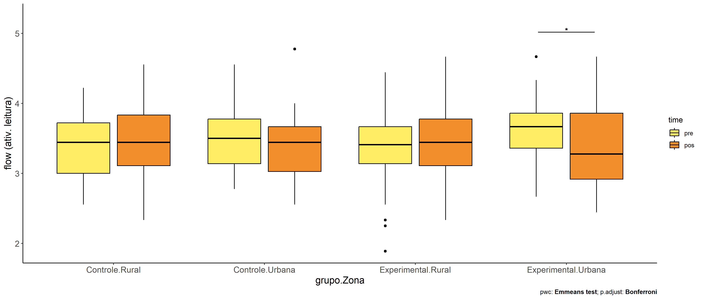<!-- -->

### Checking linearity assumption

``` r
ggscatter(wdat, x = "dfs.media.read", y = "fss.media.read", size = 0.5,
          facet.by = c("grupo","Zona"), add = "reg.line")+
  stat_regline_equation(
    aes(label =  paste(..eq.label.., ..rr.label.., sep = "~~~~"))
  )
```

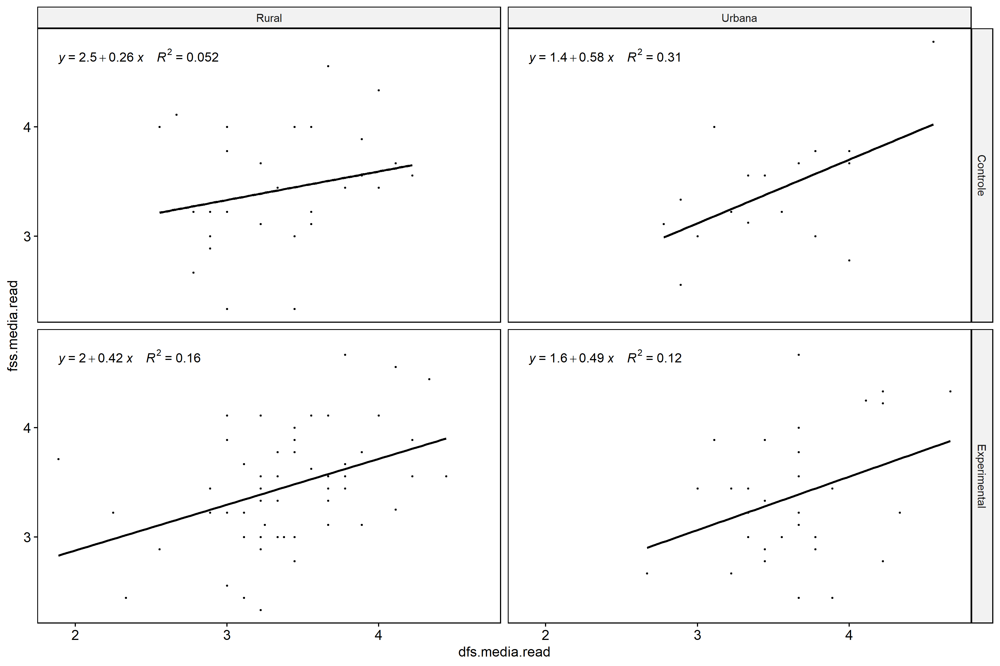<!-- -->

### Checking normality and homogeneity

``` r
res <- augment(lm(fss.media.read ~ dfs.media.read + grupo*Zona, data = wdat))
```

``` r
shapiro_test(res$.resid)
```

    ## # A tibble: 1 × 3
    ##   variable   statistic p.value
    ##   <chr>          <dbl>   <dbl>
    ## 1 res$.resid     0.990   0.423

``` r
levene_test(res, .resid ~ grupo*Zona)
```

    ## # A tibble: 1 × 4
    ##     df1   df2 statistic     p
    ##   <int> <int>     <dbl> <dbl>
    ## 1     3   133      1.36 0.257

# ANCOVA and Pairwise for two factors **grupo:Cor.Raca**

## Without remove non-normal data

``` r
pdat = remove_group_data(dat[!is.na(dat[["grupo"]]) & !is.na(dat[["Cor.Raca"]]),], "fss.media.read", c("grupo","Cor.Raca"))

pdat.long <- rbind(pdat[,c("id","grupo","Cor.Raca")], pdat[,c("id","grupo","Cor.Raca")])
pdat.long[["time"]] <- c(rep("pre", nrow(pdat)), rep("pos", nrow(pdat)))
pdat.long[["time"]] <- factor(pdat.long[["time"]], c("pre","pos"))
pdat.long[["flow.read"]] <- c(pdat[["dfs.media.read"]], pdat[["fss.media.read"]])

aov = anova_test(pdat, fss.media.read ~ dfs.media.read + grupo*Cor.Raca)
laov[["grupo:Cor.Raca"]] <- get_anova_table(aov)
```

``` r
pwcs <- list()
pwcs[["Cor.Raca"]] <- emmeans_test(
  group_by(pdat, grupo), fss.media.read ~ Cor.Raca,
  covariate = dfs.media.read, p.adjust.method = "bonferroni")
pwcs[["grupo"]] <- emmeans_test(
  group_by(pdat, Cor.Raca), fss.media.read ~ grupo,
  covariate = dfs.media.read, p.adjust.method = "bonferroni")

pwc <- plyr::rbind.fill(pwcs[["grupo"]], pwcs[["Cor.Raca"]])
pwc <- pwc[,c("grupo","Cor.Raca", colnames(pwc)[!colnames(pwc) %in% c("grupo","Cor.Raca")])]
```

``` r
pwc.long <- emmeans_test(dplyr::group_by_at(pdat.long, c("grupo","Cor.Raca")),
                         flow.read ~ time,
                         p.adjust.method = "bonferroni")
lpwc[["grupo:Cor.Raca"]] <- plyr::rbind.fill(pwc, pwc.long)
```

``` r
ds <- get.descriptives(pdat, "fss.media.read", c("grupo","Cor.Raca"), covar = "dfs.media.read")
ds <- merge(ds[ds$variable != "dfs.media.read",],
            ds[ds$variable == "dfs.media.read", !colnames(ds) %in% c("variable")],
            by = c("grupo","Cor.Raca"), all.x = T, suffixes = c("", ".dfs.media.read"))
ds <- merge(get_emmeans(pwcs[["grupo"]]), ds, by = c("grupo","Cor.Raca"), suffixes = c(".emms", ""))
ds <- ds[,c("grupo","Cor.Raca","n","mean.dfs.media.read","se.dfs.media.read","mean","se","emmean","se.emms")]

colnames(ds) <- c("grupo","Cor.Raca", "N", paste0(c("M","SE")," (pre)"),
                  paste0(c("M","SE"), " (unadj)"), paste0(c("M", "SE"), " (adj)"))

lemms[["grupo:Cor.Raca"]] <- ds
```

## Computing ANCOVA and PairWise After removing non-normal data (OK)

``` r
wdat = pdat 

res = residuals(lm(fss.media.read ~ dfs.media.read + grupo*Cor.Raca, data = wdat))
non.normal = getNonNormal(res, wdat$id, plimit = 0.05)

wdat = wdat[!wdat$id %in% non.normal,]

wdat.long <- rbind(wdat[,c("id","grupo","Cor.Raca")], wdat[,c("id","grupo","Cor.Raca")])
wdat.long[["time"]] <- c(rep("pre", nrow(wdat)), rep("pos", nrow(wdat)))
wdat.long[["time"]] <- factor(wdat.long[["time"]], c("pre","pos"))
wdat.long[["flow.read"]] <- c(wdat[["dfs.media.read"]], wdat[["fss.media.read"]])


ldat[["grupo:Cor.Raca"]] = wdat

(non.normal)
```

    ## [1] "P998"  "P3663" "P3602" "P3144"

``` r
aov = anova_test(wdat, fss.media.read ~ dfs.media.read + grupo*Cor.Raca)
laov[["grupo:Cor.Raca"]] <- merge(get_anova_table(aov), laov[["grupo:Cor.Raca"]], by="Effect", suffixes = c("","'"))

(df = get_anova_table(aov))
```

    ## ANOVA Table (type II tests)
    ## 
    ##           Effect DFn DFd      F        p p<.05   ges
    ## 1 dfs.media.read   1  86 22.694 7.64e-06     * 0.209
    ## 2          grupo   1  86  0.288 5.93e-01       0.003
    ## 3       Cor.Raca   1  86  1.101 2.97e-01       0.013
    ## 4 grupo:Cor.Raca   0  86     NA       NA  <NA>    NA

| Effect         | DFn | DFd |      F |     p | p\<.05 |   ges |
|:---------------|----:|----:|-------:|------:|:-------|------:|
| dfs.media.read |   1 |  86 | 22.694 | 0.000 | \*     | 0.209 |
| grupo          |   1 |  86 |  0.288 | 0.593 |        | 0.003 |
| Cor.Raca       |   1 |  86 |  1.101 | 0.297 |        | 0.013 |
| grupo:Cor.Raca |   0 |  86 |        |       |        |       |

``` r
pwcs <- list()
pwcs[["Cor.Raca"]] <- emmeans_test(
  group_by(wdat, grupo), fss.media.read ~ Cor.Raca,
  covariate = dfs.media.read, p.adjust.method = "bonferroni")
pwcs[["grupo"]] <- emmeans_test(
  group_by(wdat, Cor.Raca), fss.media.read ~ grupo,
  covariate = dfs.media.read, p.adjust.method = "bonferroni")

pwc <- plyr::rbind.fill(pwcs[["grupo"]], pwcs[["Cor.Raca"]])
pwc <- pwc[,c("grupo","Cor.Raca", colnames(pwc)[!colnames(pwc) %in% c("grupo","Cor.Raca")])]
```

| grupo        | Cor.Raca | term                     | .y.            | group1   | group2       |  df | statistic |     p | p.adj | p.adj.signif |
|:-------------|:---------|:-------------------------|:---------------|:---------|:-------------|----:|----------:|------:|------:|:-------------|
|              | Branca   | dfs.media.read\*grupo    | fss.media.read | Controle | Experimental |     |           |       |       |              |
|              | Parda    | dfs.media.read\*grupo    | fss.media.read | Controle | Experimental |  86 |     0.537 | 0.593 | 0.593 | ns           |
| Controle     |          | dfs.media.read\*Cor.Raca | fss.media.read | Branca   | Parda        |     |           |       |       |              |
| Experimental |          | dfs.media.read\*Cor.Raca | fss.media.read | Branca   | Parda        |  86 |     1.049 | 0.297 | 0.297 | ns           |

``` r
pwc.long <- emmeans_test(dplyr::group_by_at(wdat.long, c("grupo","Cor.Raca")),
                         flow.read ~ time,
                         p.adjust.method = "bonferroni")
lpwc[["grupo:Cor.Raca"]] <- merge(plyr::rbind.fill(pwc, pwc.long), lpwc[["grupo:Cor.Raca"]], by=c("grupo","Cor.Raca","term",".y.","group1","group2"), suffixes = c("","'"))
```

| grupo        | Cor.Raca | term | .y.       | group1 | group2 |  df | statistic |     p | p.adj | p.adj.signif |
|:-------------|:---------|:-----|:----------|:-------|:-------|----:|----------:|------:|------:|:-------------|
| Controle     | Branca   | time | flow.read | pre    | pos    |     |           |       |       |              |
| Controle     | Parda    | time | flow.read | pre    | pos    | 174 |    -0.367 | 0.714 | 0.714 | ns           |
| Experimental | Branca   | time | flow.read | pre    | pos    | 174 |    -0.528 | 0.598 | 0.598 | ns           |
| Experimental | Parda    | time | flow.read | pre    | pos    | 174 |     1.032 | 0.304 | 0.304 | ns           |

``` r
ds <- get.descriptives(wdat, "fss.media.read", c("grupo","Cor.Raca"), covar = "dfs.media.read")
ds <- merge(ds[ds$variable != "dfs.media.read",],
            ds[ds$variable == "dfs.media.read", !colnames(ds) %in% c("variable")],
            by = c("grupo","Cor.Raca"), all.x = T, suffixes = c("", ".dfs.media.read"))
ds <- merge(get_emmeans(pwcs[["grupo"]]), ds, by = c("grupo","Cor.Raca"), suffixes = c(".emms", ""))
ds <- ds[,c("grupo","Cor.Raca","n","mean.dfs.media.read","se.dfs.media.read","mean","se","emmean","se.emms")]

colnames(ds) <- c("grupo","Cor.Raca", "N", paste0(c("M","SE")," (pre)"),
                  paste0(c("M","SE"), " (unadj)"), paste0(c("M", "SE"), " (adj)"))

lemms[["grupo:Cor.Raca"]] <- merge(ds, lemms[["grupo:Cor.Raca"]], by=c("grupo","Cor.Raca"), suffixes = c("","'"))
```

| grupo        | Cor.Raca |   N | M (pre) | SE (pre) | M (unadj) | SE (unadj) | M (adj) | SE (adj) |
|:-------------|:---------|----:|--------:|---------:|----------:|-----------:|--------:|---------:|
| Controle     | Parda    |  30 |   3.344 |    0.081 |     3.389 |      0.095 |   3.442 |    0.082 |
| Experimental | Branca   |  17 |   3.418 |    0.100 |     3.503 |      0.097 |   3.519 |    0.108 |
| Experimental | Parda    |  43 |   3.532 |    0.068 |     3.428 |      0.078 |   3.385 |    0.068 |

### Plots for ancova

``` r
plots <- twoWayAncovaPlots(
  wdat, "fss.media.read", c("grupo","Cor.Raca"), aov, pwcs, addParam = c("mean_se"),
  font.label.size=10, step.increase=0.05, p.label="p.adj",
  subtitle = which(aov$Effect == "grupo:Cor.Raca"))
```

``` r
if (!is.null(plots[["grupo"]]))
  plots[["grupo"]] + ggplot2::scale_color_manual(values = color[["Cor.Raca"]])
```

<!-- -->

``` r
if (!is.null(plots[["Cor.Raca"]]))
  plots[["Cor.Raca"]] + ggplot2::scale_color_manual(values = color[["grupo"]])
```

<!-- -->

``` r
plots <- twoWayAncovaBoxPlots(
  wdat, "fss.media.read", c("grupo","Cor.Raca"), aov, pwcs, covar = "dfs.media.read",
  theme = "classic", color = color[["grupo:Cor.Raca"]],
  subtitle = which(aov$Effect == "grupo:Cor.Raca"))
```

``` r
plots[["grupo:Cor.Raca"]] + ggplot2::ylab("flow (ativ. leitura)") + ggplot2::scale_x_discrete(labels=c('pre', 'pos'))
```

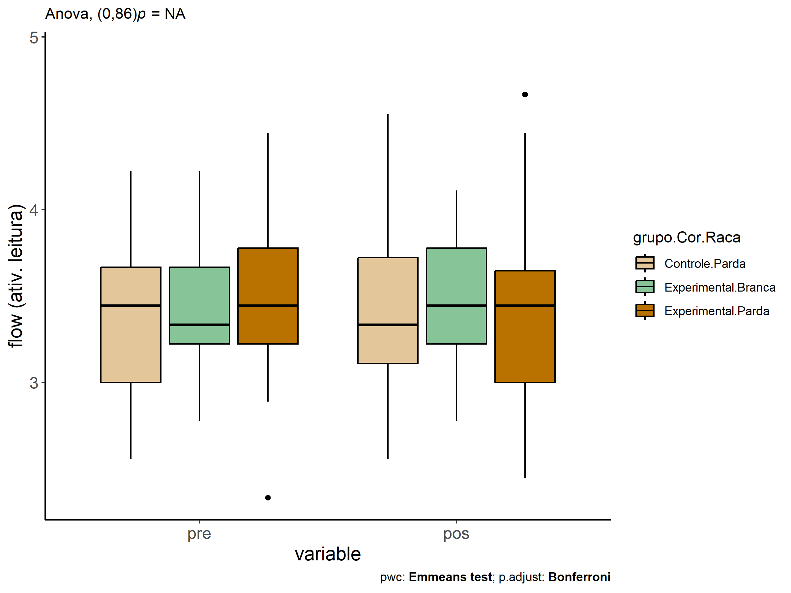<!-- -->

``` r
plots <- twoWayAncovaBoxPlots(
  wdat.long, "flow.read", c("grupo","Cor.Raca"), aov, pwc.long, pre.post = "time",
  theme = "classic", color = color$prepost)
```

``` r
plots[["grupo:Cor.Raca"]] + ggplot2::ylab("flow (ativ. leitura)")
```

<!-- -->

### Checking linearity assumption

``` r
ggscatter(wdat, x = "dfs.media.read", y = "fss.media.read", size = 0.5,
          facet.by = c("grupo","Cor.Raca"), add = "reg.line")+
  stat_regline_equation(
    aes(label =  paste(..eq.label.., ..rr.label.., sep = "~~~~"))
  )
```

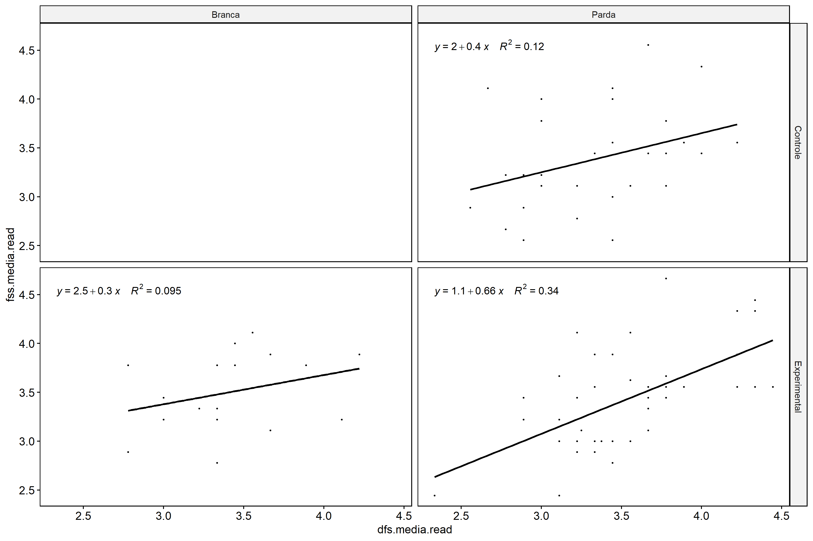<!-- -->

### Checking normality and homogeneity

``` r
res <- augment(lm(fss.media.read ~ dfs.media.read + grupo*Cor.Raca, data = wdat))
```

``` r
shapiro_test(res$.resid)
```

    ## # A tibble: 1 × 3
    ##   variable   statistic p.value
    ##   <chr>          <dbl>   <dbl>
    ## 1 res$.resid     0.972  0.0468

``` r
levene_test(res, .resid ~ grupo*Cor.Raca)
```

    ## # A tibble: 1 × 4
    ##     df1   df2 statistic     p
    ##   <int> <int>     <dbl> <dbl>
    ## 1     2    87     0.321 0.726

# Summary of Results

## Descriptive Statistics

``` r
df <- get.descriptives(ldat[["grupo"]], c(dv.pre, dv.pos), c("grupo"), 
                       include.global = T, symmetry.test = T, normality.test = F)
df <- plyr::rbind.fill(
  df, do.call(plyr::rbind.fill, lapply(lfatores2, FUN = function(f) {
    if (nrow(dat) > 0 && sum(!is.na(unique(dat[[f]]))) > 1)
      get.descriptives(ldat[[paste0("grupo:",f)]], c(dv.pre,dv.pos), c("grupo", f),
                       symmetry.test = T, normality.test = F)
    }))
)
(df <- df[,c(fatores1[fatores1 %in% colnames(df)],"variable",
             colnames(df)[!colnames(df) %in% c(fatores1,"variable")])])
```

    ##           grupo Sexo   Zona Cor.Raca       variable   n  mean median   min   max    sd    se    ci   iqr
    ## 1      Controle <NA>   <NA>     <NA> dfs.media.read  88 3.462  3.444 2.556 4.556 0.449 0.048 0.095 0.694
    ## 2  Experimental <NA>   <NA>     <NA> dfs.media.read 175 3.448  3.444 1.889 4.667 0.491 0.037 0.073 0.667
    ## 3          <NA> <NA>   <NA>     <NA> dfs.media.read 263 3.453  3.444 1.889 4.667 0.476 0.029 0.058 0.667
    ## 4      Controle <NA>   <NA>     <NA> fss.media.read  88 3.415  3.444 2.000 4.778 0.549 0.058 0.116 0.778
    ## 5  Experimental <NA>   <NA>     <NA> fss.media.read 175 3.420  3.444 2.333 4.667 0.512 0.039 0.076 0.778
    ## 6          <NA> <NA>   <NA>     <NA> fss.media.read 263 3.418  3.444 2.000 4.778 0.523 0.032 0.064 0.778
    ## 7      Controle    F   <NA>     <NA> dfs.media.read  47 3.520  3.667 2.556 4.556 0.453 0.066 0.133 0.556
    ## 8      Controle    M   <NA>     <NA> dfs.media.read  41 3.396  3.333 2.556 4.222 0.440 0.069 0.139 0.667
    ## 9  Experimental    F   <NA>     <NA> dfs.media.read 101 3.527  3.556 1.889 4.667 0.508 0.051 0.100 0.667
    ## 10 Experimental    M   <NA>     <NA> dfs.media.read  74 3.339  3.333 2.250 4.333 0.448 0.052 0.104 0.556
    ## 11     Controle    F   <NA>     <NA> fss.media.read  47 3.527  3.556 2.333 4.778 0.567 0.083 0.167 0.556
    ## 12     Controle    M   <NA>     <NA> fss.media.read  41 3.286  3.222 2.000 4.556 0.503 0.079 0.159 0.667
    ## 13 Experimental    F   <NA>     <NA> fss.media.read 101 3.408  3.444 2.444 4.667 0.497 0.049 0.098 0.667
    ## 14 Experimental    M   <NA>     <NA> fss.media.read  74 3.435  3.444 2.333 4.667 0.534 0.062 0.124 0.750
    ## 15     Controle <NA>  Rural     <NA> dfs.media.read  31 3.380  3.444 2.556 4.222 0.468 0.084 0.172 0.722
    ## 16     Controle <NA> Urbana     <NA> dfs.media.read  22 3.510  3.500 2.778 4.556 0.461 0.098 0.204 0.639
    ## 17 Experimental <NA>  Rural     <NA> dfs.media.read  54 3.405  3.410 1.889 4.444 0.503 0.069 0.137 0.528
    ## 18 Experimental <NA> Urbana     <NA> dfs.media.read  30 3.644  3.667 2.667 4.667 0.430 0.079 0.161 0.500
    ## 19     Controle <NA>  Rural     <NA> fss.media.read  31 3.430  3.444 2.333 4.556 0.537 0.096 0.197 0.722
    ## 20     Controle <NA> Urbana     <NA> fss.media.read  22 3.415  3.444 2.556 4.778 0.485 0.103 0.215 0.639
    ## 21 Experimental <NA>  Rural     <NA> fss.media.read  54 3.466  3.444 2.333 4.667 0.520 0.071 0.142 0.667
    ## 22 Experimental <NA> Urbana     <NA> fss.media.read  30 3.379  3.278 2.444 4.667 0.605 0.110 0.226 0.944
    ## 23     Controle <NA>   <NA>    Parda dfs.media.read  30 3.344  3.444 2.556 4.222 0.443 0.081 0.165 0.667
    ## 24 Experimental <NA>   <NA>   Branca dfs.media.read  17 3.418  3.333 2.778 4.222 0.413 0.100 0.212 0.444
    ## 25 Experimental <NA>   <NA>    Parda dfs.media.read  43 3.532  3.444 2.333 4.444 0.448 0.068 0.138 0.556
    ## 26     Controle <NA>   <NA>    Parda fss.media.read  30 3.389  3.333 2.556 4.556 0.520 0.095 0.194 0.611
    ## 27 Experimental <NA>   <NA>   Branca fss.media.read  17 3.503  3.444 2.778 4.111 0.401 0.097 0.206 0.556
    ## 28 Experimental <NA>   <NA>    Parda fss.media.read  43 3.428  3.444 2.444 4.667 0.511 0.078 0.157 0.646
    ##    symmetry    skewness    kurtosis
    ## 1       YES -0.04722543 -0.77774007
    ## 2       YES -0.14591455  0.02145874
    ## 3       YES -0.12300212 -0.14381981
    ## 4       YES  0.06843720 -0.03599972
    ## 5       YES  0.22282204 -0.41869734
    ## 6       YES  0.16412117 -0.23033797
    ## 7       YES -0.32105132 -0.53709578
    ## 8       YES  0.26682951 -0.89424907
    ## 9       YES -0.34973128  0.22350602
    ## 10      YES  0.04026616 -0.09812423
    ## 11      YES -0.10564361 -0.03558988
    ## 12      YES  0.16221637  0.01534471
    ## 13      YES  0.32758957 -0.28691049
    ## 14      YES  0.09159862 -0.62213780
    ## 15      YES  0.04238334 -1.21673893
    ## 16      YES  0.20504509 -0.78704699
    ## 17      YES -0.44768063  0.69817652
    ## 18      YES  0.20160301 -0.10837928
    ## 19      YES -0.04732306 -0.49545337
    ## 20       NO  0.67323777  0.68843039
    ## 21      YES  0.01828975 -0.26566076
    ## 22      YES  0.37651278 -0.93423700
    ## 23      YES  0.04567389 -1.11671193
    ## 24      YES  0.25687796 -0.76658818
    ## 25      YES  0.16429278  0.02960282
    ## 26      YES  0.37433022 -0.68854079
    ## 27      YES -0.18823983 -1.34149958
    ## 28      YES  0.35114956 -0.27879343

| grupo        | Sexo | Zona   | Cor.Raca | variable       |   n |  mean | median |   min |   max |    sd |    se |    ci |   iqr | symmetry | skewness | kurtosis |
|:-------------|:-----|:-------|:---------|:---------------|----:|------:|-------:|------:|------:|------:|------:|------:|------:|:---------|---------:|---------:|
| Controle     |      |        |          | dfs.media.read |  88 | 3.462 |  3.444 | 2.556 | 4.556 | 0.449 | 0.048 | 0.095 | 0.694 | YES      |   -0.047 |   -0.778 |
| Experimental |      |        |          | dfs.media.read | 175 | 3.448 |  3.444 | 1.889 | 4.667 | 0.491 | 0.037 | 0.073 | 0.667 | YES      |   -0.146 |    0.021 |
|              |      |        |          | dfs.media.read | 263 | 3.453 |  3.444 | 1.889 | 4.667 | 0.476 | 0.029 | 0.058 | 0.667 | YES      |   -0.123 |   -0.144 |
| Controle     |      |        |          | fss.media.read |  88 | 3.415 |  3.444 | 2.000 | 4.778 | 0.549 | 0.058 | 0.116 | 0.778 | YES      |    0.068 |   -0.036 |
| Experimental |      |        |          | fss.media.read | 175 | 3.420 |  3.444 | 2.333 | 4.667 | 0.512 | 0.039 | 0.076 | 0.778 | YES      |    0.223 |   -0.419 |
|              |      |        |          | fss.media.read | 263 | 3.418 |  3.444 | 2.000 | 4.778 | 0.523 | 0.032 | 0.064 | 0.778 | YES      |    0.164 |   -0.230 |
| Controle     | F    |        |          | dfs.media.read |  47 | 3.520 |  3.667 | 2.556 | 4.556 | 0.453 | 0.066 | 0.133 | 0.556 | YES      |   -0.321 |   -0.537 |
| Controle     | M    |        |          | dfs.media.read |  41 | 3.396 |  3.333 | 2.556 | 4.222 | 0.440 | 0.069 | 0.139 | 0.667 | YES      |    0.267 |   -0.894 |
| Experimental | F    |        |          | dfs.media.read | 101 | 3.527 |  3.556 | 1.889 | 4.667 | 0.508 | 0.051 | 0.100 | 0.667 | YES      |   -0.350 |    0.224 |
| Experimental | M    |        |          | dfs.media.read |  74 | 3.339 |  3.333 | 2.250 | 4.333 | 0.448 | 0.052 | 0.104 | 0.556 | YES      |    0.040 |   -0.098 |
| Controle     | F    |        |          | fss.media.read |  47 | 3.527 |  3.556 | 2.333 | 4.778 | 0.567 | 0.083 | 0.167 | 0.556 | YES      |   -0.106 |   -0.036 |
| Controle     | M    |        |          | fss.media.read |  41 | 3.286 |  3.222 | 2.000 | 4.556 | 0.503 | 0.079 | 0.159 | 0.667 | YES      |    0.162 |    0.015 |
| Experimental | F    |        |          | fss.media.read | 101 | 3.408 |  3.444 | 2.444 | 4.667 | 0.497 | 0.049 | 0.098 | 0.667 | YES      |    0.328 |   -0.287 |
| Experimental | M    |        |          | fss.media.read |  74 | 3.435 |  3.444 | 2.333 | 4.667 | 0.534 | 0.062 | 0.124 | 0.750 | YES      |    0.092 |   -0.622 |
| Controle     |      | Rural  |          | dfs.media.read |  31 | 3.380 |  3.444 | 2.556 | 4.222 | 0.468 | 0.084 | 0.172 | 0.722 | YES      |    0.042 |   -1.217 |
| Controle     |      | Urbana |          | dfs.media.read |  22 | 3.510 |  3.500 | 2.778 | 4.556 | 0.461 | 0.098 | 0.204 | 0.639 | YES      |    0.205 |   -0.787 |
| Experimental |      | Rural  |          | dfs.media.read |  54 | 3.405 |  3.410 | 1.889 | 4.444 | 0.503 | 0.069 | 0.137 | 0.528 | YES      |   -0.448 |    0.698 |
| Experimental |      | Urbana |          | dfs.media.read |  30 | 3.644 |  3.667 | 2.667 | 4.667 | 0.430 | 0.079 | 0.161 | 0.500 | YES      |    0.202 |   -0.108 |
| Controle     |      | Rural  |          | fss.media.read |  31 | 3.430 |  3.444 | 2.333 | 4.556 | 0.537 | 0.096 | 0.197 | 0.722 | YES      |   -0.047 |   -0.495 |
| Controle     |      | Urbana |          | fss.media.read |  22 | 3.415 |  3.444 | 2.556 | 4.778 | 0.485 | 0.103 | 0.215 | 0.639 | NO       |    0.673 |    0.688 |
| Experimental |      | Rural  |          | fss.media.read |  54 | 3.466 |  3.444 | 2.333 | 4.667 | 0.520 | 0.071 | 0.142 | 0.667 | YES      |    0.018 |   -0.266 |
| Experimental |      | Urbana |          | fss.media.read |  30 | 3.379 |  3.278 | 2.444 | 4.667 | 0.605 | 0.110 | 0.226 | 0.944 | YES      |    0.377 |   -0.934 |
| Controle     |      |        | Parda    | dfs.media.read |  30 | 3.344 |  3.444 | 2.556 | 4.222 | 0.443 | 0.081 | 0.165 | 0.667 | YES      |    0.046 |   -1.117 |
| Experimental |      |        | Branca   | dfs.media.read |  17 | 3.418 |  3.333 | 2.778 | 4.222 | 0.413 | 0.100 | 0.212 | 0.444 | YES      |    0.257 |   -0.767 |
| Experimental |      |        | Parda    | dfs.media.read |  43 | 3.532 |  3.444 | 2.333 | 4.444 | 0.448 | 0.068 | 0.138 | 0.556 | YES      |    0.164 |    0.030 |
| Controle     |      |        | Parda    | fss.media.read |  30 | 3.389 |  3.333 | 2.556 | 4.556 | 0.520 | 0.095 | 0.194 | 0.611 | YES      |    0.374 |   -0.689 |
| Experimental |      |        | Branca   | fss.media.read |  17 | 3.503 |  3.444 | 2.778 | 4.111 | 0.401 | 0.097 | 0.206 | 0.556 | YES      |   -0.188 |   -1.341 |
| Experimental |      |        | Parda    | fss.media.read |  43 | 3.428 |  3.444 | 2.444 | 4.667 | 0.511 | 0.078 | 0.157 | 0.646 | YES      |    0.351 |   -0.279 |

## ANCOVA Table Comparison

``` r
df <- do.call(plyr::rbind.fill, laov)
(df <- df[!duplicated(df$Effect),])
```

    ##            Effect DFn DFd      F        p p<.05      ges DFn' DFd'     F'       p' p<.05'     ges'
    ## 1  dfs.media.read   1 260 28.908 1.69e-07     * 1.00e-01    1  261 29.682 1.18e-07      * 1.02e-01
    ## 2           grupo   1 260  0.024 8.77e-01       9.22e-05    1  261  0.001 9.71e-01        5.24e-06
    ## 5      grupo:Sexo   1 258  4.954 2.70e-02     * 1.90e-02    1  259  3.700 5.60e-02        1.40e-02
    ## 6            Sexo   1 258  0.008 9.27e-01       3.28e-05    1  259  0.130 7.18e-01        5.03e-04
    ## 9      grupo:Zona   1 132  0.423 5.17e-01       3.00e-03    1  132  0.423 5.17e-01        3.00e-03
    ## 10           Zona   1 132  2.408 1.23e-01       1.80e-02    1  132  2.408 1.23e-01        1.80e-02
    ## 11       Cor.Raca   1  86  1.101 2.97e-01       1.30e-02    1   90  0.820 3.68e-01        9.00e-03
    ## 14 grupo:Cor.Raca   0  86     NA       NA  <NA>       NA    0   90     NA       NA   <NA>       NA

|     | Effect         | DFn | DFd |      F |     p | p\<.05 |   ges | DFn’ | DFd’ |     F’ |    p’ | p\<.05’ |  ges’ |
|:----|:---------------|----:|----:|-------:|------:|:-------|------:|-----:|-----:|-------:|------:|:--------|------:|
| 1   | dfs.media.read |   1 | 260 | 28.908 | 0.000 | \*     | 0.100 |    1 |  261 | 29.682 | 0.000 | \*      | 0.102 |
| 2   | grupo          |   1 | 260 |  0.024 | 0.877 |        | 0.000 |    1 |  261 |  0.001 | 0.971 |         | 0.000 |
| 5   | grupo:Sexo     |   1 | 258 |  4.954 | 0.027 | \*     | 0.019 |    1 |  259 |  3.700 | 0.056 |         | 0.014 |
| 6   | Sexo           |   1 | 258 |  0.008 | 0.927 |        | 0.000 |    1 |  259 |  0.130 | 0.718 |         | 0.001 |
| 9   | grupo:Zona     |   1 | 132 |  0.423 | 0.517 |        | 0.003 |    1 |  132 |  0.423 | 0.517 |         | 0.003 |
| 10  | Zona           |   1 | 132 |  2.408 | 0.123 |        | 0.018 |    1 |  132 |  2.408 | 0.123 |         | 0.018 |
| 11  | Cor.Raca       |   1 |  86 |  1.101 | 0.297 |        | 0.013 |    1 |   90 |  0.820 | 0.368 |         | 0.009 |
| 14  | grupo:Cor.Raca |   0 |  86 |        |       |        |       |    0 |   90 |        |       |         |       |

## PairWise Table Comparison

``` r
df <- do.call(plyr::rbind.fill, lpwc)
df <- df[,c(names(lfatores), names(df)[!names(df) %in% c(names(lfatores),"term",".y.")])]
```

| grupo        | Sexo | Zona   | Cor.Raca | group1   | group2       |  df | statistic |     p | p.adj | p.adj.signif | df’ | statistic’ |    p’ | p.adj’ | p.adj.signif’ |
|:-------------|:-----|:-------|:---------|:---------|:-------------|----:|----------:|------:|------:|:-------------|----:|-----------:|------:|-------:|:--------------|
| Controle     |      |        |          | pre      | pos          | 522 |     0.629 | 0.530 | 0.530 | ns           | 524 |      0.616 | 0.538 |  0.538 | ns            |
| Experimental |      |        |          | pre      | pos          | 522 |     0.524 | 0.601 | 0.601 | ns           | 524 |      0.720 | 0.472 |  0.472 | ns            |
|              |      |        |          | Controle | Experimental | 260 |    -0.155 | 0.877 | 0.877 | ns           | 261 |      0.037 | 0.971 |  0.971 | ns            |
| Controle     | F    |        |          | pre      | pos          | 518 |    -0.063 | 0.949 | 0.949 | ns           | 520 |     -0.062 | 0.951 |  0.951 | ns            |
| Controle     | M    |        |          | pre      | pos          | 518 |     0.996 | 0.319 | 0.319 | ns           | 520 |      0.976 | 0.330 |  0.330 | ns            |
| Controle     |      |        |          | F        | M            | 258 |     1.852 | 0.065 | 0.065 | ns           | 259 |      1.768 | 0.078 |  0.078 | ns            |
| Experimental | F    |        |          | pre      | pos          | 518 |     1.703 | 0.089 | 0.089 | ns           | 520 |      1.668 | 0.096 |  0.096 | ns            |
| Experimental | M    |        |          | pre      | pos          | 518 |    -1.178 | 0.239 | 0.239 | ns           | 520 |     -0.824 | 0.410 |  0.410 | ns            |
| Experimental |      |        |          | F        | M            | 258 |    -1.215 | 0.226 | 0.226 | ns           | 259 |     -0.817 | 0.415 |  0.415 | ns            |
|              | F    |        |          | Controle | Experimental | 258 |     1.383 | 0.168 | 0.168 | ns           | 259 |      1.332 | 0.184 |  0.184 | ns            |
|              | M    |        |          | Controle | Experimental | 258 |    -1.751 | 0.081 | 0.081 | ns           | 259 |     -1.389 | 0.166 |  0.166 | ns            |
| Controle     |      |        |          | Rural    | Urbana       | 132 |     0.500 | 0.618 | 0.618 | ns           | 132 |      0.500 | 0.618 |  0.618 | ns            |
| Controle     |      | Rural  |          | pre      | pos          | 266 |    -0.390 | 0.697 | 0.697 | ns           | 266 |     -0.390 | 0.697 |  0.697 | ns            |
| Controle     |      | Urbana |          | pre      | pos          | 266 |     0.624 | 0.533 | 0.533 | ns           | 266 |      0.624 | 0.533 |  0.533 | ns            |
| Experimental |      |        |          | Rural    | Urbana       | 132 |     1.614 | 0.109 | 0.109 | ns           | 132 |      1.614 | 0.109 |  0.109 | ns            |
| Experimental |      | Rural  |          | pre      | pos          | 266 |    -0.621 | 0.535 | 0.535 | ns           | 266 |     -0.621 | 0.535 |  0.535 | ns            |
| Experimental |      | Urbana |          | pre      | pos          | 266 |     2.031 | 0.043 | 0.043 | \*           | 266 |      2.031 | 0.043 |  0.043 | \*            |
|              |      | Rural  |          | Controle | Experimental | 132 |    -0.221 | 0.826 | 0.826 | ns           | 132 |     -0.221 | 0.826 |  0.826 | ns            |
|              |      | Urbana |          | Controle | Experimental | 132 |     0.656 | 0.513 | 0.513 | ns           | 132 |      0.656 | 0.513 |  0.513 | ns            |
| Controle     |      |        | Branca   | pre      | pos          |     |           |       |       |              |     |            |       |        |               |
| Controle     |      |        |          | Branca   | Parda        |     |           |       |       |              |     |            |       |        |               |
| Controle     |      |        | Parda    | pre      | pos          | 174 |    -0.367 | 0.714 | 0.714 | ns           | 182 |     -0.550 | 0.583 |  0.583 | ns            |
| Experimental |      |        | Branca   | pre      | pos          | 174 |    -0.528 | 0.598 | 0.598 | ns           | 182 |     -0.517 | 0.606 |  0.606 | ns            |
| Experimental |      |        |          | Branca   | Parda        |  86 |     1.049 | 0.297 | 0.297 | ns           |  90 |      0.905 | 0.368 |  0.368 | ns            |
| Experimental |      |        | Parda    | pre      | pos          | 174 |     1.032 | 0.304 | 0.304 | ns           | 182 |      0.864 | 0.389 |  0.389 | ns            |
|              |      |        | Branca   | Controle | Experimental |     |           |       |       |              |     |            |       |        |               |
|              |      |        | Parda    | Controle | Experimental |  86 |     0.537 | 0.593 | 0.593 | ns           |  90 |      0.403 | 0.688 |  0.688 | ns            |

## EMMS Table Comparison

``` r
df <- do.call(plyr::rbind.fill, lemms)
df[["N-N'"]] <- df[["N"]] - df[["N'"]]
df <- df[,c(names(lfatores), names(df)[!names(df) %in% names(lfatores)])]
```

| grupo        | Sexo | Zona   | Cor.Raca |   N | M (pre) | SE (pre) | M (unadj) | SE (unadj) | M (adj) | SE (adj) |  N’ | M (pre)’ | SE (pre)’ | M (unadj)’ | SE (unadj)’ | M (adj)’ | SE (adj)’ | N-N’ |
|:-------------|:-----|:-------|:---------|----:|--------:|---------:|----------:|-----------:|--------:|---------:|----:|---------:|----------:|-----------:|------------:|---------:|----------:|-----:|
| Controle     |      |        |          |  88 |   3.462 |    0.048 |     3.415 |      0.058 |   3.411 |    0.053 |  88 |    3.462 |     0.048 |      3.415 |       0.058 |    3.411 |     0.055 |    0 |
| Experimental |      |        |          | 175 |   3.448 |    0.037 |     3.420 |      0.039 |   3.421 |    0.038 | 176 |    3.445 |     0.037 |      3.406 |       0.041 |    3.408 |     0.039 |   -1 |
| Controle     | F    |        |          |  47 |   3.520 |    0.066 |     3.527 |      0.083 |   3.503 |    0.072 |  47 |    3.520 |     0.066 |      3.527 |       0.083 |    3.501 |     0.075 |    0 |
| Controle     | M    |        |          |  41 |   3.396 |    0.069 |     3.286 |      0.079 |   3.306 |    0.077 |  41 |    3.396 |     0.069 |      3.286 |       0.079 |    3.306 |     0.080 |    0 |
| Experimental | F    |        |          | 101 |   3.527 |    0.051 |     3.408 |      0.049 |   3.382 |    0.050 | 101 |    3.527 |     0.051 |      3.408 |       0.049 |    3.380 |     0.051 |    0 |
| Experimental | M    |        |          |  74 |   3.339 |    0.052 |     3.435 |      0.062 |   3.475 |    0.058 |  75 |    3.335 |     0.052 |      3.403 |       0.069 |    3.445 |     0.060 |   -1 |
| Controle     |      | Rural  |          |  31 |   3.380 |    0.084 |     3.430 |      0.096 |   3.467 |    0.090 |  31 |    3.380 |     0.084 |      3.430 |       0.096 |    3.467 |     0.090 |    0 |
| Controle     |      | Urbana |          |  22 |   3.510 |    0.098 |     3.415 |      0.103 |   3.397 |    0.107 |  22 |    3.510 |     0.098 |      3.415 |       0.103 |    3.397 |     0.107 |    0 |
| Experimental |      | Rural  |          |  54 |   3.405 |    0.069 |     3.466 |      0.071 |   3.492 |    0.068 |  54 |    3.405 |     0.069 |      3.466 |       0.071 |    3.492 |     0.068 |    0 |
| Experimental |      | Urbana |          |  30 |   3.644 |    0.079 |     3.379 |      0.110 |   3.305 |    0.093 |  30 |    3.644 |     0.079 |      3.379 |       0.110 |    3.305 |     0.093 |    0 |
| Controle     |      |        | Parda    |  30 |   3.344 |    0.081 |     3.389 |      0.095 |   3.442 |    0.082 |  32 |    3.309 |     0.080 |      3.375 |       0.097 |    3.430 |     0.084 |   -2 |
| Experimental |      |        | Branca   |  17 |   3.418 |    0.100 |     3.503 |      0.097 |   3.519 |    0.108 |  17 |    3.418 |     0.100 |      3.503 |       0.097 |    3.507 |     0.114 |    0 |
| Experimental |      |        | Parda    |  43 |   3.532 |    0.068 |     3.428 |      0.078 |   3.385 |    0.068 |  45 |    3.514 |     0.067 |      3.426 |       0.078 |    3.385 |     0.071 |   -2 |
