ANCOVA in flow (ativ. leitura) (flow (ativ. leitura))
================
Geiser C. Challco <geiser@alumni.usp.br>

- [Descriptive Statistics of Initial
  Data](#descriptive-statistics-of-initial-data)
- [ANCOVA and Pairwise for one factor:
  **grupo**](#ancova-and-pairwise-for-one-factor-grupo)
  - [Without remove non-normal data](#without-remove-non-normal-data)
  - [Computing ANCOVA and PairWise After removing non-normal data
    (OK)](#computing-ancova-and-pairwise-after-removing-non-normal-data-ok)
    - [Plots for ancova](#plots-for-ancova)
    - [Checking linearity assumption](#checking-linearity-assumption)
    - [Checking normality and
      homogeneity](#checking-normality-and-homogeneity)
- [ANCOVA and Pairwise for two factors
  **grupo:Sexo**](#ancova-and-pairwise-for-two-factors-gruposexo)
  - [Without remove non-normal data](#without-remove-non-normal-data-1)
  - [Computing ANCOVA and PairWise After removing non-normal data
    (OK)](#computing-ancova-and-pairwise-after-removing-non-normal-data-ok-1)
    - [Plots for ancova](#plots-for-ancova-1)
    - [Checking linearity assumption](#checking-linearity-assumption-1)
    - [Checking normality and
      homogeneity](#checking-normality-and-homogeneity-1)
- [ANCOVA and Pairwise for two factors
  **grupo:Zona**](#ancova-and-pairwise-for-two-factors-grupozona)
  - [Without remove non-normal data](#without-remove-non-normal-data-2)
  - [Computing ANCOVA and PairWise After removing non-normal data
    (OK)](#computing-ancova-and-pairwise-after-removing-non-normal-data-ok-2)
    - [Plots for ancova](#plots-for-ancova-2)
    - [Checking linearity assumption](#checking-linearity-assumption-2)
    - [Checking normality and
      homogeneity](#checking-normality-and-homogeneity-2)
- [ANCOVA and Pairwise for two factors
  **grupo:Cor.Raca**](#ancova-and-pairwise-for-two-factors-grupocorraca)
  - [Without remove non-normal data](#without-remove-non-normal-data-3)
  - [Computing ANCOVA and PairWise After removing non-normal data
    (OK)](#computing-ancova-and-pairwise-after-removing-non-normal-data-ok-3)
    - [Plots for ancova](#plots-for-ancova-3)
    - [Checking linearity assumption](#checking-linearity-assumption-3)
    - [Checking normality and
      homogeneity](#checking-normality-and-homogeneity-3)
- [Summary of Results](#summary-of-results)
  - [Descriptive Statistics](#descriptive-statistics)
  - [ANCOVA Table Comparison](#ancova-table-comparison)
  - [PairWise Table Comparison](#pairwise-table-comparison)
  - [EMMS Table Comparison](#emms-table-comparison)

**NOTE**:

- Teste ANCOVA para determinar se houve diferenças significativas no
  flow (ativ. leitura) (medido usando pre- e pos-testes).
- ANCOVA test to determine whether there were significant differences in
  flow (ativ. leitura) (measured using pre- and post-tests).

# Descriptive Statistics of Initial Data

``` r
df <- get.descriptives(dat, c(dv.pre, dv.pos), c("grupo"), 
                       include.global = T, symmetry.test = T, normality.test = F)
df <- plyr::rbind.fill(
  df, do.call(plyr::rbind.fill, lapply(lfatores2, FUN = function(f) {
    if (nrow(dat) > 0 && sum(!is.na(unique(dat[[f]]))) > 1)
      get.descriptives(dat, c(dv.pre,dv.pos), c("grupo", f),
                       symmetry.test = T, normality.test = F)
    }))
)
```

    ## Warning: There was 1 warning in `mutate()`.
    ## ℹ In argument: `ci = abs(stats::qt(alpha/2, .data$n - 1) * .data$se)`.
    ## Caused by warning:
    ## ! There was 1 warning in `mutate()`.
    ## ℹ In argument: `ci = abs(stats::qt(alpha/2, .data$n - 1) * .data$se)`.
    ## Caused by warning in `stats::qt()`:
    ## ! NaNs produced
    ## There was 1 warning in `mutate()`.
    ## ℹ In argument: `ci = abs(stats::qt(alpha/2, .data$n - 1) * .data$se)`.
    ## Caused by warning:
    ## ! There was 1 warning in `mutate()`.
    ## ℹ In argument: `ci = abs(stats::qt(alpha/2, .data$n - 1) * .data$se)`.
    ## Caused by warning in `stats::qt()`:
    ## ! NaNs produced

``` r
(df <- df[,c(fatores1[fatores1 %in% colnames(df)],"variable",
             colnames(df)[!colnames(df) %in% c(fatores1,"variable")])])
```

    ##           grupo Sexo   Zona Cor.Raca       variable   n  mean median   min   max    sd    se    ci   iqr
    ## 1      Controle <NA>   <NA>     <NA> dfs.media.read 122 3.527  3.556 2.333 4.778 0.470 0.043 0.084 0.444
    ## 2  Experimental <NA>   <NA>     <NA> dfs.media.read 149 3.583  3.556 2.222 5.000 0.445 0.036 0.072 0.667
    ## 3          <NA> <NA>   <NA>     <NA> dfs.media.read 271 3.558  3.556 2.222 5.000 0.456 0.028 0.055 0.597
    ## 4      Controle <NA>   <NA>     <NA> fss.media.read 122 3.554  3.667 1.556 4.889 0.580 0.052 0.104 0.778
    ## 5  Experimental <NA>   <NA>     <NA> fss.media.read 149 3.537  3.556 2.333 5.000 0.478 0.039 0.077 0.667
    ## 6          <NA> <NA>   <NA>     <NA> fss.media.read 271 3.544  3.556 1.556 5.000 0.526 0.032 0.063 0.667
    ## 7      Controle    F   <NA>     <NA> dfs.media.read  54 3.588  3.556 2.444 4.444 0.391 0.053 0.107 0.500
    ## 8      Controle    M   <NA>     <NA> dfs.media.read  68 3.479  3.528 2.333 4.778 0.521 0.063 0.126 0.556
    ## 9  Experimental    F   <NA>     <NA> dfs.media.read  74 3.605  3.646 2.778 4.333 0.387 0.045 0.090 0.639
    ## 10 Experimental    M   <NA>     <NA> dfs.media.read  75 3.561  3.556 2.222 5.000 0.498 0.057 0.114 0.667
    ## 11     Controle    F   <NA>     <NA> fss.media.read  54 3.541  3.667 1.667 4.556 0.574 0.078 0.157 0.778
    ## 12     Controle    M   <NA>     <NA> fss.media.read  68 3.563  3.611 1.556 4.889 0.588 0.071 0.142 0.778
    ## 13 Experimental    F   <NA>     <NA> fss.media.read  74 3.552  3.590 2.444 5.000 0.483 0.056 0.112 0.667
    ## 14 Experimental    M   <NA>     <NA> fss.media.read  75 3.521  3.556 2.333 4.889 0.477 0.055 0.110 0.500
    ## 15     Controle <NA>  Rural     <NA> dfs.media.read  42 3.696  3.667 2.500 4.444 0.424 0.065 0.132 0.556
    ## 16     Controle <NA> Urbana     <NA> dfs.media.read  24 3.338  3.333 2.333 4.333 0.528 0.108 0.223 0.667
    ## 17     Controle <NA>   <NA>     <NA> dfs.media.read  56 3.482  3.556 2.556 4.778 0.442 0.059 0.118 0.444
    ## 18 Experimental <NA>  Rural     <NA> dfs.media.read  34 3.625  3.646 2.889 4.444 0.419 0.072 0.146 0.722
    ## 19 Experimental <NA> Urbana     <NA> dfs.media.read  42 3.571  3.667 2.222 5.000 0.520 0.080 0.162 0.639
    ## 20 Experimental <NA>   <NA>     <NA> dfs.media.read  73 3.570  3.556 2.778 4.444 0.415 0.049 0.097 0.667
    ## 21     Controle <NA>  Rural     <NA> fss.media.read  42 3.632  3.722 2.750 4.889 0.552 0.085 0.172 0.861
    ## 22     Controle <NA> Urbana     <NA> fss.media.read  24 3.477  3.500 2.111 4.556 0.637 0.130 0.269 0.778
    ## 23     Controle <NA>   <NA>     <NA> fss.media.read  56 3.528  3.667 1.556 4.444 0.579 0.077 0.155 0.778
    ## 24 Experimental <NA>  Rural     <NA> fss.media.read  34 3.476  3.500 2.778 4.222 0.425 0.073 0.148 0.556
    ## 25 Experimental <NA> Urbana     <NA> fss.media.read  42 3.451  3.500 2.333 4.889 0.534 0.082 0.166 0.750
    ## 26 Experimental <NA>   <NA>     <NA> fss.media.read  73 3.614  3.667 2.667 5.000 0.462 0.054 0.108 0.556
    ## 27     Controle <NA>   <NA>   Branca dfs.media.read   7 4.071  4.111 3.444 4.778 0.477 0.180 0.441 0.583
    ## 28     Controle <NA>   <NA> Indígena dfs.media.read   3 3.852  3.667 3.556 4.333 0.421 0.243 1.045 0.389
    ## 29     Controle <NA>   <NA>    Parda dfs.media.read  47 3.487  3.444 2.333 4.333 0.465 0.068 0.137 0.556
    ## 30     Controle <NA>   <NA>     <NA> dfs.media.read  65 3.483  3.556 2.444 4.444 0.440 0.055 0.109 0.333
    ## 31 Experimental <NA>   <NA>   Branca dfs.media.read  10 3.808  3.778 3.222 4.222 0.314 0.099 0.225 0.448
    ## 32 Experimental <NA>   <NA> Indígena dfs.media.read   1 3.889  3.889 3.889 3.889    NA    NA   NaN 0.000
    ## 33 Experimental <NA>   <NA>    Parda dfs.media.read  40 3.531  3.556 2.222 4.222 0.458 0.072 0.147 0.691
    ## 34 Experimental <NA>   <NA>     <NA> dfs.media.read  98 3.578  3.556 2.222 5.000 0.449 0.045 0.090 0.667
    ## 35     Controle <NA>   <NA>   Branca fss.media.read   7 3.762  4.111 2.778 4.556 0.735 0.278 0.680 1.222
    ## 36     Controle <NA>   <NA> Indígena fss.media.read   3 3.815  3.889 3.222 4.333 0.559 0.323 1.389 0.556
    ## 37     Controle <NA>   <NA>    Parda fss.media.read  47 3.461  3.444 2.222 4.444 0.485 0.071 0.142 0.778
    ## 38     Controle <NA>   <NA>     <NA> fss.media.read  65 3.586  3.667 1.556 4.889 0.625 0.078 0.155 0.667
    ## 39 Experimental <NA>   <NA>   Branca fss.media.read  10 3.807  3.944 2.889 4.444 0.496 0.157 0.355 0.788
    ## 40 Experimental <NA>   <NA> Indígena fss.media.read   1 3.222  3.222 3.222 3.222    NA    NA   NaN 0.000
    ## 41 Experimental <NA>   <NA>    Parda fss.media.read  40 3.526  3.556 2.778 4.111 0.344 0.054 0.110 0.351
    ## 42 Experimental <NA>   <NA>     <NA> fss.media.read  98 3.517  3.556 2.333 5.000 0.519 0.052 0.104 0.722
    ##    symmetry    skewness     kurtosis
    ## 1       YES -0.19471313  0.112603953
    ## 2       YES -0.07673244  0.330832452
    ## 3       YES -0.14418234  0.269583360
    ## 4        NO -0.68346193  1.053594972
    ## 5       YES  0.09836908  0.269987017
    ## 6       YES -0.36335724  0.908934167
    ## 7       YES -0.21102115  0.079902181
    ## 8       YES -0.06414028 -0.177284167
    ## 9       YES -0.14354485 -1.038891758
    ## 10      YES  0.00812571  0.528898666
    ## 11       NO -0.91261159  1.312859138
    ## 12       NO -0.50239800  0.726700832
    ## 13      YES  0.05512623 -0.008887387
    ## 14      YES  0.13851631  0.480609722
    ## 15      YES -0.41413800  0.188022942
    ## 16      YES -0.19977279 -0.689154427
    ## 17      YES  0.18820449  0.526387134
    ## 18      YES -0.07566811 -1.149009928
    ## 19      YES -0.17700074  1.288149695
    ## 20      YES  0.06866277 -1.009547451
    ## 21      YES  0.13565603 -0.963501106
    ## 22      YES -0.28378618 -0.437536787
    ## 23       NO -1.36401066  2.506319905
    ## 24      YES -0.03009193 -1.142157092
    ## 25      YES  0.03587053 -0.133588453
    ## 26      YES  0.27472997  0.595582281
    ## 27      YES -0.05943170 -1.560601569
    ## 28 few data  0.00000000  0.000000000
    ## 29      YES -0.31412057 -0.288889624
    ## 30      YES -0.34862169  0.184234391
    ## 31      YES -0.29498067 -1.219231343
    ## 32 few data  0.00000000  0.000000000
    ## 33       NO -0.53969838 -0.236574560
    ## 34      YES  0.22452631  0.442890754
    ## 35      YES -0.19624039 -2.037791463
    ## 36 few data  0.00000000  0.000000000
    ## 37      YES -0.16298229 -0.598345053
    ## 38       NO -1.05736212  1.835702981
    ## 39      YES -0.45459722 -1.267782886
    ## 40 few data  0.00000000  0.000000000
    ## 41       NO -0.68121734 -0.292160851
    ## 42      YES  0.22099844  0.177317694

| grupo        | Sexo | Zona   | Cor.Raca | variable       |   n |  mean | median |   min |   max |    sd |    se |    ci |   iqr | symmetry | skewness | kurtosis |
|:-------------|:-----|:-------|:---------|:---------------|----:|------:|-------:|------:|------:|------:|------:|------:|------:|:---------|---------:|---------:|
| Controle     |      |        |          | dfs.media.read | 122 | 3.527 |  3.556 | 2.333 | 4.778 | 0.470 | 0.043 | 0.084 | 0.444 | YES      |   -0.195 |    0.113 |
| Experimental |      |        |          | dfs.media.read | 149 | 3.583 |  3.556 | 2.222 | 5.000 | 0.445 | 0.036 | 0.072 | 0.667 | YES      |   -0.077 |    0.331 |
|              |      |        |          | dfs.media.read | 271 | 3.558 |  3.556 | 2.222 | 5.000 | 0.456 | 0.028 | 0.055 | 0.597 | YES      |   -0.144 |    0.270 |
| Controle     |      |        |          | fss.media.read | 122 | 3.554 |  3.667 | 1.556 | 4.889 | 0.580 | 0.052 | 0.104 | 0.778 | NO       |   -0.683 |    1.054 |
| Experimental |      |        |          | fss.media.read | 149 | 3.537 |  3.556 | 2.333 | 5.000 | 0.478 | 0.039 | 0.077 | 0.667 | YES      |    0.098 |    0.270 |
|              |      |        |          | fss.media.read | 271 | 3.544 |  3.556 | 1.556 | 5.000 | 0.526 | 0.032 | 0.063 | 0.667 | YES      |   -0.363 |    0.909 |
| Controle     | F    |        |          | dfs.media.read |  54 | 3.588 |  3.556 | 2.444 | 4.444 | 0.391 | 0.053 | 0.107 | 0.500 | YES      |   -0.211 |    0.080 |
| Controle     | M    |        |          | dfs.media.read |  68 | 3.479 |  3.528 | 2.333 | 4.778 | 0.521 | 0.063 | 0.126 | 0.556 | YES      |   -0.064 |   -0.177 |
| Experimental | F    |        |          | dfs.media.read |  74 | 3.605 |  3.646 | 2.778 | 4.333 | 0.387 | 0.045 | 0.090 | 0.639 | YES      |   -0.144 |   -1.039 |
| Experimental | M    |        |          | dfs.media.read |  75 | 3.561 |  3.556 | 2.222 | 5.000 | 0.498 | 0.057 | 0.114 | 0.667 | YES      |    0.008 |    0.529 |
| Controle     | F    |        |          | fss.media.read |  54 | 3.541 |  3.667 | 1.667 | 4.556 | 0.574 | 0.078 | 0.157 | 0.778 | NO       |   -0.913 |    1.313 |
| Controle     | M    |        |          | fss.media.read |  68 | 3.563 |  3.611 | 1.556 | 4.889 | 0.588 | 0.071 | 0.142 | 0.778 | NO       |   -0.502 |    0.727 |
| Experimental | F    |        |          | fss.media.read |  74 | 3.552 |  3.590 | 2.444 | 5.000 | 0.483 | 0.056 | 0.112 | 0.667 | YES      |    0.055 |   -0.009 |
| Experimental | M    |        |          | fss.media.read |  75 | 3.521 |  3.556 | 2.333 | 4.889 | 0.477 | 0.055 | 0.110 | 0.500 | YES      |    0.139 |    0.481 |
| Controle     |      | Rural  |          | dfs.media.read |  42 | 3.696 |  3.667 | 2.500 | 4.444 | 0.424 | 0.065 | 0.132 | 0.556 | YES      |   -0.414 |    0.188 |
| Controle     |      | Urbana |          | dfs.media.read |  24 | 3.338 |  3.333 | 2.333 | 4.333 | 0.528 | 0.108 | 0.223 | 0.667 | YES      |   -0.200 |   -0.689 |
| Controle     |      |        |          | dfs.media.read |  56 | 3.482 |  3.556 | 2.556 | 4.778 | 0.442 | 0.059 | 0.118 | 0.444 | YES      |    0.188 |    0.526 |
| Experimental |      | Rural  |          | dfs.media.read |  34 | 3.625 |  3.646 | 2.889 | 4.444 | 0.419 | 0.072 | 0.146 | 0.722 | YES      |   -0.076 |   -1.149 |
| Experimental |      | Urbana |          | dfs.media.read |  42 | 3.571 |  3.667 | 2.222 | 5.000 | 0.520 | 0.080 | 0.162 | 0.639 | YES      |   -0.177 |    1.288 |
| Experimental |      |        |          | dfs.media.read |  73 | 3.570 |  3.556 | 2.778 | 4.444 | 0.415 | 0.049 | 0.097 | 0.667 | YES      |    0.069 |   -1.010 |
| Controle     |      | Rural  |          | fss.media.read |  42 | 3.632 |  3.722 | 2.750 | 4.889 | 0.552 | 0.085 | 0.172 | 0.861 | YES      |    0.136 |   -0.964 |
| Controle     |      | Urbana |          | fss.media.read |  24 | 3.477 |  3.500 | 2.111 | 4.556 | 0.637 | 0.130 | 0.269 | 0.778 | YES      |   -0.284 |   -0.438 |
| Controle     |      |        |          | fss.media.read |  56 | 3.528 |  3.667 | 1.556 | 4.444 | 0.579 | 0.077 | 0.155 | 0.778 | NO       |   -1.364 |    2.506 |
| Experimental |      | Rural  |          | fss.media.read |  34 | 3.476 |  3.500 | 2.778 | 4.222 | 0.425 | 0.073 | 0.148 | 0.556 | YES      |   -0.030 |   -1.142 |
| Experimental |      | Urbana |          | fss.media.read |  42 | 3.451 |  3.500 | 2.333 | 4.889 | 0.534 | 0.082 | 0.166 | 0.750 | YES      |    0.036 |   -0.134 |
| Experimental |      |        |          | fss.media.read |  73 | 3.614 |  3.667 | 2.667 | 5.000 | 0.462 | 0.054 | 0.108 | 0.556 | YES      |    0.275 |    0.596 |
| Controle     |      |        | Branca   | dfs.media.read |   7 | 4.071 |  4.111 | 3.444 | 4.778 | 0.477 | 0.180 | 0.441 | 0.583 | YES      |   -0.059 |   -1.561 |
| Controle     |      |        | Indígena | dfs.media.read |   3 | 3.852 |  3.667 | 3.556 | 4.333 | 0.421 | 0.243 | 1.045 | 0.389 | few data |    0.000 |    0.000 |
| Controle     |      |        | Parda    | dfs.media.read |  47 | 3.487 |  3.444 | 2.333 | 4.333 | 0.465 | 0.068 | 0.137 | 0.556 | YES      |   -0.314 |   -0.289 |
| Controle     |      |        |          | dfs.media.read |  65 | 3.483 |  3.556 | 2.444 | 4.444 | 0.440 | 0.055 | 0.109 | 0.333 | YES      |   -0.349 |    0.184 |
| Experimental |      |        | Branca   | dfs.media.read |  10 | 3.808 |  3.778 | 3.222 | 4.222 | 0.314 | 0.099 | 0.225 | 0.448 | YES      |   -0.295 |   -1.219 |
| Experimental |      |        | Indígena | dfs.media.read |   1 | 3.889 |  3.889 | 3.889 | 3.889 |       |       |       | 0.000 | few data |    0.000 |    0.000 |
| Experimental |      |        | Parda    | dfs.media.read |  40 | 3.531 |  3.556 | 2.222 | 4.222 | 0.458 | 0.072 | 0.147 | 0.691 | NO       |   -0.540 |   -0.237 |
| Experimental |      |        |          | dfs.media.read |  98 | 3.578 |  3.556 | 2.222 | 5.000 | 0.449 | 0.045 | 0.090 | 0.667 | YES      |    0.225 |    0.443 |
| Controle     |      |        | Branca   | fss.media.read |   7 | 3.762 |  4.111 | 2.778 | 4.556 | 0.735 | 0.278 | 0.680 | 1.222 | YES      |   -0.196 |   -2.038 |
| Controle     |      |        | Indígena | fss.media.read |   3 | 3.815 |  3.889 | 3.222 | 4.333 | 0.559 | 0.323 | 1.389 | 0.556 | few data |    0.000 |    0.000 |
| Controle     |      |        | Parda    | fss.media.read |  47 | 3.461 |  3.444 | 2.222 | 4.444 | 0.485 | 0.071 | 0.142 | 0.778 | YES      |   -0.163 |   -0.598 |
| Controle     |      |        |          | fss.media.read |  65 | 3.586 |  3.667 | 1.556 | 4.889 | 0.625 | 0.078 | 0.155 | 0.667 | NO       |   -1.057 |    1.836 |
| Experimental |      |        | Branca   | fss.media.read |  10 | 3.807 |  3.944 | 2.889 | 4.444 | 0.496 | 0.157 | 0.355 | 0.788 | YES      |   -0.455 |   -1.268 |
| Experimental |      |        | Indígena | fss.media.read |   1 | 3.222 |  3.222 | 3.222 | 3.222 |       |       |       | 0.000 | few data |    0.000 |    0.000 |
| Experimental |      |        | Parda    | fss.media.read |  40 | 3.526 |  3.556 | 2.778 | 4.111 | 0.344 | 0.054 | 0.110 | 0.351 | NO       |   -0.681 |   -0.292 |
| Experimental |      |        |          | fss.media.read |  98 | 3.517 |  3.556 | 2.333 | 5.000 | 0.519 | 0.052 | 0.104 | 0.722 | YES      |    0.221 |    0.177 |

# ANCOVA and Pairwise for one factor: **grupo**

## Without remove non-normal data

``` r
pdat = remove_group_data(dat[!is.na(dat[["grupo"]]),], "fss.media.read", "grupo")

pdat.long <- rbind(pdat[,c("id","grupo")], pdat[,c("id","grupo")])
pdat.long[["time"]] <- c(rep("pre", nrow(pdat)), rep("pos", nrow(pdat)))
pdat.long[["time"]] <- factor(pdat.long[["time"]], c("pre","pos"))
pdat.long[["flow.read"]] <- c(pdat[["dfs.media.read"]], pdat[["fss.media.read"]])

aov = anova_test(pdat, fss.media.read ~ dfs.media.read + grupo)
laov[["grupo"]] <- get_anova_table(aov)
```

``` r
pwc <- emmeans_test(pdat, fss.media.read ~ grupo, covariate = dfs.media.read,
                    p.adjust.method = "bonferroni")
```

``` r
pwc.long <- emmeans_test(dplyr::group_by_at(pdat.long, "grupo"),
                          flow.read ~ time,
                          p.adjust.method = "bonferroni")
lpwc[["grupo"]] <- plyr::rbind.fill(pwc, pwc.long)
```

``` r
ds <- get.descriptives(pdat, "fss.media.read", "grupo", covar = "dfs.media.read")
ds <- merge(ds[ds$variable != "dfs.media.read",],
            ds[ds$variable == "dfs.media.read", !colnames(ds) %in% c("variable")],
            by = "grupo", all.x = T, suffixes = c("", ".dfs.media.read"))
ds <- merge(get_emmeans(pwc), ds, by = "grupo", suffixes = c(".emms", ""))
ds <- ds[,c("grupo","n","mean.dfs.media.read","se.dfs.media.read","mean","se","emmean","se.emms")]

colnames(ds) <- c("grupo", "N", paste0(c("M","SE")," (pre)"),
                  paste0(c("M","SE"), " (unadj)"), paste0(c("M", "SE"), " (adj)"))

lemms[["grupo"]] <- ds
```

## Computing ANCOVA and PairWise After removing non-normal data (OK)

``` r
wdat = pdat 

res = residuals(lm(fss.media.read ~ dfs.media.read + grupo, data = wdat))
non.normal = getNonNormal(res, wdat$id, plimit = 0.05)

wdat = wdat[!wdat$id %in% non.normal,]

wdat.long <- rbind(wdat[,c("id","grupo")], wdat[,c("id","grupo")])
wdat.long[["time"]] <- c(rep("pre", nrow(wdat)), rep("pos", nrow(wdat)))
wdat.long[["time"]] <- factor(wdat.long[["time"]], c("pre","pos"))
wdat.long[["flow.read"]] <- c(wdat[["dfs.media.read"]], wdat[["fss.media.read"]])

ldat[["grupo"]] = wdat

(non.normal)
```

    ## [1] "P2300" "P2314"

``` r
aov = anova_test(wdat, fss.media.read ~ dfs.media.read + grupo)
laov[["grupo"]] <- merge(get_anova_table(aov), laov[["grupo"]], by="Effect", suffixes = c("","'"))

(df = get_anova_table(aov))
```

    ## ANOVA Table (type II tests)
    ## 
    ##           Effect DFn DFd      F        p p<.05   ges
    ## 1 dfs.media.read   1 266 39.941 1.10e-09     * 0.131
    ## 2          grupo   1 266  1.560 2.13e-01       0.006

| Effect         | DFn | DFd |      F |     p | p\<.05 |   ges |
|:---------------|----:|----:|-------:|------:|:-------|------:|
| dfs.media.read |   1 | 266 | 39.941 | 0.000 | \*     | 0.131 |
| grupo          |   1 | 266 |  1.560 | 0.213 |        | 0.006 |

| term                  | .y.            | group1   | group2       |  df | statistic |     p | p.adj | p.adj.signif |
|:----------------------|:---------------|:---------|:-------------|----:|----------:|------:|------:|:-------------|
| dfs.media.read\*grupo | fss.media.read | Controle | Experimental | 266 |     1.249 | 0.213 | 0.213 | ns           |

``` r
pwc.long <- emmeans_test(dplyr::group_by_at(wdat.long, "grupo"),
                         flow.read ~ time,
                         p.adjust.method = "bonferroni")
lpwc[["grupo"]] <- merge(plyr::rbind.fill(pwc, pwc.long), lpwc[["grupo"]], by=c("grupo","term",".y.","group1","group2"), suffixes = c("","'"))
```

| grupo        | term | .y.       | group1 | group2 |  df | statistic |     p | p.adj | p.adj.signif |
|:-------------|:-----|:----------|:-------|:-------|----:|----------:|------:|------:|:-------------|
| Controle     | time | flow.read | pre    | pos    | 534 |    -0.969 | 0.333 | 0.333 | ns           |
| Experimental | time | flow.read | pre    | pos    | 534 |     0.832 | 0.406 | 0.406 | ns           |

``` r
ds <- get.descriptives(wdat, "fss.media.read", "grupo", covar = "dfs.media.read")
ds <- merge(ds[ds$variable != "dfs.media.read",],
            ds[ds$variable == "dfs.media.read", !colnames(ds) %in% c("variable")],
            by = "grupo", all.x = T, suffixes = c("", ".dfs.media.read"))
ds <- merge(get_emmeans(pwc), ds, by = "grupo", suffixes = c(".emms", ""))
ds <- ds[,c("grupo","n","mean.dfs.media.read","se.dfs.media.read","mean","se","emmean","se.emms")]

colnames(ds) <- c("grupo", "N", paste0(c("M","SE")," (pre)"),
                  paste0(c("M","SE"), " (unadj)"), paste0(c("M", "SE"), " (adj)"))

lemms[["grupo"]] <- merge(ds, lemms[["grupo"]], by=c("grupo"), suffixes = c("","'"))
```

| grupo        |   N | M (pre) | SE (pre) | M (unadj) | SE (unadj) | M (adj) | SE (adj) |
|:-------------|----:|--------:|---------:|----------:|-----------:|--------:|---------:|
| Controle     | 120 |   3.526 |    0.043 |     3.586 |      0.048 |   3.598 |    0.043 |
| Experimental | 149 |   3.583 |    0.036 |     3.537 |      0.039 |   3.527 |    0.038 |

### Plots for ancova

``` r
plots <- oneWayAncovaPlots(
  wdat, "fss.media.read", "grupo", aov, list("grupo"=pwc), addParam = c("mean_se"),
  font.label.size=10, step.increase=0.05, p.label="p.adj",
  subtitle = which(aov$Effect == "grupo"))
```

``` r
if (!is.null(nrow(plots[["grupo"]]$data)))
  plots[["grupo"]] + ggplot2::scale_color_manual(values = color[["grupo"]])
```

    ## Scale for colour is already present.
    ## Adding another scale for colour, which will replace the existing scale.

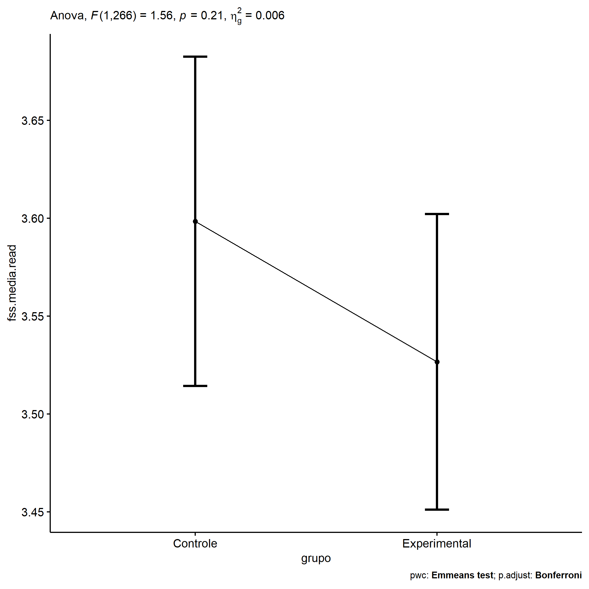<!-- -->

``` r
plots <- oneWayAncovaBoxPlots(
  wdat, "fss.media.read", "grupo", aov, pwc, covar = "dfs.media.read",
  theme = "classic", color = color[["grupo"]],
  subtitle = which(aov$Effect == "grupo"))
```

``` r
if (length(unique(wdat[["grupo"]])) > 1)
  plots[["grupo"]] + ggplot2::ylab("flow (ativ. leitura)") + ggplot2::scale_x_discrete(labels=c('pre', 'pos'))
```

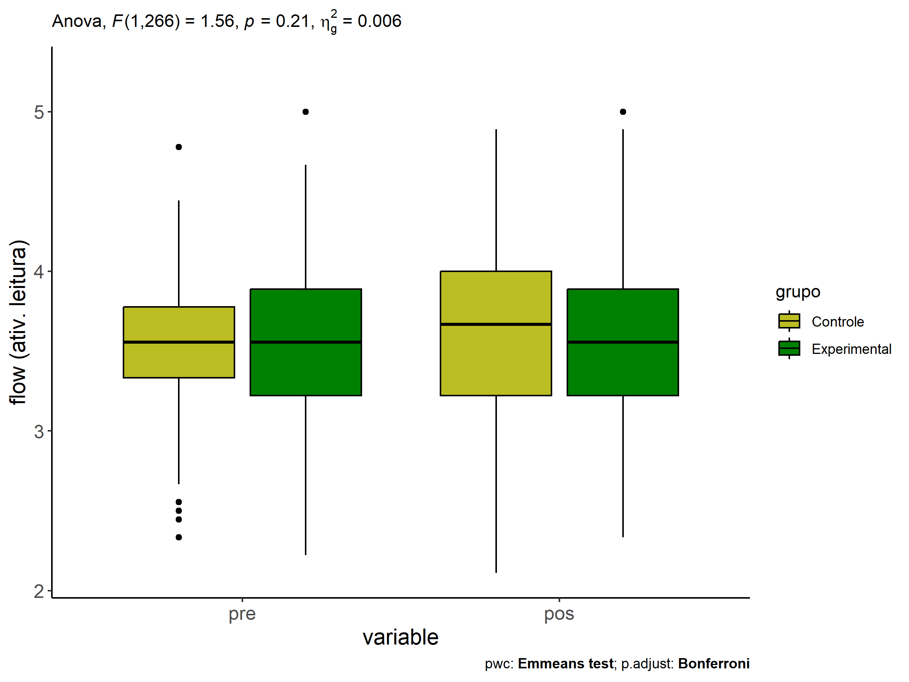<!-- -->

``` r
if (length(unique(wdat.long[["grupo"]])) > 1)
  plots <- oneWayAncovaBoxPlots(
    wdat.long, "flow.read", "grupo", aov, pwc.long, pre.post = "time",
    theme = "classic", color = color$prepost)
```

``` r
if (length(unique(wdat.long[["grupo"]])) > 1)
  plots[["grupo"]] + ggplot2::ylab("flow (ativ. leitura)")
```

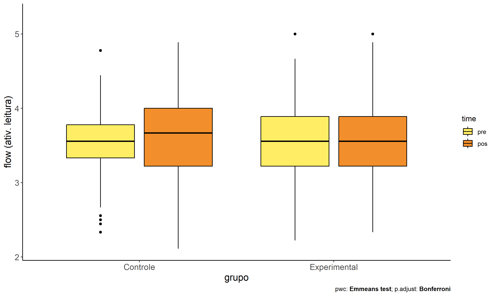<!-- -->

### Checking linearity assumption

``` r
ggscatter(wdat, x = "dfs.media.read", y = "fss.media.read", size = 0.5,
          color = "grupo", add = "reg.line")+
  stat_regline_equation(
    aes(label =  paste(..eq.label.., ..rr.label.., sep = "~~~~"), color = grupo)
  )
```

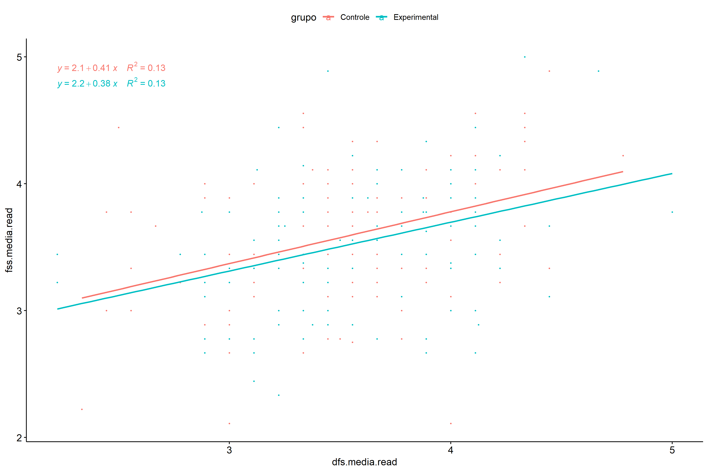<!-- -->

### Checking normality and homogeneity

``` r
res <- augment(lm(fss.media.read ~ dfs.media.read + grupo, data = wdat))
```

``` r
shapiro_test(res$.resid)
```

    ## # A tibble: 1 × 3
    ##   variable   statistic p.value
    ##   <chr>          <dbl>   <dbl>
    ## 1 res$.resid     0.993   0.198

``` r
levene_test(res, .resid ~ grupo)
```

    ## # A tibble: 1 × 4
    ##     df1   df2 statistic     p
    ##   <int> <int>     <dbl> <dbl>
    ## 1     1   267      1.63 0.203

# ANCOVA and Pairwise for two factors **grupo:Sexo**

## Without remove non-normal data

``` r
pdat = remove_group_data(dat[!is.na(dat[["grupo"]]) & !is.na(dat[["Sexo"]]),], "fss.media.read", c("grupo","Sexo"))

pdat.long <- rbind(pdat[,c("id","grupo","Sexo")], pdat[,c("id","grupo","Sexo")])
pdat.long[["time"]] <- c(rep("pre", nrow(pdat)), rep("pos", nrow(pdat)))
pdat.long[["time"]] <- factor(pdat.long[["time"]], c("pre","pos"))
pdat.long[["flow.read"]] <- c(pdat[["dfs.media.read"]], pdat[["fss.media.read"]])

aov = anova_test(pdat, fss.media.read ~ dfs.media.read + grupo*Sexo)
laov[["grupo:Sexo"]] <- get_anova_table(aov)
```

``` r
pwcs <- list()
pwcs[["Sexo"]] <- emmeans_test(
  group_by(pdat, grupo), fss.media.read ~ Sexo,
  covariate = dfs.media.read, p.adjust.method = "bonferroni")
pwcs[["grupo"]] <- emmeans_test(
  group_by(pdat, Sexo), fss.media.read ~ grupo,
  covariate = dfs.media.read, p.adjust.method = "bonferroni")

pwc <- plyr::rbind.fill(pwcs[["grupo"]], pwcs[["Sexo"]])
pwc <- pwc[,c("grupo","Sexo", colnames(pwc)[!colnames(pwc) %in% c("grupo","Sexo")])]
```

``` r
pwc.long <- emmeans_test(dplyr::group_by_at(pdat.long, c("grupo","Sexo")),
                         flow.read ~ time,
                         p.adjust.method = "bonferroni")
lpwc[["grupo:Sexo"]] <- plyr::rbind.fill(pwc, pwc.long)
```

``` r
ds <- get.descriptives(pdat, "fss.media.read", c("grupo","Sexo"), covar = "dfs.media.read")
ds <- merge(ds[ds$variable != "dfs.media.read",],
            ds[ds$variable == "dfs.media.read", !colnames(ds) %in% c("variable")],
            by = c("grupo","Sexo"), all.x = T, suffixes = c("", ".dfs.media.read"))
ds <- merge(get_emmeans(pwcs[["grupo"]]), ds, by = c("grupo","Sexo"), suffixes = c(".emms", ""))
ds <- ds[,c("grupo","Sexo","n","mean.dfs.media.read","se.dfs.media.read","mean","se","emmean","se.emms")]

colnames(ds) <- c("grupo","Sexo", "N", paste0(c("M","SE")," (pre)"),
                  paste0(c("M","SE"), " (unadj)"), paste0(c("M", "SE"), " (adj)"))

lemms[["grupo:Sexo"]] <- ds
```

## Computing ANCOVA and PairWise After removing non-normal data (OK)

``` r
wdat = pdat 

res = residuals(lm(fss.media.read ~ dfs.media.read + grupo*Sexo, data = wdat))
non.normal = getNonNormal(res, wdat$id, plimit = 0.05)

wdat = wdat[!wdat$id %in% non.normal,]

wdat.long <- rbind(wdat[,c("id","grupo","Sexo")], wdat[,c("id","grupo","Sexo")])
wdat.long[["time"]] <- c(rep("pre", nrow(wdat)), rep("pos", nrow(wdat)))
wdat.long[["time"]] <- factor(wdat.long[["time"]], c("pre","pos"))
wdat.long[["flow.read"]] <- c(wdat[["dfs.media.read"]], wdat[["fss.media.read"]])


ldat[["grupo:Sexo"]] = wdat

(non.normal)
```

    ## [1] "P2314" "P2300"

``` r
aov = anova_test(wdat, fss.media.read ~ dfs.media.read + grupo*Sexo)
laov[["grupo:Sexo"]] <- merge(get_anova_table(aov), laov[["grupo:Sexo"]], by="Effect", suffixes = c("","'"))

(df = get_anova_table(aov))
```

    ## ANOVA Table (type II tests)
    ## 
    ##           Effect DFn DFd      F        p p<.05      ges
    ## 1 dfs.media.read   1 264 39.956 1.10e-09     * 0.131000
    ## 2          grupo   1 264  1.510 2.20e-01       0.006000
    ## 3           Sexo   1 264  0.086 7.70e-01       0.000325
    ## 4     grupo:Sexo   1 264  0.366 5.46e-01       0.001000

| Effect         | DFn | DFd |      F |     p | p\<.05 |   ges |
|:---------------|----:|----:|-------:|------:|:-------|------:|
| dfs.media.read |   1 | 264 | 39.956 | 0.000 | \*     | 0.131 |
| grupo          |   1 | 264 |  1.510 | 0.220 |        | 0.006 |
| Sexo           |   1 | 264 |  0.086 | 0.770 |        | 0.000 |
| grupo:Sexo     |   1 | 264 |  0.366 | 0.546 |        | 0.001 |

``` r
pwcs <- list()
pwcs[["Sexo"]] <- emmeans_test(
  group_by(wdat, grupo), fss.media.read ~ Sexo,
  covariate = dfs.media.read, p.adjust.method = "bonferroni")
pwcs[["grupo"]] <- emmeans_test(
  group_by(wdat, Sexo), fss.media.read ~ grupo,
  covariate = dfs.media.read, p.adjust.method = "bonferroni")

pwc <- plyr::rbind.fill(pwcs[["grupo"]], pwcs[["Sexo"]])
pwc <- pwc[,c("grupo","Sexo", colnames(pwc)[!colnames(pwc) %in% c("grupo","Sexo")])]
```

| grupo        | Sexo | term                  | .y.            | group1   | group2       |  df | statistic |     p | p.adj | p.adj.signif |
|:-------------|:-----|:----------------------|:---------------|:---------|:-------------|----:|----------:|------:|------:|:-------------|
|              | F    | dfs.media.read\*grupo | fss.media.read | Controle | Experimental | 264 |     0.399 | 0.690 | 0.690 | ns           |
|              | M    | dfs.media.read\*grupo | fss.media.read | Controle | Experimental | 264 |     1.311 | 0.191 | 0.191 | ns           |
| Controle     |      | dfs.media.read\*Sexo  | fss.media.read | F        | M            | 264 |    -0.646 | 0.519 | 0.519 | ns           |
| Experimental |      | dfs.media.read\*Sexo  | fss.media.read | F        | M            | 264 |     0.182 | 0.856 | 0.856 | ns           |

``` r
pwc.long <- emmeans_test(dplyr::group_by_at(wdat.long, c("grupo","Sexo")),
                         flow.read ~ time,
                         p.adjust.method = "bonferroni")
lpwc[["grupo:Sexo"]] <- merge(plyr::rbind.fill(pwc, pwc.long), lpwc[["grupo:Sexo"]], by=c("grupo","Sexo","term",".y.","group1","group2"), suffixes = c("","'"))
```

| grupo        | Sexo | term | .y.       | group1 | group2 |  df | statistic |     p | p.adj | p.adj.signif |
|:-------------|:-----|:-----|:----------|:-------|:-------|----:|----------:|------:|------:|:-------------|
| Controle     | F    | time | flow.read | pre    | pos    | 530 |     0.045 | 0.964 | 0.964 | ns           |
| Controle     | M    | time | flow.read | pre    | pos    | 530 |    -1.334 | 0.183 | 0.183 | ns           |
| Experimental | F    | time | flow.read | pre    | pos    | 530 |     0.663 | 0.508 | 0.508 | ns           |
| Experimental | M    | time | flow.read | pre    | pos    | 530 |     0.513 | 0.609 | 0.609 | ns           |

``` r
ds <- get.descriptives(wdat, "fss.media.read", c("grupo","Sexo"), covar = "dfs.media.read")
ds <- merge(ds[ds$variable != "dfs.media.read",],
            ds[ds$variable == "dfs.media.read", !colnames(ds) %in% c("variable")],
            by = c("grupo","Sexo"), all.x = T, suffixes = c("", ".dfs.media.read"))
ds <- merge(get_emmeans(pwcs[["grupo"]]), ds, by = c("grupo","Sexo"), suffixes = c(".emms", ""))
ds <- ds[,c("grupo","Sexo","n","mean.dfs.media.read","se.dfs.media.read","mean","se","emmean","se.emms")]

colnames(ds) <- c("grupo","Sexo", "N", paste0(c("M","SE")," (pre)"),
                  paste0(c("M","SE"), " (unadj)"), paste0(c("M", "SE"), " (adj)"))

lemms[["grupo:Sexo"]] <- merge(ds, lemms[["grupo:Sexo"]], by=c("grupo","Sexo"), suffixes = c("","'"))
```

| grupo        | Sexo |   N | M (pre) | SE (pre) | M (unadj) | SE (unadj) | M (adj) | SE (adj) |
|:-------------|:-----|----:|--------:|---------:|----------:|-----------:|--------:|---------:|
| Controle     | F    |  53 |   3.581 |    0.054 |     3.577 |      0.071 |   3.567 |    0.064 |
| Controle     | M    |  67 |   3.483 |    0.064 |     3.593 |      0.066 |   3.623 |    0.057 |
| Experimental | F    |  74 |   3.605 |    0.045 |     3.552 |      0.056 |   3.534 |    0.055 |
| Experimental | M    |  75 |   3.561 |    0.057 |     3.521 |      0.055 |   3.520 |    0.054 |

### Plots for ancova

``` r
plots <- twoWayAncovaPlots(
  wdat, "fss.media.read", c("grupo","Sexo"), aov, pwcs, addParam = c("mean_se"),
  font.label.size=10, step.increase=0.05, p.label="p.adj",
  subtitle = which(aov$Effect == "grupo:Sexo"))
```

``` r
if (!is.null(plots[["grupo"]]))
  plots[["grupo"]] + ggplot2::scale_color_manual(values = color[["Sexo"]])
```

    ## Scale for colour is already present.
    ## Adding another scale for colour, which will replace the existing scale.

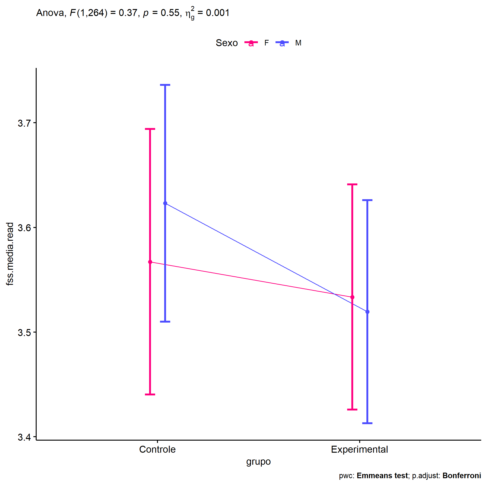<!-- -->

``` r
if (!is.null(plots[["Sexo"]]))
  plots[["Sexo"]] + ggplot2::scale_color_manual(values = color[["grupo"]])
```

    ## Scale for colour is already present.
    ## Adding another scale for colour, which will replace the existing scale.

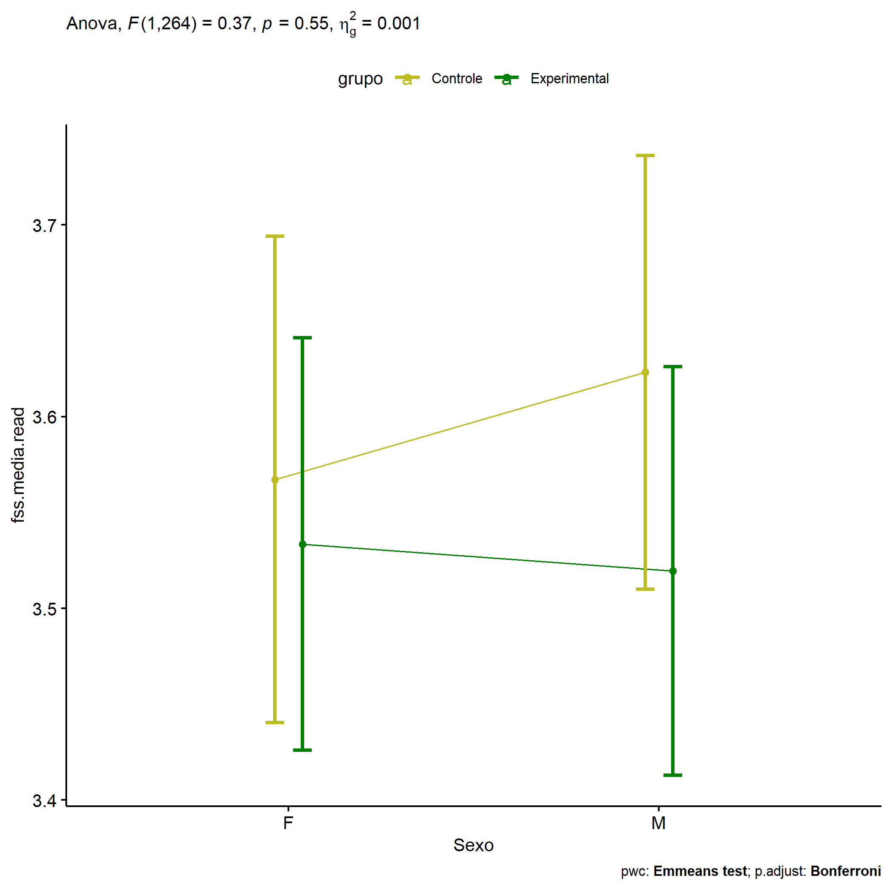<!-- -->

``` r
plots <- twoWayAncovaBoxPlots(
  wdat, "fss.media.read", c("grupo","Sexo"), aov, pwcs, covar = "dfs.media.read",
  theme = "classic", color = color[["grupo:Sexo"]],
  subtitle = which(aov$Effect == "grupo:Sexo"))
```

``` r
plots[["grupo:Sexo"]] + ggplot2::ylab("flow (ativ. leitura)") + ggplot2::scale_x_discrete(labels=c('pre', 'pos'))
```

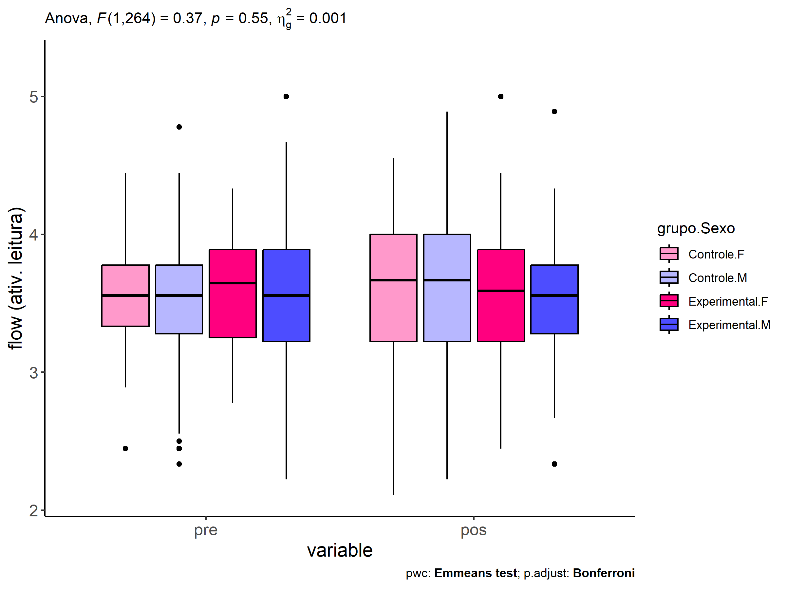<!-- -->

``` r
plots <- twoWayAncovaBoxPlots(
  wdat.long, "flow.read", c("grupo","Sexo"), aov, pwc.long, pre.post = "time",
  theme = "classic", color = color$prepost)
```

``` r
plots[["grupo:Sexo"]] + ggplot2::ylab("flow (ativ. leitura)")
```

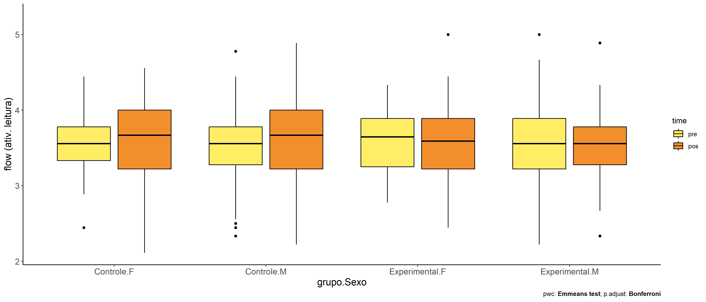<!-- -->

### Checking linearity assumption

``` r
ggscatter(wdat, x = "dfs.media.read", y = "fss.media.read", size = 0.5,
          facet.by = c("grupo","Sexo"), add = "reg.line")+
  stat_regline_equation(
    aes(label =  paste(..eq.label.., ..rr.label.., sep = "~~~~"))
  )
```

<!-- -->

### Checking normality and homogeneity

``` r
res <- augment(lm(fss.media.read ~ dfs.media.read + grupo*Sexo, data = wdat))
```

``` r
shapiro_test(res$.resid)
```

    ## # A tibble: 1 × 3
    ##   variable   statistic p.value
    ##   <chr>          <dbl>   <dbl>
    ## 1 res$.resid     0.993   0.222

``` r
levene_test(res, .resid ~ grupo*Sexo)
```

    ## # A tibble: 1 × 4
    ##     df1   df2 statistic     p
    ##   <int> <int>     <dbl> <dbl>
    ## 1     3   265     0.521 0.668

# ANCOVA and Pairwise for two factors **grupo:Zona**

## Without remove non-normal data

``` r
pdat = remove_group_data(dat[!is.na(dat[["grupo"]]) & !is.na(dat[["Zona"]]),], "fss.media.read", c("grupo","Zona"))

pdat.long <- rbind(pdat[,c("id","grupo","Zona")], pdat[,c("id","grupo","Zona")])
pdat.long[["time"]] <- c(rep("pre", nrow(pdat)), rep("pos", nrow(pdat)))
pdat.long[["time"]] <- factor(pdat.long[["time"]], c("pre","pos"))
pdat.long[["flow.read"]] <- c(pdat[["dfs.media.read"]], pdat[["fss.media.read"]])

aov = anova_test(pdat, fss.media.read ~ dfs.media.read + grupo*Zona)
laov[["grupo:Zona"]] <- get_anova_table(aov)
```

``` r
pwcs <- list()
pwcs[["Zona"]] <- emmeans_test(
  group_by(pdat, grupo), fss.media.read ~ Zona,
  covariate = dfs.media.read, p.adjust.method = "bonferroni")
pwcs[["grupo"]] <- emmeans_test(
  group_by(pdat, Zona), fss.media.read ~ grupo,
  covariate = dfs.media.read, p.adjust.method = "bonferroni")

pwc <- plyr::rbind.fill(pwcs[["grupo"]], pwcs[["Zona"]])
pwc <- pwc[,c("grupo","Zona", colnames(pwc)[!colnames(pwc) %in% c("grupo","Zona")])]
```

``` r
pwc.long <- emmeans_test(dplyr::group_by_at(pdat.long, c("grupo","Zona")),
                         flow.read ~ time,
                         p.adjust.method = "bonferroni")
lpwc[["grupo:Zona"]] <- plyr::rbind.fill(pwc, pwc.long)
```

``` r
ds <- get.descriptives(pdat, "fss.media.read", c("grupo","Zona"), covar = "dfs.media.read")
ds <- merge(ds[ds$variable != "dfs.media.read",],
            ds[ds$variable == "dfs.media.read", !colnames(ds) %in% c("variable")],
            by = c("grupo","Zona"), all.x = T, suffixes = c("", ".dfs.media.read"))
ds <- merge(get_emmeans(pwcs[["grupo"]]), ds, by = c("grupo","Zona"), suffixes = c(".emms", ""))
ds <- ds[,c("grupo","Zona","n","mean.dfs.media.read","se.dfs.media.read","mean","se","emmean","se.emms")]

colnames(ds) <- c("grupo","Zona", "N", paste0(c("M","SE")," (pre)"),
                  paste0(c("M","SE"), " (unadj)"), paste0(c("M", "SE"), " (adj)"))

lemms[["grupo:Zona"]] <- ds
```

## Computing ANCOVA and PairWise After removing non-normal data (OK)

``` r
wdat = pdat 

res = residuals(lm(fss.media.read ~ dfs.media.read + grupo*Zona, data = wdat))
non.normal = getNonNormal(res, wdat$id, plimit = 0.05)

wdat = wdat[!wdat$id %in% non.normal,]

wdat.long <- rbind(wdat[,c("id","grupo","Zona")], wdat[,c("id","grupo","Zona")])
wdat.long[["time"]] <- c(rep("pre", nrow(wdat)), rep("pos", nrow(wdat)))
wdat.long[["time"]] <- factor(wdat.long[["time"]], c("pre","pos"))
wdat.long[["flow.read"]] <- c(wdat[["dfs.media.read"]], wdat[["fss.media.read"]])


ldat[["grupo:Zona"]] = wdat

(non.normal)
```

    ## NULL

``` r
aov = anova_test(wdat, fss.media.read ~ dfs.media.read + grupo*Zona)
laov[["grupo:Zona"]] <- merge(get_anova_table(aov), laov[["grupo:Zona"]], by="Effect", suffixes = c("","'"))

(df = get_anova_table(aov))
```

    ## ANOVA Table (type II tests)
    ## 
    ##           Effect DFn DFd      F        p p<.05      ges
    ## 1 dfs.media.read   1 137 27.739 5.25e-07     * 1.68e-01
    ## 2          grupo   1 137  2.309 1.31e-01       1.70e-02
    ## 3           Zona   1 137  0.004 9.50e-01       2.93e-05
    ## 4     grupo:Zona   1 137  0.004 9.47e-01       3.20e-05

| Effect         | DFn | DFd |      F |     p | p\<.05 |   ges |
|:---------------|----:|----:|-------:|------:|:-------|------:|
| dfs.media.read |   1 | 137 | 27.739 | 0.000 | \*     | 0.168 |
| grupo          |   1 | 137 |  2.309 | 0.131 |        | 0.017 |
| Zona           |   1 | 137 |  0.004 | 0.950 |        | 0.000 |
| grupo:Zona     |   1 | 137 |  0.004 | 0.947 |        | 0.000 |

``` r
pwcs <- list()
pwcs[["Zona"]] <- emmeans_test(
  group_by(wdat, grupo), fss.media.read ~ Zona,
  covariate = dfs.media.read, p.adjust.method = "bonferroni")
pwcs[["grupo"]] <- emmeans_test(
  group_by(wdat, Zona), fss.media.read ~ grupo,
  covariate = dfs.media.read, p.adjust.method = "bonferroni")

pwc <- plyr::rbind.fill(pwcs[["grupo"]], pwcs[["Zona"]])
pwc <- pwc[,c("grupo","Zona", colnames(pwc)[!colnames(pwc) %in% c("grupo","Zona")])]
```

| grupo        | Zona   | term                  | .y.            | group1   | group2       |  df | statistic |     p | p.adj | p.adj.signif |
|:-------------|:-------|:----------------------|:---------------|:---------|:-------------|----:|----------:|------:|------:|:-------------|
|              | Rural  | dfs.media.read\*grupo | fss.media.read | Controle | Experimental | 137 |     1.085 | 0.280 | 0.280 | ns           |
|              | Urbana | dfs.media.read\*grupo | fss.media.read | Controle | Experimental | 137 |     1.056 | 0.293 | 0.293 | ns           |
| Controle     |        | dfs.media.read\*Zona  | fss.media.read | Rural    | Urbana       | 137 |    -0.092 | 0.927 | 0.927 | ns           |
| Experimental |        | dfs.media.read\*Zona  | fss.media.read | Rural    | Urbana       | 137 |    -0.005 | 0.996 | 0.996 | ns           |

``` r
pwc.long <- emmeans_test(dplyr::group_by_at(wdat.long, c("grupo","Zona")),
                         flow.read ~ time,
                         p.adjust.method = "bonferroni")
lpwc[["grupo:Zona"]] <- merge(plyr::rbind.fill(pwc, pwc.long), lpwc[["grupo:Zona"]], by=c("grupo","Zona","term",".y.","group1","group2"), suffixes = c("","'"))
```

| grupo        | Zona   | term | .y.       | group1 | group2 |  df | statistic |     p | p.adj | p.adj.signif |
|:-------------|:-------|:-----|:----------|:-------|:-------|----:|----------:|------:|------:|:-------------|
| Controle     | Rural  | time | flow.read | pre    | pos    | 276 |     0.583 | 0.560 | 0.560 | ns           |
| Controle     | Urbana | time | flow.read | pre    | pos    | 276 |    -0.954 | 0.341 | 0.341 | ns           |
| Experimental | Rural  | time | flow.read | pre    | pos    | 276 |     1.219 | 0.224 | 0.224 | ns           |
| Experimental | Urbana | time | flow.read | pre    | pos    | 276 |     1.090 | 0.277 | 0.277 | ns           |

``` r
ds <- get.descriptives(wdat, "fss.media.read", c("grupo","Zona"), covar = "dfs.media.read")
ds <- merge(ds[ds$variable != "dfs.media.read",],
            ds[ds$variable == "dfs.media.read", !colnames(ds) %in% c("variable")],
            by = c("grupo","Zona"), all.x = T, suffixes = c("", ".dfs.media.read"))
ds <- merge(get_emmeans(pwcs[["grupo"]]), ds, by = c("grupo","Zona"), suffixes = c(".emms", ""))
ds <- ds[,c("grupo","Zona","n","mean.dfs.media.read","se.dfs.media.read","mean","se","emmean","se.emms")]

colnames(ds) <- c("grupo","Zona", "N", paste0(c("M","SE")," (pre)"),
                  paste0(c("M","SE"), " (unadj)"), paste0(c("M", "SE"), " (adj)"))

lemms[["grupo:Zona"]] <- merge(ds, lemms[["grupo:Zona"]], by=c("grupo","Zona"), suffixes = c("","'"))
```

| grupo        | Zona   |   N | M (pre) | SE (pre) | M (unadj) | SE (unadj) | M (adj) | SE (adj) |
|:-------------|:-------|----:|--------:|---------:|----------:|-----------:|--------:|---------:|
| Controle     | Rural  |  42 |   3.696 |    0.065 |     3.632 |      0.085 |   3.578 |    0.076 |
| Controle     | Urbana |  24 |   3.338 |    0.108 |     3.477 |      0.130 |   3.590 |    0.102 |
| Experimental | Rural  |  34 |   3.625 |    0.072 |     3.476 |      0.073 |   3.456 |    0.084 |
| Experimental | Urbana |  42 |   3.571 |    0.080 |     3.451 |      0.082 |   3.456 |    0.076 |

### Plots for ancova

``` r
plots <- twoWayAncovaPlots(
  wdat, "fss.media.read", c("grupo","Zona"), aov, pwcs, addParam = c("mean_se"),
  font.label.size=10, step.increase=0.05, p.label="p.adj",
  subtitle = which(aov$Effect == "grupo:Zona"))
```

``` r
if (!is.null(plots[["grupo"]]))
  plots[["grupo"]] + ggplot2::scale_color_manual(values = color[["Zona"]])
```

    ## Scale for colour is already present.
    ## Adding another scale for colour, which will replace the existing scale.

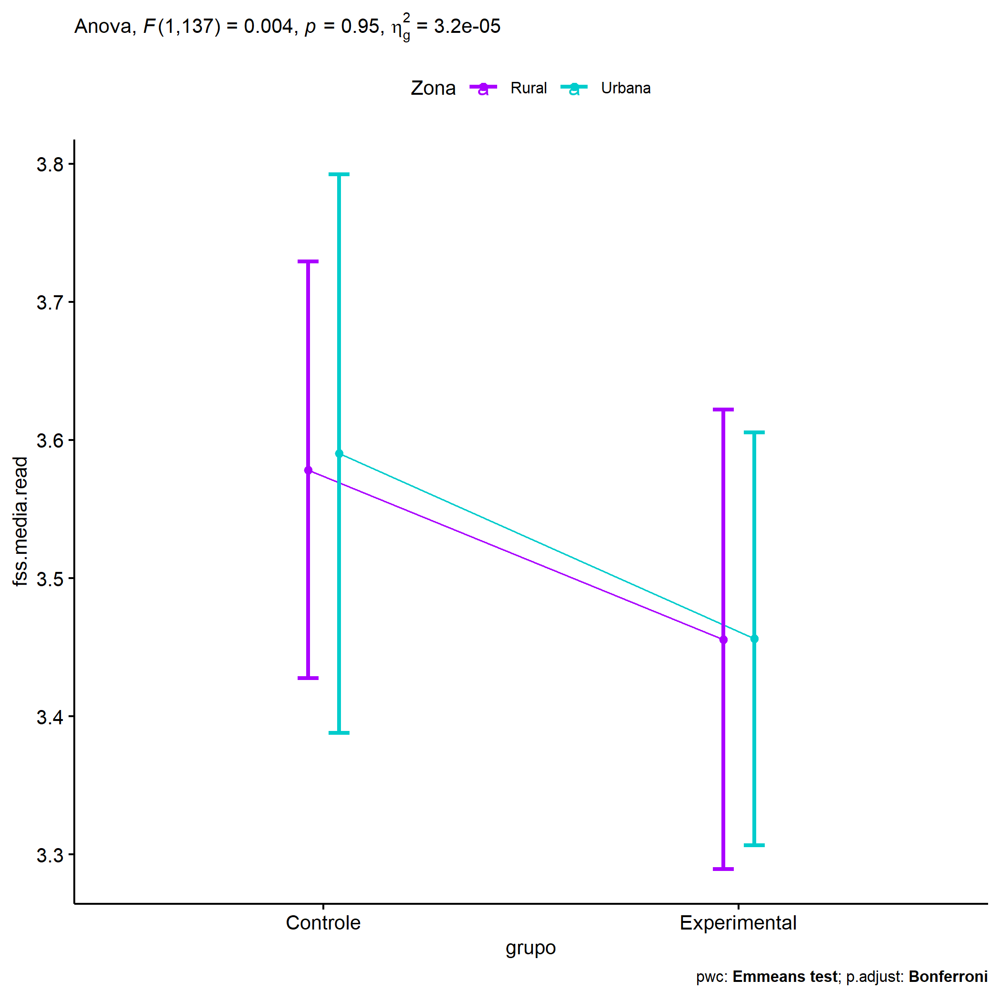<!-- -->

``` r
if (!is.null(plots[["Zona"]]))
  plots[["Zona"]] + ggplot2::scale_color_manual(values = color[["grupo"]])
```

    ## Scale for colour is already present.
    ## Adding another scale for colour, which will replace the existing scale.

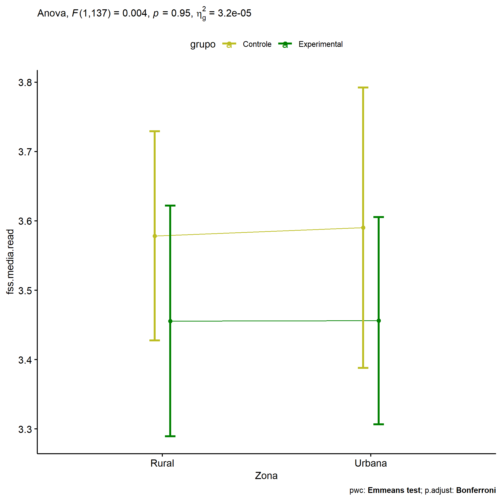<!-- -->

``` r
plots <- twoWayAncovaBoxPlots(
  wdat, "fss.media.read", c("grupo","Zona"), aov, pwcs, covar = "dfs.media.read",
  theme = "classic", color = color[["grupo:Zona"]],
  subtitle = which(aov$Effect == "grupo:Zona"))
```

``` r
plots[["grupo:Zona"]] + ggplot2::ylab("flow (ativ. leitura)") + ggplot2::scale_x_discrete(labels=c('pre', 'pos'))
```

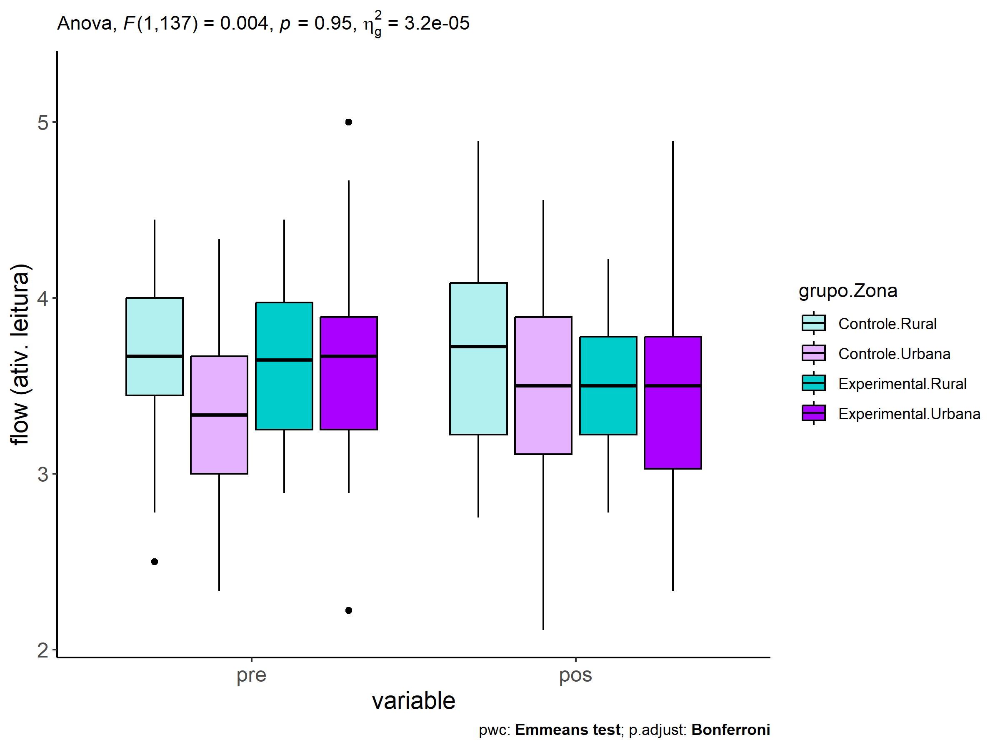<!-- -->

``` r
plots <- twoWayAncovaBoxPlots(
  wdat.long, "flow.read", c("grupo","Zona"), aov, pwc.long, pre.post = "time",
  theme = "classic", color = color$prepost)
```

``` r
plots[["grupo:Zona"]] + ggplot2::ylab("flow (ativ. leitura)")
```

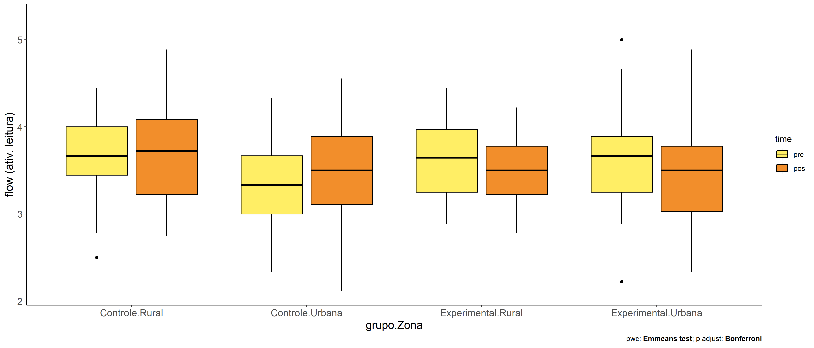<!-- -->

### Checking linearity assumption

``` r
ggscatter(wdat, x = "dfs.media.read", y = "fss.media.read", size = 0.5,
          facet.by = c("grupo","Zona"), add = "reg.line")+
  stat_regline_equation(
    aes(label =  paste(..eq.label.., ..rr.label.., sep = "~~~~"))
  )
```

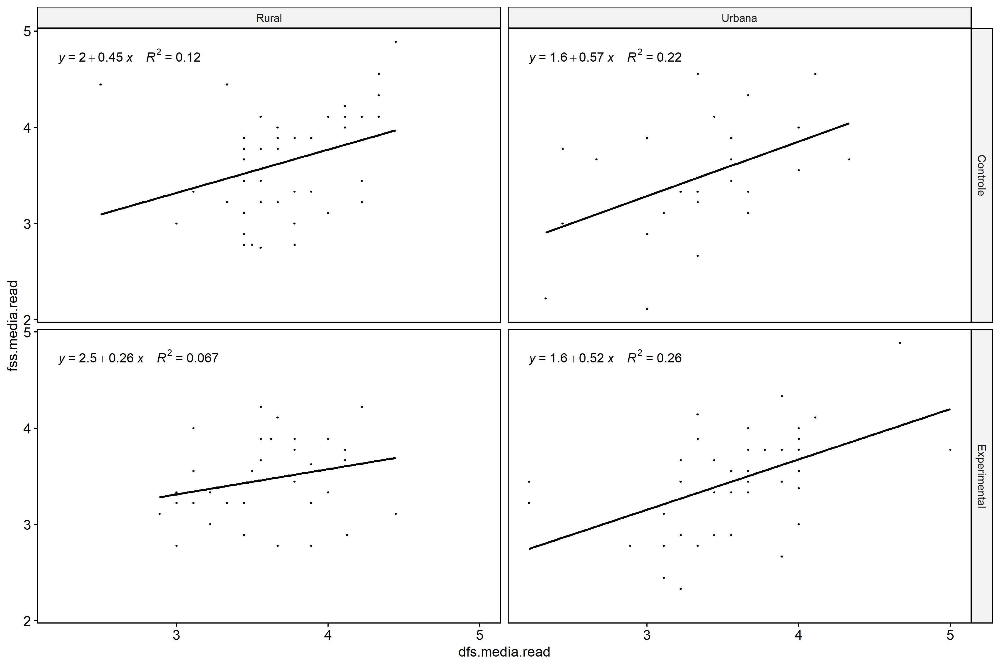<!-- -->

### Checking normality and homogeneity

``` r
res <- augment(lm(fss.media.read ~ dfs.media.read + grupo*Zona, data = wdat))
```

``` r
shapiro_test(res$.resid)
```

    ## # A tibble: 1 × 3
    ##   variable   statistic p.value
    ##   <chr>          <dbl>   <dbl>
    ## 1 res$.resid     0.993   0.742

``` r
levene_test(res, .resid ~ grupo*Zona)
```

    ## # A tibble: 1 × 4
    ##     df1   df2 statistic     p
    ##   <int> <int>     <dbl> <dbl>
    ## 1     3   138      1.00 0.394

# ANCOVA and Pairwise for two factors **grupo:Cor.Raca**

## Without remove non-normal data

``` r
pdat = remove_group_data(dat[!is.na(dat[["grupo"]]) & !is.na(dat[["Cor.Raca"]]),], "fss.media.read", c("grupo","Cor.Raca"))
```

    ## Warning: There was 1 warning in `mutate()`.
    ## ℹ In argument: `ci = abs(stats::qt(alpha/2, .data$n - 1) * .data$se)`.
    ## Caused by warning:
    ## ! There was 1 warning in `mutate()`.
    ## ℹ In argument: `ci = abs(stats::qt(alpha/2, .data$n - 1) * .data$se)`.
    ## Caused by warning in `stats::qt()`:
    ## ! NaNs produced

``` r
pdat.long <- rbind(pdat[,c("id","grupo","Cor.Raca")], pdat[,c("id","grupo","Cor.Raca")])
pdat.long[["time"]] <- c(rep("pre", nrow(pdat)), rep("pos", nrow(pdat)))
pdat.long[["time"]] <- factor(pdat.long[["time"]], c("pre","pos"))
pdat.long[["flow.read"]] <- c(pdat[["dfs.media.read"]], pdat[["fss.media.read"]])

aov = anova_test(pdat, fss.media.read ~ dfs.media.read + grupo*Cor.Raca)
laov[["grupo:Cor.Raca"]] <- get_anova_table(aov)
```

``` r
pwcs <- list()
pwcs[["Cor.Raca"]] <- emmeans_test(
  group_by(pdat, grupo), fss.media.read ~ Cor.Raca,
  covariate = dfs.media.read, p.adjust.method = "bonferroni")
pwcs[["grupo"]] <- emmeans_test(
  group_by(pdat, Cor.Raca), fss.media.read ~ grupo,
  covariate = dfs.media.read, p.adjust.method = "bonferroni")

pwc <- plyr::rbind.fill(pwcs[["grupo"]], pwcs[["Cor.Raca"]])
pwc <- pwc[,c("grupo","Cor.Raca", colnames(pwc)[!colnames(pwc) %in% c("grupo","Cor.Raca")])]
```

``` r
pwc.long <- emmeans_test(dplyr::group_by_at(pdat.long, c("grupo","Cor.Raca")),
                         flow.read ~ time,
                         p.adjust.method = "bonferroni")
lpwc[["grupo:Cor.Raca"]] <- plyr::rbind.fill(pwc, pwc.long)
```

``` r
ds <- get.descriptives(pdat, "fss.media.read", c("grupo","Cor.Raca"), covar = "dfs.media.read")
ds <- merge(ds[ds$variable != "dfs.media.read",],
            ds[ds$variable == "dfs.media.read", !colnames(ds) %in% c("variable")],
            by = c("grupo","Cor.Raca"), all.x = T, suffixes = c("", ".dfs.media.read"))
ds <- merge(get_emmeans(pwcs[["grupo"]]), ds, by = c("grupo","Cor.Raca"), suffixes = c(".emms", ""))
ds <- ds[,c("grupo","Cor.Raca","n","mean.dfs.media.read","se.dfs.media.read","mean","se","emmean","se.emms")]

colnames(ds) <- c("grupo","Cor.Raca", "N", paste0(c("M","SE")," (pre)"),
                  paste0(c("M","SE"), " (unadj)"), paste0(c("M", "SE"), " (adj)"))

lemms[["grupo:Cor.Raca"]] <- ds
```

## Computing ANCOVA and PairWise After removing non-normal data (OK)

``` r
wdat = pdat 

res = residuals(lm(fss.media.read ~ dfs.media.read + grupo*Cor.Raca, data = wdat))
non.normal = getNonNormal(res, wdat$id, plimit = 0.05)

wdat = wdat[!wdat$id %in% non.normal,]

wdat.long <- rbind(wdat[,c("id","grupo","Cor.Raca")], wdat[,c("id","grupo","Cor.Raca")])
wdat.long[["time"]] <- c(rep("pre", nrow(wdat)), rep("pos", nrow(wdat)))
wdat.long[["time"]] <- factor(wdat.long[["time"]], c("pre","pos"))
wdat.long[["flow.read"]] <- c(wdat[["dfs.media.read"]], wdat[["fss.media.read"]])


ldat[["grupo:Cor.Raca"]] = wdat

(non.normal)
```

    ## NULL

``` r
aov = anova_test(wdat, fss.media.read ~ dfs.media.read + grupo*Cor.Raca)
laov[["grupo:Cor.Raca"]] <- merge(get_anova_table(aov), laov[["grupo:Cor.Raca"]], by="Effect", suffixes = c("","'"))

(df = get_anova_table(aov))
```

    ## ANOVA Table (type II tests)
    ## 
    ##           Effect DFn DFd      F        p p<.05   ges
    ## 1 dfs.media.read   1  99 21.474 1.09e-05     * 0.178
    ## 2          grupo   1  99  0.606 4.38e-01       0.006
    ## 3       Cor.Raca   1  99  0.991 3.22e-01       0.010
    ## 4 grupo:Cor.Raca   1  99  0.243 6.23e-01       0.002

| Effect         | DFn | DFd |      F |     p | p\<.05 |   ges |
|:---------------|----:|----:|-------:|------:|:-------|------:|
| dfs.media.read |   1 |  99 | 21.474 | 0.000 | \*     | 0.178 |
| grupo          |   1 |  99 |  0.606 | 0.438 |        | 0.006 |
| Cor.Raca       |   1 |  99 |  0.991 | 0.322 |        | 0.010 |
| grupo:Cor.Raca |   1 |  99 |  0.243 | 0.623 |        | 0.002 |

``` r
pwcs <- list()
pwcs[["Cor.Raca"]] <- emmeans_test(
  group_by(wdat, grupo), fss.media.read ~ Cor.Raca,
  covariate = dfs.media.read, p.adjust.method = "bonferroni")
pwcs[["grupo"]] <- emmeans_test(
  group_by(wdat, Cor.Raca), fss.media.read ~ grupo,
  covariate = dfs.media.read, p.adjust.method = "bonferroni")

pwc <- plyr::rbind.fill(pwcs[["grupo"]], pwcs[["Cor.Raca"]])
pwc <- pwc[,c("grupo","Cor.Raca", colnames(pwc)[!colnames(pwc) %in% c("grupo","Cor.Raca")])]
```

| grupo        | Cor.Raca | term                     | .y.            | group1   | group2       |  df | statistic |     p | p.adj | p.adj.signif |
|:-------------|:---------|:-------------------------|:---------------|:---------|:-------------|----:|----------:|------:|------:|:-------------|
|              | Branca   | dfs.media.read\*grupo    | fss.media.read | Controle | Experimental |  99 |    -0.762 | 0.448 | 0.448 | ns           |
|              | Parda    | dfs.media.read\*grupo    | fss.media.read | Controle | Experimental |  99 |    -0.515 | 0.608 | 0.608 | ns           |
| Controle     |          | dfs.media.read\*Cor.Raca | fss.media.read | Branca   | Parda        |  99 |     0.288 | 0.774 | 0.774 | ns           |
| Experimental |          | dfs.media.read\*Cor.Raca | fss.media.read | Branca   | Parda        |  99 |     1.086 | 0.280 | 0.280 | ns           |

``` r
pwc.long <- emmeans_test(dplyr::group_by_at(wdat.long, c("grupo","Cor.Raca")),
                         flow.read ~ time,
                         p.adjust.method = "bonferroni")
lpwc[["grupo:Cor.Raca"]] <- merge(plyr::rbind.fill(pwc, pwc.long), lpwc[["grupo:Cor.Raca"]], by=c("grupo","Cor.Raca","term",".y.","group1","group2"), suffixes = c("","'"))
```

| grupo        | Cor.Raca | term | .y.       | group1 | group2 |  df | statistic |     p | p.adj | p.adj.signif |
|:-------------|:---------|:-----|:----------|:-------|:-------|----:|----------:|------:|------:|:-------------|
| Controle     | Branca   | time | flow.read | pre    | pos    | 200 |     1.274 | 0.204 | 0.204 | ns           |
| Controle     | Parda    | time | flow.read | pre    | pos    | 200 |     0.274 | 0.784 | 0.784 | ns           |
| Experimental | Branca   | time | flow.read | pre    | pos    | 200 |     0.007 | 0.995 | 0.995 | ns           |
| Experimental | Parda    | time | flow.read | pre    | pos    | 200 |     0.048 | 0.962 | 0.962 | ns           |

``` r
ds <- get.descriptives(wdat, "fss.media.read", c("grupo","Cor.Raca"), covar = "dfs.media.read")
ds <- merge(ds[ds$variable != "dfs.media.read",],
            ds[ds$variable == "dfs.media.read", !colnames(ds) %in% c("variable")],
            by = c("grupo","Cor.Raca"), all.x = T, suffixes = c("", ".dfs.media.read"))
ds <- merge(get_emmeans(pwcs[["grupo"]]), ds, by = c("grupo","Cor.Raca"), suffixes = c(".emms", ""))
ds <- ds[,c("grupo","Cor.Raca","n","mean.dfs.media.read","se.dfs.media.read","mean","se","emmean","se.emms")]

colnames(ds) <- c("grupo","Cor.Raca", "N", paste0(c("M","SE")," (pre)"),
                  paste0(c("M","SE"), " (unadj)"), paste0(c("M", "SE"), " (adj)"))

lemms[["grupo:Cor.Raca"]] <- merge(ds, lemms[["grupo:Cor.Raca"]], by=c("grupo","Cor.Raca"), suffixes = c("","'"))
```

| grupo        | Cor.Raca |   N | M (pre) | SE (pre) | M (unadj) | SE (unadj) | M (adj) | SE (adj) |
|:-------------|:---------|----:|--------:|---------:|----------:|-----------:|--------:|---------:|
| Controle     | Branca   |   7 |   4.071 |    0.180 |     3.762 |      0.278 |   3.549 |    0.164 |
| Controle     | Parda    |  47 |   3.487 |    0.068 |     3.461 |      0.071 |   3.498 |    0.061 |
| Experimental | Branca   |  10 |   3.808 |    0.099 |     3.807 |      0.157 |   3.707 |    0.133 |
| Experimental | Parda    |  40 |   3.531 |    0.072 |     3.526 |      0.054 |   3.544 |    0.066 |

### Plots for ancova

``` r
plots <- twoWayAncovaPlots(
  wdat, "fss.media.read", c("grupo","Cor.Raca"), aov, pwcs, addParam = c("mean_se"),
  font.label.size=10, step.increase=0.05, p.label="p.adj",
  subtitle = which(aov$Effect == "grupo:Cor.Raca"))
```

``` r
if (!is.null(plots[["grupo"]]))
  plots[["grupo"]] + ggplot2::scale_color_manual(values = color[["Cor.Raca"]])
```

    ## Scale for colour is already present.
    ## Adding another scale for colour, which will replace the existing scale.

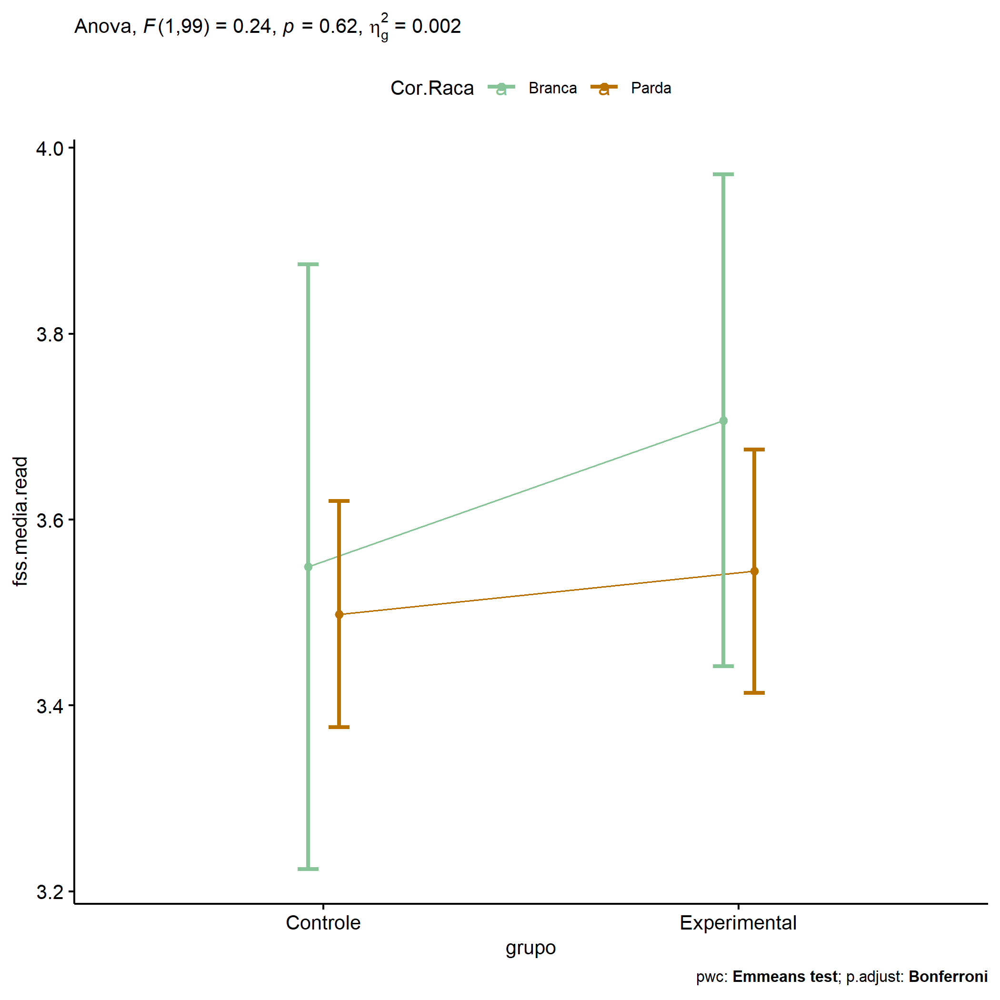<!-- -->

``` r
if (!is.null(plots[["Cor.Raca"]]))
  plots[["Cor.Raca"]] + ggplot2::scale_color_manual(values = color[["grupo"]])
```

    ## Scale for colour is already present.
    ## Adding another scale for colour, which will replace the existing scale.

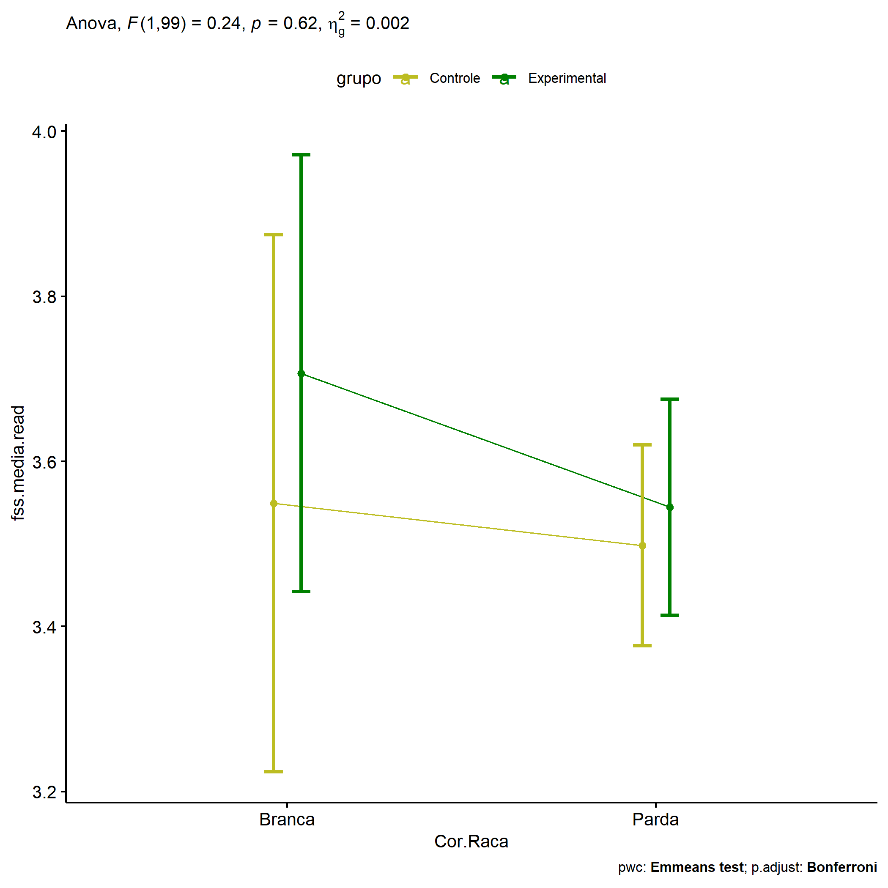<!-- -->

``` r
plots <- twoWayAncovaBoxPlots(
  wdat, "fss.media.read", c("grupo","Cor.Raca"), aov, pwcs, covar = "dfs.media.read",
  theme = "classic", color = color[["grupo:Cor.Raca"]],
  subtitle = which(aov$Effect == "grupo:Cor.Raca"))
```

``` r
plots[["grupo:Cor.Raca"]] + ggplot2::ylab("flow (ativ. leitura)") + ggplot2::scale_x_discrete(labels=c('pre', 'pos'))
```

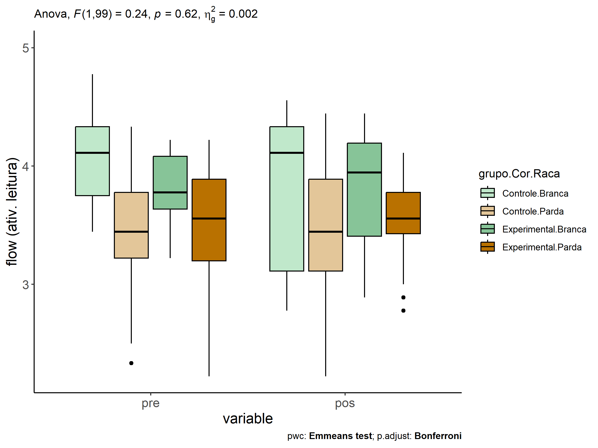<!-- -->

``` r
plots <- twoWayAncovaBoxPlots(
  wdat.long, "flow.read", c("grupo","Cor.Raca"), aov, pwc.long, pre.post = "time",
  theme = "classic", color = color$prepost)
```

``` r
plots[["grupo:Cor.Raca"]] + ggplot2::ylab("flow (ativ. leitura)")
```

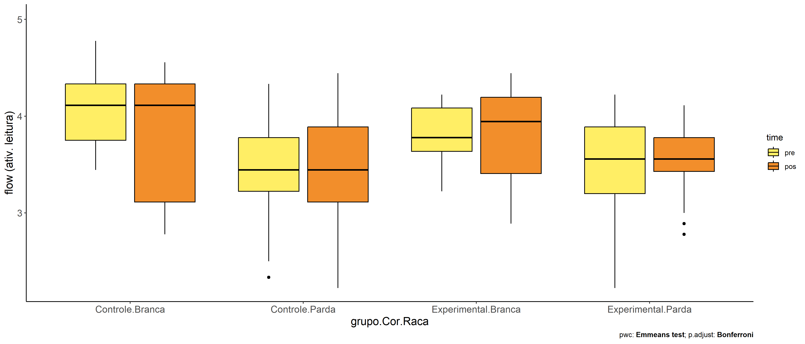<!-- -->

### Checking linearity assumption

``` r
ggscatter(wdat, x = "dfs.media.read", y = "fss.media.read", size = 0.5,
          facet.by = c("grupo","Cor.Raca"), add = "reg.line")+
  stat_regline_equation(
    aes(label =  paste(..eq.label.., ..rr.label.., sep = "~~~~"))
  )
```

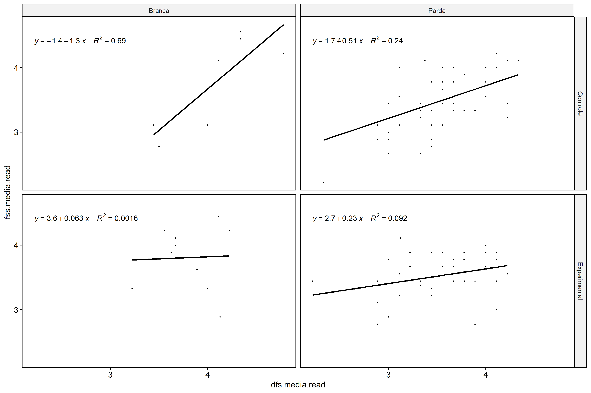<!-- -->

### Checking normality and homogeneity

``` r
res <- augment(lm(fss.media.read ~ dfs.media.read + grupo*Cor.Raca, data = wdat))
```

``` r
shapiro_test(res$.resid)
```

    ## # A tibble: 1 × 3
    ##   variable   statistic p.value
    ##   <chr>          <dbl>   <dbl>
    ## 1 res$.resid     0.986   0.368

``` r
levene_test(res, .resid ~ grupo*Cor.Raca)
```

    ## # A tibble: 1 × 4
    ##     df1   df2 statistic     p
    ##   <int> <int>     <dbl> <dbl>
    ## 1     3   100      1.67 0.179

# Summary of Results

## Descriptive Statistics

``` r
df <- get.descriptives(ldat[["grupo"]], c(dv.pre, dv.pos), c("grupo"), 
                       include.global = T, symmetry.test = T, normality.test = F)
df <- plyr::rbind.fill(
  df, do.call(plyr::rbind.fill, lapply(lfatores2, FUN = function(f) {
    if (nrow(dat) > 0 && sum(!is.na(unique(dat[[f]]))) > 1)
      get.descriptives(ldat[[paste0("grupo:",f)]], c(dv.pre,dv.pos), c("grupo", f),
                       symmetry.test = T, normality.test = F)
    }))
)
(df <- df[,c(fatores1[fatores1 %in% colnames(df)],"variable",
             colnames(df)[!colnames(df) %in% c(fatores1,"variable")])])
```

    ##           grupo Sexo   Zona Cor.Raca       variable   n  mean median   min   max    sd    se    ci   iqr
    ## 1      Controle <NA>   <NA>     <NA> dfs.media.read 120 3.526  3.556 2.333 4.778 0.471 0.043 0.085 0.444
    ## 2  Experimental <NA>   <NA>     <NA> dfs.media.read 149 3.583  3.556 2.222 5.000 0.445 0.036 0.072 0.667
    ## 3          <NA> <NA>   <NA>     <NA> dfs.media.read 269 3.557  3.556 2.222 5.000 0.457 0.028 0.055 0.556
    ## 4      Controle <NA>   <NA>     <NA> fss.media.read 120 3.586  3.667 2.111 4.889 0.527 0.048 0.095 0.778
    ## 5  Experimental <NA>   <NA>     <NA> fss.media.read 149 3.537  3.556 2.333 5.000 0.478 0.039 0.077 0.667
    ## 6          <NA> <NA>   <NA>     <NA> fss.media.read 269 3.559  3.556 2.111 5.000 0.500 0.030 0.060 0.667
    ## 7      Controle    F   <NA>     <NA> dfs.media.read  53 3.581  3.556 2.444 4.444 0.391 0.054 0.108 0.444
    ## 8      Controle    M   <NA>     <NA> dfs.media.read  67 3.483  3.556 2.333 4.778 0.524 0.064 0.128 0.500
    ## 9  Experimental    F   <NA>     <NA> dfs.media.read  74 3.605  3.646 2.778 4.333 0.387 0.045 0.090 0.639
    ## 10 Experimental    M   <NA>     <NA> dfs.media.read  75 3.561  3.556 2.222 5.000 0.498 0.057 0.114 0.667
    ## 11     Controle    F   <NA>     <NA> fss.media.read  53 3.577  3.667 2.111 4.556 0.517 0.071 0.143 0.778
    ## 12     Controle    M   <NA>     <NA> fss.media.read  67 3.593  3.667 2.222 4.889 0.538 0.066 0.131 0.778
    ## 13 Experimental    F   <NA>     <NA> fss.media.read  74 3.552  3.590 2.444 5.000 0.483 0.056 0.112 0.667
    ## 14 Experimental    M   <NA>     <NA> fss.media.read  75 3.521  3.556 2.333 4.889 0.477 0.055 0.110 0.500
    ## 15     Controle <NA>  Rural     <NA> dfs.media.read  42 3.696  3.667 2.500 4.444 0.424 0.065 0.132 0.556
    ## 16     Controle <NA> Urbana     <NA> dfs.media.read  24 3.338  3.333 2.333 4.333 0.528 0.108 0.223 0.667
    ## 17 Experimental <NA>  Rural     <NA> dfs.media.read  34 3.625  3.646 2.889 4.444 0.419 0.072 0.146 0.722
    ## 18 Experimental <NA> Urbana     <NA> dfs.media.read  42 3.571  3.667 2.222 5.000 0.520 0.080 0.162 0.639
    ## 19     Controle <NA>  Rural     <NA> fss.media.read  42 3.632  3.722 2.750 4.889 0.552 0.085 0.172 0.861
    ## 20     Controle <NA> Urbana     <NA> fss.media.read  24 3.477  3.500 2.111 4.556 0.637 0.130 0.269 0.778
    ## 21 Experimental <NA>  Rural     <NA> fss.media.read  34 3.476  3.500 2.778 4.222 0.425 0.073 0.148 0.556
    ## 22 Experimental <NA> Urbana     <NA> fss.media.read  42 3.451  3.500 2.333 4.889 0.534 0.082 0.166 0.750
    ## 23     Controle <NA>   <NA>   Branca dfs.media.read   7 4.071  4.111 3.444 4.778 0.477 0.180 0.441 0.583
    ## 24     Controle <NA>   <NA>    Parda dfs.media.read  47 3.487  3.444 2.333 4.333 0.465 0.068 0.137 0.556
    ## 25 Experimental <NA>   <NA>   Branca dfs.media.read  10 3.808  3.778 3.222 4.222 0.314 0.099 0.225 0.448
    ## 26 Experimental <NA>   <NA>    Parda dfs.media.read  40 3.531  3.556 2.222 4.222 0.458 0.072 0.147 0.691
    ## 27     Controle <NA>   <NA>   Branca fss.media.read   7 3.762  4.111 2.778 4.556 0.735 0.278 0.680 1.222
    ## 28     Controle <NA>   <NA>    Parda fss.media.read  47 3.461  3.444 2.222 4.444 0.485 0.071 0.142 0.778
    ## 29 Experimental <NA>   <NA>   Branca fss.media.read  10 3.807  3.944 2.889 4.444 0.496 0.157 0.355 0.788
    ## 30 Experimental <NA>   <NA>    Parda fss.media.read  40 3.526  3.556 2.778 4.111 0.344 0.054 0.110 0.351
    ##    symmetry    skewness     kurtosis
    ## 1       YES -0.19390182  0.122408370
    ## 2       YES -0.07673244  0.330832452
    ## 3       YES -0.14413769  0.276286295
    ## 4       YES -0.27235550  0.001751782
    ## 5       YES  0.09836908  0.269987017
    ## 6       YES -0.08024043  0.137783312
    ## 7       YES -0.17933571  0.113624155
    ## 8       YES -0.08383067 -0.198249820
    ## 9       YES -0.14354485 -1.038891758
    ## 10      YES  0.00812571  0.528898666
    ## 11       NO -0.57697567  0.560381785
    ## 12      YES -0.05569580 -0.491553096
    ## 13      YES  0.05512623 -0.008887387
    ## 14      YES  0.13851631  0.480609722
    ## 15      YES -0.41413800  0.188022942
    ## 16      YES -0.19977279 -0.689154427
    ## 17      YES -0.07566811 -1.149009928
    ## 18      YES -0.17700074  1.288149695
    ## 19      YES  0.13565603 -0.963501106
    ## 20      YES -0.28378618 -0.437536787
    ## 21      YES -0.03009193 -1.142157092
    ## 22      YES  0.03587053 -0.133588453
    ## 23      YES -0.05943170 -1.560601569
    ## 24      YES -0.31412057 -0.288889624
    ## 25      YES -0.29498067 -1.219231343
    ## 26       NO -0.53969838 -0.236574560
    ## 27      YES -0.19624039 -2.037791463
    ## 28      YES -0.16298229 -0.598345053
    ## 29      YES -0.45459722 -1.267782886
    ## 30       NO -0.68121734 -0.292160851

| grupo        | Sexo | Zona   | Cor.Raca | variable       |   n |  mean | median |   min |   max |    sd |    se |    ci |   iqr | symmetry | skewness | kurtosis |
|:-------------|:-----|:-------|:---------|:---------------|----:|------:|-------:|------:|------:|------:|------:|------:|------:|:---------|---------:|---------:|
| Controle     |      |        |          | dfs.media.read | 120 | 3.526 |  3.556 | 2.333 | 4.778 | 0.471 | 0.043 | 0.085 | 0.444 | YES      |   -0.194 |    0.122 |
| Experimental |      |        |          | dfs.media.read | 149 | 3.583 |  3.556 | 2.222 | 5.000 | 0.445 | 0.036 | 0.072 | 0.667 | YES      |   -0.077 |    0.331 |
|              |      |        |          | dfs.media.read | 269 | 3.557 |  3.556 | 2.222 | 5.000 | 0.457 | 0.028 | 0.055 | 0.556 | YES      |   -0.144 |    0.276 |
| Controle     |      |        |          | fss.media.read | 120 | 3.586 |  3.667 | 2.111 | 4.889 | 0.527 | 0.048 | 0.095 | 0.778 | YES      |   -0.272 |    0.002 |
| Experimental |      |        |          | fss.media.read | 149 | 3.537 |  3.556 | 2.333 | 5.000 | 0.478 | 0.039 | 0.077 | 0.667 | YES      |    0.098 |    0.270 |
|              |      |        |          | fss.media.read | 269 | 3.559 |  3.556 | 2.111 | 5.000 | 0.500 | 0.030 | 0.060 | 0.667 | YES      |   -0.080 |    0.138 |
| Controle     | F    |        |          | dfs.media.read |  53 | 3.581 |  3.556 | 2.444 | 4.444 | 0.391 | 0.054 | 0.108 | 0.444 | YES      |   -0.179 |    0.114 |
| Controle     | M    |        |          | dfs.media.read |  67 | 3.483 |  3.556 | 2.333 | 4.778 | 0.524 | 0.064 | 0.128 | 0.500 | YES      |   -0.084 |   -0.198 |
| Experimental | F    |        |          | dfs.media.read |  74 | 3.605 |  3.646 | 2.778 | 4.333 | 0.387 | 0.045 | 0.090 | 0.639 | YES      |   -0.144 |   -1.039 |
| Experimental | M    |        |          | dfs.media.read |  75 | 3.561 |  3.556 | 2.222 | 5.000 | 0.498 | 0.057 | 0.114 | 0.667 | YES      |    0.008 |    0.529 |
| Controle     | F    |        |          | fss.media.read |  53 | 3.577 |  3.667 | 2.111 | 4.556 | 0.517 | 0.071 | 0.143 | 0.778 | NO       |   -0.577 |    0.560 |
| Controle     | M    |        |          | fss.media.read |  67 | 3.593 |  3.667 | 2.222 | 4.889 | 0.538 | 0.066 | 0.131 | 0.778 | YES      |   -0.056 |   -0.492 |
| Experimental | F    |        |          | fss.media.read |  74 | 3.552 |  3.590 | 2.444 | 5.000 | 0.483 | 0.056 | 0.112 | 0.667 | YES      |    0.055 |   -0.009 |
| Experimental | M    |        |          | fss.media.read |  75 | 3.521 |  3.556 | 2.333 | 4.889 | 0.477 | 0.055 | 0.110 | 0.500 | YES      |    0.139 |    0.481 |
| Controle     |      | Rural  |          | dfs.media.read |  42 | 3.696 |  3.667 | 2.500 | 4.444 | 0.424 | 0.065 | 0.132 | 0.556 | YES      |   -0.414 |    0.188 |
| Controle     |      | Urbana |          | dfs.media.read |  24 | 3.338 |  3.333 | 2.333 | 4.333 | 0.528 | 0.108 | 0.223 | 0.667 | YES      |   -0.200 |   -0.689 |
| Experimental |      | Rural  |          | dfs.media.read |  34 | 3.625 |  3.646 | 2.889 | 4.444 | 0.419 | 0.072 | 0.146 | 0.722 | YES      |   -0.076 |   -1.149 |
| Experimental |      | Urbana |          | dfs.media.read |  42 | 3.571 |  3.667 | 2.222 | 5.000 | 0.520 | 0.080 | 0.162 | 0.639 | YES      |   -0.177 |    1.288 |
| Controle     |      | Rural  |          | fss.media.read |  42 | 3.632 |  3.722 | 2.750 | 4.889 | 0.552 | 0.085 | 0.172 | 0.861 | YES      |    0.136 |   -0.964 |
| Controle     |      | Urbana |          | fss.media.read |  24 | 3.477 |  3.500 | 2.111 | 4.556 | 0.637 | 0.130 | 0.269 | 0.778 | YES      |   -0.284 |   -0.438 |
| Experimental |      | Rural  |          | fss.media.read |  34 | 3.476 |  3.500 | 2.778 | 4.222 | 0.425 | 0.073 | 0.148 | 0.556 | YES      |   -0.030 |   -1.142 |
| Experimental |      | Urbana |          | fss.media.read |  42 | 3.451 |  3.500 | 2.333 | 4.889 | 0.534 | 0.082 | 0.166 | 0.750 | YES      |    0.036 |   -0.134 |
| Controle     |      |        | Branca   | dfs.media.read |   7 | 4.071 |  4.111 | 3.444 | 4.778 | 0.477 | 0.180 | 0.441 | 0.583 | YES      |   -0.059 |   -1.561 |
| Controle     |      |        | Parda    | dfs.media.read |  47 | 3.487 |  3.444 | 2.333 | 4.333 | 0.465 | 0.068 | 0.137 | 0.556 | YES      |   -0.314 |   -0.289 |
| Experimental |      |        | Branca   | dfs.media.read |  10 | 3.808 |  3.778 | 3.222 | 4.222 | 0.314 | 0.099 | 0.225 | 0.448 | YES      |   -0.295 |   -1.219 |
| Experimental |      |        | Parda    | dfs.media.read |  40 | 3.531 |  3.556 | 2.222 | 4.222 | 0.458 | 0.072 | 0.147 | 0.691 | NO       |   -0.540 |   -0.237 |
| Controle     |      |        | Branca   | fss.media.read |   7 | 3.762 |  4.111 | 2.778 | 4.556 | 0.735 | 0.278 | 0.680 | 1.222 | YES      |   -0.196 |   -2.038 |
| Controle     |      |        | Parda    | fss.media.read |  47 | 3.461 |  3.444 | 2.222 | 4.444 | 0.485 | 0.071 | 0.142 | 0.778 | YES      |   -0.163 |   -0.598 |
| Experimental |      |        | Branca   | fss.media.read |  10 | 3.807 |  3.944 | 2.889 | 4.444 | 0.496 | 0.157 | 0.355 | 0.788 | YES      |   -0.455 |   -1.268 |
| Experimental |      |        | Parda    | fss.media.read |  40 | 3.526 |  3.556 | 2.778 | 4.111 | 0.344 | 0.054 | 0.110 | 0.351 | NO       |   -0.681 |   -0.292 |

## ANCOVA Table Comparison

``` r
df <- do.call(plyr::rbind.fill, laov)
(df <- df[!duplicated(df$Effect),])
```

    ##            Effect DFn DFd      F        p p<.05      ges DFn' DFd'     F'       p' p<.05'     ges'
    ## 1  dfs.media.read   1 266 39.941 1.10e-09     * 1.31e-01    1  268 34.287 1.39e-08      * 1.13e-01
    ## 2           grupo   1 266  1.560 2.13e-01       6.00e-03    1  268  0.400 5.28e-01        1.00e-03
    ## 5      grupo:Sexo   1 264  0.366 5.46e-01       1.00e-03    1  266  0.423 5.16e-01        2.00e-03
    ## 6            Sexo   1 264  0.086 7.70e-01       3.25e-04    1  266  0.120 7.29e-01        4.52e-04
    ## 9      grupo:Zona   1 137  0.004 9.47e-01       3.20e-05    1  137  0.004 9.47e-01        3.20e-05
    ## 10           Zona   1 137  0.004 9.50e-01       2.93e-05    1  137  0.004 9.50e-01        2.93e-05
    ## 11       Cor.Raca   1  99  0.991 3.22e-01       1.00e-02    1   99  0.991 3.22e-01        1.00e-02
    ## 14 grupo:Cor.Raca   1  99  0.243 6.23e-01       2.00e-03    1   99  0.243 6.23e-01        2.00e-03

|     | Effect         | DFn | DFd |      F |     p | p\<.05 |   ges | DFn’ | DFd’ |     F’ |    p’ | p\<.05’ |  ges’ |
|:----|:---------------|----:|----:|-------:|------:|:-------|------:|-----:|-----:|-------:|------:|:--------|------:|
| 1   | dfs.media.read |   1 | 266 | 39.941 | 0.000 | \*     | 0.131 |    1 |  268 | 34.287 | 0.000 | \*      | 0.113 |
| 2   | grupo          |   1 | 266 |  1.560 | 0.213 |        | 0.006 |    1 |  268 |  0.400 | 0.528 |         | 0.001 |
| 5   | grupo:Sexo     |   1 | 264 |  0.366 | 0.546 |        | 0.001 |    1 |  266 |  0.423 | 0.516 |         | 0.002 |
| 6   | Sexo           |   1 | 264 |  0.086 | 0.770 |        | 0.000 |    1 |  266 |  0.120 | 0.729 |         | 0.000 |
| 9   | grupo:Zona     |   1 | 137 |  0.004 | 0.947 |        | 0.000 |    1 |  137 |  0.004 | 0.947 |         | 0.000 |
| 10  | Zona           |   1 | 137 |  0.004 | 0.950 |        | 0.000 |    1 |  137 |  0.004 | 0.950 |         | 0.000 |
| 11  | Cor.Raca       |   1 |  99 |  0.991 | 0.322 |        | 0.010 |    1 |   99 |  0.991 | 0.322 |         | 0.010 |
| 14  | grupo:Cor.Raca |   1 |  99 |  0.243 | 0.623 |        | 0.002 |    1 |   99 |  0.243 | 0.623 |         | 0.002 |

## PairWise Table Comparison

``` r
df <- do.call(plyr::rbind.fill, lpwc)
df <- df[,c(names(lfatores), names(df)[!names(df) %in% c(names(lfatores),"term",".y.")])]
```

| grupo        | Sexo | Zona   | Cor.Raca | group1   | group2       |  df | statistic |     p | p.adj | p.adj.signif | df’ | statistic’ |    p’ | p.adj’ | p.adj.signif’ |
|:-------------|:-----|:-------|:---------|:---------|:-------------|----:|----------:|------:|------:|:-------------|----:|-----------:|------:|-------:|:--------------|
| Controle     |      |        |          | pre      | pos          | 534 |    -0.969 | 0.333 | 0.333 | ns           | 538 |     -0.415 | 0.678 |  0.678 | ns            |
| Experimental |      |        |          | pre      | pos          | 534 |     0.832 | 0.406 | 0.406 | ns           | 538 |      0.810 | 0.419 |  0.419 | ns            |
|              |      |        |          | Controle | Experimental | 266 |     1.249 | 0.213 | 0.213 | ns           | 268 |      0.633 | 0.528 |  0.528 | ns            |
| Controle     | F    |        |          | pre      | pos          | 530 |     0.045 | 0.964 | 0.964 | ns           | 534 |      0.498 | 0.619 |  0.619 | ns            |
| Controle     | M    |        |          | pre      | pos          | 530 |    -1.334 | 0.183 | 0.183 | ns           | 534 |     -0.999 | 0.318 |  0.318 | ns            |
| Controle     |      |        |          | F        | M            | 264 |    -0.646 | 0.519 | 0.519 | ns           | 266 |     -0.716 | 0.475 |  0.475 | ns            |
| Experimental | F    |        |          | pre      | pos          | 530 |     0.663 | 0.508 | 0.508 | ns           | 534 |      0.645 | 0.519 |  0.519 | ns            |
| Experimental | M    |        |          | pre      | pos          | 530 |     0.513 | 0.609 | 0.609 | ns           | 534 |      0.499 | 0.618 |  0.618 | ns            |
| Experimental |      |        |          | F        | M            | 264 |     0.182 | 0.856 | 0.856 | ns           | 266 |      0.175 | 0.861 |  0.861 | ns            |
|              | F    |        |          | Controle | Experimental | 264 |     0.399 | 0.690 | 0.690 | ns           | 266 |     -0.055 | 0.956 |  0.956 | ns            |
|              | M    |        |          | Controle | Experimental | 264 |     1.311 | 0.191 | 0.191 | ns           | 266 |      0.892 | 0.373 |  0.373 | ns            |
| Controle     |      |        |          | Rural    | Urbana       | 137 |    -0.092 | 0.927 | 0.927 | ns           | 137 |     -0.092 | 0.927 |  0.927 | ns            |
| Controle     |      | Rural  |          | pre      | pos          | 276 |     0.583 | 0.560 | 0.560 | ns           | 276 |      0.583 | 0.560 |  0.560 | ns            |
| Controle     |      | Urbana |          | pre      | pos          | 276 |    -0.954 | 0.341 | 0.341 | ns           | 276 |     -0.954 | 0.341 |  0.341 | ns            |
| Experimental |      |        |          | Rural    | Urbana       | 137 |    -0.005 | 0.996 | 0.996 | ns           | 137 |     -0.005 | 0.996 |  0.996 | ns            |
| Experimental |      | Rural  |          | pre      | pos          | 276 |     1.219 | 0.224 | 0.224 | ns           | 276 |      1.219 | 0.224 |  0.224 | ns            |
| Experimental |      | Urbana |          | pre      | pos          | 276 |     1.090 | 0.277 | 0.277 | ns           | 276 |      1.090 | 0.277 |  0.277 | ns            |
|              |      | Rural  |          | Controle | Experimental | 137 |     1.085 | 0.280 | 0.280 | ns           | 137 |      1.085 | 0.280 |  0.280 | ns            |
|              |      | Urbana |          | Controle | Experimental | 137 |     1.056 | 0.293 | 0.293 | ns           | 137 |      1.056 | 0.293 |  0.293 | ns            |
| Controle     |      |        | Branca   | pre      | pos          | 200 |     1.274 | 0.204 | 0.204 | ns           | 200 |      1.274 | 0.204 |  0.204 | ns            |
| Controle     |      |        |          | Branca   | Parda        |  99 |     0.288 | 0.774 | 0.774 | ns           |  99 |      0.288 | 0.774 |  0.774 | ns            |
| Controle     |      |        | Parda    | pre      | pos          | 200 |     0.274 | 0.784 | 0.784 | ns           | 200 |      0.274 | 0.784 |  0.784 | ns            |
| Experimental |      |        | Branca   | pre      | pos          | 200 |     0.007 | 0.995 | 0.995 | ns           | 200 |      0.007 | 0.995 |  0.995 | ns            |
| Experimental |      |        |          | Branca   | Parda        |  99 |     1.086 | 0.280 | 0.280 | ns           |  99 |      1.086 | 0.280 |  0.280 | ns            |
| Experimental |      |        | Parda    | pre      | pos          | 200 |     0.048 | 0.962 | 0.962 | ns           | 200 |      0.048 | 0.962 |  0.962 | ns            |
|              |      |        | Branca   | Controle | Experimental |  99 |    -0.762 | 0.448 | 0.448 | ns           |  99 |     -0.762 | 0.448 |  0.448 | ns            |
|              |      |        | Parda    | Controle | Experimental |  99 |    -0.515 | 0.608 | 0.608 | ns           |  99 |     -0.515 | 0.608 |  0.608 | ns            |

## EMMS Table Comparison

``` r
df <- do.call(plyr::rbind.fill, lemms)
df[["N-N'"]] <- df[["N"]] - df[["N'"]]
df <- df[,c(names(lfatores), names(df)[!names(df) %in% names(lfatores)])]
```

| grupo        | Sexo | Zona   | Cor.Raca |   N | M (pre) | SE (pre) | M (unadj) | SE (unadj) | M (adj) | SE (adj) |  N’ | M (pre)’ | SE (pre)’ | M (unadj)’ | SE (unadj)’ | M (adj)’ | SE (adj)’ | N-N’ |
|:-------------|:-----|:-------|:---------|----:|--------:|---------:|----------:|-----------:|--------:|---------:|----:|---------:|----------:|-----------:|------------:|---------:|----------:|-----:|
| Controle     |      |        |          | 120 |   3.526 |    0.043 |     3.586 |      0.048 |   3.598 |    0.043 | 122 |    3.527 |     0.043 |      3.554 |       0.052 |    3.565 |     0.045 |   -2 |
| Experimental |      |        |          | 149 |   3.583 |    0.036 |     3.537 |      0.039 |   3.527 |    0.038 | 149 |    3.583 |     0.036 |      3.537 |       0.039 |    3.527 |     0.041 |    0 |
| Controle     | F    |        |          |  53 |   3.581 |    0.054 |     3.577 |      0.071 |   3.567 |    0.064 |  54 |    3.588 |     0.053 |      3.541 |       0.078 |    3.529 |     0.068 |   -1 |
| Controle     | M    |        |          |  67 |   3.483 |    0.064 |     3.593 |      0.066 |   3.623 |    0.057 |  68 |    3.479 |     0.063 |      3.563 |       0.071 |    3.594 |     0.061 |   -1 |
| Experimental | F    |        |          |  74 |   3.605 |    0.045 |     3.552 |      0.056 |   3.534 |    0.055 |  74 |    3.605 |     0.045 |      3.552 |       0.056 |    3.534 |     0.058 |    0 |
| Experimental | M    |        |          |  75 |   3.561 |    0.057 |     3.521 |      0.055 |   3.520 |    0.054 |  75 |    3.561 |     0.057 |      3.521 |       0.055 |    3.520 |     0.058 |    0 |
| Controle     |      | Rural  |          |  42 |   3.696 |    0.065 |     3.632 |      0.085 |   3.578 |    0.076 |  42 |    3.696 |     0.065 |      3.632 |       0.085 |    3.578 |     0.076 |    0 |
| Controle     |      | Urbana |          |  24 |   3.338 |    0.108 |     3.477 |      0.130 |   3.590 |    0.102 |  24 |    3.338 |     0.108 |      3.477 |       0.130 |    3.590 |     0.102 |    0 |
| Experimental |      | Rural  |          |  34 |   3.625 |    0.072 |     3.476 |      0.073 |   3.456 |    0.084 |  34 |    3.625 |     0.072 |      3.476 |       0.073 |    3.456 |     0.084 |    0 |
| Experimental |      | Urbana |          |  42 |   3.571 |    0.080 |     3.451 |      0.082 |   3.456 |    0.076 |  42 |    3.571 |     0.080 |      3.451 |       0.082 |    3.456 |     0.076 |    0 |
| Controle     |      |        | Branca   |   7 |   4.071 |    0.180 |     3.762 |      0.278 |   3.549 |    0.164 |   7 |    4.071 |     0.180 |      3.762 |       0.278 |    3.549 |     0.164 |    0 |
| Controle     |      |        | Parda    |  47 |   3.487 |    0.068 |     3.461 |      0.071 |   3.498 |    0.061 |  47 |    3.487 |     0.068 |      3.461 |       0.071 |    3.498 |     0.061 |    0 |
| Experimental |      |        | Branca   |  10 |   3.808 |    0.099 |     3.807 |      0.157 |   3.707 |    0.133 |  10 |    3.808 |     0.099 |      3.807 |       0.157 |    3.707 |     0.133 |    0 |
| Experimental |      |        | Parda    |  40 |   3.531 |    0.072 |     3.526 |      0.054 |   3.544 |    0.066 |  40 |    3.531 |     0.072 |      3.526 |       0.054 |    3.544 |     0.066 |    0 |
