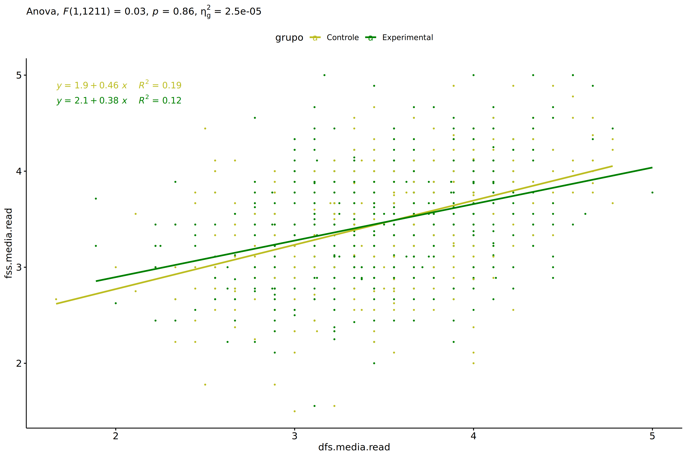
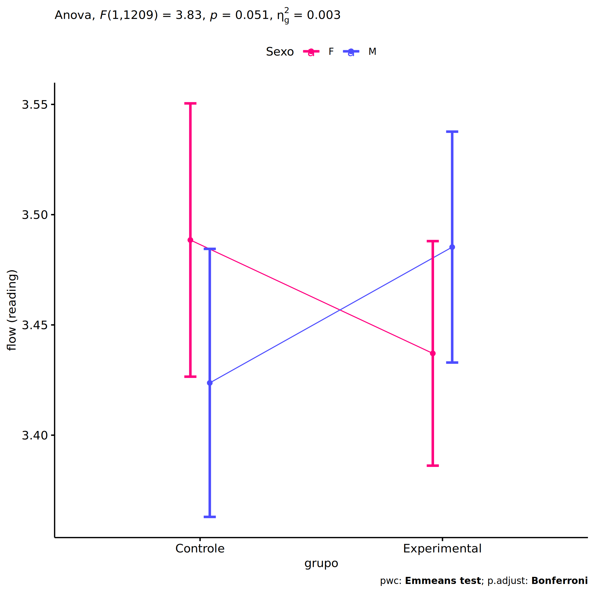
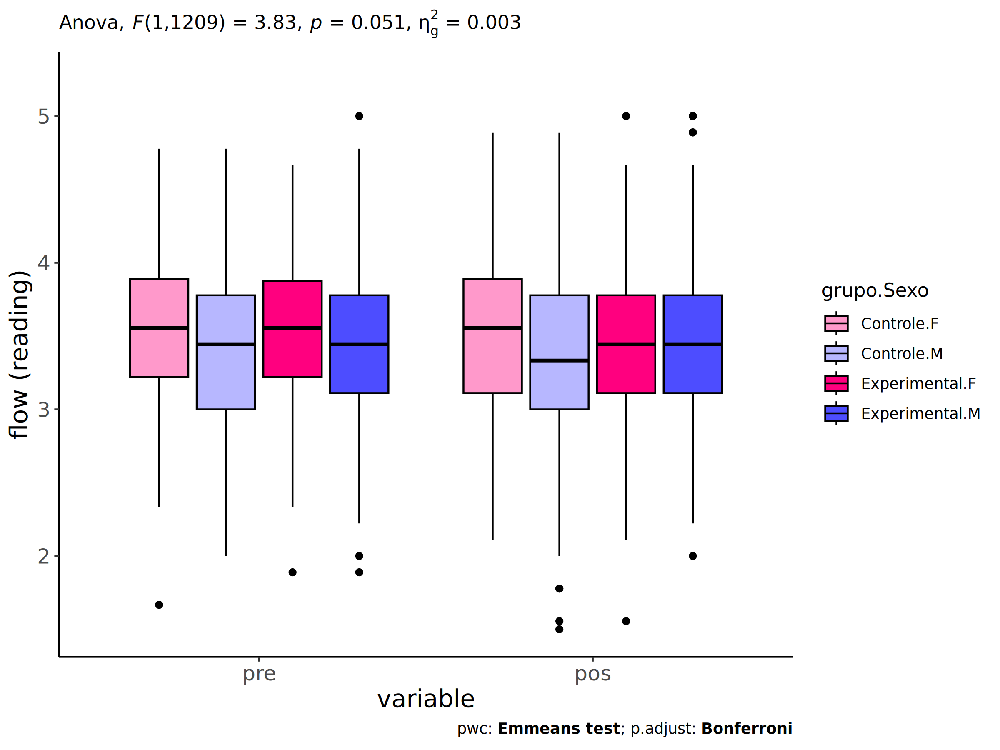
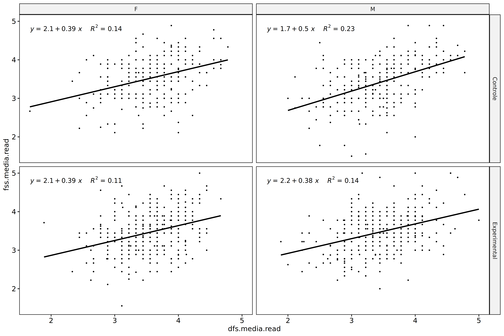
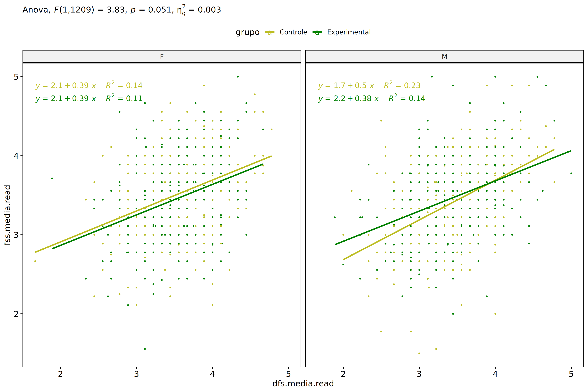
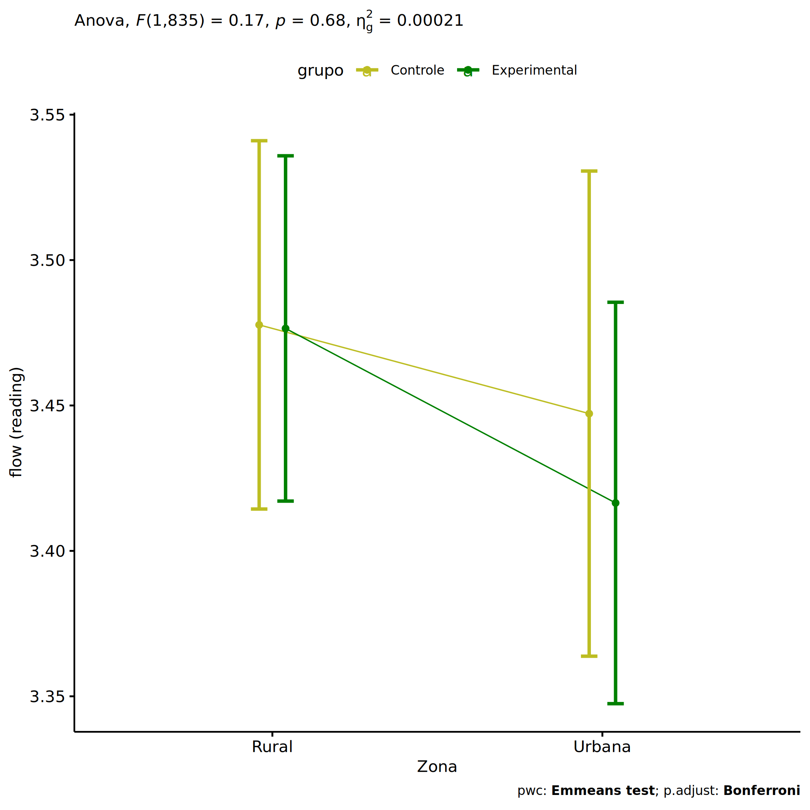
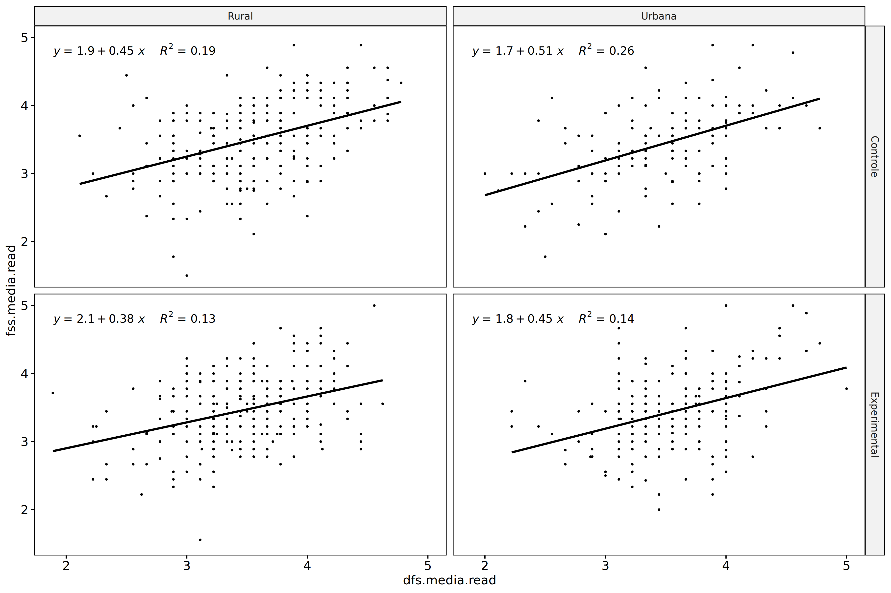
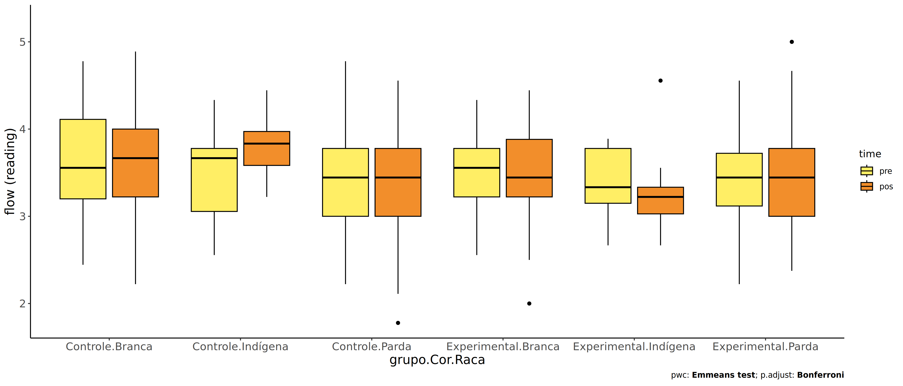
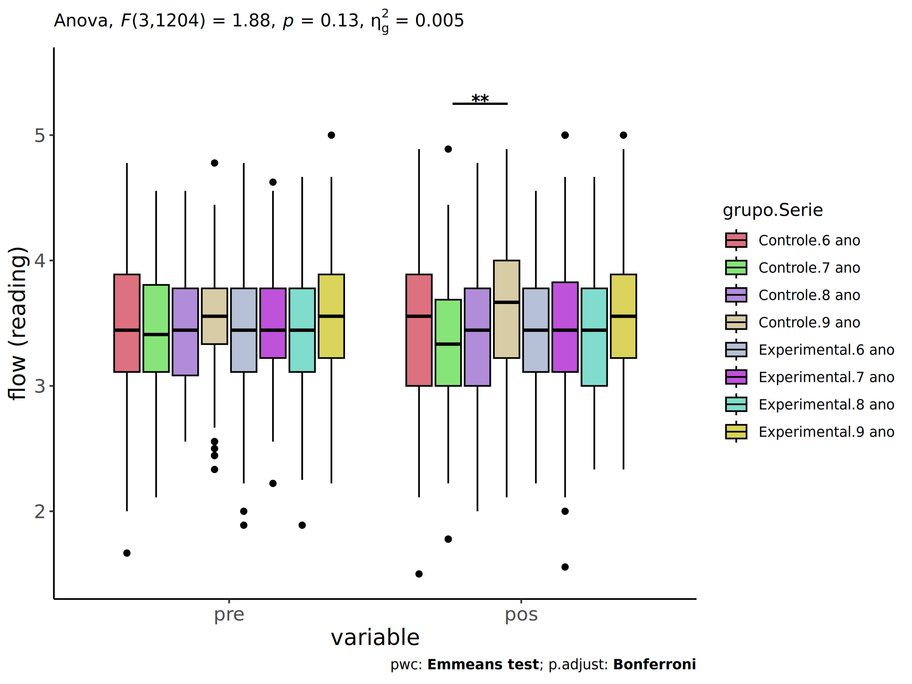

ANCOVA in flow (reading) (flow (reading))
================
Geiser C. Challco <geiser@alumni.usp.br>

- [Setting Initial Variables](#setting-initial-variables)
- [Descriptive Statistics of Initial
  Data](#descriptive-statistics-of-initial-data)
- [ANCOVA and Pairwise for one factor:
  **grupo**](#ancova-and-pairwise-for-one-factor-grupo)
  - [Without remove non-normal data](#without-remove-non-normal-data)
  - [Computing ANCOVA and PairWise After removing non-normal data
    (OK)](#computing-ancova-and-pairwise-after-removing-non-normal-data-ok)
    - [Plots for ancova](#plots-for-ancova)
    - [Checking linearity assumption](#checking-linearity-assumption)
    - [Checking normality and
      homogeneity](#checking-normality-and-homogeneity)
- [ANCOVA and Pairwise for two factors
  **grupo:Sexo**](#ancova-and-pairwise-for-two-factors-gruposexo)
  - [Without remove non-normal data](#without-remove-non-normal-data-1)
  - [Computing ANCOVA and PairWise After removing non-normal data
    (OK)](#computing-ancova-and-pairwise-after-removing-non-normal-data-ok-1)
    - [Plots for ancova](#plots-for-ancova-1)
    - [Checking linearity assumption](#checking-linearity-assumption-1)
    - [Checking normality and
      homogeneity](#checking-normality-and-homogeneity-1)
- [ANCOVA and Pairwise for two factors
  **grupo:Zona**](#ancova-and-pairwise-for-two-factors-grupozona)
  - [Without remove non-normal data](#without-remove-non-normal-data-2)
  - [Computing ANCOVA and PairWise After removing non-normal data
    (OK)](#computing-ancova-and-pairwise-after-removing-non-normal-data-ok-2)
    - [Plots for ancova](#plots-for-ancova-2)
    - [Checking linearity assumption](#checking-linearity-assumption-2)
    - [Checking normality and
      homogeneity](#checking-normality-and-homogeneity-2)
- [ANCOVA and Pairwise for two factors
  **grupo:Cor.Raca**](#ancova-and-pairwise-for-two-factors-grupocorraca)
  - [Without remove non-normal data](#without-remove-non-normal-data-3)
  - [Computing ANCOVA and PairWise After removing non-normal data
    (OK)](#computing-ancova-and-pairwise-after-removing-non-normal-data-ok-3)
    - [Plots for ancova](#plots-for-ancova-3)
    - [Checking linearity assumption](#checking-linearity-assumption-3)
    - [Checking normality and
      homogeneity](#checking-normality-and-homogeneity-3)
- [ANCOVA and Pairwise for two factors
  **grupo:Serie**](#ancova-and-pairwise-for-two-factors-gruposerie)
  - [Without remove non-normal data](#without-remove-non-normal-data-4)
  - [Computing ANCOVA and PairWise After removing non-normal data
    (OK)](#computing-ancova-and-pairwise-after-removing-non-normal-data-ok-4)
    - [Plots for ancova](#plots-for-ancova-4)
    - [Checking linearity assumption](#checking-linearity-assumption-4)
    - [Checking normality and
      homogeneity](#checking-normality-and-homogeneity-4)
- [Summary of Results](#summary-of-results)
  - [Descriptive Statistics](#descriptive-statistics)
  - [ANCOVA Table Comparison](#ancova-table-comparison)
  - [PairWise Table Comparison](#pairwise-table-comparison)
  - [EMMS Table Comparison](#emms-table-comparison)

**NOTE**:

- Teste ANCOVA para determinar se houve diferenças significativas no
  flow (reading) (medido usando pre- e pos-testes).
- ANCOVA test to determine whether there were significant differences in
  flow (reading) (measured using pre- and post-tests).

# Setting Initial Variables

``` r
dv = "flow.read"
dv.pos = "fss.media.read"
dv.pre = "dfs.media.read"

fatores2 <- c("Sexo","Zona","Cor.Raca","Serie")
lfatores2 <- as.list(fatores2)
names(lfatores2) <- fatores2

fatores1 <- c("grupo", fatores2)
lfatores1 <- as.list(fatores1)
names(lfatores1) <- fatores1

lfatores <- c(lfatores1)

color <- list()
color[["prepost"]] = c("#ffee65","#f28e2B")
color[["grupo"]] = c("#bcbd22","#008000")
color[["Sexo"]] = c("#FF007F","#4D4DFF")
color[["Zona"]] = c("#AA00FF","#00CCCC")
color[["Cor.Raca"]] = c(
  "Parda"="#b97100","Indígena"="#9F262F",
  "Branca"="#87c498", "Preta"="#848283","Amarela"="#D6B91C"
)

level <- list()
level[["grupo"]] = c("Controle","Experimental")
level[["Sexo"]] = c("F","M")
level[["Zona"]] = c("Rural","Urbana")
level[["Cor.Raca"]] = c("Parda","Indígena","Branca", "Preta","Amarela")
level[["Serie"]] = c("6 ano","7 ano","8 ano","9 ano")

# ..

ymin <- 0
ymax <- 0

ymin.ci <- 0
ymax.ci <- 0


color[["grupo:Sexo"]] = c(
  "Controle:F"="#ff99cb", "Controle:M"="#b7b7ff",
  "Experimental:F"="#FF007F", "Experimental:M"="#4D4DFF",
  "Controle.F"="#ff99cb", "Controle.M"="#b7b7ff",
  "Experimental.F"="#FF007F", "Experimental.M"="#4D4DFF"
)
color[["grupo:Zona"]] = c(
  "Controle:Rural"="#b2efef","Controle:Urbana"="#e5b2ff",
  "Experimental:Rural"="#00CCCC", "Experimental:Urbana"="#AA00FF",
  "Controle.Rural"="#b2efef","Controle.Urbana"="#e5b2ff",
  "Experimental.Rural"="#00CCCC", "Experimental.Urbana"="#AA00FF"
)
color[["grupo:Cor.Raca"]] = c(
    "Controle:Parda"="#e3c699", "Experimental:Parda"="#b97100",
    "Controle:Indígena"="#e2bdc0", "Experimental:Indígena"="#9F262F",
    "Controle:Branca"="#c0e8cb", "Experimental:Branca"="#87c498",
    "Controle:Preta"="#dad9d9", "Experimental:Preta"="#848283",
    "Controle:Amarela"="#eee3a4", "Experimental:Amarela"="#D6B91C",
    
    "Controle.Parda"="#e3c699", "Experimental.Parda"="#b97100",
    "Controle.Indígena"="#e2bdc0", "Experimental.Indígena"="#9F262F",
    "Controle.Branca"="#c0e8cb", "Experimental.Branca"="#87c498",
    "Controle.Preta"="#dad9d9", "Experimental.Preta"="#848283",
    "Controle.Amarela"="#eee3a4", "Experimental.Amarela"="#D6B91C"
)


for (coln in c("vocab","vocab.teach","vocab.non.teach","score.tde",
               "TFL.lidas.per.min","TFL.corretas.per.min","TFL.erradas.per.min","TFL.omitidas.per.min",
               "leitura.compreensao")) {
  color[[paste0(coln,".quintile")]] = c("#BF0040","#FF0000","#800080","#0000FF","#4000BF")
  level[[paste0(coln,".quintile")]] = c("1st quintile","2nd quintile","3rd quintile","4th quintile","5th quintile")
  color[[paste0("grupo:",coln,".quintile")]] = c(
    "Experimental.1st quintile"="#BF0040", "Controle.1st quintile"="#d8668c",
    "Experimental.2nd quintile"="#FF0000", "Controle.2nd quintile"="#ff7f7f",
    "Experimental.3rd quintile"="#8fce00", "Controle.3rd quintile"="#ddf0b2",
    "Experimental.4th quintile"="#0000FF", "Controle.4th quintile"="#b2b2ff",
    "Experimental.5th quintile"="#4000BF", "Controle.5th quintile"="#b299e5",
    
    "Experimental:1st quintile"="#BF0040", "Controle:1st quintile"="#d8668c",
    "Experimental:2nd quintile"="#FF0000", "Controle:2nd quintile"="#ff7f7f",
    "Experimental:3rd quintile"="#8fce00", "Controle:3rd quintile"="#ddf0b2",
    "Experimental:4th quintile"="#0000FF", "Controle:4th quintile"="#b2b2ff",
    "Experimental:5th quintile"="#4000BF", "Controle:5th quintile"="#b299e5")
}


gdat <- read_excel("../data/data.xlsx", sheet = "sumary")
gdat <- gdat[which(is.na(gdat$Necessidade.Deficiencia) & !is.na(gdat$WG.Grupo)),]


dat <- gdat
dat$grupo <- factor(dat[["WG.Grupo"]], level[["grupo"]])
for (coln in c(names(lfatores))) {
  dat[[coln]] <- factor(dat[[coln]], level[[coln]][level[[coln]] %in% unique(dat[[coln]])])
}
dat <- dat[which(!is.na(dat[[dv.pre]]) & !is.na(dat[[dv.pos]])),]
dat <- dat[,c("id",names(lfatores),dv.pre,dv.pos)]

dat.long <- rbind(dat, dat)
dat.long$time <- c(rep("pre", nrow(dat)), rep("pos", nrow(dat)))
dat.long$time <- factor(dat.long$time, c("pre","pos"))
dat.long[[dv]] <- c(dat[[dv.pre]], dat[[dv.pos]])


for (f in c("grupo", names(lfatores))) {
  if (is.null(color[[f]]) && length(unique(dat[[f]])) > 0) 
      color[[f]] <- distinctColorPalette(length(unique(dat[[f]])))
}
for (f in c(fatores2)) {
  if (is.null(color[[paste0("grupo:",f)]]) && length(unique(dat[[f]])) > 0)
    color[[paste0("grupo:",f)]] <- distinctColorPalette(length(unique(dat[["grupo"]]))*length(unique(dat[[f]])))
}

ldat <- list()
laov <- list()
lpwc <- list()
lemms <- list()
```

# Descriptive Statistics of Initial Data

``` r
df <- get.descriptives(dat, c(dv.pre, dv.pos), c("grupo"), 
                       include.global = T, symmetry.test = T, normality.test = F)
df <- plyr::rbind.fill(
  df, do.call(plyr::rbind.fill, lapply(lfatores2, FUN = function(f) {
    if (nrow(dat) > 0 && sum(!is.na(unique(dat[[f]]))) > 1)
      get.descriptives(dat, c(dv.pre,dv.pos), c("grupo", f),
                       symmetry.test = T, normality.test = F)
    }))
)
```

    ## Warning: There were 2 warnings in `mutate()`.
    ## The first warning was:
    ## ℹ In argument: `ci = abs(stats::qt(alpha/2, .data$n - 1) * .data$se)`.
    ## Caused by warning:
    ## ! There was 1 warning in `mutate()`.
    ## ℹ In argument: `ci = abs(stats::qt(alpha/2, .data$n - 1) * .data$se)`.
    ## Caused by warning in `stats::qt()`:
    ## ! NaNs produced
    ## ℹ Run `dplyr::last_dplyr_warnings()` to see the 1 remaining warning.
    ## There were 2 warnings in `mutate()`.
    ## The first warning was:
    ## ℹ In argument: `ci = abs(stats::qt(alpha/2, .data$n - 1) * .data$se)`.
    ## Caused by warning:
    ## ! There was 1 warning in `mutate()`.
    ## ℹ In argument: `ci = abs(stats::qt(alpha/2, .data$n - 1) * .data$se)`.
    ## Caused by warning in `stats::qt()`:
    ## ! NaNs produced
    ## ℹ Run `dplyr::last_dplyr_warnings()` to see the 1 remaining warning.

``` r
df <- df[,c(fatores1[fatores1 %in% colnames(df)],"variable",
            colnames(df)[!colnames(df) %in% c(fatores1,"variable")])]
```

| grupo | Sexo | Zona | Cor.Raca | Serie | variable | n | mean | median | min | max | sd | se | ci | iqr | symmetry | skewness | kurtosis |
|:---|:---|:---|:---|:---|:---|---:|---:|---:|---:|---:|---:|---:|---:|---:|:---|---:|---:|
| Controle |  |  |  |  | dfs.media.read | 505 | 3.479 | 3.444 | 1.667 | 4.778 | 0.540 | 0.024 | 0.047 | 0.778 | YES | -0.086 | -0.158 |
| Experimental |  |  |  |  | dfs.media.read | 711 | 3.483 | 3.444 | 1.889 | 5.000 | 0.477 | 0.018 | 0.035 | 0.556 | YES | -0.171 | 0.160 |
|  |  |  |  |  | dfs.media.read | 1216 | 3.482 | 3.444 | 1.667 | 5.000 | 0.504 | 0.014 | 0.028 | 0.667 | YES | -0.131 | 0.040 |
| Controle |  |  |  |  | fss.media.read | 505 | 3.451 | 3.444 | 1.500 | 4.889 | 0.575 | 0.026 | 0.050 | 0.889 | YES | -0.256 | 0.137 |
| Experimental |  |  |  |  | fss.media.read | 711 | 3.458 | 3.444 | 1.000 | 5.000 | 0.523 | 0.020 | 0.039 | 0.667 | YES | -0.069 | 0.742 |
|  |  |  |  |  | fss.media.read | 1216 | 3.455 | 3.444 | 1.000 | 5.000 | 0.545 | 0.016 | 0.031 | 0.667 | YES | -0.163 | 0.474 |
| Controle | F |  |  |  | dfs.media.read | 248 | 3.555 | 3.556 | 1.667 | 4.778 | 0.507 | 0.032 | 0.063 | 0.667 | YES | -0.191 | 0.139 |
| Controle | M |  |  |  | dfs.media.read | 257 | 3.406 | 3.444 | 2.000 | 4.778 | 0.561 | 0.035 | 0.069 | 0.778 | YES | 0.057 | -0.318 |
| Experimental | F |  |  |  | dfs.media.read | 365 | 3.518 | 3.556 | 1.889 | 4.667 | 0.444 | 0.023 | 0.046 | 0.653 | YES | -0.151 | -0.094 |
| Experimental | M |  |  |  | dfs.media.read | 346 | 3.447 | 3.444 | 1.889 | 5.000 | 0.508 | 0.027 | 0.054 | 0.667 | YES | -0.134 | 0.201 |
| Controle | F |  |  |  | fss.media.read | 248 | 3.511 | 3.556 | 1.667 | 4.889 | 0.551 | 0.035 | 0.069 | 0.778 | YES | -0.296 | 0.112 |
| Controle | M |  |  |  | fss.media.read | 257 | 3.392 | 3.333 | 1.500 | 4.889 | 0.592 | 0.037 | 0.073 | 0.778 | YES | -0.192 | 0.131 |
| Experimental | F |  |  |  | fss.media.read | 365 | 3.452 | 3.444 | 1.556 | 5.000 | 0.515 | 0.027 | 0.053 | 0.667 | YES | -0.028 | 0.156 |
| Experimental | M |  |  |  | fss.media.read | 346 | 3.464 | 3.444 | 1.000 | 5.000 | 0.533 | 0.029 | 0.056 | 0.667 | YES | -0.111 | 1.257 |
| Controle |  | Rural |  |  | dfs.media.read | 236 | 3.531 | 3.556 | 2.111 | 4.778 | 0.544 | 0.035 | 0.070 | 0.778 | YES | 0.039 | -0.467 |
| Controle |  | Urbana |  |  | dfs.media.read | 136 | 3.467 | 3.528 | 2.000 | 4.778 | 0.561 | 0.048 | 0.095 | 0.778 | YES | -0.208 | -0.256 |
| Controle |  |  |  |  | dfs.media.read | 133 | 3.399 | 3.444 | 1.667 | 4.778 | 0.504 | 0.044 | 0.086 | 0.556 | YES | -0.268 | 0.311 |
| Experimental |  | Rural |  |  | dfs.media.read | 269 | 3.456 | 3.444 | 1.889 | 4.625 | 0.478 | 0.029 | 0.057 | 0.667 | YES | -0.254 | 0.134 |
| Experimental |  | Urbana |  |  | dfs.media.read | 199 | 3.554 | 3.556 | 2.222 | 5.000 | 0.459 | 0.033 | 0.064 | 0.667 | YES | 0.031 | 0.574 |
| Experimental |  |  |  |  | dfs.media.read | 243 | 3.456 | 3.444 | 1.889 | 4.556 | 0.487 | 0.031 | 0.062 | 0.667 | YES | -0.197 | -0.250 |
| Controle |  | Rural |  |  | fss.media.read | 236 | 3.491 | 3.556 | 1.500 | 4.889 | 0.568 | 0.037 | 0.073 | 0.778 | YES | -0.237 | 0.042 |
| Controle |  | Urbana |  |  | fss.media.read | 136 | 3.432 | 3.444 | 1.778 | 4.889 | 0.567 | 0.049 | 0.096 | 0.778 | YES | -0.060 | 0.146 |
| Controle |  |  |  |  | fss.media.read | 133 | 3.399 | 3.444 | 1.556 | 4.667 | 0.594 | 0.051 | 0.102 | 0.778 | YES | -0.442 | 0.112 |
| Experimental |  | Rural |  |  | fss.media.read | 269 | 3.456 | 3.444 | 1.556 | 5.000 | 0.505 | 0.031 | 0.061 | 0.667 | YES | -0.032 | 0.330 |
| Experimental |  | Urbana |  |  | fss.media.read | 199 | 3.440 | 3.444 | 2.000 | 5.000 | 0.549 | 0.039 | 0.077 | 0.778 | YES | 0.228 | 0.101 |
| Experimental |  |  |  |  | fss.media.read | 243 | 3.476 | 3.444 | 1.000 | 5.000 | 0.523 | 0.034 | 0.066 | 0.708 | YES | -0.378 | 1.740 |
| Controle |  |  | Parda |  | dfs.media.read | 167 | 3.445 | 3.444 | 2.222 | 4.778 | 0.533 | 0.041 | 0.081 | 0.778 | YES | 0.054 | -0.492 |
| Controle |  |  | Indígena |  | dfs.media.read | 10 | 3.489 | 3.667 | 2.556 | 4.333 | 0.540 | 0.171 | 0.386 | 0.722 | YES | -0.355 | -1.175 |
| Controle |  |  | Branca |  | dfs.media.read | 49 | 3.602 | 3.556 | 2.444 | 4.778 | 0.606 | 0.087 | 0.174 | 0.911 | YES | 0.001 | -0.985 |
| Controle |  |  | Preta |  | dfs.media.read | 1 | 3.667 | 3.667 | 3.667 | 3.667 |  |  |  | 0.000 | few data | 0.000 | 0.000 |
| Controle |  |  |  |  | dfs.media.read | 278 | 3.477 | 3.472 | 1.667 | 4.778 | 0.533 | 0.032 | 0.063 | 0.667 | YES | -0.214 | 0.198 |
| Experimental |  |  | Parda |  | dfs.media.read | 183 | 3.455 | 3.444 | 2.222 | 4.556 | 0.455 | 0.034 | 0.066 | 0.604 | YES | -0.109 | -0.099 |
| Experimental |  |  | Indígena |  | dfs.media.read | 14 | 3.411 | 3.333 | 2.667 | 3.889 | 0.410 | 0.109 | 0.236 | 0.628 | YES | -0.298 | -1.278 |
| Experimental |  |  | Branca |  | dfs.media.read | 59 | 3.519 | 3.556 | 2.556 | 4.333 | 0.420 | 0.055 | 0.109 | 0.556 | YES | -0.060 | -0.599 |
| Experimental |  |  | Preta |  | dfs.media.read | 1 | 3.222 | 3.222 | 3.222 | 3.222 |  |  |  | 0.000 | few data | 0.000 | 0.000 |
| Experimental |  |  | Amarela |  | dfs.media.read | 2 | 2.889 | 2.889 | 2.444 | 3.333 | 0.629 | 0.444 | 5.647 | 0.444 | few data | 0.000 | 0.000 |
| Experimental |  |  |  |  | dfs.media.read | 452 | 3.496 | 3.556 | 1.889 | 5.000 | 0.494 | 0.023 | 0.046 | 0.656 | YES | -0.204 | 0.245 |
| Controle |  |  | Parda |  | fss.media.read | 167 | 3.392 | 3.444 | 1.778 | 4.556 | 0.528 | 0.041 | 0.081 | 0.778 | YES | -0.193 | -0.417 |
| Controle |  |  | Indígena |  | fss.media.read | 10 | 3.833 | 3.833 | 3.222 | 4.444 | 0.368 | 0.116 | 0.263 | 0.389 | YES | 0.166 | -1.056 |
| Controle |  |  | Branca |  | fss.media.read | 49 | 3.630 | 3.667 | 2.222 | 4.889 | 0.585 | 0.084 | 0.168 | 0.778 | YES | -0.147 | -0.515 |
| Controle |  |  | Preta |  | fss.media.read | 1 | 3.667 | 3.667 | 3.667 | 3.667 |  |  |  | 0.000 | few data | 0.000 | 0.000 |
| Controle |  |  |  |  | fss.media.read | 278 | 3.439 | 3.444 | 1.500 | 4.889 | 0.598 | 0.036 | 0.071 | 0.851 | YES | -0.306 | 0.337 |
| Experimental |  |  | Parda |  | fss.media.read | 183 | 3.438 | 3.444 | 2.375 | 5.000 | 0.477 | 0.035 | 0.070 | 0.778 | YES | 0.122 | -0.128 |
| Experimental |  |  | Indígena |  | fss.media.read | 14 | 3.254 | 3.222 | 2.667 | 4.556 | 0.464 | 0.124 | 0.268 | 0.306 | NO | 1.277 | 1.843 |
| Experimental |  |  | Branca |  | fss.media.read | 59 | 3.473 | 3.444 | 2.000 | 4.444 | 0.469 | 0.061 | 0.122 | 0.660 | YES | -0.493 | 0.244 |
| Experimental |  |  | Preta |  | fss.media.read | 1 | 3.222 | 3.222 | 3.222 | 3.222 |  |  |  | 0.000 | few data | 0.000 | 0.000 |
| Experimental |  |  | Amarela |  | fss.media.read | 2 | 3.278 | 3.278 | 3.222 | 3.333 | 0.079 | 0.056 | 0.706 | 0.056 | few data | 0.000 | 0.000 |
| Experimental |  |  |  |  | fss.media.read | 452 | 3.472 | 3.444 | 1.000 | 5.000 | 0.550 | 0.026 | 0.051 | 0.667 | YES | -0.135 | 0.894 |
| Controle |  |  |  | 6 ano | dfs.media.read | 159 | 3.493 | 3.444 | 1.667 | 4.778 | 0.632 | 0.050 | 0.099 | 0.778 | YES | -0.052 | -0.332 |
| Controle |  |  |  | 7 ano | dfs.media.read | 136 | 3.431 | 3.410 | 2.111 | 4.556 | 0.538 | 0.046 | 0.091 | 0.694 | YES | -0.088 | -0.605 |
| Controle |  |  |  | 8 ano | dfs.media.read | 88 | 3.462 | 3.444 | 2.556 | 4.556 | 0.449 | 0.048 | 0.095 | 0.694 | YES | -0.047 | -0.778 |
| Controle |  |  |  | 9 ano | dfs.media.read | 122 | 3.527 | 3.556 | 2.333 | 4.778 | 0.470 | 0.043 | 0.084 | 0.444 | YES | -0.195 | 0.113 |
| Experimental |  |  |  | 6 ano | dfs.media.read | 179 | 3.412 | 3.444 | 1.889 | 4.778 | 0.513 | 0.038 | 0.076 | 0.667 | YES | -0.333 | 0.019 |
| Experimental |  |  |  | 7 ano | dfs.media.read | 207 | 3.505 | 3.444 | 2.222 | 4.625 | 0.445 | 0.031 | 0.061 | 0.556 | YES | 0.100 | -0.172 |
| Experimental |  |  |  | 8 ano | dfs.media.read | 176 | 3.445 | 3.444 | 1.889 | 4.667 | 0.491 | 0.037 | 0.073 | 0.667 | YES | -0.134 | 0.011 |
| Experimental |  |  |  | 9 ano | dfs.media.read | 149 | 3.583 | 3.556 | 2.222 | 5.000 | 0.445 | 0.036 | 0.072 | 0.667 | YES | -0.077 | 0.331 |
| Controle |  |  |  | 6 ano | fss.media.read | 159 | 3.481 | 3.556 | 1.500 | 4.889 | 0.598 | 0.047 | 0.094 | 0.889 | YES | -0.273 | -0.171 |
| Controle |  |  |  | 7 ano | fss.media.read | 136 | 3.345 | 3.333 | 1.778 | 4.889 | 0.546 | 0.047 | 0.093 | 0.688 | YES | -0.106 | 0.093 |
| Controle |  |  |  | 8 ano | fss.media.read | 88 | 3.415 | 3.444 | 2.000 | 4.778 | 0.549 | 0.058 | 0.116 | 0.778 | YES | 0.068 | -0.036 |
| Controle |  |  |  | 9 ano | fss.media.read | 122 | 3.554 | 3.667 | 1.556 | 4.889 | 0.580 | 0.052 | 0.104 | 0.778 | NO | -0.683 | 1.054 |
| Experimental |  |  |  | 6 ano | fss.media.read | 179 | 3.416 | 3.444 | 2.222 | 4.556 | 0.485 | 0.036 | 0.072 | 0.667 | YES | -0.130 | -0.233 |
| Experimental |  |  |  | 7 ano | fss.media.read | 207 | 3.482 | 3.444 | 1.556 | 5.000 | 0.563 | 0.039 | 0.077 | 0.715 | YES | 0.037 | 0.662 |
| Experimental |  |  |  | 8 ano | fss.media.read | 176 | 3.406 | 3.444 | 1.000 | 4.667 | 0.542 | 0.041 | 0.081 | 0.778 | YES | -0.244 | 1.274 |
| Experimental |  |  |  | 9 ano | fss.media.read | 149 | 3.537 | 3.556 | 2.333 | 5.000 | 0.478 | 0.039 | 0.077 | 0.667 | YES | 0.098 | 0.270 |

# ANCOVA and Pairwise for one factor: **grupo**

## Without remove non-normal data

``` r
pdat = remove_group_data(dat[!is.na(dat[["grupo"]]),], "fss.media.read", "grupo")

pdat.long <- rbind(pdat[,c("id","grupo")], pdat[,c("id","grupo")])
pdat.long[["time"]] <- c(rep("pre", nrow(pdat)), rep("pos", nrow(pdat)))
pdat.long[["time"]] <- factor(pdat.long[["time"]], c("pre","pos"))
pdat.long[["flow.read"]] <- c(pdat[["dfs.media.read"]], pdat[["fss.media.read"]])

aov = anova_test(pdat, fss.media.read ~ dfs.media.read + grupo)
laov[["grupo"]] <- get_anova_table(aov)
```

``` r
pwc <- emmeans_test(pdat, fss.media.read ~ grupo, covariate = dfs.media.read,
                    p.adjust.method = "bonferroni")
```

``` r
pwc.long <- emmeans_test(dplyr::group_by_at(pdat.long, "grupo"),
                          flow.read ~ time,
                          p.adjust.method = "bonferroni")
lpwc[["grupo"]] <- plyr::rbind.fill(pwc, pwc.long)
```

``` r
ds <- get.descriptives(pdat, "fss.media.read", "grupo", covar = "dfs.media.read")
ds <- merge(ds[ds$variable != "dfs.media.read",],
            ds[ds$variable == "dfs.media.read", !colnames(ds) %in% c("variable")],
            by = "grupo", all.x = T, suffixes = c("", ".dfs.media.read"))
ds <- merge(get_emmeans(pwc), ds, by = "grupo", suffixes = c(".emms", ""))
ds <- ds[,c("grupo","n","mean.dfs.media.read","se.dfs.media.read","mean","se",
            "emmean","se.emms","conf.low","conf.high")]

colnames(ds) <- c("grupo", "N", paste0(c("M","SE")," (pre)"),
                  paste0(c("M","SE"), " (unadj)"),
                  paste0(c("M", "SE"), " (adj)"), "conf.low", "conf.high")

lemms[["grupo"]] <- ds
```

## Computing ANCOVA and PairWise After removing non-normal data (OK)

``` r
wdat = pdat 

res = residuals(lm(fss.media.read ~ dfs.media.read + grupo, data = wdat))
non.normal = getNonNormal(res, wdat$id, plimit = 0.05)

wdat = wdat[!wdat$id %in% non.normal,]

wdat.long <- rbind(wdat[,c("id","grupo")], wdat[,c("id","grupo")])
wdat.long[["time"]] <- c(rep("pre", nrow(wdat)), rep("pos", nrow(wdat)))
wdat.long[["time"]] <- factor(wdat.long[["time"]], c("pre","pos"))
wdat.long[["flow.read"]] <- c(wdat[["dfs.media.read"]], wdat[["fss.media.read"]])

ldat[["grupo"]] = wdat

(non.normal)
```

    ## [1] "P2052" "P2300"

``` r
aov = anova_test(wdat, fss.media.read ~ dfs.media.read + grupo)
laov[["grupo"]] <- merge(get_anova_table(aov), laov[["grupo"]],
                            by="Effect", suffixes = c("","'"))

(df = get_anova_table(aov))
```

    ## ANOVA Table (type II tests)
    ## 
    ##           Effect DFn  DFd       F        p p<.05      ges
    ## 1 dfs.media.read   1 1211 219.974 7.48e-46     * 1.54e-01
    ## 2          grupo   1 1211   0.030 8.62e-01       2.51e-05

| Effect         | DFn |  DFd |       F |     p | p\<.05 |   ges |
|:---------------|----:|-----:|--------:|------:|:-------|------:|
| dfs.media.read |   1 | 1211 | 219.974 | 0.000 | \*     | 0.154 |
| grupo          |   1 | 1211 |   0.030 | 0.862 |        | 0.000 |

``` r
pwc <- emmeans_test(wdat, fss.media.read ~ grupo, covariate = dfs.media.read,
                    p.adjust.method = "bonferroni")
```

| term | .y. | group1 | group2 | df | statistic | p | p.adj | p.adj.signif |
|:---|:---|:---|:---|---:|---:|---:|---:|:---|
| dfs.media.read\*grupo | fss.media.read | Controle | Experimental | 1211 | -0.174 | 0.862 | 0.862 | ns |

``` r
pwc.long <- emmeans_test(dplyr::group_by_at(wdat.long, "grupo"),
                         flow.read ~ time,
                         p.adjust.method = "bonferroni")
lpwc[["grupo"]] <- merge(plyr::rbind.fill(pwc, pwc.long), lpwc[["grupo"]],
                            by=c("grupo","term",".y.","group1","group2"),
                            suffixes = c("","'"))
```

| grupo        | term | .y.       | group1 | group2 |   df | statistic |     p | p.adj | p.adj.signif |
|:-------------|:-----|:----------|:-------|:-------|-----:|----------:|------:|------:|:-------------|
| Controle     | time | flow.read | pre    | pos    | 2424 |     0.735 | 0.463 | 0.463 | ns           |
| Experimental | time | flow.read | pre    | pos    | 2424 |     0.813 | 0.417 | 0.417 | ns           |

``` r
ds <- get.descriptives(wdat, "fss.media.read", "grupo", covar = "dfs.media.read")
ds <- merge(ds[ds$variable != "dfs.media.read",],
            ds[ds$variable == "dfs.media.read", !colnames(ds) %in% c("variable")],
            by = "grupo", all.x = T, suffixes = c("", ".dfs.media.read"))
ds <- merge(get_emmeans(pwc), ds, by = "grupo", suffixes = c(".emms", ""))
ds <- ds[,c("grupo","n","mean.dfs.media.read","se.dfs.media.read","mean","se",
            "emmean","se.emms","conf.low","conf.high")]

colnames(ds) <- c("grupo", "N", paste0(c("M","SE")," (pre)"),
                  paste0(c("M","SE"), " (unadj)"),
                  paste0(c("M", "SE"), " (adj)"), "conf.low", "conf.high")

lemms[["grupo"]] <- merge(ds, lemms[["grupo"]], by=c("grupo"), suffixes = c("","'"))
```

| grupo | N | M (pre) | SE (pre) | M (unadj) | SE (unadj) | M (adj) | SE (adj) | conf.low | conf.high |
|:---|---:|---:|---:|---:|---:|---:|---:|---:|---:|
| Controle | 504 | 3.478 | 0.024 | 3.454 | 0.025 | 3.455 | 0.022 | 3.412 | 3.499 |
| Experimental | 710 | 3.484 | 0.018 | 3.462 | 0.019 | 3.461 | 0.019 | 3.424 | 3.497 |

### Plots for ancova

``` r
plots <- oneWayAncovaPlots(
  wdat, "fss.media.read", "grupo", aov, list("grupo"=pwc), addParam = c("mean_ci"),
  font.label.size=10, step.increase=0.05, p.label="p.adj",
  subtitle = which(aov$Effect == "grupo"))
```

``` r
if (!is.null(nrow(plots[["grupo"]]$data)))
  plots[["grupo"]] +
  if (ymin.ci < ymax.ci) ggplot2::ylim(ymin.ci, ymax.ci)
```

<!-- -->

``` r
plots <- oneWayAncovaBoxPlots(
  wdat, "fss.media.read", "grupo", aov, pwc, covar = "dfs.media.read",
  theme = "classic", color = color[["grupo"]],
  subtitle = which(aov$Effect == "grupo"))
```

``` r
if (length(unique(wdat[["grupo"]])) > 1)
  plots[["grupo"]] + ggplot2::ylab("flow (reading)") +
  ggplot2::scale_x_discrete(labels=c('pre', 'pos')) +
  if (ymin < ymax) ggplot2::ylim(ymin, ymax)
```

<!-- -->

``` r
if (length(unique(wdat.long[["grupo"]])) > 1)
  plots <- oneWayAncovaBoxPlots(
    wdat.long, "flow.read", "grupo", aov, pwc.long,
    pre.post = "time", theme = "classic", color = color$prepost)
```

``` r
if (length(unique(wdat.long[["grupo"]])) > 1)
  plots[["grupo"]] + ggplot2::ylab("flow (reading)") +
  if (ymin < ymax) ggplot2::ylim(ymin, ymax) 
```

<!-- -->

### Checking linearity assumption

``` r
ggscatter(wdat, x = "dfs.media.read", y = "fss.media.read", size = 0.5,
          color = "grupo", add = "reg.line")+
  stat_regline_equation(
    aes(label =  paste(..eq.label.., ..rr.label.., sep = "~~~~"), color = grupo)
  ) +
  ggplot2::labs(subtitle = rstatix::get_test_label(aov, detailed = T, row = which(aov$Effect == "grupo"))) +
  ggplot2::scale_color_manual(values = color[["grupo"]]) +
  if (ymin < ymax) ggplot2::ylim(ymin, ymax)
```

<!-- -->

### Checking normality and homogeneity

``` r
res <- augment(lm(fss.media.read ~ dfs.media.read + grupo, data = wdat))
```

``` r
shapiro_test(res$.resid)
```

    ## # A tibble: 1 × 3
    ##   variable   statistic p.value
    ##   <chr>          <dbl>   <dbl>
    ## 1 res$.resid     0.998  0.0770

``` r
levene_test(res, .resid ~ grupo)
```

    ## # A tibble: 1 × 4
    ##     df1   df2 statistic     p
    ##   <int> <int>     <dbl> <dbl>
    ## 1     1  1212      1.43 0.232

# ANCOVA and Pairwise for two factors **grupo:Sexo**

## Without remove non-normal data

``` r
pdat = remove_group_data(dat[!is.na(dat[["grupo"]]) & !is.na(dat[["Sexo"]]),],
                         "fss.media.read", c("grupo","Sexo"))
pdat = pdat[pdat[["Sexo"]] %in% do.call(
  intersect, lapply(unique(pdat[["grupo"]]), FUN = function(x) {
    unique(pdat[["Sexo"]][which(pdat[["grupo"]] == x)])
  })),]
pdat[["grupo"]] = factor(pdat[["grupo"]], level[["grupo"]])
pdat[["Sexo"]] = factor(
  pdat[["Sexo"]],
  level[["Sexo"]][level[["Sexo"]] %in% unique(pdat[["Sexo"]])])

pdat.long <- rbind(pdat[,c("id","grupo","Sexo")], pdat[,c("id","grupo","Sexo")])
pdat.long[["time"]] <- c(rep("pre", nrow(pdat)), rep("pos", nrow(pdat)))
pdat.long[["time"]] <- factor(pdat.long[["time"]], c("pre","pos"))
pdat.long[["flow.read"]] <- c(pdat[["dfs.media.read"]], pdat[["fss.media.read"]])

if (length(unique(pdat[["Sexo"]])) >= 2) {
  aov = anova_test(pdat, fss.media.read ~ dfs.media.read + grupo*Sexo)
  laov[["grupo:Sexo"]] <- get_anova_table(aov)
}
```

``` r
if (length(unique(pdat[["Sexo"]])) >= 2) {
  pwcs <- list()
  pwcs[["Sexo"]] <- emmeans_test(
    group_by(pdat, grupo), fss.media.read ~ Sexo,
    covariate = dfs.media.read, p.adjust.method = "bonferroni")
  pwcs[["grupo"]] <- emmeans_test(
    group_by(pdat, Sexo), fss.media.read ~ grupo,
    covariate = dfs.media.read, p.adjust.method = "bonferroni")
  
  pwc <- plyr::rbind.fill(pwcs[["grupo"]], pwcs[["Sexo"]])
  pwc <- pwc[,c("grupo","Sexo", colnames(pwc)[!colnames(pwc) %in% c("grupo","Sexo")])]
}
```

``` r
if (length(unique(pdat[["Sexo"]])) >= 2) {
  pwc.long <- emmeans_test(dplyr::group_by_at(pdat.long, c("grupo","Sexo")),
                           flow.read ~ time,
                           p.adjust.method = "bonferroni")
  lpwc[["grupo:Sexo"]] <- plyr::rbind.fill(pwc, pwc.long)
}
```

``` r
if (length(unique(pdat[["Sexo"]])) >= 2) {
  ds <- get.descriptives(pdat, "fss.media.read", c("grupo","Sexo"), covar = "dfs.media.read")
  ds <- merge(ds[ds$variable != "dfs.media.read",],
              ds[ds$variable == "dfs.media.read", !colnames(ds) %in% c("variable")],
              by = c("grupo","Sexo"), all.x = T, suffixes = c("", ".dfs.media.read"))
  ds <- merge(get_emmeans(pwcs[["grupo"]]), ds,
              by = c("grupo","Sexo"), suffixes = c(".emms", ""))
  ds <- ds[,c("grupo","Sexo","n","mean.dfs.media.read","se.dfs.media.read","mean","se",
              "emmean","se.emms","conf.low","conf.high")]
  
  colnames(ds) <- c("grupo","Sexo", "N", paste0(c("M","SE")," (pre)"),
                    paste0(c("M","SE"), " (unadj)"),
                    paste0(c("M", "SE"), " (adj)"), "conf.low", "conf.high")
  
  lemms[["grupo:Sexo"]] <- ds
}
```

## Computing ANCOVA and PairWise After removing non-normal data (OK)

``` r
if (length(unique(pdat[["Sexo"]])) >= 2) {
  wdat = pdat 
  
  res = residuals(lm(fss.media.read ~ dfs.media.read + grupo*Sexo, data = wdat))
  non.normal = getNonNormal(res, wdat$id, plimit = 0.05)
  
  wdat = wdat[!wdat$id %in% non.normal,]
  
  wdat.long <- rbind(wdat[,c("id","grupo","Sexo")], wdat[,c("id","grupo","Sexo")])
  wdat.long[["time"]] <- c(rep("pre", nrow(wdat)), rep("pos", nrow(wdat)))
  wdat.long[["time"]] <- factor(wdat.long[["time"]], c("pre","pos"))
  wdat.long[["flow.read"]] <- c(wdat[["dfs.media.read"]], wdat[["fss.media.read"]])
  
  
  ldat[["grupo:Sexo"]] = wdat
  
  (non.normal)
}
```

    ## [1] "P2052" "P2300"

``` r
if (length(unique(pdat[["Sexo"]])) >= 2) {
  aov = anova_test(wdat, fss.media.read ~ dfs.media.read + grupo*Sexo)
  laov[["grupo:Sexo"]] <- merge(get_anova_table(aov), laov[["grupo:Sexo"]],
                                         by="Effect", suffixes = c("","'"))
  df = get_anova_table(aov)
}
```

| Effect         | DFn |  DFd |       F |     p | p\<.05 |   ges |
|:---------------|----:|-----:|--------:|------:|:-------|------:|
| dfs.media.read |   1 | 1209 | 215.656 | 0.000 | \*     | 0.151 |
| grupo          |   1 | 1209 |   0.031 | 0.861 |        | 0.000 |
| Sexo           |   1 | 1209 |   0.003 | 0.958 |        | 0.000 |
| grupo:Sexo     |   1 | 1209 |   3.826 | 0.051 |        | 0.003 |

``` r
if (length(unique(pdat[["Sexo"]])) >= 2) {
  pwcs <- list()
  pwcs[["Sexo"]] <- emmeans_test(
    group_by(wdat, grupo), fss.media.read ~ Sexo,
    covariate = dfs.media.read, p.adjust.method = "bonferroni")
  pwcs[["grupo"]] <- emmeans_test(
    group_by(wdat, Sexo), fss.media.read ~ grupo,
    covariate = dfs.media.read, p.adjust.method = "bonferroni")
  
  pwc <- plyr::rbind.fill(pwcs[["grupo"]], pwcs[["Sexo"]])
  pwc <- pwc[,c("grupo","Sexo", colnames(pwc)[!colnames(pwc) %in% c("grupo","Sexo")])]
}
```

| grupo | Sexo | term | .y. | group1 | group2 | df | statistic | p | p.adj | p.adj.signif |
|:---|:---|:---|:---|:---|:---|---:|---:|---:|---:|:---|
|  | F | dfs.media.read\*grupo | fss.media.read | Controle | Experimental | 1209 | 1.259 | 0.208 | 0.208 | ns |
|  | M | dfs.media.read\*grupo | fss.media.read | Controle | Experimental | 1209 | -1.508 | 0.132 | 0.132 | ns |
| Controle |  | dfs.media.read\*Sexo | fss.media.read | F | M | 1209 | 1.461 | 0.144 | 0.144 | ns |
| Experimental |  | dfs.media.read\*Sexo | fss.media.read | F | M | 1209 | -1.294 | 0.196 | 0.196 | ns |

``` r
if (length(unique(pdat[["Sexo"]])) >= 2) {
  pwc.long <- emmeans_test(dplyr::group_by_at(wdat.long, c("grupo","Sexo")),
                           flow.read ~ time,
                           p.adjust.method = "bonferroni")
  lpwc[["grupo:Sexo"]] <- merge(plyr::rbind.fill(pwc, pwc.long),
                                         lpwc[["grupo:Sexo"]],
                                         by=c("grupo","Sexo","term",".y.","group1","group2"),
                                         suffixes = c("","'"))
}
```

| grupo | Sexo | term | .y. | group1 | group2 | df | statistic | p | p.adj | p.adj.signif |
|:---|:---|:---|:---|:---|:---|---:|---:|---:|---:|:---|
| Controle | F | time | flow.read | pre | pos | 2420 | 0.751 | 0.453 | 0.453 | ns |
| Controle | M | time | flow.read | pre | pos | 2420 | 0.296 | 0.767 | 0.767 | ns |
| Experimental | F | time | flow.read | pre | pos | 2420 | 1.703 | 0.089 | 0.089 | ns |
| Experimental | M | time | flow.read | pre | pos | 2420 | -0.582 | 0.561 | 0.561 | ns |

``` r
if (length(unique(pdat[["Sexo"]])) >= 2) {
  ds <- get.descriptives(wdat, "fss.media.read", c("grupo","Sexo"), covar = "dfs.media.read")
  ds <- merge(ds[ds$variable != "dfs.media.read",],
              ds[ds$variable == "dfs.media.read", !colnames(ds) %in% c("variable")],
              by = c("grupo","Sexo"), all.x = T, suffixes = c("", ".dfs.media.read"))
  ds <- merge(get_emmeans(pwcs[["grupo"]]), ds,
              by = c("grupo","Sexo"), suffixes = c(".emms", ""))
  ds <- ds[,c("grupo","Sexo","n","mean.dfs.media.read","se.dfs.media.read",
              "mean","se","emmean","se.emms","conf.low","conf.high")]
  
  colnames(ds) <- c("grupo","Sexo", "N", paste0(c("M","SE")," (pre)"),
                    paste0(c("M","SE"), " (unadj)"),
                    paste0(c("M", "SE"), " (adj)"), "conf.low", "conf.high")
  
  lemms[["grupo:Sexo"]] <- merge(ds, lemms[["grupo:Sexo"]],
                                          by=c("grupo","Sexo"), suffixes = c("","'"))
}
```

| grupo | Sexo | N | M (pre) | SE (pre) | M (unadj) | SE (unadj) | M (adj) | SE (adj) | conf.low | conf.high |
|:---|:---|---:|---:|---:|---:|---:|---:|---:|---:|---:|
| Controle | F | 247 | 3.554 | 0.032 | 3.519 | 0.034 | 3.489 | 0.032 | 3.427 | 3.550 |
| Controle | M | 257 | 3.406 | 0.035 | 3.392 | 0.037 | 3.424 | 0.031 | 3.363 | 3.484 |
| Experimental | F | 365 | 3.518 | 0.023 | 3.452 | 0.027 | 3.437 | 0.026 | 3.386 | 3.488 |
| Experimental | M | 345 | 3.448 | 0.027 | 3.471 | 0.028 | 3.485 | 0.027 | 3.433 | 3.538 |

### Plots for ancova

``` r
if (length(unique(pdat[["Sexo"]])) >= 2) {
  ggPlotAoC2(pwcs, "grupo", "Sexo", aov, ylab = "flow (reading)",
             subtitle = which(aov$Effect == "grupo:Sexo"), addParam = "errorbar") +
    ggplot2::scale_color_manual(values = color[["Sexo"]]) +
    if (ymin.ci < ymax.ci) ggplot2::ylim(ymin.ci, ymax.ci)
}
```

    ## Scale for colour is already present.
    ## Adding another scale for colour, which will replace the existing scale.

<!-- -->

``` r
if (length(unique(pdat[["Sexo"]])) >= 2) {
  ggPlotAoC2(pwcs, "Sexo", "grupo", aov, ylab = "flow (reading)",
               subtitle = which(aov$Effect == "grupo:Sexo"), addParam = "errorbar") +
      ggplot2::scale_color_manual(values = color[["grupo"]]) +
      if (ymin.ci < ymax.ci) ggplot2::ylim(ymin.ci, ymax.ci)
}
```

    ## Scale for colour is already present.
    ## Adding another scale for colour, which will replace the existing scale.

<!-- -->

``` r
if (length(unique(pdat[["Sexo"]])) >= 2) {
  plots <- twoWayAncovaBoxPlots(
    wdat, "fss.media.read", c("grupo","Sexo"), aov, pwcs, covar = "dfs.media.read",
    theme = "classic", color = color[["grupo:Sexo"]],
    subtitle = which(aov$Effect == "grupo:Sexo"))
}
```

``` r
if (length(unique(pdat[["Sexo"]])) >= 2) {
  plots[["grupo:Sexo"]] + ggplot2::ylab("flow (reading)") +
  ggplot2::scale_x_discrete(labels=c('pre', 'pos')) +
  if (ymin < ymax) ggplot2::ylim(ymin, ymax)
}
```

    ## Warning: No shared levels found between `names(values)` of the manual scale and the data's colour values.

<!-- -->

``` r
if (length(unique(pdat[["Sexo"]])) >= 2) {
  plots <- twoWayAncovaBoxPlots(
    wdat.long, "flow.read", c("grupo","Sexo"), aov, pwc.long,
    pre.post = "time",
    theme = "classic", color = color$prepost)
}
```

``` r
if (length(unique(pdat[["Sexo"]])) >= 2) 
  plots[["grupo:Sexo"]] + ggplot2::ylab("flow (reading)") +
    if (ymin < ymax) ggplot2::ylim(ymin, ymax)
```

<!-- -->

### Checking linearity assumption

``` r
if (length(unique(pdat[["Sexo"]])) >= 2) {
  ggscatter(wdat, x = "dfs.media.read", y = "fss.media.read", size = 0.5,
            facet.by = c("grupo","Sexo"), add = "reg.line")+
    stat_regline_equation(
      aes(label =  paste(..eq.label.., ..rr.label.., sep = "~~~~"))
    ) +
    if (ymin < ymax) ggplot2::ylim(ymin, ymax)
}
```

<!-- -->

``` r
if (length(unique(pdat[["Sexo"]])) >= 2) {
  ggscatter(wdat, x = "dfs.media.read", y = "fss.media.read", size = 0.5,
            color = "grupo", facet.by = "Sexo", add = "reg.line")+
    stat_regline_equation(
      aes(label =  paste(..eq.label.., ..rr.label.., sep = "~~~~"), color = grupo)
    ) +
    ggplot2::labs(subtitle = rstatix::get_test_label(aov, detailed = T, row = which(aov$Effect == "grupo:Sexo"))) +
    ggplot2::scale_color_manual(values = color[["grupo"]]) +
    if (ymin < ymax) ggplot2::ylim(ymin, ymax)
}
```

<!-- -->

``` r
if (length(unique(pdat[["Sexo"]])) >= 2) {
  ggscatter(wdat, x = "dfs.media.read", y = "fss.media.read", size = 0.5,
            color = "Sexo", facet.by = "grupo", add = "reg.line")+
    stat_regline_equation(
      aes(label =  paste(..eq.label.., ..rr.label.., sep = "~~~~"), color = Sexo)
    ) +
    ggplot2::labs(subtitle = rstatix::get_test_label(aov, detailed = T, row = which(aov$Effect == "grupo:Sexo"))) +
    ggplot2::scale_color_manual(values = color[["Sexo"]]) +
    if (ymin < ymax) ggplot2::ylim(ymin, ymax)
}
```

<!-- -->

### Checking normality and homogeneity

``` r
if (length(unique(pdat[["Sexo"]])) >= 2) 
  res <- augment(lm(fss.media.read ~ dfs.media.read + grupo*Sexo, data = wdat))
```

``` r
if (length(unique(pdat[["Sexo"]])) >= 2)
  shapiro_test(res$.resid)
```

    ## # A tibble: 1 × 3
    ##   variable   statistic p.value
    ##   <chr>          <dbl>   <dbl>
    ## 1 res$.resid     0.998  0.0812

``` r
if (length(unique(pdat[["Sexo"]])) >= 2) 
  levene_test(res, .resid ~ grupo*Sexo)
```

    ## # A tibble: 1 × 4
    ##     df1   df2 statistic     p
    ##   <int> <int>     <dbl> <dbl>
    ## 1     3  1210     0.565 0.638

# ANCOVA and Pairwise for two factors **grupo:Zona**

## Without remove non-normal data

``` r
pdat = remove_group_data(dat[!is.na(dat[["grupo"]]) & !is.na(dat[["Zona"]]),],
                         "fss.media.read", c("grupo","Zona"))
pdat = pdat[pdat[["Zona"]] %in% do.call(
  intersect, lapply(unique(pdat[["grupo"]]), FUN = function(x) {
    unique(pdat[["Zona"]][which(pdat[["grupo"]] == x)])
  })),]
pdat[["grupo"]] = factor(pdat[["grupo"]], level[["grupo"]])
pdat[["Zona"]] = factor(
  pdat[["Zona"]],
  level[["Zona"]][level[["Zona"]] %in% unique(pdat[["Zona"]])])

pdat.long <- rbind(pdat[,c("id","grupo","Zona")], pdat[,c("id","grupo","Zona")])
pdat.long[["time"]] <- c(rep("pre", nrow(pdat)), rep("pos", nrow(pdat)))
pdat.long[["time"]] <- factor(pdat.long[["time"]], c("pre","pos"))
pdat.long[["flow.read"]] <- c(pdat[["dfs.media.read"]], pdat[["fss.media.read"]])

if (length(unique(pdat[["Zona"]])) >= 2) {
  aov = anova_test(pdat, fss.media.read ~ dfs.media.read + grupo*Zona)
  laov[["grupo:Zona"]] <- get_anova_table(aov)
}
```

``` r
if (length(unique(pdat[["Zona"]])) >= 2) {
  pwcs <- list()
  pwcs[["Zona"]] <- emmeans_test(
    group_by(pdat, grupo), fss.media.read ~ Zona,
    covariate = dfs.media.read, p.adjust.method = "bonferroni")
  pwcs[["grupo"]] <- emmeans_test(
    group_by(pdat, Zona), fss.media.read ~ grupo,
    covariate = dfs.media.read, p.adjust.method = "bonferroni")
  
  pwc <- plyr::rbind.fill(pwcs[["grupo"]], pwcs[["Zona"]])
  pwc <- pwc[,c("grupo","Zona", colnames(pwc)[!colnames(pwc) %in% c("grupo","Zona")])]
}
```

``` r
if (length(unique(pdat[["Zona"]])) >= 2) {
  pwc.long <- emmeans_test(dplyr::group_by_at(pdat.long, c("grupo","Zona")),
                           flow.read ~ time,
                           p.adjust.method = "bonferroni")
  lpwc[["grupo:Zona"]] <- plyr::rbind.fill(pwc, pwc.long)
}
```

``` r
if (length(unique(pdat[["Zona"]])) >= 2) {
  ds <- get.descriptives(pdat, "fss.media.read", c("grupo","Zona"), covar = "dfs.media.read")
  ds <- merge(ds[ds$variable != "dfs.media.read",],
              ds[ds$variable == "dfs.media.read", !colnames(ds) %in% c("variable")],
              by = c("grupo","Zona"), all.x = T, suffixes = c("", ".dfs.media.read"))
  ds <- merge(get_emmeans(pwcs[["grupo"]]), ds,
              by = c("grupo","Zona"), suffixes = c(".emms", ""))
  ds <- ds[,c("grupo","Zona","n","mean.dfs.media.read","se.dfs.media.read","mean","se",
              "emmean","se.emms","conf.low","conf.high")]
  
  colnames(ds) <- c("grupo","Zona", "N", paste0(c("M","SE")," (pre)"),
                    paste0(c("M","SE"), " (unadj)"),
                    paste0(c("M", "SE"), " (adj)"), "conf.low", "conf.high")
  
  lemms[["grupo:Zona"]] <- ds
}
```

## Computing ANCOVA and PairWise After removing non-normal data (OK)

``` r
if (length(unique(pdat[["Zona"]])) >= 2) {
  wdat = pdat 
  
  res = residuals(lm(fss.media.read ~ dfs.media.read + grupo*Zona, data = wdat))
  non.normal = getNonNormal(res, wdat$id, plimit = 0.05)
  
  wdat = wdat[!wdat$id %in% non.normal,]
  
  wdat.long <- rbind(wdat[,c("id","grupo","Zona")], wdat[,c("id","grupo","Zona")])
  wdat.long[["time"]] <- c(rep("pre", nrow(wdat)), rep("pos", nrow(wdat)))
  wdat.long[["time"]] <- factor(wdat.long[["time"]], c("pre","pos"))
  wdat.long[["flow.read"]] <- c(wdat[["dfs.media.read"]], wdat[["fss.media.read"]])
  
  
  ldat[["grupo:Zona"]] = wdat
  
  (non.normal)
}
```

    ## NULL

``` r
if (length(unique(pdat[["Zona"]])) >= 2) {
  aov = anova_test(wdat, fss.media.read ~ dfs.media.read + grupo*Zona)
  laov[["grupo:Zona"]] <- merge(get_anova_table(aov), laov[["grupo:Zona"]],
                                         by="Effect", suffixes = c("","'"))
  df = get_anova_table(aov)
}
```

| Effect         | DFn | DFd |       F |     p | p\<.05 |   ges |
|:---------------|----:|----:|--------:|------:|:-------|------:|
| dfs.media.read |   1 | 835 | 172.026 | 0.000 | \*     | 0.171 |
| grupo          |   1 | 835 |   0.137 | 0.711 |        | 0.000 |
| Zona           |   1 | 835 |   1.828 | 0.177 |        | 0.002 |
| grupo:Zona     |   1 | 835 |   0.173 | 0.677 |        | 0.000 |

``` r
if (length(unique(pdat[["Zona"]])) >= 2) {
  pwcs <- list()
  pwcs[["Zona"]] <- emmeans_test(
    group_by(wdat, grupo), fss.media.read ~ Zona,
    covariate = dfs.media.read, p.adjust.method = "bonferroni")
  pwcs[["grupo"]] <- emmeans_test(
    group_by(wdat, Zona), fss.media.read ~ grupo,
    covariate = dfs.media.read, p.adjust.method = "bonferroni")
  
  pwc <- plyr::rbind.fill(pwcs[["grupo"]], pwcs[["Zona"]])
  pwc <- pwc[,c("grupo","Zona", colnames(pwc)[!colnames(pwc) %in% c("grupo","Zona")])]
}
```

| grupo | Zona | term | .y. | group1 | group2 | df | statistic | p | p.adj | p.adj.signif |
|:---|:---|:---|:---|:---|:---|---:|---:|---:|---:|:---|
|  | Rural | dfs.media.read\*grupo | fss.media.read | Controle | Experimental | 835 | 0.028 | 0.978 | 0.978 | ns |
|  | Urbana | dfs.media.read\*grupo | fss.media.read | Controle | Experimental | 835 | 0.557 | 0.578 | 0.578 | ns |
| Controle |  | dfs.media.read\*Zona | fss.media.read | Rural | Urbana | 835 | 0.572 | 0.568 | 0.568 | ns |
| Experimental |  | dfs.media.read\*Zona | fss.media.read | Rural | Urbana | 835 | 1.292 | 0.197 | 0.197 | ns |

``` r
if (length(unique(pdat[["Zona"]])) >= 2) {
  pwc.long <- emmeans_test(dplyr::group_by_at(wdat.long, c("grupo","Zona")),
                           flow.read ~ time,
                           p.adjust.method = "bonferroni")
  lpwc[["grupo:Zona"]] <- merge(plyr::rbind.fill(pwc, pwc.long),
                                         lpwc[["grupo:Zona"]],
                                         by=c("grupo","Zona","term",".y.","group1","group2"),
                                         suffixes = c("","'"))
}
```

| grupo | Zona | term | .y. | group1 | group2 | df | statistic | p | p.adj | p.adj.signif |
|:---|:---|:---|:---|:---|:---|---:|---:|---:|---:|:---|
| Controle | Rural | time | flow.read | pre | pos | 1672 | 0.840 | 0.401 | 0.401 | ns |
| Controle | Urbana | time | flow.read | pre | pos | 1672 | 0.553 | 0.581 | 0.581 | ns |
| Experimental | Rural | time | flow.read | pre | pos | 1672 | -0.006 | 0.995 | 0.995 | ns |
| Experimental | Urbana | time | flow.read | pre | pos | 1672 | 2.174 | 0.030 | 0.030 | \* |

``` r
if (length(unique(pdat[["Zona"]])) >= 2) {
  ds <- get.descriptives(wdat, "fss.media.read", c("grupo","Zona"), covar = "dfs.media.read")
  ds <- merge(ds[ds$variable != "dfs.media.read",],
              ds[ds$variable == "dfs.media.read", !colnames(ds) %in% c("variable")],
              by = c("grupo","Zona"), all.x = T, suffixes = c("", ".dfs.media.read"))
  ds <- merge(get_emmeans(pwcs[["grupo"]]), ds,
              by = c("grupo","Zona"), suffixes = c(".emms", ""))
  ds <- ds[,c("grupo","Zona","n","mean.dfs.media.read","se.dfs.media.read",
              "mean","se","emmean","se.emms","conf.low","conf.high")]
  
  colnames(ds) <- c("grupo","Zona", "N", paste0(c("M","SE")," (pre)"),
                    paste0(c("M","SE"), " (unadj)"),
                    paste0(c("M", "SE"), " (adj)"), "conf.low", "conf.high")
  
  lemms[["grupo:Zona"]] <- merge(ds, lemms[["grupo:Zona"]],
                                          by=c("grupo","Zona"), suffixes = c("","'"))
}
```

| grupo | Zona | N | M (pre) | SE (pre) | M (unadj) | SE (unadj) | M (adj) | SE (adj) | conf.low | conf.high |
|:---|:---|---:|---:|---:|---:|---:|---:|---:|---:|---:|
| Controle | Rural | 236 | 3.531 | 0.035 | 3.491 | 0.037 | 3.478 | 0.032 | 3.414 | 3.541 |
| Controle | Urbana | 136 | 3.467 | 0.048 | 3.432 | 0.049 | 3.447 | 0.042 | 3.364 | 3.531 |
| Experimental | Rural | 269 | 3.456 | 0.029 | 3.456 | 0.031 | 3.476 | 0.030 | 3.417 | 3.536 |
| Experimental | Urbana | 199 | 3.554 | 0.033 | 3.440 | 0.039 | 3.416 | 0.035 | 3.347 | 3.485 |

### Plots for ancova

``` r
if (length(unique(pdat[["Zona"]])) >= 2) {
  ggPlotAoC2(pwcs, "grupo", "Zona", aov, ylab = "flow (reading)",
             subtitle = which(aov$Effect == "grupo:Zona"), addParam = "errorbar") +
    ggplot2::scale_color_manual(values = color[["Zona"]]) +
    if (ymin.ci < ymax.ci) ggplot2::ylim(ymin.ci, ymax.ci)
}
```

    ## Scale for colour is already present.
    ## Adding another scale for colour, which will replace the existing scale.

<!-- -->

``` r
if (length(unique(pdat[["Zona"]])) >= 2) {
  ggPlotAoC2(pwcs, "Zona", "grupo", aov, ylab = "flow (reading)",
               subtitle = which(aov$Effect == "grupo:Zona"), addParam = "errorbar") +
      ggplot2::scale_color_manual(values = color[["grupo"]]) +
      if (ymin.ci < ymax.ci) ggplot2::ylim(ymin.ci, ymax.ci)
}
```

    ## Scale for colour is already present.
    ## Adding another scale for colour, which will replace the existing scale.

<!-- -->

``` r
if (length(unique(pdat[["Zona"]])) >= 2) {
  plots <- twoWayAncovaBoxPlots(
    wdat, "fss.media.read", c("grupo","Zona"), aov, pwcs, covar = "dfs.media.read",
    theme = "classic", color = color[["grupo:Zona"]],
    subtitle = which(aov$Effect == "grupo:Zona"))
}
```

``` r
if (length(unique(pdat[["Zona"]])) >= 2) {
  plots[["grupo:Zona"]] + ggplot2::ylab("flow (reading)") +
  ggplot2::scale_x_discrete(labels=c('pre', 'pos')) +
  if (ymin < ymax) ggplot2::ylim(ymin, ymax)
}
```

    ## Warning: No shared levels found between `names(values)` of the manual scale and the data's colour values.

<!-- -->

``` r
if (length(unique(pdat[["Zona"]])) >= 2) {
  plots <- twoWayAncovaBoxPlots(
    wdat.long, "flow.read", c("grupo","Zona"), aov, pwc.long,
    pre.post = "time",
    theme = "classic", color = color$prepost)
}
```

``` r
if (length(unique(pdat[["Zona"]])) >= 2) 
  plots[["grupo:Zona"]] + ggplot2::ylab("flow (reading)") +
    if (ymin < ymax) ggplot2::ylim(ymin, ymax)
```

<!-- -->

### Checking linearity assumption

``` r
if (length(unique(pdat[["Zona"]])) >= 2) {
  ggscatter(wdat, x = "dfs.media.read", y = "fss.media.read", size = 0.5,
            facet.by = c("grupo","Zona"), add = "reg.line")+
    stat_regline_equation(
      aes(label =  paste(..eq.label.., ..rr.label.., sep = "~~~~"))
    ) +
    if (ymin < ymax) ggplot2::ylim(ymin, ymax)
}
```

<!-- -->

``` r
if (length(unique(pdat[["Zona"]])) >= 2) {
  ggscatter(wdat, x = "dfs.media.read", y = "fss.media.read", size = 0.5,
            color = "grupo", facet.by = "Zona", add = "reg.line")+
    stat_regline_equation(
      aes(label =  paste(..eq.label.., ..rr.label.., sep = "~~~~"), color = grupo)
    ) +
    ggplot2::labs(subtitle = rstatix::get_test_label(aov, detailed = T, row = which(aov$Effect == "grupo:Zona"))) +
    ggplot2::scale_color_manual(values = color[["grupo"]]) +
    if (ymin < ymax) ggplot2::ylim(ymin, ymax)
}
```

<!-- -->

``` r
if (length(unique(pdat[["Zona"]])) >= 2) {
  ggscatter(wdat, x = "dfs.media.read", y = "fss.media.read", size = 0.5,
            color = "Zona", facet.by = "grupo", add = "reg.line")+
    stat_regline_equation(
      aes(label =  paste(..eq.label.., ..rr.label.., sep = "~~~~"), color = Zona)
    ) +
    ggplot2::labs(subtitle = rstatix::get_test_label(aov, detailed = T, row = which(aov$Effect == "grupo:Zona"))) +
    ggplot2::scale_color_manual(values = color[["Zona"]]) +
    if (ymin < ymax) ggplot2::ylim(ymin, ymax)
}
```

<!-- -->

### Checking normality and homogeneity

``` r
if (length(unique(pdat[["Zona"]])) >= 2) 
  res <- augment(lm(fss.media.read ~ dfs.media.read + grupo*Zona, data = wdat))
```

``` r
if (length(unique(pdat[["Zona"]])) >= 2)
  shapiro_test(res$.resid)
```

    ## # A tibble: 1 × 3
    ##   variable   statistic p.value
    ##   <chr>          <dbl>   <dbl>
    ## 1 res$.resid     0.998   0.555

``` r
if (length(unique(pdat[["Zona"]])) >= 2) 
  levene_test(res, .resid ~ grupo*Zona)
```

    ## # A tibble: 1 × 4
    ##     df1   df2 statistic     p
    ##   <int> <int>     <dbl> <dbl>
    ## 1     3   836     0.512 0.674

# ANCOVA and Pairwise for two factors **grupo:Cor.Raca**

## Without remove non-normal data

``` r
pdat = remove_group_data(dat[!is.na(dat[["grupo"]]) & !is.na(dat[["Cor.Raca"]]),],
                         "fss.media.read", c("grupo","Cor.Raca"))
```

    ## Warning: There were 2 warnings in `mutate()`.
    ## The first warning was:
    ## ℹ In argument: `ci = abs(stats::qt(alpha/2, .data$n - 1) * .data$se)`.
    ## Caused by warning:
    ## ! There was 1 warning in `mutate()`.
    ## ℹ In argument: `ci = abs(stats::qt(alpha/2, .data$n - 1) * .data$se)`.
    ## Caused by warning in `stats::qt()`:
    ## ! NaNs produced
    ## ℹ Run `dplyr::last_dplyr_warnings()` to see the 1 remaining warning.

``` r
pdat = pdat[pdat[["Cor.Raca"]] %in% do.call(
  intersect, lapply(unique(pdat[["grupo"]]), FUN = function(x) {
    unique(pdat[["Cor.Raca"]][which(pdat[["grupo"]] == x)])
  })),]
pdat[["grupo"]] = factor(pdat[["grupo"]], level[["grupo"]])
pdat[["Cor.Raca"]] = factor(
  pdat[["Cor.Raca"]],
  level[["Cor.Raca"]][level[["Cor.Raca"]] %in% unique(pdat[["Cor.Raca"]])])

pdat.long <- rbind(pdat[,c("id","grupo","Cor.Raca")], pdat[,c("id","grupo","Cor.Raca")])
pdat.long[["time"]] <- c(rep("pre", nrow(pdat)), rep("pos", nrow(pdat)))
pdat.long[["time"]] <- factor(pdat.long[["time"]], c("pre","pos"))
pdat.long[["flow.read"]] <- c(pdat[["dfs.media.read"]], pdat[["fss.media.read"]])

if (length(unique(pdat[["Cor.Raca"]])) >= 2) {
  aov = anova_test(pdat, fss.media.read ~ dfs.media.read + grupo*Cor.Raca)
  laov[["grupo:Cor.Raca"]] <- get_anova_table(aov)
}
```

``` r
if (length(unique(pdat[["Cor.Raca"]])) >= 2) {
  pwcs <- list()
  pwcs[["Cor.Raca"]] <- emmeans_test(
    group_by(pdat, grupo), fss.media.read ~ Cor.Raca,
    covariate = dfs.media.read, p.adjust.method = "bonferroni")
  pwcs[["grupo"]] <- emmeans_test(
    group_by(pdat, Cor.Raca), fss.media.read ~ grupo,
    covariate = dfs.media.read, p.adjust.method = "bonferroni")
  
  pwc <- plyr::rbind.fill(pwcs[["grupo"]], pwcs[["Cor.Raca"]])
  pwc <- pwc[,c("grupo","Cor.Raca", colnames(pwc)[!colnames(pwc) %in% c("grupo","Cor.Raca")])]
}
```

``` r
if (length(unique(pdat[["Cor.Raca"]])) >= 2) {
  pwc.long <- emmeans_test(dplyr::group_by_at(pdat.long, c("grupo","Cor.Raca")),
                           flow.read ~ time,
                           p.adjust.method = "bonferroni")
  lpwc[["grupo:Cor.Raca"]] <- plyr::rbind.fill(pwc, pwc.long)
}
```

``` r
if (length(unique(pdat[["Cor.Raca"]])) >= 2) {
  ds <- get.descriptives(pdat, "fss.media.read", c("grupo","Cor.Raca"), covar = "dfs.media.read")
  ds <- merge(ds[ds$variable != "dfs.media.read",],
              ds[ds$variable == "dfs.media.read", !colnames(ds) %in% c("variable")],
              by = c("grupo","Cor.Raca"), all.x = T, suffixes = c("", ".dfs.media.read"))
  ds <- merge(get_emmeans(pwcs[["grupo"]]), ds,
              by = c("grupo","Cor.Raca"), suffixes = c(".emms", ""))
  ds <- ds[,c("grupo","Cor.Raca","n","mean.dfs.media.read","se.dfs.media.read","mean","se",
              "emmean","se.emms","conf.low","conf.high")]
  
  colnames(ds) <- c("grupo","Cor.Raca", "N", paste0(c("M","SE")," (pre)"),
                    paste0(c("M","SE"), " (unadj)"),
                    paste0(c("M", "SE"), " (adj)"), "conf.low", "conf.high")
  
  lemms[["grupo:Cor.Raca"]] <- ds
}
```

## Computing ANCOVA and PairWise After removing non-normal data (OK)

``` r
if (length(unique(pdat[["Cor.Raca"]])) >= 2) {
  wdat = pdat 
  
  res = residuals(lm(fss.media.read ~ dfs.media.read + grupo*Cor.Raca, data = wdat))
  non.normal = getNonNormal(res, wdat$id, plimit = 0.05)
  
  wdat = wdat[!wdat$id %in% non.normal,]
  
  wdat.long <- rbind(wdat[,c("id","grupo","Cor.Raca")], wdat[,c("id","grupo","Cor.Raca")])
  wdat.long[["time"]] <- c(rep("pre", nrow(wdat)), rep("pos", nrow(wdat)))
  wdat.long[["time"]] <- factor(wdat.long[["time"]], c("pre","pos"))
  wdat.long[["flow.read"]] <- c(wdat[["dfs.media.read"]], wdat[["fss.media.read"]])
  
  
  ldat[["grupo:Cor.Raca"]] = wdat
  
  (non.normal)
}
```

    ## NULL

``` r
if (length(unique(pdat[["Cor.Raca"]])) >= 2) {
  aov = anova_test(wdat, fss.media.read ~ dfs.media.read + grupo*Cor.Raca)
  laov[["grupo:Cor.Raca"]] <- merge(get_anova_table(aov), laov[["grupo:Cor.Raca"]],
                                         by="Effect", suffixes = c("","'"))
  df = get_anova_table(aov)
}
```

| Effect         | DFn | DFd |       F |     p | p\<.05 |   ges |
|:---------------|----:|----:|--------:|------:|:-------|------:|
| dfs.media.read |   1 | 475 | 107.395 | 0.000 | \*     | 0.184 |
| grupo          |   1 | 475 |   0.318 | 0.573 |        | 0.001 |
| Cor.Raca       |   2 | 475 |   1.535 | 0.217 |        | 0.006 |
| grupo:Cor.Raca |   2 | 475 |   5.310 | 0.005 | \*     | 0.022 |

``` r
if (length(unique(pdat[["Cor.Raca"]])) >= 2) {
  pwcs <- list()
  pwcs[["Cor.Raca"]] <- emmeans_test(
    group_by(wdat, grupo), fss.media.read ~ Cor.Raca,
    covariate = dfs.media.read, p.adjust.method = "bonferroni")
  pwcs[["grupo"]] <- emmeans_test(
    group_by(wdat, Cor.Raca), fss.media.read ~ grupo,
    covariate = dfs.media.read, p.adjust.method = "bonferroni")
  
  pwc <- plyr::rbind.fill(pwcs[["grupo"]], pwcs[["Cor.Raca"]])
  pwc <- pwc[,c("grupo","Cor.Raca", colnames(pwc)[!colnames(pwc) %in% c("grupo","Cor.Raca")])]
}
```

| grupo | Cor.Raca | term | .y. | group1 | group2 | df | statistic | p | p.adj | p.adj.signif |
|:---|:---|:---|:---|:---|:---|---:|---:|---:|---:|:---|
|  | Parda | dfs.media.read\*grupo | fss.media.read | Controle | Experimental | 475 | -0.845 | 0.399 | 0.399 | ns |
|  | Indígena | dfs.media.read\*grupo | fss.media.read | Controle | Experimental | 475 | 2.889 | 0.004 | 0.004 | \*\* |
|  | Branca | dfs.media.read\*grupo | fss.media.read | Controle | Experimental | 475 | 1.374 | 0.170 | 0.170 | ns |
| Controle |  | dfs.media.read\*Cor.Raca | fss.media.read | Parda | Indígena | 475 | -2.842 | 0.005 | 0.014 | \* |
| Controle |  | dfs.media.read\*Cor.Raca | fss.media.read | Parda | Branca | 475 | -2.274 | 0.023 | 0.070 | ns |
| Controle |  | dfs.media.read\*Cor.Raca | fss.media.read | Indígena | Branca | 475 | 1.596 | 0.111 | 0.333 | ns |
| Experimental |  | dfs.media.read\*Cor.Raca | fss.media.read | Parda | Indígena | 475 | 1.303 | 0.193 | 0.579 | ns |
| Experimental |  | dfs.media.read\*Cor.Raca | fss.media.read | Parda | Branca | 475 | -0.099 | 0.921 | 1.000 | ns |
| Experimental |  | dfs.media.read\*Cor.Raca | fss.media.read | Indígena | Branca | 475 | -1.265 | 0.207 | 0.620 | ns |

``` r
if (length(unique(pdat[["Cor.Raca"]])) >= 2) {
  pwc.long <- emmeans_test(dplyr::group_by_at(wdat.long, c("grupo","Cor.Raca")),
                           flow.read ~ time,
                           p.adjust.method = "bonferroni")
  lpwc[["grupo:Cor.Raca"]] <- merge(plyr::rbind.fill(pwc, pwc.long),
                                         lpwc[["grupo:Cor.Raca"]],
                                         by=c("grupo","Cor.Raca","term",".y.","group1","group2"),
                                         suffixes = c("","'"))
}
```

| grupo | Cor.Raca | term | .y. | group1 | group2 | df | statistic | p | p.adj | p.adj.signif |
|:---|:---|:---|:---|:---|:---|---:|---:|---:|---:|:---|
| Controle | Parda | time | flow.read | pre | pos | 952 | 0.955 | 0.340 | 0.340 | ns |
| Controle | Indígena | time | flow.read | pre | pos | 952 | -1.539 | 0.124 | 0.124 | ns |
| Controle | Branca | time | flow.read | pre | pos | 952 | -0.279 | 0.780 | 0.780 | ns |
| Experimental | Parda | time | flow.read | pre | pos | 952 | 0.323 | 0.746 | 0.746 | ns |
| Experimental | Indígena | time | flow.read | pre | pos | 952 | 0.829 | 0.408 | 0.408 | ns |
| Experimental | Branca | time | flow.read | pre | pos | 952 | 0.505 | 0.614 | 0.614 | ns |

``` r
if (length(unique(pdat[["Cor.Raca"]])) >= 2) {
  ds <- get.descriptives(wdat, "fss.media.read", c("grupo","Cor.Raca"), covar = "dfs.media.read")
  ds <- merge(ds[ds$variable != "dfs.media.read",],
              ds[ds$variable == "dfs.media.read", !colnames(ds) %in% c("variable")],
              by = c("grupo","Cor.Raca"), all.x = T, suffixes = c("", ".dfs.media.read"))
  ds <- merge(get_emmeans(pwcs[["grupo"]]), ds,
              by = c("grupo","Cor.Raca"), suffixes = c(".emms", ""))
  ds <- ds[,c("grupo","Cor.Raca","n","mean.dfs.media.read","se.dfs.media.read",
              "mean","se","emmean","se.emms","conf.low","conf.high")]
  
  colnames(ds) <- c("grupo","Cor.Raca", "N", paste0(c("M","SE")," (pre)"),
                    paste0(c("M","SE"), " (unadj)"),
                    paste0(c("M", "SE"), " (adj)"), "conf.low", "conf.high")
  
  lemms[["grupo:Cor.Raca"]] <- merge(ds, lemms[["grupo:Cor.Raca"]],
                                          by=c("grupo","Cor.Raca"), suffixes = c("","'"))
}
```

| grupo | Cor.Raca | N | M (pre) | SE (pre) | M (unadj) | SE (unadj) | M (adj) | SE (adj) | conf.low | conf.high |
|:---|:---|---:|---:|---:|---:|---:|---:|---:|---:|---:|
| Controle | Branca | 49 | 3.602 | 0.087 | 3.630 | 0.084 | 3.574 | 0.065 | 3.446 | 3.702 |
| Controle | Indígena | 10 | 3.489 | 0.171 | 3.833 | 0.116 | 3.827 | 0.144 | 3.543 | 4.110 |
| Controle | Parda | 167 | 3.445 | 0.041 | 3.392 | 0.041 | 3.405 | 0.035 | 3.336 | 3.474 |
| Experimental | Branca | 59 | 3.519 | 0.055 | 3.473 | 0.061 | 3.453 | 0.059 | 3.336 | 3.570 |
| Experimental | Indígena | 14 | 3.411 | 0.109 | 3.254 | 0.124 | 3.281 | 0.122 | 3.042 | 3.521 |
| Experimental | Parda | 183 | 3.455 | 0.034 | 3.438 | 0.035 | 3.446 | 0.034 | 3.380 | 3.512 |

### Plots for ancova

``` r
if (length(unique(pdat[["Cor.Raca"]])) >= 2) {
  ggPlotAoC2(pwcs, "grupo", "Cor.Raca", aov, ylab = "flow (reading)",
             subtitle = which(aov$Effect == "grupo:Cor.Raca"), addParam = "errorbar") +
    ggplot2::scale_color_manual(values = color[["Cor.Raca"]]) +
    if (ymin.ci < ymax.ci) ggplot2::ylim(ymin.ci, ymax.ci)
}
```

    ## Scale for colour is already present.
    ## Adding another scale for colour, which will replace the existing scale.

<!-- -->

``` r
if (length(unique(pdat[["Cor.Raca"]])) >= 2) {
  ggPlotAoC2(pwcs, "Cor.Raca", "grupo", aov, ylab = "flow (reading)",
               subtitle = which(aov$Effect == "grupo:Cor.Raca"), addParam = "errorbar") +
      ggplot2::scale_color_manual(values = color[["grupo"]]) +
      if (ymin.ci < ymax.ci) ggplot2::ylim(ymin.ci, ymax.ci)
}
```

    ## Scale for colour is already present.
    ## Adding another scale for colour, which will replace the existing scale.

<!-- -->

``` r
if (length(unique(pdat[["Cor.Raca"]])) >= 2) {
  plots <- twoWayAncovaBoxPlots(
    wdat, "fss.media.read", c("grupo","Cor.Raca"), aov, pwcs, covar = "dfs.media.read",
    theme = "classic", color = color[["grupo:Cor.Raca"]],
    subtitle = which(aov$Effect == "grupo:Cor.Raca"))
}
```

``` r
if (length(unique(pdat[["Cor.Raca"]])) >= 2) {
  plots[["grupo:Cor.Raca"]] + ggplot2::ylab("flow (reading)") +
  ggplot2::scale_x_discrete(labels=c('pre', 'pos')) +
  if (ymin < ymax) ggplot2::ylim(ymin, ymax)
}
```

    ## Warning: No shared levels found between `names(values)` of the manual scale and the data's colour values.

<!-- -->

``` r
if (length(unique(pdat[["Cor.Raca"]])) >= 2) {
  plots <- twoWayAncovaBoxPlots(
    wdat.long, "flow.read", c("grupo","Cor.Raca"), aov, pwc.long,
    pre.post = "time",
    theme = "classic", color = color$prepost)
}
```

``` r
if (length(unique(pdat[["Cor.Raca"]])) >= 2) 
  plots[["grupo:Cor.Raca"]] + ggplot2::ylab("flow (reading)") +
    if (ymin < ymax) ggplot2::ylim(ymin, ymax)
```

<!-- -->

### Checking linearity assumption

``` r
if (length(unique(pdat[["Cor.Raca"]])) >= 2) {
  ggscatter(wdat, x = "dfs.media.read", y = "fss.media.read", size = 0.5,
            facet.by = c("grupo","Cor.Raca"), add = "reg.line")+
    stat_regline_equation(
      aes(label =  paste(..eq.label.., ..rr.label.., sep = "~~~~"))
    ) +
    if (ymin < ymax) ggplot2::ylim(ymin, ymax)
}
```

<!-- -->

``` r
if (length(unique(pdat[["Cor.Raca"]])) >= 2) {
  ggscatter(wdat, x = "dfs.media.read", y = "fss.media.read", size = 0.5,
            color = "grupo", facet.by = "Cor.Raca", add = "reg.line")+
    stat_regline_equation(
      aes(label =  paste(..eq.label.., ..rr.label.., sep = "~~~~"), color = grupo)
    ) +
    ggplot2::labs(subtitle = rstatix::get_test_label(aov, detailed = T, row = which(aov$Effect == "grupo:Cor.Raca"))) +
    ggplot2::scale_color_manual(values = color[["grupo"]]) +
    if (ymin < ymax) ggplot2::ylim(ymin, ymax)
}
```

<!-- -->

``` r
if (length(unique(pdat[["Cor.Raca"]])) >= 2) {
  ggscatter(wdat, x = "dfs.media.read", y = "fss.media.read", size = 0.5,
            color = "Cor.Raca", facet.by = "grupo", add = "reg.line")+
    stat_regline_equation(
      aes(label =  paste(..eq.label.., ..rr.label.., sep = "~~~~"), color = Cor.Raca)
    ) +
    ggplot2::labs(subtitle = rstatix::get_test_label(aov, detailed = T, row = which(aov$Effect == "grupo:Cor.Raca"))) +
    ggplot2::scale_color_manual(values = color[["Cor.Raca"]]) +
    if (ymin < ymax) ggplot2::ylim(ymin, ymax)
}
```

<!-- -->

### Checking normality and homogeneity

``` r
if (length(unique(pdat[["Cor.Raca"]])) >= 2) 
  res <- augment(lm(fss.media.read ~ dfs.media.read + grupo*Cor.Raca, data = wdat))
```

``` r
if (length(unique(pdat[["Cor.Raca"]])) >= 2)
  shapiro_test(res$.resid)
```

    ## # A tibble: 1 × 3
    ##   variable   statistic p.value
    ##   <chr>          <dbl>   <dbl>
    ## 1 res$.resid     0.997   0.578

``` r
if (length(unique(pdat[["Cor.Raca"]])) >= 2) 
  levene_test(res, .resid ~ grupo*Cor.Raca)
```

    ## # A tibble: 1 × 4
    ##     df1   df2 statistic     p
    ##   <int> <int>     <dbl> <dbl>
    ## 1     5   476     0.418 0.836

# ANCOVA and Pairwise for two factors **grupo:Serie**

## Without remove non-normal data

``` r
pdat = remove_group_data(dat[!is.na(dat[["grupo"]]) & !is.na(dat[["Serie"]]),],
                         "fss.media.read", c("grupo","Serie"))
pdat = pdat[pdat[["Serie"]] %in% do.call(
  intersect, lapply(unique(pdat[["grupo"]]), FUN = function(x) {
    unique(pdat[["Serie"]][which(pdat[["grupo"]] == x)])
  })),]
pdat[["grupo"]] = factor(pdat[["grupo"]], level[["grupo"]])
pdat[["Serie"]] = factor(
  pdat[["Serie"]],
  level[["Serie"]][level[["Serie"]] %in% unique(pdat[["Serie"]])])

pdat.long <- rbind(pdat[,c("id","grupo","Serie")], pdat[,c("id","grupo","Serie")])
pdat.long[["time"]] <- c(rep("pre", nrow(pdat)), rep("pos", nrow(pdat)))
pdat.long[["time"]] <- factor(pdat.long[["time"]], c("pre","pos"))
pdat.long[["flow.read"]] <- c(pdat[["dfs.media.read"]], pdat[["fss.media.read"]])

if (length(unique(pdat[["Serie"]])) >= 2) {
  aov = anova_test(pdat, fss.media.read ~ dfs.media.read + grupo*Serie)
  laov[["grupo:Serie"]] <- get_anova_table(aov)
}
```

``` r
if (length(unique(pdat[["Serie"]])) >= 2) {
  pwcs <- list()
  pwcs[["Serie"]] <- emmeans_test(
    group_by(pdat, grupo), fss.media.read ~ Serie,
    covariate = dfs.media.read, p.adjust.method = "bonferroni")
  pwcs[["grupo"]] <- emmeans_test(
    group_by(pdat, Serie), fss.media.read ~ grupo,
    covariate = dfs.media.read, p.adjust.method = "bonferroni")
  
  pwc <- plyr::rbind.fill(pwcs[["grupo"]], pwcs[["Serie"]])
  pwc <- pwc[,c("grupo","Serie", colnames(pwc)[!colnames(pwc) %in% c("grupo","Serie")])]
}
```

``` r
if (length(unique(pdat[["Serie"]])) >= 2) {
  pwc.long <- emmeans_test(dplyr::group_by_at(pdat.long, c("grupo","Serie")),
                           flow.read ~ time,
                           p.adjust.method = "bonferroni")
  lpwc[["grupo:Serie"]] <- plyr::rbind.fill(pwc, pwc.long)
}
```

``` r
if (length(unique(pdat[["Serie"]])) >= 2) {
  ds <- get.descriptives(pdat, "fss.media.read", c("grupo","Serie"), covar = "dfs.media.read")
  ds <- merge(ds[ds$variable != "dfs.media.read",],
              ds[ds$variable == "dfs.media.read", !colnames(ds) %in% c("variable")],
              by = c("grupo","Serie"), all.x = T, suffixes = c("", ".dfs.media.read"))
  ds <- merge(get_emmeans(pwcs[["grupo"]]), ds,
              by = c("grupo","Serie"), suffixes = c(".emms", ""))
  ds <- ds[,c("grupo","Serie","n","mean.dfs.media.read","se.dfs.media.read","mean","se",
              "emmean","se.emms","conf.low","conf.high")]
  
  colnames(ds) <- c("grupo","Serie", "N", paste0(c("M","SE")," (pre)"),
                    paste0(c("M","SE"), " (unadj)"),
                    paste0(c("M", "SE"), " (adj)"), "conf.low", "conf.high")
  
  lemms[["grupo:Serie"]] <- ds
}
```

## Computing ANCOVA and PairWise After removing non-normal data (OK)

``` r
if (length(unique(pdat[["Serie"]])) >= 2) {
  wdat = pdat 
  
  res = residuals(lm(fss.media.read ~ dfs.media.read + grupo*Serie, data = wdat))
  non.normal = getNonNormal(res, wdat$id, plimit = 0.05)
  
  wdat = wdat[!wdat$id %in% non.normal,]
  
  wdat.long <- rbind(wdat[,c("id","grupo","Serie")], wdat[,c("id","grupo","Serie")])
  wdat.long[["time"]] <- c(rep("pre", nrow(wdat)), rep("pos", nrow(wdat)))
  wdat.long[["time"]] <- factor(wdat.long[["time"]], c("pre","pos"))
  wdat.long[["flow.read"]] <- c(wdat[["dfs.media.read"]], wdat[["fss.media.read"]])
  
  
  ldat[["grupo:Serie"]] = wdat
  
  (non.normal)
}
```

    ## [1] "P2300" "P2052" "P2314"

``` r
if (length(unique(pdat[["Serie"]])) >= 2) {
  aov = anova_test(wdat, fss.media.read ~ dfs.media.read + grupo*Serie)
  laov[["grupo:Serie"]] <- merge(get_anova_table(aov), laov[["grupo:Serie"]],
                                         by="Effect", suffixes = c("","'"))
  df = get_anova_table(aov)
}
```

| Effect         | DFn |  DFd |       F |     p | p\<.05 |   ges |
|:---------------|----:|-----:|--------:|------:|:-------|------:|
| dfs.media.read |   1 | 1204 | 211.800 | 0.000 | \*     | 0.150 |
| grupo          |   1 | 1204 |   0.047 | 0.828 |        | 0.000 |
| Serie          |   3 | 1204 |   2.426 | 0.064 |        | 0.006 |
| grupo:Serie    |   3 | 1204 |   1.882 | 0.131 |        | 0.005 |

``` r
if (length(unique(pdat[["Serie"]])) >= 2) {
  pwcs <- list()
  pwcs[["Serie"]] <- emmeans_test(
    group_by(wdat, grupo), fss.media.read ~ Serie,
    covariate = dfs.media.read, p.adjust.method = "bonferroni")
  pwcs[["grupo"]] <- emmeans_test(
    group_by(wdat, Serie), fss.media.read ~ grupo,
    covariate = dfs.media.read, p.adjust.method = "bonferroni")
  
  pwc <- plyr::rbind.fill(pwcs[["grupo"]], pwcs[["Serie"]])
  pwc <- pwc[,c("grupo","Serie", colnames(pwc)[!colnames(pwc) %in% c("grupo","Serie")])]
}
```

| grupo | Serie | term | .y. | group1 | group2 | df | statistic | p | p.adj | p.adj.signif |
|:---|:---|:---|:---|:---|:---|---:|---:|---:|---:|:---|
|  | 6 ano | dfs.media.read\*grupo | fss.media.read | Controle | Experimental | 1204 | 0.607 | 0.544 | 0.544 | ns |
|  | 7 ano | dfs.media.read\*grupo | fss.media.read | Controle | Experimental | 1204 | -1.962 | 0.050 | 0.050 | ns |
|  | 8 ano | dfs.media.read\*grupo | fss.media.read | Controle | Experimental | 1204 | -0.171 | 0.864 | 0.864 | ns |
|  | 9 ano | dfs.media.read\*grupo | fss.media.read | Controle | Experimental | 1204 | 1.202 | 0.229 | 0.229 | ns |
| Controle |  | dfs.media.read\*Serie | fss.media.read | 6 ano | 7 ano | 1204 | 1.923 | 0.055 | 0.328 | ns |
| Controle |  | dfs.media.read\*Serie | fss.media.read | 6 ano | 8 ano | 1204 | 0.826 | 0.409 | 1.000 | ns |
| Controle |  | dfs.media.read\*Serie | fss.media.read | 6 ano | 9 ano | 1204 | -1.532 | 0.126 | 0.755 | ns |
| Controle |  | dfs.media.read\*Serie | fss.media.read | 7 ano | 8 ano | 1204 | -0.840 | 0.401 | 1.000 | ns |
| Controle |  | dfs.media.read\*Serie | fss.media.read | 7 ano | 9 ano | 1204 | -3.270 | 0.001 | 0.007 | \*\* |
| Controle |  | dfs.media.read\*Serie | fss.media.read | 8 ano | 9 ano | 1204 | -2.101 | 0.036 | 0.215 | ns |
| Experimental |  | dfs.media.read\*Serie | fss.media.read | 6 ano | 7 ano | 1204 | -0.570 | 0.569 | 1.000 | ns |
| Experimental |  | dfs.media.read\*Serie | fss.media.read | 6 ano | 8 ano | 1204 | 0.200 | 0.842 | 1.000 | ns |
| Experimental |  | dfs.media.read\*Serie | fss.media.read | 6 ano | 9 ano | 1204 | -0.934 | 0.351 | 1.000 | ns |
| Experimental |  | dfs.media.read\*Serie | fss.media.read | 7 ano | 8 ano | 1204 | 0.773 | 0.440 | 1.000 | ns |
| Experimental |  | dfs.media.read\*Serie | fss.media.read | 7 ano | 9 ano | 1204 | -0.425 | 0.671 | 1.000 | ns |
| Experimental |  | dfs.media.read\*Serie | fss.media.read | 8 ano | 9 ano | 1204 | -1.120 | 0.263 | 1.000 | ns |

``` r
if (length(unique(pdat[["Serie"]])) >= 2) {
  pwc.long <- emmeans_test(dplyr::group_by_at(wdat.long, c("grupo","Serie")),
                           flow.read ~ time,
                           p.adjust.method = "bonferroni")
  lpwc[["grupo:Serie"]] <- merge(plyr::rbind.fill(pwc, pwc.long),
                                         lpwc[["grupo:Serie"]],
                                         by=c("grupo","Serie","term",".y.","group1","group2"),
                                         suffixes = c("","'"))
}
```

| grupo | Serie | term | .y. | group1 | group2 | df | statistic | p | p.adj | p.adj.signif |
|:---|:---|:---|:---|:---|:---|---:|---:|---:|---:|:---|
| Controle | 6 ano | time | flow.read | pre | pos | 2410 | 0.201 | 0.841 | 0.841 | ns |
| Controle | 7 ano | time | flow.read | pre | pos | 2410 | 1.364 | 0.173 | 0.173 | ns |
| Controle | 8 ano | time | flow.read | pre | pos | 2410 | 0.608 | 0.543 | 0.543 | ns |
| Controle | 9 ano | time | flow.read | pre | pos | 2410 | -0.896 | 0.370 | 0.370 | ns |
| Experimental | 6 ano | time | flow.read | pre | pos | 2410 | -0.059 | 0.953 | 0.953 | ns |
| Experimental | 7 ano | time | flow.read | pre | pos | 2410 | 0.452 | 0.651 | 0.651 | ns |
| Experimental | 8 ano | time | flow.read | pre | pos | 2410 | 0.506 | 0.613 | 0.613 | ns |
| Experimental | 9 ano | time | flow.read | pre | pos | 2410 | 0.769 | 0.442 | 0.442 | ns |

``` r
if (length(unique(pdat[["Serie"]])) >= 2) {
  ds <- get.descriptives(wdat, "fss.media.read", c("grupo","Serie"), covar = "dfs.media.read")
  ds <- merge(ds[ds$variable != "dfs.media.read",],
              ds[ds$variable == "dfs.media.read", !colnames(ds) %in% c("variable")],
              by = c("grupo","Serie"), all.x = T, suffixes = c("", ".dfs.media.read"))
  ds <- merge(get_emmeans(pwcs[["grupo"]]), ds,
              by = c("grupo","Serie"), suffixes = c(".emms", ""))
  ds <- ds[,c("grupo","Serie","n","mean.dfs.media.read","se.dfs.media.read",
              "mean","se","emmean","se.emms","conf.low","conf.high")]
  
  colnames(ds) <- c("grupo","Serie", "N", paste0(c("M","SE")," (pre)"),
                    paste0(c("M","SE"), " (unadj)"),
                    paste0(c("M", "SE"), " (adj)"), "conf.low", "conf.high")
  
  lemms[["grupo:Serie"]] <- merge(ds, lemms[["grupo:Serie"]],
                                          by=c("grupo","Serie"), suffixes = c("","'"))
}
```

| grupo | Serie | N | M (pre) | SE (pre) | M (unadj) | SE (unadj) | M (adj) | SE (adj) | conf.low | conf.high |
|:---|:---|---:|---:|---:|---:|---:|---:|---:|---:|---:|
| Controle | 6 ano | 159 | 3.493 | 0.050 | 3.481 | 0.047 | 3.477 | 0.039 | 3.400 | 3.553 |
| Controle | 7 ano | 136 | 3.431 | 0.046 | 3.345 | 0.047 | 3.366 | 0.042 | 3.283 | 3.449 |
| Controle | 8 ano | 88 | 3.462 | 0.048 | 3.415 | 0.058 | 3.423 | 0.052 | 3.320 | 3.526 |
| Controle | 9 ano | 120 | 3.526 | 0.043 | 3.586 | 0.048 | 3.568 | 0.045 | 3.480 | 3.656 |
| Experimental | 6 ano | 179 | 3.412 | 0.038 | 3.416 | 0.036 | 3.444 | 0.037 | 3.372 | 3.516 |
| Experimental | 7 ano | 207 | 3.505 | 0.031 | 3.482 | 0.039 | 3.473 | 0.034 | 3.406 | 3.540 |
| Experimental | 8 ano | 175 | 3.448 | 0.037 | 3.420 | 0.039 | 3.434 | 0.037 | 3.361 | 3.507 |
| Experimental | 9 ano | 149 | 3.583 | 0.036 | 3.537 | 0.039 | 3.495 | 0.040 | 3.416 | 3.574 |

### Plots for ancova

``` r
if (length(unique(pdat[["Serie"]])) >= 2) {
  ggPlotAoC2(pwcs, "grupo", "Serie", aov, ylab = "flow (reading)",
             subtitle = which(aov$Effect == "grupo:Serie"), addParam = "errorbar") +
    ggplot2::scale_color_manual(values = color[["Serie"]]) +
    if (ymin.ci < ymax.ci) ggplot2::ylim(ymin.ci, ymax.ci)
}
```

    ## Scale for colour is already present.
    ## Adding another scale for colour, which will replace the existing scale.

<!-- -->

``` r
if (length(unique(pdat[["Serie"]])) >= 2) {
  ggPlotAoC2(pwcs, "Serie", "grupo", aov, ylab = "flow (reading)",
               subtitle = which(aov$Effect == "grupo:Serie"), addParam = "errorbar") +
      ggplot2::scale_color_manual(values = color[["grupo"]]) +
      if (ymin.ci < ymax.ci) ggplot2::ylim(ymin.ci, ymax.ci)
}
```

    ## Scale for colour is already present.
    ## Adding another scale for colour, which will replace the existing scale.

<!-- -->

``` r
if (length(unique(pdat[["Serie"]])) >= 2) {
  plots <- twoWayAncovaBoxPlots(
    wdat, "fss.media.read", c("grupo","Serie"), aov, pwcs, covar = "dfs.media.read",
    theme = "classic", color = color[["grupo:Serie"]],
    subtitle = which(aov$Effect == "grupo:Serie"))
}
```

``` r
if (length(unique(pdat[["Serie"]])) >= 2) {
  plots[["grupo:Serie"]] + ggplot2::ylab("flow (reading)") +
  ggplot2::scale_x_discrete(labels=c('pre', 'pos')) +
  if (ymin < ymax) ggplot2::ylim(ymin, ymax)
}
```

<!-- -->

``` r
if (length(unique(pdat[["Serie"]])) >= 2) {
  plots <- twoWayAncovaBoxPlots(
    wdat.long, "flow.read", c("grupo","Serie"), aov, pwc.long,
    pre.post = "time",
    theme = "classic", color = color$prepost)
}
```

``` r
if (length(unique(pdat[["Serie"]])) >= 2) 
  plots[["grupo:Serie"]] + ggplot2::ylab("flow (reading)") +
    if (ymin < ymax) ggplot2::ylim(ymin, ymax)
```

<!-- -->

### Checking linearity assumption

``` r
if (length(unique(pdat[["Serie"]])) >= 2) {
  ggscatter(wdat, x = "dfs.media.read", y = "fss.media.read", size = 0.5,
            facet.by = c("grupo","Serie"), add = "reg.line")+
    stat_regline_equation(
      aes(label =  paste(..eq.label.., ..rr.label.., sep = "~~~~"))
    ) +
    if (ymin < ymax) ggplot2::ylim(ymin, ymax)
}
```

<!-- -->

``` r
if (length(unique(pdat[["Serie"]])) >= 2) {
  ggscatter(wdat, x = "dfs.media.read", y = "fss.media.read", size = 0.5,
            color = "grupo", facet.by = "Serie", add = "reg.line")+
    stat_regline_equation(
      aes(label =  paste(..eq.label.., ..rr.label.., sep = "~~~~"), color = grupo)
    ) +
    ggplot2::labs(subtitle = rstatix::get_test_label(aov, detailed = T, row = which(aov$Effect == "grupo:Serie"))) +
    ggplot2::scale_color_manual(values = color[["grupo"]]) +
    if (ymin < ymax) ggplot2::ylim(ymin, ymax)
}
```

<!-- -->

``` r
if (length(unique(pdat[["Serie"]])) >= 2) {
  ggscatter(wdat, x = "dfs.media.read", y = "fss.media.read", size = 0.5,
            color = "Serie", facet.by = "grupo", add = "reg.line")+
    stat_regline_equation(
      aes(label =  paste(..eq.label.., ..rr.label.., sep = "~~~~"), color = Serie)
    ) +
    ggplot2::labs(subtitle = rstatix::get_test_label(aov, detailed = T, row = which(aov$Effect == "grupo:Serie"))) +
    ggplot2::scale_color_manual(values = color[["Serie"]]) +
    if (ymin < ymax) ggplot2::ylim(ymin, ymax)
}
```

<!-- -->

### Checking normality and homogeneity

``` r
if (length(unique(pdat[["Serie"]])) >= 2) 
  res <- augment(lm(fss.media.read ~ dfs.media.read + grupo*Serie, data = wdat))
```

``` r
if (length(unique(pdat[["Serie"]])) >= 2)
  shapiro_test(res$.resid)
```

    ## # A tibble: 1 × 3
    ##   variable   statistic p.value
    ##   <chr>          <dbl>   <dbl>
    ## 1 res$.resid     0.998   0.138

``` r
if (length(unique(pdat[["Serie"]])) >= 2) 
  levene_test(res, .resid ~ grupo*Serie)
```

    ## # A tibble: 1 × 4
    ##     df1   df2 statistic     p
    ##   <int> <int>     <dbl> <dbl>
    ## 1     7  1205     0.773 0.610

# Summary of Results

## Descriptive Statistics

``` r
df <- get.descriptives(ldat[["grupo"]], c(dv.pre, dv.pos), c("grupo"), 
                       include.global = T, symmetry.test = T, normality.test = F)
df <- plyr::rbind.fill(
  df, do.call(plyr::rbind.fill, lapply(lfatores2, FUN = function(f) {
    if (nrow(dat) > 0 && sum(!is.na(unique(dat[[f]]))) > 1 && paste0("grupo:",f) %in% names(ldat))
      get.descriptives(ldat[[paste0("grupo:",f)]], c(dv.pre,dv.pos), c("grupo", f),
                       symmetry.test = T, normality.test = F)
    }))
)
df <- df[,c(fatores1[fatores1 %in% colnames(df)],"variable",
             colnames(df)[!colnames(df) %in% c(fatores1,"variable")])]
```

| grupo | Sexo | Zona | Cor.Raca | Serie | variable | n | mean | median | min | max | sd | se | ci | iqr | symmetry | skewness | kurtosis |
|:---|:---|:---|:---|:---|:---|---:|---:|---:|---:|---:|---:|---:|---:|---:|:---|---:|---:|
| Controle |  |  |  |  | dfs.media.read | 504 | 3.478 | 3.444 | 1.667 | 4.778 | 0.540 | 0.024 | 0.047 | 0.778 | YES | -0.083 | -0.155 |
| Experimental |  |  |  |  | dfs.media.read | 710 | 3.484 | 3.444 | 1.889 | 5.000 | 0.477 | 0.018 | 0.035 | 0.556 | YES | -0.174 | 0.164 |
|  |  |  |  |  | dfs.media.read | 1214 | 3.482 | 3.444 | 1.667 | 5.000 | 0.504 | 0.014 | 0.028 | 0.667 | YES | -0.131 | 0.043 |
| Controle |  |  |  |  | fss.media.read | 504 | 3.454 | 3.444 | 1.500 | 4.889 | 0.570 | 0.025 | 0.050 | 0.806 | YES | -0.221 | 0.069 |
| Experimental |  |  |  |  | fss.media.read | 710 | 3.462 | 3.444 | 1.556 | 5.000 | 0.515 | 0.019 | 0.038 | 0.667 | YES | 0.060 | 0.250 |
|  |  |  |  |  | fss.media.read | 1214 | 3.458 | 3.444 | 1.500 | 5.000 | 0.538 | 0.015 | 0.030 | 0.667 | YES | -0.080 | 0.198 |
| Controle | F |  |  |  | dfs.media.read | 247 | 3.554 | 3.556 | 1.667 | 4.778 | 0.508 | 0.032 | 0.064 | 0.667 | YES | -0.184 | 0.141 |
| Controle | M |  |  |  | dfs.media.read | 257 | 3.406 | 3.444 | 2.000 | 4.778 | 0.561 | 0.035 | 0.069 | 0.778 | YES | 0.057 | -0.318 |
| Experimental | F |  |  |  | dfs.media.read | 365 | 3.518 | 3.556 | 1.889 | 4.667 | 0.444 | 0.023 | 0.046 | 0.653 | YES | -0.151 | -0.094 |
| Experimental | M |  |  |  | dfs.media.read | 345 | 3.448 | 3.444 | 1.889 | 5.000 | 0.509 | 0.027 | 0.054 | 0.667 | YES | -0.140 | 0.206 |
| Controle | F |  |  |  | fss.media.read | 247 | 3.519 | 3.556 | 2.111 | 4.889 | 0.540 | 0.034 | 0.068 | 0.778 | YES | -0.197 | -0.140 |
| Controle | M |  |  |  | fss.media.read | 257 | 3.392 | 3.333 | 1.500 | 4.889 | 0.592 | 0.037 | 0.073 | 0.778 | YES | -0.192 | 0.131 |
| Experimental | F |  |  |  | fss.media.read | 365 | 3.452 | 3.444 | 1.556 | 5.000 | 0.515 | 0.027 | 0.053 | 0.667 | YES | -0.028 | 0.156 |
| Experimental | M |  |  |  | fss.media.read | 345 | 3.471 | 3.444 | 2.000 | 5.000 | 0.517 | 0.028 | 0.055 | 0.667 | YES | 0.151 | 0.316 |
| Controle |  | Rural |  |  | dfs.media.read | 236 | 3.531 | 3.556 | 2.111 | 4.778 | 0.544 | 0.035 | 0.070 | 0.778 | YES | 0.039 | -0.467 |
| Controle |  | Urbana |  |  | dfs.media.read | 136 | 3.467 | 3.528 | 2.000 | 4.778 | 0.561 | 0.048 | 0.095 | 0.778 | YES | -0.208 | -0.256 |
| Experimental |  | Rural |  |  | dfs.media.read | 269 | 3.456 | 3.444 | 1.889 | 4.625 | 0.478 | 0.029 | 0.057 | 0.667 | YES | -0.254 | 0.134 |
| Experimental |  | Urbana |  |  | dfs.media.read | 199 | 3.554 | 3.556 | 2.222 | 5.000 | 0.459 | 0.033 | 0.064 | 0.667 | YES | 0.031 | 0.574 |
| Controle |  | Rural |  |  | fss.media.read | 236 | 3.491 | 3.556 | 1.500 | 4.889 | 0.568 | 0.037 | 0.073 | 0.778 | YES | -0.237 | 0.042 |
| Controle |  | Urbana |  |  | fss.media.read | 136 | 3.432 | 3.444 | 1.778 | 4.889 | 0.567 | 0.049 | 0.096 | 0.778 | YES | -0.060 | 0.146 |
| Experimental |  | Rural |  |  | fss.media.read | 269 | 3.456 | 3.444 | 1.556 | 5.000 | 0.505 | 0.031 | 0.061 | 0.667 | YES | -0.032 | 0.330 |
| Experimental |  | Urbana |  |  | fss.media.read | 199 | 3.440 | 3.444 | 2.000 | 5.000 | 0.549 | 0.039 | 0.077 | 0.778 | YES | 0.228 | 0.101 |
| Controle |  |  | Parda |  | dfs.media.read | 167 | 3.445 | 3.444 | 2.222 | 4.778 | 0.533 | 0.041 | 0.081 | 0.778 | YES | 0.054 | -0.492 |
| Controle |  |  | Indígena |  | dfs.media.read | 10 | 3.489 | 3.667 | 2.556 | 4.333 | 0.540 | 0.171 | 0.386 | 0.722 | YES | -0.355 | -1.175 |
| Controle |  |  | Branca |  | dfs.media.read | 49 | 3.602 | 3.556 | 2.444 | 4.778 | 0.606 | 0.087 | 0.174 | 0.911 | YES | 0.001 | -0.985 |
| Experimental |  |  | Parda |  | dfs.media.read | 183 | 3.455 | 3.444 | 2.222 | 4.556 | 0.455 | 0.034 | 0.066 | 0.604 | YES | -0.109 | -0.099 |
| Experimental |  |  | Indígena |  | dfs.media.read | 14 | 3.411 | 3.333 | 2.667 | 3.889 | 0.410 | 0.109 | 0.236 | 0.628 | YES | -0.298 | -1.278 |
| Experimental |  |  | Branca |  | dfs.media.read | 59 | 3.519 | 3.556 | 2.556 | 4.333 | 0.420 | 0.055 | 0.109 | 0.556 | YES | -0.060 | -0.599 |
| Controle |  |  | Parda |  | fss.media.read | 167 | 3.392 | 3.444 | 1.778 | 4.556 | 0.528 | 0.041 | 0.081 | 0.778 | YES | -0.193 | -0.417 |
| Controle |  |  | Indígena |  | fss.media.read | 10 | 3.833 | 3.833 | 3.222 | 4.444 | 0.368 | 0.116 | 0.263 | 0.389 | YES | 0.166 | -1.056 |
| Controle |  |  | Branca |  | fss.media.read | 49 | 3.630 | 3.667 | 2.222 | 4.889 | 0.585 | 0.084 | 0.168 | 0.778 | YES | -0.147 | -0.515 |
| Experimental |  |  | Parda |  | fss.media.read | 183 | 3.438 | 3.444 | 2.375 | 5.000 | 0.477 | 0.035 | 0.070 | 0.778 | YES | 0.122 | -0.128 |
| Experimental |  |  | Indígena |  | fss.media.read | 14 | 3.254 | 3.222 | 2.667 | 4.556 | 0.464 | 0.124 | 0.268 | 0.306 | NO | 1.277 | 1.843 |
| Experimental |  |  | Branca |  | fss.media.read | 59 | 3.473 | 3.444 | 2.000 | 4.444 | 0.469 | 0.061 | 0.122 | 0.660 | YES | -0.493 | 0.244 |
| Controle |  |  |  | 6 ano | dfs.media.read | 159 | 3.493 | 3.444 | 1.667 | 4.778 | 0.632 | 0.050 | 0.099 | 0.778 | YES | -0.052 | -0.332 |
| Controle |  |  |  | 7 ano | dfs.media.read | 136 | 3.431 | 3.410 | 2.111 | 4.556 | 0.538 | 0.046 | 0.091 | 0.694 | YES | -0.088 | -0.605 |
| Controle |  |  |  | 8 ano | dfs.media.read | 88 | 3.462 | 3.444 | 2.556 | 4.556 | 0.449 | 0.048 | 0.095 | 0.694 | YES | -0.047 | -0.778 |
| Controle |  |  |  | 9 ano | dfs.media.read | 120 | 3.526 | 3.556 | 2.333 | 4.778 | 0.471 | 0.043 | 0.085 | 0.444 | YES | -0.194 | 0.122 |
| Experimental |  |  |  | 6 ano | dfs.media.read | 179 | 3.412 | 3.444 | 1.889 | 4.778 | 0.513 | 0.038 | 0.076 | 0.667 | YES | -0.333 | 0.019 |
| Experimental |  |  |  | 7 ano | dfs.media.read | 207 | 3.505 | 3.444 | 2.222 | 4.625 | 0.445 | 0.031 | 0.061 | 0.556 | YES | 0.100 | -0.172 |
| Experimental |  |  |  | 8 ano | dfs.media.read | 175 | 3.448 | 3.444 | 1.889 | 4.667 | 0.491 | 0.037 | 0.073 | 0.667 | YES | -0.146 | 0.021 |
| Experimental |  |  |  | 9 ano | dfs.media.read | 149 | 3.583 | 3.556 | 2.222 | 5.000 | 0.445 | 0.036 | 0.072 | 0.667 | YES | -0.077 | 0.331 |
| Controle |  |  |  | 6 ano | fss.media.read | 159 | 3.481 | 3.556 | 1.500 | 4.889 | 0.598 | 0.047 | 0.094 | 0.889 | YES | -0.273 | -0.171 |
| Controle |  |  |  | 7 ano | fss.media.read | 136 | 3.345 | 3.333 | 1.778 | 4.889 | 0.546 | 0.047 | 0.093 | 0.688 | YES | -0.106 | 0.093 |
| Controle |  |  |  | 8 ano | fss.media.read | 88 | 3.415 | 3.444 | 2.000 | 4.778 | 0.549 | 0.058 | 0.116 | 0.778 | YES | 0.068 | -0.036 |
| Controle |  |  |  | 9 ano | fss.media.read | 120 | 3.586 | 3.667 | 2.111 | 4.889 | 0.527 | 0.048 | 0.095 | 0.778 | YES | -0.272 | 0.002 |
| Experimental |  |  |  | 6 ano | fss.media.read | 179 | 3.416 | 3.444 | 2.222 | 4.556 | 0.485 | 0.036 | 0.072 | 0.667 | YES | -0.130 | -0.233 |
| Experimental |  |  |  | 7 ano | fss.media.read | 207 | 3.482 | 3.444 | 1.556 | 5.000 | 0.563 | 0.039 | 0.077 | 0.715 | YES | 0.037 | 0.662 |
| Experimental |  |  |  | 8 ano | fss.media.read | 175 | 3.420 | 3.444 | 2.333 | 4.667 | 0.512 | 0.039 | 0.076 | 0.778 | YES | 0.223 | -0.419 |
| Experimental |  |  |  | 9 ano | fss.media.read | 149 | 3.537 | 3.556 | 2.333 | 5.000 | 0.478 | 0.039 | 0.077 | 0.667 | YES | 0.098 | 0.270 |

## ANCOVA Table Comparison

``` r
df <- do.call(plyr::rbind.fill, laov)
df <- df[!duplicated(df$Effect),]
```

|  | Effect | DFn | DFd | F | p | p\<.05 | ges | DFn’ | DFd’ | F’ | p’ | p\<.05’ | ges’ |
|:---|:---|---:|---:|---:|---:|:---|---:|---:|---:|---:|---:|:---|---:|
| 1 | dfs.media.read | 1 | 1211 | 219.974 | 0.000 | \* | 0.154 | 1 | 1213 | 214.300 | 0.000 | \* | 0.150 |
| 2 | grupo | 1 | 1211 | 0.030 | 0.862 |  | 0.000 | 1 | 1213 | 0.040 | 0.842 |  | 0.000 |
| 5 | grupo:Sexo | 1 | 1209 | 3.826 | 0.051 |  | 0.003 | 1 | 1211 | 2.808 | 0.094 |  | 0.002 |
| 6 | Sexo | 1 | 1209 | 0.003 | 0.958 |  | 0.000 | 1 | 1211 | 0.001 | 0.971 |  | 0.000 |
| 9 | grupo:Zona | 1 | 835 | 0.173 | 0.677 |  | 0.000 | 1 | 835 | 0.173 | 0.677 |  | 0.000 |
| 10 | Zona | 1 | 835 | 1.828 | 0.177 |  | 0.002 | 1 | 835 | 1.828 | 0.177 |  | 0.002 |
| 11 | Cor.Raca | 2 | 475 | 1.535 | 0.217 |  | 0.006 | 2 | 475 | 1.535 | 0.217 |  | 0.006 |
| 14 | grupo:Cor.Raca | 2 | 475 | 5.310 | 0.005 | \* | 0.022 | 2 | 475 | 5.310 | 0.005 | \* | 0.022 |
| 17 | grupo:Serie | 3 | 1204 | 1.882 | 0.131 |  | 0.005 | 3 | 1207 | 1.437 | 0.230 |  | 0.004 |
| 18 | Serie | 3 | 1204 | 2.426 | 0.064 |  | 0.006 | 3 | 1207 | 1.889 | 0.130 |  | 0.005 |

## PairWise Table Comparison

``` r
df <- do.call(plyr::rbind.fill, lpwc)
df <- df[,c(names(lfatores)[names(lfatores) %in% colnames(df)],
            names(df)[!names(df) %in% c(names(lfatores),"term",".y.")])]
```

| grupo | Sexo | Zona | Cor.Raca | Serie | group1 | group2 | df | statistic | p | p.adj | p.adj.signif | df’ | statistic’ | p’ | p.adj’ | p.adj.signif’ |
|:---|:---|:---|:---|:---|:---|:---|---:|---:|---:|---:|:---|---:|---:|---:|---:|:---|
| Controle |  |  |  |  | pre | pos | 2424 | 0.735 | 0.463 | 0.463 | ns | 2428 | 0.869 | 0.385 | 0.385 | ns |
| Experimental |  |  |  |  | pre | pos | 2424 | 0.813 | 0.417 | 0.417 | ns | 2428 | 0.908 | 0.364 | 0.364 | ns |
|  |  |  |  |  | Controle | Experimental | 1211 | -0.174 | 0.862 | 0.862 | ns | 1213 | -0.199 | 0.842 | 0.842 | ns |
| Controle | F |  |  |  | pre | pos | 2420 | 0.751 | 0.453 | 0.453 | ns | 2424 | 0.944 | 0.345 | 0.345 | ns |
| Controle | M |  |  |  | pre | pos | 2420 | 0.296 | 0.767 | 0.767 | ns | 2424 | 0.294 | 0.768 | 0.768 | ns |
| Controle |  |  |  |  | F | M | 1209 | 1.461 | 0.144 | 0.144 | ns | 1211 | 1.257 | 0.209 | 0.209 | ns |
| Experimental | F |  |  |  | pre | pos | 2420 | 1.703 | 0.089 | 0.089 | ns | 2424 | 1.691 | 0.091 | 0.091 | ns |
| Experimental | M |  |  |  | pre | pos | 2420 | -0.582 | 0.561 | 0.561 | ns | 2424 | -0.432 | 0.666 | 0.666 | ns |
| Experimental |  |  |  |  | F | M | 1209 | -1.294 | 0.196 | 0.196 | ns | 1211 | -1.102 | 0.271 | 0.271 | ns |
|  | F |  |  |  | Controle | Experimental | 1209 | 1.259 | 0.208 | 0.208 | ns | 1211 | 1.043 | 0.297 | 0.297 | ns |
|  | M |  |  |  | Controle | Experimental | 1209 | -1.508 | 0.132 | 0.132 | ns | 1211 | -1.327 | 0.185 | 0.185 | ns |
| Controle |  |  |  |  | Rural | Urbana | 835 | 0.572 | 0.568 | 0.568 | ns | 835 | 0.572 | 0.568 | 0.568 | ns |
| Controle |  | Rural |  |  | pre | pos | 1672 | 0.840 | 0.401 | 0.401 | ns | 1672 | 0.840 | 0.401 | 0.401 | ns |
| Controle |  | Urbana |  |  | pre | pos | 1672 | 0.553 | 0.581 | 0.581 | ns | 1672 | 0.553 | 0.581 | 0.581 | ns |
| Experimental |  |  |  |  | Rural | Urbana | 835 | 1.292 | 0.197 | 0.197 | ns | 835 | 1.292 | 0.197 | 0.197 | ns |
| Experimental |  | Rural |  |  | pre | pos | 1672 | -0.006 | 0.995 | 0.995 | ns | 1672 | -0.006 | 0.995 | 0.995 | ns |
| Experimental |  | Urbana |  |  | pre | pos | 1672 | 2.174 | 0.030 | 0.030 | \* | 1672 | 2.174 | 0.030 | 0.030 | \* |
|  |  | Rural |  |  | Controle | Experimental | 835 | 0.028 | 0.978 | 0.978 | ns | 835 | 0.028 | 0.978 | 0.978 | ns |
|  |  | Urbana |  |  | Controle | Experimental | 835 | 0.557 | 0.578 | 0.578 | ns | 835 | 0.557 | 0.578 | 0.578 | ns |
| Controle |  |  | Branca |  | pre | pos | 952 | -0.279 | 0.780 | 0.780 | ns | 952 | -0.279 | 0.780 | 0.780 | ns |
| Controle |  |  | Indígena |  | pre | pos | 952 | -1.539 | 0.124 | 0.124 | ns | 952 | -1.539 | 0.124 | 0.124 | ns |
| Controle |  |  |  |  | Indígena | Branca | 475 | 1.596 | 0.111 | 0.333 | ns | 475 | 1.596 | 0.111 | 0.333 | ns |
| Controle |  |  |  |  | Parda | Branca | 475 | -2.274 | 0.023 | 0.070 | ns | 475 | -2.274 | 0.023 | 0.070 | ns |
| Controle |  |  |  |  | Parda | Indígena | 475 | -2.842 | 0.005 | 0.014 | \* | 475 | -2.842 | 0.005 | 0.014 | \* |
| Controle |  |  | Parda |  | pre | pos | 952 | 0.955 | 0.340 | 0.340 | ns | 952 | 0.955 | 0.340 | 0.340 | ns |
| Experimental |  |  | Branca |  | pre | pos | 952 | 0.505 | 0.614 | 0.614 | ns | 952 | 0.505 | 0.614 | 0.614 | ns |
| Experimental |  |  | Indígena |  | pre | pos | 952 | 0.829 | 0.408 | 0.408 | ns | 952 | 0.829 | 0.408 | 0.408 | ns |
| Experimental |  |  |  |  | Indígena | Branca | 475 | -1.265 | 0.207 | 0.620 | ns | 475 | -1.265 | 0.207 | 0.620 | ns |
| Experimental |  |  |  |  | Parda | Branca | 475 | -0.099 | 0.921 | 1.000 | ns | 475 | -0.099 | 0.921 | 1.000 | ns |
| Experimental |  |  |  |  | Parda | Indígena | 475 | 1.303 | 0.193 | 0.579 | ns | 475 | 1.303 | 0.193 | 0.579 | ns |
| Experimental |  |  | Parda |  | pre | pos | 952 | 0.323 | 0.746 | 0.746 | ns | 952 | 0.323 | 0.746 | 0.746 | ns |
|  |  |  | Branca |  | Controle | Experimental | 475 | 1.374 | 0.170 | 0.170 | ns | 475 | 1.374 | 0.170 | 0.170 | ns |
|  |  |  | Indígena |  | Controle | Experimental | 475 | 2.889 | 0.004 | 0.004 | \*\* | 475 | 2.889 | 0.004 | 0.004 | \*\* |
|  |  |  | Parda |  | Controle | Experimental | 475 | -0.845 | 0.399 | 0.399 | ns | 475 | -0.845 | 0.399 | 0.399 | ns |
| Controle |  |  |  | 6 ano | pre | pos | 2410 | 0.201 | 0.841 | 0.841 | ns | 2416 | 0.199 | 0.842 | 0.842 | ns |
| Controle |  |  |  | 7 ano | pre | pos | 2410 | 1.364 | 0.173 | 0.173 | ns | 2416 | 1.351 | 0.177 | 0.177 | ns |
| Controle |  |  |  | 8 ano | pre | pos | 2410 | 0.608 | 0.543 | 0.543 | ns | 2416 | 0.602 | 0.547 | 0.547 | ns |
| Controle |  |  |  | 9 ano | pre | pos | 2410 | -0.896 | 0.370 | 0.370 | ns | 2416 | -0.391 | 0.696 | 0.696 | ns |
| Controle |  |  |  |  | 6 ano | 7 ano | 1204 | 1.923 | 0.055 | 0.328 | ns | 1207 | 1.882 | 0.060 | 0.361 | ns |
| Controle |  |  |  |  | 6 ano | 8 ano | 1204 | 0.826 | 0.409 | 1.000 | ns | 1207 | 0.809 | 0.419 | 1.000 | ns |
| Controle |  |  |  |  | 6 ano | 9 ano | 1204 | -1.532 | 0.126 | 0.755 | ns | 1207 | -0.961 | 0.337 | 1.000 | ns |
| Controle |  |  |  |  | 7 ano | 8 ano | 1204 | -0.840 | 0.401 | 1.000 | ns | 1207 | -0.822 | 0.411 | 1.000 | ns |
| Controle |  |  |  |  | 7 ano | 9 ano | 1204 | -3.270 | 0.001 | 0.007 | \*\* | 1207 | -2.689 | 0.007 | 0.044 | \* |
| Controle |  |  |  |  | 8 ano | 9 ano | 1204 | -2.101 | 0.036 | 0.215 | ns | 1207 | -1.595 | 0.111 | 0.666 | ns |
| Experimental |  |  |  | 6 ano | pre | pos | 2410 | -0.059 | 0.953 | 0.953 | ns | 2416 | -0.059 | 0.953 | 0.953 | ns |
| Experimental |  |  |  | 7 ano | pre | pos | 2410 | 0.452 | 0.651 | 0.651 | ns | 2416 | 0.448 | 0.654 | 0.654 | ns |
| Experimental |  |  |  | 8 ano | pre | pos | 2410 | 0.506 | 0.613 | 0.613 | ns | 2416 | 0.704 | 0.482 | 0.482 | ns |
| Experimental |  |  |  | 9 ano | pre | pos | 2410 | 0.769 | 0.442 | 0.442 | ns | 2416 | 0.762 | 0.446 | 0.446 | ns |
| Experimental |  |  |  |  | 6 ano | 7 ano | 1204 | -0.570 | 0.569 | 1.000 | ns | 1207 | -0.555 | 0.579 | 1.000 | ns |
| Experimental |  |  |  |  | 6 ano | 8 ano | 1204 | 0.200 | 0.842 | 1.000 | ns | 1207 | 0.435 | 0.663 | 1.000 | ns |
| Experimental |  |  |  |  | 6 ano | 9 ano | 1204 | -0.934 | 0.351 | 1.000 | ns | 1207 | -0.909 | 0.364 | 1.000 | ns |
| Experimental |  |  |  |  | 7 ano | 8 ano | 1204 | 0.773 | 0.440 | 1.000 | ns | 1207 | 1.003 | 0.316 | 1.000 | ns |
| Experimental |  |  |  |  | 7 ano | 9 ano | 1204 | -0.425 | 0.671 | 1.000 | ns | 1207 | -0.414 | 0.679 | 1.000 | ns |
| Experimental |  |  |  |  | 8 ano | 9 ano | 1204 | -1.120 | 0.263 | 1.000 | ns | 1207 | -1.321 | 0.187 | 1.000 | ns |
|  |  |  |  | 6 ano | Controle | Experimental | 1204 | 0.607 | 0.544 | 0.544 | ns | 1207 | 0.592 | 0.554 | 0.554 | ns |
|  |  |  |  | 7 ano | Controle | Experimental | 1204 | -1.962 | 0.050 | 0.050 | ns | 1207 | -1.919 | 0.055 | 0.055 | ns |
|  |  |  |  | 8 ano | Controle | Experimental | 1204 | -0.171 | 0.864 | 0.864 | ns | 1207 | 0.026 | 0.979 | 0.979 | ns |
|  |  |  |  | 9 ano | Controle | Experimental | 1204 | 1.202 | 0.229 | 0.229 | ns | 1207 | 0.648 | 0.517 | 0.517 | ns |

## EMMS Table Comparison

``` r
df <- do.call(plyr::rbind.fill, lemms)
df[["N-N'"]] <- df[["N"]] - df[["N'"]]
df <- df[,c(names(lfatores)[names(lfatores) %in% colnames(df)],
            names(df)[!names(df) %in% names(lfatores)])]
```

| grupo | Sexo | Zona | Cor.Raca | Serie | N | M (pre) | SE (pre) | M (unadj) | SE (unadj) | M (adj) | SE (adj) | conf.low | conf.high | N’ | M (pre)’ | SE (pre)’ | M (unadj)’ | SE (unadj)’ | M (adj)’ | SE (adj)’ | conf.low’ | conf.high’ | N-N’ |
|:---|:---|:---|:---|:---|---:|---:|---:|---:|---:|---:|---:|---:|---:|---:|---:|---:|---:|---:|---:|---:|---:|---:|---:|
| Controle |  |  |  |  | 504 | 3.478 | 0.024 | 3.454 | 0.025 | 3.455 | 0.022 | 3.412 | 3.499 | 505 | 3.479 | 0.024 | 3.451 | 0.026 | 3.452 | 0.022 | 3.408 | 3.495 | -1 |
| Experimental |  |  |  |  | 710 | 3.484 | 0.018 | 3.462 | 0.019 | 3.461 | 0.019 | 3.424 | 3.497 | 711 | 3.483 | 0.018 | 3.458 | 0.020 | 3.457 | 0.019 | 3.420 | 3.494 | -1 |
| Controle | F |  |  |  | 247 | 3.554 | 0.032 | 3.519 | 0.034 | 3.489 | 0.032 | 3.427 | 3.550 | 248 | 3.555 | 0.032 | 3.511 | 0.035 | 3.480 | 0.032 | 3.418 | 3.543 | -1 |
| Controle | M |  |  |  | 257 | 3.406 | 0.035 | 3.392 | 0.037 | 3.424 | 0.031 | 3.363 | 3.484 | 257 | 3.406 | 0.035 | 3.392 | 0.037 | 3.424 | 0.031 | 3.362 | 3.485 | 0 |
| Experimental | F |  |  |  | 365 | 3.518 | 0.023 | 3.452 | 0.027 | 3.437 | 0.026 | 3.386 | 3.488 | 365 | 3.518 | 0.023 | 3.452 | 0.027 | 3.437 | 0.026 | 3.385 | 3.489 | 0 |
| Experimental | M |  |  |  | 345 | 3.448 | 0.027 | 3.471 | 0.028 | 3.485 | 0.027 | 3.433 | 3.538 | 346 | 3.447 | 0.027 | 3.464 | 0.029 | 3.479 | 0.027 | 3.426 | 3.532 | -1 |
| Controle |  | Rural |  |  | 236 | 3.531 | 0.035 | 3.491 | 0.037 | 3.478 | 0.032 | 3.414 | 3.541 | 236 | 3.531 | 0.035 | 3.491 | 0.037 | 3.478 | 0.032 | 3.414 | 3.541 | 0 |
| Controle |  | Urbana |  |  | 136 | 3.467 | 0.048 | 3.432 | 0.049 | 3.447 | 0.042 | 3.364 | 3.531 | 136 | 3.467 | 0.048 | 3.432 | 0.049 | 3.447 | 0.042 | 3.364 | 3.531 | 0 |
| Experimental |  | Rural |  |  | 269 | 3.456 | 0.029 | 3.456 | 0.031 | 3.476 | 0.030 | 3.417 | 3.536 | 269 | 3.456 | 0.029 | 3.456 | 0.031 | 3.476 | 0.030 | 3.417 | 3.536 | 0 |
| Experimental |  | Urbana |  |  | 199 | 3.554 | 0.033 | 3.440 | 0.039 | 3.416 | 0.035 | 3.347 | 3.485 | 199 | 3.554 | 0.033 | 3.440 | 0.039 | 3.416 | 0.035 | 3.347 | 3.485 | 0 |
| Controle |  |  | Branca |  | 49 | 3.602 | 0.087 | 3.630 | 0.084 | 3.574 | 0.065 | 3.446 | 3.702 | 49 | 3.602 | 0.087 | 3.630 | 0.084 | 3.574 | 0.065 | 3.446 | 3.702 | 0 |
| Controle |  |  | Indígena |  | 10 | 3.489 | 0.171 | 3.833 | 0.116 | 3.827 | 0.144 | 3.543 | 4.110 | 10 | 3.489 | 0.171 | 3.833 | 0.116 | 3.827 | 0.144 | 3.543 | 4.110 | 0 |
| Controle |  |  | Parda |  | 167 | 3.445 | 0.041 | 3.392 | 0.041 | 3.405 | 0.035 | 3.336 | 3.474 | 167 | 3.445 | 0.041 | 3.392 | 0.041 | 3.405 | 0.035 | 3.336 | 3.474 | 0 |
| Experimental |  |  | Branca |  | 59 | 3.519 | 0.055 | 3.473 | 0.061 | 3.453 | 0.059 | 3.336 | 3.570 | 59 | 3.519 | 0.055 | 3.473 | 0.061 | 3.453 | 0.059 | 3.336 | 3.570 | 0 |
| Experimental |  |  | Indígena |  | 14 | 3.411 | 0.109 | 3.254 | 0.124 | 3.281 | 0.122 | 3.042 | 3.521 | 14 | 3.411 | 0.109 | 3.254 | 0.124 | 3.281 | 0.122 | 3.042 | 3.521 | 0 |
| Experimental |  |  | Parda |  | 183 | 3.455 | 0.034 | 3.438 | 0.035 | 3.446 | 0.034 | 3.380 | 3.512 | 183 | 3.455 | 0.034 | 3.438 | 0.035 | 3.446 | 0.034 | 3.380 | 3.512 | 0 |
| Controle |  |  |  | 6 ano | 159 | 3.493 | 0.050 | 3.481 | 0.047 | 3.477 | 0.039 | 3.400 | 3.553 | 159 | 3.493 | 0.050 | 3.481 | 0.047 | 3.477 | 0.040 | 3.398 | 3.555 | 0 |
| Controle |  |  |  | 7 ano | 136 | 3.431 | 0.046 | 3.345 | 0.047 | 3.366 | 0.042 | 3.283 | 3.449 | 136 | 3.431 | 0.046 | 3.345 | 0.047 | 3.366 | 0.043 | 3.282 | 3.451 | 0 |
| Controle |  |  |  | 8 ano | 88 | 3.462 | 0.048 | 3.415 | 0.058 | 3.423 | 0.052 | 3.320 | 3.526 | 88 | 3.462 | 0.048 | 3.415 | 0.058 | 3.423 | 0.054 | 3.318 | 3.528 | 0 |
| Controle |  |  |  | 9 ano | 120 | 3.526 | 0.043 | 3.586 | 0.048 | 3.568 | 0.045 | 3.480 | 3.656 | 122 | 3.527 | 0.043 | 3.554 | 0.052 | 3.535 | 0.045 | 3.445 | 3.624 | -2 |
| Experimental |  |  |  | 6 ano | 179 | 3.412 | 0.038 | 3.416 | 0.036 | 3.444 | 0.037 | 3.372 | 3.516 | 179 | 3.412 | 0.038 | 3.416 | 0.036 | 3.444 | 0.038 | 3.370 | 3.518 | 0 |
| Experimental |  |  |  | 7 ano | 207 | 3.505 | 0.031 | 3.482 | 0.039 | 3.473 | 0.034 | 3.406 | 3.540 | 207 | 3.505 | 0.031 | 3.482 | 0.039 | 3.473 | 0.035 | 3.404 | 3.541 | 0 |
| Experimental |  |  |  | 8 ano | 175 | 3.448 | 0.037 | 3.420 | 0.039 | 3.434 | 0.037 | 3.361 | 3.507 | 176 | 3.445 | 0.037 | 3.406 | 0.041 | 3.421 | 0.038 | 3.347 | 3.495 | -1 |
| Experimental |  |  |  | 9 ano | 149 | 3.583 | 0.036 | 3.537 | 0.039 | 3.495 | 0.040 | 3.416 | 3.574 | 149 | 3.583 | 0.036 | 3.537 | 0.039 | 3.495 | 0.041 | 3.414 | 3.576 | 0 |
