ANCOVA in flow (prod. textual) (flow (prod. textual))
================
Geiser C. Challco <geiser@alumni.usp.br>

- [Descriptive Statistics of Initial
  Data](#descriptive-statistics-of-initial-data)
- [ANCOVA and Pairwise for one factor:
  **grupo**](#ancova-and-pairwise-for-one-factor-grupo)
  - [Without remove non-normal data](#without-remove-non-normal-data)
  - [Computing ANCOVA and PairWise After removing non-normal data
    (OK)](#computing-ancova-and-pairwise-after-removing-non-normal-data-ok)
    - [Plots for ancova](#plots-for-ancova)
    - [Checking linearity assumption](#checking-linearity-assumption)
    - [Checking normality and
      homogeneity](#checking-normality-and-homogeneity)
- [ANCOVA and Pairwise for two factors
  **grupo:Sexo**](#ancova-and-pairwise-for-two-factors-gruposexo)
  - [Without remove non-normal data](#without-remove-non-normal-data-1)
  - [Computing ANCOVA and PairWise After removing non-normal data
    (OK)](#computing-ancova-and-pairwise-after-removing-non-normal-data-ok-1)
    - [Plots for ancova](#plots-for-ancova-1)
    - [Checking linearity assumption](#checking-linearity-assumption-1)
    - [Checking normality and
      homogeneity](#checking-normality-and-homogeneity-1)
- [ANCOVA and Pairwise for two factors
  **grupo:Zona**](#ancova-and-pairwise-for-two-factors-grupozona)
  - [Without remove non-normal data](#without-remove-non-normal-data-2)
  - [Computing ANCOVA and PairWise After removing non-normal data
    (OK)](#computing-ancova-and-pairwise-after-removing-non-normal-data-ok-2)
    - [Plots for ancova](#plots-for-ancova-2)
    - [Checking linearity assumption](#checking-linearity-assumption-2)
    - [Checking normality and
      homogeneity](#checking-normality-and-homogeneity-2)
- [ANCOVA and Pairwise for two factors
  **grupo:Cor.Raca**](#ancova-and-pairwise-for-two-factors-grupocorraca)
  - [Without remove non-normal data](#without-remove-non-normal-data-3)
  - [Computing ANCOVA and PairWise After removing non-normal data
    (OK)](#computing-ancova-and-pairwise-after-removing-non-normal-data-ok-3)
    - [Plots for ancova](#plots-for-ancova-3)
    - [Checking linearity assumption](#checking-linearity-assumption-3)
    - [Checking normality and
      homogeneity](#checking-normality-and-homogeneity-3)
- [Summary of Results](#summary-of-results)
  - [Descriptive Statistics](#descriptive-statistics)
  - [ANCOVA Table Comparison](#ancova-table-comparison)
  - [PairWise Table Comparison](#pairwise-table-comparison)
  - [EMMS Table Comparison](#emms-table-comparison)

**NOTE**:

- Teste ANCOVA para determinar se houve diferenças significativas no
  flow (prod. textual) (medido usando pre- e pos-testes).
- ANCOVA test to determine whether there were significant differences in
  flow (prod. textual) (measured using pre- and post-tests).

# Descriptive Statistics of Initial Data

``` r
df <- get.descriptives(dat, c(dv.pre, dv.pos), c("grupo"), 
                       include.global = T, symmetry.test = T, normality.test = F)
df <- plyr::rbind.fill(
  df, do.call(plyr::rbind.fill, lapply(lfatores2, FUN = function(f) {
    if (nrow(dat) > 0 && sum(!is.na(unique(dat[[f]]))) > 1)
      get.descriptives(dat, c(dv.pre,dv.pos), c("grupo", f),
                       symmetry.test = T, normality.test = F)
    }))
)
```

    ## Warning: There were 2 warnings in `mutate()`.
    ## The first warning was:
    ## ℹ In argument: `ci = abs(stats::qt(alpha/2, .data$n - 1) * .data$se)`.
    ## Caused by warning:
    ## ! There was 1 warning in `mutate()`.
    ## ℹ In argument: `ci = abs(stats::qt(alpha/2, .data$n - 1) * .data$se)`.
    ## Caused by warning in `stats::qt()`:
    ## ! NaNs produced
    ## ℹ Run `dplyr::last_dplyr_warnings()` to see the 1 remaining warning.
    ## There were 2 warnings in `mutate()`.
    ## The first warning was:
    ## ℹ In argument: `ci = abs(stats::qt(alpha/2, .data$n - 1) * .data$se)`.
    ## Caused by warning:
    ## ! There was 1 warning in `mutate()`.
    ## ℹ In argument: `ci = abs(stats::qt(alpha/2, .data$n - 1) * .data$se)`.
    ## Caused by warning in `stats::qt()`:
    ## ! NaNs produced
    ## ℹ Run `dplyr::last_dplyr_warnings()` to see the 1 remaining warning.

``` r
(df <- df[,c(fatores1[fatores1 %in% colnames(df)],"variable",
             colnames(df)[!colnames(df) %in% c(fatores1,"variable")])])
```

    ##           grupo Sexo   Zona Cor.Raca       variable   n  mean median   min   max    sd    se    ci   iqr
    ## 1      Controle <NA>   <NA>     <NA> dfs.media.text 151 3.486  3.444 1.444 5.000 0.632 0.051 0.102 0.778
    ## 2  Experimental <NA>   <NA>     <NA> dfs.media.text 171 3.404  3.444 2.222 5.000 0.574 0.044 0.087 0.778
    ## 3          <NA> <NA>   <NA>     <NA> dfs.media.text 322 3.442  3.444 1.444 5.000 0.602 0.034 0.066 0.889
    ## 4      Controle <NA>   <NA>     <NA> fss.media.text 151 3.453  3.333 1.000 5.000 0.610 0.050 0.098 0.778
    ## 5  Experimental <NA>   <NA>     <NA> fss.media.text 171 3.448  3.444 1.889 5.000 0.570 0.044 0.086 0.778
    ## 6          <NA> <NA>   <NA>     <NA> fss.media.text 322 3.451  3.444 1.000 5.000 0.588 0.033 0.065 0.778
    ## 7      Controle    F   <NA>     <NA> dfs.media.text  70 3.604  3.556 1.889 4.778 0.633 0.076 0.151 0.861
    ## 8      Controle    M   <NA>     <NA> dfs.media.text  81 3.384  3.444 1.444 5.000 0.616 0.068 0.136 0.667
    ## 9  Experimental    F   <NA>     <NA> dfs.media.text  91 3.466  3.444 2.222 5.000 0.540 0.057 0.112 0.722
    ## 10 Experimental    M   <NA>     <NA> dfs.media.text  80 3.332  3.354 2.222 4.778 0.606 0.068 0.135 0.778
    ## 11     Controle    F   <NA>     <NA> fss.media.text  70 3.591  3.444 2.222 4.667 0.560 0.067 0.134 0.778
    ## 12     Controle    M   <NA>     <NA> fss.media.text  81 3.334  3.222 1.000 5.000 0.629 0.070 0.139 0.889
    ## 13 Experimental    F   <NA>     <NA> fss.media.text  91 3.450  3.444 1.889 5.000 0.618 0.065 0.129 0.833
    ## 14 Experimental    M   <NA>     <NA> fss.media.text  80 3.446  3.410 2.375 4.556 0.515 0.058 0.115 0.694
    ## 15     Controle <NA>  Rural     <NA> dfs.media.text 100 3.580  3.472 2.222 4.778 0.598 0.060 0.119 1.000
    ## 16     Controle <NA> Urbana     <NA> dfs.media.text  30 3.344  3.333 1.444 5.000 0.727 0.133 0.271 0.556
    ## 17     Controle <NA>   <NA>     <NA> dfs.media.text  21 3.240  3.222 1.889 4.333 0.564 0.123 0.257 0.556
    ## 18 Experimental <NA>  Rural     <NA> dfs.media.text  85 3.384  3.444 2.222 5.000 0.576 0.062 0.124 0.778
    ## 19 Experimental <NA> Urbana     <NA> dfs.media.text  41 3.360  3.250 2.333 4.556 0.485 0.076 0.153 0.444
    ## 20 Experimental <NA>   <NA>     <NA> dfs.media.text  45 3.479  3.556 2.222 4.778 0.647 0.096 0.194 1.000
    ## 21     Controle <NA>  Rural     <NA> fss.media.text 100 3.522  3.444 1.000 4.667 0.623 0.062 0.124 0.819
    ## 22     Controle <NA> Urbana     <NA> fss.media.text  30 3.385  3.278 2.222 5.000 0.599 0.109 0.224 0.750
    ## 23     Controle <NA>   <NA>     <NA> fss.media.text  21 3.226  3.222 2.444 4.556 0.513 0.112 0.234 0.444
    ## 24 Experimental <NA>  Rural     <NA> fss.media.text  85 3.474  3.444 2.333 4.667 0.545 0.059 0.118 0.778
    ## 25 Experimental <NA> Urbana     <NA> fss.media.text  41 3.320  3.333 2.375 4.556 0.568 0.089 0.179 0.778
    ## 26 Experimental <NA>   <NA>     <NA> fss.media.text  45 3.517  3.444 1.889 5.000 0.612 0.091 0.184 0.889
    ## 27     Controle <NA>   <NA>   Branca dfs.media.text  20 3.506  3.444 2.750 4.444 0.533 0.119 0.250 0.917
    ## 28     Controle <NA>   <NA> Indígena dfs.media.text   3 3.704  4.222 2.667 4.222 0.898 0.519 2.231 0.778
    ## 29     Controle <NA>   <NA>    Parda dfs.media.text  42 3.669  3.625 2.222 5.000 0.624 0.096 0.194 0.889
    ## 30     Controle <NA>   <NA>    Preta dfs.media.text   1 3.333  3.333 3.333 3.333    NA    NA   NaN 0.000
    ## 31     Controle <NA>   <NA>     <NA> dfs.media.text  85 3.385  3.444 1.444 4.778 0.640 0.069 0.138 0.778
    ## 32 Experimental <NA>   <NA>   Branca dfs.media.text  17 3.399  3.444 2.222 4.111 0.563 0.136 0.289 0.667
    ## 33 Experimental <NA>   <NA> Indígena dfs.media.text  12 3.337  3.465 2.667 4.222 0.488 0.141 0.310 0.806
    ## 34 Experimental <NA>   <NA>    Parda dfs.media.text  44 3.217  3.222 2.222 4.444 0.520 0.078 0.158 0.694
    ## 35 Experimental <NA>   <NA>    Preta dfs.media.text   1 3.333  3.333 3.333 3.333    NA    NA   NaN 0.000
    ## 36 Experimental <NA>   <NA>     <NA> dfs.media.text  97 3.498  3.556 2.222 5.000 0.597 0.061 0.120 0.778
    ## 37     Controle <NA>   <NA>   Branca fss.media.text  20 3.568  3.389 2.667 4.556 0.481 0.108 0.225 0.576
    ## 38     Controle <NA>   <NA> Indígena fss.media.text   3 3.852  4.222 2.889 4.444 0.841 0.486 2.090 0.778
    ## 39     Controle <NA>   <NA>    Parda fss.media.text  42 3.558  3.556 2.222 5.000 0.627 0.097 0.195 0.823
    ## 40     Controle <NA>   <NA>    Preta fss.media.text   1 3.000  3.000 3.000 3.000    NA    NA   NaN 0.000
    ## 41     Controle <NA>   <NA>     <NA> fss.media.text  85 3.366  3.333 1.000 4.667 0.615 0.067 0.133 0.889
    ## 42 Experimental <NA>   <NA>   Branca fss.media.text  17 3.358  3.333 2.375 4.444 0.665 0.161 0.342 1.111
    ## 43 Experimental <NA>   <NA> Indígena fss.media.text  12 3.471  3.444 2.778 4.667 0.576 0.166 0.366 0.809
    ## 44 Experimental <NA>   <NA>    Parda fss.media.text  44 3.482  3.444 2.375 4.667 0.521 0.079 0.159 0.667
    ## 45 Experimental <NA>   <NA>    Preta fss.media.text   1 4.333  4.333 4.333 4.333    NA    NA   NaN 0.000
    ## 46 Experimental <NA>   <NA>     <NA> fss.media.text  97 3.437  3.444 1.889 5.000 0.576 0.059 0.116 0.889
    ##    symmetry      skewness    kurtosis
    ## 1       YES -0.1007452205  0.25381194
    ## 2       YES  0.0923311335 -0.34962264
    ## 3       YES  0.0073068705  0.01046619
    ## 4       YES -0.1953208164  0.79781946
    ## 5       YES  0.0897381104 -0.25579166
    ## 6       YES -0.0577870888  0.34227433
    ## 7       YES -0.1725176874 -0.34777465
    ## 8       YES -0.0687463783  0.86104360
    ## 9       YES  0.2119250547 -0.32617411
    ## 10      YES  0.0692995705 -0.53401325
    ## 11      YES  0.0311601358 -0.67021270
    ## 12      YES -0.2347154660  1.37950871
    ## 13      YES -0.0002723822 -0.29009889
    ## 14      YES  0.2560086397 -0.55448398
    ## 15      YES  0.1432980469 -0.81554587
    ## 16      YES -0.3764032630  0.96731600
    ## 17      YES -0.2832247867 -0.03153051
    ## 18      YES  0.0384310750 -0.32227540
    ## 19      YES  0.2109412497 -0.14595993
    ## 20      YES  0.0007254165 -0.82059783
    ## 21       NO -0.5798182915  1.38223963
    ## 22      YES  0.4290211402  0.07058479
    ## 23       NO  0.9323332714  0.70840271
    ## 24      YES -0.0051912734 -0.40550633
    ## 25      YES  0.4336256172 -0.48374408
    ## 26      YES -0.0595825550  0.07373724
    ## 27      YES  0.2377860134 -1.44112562
    ## 28 few data  0.0000000000  0.00000000
    ## 29      YES  0.1772863331 -0.57763601
    ## 30 few data  0.0000000000  0.00000000
    ## 31      YES -0.2423767333  0.52131776
    ## 32      YES -0.4583573914 -0.71930185
    ## 33      YES  0.0159071113 -1.28606150
    ## 34      YES  0.2299998070 -0.55148665
    ## 35 few data  0.0000000000  0.00000000
    ## 36      YES  0.0258639415 -0.34973460
    ## 37      YES  0.4370882044 -0.67634200
    ## 38 few data  0.0000000000  0.00000000
    ## 39      YES  0.0686124403 -0.35389489
    ## 40 few data  0.0000000000  0.00000000
    ## 41      YES -0.3926712471  1.25566052
    ## 42      YES  0.1034437095 -1.24284325
    ## 43      YES  0.4575488753 -0.82775319
    ## 44      YES  0.3076065951 -0.39106675
    ## 45 few data  0.0000000000  0.00000000
    ## 46      YES  0.0137618531 -0.08360561

| grupo        | Sexo | Zona   | Cor.Raca | variable       |   n |  mean | median |   min |   max |    sd |    se |    ci |   iqr | symmetry | skewness | kurtosis |
|:-------------|:-----|:-------|:---------|:---------------|----:|------:|-------:|------:|------:|------:|------:|------:|------:|:---------|---------:|---------:|
| Controle     |      |        |          | dfs.media.text | 151 | 3.486 |  3.444 | 1.444 | 5.000 | 0.632 | 0.051 | 0.102 | 0.778 | YES      |   -0.101 |    0.254 |
| Experimental |      |        |          | dfs.media.text | 171 | 3.404 |  3.444 | 2.222 | 5.000 | 0.574 | 0.044 | 0.087 | 0.778 | YES      |    0.092 |   -0.350 |
|              |      |        |          | dfs.media.text | 322 | 3.442 |  3.444 | 1.444 | 5.000 | 0.602 | 0.034 | 0.066 | 0.889 | YES      |    0.007 |    0.010 |
| Controle     |      |        |          | fss.media.text | 151 | 3.453 |  3.333 | 1.000 | 5.000 | 0.610 | 0.050 | 0.098 | 0.778 | YES      |   -0.195 |    0.798 |
| Experimental |      |        |          | fss.media.text | 171 | 3.448 |  3.444 | 1.889 | 5.000 | 0.570 | 0.044 | 0.086 | 0.778 | YES      |    0.090 |   -0.256 |
|              |      |        |          | fss.media.text | 322 | 3.451 |  3.444 | 1.000 | 5.000 | 0.588 | 0.033 | 0.065 | 0.778 | YES      |   -0.058 |    0.342 |
| Controle     | F    |        |          | dfs.media.text |  70 | 3.604 |  3.556 | 1.889 | 4.778 | 0.633 | 0.076 | 0.151 | 0.861 | YES      |   -0.173 |   -0.348 |
| Controle     | M    |        |          | dfs.media.text |  81 | 3.384 |  3.444 | 1.444 | 5.000 | 0.616 | 0.068 | 0.136 | 0.667 | YES      |   -0.069 |    0.861 |
| Experimental | F    |        |          | dfs.media.text |  91 | 3.466 |  3.444 | 2.222 | 5.000 | 0.540 | 0.057 | 0.112 | 0.722 | YES      |    0.212 |   -0.326 |
| Experimental | M    |        |          | dfs.media.text |  80 | 3.332 |  3.354 | 2.222 | 4.778 | 0.606 | 0.068 | 0.135 | 0.778 | YES      |    0.069 |   -0.534 |
| Controle     | F    |        |          | fss.media.text |  70 | 3.591 |  3.444 | 2.222 | 4.667 | 0.560 | 0.067 | 0.134 | 0.778 | YES      |    0.031 |   -0.670 |
| Controle     | M    |        |          | fss.media.text |  81 | 3.334 |  3.222 | 1.000 | 5.000 | 0.629 | 0.070 | 0.139 | 0.889 | YES      |   -0.235 |    1.380 |
| Experimental | F    |        |          | fss.media.text |  91 | 3.450 |  3.444 | 1.889 | 5.000 | 0.618 | 0.065 | 0.129 | 0.833 | YES      |    0.000 |   -0.290 |
| Experimental | M    |        |          | fss.media.text |  80 | 3.446 |  3.410 | 2.375 | 4.556 | 0.515 | 0.058 | 0.115 | 0.694 | YES      |    0.256 |   -0.554 |
| Controle     |      | Rural  |          | dfs.media.text | 100 | 3.580 |  3.472 | 2.222 | 4.778 | 0.598 | 0.060 | 0.119 | 1.000 | YES      |    0.143 |   -0.816 |
| Controle     |      | Urbana |          | dfs.media.text |  30 | 3.344 |  3.333 | 1.444 | 5.000 | 0.727 | 0.133 | 0.271 | 0.556 | YES      |   -0.376 |    0.967 |
| Controle     |      |        |          | dfs.media.text |  21 | 3.240 |  3.222 | 1.889 | 4.333 | 0.564 | 0.123 | 0.257 | 0.556 | YES      |   -0.283 |   -0.032 |
| Experimental |      | Rural  |          | dfs.media.text |  85 | 3.384 |  3.444 | 2.222 | 5.000 | 0.576 | 0.062 | 0.124 | 0.778 | YES      |    0.038 |   -0.322 |
| Experimental |      | Urbana |          | dfs.media.text |  41 | 3.360 |  3.250 | 2.333 | 4.556 | 0.485 | 0.076 | 0.153 | 0.444 | YES      |    0.211 |   -0.146 |
| Experimental |      |        |          | dfs.media.text |  45 | 3.479 |  3.556 | 2.222 | 4.778 | 0.647 | 0.096 | 0.194 | 1.000 | YES      |    0.001 |   -0.821 |
| Controle     |      | Rural  |          | fss.media.text | 100 | 3.522 |  3.444 | 1.000 | 4.667 | 0.623 | 0.062 | 0.124 | 0.819 | NO       |   -0.580 |    1.382 |
| Controle     |      | Urbana |          | fss.media.text |  30 | 3.385 |  3.278 | 2.222 | 5.000 | 0.599 | 0.109 | 0.224 | 0.750 | YES      |    0.429 |    0.071 |
| Controle     |      |        |          | fss.media.text |  21 | 3.226 |  3.222 | 2.444 | 4.556 | 0.513 | 0.112 | 0.234 | 0.444 | NO       |    0.932 |    0.708 |
| Experimental |      | Rural  |          | fss.media.text |  85 | 3.474 |  3.444 | 2.333 | 4.667 | 0.545 | 0.059 | 0.118 | 0.778 | YES      |   -0.005 |   -0.406 |
| Experimental |      | Urbana |          | fss.media.text |  41 | 3.320 |  3.333 | 2.375 | 4.556 | 0.568 | 0.089 | 0.179 | 0.778 | YES      |    0.434 |   -0.484 |
| Experimental |      |        |          | fss.media.text |  45 | 3.517 |  3.444 | 1.889 | 5.000 | 0.612 | 0.091 | 0.184 | 0.889 | YES      |   -0.060 |    0.074 |
| Controle     |      |        | Branca   | dfs.media.text |  20 | 3.506 |  3.444 | 2.750 | 4.444 | 0.533 | 0.119 | 0.250 | 0.917 | YES      |    0.238 |   -1.441 |
| Controle     |      |        | Indígena | dfs.media.text |   3 | 3.704 |  4.222 | 2.667 | 4.222 | 0.898 | 0.519 | 2.231 | 0.778 | few data |    0.000 |    0.000 |
| Controle     |      |        | Parda    | dfs.media.text |  42 | 3.669 |  3.625 | 2.222 | 5.000 | 0.624 | 0.096 | 0.194 | 0.889 | YES      |    0.177 |   -0.578 |
| Controle     |      |        | Preta    | dfs.media.text |   1 | 3.333 |  3.333 | 3.333 | 3.333 |       |       |       | 0.000 | few data |    0.000 |    0.000 |
| Controle     |      |        |          | dfs.media.text |  85 | 3.385 |  3.444 | 1.444 | 4.778 | 0.640 | 0.069 | 0.138 | 0.778 | YES      |   -0.242 |    0.521 |
| Experimental |      |        | Branca   | dfs.media.text |  17 | 3.399 |  3.444 | 2.222 | 4.111 | 0.563 | 0.136 | 0.289 | 0.667 | YES      |   -0.458 |   -0.719 |
| Experimental |      |        | Indígena | dfs.media.text |  12 | 3.337 |  3.465 | 2.667 | 4.222 | 0.488 | 0.141 | 0.310 | 0.806 | YES      |    0.016 |   -1.286 |
| Experimental |      |        | Parda    | dfs.media.text |  44 | 3.217 |  3.222 | 2.222 | 4.444 | 0.520 | 0.078 | 0.158 | 0.694 | YES      |    0.230 |   -0.551 |
| Experimental |      |        | Preta    | dfs.media.text |   1 | 3.333 |  3.333 | 3.333 | 3.333 |       |       |       | 0.000 | few data |    0.000 |    0.000 |
| Experimental |      |        |          | dfs.media.text |  97 | 3.498 |  3.556 | 2.222 | 5.000 | 0.597 | 0.061 | 0.120 | 0.778 | YES      |    0.026 |   -0.350 |
| Controle     |      |        | Branca   | fss.media.text |  20 | 3.568 |  3.389 | 2.667 | 4.556 | 0.481 | 0.108 | 0.225 | 0.576 | YES      |    0.437 |   -0.676 |
| Controle     |      |        | Indígena | fss.media.text |   3 | 3.852 |  4.222 | 2.889 | 4.444 | 0.841 | 0.486 | 2.090 | 0.778 | few data |    0.000 |    0.000 |
| Controle     |      |        | Parda    | fss.media.text |  42 | 3.558 |  3.556 | 2.222 | 5.000 | 0.627 | 0.097 | 0.195 | 0.823 | YES      |    0.069 |   -0.354 |
| Controle     |      |        | Preta    | fss.media.text |   1 | 3.000 |  3.000 | 3.000 | 3.000 |       |       |       | 0.000 | few data |    0.000 |    0.000 |
| Controle     |      |        |          | fss.media.text |  85 | 3.366 |  3.333 | 1.000 | 4.667 | 0.615 | 0.067 | 0.133 | 0.889 | YES      |   -0.393 |    1.256 |
| Experimental |      |        | Branca   | fss.media.text |  17 | 3.358 |  3.333 | 2.375 | 4.444 | 0.665 | 0.161 | 0.342 | 1.111 | YES      |    0.103 |   -1.243 |
| Experimental |      |        | Indígena | fss.media.text |  12 | 3.471 |  3.444 | 2.778 | 4.667 | 0.576 | 0.166 | 0.366 | 0.809 | YES      |    0.458 |   -0.828 |
| Experimental |      |        | Parda    | fss.media.text |  44 | 3.482 |  3.444 | 2.375 | 4.667 | 0.521 | 0.079 | 0.159 | 0.667 | YES      |    0.308 |   -0.391 |
| Experimental |      |        | Preta    | fss.media.text |   1 | 4.333 |  4.333 | 4.333 | 4.333 |       |       |       | 0.000 | few data |    0.000 |    0.000 |
| Experimental |      |        |          | fss.media.text |  97 | 3.437 |  3.444 | 1.889 | 5.000 | 0.576 | 0.059 | 0.116 | 0.889 | YES      |    0.014 |   -0.084 |

# ANCOVA and Pairwise for one factor: **grupo**

## Without remove non-normal data

``` r
pdat = remove_group_data(dat[!is.na(dat[["grupo"]]),], "fss.media.text", "grupo")

pdat.long <- rbind(pdat[,c("id","grupo")], pdat[,c("id","grupo")])
pdat.long[["time"]] <- c(rep("pre", nrow(pdat)), rep("pos", nrow(pdat)))
pdat.long[["time"]] <- factor(pdat.long[["time"]], c("pre","pos"))
pdat.long[["flow.text"]] <- c(pdat[["dfs.media.text"]], pdat[["fss.media.text"]])

aov = anova_test(pdat, fss.media.text ~ dfs.media.text + grupo)
laov[["grupo"]] <- get_anova_table(aov)
```

``` r
pwc <- emmeans_test(pdat, fss.media.text ~ grupo, covariate = dfs.media.text,
                    p.adjust.method = "bonferroni")
```

``` r
pwc.long <- emmeans_test(dplyr::group_by_at(pdat.long, "grupo"),
                          flow.text ~ time,
                          p.adjust.method = "bonferroni")
lpwc[["grupo"]] <- plyr::rbind.fill(pwc, pwc.long)
```

``` r
ds <- get.descriptives(pdat, "fss.media.text", "grupo", covar = "dfs.media.text")
ds <- merge(ds[ds$variable != "dfs.media.text",],
            ds[ds$variable == "dfs.media.text", !colnames(ds) %in% c("variable")],
            by = "grupo", all.x = T, suffixes = c("", ".dfs.media.text"))
ds <- merge(get_emmeans(pwc), ds, by = "grupo", suffixes = c(".emms", ""))
ds <- ds[,c("grupo","n","mean.dfs.media.text","se.dfs.media.text","mean","se","emmean","se.emms")]

colnames(ds) <- c("grupo", "N", paste0(c("M","SE")," (pre)"),
                  paste0(c("M","SE"), " (unadj)"), paste0(c("M", "SE"), " (adj)"))

lemms[["grupo"]] <- ds
```

## Computing ANCOVA and PairWise After removing non-normal data (OK)

``` r
wdat = pdat 

res = residuals(lm(fss.media.text ~ dfs.media.text + grupo, data = wdat))
non.normal = getNonNormal(res, wdat$id, plimit = 0.05)

wdat = wdat[!wdat$id %in% non.normal,]

wdat.long <- rbind(wdat[,c("id","grupo")], wdat[,c("id","grupo")])
wdat.long[["time"]] <- c(rep("pre", nrow(wdat)), rep("pos", nrow(wdat)))
wdat.long[["time"]] <- factor(wdat.long[["time"]], c("pre","pos"))
wdat.long[["flow.text"]] <- c(wdat[["dfs.media.text"]], wdat[["fss.media.text"]])

ldat[["grupo"]] = wdat

(non.normal)
```

    ## [1] "P2896"

``` r
aov = anova_test(wdat, fss.media.text ~ dfs.media.text + grupo)
laov[["grupo"]] <- merge(get_anova_table(aov), laov[["grupo"]], by="Effect", suffixes = c("","'"))

(df = get_anova_table(aov))
```

    ## ANOVA Table (type II tests)
    ## 
    ##           Effect DFn DFd      F        p p<.05      ges
    ## 1 dfs.media.text   1 318 60.860 8.88e-14     * 1.61e-01
    ## 2          grupo   1 318  0.027 8.70e-01       8.43e-05

| Effect         | DFn | DFd |      F |    p | p\<.05 |   ges |
|:---------------|----:|----:|-------:|-----:|:-------|------:|
| dfs.media.text |   1 | 318 | 60.860 | 0.00 | \*     | 0.161 |
| grupo          |   1 | 318 |  0.027 | 0.87 |        | 0.000 |

| term                  | .y.            | group1   | group2       |  df | statistic |    p | p.adj | p.adj.signif |
|:----------------------|:---------------|:---------|:-------------|----:|----------:|-----:|------:|:-------------|
| dfs.media.text\*grupo | fss.media.text | Controle | Experimental | 318 |    -0.164 | 0.87 |  0.87 | ns           |

``` r
pwc.long <- emmeans_test(dplyr::group_by_at(wdat.long, "grupo"),
                         flow.text ~ time,
                         p.adjust.method = "bonferroni")
lpwc[["grupo"]] <- merge(plyr::rbind.fill(pwc, pwc.long), lpwc[["grupo"]], by=c("grupo","term",".y.","group1","group2"), suffixes = c("","'"))
```

| grupo        | term | .y.       | group1 | group2 |  df | statistic |     p | p.adj | p.adj.signif |
|:-------------|:-----|:----------|:-------|:-------|----:|----------:|------:|------:|:-------------|
| Controle     | time | flow.text | pre    | pos    | 638 |      0.23 | 0.819 | 0.819 | ns           |
| Experimental | time | flow.text | pre    | pos    | 638 |     -0.70 | 0.484 | 0.484 | ns           |

``` r
ds <- get.descriptives(wdat, "fss.media.text", "grupo", covar = "dfs.media.text")
ds <- merge(ds[ds$variable != "dfs.media.text",],
            ds[ds$variable == "dfs.media.text", !colnames(ds) %in% c("variable")],
            by = "grupo", all.x = T, suffixes = c("", ".dfs.media.text"))
ds <- merge(get_emmeans(pwc), ds, by = "grupo", suffixes = c(".emms", ""))
ds <- ds[,c("grupo","n","mean.dfs.media.text","se.dfs.media.text","mean","se","emmean","se.emms")]

colnames(ds) <- c("grupo", "N", paste0(c("M","SE")," (pre)"),
                  paste0(c("M","SE"), " (unadj)"), paste0(c("M", "SE"), " (adj)"))

lemms[["grupo"]] <- merge(ds, lemms[["grupo"]], by=c("grupo"), suffixes = c("","'"))
```

| grupo        |   N | M (pre) | SE (pre) | M (unadj) | SE (unadj) | M (adj) | SE (adj) |
|:-------------|----:|--------:|---------:|----------:|-----------:|--------:|---------:|
| Controle     | 150 |   3.485 |    0.052 |     3.470 |      0.047 |   3.453 |    0.043 |
| Experimental | 171 |   3.404 |    0.044 |     3.448 |      0.044 |   3.463 |    0.040 |

### Plots for ancova

``` r
plots <- oneWayAncovaPlots(
  wdat, "fss.media.text", "grupo", aov, list("grupo"=pwc), addParam = c("mean_se"),
  font.label.size=10, step.increase=0.05, p.label="p.adj",
  subtitle = which(aov$Effect == "grupo"))
```

``` r
if (!is.null(nrow(plots[["grupo"]]$data)))
  plots[["grupo"]] + ggplot2::scale_color_manual(values = color[["grupo"]])
```

    ## Scale for colour is already present.
    ## Adding another scale for colour, which will replace the existing scale.

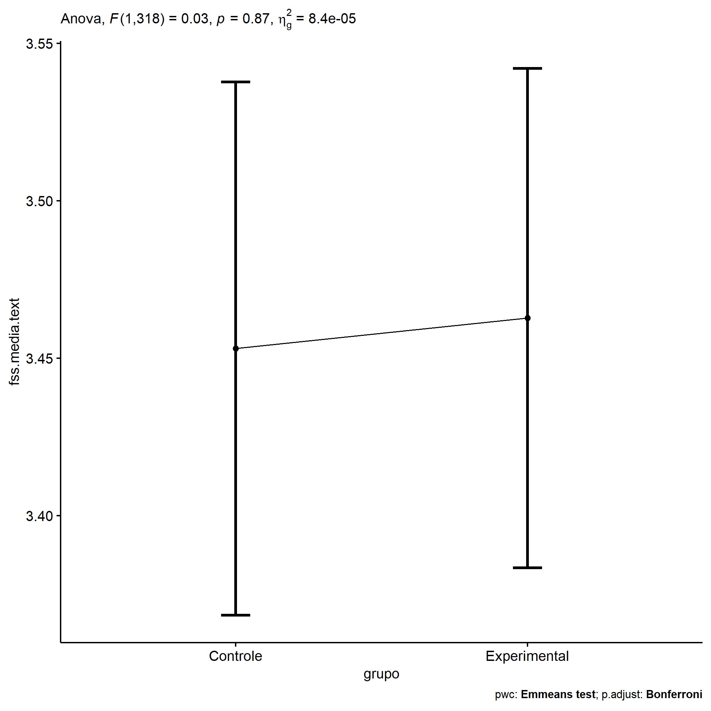<!-- -->

``` r
plots <- oneWayAncovaBoxPlots(
  wdat, "fss.media.text", "grupo", aov, pwc, covar = "dfs.media.text",
  theme = "classic", color = color[["grupo"]],
  subtitle = which(aov$Effect == "grupo"))
```

``` r
if (length(unique(wdat[["grupo"]])) > 1)
  plots[["grupo"]] + ggplot2::ylab("flow (prod. textual)") + ggplot2::scale_x_discrete(labels=c('pre', 'pos'))
```

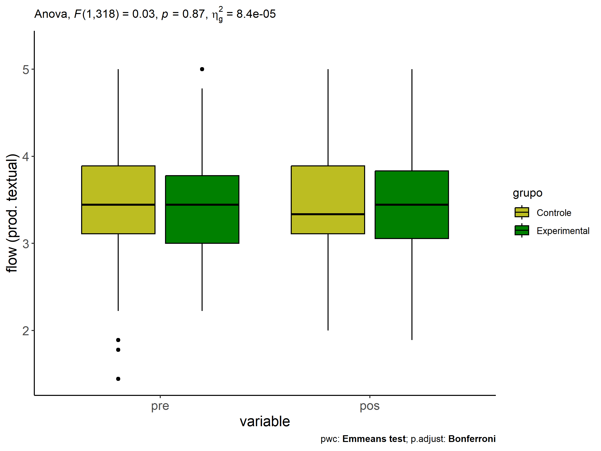<!-- -->

``` r
if (length(unique(wdat.long[["grupo"]])) > 1)
  plots <- oneWayAncovaBoxPlots(
    wdat.long, "flow.text", "grupo", aov, pwc.long, pre.post = "time",
    theme = "classic", color = color$prepost)
```

``` r
if (length(unique(wdat.long[["grupo"]])) > 1)
  plots[["grupo"]] + ggplot2::ylab("flow (prod. textual)")
```

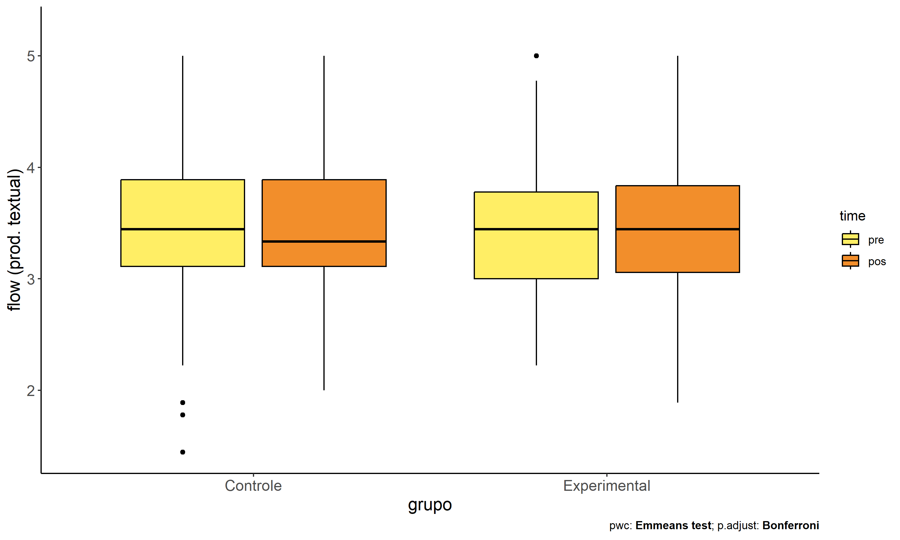<!-- -->

### Checking linearity assumption

``` r
ggscatter(wdat, x = "dfs.media.text", y = "fss.media.text", size = 0.5,
          color = "grupo", add = "reg.line")+
  stat_regline_equation(
    aes(label =  paste(..eq.label.., ..rr.label.., sep = "~~~~"), color = grupo)
  )
```

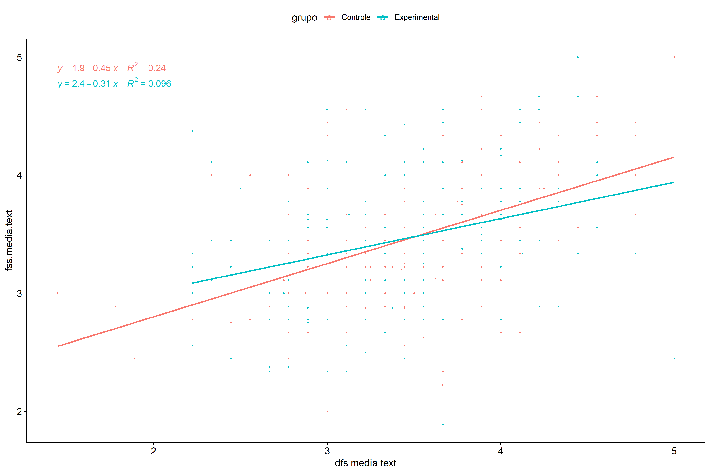<!-- -->

### Checking normality and homogeneity

``` r
res <- augment(lm(fss.media.text ~ dfs.media.text + grupo, data = wdat))
```

``` r
shapiro_test(res$.resid)
```

    ## # A tibble: 1 × 3
    ##   variable   statistic p.value
    ##   <chr>          <dbl>   <dbl>
    ## 1 res$.resid     0.994   0.296

``` r
levene_test(res, .resid ~ grupo)
```

    ## # A tibble: 1 × 4
    ##     df1   df2 statistic     p
    ##   <int> <int>     <dbl> <dbl>
    ## 1     1   319     0.383 0.536

# ANCOVA and Pairwise for two factors **grupo:Sexo**

## Without remove non-normal data

``` r
pdat = remove_group_data(dat[!is.na(dat[["grupo"]]) & !is.na(dat[["Sexo"]]),], "fss.media.text", c("grupo","Sexo"))

pdat.long <- rbind(pdat[,c("id","grupo","Sexo")], pdat[,c("id","grupo","Sexo")])
pdat.long[["time"]] <- c(rep("pre", nrow(pdat)), rep("pos", nrow(pdat)))
pdat.long[["time"]] <- factor(pdat.long[["time"]], c("pre","pos"))
pdat.long[["flow.text"]] <- c(pdat[["dfs.media.text"]], pdat[["fss.media.text"]])

aov = anova_test(pdat, fss.media.text ~ dfs.media.text + grupo*Sexo)
laov[["grupo:Sexo"]] <- get_anova_table(aov)
```

``` r
pwcs <- list()
pwcs[["Sexo"]] <- emmeans_test(
  group_by(pdat, grupo), fss.media.text ~ Sexo,
  covariate = dfs.media.text, p.adjust.method = "bonferroni")
pwcs[["grupo"]] <- emmeans_test(
  group_by(pdat, Sexo), fss.media.text ~ grupo,
  covariate = dfs.media.text, p.adjust.method = "bonferroni")

pwc <- plyr::rbind.fill(pwcs[["grupo"]], pwcs[["Sexo"]])
pwc <- pwc[,c("grupo","Sexo", colnames(pwc)[!colnames(pwc) %in% c("grupo","Sexo")])]
```

``` r
pwc.long <- emmeans_test(dplyr::group_by_at(pdat.long, c("grupo","Sexo")),
                         flow.text ~ time,
                         p.adjust.method = "bonferroni")
lpwc[["grupo:Sexo"]] <- plyr::rbind.fill(pwc, pwc.long)
```

``` r
ds <- get.descriptives(pdat, "fss.media.text", c("grupo","Sexo"), covar = "dfs.media.text")
ds <- merge(ds[ds$variable != "dfs.media.text",],
            ds[ds$variable == "dfs.media.text", !colnames(ds) %in% c("variable")],
            by = c("grupo","Sexo"), all.x = T, suffixes = c("", ".dfs.media.text"))
ds <- merge(get_emmeans(pwcs[["grupo"]]), ds, by = c("grupo","Sexo"), suffixes = c(".emms", ""))
ds <- ds[,c("grupo","Sexo","n","mean.dfs.media.text","se.dfs.media.text","mean","se","emmean","se.emms")]

colnames(ds) <- c("grupo","Sexo", "N", paste0(c("M","SE")," (pre)"),
                  paste0(c("M","SE"), " (unadj)"), paste0(c("M", "SE"), " (adj)"))

lemms[["grupo:Sexo"]] <- ds
```

## Computing ANCOVA and PairWise After removing non-normal data (OK)

``` r
wdat = pdat 

res = residuals(lm(fss.media.text ~ dfs.media.text + grupo*Sexo, data = wdat))
non.normal = getNonNormal(res, wdat$id, plimit = 0.05)

wdat = wdat[!wdat$id %in% non.normal,]

wdat.long <- rbind(wdat[,c("id","grupo","Sexo")], wdat[,c("id","grupo","Sexo")])
wdat.long[["time"]] <- c(rep("pre", nrow(wdat)), rep("pos", nrow(wdat)))
wdat.long[["time"]] <- factor(wdat.long[["time"]], c("pre","pos"))
wdat.long[["flow.text"]] <- c(wdat[["dfs.media.text"]], wdat[["fss.media.text"]])


ldat[["grupo:Sexo"]] = wdat

(non.normal)
```

    ## [1] "P2896"

``` r
aov = anova_test(wdat, fss.media.text ~ dfs.media.text + grupo*Sexo)
laov[["grupo:Sexo"]] <- merge(get_anova_table(aov), laov[["grupo:Sexo"]], by="Effect", suffixes = c("","'"))

(df = get_anova_table(aov))
```

    ## ANOVA Table (type II tests)
    ## 
    ##           Effect DFn DFd      F        p p<.05      ges
    ## 1 dfs.media.text   1 316 57.191 4.34e-13     * 1.53e-01
    ## 2          grupo   1 316  0.012 9.13e-01       3.77e-05
    ## 3           Sexo   1 316  0.517 4.73e-01       2.00e-03
    ## 4     grupo:Sexo   1 316  2.642 1.05e-01       8.00e-03

| Effect         | DFn | DFd |      F |     p | p\<.05 |   ges |
|:---------------|----:|----:|-------:|------:|:-------|------:|
| dfs.media.text |   1 | 316 | 57.191 | 0.000 | \*     | 0.153 |
| grupo          |   1 | 316 |  0.012 | 0.913 |        | 0.000 |
| Sexo           |   1 | 316 |  0.517 | 0.473 |        | 0.002 |
| grupo:Sexo     |   1 | 316 |  2.642 | 0.105 |        | 0.008 |

``` r
pwcs <- list()
pwcs[["Sexo"]] <- emmeans_test(
  group_by(wdat, grupo), fss.media.text ~ Sexo,
  covariate = dfs.media.text, p.adjust.method = "bonferroni")
pwcs[["grupo"]] <- emmeans_test(
  group_by(wdat, Sexo), fss.media.text ~ grupo,
  covariate = dfs.media.text, p.adjust.method = "bonferroni")

pwc <- plyr::rbind.fill(pwcs[["grupo"]], pwcs[["Sexo"]])
pwc <- pwc[,c("grupo","Sexo", colnames(pwc)[!colnames(pwc) %in% c("grupo","Sexo")])]
```

| grupo        | Sexo | term                  | .y.            | group1   | group2       |  df | statistic |     p | p.adj | p.adj.signif |
|:-------------|:-----|:----------------------|:---------------|:---------|:-------------|----:|----------:|------:|------:|:-------------|
|              | F    | dfs.media.text\*grupo | fss.media.text | Controle | Experimental | 316 |     1.076 | 0.283 | 0.283 | ns           |
|              | M    | dfs.media.text\*grupo | fss.media.text | Controle | Experimental | 316 |    -1.221 | 0.223 | 0.223 | ns           |
| Controle     |      | dfs.media.text\*Sexo  | fss.media.text | F        | M            | 316 |     1.677 | 0.095 | 0.095 | ns           |
| Experimental |      | dfs.media.text\*Sexo  | fss.media.text | F        | M            | 316 |    -0.573 | 0.567 | 0.567 | ns           |

``` r
pwc.long <- emmeans_test(dplyr::group_by_at(wdat.long, c("grupo","Sexo")),
                         flow.text ~ time,
                         p.adjust.method = "bonferroni")
lpwc[["grupo:Sexo"]] <- merge(plyr::rbind.fill(pwc, pwc.long), lpwc[["grupo:Sexo"]], by=c("grupo","Sexo","term",".y.","group1","group2"), suffixes = c("","'"))
```

| grupo        | Sexo | term | .y.       | group1 | group2 |  df | statistic |     p | p.adj | p.adj.signif |
|:-------------|:-----|:-----|:----------|:-------|:-------|----:|----------:|------:|------:|:-------------|
| Controle     | F    | time | flow.text | pre    | pos    | 634 |     0.125 | 0.901 | 0.901 | ns           |
| Controle     | M    | time | flow.text | pre    | pos    | 634 |     0.200 | 0.841 | 0.841 | ns           |
| Experimental | F    | time | flow.text | pre    | pos    | 634 |     0.189 | 0.850 | 0.850 | ns           |
| Experimental | M    | time | flow.text | pre    | pos    | 634 |    -1.233 | 0.218 | 0.218 | ns           |

``` r
ds <- get.descriptives(wdat, "fss.media.text", c("grupo","Sexo"), covar = "dfs.media.text")
ds <- merge(ds[ds$variable != "dfs.media.text",],
            ds[ds$variable == "dfs.media.text", !colnames(ds) %in% c("variable")],
            by = c("grupo","Sexo"), all.x = T, suffixes = c("", ".dfs.media.text"))
ds <- merge(get_emmeans(pwcs[["grupo"]]), ds, by = c("grupo","Sexo"), suffixes = c(".emms", ""))
ds <- ds[,c("grupo","Sexo","n","mean.dfs.media.text","se.dfs.media.text","mean","se","emmean","se.emms")]

colnames(ds) <- c("grupo","Sexo", "N", paste0(c("M","SE")," (pre)"),
                  paste0(c("M","SE"), " (unadj)"), paste0(c("M", "SE"), " (adj)"))

lemms[["grupo:Sexo"]] <- merge(ds, lemms[["grupo:Sexo"]], by=c("grupo","Sexo"), suffixes = c("","'"))
```

| grupo        | Sexo |   N | M (pre) | SE (pre) | M (unadj) | SE (unadj) | M (adj) | SE (adj) |
|:-------------|:-----|----:|--------:|---------:|----------:|-----------:|--------:|---------:|
| Controle     | F    |  70 |   3.604 |    0.076 |     3.591 |      0.067 |   3.531 |    0.063 |
| Controle     | M    |  80 |   3.382 |    0.069 |     3.363 |      0.064 |   3.386 |    0.059 |
| Experimental | F    |  91 |   3.466 |    0.057 |     3.450 |      0.065 |   3.441 |    0.055 |
| Experimental | M    |  80 |   3.332 |    0.068 |     3.446 |      0.058 |   3.487 |    0.059 |

### Plots for ancova

``` r
plots <- twoWayAncovaPlots(
  wdat, "fss.media.text", c("grupo","Sexo"), aov, pwcs, addParam = c("mean_se"),
  font.label.size=10, step.increase=0.05, p.label="p.adj",
  subtitle = which(aov$Effect == "grupo:Sexo"))
```

``` r
if (!is.null(plots[["grupo"]]))
  plots[["grupo"]] + ggplot2::scale_color_manual(values = color[["Sexo"]])
```

    ## Scale for colour is already present.
    ## Adding another scale for colour, which will replace the existing scale.

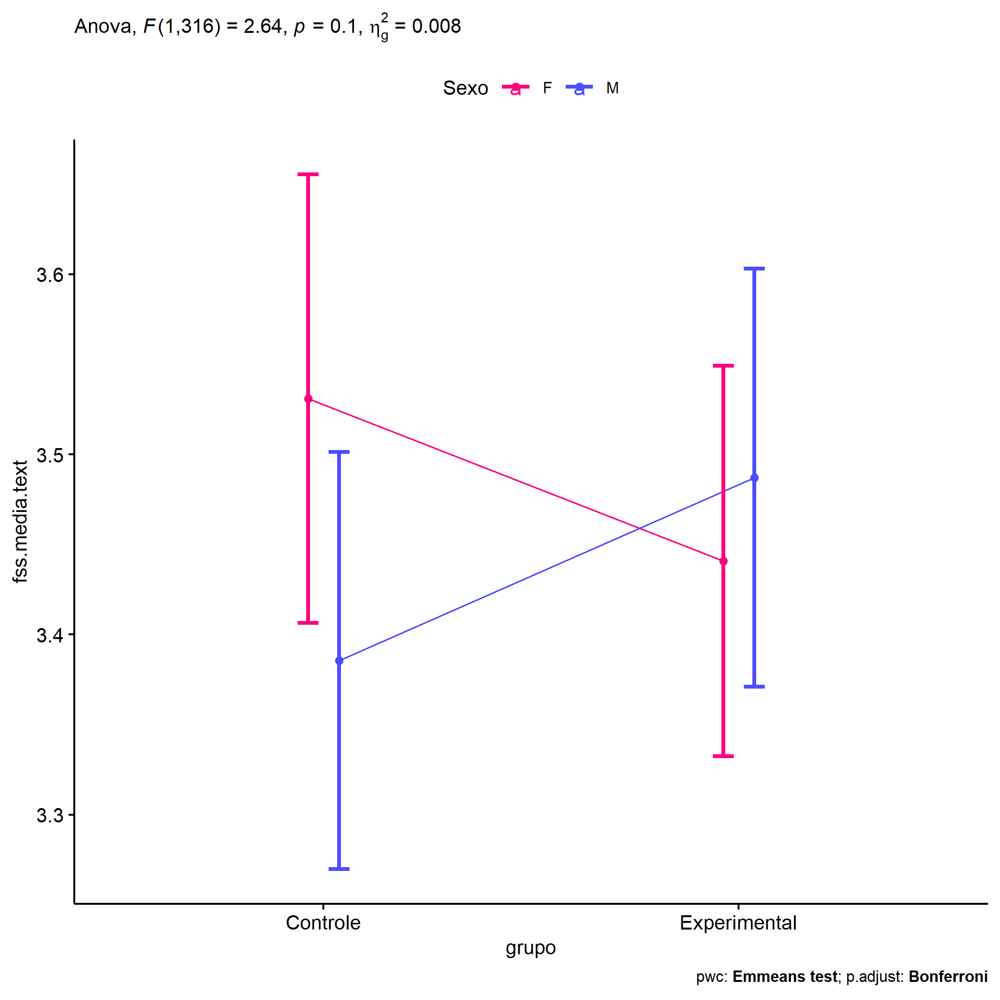<!-- -->

``` r
if (!is.null(plots[["Sexo"]]))
  plots[["Sexo"]] + ggplot2::scale_color_manual(values = color[["grupo"]])
```

    ## Scale for colour is already present.
    ## Adding another scale for colour, which will replace the existing scale.

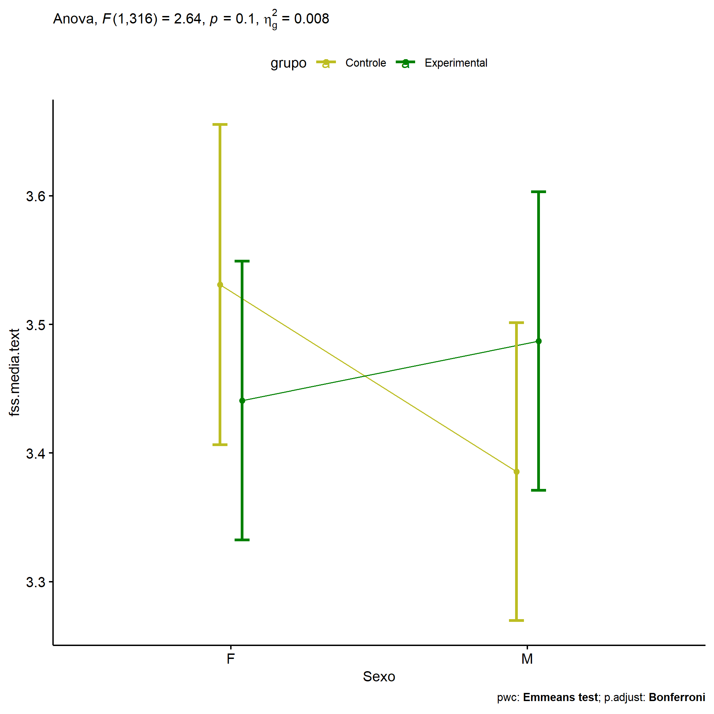<!-- -->

``` r
plots <- twoWayAncovaBoxPlots(
  wdat, "fss.media.text", c("grupo","Sexo"), aov, pwcs, covar = "dfs.media.text",
  theme = "classic", color = color[["grupo:Sexo"]],
  subtitle = which(aov$Effect == "grupo:Sexo"))
```

``` r
plots[["grupo:Sexo"]] + ggplot2::ylab("flow (prod. textual)") + ggplot2::scale_x_discrete(labels=c('pre', 'pos'))
```

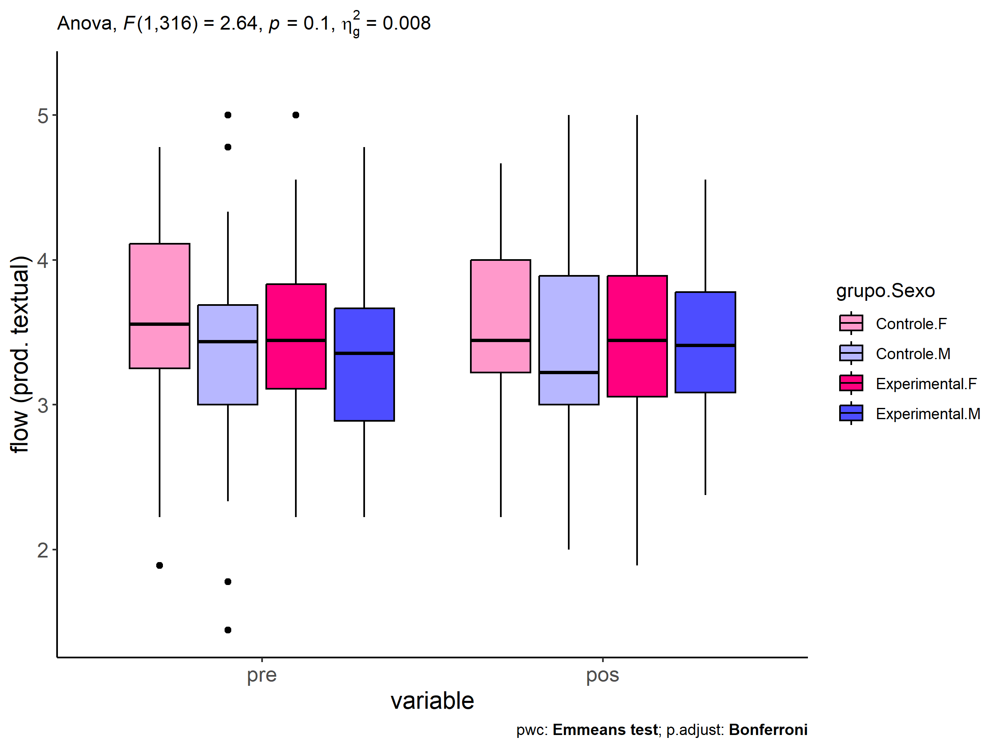<!-- -->

``` r
plots <- twoWayAncovaBoxPlots(
  wdat.long, "flow.text", c("grupo","Sexo"), aov, pwc.long, pre.post = "time",
  theme = "classic", color = color$prepost)
```

``` r
plots[["grupo:Sexo"]] + ggplot2::ylab("flow (prod. textual)")
```

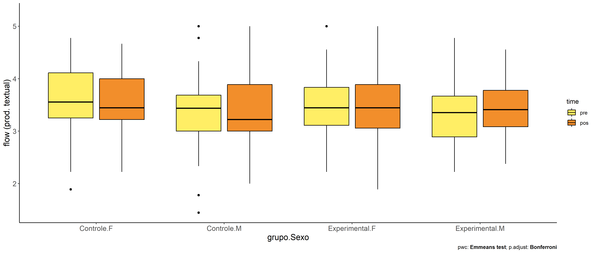<!-- -->

### Checking linearity assumption

``` r
ggscatter(wdat, x = "dfs.media.text", y = "fss.media.text", size = 0.5,
          facet.by = c("grupo","Sexo"), add = "reg.line")+
  stat_regline_equation(
    aes(label =  paste(..eq.label.., ..rr.label.., sep = "~~~~"))
  )
```

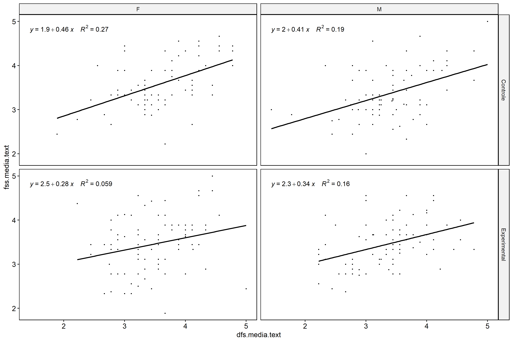<!-- -->

### Checking normality and homogeneity

``` r
res <- augment(lm(fss.media.text ~ dfs.media.text + grupo*Sexo, data = wdat))
```

``` r
shapiro_test(res$.resid)
```

    ## # A tibble: 1 × 3
    ##   variable   statistic p.value
    ##   <chr>          <dbl>   <dbl>
    ## 1 res$.resid     0.995   0.308

``` r
levene_test(res, .resid ~ grupo*Sexo)
```

    ## # A tibble: 1 × 4
    ##     df1   df2 statistic     p
    ##   <int> <int>     <dbl> <dbl>
    ## 1     3   317      1.35 0.258

# ANCOVA and Pairwise for two factors **grupo:Zona**

## Without remove non-normal data

``` r
pdat = remove_group_data(dat[!is.na(dat[["grupo"]]) & !is.na(dat[["Zona"]]),], "fss.media.text", c("grupo","Zona"))

pdat.long <- rbind(pdat[,c("id","grupo","Zona")], pdat[,c("id","grupo","Zona")])
pdat.long[["time"]] <- c(rep("pre", nrow(pdat)), rep("pos", nrow(pdat)))
pdat.long[["time"]] <- factor(pdat.long[["time"]], c("pre","pos"))
pdat.long[["flow.text"]] <- c(pdat[["dfs.media.text"]], pdat[["fss.media.text"]])

aov = anova_test(pdat, fss.media.text ~ dfs.media.text + grupo*Zona)
laov[["grupo:Zona"]] <- get_anova_table(aov)
```

``` r
pwcs <- list()
pwcs[["Zona"]] <- emmeans_test(
  group_by(pdat, grupo), fss.media.text ~ Zona,
  covariate = dfs.media.text, p.adjust.method = "bonferroni")
pwcs[["grupo"]] <- emmeans_test(
  group_by(pdat, Zona), fss.media.text ~ grupo,
  covariate = dfs.media.text, p.adjust.method = "bonferroni")

pwc <- plyr::rbind.fill(pwcs[["grupo"]], pwcs[["Zona"]])
pwc <- pwc[,c("grupo","Zona", colnames(pwc)[!colnames(pwc) %in% c("grupo","Zona")])]
```

``` r
pwc.long <- emmeans_test(dplyr::group_by_at(pdat.long, c("grupo","Zona")),
                         flow.text ~ time,
                         p.adjust.method = "bonferroni")
lpwc[["grupo:Zona"]] <- plyr::rbind.fill(pwc, pwc.long)
```

``` r
ds <- get.descriptives(pdat, "fss.media.text", c("grupo","Zona"), covar = "dfs.media.text")
ds <- merge(ds[ds$variable != "dfs.media.text",],
            ds[ds$variable == "dfs.media.text", !colnames(ds) %in% c("variable")],
            by = c("grupo","Zona"), all.x = T, suffixes = c("", ".dfs.media.text"))
ds <- merge(get_emmeans(pwcs[["grupo"]]), ds, by = c("grupo","Zona"), suffixes = c(".emms", ""))
ds <- ds[,c("grupo","Zona","n","mean.dfs.media.text","se.dfs.media.text","mean","se","emmean","se.emms")]

colnames(ds) <- c("grupo","Zona", "N", paste0(c("M","SE")," (pre)"),
                  paste0(c("M","SE"), " (unadj)"), paste0(c("M", "SE"), " (adj)"))

lemms[["grupo:Zona"]] <- ds
```

## Computing ANCOVA and PairWise After removing non-normal data (OK)

``` r
wdat = pdat 

res = residuals(lm(fss.media.text ~ dfs.media.text + grupo*Zona, data = wdat))
non.normal = getNonNormal(res, wdat$id, plimit = 0.05)

wdat = wdat[!wdat$id %in% non.normal,]

wdat.long <- rbind(wdat[,c("id","grupo","Zona")], wdat[,c("id","grupo","Zona")])
wdat.long[["time"]] <- c(rep("pre", nrow(wdat)), rep("pos", nrow(wdat)))
wdat.long[["time"]] <- factor(wdat.long[["time"]], c("pre","pos"))
wdat.long[["flow.text"]] <- c(wdat[["dfs.media.text"]], wdat[["fss.media.text"]])


ldat[["grupo:Zona"]] = wdat

(non.normal)
```

    ## [1] "P2896"

``` r
aov = anova_test(wdat, fss.media.text ~ dfs.media.text + grupo*Zona)
laov[["grupo:Zona"]] <- merge(get_anova_table(aov), laov[["grupo:Zona"]], by="Effect", suffixes = c("","'"))

(df = get_anova_table(aov))
```

    ## ANOVA Table (type II tests)
    ## 
    ##           Effect DFn DFd      F        p p<.05      ges
    ## 1 dfs.media.text   1 250 47.773 3.96e-11     * 0.160000
    ## 2          grupo   1 250  0.083 7.73e-01       0.000334
    ## 3           Zona   1 250  2.340 1.27e-01       0.009000
    ## 4     grupo:Zona   1 250  0.241 6.24e-01       0.000964

| Effect         | DFn | DFd |      F |     p | p\<.05 |   ges |
|:---------------|----:|----:|-------:|------:|:-------|------:|
| dfs.media.text |   1 | 250 | 47.773 | 0.000 | \*     | 0.160 |
| grupo          |   1 | 250 |  0.083 | 0.773 |        | 0.000 |
| Zona           |   1 | 250 |  2.340 | 0.127 |        | 0.009 |
| grupo:Zona     |   1 | 250 |  0.241 | 0.624 |        | 0.001 |

``` r
pwcs <- list()
pwcs[["Zona"]] <- emmeans_test(
  group_by(wdat, grupo), fss.media.text ~ Zona,
  covariate = dfs.media.text, p.adjust.method = "bonferroni")
pwcs[["grupo"]] <- emmeans_test(
  group_by(wdat, Zona), fss.media.text ~ grupo,
  covariate = dfs.media.text, p.adjust.method = "bonferroni")

pwc <- plyr::rbind.fill(pwcs[["grupo"]], pwcs[["Zona"]])
pwc <- pwc[,c("grupo","Zona", colnames(pwc)[!colnames(pwc) %in% c("grupo","Zona")])]
```

| grupo        | Zona   | term                  | .y.            | group1   | group2       |  df | statistic |     p | p.adj | p.adj.signif |
|:-------------|:-------|:----------------------|:---------------|:---------|:-------------|----:|----------:|------:|------:|:-------------|
|              | Rural  | dfs.media.text\*grupo | fss.media.text | Controle | Experimental | 250 |    -0.014 | 0.989 | 0.989 | ns           |
|              | Urbana | dfs.media.text\*grupo | fss.media.text | Controle | Experimental | 250 |     0.570 | 0.569 | 0.569 | ns           |
| Controle     |        | dfs.media.text\*Zona  | fss.media.text | Rural    | Urbana       | 250 |     0.664 | 0.507 | 0.507 | ns           |
| Experimental |        | dfs.media.text\*Zona  | fss.media.text | Rural    | Urbana       | 250 |     1.464 | 0.144 | 0.144 | ns           |

``` r
pwc.long <- emmeans_test(dplyr::group_by_at(wdat.long, c("grupo","Zona")),
                         flow.text ~ time,
                         p.adjust.method = "bonferroni")
lpwc[["grupo:Zona"]] <- merge(plyr::rbind.fill(pwc, pwc.long), lpwc[["grupo:Zona"]], by=c("grupo","Zona","term",".y.","group1","group2"), suffixes = c("","'"))
```

| grupo        | Zona   | term | .y.       | group1 | group2 |  df | statistic |     p | p.adj | p.adj.signif |
|:-------------|:-------|:-----|:----------|:-------|:-------|----:|----------:|------:|------:|:-------------|
| Controle     | Rural  | time | flow.text | pre    | pos    | 502 |     0.398 | 0.691 | 0.691 | ns           |
| Controle     | Urbana | time | flow.text | pre    | pos    | 502 |    -0.269 | 0.788 | 0.788 | ns           |
| Experimental | Rural  | time | flow.text | pre    | pos    | 502 |    -1.003 | 0.316 | 0.316 | ns           |
| Experimental | Urbana | time | flow.text | pre    | pos    | 502 |     0.318 | 0.751 | 0.751 | ns           |

``` r
ds <- get.descriptives(wdat, "fss.media.text", c("grupo","Zona"), covar = "dfs.media.text")
ds <- merge(ds[ds$variable != "dfs.media.text",],
            ds[ds$variable == "dfs.media.text", !colnames(ds) %in% c("variable")],
            by = c("grupo","Zona"), all.x = T, suffixes = c("", ".dfs.media.text"))
ds <- merge(get_emmeans(pwcs[["grupo"]]), ds, by = c("grupo","Zona"), suffixes = c(".emms", ""))
ds <- ds[,c("grupo","Zona","n","mean.dfs.media.text","se.dfs.media.text","mean","se","emmean","se.emms")]

colnames(ds) <- c("grupo","Zona", "N", paste0(c("M","SE")," (pre)"),
                  paste0(c("M","SE"), " (unadj)"), paste0(c("M", "SE"), " (adj)"))

lemms[["grupo:Zona"]] <- merge(ds, lemms[["grupo:Zona"]], by=c("grupo","Zona"), suffixes = c("","'"))
```

| grupo        | Zona   |   N | M (pre) | SE (pre) | M (unadj) | SE (unadj) | M (adj) | SE (adj) |
|:-------------|:-------|----:|--------:|---------:|----------:|-----------:|--------:|---------:|
| Controle     | Rural  |  99 |   3.580 |    0.060 |     3.547 |      0.057 |   3.498 |    0.053 |
| Controle     | Urbana |  30 |   3.344 |    0.133 |     3.385 |      0.109 |   3.426 |    0.095 |
| Experimental | Rural  |  85 |   3.384 |    0.062 |     3.474 |      0.059 |   3.499 |    0.056 |
| Experimental | Urbana |  41 |   3.360 |    0.076 |     3.320 |      0.089 |   3.355 |    0.081 |

### Plots for ancova

``` r
plots <- twoWayAncovaPlots(
  wdat, "fss.media.text", c("grupo","Zona"), aov, pwcs, addParam = c("mean_se"),
  font.label.size=10, step.increase=0.05, p.label="p.adj",
  subtitle = which(aov$Effect == "grupo:Zona"))
```

``` r
if (!is.null(plots[["grupo"]]))
  plots[["grupo"]] + ggplot2::scale_color_manual(values = color[["Zona"]])
```

    ## Scale for colour is already present.
    ## Adding another scale for colour, which will replace the existing scale.

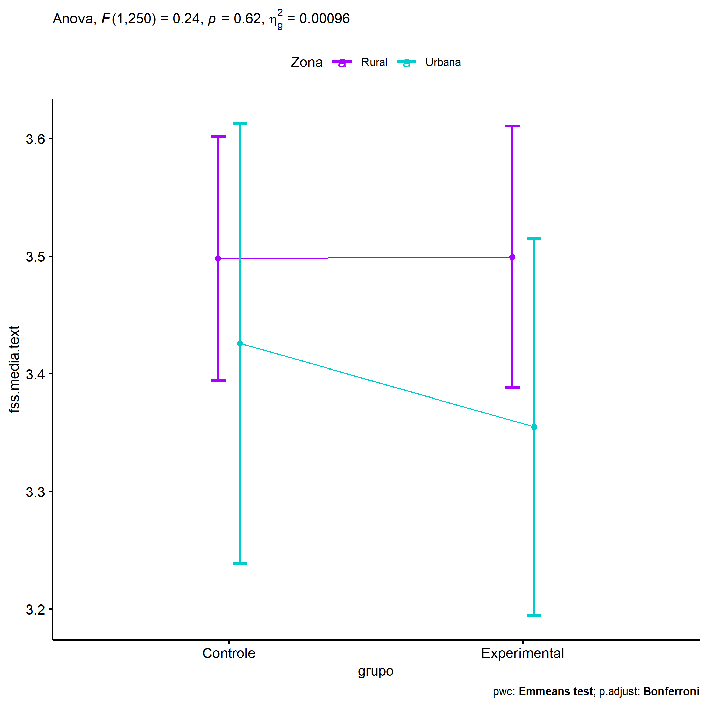<!-- -->

``` r
if (!is.null(plots[["Zona"]]))
  plots[["Zona"]] + ggplot2::scale_color_manual(values = color[["grupo"]])
```

    ## Scale for colour is already present.
    ## Adding another scale for colour, which will replace the existing scale.

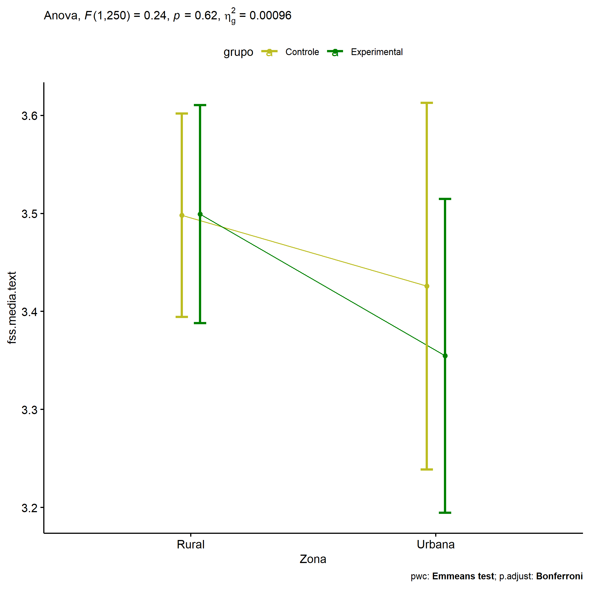<!-- -->

``` r
plots <- twoWayAncovaBoxPlots(
  wdat, "fss.media.text", c("grupo","Zona"), aov, pwcs, covar = "dfs.media.text",
  theme = "classic", color = color[["grupo:Zona"]],
  subtitle = which(aov$Effect == "grupo:Zona"))
```

``` r
plots[["grupo:Zona"]] + ggplot2::ylab("flow (prod. textual)") + ggplot2::scale_x_discrete(labels=c('pre', 'pos'))
```

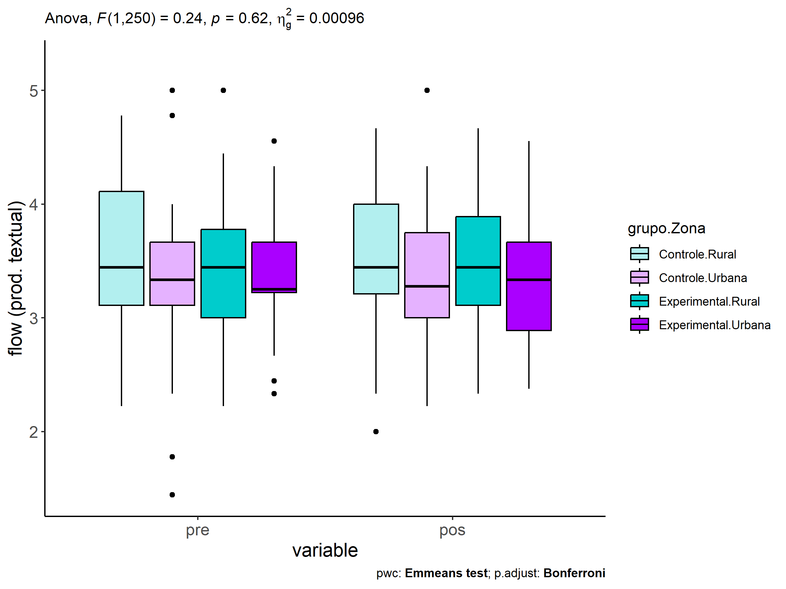<!-- -->

``` r
plots <- twoWayAncovaBoxPlots(
  wdat.long, "flow.text", c("grupo","Zona"), aov, pwc.long, pre.post = "time",
  theme = "classic", color = color$prepost)
```

``` r
plots[["grupo:Zona"]] + ggplot2::ylab("flow (prod. textual)")
```

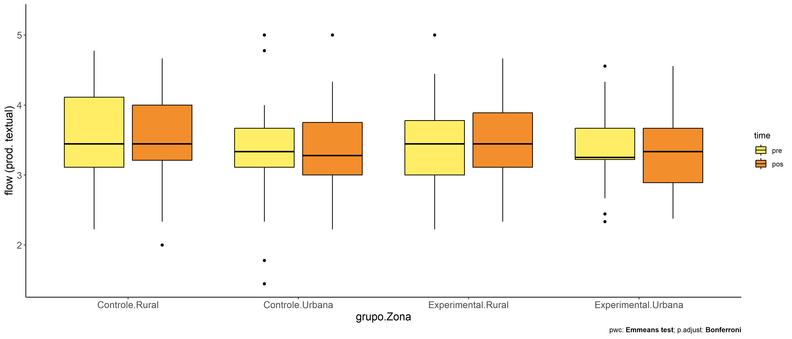<!-- -->

### Checking linearity assumption

``` r
ggscatter(wdat, x = "dfs.media.text", y = "fss.media.text", size = 0.5,
          facet.by = c("grupo","Zona"), add = "reg.line")+
  stat_regline_equation(
    aes(label =  paste(..eq.label.., ..rr.label.., sep = "~~~~"))
  )
```

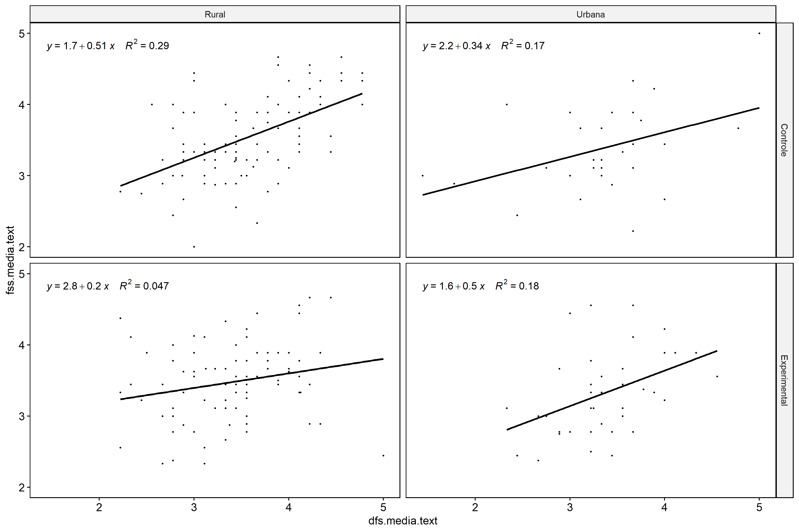<!-- -->

### Checking normality and homogeneity

``` r
res <- augment(lm(fss.media.text ~ dfs.media.text + grupo*Zona, data = wdat))
```

``` r
shapiro_test(res$.resid)
```

    ## # A tibble: 1 × 3
    ##   variable   statistic p.value
    ##   <chr>          <dbl>   <dbl>
    ## 1 res$.resid     0.996   0.711

``` r
levene_test(res, .resid ~ grupo*Zona)
```

    ## # A tibble: 1 × 4
    ##     df1   df2 statistic     p
    ##   <int> <int>     <dbl> <dbl>
    ## 1     3   251     0.229 0.876

# ANCOVA and Pairwise for two factors **grupo:Cor.Raca**

## Without remove non-normal data

``` r
pdat = remove_group_data(dat[!is.na(dat[["grupo"]]) & !is.na(dat[["Cor.Raca"]]),], "fss.media.text", c("grupo","Cor.Raca"))
```

    ## Warning: There were 2 warnings in `mutate()`.
    ## The first warning was:
    ## ℹ In argument: `ci = abs(stats::qt(alpha/2, .data$n - 1) * .data$se)`.
    ## Caused by warning:
    ## ! There was 1 warning in `mutate()`.
    ## ℹ In argument: `ci = abs(stats::qt(alpha/2, .data$n - 1) * .data$se)`.
    ## Caused by warning in `stats::qt()`:
    ## ! NaNs produced
    ## ℹ Run `dplyr::last_dplyr_warnings()` to see the 1 remaining warning.

``` r
pdat.long <- rbind(pdat[,c("id","grupo","Cor.Raca")], pdat[,c("id","grupo","Cor.Raca")])
pdat.long[["time"]] <- c(rep("pre", nrow(pdat)), rep("pos", nrow(pdat)))
pdat.long[["time"]] <- factor(pdat.long[["time"]], c("pre","pos"))
pdat.long[["flow.text"]] <- c(pdat[["dfs.media.text"]], pdat[["fss.media.text"]])

aov = anova_test(pdat, fss.media.text ~ dfs.media.text + grupo*Cor.Raca)
laov[["grupo:Cor.Raca"]] <- get_anova_table(aov)
```

``` r
pwcs <- list()
pwcs[["Cor.Raca"]] <- emmeans_test(
  group_by(pdat, grupo), fss.media.text ~ Cor.Raca,
  covariate = dfs.media.text, p.adjust.method = "bonferroni")
pwcs[["grupo"]] <- emmeans_test(
  group_by(pdat, Cor.Raca), fss.media.text ~ grupo,
  covariate = dfs.media.text, p.adjust.method = "bonferroni")

pwc <- plyr::rbind.fill(pwcs[["grupo"]], pwcs[["Cor.Raca"]])
pwc <- pwc[,c("grupo","Cor.Raca", colnames(pwc)[!colnames(pwc) %in% c("grupo","Cor.Raca")])]
```

``` r
pwc.long <- emmeans_test(dplyr::group_by_at(pdat.long, c("grupo","Cor.Raca")),
                         flow.text ~ time,
                         p.adjust.method = "bonferroni")
lpwc[["grupo:Cor.Raca"]] <- plyr::rbind.fill(pwc, pwc.long)
```

``` r
ds <- get.descriptives(pdat, "fss.media.text", c("grupo","Cor.Raca"), covar = "dfs.media.text")
ds <- merge(ds[ds$variable != "dfs.media.text",],
            ds[ds$variable == "dfs.media.text", !colnames(ds) %in% c("variable")],
            by = c("grupo","Cor.Raca"), all.x = T, suffixes = c("", ".dfs.media.text"))
ds <- merge(get_emmeans(pwcs[["grupo"]]), ds, by = c("grupo","Cor.Raca"), suffixes = c(".emms", ""))
ds <- ds[,c("grupo","Cor.Raca","n","mean.dfs.media.text","se.dfs.media.text","mean","se","emmean","se.emms")]

colnames(ds) <- c("grupo","Cor.Raca", "N", paste0(c("M","SE")," (pre)"),
                  paste0(c("M","SE"), " (unadj)"), paste0(c("M", "SE"), " (adj)"))

lemms[["grupo:Cor.Raca"]] <- ds
```

## Computing ANCOVA and PairWise After removing non-normal data (OK)

``` r
wdat = pdat 

res = residuals(lm(fss.media.text ~ dfs.media.text + grupo*Cor.Raca, data = wdat))
non.normal = getNonNormal(res, wdat$id, plimit = 0.05)

wdat = wdat[!wdat$id %in% non.normal,]

wdat.long <- rbind(wdat[,c("id","grupo","Cor.Raca")], wdat[,c("id","grupo","Cor.Raca")])
wdat.long[["time"]] <- c(rep("pre", nrow(wdat)), rep("pos", nrow(wdat)))
wdat.long[["time"]] <- factor(wdat.long[["time"]], c("pre","pos"))
wdat.long[["flow.text"]] <- c(wdat[["dfs.media.text"]], wdat[["fss.media.text"]])


ldat[["grupo:Cor.Raca"]] = wdat

(non.normal)
```

    ## NULL

``` r
aov = anova_test(wdat, fss.media.text ~ dfs.media.text + grupo*Cor.Raca)
laov[["grupo:Cor.Raca"]] <- merge(get_anova_table(aov), laov[["grupo:Cor.Raca"]], by="Effect", suffixes = c("","'"))

(df = get_anova_table(aov))
```

    ## ANOVA Table (type II tests)
    ## 
    ##           Effect DFn DFd      F        p p<.05      ges
    ## 1 dfs.media.text   1 129 26.591 9.22e-07     * 0.171000
    ## 2          grupo   1 129  0.071 7.90e-01       0.000549
    ## 3       Cor.Raca   2 129  0.137 8.72e-01       0.002000
    ## 4 grupo:Cor.Raca   1 129  1.801 1.82e-01       0.014000

| Effect         | DFn | DFd |      F |     p | p\<.05 |   ges |
|:---------------|----:|----:|-------:|------:|:-------|------:|
| dfs.media.text |   1 | 129 | 26.591 | 0.000 | \*     | 0.171 |
| grupo          |   1 | 129 |  0.071 | 0.790 |        | 0.001 |
| Cor.Raca       |   2 | 129 |  0.137 | 0.872 |        | 0.002 |
| grupo:Cor.Raca |   1 | 129 |  1.801 | 0.182 |        | 0.014 |

``` r
pwcs <- list()
pwcs[["Cor.Raca"]] <- emmeans_test(
  group_by(wdat, grupo), fss.media.text ~ Cor.Raca,
  covariate = dfs.media.text, p.adjust.method = "bonferroni")
pwcs[["grupo"]] <- emmeans_test(
  group_by(wdat, Cor.Raca), fss.media.text ~ grupo,
  covariate = dfs.media.text, p.adjust.method = "bonferroni")

pwc <- plyr::rbind.fill(pwcs[["grupo"]], pwcs[["Cor.Raca"]])
pwc <- pwc[,c("grupo","Cor.Raca", colnames(pwc)[!colnames(pwc) %in% c("grupo","Cor.Raca")])]
```

| grupo        | Cor.Raca | term                     | .y.            | group1   | group2       |  df | statistic |     p | p.adj | p.adj.signif |
|:-------------|:---------|:-------------------------|:---------------|:---------|:-------------|----:|----------:|------:|------:|:-------------|
|              | Branca   | dfs.media.text\*grupo    | fss.media.text | Controle | Experimental | 129 |     0.950 | 0.344 | 0.344 | ns           |
|              | Indígena | dfs.media.text\*grupo    | fss.media.text | Controle | Experimental |     |           |       |       |              |
|              | Parda    | dfs.media.text\*grupo    | fss.media.text | Controle | Experimental | 129 |    -0.969 | 0.334 | 0.334 | ns           |
| Controle     |          | dfs.media.text\*Cor.Raca | fss.media.text | Branca   | Indígena     |     |           |       |       |              |
| Controle     |          | dfs.media.text\*Cor.Raca | fss.media.text | Branca   | Parda        | 129 |     0.552 | 0.582 | 0.582 | ns           |
| Controle     |          | dfs.media.text\*Cor.Raca | fss.media.text | Indígena | Parda        |     |           |       |       |              |
| Experimental |          | dfs.media.text\*Cor.Raca | fss.media.text | Branca   | Indígena     | 129 |    -0.704 | 0.483 | 1.000 | ns           |
| Experimental |          | dfs.media.text\*Cor.Raca | fss.media.text | Branca   | Parda        | 129 |    -1.335 | 0.184 | 0.552 | ns           |
| Experimental |          | dfs.media.text\*Cor.Raca | fss.media.text | Indígena | Parda        | 129 |    -0.360 | 0.719 | 1.000 | ns           |

``` r
pwc.long <- emmeans_test(dplyr::group_by_at(wdat.long, c("grupo","Cor.Raca")),
                         flow.text ~ time,
                         p.adjust.method = "bonferroni")
lpwc[["grupo:Cor.Raca"]] <- merge(plyr::rbind.fill(pwc, pwc.long), lpwc[["grupo:Cor.Raca"]], by=c("grupo","Cor.Raca","term",".y.","group1","group2"), suffixes = c("","'"))
```

| grupo        | Cor.Raca | term | .y.       | group1 | group2 |  df | statistic |     p | p.adj | p.adj.signif |
|:-------------|:---------|:-----|:----------|:-------|:-------|----:|----------:|------:|------:|:-------------|
| Controle     | Branca   | time | flow.text | pre    | pos    | 260 |    -0.349 | 0.728 | 0.728 | ns           |
| Controle     | Indígena | time | flow.text | pre    | pos    |     |           |       |       |              |
| Controle     | Parda    | time | flow.text | pre    | pos    | 260 |     0.893 | 0.373 | 0.373 | ns           |
| Experimental | Branca   | time | flow.text | pre    | pos    | 260 |     0.210 | 0.834 | 0.834 | ns           |
| Experimental | Indígena | time | flow.text | pre    | pos    | 260 |    -0.580 | 0.562 | 0.562 | ns           |
| Experimental | Parda    | time | flow.text | pre    | pos    | 260 |    -2.191 | 0.029 | 0.029 | \*           |

``` r
ds <- get.descriptives(wdat, "fss.media.text", c("grupo","Cor.Raca"), covar = "dfs.media.text")
ds <- merge(ds[ds$variable != "dfs.media.text",],
            ds[ds$variable == "dfs.media.text", !colnames(ds) %in% c("variable")],
            by = c("grupo","Cor.Raca"), all.x = T, suffixes = c("", ".dfs.media.text"))
ds <- merge(get_emmeans(pwcs[["grupo"]]), ds, by = c("grupo","Cor.Raca"), suffixes = c(".emms", ""))
ds <- ds[,c("grupo","Cor.Raca","n","mean.dfs.media.text","se.dfs.media.text","mean","se","emmean","se.emms")]

colnames(ds) <- c("grupo","Cor.Raca", "N", paste0(c("M","SE")," (pre)"),
                  paste0(c("M","SE"), " (unadj)"), paste0(c("M", "SE"), " (adj)"))

lemms[["grupo:Cor.Raca"]] <- merge(ds, lemms[["grupo:Cor.Raca"]], by=c("grupo","Cor.Raca"), suffixes = c("","'"))
```

| grupo        | Cor.Raca |   N | M (pre) | SE (pre) | M (unadj) | SE (unadj) | M (adj) | SE (adj) |
|:-------------|:---------|----:|--------:|---------:|----------:|-----------:|--------:|---------:|
| Controle     | Branca   |  20 |   3.506 |    0.119 |     3.568 |      0.108 |   3.538 |    0.118 |
| Controle     | Parda    |  42 |   3.669 |    0.096 |     3.558 |      0.097 |   3.458 |    0.083 |
| Experimental | Branca   |  17 |   3.399 |    0.136 |     3.358 |      0.161 |   3.373 |    0.127 |
| Experimental | Indígena |  12 |   3.337 |    0.141 |     3.471 |      0.166 |   3.512 |    0.152 |
| Experimental | Parda    |  44 |   3.217 |    0.078 |     3.482 |      0.079 |   3.574 |    0.081 |

### Plots for ancova

``` r
plots <- twoWayAncovaPlots(
  wdat, "fss.media.text", c("grupo","Cor.Raca"), aov, pwcs, addParam = c("mean_se"),
  font.label.size=10, step.increase=0.05, p.label="p.adj",
  subtitle = which(aov$Effect == "grupo:Cor.Raca"))
```

``` r
if (!is.null(plots[["grupo"]]))
  plots[["grupo"]] + ggplot2::scale_color_manual(values = color[["Cor.Raca"]])
```

<!-- -->

``` r
if (!is.null(plots[["Cor.Raca"]]))
  plots[["Cor.Raca"]] + ggplot2::scale_color_manual(values = color[["grupo"]])
```

    ## Scale for colour is already present.
    ## Adding another scale for colour, which will replace the existing scale.

    ## Warning: Removed 2 rows containing non-finite values (`stat_bracket()`).

    ## Warning: Removed 1 rows containing missing values (`geom_point()`).

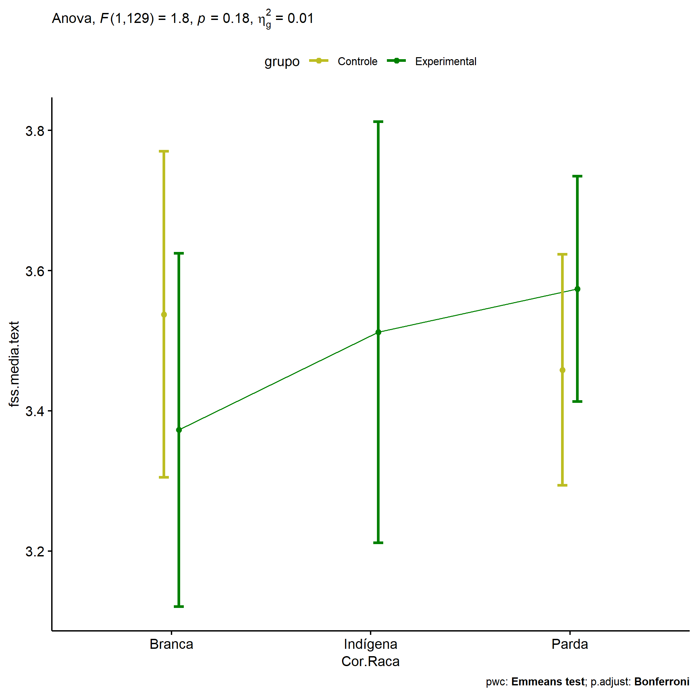<!-- -->

``` r
plots <- twoWayAncovaBoxPlots(
  wdat, "fss.media.text", c("grupo","Cor.Raca"), aov, pwcs, covar = "dfs.media.text",
  theme = "classic", color = color[["grupo:Cor.Raca"]],
  subtitle = which(aov$Effect == "grupo:Cor.Raca"))
```

``` r
plots[["grupo:Cor.Raca"]] + ggplot2::ylab("flow (prod. textual)") + ggplot2::scale_x_discrete(labels=c('pre', 'pos'))
```

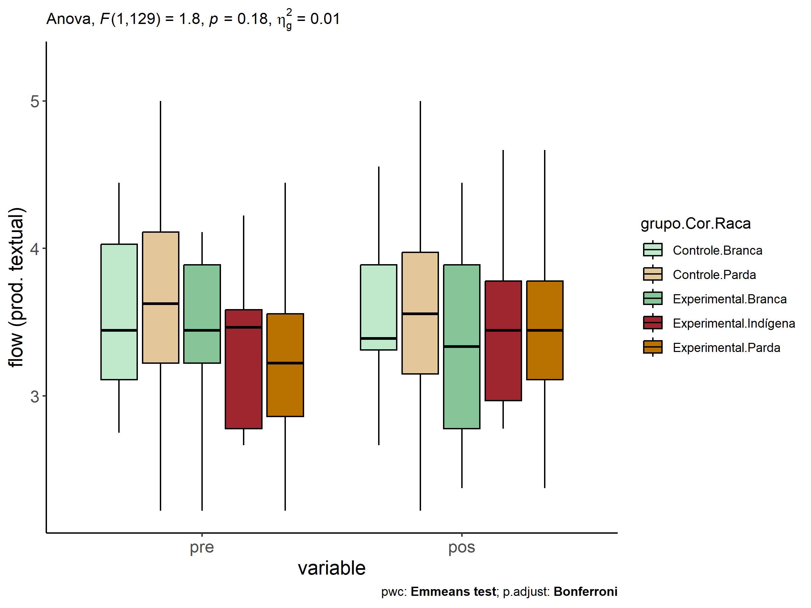<!-- -->

``` r
plots <- twoWayAncovaBoxPlots(
  wdat.long, "flow.text", c("grupo","Cor.Raca"), aov, pwc.long, pre.post = "time",
  theme = "classic", color = color$prepost)
```

``` r
plots[["grupo:Cor.Raca"]] + ggplot2::ylab("flow (prod. textual)")
```

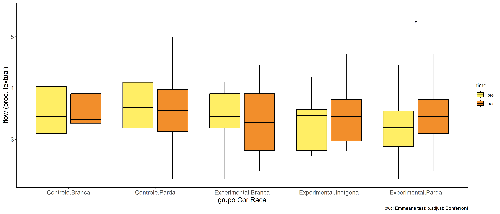<!-- -->

### Checking linearity assumption

``` r
ggscatter(wdat, x = "dfs.media.text", y = "fss.media.text", size = 0.5,
          facet.by = c("grupo","Cor.Raca"), add = "reg.line")+
  stat_regline_equation(
    aes(label =  paste(..eq.label.., ..rr.label.., sep = "~~~~"))
  )
```

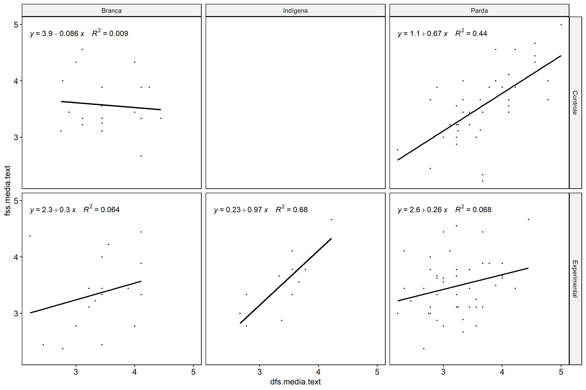<!-- -->

### Checking normality and homogeneity

``` r
res <- augment(lm(fss.media.text ~ dfs.media.text + grupo*Cor.Raca, data = wdat))
```

``` r
shapiro_test(res$.resid)
```

    ## # A tibble: 1 × 3
    ##   variable   statistic p.value
    ##   <chr>          <dbl>   <dbl>
    ## 1 res$.resid     0.990   0.434

``` r
levene_test(res, .resid ~ grupo*Cor.Raca)
```

    ## # A tibble: 1 × 4
    ##     df1   df2 statistic     p
    ##   <int> <int>     <dbl> <dbl>
    ## 1     4   130     0.458 0.766

# Summary of Results

## Descriptive Statistics

``` r
df <- get.descriptives(ldat[["grupo"]], c(dv.pre, dv.pos), c("grupo"), 
                       include.global = T, symmetry.test = T, normality.test = F)
df <- plyr::rbind.fill(
  df, do.call(plyr::rbind.fill, lapply(lfatores2, FUN = function(f) {
    if (nrow(dat) > 0 && sum(!is.na(unique(dat[[f]]))) > 1)
      get.descriptives(ldat[[paste0("grupo:",f)]], c(dv.pre,dv.pos), c("grupo", f),
                       symmetry.test = T, normality.test = F)
    }))
)
(df <- df[,c(fatores1[fatores1 %in% colnames(df)],"variable",
             colnames(df)[!colnames(df) %in% c(fatores1,"variable")])])
```

    ##           grupo Sexo   Zona Cor.Raca       variable   n  mean median   min   max    sd    se    ci   iqr
    ## 1      Controle <NA>   <NA>     <NA> dfs.media.text 150 3.485  3.444 1.444 5.000 0.634 0.052 0.102 0.778
    ## 2  Experimental <NA>   <NA>     <NA> dfs.media.text 171 3.404  3.444 2.222 5.000 0.574 0.044 0.087 0.778
    ## 3          <NA> <NA>   <NA>     <NA> dfs.media.text 321 3.442  3.444 1.444 5.000 0.603 0.034 0.066 0.889
    ## 4      Controle <NA>   <NA>     <NA> fss.media.text 150 3.470  3.333 2.000 5.000 0.578 0.047 0.093 0.778
    ## 5  Experimental <NA>   <NA>     <NA> fss.media.text 171 3.448  3.444 1.889 5.000 0.570 0.044 0.086 0.778
    ## 6          <NA> <NA>   <NA>     <NA> fss.media.text 321 3.458  3.444 1.889 5.000 0.573 0.032 0.063 0.778
    ## 7      Controle    F   <NA>     <NA> dfs.media.text  70 3.604  3.556 1.889 4.778 0.633 0.076 0.151 0.861
    ## 8      Controle    M   <NA>     <NA> dfs.media.text  80 3.382  3.437 1.444 5.000 0.620 0.069 0.138 0.688
    ## 9  Experimental    F   <NA>     <NA> dfs.media.text  91 3.466  3.444 2.222 5.000 0.540 0.057 0.112 0.722
    ## 10 Experimental    M   <NA>     <NA> dfs.media.text  80 3.332  3.354 2.222 4.778 0.606 0.068 0.135 0.778
    ## 11     Controle    F   <NA>     <NA> fss.media.text  70 3.591  3.444 2.222 4.667 0.560 0.067 0.134 0.778
    ## 12     Controle    M   <NA>     <NA> fss.media.text  80 3.363  3.222 2.000 5.000 0.576 0.064 0.128 0.889
    ## 13 Experimental    F   <NA>     <NA> fss.media.text  91 3.450  3.444 1.889 5.000 0.618 0.065 0.129 0.833
    ## 14 Experimental    M   <NA>     <NA> fss.media.text  80 3.446  3.410 2.375 4.556 0.515 0.058 0.115 0.694
    ## 15     Controle <NA>  Rural     <NA> dfs.media.text  99 3.580  3.444 2.222 4.778 0.601 0.060 0.120 1.000
    ## 16     Controle <NA> Urbana     <NA> dfs.media.text  30 3.344  3.333 1.444 5.000 0.727 0.133 0.271 0.556
    ## 17 Experimental <NA>  Rural     <NA> dfs.media.text  85 3.384  3.444 2.222 5.000 0.576 0.062 0.124 0.778
    ## 18 Experimental <NA> Urbana     <NA> dfs.media.text  41 3.360  3.250 2.333 4.556 0.485 0.076 0.153 0.444
    ## 19     Controle <NA>  Rural     <NA> fss.media.text  99 3.547  3.444 2.000 4.667 0.572 0.057 0.114 0.789
    ## 20     Controle <NA> Urbana     <NA> fss.media.text  30 3.385  3.278 2.222 5.000 0.599 0.109 0.224 0.750
    ## 21 Experimental <NA>  Rural     <NA> fss.media.text  85 3.474  3.444 2.333 4.667 0.545 0.059 0.118 0.778
    ## 22 Experimental <NA> Urbana     <NA> fss.media.text  41 3.320  3.333 2.375 4.556 0.568 0.089 0.179 0.778
    ## 23     Controle <NA>   <NA>   Branca dfs.media.text  20 3.506  3.444 2.750 4.444 0.533 0.119 0.250 0.917
    ## 24     Controle <NA>   <NA>    Parda dfs.media.text  42 3.669  3.625 2.222 5.000 0.624 0.096 0.194 0.889
    ## 25 Experimental <NA>   <NA>   Branca dfs.media.text  17 3.399  3.444 2.222 4.111 0.563 0.136 0.289 0.667
    ## 26 Experimental <NA>   <NA> Indígena dfs.media.text  12 3.337  3.465 2.667 4.222 0.488 0.141 0.310 0.806
    ## 27 Experimental <NA>   <NA>    Parda dfs.media.text  44 3.217  3.222 2.222 4.444 0.520 0.078 0.158 0.694
    ## 28     Controle <NA>   <NA>   Branca fss.media.text  20 3.568  3.389 2.667 4.556 0.481 0.108 0.225 0.576
    ## 29     Controle <NA>   <NA>    Parda fss.media.text  42 3.558  3.556 2.222 5.000 0.627 0.097 0.195 0.823
    ## 30 Experimental <NA>   <NA>   Branca fss.media.text  17 3.358  3.333 2.375 4.444 0.665 0.161 0.342 1.111
    ## 31 Experimental <NA>   <NA> Indígena fss.media.text  12 3.471  3.444 2.778 4.667 0.576 0.166 0.366 0.809
    ## 32 Experimental <NA>   <NA>    Parda fss.media.text  44 3.482  3.444 2.375 4.667 0.521 0.079 0.159 0.667
    ##    symmetry      skewness     kurtosis
    ## 1       YES -0.0982369685  0.232213476
    ## 2       YES  0.0923311335 -0.349622643
    ## 3       YES  0.0090282277  0.001739518
    ## 4       YES  0.1945261593 -0.445721686
    ## 5       YES  0.0897381104 -0.255791659
    ## 6       YES  0.1410288696 -0.325508775
    ## 7       YES -0.1725176874 -0.347774649
    ## 8       YES -0.0584040535  0.818746697
    ## 9       YES  0.2119250547 -0.326174108
    ## 10      YES  0.0692995705 -0.534013253
    ## 11      YES  0.0311601358 -0.670212702
    ## 12      YES  0.3723921105 -0.131368760
    ## 13      YES -0.0002723822 -0.290098887
    ## 14      YES  0.2560086397 -0.554483981
    ## 15      YES  0.1413575503 -0.837990178
    ## 16      YES -0.3764032630  0.967315996
    ## 17      YES  0.0384310750 -0.322275402
    ## 18      YES  0.2109412497 -0.145959930
    ## 19      YES -0.0238722264 -0.581853697
    ## 20      YES  0.4290211402  0.070584792
    ## 21      YES -0.0051912734 -0.405506333
    ## 22      YES  0.4336256172 -0.483744078
    ## 23      YES  0.2377860134 -1.441125623
    ## 24      YES  0.1772863331 -0.577636007
    ## 25      YES -0.4583573914 -0.719301846
    ## 26      YES  0.0159071113 -1.286061498
    ## 27      YES  0.2299998070 -0.551486654
    ## 28      YES  0.4370882044 -0.676341998
    ## 29      YES  0.0686124403 -0.353894891
    ## 30      YES  0.1034437095 -1.242843248
    ## 31      YES  0.4575488753 -0.827753186
    ## 32      YES  0.3076065951 -0.391066754

| grupo        | Sexo | Zona   | Cor.Raca | variable       |   n |  mean | median |   min |   max |    sd |    se |    ci |   iqr | symmetry | skewness | kurtosis |
|:-------------|:-----|:-------|:---------|:---------------|----:|------:|-------:|------:|------:|------:|------:|------:|------:|:---------|---------:|---------:|
| Controle     |      |        |          | dfs.media.text | 150 | 3.485 |  3.444 | 1.444 | 5.000 | 0.634 | 0.052 | 0.102 | 0.778 | YES      |   -0.098 |    0.232 |
| Experimental |      |        |          | dfs.media.text | 171 | 3.404 |  3.444 | 2.222 | 5.000 | 0.574 | 0.044 | 0.087 | 0.778 | YES      |    0.092 |   -0.350 |
|              |      |        |          | dfs.media.text | 321 | 3.442 |  3.444 | 1.444 | 5.000 | 0.603 | 0.034 | 0.066 | 0.889 | YES      |    0.009 |    0.002 |
| Controle     |      |        |          | fss.media.text | 150 | 3.470 |  3.333 | 2.000 | 5.000 | 0.578 | 0.047 | 0.093 | 0.778 | YES      |    0.195 |   -0.446 |
| Experimental |      |        |          | fss.media.text | 171 | 3.448 |  3.444 | 1.889 | 5.000 | 0.570 | 0.044 | 0.086 | 0.778 | YES      |    0.090 |   -0.256 |
|              |      |        |          | fss.media.text | 321 | 3.458 |  3.444 | 1.889 | 5.000 | 0.573 | 0.032 | 0.063 | 0.778 | YES      |    0.141 |   -0.326 |
| Controle     | F    |        |          | dfs.media.text |  70 | 3.604 |  3.556 | 1.889 | 4.778 | 0.633 | 0.076 | 0.151 | 0.861 | YES      |   -0.173 |   -0.348 |
| Controle     | M    |        |          | dfs.media.text |  80 | 3.382 |  3.437 | 1.444 | 5.000 | 0.620 | 0.069 | 0.138 | 0.688 | YES      |   -0.058 |    0.819 |
| Experimental | F    |        |          | dfs.media.text |  91 | 3.466 |  3.444 | 2.222 | 5.000 | 0.540 | 0.057 | 0.112 | 0.722 | YES      |    0.212 |   -0.326 |
| Experimental | M    |        |          | dfs.media.text |  80 | 3.332 |  3.354 | 2.222 | 4.778 | 0.606 | 0.068 | 0.135 | 0.778 | YES      |    0.069 |   -0.534 |
| Controle     | F    |        |          | fss.media.text |  70 | 3.591 |  3.444 | 2.222 | 4.667 | 0.560 | 0.067 | 0.134 | 0.778 | YES      |    0.031 |   -0.670 |
| Controle     | M    |        |          | fss.media.text |  80 | 3.363 |  3.222 | 2.000 | 5.000 | 0.576 | 0.064 | 0.128 | 0.889 | YES      |    0.372 |   -0.131 |
| Experimental | F    |        |          | fss.media.text |  91 | 3.450 |  3.444 | 1.889 | 5.000 | 0.618 | 0.065 | 0.129 | 0.833 | YES      |    0.000 |   -0.290 |
| Experimental | M    |        |          | fss.media.text |  80 | 3.446 |  3.410 | 2.375 | 4.556 | 0.515 | 0.058 | 0.115 | 0.694 | YES      |    0.256 |   -0.554 |
| Controle     |      | Rural  |          | dfs.media.text |  99 | 3.580 |  3.444 | 2.222 | 4.778 | 0.601 | 0.060 | 0.120 | 1.000 | YES      |    0.141 |   -0.838 |
| Controle     |      | Urbana |          | dfs.media.text |  30 | 3.344 |  3.333 | 1.444 | 5.000 | 0.727 | 0.133 | 0.271 | 0.556 | YES      |   -0.376 |    0.967 |
| Experimental |      | Rural  |          | dfs.media.text |  85 | 3.384 |  3.444 | 2.222 | 5.000 | 0.576 | 0.062 | 0.124 | 0.778 | YES      |    0.038 |   -0.322 |
| Experimental |      | Urbana |          | dfs.media.text |  41 | 3.360 |  3.250 | 2.333 | 4.556 | 0.485 | 0.076 | 0.153 | 0.444 | YES      |    0.211 |   -0.146 |
| Controle     |      | Rural  |          | fss.media.text |  99 | 3.547 |  3.444 | 2.000 | 4.667 | 0.572 | 0.057 | 0.114 | 0.789 | YES      |   -0.024 |   -0.582 |
| Controle     |      | Urbana |          | fss.media.text |  30 | 3.385 |  3.278 | 2.222 | 5.000 | 0.599 | 0.109 | 0.224 | 0.750 | YES      |    0.429 |    0.071 |
| Experimental |      | Rural  |          | fss.media.text |  85 | 3.474 |  3.444 | 2.333 | 4.667 | 0.545 | 0.059 | 0.118 | 0.778 | YES      |   -0.005 |   -0.406 |
| Experimental |      | Urbana |          | fss.media.text |  41 | 3.320 |  3.333 | 2.375 | 4.556 | 0.568 | 0.089 | 0.179 | 0.778 | YES      |    0.434 |   -0.484 |
| Controle     |      |        | Branca   | dfs.media.text |  20 | 3.506 |  3.444 | 2.750 | 4.444 | 0.533 | 0.119 | 0.250 | 0.917 | YES      |    0.238 |   -1.441 |
| Controle     |      |        | Parda    | dfs.media.text |  42 | 3.669 |  3.625 | 2.222 | 5.000 | 0.624 | 0.096 | 0.194 | 0.889 | YES      |    0.177 |   -0.578 |
| Experimental |      |        | Branca   | dfs.media.text |  17 | 3.399 |  3.444 | 2.222 | 4.111 | 0.563 | 0.136 | 0.289 | 0.667 | YES      |   -0.458 |   -0.719 |
| Experimental |      |        | Indígena | dfs.media.text |  12 | 3.337 |  3.465 | 2.667 | 4.222 | 0.488 | 0.141 | 0.310 | 0.806 | YES      |    0.016 |   -1.286 |
| Experimental |      |        | Parda    | dfs.media.text |  44 | 3.217 |  3.222 | 2.222 | 4.444 | 0.520 | 0.078 | 0.158 | 0.694 | YES      |    0.230 |   -0.551 |
| Controle     |      |        | Branca   | fss.media.text |  20 | 3.568 |  3.389 | 2.667 | 4.556 | 0.481 | 0.108 | 0.225 | 0.576 | YES      |    0.437 |   -0.676 |
| Controle     |      |        | Parda    | fss.media.text |  42 | 3.558 |  3.556 | 2.222 | 5.000 | 0.627 | 0.097 | 0.195 | 0.823 | YES      |    0.069 |   -0.354 |
| Experimental |      |        | Branca   | fss.media.text |  17 | 3.358 |  3.333 | 2.375 | 4.444 | 0.665 | 0.161 | 0.342 | 1.111 | YES      |    0.103 |   -1.243 |
| Experimental |      |        | Indígena | fss.media.text |  12 | 3.471 |  3.444 | 2.778 | 4.667 | 0.576 | 0.166 | 0.366 | 0.809 | YES      |    0.458 |   -0.828 |
| Experimental |      |        | Parda    | fss.media.text |  44 | 3.482 |  3.444 | 2.375 | 4.667 | 0.521 | 0.079 | 0.159 | 0.667 | YES      |    0.308 |   -0.391 |

## ANCOVA Table Comparison

``` r
df <- do.call(plyr::rbind.fill, laov)
(df <- df[!duplicated(df$Effect),])
```

    ##            Effect DFn DFd      F        p p<.05      ges DFn' DFd'     F'       p' p<.05'     ges'
    ## 1  dfs.media.text   1 318 60.860 8.88e-14     * 1.61e-01    1  319 56.600 5.49e-13      * 0.151000
    ## 2           grupo   1 318  0.027 8.70e-01       8.43e-05    1  319  0.184 6.69e-01        0.000575
    ## 5      grupo:Sexo   1 316  2.642 1.05e-01       8.00e-03    1  317  3.342 6.80e-02        0.010000
    ## 6            Sexo   1 316  0.517 4.73e-01       2.00e-03    1  317  0.887 3.47e-01        0.003000
    ## 9      grupo:Zona   1 250  0.241 6.24e-01       9.64e-04    1  251  0.406 5.25e-01        0.002000
    ## 10           Zona   1 250  2.340 1.27e-01       9.00e-03    1  251  1.728 1.90e-01        0.007000
    ## 11       Cor.Raca   2 129  0.137 8.72e-01       2.00e-03    2  129  0.137 8.72e-01        0.002000
    ## 14 grupo:Cor.Raca   1 129  1.801 1.82e-01       1.40e-02    1  129  1.801 1.82e-01        0.014000

|     | Effect         | DFn | DFd |      F |     p | p\<.05 |   ges | DFn’ | DFd’ |     F’ |    p’ | p\<.05’ |  ges’ |
|:----|:---------------|----:|----:|-------:|------:|:-------|------:|-----:|-----:|-------:|------:|:--------|------:|
| 1   | dfs.media.text |   1 | 318 | 60.860 | 0.000 | \*     | 0.161 |    1 |  319 | 56.600 | 0.000 | \*      | 0.151 |
| 2   | grupo          |   1 | 318 |  0.027 | 0.870 |        | 0.000 |    1 |  319 |  0.184 | 0.669 |         | 0.001 |
| 5   | grupo:Sexo     |   1 | 316 |  2.642 | 0.105 |        | 0.008 |    1 |  317 |  3.342 | 0.068 |         | 0.010 |
| 6   | Sexo           |   1 | 316 |  0.517 | 0.473 |        | 0.002 |    1 |  317 |  0.887 | 0.347 |         | 0.003 |
| 9   | grupo:Zona     |   1 | 250 |  0.241 | 0.624 |        | 0.001 |    1 |  251 |  0.406 | 0.525 |         | 0.002 |
| 10  | Zona           |   1 | 250 |  2.340 | 0.127 |        | 0.009 |    1 |  251 |  1.728 | 0.190 |         | 0.007 |
| 11  | Cor.Raca       |   2 | 129 |  0.137 | 0.872 |        | 0.002 |    2 |  129 |  0.137 | 0.872 |         | 0.002 |
| 14  | grupo:Cor.Raca |   1 | 129 |  1.801 | 0.182 |        | 0.014 |    1 |  129 |  1.801 | 0.182 |         | 0.014 |

## PairWise Table Comparison

``` r
df <- do.call(plyr::rbind.fill, lpwc)
df <- df[,c(names(lfatores), names(df)[!names(df) %in% c(names(lfatores),"term",".y.")])]
```

| grupo        | Sexo | Zona   | Cor.Raca | group1   | group2       |  df | statistic |     p | p.adj | p.adj.signif | df’ | statistic’ |    p’ | p.adj’ | p.adj.signif’ |
|:-------------|:-----|:-------|:---------|:---------|:-------------|----:|----------:|------:|------:|:-------------|----:|-----------:|------:|-------:|:--------------|
| Controle     |      |        |          | pre      | pos          | 638 |     0.230 | 0.819 | 0.819 | ns           | 640 |      0.473 | 0.636 |  0.636 | ns            |
| Experimental |      |        |          | pre      | pos          | 638 |    -0.700 | 0.484 | 0.484 | ns           | 640 |     -0.692 | 0.489 |  0.489 | ns            |
|              |      |        |          | Controle | Experimental | 318 |    -0.164 | 0.870 | 0.870 | ns           | 319 |     -0.428 | 0.669 |  0.669 | ns            |
| Controle     | F    |        |          | pre      | pos          | 634 |     0.125 | 0.901 | 0.901 | ns           | 636 |      0.123 | 0.902 |  0.902 | ns            |
| Controle     | M    |        |          | pre      | pos          | 634 |     0.200 | 0.841 | 0.841 | ns           | 636 |      0.537 | 0.592 |  0.592 | ns            |
| Controle     |      |        |          | F        | M            | 316 |     1.677 | 0.095 | 0.095 | ns           | 317 |      1.976 | 0.049 |  0.049 | \*            |
| Experimental | F    |        |          | pre      | pos          | 634 |     0.189 | 0.850 | 0.850 | ns           | 636 |      0.187 | 0.852 |  0.852 | ns            |
| Experimental | M    |        |          | pre      | pos          | 634 |    -1.233 | 0.218 | 0.218 | ns           | 636 |     -1.219 | 0.223 |  0.223 | ns            |
| Experimental |      |        |          | F        | M            | 316 |    -0.573 | 0.567 | 0.567 | ns           | 317 |     -0.550 | 0.583 |  0.583 | ns            |
|              | F    |        |          | Controle | Experimental | 316 |     1.076 | 0.283 | 0.283 | ns           | 317 |      1.049 | 0.295 |  0.295 | ns            |
|              | M    |        |          | Controle | Experimental | 316 |    -1.221 | 0.223 | 0.223 | ns           | 317 |     -1.536 | 0.126 |  0.126 | ns            |
| Controle     |      |        |          | Rural    | Urbana       | 250 |     0.664 | 0.507 | 0.507 | ns           | 251 |      0.412 | 0.681 |  0.681 | ns            |
| Controle     |      | Rural  |          | pre      | pos          | 502 |     0.398 | 0.691 | 0.691 | ns           | 504 |      0.696 | 0.487 |  0.487 | ns            |
| Controle     |      | Urbana |          | pre      | pos          | 502 |    -0.269 | 0.788 | 0.788 | ns           | 504 |     -0.265 | 0.791 |  0.791 | ns            |
| Experimental |      |        |          | Rural    | Urbana       | 250 |     1.464 | 0.144 | 0.144 | ns           | 251 |      1.402 | 0.162 |  0.162 | ns            |
| Experimental |      | Rural  |          | pre      | pos          | 502 |    -1.003 | 0.316 | 0.316 | ns           | 504 |     -0.986 | 0.325 |  0.325 | ns            |
| Experimental |      | Urbana |          | pre      | pos          | 502 |     0.318 | 0.751 | 0.751 | ns           | 504 |      0.313 | 0.755 |  0.755 | ns            |
|              |      | Rural  |          | Controle | Experimental | 250 |    -0.014 | 0.989 | 0.989 | ns           | 251 |     -0.330 | 0.742 |  0.742 | ns            |
|              |      | Urbana |          | Controle | Experimental | 250 |     0.570 | 0.569 | 0.569 | ns           | 251 |      0.546 | 0.586 |  0.586 | ns            |
| Controle     |      |        | Branca   | pre      | pos          | 260 |    -0.349 | 0.728 | 0.728 | ns           | 260 |     -0.349 | 0.728 |  0.728 | ns            |
| Controle     |      |        | Indígena | pre      | pos          |     |           |       |       |              |     |            |       |        |               |
| Controle     |      |        |          | Branca   | Indígena     |     |           |       |       |              |     |            |       |        |               |
| Controle     |      |        |          | Branca   | Parda        | 129 |     0.552 | 0.582 | 0.582 | ns           | 129 |      0.552 | 0.582 |  0.582 | ns            |
| Controle     |      |        |          | Indígena | Parda        |     |           |       |       |              |     |            |       |        |               |
| Controle     |      |        | Parda    | pre      | pos          | 260 |     0.893 | 0.373 | 0.373 | ns           | 260 |      0.893 | 0.373 |  0.373 | ns            |
| Experimental |      |        | Branca   | pre      | pos          | 260 |     0.210 | 0.834 | 0.834 | ns           | 260 |      0.210 | 0.834 |  0.834 | ns            |
| Experimental |      |        | Indígena | pre      | pos          | 260 |    -0.580 | 0.562 | 0.562 | ns           | 260 |     -0.580 | 0.562 |  0.562 | ns            |
| Experimental |      |        |          | Branca   | Indígena     | 129 |    -0.704 | 0.483 | 1.000 | ns           | 129 |     -0.704 | 0.483 |  1.000 | ns            |
| Experimental |      |        |          | Branca   | Parda        | 129 |    -1.335 | 0.184 | 0.552 | ns           | 129 |     -1.335 | 0.184 |  0.552 | ns            |
| Experimental |      |        |          | Indígena | Parda        | 129 |    -0.360 | 0.719 | 1.000 | ns           | 129 |     -0.360 | 0.719 |  1.000 | ns            |
| Experimental |      |        | Parda    | pre      | pos          | 260 |    -2.191 | 0.029 | 0.029 | \*           | 260 |     -2.191 | 0.029 |  0.029 | \*            |
|              |      |        | Branca   | Controle | Experimental | 129 |     0.950 | 0.344 | 0.344 | ns           | 129 |      0.950 | 0.344 |  0.344 | ns            |
|              |      |        | Indígena | Controle | Experimental |     |           |       |       |              |     |            |       |        |               |
|              |      |        | Parda    | Controle | Experimental | 129 |    -0.969 | 0.334 | 0.334 | ns           | 129 |     -0.969 | 0.334 |  0.334 | ns            |

## EMMS Table Comparison

``` r
df <- do.call(plyr::rbind.fill, lemms)
df[["N-N'"]] <- df[["N"]] - df[["N'"]]
df <- df[,c(names(lfatores), names(df)[!names(df) %in% names(lfatores)])]
```

| grupo        | Sexo | Zona   | Cor.Raca |   N | M (pre) | SE (pre) | M (unadj) | SE (unadj) | M (adj) | SE (adj) |  N’ | M (pre)’ | SE (pre)’ | M (unadj)’ | SE (unadj)’ | M (adj)’ | SE (adj)’ | N-N’ |
|:-------------|:-----|:-------|:---------|----:|--------:|---------:|----------:|-----------:|--------:|---------:|----:|---------:|----------:|-----------:|------------:|---------:|----------:|-----:|
| Controle     |      |        |          | 150 |   3.485 |    0.052 |     3.470 |      0.047 |   3.453 |    0.043 | 151 |    3.486 |     0.051 |      3.453 |       0.050 |    3.437 |     0.044 |   -1 |
| Experimental |      |        |          | 171 |   3.404 |    0.044 |     3.448 |      0.044 |   3.463 |    0.040 | 171 |    3.404 |     0.044 |      3.448 |       0.044 |    3.463 |     0.042 |    0 |
| Controle     | F    |        |          |  70 |   3.604 |    0.076 |     3.591 |      0.067 |   3.531 |    0.063 |  70 |    3.604 |     0.076 |      3.591 |       0.067 |    3.532 |     0.065 |    0 |
| Controle     | M    |        |          |  80 |   3.382 |    0.069 |     3.363 |      0.064 |   3.386 |    0.059 |  81 |    3.384 |     0.068 |      3.334 |       0.070 |    3.356 |     0.060 |   -1 |
| Experimental | F    |        |          |  91 |   3.466 |    0.057 |     3.450 |      0.065 |   3.441 |    0.055 |  91 |    3.466 |     0.057 |      3.450 |       0.065 |    3.441 |     0.057 |    0 |
| Experimental | M    |        |          |  80 |   3.332 |    0.068 |     3.446 |      0.058 |   3.487 |    0.059 |  80 |    3.332 |     0.068 |      3.446 |       0.058 |    3.487 |     0.061 |    0 |
| Controle     |      | Rural  |          |  99 |   3.580 |    0.060 |     3.547 |      0.057 |   3.498 |    0.053 | 100 |    3.580 |     0.060 |      3.522 |       0.062 |    3.473 |     0.055 |   -1 |
| Controle     |      | Urbana |          |  30 |   3.344 |    0.133 |     3.385 |      0.109 |   3.426 |    0.095 |  30 |    3.344 |     0.133 |      3.385 |       0.109 |    3.426 |     0.099 |    0 |
| Experimental |      | Rural  |          |  85 |   3.384 |    0.062 |     3.474 |      0.059 |   3.499 |    0.056 |  85 |    3.384 |     0.062 |      3.474 |       0.059 |    3.499 |     0.059 |    0 |
| Experimental |      | Urbana |          |  41 |   3.360 |    0.076 |     3.320 |      0.089 |   3.355 |    0.081 |  41 |    3.360 |     0.076 |      3.320 |       0.089 |    3.355 |     0.085 |    0 |
| Controle     |      |        | Branca   |  20 |   3.506 |    0.119 |     3.568 |      0.108 |   3.538 |    0.118 |  20 |    3.506 |     0.119 |      3.568 |       0.108 |    3.538 |     0.118 |    0 |
| Controle     |      |        | Parda    |  42 |   3.669 |    0.096 |     3.558 |      0.097 |   3.458 |    0.083 |  42 |    3.669 |     0.096 |      3.558 |       0.097 |    3.458 |     0.083 |    0 |
| Experimental |      |        | Branca   |  17 |   3.399 |    0.136 |     3.358 |      0.161 |   3.373 |    0.127 |  17 |    3.399 |     0.136 |      3.358 |       0.161 |    3.373 |     0.127 |    0 |
| Experimental |      |        | Indígena |  12 |   3.337 |    0.141 |     3.471 |      0.166 |   3.512 |    0.152 |  12 |    3.337 |     0.141 |      3.471 |       0.166 |    3.512 |     0.152 |    0 |
| Experimental |      |        | Parda    |  44 |   3.217 |    0.078 |     3.482 |      0.079 |   3.574 |    0.081 |  44 |    3.217 |     0.078 |      3.482 |       0.079 |    3.574 |     0.081 |    0 |
