ANCOVA in flow (prod. textual) (flow (prod. textual))
================
Geiser C. Challco <geiser@alumni.usp.br>

- [Descriptive Statistics of Initial
  Data](#descriptive-statistics-of-initial-data)
- [ANCOVA and Pairwise for one factor:
  **grupo**](#ancova-and-pairwise-for-one-factor-grupo)
  - [Without remove non-normal data](#without-remove-non-normal-data)
  - [Computing ANCOVA and PairWise After removing non-normal data
    (OK)](#computing-ancova-and-pairwise-after-removing-non-normal-data-ok)
    - [Plots for ancova](#plots-for-ancova)
    - [Checking linearity assumption](#checking-linearity-assumption)
    - [Checking normality and
      homogeneity](#checking-normality-and-homogeneity)
- [ANCOVA and Pairwise for two factors
  **grupo:Sexo**](#ancova-and-pairwise-for-two-factors-gruposexo)
  - [Without remove non-normal data](#without-remove-non-normal-data-1)
  - [Computing ANCOVA and PairWise After removing non-normal data
    (OK)](#computing-ancova-and-pairwise-after-removing-non-normal-data-ok-1)
    - [Plots for ancova](#plots-for-ancova-1)
    - [Checking linearity assumption](#checking-linearity-assumption-1)
    - [Checking normality and
      homogeneity](#checking-normality-and-homogeneity-1)
- [ANCOVA and Pairwise for two factors
  **grupo:Zona**](#ancova-and-pairwise-for-two-factors-grupozona)
  - [Without remove non-normal data](#without-remove-non-normal-data-2)
  - [Computing ANCOVA and PairWise After removing non-normal data
    (OK)](#computing-ancova-and-pairwise-after-removing-non-normal-data-ok-2)
    - [Plots for ancova](#plots-for-ancova-2)
    - [Checking linearity assumption](#checking-linearity-assumption-2)
    - [Checking normality and
      homogeneity](#checking-normality-and-homogeneity-2)
- [ANCOVA and Pairwise for two factors
  **grupo:Cor.Raca**](#ancova-and-pairwise-for-two-factors-grupocorraca)
  - [Without remove non-normal data](#without-remove-non-normal-data-3)
  - [Computing ANCOVA and PairWise After removing non-normal data
    (OK)](#computing-ancova-and-pairwise-after-removing-non-normal-data-ok-3)
    - [Plots for ancova](#plots-for-ancova-3)
    - [Checking linearity assumption](#checking-linearity-assumption-3)
    - [Checking normality and
      homogeneity](#checking-normality-and-homogeneity-3)
- [Summary of Results](#summary-of-results)
  - [Descriptive Statistics](#descriptive-statistics)
  - [ANCOVA Table Comparison](#ancova-table-comparison)
  - [PairWise Table Comparison](#pairwise-table-comparison)
  - [EMMS Table Comparison](#emms-table-comparison)

**NOTE**:

- Teste ANCOVA para determinar se houve diferenças significativas no
  flow (prod. textual) (medido usando pre- e pos-testes).
- ANCOVA test to determine whether there were significant differences in
  flow (prod. textual) (measured using pre- and post-tests).

# Descriptive Statistics of Initial Data

``` r
df <- get.descriptives(dat, c(dv.pre, dv.pos), c("grupo"), 
                       include.global = T, symmetry.test = T, normality.test = F)
df <- plyr::rbind.fill(
  df, do.call(plyr::rbind.fill, lapply(lfatores2, FUN = function(f) {
    if (nrow(dat) > 0 && sum(!is.na(unique(dat[[f]]))) > 1)
      get.descriptives(dat, c(dv.pre,dv.pos), c("grupo", f),
                       symmetry.test = T, normality.test = F)
    }))
)
(df <- df[,c(fatores1[fatores1 %in% colnames(df)],"variable",
             colnames(df)[!colnames(df) %in% c(fatores1,"variable")])])
```

    ##           grupo Sexo   Zona Cor.Raca       variable   n  mean median   min   max    sd    se    ci   iqr
    ## 1      Controle <NA>   <NA>     <NA> dfs.media.text 130 3.424  3.444 2.111 4.889 0.609 0.053 0.106 0.778
    ## 2  Experimental <NA>   <NA>     <NA> dfs.media.text 175 3.491  3.444 1.000 5.000 0.603 0.046 0.090 0.778
    ## 3          <NA> <NA>   <NA>     <NA> dfs.media.text 305 3.462  3.444 1.000 5.000 0.605 0.035 0.068 0.667
    ## 4      Controle <NA>   <NA>     <NA> fss.media.text 130 3.408  3.444 1.667 4.889 0.533 0.047 0.092 0.778
    ## 5  Experimental <NA>   <NA>     <NA> fss.media.text 175 3.513  3.556 2.000 5.000 0.582 0.044 0.087 0.778
    ## 6          <NA> <NA>   <NA>     <NA> fss.media.text 305 3.468  3.444 1.667 5.000 0.563 0.032 0.063 0.667
    ## 7      Controle    F   <NA>     <NA> dfs.media.text  70 3.481  3.556 2.444 4.667 0.549 0.066 0.131 0.750
    ## 8      Controle    M   <NA>     <NA> dfs.media.text  60 3.358  3.333 2.111 4.889 0.671 0.087 0.173 1.000
    ## 9  Experimental    F   <NA>     <NA> dfs.media.text  82 3.548  3.556 2.222 4.889 0.527 0.058 0.116 0.667
    ## 10 Experimental    M   <NA>     <NA> dfs.media.text  93 3.440  3.444 1.000 5.000 0.662 0.069 0.136 0.778
    ## 11     Controle    F   <NA>     <NA> fss.media.text  70 3.419  3.444 2.444 4.556 0.520 0.062 0.124 0.778
    ## 12     Controle    M   <NA>     <NA> fss.media.text  60 3.395  3.444 1.667 4.889 0.552 0.071 0.143 0.667
    ## 13 Experimental    F   <NA>     <NA> fss.media.text  82 3.517  3.556 2.000 4.889 0.591 0.065 0.130 0.667
    ## 14 Experimental    M   <NA>     <NA> fss.media.text  93 3.509  3.556 2.333 5.000 0.577 0.060 0.119 0.778
    ## 15     Controle <NA>  Rural     <NA> dfs.media.text  53 3.481  3.556 2.111 4.889 0.562 0.077 0.155 0.667
    ## 16     Controle <NA> Urbana     <NA> dfs.media.text  58 3.365  3.333 2.111 4.778 0.636 0.084 0.167 0.972
    ## 17     Controle <NA>   <NA>     <NA> dfs.media.text  19 3.444  3.444 2.556 4.778 0.665 0.152 0.320 1.056
    ## 18 Experimental <NA>  Rural     <NA> dfs.media.text  73 3.527  3.444 1.778 5.000 0.618 0.072 0.144 0.889
    ## 19 Experimental <NA> Urbana     <NA> dfs.media.text  76 3.464  3.556 1.000 4.889 0.601 0.069 0.137 0.667
    ## 20 Experimental <NA>   <NA>     <NA> dfs.media.text  26 3.468  3.444 2.429 4.778 0.584 0.114 0.236 0.854
    ## 21     Controle <NA>  Rural     <NA> fss.media.text  53 3.407  3.444 2.333 4.222 0.474 0.065 0.131 0.556
    ## 22     Controle <NA> Urbana     <NA> fss.media.text  58 3.435  3.444 2.222 4.556 0.522 0.069 0.137 0.778
    ## 23     Controle <NA>   <NA>     <NA> fss.media.text  19 3.326  3.125 1.667 4.889 0.716 0.164 0.345 0.590
    ## 24 Experimental <NA>  Rural     <NA> fss.media.text  73 3.497  3.556 2.000 5.000 0.538 0.063 0.126 0.778
    ## 25 Experimental <NA> Urbana     <NA> fss.media.text  76 3.544  3.556 2.222 5.000 0.610 0.070 0.139 0.583
    ## 26 Experimental <NA>   <NA>     <NA> fss.media.text  26 3.464  3.556 2.111 4.556 0.630 0.124 0.254 0.743
    ## 27     Controle <NA>   <NA>   Branca dfs.media.text  17 3.582  3.778 2.111 4.444 0.727 0.176 0.374 1.000
    ## 28     Controle <NA>   <NA> Indígena dfs.media.text   4 3.833  3.722 3.556 4.333 0.345 0.173 0.550 0.278
    ## 29     Controle <NA>   <NA>    Parda dfs.media.text  39 3.346  3.333 2.333 4.667 0.590 0.094 0.191 0.667
    ## 30     Controle <NA>   <NA>     <NA> dfs.media.text  70 3.406  3.389 2.111 4.889 0.596 0.071 0.142 0.861
    ## 31 Experimental <NA>   <NA>   Branca dfs.media.text  11 3.263  3.444 1.000 4.222 0.878 0.265 0.590 0.889
    ## 32 Experimental <NA>   <NA>    Parda dfs.media.text  45 3.501  3.333 1.778 5.000 0.668 0.100 0.201 0.889
    ## 33 Experimental <NA>   <NA>     <NA> dfs.media.text 119 3.508  3.556 2.222 4.889 0.547 0.050 0.099 0.667
    ## 34     Controle <NA>   <NA>   Branca fss.media.text  17 3.379  3.333 2.778 4.222 0.425 0.103 0.219 0.556
    ## 35     Controle <NA>   <NA> Indígena fss.media.text   4 3.500  3.556 2.889 4.000 0.493 0.246 0.784 0.611
    ## 36     Controle <NA>   <NA>    Parda fss.media.text  39 3.389  3.444 2.333 4.556 0.545 0.087 0.177 0.778
    ## 37     Controle <NA>   <NA>     <NA> fss.media.text  70 3.420  3.444 1.667 4.889 0.560 0.067 0.134 0.778
    ## 38 Experimental <NA>   <NA>   Branca fss.media.text  11 3.619  3.667 2.333 4.667 0.653 0.197 0.438 0.708
    ## 39 Experimental <NA>   <NA>    Parda fss.media.text  45 3.412  3.333 2.333 5.000 0.526 0.078 0.158 0.556
    ## 40 Experimental <NA>   <NA>     <NA> fss.media.text 119 3.541  3.556 2.000 5.000 0.595 0.055 0.108 0.715
    ##    symmetry     skewness    kurtosis
    ## 1       YES  0.114212142 -0.52253475
    ## 2       YES -0.250764531  1.10365582
    ## 3       YES -0.094061664  0.37567927
    ## 4       YES -0.077424591  0.06641033
    ## 5       YES -0.012141666  0.20436761
    ## 6       YES -0.012434802  0.20464405
    ## 7       YES  0.097710691 -0.77005511
    ## 8       YES  0.218332270 -0.54820631
    ## 9       YES  0.174186093 -0.08272359
    ## 10      YES -0.350782052  1.09568679
    ## 11      YES  0.114610971 -1.03180046
    ## 12      YES -0.255109058  0.92967909
    ## 13      YES -0.347803367  0.41780416
    ## 14      YES  0.305462086 -0.06275416
    ## 15      YES  0.110558817 -0.04239842
    ## 16      YES  0.116483555 -0.76433829
    ## 17      YES  0.240527762 -1.21158216
    ## 18      YES  0.064467887 -0.02165361
    ## 19       NO -0.774444877  2.52039129
    ## 20      YES  0.354392961 -0.75788069
    ## 21      YES -0.338299505 -0.76466267
    ## 22      YES  0.008696229 -0.84110695
    ## 23      YES  0.191082718  0.36487140
    ## 24      YES -0.084528036  0.01032727
    ## 25      YES  0.250073225  0.19651706
    ## 26       NO -0.613182134 -0.47365042
    ## 27       NO -0.763375701 -0.67069738
    ## 28       NO  0.598904244 -1.78470571
    ## 29      YES  0.375922470 -0.50814397
    ## 30      YES  0.331752502 -0.33836778
    ## 31       NO -1.343807954  1.22489385
    ## 32      YES  0.090232481 -0.21523588
    ## 33      YES  0.110559582 -0.13717257
    ## 34       NO  0.515602880 -0.93772025
    ## 35      YES -0.180586143 -2.11496337
    ## 36      YES  0.047886700 -0.85665715
    ## 37      YES -0.204894258  0.42083640
    ## 38      YES -0.189264395 -0.72594216
    ## 39      YES  0.426150197  0.41720659
    ## 40      YES -0.152501973  0.25064814

| grupo        | Sexo | Zona   | Cor.Raca | variable       |   n |  mean | median |   min |   max |    sd |    se |    ci |   iqr | symmetry | skewness | kurtosis |
|:-------------|:-----|:-------|:---------|:---------------|----:|------:|-------:|------:|------:|------:|------:|------:|------:|:---------|---------:|---------:|
| Controle     |      |        |          | dfs.media.text | 130 | 3.424 |  3.444 | 2.111 | 4.889 | 0.609 | 0.053 | 0.106 | 0.778 | YES      |    0.114 |   -0.523 |
| Experimental |      |        |          | dfs.media.text | 175 | 3.491 |  3.444 | 1.000 | 5.000 | 0.603 | 0.046 | 0.090 | 0.778 | YES      |   -0.251 |    1.104 |
|              |      |        |          | dfs.media.text | 305 | 3.462 |  3.444 | 1.000 | 5.000 | 0.605 | 0.035 | 0.068 | 0.667 | YES      |   -0.094 |    0.376 |
| Controle     |      |        |          | fss.media.text | 130 | 3.408 |  3.444 | 1.667 | 4.889 | 0.533 | 0.047 | 0.092 | 0.778 | YES      |   -0.077 |    0.066 |
| Experimental |      |        |          | fss.media.text | 175 | 3.513 |  3.556 | 2.000 | 5.000 | 0.582 | 0.044 | 0.087 | 0.778 | YES      |   -0.012 |    0.204 |
|              |      |        |          | fss.media.text | 305 | 3.468 |  3.444 | 1.667 | 5.000 | 0.563 | 0.032 | 0.063 | 0.667 | YES      |   -0.012 |    0.205 |
| Controle     | F    |        |          | dfs.media.text |  70 | 3.481 |  3.556 | 2.444 | 4.667 | 0.549 | 0.066 | 0.131 | 0.750 | YES      |    0.098 |   -0.770 |
| Controle     | M    |        |          | dfs.media.text |  60 | 3.358 |  3.333 | 2.111 | 4.889 | 0.671 | 0.087 | 0.173 | 1.000 | YES      |    0.218 |   -0.548 |
| Experimental | F    |        |          | dfs.media.text |  82 | 3.548 |  3.556 | 2.222 | 4.889 | 0.527 | 0.058 | 0.116 | 0.667 | YES      |    0.174 |   -0.083 |
| Experimental | M    |        |          | dfs.media.text |  93 | 3.440 |  3.444 | 1.000 | 5.000 | 0.662 | 0.069 | 0.136 | 0.778 | YES      |   -0.351 |    1.096 |
| Controle     | F    |        |          | fss.media.text |  70 | 3.419 |  3.444 | 2.444 | 4.556 | 0.520 | 0.062 | 0.124 | 0.778 | YES      |    0.115 |   -1.032 |
| Controle     | M    |        |          | fss.media.text |  60 | 3.395 |  3.444 | 1.667 | 4.889 | 0.552 | 0.071 | 0.143 | 0.667 | YES      |   -0.255 |    0.930 |
| Experimental | F    |        |          | fss.media.text |  82 | 3.517 |  3.556 | 2.000 | 4.889 | 0.591 | 0.065 | 0.130 | 0.667 | YES      |   -0.348 |    0.418 |
| Experimental | M    |        |          | fss.media.text |  93 | 3.509 |  3.556 | 2.333 | 5.000 | 0.577 | 0.060 | 0.119 | 0.778 | YES      |    0.305 |   -0.063 |
| Controle     |      | Rural  |          | dfs.media.text |  53 | 3.481 |  3.556 | 2.111 | 4.889 | 0.562 | 0.077 | 0.155 | 0.667 | YES      |    0.111 |   -0.042 |
| Controle     |      | Urbana |          | dfs.media.text |  58 | 3.365 |  3.333 | 2.111 | 4.778 | 0.636 | 0.084 | 0.167 | 0.972 | YES      |    0.116 |   -0.764 |
| Controle     |      |        |          | dfs.media.text |  19 | 3.444 |  3.444 | 2.556 | 4.778 | 0.665 | 0.152 | 0.320 | 1.056 | YES      |    0.241 |   -1.212 |
| Experimental |      | Rural  |          | dfs.media.text |  73 | 3.527 |  3.444 | 1.778 | 5.000 | 0.618 | 0.072 | 0.144 | 0.889 | YES      |    0.064 |   -0.022 |
| Experimental |      | Urbana |          | dfs.media.text |  76 | 3.464 |  3.556 | 1.000 | 4.889 | 0.601 | 0.069 | 0.137 | 0.667 | NO       |   -0.774 |    2.520 |
| Experimental |      |        |          | dfs.media.text |  26 | 3.468 |  3.444 | 2.429 | 4.778 | 0.584 | 0.114 | 0.236 | 0.854 | YES      |    0.354 |   -0.758 |
| Controle     |      | Rural  |          | fss.media.text |  53 | 3.407 |  3.444 | 2.333 | 4.222 | 0.474 | 0.065 | 0.131 | 0.556 | YES      |   -0.338 |   -0.765 |
| Controle     |      | Urbana |          | fss.media.text |  58 | 3.435 |  3.444 | 2.222 | 4.556 | 0.522 | 0.069 | 0.137 | 0.778 | YES      |    0.009 |   -0.841 |
| Controle     |      |        |          | fss.media.text |  19 | 3.326 |  3.125 | 1.667 | 4.889 | 0.716 | 0.164 | 0.345 | 0.590 | YES      |    0.191 |    0.365 |
| Experimental |      | Rural  |          | fss.media.text |  73 | 3.497 |  3.556 | 2.000 | 5.000 | 0.538 | 0.063 | 0.126 | 0.778 | YES      |   -0.085 |    0.010 |
| Experimental |      | Urbana |          | fss.media.text |  76 | 3.544 |  3.556 | 2.222 | 5.000 | 0.610 | 0.070 | 0.139 | 0.583 | YES      |    0.250 |    0.197 |
| Experimental |      |        |          | fss.media.text |  26 | 3.464 |  3.556 | 2.111 | 4.556 | 0.630 | 0.124 | 0.254 | 0.743 | NO       |   -0.613 |   -0.474 |
| Controle     |      |        | Branca   | dfs.media.text |  17 | 3.582 |  3.778 | 2.111 | 4.444 | 0.727 | 0.176 | 0.374 | 1.000 | NO       |   -0.763 |   -0.671 |
| Controle     |      |        | Indígena | dfs.media.text |   4 | 3.833 |  3.722 | 3.556 | 4.333 | 0.345 | 0.173 | 0.550 | 0.278 | NO       |    0.599 |   -1.785 |
| Controle     |      |        | Parda    | dfs.media.text |  39 | 3.346 |  3.333 | 2.333 | 4.667 | 0.590 | 0.094 | 0.191 | 0.667 | YES      |    0.376 |   -0.508 |
| Controle     |      |        |          | dfs.media.text |  70 | 3.406 |  3.389 | 2.111 | 4.889 | 0.596 | 0.071 | 0.142 | 0.861 | YES      |    0.332 |   -0.338 |
| Experimental |      |        | Branca   | dfs.media.text |  11 | 3.263 |  3.444 | 1.000 | 4.222 | 0.878 | 0.265 | 0.590 | 0.889 | NO       |   -1.344 |    1.225 |
| Experimental |      |        | Parda    | dfs.media.text |  45 | 3.501 |  3.333 | 1.778 | 5.000 | 0.668 | 0.100 | 0.201 | 0.889 | YES      |    0.090 |   -0.215 |
| Experimental |      |        |          | dfs.media.text | 119 | 3.508 |  3.556 | 2.222 | 4.889 | 0.547 | 0.050 | 0.099 | 0.667 | YES      |    0.111 |   -0.137 |
| Controle     |      |        | Branca   | fss.media.text |  17 | 3.379 |  3.333 | 2.778 | 4.222 | 0.425 | 0.103 | 0.219 | 0.556 | NO       |    0.516 |   -0.938 |
| Controle     |      |        | Indígena | fss.media.text |   4 | 3.500 |  3.556 | 2.889 | 4.000 | 0.493 | 0.246 | 0.784 | 0.611 | YES      |   -0.181 |   -2.115 |
| Controle     |      |        | Parda    | fss.media.text |  39 | 3.389 |  3.444 | 2.333 | 4.556 | 0.545 | 0.087 | 0.177 | 0.778 | YES      |    0.048 |   -0.857 |
| Controle     |      |        |          | fss.media.text |  70 | 3.420 |  3.444 | 1.667 | 4.889 | 0.560 | 0.067 | 0.134 | 0.778 | YES      |   -0.205 |    0.421 |
| Experimental |      |        | Branca   | fss.media.text |  11 | 3.619 |  3.667 | 2.333 | 4.667 | 0.653 | 0.197 | 0.438 | 0.708 | YES      |   -0.189 |   -0.726 |
| Experimental |      |        | Parda    | fss.media.text |  45 | 3.412 |  3.333 | 2.333 | 5.000 | 0.526 | 0.078 | 0.158 | 0.556 | YES      |    0.426 |    0.417 |
| Experimental |      |        |          | fss.media.text | 119 | 3.541 |  3.556 | 2.000 | 5.000 | 0.595 | 0.055 | 0.108 | 0.715 | YES      |   -0.153 |    0.251 |

# ANCOVA and Pairwise for one factor: **grupo**

## Without remove non-normal data

``` r
pdat = remove_group_data(dat[!is.na(dat[["grupo"]]),], "fss.media.text", "grupo")

pdat.long <- rbind(pdat[,c("id","grupo")], pdat[,c("id","grupo")])
pdat.long[["time"]] <- c(rep("pre", nrow(pdat)), rep("pos", nrow(pdat)))
pdat.long[["time"]] <- factor(pdat.long[["time"]], c("pre","pos"))
pdat.long[["flow.text"]] <- c(pdat[["dfs.media.text"]], pdat[["fss.media.text"]])

aov = anova_test(pdat, fss.media.text ~ dfs.media.text + grupo)
laov[["grupo"]] <- get_anova_table(aov)
```

``` r
pwc <- emmeans_test(pdat, fss.media.text ~ grupo, covariate = dfs.media.text,
                    p.adjust.method = "bonferroni")
```

``` r
pwc.long <- emmeans_test(dplyr::group_by_at(pdat.long, "grupo"),
                          flow.text ~ time,
                          p.adjust.method = "bonferroni")
lpwc[["grupo"]] <- plyr::rbind.fill(pwc, pwc.long)
```

``` r
ds <- get.descriptives(pdat, "fss.media.text", "grupo", covar = "dfs.media.text")
ds <- merge(ds[ds$variable != "dfs.media.text",],
            ds[ds$variable == "dfs.media.text", !colnames(ds) %in% c("variable")],
            by = "grupo", all.x = T, suffixes = c("", ".dfs.media.text"))
ds <- merge(get_emmeans(pwc), ds, by = "grupo", suffixes = c(".emms", ""))
ds <- ds[,c("grupo","n","mean.dfs.media.text","se.dfs.media.text","mean","se","emmean","se.emms")]

colnames(ds) <- c("grupo", "N", paste0(c("M","SE")," (pre)"),
                  paste0(c("M","SE"), " (unadj)"), paste0(c("M", "SE"), " (adj)"))

lemms[["grupo"]] <- ds
```

## Computing ANCOVA and PairWise After removing non-normal data (OK)

``` r
wdat = pdat 

res = residuals(lm(fss.media.text ~ dfs.media.text + grupo, data = wdat))
non.normal = getNonNormal(res, wdat$id, plimit = 0.05)

wdat = wdat[!wdat$id %in% non.normal,]

wdat.long <- rbind(wdat[,c("id","grupo")], wdat[,c("id","grupo")])
wdat.long[["time"]] <- c(rep("pre", nrow(wdat)), rep("pos", nrow(wdat)))
wdat.long[["time"]] <- factor(wdat.long[["time"]], c("pre","pos"))
wdat.long[["flow.text"]] <- c(wdat[["dfs.media.text"]], wdat[["fss.media.text"]])

ldat[["grupo"]] = wdat

(non.normal)
```

    ## NULL

``` r
aov = anova_test(wdat, fss.media.text ~ dfs.media.text + grupo)
laov[["grupo"]] <- merge(get_anova_table(aov), laov[["grupo"]], by="Effect", suffixes = c("","'"))

(df = get_anova_table(aov))
```

    ## ANOVA Table (type II tests)
    ## 
    ##           Effect DFn DFd      F        p p<.05   ges
    ## 1 dfs.media.text   1 302 65.441 1.47e-14     * 0.178
    ## 2          grupo   1 302  1.778 1.83e-01       0.006

| Effect         | DFn | DFd |      F |     p | p\<.05 |   ges |
|:---------------|----:|----:|-------:|------:|:-------|------:|
| dfs.media.text |   1 | 302 | 65.441 | 0.000 | \*     | 0.178 |
| grupo          |   1 | 302 |  1.778 | 0.183 |        | 0.006 |

| term                  | .y.            | group1   | group2       |  df | statistic |     p | p.adj | p.adj.signif |
|:----------------------|:---------------|:---------|:-------------|----:|----------:|------:|------:|:-------------|
| dfs.media.text\*grupo | fss.media.text | Controle | Experimental | 302 |    -1.333 | 0.183 | 0.183 | ns           |

``` r
pwc.long <- emmeans_test(dplyr::group_by_at(wdat.long, "grupo"),
                         flow.text ~ time,
                         p.adjust.method = "bonferroni")
lpwc[["grupo"]] <- merge(plyr::rbind.fill(pwc, pwc.long), lpwc[["grupo"]], by=c("grupo","term",".y.","group1","group2"), suffixes = c("","'"))
```

| grupo        | term | .y.       | group1 | group2 |  df | statistic |     p | p.adj | p.adj.signif |
|:-------------|:-----|:----------|:-------|:-------|----:|----------:|------:|------:|:-------------|
| Controle     | time | flow.text | pre    | pos    | 606 |     0.226 | 0.821 | 0.821 | ns           |
| Experimental | time | flow.text | pre    | pos    | 606 |    -0.350 | 0.726 | 0.726 | ns           |

``` r
ds <- get.descriptives(wdat, "fss.media.text", "grupo", covar = "dfs.media.text")
ds <- merge(ds[ds$variable != "dfs.media.text",],
            ds[ds$variable == "dfs.media.text", !colnames(ds) %in% c("variable")],
            by = "grupo", all.x = T, suffixes = c("", ".dfs.media.text"))
ds <- merge(get_emmeans(pwc), ds, by = "grupo", suffixes = c(".emms", ""))
ds <- ds[,c("grupo","n","mean.dfs.media.text","se.dfs.media.text","mean","se","emmean","se.emms")]

colnames(ds) <- c("grupo", "N", paste0(c("M","SE")," (pre)"),
                  paste0(c("M","SE"), " (unadj)"), paste0(c("M", "SE"), " (adj)"))

lemms[["grupo"]] <- merge(ds, lemms[["grupo"]], by=c("grupo"), suffixes = c("","'"))
```

| grupo        |   N | M (pre) | SE (pre) | M (unadj) | SE (unadj) | M (adj) | SE (adj) |
|:-------------|----:|--------:|---------:|----------:|-----------:|--------:|---------:|
| Controle     | 130 |   3.424 |    0.053 |     3.408 |      0.047 |   3.423 |    0.045 |
| Experimental | 175 |   3.491 |    0.046 |     3.513 |      0.044 |   3.502 |    0.039 |

### Plots for ancova

``` r
plots <- oneWayAncovaPlots(
  wdat, "fss.media.text", "grupo", aov, list("grupo"=pwc), addParam = c("mean_se"),
  font.label.size=10, step.increase=0.05, p.label="p.adj",
  subtitle = which(aov$Effect == "grupo"))
```

``` r
if (!is.null(nrow(plots[["grupo"]]$data)))
  plots[["grupo"]] + ggplot2::scale_color_manual(values = color[["grupo"]])
```

    ## Scale for colour is already present.
    ## Adding another scale for colour, which will replace the existing scale.

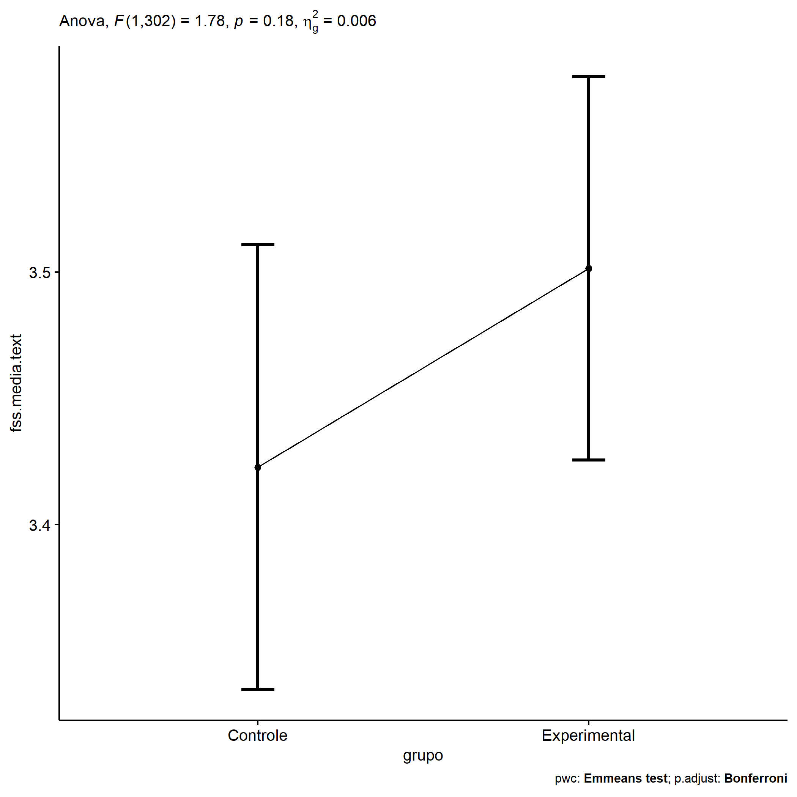<!-- -->

``` r
plots <- oneWayAncovaBoxPlots(
  wdat, "fss.media.text", "grupo", aov, pwc, covar = "dfs.media.text",
  theme = "classic", color = color[["grupo"]],
  subtitle = which(aov$Effect == "grupo"))
```

``` r
if (length(unique(wdat[["grupo"]])) > 1)
  plots[["grupo"]] + ggplot2::ylab("flow (prod. textual)") + ggplot2::scale_x_discrete(labels=c('pre', 'pos'))
```

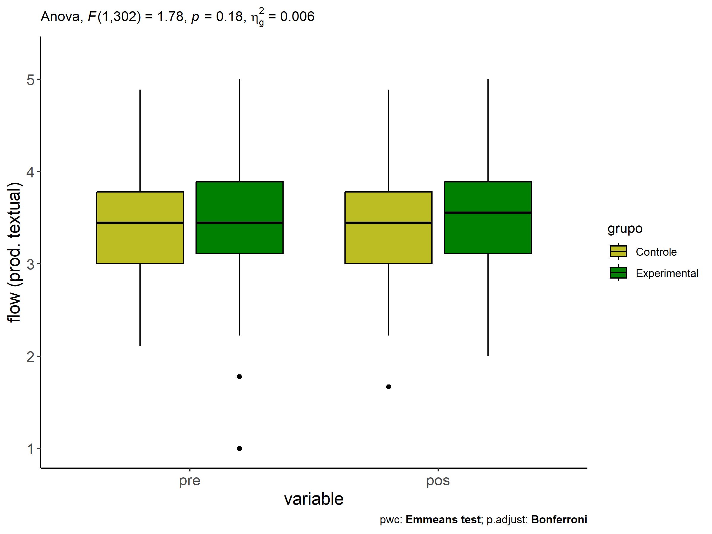<!-- -->

``` r
if (length(unique(wdat.long[["grupo"]])) > 1)
  plots <- oneWayAncovaBoxPlots(
    wdat.long, "flow.text", "grupo", aov, pwc.long, pre.post = "time",
    theme = "classic", color = color$prepost)
```

``` r
if (length(unique(wdat.long[["grupo"]])) > 1)
  plots[["grupo"]] + ggplot2::ylab("flow (prod. textual)")
```

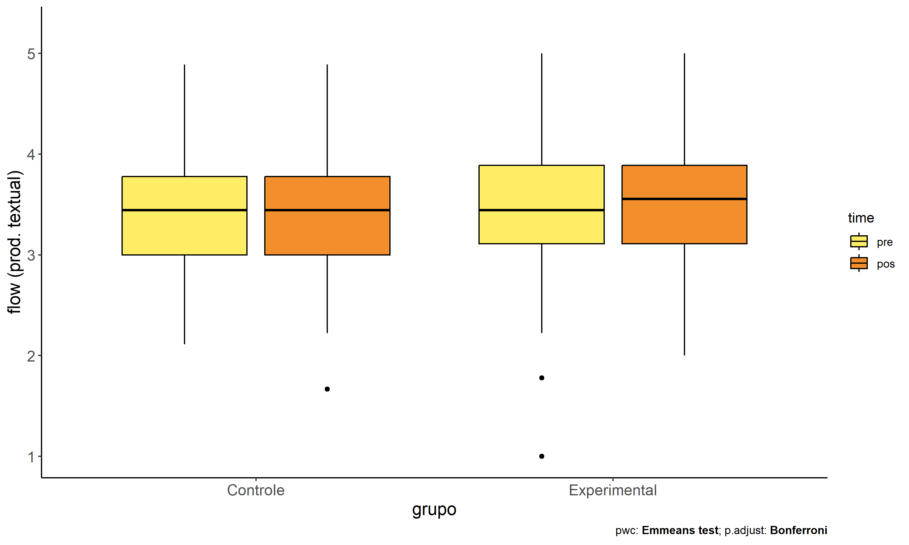<!-- -->

### Checking linearity assumption

``` r
ggscatter(wdat, x = "dfs.media.text", y = "fss.media.text", size = 0.5,
          color = "grupo", add = "reg.line")+
  stat_regline_equation(
    aes(label =  paste(..eq.label.., ..rr.label.., sep = "~~~~"), color = grupo)
  )
```

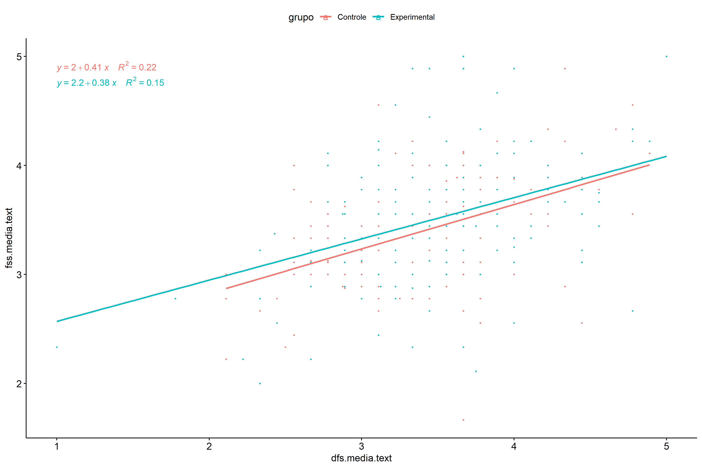<!-- -->

### Checking normality and homogeneity

``` r
res <- augment(lm(fss.media.text ~ dfs.media.text + grupo, data = wdat))
```

``` r
shapiro_test(res$.resid)
```

    ## # A tibble: 1 × 3
    ##   variable   statistic p.value
    ##   <chr>          <dbl>   <dbl>
    ## 1 res$.resid     0.991  0.0673

``` r
levene_test(res, .resid ~ grupo)
```

    ## # A tibble: 1 × 4
    ##     df1   df2 statistic     p
    ##   <int> <int>     <dbl> <dbl>
    ## 1     1   303      1.19 0.276

# ANCOVA and Pairwise for two factors **grupo:Sexo**

## Without remove non-normal data

``` r
pdat = remove_group_data(dat[!is.na(dat[["grupo"]]) & !is.na(dat[["Sexo"]]),], "fss.media.text", c("grupo","Sexo"))

pdat.long <- rbind(pdat[,c("id","grupo","Sexo")], pdat[,c("id","grupo","Sexo")])
pdat.long[["time"]] <- c(rep("pre", nrow(pdat)), rep("pos", nrow(pdat)))
pdat.long[["time"]] <- factor(pdat.long[["time"]], c("pre","pos"))
pdat.long[["flow.text"]] <- c(pdat[["dfs.media.text"]], pdat[["fss.media.text"]])

aov = anova_test(pdat, fss.media.text ~ dfs.media.text + grupo*Sexo)
laov[["grupo:Sexo"]] <- get_anova_table(aov)
```

``` r
pwcs <- list()
pwcs[["Sexo"]] <- emmeans_test(
  group_by(pdat, grupo), fss.media.text ~ Sexo,
  covariate = dfs.media.text, p.adjust.method = "bonferroni")
pwcs[["grupo"]] <- emmeans_test(
  group_by(pdat, Sexo), fss.media.text ~ grupo,
  covariate = dfs.media.text, p.adjust.method = "bonferroni")

pwc <- plyr::rbind.fill(pwcs[["grupo"]], pwcs[["Sexo"]])
pwc <- pwc[,c("grupo","Sexo", colnames(pwc)[!colnames(pwc) %in% c("grupo","Sexo")])]
```

``` r
pwc.long <- emmeans_test(dplyr::group_by_at(pdat.long, c("grupo","Sexo")),
                         flow.text ~ time,
                         p.adjust.method = "bonferroni")
lpwc[["grupo:Sexo"]] <- plyr::rbind.fill(pwc, pwc.long)
```

``` r
ds <- get.descriptives(pdat, "fss.media.text", c("grupo","Sexo"), covar = "dfs.media.text")
ds <- merge(ds[ds$variable != "dfs.media.text",],
            ds[ds$variable == "dfs.media.text", !colnames(ds) %in% c("variable")],
            by = c("grupo","Sexo"), all.x = T, suffixes = c("", ".dfs.media.text"))
ds <- merge(get_emmeans(pwcs[["grupo"]]), ds, by = c("grupo","Sexo"), suffixes = c(".emms", ""))
ds <- ds[,c("grupo","Sexo","n","mean.dfs.media.text","se.dfs.media.text","mean","se","emmean","se.emms")]

colnames(ds) <- c("grupo","Sexo", "N", paste0(c("M","SE")," (pre)"),
                  paste0(c("M","SE"), " (unadj)"), paste0(c("M", "SE"), " (adj)"))

lemms[["grupo:Sexo"]] <- ds
```

## Computing ANCOVA and PairWise After removing non-normal data (OK)

``` r
wdat = pdat 

res = residuals(lm(fss.media.text ~ dfs.media.text + grupo*Sexo, data = wdat))
non.normal = getNonNormal(res, wdat$id, plimit = 0.05)

wdat = wdat[!wdat$id %in% non.normal,]

wdat.long <- rbind(wdat[,c("id","grupo","Sexo")], wdat[,c("id","grupo","Sexo")])
wdat.long[["time"]] <- c(rep("pre", nrow(wdat)), rep("pos", nrow(wdat)))
wdat.long[["time"]] <- factor(wdat.long[["time"]], c("pre","pos"))
wdat.long[["flow.text"]] <- c(wdat[["dfs.media.text"]], wdat[["fss.media.text"]])


ldat[["grupo:Sexo"]] = wdat

(non.normal)
```

    ## NULL

``` r
aov = anova_test(wdat, fss.media.text ~ dfs.media.text + grupo*Sexo)
laov[["grupo:Sexo"]] <- merge(get_anova_table(aov), laov[["grupo:Sexo"]], by="Effect", suffixes = c("","'"))

(df = get_anova_table(aov))
```

    ## ANOVA Table (type II tests)
    ## 
    ##           Effect DFn DFd      F        p p<.05      ges
    ## 1 dfs.media.text   1 300 65.263 1.61e-14     * 1.79e-01
    ## 2          grupo   1 300  1.657 1.99e-01       5.00e-03
    ## 3           Sexo   1 300  0.267 6.05e-01       8.91e-04
    ## 4     grupo:Sexo   1 300  0.008 9.29e-01       2.67e-05

| Effect         | DFn | DFd |      F |     p | p\<.05 |   ges |
|:---------------|----:|----:|-------:|------:|:-------|------:|
| dfs.media.text |   1 | 300 | 65.263 | 0.000 | \*     | 0.179 |
| grupo          |   1 | 300 |  1.657 | 0.199 |        | 0.005 |
| Sexo           |   1 | 300 |  0.267 | 0.605 |        | 0.001 |
| grupo:Sexo     |   1 | 300 |  0.008 | 0.929 |        | 0.000 |

``` r
pwcs <- list()
pwcs[["Sexo"]] <- emmeans_test(
  group_by(wdat, grupo), fss.media.text ~ Sexo,
  covariate = dfs.media.text, p.adjust.method = "bonferroni")
pwcs[["grupo"]] <- emmeans_test(
  group_by(wdat, Sexo), fss.media.text ~ grupo,
  covariate = dfs.media.text, p.adjust.method = "bonferroni")

pwc <- plyr::rbind.fill(pwcs[["grupo"]], pwcs[["Sexo"]])
pwc <- pwc[,c("grupo","Sexo", colnames(pwc)[!colnames(pwc) %in% c("grupo","Sexo")])]
```

| grupo        | Sexo | term                  | .y.            | group1   | group2       |  df | statistic |     p | p.adj | p.adj.signif |
|:-------------|:-----|:----------------------|:---------------|:---------|:-------------|----:|----------:|------:|------:|:-------------|
|              | F    | dfs.media.text\*grupo | fss.media.text | Controle | Experimental | 300 |    -0.856 | 0.392 | 0.392 | ns           |
|              | M    | dfs.media.text\*grupo | fss.media.text | Controle | Experimental | 300 |    -0.967 | 0.334 | 0.334 | ns           |
| Controle     |      | dfs.media.text\*Sexo  | fss.media.text | F        | M            | 300 |    -0.271 | 0.787 | 0.787 | ns           |
| Experimental |      | dfs.media.text\*Sexo  | fss.media.text | F        | M            | 300 |    -0.451 | 0.652 | 0.652 | ns           |

``` r
pwc.long <- emmeans_test(dplyr::group_by_at(wdat.long, c("grupo","Sexo")),
                         flow.text ~ time,
                         p.adjust.method = "bonferroni")
lpwc[["grupo:Sexo"]] <- merge(plyr::rbind.fill(pwc, pwc.long), lpwc[["grupo:Sexo"]], by=c("grupo","Sexo","term",".y.","group1","group2"), suffixes = c("","'"))
```

| grupo        | Sexo | term | .y.       | group1 | group2 |  df | statistic |     p | p.adj | p.adj.signif |
|:-------------|:-----|:-----|:----------|:-------|:-------|----:|----------:|------:|------:|:-------------|
| Controle     | F    | time | flow.text | pre    | pos    | 602 |     0.627 | 0.531 | 0.531 | ns           |
| Controle     | M    | time | flow.text | pre    | pos    | 602 |    -0.345 | 0.730 | 0.730 | ns           |
| Experimental | F    | time | flow.text | pre    | pos    | 602 |     0.345 | 0.730 | 0.730 | ns           |
| Experimental | M    | time | flow.text | pre    | pos    | 602 |    -0.804 | 0.422 | 0.422 | ns           |

``` r
ds <- get.descriptives(wdat, "fss.media.text", c("grupo","Sexo"), covar = "dfs.media.text")
ds <- merge(ds[ds$variable != "dfs.media.text",],
            ds[ds$variable == "dfs.media.text", !colnames(ds) %in% c("variable")],
            by = c("grupo","Sexo"), all.x = T, suffixes = c("", ".dfs.media.text"))
ds <- merge(get_emmeans(pwcs[["grupo"]]), ds, by = c("grupo","Sexo"), suffixes = c(".emms", ""))
ds <- ds[,c("grupo","Sexo","n","mean.dfs.media.text","se.dfs.media.text","mean","se","emmean","se.emms")]

colnames(ds) <- c("grupo","Sexo", "N", paste0(c("M","SE")," (pre)"),
                  paste0(c("M","SE"), " (unadj)"), paste0(c("M", "SE"), " (adj)"))

lemms[["grupo:Sexo"]] <- merge(ds, lemms[["grupo:Sexo"]], by=c("grupo","Sexo"), suffixes = c("","'"))
```

| grupo        | Sexo |   N | M (pre) | SE (pre) | M (unadj) | SE (unadj) | M (adj) | SE (adj) |
|:-------------|:-----|----:|--------:|---------:|----------:|-----------:|--------:|---------:|
| Controle     | F    |  70 |   3.481 |    0.066 |     3.419 |      0.062 |   3.412 |    0.061 |
| Controle     | M    |  60 |   3.358 |    0.087 |     3.395 |      0.071 |   3.436 |    0.066 |
| Experimental | F    |  82 |   3.548 |    0.058 |     3.517 |      0.065 |   3.483 |    0.057 |
| Experimental | M    |  93 |   3.440 |    0.069 |     3.509 |      0.060 |   3.518 |    0.053 |

### Plots for ancova

``` r
plots <- twoWayAncovaPlots(
  wdat, "fss.media.text", c("grupo","Sexo"), aov, pwcs, addParam = c("mean_se"),
  font.label.size=10, step.increase=0.05, p.label="p.adj",
  subtitle = which(aov$Effect == "grupo:Sexo"))
```

``` r
if (!is.null(plots[["grupo"]]))
  plots[["grupo"]] + ggplot2::scale_color_manual(values = color[["Sexo"]])
```

    ## Scale for colour is already present.
    ## Adding another scale for colour, which will replace the existing scale.

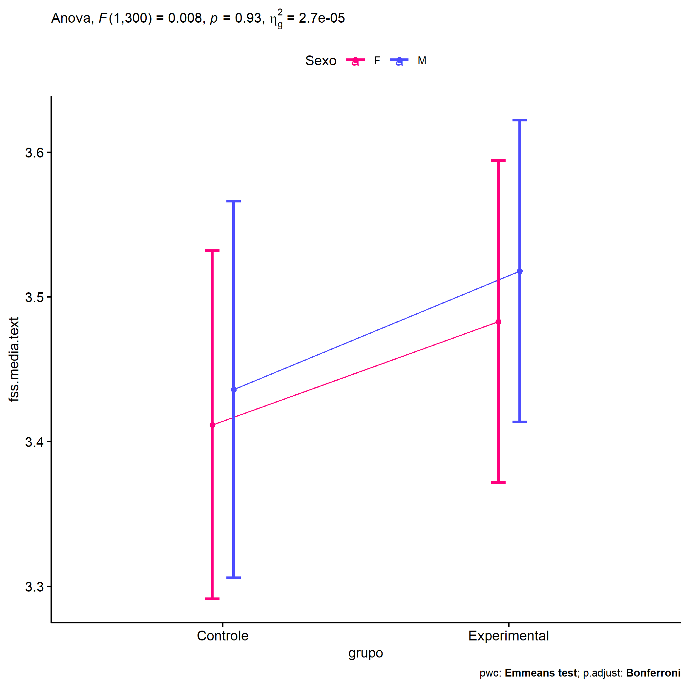<!-- -->

``` r
if (!is.null(plots[["Sexo"]]))
  plots[["Sexo"]] + ggplot2::scale_color_manual(values = color[["grupo"]])
```

    ## Scale for colour is already present.
    ## Adding another scale for colour, which will replace the existing scale.

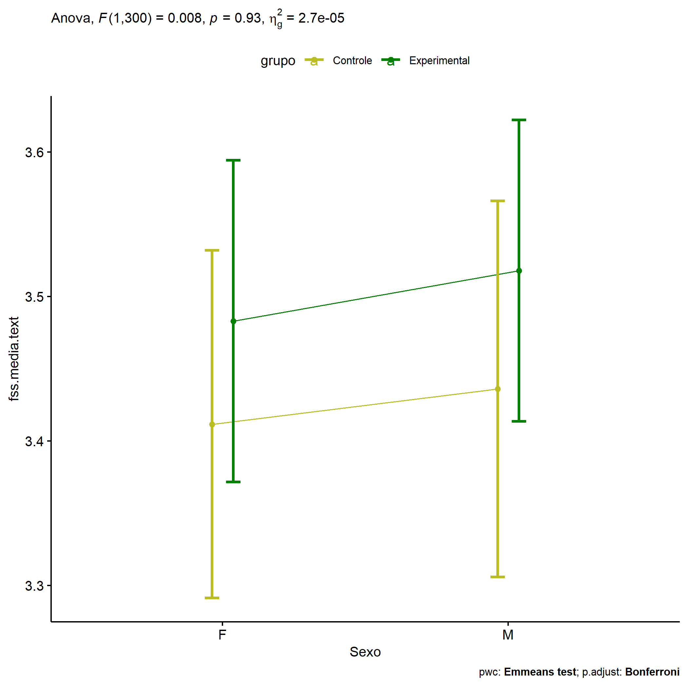<!-- -->

``` r
plots <- twoWayAncovaBoxPlots(
  wdat, "fss.media.text", c("grupo","Sexo"), aov, pwcs, covar = "dfs.media.text",
  theme = "classic", color = color[["grupo:Sexo"]],
  subtitle = which(aov$Effect == "grupo:Sexo"))
```

``` r
plots[["grupo:Sexo"]] + ggplot2::ylab("flow (prod. textual)") + ggplot2::scale_x_discrete(labels=c('pre', 'pos'))
```

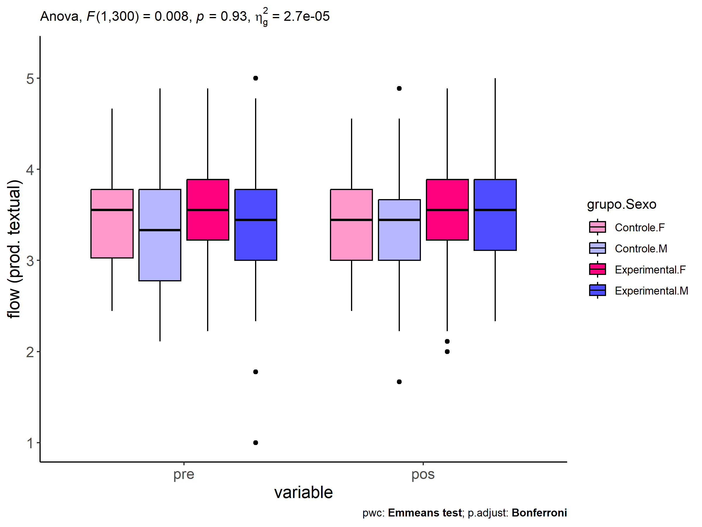<!-- -->

``` r
plots <- twoWayAncovaBoxPlots(
  wdat.long, "flow.text", c("grupo","Sexo"), aov, pwc.long, pre.post = "time",
  theme = "classic", color = color$prepost)
```

``` r
plots[["grupo:Sexo"]] + ggplot2::ylab("flow (prod. textual)")
```

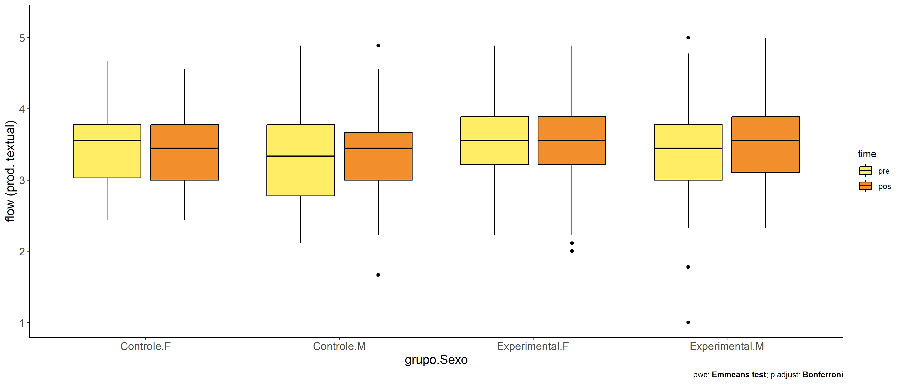<!-- -->

### Checking linearity assumption

``` r
ggscatter(wdat, x = "dfs.media.text", y = "fss.media.text", size = 0.5,
          facet.by = c("grupo","Sexo"), add = "reg.line")+
  stat_regline_equation(
    aes(label =  paste(..eq.label.., ..rr.label.., sep = "~~~~"))
  )
```

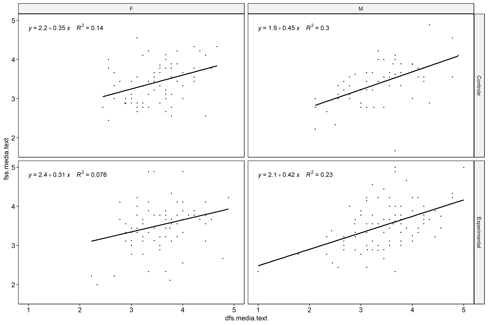<!-- -->

### Checking normality and homogeneity

``` r
res <- augment(lm(fss.media.text ~ dfs.media.text + grupo*Sexo, data = wdat))
```

``` r
shapiro_test(res$.resid)
```

    ## # A tibble: 1 × 3
    ##   variable   statistic p.value
    ##   <chr>          <dbl>   <dbl>
    ## 1 res$.resid     0.992  0.0896

``` r
levene_test(res, .resid ~ grupo*Sexo)
```

    ## # A tibble: 1 × 4
    ##     df1   df2 statistic     p
    ##   <int> <int>     <dbl> <dbl>
    ## 1     3   301     0.983 0.401

# ANCOVA and Pairwise for two factors **grupo:Zona**

## Without remove non-normal data

``` r
pdat = remove_group_data(dat[!is.na(dat[["grupo"]]) & !is.na(dat[["Zona"]]),], "fss.media.text", c("grupo","Zona"))

pdat.long <- rbind(pdat[,c("id","grupo","Zona")], pdat[,c("id","grupo","Zona")])
pdat.long[["time"]] <- c(rep("pre", nrow(pdat)), rep("pos", nrow(pdat)))
pdat.long[["time"]] <- factor(pdat.long[["time"]], c("pre","pos"))
pdat.long[["flow.text"]] <- c(pdat[["dfs.media.text"]], pdat[["fss.media.text"]])

aov = anova_test(pdat, fss.media.text ~ dfs.media.text + grupo*Zona)
laov[["grupo:Zona"]] <- get_anova_table(aov)
```

``` r
pwcs <- list()
pwcs[["Zona"]] <- emmeans_test(
  group_by(pdat, grupo), fss.media.text ~ Zona,
  covariate = dfs.media.text, p.adjust.method = "bonferroni")
pwcs[["grupo"]] <- emmeans_test(
  group_by(pdat, Zona), fss.media.text ~ grupo,
  covariate = dfs.media.text, p.adjust.method = "bonferroni")

pwc <- plyr::rbind.fill(pwcs[["grupo"]], pwcs[["Zona"]])
pwc <- pwc[,c("grupo","Zona", colnames(pwc)[!colnames(pwc) %in% c("grupo","Zona")])]
```

``` r
pwc.long <- emmeans_test(dplyr::group_by_at(pdat.long, c("grupo","Zona")),
                         flow.text ~ time,
                         p.adjust.method = "bonferroni")
lpwc[["grupo:Zona"]] <- plyr::rbind.fill(pwc, pwc.long)
```

``` r
ds <- get.descriptives(pdat, "fss.media.text", c("grupo","Zona"), covar = "dfs.media.text")
ds <- merge(ds[ds$variable != "dfs.media.text",],
            ds[ds$variable == "dfs.media.text", !colnames(ds) %in% c("variable")],
            by = c("grupo","Zona"), all.x = T, suffixes = c("", ".dfs.media.text"))
ds <- merge(get_emmeans(pwcs[["grupo"]]), ds, by = c("grupo","Zona"), suffixes = c(".emms", ""))
ds <- ds[,c("grupo","Zona","n","mean.dfs.media.text","se.dfs.media.text","mean","se","emmean","se.emms")]

colnames(ds) <- c("grupo","Zona", "N", paste0(c("M","SE")," (pre)"),
                  paste0(c("M","SE"), " (unadj)"), paste0(c("M", "SE"), " (adj)"))

lemms[["grupo:Zona"]] <- ds
```

## Computing ANCOVA and PairWise After removing non-normal data (OK)

``` r
wdat = pdat 

res = residuals(lm(fss.media.text ~ dfs.media.text + grupo*Zona, data = wdat))
non.normal = getNonNormal(res, wdat$id, plimit = 0.05)

wdat = wdat[!wdat$id %in% non.normal,]

wdat.long <- rbind(wdat[,c("id","grupo","Zona")], wdat[,c("id","grupo","Zona")])
wdat.long[["time"]] <- c(rep("pre", nrow(wdat)), rep("pos", nrow(wdat)))
wdat.long[["time"]] <- factor(wdat.long[["time"]], c("pre","pos"))
wdat.long[["flow.text"]] <- c(wdat[["dfs.media.text"]], wdat[["fss.media.text"]])


ldat[["grupo:Zona"]] = wdat

(non.normal)
```

    ## NULL

``` r
aov = anova_test(wdat, fss.media.text ~ dfs.media.text + grupo*Zona)
laov[["grupo:Zona"]] <- merge(get_anova_table(aov), laov[["grupo:Zona"]], by="Effect", suffixes = c("","'"))

(df = get_anova_table(aov))
```

    ## ANOVA Table (type II tests)
    ## 
    ##           Effect DFn DFd         F        p p<.05      ges
    ## 1 dfs.media.text   1 255 72.057000 1.74e-15     * 2.20e-01
    ## 2          grupo   1 255  1.300000 2.55e-01       5.00e-03
    ## 3           Zona   1 255  1.551000 2.14e-01       6.00e-03
    ## 4     grupo:Zona   1 255  0.000508 9.82e-01       1.99e-06

| Effect         | DFn | DFd |      F |     p | p\<.05 |   ges |
|:---------------|----:|----:|-------:|------:|:-------|------:|
| dfs.media.text |   1 | 255 | 72.057 | 0.000 | \*     | 0.220 |
| grupo          |   1 | 255 |  1.300 | 0.255 |        | 0.005 |
| Zona           |   1 | 255 |  1.551 | 0.214 |        | 0.006 |
| grupo:Zona     |   1 | 255 |  0.001 | 0.982 |        | 0.000 |

``` r
pwcs <- list()
pwcs[["Zona"]] <- emmeans_test(
  group_by(wdat, grupo), fss.media.text ~ Zona,
  covariate = dfs.media.text, p.adjust.method = "bonferroni")
pwcs[["grupo"]] <- emmeans_test(
  group_by(wdat, Zona), fss.media.text ~ grupo,
  covariate = dfs.media.text, p.adjust.method = "bonferroni")

pwc <- plyr::rbind.fill(pwcs[["grupo"]], pwcs[["Zona"]])
pwc <- pwc[,c("grupo","Zona", colnames(pwc)[!colnames(pwc) %in% c("grupo","Zona")])]
```

| grupo        | Zona   | term                  | .y.            | group1   | group2       |  df | statistic |     p | p.adj | p.adj.signif |
|:-------------|:-------|:----------------------|:---------------|:---------|:-------------|----:|----------:|------:|------:|:-------------|
|              | Rural  | dfs.media.text\*grupo | fss.media.text | Controle | Experimental | 255 |    -0.810 | 0.419 | 0.419 | ns           |
|              | Urbana | dfs.media.text\*grupo | fss.media.text | Controle | Experimental | 255 |    -0.805 | 0.422 | 0.422 | ns           |
| Controle     |        | dfs.media.text\*Zona  | fss.media.text | Rural    | Urbana       | 255 |    -0.831 | 0.407 | 0.407 | ns           |
| Experimental |        | dfs.media.text\*Zona  | fss.media.text | Rural    | Urbana       | 255 |    -0.930 | 0.353 | 0.353 | ns           |

``` r
pwc.long <- emmeans_test(dplyr::group_by_at(wdat.long, c("grupo","Zona")),
                         flow.text ~ time,
                         p.adjust.method = "bonferroni")
lpwc[["grupo:Zona"]] <- merge(plyr::rbind.fill(pwc, pwc.long), lpwc[["grupo:Zona"]], by=c("grupo","Zona","term",".y.","group1","group2"), suffixes = c("","'"))
```

| grupo        | Zona   | term | .y.       | group1 | group2 |  df | statistic |     p | p.adj | p.adj.signif |
|:-------------|:-------|:-----|:----------|:-------|:-------|----:|----------:|------:|------:|:-------------|
| Controle     | Rural  | time | flow.text | pre    | pos    | 512 |     0.658 | 0.511 | 0.511 | ns           |
| Controle     | Urbana | time | flow.text | pre    | pos    | 512 |    -0.649 | 0.517 | 0.517 | ns           |
| Experimental | Rural  | time | flow.text | pre    | pos    | 512 |     0.311 | 0.756 | 0.756 | ns           |
| Experimental | Urbana | time | flow.text | pre    | pos    | 512 |    -0.859 | 0.391 | 0.391 | ns           |

``` r
ds <- get.descriptives(wdat, "fss.media.text", c("grupo","Zona"), covar = "dfs.media.text")
ds <- merge(ds[ds$variable != "dfs.media.text",],
            ds[ds$variable == "dfs.media.text", !colnames(ds) %in% c("variable")],
            by = c("grupo","Zona"), all.x = T, suffixes = c("", ".dfs.media.text"))
ds <- merge(get_emmeans(pwcs[["grupo"]]), ds, by = c("grupo","Zona"), suffixes = c(".emms", ""))
ds <- ds[,c("grupo","Zona","n","mean.dfs.media.text","se.dfs.media.text","mean","se","emmean","se.emms")]

colnames(ds) <- c("grupo","Zona", "N", paste0(c("M","SE")," (pre)"),
                  paste0(c("M","SE"), " (unadj)"), paste0(c("M", "SE"), " (adj)"))

lemms[["grupo:Zona"]] <- merge(ds, lemms[["grupo:Zona"]], by=c("grupo","Zona"), suffixes = c("","'"))
```

| grupo        | Zona   |   N | M (pre) | SE (pre) | M (unadj) | SE (unadj) | M (adj) | SE (adj) |
|:-------------|:-------|----:|--------:|---------:|----------:|-----------:|--------:|---------:|
| Controle     | Rural  |  53 |   3.481 |    0.077 |     3.407 |      0.065 |   3.400 |    0.066 |
| Controle     | Urbana |  58 |   3.365 |    0.084 |     3.435 |      0.069 |   3.476 |    0.063 |
| Experimental | Rural  |  73 |   3.527 |    0.072 |     3.497 |      0.063 |   3.470 |    0.057 |
| Experimental | Urbana |  76 |   3.464 |    0.069 |     3.544 |      0.070 |   3.544 |    0.055 |

### Plots for ancova

``` r
plots <- twoWayAncovaPlots(
  wdat, "fss.media.text", c("grupo","Zona"), aov, pwcs, addParam = c("mean_se"),
  font.label.size=10, step.increase=0.05, p.label="p.adj",
  subtitle = which(aov$Effect == "grupo:Zona"))
```

``` r
if (!is.null(plots[["grupo"]]))
  plots[["grupo"]] + ggplot2::scale_color_manual(values = color[["Zona"]])
```

    ## Scale for colour is already present.
    ## Adding another scale for colour, which will replace the existing scale.

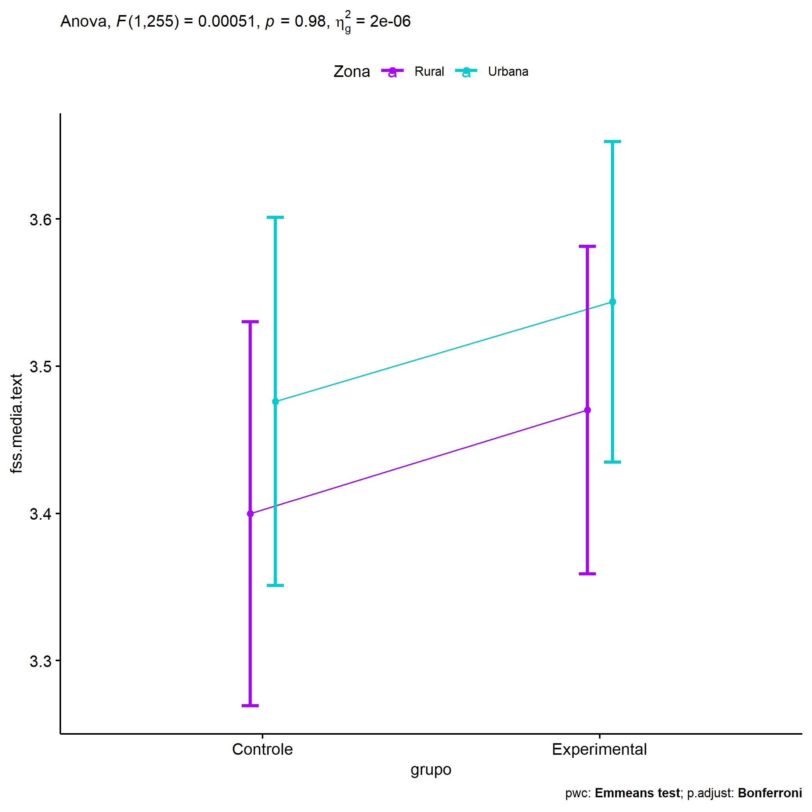<!-- -->

``` r
if (!is.null(plots[["Zona"]]))
  plots[["Zona"]] + ggplot2::scale_color_manual(values = color[["grupo"]])
```

    ## Scale for colour is already present.
    ## Adding another scale for colour, which will replace the existing scale.

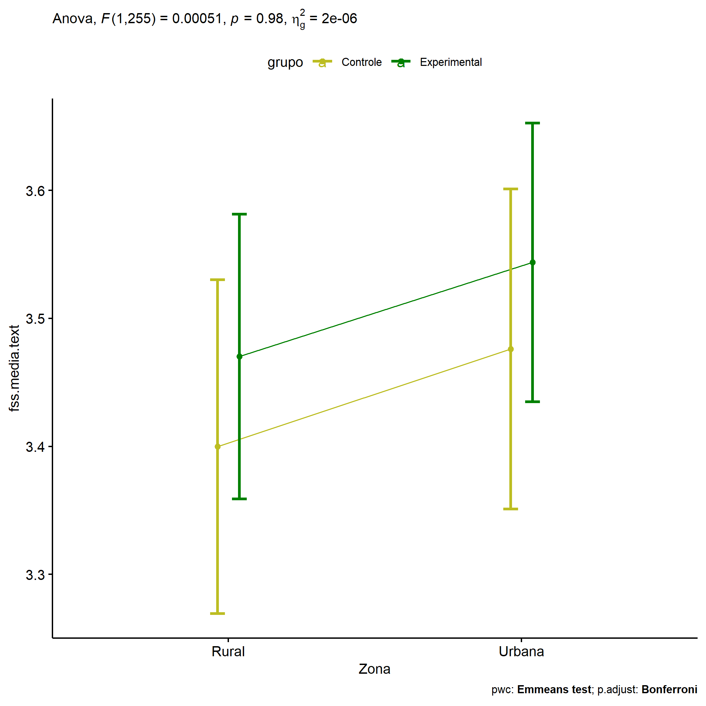<!-- -->

``` r
plots <- twoWayAncovaBoxPlots(
  wdat, "fss.media.text", c("grupo","Zona"), aov, pwcs, covar = "dfs.media.text",
  theme = "classic", color = color[["grupo:Zona"]],
  subtitle = which(aov$Effect == "grupo:Zona"))
```

``` r
plots[["grupo:Zona"]] + ggplot2::ylab("flow (prod. textual)") + ggplot2::scale_x_discrete(labels=c('pre', 'pos'))
```

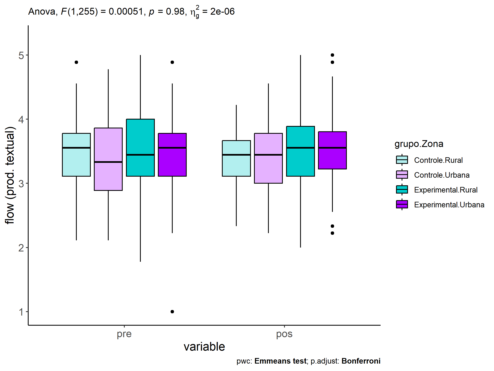<!-- -->

``` r
plots <- twoWayAncovaBoxPlots(
  wdat.long, "flow.text", c("grupo","Zona"), aov, pwc.long, pre.post = "time",
  theme = "classic", color = color$prepost)
```

``` r
plots[["grupo:Zona"]] + ggplot2::ylab("flow (prod. textual)")
```

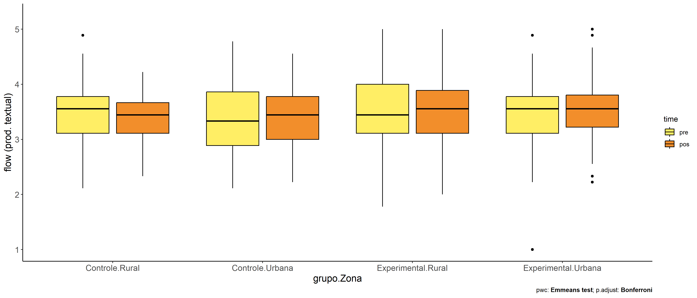<!-- -->

### Checking linearity assumption

``` r
ggscatter(wdat, x = "dfs.media.text", y = "fss.media.text", size = 0.5,
          facet.by = c("grupo","Zona"), add = "reg.line")+
  stat_regline_equation(
    aes(label =  paste(..eq.label.., ..rr.label.., sep = "~~~~"))
  )
```

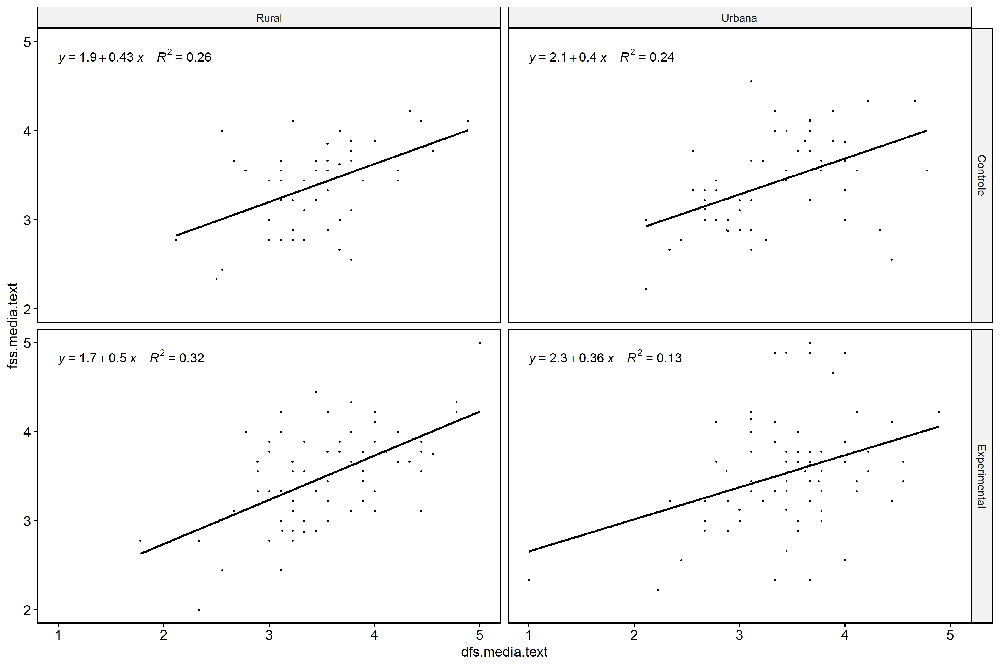<!-- -->

### Checking normality and homogeneity

``` r
res <- augment(lm(fss.media.text ~ dfs.media.text + grupo*Zona, data = wdat))
```

``` r
shapiro_test(res$.resid)
```

    ## # A tibble: 1 × 3
    ##   variable   statistic p.value
    ##   <chr>          <dbl>   <dbl>
    ## 1 res$.resid     0.993   0.225

``` r
levene_test(res, .resid ~ grupo*Zona)
```

    ## # A tibble: 1 × 4
    ##     df1   df2 statistic     p
    ##   <int> <int>     <dbl> <dbl>
    ## 1     3   256     0.993 0.397

# ANCOVA and Pairwise for two factors **grupo:Cor.Raca**

## Without remove non-normal data

``` r
pdat = remove_group_data(dat[!is.na(dat[["grupo"]]) & !is.na(dat[["Cor.Raca"]]),], "fss.media.text", c("grupo","Cor.Raca"))

pdat.long <- rbind(pdat[,c("id","grupo","Cor.Raca")], pdat[,c("id","grupo","Cor.Raca")])
pdat.long[["time"]] <- c(rep("pre", nrow(pdat)), rep("pos", nrow(pdat)))
pdat.long[["time"]] <- factor(pdat.long[["time"]], c("pre","pos"))
pdat.long[["flow.text"]] <- c(pdat[["dfs.media.text"]], pdat[["fss.media.text"]])

aov = anova_test(pdat, fss.media.text ~ dfs.media.text + grupo*Cor.Raca)
laov[["grupo:Cor.Raca"]] <- get_anova_table(aov)
```

``` r
pwcs <- list()
pwcs[["Cor.Raca"]] <- emmeans_test(
  group_by(pdat, grupo), fss.media.text ~ Cor.Raca,
  covariate = dfs.media.text, p.adjust.method = "bonferroni")
pwcs[["grupo"]] <- emmeans_test(
  group_by(pdat, Cor.Raca), fss.media.text ~ grupo,
  covariate = dfs.media.text, p.adjust.method = "bonferroni")

pwc <- plyr::rbind.fill(pwcs[["grupo"]], pwcs[["Cor.Raca"]])
pwc <- pwc[,c("grupo","Cor.Raca", colnames(pwc)[!colnames(pwc) %in% c("grupo","Cor.Raca")])]
```

``` r
pwc.long <- emmeans_test(dplyr::group_by_at(pdat.long, c("grupo","Cor.Raca")),
                         flow.text ~ time,
                         p.adjust.method = "bonferroni")
lpwc[["grupo:Cor.Raca"]] <- plyr::rbind.fill(pwc, pwc.long)
```

``` r
ds <- get.descriptives(pdat, "fss.media.text", c("grupo","Cor.Raca"), covar = "dfs.media.text")
ds <- merge(ds[ds$variable != "dfs.media.text",],
            ds[ds$variable == "dfs.media.text", !colnames(ds) %in% c("variable")],
            by = c("grupo","Cor.Raca"), all.x = T, suffixes = c("", ".dfs.media.text"))
ds <- merge(get_emmeans(pwcs[["grupo"]]), ds, by = c("grupo","Cor.Raca"), suffixes = c(".emms", ""))
ds <- ds[,c("grupo","Cor.Raca","n","mean.dfs.media.text","se.dfs.media.text","mean","se","emmean","se.emms")]

colnames(ds) <- c("grupo","Cor.Raca", "N", paste0(c("M","SE")," (pre)"),
                  paste0(c("M","SE"), " (unadj)"), paste0(c("M", "SE"), " (adj)"))

lemms[["grupo:Cor.Raca"]] <- ds
```

## Computing ANCOVA and PairWise After removing non-normal data (OK)

``` r
wdat = pdat 

res = residuals(lm(fss.media.text ~ dfs.media.text + grupo*Cor.Raca, data = wdat))
non.normal = getNonNormal(res, wdat$id, plimit = 0.05)

wdat = wdat[!wdat$id %in% non.normal,]

wdat.long <- rbind(wdat[,c("id","grupo","Cor.Raca")], wdat[,c("id","grupo","Cor.Raca")])
wdat.long[["time"]] <- c(rep("pre", nrow(wdat)), rep("pos", nrow(wdat)))
wdat.long[["time"]] <- factor(wdat.long[["time"]], c("pre","pos"))
wdat.long[["flow.text"]] <- c(wdat[["dfs.media.text"]], wdat[["fss.media.text"]])


ldat[["grupo:Cor.Raca"]] = wdat

(non.normal)
```

    ## NULL

``` r
aov = anova_test(wdat, fss.media.text ~ dfs.media.text + grupo*Cor.Raca)
laov[["grupo:Cor.Raca"]] <- merge(get_anova_table(aov), laov[["grupo:Cor.Raca"]], by="Effect", suffixes = c("","'"))

(df = get_anova_table(aov))
```

    ## ANOVA Table (type II tests)
    ## 
    ##           Effect DFn DFd      F        p p<.05   ges
    ## 1 dfs.media.text   1 107 63.390 1.92e-12     * 0.372
    ## 2          grupo   1 107  0.491 4.85e-01       0.005
    ## 3       Cor.Raca   1 107  0.520 4.73e-01       0.005
    ## 4 grupo:Cor.Raca   1 107  5.465 2.10e-02     * 0.049

| Effect         | DFn | DFd |      F |     p | p\<.05 |   ges |
|:---------------|----:|----:|-------:|------:|:-------|------:|
| dfs.media.text |   1 | 107 | 63.390 | 0.000 | \*     | 0.372 |
| grupo          |   1 | 107 |  0.491 | 0.485 |        | 0.005 |
| Cor.Raca       |   1 | 107 |  0.520 | 0.473 |        | 0.005 |
| grupo:Cor.Raca |   1 | 107 |  5.465 | 0.021 | \*     | 0.049 |

``` r
pwcs <- list()
pwcs[["Cor.Raca"]] <- emmeans_test(
  group_by(wdat, grupo), fss.media.text ~ Cor.Raca,
  covariate = dfs.media.text, p.adjust.method = "bonferroni")
pwcs[["grupo"]] <- emmeans_test(
  group_by(wdat, Cor.Raca), fss.media.text ~ grupo,
  covariate = dfs.media.text, p.adjust.method = "bonferroni")

pwc <- plyr::rbind.fill(pwcs[["grupo"]], pwcs[["Cor.Raca"]])
pwc <- pwc[,c("grupo","Cor.Raca", colnames(pwc)[!colnames(pwc) %in% c("grupo","Cor.Raca")])]
```

| grupo        | Cor.Raca | term                     | .y.            | group1   | group2       |  df | statistic |     p | p.adj | p.adj.signif |
|:-------------|:---------|:-------------------------|:---------------|:---------|:-------------|----:|----------:|------:|------:|:-------------|
|              | Branca   | dfs.media.text\*grupo    | fss.media.text | Controle | Experimental | 107 |    -2.382 | 0.019 | 0.019 | \*           |
|              | Parda    | dfs.media.text\*grupo    | fss.media.text | Controle | Experimental | 107 |     0.560 | 0.576 | 0.576 | ns           |
| Controle     |          | dfs.media.text\*Cor.Raca | fss.media.text | Branca   | Parda        | 107 |    -0.999 | 0.320 | 0.320 | ns           |
| Experimental |          | dfs.media.text\*Cor.Raca | fss.media.text | Branca   | Parda        | 107 |     2.244 | 0.027 | 0.027 | \*           |

``` r
pwc.long <- emmeans_test(dplyr::group_by_at(wdat.long, c("grupo","Cor.Raca")),
                         flow.text ~ time,
                         p.adjust.method = "bonferroni")
lpwc[["grupo:Cor.Raca"]] <- merge(plyr::rbind.fill(pwc, pwc.long), lpwc[["grupo:Cor.Raca"]], by=c("grupo","Cor.Raca","term",".y.","group1","group2"), suffixes = c("","'"))
```

| grupo        | Cor.Raca | term | .y.       | group1 | group2 |  df | statistic |     p | p.adj | p.adj.signif |
|:-------------|:---------|:-----|:----------|:-------|:-------|----:|----------:|------:|------:|:-------------|
| Controle     | Branca   | time | flow.text | pre    | pos    | 216 |     0.973 | 0.332 | 0.332 | ns           |
| Controle     | Parda    | time | flow.text | pre    | pos    | 216 |    -0.315 | 0.753 | 0.753 | ns           |
| Experimental | Branca   | time | flow.text | pre    | pos    | 216 |    -1.375 | 0.171 | 0.171 | ns           |
| Experimental | Parda    | time | flow.text | pre    | pos    | 216 |     0.697 | 0.487 | 0.487 | ns           |

``` r
ds <- get.descriptives(wdat, "fss.media.text", c("grupo","Cor.Raca"), covar = "dfs.media.text")
ds <- merge(ds[ds$variable != "dfs.media.text",],
            ds[ds$variable == "dfs.media.text", !colnames(ds) %in% c("variable")],
            by = c("grupo","Cor.Raca"), all.x = T, suffixes = c("", ".dfs.media.text"))
ds <- merge(get_emmeans(pwcs[["grupo"]]), ds, by = c("grupo","Cor.Raca"), suffixes = c(".emms", ""))
ds <- ds[,c("grupo","Cor.Raca","n","mean.dfs.media.text","se.dfs.media.text","mean","se","emmean","se.emms")]

colnames(ds) <- c("grupo","Cor.Raca", "N", paste0(c("M","SE")," (pre)"),
                  paste0(c("M","SE"), " (unadj)"), paste0(c("M", "SE"), " (adj)"))

lemms[["grupo:Cor.Raca"]] <- merge(ds, lemms[["grupo:Cor.Raca"]], by=c("grupo","Cor.Raca"), suffixes = c("","'"))
```

| grupo        | Cor.Raca |   N | M (pre) | SE (pre) | M (unadj) | SE (unadj) | M (adj) | SE (adj) |
|:-------------|:---------|----:|--------:|---------:|----------:|-----------:|--------:|---------:|
| Controle     | Branca   |  17 |   3.582 |    0.176 |     3.379 |      0.103 |   3.309 |    0.103 |
| Controle     | Parda    |  39 |   3.346 |    0.094 |     3.389 |      0.087 |   3.433 |    0.068 |
| Experimental | Branca   |  11 |   3.263 |    0.265 |     3.619 |      0.197 |   3.702 |    0.128 |
| Experimental | Parda    |  45 |   3.501 |    0.100 |     3.412 |      0.078 |   3.381 |    0.063 |

### Plots for ancova

``` r
plots <- twoWayAncovaPlots(
  wdat, "fss.media.text", c("grupo","Cor.Raca"), aov, pwcs, addParam = c("mean_se"),
  font.label.size=10, step.increase=0.05, p.label="p.adj",
  subtitle = which(aov$Effect == "grupo:Cor.Raca"))
```

``` r
if (!is.null(plots[["grupo"]]))
  plots[["grupo"]] + ggplot2::scale_color_manual(values = color[["Cor.Raca"]])
```

    ## Scale for colour is already present.
    ## Adding another scale for colour, which will replace the existing scale.

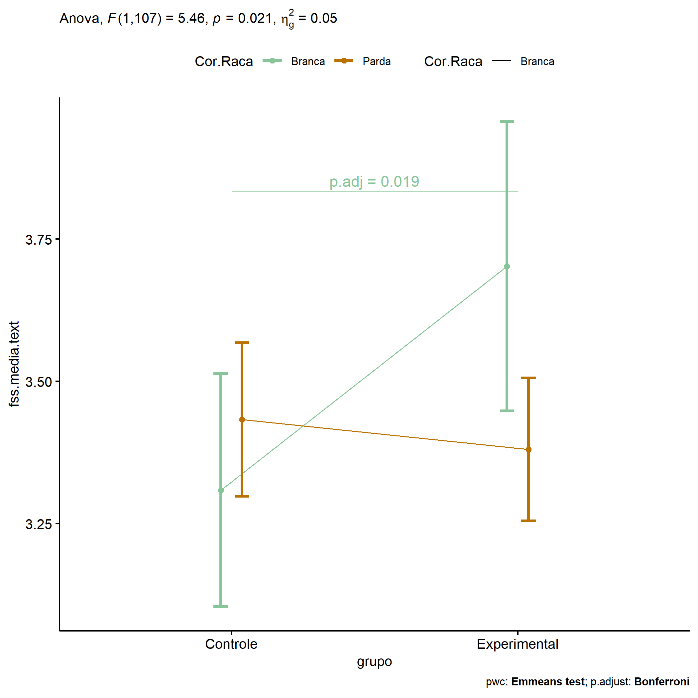<!-- -->

``` r
if (!is.null(plots[["Cor.Raca"]]))
  plots[["Cor.Raca"]] + ggplot2::scale_color_manual(values = color[["grupo"]])
```

    ## Scale for colour is already present.
    ## Adding another scale for colour, which will replace the existing scale.

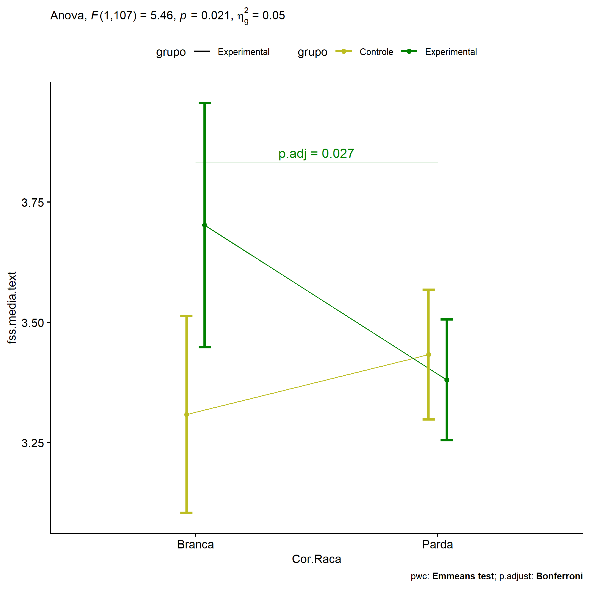<!-- -->

``` r
plots <- twoWayAncovaBoxPlots(
  wdat, "fss.media.text", c("grupo","Cor.Raca"), aov, pwcs, covar = "dfs.media.text",
  theme = "classic", color = color[["grupo:Cor.Raca"]],
  subtitle = which(aov$Effect == "grupo:Cor.Raca"))
```

``` r
plots[["grupo:Cor.Raca"]] + ggplot2::ylab("flow (prod. textual)") + ggplot2::scale_x_discrete(labels=c('pre', 'pos'))
```

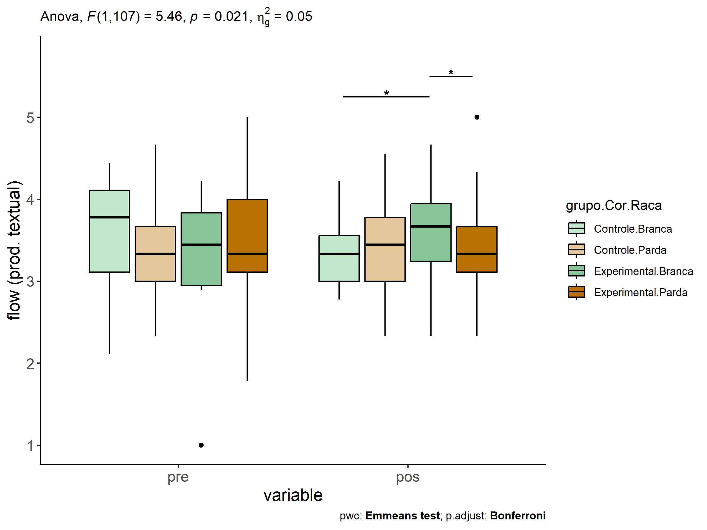<!-- -->

``` r
plots <- twoWayAncovaBoxPlots(
  wdat.long, "flow.text", c("grupo","Cor.Raca"), aov, pwc.long, pre.post = "time",
  theme = "classic", color = color$prepost)
```

``` r
plots[["grupo:Cor.Raca"]] + ggplot2::ylab("flow (prod. textual)")
```

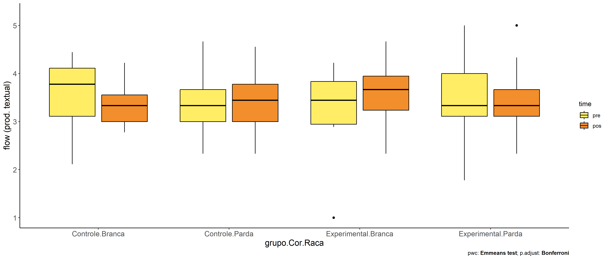<!-- -->

### Checking linearity assumption

``` r
ggscatter(wdat, x = "dfs.media.text", y = "fss.media.text", size = 0.5,
          facet.by = c("grupo","Cor.Raca"), add = "reg.line")+
  stat_regline_equation(
    aes(label =  paste(..eq.label.., ..rr.label.., sep = "~~~~"))
  )
```

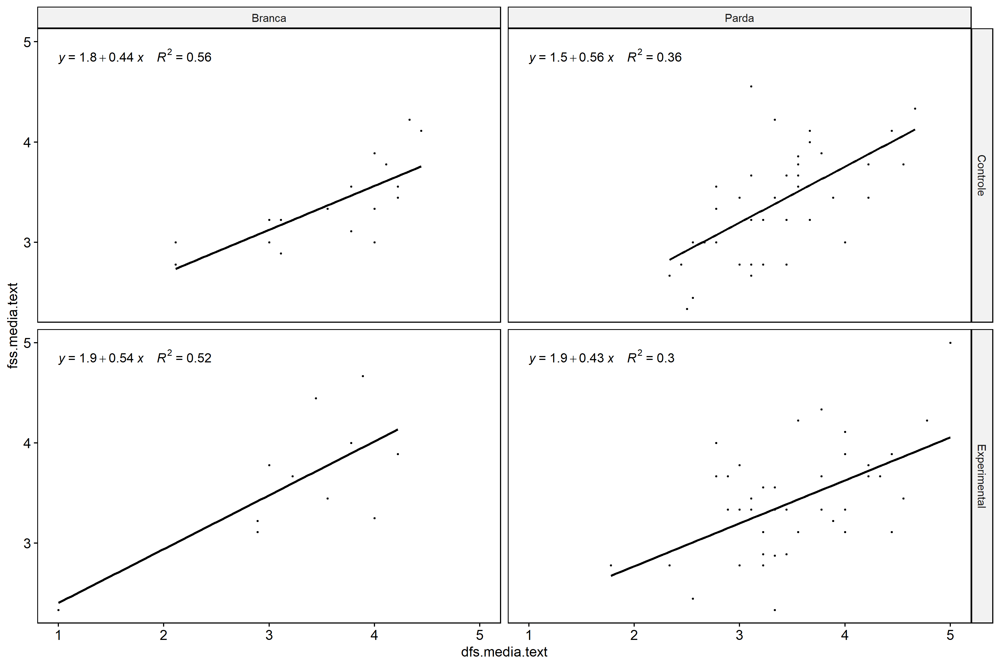<!-- -->

### Checking normality and homogeneity

``` r
res <- augment(lm(fss.media.text ~ dfs.media.text + grupo*Cor.Raca, data = wdat))
```

``` r
shapiro_test(res$.resid)
```

    ## # A tibble: 1 × 3
    ##   variable   statistic p.value
    ##   <chr>          <dbl>   <dbl>
    ## 1 res$.resid     0.990   0.600

``` r
levene_test(res, .resid ~ grupo*Cor.Raca)
```

    ## # A tibble: 1 × 4
    ##     df1   df2 statistic     p
    ##   <int> <int>     <dbl> <dbl>
    ## 1     3   108      1.09 0.356

# Summary of Results

## Descriptive Statistics

``` r
df <- get.descriptives(ldat[["grupo"]], c(dv.pre, dv.pos), c("grupo"), 
                       include.global = T, symmetry.test = T, normality.test = F)
df <- plyr::rbind.fill(
  df, do.call(plyr::rbind.fill, lapply(lfatores2, FUN = function(f) {
    if (nrow(dat) > 0 && sum(!is.na(unique(dat[[f]]))) > 1)
      get.descriptives(ldat[[paste0("grupo:",f)]], c(dv.pre,dv.pos), c("grupo", f),
                       symmetry.test = T, normality.test = F)
    }))
)
(df <- df[,c(fatores1[fatores1 %in% colnames(df)],"variable",
             colnames(df)[!colnames(df) %in% c(fatores1,"variable")])])
```

    ##           grupo Sexo   Zona Cor.Raca       variable   n  mean median   min   max    sd    se    ci   iqr
    ## 1      Controle <NA>   <NA>     <NA> dfs.media.text 130 3.424  3.444 2.111 4.889 0.609 0.053 0.106 0.778
    ## 2  Experimental <NA>   <NA>     <NA> dfs.media.text 175 3.491  3.444 1.000 5.000 0.603 0.046 0.090 0.778
    ## 3          <NA> <NA>   <NA>     <NA> dfs.media.text 305 3.462  3.444 1.000 5.000 0.605 0.035 0.068 0.667
    ## 4      Controle <NA>   <NA>     <NA> fss.media.text 130 3.408  3.444 1.667 4.889 0.533 0.047 0.092 0.778
    ## 5  Experimental <NA>   <NA>     <NA> fss.media.text 175 3.513  3.556 2.000 5.000 0.582 0.044 0.087 0.778
    ## 6          <NA> <NA>   <NA>     <NA> fss.media.text 305 3.468  3.444 1.667 5.000 0.563 0.032 0.063 0.667
    ## 7      Controle    F   <NA>     <NA> dfs.media.text  70 3.481  3.556 2.444 4.667 0.549 0.066 0.131 0.750
    ## 8      Controle    M   <NA>     <NA> dfs.media.text  60 3.358  3.333 2.111 4.889 0.671 0.087 0.173 1.000
    ## 9  Experimental    F   <NA>     <NA> dfs.media.text  82 3.548  3.556 2.222 4.889 0.527 0.058 0.116 0.667
    ## 10 Experimental    M   <NA>     <NA> dfs.media.text  93 3.440  3.444 1.000 5.000 0.662 0.069 0.136 0.778
    ## 11     Controle    F   <NA>     <NA> fss.media.text  70 3.419  3.444 2.444 4.556 0.520 0.062 0.124 0.778
    ## 12     Controle    M   <NA>     <NA> fss.media.text  60 3.395  3.444 1.667 4.889 0.552 0.071 0.143 0.667
    ## 13 Experimental    F   <NA>     <NA> fss.media.text  82 3.517  3.556 2.000 4.889 0.591 0.065 0.130 0.667
    ## 14 Experimental    M   <NA>     <NA> fss.media.text  93 3.509  3.556 2.333 5.000 0.577 0.060 0.119 0.778
    ## 15     Controle <NA>  Rural     <NA> dfs.media.text  53 3.481  3.556 2.111 4.889 0.562 0.077 0.155 0.667
    ## 16     Controle <NA> Urbana     <NA> dfs.media.text  58 3.365  3.333 2.111 4.778 0.636 0.084 0.167 0.972
    ## 17 Experimental <NA>  Rural     <NA> dfs.media.text  73 3.527  3.444 1.778 5.000 0.618 0.072 0.144 0.889
    ## 18 Experimental <NA> Urbana     <NA> dfs.media.text  76 3.464  3.556 1.000 4.889 0.601 0.069 0.137 0.667
    ## 19     Controle <NA>  Rural     <NA> fss.media.text  53 3.407  3.444 2.333 4.222 0.474 0.065 0.131 0.556
    ## 20     Controle <NA> Urbana     <NA> fss.media.text  58 3.435  3.444 2.222 4.556 0.522 0.069 0.137 0.778
    ## 21 Experimental <NA>  Rural     <NA> fss.media.text  73 3.497  3.556 2.000 5.000 0.538 0.063 0.126 0.778
    ## 22 Experimental <NA> Urbana     <NA> fss.media.text  76 3.544  3.556 2.222 5.000 0.610 0.070 0.139 0.583
    ## 23     Controle <NA>   <NA>   Branca dfs.media.text  17 3.582  3.778 2.111 4.444 0.727 0.176 0.374 1.000
    ## 24     Controle <NA>   <NA>    Parda dfs.media.text  39 3.346  3.333 2.333 4.667 0.590 0.094 0.191 0.667
    ## 25 Experimental <NA>   <NA>   Branca dfs.media.text  11 3.263  3.444 1.000 4.222 0.878 0.265 0.590 0.889
    ## 26 Experimental <NA>   <NA>    Parda dfs.media.text  45 3.501  3.333 1.778 5.000 0.668 0.100 0.201 0.889
    ## 27     Controle <NA>   <NA>   Branca fss.media.text  17 3.379  3.333 2.778 4.222 0.425 0.103 0.219 0.556
    ## 28     Controle <NA>   <NA>    Parda fss.media.text  39 3.389  3.444 2.333 4.556 0.545 0.087 0.177 0.778
    ## 29 Experimental <NA>   <NA>   Branca fss.media.text  11 3.619  3.667 2.333 4.667 0.653 0.197 0.438 0.708
    ## 30 Experimental <NA>   <NA>    Parda fss.media.text  45 3.412  3.333 2.333 5.000 0.526 0.078 0.158 0.556
    ##    symmetry     skewness    kurtosis
    ## 1       YES  0.114212142 -0.52253475
    ## 2       YES -0.250764531  1.10365582
    ## 3       YES -0.094061664  0.37567927
    ## 4       YES -0.077424591  0.06641033
    ## 5       YES -0.012141666  0.20436761
    ## 6       YES -0.012434802  0.20464405
    ## 7       YES  0.097710691 -0.77005511
    ## 8       YES  0.218332270 -0.54820631
    ## 9       YES  0.174186093 -0.08272359
    ## 10      YES -0.350782052  1.09568679
    ## 11      YES  0.114610971 -1.03180046
    ## 12      YES -0.255109058  0.92967909
    ## 13      YES -0.347803367  0.41780416
    ## 14      YES  0.305462086 -0.06275416
    ## 15      YES  0.110558817 -0.04239842
    ## 16      YES  0.116483555 -0.76433829
    ## 17      YES  0.064467887 -0.02165361
    ## 18       NO -0.774444877  2.52039129
    ## 19      YES -0.338299505 -0.76466267
    ## 20      YES  0.008696229 -0.84110695
    ## 21      YES -0.084528036  0.01032727
    ## 22      YES  0.250073225  0.19651706
    ## 23       NO -0.763375701 -0.67069738
    ## 24      YES  0.375922470 -0.50814397
    ## 25       NO -1.343807954  1.22489385
    ## 26      YES  0.090232481 -0.21523588
    ## 27       NO  0.515602880 -0.93772025
    ## 28      YES  0.047886700 -0.85665715
    ## 29      YES -0.189264395 -0.72594216
    ## 30      YES  0.426150197  0.41720659

| grupo        | Sexo | Zona   | Cor.Raca | variable       |   n |  mean | median |   min |   max |    sd |    se |    ci |   iqr | symmetry | skewness | kurtosis |
|:-------------|:-----|:-------|:---------|:---------------|----:|------:|-------:|------:|------:|------:|------:|------:|------:|:---------|---------:|---------:|
| Controle     |      |        |          | dfs.media.text | 130 | 3.424 |  3.444 | 2.111 | 4.889 | 0.609 | 0.053 | 0.106 | 0.778 | YES      |    0.114 |   -0.523 |
| Experimental |      |        |          | dfs.media.text | 175 | 3.491 |  3.444 | 1.000 | 5.000 | 0.603 | 0.046 | 0.090 | 0.778 | YES      |   -0.251 |    1.104 |
|              |      |        |          | dfs.media.text | 305 | 3.462 |  3.444 | 1.000 | 5.000 | 0.605 | 0.035 | 0.068 | 0.667 | YES      |   -0.094 |    0.376 |
| Controle     |      |        |          | fss.media.text | 130 | 3.408 |  3.444 | 1.667 | 4.889 | 0.533 | 0.047 | 0.092 | 0.778 | YES      |   -0.077 |    0.066 |
| Experimental |      |        |          | fss.media.text | 175 | 3.513 |  3.556 | 2.000 | 5.000 | 0.582 | 0.044 | 0.087 | 0.778 | YES      |   -0.012 |    0.204 |
|              |      |        |          | fss.media.text | 305 | 3.468 |  3.444 | 1.667 | 5.000 | 0.563 | 0.032 | 0.063 | 0.667 | YES      |   -0.012 |    0.205 |
| Controle     | F    |        |          | dfs.media.text |  70 | 3.481 |  3.556 | 2.444 | 4.667 | 0.549 | 0.066 | 0.131 | 0.750 | YES      |    0.098 |   -0.770 |
| Controle     | M    |        |          | dfs.media.text |  60 | 3.358 |  3.333 | 2.111 | 4.889 | 0.671 | 0.087 | 0.173 | 1.000 | YES      |    0.218 |   -0.548 |
| Experimental | F    |        |          | dfs.media.text |  82 | 3.548 |  3.556 | 2.222 | 4.889 | 0.527 | 0.058 | 0.116 | 0.667 | YES      |    0.174 |   -0.083 |
| Experimental | M    |        |          | dfs.media.text |  93 | 3.440 |  3.444 | 1.000 | 5.000 | 0.662 | 0.069 | 0.136 | 0.778 | YES      |   -0.351 |    1.096 |
| Controle     | F    |        |          | fss.media.text |  70 | 3.419 |  3.444 | 2.444 | 4.556 | 0.520 | 0.062 | 0.124 | 0.778 | YES      |    0.115 |   -1.032 |
| Controle     | M    |        |          | fss.media.text |  60 | 3.395 |  3.444 | 1.667 | 4.889 | 0.552 | 0.071 | 0.143 | 0.667 | YES      |   -0.255 |    0.930 |
| Experimental | F    |        |          | fss.media.text |  82 | 3.517 |  3.556 | 2.000 | 4.889 | 0.591 | 0.065 | 0.130 | 0.667 | YES      |   -0.348 |    0.418 |
| Experimental | M    |        |          | fss.media.text |  93 | 3.509 |  3.556 | 2.333 | 5.000 | 0.577 | 0.060 | 0.119 | 0.778 | YES      |    0.305 |   -0.063 |
| Controle     |      | Rural  |          | dfs.media.text |  53 | 3.481 |  3.556 | 2.111 | 4.889 | 0.562 | 0.077 | 0.155 | 0.667 | YES      |    0.111 |   -0.042 |
| Controle     |      | Urbana |          | dfs.media.text |  58 | 3.365 |  3.333 | 2.111 | 4.778 | 0.636 | 0.084 | 0.167 | 0.972 | YES      |    0.116 |   -0.764 |
| Experimental |      | Rural  |          | dfs.media.text |  73 | 3.527 |  3.444 | 1.778 | 5.000 | 0.618 | 0.072 | 0.144 | 0.889 | YES      |    0.064 |   -0.022 |
| Experimental |      | Urbana |          | dfs.media.text |  76 | 3.464 |  3.556 | 1.000 | 4.889 | 0.601 | 0.069 | 0.137 | 0.667 | NO       |   -0.774 |    2.520 |
| Controle     |      | Rural  |          | fss.media.text |  53 | 3.407 |  3.444 | 2.333 | 4.222 | 0.474 | 0.065 | 0.131 | 0.556 | YES      |   -0.338 |   -0.765 |
| Controle     |      | Urbana |          | fss.media.text |  58 | 3.435 |  3.444 | 2.222 | 4.556 | 0.522 | 0.069 | 0.137 | 0.778 | YES      |    0.009 |   -0.841 |
| Experimental |      | Rural  |          | fss.media.text |  73 | 3.497 |  3.556 | 2.000 | 5.000 | 0.538 | 0.063 | 0.126 | 0.778 | YES      |   -0.085 |    0.010 |
| Experimental |      | Urbana |          | fss.media.text |  76 | 3.544 |  3.556 | 2.222 | 5.000 | 0.610 | 0.070 | 0.139 | 0.583 | YES      |    0.250 |    0.197 |
| Controle     |      |        | Branca   | dfs.media.text |  17 | 3.582 |  3.778 | 2.111 | 4.444 | 0.727 | 0.176 | 0.374 | 1.000 | NO       |   -0.763 |   -0.671 |
| Controle     |      |        | Parda    | dfs.media.text |  39 | 3.346 |  3.333 | 2.333 | 4.667 | 0.590 | 0.094 | 0.191 | 0.667 | YES      |    0.376 |   -0.508 |
| Experimental |      |        | Branca   | dfs.media.text |  11 | 3.263 |  3.444 | 1.000 | 4.222 | 0.878 | 0.265 | 0.590 | 0.889 | NO       |   -1.344 |    1.225 |
| Experimental |      |        | Parda    | dfs.media.text |  45 | 3.501 |  3.333 | 1.778 | 5.000 | 0.668 | 0.100 | 0.201 | 0.889 | YES      |    0.090 |   -0.215 |
| Controle     |      |        | Branca   | fss.media.text |  17 | 3.379 |  3.333 | 2.778 | 4.222 | 0.425 | 0.103 | 0.219 | 0.556 | NO       |    0.516 |   -0.938 |
| Controle     |      |        | Parda    | fss.media.text |  39 | 3.389 |  3.444 | 2.333 | 4.556 | 0.545 | 0.087 | 0.177 | 0.778 | YES      |    0.048 |   -0.857 |
| Experimental |      |        | Branca   | fss.media.text |  11 | 3.619 |  3.667 | 2.333 | 4.667 | 0.653 | 0.197 | 0.438 | 0.708 | YES      |   -0.189 |   -0.726 |
| Experimental |      |        | Parda    | fss.media.text |  45 | 3.412 |  3.333 | 2.333 | 5.000 | 0.526 | 0.078 | 0.158 | 0.556 | YES      |    0.426 |    0.417 |

## ANCOVA Table Comparison

``` r
df <- do.call(plyr::rbind.fill, laov)
(df <- df[!duplicated(df$Effect),])
```

    ##            Effect DFn DFd         F        p p<.05      ges DFn' DFd'        F'       p' p<.05'     ges'
    ## 1  dfs.media.text   1 302 65.441000 1.47e-14     * 1.78e-01    1  302 65.441000 1.47e-14      * 1.78e-01
    ## 2           grupo   1 302  1.778000 1.83e-01       6.00e-03    1  302  1.778000 1.83e-01        6.00e-03
    ## 5      grupo:Sexo   1 300  0.008000 9.29e-01       2.67e-05    1  300  0.008000 9.29e-01        2.67e-05
    ## 6            Sexo   1 300  0.267000 6.05e-01       8.91e-04    1  300  0.267000 6.05e-01        8.91e-04
    ## 9      grupo:Zona   1 255  0.000508 9.82e-01       1.99e-06    1  255  0.000508 9.82e-01        1.99e-06
    ## 10           Zona   1 255  1.551000 2.14e-01       6.00e-03    1  255  1.551000 2.14e-01        6.00e-03
    ## 11       Cor.Raca   1 107  0.520000 4.73e-01       5.00e-03    1  107  0.520000 4.73e-01        5.00e-03
    ## 14 grupo:Cor.Raca   1 107  5.465000 2.10e-02     * 4.90e-02    1  107  5.465000 2.10e-02      * 4.90e-02

|     | Effect         | DFn | DFd |      F |     p | p\<.05 |   ges | DFn’ | DFd’ |     F’ |    p’ | p\<.05’ |  ges’ |
|:----|:---------------|----:|----:|-------:|------:|:-------|------:|-----:|-----:|-------:|------:|:--------|------:|
| 1   | dfs.media.text |   1 | 302 | 65.441 | 0.000 | \*     | 0.178 |    1 |  302 | 65.441 | 0.000 | \*      | 0.178 |
| 2   | grupo          |   1 | 302 |  1.778 | 0.183 |        | 0.006 |    1 |  302 |  1.778 | 0.183 |         | 0.006 |
| 5   | grupo:Sexo     |   1 | 300 |  0.008 | 0.929 |        | 0.000 |    1 |  300 |  0.008 | 0.929 |         | 0.000 |
| 6   | Sexo           |   1 | 300 |  0.267 | 0.605 |        | 0.001 |    1 |  300 |  0.267 | 0.605 |         | 0.001 |
| 9   | grupo:Zona     |   1 | 255 |  0.001 | 0.982 |        | 0.000 |    1 |  255 |  0.001 | 0.982 |         | 0.000 |
| 10  | Zona           |   1 | 255 |  1.551 | 0.214 |        | 0.006 |    1 |  255 |  1.551 | 0.214 |         | 0.006 |
| 11  | Cor.Raca       |   1 | 107 |  0.520 | 0.473 |        | 0.005 |    1 |  107 |  0.520 | 0.473 |         | 0.005 |
| 14  | grupo:Cor.Raca |   1 | 107 |  5.465 | 0.021 | \*     | 0.049 |    1 |  107 |  5.465 | 0.021 | \*      | 0.049 |

## PairWise Table Comparison

``` r
df <- do.call(plyr::rbind.fill, lpwc)
df <- df[,c(names(lfatores), names(df)[!names(df) %in% c(names(lfatores),"term",".y.")])]
```

| grupo        | Sexo | Zona   | Cor.Raca | group1   | group2       |  df | statistic |     p | p.adj | p.adj.signif | df’ | statistic’ |    p’ | p.adj’ | p.adj.signif’ |
|:-------------|:-----|:-------|:---------|:---------|:-------------|----:|----------:|------:|------:|:-------------|----:|-----------:|------:|-------:|:--------------|
| Controle     |      |        |          | pre      | pos          | 606 |     0.226 | 0.821 | 0.821 | ns           | 606 |      0.226 | 0.821 |  0.821 | ns            |
| Experimental |      |        |          | pre      | pos          | 606 |    -0.350 | 0.726 | 0.726 | ns           | 606 |     -0.350 | 0.726 |  0.726 | ns            |
|              |      |        |          | Controle | Experimental | 302 |    -1.333 | 0.183 | 0.183 | ns           | 302 |     -1.333 | 0.183 |  0.183 | ns            |
| Controle     | F    |        |          | pre      | pos          | 602 |     0.627 | 0.531 | 0.531 | ns           | 602 |      0.627 | 0.531 |  0.531 | ns            |
| Controle     | M    |        |          | pre      | pos          | 602 |    -0.345 | 0.730 | 0.730 | ns           | 602 |     -0.345 | 0.730 |  0.730 | ns            |
| Controle     |      |        |          | F        | M            | 300 |    -0.271 | 0.787 | 0.787 | ns           | 300 |     -0.271 | 0.787 |  0.787 | ns            |
| Experimental | F    |        |          | pre      | pos          | 602 |     0.345 | 0.730 | 0.730 | ns           | 602 |      0.345 | 0.730 |  0.730 | ns            |
| Experimental | M    |        |          | pre      | pos          | 602 |    -0.804 | 0.422 | 0.422 | ns           | 602 |     -0.804 | 0.422 |  0.422 | ns            |
| Experimental |      |        |          | F        | M            | 300 |    -0.451 | 0.652 | 0.652 | ns           | 300 |     -0.451 | 0.652 |  0.652 | ns            |
|              | F    |        |          | Controle | Experimental | 300 |    -0.856 | 0.392 | 0.392 | ns           | 300 |     -0.856 | 0.392 |  0.392 | ns            |
|              | M    |        |          | Controle | Experimental | 300 |    -0.967 | 0.334 | 0.334 | ns           | 300 |     -0.967 | 0.334 |  0.334 | ns            |
| Controle     |      |        |          | Rural    | Urbana       | 255 |    -0.831 | 0.407 | 0.407 | ns           | 255 |     -0.831 | 0.407 |  0.407 | ns            |
| Controle     |      | Rural  |          | pre      | pos          | 512 |     0.658 | 0.511 | 0.511 | ns           | 512 |      0.658 | 0.511 |  0.511 | ns            |
| Controle     |      | Urbana |          | pre      | pos          | 512 |    -0.649 | 0.517 | 0.517 | ns           | 512 |     -0.649 | 0.517 |  0.517 | ns            |
| Experimental |      |        |          | Rural    | Urbana       | 255 |    -0.930 | 0.353 | 0.353 | ns           | 255 |     -0.930 | 0.353 |  0.353 | ns            |
| Experimental |      | Rural  |          | pre      | pos          | 512 |     0.311 | 0.756 | 0.756 | ns           | 512 |      0.311 | 0.756 |  0.756 | ns            |
| Experimental |      | Urbana |          | pre      | pos          | 512 |    -0.859 | 0.391 | 0.391 | ns           | 512 |     -0.859 | 0.391 |  0.391 | ns            |
|              |      | Rural  |          | Controle | Experimental | 255 |    -0.810 | 0.419 | 0.419 | ns           | 255 |     -0.810 | 0.419 |  0.419 | ns            |
|              |      | Urbana |          | Controle | Experimental | 255 |    -0.805 | 0.422 | 0.422 | ns           | 255 |     -0.805 | 0.422 |  0.422 | ns            |
| Controle     |      |        | Branca   | pre      | pos          | 216 |     0.973 | 0.332 | 0.332 | ns           | 216 |      0.973 | 0.332 |  0.332 | ns            |
| Controle     |      |        |          | Branca   | Parda        | 107 |    -0.999 | 0.320 | 0.320 | ns           | 107 |     -0.999 | 0.320 |  0.320 | ns            |
| Controle     |      |        | Parda    | pre      | pos          | 216 |    -0.315 | 0.753 | 0.753 | ns           | 216 |     -0.315 | 0.753 |  0.753 | ns            |
| Experimental |      |        | Branca   | pre      | pos          | 216 |    -1.375 | 0.171 | 0.171 | ns           | 216 |     -1.375 | 0.171 |  0.171 | ns            |
| Experimental |      |        |          | Branca   | Parda        | 107 |     2.244 | 0.027 | 0.027 | \*           | 107 |      2.244 | 0.027 |  0.027 | \*            |
| Experimental |      |        | Parda    | pre      | pos          | 216 |     0.697 | 0.487 | 0.487 | ns           | 216 |      0.697 | 0.487 |  0.487 | ns            |
|              |      |        | Branca   | Controle | Experimental | 107 |    -2.382 | 0.019 | 0.019 | \*           | 107 |     -2.382 | 0.019 |  0.019 | \*            |
|              |      |        | Parda    | Controle | Experimental | 107 |     0.560 | 0.576 | 0.576 | ns           | 107 |      0.560 | 0.576 |  0.576 | ns            |

## EMMS Table Comparison

``` r
df <- do.call(plyr::rbind.fill, lemms)
df[["N-N'"]] <- df[["N"]] - df[["N'"]]
df <- df[,c(names(lfatores), names(df)[!names(df) %in% names(lfatores)])]
```

| grupo        | Sexo | Zona   | Cor.Raca |   N | M (pre) | SE (pre) | M (unadj) | SE (unadj) | M (adj) | SE (adj) |  N’ | M (pre)’ | SE (pre)’ | M (unadj)’ | SE (unadj)’ | M (adj)’ | SE (adj)’ | N-N’ |
|:-------------|:-----|:-------|:---------|----:|--------:|---------:|----------:|-----------:|--------:|---------:|----:|---------:|----------:|-----------:|------------:|---------:|----------:|-----:|
| Controle     |      |        |          | 130 |   3.424 |    0.053 |     3.408 |      0.047 |   3.423 |    0.045 | 130 |    3.424 |     0.053 |      3.408 |       0.047 |    3.423 |     0.045 |    0 |
| Experimental |      |        |          | 175 |   3.491 |    0.046 |     3.513 |      0.044 |   3.502 |    0.039 | 175 |    3.491 |     0.046 |      3.513 |       0.044 |    3.502 |     0.039 |    0 |
| Controle     | F    |        |          |  70 |   3.481 |    0.066 |     3.419 |      0.062 |   3.412 |    0.061 |  70 |    3.481 |     0.066 |      3.419 |       0.062 |    3.412 |     0.061 |    0 |
| Controle     | M    |        |          |  60 |   3.358 |    0.087 |     3.395 |      0.071 |   3.436 |    0.066 |  60 |    3.358 |     0.087 |      3.395 |       0.071 |    3.436 |     0.066 |    0 |
| Experimental | F    |        |          |  82 |   3.548 |    0.058 |     3.517 |      0.065 |   3.483 |    0.057 |  82 |    3.548 |     0.058 |      3.517 |       0.065 |    3.483 |     0.057 |    0 |
| Experimental | M    |        |          |  93 |   3.440 |    0.069 |     3.509 |      0.060 |   3.518 |    0.053 |  93 |    3.440 |     0.069 |      3.509 |       0.060 |    3.518 |     0.053 |    0 |
| Controle     |      | Rural  |          |  53 |   3.481 |    0.077 |     3.407 |      0.065 |   3.400 |    0.066 |  53 |    3.481 |     0.077 |      3.407 |       0.065 |    3.400 |     0.066 |    0 |
| Controle     |      | Urbana |          |  58 |   3.365 |    0.084 |     3.435 |      0.069 |   3.476 |    0.063 |  58 |    3.365 |     0.084 |      3.435 |       0.069 |    3.476 |     0.063 |    0 |
| Experimental |      | Rural  |          |  73 |   3.527 |    0.072 |     3.497 |      0.063 |   3.470 |    0.057 |  73 |    3.527 |     0.072 |      3.497 |       0.063 |    3.470 |     0.057 |    0 |
| Experimental |      | Urbana |          |  76 |   3.464 |    0.069 |     3.544 |      0.070 |   3.544 |    0.055 |  76 |    3.464 |     0.069 |      3.544 |       0.070 |    3.544 |     0.055 |    0 |
| Controle     |      |        | Branca   |  17 |   3.582 |    0.176 |     3.379 |      0.103 |   3.309 |    0.103 |  17 |    3.582 |     0.176 |      3.379 |       0.103 |    3.309 |     0.103 |    0 |
| Controle     |      |        | Parda    |  39 |   3.346 |    0.094 |     3.389 |      0.087 |   3.433 |    0.068 |  39 |    3.346 |     0.094 |      3.389 |       0.087 |    3.433 |     0.068 |    0 |
| Experimental |      |        | Branca   |  11 |   3.263 |    0.265 |     3.619 |      0.197 |   3.702 |    0.128 |  11 |    3.263 |     0.265 |      3.619 |       0.197 |    3.702 |     0.128 |    0 |
| Experimental |      |        | Parda    |  45 |   3.501 |    0.100 |     3.412 |      0.078 |   3.381 |    0.063 |  45 |    3.501 |     0.100 |      3.412 |       0.078 |    3.381 |     0.063 |    0 |
