ANCOVA in flow (prod. textual) (flow (prod. textual))
================
Geiser C. Challco <geiser@alumni.usp.br>

- [Descriptive Statistics of Initial
  Data](#descriptive-statistics-of-initial-data)
- [ANCOVA and Pairwise for one factor:
  **grupo**](#ancova-and-pairwise-for-one-factor-grupo)
  - [Without remove non-normal data](#without-remove-non-normal-data)
  - [Computing ANCOVA and PairWise After removing non-normal data
    (OK)](#computing-ancova-and-pairwise-after-removing-non-normal-data-ok)
    - [Plots for ancova](#plots-for-ancova)
    - [Checking linearity assumption](#checking-linearity-assumption)
    - [Checking normality and
      homogeneity](#checking-normality-and-homogeneity)
- [ANCOVA and Pairwise for two factors
  **grupo:Sexo**](#ancova-and-pairwise-for-two-factors-gruposexo)
  - [Without remove non-normal data](#without-remove-non-normal-data-1)
  - [Computing ANCOVA and PairWise After removing non-normal data
    (OK)](#computing-ancova-and-pairwise-after-removing-non-normal-data-ok-1)
    - [Plots for ancova](#plots-for-ancova-1)
    - [Checking linearity assumption](#checking-linearity-assumption-1)
    - [Checking normality and
      homogeneity](#checking-normality-and-homogeneity-1)
- [ANCOVA and Pairwise for two factors
  **grupo:Zona**](#ancova-and-pairwise-for-two-factors-grupozona)
  - [Without remove non-normal data](#without-remove-non-normal-data-2)
  - [Computing ANCOVA and PairWise After removing non-normal data
    (OK)](#computing-ancova-and-pairwise-after-removing-non-normal-data-ok-2)
    - [Plots for ancova](#plots-for-ancova-2)
    - [Checking linearity assumption](#checking-linearity-assumption-2)
    - [Checking normality and
      homogeneity](#checking-normality-and-homogeneity-2)
- [ANCOVA and Pairwise for two factors
  **grupo:Cor.Raca**](#ancova-and-pairwise-for-two-factors-grupocorraca)
  - [Without remove non-normal data](#without-remove-non-normal-data-3)
  - [Computing ANCOVA and PairWise After removing non-normal data
    (OK)](#computing-ancova-and-pairwise-after-removing-non-normal-data-ok-3)
    - [Plots for ancova](#plots-for-ancova-3)
    - [Checking linearity assumption](#checking-linearity-assumption-3)
    - [Checking normality and
      homogeneity](#checking-normality-and-homogeneity-3)
- [Summary of Results](#summary-of-results)
  - [Descriptive Statistics](#descriptive-statistics)
  - [ANCOVA Table Comparison](#ancova-table-comparison)
  - [PairWise Table Comparison](#pairwise-table-comparison)
  - [EMMS Table Comparison](#emms-table-comparison)

**NOTE**:

- Teste ANCOVA para determinar se houve diferenças significativas no
  flow (prod. textual) (medido usando pre- e pos-testes).
- ANCOVA test to determine whether there were significant differences in
  flow (prod. textual) (measured using pre- and post-tests).

# Descriptive Statistics of Initial Data

``` r
df <- get.descriptives(dat, c(dv.pre, dv.pos), c("grupo"), 
                       include.global = T, symmetry.test = T, normality.test = F)
df <- plyr::rbind.fill(
  df, do.call(plyr::rbind.fill, lapply(lfatores2, FUN = function(f) {
    if (nrow(dat) > 0 && sum(!is.na(unique(dat[[f]]))) > 1)
      get.descriptives(dat, c(dv.pre,dv.pos), c("grupo", f),
                       symmetry.test = T, normality.test = F)
    }))
)
(df <- df[,c(fatores1[fatores1 %in% colnames(df)],"variable",
             colnames(df)[!colnames(df) %in% c(fatores1,"variable")])])
```

    ##           grupo Sexo   Zona Cor.Raca       variable   n  mean median   min   max    sd    se    ci   iqr
    ## 1      Controle <NA>   <NA>     <NA> dfs.media.text  76 3.523  3.500 2.556 5.000 0.521 0.060 0.119 0.667
    ## 2  Experimental <NA>   <NA>     <NA> dfs.media.text 157 3.460  3.444 1.889 4.667 0.516 0.041 0.081 0.667
    ## 3          <NA> <NA>   <NA>     <NA> dfs.media.text 233 3.481  3.444 1.889 5.000 0.517 0.034 0.067 0.667
    ## 4      Controle <NA>   <NA>     <NA> fss.media.text  76 3.511  3.528 2.111 5.000 0.609 0.070 0.139 0.917
    ## 5  Experimental <NA>   <NA>     <NA> fss.media.text 157 3.428  3.333 1.667 5.000 0.599 0.048 0.094 0.778
    ## 6          <NA> <NA>   <NA>     <NA> fss.media.text 233 3.455  3.444 1.667 5.000 0.602 0.039 0.078 0.875
    ## 7      Controle    F   <NA>     <NA> dfs.media.text  41 3.569  3.556 2.556 4.667 0.493 0.077 0.156 0.444
    ## 8      Controle    M   <NA>     <NA> dfs.media.text  35 3.469  3.444 2.556 5.000 0.554 0.094 0.190 0.833
    ## 9  Experimental    F   <NA>     <NA> dfs.media.text  90 3.481  3.444 2.222 4.556 0.511 0.054 0.107 0.750
    ## 10 Experimental    M   <NA>     <NA> dfs.media.text  67 3.433  3.444 1.889 4.667 0.525 0.064 0.128 0.667
    ## 11     Controle    F   <NA>     <NA> fss.media.text  41 3.594  3.556 2.111 5.000 0.685 0.107 0.216 0.889
    ## 12     Controle    M   <NA>     <NA> fss.media.text  35 3.414  3.444 2.333 4.556 0.497 0.084 0.171 0.889
    ## 13 Experimental    F   <NA>     <NA> fss.media.text  90 3.438  3.333 1.778 4.778 0.574 0.061 0.120 0.667
    ## 14 Experimental    M   <NA>     <NA> fss.media.text  67 3.415  3.333 1.667 5.000 0.634 0.078 0.155 0.778
    ## 15     Controle <NA>  Rural     <NA> dfs.media.text  29 3.424  3.333 2.750 4.333 0.486 0.090 0.185 0.778
    ## 16     Controle <NA> Urbana     <NA> dfs.media.text  13 3.650  3.667 2.889 4.444 0.456 0.126 0.275 0.444
    ## 17     Controle <NA>   <NA>     <NA> dfs.media.text  34 3.559  3.444 2.556 5.000 0.570 0.098 0.199 0.528
    ## 18 Experimental <NA>  Rural     <NA> dfs.media.text  47 3.526  3.556 2.333 4.556 0.527 0.077 0.155 0.771
    ## 19 Experimental <NA> Urbana     <NA> dfs.media.text  26 3.557  3.556 1.889 4.556 0.597 0.117 0.241 0.528
    ## 20 Experimental <NA>   <NA>     <NA> dfs.media.text  84 3.394  3.333 2.222 4.667 0.479 0.052 0.104 0.556
    ## 21     Controle <NA>  Rural     <NA> fss.media.text  29 3.431  3.444 2.111 4.556 0.587 0.109 0.223 0.889
    ## 22     Controle <NA> Urbana     <NA> fss.media.text  13 3.734  3.778 2.889 4.889 0.554 0.154 0.335 0.556
    ## 23     Controle <NA>   <NA>     <NA> fss.media.text  34 3.494  3.444 2.333 5.000 0.642 0.110 0.224 0.861
    ## 24 Experimental <NA>  Rural     <NA> fss.media.text  47 3.511  3.556 2.556 4.778 0.546 0.080 0.160 0.778
    ## 25 Experimental <NA> Urbana     <NA> fss.media.text  26 3.367  3.333 2.222 4.778 0.629 0.123 0.254 0.667
    ## 26 Experimental <NA>   <NA>     <NA> fss.media.text  84 3.401  3.389 1.667 5.000 0.620 0.068 0.134 0.778
    ## 27     Controle <NA>   <NA>   Branca dfs.media.text   2 3.833  3.833 3.444 4.222 0.550 0.389 4.941 0.389
    ## 28     Controle <NA>   <NA>    Parda dfs.media.text  30 3.370  3.333 2.556 4.333 0.483 0.088 0.180 0.750
    ## 29     Controle <NA>   <NA>     <NA> dfs.media.text  44 3.613  3.556 2.556 5.000 0.529 0.080 0.161 0.583
    ## 30 Experimental <NA>   <NA>   Branca dfs.media.text  16 3.490  3.500 1.889 4.500 0.595 0.149 0.317 0.778
    ## 31 Experimental <NA>   <NA>    Parda dfs.media.text  43 3.472  3.444 2.222 4.556 0.535 0.082 0.165 0.715
    ## 32 Experimental <NA>   <NA>     <NA> dfs.media.text  98 3.450  3.444 2.333 4.667 0.499 0.050 0.100 0.667
    ## 33     Controle <NA>   <NA>   Branca fss.media.text   2 4.056  4.056 3.444 4.667 0.864 0.611 7.765 0.611
    ## 34     Controle <NA>   <NA>    Parda fss.media.text  30 3.519  3.500 2.333 4.556 0.612 0.112 0.229 1.056
    ## 35     Controle <NA>   <NA>     <NA> fss.media.text  44 3.481  3.528 2.111 5.000 0.601 0.091 0.183 0.795
    ## 36 Experimental <NA>   <NA>   Branca fss.media.text  16 3.361  3.389 2.222 4.000 0.479 0.120 0.255 0.667
    ## 37 Experimental <NA>   <NA>    Parda fss.media.text  43 3.473  3.333 2.556 4.778 0.530 0.081 0.163 0.678
    ## 38 Experimental <NA>   <NA>     <NA> fss.media.text  98 3.419  3.333 1.667 5.000 0.646 0.065 0.130 0.778
    ##    symmetry    skewness     kurtosis
    ## 1       YES  0.29317879 -0.328268191
    ## 2       YES -0.08959117  0.055812871
    ## 3       YES  0.03879437 -0.005332568
    ## 4       YES  0.00437564 -0.275289436
    ## 5       YES  0.06835205  0.251676126
    ## 6       YES  0.04934657  0.091375838
    ## 7       YES  0.01295852 -0.520510000
    ## 8        NO  0.57727254 -0.158514241
    ## 9       YES  0.11766535 -0.393032293
    ## 10      YES -0.33834851  0.415029182
    ## 11      YES -0.21269554 -0.398006767
    ## 12      YES  0.15521045 -0.726446247
    ## 13      YES  0.11285999  0.425030191
    ## 14      YES  0.03343712 -0.050053292
    ## 15      YES  0.32974205 -1.206468339
    ## 16      YES  0.14192646 -1.075527671
    ## 17      YES  0.27706171 -0.108069971
    ## 18      YES -0.36210963 -0.322794874
    ## 19       NO -0.61254462  0.651121312
    ## 20      YES  0.28667844  0.071262225
    ## 21      YES -0.26789720 -0.642252747
    ## 22      YES  0.23828735 -0.673070505
    ## 23      YES  0.16951808 -0.398246115
    ## 24      YES  0.23238260 -0.737005530
    ## 25       NO  0.60204413 -0.034658928
    ## 26      YES -0.11803318  0.498314366
    ## 27 few data  0.00000000  0.000000000
    ## 28      YES  0.30771716 -0.926110156
    ## 29      YES  0.25957745 -0.156584277
    ## 30       NO -0.83198638  0.983426386
    ## 31      YES -0.20688704 -0.367086333
    ## 32      YES  0.17001771 -0.180913732
    ## 33 few data  0.00000000  0.000000000
    ## 34      YES -0.17532778 -0.980964678
    ## 35      YES  0.09289774  0.166508119
    ## 36       NO -0.70706157 -0.287473172
    ## 37      YES  0.47881834 -0.362657909
    ## 38      YES  0.02497398  0.114220254

| grupo        | Sexo | Zona   | Cor.Raca | variable       |   n |  mean | median |   min |   max |    sd |    se |    ci |   iqr | symmetry | skewness | kurtosis |
|:-------------|:-----|:-------|:---------|:---------------|----:|------:|-------:|------:|------:|------:|------:|------:|------:|:---------|---------:|---------:|
| Controle     |      |        |          | dfs.media.text |  76 | 3.523 |  3.500 | 2.556 | 5.000 | 0.521 | 0.060 | 0.119 | 0.667 | YES      |    0.293 |   -0.328 |
| Experimental |      |        |          | dfs.media.text | 157 | 3.460 |  3.444 | 1.889 | 4.667 | 0.516 | 0.041 | 0.081 | 0.667 | YES      |   -0.090 |    0.056 |
|              |      |        |          | dfs.media.text | 233 | 3.481 |  3.444 | 1.889 | 5.000 | 0.517 | 0.034 | 0.067 | 0.667 | YES      |    0.039 |   -0.005 |
| Controle     |      |        |          | fss.media.text |  76 | 3.511 |  3.528 | 2.111 | 5.000 | 0.609 | 0.070 | 0.139 | 0.917 | YES      |    0.004 |   -0.275 |
| Experimental |      |        |          | fss.media.text | 157 | 3.428 |  3.333 | 1.667 | 5.000 | 0.599 | 0.048 | 0.094 | 0.778 | YES      |    0.068 |    0.252 |
|              |      |        |          | fss.media.text | 233 | 3.455 |  3.444 | 1.667 | 5.000 | 0.602 | 0.039 | 0.078 | 0.875 | YES      |    0.049 |    0.091 |
| Controle     | F    |        |          | dfs.media.text |  41 | 3.569 |  3.556 | 2.556 | 4.667 | 0.493 | 0.077 | 0.156 | 0.444 | YES      |    0.013 |   -0.521 |
| Controle     | M    |        |          | dfs.media.text |  35 | 3.469 |  3.444 | 2.556 | 5.000 | 0.554 | 0.094 | 0.190 | 0.833 | NO       |    0.577 |   -0.159 |
| Experimental | F    |        |          | dfs.media.text |  90 | 3.481 |  3.444 | 2.222 | 4.556 | 0.511 | 0.054 | 0.107 | 0.750 | YES      |    0.118 |   -0.393 |
| Experimental | M    |        |          | dfs.media.text |  67 | 3.433 |  3.444 | 1.889 | 4.667 | 0.525 | 0.064 | 0.128 | 0.667 | YES      |   -0.338 |    0.415 |
| Controle     | F    |        |          | fss.media.text |  41 | 3.594 |  3.556 | 2.111 | 5.000 | 0.685 | 0.107 | 0.216 | 0.889 | YES      |   -0.213 |   -0.398 |
| Controle     | M    |        |          | fss.media.text |  35 | 3.414 |  3.444 | 2.333 | 4.556 | 0.497 | 0.084 | 0.171 | 0.889 | YES      |    0.155 |   -0.726 |
| Experimental | F    |        |          | fss.media.text |  90 | 3.438 |  3.333 | 1.778 | 4.778 | 0.574 | 0.061 | 0.120 | 0.667 | YES      |    0.113 |    0.425 |
| Experimental | M    |        |          | fss.media.text |  67 | 3.415 |  3.333 | 1.667 | 5.000 | 0.634 | 0.078 | 0.155 | 0.778 | YES      |    0.033 |   -0.050 |
| Controle     |      | Rural  |          | dfs.media.text |  29 | 3.424 |  3.333 | 2.750 | 4.333 | 0.486 | 0.090 | 0.185 | 0.778 | YES      |    0.330 |   -1.206 |
| Controle     |      | Urbana |          | dfs.media.text |  13 | 3.650 |  3.667 | 2.889 | 4.444 | 0.456 | 0.126 | 0.275 | 0.444 | YES      |    0.142 |   -1.076 |
| Controle     |      |        |          | dfs.media.text |  34 | 3.559 |  3.444 | 2.556 | 5.000 | 0.570 | 0.098 | 0.199 | 0.528 | YES      |    0.277 |   -0.108 |
| Experimental |      | Rural  |          | dfs.media.text |  47 | 3.526 |  3.556 | 2.333 | 4.556 | 0.527 | 0.077 | 0.155 | 0.771 | YES      |   -0.362 |   -0.323 |
| Experimental |      | Urbana |          | dfs.media.text |  26 | 3.557 |  3.556 | 1.889 | 4.556 | 0.597 | 0.117 | 0.241 | 0.528 | NO       |   -0.613 |    0.651 |
| Experimental |      |        |          | dfs.media.text |  84 | 3.394 |  3.333 | 2.222 | 4.667 | 0.479 | 0.052 | 0.104 | 0.556 | YES      |    0.287 |    0.071 |
| Controle     |      | Rural  |          | fss.media.text |  29 | 3.431 |  3.444 | 2.111 | 4.556 | 0.587 | 0.109 | 0.223 | 0.889 | YES      |   -0.268 |   -0.642 |
| Controle     |      | Urbana |          | fss.media.text |  13 | 3.734 |  3.778 | 2.889 | 4.889 | 0.554 | 0.154 | 0.335 | 0.556 | YES      |    0.238 |   -0.673 |
| Controle     |      |        |          | fss.media.text |  34 | 3.494 |  3.444 | 2.333 | 5.000 | 0.642 | 0.110 | 0.224 | 0.861 | YES      |    0.170 |   -0.398 |
| Experimental |      | Rural  |          | fss.media.text |  47 | 3.511 |  3.556 | 2.556 | 4.778 | 0.546 | 0.080 | 0.160 | 0.778 | YES      |    0.232 |   -0.737 |
| Experimental |      | Urbana |          | fss.media.text |  26 | 3.367 |  3.333 | 2.222 | 4.778 | 0.629 | 0.123 | 0.254 | 0.667 | NO       |    0.602 |   -0.035 |
| Experimental |      |        |          | fss.media.text |  84 | 3.401 |  3.389 | 1.667 | 5.000 | 0.620 | 0.068 | 0.134 | 0.778 | YES      |   -0.118 |    0.498 |
| Controle     |      |        | Branca   | dfs.media.text |   2 | 3.833 |  3.833 | 3.444 | 4.222 | 0.550 | 0.389 | 4.941 | 0.389 | few data |    0.000 |    0.000 |
| Controle     |      |        | Parda    | dfs.media.text |  30 | 3.370 |  3.333 | 2.556 | 4.333 | 0.483 | 0.088 | 0.180 | 0.750 | YES      |    0.308 |   -0.926 |
| Controle     |      |        |          | dfs.media.text |  44 | 3.613 |  3.556 | 2.556 | 5.000 | 0.529 | 0.080 | 0.161 | 0.583 | YES      |    0.260 |   -0.157 |
| Experimental |      |        | Branca   | dfs.media.text |  16 | 3.490 |  3.500 | 1.889 | 4.500 | 0.595 | 0.149 | 0.317 | 0.778 | NO       |   -0.832 |    0.983 |
| Experimental |      |        | Parda    | dfs.media.text |  43 | 3.472 |  3.444 | 2.222 | 4.556 | 0.535 | 0.082 | 0.165 | 0.715 | YES      |   -0.207 |   -0.367 |
| Experimental |      |        |          | dfs.media.text |  98 | 3.450 |  3.444 | 2.333 | 4.667 | 0.499 | 0.050 | 0.100 | 0.667 | YES      |    0.170 |   -0.181 |
| Controle     |      |        | Branca   | fss.media.text |   2 | 4.056 |  4.056 | 3.444 | 4.667 | 0.864 | 0.611 | 7.765 | 0.611 | few data |    0.000 |    0.000 |
| Controle     |      |        | Parda    | fss.media.text |  30 | 3.519 |  3.500 | 2.333 | 4.556 | 0.612 | 0.112 | 0.229 | 1.056 | YES      |   -0.175 |   -0.981 |
| Controle     |      |        |          | fss.media.text |  44 | 3.481 |  3.528 | 2.111 | 5.000 | 0.601 | 0.091 | 0.183 | 0.795 | YES      |    0.093 |    0.167 |
| Experimental |      |        | Branca   | fss.media.text |  16 | 3.361 |  3.389 | 2.222 | 4.000 | 0.479 | 0.120 | 0.255 | 0.667 | NO       |   -0.707 |   -0.287 |
| Experimental |      |        | Parda    | fss.media.text |  43 | 3.473 |  3.333 | 2.556 | 4.778 | 0.530 | 0.081 | 0.163 | 0.678 | YES      |    0.479 |   -0.363 |
| Experimental |      |        |          | fss.media.text |  98 | 3.419 |  3.333 | 1.667 | 5.000 | 0.646 | 0.065 | 0.130 | 0.778 | YES      |    0.025 |    0.114 |

# ANCOVA and Pairwise for one factor: **grupo**

## Without remove non-normal data

``` r
pdat = remove_group_data(dat[!is.na(dat[["grupo"]]),], "fss.media.text", "grupo")

pdat.long <- rbind(pdat[,c("id","grupo")], pdat[,c("id","grupo")])
pdat.long[["time"]] <- c(rep("pre", nrow(pdat)), rep("pos", nrow(pdat)))
pdat.long[["time"]] <- factor(pdat.long[["time"]], c("pre","pos"))
pdat.long[["flow.text"]] <- c(pdat[["dfs.media.text"]], pdat[["fss.media.text"]])

aov = anova_test(pdat, fss.media.text ~ dfs.media.text + grupo)
laov[["grupo"]] <- get_anova_table(aov)
```

``` r
pwc <- emmeans_test(pdat, fss.media.text ~ grupo, covariate = dfs.media.text,
                    p.adjust.method = "bonferroni")
```

``` r
pwc.long <- emmeans_test(dplyr::group_by_at(pdat.long, "grupo"),
                          flow.text ~ time,
                          p.adjust.method = "bonferroni")
lpwc[["grupo"]] <- plyr::rbind.fill(pwc, pwc.long)
```

``` r
ds <- get.descriptives(pdat, "fss.media.text", "grupo", covar = "dfs.media.text")
ds <- merge(ds[ds$variable != "dfs.media.text",],
            ds[ds$variable == "dfs.media.text", !colnames(ds) %in% c("variable")],
            by = "grupo", all.x = T, suffixes = c("", ".dfs.media.text"))
ds <- merge(get_emmeans(pwc), ds, by = "grupo", suffixes = c(".emms", ""))
ds <- ds[,c("grupo","n","mean.dfs.media.text","se.dfs.media.text","mean","se","emmean","se.emms")]

colnames(ds) <- c("grupo", "N", paste0(c("M","SE")," (pre)"),
                  paste0(c("M","SE"), " (unadj)"), paste0(c("M", "SE"), " (adj)"))

lemms[["grupo"]] <- ds
```

## Computing ANCOVA and PairWise After removing non-normal data (OK)

``` r
wdat = pdat 

res = residuals(lm(fss.media.text ~ dfs.media.text + grupo, data = wdat))
non.normal = getNonNormal(res, wdat$id, plimit = 0.05)

wdat = wdat[!wdat$id %in% non.normal,]

wdat.long <- rbind(wdat[,c("id","grupo")], wdat[,c("id","grupo")])
wdat.long[["time"]] <- c(rep("pre", nrow(wdat)), rep("pos", nrow(wdat)))
wdat.long[["time"]] <- factor(wdat.long[["time"]], c("pre","pos"))
wdat.long[["flow.text"]] <- c(wdat[["dfs.media.text"]], wdat[["fss.media.text"]])

ldat[["grupo"]] = wdat

(non.normal)
```

    ## NULL

``` r
aov = anova_test(wdat, fss.media.text ~ dfs.media.text + grupo)
laov[["grupo"]] <- merge(get_anova_table(aov), laov[["grupo"]], by="Effect", suffixes = c("","'"))

(df = get_anova_table(aov))
```

    ## ANOVA Table (type II tests)
    ## 
    ##           Effect DFn DFd      F        p p<.05   ges
    ## 1 dfs.media.text   1 230 29.107 1.70e-07     * 0.112
    ## 2          grupo   1 230  0.539 4.64e-01       0.002

| Effect         | DFn | DFd |      F |     p | p\<.05 |   ges |
|:---------------|----:|----:|-------:|------:|:-------|------:|
| dfs.media.text |   1 | 230 | 29.107 | 0.000 | \*     | 0.112 |
| grupo          |   1 | 230 |  0.539 | 0.464 |        | 0.002 |

| term                  | .y.            | group1   | group2       |  df | statistic |     p | p.adj | p.adj.signif |
|:----------------------|:---------------|:---------|:-------------|----:|----------:|------:|------:|:-------------|
| dfs.media.text\*grupo | fss.media.text | Controle | Experimental | 230 |     0.734 | 0.464 | 0.464 | ns           |

``` r
pwc.long <- emmeans_test(dplyr::group_by_at(wdat.long, "grupo"),
                         flow.text ~ time,
                         p.adjust.method = "bonferroni")
lpwc[["grupo"]] <- merge(plyr::rbind.fill(pwc, pwc.long), lpwc[["grupo"]], by=c("grupo","term",".y.","group1","group2"), suffixes = c("","'"))
```

| grupo        | term | .y.       | group1 | group2 |  df | statistic |     p | p.adj | p.adj.signif |
|:-------------|:-----|:----------|:-------|:-------|----:|----------:|------:|------:|:-------------|
| Controle     | time | flow.text | pre    | pos    | 462 |     0.130 | 0.896 | 0.896 | ns           |
| Experimental | time | flow.text | pre    | pos    | 462 |     0.506 | 0.613 | 0.613 | ns           |

``` r
ds <- get.descriptives(wdat, "fss.media.text", "grupo", covar = "dfs.media.text")
ds <- merge(ds[ds$variable != "dfs.media.text",],
            ds[ds$variable == "dfs.media.text", !colnames(ds) %in% c("variable")],
            by = "grupo", all.x = T, suffixes = c("", ".dfs.media.text"))
ds <- merge(get_emmeans(pwc), ds, by = "grupo", suffixes = c(".emms", ""))
ds <- ds[,c("grupo","n","mean.dfs.media.text","se.dfs.media.text","mean","se","emmean","se.emms")]

colnames(ds) <- c("grupo", "N", paste0(c("M","SE")," (pre)"),
                  paste0(c("M","SE"), " (unadj)"), paste0(c("M", "SE"), " (adj)"))

lemms[["grupo"]] <- merge(ds, lemms[["grupo"]], by=c("grupo"), suffixes = c("","'"))
```

| grupo        |   N | M (pre) | SE (pre) | M (unadj) | SE (unadj) | M (adj) | SE (adj) |
|:-------------|----:|--------:|---------:|----------:|-----------:|--------:|---------:|
| Controle     |  76 |   3.523 |    0.060 |     3.511 |      0.070 |   3.495 |    0.065 |
| Experimental | 157 |   3.460 |    0.041 |     3.428 |      0.048 |   3.436 |    0.045 |

### Plots for ancova

``` r
plots <- oneWayAncovaPlots(
  wdat, "fss.media.text", "grupo", aov, list("grupo"=pwc), addParam = c("mean_se"),
  font.label.size=10, step.increase=0.05, p.label="p.adj",
  subtitle = which(aov$Effect == "grupo"))
```

``` r
if (!is.null(nrow(plots[["grupo"]]$data)))
  plots[["grupo"]] + ggplot2::scale_color_manual(values = color[["grupo"]])
```

    ## Scale for colour is already present.
    ## Adding another scale for colour, which will replace the existing scale.

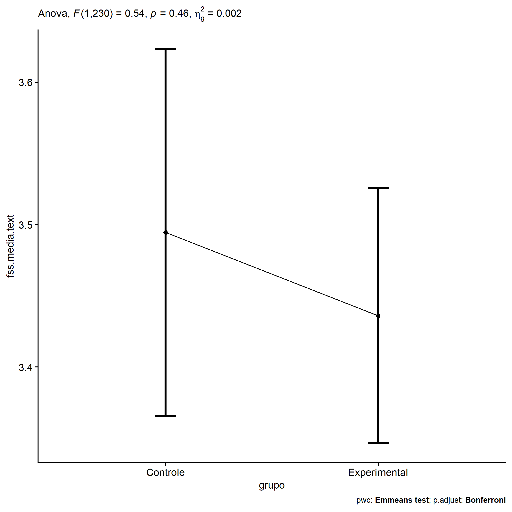<!-- -->

``` r
plots <- oneWayAncovaBoxPlots(
  wdat, "fss.media.text", "grupo", aov, pwc, covar = "dfs.media.text",
  theme = "classic", color = color[["grupo"]],
  subtitle = which(aov$Effect == "grupo"))
```

``` r
if (length(unique(wdat[["grupo"]])) > 1)
  plots[["grupo"]] + ggplot2::ylab("flow (prod. textual)") + ggplot2::scale_x_discrete(labels=c('pre', 'pos'))
```

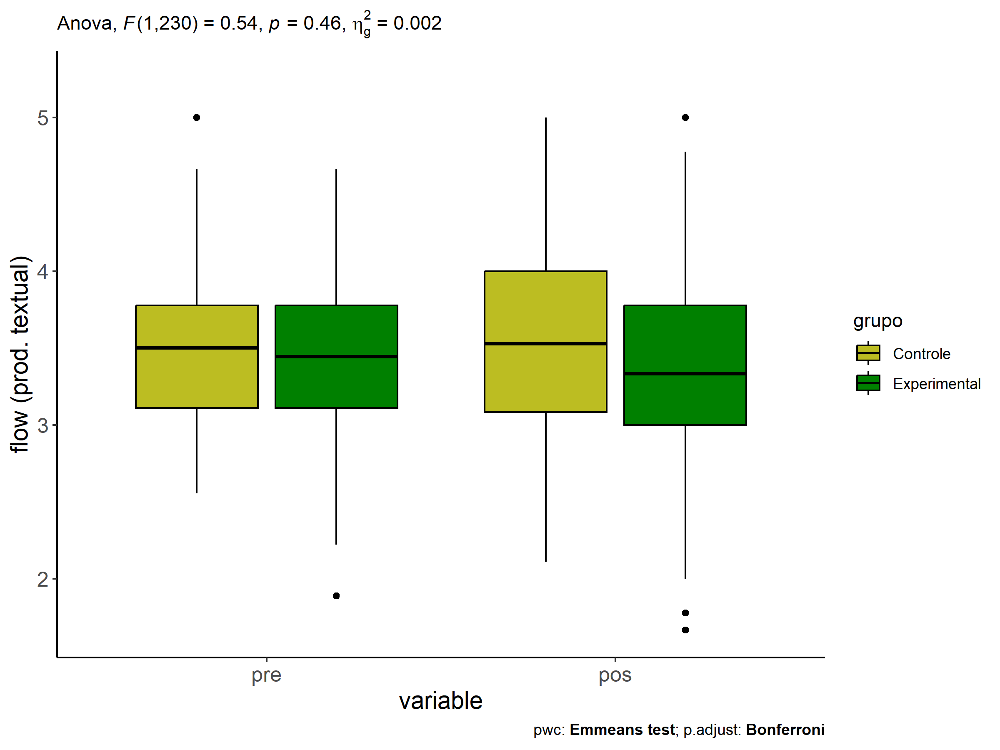<!-- -->

``` r
if (length(unique(wdat.long[["grupo"]])) > 1)
  plots <- oneWayAncovaBoxPlots(
    wdat.long, "flow.text", "grupo", aov, pwc.long, pre.post = "time",
    theme = "classic", color = color$prepost)
```

``` r
if (length(unique(wdat.long[["grupo"]])) > 1)
  plots[["grupo"]] + ggplot2::ylab("flow (prod. textual)")
```

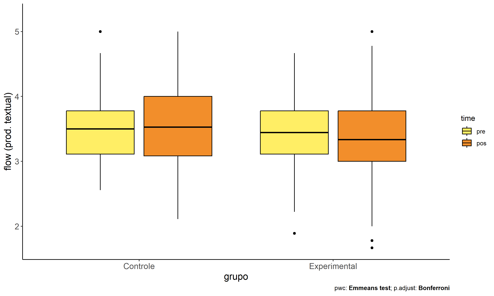<!-- -->

### Checking linearity assumption

``` r
ggscatter(wdat, x = "dfs.media.text", y = "fss.media.text", size = 0.5,
          color = "grupo", add = "reg.line")+
  stat_regline_equation(
    aes(label =  paste(..eq.label.., ..rr.label.., sep = "~~~~"), color = grupo)
  )
```

<!-- -->

### Checking normality and homogeneity

``` r
res <- augment(lm(fss.media.text ~ dfs.media.text + grupo, data = wdat))
```

``` r
shapiro_test(res$.resid)
```

    ## # A tibble: 1 × 3
    ##   variable   statistic p.value
    ##   <chr>          <dbl>   <dbl>
    ## 1 res$.resid     0.998   0.980

``` r
levene_test(res, .resid ~ grupo)
```

    ## # A tibble: 1 × 4
    ##     df1   df2 statistic     p
    ##   <int> <int>     <dbl> <dbl>
    ## 1     1   231     0.476 0.491

# ANCOVA and Pairwise for two factors **grupo:Sexo**

## Without remove non-normal data

``` r
pdat = remove_group_data(dat[!is.na(dat[["grupo"]]) & !is.na(dat[["Sexo"]]),], "fss.media.text", c("grupo","Sexo"))

pdat.long <- rbind(pdat[,c("id","grupo","Sexo")], pdat[,c("id","grupo","Sexo")])
pdat.long[["time"]] <- c(rep("pre", nrow(pdat)), rep("pos", nrow(pdat)))
pdat.long[["time"]] <- factor(pdat.long[["time"]], c("pre","pos"))
pdat.long[["flow.text"]] <- c(pdat[["dfs.media.text"]], pdat[["fss.media.text"]])

aov = anova_test(pdat, fss.media.text ~ dfs.media.text + grupo*Sexo)
laov[["grupo:Sexo"]] <- get_anova_table(aov)
```

``` r
pwcs <- list()
pwcs[["Sexo"]] <- emmeans_test(
  group_by(pdat, grupo), fss.media.text ~ Sexo,
  covariate = dfs.media.text, p.adjust.method = "bonferroni")
pwcs[["grupo"]] <- emmeans_test(
  group_by(pdat, Sexo), fss.media.text ~ grupo,
  covariate = dfs.media.text, p.adjust.method = "bonferroni")

pwc <- plyr::rbind.fill(pwcs[["grupo"]], pwcs[["Sexo"]])
pwc <- pwc[,c("grupo","Sexo", colnames(pwc)[!colnames(pwc) %in% c("grupo","Sexo")])]
```

``` r
pwc.long <- emmeans_test(dplyr::group_by_at(pdat.long, c("grupo","Sexo")),
                         flow.text ~ time,
                         p.adjust.method = "bonferroni")
lpwc[["grupo:Sexo"]] <- plyr::rbind.fill(pwc, pwc.long)
```

``` r
ds <- get.descriptives(pdat, "fss.media.text", c("grupo","Sexo"), covar = "dfs.media.text")
ds <- merge(ds[ds$variable != "dfs.media.text",],
            ds[ds$variable == "dfs.media.text", !colnames(ds) %in% c("variable")],
            by = c("grupo","Sexo"), all.x = T, suffixes = c("", ".dfs.media.text"))
ds <- merge(get_emmeans(pwcs[["grupo"]]), ds, by = c("grupo","Sexo"), suffixes = c(".emms", ""))
ds <- ds[,c("grupo","Sexo","n","mean.dfs.media.text","se.dfs.media.text","mean","se","emmean","se.emms")]

colnames(ds) <- c("grupo","Sexo", "N", paste0(c("M","SE")," (pre)"),
                  paste0(c("M","SE"), " (unadj)"), paste0(c("M", "SE"), " (adj)"))

lemms[["grupo:Sexo"]] <- ds
```

## Computing ANCOVA and PairWise After removing non-normal data (OK)

``` r
wdat = pdat 

res = residuals(lm(fss.media.text ~ dfs.media.text + grupo*Sexo, data = wdat))
non.normal = getNonNormal(res, wdat$id, plimit = 0.05)

wdat = wdat[!wdat$id %in% non.normal,]

wdat.long <- rbind(wdat[,c("id","grupo","Sexo")], wdat[,c("id","grupo","Sexo")])
wdat.long[["time"]] <- c(rep("pre", nrow(wdat)), rep("pos", nrow(wdat)))
wdat.long[["time"]] <- factor(wdat.long[["time"]], c("pre","pos"))
wdat.long[["flow.text"]] <- c(wdat[["dfs.media.text"]], wdat[["fss.media.text"]])


ldat[["grupo:Sexo"]] = wdat

(non.normal)
```

    ## NULL

``` r
aov = anova_test(wdat, fss.media.text ~ dfs.media.text + grupo*Sexo)
laov[["grupo:Sexo"]] <- merge(get_anova_table(aov), laov[["grupo:Sexo"]], by="Effect", suffixes = c("","'"))

(df = get_anova_table(aov))
```

    ## ANOVA Table (type II tests)
    ## 
    ##           Effect DFn DFd      F        p p<.05   ges
    ## 1 dfs.media.text   1 228 28.210 2.58e-07     * 0.110
    ## 2          grupo   1 228  0.571 4.51e-01       0.002
    ## 3           Sexo   1 228  0.439 5.08e-01       0.002
    ## 4     grupo:Sexo   1 228  0.722 3.96e-01       0.003

| Effect         | DFn | DFd |      F |     p | p\<.05 |   ges |
|:---------------|----:|----:|-------:|------:|:-------|------:|
| dfs.media.text |   1 | 228 | 28.210 | 0.000 | \*     | 0.110 |
| grupo          |   1 | 228 |  0.571 | 0.451 |        | 0.002 |
| Sexo           |   1 | 228 |  0.439 | 0.508 |        | 0.002 |
| grupo:Sexo     |   1 | 228 |  0.722 | 0.396 |        | 0.003 |

``` r
pwcs <- list()
pwcs[["Sexo"]] <- emmeans_test(
  group_by(wdat, grupo), fss.media.text ~ Sexo,
  covariate = dfs.media.text, p.adjust.method = "bonferroni")
pwcs[["grupo"]] <- emmeans_test(
  group_by(wdat, Sexo), fss.media.text ~ grupo,
  covariate = dfs.media.text, p.adjust.method = "bonferroni")

pwc <- plyr::rbind.fill(pwcs[["grupo"]], pwcs[["Sexo"]])
pwc <- pwc[,c("grupo","Sexo", colnames(pwc)[!colnames(pwc) %in% c("grupo","Sexo")])]
```

| grupo        | Sexo | term                  | .y.            | group1   | group2       |  df | statistic |     p | p.adj | p.adj.signif |
|:-------------|:-----|:----------------------|:---------------|:---------|:-------------|----:|----------:|------:|------:|:-------------|
|              | F    | dfs.media.text\*grupo | fss.media.text | Controle | Experimental | 228 |     1.130 | 0.260 | 0.260 | ns           |
|              | M    | dfs.media.text\*grupo | fss.media.text | Controle | Experimental | 228 |    -0.122 | 0.903 | 0.903 | ns           |
| Controle     |      | dfs.media.text\*Sexo  | fss.media.text | F        | M            | 228 |     1.076 | 0.283 | 0.283 | ns           |
| Experimental |      | dfs.media.text\*Sexo  | fss.media.text | F        | M            | 228 |     0.057 | 0.955 | 0.955 | ns           |

``` r
pwc.long <- emmeans_test(dplyr::group_by_at(wdat.long, c("grupo","Sexo")),
                         flow.text ~ time,
                         p.adjust.method = "bonferroni")
lpwc[["grupo:Sexo"]] <- merge(plyr::rbind.fill(pwc, pwc.long), lpwc[["grupo:Sexo"]], by=c("grupo","Sexo","term",".y.","group1","group2"), suffixes = c("","'"))
```

| grupo        | Sexo | term | .y.       | group1 | group2 |  df | statistic |     p | p.adj | p.adj.signif |
|:-------------|:-----|:-----|:----------|:-------|:-------|----:|----------:|------:|------:|:-------------|
| Controle     | F    | time | flow.text | pre    | pos    | 458 |    -0.199 | 0.842 | 0.842 | ns           |
| Controle     | M    | time | flow.text | pre    | pos    | 458 |     0.408 | 0.684 | 0.684 | ns           |
| Experimental | F    | time | flow.text | pre    | pos    | 458 |     0.505 | 0.614 | 0.614 | ns           |
| Experimental | M    | time | flow.text | pre    | pos    | 458 |     0.188 | 0.851 | 0.851 | ns           |

``` r
ds <- get.descriptives(wdat, "fss.media.text", c("grupo","Sexo"), covar = "dfs.media.text")
ds <- merge(ds[ds$variable != "dfs.media.text",],
            ds[ds$variable == "dfs.media.text", !colnames(ds) %in% c("variable")],
            by = c("grupo","Sexo"), all.x = T, suffixes = c("", ".dfs.media.text"))
ds <- merge(get_emmeans(pwcs[["grupo"]]), ds, by = c("grupo","Sexo"), suffixes = c(".emms", ""))
ds <- ds[,c("grupo","Sexo","n","mean.dfs.media.text","se.dfs.media.text","mean","se","emmean","se.emms")]

colnames(ds) <- c("grupo","Sexo", "N", paste0(c("M","SE")," (pre)"),
                  paste0(c("M","SE"), " (unadj)"), paste0(c("M", "SE"), " (adj)"))

lemms[["grupo:Sexo"]] <- merge(ds, lemms[["grupo:Sexo"]], by=c("grupo","Sexo"), suffixes = c("","'"))
```

| grupo        | Sexo |   N | M (pre) | SE (pre) | M (unadj) | SE (unadj) | M (adj) | SE (adj) |
|:-------------|:-----|----:|--------:|---------:|----------:|-----------:|--------:|---------:|
| Controle     | F    |  41 |   3.569 |    0.077 |     3.594 |      0.107 |   3.560 |    0.089 |
| Controle     | M    |  35 |   3.469 |    0.094 |     3.414 |      0.084 |   3.419 |    0.096 |
| Experimental | F    |  90 |   3.481 |    0.054 |     3.438 |      0.061 |   3.438 |    0.060 |
| Experimental | M    |  67 |   3.433 |    0.064 |     3.415 |      0.078 |   3.433 |    0.070 |

### Plots for ancova

``` r
plots <- twoWayAncovaPlots(
  wdat, "fss.media.text", c("grupo","Sexo"), aov, pwcs, addParam = c("mean_se"),
  font.label.size=10, step.increase=0.05, p.label="p.adj",
  subtitle = which(aov$Effect == "grupo:Sexo"))
```

``` r
if (!is.null(plots[["grupo"]]))
  plots[["grupo"]] + ggplot2::scale_color_manual(values = color[["Sexo"]])
```

    ## Scale for colour is already present.
    ## Adding another scale for colour, which will replace the existing scale.

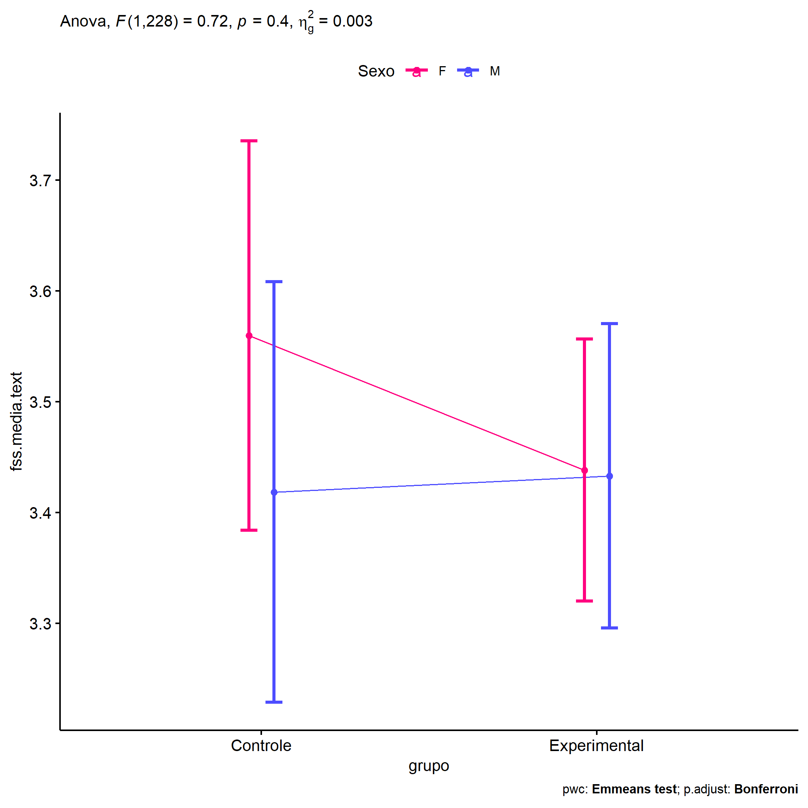<!-- -->

``` r
if (!is.null(plots[["Sexo"]]))
  plots[["Sexo"]] + ggplot2::scale_color_manual(values = color[["grupo"]])
```

    ## Scale for colour is already present.
    ## Adding another scale for colour, which will replace the existing scale.

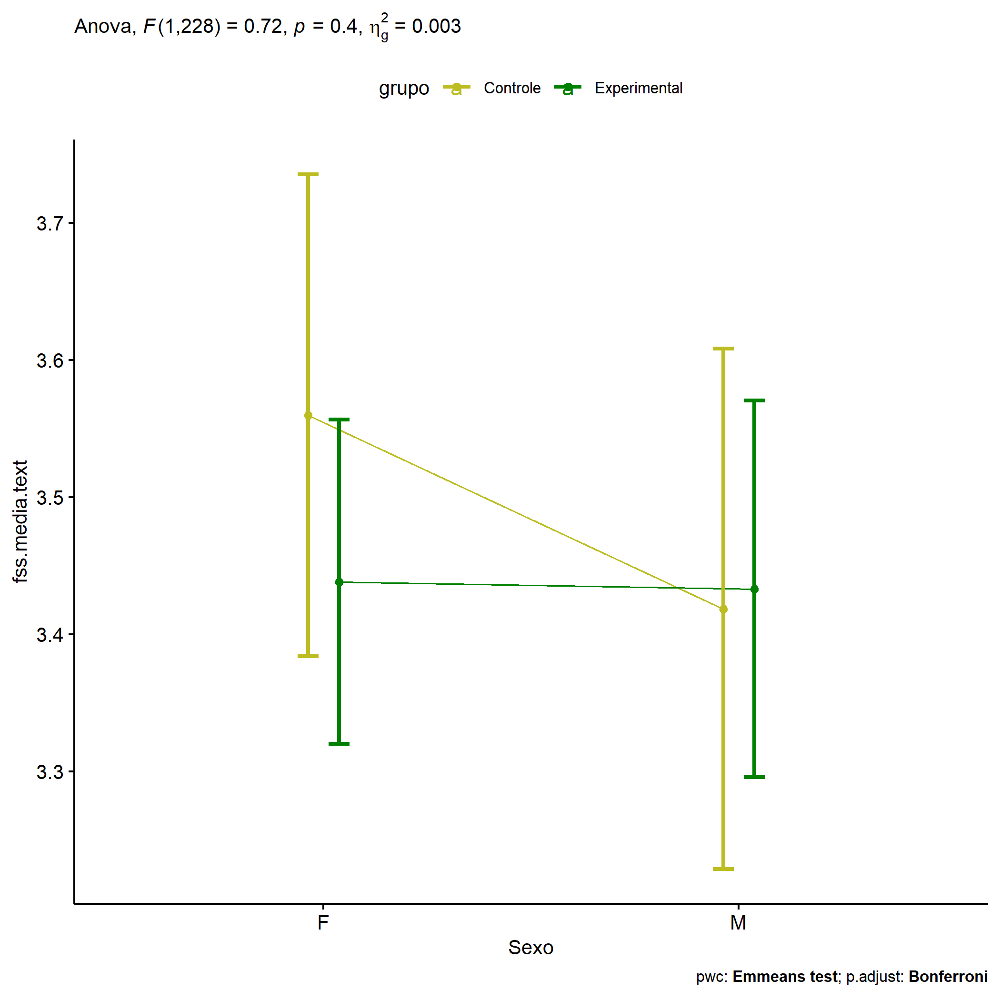<!-- -->

``` r
plots <- twoWayAncovaBoxPlots(
  wdat, "fss.media.text", c("grupo","Sexo"), aov, pwcs, covar = "dfs.media.text",
  theme = "classic", color = color[["grupo:Sexo"]],
  subtitle = which(aov$Effect == "grupo:Sexo"))
```

``` r
plots[["grupo:Sexo"]] + ggplot2::ylab("flow (prod. textual)") + ggplot2::scale_x_discrete(labels=c('pre', 'pos'))
```

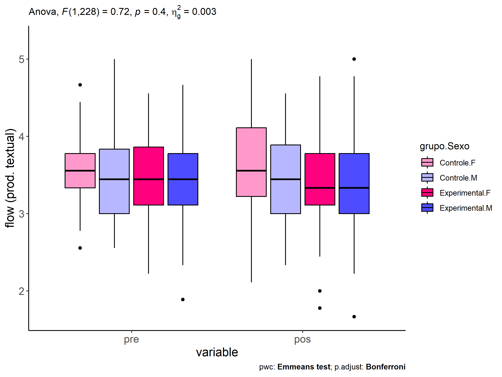<!-- -->

``` r
plots <- twoWayAncovaBoxPlots(
  wdat.long, "flow.text", c("grupo","Sexo"), aov, pwc.long, pre.post = "time",
  theme = "classic", color = color$prepost)
```

``` r
plots[["grupo:Sexo"]] + ggplot2::ylab("flow (prod. textual)")
```

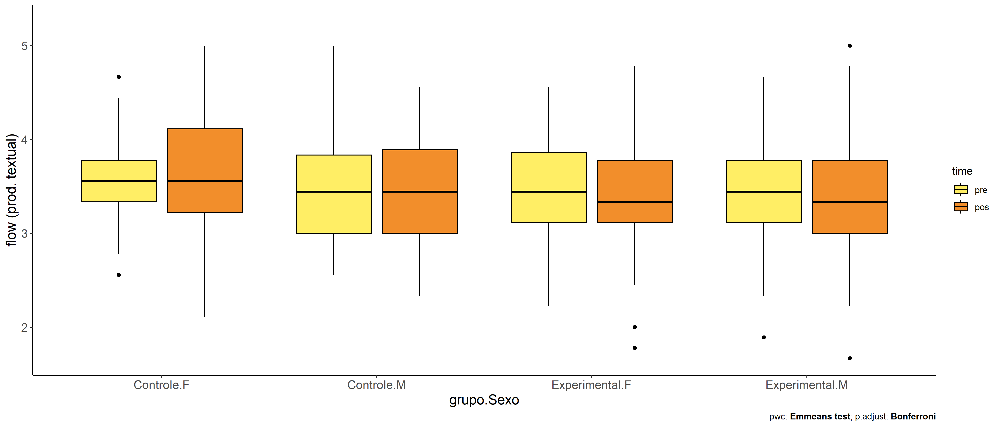<!-- -->

### Checking linearity assumption

``` r
ggscatter(wdat, x = "dfs.media.text", y = "fss.media.text", size = 0.5,
          facet.by = c("grupo","Sexo"), add = "reg.line")+
  stat_regline_equation(
    aes(label =  paste(..eq.label.., ..rr.label.., sep = "~~~~"))
  )
```

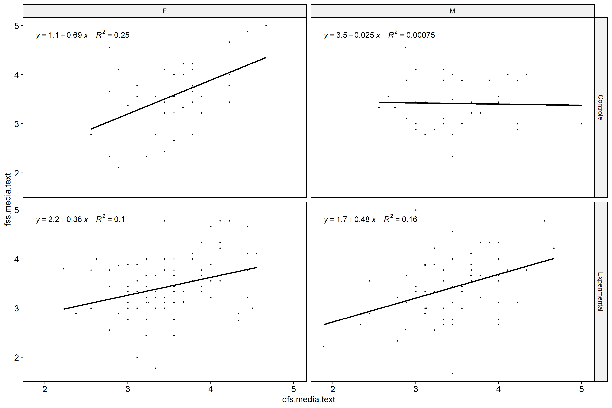<!-- -->

### Checking normality and homogeneity

``` r
res <- augment(lm(fss.media.text ~ dfs.media.text + grupo*Sexo, data = wdat))
```

``` r
shapiro_test(res$.resid)
```

    ## # A tibble: 1 × 3
    ##   variable   statistic p.value
    ##   <chr>          <dbl>   <dbl>
    ## 1 res$.resid     0.998   0.979

``` r
levene_test(res, .resid ~ grupo*Sexo)
```

    ## # A tibble: 1 × 4
    ##     df1   df2 statistic     p
    ##   <int> <int>     <dbl> <dbl>
    ## 1     3   229     0.328 0.805

# ANCOVA and Pairwise for two factors **grupo:Zona**

## Without remove non-normal data

``` r
pdat = remove_group_data(dat[!is.na(dat[["grupo"]]) & !is.na(dat[["Zona"]]),], "fss.media.text", c("grupo","Zona"))

pdat.long <- rbind(pdat[,c("id","grupo","Zona")], pdat[,c("id","grupo","Zona")])
pdat.long[["time"]] <- c(rep("pre", nrow(pdat)), rep("pos", nrow(pdat)))
pdat.long[["time"]] <- factor(pdat.long[["time"]], c("pre","pos"))
pdat.long[["flow.text"]] <- c(pdat[["dfs.media.text"]], pdat[["fss.media.text"]])

aov = anova_test(pdat, fss.media.text ~ dfs.media.text + grupo*Zona)
laov[["grupo:Zona"]] <- get_anova_table(aov)
```

``` r
pwcs <- list()
pwcs[["Zona"]] <- emmeans_test(
  group_by(pdat, grupo), fss.media.text ~ Zona,
  covariate = dfs.media.text, p.adjust.method = "bonferroni")
pwcs[["grupo"]] <- emmeans_test(
  group_by(pdat, Zona), fss.media.text ~ grupo,
  covariate = dfs.media.text, p.adjust.method = "bonferroni")

pwc <- plyr::rbind.fill(pwcs[["grupo"]], pwcs[["Zona"]])
pwc <- pwc[,c("grupo","Zona", colnames(pwc)[!colnames(pwc) %in% c("grupo","Zona")])]
```

``` r
pwc.long <- emmeans_test(dplyr::group_by_at(pdat.long, c("grupo","Zona")),
                         flow.text ~ time,
                         p.adjust.method = "bonferroni")
lpwc[["grupo:Zona"]] <- plyr::rbind.fill(pwc, pwc.long)
```

``` r
ds <- get.descriptives(pdat, "fss.media.text", c("grupo","Zona"), covar = "dfs.media.text")
ds <- merge(ds[ds$variable != "dfs.media.text",],
            ds[ds$variable == "dfs.media.text", !colnames(ds) %in% c("variable")],
            by = c("grupo","Zona"), all.x = T, suffixes = c("", ".dfs.media.text"))
ds <- merge(get_emmeans(pwcs[["grupo"]]), ds, by = c("grupo","Zona"), suffixes = c(".emms", ""))
ds <- ds[,c("grupo","Zona","n","mean.dfs.media.text","se.dfs.media.text","mean","se","emmean","se.emms")]

colnames(ds) <- c("grupo","Zona", "N", paste0(c("M","SE")," (pre)"),
                  paste0(c("M","SE"), " (unadj)"), paste0(c("M", "SE"), " (adj)"))

lemms[["grupo:Zona"]] <- ds
```

## Computing ANCOVA and PairWise After removing non-normal data (OK)

``` r
wdat = pdat 

res = residuals(lm(fss.media.text ~ dfs.media.text + grupo*Zona, data = wdat))
non.normal = getNonNormal(res, wdat$id, plimit = 0.05)

wdat = wdat[!wdat$id %in% non.normal,]

wdat.long <- rbind(wdat[,c("id","grupo","Zona")], wdat[,c("id","grupo","Zona")])
wdat.long[["time"]] <- c(rep("pre", nrow(wdat)), rep("pos", nrow(wdat)))
wdat.long[["time"]] <- factor(wdat.long[["time"]], c("pre","pos"))
wdat.long[["flow.text"]] <- c(wdat[["dfs.media.text"]], wdat[["fss.media.text"]])


ldat[["grupo:Zona"]] = wdat

(non.normal)
```

    ## NULL

``` r
aov = anova_test(wdat, fss.media.text ~ dfs.media.text + grupo*Zona)
laov[["grupo:Zona"]] <- merge(get_anova_table(aov), laov[["grupo:Zona"]], by="Effect", suffixes = c("","'"))

(df = get_anova_table(aov))
```

    ## ANOVA Table (type II tests)
    ## 
    ##           Effect DFn DFd      F        p p<.05      ges
    ## 1 dfs.media.text   1 110 23.758 3.70e-06     * 0.178000
    ## 2          grupo   1 110  0.677 4.12e-01       0.006000
    ## 3           Zona   1 110  0.110 7.41e-01       0.000996
    ## 4     grupo:Zona   1 110  2.679 1.05e-01       0.024000

| Effect         | DFn | DFd |      F |     p | p\<.05 |   ges |
|:---------------|----:|----:|-------:|------:|:-------|------:|
| dfs.media.text |   1 | 110 | 23.758 | 0.000 | \*     | 0.178 |
| grupo          |   1 | 110 |  0.677 | 0.412 |        | 0.006 |
| Zona           |   1 | 110 |  0.110 | 0.741 |        | 0.001 |
| grupo:Zona     |   1 | 110 |  2.679 | 0.105 |        | 0.024 |

``` r
pwcs <- list()
pwcs[["Zona"]] <- emmeans_test(
  group_by(wdat, grupo), fss.media.text ~ Zona,
  covariate = dfs.media.text, p.adjust.method = "bonferroni")
pwcs[["grupo"]] <- emmeans_test(
  group_by(wdat, Zona), fss.media.text ~ grupo,
  covariate = dfs.media.text, p.adjust.method = "bonferroni")

pwc <- plyr::rbind.fill(pwcs[["grupo"]], pwcs[["Zona"]])
pwc <- pwc[,c("grupo","Zona", colnames(pwc)[!colnames(pwc) %in% c("grupo","Zona")])]
```

| grupo        | Zona   | term                  | .y.            | group1   | group2       |  df | statistic |     p | p.adj | p.adj.signif |
|:-------------|:-------|:----------------------|:---------------|:---------|:-------------|----:|----------:|------:|------:|:-------------|
|              | Rural  | dfs.media.text\*grupo | fss.media.text | Controle | Experimental | 110 |    -0.265 | 0.792 | 0.792 | ns           |
|              | Urbana | dfs.media.text\*grupo | fss.media.text | Controle | Experimental | 110 |     1.814 | 0.072 | 0.072 | ns           |
| Controle     |        | dfs.media.text\*Zona  | fss.media.text | Rural    | Urbana       | 110 |    -1.128 | 0.262 | 0.262 | ns           |
| Experimental |        | dfs.media.text\*Zona  | fss.media.text | Rural    | Urbana       | 110 |     1.228 | 0.222 | 0.222 | ns           |

``` r
pwc.long <- emmeans_test(dplyr::group_by_at(wdat.long, c("grupo","Zona")),
                         flow.text ~ time,
                         p.adjust.method = "bonferroni")
lpwc[["grupo:Zona"]] <- merge(plyr::rbind.fill(pwc, pwc.long), lpwc[["grupo:Zona"]], by=c("grupo","Zona","term",".y.","group1","group2"), suffixes = c("","'"))
```

| grupo        | Zona   | term | .y.       | group1 | group2 |  df | statistic |     p | p.adj | p.adj.signif |
|:-------------|:-------|:-----|:----------|:-------|:-------|----:|----------:|------:|------:|:-------------|
| Controle     | Rural  | time | flow.text | pre    | pos    | 222 |    -0.046 | 0.963 | 0.963 | ns           |
| Controle     | Urbana | time | flow.text | pre    | pos    | 222 |    -0.390 | 0.697 | 0.697 | ns           |
| Experimental | Rural  | time | flow.text | pre    | pos    | 222 |     0.135 | 0.893 | 0.893 | ns           |
| Experimental | Urbana | time | flow.text | pre    | pos    | 222 |     1.238 | 0.217 | 0.217 | ns           |

``` r
ds <- get.descriptives(wdat, "fss.media.text", c("grupo","Zona"), covar = "dfs.media.text")
ds <- merge(ds[ds$variable != "dfs.media.text",],
            ds[ds$variable == "dfs.media.text", !colnames(ds) %in% c("variable")],
            by = c("grupo","Zona"), all.x = T, suffixes = c("", ".dfs.media.text"))
ds <- merge(get_emmeans(pwcs[["grupo"]]), ds, by = c("grupo","Zona"), suffixes = c(".emms", ""))
ds <- ds[,c("grupo","Zona","n","mean.dfs.media.text","se.dfs.media.text","mean","se","emmean","se.emms")]

colnames(ds) <- c("grupo","Zona", "N", paste0(c("M","SE")," (pre)"),
                  paste0(c("M","SE"), " (unadj)"), paste0(c("M", "SE"), " (adj)"))

lemms[["grupo:Zona"]] <- merge(ds, lemms[["grupo:Zona"]], by=c("grupo","Zona"), suffixes = c("","'"))
```

| grupo        | Zona   |   N | M (pre) | SE (pre) | M (unadj) | SE (unadj) | M (adj) | SE (adj) |
|:-------------|:-------|----:|--------:|---------:|----------:|-----------:|--------:|---------:|
| Controle     | Rural  |  29 |   3.424 |    0.090 |     3.431 |      0.109 |   3.475 |    0.098 |
| Controle     | Urbana |  13 |   3.650 |    0.126 |     3.734 |      0.154 |   3.675 |    0.146 |
| Experimental | Rural  |  47 |   3.526 |    0.077 |     3.511 |      0.080 |   3.508 |    0.077 |
| Experimental | Urbana |  26 |   3.557 |    0.117 |     3.367 |      0.123 |   3.351 |    0.103 |

### Plots for ancova

``` r
plots <- twoWayAncovaPlots(
  wdat, "fss.media.text", c("grupo","Zona"), aov, pwcs, addParam = c("mean_se"),
  font.label.size=10, step.increase=0.05, p.label="p.adj",
  subtitle = which(aov$Effect == "grupo:Zona"))
```

``` r
if (!is.null(plots[["grupo"]]))
  plots[["grupo"]] + ggplot2::scale_color_manual(values = color[["Zona"]])
```

    ## Scale for colour is already present.
    ## Adding another scale for colour, which will replace the existing scale.

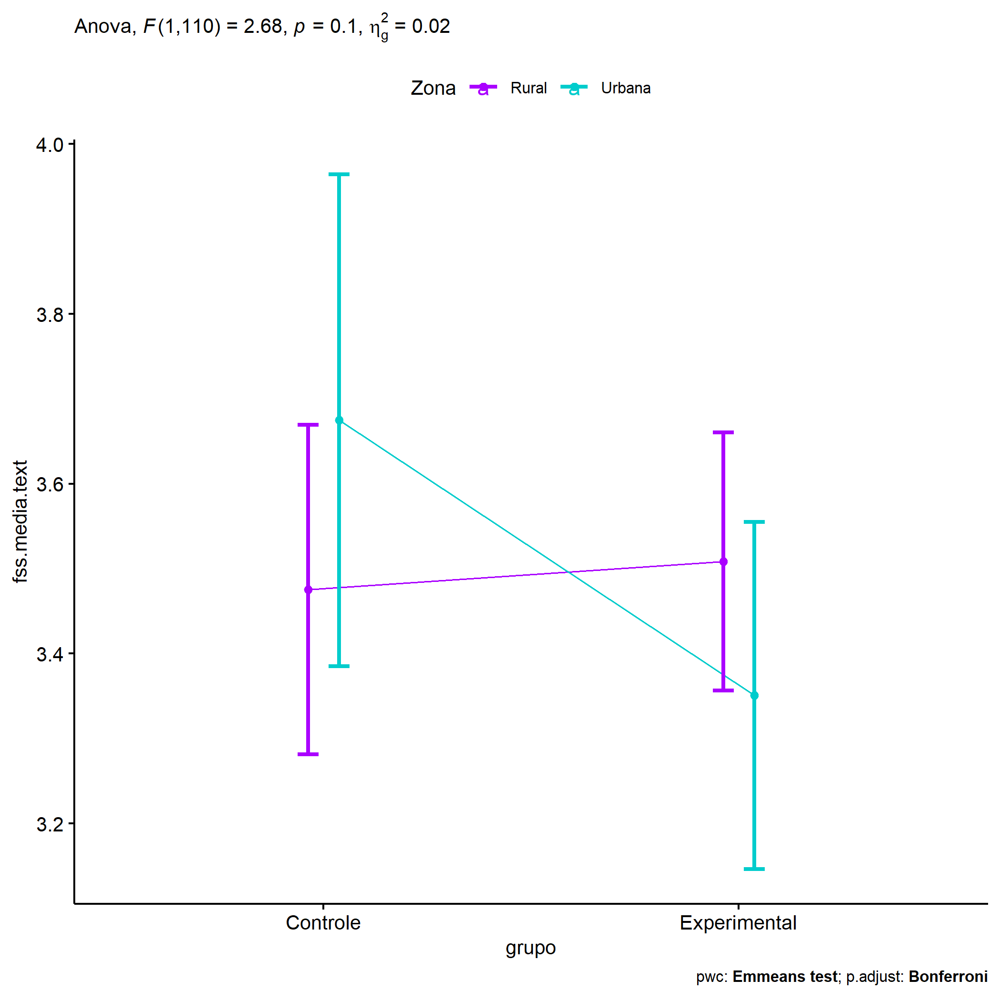<!-- -->

``` r
if (!is.null(plots[["Zona"]]))
  plots[["Zona"]] + ggplot2::scale_color_manual(values = color[["grupo"]])
```

    ## Scale for colour is already present.
    ## Adding another scale for colour, which will replace the existing scale.

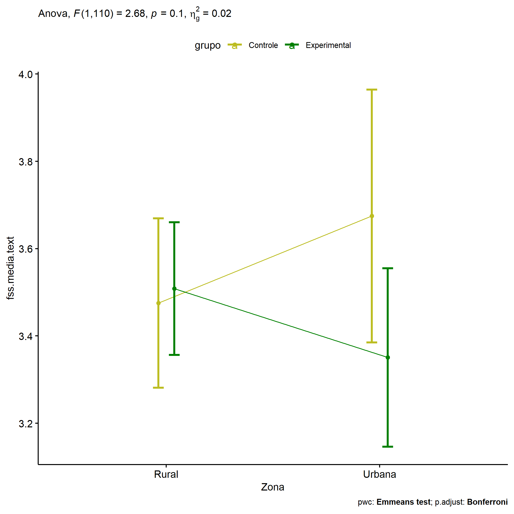<!-- -->

``` r
plots <- twoWayAncovaBoxPlots(
  wdat, "fss.media.text", c("grupo","Zona"), aov, pwcs, covar = "dfs.media.text",
  theme = "classic", color = color[["grupo:Zona"]],
  subtitle = which(aov$Effect == "grupo:Zona"))
```

``` r
plots[["grupo:Zona"]] + ggplot2::ylab("flow (prod. textual)") + ggplot2::scale_x_discrete(labels=c('pre', 'pos'))
```

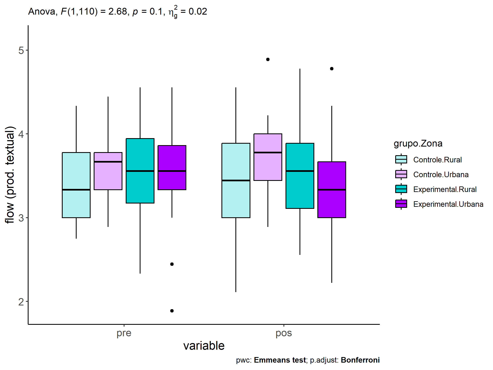<!-- -->

``` r
plots <- twoWayAncovaBoxPlots(
  wdat.long, "flow.text", c("grupo","Zona"), aov, pwc.long, pre.post = "time",
  theme = "classic", color = color$prepost)
```

``` r
plots[["grupo:Zona"]] + ggplot2::ylab("flow (prod. textual)")
```

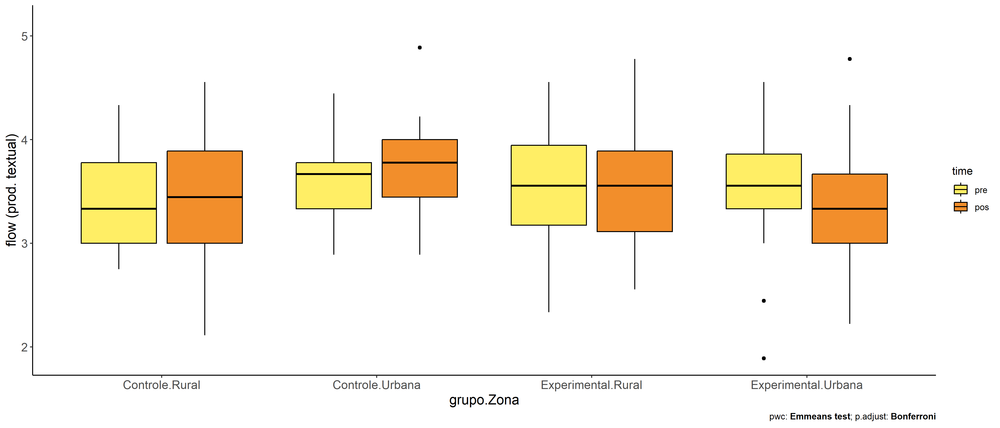<!-- -->

### Checking linearity assumption

``` r
ggscatter(wdat, x = "dfs.media.text", y = "fss.media.text", size = 0.5,
          facet.by = c("grupo","Zona"), add = "reg.line")+
  stat_regline_equation(
    aes(label =  paste(..eq.label.., ..rr.label.., sep = "~~~~"))
  )
```

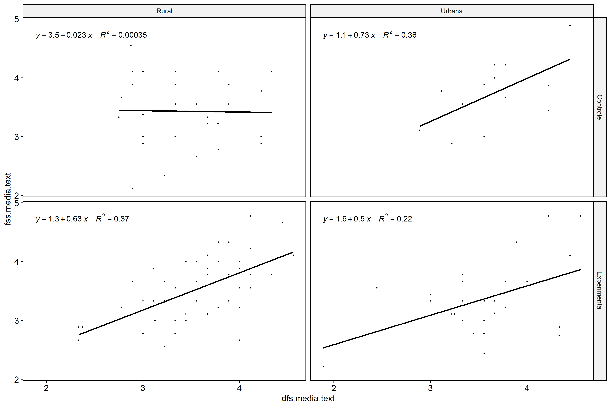<!-- -->

### Checking normality and homogeneity

``` r
res <- augment(lm(fss.media.text ~ dfs.media.text + grupo*Zona, data = wdat))
```

``` r
shapiro_test(res$.resid)
```

    ## # A tibble: 1 × 3
    ##   variable   statistic p.value
    ##   <chr>          <dbl>   <dbl>
    ## 1 res$.resid     0.993   0.821

``` r
levene_test(res, .resid ~ grupo*Zona)
```

    ## # A tibble: 1 × 4
    ##     df1   df2 statistic     p
    ##   <int> <int>     <dbl> <dbl>
    ## 1     3   111      1.64 0.184

# ANCOVA and Pairwise for two factors **grupo:Cor.Raca**

## Without remove non-normal data

``` r
pdat = remove_group_data(dat[!is.na(dat[["grupo"]]) & !is.na(dat[["Cor.Raca"]]),], "fss.media.text", c("grupo","Cor.Raca"))

pdat.long <- rbind(pdat[,c("id","grupo","Cor.Raca")], pdat[,c("id","grupo","Cor.Raca")])
pdat.long[["time"]] <- c(rep("pre", nrow(pdat)), rep("pos", nrow(pdat)))
pdat.long[["time"]] <- factor(pdat.long[["time"]], c("pre","pos"))
pdat.long[["flow.text"]] <- c(pdat[["dfs.media.text"]], pdat[["fss.media.text"]])

aov = anova_test(pdat, fss.media.text ~ dfs.media.text + grupo*Cor.Raca)
laov[["grupo:Cor.Raca"]] <- get_anova_table(aov)
```

``` r
pwcs <- list()
pwcs[["Cor.Raca"]] <- emmeans_test(
  group_by(pdat, grupo), fss.media.text ~ Cor.Raca,
  covariate = dfs.media.text, p.adjust.method = "bonferroni")
pwcs[["grupo"]] <- emmeans_test(
  group_by(pdat, Cor.Raca), fss.media.text ~ grupo,
  covariate = dfs.media.text, p.adjust.method = "bonferroni")

pwc <- plyr::rbind.fill(pwcs[["grupo"]], pwcs[["Cor.Raca"]])
pwc <- pwc[,c("grupo","Cor.Raca", colnames(pwc)[!colnames(pwc) %in% c("grupo","Cor.Raca")])]
```

``` r
pwc.long <- emmeans_test(dplyr::group_by_at(pdat.long, c("grupo","Cor.Raca")),
                         flow.text ~ time,
                         p.adjust.method = "bonferroni")
lpwc[["grupo:Cor.Raca"]] <- plyr::rbind.fill(pwc, pwc.long)
```

``` r
ds <- get.descriptives(pdat, "fss.media.text", c("grupo","Cor.Raca"), covar = "dfs.media.text")
ds <- merge(ds[ds$variable != "dfs.media.text",],
            ds[ds$variable == "dfs.media.text", !colnames(ds) %in% c("variable")],
            by = c("grupo","Cor.Raca"), all.x = T, suffixes = c("", ".dfs.media.text"))
ds <- merge(get_emmeans(pwcs[["grupo"]]), ds, by = c("grupo","Cor.Raca"), suffixes = c(".emms", ""))
ds <- ds[,c("grupo","Cor.Raca","n","mean.dfs.media.text","se.dfs.media.text","mean","se","emmean","se.emms")]

colnames(ds) <- c("grupo","Cor.Raca", "N", paste0(c("M","SE")," (pre)"),
                  paste0(c("M","SE"), " (unadj)"), paste0(c("M", "SE"), " (adj)"))

lemms[["grupo:Cor.Raca"]] <- ds
```

## Computing ANCOVA and PairWise After removing non-normal data (OK)

``` r
wdat = pdat 

res = residuals(lm(fss.media.text ~ dfs.media.text + grupo*Cor.Raca, data = wdat))
non.normal = getNonNormal(res, wdat$id, plimit = 0.05)

wdat = wdat[!wdat$id %in% non.normal,]

wdat.long <- rbind(wdat[,c("id","grupo","Cor.Raca")], wdat[,c("id","grupo","Cor.Raca")])
wdat.long[["time"]] <- c(rep("pre", nrow(wdat)), rep("pos", nrow(wdat)))
wdat.long[["time"]] <- factor(wdat.long[["time"]], c("pre","pos"))
wdat.long[["flow.text"]] <- c(wdat[["dfs.media.text"]], wdat[["fss.media.text"]])


ldat[["grupo:Cor.Raca"]] = wdat

(non.normal)
```

    ## NULL

``` r
aov = anova_test(wdat, fss.media.text ~ dfs.media.text + grupo*Cor.Raca)
laov[["grupo:Cor.Raca"]] <- merge(get_anova_table(aov), laov[["grupo:Cor.Raca"]], by="Effect", suffixes = c("","'"))

(df = get_anova_table(aov))
```

    ## ANOVA Table (type II tests)
    ## 
    ##           Effect DFn DFd     F     p p<.05   ges
    ## 1 dfs.media.text   1  85 5.514 0.021     * 0.061
    ## 2          grupo   1  85 0.309 0.580       0.004
    ## 3       Cor.Raca   1  85 0.552 0.459       0.006
    ## 4 grupo:Cor.Raca   0  85    NA    NA  <NA>    NA

| Effect         | DFn | DFd |     F |     p | p\<.05 |   ges |
|:---------------|----:|----:|------:|------:|:-------|------:|
| dfs.media.text |   1 |  85 | 5.514 | 0.021 | \*     | 0.061 |
| grupo          |   1 |  85 | 0.309 | 0.580 |        | 0.004 |
| Cor.Raca       |   1 |  85 | 0.552 | 0.459 |        | 0.006 |
| grupo:Cor.Raca |   0 |  85 |       |       |        |       |

``` r
pwcs <- list()
pwcs[["Cor.Raca"]] <- emmeans_test(
  group_by(wdat, grupo), fss.media.text ~ Cor.Raca,
  covariate = dfs.media.text, p.adjust.method = "bonferroni")
pwcs[["grupo"]] <- emmeans_test(
  group_by(wdat, Cor.Raca), fss.media.text ~ grupo,
  covariate = dfs.media.text, p.adjust.method = "bonferroni")

pwc <- plyr::rbind.fill(pwcs[["grupo"]], pwcs[["Cor.Raca"]])
pwc <- pwc[,c("grupo","Cor.Raca", colnames(pwc)[!colnames(pwc) %in% c("grupo","Cor.Raca")])]
```

| grupo        | Cor.Raca | term                     | .y.            | group1   | group2       |  df | statistic |     p | p.adj | p.adj.signif |
|:-------------|:---------|:-------------------------|:---------------|:---------|:-------------|----:|----------:|------:|------:|:-------------|
|              | Branca   | dfs.media.text\*grupo    | fss.media.text | Controle | Experimental |     |           |       |       |              |
|              | Parda    | dfs.media.text\*grupo    | fss.media.text | Controle | Experimental |  85 |     0.556 | 0.580 | 0.580 | ns           |
| Controle     |          | dfs.media.text\*Cor.Raca | fss.media.text | Branca   | Parda        |     |           |       |       |              |
| Experimental |          | dfs.media.text\*Cor.Raca | fss.media.text | Branca   | Parda        |  85 |    -0.743 | 0.459 | 0.459 | ns           |

``` r
pwc.long <- emmeans_test(dplyr::group_by_at(wdat.long, c("grupo","Cor.Raca")),
                         flow.text ~ time,
                         p.adjust.method = "bonferroni")
lpwc[["grupo:Cor.Raca"]] <- merge(plyr::rbind.fill(pwc, pwc.long), lpwc[["grupo:Cor.Raca"]], by=c("grupo","Cor.Raca","term",".y.","group1","group2"), suffixes = c("","'"))
```

| grupo        | Cor.Raca | term | .y.       | group1 | group2 |  df | statistic |     p | p.adj | p.adj.signif |
|:-------------|:---------|:-----|:----------|:-------|:-------|----:|----------:|------:|------:|:-------------|
| Controle     | Branca   | time | flow.text | pre    | pos    |     |           |       |       |              |
| Controle     | Parda    | time | flow.text | pre    | pos    | 172 |    -1.065 | 0.288 | 0.288 | ns           |
| Experimental | Branca   | time | flow.text | pre    | pos    | 172 |     0.672 | 0.502 | 0.502 | ns           |
| Experimental | Parda    | time | flow.text | pre    | pos    | 172 |    -0.016 | 0.988 | 0.988 | ns           |

``` r
ds <- get.descriptives(wdat, "fss.media.text", c("grupo","Cor.Raca"), covar = "dfs.media.text")
ds <- merge(ds[ds$variable != "dfs.media.text",],
            ds[ds$variable == "dfs.media.text", !colnames(ds) %in% c("variable")],
            by = c("grupo","Cor.Raca"), all.x = T, suffixes = c("", ".dfs.media.text"))
ds <- merge(get_emmeans(pwcs[["grupo"]]), ds, by = c("grupo","Cor.Raca"), suffixes = c(".emms", ""))
ds <- ds[,c("grupo","Cor.Raca","n","mean.dfs.media.text","se.dfs.media.text","mean","se","emmean","se.emms")]

colnames(ds) <- c("grupo","Cor.Raca", "N", paste0(c("M","SE")," (pre)"),
                  paste0(c("M","SE"), " (unadj)"), paste0(c("M", "SE"), " (adj)"))

lemms[["grupo:Cor.Raca"]] <- merge(ds, lemms[["grupo:Cor.Raca"]], by=c("grupo","Cor.Raca"), suffixes = c("","'"))
```

| grupo        | Cor.Raca |   N | M (pre) | SE (pre) | M (unadj) | SE (unadj) | M (adj) | SE (adj) |
|:-------------|:---------|----:|--------:|---------:|----------:|-----------:|--------:|---------:|
| Controle     | Parda    |  30 |   3.370 |    0.088 |     3.519 |      0.112 |   3.537 |    0.098 |
| Experimental | Branca   |  16 |   3.490 |    0.149 |     3.361 |      0.120 |   3.349 |    0.134 |
| Experimental | Parda    |  43 |   3.472 |    0.082 |     3.473 |      0.081 |   3.465 |    0.082 |

### Plots for ancova

``` r
plots <- twoWayAncovaPlots(
  wdat, "fss.media.text", c("grupo","Cor.Raca"), aov, pwcs, addParam = c("mean_se"),
  font.label.size=10, step.increase=0.05, p.label="p.adj",
  subtitle = which(aov$Effect == "grupo:Cor.Raca"))
```

``` r
if (!is.null(plots[["grupo"]]))
  plots[["grupo"]] + ggplot2::scale_color_manual(values = color[["Cor.Raca"]])
```

<!-- -->

``` r
if (!is.null(plots[["Cor.Raca"]]))
  plots[["Cor.Raca"]] + ggplot2::scale_color_manual(values = color[["grupo"]])
```

<!-- -->

``` r
plots <- twoWayAncovaBoxPlots(
  wdat, "fss.media.text", c("grupo","Cor.Raca"), aov, pwcs, covar = "dfs.media.text",
  theme = "classic", color = color[["grupo:Cor.Raca"]],
  subtitle = which(aov$Effect == "grupo:Cor.Raca"))
```

``` r
plots[["grupo:Cor.Raca"]] + ggplot2::ylab("flow (prod. textual)") + ggplot2::scale_x_discrete(labels=c('pre', 'pos'))
```

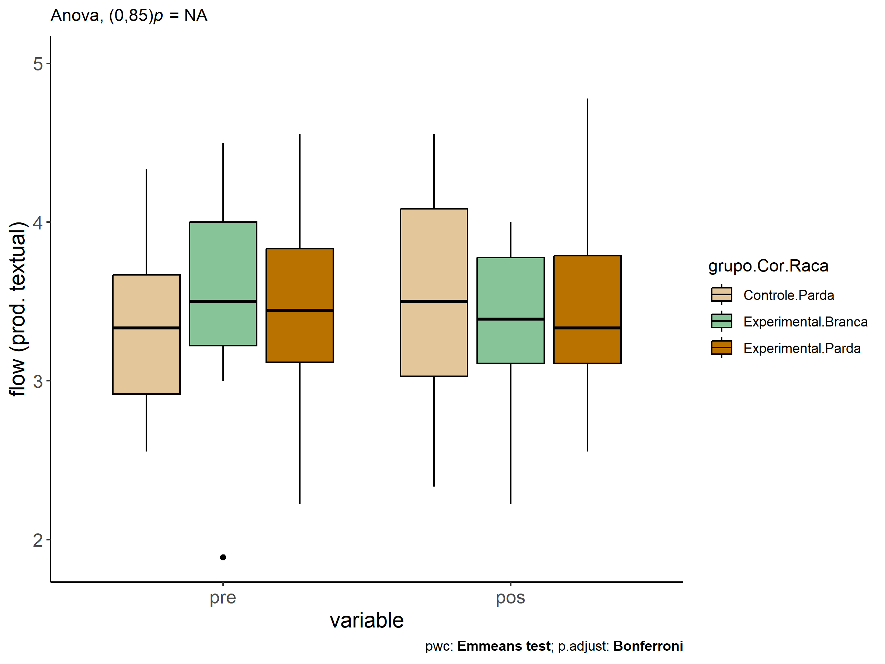<!-- -->

``` r
plots <- twoWayAncovaBoxPlots(
  wdat.long, "flow.text", c("grupo","Cor.Raca"), aov, pwc.long, pre.post = "time",
  theme = "classic", color = color$prepost)
```

``` r
plots[["grupo:Cor.Raca"]] + ggplot2::ylab("flow (prod. textual)")
```

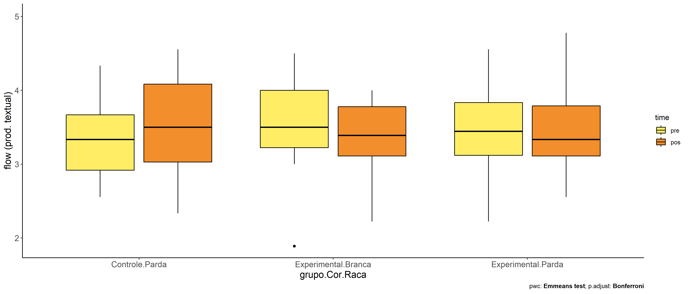<!-- -->

### Checking linearity assumption

``` r
ggscatter(wdat, x = "dfs.media.text", y = "fss.media.text", size = 0.5,
          facet.by = c("grupo","Cor.Raca"), add = "reg.line")+
  stat_regline_equation(
    aes(label =  paste(..eq.label.., ..rr.label.., sep = "~~~~"))
  )
```

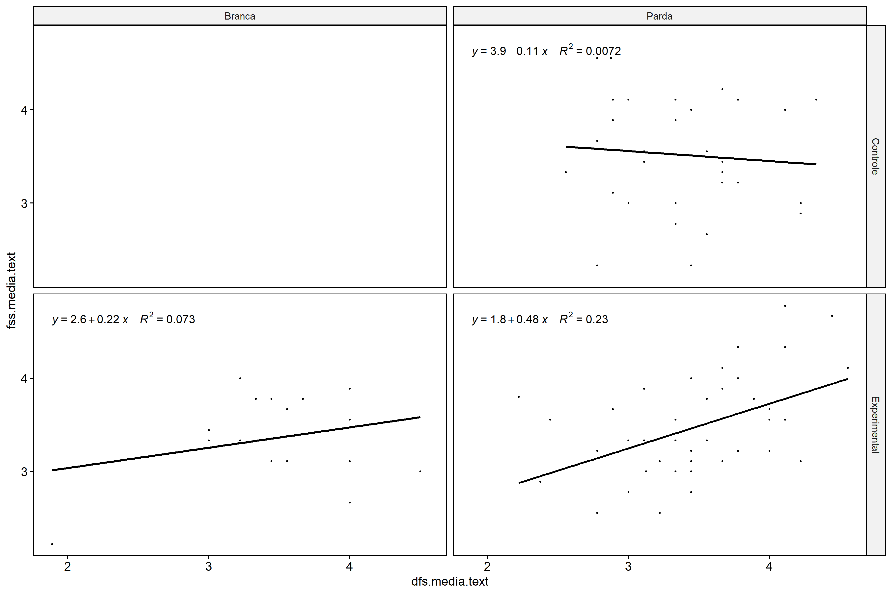<!-- -->

### Checking normality and homogeneity

``` r
res <- augment(lm(fss.media.text ~ dfs.media.text + grupo*Cor.Raca, data = wdat))
```

``` r
shapiro_test(res$.resid)
```

    ## # A tibble: 1 × 3
    ##   variable   statistic p.value
    ##   <chr>          <dbl>   <dbl>
    ## 1 res$.resid     0.987   0.551

``` r
levene_test(res, .resid ~ grupo*Cor.Raca)
```

    ## # A tibble: 1 × 4
    ##     df1   df2 statistic     p
    ##   <int> <int>     <dbl> <dbl>
    ## 1     2    86      2.22 0.115

# Summary of Results

## Descriptive Statistics

``` r
df <- get.descriptives(ldat[["grupo"]], c(dv.pre, dv.pos), c("grupo"), 
                       include.global = T, symmetry.test = T, normality.test = F)
df <- plyr::rbind.fill(
  df, do.call(plyr::rbind.fill, lapply(lfatores2, FUN = function(f) {
    if (nrow(dat) > 0 && sum(!is.na(unique(dat[[f]]))) > 1)
      get.descriptives(ldat[[paste0("grupo:",f)]], c(dv.pre,dv.pos), c("grupo", f),
                       symmetry.test = T, normality.test = F)
    }))
)
(df <- df[,c(fatores1[fatores1 %in% colnames(df)],"variable",
             colnames(df)[!colnames(df) %in% c(fatores1,"variable")])])
```

    ##           grupo Sexo   Zona Cor.Raca       variable   n  mean median   min   max    sd    se    ci   iqr
    ## 1      Controle <NA>   <NA>     <NA> dfs.media.text  76 3.523  3.500 2.556 5.000 0.521 0.060 0.119 0.667
    ## 2  Experimental <NA>   <NA>     <NA> dfs.media.text 157 3.460  3.444 1.889 4.667 0.516 0.041 0.081 0.667
    ## 3          <NA> <NA>   <NA>     <NA> dfs.media.text 233 3.481  3.444 1.889 5.000 0.517 0.034 0.067 0.667
    ## 4      Controle <NA>   <NA>     <NA> fss.media.text  76 3.511  3.528 2.111 5.000 0.609 0.070 0.139 0.917
    ## 5  Experimental <NA>   <NA>     <NA> fss.media.text 157 3.428  3.333 1.667 5.000 0.599 0.048 0.094 0.778
    ## 6          <NA> <NA>   <NA>     <NA> fss.media.text 233 3.455  3.444 1.667 5.000 0.602 0.039 0.078 0.875
    ## 7      Controle    F   <NA>     <NA> dfs.media.text  41 3.569  3.556 2.556 4.667 0.493 0.077 0.156 0.444
    ## 8      Controle    M   <NA>     <NA> dfs.media.text  35 3.469  3.444 2.556 5.000 0.554 0.094 0.190 0.833
    ## 9  Experimental    F   <NA>     <NA> dfs.media.text  90 3.481  3.444 2.222 4.556 0.511 0.054 0.107 0.750
    ## 10 Experimental    M   <NA>     <NA> dfs.media.text  67 3.433  3.444 1.889 4.667 0.525 0.064 0.128 0.667
    ## 11     Controle    F   <NA>     <NA> fss.media.text  41 3.594  3.556 2.111 5.000 0.685 0.107 0.216 0.889
    ## 12     Controle    M   <NA>     <NA> fss.media.text  35 3.414  3.444 2.333 4.556 0.497 0.084 0.171 0.889
    ## 13 Experimental    F   <NA>     <NA> fss.media.text  90 3.438  3.333 1.778 4.778 0.574 0.061 0.120 0.667
    ## 14 Experimental    M   <NA>     <NA> fss.media.text  67 3.415  3.333 1.667 5.000 0.634 0.078 0.155 0.778
    ## 15     Controle <NA>  Rural     <NA> dfs.media.text  29 3.424  3.333 2.750 4.333 0.486 0.090 0.185 0.778
    ## 16     Controle <NA> Urbana     <NA> dfs.media.text  13 3.650  3.667 2.889 4.444 0.456 0.126 0.275 0.444
    ## 17 Experimental <NA>  Rural     <NA> dfs.media.text  47 3.526  3.556 2.333 4.556 0.527 0.077 0.155 0.771
    ## 18 Experimental <NA> Urbana     <NA> dfs.media.text  26 3.557  3.556 1.889 4.556 0.597 0.117 0.241 0.528
    ## 19     Controle <NA>  Rural     <NA> fss.media.text  29 3.431  3.444 2.111 4.556 0.587 0.109 0.223 0.889
    ## 20     Controle <NA> Urbana     <NA> fss.media.text  13 3.734  3.778 2.889 4.889 0.554 0.154 0.335 0.556
    ## 21 Experimental <NA>  Rural     <NA> fss.media.text  47 3.511  3.556 2.556 4.778 0.546 0.080 0.160 0.778
    ## 22 Experimental <NA> Urbana     <NA> fss.media.text  26 3.367  3.333 2.222 4.778 0.629 0.123 0.254 0.667
    ## 23     Controle <NA>   <NA>    Parda dfs.media.text  30 3.370  3.333 2.556 4.333 0.483 0.088 0.180 0.750
    ## 24 Experimental <NA>   <NA>   Branca dfs.media.text  16 3.490  3.500 1.889 4.500 0.595 0.149 0.317 0.778
    ## 25 Experimental <NA>   <NA>    Parda dfs.media.text  43 3.472  3.444 2.222 4.556 0.535 0.082 0.165 0.715
    ## 26     Controle <NA>   <NA>    Parda fss.media.text  30 3.519  3.500 2.333 4.556 0.612 0.112 0.229 1.056
    ## 27 Experimental <NA>   <NA>   Branca fss.media.text  16 3.361  3.389 2.222 4.000 0.479 0.120 0.255 0.667
    ## 28 Experimental <NA>   <NA>    Parda fss.media.text  43 3.473  3.333 2.556 4.778 0.530 0.081 0.163 0.678
    ##    symmetry    skewness     kurtosis
    ## 1       YES  0.29317879 -0.328268191
    ## 2       YES -0.08959117  0.055812871
    ## 3       YES  0.03879437 -0.005332568
    ## 4       YES  0.00437564 -0.275289436
    ## 5       YES  0.06835205  0.251676126
    ## 6       YES  0.04934657  0.091375838
    ## 7       YES  0.01295852 -0.520510000
    ## 8        NO  0.57727254 -0.158514241
    ## 9       YES  0.11766535 -0.393032293
    ## 10      YES -0.33834851  0.415029182
    ## 11      YES -0.21269554 -0.398006767
    ## 12      YES  0.15521045 -0.726446247
    ## 13      YES  0.11285999  0.425030191
    ## 14      YES  0.03343712 -0.050053292
    ## 15      YES  0.32974205 -1.206468339
    ## 16      YES  0.14192646 -1.075527671
    ## 17      YES -0.36210963 -0.322794874
    ## 18       NO -0.61254462  0.651121312
    ## 19      YES -0.26789720 -0.642252747
    ## 20      YES  0.23828735 -0.673070505
    ## 21      YES  0.23238260 -0.737005530
    ## 22       NO  0.60204413 -0.034658928
    ## 23      YES  0.30771716 -0.926110156
    ## 24       NO -0.83198638  0.983426386
    ## 25      YES -0.20688704 -0.367086333
    ## 26      YES -0.17532778 -0.980964678
    ## 27       NO -0.70706157 -0.287473172
    ## 28      YES  0.47881834 -0.362657909

| grupo        | Sexo | Zona   | Cor.Raca | variable       |   n |  mean | median |   min |   max |    sd |    se |    ci |   iqr | symmetry | skewness | kurtosis |
|:-------------|:-----|:-------|:---------|:---------------|----:|------:|-------:|------:|------:|------:|------:|------:|------:|:---------|---------:|---------:|
| Controle     |      |        |          | dfs.media.text |  76 | 3.523 |  3.500 | 2.556 | 5.000 | 0.521 | 0.060 | 0.119 | 0.667 | YES      |    0.293 |   -0.328 |
| Experimental |      |        |          | dfs.media.text | 157 | 3.460 |  3.444 | 1.889 | 4.667 | 0.516 | 0.041 | 0.081 | 0.667 | YES      |   -0.090 |    0.056 |
|              |      |        |          | dfs.media.text | 233 | 3.481 |  3.444 | 1.889 | 5.000 | 0.517 | 0.034 | 0.067 | 0.667 | YES      |    0.039 |   -0.005 |
| Controle     |      |        |          | fss.media.text |  76 | 3.511 |  3.528 | 2.111 | 5.000 | 0.609 | 0.070 | 0.139 | 0.917 | YES      |    0.004 |   -0.275 |
| Experimental |      |        |          | fss.media.text | 157 | 3.428 |  3.333 | 1.667 | 5.000 | 0.599 | 0.048 | 0.094 | 0.778 | YES      |    0.068 |    0.252 |
|              |      |        |          | fss.media.text | 233 | 3.455 |  3.444 | 1.667 | 5.000 | 0.602 | 0.039 | 0.078 | 0.875 | YES      |    0.049 |    0.091 |
| Controle     | F    |        |          | dfs.media.text |  41 | 3.569 |  3.556 | 2.556 | 4.667 | 0.493 | 0.077 | 0.156 | 0.444 | YES      |    0.013 |   -0.521 |
| Controle     | M    |        |          | dfs.media.text |  35 | 3.469 |  3.444 | 2.556 | 5.000 | 0.554 | 0.094 | 0.190 | 0.833 | NO       |    0.577 |   -0.159 |
| Experimental | F    |        |          | dfs.media.text |  90 | 3.481 |  3.444 | 2.222 | 4.556 | 0.511 | 0.054 | 0.107 | 0.750 | YES      |    0.118 |   -0.393 |
| Experimental | M    |        |          | dfs.media.text |  67 | 3.433 |  3.444 | 1.889 | 4.667 | 0.525 | 0.064 | 0.128 | 0.667 | YES      |   -0.338 |    0.415 |
| Controle     | F    |        |          | fss.media.text |  41 | 3.594 |  3.556 | 2.111 | 5.000 | 0.685 | 0.107 | 0.216 | 0.889 | YES      |   -0.213 |   -0.398 |
| Controle     | M    |        |          | fss.media.text |  35 | 3.414 |  3.444 | 2.333 | 4.556 | 0.497 | 0.084 | 0.171 | 0.889 | YES      |    0.155 |   -0.726 |
| Experimental | F    |        |          | fss.media.text |  90 | 3.438 |  3.333 | 1.778 | 4.778 | 0.574 | 0.061 | 0.120 | 0.667 | YES      |    0.113 |    0.425 |
| Experimental | M    |        |          | fss.media.text |  67 | 3.415 |  3.333 | 1.667 | 5.000 | 0.634 | 0.078 | 0.155 | 0.778 | YES      |    0.033 |   -0.050 |
| Controle     |      | Rural  |          | dfs.media.text |  29 | 3.424 |  3.333 | 2.750 | 4.333 | 0.486 | 0.090 | 0.185 | 0.778 | YES      |    0.330 |   -1.206 |
| Controle     |      | Urbana |          | dfs.media.text |  13 | 3.650 |  3.667 | 2.889 | 4.444 | 0.456 | 0.126 | 0.275 | 0.444 | YES      |    0.142 |   -1.076 |
| Experimental |      | Rural  |          | dfs.media.text |  47 | 3.526 |  3.556 | 2.333 | 4.556 | 0.527 | 0.077 | 0.155 | 0.771 | YES      |   -0.362 |   -0.323 |
| Experimental |      | Urbana |          | dfs.media.text |  26 | 3.557 |  3.556 | 1.889 | 4.556 | 0.597 | 0.117 | 0.241 | 0.528 | NO       |   -0.613 |    0.651 |
| Controle     |      | Rural  |          | fss.media.text |  29 | 3.431 |  3.444 | 2.111 | 4.556 | 0.587 | 0.109 | 0.223 | 0.889 | YES      |   -0.268 |   -0.642 |
| Controle     |      | Urbana |          | fss.media.text |  13 | 3.734 |  3.778 | 2.889 | 4.889 | 0.554 | 0.154 | 0.335 | 0.556 | YES      |    0.238 |   -0.673 |
| Experimental |      | Rural  |          | fss.media.text |  47 | 3.511 |  3.556 | 2.556 | 4.778 | 0.546 | 0.080 | 0.160 | 0.778 | YES      |    0.232 |   -0.737 |
| Experimental |      | Urbana |          | fss.media.text |  26 | 3.367 |  3.333 | 2.222 | 4.778 | 0.629 | 0.123 | 0.254 | 0.667 | NO       |    0.602 |   -0.035 |
| Controle     |      |        | Parda    | dfs.media.text |  30 | 3.370 |  3.333 | 2.556 | 4.333 | 0.483 | 0.088 | 0.180 | 0.750 | YES      |    0.308 |   -0.926 |
| Experimental |      |        | Branca   | dfs.media.text |  16 | 3.490 |  3.500 | 1.889 | 4.500 | 0.595 | 0.149 | 0.317 | 0.778 | NO       |   -0.832 |    0.983 |
| Experimental |      |        | Parda    | dfs.media.text |  43 | 3.472 |  3.444 | 2.222 | 4.556 | 0.535 | 0.082 | 0.165 | 0.715 | YES      |   -0.207 |   -0.367 |
| Controle     |      |        | Parda    | fss.media.text |  30 | 3.519 |  3.500 | 2.333 | 4.556 | 0.612 | 0.112 | 0.229 | 1.056 | YES      |   -0.175 |   -0.981 |
| Experimental |      |        | Branca   | fss.media.text |  16 | 3.361 |  3.389 | 2.222 | 4.000 | 0.479 | 0.120 | 0.255 | 0.667 | NO       |   -0.707 |   -0.287 |
| Experimental |      |        | Parda    | fss.media.text |  43 | 3.473 |  3.333 | 2.556 | 4.778 | 0.530 | 0.081 | 0.163 | 0.678 | YES      |    0.479 |   -0.363 |

## ANCOVA Table Comparison

``` r
df <- do.call(plyr::rbind.fill, laov)
(df <- df[!duplicated(df$Effect),])
```

    ##            Effect DFn DFd      F        p p<.05      ges DFn' DFd'     F'       p' p<.05'     ges'
    ## 1  dfs.media.text   1 230 29.107 1.70e-07     * 0.112000    1  230 29.107 1.70e-07      * 0.112000
    ## 2           grupo   1 230  0.539 4.64e-01       0.002000    1  230  0.539 4.64e-01        0.002000
    ## 5      grupo:Sexo   1 228  0.722 3.96e-01       0.003000    1  228  0.722 3.96e-01        0.003000
    ## 6            Sexo   1 228  0.439 5.08e-01       0.002000    1  228  0.439 5.08e-01        0.002000
    ## 9      grupo:Zona   1 110  2.679 1.05e-01       0.024000    1  110  2.679 1.05e-01        0.024000
    ## 10           Zona   1 110  0.110 7.41e-01       0.000996    1  110  0.110 7.41e-01        0.000996
    ## 11       Cor.Raca   1  85  0.552 4.59e-01       0.006000    1   85  0.552 4.59e-01        0.006000
    ## 14 grupo:Cor.Raca   0  85     NA       NA  <NA>       NA    0   85     NA       NA   <NA>       NA

|     | Effect         | DFn | DFd |      F |     p | p\<.05 |   ges | DFn’ | DFd’ |     F’ |    p’ | p\<.05’ |  ges’ |
|:----|:---------------|----:|----:|-------:|------:|:-------|------:|-----:|-----:|-------:|------:|:--------|------:|
| 1   | dfs.media.text |   1 | 230 | 29.107 | 0.000 | \*     | 0.112 |    1 |  230 | 29.107 | 0.000 | \*      | 0.112 |
| 2   | grupo          |   1 | 230 |  0.539 | 0.464 |        | 0.002 |    1 |  230 |  0.539 | 0.464 |         | 0.002 |
| 5   | grupo:Sexo     |   1 | 228 |  0.722 | 0.396 |        | 0.003 |    1 |  228 |  0.722 | 0.396 |         | 0.003 |
| 6   | Sexo           |   1 | 228 |  0.439 | 0.508 |        | 0.002 |    1 |  228 |  0.439 | 0.508 |         | 0.002 |
| 9   | grupo:Zona     |   1 | 110 |  2.679 | 0.105 |        | 0.024 |    1 |  110 |  2.679 | 0.105 |         | 0.024 |
| 10  | Zona           |   1 | 110 |  0.110 | 0.741 |        | 0.001 |    1 |  110 |  0.110 | 0.741 |         | 0.001 |
| 11  | Cor.Raca       |   1 |  85 |  0.552 | 0.459 |        | 0.006 |    1 |   85 |  0.552 | 0.459 |         | 0.006 |
| 14  | grupo:Cor.Raca |   0 |  85 |        |       |        |       |    0 |   85 |        |       |         |       |

## PairWise Table Comparison

``` r
df <- do.call(plyr::rbind.fill, lpwc)
df <- df[,c(names(lfatores), names(df)[!names(df) %in% c(names(lfatores),"term",".y.")])]
```

| grupo        | Sexo | Zona   | Cor.Raca | group1   | group2       |  df | statistic |     p | p.adj | p.adj.signif | df’ | statistic’ |    p’ | p.adj’ | p.adj.signif’ |
|:-------------|:-----|:-------|:---------|:---------|:-------------|----:|----------:|------:|------:|:-------------|----:|-----------:|------:|-------:|:--------------|
| Controle     |      |        |          | pre      | pos          | 462 |     0.130 | 0.896 | 0.896 | ns           | 462 |      0.130 | 0.896 |  0.896 | ns            |
| Experimental |      |        |          | pre      | pos          | 462 |     0.506 | 0.613 | 0.613 | ns           | 462 |      0.506 | 0.613 |  0.613 | ns            |
|              |      |        |          | Controle | Experimental | 230 |     0.734 | 0.464 | 0.464 | ns           | 230 |      0.734 | 0.464 |  0.464 | ns            |
| Controle     | F    |        |          | pre      | pos          | 458 |    -0.199 | 0.842 | 0.842 | ns           | 458 |     -0.199 | 0.842 |  0.842 | ns            |
| Controle     | M    |        |          | pre      | pos          | 458 |     0.408 | 0.684 | 0.684 | ns           | 458 |      0.408 | 0.684 |  0.684 | ns            |
| Controle     |      |        |          | F        | M            | 228 |     1.076 | 0.283 | 0.283 | ns           | 228 |      1.076 | 0.283 |  0.283 | ns            |
| Experimental | F    |        |          | pre      | pos          | 458 |     0.505 | 0.614 | 0.614 | ns           | 458 |      0.505 | 0.614 |  0.614 | ns            |
| Experimental | M    |        |          | pre      | pos          | 458 |     0.188 | 0.851 | 0.851 | ns           | 458 |      0.188 | 0.851 |  0.851 | ns            |
| Experimental |      |        |          | F        | M            | 228 |     0.057 | 0.955 | 0.955 | ns           | 228 |      0.057 | 0.955 |  0.955 | ns            |
|              | F    |        |          | Controle | Experimental | 228 |     1.130 | 0.260 | 0.260 | ns           | 228 |      1.130 | 0.260 |  0.260 | ns            |
|              | M    |        |          | Controle | Experimental | 228 |    -0.122 | 0.903 | 0.903 | ns           | 228 |     -0.122 | 0.903 |  0.903 | ns            |
| Controle     |      |        |          | Rural    | Urbana       | 110 |    -1.128 | 0.262 | 0.262 | ns           | 110 |     -1.128 | 0.262 |  0.262 | ns            |
| Controle     |      | Rural  |          | pre      | pos          | 222 |    -0.046 | 0.963 | 0.963 | ns           | 222 |     -0.046 | 0.963 |  0.963 | ns            |
| Controle     |      | Urbana |          | pre      | pos          | 222 |    -0.390 | 0.697 | 0.697 | ns           | 222 |     -0.390 | 0.697 |  0.697 | ns            |
| Experimental |      |        |          | Rural    | Urbana       | 110 |     1.228 | 0.222 | 0.222 | ns           | 110 |      1.228 | 0.222 |  0.222 | ns            |
| Experimental |      | Rural  |          | pre      | pos          | 222 |     0.135 | 0.893 | 0.893 | ns           | 222 |      0.135 | 0.893 |  0.893 | ns            |
| Experimental |      | Urbana |          | pre      | pos          | 222 |     1.238 | 0.217 | 0.217 | ns           | 222 |      1.238 | 0.217 |  0.217 | ns            |
|              |      | Rural  |          | Controle | Experimental | 110 |    -0.265 | 0.792 | 0.792 | ns           | 110 |     -0.265 | 0.792 |  0.792 | ns            |
|              |      | Urbana |          | Controle | Experimental | 110 |     1.814 | 0.072 | 0.072 | ns           | 110 |      1.814 | 0.072 |  0.072 | ns            |
| Controle     |      |        | Branca   | pre      | pos          |     |           |       |       |              |     |            |       |        |               |
| Controle     |      |        |          | Branca   | Parda        |     |           |       |       |              |     |            |       |        |               |
| Controle     |      |        | Parda    | pre      | pos          | 172 |    -1.065 | 0.288 | 0.288 | ns           | 172 |     -1.065 | 0.288 |  0.288 | ns            |
| Experimental |      |        | Branca   | pre      | pos          | 172 |     0.672 | 0.502 | 0.502 | ns           | 172 |      0.672 | 0.502 |  0.502 | ns            |
| Experimental |      |        |          | Branca   | Parda        |  85 |    -0.743 | 0.459 | 0.459 | ns           |  85 |     -0.743 | 0.459 |  0.459 | ns            |
| Experimental |      |        | Parda    | pre      | pos          | 172 |    -0.016 | 0.988 | 0.988 | ns           | 172 |     -0.016 | 0.988 |  0.988 | ns            |
|              |      |        | Branca   | Controle | Experimental |     |           |       |       |              |     |            |       |        |               |
|              |      |        | Parda    | Controle | Experimental |  85 |     0.556 | 0.580 | 0.580 | ns           |  85 |      0.556 | 0.580 |  0.580 | ns            |

## EMMS Table Comparison

``` r
df <- do.call(plyr::rbind.fill, lemms)
df[["N-N'"]] <- df[["N"]] - df[["N'"]]
df <- df[,c(names(lfatores), names(df)[!names(df) %in% names(lfatores)])]
```

| grupo        | Sexo | Zona   | Cor.Raca |   N | M (pre) | SE (pre) | M (unadj) | SE (unadj) | M (adj) | SE (adj) |  N’ | M (pre)’ | SE (pre)’ | M (unadj)’ | SE (unadj)’ | M (adj)’ | SE (adj)’ | N-N’ |
|:-------------|:-----|:-------|:---------|----:|--------:|---------:|----------:|-----------:|--------:|---------:|----:|---------:|----------:|-----------:|------------:|---------:|----------:|-----:|
| Controle     |      |        |          |  76 |   3.523 |    0.060 |     3.511 |      0.070 |   3.495 |    0.065 |  76 |    3.523 |     0.060 |      3.511 |       0.070 |    3.495 |     0.065 |    0 |
| Experimental |      |        |          | 157 |   3.460 |    0.041 |     3.428 |      0.048 |   3.436 |    0.045 | 157 |    3.460 |     0.041 |      3.428 |       0.048 |    3.436 |     0.045 |    0 |
| Controle     | F    |        |          |  41 |   3.569 |    0.077 |     3.594 |      0.107 |   3.560 |    0.089 |  41 |    3.569 |     0.077 |      3.594 |       0.107 |    3.560 |     0.089 |    0 |
| Controle     | M    |        |          |  35 |   3.469 |    0.094 |     3.414 |      0.084 |   3.419 |    0.096 |  35 |    3.469 |     0.094 |      3.414 |       0.084 |    3.419 |     0.096 |    0 |
| Experimental | F    |        |          |  90 |   3.481 |    0.054 |     3.438 |      0.061 |   3.438 |    0.060 |  90 |    3.481 |     0.054 |      3.438 |       0.061 |    3.438 |     0.060 |    0 |
| Experimental | M    |        |          |  67 |   3.433 |    0.064 |     3.415 |      0.078 |   3.433 |    0.070 |  67 |    3.433 |     0.064 |      3.415 |       0.078 |    3.433 |     0.070 |    0 |
| Controle     |      | Rural  |          |  29 |   3.424 |    0.090 |     3.431 |      0.109 |   3.475 |    0.098 |  29 |    3.424 |     0.090 |      3.431 |       0.109 |    3.475 |     0.098 |    0 |
| Controle     |      | Urbana |          |  13 |   3.650 |    0.126 |     3.734 |      0.154 |   3.675 |    0.146 |  13 |    3.650 |     0.126 |      3.734 |       0.154 |    3.675 |     0.146 |    0 |
| Experimental |      | Rural  |          |  47 |   3.526 |    0.077 |     3.511 |      0.080 |   3.508 |    0.077 |  47 |    3.526 |     0.077 |      3.511 |       0.080 |    3.508 |     0.077 |    0 |
| Experimental |      | Urbana |          |  26 |   3.557 |    0.117 |     3.367 |      0.123 |   3.351 |    0.103 |  26 |    3.557 |     0.117 |      3.367 |       0.123 |    3.351 |     0.103 |    0 |
| Controle     |      |        | Parda    |  30 |   3.370 |    0.088 |     3.519 |      0.112 |   3.537 |    0.098 |  30 |    3.370 |     0.088 |      3.519 |       0.112 |    3.537 |     0.098 |    0 |
| Experimental |      |        | Branca   |  16 |   3.490 |    0.149 |     3.361 |      0.120 |   3.349 |    0.134 |  16 |    3.490 |     0.149 |      3.361 |       0.120 |    3.349 |     0.134 |    0 |
| Experimental |      |        | Parda    |  43 |   3.472 |    0.082 |     3.473 |      0.081 |   3.465 |    0.082 |  43 |    3.472 |     0.082 |      3.473 |       0.081 |    3.465 |     0.082 |    0 |
