ANCOVA in flow (prod. textual) (flow (prod. textual))
================
Geiser C. Challco <geiser@alumni.usp.br>

- [Descriptive Statistics of Initial
  Data](#descriptive-statistics-of-initial-data)
- [ANCOVA and Pairwise for one factor:
  **grupo**](#ancova-and-pairwise-for-one-factor-grupo)
  - [Without remove non-normal data](#without-remove-non-normal-data)
  - [Computing ANCOVA and PairWise After removing non-normal data
    (OK)](#computing-ancova-and-pairwise-after-removing-non-normal-data-ok)
    - [Plots for ancova](#plots-for-ancova)
    - [Checking linearity assumption](#checking-linearity-assumption)
    - [Checking normality and
      homogeneity](#checking-normality-and-homogeneity)
- [ANCOVA and Pairwise for two factors
  **grupo:Sexo**](#ancova-and-pairwise-for-two-factors-gruposexo)
  - [Without remove non-normal data](#without-remove-non-normal-data-1)
  - [Computing ANCOVA and PairWise After removing non-normal data
    (OK)](#computing-ancova-and-pairwise-after-removing-non-normal-data-ok-1)
    - [Plots for ancova](#plots-for-ancova-1)
    - [Checking linearity assumption](#checking-linearity-assumption-1)
    - [Checking normality and
      homogeneity](#checking-normality-and-homogeneity-1)
- [ANCOVA and Pairwise for two factors
  **grupo:Zona**](#ancova-and-pairwise-for-two-factors-grupozona)
  - [Without remove non-normal data](#without-remove-non-normal-data-2)
  - [Computing ANCOVA and PairWise After removing non-normal data
    (OK)](#computing-ancova-and-pairwise-after-removing-non-normal-data-ok-2)
    - [Plots for ancova](#plots-for-ancova-2)
    - [Checking linearity assumption](#checking-linearity-assumption-2)
    - [Checking normality and
      homogeneity](#checking-normality-and-homogeneity-2)
- [ANCOVA and Pairwise for two factors
  **grupo:Cor.Raca**](#ancova-and-pairwise-for-two-factors-grupocorraca)
  - [Without remove non-normal data](#without-remove-non-normal-data-3)
  - [Computing ANCOVA and PairWise After removing non-normal data
    (OK)](#computing-ancova-and-pairwise-after-removing-non-normal-data-ok-3)
    - [Plots for ancova](#plots-for-ancova-3)
    - [Checking linearity assumption](#checking-linearity-assumption-3)
    - [Checking normality and
      homogeneity](#checking-normality-and-homogeneity-3)
- [Summary of Results](#summary-of-results)
  - [Descriptive Statistics](#descriptive-statistics)
  - [ANCOVA Table Comparison](#ancova-table-comparison)
  - [PairWise Table Comparison](#pairwise-table-comparison)
  - [EMMS Table Comparison](#emms-table-comparison)

**NOTE**:

- Teste ANCOVA para determinar se houve diferenças significativas no
  flow (prod. textual) (medido usando pre- e pos-testes).
- ANCOVA test to determine whether there were significant differences in
  flow (prod. textual) (measured using pre- and post-tests).

# Descriptive Statistics of Initial Data

``` r
df <- get.descriptives(dat, c(dv.pre, dv.pos), c("grupo"), 
                       include.global = T, symmetry.test = T, normality.test = F)
df <- plyr::rbind.fill(
  df, do.call(plyr::rbind.fill, lapply(lfatores2, FUN = function(f) {
    if (nrow(dat) > 0 && sum(!is.na(unique(dat[[f]]))) > 1)
      get.descriptives(dat, c(dv.pre,dv.pos), c("grupo", f),
                       symmetry.test = T, normality.test = F)
    }))
)
(df <- df[,c(fatores1[fatores1 %in% colnames(df)],"variable",
             colnames(df)[!colnames(df) %in% c(fatores1,"variable")])])
```

    ##           grupo Sexo   Zona Cor.Raca       variable   n  mean median   min   max    sd    se    ci   iqr
    ## 1      Controle <NA>   <NA>     <NA> dfs.media.text 100 3.547  3.556 1.111 4.556 0.573 0.057 0.114 0.667
    ## 2  Experimental <NA>   <NA>     <NA> dfs.media.text 146 3.536  3.556 1.889 5.000 0.551 0.046 0.090 0.667
    ## 3          <NA> <NA>   <NA>     <NA> dfs.media.text 246 3.541  3.556 1.111 5.000 0.559 0.036 0.070 0.667
    ## 4      Controle <NA>   <NA>     <NA> fss.media.text 100 3.534  3.667 1.333 4.889 0.636 0.064 0.126 0.802
    ## 5  Experimental <NA>   <NA>     <NA> fss.media.text 146 3.553  3.590 2.333 5.000 0.510 0.042 0.083 0.663
    ## 6          <NA> <NA>   <NA>     <NA> fss.media.text 246 3.545  3.646 1.333 5.000 0.563 0.036 0.071 0.667
    ## 7      Controle    F   <NA>     <NA> dfs.media.text  46 3.600  3.556 2.222 4.444 0.465 0.069 0.138 0.528
    ## 8      Controle    M   <NA>     <NA> dfs.media.text  54 3.502  3.444 1.111 4.556 0.652 0.089 0.178 0.889
    ## 9  Experimental    F   <NA>     <NA> dfs.media.text  72 3.537  3.556 2.444 4.667 0.503 0.059 0.118 0.778
    ## 10 Experimental    M   <NA>     <NA> dfs.media.text  74 3.535  3.556 1.889 5.000 0.597 0.069 0.138 0.639
    ## 11     Controle    F   <NA>     <NA> fss.media.text  46 3.504  3.667 2.111 4.444 0.585 0.086 0.174 0.667
    ## 12     Controle    M   <NA>     <NA> fss.media.text  54 3.559  3.590 1.333 4.889 0.681 0.093 0.186 0.851
    ## 13 Experimental    F   <NA>     <NA> fss.media.text  72 3.565  3.556 2.667 5.000 0.500 0.059 0.117 0.469
    ## 14 Experimental    M   <NA>     <NA> fss.media.text  74 3.541  3.646 2.333 5.000 0.523 0.061 0.121 0.750
    ## 15     Controle <NA>  Rural     <NA> dfs.media.text  37 3.679  3.778 2.333 4.556 0.546 0.090 0.182 0.667
    ## 16     Controle <NA> Urbana     <NA> dfs.media.text  15 3.244  3.444 1.111 4.111 0.750 0.194 0.416 0.444
    ## 17     Controle <NA>   <NA>     <NA> dfs.media.text  48 3.541  3.444 2.556 4.556 0.503 0.073 0.146 0.806
    ## 18 Experimental <NA>  Rural     <NA> dfs.media.text  50 3.451  3.333 2.333 4.667 0.527 0.075 0.150 0.750
    ## 19 Experimental <NA> Urbana     <NA> dfs.media.text  31 3.523  3.667 1.889 4.667 0.659 0.118 0.242 0.500
    ## 20 Experimental <NA>   <NA>     <NA> dfs.media.text  65 3.608  3.667 2.444 5.000 0.509 0.063 0.126 0.667
    ## 21     Controle <NA>  Rural     <NA> fss.media.text  37 3.600  3.667 2.556 4.889 0.593 0.097 0.198 0.889
    ## 22     Controle <NA> Urbana     <NA> fss.media.text  15 3.407  3.889 2.111 4.000 0.704 0.182 0.390 1.056
    ## 23     Controle <NA>   <NA>     <NA> fss.media.text  48 3.522  3.625 1.333 4.889 0.653 0.094 0.189 0.667
    ## 24 Experimental <NA>  Rural     <NA> fss.media.text  50 3.441  3.556 2.667 4.333 0.394 0.056 0.112 0.667
    ## 25 Experimental <NA> Urbana     <NA> fss.media.text  31 3.466  3.556 2.333 4.556 0.578 0.104 0.212 0.778
    ## 26 Experimental <NA>   <NA>     <NA> fss.media.text  65 3.681  3.667 2.444 5.000 0.533 0.066 0.132 0.556
    ## 27     Controle <NA>   <NA>   Branca dfs.media.text   7 4.048  4.222 3.444 4.556 0.488 0.184 0.451 0.833
    ## 28     Controle <NA>   <NA> Indígena dfs.media.text   2 3.222  3.222 3.222 3.222 0.000 0.000 0.000 0.000
    ## 29     Controle <NA>   <NA>    Parda dfs.media.text  41 3.438  3.444 1.111 4.444 0.593 0.093 0.187 0.556
    ## 30     Controle <NA>   <NA>     <NA> dfs.media.text  50 3.580  3.556 2.222 4.556 0.544 0.077 0.154 0.861
    ## 31 Experimental <NA>   <NA>   Branca dfs.media.text  13 3.719  3.889 2.667 4.667 0.555 0.154 0.336 0.667
    ## 32 Experimental <NA>   <NA> Indígena dfs.media.text   3 3.185  3.222 3.111 3.222 0.064 0.037 0.159 0.056
    ## 33 Experimental <NA>   <NA>    Parda dfs.media.text  44 3.476  3.556 1.889 4.778 0.577 0.087 0.175 0.583
    ## 34 Experimental <NA>   <NA>     <NA> dfs.media.text  86 3.552  3.556 1.889 5.000 0.542 0.058 0.116 0.750
    ## 35     Controle <NA>   <NA>   Branca fss.media.text   7 3.698  3.667 3.000 4.778 0.594 0.224 0.549 0.556
    ## 36     Controle <NA>   <NA> Indígena fss.media.text   2 4.000  4.000 3.778 4.222 0.314 0.222 2.824 0.222
    ## 37     Controle <NA>   <NA>    Parda fss.media.text  41 3.487  3.556 2.111 4.667 0.569 0.089 0.180 0.667
    ## 38     Controle <NA>   <NA>     <NA> fss.media.text  50 3.530  3.646 1.333 4.889 0.701 0.099 0.199 0.889
    ## 39 Experimental <NA>   <NA>   Branca fss.media.text  13 3.718  3.778 3.333 4.556 0.394 0.109 0.238 0.444
    ## 40 Experimental <NA>   <NA> Indígena fss.media.text   3 3.333  3.444 2.778 3.778 0.509 0.294 1.265 0.500
    ## 41 Experimental <NA>   <NA>    Parda fss.media.text  44 3.533  3.611 2.667 5.000 0.480 0.072 0.146 0.694
    ## 42 Experimental <NA>   <NA>     <NA> fss.media.text  86 3.546  3.590 2.333 5.000 0.541 0.058 0.116 0.750
    ##    symmetry    skewness    kurtosis
    ## 1        NO -0.73349456  2.02661287
    ## 2       YES -0.18351184  0.34076788
    ## 3       YES -0.42478719  1.12014972
    ## 4        NO -0.53084771  0.67426249
    ## 5       YES  0.04214488 -0.01015478
    ## 6       YES -0.30283153  0.64318069
    ## 7       YES -0.47571188  0.48573936
    ## 8        NO -0.67519782  1.60400914
    ## 9       YES -0.14819439 -0.63142054
    ## 10      YES -0.19678883  0.61247706
    ## 11       NO -0.76691912 -0.17222142
    ## 12      YES -0.41551241  0.84127722
    ## 13      YES  0.13639077 -0.07089761
    ## 14      YES -0.03278355 -0.05986283
    ## 15       NO -0.55369788 -0.14276433
    ## 16       NO -1.50602104  1.80387196
    ## 17      YES  0.42305103 -0.83747292
    ## 18      YES  0.22835983 -0.50947436
    ## 19       NO -0.68083227  0.49835174
    ## 20      YES  0.03803018  0.14788808
    ## 21      YES  0.03899745 -0.75736674
    ## 22       NO -0.63994828 -1.30412226
    ## 23       NO -0.73206621  1.62662733
    ## 24      YES -0.35342884 -0.66047651
    ## 25      YES  0.09434611 -0.80517855
    ## 26      YES -0.05120466  0.10637713
    ## 27      YES -0.20633316 -1.96490468
    ## 28 few data  0.00000000  0.00000000
    ## 29       NO -1.20602130  3.82740643
    ## 30      YES -0.37235257 -0.35909710
    ## 31      YES -0.31162458 -0.93588159
    ## 32 few data  0.00000000  0.00000000
    ## 33      YES -0.34111319  0.25228026
    ## 34      YES -0.10469114  0.39639602
    ## 35       NO  0.58828017 -1.07128163
    ## 36 few data  0.00000000  0.00000000
    ## 37      YES -0.44948390 -0.12238219
    ## 38       NO -0.60471724  0.61925530
    ## 39       NO  0.74160620 -0.66175184
    ## 40 few data  0.00000000  0.00000000
    ## 41      YES  0.25653706  0.25299776
    ## 42      YES -0.03122663 -0.26558259

| grupo        | Sexo | Zona   | Cor.Raca | variable       |   n |  mean | median |   min |   max |    sd |    se |    ci |   iqr | symmetry | skewness | kurtosis |
|:-------------|:-----|:-------|:---------|:---------------|----:|------:|-------:|------:|------:|------:|------:|------:|------:|:---------|---------:|---------:|
| Controle     |      |        |          | dfs.media.text | 100 | 3.547 |  3.556 | 1.111 | 4.556 | 0.573 | 0.057 | 0.114 | 0.667 | NO       |   -0.733 |    2.027 |
| Experimental |      |        |          | dfs.media.text | 146 | 3.536 |  3.556 | 1.889 | 5.000 | 0.551 | 0.046 | 0.090 | 0.667 | YES      |   -0.184 |    0.341 |
|              |      |        |          | dfs.media.text | 246 | 3.541 |  3.556 | 1.111 | 5.000 | 0.559 | 0.036 | 0.070 | 0.667 | YES      |   -0.425 |    1.120 |
| Controle     |      |        |          | fss.media.text | 100 | 3.534 |  3.667 | 1.333 | 4.889 | 0.636 | 0.064 | 0.126 | 0.802 | NO       |   -0.531 |    0.674 |
| Experimental |      |        |          | fss.media.text | 146 | 3.553 |  3.590 | 2.333 | 5.000 | 0.510 | 0.042 | 0.083 | 0.663 | YES      |    0.042 |   -0.010 |
|              |      |        |          | fss.media.text | 246 | 3.545 |  3.646 | 1.333 | 5.000 | 0.563 | 0.036 | 0.071 | 0.667 | YES      |   -0.303 |    0.643 |
| Controle     | F    |        |          | dfs.media.text |  46 | 3.600 |  3.556 | 2.222 | 4.444 | 0.465 | 0.069 | 0.138 | 0.528 | YES      |   -0.476 |    0.486 |
| Controle     | M    |        |          | dfs.media.text |  54 | 3.502 |  3.444 | 1.111 | 4.556 | 0.652 | 0.089 | 0.178 | 0.889 | NO       |   -0.675 |    1.604 |
| Experimental | F    |        |          | dfs.media.text |  72 | 3.537 |  3.556 | 2.444 | 4.667 | 0.503 | 0.059 | 0.118 | 0.778 | YES      |   -0.148 |   -0.631 |
| Experimental | M    |        |          | dfs.media.text |  74 | 3.535 |  3.556 | 1.889 | 5.000 | 0.597 | 0.069 | 0.138 | 0.639 | YES      |   -0.197 |    0.612 |
| Controle     | F    |        |          | fss.media.text |  46 | 3.504 |  3.667 | 2.111 | 4.444 | 0.585 | 0.086 | 0.174 | 0.667 | NO       |   -0.767 |   -0.172 |
| Controle     | M    |        |          | fss.media.text |  54 | 3.559 |  3.590 | 1.333 | 4.889 | 0.681 | 0.093 | 0.186 | 0.851 | YES      |   -0.416 |    0.841 |
| Experimental | F    |        |          | fss.media.text |  72 | 3.565 |  3.556 | 2.667 | 5.000 | 0.500 | 0.059 | 0.117 | 0.469 | YES      |    0.136 |   -0.071 |
| Experimental | M    |        |          | fss.media.text |  74 | 3.541 |  3.646 | 2.333 | 5.000 | 0.523 | 0.061 | 0.121 | 0.750 | YES      |   -0.033 |   -0.060 |
| Controle     |      | Rural  |          | dfs.media.text |  37 | 3.679 |  3.778 | 2.333 | 4.556 | 0.546 | 0.090 | 0.182 | 0.667 | NO       |   -0.554 |   -0.143 |
| Controle     |      | Urbana |          | dfs.media.text |  15 | 3.244 |  3.444 | 1.111 | 4.111 | 0.750 | 0.194 | 0.416 | 0.444 | NO       |   -1.506 |    1.804 |
| Controle     |      |        |          | dfs.media.text |  48 | 3.541 |  3.444 | 2.556 | 4.556 | 0.503 | 0.073 | 0.146 | 0.806 | YES      |    0.423 |   -0.837 |
| Experimental |      | Rural  |          | dfs.media.text |  50 | 3.451 |  3.333 | 2.333 | 4.667 | 0.527 | 0.075 | 0.150 | 0.750 | YES      |    0.228 |   -0.509 |
| Experimental |      | Urbana |          | dfs.media.text |  31 | 3.523 |  3.667 | 1.889 | 4.667 | 0.659 | 0.118 | 0.242 | 0.500 | NO       |   -0.681 |    0.498 |
| Experimental |      |        |          | dfs.media.text |  65 | 3.608 |  3.667 | 2.444 | 5.000 | 0.509 | 0.063 | 0.126 | 0.667 | YES      |    0.038 |    0.148 |
| Controle     |      | Rural  |          | fss.media.text |  37 | 3.600 |  3.667 | 2.556 | 4.889 | 0.593 | 0.097 | 0.198 | 0.889 | YES      |    0.039 |   -0.757 |
| Controle     |      | Urbana |          | fss.media.text |  15 | 3.407 |  3.889 | 2.111 | 4.000 | 0.704 | 0.182 | 0.390 | 1.056 | NO       |   -0.640 |   -1.304 |
| Controle     |      |        |          | fss.media.text |  48 | 3.522 |  3.625 | 1.333 | 4.889 | 0.653 | 0.094 | 0.189 | 0.667 | NO       |   -0.732 |    1.627 |
| Experimental |      | Rural  |          | fss.media.text |  50 | 3.441 |  3.556 | 2.667 | 4.333 | 0.394 | 0.056 | 0.112 | 0.667 | YES      |   -0.353 |   -0.660 |
| Experimental |      | Urbana |          | fss.media.text |  31 | 3.466 |  3.556 | 2.333 | 4.556 | 0.578 | 0.104 | 0.212 | 0.778 | YES      |    0.094 |   -0.805 |
| Experimental |      |        |          | fss.media.text |  65 | 3.681 |  3.667 | 2.444 | 5.000 | 0.533 | 0.066 | 0.132 | 0.556 | YES      |   -0.051 |    0.106 |
| Controle     |      |        | Branca   | dfs.media.text |   7 | 4.048 |  4.222 | 3.444 | 4.556 | 0.488 | 0.184 | 0.451 | 0.833 | YES      |   -0.206 |   -1.965 |
| Controle     |      |        | Indígena | dfs.media.text |   2 | 3.222 |  3.222 | 3.222 | 3.222 | 0.000 | 0.000 | 0.000 | 0.000 | few data |    0.000 |    0.000 |
| Controle     |      |        | Parda    | dfs.media.text |  41 | 3.438 |  3.444 | 1.111 | 4.444 | 0.593 | 0.093 | 0.187 | 0.556 | NO       |   -1.206 |    3.827 |
| Controle     |      |        |          | dfs.media.text |  50 | 3.580 |  3.556 | 2.222 | 4.556 | 0.544 | 0.077 | 0.154 | 0.861 | YES      |   -0.372 |   -0.359 |
| Experimental |      |        | Branca   | dfs.media.text |  13 | 3.719 |  3.889 | 2.667 | 4.667 | 0.555 | 0.154 | 0.336 | 0.667 | YES      |   -0.312 |   -0.936 |
| Experimental |      |        | Indígena | dfs.media.text |   3 | 3.185 |  3.222 | 3.111 | 3.222 | 0.064 | 0.037 | 0.159 | 0.056 | few data |    0.000 |    0.000 |
| Experimental |      |        | Parda    | dfs.media.text |  44 | 3.476 |  3.556 | 1.889 | 4.778 | 0.577 | 0.087 | 0.175 | 0.583 | YES      |   -0.341 |    0.252 |
| Experimental |      |        |          | dfs.media.text |  86 | 3.552 |  3.556 | 1.889 | 5.000 | 0.542 | 0.058 | 0.116 | 0.750 | YES      |   -0.105 |    0.396 |
| Controle     |      |        | Branca   | fss.media.text |   7 | 3.698 |  3.667 | 3.000 | 4.778 | 0.594 | 0.224 | 0.549 | 0.556 | NO       |    0.588 |   -1.071 |
| Controle     |      |        | Indígena | fss.media.text |   2 | 4.000 |  4.000 | 3.778 | 4.222 | 0.314 | 0.222 | 2.824 | 0.222 | few data |    0.000 |    0.000 |
| Controle     |      |        | Parda    | fss.media.text |  41 | 3.487 |  3.556 | 2.111 | 4.667 | 0.569 | 0.089 | 0.180 | 0.667 | YES      |   -0.449 |   -0.122 |
| Controle     |      |        |          | fss.media.text |  50 | 3.530 |  3.646 | 1.333 | 4.889 | 0.701 | 0.099 | 0.199 | 0.889 | NO       |   -0.605 |    0.619 |
| Experimental |      |        | Branca   | fss.media.text |  13 | 3.718 |  3.778 | 3.333 | 4.556 | 0.394 | 0.109 | 0.238 | 0.444 | NO       |    0.742 |   -0.662 |
| Experimental |      |        | Indígena | fss.media.text |   3 | 3.333 |  3.444 | 2.778 | 3.778 | 0.509 | 0.294 | 1.265 | 0.500 | few data |    0.000 |    0.000 |
| Experimental |      |        | Parda    | fss.media.text |  44 | 3.533 |  3.611 | 2.667 | 5.000 | 0.480 | 0.072 | 0.146 | 0.694 | YES      |    0.257 |    0.253 |
| Experimental |      |        |          | fss.media.text |  86 | 3.546 |  3.590 | 2.333 | 5.000 | 0.541 | 0.058 | 0.116 | 0.750 | YES      |   -0.031 |   -0.266 |

# ANCOVA and Pairwise for one factor: **grupo**

## Without remove non-normal data

``` r
pdat = remove_group_data(dat[!is.na(dat[["grupo"]]),], "fss.media.text", "grupo")

pdat.long <- rbind(pdat[,c("id","grupo")], pdat[,c("id","grupo")])
pdat.long[["time"]] <- c(rep("pre", nrow(pdat)), rep("pos", nrow(pdat)))
pdat.long[["time"]] <- factor(pdat.long[["time"]], c("pre","pos"))
pdat.long[["flow.text"]] <- c(pdat[["dfs.media.text"]], pdat[["fss.media.text"]])

aov = anova_test(pdat, fss.media.text ~ dfs.media.text + grupo)
laov[["grupo"]] <- get_anova_table(aov)
```

``` r
pwc <- emmeans_test(pdat, fss.media.text ~ grupo, covariate = dfs.media.text,
                    p.adjust.method = "bonferroni")
```

``` r
pwc.long <- emmeans_test(dplyr::group_by_at(pdat.long, "grupo"),
                          flow.text ~ time,
                          p.adjust.method = "bonferroni")
lpwc[["grupo"]] <- plyr::rbind.fill(pwc, pwc.long)
```

``` r
ds <- get.descriptives(pdat, "fss.media.text", "grupo", covar = "dfs.media.text")
ds <- merge(ds[ds$variable != "dfs.media.text",],
            ds[ds$variable == "dfs.media.text", !colnames(ds) %in% c("variable")],
            by = "grupo", all.x = T, suffixes = c("", ".dfs.media.text"))
ds <- merge(get_emmeans(pwc), ds, by = "grupo", suffixes = c(".emms", ""))
ds <- ds[,c("grupo","n","mean.dfs.media.text","se.dfs.media.text","mean","se","emmean","se.emms")]

colnames(ds) <- c("grupo", "N", paste0(c("M","SE")," (pre)"),
                  paste0(c("M","SE"), " (unadj)"), paste0(c("M", "SE"), " (adj)"))

lemms[["grupo"]] <- ds
```

## Computing ANCOVA and PairWise After removing non-normal data (OK)

``` r
wdat = pdat 

res = residuals(lm(fss.media.text ~ dfs.media.text + grupo, data = wdat))
non.normal = getNonNormal(res, wdat$id, plimit = 0.05)

wdat = wdat[!wdat$id %in% non.normal,]

wdat.long <- rbind(wdat[,c("id","grupo")], wdat[,c("id","grupo")])
wdat.long[["time"]] <- c(rep("pre", nrow(wdat)), rep("pos", nrow(wdat)))
wdat.long[["time"]] <- factor(wdat.long[["time"]], c("pre","pos"))
wdat.long[["flow.text"]] <- c(wdat[["dfs.media.text"]], wdat[["fss.media.text"]])

ldat[["grupo"]] = wdat

(non.normal)
```

    ## NULL

``` r
aov = anova_test(wdat, fss.media.text ~ dfs.media.text + grupo)
laov[["grupo"]] <- merge(get_anova_table(aov), laov[["grupo"]], by="Effect", suffixes = c("","'"))

(df = get_anova_table(aov))
```

    ## ANOVA Table (type II tests)
    ## 
    ##           Effect DFn DFd      F        p p<.05     ges
    ## 1 dfs.media.text   1 243 37.579 3.52e-09     * 0.13400
    ## 2          grupo   1 243  0.119 7.30e-01       0.00049

| Effect         | DFn | DFd |      F |    p | p\<.05 |   ges |
|:---------------|----:|----:|-------:|-----:|:-------|------:|
| dfs.media.text |   1 | 243 | 37.579 | 0.00 | \*     | 0.134 |
| grupo          |   1 | 243 |  0.119 | 0.73 |        | 0.000 |

| term                  | .y.            | group1   | group2       |  df | statistic |    p | p.adj | p.adj.signif |
|:----------------------|:---------------|:---------|:-------------|----:|----------:|-----:|------:|:-------------|
| dfs.media.text\*grupo | fss.media.text | Controle | Experimental | 243 |    -0.345 | 0.73 |  0.73 | ns           |

``` r
pwc.long <- emmeans_test(dplyr::group_by_at(wdat.long, "grupo"),
                         flow.text ~ time,
                         p.adjust.method = "bonferroni")
lpwc[["grupo"]] <- merge(plyr::rbind.fill(pwc, pwc.long), lpwc[["grupo"]], by=c("grupo","term",".y.","group1","group2"), suffixes = c("","'"))
```

| grupo        | term | .y.       | group1 | group2 |  df | statistic |     p | p.adj | p.adj.signif |
|:-------------|:-----|:----------|:-------|:-------|----:|----------:|------:|------:|:-------------|
| Controle     | time | flow.text | pre    | pos    | 488 |     0.171 | 0.864 | 0.864 | ns           |
| Experimental | time | flow.text | pre    | pos    | 488 |    -0.256 | 0.798 | 0.798 | ns           |

``` r
ds <- get.descriptives(wdat, "fss.media.text", "grupo", covar = "dfs.media.text")
ds <- merge(ds[ds$variable != "dfs.media.text",],
            ds[ds$variable == "dfs.media.text", !colnames(ds) %in% c("variable")],
            by = "grupo", all.x = T, suffixes = c("", ".dfs.media.text"))
ds <- merge(get_emmeans(pwc), ds, by = "grupo", suffixes = c(".emms", ""))
ds <- ds[,c("grupo","n","mean.dfs.media.text","se.dfs.media.text","mean","se","emmean","se.emms")]

colnames(ds) <- c("grupo", "N", paste0(c("M","SE")," (pre)"),
                  paste0(c("M","SE"), " (unadj)"), paste0(c("M", "SE"), " (adj)"))

lemms[["grupo"]] <- merge(ds, lemms[["grupo"]], by=c("grupo"), suffixes = c("","'"))
```

| grupo        |   N | M (pre) | SE (pre) | M (unadj) | SE (unadj) | M (adj) | SE (adj) |
|:-------------|----:|--------:|---------:|----------:|-----------:|--------:|---------:|
| Controle     | 100 |   3.547 |    0.057 |     3.534 |      0.064 |   3.531 |    0.053 |
| Experimental | 146 |   3.536 |    0.046 |     3.553 |      0.042 |   3.555 |    0.044 |

### Plots for ancova

``` r
plots <- oneWayAncovaPlots(
  wdat, "fss.media.text", "grupo", aov, list("grupo"=pwc), addParam = c("mean_se"),
  font.label.size=10, step.increase=0.05, p.label="p.adj",
  subtitle = which(aov$Effect == "grupo"))
```

``` r
if (!is.null(nrow(plots[["grupo"]]$data)))
  plots[["grupo"]] + ggplot2::scale_color_manual(values = color[["grupo"]])
```

    ## Scale for colour is already present.
    ## Adding another scale for colour, which will replace the existing scale.

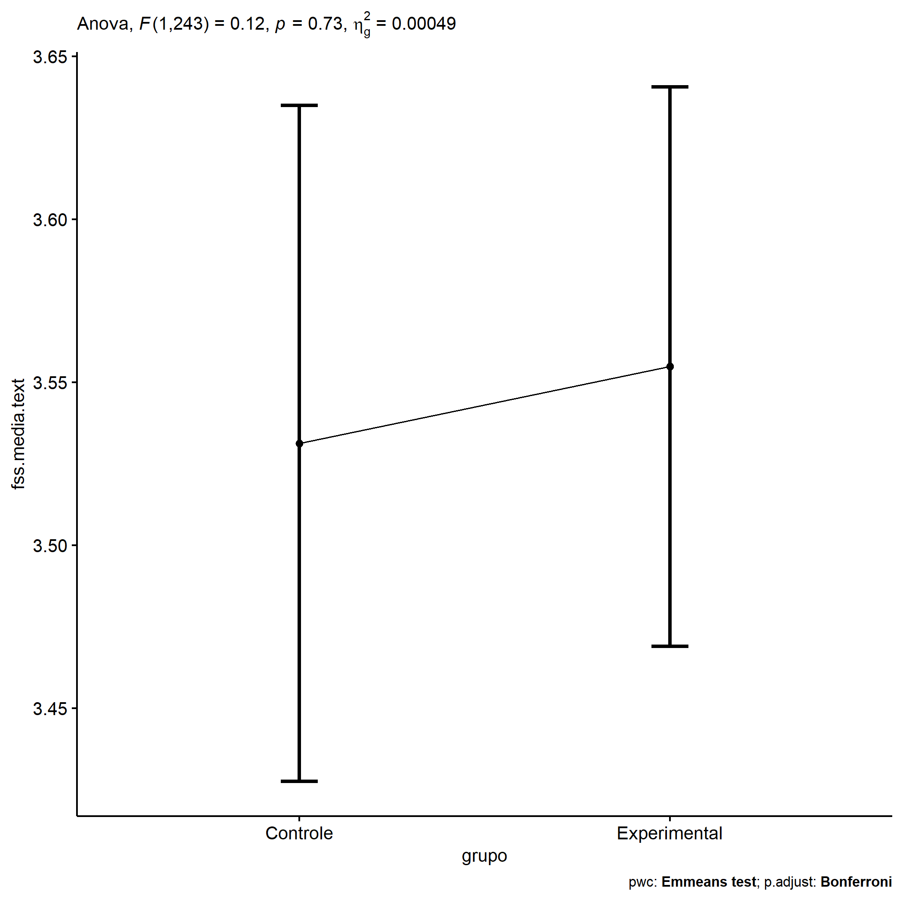<!-- -->

``` r
plots <- oneWayAncovaBoxPlots(
  wdat, "fss.media.text", "grupo", aov, pwc, covar = "dfs.media.text",
  theme = "classic", color = color[["grupo"]],
  subtitle = which(aov$Effect == "grupo"))
```

``` r
if (length(unique(wdat[["grupo"]])) > 1)
  plots[["grupo"]] + ggplot2::ylab("flow (prod. textual)") + ggplot2::scale_x_discrete(labels=c('pre', 'pos'))
```

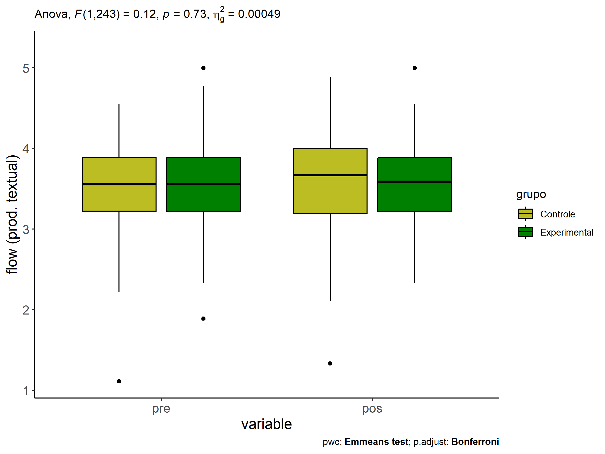<!-- -->

``` r
if (length(unique(wdat.long[["grupo"]])) > 1)
  plots <- oneWayAncovaBoxPlots(
    wdat.long, "flow.text", "grupo", aov, pwc.long, pre.post = "time",
    theme = "classic", color = color$prepost)
```

``` r
if (length(unique(wdat.long[["grupo"]])) > 1)
  plots[["grupo"]] + ggplot2::ylab("flow (prod. textual)")
```

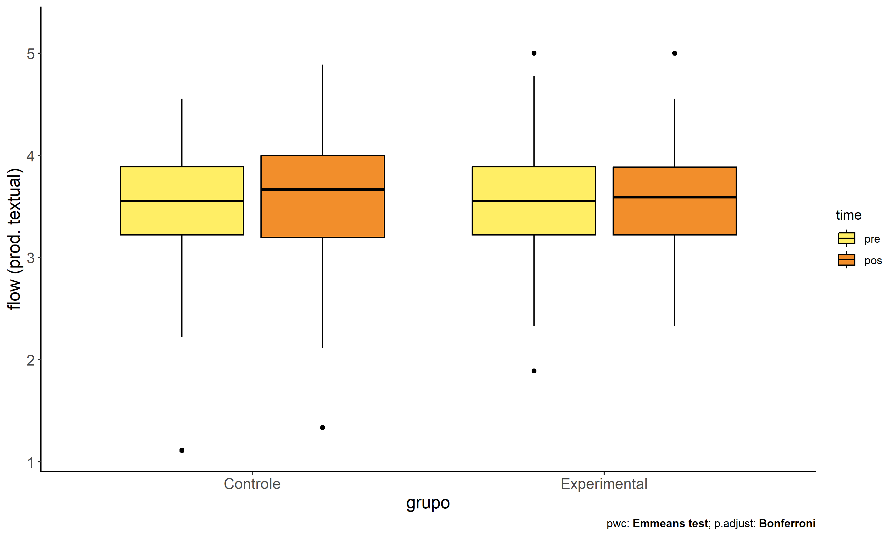<!-- -->

### Checking linearity assumption

``` r
ggscatter(wdat, x = "dfs.media.text", y = "fss.media.text", size = 0.5,
          color = "grupo", add = "reg.line")+
  stat_regline_equation(
    aes(label =  paste(..eq.label.., ..rr.label.., sep = "~~~~"), color = grupo)
  )
```

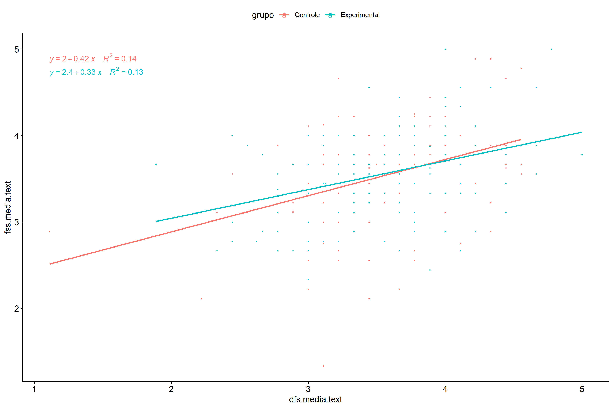<!-- -->

### Checking normality and homogeneity

``` r
res <- augment(lm(fss.media.text ~ dfs.media.text + grupo, data = wdat))
```

``` r
shapiro_test(res$.resid)
```

    ## # A tibble: 1 × 3
    ##   variable   statistic p.value
    ##   <chr>          <dbl>   <dbl>
    ## 1 res$.resid     0.989  0.0608

``` r
levene_test(res, .resid ~ grupo)
```

    ## # A tibble: 1 × 4
    ##     df1   df2 statistic     p
    ##   <int> <int>     <dbl> <dbl>
    ## 1     1   244      2.59 0.109

# ANCOVA and Pairwise for two factors **grupo:Sexo**

## Without remove non-normal data

``` r
pdat = remove_group_data(dat[!is.na(dat[["grupo"]]) & !is.na(dat[["Sexo"]]),], "fss.media.text", c("grupo","Sexo"))

pdat.long <- rbind(pdat[,c("id","grupo","Sexo")], pdat[,c("id","grupo","Sexo")])
pdat.long[["time"]] <- c(rep("pre", nrow(pdat)), rep("pos", nrow(pdat)))
pdat.long[["time"]] <- factor(pdat.long[["time"]], c("pre","pos"))
pdat.long[["flow.text"]] <- c(pdat[["dfs.media.text"]], pdat[["fss.media.text"]])

aov = anova_test(pdat, fss.media.text ~ dfs.media.text + grupo*Sexo)
laov[["grupo:Sexo"]] <- get_anova_table(aov)
```

``` r
pwcs <- list()
pwcs[["Sexo"]] <- emmeans_test(
  group_by(pdat, grupo), fss.media.text ~ Sexo,
  covariate = dfs.media.text, p.adjust.method = "bonferroni")
pwcs[["grupo"]] <- emmeans_test(
  group_by(pdat, Sexo), fss.media.text ~ grupo,
  covariate = dfs.media.text, p.adjust.method = "bonferroni")

pwc <- plyr::rbind.fill(pwcs[["grupo"]], pwcs[["Sexo"]])
pwc <- pwc[,c("grupo","Sexo", colnames(pwc)[!colnames(pwc) %in% c("grupo","Sexo")])]
```

``` r
pwc.long <- emmeans_test(dplyr::group_by_at(pdat.long, c("grupo","Sexo")),
                         flow.text ~ time,
                         p.adjust.method = "bonferroni")
lpwc[["grupo:Sexo"]] <- plyr::rbind.fill(pwc, pwc.long)
```

``` r
ds <- get.descriptives(pdat, "fss.media.text", c("grupo","Sexo"), covar = "dfs.media.text")
ds <- merge(ds[ds$variable != "dfs.media.text",],
            ds[ds$variable == "dfs.media.text", !colnames(ds) %in% c("variable")],
            by = c("grupo","Sexo"), all.x = T, suffixes = c("", ".dfs.media.text"))
ds <- merge(get_emmeans(pwcs[["grupo"]]), ds, by = c("grupo","Sexo"), suffixes = c(".emms", ""))
ds <- ds[,c("grupo","Sexo","n","mean.dfs.media.text","se.dfs.media.text","mean","se","emmean","se.emms")]

colnames(ds) <- c("grupo","Sexo", "N", paste0(c("M","SE")," (pre)"),
                  paste0(c("M","SE"), " (unadj)"), paste0(c("M", "SE"), " (adj)"))

lemms[["grupo:Sexo"]] <- ds
```

## Computing ANCOVA and PairWise After removing non-normal data (OK)

``` r
wdat = pdat 

res = residuals(lm(fss.media.text ~ dfs.media.text + grupo*Sexo, data = wdat))
non.normal = getNonNormal(res, wdat$id, plimit = 0.05)

wdat = wdat[!wdat$id %in% non.normal,]

wdat.long <- rbind(wdat[,c("id","grupo","Sexo")], wdat[,c("id","grupo","Sexo")])
wdat.long[["time"]] <- c(rep("pre", nrow(wdat)), rep("pos", nrow(wdat)))
wdat.long[["time"]] <- factor(wdat.long[["time"]], c("pre","pos"))
wdat.long[["flow.text"]] <- c(wdat[["dfs.media.text"]], wdat[["fss.media.text"]])


ldat[["grupo:Sexo"]] = wdat

(non.normal)
```

    ## [1] "P2314"

``` r
aov = anova_test(wdat, fss.media.text ~ dfs.media.text + grupo*Sexo)
laov[["grupo:Sexo"]] <- merge(get_anova_table(aov), laov[["grupo:Sexo"]], by="Effect", suffixes = c("","'"))

(df = get_anova_table(aov))
```

    ## ANOVA Table (type II tests)
    ## 
    ##           Effect DFn DFd      F        p p<.05      ges
    ## 1 dfs.media.text   1 240 37.954 3.03e-09     * 1.37e-01
    ## 2          grupo   1 240  0.003 9.53e-01       1.44e-05
    ## 3           Sexo   1 240  0.341 5.60e-01       1.00e-03
    ## 4     grupo:Sexo   1 240  1.304 2.55e-01       5.00e-03

| Effect         | DFn | DFd |      F |     p | p\<.05 |   ges |
|:---------------|----:|----:|-------:|------:|:-------|------:|
| dfs.media.text |   1 | 240 | 37.954 | 0.000 | \*     | 0.137 |
| grupo          |   1 | 240 |  0.003 | 0.953 |        | 0.000 |
| Sexo           |   1 | 240 |  0.341 | 0.560 |        | 0.001 |
| grupo:Sexo     |   1 | 240 |  1.304 | 0.255 |        | 0.005 |

``` r
pwcs <- list()
pwcs[["Sexo"]] <- emmeans_test(
  group_by(wdat, grupo), fss.media.text ~ Sexo,
  covariate = dfs.media.text, p.adjust.method = "bonferroni")
pwcs[["grupo"]] <- emmeans_test(
  group_by(wdat, Sexo), fss.media.text ~ grupo,
  covariate = dfs.media.text, p.adjust.method = "bonferroni")

pwc <- plyr::rbind.fill(pwcs[["grupo"]], pwcs[["Sexo"]])
pwc <- pwc[,c("grupo","Sexo", colnames(pwc)[!colnames(pwc) %in% c("grupo","Sexo")])]
```

| grupo        | Sexo | term                  | .y.            | group1   | group2       |  df | statistic |     p | p.adj | p.adj.signif |
|:-------------|:-----|:----------------------|:---------------|:---------|:-------------|----:|----------:|------:|------:|:-------------|
|              | F    | dfs.media.text\*grupo | fss.media.text | Controle | Experimental | 240 |    -0.867 | 0.387 | 0.387 | ns           |
|              | M    | dfs.media.text\*grupo | fss.media.text | Controle | Experimental | 240 |     0.745 | 0.457 | 0.457 | ns           |
| Controle     |      | dfs.media.text\*Sexo  | fss.media.text | F        | M            | 240 |    -1.253 | 0.211 | 0.211 | ns           |
| Experimental |      | dfs.media.text\*Sexo  | fss.media.text | F        | M            | 240 |     0.273 | 0.785 | 0.785 | ns           |

``` r
pwc.long <- emmeans_test(dplyr::group_by_at(wdat.long, c("grupo","Sexo")),
                         flow.text ~ time,
                         p.adjust.method = "bonferroni")
lpwc[["grupo:Sexo"]] <- merge(plyr::rbind.fill(pwc, pwc.long), lpwc[["grupo:Sexo"]], by=c("grupo","Sexo","term",".y.","group1","group2"), suffixes = c("","'"))
```

| grupo        | Sexo | term | .y.       | group1 | group2 |  df | statistic |     p | p.adj | p.adj.signif |
|:-------------|:-----|:-----|:----------|:-------|:-------|----:|----------:|------:|------:|:-------------|
| Controle     | F    | time | flow.text | pre    | pos    | 482 |     0.829 | 0.407 | 0.407 | ns           |
| Controle     | M    | time | flow.text | pre    | pos    | 482 |    -0.845 | 0.398 | 0.398 | ns           |
| Experimental | F    | time | flow.text | pre    | pos    | 482 |    -0.302 | 0.763 | 0.763 | ns           |
| Experimental | M    | time | flow.text | pre    | pos    | 482 |    -0.066 | 0.948 | 0.948 | ns           |

``` r
ds <- get.descriptives(wdat, "fss.media.text", c("grupo","Sexo"), covar = "dfs.media.text")
ds <- merge(ds[ds$variable != "dfs.media.text",],
            ds[ds$variable == "dfs.media.text", !colnames(ds) %in% c("variable")],
            by = c("grupo","Sexo"), all.x = T, suffixes = c("", ".dfs.media.text"))
ds <- merge(get_emmeans(pwcs[["grupo"]]), ds, by = c("grupo","Sexo"), suffixes = c(".emms", ""))
ds <- ds[,c("grupo","Sexo","n","mean.dfs.media.text","se.dfs.media.text","mean","se","emmean","se.emms")]

colnames(ds) <- c("grupo","Sexo", "N", paste0(c("M","SE")," (pre)"),
                  paste0(c("M","SE"), " (unadj)"), paste0(c("M", "SE"), " (adj)"))

lemms[["grupo:Sexo"]] <- merge(ds, lemms[["grupo:Sexo"]], by=c("grupo","Sexo"), suffixes = c("","'"))
```

| grupo        | Sexo |   N | M (pre) | SE (pre) | M (unadj) | SE (unadj) | M (adj) | SE (adj) |
|:-------------|:-----|----:|--------:|---------:|----------:|-----------:|--------:|---------:|
| Controle     | F    |  46 |   3.600 |    0.069 |     3.504 |      0.086 |   3.483 |    0.075 |
| Controle     | M    |  53 |   3.509 |    0.090 |     3.601 |      0.084 |   3.613 |    0.070 |
| Experimental | F    |  72 |   3.537 |    0.059 |     3.565 |      0.059 |   3.567 |    0.060 |
| Experimental | M    |  74 |   3.535 |    0.069 |     3.541 |      0.061 |   3.544 |    0.059 |

### Plots for ancova

``` r
plots <- twoWayAncovaPlots(
  wdat, "fss.media.text", c("grupo","Sexo"), aov, pwcs, addParam = c("mean_se"),
  font.label.size=10, step.increase=0.05, p.label="p.adj",
  subtitle = which(aov$Effect == "grupo:Sexo"))
```

``` r
if (!is.null(plots[["grupo"]]))
  plots[["grupo"]] + ggplot2::scale_color_manual(values = color[["Sexo"]])
```

    ## Scale for colour is already present.
    ## Adding another scale for colour, which will replace the existing scale.

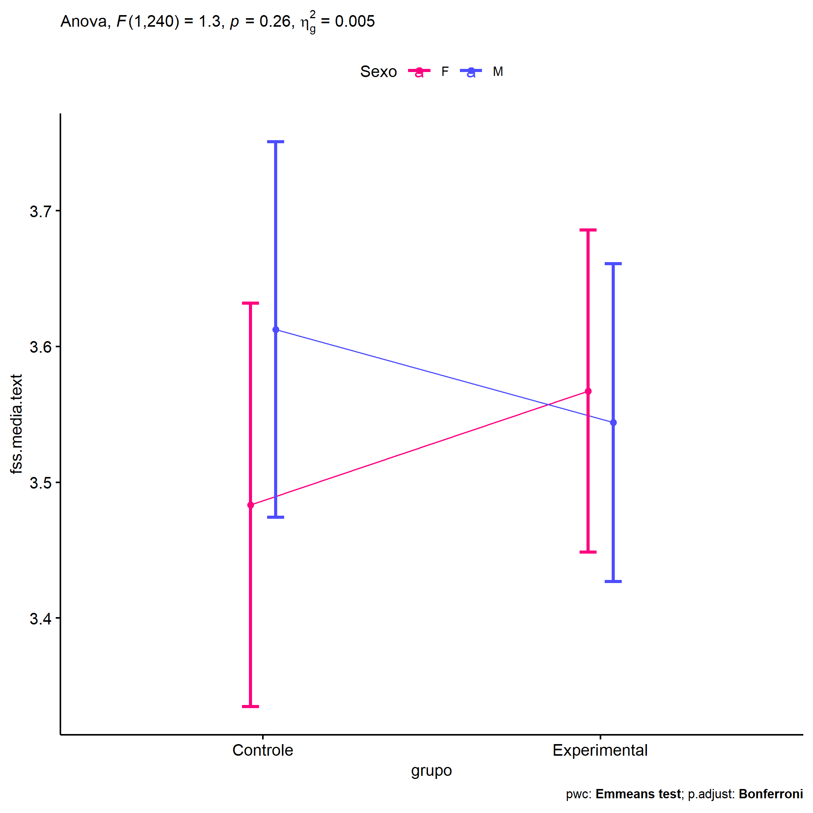<!-- -->

``` r
if (!is.null(plots[["Sexo"]]))
  plots[["Sexo"]] + ggplot2::scale_color_manual(values = color[["grupo"]])
```

    ## Scale for colour is already present.
    ## Adding another scale for colour, which will replace the existing scale.

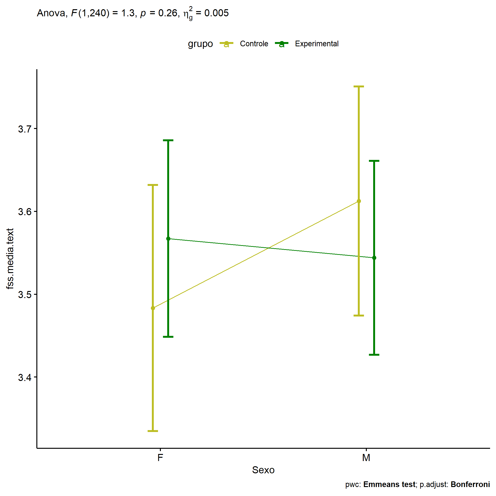<!-- -->

``` r
plots <- twoWayAncovaBoxPlots(
  wdat, "fss.media.text", c("grupo","Sexo"), aov, pwcs, covar = "dfs.media.text",
  theme = "classic", color = color[["grupo:Sexo"]],
  subtitle = which(aov$Effect == "grupo:Sexo"))
```

``` r
plots[["grupo:Sexo"]] + ggplot2::ylab("flow (prod. textual)") + ggplot2::scale_x_discrete(labels=c('pre', 'pos'))
```

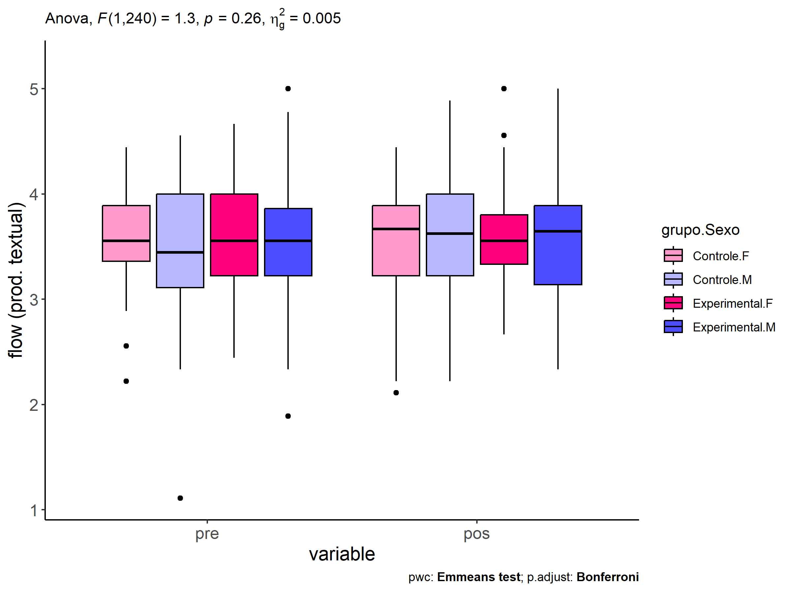<!-- -->

``` r
plots <- twoWayAncovaBoxPlots(
  wdat.long, "flow.text", c("grupo","Sexo"), aov, pwc.long, pre.post = "time",
  theme = "classic", color = color$prepost)
```

``` r
plots[["grupo:Sexo"]] + ggplot2::ylab("flow (prod. textual)")
```

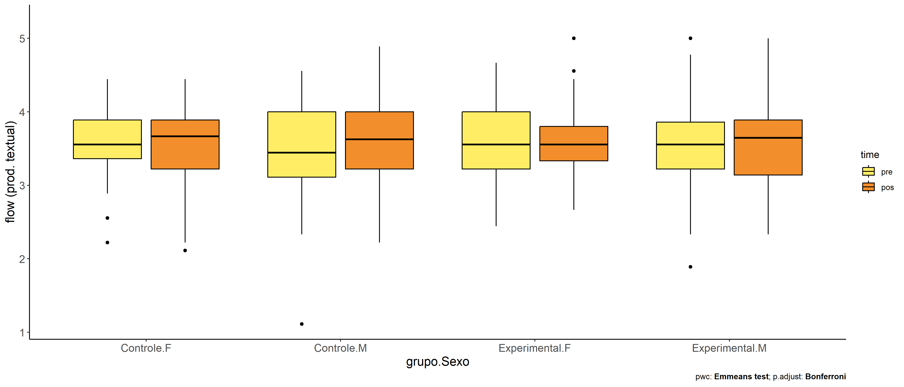<!-- -->

### Checking linearity assumption

``` r
ggscatter(wdat, x = "dfs.media.text", y = "fss.media.text", size = 0.5,
          facet.by = c("grupo","Sexo"), add = "reg.line")+
  stat_regline_equation(
    aes(label =  paste(..eq.label.., ..rr.label.., sep = "~~~~"))
  )
```

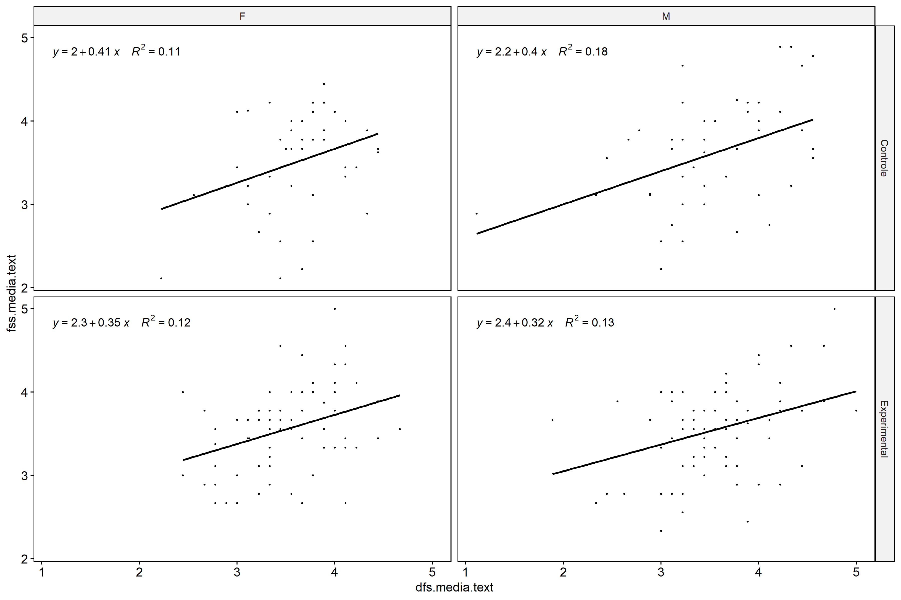<!-- -->

### Checking normality and homogeneity

``` r
res <- augment(lm(fss.media.text ~ dfs.media.text + grupo*Sexo, data = wdat))
```

``` r
shapiro_test(res$.resid)
```

    ## # A tibble: 1 × 3
    ##   variable   statistic p.value
    ##   <chr>          <dbl>   <dbl>
    ## 1 res$.resid     0.992   0.249

``` r
levene_test(res, .resid ~ grupo*Sexo)
```

    ## # A tibble: 1 × 4
    ##     df1   df2 statistic     p
    ##   <int> <int>     <dbl> <dbl>
    ## 1     3   241     0.592 0.621

# ANCOVA and Pairwise for two factors **grupo:Zona**

## Without remove non-normal data

``` r
pdat = remove_group_data(dat[!is.na(dat[["grupo"]]) & !is.na(dat[["Zona"]]),], "fss.media.text", c("grupo","Zona"))

pdat.long <- rbind(pdat[,c("id","grupo","Zona")], pdat[,c("id","grupo","Zona")])
pdat.long[["time"]] <- c(rep("pre", nrow(pdat)), rep("pos", nrow(pdat)))
pdat.long[["time"]] <- factor(pdat.long[["time"]], c("pre","pos"))
pdat.long[["flow.text"]] <- c(pdat[["dfs.media.text"]], pdat[["fss.media.text"]])

aov = anova_test(pdat, fss.media.text ~ dfs.media.text + grupo*Zona)
laov[["grupo:Zona"]] <- get_anova_table(aov)
```

``` r
pwcs <- list()
pwcs[["Zona"]] <- emmeans_test(
  group_by(pdat, grupo), fss.media.text ~ Zona,
  covariate = dfs.media.text, p.adjust.method = "bonferroni")
pwcs[["grupo"]] <- emmeans_test(
  group_by(pdat, Zona), fss.media.text ~ grupo,
  covariate = dfs.media.text, p.adjust.method = "bonferroni")

pwc <- plyr::rbind.fill(pwcs[["grupo"]], pwcs[["Zona"]])
pwc <- pwc[,c("grupo","Zona", colnames(pwc)[!colnames(pwc) %in% c("grupo","Zona")])]
```

``` r
pwc.long <- emmeans_test(dplyr::group_by_at(pdat.long, c("grupo","Zona")),
                         flow.text ~ time,
                         p.adjust.method = "bonferroni")
lpwc[["grupo:Zona"]] <- plyr::rbind.fill(pwc, pwc.long)
```

``` r
ds <- get.descriptives(pdat, "fss.media.text", c("grupo","Zona"), covar = "dfs.media.text")
ds <- merge(ds[ds$variable != "dfs.media.text",],
            ds[ds$variable == "dfs.media.text", !colnames(ds) %in% c("variable")],
            by = c("grupo","Zona"), all.x = T, suffixes = c("", ".dfs.media.text"))
ds <- merge(get_emmeans(pwcs[["grupo"]]), ds, by = c("grupo","Zona"), suffixes = c(".emms", ""))
ds <- ds[,c("grupo","Zona","n","mean.dfs.media.text","se.dfs.media.text","mean","se","emmean","se.emms")]

colnames(ds) <- c("grupo","Zona", "N", paste0(c("M","SE")," (pre)"),
                  paste0(c("M","SE"), " (unadj)"), paste0(c("M", "SE"), " (adj)"))

lemms[["grupo:Zona"]] <- ds
```

## Computing ANCOVA and PairWise After removing non-normal data (OK)

``` r
wdat = pdat 

res = residuals(lm(fss.media.text ~ dfs.media.text + grupo*Zona, data = wdat))
non.normal = getNonNormal(res, wdat$id, plimit = 0.05)

wdat = wdat[!wdat$id %in% non.normal,]

wdat.long <- rbind(wdat[,c("id","grupo","Zona")], wdat[,c("id","grupo","Zona")])
wdat.long[["time"]] <- c(rep("pre", nrow(wdat)), rep("pos", nrow(wdat)))
wdat.long[["time"]] <- factor(wdat.long[["time"]], c("pre","pos"))
wdat.long[["flow.text"]] <- c(wdat[["dfs.media.text"]], wdat[["fss.media.text"]])


ldat[["grupo:Zona"]] = wdat

(non.normal)
```

    ## NULL

``` r
aov = anova_test(wdat, fss.media.text ~ dfs.media.text + grupo*Zona)
laov[["grupo:Zona"]] <- merge(get_anova_table(aov), laov[["grupo:Zona"]], by="Effect", suffixes = c("","'"))

(df = get_anova_table(aov))
```

    ## ANOVA Table (type II tests)
    ## 
    ##           Effect DFn DFd      F        p p<.05      ges
    ## 1 dfs.media.text   1 128 20.935 1.11e-05     * 0.141000
    ## 2          grupo   1 128  0.564 4.54e-01       0.004000
    ## 3           Zona   1 128  0.027 8.70e-01       0.000211
    ## 4     grupo:Zona   1 128  0.056 8.14e-01       0.000434

| Effect         | DFn | DFd |      F |     p | p\<.05 |   ges |
|:---------------|----:|----:|-------:|------:|:-------|------:|
| dfs.media.text |   1 | 128 | 20.935 | 0.000 | \*     | 0.141 |
| grupo          |   1 | 128 |  0.564 | 0.454 |        | 0.004 |
| Zona           |   1 | 128 |  0.027 | 0.870 |        | 0.000 |
| grupo:Zona     |   1 | 128 |  0.056 | 0.814 |        | 0.000 |

``` r
pwcs <- list()
pwcs[["Zona"]] <- emmeans_test(
  group_by(wdat, grupo), fss.media.text ~ Zona,
  covariate = dfs.media.text, p.adjust.method = "bonferroni")
pwcs[["grupo"]] <- emmeans_test(
  group_by(wdat, Zona), fss.media.text ~ grupo,
  covariate = dfs.media.text, p.adjust.method = "bonferroni")

pwc <- plyr::rbind.fill(pwcs[["grupo"]], pwcs[["Zona"]])
pwc <- pwc[,c("grupo","Zona", colnames(pwc)[!colnames(pwc) %in% c("grupo","Zona")])]
```

| grupo        | Zona   | term                  | .y.            | group1   | group2       |  df | statistic |     p | p.adj | p.adj.signif |
|:-------------|:-------|:----------------------|:---------------|:---------|:-------------|----:|----------:|------:|------:|:-------------|
|              | Rural  | dfs.media.text\*grupo | fss.media.text | Controle | Experimental | 128 |     0.748 | 0.456 | 0.456 | ns           |
|              | Urbana | dfs.media.text\*grupo | fss.media.text | Controle | Experimental | 128 |     0.228 | 0.820 | 0.820 | ns           |
| Controle     |        | dfs.media.text\*Zona  | fss.media.text | Rural    | Urbana       | 128 |     0.287 | 0.774 | 0.774 | ns           |
| Experimental |        | dfs.media.text\*Zona  | fss.media.text | Rural    | Urbana       | 128 |    -0.008 | 0.993 | 0.993 | ns           |

``` r
pwc.long <- emmeans_test(dplyr::group_by_at(wdat.long, c("grupo","Zona")),
                         flow.text ~ time,
                         p.adjust.method = "bonferroni")
lpwc[["grupo:Zona"]] <- merge(plyr::rbind.fill(pwc, pwc.long), lpwc[["grupo:Zona"]], by=c("grupo","Zona","term",".y.","group1","group2"), suffixes = c("","'"))
```

| grupo        | Zona   | term | .y.       | group1 | group2 |  df | statistic |     p | p.adj | p.adj.signif |
|:-------------|:-------|:-----|:----------|:-------|:-------|----:|----------:|------:|------:|:-------------|
| Controle     | Rural  | time | flow.text | pre    | pos    | 258 |     0.600 | 0.549 | 0.549 | ns           |
| Controle     | Urbana | time | flow.text | pre    | pos    | 258 |    -0.789 | 0.431 | 0.431 | ns           |
| Experimental | Rural  | time | flow.text | pre    | pos    | 258 |     0.096 | 0.924 | 0.924 | ns           |
| Experimental | Urbana | time | flow.text | pre    | pos    | 258 |     0.399 | 0.690 | 0.690 | ns           |

``` r
ds <- get.descriptives(wdat, "fss.media.text", c("grupo","Zona"), covar = "dfs.media.text")
ds <- merge(ds[ds$variable != "dfs.media.text",],
            ds[ds$variable == "dfs.media.text", !colnames(ds) %in% c("variable")],
            by = c("grupo","Zona"), all.x = T, suffixes = c("", ".dfs.media.text"))
ds <- merge(get_emmeans(pwcs[["grupo"]]), ds, by = c("grupo","Zona"), suffixes = c(".emms", ""))
ds <- ds[,c("grupo","Zona","n","mean.dfs.media.text","se.dfs.media.text","mean","se","emmean","se.emms")]

colnames(ds) <- c("grupo","Zona", "N", paste0(c("M","SE")," (pre)"),
                  paste0(c("M","SE"), " (unadj)"), paste0(c("M", "SE"), " (adj)"))

lemms[["grupo:Zona"]] <- merge(ds, lemms[["grupo:Zona"]], by=c("grupo","Zona"), suffixes = c("","'"))
```

| grupo        | Zona   |   N | M (pre) | SE (pre) | M (unadj) | SE (unadj) | M (adj) | SE (adj) |
|:-------------|:-------|----:|--------:|---------:|----------:|-----------:|--------:|---------:|
| Controle     | Rural  |  37 |   3.679 |    0.090 |     3.600 |      0.097 |   3.542 |    0.083 |
| Controle     | Urbana |  15 |   3.244 |    0.194 |     3.407 |      0.182 |   3.497 |    0.131 |
| Experimental | Rural  |  50 |   3.451 |    0.075 |     3.441 |      0.056 |   3.460 |    0.071 |
| Experimental | Urbana |  31 |   3.523 |    0.118 |     3.466 |      0.104 |   3.461 |    0.090 |

### Plots for ancova

``` r
plots <- twoWayAncovaPlots(
  wdat, "fss.media.text", c("grupo","Zona"), aov, pwcs, addParam = c("mean_se"),
  font.label.size=10, step.increase=0.05, p.label="p.adj",
  subtitle = which(aov$Effect == "grupo:Zona"))
```

``` r
if (!is.null(plots[["grupo"]]))
  plots[["grupo"]] + ggplot2::scale_color_manual(values = color[["Zona"]])
```

    ## Scale for colour is already present.
    ## Adding another scale for colour, which will replace the existing scale.

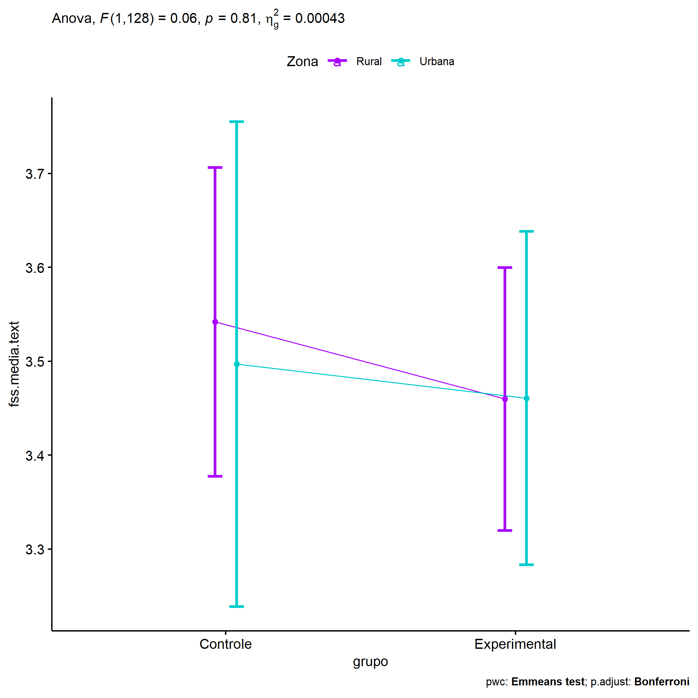<!-- -->

``` r
if (!is.null(plots[["Zona"]]))
  plots[["Zona"]] + ggplot2::scale_color_manual(values = color[["grupo"]])
```

    ## Scale for colour is already present.
    ## Adding another scale for colour, which will replace the existing scale.

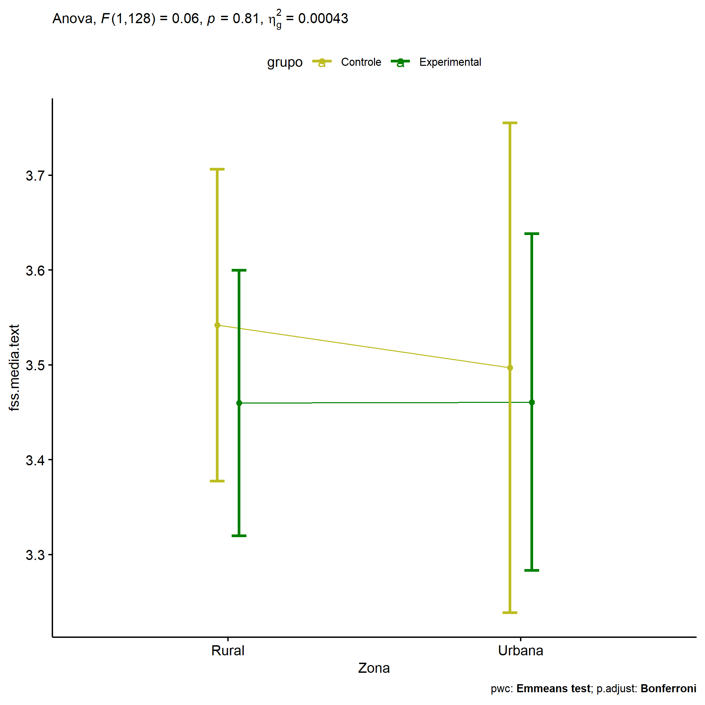<!-- -->

``` r
plots <- twoWayAncovaBoxPlots(
  wdat, "fss.media.text", c("grupo","Zona"), aov, pwcs, covar = "dfs.media.text",
  theme = "classic", color = color[["grupo:Zona"]],
  subtitle = which(aov$Effect == "grupo:Zona"))
```

``` r
plots[["grupo:Zona"]] + ggplot2::ylab("flow (prod. textual)") + ggplot2::scale_x_discrete(labels=c('pre', 'pos'))
```

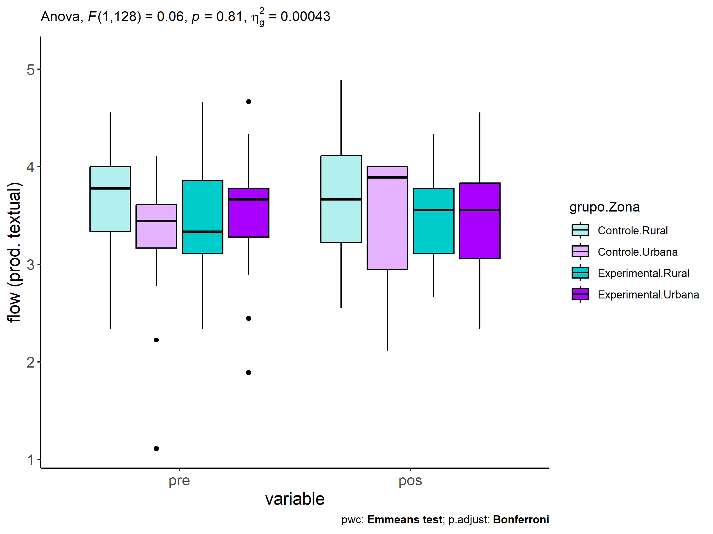<!-- -->

``` r
plots <- twoWayAncovaBoxPlots(
  wdat.long, "flow.text", c("grupo","Zona"), aov, pwc.long, pre.post = "time",
  theme = "classic", color = color$prepost)
```

``` r
plots[["grupo:Zona"]] + ggplot2::ylab("flow (prod. textual)")
```

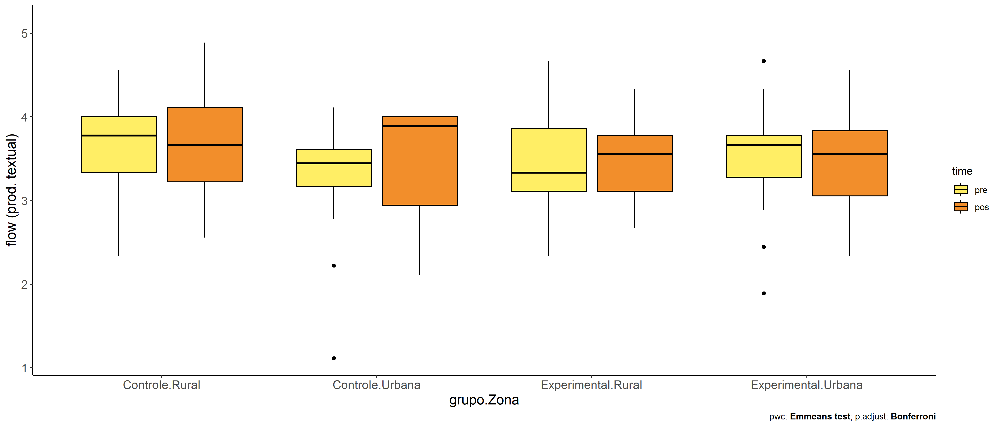<!-- -->

### Checking linearity assumption

``` r
ggscatter(wdat, x = "dfs.media.text", y = "fss.media.text", size = 0.5,
          facet.by = c("grupo","Zona"), add = "reg.line")+
  stat_regline_equation(
    aes(label =  paste(..eq.label.., ..rr.label.., sep = "~~~~"))
  )
```

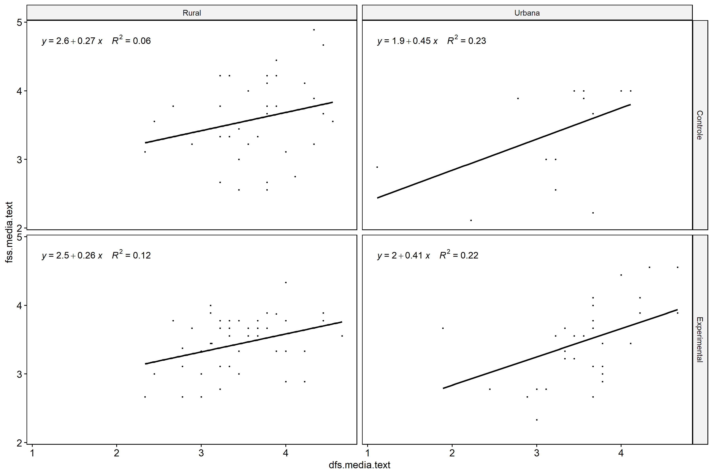<!-- -->

### Checking normality and homogeneity

``` r
res <- augment(lm(fss.media.text ~ dfs.media.text + grupo*Zona, data = wdat))
```

``` r
shapiro_test(res$.resid)
```

    ## # A tibble: 1 × 3
    ##   variable   statistic p.value
    ##   <chr>          <dbl>   <dbl>
    ## 1 res$.resid     0.983  0.0904

``` r
levene_test(res, .resid ~ grupo*Zona)
```

    ## # A tibble: 1 × 4
    ##     df1   df2 statistic      p
    ##   <int> <int>     <dbl>  <dbl>
    ## 1     3   129      2.63 0.0528

# ANCOVA and Pairwise for two factors **grupo:Cor.Raca**

## Without remove non-normal data

``` r
pdat = remove_group_data(dat[!is.na(dat[["grupo"]]) & !is.na(dat[["Cor.Raca"]]),], "fss.media.text", c("grupo","Cor.Raca"))

pdat.long <- rbind(pdat[,c("id","grupo","Cor.Raca")], pdat[,c("id","grupo","Cor.Raca")])
pdat.long[["time"]] <- c(rep("pre", nrow(pdat)), rep("pos", nrow(pdat)))
pdat.long[["time"]] <- factor(pdat.long[["time"]], c("pre","pos"))
pdat.long[["flow.text"]] <- c(pdat[["dfs.media.text"]], pdat[["fss.media.text"]])

aov = anova_test(pdat, fss.media.text ~ dfs.media.text + grupo*Cor.Raca)
laov[["grupo:Cor.Raca"]] <- get_anova_table(aov)
```

``` r
pwcs <- list()
pwcs[["Cor.Raca"]] <- emmeans_test(
  group_by(pdat, grupo), fss.media.text ~ Cor.Raca,
  covariate = dfs.media.text, p.adjust.method = "bonferroni")
pwcs[["grupo"]] <- emmeans_test(
  group_by(pdat, Cor.Raca), fss.media.text ~ grupo,
  covariate = dfs.media.text, p.adjust.method = "bonferroni")

pwc <- plyr::rbind.fill(pwcs[["grupo"]], pwcs[["Cor.Raca"]])
pwc <- pwc[,c("grupo","Cor.Raca", colnames(pwc)[!colnames(pwc) %in% c("grupo","Cor.Raca")])]
```

``` r
pwc.long <- emmeans_test(dplyr::group_by_at(pdat.long, c("grupo","Cor.Raca")),
                         flow.text ~ time,
                         p.adjust.method = "bonferroni")
lpwc[["grupo:Cor.Raca"]] <- plyr::rbind.fill(pwc, pwc.long)
```

``` r
ds <- get.descriptives(pdat, "fss.media.text", c("grupo","Cor.Raca"), covar = "dfs.media.text")
ds <- merge(ds[ds$variable != "dfs.media.text",],
            ds[ds$variable == "dfs.media.text", !colnames(ds) %in% c("variable")],
            by = c("grupo","Cor.Raca"), all.x = T, suffixes = c("", ".dfs.media.text"))
ds <- merge(get_emmeans(pwcs[["grupo"]]), ds, by = c("grupo","Cor.Raca"), suffixes = c(".emms", ""))
ds <- ds[,c("grupo","Cor.Raca","n","mean.dfs.media.text","se.dfs.media.text","mean","se","emmean","se.emms")]

colnames(ds) <- c("grupo","Cor.Raca", "N", paste0(c("M","SE")," (pre)"),
                  paste0(c("M","SE"), " (unadj)"), paste0(c("M", "SE"), " (adj)"))

lemms[["grupo:Cor.Raca"]] <- ds
```

## Computing ANCOVA and PairWise After removing non-normal data (OK)

``` r
wdat = pdat 

res = residuals(lm(fss.media.text ~ dfs.media.text + grupo*Cor.Raca, data = wdat))
non.normal = getNonNormal(res, wdat$id, plimit = 0.05)

wdat = wdat[!wdat$id %in% non.normal,]

wdat.long <- rbind(wdat[,c("id","grupo","Cor.Raca")], wdat[,c("id","grupo","Cor.Raca")])
wdat.long[["time"]] <- c(rep("pre", nrow(wdat)), rep("pos", nrow(wdat)))
wdat.long[["time"]] <- factor(wdat.long[["time"]], c("pre","pos"))
wdat.long[["flow.text"]] <- c(wdat[["dfs.media.text"]], wdat[["fss.media.text"]])


ldat[["grupo:Cor.Raca"]] = wdat

(non.normal)
```

    ## NULL

``` r
aov = anova_test(wdat, fss.media.text ~ dfs.media.text + grupo*Cor.Raca)
laov[["grupo:Cor.Raca"]] <- merge(get_anova_table(aov), laov[["grupo:Cor.Raca"]], by="Effect", suffixes = c("","'"))

(df = get_anova_table(aov))
```

    ## ANOVA Table (type II tests)
    ## 
    ##           Effect DFn DFd      F        p p<.05   ges
    ## 1 dfs.media.text   1 100 16.131 0.000114     * 0.139
    ## 2          grupo   1 100  0.278 0.599000       0.003
    ## 3       Cor.Raca   1 100  0.311 0.579000       0.003
    ## 4 grupo:Cor.Raca   1 100  0.147 0.702000       0.001

| Effect         | DFn | DFd |      F |     p | p\<.05 |   ges |
|:---------------|----:|----:|-------:|------:|:-------|------:|
| dfs.media.text |   1 | 100 | 16.131 | 0.000 | \*     | 0.139 |
| grupo          |   1 | 100 |  0.278 | 0.599 |        | 0.003 |
| Cor.Raca       |   1 | 100 |  0.311 | 0.579 |        | 0.003 |
| grupo:Cor.Raca |   1 | 100 |  0.147 | 0.702 |        | 0.001 |

``` r
pwcs <- list()
pwcs[["Cor.Raca"]] <- emmeans_test(
  group_by(wdat, grupo), fss.media.text ~ Cor.Raca,
  covariate = dfs.media.text, p.adjust.method = "bonferroni")
pwcs[["grupo"]] <- emmeans_test(
  group_by(wdat, Cor.Raca), fss.media.text ~ grupo,
  covariate = dfs.media.text, p.adjust.method = "bonferroni")

pwc <- plyr::rbind.fill(pwcs[["grupo"]], pwcs[["Cor.Raca"]])
pwc <- pwc[,c("grupo","Cor.Raca", colnames(pwc)[!colnames(pwc) %in% c("grupo","Cor.Raca")])]
```

| grupo        | Cor.Raca | term                     | .y.            | group1   | group2       |  df | statistic |     p | p.adj | p.adj.signif |
|:-------------|:---------|:-------------------------|:---------------|:---------|:-------------|----:|----------:|------:|------:|:-------------|
|              | Branca   | dfs.media.text\*grupo    | fss.media.text | Controle | Experimental | 100 |    -0.569 | 0.571 | 0.571 | ns           |
|              | Parda    | dfs.media.text\*grupo    | fss.media.text | Controle | Experimental | 100 |    -0.317 | 0.752 | 0.752 | ns           |
| Controle     |          | dfs.media.text\*Cor.Raca | fss.media.text | Branca   | Parda        | 100 |     0.037 | 0.970 | 0.970 | ns           |
| Experimental |          | dfs.media.text\*Cor.Raca | fss.media.text | Branca   | Parda        | 100 |     0.676 | 0.500 | 0.500 | ns           |

``` r
pwc.long <- emmeans_test(dplyr::group_by_at(wdat.long, c("grupo","Cor.Raca")),
                         flow.text ~ time,
                         p.adjust.method = "bonferroni")
lpwc[["grupo:Cor.Raca"]] <- merge(plyr::rbind.fill(pwc, pwc.long), lpwc[["grupo:Cor.Raca"]], by=c("grupo","Cor.Raca","term",".y.","group1","group2"), suffixes = c("","'"))
```

| grupo        | Cor.Raca | term | .y.       | group1 | group2 |  df | statistic |     p | p.adj | p.adj.signif |
|:-------------|:---------|:-----|:----------|:-------|:-------|----:|----------:|------:|------:|:-------------|
| Controle     | Branca   | time | flow.text | pre    | pos    | 202 |     1.195 | 0.233 | 0.233 | ns           |
| Controle     | Parda    | time | flow.text | pre    | pos    | 202 |    -0.412 | 0.680 | 0.680 | ns           |
| Experimental | Branca   | time | flow.text | pre    | pos    | 202 |     0.005 | 0.996 | 0.996 | ns           |
| Experimental | Parda    | time | flow.text | pre    | pos    | 202 |    -0.490 | 0.625 | 0.625 | ns           |

``` r
ds <- get.descriptives(wdat, "fss.media.text", c("grupo","Cor.Raca"), covar = "dfs.media.text")
ds <- merge(ds[ds$variable != "dfs.media.text",],
            ds[ds$variable == "dfs.media.text", !colnames(ds) %in% c("variable")],
            by = c("grupo","Cor.Raca"), all.x = T, suffixes = c("", ".dfs.media.text"))
ds <- merge(get_emmeans(pwcs[["grupo"]]), ds, by = c("grupo","Cor.Raca"), suffixes = c(".emms", ""))
ds <- ds[,c("grupo","Cor.Raca","n","mean.dfs.media.text","se.dfs.media.text","mean","se","emmean","se.emms")]

colnames(ds) <- c("grupo","Cor.Raca", "N", paste0(c("M","SE")," (pre)"),
                  paste0(c("M","SE"), " (unadj)"), paste0(c("M", "SE"), " (adj)"))

lemms[["grupo:Cor.Raca"]] <- merge(ds, lemms[["grupo:Cor.Raca"]], by=c("grupo","Cor.Raca"), suffixes = c("","'"))
```

| grupo        | Cor.Raca |   N | M (pre) | SE (pre) | M (unadj) | SE (unadj) | M (adj) | SE (adj) |
|:-------------|:---------|----:|--------:|---------:|----------:|-----------:|--------:|---------:|
| Controle     | Branca   |   7 |   4.048 |    0.184 |     3.698 |      0.224 |   3.526 |    0.187 |
| Controle     | Parda    |  41 |   3.438 |    0.093 |     3.487 |      0.089 |   3.518 |    0.075 |
| Experimental | Branca   |  13 |   3.719 |    0.154 |     3.718 |      0.109 |   3.655 |    0.134 |
| Experimental | Parda    |  44 |   3.476 |    0.087 |     3.533 |      0.072 |   3.551 |    0.073 |

### Plots for ancova

``` r
plots <- twoWayAncovaPlots(
  wdat, "fss.media.text", c("grupo","Cor.Raca"), aov, pwcs, addParam = c("mean_se"),
  font.label.size=10, step.increase=0.05, p.label="p.adj",
  subtitle = which(aov$Effect == "grupo:Cor.Raca"))
```

``` r
if (!is.null(plots[["grupo"]]))
  plots[["grupo"]] + ggplot2::scale_color_manual(values = color[["Cor.Raca"]])
```

    ## Scale for colour is already present.
    ## Adding another scale for colour, which will replace the existing scale.

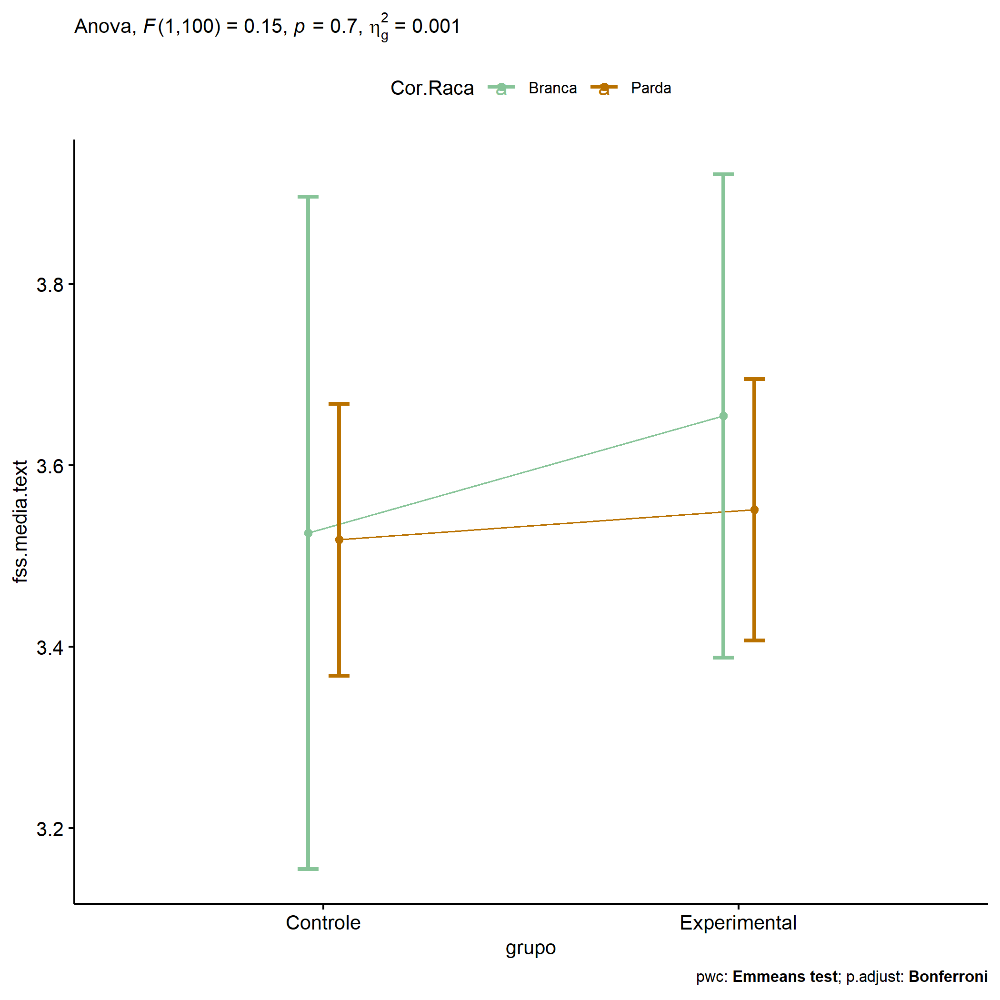<!-- -->

``` r
if (!is.null(plots[["Cor.Raca"]]))
  plots[["Cor.Raca"]] + ggplot2::scale_color_manual(values = color[["grupo"]])
```

    ## Scale for colour is already present.
    ## Adding another scale for colour, which will replace the existing scale.

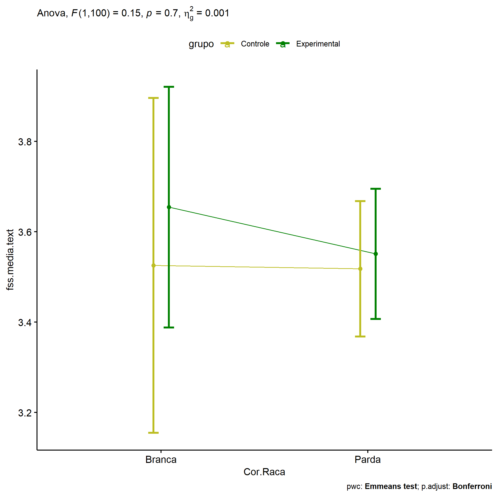<!-- -->

``` r
plots <- twoWayAncovaBoxPlots(
  wdat, "fss.media.text", c("grupo","Cor.Raca"), aov, pwcs, covar = "dfs.media.text",
  theme = "classic", color = color[["grupo:Cor.Raca"]],
  subtitle = which(aov$Effect == "grupo:Cor.Raca"))
```

``` r
plots[["grupo:Cor.Raca"]] + ggplot2::ylab("flow (prod. textual)") + ggplot2::scale_x_discrete(labels=c('pre', 'pos'))
```

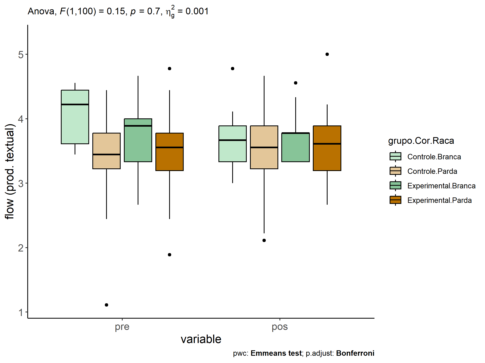<!-- -->

``` r
plots <- twoWayAncovaBoxPlots(
  wdat.long, "flow.text", c("grupo","Cor.Raca"), aov, pwc.long, pre.post = "time",
  theme = "classic", color = color$prepost)
```

``` r
plots[["grupo:Cor.Raca"]] + ggplot2::ylab("flow (prod. textual)")
```

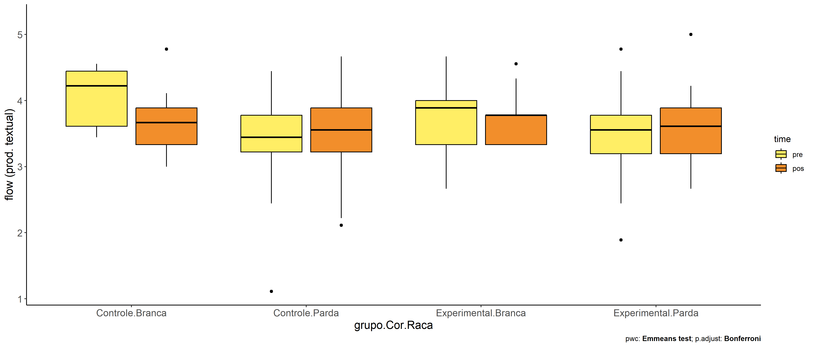<!-- -->

### Checking linearity assumption

``` r
ggscatter(wdat, x = "dfs.media.text", y = "fss.media.text", size = 0.5,
          facet.by = c("grupo","Cor.Raca"), add = "reg.line")+
  stat_regline_equation(
    aes(label =  paste(..eq.label.., ..rr.label.., sep = "~~~~"))
  )
```

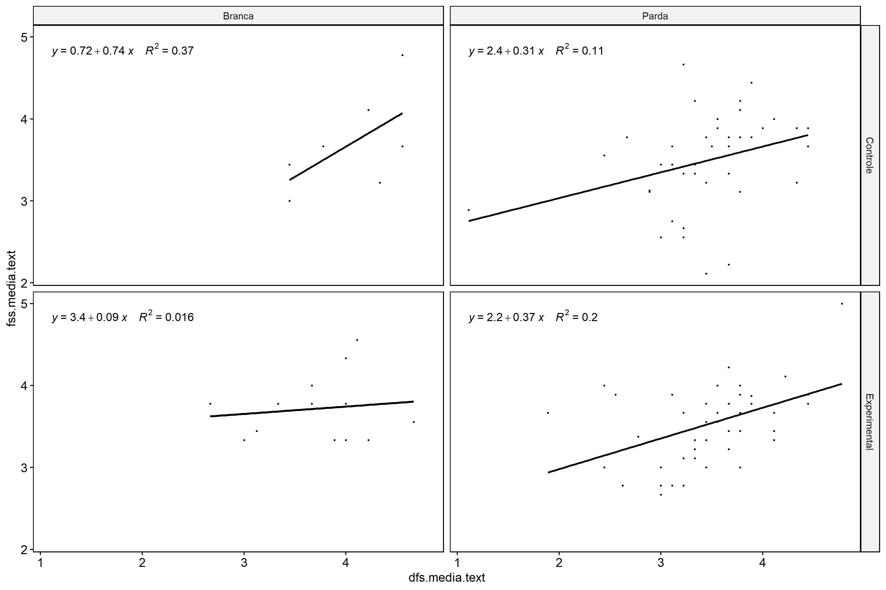<!-- -->

### Checking normality and homogeneity

``` r
res <- augment(lm(fss.media.text ~ dfs.media.text + grupo*Cor.Raca, data = wdat))
```

``` r
shapiro_test(res$.resid)
```

    ## # A tibble: 1 × 3
    ##   variable   statistic p.value
    ##   <chr>          <dbl>   <dbl>
    ## 1 res$.resid     0.992   0.814

``` r
levene_test(res, .resid ~ grupo*Cor.Raca)
```

    ## # A tibble: 1 × 4
    ##     df1   df2 statistic     p
    ##   <int> <int>     <dbl> <dbl>
    ## 1     3   101     0.142 0.934

# Summary of Results

## Descriptive Statistics

``` r
df <- get.descriptives(ldat[["grupo"]], c(dv.pre, dv.pos), c("grupo"), 
                       include.global = T, symmetry.test = T, normality.test = F)
df <- plyr::rbind.fill(
  df, do.call(plyr::rbind.fill, lapply(lfatores2, FUN = function(f) {
    if (nrow(dat) > 0 && sum(!is.na(unique(dat[[f]]))) > 1)
      get.descriptives(ldat[[paste0("grupo:",f)]], c(dv.pre,dv.pos), c("grupo", f),
                       symmetry.test = T, normality.test = F)
    }))
)
(df <- df[,c(fatores1[fatores1 %in% colnames(df)],"variable",
             colnames(df)[!colnames(df) %in% c(fatores1,"variable")])])
```

    ##           grupo Sexo   Zona Cor.Raca       variable   n  mean median   min   max    sd    se    ci   iqr
    ## 1      Controle <NA>   <NA>     <NA> dfs.media.text 100 3.547  3.556 1.111 4.556 0.573 0.057 0.114 0.667
    ## 2  Experimental <NA>   <NA>     <NA> dfs.media.text 146 3.536  3.556 1.889 5.000 0.551 0.046 0.090 0.667
    ## 3          <NA> <NA>   <NA>     <NA> dfs.media.text 246 3.541  3.556 1.111 5.000 0.559 0.036 0.070 0.667
    ## 4      Controle <NA>   <NA>     <NA> fss.media.text 100 3.534  3.667 1.333 4.889 0.636 0.064 0.126 0.802
    ## 5  Experimental <NA>   <NA>     <NA> fss.media.text 146 3.553  3.590 2.333 5.000 0.510 0.042 0.083 0.663
    ## 6          <NA> <NA>   <NA>     <NA> fss.media.text 246 3.545  3.646 1.333 5.000 0.563 0.036 0.071 0.667
    ## 7      Controle    F   <NA>     <NA> dfs.media.text  46 3.600  3.556 2.222 4.444 0.465 0.069 0.138 0.528
    ## 8      Controle    M   <NA>     <NA> dfs.media.text  53 3.509  3.444 1.111 4.556 0.656 0.090 0.181 0.889
    ## 9  Experimental    F   <NA>     <NA> dfs.media.text  72 3.537  3.556 2.444 4.667 0.503 0.059 0.118 0.778
    ## 10 Experimental    M   <NA>     <NA> dfs.media.text  74 3.535  3.556 1.889 5.000 0.597 0.069 0.138 0.639
    ## 11     Controle    F   <NA>     <NA> fss.media.text  46 3.504  3.667 2.111 4.444 0.585 0.086 0.174 0.667
    ## 12     Controle    M   <NA>     <NA> fss.media.text  53 3.601  3.625 2.222 4.889 0.612 0.084 0.169 0.778
    ## 13 Experimental    F   <NA>     <NA> fss.media.text  72 3.565  3.556 2.667 5.000 0.500 0.059 0.117 0.469
    ## 14 Experimental    M   <NA>     <NA> fss.media.text  74 3.541  3.646 2.333 5.000 0.523 0.061 0.121 0.750
    ## 15     Controle <NA>  Rural     <NA> dfs.media.text  37 3.679  3.778 2.333 4.556 0.546 0.090 0.182 0.667
    ## 16     Controle <NA> Urbana     <NA> dfs.media.text  15 3.244  3.444 1.111 4.111 0.750 0.194 0.416 0.444
    ## 17 Experimental <NA>  Rural     <NA> dfs.media.text  50 3.451  3.333 2.333 4.667 0.527 0.075 0.150 0.750
    ## 18 Experimental <NA> Urbana     <NA> dfs.media.text  31 3.523  3.667 1.889 4.667 0.659 0.118 0.242 0.500
    ## 19     Controle <NA>  Rural     <NA> fss.media.text  37 3.600  3.667 2.556 4.889 0.593 0.097 0.198 0.889
    ## 20     Controle <NA> Urbana     <NA> fss.media.text  15 3.407  3.889 2.111 4.000 0.704 0.182 0.390 1.056
    ## 21 Experimental <NA>  Rural     <NA> fss.media.text  50 3.441  3.556 2.667 4.333 0.394 0.056 0.112 0.667
    ## 22 Experimental <NA> Urbana     <NA> fss.media.text  31 3.466  3.556 2.333 4.556 0.578 0.104 0.212 0.778
    ## 23     Controle <NA>   <NA>   Branca dfs.media.text   7 4.048  4.222 3.444 4.556 0.488 0.184 0.451 0.833
    ## 24     Controle <NA>   <NA>    Parda dfs.media.text  41 3.438  3.444 1.111 4.444 0.593 0.093 0.187 0.556
    ## 25 Experimental <NA>   <NA>   Branca dfs.media.text  13 3.719  3.889 2.667 4.667 0.555 0.154 0.336 0.667
    ## 26 Experimental <NA>   <NA>    Parda dfs.media.text  44 3.476  3.556 1.889 4.778 0.577 0.087 0.175 0.583
    ## 27     Controle <NA>   <NA>   Branca fss.media.text   7 3.698  3.667 3.000 4.778 0.594 0.224 0.549 0.556
    ## 28     Controle <NA>   <NA>    Parda fss.media.text  41 3.487  3.556 2.111 4.667 0.569 0.089 0.180 0.667
    ## 29 Experimental <NA>   <NA>   Branca fss.media.text  13 3.718  3.778 3.333 4.556 0.394 0.109 0.238 0.444
    ## 30 Experimental <NA>   <NA>    Parda fss.media.text  44 3.533  3.611 2.667 5.000 0.480 0.072 0.146 0.694
    ##    symmetry    skewness    kurtosis
    ## 1        NO -0.73349456  2.02661287
    ## 2       YES -0.18351184  0.34076788
    ## 3       YES -0.42478719  1.12014972
    ## 4        NO -0.53084771  0.67426249
    ## 5       YES  0.04214488 -0.01015478
    ## 6       YES -0.30283153  0.64318069
    ## 7       YES -0.47571188  0.48573936
    ## 8        NO -0.70467161  1.60723765
    ## 9       YES -0.14819439 -0.63142054
    ## 10      YES -0.19678883  0.61247706
    ## 11       NO -0.76691912 -0.17222142
    ## 12      YES  0.12199913 -0.38111387
    ## 13      YES  0.13639077 -0.07089761
    ## 14      YES -0.03278355 -0.05986283
    ## 15       NO -0.55369788 -0.14276433
    ## 16       NO -1.50602104  1.80387196
    ## 17      YES  0.22835983 -0.50947436
    ## 18       NO -0.68083227  0.49835174
    ## 19      YES  0.03899745 -0.75736674
    ## 20       NO -0.63994828 -1.30412226
    ## 21      YES -0.35342884 -0.66047651
    ## 22      YES  0.09434611 -0.80517855
    ## 23      YES -0.20633316 -1.96490468
    ## 24       NO -1.20602130  3.82740643
    ## 25      YES -0.31162458 -0.93588159
    ## 26      YES -0.34111319  0.25228026
    ## 27       NO  0.58828017 -1.07128163
    ## 28      YES -0.44948390 -0.12238219
    ## 29       NO  0.74160620 -0.66175184
    ## 30      YES  0.25653706  0.25299776

| grupo        | Sexo | Zona   | Cor.Raca | variable       |   n |  mean | median |   min |   max |    sd |    se |    ci |   iqr | symmetry | skewness | kurtosis |
|:-------------|:-----|:-------|:---------|:---------------|----:|------:|-------:|------:|------:|------:|------:|------:|------:|:---------|---------:|---------:|
| Controle     |      |        |          | dfs.media.text | 100 | 3.547 |  3.556 | 1.111 | 4.556 | 0.573 | 0.057 | 0.114 | 0.667 | NO       |   -0.733 |    2.027 |
| Experimental |      |        |          | dfs.media.text | 146 | 3.536 |  3.556 | 1.889 | 5.000 | 0.551 | 0.046 | 0.090 | 0.667 | YES      |   -0.184 |    0.341 |
|              |      |        |          | dfs.media.text | 246 | 3.541 |  3.556 | 1.111 | 5.000 | 0.559 | 0.036 | 0.070 | 0.667 | YES      |   -0.425 |    1.120 |
| Controle     |      |        |          | fss.media.text | 100 | 3.534 |  3.667 | 1.333 | 4.889 | 0.636 | 0.064 | 0.126 | 0.802 | NO       |   -0.531 |    0.674 |
| Experimental |      |        |          | fss.media.text | 146 | 3.553 |  3.590 | 2.333 | 5.000 | 0.510 | 0.042 | 0.083 | 0.663 | YES      |    0.042 |   -0.010 |
|              |      |        |          | fss.media.text | 246 | 3.545 |  3.646 | 1.333 | 5.000 | 0.563 | 0.036 | 0.071 | 0.667 | YES      |   -0.303 |    0.643 |
| Controle     | F    |        |          | dfs.media.text |  46 | 3.600 |  3.556 | 2.222 | 4.444 | 0.465 | 0.069 | 0.138 | 0.528 | YES      |   -0.476 |    0.486 |
| Controle     | M    |        |          | dfs.media.text |  53 | 3.509 |  3.444 | 1.111 | 4.556 | 0.656 | 0.090 | 0.181 | 0.889 | NO       |   -0.705 |    1.607 |
| Experimental | F    |        |          | dfs.media.text |  72 | 3.537 |  3.556 | 2.444 | 4.667 | 0.503 | 0.059 | 0.118 | 0.778 | YES      |   -0.148 |   -0.631 |
| Experimental | M    |        |          | dfs.media.text |  74 | 3.535 |  3.556 | 1.889 | 5.000 | 0.597 | 0.069 | 0.138 | 0.639 | YES      |   -0.197 |    0.612 |
| Controle     | F    |        |          | fss.media.text |  46 | 3.504 |  3.667 | 2.111 | 4.444 | 0.585 | 0.086 | 0.174 | 0.667 | NO       |   -0.767 |   -0.172 |
| Controle     | M    |        |          | fss.media.text |  53 | 3.601 |  3.625 | 2.222 | 4.889 | 0.612 | 0.084 | 0.169 | 0.778 | YES      |    0.122 |   -0.381 |
| Experimental | F    |        |          | fss.media.text |  72 | 3.565 |  3.556 | 2.667 | 5.000 | 0.500 | 0.059 | 0.117 | 0.469 | YES      |    0.136 |   -0.071 |
| Experimental | M    |        |          | fss.media.text |  74 | 3.541 |  3.646 | 2.333 | 5.000 | 0.523 | 0.061 | 0.121 | 0.750 | YES      |   -0.033 |   -0.060 |
| Controle     |      | Rural  |          | dfs.media.text |  37 | 3.679 |  3.778 | 2.333 | 4.556 | 0.546 | 0.090 | 0.182 | 0.667 | NO       |   -0.554 |   -0.143 |
| Controle     |      | Urbana |          | dfs.media.text |  15 | 3.244 |  3.444 | 1.111 | 4.111 | 0.750 | 0.194 | 0.416 | 0.444 | NO       |   -1.506 |    1.804 |
| Experimental |      | Rural  |          | dfs.media.text |  50 | 3.451 |  3.333 | 2.333 | 4.667 | 0.527 | 0.075 | 0.150 | 0.750 | YES      |    0.228 |   -0.509 |
| Experimental |      | Urbana |          | dfs.media.text |  31 | 3.523 |  3.667 | 1.889 | 4.667 | 0.659 | 0.118 | 0.242 | 0.500 | NO       |   -0.681 |    0.498 |
| Controle     |      | Rural  |          | fss.media.text |  37 | 3.600 |  3.667 | 2.556 | 4.889 | 0.593 | 0.097 | 0.198 | 0.889 | YES      |    0.039 |   -0.757 |
| Controle     |      | Urbana |          | fss.media.text |  15 | 3.407 |  3.889 | 2.111 | 4.000 | 0.704 | 0.182 | 0.390 | 1.056 | NO       |   -0.640 |   -1.304 |
| Experimental |      | Rural  |          | fss.media.text |  50 | 3.441 |  3.556 | 2.667 | 4.333 | 0.394 | 0.056 | 0.112 | 0.667 | YES      |   -0.353 |   -0.660 |
| Experimental |      | Urbana |          | fss.media.text |  31 | 3.466 |  3.556 | 2.333 | 4.556 | 0.578 | 0.104 | 0.212 | 0.778 | YES      |    0.094 |   -0.805 |
| Controle     |      |        | Branca   | dfs.media.text |   7 | 4.048 |  4.222 | 3.444 | 4.556 | 0.488 | 0.184 | 0.451 | 0.833 | YES      |   -0.206 |   -1.965 |
| Controle     |      |        | Parda    | dfs.media.text |  41 | 3.438 |  3.444 | 1.111 | 4.444 | 0.593 | 0.093 | 0.187 | 0.556 | NO       |   -1.206 |    3.827 |
| Experimental |      |        | Branca   | dfs.media.text |  13 | 3.719 |  3.889 | 2.667 | 4.667 | 0.555 | 0.154 | 0.336 | 0.667 | YES      |   -0.312 |   -0.936 |
| Experimental |      |        | Parda    | dfs.media.text |  44 | 3.476 |  3.556 | 1.889 | 4.778 | 0.577 | 0.087 | 0.175 | 0.583 | YES      |   -0.341 |    0.252 |
| Controle     |      |        | Branca   | fss.media.text |   7 | 3.698 |  3.667 | 3.000 | 4.778 | 0.594 | 0.224 | 0.549 | 0.556 | NO       |    0.588 |   -1.071 |
| Controle     |      |        | Parda    | fss.media.text |  41 | 3.487 |  3.556 | 2.111 | 4.667 | 0.569 | 0.089 | 0.180 | 0.667 | YES      |   -0.449 |   -0.122 |
| Experimental |      |        | Branca   | fss.media.text |  13 | 3.718 |  3.778 | 3.333 | 4.556 | 0.394 | 0.109 | 0.238 | 0.444 | NO       |    0.742 |   -0.662 |
| Experimental |      |        | Parda    | fss.media.text |  44 | 3.533 |  3.611 | 2.667 | 5.000 | 0.480 | 0.072 | 0.146 | 0.694 | YES      |    0.257 |    0.253 |

## ANCOVA Table Comparison

``` r
df <- do.call(plyr::rbind.fill, laov)
(df <- df[!duplicated(df$Effect),])
```

    ##            Effect DFn DFd      F        p p<.05      ges DFn' DFd'     F'       p' p<.05'     ges'
    ## 1  dfs.media.text   1 243 37.579 3.52e-09     * 0.134000    1  243 37.579 3.52e-09      * 0.134000
    ## 2           grupo   1 243  0.119 7.30e-01       0.000490    1  243  0.119 7.30e-01        0.000490
    ## 5      grupo:Sexo   1 240  1.304 2.55e-01       0.005000    1  241  0.689 4.07e-01        0.003000
    ## 6            Sexo   1 240  0.341 5.60e-01       0.001000    1  241  0.117 7.33e-01        0.000483
    ## 9      grupo:Zona   1 128  0.056 8.14e-01       0.000434    1  128  0.056 8.14e-01        0.000434
    ## 10           Zona   1 128  0.027 8.70e-01       0.000211    1  128  0.027 8.70e-01        0.000211
    ## 11       Cor.Raca   1 100  0.311 5.79e-01       0.003000    1  100  0.311 5.79e-01        0.003000
    ## 14 grupo:Cor.Raca   1 100  0.147 7.02e-01       0.001000    1  100  0.147 7.02e-01        0.001000

|     | Effect         | DFn | DFd |      F |     p | p\<.05 |   ges | DFn’ | DFd’ |     F’ |    p’ | p\<.05’ |  ges’ |
|:----|:---------------|----:|----:|-------:|------:|:-------|------:|-----:|-----:|-------:|------:|:--------|------:|
| 1   | dfs.media.text |   1 | 243 | 37.579 | 0.000 | \*     | 0.134 |    1 |  243 | 37.579 | 0.000 | \*      | 0.134 |
| 2   | grupo          |   1 | 243 |  0.119 | 0.730 |        | 0.000 |    1 |  243 |  0.119 | 0.730 |         | 0.000 |
| 5   | grupo:Sexo     |   1 | 240 |  1.304 | 0.255 |        | 0.005 |    1 |  241 |  0.689 | 0.407 |         | 0.003 |
| 6   | Sexo           |   1 | 240 |  0.341 | 0.560 |        | 0.001 |    1 |  241 |  0.117 | 0.733 |         | 0.000 |
| 9   | grupo:Zona     |   1 | 128 |  0.056 | 0.814 |        | 0.000 |    1 |  128 |  0.056 | 0.814 |         | 0.000 |
| 10  | Zona           |   1 | 128 |  0.027 | 0.870 |        | 0.000 |    1 |  128 |  0.027 | 0.870 |         | 0.000 |
| 11  | Cor.Raca       |   1 | 100 |  0.311 | 0.579 |        | 0.003 |    1 |  100 |  0.311 | 0.579 |         | 0.003 |
| 14  | grupo:Cor.Raca |   1 | 100 |  0.147 | 0.702 |        | 0.001 |    1 |  100 |  0.147 | 0.702 |         | 0.001 |

## PairWise Table Comparison

``` r
df <- do.call(plyr::rbind.fill, lpwc)
df <- df[,c(names(lfatores), names(df)[!names(df) %in% c(names(lfatores),"term",".y.")])]
```

| grupo        | Sexo | Zona   | Cor.Raca | group1   | group2       |  df | statistic |     p | p.adj | p.adj.signif | df’ | statistic’ |    p’ | p.adj’ | p.adj.signif’ |
|:-------------|:-----|:-------|:---------|:---------|:-------------|----:|----------:|------:|------:|:-------------|----:|-----------:|------:|-------:|:--------------|
| Controle     |      |        |          | pre      | pos          | 488 |     0.171 | 0.864 | 0.864 | ns           | 488 |      0.171 | 0.864 |  0.864 | ns            |
| Experimental |      |        |          | pre      | pos          | 488 |    -0.256 | 0.798 | 0.798 | ns           | 488 |     -0.256 | 0.798 |  0.798 | ns            |
|              |      |        |          | Controle | Experimental | 243 |    -0.345 | 0.730 | 0.730 | ns           | 243 |     -0.345 | 0.730 |  0.730 | ns            |
| Controle     | F    |        |          | pre      | pos          | 482 |     0.829 | 0.407 | 0.407 | ns           | 484 |      0.817 | 0.414 |  0.414 | ns            |
| Controle     | M    |        |          | pre      | pos          | 482 |    -0.845 | 0.398 | 0.398 | ns           | 484 |     -0.521 | 0.602 |  0.602 | ns            |
| Controle     |      |        |          | F        | M            | 240 |    -1.253 | 0.211 | 0.211 | ns           | 241 |     -0.858 | 0.392 |  0.392 | ns            |
| Experimental | F    |        |          | pre      | pos          | 482 |    -0.302 | 0.763 | 0.763 | ns           | 484 |     -0.298 | 0.766 |  0.766 | ns            |
| Experimental | M    |        |          | pre      | pos          | 482 |    -0.066 | 0.948 | 0.948 | ns           | 484 |     -0.065 | 0.948 |  0.948 | ns            |
| Experimental |      |        |          | F        | M            | 240 |     0.273 | 0.785 | 0.785 | ns           | 241 |      0.264 | 0.792 |  0.792 | ns            |
|              | F    |        |          | Controle | Experimental | 240 |    -0.867 | 0.387 | 0.387 | ns           | 241 |     -0.847 | 0.398 |  0.398 | ns            |
|              | M    |        |          | Controle | Experimental | 240 |     0.745 | 0.457 | 0.457 | ns           | 241 |      0.313 | 0.754 |  0.754 | ns            |
| Controle     |      |        |          | Rural    | Urbana       | 128 |     0.287 | 0.774 | 0.774 | ns           | 128 |      0.287 | 0.774 |  0.774 | ns            |
| Controle     |      | Rural  |          | pre      | pos          | 258 |     0.600 | 0.549 | 0.549 | ns           | 258 |      0.600 | 0.549 |  0.549 | ns            |
| Controle     |      | Urbana |          | pre      | pos          | 258 |    -0.789 | 0.431 | 0.431 | ns           | 258 |     -0.789 | 0.431 |  0.431 | ns            |
| Experimental |      |        |          | Rural    | Urbana       | 128 |    -0.008 | 0.993 | 0.993 | ns           | 128 |     -0.008 | 0.993 |  0.993 | ns            |
| Experimental |      | Rural  |          | pre      | pos          | 258 |     0.096 | 0.924 | 0.924 | ns           | 258 |      0.096 | 0.924 |  0.924 | ns            |
| Experimental |      | Urbana |          | pre      | pos          | 258 |     0.399 | 0.690 | 0.690 | ns           | 258 |      0.399 | 0.690 |  0.690 | ns            |
|              |      | Rural  |          | Controle | Experimental | 128 |     0.748 | 0.456 | 0.456 | ns           | 128 |      0.748 | 0.456 |  0.456 | ns            |
|              |      | Urbana |          | Controle | Experimental | 128 |     0.228 | 0.820 | 0.820 | ns           | 128 |      0.228 | 0.820 |  0.820 | ns            |
| Controle     |      |        | Branca   | pre      | pos          | 202 |     1.195 | 0.233 | 0.233 | ns           | 202 |      1.195 | 0.233 |  0.233 | ns            |
| Controle     |      |        |          | Branca   | Parda        | 100 |     0.037 | 0.970 | 0.970 | ns           | 100 |      0.037 | 0.970 |  0.970 | ns            |
| Controle     |      |        | Parda    | pre      | pos          | 202 |    -0.412 | 0.680 | 0.680 | ns           | 202 |     -0.412 | 0.680 |  0.680 | ns            |
| Experimental |      |        | Branca   | pre      | pos          | 202 |     0.005 | 0.996 | 0.996 | ns           | 202 |      0.005 | 0.996 |  0.996 | ns            |
| Experimental |      |        |          | Branca   | Parda        | 100 |     0.676 | 0.500 | 0.500 | ns           | 100 |      0.676 | 0.500 |  0.500 | ns            |
| Experimental |      |        | Parda    | pre      | pos          | 202 |    -0.490 | 0.625 | 0.625 | ns           | 202 |     -0.490 | 0.625 |  0.625 | ns            |
|              |      |        | Branca   | Controle | Experimental | 100 |    -0.569 | 0.571 | 0.571 | ns           | 100 |     -0.569 | 0.571 |  0.571 | ns            |
|              |      |        | Parda    | Controle | Experimental | 100 |    -0.317 | 0.752 | 0.752 | ns           | 100 |     -0.317 | 0.752 |  0.752 | ns            |

## EMMS Table Comparison

``` r
df <- do.call(plyr::rbind.fill, lemms)
df[["N-N'"]] <- df[["N"]] - df[["N'"]]
df <- df[,c(names(lfatores), names(df)[!names(df) %in% names(lfatores)])]
```

| grupo        | Sexo | Zona   | Cor.Raca |   N | M (pre) | SE (pre) | M (unadj) | SE (unadj) | M (adj) | SE (adj) |  N’ | M (pre)’ | SE (pre)’ | M (unadj)’ | SE (unadj)’ | M (adj)’ | SE (adj)’ | N-N’ |
|:-------------|:-----|:-------|:---------|----:|--------:|---------:|----------:|-----------:|--------:|---------:|----:|---------:|----------:|-----------:|------------:|---------:|----------:|-----:|
| Controle     |      |        |          | 100 |   3.547 |    0.057 |     3.534 |      0.064 |   3.531 |    0.053 | 100 |    3.547 |     0.057 |      3.534 |       0.064 |    3.531 |     0.053 |    0 |
| Experimental |      |        |          | 146 |   3.536 |    0.046 |     3.553 |      0.042 |   3.555 |    0.044 | 146 |    3.536 |     0.046 |      3.553 |       0.042 |    3.555 |     0.044 |    0 |
| Controle     | F    |        |          |  46 |   3.600 |    0.069 |     3.504 |      0.086 |   3.483 |    0.075 |  46 |    3.600 |     0.069 |      3.504 |       0.086 |    3.482 |     0.078 |    0 |
| Controle     | M    |        |          |  53 |   3.509 |    0.090 |     3.601 |      0.084 |   3.613 |    0.070 |  54 |    3.502 |     0.089 |      3.559 |       0.093 |    3.573 |     0.072 |   -1 |
| Experimental | F    |        |          |  72 |   3.537 |    0.059 |     3.565 |      0.059 |   3.567 |    0.060 |  72 |    3.537 |     0.059 |      3.565 |       0.059 |    3.567 |     0.062 |    0 |
| Experimental | M    |        |          |  74 |   3.535 |    0.069 |     3.541 |      0.061 |   3.544 |    0.059 |  74 |    3.535 |     0.069 |      3.541 |       0.061 |    3.543 |     0.061 |    0 |
| Controle     |      | Rural  |          |  37 |   3.679 |    0.090 |     3.600 |      0.097 |   3.542 |    0.083 |  37 |    3.679 |     0.090 |      3.600 |       0.097 |    3.542 |     0.083 |    0 |
| Controle     |      | Urbana |          |  15 |   3.244 |    0.194 |     3.407 |      0.182 |   3.497 |    0.131 |  15 |    3.244 |     0.194 |      3.407 |       0.182 |    3.497 |     0.131 |    0 |
| Experimental |      | Rural  |          |  50 |   3.451 |    0.075 |     3.441 |      0.056 |   3.460 |    0.071 |  50 |    3.451 |     0.075 |      3.441 |       0.056 |    3.460 |     0.071 |    0 |
| Experimental |      | Urbana |          |  31 |   3.523 |    0.118 |     3.466 |      0.104 |   3.461 |    0.090 |  31 |    3.523 |     0.118 |      3.466 |       0.104 |    3.461 |     0.090 |    0 |
| Controle     |      |        | Branca   |   7 |   4.048 |    0.184 |     3.698 |      0.224 |   3.526 |    0.187 |   7 |    4.048 |     0.184 |      3.698 |       0.224 |    3.526 |     0.187 |    0 |
| Controle     |      |        | Parda    |  41 |   3.438 |    0.093 |     3.487 |      0.089 |   3.518 |    0.075 |  41 |    3.438 |     0.093 |      3.487 |       0.089 |    3.518 |     0.075 |    0 |
| Experimental |      |        | Branca   |  13 |   3.719 |    0.154 |     3.718 |      0.109 |   3.655 |    0.134 |  13 |    3.719 |     0.154 |      3.718 |       0.109 |    3.655 |     0.134 |    0 |
| Experimental |      |        | Parda    |  44 |   3.476 |    0.087 |     3.533 |      0.072 |   3.551 |    0.073 |  44 |    3.476 |     0.087 |      3.533 |       0.072 |    3.551 |     0.073 |    0 |
