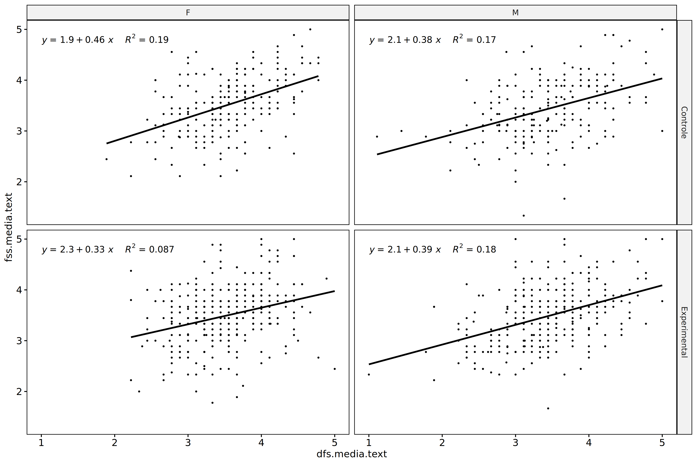
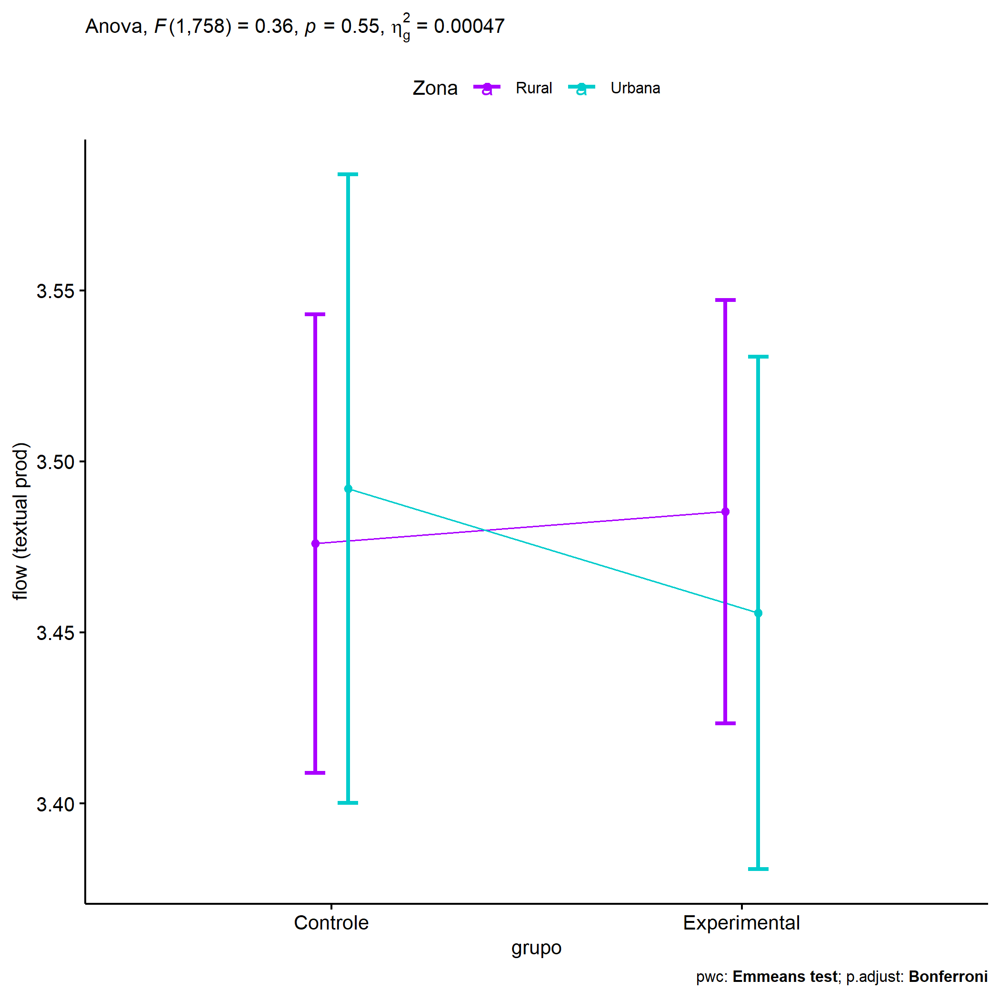
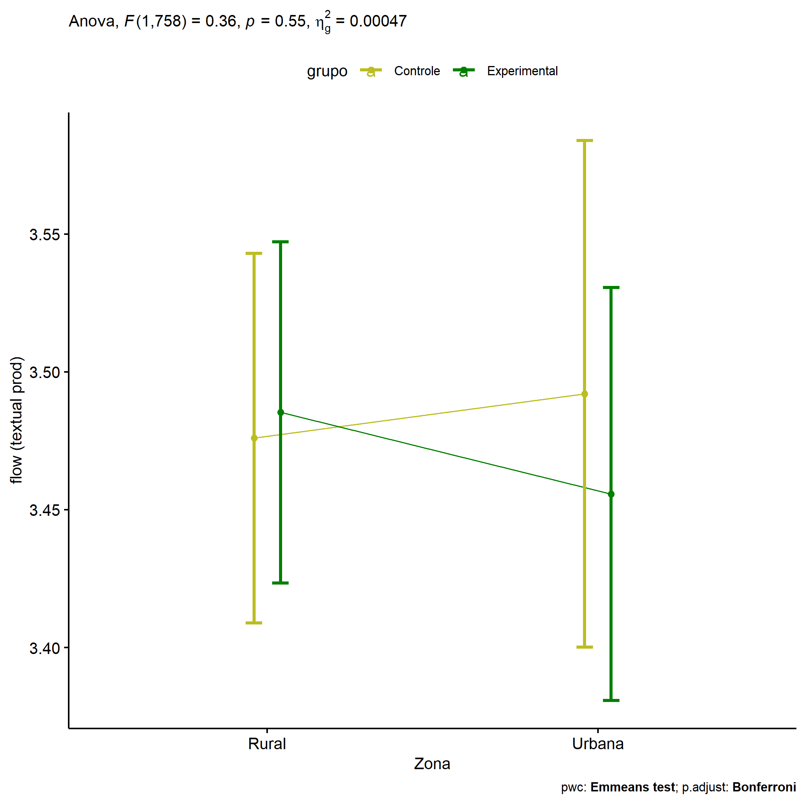
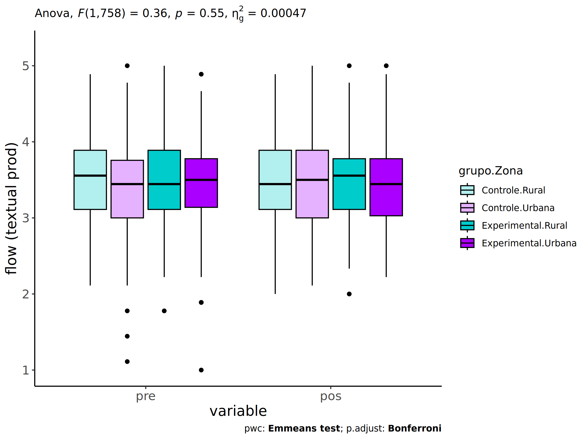
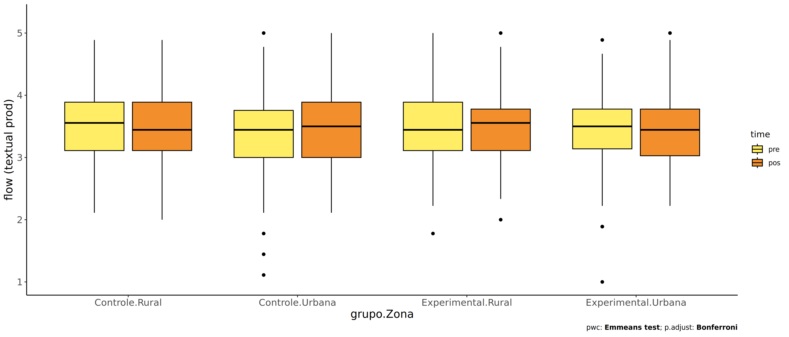
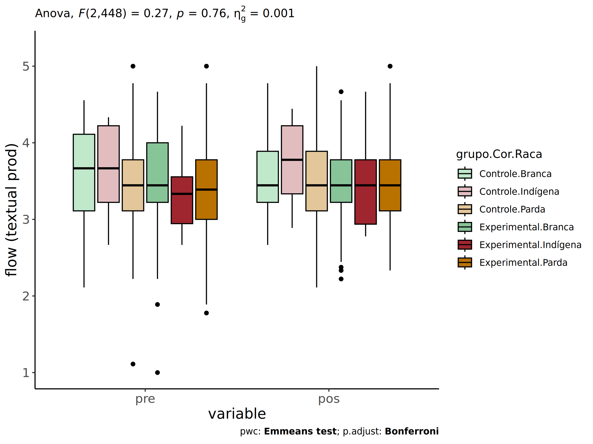
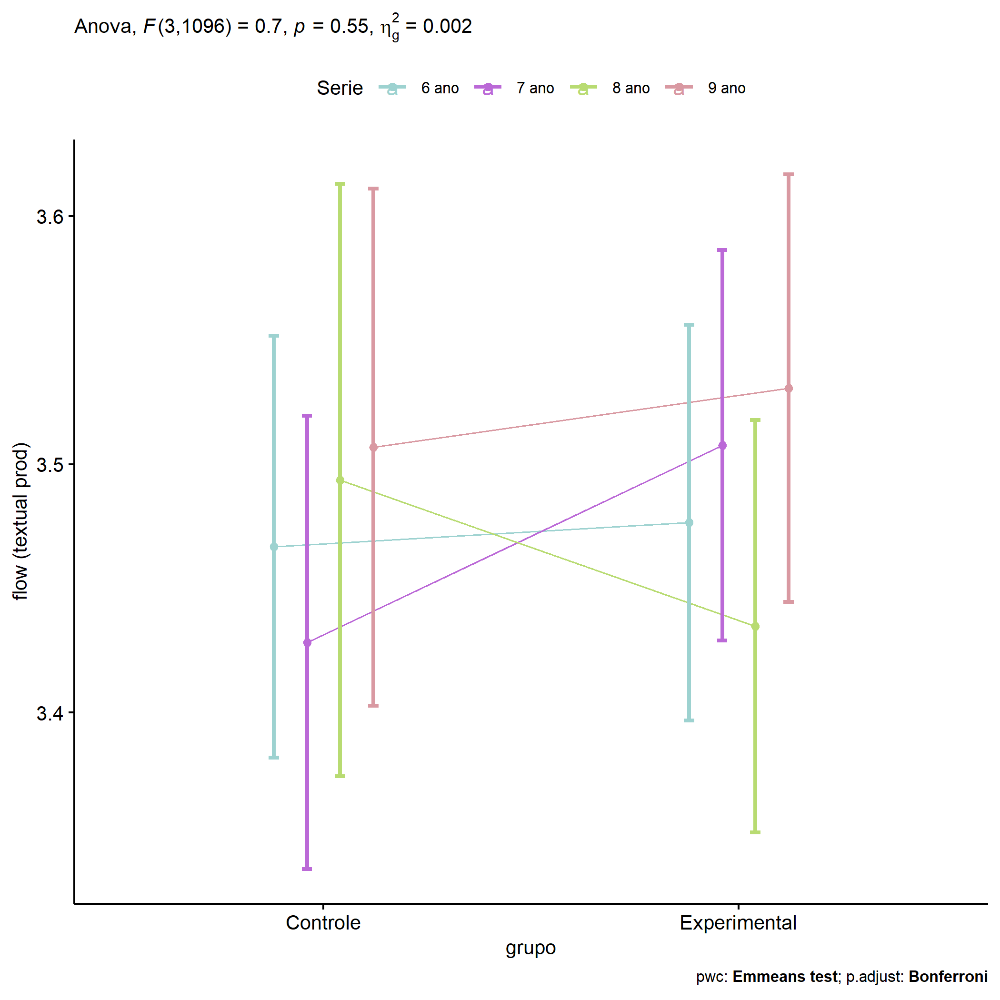
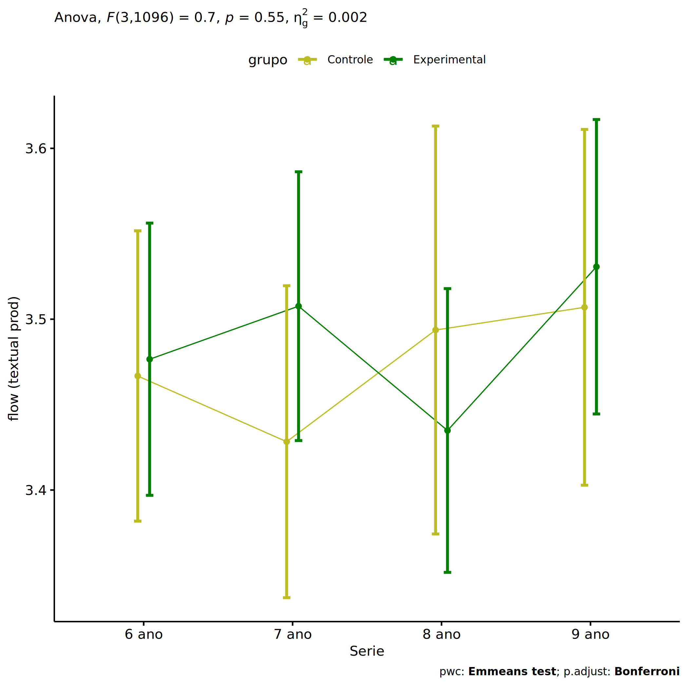

ANCOVA in flow (textual prod) (flow (textual prod))
================
Geiser C. Challco <geiser@alumni.usp.br>

- [Setting Initial Variables](#setting-initial-variables)
- [Descriptive Statistics of Initial
  Data](#descriptive-statistics-of-initial-data)
- [ANCOVA and Pairwise for one factor:
  **grupo**](#ancova-and-pairwise-for-one-factor-grupo)
  - [Without remove non-normal data](#without-remove-non-normal-data)
  - [Computing ANCOVA and PairWise After removing non-normal data
    (OK)](#computing-ancova-and-pairwise-after-removing-non-normal-data-ok)
    - [Plots for ancova](#plots-for-ancova)
    - [Checking linearity assumption](#checking-linearity-assumption)
    - [Checking normality and
      homogeneity](#checking-normality-and-homogeneity)
- [ANCOVA and Pairwise for two factors
  **grupo:Sexo**](#ancova-and-pairwise-for-two-factors-gruposexo)
  - [Without remove non-normal data](#without-remove-non-normal-data-1)
  - [Computing ANCOVA and PairWise After removing non-normal data
    (OK)](#computing-ancova-and-pairwise-after-removing-non-normal-data-ok-1)
    - [Plots for ancova](#plots-for-ancova-1)
    - [Checking linearity assumption](#checking-linearity-assumption-1)
    - [Checking normality and
      homogeneity](#checking-normality-and-homogeneity-1)
- [ANCOVA and Pairwise for two factors
  **grupo:Zona**](#ancova-and-pairwise-for-two-factors-grupozona)
  - [Without remove non-normal data](#without-remove-non-normal-data-2)
  - [Computing ANCOVA and PairWise After removing non-normal data
    (OK)](#computing-ancova-and-pairwise-after-removing-non-normal-data-ok-2)
    - [Plots for ancova](#plots-for-ancova-2)
    - [Checking linearity assumption](#checking-linearity-assumption-2)
    - [Checking normality and
      homogeneity](#checking-normality-and-homogeneity-2)
- [ANCOVA and Pairwise for two factors
  **grupo:Cor.Raca**](#ancova-and-pairwise-for-two-factors-grupocorraca)
  - [Without remove non-normal data](#without-remove-non-normal-data-3)
  - [Computing ANCOVA and PairWise After removing non-normal data
    (OK)](#computing-ancova-and-pairwise-after-removing-non-normal-data-ok-3)
    - [Plots for ancova](#plots-for-ancova-3)
    - [Checking linearity assumption](#checking-linearity-assumption-3)
    - [Checking normality and
      homogeneity](#checking-normality-and-homogeneity-3)
- [ANCOVA and Pairwise for two factors
  **grupo:Serie**](#ancova-and-pairwise-for-two-factors-gruposerie)
  - [Without remove non-normal data](#without-remove-non-normal-data-4)
  - [Computing ANCOVA and PairWise After removing non-normal data
    (OK)](#computing-ancova-and-pairwise-after-removing-non-normal-data-ok-4)
    - [Plots for ancova](#plots-for-ancova-4)
    - [Checking linearity assumption](#checking-linearity-assumption-4)
    - [Checking normality and
      homogeneity](#checking-normality-and-homogeneity-4)
- [Summary of Results](#summary-of-results)
  - [Descriptive Statistics](#descriptive-statistics)
  - [ANCOVA Table Comparison](#ancova-table-comparison)
  - [PairWise Table Comparison](#pairwise-table-comparison)
  - [EMMS Table Comparison](#emms-table-comparison)

**NOTE**:

- Teste ANCOVA para determinar se houve diferenças significativas no
  flow (textual prod) (medido usando pre- e pos-testes).
- ANCOVA test to determine whether there were significant differences in
  flow (textual prod) (measured using pre- and post-tests).

# Setting Initial Variables

``` r
dv = "flow.text"
dv.pos = "fss.media.text"
dv.pre = "dfs.media.text"

fatores2 <- c("Sexo","Zona","Cor.Raca","Serie")
lfatores2 <- as.list(fatores2)
names(lfatores2) <- fatores2

fatores1 <- c("grupo", fatores2)
lfatores1 <- as.list(fatores1)
names(lfatores1) <- fatores1

lfatores <- c(lfatores1)

color <- list()
color[["prepost"]] = c("#ffee65","#f28e2B")
color[["grupo"]] = c("#bcbd22","#008000")
color[["Sexo"]] = c("#FF007F","#4D4DFF")
color[["Zona"]] = c("#AA00FF","#00CCCC")
color[["Cor.Raca"]] = c(
  "Parda"="#b97100","Indígena"="#9F262F",
  "Branca"="#87c498", "Preta"="#848283","Amarela"="#D6B91C"
)

level <- list()
level[["grupo"]] = c("Controle","Experimental")
level[["Sexo"]] = c("F","M")
level[["Zona"]] = c("Rural","Urbana")
level[["Cor.Raca"]] = c("Parda","Indígena","Branca", "Preta","Amarela")
level[["Serie"]] = c("6 ano","7 ano","8 ano","9 ano")

# ..

ymin <- 0
ymax <- 0

ymin.ci <- 0
ymax.ci <- 0


color[["grupo:Sexo"]] = c(
  "Controle:F"="#ff99cb", "Controle:M"="#b7b7ff",
  "Experimental:F"="#FF007F", "Experimental:M"="#4D4DFF",
  "Controle.F"="#ff99cb", "Controle.M"="#b7b7ff",
  "Experimental.F"="#FF007F", "Experimental.M"="#4D4DFF"
)
color[["grupo:Zona"]] = c(
  "Controle:Rural"="#b2efef","Controle:Urbana"="#e5b2ff",
  "Experimental:Rural"="#00CCCC", "Experimental:Urbana"="#AA00FF",
  "Controle.Rural"="#b2efef","Controle.Urbana"="#e5b2ff",
  "Experimental.Rural"="#00CCCC", "Experimental.Urbana"="#AA00FF"
)
color[["grupo:Cor.Raca"]] = c(
    "Controle:Parda"="#e3c699", "Experimental:Parda"="#b97100",
    "Controle:Indígena"="#e2bdc0", "Experimental:Indígena"="#9F262F",
    "Controle:Branca"="#c0e8cb", "Experimental:Branca"="#87c498",
    "Controle:Preta"="#dad9d9", "Experimental:Preta"="#848283",
    "Controle:Amarela"="#eee3a4", "Experimental:Amarela"="#D6B91C",
    
    "Controle.Parda"="#e3c699", "Experimental.Parda"="#b97100",
    "Controle.Indígena"="#e2bdc0", "Experimental.Indígena"="#9F262F",
    "Controle.Branca"="#c0e8cb", "Experimental.Branca"="#87c498",
    "Controle.Preta"="#dad9d9", "Experimental.Preta"="#848283",
    "Controle.Amarela"="#eee3a4", "Experimental.Amarela"="#D6B91C"
)


for (coln in c("vocab","vocab.teach","vocab.non.teach","score.tde",
               "TFL.lidas.per.min","TFL.corretas.per.min","TFL.erradas.per.min","TFL.omitidas.per.min",
               "leitura.compreensao")) {
  color[[paste0(coln,".quintile")]] = c("#BF0040","#FF0000","#800080","#0000FF","#4000BF")
  level[[paste0(coln,".quintile")]] = c("1st quintile","2nd quintile","3rd quintile","4th quintile","5th quintile")
  color[[paste0("grupo:",coln,".quintile")]] = c(
    "Experimental.1st quintile"="#BF0040", "Controle.1st quintile"="#d8668c",
    "Experimental.2nd quintile"="#FF0000", "Controle.2nd quintile"="#ff7f7f",
    "Experimental.3rd quintile"="#8fce00", "Controle.3rd quintile"="#ddf0b2",
    "Experimental.4th quintile"="#0000FF", "Controle.4th quintile"="#b2b2ff",
    "Experimental.5th quintile"="#4000BF", "Controle.5th quintile"="#b299e5",
    
    "Experimental:1st quintile"="#BF0040", "Controle:1st quintile"="#d8668c",
    "Experimental:2nd quintile"="#FF0000", "Controle:2nd quintile"="#ff7f7f",
    "Experimental:3rd quintile"="#8fce00", "Controle:3rd quintile"="#ddf0b2",
    "Experimental:4th quintile"="#0000FF", "Controle:4th quintile"="#b2b2ff",
    "Experimental:5th quintile"="#4000BF", "Controle:5th quintile"="#b299e5")
}


gdat <- read_excel("../data/data.xlsx", sheet = "sumary")
gdat <- gdat[which(is.na(gdat$Necessidade.Deficiencia) & !is.na(gdat$WG.Grupo)),]


dat <- gdat
dat$grupo <- factor(dat[["WG.Grupo"]], level[["grupo"]])
for (coln in c(names(lfatores))) {
  dat[[coln]] <- factor(dat[[coln]], level[[coln]][level[[coln]] %in% unique(dat[[coln]])])
}
dat <- dat[which(!is.na(dat[[dv.pre]]) & !is.na(dat[[dv.pos]])),]
dat <- dat[,c("id",names(lfatores),dv.pre,dv.pos)]

dat.long <- rbind(dat, dat)
dat.long$time <- c(rep("pre", nrow(dat)), rep("pos", nrow(dat)))
dat.long$time <- factor(dat.long$time, c("pre","pos"))
dat.long[[dv]] <- c(dat[[dv.pre]], dat[[dv.pos]])


for (f in c("grupo", names(lfatores))) {
  if (is.null(color[[f]]) && length(unique(dat[[f]])) > 0) 
      color[[f]] <- distinctColorPalette(length(unique(dat[[f]])))
}
for (f in c(fatores2)) {
  if (is.null(color[[paste0("grupo:",f)]]) && length(unique(dat[[f]])) > 0)
    color[[paste0("grupo:",f)]] <- distinctColorPalette(length(unique(dat[["grupo"]]))*length(unique(dat[[f]])))
}

ldat <- list()
laov <- list()
lpwc <- list()
lemms <- list()
```

# Descriptive Statistics of Initial Data

``` r
df <- get.descriptives(dat, c(dv.pre, dv.pos), c("grupo"), 
                       include.global = T, symmetry.test = T, normality.test = F)
df <- plyr::rbind.fill(
  df, do.call(plyr::rbind.fill, lapply(lfatores2, FUN = function(f) {
    if (nrow(dat) > 0 && sum(!is.na(unique(dat[[f]]))) > 1)
      get.descriptives(dat, c(dv.pre,dv.pos), c("grupo", f),
                       symmetry.test = T, normality.test = F)
    }))
)
```

    ## Warning: There were 2 warnings in `mutate()`.
    ## The first warning was:
    ## ℹ In argument: `ci = abs(stats::qt(alpha/2, .data$n - 1) * .data$se)`.
    ## Caused by warning:
    ## ! There was 1 warning in `mutate()`.
    ## ℹ In argument: `ci = abs(stats::qt(alpha/2, .data$n - 1) * .data$se)`.
    ## Caused by warning in `stats::qt()`:
    ## ! NaNs produced
    ## ℹ Run `dplyr::last_dplyr_warnings()` to see the 1 remaining warning.
    ## There were 2 warnings in `mutate()`.
    ## The first warning was:
    ## ℹ In argument: `ci = abs(stats::qt(alpha/2, .data$n - 1) * .data$se)`.
    ## Caused by warning:
    ## ! There was 1 warning in `mutate()`.
    ## ℹ In argument: `ci = abs(stats::qt(alpha/2, .data$n - 1) * .data$se)`.
    ## Caused by warning in `stats::qt()`:
    ## ! NaNs produced
    ## ℹ Run `dplyr::last_dplyr_warnings()` to see the 1 remaining warning.

``` r
df <- df[,c(fatores1[fatores1 %in% colnames(df)],"variable",
            colnames(df)[!colnames(df) %in% c(fatores1,"variable")])]
```

| grupo        | Sexo | Zona   | Cor.Raca | Serie | variable       |    n |  mean | median |   min |   max |    sd |    se |    ci |   iqr | symmetry | skewness | kurtosis |
|:-------------|:-----|:-------|:---------|:------|:---------------|-----:|------:|-------:|------:|------:|------:|------:|------:|------:|:---------|---------:|---------:|
| Controle     |      |        |          |       | dfs.media.text |  457 | 3.488 |  3.444 | 1.111 | 5.000 | 0.595 | 0.028 | 0.055 | 0.778 | YES      |   -0.132 |    0.314 |
| Experimental |      |        |          |       | dfs.media.text |  649 | 3.471 |  3.444 | 1.000 | 5.000 | 0.564 | 0.022 | 0.043 | 0.667 | YES      |   -0.113 |    0.393 |
|              |      |        |          |       | dfs.media.text | 1106 | 3.478 |  3.444 | 1.000 | 5.000 | 0.577 | 0.017 | 0.034 | 0.778 | YES      |   -0.119 |    0.371 |
| Controle     |      |        |          |       | fss.media.text |  457 | 3.468 |  3.444 | 1.000 | 5.000 | 0.595 | 0.028 | 0.055 | 0.778 | YES      |   -0.199 |    0.485 |
| Experimental |      |        |          |       | fss.media.text |  649 | 3.484 |  3.444 | 1.667 | 5.000 | 0.568 | 0.022 | 0.044 | 0.764 | YES      |    0.025 |    0.116 |
|              |      |        |          |       | fss.media.text | 1106 | 3.477 |  3.444 | 1.000 | 5.000 | 0.579 | 0.017 | 0.034 | 0.778 | YES      |   -0.077 |    0.304 |
| Controle     | F    |        |          |       | dfs.media.text |  227 | 3.559 |  3.556 | 1.889 | 4.778 | 0.551 | 0.037 | 0.072 | 0.667 | YES      |   -0.098 |   -0.250 |
| Controle     | M    |        |          |       | dfs.media.text |  230 | 3.418 |  3.444 | 1.111 | 5.000 | 0.629 | 0.041 | 0.082 | 0.778 | YES      |   -0.079 |    0.538 |
| Experimental | F    |        |          |       | dfs.media.text |  335 | 3.505 |  3.444 | 2.222 | 5.000 | 0.520 | 0.028 | 0.056 | 0.771 | YES      |    0.105 |   -0.296 |
| Experimental | M    |        |          |       | dfs.media.text |  314 | 3.434 |  3.444 | 1.000 | 5.000 | 0.606 | 0.034 | 0.067 | 0.667 | YES      |   -0.210 |    0.590 |
| Controle     | F    |        |          |       | fss.media.text |  227 | 3.521 |  3.556 | 2.111 | 5.000 | 0.579 | 0.038 | 0.076 | 0.778 | YES      |   -0.140 |   -0.390 |
| Controle     | M    |        |          |       | fss.media.text |  230 | 3.415 |  3.444 | 1.000 | 5.000 | 0.607 | 0.040 | 0.079 | 0.889 | YES      |   -0.229 |    1.138 |
| Experimental | F    |        |          |       | fss.media.text |  335 | 3.488 |  3.444 | 1.778 | 5.000 | 0.575 | 0.031 | 0.062 | 0.726 | YES      |   -0.070 |    0.203 |
| Experimental | M    |        |          |       | fss.media.text |  314 | 3.481 |  3.472 | 1.667 | 5.000 | 0.562 | 0.032 | 0.062 | 0.740 | YES      |    0.131 |   -0.006 |
| Controle     |      | Rural  |          |       | dfs.media.text |  219 | 3.552 |  3.556 | 2.111 | 4.889 | 0.569 | 0.038 | 0.076 | 0.778 | YES      |    0.071 |   -0.560 |
| Controle     |      | Urbana |          |       | dfs.media.text |  116 | 3.376 |  3.444 | 1.111 | 5.000 | 0.660 | 0.061 | 0.121 | 0.757 | YES      |   -0.451 |    0.926 |
| Controle     |      |        |          |       | dfs.media.text |  122 | 3.479 |  3.444 | 1.889 | 5.000 | 0.564 | 0.051 | 0.101 | 0.750 | YES      |    0.169 |   -0.174 |
| Experimental |      | Rural  |          |       | dfs.media.text |  255 | 3.464 |  3.444 | 1.778 | 5.000 | 0.571 | 0.036 | 0.070 | 0.778 | YES      |    0.025 |   -0.139 |
| Experimental |      | Urbana |          |       | dfs.media.text |  174 | 3.464 |  3.500 | 1.000 | 4.889 | 0.585 | 0.044 | 0.088 | 0.639 | NO       |   -0.556 |    1.511 |
| Experimental |      |        |          |       | dfs.media.text |  220 | 3.483 |  3.444 | 2.222 | 5.000 | 0.542 | 0.037 | 0.072 | 0.694 | YES      |    0.153 |   -0.208 |
| Controle     |      | Rural  |          |       | fss.media.text |  219 | 3.495 |  3.444 | 1.000 | 4.889 | 0.580 | 0.039 | 0.077 | 0.778 | YES      |   -0.353 |    0.700 |
| Controle     |      | Urbana |          |       | fss.media.text |  116 | 3.452 |  3.500 | 2.111 | 5.000 | 0.573 | 0.053 | 0.105 | 0.889 | YES      |   -0.018 |   -0.370 |
| Controle     |      |        |          |       | fss.media.text |  122 | 3.433 |  3.444 | 1.333 | 5.000 | 0.641 | 0.058 | 0.115 | 0.667 | YES      |   -0.086 |    0.634 |
| Experimental |      | Rural  |          |       | fss.media.text |  255 | 3.481 |  3.556 | 2.000 | 5.000 | 0.515 | 0.032 | 0.063 | 0.667 | YES      |    0.014 |   -0.167 |
| Experimental |      | Urbana |          |       | fss.media.text |  174 | 3.451 |  3.444 | 2.222 | 5.000 | 0.600 | 0.045 | 0.090 | 0.750 | YES      |    0.337 |   -0.078 |
| Experimental |      |        |          |       | fss.media.text |  220 | 3.515 |  3.556 | 1.667 | 5.000 | 0.602 | 0.041 | 0.080 | 0.778 | YES      |   -0.220 |    0.341 |
| Controle     |      |        | Parda    |       | dfs.media.text |  152 | 3.465 |  3.444 | 1.111 | 5.000 | 0.590 | 0.048 | 0.095 | 0.667 | YES      |   -0.071 |    0.883 |
| Controle     |      |        | Indígena |       | dfs.media.text |    9 | 3.654 |  3.667 | 2.667 | 4.333 | 0.557 | 0.186 | 0.428 | 1.000 | YES      |   -0.286 |   -1.333 |
| Controle     |      |        | Branca   |       | dfs.media.text |   46 | 3.630 |  3.667 | 2.111 | 4.556 | 0.619 | 0.091 | 0.184 | 1.000 | YES      |   -0.480 |   -0.515 |
| Controle     |      |        | Preta    |       | dfs.media.text |    1 | 3.333 |  3.333 | 3.333 | 3.333 |       |       |       | 0.000 | few data |    0.000 |    0.000 |
| Controle     |      |        |          |       | dfs.media.text |  249 | 3.470 |  3.444 | 1.444 | 5.000 | 0.595 | 0.038 | 0.074 | 0.778 | YES      |   -0.101 |    0.202 |
| Experimental |      |        | Parda    |       | dfs.media.text |  176 | 3.417 |  3.389 | 1.778 | 5.000 | 0.585 | 0.044 | 0.087 | 0.778 | YES      |    0.018 |   -0.073 |
| Experimental |      |        | Indígena |       | dfs.media.text |   15 | 3.306 |  3.333 | 2.667 | 4.222 | 0.438 | 0.113 | 0.242 | 0.611 | YES      |    0.200 |   -0.849 |
| Experimental |      |        | Branca   |       | dfs.media.text |   57 | 3.471 |  3.444 | 1.000 | 4.667 | 0.643 | 0.085 | 0.171 | 0.778 | NO       |   -1.165 |    2.489 |
| Experimental |      |        | Preta    |       | dfs.media.text |    1 | 3.333 |  3.333 | 3.333 | 3.333 |       |       |       | 0.000 | few data |    0.000 |    0.000 |
| Experimental |      |        |          |       | dfs.media.text |  400 | 3.501 |  3.556 | 1.889 | 5.000 | 0.547 | 0.027 | 0.054 | 0.694 | YES      |    0.060 |   -0.038 |
| Controle     |      |        | Parda    |       | fss.media.text |  152 | 3.488 |  3.444 | 2.111 | 5.000 | 0.586 | 0.048 | 0.094 | 0.778 | YES      |   -0.085 |   -0.401 |
| Controle     |      |        | Indígena |       | fss.media.text |    9 | 3.728 |  3.778 | 2.889 | 4.444 | 0.575 | 0.192 | 0.442 | 0.889 | YES      |   -0.360 |   -1.572 |
| Controle     |      |        | Branca   |       | fss.media.text |   46 | 3.539 |  3.444 | 2.667 | 4.778 | 0.501 | 0.074 | 0.149 | 0.667 | NO       |    0.673 |   -0.262 |
| Controle     |      |        | Preta    |       | fss.media.text |    1 | 3.000 |  3.000 | 3.000 | 3.000 |       |       |       | 0.000 | few data |    0.000 |    0.000 |
| Controle     |      |        |          |       | fss.media.text |  249 | 3.434 |  3.444 | 1.000 | 5.000 | 0.616 | 0.039 | 0.077 | 0.889 | YES      |   -0.313 |    0.862 |
| Experimental |      |        | Parda    |       | fss.media.text |  176 | 3.475 |  3.444 | 2.333 | 5.000 | 0.512 | 0.039 | 0.076 | 0.667 | YES      |    0.366 |    0.050 |
| Experimental |      |        | Indígena |       | fss.media.text |   15 | 3.444 |  3.444 | 2.778 | 4.667 | 0.549 | 0.142 | 0.304 | 0.840 | YES      |    0.441 |   -0.637 |
| Experimental |      |        | Branca   |       | fss.media.text |   57 | 3.491 |  3.444 | 2.222 | 4.667 | 0.568 | 0.075 | 0.151 | 0.556 | YES      |   -0.181 |   -0.276 |
| Experimental |      |        | Preta    |       | fss.media.text |    1 | 4.333 |  4.333 | 4.333 | 4.333 |       |       |       | 0.000 | few data |    0.000 |    0.000 |
| Experimental |      |        |          |       | fss.media.text |  400 | 3.487 |  3.556 | 1.667 | 5.000 | 0.593 | 0.030 | 0.058 | 0.778 | YES      |   -0.062 |    0.125 |
| Controle     |      |        |          | 6 ano | dfs.media.text |  151 | 3.486 |  3.444 | 1.444 | 5.000 | 0.632 | 0.051 | 0.102 | 0.778 | YES      |   -0.101 |    0.254 |
| Controle     |      |        |          | 7 ano | dfs.media.text |  130 | 3.424 |  3.444 | 2.111 | 4.889 | 0.609 | 0.053 | 0.106 | 0.778 | YES      |    0.114 |   -0.523 |
| Controle     |      |        |          | 8 ano | dfs.media.text |   76 | 3.523 |  3.500 | 2.556 | 5.000 | 0.521 | 0.060 | 0.119 | 0.667 | YES      |    0.293 |   -0.328 |
| Controle     |      |        |          | 9 ano | dfs.media.text |  100 | 3.547 |  3.556 | 1.111 | 4.556 | 0.573 | 0.057 | 0.114 | 0.667 | NO       |   -0.733 |    2.027 |
| Experimental |      |        |          | 6 ano | dfs.media.text |  171 | 3.404 |  3.444 | 2.222 | 5.000 | 0.574 | 0.044 | 0.087 | 0.778 | YES      |    0.092 |   -0.350 |
| Experimental |      |        |          | 7 ano | dfs.media.text |  175 | 3.491 |  3.444 | 1.000 | 5.000 | 0.603 | 0.046 | 0.090 | 0.778 | YES      |   -0.251 |    1.104 |
| Experimental |      |        |          | 8 ano | dfs.media.text |  157 | 3.460 |  3.444 | 1.889 | 4.667 | 0.516 | 0.041 | 0.081 | 0.667 | YES      |   -0.090 |    0.056 |
| Experimental |      |        |          | 9 ano | dfs.media.text |  146 | 3.536 |  3.556 | 1.889 | 5.000 | 0.551 | 0.046 | 0.090 | 0.667 | YES      |   -0.184 |    0.341 |
| Controle     |      |        |          | 6 ano | fss.media.text |  151 | 3.453 |  3.333 | 1.000 | 5.000 | 0.610 | 0.050 | 0.098 | 0.778 | YES      |   -0.195 |    0.798 |
| Controle     |      |        |          | 7 ano | fss.media.text |  130 | 3.408 |  3.444 | 1.667 | 4.889 | 0.533 | 0.047 | 0.092 | 0.778 | YES      |   -0.077 |    0.066 |
| Controle     |      |        |          | 8 ano | fss.media.text |   76 | 3.511 |  3.528 | 2.111 | 5.000 | 0.609 | 0.070 | 0.139 | 0.917 | YES      |    0.004 |   -0.275 |
| Controle     |      |        |          | 9 ano | fss.media.text |  100 | 3.534 |  3.667 | 1.333 | 4.889 | 0.636 | 0.064 | 0.126 | 0.802 | NO       |   -0.531 |    0.674 |
| Experimental |      |        |          | 6 ano | fss.media.text |  171 | 3.448 |  3.444 | 1.889 | 5.000 | 0.570 | 0.044 | 0.086 | 0.778 | YES      |    0.090 |   -0.256 |
| Experimental |      |        |          | 7 ano | fss.media.text |  175 | 3.513 |  3.556 | 2.000 | 5.000 | 0.582 | 0.044 | 0.087 | 0.778 | YES      |   -0.012 |    0.204 |
| Experimental |      |        |          | 8 ano | fss.media.text |  157 | 3.428 |  3.333 | 1.667 | 5.000 | 0.599 | 0.048 | 0.094 | 0.778 | YES      |    0.068 |    0.252 |
| Experimental |      |        |          | 9 ano | fss.media.text |  146 | 3.553 |  3.590 | 2.333 | 5.000 | 0.510 | 0.042 | 0.083 | 0.663 | YES      |    0.042 |   -0.010 |

# ANCOVA and Pairwise for one factor: **grupo**

## Without remove non-normal data

``` r
pdat = remove_group_data(dat[!is.na(dat[["grupo"]]),], "fss.media.text", "grupo")

pdat.long <- rbind(pdat[,c("id","grupo")], pdat[,c("id","grupo")])
pdat.long[["time"]] <- c(rep("pre", nrow(pdat)), rep("pos", nrow(pdat)))
pdat.long[["time"]] <- factor(pdat.long[["time"]], c("pre","pos"))
pdat.long[["flow.text"]] <- c(pdat[["dfs.media.text"]], pdat[["fss.media.text"]])

aov = anova_test(pdat, fss.media.text ~ dfs.media.text + grupo)
laov[["grupo"]] <- get_anova_table(aov)
```

``` r
pwc <- emmeans_test(pdat, fss.media.text ~ grupo, covariate = dfs.media.text,
                    p.adjust.method = "bonferroni")
```

``` r
pwc.long <- emmeans_test(dplyr::group_by_at(pdat.long, "grupo"),
                          flow.text ~ time,
                          p.adjust.method = "bonferroni")
lpwc[["grupo"]] <- plyr::rbind.fill(pwc, pwc.long)
```

``` r
ds <- get.descriptives(pdat, "fss.media.text", "grupo", covar = "dfs.media.text")
ds <- merge(ds[ds$variable != "dfs.media.text",],
            ds[ds$variable == "dfs.media.text", !colnames(ds) %in% c("variable")],
            by = "grupo", all.x = T, suffixes = c("", ".dfs.media.text"))
ds <- merge(get_emmeans(pwc), ds, by = "grupo", suffixes = c(".emms", ""))
ds <- ds[,c("grupo","n","mean.dfs.media.text","se.dfs.media.text","mean","se",
            "emmean","se.emms","conf.low","conf.high")]

colnames(ds) <- c("grupo", "N", paste0(c("M","SE")," (pre)"),
                  paste0(c("M","SE"), " (unadj)"),
                  paste0(c("M", "SE"), " (adj)"), "conf.low", "conf.high")

lemms[["grupo"]] <- ds
```

## Computing ANCOVA and PairWise After removing non-normal data (OK)

``` r
wdat = pdat 

res = residuals(lm(fss.media.text ~ dfs.media.text + grupo, data = wdat))
non.normal = getNonNormal(res, wdat$id, plimit = 0.05)

wdat = wdat[!wdat$id %in% non.normal,]

wdat.long <- rbind(wdat[,c("id","grupo")], wdat[,c("id","grupo")])
wdat.long[["time"]] <- c(rep("pre", nrow(wdat)), rep("pos", nrow(wdat)))
wdat.long[["time"]] <- factor(wdat.long[["time"]], c("pre","pos"))
wdat.long[["flow.text"]] <- c(wdat[["dfs.media.text"]], wdat[["fss.media.text"]])

ldat[["grupo"]] = wdat

(non.normal)
```

    ## [1] "P2896"

``` r
aov = anova_test(wdat, fss.media.text ~ dfs.media.text + grupo)
laov[["grupo"]] <- merge(get_anova_table(aov), laov[["grupo"]],
                            by="Effect", suffixes = c("","'"))

(df = get_anova_table(aov))
```

    ## ANOVA Table (type II tests)
    ## 
    ##           Effect DFn  DFd       F        p p<.05     ges
    ## 1 dfs.media.text   1 1102 196.012 4.12e-41     * 0.15100
    ## 2          grupo   1 1102   0.309 5.79e-01       0.00028

| Effect         | DFn |  DFd |       F |     p | p\<.05 |   ges |
|:---------------|----:|-----:|--------:|------:|:-------|------:|
| dfs.media.text |   1 | 1102 | 196.012 | 0.000 | \*     | 0.151 |
| grupo          |   1 | 1102 |   0.309 | 0.579 |        | 0.000 |

``` r
pwc <- emmeans_test(wdat, fss.media.text ~ grupo, covariate = dfs.media.text,
                    p.adjust.method = "bonferroni")
```

| term                  | .y.            | group1   | group2       |   df | statistic |     p | p.adj | p.adj.signif |
|:----------------------|:---------------|:---------|:-------------|-----:|----------:|------:|------:|:-------------|
| dfs.media.text\*grupo | fss.media.text | Controle | Experimental | 1102 |    -0.556 | 0.579 | 0.579 | ns           |

``` r
pwc.long <- emmeans_test(dplyr::group_by_at(wdat.long, "grupo"),
                         flow.text ~ time,
                         p.adjust.method = "bonferroni")
lpwc[["grupo"]] <- merge(plyr::rbind.fill(pwc, pwc.long), lpwc[["grupo"]],
                            by=c("grupo","term",".y.","group1","group2"),
                            suffixes = c("","'"))
```

| grupo        | term | .y.       | group1 | group2 |   df | statistic |     p | p.adj | p.adj.signif |
|:-------------|:-----|:----------|:-------|:-------|-----:|----------:|------:|------:|:-------------|
| Controle     | time | flow.text | pre    | pos    | 2206 |     0.387 | 0.699 | 0.699 | ns           |
| Experimental | time | flow.text | pre    | pos    | 2206 |    -0.428 | 0.669 | 0.669 | ns           |

``` r
ds <- get.descriptives(wdat, "fss.media.text", "grupo", covar = "dfs.media.text")
ds <- merge(ds[ds$variable != "dfs.media.text",],
            ds[ds$variable == "dfs.media.text", !colnames(ds) %in% c("variable")],
            by = "grupo", all.x = T, suffixes = c("", ".dfs.media.text"))
ds <- merge(get_emmeans(pwc), ds, by = "grupo", suffixes = c(".emms", ""))
ds <- ds[,c("grupo","n","mean.dfs.media.text","se.dfs.media.text","mean","se",
            "emmean","se.emms","conf.low","conf.high")]

colnames(ds) <- c("grupo", "N", paste0(c("M","SE")," (pre)"),
                  paste0(c("M","SE"), " (unadj)"),
                  paste0(c("M", "SE"), " (adj)"), "conf.low", "conf.high")

lemms[["grupo"]] <- merge(ds, lemms[["grupo"]], by=c("grupo"), suffixes = c("","'"))
```

| grupo        |   N | M (pre) | SE (pre) | M (unadj) | SE (unadj) | M (adj) | SE (adj) | conf.low | conf.high |
|:-------------|----:|--------:|---------:|----------:|-----------:|--------:|---------:|---------:|----------:|
| Controle     | 456 |   3.488 |    0.028 |     3.473 |      0.027 |   3.469 |    0.025 |    3.420 |     3.518 |
| Experimental | 649 |   3.471 |    0.022 |     3.484 |      0.022 |   3.487 |    0.021 |    3.446 |     3.528 |

### Plots for ancova

``` r
plots <- oneWayAncovaPlots(
  wdat, "fss.media.text", "grupo", aov, list("grupo"=pwc), addParam = c("mean_ci"),
  font.label.size=10, step.increase=0.05, p.label="p.adj",
  subtitle = which(aov$Effect == "grupo"))
```

``` r
if (!is.null(nrow(plots[["grupo"]]$data)))
  plots[["grupo"]] +
  if (ymin.ci < ymax.ci) ggplot2::ylim(ymin.ci, ymax.ci)
```

<!-- -->

``` r
plots <- oneWayAncovaBoxPlots(
  wdat, "fss.media.text", "grupo", aov, pwc, covar = "dfs.media.text",
  theme = "classic", color = color[["grupo"]],
  subtitle = which(aov$Effect == "grupo"))
```

``` r
if (length(unique(wdat[["grupo"]])) > 1)
  plots[["grupo"]] + ggplot2::ylab("flow (textual prod)") +
  ggplot2::scale_x_discrete(labels=c('pre', 'pos')) +
  if (ymin < ymax) ggplot2::ylim(ymin, ymax)
```

<!-- -->

``` r
if (length(unique(wdat.long[["grupo"]])) > 1)
  plots <- oneWayAncovaBoxPlots(
    wdat.long, "flow.text", "grupo", aov, pwc.long,
    pre.post = "time", theme = "classic", color = color$prepost)
```

``` r
if (length(unique(wdat.long[["grupo"]])) > 1)
  plots[["grupo"]] + ggplot2::ylab("flow (textual prod)") +
  if (ymin < ymax) ggplot2::ylim(ymin, ymax) 
```

<!-- -->

### Checking linearity assumption

``` r
ggscatter(wdat, x = "dfs.media.text", y = "fss.media.text", size = 0.5,
          color = "grupo", add = "reg.line")+
  stat_regline_equation(
    aes(label =  paste(..eq.label.., ..rr.label.., sep = "~~~~"), color = grupo)
  ) +
  ggplot2::labs(subtitle = rstatix::get_test_label(aov, detailed = T, row = which(aov$Effect == "grupo"))) +
  ggplot2::scale_color_manual(values = color[["grupo"]]) +
  if (ymin < ymax) ggplot2::ylim(ymin, ymax)
```

<!-- -->

### Checking normality and homogeneity

``` r
res <- augment(lm(fss.media.text ~ dfs.media.text + grupo, data = wdat))
```

``` r
shapiro_test(res$.resid)
```

    ## # A tibble: 1 × 3
    ##   variable   statistic p.value
    ##   <chr>          <dbl>   <dbl>
    ## 1 res$.resid     0.997  0.0850

``` r
levene_test(res, .resid ~ grupo)
```

    ## # A tibble: 1 × 4
    ##     df1   df2 statistic     p
    ##   <int> <int>     <dbl> <dbl>
    ## 1     1  1103  0.000309 0.986

# ANCOVA and Pairwise for two factors **grupo:Sexo**

## Without remove non-normal data

``` r
pdat = remove_group_data(dat[!is.na(dat[["grupo"]]) & !is.na(dat[["Sexo"]]),],
                         "fss.media.text", c("grupo","Sexo"))
pdat = pdat[pdat[["Sexo"]] %in% do.call(
  intersect, lapply(unique(pdat[["grupo"]]), FUN = function(x) {
    unique(pdat[["Sexo"]][which(pdat[["grupo"]] == x)])
  })),]
pdat[["grupo"]] = factor(pdat[["grupo"]], level[["grupo"]])
pdat[["Sexo"]] = factor(
  pdat[["Sexo"]],
  level[["Sexo"]][level[["Sexo"]] %in% unique(pdat[["Sexo"]])])

pdat.long <- rbind(pdat[,c("id","grupo","Sexo")], pdat[,c("id","grupo","Sexo")])
pdat.long[["time"]] <- c(rep("pre", nrow(pdat)), rep("pos", nrow(pdat)))
pdat.long[["time"]] <- factor(pdat.long[["time"]], c("pre","pos"))
pdat.long[["flow.text"]] <- c(pdat[["dfs.media.text"]], pdat[["fss.media.text"]])

if (length(unique(pdat[["Sexo"]])) >= 2) {
  aov = anova_test(pdat, fss.media.text ~ dfs.media.text + grupo*Sexo)
  laov[["grupo:Sexo"]] <- get_anova_table(aov)
}
```

``` r
if (length(unique(pdat[["Sexo"]])) >= 2) {
  pwcs <- list()
  pwcs[["Sexo"]] <- emmeans_test(
    group_by(pdat, grupo), fss.media.text ~ Sexo,
    covariate = dfs.media.text, p.adjust.method = "bonferroni")
  pwcs[["grupo"]] <- emmeans_test(
    group_by(pdat, Sexo), fss.media.text ~ grupo,
    covariate = dfs.media.text, p.adjust.method = "bonferroni")
  
  pwc <- plyr::rbind.fill(pwcs[["grupo"]], pwcs[["Sexo"]])
  pwc <- pwc[,c("grupo","Sexo", colnames(pwc)[!colnames(pwc) %in% c("grupo","Sexo")])]
}
```

``` r
if (length(unique(pdat[["Sexo"]])) >= 2) {
  pwc.long <- emmeans_test(dplyr::group_by_at(pdat.long, c("grupo","Sexo")),
                           flow.text ~ time,
                           p.adjust.method = "bonferroni")
  lpwc[["grupo:Sexo"]] <- plyr::rbind.fill(pwc, pwc.long)
}
```

``` r
if (length(unique(pdat[["Sexo"]])) >= 2) {
  ds <- get.descriptives(pdat, "fss.media.text", c("grupo","Sexo"), covar = "dfs.media.text")
  ds <- merge(ds[ds$variable != "dfs.media.text",],
              ds[ds$variable == "dfs.media.text", !colnames(ds) %in% c("variable")],
              by = c("grupo","Sexo"), all.x = T, suffixes = c("", ".dfs.media.text"))
  ds <- merge(get_emmeans(pwcs[["grupo"]]), ds,
              by = c("grupo","Sexo"), suffixes = c(".emms", ""))
  ds <- ds[,c("grupo","Sexo","n","mean.dfs.media.text","se.dfs.media.text","mean","se",
              "emmean","se.emms","conf.low","conf.high")]
  
  colnames(ds) <- c("grupo","Sexo", "N", paste0(c("M","SE")," (pre)"),
                    paste0(c("M","SE"), " (unadj)"),
                    paste0(c("M", "SE"), " (adj)"), "conf.low", "conf.high")
  
  lemms[["grupo:Sexo"]] <- ds
}
```

## Computing ANCOVA and PairWise After removing non-normal data (OK)

``` r
if (length(unique(pdat[["Sexo"]])) >= 2) {
  wdat = pdat 
  
  res = residuals(lm(fss.media.text ~ dfs.media.text + grupo*Sexo, data = wdat))
  non.normal = getNonNormal(res, wdat$id, plimit = 0.05)
  
  wdat = wdat[!wdat$id %in% non.normal,]
  
  wdat.long <- rbind(wdat[,c("id","grupo","Sexo")], wdat[,c("id","grupo","Sexo")])
  wdat.long[["time"]] <- c(rep("pre", nrow(wdat)), rep("pos", nrow(wdat)))
  wdat.long[["time"]] <- factor(wdat.long[["time"]], c("pre","pos"))
  wdat.long[["flow.text"]] <- c(wdat[["dfs.media.text"]], wdat[["fss.media.text"]])
  
  
  ldat[["grupo:Sexo"]] = wdat
  
  (non.normal)
}
```

    ## [1] "P2896"

``` r
if (length(unique(pdat[["Sexo"]])) >= 2) {
  aov = anova_test(wdat, fss.media.text ~ dfs.media.text + grupo*Sexo)
  laov[["grupo:Sexo"]] <- merge(get_anova_table(aov), laov[["grupo:Sexo"]],
                                         by="Effect", suffixes = c("","'"))
  df = get_anova_table(aov)
}
```

| Effect         | DFn |  DFd |       F |     p | p\<.05 |   ges |
|:---------------|----:|-----:|--------:|------:|:-------|------:|
| dfs.media.text |   1 | 1100 | 192.997 | 0.000 | \*     | 0.149 |
| grupo          |   1 | 1100 |   0.305 | 0.581 |        | 0.000 |
| Sexo           |   1 | 1100 |   0.023 | 0.879 |        | 0.000 |
| grupo:Sexo     |   1 | 1100 |   0.896 | 0.344 |        | 0.001 |

``` r
if (length(unique(pdat[["Sexo"]])) >= 2) {
  pwcs <- list()
  pwcs[["Sexo"]] <- emmeans_test(
    group_by(wdat, grupo), fss.media.text ~ Sexo,
    covariate = dfs.media.text, p.adjust.method = "bonferroni")
  pwcs[["grupo"]] <- emmeans_test(
    group_by(wdat, Sexo), fss.media.text ~ grupo,
    covariate = dfs.media.text, p.adjust.method = "bonferroni")
  
  pwc <- plyr::rbind.fill(pwcs[["grupo"]], pwcs[["Sexo"]])
  pwc <- pwc[,c("grupo","Sexo", colnames(pwc)[!colnames(pwc) %in% c("grupo","Sexo")])]
}
```

| grupo        | Sexo | term                  | .y.            | group1   | group2       |   df | statistic |     p | p.adj | p.adj.signif |
|:-------------|:-----|:----------------------|:---------------|:---------|:-------------|-----:|----------:|------:|------:|:-------------|
|              | F    | dfs.media.text\*grupo | fss.media.text | Controle | Experimental | 1100 |     0.274 | 0.785 | 0.785 | ns           |
|              | M    | dfs.media.text\*grupo | fss.media.text | Controle | Experimental | 1100 |    -1.061 | 0.289 | 0.289 | ns           |
| Controle     |      | dfs.media.text\*Sexo  | fss.media.text | F        | M            | 1100 |     0.823 | 0.411 | 0.411 | ns           |
| Experimental |      | dfs.media.text\*Sexo  | fss.media.text | F        | M            | 1100 |    -0.489 | 0.625 | 0.625 | ns           |

``` r
if (length(unique(pdat[["Sexo"]])) >= 2) {
  pwc.long <- emmeans_test(dplyr::group_by_at(wdat.long, c("grupo","Sexo")),
                           flow.text ~ time,
                           p.adjust.method = "bonferroni")
  lpwc[["grupo:Sexo"]] <- merge(plyr::rbind.fill(pwc, pwc.long),
                                         lpwc[["grupo:Sexo"]],
                                         by=c("grupo","Sexo","term",".y.","group1","group2"),
                                         suffixes = c("","'"))
}
```

| grupo        | Sexo | term | .y.       | group1 | group2 |   df | statistic |     p | p.adj | p.adj.signif |
|:-------------|:-----|:-----|:----------|:-------|:-------|-----:|----------:|------:|------:|:-------------|
| Controle     | F    | time | flow.text | pre    | pos    | 2202 |     0.702 | 0.483 | 0.483 | ns           |
| Controle     | M    | time | flow.text | pre    | pos    | 2202 |    -0.152 | 0.879 | 0.879 | ns           |
| Experimental | F    | time | flow.text | pre    | pos    | 2202 |     0.394 | 0.693 | 0.693 | ns           |
| Experimental | M    | time | flow.text | pre    | pos    | 2202 |    -1.023 | 0.306 | 0.306 | ns           |

``` r
if (length(unique(pdat[["Sexo"]])) >= 2) {
  ds <- get.descriptives(wdat, "fss.media.text", c("grupo","Sexo"), covar = "dfs.media.text")
  ds <- merge(ds[ds$variable != "dfs.media.text",],
              ds[ds$variable == "dfs.media.text", !colnames(ds) %in% c("variable")],
              by = c("grupo","Sexo"), all.x = T, suffixes = c("", ".dfs.media.text"))
  ds <- merge(get_emmeans(pwcs[["grupo"]]), ds,
              by = c("grupo","Sexo"), suffixes = c(".emms", ""))
  ds <- ds[,c("grupo","Sexo","n","mean.dfs.media.text","se.dfs.media.text",
              "mean","se","emmean","se.emms","conf.low","conf.high")]
  
  colnames(ds) <- c("grupo","Sexo", "N", paste0(c("M","SE")," (pre)"),
                    paste0(c("M","SE"), " (unadj)"),
                    paste0(c("M", "SE"), " (adj)"), "conf.low", "conf.high")
  
  lemms[["grupo:Sexo"]] <- merge(ds, lemms[["grupo:Sexo"]],
                                          by=c("grupo","Sexo"), suffixes = c("","'"))
}
```

| grupo        | Sexo |   N | M (pre) | SE (pre) | M (unadj) | SE (unadj) | M (adj) | SE (adj) | conf.low | conf.high |
|:-------------|:-----|----:|--------:|---------:|----------:|-----------:|--------:|---------:|---------:|----------:|
| Controle     | F    | 227 |   3.559 |    0.037 |     3.521 |      0.038 |   3.490 |    0.035 |    3.420 |     3.559 |
| Controle     | M    | 229 |   3.417 |    0.042 |     3.425 |      0.039 |   3.449 |    0.035 |    3.380 |     3.517 |
| Experimental | F    | 335 |   3.505 |    0.028 |     3.488 |      0.031 |   3.477 |    0.029 |    3.420 |     3.534 |
| Experimental | M    | 314 |   3.434 |    0.034 |     3.481 |      0.032 |   3.498 |    0.030 |    3.439 |     3.556 |

### Plots for ancova

``` r
if (length(unique(pdat[["Sexo"]])) >= 2) {
  ggPlotAoC2(pwcs, "grupo", "Sexo", aov, ylab = "flow (textual prod)",
             subtitle = which(aov$Effect == "grupo:Sexo"), addParam = "errorbar") +
    ggplot2::scale_color_manual(values = color[["Sexo"]]) +
    if (ymin.ci < ymax.ci) ggplot2::ylim(ymin.ci, ymax.ci)
}
```

    ## Scale for colour is already present.
    ## Adding another scale for colour, which will replace the existing scale.

<!-- -->

``` r
if (length(unique(pdat[["Sexo"]])) >= 2) {
  ggPlotAoC2(pwcs, "Sexo", "grupo", aov, ylab = "flow (textual prod)",
               subtitle = which(aov$Effect == "grupo:Sexo"), addParam = "errorbar") +
      ggplot2::scale_color_manual(values = color[["grupo"]]) +
      if (ymin.ci < ymax.ci) ggplot2::ylim(ymin.ci, ymax.ci)
}
```

    ## Scale for colour is already present.
    ## Adding another scale for colour, which will replace the existing scale.

<!-- -->

``` r
if (length(unique(pdat[["Sexo"]])) >= 2) {
  plots <- twoWayAncovaBoxPlots(
    wdat, "fss.media.text", c("grupo","Sexo"), aov, pwcs, covar = "dfs.media.text",
    theme = "classic", color = color[["grupo:Sexo"]],
    subtitle = which(aov$Effect == "grupo:Sexo"))
}
```

``` r
if (length(unique(pdat[["Sexo"]])) >= 2) {
  plots[["grupo:Sexo"]] + ggplot2::ylab("flow (textual prod)") +
  ggplot2::scale_x_discrete(labels=c('pre', 'pos')) +
  if (ymin < ymax) ggplot2::ylim(ymin, ymax)
}
```

    ## Warning: No shared levels found between `names(values)` of the manual scale and the data's colour
    ## values.

<!-- -->

``` r
if (length(unique(pdat[["Sexo"]])) >= 2) {
  plots <- twoWayAncovaBoxPlots(
    wdat.long, "flow.text", c("grupo","Sexo"), aov, pwc.long,
    pre.post = "time",
    theme = "classic", color = color$prepost)
}
```

``` r
if (length(unique(pdat[["Sexo"]])) >= 2) 
  plots[["grupo:Sexo"]] + ggplot2::ylab("flow (textual prod)") +
    if (ymin < ymax) ggplot2::ylim(ymin, ymax)
```

<!-- -->

### Checking linearity assumption

``` r
if (length(unique(pdat[["Sexo"]])) >= 2) {
  ggscatter(wdat, x = "dfs.media.text", y = "fss.media.text", size = 0.5,
            facet.by = c("grupo","Sexo"), add = "reg.line")+
    stat_regline_equation(
      aes(label =  paste(..eq.label.., ..rr.label.., sep = "~~~~"))
    ) +
    if (ymin < ymax) ggplot2::ylim(ymin, ymax)
}
```

<!-- -->

``` r
if (length(unique(pdat[["Sexo"]])) >= 2) {
  ggscatter(wdat, x = "dfs.media.text", y = "fss.media.text", size = 0.5,
            color = "grupo", facet.by = "Sexo", add = "reg.line")+
    stat_regline_equation(
      aes(label =  paste(..eq.label.., ..rr.label.., sep = "~~~~"), color = grupo)
    ) +
    ggplot2::labs(subtitle = rstatix::get_test_label(aov, detailed = T, row = which(aov$Effect == "grupo:Sexo"))) +
    ggplot2::scale_color_manual(values = color[["grupo"]]) +
    if (ymin < ymax) ggplot2::ylim(ymin, ymax)
}
```

<!-- -->

``` r
if (length(unique(pdat[["Sexo"]])) >= 2) {
  ggscatter(wdat, x = "dfs.media.text", y = "fss.media.text", size = 0.5,
            color = "Sexo", facet.by = "grupo", add = "reg.line")+
    stat_regline_equation(
      aes(label =  paste(..eq.label.., ..rr.label.., sep = "~~~~"), color = Sexo)
    ) +
    ggplot2::labs(subtitle = rstatix::get_test_label(aov, detailed = T, row = which(aov$Effect == "grupo:Sexo"))) +
    ggplot2::scale_color_manual(values = color[["Sexo"]]) +
    if (ymin < ymax) ggplot2::ylim(ymin, ymax)
}
```

<!-- -->

### Checking normality and homogeneity

``` r
if (length(unique(pdat[["Sexo"]])) >= 2) 
  res <- augment(lm(fss.media.text ~ dfs.media.text + grupo*Sexo, data = wdat))
```

``` r
if (length(unique(pdat[["Sexo"]])) >= 2)
  shapiro_test(res$.resid)
```

    ## # A tibble: 1 × 3
    ##   variable   statistic p.value
    ##   <chr>          <dbl>   <dbl>
    ## 1 res$.resid     0.998   0.101

``` r
if (length(unique(pdat[["Sexo"]])) >= 2) 
  levene_test(res, .resid ~ grupo*Sexo)
```

    ## # A tibble: 1 × 4
    ##     df1   df2 statistic     p
    ##   <int> <int>     <dbl> <dbl>
    ## 1     3  1101     0.348 0.790

# ANCOVA and Pairwise for two factors **grupo:Zona**

## Without remove non-normal data

``` r
pdat = remove_group_data(dat[!is.na(dat[["grupo"]]) & !is.na(dat[["Zona"]]),],
                         "fss.media.text", c("grupo","Zona"))
pdat = pdat[pdat[["Zona"]] %in% do.call(
  intersect, lapply(unique(pdat[["grupo"]]), FUN = function(x) {
    unique(pdat[["Zona"]][which(pdat[["grupo"]] == x)])
  })),]
pdat[["grupo"]] = factor(pdat[["grupo"]], level[["grupo"]])
pdat[["Zona"]] = factor(
  pdat[["Zona"]],
  level[["Zona"]][level[["Zona"]] %in% unique(pdat[["Zona"]])])

pdat.long <- rbind(pdat[,c("id","grupo","Zona")], pdat[,c("id","grupo","Zona")])
pdat.long[["time"]] <- c(rep("pre", nrow(pdat)), rep("pos", nrow(pdat)))
pdat.long[["time"]] <- factor(pdat.long[["time"]], c("pre","pos"))
pdat.long[["flow.text"]] <- c(pdat[["dfs.media.text"]], pdat[["fss.media.text"]])

if (length(unique(pdat[["Zona"]])) >= 2) {
  aov = anova_test(pdat, fss.media.text ~ dfs.media.text + grupo*Zona)
  laov[["grupo:Zona"]] <- get_anova_table(aov)
}
```

``` r
if (length(unique(pdat[["Zona"]])) >= 2) {
  pwcs <- list()
  pwcs[["Zona"]] <- emmeans_test(
    group_by(pdat, grupo), fss.media.text ~ Zona,
    covariate = dfs.media.text, p.adjust.method = "bonferroni")
  pwcs[["grupo"]] <- emmeans_test(
    group_by(pdat, Zona), fss.media.text ~ grupo,
    covariate = dfs.media.text, p.adjust.method = "bonferroni")
  
  pwc <- plyr::rbind.fill(pwcs[["grupo"]], pwcs[["Zona"]])
  pwc <- pwc[,c("grupo","Zona", colnames(pwc)[!colnames(pwc) %in% c("grupo","Zona")])]
}
```

``` r
if (length(unique(pdat[["Zona"]])) >= 2) {
  pwc.long <- emmeans_test(dplyr::group_by_at(pdat.long, c("grupo","Zona")),
                           flow.text ~ time,
                           p.adjust.method = "bonferroni")
  lpwc[["grupo:Zona"]] <- plyr::rbind.fill(pwc, pwc.long)
}
```

``` r
if (length(unique(pdat[["Zona"]])) >= 2) {
  ds <- get.descriptives(pdat, "fss.media.text", c("grupo","Zona"), covar = "dfs.media.text")
  ds <- merge(ds[ds$variable != "dfs.media.text",],
              ds[ds$variable == "dfs.media.text", !colnames(ds) %in% c("variable")],
              by = c("grupo","Zona"), all.x = T, suffixes = c("", ".dfs.media.text"))
  ds <- merge(get_emmeans(pwcs[["grupo"]]), ds,
              by = c("grupo","Zona"), suffixes = c(".emms", ""))
  ds <- ds[,c("grupo","Zona","n","mean.dfs.media.text","se.dfs.media.text","mean","se",
              "emmean","se.emms","conf.low","conf.high")]
  
  colnames(ds) <- c("grupo","Zona", "N", paste0(c("M","SE")," (pre)"),
                    paste0(c("M","SE"), " (unadj)"),
                    paste0(c("M", "SE"), " (adj)"), "conf.low", "conf.high")
  
  lemms[["grupo:Zona"]] <- ds
}
```

## Computing ANCOVA and PairWise After removing non-normal data (OK)

``` r
if (length(unique(pdat[["Zona"]])) >= 2) {
  wdat = pdat 
  
  res = residuals(lm(fss.media.text ~ dfs.media.text + grupo*Zona, data = wdat))
  non.normal = getNonNormal(res, wdat$id, plimit = 0.05)
  
  wdat = wdat[!wdat$id %in% non.normal,]
  
  wdat.long <- rbind(wdat[,c("id","grupo","Zona")], wdat[,c("id","grupo","Zona")])
  wdat.long[["time"]] <- c(rep("pre", nrow(wdat)), rep("pos", nrow(wdat)))
  wdat.long[["time"]] <- factor(wdat.long[["time"]], c("pre","pos"))
  wdat.long[["flow.text"]] <- c(wdat[["dfs.media.text"]], wdat[["fss.media.text"]])
  
  
  ldat[["grupo:Zona"]] = wdat
  
  (non.normal)
}
```

    ## [1] "P2896"

``` r
if (length(unique(pdat[["Zona"]])) >= 2) {
  aov = anova_test(wdat, fss.media.text ~ dfs.media.text + grupo*Zona)
  laov[["grupo:Zona"]] <- merge(get_anova_table(aov), laov[["grupo:Zona"]],
                                         by="Effect", suffixes = c("","'"))
  df = get_anova_table(aov)
}
```

| Effect         | DFn | DFd |       F |     p | p\<.05 |   ges |
|:---------------|----:|----:|--------:|------:|:-------|------:|
| dfs.media.text |   1 | 758 | 168.934 | 0.000 | \*     | 0.182 |
| grupo          |   1 | 758 |   0.044 | 0.834 |        | 0.000 |
| Zona           |   1 | 758 |   0.076 | 0.783 |        | 0.000 |
| grupo:Zona     |   1 | 758 |   0.359 | 0.549 |        | 0.000 |

``` r
if (length(unique(pdat[["Zona"]])) >= 2) {
  pwcs <- list()
  pwcs[["Zona"]] <- emmeans_test(
    group_by(wdat, grupo), fss.media.text ~ Zona,
    covariate = dfs.media.text, p.adjust.method = "bonferroni")
  pwcs[["grupo"]] <- emmeans_test(
    group_by(wdat, Zona), fss.media.text ~ grupo,
    covariate = dfs.media.text, p.adjust.method = "bonferroni")
  
  pwc <- plyr::rbind.fill(pwcs[["grupo"]], pwcs[["Zona"]])
  pwc <- pwc[,c("grupo","Zona", colnames(pwc)[!colnames(pwc) %in% c("grupo","Zona")])]
}
```

| grupo        | Zona   | term                  | .y.            | group1   | group2       |  df | statistic |     p | p.adj | p.adj.signif |
|:-------------|:-------|:----------------------|:---------------|:---------|:-------------|----:|----------:|------:|------:|:-------------|
|              | Rural  | dfs.media.text\*grupo | fss.media.text | Controle | Experimental | 758 |    -0.200 | 0.841 | 0.841 | ns           |
|              | Urbana | dfs.media.text\*grupo | fss.media.text | Controle | Experimental | 758 |     0.603 | 0.547 | 0.547 | ns           |
| Controle     |        | dfs.media.text\*Zona  | fss.media.text | Rural    | Urbana       | 758 |    -0.277 | 0.781 | 0.781 | ns           |
| Experimental |        | dfs.media.text\*Zona  | fss.media.text | Rural    | Urbana       | 758 |     0.599 | 0.550 | 0.550 | ns           |

``` r
if (length(unique(pdat[["Zona"]])) >= 2) {
  pwc.long <- emmeans_test(dplyr::group_by_at(wdat.long, c("grupo","Zona")),
                           flow.text ~ time,
                           p.adjust.method = "bonferroni")
  lpwc[["grupo:Zona"]] <- merge(plyr::rbind.fill(pwc, pwc.long),
                                         lpwc[["grupo:Zona"]],
                                         by=c("grupo","Zona","term",".y.","group1","group2"),
                                         suffixes = c("","'"))
}
```

| grupo        | Zona   | term | .y.       | group1 | group2 |   df | statistic |     p | p.adj | p.adj.signif |
|:-------------|:-------|:-----|:----------|:-------|:-------|-----:|----------:|------:|------:|:-------------|
| Controle     | Rural  | time | flow.text | pre    | pos    | 1518 |     0.826 | 0.409 | 0.409 | ns           |
| Controle     | Urbana | time | flow.text | pre    | pos    | 1518 |    -1.007 | 0.314 | 0.314 | ns           |
| Experimental | Rural  | time | flow.text | pre    | pos    | 1518 |    -0.320 | 0.749 | 0.749 | ns           |
| Experimental | Urbana | time | flow.text | pre    | pos    | 1518 |     0.213 | 0.831 | 0.831 | ns           |

``` r
if (length(unique(pdat[["Zona"]])) >= 2) {
  ds <- get.descriptives(wdat, "fss.media.text", c("grupo","Zona"), covar = "dfs.media.text")
  ds <- merge(ds[ds$variable != "dfs.media.text",],
              ds[ds$variable == "dfs.media.text", !colnames(ds) %in% c("variable")],
              by = c("grupo","Zona"), all.x = T, suffixes = c("", ".dfs.media.text"))
  ds <- merge(get_emmeans(pwcs[["grupo"]]), ds,
              by = c("grupo","Zona"), suffixes = c(".emms", ""))
  ds <- ds[,c("grupo","Zona","n","mean.dfs.media.text","se.dfs.media.text",
              "mean","se","emmean","se.emms","conf.low","conf.high")]
  
  colnames(ds) <- c("grupo","Zona", "N", paste0(c("M","SE")," (pre)"),
                    paste0(c("M","SE"), " (unadj)"),
                    paste0(c("M", "SE"), " (adj)"), "conf.low", "conf.high")
  
  lemms[["grupo:Zona"]] <- merge(ds, lemms[["grupo:Zona"]],
                                          by=c("grupo","Zona"), suffixes = c("","'"))
}
```

| grupo        | Zona   |   N | M (pre) | SE (pre) | M (unadj) | SE (unadj) | M (adj) | SE (adj) | conf.low | conf.high |
|:-------------|:-------|----:|--------:|---------:|----------:|-----------:|--------:|---------:|---------:|----------:|
| Controle     | Rural  | 218 |   3.552 |    0.039 |     3.507 |      0.038 |   3.476 |    0.034 |    3.409 |     3.543 |
| Controle     | Urbana | 116 |   3.376 |    0.061 |     3.452 |      0.053 |   3.492 |    0.047 |    3.400 |     3.584 |
| Experimental | Rural  | 255 |   3.464 |    0.036 |     3.481 |      0.032 |   3.485 |    0.031 |    3.423 |     3.547 |
| Experimental | Urbana | 174 |   3.464 |    0.044 |     3.451 |      0.045 |   3.456 |    0.038 |    3.381 |     3.531 |

### Plots for ancova

``` r
if (length(unique(pdat[["Zona"]])) >= 2) {
  ggPlotAoC2(pwcs, "grupo", "Zona", aov, ylab = "flow (textual prod)",
             subtitle = which(aov$Effect == "grupo:Zona"), addParam = "errorbar") +
    ggplot2::scale_color_manual(values = color[["Zona"]]) +
    if (ymin.ci < ymax.ci) ggplot2::ylim(ymin.ci, ymax.ci)
}
```

    ## Scale for colour is already present.
    ## Adding another scale for colour, which will replace the existing scale.

<!-- -->

``` r
if (length(unique(pdat[["Zona"]])) >= 2) {
  ggPlotAoC2(pwcs, "Zona", "grupo", aov, ylab = "flow (textual prod)",
               subtitle = which(aov$Effect == "grupo:Zona"), addParam = "errorbar") +
      ggplot2::scale_color_manual(values = color[["grupo"]]) +
      if (ymin.ci < ymax.ci) ggplot2::ylim(ymin.ci, ymax.ci)
}
```

    ## Scale for colour is already present.
    ## Adding another scale for colour, which will replace the existing scale.

<!-- -->

``` r
if (length(unique(pdat[["Zona"]])) >= 2) {
  plots <- twoWayAncovaBoxPlots(
    wdat, "fss.media.text", c("grupo","Zona"), aov, pwcs, covar = "dfs.media.text",
    theme = "classic", color = color[["grupo:Zona"]],
    subtitle = which(aov$Effect == "grupo:Zona"))
}
```

``` r
if (length(unique(pdat[["Zona"]])) >= 2) {
  plots[["grupo:Zona"]] + ggplot2::ylab("flow (textual prod)") +
  ggplot2::scale_x_discrete(labels=c('pre', 'pos')) +
  if (ymin < ymax) ggplot2::ylim(ymin, ymax)
}
```

    ## Warning: No shared levels found between `names(values)` of the manual scale and the data's colour
    ## values.

<!-- -->

``` r
if (length(unique(pdat[["Zona"]])) >= 2) {
  plots <- twoWayAncovaBoxPlots(
    wdat.long, "flow.text", c("grupo","Zona"), aov, pwc.long,
    pre.post = "time",
    theme = "classic", color = color$prepost)
}
```

``` r
if (length(unique(pdat[["Zona"]])) >= 2) 
  plots[["grupo:Zona"]] + ggplot2::ylab("flow (textual prod)") +
    if (ymin < ymax) ggplot2::ylim(ymin, ymax)
```

<!-- -->

### Checking linearity assumption

``` r
if (length(unique(pdat[["Zona"]])) >= 2) {
  ggscatter(wdat, x = "dfs.media.text", y = "fss.media.text", size = 0.5,
            facet.by = c("grupo","Zona"), add = "reg.line")+
    stat_regline_equation(
      aes(label =  paste(..eq.label.., ..rr.label.., sep = "~~~~"))
    ) +
    if (ymin < ymax) ggplot2::ylim(ymin, ymax)
}
```

<!-- -->

``` r
if (length(unique(pdat[["Zona"]])) >= 2) {
  ggscatter(wdat, x = "dfs.media.text", y = "fss.media.text", size = 0.5,
            color = "grupo", facet.by = "Zona", add = "reg.line")+
    stat_regline_equation(
      aes(label =  paste(..eq.label.., ..rr.label.., sep = "~~~~"), color = grupo)
    ) +
    ggplot2::labs(subtitle = rstatix::get_test_label(aov, detailed = T, row = which(aov$Effect == "grupo:Zona"))) +
    ggplot2::scale_color_manual(values = color[["grupo"]]) +
    if (ymin < ymax) ggplot2::ylim(ymin, ymax)
}
```

<!-- -->

``` r
if (length(unique(pdat[["Zona"]])) >= 2) {
  ggscatter(wdat, x = "dfs.media.text", y = "fss.media.text", size = 0.5,
            color = "Zona", facet.by = "grupo", add = "reg.line")+
    stat_regline_equation(
      aes(label =  paste(..eq.label.., ..rr.label.., sep = "~~~~"), color = Zona)
    ) +
    ggplot2::labs(subtitle = rstatix::get_test_label(aov, detailed = T, row = which(aov$Effect == "grupo:Zona"))) +
    ggplot2::scale_color_manual(values = color[["Zona"]]) +
    if (ymin < ymax) ggplot2::ylim(ymin, ymax)
}
```

<!-- -->

### Checking normality and homogeneity

``` r
if (length(unique(pdat[["Zona"]])) >= 2) 
  res <- augment(lm(fss.media.text ~ dfs.media.text + grupo*Zona, data = wdat))
```

``` r
if (length(unique(pdat[["Zona"]])) >= 2)
  shapiro_test(res$.resid)
```

    ## # A tibble: 1 × 3
    ##   variable   statistic p.value
    ##   <chr>          <dbl>   <dbl>
    ## 1 res$.resid     0.999   0.859

``` r
if (length(unique(pdat[["Zona"]])) >= 2) 
  levene_test(res, .resid ~ grupo*Zona)
```

    ## # A tibble: 1 × 4
    ##     df1   df2 statistic     p
    ##   <int> <int>     <dbl> <dbl>
    ## 1     3   759     0.975 0.404

# ANCOVA and Pairwise for two factors **grupo:Cor.Raca**

## Without remove non-normal data

``` r
pdat = remove_group_data(dat[!is.na(dat[["grupo"]]) & !is.na(dat[["Cor.Raca"]]),],
                         "fss.media.text", c("grupo","Cor.Raca"))
```

    ## Warning: There were 2 warnings in `mutate()`.
    ## The first warning was:
    ## ℹ In argument: `ci = abs(stats::qt(alpha/2, .data$n - 1) * .data$se)`.
    ## Caused by warning:
    ## ! There was 1 warning in `mutate()`.
    ## ℹ In argument: `ci = abs(stats::qt(alpha/2, .data$n - 1) * .data$se)`.
    ## Caused by warning in `stats::qt()`:
    ## ! NaNs produced
    ## ℹ Run `dplyr::last_dplyr_warnings()` to see the 1 remaining warning.

``` r
pdat = pdat[pdat[["Cor.Raca"]] %in% do.call(
  intersect, lapply(unique(pdat[["grupo"]]), FUN = function(x) {
    unique(pdat[["Cor.Raca"]][which(pdat[["grupo"]] == x)])
  })),]
pdat[["grupo"]] = factor(pdat[["grupo"]], level[["grupo"]])
pdat[["Cor.Raca"]] = factor(
  pdat[["Cor.Raca"]],
  level[["Cor.Raca"]][level[["Cor.Raca"]] %in% unique(pdat[["Cor.Raca"]])])

pdat.long <- rbind(pdat[,c("id","grupo","Cor.Raca")], pdat[,c("id","grupo","Cor.Raca")])
pdat.long[["time"]] <- c(rep("pre", nrow(pdat)), rep("pos", nrow(pdat)))
pdat.long[["time"]] <- factor(pdat.long[["time"]], c("pre","pos"))
pdat.long[["flow.text"]] <- c(pdat[["dfs.media.text"]], pdat[["fss.media.text"]])

if (length(unique(pdat[["Cor.Raca"]])) >= 2) {
  aov = anova_test(pdat, fss.media.text ~ dfs.media.text + grupo*Cor.Raca)
  laov[["grupo:Cor.Raca"]] <- get_anova_table(aov)
}
```

``` r
if (length(unique(pdat[["Cor.Raca"]])) >= 2) {
  pwcs <- list()
  pwcs[["Cor.Raca"]] <- emmeans_test(
    group_by(pdat, grupo), fss.media.text ~ Cor.Raca,
    covariate = dfs.media.text, p.adjust.method = "bonferroni")
  pwcs[["grupo"]] <- emmeans_test(
    group_by(pdat, Cor.Raca), fss.media.text ~ grupo,
    covariate = dfs.media.text, p.adjust.method = "bonferroni")
  
  pwc <- plyr::rbind.fill(pwcs[["grupo"]], pwcs[["Cor.Raca"]])
  pwc <- pwc[,c("grupo","Cor.Raca", colnames(pwc)[!colnames(pwc) %in% c("grupo","Cor.Raca")])]
}
```

``` r
if (length(unique(pdat[["Cor.Raca"]])) >= 2) {
  pwc.long <- emmeans_test(dplyr::group_by_at(pdat.long, c("grupo","Cor.Raca")),
                           flow.text ~ time,
                           p.adjust.method = "bonferroni")
  lpwc[["grupo:Cor.Raca"]] <- plyr::rbind.fill(pwc, pwc.long)
}
```

``` r
if (length(unique(pdat[["Cor.Raca"]])) >= 2) {
  ds <- get.descriptives(pdat, "fss.media.text", c("grupo","Cor.Raca"), covar = "dfs.media.text")
  ds <- merge(ds[ds$variable != "dfs.media.text",],
              ds[ds$variable == "dfs.media.text", !colnames(ds) %in% c("variable")],
              by = c("grupo","Cor.Raca"), all.x = T, suffixes = c("", ".dfs.media.text"))
  ds <- merge(get_emmeans(pwcs[["grupo"]]), ds,
              by = c("grupo","Cor.Raca"), suffixes = c(".emms", ""))
  ds <- ds[,c("grupo","Cor.Raca","n","mean.dfs.media.text","se.dfs.media.text","mean","se",
              "emmean","se.emms","conf.low","conf.high")]
  
  colnames(ds) <- c("grupo","Cor.Raca", "N", paste0(c("M","SE")," (pre)"),
                    paste0(c("M","SE"), " (unadj)"),
                    paste0(c("M", "SE"), " (adj)"), "conf.low", "conf.high")
  
  lemms[["grupo:Cor.Raca"]] <- ds
}
```

## Computing ANCOVA and PairWise After removing non-normal data (OK)

``` r
if (length(unique(pdat[["Cor.Raca"]])) >= 2) {
  wdat = pdat 
  
  res = residuals(lm(fss.media.text ~ dfs.media.text + grupo*Cor.Raca, data = wdat))
  non.normal = getNonNormal(res, wdat$id, plimit = 0.05)
  
  wdat = wdat[!wdat$id %in% non.normal,]
  
  wdat.long <- rbind(wdat[,c("id","grupo","Cor.Raca")], wdat[,c("id","grupo","Cor.Raca")])
  wdat.long[["time"]] <- c(rep("pre", nrow(wdat)), rep("pos", nrow(wdat)))
  wdat.long[["time"]] <- factor(wdat.long[["time"]], c("pre","pos"))
  wdat.long[["flow.text"]] <- c(wdat[["dfs.media.text"]], wdat[["fss.media.text"]])
  
  
  ldat[["grupo:Cor.Raca"]] = wdat
  
  (non.normal)
}
```

    ## NULL

``` r
if (length(unique(pdat[["Cor.Raca"]])) >= 2) {
  aov = anova_test(wdat, fss.media.text ~ dfs.media.text + grupo*Cor.Raca)
  laov[["grupo:Cor.Raca"]] <- merge(get_anova_table(aov), laov[["grupo:Cor.Raca"]],
                                         by="Effect", suffixes = c("","'"))
  df = get_anova_table(aov)
}
```

| Effect         | DFn | DFd |      F |     p | p\<.05 |   ges |
|:---------------|----:|----:|-------:|------:|:-------|------:|
| dfs.media.text |   1 | 448 | 97.995 | 0.000 | \*     | 0.179 |
| grupo          |   1 | 448 |  0.000 | 0.998 |        | 0.000 |
| Cor.Raca       |   2 | 448 |  0.254 | 0.776 |        | 0.001 |
| grupo:Cor.Raca |   2 | 448 |  0.270 | 0.763 |        | 0.001 |

``` r
if (length(unique(pdat[["Cor.Raca"]])) >= 2) {
  pwcs <- list()
  pwcs[["Cor.Raca"]] <- emmeans_test(
    group_by(wdat, grupo), fss.media.text ~ Cor.Raca,
    covariate = dfs.media.text, p.adjust.method = "bonferroni")
  pwcs[["grupo"]] <- emmeans_test(
    group_by(wdat, Cor.Raca), fss.media.text ~ grupo,
    covariate = dfs.media.text, p.adjust.method = "bonferroni")
  
  pwc <- plyr::rbind.fill(pwcs[["grupo"]], pwcs[["Cor.Raca"]])
  pwc <- pwc[,c("grupo","Cor.Raca", colnames(pwc)[!colnames(pwc) %in% c("grupo","Cor.Raca")])]
}
```

| grupo        | Cor.Raca | term                     | .y.            | group1   | group2       |  df | statistic |     p | p.adj | p.adj.signif |
|:-------------|:---------|:-------------------------|:---------------|:---------|:-------------|----:|----------:|------:|------:|:-------------|
|              | Parda    | dfs.media.text\*grupo    | fss.media.text | Controle | Experimental | 448 |    -0.101 | 0.920 | 0.920 | ns           |
|              | Indígena | dfs.media.text\*grupo    | fss.media.text | Controle | Experimental | 448 |     0.713 | 0.476 | 0.476 | ns           |
|              | Branca   | dfs.media.text\*grupo    | fss.media.text | Controle | Experimental | 448 |    -0.144 | 0.886 | 0.886 | ns           |
| Controle     |          | dfs.media.text\*Cor.Raca | fss.media.text | Parda    | Indígena     | 448 |    -0.978 | 0.328 | 0.985 | ns           |
| Controle     |          | dfs.media.text\*Cor.Raca | fss.media.text | Parda    | Branca       | 448 |     0.160 | 0.873 | 1.000 | ns           |
| Controle     |          | dfs.media.text\*Cor.Raca | fss.media.text | Indígena | Branca       | 448 |     0.996 | 0.320 | 0.959 | ns           |
| Experimental |          | dfs.media.text\*Cor.Raca | fss.media.text | Parda    | Indígena     | 448 |    -0.087 | 0.930 | 1.000 | ns           |
| Experimental |          | dfs.media.text\*Cor.Raca | fss.media.text | Parda    | Branca       | 448 |     0.064 | 0.949 | 1.000 | ns           |
| Experimental |          | dfs.media.text\*Cor.Raca | fss.media.text | Indígena | Branca       | 448 |     0.114 | 0.909 | 1.000 | ns           |

``` r
if (length(unique(pdat[["Cor.Raca"]])) >= 2) {
  pwc.long <- emmeans_test(dplyr::group_by_at(wdat.long, c("grupo","Cor.Raca")),
                           flow.text ~ time,
                           p.adjust.method = "bonferroni")
  lpwc[["grupo:Cor.Raca"]] <- merge(plyr::rbind.fill(pwc, pwc.long),
                                         lpwc[["grupo:Cor.Raca"]],
                                         by=c("grupo","Cor.Raca","term",".y.","group1","group2"),
                                         suffixes = c("","'"))
}
```

| grupo        | Cor.Raca | term | .y.       | group1 | group2 |  df | statistic |     p | p.adj | p.adj.signif |
|:-------------|:---------|:-----|:----------|:-------|:-------|----:|----------:|------:|------:|:-------------|
| Controle     | Parda    | time | flow.text | pre    | pos    | 898 |    -0.357 | 0.721 | 0.721 | ns           |
| Controle     | Indígena | time | flow.text | pre    | pos    | 898 |    -0.275 | 0.783 | 0.783 | ns           |
| Controle     | Branca   | time | flow.text | pre    | pos    | 898 |     0.767 | 0.443 | 0.443 | ns           |
| Experimental | Parda    | time | flow.text | pre    | pos    | 898 |    -0.956 | 0.339 | 0.339 | ns           |
| Experimental | Indígena | time | flow.text | pre    | pos    | 898 |    -0.658 | 0.511 | 0.511 | ns           |
| Experimental | Branca   | time | flow.text | pre    | pos    | 898 |    -0.189 | 0.850 | 0.850 | ns           |

``` r
if (length(unique(pdat[["Cor.Raca"]])) >= 2) {
  ds <- get.descriptives(wdat, "fss.media.text", c("grupo","Cor.Raca"), covar = "dfs.media.text")
  ds <- merge(ds[ds$variable != "dfs.media.text",],
              ds[ds$variable == "dfs.media.text", !colnames(ds) %in% c("variable")],
              by = c("grupo","Cor.Raca"), all.x = T, suffixes = c("", ".dfs.media.text"))
  ds <- merge(get_emmeans(pwcs[["grupo"]]), ds,
              by = c("grupo","Cor.Raca"), suffixes = c(".emms", ""))
  ds <- ds[,c("grupo","Cor.Raca","n","mean.dfs.media.text","se.dfs.media.text",
              "mean","se","emmean","se.emms","conf.low","conf.high")]
  
  colnames(ds) <- c("grupo","Cor.Raca", "N", paste0(c("M","SE")," (pre)"),
                    paste0(c("M","SE"), " (unadj)"),
                    paste0(c("M", "SE"), " (adj)"), "conf.low", "conf.high")
  
  lemms[["grupo:Cor.Raca"]] <- merge(ds, lemms[["grupo:Cor.Raca"]],
                                          by=c("grupo","Cor.Raca"), suffixes = c("","'"))
}
```

| grupo        | Cor.Raca |   N | M (pre) | SE (pre) | M (unadj) | SE (unadj) | M (adj) | SE (adj) | conf.low | conf.high |
|:-------------|:---------|----:|--------:|---------:|----------:|-----------:|--------:|---------:|---------:|----------:|
| Controle     | Branca   |  46 |   3.630 |    0.091 |     3.539 |      0.074 |   3.474 |    0.073 |    3.330 |     3.618 |
| Controle     | Indígena |   9 |   3.654 |    0.186 |     3.728 |      0.192 |   3.653 |    0.165 |    3.329 |     3.978 |
| Controle     | Parda    | 152 |   3.465 |    0.048 |     3.488 |      0.048 |   3.487 |    0.040 |    3.408 |     3.566 |
| Experimental | Branca   |  57 |   3.471 |    0.085 |     3.491 |      0.075 |   3.488 |    0.066 |    3.359 |     3.617 |
| Experimental | Indígena |  15 |   3.306 |    0.113 |     3.444 |      0.142 |   3.504 |    0.128 |    3.253 |     3.756 |
| Experimental | Parda    | 176 |   3.417 |    0.044 |     3.475 |      0.039 |   3.493 |    0.037 |    3.419 |     3.566 |

### Plots for ancova

``` r
if (length(unique(pdat[["Cor.Raca"]])) >= 2) {
  ggPlotAoC2(pwcs, "grupo", "Cor.Raca", aov, ylab = "flow (textual prod)",
             subtitle = which(aov$Effect == "grupo:Cor.Raca"), addParam = "errorbar") +
    ggplot2::scale_color_manual(values = color[["Cor.Raca"]]) +
    if (ymin.ci < ymax.ci) ggplot2::ylim(ymin.ci, ymax.ci)
}
```

    ## Scale for colour is already present.
    ## Adding another scale for colour, which will replace the existing scale.

<!-- -->

``` r
if (length(unique(pdat[["Cor.Raca"]])) >= 2) {
  ggPlotAoC2(pwcs, "Cor.Raca", "grupo", aov, ylab = "flow (textual prod)",
               subtitle = which(aov$Effect == "grupo:Cor.Raca"), addParam = "errorbar") +
      ggplot2::scale_color_manual(values = color[["grupo"]]) +
      if (ymin.ci < ymax.ci) ggplot2::ylim(ymin.ci, ymax.ci)
}
```

    ## Scale for colour is already present.
    ## Adding another scale for colour, which will replace the existing scale.

<!-- -->

``` r
if (length(unique(pdat[["Cor.Raca"]])) >= 2) {
  plots <- twoWayAncovaBoxPlots(
    wdat, "fss.media.text", c("grupo","Cor.Raca"), aov, pwcs, covar = "dfs.media.text",
    theme = "classic", color = color[["grupo:Cor.Raca"]],
    subtitle = which(aov$Effect == "grupo:Cor.Raca"))
}
```

``` r
if (length(unique(pdat[["Cor.Raca"]])) >= 2) {
  plots[["grupo:Cor.Raca"]] + ggplot2::ylab("flow (textual prod)") +
  ggplot2::scale_x_discrete(labels=c('pre', 'pos')) +
  if (ymin < ymax) ggplot2::ylim(ymin, ymax)
}
```

    ## Warning: No shared levels found between `names(values)` of the manual scale and the data's colour
    ## values.

<!-- -->

``` r
if (length(unique(pdat[["Cor.Raca"]])) >= 2) {
  plots <- twoWayAncovaBoxPlots(
    wdat.long, "flow.text", c("grupo","Cor.Raca"), aov, pwc.long,
    pre.post = "time",
    theme = "classic", color = color$prepost)
}
```

``` r
if (length(unique(pdat[["Cor.Raca"]])) >= 2) 
  plots[["grupo:Cor.Raca"]] + ggplot2::ylab("flow (textual prod)") +
    if (ymin < ymax) ggplot2::ylim(ymin, ymax)
```

<!-- -->

### Checking linearity assumption

``` r
if (length(unique(pdat[["Cor.Raca"]])) >= 2) {
  ggscatter(wdat, x = "dfs.media.text", y = "fss.media.text", size = 0.5,
            facet.by = c("grupo","Cor.Raca"), add = "reg.line")+
    stat_regline_equation(
      aes(label =  paste(..eq.label.., ..rr.label.., sep = "~~~~"))
    ) +
    if (ymin < ymax) ggplot2::ylim(ymin, ymax)
}
```

<!-- -->

``` r
if (length(unique(pdat[["Cor.Raca"]])) >= 2) {
  ggscatter(wdat, x = "dfs.media.text", y = "fss.media.text", size = 0.5,
            color = "grupo", facet.by = "Cor.Raca", add = "reg.line")+
    stat_regline_equation(
      aes(label =  paste(..eq.label.., ..rr.label.., sep = "~~~~"), color = grupo)
    ) +
    ggplot2::labs(subtitle = rstatix::get_test_label(aov, detailed = T, row = which(aov$Effect == "grupo:Cor.Raca"))) +
    ggplot2::scale_color_manual(values = color[["grupo"]]) +
    if (ymin < ymax) ggplot2::ylim(ymin, ymax)
}
```

<!-- -->

``` r
if (length(unique(pdat[["Cor.Raca"]])) >= 2) {
  ggscatter(wdat, x = "dfs.media.text", y = "fss.media.text", size = 0.5,
            color = "Cor.Raca", facet.by = "grupo", add = "reg.line")+
    stat_regline_equation(
      aes(label =  paste(..eq.label.., ..rr.label.., sep = "~~~~"), color = Cor.Raca)
    ) +
    ggplot2::labs(subtitle = rstatix::get_test_label(aov, detailed = T, row = which(aov$Effect == "grupo:Cor.Raca"))) +
    ggplot2::scale_color_manual(values = color[["Cor.Raca"]]) +
    if (ymin < ymax) ggplot2::ylim(ymin, ymax)
}
```

<!-- -->

### Checking normality and homogeneity

``` r
if (length(unique(pdat[["Cor.Raca"]])) >= 2) 
  res <- augment(lm(fss.media.text ~ dfs.media.text + grupo*Cor.Raca, data = wdat))
```

``` r
if (length(unique(pdat[["Cor.Raca"]])) >= 2)
  shapiro_test(res$.resid)
```

    ## # A tibble: 1 × 3
    ##   variable   statistic p.value
    ##   <chr>          <dbl>   <dbl>
    ## 1 res$.resid     0.997   0.444

``` r
if (length(unique(pdat[["Cor.Raca"]])) >= 2) 
  levene_test(res, .resid ~ grupo*Cor.Raca)
```

    ## # A tibble: 1 × 4
    ##     df1   df2 statistic     p
    ##   <int> <int>     <dbl> <dbl>
    ## 1     5   449     0.741 0.593

# ANCOVA and Pairwise for two factors **grupo:Serie**

## Without remove non-normal data

``` r
pdat = remove_group_data(dat[!is.na(dat[["grupo"]]) & !is.na(dat[["Serie"]]),],
                         "fss.media.text", c("grupo","Serie"))
pdat = pdat[pdat[["Serie"]] %in% do.call(
  intersect, lapply(unique(pdat[["grupo"]]), FUN = function(x) {
    unique(pdat[["Serie"]][which(pdat[["grupo"]] == x)])
  })),]
pdat[["grupo"]] = factor(pdat[["grupo"]], level[["grupo"]])
pdat[["Serie"]] = factor(
  pdat[["Serie"]],
  level[["Serie"]][level[["Serie"]] %in% unique(pdat[["Serie"]])])

pdat.long <- rbind(pdat[,c("id","grupo","Serie")], pdat[,c("id","grupo","Serie")])
pdat.long[["time"]] <- c(rep("pre", nrow(pdat)), rep("pos", nrow(pdat)))
pdat.long[["time"]] <- factor(pdat.long[["time"]], c("pre","pos"))
pdat.long[["flow.text"]] <- c(pdat[["dfs.media.text"]], pdat[["fss.media.text"]])

if (length(unique(pdat[["Serie"]])) >= 2) {
  aov = anova_test(pdat, fss.media.text ~ dfs.media.text + grupo*Serie)
  laov[["grupo:Serie"]] <- get_anova_table(aov)
}
```

``` r
if (length(unique(pdat[["Serie"]])) >= 2) {
  pwcs <- list()
  pwcs[["Serie"]] <- emmeans_test(
    group_by(pdat, grupo), fss.media.text ~ Serie,
    covariate = dfs.media.text, p.adjust.method = "bonferroni")
  pwcs[["grupo"]] <- emmeans_test(
    group_by(pdat, Serie), fss.media.text ~ grupo,
    covariate = dfs.media.text, p.adjust.method = "bonferroni")
  
  pwc <- plyr::rbind.fill(pwcs[["grupo"]], pwcs[["Serie"]])
  pwc <- pwc[,c("grupo","Serie", colnames(pwc)[!colnames(pwc) %in% c("grupo","Serie")])]
}
```

``` r
if (length(unique(pdat[["Serie"]])) >= 2) {
  pwc.long <- emmeans_test(dplyr::group_by_at(pdat.long, c("grupo","Serie")),
                           flow.text ~ time,
                           p.adjust.method = "bonferroni")
  lpwc[["grupo:Serie"]] <- plyr::rbind.fill(pwc, pwc.long)
}
```

``` r
if (length(unique(pdat[["Serie"]])) >= 2) {
  ds <- get.descriptives(pdat, "fss.media.text", c("grupo","Serie"), covar = "dfs.media.text")
  ds <- merge(ds[ds$variable != "dfs.media.text",],
              ds[ds$variable == "dfs.media.text", !colnames(ds) %in% c("variable")],
              by = c("grupo","Serie"), all.x = T, suffixes = c("", ".dfs.media.text"))
  ds <- merge(get_emmeans(pwcs[["grupo"]]), ds,
              by = c("grupo","Serie"), suffixes = c(".emms", ""))
  ds <- ds[,c("grupo","Serie","n","mean.dfs.media.text","se.dfs.media.text","mean","se",
              "emmean","se.emms","conf.low","conf.high")]
  
  colnames(ds) <- c("grupo","Serie", "N", paste0(c("M","SE")," (pre)"),
                    paste0(c("M","SE"), " (unadj)"),
                    paste0(c("M", "SE"), " (adj)"), "conf.low", "conf.high")
  
  lemms[["grupo:Serie"]] <- ds
}
```

## Computing ANCOVA and PairWise After removing non-normal data (OK)

``` r
if (length(unique(pdat[["Serie"]])) >= 2) {
  wdat = pdat 
  
  res = residuals(lm(fss.media.text ~ dfs.media.text + grupo*Serie, data = wdat))
  non.normal = getNonNormal(res, wdat$id, plimit = 0.05)
  
  wdat = wdat[!wdat$id %in% non.normal,]
  
  wdat.long <- rbind(wdat[,c("id","grupo","Serie")], wdat[,c("id","grupo","Serie")])
  wdat.long[["time"]] <- c(rep("pre", nrow(wdat)), rep("pos", nrow(wdat)))
  wdat.long[["time"]] <- factor(wdat.long[["time"]], c("pre","pos"))
  wdat.long[["flow.text"]] <- c(wdat[["dfs.media.text"]], wdat[["fss.media.text"]])
  
  
  ldat[["grupo:Serie"]] = wdat
  
  (non.normal)
}
```

    ## [1] "P2896"

``` r
if (length(unique(pdat[["Serie"]])) >= 2) {
  aov = anova_test(wdat, fss.media.text ~ dfs.media.text + grupo*Serie)
  laov[["grupo:Serie"]] <- merge(get_anova_table(aov), laov[["grupo:Serie"]],
                                         by="Effect", suffixes = c("","'"))
  df = get_anova_table(aov)
}
```

| Effect         | DFn |  DFd |       F |     p | p\<.05 |   ges |
|:---------------|----:|-----:|--------:|------:|:-------|------:|
| dfs.media.text |   1 | 1096 | 190.788 | 0.000 | \*     | 0.148 |
| grupo          |   1 | 1096 |   0.350 | 0.554 |        | 0.000 |
| Serie          |   3 | 1096 |   0.725 | 0.537 |        | 0.002 |
| grupo:Serie    |   3 | 1096 |   0.698 | 0.554 |        | 0.002 |

``` r
if (length(unique(pdat[["Serie"]])) >= 2) {
  pwcs <- list()
  pwcs[["Serie"]] <- emmeans_test(
    group_by(wdat, grupo), fss.media.text ~ Serie,
    covariate = dfs.media.text, p.adjust.method = "bonferroni")
  pwcs[["grupo"]] <- emmeans_test(
    group_by(wdat, Serie), fss.media.text ~ grupo,
    covariate = dfs.media.text, p.adjust.method = "bonferroni")
  
  pwc <- plyr::rbind.fill(pwcs[["grupo"]], pwcs[["Serie"]])
  pwc <- pwc[,c("grupo","Serie", colnames(pwc)[!colnames(pwc) %in% c("grupo","Serie")])]
}
```

| grupo        | Serie | term                  | .y.            | group1   | group2       |   df | statistic |     p | p.adj | p.adj.signif |
|:-------------|:------|:----------------------|:---------------|:---------|:-------------|-----:|----------:|------:|------:|:-------------|
|              | 6 ano | dfs.media.text\*grupo | fss.media.text | Controle | Experimental | 1096 |    -0.165 | 0.869 | 0.869 | ns           |
|              | 7 ano | dfs.media.text\*grupo | fss.media.text | Controle | Experimental | 1096 |    -1.291 | 0.197 | 0.197 | ns           |
|              | 8 ano | dfs.media.text\*grupo | fss.media.text | Controle | Experimental | 1096 |     0.793 | 0.428 | 0.428 | ns           |
|              | 9 ano | dfs.media.text\*grupo | fss.media.text | Controle | Experimental | 1096 |    -0.345 | 0.730 | 0.730 | ns           |
| Controle     |       | dfs.media.text\*Serie | fss.media.text | 6 ano    | 7 ano        | 1096 |     0.605 | 0.545 | 1.000 | ns           |
| Controle     |       | dfs.media.text\*Serie | fss.media.text | 6 ano    | 8 ano        | 1096 |    -0.360 | 0.719 | 1.000 | ns           |
| Controle     |       | dfs.media.text\*Serie | fss.media.text | 6 ano    | 9 ano        | 1096 |    -0.587 | 0.557 | 1.000 | ns           |
| Controle     |       | dfs.media.text\*Serie | fss.media.text | 7 ano    | 8 ano        | 1096 |    -0.853 | 0.394 | 1.000 | ns           |
| Controle     |       | dfs.media.text\*Serie | fss.media.text | 7 ano    | 9 ano        | 1096 |    -1.114 | 0.266 | 1.000 | ns           |
| Controle     |       | dfs.media.text\*Serie | fss.media.text | 8 ano    | 9 ano        | 1096 |    -0.165 | 0.869 | 1.000 | ns           |
| Experimental |       | dfs.media.text\*Serie | fss.media.text | 6 ano    | 7 ano        | 1096 |    -0.544 | 0.587 | 1.000 | ns           |
| Experimental |       | dfs.media.text\*Serie | fss.media.text | 6 ano    | 8 ano        | 1096 |     0.711 | 0.477 | 1.000 | ns           |
| Experimental |       | dfs.media.text\*Serie | fss.media.text | 6 ano    | 9 ano        | 1096 |    -0.904 | 0.366 | 1.000 | ns           |
| Experimental |       | dfs.media.text\*Serie | fss.media.text | 7 ano    | 8 ano        | 1096 |     1.248 | 0.212 | 1.000 | ns           |
| Experimental |       | dfs.media.text\*Serie | fss.media.text | 7 ano    | 9 ano        | 1096 |    -0.388 | 0.698 | 1.000 | ns           |
| Experimental |       | dfs.media.text\*Serie | fss.media.text | 8 ano    | 9 ano        | 1096 |    -1.571 | 0.116 | 0.699 | ns           |

``` r
if (length(unique(pdat[["Serie"]])) >= 2) {
  pwc.long <- emmeans_test(dplyr::group_by_at(wdat.long, c("grupo","Serie")),
                           flow.text ~ time,
                           p.adjust.method = "bonferroni")
  lpwc[["grupo:Serie"]] <- merge(plyr::rbind.fill(pwc, pwc.long),
                                         lpwc[["grupo:Serie"]],
                                         by=c("grupo","Serie","term",".y.","group1","group2"),
                                         suffixes = c("","'"))
}
```

| grupo        | Serie | term | .y.       | group1 | group2 |   df | statistic |     p | p.adj | p.adj.signif |
|:-------------|:------|:-----|:----------|:-------|:-------|-----:|----------:|------:|------:|:-------------|
| Controle     | 6 ano | time | flow.text | pre    | pos    | 2194 |     0.235 | 0.815 | 0.815 | ns           |
| Controle     | 7 ano | time | flow.text | pre    | pos    | 2194 |     0.229 | 0.819 | 0.819 | ns           |
| Controle     | 8 ano | time | flow.text | pre    | pos    | 2194 |     0.127 | 0.899 | 0.899 | ns           |
| Controle     | 9 ano | time | flow.text | pre    | pos    | 2194 |     0.167 | 0.867 | 0.867 | ns           |
| Experimental | 6 ano | time | flow.text | pre    | pos    | 2194 |    -0.716 | 0.474 | 0.474 | ns           |
| Experimental | 7 ano | time | flow.text | pre    | pos    | 2194 |    -0.355 | 0.723 | 0.723 | ns           |
| Experimental | 8 ano | time | flow.text | pre    | pos    | 2194 |     0.493 | 0.622 | 0.622 | ns           |
| Experimental | 9 ano | time | flow.text | pre    | pos    | 2194 |    -0.250 | 0.803 | 0.803 | ns           |

``` r
if (length(unique(pdat[["Serie"]])) >= 2) {
  ds <- get.descriptives(wdat, "fss.media.text", c("grupo","Serie"), covar = "dfs.media.text")
  ds <- merge(ds[ds$variable != "dfs.media.text",],
              ds[ds$variable == "dfs.media.text", !colnames(ds) %in% c("variable")],
              by = c("grupo","Serie"), all.x = T, suffixes = c("", ".dfs.media.text"))
  ds <- merge(get_emmeans(pwcs[["grupo"]]), ds,
              by = c("grupo","Serie"), suffixes = c(".emms", ""))
  ds <- ds[,c("grupo","Serie","n","mean.dfs.media.text","se.dfs.media.text",
              "mean","se","emmean","se.emms","conf.low","conf.high")]
  
  colnames(ds) <- c("grupo","Serie", "N", paste0(c("M","SE")," (pre)"),
                    paste0(c("M","SE"), " (unadj)"),
                    paste0(c("M", "SE"), " (adj)"), "conf.low", "conf.high")
  
  lemms[["grupo:Serie"]] <- merge(ds, lemms[["grupo:Serie"]],
                                          by=c("grupo","Serie"), suffixes = c("","'"))
}
```

| grupo        | Serie |   N | M (pre) | SE (pre) | M (unadj) | SE (unadj) | M (adj) | SE (adj) | conf.low | conf.high |
|:-------------|:------|----:|--------:|---------:|----------:|-----------:|--------:|---------:|---------:|----------:|
| Controle     | 6 ano | 150 |   3.485 |    0.052 |     3.470 |      0.047 |   3.467 |    0.043 |    3.382 |     3.552 |
| Controle     | 7 ano | 130 |   3.424 |    0.053 |     3.408 |      0.047 |   3.428 |    0.047 |    3.337 |     3.520 |
| Controle     | 8 ano |  76 |   3.523 |    0.060 |     3.511 |      0.070 |   3.494 |    0.061 |    3.374 |     3.613 |
| Controle     | 9 ano | 100 |   3.547 |    0.057 |     3.534 |      0.064 |   3.507 |    0.053 |    3.403 |     3.611 |
| Experimental | 6 ano | 171 |   3.404 |    0.044 |     3.448 |      0.044 |   3.477 |    0.041 |    3.397 |     3.556 |
| Experimental | 7 ano | 175 |   3.491 |    0.046 |     3.513 |      0.044 |   3.508 |    0.040 |    3.429 |     3.586 |
| Experimental | 8 ano | 157 |   3.460 |    0.041 |     3.428 |      0.048 |   3.435 |    0.042 |    3.352 |     3.518 |
| Experimental | 9 ano | 146 |   3.536 |    0.046 |     3.553 |      0.042 |   3.531 |    0.044 |    3.445 |     3.617 |

### Plots for ancova

``` r
if (length(unique(pdat[["Serie"]])) >= 2) {
  ggPlotAoC2(pwcs, "grupo", "Serie", aov, ylab = "flow (textual prod)",
             subtitle = which(aov$Effect == "grupo:Serie"), addParam = "errorbar") +
    ggplot2::scale_color_manual(values = color[["Serie"]]) +
    if (ymin.ci < ymax.ci) ggplot2::ylim(ymin.ci, ymax.ci)
}
```

    ## Scale for colour is already present.
    ## Adding another scale for colour, which will replace the existing scale.

<!-- -->

``` r
if (length(unique(pdat[["Serie"]])) >= 2) {
  ggPlotAoC2(pwcs, "Serie", "grupo", aov, ylab = "flow (textual prod)",
               subtitle = which(aov$Effect == "grupo:Serie"), addParam = "errorbar") +
      ggplot2::scale_color_manual(values = color[["grupo"]]) +
      if (ymin.ci < ymax.ci) ggplot2::ylim(ymin.ci, ymax.ci)
}
```

    ## Scale for colour is already present.
    ## Adding another scale for colour, which will replace the existing scale.

<!-- -->

``` r
if (length(unique(pdat[["Serie"]])) >= 2) {
  plots <- twoWayAncovaBoxPlots(
    wdat, "fss.media.text", c("grupo","Serie"), aov, pwcs, covar = "dfs.media.text",
    theme = "classic", color = color[["grupo:Serie"]],
    subtitle = which(aov$Effect == "grupo:Serie"))
}
```

``` r
if (length(unique(pdat[["Serie"]])) >= 2) {
  plots[["grupo:Serie"]] + ggplot2::ylab("flow (textual prod)") +
  ggplot2::scale_x_discrete(labels=c('pre', 'pos')) +
  if (ymin < ymax) ggplot2::ylim(ymin, ymax)
}
```

<!-- -->

``` r
if (length(unique(pdat[["Serie"]])) >= 2) {
  plots <- twoWayAncovaBoxPlots(
    wdat.long, "flow.text", c("grupo","Serie"), aov, pwc.long,
    pre.post = "time",
    theme = "classic", color = color$prepost)
}
```

``` r
if (length(unique(pdat[["Serie"]])) >= 2) 
  plots[["grupo:Serie"]] + ggplot2::ylab("flow (textual prod)") +
    if (ymin < ymax) ggplot2::ylim(ymin, ymax)
```

<!-- -->

### Checking linearity assumption

``` r
if (length(unique(pdat[["Serie"]])) >= 2) {
  ggscatter(wdat, x = "dfs.media.text", y = "fss.media.text", size = 0.5,
            facet.by = c("grupo","Serie"), add = "reg.line")+
    stat_regline_equation(
      aes(label =  paste(..eq.label.., ..rr.label.., sep = "~~~~"))
    ) +
    if (ymin < ymax) ggplot2::ylim(ymin, ymax)
}
```

<!-- -->

``` r
if (length(unique(pdat[["Serie"]])) >= 2) {
  ggscatter(wdat, x = "dfs.media.text", y = "fss.media.text", size = 0.5,
            color = "grupo", facet.by = "Serie", add = "reg.line")+
    stat_regline_equation(
      aes(label =  paste(..eq.label.., ..rr.label.., sep = "~~~~"), color = grupo)
    ) +
    ggplot2::labs(subtitle = rstatix::get_test_label(aov, detailed = T, row = which(aov$Effect == "grupo:Serie"))) +
    ggplot2::scale_color_manual(values = color[["grupo"]]) +
    if (ymin < ymax) ggplot2::ylim(ymin, ymax)
}
```

<!-- -->

``` r
if (length(unique(pdat[["Serie"]])) >= 2) {
  ggscatter(wdat, x = "dfs.media.text", y = "fss.media.text", size = 0.5,
            color = "Serie", facet.by = "grupo", add = "reg.line")+
    stat_regline_equation(
      aes(label =  paste(..eq.label.., ..rr.label.., sep = "~~~~"), color = Serie)
    ) +
    ggplot2::labs(subtitle = rstatix::get_test_label(aov, detailed = T, row = which(aov$Effect == "grupo:Serie"))) +
    ggplot2::scale_color_manual(values = color[["Serie"]]) +
    if (ymin < ymax) ggplot2::ylim(ymin, ymax)
}
```

<!-- -->

### Checking normality and homogeneity

``` r
if (length(unique(pdat[["Serie"]])) >= 2) 
  res <- augment(lm(fss.media.text ~ dfs.media.text + grupo*Serie, data = wdat))
```

``` r
if (length(unique(pdat[["Serie"]])) >= 2)
  shapiro_test(res$.resid)
```

    ## # A tibble: 1 × 3
    ##   variable   statistic p.value
    ##   <chr>          <dbl>   <dbl>
    ## 1 res$.resid     0.997  0.0871

``` r
if (length(unique(pdat[["Serie"]])) >= 2) 
  levene_test(res, .resid ~ grupo*Serie)
```

    ## # A tibble: 1 × 4
    ##     df1   df2 statistic     p
    ##   <int> <int>     <dbl> <dbl>
    ## 1     7  1097      1.14 0.334

# Summary of Results

## Descriptive Statistics

``` r
df <- get.descriptives(ldat[["grupo"]], c(dv.pre, dv.pos), c("grupo"), 
                       include.global = T, symmetry.test = T, normality.test = F)
df <- plyr::rbind.fill(
  df, do.call(plyr::rbind.fill, lapply(lfatores2, FUN = function(f) {
    if (nrow(dat) > 0 && sum(!is.na(unique(dat[[f]]))) > 1 && paste0("grupo:",f) %in% names(ldat))
      get.descriptives(ldat[[paste0("grupo:",f)]], c(dv.pre,dv.pos), c("grupo", f),
                       symmetry.test = T, normality.test = F)
    }))
)
df <- df[,c(fatores1[fatores1 %in% colnames(df)],"variable",
             colnames(df)[!colnames(df) %in% c(fatores1,"variable")])]
```

| grupo        | Sexo | Zona   | Cor.Raca | Serie | variable       |    n |  mean | median |   min |   max |    sd |    se |    ci |   iqr | symmetry | skewness | kurtosis |
|:-------------|:-----|:-------|:---------|:------|:---------------|-----:|------:|-------:|------:|------:|------:|------:|------:|------:|:---------|---------:|---------:|
| Controle     |      |        |          |       | dfs.media.text |  456 | 3.488 |  3.444 | 1.111 | 5.000 | 0.596 | 0.028 | 0.055 | 0.778 | YES      |   -0.131 |    0.306 |
| Experimental |      |        |          |       | dfs.media.text |  649 | 3.471 |  3.444 | 1.000 | 5.000 | 0.564 | 0.022 | 0.043 | 0.667 | YES      |   -0.113 |    0.393 |
|              |      |        |          |       | dfs.media.text | 1105 | 3.478 |  3.444 | 1.000 | 5.000 | 0.577 | 0.017 | 0.034 | 0.778 | YES      |   -0.119 |    0.368 |
| Controle     |      |        |          |       | fss.media.text |  456 | 3.473 |  3.444 | 1.333 | 5.000 | 0.584 | 0.027 | 0.054 | 0.778 | YES      |   -0.073 |    0.060 |
| Experimental |      |        |          |       | fss.media.text |  649 | 3.484 |  3.444 | 1.667 | 5.000 | 0.568 | 0.022 | 0.044 | 0.764 | YES      |    0.025 |    0.116 |
|              |      |        |          |       | fss.media.text | 1105 | 3.480 |  3.444 | 1.333 | 5.000 | 0.575 | 0.017 | 0.034 | 0.778 | YES      |   -0.019 |    0.101 |
| Controle     | F    |        |          |       | dfs.media.text |  227 | 3.559 |  3.556 | 1.889 | 4.778 | 0.551 | 0.037 | 0.072 | 0.667 | YES      |   -0.098 |   -0.250 |
| Controle     | M    |        |          |       | dfs.media.text |  229 | 3.417 |  3.444 | 1.111 | 5.000 | 0.630 | 0.042 | 0.082 | 0.778 | YES      |   -0.076 |    0.524 |
| Experimental | F    |        |          |       | dfs.media.text |  335 | 3.505 |  3.444 | 2.222 | 5.000 | 0.520 | 0.028 | 0.056 | 0.771 | YES      |    0.105 |   -0.296 |
| Experimental | M    |        |          |       | dfs.media.text |  314 | 3.434 |  3.444 | 1.000 | 5.000 | 0.606 | 0.034 | 0.067 | 0.667 | YES      |   -0.210 |    0.590 |
| Controle     | F    |        |          |       | fss.media.text |  227 | 3.521 |  3.556 | 2.111 | 5.000 | 0.579 | 0.038 | 0.076 | 0.778 | YES      |   -0.140 |   -0.390 |
| Controle     | M    |        |          |       | fss.media.text |  229 | 3.425 |  3.444 | 1.333 | 5.000 | 0.586 | 0.039 | 0.076 | 0.889 | YES      |   -0.004 |    0.502 |
| Experimental | F    |        |          |       | fss.media.text |  335 | 3.488 |  3.444 | 1.778 | 5.000 | 0.575 | 0.031 | 0.062 | 0.726 | YES      |   -0.070 |    0.203 |
| Experimental | M    |        |          |       | fss.media.text |  314 | 3.481 |  3.472 | 1.667 | 5.000 | 0.562 | 0.032 | 0.062 | 0.740 | YES      |    0.131 |   -0.006 |
| Controle     |      | Rural  |          |       | dfs.media.text |  218 | 3.552 |  3.556 | 2.111 | 4.889 | 0.571 | 0.039 | 0.076 | 0.778 | YES      |    0.071 |   -0.571 |
| Controle     |      | Urbana |          |       | dfs.media.text |  116 | 3.376 |  3.444 | 1.111 | 5.000 | 0.660 | 0.061 | 0.121 | 0.757 | YES      |   -0.451 |    0.926 |
| Experimental |      | Rural  |          |       | dfs.media.text |  255 | 3.464 |  3.444 | 1.778 | 5.000 | 0.571 | 0.036 | 0.070 | 0.778 | YES      |    0.025 |   -0.139 |
| Experimental |      | Urbana |          |       | dfs.media.text |  174 | 3.464 |  3.500 | 1.000 | 4.889 | 0.585 | 0.044 | 0.088 | 0.639 | NO       |   -0.556 |    1.511 |
| Controle     |      | Rural  |          |       | fss.media.text |  218 | 3.507 |  3.444 | 2.000 | 4.889 | 0.556 | 0.038 | 0.074 | 0.778 | YES      |   -0.050 |   -0.454 |
| Controle     |      | Urbana |          |       | fss.media.text |  116 | 3.452 |  3.500 | 2.111 | 5.000 | 0.573 | 0.053 | 0.105 | 0.889 | YES      |   -0.018 |   -0.370 |
| Experimental |      | Rural  |          |       | fss.media.text |  255 | 3.481 |  3.556 | 2.000 | 5.000 | 0.515 | 0.032 | 0.063 | 0.667 | YES      |    0.014 |   -0.167 |
| Experimental |      | Urbana |          |       | fss.media.text |  174 | 3.451 |  3.444 | 2.222 | 5.000 | 0.600 | 0.045 | 0.090 | 0.750 | YES      |    0.337 |   -0.078 |
| Controle     |      |        | Parda    |       | dfs.media.text |  152 | 3.465 |  3.444 | 1.111 | 5.000 | 0.590 | 0.048 | 0.095 | 0.667 | YES      |   -0.071 |    0.883 |
| Controle     |      |        | Indígena |       | dfs.media.text |    9 | 3.654 |  3.667 | 2.667 | 4.333 | 0.557 | 0.186 | 0.428 | 1.000 | YES      |   -0.286 |   -1.333 |
| Controle     |      |        | Branca   |       | dfs.media.text |   46 | 3.630 |  3.667 | 2.111 | 4.556 | 0.619 | 0.091 | 0.184 | 1.000 | YES      |   -0.480 |   -0.515 |
| Experimental |      |        | Parda    |       | dfs.media.text |  176 | 3.417 |  3.389 | 1.778 | 5.000 | 0.585 | 0.044 | 0.087 | 0.778 | YES      |    0.018 |   -0.073 |
| Experimental |      |        | Indígena |       | dfs.media.text |   15 | 3.306 |  3.333 | 2.667 | 4.222 | 0.438 | 0.113 | 0.242 | 0.611 | YES      |    0.200 |   -0.849 |
| Experimental |      |        | Branca   |       | dfs.media.text |   57 | 3.471 |  3.444 | 1.000 | 4.667 | 0.643 | 0.085 | 0.171 | 0.778 | NO       |   -1.165 |    2.489 |
| Controle     |      |        | Parda    |       | fss.media.text |  152 | 3.488 |  3.444 | 2.111 | 5.000 | 0.586 | 0.048 | 0.094 | 0.778 | YES      |   -0.085 |   -0.401 |
| Controle     |      |        | Indígena |       | fss.media.text |    9 | 3.728 |  3.778 | 2.889 | 4.444 | 0.575 | 0.192 | 0.442 | 0.889 | YES      |   -0.360 |   -1.572 |
| Controle     |      |        | Branca   |       | fss.media.text |   46 | 3.539 |  3.444 | 2.667 | 4.778 | 0.501 | 0.074 | 0.149 | 0.667 | NO       |    0.673 |   -0.262 |
| Experimental |      |        | Parda    |       | fss.media.text |  176 | 3.475 |  3.444 | 2.333 | 5.000 | 0.512 | 0.039 | 0.076 | 0.667 | YES      |    0.366 |    0.050 |
| Experimental |      |        | Indígena |       | fss.media.text |   15 | 3.444 |  3.444 | 2.778 | 4.667 | 0.549 | 0.142 | 0.304 | 0.840 | YES      |    0.441 |   -0.637 |
| Experimental |      |        | Branca   |       | fss.media.text |   57 | 3.491 |  3.444 | 2.222 | 4.667 | 0.568 | 0.075 | 0.151 | 0.556 | YES      |   -0.181 |   -0.276 |
| Controle     |      |        |          | 6 ano | dfs.media.text |  150 | 3.485 |  3.444 | 1.444 | 5.000 | 0.634 | 0.052 | 0.102 | 0.778 | YES      |   -0.098 |    0.232 |
| Controle     |      |        |          | 7 ano | dfs.media.text |  130 | 3.424 |  3.444 | 2.111 | 4.889 | 0.609 | 0.053 | 0.106 | 0.778 | YES      |    0.114 |   -0.523 |
| Controle     |      |        |          | 8 ano | dfs.media.text |   76 | 3.523 |  3.500 | 2.556 | 5.000 | 0.521 | 0.060 | 0.119 | 0.667 | YES      |    0.293 |   -0.328 |
| Controle     |      |        |          | 9 ano | dfs.media.text |  100 | 3.547 |  3.556 | 1.111 | 4.556 | 0.573 | 0.057 | 0.114 | 0.667 | NO       |   -0.733 |    2.027 |
| Experimental |      |        |          | 6 ano | dfs.media.text |  171 | 3.404 |  3.444 | 2.222 | 5.000 | 0.574 | 0.044 | 0.087 | 0.778 | YES      |    0.092 |   -0.350 |
| Experimental |      |        |          | 7 ano | dfs.media.text |  175 | 3.491 |  3.444 | 1.000 | 5.000 | 0.603 | 0.046 | 0.090 | 0.778 | YES      |   -0.251 |    1.104 |
| Experimental |      |        |          | 8 ano | dfs.media.text |  157 | 3.460 |  3.444 | 1.889 | 4.667 | 0.516 | 0.041 | 0.081 | 0.667 | YES      |   -0.090 |    0.056 |
| Experimental |      |        |          | 9 ano | dfs.media.text |  146 | 3.536 |  3.556 | 1.889 | 5.000 | 0.551 | 0.046 | 0.090 | 0.667 | YES      |   -0.184 |    0.341 |
| Controle     |      |        |          | 6 ano | fss.media.text |  150 | 3.470 |  3.333 | 2.000 | 5.000 | 0.578 | 0.047 | 0.093 | 0.778 | YES      |    0.195 |   -0.446 |
| Controle     |      |        |          | 7 ano | fss.media.text |  130 | 3.408 |  3.444 | 1.667 | 4.889 | 0.533 | 0.047 | 0.092 | 0.778 | YES      |   -0.077 |    0.066 |
| Controle     |      |        |          | 8 ano | fss.media.text |   76 | 3.511 |  3.528 | 2.111 | 5.000 | 0.609 | 0.070 | 0.139 | 0.917 | YES      |    0.004 |   -0.275 |
| Controle     |      |        |          | 9 ano | fss.media.text |  100 | 3.534 |  3.667 | 1.333 | 4.889 | 0.636 | 0.064 | 0.126 | 0.802 | NO       |   -0.531 |    0.674 |
| Experimental |      |        |          | 6 ano | fss.media.text |  171 | 3.448 |  3.444 | 1.889 | 5.000 | 0.570 | 0.044 | 0.086 | 0.778 | YES      |    0.090 |   -0.256 |
| Experimental |      |        |          | 7 ano | fss.media.text |  175 | 3.513 |  3.556 | 2.000 | 5.000 | 0.582 | 0.044 | 0.087 | 0.778 | YES      |   -0.012 |    0.204 |
| Experimental |      |        |          | 8 ano | fss.media.text |  157 | 3.428 |  3.333 | 1.667 | 5.000 | 0.599 | 0.048 | 0.094 | 0.778 | YES      |    0.068 |    0.252 |
| Experimental |      |        |          | 9 ano | fss.media.text |  146 | 3.553 |  3.590 | 2.333 | 5.000 | 0.510 | 0.042 | 0.083 | 0.663 | YES      |    0.042 |   -0.010 |

## ANCOVA Table Comparison

``` r
df <- do.call(plyr::rbind.fill, laov)
df <- df[!duplicated(df$Effect),]
```

|     | Effect         | DFn |  DFd |       F |     p | p\<.05 |   ges | DFn’ | DFd’ |      F’ |    p’ | p\<.05’ |  ges’ |
|:----|:---------------|----:|-----:|--------:|------:|:-------|------:|-----:|-----:|--------:|------:|:--------|------:|
| 1   | dfs.media.text |   1 | 1102 | 196.012 | 0.000 | \*     | 0.151 |    1 | 1103 | 191.862 | 0.000 | \*      | 0.148 |
| 2   | grupo          |   1 | 1102 |   0.309 | 0.579 |        | 0.000 |    1 | 1103 |   0.515 | 0.473 |         | 0.000 |
| 5   | grupo:Sexo     |   1 | 1100 |   0.896 | 0.344 |        | 0.001 |    1 | 1101 |   1.219 | 0.270 |         | 0.001 |
| 6   | Sexo           |   1 | 1100 |   0.023 | 0.879 |        | 0.000 |    1 | 1101 |   0.086 | 0.770 |         | 0.000 |
| 9   | grupo:Zona     |   1 |  758 |   0.359 | 0.549 |        | 0.000 |    1 |  759 |   0.545 | 0.461 |         | 0.001 |
| 10  | Zona           |   1 |  758 |   0.076 | 0.783 |        | 0.000 |    1 |  759 |   0.021 | 0.885 |         | 0.000 |
| 11  | Cor.Raca       |   2 |  448 |   0.254 | 0.776 |        | 0.001 |    2 |  448 |   0.254 | 0.776 |         | 0.001 |
| 14  | grupo:Cor.Raca |   2 |  448 |   0.270 | 0.763 |        | 0.001 |    2 |  448 |   0.270 | 0.763 |         | 0.001 |
| 17  | grupo:Serie    |   3 | 1096 |   0.698 | 0.554 |        | 0.002 |    3 | 1097 |   0.674 | 0.568 |         | 0.002 |
| 18  | Serie          |   3 | 1096 |   0.725 | 0.537 |        | 0.002 |    3 | 1097 |   0.769 | 0.511 |         | 0.002 |

## PairWise Table Comparison

``` r
df <- do.call(plyr::rbind.fill, lpwc)
df <- df[,c(names(lfatores)[names(lfatores) %in% colnames(df)],
            names(df)[!names(df) %in% c(names(lfatores),"term",".y.")])]
```

| grupo        | Sexo | Zona   | Cor.Raca | Serie | group1   | group2       |   df | statistic |     p | p.adj | p.adj.signif |  df’ | statistic’ |    p’ | p.adj’ | p.adj.signif’ |
|:-------------|:-----|:-------|:---------|:------|:---------|:-------------|-----:|----------:|------:|------:|:-------------|-----:|-----------:|------:|-------:|:--------------|
| Controle     |      |        |          |       | pre      | pos          | 2206 |     0.387 | 0.699 | 0.699 | ns           | 2208 |      0.531 | 0.595 |  0.595 | ns            |
| Experimental |      |        |          |       | pre      | pos          | 2206 |    -0.428 | 0.669 | 0.669 | ns           | 2208 |     -0.426 | 0.670 |  0.670 | ns            |
|              |      |        |          |       | Controle | Experimental | 1102 |    -0.556 | 0.579 | 0.579 | ns           | 1103 |     -0.718 | 0.473 |  0.473 | ns            |
| Controle     | F    |        |          |       | pre      | pos          | 2202 |     0.702 | 0.483 | 0.483 | ns           | 2204 |      0.699 | 0.484 |  0.484 | ns            |
| Controle     | M    |        |          |       | pre      | pos          | 2202 |    -0.152 | 0.879 | 0.879 | ns           | 2204 |      0.055 | 0.956 |  0.956 | ns            |
| Controle     |      |        |          |       | F        | M            | 1100 |     0.823 | 0.411 | 0.411 | ns           | 1101 |      1.034 | 0.302 |  0.302 | ns            |
| Experimental | F    |        |          |       | pre      | pos          | 2202 |     0.394 | 0.693 | 0.693 | ns           | 2204 |      0.393 | 0.694 |  0.694 | ns            |
| Experimental | M    |        |          |       | pre      | pos          | 2202 |    -1.023 | 0.306 | 0.306 | ns           | 2204 |     -1.019 | 0.308 |  0.308 | ns            |
| Experimental |      |        |          |       | F        | M            | 1100 |    -0.489 | 0.625 | 0.625 | ns           | 1101 |     -0.483 | 0.630 |  0.630 | ns            |
|              | F    |        |          |       | Controle | Experimental | 1100 |     0.274 | 0.785 | 0.785 | ns           | 1101 |      0.272 | 0.786 |  0.786 | ns            |
|              | M    |        |          |       | Controle | Experimental | 1100 |    -1.061 | 0.289 | 0.289 | ns           | 1101 |     -1.285 | 0.199 |  0.199 | ns            |
| Controle     |      |        |          |       | Rural    | Urbana       |  758 |    -0.277 | 0.781 | 0.781 | ns           |  759 |     -0.468 | 0.640 |  0.640 | ns            |
| Controle     |      | Rural  |          |       | pre      | pos          | 1518 |     0.826 | 0.409 | 0.409 | ns           | 1520 |      1.032 | 0.302 |  0.302 | ns            |
| Controle     |      | Urbana |          |       | pre      | pos          | 1518 |    -1.007 | 0.314 | 0.314 | ns           | 1520 |     -1.001 | 0.317 |  0.317 | ns            |
| Experimental |      |        |          |       | Rural    | Urbana       |  758 |     0.599 | 0.550 | 0.550 | ns           |  759 |      0.589 | 0.556 |  0.556 | ns            |
| Experimental |      | Rural  |          |       | pre      | pos          | 1518 |    -0.320 | 0.749 | 0.749 | ns           | 1520 |     -0.318 | 0.750 |  0.750 | ns            |
| Experimental |      | Urbana |          |       | pre      | pos          | 1518 |     0.213 | 0.831 | 0.831 | ns           | 1520 |      0.212 | 0.832 |  0.832 | ns            |
|              |      | Rural  |          |       | Controle | Experimental |  758 |    -0.200 | 0.841 | 0.841 | ns           |  759 |     -0.441 | 0.660 |  0.660 | ns            |
|              |      | Urbana |          |       | Controle | Experimental |  758 |     0.603 | 0.547 | 0.547 | ns           |  759 |      0.594 | 0.553 |  0.553 | ns            |
| Controle     |      |        | Branca   |       | pre      | pos          |  898 |     0.767 | 0.443 | 0.443 | ns           |  898 |      0.767 | 0.443 |  0.443 | ns            |
| Controle     |      |        | Indígena |       | pre      | pos          |  898 |    -0.275 | 0.783 | 0.783 | ns           |  898 |     -0.275 | 0.783 |  0.783 | ns            |
| Controle     |      |        |          |       | Indígena | Branca       |  448 |     0.996 | 0.320 | 0.959 | ns           |  448 |      0.996 | 0.320 |  0.959 | ns            |
| Controle     |      |        |          |       | Parda    | Branca       |  448 |     0.160 | 0.873 | 1.000 | ns           |  448 |      0.160 | 0.873 |  1.000 | ns            |
| Controle     |      |        |          |       | Parda    | Indígena     |  448 |    -0.978 | 0.328 | 0.985 | ns           |  448 |     -0.978 | 0.328 |  0.985 | ns            |
| Controle     |      |        | Parda    |       | pre      | pos          |  898 |    -0.357 | 0.721 | 0.721 | ns           |  898 |     -0.357 | 0.721 |  0.721 | ns            |
| Experimental |      |        | Branca   |       | pre      | pos          |  898 |    -0.189 | 0.850 | 0.850 | ns           |  898 |     -0.189 | 0.850 |  0.850 | ns            |
| Experimental |      |        | Indígena |       | pre      | pos          |  898 |    -0.658 | 0.511 | 0.511 | ns           |  898 |     -0.658 | 0.511 |  0.511 | ns            |
| Experimental |      |        |          |       | Indígena | Branca       |  448 |     0.114 | 0.909 | 1.000 | ns           |  448 |      0.114 | 0.909 |  1.000 | ns            |
| Experimental |      |        |          |       | Parda    | Branca       |  448 |     0.064 | 0.949 | 1.000 | ns           |  448 |      0.064 | 0.949 |  1.000 | ns            |
| Experimental |      |        |          |       | Parda    | Indígena     |  448 |    -0.087 | 0.930 | 1.000 | ns           |  448 |     -0.087 | 0.930 |  1.000 | ns            |
| Experimental |      |        | Parda    |       | pre      | pos          |  898 |    -0.956 | 0.339 | 0.339 | ns           |  898 |     -0.956 | 0.339 |  0.339 | ns            |
|              |      |        | Branca   |       | Controle | Experimental |  448 |    -0.144 | 0.886 | 0.886 | ns           |  448 |     -0.144 | 0.886 |  0.886 | ns            |
|              |      |        | Indígena |       | Controle | Experimental |  448 |     0.713 | 0.476 | 0.476 | ns           |  448 |      0.713 | 0.476 |  0.476 | ns            |
|              |      |        | Parda    |       | Controle | Experimental |  448 |    -0.101 | 0.920 | 0.920 | ns           |  448 |     -0.101 | 0.920 |  0.920 | ns            |
| Controle     |      |        |          | 6 ano | pre      | pos          | 2194 |     0.235 | 0.815 | 0.815 | ns           | 2196 |      0.487 | 0.626 |  0.626 | ns            |
| Controle     |      |        |          | 7 ano | pre      | pos          | 2194 |     0.229 | 0.819 | 0.819 | ns           | 2196 |      0.228 | 0.819 |  0.819 | ns            |
| Controle     |      |        |          | 8 ano | pre      | pos          | 2194 |     0.127 | 0.899 | 0.899 | ns           | 2196 |      0.127 | 0.899 |  0.899 | ns            |
| Controle     |      |        |          | 9 ano | pre      | pos          | 2194 |     0.167 | 0.867 | 0.867 | ns           | 2196 |      0.167 | 0.868 |  0.868 | ns            |
| Controle     |      |        |          |       | 6 ano    | 7 ano        | 1096 |     0.605 | 0.545 | 1.000 | ns           | 1097 |      0.343 | 0.732 |  1.000 | ns            |
| Controle     |      |        |          |       | 6 ano    | 8 ano        | 1096 |    -0.360 | 0.719 | 1.000 | ns           | 1097 |     -0.577 | 0.564 |  1.000 | ns            |
| Controle     |      |        |          |       | 6 ano    | 9 ano        | 1096 |    -0.587 | 0.557 | 1.000 | ns           | 1097 |     -0.822 | 0.411 |  1.000 | ns            |
| Controle     |      |        |          |       | 7 ano    | 8 ano        | 1096 |    -0.853 | 0.394 | 1.000 | ns           | 1097 |     -0.846 | 0.398 |  1.000 | ns            |
| Controle     |      |        |          |       | 7 ano    | 9 ano        | 1096 |    -1.114 | 0.266 | 1.000 | ns           | 1097 |     -1.104 | 0.270 |  1.000 | ns            |
| Controle     |      |        |          |       | 8 ano    | 9 ano        | 1096 |    -0.165 | 0.869 | 1.000 | ns           | 1097 |     -0.163 | 0.870 |  1.000 | ns            |
| Experimental |      |        |          | 6 ano | pre      | pos          | 2194 |    -0.716 | 0.474 | 0.474 | ns           | 2196 |     -0.713 | 0.476 |  0.476 | ns            |
| Experimental |      |        |          | 7 ano | pre      | pos          | 2194 |    -0.355 | 0.723 | 0.723 | ns           | 2196 |     -0.354 | 0.724 |  0.724 | ns            |
| Experimental |      |        |          | 8 ano | pre      | pos          | 2194 |     0.493 | 0.622 | 0.622 | ns           | 2196 |      0.491 | 0.623 |  0.623 | ns            |
| Experimental |      |        |          | 9 ano | pre      | pos          | 2194 |    -0.250 | 0.803 | 0.803 | ns           | 2196 |     -0.249 | 0.803 |  0.803 | ns            |
| Experimental |      |        |          |       | 6 ano    | 7 ano        | 1096 |    -0.544 | 0.587 | 1.000 | ns           | 1097 |     -0.540 | 0.590 |  1.000 | ns            |
| Experimental |      |        |          |       | 6 ano    | 8 ano        | 1096 |     0.711 | 0.477 | 1.000 | ns           | 1097 |      0.704 | 0.481 |  1.000 | ns            |
| Experimental |      |        |          |       | 6 ano    | 9 ano        | 1096 |    -0.904 | 0.366 | 1.000 | ns           | 1097 |     -0.897 | 0.370 |  1.000 | ns            |
| Experimental |      |        |          |       | 7 ano    | 8 ano        | 1096 |     1.248 | 0.212 | 1.000 | ns           | 1097 |      1.237 | 0.217 |  1.000 | ns            |
| Experimental |      |        |          |       | 7 ano    | 9 ano        | 1096 |    -0.388 | 0.698 | 1.000 | ns           | 1097 |     -0.385 | 0.700 |  1.000 | ns            |
| Experimental |      |        |          |       | 8 ano    | 9 ano        | 1096 |    -1.571 | 0.116 | 0.699 | ns           | 1097 |     -1.557 | 0.120 |  0.719 | ns            |
|              |      |        |          | 6 ano | Controle | Experimental | 1096 |    -0.165 | 0.869 | 0.869 | ns           | 1097 |     -0.440 | 0.660 |  0.660 | ns            |
|              |      |        |          | 7 ano | Controle | Experimental | 1096 |    -1.291 | 0.197 | 0.197 | ns           | 1097 |     -1.280 | 0.201 |  0.201 | ns            |
|              |      |        |          | 8 ano | Controle | Experimental | 1096 |     0.793 | 0.428 | 0.428 | ns           | 1097 |      0.786 | 0.432 |  0.432 | ns            |
|              |      |        |          | 9 ano | Controle | Experimental | 1096 |    -0.345 | 0.730 | 0.730 | ns           | 1097 |     -0.341 | 0.733 |  0.733 | ns            |

## EMMS Table Comparison

``` r
df <- do.call(plyr::rbind.fill, lemms)
df[["N-N'"]] <- df[["N"]] - df[["N'"]]
df <- df[,c(names(lfatores)[names(lfatores) %in% colnames(df)],
            names(df)[!names(df) %in% names(lfatores)])]
```

| grupo        | Sexo | Zona   | Cor.Raca | Serie |   N | M (pre) | SE (pre) | M (unadj) | SE (unadj) | M (adj) | SE (adj) | conf.low | conf.high |  N’ | M (pre)’ | SE (pre)’ | M (unadj)’ | SE (unadj)’ | M (adj)’ | SE (adj)’ | conf.low’ | conf.high’ | N-N’ |
|:-------------|:-----|:-------|:---------|:------|----:|--------:|---------:|----------:|-----------:|--------:|---------:|---------:|----------:|----:|---------:|----------:|-----------:|------------:|---------:|----------:|----------:|-----------:|-----:|
| Controle     |      |        |          |       | 456 |   3.488 |    0.028 |     3.473 |      0.027 |   3.469 |    0.025 |    3.420 |     3.518 | 457 |    3.488 |     0.028 |      3.468 |       0.028 |    3.464 |     0.025 |     3.415 |      3.513 |   -1 |
| Experimental |      |        |          |       | 649 |   3.471 |    0.022 |     3.484 |      0.022 |   3.487 |    0.021 |    3.446 |     3.528 | 649 |    3.471 |     0.022 |      3.484 |       0.022 |    3.487 |     0.021 |     3.446 |      3.528 |    0 |
| Controle     | F    |        |          |       | 227 |   3.559 |    0.037 |     3.521 |      0.038 |   3.490 |    0.035 |    3.420 |     3.559 | 227 |    3.559 |     0.037 |      3.521 |       0.038 |    3.490 |     0.036 |     3.420 |      3.560 |    0 |
| Controle     | M    |        |          |       | 229 |   3.417 |    0.042 |     3.425 |      0.039 |   3.449 |    0.035 |    3.380 |     3.517 | 230 |    3.418 |     0.041 |      3.415 |       0.040 |    3.438 |     0.035 |     3.369 |      3.507 |   -1 |
| Experimental | F    |        |          |       | 335 |   3.505 |    0.028 |     3.488 |      0.031 |   3.477 |    0.029 |    3.420 |     3.534 | 335 |    3.505 |     0.028 |      3.488 |       0.031 |    3.477 |     0.029 |     3.420 |      3.535 |    0 |
| Experimental | M    |        |          |       | 314 |   3.434 |    0.034 |     3.481 |      0.032 |   3.498 |    0.030 |    3.439 |     3.556 | 314 |    3.434 |     0.034 |      3.481 |       0.032 |    3.498 |     0.030 |     3.438 |      3.557 |    0 |
| Controle     |      | Rural  |          |       | 218 |   3.552 |    0.039 |     3.507 |      0.038 |   3.476 |    0.034 |    3.409 |     3.543 | 219 |    3.552 |     0.038 |      3.495 |       0.039 |    3.465 |     0.035 |     3.397 |      3.532 |   -1 |
| Controle     |      | Urbana |          |       | 116 |   3.376 |    0.061 |     3.452 |      0.053 |   3.492 |    0.047 |    3.400 |     3.584 | 116 |    3.376 |     0.061 |      3.452 |       0.053 |    3.492 |     0.048 |     3.399 |      3.585 |    0 |
| Experimental |      | Rural  |          |       | 255 |   3.464 |    0.036 |     3.481 |      0.032 |   3.485 |    0.031 |    3.423 |     3.547 | 255 |    3.464 |     0.036 |      3.481 |       0.032 |    3.485 |     0.032 |     3.423 |      3.548 |    0 |
| Experimental |      | Urbana |          |       | 174 |   3.464 |    0.044 |     3.451 |      0.045 |   3.456 |    0.038 |    3.381 |     3.531 | 174 |    3.464 |     0.044 |      3.451 |       0.045 |    3.456 |     0.039 |     3.380 |      3.532 |    0 |
| Controle     |      |        | Branca   |       |  46 |   3.630 |    0.091 |     3.539 |      0.074 |   3.474 |    0.073 |    3.330 |     3.618 |  46 |    3.630 |     0.091 |      3.539 |       0.074 |    3.474 |     0.073 |     3.330 |      3.618 |    0 |
| Controle     |      |        | Indígena |       |   9 |   3.654 |    0.186 |     3.728 |      0.192 |   3.653 |    0.165 |    3.329 |     3.978 |   9 |    3.654 |     0.186 |      3.728 |       0.192 |    3.653 |     0.165 |     3.329 |      3.978 |    0 |
| Controle     |      |        | Parda    |       | 152 |   3.465 |    0.048 |     3.488 |      0.048 |   3.487 |    0.040 |    3.408 |     3.566 | 152 |    3.465 |     0.048 |      3.488 |       0.048 |    3.487 |     0.040 |     3.408 |      3.566 |    0 |
| Experimental |      |        | Branca   |       |  57 |   3.471 |    0.085 |     3.491 |      0.075 |   3.488 |    0.066 |    3.359 |     3.617 |  57 |    3.471 |     0.085 |      3.491 |       0.075 |    3.488 |     0.066 |     3.359 |      3.617 |    0 |
| Experimental |      |        | Indígena |       |  15 |   3.306 |    0.113 |     3.444 |      0.142 |   3.504 |    0.128 |    3.253 |     3.756 |  15 |    3.306 |     0.113 |      3.444 |       0.142 |    3.504 |     0.128 |     3.253 |      3.756 |    0 |
| Experimental |      |        | Parda    |       | 176 |   3.417 |    0.044 |     3.475 |      0.039 |   3.493 |    0.037 |    3.419 |     3.566 | 176 |    3.417 |     0.044 |      3.475 |       0.039 |    3.493 |     0.037 |     3.419 |      3.566 |    0 |
| Controle     |      |        |          | 6 ano | 150 |   3.485 |    0.052 |     3.470 |      0.047 |   3.467 |    0.043 |    3.382 |     3.552 | 151 |    3.486 |     0.051 |      3.453 |       0.050 |    3.450 |     0.044 |     3.365 |      3.536 |   -1 |
| Controle     |      |        |          | 7 ano | 130 |   3.424 |    0.053 |     3.408 |      0.047 |   3.428 |    0.047 |    3.337 |     3.520 | 130 |    3.424 |     0.053 |      3.408 |       0.047 |    3.428 |     0.047 |     3.336 |      3.520 |    0 |
| Controle     |      |        |          | 8 ano |  76 |   3.523 |    0.060 |     3.511 |      0.070 |   3.494 |    0.061 |    3.374 |     3.613 |  76 |    3.523 |     0.060 |      3.511 |       0.070 |    3.494 |     0.061 |     3.373 |      3.614 |    0 |
| Controle     |      |        |          | 9 ano | 100 |   3.547 |    0.057 |     3.534 |      0.064 |   3.507 |    0.053 |    3.403 |     3.611 | 100 |    3.547 |     0.057 |      3.534 |       0.064 |    3.507 |     0.054 |     3.402 |      3.612 |    0 |
| Experimental |      |        |          | 6 ano | 171 |   3.404 |    0.044 |     3.448 |      0.044 |   3.477 |    0.041 |    3.397 |     3.556 | 171 |    3.404 |     0.044 |      3.448 |       0.044 |    3.477 |     0.041 |     3.396 |      3.557 |    0 |
| Experimental |      |        |          | 7 ano | 175 |   3.491 |    0.046 |     3.513 |      0.044 |   3.508 |    0.040 |    3.429 |     3.586 | 175 |    3.491 |     0.046 |      3.513 |       0.044 |    3.508 |     0.040 |     3.428 |      3.587 |    0 |
| Experimental |      |        |          | 8 ano | 157 |   3.460 |    0.041 |     3.428 |      0.048 |   3.435 |    0.042 |    3.352 |     3.518 | 157 |    3.460 |     0.041 |      3.428 |       0.048 |    3.435 |     0.043 |     3.351 |      3.519 |    0 |
| Experimental |      |        |          | 9 ano | 146 |   3.536 |    0.046 |     3.553 |      0.042 |   3.531 |    0.044 |    3.445 |     3.617 | 146 |    3.536 |     0.046 |      3.553 |       0.042 |    3.531 |     0.044 |     3.444 |      3.618 |    0 |
