ANCOVA in TDE - Escrita (TDE - Escrita)
================
Geiser C. Challco <geiser@alumni.usp.br>

- [Descriptive Statistics of Initial
  Data](#descriptive-statistics-of-initial-data)
- [ANCOVA and Pairwise for one factor:
  **grupo**](#ancova-and-pairwise-for-one-factor-grupo)
  - [Without remove non-normal data](#without-remove-non-normal-data)
  - [Computing ANCOVA and PairWise After removing non-normal data
    (OK)](#computing-ancova-and-pairwise-after-removing-non-normal-data-ok)
    - [Plots for ancova](#plots-for-ancova)
    - [Checking linearity assumption](#checking-linearity-assumption)
    - [Checking normality and
      homogeneity](#checking-normality-and-homogeneity)
- [ANCOVA and Pairwise for two factors
  **grupo:Sexo**](#ancova-and-pairwise-for-two-factors-gruposexo)
  - [Without remove non-normal data](#without-remove-non-normal-data-1)
  - [Computing ANCOVA and PairWise After removing non-normal data
    (OK)](#computing-ancova-and-pairwise-after-removing-non-normal-data-ok-1)
    - [Plots for ancova](#plots-for-ancova-1)
    - [Checking linearity assumption](#checking-linearity-assumption-1)
    - [Checking normality and
      homogeneity](#checking-normality-and-homogeneity-1)
- [ANCOVA and Pairwise for two factors
  **grupo:Zona**](#ancova-and-pairwise-for-two-factors-grupozona)
  - [Without remove non-normal data](#without-remove-non-normal-data-2)
  - [Computing ANCOVA and PairWise After removing non-normal data
    (OK)](#computing-ancova-and-pairwise-after-removing-non-normal-data-ok-2)
    - [Plots for ancova](#plots-for-ancova-2)
    - [Checking linearity assumption](#checking-linearity-assumption-2)
    - [Checking normality and
      homogeneity](#checking-normality-and-homogeneity-2)
- [ANCOVA and Pairwise for two factors
  **grupo:Cor.Raca**](#ancova-and-pairwise-for-two-factors-grupocorraca)
  - [Without remove non-normal data](#without-remove-non-normal-data-3)
  - [Computing ANCOVA and PairWise After removing non-normal data
    (OK)](#computing-ancova-and-pairwise-after-removing-non-normal-data-ok-3)
    - [Plots for ancova](#plots-for-ancova-3)
    - [Checking linearity assumption](#checking-linearity-assumption-3)
    - [Checking normality and
      homogeneity](#checking-normality-and-homogeneity-3)
- [ANCOVA and Pairwise for two factors
  **grupo:Serie**](#ancova-and-pairwise-for-two-factors-gruposerie)
  - [Without remove non-normal data](#without-remove-non-normal-data-4)
  - [Computing ANCOVA and PairWise After removing non-normal data
    (OK)](#computing-ancova-and-pairwise-after-removing-non-normal-data-ok-4)
    - [Plots for ancova](#plots-for-ancova-4)
    - [Checking linearity assumption](#checking-linearity-assumption-4)
    - [Checking normality and
      homogeneity](#checking-normality-and-homogeneity-4)
- [Summary of Results](#summary-of-results)
  - [Descriptive Statistics](#descriptive-statistics)
  - [ANCOVA Table Comparison](#ancova-table-comparison)
  - [PairWise Table Comparison](#pairwise-table-comparison)
  - [EMMS Table Comparison](#emms-table-comparison)

**NOTE**:

- Teste ANCOVA para determinar se houve diferenças significativas no
  TDE - Escrita (medido usando pre- e pos-testes).
- ANCOVA test to determine whether there were significant differences in
  TDE - Escrita (measured using pre- and post-tests).

# Descriptive Statistics of Initial Data

``` r
df <- get.descriptives(dat, c(dv.pre, dv.pos), c("grupo"), 
                       include.global = T, symmetry.test = T, normality.test = F)
df <- plyr::rbind.fill(
  df, do.call(plyr::rbind.fill, lapply(lfatores2, FUN = function(f) {
    if (nrow(dat) > 0 && sum(!is.na(unique(dat[[f]]))) > 1)
      get.descriptives(dat, c(dv.pre,dv.pos), c("grupo", f),
                       symmetry.test = T, normality.test = F)
    }))
)
(df <- df[,c(fatores1[fatores1 %in% colnames(df)],"variable",
             colnames(df)[!colnames(df) %in% c(fatores1,"variable")])])
```

    ##           grupo Sexo   Zona Cor.Raca Serie      variable   n   mean median min max     sd    se     ci
    ## 1      Controle <NA>   <NA>     <NA>  <NA> score.tde.pre 113  9.230   10.0   0  18  5.560 0.523  1.036
    ## 2  Experimental <NA>   <NA>     <NA>  <NA> score.tde.pre 112  9.777   10.0   0  18  5.445 0.515  1.020
    ## 3          <NA> <NA>   <NA>     <NA>  <NA> score.tde.pre 225  9.502   10.0   0  18  5.498 0.367  0.722
    ## 4      Controle <NA>   <NA>     <NA>  <NA> score.tde.pos 113  8.522    5.0   0  44  8.588 0.808  1.601
    ## 5  Experimental <NA>   <NA>     <NA>  <NA> score.tde.pos 112 11.384   10.0   0  51  9.500 0.898  1.779
    ## 6          <NA> <NA>   <NA>     <NA>  <NA> score.tde.pos 225  9.947    8.0   0  51  9.146 0.610  1.202
    ## 7      Controle    F   <NA>     <NA>  <NA> score.tde.pre  38  9.553   10.0   0  18  5.249 0.851  1.725
    ## 8      Controle    M   <NA>     <NA>  <NA> score.tde.pre  75  9.067   10.0   0  18  5.738 0.663  1.320
    ## 9  Experimental    F   <NA>     <NA>  <NA> score.tde.pre  49 10.510   12.0   0  18  5.579 0.797  1.603
    ## 10 Experimental    M   <NA>     <NA>  <NA> score.tde.pre  63  9.206    9.0   0  18  5.313 0.669  1.338
    ## 11     Controle    F   <NA>     <NA>  <NA> score.tde.pos  38  9.395    8.0   0  44  9.111 1.478  2.995
    ## 12     Controle    M   <NA>     <NA>  <NA> score.tde.pos  75  8.080    4.0   0  26  8.339 0.963  1.919
    ## 13 Experimental    F   <NA>     <NA>  <NA> score.tde.pos  49 10.980   10.0   0  51  9.123 1.303  2.620
    ## 14 Experimental    M   <NA>     <NA>  <NA> score.tde.pos  63 11.698    9.0   0  43  9.845 1.240  2.479
    ## 15     Controle <NA>  Rural     <NA>  <NA> score.tde.pre  68  9.059    8.5   0  18  5.361 0.650  1.298
    ## 16     Controle <NA> Urbana     <NA>  <NA> score.tde.pre  16  9.062   10.5   1  18  6.115 1.529  3.259
    ## 17     Controle <NA>   <NA>     <NA>  <NA> score.tde.pre  29  9.724   11.0   0  18  5.873 1.091  2.234
    ## 18 Experimental <NA>  Rural     <NA>  <NA> score.tde.pre  62  9.645   10.0   0  18  5.812 0.738  1.476
    ## 19 Experimental <NA> Urbana     <NA>  <NA> score.tde.pre  26  8.654    9.0   0  17  4.955 0.972  2.002
    ## 20 Experimental <NA>   <NA>     <NA>  <NA> score.tde.pre  24 11.333   13.0   0  17  4.779 0.976  2.018
    ## 21     Controle <NA>  Rural     <NA>  <NA> score.tde.pos  68  8.015    5.0   0  44  8.474 1.028  2.051
    ## 22     Controle <NA> Urbana     <NA>  <NA> score.tde.pos  16  7.000    4.0   0  24  7.925 1.981  4.223
    ## 23     Controle <NA>   <NA>     <NA>  <NA> score.tde.pos  29 10.552    8.0   0  28  9.128 1.695  3.472
    ## 24 Experimental <NA>  Rural     <NA>  <NA> score.tde.pos  62 10.952   12.0   0  29  7.968 1.012  2.023
    ## 25 Experimental <NA> Urbana     <NA>  <NA> score.tde.pos  26  9.808    6.0   0  43 10.789 2.116  4.358
    ## 26 Experimental <NA>   <NA>     <NA>  <NA> score.tde.pos  24 14.208   12.0   0  51 11.360 2.319  4.797
    ## 27     Controle <NA>   <NA>   Branca  <NA> score.tde.pre   8  9.875   11.0   2  15  4.612 1.630  3.855
    ## 28     Controle <NA>   <NA> Indígena  <NA> score.tde.pre   2 10.000   10.0   4  16  8.485 6.000 76.237
    ## 29     Controle <NA>   <NA>    Parda  <NA> score.tde.pre  39  8.026    7.0   0  18  5.847 0.936  1.895
    ## 30     Controle <NA>   <NA>     <NA>  <NA> score.tde.pre  64  9.859   11.0   0  18  5.427 0.678  1.356
    ## 31 Experimental <NA>   <NA>   Branca  <NA> score.tde.pre  17  9.471    9.0   0  18  6.345 1.539  3.263
    ## 32 Experimental <NA>   <NA> Indígena  <NA> score.tde.pre   5  7.800    6.0   6  15  4.025 1.800  4.998
    ## 33 Experimental <NA>   <NA>    Parda  <NA> score.tde.pre  39  8.949    9.0   0  18  5.596 0.896  1.814
    ## 34 Experimental <NA>   <NA>     <NA>  <NA> score.tde.pre  51 10.706   11.0   0  18  5.100 0.714  1.434
    ## 35     Controle <NA>   <NA>   Branca  <NA> score.tde.pos   8  4.750    3.5   0  15  5.726 2.024  4.787
    ## 36     Controle <NA>   <NA> Indígena  <NA> score.tde.pos   2 10.000   10.0   4  16  8.485 6.000 76.237
    ## 37     Controle <NA>   <NA>    Parda  <NA> score.tde.pos  39  7.359    4.0   0  27  7.531 1.206  2.441
    ## 38     Controle <NA>   <NA>     <NA>  <NA> score.tde.pos  64  9.656    7.0   0  44  9.386 1.173  2.345
    ## 39 Experimental <NA>   <NA>   Branca  <NA> score.tde.pos  17 12.353   12.0   0  36 10.416 2.526  5.355
    ## 40 Experimental <NA>   <NA> Indígena  <NA> score.tde.pos   5 14.400   17.0   1  23  8.295 3.709 10.299
    ## 41 Experimental <NA>   <NA>    Parda  <NA> score.tde.pos  39 10.846    8.0   0  51 10.284 1.647  3.334
    ## 42 Experimental <NA>   <NA>     <NA>  <NA> score.tde.pos  51 11.176   10.0   0  43  8.847 1.239  2.488
    ## 43     Controle <NA>   <NA>     <NA> 6 ano score.tde.pre  55  8.727    8.0   0  18  5.345 0.721  1.445
    ## 44     Controle <NA>   <NA>     <NA> 7 ano score.tde.pre  34 10.176   11.0   0  18  5.589 0.959  1.950
    ## 45     Controle <NA>   <NA>     <NA> 8 ano score.tde.pre  10  8.800   10.0   0  18  7.223 2.284  5.167
    ## 46     Controle <NA>   <NA>     <NA> 9 ano score.tde.pre  14  9.214   10.0   0  17  5.352 1.430  3.090
    ## 47 Experimental <NA>   <NA>     <NA> 6 ano score.tde.pre  47  9.234    9.0   0  18  5.760 0.840  1.691
    ## 48 Experimental <NA>   <NA>     <NA> 7 ano score.tde.pre  26 11.885   11.5   0  18  4.546 0.892  1.836
    ## 49 Experimental <NA>   <NA>     <NA> 8 ano score.tde.pre  27  9.037   10.0   0  16  5.034 0.969  1.992
    ## 50 Experimental <NA>   <NA>     <NA> 9 ano score.tde.pre  12  9.000   10.5   0  17  6.310 1.822  4.009
    ## 51     Controle <NA>   <NA>     <NA> 6 ano score.tde.pos  55  7.036    4.0   0  44  8.542 1.152  2.309
    ## 52     Controle <NA>   <NA>     <NA> 7 ano score.tde.pos  34  8.559    8.5   0  24  7.178 1.231  2.505
    ## 53     Controle <NA>   <NA>     <NA> 8 ano score.tde.pos  10  7.100    3.0   0  21  8.774 2.775  6.277
    ## 54     Controle <NA>   <NA>     <NA> 9 ano score.tde.pos  14 15.286   15.0   0  28  9.384 2.508  5.418
    ## 55 Experimental <NA>   <NA>     <NA> 6 ano score.tde.pos  47  9.681    7.0   0  29  7.667 1.118  2.251
    ##      iqr symmetry     skewness   kurtosis
    ## 1   9.00      YES -0.093053758 -1.2271733
    ## 2   9.25      YES -0.201922225 -1.1501188
    ## 3   9.00      YES -0.149090613 -1.1776349
    ## 4  12.00       NO  1.082511428  1.1713228
    ## 5  12.00       NO  1.241458338  2.2048418
    ## 6  12.00       NO  1.188426156  1.9421236
    ## 7   9.00      YES  0.018295026 -1.2396282
    ## 8   9.00      YES -0.119986360 -1.2984779
    ## 9  10.00      YES -0.453382554 -1.0697806
    ## 10  8.00      YES -0.009850175 -1.1405613
    ## 11 11.75       NO  1.704859937  3.5630799
    ## 12 14.00       NO  0.626696563 -1.0619051
    ## 13 12.00       NO  1.735166860  5.3354206
    ## 14 14.00       NO  0.895705714  0.2927286
    ## 15  8.00      YES -0.031479012 -1.1739515
    ## 16 10.75      YES -0.123582291 -1.7058470
    ## 17  9.00      YES -0.202241868 -1.2656362
    ## 18 10.00      YES -0.064435314 -1.3654960
    ## 19  6.50      YES -0.110132916 -0.8587390
    ## 20  7.00       NO -0.818460769 -0.4678195
    ## 21 13.00       NO  1.398174072  2.9353671
    ## 22  7.50       NO  1.071498083 -0.3439909
    ## 23 15.00      YES  0.377869154 -1.3205158
    ## 24 12.00      YES  0.333085680 -0.7796054
    ## 25  6.00       NO  1.698267909  2.1448421
    ## 26 14.25       NO  1.322532688  2.0845974
    ## 27  6.50      YES -0.388907824 -1.5324432
    ## 28  6.00 few data  0.000000000  0.0000000
    ## 29 10.00      YES  0.169744396 -1.3322634
    ## 30  9.00      YES -0.199376178 -1.1385800
    ## 31 11.00      YES -0.093308187 -1.6497667
    ## 32  0.00 few data  0.000000000  0.0000000
    ## 33  9.00      YES  0.058982489 -1.3300703
    ## 34  7.00       NO -0.542740842 -0.6243390
    ## 35  6.00       NO  0.752588459 -1.2163326
    ## 36  6.00 few data  0.000000000  0.0000000
    ## 37 12.00       NO  0.888093116 -0.2115275
    ## 38 14.00       NO  0.998745334  0.9447221
    ## 39 16.00      YES  0.487078876 -0.7496474
    ## 40  5.00       NO -0.598794183 -1.3973864
    ## 41 11.00       NO  1.694761246  3.7596651
    ## 42 10.50       NO  1.158768901  1.6453436
    ## 43  9.00      YES  0.051487216 -1.2973660
    ## 44  8.00      YES -0.237494678 -1.1210210
    ## 45 13.25      YES -0.084945173 -1.8714446
    ## 46  8.50      YES -0.236012855 -1.3391181
    ## 47 10.00      YES -0.001263134 -1.3478015
    ## 48  6.00      YES -0.468390538 -0.3138723
    ## 49  8.00      YES -0.259566640 -1.3128033
    ## 50 11.50      YES -0.039799523 -1.7685176
    ## 51 11.00       NO  1.885869707  4.5353049
    ## 52 12.00      YES  0.339739950 -1.1179213
    ## 53 14.00       NO  0.554696625 -1.5827488
    ## 54 15.00      YES -0.190803728 -1.4907497
    ## 55 11.00       NO  0.614389881 -0.6532804
    ##  [ reached 'max' / getOption("max.print") -- omitted 3 rows ]

| grupo        | Sexo | Zona   | Cor.Raca | Serie | variable      |   n |   mean | median | min | max |     sd |    se |     ci |   iqr | symmetry | skewness | kurtosis |
|:-------------|:-----|:-------|:---------|:------|:--------------|----:|-------:|-------:|----:|----:|-------:|------:|-------:|------:|:---------|---------:|---------:|
| Controle     |      |        |          |       | score.tde.pre | 113 |  9.230 |   10.0 |   0 |  18 |  5.560 | 0.523 |  1.036 |  9.00 | YES      |   -0.093 |   -1.227 |
| Experimental |      |        |          |       | score.tde.pre | 112 |  9.777 |   10.0 |   0 |  18 |  5.445 | 0.515 |  1.020 |  9.25 | YES      |   -0.202 |   -1.150 |
|              |      |        |          |       | score.tde.pre | 225 |  9.502 |   10.0 |   0 |  18 |  5.498 | 0.367 |  0.722 |  9.00 | YES      |   -0.149 |   -1.178 |
| Controle     |      |        |          |       | score.tde.pos | 113 |  8.522 |    5.0 |   0 |  44 |  8.588 | 0.808 |  1.601 | 12.00 | NO       |    1.083 |    1.171 |
| Experimental |      |        |          |       | score.tde.pos | 112 | 11.384 |   10.0 |   0 |  51 |  9.500 | 0.898 |  1.779 | 12.00 | NO       |    1.241 |    2.205 |
|              |      |        |          |       | score.tde.pos | 225 |  9.947 |    8.0 |   0 |  51 |  9.146 | 0.610 |  1.202 | 12.00 | NO       |    1.188 |    1.942 |
| Controle     | F    |        |          |       | score.tde.pre |  38 |  9.553 |   10.0 |   0 |  18 |  5.249 | 0.851 |  1.725 |  9.00 | YES      |    0.018 |   -1.240 |
| Controle     | M    |        |          |       | score.tde.pre |  75 |  9.067 |   10.0 |   0 |  18 |  5.738 | 0.663 |  1.320 |  9.00 | YES      |   -0.120 |   -1.298 |
| Experimental | F    |        |          |       | score.tde.pre |  49 | 10.510 |   12.0 |   0 |  18 |  5.579 | 0.797 |  1.603 | 10.00 | YES      |   -0.453 |   -1.070 |
| Experimental | M    |        |          |       | score.tde.pre |  63 |  9.206 |    9.0 |   0 |  18 |  5.313 | 0.669 |  1.338 |  8.00 | YES      |   -0.010 |   -1.141 |
| Controle     | F    |        |          |       | score.tde.pos |  38 |  9.395 |    8.0 |   0 |  44 |  9.111 | 1.478 |  2.995 | 11.75 | NO       |    1.705 |    3.563 |
| Controle     | M    |        |          |       | score.tde.pos |  75 |  8.080 |    4.0 |   0 |  26 |  8.339 | 0.963 |  1.919 | 14.00 | NO       |    0.627 |   -1.062 |
| Experimental | F    |        |          |       | score.tde.pos |  49 | 10.980 |   10.0 |   0 |  51 |  9.123 | 1.303 |  2.620 | 12.00 | NO       |    1.735 |    5.335 |
| Experimental | M    |        |          |       | score.tde.pos |  63 | 11.698 |    9.0 |   0 |  43 |  9.845 | 1.240 |  2.479 | 14.00 | NO       |    0.896 |    0.293 |
| Controle     |      | Rural  |          |       | score.tde.pre |  68 |  9.059 |    8.5 |   0 |  18 |  5.361 | 0.650 |  1.298 |  8.00 | YES      |   -0.031 |   -1.174 |
| Controle     |      | Urbana |          |       | score.tde.pre |  16 |  9.062 |   10.5 |   1 |  18 |  6.115 | 1.529 |  3.259 | 10.75 | YES      |   -0.124 |   -1.706 |
| Controle     |      |        |          |       | score.tde.pre |  29 |  9.724 |   11.0 |   0 |  18 |  5.873 | 1.091 |  2.234 |  9.00 | YES      |   -0.202 |   -1.266 |
| Experimental |      | Rural  |          |       | score.tde.pre |  62 |  9.645 |   10.0 |   0 |  18 |  5.812 | 0.738 |  1.476 | 10.00 | YES      |   -0.064 |   -1.365 |
| Experimental |      | Urbana |          |       | score.tde.pre |  26 |  8.654 |    9.0 |   0 |  17 |  4.955 | 0.972 |  2.002 |  6.50 | YES      |   -0.110 |   -0.859 |
| Experimental |      |        |          |       | score.tde.pre |  24 | 11.333 |   13.0 |   0 |  17 |  4.779 | 0.976 |  2.018 |  7.00 | NO       |   -0.818 |   -0.468 |
| Controle     |      | Rural  |          |       | score.tde.pos |  68 |  8.015 |    5.0 |   0 |  44 |  8.474 | 1.028 |  2.051 | 13.00 | NO       |    1.398 |    2.935 |
| Controle     |      | Urbana |          |       | score.tde.pos |  16 |  7.000 |    4.0 |   0 |  24 |  7.925 | 1.981 |  4.223 |  7.50 | NO       |    1.071 |   -0.344 |
| Controle     |      |        |          |       | score.tde.pos |  29 | 10.552 |    8.0 |   0 |  28 |  9.128 | 1.695 |  3.472 | 15.00 | YES      |    0.378 |   -1.321 |
| Experimental |      | Rural  |          |       | score.tde.pos |  62 | 10.952 |   12.0 |   0 |  29 |  7.968 | 1.012 |  2.023 | 12.00 | YES      |    0.333 |   -0.780 |
| Experimental |      | Urbana |          |       | score.tde.pos |  26 |  9.808 |    6.0 |   0 |  43 | 10.789 | 2.116 |  4.358 |  6.00 | NO       |    1.698 |    2.145 |
| Experimental |      |        |          |       | score.tde.pos |  24 | 14.208 |   12.0 |   0 |  51 | 11.360 | 2.319 |  4.797 | 14.25 | NO       |    1.323 |    2.085 |
| Controle     |      |        | Branca   |       | score.tde.pre |   8 |  9.875 |   11.0 |   2 |  15 |  4.612 | 1.630 |  3.855 |  6.50 | YES      |   -0.389 |   -1.532 |
| Controle     |      |        | Indígena |       | score.tde.pre |   2 | 10.000 |   10.0 |   4 |  16 |  8.485 | 6.000 | 76.237 |  6.00 | few data |    0.000 |    0.000 |
| Controle     |      |        | Parda    |       | score.tde.pre |  39 |  8.026 |    7.0 |   0 |  18 |  5.847 | 0.936 |  1.895 | 10.00 | YES      |    0.170 |   -1.332 |
| Controle     |      |        |          |       | score.tde.pre |  64 |  9.859 |   11.0 |   0 |  18 |  5.427 | 0.678 |  1.356 |  9.00 | YES      |   -0.199 |   -1.139 |
| Experimental |      |        | Branca   |       | score.tde.pre |  17 |  9.471 |    9.0 |   0 |  18 |  6.345 | 1.539 |  3.263 | 11.00 | YES      |   -0.093 |   -1.650 |
| Experimental |      |        | Indígena |       | score.tde.pre |   5 |  7.800 |    6.0 |   6 |  15 |  4.025 | 1.800 |  4.998 |  0.00 | few data |    0.000 |    0.000 |
| Experimental |      |        | Parda    |       | score.tde.pre |  39 |  8.949 |    9.0 |   0 |  18 |  5.596 | 0.896 |  1.814 |  9.00 | YES      |    0.059 |   -1.330 |
| Experimental |      |        |          |       | score.tde.pre |  51 | 10.706 |   11.0 |   0 |  18 |  5.100 | 0.714 |  1.434 |  7.00 | NO       |   -0.543 |   -0.624 |
| Controle     |      |        | Branca   |       | score.tde.pos |   8 |  4.750 |    3.5 |   0 |  15 |  5.726 | 2.024 |  4.787 |  6.00 | NO       |    0.753 |   -1.216 |
| Controle     |      |        | Indígena |       | score.tde.pos |   2 | 10.000 |   10.0 |   4 |  16 |  8.485 | 6.000 | 76.237 |  6.00 | few data |    0.000 |    0.000 |
| Controle     |      |        | Parda    |       | score.tde.pos |  39 |  7.359 |    4.0 |   0 |  27 |  7.531 | 1.206 |  2.441 | 12.00 | NO       |    0.888 |   -0.212 |
| Controle     |      |        |          |       | score.tde.pos |  64 |  9.656 |    7.0 |   0 |  44 |  9.386 | 1.173 |  2.345 | 14.00 | NO       |    0.999 |    0.945 |
| Experimental |      |        | Branca   |       | score.tde.pos |  17 | 12.353 |   12.0 |   0 |  36 | 10.416 | 2.526 |  5.355 | 16.00 | YES      |    0.487 |   -0.750 |
| Experimental |      |        | Indígena |       | score.tde.pos |   5 | 14.400 |   17.0 |   1 |  23 |  8.295 | 3.709 | 10.299 |  5.00 | NO       |   -0.599 |   -1.397 |
| Experimental |      |        | Parda    |       | score.tde.pos |  39 | 10.846 |    8.0 |   0 |  51 | 10.284 | 1.647 |  3.334 | 11.00 | NO       |    1.695 |    3.760 |
| Experimental |      |        |          |       | score.tde.pos |  51 | 11.176 |   10.0 |   0 |  43 |  8.847 | 1.239 |  2.488 | 10.50 | NO       |    1.159 |    1.645 |
| Controle     |      |        |          | 6 ano | score.tde.pre |  55 |  8.727 |    8.0 |   0 |  18 |  5.345 | 0.721 |  1.445 |  9.00 | YES      |    0.051 |   -1.297 |
| Controle     |      |        |          | 7 ano | score.tde.pre |  34 | 10.176 |   11.0 |   0 |  18 |  5.589 | 0.959 |  1.950 |  8.00 | YES      |   -0.237 |   -1.121 |
| Controle     |      |        |          | 8 ano | score.tde.pre |  10 |  8.800 |   10.0 |   0 |  18 |  7.223 | 2.284 |  5.167 | 13.25 | YES      |   -0.085 |   -1.871 |
| Controle     |      |        |          | 9 ano | score.tde.pre |  14 |  9.214 |   10.0 |   0 |  17 |  5.352 | 1.430 |  3.090 |  8.50 | YES      |   -0.236 |   -1.339 |
| Experimental |      |        |          | 6 ano | score.tde.pre |  47 |  9.234 |    9.0 |   0 |  18 |  5.760 | 0.840 |  1.691 | 10.00 | YES      |   -0.001 |   -1.348 |
| Experimental |      |        |          | 7 ano | score.tde.pre |  26 | 11.885 |   11.5 |   0 |  18 |  4.546 | 0.892 |  1.836 |  6.00 | YES      |   -0.468 |   -0.314 |
| Experimental |      |        |          | 8 ano | score.tde.pre |  27 |  9.037 |   10.0 |   0 |  16 |  5.034 | 0.969 |  1.992 |  8.00 | YES      |   -0.260 |   -1.313 |
| Experimental |      |        |          | 9 ano | score.tde.pre |  12 |  9.000 |   10.5 |   0 |  17 |  6.310 | 1.822 |  4.009 | 11.50 | YES      |   -0.040 |   -1.769 |
| Controle     |      |        |          | 6 ano | score.tde.pos |  55 |  7.036 |    4.0 |   0 |  44 |  8.542 | 1.152 |  2.309 | 11.00 | NO       |    1.886 |    4.535 |
| Controle     |      |        |          | 7 ano | score.tde.pos |  34 |  8.559 |    8.5 |   0 |  24 |  7.178 | 1.231 |  2.505 | 12.00 | YES      |    0.340 |   -1.118 |
| Controle     |      |        |          | 8 ano | score.tde.pos |  10 |  7.100 |    3.0 |   0 |  21 |  8.774 | 2.775 |  6.277 | 14.00 | NO       |    0.555 |   -1.583 |
| Controle     |      |        |          | 9 ano | score.tde.pos |  14 | 15.286 |   15.0 |   0 |  28 |  9.384 | 2.508 |  5.418 | 15.00 | YES      |   -0.191 |   -1.491 |
| Experimental |      |        |          | 6 ano | score.tde.pos |  47 |  9.681 |    7.0 |   0 |  29 |  7.667 | 1.118 |  2.251 | 11.00 | NO       |    0.614 |   -0.653 |
| Experimental |      |        |          | 7 ano | score.tde.pos |  26 | 12.308 |   10.0 |   0 |  43 | 10.525 | 2.064 |  4.251 | 11.50 | NO       |    1.258 |    1.234 |
| Experimental |      |        |          | 8 ano | score.tde.pos |  27 | 12.074 |   10.0 |   0 |  51 | 10.820 | 2.082 |  4.280 | 12.50 | NO       |    1.613 |    3.658 |
| Experimental |      |        |          | 9 ano | score.tde.pos |  12 | 14.500 |   14.5 |   0 |  29 | 10.501 | 3.031 |  6.672 | 20.25 | YES      |    0.090 |   -1.694 |

# ANCOVA and Pairwise for one factor: **grupo**

## Without remove non-normal data

``` r
pdat = remove_group_data(dat[!is.na(dat[["grupo"]]),], "score.tde.pos", "grupo")

pdat.long <- rbind(pdat[,c("id","grupo")], pdat[,c("id","grupo")])
pdat.long[["time"]] <- c(rep("pre", nrow(pdat)), rep("pos", nrow(pdat)))
pdat.long[["time"]] <- factor(pdat.long[["time"]], c("pre","pos"))
pdat.long[["score.tde"]] <- c(pdat[["score.tde.pre"]], pdat[["score.tde.pos"]])

aov = anova_test(pdat, score.tde.pos ~ score.tde.pre + grupo)
laov[["grupo"]] <- get_anova_table(aov)
```

``` r
pwc <- emmeans_test(pdat, score.tde.pos ~ grupo, covariate = score.tde.pre,
                    p.adjust.method = "bonferroni")
```

``` r
pwc.long <- emmeans_test(dplyr::group_by_at(pdat.long, "grupo"),
                          score.tde ~ time,
                          p.adjust.method = "bonferroni")
lpwc[["grupo"]] <- plyr::rbind.fill(pwc, pwc.long)
```

``` r
ds <- get.descriptives(pdat, "score.tde.pos", "grupo", covar = "score.tde.pre")
ds <- merge(ds[ds$variable != "score.tde.pre",],
            ds[ds$variable == "score.tde.pre", !colnames(ds) %in% c("variable")],
            by = "grupo", all.x = T, suffixes = c("", ".score.tde.pre"))
ds <- merge(get_emmeans(pwc), ds, by = "grupo", suffixes = c(".emms", ""))
ds <- ds[,c("grupo","n","mean.score.tde.pre","se.score.tde.pre","mean","se","emmean","se.emms")]

colnames(ds) <- c("grupo", "N", paste0(c("M","SE")," (pre)"),
                  paste0(c("M","SE"), " (unadj)"), paste0(c("M", "SE"), " (adj)"))

lemms[["grupo"]] <- ds
```

## Computing ANCOVA and PairWise After removing non-normal data (OK)

``` r
wdat = pdat 

res = residuals(lm(score.tde.pos ~ score.tde.pre + grupo, data = wdat))
non.normal = getNonNormal(res, wdat$id, plimit = 0.05)

wdat = wdat[!wdat$id %in% non.normal,]

wdat.long <- rbind(wdat[,c("id","grupo")], wdat[,c("id","grupo")])
wdat.long[["time"]] <- c(rep("pre", nrow(wdat)), rep("pos", nrow(wdat)))
wdat.long[["time"]] <- factor(wdat.long[["time"]], c("pre","pos"))
wdat.long[["score.tde"]] <- c(wdat[["score.tde.pre"]], wdat[["score.tde.pos"]])

ldat[["grupo"]] = wdat

(non.normal)
```

    ## [1] "P3637" "P1971" "P809"  "P2004" "P3240" "P1691" "P1110" "P2373"

``` r
aov = anova_test(wdat, score.tde.pos ~ score.tde.pre + grupo)
laov[["grupo"]] <- merge(get_anova_table(aov), laov[["grupo"]], by="Effect", suffixes = c("","'"))

(df = get_anova_table(aov))
```

    ## ANOVA Table (type II tests)
    ## 
    ##          Effect DFn DFd      F        p p<.05   ges
    ## 1 score.tde.pre   1 214 85.987 2.03e-17     * 0.287
    ## 2         grupo   1 214  6.302 1.30e-02     * 0.029

| Effect        | DFn | DFd |      F |     p | p\<.05 |   ges |
|:--------------|----:|----:|-------:|------:|:-------|------:|
| score.tde.pre |   1 | 214 | 85.987 | 0.000 | \*     | 0.287 |
| grupo         |   1 | 214 |  6.302 | 0.013 | \*     | 0.029 |

| term                 | .y.           | group1   | group2       |  df | statistic |     p | p.adj | p.adj.signif |
|:---------------------|:--------------|:---------|:-------------|----:|----------:|------:|------:|:-------------|
| score.tde.pre\*grupo | score.tde.pos | Controle | Experimental | 214 |     -2.51 | 0.013 | 0.013 | \*           |

``` r
pwc.long <- emmeans_test(dplyr::group_by_at(wdat.long, "grupo"),
                         score.tde ~ time,
                         p.adjust.method = "bonferroni")
lpwc[["grupo"]] <- merge(plyr::rbind.fill(pwc, pwc.long), lpwc[["grupo"]], by=c("grupo","term",".y.","group1","group2"), suffixes = c("","'"))
```

| grupo        | term | .y.       | group1 | group2 |  df | statistic |     p | p.adj | p.adj.signif |
|:-------------|:-----|:----------|:-------|:-------|----:|----------:|------:|------:|:-------------|
| Controle     | time | score.tde | pre    | pos    | 430 |     1.571 | 0.117 | 0.117 | ns           |
| Experimental | time | score.tde | pre    | pos    | 430 |    -0.713 | 0.476 | 0.476 | ns           |

``` r
ds <- get.descriptives(wdat, "score.tde.pos", "grupo", covar = "score.tde.pre")
ds <- merge(ds[ds$variable != "score.tde.pre",],
            ds[ds$variable == "score.tde.pre", !colnames(ds) %in% c("variable")],
            by = "grupo", all.x = T, suffixes = c("", ".score.tde.pre"))
ds <- merge(get_emmeans(pwc), ds, by = "grupo", suffixes = c(".emms", ""))
ds <- ds[,c("grupo","n","mean.score.tde.pre","se.score.tde.pre","mean","se","emmean","se.emms")]

colnames(ds) <- c("grupo", "N", paste0(c("M","SE")," (pre)"),
                  paste0(c("M","SE"), " (unadj)"), paste0(c("M", "SE"), " (adj)"))

lemms[["grupo"]] <- merge(ds, lemms[["grupo"]], by=c("grupo"), suffixes = c("","'"))
```

| grupo        |   N | M (pre) | SE (pre) | M (unadj) | SE (unadj) | M (adj) | SE (adj) |
|:-------------|----:|--------:|---------:|----------:|-----------:|--------:|---------:|
| Controle     | 109 |   9.165 |    0.534 |     7.743 |      0.720 |   7.941 |    0.621 |
| Experimental | 108 |   9.704 |    0.531 |    10.352 |      0.749 |  10.152 |    0.624 |

### Plots for ancova

``` r
plots <- oneWayAncovaPlots(
  wdat, "score.tde.pos", "grupo", aov, list("grupo"=pwc), addParam = c("mean_se"),
  font.label.size=10, step.increase=0.05, p.label="p.adj",
  subtitle = which(aov$Effect == "grupo"))
```

``` r
if (!is.null(nrow(plots[["grupo"]]$data)))
  plots[["grupo"]] + ggplot2::scale_color_manual(values = color[["grupo"]])
```

    ## Scale for colour is already present.
    ## Adding another scale for colour, which will replace the existing scale.

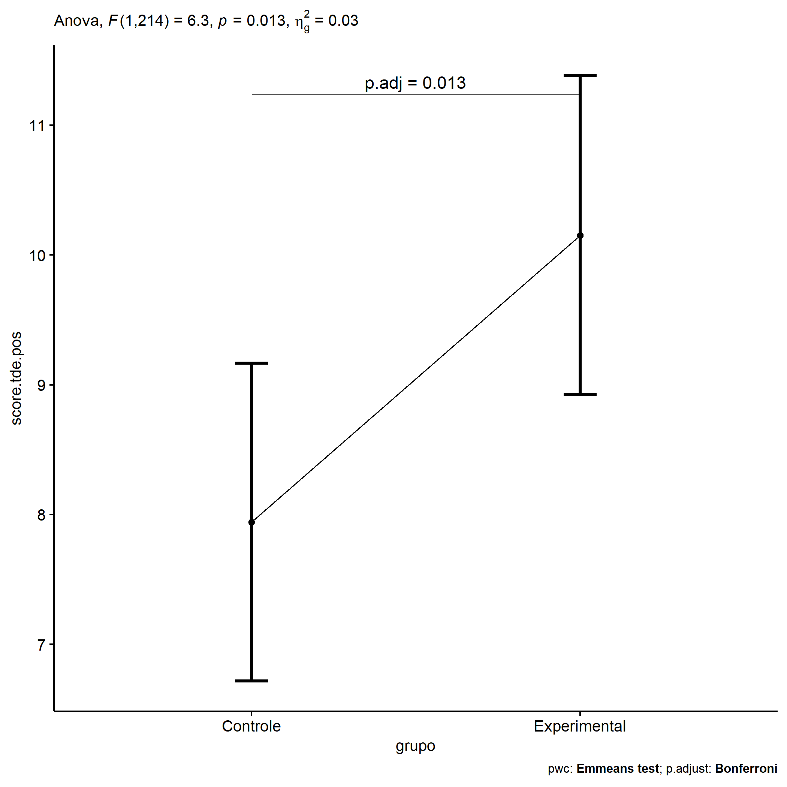<!-- -->

``` r
plots <- oneWayAncovaBoxPlots(
  wdat, "score.tde.pos", "grupo", aov, pwc, covar = "score.tde.pre",
  theme = "classic", color = color[["grupo"]],
  subtitle = which(aov$Effect == "grupo"))
```

``` r
if (length(unique(wdat[["grupo"]])) > 1)
  plots[["grupo"]] + ggplot2::ylab("TDE - Escrita") + ggplot2::scale_x_discrete(labels=c('pre', 'pos'))
```

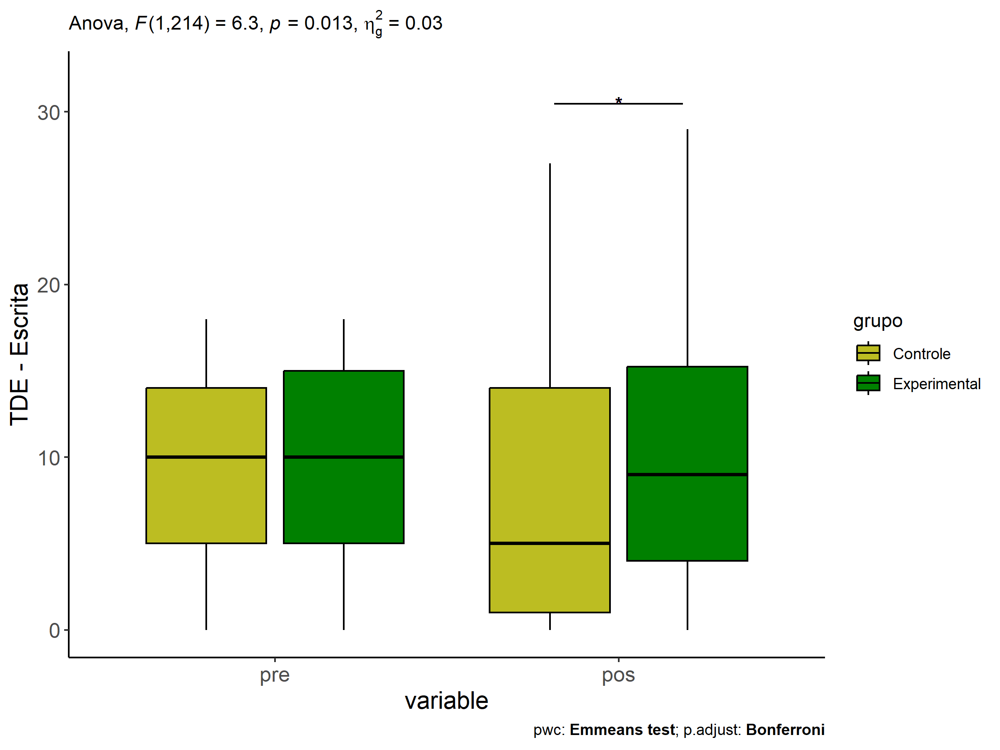<!-- -->

``` r
if (length(unique(wdat.long[["grupo"]])) > 1)
  plots <- oneWayAncovaBoxPlots(
    wdat.long, "score.tde", "grupo", aov, pwc.long, pre.post = "time",
    theme = "classic", color = color$prepost)
```

``` r
if (length(unique(wdat.long[["grupo"]])) > 1)
  plots[["grupo"]] + ggplot2::ylab("TDE - Escrita")
```

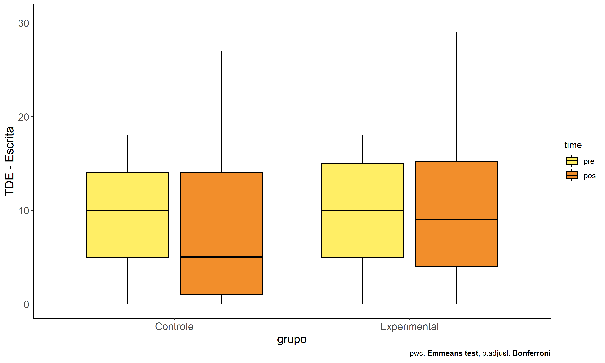<!-- -->

### Checking linearity assumption

``` r
ggscatter(wdat, x = "score.tde.pre", y = "score.tde.pos", size = 0.5,
          color = "grupo", add = "reg.line")+
  stat_regline_equation(
    aes(label =  paste(..eq.label.., ..rr.label.., sep = "~~~~"), color = grupo)
  )
```

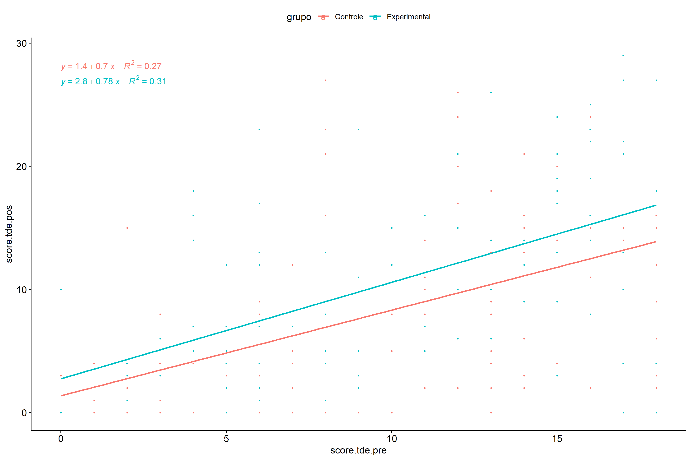<!-- -->

### Checking normality and homogeneity

``` r
res <- augment(lm(score.tde.pos ~ score.tde.pre + grupo, data = wdat))
```

``` r
shapiro_test(res$.resid)
```

    ## # A tibble: 1 × 3
    ##   variable   statistic p.value
    ##   <chr>          <dbl>   <dbl>
    ## 1 res$.resid     0.985  0.0198

``` r
levene_test(res, .resid ~ grupo)
```

    ## # A tibble: 1 × 4
    ##     df1   df2 statistic     p
    ##   <int> <int>     <dbl> <dbl>
    ## 1     1   215     0.220 0.640

# ANCOVA and Pairwise for two factors **grupo:Sexo**

## Without remove non-normal data

``` r
pdat = remove_group_data(dat[!is.na(dat[["grupo"]]) & !is.na(dat[["Sexo"]]),], "score.tde.pos", c("grupo","Sexo"))

pdat.long <- rbind(pdat[,c("id","grupo","Sexo")], pdat[,c("id","grupo","Sexo")])
pdat.long[["time"]] <- c(rep("pre", nrow(pdat)), rep("pos", nrow(pdat)))
pdat.long[["time"]] <- factor(pdat.long[["time"]], c("pre","pos"))
pdat.long[["score.tde"]] <- c(pdat[["score.tde.pre"]], pdat[["score.tde.pos"]])

aov = anova_test(pdat, score.tde.pos ~ score.tde.pre + grupo*Sexo)
laov[["grupo:Sexo"]] <- get_anova_table(aov)
```

``` r
pwcs <- list()
pwcs[["Sexo"]] <- emmeans_test(
  group_by(pdat, grupo), score.tde.pos ~ Sexo,
  covariate = score.tde.pre, p.adjust.method = "bonferroni")
pwcs[["grupo"]] <- emmeans_test(
  group_by(pdat, Sexo), score.tde.pos ~ grupo,
  covariate = score.tde.pre, p.adjust.method = "bonferroni")

pwc <- plyr::rbind.fill(pwcs[["grupo"]], pwcs[["Sexo"]])
pwc <- pwc[,c("grupo","Sexo", colnames(pwc)[!colnames(pwc) %in% c("grupo","Sexo")])]
```

``` r
pwc.long <- emmeans_test(dplyr::group_by_at(pdat.long, c("grupo","Sexo")),
                         score.tde ~ time,
                         p.adjust.method = "bonferroni")
lpwc[["grupo:Sexo"]] <- plyr::rbind.fill(pwc, pwc.long)
```

``` r
ds <- get.descriptives(pdat, "score.tde.pos", c("grupo","Sexo"), covar = "score.tde.pre")
ds <- merge(ds[ds$variable != "score.tde.pre",],
            ds[ds$variable == "score.tde.pre", !colnames(ds) %in% c("variable")],
            by = c("grupo","Sexo"), all.x = T, suffixes = c("", ".score.tde.pre"))
ds <- merge(get_emmeans(pwcs[["grupo"]]), ds, by = c("grupo","Sexo"), suffixes = c(".emms", ""))
ds <- ds[,c("grupo","Sexo","n","mean.score.tde.pre","se.score.tde.pre","mean","se","emmean","se.emms")]

colnames(ds) <- c("grupo","Sexo", "N", paste0(c("M","SE")," (pre)"),
                  paste0(c("M","SE"), " (unadj)"), paste0(c("M", "SE"), " (adj)"))

lemms[["grupo:Sexo"]] <- ds
```

## Computing ANCOVA and PairWise After removing non-normal data (OK)

``` r
wdat = pdat 

res = residuals(lm(score.tde.pos ~ score.tde.pre + grupo*Sexo, data = wdat))
non.normal = getNonNormal(res, wdat$id, plimit = 0.05)

wdat = wdat[!wdat$id %in% non.normal,]

wdat.long <- rbind(wdat[,c("id","grupo","Sexo")], wdat[,c("id","grupo","Sexo")])
wdat.long[["time"]] <- c(rep("pre", nrow(wdat)), rep("pos", nrow(wdat)))
wdat.long[["time"]] <- factor(wdat.long[["time"]], c("pre","pos"))
wdat.long[["score.tde"]] <- c(wdat[["score.tde.pre"]], wdat[["score.tde.pos"]])


ldat[["grupo:Sexo"]] = wdat

(non.normal)
```

    ## [1] "P3637" "P1971" "P809"  "P2004" "P1167" "P3240" "P827"  "P961"

``` r
aov = anova_test(wdat, score.tde.pos ~ score.tde.pre + grupo*Sexo)
laov[["grupo:Sexo"]] <- merge(get_anova_table(aov), laov[["grupo:Sexo"]], by="Effect", suffixes = c("","'"))

(df = get_anova_table(aov))
```

    ## ANOVA Table (type II tests)
    ## 
    ##          Effect DFn DFd      F        p p<.05   ges
    ## 1 score.tde.pre   1 212 83.880 4.57e-17     * 0.283
    ## 2         grupo   1 212  8.874 3.00e-03     * 0.040
    ## 3          Sexo   1 212  1.368 2.44e-01       0.006
    ## 4    grupo:Sexo   1 212  0.362 5.48e-01       0.002

| Effect        | DFn | DFd |      F |     p | p\<.05 |   ges |
|:--------------|----:|----:|-------:|------:|:-------|------:|
| score.tde.pre |   1 | 212 | 83.880 | 0.000 | \*     | 0.283 |
| grupo         |   1 | 212 |  8.874 | 0.003 | \*     | 0.040 |
| Sexo          |   1 | 212 |  1.368 | 0.244 |        | 0.006 |
| grupo:Sexo    |   1 | 212 |  0.362 | 0.548 |        | 0.002 |

``` r
pwcs <- list()
pwcs[["Sexo"]] <- emmeans_test(
  group_by(wdat, grupo), score.tde.pos ~ Sexo,
  covariate = score.tde.pre, p.adjust.method = "bonferroni")
pwcs[["grupo"]] <- emmeans_test(
  group_by(wdat, Sexo), score.tde.pos ~ grupo,
  covariate = score.tde.pre, p.adjust.method = "bonferroni")

pwc <- plyr::rbind.fill(pwcs[["grupo"]], pwcs[["Sexo"]])
pwc <- pwc[,c("grupo","Sexo", colnames(pwc)[!colnames(pwc) %in% c("grupo","Sexo")])]
```

| grupo        | Sexo | term                 | .y.           | group1   | group2       |  df | statistic |     p | p.adj | p.adj.signif |
|:-------------|:-----|:---------------------|:--------------|:---------|:-------------|----:|----------:|------:|------:|:-------------|
|              | F    | score.tde.pre\*grupo | score.tde.pos | Controle | Experimental | 212 |    -1.357 | 0.176 | 0.176 | ns           |
|              | M    | score.tde.pre\*grupo | score.tde.pos | Controle | Experimental | 212 |    -2.721 | 0.007 | 0.007 | \*\*         |
| Controle     |      | score.tde.pre\*Sexo  | score.tde.pos | F        | M            | 212 |    -0.364 | 0.716 | 0.716 | ns           |
| Experimental |      | score.tde.pre\*Sexo  | score.tde.pos | F        | M            | 212 |    -1.264 | 0.207 | 0.207 | ns           |

``` r
pwc.long <- emmeans_test(dplyr::group_by_at(wdat.long, c("grupo","Sexo")),
                         score.tde ~ time,
                         p.adjust.method = "bonferroni")
lpwc[["grupo:Sexo"]] <- merge(plyr::rbind.fill(pwc, pwc.long), lpwc[["grupo:Sexo"]], by=c("grupo","Sexo","term",".y.","group1","group2"), suffixes = c("","'"))
```

| grupo        | Sexo | term | .y.       | group1 | group2 |  df | statistic |     p | p.adj | p.adj.signif |
|:-------------|:-----|:-----|:----------|:-------|:-------|----:|----------:|------:|------:|:-------------|
| Controle     | F    | time | score.tde | pre    | pos    | 426 |     1.218 | 0.224 | 0.224 | ns           |
| Controle     | M    | time | score.tde | pre    | pos    | 426 |     1.241 | 0.215 | 0.215 | ns           |
| Experimental | F    | time | score.tde | pre    | pos    | 426 |     0.214 | 0.830 | 0.830 | ns           |
| Experimental | M    | time | score.tde | pre    | pos    | 426 |    -1.357 | 0.175 | 0.175 | ns           |

``` r
ds <- get.descriptives(wdat, "score.tde.pos", c("grupo","Sexo"), covar = "score.tde.pre")
ds <- merge(ds[ds$variable != "score.tde.pre",],
            ds[ds$variable == "score.tde.pre", !colnames(ds) %in% c("variable")],
            by = c("grupo","Sexo"), all.x = T, suffixes = c("", ".score.tde.pre"))
ds <- merge(get_emmeans(pwcs[["grupo"]]), ds, by = c("grupo","Sexo"), suffixes = c(".emms", ""))
ds <- ds[,c("grupo","Sexo","n","mean.score.tde.pre","se.score.tde.pre","mean","se","emmean","se.emms")]

colnames(ds) <- c("grupo","Sexo", "N", paste0(c("M","SE")," (pre)"),
                  paste0(c("M","SE"), " (unadj)"), paste0(c("M", "SE"), " (adj)"))

lemms[["grupo:Sexo"]] <- merge(ds, lemms[["grupo:Sexo"]], by=c("grupo","Sexo"), suffixes = c("","'"))
```

| grupo        | Sexo |   N | M (pre) | SE (pre) | M (unadj) | SE (unadj) | M (adj) | SE (adj) |
|:-------------|:-----|----:|--------:|---------:|----------:|-----------:|--------:|---------:|
| Controle     | F    |  35 |   9.314 |    0.890 |     7.371 |      0.950 |   7.438 |    1.093 |
| Controle     | M    |  73 |   8.986 |    0.678 |     7.616 |      0.931 |   7.923 |    0.758 |
| Experimental | F    |  48 |  10.438 |    0.810 |    10.146 |      1.023 |   9.392 |    0.937 |
| Experimental | M    |  61 |   9.148 |    0.689 |    10.787 |      1.095 |  10.975 |    0.828 |

### Plots for ancova

``` r
plots <- twoWayAncovaPlots(
  wdat, "score.tde.pos", c("grupo","Sexo"), aov, pwcs, addParam = c("mean_se"),
  font.label.size=10, step.increase=0.05, p.label="p.adj",
  subtitle = which(aov$Effect == "grupo:Sexo"))
```

``` r
if (!is.null(plots[["grupo"]]))
  plots[["grupo"]] + ggplot2::scale_color_manual(values = color[["Sexo"]])
```

    ## Scale for colour is already present.
    ## Adding another scale for colour, which will replace the existing scale.

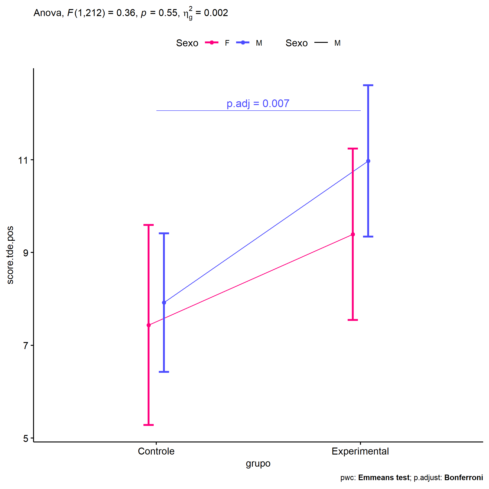<!-- -->

``` r
if (!is.null(plots[["Sexo"]]))
  plots[["Sexo"]] + ggplot2::scale_color_manual(values = color[["grupo"]])
```

    ## Scale for colour is already present.
    ## Adding another scale for colour, which will replace the existing scale.

<!-- -->

``` r
plots <- twoWayAncovaBoxPlots(
  wdat, "score.tde.pos", c("grupo","Sexo"), aov, pwcs, covar = "score.tde.pre",
  theme = "classic", color = color[["grupo:Sexo"]],
  subtitle = which(aov$Effect == "grupo:Sexo"))
```

``` r
plots[["grupo:Sexo"]] + ggplot2::ylab("TDE - Escrita") + ggplot2::scale_x_discrete(labels=c('pre', 'pos'))
```

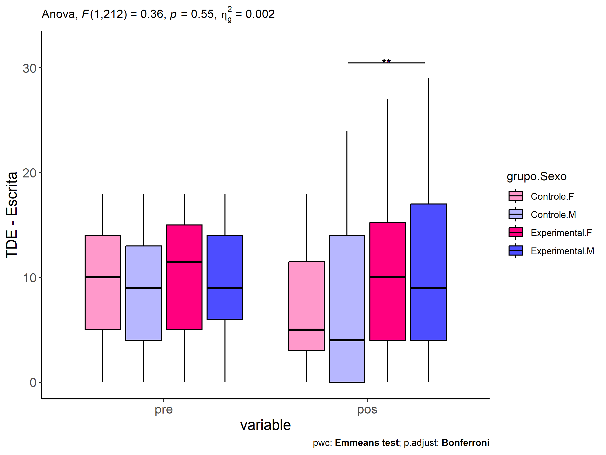<!-- -->

``` r
plots <- twoWayAncovaBoxPlots(
  wdat.long, "score.tde", c("grupo","Sexo"), aov, pwc.long, pre.post = "time",
  theme = "classic", color = color$prepost)
```

``` r
plots[["grupo:Sexo"]] + ggplot2::ylab("TDE - Escrita")
```

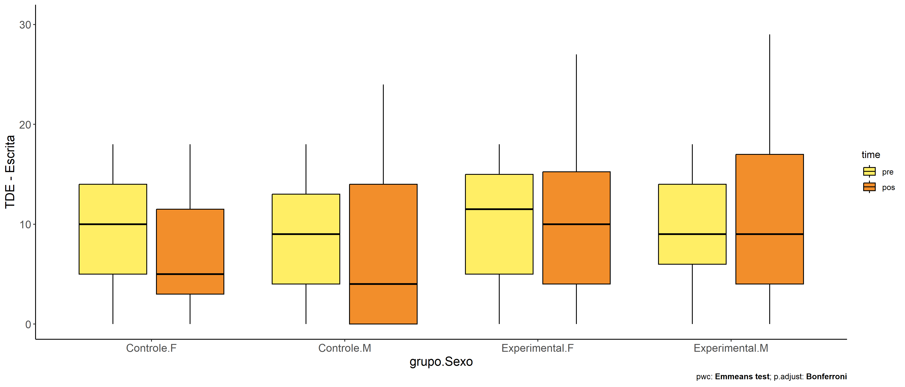<!-- -->

### Checking linearity assumption

``` r
ggscatter(wdat, x = "score.tde.pre", y = "score.tde.pos", size = 0.5,
          facet.by = c("grupo","Sexo"), add = "reg.line")+
  stat_regline_equation(
    aes(label =  paste(..eq.label.., ..rr.label.., sep = "~~~~"))
  )
```

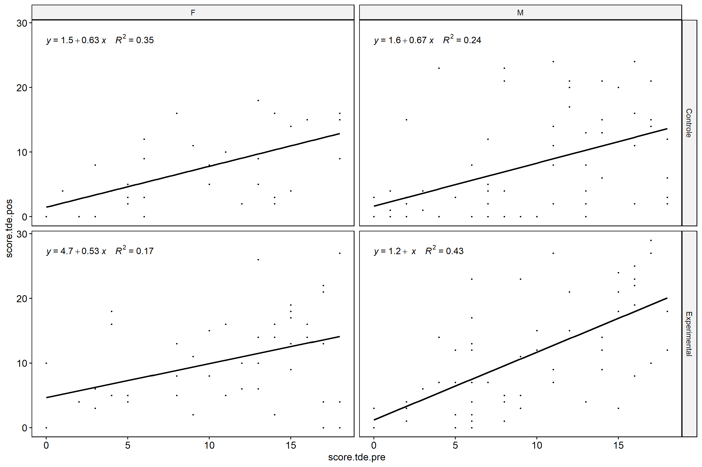<!-- -->

### Checking normality and homogeneity

``` r
res <- augment(lm(score.tde.pos ~ score.tde.pre + grupo*Sexo, data = wdat))
```

``` r
shapiro_test(res$.resid)
```

    ## # A tibble: 1 × 3
    ##   variable   statistic p.value
    ##   <chr>          <dbl>   <dbl>
    ## 1 res$.resid     0.986  0.0370

``` r
levene_test(res, .resid ~ grupo*Sexo)
```

    ## # A tibble: 1 × 4
    ##     df1   df2 statistic     p
    ##   <int> <int>     <dbl> <dbl>
    ## 1     3   213      1.54 0.204

# ANCOVA and Pairwise for two factors **grupo:Zona**

## Without remove non-normal data

``` r
pdat = remove_group_data(dat[!is.na(dat[["grupo"]]) & !is.na(dat[["Zona"]]),], "score.tde.pos", c("grupo","Zona"))

pdat.long <- rbind(pdat[,c("id","grupo","Zona")], pdat[,c("id","grupo","Zona")])
pdat.long[["time"]] <- c(rep("pre", nrow(pdat)), rep("pos", nrow(pdat)))
pdat.long[["time"]] <- factor(pdat.long[["time"]], c("pre","pos"))
pdat.long[["score.tde"]] <- c(pdat[["score.tde.pre"]], pdat[["score.tde.pos"]])

aov = anova_test(pdat, score.tde.pos ~ score.tde.pre + grupo*Zona)
laov[["grupo:Zona"]] <- get_anova_table(aov)
```

``` r
pwcs <- list()
pwcs[["Zona"]] <- emmeans_test(
  group_by(pdat, grupo), score.tde.pos ~ Zona,
  covariate = score.tde.pre, p.adjust.method = "bonferroni")
pwcs[["grupo"]] <- emmeans_test(
  group_by(pdat, Zona), score.tde.pos ~ grupo,
  covariate = score.tde.pre, p.adjust.method = "bonferroni")

pwc <- plyr::rbind.fill(pwcs[["grupo"]], pwcs[["Zona"]])
pwc <- pwc[,c("grupo","Zona", colnames(pwc)[!colnames(pwc) %in% c("grupo","Zona")])]
```

``` r
pwc.long <- emmeans_test(dplyr::group_by_at(pdat.long, c("grupo","Zona")),
                         score.tde ~ time,
                         p.adjust.method = "bonferroni")
lpwc[["grupo:Zona"]] <- plyr::rbind.fill(pwc, pwc.long)
```

``` r
ds <- get.descriptives(pdat, "score.tde.pos", c("grupo","Zona"), covar = "score.tde.pre")
ds <- merge(ds[ds$variable != "score.tde.pre",],
            ds[ds$variable == "score.tde.pre", !colnames(ds) %in% c("variable")],
            by = c("grupo","Zona"), all.x = T, suffixes = c("", ".score.tde.pre"))
ds <- merge(get_emmeans(pwcs[["grupo"]]), ds, by = c("grupo","Zona"), suffixes = c(".emms", ""))
ds <- ds[,c("grupo","Zona","n","mean.score.tde.pre","se.score.tde.pre","mean","se","emmean","se.emms")]

colnames(ds) <- c("grupo","Zona", "N", paste0(c("M","SE")," (pre)"),
                  paste0(c("M","SE"), " (unadj)"), paste0(c("M", "SE"), " (adj)"))

lemms[["grupo:Zona"]] <- ds
```

## Computing ANCOVA and PairWise After removing non-normal data (OK)

``` r
wdat = pdat 

res = residuals(lm(score.tde.pos ~ score.tde.pre + grupo*Zona, data = wdat))
non.normal = getNonNormal(res, wdat$id, plimit = 0.05)

wdat = wdat[!wdat$id %in% non.normal,]

wdat.long <- rbind(wdat[,c("id","grupo","Zona")], wdat[,c("id","grupo","Zona")])
wdat.long[["time"]] <- c(rep("pre", nrow(wdat)), rep("pos", nrow(wdat)))
wdat.long[["time"]] <- factor(wdat.long[["time"]], c("pre","pos"))
wdat.long[["score.tde"]] <- c(wdat[["score.tde.pre"]], wdat[["score.tde.pos"]])


ldat[["grupo:Zona"]] = wdat

(non.normal)
```

    ## [1] "P1971" "P809"  "P2004"

``` r
aov = anova_test(wdat, score.tde.pos ~ score.tde.pre + grupo*Zona)
laov[["grupo:Zona"]] <- merge(get_anova_table(aov), laov[["grupo:Zona"]], by="Effect", suffixes = c("","'"))

(df = get_anova_table(aov))
```

    ## ANOVA Table (type II tests)
    ## 
    ##          Effect DFn DFd      F        p p<.05   ges
    ## 1 score.tde.pre   1 164 61.162 6.06e-13     * 0.272
    ## 2         grupo   1 164  6.112 1.40e-02     * 0.036
    ## 3          Zona   1 164  2.461 1.19e-01       0.015
    ## 4    grupo:Zona   1 164  0.870 3.52e-01       0.005

| Effect        | DFn | DFd |      F |     p | p\<.05 |   ges |
|:--------------|----:|----:|-------:|------:|:-------|------:|
| score.tde.pre |   1 | 164 | 61.162 | 0.000 | \*     | 0.272 |
| grupo         |   1 | 164 |  6.112 | 0.014 | \*     | 0.036 |
| Zona          |   1 | 164 |  2.461 | 0.119 |        | 0.015 |
| grupo:Zona    |   1 | 164 |  0.870 | 0.352 |        | 0.005 |

``` r
pwcs <- list()
pwcs[["Zona"]] <- emmeans_test(
  group_by(wdat, grupo), score.tde.pos ~ Zona,
  covariate = score.tde.pre, p.adjust.method = "bonferroni")
pwcs[["grupo"]] <- emmeans_test(
  group_by(wdat, Zona), score.tde.pos ~ grupo,
  covariate = score.tde.pre, p.adjust.method = "bonferroni")

pwc <- plyr::rbind.fill(pwcs[["grupo"]], pwcs[["Zona"]])
pwc <- pwc[,c("grupo","Zona", colnames(pwc)[!colnames(pwc) %in% c("grupo","Zona")])]
```

| grupo        | Zona   | term                 | .y.           | group1   | group2       |  df | statistic |     p | p.adj | p.adj.signif |
|:-------------|:-------|:---------------------|:--------------|:---------|:-------------|----:|----------:|------:|------:|:-------------|
|              | Rural  | score.tde.pre\*grupo | score.tde.pos | Controle | Experimental | 164 |    -2.616 | 0.010 | 0.010 | \*\*         |
|              | Urbana | score.tde.pre\*grupo | score.tde.pos | Controle | Experimental | 164 |    -0.366 | 0.714 | 0.714 | ns           |
| Controle     |        | score.tde.pre\*Zona  | score.tde.pos | Rural    | Urbana       | 164 |     0.321 | 0.748 | 0.748 | ns           |
| Experimental |        | score.tde.pre\*Zona  | score.tde.pos | Rural    | Urbana       | 164 |     1.796 | 0.074 | 0.074 | ns           |

``` r
pwc.long <- emmeans_test(dplyr::group_by_at(wdat.long, c("grupo","Zona")),
                         score.tde ~ time,
                         p.adjust.method = "bonferroni")
lpwc[["grupo:Zona"]] <- merge(plyr::rbind.fill(pwc, pwc.long), lpwc[["grupo:Zona"]], by=c("grupo","Zona","term",".y.","group1","group2"), suffixes = c("","'"))
```

| grupo        | Zona   | term | .y.       | group1 | group2 |  df | statistic |     p | p.adj | p.adj.signif |
|:-------------|:-------|:-----|:----------|:-------|:-------|----:|----------:|------:|------:|:-------------|
| Controle     | Rural  | time | score.tde | pre    | pos    | 330 |     1.271 | 0.205 | 0.205 | ns           |
| Controle     | Urbana | time | score.tde | pre    | pos    | 330 |     0.885 | 0.377 | 0.377 | ns           |
| Experimental | Rural  | time | score.tde | pre    | pos    | 330 |    -1.103 | 0.271 | 0.271 | ns           |
| Experimental | Urbana | time | score.tde | pre    | pos    | 330 |     0.591 | 0.555 | 0.555 | ns           |

``` r
ds <- get.descriptives(wdat, "score.tde.pos", c("grupo","Zona"), covar = "score.tde.pre")
ds <- merge(ds[ds$variable != "score.tde.pre",],
            ds[ds$variable == "score.tde.pre", !colnames(ds) %in% c("variable")],
            by = c("grupo","Zona"), all.x = T, suffixes = c("", ".score.tde.pre"))
ds <- merge(get_emmeans(pwcs[["grupo"]]), ds, by = c("grupo","Zona"), suffixes = c(".emms", ""))
ds <- ds[,c("grupo","Zona","n","mean.score.tde.pre","se.score.tde.pre","mean","se","emmean","se.emms")]

colnames(ds) <- c("grupo","Zona", "N", paste0(c("M","SE")," (pre)"),
                  paste0(c("M","SE"), " (unadj)"), paste0(c("M", "SE"), " (adj)"))

lemms[["grupo:Zona"]] <- merge(ds, lemms[["grupo:Zona"]], by=c("grupo","Zona"), suffixes = c("","'"))
```

| grupo        | Zona   |   N | M (pre) | SE (pre) | M (unadj) | SE (unadj) | M (adj) | SE (adj) |
|:-------------|:-------|----:|--------:|---------:|----------:|-----------:|--------:|---------:|
| Controle     | Rural  |  67 |   8.925 |    0.646 |     7.478 |      0.889 |   7.626 |    0.785 |
| Controle     | Urbana |  16 |   9.062 |    1.529 |     7.000 |      1.981 |   7.052 |    1.606 |
| Experimental | Rural  |  62 |   9.645 |    0.738 |    10.952 |      1.012 |  10.592 |    0.817 |
| Experimental | Urbana |  24 |   8.458 |    1.037 |     7.333 |      1.329 |   7.812 |    1.312 |

### Plots for ancova

``` r
plots <- twoWayAncovaPlots(
  wdat, "score.tde.pos", c("grupo","Zona"), aov, pwcs, addParam = c("mean_se"),
  font.label.size=10, step.increase=0.05, p.label="p.adj",
  subtitle = which(aov$Effect == "grupo:Zona"))
```

``` r
if (!is.null(plots[["grupo"]]))
  plots[["grupo"]] + ggplot2::scale_color_manual(values = color[["Zona"]])
```

    ## Scale for colour is already present.
    ## Adding another scale for colour, which will replace the existing scale.

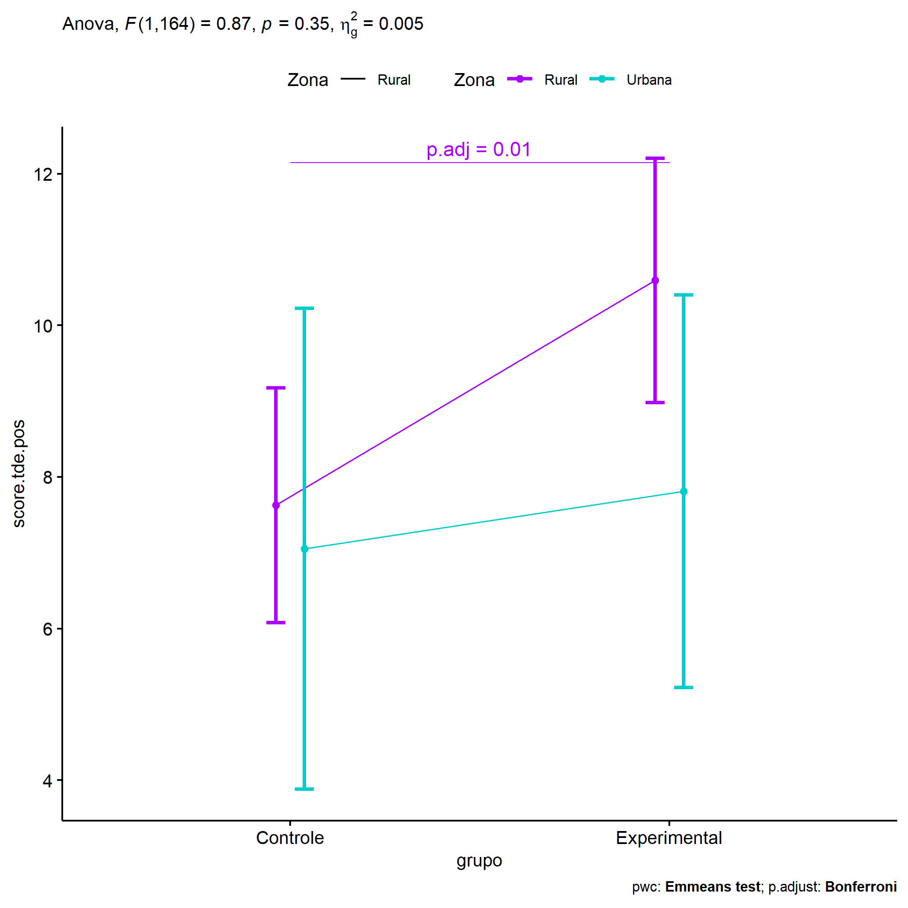<!-- -->

``` r
if (!is.null(plots[["Zona"]]))
  plots[["Zona"]] + ggplot2::scale_color_manual(values = color[["grupo"]])
```

    ## Scale for colour is already present.
    ## Adding another scale for colour, which will replace the existing scale.

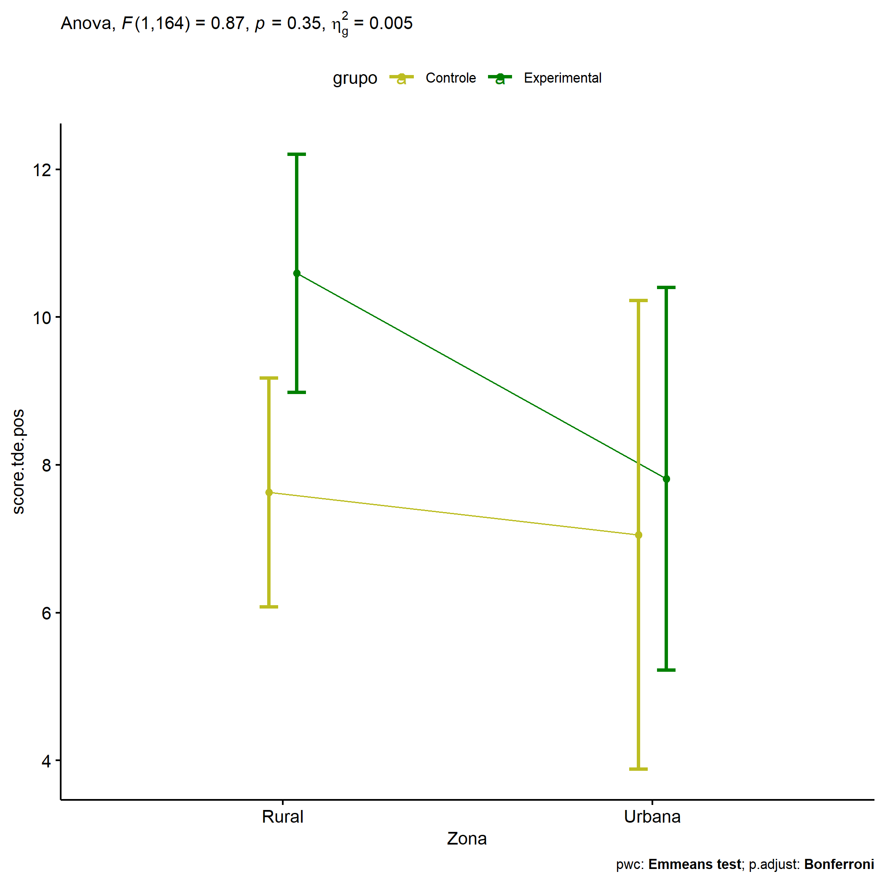<!-- -->

``` r
plots <- twoWayAncovaBoxPlots(
  wdat, "score.tde.pos", c("grupo","Zona"), aov, pwcs, covar = "score.tde.pre",
  theme = "classic", color = color[["grupo:Zona"]],
  subtitle = which(aov$Effect == "grupo:Zona"))
```

``` r
plots[["grupo:Zona"]] + ggplot2::ylab("TDE - Escrita") + ggplot2::scale_x_discrete(labels=c('pre', 'pos'))
```

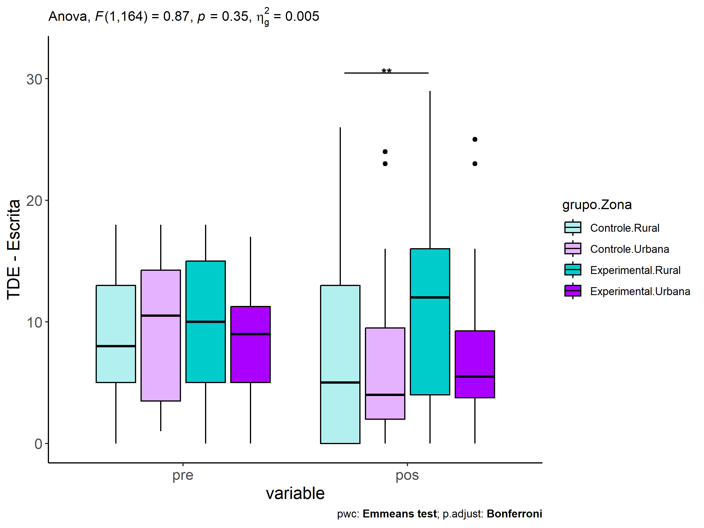<!-- -->

``` r
plots <- twoWayAncovaBoxPlots(
  wdat.long, "score.tde", c("grupo","Zona"), aov, pwc.long, pre.post = "time",
  theme = "classic", color = color$prepost)
```

``` r
plots[["grupo:Zona"]] + ggplot2::ylab("TDE - Escrita")
```

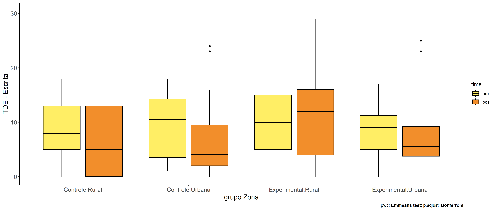<!-- -->

### Checking linearity assumption

``` r
ggscatter(wdat, x = "score.tde.pre", y = "score.tde.pos", size = 0.5,
          facet.by = c("grupo","Zona"), add = "reg.line")+
  stat_regline_equation(
    aes(label =  paste(..eq.label.., ..rr.label.., sep = "~~~~"))
  )
```

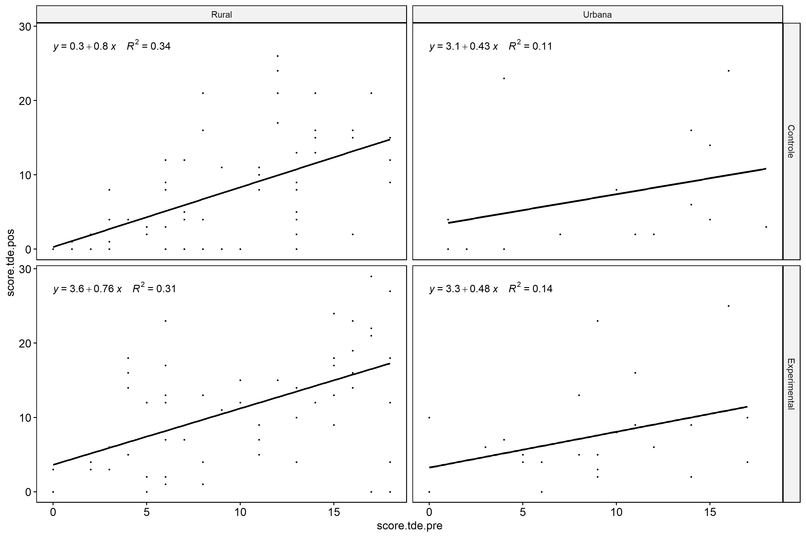<!-- -->

### Checking normality and homogeneity

``` r
res <- augment(lm(score.tde.pos ~ score.tde.pre + grupo*Zona, data = wdat))
```

``` r
shapiro_test(res$.resid)
```

    ## # A tibble: 1 × 3
    ##   variable   statistic p.value
    ##   <chr>          <dbl>   <dbl>
    ## 1 res$.resid     0.981  0.0195

``` r
levene_test(res, .resid ~ grupo*Zona)
```

    ## # A tibble: 1 × 4
    ##     df1   df2 statistic     p
    ##   <int> <int>     <dbl> <dbl>
    ## 1     3   165     0.677 0.567

# ANCOVA and Pairwise for two factors **grupo:Cor.Raca**

## Without remove non-normal data

``` r
pdat = remove_group_data(dat[!is.na(dat[["grupo"]]) & !is.na(dat[["Cor.Raca"]]),], "score.tde.pos", c("grupo","Cor.Raca"))

pdat.long <- rbind(pdat[,c("id","grupo","Cor.Raca")], pdat[,c("id","grupo","Cor.Raca")])
pdat.long[["time"]] <- c(rep("pre", nrow(pdat)), rep("pos", nrow(pdat)))
pdat.long[["time"]] <- factor(pdat.long[["time"]], c("pre","pos"))
pdat.long[["score.tde"]] <- c(pdat[["score.tde.pre"]], pdat[["score.tde.pos"]])

aov = anova_test(pdat, score.tde.pos ~ score.tde.pre + grupo*Cor.Raca)
laov[["grupo:Cor.Raca"]] <- get_anova_table(aov)
```

``` r
pwcs <- list()
pwcs[["Cor.Raca"]] <- emmeans_test(
  group_by(pdat, grupo), score.tde.pos ~ Cor.Raca,
  covariate = score.tde.pre, p.adjust.method = "bonferroni")
pwcs[["grupo"]] <- emmeans_test(
  group_by(pdat, Cor.Raca), score.tde.pos ~ grupo,
  covariate = score.tde.pre, p.adjust.method = "bonferroni")

pwc <- plyr::rbind.fill(pwcs[["grupo"]], pwcs[["Cor.Raca"]])
pwc <- pwc[,c("grupo","Cor.Raca", colnames(pwc)[!colnames(pwc) %in% c("grupo","Cor.Raca")])]
```

``` r
pwc.long <- emmeans_test(dplyr::group_by_at(pdat.long, c("grupo","Cor.Raca")),
                         score.tde ~ time,
                         p.adjust.method = "bonferroni")
lpwc[["grupo:Cor.Raca"]] <- plyr::rbind.fill(pwc, pwc.long)
```

``` r
ds <- get.descriptives(pdat, "score.tde.pos", c("grupo","Cor.Raca"), covar = "score.tde.pre")
ds <- merge(ds[ds$variable != "score.tde.pre",],
            ds[ds$variable == "score.tde.pre", !colnames(ds) %in% c("variable")],
            by = c("grupo","Cor.Raca"), all.x = T, suffixes = c("", ".score.tde.pre"))
ds <- merge(get_emmeans(pwcs[["grupo"]]), ds, by = c("grupo","Cor.Raca"), suffixes = c(".emms", ""))
ds <- ds[,c("grupo","Cor.Raca","n","mean.score.tde.pre","se.score.tde.pre","mean","se","emmean","se.emms")]

colnames(ds) <- c("grupo","Cor.Raca", "N", paste0(c("M","SE")," (pre)"),
                  paste0(c("M","SE"), " (unadj)"), paste0(c("M", "SE"), " (adj)"))

lemms[["grupo:Cor.Raca"]] <- ds
```

## Computing ANCOVA and PairWise After removing non-normal data (OK)

``` r
wdat = pdat 

res = residuals(lm(score.tde.pos ~ score.tde.pre + grupo*Cor.Raca, data = wdat))
non.normal = getNonNormal(res, wdat$id, plimit = 0.05)

wdat = wdat[!wdat$id %in% non.normal,]

wdat.long <- rbind(wdat[,c("id","grupo","Cor.Raca")], wdat[,c("id","grupo","Cor.Raca")])
wdat.long[["time"]] <- c(rep("pre", nrow(wdat)), rep("pos", nrow(wdat)))
wdat.long[["time"]] <- factor(wdat.long[["time"]], c("pre","pos"))
wdat.long[["score.tde"]] <- c(wdat[["score.tde.pre"]], wdat[["score.tde.pos"]])


ldat[["grupo:Cor.Raca"]] = wdat

(non.normal)
```

    ## [1] "P3637"

``` r
aov = anova_test(wdat, score.tde.pos ~ score.tde.pre + grupo*Cor.Raca)
laov[["grupo:Cor.Raca"]] <- merge(get_anova_table(aov), laov[["grupo:Cor.Raca"]], by="Effect", suffixes = c("","'"))

(df = get_anova_table(aov))
```

    ## ANOVA Table (type II tests)
    ## 
    ##           Effect DFn DFd      F        p p<.05   ges
    ## 1  score.tde.pre   1 101 29.362 4.09e-07     * 0.225
    ## 2          grupo   1 101  4.921 2.90e-02     * 0.046
    ## 3       Cor.Raca   2 101  0.946 3.92e-01       0.018
    ## 4 grupo:Cor.Raca   1 101  2.921 9.10e-02       0.028

| Effect         | DFn | DFd |      F |     p | p\<.05 |   ges |
|:---------------|----:|----:|-------:|------:|:-------|------:|
| score.tde.pre  |   1 | 101 | 29.362 | 0.000 | \*     | 0.225 |
| grupo          |   1 | 101 |  4.921 | 0.029 | \*     | 0.046 |
| Cor.Raca       |   2 | 101 |  0.946 | 0.392 |        | 0.018 |
| grupo:Cor.Raca |   1 | 101 |  2.921 | 0.091 |        | 0.028 |

``` r
pwcs <- list()
pwcs[["Cor.Raca"]] <- emmeans_test(
  group_by(wdat, grupo), score.tde.pos ~ Cor.Raca,
  covariate = score.tde.pre, p.adjust.method = "bonferroni")
pwcs[["grupo"]] <- emmeans_test(
  group_by(wdat, Cor.Raca), score.tde.pos ~ grupo,
  covariate = score.tde.pre, p.adjust.method = "bonferroni")

pwc <- plyr::rbind.fill(pwcs[["grupo"]], pwcs[["Cor.Raca"]])
pwc <- pwc[,c("grupo","Cor.Raca", colnames(pwc)[!colnames(pwc) %in% c("grupo","Cor.Raca")])]
```

| grupo        | Cor.Raca | term                    | .y.           | group1   | group2       |  df | statistic |     p | p.adj | p.adj.signif |
|:-------------|:---------|:------------------------|:--------------|:---------|:-------------|----:|----------:|------:|------:|:-------------|
|              | Branca   | score.tde.pre\*grupo    | score.tde.pos | Controle | Experimental | 101 |    -2.551 | 0.012 | 0.012 | \*           |
|              | Indígena | score.tde.pre\*grupo    | score.tde.pos | Controle | Experimental |     |           |       |       |              |
|              | Parda    | score.tde.pre\*grupo    | score.tde.pos | Controle | Experimental | 101 |    -1.153 | 0.252 | 0.252 | ns           |
| Controle     |          | score.tde.pre\*Cor.Raca | score.tde.pos | Branca   | Indígena     |     |           |       |       |              |
| Controle     |          | score.tde.pre\*Cor.Raca | score.tde.pos | Branca   | Parda        | 101 |    -1.377 | 0.172 | 0.172 | ns           |
| Controle     |          | score.tde.pre\*Cor.Raca | score.tde.pos | Indígena | Parda        |     |           |       |       |              |
| Experimental |          | score.tde.pre\*Cor.Raca | score.tde.pos | Branca   | Indígena     | 101 |    -0.866 | 0.388 | 1.000 | ns           |
| Experimental |          | score.tde.pre\*Cor.Raca | score.tde.pos | Branca   | Parda        | 101 |     1.008 | 0.316 | 0.947 | ns           |
| Experimental |          | score.tde.pre\*Cor.Raca | score.tde.pos | Indígena | Parda        | 101 |     1.546 | 0.125 | 0.376 | ns           |

``` r
pwc.long <- emmeans_test(dplyr::group_by_at(wdat.long, c("grupo","Cor.Raca")),
                         score.tde ~ time,
                         p.adjust.method = "bonferroni")
lpwc[["grupo:Cor.Raca"]] <- merge(plyr::rbind.fill(pwc, pwc.long), lpwc[["grupo:Cor.Raca"]], by=c("grupo","Cor.Raca","term",".y.","group1","group2"), suffixes = c("","'"))
```

| grupo        | Cor.Raca | term | .y.       | group1 | group2 |  df | statistic |     p | p.adj | p.adj.signif |
|:-------------|:---------|:-----|:----------|:-------|:-------|----:|----------:|------:|------:|:-------------|
| Controle     | Branca   | time | score.tde | pre    | pos    | 204 |     1.458 | 0.146 | 0.146 | ns           |
| Controle     | Indígena | time | score.tde | pre    | pos    |     |           |       |       |              |
| Controle     | Parda    | time | score.tde | pre    | pos    | 204 |     0.419 | 0.676 | 0.676 | ns           |
| Experimental | Branca   | time | score.tde | pre    | pos    | 204 |    -1.195 | 0.233 | 0.233 | ns           |
| Experimental | Indígena | time | score.tde | pre    | pos    | 204 |    -1.485 | 0.139 | 0.139 | ns           |
| Experimental | Parda    | time | score.tde | pre    | pos    | 204 |    -0.604 | 0.547 | 0.547 | ns           |

``` r
ds <- get.descriptives(wdat, "score.tde.pos", c("grupo","Cor.Raca"), covar = "score.tde.pre")
ds <- merge(ds[ds$variable != "score.tde.pre",],
            ds[ds$variable == "score.tde.pre", !colnames(ds) %in% c("variable")],
            by = c("grupo","Cor.Raca"), all.x = T, suffixes = c("", ".score.tde.pre"))
ds <- merge(get_emmeans(pwcs[["grupo"]]), ds, by = c("grupo","Cor.Raca"), suffixes = c(".emms", ""))
ds <- ds[,c("grupo","Cor.Raca","n","mean.score.tde.pre","se.score.tde.pre","mean","se","emmean","se.emms")]

colnames(ds) <- c("grupo","Cor.Raca", "N", paste0(c("M","SE")," (pre)"),
                  paste0(c("M","SE"), " (unadj)"), paste0(c("M", "SE"), " (adj)"))

lemms[["grupo:Cor.Raca"]] <- merge(ds, lemms[["grupo:Cor.Raca"]], by=c("grupo","Cor.Raca"), suffixes = c("","'"))
```

| grupo        | Cor.Raca |   N | M (pre) | SE (pre) | M (unadj) | SE (unadj) | M (adj) | SE (adj) |
|:-------------|:---------|----:|--------:|---------:|----------:|-----------:|--------:|---------:|
| Controle     | Branca   |   8 |   9.875 |    1.630 |     4.750 |      2.024 |   3.930 |    2.550 |
| Controle     | Parda    |  39 |   8.026 |    0.936 |     7.359 |      1.206 |   7.791 |    1.156 |
| Experimental | Branca   |  17 |   9.471 |    1.539 |    12.353 |      2.526 |  11.806 |    1.749 |
| Experimental | Indígena |   5 |   7.800 |    1.800 |    14.400 |      3.709 |  14.985 |    3.222 |
| Experimental | Parda    |  38 |   8.816 |    0.910 |     9.789 |      1.297 |   9.686 |    1.168 |

### Plots for ancova

``` r
plots <- twoWayAncovaPlots(
  wdat, "score.tde.pos", c("grupo","Cor.Raca"), aov, pwcs, addParam = c("mean_se"),
  font.label.size=10, step.increase=0.05, p.label="p.adj",
  subtitle = which(aov$Effect == "grupo:Cor.Raca"))
```

``` r
if (!is.null(plots[["grupo"]]))
  plots[["grupo"]] + ggplot2::scale_color_manual(values = color[["Cor.Raca"]])
```

<!-- -->

``` r
if (!is.null(plots[["Cor.Raca"]]))
  plots[["Cor.Raca"]] + ggplot2::scale_color_manual(values = color[["grupo"]])
```

    ## Scale for colour is already present.
    ## Adding another scale for colour, which will replace the existing scale.

    ## Warning: Removed 2 rows containing non-finite values (`stat_bracket()`).

    ## Warning: Removed 1 rows containing missing values (`geom_point()`).

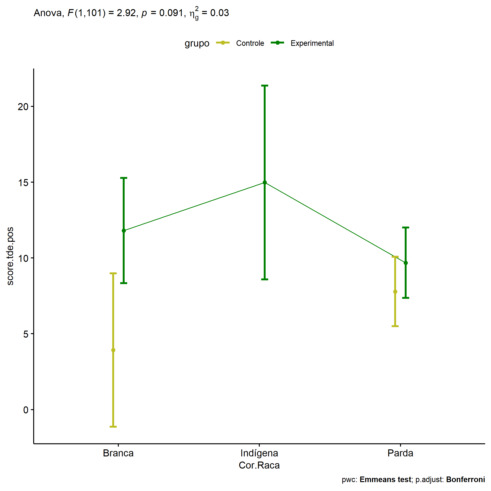<!-- -->

``` r
plots <- twoWayAncovaBoxPlots(
  wdat, "score.tde.pos", c("grupo","Cor.Raca"), aov, pwcs, covar = "score.tde.pre",
  theme = "classic", color = color[["grupo:Cor.Raca"]],
  subtitle = which(aov$Effect == "grupo:Cor.Raca"))
```

``` r
plots[["grupo:Cor.Raca"]] + ggplot2::ylab("TDE - Escrita") + ggplot2::scale_x_discrete(labels=c('pre', 'pos'))
```

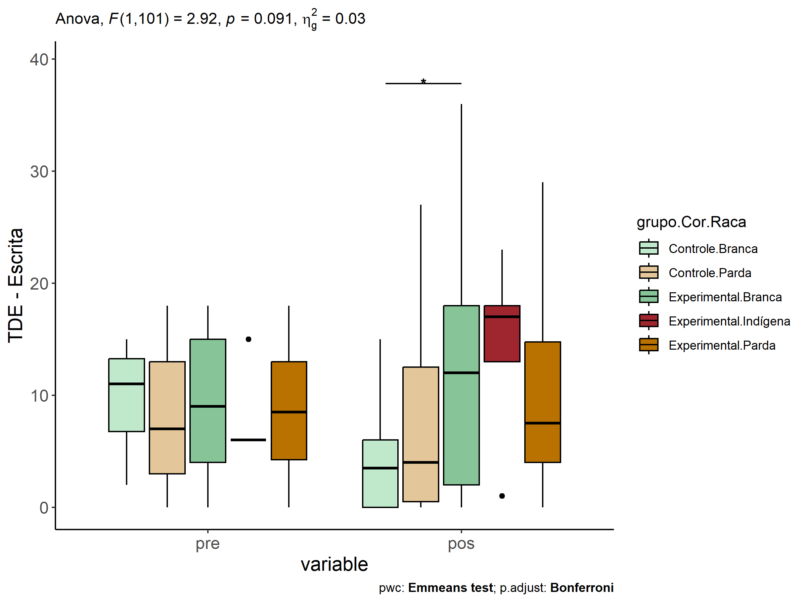<!-- -->

``` r
plots <- twoWayAncovaBoxPlots(
  wdat.long, "score.tde", c("grupo","Cor.Raca"), aov, pwc.long, pre.post = "time",
  theme = "classic", color = color$prepost)
```

``` r
plots[["grupo:Cor.Raca"]] + ggplot2::ylab("TDE - Escrita")
```

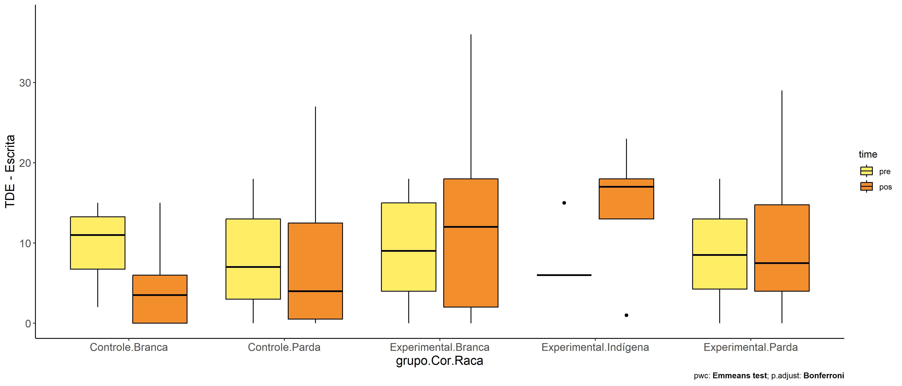<!-- -->

### Checking linearity assumption

``` r
ggscatter(wdat, x = "score.tde.pre", y = "score.tde.pos", size = 0.5,
          facet.by = c("grupo","Cor.Raca"), add = "reg.line")+
  stat_regline_equation(
    aes(label =  paste(..eq.label.., ..rr.label.., sep = "~~~~"))
  )
```

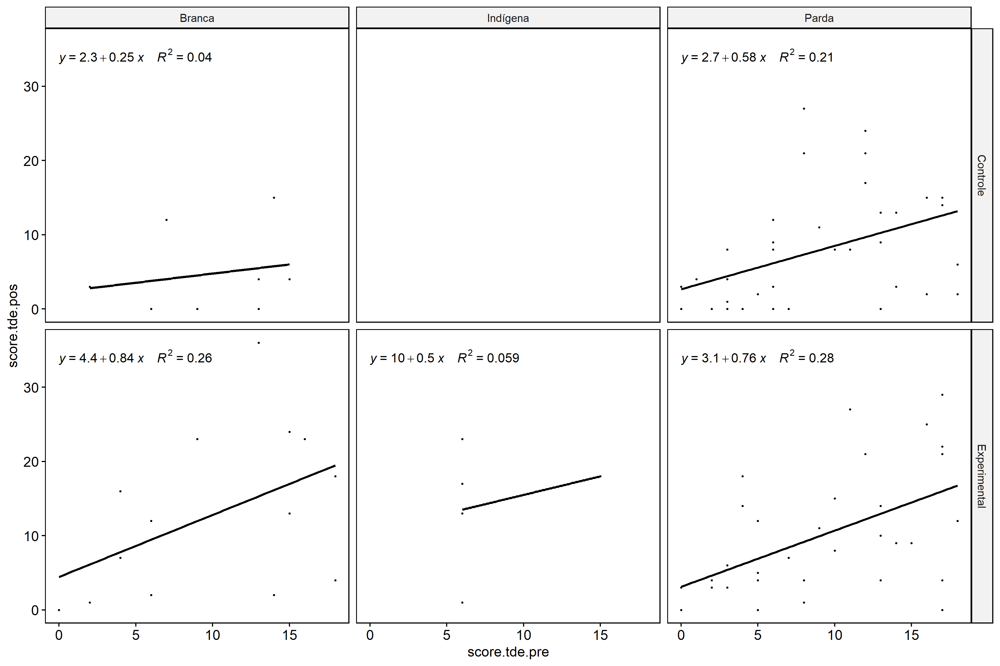<!-- -->

### Checking normality and homogeneity

``` r
res <- augment(lm(score.tde.pos ~ score.tde.pre + grupo*Cor.Raca, data = wdat))
```

``` r
shapiro_test(res$.resid)
```

    ## # A tibble: 1 × 3
    ##   variable   statistic p.value
    ##   <chr>          <dbl>   <dbl>
    ## 1 res$.resid     0.978  0.0727

``` r
levene_test(res, .resid ~ grupo*Cor.Raca)
```

    ## # A tibble: 1 × 4
    ##     df1   df2 statistic     p
    ##   <int> <int>     <dbl> <dbl>
    ## 1     4   102     0.604 0.660

# ANCOVA and Pairwise for two factors **grupo:Serie**

## Without remove non-normal data

``` r
pdat = remove_group_data(dat[!is.na(dat[["grupo"]]) & !is.na(dat[["Serie"]]),], "score.tde.pos", c("grupo","Serie"))

pdat.long <- rbind(pdat[,c("id","grupo","Serie")], pdat[,c("id","grupo","Serie")])
pdat.long[["time"]] <- c(rep("pre", nrow(pdat)), rep("pos", nrow(pdat)))
pdat.long[["time"]] <- factor(pdat.long[["time"]], c("pre","pos"))
pdat.long[["score.tde"]] <- c(pdat[["score.tde.pre"]], pdat[["score.tde.pos"]])

aov = anova_test(pdat, score.tde.pos ~ score.tde.pre + grupo*Serie)
laov[["grupo:Serie"]] <- get_anova_table(aov)
```

``` r
pwcs <- list()
pwcs[["Serie"]] <- emmeans_test(
  group_by(pdat, grupo), score.tde.pos ~ Serie,
  covariate = score.tde.pre, p.adjust.method = "bonferroni")
pwcs[["grupo"]] <- emmeans_test(
  group_by(pdat, Serie), score.tde.pos ~ grupo,
  covariate = score.tde.pre, p.adjust.method = "bonferroni")

pwc <- plyr::rbind.fill(pwcs[["grupo"]], pwcs[["Serie"]])
pwc <- pwc[,c("grupo","Serie", colnames(pwc)[!colnames(pwc) %in% c("grupo","Serie")])]
```

``` r
pwc.long <- emmeans_test(dplyr::group_by_at(pdat.long, c("grupo","Serie")),
                         score.tde ~ time,
                         p.adjust.method = "bonferroni")
lpwc[["grupo:Serie"]] <- plyr::rbind.fill(pwc, pwc.long)
```

``` r
ds <- get.descriptives(pdat, "score.tde.pos", c("grupo","Serie"), covar = "score.tde.pre")
ds <- merge(ds[ds$variable != "score.tde.pre",],
            ds[ds$variable == "score.tde.pre", !colnames(ds) %in% c("variable")],
            by = c("grupo","Serie"), all.x = T, suffixes = c("", ".score.tde.pre"))
ds <- merge(get_emmeans(pwcs[["grupo"]]), ds, by = c("grupo","Serie"), suffixes = c(".emms", ""))
ds <- ds[,c("grupo","Serie","n","mean.score.tde.pre","se.score.tde.pre","mean","se","emmean","se.emms")]

colnames(ds) <- c("grupo","Serie", "N", paste0(c("M","SE")," (pre)"),
                  paste0(c("M","SE"), " (unadj)"), paste0(c("M", "SE"), " (adj)"))

lemms[["grupo:Serie"]] <- ds
```

## Computing ANCOVA and PairWise After removing non-normal data (OK)

``` r
wdat = pdat 

res = residuals(lm(score.tde.pos ~ score.tde.pre + grupo*Serie, data = wdat))
non.normal = getNonNormal(res, wdat$id, plimit = 0.05)

wdat = wdat[!wdat$id %in% non.normal,]

wdat.long <- rbind(wdat[,c("id","grupo","Serie")], wdat[,c("id","grupo","Serie")])
wdat.long[["time"]] <- c(rep("pre", nrow(wdat)), rep("pos", nrow(wdat)))
wdat.long[["time"]] <- factor(wdat.long[["time"]], c("pre","pos"))
wdat.long[["score.tde"]] <- c(wdat[["score.tde.pre"]], wdat[["score.tde.pos"]])


ldat[["grupo:Serie"]] = wdat

(non.normal)
```

    ## [1] "P1971" "P3637" "P809"  "P2004"

``` r
aov = anova_test(wdat, score.tde.pos ~ score.tde.pre + grupo*Serie)
laov[["grupo:Serie"]] <- merge(get_anova_table(aov), laov[["grupo:Serie"]], by="Effect", suffixes = c("","'"))

(df = get_anova_table(aov))
```

    ## ANOVA Table (type II tests)
    ## 
    ##          Effect DFn DFd      F        p p<.05   ges
    ## 1 score.tde.pre   1 212 86.778 1.61e-17     * 0.290
    ## 2         grupo   1 212  3.910 4.90e-02     * 0.018
    ## 3         Serie   3 212  8.443 2.52e-05     * 0.107
    ## 4   grupo:Serie   3 212  0.964 4.10e-01       0.013

| Effect        | DFn | DFd |      F |     p | p\<.05 |   ges |
|:--------------|----:|----:|-------:|------:|:-------|------:|
| score.tde.pre |   1 | 212 | 86.778 | 0.000 | \*     | 0.290 |
| grupo         |   1 | 212 |  3.910 | 0.049 | \*     | 0.018 |
| Serie         |   3 | 212 |  8.443 | 0.000 | \*     | 0.107 |
| grupo:Serie   |   3 | 212 |  0.964 | 0.410 |        | 0.013 |

``` r
pwcs <- list()
pwcs[["Serie"]] <- emmeans_test(
  group_by(wdat, grupo), score.tde.pos ~ Serie,
  covariate = score.tde.pre, p.adjust.method = "bonferroni")
pwcs[["grupo"]] <- emmeans_test(
  group_by(wdat, Serie), score.tde.pos ~ grupo,
  covariate = score.tde.pre, p.adjust.method = "bonferroni")

pwc <- plyr::rbind.fill(pwcs[["grupo"]], pwcs[["Serie"]])
pwc <- pwc[,c("grupo","Serie", colnames(pwc)[!colnames(pwc) %in% c("grupo","Serie")])]
```

| grupo        | Serie | term                 | .y.           | group1   | group2       |  df | statistic |     p | p.adj | p.adj.signif |
|:-------------|:------|:---------------------|:--------------|:---------|:-------------|----:|----------:|------:|------:|:-------------|
|              | 6 ano | score.tde.pre\*grupo | score.tde.pos | Controle | Experimental | 212 |    -2.171 | 0.031 | 0.031 | \*           |
|              | 7 ano | score.tde.pre\*grupo | score.tde.pos | Controle | Experimental | 212 |    -0.079 | 0.937 | 0.937 | ns           |
|              | 8 ano | score.tde.pre\*grupo | score.tde.pos | Controle | Experimental | 212 |    -1.423 | 0.156 | 0.156 | ns           |
|              | 9 ano | score.tde.pre\*grupo | score.tde.pos | Controle | Experimental | 212 |     0.244 | 0.807 | 0.807 | ns           |
| Controle     |       | score.tde.pre\*Serie | score.tde.pos | 6 ano    | 7 ano        | 212 |    -0.688 | 0.492 | 1.000 | ns           |
| Controle     |       | score.tde.pre\*Serie | score.tde.pos | 6 ano    | 8 ano        | 212 |    -0.252 | 0.801 | 1.000 | ns           |
| Controle     |       | score.tde.pre\*Serie | score.tde.pos | 6 ano    | 9 ano        | 212 |    -4.327 | 0.000 | 0.000 | \*\*\*       |
| Controle     |       | score.tde.pre\*Serie | score.tde.pos | 7 ano    | 8 ano        | 212 |     0.179 | 0.858 | 1.000 | ns           |
| Controle     |       | score.tde.pre\*Serie | score.tde.pos | 7 ano    | 9 ano        | 212 |    -3.609 | 0.000 | 0.002 | \*\*         |
| Controle     |       | score.tde.pre\*Serie | score.tde.pos | 8 ano    | 9 ano        | 212 |    -2.926 | 0.004 | 0.023 | \*           |
| Experimental |       | score.tde.pre\*Serie | score.tde.pos | 6 ano    | 7 ano        | 212 |     1.030 | 0.304 | 1.000 | ns           |
| Experimental |       | score.tde.pre\*Serie | score.tde.pos | 6 ano    | 8 ano        | 212 |    -0.748 | 0.455 | 1.000 | ns           |
| Experimental |       | score.tde.pre\*Serie | score.tde.pos | 6 ano    | 9 ano        | 212 |    -2.377 | 0.018 | 0.110 | ns           |
| Experimental |       | score.tde.pre\*Serie | score.tde.pos | 7 ano    | 8 ano        | 212 |    -1.553 | 0.122 | 0.731 | ns           |
| Experimental |       | score.tde.pre\*Serie | score.tde.pos | 7 ano    | 9 ano        | 212 |    -2.897 | 0.004 | 0.025 | \*           |
| Experimental |       | score.tde.pre\*Serie | score.tde.pos | 8 ano    | 9 ano        | 212 |    -1.679 | 0.095 | 0.568 | ns           |

``` r
pwc.long <- emmeans_test(dplyr::group_by_at(wdat.long, c("grupo","Serie")),
                         score.tde ~ time,
                         p.adjust.method = "bonferroni")
lpwc[["grupo:Serie"]] <- merge(plyr::rbind.fill(pwc, pwc.long), lpwc[["grupo:Serie"]], by=c("grupo","Serie","term",".y.","group1","group2"), suffixes = c("","'"))
```

| grupo        | Serie | term | .y.       | group1 | group2 |  df | statistic |     p | p.adj | p.adj.signif |
|:-------------|:------|:-----|:----------|:-------|:-------|----:|----------:|------:|------:|:-------------|
| Controle     | 6 ano | time | score.tde | pre    | pos    | 426 |     1.712 | 0.088 | 0.088 | ns           |
| Controle     | 7 ano | time | score.tde | pre    | pos    | 426 |     0.997 | 0.319 | 0.319 | ns           |
| Controle     | 8 ano | time | score.tde | pre    | pos    | 426 |     0.568 | 0.570 | 0.570 | ns           |
| Controle     | 9 ano | time | score.tde | pre    | pos    | 426 |    -2.402 | 0.017 | 0.017 | \*           |
| Experimental | 6 ano | time | score.tde | pre    | pos    | 426 |    -0.324 | 0.746 | 0.746 | ns           |
| Experimental | 7 ano | time | score.tde | pre    | pos    | 426 |     0.993 | 0.321 | 0.321 | ns           |
| Experimental | 8 ano | time | score.tde | pre    | pos    | 426 |    -0.933 | 0.351 | 0.351 | ns           |
| Experimental | 9 ano | time | score.tde | pre    | pos    | 426 |    -2.015 | 0.045 | 0.045 | \*           |

``` r
ds <- get.descriptives(wdat, "score.tde.pos", c("grupo","Serie"), covar = "score.tde.pre")
ds <- merge(ds[ds$variable != "score.tde.pre",],
            ds[ds$variable == "score.tde.pre", !colnames(ds) %in% c("variable")],
            by = c("grupo","Serie"), all.x = T, suffixes = c("", ".score.tde.pre"))
ds <- merge(get_emmeans(pwcs[["grupo"]]), ds, by = c("grupo","Serie"), suffixes = c(".emms", ""))
ds <- ds[,c("grupo","Serie","n","mean.score.tde.pre","se.score.tde.pre","mean","se","emmean","se.emms")]

colnames(ds) <- c("grupo","Serie", "N", paste0(c("M","SE")," (pre)"),
                  paste0(c("M","SE"), " (unadj)"), paste0(c("M", "SE"), " (adj)"))

lemms[["grupo:Serie"]] <- merge(ds, lemms[["grupo:Serie"]], by=c("grupo","Serie"), suffixes = c("","'"))
```

| grupo        | Serie |   N | M (pre) | SE (pre) | M (unadj) | SE (unadj) | M (adj) | SE (adj) |
|:-------------|:------|----:|--------:|---------:|----------:|-----------:|--------:|---------:|
| Controle     | 6 ano |  54 |   8.556 |    0.713 |     6.352 |      0.944 |   7.012 |    0.887 |
| Controle     | 7 ano |  34 |  10.176 |    0.959 |     8.559 |      1.231 |   7.995 |    1.116 |
| Controle     | 8 ano |  10 |   8.800 |    2.284 |     7.100 |      2.775 |   7.575 |    2.056 |
| Controle     | 9 ano |  14 |   9.214 |    1.430 |    15.286 |      2.508 |  15.448 |    1.737 |
| Experimental | 6 ano |  47 |   9.234 |    0.840 |     9.681 |      1.118 |   9.829 |    0.948 |
| Experimental | 7 ano |  24 |  11.958 |    0.958 |    10.042 |      1.439 |   8.133 |    1.342 |
| Experimental | 8 ano |  26 |   8.846 |    0.987 |    10.577 |      1.504 |  11.017 |    1.275 |
| Experimental | 9 ano |  12 |   9.000 |    1.822 |    14.500 |      3.031 |  14.824 |    1.876 |

### Plots for ancova

``` r
plots <- twoWayAncovaPlots(
  wdat, "score.tde.pos", c("grupo","Serie"), aov, pwcs, addParam = c("mean_se"),
  font.label.size=10, step.increase=0.05, p.label="p.adj",
  subtitle = which(aov$Effect == "grupo:Serie"))
```

``` r
if (!is.null(plots[["grupo"]]))
  plots[["grupo"]] + ggplot2::scale_color_manual(values = color[["Serie"]])
```

    ## Scale for colour is already present.
    ## Adding another scale for colour, which will replace the existing scale.

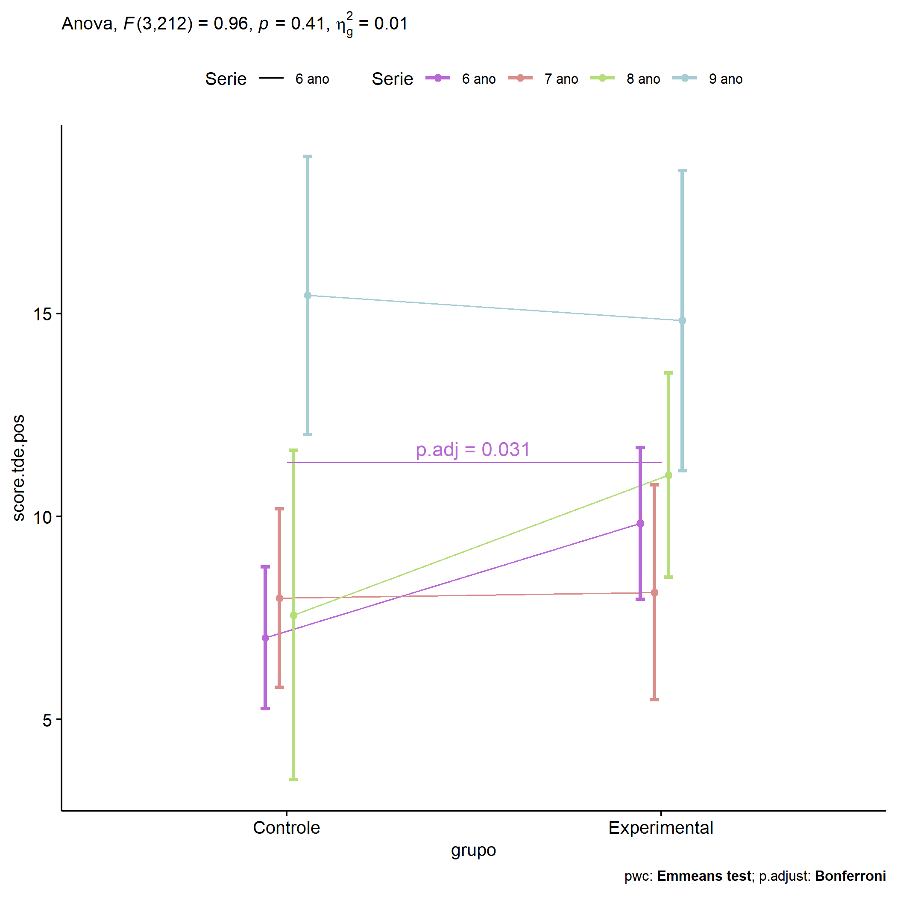<!-- -->

``` r
if (!is.null(plots[["Serie"]]))
  plots[["Serie"]] + ggplot2::scale_color_manual(values = color[["grupo"]])
```

    ## Scale for colour is already present.
    ## Adding another scale for colour, which will replace the existing scale.

    ## Warning: `position_dodge()` requires non-overlapping x intervals

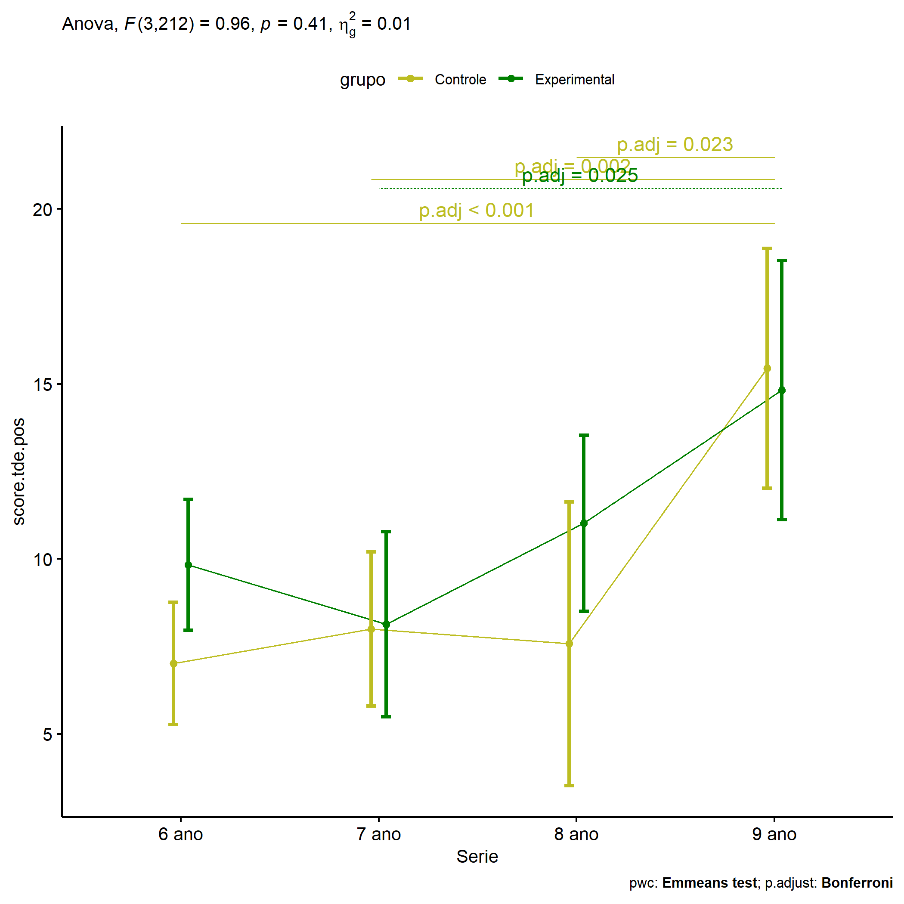<!-- -->

``` r
plots <- twoWayAncovaBoxPlots(
  wdat, "score.tde.pos", c("grupo","Serie"), aov, pwcs, covar = "score.tde.pre",
  theme = "classic", color = color[["grupo:Serie"]],
  subtitle = which(aov$Effect == "grupo:Serie"))
```

``` r
plots[["grupo:Serie"]] + ggplot2::ylab("TDE - Escrita") + ggplot2::scale_x_discrete(labels=c('pre', 'pos'))
```

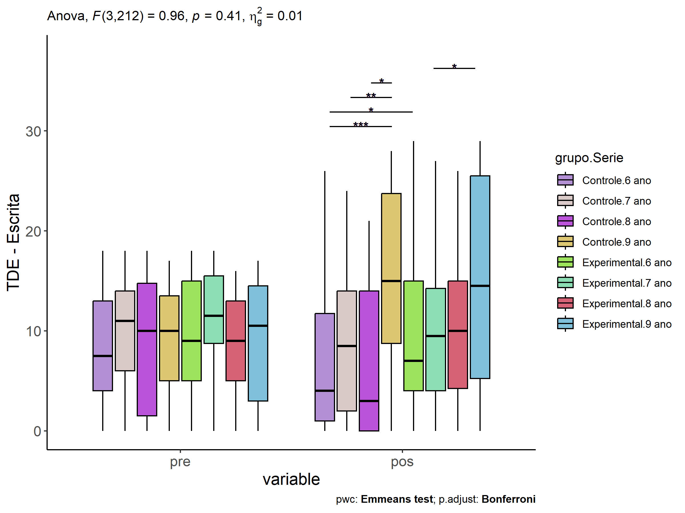<!-- -->

``` r
plots <- twoWayAncovaBoxPlots(
  wdat.long, "score.tde", c("grupo","Serie"), aov, pwc.long, pre.post = "time",
  theme = "classic", color = color$prepost)
```

``` r
plots[["grupo:Serie"]] + ggplot2::ylab("TDE - Escrita")
```

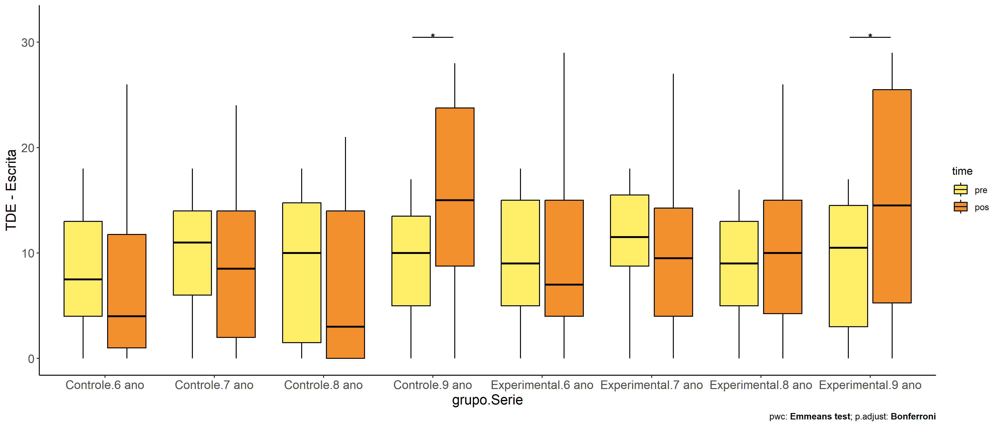<!-- -->

### Checking linearity assumption

``` r
ggscatter(wdat, x = "score.tde.pre", y = "score.tde.pos", size = 0.5,
          facet.by = c("grupo","Serie"), add = "reg.line")+
  stat_regline_equation(
    aes(label =  paste(..eq.label.., ..rr.label.., sep = "~~~~"))
  )
```

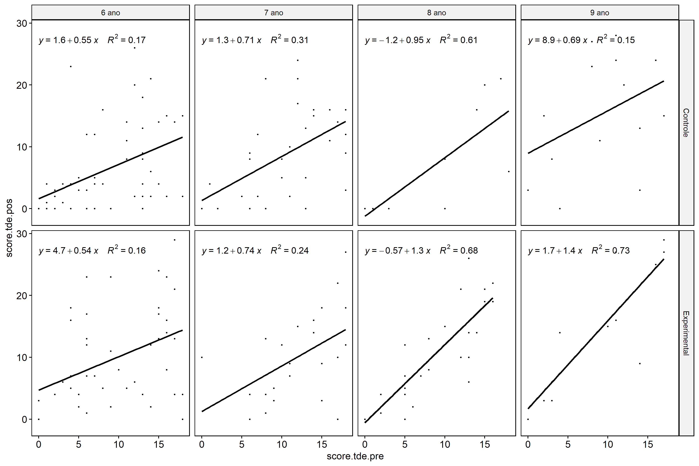<!-- -->

### Checking normality and homogeneity

``` r
res <- augment(lm(score.tde.pos ~ score.tde.pre + grupo*Serie, data = wdat))
```

``` r
shapiro_test(res$.resid)
```

    ## # A tibble: 1 × 3
    ##   variable   statistic p.value
    ##   <chr>          <dbl>   <dbl>
    ## 1 res$.resid     0.990   0.126

``` r
levene_test(res, .resid ~ grupo*Serie)
```

    ## # A tibble: 1 × 4
    ##     df1   df2 statistic     p
    ##   <int> <int>     <dbl> <dbl>
    ## 1     7   213      1.18 0.314

# Summary of Results

## Descriptive Statistics

``` r
df <- get.descriptives(ldat[["grupo"]], c(dv.pre, dv.pos), c("grupo"), 
                       include.global = T, symmetry.test = T, normality.test = F)
df <- plyr::rbind.fill(
  df, do.call(plyr::rbind.fill, lapply(lfatores2, FUN = function(f) {
    if (nrow(dat) > 0 && sum(!is.na(unique(dat[[f]]))) > 1)
      get.descriptives(ldat[[paste0("grupo:",f)]], c(dv.pre,dv.pos), c("grupo", f),
                       symmetry.test = T, normality.test = F)
    }))
)
(df <- df[,c(fatores1[fatores1 %in% colnames(df)],"variable",
             colnames(df)[!colnames(df) %in% c(fatores1,"variable")])])
```

    ##           grupo Sexo   Zona Cor.Raca Serie      variable   n   mean median min max     sd    se     ci
    ## 1      Controle <NA>   <NA>     <NA>  <NA> score.tde.pre 109  9.165   10.0   0  18  5.570 0.534  1.058
    ## 2  Experimental <NA>   <NA>     <NA>  <NA> score.tde.pre 108  9.704   10.0   0  18  5.520 0.531  1.053
    ## 3          <NA> <NA>   <NA>     <NA>  <NA> score.tde.pre 217  9.433   10.0   0  18  5.539 0.376  0.741
    ## 4      Controle <NA>   <NA>     <NA>  <NA> score.tde.pos 109  7.743    5.0   0  27  7.520 0.720  1.428
    ## 5  Experimental <NA>   <NA>     <NA>  <NA> score.tde.pos 108 10.352    9.0   0  29  7.785 0.749  1.485
    ## 6          <NA> <NA>   <NA>     <NA>  <NA> score.tde.pos 217  9.041    8.0   0  29  7.746 0.526  1.036
    ## 7      Controle    F   <NA>     <NA>  <NA> score.tde.pre  35  9.314   10.0   0  18  5.262 0.890  1.808
    ## 8      Controle    M   <NA>     <NA>  <NA> score.tde.pre  73  8.986    9.0   0  18  5.796 0.678  1.352
    ## 9  Experimental    F   <NA>     <NA>  <NA> score.tde.pre  48 10.438   11.5   0  18  5.615 0.810  1.630
    ## 10 Experimental    M   <NA>     <NA>  <NA> score.tde.pre  61  9.148    9.0   0  18  5.378 0.689  1.377
    ## 11     Controle    F   <NA>     <NA>  <NA> score.tde.pos  35  7.371    5.0   0  18  5.621 0.950  1.931
    ## 12     Controle    M   <NA>     <NA>  <NA> score.tde.pos  73  7.616    4.0   0  24  7.954 0.931  1.856
    ## 13 Experimental    F   <NA>     <NA>  <NA> score.tde.pos  48 10.146   10.0   0  27  7.086 1.023  2.058
    ## 14 Experimental    M   <NA>     <NA>  <NA> score.tde.pos  61 10.787    9.0   0  29  8.552 1.095  2.190
    ## 15     Controle <NA>  Rural     <NA>  <NA> score.tde.pre  67  8.925    8.0   0  18  5.287 0.646  1.290
    ## 16     Controle <NA> Urbana     <NA>  <NA> score.tde.pre  16  9.062   10.5   1  18  6.115 1.529  3.259
    ## 17 Experimental <NA>  Rural     <NA>  <NA> score.tde.pre  62  9.645   10.0   0  18  5.812 0.738  1.476
    ## 18 Experimental <NA> Urbana     <NA>  <NA> score.tde.pre  24  8.458    9.0   0  17  5.082 1.037  2.146
    ## 19     Controle <NA>  Rural     <NA>  <NA> score.tde.pos  67  7.478    5.0   0  26  7.279 0.889  1.775
    ## 20     Controle <NA> Urbana     <NA>  <NA> score.tde.pos  16  7.000    4.0   0  24  7.925 1.981  4.223
    ## 21 Experimental <NA>  Rural     <NA>  <NA> score.tde.pos  62 10.952   12.0   0  29  7.968 1.012  2.023
    ## 22 Experimental <NA> Urbana     <NA>  <NA> score.tde.pos  24  7.333    5.5   0  25  6.512 1.329  2.750
    ## 23     Controle <NA>   <NA>   Branca  <NA> score.tde.pre   8  9.875   11.0   2  15  4.612 1.630  3.855
    ## 24     Controle <NA>   <NA>    Parda  <NA> score.tde.pre  39  8.026    7.0   0  18  5.847 0.936  1.895
    ## 25 Experimental <NA>   <NA>   Branca  <NA> score.tde.pre  17  9.471    9.0   0  18  6.345 1.539  3.263
    ## 26 Experimental <NA>   <NA> Indígena  <NA> score.tde.pre   5  7.800    6.0   6  15  4.025 1.800  4.998
    ## 27 Experimental <NA>   <NA>    Parda  <NA> score.tde.pre  38  8.816    8.5   0  18  5.608 0.910  1.843
    ## 28     Controle <NA>   <NA>   Branca  <NA> score.tde.pos   8  4.750    3.5   0  15  5.726 2.024  4.787
    ## 29     Controle <NA>   <NA>    Parda  <NA> score.tde.pos  39  7.359    4.0   0  27  7.531 1.206  2.441
    ## 30 Experimental <NA>   <NA>   Branca  <NA> score.tde.pos  17 12.353   12.0   0  36 10.416 2.526  5.355
    ## 31 Experimental <NA>   <NA> Indígena  <NA> score.tde.pos   5 14.400   17.0   1  23  8.295 3.709 10.299
    ## 32 Experimental <NA>   <NA>    Parda  <NA> score.tde.pos  38  9.789    7.5   0  29  7.994 1.297  2.627
    ## 33     Controle <NA>   <NA>     <NA> 6 ano score.tde.pre  54  8.556    7.5   0  18  5.240 0.713  1.430
    ## 34     Controle <NA>   <NA>     <NA> 7 ano score.tde.pre  34 10.176   11.0   0  18  5.589 0.959  1.950
    ## 35     Controle <NA>   <NA>     <NA> 8 ano score.tde.pre  10  8.800   10.0   0  18  7.223 2.284  5.167
    ## 36     Controle <NA>   <NA>     <NA> 9 ano score.tde.pre  14  9.214   10.0   0  17  5.352 1.430  3.090
    ## 37 Experimental <NA>   <NA>     <NA> 6 ano score.tde.pre  47  9.234    9.0   0  18  5.760 0.840  1.691
    ## 38 Experimental <NA>   <NA>     <NA> 7 ano score.tde.pre  24 11.958   11.5   0  18  4.695 0.958  1.982
    ## 39 Experimental <NA>   <NA>     <NA> 8 ano score.tde.pre  26  8.846    9.0   0  16  5.033 0.987  2.033
    ## 40 Experimental <NA>   <NA>     <NA> 9 ano score.tde.pre  12  9.000   10.5   0  17  6.310 1.822  4.009
    ## 41     Controle <NA>   <NA>     <NA> 6 ano score.tde.pos  54  6.352    4.0   0  26  6.934 0.944  1.893
    ## 42     Controle <NA>   <NA>     <NA> 7 ano score.tde.pos  34  8.559    8.5   0  24  7.178 1.231  2.505
    ## 43     Controle <NA>   <NA>     <NA> 8 ano score.tde.pos  10  7.100    3.0   0  21  8.774 2.775  6.277
    ## 44     Controle <NA>   <NA>     <NA> 9 ano score.tde.pos  14 15.286   15.0   0  28  9.384 2.508  5.418
    ## 45 Experimental <NA>   <NA>     <NA> 6 ano score.tde.pos  47  9.681    7.0   0  29  7.667 1.118  2.251
    ## 46 Experimental <NA>   <NA>     <NA> 7 ano score.tde.pos  24 10.042    9.5   0  27  7.049 1.439  2.977
    ## 47 Experimental <NA>   <NA>     <NA> 8 ano score.tde.pos  26 10.577   10.0   0  26  7.669 1.504  3.098
    ## 48 Experimental <NA>   <NA>     <NA> 9 ano score.tde.pos  12 14.500   14.5   0  29 10.501 3.031  6.672
    ##      iqr symmetry     skewness    kurtosis
    ## 1   9.00      YES -0.090059605 -1.24466450
    ## 2  10.00      YES -0.167721028 -1.19762508
    ## 3   9.00      YES -0.129938888 -1.20661552
    ## 4  13.00       NO  0.712294826 -0.66163682
    ## 5  11.25       NO  0.528330639 -0.65683921
    ## 6  13.00       NO  0.611168877 -0.64072377
    ## 7   9.00      YES  0.033756343 -1.30412154
    ## 8   9.00      YES -0.082132666 -1.32828762
    ## 9  10.00      YES -0.421059700 -1.10488185
    ## 10  8.00      YES  0.016706195 -1.17504826
    ## 11  8.50      YES  0.396164976 -1.24853527
    ## 12 14.00       NO  0.648020380 -1.03661186
    ## 13 11.25      YES  0.374169718 -0.72387096
    ## 14 13.00       NO  0.547028608 -0.87253272
    ## 15  8.00      YES -0.030909647 -1.16892286
    ## 16 10.75      YES -0.123582291 -1.70584702
    ## 17 10.00      YES -0.064435314 -1.36549598
    ## 18  6.25      YES -0.026036271 -0.93747299
    ## 19 13.00       NO  0.653953271 -0.69025065
    ## 20  7.50       NO  1.071498083 -0.34399088
    ## 21 12.00      YES  0.333085680 -0.77960545
    ## 22  5.50       NO  1.285219236  1.06780401
    ## 23  6.50      YES -0.388907824 -1.53244319
    ## 24 10.00      YES  0.169744396 -1.33226343
    ## 25 11.00      YES -0.093308187 -1.64976668
    ## 26  0.00 few data  0.000000000  0.00000000
    ## 27  8.75      YES  0.110156053 -1.31134895
    ## 28  6.00       NO  0.752588459 -1.21633262
    ## 29 12.00       NO  0.888093116 -0.21152748
    ## 30 16.00      YES  0.487078876 -0.74964744
    ## 31  5.00       NO -0.598794183 -1.39738643
    ## 32 10.75       NO  0.756885278 -0.45043352
    ## 33  9.00      YES  0.049573080 -1.30377419
    ## 34  8.00      YES -0.237494678 -1.12102101
    ## 35 13.25      YES -0.084945173 -1.87144460
    ## 36  8.50      YES -0.236012855 -1.33911807
    ## 37 10.00      YES -0.001263134 -1.34780155
    ## 38  6.75      YES -0.496714110 -0.41818124
    ## 39  8.00      YES -0.197119752 -1.32117175
    ## 40 11.50      YES -0.039799523 -1.76851765
    ## 41 10.75       NO  1.076937400  0.08675389
    ## 42 12.00      YES  0.339739950 -1.11792131
    ## 43 14.00       NO  0.554696625 -1.58274876
    ## 44 15.00      YES -0.190803728 -1.49074969
    ## 45 11.00       NO  0.614389881 -0.65328041
    ## 46 10.25      YES  0.471976787 -0.49053322
    ## 47 10.75      YES  0.245854784 -1.16257457
    ## 48 20.25      YES  0.089595445 -1.69440389

| grupo        | Sexo | Zona   | Cor.Raca | Serie | variable      |   n |   mean | median | min | max |     sd |    se |     ci |   iqr | symmetry | skewness | kurtosis |
|:-------------|:-----|:-------|:---------|:------|:--------------|----:|-------:|-------:|----:|----:|-------:|------:|-------:|------:|:---------|---------:|---------:|
| Controle     |      |        |          |       | score.tde.pre | 109 |  9.165 |   10.0 |   0 |  18 |  5.570 | 0.534 |  1.058 |  9.00 | YES      |   -0.090 |   -1.245 |
| Experimental |      |        |          |       | score.tde.pre | 108 |  9.704 |   10.0 |   0 |  18 |  5.520 | 0.531 |  1.053 | 10.00 | YES      |   -0.168 |   -1.198 |
|              |      |        |          |       | score.tde.pre | 217 |  9.433 |   10.0 |   0 |  18 |  5.539 | 0.376 |  0.741 |  9.00 | YES      |   -0.130 |   -1.207 |
| Controle     |      |        |          |       | score.tde.pos | 109 |  7.743 |    5.0 |   0 |  27 |  7.520 | 0.720 |  1.428 | 13.00 | NO       |    0.712 |   -0.662 |
| Experimental |      |        |          |       | score.tde.pos | 108 | 10.352 |    9.0 |   0 |  29 |  7.785 | 0.749 |  1.485 | 11.25 | NO       |    0.528 |   -0.657 |
|              |      |        |          |       | score.tde.pos | 217 |  9.041 |    8.0 |   0 |  29 |  7.746 | 0.526 |  1.036 | 13.00 | NO       |    0.611 |   -0.641 |
| Controle     | F    |        |          |       | score.tde.pre |  35 |  9.314 |   10.0 |   0 |  18 |  5.262 | 0.890 |  1.808 |  9.00 | YES      |    0.034 |   -1.304 |
| Controle     | M    |        |          |       | score.tde.pre |  73 |  8.986 |    9.0 |   0 |  18 |  5.796 | 0.678 |  1.352 |  9.00 | YES      |   -0.082 |   -1.328 |
| Experimental | F    |        |          |       | score.tde.pre |  48 | 10.438 |   11.5 |   0 |  18 |  5.615 | 0.810 |  1.630 | 10.00 | YES      |   -0.421 |   -1.105 |
| Experimental | M    |        |          |       | score.tde.pre |  61 |  9.148 |    9.0 |   0 |  18 |  5.378 | 0.689 |  1.377 |  8.00 | YES      |    0.017 |   -1.175 |
| Controle     | F    |        |          |       | score.tde.pos |  35 |  7.371 |    5.0 |   0 |  18 |  5.621 | 0.950 |  1.931 |  8.50 | YES      |    0.396 |   -1.249 |
| Controle     | M    |        |          |       | score.tde.pos |  73 |  7.616 |    4.0 |   0 |  24 |  7.954 | 0.931 |  1.856 | 14.00 | NO       |    0.648 |   -1.037 |
| Experimental | F    |        |          |       | score.tde.pos |  48 | 10.146 |   10.0 |   0 |  27 |  7.086 | 1.023 |  2.058 | 11.25 | YES      |    0.374 |   -0.724 |
| Experimental | M    |        |          |       | score.tde.pos |  61 | 10.787 |    9.0 |   0 |  29 |  8.552 | 1.095 |  2.190 | 13.00 | NO       |    0.547 |   -0.873 |
| Controle     |      | Rural  |          |       | score.tde.pre |  67 |  8.925 |    8.0 |   0 |  18 |  5.287 | 0.646 |  1.290 |  8.00 | YES      |   -0.031 |   -1.169 |
| Controle     |      | Urbana |          |       | score.tde.pre |  16 |  9.062 |   10.5 |   1 |  18 |  6.115 | 1.529 |  3.259 | 10.75 | YES      |   -0.124 |   -1.706 |
| Experimental |      | Rural  |          |       | score.tde.pre |  62 |  9.645 |   10.0 |   0 |  18 |  5.812 | 0.738 |  1.476 | 10.00 | YES      |   -0.064 |   -1.365 |
| Experimental |      | Urbana |          |       | score.tde.pre |  24 |  8.458 |    9.0 |   0 |  17 |  5.082 | 1.037 |  2.146 |  6.25 | YES      |   -0.026 |   -0.937 |
| Controle     |      | Rural  |          |       | score.tde.pos |  67 |  7.478 |    5.0 |   0 |  26 |  7.279 | 0.889 |  1.775 | 13.00 | NO       |    0.654 |   -0.690 |
| Controle     |      | Urbana |          |       | score.tde.pos |  16 |  7.000 |    4.0 |   0 |  24 |  7.925 | 1.981 |  4.223 |  7.50 | NO       |    1.071 |   -0.344 |
| Experimental |      | Rural  |          |       | score.tde.pos |  62 | 10.952 |   12.0 |   0 |  29 |  7.968 | 1.012 |  2.023 | 12.00 | YES      |    0.333 |   -0.780 |
| Experimental |      | Urbana |          |       | score.tde.pos |  24 |  7.333 |    5.5 |   0 |  25 |  6.512 | 1.329 |  2.750 |  5.50 | NO       |    1.285 |    1.068 |
| Controle     |      |        | Branca   |       | score.tde.pre |   8 |  9.875 |   11.0 |   2 |  15 |  4.612 | 1.630 |  3.855 |  6.50 | YES      |   -0.389 |   -1.532 |
| Controle     |      |        | Parda    |       | score.tde.pre |  39 |  8.026 |    7.0 |   0 |  18 |  5.847 | 0.936 |  1.895 | 10.00 | YES      |    0.170 |   -1.332 |
| Experimental |      |        | Branca   |       | score.tde.pre |  17 |  9.471 |    9.0 |   0 |  18 |  6.345 | 1.539 |  3.263 | 11.00 | YES      |   -0.093 |   -1.650 |
| Experimental |      |        | Indígena |       | score.tde.pre |   5 |  7.800 |    6.0 |   6 |  15 |  4.025 | 1.800 |  4.998 |  0.00 | few data |    0.000 |    0.000 |
| Experimental |      |        | Parda    |       | score.tde.pre |  38 |  8.816 |    8.5 |   0 |  18 |  5.608 | 0.910 |  1.843 |  8.75 | YES      |    0.110 |   -1.311 |
| Controle     |      |        | Branca   |       | score.tde.pos |   8 |  4.750 |    3.5 |   0 |  15 |  5.726 | 2.024 |  4.787 |  6.00 | NO       |    0.753 |   -1.216 |
| Controle     |      |        | Parda    |       | score.tde.pos |  39 |  7.359 |    4.0 |   0 |  27 |  7.531 | 1.206 |  2.441 | 12.00 | NO       |    0.888 |   -0.212 |
| Experimental |      |        | Branca   |       | score.tde.pos |  17 | 12.353 |   12.0 |   0 |  36 | 10.416 | 2.526 |  5.355 | 16.00 | YES      |    0.487 |   -0.750 |
| Experimental |      |        | Indígena |       | score.tde.pos |   5 | 14.400 |   17.0 |   1 |  23 |  8.295 | 3.709 | 10.299 |  5.00 | NO       |   -0.599 |   -1.397 |
| Experimental |      |        | Parda    |       | score.tde.pos |  38 |  9.789 |    7.5 |   0 |  29 |  7.994 | 1.297 |  2.627 | 10.75 | NO       |    0.757 |   -0.450 |
| Controle     |      |        |          | 6 ano | score.tde.pre |  54 |  8.556 |    7.5 |   0 |  18 |  5.240 | 0.713 |  1.430 |  9.00 | YES      |    0.050 |   -1.304 |
| Controle     |      |        |          | 7 ano | score.tde.pre |  34 | 10.176 |   11.0 |   0 |  18 |  5.589 | 0.959 |  1.950 |  8.00 | YES      |   -0.237 |   -1.121 |
| Controle     |      |        |          | 8 ano | score.tde.pre |  10 |  8.800 |   10.0 |   0 |  18 |  7.223 | 2.284 |  5.167 | 13.25 | YES      |   -0.085 |   -1.871 |
| Controle     |      |        |          | 9 ano | score.tde.pre |  14 |  9.214 |   10.0 |   0 |  17 |  5.352 | 1.430 |  3.090 |  8.50 | YES      |   -0.236 |   -1.339 |
| Experimental |      |        |          | 6 ano | score.tde.pre |  47 |  9.234 |    9.0 |   0 |  18 |  5.760 | 0.840 |  1.691 | 10.00 | YES      |   -0.001 |   -1.348 |
| Experimental |      |        |          | 7 ano | score.tde.pre |  24 | 11.958 |   11.5 |   0 |  18 |  4.695 | 0.958 |  1.982 |  6.75 | YES      |   -0.497 |   -0.418 |
| Experimental |      |        |          | 8 ano | score.tde.pre |  26 |  8.846 |    9.0 |   0 |  16 |  5.033 | 0.987 |  2.033 |  8.00 | YES      |   -0.197 |   -1.321 |
| Experimental |      |        |          | 9 ano | score.tde.pre |  12 |  9.000 |   10.5 |   0 |  17 |  6.310 | 1.822 |  4.009 | 11.50 | YES      |   -0.040 |   -1.769 |
| Controle     |      |        |          | 6 ano | score.tde.pos |  54 |  6.352 |    4.0 |   0 |  26 |  6.934 | 0.944 |  1.893 | 10.75 | NO       |    1.077 |    0.087 |
| Controle     |      |        |          | 7 ano | score.tde.pos |  34 |  8.559 |    8.5 |   0 |  24 |  7.178 | 1.231 |  2.505 | 12.00 | YES      |    0.340 |   -1.118 |
| Controle     |      |        |          | 8 ano | score.tde.pos |  10 |  7.100 |    3.0 |   0 |  21 |  8.774 | 2.775 |  6.277 | 14.00 | NO       |    0.555 |   -1.583 |
| Controle     |      |        |          | 9 ano | score.tde.pos |  14 | 15.286 |   15.0 |   0 |  28 |  9.384 | 2.508 |  5.418 | 15.00 | YES      |   -0.191 |   -1.491 |
| Experimental |      |        |          | 6 ano | score.tde.pos |  47 |  9.681 |    7.0 |   0 |  29 |  7.667 | 1.118 |  2.251 | 11.00 | NO       |    0.614 |   -0.653 |
| Experimental |      |        |          | 7 ano | score.tde.pos |  24 | 10.042 |    9.5 |   0 |  27 |  7.049 | 1.439 |  2.977 | 10.25 | YES      |    0.472 |   -0.491 |
| Experimental |      |        |          | 8 ano | score.tde.pos |  26 | 10.577 |   10.0 |   0 |  26 |  7.669 | 1.504 |  3.098 | 10.75 | YES      |    0.246 |   -1.163 |
| Experimental |      |        |          | 9 ano | score.tde.pos |  12 | 14.500 |   14.5 |   0 |  29 | 10.501 | 3.031 |  6.672 | 20.25 | YES      |    0.090 |   -1.694 |

## ANCOVA Table Comparison

``` r
df <- do.call(plyr::rbind.fill, laov)
(df <- df[!duplicated(df$Effect),])
```

    ##            Effect DFn DFd      F        p p<.05   ges DFn' DFd'     F'       p' p<.05'     ges'
    ## 1           grupo   1 214  6.302 1.30e-02     * 0.029    1  222  5.255 2.30e-02      * 0.023000
    ## 2   score.tde.pre   1 214 85.987 2.03e-17     * 0.287    1  222 69.902 6.86e-15      * 0.239000
    ## 4      grupo:Sexo   1 212  0.362 5.48e-01       0.002    1  220  1.527 2.18e-01        0.007000
    ## 6            Sexo   1 212  1.368 2.44e-01       0.006    1  220  0.197 6.58e-01        0.000895
    ## 8      grupo:Zona   1 164  0.870 3.52e-01       0.005    1  167  0.057 8.12e-01        0.000340
    ## 10           Zona   1 164  2.461 1.19e-01       0.015    1  167  0.226 6.35e-01        0.001000
    ## 11       Cor.Raca   2 101  0.946 3.92e-01       0.018    2  102  0.645 5.27e-01        0.012000
    ## 13 grupo:Cor.Raca   1 101  2.921 9.10e-02       0.028    1  102  1.696 1.96e-01        0.016000
    ## 16    grupo:Serie   3 212  0.964 4.10e-01       0.013    3  216  0.559 6.43e-01        0.008000
    ## 18          Serie   3 212  8.443 2.52e-05     * 0.107    3  216  5.267 2.00e-03      * 0.068000

|     | Effect         | DFn | DFd |      F |     p | p\<.05 |   ges | DFn’ | DFd’ |     F’ |    p’ | p\<.05’ |  ges’ |
|:----|:---------------|----:|----:|-------:|------:|:-------|------:|-----:|-----:|-------:|------:|:--------|------:|
| 1   | grupo          |   1 | 214 |  6.302 | 0.013 | \*     | 0.029 |    1 |  222 |  5.255 | 0.023 | \*      | 0.023 |
| 2   | score.tde.pre  |   1 | 214 | 85.987 | 0.000 | \*     | 0.287 |    1 |  222 | 69.902 | 0.000 | \*      | 0.239 |
| 4   | grupo:Sexo     |   1 | 212 |  0.362 | 0.548 |        | 0.002 |    1 |  220 |  1.527 | 0.218 |         | 0.007 |
| 6   | Sexo           |   1 | 212 |  1.368 | 0.244 |        | 0.006 |    1 |  220 |  0.197 | 0.658 |         | 0.001 |
| 8   | grupo:Zona     |   1 | 164 |  0.870 | 0.352 |        | 0.005 |    1 |  167 |  0.057 | 0.812 |         | 0.000 |
| 10  | Zona           |   1 | 164 |  2.461 | 0.119 |        | 0.015 |    1 |  167 |  0.226 | 0.635 |         | 0.001 |
| 11  | Cor.Raca       |   2 | 101 |  0.946 | 0.392 |        | 0.018 |    2 |  102 |  0.645 | 0.527 |         | 0.012 |
| 13  | grupo:Cor.Raca |   1 | 101 |  2.921 | 0.091 |        | 0.028 |    1 |  102 |  1.696 | 0.196 |         | 0.016 |
| 16  | grupo:Serie    |   3 | 212 |  0.964 | 0.410 |        | 0.013 |    3 |  216 |  0.559 | 0.643 |         | 0.008 |
| 18  | Serie          |   3 | 212 |  8.443 | 0.000 | \*     | 0.107 |    3 |  216 |  5.267 | 0.002 | \*      | 0.068 |

## PairWise Table Comparison

``` r
df <- do.call(plyr::rbind.fill, lpwc)
df <- df[,c(names(lfatores), names(df)[!names(df) %in% c(names(lfatores),"term",".y.")])]
```

| grupo        | Sexo | Zona   | Cor.Raca | Serie | group1   | group2       |  df | statistic |     p | p.adj | p.adj.signif | df’ | statistic’ |    p’ | p.adj’ | p.adj.signif’ |
|:-------------|:-----|:-------|:---------|:------|:---------|:-------------|----:|----------:|------:|------:|:-------------|----:|-----------:|------:|-------:|:--------------|
| Controle     |      |        |          |       | pre      | pos          | 430 |     1.571 | 0.117 | 0.117 | ns           | 446 |      0.710 | 0.478 |  0.478 | ns            |
| Experimental |      |        |          |       | pre      | pos          | 430 |    -0.713 | 0.476 | 0.476 | ns           | 446 |     -1.605 | 0.109 |  0.109 | ns            |
|              |      |        |          |       | Controle | Experimental | 214 |    -2.510 | 0.013 | 0.013 | \*           | 222 |     -2.292 | 0.023 |  0.023 | \*            |
| Controle     | F    |        |          |       | pre      | pos          | 426 |     1.218 | 0.224 | 0.224 | ns           | 442 |      0.092 | 0.927 |  0.927 | ns            |
| Controle     | M    |        |          |       | pre      | pos          | 426 |     1.241 | 0.215 | 0.215 | ns           | 442 |      0.805 | 0.421 |  0.421 | ns            |
| Controle     |      |        |          |       | F        | M            | 212 |    -0.364 | 0.716 | 0.716 | ns           | 220 |      0.583 | 0.560 |  0.560 | ns            |
| Experimental | F    |        |          |       | pre      | pos          | 426 |     0.214 | 0.830 | 0.830 | ns           | 442 |     -0.309 | 0.757 |  0.757 | ns            |
| Experimental | M    |        |          |       | pre      | pos          | 426 |    -1.357 | 0.175 | 0.175 | ns           | 442 |     -1.863 | 0.063 |  0.063 | ns            |
| Experimental |      |        |          |       | F        | M            | 212 |    -1.264 | 0.207 | 0.207 | ns           | 220 |     -1.175 | 0.241 |  0.241 | ns            |
|              | F    |        |          |       | Controle | Experimental | 212 |    -1.357 | 0.176 | 0.176 | ns           | 220 |     -0.471 | 0.638 |  0.638 | ns            |
|              | M    |        |          |       | Controle | Experimental | 212 |    -2.721 | 0.007 | 0.007 | \*\*         | 220 |     -2.590 | 0.010 |  0.010 | \*            |
| Controle     |      |        |          |       | Rural    | Urbana       | 164 |     0.321 | 0.748 | 0.748 | ns           | 167 |      0.489 | 0.626 |  0.626 | ns            |
| Controle     |      | Rural  |          |       | pre      | pos          | 330 |     1.271 | 0.205 | 0.205 | ns           | 336 |      0.839 | 0.402 |  0.402 | ns            |
| Controle     |      | Urbana |          |       | pre      | pos          | 330 |     0.885 | 0.377 | 0.377 | ns           | 336 |      0.804 | 0.422 |  0.422 | ns            |
| Experimental |      |        |          |       | Rural    | Urbana       | 164 |     1.796 | 0.074 | 0.074 | ns           | 167 |      0.210 | 0.834 |  0.834 | ns            |
| Experimental |      | Rural  |          |       | pre      | pos          | 330 |    -1.103 | 0.271 | 0.271 | ns           | 336 |     -1.002 | 0.317 |  0.317 | ns            |
| Experimental |      | Urbana |          |       | pre      | pos          | 330 |     0.591 | 0.555 | 0.555 | ns           | 336 |     -0.573 | 0.567 |  0.567 | ns            |
|              |      | Rural  |          |       | Controle | Experimental | 164 |    -2.616 | 0.010 | 0.010 | \*\*         | 167 |     -1.881 | 0.062 |  0.062 | ns            |
|              |      | Urbana |          |       | Controle | Experimental | 164 |    -0.366 | 0.714 | 0.714 | ns           | 167 |     -1.313 | 0.191 |  0.191 | ns            |
| Controle     |      |        | Branca   |       | pre      | pos          | 204 |     1.458 | 0.146 | 0.146 | ns           | 206 |      1.357 | 0.176 |  0.176 | ns            |
| Controle     |      |        | Indígena |       | pre      | pos          |     |           |       |       |              |     |            |       |        |               |
| Controle     |      |        |          |       | Branca   | Indígena     |     |           |       |       |              |     |            |       |        |               |
| Controle     |      |        |          |       | Branca   | Parda        | 101 |    -1.377 | 0.172 | 0.172 | ns           | 102 |     -1.265 | 0.209 |  0.209 | ns            |
| Controle     |      |        |          |       | Indígena | Parda        |     |           |       |       |              |     |            |       |        |               |
| Controle     |      |        | Parda    |       | pre      | pos          | 204 |     0.419 | 0.676 | 0.676 | ns           | 206 |      0.390 | 0.697 |  0.697 | ns            |
| Experimental |      |        | Branca   |       | pre      | pos          | 204 |    -1.195 | 0.233 | 0.233 | ns           | 206 |     -1.112 | 0.267 |  0.267 | ns            |
| Experimental |      |        | Indígena |       | pre      | pos          | 204 |    -1.485 | 0.139 | 0.139 | ns           | 206 |     -1.381 | 0.169 |  0.169 | ns            |
| Experimental |      |        |          |       | Branca   | Indígena     | 101 |    -0.866 | 0.388 | 1.000 | ns           | 102 |     -0.798 | 0.427 |  1.000 | ns            |
| Experimental |      |        |          |       | Branca   | Parda        | 101 |     1.008 | 0.316 | 0.947 | ns           | 102 |      0.480 | 0.632 |  1.000 | ns            |
| Experimental |      |        |          |       | Indígena | Parda        | 101 |     1.546 | 0.125 | 0.376 | ns           | 102 |      1.149 | 0.253 |  0.760 | ns            |
| Experimental |      |        | Parda    |       | pre      | pos          | 204 |    -0.604 | 0.547 | 0.547 | ns           | 206 |     -1.109 | 0.269 |  0.269 | ns            |
|              |      |        | Branca   |       | Controle | Experimental | 101 |    -2.551 | 0.012 | 0.012 | \*           | 102 |     -2.288 | 0.024 |  0.024 | \*            |
|              |      |        | Indígena |       | Controle | Experimental |     |           |       |       |              |     |            |       |        |               |
|              |      |        | Parda    |       | Controle | Experimental | 101 |    -1.153 | 0.252 | 0.252 | ns           | 102 |     -1.537 | 0.127 |  0.127 | ns            |
| Controle     |      |        |          | 6 ano | pre      | pos          | 426 |     1.712 | 0.088 | 0.088 | ns           | 434 |      1.198 | 0.231 |  0.231 | ns            |
| Controle     |      |        |          | 7 ano | pre      | pos          | 426 |     0.997 | 0.319 | 0.319 | ns           | 434 |      0.901 | 0.368 |  0.368 | ns            |
| Controle     |      |        |          | 8 ano | pre      | pos          | 426 |     0.568 | 0.570 | 0.570 | ns           | 434 |      0.514 | 0.608 |  0.608 | ns            |
| Controle     |      |        |          | 9 ano | pre      | pos          | 426 |    -2.402 | 0.017 | 0.017 | \*           | 434 |     -2.171 | 0.030 |  0.030 | \*            |
| Controle     |      |        |          |       | 6 ano    | 7 ano        | 212 |    -0.688 | 0.492 | 1.000 | ns           | 216 |     -0.203 | 0.840 |  1.000 | ns            |
| Controle     |      |        |          |       | 6 ano    | 8 ano        | 212 |    -0.252 | 0.801 | 1.000 | ns           | 216 |     -0.002 | 0.999 |  1.000 | ns            |
| Controle     |      |        |          |       | 6 ano    | 9 ano        | 212 |    -4.327 | 0.000 | 0.000 | \*\*\*       | 216 |     -3.399 | 0.001 |  0.005 | \*\*          |
| Controle     |      |        |          |       | 7 ano    | 8 ano        | 212 |     0.179 | 0.858 | 1.000 | ns           | 216 |      0.122 | 0.903 |  1.000 | ns            |
| Controle     |      |        |          |       | 7 ano    | 9 ano        | 212 |    -3.609 | 0.000 | 0.002 | \*\*         | 216 |     -3.063 | 0.002 |  0.015 | \*            |
| Controle     |      |        |          |       | 8 ano    | 9 ano        | 212 |    -2.926 | 0.004 | 0.023 | \*           | 216 |     -2.456 | 0.015 |  0.089 | ns            |
| Experimental |      |        |          | 6 ano | pre      | pos          | 426 |    -0.324 | 0.746 | 0.746 | ns           | 434 |     -0.293 | 0.770 |  0.770 | ns            |
| Experimental |      |        |          | 7 ano | pre      | pos          | 426 |     0.993 | 0.321 | 0.321 | ns           | 434 |     -0.206 | 0.837 |  0.837 | ns            |
| Experimental |      |        |          | 8 ano | pre      | pos          | 426 |    -0.933 | 0.351 | 0.351 | ns           | 434 |     -1.508 | 0.132 |  0.132 | ns            |
| Experimental |      |        |          | 9 ano | pre      | pos          | 426 |    -2.015 | 0.045 | 0.045 | \*           | 434 |     -1.821 | 0.069 |  0.069 | ns            |
| Experimental |      |        |          |       | 6 ano    | 7 ano        | 212 |     1.030 | 0.304 | 1.000 | ns           | 216 |     -0.246 | 0.806 |  1.000 | ns            |
| Experimental |      |        |          |       | 6 ano    | 8 ano        | 212 |    -0.748 | 0.455 | 1.000 | ns           | 216 |     -1.370 | 0.172 |  1.000 | ns            |
| Experimental |      |        |          |       | 6 ano    | 9 ano        | 212 |    -2.377 | 0.018 | 0.110 | ns           | 216 |     -2.007 | 0.046 |  0.276 | ns            |
| Experimental |      |        |          |       | 7 ano    | 8 ano        | 212 |    -1.553 | 0.122 | 0.731 | ns           | 216 |     -0.976 | 0.330 |  1.000 | ns            |
| Experimental |      |        |          |       | 7 ano    | 9 ano        | 212 |    -2.897 | 0.004 | 0.025 | \*           | 216 |     -1.678 | 0.095 |  0.569 | ns            |
| Experimental |      |        |          |       | 8 ano    | 9 ano        | 212 |    -1.679 | 0.095 | 0.568 | ns           | 216 |     -0.917 | 0.360 |  1.000 | ns            |
|              |      |        |          | 6 ano | Controle | Experimental | 212 |    -2.171 | 0.031 | 0.031 | \*           | 216 |     -1.455 | 0.147 |  0.147 | ns            |
|              |      |        |          | 7 ano | Controle | Experimental | 212 |    -0.079 | 0.937 | 0.937 | ns           | 216 |     -1.169 | 0.244 |  0.244 | ns            |
|              |      |        |          | 8 ano | Controle | Experimental | 212 |    -1.423 | 0.156 | 0.156 | ns           | 216 |     -1.674 | 0.096 |  0.096 | ns            |
|              |      |        |          | 9 ano | Controle | Experimental | 212 |     0.244 | 0.807 | 0.807 | ns           | 216 |      0.201 | 0.841 |  0.841 | ns            |

## EMMS Table Comparison

``` r
df <- do.call(plyr::rbind.fill, lemms)
df[["N-N'"]] <- df[["N"]] - df[["N'"]]
df <- df[,c(names(lfatores), names(df)[!names(df) %in% names(lfatores)])]
```

| grupo        | Sexo | Zona   | Cor.Raca | Serie |   N | M (pre) | SE (pre) | M (unadj) | SE (unadj) | M (adj) | SE (adj) |  N’ | M (pre)’ | SE (pre)’ | M (unadj)’ | SE (unadj)’ | M (adj)’ | SE (adj)’ | N-N’ |
|:-------------|:-----|:-------|:---------|:------|----:|--------:|---------:|----------:|-----------:|--------:|---------:|----:|---------:|----------:|-----------:|------------:|---------:|----------:|-----:|
| Controle     |      |        |          |       | 109 |   9.165 |    0.534 |     7.743 |      0.720 |   7.941 |    0.621 | 113 |    9.230 |     0.523 |      8.522 |       0.808 |    8.741 |     0.745 |   -4 |
| Experimental |      |        |          |       | 108 |   9.704 |    0.531 |    10.352 |      0.749 |  10.152 |    0.624 | 112 |    9.777 |     0.515 |     11.384 |       0.898 |   11.163 |     0.748 |   -4 |
| Controle     | F    |        |          |       |  35 |   9.314 |    0.890 |     7.371 |      0.950 |   7.438 |    1.093 |  38 |    9.553 |     0.851 |      9.395 |       1.478 |    9.354 |     1.285 |   -3 |
| Controle     | M    |        |          |       |  73 |   8.986 |    0.678 |     7.616 |      0.931 |   7.923 |    0.758 |  75 |    9.067 |     0.663 |      8.080 |       0.963 |    8.434 |     0.915 |   -2 |
| Experimental | F    |        |          |       |  48 |  10.438 |    0.810 |    10.146 |      1.023 |   9.392 |    0.937 |  49 |   10.510 |     0.797 |     10.980 |       1.303 |   10.160 |     1.135 |   -1 |
| Experimental | M    |        |          |       |  61 |   9.148 |    0.689 |    10.787 |      1.095 |  10.975 |    0.828 |  63 |    9.206 |     0.669 |     11.698 |       1.240 |   11.939 |     0.998 |   -2 |
| Controle     |      | Rural  |          |       |  67 |   8.925 |    0.646 |     7.478 |      0.889 |   7.626 |    0.785 |  68 |    9.059 |     0.650 |      8.015 |       1.028 |    8.132 |     0.909 |   -1 |
| Controle     |      | Urbana |          |       |  16 |   9.062 |    1.529 |     7.000 |      1.981 |   7.052 |    1.606 |  16 |    9.062 |     1.529 |      7.000 |       1.981 |    7.115 |     1.874 |    0 |
| Experimental |      | Rural  |          |       |  62 |   9.645 |    0.738 |    10.952 |      1.012 |  10.592 |    0.817 |  62 |    9.645 |     0.738 |     10.952 |       1.012 |   10.611 |     0.953 |    0 |
| Experimental |      | Urbana |          |       |  24 |   8.458 |    1.037 |     7.333 |      1.329 |   7.812 |    1.312 |  26 |    8.654 |     0.972 |      9.808 |       2.116 |   10.242 |     1.471 |   -2 |
| Controle     |      |        | Branca   |       |   8 |   9.875 |    1.630 |     4.750 |      2.024 |   3.930 |    2.550 |   8 |    9.875 |     1.630 |      4.750 |       2.024 |    3.897 |     2.851 |    0 |
| Controle     |      |        | Parda    |       |  39 |   8.026 |    0.936 |     7.359 |      1.206 |   7.791 |    1.156 |  39 |    8.026 |     0.936 |      7.359 |       1.206 |    7.863 |     1.293 |    0 |
| Experimental |      |        | Branca   |       |  17 |   9.471 |    1.539 |    12.353 |      2.526 |  11.806 |    1.749 |  17 |    9.471 |     1.539 |     12.353 |       2.526 |   11.797 |     1.955 |    0 |
| Experimental |      |        | Indígena |       |   5 |   7.800 |    1.800 |    14.400 |      3.709 |  14.985 |    3.222 |   5 |    7.800 |     1.800 |     14.400 |       3.709 |   15.070 |     3.603 |    0 |
| Experimental |      |        | Parda    |       |  38 |   8.816 |    0.910 |     9.789 |      1.297 |   9.686 |    1.168 |  39 |    8.949 |     0.896 |     10.846 |       1.647 |   10.673 |     1.290 |   -1 |
| Controle     |      |        |          | 6 ano |  54 |   8.556 |    0.713 |     6.352 |      0.944 |   7.012 |    0.887 |  55 |    8.727 |     0.721 |      7.036 |       1.152 |    7.667 |     1.043 |   -1 |
| Controle     |      |        |          | 7 ano |  34 |  10.176 |    0.959 |     8.559 |      1.231 |   7.995 |    1.116 |  34 |   10.176 |     0.959 |      8.559 |       1.231 |    8.010 |     1.325 |    0 |
| Controle     |      |        |          | 8 ano |  10 |   8.800 |    2.284 |     7.100 |      2.775 |   7.575 |    2.056 |  10 |    8.800 |     2.284 |      7.100 |       2.775 |    7.672 |     2.441 |    0 |
| Controle     |      |        |          | 9 ano |  14 |   9.214 |    1.430 |    15.286 |      2.508 |  15.448 |    1.737 |  14 |    9.214 |     1.430 |     15.286 |       2.508 |   15.520 |     2.062 |    0 |
| Experimental |      |        |          | 6 ano |  47 |   9.234 |    0.840 |     9.681 |      1.118 |   9.829 |    0.948 |  47 |    9.234 |     0.840 |      9.681 |       1.118 |    9.899 |     1.126 |    0 |
| Experimental |      |        |          | 7 ano |  24 |  11.958 |    0.958 |    10.042 |      1.439 |   8.133 |    1.342 |  26 |   11.885 |     0.892 |     12.308 |       2.064 |   10.368 |     1.530 |   -2 |
| Experimental |      |        |          | 8 ano |  26 |   8.846 |    0.987 |    10.577 |      1.504 |  11.017 |    1.275 |  27 |    9.037 |     0.969 |     12.074 |       2.082 |   12.453 |     1.486 |   -1 |
| Experimental |      |        |          | 9 ano |  12 |   9.000 |    1.822 |    14.500 |      3.031 |  14.824 |    1.876 |  12 |    9.000 |     1.822 |     14.500 |       3.031 |   14.909 |     2.228 |    0 |
