ANCOVA in TDE - Escrita (TDE - Escrita)
================
Geiser C. Challco <geiser@alumni.usp.br>

- [Descriptive Statistics of Initial
  Data](#descriptive-statistics-of-initial-data)
- [ANCOVA and Pairwise for one factor:
  **grupo**](#ancova-and-pairwise-for-one-factor-grupo)
  - [Without remove non-normal data](#without-remove-non-normal-data)
  - [Computing ANCOVA and PairWise After removing non-normal data
    (OK)](#computing-ancova-and-pairwise-after-removing-non-normal-data-ok)
    - [Plots for ancova](#plots-for-ancova)
    - [Checking linearity assumption](#checking-linearity-assumption)
    - [Checking normality and
      homogeneity](#checking-normality-and-homogeneity)
- [ANCOVA and Pairwise for two factors
  **grupo:Sexo**](#ancova-and-pairwise-for-two-factors-gruposexo)
  - [Without remove non-normal data](#without-remove-non-normal-data-1)
  - [Computing ANCOVA and PairWise After removing non-normal data
    (OK)](#computing-ancova-and-pairwise-after-removing-non-normal-data-ok-1)
    - [Plots for ancova](#plots-for-ancova-1)
    - [Checking linearity assumption](#checking-linearity-assumption-1)
    - [Checking normality and
      homogeneity](#checking-normality-and-homogeneity-1)
- [ANCOVA and Pairwise for two factors
  **grupo:Zona**](#ancova-and-pairwise-for-two-factors-grupozona)
  - [Without remove non-normal data](#without-remove-non-normal-data-2)
  - [Computing ANCOVA and PairWise After removing non-normal data
    (OK)](#computing-ancova-and-pairwise-after-removing-non-normal-data-ok-2)
    - [Plots for ancova](#plots-for-ancova-2)
    - [Checking linearity assumption](#checking-linearity-assumption-2)
    - [Checking normality and
      homogeneity](#checking-normality-and-homogeneity-2)
- [ANCOVA and Pairwise for two factors
  **grupo:Cor.Raca**](#ancova-and-pairwise-for-two-factors-grupocorraca)
  - [Without remove non-normal data](#without-remove-non-normal-data-3)
  - [Computing ANCOVA and PairWise After removing non-normal data
    (OK)](#computing-ancova-and-pairwise-after-removing-non-normal-data-ok-3)
    - [Plots for ancova](#plots-for-ancova-3)
    - [Checking linearity assumption](#checking-linearity-assumption-3)
    - [Checking normality and
      homogeneity](#checking-normality-and-homogeneity-3)
- [ANCOVA and Pairwise for two factors
  **grupo:Serie**](#ancova-and-pairwise-for-two-factors-gruposerie)
  - [Without remove non-normal data](#without-remove-non-normal-data-4)
  - [Computing ANCOVA and PairWise After removing non-normal data
    (OK)](#computing-ancova-and-pairwise-after-removing-non-normal-data-ok-4)
    - [Plots for ancova](#plots-for-ancova-4)
    - [Checking linearity assumption](#checking-linearity-assumption-4)
    - [Checking normality and
      homogeneity](#checking-normality-and-homogeneity-4)
- [Summary of Results](#summary-of-results)
  - [Descriptive Statistics](#descriptive-statistics)
  - [ANCOVA Table Comparison](#ancova-table-comparison)
  - [PairWise Table Comparison](#pairwise-table-comparison)
  - [EMMS Table Comparison](#emms-table-comparison)

**NOTE**:

- Teste ANCOVA para determinar se houve diferenças significativas no
  TDE - Escrita (medido usando pre- e pos-testes).
- ANCOVA test to determine whether there were significant differences in
  TDE - Escrita (measured using pre- and post-tests).

# Descriptive Statistics of Initial Data

``` r
df <- get.descriptives(dat, c(dv.pre, dv.pos), c("grupo"), 
                       include.global = T, symmetry.test = T, normality.test = F)
df <- plyr::rbind.fill(
  df, do.call(plyr::rbind.fill, lapply(lfatores2, FUN = function(f) {
    if (nrow(dat) > 0 && sum(!is.na(unique(dat[[f]]))) > 1)
      get.descriptives(dat, c(dv.pre,dv.pos), c("grupo", f),
                       symmetry.test = T, normality.test = F)
    }))
)
```

    ## Warning: There was 1 warning in `mutate()`.
    ## ℹ In argument: `ci = abs(stats::qt(alpha/2, .data$n - 1) * .data$se)`.
    ## Caused by warning:
    ## ! There was 1 warning in `mutate()`.
    ## ℹ In argument: `ci = abs(stats::qt(alpha/2, .data$n - 1) * .data$se)`.
    ## Caused by warning in `stats::qt()`:
    ## ! NaNs produced
    ## There was 1 warning in `mutate()`.
    ## ℹ In argument: `ci = abs(stats::qt(alpha/2, .data$n - 1) * .data$se)`.
    ## Caused by warning:
    ## ! There was 1 warning in `mutate()`.
    ## ℹ In argument: `ci = abs(stats::qt(alpha/2, .data$n - 1) * .data$se)`.
    ## Caused by warning in `stats::qt()`:
    ## ! NaNs produced

``` r
(df <- df[,c(fatores1[fatores1 %in% colnames(df)],"variable",
             colnames(df)[!colnames(df) %in% c(fatores1,"variable")])])
```

    ##           grupo Sexo   Zona Cor.Raca Serie      variable   n   mean median min max     sd    se     ci
    ## 1      Controle <NA>   <NA>     <NA>  <NA> score.tde.pre  59 24.542   25.0  19  31  3.780 0.492  0.985
    ## 2  Experimental <NA>   <NA>     <NA>  <NA> score.tde.pre 117 25.855   26.0  19  31  3.422 0.316  0.627
    ## 3          <NA> <NA>   <NA>     <NA>  <NA> score.tde.pre 176 25.415   26.0  19  31  3.589 0.271  0.534
    ## 4      Controle <NA>   <NA>     <NA>  <NA> score.tde.pos  59 19.966   20.0   0  66 12.947 1.686  3.374
    ## 5  Experimental <NA>   <NA>     <NA>  <NA> score.tde.pos 117 24.675   25.0   0  60 12.203 1.128  2.234
    ## 6          <NA> <NA>   <NA>     <NA>  <NA> score.tde.pos 176 23.097   24.0   0  66 12.619 0.951  1.877
    ## 7      Controle    F   <NA>     <NA>  <NA> score.tde.pre  31 24.935   26.0  19  31  3.669 0.659  1.346
    ## 8      Controle    M   <NA>     <NA>  <NA> score.tde.pre  28 24.107   24.0  19  31  3.919 0.741  1.520
    ## 9  Experimental    F   <NA>     <NA>  <NA> score.tde.pre  49 26.184   26.0  19  31  3.073 0.439  0.883
    ## 10 Experimental    M   <NA>     <NA>  <NA> score.tde.pre  68 25.618   25.5  19  31  3.657 0.443  0.885
    ## 11     Controle    F   <NA>     <NA>  <NA> score.tde.pos  31 19.452   19.0   0  62 12.457 2.237  4.569
    ## 12     Controle    M   <NA>     <NA>  <NA> score.tde.pos  28 20.536   20.0   3  66 13.675 2.584  5.303
    ## 13 Experimental    F   <NA>     <NA>  <NA> score.tde.pos  49 24.510   25.0   2  60 12.045 1.721  3.460
    ## 14 Experimental    M   <NA>     <NA>  <NA> score.tde.pos  68 24.794   25.5   0  48 12.403 1.504  3.002
    ## 15     Controle <NA>  Rural     <NA>  <NA> score.tde.pre  21 23.429   25.0  19  31  3.429 0.748  1.561
    ## 16     Controle <NA> Urbana     <NA>  <NA> score.tde.pre  20 25.150   26.0  19  31  3.787 0.847  1.773
    ## 17     Controle <NA>   <NA>     <NA>  <NA> score.tde.pre  18 25.167   26.0  19  31  4.062 0.957  2.020
    ## 18 Experimental <NA>  Rural     <NA>  <NA> score.tde.pre  55 25.891   26.0  19  31  3.494 0.471  0.945
    ## 19 Experimental <NA> Urbana     <NA>  <NA> score.tde.pre  27 25.778   26.0  19  31  3.389 0.652  1.341
    ## 20 Experimental <NA>   <NA>     <NA>  <NA> score.tde.pre  35 25.857   26.0  19  31  3.431 0.580  1.179
    ## 21     Controle <NA>  Rural     <NA>  <NA> score.tde.pos  21 26.238   24.0   4  66 16.325 3.562  7.431
    ## 22     Controle <NA> Urbana     <NA>  <NA> score.tde.pos  20 12.200   12.0   0  27  7.682 1.718  3.595
    ## 23     Controle <NA>   <NA>     <NA>  <NA> score.tde.pos  18 21.278   22.0   6  45  8.428 1.987  4.191
    ## 24 Experimental <NA>  Rural     <NA>  <NA> score.tde.pos  55 25.873   26.0   1  48 11.898 1.604  3.216
    ## 25 Experimental <NA> Urbana     <NA>  <NA> score.tde.pos  27 18.889   20.0   0  39 11.157 2.147  4.414
    ## 26 Experimental <NA>   <NA>     <NA>  <NA> score.tde.pos  35 27.257   28.0   4  60 12.339 2.086  4.239
    ## 27     Controle <NA>   <NA>   Branca  <NA> score.tde.pre   3 23.333   23.0  19  28  4.509 2.603 11.202
    ## 28     Controle <NA>   <NA>    Parda  <NA> score.tde.pre  17 25.765   27.0  19  31  3.474 0.842  1.786
    ## 29     Controle <NA>   <NA>     <NA>  <NA> score.tde.pre  39 24.103   25.0  19  31  3.831 0.613  1.242
    ## 30 Experimental <NA>   <NA>  Amarela  <NA> score.tde.pre   1 23.000   23.0  23  23     NA    NA    NaN
    ## 31 Experimental <NA>   <NA>   Branca  <NA> score.tde.pre   9 27.111   27.0  23  30  2.147 0.716  1.651
    ## 32 Experimental <NA>   <NA> Indígena  <NA> score.tde.pre   3 24.000   25.0  21  26  2.646 1.528  6.572
    ## 33 Experimental <NA>   <NA>    Parda  <NA> score.tde.pre  46 25.239   25.0  19  31  3.465 0.511  1.029
    ## 34 Experimental <NA>   <NA>     <NA>  <NA> score.tde.pre  58 26.293   27.0  19  31  3.519 0.462  0.925
    ## 35     Controle <NA>   <NA>   Branca  <NA> score.tde.pos   3 15.000   15.0   0  30 15.000 8.660 37.262
    ## 36     Controle <NA>   <NA>    Parda  <NA> score.tde.pos  17 17.706   19.0   3  45 10.833 2.627  5.570
    ## 37     Controle <NA>   <NA>     <NA>  <NA> score.tde.pos  39 21.333   20.0   2  66 13.727 2.198  4.450
    ## 38 Experimental <NA>   <NA>  Amarela  <NA> score.tde.pos   1 23.000   23.0  23  23     NA    NA    NaN
    ## 39 Experimental <NA>   <NA>   Branca  <NA> score.tde.pos   9 20.222   21.0   1  39 11.987 3.996  9.214
    ## 40 Experimental <NA>   <NA> Indígena  <NA> score.tde.pos   3 27.000   27.0  13  41 14.000 8.083 34.778
    ## 41 Experimental <NA>   <NA>    Parda  <NA> score.tde.pos  46 25.565   26.0   0  60 13.096 1.931  3.889
    ## 42 Experimental <NA>   <NA>     <NA>  <NA> score.tde.pos  58 24.569   25.0   4  48 11.683 1.534  3.072
    ## 43     Controle <NA>   <NA>     <NA> 6 ano score.tde.pre  17 24.235   25.0  19  31  3.993 0.968  2.053
    ## 44     Controle <NA>   <NA>     <NA> 7 ano score.tde.pre  25 23.800   24.0  19  31  3.416 0.683  1.410
    ## 45     Controle <NA>   <NA>     <NA> 8 ano score.tde.pre  10 26.500   27.0  19  31  4.143 1.310  2.964
    ## 46     Controle <NA>   <NA>     <NA> 9 ano score.tde.pre   7 25.143   26.0  19  29  3.716 1.405  3.437
    ## 47 Experimental <NA>   <NA>     <NA> 6 ano score.tde.pre  36 25.361   25.0  20  30  2.929 0.488  0.991
    ## 48 Experimental <NA>   <NA>     <NA> 7 ano score.tde.pre  41 25.512   25.0  19  31  3.854 0.602  1.217
    ## 49 Experimental <NA>   <NA>     <NA> 8 ano score.tde.pre  19 27.105   27.0  22  31  3.107 0.713  1.498
    ## 50 Experimental <NA>   <NA>     <NA> 9 ano score.tde.pre  21 26.238   27.0  19  31  3.491 0.762  1.589
    ## 51     Controle <NA>   <NA>     <NA> 6 ano score.tde.pos  17 16.529   14.0   4  36 10.180 2.469  5.234
    ## 52     Controle <NA>   <NA>     <NA> 7 ano score.tde.pos  25 19.240   15.0   0  66 16.893 3.379  6.973
    ## 53     Controle <NA>   <NA>     <NA> 8 ano score.tde.pos  10 22.800   25.0  15  27  4.417 1.397  3.160
    ## 54     Controle <NA>   <NA>     <NA> 9 ano score.tde.pos   7 26.857   25.0  20  45  8.295 3.135  7.672
    ## 55 Experimental <NA>   <NA>     <NA> 6 ano score.tde.pos  36 19.500   19.5   0  46 11.732 1.955  3.969
    ##      iqr symmetry     skewness    kurtosis
    ## 1   6.00      YES -0.056405794 -1.17484407
    ## 2   6.00      YES -0.217617538 -1.04407497
    ## 3   6.00      YES -0.197206202 -1.02850169
    ## 4  13.50       NO  1.281999603  2.55968896
    ## 5  16.00      YES  0.028008403 -0.42911671
    ## 6  17.00      YES  0.450332160  0.29524928
    ## 7   5.50      YES -0.259804240 -1.11771165
    ## 8   6.25      YES  0.168322762 -1.23204039
    ## 9   5.00      YES -0.355142923 -0.71804791
    ## 10  6.00      YES -0.098130601 -1.25932619
    ## 11 14.00       NO  1.079292252  2.17344620
    ## 12 12.75       NO  1.368961646  2.35817409
    ## 13 15.00      YES  0.259627982  0.19677424
    ## 14 18.75      YES -0.127224882 -0.89160032
    ## 15  7.00      YES  0.062628366 -0.93021133
    ## 16  5.50      YES -0.176436007 -1.33426265
    ## 17  7.25      YES -0.213303324 -1.48713567
    ## 18  6.00      YES -0.258305339 -1.14867620
    ## 19  5.00      YES -0.221264635 -0.91380202
    ## 20  6.00      YES -0.132507908 -1.19077941
    ## 21 15.00       NO  0.871347669  0.30143417
    ## 22  9.75      YES  0.280285704 -0.89021017
    ## 23  8.25       NO  0.670910886  1.49253113
    ## 24 18.00      YES -0.060283809 -0.80889653
    ## 25 18.00      YES -0.144742164 -1.32063520
    ## 26 15.00      YES  0.154011020 -0.04948286
    ## 27  4.50 few data  0.000000000  0.00000000
    ## 28  4.00       NO -0.656114736 -0.69145692
    ## 29  6.00      YES  0.191775405 -1.12049161
    ## 30  0.00 few data  0.000000000  0.00000000
    ## 31  2.00      YES -0.463543000 -0.90644237
    ## 32  2.50 few data  0.000000000  0.00000000
    ## 33  5.00      YES  0.100679056 -1.17383000
    ## 34  5.00      YES -0.441103856 -0.92475782
    ## 35 15.00 few data  0.000000000  0.00000000
    ## 36 17.00       NO  0.589553134 -0.02204556
    ## 37 12.50       NO  1.406901343  2.45179275
    ## 38  0.00 few data  0.000000000  0.00000000
    ## 39  5.00      YES -0.196385356 -1.11863413
    ## 40 14.00 few data  0.000000000  0.00000000
    ## 41 16.50      YES  0.062839052 -0.29818376
    ## 42 16.75      YES -0.024496412 -0.85344921
    ## 43  7.00      YES  0.008999052 -1.33750916
    ## 44  5.00      YES  0.157794677 -1.11227167
    ## 45  3.50       NO -0.657986361 -0.98957018
    ## 46  5.00      YES -0.396772949 -1.51804120
    ## 47  5.25      YES  0.117125884 -1.25666021
    ## 48  6.00      YES -0.218774814 -1.22838389
    ## 49  5.00      YES -0.282282674 -1.47432950
    ## 50  5.00      YES -0.404368791 -1.03053668
    ## 51 13.00      YES  0.451637766 -1.09455627
    ## 52 14.00       NO  1.422115200  1.38733834
    ## 53  5.50       NO -0.778062780 -1.25540304
    ## 54  3.00       NO  1.377540373  0.35499836
    ## 55 13.50      YES  0.352307700 -0.50088559
    ##  [ reached 'max' / getOption("max.print") -- omitted 3 rows ]

| grupo        | Sexo | Zona   | Cor.Raca | Serie | variable      |   n |   mean | median | min | max |     sd |    se |     ci |   iqr | symmetry | skewness | kurtosis |
|:-------------|:-----|:-------|:---------|:------|:--------------|----:|-------:|-------:|----:|----:|-------:|------:|-------:|------:|:---------|---------:|---------:|
| Controle     |      |        |          |       | score.tde.pre |  59 | 24.542 |   25.0 |  19 |  31 |  3.780 | 0.492 |  0.985 |  6.00 | YES      |   -0.056 |   -1.175 |
| Experimental |      |        |          |       | score.tde.pre | 117 | 25.855 |   26.0 |  19 |  31 |  3.422 | 0.316 |  0.627 |  6.00 | YES      |   -0.218 |   -1.044 |
|              |      |        |          |       | score.tde.pre | 176 | 25.415 |   26.0 |  19 |  31 |  3.589 | 0.271 |  0.534 |  6.00 | YES      |   -0.197 |   -1.029 |
| Controle     |      |        |          |       | score.tde.pos |  59 | 19.966 |   20.0 |   0 |  66 | 12.947 | 1.686 |  3.374 | 13.50 | NO       |    1.282 |    2.560 |
| Experimental |      |        |          |       | score.tde.pos | 117 | 24.675 |   25.0 |   0 |  60 | 12.203 | 1.128 |  2.234 | 16.00 | YES      |    0.028 |   -0.429 |
|              |      |        |          |       | score.tde.pos | 176 | 23.097 |   24.0 |   0 |  66 | 12.619 | 0.951 |  1.877 | 17.00 | YES      |    0.450 |    0.295 |
| Controle     | F    |        |          |       | score.tde.pre |  31 | 24.935 |   26.0 |  19 |  31 |  3.669 | 0.659 |  1.346 |  5.50 | YES      |   -0.260 |   -1.118 |
| Controle     | M    |        |          |       | score.tde.pre |  28 | 24.107 |   24.0 |  19 |  31 |  3.919 | 0.741 |  1.520 |  6.25 | YES      |    0.168 |   -1.232 |
| Experimental | F    |        |          |       | score.tde.pre |  49 | 26.184 |   26.0 |  19 |  31 |  3.073 | 0.439 |  0.883 |  5.00 | YES      |   -0.355 |   -0.718 |
| Experimental | M    |        |          |       | score.tde.pre |  68 | 25.618 |   25.5 |  19 |  31 |  3.657 | 0.443 |  0.885 |  6.00 | YES      |   -0.098 |   -1.259 |
| Controle     | F    |        |          |       | score.tde.pos |  31 | 19.452 |   19.0 |   0 |  62 | 12.457 | 2.237 |  4.569 | 14.00 | NO       |    1.079 |    2.173 |
| Controle     | M    |        |          |       | score.tde.pos |  28 | 20.536 |   20.0 |   3 |  66 | 13.675 | 2.584 |  5.303 | 12.75 | NO       |    1.369 |    2.358 |
| Experimental | F    |        |          |       | score.tde.pos |  49 | 24.510 |   25.0 |   2 |  60 | 12.045 | 1.721 |  3.460 | 15.00 | YES      |    0.260 |    0.197 |
| Experimental | M    |        |          |       | score.tde.pos |  68 | 24.794 |   25.5 |   0 |  48 | 12.403 | 1.504 |  3.002 | 18.75 | YES      |   -0.127 |   -0.892 |
| Controle     |      | Rural  |          |       | score.tde.pre |  21 | 23.429 |   25.0 |  19 |  31 |  3.429 | 0.748 |  1.561 |  7.00 | YES      |    0.063 |   -0.930 |
| Controle     |      | Urbana |          |       | score.tde.pre |  20 | 25.150 |   26.0 |  19 |  31 |  3.787 | 0.847 |  1.773 |  5.50 | YES      |   -0.176 |   -1.334 |
| Controle     |      |        |          |       | score.tde.pre |  18 | 25.167 |   26.0 |  19 |  31 |  4.062 | 0.957 |  2.020 |  7.25 | YES      |   -0.213 |   -1.487 |
| Experimental |      | Rural  |          |       | score.tde.pre |  55 | 25.891 |   26.0 |  19 |  31 |  3.494 | 0.471 |  0.945 |  6.00 | YES      |   -0.258 |   -1.149 |
| Experimental |      | Urbana |          |       | score.tde.pre |  27 | 25.778 |   26.0 |  19 |  31 |  3.389 | 0.652 |  1.341 |  5.00 | YES      |   -0.221 |   -0.914 |
| Experimental |      |        |          |       | score.tde.pre |  35 | 25.857 |   26.0 |  19 |  31 |  3.431 | 0.580 |  1.179 |  6.00 | YES      |   -0.133 |   -1.191 |
| Controle     |      | Rural  |          |       | score.tde.pos |  21 | 26.238 |   24.0 |   4 |  66 | 16.325 | 3.562 |  7.431 | 15.00 | NO       |    0.871 |    0.301 |
| Controle     |      | Urbana |          |       | score.tde.pos |  20 | 12.200 |   12.0 |   0 |  27 |  7.682 | 1.718 |  3.595 |  9.75 | YES      |    0.280 |   -0.890 |
| Controle     |      |        |          |       | score.tde.pos |  18 | 21.278 |   22.0 |   6 |  45 |  8.428 | 1.987 |  4.191 |  8.25 | NO       |    0.671 |    1.493 |
| Experimental |      | Rural  |          |       | score.tde.pos |  55 | 25.873 |   26.0 |   1 |  48 | 11.898 | 1.604 |  3.216 | 18.00 | YES      |   -0.060 |   -0.809 |
| Experimental |      | Urbana |          |       | score.tde.pos |  27 | 18.889 |   20.0 |   0 |  39 | 11.157 | 2.147 |  4.414 | 18.00 | YES      |   -0.145 |   -1.321 |
| Experimental |      |        |          |       | score.tde.pos |  35 | 27.257 |   28.0 |   4 |  60 | 12.339 | 2.086 |  4.239 | 15.00 | YES      |    0.154 |   -0.049 |
| Controle     |      |        | Branca   |       | score.tde.pre |   3 | 23.333 |   23.0 |  19 |  28 |  4.509 | 2.603 | 11.202 |  4.50 | few data |    0.000 |    0.000 |
| Controle     |      |        | Parda    |       | score.tde.pre |  17 | 25.765 |   27.0 |  19 |  31 |  3.474 | 0.842 |  1.786 |  4.00 | NO       |   -0.656 |   -0.691 |
| Controle     |      |        |          |       | score.tde.pre |  39 | 24.103 |   25.0 |  19 |  31 |  3.831 | 0.613 |  1.242 |  6.00 | YES      |    0.192 |   -1.120 |
| Experimental |      |        | Amarela  |       | score.tde.pre |   1 | 23.000 |   23.0 |  23 |  23 |        |       |        |  0.00 | few data |    0.000 |    0.000 |
| Experimental |      |        | Branca   |       | score.tde.pre |   9 | 27.111 |   27.0 |  23 |  30 |  2.147 | 0.716 |  1.651 |  2.00 | YES      |   -0.464 |   -0.906 |
| Experimental |      |        | Indígena |       | score.tde.pre |   3 | 24.000 |   25.0 |  21 |  26 |  2.646 | 1.528 |  6.572 |  2.50 | few data |    0.000 |    0.000 |
| Experimental |      |        | Parda    |       | score.tde.pre |  46 | 25.239 |   25.0 |  19 |  31 |  3.465 | 0.511 |  1.029 |  5.00 | YES      |    0.101 |   -1.174 |
| Experimental |      |        |          |       | score.tde.pre |  58 | 26.293 |   27.0 |  19 |  31 |  3.519 | 0.462 |  0.925 |  5.00 | YES      |   -0.441 |   -0.925 |
| Controle     |      |        | Branca   |       | score.tde.pos |   3 | 15.000 |   15.0 |   0 |  30 | 15.000 | 8.660 | 37.262 | 15.00 | few data |    0.000 |    0.000 |
| Controle     |      |        | Parda    |       | score.tde.pos |  17 | 17.706 |   19.0 |   3 |  45 | 10.833 | 2.627 |  5.570 | 17.00 | NO       |    0.590 |   -0.022 |
| Controle     |      |        |          |       | score.tde.pos |  39 | 21.333 |   20.0 |   2 |  66 | 13.727 | 2.198 |  4.450 | 12.50 | NO       |    1.407 |    2.452 |
| Experimental |      |        | Amarela  |       | score.tde.pos |   1 | 23.000 |   23.0 |  23 |  23 |        |       |        |  0.00 | few data |    0.000 |    0.000 |
| Experimental |      |        | Branca   |       | score.tde.pos |   9 | 20.222 |   21.0 |   1 |  39 | 11.987 | 3.996 |  9.214 |  5.00 | YES      |   -0.196 |   -1.119 |
| Experimental |      |        | Indígena |       | score.tde.pos |   3 | 27.000 |   27.0 |  13 |  41 | 14.000 | 8.083 | 34.778 | 14.00 | few data |    0.000 |    0.000 |
| Experimental |      |        | Parda    |       | score.tde.pos |  46 | 25.565 |   26.0 |   0 |  60 | 13.096 | 1.931 |  3.889 | 16.50 | YES      |    0.063 |   -0.298 |
| Experimental |      |        |          |       | score.tde.pos |  58 | 24.569 |   25.0 |   4 |  48 | 11.683 | 1.534 |  3.072 | 16.75 | YES      |   -0.024 |   -0.853 |
| Controle     |      |        |          | 6 ano | score.tde.pre |  17 | 24.235 |   25.0 |  19 |  31 |  3.993 | 0.968 |  2.053 |  7.00 | YES      |    0.009 |   -1.338 |
| Controle     |      |        |          | 7 ano | score.tde.pre |  25 | 23.800 |   24.0 |  19 |  31 |  3.416 | 0.683 |  1.410 |  5.00 | YES      |    0.158 |   -1.112 |
| Controle     |      |        |          | 8 ano | score.tde.pre |  10 | 26.500 |   27.0 |  19 |  31 |  4.143 | 1.310 |  2.964 |  3.50 | NO       |   -0.658 |   -0.990 |
| Controle     |      |        |          | 9 ano | score.tde.pre |   7 | 25.143 |   26.0 |  19 |  29 |  3.716 | 1.405 |  3.437 |  5.00 | YES      |   -0.397 |   -1.518 |
| Experimental |      |        |          | 6 ano | score.tde.pre |  36 | 25.361 |   25.0 |  20 |  30 |  2.929 | 0.488 |  0.991 |  5.25 | YES      |    0.117 |   -1.257 |
| Experimental |      |        |          | 7 ano | score.tde.pre |  41 | 25.512 |   25.0 |  19 |  31 |  3.854 | 0.602 |  1.217 |  6.00 | YES      |   -0.219 |   -1.228 |
| Experimental |      |        |          | 8 ano | score.tde.pre |  19 | 27.105 |   27.0 |  22 |  31 |  3.107 | 0.713 |  1.498 |  5.00 | YES      |   -0.282 |   -1.474 |
| Experimental |      |        |          | 9 ano | score.tde.pre |  21 | 26.238 |   27.0 |  19 |  31 |  3.491 | 0.762 |  1.589 |  5.00 | YES      |   -0.404 |   -1.031 |
| Controle     |      |        |          | 6 ano | score.tde.pos |  17 | 16.529 |   14.0 |   4 |  36 | 10.180 | 2.469 |  5.234 | 13.00 | YES      |    0.452 |   -1.095 |
| Controle     |      |        |          | 7 ano | score.tde.pos |  25 | 19.240 |   15.0 |   0 |  66 | 16.893 | 3.379 |  6.973 | 14.00 | NO       |    1.422 |    1.387 |
| Controle     |      |        |          | 8 ano | score.tde.pos |  10 | 22.800 |   25.0 |  15 |  27 |  4.417 | 1.397 |  3.160 |  5.50 | NO       |   -0.778 |   -1.255 |
| Controle     |      |        |          | 9 ano | score.tde.pos |   7 | 26.857 |   25.0 |  20 |  45 |  8.295 | 3.135 |  7.672 |  3.00 | NO       |    1.378 |    0.355 |
| Experimental |      |        |          | 6 ano | score.tde.pos |  36 | 19.500 |   19.5 |   0 |  46 | 11.732 | 1.955 |  3.969 | 13.50 | YES      |    0.352 |   -0.501 |
| Experimental |      |        |          | 7 ano | score.tde.pos |  41 | 23.585 |   24.0 |   2 |  47 | 12.153 | 1.898 |  3.836 | 21.00 | YES      |    0.043 |   -1.126 |
| Experimental |      |        |          | 8 ano | score.tde.pos |  19 | 28.053 |   29.0 |   1 |  46 | 11.301 | 2.593 |  5.447 | 11.50 | YES      |   -0.498 |   -0.229 |
| Experimental |      |        |          | 9 ano | score.tde.pos |  21 | 32.619 |   31.0 |  20 |  60 |  9.206 | 2.009 |  4.190 |  8.00 | NO       |    1.233 |    1.532 |

# ANCOVA and Pairwise for one factor: **grupo**

## Without remove non-normal data

``` r
pdat = remove_group_data(dat[!is.na(dat[["grupo"]]),], "score.tde.pos", "grupo")

pdat.long <- rbind(pdat[,c("id","grupo")], pdat[,c("id","grupo")])
pdat.long[["time"]] <- c(rep("pre", nrow(pdat)), rep("pos", nrow(pdat)))
pdat.long[["time"]] <- factor(pdat.long[["time"]], c("pre","pos"))
pdat.long[["score.tde"]] <- c(pdat[["score.tde.pre"]], pdat[["score.tde.pos"]])

aov = anova_test(pdat, score.tde.pos ~ score.tde.pre + grupo)
laov[["grupo"]] <- get_anova_table(aov)
```

``` r
pwc <- emmeans_test(pdat, score.tde.pos ~ grupo, covariate = score.tde.pre,
                    p.adjust.method = "bonferroni")
```

``` r
pwc.long <- emmeans_test(dplyr::group_by_at(pdat.long, "grupo"),
                          score.tde ~ time,
                          p.adjust.method = "bonferroni")
lpwc[["grupo"]] <- plyr::rbind.fill(pwc, pwc.long)
```

``` r
ds <- get.descriptives(pdat, "score.tde.pos", "grupo", covar = "score.tde.pre")
ds <- merge(ds[ds$variable != "score.tde.pre",],
            ds[ds$variable == "score.tde.pre", !colnames(ds) %in% c("variable")],
            by = "grupo", all.x = T, suffixes = c("", ".score.tde.pre"))
ds <- merge(get_emmeans(pwc), ds, by = "grupo", suffixes = c(".emms", ""))
ds <- ds[,c("grupo","n","mean.score.tde.pre","se.score.tde.pre","mean","se","emmean","se.emms")]

colnames(ds) <- c("grupo", "N", paste0(c("M","SE")," (pre)"),
                  paste0(c("M","SE"), " (unadj)"), paste0(c("M", "SE"), " (adj)"))

lemms[["grupo"]] <- ds
```

## Computing ANCOVA and PairWise After removing non-normal data (OK)

``` r
wdat = pdat 

res = residuals(lm(score.tde.pos ~ score.tde.pre + grupo, data = wdat))
non.normal = getNonNormal(res, wdat$id, plimit = 0.05)

wdat = wdat[!wdat$id %in% non.normal,]

wdat.long <- rbind(wdat[,c("id","grupo")], wdat[,c("id","grupo")])
wdat.long[["time"]] <- c(rep("pre", nrow(wdat)), rep("pos", nrow(wdat)))
wdat.long[["time"]] <- factor(wdat.long[["time"]], c("pre","pos"))
wdat.long[["score.tde"]] <- c(wdat[["score.tde.pre"]], wdat[["score.tde.pos"]])

ldat[["grupo"]] = wdat

(non.normal)
```

    ## [1] "P962" "P984"

``` r
aov = anova_test(wdat, score.tde.pos ~ score.tde.pre + grupo)
laov[["grupo"]] <- merge(get_anova_table(aov), laov[["grupo"]], by="Effect", suffixes = c("","'"))

(df = get_anova_table(aov))
```

    ## ANOVA Table (type II tests)
    ## 
    ##          Effect DFn DFd      F        p p<.05   ges
    ## 1 score.tde.pre   1 171 11.710 0.000778     * 0.064
    ## 2         grupo   1 171  7.979 0.005000     * 0.045

| Effect        | DFn | DFd |      F |     p | p\<.05 |   ges |
|:--------------|----:|----:|-------:|------:|:-------|------:|
| score.tde.pre |   1 | 171 | 11.710 | 0.001 | \*     | 0.064 |
| grupo         |   1 | 171 |  7.979 | 0.005 | \*     | 0.045 |

| term                 | .y.           | group1   | group2       |  df | statistic |     p | p.adj | p.adj.signif |
|:---------------------|:--------------|:---------|:-------------|----:|----------:|------:|------:|:-------------|
| score.tde.pre\*grupo | score.tde.pos | Controle | Experimental | 171 |    -2.825 | 0.005 | 0.005 | \*\*         |

``` r
pwc.long <- emmeans_test(dplyr::group_by_at(wdat.long, "grupo"),
                         score.tde ~ time,
                         p.adjust.method = "bonferroni")
lpwc[["grupo"]] <- merge(plyr::rbind.fill(pwc, pwc.long), lpwc[["grupo"]], by=c("grupo","term",".y.","group1","group2"), suffixes = c("","'"))
```

| grupo        | term | .y.       | group1 | group2 |  df | statistic |     p | p.adj | p.adj.signif |
|:-------------|:-----|:----------|:-------|:-------|----:|----------:|------:|------:|:-------------|
| Controle     | time | score.tde | pre    | pos    | 344 |     3.834 | 0.000 | 0.000 | \*\*\*       |
| Experimental | time | score.tde | pre    | pos    | 344 |     1.055 | 0.292 | 0.292 | ns           |

``` r
ds <- get.descriptives(wdat, "score.tde.pos", "grupo", covar = "score.tde.pre")
ds <- merge(ds[ds$variable != "score.tde.pre",],
            ds[ds$variable == "score.tde.pre", !colnames(ds) %in% c("variable")],
            by = "grupo", all.x = T, suffixes = c("", ".score.tde.pre"))
ds <- merge(get_emmeans(pwc), ds, by = "grupo", suffixes = c(".emms", ""))
ds <- ds[,c("grupo","n","mean.score.tde.pre","se.score.tde.pre","mean","se","emmean","se.emms")]

colnames(ds) <- c("grupo", "N", paste0(c("M","SE")," (pre)"),
                  paste0(c("M","SE"), " (unadj)"), paste0(c("M", "SE"), " (adj)"))

lemms[["grupo"]] <- merge(ds, lemms[["grupo"]], by=c("grupo"), suffixes = c("","'"))
```

| grupo        |   N | M (pre) | SE (pre) | M (unadj) | SE (unadj) | M (adj) | SE (adj) |
|:-------------|----:|--------:|---------:|----------:|-----------:|--------:|---------:|
| Controle     |  57 |  24.561 |    0.507 |    18.421 |      1.336 |  19.136 |    1.500 |
| Experimental | 117 |  25.855 |    0.316 |    24.675 |      1.128 |  24.327 |    1.042 |

### Plots for ancova

``` r
plots <- oneWayAncovaPlots(
  wdat, "score.tde.pos", "grupo", aov, list("grupo"=pwc), addParam = c("mean_se"),
  font.label.size=10, step.increase=0.05, p.label="p.adj",
  subtitle = which(aov$Effect == "grupo"))
```

``` r
if (!is.null(nrow(plots[["grupo"]]$data)))
  plots[["grupo"]] + ggplot2::scale_color_manual(values = color[["grupo"]])
```

    ## Scale for colour is already present.
    ## Adding another scale for colour, which will replace the existing scale.

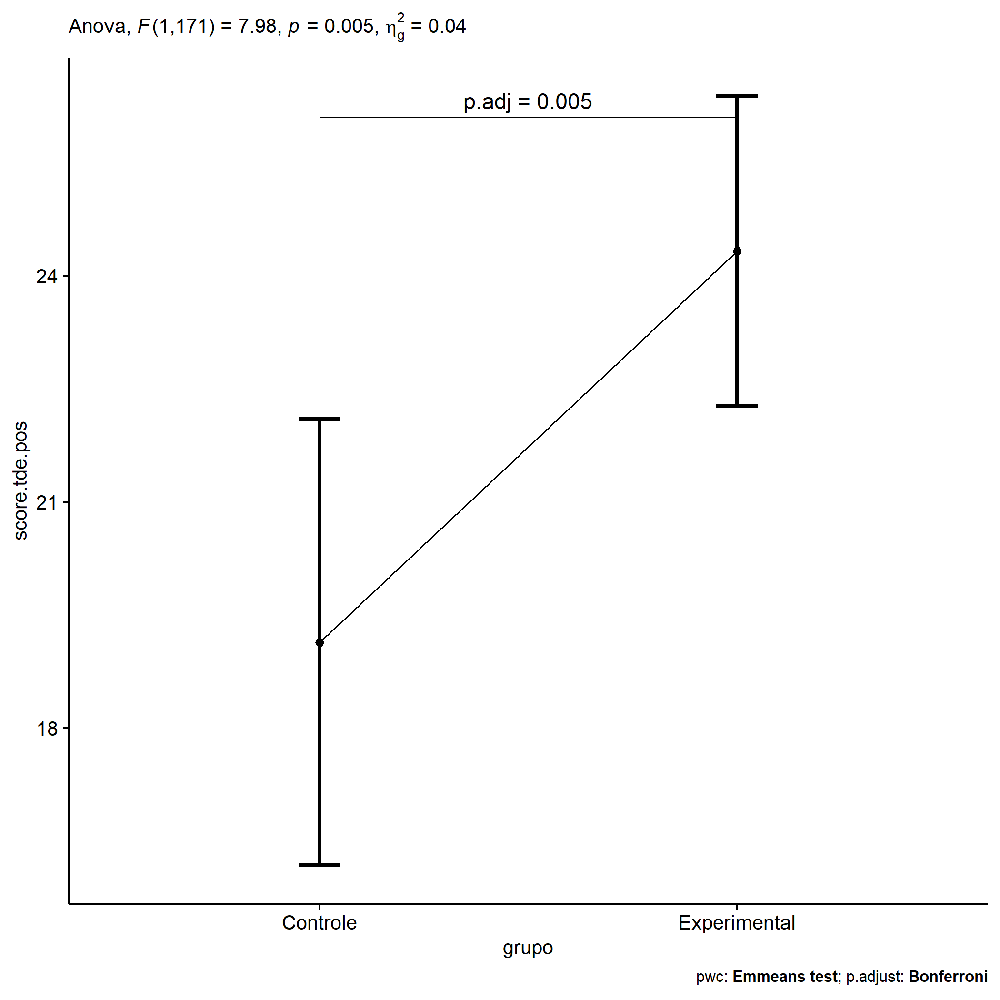<!-- -->

``` r
plots <- oneWayAncovaBoxPlots(
  wdat, "score.tde.pos", "grupo", aov, pwc, covar = "score.tde.pre",
  theme = "classic", color = color[["grupo"]],
  subtitle = which(aov$Effect == "grupo"))
```

``` r
if (length(unique(wdat[["grupo"]])) > 1)
  plots[["grupo"]] + ggplot2::ylab("TDE - Escrita") + ggplot2::scale_x_discrete(labels=c('pre', 'pos'))
```

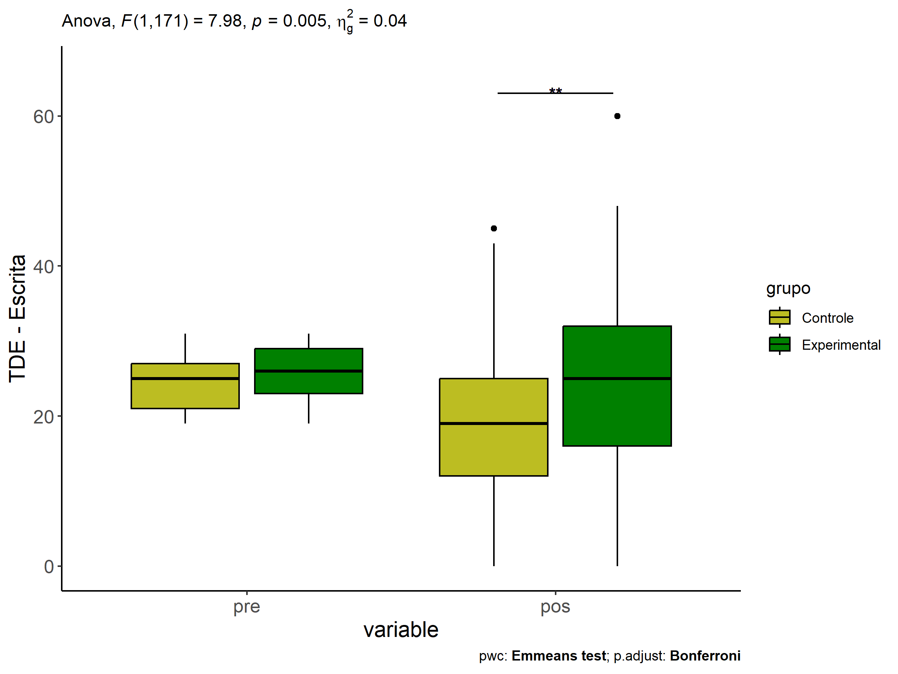<!-- -->

``` r
if (length(unique(wdat.long[["grupo"]])) > 1)
  plots <- oneWayAncovaBoxPlots(
    wdat.long, "score.tde", "grupo", aov, pwc.long, pre.post = "time",
    theme = "classic", color = color$prepost)
```

``` r
if (length(unique(wdat.long[["grupo"]])) > 1)
  plots[["grupo"]] + ggplot2::ylab("TDE - Escrita")
```

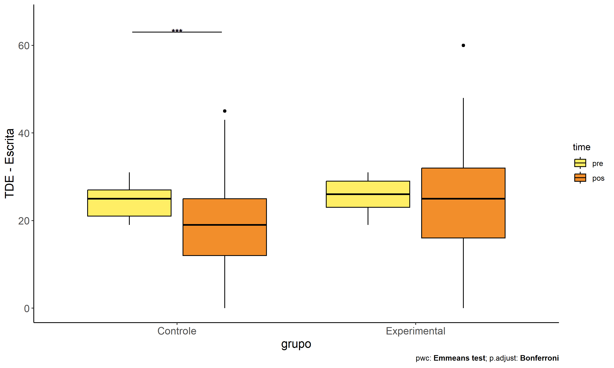<!-- -->

### Checking linearity assumption

``` r
ggscatter(wdat, x = "score.tde.pre", y = "score.tde.pos", size = 0.5,
          color = "grupo", add = "reg.line")+
  stat_regline_equation(
    aes(label =  paste(..eq.label.., ..rr.label.., sep = "~~~~"), color = grupo)
  )
```

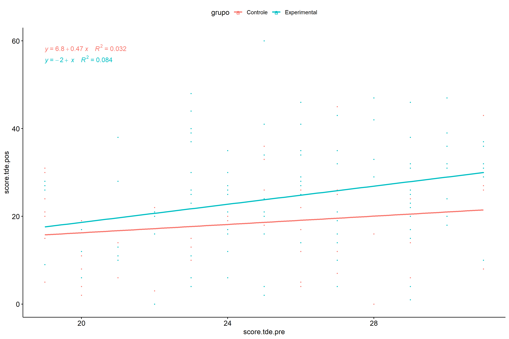<!-- -->

### Checking normality and homogeneity

``` r
res <- augment(lm(score.tde.pos ~ score.tde.pre + grupo, data = wdat))
```

``` r
shapiro_test(res$.resid)
```

    ## # A tibble: 1 × 3
    ##   variable   statistic p.value
    ##   <chr>          <dbl>   <dbl>
    ## 1 res$.resid     0.993   0.526

``` r
levene_test(res, .resid ~ grupo)
```

    ## # A tibble: 1 × 4
    ##     df1   df2 statistic     p
    ##   <int> <int>     <dbl> <dbl>
    ## 1     1   172      1.41 0.236

# ANCOVA and Pairwise for two factors **grupo:Sexo**

## Without remove non-normal data

``` r
pdat = remove_group_data(dat[!is.na(dat[["grupo"]]) & !is.na(dat[["Sexo"]]),], "score.tde.pos", c("grupo","Sexo"))

pdat.long <- rbind(pdat[,c("id","grupo","Sexo")], pdat[,c("id","grupo","Sexo")])
pdat.long[["time"]] <- c(rep("pre", nrow(pdat)), rep("pos", nrow(pdat)))
pdat.long[["time"]] <- factor(pdat.long[["time"]], c("pre","pos"))
pdat.long[["score.tde"]] <- c(pdat[["score.tde.pre"]], pdat[["score.tde.pos"]])

aov = anova_test(pdat, score.tde.pos ~ score.tde.pre + grupo*Sexo)
laov[["grupo:Sexo"]] <- get_anova_table(aov)
```

``` r
pwcs <- list()
pwcs[["Sexo"]] <- emmeans_test(
  group_by(pdat, grupo), score.tde.pos ~ Sexo,
  covariate = score.tde.pre, p.adjust.method = "bonferroni")
pwcs[["grupo"]] <- emmeans_test(
  group_by(pdat, Sexo), score.tde.pos ~ grupo,
  covariate = score.tde.pre, p.adjust.method = "bonferroni")

pwc <- plyr::rbind.fill(pwcs[["grupo"]], pwcs[["Sexo"]])
pwc <- pwc[,c("grupo","Sexo", colnames(pwc)[!colnames(pwc) %in% c("grupo","Sexo")])]
```

``` r
pwc.long <- emmeans_test(dplyr::group_by_at(pdat.long, c("grupo","Sexo")),
                         score.tde ~ time,
                         p.adjust.method = "bonferroni")
lpwc[["grupo:Sexo"]] <- plyr::rbind.fill(pwc, pwc.long)
```

``` r
ds <- get.descriptives(pdat, "score.tde.pos", c("grupo","Sexo"), covar = "score.tde.pre")
ds <- merge(ds[ds$variable != "score.tde.pre",],
            ds[ds$variable == "score.tde.pre", !colnames(ds) %in% c("variable")],
            by = c("grupo","Sexo"), all.x = T, suffixes = c("", ".score.tde.pre"))
ds <- merge(get_emmeans(pwcs[["grupo"]]), ds, by = c("grupo","Sexo"), suffixes = c(".emms", ""))
ds <- ds[,c("grupo","Sexo","n","mean.score.tde.pre","se.score.tde.pre","mean","se","emmean","se.emms")]

colnames(ds) <- c("grupo","Sexo", "N", paste0(c("M","SE")," (pre)"),
                  paste0(c("M","SE"), " (unadj)"), paste0(c("M", "SE"), " (adj)"))

lemms[["grupo:Sexo"]] <- ds
```

## Computing ANCOVA and PairWise After removing non-normal data (OK)

``` r
wdat = pdat 

res = residuals(lm(score.tde.pos ~ score.tde.pre + grupo*Sexo, data = wdat))
non.normal = getNonNormal(res, wdat$id, plimit = 0.05)

wdat = wdat[!wdat$id %in% non.normal,]

wdat.long <- rbind(wdat[,c("id","grupo","Sexo")], wdat[,c("id","grupo","Sexo")])
wdat.long[["time"]] <- c(rep("pre", nrow(wdat)), rep("pos", nrow(wdat)))
wdat.long[["time"]] <- factor(wdat.long[["time"]], c("pre","pos"))
wdat.long[["score.tde"]] <- c(wdat[["score.tde.pre"]], wdat[["score.tde.pos"]])


ldat[["grupo:Sexo"]] = wdat

(non.normal)
```

    ## [1] "P984" "P962"

``` r
aov = anova_test(wdat, score.tde.pos ~ score.tde.pre + grupo*Sexo)
laov[["grupo:Sexo"]] <- merge(get_anova_table(aov), laov[["grupo:Sexo"]], by="Effect", suffixes = c("","'"))

(df = get_anova_table(aov))
```

    ## ANOVA Table (type II tests)
    ## 
    ##          Effect DFn DFd      F        p p<.05      ges
    ## 1 score.tde.pre   1 169 11.940 0.000695     * 0.066000
    ## 2         grupo   1 169  7.405 0.007000     * 0.042000
    ## 3          Sexo   1 169  0.371 0.543000       0.002000
    ## 4    grupo:Sexo   1 169  0.060 0.807000       0.000354

| Effect        | DFn | DFd |      F |     p | p\<.05 |   ges |
|:--------------|----:|----:|-------:|------:|:-------|------:|
| score.tde.pre |   1 | 169 | 11.940 | 0.001 | \*     | 0.066 |
| grupo         |   1 | 169 |  7.405 | 0.007 | \*     | 0.042 |
| Sexo          |   1 | 169 |  0.371 | 0.543 |        | 0.002 |
| grupo:Sexo    |   1 | 169 |  0.060 | 0.807 |        | 0.000 |

``` r
pwcs <- list()
pwcs[["Sexo"]] <- emmeans_test(
  group_by(wdat, grupo), score.tde.pos ~ Sexo,
  covariate = score.tde.pre, p.adjust.method = "bonferroni")
pwcs[["grupo"]] <- emmeans_test(
  group_by(wdat, Sexo), score.tde.pos ~ grupo,
  covariate = score.tde.pre, p.adjust.method = "bonferroni")

pwc <- plyr::rbind.fill(pwcs[["grupo"]], pwcs[["Sexo"]])
pwc <- pwc[,c("grupo","Sexo", colnames(pwc)[!colnames(pwc) %in% c("grupo","Sexo")])]
```

| grupo        | Sexo | term                 | .y.           | group1   | group2       |  df | statistic |     p | p.adj | p.adj.signif |
|:-------------|:-----|:---------------------|:--------------|:---------|:-------------|----:|----------:|------:|------:|:-------------|
|              | F    | score.tde.pre\*grupo | score.tde.pos | Controle | Experimental | 169 |    -2.099 | 0.037 | 0.037 | \*           |
|              | M    | score.tde.pre\*grupo | score.tde.pos | Controle | Experimental | 169 |    -1.782 | 0.077 | 0.077 | ns           |
| Controle     |      | score.tde.pre\*Sexo  | score.tde.pos | F        | M            | 169 |    -0.552 | 0.582 | 0.582 | ns           |
| Experimental |      | score.tde.pre\*Sexo  | score.tde.pos | F        | M            | 169 |    -0.359 | 0.720 | 0.720 | ns           |

``` r
pwc.long <- emmeans_test(dplyr::group_by_at(wdat.long, c("grupo","Sexo")),
                         score.tde ~ time,
                         p.adjust.method = "bonferroni")
lpwc[["grupo:Sexo"]] <- merge(plyr::rbind.fill(pwc, pwc.long), lpwc[["grupo:Sexo"]], by=c("grupo","Sexo","term",".y.","group1","group2"), suffixes = c("","'"))
```

| grupo        | Sexo | term | .y.       | group1 | group2 |  df | statistic |     p | p.adj | p.adj.signif |
|:-------------|:-----|:-----|:----------|:-------|:-------|----:|----------:|------:|------:|:-------------|
| Controle     | F    | time | score.tde | pre    | pos    | 340 |     3.154 | 0.002 | 0.002 | \*\*         |
| Controle     | M    | time | score.tde | pre    | pos    | 340 |     2.217 | 0.027 | 0.027 | \*           |
| Experimental | F    | time | score.tde | pre    | pos    | 340 |     0.964 | 0.336 | 0.336 | ns           |
| Experimental | M    | time | score.tde | pre    | pos    | 340 |     0.559 | 0.577 | 0.577 | ns           |

``` r
ds <- get.descriptives(wdat, "score.tde.pos", c("grupo","Sexo"), covar = "score.tde.pre")
ds <- merge(ds[ds$variable != "score.tde.pre",],
            ds[ds$variable == "score.tde.pre", !colnames(ds) %in% c("variable")],
            by = c("grupo","Sexo"), all.x = T, suffixes = c("", ".score.tde.pre"))
ds <- merge(get_emmeans(pwcs[["grupo"]]), ds, by = c("grupo","Sexo"), suffixes = c(".emms", ""))
ds <- ds[,c("grupo","Sexo","n","mean.score.tde.pre","se.score.tde.pre","mean","se","emmean","se.emms")]

colnames(ds) <- c("grupo","Sexo", "N", paste0(c("M","SE")," (pre)"),
                  paste0(c("M","SE"), " (unadj)"), paste0(c("M", "SE"), " (adj)"))

lemms[["grupo:Sexo"]] <- merge(ds, lemms[["grupo:Sexo"]], by=c("grupo","Sexo"), suffixes = c("","'"))
```

| grupo        | Sexo |   N | M (pre) | SE (pre) | M (unadj) | SE (unadj) | M (adj) | SE (adj) |
|:-------------|:-----|----:|--------:|---------:|----------:|-----------:|--------:|---------:|
| Controle     | F    |  30 |  25.033 |    0.674 |    18.033 |      1.789 |  18.367 |    2.059 |
| Controle     | M    |  27 |  24.037 |    0.765 |    18.852 |      2.034 |  20.021 |    2.194 |
| Experimental | F    |  49 |  26.184 |    0.439 |    24.510 |      1.721 |  23.879 |    1.620 |
| Experimental | M    |  68 |  25.618 |    0.443 |    24.794 |      1.504 |  24.638 |    1.367 |

### Plots for ancova

``` r
plots <- twoWayAncovaPlots(
  wdat, "score.tde.pos", c("grupo","Sexo"), aov, pwcs, addParam = c("mean_se"),
  font.label.size=10, step.increase=0.05, p.label="p.adj",
  subtitle = which(aov$Effect == "grupo:Sexo"))
```

``` r
if (!is.null(plots[["grupo"]]))
  plots[["grupo"]] + ggplot2::scale_color_manual(values = color[["Sexo"]])
```

    ## Scale for colour is already present.
    ## Adding another scale for colour, which will replace the existing scale.

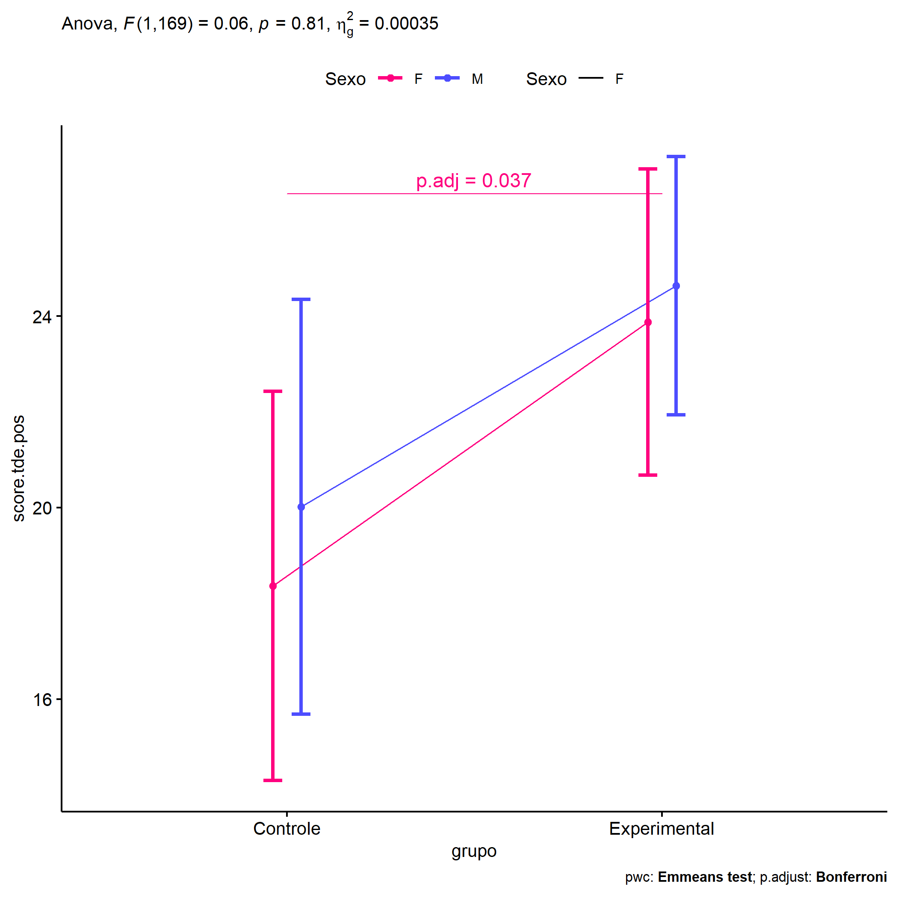<!-- -->

``` r
if (!is.null(plots[["Sexo"]]))
  plots[["Sexo"]] + ggplot2::scale_color_manual(values = color[["grupo"]])
```

    ## Scale for colour is already present.
    ## Adding another scale for colour, which will replace the existing scale.

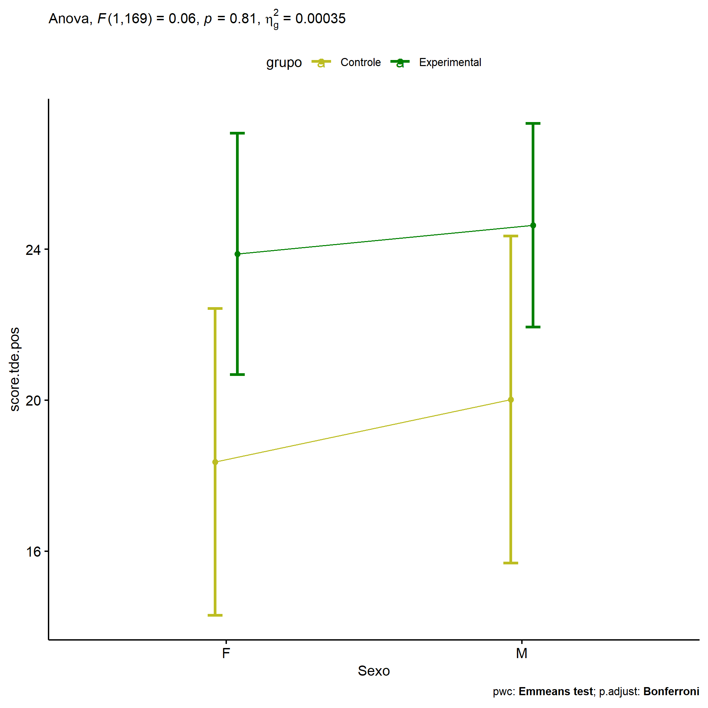<!-- -->

``` r
plots <- twoWayAncovaBoxPlots(
  wdat, "score.tde.pos", c("grupo","Sexo"), aov, pwcs, covar = "score.tde.pre",
  theme = "classic", color = color[["grupo:Sexo"]],
  subtitle = which(aov$Effect == "grupo:Sexo"))
```

``` r
plots[["grupo:Sexo"]] + ggplot2::ylab("TDE - Escrita") + ggplot2::scale_x_discrete(labels=c('pre', 'pos'))
```

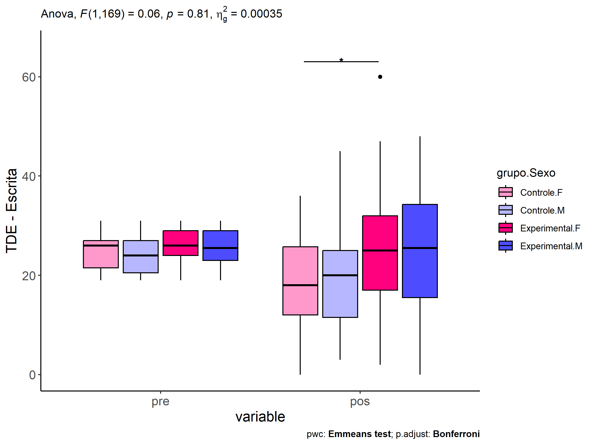<!-- -->

``` r
plots <- twoWayAncovaBoxPlots(
  wdat.long, "score.tde", c("grupo","Sexo"), aov, pwc.long, pre.post = "time",
  theme = "classic", color = color$prepost)
```

``` r
plots[["grupo:Sexo"]] + ggplot2::ylab("TDE - Escrita")
```

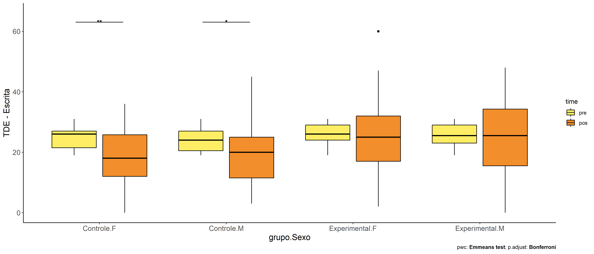<!-- -->

### Checking linearity assumption

``` r
ggscatter(wdat, x = "score.tde.pre", y = "score.tde.pos", size = 0.5,
          facet.by = c("grupo","Sexo"), add = "reg.line")+
  stat_regline_equation(
    aes(label =  paste(..eq.label.., ..rr.label.., sep = "~~~~"))
  )
```

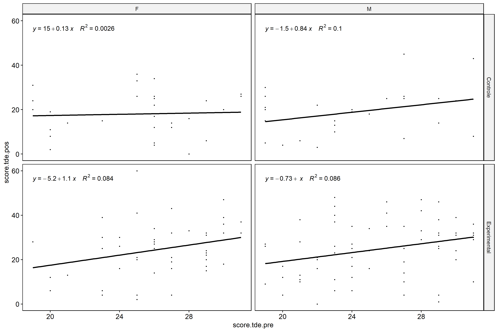<!-- -->

### Checking normality and homogeneity

``` r
res <- augment(lm(score.tde.pos ~ score.tde.pre + grupo*Sexo, data = wdat))
```

``` r
shapiro_test(res$.resid)
```

    ## # A tibble: 1 × 3
    ##   variable   statistic p.value
    ##   <chr>          <dbl>   <dbl>
    ## 1 res$.resid     0.993   0.610

``` r
levene_test(res, .resid ~ grupo*Sexo)
```

    ## # A tibble: 1 × 4
    ##     df1   df2 statistic     p
    ##   <int> <int>     <dbl> <dbl>
    ## 1     3   170     0.537 0.657

# ANCOVA and Pairwise for two factors **grupo:Zona**

## Without remove non-normal data

``` r
pdat = remove_group_data(dat[!is.na(dat[["grupo"]]) & !is.na(dat[["Zona"]]),], "score.tde.pos", c("grupo","Zona"))

pdat.long <- rbind(pdat[,c("id","grupo","Zona")], pdat[,c("id","grupo","Zona")])
pdat.long[["time"]] <- c(rep("pre", nrow(pdat)), rep("pos", nrow(pdat)))
pdat.long[["time"]] <- factor(pdat.long[["time"]], c("pre","pos"))
pdat.long[["score.tde"]] <- c(pdat[["score.tde.pre"]], pdat[["score.tde.pos"]])

aov = anova_test(pdat, score.tde.pos ~ score.tde.pre + grupo*Zona)
laov[["grupo:Zona"]] <- get_anova_table(aov)
```

``` r
pwcs <- list()
pwcs[["Zona"]] <- emmeans_test(
  group_by(pdat, grupo), score.tde.pos ~ Zona,
  covariate = score.tde.pre, p.adjust.method = "bonferroni")
pwcs[["grupo"]] <- emmeans_test(
  group_by(pdat, Zona), score.tde.pos ~ grupo,
  covariate = score.tde.pre, p.adjust.method = "bonferroni")

pwc <- plyr::rbind.fill(pwcs[["grupo"]], pwcs[["Zona"]])
pwc <- pwc[,c("grupo","Zona", colnames(pwc)[!colnames(pwc) %in% c("grupo","Zona")])]
```

``` r
pwc.long <- emmeans_test(dplyr::group_by_at(pdat.long, c("grupo","Zona")),
                         score.tde ~ time,
                         p.adjust.method = "bonferroni")
lpwc[["grupo:Zona"]] <- plyr::rbind.fill(pwc, pwc.long)
```

``` r
ds <- get.descriptives(pdat, "score.tde.pos", c("grupo","Zona"), covar = "score.tde.pre")
ds <- merge(ds[ds$variable != "score.tde.pre",],
            ds[ds$variable == "score.tde.pre", !colnames(ds) %in% c("variable")],
            by = c("grupo","Zona"), all.x = T, suffixes = c("", ".score.tde.pre"))
ds <- merge(get_emmeans(pwcs[["grupo"]]), ds, by = c("grupo","Zona"), suffixes = c(".emms", ""))
ds <- ds[,c("grupo","Zona","n","mean.score.tde.pre","se.score.tde.pre","mean","se","emmean","se.emms")]

colnames(ds) <- c("grupo","Zona", "N", paste0(c("M","SE")," (pre)"),
                  paste0(c("M","SE"), " (unadj)"), paste0(c("M", "SE"), " (adj)"))

lemms[["grupo:Zona"]] <- ds
```

## Computing ANCOVA and PairWise After removing non-normal data (OK)

``` r
wdat = pdat 

res = residuals(lm(score.tde.pos ~ score.tde.pre + grupo*Zona, data = wdat))
non.normal = getNonNormal(res, wdat$id, plimit = 0.05)

wdat = wdat[!wdat$id %in% non.normal,]

wdat.long <- rbind(wdat[,c("id","grupo","Zona")], wdat[,c("id","grupo","Zona")])
wdat.long[["time"]] <- c(rep("pre", nrow(wdat)), rep("pos", nrow(wdat)))
wdat.long[["time"]] <- factor(wdat.long[["time"]], c("pre","pos"))
wdat.long[["score.tde"]] <- c(wdat[["score.tde.pre"]], wdat[["score.tde.pos"]])


ldat[["grupo:Zona"]] = wdat

(non.normal)
```

    ## NULL

``` r
aov = anova_test(wdat, score.tde.pos ~ score.tde.pre + grupo*Zona)
laov[["grupo:Zona"]] <- merge(get_anova_table(aov), laov[["grupo:Zona"]], by="Effect", suffixes = c("","'"))

(df = get_anova_table(aov))
```

    ## ANOVA Table (type II tests)
    ## 
    ##          Effect DFn DFd      F        p p<.05   ges
    ## 1 score.tde.pre   1 118  7.600 7.00e-03     * 0.061
    ## 2         grupo   1 118  0.347 5.57e-01       0.003
    ## 3          Zona   1 118 20.264 1.59e-05     * 0.147
    ## 4    grupo:Zona   1 118  3.460 6.50e-02       0.028

| Effect        | DFn | DFd |      F |     p | p\<.05 |   ges |
|:--------------|----:|----:|-------:|------:|:-------|------:|
| score.tde.pre |   1 | 118 |  7.600 | 0.007 | \*     | 0.061 |
| grupo         |   1 | 118 |  0.347 | 0.557 |        | 0.003 |
| Zona          |   1 | 118 | 20.264 | 0.000 | \*     | 0.147 |
| grupo:Zona    |   1 | 118 |  3.460 | 0.065 |        | 0.028 |

``` r
pwcs <- list()
pwcs[["Zona"]] <- emmeans_test(
  group_by(wdat, grupo), score.tde.pos ~ Zona,
  covariate = score.tde.pre, p.adjust.method = "bonferroni")
pwcs[["grupo"]] <- emmeans_test(
  group_by(wdat, Zona), score.tde.pos ~ grupo,
  covariate = score.tde.pre, p.adjust.method = "bonferroni")

pwc <- plyr::rbind.fill(pwcs[["grupo"]], pwcs[["Zona"]])
pwc <- pwc[,c("grupo","Zona", colnames(pwc)[!colnames(pwc) %in% c("grupo","Zona")])]
```

| grupo        | Zona   | term                 | .y.           | group1   | group2       |  df | statistic |     p | p.adj | p.adj.signif |
|:-------------|:-------|:---------------------|:--------------|:---------|:-------------|----:|----------:|------:|------:|:-------------|
|              | Rural  | score.tde.pre\*grupo | score.tde.pos | Controle | Experimental | 118 |     0.788 | 0.432 | 0.432 | ns           |
|              | Urbana | score.tde.pre\*grupo | score.tde.pos | Controle | Experimental | 118 |    -1.774 | 0.079 | 0.079 | ns           |
| Controle     |        | score.tde.pre\*Zona  | score.tde.pos | Rural    | Urbana       | 118 |     4.179 | 0.000 | 0.000 | \*\*\*\*     |
| Experimental |        | score.tde.pre\*Zona  | score.tde.pos | Rural    | Urbana       | 118 |     2.495 | 0.014 | 0.014 | \*           |

``` r
pwc.long <- emmeans_test(dplyr::group_by_at(wdat.long, c("grupo","Zona")),
                         score.tde ~ time,
                         p.adjust.method = "bonferroni")
lpwc[["grupo:Zona"]] <- merge(plyr::rbind.fill(pwc, pwc.long), lpwc[["grupo:Zona"]], by=c("grupo","Zona","term",".y.","group1","group2"), suffixes = c("","'"))
```

| grupo        | Zona   | term | .y.       | group1 | group2 |  df | statistic |     p | p.adj | p.adj.signif |
|:-------------|:-------|:-----|:----------|:-------|:-------|----:|----------:|------:|------:|:-------------|
| Controle     | Rural  | time | score.tde | pre    | pos    | 238 |    -1.024 | 0.307 | 0.307 | ns           |
| Controle     | Urbana | time | score.tde | pre    | pos    | 238 |     4.608 | 0.000 | 0.000 | \*\*\*\*     |
| Experimental | Rural  | time | score.tde | pre    | pos    | 238 |     0.011 | 0.991 | 0.991 | ns           |
| Experimental | Urbana | time | score.tde | pre    | pos    | 238 |     2.848 | 0.005 | 0.005 | \*\*         |

``` r
ds <- get.descriptives(wdat, "score.tde.pos", c("grupo","Zona"), covar = "score.tde.pre")
ds <- merge(ds[ds$variable != "score.tde.pre",],
            ds[ds$variable == "score.tde.pre", !colnames(ds) %in% c("variable")],
            by = c("grupo","Zona"), all.x = T, suffixes = c("", ".score.tde.pre"))
ds <- merge(get_emmeans(pwcs[["grupo"]]), ds, by = c("grupo","Zona"), suffixes = c(".emms", ""))
ds <- ds[,c("grupo","Zona","n","mean.score.tde.pre","se.score.tde.pre","mean","se","emmean","se.emms")]

colnames(ds) <- c("grupo","Zona", "N", paste0(c("M","SE")," (pre)"),
                  paste0(c("M","SE"), " (unadj)"), paste0(c("M", "SE"), " (adj)"))

lemms[["grupo:Zona"]] <- merge(ds, lemms[["grupo:Zona"]], by=c("grupo","Zona"), suffixes = c("","'"))
```

| grupo        | Zona   |   N | M (pre) | SE (pre) | M (unadj) | SE (unadj) | M (adj) | SE (adj) |
|:-------------|:-------|----:|--------:|---------:|----------:|-----------:|--------:|---------:|
| Controle     | Rural  |  21 |  23.429 |    0.748 |    26.238 |      3.562 |  27.842 |    2.629 |
| Controle     | Urbana |  20 |  25.150 |    0.847 |    12.200 |      1.718 |  12.348 |    2.627 |
| Experimental | Rural  |  55 |  25.891 |    0.471 |    25.873 |      1.604 |  25.394 |    1.593 |
| Experimental | Urbana |  27 |  25.778 |    0.652 |    18.889 |      2.147 |  18.506 |    2.265 |

### Plots for ancova

``` r
plots <- twoWayAncovaPlots(
  wdat, "score.tde.pos", c("grupo","Zona"), aov, pwcs, addParam = c("mean_se"),
  font.label.size=10, step.increase=0.05, p.label="p.adj",
  subtitle = which(aov$Effect == "grupo:Zona"))
```

``` r
if (!is.null(plots[["grupo"]]))
  plots[["grupo"]] + ggplot2::scale_color_manual(values = color[["Zona"]])
```

    ## Scale for colour is already present.
    ## Adding another scale for colour, which will replace the existing scale.

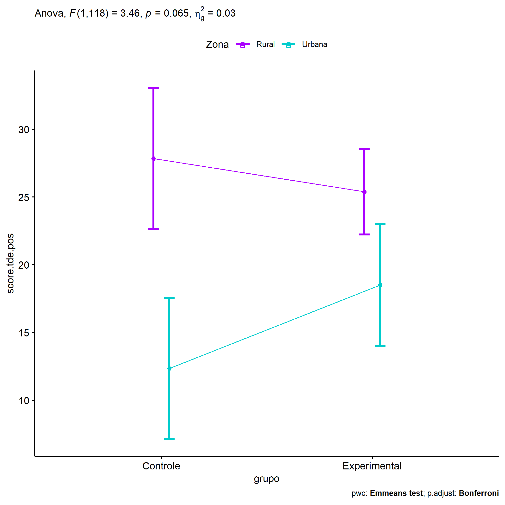<!-- -->

``` r
if (!is.null(plots[["Zona"]]))
  plots[["Zona"]] + ggplot2::scale_color_manual(values = color[["grupo"]])
```

    ## Scale for colour is already present.
    ## Adding another scale for colour, which will replace the existing scale.

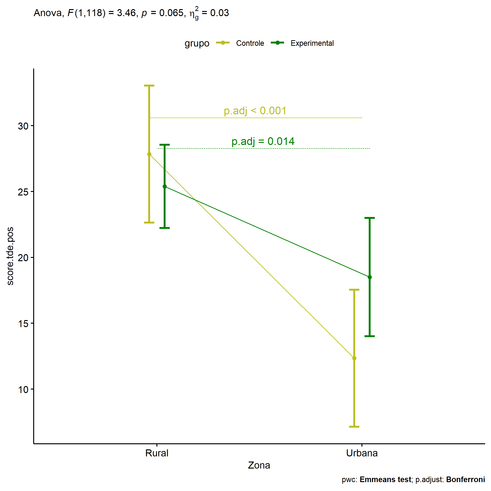<!-- -->

``` r
plots <- twoWayAncovaBoxPlots(
  wdat, "score.tde.pos", c("grupo","Zona"), aov, pwcs, covar = "score.tde.pre",
  theme = "classic", color = color[["grupo:Zona"]],
  subtitle = which(aov$Effect == "grupo:Zona"))
```

``` r
plots[["grupo:Zona"]] + ggplot2::ylab("TDE - Escrita") + ggplot2::scale_x_discrete(labels=c('pre', 'pos'))
```

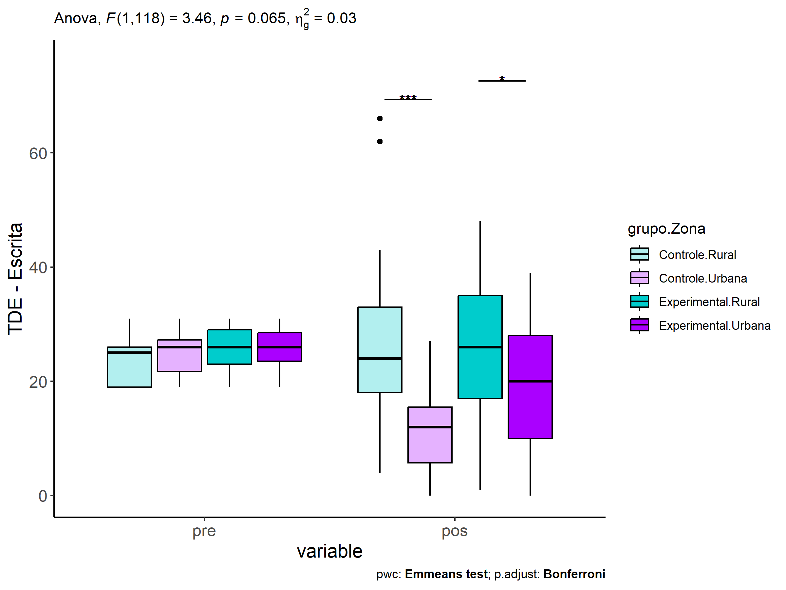<!-- -->

``` r
plots <- twoWayAncovaBoxPlots(
  wdat.long, "score.tde", c("grupo","Zona"), aov, pwc.long, pre.post = "time",
  theme = "classic", color = color$prepost)
```

``` r
plots[["grupo:Zona"]] + ggplot2::ylab("TDE - Escrita")
```

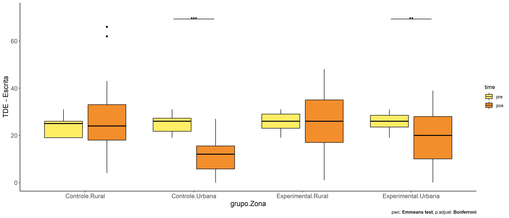<!-- -->

### Checking linearity assumption

``` r
ggscatter(wdat, x = "score.tde.pre", y = "score.tde.pos", size = 0.5,
          facet.by = c("grupo","Zona"), add = "reg.line")+
  stat_regline_equation(
    aes(label =  paste(..eq.label.., ..rr.label.., sep = "~~~~"))
  )
```

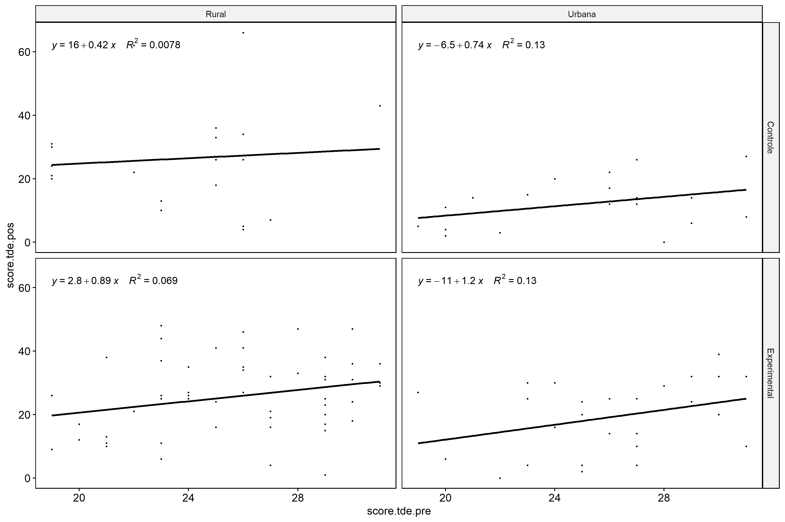<!-- -->

### Checking normality and homogeneity

``` r
res <- augment(lm(score.tde.pos ~ score.tde.pre + grupo*Zona, data = wdat))
```

``` r
shapiro_test(res$.resid)
```

    ## # A tibble: 1 × 3
    ##   variable   statistic p.value
    ##   <chr>          <dbl>   <dbl>
    ## 1 res$.resid     0.985   0.200

``` r
levene_test(res, .resid ~ grupo*Zona)
```

    ## # A tibble: 1 × 4
    ##     df1   df2 statistic      p
    ##   <int> <int>     <dbl>  <dbl>
    ## 1     3   119      2.20 0.0922

# ANCOVA and Pairwise for two factors **grupo:Cor.Raca**

## Without remove non-normal data

``` r
pdat = remove_group_data(dat[!is.na(dat[["grupo"]]) & !is.na(dat[["Cor.Raca"]]),], "score.tde.pos", c("grupo","Cor.Raca"))
```

    ## Warning: There was 1 warning in `mutate()`.
    ## ℹ In argument: `ci = abs(stats::qt(alpha/2, .data$n - 1) * .data$se)`.
    ## Caused by warning:
    ## ! There was 1 warning in `mutate()`.
    ## ℹ In argument: `ci = abs(stats::qt(alpha/2, .data$n - 1) * .data$se)`.
    ## Caused by warning in `stats::qt()`:
    ## ! NaNs produced

``` r
pdat.long <- rbind(pdat[,c("id","grupo","Cor.Raca")], pdat[,c("id","grupo","Cor.Raca")])
pdat.long[["time"]] <- c(rep("pre", nrow(pdat)), rep("pos", nrow(pdat)))
pdat.long[["time"]] <- factor(pdat.long[["time"]], c("pre","pos"))
pdat.long[["score.tde"]] <- c(pdat[["score.tde.pre"]], pdat[["score.tde.pos"]])

aov = anova_test(pdat, score.tde.pos ~ score.tde.pre + grupo*Cor.Raca)
laov[["grupo:Cor.Raca"]] <- get_anova_table(aov)
```

``` r
pwcs <- list()
pwcs[["Cor.Raca"]] <- emmeans_test(
  group_by(pdat, grupo), score.tde.pos ~ Cor.Raca,
  covariate = score.tde.pre, p.adjust.method = "bonferroni")
pwcs[["grupo"]] <- emmeans_test(
  group_by(pdat, Cor.Raca), score.tde.pos ~ grupo,
  covariate = score.tde.pre, p.adjust.method = "bonferroni")

pwc <- plyr::rbind.fill(pwcs[["grupo"]], pwcs[["Cor.Raca"]])
pwc <- pwc[,c("grupo","Cor.Raca", colnames(pwc)[!colnames(pwc) %in% c("grupo","Cor.Raca")])]
```

``` r
pwc.long <- emmeans_test(dplyr::group_by_at(pdat.long, c("grupo","Cor.Raca")),
                         score.tde ~ time,
                         p.adjust.method = "bonferroni")
lpwc[["grupo:Cor.Raca"]] <- plyr::rbind.fill(pwc, pwc.long)
```

``` r
ds <- get.descriptives(pdat, "score.tde.pos", c("grupo","Cor.Raca"), covar = "score.tde.pre")
ds <- merge(ds[ds$variable != "score.tde.pre",],
            ds[ds$variable == "score.tde.pre", !colnames(ds) %in% c("variable")],
            by = c("grupo","Cor.Raca"), all.x = T, suffixes = c("", ".score.tde.pre"))
ds <- merge(get_emmeans(pwcs[["grupo"]]), ds, by = c("grupo","Cor.Raca"), suffixes = c(".emms", ""))
ds <- ds[,c("grupo","Cor.Raca","n","mean.score.tde.pre","se.score.tde.pre","mean","se","emmean","se.emms")]

colnames(ds) <- c("grupo","Cor.Raca", "N", paste0(c("M","SE")," (pre)"),
                  paste0(c("M","SE"), " (unadj)"), paste0(c("M", "SE"), " (adj)"))

lemms[["grupo:Cor.Raca"]] <- ds
```

## Computing ANCOVA and PairWise After removing non-normal data (OK)

``` r
wdat = pdat 

res = residuals(lm(score.tde.pos ~ score.tde.pre + grupo*Cor.Raca, data = wdat))
non.normal = getNonNormal(res, wdat$id, plimit = 0.05)

wdat = wdat[!wdat$id %in% non.normal,]

wdat.long <- rbind(wdat[,c("id","grupo","Cor.Raca")], wdat[,c("id","grupo","Cor.Raca")])
wdat.long[["time"]] <- c(rep("pre", nrow(wdat)), rep("pos", nrow(wdat)))
wdat.long[["time"]] <- factor(wdat.long[["time"]], c("pre","pos"))
wdat.long[["score.tde"]] <- c(wdat[["score.tde.pre"]], wdat[["score.tde.pos"]])


ldat[["grupo:Cor.Raca"]] = wdat

(non.normal)
```

    ## NULL

``` r
aov = anova_test(wdat, score.tde.pos ~ score.tde.pre + grupo*Cor.Raca)
laov[["grupo:Cor.Raca"]] <- merge(get_anova_table(aov), laov[["grupo:Cor.Raca"]], by="Effect", suffixes = c("","'"))

(df = get_anova_table(aov))
```

    ## ANOVA Table (type II tests)
    ## 
    ##           Effect DFn DFd     F     p p<.05   ges
    ## 1  score.tde.pre   1  68 5.107 0.027     * 0.070
    ## 2          grupo   1  68 5.902 0.018     * 0.080
    ## 3       Cor.Raca   1  68 2.561 0.114       0.036
    ## 4 grupo:Cor.Raca   0  68    NA    NA  <NA>    NA

| Effect         | DFn | DFd |     F |     p | p\<.05 |   ges |
|:---------------|----:|----:|------:|------:|:-------|------:|
| score.tde.pre  |   1 |  68 | 5.107 | 0.027 | \*     | 0.070 |
| grupo          |   1 |  68 | 5.902 | 0.018 | \*     | 0.080 |
| Cor.Raca       |   1 |  68 | 2.561 | 0.114 |        | 0.036 |
| grupo:Cor.Raca |   0 |  68 |       |       |        |       |

``` r
pwcs <- list()
pwcs[["Cor.Raca"]] <- emmeans_test(
  group_by(wdat, grupo), score.tde.pos ~ Cor.Raca,
  covariate = score.tde.pre, p.adjust.method = "bonferroni")
pwcs[["grupo"]] <- emmeans_test(
  group_by(wdat, Cor.Raca), score.tde.pos ~ grupo,
  covariate = score.tde.pre, p.adjust.method = "bonferroni")

pwc <- plyr::rbind.fill(pwcs[["grupo"]], pwcs[["Cor.Raca"]])
pwc <- pwc[,c("grupo","Cor.Raca", colnames(pwc)[!colnames(pwc) %in% c("grupo","Cor.Raca")])]
```

| grupo        | Cor.Raca | term                    | .y.           | group1   | group2       |  df | statistic |     p | p.adj | p.adj.signif |
|:-------------|:---------|:------------------------|:--------------|:---------|:-------------|----:|----------:|------:|------:|:-------------|
|              | Branca   | score.tde.pre\*grupo    | score.tde.pos | Controle | Experimental |     |           |       |       |              |
|              | Parda    | score.tde.pre\*grupo    | score.tde.pos | Controle | Experimental |  68 |    -2.429 | 0.018 | 0.018 | \*           |
| Controle     |          | score.tde.pre\*Cor.Raca | score.tde.pos | Branca   | Parda        |     |           |       |       |              |
| Experimental |          | score.tde.pre\*Cor.Raca | score.tde.pos | Branca   | Parda        |  68 |    -1.600 | 0.114 | 0.114 | ns           |

``` r
pwc.long <- emmeans_test(dplyr::group_by_at(wdat.long, c("grupo","Cor.Raca")),
                         score.tde ~ time,
                         p.adjust.method = "bonferroni")
lpwc[["grupo:Cor.Raca"]] <- merge(plyr::rbind.fill(pwc, pwc.long), lpwc[["grupo:Cor.Raca"]], by=c("grupo","Cor.Raca","term",".y.","group1","group2"), suffixes = c("","'"))
```

| grupo        | Cor.Raca | term | .y.       | group1 | group2 |  df | statistic |     p | p.adj | p.adj.signif |
|:-------------|:---------|:-----|:----------|:-------|:-------|----:|----------:|------:|------:|:-------------|
| Controle     | Branca   | time | score.tde | pre    | pos    |     |           |       |       |              |
| Controle     | Parda    | time | score.tde | pre    | pos    | 138 |     2.572 | 0.011 | 0.011 | \*           |
| Experimental | Branca   | time | score.tde | pre    | pos    | 138 |     1.600 | 0.112 | 0.112 | ns           |
| Experimental | Parda    | time | score.tde | pre    | pos    | 138 |    -0.171 | 0.864 | 0.864 | ns           |

``` r
ds <- get.descriptives(wdat, "score.tde.pos", c("grupo","Cor.Raca"), covar = "score.tde.pre")
ds <- merge(ds[ds$variable != "score.tde.pre",],
            ds[ds$variable == "score.tde.pre", !colnames(ds) %in% c("variable")],
            by = c("grupo","Cor.Raca"), all.x = T, suffixes = c("", ".score.tde.pre"))
ds <- merge(get_emmeans(pwcs[["grupo"]]), ds, by = c("grupo","Cor.Raca"), suffixes = c(".emms", ""))
ds <- ds[,c("grupo","Cor.Raca","n","mean.score.tde.pre","se.score.tde.pre","mean","se","emmean","se.emms")]

colnames(ds) <- c("grupo","Cor.Raca", "N", paste0(c("M","SE")," (pre)"),
                  paste0(c("M","SE"), " (unadj)"), paste0(c("M", "SE"), " (adj)"))

lemms[["grupo:Cor.Raca"]] <- merge(ds, lemms[["grupo:Cor.Raca"]], by=c("grupo","Cor.Raca"), suffixes = c("","'"))
```

| grupo        | Cor.Raca |   N | M (pre) | SE (pre) | M (unadj) | SE (unadj) | M (adj) | SE (adj) |
|:-------------|:---------|----:|--------:|---------:|----------:|-----------:|--------:|---------:|
| Controle     | Parda    |  17 |  25.765 |    0.842 |    17.706 |      2.627 |  17.541 |    2.941 |
| Experimental | Branca   |   9 |  27.111 |    0.716 |    20.222 |      3.996 |  18.728 |    4.095 |
| Experimental | Parda    |  46 |  25.239 |    0.511 |    25.565 |      1.931 |  25.919 |    1.794 |

### Plots for ancova

``` r
plots <- twoWayAncovaPlots(
  wdat, "score.tde.pos", c("grupo","Cor.Raca"), aov, pwcs, addParam = c("mean_se"),
  font.label.size=10, step.increase=0.05, p.label="p.adj",
  subtitle = which(aov$Effect == "grupo:Cor.Raca"))
```

``` r
if (!is.null(plots[["grupo"]]))
  plots[["grupo"]] + ggplot2::scale_color_manual(values = color[["Cor.Raca"]])
```

<!-- -->

``` r
if (!is.null(plots[["Cor.Raca"]]))
  plots[["Cor.Raca"]] + ggplot2::scale_color_manual(values = color[["grupo"]])
```

<!-- -->

``` r
plots <- twoWayAncovaBoxPlots(
  wdat, "score.tde.pos", c("grupo","Cor.Raca"), aov, pwcs, covar = "score.tde.pre",
  theme = "classic", color = color[["grupo:Cor.Raca"]],
  subtitle = which(aov$Effect == "grupo:Cor.Raca"))
```

``` r
plots[["grupo:Cor.Raca"]] + ggplot2::ylab("TDE - Escrita") + ggplot2::scale_x_discrete(labels=c('pre', 'pos'))
```

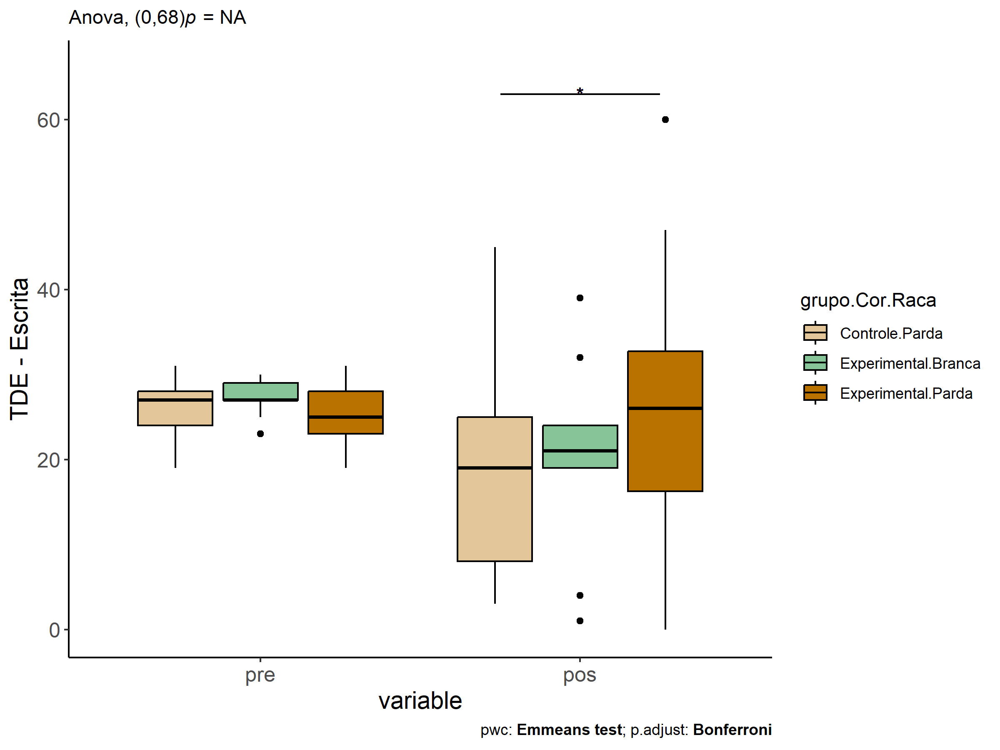<!-- -->

``` r
plots <- twoWayAncovaBoxPlots(
  wdat.long, "score.tde", c("grupo","Cor.Raca"), aov, pwc.long, pre.post = "time",
  theme = "classic", color = color$prepost)
```

``` r
plots[["grupo:Cor.Raca"]] + ggplot2::ylab("TDE - Escrita")
```

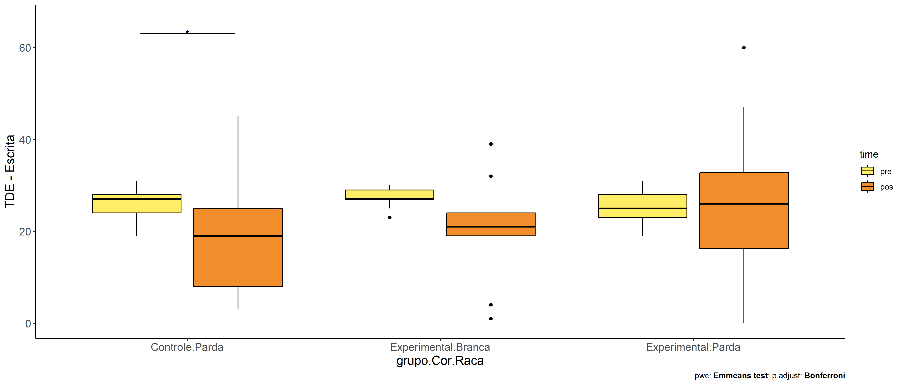<!-- -->

### Checking linearity assumption

``` r
ggscatter(wdat, x = "score.tde.pre", y = "score.tde.pos", size = 0.5,
          facet.by = c("grupo","Cor.Raca"), add = "reg.line")+
  stat_regline_equation(
    aes(label =  paste(..eq.label.., ..rr.label.., sep = "~~~~"))
  )
```

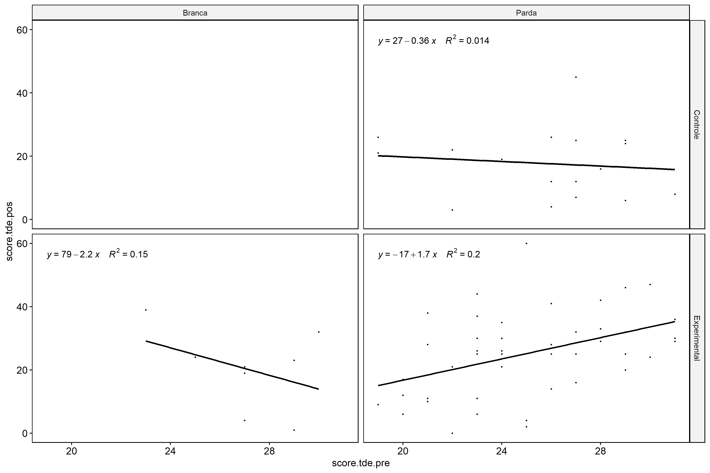<!-- -->

### Checking normality and homogeneity

``` r
res <- augment(lm(score.tde.pos ~ score.tde.pre + grupo*Cor.Raca, data = wdat))
```

``` r
shapiro_test(res$.resid)
```

    ## # A tibble: 1 × 3
    ##   variable   statistic p.value
    ##   <chr>          <dbl>   <dbl>
    ## 1 res$.resid     0.985   0.556

``` r
levene_test(res, .resid ~ grupo*Cor.Raca)
```

    ## # A tibble: 1 × 4
    ##     df1   df2 statistic     p
    ##   <int> <int>     <dbl> <dbl>
    ## 1     2    69    0.0512 0.950

# ANCOVA and Pairwise for two factors **grupo:Serie**

## Without remove non-normal data

``` r
pdat = remove_group_data(dat[!is.na(dat[["grupo"]]) & !is.na(dat[["Serie"]]),], "score.tde.pos", c("grupo","Serie"))

pdat.long <- rbind(pdat[,c("id","grupo","Serie")], pdat[,c("id","grupo","Serie")])
pdat.long[["time"]] <- c(rep("pre", nrow(pdat)), rep("pos", nrow(pdat)))
pdat.long[["time"]] <- factor(pdat.long[["time"]], c("pre","pos"))
pdat.long[["score.tde"]] <- c(pdat[["score.tde.pre"]], pdat[["score.tde.pos"]])

aov = anova_test(pdat, score.tde.pos ~ score.tde.pre + grupo*Serie)
laov[["grupo:Serie"]] <- get_anova_table(aov)
```

``` r
pwcs <- list()
pwcs[["Serie"]] <- emmeans_test(
  group_by(pdat, grupo), score.tde.pos ~ Serie,
  covariate = score.tde.pre, p.adjust.method = "bonferroni")
pwcs[["grupo"]] <- emmeans_test(
  group_by(pdat, Serie), score.tde.pos ~ grupo,
  covariate = score.tde.pre, p.adjust.method = "bonferroni")

pwc <- plyr::rbind.fill(pwcs[["grupo"]], pwcs[["Serie"]])
pwc <- pwc[,c("grupo","Serie", colnames(pwc)[!colnames(pwc) %in% c("grupo","Serie")])]
```

``` r
pwc.long <- emmeans_test(dplyr::group_by_at(pdat.long, c("grupo","Serie")),
                         score.tde ~ time,
                         p.adjust.method = "bonferroni")
lpwc[["grupo:Serie"]] <- plyr::rbind.fill(pwc, pwc.long)
```

``` r
ds <- get.descriptives(pdat, "score.tde.pos", c("grupo","Serie"), covar = "score.tde.pre")
ds <- merge(ds[ds$variable != "score.tde.pre",],
            ds[ds$variable == "score.tde.pre", !colnames(ds) %in% c("variable")],
            by = c("grupo","Serie"), all.x = T, suffixes = c("", ".score.tde.pre"))
ds <- merge(get_emmeans(pwcs[["grupo"]]), ds, by = c("grupo","Serie"), suffixes = c(".emms", ""))
ds <- ds[,c("grupo","Serie","n","mean.score.tde.pre","se.score.tde.pre","mean","se","emmean","se.emms")]

colnames(ds) <- c("grupo","Serie", "N", paste0(c("M","SE")," (pre)"),
                  paste0(c("M","SE"), " (unadj)"), paste0(c("M", "SE"), " (adj)"))

lemms[["grupo:Serie"]] <- ds
```

## Computing ANCOVA and PairWise After removing non-normal data (OK)

``` r
wdat = pdat 

res = residuals(lm(score.tde.pos ~ score.tde.pre + grupo*Serie, data = wdat))
non.normal = getNonNormal(res, wdat$id, plimit = 0.05)

wdat = wdat[!wdat$id %in% non.normal,]

wdat.long <- rbind(wdat[,c("id","grupo","Serie")], wdat[,c("id","grupo","Serie")])
wdat.long[["time"]] <- c(rep("pre", nrow(wdat)), rep("pos", nrow(wdat)))
wdat.long[["time"]] <- factor(wdat.long[["time"]], c("pre","pos"))
wdat.long[["score.tde"]] <- c(wdat[["score.tde.pre"]], wdat[["score.tde.pos"]])


ldat[["grupo:Serie"]] = wdat

(non.normal)
```

    ## [1] "P962" "P984"

``` r
aov = anova_test(wdat, score.tde.pos ~ score.tde.pre + grupo*Serie)
laov[["grupo:Serie"]] <- merge(get_anova_table(aov), laov[["grupo:Serie"]], by="Effect", suffixes = c("","'"))

(df = get_anova_table(aov))
```

    ## ANOVA Table (type II tests)
    ## 
    ##          Effect DFn DFd     F        p p<.05   ges
    ## 1 score.tde.pre   1 165 7.855 6.00e-03     * 0.045
    ## 2         grupo   1 165 8.051 5.00e-03     * 0.047
    ## 3         Serie   3 165 8.237 3.86e-05     * 0.130
    ## 4   grupo:Serie   3 165 0.455 7.14e-01       0.008

| Effect        | DFn | DFd |     F |     p | p\<.05 |   ges |
|:--------------|----:|----:|------:|------:|:-------|------:|
| score.tde.pre |   1 | 165 | 7.855 | 0.006 | \*     | 0.045 |
| grupo         |   1 | 165 | 8.051 | 0.005 | \*     | 0.047 |
| Serie         |   3 | 165 | 8.237 | 0.000 | \*     | 0.130 |
| grupo:Serie   |   3 | 165 | 0.455 | 0.714 |        | 0.008 |

``` r
pwcs <- list()
pwcs[["Serie"]] <- emmeans_test(
  group_by(wdat, grupo), score.tde.pos ~ Serie,
  covariate = score.tde.pre, p.adjust.method = "bonferroni")
pwcs[["grupo"]] <- emmeans_test(
  group_by(wdat, Serie), score.tde.pos ~ grupo,
  covariate = score.tde.pre, p.adjust.method = "bonferroni")

pwc <- plyr::rbind.fill(pwcs[["grupo"]], pwcs[["Serie"]])
pwc <- pwc[,c("grupo","Serie", colnames(pwc)[!colnames(pwc) %in% c("grupo","Serie")])]
```

| grupo        | Serie | term                 | .y.           | group1   | group2       |  df | statistic |     p | p.adj | p.adj.signif |
|:-------------|:------|:---------------------|:--------------|:---------|:-------------|----:|----------:|------:|------:|:-------------|
|              | 6 ano | score.tde.pre\*grupo | score.tde.pos | Controle | Experimental | 165 |    -0.714 | 0.476 | 0.476 | ns           |
|              | 7 ano | score.tde.pre\*grupo | score.tde.pos | Controle | Experimental | 165 |    -2.546 | 0.012 | 0.012 | \*           |
|              | 8 ano | score.tde.pre\*grupo | score.tde.pos | Controle | Experimental | 165 |    -1.171 | 0.243 | 0.243 | ns           |
|              | 9 ano | score.tde.pre\*grupo | score.tde.pos | Controle | Experimental | 165 |    -1.089 | 0.278 | 0.278 | ns           |
| Controle     |       | score.tde.pre\*Serie | score.tde.pos | 6 ano    | 7 ano        | 165 |     0.261 | 0.794 | 1.000 | ns           |
| Controle     |       | score.tde.pre\*Serie | score.tde.pos | 6 ano    | 8 ano        | 165 |    -1.125 | 0.262 | 1.000 | ns           |
| Controle     |       | score.tde.pre\*Serie | score.tde.pos | 6 ano    | 9 ano        | 165 |    -2.042 | 0.043 | 0.257 | ns           |
| Controle     |       | score.tde.pre\*Serie | score.tde.pos | 7 ano    | 8 ano        | 165 |    -1.396 | 0.165 | 0.987 | ns           |
| Controle     |       | score.tde.pre\*Serie | score.tde.pos | 7 ano    | 9 ano        | 165 |    -2.314 | 0.022 | 0.131 | ns           |
| Controle     |       | score.tde.pre\*Serie | score.tde.pos | 8 ano    | 9 ano        | 165 |    -0.944 | 0.347 | 1.000 | ns           |
| Experimental |       | score.tde.pre\*Serie | score.tde.pos | 6 ano    | 7 ano        | 165 |    -1.645 | 0.102 | 0.611 | ns           |
| Experimental |       | score.tde.pre\*Serie | score.tde.pos | 6 ano    | 8 ano        | 165 |    -2.443 | 0.016 | 0.094 | ns           |
| Experimental |       | score.tde.pre\*Serie | score.tde.pos | 6 ano    | 9 ano        | 165 |    -4.297 | 0.000 | 0.000 | \*\*\*       |
| Experimental |       | score.tde.pre\*Serie | score.tde.pos | 7 ano    | 8 ano        | 165 |    -1.155 | 0.250 | 1.000 | ns           |
| Experimental |       | score.tde.pre\*Serie | score.tde.pos | 7 ano    | 9 ano        | 165 |    -3.002 | 0.003 | 0.019 | \*           |
| Experimental |       | score.tde.pre\*Serie | score.tde.pos | 8 ano    | 9 ano        | 165 |    -1.525 | 0.129 | 0.775 | ns           |

``` r
pwc.long <- emmeans_test(dplyr::group_by_at(wdat.long, c("grupo","Serie")),
                         score.tde ~ time,
                         p.adjust.method = "bonferroni")
lpwc[["grupo:Serie"]] <- merge(plyr::rbind.fill(pwc, pwc.long), lpwc[["grupo:Serie"]], by=c("grupo","Serie","term",".y.","group1","group2"), suffixes = c("","'"))
```

| grupo        | Serie | term | .y.       | group1 | group2 |  df | statistic |     p | p.adj | p.adj.signif |
|:-------------|:------|:-----|:----------|:-------|:-------|----:|----------:|------:|------:|:-------------|
| Controle     | 6 ano | time | score.tde | pre    | pos    | 332 |     2.790 | 0.006 | 0.006 | \*\*         |
| Controle     | 7 ano | time | score.tde | pre    | pos    | 332 |     3.552 | 0.000 | 0.000 | \*\*\*       |
| Controle     | 8 ano | time | score.tde | pre    | pos    | 332 |     1.027 | 0.305 | 0.305 | ns           |
| Controle     | 9 ano | time | score.tde | pre    | pos    | 332 |    -0.398 | 0.691 | 0.691 | ns           |
| Experimental | 6 ano | time | score.tde | pre    | pos    | 332 |     3.088 | 0.002 | 0.002 | \*\*         |
| Experimental | 7 ano | time | score.tde | pre    | pos    | 332 |     1.083 | 0.279 | 0.279 | ns           |
| Experimental | 8 ano | time | score.tde | pre    | pos    | 332 |    -0.363 | 0.717 | 0.717 | ns           |
| Experimental | 9 ano | time | score.tde | pre    | pos    | 332 |    -2.568 | 0.011 | 0.011 | \*           |

``` r
ds <- get.descriptives(wdat, "score.tde.pos", c("grupo","Serie"), covar = "score.tde.pre")
ds <- merge(ds[ds$variable != "score.tde.pre",],
            ds[ds$variable == "score.tde.pre", !colnames(ds) %in% c("variable")],
            by = c("grupo","Serie"), all.x = T, suffixes = c("", ".score.tde.pre"))
ds <- merge(get_emmeans(pwcs[["grupo"]]), ds, by = c("grupo","Serie"), suffixes = c(".emms", ""))
ds <- ds[,c("grupo","Serie","n","mean.score.tde.pre","se.score.tde.pre","mean","se","emmean","se.emms")]

colnames(ds) <- c("grupo","Serie", "N", paste0(c("M","SE")," (pre)"),
                  paste0(c("M","SE"), " (unadj)"), paste0(c("M", "SE"), " (adj)"))

lemms[["grupo:Serie"]] <- merge(ds, lemms[["grupo:Serie"]], by=c("grupo","Serie"), suffixes = c("","'"))
```

| grupo        | Serie |   N | M (pre) | SE (pre) | M (unadj) | SE (unadj) | M (adj) | SE (adj) |
|:-------------|:------|----:|--------:|---------:|----------:|-----------:|--------:|---------:|
| Controle     | 6 ano |  17 |  24.235 |    0.968 |    16.529 |      2.469 |  17.310 |    2.588 |
| Controle     | 7 ano |  23 |  23.783 |    0.733 |    15.348 |      2.216 |  16.423 |    2.245 |
| Controle     | 8 ano |  10 |  26.500 |    1.310 |    22.800 |      1.397 |  22.103 |    3.364 |
| Controle     | 9 ano |   7 |  25.143 |    1.405 |    26.857 |      3.135 |  27.045 |    4.010 |
| Experimental | 6 ano |  36 |  25.361 |    0.488 |    19.500 |      1.955 |  19.546 |    1.768 |
| Experimental | 7 ano |  41 |  25.512 |    0.602 |    23.585 |      1.898 |  23.532 |    1.657 |
| Experimental | 8 ano |  19 |  27.105 |    0.713 |    28.053 |      2.593 |  26.960 |    2.465 |
| Experimental | 9 ano |  21 |  26.238 |    0.762 |    32.619 |      2.009 |  32.092 |    2.322 |

### Plots for ancova

``` r
plots <- twoWayAncovaPlots(
  wdat, "score.tde.pos", c("grupo","Serie"), aov, pwcs, addParam = c("mean_se"),
  font.label.size=10, step.increase=0.05, p.label="p.adj",
  subtitle = which(aov$Effect == "grupo:Serie"))
```

``` r
if (!is.null(plots[["grupo"]]))
  plots[["grupo"]] + ggplot2::scale_color_manual(values = color[["Serie"]])
```

    ## Scale for colour is already present.
    ## Adding another scale for colour, which will replace the existing scale.

<!-- -->

``` r
if (!is.null(plots[["Serie"]]))
  plots[["Serie"]] + ggplot2::scale_color_manual(values = color[["grupo"]])
```

    ## Scale for colour is already present.
    ## Adding another scale for colour, which will replace the existing scale.

    ## Warning: `position_dodge()` requires non-overlapping x intervals

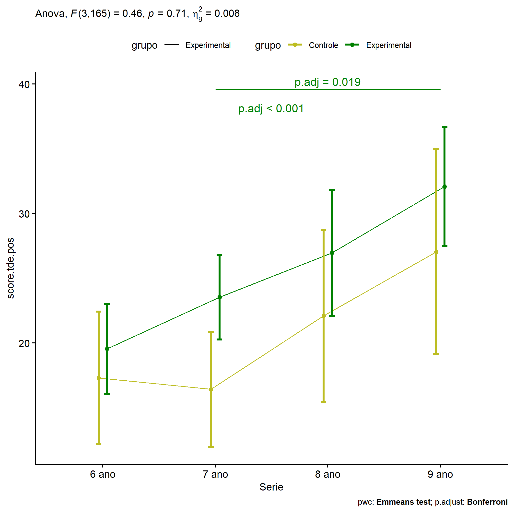<!-- -->

``` r
plots <- twoWayAncovaBoxPlots(
  wdat, "score.tde.pos", c("grupo","Serie"), aov, pwcs, covar = "score.tde.pre",
  theme = "classic", color = color[["grupo:Serie"]],
  subtitle = which(aov$Effect == "grupo:Serie"))
```

``` r
plots[["grupo:Serie"]] + ggplot2::ylab("TDE - Escrita") + ggplot2::scale_x_discrete(labels=c('pre', 'pos'))
```

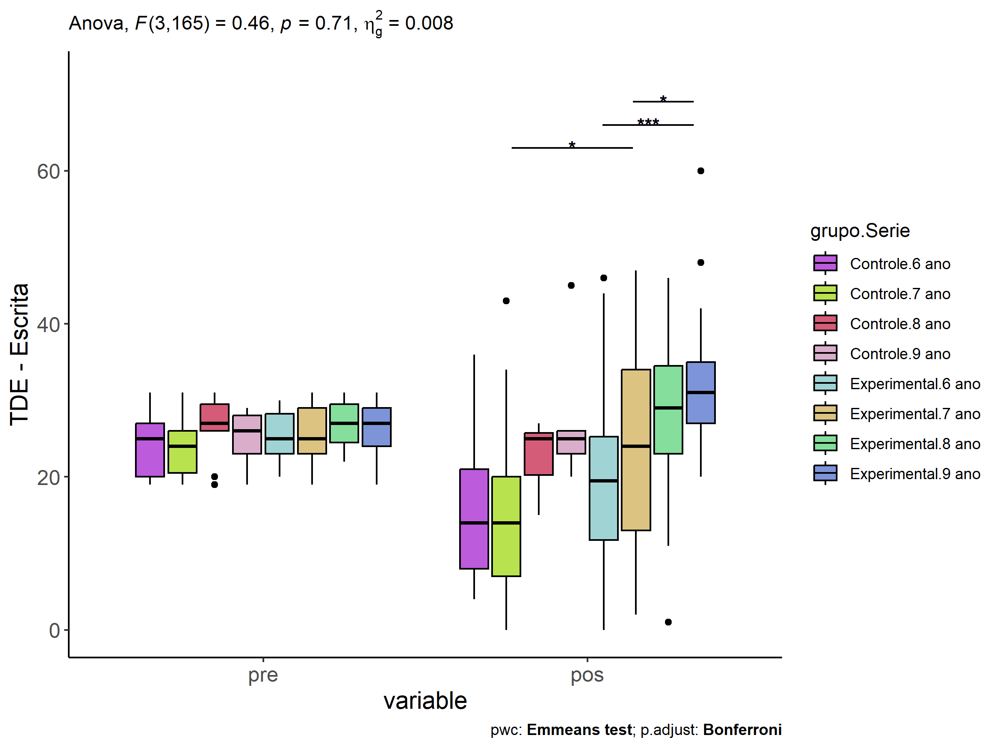<!-- -->

``` r
plots <- twoWayAncovaBoxPlots(
  wdat.long, "score.tde", c("grupo","Serie"), aov, pwc.long, pre.post = "time",
  theme = "classic", color = color$prepost)
```

``` r
plots[["grupo:Serie"]] + ggplot2::ylab("TDE - Escrita")
```

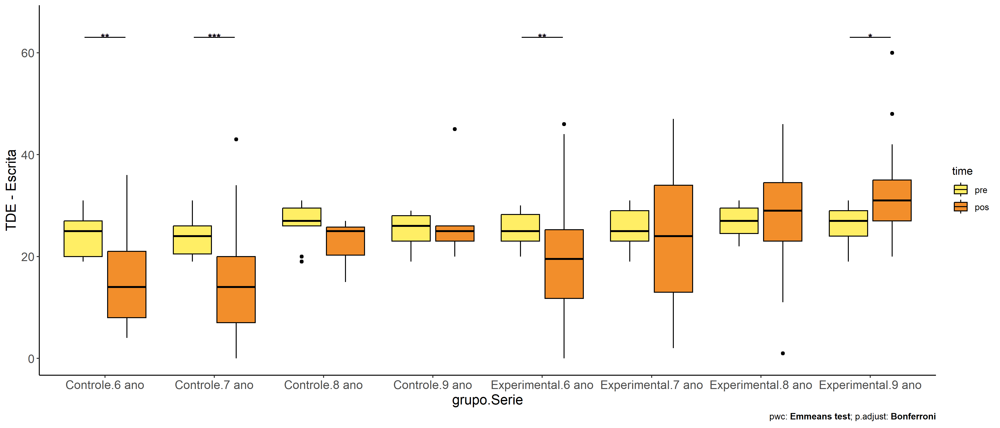<!-- -->

### Checking linearity assumption

``` r
ggscatter(wdat, x = "score.tde.pre", y = "score.tde.pos", size = 0.5,
          facet.by = c("grupo","Serie"), add = "reg.line")+
  stat_regline_equation(
    aes(label =  paste(..eq.label.., ..rr.label.., sep = "~~~~"))
  )
```

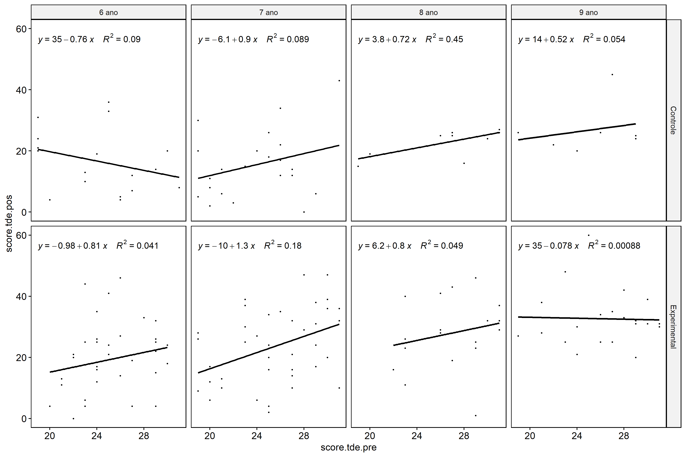<!-- -->

### Checking normality and homogeneity

``` r
res <- augment(lm(score.tde.pos ~ score.tde.pre + grupo*Serie, data = wdat))
```

``` r
shapiro_test(res$.resid)
```

    ## # A tibble: 1 × 3
    ##   variable   statistic p.value
    ##   <chr>          <dbl>   <dbl>
    ## 1 res$.resid     0.989   0.207

``` r
levene_test(res, .resid ~ grupo*Serie)
```

    ## # A tibble: 1 × 4
    ##     df1   df2 statistic      p
    ##   <int> <int>     <dbl>  <dbl>
    ## 1     7   166      2.24 0.0335

# Summary of Results

## Descriptive Statistics

``` r
df <- get.descriptives(ldat[["grupo"]], c(dv.pre, dv.pos), c("grupo"), 
                       include.global = T, symmetry.test = T, normality.test = F)
df <- plyr::rbind.fill(
  df, do.call(plyr::rbind.fill, lapply(lfatores2, FUN = function(f) {
    if (nrow(dat) > 0 && sum(!is.na(unique(dat[[f]]))) > 1)
      get.descriptives(ldat[[paste0("grupo:",f)]], c(dv.pre,dv.pos), c("grupo", f),
                       symmetry.test = T, normality.test = F)
    }))
)
(df <- df[,c(fatores1[fatores1 %in% colnames(df)],"variable",
             colnames(df)[!colnames(df) %in% c(fatores1,"variable")])])
```

    ##           grupo Sexo   Zona Cor.Raca Serie      variable   n   mean median min max     sd    se    ci
    ## 1      Controle <NA>   <NA>     <NA>  <NA> score.tde.pre  57 24.561   25.0  19  31  3.827 0.507 1.015
    ## 2  Experimental <NA>   <NA>     <NA>  <NA> score.tde.pre 117 25.855   26.0  19  31  3.422 0.316 0.627
    ## 3          <NA> <NA>   <NA>     <NA>  <NA> score.tde.pre 174 25.431   26.0  19  31  3.600 0.273 0.539
    ## 4      Controle <NA>   <NA>     <NA>  <NA> score.tde.pos  57 18.421   19.0   0  45 10.089 1.336 2.677
    ## 5  Experimental <NA>   <NA>     <NA>  <NA> score.tde.pos 117 24.675   25.0   0  60 12.203 1.128 2.234
    ## 6          <NA> <NA>   <NA>     <NA>  <NA> score.tde.pos 174 22.626   24.0   0  60 11.894 0.902 1.780
    ## 7      Controle    F   <NA>     <NA>  <NA> score.tde.pre  30 25.033   26.0  19  31  3.690 0.674 1.378
    ## 8      Controle    M   <NA>     <NA>  <NA> score.tde.pre  27 24.037   24.0  19  31  3.976 0.765 1.573
    ## 9  Experimental    F   <NA>     <NA>  <NA> score.tde.pre  49 26.184   26.0  19  31  3.073 0.439 0.883
    ## 10 Experimental    M   <NA>     <NA>  <NA> score.tde.pre  68 25.618   25.5  19  31  3.657 0.443 0.885
    ## 11     Controle    F   <NA>     <NA>  <NA> score.tde.pos  30 18.033   18.0   0  36  9.800 1.789 3.659
    ## 12     Controle    M   <NA>     <NA>  <NA> score.tde.pos  27 18.852   20.0   3  45 10.571 2.034 4.182
    ## 13 Experimental    F   <NA>     <NA>  <NA> score.tde.pos  49 24.510   25.0   2  60 12.045 1.721 3.460
    ## 14 Experimental    M   <NA>     <NA>  <NA> score.tde.pos  68 24.794   25.5   0  48 12.403 1.504 3.002
    ## 15     Controle <NA>  Rural     <NA>  <NA> score.tde.pre  21 23.429   25.0  19  31  3.429 0.748 1.561
    ## 16     Controle <NA> Urbana     <NA>  <NA> score.tde.pre  20 25.150   26.0  19  31  3.787 0.847 1.773
    ## 17 Experimental <NA>  Rural     <NA>  <NA> score.tde.pre  55 25.891   26.0  19  31  3.494 0.471 0.945
    ## 18 Experimental <NA> Urbana     <NA>  <NA> score.tde.pre  27 25.778   26.0  19  31  3.389 0.652 1.341
    ## 19     Controle <NA>  Rural     <NA>  <NA> score.tde.pos  21 26.238   24.0   4  66 16.325 3.562 7.431
    ## 20     Controle <NA> Urbana     <NA>  <NA> score.tde.pos  20 12.200   12.0   0  27  7.682 1.718 3.595
    ## 21 Experimental <NA>  Rural     <NA>  <NA> score.tde.pos  55 25.873   26.0   1  48 11.898 1.604 3.216
    ## 22 Experimental <NA> Urbana     <NA>  <NA> score.tde.pos  27 18.889   20.0   0  39 11.157 2.147 4.414
    ## 23     Controle <NA>   <NA>    Parda  <NA> score.tde.pre  17 25.765   27.0  19  31  3.474 0.842 1.786
    ## 24 Experimental <NA>   <NA>   Branca  <NA> score.tde.pre   9 27.111   27.0  23  30  2.147 0.716 1.651
    ## 25 Experimental <NA>   <NA>    Parda  <NA> score.tde.pre  46 25.239   25.0  19  31  3.465 0.511 1.029
    ## 26     Controle <NA>   <NA>    Parda  <NA> score.tde.pos  17 17.706   19.0   3  45 10.833 2.627 5.570
    ## 27 Experimental <NA>   <NA>   Branca  <NA> score.tde.pos   9 20.222   21.0   1  39 11.987 3.996 9.214
    ## 28 Experimental <NA>   <NA>    Parda  <NA> score.tde.pos  46 25.565   26.0   0  60 13.096 1.931 3.889
    ## 29     Controle <NA>   <NA>     <NA> 6 ano score.tde.pre  17 24.235   25.0  19  31  3.993 0.968 2.053
    ## 30     Controle <NA>   <NA>     <NA> 7 ano score.tde.pre  23 23.783   24.0  19  31  3.516 0.733 1.520
    ## 31     Controle <NA>   <NA>     <NA> 8 ano score.tde.pre  10 26.500   27.0  19  31  4.143 1.310 2.964
    ## 32     Controle <NA>   <NA>     <NA> 9 ano score.tde.pre   7 25.143   26.0  19  29  3.716 1.405 3.437
    ## 33 Experimental <NA>   <NA>     <NA> 6 ano score.tde.pre  36 25.361   25.0  20  30  2.929 0.488 0.991
    ## 34 Experimental <NA>   <NA>     <NA> 7 ano score.tde.pre  41 25.512   25.0  19  31  3.854 0.602 1.217
    ## 35 Experimental <NA>   <NA>     <NA> 8 ano score.tde.pre  19 27.105   27.0  22  31  3.107 0.713 1.498
    ## 36 Experimental <NA>   <NA>     <NA> 9 ano score.tde.pre  21 26.238   27.0  19  31  3.491 0.762 1.589
    ## 37     Controle <NA>   <NA>     <NA> 6 ano score.tde.pos  17 16.529   14.0   4  36 10.180 2.469 5.234
    ## 38     Controle <NA>   <NA>     <NA> 7 ano score.tde.pos  23 15.348   14.0   0  43 10.628 2.216 4.596
    ## 39     Controle <NA>   <NA>     <NA> 8 ano score.tde.pos  10 22.800   25.0  15  27  4.417 1.397 3.160
    ## 40     Controle <NA>   <NA>     <NA> 9 ano score.tde.pos   7 26.857   25.0  20  45  8.295 3.135 7.672
    ## 41 Experimental <NA>   <NA>     <NA> 6 ano score.tde.pos  36 19.500   19.5   0  46 11.732 1.955 3.969
    ## 42 Experimental <NA>   <NA>     <NA> 7 ano score.tde.pos  41 23.585   24.0   2  47 12.153 1.898 3.836
    ## 43 Experimental <NA>   <NA>     <NA> 8 ano score.tde.pos  19 28.053   29.0   1  46 11.301 2.593 5.447
    ## 44 Experimental <NA>   <NA>     <NA> 9 ano score.tde.pos  21 32.619   31.0  20  60  9.206 2.009 4.190
    ##      iqr symmetry     skewness    kurtosis
    ## 1   6.00      YES -0.066748301 -1.20427969
    ## 2   6.00      YES -0.217617538 -1.04407497
    ## 3   6.00      YES -0.206239026 -1.03121365
    ## 4  13.00      YES  0.323855174 -0.22453508
    ## 5  16.00      YES  0.028008403 -0.42911671
    ## 6  17.00      YES  0.191069359 -0.38692742
    ## 7   5.50      YES -0.323964682 -1.08266538
    ## 8   6.50      YES  0.214141458 -1.25756940
    ## 9   5.00      YES -0.355142923 -0.71804791
    ## 10  6.00      YES -0.098130601 -1.25932619
    ## 11 13.75      YES -0.014504317 -1.01574078
    ## 12 13.50       NO  0.590993586  0.11756211
    ## 13 15.00      YES  0.259627982  0.19677424
    ## 14 18.75      YES -0.127224882 -0.89160032
    ## 15  7.00      YES  0.062628366 -0.93021133
    ## 16  5.50      YES -0.176436007 -1.33426265
    ## 17  6.00      YES -0.258305339 -1.14867620
    ## 18  5.00      YES -0.221264635 -0.91380202
    ## 19 15.00       NO  0.871347669  0.30143417
    ## 20  9.75      YES  0.280285704 -0.89021017
    ## 21 18.00      YES -0.060283809 -0.80889653
    ## 22 18.00      YES -0.144742164 -1.32063520
    ## 23  4.00       NO -0.656114736 -0.69145692
    ## 24  2.00      YES -0.463543000 -0.90644237
    ## 25  5.00      YES  0.100679056 -1.17383000
    ## 26 17.00       NO  0.589553134 -0.02204556
    ## 27  5.00      YES -0.196385356 -1.11863413
    ## 28 16.50      YES  0.062839052 -0.29818376
    ## 29  7.00      YES  0.008999052 -1.33750916
    ## 30  5.50      YES  0.166671071 -1.17826879
    ## 31  3.50       NO -0.657986361 -0.98957018
    ## 32  5.00      YES -0.396772949 -1.51804120
    ## 33  5.25      YES  0.117125884 -1.25666021
    ## 34  6.00      YES -0.218774814 -1.22838389
    ## 35  5.00      YES -0.282282674 -1.47432950
    ## 36  5.00      YES -0.404368791 -1.03053668
    ## 37 13.00      YES  0.451637766 -1.09455627
    ## 38 13.00       NO  0.772405958  0.09495365
    ## 39  5.50       NO -0.778062780 -1.25540304
    ## 40  3.00       NO  1.377540373  0.35499836
    ## 41 13.50      YES  0.352307700 -0.50088559
    ## 42 21.00      YES  0.042514179 -1.12558348
    ## 43 11.50      YES -0.497584455 -0.22949170
    ## 44  8.00       NO  1.232585808  1.53224824

| grupo        | Sexo | Zona   | Cor.Raca | Serie | variable      |   n |   mean | median | min | max |     sd |    se |    ci |   iqr | symmetry | skewness | kurtosis |
|:-------------|:-----|:-------|:---------|:------|:--------------|----:|-------:|-------:|----:|----:|-------:|------:|------:|------:|:---------|---------:|---------:|
| Controle     |      |        |          |       | score.tde.pre |  57 | 24.561 |   25.0 |  19 |  31 |  3.827 | 0.507 | 1.015 |  6.00 | YES      |   -0.067 |   -1.204 |
| Experimental |      |        |          |       | score.tde.pre | 117 | 25.855 |   26.0 |  19 |  31 |  3.422 | 0.316 | 0.627 |  6.00 | YES      |   -0.218 |   -1.044 |
|              |      |        |          |       | score.tde.pre | 174 | 25.431 |   26.0 |  19 |  31 |  3.600 | 0.273 | 0.539 |  6.00 | YES      |   -0.206 |   -1.031 |
| Controle     |      |        |          |       | score.tde.pos |  57 | 18.421 |   19.0 |   0 |  45 | 10.089 | 1.336 | 2.677 | 13.00 | YES      |    0.324 |   -0.225 |
| Experimental |      |        |          |       | score.tde.pos | 117 | 24.675 |   25.0 |   0 |  60 | 12.203 | 1.128 | 2.234 | 16.00 | YES      |    0.028 |   -0.429 |
|              |      |        |          |       | score.tde.pos | 174 | 22.626 |   24.0 |   0 |  60 | 11.894 | 0.902 | 1.780 | 17.00 | YES      |    0.191 |   -0.387 |
| Controle     | F    |        |          |       | score.tde.pre |  30 | 25.033 |   26.0 |  19 |  31 |  3.690 | 0.674 | 1.378 |  5.50 | YES      |   -0.324 |   -1.083 |
| Controle     | M    |        |          |       | score.tde.pre |  27 | 24.037 |   24.0 |  19 |  31 |  3.976 | 0.765 | 1.573 |  6.50 | YES      |    0.214 |   -1.258 |
| Experimental | F    |        |          |       | score.tde.pre |  49 | 26.184 |   26.0 |  19 |  31 |  3.073 | 0.439 | 0.883 |  5.00 | YES      |   -0.355 |   -0.718 |
| Experimental | M    |        |          |       | score.tde.pre |  68 | 25.618 |   25.5 |  19 |  31 |  3.657 | 0.443 | 0.885 |  6.00 | YES      |   -0.098 |   -1.259 |
| Controle     | F    |        |          |       | score.tde.pos |  30 | 18.033 |   18.0 |   0 |  36 |  9.800 | 1.789 | 3.659 | 13.75 | YES      |   -0.015 |   -1.016 |
| Controle     | M    |        |          |       | score.tde.pos |  27 | 18.852 |   20.0 |   3 |  45 | 10.571 | 2.034 | 4.182 | 13.50 | NO       |    0.591 |    0.118 |
| Experimental | F    |        |          |       | score.tde.pos |  49 | 24.510 |   25.0 |   2 |  60 | 12.045 | 1.721 | 3.460 | 15.00 | YES      |    0.260 |    0.197 |
| Experimental | M    |        |          |       | score.tde.pos |  68 | 24.794 |   25.5 |   0 |  48 | 12.403 | 1.504 | 3.002 | 18.75 | YES      |   -0.127 |   -0.892 |
| Controle     |      | Rural  |          |       | score.tde.pre |  21 | 23.429 |   25.0 |  19 |  31 |  3.429 | 0.748 | 1.561 |  7.00 | YES      |    0.063 |   -0.930 |
| Controle     |      | Urbana |          |       | score.tde.pre |  20 | 25.150 |   26.0 |  19 |  31 |  3.787 | 0.847 | 1.773 |  5.50 | YES      |   -0.176 |   -1.334 |
| Experimental |      | Rural  |          |       | score.tde.pre |  55 | 25.891 |   26.0 |  19 |  31 |  3.494 | 0.471 | 0.945 |  6.00 | YES      |   -0.258 |   -1.149 |
| Experimental |      | Urbana |          |       | score.tde.pre |  27 | 25.778 |   26.0 |  19 |  31 |  3.389 | 0.652 | 1.341 |  5.00 | YES      |   -0.221 |   -0.914 |
| Controle     |      | Rural  |          |       | score.tde.pos |  21 | 26.238 |   24.0 |   4 |  66 | 16.325 | 3.562 | 7.431 | 15.00 | NO       |    0.871 |    0.301 |
| Controle     |      | Urbana |          |       | score.tde.pos |  20 | 12.200 |   12.0 |   0 |  27 |  7.682 | 1.718 | 3.595 |  9.75 | YES      |    0.280 |   -0.890 |
| Experimental |      | Rural  |          |       | score.tde.pos |  55 | 25.873 |   26.0 |   1 |  48 | 11.898 | 1.604 | 3.216 | 18.00 | YES      |   -0.060 |   -0.809 |
| Experimental |      | Urbana |          |       | score.tde.pos |  27 | 18.889 |   20.0 |   0 |  39 | 11.157 | 2.147 | 4.414 | 18.00 | YES      |   -0.145 |   -1.321 |
| Controle     |      |        | Parda    |       | score.tde.pre |  17 | 25.765 |   27.0 |  19 |  31 |  3.474 | 0.842 | 1.786 |  4.00 | NO       |   -0.656 |   -0.691 |
| Experimental |      |        | Branca   |       | score.tde.pre |   9 | 27.111 |   27.0 |  23 |  30 |  2.147 | 0.716 | 1.651 |  2.00 | YES      |   -0.464 |   -0.906 |
| Experimental |      |        | Parda    |       | score.tde.pre |  46 | 25.239 |   25.0 |  19 |  31 |  3.465 | 0.511 | 1.029 |  5.00 | YES      |    0.101 |   -1.174 |
| Controle     |      |        | Parda    |       | score.tde.pos |  17 | 17.706 |   19.0 |   3 |  45 | 10.833 | 2.627 | 5.570 | 17.00 | NO       |    0.590 |   -0.022 |
| Experimental |      |        | Branca   |       | score.tde.pos |   9 | 20.222 |   21.0 |   1 |  39 | 11.987 | 3.996 | 9.214 |  5.00 | YES      |   -0.196 |   -1.119 |
| Experimental |      |        | Parda    |       | score.tde.pos |  46 | 25.565 |   26.0 |   0 |  60 | 13.096 | 1.931 | 3.889 | 16.50 | YES      |    0.063 |   -0.298 |
| Controle     |      |        |          | 6 ano | score.tde.pre |  17 | 24.235 |   25.0 |  19 |  31 |  3.993 | 0.968 | 2.053 |  7.00 | YES      |    0.009 |   -1.338 |
| Controle     |      |        |          | 7 ano | score.tde.pre |  23 | 23.783 |   24.0 |  19 |  31 |  3.516 | 0.733 | 1.520 |  5.50 | YES      |    0.167 |   -1.178 |
| Controle     |      |        |          | 8 ano | score.tde.pre |  10 | 26.500 |   27.0 |  19 |  31 |  4.143 | 1.310 | 2.964 |  3.50 | NO       |   -0.658 |   -0.990 |
| Controle     |      |        |          | 9 ano | score.tde.pre |   7 | 25.143 |   26.0 |  19 |  29 |  3.716 | 1.405 | 3.437 |  5.00 | YES      |   -0.397 |   -1.518 |
| Experimental |      |        |          | 6 ano | score.tde.pre |  36 | 25.361 |   25.0 |  20 |  30 |  2.929 | 0.488 | 0.991 |  5.25 | YES      |    0.117 |   -1.257 |
| Experimental |      |        |          | 7 ano | score.tde.pre |  41 | 25.512 |   25.0 |  19 |  31 |  3.854 | 0.602 | 1.217 |  6.00 | YES      |   -0.219 |   -1.228 |
| Experimental |      |        |          | 8 ano | score.tde.pre |  19 | 27.105 |   27.0 |  22 |  31 |  3.107 | 0.713 | 1.498 |  5.00 | YES      |   -0.282 |   -1.474 |
| Experimental |      |        |          | 9 ano | score.tde.pre |  21 | 26.238 |   27.0 |  19 |  31 |  3.491 | 0.762 | 1.589 |  5.00 | YES      |   -0.404 |   -1.031 |
| Controle     |      |        |          | 6 ano | score.tde.pos |  17 | 16.529 |   14.0 |   4 |  36 | 10.180 | 2.469 | 5.234 | 13.00 | YES      |    0.452 |   -1.095 |
| Controle     |      |        |          | 7 ano | score.tde.pos |  23 | 15.348 |   14.0 |   0 |  43 | 10.628 | 2.216 | 4.596 | 13.00 | NO       |    0.772 |    0.095 |
| Controle     |      |        |          | 8 ano | score.tde.pos |  10 | 22.800 |   25.0 |  15 |  27 |  4.417 | 1.397 | 3.160 |  5.50 | NO       |   -0.778 |   -1.255 |
| Controle     |      |        |          | 9 ano | score.tde.pos |   7 | 26.857 |   25.0 |  20 |  45 |  8.295 | 3.135 | 7.672 |  3.00 | NO       |    1.378 |    0.355 |
| Experimental |      |        |          | 6 ano | score.tde.pos |  36 | 19.500 |   19.5 |   0 |  46 | 11.732 | 1.955 | 3.969 | 13.50 | YES      |    0.352 |   -0.501 |
| Experimental |      |        |          | 7 ano | score.tde.pos |  41 | 23.585 |   24.0 |   2 |  47 | 12.153 | 1.898 | 3.836 | 21.00 | YES      |    0.043 |   -1.126 |
| Experimental |      |        |          | 8 ano | score.tde.pos |  19 | 28.053 |   29.0 |   1 |  46 | 11.301 | 2.593 | 5.447 | 11.50 | YES      |   -0.498 |   -0.229 |
| Experimental |      |        |          | 9 ano | score.tde.pos |  21 | 32.619 |   31.0 |  20 |  60 |  9.206 | 2.009 | 4.190 |  8.00 | NO       |    1.233 |    1.532 |

## ANCOVA Table Comparison

``` r
df <- do.call(plyr::rbind.fill, laov)
(df <- df[!duplicated(df$Effect),])
```

    ##            Effect DFn DFd      F        p p<.05      ges DFn' DFd'     F'       p' p<.05'    ges'
    ## 1           grupo   1 171  7.979 5.00e-03     * 0.045000    1  173  3.443 6.50e-02        0.02000
    ## 2   score.tde.pre   1 171 11.710 7.78e-04     * 0.064000    1  173  9.459 2.00e-03      * 0.05200
    ## 4      grupo:Sexo   1 169  0.060 8.07e-01       0.000354    1  171  0.067 7.96e-01        0.00039
    ## 6            Sexo   1 169  0.371 5.43e-01       0.002000    1  171  0.341 5.60e-01        0.00200
    ## 8      grupo:Zona   1 118  3.460 6.50e-02       0.028000    1  118  3.460 6.50e-02        0.02800
    ## 10           Zona   1 118 20.264 1.59e-05     * 0.147000    1  118 20.264 1.59e-05      * 0.14700
    ## 11       Cor.Raca   1  68  2.561 1.14e-01       0.036000    1   68  2.561 1.14e-01        0.03600
    ## 13 grupo:Cor.Raca   0  68     NA       NA  <NA>       NA    0   68     NA       NA   <NA>      NA
    ## 16    grupo:Serie   3 165  0.455 7.14e-01       0.008000    3  167  0.108 9.56e-01        0.00200
    ## 18          Serie   3 165  8.237 3.86e-05     * 0.130000    3  167  6.453 3.69e-04      * 0.10400

|     | Effect         | DFn | DFd |      F |     p | p\<.05 |   ges | DFn’ | DFd’ |     F’ |    p’ | p\<.05’ |  ges’ |
|:----|:---------------|----:|----:|-------:|------:|:-------|------:|-----:|-----:|-------:|------:|:--------|------:|
| 1   | grupo          |   1 | 171 |  7.979 | 0.005 | \*     | 0.045 |    1 |  173 |  3.443 | 0.065 |         | 0.020 |
| 2   | score.tde.pre  |   1 | 171 | 11.710 | 0.001 | \*     | 0.064 |    1 |  173 |  9.459 | 0.002 | \*      | 0.052 |
| 4   | grupo:Sexo     |   1 | 169 |  0.060 | 0.807 |        | 0.000 |    1 |  171 |  0.067 | 0.796 |         | 0.000 |
| 6   | Sexo           |   1 | 169 |  0.371 | 0.543 |        | 0.002 |    1 |  171 |  0.341 | 0.560 |         | 0.002 |
| 8   | grupo:Zona     |   1 | 118 |  3.460 | 0.065 |        | 0.028 |    1 |  118 |  3.460 | 0.065 |         | 0.028 |
| 10  | Zona           |   1 | 118 | 20.264 | 0.000 | \*     | 0.147 |    1 |  118 | 20.264 | 0.000 | \*      | 0.147 |
| 11  | Cor.Raca       |   1 |  68 |  2.561 | 0.114 |        | 0.036 |    1 |   68 |  2.561 | 0.114 |         | 0.036 |
| 13  | grupo:Cor.Raca |   0 |  68 |        |       |        |       |    0 |   68 |        |       |         |       |
| 16  | grupo:Serie    |   3 | 165 |  0.455 | 0.714 |        | 0.008 |    3 |  167 |  0.108 | 0.956 |         | 0.002 |
| 18  | Serie          |   3 | 165 |  8.237 | 0.000 | \*     | 0.130 |    3 |  167 |  6.453 | 0.000 | \*      | 0.104 |

## PairWise Table Comparison

``` r
df <- do.call(plyr::rbind.fill, lpwc)
df <- df[,c(names(lfatores), names(df)[!names(df) %in% c(names(lfatores),"term",".y.")])]
```

| grupo        | Sexo | Zona   | Cor.Raca | Serie | group1   | group2       |  df | statistic |     p | p.adj | p.adj.signif | df’ | statistic’ |    p’ | p.adj’ | p.adj.signif’ |
|:-------------|:-----|:-------|:---------|:------|:---------|:-------------|----:|----------:|------:|------:|:-------------|----:|-----------:|------:|-------:|:--------------|
| Controle     |      |        |          |       | pre      | pos          | 344 |     3.834 | 0.000 | 0.000 | \*\*\*       | 348 |      2.714 | 0.007 |  0.007 | \*\*          |
| Experimental |      |        |          |       | pre      | pos          | 344 |     1.055 | 0.292 | 0.292 | ns           | 348 |      0.985 | 0.325 |  0.325 | ns            |
|              |      |        |          |       | Controle | Experimental | 171 |    -2.825 | 0.005 | 0.005 | \*\*         | 173 |     -1.856 | 0.065 |  0.065 | ns            |
| Controle     | F    |        |          |       | pre      | pos          | 340 |     3.154 | 0.002 | 0.002 | \*\*         | 344 |      2.346 | 0.020 |  0.020 | \*            |
| Controle     | M    |        |          |       | pre      | pos          | 340 |     2.217 | 0.027 | 0.027 | \*           | 344 |      1.452 | 0.147 |  0.147 | ns            |
| Controle     |      |        |          |       | F        | M            | 169 |    -0.552 | 0.582 | 0.582 | ns           | 171 |     -0.551 | 0.582 |  0.582 | ns            |
| Experimental | F    |        |          |       | pre      | pos          | 340 |     0.964 | 0.336 | 0.336 | ns           | 344 |      0.900 | 0.369 |  0.369 | ns            |
| Experimental | M    |        |          |       | pre      | pos          | 340 |     0.559 | 0.577 | 0.577 | ns           | 344 |      0.522 | 0.602 |  0.602 | ns            |
| Experimental |      |        |          |       | F        | M            | 169 |    -0.359 | 0.720 | 0.720 | ns           | 171 |     -0.325 | 0.746 |  0.746 | ns            |
|              | F    |        |          |       | Controle | Experimental | 169 |    -2.099 | 0.037 | 0.037 | \*           | 171 |     -1.431 | 0.154 |  0.154 | ns            |
|              | M    |        |          |       | Controle | Experimental | 169 |    -1.782 | 0.077 | 0.077 | ns           | 171 |     -1.092 | 0.276 |  0.276 | ns            |
| Controle     |      |        |          |       | Rural    | Urbana       | 118 |     4.179 | 0.000 | 0.000 | \*\*\*\*     | 118 |      4.179 | 0.000 |  0.000 | \*\*\*\*      |
| Controle     |      | Rural  |          |       | pre      | pos          | 238 |    -1.024 | 0.307 | 0.307 | ns           | 238 |     -1.024 | 0.307 |  0.307 | ns            |
| Controle     |      | Urbana |          |       | pre      | pos          | 238 |     4.608 | 0.000 | 0.000 | \*\*\*\*     | 238 |      4.608 | 0.000 |  0.000 | \*\*\*\*      |
| Experimental |      |        |          |       | Rural    | Urbana       | 118 |     2.495 | 0.014 | 0.014 | \*           | 118 |      2.495 | 0.014 |  0.014 | \*            |
| Experimental |      | Rural  |          |       | pre      | pos          | 238 |     0.011 | 0.991 | 0.991 | ns           | 238 |      0.011 | 0.991 |  0.991 | ns            |
| Experimental |      | Urbana |          |       | pre      | pos          | 238 |     2.848 | 0.005 | 0.005 | \*\*         | 238 |      2.848 | 0.005 |  0.005 | \*\*          |
|              |      | Rural  |          |       | Controle | Experimental | 118 |     0.788 | 0.432 | 0.432 | ns           | 118 |      0.788 | 0.432 |  0.432 | ns            |
|              |      | Urbana |          |       | Controle | Experimental | 118 |    -1.774 | 0.079 | 0.079 | ns           | 118 |     -1.774 | 0.079 |  0.079 | ns            |
| Controle     |      |        | Branca   |       | pre      | pos          |     |           |       |       |              |     |            |       |        |               |
| Controle     |      |        |          |       | Branca   | Parda        |     |           |       |       |              |     |            |       |        |               |
| Controle     |      |        | Parda    |       | pre      | pos          | 138 |     2.572 | 0.011 | 0.011 | \*           | 138 |      2.572 | 0.011 |  0.011 | \*            |
| Experimental |      |        | Branca   |       | pre      | pos          | 138 |     1.600 | 0.112 | 0.112 | ns           | 138 |      1.600 | 0.112 |  0.112 | ns            |
| Experimental |      |        |          |       | Branca   | Parda        |  68 |    -1.600 | 0.114 | 0.114 | ns           |  68 |     -1.600 | 0.114 |  0.114 | ns            |
| Experimental |      |        | Parda    |       | pre      | pos          | 138 |    -0.171 | 0.864 | 0.864 | ns           | 138 |     -0.171 | 0.864 |  0.864 | ns            |
|              |      |        | Branca   |       | Controle | Experimental |     |           |       |       |              |     |            |       |        |               |
|              |      |        | Parda    |       | Controle | Experimental |  68 |    -2.429 | 0.018 | 0.018 | \*           |  68 |     -2.429 | 0.018 |  0.018 | \*            |
| Controle     |      |        |          | 6 ano | pre      | pos          | 332 |     2.790 | 0.006 | 0.006 | \*\*         | 336 |      2.559 | 0.011 |  0.011 | \*            |
| Controle     |      |        |          | 7 ano | pre      | pos          | 332 |     3.552 | 0.000 | 0.000 | \*\*\*       | 336 |      1.836 | 0.067 |  0.067 | ns            |
| Controle     |      |        |          | 8 ano | pre      | pos          | 332 |     1.027 | 0.305 | 0.305 | ns           | 336 |      0.942 | 0.347 |  0.347 | ns            |
| Controle     |      |        |          | 9 ano | pre      | pos          | 332 |    -0.398 | 0.691 | 0.691 | ns           | 336 |     -0.365 | 0.715 |  0.715 | ns            |
| Controle     |      |        |          |       | 6 ano    | 7 ano        | 165 |     0.261 | 0.794 | 1.000 | ns           | 167 |     -0.814 | 0.417 |  1.000 | ns            |
| Controle     |      |        |          |       | 6 ano    | 8 ano        | 165 |    -1.125 | 0.262 | 1.000 | ns           | 167 |     -1.014 | 0.312 |  1.000 | ns            |
| Controle     |      |        |          |       | 6 ano    | 9 ano        | 165 |    -2.042 | 0.043 | 0.257 | ns           | 167 |     -1.848 | 0.066 |  0.398 | ns            |
| Controle     |      |        |          |       | 7 ano    | 8 ano        | 165 |    -1.396 | 0.165 | 0.987 | ns           | 167 |     -0.399 | 0.690 |  1.000 | ns            |
| Controle     |      |        |          |       | 7 ano    | 9 ano        | 165 |    -2.314 | 0.022 | 0.131 | ns           | 167 |     -1.340 | 0.182 |  1.000 | ns            |
| Controle     |      |        |          |       | 8 ano    | 9 ano        | 165 |    -0.944 | 0.347 | 1.000 | ns           | 167 |     -0.857 | 0.392 |  1.000 | ns            |
| Experimental |      |        |          | 6 ano | pre      | pos          | 332 |     3.088 | 0.002 | 0.002 | \*\*         | 336 |      2.832 | 0.005 |  0.005 | \*\*          |
| Experimental |      |        |          | 7 ano | pre      | pos          | 332 |     1.083 | 0.279 | 0.279 | ns           | 336 |      0.994 | 0.321 |  0.321 | ns            |
| Experimental |      |        |          | 8 ano | pre      | pos          | 332 |    -0.363 | 0.717 | 0.717 | ns           | 336 |     -0.333 | 0.740 |  0.740 | ns            |
| Experimental |      |        |          | 9 ano | pre      | pos          | 332 |    -2.568 | 0.011 | 0.011 | \*           | 336 |     -2.355 | 0.019 |  0.019 | \*            |
| Experimental |      |        |          |       | 6 ano    | 7 ano        | 165 |    -1.645 | 0.102 | 0.611 | ns           | 167 |     -1.490 | 0.138 |  0.829 | ns            |
| Experimental |      |        |          |       | 6 ano    | 8 ano        | 165 |    -2.443 | 0.016 | 0.094 | ns           | 167 |     -2.208 | 0.029 |  0.172 | ns            |
| Experimental |      |        |          |       | 6 ano    | 9 ano        | 165 |    -4.297 | 0.000 | 0.000 | \*\*\*       | 167 |     -3.890 | 0.000 |  0.001 | \*\*\*        |
| Experimental |      |        |          |       | 7 ano    | 8 ano        | 165 |    -1.155 | 0.250 | 1.000 | ns           | 167 |     -1.041 | 0.299 |  1.000 | ns            |
| Experimental |      |        |          |       | 7 ano    | 9 ano        | 165 |    -3.002 | 0.003 | 0.019 | \*           | 167 |     -2.717 | 0.007 |  0.044 | \*            |
| Experimental |      |        |          |       | 8 ano    | 9 ano        | 165 |    -1.525 | 0.129 | 0.775 | ns           | 167 |     -1.384 | 0.168 |  1.000 | ns            |
|              |      |        |          | 6 ano | Controle | Experimental | 165 |    -0.714 | 0.476 | 0.476 | ns           | 167 |     -0.643 | 0.521 |  0.521 | ns            |
|              |      |        |          | 7 ano | Controle | Experimental | 165 |    -2.546 | 0.012 | 0.012 | \*           | 167 |     -1.069 | 0.287 |  0.287 | ns            |
|              |      |        |          | 8 ano | Controle | Experimental | 165 |    -1.171 | 0.243 | 0.243 | ns           | 167 |     -1.060 | 0.291 |  0.291 | ns            |
|              |      |        |          | 9 ano | Controle | Experimental | 165 |    -1.089 | 0.278 | 0.278 | ns           | 167 |     -0.984 | 0.327 |  0.327 | ns            |

## EMMS Table Comparison

``` r
df <- do.call(plyr::rbind.fill, lemms)
df[["N-N'"]] <- df[["N"]] - df[["N'"]]
df <- df[,c(names(lfatores), names(df)[!names(df) %in% names(lfatores)])]
```

| grupo        | Sexo | Zona   | Cor.Raca | Serie |   N | M (pre) | SE (pre) | M (unadj) | SE (unadj) | M (adj) | SE (adj) |  N’ | M (pre)’ | SE (pre)’ | M (unadj)’ | SE (unadj)’ | M (adj)’ | SE (adj)’ | N-N’ |
|:-------------|:-----|:-------|:---------|:------|----:|--------:|---------:|----------:|-----------:|--------:|---------:|----:|---------:|----------:|-----------:|------------:|---------:|----------:|-----:|
| Controle     |      |        |          |       |  57 |  24.561 |    0.507 |    18.421 |      1.336 |  19.136 |    1.500 |  59 |   24.542 |     0.492 |     19.966 |       1.686 |   20.664 |     1.600 |   -2 |
| Experimental |      |        |          |       | 117 |  25.855 |    0.316 |    24.675 |      1.128 |  24.327 |    1.042 | 117 |   25.855 |     0.316 |     24.675 |       1.128 |   24.323 |     1.130 |    0 |
| Controle     | F    |        |          |       |  30 |  25.033 |    0.674 |    18.033 |      1.789 |  18.367 |    2.059 |  31 |   24.935 |     0.659 |     19.452 |       2.237 |   19.842 |     2.198 |   -1 |
| Controle     | M    |        |          |       |  27 |  24.037 |    0.765 |    18.852 |      2.034 |  20.021 |    2.194 |  28 |   24.107 |     0.741 |     20.536 |       2.584 |   21.602 |     2.335 |   -1 |
| Experimental | F    |        |          |       |  49 |  26.184 |    0.439 |    24.510 |      1.721 |  23.879 |    1.620 |  49 |   26.184 |     0.439 |     24.510 |       1.721 |   23.883 |     1.757 |    0 |
| Experimental | M    |        |          |       |  68 |  25.618 |    0.443 |    24.794 |      1.504 |  24.638 |    1.367 |  68 |   25.618 |     0.443 |     24.794 |       1.504 |   24.629 |     1.483 |    0 |
| Controle     |      | Rural  |          |       |  21 |  23.429 |    0.748 |    26.238 |      3.562 |  27.842 |    2.629 |  21 |   23.429 |     0.748 |     26.238 |       3.562 |   27.842 |     2.629 |    0 |
| Controle     |      | Urbana |          |       |  20 |  25.150 |    0.847 |    12.200 |      1.718 |  12.348 |    2.627 |  20 |   25.150 |     0.847 |     12.200 |       1.718 |   12.348 |     2.627 |    0 |
| Experimental |      | Rural  |          |       |  55 |  25.891 |    0.471 |    25.873 |      1.604 |  25.394 |    1.593 |  55 |   25.891 |     0.471 |     25.873 |       1.604 |   25.394 |     1.593 |    0 |
| Experimental |      | Urbana |          |       |  27 |  25.778 |    0.652 |    18.889 |      2.147 |  18.506 |    2.265 |  27 |   25.778 |     0.652 |     18.889 |       2.147 |   18.506 |     2.265 |    0 |
| Controle     |      |        | Parda    |       |  17 |  25.765 |    0.842 |    17.706 |      2.627 |  17.541 |    2.941 |  17 |   25.765 |     0.842 |     17.706 |       2.627 |   17.541 |     2.941 |    0 |
| Experimental |      |        | Branca   |       |   9 |  27.111 |    0.716 |    20.222 |      3.996 |  18.728 |    4.095 |   9 |   27.111 |     0.716 |     20.222 |       3.996 |   18.728 |     4.095 |    0 |
| Experimental |      |        | Parda    |       |  46 |  25.239 |    0.511 |    25.565 |      1.931 |  25.919 |    1.794 |  46 |   25.239 |     0.511 |     25.565 |       1.931 |   25.919 |     1.794 |    0 |
| Controle     |      |        |          | 6 ano |  17 |  24.235 |    0.968 |    16.529 |      2.469 |  17.310 |    2.588 |  17 |   24.235 |     0.968 |     16.529 |       2.469 |   17.311 |     2.856 |    0 |
| Controle     |      |        |          | 7 ano |  23 |  23.783 |    0.733 |    15.348 |      2.216 |  16.423 |    2.245 |  25 |   23.800 |     0.683 |     19.240 |       3.379 |   20.311 |     2.378 |   -2 |
| Controle     |      |        |          | 8 ano |  10 |  26.500 |    1.310 |    22.800 |      1.397 |  22.103 |    3.364 |  10 |   26.500 |     1.310 |     22.800 |       1.397 |   22.080 |     3.713 |    0 |
| Controle     |      |        |          | 9 ano |   7 |  25.143 |    1.405 |    26.857 |      3.135 |  27.045 |    4.010 |   7 |   25.143 |     1.405 |     26.857 |       3.135 |   27.037 |     4.426 |    0 |
| Experimental |      |        |          | 6 ano |  36 |  25.361 |    0.488 |    19.500 |      1.955 |  19.546 |    1.768 |  36 |   25.361 |     0.488 |     19.500 |       1.955 |   19.536 |     1.952 |    0 |
| Experimental |      |        |          | 7 ano |  41 |  25.512 |    0.602 |    23.585 |      1.898 |  23.532 |    1.657 |  41 |   25.512 |     0.602 |     23.585 |       1.898 |   23.521 |     1.829 |    0 |
| Experimental |      |        |          | 8 ano |  19 |  27.105 |    0.713 |    28.053 |      2.593 |  26.960 |    2.465 |  19 |   27.105 |     0.713 |     28.053 |       2.593 |   26.932 |     2.721 |    0 |
| Experimental |      |        |          | 9 ano |  21 |  26.238 |    0.762 |    32.619 |      2.009 |  32.092 |    2.322 |  21 |   26.238 |     0.762 |     32.619 |       2.009 |   32.073 |     2.564 |    0 |
