ANCOVA in TDE - Escrita (TDE - Escrita)
================
Geiser C. Challco <geiser@alumni.usp.br>

- [Descriptive Statistics of Initial
  Data](#descriptive-statistics-of-initial-data)
- [ANCOVA and Pairwise for one factor:
  **grupo**](#ancova-and-pairwise-for-one-factor-grupo)
  - [Without remove non-normal data](#without-remove-non-normal-data)
  - [Computing ANCOVA and PairWise After removing non-normal data
    (OK)](#computing-ancova-and-pairwise-after-removing-non-normal-data-ok)
    - [Plots for ancova](#plots-for-ancova)
    - [Checking linearity assumption](#checking-linearity-assumption)
    - [Checking normality and
      homogeneity](#checking-normality-and-homogeneity)
- [ANCOVA and Pairwise for two factors
  **grupo:Sexo**](#ancova-and-pairwise-for-two-factors-gruposexo)
  - [Without remove non-normal data](#without-remove-non-normal-data-1)
  - [Computing ANCOVA and PairWise After removing non-normal data
    (OK)](#computing-ancova-and-pairwise-after-removing-non-normal-data-ok-1)
    - [Plots for ancova](#plots-for-ancova-1)
    - [Checking linearity assumption](#checking-linearity-assumption-1)
    - [Checking normality and
      homogeneity](#checking-normality-and-homogeneity-1)
- [ANCOVA and Pairwise for two factors
  **grupo:Zona**](#ancova-and-pairwise-for-two-factors-grupozona)
  - [Without remove non-normal data](#without-remove-non-normal-data-2)
  - [Computing ANCOVA and PairWise After removing non-normal data
    (OK)](#computing-ancova-and-pairwise-after-removing-non-normal-data-ok-2)
    - [Plots for ancova](#plots-for-ancova-2)
    - [Checking linearity assumption](#checking-linearity-assumption-2)
    - [Checking normality and
      homogeneity](#checking-normality-and-homogeneity-2)
- [ANCOVA and Pairwise for two factors
  **grupo:Cor.Raca**](#ancova-and-pairwise-for-two-factors-grupocorraca)
  - [Without remove non-normal data](#without-remove-non-normal-data-3)
  - [Computing ANCOVA and PairWise After removing non-normal data
    (OK)](#computing-ancova-and-pairwise-after-removing-non-normal-data-ok-3)
    - [Plots for ancova](#plots-for-ancova-3)
    - [Checking linearity assumption](#checking-linearity-assumption-3)
    - [Checking normality and
      homogeneity](#checking-normality-and-homogeneity-3)
- [ANCOVA and Pairwise for two factors
  **grupo:Serie**](#ancova-and-pairwise-for-two-factors-gruposerie)
  - [Without remove non-normal data](#without-remove-non-normal-data-4)
  - [Computing ANCOVA and PairWise After removing non-normal data
    (OK)](#computing-ancova-and-pairwise-after-removing-non-normal-data-ok-4)
    - [Plots for ancova](#plots-for-ancova-4)
    - [Checking linearity assumption](#checking-linearity-assumption-4)
    - [Checking normality and
      homogeneity](#checking-normality-and-homogeneity-4)
- [Summary of Results](#summary-of-results)
  - [Descriptive Statistics](#descriptive-statistics)
  - [ANCOVA Table Comparison](#ancova-table-comparison)
  - [PairWise Table Comparison](#pairwise-table-comparison)
  - [EMMS Table Comparison](#emms-table-comparison)

**NOTE**:

- Teste ANCOVA para determinar se houve diferenças significativas no
  TDE - Escrita (medido usando pre- e pos-testes).
- ANCOVA test to determine whether there were significant differences in
  TDE - Escrita (measured using pre- and post-tests).

# Descriptive Statistics of Initial Data

``` r
df <- get.descriptives(dat, c(dv.pre, dv.pos), c("grupo"), 
                       include.global = T, symmetry.test = T, normality.test = F)
df <- plyr::rbind.fill(
  df, do.call(plyr::rbind.fill, lapply(lfatores2, FUN = function(f) {
    if (nrow(dat) > 0 && sum(!is.na(unique(dat[[f]]))) > 1)
      get.descriptives(dat, c(dv.pre,dv.pos), c("grupo", f),
                       symmetry.test = T, normality.test = F)
    }))
)
(df <- df[,c(fatores1[fatores1 %in% colnames(df)],"variable",
             colnames(df)[!colnames(df) %in% c(fatores1,"variable")])])
```

    ##           grupo Sexo   Zona Cor.Raca Serie      variable   n   mean median min max     sd    se      ci
    ## 1      Controle <NA>   <NA>     <NA>  <NA> score.tde.pre  54 38.815   39.5  32  42  3.004 0.409   0.820
    ## 2  Experimental <NA>   <NA>     <NA>  <NA> score.tde.pre 141 37.383   38.0  32  42  3.177 0.268   0.529
    ## 3          <NA> <NA>   <NA>     <NA>  <NA> score.tde.pre 195 37.779   38.0  32  42  3.188 0.228   0.450
    ## 4      Controle <NA>   <NA>     <NA>  <NA> score.tde.pos  54 30.185   28.5   2  62 15.298 2.082   4.176
    ## 5  Experimental <NA>   <NA>     <NA>  <NA> score.tde.pos 141 34.872   37.0   0  64 13.013 1.096   2.167
    ## 6          <NA> <NA>   <NA>     <NA>  <NA> score.tde.pos 195 33.574   35.0   0  64 13.804 0.989   1.950
    ## 7      Controle    F   <NA>     <NA>  <NA> score.tde.pre  36 39.167   40.5  33  42  3.019 0.503   1.021
    ## 8      Controle    M   <NA>     <NA>  <NA> score.tde.pre  18 38.111   38.0  32  42  2.928 0.690   1.456
    ## 9  Experimental    F   <NA>     <NA>  <NA> score.tde.pre  61 37.557   38.0  32  42  3.101 0.397   0.794
    ## 10 Experimental    M   <NA>     <NA>  <NA> score.tde.pre  80 37.250   37.0  32  42  3.247 0.363   0.723
    ## 11     Controle    F   <NA>     <NA>  <NA> score.tde.pos  36 31.444   29.5   4  62 16.366 2.728   5.538
    ## 12     Controle    M   <NA>     <NA>  <NA> score.tde.pos  18 27.667   26.5   2  51 12.966 3.056   6.448
    ## 13 Experimental    F   <NA>     <NA>  <NA> score.tde.pos  61 36.934   39.0   0  64 14.477 1.854   3.708
    ## 14 Experimental    M   <NA>     <NA>  <NA> score.tde.pos  80 33.300   35.0   8  56 11.623 1.300   2.587
    ## 15     Controle <NA>  Rural     <NA>  <NA> score.tde.pre  23 39.522   41.0  34  42  2.998 0.625   1.296
    ## 16     Controle <NA> Urbana     <NA>  <NA> score.tde.pre  18 37.500   37.5  32  42  2.662 0.628   1.324
    ## 17     Controle <NA>   <NA>     <NA>  <NA> score.tde.pre  13 39.385   40.0  33  42  3.070 0.851   1.855
    ## 18 Experimental <NA>  Rural     <NA>  <NA> score.tde.pre  64 36.719   37.0  32  42  3.037 0.380   0.759
    ## 19 Experimental <NA> Urbana     <NA>  <NA> score.tde.pre  40 38.675   39.5  33  42  2.912 0.460   0.931
    ## 20 Experimental <NA>   <NA>     <NA>  <NA> score.tde.pre  37 37.135   37.0  32  42  3.351 0.551   1.117
    ## 21     Controle <NA>  Rural     <NA>  <NA> score.tde.pos  23 33.261   35.0   2  62 14.464 3.016   6.255
    ## 22     Controle <NA> Urbana     <NA>  <NA> score.tde.pos  18 20.722   19.0   4  39 10.910 2.572   5.426
    ## 23     Controle <NA>   <NA>     <NA>  <NA> score.tde.pos  13 37.846   33.0  10  59 16.293 4.519   9.846
    ## 24 Experimental <NA>  Rural     <NA>  <NA> score.tde.pos  64 34.500   34.5   8  64 12.866 1.608   3.214
    ## 25 Experimental <NA> Urbana     <NA>  <NA> score.tde.pos  40 34.075   36.5   8  56 13.088 2.069   4.186
    ## 26 Experimental <NA>   <NA>     <NA>  <NA> score.tde.pos  37 36.378   40.0   0  55 13.415 2.205   4.473
    ## 27     Controle <NA>   <NA>   Branca  <NA> score.tde.pre   6 38.167   38.5  35  41  2.858 1.167   2.999
    ## 28     Controle <NA>   <NA> Indígena  <NA> score.tde.pre   2 41.500   41.5  41  42  0.707 0.500   6.353
    ## 29     Controle <NA>   <NA>    Parda  <NA> score.tde.pre  22 39.045   39.5  32  42  3.031 0.646   1.344
    ## 30     Controle <NA>   <NA>     <NA>  <NA> score.tde.pre  24 38.542   38.5  33  42  3.120 0.637   1.318
    ## 31 Experimental <NA>   <NA>   Branca  <NA> score.tde.pre  15 37.867   38.0  32  42  3.137 0.810   1.737
    ## 32 Experimental <NA>   <NA> Indígena  <NA> score.tde.pre   4 35.000   35.0  32  38  2.944 1.472   4.684
    ## 33 Experimental <NA>   <NA>    Parda  <NA> score.tde.pre  34 37.147   38.0  32  42  2.904 0.498   1.013
    ## 34 Experimental <NA>   <NA>     <NA>  <NA> score.tde.pre  88 37.500   38.0  32  42  3.291 0.351   0.697
    ## 35     Controle <NA>   <NA>   Branca  <NA> score.tde.pos   6 25.667   25.0  10  43 15.188 6.200  15.939
    ## 36     Controle <NA>   <NA> Indígena  <NA> score.tde.pos   2 40.000   40.0  31  49 12.728 9.000 114.356
    ## 37     Controle <NA>   <NA>    Parda  <NA> score.tde.pos  22 29.273   28.0   2  59 18.362 3.915   8.141
    ## 38     Controle <NA>   <NA>     <NA>  <NA> score.tde.pos  24 31.333   27.5  11  62 12.586 2.569   5.315
    ## 39 Experimental <NA>   <NA>   Branca  <NA> score.tde.pos  15 37.667   40.0  10  64 14.316 3.696   7.928
    ## 40 Experimental <NA>   <NA> Indígena  <NA> score.tde.pos   4 35.250   36.5  19  49 15.019 7.510  23.899
    ## 41 Experimental <NA>   <NA>    Parda  <NA> score.tde.pos  34 32.853   31.5   8  62 14.347 2.460   5.006
    ## 42 Experimental <NA>   <NA>     <NA>  <NA> score.tde.pos  88 35.159   38.0   0  56 12.273 1.308   2.600
    ## 43     Controle <NA>   <NA>     <NA> 6 ano score.tde.pre  13 38.846   40.0  35  42  2.794 0.775   1.689
    ## 44     Controle <NA>   <NA>     <NA> 7 ano score.tde.pre  17 38.059   38.0  32  42  3.491 0.847   1.795
    ## 45     Controle <NA>   <NA>     <NA> 8 ano score.tde.pre  17 38.824   39.0  34  42  2.811 0.682   1.446
    ## 46     Controle <NA>   <NA>     <NA> 9 ano score.tde.pre   7 40.571   42.0  36  42  2.299 0.869   2.126
    ## 47 Experimental <NA>   <NA>     <NA> 6 ano score.tde.pre  43 37.116   37.0  32  42  3.064 0.467   0.943
    ## 48 Experimental <NA>   <NA>     <NA> 7 ano score.tde.pre  47 37.043   37.0  32  42  3.257 0.475   0.956
    ## 49 Experimental <NA>   <NA>     <NA> 8 ano score.tde.pre  19 37.158   38.0  32  42  2.892 0.663   1.394
    ## 50 Experimental <NA>   <NA>     <NA> 9 ano score.tde.pre  32 38.375   40.0  32  42  3.309 0.585   1.193
    ## 51     Controle <NA>   <NA>     <NA> 6 ano score.tde.pos  13 26.231   25.0  10  51 13.230 3.669   7.995
    ## 52     Controle <NA>   <NA>     <NA> 7 ano score.tde.pos  17 22.882   18.0   2  62 17.201 4.172   8.844
    ## 53     Controle <NA>   <NA>     <NA> 8 ano score.tde.pos  17 36.529   36.0  19  59 12.047 2.922   6.194
    ## 54     Controle <NA>   <NA>     <NA> 9 ano score.tde.pos   7 39.857   40.0  26  56 11.539 4.361  10.672
    ## 55 Experimental <NA>   <NA>     <NA> 6 ano score.tde.pos  43 28.651   29.0   8  50 12.002 1.830   3.694
    ##      iqr symmetry     skewness   kurtosis
    ## 1   5.00       NO -0.509831113 -1.0485130
    ## 2   6.00      YES -0.147201825 -1.2207501
    ## 3   6.00      YES -0.246413553 -1.1833896
    ## 4  22.25      YES  0.232127697 -0.8690440
    ## 5  18.00      YES -0.298224608 -0.4827593
    ## 6  19.00      YES -0.162544077 -0.6708477
    ## 7   6.00       NO -0.609411628 -1.2393573
    ## 8   3.75      YES -0.368624282 -0.7204237
    ## 9   5.00      YES -0.161299718 -1.2516282
    ## 10  6.00      YES -0.124855953 -1.2538468
    ## 11 24.25      YES  0.188492192 -1.1448664
    ## 12 15.00      YES  0.038909152 -0.6839383
    ## 13 21.00      YES -0.358425522 -0.5860562
    ## 14 17.00      YES -0.429729907 -0.6477708
    ## 15  5.50       NO -0.659549835 -1.4175064
    ## 16  3.50      YES -0.317939189 -0.6877689
    ## 17  3.00       NO -0.894091709 -0.5954800
    ## 18  5.00      YES -0.013620947 -1.2347596
    ## 19  4.50      YES -0.408012618 -1.2161271
    ## 20  6.00      YES -0.092633712 -1.3728105
    ## 21 20.00      YES -0.135561086 -0.6817796
    ## 22 17.25      YES  0.320644752 -1.2915618
    ## 23 25.00      YES -0.047618296 -1.5219915
    ## 24 17.75      YES  0.113271422 -0.5084375
    ## 25 18.50      YES -0.476822349 -0.7938851
    ## 26 17.00       NO -0.750866191 -0.1742736
    ## 27  5.25      YES -0.096011746 -2.1424754
    ## 28  0.50 few data  0.000000000  0.0000000
    ## 29  5.00       NO -0.638629802 -0.7593063
    ## 30  5.25      YES -0.346589076 -1.3607215
    ## 31  5.00      YES -0.338910622 -1.3774598
    ## 32  4.50      YES  0.000000000 -2.3542899
    ## 33  4.00      YES -0.148791409 -0.9781866
    ## 34  6.00      YES -0.153095029 -1.3365518
    ## 35 25.75      YES  0.033090499 -2.2265180
    ## 36  9.00 few data  0.000000000  0.0000000
    ## 37 28.75      YES  0.200415055 -1.3775207
    ## 38 13.25       NO  0.694437954 -0.3021025
    ## 39 18.00      YES -0.183293611 -0.8405963
    ## 40 23.25      YES -0.063502884 -2.3522233
    ## 41 18.50      YES  0.144540065 -0.7610239
    ## 42 15.25       NO -0.573125905 -0.2623033
    ## 43  4.00      YES -0.235214418 -1.7083157
    ## 44  6.00      YES -0.344969392 -1.4650201
    ## 45  5.00      YES -0.291036949 -1.3375883
    ## 46  2.00       NO -1.030658114 -0.6503928
    ## 47  5.50      YES  0.009167589 -1.1209255
    ## 48  6.00      YES -0.048220595 -1.2472626
    ## 49  4.00      YES -0.174931028 -1.3478565
    ## 50  5.25       NO -0.553240763 -1.2367553
    ## 51 15.00       NO  0.630282324 -0.8522878
    ## 52 20.00       NO  0.794599099 -0.5928933
    ## 53 14.00      YES  0.472195596 -0.8824271
    ## 54 16.50      YES  0.104833109 -1.7549161
    ## 55 20.50      YES -0.051899388 -1.0906156
    ##  [ reached 'max' / getOption("max.print") -- omitted 3 rows ]

| grupo        | Sexo | Zona   | Cor.Raca | Serie | variable      |   n |   mean | median | min | max |     sd |    se |      ci |   iqr | symmetry | skewness | kurtosis |
|:-------------|:-----|:-------|:---------|:------|:--------------|----:|-------:|-------:|----:|----:|-------:|------:|--------:|------:|:---------|---------:|---------:|
| Controle     |      |        |          |       | score.tde.pre |  54 | 38.815 |   39.5 |  32 |  42 |  3.004 | 0.409 |   0.820 |  5.00 | NO       |   -0.510 |   -1.049 |
| Experimental |      |        |          |       | score.tde.pre | 141 | 37.383 |   38.0 |  32 |  42 |  3.177 | 0.268 |   0.529 |  6.00 | YES      |   -0.147 |   -1.221 |
|              |      |        |          |       | score.tde.pre | 195 | 37.779 |   38.0 |  32 |  42 |  3.188 | 0.228 |   0.450 |  6.00 | YES      |   -0.246 |   -1.183 |
| Controle     |      |        |          |       | score.tde.pos |  54 | 30.185 |   28.5 |   2 |  62 | 15.298 | 2.082 |   4.176 | 22.25 | YES      |    0.232 |   -0.869 |
| Experimental |      |        |          |       | score.tde.pos | 141 | 34.872 |   37.0 |   0 |  64 | 13.013 | 1.096 |   2.167 | 18.00 | YES      |   -0.298 |   -0.483 |
|              |      |        |          |       | score.tde.pos | 195 | 33.574 |   35.0 |   0 |  64 | 13.804 | 0.989 |   1.950 | 19.00 | YES      |   -0.163 |   -0.671 |
| Controle     | F    |        |          |       | score.tde.pre |  36 | 39.167 |   40.5 |  33 |  42 |  3.019 | 0.503 |   1.021 |  6.00 | NO       |   -0.609 |   -1.239 |
| Controle     | M    |        |          |       | score.tde.pre |  18 | 38.111 |   38.0 |  32 |  42 |  2.928 | 0.690 |   1.456 |  3.75 | YES      |   -0.369 |   -0.720 |
| Experimental | F    |        |          |       | score.tde.pre |  61 | 37.557 |   38.0 |  32 |  42 |  3.101 | 0.397 |   0.794 |  5.00 | YES      |   -0.161 |   -1.252 |
| Experimental | M    |        |          |       | score.tde.pre |  80 | 37.250 |   37.0 |  32 |  42 |  3.247 | 0.363 |   0.723 |  6.00 | YES      |   -0.125 |   -1.254 |
| Controle     | F    |        |          |       | score.tde.pos |  36 | 31.444 |   29.5 |   4 |  62 | 16.366 | 2.728 |   5.538 | 24.25 | YES      |    0.188 |   -1.145 |
| Controle     | M    |        |          |       | score.tde.pos |  18 | 27.667 |   26.5 |   2 |  51 | 12.966 | 3.056 |   6.448 | 15.00 | YES      |    0.039 |   -0.684 |
| Experimental | F    |        |          |       | score.tde.pos |  61 | 36.934 |   39.0 |   0 |  64 | 14.477 | 1.854 |   3.708 | 21.00 | YES      |   -0.358 |   -0.586 |
| Experimental | M    |        |          |       | score.tde.pos |  80 | 33.300 |   35.0 |   8 |  56 | 11.623 | 1.300 |   2.587 | 17.00 | YES      |   -0.430 |   -0.648 |
| Controle     |      | Rural  |          |       | score.tde.pre |  23 | 39.522 |   41.0 |  34 |  42 |  2.998 | 0.625 |   1.296 |  5.50 | NO       |   -0.660 |   -1.418 |
| Controle     |      | Urbana |          |       | score.tde.pre |  18 | 37.500 |   37.5 |  32 |  42 |  2.662 | 0.628 |   1.324 |  3.50 | YES      |   -0.318 |   -0.688 |
| Controle     |      |        |          |       | score.tde.pre |  13 | 39.385 |   40.0 |  33 |  42 |  3.070 | 0.851 |   1.855 |  3.00 | NO       |   -0.894 |   -0.595 |
| Experimental |      | Rural  |          |       | score.tde.pre |  64 | 36.719 |   37.0 |  32 |  42 |  3.037 | 0.380 |   0.759 |  5.00 | YES      |   -0.014 |   -1.235 |
| Experimental |      | Urbana |          |       | score.tde.pre |  40 | 38.675 |   39.5 |  33 |  42 |  2.912 | 0.460 |   0.931 |  4.50 | YES      |   -0.408 |   -1.216 |
| Experimental |      |        |          |       | score.tde.pre |  37 | 37.135 |   37.0 |  32 |  42 |  3.351 | 0.551 |   1.117 |  6.00 | YES      |   -0.093 |   -1.373 |
| Controle     |      | Rural  |          |       | score.tde.pos |  23 | 33.261 |   35.0 |   2 |  62 | 14.464 | 3.016 |   6.255 | 20.00 | YES      |   -0.136 |   -0.682 |
| Controle     |      | Urbana |          |       | score.tde.pos |  18 | 20.722 |   19.0 |   4 |  39 | 10.910 | 2.572 |   5.426 | 17.25 | YES      |    0.321 |   -1.292 |
| Controle     |      |        |          |       | score.tde.pos |  13 | 37.846 |   33.0 |  10 |  59 | 16.293 | 4.519 |   9.846 | 25.00 | YES      |   -0.048 |   -1.522 |
| Experimental |      | Rural  |          |       | score.tde.pos |  64 | 34.500 |   34.5 |   8 |  64 | 12.866 | 1.608 |   3.214 | 17.75 | YES      |    0.113 |   -0.508 |
| Experimental |      | Urbana |          |       | score.tde.pos |  40 | 34.075 |   36.5 |   8 |  56 | 13.088 | 2.069 |   4.186 | 18.50 | YES      |   -0.477 |   -0.794 |
| Experimental |      |        |          |       | score.tde.pos |  37 | 36.378 |   40.0 |   0 |  55 | 13.415 | 2.205 |   4.473 | 17.00 | NO       |   -0.751 |   -0.174 |
| Controle     |      |        | Branca   |       | score.tde.pre |   6 | 38.167 |   38.5 |  35 |  41 |  2.858 | 1.167 |   2.999 |  5.25 | YES      |   -0.096 |   -2.142 |
| Controle     |      |        | Indígena |       | score.tde.pre |   2 | 41.500 |   41.5 |  41 |  42 |  0.707 | 0.500 |   6.353 |  0.50 | few data |    0.000 |    0.000 |
| Controle     |      |        | Parda    |       | score.tde.pre |  22 | 39.045 |   39.5 |  32 |  42 |  3.031 | 0.646 |   1.344 |  5.00 | NO       |   -0.639 |   -0.759 |
| Controle     |      |        |          |       | score.tde.pre |  24 | 38.542 |   38.5 |  33 |  42 |  3.120 | 0.637 |   1.318 |  5.25 | YES      |   -0.347 |   -1.361 |
| Experimental |      |        | Branca   |       | score.tde.pre |  15 | 37.867 |   38.0 |  32 |  42 |  3.137 | 0.810 |   1.737 |  5.00 | YES      |   -0.339 |   -1.377 |
| Experimental |      |        | Indígena |       | score.tde.pre |   4 | 35.000 |   35.0 |  32 |  38 |  2.944 | 1.472 |   4.684 |  4.50 | YES      |    0.000 |   -2.354 |
| Experimental |      |        | Parda    |       | score.tde.pre |  34 | 37.147 |   38.0 |  32 |  42 |  2.904 | 0.498 |   1.013 |  4.00 | YES      |   -0.149 |   -0.978 |
| Experimental |      |        |          |       | score.tde.pre |  88 | 37.500 |   38.0 |  32 |  42 |  3.291 | 0.351 |   0.697 |  6.00 | YES      |   -0.153 |   -1.337 |
| Controle     |      |        | Branca   |       | score.tde.pos |   6 | 25.667 |   25.0 |  10 |  43 | 15.188 | 6.200 |  15.939 | 25.75 | YES      |    0.033 |   -2.227 |
| Controle     |      |        | Indígena |       | score.tde.pos |   2 | 40.000 |   40.0 |  31 |  49 | 12.728 | 9.000 | 114.356 |  9.00 | few data |    0.000 |    0.000 |
| Controle     |      |        | Parda    |       | score.tde.pos |  22 | 29.273 |   28.0 |   2 |  59 | 18.362 | 3.915 |   8.141 | 28.75 | YES      |    0.200 |   -1.378 |
| Controle     |      |        |          |       | score.tde.pos |  24 | 31.333 |   27.5 |  11 |  62 | 12.586 | 2.569 |   5.315 | 13.25 | NO       |    0.694 |   -0.302 |
| Experimental |      |        | Branca   |       | score.tde.pos |  15 | 37.667 |   40.0 |  10 |  64 | 14.316 | 3.696 |   7.928 | 18.00 | YES      |   -0.183 |   -0.841 |
| Experimental |      |        | Indígena |       | score.tde.pos |   4 | 35.250 |   36.5 |  19 |  49 | 15.019 | 7.510 |  23.899 | 23.25 | YES      |   -0.064 |   -2.352 |
| Experimental |      |        | Parda    |       | score.tde.pos |  34 | 32.853 |   31.5 |   8 |  62 | 14.347 | 2.460 |   5.006 | 18.50 | YES      |    0.145 |   -0.761 |
| Experimental |      |        |          |       | score.tde.pos |  88 | 35.159 |   38.0 |   0 |  56 | 12.273 | 1.308 |   2.600 | 15.25 | NO       |   -0.573 |   -0.262 |
| Controle     |      |        |          | 6 ano | score.tde.pre |  13 | 38.846 |   40.0 |  35 |  42 |  2.794 | 0.775 |   1.689 |  4.00 | YES      |   -0.235 |   -1.708 |
| Controle     |      |        |          | 7 ano | score.tde.pre |  17 | 38.059 |   38.0 |  32 |  42 |  3.491 | 0.847 |   1.795 |  6.00 | YES      |   -0.345 |   -1.465 |
| Controle     |      |        |          | 8 ano | score.tde.pre |  17 | 38.824 |   39.0 |  34 |  42 |  2.811 | 0.682 |   1.446 |  5.00 | YES      |   -0.291 |   -1.338 |
| Controle     |      |        |          | 9 ano | score.tde.pre |   7 | 40.571 |   42.0 |  36 |  42 |  2.299 | 0.869 |   2.126 |  2.00 | NO       |   -1.031 |   -0.650 |
| Experimental |      |        |          | 6 ano | score.tde.pre |  43 | 37.116 |   37.0 |  32 |  42 |  3.064 | 0.467 |   0.943 |  5.50 | YES      |    0.009 |   -1.121 |
| Experimental |      |        |          | 7 ano | score.tde.pre |  47 | 37.043 |   37.0 |  32 |  42 |  3.257 | 0.475 |   0.956 |  6.00 | YES      |   -0.048 |   -1.247 |
| Experimental |      |        |          | 8 ano | score.tde.pre |  19 | 37.158 |   38.0 |  32 |  42 |  2.892 | 0.663 |   1.394 |  4.00 | YES      |   -0.175 |   -1.348 |
| Experimental |      |        |          | 9 ano | score.tde.pre |  32 | 38.375 |   40.0 |  32 |  42 |  3.309 | 0.585 |   1.193 |  5.25 | NO       |   -0.553 |   -1.237 |
| Controle     |      |        |          | 6 ano | score.tde.pos |  13 | 26.231 |   25.0 |  10 |  51 | 13.230 | 3.669 |   7.995 | 15.00 | NO       |    0.630 |   -0.852 |
| Controle     |      |        |          | 7 ano | score.tde.pos |  17 | 22.882 |   18.0 |   2 |  62 | 17.201 | 4.172 |   8.844 | 20.00 | NO       |    0.795 |   -0.593 |
| Controle     |      |        |          | 8 ano | score.tde.pos |  17 | 36.529 |   36.0 |  19 |  59 | 12.047 | 2.922 |   6.194 | 14.00 | YES      |    0.472 |   -0.882 |
| Controle     |      |        |          | 9 ano | score.tde.pos |   7 | 39.857 |   40.0 |  26 |  56 | 11.539 | 4.361 |  10.672 | 16.50 | YES      |    0.105 |   -1.755 |
| Experimental |      |        |          | 6 ano | score.tde.pos |  43 | 28.651 |   29.0 |   8 |  50 | 12.002 | 1.830 |   3.694 | 20.50 | YES      |   -0.052 |   -1.091 |
| Experimental |      |        |          | 7 ano | score.tde.pos |  47 | 33.085 |   33.0 |  12 |  62 | 11.738 | 1.712 |   3.446 | 15.50 | YES      |    0.095 |   -0.583 |
| Experimental |      |        |          | 8 ano | score.tde.pos |  19 | 44.789 |   43.0 |  24 |  64 |  9.790 | 2.246 |   4.719 | 11.50 | YES      |    0.050 |   -0.522 |
| Experimental |      |        |          | 9 ano | score.tde.pos |  32 | 39.969 |   43.0 |   0 |  57 | 12.800 | 2.263 |   4.615 | 11.75 | NO       |   -1.358 |    1.721 |

# ANCOVA and Pairwise for one factor: **grupo**

## Without remove non-normal data

``` r
pdat = remove_group_data(dat[!is.na(dat[["grupo"]]),], "score.tde.pos", "grupo")

pdat.long <- rbind(pdat[,c("id","grupo")], pdat[,c("id","grupo")])
pdat.long[["time"]] <- c(rep("pre", nrow(pdat)), rep("pos", nrow(pdat)))
pdat.long[["time"]] <- factor(pdat.long[["time"]], c("pre","pos"))
pdat.long[["score.tde"]] <- c(pdat[["score.tde.pre"]], pdat[["score.tde.pos"]])

aov = anova_test(pdat, score.tde.pos ~ score.tde.pre + grupo)
laov[["grupo"]] <- get_anova_table(aov)
```

``` r
pwc <- emmeans_test(pdat, score.tde.pos ~ grupo, covariate = score.tde.pre,
                    p.adjust.method = "bonferroni")
```

``` r
pwc.long <- emmeans_test(dplyr::group_by_at(pdat.long, "grupo"),
                          score.tde ~ time,
                          p.adjust.method = "bonferroni")
lpwc[["grupo"]] <- plyr::rbind.fill(pwc, pwc.long)
```

``` r
ds <- get.descriptives(pdat, "score.tde.pos", "grupo", covar = "score.tde.pre")
ds <- merge(ds[ds$variable != "score.tde.pre",],
            ds[ds$variable == "score.tde.pre", !colnames(ds) %in% c("variable")],
            by = "grupo", all.x = T, suffixes = c("", ".score.tde.pre"))
ds <- merge(get_emmeans(pwc), ds, by = "grupo", suffixes = c(".emms", ""))
ds <- ds[,c("grupo","n","mean.score.tde.pre","se.score.tde.pre","mean","se","emmean","se.emms")]

colnames(ds) <- c("grupo", "N", paste0(c("M","SE")," (pre)"),
                  paste0(c("M","SE"), " (unadj)"), paste0(c("M", "SE"), " (adj)"))

lemms[["grupo"]] <- ds
```

## Computing ANCOVA and PairWise After removing non-normal data (OK)

``` r
wdat = pdat 

res = residuals(lm(score.tde.pos ~ score.tde.pre + grupo, data = wdat))
non.normal = getNonNormal(res, wdat$id, plimit = 0.05)

wdat = wdat[!wdat$id %in% non.normal,]

wdat.long <- rbind(wdat[,c("id","grupo")], wdat[,c("id","grupo")])
wdat.long[["time"]] <- c(rep("pre", nrow(wdat)), rep("pos", nrow(wdat)))
wdat.long[["time"]] <- factor(wdat.long[["time"]], c("pre","pos"))
wdat.long[["score.tde"]] <- c(wdat[["score.tde.pre"]], wdat[["score.tde.pos"]])

ldat[["grupo"]] = wdat

(non.normal)
```

    ## NULL

``` r
aov = anova_test(wdat, score.tde.pos ~ score.tde.pre + grupo)
laov[["grupo"]] <- merge(get_anova_table(aov), laov[["grupo"]], by="Effect", suffixes = c("","'"))

(df = get_anova_table(aov))
```

    ## ANOVA Table (type II tests)
    ## 
    ##          Effect DFn DFd      F        p p<.05   ges
    ## 1 score.tde.pre   1 192 21.357 6.98e-06     * 0.100
    ## 2         grupo   1 192  9.837 2.00e-03     * 0.049

| Effect        | DFn | DFd |      F |     p | p\<.05 |   ges |
|:--------------|----:|----:|-------:|------:|:-------|------:|
| score.tde.pre |   1 | 192 | 21.357 | 0.000 | \*     | 0.100 |
| grupo         |   1 | 192 |  9.837 | 0.002 | \*     | 0.049 |

| term                 | .y.           | group1   | group2       |  df | statistic |     p | p.adj | p.adj.signif |
|:---------------------|:--------------|:---------|:-------------|----:|----------:|------:|------:|:-------------|
| score.tde.pre\*grupo | score.tde.pos | Controle | Experimental | 192 |    -3.136 | 0.002 | 0.002 | \*\*         |

``` r
pwc.long <- emmeans_test(dplyr::group_by_at(wdat.long, "grupo"),
                         score.tde ~ time,
                         p.adjust.method = "bonferroni")
lpwc[["grupo"]] <- merge(plyr::rbind.fill(pwc, pwc.long), lpwc[["grupo"]], by=c("grupo","term",".y.","group1","group2"), suffixes = c("","'"))
```

| grupo        | term | .y.       | group1 | group2 |  df | statistic |     p | p.adj | p.adj.signif |
|:-------------|:-----|:----------|:-------|:-------|----:|----------:|------:|------:|:-------------|
| Controle     | time | score.tde | pre    | pos    | 386 |     4.519 | 0.000 | 0.000 | \*\*\*\*     |
| Experimental | time | score.tde | pre    | pos    | 386 |     2.125 | 0.034 | 0.034 | \*           |

``` r
ds <- get.descriptives(wdat, "score.tde.pos", "grupo", covar = "score.tde.pre")
ds <- merge(ds[ds$variable != "score.tde.pre",],
            ds[ds$variable == "score.tde.pre", !colnames(ds) %in% c("variable")],
            by = "grupo", all.x = T, suffixes = c("", ".score.tde.pre"))
ds <- merge(get_emmeans(pwc), ds, by = "grupo", suffixes = c(".emms", ""))
ds <- ds[,c("grupo","n","mean.score.tde.pre","se.score.tde.pre","mean","se","emmean","se.emms")]

colnames(ds) <- c("grupo", "N", paste0(c("M","SE")," (pre)"),
                  paste0(c("M","SE"), " (unadj)"), paste0(c("M", "SE"), " (adj)"))

lemms[["grupo"]] <- merge(ds, lemms[["grupo"]], by=c("grupo"), suffixes = c("","'"))
```

| grupo        |   N | M (pre) | SE (pre) | M (unadj) | SE (unadj) | M (adj) | SE (adj) |
|:-------------|----:|--------:|---------:|----------:|-----------:|--------:|---------:|
| Controle     |  54 |  38.815 |    0.409 |    30.185 |      2.082 |  28.754 |    1.797 |
| Experimental | 141 |  37.383 |    0.268 |    34.872 |      1.096 |  35.420 |    1.102 |

### Plots for ancova

``` r
plots <- oneWayAncovaPlots(
  wdat, "score.tde.pos", "grupo", aov, list("grupo"=pwc), addParam = c("mean_se"),
  font.label.size=10, step.increase=0.05, p.label="p.adj",
  subtitle = which(aov$Effect == "grupo"))
```

``` r
if (!is.null(nrow(plots[["grupo"]]$data)))
  plots[["grupo"]] + ggplot2::scale_color_manual(values = color[["grupo"]])
```

    ## Scale for colour is already present.
    ## Adding another scale for colour, which will replace the existing scale.

<!-- -->

``` r
plots <- oneWayAncovaBoxPlots(
  wdat, "score.tde.pos", "grupo", aov, pwc, covar = "score.tde.pre",
  theme = "classic", color = color[["grupo"]],
  subtitle = which(aov$Effect == "grupo"))
```

``` r
if (length(unique(wdat[["grupo"]])) > 1)
  plots[["grupo"]] + ggplot2::ylab("TDE - Escrita") + ggplot2::scale_x_discrete(labels=c('pre', 'pos'))
```

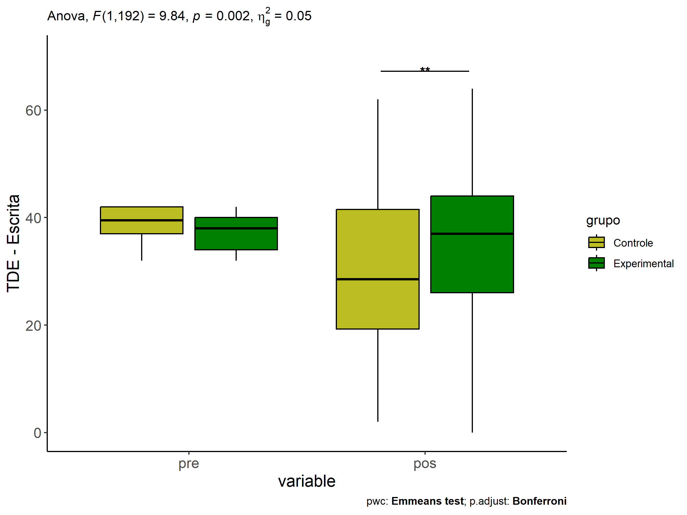<!-- -->

``` r
if (length(unique(wdat.long[["grupo"]])) > 1)
  plots <- oneWayAncovaBoxPlots(
    wdat.long, "score.tde", "grupo", aov, pwc.long, pre.post = "time",
    theme = "classic", color = color$prepost)
```

``` r
if (length(unique(wdat.long[["grupo"]])) > 1)
  plots[["grupo"]] + ggplot2::ylab("TDE - Escrita")
```

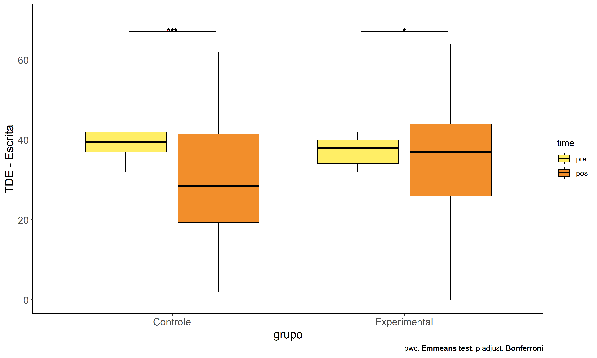<!-- -->

### Checking linearity assumption

``` r
ggscatter(wdat, x = "score.tde.pre", y = "score.tde.pos", size = 0.5,
          color = "grupo", add = "reg.line")+
  stat_regline_equation(
    aes(label =  paste(..eq.label.., ..rr.label.., sep = "~~~~"), color = grupo)
  )
```

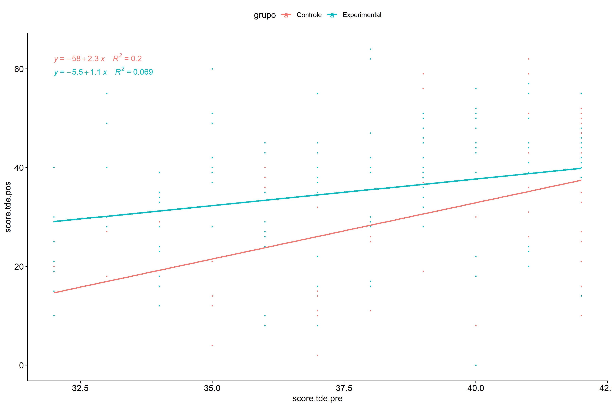<!-- -->

### Checking normality and homogeneity

``` r
res <- augment(lm(score.tde.pos ~ score.tde.pre + grupo, data = wdat))
```

``` r
shapiro_test(res$.resid)
```

    ## # A tibble: 1 × 3
    ##   variable   statistic p.value
    ##   <chr>          <dbl>   <dbl>
    ## 1 res$.resid     0.988  0.0984

``` r
levene_test(res, .resid ~ grupo)
```

    ## # A tibble: 1 × 4
    ##     df1   df2 statistic     p
    ##   <int> <int>     <dbl> <dbl>
    ## 1     1   193      1.64 0.202

# ANCOVA and Pairwise for two factors **grupo:Sexo**

## Without remove non-normal data

``` r
pdat = remove_group_data(dat[!is.na(dat[["grupo"]]) & !is.na(dat[["Sexo"]]),], "score.tde.pos", c("grupo","Sexo"))

pdat.long <- rbind(pdat[,c("id","grupo","Sexo")], pdat[,c("id","grupo","Sexo")])
pdat.long[["time"]] <- c(rep("pre", nrow(pdat)), rep("pos", nrow(pdat)))
pdat.long[["time"]] <- factor(pdat.long[["time"]], c("pre","pos"))
pdat.long[["score.tde"]] <- c(pdat[["score.tde.pre"]], pdat[["score.tde.pos"]])

aov = anova_test(pdat, score.tde.pos ~ score.tde.pre + grupo*Sexo)
laov[["grupo:Sexo"]] <- get_anova_table(aov)
```

``` r
pwcs <- list()
pwcs[["Sexo"]] <- emmeans_test(
  group_by(pdat, grupo), score.tde.pos ~ Sexo,
  covariate = score.tde.pre, p.adjust.method = "bonferroni")
pwcs[["grupo"]] <- emmeans_test(
  group_by(pdat, Sexo), score.tde.pos ~ grupo,
  covariate = score.tde.pre, p.adjust.method = "bonferroni")

pwc <- plyr::rbind.fill(pwcs[["grupo"]], pwcs[["Sexo"]])
pwc <- pwc[,c("grupo","Sexo", colnames(pwc)[!colnames(pwc) %in% c("grupo","Sexo")])]
```

``` r
pwc.long <- emmeans_test(dplyr::group_by_at(pdat.long, c("grupo","Sexo")),
                         score.tde ~ time,
                         p.adjust.method = "bonferroni")
lpwc[["grupo:Sexo"]] <- plyr::rbind.fill(pwc, pwc.long)
```

``` r
ds <- get.descriptives(pdat, "score.tde.pos", c("grupo","Sexo"), covar = "score.tde.pre")
ds <- merge(ds[ds$variable != "score.tde.pre",],
            ds[ds$variable == "score.tde.pre", !colnames(ds) %in% c("variable")],
            by = c("grupo","Sexo"), all.x = T, suffixes = c("", ".score.tde.pre"))
ds <- merge(get_emmeans(pwcs[["grupo"]]), ds, by = c("grupo","Sexo"), suffixes = c(".emms", ""))
ds <- ds[,c("grupo","Sexo","n","mean.score.tde.pre","se.score.tde.pre","mean","se","emmean","se.emms")]

colnames(ds) <- c("grupo","Sexo", "N", paste0(c("M","SE")," (pre)"),
                  paste0(c("M","SE"), " (unadj)"), paste0(c("M", "SE"), " (adj)"))

lemms[["grupo:Sexo"]] <- ds
```

## Computing ANCOVA and PairWise After removing non-normal data (OK)

``` r
wdat = pdat 

res = residuals(lm(score.tde.pos ~ score.tde.pre + grupo*Sexo, data = wdat))
non.normal = getNonNormal(res, wdat$id, plimit = 0.05)

wdat = wdat[!wdat$id %in% non.normal,]

wdat.long <- rbind(wdat[,c("id","grupo","Sexo")], wdat[,c("id","grupo","Sexo")])
wdat.long[["time"]] <- c(rep("pre", nrow(wdat)), rep("pos", nrow(wdat)))
wdat.long[["time"]] <- factor(wdat.long[["time"]], c("pre","pos"))
wdat.long[["score.tde"]] <- c(wdat[["score.tde.pre"]], wdat[["score.tde.pos"]])


ldat[["grupo:Sexo"]] = wdat

(non.normal)
```

    ## NULL

``` r
aov = anova_test(wdat, score.tde.pos ~ score.tde.pre + grupo*Sexo)
laov[["grupo:Sexo"]] <- merge(get_anova_table(aov), laov[["grupo:Sexo"]], by="Effect", suffixes = c("","'"))

(df = get_anova_table(aov))
```

    ## ANOVA Table (type II tests)
    ## 
    ##          Effect DFn DFd      F        p p<.05      ges
    ## 1 score.tde.pre   1 190 20.198 1.21e-05     * 0.096000
    ## 2         grupo   1 190 11.443 8.71e-04     * 0.057000
    ## 3          Sexo   1 190  2.468 1.18e-01       0.013000
    ## 4    grupo:Sexo   1 190  0.039 8.43e-01       0.000208

| Effect        | DFn | DFd |      F |     p | p\<.05 |   ges |
|:--------------|----:|----:|-------:|------:|:-------|------:|
| score.tde.pre |   1 | 190 | 20.198 | 0.000 | \*     | 0.096 |
| grupo         |   1 | 190 | 11.443 | 0.001 | \*     | 0.057 |
| Sexo          |   1 | 190 |  2.468 | 0.118 |        | 0.013 |
| grupo:Sexo    |   1 | 190 |  0.039 | 0.843 |        | 0.000 |

``` r
pwcs <- list()
pwcs[["Sexo"]] <- emmeans_test(
  group_by(wdat, grupo), score.tde.pos ~ Sexo,
  covariate = score.tde.pre, p.adjust.method = "bonferroni")
pwcs[["grupo"]] <- emmeans_test(
  group_by(wdat, Sexo), score.tde.pos ~ grupo,
  covariate = score.tde.pre, p.adjust.method = "bonferroni")

pwc <- plyr::rbind.fill(pwcs[["grupo"]], pwcs[["Sexo"]])
pwc <- pwc[,c("grupo","Sexo", colnames(pwc)[!colnames(pwc) %in% c("grupo","Sexo")])]
```

| grupo        | Sexo | term                 | .y.           | group1   | group2       |  df | statistic |     p | p.adj | p.adj.signif |
|:-------------|:-----|:---------------------|:--------------|:---------|:-------------|----:|----------:|------:|------:|:-------------|
|              | F    | score.tde.pre\*grupo | score.tde.pos | Controle | Experimental | 190 |    -2.762 | 0.006 | 0.006 | \*\*         |
|              | M    | score.tde.pre\*grupo | score.tde.pos | Controle | Experimental | 190 |    -1.999 | 0.047 | 0.047 | \*           |
| Controle     |      | score.tde.pre\*Sexo  | score.tde.pos | F        | M            | 190 |     0.626 | 0.532 | 0.532 | ns           |
| Experimental |      | score.tde.pre\*Sexo  | score.tde.pos | F        | M            | 190 |     1.457 | 0.147 | 0.147 | ns           |

``` r
pwc.long <- emmeans_test(dplyr::group_by_at(wdat.long, c("grupo","Sexo")),
                         score.tde ~ time,
                         p.adjust.method = "bonferroni")
lpwc[["grupo:Sexo"]] <- merge(plyr::rbind.fill(pwc, pwc.long), lpwc[["grupo:Sexo"]], by=c("grupo","Sexo","term",".y.","group1","group2"), suffixes = c("","'"))
```

| grupo        | Sexo | term | .y.       | group1 | group2 |  df | statistic |     p | p.adj | p.adj.signif |
|:-------------|:-----|:-----|:----------|:-------|:-------|----:|----------:|------:|------:|:-------------|
| Controle     | F    | time | score.tde | pre    | pos    | 382 |     3.313 | 0.001 | 0.001 | \*\*         |
| Controle     | M    | time | score.tde | pre    | pos    | 382 |     3.169 | 0.002 | 0.002 | \*\*         |
| Experimental | F    | time | score.tde | pre    | pos    | 382 |     0.348 | 0.728 | 0.728 | ns           |
| Experimental | M    | time | score.tde | pre    | pos    | 382 |     2.526 | 0.012 | 0.012 | \*           |

``` r
ds <- get.descriptives(wdat, "score.tde.pos", c("grupo","Sexo"), covar = "score.tde.pre")
ds <- merge(ds[ds$variable != "score.tde.pre",],
            ds[ds$variable == "score.tde.pre", !colnames(ds) %in% c("variable")],
            by = c("grupo","Sexo"), all.x = T, suffixes = c("", ".score.tde.pre"))
ds <- merge(get_emmeans(pwcs[["grupo"]]), ds, by = c("grupo","Sexo"), suffixes = c(".emms", ""))
ds <- ds[,c("grupo","Sexo","n","mean.score.tde.pre","se.score.tde.pre","mean","se","emmean","se.emms")]

colnames(ds) <- c("grupo","Sexo", "N", paste0(c("M","SE")," (pre)"),
                  paste0(c("M","SE"), " (unadj)"), paste0(c("M", "SE"), " (adj)"))

lemms[["grupo:Sexo"]] <- merge(ds, lemms[["grupo:Sexo"]], by=c("grupo","Sexo"), suffixes = c("","'"))
```

| grupo        | Sexo |   N | M (pre) | SE (pre) | M (unadj) | SE (unadj) | M (adj) | SE (adj) |
|:-------------|:-----|----:|--------:|---------:|----------:|-----------:|--------:|---------:|
| Controle     | F    |  36 |  39.167 |    0.503 |    31.444 |      2.728 |  29.574 |    2.205 |
| Controle     | M    |  18 |  38.111 |    0.690 |    27.667 |      3.056 |  27.219 |    3.064 |
| Experimental | F    |  61 |  37.557 |    0.397 |    36.934 |      1.854 |  37.234 |    1.665 |
| Experimental | M    |  80 |  37.250 |    0.363 |    33.300 |      1.300 |  34.014 |    1.461 |

### Plots for ancova

``` r
plots <- twoWayAncovaPlots(
  wdat, "score.tde.pos", c("grupo","Sexo"), aov, pwcs, addParam = c("mean_se"),
  font.label.size=10, step.increase=0.05, p.label="p.adj",
  subtitle = which(aov$Effect == "grupo:Sexo"))
```

``` r
if (!is.null(plots[["grupo"]]))
  plots[["grupo"]] + ggplot2::scale_color_manual(values = color[["Sexo"]])
```

    ## Scale for colour is already present.
    ## Adding another scale for colour, which will replace the existing scale.

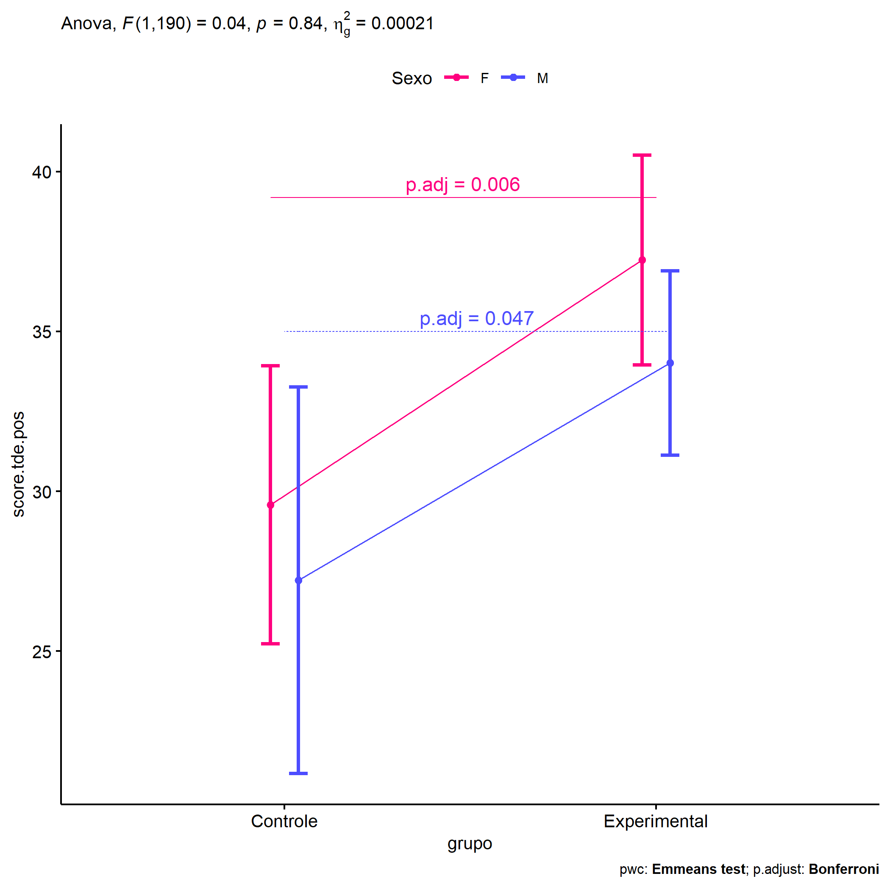<!-- -->

``` r
if (!is.null(plots[["Sexo"]]))
  plots[["Sexo"]] + ggplot2::scale_color_manual(values = color[["grupo"]])
```

    ## Scale for colour is already present.
    ## Adding another scale for colour, which will replace the existing scale.

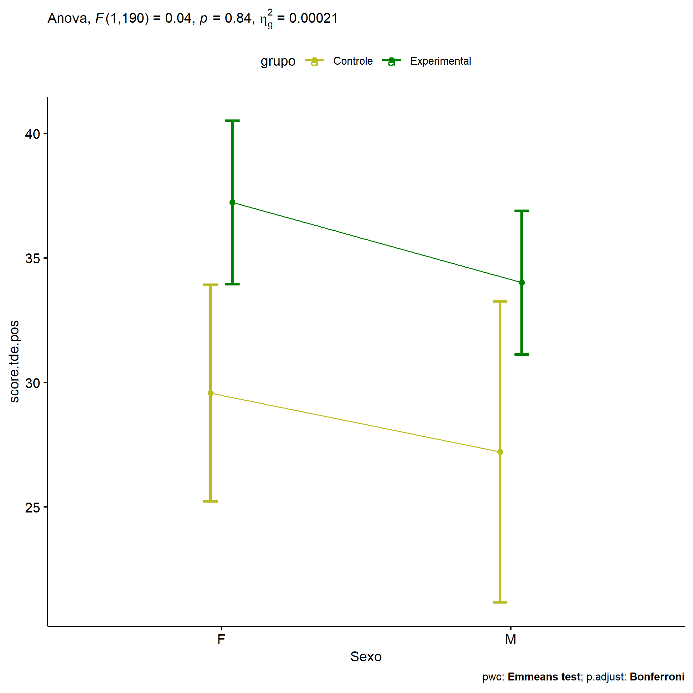<!-- -->

``` r
plots <- twoWayAncovaBoxPlots(
  wdat, "score.tde.pos", c("grupo","Sexo"), aov, pwcs, covar = "score.tde.pre",
  theme = "classic", color = color[["grupo:Sexo"]],
  subtitle = which(aov$Effect == "grupo:Sexo"))
```

``` r
plots[["grupo:Sexo"]] + ggplot2::ylab("TDE - Escrita") + ggplot2::scale_x_discrete(labels=c('pre', 'pos'))
```

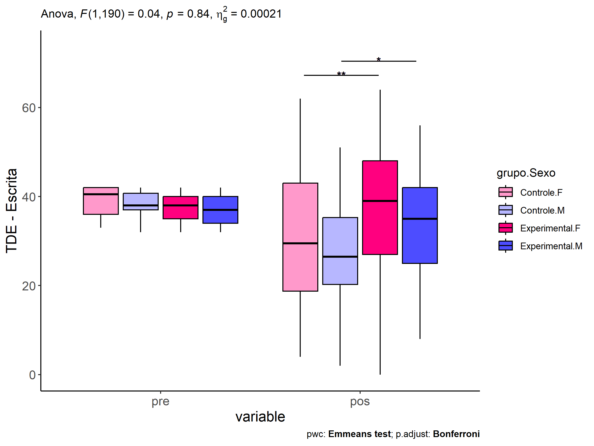<!-- -->

``` r
plots <- twoWayAncovaBoxPlots(
  wdat.long, "score.tde", c("grupo","Sexo"), aov, pwc.long, pre.post = "time",
  theme = "classic", color = color$prepost)
```

``` r
plots[["grupo:Sexo"]] + ggplot2::ylab("TDE - Escrita")
```

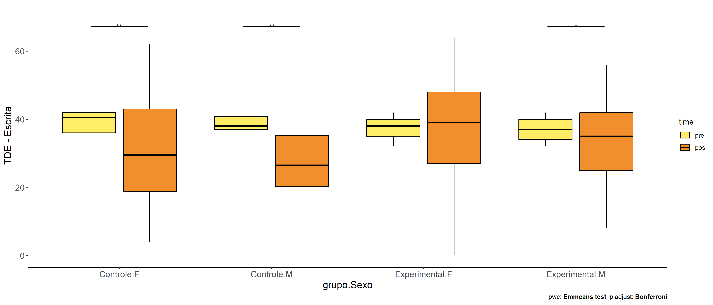<!-- -->

### Checking linearity assumption

``` r
ggscatter(wdat, x = "score.tde.pre", y = "score.tde.pos", size = 0.5,
          facet.by = c("grupo","Sexo"), add = "reg.line")+
  stat_regline_equation(
    aes(label =  paste(..eq.label.., ..rr.label.., sep = "~~~~"))
  )
```

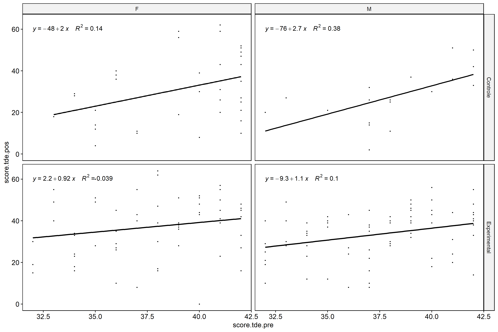<!-- -->

### Checking normality and homogeneity

``` r
res <- augment(lm(score.tde.pos ~ score.tde.pre + grupo*Sexo, data = wdat))
```

``` r
shapiro_test(res$.resid)
```

    ## # A tibble: 1 × 3
    ##   variable   statistic p.value
    ##   <chr>          <dbl>   <dbl>
    ## 1 res$.resid     0.987  0.0644

``` r
levene_test(res, .resid ~ grupo*Sexo)
```

    ## # A tibble: 1 × 4
    ##     df1   df2 statistic      p
    ##   <int> <int>     <dbl>  <dbl>
    ## 1     3   191      3.22 0.0239

# ANCOVA and Pairwise for two factors **grupo:Zona**

## Without remove non-normal data

``` r
pdat = remove_group_data(dat[!is.na(dat[["grupo"]]) & !is.na(dat[["Zona"]]),], "score.tde.pos", c("grupo","Zona"))

pdat.long <- rbind(pdat[,c("id","grupo","Zona")], pdat[,c("id","grupo","Zona")])
pdat.long[["time"]] <- c(rep("pre", nrow(pdat)), rep("pos", nrow(pdat)))
pdat.long[["time"]] <- factor(pdat.long[["time"]], c("pre","pos"))
pdat.long[["score.tde"]] <- c(pdat[["score.tde.pre"]], pdat[["score.tde.pos"]])

aov = anova_test(pdat, score.tde.pos ~ score.tde.pre + grupo*Zona)
laov[["grupo:Zona"]] <- get_anova_table(aov)
```

``` r
pwcs <- list()
pwcs[["Zona"]] <- emmeans_test(
  group_by(pdat, grupo), score.tde.pos ~ Zona,
  covariate = score.tde.pre, p.adjust.method = "bonferroni")
pwcs[["grupo"]] <- emmeans_test(
  group_by(pdat, Zona), score.tde.pos ~ grupo,
  covariate = score.tde.pre, p.adjust.method = "bonferroni")

pwc <- plyr::rbind.fill(pwcs[["grupo"]], pwcs[["Zona"]])
pwc <- pwc[,c("grupo","Zona", colnames(pwc)[!colnames(pwc) %in% c("grupo","Zona")])]
```

``` r
pwc.long <- emmeans_test(dplyr::group_by_at(pdat.long, c("grupo","Zona")),
                         score.tde ~ time,
                         p.adjust.method = "bonferroni")
lpwc[["grupo:Zona"]] <- plyr::rbind.fill(pwc, pwc.long)
```

``` r
ds <- get.descriptives(pdat, "score.tde.pos", c("grupo","Zona"), covar = "score.tde.pre")
ds <- merge(ds[ds$variable != "score.tde.pre",],
            ds[ds$variable == "score.tde.pre", !colnames(ds) %in% c("variable")],
            by = c("grupo","Zona"), all.x = T, suffixes = c("", ".score.tde.pre"))
ds <- merge(get_emmeans(pwcs[["grupo"]]), ds, by = c("grupo","Zona"), suffixes = c(".emms", ""))
ds <- ds[,c("grupo","Zona","n","mean.score.tde.pre","se.score.tde.pre","mean","se","emmean","se.emms")]

colnames(ds) <- c("grupo","Zona", "N", paste0(c("M","SE")," (pre)"),
                  paste0(c("M","SE"), " (unadj)"), paste0(c("M", "SE"), " (adj)"))

lemms[["grupo:Zona"]] <- ds
```

## Computing ANCOVA and PairWise After removing non-normal data (OK)

``` r
wdat = pdat 

res = residuals(lm(score.tde.pos ~ score.tde.pre + grupo*Zona, data = wdat))
non.normal = getNonNormal(res, wdat$id, plimit = 0.05)

wdat = wdat[!wdat$id %in% non.normal,]

wdat.long <- rbind(wdat[,c("id","grupo","Zona")], wdat[,c("id","grupo","Zona")])
wdat.long[["time"]] <- c(rep("pre", nrow(wdat)), rep("pos", nrow(wdat)))
wdat.long[["time"]] <- factor(wdat.long[["time"]], c("pre","pos"))
wdat.long[["score.tde"]] <- c(wdat[["score.tde.pre"]], wdat[["score.tde.pos"]])


ldat[["grupo:Zona"]] = wdat

(non.normal)
```

    ## NULL

``` r
aov = anova_test(wdat, score.tde.pos ~ score.tde.pre + grupo*Zona)
laov[["grupo:Zona"]] <- merge(get_anova_table(aov), laov[["grupo:Zona"]], by="Effect", suffixes = c("","'"))

(df = get_anova_table(aov))
```

    ## ANOVA Table (type II tests)
    ## 
    ##          Effect DFn DFd      F        p p<.05   ges
    ## 1 score.tde.pre   1 140 19.978 0.000016     * 0.125
    ## 2         grupo   1 140 13.081 0.000416     * 0.085
    ## 3          Zona   1 140  6.441 0.012000     * 0.044
    ## 4    grupo:Zona   1 140  1.558 0.214000       0.011

| Effect        | DFn | DFd |      F |     p | p\<.05 |   ges |
|:--------------|----:|----:|-------:|------:|:-------|------:|
| score.tde.pre |   1 | 140 | 19.978 | 0.000 | \*     | 0.125 |
| grupo         |   1 | 140 | 13.081 | 0.000 | \*     | 0.085 |
| Zona          |   1 | 140 |  6.441 | 0.012 | \*     | 0.044 |
| grupo:Zona    |   1 | 140 |  1.558 | 0.214 |        | 0.011 |

``` r
pwcs <- list()
pwcs[["Zona"]] <- emmeans_test(
  group_by(wdat, grupo), score.tde.pos ~ Zona,
  covariate = score.tde.pre, p.adjust.method = "bonferroni")
pwcs[["grupo"]] <- emmeans_test(
  group_by(wdat, Zona), score.tde.pos ~ grupo,
  covariate = score.tde.pre, p.adjust.method = "bonferroni")

pwc <- plyr::rbind.fill(pwcs[["grupo"]], pwcs[["Zona"]])
pwc <- pwc[,c("grupo","Zona", colnames(pwc)[!colnames(pwc) %in% c("grupo","Zona")])]
```

| grupo        | Zona   | term                 | .y.           | group1   | group2       |  df | statistic |     p | p.adj | p.adj.signif |
|:-------------|:-------|:---------------------|:--------------|:---------|:-------------|----:|----------:|------:|------:|:-------------|
|              | Rural  | score.tde.pre\*grupo | score.tde.pos | Controle | Experimental | 140 |    -1.793 | 0.075 | 0.075 | ns           |
|              | Urbana | score.tde.pre\*grupo | score.tde.pos | Controle | Experimental | 140 |    -3.312 | 0.001 | 0.001 | \*\*         |
| Controle     |        | score.tde.pre\*Zona  | score.tde.pos | Rural    | Urbana       | 140 |     2.412 | 0.017 | 0.017 | \*           |
| Experimental |        | score.tde.pre\*Zona  | score.tde.pos | Rural    | Urbana       | 140 |     1.359 | 0.176 | 0.176 | ns           |

``` r
pwc.long <- emmeans_test(dplyr::group_by_at(wdat.long, c("grupo","Zona")),
                         score.tde ~ time,
                         p.adjust.method = "bonferroni")
lpwc[["grupo:Zona"]] <- merge(plyr::rbind.fill(pwc, pwc.long), lpwc[["grupo:Zona"]], by=c("grupo","Zona","term",".y.","group1","group2"), suffixes = c("","'"))
```

| grupo        | Zona   | term | .y.       | group1 | group2 |  df | statistic |     p | p.adj | p.adj.signif |
|:-------------|:-------|:-----|:----------|:-------|:-------|----:|----------:|------:|------:|:-------------|
| Controle     | Rural  | time | score.tde | pre    | pos    | 282 |     2.257 | 0.025 | 0.025 | \*           |
| Controle     | Urbana | time | score.tde | pre    | pos    | 282 |     5.350 | 0.000 | 0.000 | \*\*\*\*     |
| Experimental | Rural  | time | score.tde | pre    | pos    | 282 |     1.334 | 0.183 | 0.183 | ns           |
| Experimental | Urbana | time | score.tde | pre    | pos    | 282 |     2.186 | 0.030 | 0.030 | \*           |

``` r
ds <- get.descriptives(wdat, "score.tde.pos", c("grupo","Zona"), covar = "score.tde.pre")
ds <- merge(ds[ds$variable != "score.tde.pre",],
            ds[ds$variable == "score.tde.pre", !colnames(ds) %in% c("variable")],
            by = c("grupo","Zona"), all.x = T, suffixes = c("", ".score.tde.pre"))
ds <- merge(get_emmeans(pwcs[["grupo"]]), ds, by = c("grupo","Zona"), suffixes = c(".emms", ""))
ds <- ds[,c("grupo","Zona","n","mean.score.tde.pre","se.score.tde.pre","mean","se","emmean","se.emms")]

colnames(ds) <- c("grupo","Zona", "N", paste0(c("M","SE")," (pre)"),
                  paste0(c("M","SE"), " (unadj)"), paste0(c("M", "SE"), " (adj)"))

lemms[["grupo:Zona"]] <- merge(ds, lemms[["grupo:Zona"]], by=c("grupo","Zona"), suffixes = c("","'"))
```

| grupo        | Zona   |   N | M (pre) | SE (pre) | M (unadj) | SE (unadj) | M (adj) | SE (adj) |
|:-------------|:-------|----:|--------:|---------:|----------:|-----------:|--------:|---------:|
| Controle     | Rural  |  23 |  39.522 |    0.625 |    33.261 |      3.016 |  30.588 |    2.609 |
| Controle     | Urbana |  18 |  37.500 |    0.628 |    20.722 |      2.572 |  21.188 |    2.873 |
| Experimental | Rural  |  64 |  36.719 |    0.380 |    34.500 |      1.608 |  36.179 |    1.568 |
| Experimental | Urbana |  40 |  38.675 |    0.460 |    34.075 |      2.069 |  32.717 |    1.950 |

### Plots for ancova

``` r
plots <- twoWayAncovaPlots(
  wdat, "score.tde.pos", c("grupo","Zona"), aov, pwcs, addParam = c("mean_se"),
  font.label.size=10, step.increase=0.05, p.label="p.adj",
  subtitle = which(aov$Effect == "grupo:Zona"))
```

``` r
if (!is.null(plots[["grupo"]]))
  plots[["grupo"]] + ggplot2::scale_color_manual(values = color[["Zona"]])
```

    ## Scale for colour is already present.
    ## Adding another scale for colour, which will replace the existing scale.

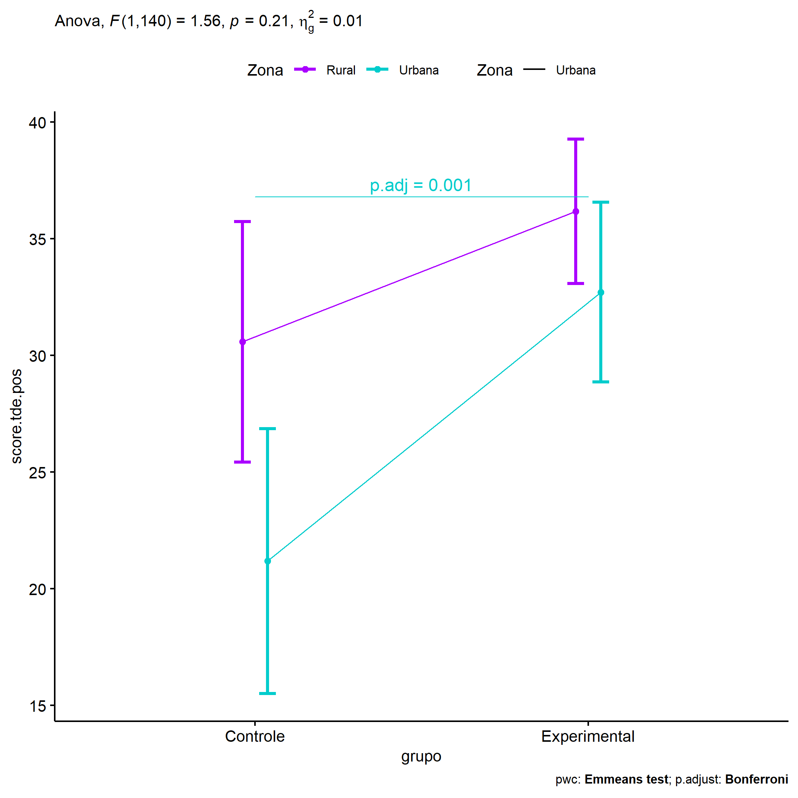<!-- -->

``` r
if (!is.null(plots[["Zona"]]))
  plots[["Zona"]] + ggplot2::scale_color_manual(values = color[["grupo"]])
```

    ## Scale for colour is already present.
    ## Adding another scale for colour, which will replace the existing scale.

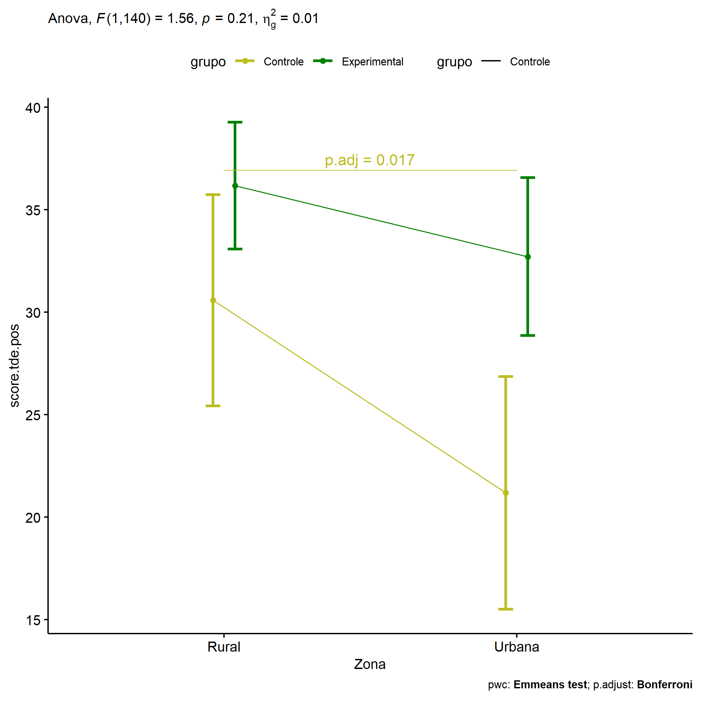<!-- -->

``` r
plots <- twoWayAncovaBoxPlots(
  wdat, "score.tde.pos", c("grupo","Zona"), aov, pwcs, covar = "score.tde.pre",
  theme = "classic", color = color[["grupo:Zona"]],
  subtitle = which(aov$Effect == "grupo:Zona"))
```

``` r
plots[["grupo:Zona"]] + ggplot2::ylab("TDE - Escrita") + ggplot2::scale_x_discrete(labels=c('pre', 'pos'))
```

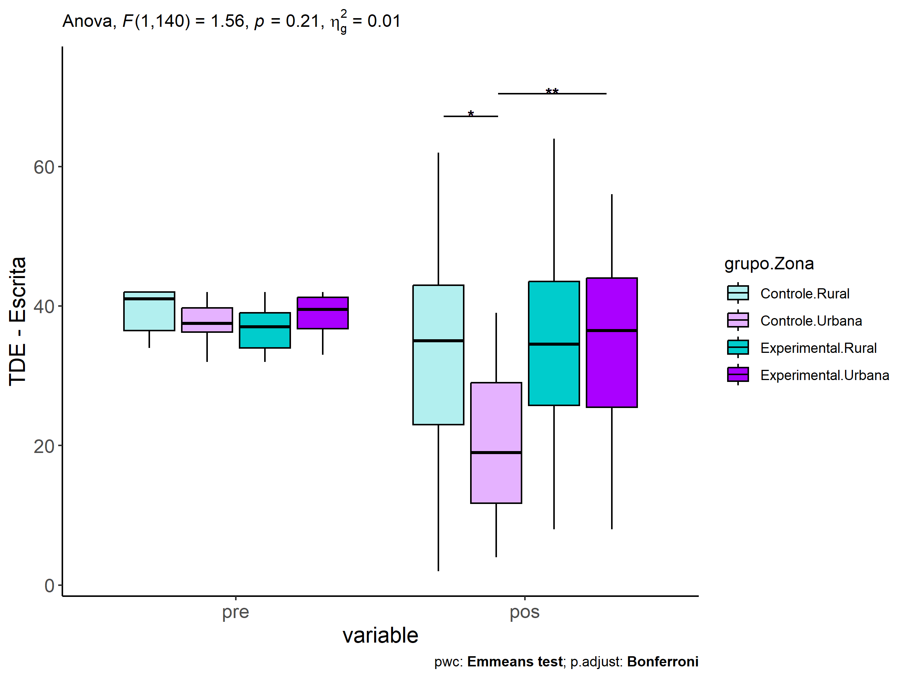<!-- -->

``` r
plots <- twoWayAncovaBoxPlots(
  wdat.long, "score.tde", c("grupo","Zona"), aov, pwc.long, pre.post = "time",
  theme = "classic", color = color$prepost)
```

``` r
plots[["grupo:Zona"]] + ggplot2::ylab("TDE - Escrita")
```

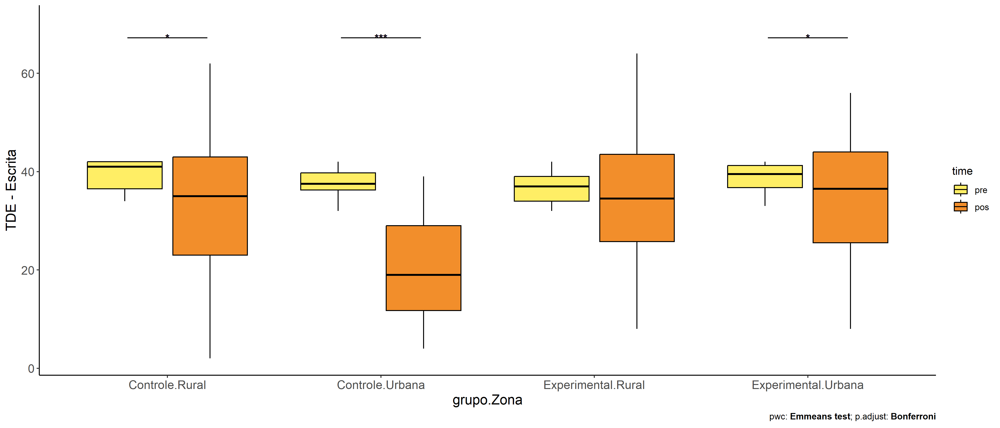<!-- -->

### Checking linearity assumption

``` r
ggscatter(wdat, x = "score.tde.pre", y = "score.tde.pos", size = 0.5,
          facet.by = c("grupo","Zona"), add = "reg.line")+
  stat_regline_equation(
    aes(label =  paste(..eq.label.., ..rr.label.., sep = "~~~~"))
  )
```

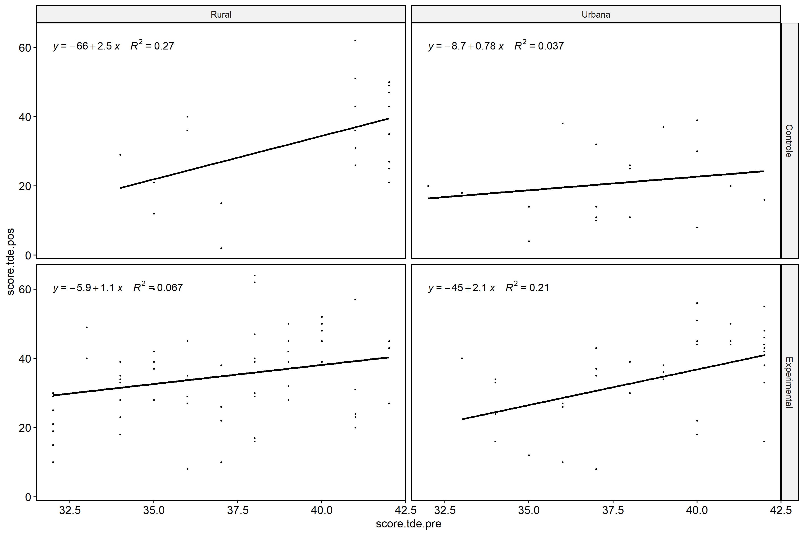<!-- -->

### Checking normality and homogeneity

``` r
res <- augment(lm(score.tde.pos ~ score.tde.pre + grupo*Zona, data = wdat))
```

``` r
shapiro_test(res$.resid)
```

    ## # A tibble: 1 × 3
    ##   variable   statistic p.value
    ##   <chr>          <dbl>   <dbl>
    ## 1 res$.resid     0.987   0.207

``` r
levene_test(res, .resid ~ grupo*Zona)
```

    ## # A tibble: 1 × 4
    ##     df1   df2 statistic     p
    ##   <int> <int>     <dbl> <dbl>
    ## 1     3   141     0.226 0.878

# ANCOVA and Pairwise for two factors **grupo:Cor.Raca**

## Without remove non-normal data

``` r
pdat = remove_group_data(dat[!is.na(dat[["grupo"]]) & !is.na(dat[["Cor.Raca"]]),], "score.tde.pos", c("grupo","Cor.Raca"))

pdat.long <- rbind(pdat[,c("id","grupo","Cor.Raca")], pdat[,c("id","grupo","Cor.Raca")])
pdat.long[["time"]] <- c(rep("pre", nrow(pdat)), rep("pos", nrow(pdat)))
pdat.long[["time"]] <- factor(pdat.long[["time"]], c("pre","pos"))
pdat.long[["score.tde"]] <- c(pdat[["score.tde.pre"]], pdat[["score.tde.pos"]])

aov = anova_test(pdat, score.tde.pos ~ score.tde.pre + grupo*Cor.Raca)
laov[["grupo:Cor.Raca"]] <- get_anova_table(aov)
```

``` r
pwcs <- list()
pwcs[["Cor.Raca"]] <- emmeans_test(
  group_by(pdat, grupo), score.tde.pos ~ Cor.Raca,
  covariate = score.tde.pre, p.adjust.method = "bonferroni")
pwcs[["grupo"]] <- emmeans_test(
  group_by(pdat, Cor.Raca), score.tde.pos ~ grupo,
  covariate = score.tde.pre, p.adjust.method = "bonferroni")

pwc <- plyr::rbind.fill(pwcs[["grupo"]], pwcs[["Cor.Raca"]])
pwc <- pwc[,c("grupo","Cor.Raca", colnames(pwc)[!colnames(pwc) %in% c("grupo","Cor.Raca")])]
```

``` r
pwc.long <- emmeans_test(dplyr::group_by_at(pdat.long, c("grupo","Cor.Raca")),
                         score.tde ~ time,
                         p.adjust.method = "bonferroni")
lpwc[["grupo:Cor.Raca"]] <- plyr::rbind.fill(pwc, pwc.long)
```

``` r
ds <- get.descriptives(pdat, "score.tde.pos", c("grupo","Cor.Raca"), covar = "score.tde.pre")
ds <- merge(ds[ds$variable != "score.tde.pre",],
            ds[ds$variable == "score.tde.pre", !colnames(ds) %in% c("variable")],
            by = c("grupo","Cor.Raca"), all.x = T, suffixes = c("", ".score.tde.pre"))
ds <- merge(get_emmeans(pwcs[["grupo"]]), ds, by = c("grupo","Cor.Raca"), suffixes = c(".emms", ""))
ds <- ds[,c("grupo","Cor.Raca","n","mean.score.tde.pre","se.score.tde.pre","mean","se","emmean","se.emms")]

colnames(ds) <- c("grupo","Cor.Raca", "N", paste0(c("M","SE")," (pre)"),
                  paste0(c("M","SE"), " (unadj)"), paste0(c("M", "SE"), " (adj)"))

lemms[["grupo:Cor.Raca"]] <- ds
```

## Computing ANCOVA and PairWise After removing non-normal data (OK)

``` r
wdat = pdat 

res = residuals(lm(score.tde.pos ~ score.tde.pre + grupo*Cor.Raca, data = wdat))
non.normal = getNonNormal(res, wdat$id, plimit = 0.05)

wdat = wdat[!wdat$id %in% non.normal,]

wdat.long <- rbind(wdat[,c("id","grupo","Cor.Raca")], wdat[,c("id","grupo","Cor.Raca")])
wdat.long[["time"]] <- c(rep("pre", nrow(wdat)), rep("pos", nrow(wdat)))
wdat.long[["time"]] <- factor(wdat.long[["time"]], c("pre","pos"))
wdat.long[["score.tde"]] <- c(wdat[["score.tde.pre"]], wdat[["score.tde.pos"]])


ldat[["grupo:Cor.Raca"]] = wdat

(non.normal)
```

    ## NULL

``` r
aov = anova_test(wdat, score.tde.pos ~ score.tde.pre + grupo*Cor.Raca)
laov[["grupo:Cor.Raca"]] <- merge(get_anova_table(aov), laov[["grupo:Cor.Raca"]], by="Effect", suffixes = c("","'"))

(df = get_anova_table(aov))
```

    ## ANOVA Table (type II tests)
    ## 
    ##           Effect DFn DFd     F     p p<.05   ges
    ## 1  score.tde.pre   1  72 8.902 0.004     * 0.110
    ## 2          grupo   1  72 5.205 0.025     * 0.067
    ## 3       Cor.Raca   1  72 0.220 0.641       0.003
    ## 4 grupo:Cor.Raca   1  72 0.460 0.500       0.006

| Effect         | DFn | DFd |     F |     p | p\<.05 |   ges |
|:---------------|----:|----:|------:|------:|:-------|------:|
| score.tde.pre  |   1 |  72 | 8.902 | 0.004 | \*     | 0.110 |
| grupo          |   1 |  72 | 5.205 | 0.025 | \*     | 0.067 |
| Cor.Raca       |   1 |  72 | 0.220 | 0.641 |        | 0.003 |
| grupo:Cor.Raca |   1 |  72 | 0.460 | 0.500 |        | 0.006 |

``` r
pwcs <- list()
pwcs[["Cor.Raca"]] <- emmeans_test(
  group_by(wdat, grupo), score.tde.pos ~ Cor.Raca,
  covariate = score.tde.pre, p.adjust.method = "bonferroni")
pwcs[["grupo"]] <- emmeans_test(
  group_by(wdat, Cor.Raca), score.tde.pos ~ grupo,
  covariate = score.tde.pre, p.adjust.method = "bonferroni")

pwc <- plyr::rbind.fill(pwcs[["grupo"]], pwcs[["Cor.Raca"]])
pwc <- pwc[,c("grupo","Cor.Raca", colnames(pwc)[!colnames(pwc) %in% c("grupo","Cor.Raca")])]
```

| grupo        | Cor.Raca | term                    | .y.           | group1   | group2       |  df | statistic |     p | p.adj | p.adj.signif |
|:-------------|:---------|:------------------------|:--------------|:---------|:-------------|----:|----------:|------:|------:|:-------------|
|              | Branca   | score.tde.pre\*grupo    | score.tde.pos | Controle | Experimental |  72 |    -1.743 | 0.086 | 0.086 | ns           |
|              | Parda    | score.tde.pre\*grupo    | score.tde.pos | Controle | Experimental |  72 |    -1.632 | 0.107 | 0.107 | ns           |
| Controle     |          | score.tde.pre\*Cor.Raca | score.tde.pos | Branca   | Parda        |  72 |    -0.302 | 0.763 | 0.763 | ns           |
| Experimental |          | score.tde.pre\*Cor.Raca | score.tde.pos | Branca   | Parda        |  72 |     0.769 | 0.444 | 0.444 | ns           |

``` r
pwc.long <- emmeans_test(dplyr::group_by_at(wdat.long, c("grupo","Cor.Raca")),
                         score.tde ~ time,
                         p.adjust.method = "bonferroni")
lpwc[["grupo:Cor.Raca"]] <- merge(plyr::rbind.fill(pwc, pwc.long), lpwc[["grupo:Cor.Raca"]], by=c("grupo","Cor.Raca","term",".y.","group1","group2"), suffixes = c("","'"))
```

| grupo        | Cor.Raca | term | .y.       | group1 | group2 |  df | statistic |     p | p.adj | p.adj.signif |
|:-------------|:---------|:-----|:----------|:-------|:-------|----:|----------:|------:|------:|:-------------|
| Controle     | Branca   | time | score.tde | pre    | pos    | 146 |     1.921 | 0.057 | 0.057 | ns           |
| Controle     | Parda    | time | score.tde | pre    | pos    | 146 |     2.876 | 0.005 | 0.005 | \*\*         |
| Experimental | Branca   | time | score.tde | pre    | pos    | 146 |     0.049 | 0.961 | 0.961 | ns           |
| Experimental | Parda    | time | score.tde | pre    | pos    | 146 |     1.571 | 0.118 | 0.118 | ns           |

``` r
ds <- get.descriptives(wdat, "score.tde.pos", c("grupo","Cor.Raca"), covar = "score.tde.pre")
ds <- merge(ds[ds$variable != "score.tde.pre",],
            ds[ds$variable == "score.tde.pre", !colnames(ds) %in% c("variable")],
            by = c("grupo","Cor.Raca"), all.x = T, suffixes = c("", ".score.tde.pre"))
ds <- merge(get_emmeans(pwcs[["grupo"]]), ds, by = c("grupo","Cor.Raca"), suffixes = c(".emms", ""))
ds <- ds[,c("grupo","Cor.Raca","n","mean.score.tde.pre","se.score.tde.pre","mean","se","emmean","se.emms")]

colnames(ds) <- c("grupo","Cor.Raca", "N", paste0(c("M","SE")," (pre)"),
                  paste0(c("M","SE"), " (unadj)"), paste0(c("M", "SE"), " (adj)"))

lemms[["grupo:Cor.Raca"]] <- merge(ds, lemms[["grupo:Cor.Raca"]], by=c("grupo","Cor.Raca"), suffixes = c("","'"))
```

| grupo        | Cor.Raca |   N | M (pre) | SE (pre) | M (unadj) | SE (unadj) | M (adj) | SE (adj) |
|:-------------|:---------|----:|--------:|---------:|----------:|-----------:|--------:|---------:|
| Controle     | Branca   |   6 |  38.167 |    1.167 |    25.667 |      6.200 |  25.218 |    6.074 |
| Controle     | Parda    |  22 |  39.045 |    0.646 |    29.273 |      3.915 |  27.295 |    3.239 |
| Experimental | Branca   |  15 |  37.867 |    0.810 |    37.667 |      3.696 |  37.741 |    3.840 |
| Experimental | Parda    |  34 |  37.147 |    0.498 |    32.853 |      2.460 |  34.179 |    2.589 |

### Plots for ancova

``` r
plots <- twoWayAncovaPlots(
  wdat, "score.tde.pos", c("grupo","Cor.Raca"), aov, pwcs, addParam = c("mean_se"),
  font.label.size=10, step.increase=0.05, p.label="p.adj",
  subtitle = which(aov$Effect == "grupo:Cor.Raca"))
```

``` r
if (!is.null(plots[["grupo"]]))
  plots[["grupo"]] + ggplot2::scale_color_manual(values = color[["Cor.Raca"]])
```

    ## Scale for colour is already present.
    ## Adding another scale for colour, which will replace the existing scale.

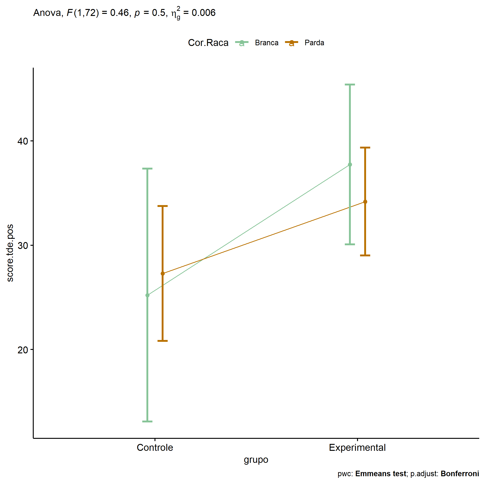<!-- -->

``` r
if (!is.null(plots[["Cor.Raca"]]))
  plots[["Cor.Raca"]] + ggplot2::scale_color_manual(values = color[["grupo"]])
```

    ## Scale for colour is already present.
    ## Adding another scale for colour, which will replace the existing scale.

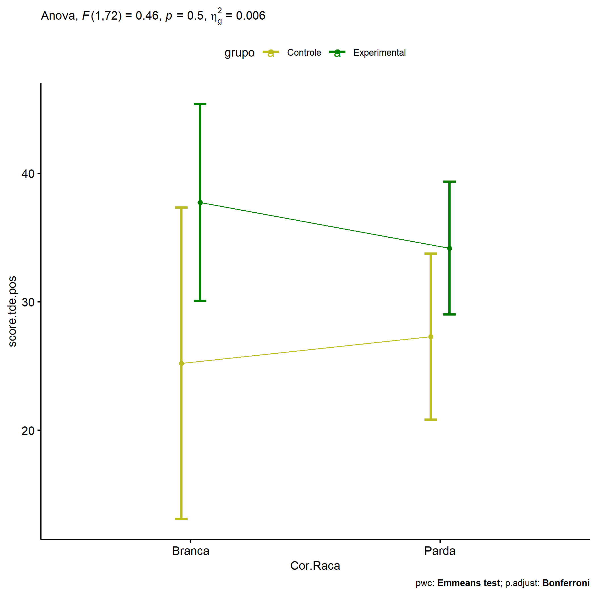<!-- -->

``` r
plots <- twoWayAncovaBoxPlots(
  wdat, "score.tde.pos", c("grupo","Cor.Raca"), aov, pwcs, covar = "score.tde.pre",
  theme = "classic", color = color[["grupo:Cor.Raca"]],
  subtitle = which(aov$Effect == "grupo:Cor.Raca"))
```

``` r
plots[["grupo:Cor.Raca"]] + ggplot2::ylab("TDE - Escrita") + ggplot2::scale_x_discrete(labels=c('pre', 'pos'))
```

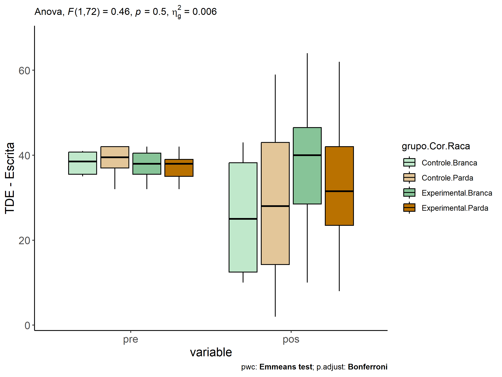<!-- -->

``` r
plots <- twoWayAncovaBoxPlots(
  wdat.long, "score.tde", c("grupo","Cor.Raca"), aov, pwc.long, pre.post = "time",
  theme = "classic", color = color$prepost)
```

``` r
plots[["grupo:Cor.Raca"]] + ggplot2::ylab("TDE - Escrita")
```

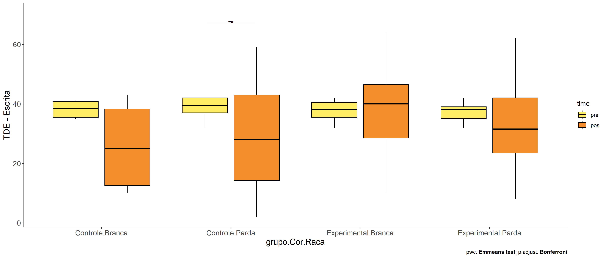<!-- -->

### Checking linearity assumption

``` r
ggscatter(wdat, x = "score.tde.pre", y = "score.tde.pos", size = 0.5,
          facet.by = c("grupo","Cor.Raca"), add = "reg.line")+
  stat_regline_equation(
    aes(label =  paste(..eq.label.., ..rr.label.., sep = "~~~~"))
  )
```

<!-- -->

### Checking normality and homogeneity

``` r
res <- augment(lm(score.tde.pos ~ score.tde.pre + grupo*Cor.Raca, data = wdat))
```

``` r
shapiro_test(res$.resid)
```

    ## # A tibble: 1 × 3
    ##   variable   statistic p.value
    ##   <chr>          <dbl>   <dbl>
    ## 1 res$.resid     0.978   0.204

``` r
levene_test(res, .resid ~ grupo*Cor.Raca)
```

    ## # A tibble: 1 × 4
    ##     df1   df2 statistic     p
    ##   <int> <int>     <dbl> <dbl>
    ## 1     3    73      1.21 0.312

# ANCOVA and Pairwise for two factors **grupo:Serie**

## Without remove non-normal data

``` r
pdat = remove_group_data(dat[!is.na(dat[["grupo"]]) & !is.na(dat[["Serie"]]),], "score.tde.pos", c("grupo","Serie"))

pdat.long <- rbind(pdat[,c("id","grupo","Serie")], pdat[,c("id","grupo","Serie")])
pdat.long[["time"]] <- c(rep("pre", nrow(pdat)), rep("pos", nrow(pdat)))
pdat.long[["time"]] <- factor(pdat.long[["time"]], c("pre","pos"))
pdat.long[["score.tde"]] <- c(pdat[["score.tde.pre"]], pdat[["score.tde.pos"]])

aov = anova_test(pdat, score.tde.pos ~ score.tde.pre + grupo*Serie)
laov[["grupo:Serie"]] <- get_anova_table(aov)
```

``` r
pwcs <- list()
pwcs[["Serie"]] <- emmeans_test(
  group_by(pdat, grupo), score.tde.pos ~ Serie,
  covariate = score.tde.pre, p.adjust.method = "bonferroni")
pwcs[["grupo"]] <- emmeans_test(
  group_by(pdat, Serie), score.tde.pos ~ grupo,
  covariate = score.tde.pre, p.adjust.method = "bonferroni")

pwc <- plyr::rbind.fill(pwcs[["grupo"]], pwcs[["Serie"]])
pwc <- pwc[,c("grupo","Serie", colnames(pwc)[!colnames(pwc) %in% c("grupo","Serie")])]
```

``` r
pwc.long <- emmeans_test(dplyr::group_by_at(pdat.long, c("grupo","Serie")),
                         score.tde ~ time,
                         p.adjust.method = "bonferroni")
lpwc[["grupo:Serie"]] <- plyr::rbind.fill(pwc, pwc.long)
```

``` r
ds <- get.descriptives(pdat, "score.tde.pos", c("grupo","Serie"), covar = "score.tde.pre")
ds <- merge(ds[ds$variable != "score.tde.pre",],
            ds[ds$variable == "score.tde.pre", !colnames(ds) %in% c("variable")],
            by = c("grupo","Serie"), all.x = T, suffixes = c("", ".score.tde.pre"))
ds <- merge(get_emmeans(pwcs[["grupo"]]), ds, by = c("grupo","Serie"), suffixes = c(".emms", ""))
ds <- ds[,c("grupo","Serie","n","mean.score.tde.pre","se.score.tde.pre","mean","se","emmean","se.emms")]

colnames(ds) <- c("grupo","Serie", "N", paste0(c("M","SE")," (pre)"),
                  paste0(c("M","SE"), " (unadj)"), paste0(c("M", "SE"), " (adj)"))

lemms[["grupo:Serie"]] <- ds
```

## Computing ANCOVA and PairWise After removing non-normal data (OK)

``` r
wdat = pdat 

res = residuals(lm(score.tde.pos ~ score.tde.pre + grupo*Serie, data = wdat))
non.normal = getNonNormal(res, wdat$id, plimit = 0.05)

wdat = wdat[!wdat$id %in% non.normal,]

wdat.long <- rbind(wdat[,c("id","grupo","Serie")], wdat[,c("id","grupo","Serie")])
wdat.long[["time"]] <- c(rep("pre", nrow(wdat)), rep("pos", nrow(wdat)))
wdat.long[["time"]] <- factor(wdat.long[["time"]], c("pre","pos"))
wdat.long[["score.tde"]] <- c(wdat[["score.tde.pre"]], wdat[["score.tde.pos"]])


ldat[["grupo:Serie"]] = wdat

(non.normal)
```

    ## NULL

``` r
aov = anova_test(wdat, score.tde.pos ~ score.tde.pre + grupo*Serie)
laov[["grupo:Serie"]] <- merge(get_anova_table(aov), laov[["grupo:Serie"]], by="Effect", suffixes = c("","'"))

(df = get_anova_table(aov))
```

    ## ANOVA Table (type II tests)
    ## 
    ##          Effect DFn DFd      F        p p<.05   ges
    ## 1 score.tde.pre   1 186 18.374 2.91e-05     * 0.090
    ## 2         grupo   1 186 15.837 9.88e-05     * 0.078
    ## 3         Serie   3 186 12.849 1.15e-07     * 0.172
    ## 4   grupo:Serie   3 186  1.102 3.49e-01       0.017

| Effect        | DFn | DFd |      F |     p | p\<.05 |   ges |
|:--------------|----:|----:|-------:|------:|:-------|------:|
| score.tde.pre |   1 | 186 | 18.374 | 0.000 | \*     | 0.090 |
| grupo         |   1 | 186 | 15.837 | 0.000 | \*     | 0.078 |
| Serie         |   3 | 186 | 12.849 | 0.000 | \*     | 0.172 |
| grupo:Serie   |   3 | 186 |  1.102 | 0.349 |        | 0.017 |

``` r
pwcs <- list()
pwcs[["Serie"]] <- emmeans_test(
  group_by(wdat, grupo), score.tde.pos ~ Serie,
  covariate = score.tde.pre, p.adjust.method = "bonferroni")
pwcs[["grupo"]] <- emmeans_test(
  group_by(wdat, Serie), score.tde.pos ~ grupo,
  covariate = score.tde.pre, p.adjust.method = "bonferroni")

pwc <- plyr::rbind.fill(pwcs[["grupo"]], pwcs[["Serie"]])
pwc <- pwc[,c("grupo","Serie", colnames(pwc)[!colnames(pwc) %in% c("grupo","Serie")])]
```

| grupo        | Serie | term                 | .y.           | group1   | group2       |  df | statistic |     p | p.adj | p.adj.signif |
|:-------------|:------|:---------------------|:--------------|:---------|:-------------|----:|----------:|------:|------:|:-------------|
|              | 6 ano | score.tde.pre\*grupo | score.tde.pos | Controle | Experimental | 186 |    -1.180 | 0.240 | 0.240 | ns           |
|              | 7 ano | score.tde.pre\*grupo | score.tde.pos | Controle | Experimental | 186 |    -3.368 | 0.001 | 0.001 | \*\*\*       |
|              | 8 ano | score.tde.pre\*grupo | score.tde.pos | Controle | Experimental | 186 |    -2.556 | 0.011 | 0.011 | \*           |
|              | 9 ano | score.tde.pre\*grupo | score.tde.pos | Controle | Experimental | 186 |    -0.547 | 0.585 | 0.585 | ns           |
| Controle     |       | score.tde.pre\*Serie | score.tde.pos | 6 ano    | 7 ano        | 186 |     0.546 | 0.586 | 1.000 | ns           |
| Controle     |       | score.tde.pre\*Serie | score.tde.pos | 6 ano    | 8 ano        | 186 |    -2.347 | 0.020 | 0.120 | ns           |
| Controle     |       | score.tde.pre\*Serie | score.tde.pos | 6 ano    | 9 ano        | 186 |    -2.056 | 0.041 | 0.247 | ns           |
| Controle     |       | score.tde.pre\*Serie | score.tde.pos | 7 ano    | 8 ano        | 186 |    -3.103 | 0.002 | 0.013 | \*           |
| Controle     |       | score.tde.pre\*Serie | score.tde.pos | 7 ano    | 9 ano        | 186 |    -2.581 | 0.011 | 0.064 | ns           |
| Controle     |       | score.tde.pre\*Serie | score.tde.pos | 8 ano    | 9 ano        | 186 |    -0.228 | 0.820 | 1.000 | ns           |
| Experimental |       | score.tde.pre\*Serie | score.tde.pos | 6 ano    | 7 ano        | 186 |    -1.794 | 0.074 | 0.446 | ns           |
| Experimental |       | score.tde.pre\*Serie | score.tde.pos | 6 ano    | 8 ano        | 186 |    -4.890 | 0.000 | 0.000 | \*\*\*\*     |
| Experimental |       | score.tde.pre\*Serie | score.tde.pos | 6 ano    | 9 ano        | 186 |    -3.490 | 0.001 | 0.004 | \*\*         |
| Experimental |       | score.tde.pre\*Serie | score.tde.pos | 7 ano    | 8 ano        | 186 |    -3.562 | 0.000 | 0.003 | \*\*         |
| Experimental |       | score.tde.pre\*Serie | score.tde.pos | 7 ano    | 9 ano        | 186 |    -1.913 | 0.057 | 0.344 | ns           |
| Experimental |       | score.tde.pre\*Serie | score.tde.pos | 8 ano    | 9 ano        | 186 |     1.807 | 0.072 | 0.434 | ns           |

``` r
pwc.long <- emmeans_test(dplyr::group_by_at(wdat.long, c("grupo","Serie")),
                         score.tde ~ time,
                         p.adjust.method = "bonferroni")
lpwc[["grupo:Serie"]] <- merge(plyr::rbind.fill(pwc, pwc.long), lpwc[["grupo:Serie"]], by=c("grupo","Serie","term",".y.","group1","group2"), suffixes = c("","'"))
```

| grupo        | Serie | term | .y.       | group1 | group2 |  df | statistic |     p | p.adj | p.adj.signif |
|:-------------|:------|:-----|:----------|:-------|:-------|----:|----------:|------:|------:|:-------------|
| Controle     | 6 ano | time | score.tde | pre    | pos    | 374 |     3.535 | 0.000 | 0.000 | \*\*\*       |
| Controle     | 7 ano | time | score.tde | pre    | pos    | 374 |     4.863 | 0.000 | 0.000 | \*\*\*\*     |
| Controle     | 8 ano | time | score.tde | pre    | pos    | 374 |     0.735 | 0.463 | 0.463 | ns           |
| Controle     | 9 ano | time | score.tde | pre    | pos    | 374 |     0.147 | 0.883 | 0.883 | ns           |
| Experimental | 6 ano | time | score.tde | pre    | pos    | 374 |     4.314 | 0.000 | 0.000 | \*\*\*\*     |
| Experimental | 7 ano | time | score.tde | pre    | pos    | 374 |     2.108 | 0.036 | 0.036 | \*           |
| Experimental | 8 ano | time | score.tde | pre    | pos    | 374 |    -2.585 | 0.010 | 0.010 | \*           |
| Experimental | 9 ano | time | score.tde | pre    | pos    | 374 |    -0.701 | 0.484 | 0.484 | ns           |

``` r
ds <- get.descriptives(wdat, "score.tde.pos", c("grupo","Serie"), covar = "score.tde.pre")
ds <- merge(ds[ds$variable != "score.tde.pre",],
            ds[ds$variable == "score.tde.pre", !colnames(ds) %in% c("variable")],
            by = c("grupo","Serie"), all.x = T, suffixes = c("", ".score.tde.pre"))
ds <- merge(get_emmeans(pwcs[["grupo"]]), ds, by = c("grupo","Serie"), suffixes = c(".emms", ""))
ds <- ds[,c("grupo","Serie","n","mean.score.tde.pre","se.score.tde.pre","mean","se","emmean","se.emms")]

colnames(ds) <- c("grupo","Serie", "N", paste0(c("M","SE")," (pre)"),
                  paste0(c("M","SE"), " (unadj)"), paste0(c("M", "SE"), " (adj)"))

lemms[["grupo:Serie"]] <- merge(ds, lemms[["grupo:Serie"]], by=c("grupo","Serie"), suffixes = c("","'"))
```

| grupo        | Serie |   N | M (pre) | SE (pre) | M (unadj) | SE (unadj) | M (adj) | SE (adj) |
|:-------------|:------|----:|--------:|---------:|----------:|-----------:|--------:|---------:|
| Controle     | 6 ano |  13 |  38.846 |    0.775 |    26.231 |      3.669 |  24.951 |    3.326 |
| Controle     | 7 ano |  17 |  38.059 |    0.847 |    22.882 |      4.172 |  22.547 |    2.897 |
| Controle     | 8 ano |  17 |  38.824 |    0.682 |    36.529 |      2.922 |  35.276 |    2.911 |
| Controle     | 9 ano |   7 |  40.571 |    0.869 |    39.857 |      4.361 |  36.506 |    4.581 |
| Experimental | 6 ano |  43 |  37.116 |    0.467 |    28.651 |      1.830 |  29.447 |    1.831 |
| Experimental | 7 ano |  47 |  37.043 |    0.475 |    33.085 |      1.712 |  33.970 |    1.754 |
| Experimental | 8 ano |  19 |  37.158 |    0.663 |    44.789 |      2.246 |  45.535 |    2.745 |
| Experimental | 9 ano |  32 |  38.375 |    0.585 |    39.969 |      2.263 |  39.254 |    2.118 |

### Plots for ancova

``` r
plots <- twoWayAncovaPlots(
  wdat, "score.tde.pos", c("grupo","Serie"), aov, pwcs, addParam = c("mean_se"),
  font.label.size=10, step.increase=0.05, p.label="p.adj",
  subtitle = which(aov$Effect == "grupo:Serie"))
```

``` r
if (!is.null(plots[["grupo"]]))
  plots[["grupo"]] + ggplot2::scale_color_manual(values = color[["Serie"]])
```

    ## Scale for colour is already present.
    ## Adding another scale for colour, which will replace the existing scale.

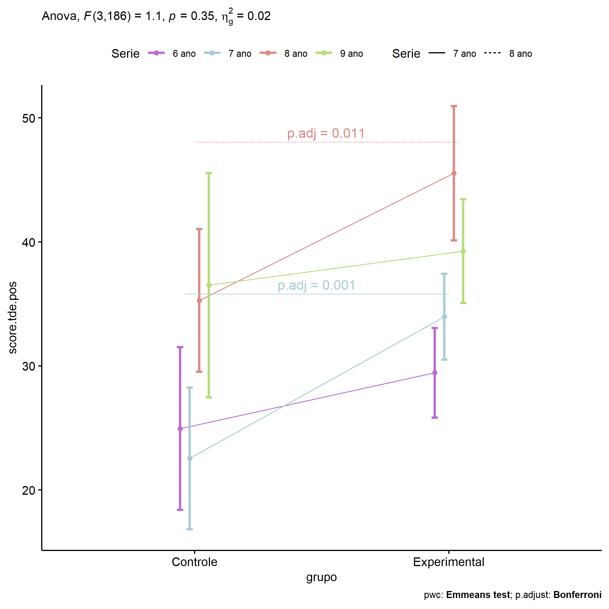<!-- -->

``` r
if (!is.null(plots[["Serie"]]))
  plots[["Serie"]] + ggplot2::scale_color_manual(values = color[["grupo"]])
```

    ## Scale for colour is already present.
    ## Adding another scale for colour, which will replace the existing scale.

    ## Warning: `position_dodge()` requires non-overlapping x intervals

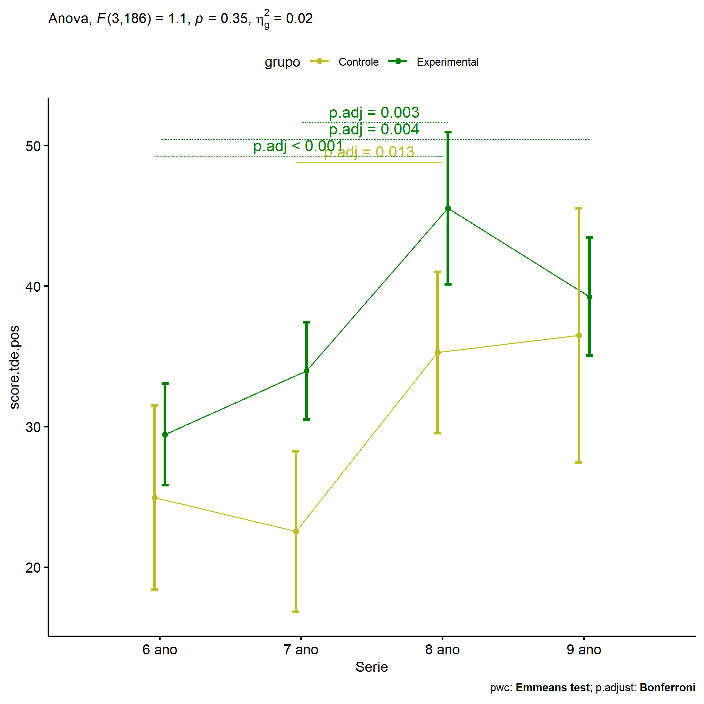<!-- -->

``` r
plots <- twoWayAncovaBoxPlots(
  wdat, "score.tde.pos", c("grupo","Serie"), aov, pwcs, covar = "score.tde.pre",
  theme = "classic", color = color[["grupo:Serie"]],
  subtitle = which(aov$Effect == "grupo:Serie"))
```

``` r
plots[["grupo:Serie"]] + ggplot2::ylab("TDE - Escrita") + ggplot2::scale_x_discrete(labels=c('pre', 'pos'))
```

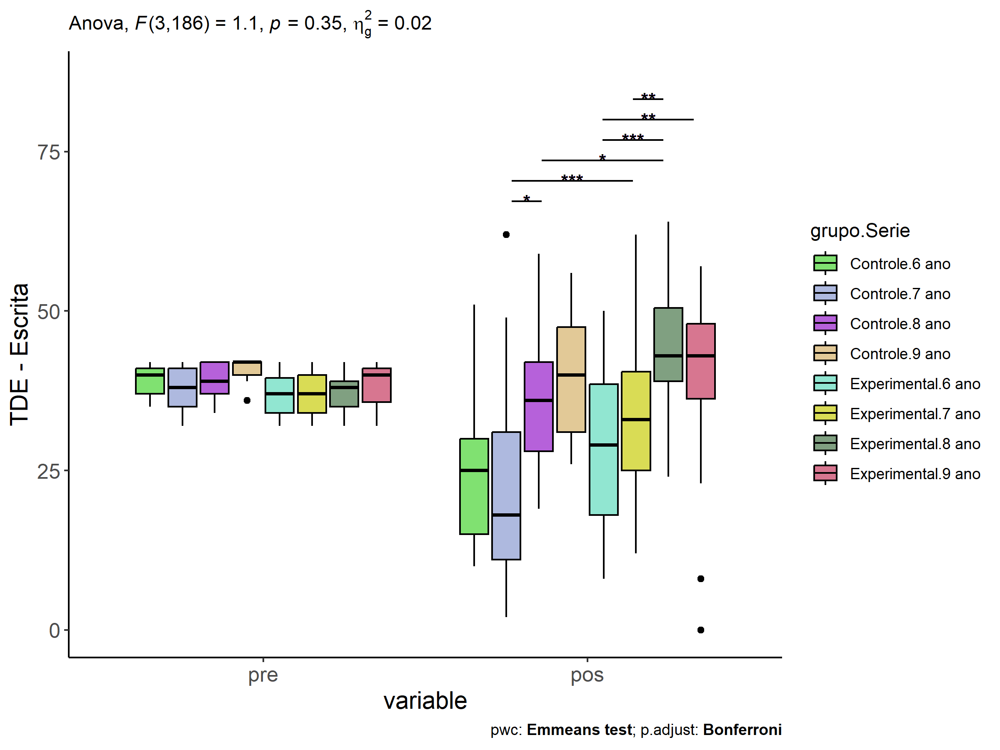<!-- -->

``` r
plots <- twoWayAncovaBoxPlots(
  wdat.long, "score.tde", c("grupo","Serie"), aov, pwc.long, pre.post = "time",
  theme = "classic", color = color$prepost)
```

``` r
plots[["grupo:Serie"]] + ggplot2::ylab("TDE - Escrita")
```

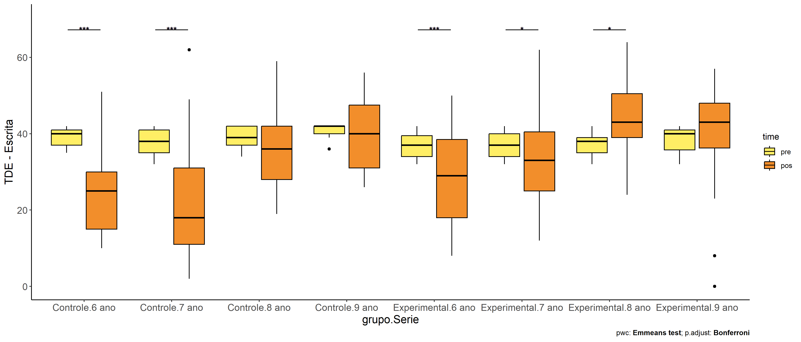<!-- -->

### Checking linearity assumption

``` r
ggscatter(wdat, x = "score.tde.pre", y = "score.tde.pos", size = 0.5,
          facet.by = c("grupo","Serie"), add = "reg.line")+
  stat_regline_equation(
    aes(label =  paste(..eq.label.., ..rr.label.., sep = "~~~~"))
  )
```

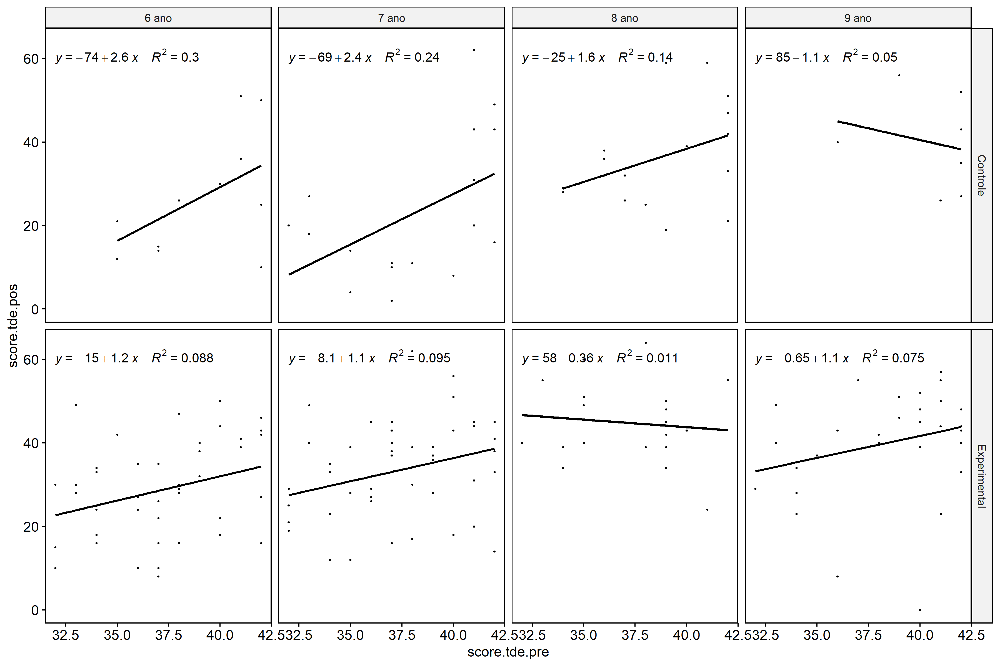<!-- -->

### Checking normality and homogeneity

``` r
res <- augment(lm(score.tde.pos ~ score.tde.pre + grupo*Serie, data = wdat))
```

``` r
shapiro_test(res$.resid)
```

    ## # A tibble: 1 × 3
    ##   variable   statistic p.value
    ##   <chr>          <dbl>   <dbl>
    ## 1 res$.resid     0.993   0.498

``` r
levene_test(res, .resid ~ grupo*Serie)
```

    ## # A tibble: 1 × 4
    ##     df1   df2 statistic     p
    ##   <int> <int>     <dbl> <dbl>
    ## 1     7   187     0.714 0.661

# Summary of Results

## Descriptive Statistics

``` r
df <- get.descriptives(ldat[["grupo"]], c(dv.pre, dv.pos), c("grupo"), 
                       include.global = T, symmetry.test = T, normality.test = F)
df <- plyr::rbind.fill(
  df, do.call(plyr::rbind.fill, lapply(lfatores2, FUN = function(f) {
    if (nrow(dat) > 0 && sum(!is.na(unique(dat[[f]]))) > 1)
      get.descriptives(ldat[[paste0("grupo:",f)]], c(dv.pre,dv.pos), c("grupo", f),
                       symmetry.test = T, normality.test = F)
    }))
)
(df <- df[,c(fatores1[fatores1 %in% colnames(df)],"variable",
             colnames(df)[!colnames(df) %in% c(fatores1,"variable")])])
```

    ##           grupo Sexo   Zona Cor.Raca Serie      variable   n   mean median min max     sd    se     ci
    ## 1      Controle <NA>   <NA>     <NA>  <NA> score.tde.pre  54 38.815   39.5  32  42  3.004 0.409  0.820
    ## 2  Experimental <NA>   <NA>     <NA>  <NA> score.tde.pre 141 37.383   38.0  32  42  3.177 0.268  0.529
    ## 3          <NA> <NA>   <NA>     <NA>  <NA> score.tde.pre 195 37.779   38.0  32  42  3.188 0.228  0.450
    ## 4      Controle <NA>   <NA>     <NA>  <NA> score.tde.pos  54 30.185   28.5   2  62 15.298 2.082  4.176
    ## 5  Experimental <NA>   <NA>     <NA>  <NA> score.tde.pos 141 34.872   37.0   0  64 13.013 1.096  2.167
    ## 6          <NA> <NA>   <NA>     <NA>  <NA> score.tde.pos 195 33.574   35.0   0  64 13.804 0.989  1.950
    ## 7      Controle    F   <NA>     <NA>  <NA> score.tde.pre  36 39.167   40.5  33  42  3.019 0.503  1.021
    ## 8      Controle    M   <NA>     <NA>  <NA> score.tde.pre  18 38.111   38.0  32  42  2.928 0.690  1.456
    ## 9  Experimental    F   <NA>     <NA>  <NA> score.tde.pre  61 37.557   38.0  32  42  3.101 0.397  0.794
    ## 10 Experimental    M   <NA>     <NA>  <NA> score.tde.pre  80 37.250   37.0  32  42  3.247 0.363  0.723
    ## 11     Controle    F   <NA>     <NA>  <NA> score.tde.pos  36 31.444   29.5   4  62 16.366 2.728  5.538
    ## 12     Controle    M   <NA>     <NA>  <NA> score.tde.pos  18 27.667   26.5   2  51 12.966 3.056  6.448
    ## 13 Experimental    F   <NA>     <NA>  <NA> score.tde.pos  61 36.934   39.0   0  64 14.477 1.854  3.708
    ## 14 Experimental    M   <NA>     <NA>  <NA> score.tde.pos  80 33.300   35.0   8  56 11.623 1.300  2.587
    ## 15     Controle <NA>  Rural     <NA>  <NA> score.tde.pre  23 39.522   41.0  34  42  2.998 0.625  1.296
    ## 16     Controle <NA> Urbana     <NA>  <NA> score.tde.pre  18 37.500   37.5  32  42  2.662 0.628  1.324
    ## 17 Experimental <NA>  Rural     <NA>  <NA> score.tde.pre  64 36.719   37.0  32  42  3.037 0.380  0.759
    ## 18 Experimental <NA> Urbana     <NA>  <NA> score.tde.pre  40 38.675   39.5  33  42  2.912 0.460  0.931
    ## 19     Controle <NA>  Rural     <NA>  <NA> score.tde.pos  23 33.261   35.0   2  62 14.464 3.016  6.255
    ## 20     Controle <NA> Urbana     <NA>  <NA> score.tde.pos  18 20.722   19.0   4  39 10.910 2.572  5.426
    ## 21 Experimental <NA>  Rural     <NA>  <NA> score.tde.pos  64 34.500   34.5   8  64 12.866 1.608  3.214
    ## 22 Experimental <NA> Urbana     <NA>  <NA> score.tde.pos  40 34.075   36.5   8  56 13.088 2.069  4.186
    ## 23     Controle <NA>   <NA>   Branca  <NA> score.tde.pre   6 38.167   38.5  35  41  2.858 1.167  2.999
    ## 24     Controle <NA>   <NA>    Parda  <NA> score.tde.pre  22 39.045   39.5  32  42  3.031 0.646  1.344
    ## 25 Experimental <NA>   <NA>   Branca  <NA> score.tde.pre  15 37.867   38.0  32  42  3.137 0.810  1.737
    ## 26 Experimental <NA>   <NA>    Parda  <NA> score.tde.pre  34 37.147   38.0  32  42  2.904 0.498  1.013
    ## 27     Controle <NA>   <NA>   Branca  <NA> score.tde.pos   6 25.667   25.0  10  43 15.188 6.200 15.939
    ## 28     Controle <NA>   <NA>    Parda  <NA> score.tde.pos  22 29.273   28.0   2  59 18.362 3.915  8.141
    ## 29 Experimental <NA>   <NA>   Branca  <NA> score.tde.pos  15 37.667   40.0  10  64 14.316 3.696  7.928
    ## 30 Experimental <NA>   <NA>    Parda  <NA> score.tde.pos  34 32.853   31.5   8  62 14.347 2.460  5.006
    ## 31     Controle <NA>   <NA>     <NA> 6 ano score.tde.pre  13 38.846   40.0  35  42  2.794 0.775  1.689
    ## 32     Controle <NA>   <NA>     <NA> 7 ano score.tde.pre  17 38.059   38.0  32  42  3.491 0.847  1.795
    ## 33     Controle <NA>   <NA>     <NA> 8 ano score.tde.pre  17 38.824   39.0  34  42  2.811 0.682  1.446
    ## 34     Controle <NA>   <NA>     <NA> 9 ano score.tde.pre   7 40.571   42.0  36  42  2.299 0.869  2.126
    ## 35 Experimental <NA>   <NA>     <NA> 6 ano score.tde.pre  43 37.116   37.0  32  42  3.064 0.467  0.943
    ## 36 Experimental <NA>   <NA>     <NA> 7 ano score.tde.pre  47 37.043   37.0  32  42  3.257 0.475  0.956
    ## 37 Experimental <NA>   <NA>     <NA> 8 ano score.tde.pre  19 37.158   38.0  32  42  2.892 0.663  1.394
    ## 38 Experimental <NA>   <NA>     <NA> 9 ano score.tde.pre  32 38.375   40.0  32  42  3.309 0.585  1.193
    ## 39     Controle <NA>   <NA>     <NA> 6 ano score.tde.pos  13 26.231   25.0  10  51 13.230 3.669  7.995
    ## 40     Controle <NA>   <NA>     <NA> 7 ano score.tde.pos  17 22.882   18.0   2  62 17.201 4.172  8.844
    ## 41     Controle <NA>   <NA>     <NA> 8 ano score.tde.pos  17 36.529   36.0  19  59 12.047 2.922  6.194
    ## 42     Controle <NA>   <NA>     <NA> 9 ano score.tde.pos   7 39.857   40.0  26  56 11.539 4.361 10.672
    ## 43 Experimental <NA>   <NA>     <NA> 6 ano score.tde.pos  43 28.651   29.0   8  50 12.002 1.830  3.694
    ## 44 Experimental <NA>   <NA>     <NA> 7 ano score.tde.pos  47 33.085   33.0  12  62 11.738 1.712  3.446
    ## 45 Experimental <NA>   <NA>     <NA> 8 ano score.tde.pos  19 44.789   43.0  24  64  9.790 2.246  4.719
    ## 46 Experimental <NA>   <NA>     <NA> 9 ano score.tde.pos  32 39.969   43.0   0  57 12.800 2.263  4.615
    ##      iqr symmetry     skewness   kurtosis
    ## 1   5.00       NO -0.509831113 -1.0485130
    ## 2   6.00      YES -0.147201825 -1.2207501
    ## 3   6.00      YES -0.246413553 -1.1833896
    ## 4  22.25      YES  0.232127697 -0.8690440
    ## 5  18.00      YES -0.298224608 -0.4827593
    ## 6  19.00      YES -0.162544077 -0.6708477
    ## 7   6.00       NO -0.609411628 -1.2393573
    ## 8   3.75      YES -0.368624282 -0.7204237
    ## 9   5.00      YES -0.161299718 -1.2516282
    ## 10  6.00      YES -0.124855953 -1.2538468
    ## 11 24.25      YES  0.188492192 -1.1448664
    ## 12 15.00      YES  0.038909152 -0.6839383
    ## 13 21.00      YES -0.358425522 -0.5860562
    ## 14 17.00      YES -0.429729907 -0.6477708
    ## 15  5.50       NO -0.659549835 -1.4175064
    ## 16  3.50      YES -0.317939189 -0.6877689
    ## 17  5.00      YES -0.013620947 -1.2347596
    ## 18  4.50      YES -0.408012618 -1.2161271
    ## 19 20.00      YES -0.135561086 -0.6817796
    ## 20 17.25      YES  0.320644752 -1.2915618
    ## 21 17.75      YES  0.113271422 -0.5084375
    ## 22 18.50      YES -0.476822349 -0.7938851
    ## 23  5.25      YES -0.096011746 -2.1424754
    ## 24  5.00       NO -0.638629802 -0.7593063
    ## 25  5.00      YES -0.338910622 -1.3774598
    ## 26  4.00      YES -0.148791409 -0.9781866
    ## 27 25.75      YES  0.033090499 -2.2265180
    ## 28 28.75      YES  0.200415055 -1.3775207
    ## 29 18.00      YES -0.183293611 -0.8405963
    ## 30 18.50      YES  0.144540065 -0.7610239
    ## 31  4.00      YES -0.235214418 -1.7083157
    ## 32  6.00      YES -0.344969392 -1.4650201
    ## 33  5.00      YES -0.291036949 -1.3375883
    ## 34  2.00       NO -1.030658114 -0.6503928
    ## 35  5.50      YES  0.009167589 -1.1209255
    ## 36  6.00      YES -0.048220595 -1.2472626
    ## 37  4.00      YES -0.174931028 -1.3478565
    ## 38  5.25       NO -0.553240763 -1.2367553
    ## 39 15.00       NO  0.630282324 -0.8522878
    ## 40 20.00       NO  0.794599099 -0.5928933
    ## 41 14.00      YES  0.472195596 -0.8824271
    ## 42 16.50      YES  0.104833109 -1.7549161
    ## 43 20.50      YES -0.051899388 -1.0906156
    ## 44 15.50      YES  0.094646948 -0.5833985
    ## 45 11.50      YES  0.050470089 -0.5218893
    ## 46 11.75       NO -1.357834982  1.7214573

| grupo        | Sexo | Zona   | Cor.Raca | Serie | variable      |   n |   mean | median | min | max |     sd |    se |     ci |   iqr | symmetry | skewness | kurtosis |
|:-------------|:-----|:-------|:---------|:------|:--------------|----:|-------:|-------:|----:|----:|-------:|------:|-------:|------:|:---------|---------:|---------:|
| Controle     |      |        |          |       | score.tde.pre |  54 | 38.815 |   39.5 |  32 |  42 |  3.004 | 0.409 |  0.820 |  5.00 | NO       |   -0.510 |   -1.049 |
| Experimental |      |        |          |       | score.tde.pre | 141 | 37.383 |   38.0 |  32 |  42 |  3.177 | 0.268 |  0.529 |  6.00 | YES      |   -0.147 |   -1.221 |
|              |      |        |          |       | score.tde.pre | 195 | 37.779 |   38.0 |  32 |  42 |  3.188 | 0.228 |  0.450 |  6.00 | YES      |   -0.246 |   -1.183 |
| Controle     |      |        |          |       | score.tde.pos |  54 | 30.185 |   28.5 |   2 |  62 | 15.298 | 2.082 |  4.176 | 22.25 | YES      |    0.232 |   -0.869 |
| Experimental |      |        |          |       | score.tde.pos | 141 | 34.872 |   37.0 |   0 |  64 | 13.013 | 1.096 |  2.167 | 18.00 | YES      |   -0.298 |   -0.483 |
|              |      |        |          |       | score.tde.pos | 195 | 33.574 |   35.0 |   0 |  64 | 13.804 | 0.989 |  1.950 | 19.00 | YES      |   -0.163 |   -0.671 |
| Controle     | F    |        |          |       | score.tde.pre |  36 | 39.167 |   40.5 |  33 |  42 |  3.019 | 0.503 |  1.021 |  6.00 | NO       |   -0.609 |   -1.239 |
| Controle     | M    |        |          |       | score.tde.pre |  18 | 38.111 |   38.0 |  32 |  42 |  2.928 | 0.690 |  1.456 |  3.75 | YES      |   -0.369 |   -0.720 |
| Experimental | F    |        |          |       | score.tde.pre |  61 | 37.557 |   38.0 |  32 |  42 |  3.101 | 0.397 |  0.794 |  5.00 | YES      |   -0.161 |   -1.252 |
| Experimental | M    |        |          |       | score.tde.pre |  80 | 37.250 |   37.0 |  32 |  42 |  3.247 | 0.363 |  0.723 |  6.00 | YES      |   -0.125 |   -1.254 |
| Controle     | F    |        |          |       | score.tde.pos |  36 | 31.444 |   29.5 |   4 |  62 | 16.366 | 2.728 |  5.538 | 24.25 | YES      |    0.188 |   -1.145 |
| Controle     | M    |        |          |       | score.tde.pos |  18 | 27.667 |   26.5 |   2 |  51 | 12.966 | 3.056 |  6.448 | 15.00 | YES      |    0.039 |   -0.684 |
| Experimental | F    |        |          |       | score.tde.pos |  61 | 36.934 |   39.0 |   0 |  64 | 14.477 | 1.854 |  3.708 | 21.00 | YES      |   -0.358 |   -0.586 |
| Experimental | M    |        |          |       | score.tde.pos |  80 | 33.300 |   35.0 |   8 |  56 | 11.623 | 1.300 |  2.587 | 17.00 | YES      |   -0.430 |   -0.648 |
| Controle     |      | Rural  |          |       | score.tde.pre |  23 | 39.522 |   41.0 |  34 |  42 |  2.998 | 0.625 |  1.296 |  5.50 | NO       |   -0.660 |   -1.418 |
| Controle     |      | Urbana |          |       | score.tde.pre |  18 | 37.500 |   37.5 |  32 |  42 |  2.662 | 0.628 |  1.324 |  3.50 | YES      |   -0.318 |   -0.688 |
| Experimental |      | Rural  |          |       | score.tde.pre |  64 | 36.719 |   37.0 |  32 |  42 |  3.037 | 0.380 |  0.759 |  5.00 | YES      |   -0.014 |   -1.235 |
| Experimental |      | Urbana |          |       | score.tde.pre |  40 | 38.675 |   39.5 |  33 |  42 |  2.912 | 0.460 |  0.931 |  4.50 | YES      |   -0.408 |   -1.216 |
| Controle     |      | Rural  |          |       | score.tde.pos |  23 | 33.261 |   35.0 |   2 |  62 | 14.464 | 3.016 |  6.255 | 20.00 | YES      |   -0.136 |   -0.682 |
| Controle     |      | Urbana |          |       | score.tde.pos |  18 | 20.722 |   19.0 |   4 |  39 | 10.910 | 2.572 |  5.426 | 17.25 | YES      |    0.321 |   -1.292 |
| Experimental |      | Rural  |          |       | score.tde.pos |  64 | 34.500 |   34.5 |   8 |  64 | 12.866 | 1.608 |  3.214 | 17.75 | YES      |    0.113 |   -0.508 |
| Experimental |      | Urbana |          |       | score.tde.pos |  40 | 34.075 |   36.5 |   8 |  56 | 13.088 | 2.069 |  4.186 | 18.50 | YES      |   -0.477 |   -0.794 |
| Controle     |      |        | Branca   |       | score.tde.pre |   6 | 38.167 |   38.5 |  35 |  41 |  2.858 | 1.167 |  2.999 |  5.25 | YES      |   -0.096 |   -2.142 |
| Controle     |      |        | Parda    |       | score.tde.pre |  22 | 39.045 |   39.5 |  32 |  42 |  3.031 | 0.646 |  1.344 |  5.00 | NO       |   -0.639 |   -0.759 |
| Experimental |      |        | Branca   |       | score.tde.pre |  15 | 37.867 |   38.0 |  32 |  42 |  3.137 | 0.810 |  1.737 |  5.00 | YES      |   -0.339 |   -1.377 |
| Experimental |      |        | Parda    |       | score.tde.pre |  34 | 37.147 |   38.0 |  32 |  42 |  2.904 | 0.498 |  1.013 |  4.00 | YES      |   -0.149 |   -0.978 |
| Controle     |      |        | Branca   |       | score.tde.pos |   6 | 25.667 |   25.0 |  10 |  43 | 15.188 | 6.200 | 15.939 | 25.75 | YES      |    0.033 |   -2.227 |
| Controle     |      |        | Parda    |       | score.tde.pos |  22 | 29.273 |   28.0 |   2 |  59 | 18.362 | 3.915 |  8.141 | 28.75 | YES      |    0.200 |   -1.378 |
| Experimental |      |        | Branca   |       | score.tde.pos |  15 | 37.667 |   40.0 |  10 |  64 | 14.316 | 3.696 |  7.928 | 18.00 | YES      |   -0.183 |   -0.841 |
| Experimental |      |        | Parda    |       | score.tde.pos |  34 | 32.853 |   31.5 |   8 |  62 | 14.347 | 2.460 |  5.006 | 18.50 | YES      |    0.145 |   -0.761 |
| Controle     |      |        |          | 6 ano | score.tde.pre |  13 | 38.846 |   40.0 |  35 |  42 |  2.794 | 0.775 |  1.689 |  4.00 | YES      |   -0.235 |   -1.708 |
| Controle     |      |        |          | 7 ano | score.tde.pre |  17 | 38.059 |   38.0 |  32 |  42 |  3.491 | 0.847 |  1.795 |  6.00 | YES      |   -0.345 |   -1.465 |
| Controle     |      |        |          | 8 ano | score.tde.pre |  17 | 38.824 |   39.0 |  34 |  42 |  2.811 | 0.682 |  1.446 |  5.00 | YES      |   -0.291 |   -1.338 |
| Controle     |      |        |          | 9 ano | score.tde.pre |   7 | 40.571 |   42.0 |  36 |  42 |  2.299 | 0.869 |  2.126 |  2.00 | NO       |   -1.031 |   -0.650 |
| Experimental |      |        |          | 6 ano | score.tde.pre |  43 | 37.116 |   37.0 |  32 |  42 |  3.064 | 0.467 |  0.943 |  5.50 | YES      |    0.009 |   -1.121 |
| Experimental |      |        |          | 7 ano | score.tde.pre |  47 | 37.043 |   37.0 |  32 |  42 |  3.257 | 0.475 |  0.956 |  6.00 | YES      |   -0.048 |   -1.247 |
| Experimental |      |        |          | 8 ano | score.tde.pre |  19 | 37.158 |   38.0 |  32 |  42 |  2.892 | 0.663 |  1.394 |  4.00 | YES      |   -0.175 |   -1.348 |
| Experimental |      |        |          | 9 ano | score.tde.pre |  32 | 38.375 |   40.0 |  32 |  42 |  3.309 | 0.585 |  1.193 |  5.25 | NO       |   -0.553 |   -1.237 |
| Controle     |      |        |          | 6 ano | score.tde.pos |  13 | 26.231 |   25.0 |  10 |  51 | 13.230 | 3.669 |  7.995 | 15.00 | NO       |    0.630 |   -0.852 |
| Controle     |      |        |          | 7 ano | score.tde.pos |  17 | 22.882 |   18.0 |   2 |  62 | 17.201 | 4.172 |  8.844 | 20.00 | NO       |    0.795 |   -0.593 |
| Controle     |      |        |          | 8 ano | score.tde.pos |  17 | 36.529 |   36.0 |  19 |  59 | 12.047 | 2.922 |  6.194 | 14.00 | YES      |    0.472 |   -0.882 |
| Controle     |      |        |          | 9 ano | score.tde.pos |   7 | 39.857 |   40.0 |  26 |  56 | 11.539 | 4.361 | 10.672 | 16.50 | YES      |    0.105 |   -1.755 |
| Experimental |      |        |          | 6 ano | score.tde.pos |  43 | 28.651 |   29.0 |   8 |  50 | 12.002 | 1.830 |  3.694 | 20.50 | YES      |   -0.052 |   -1.091 |
| Experimental |      |        |          | 7 ano | score.tde.pos |  47 | 33.085 |   33.0 |  12 |  62 | 11.738 | 1.712 |  3.446 | 15.50 | YES      |    0.095 |   -0.583 |
| Experimental |      |        |          | 8 ano | score.tde.pos |  19 | 44.789 |   43.0 |  24 |  64 |  9.790 | 2.246 |  4.719 | 11.50 | YES      |    0.050 |   -0.522 |
| Experimental |      |        |          | 9 ano | score.tde.pos |  32 | 39.969 |   43.0 |   0 |  57 | 12.800 | 2.263 |  4.615 | 11.75 | NO       |   -1.358 |    1.721 |

## ANCOVA Table Comparison

``` r
df <- do.call(plyr::rbind.fill, laov)
(df <- df[!duplicated(df$Effect),])
```

    ##            Effect DFn DFd      F        p p<.05      ges DFn' DFd'     F'       p' p<.05'     ges'
    ## 1           grupo   1 192  9.837 2.00e-03     * 0.049000    1  192  9.837 2.00e-03      * 0.049000
    ## 2   score.tde.pre   1 192 21.357 6.98e-06     * 0.100000    1  192 21.357 6.98e-06      * 0.100000
    ## 4      grupo:Sexo   1 190  0.039 8.43e-01       0.000208    1  190  0.039 8.43e-01        0.000208
    ## 6            Sexo   1 190  2.468 1.18e-01       0.013000    1  190  2.468 1.18e-01        0.013000
    ## 8      grupo:Zona   1 140  1.558 2.14e-01       0.011000    1  140  1.558 2.14e-01        0.011000
    ## 10           Zona   1 140  6.441 1.20e-02     * 0.044000    1  140  6.441 1.20e-02      * 0.044000
    ## 11       Cor.Raca   1  72  0.220 6.41e-01       0.003000    1   72  0.220 6.41e-01        0.003000
    ## 13 grupo:Cor.Raca   1  72  0.460 5.00e-01       0.006000    1   72  0.460 5.00e-01        0.006000
    ## 16    grupo:Serie   3 186  1.102 3.49e-01       0.017000    3  186  1.102 3.49e-01        0.017000
    ## 18          Serie   3 186 12.849 1.15e-07     * 0.172000    3  186 12.849 1.15e-07      * 0.172000

|     | Effect         | DFn | DFd |      F |     p | p\<.05 |   ges | DFn’ | DFd’ |     F’ |    p’ | p\<.05’ |  ges’ |
|:----|:---------------|----:|----:|-------:|------:|:-------|------:|-----:|-----:|-------:|------:|:--------|------:|
| 1   | grupo          |   1 | 192 |  9.837 | 0.002 | \*     | 0.049 |    1 |  192 |  9.837 | 0.002 | \*      | 0.049 |
| 2   | score.tde.pre  |   1 | 192 | 21.357 | 0.000 | \*     | 0.100 |    1 |  192 | 21.357 | 0.000 | \*      | 0.100 |
| 4   | grupo:Sexo     |   1 | 190 |  0.039 | 0.843 |        | 0.000 |    1 |  190 |  0.039 | 0.843 |         | 0.000 |
| 6   | Sexo           |   1 | 190 |  2.468 | 0.118 |        | 0.013 |    1 |  190 |  2.468 | 0.118 |         | 0.013 |
| 8   | grupo:Zona     |   1 | 140 |  1.558 | 0.214 |        | 0.011 |    1 |  140 |  1.558 | 0.214 |         | 0.011 |
| 10  | Zona           |   1 | 140 |  6.441 | 0.012 | \*     | 0.044 |    1 |  140 |  6.441 | 0.012 | \*      | 0.044 |
| 11  | Cor.Raca       |   1 |  72 |  0.220 | 0.641 |        | 0.003 |    1 |   72 |  0.220 | 0.641 |         | 0.003 |
| 13  | grupo:Cor.Raca |   1 |  72 |  0.460 | 0.500 |        | 0.006 |    1 |   72 |  0.460 | 0.500 |         | 0.006 |
| 16  | grupo:Serie    |   3 | 186 |  1.102 | 0.349 |        | 0.017 |    3 |  186 |  1.102 | 0.349 |         | 0.017 |
| 18  | Serie          |   3 | 186 | 12.849 | 0.000 | \*     | 0.172 |    3 |  186 | 12.849 | 0.000 | \*      | 0.172 |

## PairWise Table Comparison

``` r
df <- do.call(plyr::rbind.fill, lpwc)
df <- df[,c(names(lfatores), names(df)[!names(df) %in% c(names(lfatores),"term",".y.")])]
```

| grupo        | Sexo | Zona   | Cor.Raca | Serie | group1   | group2       |  df | statistic |     p | p.adj | p.adj.signif | df’ | statistic’ |    p’ | p.adj’ | p.adj.signif’ |
|:-------------|:-----|:-------|:---------|:------|:---------|:-------------|----:|----------:|------:|------:|:-------------|----:|-----------:|------:|-------:|:--------------|
| Controle     |      |        |          |       | pre      | pos          | 386 |     4.519 | 0.000 | 0.000 | \*\*\*\*     | 386 |      4.519 | 0.000 |  0.000 | \*\*\*\*      |
| Experimental |      |        |          |       | pre      | pos          | 386 |     2.125 | 0.034 | 0.034 | \*           | 386 |      2.125 | 0.034 |  0.034 | \*            |
|              |      |        |          |       | Controle | Experimental | 192 |    -3.136 | 0.002 | 0.002 | \*\*         | 192 |     -3.136 | 0.002 |  0.002 | \*\*          |
| Controle     | F    |        |          |       | pre      | pos          | 382 |     3.313 | 0.001 | 0.001 | \*\*         | 382 |      3.313 | 0.001 |  0.001 | \*\*          |
| Controle     | M    |        |          |       | pre      | pos          | 382 |     3.169 | 0.002 | 0.002 | \*\*         | 382 |      3.169 | 0.002 |  0.002 | \*\*          |
| Controle     |      |        |          |       | F        | M            | 190 |     0.626 | 0.532 | 0.532 | ns           | 190 |      0.626 | 0.532 |  0.532 | ns            |
| Experimental | F    |        |          |       | pre      | pos          | 382 |     0.348 | 0.728 | 0.728 | ns           | 382 |      0.348 | 0.728 |  0.728 | ns            |
| Experimental | M    |        |          |       | pre      | pos          | 382 |     2.526 | 0.012 | 0.012 | \*           | 382 |      2.526 | 0.012 |  0.012 | \*            |
| Experimental |      |        |          |       | F        | M            | 190 |     1.457 | 0.147 | 0.147 | ns           | 190 |      1.457 | 0.147 |  0.147 | ns            |
|              | F    |        |          |       | Controle | Experimental | 190 |    -2.762 | 0.006 | 0.006 | \*\*         | 190 |     -2.762 | 0.006 |  0.006 | \*\*          |
|              | M    |        |          |       | Controle | Experimental | 190 |    -1.999 | 0.047 | 0.047 | \*           | 190 |     -1.999 | 0.047 |  0.047 | \*            |
| Controle     |      |        |          |       | Rural    | Urbana       | 140 |     2.412 | 0.017 | 0.017 | \*           | 140 |      2.412 | 0.017 |  0.017 | \*            |
| Controle     |      | Rural  |          |       | pre      | pos          | 282 |     2.257 | 0.025 | 0.025 | \*           | 282 |      2.257 | 0.025 |  0.025 | \*            |
| Controle     |      | Urbana |          |       | pre      | pos          | 282 |     5.350 | 0.000 | 0.000 | \*\*\*\*     | 282 |      5.350 | 0.000 |  0.000 | \*\*\*\*      |
| Experimental |      |        |          |       | Rural    | Urbana       | 140 |     1.359 | 0.176 | 0.176 | ns           | 140 |      1.359 | 0.176 |  0.176 | ns            |
| Experimental |      | Rural  |          |       | pre      | pos          | 282 |     1.334 | 0.183 | 0.183 | ns           | 282 |      1.334 | 0.183 |  0.183 | ns            |
| Experimental |      | Urbana |          |       | pre      | pos          | 282 |     2.186 | 0.030 | 0.030 | \*           | 282 |      2.186 | 0.030 |  0.030 | \*            |
|              |      | Rural  |          |       | Controle | Experimental | 140 |    -1.793 | 0.075 | 0.075 | ns           | 140 |     -1.793 | 0.075 |  0.075 | ns            |
|              |      | Urbana |          |       | Controle | Experimental | 140 |    -3.312 | 0.001 | 0.001 | \*\*         | 140 |     -3.312 | 0.001 |  0.001 | \*\*          |
| Controle     |      |        | Branca   |       | pre      | pos          | 146 |     1.921 | 0.057 | 0.057 | ns           | 146 |      1.921 | 0.057 |  0.057 | ns            |
| Controle     |      |        |          |       | Branca   | Parda        |  72 |    -0.302 | 0.763 | 0.763 | ns           |  72 |     -0.302 | 0.763 |  0.763 | ns            |
| Controle     |      |        | Parda    |       | pre      | pos          | 146 |     2.876 | 0.005 | 0.005 | \*\*         | 146 |      2.876 | 0.005 |  0.005 | \*\*          |
| Experimental |      |        | Branca   |       | pre      | pos          | 146 |     0.049 | 0.961 | 0.961 | ns           | 146 |      0.049 | 0.961 |  0.961 | ns            |
| Experimental |      |        |          |       | Branca   | Parda        |  72 |     0.769 | 0.444 | 0.444 | ns           |  72 |      0.769 | 0.444 |  0.444 | ns            |
| Experimental |      |        | Parda    |       | pre      | pos          | 146 |     1.571 | 0.118 | 0.118 | ns           | 146 |      1.571 | 0.118 |  0.118 | ns            |
|              |      |        | Branca   |       | Controle | Experimental |  72 |    -1.743 | 0.086 | 0.086 | ns           |  72 |     -1.743 | 0.086 |  0.086 | ns            |
|              |      |        | Parda    |       | Controle | Experimental |  72 |    -1.632 | 0.107 | 0.107 | ns           |  72 |     -1.632 | 0.107 |  0.107 | ns            |
| Controle     |      |        |          | 6 ano | pre      | pos          | 374 |     3.535 | 0.000 | 0.000 | \*\*\*       | 374 |      3.535 | 0.000 |  0.000 | \*\*\*        |
| Controle     |      |        |          | 7 ano | pre      | pos          | 374 |     4.863 | 0.000 | 0.000 | \*\*\*\*     | 374 |      4.863 | 0.000 |  0.000 | \*\*\*\*      |
| Controle     |      |        |          | 8 ano | pre      | pos          | 374 |     0.735 | 0.463 | 0.463 | ns           | 374 |      0.735 | 0.463 |  0.463 | ns            |
| Controle     |      |        |          | 9 ano | pre      | pos          | 374 |     0.147 | 0.883 | 0.883 | ns           | 374 |      0.147 | 0.883 |  0.883 | ns            |
| Controle     |      |        |          |       | 6 ano    | 7 ano        | 186 |     0.546 | 0.586 | 1.000 | ns           | 186 |      0.546 | 0.586 |  1.000 | ns            |
| Controle     |      |        |          |       | 6 ano    | 8 ano        | 186 |    -2.347 | 0.020 | 0.120 | ns           | 186 |     -2.347 | 0.020 |  0.120 | ns            |
| Controle     |      |        |          |       | 6 ano    | 9 ano        | 186 |    -2.056 | 0.041 | 0.247 | ns           | 186 |     -2.056 | 0.041 |  0.247 | ns            |
| Controle     |      |        |          |       | 7 ano    | 8 ano        | 186 |    -3.103 | 0.002 | 0.013 | \*           | 186 |     -3.103 | 0.002 |  0.013 | \*            |
| Controle     |      |        |          |       | 7 ano    | 9 ano        | 186 |    -2.581 | 0.011 | 0.064 | ns           | 186 |     -2.581 | 0.011 |  0.064 | ns            |
| Controle     |      |        |          |       | 8 ano    | 9 ano        | 186 |    -0.228 | 0.820 | 1.000 | ns           | 186 |     -0.228 | 0.820 |  1.000 | ns            |
| Experimental |      |        |          | 6 ano | pre      | pos          | 374 |     4.314 | 0.000 | 0.000 | \*\*\*\*     | 374 |      4.314 | 0.000 |  0.000 | \*\*\*\*      |
| Experimental |      |        |          | 7 ano | pre      | pos          | 374 |     2.108 | 0.036 | 0.036 | \*           | 374 |      2.108 | 0.036 |  0.036 | \*            |
| Experimental |      |        |          | 8 ano | pre      | pos          | 374 |    -2.585 | 0.010 | 0.010 | \*           | 374 |     -2.585 | 0.010 |  0.010 | \*            |
| Experimental |      |        |          | 9 ano | pre      | pos          | 374 |    -0.701 | 0.484 | 0.484 | ns           | 374 |     -0.701 | 0.484 |  0.484 | ns            |
| Experimental |      |        |          |       | 6 ano    | 7 ano        | 186 |    -1.794 | 0.074 | 0.446 | ns           | 186 |     -1.794 | 0.074 |  0.446 | ns            |
| Experimental |      |        |          |       | 6 ano    | 8 ano        | 186 |    -4.890 | 0.000 | 0.000 | \*\*\*\*     | 186 |     -4.890 | 0.000 |  0.000 | \*\*\*\*      |
| Experimental |      |        |          |       | 6 ano    | 9 ano        | 186 |    -3.490 | 0.001 | 0.004 | \*\*         | 186 |     -3.490 | 0.001 |  0.004 | \*\*          |
| Experimental |      |        |          |       | 7 ano    | 8 ano        | 186 |    -3.562 | 0.000 | 0.003 | \*\*         | 186 |     -3.562 | 0.000 |  0.003 | \*\*          |
| Experimental |      |        |          |       | 7 ano    | 9 ano        | 186 |    -1.913 | 0.057 | 0.344 | ns           | 186 |     -1.913 | 0.057 |  0.344 | ns            |
| Experimental |      |        |          |       | 8 ano    | 9 ano        | 186 |     1.807 | 0.072 | 0.434 | ns           | 186 |      1.807 | 0.072 |  0.434 | ns            |
|              |      |        |          | 6 ano | Controle | Experimental | 186 |    -1.180 | 0.240 | 0.240 | ns           | 186 |     -1.180 | 0.240 |  0.240 | ns            |
|              |      |        |          | 7 ano | Controle | Experimental | 186 |    -3.368 | 0.001 | 0.001 | \*\*\*       | 186 |     -3.368 | 0.001 |  0.001 | \*\*\*        |
|              |      |        |          | 8 ano | Controle | Experimental | 186 |    -2.556 | 0.011 | 0.011 | \*           | 186 |     -2.556 | 0.011 |  0.011 | \*            |
|              |      |        |          | 9 ano | Controle | Experimental | 186 |    -0.547 | 0.585 | 0.585 | ns           | 186 |     -0.547 | 0.585 |  0.585 | ns            |

## EMMS Table Comparison

``` r
df <- do.call(plyr::rbind.fill, lemms)
df[["N-N'"]] <- df[["N"]] - df[["N'"]]
df <- df[,c(names(lfatores), names(df)[!names(df) %in% names(lfatores)])]
```

| grupo        | Sexo | Zona   | Cor.Raca | Serie |   N | M (pre) | SE (pre) | M (unadj) | SE (unadj) | M (adj) | SE (adj) |  N’ | M (pre)’ | SE (pre)’ | M (unadj)’ | SE (unadj)’ | M (adj)’ | SE (adj)’ | N-N’ |
|:-------------|:-----|:-------|:---------|:------|----:|--------:|---------:|----------:|-----------:|--------:|---------:|----:|---------:|----------:|-----------:|------------:|---------:|----------:|-----:|
| Controle     |      |        |          |       |  54 |  38.815 |    0.409 |    30.185 |      2.082 |  28.754 |    1.797 |  54 |   38.815 |     0.409 |     30.185 |       2.082 |   28.754 |     1.797 |    0 |
| Experimental |      |        |          |       | 141 |  37.383 |    0.268 |    34.872 |      1.096 |  35.420 |    1.102 | 141 |   37.383 |     0.268 |     34.872 |       1.096 |   35.420 |     1.102 |    0 |
| Controle     | F    |        |          |       |  36 |  39.167 |    0.503 |    31.444 |      2.728 |  29.574 |    2.205 |  36 |   39.167 |     0.503 |     31.444 |       2.728 |   29.574 |     2.205 |    0 |
| Controle     | M    |        |          |       |  18 |  38.111 |    0.690 |    27.667 |      3.056 |  27.219 |    3.064 |  18 |   38.111 |     0.690 |     27.667 |       3.056 |   27.219 |     3.064 |    0 |
| Experimental | F    |        |          |       |  61 |  37.557 |    0.397 |    36.934 |      1.854 |  37.234 |    1.665 |  61 |   37.557 |     0.397 |     36.934 |       1.854 |   37.234 |     1.665 |    0 |
| Experimental | M    |        |          |       |  80 |  37.250 |    0.363 |    33.300 |      1.300 |  34.014 |    1.461 |  80 |   37.250 |     0.363 |     33.300 |       1.300 |   34.014 |     1.461 |    0 |
| Controle     |      | Rural  |          |       |  23 |  39.522 |    0.625 |    33.261 |      3.016 |  30.588 |    2.609 |  23 |   39.522 |     0.625 |     33.261 |       3.016 |   30.588 |     2.609 |    0 |
| Controle     |      | Urbana |          |       |  18 |  37.500 |    0.628 |    20.722 |      2.572 |  21.188 |    2.873 |  18 |   37.500 |     0.628 |     20.722 |       2.572 |   21.188 |     2.873 |    0 |
| Experimental |      | Rural  |          |       |  64 |  36.719 |    0.380 |    34.500 |      1.608 |  36.179 |    1.568 |  64 |   36.719 |     0.380 |     34.500 |       1.608 |   36.179 |     1.568 |    0 |
| Experimental |      | Urbana |          |       |  40 |  38.675 |    0.460 |    34.075 |      2.069 |  32.717 |    1.950 |  40 |   38.675 |     0.460 |     34.075 |       2.069 |   32.717 |     1.950 |    0 |
| Controle     |      |        | Branca   |       |   6 |  38.167 |    1.167 |    25.667 |      6.200 |  25.218 |    6.074 |   6 |   38.167 |     1.167 |     25.667 |       6.200 |   25.218 |     6.074 |    0 |
| Controle     |      |        | Parda    |       |  22 |  39.045 |    0.646 |    29.273 |      3.915 |  27.295 |    3.239 |  22 |   39.045 |     0.646 |     29.273 |       3.915 |   27.295 |     3.239 |    0 |
| Experimental |      |        | Branca   |       |  15 |  37.867 |    0.810 |    37.667 |      3.696 |  37.741 |    3.840 |  15 |   37.867 |     0.810 |     37.667 |       3.696 |   37.741 |     3.840 |    0 |
| Experimental |      |        | Parda    |       |  34 |  37.147 |    0.498 |    32.853 |      2.460 |  34.179 |    2.589 |  34 |   37.147 |     0.498 |     32.853 |       2.460 |   34.179 |     2.589 |    0 |
| Controle     |      |        |          | 6 ano |  13 |  38.846 |    0.775 |    26.231 |      3.669 |  24.951 |    3.326 |  13 |   38.846 |     0.775 |     26.231 |       3.669 |   24.951 |     3.326 |    0 |
| Controle     |      |        |          | 7 ano |  17 |  38.059 |    0.847 |    22.882 |      4.172 |  22.547 |    2.897 |  17 |   38.059 |     0.847 |     22.882 |       4.172 |   22.547 |     2.897 |    0 |
| Controle     |      |        |          | 8 ano |  17 |  38.824 |    0.682 |    36.529 |      2.922 |  35.276 |    2.911 |  17 |   38.824 |     0.682 |     36.529 |       2.922 |   35.276 |     2.911 |    0 |
| Controle     |      |        |          | 9 ano |   7 |  40.571 |    0.869 |    39.857 |      4.361 |  36.506 |    4.581 |   7 |   40.571 |     0.869 |     39.857 |       4.361 |   36.506 |     4.581 |    0 |
| Experimental |      |        |          | 6 ano |  43 |  37.116 |    0.467 |    28.651 |      1.830 |  29.447 |    1.831 |  43 |   37.116 |     0.467 |     28.651 |       1.830 |   29.447 |     1.831 |    0 |
| Experimental |      |        |          | 7 ano |  47 |  37.043 |    0.475 |    33.085 |      1.712 |  33.970 |    1.754 |  47 |   37.043 |     0.475 |     33.085 |       1.712 |   33.970 |     1.754 |    0 |
| Experimental |      |        |          | 8 ano |  19 |  37.158 |    0.663 |    44.789 |      2.246 |  45.535 |    2.745 |  19 |   37.158 |     0.663 |     44.789 |       2.246 |   45.535 |     2.745 |    0 |
| Experimental |      |        |          | 9 ano |  32 |  38.375 |    0.585 |    39.969 |      2.263 |  39.254 |    2.118 |  32 |   38.375 |     0.585 |     39.969 |       2.263 |   39.254 |     2.118 |    0 |
