ANCOVA in TDE - Escrita (TDE - Escrita)
================
Geiser C. Challco <geiser@alumni.usp.br>

- [Descriptive Statistics of Initial
  Data](#descriptive-statistics-of-initial-data)
- [ANCOVA and Pairwise for one factor:
  **grupo**](#ancova-and-pairwise-for-one-factor-grupo)
  - [Without remove non-normal data](#without-remove-non-normal-data)
  - [Computing ANCOVA and PairWise After removing non-normal data
    (OK)](#computing-ancova-and-pairwise-after-removing-non-normal-data-ok)
    - [Plots for ancova](#plots-for-ancova)
    - [Checking linearity assumption](#checking-linearity-assumption)
    - [Checking normality and
      homogeneity](#checking-normality-and-homogeneity)
- [ANCOVA and Pairwise for two factors
  **grupo:Sexo**](#ancova-and-pairwise-for-two-factors-gruposexo)
  - [Without remove non-normal data](#without-remove-non-normal-data-1)
  - [Computing ANCOVA and PairWise After removing non-normal data
    (OK)](#computing-ancova-and-pairwise-after-removing-non-normal-data-ok-1)
    - [Plots for ancova](#plots-for-ancova-1)
    - [Checking linearity assumption](#checking-linearity-assumption-1)
    - [Checking normality and
      homogeneity](#checking-normality-and-homogeneity-1)
- [ANCOVA and Pairwise for two factors
  **grupo:Zona**](#ancova-and-pairwise-for-two-factors-grupozona)
  - [Without remove non-normal data](#without-remove-non-normal-data-2)
  - [Computing ANCOVA and PairWise After removing non-normal data
    (OK)](#computing-ancova-and-pairwise-after-removing-non-normal-data-ok-2)
    - [Plots for ancova](#plots-for-ancova-2)
    - [Checking linearity assumption](#checking-linearity-assumption-2)
    - [Checking normality and
      homogeneity](#checking-normality-and-homogeneity-2)
- [ANCOVA and Pairwise for two factors
  **grupo:Cor.Raca**](#ancova-and-pairwise-for-two-factors-grupocorraca)
  - [Without remove non-normal data](#without-remove-non-normal-data-3)
  - [Computing ANCOVA and PairWise After removing non-normal data
    (OK)](#computing-ancova-and-pairwise-after-removing-non-normal-data-ok-3)
    - [Plots for ancova](#plots-for-ancova-3)
    - [Checking linearity assumption](#checking-linearity-assumption-3)
    - [Checking normality and
      homogeneity](#checking-normality-and-homogeneity-3)
- [ANCOVA and Pairwise for two factors
  **grupo:Serie**](#ancova-and-pairwise-for-two-factors-gruposerie)
  - [Without remove non-normal data](#without-remove-non-normal-data-4)
  - [Computing ANCOVA and PairWise After removing non-normal data
    (OK)](#computing-ancova-and-pairwise-after-removing-non-normal-data-ok-4)
    - [Plots for ancova](#plots-for-ancova-4)
    - [Checking linearity assumption](#checking-linearity-assumption-4)
    - [Checking normality and
      homogeneity](#checking-normality-and-homogeneity-4)
- [Summary of Results](#summary-of-results)
  - [Descriptive Statistics](#descriptive-statistics)
  - [ANCOVA Table Comparison](#ancova-table-comparison)
  - [PairWise Table Comparison](#pairwise-table-comparison)
  - [EMMS Table Comparison](#emms-table-comparison)

**NOTE**:

- Teste ANCOVA para determinar se houve diferenças significativas no
  TDE - Escrita (medido usando pre- e pos-testes).
- ANCOVA test to determine whether there were significant differences in
  TDE - Escrita (measured using pre- and post-tests).

# Descriptive Statistics of Initial Data

``` r
df <- get.descriptives(dat, c(dv.pre, dv.pos), c("grupo"), 
                       include.global = T, symmetry.test = T, normality.test = F)
df <- plyr::rbind.fill(
  df, do.call(plyr::rbind.fill, lapply(lfatores2, FUN = function(f) {
    if (nrow(dat) > 0 && sum(!is.na(unique(dat[[f]]))) > 1)
      get.descriptives(dat, c(dv.pre,dv.pos), c("grupo", f),
                       symmetry.test = T, normality.test = F)
    }))
)
```

    ## Warning: There was 1 warning in `mutate()`.
    ## ℹ In argument: `ci = abs(stats::qt(alpha/2, .data$n - 1) * .data$se)`.
    ## Caused by warning:
    ## ! There was 1 warning in `mutate()`.
    ## ℹ In argument: `ci = abs(stats::qt(alpha/2, .data$n - 1) * .data$se)`.
    ## Caused by warning in `stats::qt()`:
    ## ! NaNs produced
    ## There was 1 warning in `mutate()`.
    ## ℹ In argument: `ci = abs(stats::qt(alpha/2, .data$n - 1) * .data$se)`.
    ## Caused by warning:
    ## ! There was 1 warning in `mutate()`.
    ## ℹ In argument: `ci = abs(stats::qt(alpha/2, .data$n - 1) * .data$se)`.
    ## Caused by warning in `stats::qt()`:
    ## ! NaNs produced

``` r
(df <- df[,c(fatores1[fatores1 %in% colnames(df)],"variable",
             colnames(df)[!colnames(df) %in% c(fatores1,"variable")])])
```

    ##           grupo Sexo   Zona Cor.Raca Serie      variable   n   mean median min max     sd    se     ci
    ## 1      Controle <NA>   <NA>     <NA>  <NA> score.tde.pre 135 47.370   47.0  43  51  2.579 0.222  0.439
    ## 2  Experimental <NA>   <NA>     <NA>  <NA> score.tde.pre 132 46.697   47.0  43  51  2.489 0.217  0.429
    ## 3          <NA> <NA>   <NA>     <NA>  <NA> score.tde.pre 267 47.037   47.0  43  51  2.553 0.156  0.308
    ## 4      Controle <NA>   <NA>     <NA>  <NA> score.tde.pos 135 43.215   46.0  14  63 11.360 0.978  1.934
    ## 5  Experimental <NA>   <NA>     <NA>  <NA> score.tde.pos 132 45.030   47.0  10  69 10.621 0.924  1.829
    ## 6          <NA> <NA>   <NA>     <NA>  <NA> score.tde.pos 267 44.112   47.0  10  69 11.018 0.674  1.328
    ## 7      Controle    F   <NA>     <NA>  <NA> score.tde.pre  70 47.386   47.5  43  51  2.515 0.301  0.600
    ## 8      Controle    M   <NA>     <NA>  <NA> score.tde.pre  65 47.354   47.0  43  51  2.666 0.331  0.661
    ## 9  Experimental    F   <NA>     <NA>  <NA> score.tde.pre  74 46.757   47.0  43  51  2.443 0.284  0.566
    ## 10 Experimental    M   <NA>     <NA>  <NA> score.tde.pre  58 46.621   47.0  43  51  2.567 0.337  0.675
    ## 11     Controle    F   <NA>     <NA>  <NA> score.tde.pos  70 43.086   45.5  14  63 11.573 1.383  2.759
    ## 12     Controle    M   <NA>     <NA>  <NA> score.tde.pos  65 43.354   46.0  15  62 11.214 1.391  2.779
    ## 13 Experimental    F   <NA>     <NA>  <NA> score.tde.pos  74 44.622   47.0  10  65 11.430 1.329  2.648
    ## 14 Experimental    M   <NA>     <NA>  <NA> score.tde.pos  58 45.552   47.0  16  69  9.563 1.256  2.514
    ## 15     Controle <NA>  Rural     <NA>  <NA> score.tde.pre  78 47.269   47.0  43  51  2.661 0.301  0.600
    ## 16     Controle <NA> Urbana     <NA>  <NA> score.tde.pre  26 47.692   48.0  43  51  2.510 0.492  1.014
    ## 17     Controle <NA>   <NA>     <NA>  <NA> score.tde.pre  31 47.355   47.0  43  51  2.484 0.446  0.911
    ## 18 Experimental <NA>  Rural     <NA>  <NA> score.tde.pre  51 46.922   47.0  43  51  2.415 0.338  0.679
    ## 19 Experimental <NA> Urbana     <NA>  <NA> score.tde.pre  37 46.270   46.0  43  51  2.317 0.381  0.773
    ## 20 Experimental <NA>   <NA>     <NA>  <NA> score.tde.pre  44 46.795   47.0  43  51  2.716 0.409  0.826
    ## 21     Controle <NA>  Rural     <NA>  <NA> score.tde.pos  78 44.436   46.0  14  63 11.425 1.294  2.576
    ## 22     Controle <NA> Urbana     <NA>  <NA> score.tde.pos  26 37.808   38.5  18  62 12.741 2.499  5.146
    ## 23     Controle <NA>   <NA>     <NA>  <NA> score.tde.pos  31 44.677   47.0  28  57  8.642 1.552  3.170
    ## 24 Experimental <NA>  Rural     <NA>  <NA> score.tde.pos  51 45.569   48.0  15  65 11.549 1.617  3.248
    ## 25 Experimental <NA> Urbana     <NA>  <NA> score.tde.pos  37 42.324   44.0  10  64 11.719 1.927  3.907
    ## 26 Experimental <NA>   <NA>     <NA>  <NA> score.tde.pos  44 46.682   47.0  28  69  8.011 1.208  2.436
    ## 27     Controle <NA>   <NA>   Branca  <NA> score.tde.pre  22 47.045   47.0  43  51  2.319 0.494  1.028
    ## 28     Controle <NA>   <NA> Indígena  <NA> score.tde.pre   4 47.250   46.5  46  50  1.893 0.946  3.012
    ## 29     Controle <NA>   <NA>    Parda  <NA> score.tde.pre  49 47.694   48.0  43  51  2.632 0.376  0.756
    ## 30     Controle <NA>   <NA>     <NA>  <NA> score.tde.pre  60 47.233   47.0  43  51  2.689 0.347  0.695
    ## 31 Experimental <NA>   <NA>   Branca  <NA> score.tde.pre   7 48.714   49.0  44  51  2.628 0.993  2.430
    ## 32 Experimental <NA>   <NA> Indígena  <NA> score.tde.pre   1 48.000   48.0  48  48     NA    NA    NaN
    ## 33 Experimental <NA>   <NA>    Parda  <NA> score.tde.pre  36 47.222   47.0  43  51  2.205 0.368  0.746
    ## 34 Experimental <NA>   <NA>     <NA>  <NA> score.tde.pre  88 46.307   46.0  43  51  2.507 0.267  0.531
    ## 35     Controle <NA>   <NA>   Branca  <NA> score.tde.pos  22 39.545   43.5  14  59 11.995 2.557  5.318
    ## 36     Controle <NA>   <NA> Indígena  <NA> score.tde.pos   4 55.250   55.5  50  60  4.992 2.496  7.943
    ## 37     Controle <NA>   <NA>    Parda  <NA> score.tde.pos  49 44.980   47.0  18  60 10.435 1.491  2.997
    ## 38     Controle <NA>   <NA>     <NA>  <NA> score.tde.pos  60 42.317   45.0  15  63 11.566 1.493  2.988
    ## 39 Experimental <NA>   <NA>   Branca  <NA> score.tde.pos   7 42.286   47.0  15  62 14.963 5.656 13.839
    ## 40 Experimental <NA>   <NA> Indígena  <NA> score.tde.pos   1 52.000   52.0  52  52     NA    NA    NaN
    ## 41 Experimental <NA>   <NA>    Parda  <NA> score.tde.pos  36 44.333   48.0  10  65 12.759 2.127  4.317
    ## 42 Experimental <NA>   <NA>     <NA>  <NA> score.tde.pos  88 45.455   47.0  16  69  9.348 0.996  1.981
    ## 43     Controle <NA>   <NA>     <NA> 6 ano score.tde.pre  33 47.788   48.0  43  51  2.559 0.445  0.907
    ## 44     Controle <NA>   <NA>     <NA> 7 ano score.tde.pre  42 47.000   47.0  43  51  2.295 0.354  0.715
    ## 45     Controle <NA>   <NA>     <NA> 8 ano score.tde.pre  24 47.542   48.0  43  51  2.734 0.558  1.155
    ## 46     Controle <NA>   <NA>     <NA> 9 ano score.tde.pre  36 47.306   47.0  43  51  2.837 0.473  0.960
    ## 47 Experimental <NA>   <NA>     <NA> 6 ano score.tde.pre  20 46.750   46.5  44  50  2.074 0.464  0.971
    ## 48 Experimental <NA>   <NA>     <NA> 7 ano score.tde.pre  43 46.488   47.0  43  51  2.539 0.387  0.781
    ## 49 Experimental <NA>   <NA>     <NA> 8 ano score.tde.pre  37 46.703   46.0  43  51  2.644 0.435  0.882
    ## 50 Experimental <NA>   <NA>     <NA> 9 ano score.tde.pre  32 46.938   47.5  43  51  2.564 0.453  0.925
    ## 51     Controle <NA>   <NA>     <NA> 6 ano score.tde.pos  33 42.364   44.0  15  60 11.261 1.960  3.993
    ## 52     Controle <NA>   <NA>     <NA> 7 ano score.tde.pos  42 39.262   41.5  14  63 13.991 2.159  4.360
    ## 53     Controle <NA>   <NA>     <NA> 8 ano score.tde.pos  24 44.958   47.0  28  55  8.917 1.820  3.765
    ## 54     Controle <NA>   <NA>     <NA> 9 ano score.tde.pos  36 47.444   48.5  28  62  7.527 1.254  2.547
    ## 55 Experimental <NA>   <NA>     <NA> 6 ano score.tde.pos  20 37.700   40.5  10  62 14.124 3.158  6.610
    ##      iqr symmetry    skewness    kurtosis
    ## 1   4.50      YES -0.23802180 -1.10705851
    ## 2   4.25      YES  0.14423355 -1.17997980
    ## 3   4.00      YES -0.04430073 -1.18670739
    ## 4  16.00       NO -0.68041434 -0.29976693
    ## 5  11.00       NO -0.80059943  0.89649428
    ## 6  13.50       NO -0.74807175  0.25146975
    ## 7   4.75      YES -0.20124464 -1.14817707
    ## 8   4.00      YES -0.26367194 -1.13849679
    ## 9   4.00      YES  0.10099965 -1.25774424
    ## 10  3.75      YES  0.19630680 -1.15542796
    ## 11 16.75       NO -0.59993846 -0.60224127
    ## 12 15.00       NO -0.75644383 -0.02046821
    ## 13 12.00       NO -0.85110533  0.56031305
    ## 14 10.00       NO -0.57235793  0.99359254
    ## 15  5.00      YES -0.21289685 -1.21433091
    ## 16  4.00      YES -0.18921774 -1.16503751
    ## 17  3.00      YES -0.29346610 -1.08272499
    ## 18  4.00      YES  0.14007267 -1.32638446
    ## 19  4.00      YES  0.26619404 -1.16388850
    ## 20  5.00      YES  0.03403382 -1.26551159
    ## 21 15.25       NO -0.89112130  0.26734291
    ## 22 23.00      YES  0.03285049 -1.36789642
    ## 23 12.50      YES -0.48574712 -0.92641580
    ## 24 11.50       NO -1.05160732  0.58611709
    ## 25 12.00       NO -0.55002327  0.21135509
    ## 26 11.25      YES  0.21933564  0.11942296
    ## 27  3.75      YES -0.13993875 -1.19230067
    ## 28  1.75 few data  0.00000000  0.00000000
    ## 29  4.00      YES -0.43933965 -1.06749438
    ## 30  5.00      YES -0.14692447 -1.21635379
    ## 31  3.50       NO -0.58522485 -1.24793419
    ## 32  0.00 few data  0.00000000  0.00000000
    ## 33  4.00      YES -0.16543088 -1.28278674
    ## 34  4.00      YES  0.35579852 -1.05240479
    ## 35 18.50      YES -0.42282354 -0.96715560
    ## 36  7.75      YES -0.03844205 -2.36453941
    ## 37 16.00       NO -0.79263365 -0.08640492
    ## 38 15.25       NO -0.60761800 -0.40046951
    ## 39 13.00       NO -0.52461628 -0.95544313
    ## 40  0.00 few data  0.00000000  0.00000000
    ## 41 14.00       NO -0.79223748 -0.03193743
    ## 42 11.00       NO -0.58379370  0.98672048
    ## 43  4.00      YES -0.43294665 -1.02403024
    ## 44  2.75      YES  0.12995405 -0.86910273
    ## 45  5.00      YES -0.44075253 -1.34014789
    ## 46  5.00      YES -0.26552621 -1.30222448
    ## 47  3.25      YES  0.11554808 -1.57154175
    ## 48  4.50      YES  0.19227711 -1.30161379
    ## 49  5.00      YES  0.36613150 -1.20293573
    ## 50  4.25      YES -0.19967645 -1.21085651
    ## 51 12.00       NO -0.75294228  0.32535082
    ## 52 24.00      YES -0.07408140 -1.39505021
    ## 53 13.00       NO -0.55141720 -1.10019778
    ## 54  9.00       NO -0.69707075  0.35488168
    ## 55 18.75      YES -0.20703302 -0.91112772
    ##  [ reached 'max' / getOption("max.print") -- omitted 3 rows ]

| grupo        | Sexo | Zona   | Cor.Raca | Serie | variable      |   n |   mean | median | min | max |     sd |    se |     ci |   iqr | symmetry | skewness | kurtosis |
|:-------------|:-----|:-------|:---------|:------|:--------------|----:|-------:|-------:|----:|----:|-------:|------:|-------:|------:|:---------|---------:|---------:|
| Controle     |      |        |          |       | score.tde.pre | 135 | 47.370 |   47.0 |  43 |  51 |  2.579 | 0.222 |  0.439 |  4.50 | YES      |   -0.238 |   -1.107 |
| Experimental |      |        |          |       | score.tde.pre | 132 | 46.697 |   47.0 |  43 |  51 |  2.489 | 0.217 |  0.429 |  4.25 | YES      |    0.144 |   -1.180 |
|              |      |        |          |       | score.tde.pre | 267 | 47.037 |   47.0 |  43 |  51 |  2.553 | 0.156 |  0.308 |  4.00 | YES      |   -0.044 |   -1.187 |
| Controle     |      |        |          |       | score.tde.pos | 135 | 43.215 |   46.0 |  14 |  63 | 11.360 | 0.978 |  1.934 | 16.00 | NO       |   -0.680 |   -0.300 |
| Experimental |      |        |          |       | score.tde.pos | 132 | 45.030 |   47.0 |  10 |  69 | 10.621 | 0.924 |  1.829 | 11.00 | NO       |   -0.801 |    0.896 |
|              |      |        |          |       | score.tde.pos | 267 | 44.112 |   47.0 |  10 |  69 | 11.018 | 0.674 |  1.328 | 13.50 | NO       |   -0.748 |    0.251 |
| Controle     | F    |        |          |       | score.tde.pre |  70 | 47.386 |   47.5 |  43 |  51 |  2.515 | 0.301 |  0.600 |  4.75 | YES      |   -0.201 |   -1.148 |
| Controle     | M    |        |          |       | score.tde.pre |  65 | 47.354 |   47.0 |  43 |  51 |  2.666 | 0.331 |  0.661 |  4.00 | YES      |   -0.264 |   -1.138 |
| Experimental | F    |        |          |       | score.tde.pre |  74 | 46.757 |   47.0 |  43 |  51 |  2.443 | 0.284 |  0.566 |  4.00 | YES      |    0.101 |   -1.258 |
| Experimental | M    |        |          |       | score.tde.pre |  58 | 46.621 |   47.0 |  43 |  51 |  2.567 | 0.337 |  0.675 |  3.75 | YES      |    0.196 |   -1.155 |
| Controle     | F    |        |          |       | score.tde.pos |  70 | 43.086 |   45.5 |  14 |  63 | 11.573 | 1.383 |  2.759 | 16.75 | NO       |   -0.600 |   -0.602 |
| Controle     | M    |        |          |       | score.tde.pos |  65 | 43.354 |   46.0 |  15 |  62 | 11.214 | 1.391 |  2.779 | 15.00 | NO       |   -0.756 |   -0.020 |
| Experimental | F    |        |          |       | score.tde.pos |  74 | 44.622 |   47.0 |  10 |  65 | 11.430 | 1.329 |  2.648 | 12.00 | NO       |   -0.851 |    0.560 |
| Experimental | M    |        |          |       | score.tde.pos |  58 | 45.552 |   47.0 |  16 |  69 |  9.563 | 1.256 |  2.514 | 10.00 | NO       |   -0.572 |    0.994 |
| Controle     |      | Rural  |          |       | score.tde.pre |  78 | 47.269 |   47.0 |  43 |  51 |  2.661 | 0.301 |  0.600 |  5.00 | YES      |   -0.213 |   -1.214 |
| Controle     |      | Urbana |          |       | score.tde.pre |  26 | 47.692 |   48.0 |  43 |  51 |  2.510 | 0.492 |  1.014 |  4.00 | YES      |   -0.189 |   -1.165 |
| Controle     |      |        |          |       | score.tde.pre |  31 | 47.355 |   47.0 |  43 |  51 |  2.484 | 0.446 |  0.911 |  3.00 | YES      |   -0.293 |   -1.083 |
| Experimental |      | Rural  |          |       | score.tde.pre |  51 | 46.922 |   47.0 |  43 |  51 |  2.415 | 0.338 |  0.679 |  4.00 | YES      |    0.140 |   -1.326 |
| Experimental |      | Urbana |          |       | score.tde.pre |  37 | 46.270 |   46.0 |  43 |  51 |  2.317 | 0.381 |  0.773 |  4.00 | YES      |    0.266 |   -1.164 |
| Experimental |      |        |          |       | score.tde.pre |  44 | 46.795 |   47.0 |  43 |  51 |  2.716 | 0.409 |  0.826 |  5.00 | YES      |    0.034 |   -1.266 |
| Controle     |      | Rural  |          |       | score.tde.pos |  78 | 44.436 |   46.0 |  14 |  63 | 11.425 | 1.294 |  2.576 | 15.25 | NO       |   -0.891 |    0.267 |
| Controle     |      | Urbana |          |       | score.tde.pos |  26 | 37.808 |   38.5 |  18 |  62 | 12.741 | 2.499 |  5.146 | 23.00 | YES      |    0.033 |   -1.368 |
| Controle     |      |        |          |       | score.tde.pos |  31 | 44.677 |   47.0 |  28 |  57 |  8.642 | 1.552 |  3.170 | 12.50 | YES      |   -0.486 |   -0.926 |
| Experimental |      | Rural  |          |       | score.tde.pos |  51 | 45.569 |   48.0 |  15 |  65 | 11.549 | 1.617 |  3.248 | 11.50 | NO       |   -1.052 |    0.586 |
| Experimental |      | Urbana |          |       | score.tde.pos |  37 | 42.324 |   44.0 |  10 |  64 | 11.719 | 1.927 |  3.907 | 12.00 | NO       |   -0.550 |    0.211 |
| Experimental |      |        |          |       | score.tde.pos |  44 | 46.682 |   47.0 |  28 |  69 |  8.011 | 1.208 |  2.436 | 11.25 | YES      |    0.219 |    0.119 |
| Controle     |      |        | Branca   |       | score.tde.pre |  22 | 47.045 |   47.0 |  43 |  51 |  2.319 | 0.494 |  1.028 |  3.75 | YES      |   -0.140 |   -1.192 |
| Controle     |      |        | Indígena |       | score.tde.pre |   4 | 47.250 |   46.5 |  46 |  50 |  1.893 | 0.946 |  3.012 |  1.75 | few data |    0.000 |    0.000 |
| Controle     |      |        | Parda    |       | score.tde.pre |  49 | 47.694 |   48.0 |  43 |  51 |  2.632 | 0.376 |  0.756 |  4.00 | YES      |   -0.439 |   -1.067 |
| Controle     |      |        |          |       | score.tde.pre |  60 | 47.233 |   47.0 |  43 |  51 |  2.689 | 0.347 |  0.695 |  5.00 | YES      |   -0.147 |   -1.216 |
| Experimental |      |        | Branca   |       | score.tde.pre |   7 | 48.714 |   49.0 |  44 |  51 |  2.628 | 0.993 |  2.430 |  3.50 | NO       |   -0.585 |   -1.248 |
| Experimental |      |        | Indígena |       | score.tde.pre |   1 | 48.000 |   48.0 |  48 |  48 |        |       |        |  0.00 | few data |    0.000 |    0.000 |
| Experimental |      |        | Parda    |       | score.tde.pre |  36 | 47.222 |   47.0 |  43 |  51 |  2.205 | 0.368 |  0.746 |  4.00 | YES      |   -0.165 |   -1.283 |
| Experimental |      |        |          |       | score.tde.pre |  88 | 46.307 |   46.0 |  43 |  51 |  2.507 | 0.267 |  0.531 |  4.00 | YES      |    0.356 |   -1.052 |
| Controle     |      |        | Branca   |       | score.tde.pos |  22 | 39.545 |   43.5 |  14 |  59 | 11.995 | 2.557 |  5.318 | 18.50 | YES      |   -0.423 |   -0.967 |
| Controle     |      |        | Indígena |       | score.tde.pos |   4 | 55.250 |   55.5 |  50 |  60 |  4.992 | 2.496 |  7.943 |  7.75 | YES      |   -0.038 |   -2.365 |
| Controle     |      |        | Parda    |       | score.tde.pos |  49 | 44.980 |   47.0 |  18 |  60 | 10.435 | 1.491 |  2.997 | 16.00 | NO       |   -0.793 |   -0.086 |
| Controle     |      |        |          |       | score.tde.pos |  60 | 42.317 |   45.0 |  15 |  63 | 11.566 | 1.493 |  2.988 | 15.25 | NO       |   -0.608 |   -0.400 |
| Experimental |      |        | Branca   |       | score.tde.pos |   7 | 42.286 |   47.0 |  15 |  62 | 14.963 | 5.656 | 13.839 | 13.00 | NO       |   -0.525 |   -0.955 |
| Experimental |      |        | Indígena |       | score.tde.pos |   1 | 52.000 |   52.0 |  52 |  52 |        |       |        |  0.00 | few data |    0.000 |    0.000 |
| Experimental |      |        | Parda    |       | score.tde.pos |  36 | 44.333 |   48.0 |  10 |  65 | 12.759 | 2.127 |  4.317 | 14.00 | NO       |   -0.792 |   -0.032 |
| Experimental |      |        |          |       | score.tde.pos |  88 | 45.455 |   47.0 |  16 |  69 |  9.348 | 0.996 |  1.981 | 11.00 | NO       |   -0.584 |    0.987 |
| Controle     |      |        |          | 6 ano | score.tde.pre |  33 | 47.788 |   48.0 |  43 |  51 |  2.559 | 0.445 |  0.907 |  4.00 | YES      |   -0.433 |   -1.024 |
| Controle     |      |        |          | 7 ano | score.tde.pre |  42 | 47.000 |   47.0 |  43 |  51 |  2.295 | 0.354 |  0.715 |  2.75 | YES      |    0.130 |   -0.869 |
| Controle     |      |        |          | 8 ano | score.tde.pre |  24 | 47.542 |   48.0 |  43 |  51 |  2.734 | 0.558 |  1.155 |  5.00 | YES      |   -0.441 |   -1.340 |
| Controle     |      |        |          | 9 ano | score.tde.pre |  36 | 47.306 |   47.0 |  43 |  51 |  2.837 | 0.473 |  0.960 |  5.00 | YES      |   -0.266 |   -1.302 |
| Experimental |      |        |          | 6 ano | score.tde.pre |  20 | 46.750 |   46.5 |  44 |  50 |  2.074 | 0.464 |  0.971 |  3.25 | YES      |    0.116 |   -1.572 |
| Experimental |      |        |          | 7 ano | score.tde.pre |  43 | 46.488 |   47.0 |  43 |  51 |  2.539 | 0.387 |  0.781 |  4.50 | YES      |    0.192 |   -1.302 |
| Experimental |      |        |          | 8 ano | score.tde.pre |  37 | 46.703 |   46.0 |  43 |  51 |  2.644 | 0.435 |  0.882 |  5.00 | YES      |    0.366 |   -1.203 |
| Experimental |      |        |          | 9 ano | score.tde.pre |  32 | 46.938 |   47.5 |  43 |  51 |  2.564 | 0.453 |  0.925 |  4.25 | YES      |   -0.200 |   -1.211 |
| Controle     |      |        |          | 6 ano | score.tde.pos |  33 | 42.364 |   44.0 |  15 |  60 | 11.261 | 1.960 |  3.993 | 12.00 | NO       |   -0.753 |    0.325 |
| Controle     |      |        |          | 7 ano | score.tde.pos |  42 | 39.262 |   41.5 |  14 |  63 | 13.991 | 2.159 |  4.360 | 24.00 | YES      |   -0.074 |   -1.395 |
| Controle     |      |        |          | 8 ano | score.tde.pos |  24 | 44.958 |   47.0 |  28 |  55 |  8.917 | 1.820 |  3.765 | 13.00 | NO       |   -0.551 |   -1.100 |
| Controle     |      |        |          | 9 ano | score.tde.pos |  36 | 47.444 |   48.5 |  28 |  62 |  7.527 | 1.254 |  2.547 |  9.00 | NO       |   -0.697 |    0.355 |
| Experimental |      |        |          | 6 ano | score.tde.pos |  20 | 37.700 |   40.5 |  10 |  62 | 14.124 | 3.158 |  6.610 | 18.75 | YES      |   -0.207 |   -0.911 |
| Experimental |      |        |          | 7 ano | score.tde.pos |  43 | 44.000 |   46.0 |  16 |  69 | 11.737 | 1.790 |  3.612 | 12.50 | YES      |   -0.414 |   -0.036 |
| Experimental |      |        |          | 8 ano | score.tde.pos |  37 | 47.405 |   47.0 |  35 |  64 |  7.533 | 1.238 |  2.512 |  9.00 | YES      |    0.372 |   -0.656 |
| Experimental |      |        |          | 9 ano | score.tde.pos |  32 | 48.250 |   49.5 |  28 |  59 |  6.951 | 1.229 |  2.506 |  5.25 | NO       |   -1.256 |    1.802 |

# ANCOVA and Pairwise for one factor: **grupo**

## Without remove non-normal data

``` r
pdat = remove_group_data(dat[!is.na(dat[["grupo"]]),], "score.tde.pos", "grupo")

pdat.long <- rbind(pdat[,c("id","grupo")], pdat[,c("id","grupo")])
pdat.long[["time"]] <- c(rep("pre", nrow(pdat)), rep("pos", nrow(pdat)))
pdat.long[["time"]] <- factor(pdat.long[["time"]], c("pre","pos"))
pdat.long[["score.tde"]] <- c(pdat[["score.tde.pre"]], pdat[["score.tde.pos"]])

aov = anova_test(pdat, score.tde.pos ~ score.tde.pre + grupo)
laov[["grupo"]] <- get_anova_table(aov)
```

``` r
pwc <- emmeans_test(pdat, score.tde.pos ~ grupo, covariate = score.tde.pre,
                    p.adjust.method = "bonferroni")
```

``` r
pwc.long <- emmeans_test(dplyr::group_by_at(pdat.long, "grupo"),
                          score.tde ~ time,
                          p.adjust.method = "bonferroni")
lpwc[["grupo"]] <- plyr::rbind.fill(pwc, pwc.long)
```

``` r
ds <- get.descriptives(pdat, "score.tde.pos", "grupo", covar = "score.tde.pre")
ds <- merge(ds[ds$variable != "score.tde.pre",],
            ds[ds$variable == "score.tde.pre", !colnames(ds) %in% c("variable")],
            by = "grupo", all.x = T, suffixes = c("", ".score.tde.pre"))
ds <- merge(get_emmeans(pwc), ds, by = "grupo", suffixes = c(".emms", ""))
ds <- ds[,c("grupo","n","mean.score.tde.pre","se.score.tde.pre","mean","se","emmean","se.emms")]

colnames(ds) <- c("grupo", "N", paste0(c("M","SE")," (pre)"),
                  paste0(c("M","SE"), " (unadj)"), paste0(c("M", "SE"), " (adj)"))

lemms[["grupo"]] <- ds
```

## Computing ANCOVA and PairWise After removing non-normal data (OK)

``` r
wdat = pdat 

res = residuals(lm(score.tde.pos ~ score.tde.pre + grupo, data = wdat))
non.normal = getNonNormal(res, wdat$id, plimit = 0.05)

wdat = wdat[!wdat$id %in% non.normal,]

wdat.long <- rbind(wdat[,c("id","grupo")], wdat[,c("id","grupo")])
wdat.long[["time"]] <- c(rep("pre", nrow(wdat)), rep("pos", nrow(wdat)))
wdat.long[["time"]] <- factor(wdat.long[["time"]], c("pre","pos"))
wdat.long[["score.tde"]] <- c(wdat[["score.tde.pre"]], wdat[["score.tde.pos"]])

ldat[["grupo"]] = wdat

(non.normal)
```

    ##  [1] "P2929" "P2835" "P3007" "P3476" "P2964" "P3000" "P2937" "P2986" "P2917" "P2950" "P921"  "P2978"
    ## [13] "P3029" "P2883" "P2858" "P3030" "P974"  "P1887" "P606"  "P3024" "P2974" "P3080"

``` r
aov = anova_test(wdat, score.tde.pos ~ score.tde.pre + grupo)
laov[["grupo"]] <- merge(get_anova_table(aov), laov[["grupo"]], by="Effect", suffixes = c("","'"))

(df = get_anova_table(aov))
```

    ## ANOVA Table (type II tests)
    ## 
    ##          Effect DFn DFd      F        p p<.05   ges
    ## 1 score.tde.pre   1 242 18.286 2.74e-05     * 0.070
    ## 2         grupo   1 242  3.151 7.70e-02       0.013

| Effect        | DFn | DFd |      F |     p | p\<.05 |   ges |
|:--------------|----:|----:|-------:|------:|:-------|------:|
| score.tde.pre |   1 | 242 | 18.286 | 0.000 | \*     | 0.070 |
| grupo         |   1 | 242 |  3.151 | 0.077 |        | 0.013 |

| term                 | .y.           | group1   | group2       |  df | statistic |     p | p.adj | p.adj.signif |
|:---------------------|:--------------|:---------|:-------------|----:|----------:|------:|------:|:-------------|
| score.tde.pre\*grupo | score.tde.pos | Controle | Experimental | 242 |    -1.775 | 0.077 | 0.077 | ns           |

``` r
pwc.long <- emmeans_test(dplyr::group_by_at(wdat.long, "grupo"),
                         score.tde ~ time,
                         p.adjust.method = "bonferroni")
lpwc[["grupo"]] <- merge(plyr::rbind.fill(pwc, pwc.long), lpwc[["grupo"]], by=c("grupo","term",".y.","group1","group2"), suffixes = c("","'"))
```

| grupo        | term | .y.       | group1 | group2 |  df | statistic |     p | p.adj | p.adj.signif |
|:-------------|:-----|:----------|:-------|:-------|----:|----------:|------:|------:|:-------------|
| Controle     | time | score.tde | pre    | pos    | 486 |     2.349 | 0.019 | 0.019 | \*           |
| Experimental | time | score.tde | pre    | pos    | 486 |    -0.080 | 0.936 | 0.936 | ns           |

``` r
ds <- get.descriptives(wdat, "score.tde.pos", "grupo", covar = "score.tde.pre")
ds <- merge(ds[ds$variable != "score.tde.pre",],
            ds[ds$variable == "score.tde.pre", !colnames(ds) %in% c("variable")],
            by = "grupo", all.x = T, suffixes = c("", ".score.tde.pre"))
ds <- merge(get_emmeans(pwc), ds, by = "grupo", suffixes = c(".emms", ""))
ds <- ds[,c("grupo","n","mean.score.tde.pre","se.score.tde.pre","mean","se","emmean","se.emms")]

colnames(ds) <- c("grupo", "N", paste0(c("M","SE")," (pre)"),
                  paste0(c("M","SE"), " (unadj)"), paste0(c("M", "SE"), " (adj)"))

lemms[["grupo"]] <- merge(ds, lemms[["grupo"]], by=c("grupo"), suffixes = c("","'"))
```

| grupo        |   N | M (pre) | SE (pre) | M (unadj) | SE (unadj) | M (adj) | SE (adj) |
|:-------------|----:|--------:|---------:|----------:|-----------:|--------:|---------:|
| Controle     | 122 |  47.533 |    0.227 |    45.615 |      0.811 |  45.273 |    0.762 |
| Experimental | 123 |  46.789 |    0.227 |    46.854 |      0.753 |  47.192 |    0.759 |

### Plots for ancova

``` r
plots <- oneWayAncovaPlots(
  wdat, "score.tde.pos", "grupo", aov, list("grupo"=pwc), addParam = c("mean_se"),
  font.label.size=10, step.increase=0.05, p.label="p.adj",
  subtitle = which(aov$Effect == "grupo"))
```

``` r
if (!is.null(nrow(plots[["grupo"]]$data)))
  plots[["grupo"]] + ggplot2::scale_color_manual(values = color[["grupo"]])
```

    ## Scale for colour is already present.
    ## Adding another scale for colour, which will replace the existing scale.

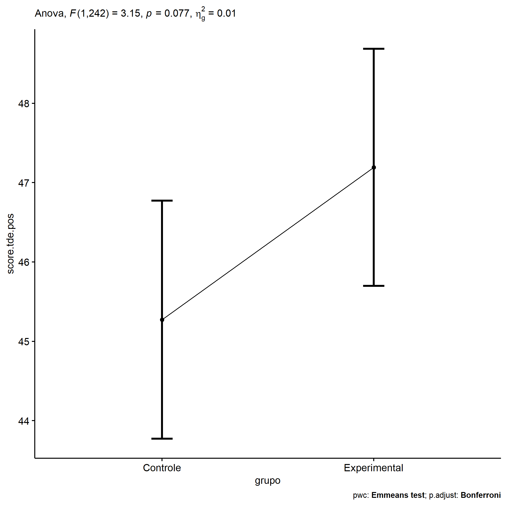<!-- -->

``` r
plots <- oneWayAncovaBoxPlots(
  wdat, "score.tde.pos", "grupo", aov, pwc, covar = "score.tde.pre",
  theme = "classic", color = color[["grupo"]],
  subtitle = which(aov$Effect == "grupo"))
```

``` r
if (length(unique(wdat[["grupo"]])) > 1)
  plots[["grupo"]] + ggplot2::ylab("TDE - Escrita") + ggplot2::scale_x_discrete(labels=c('pre', 'pos'))
```

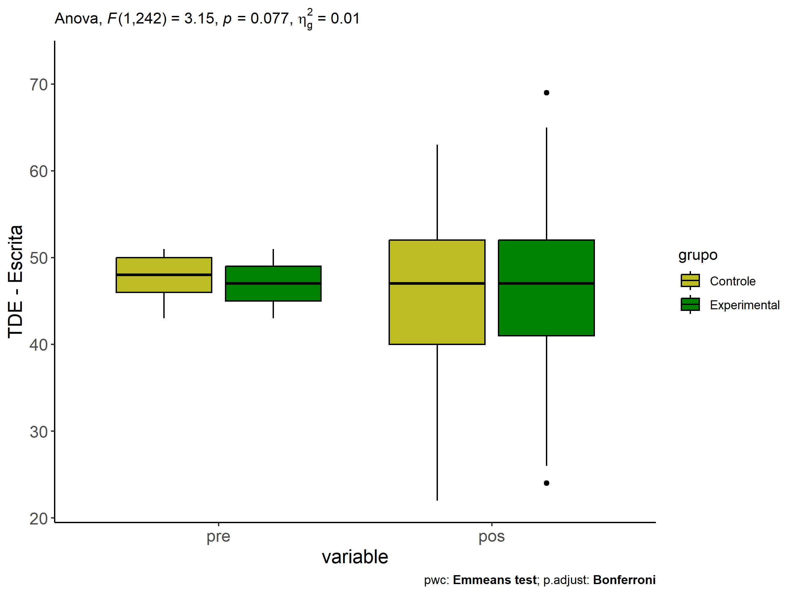<!-- -->

``` r
if (length(unique(wdat.long[["grupo"]])) > 1)
  plots <- oneWayAncovaBoxPlots(
    wdat.long, "score.tde", "grupo", aov, pwc.long, pre.post = "time",
    theme = "classic", color = color$prepost)
```

``` r
if (length(unique(wdat.long[["grupo"]])) > 1)
  plots[["grupo"]] + ggplot2::ylab("TDE - Escrita")
```

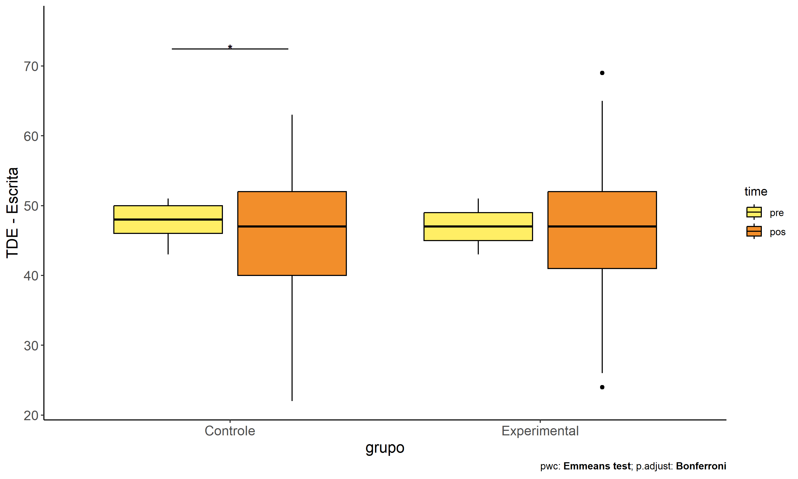<!-- -->

### Checking linearity assumption

``` r
ggscatter(wdat, x = "score.tde.pre", y = "score.tde.pos", size = 0.5,
          color = "grupo", add = "reg.line")+
  stat_regline_equation(
    aes(label =  paste(..eq.label.., ..rr.label.., sep = "~~~~"), color = grupo)
  )
```

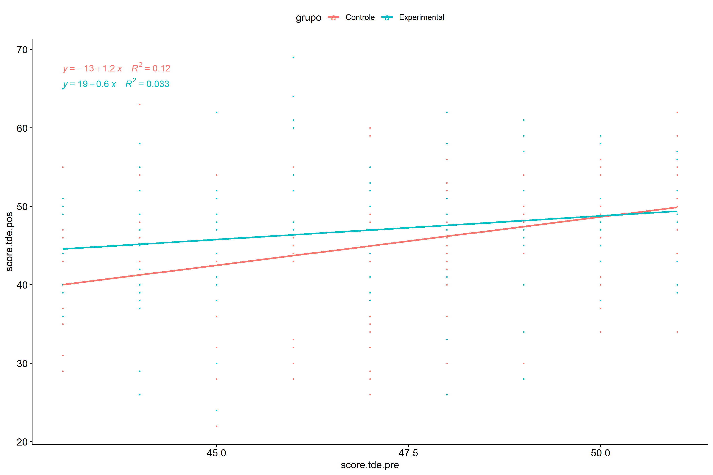<!-- -->

### Checking normality and homogeneity

``` r
res <- augment(lm(score.tde.pos ~ score.tde.pre + grupo, data = wdat))
```

``` r
shapiro_test(res$.resid)
```

    ## # A tibble: 1 × 3
    ##   variable   statistic p.value
    ##   <chr>          <dbl>   <dbl>
    ## 1 res$.resid     0.987  0.0311

``` r
levene_test(res, .resid ~ grupo)
```

    ## # A tibble: 1 × 4
    ##     df1   df2 statistic     p
    ##   <int> <int>     <dbl> <dbl>
    ## 1     1   243     0.259 0.611

# ANCOVA and Pairwise for two factors **grupo:Sexo**

## Without remove non-normal data

``` r
pdat = remove_group_data(dat[!is.na(dat[["grupo"]]) & !is.na(dat[["Sexo"]]),], "score.tde.pos", c("grupo","Sexo"))

pdat.long <- rbind(pdat[,c("id","grupo","Sexo")], pdat[,c("id","grupo","Sexo")])
pdat.long[["time"]] <- c(rep("pre", nrow(pdat)), rep("pos", nrow(pdat)))
pdat.long[["time"]] <- factor(pdat.long[["time"]], c("pre","pos"))
pdat.long[["score.tde"]] <- c(pdat[["score.tde.pre"]], pdat[["score.tde.pos"]])

aov = anova_test(pdat, score.tde.pos ~ score.tde.pre + grupo*Sexo)
laov[["grupo:Sexo"]] <- get_anova_table(aov)
```

``` r
pwcs <- list()
pwcs[["Sexo"]] <- emmeans_test(
  group_by(pdat, grupo), score.tde.pos ~ Sexo,
  covariate = score.tde.pre, p.adjust.method = "bonferroni")
pwcs[["grupo"]] <- emmeans_test(
  group_by(pdat, Sexo), score.tde.pos ~ grupo,
  covariate = score.tde.pre, p.adjust.method = "bonferroni")

pwc <- plyr::rbind.fill(pwcs[["grupo"]], pwcs[["Sexo"]])
pwc <- pwc[,c("grupo","Sexo", colnames(pwc)[!colnames(pwc) %in% c("grupo","Sexo")])]
```

``` r
pwc.long <- emmeans_test(dplyr::group_by_at(pdat.long, c("grupo","Sexo")),
                         score.tde ~ time,
                         p.adjust.method = "bonferroni")
lpwc[["grupo:Sexo"]] <- plyr::rbind.fill(pwc, pwc.long)
```

``` r
ds <- get.descriptives(pdat, "score.tde.pos", c("grupo","Sexo"), covar = "score.tde.pre")
ds <- merge(ds[ds$variable != "score.tde.pre",],
            ds[ds$variable == "score.tde.pre", !colnames(ds) %in% c("variable")],
            by = c("grupo","Sexo"), all.x = T, suffixes = c("", ".score.tde.pre"))
ds <- merge(get_emmeans(pwcs[["grupo"]]), ds, by = c("grupo","Sexo"), suffixes = c(".emms", ""))
ds <- ds[,c("grupo","Sexo","n","mean.score.tde.pre","se.score.tde.pre","mean","se","emmean","se.emms")]

colnames(ds) <- c("grupo","Sexo", "N", paste0(c("M","SE")," (pre)"),
                  paste0(c("M","SE"), " (unadj)"), paste0(c("M", "SE"), " (adj)"))

lemms[["grupo:Sexo"]] <- ds
```

## Computing ANCOVA and PairWise After removing non-normal data (OK)

``` r
wdat = pdat 

res = residuals(lm(score.tde.pos ~ score.tde.pre + grupo*Sexo, data = wdat))
non.normal = getNonNormal(res, wdat$id, plimit = 0.05)

wdat = wdat[!wdat$id %in% non.normal,]

wdat.long <- rbind(wdat[,c("id","grupo","Sexo")], wdat[,c("id","grupo","Sexo")])
wdat.long[["time"]] <- c(rep("pre", nrow(wdat)), rep("pos", nrow(wdat)))
wdat.long[["time"]] <- factor(wdat.long[["time"]], c("pre","pos"))
wdat.long[["score.tde"]] <- c(wdat[["score.tde.pre"]], wdat[["score.tde.pos"]])


ldat[["grupo:Sexo"]] = wdat

(non.normal)
```

    ##  [1] "P2929" "P2835" "P3007" "P3476" "P2973" "P3000" "P2937" "P2986" "P2858" "P2950" "P2917" "P2978"
    ## [13] "P3029" "P2883" "P1887" "P921"  "P2375" "P1652" "P3024" "P2951" "P3030" "P2990" "P606"

``` r
aov = anova_test(wdat, score.tde.pos ~ score.tde.pre + grupo*Sexo)
laov[["grupo:Sexo"]] <- merge(get_anova_table(aov), laov[["grupo:Sexo"]], by="Effect", suffixes = c("","'"))

(df = get_anova_table(aov))
```

    ## ANOVA Table (type II tests)
    ## 
    ##          Effect DFn DFd      F        p p<.05      ges
    ## 1 score.tde.pre   1 239 24.056 1.73e-06     * 0.091000
    ## 2         grupo   1 239  3.821 5.20e-02       0.016000
    ## 3          Sexo   1 239  0.493 4.83e-01       0.002000
    ## 4    grupo:Sexo   1 239  0.190 6.63e-01       0.000796

| Effect        | DFn | DFd |      F |     p | p\<.05 |   ges |
|:--------------|----:|----:|-------:|------:|:-------|------:|
| score.tde.pre |   1 | 239 | 24.056 | 0.000 | \*     | 0.091 |
| grupo         |   1 | 239 |  3.821 | 0.052 |        | 0.016 |
| Sexo          |   1 | 239 |  0.493 | 0.483 |        | 0.002 |
| grupo:Sexo    |   1 | 239 |  0.190 | 0.663 |        | 0.001 |

``` r
pwcs <- list()
pwcs[["Sexo"]] <- emmeans_test(
  group_by(wdat, grupo), score.tde.pos ~ Sexo,
  covariate = score.tde.pre, p.adjust.method = "bonferroni")
pwcs[["grupo"]] <- emmeans_test(
  group_by(wdat, Sexo), score.tde.pos ~ grupo,
  covariate = score.tde.pre, p.adjust.method = "bonferroni")

pwc <- plyr::rbind.fill(pwcs[["grupo"]], pwcs[["Sexo"]])
pwc <- pwc[,c("grupo","Sexo", colnames(pwc)[!colnames(pwc) %in% c("grupo","Sexo")])]
```

| grupo        | Sexo | term                 | .y.           | group1   | group2       |  df | statistic |     p | p.adj | p.adj.signif |
|:-------------|:-----|:---------------------|:--------------|:---------|:-------------|----:|----------:|------:|------:|:-------------|
|              | F    | score.tde.pre\*grupo | score.tde.pos | Controle | Experimental | 239 |    -1.154 | 0.250 | 0.250 | ns           |
|              | M    | score.tde.pre\*grupo | score.tde.pos | Controle | Experimental | 239 |    -1.649 | 0.100 | 0.100 | ns           |
| Controle     |      | score.tde.pre\*Sexo  | score.tde.pos | F        | M            | 239 |    -0.191 | 0.849 | 0.849 | ns           |
| Experimental |      | score.tde.pre\*Sexo  | score.tde.pos | F        | M            | 239 |    -0.804 | 0.422 | 0.422 | ns           |

``` r
pwc.long <- emmeans_test(dplyr::group_by_at(wdat.long, c("grupo","Sexo")),
                         score.tde ~ time,
                         p.adjust.method = "bonferroni")
lpwc[["grupo:Sexo"]] <- merge(plyr::rbind.fill(pwc, pwc.long), lpwc[["grupo:Sexo"]], by=c("grupo","Sexo","term",".y.","group1","group2"), suffixes = c("","'"))
```

| grupo        | Sexo | term | .y.       | group1 | group2 |  df | statistic |     p | p.adj | p.adj.signif |
|:-------------|:-----|:-----|:----------|:-------|:-------|----:|----------:|------:|------:|:-------------|
| Controle     | F    | time | score.tde | pre    | pos    | 480 |     1.794 | 0.073 | 0.073 | ns           |
| Controle     | M    | time | score.tde | pre    | pos    | 480 |     1.486 | 0.138 | 0.138 | ns           |
| Experimental | F    | time | score.tde | pre    | pos    | 480 |     0.366 | 0.714 | 0.714 | ns           |
| Experimental | M    | time | score.tde | pre    | pos    | 480 |    -0.657 | 0.511 | 0.511 | ns           |

``` r
ds <- get.descriptives(wdat, "score.tde.pos", c("grupo","Sexo"), covar = "score.tde.pre")
ds <- merge(ds[ds$variable != "score.tde.pre",],
            ds[ds$variable == "score.tde.pre", !colnames(ds) %in% c("variable")],
            by = c("grupo","Sexo"), all.x = T, suffixes = c("", ".score.tde.pre"))
ds <- merge(get_emmeans(pwcs[["grupo"]]), ds, by = c("grupo","Sexo"), suffixes = c(".emms", ""))
ds <- ds[,c("grupo","Sexo","n","mean.score.tde.pre","se.score.tde.pre","mean","se","emmean","se.emms")]

colnames(ds) <- c("grupo","Sexo", "N", paste0(c("M","SE")," (pre)"),
                  paste0(c("M","SE"), " (unadj)"), paste0(c("M", "SE"), " (adj)"))

lemms[["grupo:Sexo"]] <- merge(ds, lemms[["grupo:Sexo"]], by=c("grupo","Sexo"), suffixes = c("","'"))
```

| grupo        | Sexo |   N | M (pre) | SE (pre) | M (unadj) | SE (unadj) | M (adj) | SE (adj) |
|:-------------|:-----|----:|--------:|---------:|----------:|-----------:|--------:|---------:|
| Controle     | F    |  63 |  47.429 |    0.316 |    45.349 |      1.225 |  45.028 |    1.066 |
| Controle     | M    |  59 |  47.576 |    0.337 |    45.797 |      1.098 |  45.321 |    1.103 |
| Experimental | F    |  69 |  46.783 |    0.298 |    46.377 |      1.139 |  46.734 |    1.019 |
| Experimental | M    |  53 |  46.698 |    0.362 |    47.528 |      0.986 |  47.974 |    1.163 |

### Plots for ancova

``` r
plots <- twoWayAncovaPlots(
  wdat, "score.tde.pos", c("grupo","Sexo"), aov, pwcs, addParam = c("mean_se"),
  font.label.size=10, step.increase=0.05, p.label="p.adj",
  subtitle = which(aov$Effect == "grupo:Sexo"))
```

``` r
if (!is.null(plots[["grupo"]]))
  plots[["grupo"]] + ggplot2::scale_color_manual(values = color[["Sexo"]])
```

    ## Scale for colour is already present.
    ## Adding another scale for colour, which will replace the existing scale.

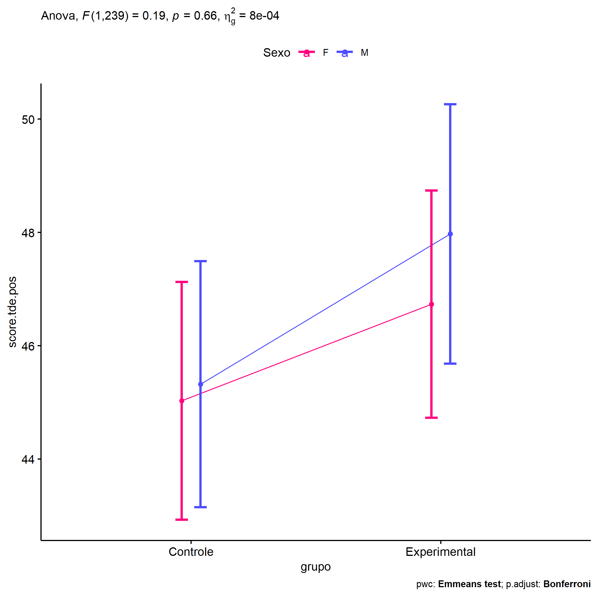<!-- -->

``` r
if (!is.null(plots[["Sexo"]]))
  plots[["Sexo"]] + ggplot2::scale_color_manual(values = color[["grupo"]])
```

    ## Scale for colour is already present.
    ## Adding another scale for colour, which will replace the existing scale.

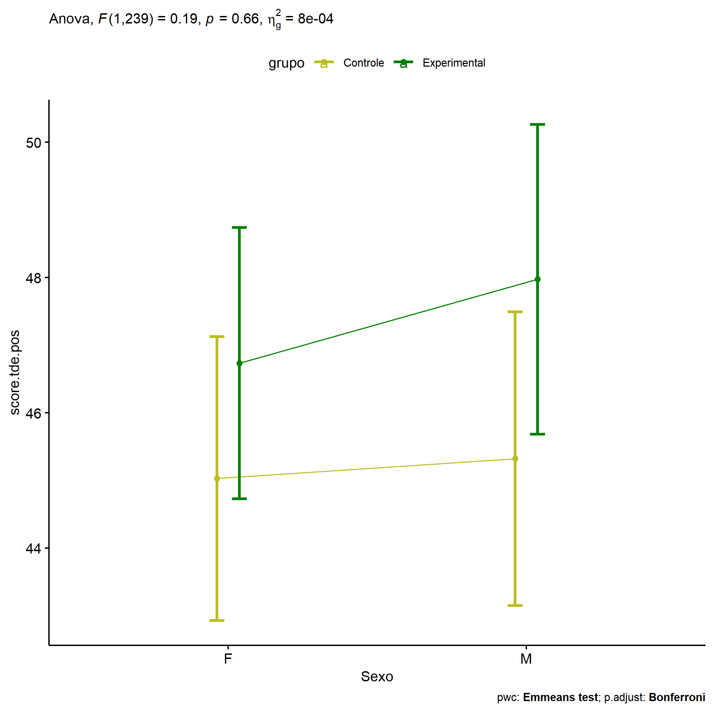<!-- -->

``` r
plots <- twoWayAncovaBoxPlots(
  wdat, "score.tde.pos", c("grupo","Sexo"), aov, pwcs, covar = "score.tde.pre",
  theme = "classic", color = color[["grupo:Sexo"]],
  subtitle = which(aov$Effect == "grupo:Sexo"))
```

``` r
plots[["grupo:Sexo"]] + ggplot2::ylab("TDE - Escrita") + ggplot2::scale_x_discrete(labels=c('pre', 'pos'))
```

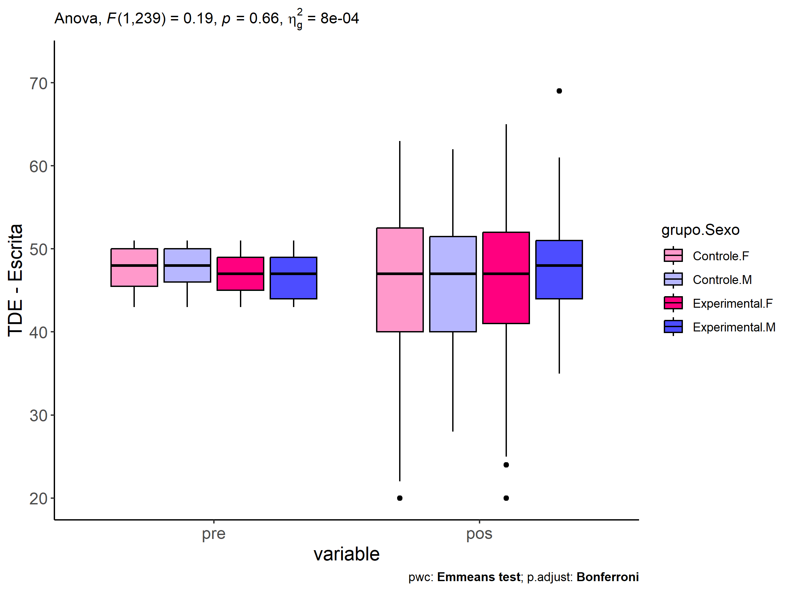<!-- -->

``` r
plots <- twoWayAncovaBoxPlots(
  wdat.long, "score.tde", c("grupo","Sexo"), aov, pwc.long, pre.post = "time",
  theme = "classic", color = color$prepost)
```

``` r
plots[["grupo:Sexo"]] + ggplot2::ylab("TDE - Escrita")
```

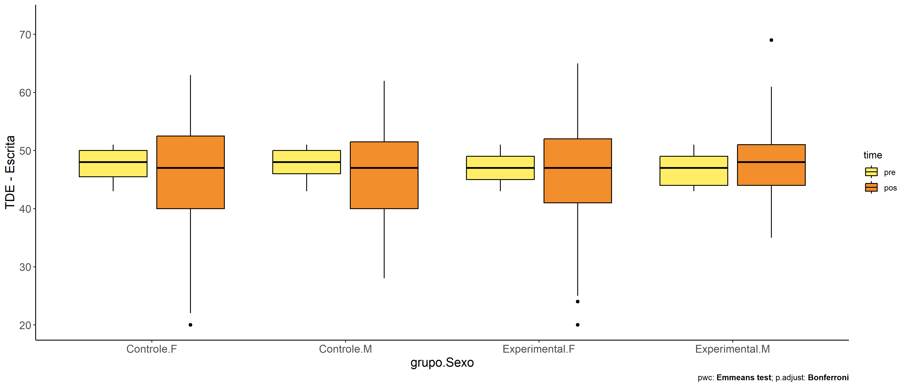<!-- -->

### Checking linearity assumption

``` r
ggscatter(wdat, x = "score.tde.pre", y = "score.tde.pos", size = 0.5,
          facet.by = c("grupo","Sexo"), add = "reg.line")+
  stat_regline_equation(
    aes(label =  paste(..eq.label.., ..rr.label.., sep = "~~~~"))
  )
```

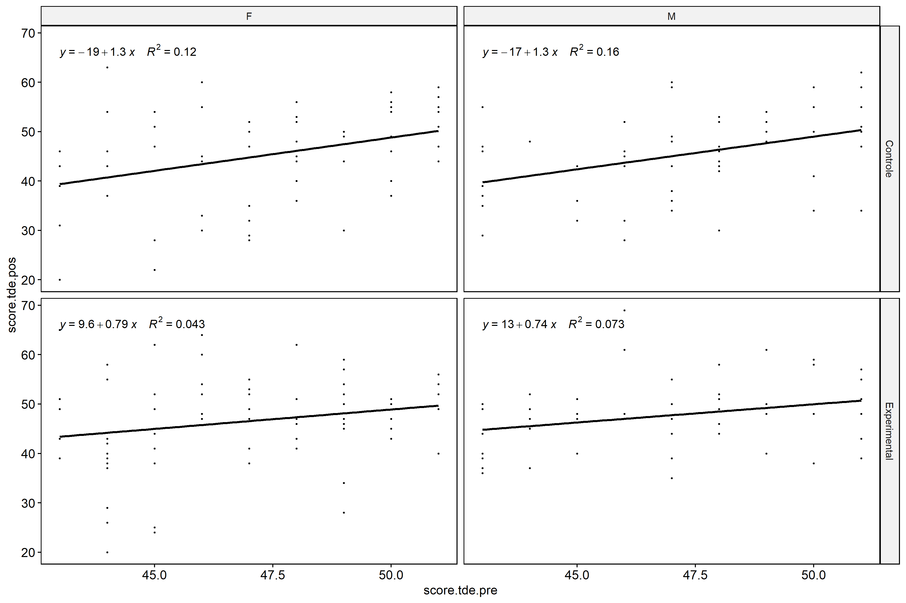<!-- -->

### Checking normality and homogeneity

``` r
res <- augment(lm(score.tde.pos ~ score.tde.pre + grupo*Sexo, data = wdat))
```

``` r
shapiro_test(res$.resid)
```

    ## # A tibble: 1 × 3
    ##   variable   statistic p.value
    ##   <chr>          <dbl>   <dbl>
    ## 1 res$.resid     0.987  0.0300

``` r
levene_test(res, .resid ~ grupo*Sexo)
```

    ## # A tibble: 1 × 4
    ##     df1   df2 statistic     p
    ##   <int> <int>     <dbl> <dbl>
    ## 1     3   240      1.33 0.265

# ANCOVA and Pairwise for two factors **grupo:Zona**

## Without remove non-normal data

``` r
pdat = remove_group_data(dat[!is.na(dat[["grupo"]]) & !is.na(dat[["Zona"]]),], "score.tde.pos", c("grupo","Zona"))

pdat.long <- rbind(pdat[,c("id","grupo","Zona")], pdat[,c("id","grupo","Zona")])
pdat.long[["time"]] <- c(rep("pre", nrow(pdat)), rep("pos", nrow(pdat)))
pdat.long[["time"]] <- factor(pdat.long[["time"]], c("pre","pos"))
pdat.long[["score.tde"]] <- c(pdat[["score.tde.pre"]], pdat[["score.tde.pos"]])

aov = anova_test(pdat, score.tde.pos ~ score.tde.pre + grupo*Zona)
laov[["grupo:Zona"]] <- get_anova_table(aov)
```

``` r
pwcs <- list()
pwcs[["Zona"]] <- emmeans_test(
  group_by(pdat, grupo), score.tde.pos ~ Zona,
  covariate = score.tde.pre, p.adjust.method = "bonferroni")
pwcs[["grupo"]] <- emmeans_test(
  group_by(pdat, Zona), score.tde.pos ~ grupo,
  covariate = score.tde.pre, p.adjust.method = "bonferroni")

pwc <- plyr::rbind.fill(pwcs[["grupo"]], pwcs[["Zona"]])
pwc <- pwc[,c("grupo","Zona", colnames(pwc)[!colnames(pwc) %in% c("grupo","Zona")])]
```

``` r
pwc.long <- emmeans_test(dplyr::group_by_at(pdat.long, c("grupo","Zona")),
                         score.tde ~ time,
                         p.adjust.method = "bonferroni")
lpwc[["grupo:Zona"]] <- plyr::rbind.fill(pwc, pwc.long)
```

``` r
ds <- get.descriptives(pdat, "score.tde.pos", c("grupo","Zona"), covar = "score.tde.pre")
ds <- merge(ds[ds$variable != "score.tde.pre",],
            ds[ds$variable == "score.tde.pre", !colnames(ds) %in% c("variable")],
            by = c("grupo","Zona"), all.x = T, suffixes = c("", ".score.tde.pre"))
ds <- merge(get_emmeans(pwcs[["grupo"]]), ds, by = c("grupo","Zona"), suffixes = c(".emms", ""))
ds <- ds[,c("grupo","Zona","n","mean.score.tde.pre","se.score.tde.pre","mean","se","emmean","se.emms")]

colnames(ds) <- c("grupo","Zona", "N", paste0(c("M","SE")," (pre)"),
                  paste0(c("M","SE"), " (unadj)"), paste0(c("M", "SE"), " (adj)"))

lemms[["grupo:Zona"]] <- ds
```

## Computing ANCOVA and PairWise After removing non-normal data (OK)

``` r
wdat = pdat 

res = residuals(lm(score.tde.pos ~ score.tde.pre + grupo*Zona, data = wdat))
non.normal = getNonNormal(res, wdat$id, plimit = 0.05)

wdat = wdat[!wdat$id %in% non.normal,]

wdat.long <- rbind(wdat[,c("id","grupo","Zona")], wdat[,c("id","grupo","Zona")])
wdat.long[["time"]] <- c(rep("pre", nrow(wdat)), rep("pos", nrow(wdat)))
wdat.long[["time"]] <- factor(wdat.long[["time"]], c("pre","pos"))
wdat.long[["score.tde"]] <- c(wdat[["score.tde.pre"]], wdat[["score.tde.pos"]])


ldat[["grupo:Zona"]] = wdat

(non.normal)
```

    ##  [1] "P2835" "P2950" "P2917" "P3476" "P3007" "P2929" "P3029" "P2883" "P2937" "P921"

``` r
aov = anova_test(wdat, score.tde.pos ~ score.tde.pre + grupo*Zona)
laov[["grupo:Zona"]] <- merge(get_anova_table(aov), laov[["grupo:Zona"]], by="Effect", suffixes = c("","'"))

(df = get_anova_table(aov))
```

    ## ANOVA Table (type II tests)
    ## 
    ##          Effect DFn DFd      F        p p<.05   ges
    ## 1 score.tde.pre   1 177 17.194 5.23e-05     * 0.089
    ## 2         grupo   1 177  6.112 1.40e-02     * 0.033
    ## 3          Zona   1 177 16.562 7.08e-05     * 0.086
    ## 4    grupo:Zona   1 177  3.013 8.40e-02       0.017

| Effect        | DFn | DFd |      F |     p | p\<.05 |   ges |
|:--------------|----:|----:|-------:|------:|:-------|------:|
| score.tde.pre |   1 | 177 | 17.194 | 0.000 | \*     | 0.089 |
| grupo         |   1 | 177 |  6.112 | 0.014 | \*     | 0.033 |
| Zona          |   1 | 177 | 16.562 | 0.000 | \*     | 0.086 |
| grupo:Zona    |   1 | 177 |  3.013 | 0.084 |        | 0.017 |

``` r
pwcs <- list()
pwcs[["Zona"]] <- emmeans_test(
  group_by(wdat, grupo), score.tde.pos ~ Zona,
  covariate = score.tde.pre, p.adjust.method = "bonferroni")
pwcs[["grupo"]] <- emmeans_test(
  group_by(wdat, Zona), score.tde.pos ~ grupo,
  covariate = score.tde.pre, p.adjust.method = "bonferroni")

pwc <- plyr::rbind.fill(pwcs[["grupo"]], pwcs[["Zona"]])
pwc <- pwc[,c("grupo","Zona", colnames(pwc)[!colnames(pwc) %in% c("grupo","Zona")])]
```

| grupo        | Zona   | term                 | .y.           | group1   | group2       |  df | statistic |     p | p.adj | p.adj.signif |
|:-------------|:-------|:---------------------|:--------------|:---------|:-------------|----:|----------:|------:|------:|:-------------|
|              | Rural  | score.tde.pre\*grupo | score.tde.pos | Controle | Experimental | 177 |    -1.015 | 0.312 | 0.312 | ns           |
|              | Urbana | score.tde.pre\*grupo | score.tde.pos | Controle | Experimental | 177 |    -2.856 | 0.005 | 0.005 | \*\*         |
| Controle     |        | score.tde.pre\*Zona  | score.tde.pos | Rural    | Urbana       | 177 |     4.080 | 0.000 | 0.000 | \*\*\*\*     |
| Experimental |        | score.tde.pre\*Zona  | score.tde.pos | Rural    | Urbana       | 177 |     1.697 | 0.092 | 0.092 | ns           |

``` r
pwc.long <- emmeans_test(dplyr::group_by_at(wdat.long, c("grupo","Zona")),
                         score.tde ~ time,
                         p.adjust.method = "bonferroni")
lpwc[["grupo:Zona"]] <- merge(plyr::rbind.fill(pwc, pwc.long), lpwc[["grupo:Zona"]], by=c("grupo","Zona","term",".y.","group1","group2"), suffixes = c("","'"))
```

| grupo        | Zona   | term | .y.       | group1 | group2 |  df | statistic |     p | p.adj | p.adj.signif |
|:-------------|:-------|:-----|:----------|:-------|:-------|----:|----------:|------:|------:|:-------------|
| Controle     | Rural  | time | score.tde | pre    | pos    | 356 |     0.879 | 0.380 | 0.380 | ns           |
| Controle     | Urbana | time | score.tde | pre    | pos    | 356 |     4.915 | 0.000 | 0.000 | \*\*\*\*     |
| Experimental | Rural  | time | score.tde | pre    | pos    | 356 |    -0.455 | 0.649 | 0.649 | ns           |
| Experimental | Urbana | time | score.tde | pre    | pos    | 356 |     1.788 | 0.075 | 0.075 | ns           |

``` r
ds <- get.descriptives(wdat, "score.tde.pos", c("grupo","Zona"), covar = "score.tde.pre")
ds <- merge(ds[ds$variable != "score.tde.pre",],
            ds[ds$variable == "score.tde.pre", !colnames(ds) %in% c("variable")],
            by = c("grupo","Zona"), all.x = T, suffixes = c("", ".score.tde.pre"))
ds <- merge(get_emmeans(pwcs[["grupo"]]), ds, by = c("grupo","Zona"), suffixes = c(".emms", ""))
ds <- ds[,c("grupo","Zona","n","mean.score.tde.pre","se.score.tde.pre","mean","se","emmean","se.emms")]

colnames(ds) <- c("grupo","Zona", "N", paste0(c("M","SE")," (pre)"),
                  paste0(c("M","SE"), " (unadj)"), paste0(c("M", "SE"), " (adj)"))

lemms[["grupo:Zona"]] <- merge(ds, lemms[["grupo:Zona"]], by=c("grupo","Zona"), suffixes = c("","'"))
```

| grupo        | Zona   |   N | M (pre) | SE (pre) | M (unadj) | SE (unadj) | M (adj) | SE (adj) |
|:-------------|:-------|----:|--------:|---------:|----------:|-----------:|--------:|---------:|
| Controle     | Rural  |  73 |  47.425 |    0.303 |    46.370 |      1.049 |  46.022 |    1.118 |
| Controle     | Urbana |  26 |  47.692 |    0.492 |    37.808 |      2.499 |  37.142 |    1.875 |
| Experimental | Rural  |  47 |  47.021 |    0.354 |    47.702 |      1.344 |  47.833 |    1.390 |
| Experimental | Urbana |  36 |  46.278 |    0.392 |    43.222 |      1.753 |  44.237 |    1.606 |

### Plots for ancova

``` r
plots <- twoWayAncovaPlots(
  wdat, "score.tde.pos", c("grupo","Zona"), aov, pwcs, addParam = c("mean_se"),
  font.label.size=10, step.increase=0.05, p.label="p.adj",
  subtitle = which(aov$Effect == "grupo:Zona"))
```

``` r
if (!is.null(plots[["grupo"]]))
  plots[["grupo"]] + ggplot2::scale_color_manual(values = color[["Zona"]])
```

    ## Scale for colour is already present.
    ## Adding another scale for colour, which will replace the existing scale.

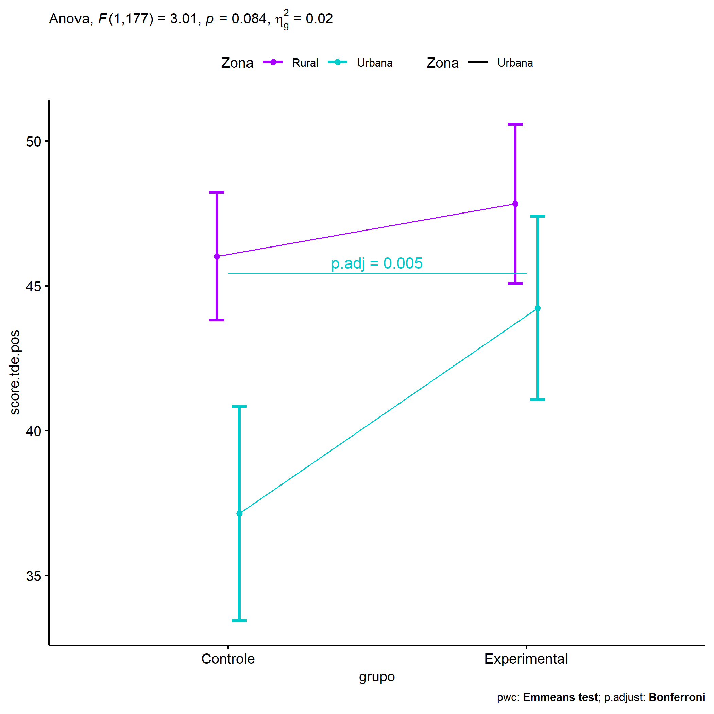<!-- -->

``` r
if (!is.null(plots[["Zona"]]))
  plots[["Zona"]] + ggplot2::scale_color_manual(values = color[["grupo"]])
```

    ## Scale for colour is already present.
    ## Adding another scale for colour, which will replace the existing scale.

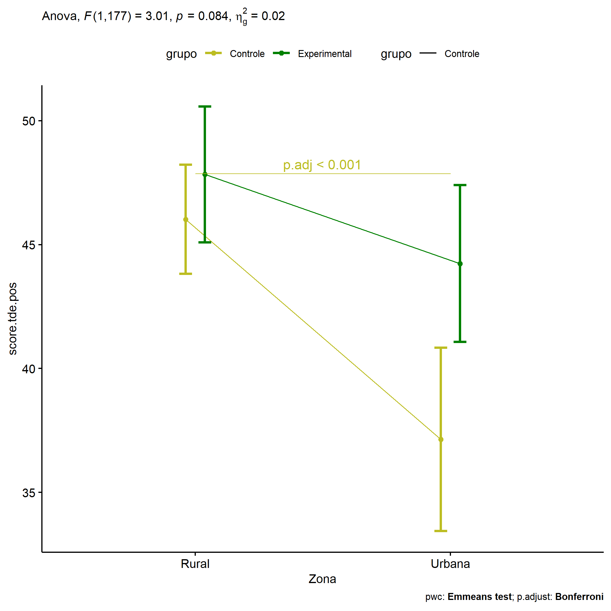<!-- -->

``` r
plots <- twoWayAncovaBoxPlots(
  wdat, "score.tde.pos", c("grupo","Zona"), aov, pwcs, covar = "score.tde.pre",
  theme = "classic", color = color[["grupo:Zona"]],
  subtitle = which(aov$Effect == "grupo:Zona"))
```

``` r
plots[["grupo:Zona"]] + ggplot2::ylab("TDE - Escrita") + ggplot2::scale_x_discrete(labels=c('pre', 'pos'))
```

<!-- -->

``` r
plots <- twoWayAncovaBoxPlots(
  wdat.long, "score.tde", c("grupo","Zona"), aov, pwc.long, pre.post = "time",
  theme = "classic", color = color$prepost)
```

``` r
plots[["grupo:Zona"]] + ggplot2::ylab("TDE - Escrita")
```

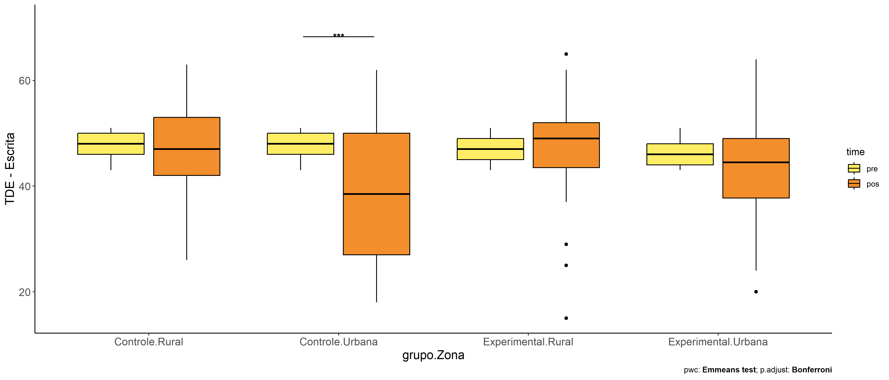<!-- -->

### Checking linearity assumption

``` r
ggscatter(wdat, x = "score.tde.pre", y = "score.tde.pos", size = 0.5,
          facet.by = c("grupo","Zona"), add = "reg.line")+
  stat_regline_equation(
    aes(label =  paste(..eq.label.., ..rr.label.., sep = "~~~~"))
  )
```

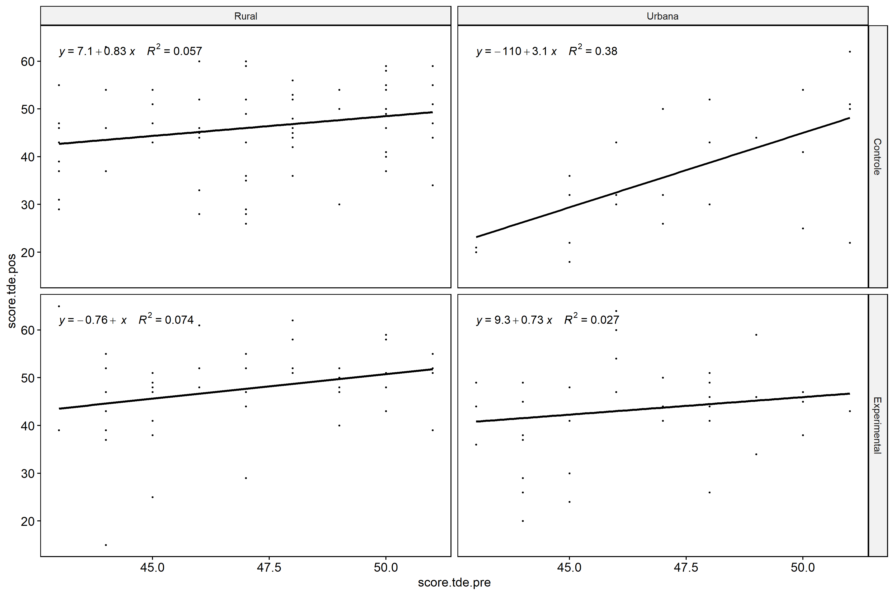<!-- -->

### Checking normality and homogeneity

``` r
res <- augment(lm(score.tde.pos ~ score.tde.pre + grupo*Zona, data = wdat))
```

``` r
shapiro_test(res$.resid)
```

    ## # A tibble: 1 × 3
    ##   variable   statistic p.value
    ##   <chr>          <dbl>   <dbl>
    ## 1 res$.resid     0.985  0.0535

``` r
levene_test(res, .resid ~ grupo*Zona)
```

    ## # A tibble: 1 × 4
    ##     df1   df2 statistic      p
    ##   <int> <int>     <dbl>  <dbl>
    ## 1     3   178      2.20 0.0896

# ANCOVA and Pairwise for two factors **grupo:Cor.Raca**

## Without remove non-normal data

``` r
pdat = remove_group_data(dat[!is.na(dat[["grupo"]]) & !is.na(dat[["Cor.Raca"]]),], "score.tde.pos", c("grupo","Cor.Raca"))
```

    ## Warning: There was 1 warning in `mutate()`.
    ## ℹ In argument: `ci = abs(stats::qt(alpha/2, .data$n - 1) * .data$se)`.
    ## Caused by warning:
    ## ! There was 1 warning in `mutate()`.
    ## ℹ In argument: `ci = abs(stats::qt(alpha/2, .data$n - 1) * .data$se)`.
    ## Caused by warning in `stats::qt()`:
    ## ! NaNs produced

``` r
pdat.long <- rbind(pdat[,c("id","grupo","Cor.Raca")], pdat[,c("id","grupo","Cor.Raca")])
pdat.long[["time"]] <- c(rep("pre", nrow(pdat)), rep("pos", nrow(pdat)))
pdat.long[["time"]] <- factor(pdat.long[["time"]], c("pre","pos"))
pdat.long[["score.tde"]] <- c(pdat[["score.tde.pre"]], pdat[["score.tde.pos"]])

aov = anova_test(pdat, score.tde.pos ~ score.tde.pre + grupo*Cor.Raca)
laov[["grupo:Cor.Raca"]] <- get_anova_table(aov)
```

``` r
pwcs <- list()
pwcs[["Cor.Raca"]] <- emmeans_test(
  group_by(pdat, grupo), score.tde.pos ~ Cor.Raca,
  covariate = score.tde.pre, p.adjust.method = "bonferroni")
pwcs[["grupo"]] <- emmeans_test(
  group_by(pdat, Cor.Raca), score.tde.pos ~ grupo,
  covariate = score.tde.pre, p.adjust.method = "bonferroni")

pwc <- plyr::rbind.fill(pwcs[["grupo"]], pwcs[["Cor.Raca"]])
pwc <- pwc[,c("grupo","Cor.Raca", colnames(pwc)[!colnames(pwc) %in% c("grupo","Cor.Raca")])]
```

``` r
pwc.long <- emmeans_test(dplyr::group_by_at(pdat.long, c("grupo","Cor.Raca")),
                         score.tde ~ time,
                         p.adjust.method = "bonferroni")
lpwc[["grupo:Cor.Raca"]] <- plyr::rbind.fill(pwc, pwc.long)
```

``` r
ds <- get.descriptives(pdat, "score.tde.pos", c("grupo","Cor.Raca"), covar = "score.tde.pre")
ds <- merge(ds[ds$variable != "score.tde.pre",],
            ds[ds$variable == "score.tde.pre", !colnames(ds) %in% c("variable")],
            by = c("grupo","Cor.Raca"), all.x = T, suffixes = c("", ".score.tde.pre"))
ds <- merge(get_emmeans(pwcs[["grupo"]]), ds, by = c("grupo","Cor.Raca"), suffixes = c(".emms", ""))
ds <- ds[,c("grupo","Cor.Raca","n","mean.score.tde.pre","se.score.tde.pre","mean","se","emmean","se.emms")]

colnames(ds) <- c("grupo","Cor.Raca", "N", paste0(c("M","SE")," (pre)"),
                  paste0(c("M","SE"), " (unadj)"), paste0(c("M", "SE"), " (adj)"))

lemms[["grupo:Cor.Raca"]] <- ds
```

## Computing ANCOVA and PairWise After removing non-normal data (OK)

``` r
wdat = pdat 

res = residuals(lm(score.tde.pos ~ score.tde.pre + grupo*Cor.Raca, data = wdat))
non.normal = getNonNormal(res, wdat$id, plimit = 0.05)

wdat = wdat[!wdat$id %in% non.normal,]

wdat.long <- rbind(wdat[,c("id","grupo","Cor.Raca")], wdat[,c("id","grupo","Cor.Raca")])
wdat.long[["time"]] <- c(rep("pre", nrow(wdat)), rep("pos", nrow(wdat)))
wdat.long[["time"]] <- factor(wdat.long[["time"]], c("pre","pos"))
wdat.long[["score.tde"]] <- c(wdat[["score.tde.pre"]], wdat[["score.tde.pos"]])


ldat[["grupo:Cor.Raca"]] = wdat

(non.normal)
```

    ##  [1] "P2835" "P3268" "P2099" "P3579" "P951"  "P3584" "P2374" "P3614" "P3730" "P3704" "P528"  "P3543"
    ## [13] "P3259"

``` r
aov = anova_test(wdat, score.tde.pos ~ score.tde.pre + grupo*Cor.Raca)
laov[["grupo:Cor.Raca"]] <- merge(get_anova_table(aov), laov[["grupo:Cor.Raca"]], by="Effect", suffixes = c("","'"))

(df = get_anova_table(aov))
```

    ## ANOVA Table (type II tests)
    ## 
    ##           Effect DFn DFd         F        p p<.05     ges
    ## 1  score.tde.pre   1  96 19.579000 2.55e-05     * 0.16900
    ## 2          grupo   1  96  0.533000 4.67e-01       0.00600
    ## 3       Cor.Raca   1  96  4.504000 3.60e-02     * 0.04500
    ## 4 grupo:Cor.Raca   1  96  0.000961 9.75e-01       0.00001

| Effect         | DFn | DFd |      F |     p | p\<.05 |   ges |
|:---------------|----:|----:|-------:|------:|:-------|------:|
| score.tde.pre  |   1 |  96 | 19.579 | 0.000 | \*     | 0.169 |
| grupo          |   1 |  96 |  0.533 | 0.467 |        | 0.006 |
| Cor.Raca       |   1 |  96 |  4.504 | 0.036 | \*     | 0.045 |
| grupo:Cor.Raca |   1 |  96 |  0.001 | 0.975 |        | 0.000 |

``` r
pwcs <- list()
pwcs[["Cor.Raca"]] <- emmeans_test(
  group_by(wdat, grupo), score.tde.pos ~ Cor.Raca,
  covariate = score.tde.pre, p.adjust.method = "bonferroni")
pwcs[["grupo"]] <- emmeans_test(
  group_by(wdat, Cor.Raca), score.tde.pos ~ grupo,
  covariate = score.tde.pre, p.adjust.method = "bonferroni")

pwc <- plyr::rbind.fill(pwcs[["grupo"]], pwcs[["Cor.Raca"]])
pwc <- pwc[,c("grupo","Cor.Raca", colnames(pwc)[!colnames(pwc) %in% c("grupo","Cor.Raca")])]
```

| grupo        | Cor.Raca | term                    | .y.           | group1   | group2       |  df | statistic |     p | p.adj | p.adj.signif |
|:-------------|:---------|:------------------------|:--------------|:---------|:-------------|----:|----------:|------:|------:|:-------------|
|              | Branca   | score.tde.pre\*grupo    | score.tde.pos | Controle | Experimental |  96 |    -0.361 | 0.719 | 0.719 | ns           |
|              | Parda    | score.tde.pre\*grupo    | score.tde.pos | Controle | Experimental |  96 |    -0.627 | 0.532 | 0.532 | ns           |
| Controle     |          | score.tde.pre\*Cor.Raca | score.tde.pos | Branca   | Parda        |  96 |    -1.763 | 0.081 | 0.081 | ns           |
| Experimental |          | score.tde.pre\*Cor.Raca | score.tde.pos | Branca   | Parda        |  96 |    -1.142 | 0.256 | 0.256 | ns           |

``` r
pwc.long <- emmeans_test(dplyr::group_by_at(wdat.long, c("grupo","Cor.Raca")),
                         score.tde ~ time,
                         p.adjust.method = "bonferroni")
lpwc[["grupo:Cor.Raca"]] <- merge(plyr::rbind.fill(pwc, pwc.long), lpwc[["grupo:Cor.Raca"]], by=c("grupo","Cor.Raca","term",".y.","group1","group2"), suffixes = c("","'"))
```

| grupo        | Cor.Raca | term | .y.       | group1 | group2 |  df | statistic |     p | p.adj | p.adj.signif |
|:-------------|:---------|:-----|:----------|:-------|:-------|----:|----------:|------:|------:|:-------------|
| Controle     | Branca   | time | score.tde | pre    | pos    | 194 |     3.545 | 0.000 | 0.000 | \*\*\*       |
| Controle     | Parda    | time | score.tde | pre    | pos    | 194 |     2.074 | 0.039 | 0.039 | \*           |
| Experimental | Branca   | time | score.tde | pre    | pos    | 194 |     1.454 | 0.148 | 0.148 | ns           |
| Experimental | Parda    | time | score.tde | pre    | pos    | 194 |     1.375 | 0.171 | 0.171 | ns           |

``` r
ds <- get.descriptives(wdat, "score.tde.pos", c("grupo","Cor.Raca"), covar = "score.tde.pre")
ds <- merge(ds[ds$variable != "score.tde.pre",],
            ds[ds$variable == "score.tde.pre", !colnames(ds) %in% c("variable")],
            by = c("grupo","Cor.Raca"), all.x = T, suffixes = c("", ".score.tde.pre"))
ds <- merge(get_emmeans(pwcs[["grupo"]]), ds, by = c("grupo","Cor.Raca"), suffixes = c(".emms", ""))
ds <- ds[,c("grupo","Cor.Raca","n","mean.score.tde.pre","se.score.tde.pre","mean","se","emmean","se.emms")]

colnames(ds) <- c("grupo","Cor.Raca", "N", paste0(c("M","SE")," (pre)"),
                  paste0(c("M","SE"), " (unadj)"), paste0(c("M", "SE"), " (adj)"))

lemms[["grupo:Cor.Raca"]] <- merge(ds, lemms[["grupo:Cor.Raca"]], by=c("grupo","Cor.Raca"), suffixes = c("","'"))
```

| grupo        | Cor.Raca |   N | M (pre) | SE (pre) | M (unadj) | SE (unadj) | M (adj) | SE (adj) |
|:-------------|:---------|----:|--------:|---------:|----------:|-----------:|--------:|---------:|
| Controle     | Branca   |  18 |  46.944 |    0.591 |    37.167 |      2.815 |  38.323 |    2.485 |
| Controle     | Parda    |  44 |  47.909 |    0.380 |    44.250 |      1.605 |  43.548 |    1.588 |
| Experimental | Branca   |   7 |  48.714 |    0.993 |    42.286 |      5.656 |  40.032 |    3.995 |
| Experimental | Parda    |  32 |  47.125 |    0.398 |    44.281 |      2.023 |  45.090 |    1.862 |

### Plots for ancova

``` r
plots <- twoWayAncovaPlots(
  wdat, "score.tde.pos", c("grupo","Cor.Raca"), aov, pwcs, addParam = c("mean_se"),
  font.label.size=10, step.increase=0.05, p.label="p.adj",
  subtitle = which(aov$Effect == "grupo:Cor.Raca"))
```

``` r
if (!is.null(plots[["grupo"]]))
  plots[["grupo"]] + ggplot2::scale_color_manual(values = color[["Cor.Raca"]])
```

    ## Scale for colour is already present.
    ## Adding another scale for colour, which will replace the existing scale.

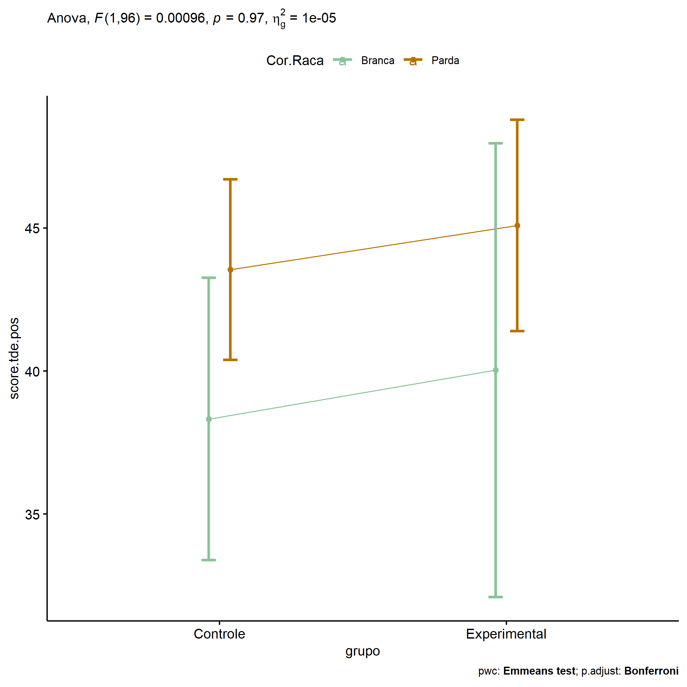<!-- -->

``` r
if (!is.null(plots[["Cor.Raca"]]))
  plots[["Cor.Raca"]] + ggplot2::scale_color_manual(values = color[["grupo"]])
```

    ## Scale for colour is already present.
    ## Adding another scale for colour, which will replace the existing scale.

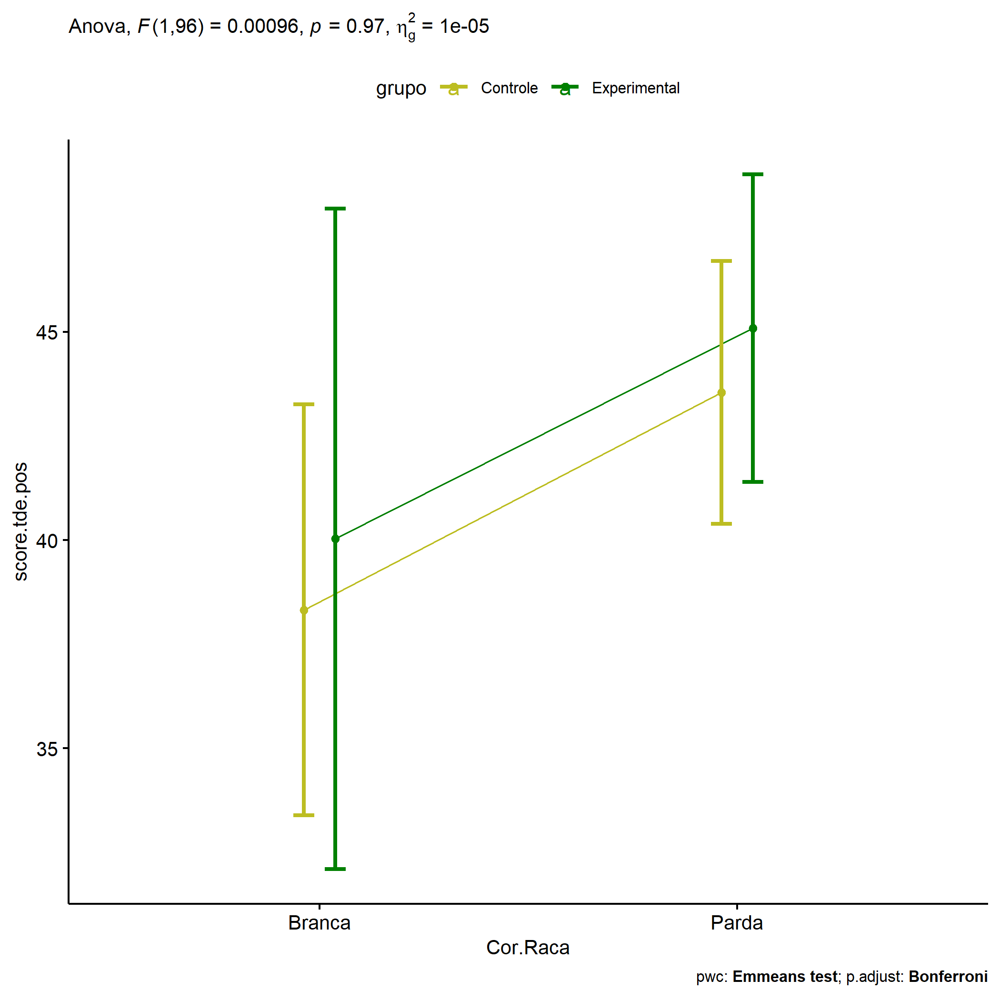<!-- -->

``` r
plots <- twoWayAncovaBoxPlots(
  wdat, "score.tde.pos", c("grupo","Cor.Raca"), aov, pwcs, covar = "score.tde.pre",
  theme = "classic", color = color[["grupo:Cor.Raca"]],
  subtitle = which(aov$Effect == "grupo:Cor.Raca"))
```

``` r
plots[["grupo:Cor.Raca"]] + ggplot2::ylab("TDE - Escrita") + ggplot2::scale_x_discrete(labels=c('pre', 'pos'))
```

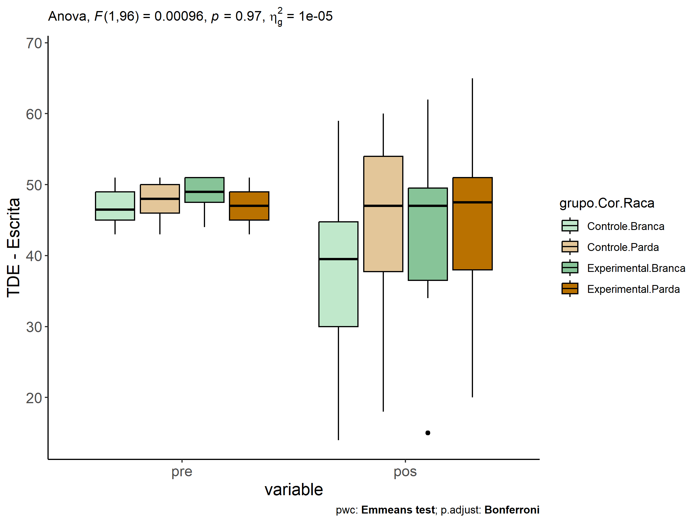<!-- -->

``` r
plots <- twoWayAncovaBoxPlots(
  wdat.long, "score.tde", c("grupo","Cor.Raca"), aov, pwc.long, pre.post = "time",
  theme = "classic", color = color$prepost)
```

``` r
plots[["grupo:Cor.Raca"]] + ggplot2::ylab("TDE - Escrita")
```

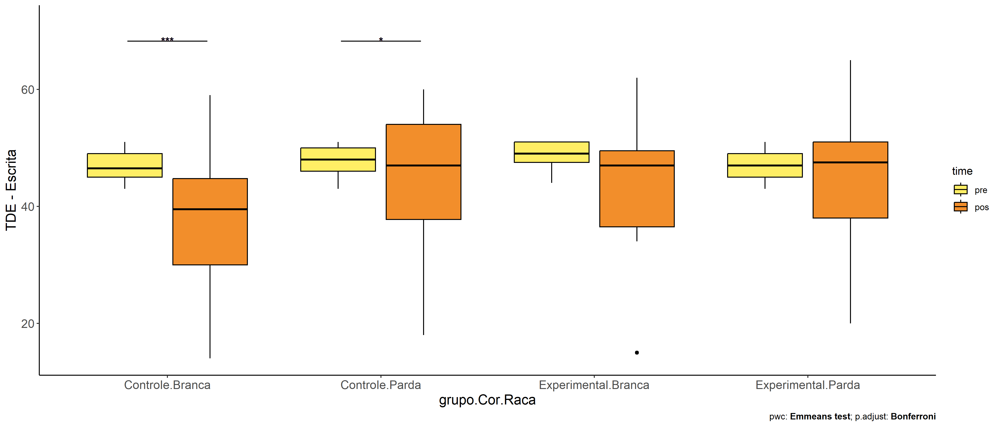<!-- -->

### Checking linearity assumption

``` r
ggscatter(wdat, x = "score.tde.pre", y = "score.tde.pos", size = 0.5,
          facet.by = c("grupo","Cor.Raca"), add = "reg.line")+
  stat_regline_equation(
    aes(label =  paste(..eq.label.., ..rr.label.., sep = "~~~~"))
  )
```

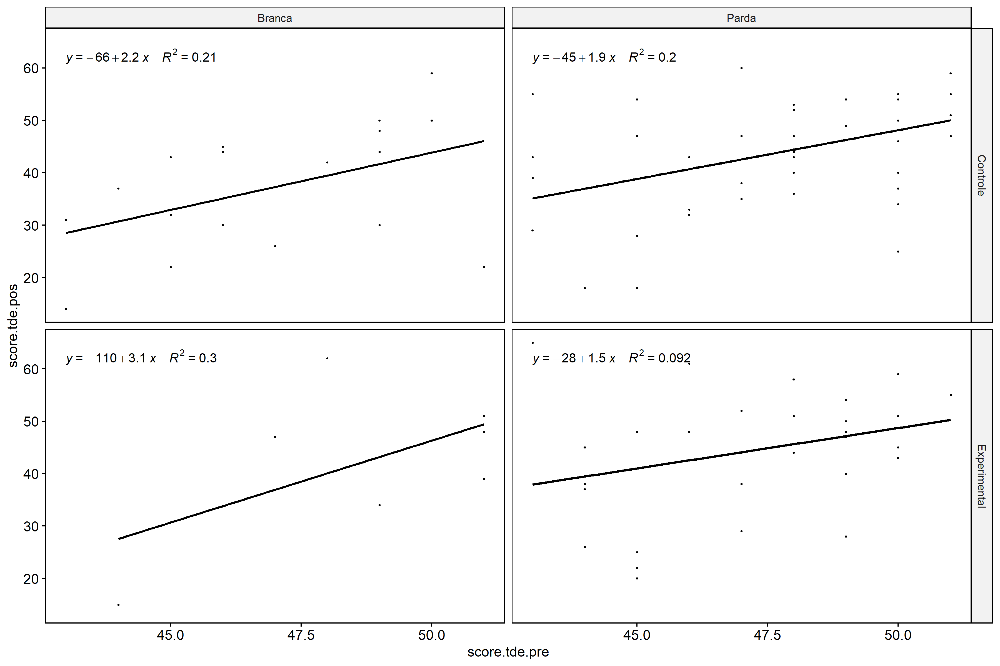<!-- -->

### Checking normality and homogeneity

``` r
res <- augment(lm(score.tde.pos ~ score.tde.pre + grupo*Cor.Raca, data = wdat))
```

``` r
shapiro_test(res$.resid)
```

    ## # A tibble: 1 × 3
    ##   variable   statistic p.value
    ##   <chr>          <dbl>   <dbl>
    ## 1 res$.resid     0.976  0.0586

``` r
levene_test(res, .resid ~ grupo*Cor.Raca)
```

    ## # A tibble: 1 × 4
    ##     df1   df2 statistic     p
    ##   <int> <int>     <dbl> <dbl>
    ## 1     3    97     0.238 0.870

# ANCOVA and Pairwise for two factors **grupo:Serie**

## Without remove non-normal data

``` r
pdat = remove_group_data(dat[!is.na(dat[["grupo"]]) & !is.na(dat[["Serie"]]),], "score.tde.pos", c("grupo","Serie"))

pdat.long <- rbind(pdat[,c("id","grupo","Serie")], pdat[,c("id","grupo","Serie")])
pdat.long[["time"]] <- c(rep("pre", nrow(pdat)), rep("pos", nrow(pdat)))
pdat.long[["time"]] <- factor(pdat.long[["time"]], c("pre","pos"))
pdat.long[["score.tde"]] <- c(pdat[["score.tde.pre"]], pdat[["score.tde.pos"]])

aov = anova_test(pdat, score.tde.pos ~ score.tde.pre + grupo*Serie)
laov[["grupo:Serie"]] <- get_anova_table(aov)
```

``` r
pwcs <- list()
pwcs[["Serie"]] <- emmeans_test(
  group_by(pdat, grupo), score.tde.pos ~ Serie,
  covariate = score.tde.pre, p.adjust.method = "bonferroni")
pwcs[["grupo"]] <- emmeans_test(
  group_by(pdat, Serie), score.tde.pos ~ grupo,
  covariate = score.tde.pre, p.adjust.method = "bonferroni")

pwc <- plyr::rbind.fill(pwcs[["grupo"]], pwcs[["Serie"]])
pwc <- pwc[,c("grupo","Serie", colnames(pwc)[!colnames(pwc) %in% c("grupo","Serie")])]
```

``` r
pwc.long <- emmeans_test(dplyr::group_by_at(pdat.long, c("grupo","Serie")),
                         score.tde ~ time,
                         p.adjust.method = "bonferroni")
lpwc[["grupo:Serie"]] <- plyr::rbind.fill(pwc, pwc.long)
```

``` r
ds <- get.descriptives(pdat, "score.tde.pos", c("grupo","Serie"), covar = "score.tde.pre")
ds <- merge(ds[ds$variable != "score.tde.pre",],
            ds[ds$variable == "score.tde.pre", !colnames(ds) %in% c("variable")],
            by = c("grupo","Serie"), all.x = T, suffixes = c("", ".score.tde.pre"))
ds <- merge(get_emmeans(pwcs[["grupo"]]), ds, by = c("grupo","Serie"), suffixes = c(".emms", ""))
ds <- ds[,c("grupo","Serie","n","mean.score.tde.pre","se.score.tde.pre","mean","se","emmean","se.emms")]

colnames(ds) <- c("grupo","Serie", "N", paste0(c("M","SE")," (pre)"),
                  paste0(c("M","SE"), " (unadj)"), paste0(c("M", "SE"), " (adj)"))

lemms[["grupo:Serie"]] <- ds
```

## Computing ANCOVA and PairWise After removing non-normal data (OK)

``` r
wdat = pdat 

res = residuals(lm(score.tde.pos ~ score.tde.pre + grupo*Serie, data = wdat))
non.normal = getNonNormal(res, wdat$id, plimit = 0.05)

wdat = wdat[!wdat$id %in% non.normal,]

wdat.long <- rbind(wdat[,c("id","grupo","Serie")], wdat[,c("id","grupo","Serie")])
wdat.long[["time"]] <- c(rep("pre", nrow(wdat)), rep("pos", nrow(wdat)))
wdat.long[["time"]] <- factor(wdat.long[["time"]], c("pre","pos"))
wdat.long[["score.tde"]] <- c(wdat[["score.tde.pre"]], wdat[["score.tde.pos"]])


ldat[["grupo:Serie"]] = wdat

(non.normal)
```

    ##  [1] "P3537" "P2835" "P2929" "P2973" "P921"  "P1983" "P2937" "P3732" "P2375" "P3029"

``` r
aov = anova_test(wdat, score.tde.pos ~ score.tde.pre + grupo*Serie)
laov[["grupo:Serie"]] <- merge(get_anova_table(aov), laov[["grupo:Serie"]], by="Effect", suffixes = c("","'"))

(df = get_anova_table(aov))
```

    ## ANOVA Table (type II tests)
    ## 
    ##          Effect DFn DFd      F        p p<.05   ges
    ## 1 score.tde.pre   1 248 32.185 3.89e-08     * 0.115
    ## 2         grupo   1 248  2.220 1.37e-01       0.009
    ## 3         Serie   3 248  7.687 6.24e-05     * 0.085
    ## 4   grupo:Serie   3 248  2.379 7.00e-02       0.028

| Effect        | DFn | DFd |      F |     p | p\<.05 |   ges |
|:--------------|----:|----:|-------:|------:|:-------|------:|
| score.tde.pre |   1 | 248 | 32.185 | 0.000 | \*     | 0.115 |
| grupo         |   1 | 248 |  2.220 | 0.137 |        | 0.009 |
| Serie         |   3 | 248 |  7.687 | 0.000 | \*     | 0.085 |
| grupo:Serie   |   3 | 248 |  2.379 | 0.070 |        | 0.028 |

``` r
pwcs <- list()
pwcs[["Serie"]] <- emmeans_test(
  group_by(wdat, grupo), score.tde.pos ~ Serie,
  covariate = score.tde.pre, p.adjust.method = "bonferroni")
pwcs[["grupo"]] <- emmeans_test(
  group_by(wdat, Serie), score.tde.pos ~ grupo,
  covariate = score.tde.pre, p.adjust.method = "bonferroni")

pwc <- plyr::rbind.fill(pwcs[["grupo"]], pwcs[["Serie"]])
pwc <- pwc[,c("grupo","Serie", colnames(pwc)[!colnames(pwc) %in% c("grupo","Serie")])]
```

| grupo        | Serie | term                 | .y.           | group1   | group2       |  df | statistic |     p | p.adj | p.adj.signif |
|:-------------|:------|:---------------------|:--------------|:---------|:-------------|----:|----------:|------:|------:|:-------------|
|              | 6 ano | score.tde.pre\*grupo | score.tde.pos | Controle | Experimental | 248 |     1.330 | 0.185 | 0.185 | ns           |
|              | 7 ano | score.tde.pre\*grupo | score.tde.pos | Controle | Experimental | 248 |    -2.322 | 0.021 | 0.021 | \*           |
|              | 8 ano | score.tde.pre\*grupo | score.tde.pos | Controle | Experimental | 248 |    -1.470 | 0.143 | 0.143 | ns           |
|              | 9 ano | score.tde.pre\*grupo | score.tde.pos | Controle | Experimental | 248 |    -0.099 | 0.921 | 0.921 | ns           |
| Controle     |       | score.tde.pre\*Serie | score.tde.pos | 6 ano    | 7 ano        | 248 |     1.479 | 0.140 | 0.842 | ns           |
| Controle     |       | score.tde.pre\*Serie | score.tde.pos | 6 ano    | 8 ano        | 248 |    -0.523 | 0.601 | 1.000 | ns           |
| Controle     |       | score.tde.pre\*Serie | score.tde.pos | 6 ano    | 9 ano        | 248 |    -2.269 | 0.024 | 0.145 | ns           |
| Controle     |       | score.tde.pre\*Serie | score.tde.pos | 7 ano    | 8 ano        | 248 |    -1.926 | 0.055 | 0.332 | ns           |
| Controle     |       | score.tde.pre\*Serie | score.tde.pos | 7 ano    | 9 ano        | 248 |    -3.953 | 0.000 | 0.001 | \*\*\*       |
| Controle     |       | score.tde.pre\*Serie | score.tde.pos | 8 ano    | 9 ano        | 248 |    -1.582 | 0.115 | 0.690 | ns           |
| Experimental |       | score.tde.pre\*Serie | score.tde.pos | 6 ano    | 7 ano        | 248 |    -1.987 | 0.048 | 0.288 | ns           |
| Experimental |       | score.tde.pre\*Serie | score.tde.pos | 6 ano    | 8 ano        | 248 |    -3.251 | 0.001 | 0.008 | \*\*         |
| Experimental |       | score.tde.pre\*Serie | score.tde.pos | 6 ano    | 9 ano        | 248 |    -3.375 | 0.001 | 0.005 | \*\*         |
| Experimental |       | score.tde.pre\*Serie | score.tde.pos | 7 ano    | 8 ano        | 248 |    -1.576 | 0.116 | 0.698 | ns           |
| Experimental |       | score.tde.pre\*Serie | score.tde.pos | 7 ano    | 9 ano        | 248 |    -1.766 | 0.079 | 0.472 | ns           |
| Experimental |       | score.tde.pre\*Serie | score.tde.pos | 8 ano    | 9 ano        | 248 |    -0.248 | 0.805 | 1.000 | ns           |

``` r
pwc.long <- emmeans_test(dplyr::group_by_at(wdat.long, c("grupo","Serie")),
                         score.tde ~ time,
                         p.adjust.method = "bonferroni")
lpwc[["grupo:Serie"]] <- merge(plyr::rbind.fill(pwc, pwc.long), lpwc[["grupo:Serie"]], by=c("grupo","Serie","term",".y.","group1","group2"), suffixes = c("","'"))
```

| grupo        | Serie | term | .y.       | group1 | group2 |  df | statistic |     p | p.adj | p.adj.signif |
|:-------------|:------|:-----|:----------|:-------|:-------|----:|----------:|------:|------:|:-------------|
| Controle     | 6 ano | time | score.tde | pre    | pos    | 498 |     2.120 | 0.034 | 0.034 | \*           |
| Controle     | 7 ano | time | score.tde | pre    | pos    | 498 |     4.625 | 0.000 | 0.000 | \*\*\*\*     |
| Controle     | 8 ano | time | score.tde | pre    | pos    | 498 |     1.266 | 0.206 | 0.206 | ns           |
| Controle     | 9 ano | time | score.tde | pre    | pos    | 498 |    -0.703 | 0.482 | 0.482 | ns           |
| Experimental | 6 ano | time | score.tde | pre    | pos    | 498 |     3.328 | 0.001 | 0.001 | \*\*\*       |
| Experimental | 7 ano | time | score.tde | pre    | pos    | 498 |     1.634 | 0.103 | 0.103 | ns           |
| Experimental | 8 ano | time | score.tde | pre    | pos    | 498 |    -0.428 | 0.669 | 0.669 | ns           |
| Experimental | 9 ano | time | score.tde | pre    | pos    | 498 |    -0.743 | 0.458 | 0.458 | ns           |

``` r
ds <- get.descriptives(wdat, "score.tde.pos", c("grupo","Serie"), covar = "score.tde.pre")
ds <- merge(ds[ds$variable != "score.tde.pre",],
            ds[ds$variable == "score.tde.pre", !colnames(ds) %in% c("variable")],
            by = c("grupo","Serie"), all.x = T, suffixes = c("", ".score.tde.pre"))
ds <- merge(get_emmeans(pwcs[["grupo"]]), ds, by = c("grupo","Serie"), suffixes = c(".emms", ""))
ds <- ds[,c("grupo","Serie","n","mean.score.tde.pre","se.score.tde.pre","mean","se","emmean","se.emms")]

colnames(ds) <- c("grupo","Serie", "N", paste0(c("M","SE")," (pre)"),
                  paste0(c("M","SE"), " (unadj)"), paste0(c("M", "SE"), " (adj)"))

lemms[["grupo:Serie"]] <- merge(ds, lemms[["grupo:Serie"]], by=c("grupo","Serie"), suffixes = c("","'"))
```

| grupo        | Serie |   N | M (pre) | SE (pre) | M (unadj) | SE (unadj) | M (adj) | SE (adj) |
|:-------------|:------|----:|--------:|---------:|----------:|-----------:|--------:|---------:|
| Controle     | 6 ano |  31 |  47.806 |    0.460 |    44.000 |      1.699 |  43.079 |    1.644 |
| Controle     | 7 ano |  41 |  47.098 |    0.349 |    39.878 |      2.120 |  39.863 |    1.423 |
| Controle     | 8 ano |  24 |  47.542 |    0.558 |    44.958 |      1.820 |  44.375 |    1.862 |
| Controle     | 9 ano |  34 |  47.353 |    0.499 |    48.559 |      1.044 |  48.217 |    1.563 |
| Experimental | 6 ano |  19 |  46.789 |    0.487 |    39.158 |      2.953 |  39.536 |    2.091 |
| Experimental | 7 ano |  39 |  46.615 |    0.410 |    44.000 |      1.561 |  44.601 |    1.462 |
| Experimental | 8 ano |  37 |  46.703 |    0.435 |    47.405 |      1.238 |  47.895 |    1.500 |
| Experimental | 9 ano |  32 |  46.938 |    0.453 |    48.250 |      1.229 |  48.439 |    1.611 |

### Plots for ancova

``` r
plots <- twoWayAncovaPlots(
  wdat, "score.tde.pos", c("grupo","Serie"), aov, pwcs, addParam = c("mean_se"),
  font.label.size=10, step.increase=0.05, p.label="p.adj",
  subtitle = which(aov$Effect == "grupo:Serie"))
```

``` r
if (!is.null(plots[["grupo"]]))
  plots[["grupo"]] + ggplot2::scale_color_manual(values = color[["Serie"]])
```

    ## Scale for colour is already present.
    ## Adding another scale for colour, which will replace the existing scale.

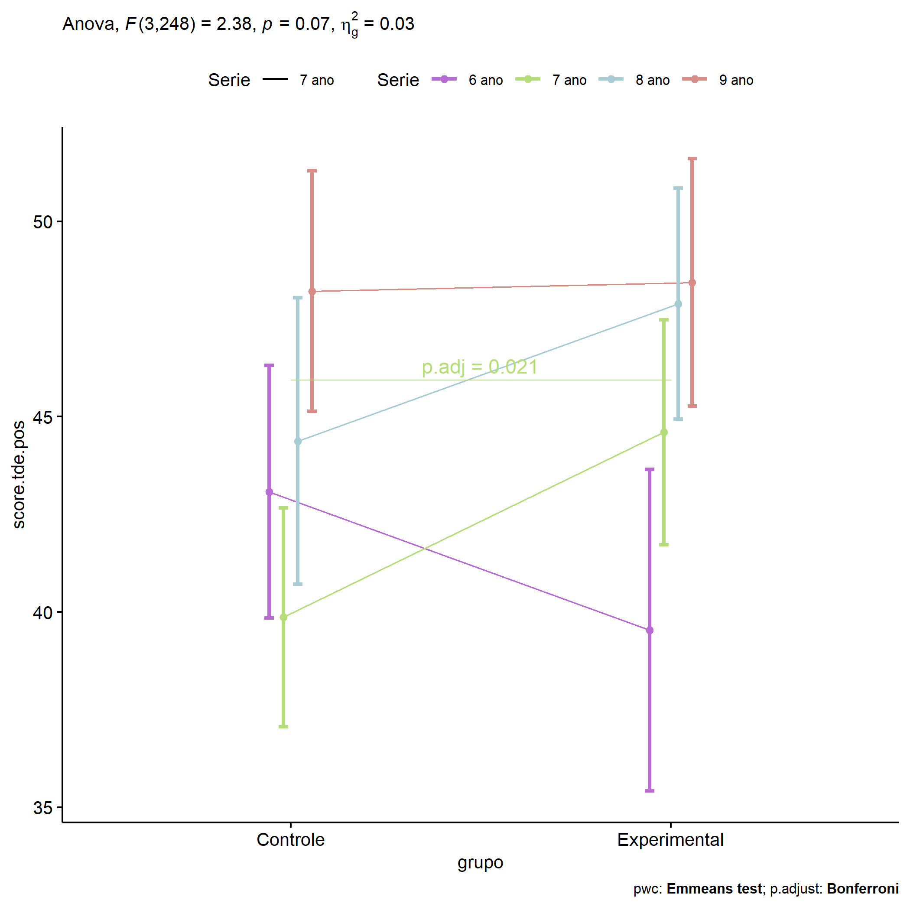<!-- -->

``` r
if (!is.null(plots[["Serie"]]))
  plots[["Serie"]] + ggplot2::scale_color_manual(values = color[["grupo"]])
```

    ## Scale for colour is already present.
    ## Adding another scale for colour, which will replace the existing scale.

    ## Warning: `position_dodge()` requires non-overlapping x intervals

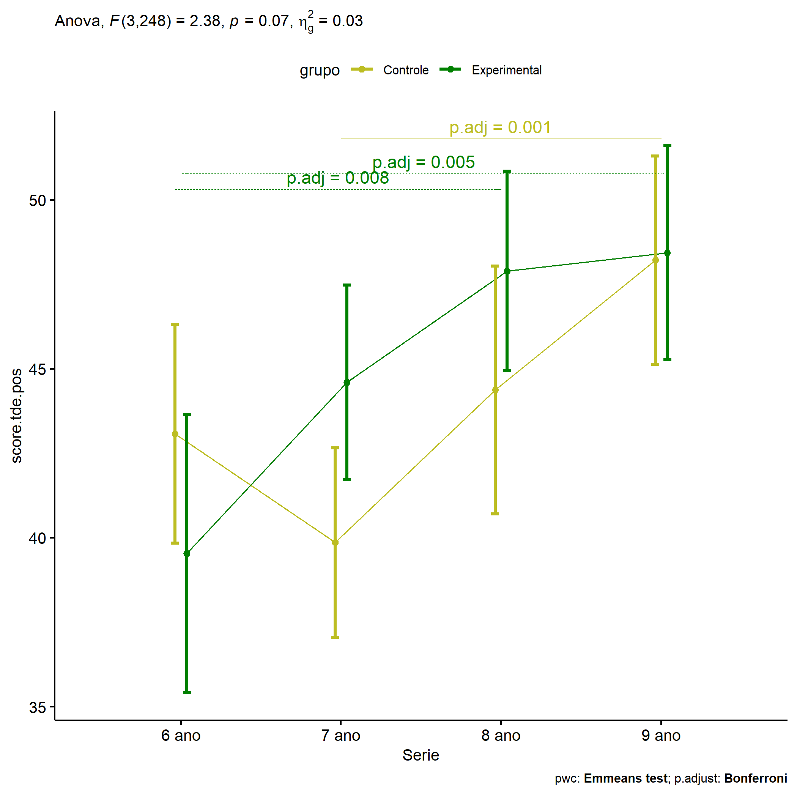<!-- -->

``` r
plots <- twoWayAncovaBoxPlots(
  wdat, "score.tde.pos", c("grupo","Serie"), aov, pwcs, covar = "score.tde.pre",
  theme = "classic", color = color[["grupo:Serie"]],
  subtitle = which(aov$Effect == "grupo:Serie"))
```

``` r
plots[["grupo:Serie"]] + ggplot2::ylab("TDE - Escrita") + ggplot2::scale_x_discrete(labels=c('pre', 'pos'))
```

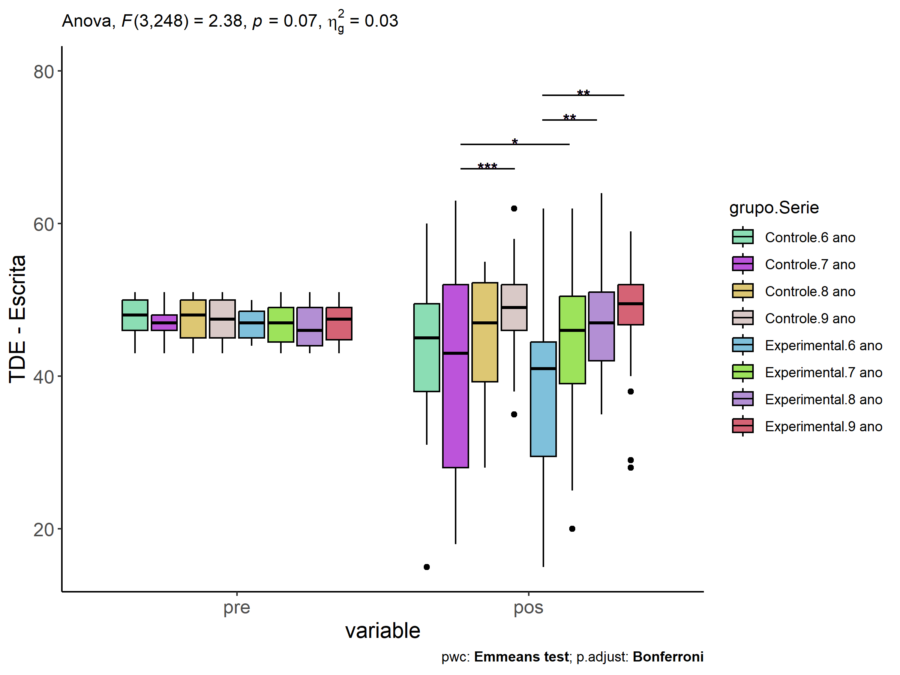<!-- -->

``` r
plots <- twoWayAncovaBoxPlots(
  wdat.long, "score.tde", c("grupo","Serie"), aov, pwc.long, pre.post = "time",
  theme = "classic", color = color$prepost)
```

``` r
plots[["grupo:Serie"]] + ggplot2::ylab("TDE - Escrita")
```

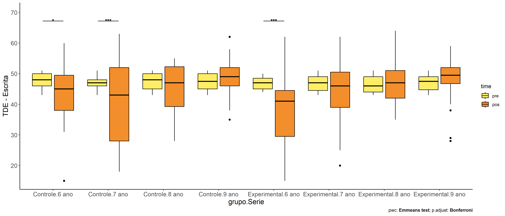<!-- -->

### Checking linearity assumption

``` r
ggscatter(wdat, x = "score.tde.pre", y = "score.tde.pos", size = 0.5,
          facet.by = c("grupo","Serie"), add = "reg.line")+
  stat_regline_equation(
    aes(label =  paste(..eq.label.., ..rr.label.., sep = "~~~~"))
  )
```

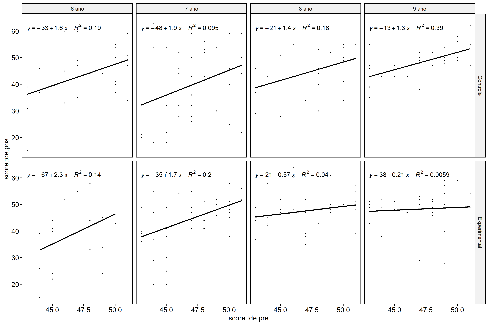<!-- -->

### Checking normality and homogeneity

``` r
res <- augment(lm(score.tde.pos ~ score.tde.pre + grupo*Serie, data = wdat))
```

``` r
shapiro_test(res$.resid)
```

    ## # A tibble: 1 × 3
    ##   variable   statistic p.value
    ##   <chr>          <dbl>   <dbl>
    ## 1 res$.resid     0.988  0.0383

``` r
levene_test(res, .resid ~ grupo*Serie)
```

    ## # A tibble: 1 × 4
    ##     df1   df2 statistic           p
    ##   <int> <int>     <dbl>       <dbl>
    ## 1     7   249      6.75 0.000000247

# Summary of Results

## Descriptive Statistics

``` r
df <- get.descriptives(ldat[["grupo"]], c(dv.pre, dv.pos), c("grupo"), 
                       include.global = T, symmetry.test = T, normality.test = F)
df <- plyr::rbind.fill(
  df, do.call(plyr::rbind.fill, lapply(lfatores2, FUN = function(f) {
    if (nrow(dat) > 0 && sum(!is.na(unique(dat[[f]]))) > 1)
      get.descriptives(ldat[[paste0("grupo:",f)]], c(dv.pre,dv.pos), c("grupo", f),
                       symmetry.test = T, normality.test = F)
    }))
)
(df <- df[,c(fatores1[fatores1 %in% colnames(df)],"variable",
             colnames(df)[!colnames(df) %in% c(fatores1,"variable")])])
```

    ##           grupo Sexo   Zona Cor.Raca Serie      variable   n   mean median min max     sd    se     ci
    ## 1      Controle <NA>   <NA>     <NA>  <NA> score.tde.pre 122 47.533   48.0  43  51  2.503 0.227  0.449
    ## 2  Experimental <NA>   <NA>     <NA>  <NA> score.tde.pre 123 46.789   47.0  43  51  2.520 0.227  0.450
    ## 3          <NA> <NA>   <NA>     <NA>  <NA> score.tde.pre 245 47.159   47.0  43  51  2.534 0.162  0.319
    ## 4      Controle <NA>   <NA>     <NA>  <NA> score.tde.pos 122 45.615   47.0  22  63  8.962 0.811  1.606
    ## 5  Experimental <NA>   <NA>     <NA>  <NA> score.tde.pos 123 46.854   47.0  24  69  8.354 0.753  1.491
    ## 6          <NA> <NA>   <NA>     <NA>  <NA> score.tde.pos 245 46.237   47.0  22  69  8.666 0.554  1.091
    ## 7      Controle    F   <NA>     <NA>  <NA> score.tde.pre  63 47.429   48.0  43  51  2.506 0.316  0.631
    ## 8      Controle    M   <NA>     <NA>  <NA> score.tde.pre  59 47.576   48.0  43  51  2.588 0.337  0.674
    ## 9  Experimental    F   <NA>     <NA>  <NA> score.tde.pre  69 46.783   47.0  43  51  2.479 0.298  0.595
    ## 10 Experimental    M   <NA>     <NA>  <NA> score.tde.pre  53 46.698   47.0  43  51  2.635 0.362  0.726
    ## 11     Controle    F   <NA>     <NA>  <NA> score.tde.pos  63 45.349   47.0  20  63  9.722 1.225  2.449
    ## 12     Controle    M   <NA>     <NA>  <NA> score.tde.pos  59 45.797   47.0  28  62  8.432 1.098  2.197
    ## 13 Experimental    F   <NA>     <NA>  <NA> score.tde.pos  69 46.377   47.0  20  65  9.457 1.139  2.272
    ## 14 Experimental    M   <NA>     <NA>  <NA> score.tde.pos  53 47.528   48.0  35  69  7.178 0.986  1.978
    ## 15     Controle <NA>  Rural     <NA>  <NA> score.tde.pre  73 47.425   48.0  43  51  2.592 0.303  0.605
    ## 16     Controle <NA> Urbana     <NA>  <NA> score.tde.pre  26 47.692   48.0  43  51  2.510 0.492  1.014
    ## 17 Experimental <NA>  Rural     <NA>  <NA> score.tde.pre  47 47.021   47.0  43  51  2.427 0.354  0.713
    ## 18 Experimental <NA> Urbana     <NA>  <NA> score.tde.pre  36 46.278   46.0  43  51  2.350 0.392  0.795
    ## 19     Controle <NA>  Rural     <NA>  <NA> score.tde.pos  73 46.370   47.0  26  63  8.959 1.049  2.090
    ## 20     Controle <NA> Urbana     <NA>  <NA> score.tde.pos  26 37.808   38.5  18  62 12.741 2.499  5.146
    ## 21 Experimental <NA>  Rural     <NA>  <NA> score.tde.pos  47 47.702   49.0  15  65  9.215 1.344  2.706
    ## 22 Experimental <NA> Urbana     <NA>  <NA> score.tde.pos  36 43.222   44.5  20  64 10.516 1.753  3.558
    ## 23     Controle <NA>   <NA>   Branca  <NA> score.tde.pre  18 46.944   46.5  43  51  2.508 0.591  1.247
    ## 24     Controle <NA>   <NA>    Parda  <NA> score.tde.pre  44 47.909   48.0  43  51  2.523 0.380  0.767
    ## 25 Experimental <NA>   <NA>   Branca  <NA> score.tde.pre   7 48.714   49.0  44  51  2.628 0.993  2.430
    ## 26 Experimental <NA>   <NA>    Parda  <NA> score.tde.pre  32 47.125   47.0  43  51  2.254 0.398  0.813
    ## 27     Controle <NA>   <NA>   Branca  <NA> score.tde.pos  18 37.167   39.5  14  59 11.942 2.815  5.939
    ## 28     Controle <NA>   <NA>    Parda  <NA> score.tde.pos  44 44.250   47.0  18  60 10.647 1.605  3.237
    ## 29 Experimental <NA>   <NA>   Branca  <NA> score.tde.pos   7 42.286   47.0  15  62 14.963 5.656 13.839
    ## 30 Experimental <NA>   <NA>    Parda  <NA> score.tde.pos  32 44.281   47.5  20  65 11.442 2.023  4.125
    ## 31     Controle <NA>   <NA>     <NA> 6 ano score.tde.pre  31 47.806   48.0  43  51  2.562 0.460  0.940
    ## 32     Controle <NA>   <NA>     <NA> 7 ano score.tde.pre  41 47.098   47.0  43  51  2.234 0.349  0.705
    ## 33     Controle <NA>   <NA>     <NA> 8 ano score.tde.pre  24 47.542   48.0  43  51  2.734 0.558  1.155
    ## 34     Controle <NA>   <NA>     <NA> 9 ano score.tde.pre  34 47.353   47.5  43  51  2.912 0.499  1.016
    ## 35 Experimental <NA>   <NA>     <NA> 6 ano score.tde.pre  19 46.789   47.0  44  50  2.123 0.487  1.023
    ## 36 Experimental <NA>   <NA>     <NA> 7 ano score.tde.pre  39 46.615   47.0  43  51  2.561 0.410  0.830
    ## 37 Experimental <NA>   <NA>     <NA> 8 ano score.tde.pre  37 46.703   46.0  43  51  2.644 0.435  0.882
    ## 38 Experimental <NA>   <NA>     <NA> 9 ano score.tde.pre  32 46.938   47.5  43  51  2.564 0.453  0.925
    ## 39     Controle <NA>   <NA>     <NA> 6 ano score.tde.pos  31 44.000   45.0  15  60  9.462 1.699  3.471
    ## 40     Controle <NA>   <NA>     <NA> 7 ano score.tde.pos  41 39.878   43.0  18  63 13.576 2.120  4.285
    ## 41     Controle <NA>   <NA>     <NA> 8 ano score.tde.pos  24 44.958   47.0  28  55  8.917 1.820  3.765
    ## 42     Controle <NA>   <NA>     <NA> 9 ano score.tde.pos  34 48.559   49.0  35  62  6.086 1.044  2.124
    ## 43 Experimental <NA>   <NA>     <NA> 6 ano score.tde.pos  19 39.158   41.0  15  62 12.872 2.953  6.204
    ## 44 Experimental <NA>   <NA>     <NA> 7 ano score.tde.pos  39 44.000   46.0  20  62  9.749 1.561  3.160
    ## 45 Experimental <NA>   <NA>     <NA> 8 ano score.tde.pos  37 47.405   47.0  35  64  7.533 1.238  2.512
    ## 46 Experimental <NA>   <NA>     <NA> 9 ano score.tde.pos  32 48.250   49.5  28  59  6.951 1.229  2.506
    ##      iqr symmetry    skewness    kurtosis
    ## 1   4.00      YES -0.31427067 -0.98562346
    ## 2   4.00      YES  0.07233301 -1.19968618
    ## 3   4.00      YES -0.11794913 -1.14433174
    ## 4  12.00      YES -0.44937713 -0.52911169
    ## 5  11.00      YES -0.20033613  0.27334368
    ## 6  11.00      YES -0.35246066 -0.09848473
    ## 7   4.50      YES -0.24064247 -1.14812379
    ## 8   4.00      YES -0.37632702 -0.95511372
    ## 9   4.00      YES  0.08580448 -1.27773533
    ## 10  5.00      YES  0.13663415 -1.22896476
    ## 11 12.50       NO -0.63094560 -0.29739220
    ## 12 11.50      YES -0.27644356 -0.74968113
    ## 13 11.00       NO -0.57732061  0.34654989
    ## 14  7.00      YES  0.47527409  0.19571739
    ## 15  4.00      YES -0.28072267 -1.09571045
    ## 16  4.00      YES -0.18921774 -1.16503751
    ## 17  4.00      YES  0.07396376 -1.31389168
    ## 18  4.00      YES  0.25314405 -1.21818244
    ## 19 11.00      YES -0.45866764 -0.53652807
    ## 20 23.00      YES  0.03285049 -1.36789642
    ## 21  8.50       NO -1.15215634  2.28362183
    ## 22 11.25      YES -0.22528508 -0.35456705
    ## 23  4.00      YES -0.04638130 -1.42479393
    ## 24  4.00       NO -0.50307412 -0.91268595
    ## 25  3.50       NO -0.58522485 -1.24793419
    ## 26  4.00      YES -0.11767951 -1.34774214
    ## 27 14.75      YES -0.14924175 -1.02811520
    ## 28 16.25       NO -0.70082681 -0.30448865
    ## 29 13.00       NO -0.52461628 -0.95544313
    ## 30 13.00       NO -0.50685628 -0.53370376
    ## 31  4.00      YES -0.45964963 -0.95565922
    ## 32  2.00      YES  0.15652357 -0.85634617
    ## 33  5.00      YES -0.44075253 -1.34014789
    ## 34  5.00      YES -0.30469193 -1.36334761
    ## 35  3.50      YES  0.06286248 -1.63816719
    ## 36  4.50      YES  0.14470519 -1.34841887
    ## 37  5.00      YES  0.36613150 -1.20293573
    ## 38  4.25      YES -0.19967645 -1.21085651
    ## 39 11.50       NO -0.60976290  0.98554139
    ## 40 24.00      YES -0.05885263 -1.43908155
    ## 41 13.00       NO -0.55141720 -1.10019778
    ## 42  6.00      YES -0.15762603 -0.31643874
    ## 43 15.00      YES -0.08675792 -0.97538124
    ## 44 11.50       NO -0.71551328  0.16127782
    ## 45  9.00      YES  0.37174534 -0.65580125
    ## 46  5.25       NO -1.25646845  1.80156709

| grupo        | Sexo | Zona   | Cor.Raca | Serie | variable      |   n |   mean | median | min | max |     sd |    se |     ci |   iqr | symmetry | skewness | kurtosis |
|:-------------|:-----|:-------|:---------|:------|:--------------|----:|-------:|-------:|----:|----:|-------:|------:|-------:|------:|:---------|---------:|---------:|
| Controle     |      |        |          |       | score.tde.pre | 122 | 47.533 |   48.0 |  43 |  51 |  2.503 | 0.227 |  0.449 |  4.00 | YES      |   -0.314 |   -0.986 |
| Experimental |      |        |          |       | score.tde.pre | 123 | 46.789 |   47.0 |  43 |  51 |  2.520 | 0.227 |  0.450 |  4.00 | YES      |    0.072 |   -1.200 |
|              |      |        |          |       | score.tde.pre | 245 | 47.159 |   47.0 |  43 |  51 |  2.534 | 0.162 |  0.319 |  4.00 | YES      |   -0.118 |   -1.144 |
| Controle     |      |        |          |       | score.tde.pos | 122 | 45.615 |   47.0 |  22 |  63 |  8.962 | 0.811 |  1.606 | 12.00 | YES      |   -0.449 |   -0.529 |
| Experimental |      |        |          |       | score.tde.pos | 123 | 46.854 |   47.0 |  24 |  69 |  8.354 | 0.753 |  1.491 | 11.00 | YES      |   -0.200 |    0.273 |
|              |      |        |          |       | score.tde.pos | 245 | 46.237 |   47.0 |  22 |  69 |  8.666 | 0.554 |  1.091 | 11.00 | YES      |   -0.352 |   -0.098 |
| Controle     | F    |        |          |       | score.tde.pre |  63 | 47.429 |   48.0 |  43 |  51 |  2.506 | 0.316 |  0.631 |  4.50 | YES      |   -0.241 |   -1.148 |
| Controle     | M    |        |          |       | score.tde.pre |  59 | 47.576 |   48.0 |  43 |  51 |  2.588 | 0.337 |  0.674 |  4.00 | YES      |   -0.376 |   -0.955 |
| Experimental | F    |        |          |       | score.tde.pre |  69 | 46.783 |   47.0 |  43 |  51 |  2.479 | 0.298 |  0.595 |  4.00 | YES      |    0.086 |   -1.278 |
| Experimental | M    |        |          |       | score.tde.pre |  53 | 46.698 |   47.0 |  43 |  51 |  2.635 | 0.362 |  0.726 |  5.00 | YES      |    0.137 |   -1.229 |
| Controle     | F    |        |          |       | score.tde.pos |  63 | 45.349 |   47.0 |  20 |  63 |  9.722 | 1.225 |  2.449 | 12.50 | NO       |   -0.631 |   -0.297 |
| Controle     | M    |        |          |       | score.tde.pos |  59 | 45.797 |   47.0 |  28 |  62 |  8.432 | 1.098 |  2.197 | 11.50 | YES      |   -0.276 |   -0.750 |
| Experimental | F    |        |          |       | score.tde.pos |  69 | 46.377 |   47.0 |  20 |  65 |  9.457 | 1.139 |  2.272 | 11.00 | NO       |   -0.577 |    0.347 |
| Experimental | M    |        |          |       | score.tde.pos |  53 | 47.528 |   48.0 |  35 |  69 |  7.178 | 0.986 |  1.978 |  7.00 | YES      |    0.475 |    0.196 |
| Controle     |      | Rural  |          |       | score.tde.pre |  73 | 47.425 |   48.0 |  43 |  51 |  2.592 | 0.303 |  0.605 |  4.00 | YES      |   -0.281 |   -1.096 |
| Controle     |      | Urbana |          |       | score.tde.pre |  26 | 47.692 |   48.0 |  43 |  51 |  2.510 | 0.492 |  1.014 |  4.00 | YES      |   -0.189 |   -1.165 |
| Experimental |      | Rural  |          |       | score.tde.pre |  47 | 47.021 |   47.0 |  43 |  51 |  2.427 | 0.354 |  0.713 |  4.00 | YES      |    0.074 |   -1.314 |
| Experimental |      | Urbana |          |       | score.tde.pre |  36 | 46.278 |   46.0 |  43 |  51 |  2.350 | 0.392 |  0.795 |  4.00 | YES      |    0.253 |   -1.218 |
| Controle     |      | Rural  |          |       | score.tde.pos |  73 | 46.370 |   47.0 |  26 |  63 |  8.959 | 1.049 |  2.090 | 11.00 | YES      |   -0.459 |   -0.537 |
| Controle     |      | Urbana |          |       | score.tde.pos |  26 | 37.808 |   38.5 |  18 |  62 | 12.741 | 2.499 |  5.146 | 23.00 | YES      |    0.033 |   -1.368 |
| Experimental |      | Rural  |          |       | score.tde.pos |  47 | 47.702 |   49.0 |  15 |  65 |  9.215 | 1.344 |  2.706 |  8.50 | NO       |   -1.152 |    2.284 |
| Experimental |      | Urbana |          |       | score.tde.pos |  36 | 43.222 |   44.5 |  20 |  64 | 10.516 | 1.753 |  3.558 | 11.25 | YES      |   -0.225 |   -0.355 |
| Controle     |      |        | Branca   |       | score.tde.pre |  18 | 46.944 |   46.5 |  43 |  51 |  2.508 | 0.591 |  1.247 |  4.00 | YES      |   -0.046 |   -1.425 |
| Controle     |      |        | Parda    |       | score.tde.pre |  44 | 47.909 |   48.0 |  43 |  51 |  2.523 | 0.380 |  0.767 |  4.00 | NO       |   -0.503 |   -0.913 |
| Experimental |      |        | Branca   |       | score.tde.pre |   7 | 48.714 |   49.0 |  44 |  51 |  2.628 | 0.993 |  2.430 |  3.50 | NO       |   -0.585 |   -1.248 |
| Experimental |      |        | Parda    |       | score.tde.pre |  32 | 47.125 |   47.0 |  43 |  51 |  2.254 | 0.398 |  0.813 |  4.00 | YES      |   -0.118 |   -1.348 |
| Controle     |      |        | Branca   |       | score.tde.pos |  18 | 37.167 |   39.5 |  14 |  59 | 11.942 | 2.815 |  5.939 | 14.75 | YES      |   -0.149 |   -1.028 |
| Controle     |      |        | Parda    |       | score.tde.pos |  44 | 44.250 |   47.0 |  18 |  60 | 10.647 | 1.605 |  3.237 | 16.25 | NO       |   -0.701 |   -0.304 |
| Experimental |      |        | Branca   |       | score.tde.pos |   7 | 42.286 |   47.0 |  15 |  62 | 14.963 | 5.656 | 13.839 | 13.00 | NO       |   -0.525 |   -0.955 |
| Experimental |      |        | Parda    |       | score.tde.pos |  32 | 44.281 |   47.5 |  20 |  65 | 11.442 | 2.023 |  4.125 | 13.00 | NO       |   -0.507 |   -0.534 |
| Controle     |      |        |          | 6 ano | score.tde.pre |  31 | 47.806 |   48.0 |  43 |  51 |  2.562 | 0.460 |  0.940 |  4.00 | YES      |   -0.460 |   -0.956 |
| Controle     |      |        |          | 7 ano | score.tde.pre |  41 | 47.098 |   47.0 |  43 |  51 |  2.234 | 0.349 |  0.705 |  2.00 | YES      |    0.157 |   -0.856 |
| Controle     |      |        |          | 8 ano | score.tde.pre |  24 | 47.542 |   48.0 |  43 |  51 |  2.734 | 0.558 |  1.155 |  5.00 | YES      |   -0.441 |   -1.340 |
| Controle     |      |        |          | 9 ano | score.tde.pre |  34 | 47.353 |   47.5 |  43 |  51 |  2.912 | 0.499 |  1.016 |  5.00 | YES      |   -0.305 |   -1.363 |
| Experimental |      |        |          | 6 ano | score.tde.pre |  19 | 46.789 |   47.0 |  44 |  50 |  2.123 | 0.487 |  1.023 |  3.50 | YES      |    0.063 |   -1.638 |
| Experimental |      |        |          | 7 ano | score.tde.pre |  39 | 46.615 |   47.0 |  43 |  51 |  2.561 | 0.410 |  0.830 |  4.50 | YES      |    0.145 |   -1.348 |
| Experimental |      |        |          | 8 ano | score.tde.pre |  37 | 46.703 |   46.0 |  43 |  51 |  2.644 | 0.435 |  0.882 |  5.00 | YES      |    0.366 |   -1.203 |
| Experimental |      |        |          | 9 ano | score.tde.pre |  32 | 46.938 |   47.5 |  43 |  51 |  2.564 | 0.453 |  0.925 |  4.25 | YES      |   -0.200 |   -1.211 |
| Controle     |      |        |          | 6 ano | score.tde.pos |  31 | 44.000 |   45.0 |  15 |  60 |  9.462 | 1.699 |  3.471 | 11.50 | NO       |   -0.610 |    0.986 |
| Controle     |      |        |          | 7 ano | score.tde.pos |  41 | 39.878 |   43.0 |  18 |  63 | 13.576 | 2.120 |  4.285 | 24.00 | YES      |   -0.059 |   -1.439 |
| Controle     |      |        |          | 8 ano | score.tde.pos |  24 | 44.958 |   47.0 |  28 |  55 |  8.917 | 1.820 |  3.765 | 13.00 | NO       |   -0.551 |   -1.100 |
| Controle     |      |        |          | 9 ano | score.tde.pos |  34 | 48.559 |   49.0 |  35 |  62 |  6.086 | 1.044 |  2.124 |  6.00 | YES      |   -0.158 |   -0.316 |
| Experimental |      |        |          | 6 ano | score.tde.pos |  19 | 39.158 |   41.0 |  15 |  62 | 12.872 | 2.953 |  6.204 | 15.00 | YES      |   -0.087 |   -0.975 |
| Experimental |      |        |          | 7 ano | score.tde.pos |  39 | 44.000 |   46.0 |  20 |  62 |  9.749 | 1.561 |  3.160 | 11.50 | NO       |   -0.716 |    0.161 |
| Experimental |      |        |          | 8 ano | score.tde.pos |  37 | 47.405 |   47.0 |  35 |  64 |  7.533 | 1.238 |  2.512 |  9.00 | YES      |    0.372 |   -0.656 |
| Experimental |      |        |          | 9 ano | score.tde.pos |  32 | 48.250 |   49.5 |  28 |  59 |  6.951 | 1.229 |  2.506 |  5.25 | NO       |   -1.256 |    1.802 |

## ANCOVA Table Comparison

``` r
df <- do.call(plyr::rbind.fill, laov)
(df <- df[!duplicated(df$Effect),])
```

    ##            Effect DFn DFd         F        p p<.05      ges DFn' DFd'     F'       p' p<.05'     ges'
    ## 1           grupo   1 242  3.151000 7.70e-02       0.013000    1  264  4.418 3.70e-02      * 0.016000
    ## 2   score.tde.pre   1 242 18.286000 2.74e-05     * 0.070000    1  264 27.993 2.56e-07      * 0.096000
    ## 4      grupo:Sexo   1 239  0.190000 6.63e-01       0.000796    1  262  0.096 7.56e-01        0.000368
    ## 6            Sexo   1 239  0.493000 4.83e-01       0.002000    1  262  0.298 5.86e-01        0.001000
    ## 8      grupo:Zona   1 177  3.013000 8.40e-02       0.017000    1  187  2.080 1.51e-01        0.011000
    ## 10           Zona   1 177 16.562000 7.08e-05     * 0.086000    1  187  7.206 8.00e-03      * 0.037000
    ## 11       Cor.Raca   1  96  4.504000 3.60e-02     * 0.045000    1  109  3.435 6.70e-02        0.031000
    ## 13 grupo:Cor.Raca   1  96  0.000961 9.75e-01       0.000010    1  109  0.018 8.94e-01        0.000163
    ## 16    grupo:Serie   3 248  2.379000 7.00e-02       0.028000    3  258  2.094 1.01e-01        0.024000
    ## 18          Serie   3 248  7.687000 6.24e-05     * 0.085000    3  258  7.428 8.64e-05      * 0.080000

|     | Effect         | DFn | DFd |      F |     p | p\<.05 |   ges | DFn’ | DFd’ |     F’ |    p’ | p\<.05’ |  ges’ |
|:----|:---------------|----:|----:|-------:|------:|:-------|------:|-----:|-----:|-------:|------:|:--------|------:|
| 1   | grupo          |   1 | 242 |  3.151 | 0.077 |        | 0.013 |    1 |  264 |  4.418 | 0.037 | \*      | 0.016 |
| 2   | score.tde.pre  |   1 | 242 | 18.286 | 0.000 | \*     | 0.070 |    1 |  264 | 27.993 | 0.000 | \*      | 0.096 |
| 4   | grupo:Sexo     |   1 | 239 |  0.190 | 0.663 |        | 0.001 |    1 |  262 |  0.096 | 0.756 |         | 0.000 |
| 6   | Sexo           |   1 | 239 |  0.493 | 0.483 |        | 0.002 |    1 |  262 |  0.298 | 0.586 |         | 0.001 |
| 8   | grupo:Zona     |   1 | 177 |  3.013 | 0.084 |        | 0.017 |    1 |  187 |  2.080 | 0.151 |         | 0.011 |
| 10  | Zona           |   1 | 177 | 16.562 | 0.000 | \*     | 0.086 |    1 |  187 |  7.206 | 0.008 | \*      | 0.037 |
| 11  | Cor.Raca       |   1 |  96 |  4.504 | 0.036 | \*     | 0.045 |    1 |  109 |  3.435 | 0.067 |         | 0.031 |
| 13  | grupo:Cor.Raca |   1 |  96 |  0.001 | 0.975 |        | 0.000 |    1 |  109 |  0.018 | 0.894 |         | 0.000 |
| 16  | grupo:Serie    |   3 | 248 |  2.379 | 0.070 |        | 0.028 |    3 |  258 |  2.094 | 0.101 |         | 0.024 |
| 18  | Serie          |   3 | 248 |  7.687 | 0.000 | \*     | 0.085 |    3 |  258 |  7.428 | 0.000 | \*      | 0.080 |

## PairWise Table Comparison

``` r
df <- do.call(plyr::rbind.fill, lpwc)
df <- df[,c(names(lfatores), names(df)[!names(df) %in% c(names(lfatores),"term",".y.")])]
```

| grupo        | Sexo | Zona   | Cor.Raca | Serie | group1   | group2       |  df | statistic |     p | p.adj | p.adj.signif | df’ | statistic’ |    p’ | p.adj’ | p.adj.signif’ |
|:-------------|:-----|:-------|:---------|:------|:---------|:-------------|----:|----------:|------:|------:|:-------------|----:|-----------:|------:|-------:|:--------------|
| Controle     |      |        |          |       | pre      | pos          | 486 |     2.349 | 0.019 | 0.019 | \*           | 530 |      4.277 | 0.000 |  0.000 | \*\*\*\*      |
| Experimental |      |        |          |       | pre      | pos          | 486 |    -0.080 | 0.936 | 0.936 | ns           | 530 |      1.696 | 0.090 |  0.090 | ns            |
|              |      |        |          |       | Controle | Experimental | 242 |    -1.775 | 0.077 | 0.077 | ns           | 264 |     -2.102 | 0.037 |  0.037 | \*            |
| Controle     | F    |        |          |       | pre      | pos          | 480 |     1.794 | 0.073 | 0.073 | ns           | 526 |      3.176 | 0.002 |  0.002 | \*\*          |
| Controle     | M    |        |          |       | pre      | pos          | 480 |     1.486 | 0.138 | 0.138 | ns           | 526 |      2.847 | 0.005 |  0.005 | \*\*          |
| Controle     |      |        |          |       | F        | M            | 239 |    -0.191 | 0.849 | 0.849 | ns           | 262 |     -0.172 | 0.864 |  0.864 | ns            |
| Experimental | F    |        |          |       | pre      | pos          | 480 |     0.366 | 0.714 | 0.714 | ns           | 526 |      1.622 | 0.106 |  0.106 | ns            |
| Experimental | M    |        |          |       | pre      | pos          | 480 |    -0.657 | 0.511 | 0.511 | ns           | 526 |      0.719 | 0.473 |  0.473 | ns            |
| Experimental |      |        |          |       | F        | M            | 239 |    -0.804 | 0.422 | 0.422 | ns           | 262 |     -0.604 | 0.546 |  0.546 | ns            |
|              | F    |        |          |       | Controle | Experimental | 239 |    -1.154 | 0.250 | 0.250 | ns           | 262 |     -1.354 | 0.177 |  0.177 | ns            |
|              | M    |        |          |       | Controle | Experimental | 239 |    -1.649 | 0.100 | 0.100 | ns           | 262 |     -1.669 | 0.096 |  0.096 | ns            |
| Controle     |      |        |          |       | Rural    | Urbana       | 177 |     4.080 | 0.000 | 0.000 | \*\*\*\*     | 187 |      2.895 | 0.004 |  0.004 | \*\*          |
| Controle     |      | Rural  |          |       | pre      | pos          | 356 |     0.879 | 0.380 | 0.380 | ns           | 376 |      2.092 | 0.037 |  0.037 | \*            |
| Controle     |      | Urbana |          |       | pre      | pos          | 356 |     4.915 | 0.000 | 0.000 | \*\*\*\*     | 376 |      4.213 | 0.000 |  0.000 | \*\*\*\*      |
| Experimental |      |        |          |       | Rural    | Urbana       | 177 |     1.697 | 0.092 | 0.092 | ns           | 187 |      0.937 | 0.350 |  0.350 | ns            |
| Experimental |      | Rural  |          |       | pre      | pos          | 356 |    -0.455 | 0.649 | 0.649 | ns           | 376 |      0.808 | 0.420 |  0.420 | ns            |
| Experimental |      | Urbana |          |       | pre      | pos          | 356 |     1.788 | 0.075 | 0.075 | ns           | 376 |      2.006 | 0.046 |  0.046 | \*            |
|              |      | Rural  |          |       | Controle | Experimental | 177 |    -1.015 | 0.312 | 0.312 | ns           | 187 |     -0.833 | 0.406 |  0.406 | ns            |
|              |      | Urbana |          |       | Controle | Experimental | 177 |    -2.856 | 0.005 | 0.005 | \*\*         | 187 |     -2.329 | 0.021 |  0.021 | \*            |
| Controle     |      |        | Branca   |       | pre      | pos          | 194 |     3.545 | 0.000 | 0.000 | \*\*\*       | 220 |      2.922 | 0.004 |  0.004 | \*\*          |
| Controle     |      |        |          |       | Branca   | Parda        |  96 |    -1.763 | 0.081 | 0.081 | ns           | 109 |     -1.495 | 0.138 |  0.138 | ns            |
| Controle     |      |        | Parda    |       | pre      | pos          | 194 |     2.074 | 0.039 | 0.039 | \*           | 220 |      1.578 | 0.116 |  0.116 | ns            |
| Experimental |      |        | Branca   |       | pre      | pos          | 194 |     1.454 | 0.148 | 0.148 | ns           | 220 |      1.413 | 0.159 |  0.159 | ns            |
| Experimental |      |        |          |       | Branca   | Parda        |  96 |    -1.142 | 0.256 | 0.256 | ns           | 109 |     -1.082 | 0.282 |  0.282 | ns            |
| Experimental |      |        | Parda    |       | pre      | pos          | 194 |     1.375 | 0.171 | 0.171 | ns           | 220 |      1.440 | 0.151 |  0.151 | ns            |
|              |      |        | Branca   |       | Controle | Experimental |  96 |    -0.361 | 0.719 | 0.719 | ns           | 109 |      0.096 | 0.924 |  0.924 | ns            |
|              |      |        | Parda    |       | Controle | Experimental |  96 |    -0.627 | 0.532 | 0.532 | ns           | 109 |     -0.108 | 0.915 |  0.915 | ns            |
| Controle     |      |        |          | 6 ano | pre      | pos          | 498 |     2.120 | 0.034 | 0.034 | \*           | 518 |      2.862 | 0.004 |  0.004 | \*\*          |
| Controle     |      |        |          | 7 ano | pre      | pos          | 498 |     4.625 | 0.000 | 0.000 | \*\*\*\*     | 518 |      4.606 | 0.000 |  0.000 | \*\*\*\*      |
| Controle     |      |        |          | 8 ano | pre      | pos          | 498 |     1.266 | 0.206 | 0.206 | ns           | 518 |      1.162 | 0.246 |  0.246 | ns            |
| Controle     |      |        |          | 9 ano | pre      | pos          | 498 |    -0.703 | 0.482 | 0.482 | ns           | 518 |     -0.077 | 0.939 |  0.939 | ns            |
| Controle     |      |        |          |       | 6 ano    | 7 ano        | 248 |     1.479 | 0.140 | 0.842 | ns           | 258 |      0.881 | 0.379 |  1.000 | ns            |
| Controle     |      |        |          |       | 6 ano    | 8 ano        | 248 |    -0.523 | 0.601 | 1.000 | ns           | 258 |     -1.081 | 0.281 |  1.000 | ns            |
| Controle     |      |        |          |       | 6 ano    | 9 ano        | 248 |    -2.269 | 0.024 | 0.145 | ns           | 258 |     -2.354 | 0.019 |  0.116 | ns            |
| Controle     |      |        |          |       | 7 ano    | 8 ano        | 248 |    -1.926 | 0.055 | 0.332 | ns           | 258 |     -1.934 | 0.054 |  0.325 | ns            |
| Controle     |      |        |          |       | 7 ano    | 9 ano        | 248 |    -3.953 | 0.000 | 0.001 | \*\*\*       | 258 |     -3.404 | 0.001 |  0.005 | \*\*          |
| Controle     |      |        |          |       | 8 ano    | 9 ano        | 248 |    -1.582 | 0.115 | 0.690 | ns           | 258 |     -1.055 | 0.293 |  1.000 | ns            |
| Experimental |      |        |          | 6 ano | pre      | pos          | 498 |     3.328 | 0.001 | 0.001 | \*\*\*       | 518 |      3.717 | 0.000 |  0.000 | \*\*\*        |
| Experimental |      |        |          | 7 ano | pre      | pos          | 498 |     1.634 | 0.103 | 0.103 | ns           | 518 |      1.499 | 0.135 |  0.135 | ns            |
| Experimental |      |        |          | 8 ano | pre      | pos          | 498 |    -0.428 | 0.669 | 0.669 | ns           | 518 |     -0.393 | 0.695 |  0.695 | ns            |
| Experimental |      |        |          | 9 ano | pre      | pos          | 498 |    -0.743 | 0.458 | 0.458 | ns           | 518 |     -0.682 | 0.496 |  0.496 | ns            |
| Experimental |      |        |          |       | 6 ano    | 7 ano        | 248 |    -1.987 | 0.048 | 0.288 | ns           | 258 |     -2.439 | 0.015 |  0.092 | ns            |
| Experimental |      |        |          |       | 6 ano    | 8 ano        | 248 |    -3.251 | 0.001 | 0.008 | \*\*         | 258 |     -3.499 | 0.001 |  0.003 | \*\*          |
| Experimental |      |        |          |       | 6 ano    | 9 ano        | 248 |    -3.375 | 0.001 | 0.005 | \*\*         | 258 |     -3.593 | 0.000 |  0.002 | \*\*          |
| Experimental |      |        |          |       | 7 ano    | 8 ano        | 248 |    -1.576 | 0.116 | 0.698 | ns           | 258 |     -1.385 | 0.167 |  1.000 | ns            |
| Experimental |      |        |          |       | 7 ano    | 9 ano        | 248 |    -1.766 | 0.079 | 0.472 | ns           | 258 |     -1.557 | 0.121 |  0.724 | ns            |
| Experimental |      |        |          |       | 8 ano    | 9 ano        | 248 |    -0.248 | 0.805 | 1.000 | ns           | 258 |     -0.221 | 0.825 |  1.000 | ns            |
|              |      |        |          | 6 ano | Controle | Experimental | 248 |     1.330 | 0.185 | 0.185 | ns           | 258 |      1.154 | 0.250 |  0.250 | ns            |
|              |      |        |          | 7 ano | Controle | Experimental | 248 |    -2.322 | 0.021 | 0.021 | \*           | 258 |     -2.475 | 0.014 |  0.014 | \*            |
|              |      |        |          | 8 ano | Controle | Experimental | 248 |    -1.470 | 0.143 | 0.143 | ns           | 258 |     -1.342 | 0.181 |  0.181 | ns            |
|              |      |        |          | 9 ano | Controle | Experimental | 248 |    -0.099 | 0.921 | 0.921 | ns           | 258 |     -0.527 | 0.599 |  0.599 | ns            |

## EMMS Table Comparison

``` r
df <- do.call(plyr::rbind.fill, lemms)
df[["N-N'"]] <- df[["N"]] - df[["N'"]]
df <- df[,c(names(lfatores), names(df)[!names(df) %in% names(lfatores)])]
```

| grupo        | Sexo | Zona   | Cor.Raca | Serie |   N | M (pre) | SE (pre) | M (unadj) | SE (unadj) | M (adj) | SE (adj) |  N’ | M (pre)’ | SE (pre)’ | M (unadj)’ | SE (unadj)’ | M (adj)’ | SE (adj)’ | N-N’ |
|:-------------|:-----|:-------|:---------|:------|----:|--------:|---------:|----------:|-----------:|--------:|---------:|----:|---------:|----------:|-----------:|------------:|---------:|----------:|-----:|
| Controle     |      |        |          |       | 122 |  47.533 |    0.227 |    45.615 |      0.811 |  45.273 |    0.762 | 135 |   47.370 |     0.222 |     43.215 |       0.978 |   42.768 |     0.906 |  -13 |
| Experimental |      |        |          |       | 123 |  46.789 |    0.227 |    46.854 |      0.753 |  47.192 |    0.759 | 132 |   46.697 |     0.217 |     45.030 |       0.924 |   45.488 |     0.916 |   -9 |
| Controle     | F    |        |          |       |  63 |  47.429 |    0.316 |    45.349 |      1.225 |  45.028 |    1.066 |  70 |   47.386 |     0.301 |     43.086 |       1.383 |   42.617 |     1.260 |   -7 |
| Controle     | M    |        |          |       |  59 |  47.576 |    0.337 |    45.797 |      1.098 |  45.321 |    1.103 |  65 |   47.354 |     0.331 |     43.354 |       1.391 |   42.928 |     1.306 |   -6 |
| Experimental | F    |        |          |       |  69 |  46.783 |    0.298 |    46.377 |      1.139 |  46.734 |    1.019 |  74 |   46.757 |     0.284 |     44.622 |       1.329 |   45.000 |     1.224 |   -5 |
| Experimental | M    |        |          |       |  53 |  46.698 |    0.362 |    47.528 |      0.986 |  47.974 |    1.163 |  58 |   46.621 |     0.337 |     45.552 |       1.256 |   46.113 |     1.384 |   -5 |
| Controle     |      | Rural  |          |       |  73 |  47.425 |    0.303 |    46.370 |      1.049 |  46.022 |    1.118 |  78 |   47.269 |     0.301 |     44.436 |       1.294 |   44.088 |     1.257 |   -5 |
| Controle     |      | Urbana |          |       |  26 |  47.692 |    0.492 |    37.808 |      2.499 |  37.142 |    1.875 |  26 |   47.692 |     0.492 |     37.808 |       2.499 |   36.814 |     2.183 |    0 |
| Experimental |      | Rural  |          |       |  47 |  47.021 |    0.354 |    47.702 |      1.344 |  47.833 |    1.390 |  51 |   46.922 |     0.338 |     45.569 |       1.617 |   45.752 |     1.552 |   -4 |
| Experimental |      | Urbana |          |       |  36 |  46.278 |    0.392 |    43.222 |      1.753 |  44.237 |    1.606 |  37 |   46.270 |     0.381 |     42.324 |       1.927 |   43.503 |     1.838 |   -1 |
| Controle     |      |        | Branca   |       |  18 |  46.944 |    0.591 |    37.167 |      2.815 |  38.323 |    2.485 |  22 |   47.045 |     0.494 |     39.545 |       2.557 |   40.383 |     2.325 |   -4 |
| Controle     |      |        | Parda    |       |  44 |  47.909 |    0.380 |    44.250 |      1.605 |  43.548 |    1.588 |  49 |   47.694 |     0.376 |     44.980 |       1.491 |   44.574 |     1.555 |   -5 |
| Experimental |      |        | Branca   |       |   7 |  48.714 |    0.993 |    42.286 |      5.656 |  40.032 |    3.995 |   7 |   48.714 |     0.993 |     42.286 |       5.656 |   39.925 |     4.141 |    0 |
| Experimental |      |        | Parda    |       |  32 |  47.125 |    0.398 |    44.281 |      2.023 |  45.090 |    1.862 |  36 |   47.222 |     0.368 |     44.333 |       2.127 |   44.832 |     1.815 |   -4 |
| Controle     |      |        |          | 6 ano |  31 |  47.806 |    0.460 |    44.000 |      1.699 |  43.079 |    1.644 |  33 |   47.788 |     0.445 |     42.364 |       1.960 |   41.379 |     1.761 |   -2 |
| Controle     |      |        |          | 7 ano |  41 |  47.098 |    0.349 |    39.878 |      2.120 |  39.863 |    1.423 |  42 |   47.000 |     0.354 |     39.262 |       2.159 |   39.311 |     1.552 |   -1 |
| Controle     |      |        |          | 8 ano |  24 |  47.542 |    0.558 |    44.958 |      1.820 |  44.375 |    1.862 |  24 |   47.542 |     0.558 |     44.958 |       1.820 |   44.296 |     2.057 |    0 |
| Controle     |      |        |          | 9 ano |  34 |  47.353 |    0.499 |    48.559 |      1.044 |  48.217 |    1.563 |  36 |   47.306 |     0.473 |     47.444 |       1.254 |   47.093 |     1.678 |   -2 |
| Experimental |      |        |          | 6 ano |  19 |  46.789 |    0.487 |    39.158 |      2.953 |  39.536 |    2.091 |  20 |   46.750 |     0.464 |     37.700 |       3.158 |   38.077 |     2.250 |   -1 |
| Experimental |      |        |          | 7 ano |  39 |  46.615 |    0.410 |    44.000 |      1.561 |  44.601 |    1.462 |  43 |   46.488 |     0.387 |     44.000 |       1.790 |   44.721 |     1.540 |   -4 |
| Experimental |      |        |          | 8 ano |  37 |  46.703 |    0.435 |    47.405 |      1.238 |  47.895 |    1.500 |  37 |   46.703 |     0.435 |     47.405 |       1.238 |   47.845 |     1.656 |    0 |
| Experimental |      |        |          | 9 ano |  32 |  46.938 |    0.453 |    48.250 |      1.229 |  48.439 |    1.611 |  32 |   46.938 |     0.453 |     48.250 |       1.229 |   48.381 |     1.778 |    0 |
