ANCOVA in TDE - Escrita (TDE - Escrita)
================
Geiser C. Challco <geiser@alumni.usp.br>

- [Descriptive Statistics of Initial
  Data](#descriptive-statistics-of-initial-data)
- [ANCOVA and Pairwise for one factor:
  **grupo**](#ancova-and-pairwise-for-one-factor-grupo)
  - [Without remove non-normal data](#without-remove-non-normal-data)
  - [Computing ANCOVA and PairWise After removing non-normal data
    (OK)](#computing-ancova-and-pairwise-after-removing-non-normal-data-ok)
    - [Plots for ancova](#plots-for-ancova)
    - [Checking linearity assumption](#checking-linearity-assumption)
    - [Checking normality and
      homogeneity](#checking-normality-and-homogeneity)
- [ANCOVA and Pairwise for two factors
  **grupo:Sexo**](#ancova-and-pairwise-for-two-factors-gruposexo)
  - [Without remove non-normal data](#without-remove-non-normal-data-1)
  - [Computing ANCOVA and PairWise After removing non-normal data
    (OK)](#computing-ancova-and-pairwise-after-removing-non-normal-data-ok-1)
    - [Plots for ancova](#plots-for-ancova-1)
    - [Checking linearity assumption](#checking-linearity-assumption-1)
    - [Checking normality and
      homogeneity](#checking-normality-and-homogeneity-1)
- [ANCOVA and Pairwise for two factors
  **grupo:Zona**](#ancova-and-pairwise-for-two-factors-grupozona)
  - [Without remove non-normal data](#without-remove-non-normal-data-2)
  - [Computing ANCOVA and PairWise After removing non-normal data
    (OK)](#computing-ancova-and-pairwise-after-removing-non-normal-data-ok-2)
    - [Plots for ancova](#plots-for-ancova-2)
    - [Checking linearity assumption](#checking-linearity-assumption-2)
    - [Checking normality and
      homogeneity](#checking-normality-and-homogeneity-2)
- [ANCOVA and Pairwise for two factors
  **grupo:Cor.Raca**](#ancova-and-pairwise-for-two-factors-grupocorraca)
  - [Without remove non-normal data](#without-remove-non-normal-data-3)
  - [Computing ANCOVA and PairWise After removing non-normal data
    (OK)](#computing-ancova-and-pairwise-after-removing-non-normal-data-ok-3)
    - [Plots for ancova](#plots-for-ancova-3)
    - [Checking linearity assumption](#checking-linearity-assumption-3)
    - [Checking normality and
      homogeneity](#checking-normality-and-homogeneity-3)
- [ANCOVA and Pairwise for two factors
  **grupo:Serie**](#ancova-and-pairwise-for-two-factors-gruposerie)
  - [Without remove non-normal data](#without-remove-non-normal-data-4)
  - [Computing ANCOVA and PairWise After removing non-normal data
    (OK)](#computing-ancova-and-pairwise-after-removing-non-normal-data-ok-4)
    - [Plots for ancova](#plots-for-ancova-4)
    - [Checking linearity assumption](#checking-linearity-assumption-4)
    - [Checking normality and
      homogeneity](#checking-normality-and-homogeneity-4)
- [Summary of Results](#summary-of-results)
  - [Descriptive Statistics](#descriptive-statistics)
  - [ANCOVA Table Comparison](#ancova-table-comparison)
  - [PairWise Table Comparison](#pairwise-table-comparison)
  - [EMMS Table Comparison](#emms-table-comparison)

**NOTE**:

- Teste ANCOVA para determinar se houve diferenças significativas no
  TDE - Escrita (medido usando pre- e pos-testes).
- ANCOVA test to determine whether there were significant differences in
  TDE - Escrita (measured using pre- and post-tests).

# Descriptive Statistics of Initial Data

``` r
df <- get.descriptives(dat, c(dv.pre, dv.pos), c("grupo"), 
                       include.global = T, symmetry.test = T, normality.test = F)
df <- plyr::rbind.fill(
  df, do.call(plyr::rbind.fill, lapply(lfatores2, FUN = function(f) {
    if (nrow(dat) > 0 && sum(!is.na(unique(dat[[f]]))) > 1)
      get.descriptives(dat, c(dv.pre,dv.pos), c("grupo", f),
                       symmetry.test = T, normality.test = F)
    }))
)
(df <- df[,c(fatores1[fatores1 %in% colnames(df)],"variable",
             colnames(df)[!colnames(df) %in% c(fatores1,"variable")])])
```

    ##           grupo Sexo   Zona Cor.Raca Serie      variable   n   mean median min max     sd    se     ci
    ## 1      Controle <NA>   <NA>     <NA>  <NA> score.tde.pre 124 58.621   58.0  52  75  5.367 0.482  0.954
    ## 2  Experimental <NA>   <NA>     <NA>  <NA> score.tde.pre 134 58.336   57.5  52  73  5.029 0.434  0.859
    ## 3          <NA> <NA>   <NA>     <NA>  <NA> score.tde.pre 258 58.473   58.0  52  75  5.186 0.323  0.636
    ## 4      Controle <NA>   <NA>     <NA>  <NA> score.tde.pos 124 54.806   56.0  22  73 10.905 0.979  1.938
    ## 5  Experimental <NA>   <NA>     <NA>  <NA> score.tde.pos 134 55.791   57.0  14  74 10.619 0.917  1.814
    ## 6          <NA> <NA>   <NA>     <NA>  <NA> score.tde.pos 258 55.318   56.0  14  74 10.748 0.669  1.318
    ## 7      Controle    F   <NA>     <NA>  <NA> score.tde.pre  72 58.028   57.0  52  72  4.887 0.576  1.148
    ## 8      Controle    M   <NA>     <NA>  <NA> score.tde.pre  52 59.442   58.0  52  75  5.919 0.821  1.648
    ## 9  Experimental    F   <NA>     <NA>  <NA> score.tde.pre  86 58.395   58.0  52  73  4.990 0.538  1.070
    ## 10 Experimental    M   <NA>     <NA>  <NA> score.tde.pre  48 58.229   57.0  52  71  5.150 0.743  1.495
    ## 11     Controle    F   <NA>     <NA>  <NA> score.tde.pos  72 54.500   55.5  24  72  9.710 1.144  2.282
    ## 12     Controle    M   <NA>     <NA>  <NA> score.tde.pos  52 55.231   57.5  22  73 12.460 1.728  3.469
    ## 13 Experimental    F   <NA>     <NA>  <NA> score.tde.pos  86 56.651   58.0  14  73 10.095 1.089  2.164
    ## 14 Experimental    M   <NA>     <NA>  <NA> score.tde.pos  48 54.250   55.5  22  74 11.446 1.652  3.323
    ## 15     Controle <NA>  Rural     <NA>  <NA> score.tde.pre  53 58.264   57.0  52  69  4.772 0.656  1.315
    ## 16     Controle <NA> Urbana     <NA>  <NA> score.tde.pre  29 59.966   58.0  52  75  6.293 1.169  2.394
    ## 17     Controle <NA>   <NA>     <NA>  <NA> score.tde.pre  42 58.143   57.5  52  73  5.367 0.828  1.673
    ## 18 Experimental <NA>  Rural     <NA>  <NA> score.tde.pre  52 58.827   58.0  52  73  5.276 0.732  1.469
    ## 19 Experimental <NA> Urbana     <NA>  <NA> score.tde.pre  37 57.865   58.0  52  71  5.045 0.829  1.682
    ## 20 Experimental <NA>   <NA>     <NA>  <NA> score.tde.pre  45 58.156   57.0  52  69  4.781 0.713  1.436
    ## 21     Controle <NA>  Rural     <NA>  <NA> score.tde.pos  53 56.491   57.0  24  72  9.549 1.312  2.632
    ## 22     Controle <NA> Urbana     <NA>  <NA> score.tde.pos  29 53.103   55.0  28  73 10.814 2.008  4.114
    ## 23     Controle <NA>   <NA>     <NA>  <NA> score.tde.pos  42 53.857   56.0  22  73 12.434 1.919  3.875
    ## 24 Experimental <NA>  Rural     <NA>  <NA> score.tde.pos  52 56.077   58.0  22  72 11.998 1.664  3.340
    ## 25 Experimental <NA> Urbana     <NA>  <NA> score.tde.pos  37 54.108   55.0  38  74  8.517 1.400  2.840
    ## 26 Experimental <NA>   <NA>     <NA>  <NA> score.tde.pos  45 56.844   58.0  14  73 10.536 1.571  3.165
    ## 27     Controle <NA>   <NA>   Branca  <NA> score.tde.pre  11 60.000   61.0  52  67  4.712 1.421  3.165
    ## 28     Controle <NA>   <NA> Indígena  <NA> score.tde.pre   3 56.667   53.0  52  65  7.234 4.177 17.971
    ## 29     Controle <NA>   <NA>    Parda  <NA> score.tde.pre  35 57.286   57.0  52  66  3.900 0.659  1.340
    ## 30     Controle <NA>   <NA>     <NA>  <NA> score.tde.pre  75 59.120   58.0  52  75  5.911 0.683  1.360
    ## 31 Experimental <NA>   <NA>   Branca  <NA> score.tde.pre  13 61.385   61.0  54  73  5.561 1.542  3.360
    ## 32 Experimental <NA>   <NA> Indígena  <NA> score.tde.pre   2 53.500   53.5  53  54  0.707 0.500  6.353
    ## 33 Experimental <NA>   <NA>    Parda  <NA> score.tde.pre  35 58.143   58.0  52  68  5.214 0.881  1.791
    ## 34 Experimental <NA>   <NA>     <NA>  <NA> score.tde.pre  84 58.060   57.0  52  71  4.775 0.521  1.036
    ## 35     Controle <NA>   <NA>   Branca  <NA> score.tde.pos  11 55.273   59.0  22  72 13.342 4.023  8.964
    ## 36     Controle <NA>   <NA> Indígena  <NA> score.tde.pos   3 60.333   63.0  55  63  4.619 2.667 11.474
    ## 37     Controle <NA>   <NA>    Parda  <NA> score.tde.pos  35 52.086   54.0  24  68 10.354 1.750  3.557
    ## 38     Controle <NA>   <NA>     <NA>  <NA> score.tde.pos  75 55.787   56.0  24  73 10.864 1.255  2.500
    ## 39 Experimental <NA>   <NA>   Branca  <NA> score.tde.pos  13 59.923   58.0  49  72  8.046 2.232  4.862
    ## 40 Experimental <NA>   <NA> Indígena  <NA> score.tde.pos   2 54.500   54.5  52  57  3.536 2.500 31.766
    ## 41 Experimental <NA>   <NA>    Parda  <NA> score.tde.pos  35 52.943   55.0  14  71 14.582 2.465  5.009
    ## 42 Experimental <NA>   <NA>     <NA>  <NA> score.tde.pos  84 56.369   57.0  24  74  8.808 0.961  1.912
    ## 43     Controle <NA>   <NA>     <NA> 6 ano score.tde.pre  16 56.938   56.5  52  63  3.820 0.955  2.036
    ## 44     Controle <NA>   <NA>     <NA> 7 ano score.tde.pre  23 57.957   57.0  52  69  4.477 0.934  1.936
    ## 45     Controle <NA>   <NA>     <NA> 8 ano score.tde.pre  28 58.429   57.5  52  72  5.561 1.051  2.156
    ## 46     Controle <NA>   <NA>     <NA> 9 ano score.tde.pre  57 59.456   58.0  52  75  5.904 0.782  1.567
    ## 47 Experimental <NA>   <NA>     <NA> 6 ano score.tde.pre  13 56.385   56.0  52  65  3.754 1.041  2.268
    ## 48 Experimental <NA>   <NA>     <NA> 7 ano score.tde.pre  30 57.933   57.0  52  68  4.502 0.822  1.681
    ## 49 Experimental <NA>   <NA>     <NA> 8 ano score.tde.pre  41 58.146   57.0  52  73  5.512 0.861  1.740
    ## 50 Experimental <NA>   <NA>     <NA> 9 ano score.tde.pre  50 59.240   58.5  52  71  5.141 0.727  1.461
    ## 51     Controle <NA>   <NA>     <NA> 6 ano score.tde.pos  16 52.500   54.0  28  66  9.359 2.340  4.987
    ## 52     Controle <NA>   <NA>     <NA> 7 ano score.tde.pos  23 51.696   56.0  22  72 14.968 3.121  6.473
    ## 53     Controle <NA>   <NA>     <NA> 8 ano score.tde.pos  28 55.071   56.0  32  71  9.116 1.723  3.535
    ## 54     Controle <NA>   <NA>     <NA> 9 ano score.tde.pos  57 56.579   58.0  31  73 10.046 1.331  2.666
    ## 55 Experimental <NA>   <NA>     <NA> 6 ano score.tde.pos  13 52.923   52.0  40  65  9.535 2.644  5.762
    ##      iqr symmetry    skewness    kurtosis
    ## 1   8.00       NO  0.79392539  0.03627201
    ## 2   8.00       NO  0.68812745 -0.35197671
    ## 3   8.00       NO  0.75416985 -0.09146394
    ## 4  11.25       NO -0.91629820  0.86956616
    ## 5  12.00       NO -1.17430199  2.09986978
    ## 6  12.00       NO -1.05185708  1.49163574
    ## 7   7.25       NO  0.56875645 -0.44919946
    ## 8   8.25       NO  0.83843532 -0.20470332
    ## 9   7.75       NO  0.68185908 -0.31893805
    ## 10  8.00       NO  0.68084841 -0.51001058
    ## 11 10.25       NO -0.93540957  1.33108794
    ## 12 13.00       NO -0.89103739  0.25425259
    ## 13 11.75       NO -1.38557090  3.29341867
    ## 14 13.25       NO -0.82799716  0.63697900
    ## 15  8.00      YES  0.49761155 -0.80558478
    ## 16  8.00       NO  0.86240129 -0.35325710
    ## 17  8.00       NO  0.69995656 -0.23726604
    ## 18  7.00       NO  0.66432284 -0.40409028
    ## 19  7.00       NO  0.70222936 -0.34717690
    ## 20  8.00       NO  0.62318216 -0.70871917
    ## 21 12.00       NO -0.90964144  1.29700246
    ## 22 11.00      YES -0.34546616 -0.26992764
    ## 23 10.75       NO -1.01490382  0.50815058
    ## 24 14.00       NO -1.17634970  1.02527843
    ## 25 10.00      YES  0.08227716 -0.31714733
    ## 26 11.00       NO -1.76819322  4.70654232
    ## 27  4.00      YES -0.45889336 -0.90933440
    ## 28  6.50 few data  0.00000000  0.00000000
    ## 29  5.50      YES  0.49317366 -0.73299019
    ## 30  9.00       NO  0.79131975 -0.27054984
    ## 31  6.00       NO  0.60483888 -0.76984634
    ## 32  0.50 few data  0.00000000  0.00000000
    ## 33  8.00      YES  0.44846357 -1.07294276
    ## 34  8.00       NO  0.73563921 -0.29786570
    ## 35 11.00       NO -1.20801312  0.82227136
    ## 36  4.00 few data  0.00000000  0.00000000
    ## 37  9.50       NO -0.99402544  0.33640361
    ## 38 11.50       NO -0.79089685  0.65851788
    ## 39 13.00      YES  0.30008785 -1.51585619
    ## 40  2.50 few data  0.00000000  0.00000000
    ## 41 17.00       NO -1.00146809  0.13599607
    ## 42 12.00       NO -0.71135001  0.98694500
    ## 43  5.75      YES  0.28026681 -1.40862512
    ## 44  5.50       NO  0.62334486 -0.40004029
    ## 45  7.25       NO  0.65148128 -0.57708841
    ## 46  8.00       NO  0.69668250 -0.33035537
    ## 47  3.00       NO  0.93546786 -0.19031582
    ## 48  8.00      YES  0.34680876 -1.09814501
    ## 49  6.00       NO  0.92391110 -0.00159535
    ## 50  7.75      YES  0.40222634 -0.90876460
    ## 51  7.75       NO -0.93968275  0.72754035
    ## 52 12.00       NO -0.87827576 -0.43274833
    ## 53  9.25      YES -0.46013139 -0.27746003
    ## 54 12.00       NO -0.58307817 -0.08621035
    ## 55 18.00      YES -0.06666802 -1.77996858
    ##  [ reached 'max' / getOption("max.print") -- omitted 3 rows ]

| grupo        | Sexo | Zona   | Cor.Raca | Serie | variable      |   n |   mean | median | min | max |     sd |    se |     ci |   iqr | symmetry | skewness | kurtosis |
|:-------------|:-----|:-------|:---------|:------|:--------------|----:|-------:|-------:|----:|----:|-------:|------:|-------:|------:|:---------|---------:|---------:|
| Controle     |      |        |          |       | score.tde.pre | 124 | 58.621 |   58.0 |  52 |  75 |  5.367 | 0.482 |  0.954 |  8.00 | NO       |    0.794 |    0.036 |
| Experimental |      |        |          |       | score.tde.pre | 134 | 58.336 |   57.5 |  52 |  73 |  5.029 | 0.434 |  0.859 |  8.00 | NO       |    0.688 |   -0.352 |
|              |      |        |          |       | score.tde.pre | 258 | 58.473 |   58.0 |  52 |  75 |  5.186 | 0.323 |  0.636 |  8.00 | NO       |    0.754 |   -0.091 |
| Controle     |      |        |          |       | score.tde.pos | 124 | 54.806 |   56.0 |  22 |  73 | 10.905 | 0.979 |  1.938 | 11.25 | NO       |   -0.916 |    0.870 |
| Experimental |      |        |          |       | score.tde.pos | 134 | 55.791 |   57.0 |  14 |  74 | 10.619 | 0.917 |  1.814 | 12.00 | NO       |   -1.174 |    2.100 |
|              |      |        |          |       | score.tde.pos | 258 | 55.318 |   56.0 |  14 |  74 | 10.748 | 0.669 |  1.318 | 12.00 | NO       |   -1.052 |    1.492 |
| Controle     | F    |        |          |       | score.tde.pre |  72 | 58.028 |   57.0 |  52 |  72 |  4.887 | 0.576 |  1.148 |  7.25 | NO       |    0.569 |   -0.449 |
| Controle     | M    |        |          |       | score.tde.pre |  52 | 59.442 |   58.0 |  52 |  75 |  5.919 | 0.821 |  1.648 |  8.25 | NO       |    0.838 |   -0.205 |
| Experimental | F    |        |          |       | score.tde.pre |  86 | 58.395 |   58.0 |  52 |  73 |  4.990 | 0.538 |  1.070 |  7.75 | NO       |    0.682 |   -0.319 |
| Experimental | M    |        |          |       | score.tde.pre |  48 | 58.229 |   57.0 |  52 |  71 |  5.150 | 0.743 |  1.495 |  8.00 | NO       |    0.681 |   -0.510 |
| Controle     | F    |        |          |       | score.tde.pos |  72 | 54.500 |   55.5 |  24 |  72 |  9.710 | 1.144 |  2.282 | 10.25 | NO       |   -0.935 |    1.331 |
| Controle     | M    |        |          |       | score.tde.pos |  52 | 55.231 |   57.5 |  22 |  73 | 12.460 | 1.728 |  3.469 | 13.00 | NO       |   -0.891 |    0.254 |
| Experimental | F    |        |          |       | score.tde.pos |  86 | 56.651 |   58.0 |  14 |  73 | 10.095 | 1.089 |  2.164 | 11.75 | NO       |   -1.386 |    3.293 |
| Experimental | M    |        |          |       | score.tde.pos |  48 | 54.250 |   55.5 |  22 |  74 | 11.446 | 1.652 |  3.323 | 13.25 | NO       |   -0.828 |    0.637 |
| Controle     |      | Rural  |          |       | score.tde.pre |  53 | 58.264 |   57.0 |  52 |  69 |  4.772 | 0.656 |  1.315 |  8.00 | YES      |    0.498 |   -0.806 |
| Controle     |      | Urbana |          |       | score.tde.pre |  29 | 59.966 |   58.0 |  52 |  75 |  6.293 | 1.169 |  2.394 |  8.00 | NO       |    0.862 |   -0.353 |
| Controle     |      |        |          |       | score.tde.pre |  42 | 58.143 |   57.5 |  52 |  73 |  5.367 | 0.828 |  1.673 |  8.00 | NO       |    0.700 |   -0.237 |
| Experimental |      | Rural  |          |       | score.tde.pre |  52 | 58.827 |   58.0 |  52 |  73 |  5.276 | 0.732 |  1.469 |  7.00 | NO       |    0.664 |   -0.404 |
| Experimental |      | Urbana |          |       | score.tde.pre |  37 | 57.865 |   58.0 |  52 |  71 |  5.045 | 0.829 |  1.682 |  7.00 | NO       |    0.702 |   -0.347 |
| Experimental |      |        |          |       | score.tde.pre |  45 | 58.156 |   57.0 |  52 |  69 |  4.781 | 0.713 |  1.436 |  8.00 | NO       |    0.623 |   -0.709 |
| Controle     |      | Rural  |          |       | score.tde.pos |  53 | 56.491 |   57.0 |  24 |  72 |  9.549 | 1.312 |  2.632 | 12.00 | NO       |   -0.910 |    1.297 |
| Controle     |      | Urbana |          |       | score.tde.pos |  29 | 53.103 |   55.0 |  28 |  73 | 10.814 | 2.008 |  4.114 | 11.00 | YES      |   -0.345 |   -0.270 |
| Controle     |      |        |          |       | score.tde.pos |  42 | 53.857 |   56.0 |  22 |  73 | 12.434 | 1.919 |  3.875 | 10.75 | NO       |   -1.015 |    0.508 |
| Experimental |      | Rural  |          |       | score.tde.pos |  52 | 56.077 |   58.0 |  22 |  72 | 11.998 | 1.664 |  3.340 | 14.00 | NO       |   -1.176 |    1.025 |
| Experimental |      | Urbana |          |       | score.tde.pos |  37 | 54.108 |   55.0 |  38 |  74 |  8.517 | 1.400 |  2.840 | 10.00 | YES      |    0.082 |   -0.317 |
| Experimental |      |        |          |       | score.tde.pos |  45 | 56.844 |   58.0 |  14 |  73 | 10.536 | 1.571 |  3.165 | 11.00 | NO       |   -1.768 |    4.707 |
| Controle     |      |        | Branca   |       | score.tde.pre |  11 | 60.000 |   61.0 |  52 |  67 |  4.712 | 1.421 |  3.165 |  4.00 | YES      |   -0.459 |   -0.909 |
| Controle     |      |        | Indígena |       | score.tde.pre |   3 | 56.667 |   53.0 |  52 |  65 |  7.234 | 4.177 | 17.971 |  6.50 | few data |    0.000 |    0.000 |
| Controle     |      |        | Parda    |       | score.tde.pre |  35 | 57.286 |   57.0 |  52 |  66 |  3.900 | 0.659 |  1.340 |  5.50 | YES      |    0.493 |   -0.733 |
| Controle     |      |        |          |       | score.tde.pre |  75 | 59.120 |   58.0 |  52 |  75 |  5.911 | 0.683 |  1.360 |  9.00 | NO       |    0.791 |   -0.271 |
| Experimental |      |        | Branca   |       | score.tde.pre |  13 | 61.385 |   61.0 |  54 |  73 |  5.561 | 1.542 |  3.360 |  6.00 | NO       |    0.605 |   -0.770 |
| Experimental |      |        | Indígena |       | score.tde.pre |   2 | 53.500 |   53.5 |  53 |  54 |  0.707 | 0.500 |  6.353 |  0.50 | few data |    0.000 |    0.000 |
| Experimental |      |        | Parda    |       | score.tde.pre |  35 | 58.143 |   58.0 |  52 |  68 |  5.214 | 0.881 |  1.791 |  8.00 | YES      |    0.448 |   -1.073 |
| Experimental |      |        |          |       | score.tde.pre |  84 | 58.060 |   57.0 |  52 |  71 |  4.775 | 0.521 |  1.036 |  8.00 | NO       |    0.736 |   -0.298 |
| Controle     |      |        | Branca   |       | score.tde.pos |  11 | 55.273 |   59.0 |  22 |  72 | 13.342 | 4.023 |  8.964 | 11.00 | NO       |   -1.208 |    0.822 |
| Controle     |      |        | Indígena |       | score.tde.pos |   3 | 60.333 |   63.0 |  55 |  63 |  4.619 | 2.667 | 11.474 |  4.00 | few data |    0.000 |    0.000 |
| Controle     |      |        | Parda    |       | score.tde.pos |  35 | 52.086 |   54.0 |  24 |  68 | 10.354 | 1.750 |  3.557 |  9.50 | NO       |   -0.994 |    0.336 |
| Controle     |      |        |          |       | score.tde.pos |  75 | 55.787 |   56.0 |  24 |  73 | 10.864 | 1.255 |  2.500 | 11.50 | NO       |   -0.791 |    0.659 |
| Experimental |      |        | Branca   |       | score.tde.pos |  13 | 59.923 |   58.0 |  49 |  72 |  8.046 | 2.232 |  4.862 | 13.00 | YES      |    0.300 |   -1.516 |
| Experimental |      |        | Indígena |       | score.tde.pos |   2 | 54.500 |   54.5 |  52 |  57 |  3.536 | 2.500 | 31.766 |  2.50 | few data |    0.000 |    0.000 |
| Experimental |      |        | Parda    |       | score.tde.pos |  35 | 52.943 |   55.0 |  14 |  71 | 14.582 | 2.465 |  5.009 | 17.00 | NO       |   -1.001 |    0.136 |
| Experimental |      |        |          |       | score.tde.pos |  84 | 56.369 |   57.0 |  24 |  74 |  8.808 | 0.961 |  1.912 | 12.00 | NO       |   -0.711 |    0.987 |
| Controle     |      |        |          | 6 ano | score.tde.pre |  16 | 56.938 |   56.5 |  52 |  63 |  3.820 | 0.955 |  2.036 |  5.75 | YES      |    0.280 |   -1.409 |
| Controle     |      |        |          | 7 ano | score.tde.pre |  23 | 57.957 |   57.0 |  52 |  69 |  4.477 | 0.934 |  1.936 |  5.50 | NO       |    0.623 |   -0.400 |
| Controle     |      |        |          | 8 ano | score.tde.pre |  28 | 58.429 |   57.5 |  52 |  72 |  5.561 | 1.051 |  2.156 |  7.25 | NO       |    0.651 |   -0.577 |
| Controle     |      |        |          | 9 ano | score.tde.pre |  57 | 59.456 |   58.0 |  52 |  75 |  5.904 | 0.782 |  1.567 |  8.00 | NO       |    0.697 |   -0.330 |
| Experimental |      |        |          | 6 ano | score.tde.pre |  13 | 56.385 |   56.0 |  52 |  65 |  3.754 | 1.041 |  2.268 |  3.00 | NO       |    0.935 |   -0.190 |
| Experimental |      |        |          | 7 ano | score.tde.pre |  30 | 57.933 |   57.0 |  52 |  68 |  4.502 | 0.822 |  1.681 |  8.00 | YES      |    0.347 |   -1.098 |
| Experimental |      |        |          | 8 ano | score.tde.pre |  41 | 58.146 |   57.0 |  52 |  73 |  5.512 | 0.861 |  1.740 |  6.00 | NO       |    0.924 |   -0.002 |
| Experimental |      |        |          | 9 ano | score.tde.pre |  50 | 59.240 |   58.5 |  52 |  71 |  5.141 | 0.727 |  1.461 |  7.75 | YES      |    0.402 |   -0.909 |
| Controle     |      |        |          | 6 ano | score.tde.pos |  16 | 52.500 |   54.0 |  28 |  66 |  9.359 | 2.340 |  4.987 |  7.75 | NO       |   -0.940 |    0.728 |
| Controle     |      |        |          | 7 ano | score.tde.pos |  23 | 51.696 |   56.0 |  22 |  72 | 14.968 | 3.121 |  6.473 | 12.00 | NO       |   -0.878 |   -0.433 |
| Controle     |      |        |          | 8 ano | score.tde.pos |  28 | 55.071 |   56.0 |  32 |  71 |  9.116 | 1.723 |  3.535 |  9.25 | YES      |   -0.460 |   -0.277 |
| Controle     |      |        |          | 9 ano | score.tde.pos |  57 | 56.579 |   58.0 |  31 |  73 | 10.046 | 1.331 |  2.666 | 12.00 | NO       |   -0.583 |   -0.086 |
| Experimental |      |        |          | 6 ano | score.tde.pos |  13 | 52.923 |   52.0 |  40 |  65 |  9.535 | 2.644 |  5.762 | 18.00 | YES      |   -0.067 |   -1.780 |
| Experimental |      |        |          | 7 ano | score.tde.pos |  30 | 51.167 |   54.0 |  22 |  67 | 11.841 | 2.162 |  4.422 | 11.75 | NO       |   -0.826 |    0.048 |
| Experimental |      |        |          | 8 ano | score.tde.pos |  41 | 58.659 |   59.0 |  39 |  73 |  8.302 | 1.297 |  2.621 | 13.00 | YES      |   -0.336 |   -0.655 |
| Experimental |      |        |          | 9 ano | score.tde.pos |  50 | 56.960 |   57.0 |  14 |  74 | 10.999 | 1.555 |  3.126 |  8.75 | NO       |   -1.730 |    4.357 |

# ANCOVA and Pairwise for one factor: **grupo**

## Without remove non-normal data

``` r
pdat = remove_group_data(dat[!is.na(dat[["grupo"]]),], "score.tde.pos", "grupo")

pdat.long <- rbind(pdat[,c("id","grupo")], pdat[,c("id","grupo")])
pdat.long[["time"]] <- c(rep("pre", nrow(pdat)), rep("pos", nrow(pdat)))
pdat.long[["time"]] <- factor(pdat.long[["time"]], c("pre","pos"))
pdat.long[["score.tde"]] <- c(pdat[["score.tde.pre"]], pdat[["score.tde.pos"]])

aov = anova_test(pdat, score.tde.pos ~ score.tde.pre + grupo)
laov[["grupo"]] <- get_anova_table(aov)
```

``` r
pwc <- emmeans_test(pdat, score.tde.pos ~ grupo, covariate = score.tde.pre,
                    p.adjust.method = "bonferroni")
```

``` r
pwc.long <- emmeans_test(dplyr::group_by_at(pdat.long, "grupo"),
                          score.tde ~ time,
                          p.adjust.method = "bonferroni")
lpwc[["grupo"]] <- plyr::rbind.fill(pwc, pwc.long)
```

``` r
ds <- get.descriptives(pdat, "score.tde.pos", "grupo", covar = "score.tde.pre")
ds <- merge(ds[ds$variable != "score.tde.pre",],
            ds[ds$variable == "score.tde.pre", !colnames(ds) %in% c("variable")],
            by = "grupo", all.x = T, suffixes = c("", ".score.tde.pre"))
ds <- merge(get_emmeans(pwc), ds, by = "grupo", suffixes = c(".emms", ""))
ds <- ds[,c("grupo","n","mean.score.tde.pre","se.score.tde.pre","mean","se","emmean","se.emms")]

colnames(ds) <- c("grupo", "N", paste0(c("M","SE")," (pre)"),
                  paste0(c("M","SE"), " (unadj)"), paste0(c("M", "SE"), " (adj)"))

lemms[["grupo"]] <- ds
```

## Computing ANCOVA and PairWise After removing non-normal data (OK)

``` r
wdat = pdat 

res = residuals(lm(score.tde.pos ~ score.tde.pre + grupo, data = wdat))
non.normal = getNonNormal(res, wdat$id, plimit = 0.05)

wdat = wdat[!wdat$id %in% non.normal,]

wdat.long <- rbind(wdat[,c("id","grupo")], wdat[,c("id","grupo")])
wdat.long[["time"]] <- c(rep("pre", nrow(wdat)), rep("pos", nrow(wdat)))
wdat.long[["time"]] <- factor(wdat.long[["time"]], c("pre","pos"))
wdat.long[["score.tde"]] <- c(wdat[["score.tde.pre"]], wdat[["score.tde.pos"]])

ldat[["grupo"]] = wdat

(non.normal)
```

    ##  [1] "P1128" "P1117" "P3019" "P1018" "P2959" "P908"  "P3054" "P3021" "P3228" "P2910" "P3005" "P2961"
    ## [13] "P1149" "P3545" "P2952" "P3050" "P1118" "P1825" "P3703" "P1152"

``` r
aov = anova_test(wdat, score.tde.pos ~ score.tde.pre + grupo)
laov[["grupo"]] <- merge(get_anova_table(aov), laov[["grupo"]], by="Effect", suffixes = c("","'"))

(df = get_anova_table(aov))
```

    ## ANOVA Table (type II tests)
    ## 
    ##          Effect DFn DFd       F        p p<.05   ges
    ## 1 score.tde.pre   1 235 171.552 8.52e-30     * 0.422
    ## 2         grupo   1 235   1.964 1.62e-01       0.008

| Effect        | DFn | DFd |       F |     p | p\<.05 |   ges |
|:--------------|----:|----:|--------:|------:|:-------|------:|
| score.tde.pre |   1 | 235 | 171.552 | 0.000 | \*     | 0.422 |
| grupo         |   1 | 235 |   1.964 | 0.162 |        | 0.008 |

| term                 | .y.           | group1   | group2       |  df | statistic |     p | p.adj | p.adj.signif |
|:---------------------|:--------------|:---------|:-------------|----:|----------:|------:|------:|:-------------|
| score.tde.pre\*grupo | score.tde.pos | Controle | Experimental | 235 |    -1.401 | 0.162 | 0.162 | ns           |

``` r
pwc.long <- emmeans_test(dplyr::group_by_at(wdat.long, "grupo"),
                         score.tde ~ time,
                         p.adjust.method = "bonferroni")
lpwc[["grupo"]] <- merge(plyr::rbind.fill(pwc, pwc.long), lpwc[["grupo"]], by=c("grupo","term",".y.","group1","group2"), suffixes = c("","'"))
```

| grupo        | term | .y.       | group1 | group2 |  df | statistic |     p | p.adj | p.adj.signif |
|:-------------|:-----|:----------|:-------|:-------|----:|----------:|------:|------:|:-------------|
| Controle     | time | score.tde | pre    | pos    | 472 |     2.038 | 0.042 | 0.042 | \*           |
| Experimental | time | score.tde | pre    | pos    | 472 |     0.831 | 0.407 | 0.407 | ns           |

``` r
ds <- get.descriptives(wdat, "score.tde.pos", "grupo", covar = "score.tde.pre")
ds <- merge(ds[ds$variable != "score.tde.pre",],
            ds[ds$variable == "score.tde.pre", !colnames(ds) %in% c("variable")],
            by = "grupo", all.x = T, suffixes = c("", ".score.tde.pre"))
ds <- merge(get_emmeans(pwc), ds, by = "grupo", suffixes = c(".emms", ""))
ds <- ds[,c("grupo","n","mean.score.tde.pre","se.score.tde.pre","mean","se","emmean","se.emms")]

colnames(ds) <- c("grupo", "N", paste0(c("M","SE")," (pre)"),
                  paste0(c("M","SE"), " (unadj)"), paste0(c("M", "SE"), " (adj)"))

lemms[["grupo"]] <- merge(ds, lemms[["grupo"]], by=c("grupo"), suffixes = c("","'"))
```

| grupo        |   N | M (pre) | SE (pre) | M (unadj) | SE (unadj) | M (adj) | SE (adj) |
|:-------------|----:|--------:|---------:|----------:|-----------:|--------:|---------:|
| Controle     | 114 |  58.825 |    0.512 |    57.009 |      0.757 |  56.826 |    0.567 |
| Experimental | 124 |  58.468 |    0.450 |    57.758 |      0.701 |  57.926 |    0.544 |

### Plots for ancova

``` r
plots <- oneWayAncovaPlots(
  wdat, "score.tde.pos", "grupo", aov, list("grupo"=pwc), addParam = c("mean_se"),
  font.label.size=10, step.increase=0.05, p.label="p.adj",
  subtitle = which(aov$Effect == "grupo"))
```

``` r
if (!is.null(nrow(plots[["grupo"]]$data)))
  plots[["grupo"]] + ggplot2::scale_color_manual(values = color[["grupo"]])
```

    ## Scale for colour is already present.
    ## Adding another scale for colour, which will replace the existing scale.

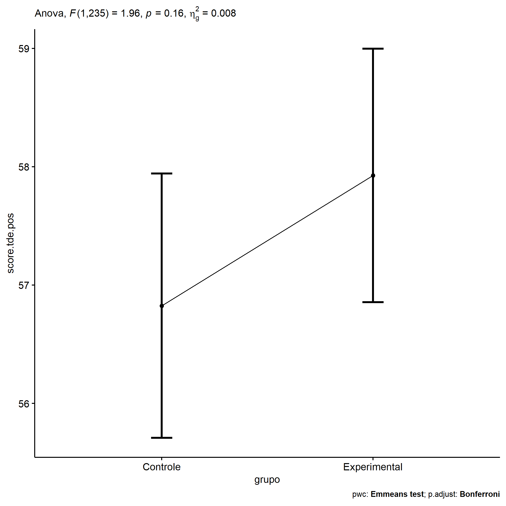<!-- -->

``` r
plots <- oneWayAncovaBoxPlots(
  wdat, "score.tde.pos", "grupo", aov, pwc, covar = "score.tde.pre",
  theme = "classic", color = color[["grupo"]],
  subtitle = which(aov$Effect == "grupo"))
```

``` r
if (length(unique(wdat[["grupo"]])) > 1)
  plots[["grupo"]] + ggplot2::ylab("TDE - Escrita") + ggplot2::scale_x_discrete(labels=c('pre', 'pos'))
```

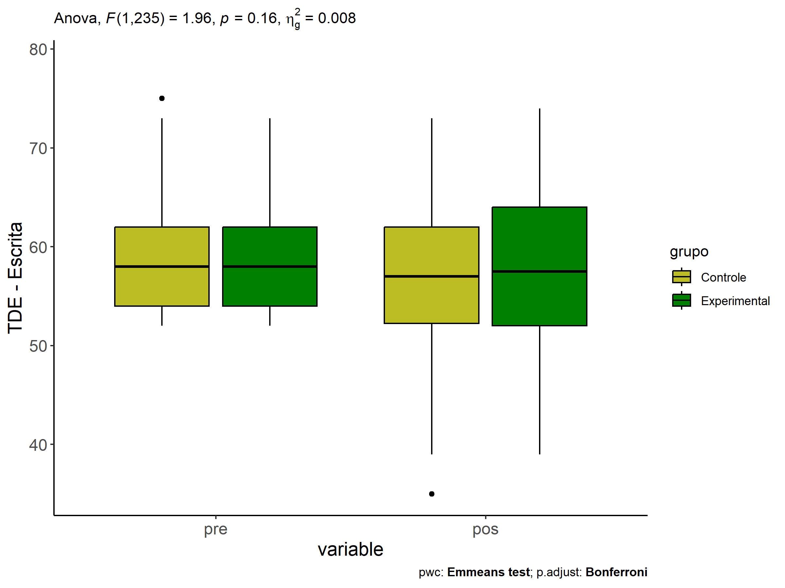<!-- -->

``` r
if (length(unique(wdat.long[["grupo"]])) > 1)
  plots <- oneWayAncovaBoxPlots(
    wdat.long, "score.tde", "grupo", aov, pwc.long, pre.post = "time",
    theme = "classic", color = color$prepost)
```

``` r
if (length(unique(wdat.long[["grupo"]])) > 1)
  plots[["grupo"]] + ggplot2::ylab("TDE - Escrita")
```

<!-- -->

### Checking linearity assumption

``` r
ggscatter(wdat, x = "score.tde.pre", y = "score.tde.pos", size = 0.5,
          color = "grupo", add = "reg.line")+
  stat_regline_equation(
    aes(label =  paste(..eq.label.., ..rr.label.., sep = "~~~~"), color = grupo)
  )
```

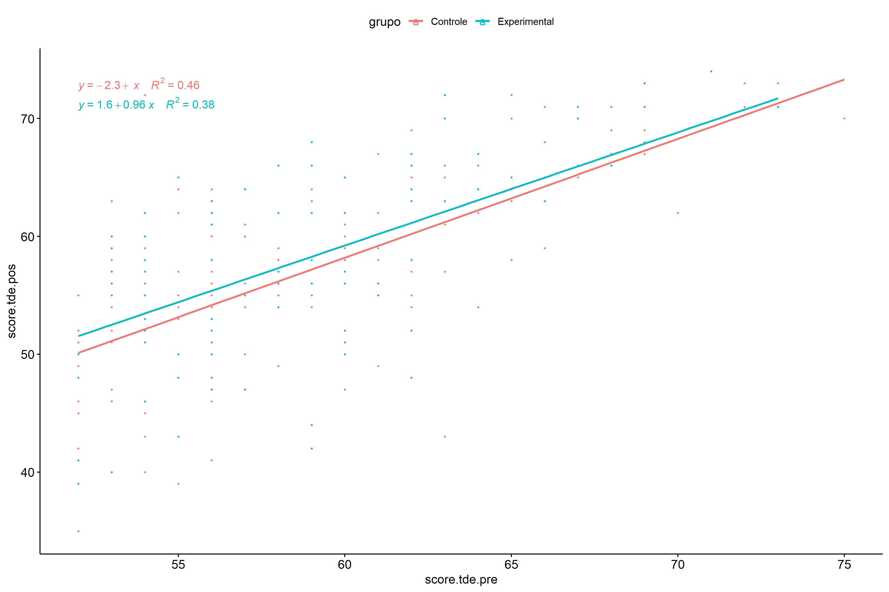<!-- -->

### Checking normality and homogeneity

``` r
res <- augment(lm(score.tde.pos ~ score.tde.pre + grupo, data = wdat))
```

``` r
shapiro_test(res$.resid)
```

    ## # A tibble: 1 × 3
    ##   variable   statistic p.value
    ##   <chr>          <dbl>   <dbl>
    ## 1 res$.resid     0.982 0.00415

``` r
levene_test(res, .resid ~ grupo)
```

    ## # A tibble: 1 × 4
    ##     df1   df2 statistic     p
    ##   <int> <int>     <dbl> <dbl>
    ## 1     1   236      1.25 0.264

# ANCOVA and Pairwise for two factors **grupo:Sexo**

## Without remove non-normal data

``` r
pdat = remove_group_data(dat[!is.na(dat[["grupo"]]) & !is.na(dat[["Sexo"]]),], "score.tde.pos", c("grupo","Sexo"))

pdat.long <- rbind(pdat[,c("id","grupo","Sexo")], pdat[,c("id","grupo","Sexo")])
pdat.long[["time"]] <- c(rep("pre", nrow(pdat)), rep("pos", nrow(pdat)))
pdat.long[["time"]] <- factor(pdat.long[["time"]], c("pre","pos"))
pdat.long[["score.tde"]] <- c(pdat[["score.tde.pre"]], pdat[["score.tde.pos"]])

aov = anova_test(pdat, score.tde.pos ~ score.tde.pre + grupo*Sexo)
laov[["grupo:Sexo"]] <- get_anova_table(aov)
```

``` r
pwcs <- list()
pwcs[["Sexo"]] <- emmeans_test(
  group_by(pdat, grupo), score.tde.pos ~ Sexo,
  covariate = score.tde.pre, p.adjust.method = "bonferroni")
pwcs[["grupo"]] <- emmeans_test(
  group_by(pdat, Sexo), score.tde.pos ~ grupo,
  covariate = score.tde.pre, p.adjust.method = "bonferroni")

pwc <- plyr::rbind.fill(pwcs[["grupo"]], pwcs[["Sexo"]])
pwc <- pwc[,c("grupo","Sexo", colnames(pwc)[!colnames(pwc) %in% c("grupo","Sexo")])]
```

``` r
pwc.long <- emmeans_test(dplyr::group_by_at(pdat.long, c("grupo","Sexo")),
                         score.tde ~ time,
                         p.adjust.method = "bonferroni")
lpwc[["grupo:Sexo"]] <- plyr::rbind.fill(pwc, pwc.long)
```

``` r
ds <- get.descriptives(pdat, "score.tde.pos", c("grupo","Sexo"), covar = "score.tde.pre")
ds <- merge(ds[ds$variable != "score.tde.pre",],
            ds[ds$variable == "score.tde.pre", !colnames(ds) %in% c("variable")],
            by = c("grupo","Sexo"), all.x = T, suffixes = c("", ".score.tde.pre"))
ds <- merge(get_emmeans(pwcs[["grupo"]]), ds, by = c("grupo","Sexo"), suffixes = c(".emms", ""))
ds <- ds[,c("grupo","Sexo","n","mean.score.tde.pre","se.score.tde.pre","mean","se","emmean","se.emms")]

colnames(ds) <- c("grupo","Sexo", "N", paste0(c("M","SE")," (pre)"),
                  paste0(c("M","SE"), " (unadj)"), paste0(c("M", "SE"), " (adj)"))

lemms[["grupo:Sexo"]] <- ds
```

## Computing ANCOVA and PairWise After removing non-normal data (OK)

``` r
wdat = pdat 

res = residuals(lm(score.tde.pos ~ score.tde.pre + grupo*Sexo, data = wdat))
non.normal = getNonNormal(res, wdat$id, plimit = 0.05)

wdat = wdat[!wdat$id %in% non.normal,]

wdat.long <- rbind(wdat[,c("id","grupo","Sexo")], wdat[,c("id","grupo","Sexo")])
wdat.long[["time"]] <- c(rep("pre", nrow(wdat)), rep("pos", nrow(wdat)))
wdat.long[["time"]] <- factor(wdat.long[["time"]], c("pre","pos"))
wdat.long[["score.tde"]] <- c(wdat[["score.tde.pre"]], wdat[["score.tde.pos"]])


ldat[["grupo:Sexo"]] = wdat

(non.normal)
```

    ##  [1] "P1128" "P3019" "P1117" "P3021" "P3054" "P2959" "P2910" "P3005" "P3228" "P1118" "P1018" "P908" 
    ## [13] "P3050" "P1152" "P3703" "P3241" "P1149" "P2952" "P2961" "P1825"

``` r
aov = anova_test(wdat, score.tde.pos ~ score.tde.pre + grupo*Sexo)
laov[["grupo:Sexo"]] <- merge(get_anova_table(aov), laov[["grupo:Sexo"]], by="Effect", suffixes = c("","'"))

(df = get_anova_table(aov))
```

    ## ANOVA Table (type II tests)
    ## 
    ##          Effect DFn DFd       F        p p<.05   ges
    ## 1 score.tde.pre   1 233 181.900 5.02e-31     * 0.438
    ## 2         grupo   1 233   0.941 3.33e-01       0.004
    ## 3          Sexo   1 233   0.599 4.40e-01       0.003
    ## 4    grupo:Sexo   1 233   6.793 1.00e-02     * 0.028

| Effect        | DFn | DFd |       F |     p | p\<.05 |   ges |
|:--------------|----:|----:|--------:|------:|:-------|------:|
| score.tde.pre |   1 | 233 | 181.900 | 0.000 | \*     | 0.438 |
| grupo         |   1 | 233 |   0.941 | 0.333 |        | 0.004 |
| Sexo          |   1 | 233 |   0.599 | 0.440 |        | 0.003 |
| grupo:Sexo    |   1 | 233 |   6.793 | 0.010 | \*     | 0.028 |

``` r
pwcs <- list()
pwcs[["Sexo"]] <- emmeans_test(
  group_by(wdat, grupo), score.tde.pos ~ Sexo,
  covariate = score.tde.pre, p.adjust.method = "bonferroni")
pwcs[["grupo"]] <- emmeans_test(
  group_by(wdat, Sexo), score.tde.pos ~ grupo,
  covariate = score.tde.pre, p.adjust.method = "bonferroni")

pwc <- plyr::rbind.fill(pwcs[["grupo"]], pwcs[["Sexo"]])
pwc <- pwc[,c("grupo","Sexo", colnames(pwc)[!colnames(pwc) %in% c("grupo","Sexo")])]
```

| grupo        | Sexo | term                 | .y.           | group1   | group2       |  df | statistic |     p | p.adj | p.adj.signif |
|:-------------|:-----|:---------------------|:--------------|:---------|:-------------|----:|----------:|------:|------:|:-------------|
|              | F    | score.tde.pre\*grupo | score.tde.pos | Controle | Experimental | 233 |    -2.369 | 0.019 | 0.019 | \*           |
|              | M    | score.tde.pre\*grupo | score.tde.pos | Controle | Experimental | 233 |     1.457 | 0.146 | 0.146 | ns           |
| Controle     |      | score.tde.pre\*Sexo  | score.tde.pos | F        | M            | 233 |    -1.335 | 0.183 | 0.183 | ns           |
| Experimental |      | score.tde.pre\*Sexo  | score.tde.pos | F        | M            | 233 |     2.366 | 0.019 | 0.019 | \*           |

``` r
pwc.long <- emmeans_test(dplyr::group_by_at(wdat.long, c("grupo","Sexo")),
                         score.tde ~ time,
                         p.adjust.method = "bonferroni")
lpwc[["grupo:Sexo"]] <- merge(plyr::rbind.fill(pwc, pwc.long), lpwc[["grupo:Sexo"]], by=c("grupo","Sexo","term",".y.","group1","group2"), suffixes = c("","'"))
```

| grupo        | Sexo | term | .y.       | group1 | group2 |  df | statistic |     p | p.adj | p.adj.signif |
|:-------------|:-----|:-----|:----------|:-------|:-------|----:|----------:|------:|------:|:-------------|
| Controle     | F    | time | score.tde | pre    | pos    | 468 |     1.962 | 0.050 | 0.050 | ns           |
| Controle     | M    | time | score.tde | pre    | pos    | 468 |     0.498 | 0.619 | 0.619 | ns           |
| Experimental | F    | time | score.tde | pre    | pos    | 468 |    -0.070 | 0.944 | 0.944 | ns           |
| Experimental | M    | time | score.tde | pre    | pos    | 468 |     1.805 | 0.072 | 0.072 | ns           |

``` r
ds <- get.descriptives(wdat, "score.tde.pos", c("grupo","Sexo"), covar = "score.tde.pre")
ds <- merge(ds[ds$variable != "score.tde.pre",],
            ds[ds$variable == "score.tde.pre", !colnames(ds) %in% c("variable")],
            by = c("grupo","Sexo"), all.x = T, suffixes = c("", ".score.tde.pre"))
ds <- merge(get_emmeans(pwcs[["grupo"]]), ds, by = c("grupo","Sexo"), suffixes = c(".emms", ""))
ds <- ds[,c("grupo","Sexo","n","mean.score.tde.pre","se.score.tde.pre","mean","se","emmean","se.emms")]

colnames(ds) <- c("grupo","Sexo", "N", paste0(c("M","SE")," (pre)"),
                  paste0(c("M","SE"), " (unadj)"), paste0(c("M", "SE"), " (adj)"))

lemms[["grupo:Sexo"]] <- merge(ds, lemms[["grupo:Sexo"]], by=c("grupo","Sexo"), suffixes = c("","'"))
```

| grupo        | Sexo |   N | M (pre) | SE (pre) | M (unadj) | SE (unadj) | M (adj) | SE (adj) |
|:-------------|:-----|----:|--------:|---------:|----------:|-----------:|--------:|---------:|
| Controle     | F    |  68 |  58.235 |    0.595 |    55.956 |      0.928 |  56.317 |    0.731 |
| Controle     | M    |  45 |  59.622 |    0.925 |    58.911 |      1.236 |  57.869 |    0.901 |
| Experimental | F    |  80 |  58.325 |    0.560 |    58.400 |      0.824 |  58.671 |    0.674 |
| Experimental | M    |  45 |  58.578 |    0.763 |    56.000 |      1.385 |  56.015 |    0.898 |

### Plots for ancova

``` r
plots <- twoWayAncovaPlots(
  wdat, "score.tde.pos", c("grupo","Sexo"), aov, pwcs, addParam = c("mean_se"),
  font.label.size=10, step.increase=0.05, p.label="p.adj",
  subtitle = which(aov$Effect == "grupo:Sexo"))
```

``` r
if (!is.null(plots[["grupo"]]))
  plots[["grupo"]] + ggplot2::scale_color_manual(values = color[["Sexo"]])
```

    ## Scale for colour is already present.
    ## Adding another scale for colour, which will replace the existing scale.

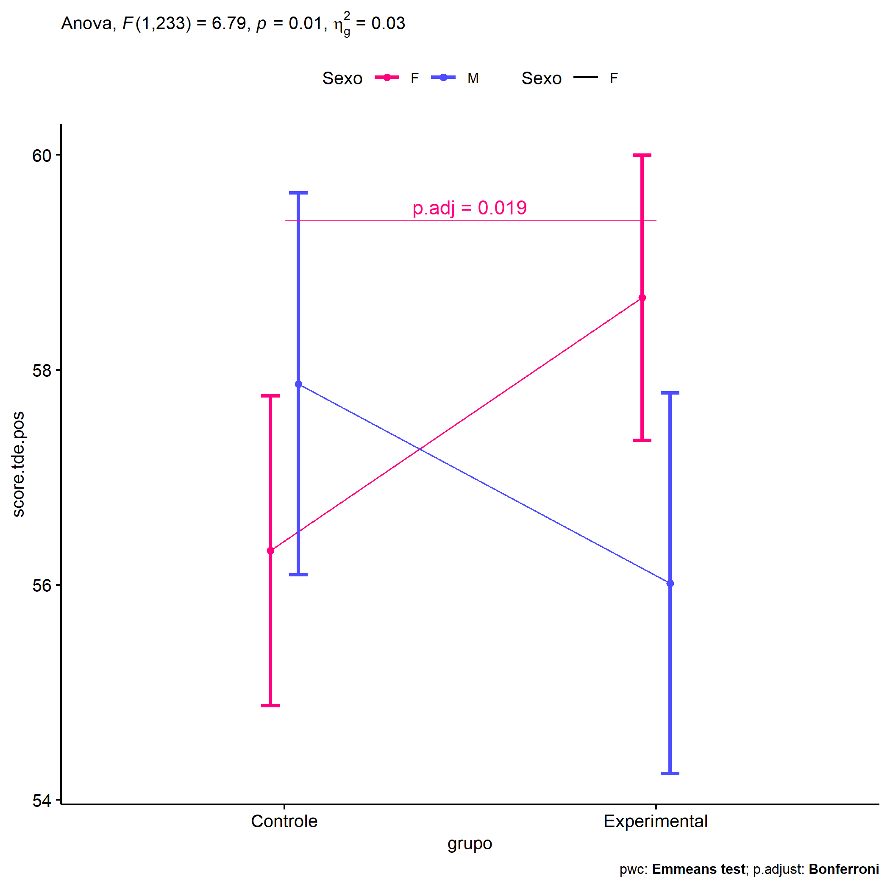<!-- -->

``` r
if (!is.null(plots[["Sexo"]]))
  plots[["Sexo"]] + ggplot2::scale_color_manual(values = color[["grupo"]])
```

    ## Scale for colour is already present.
    ## Adding another scale for colour, which will replace the existing scale.

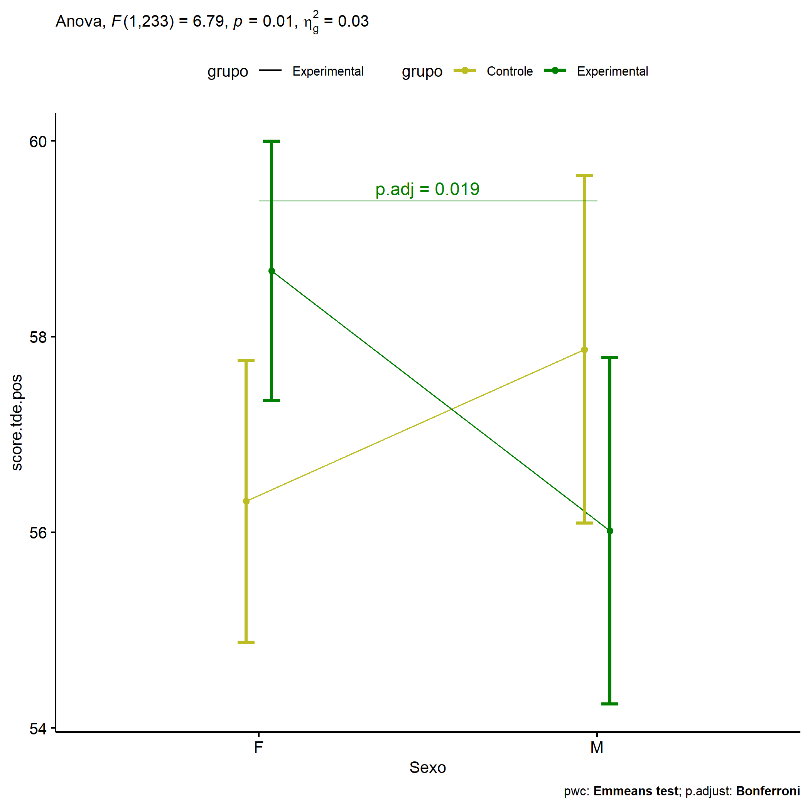<!-- -->

``` r
plots <- twoWayAncovaBoxPlots(
  wdat, "score.tde.pos", c("grupo","Sexo"), aov, pwcs, covar = "score.tde.pre",
  theme = "classic", color = color[["grupo:Sexo"]],
  subtitle = which(aov$Effect == "grupo:Sexo"))
```

``` r
plots[["grupo:Sexo"]] + ggplot2::ylab("TDE - Escrita") + ggplot2::scale_x_discrete(labels=c('pre', 'pos'))
```

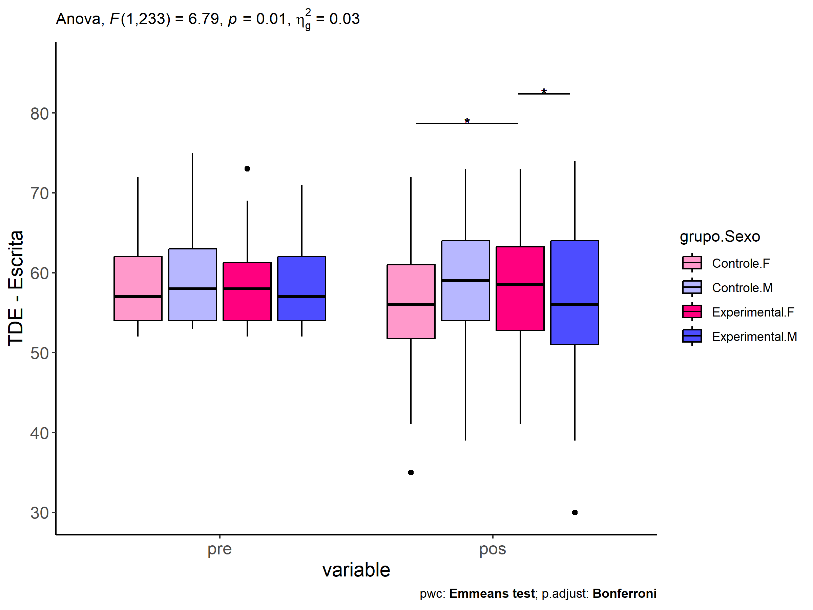<!-- -->

``` r
plots <- twoWayAncovaBoxPlots(
  wdat.long, "score.tde", c("grupo","Sexo"), aov, pwc.long, pre.post = "time",
  theme = "classic", color = color$prepost)
```

``` r
plots[["grupo:Sexo"]] + ggplot2::ylab("TDE - Escrita")
```

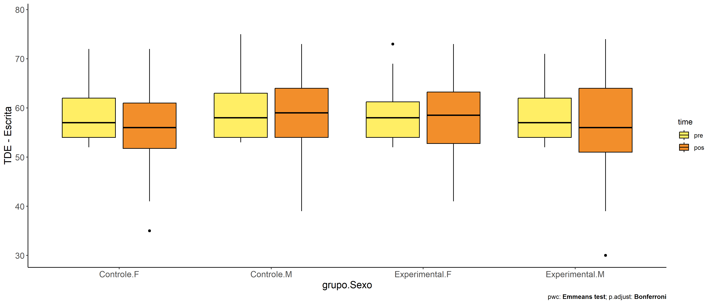<!-- -->

### Checking linearity assumption

``` r
ggscatter(wdat, x = "score.tde.pre", y = "score.tde.pos", size = 0.5,
          facet.by = c("grupo","Sexo"), add = "reg.line")+
  stat_regline_equation(
    aes(label =  paste(..eq.label.., ..rr.label.., sep = "~~~~"))
  )
```

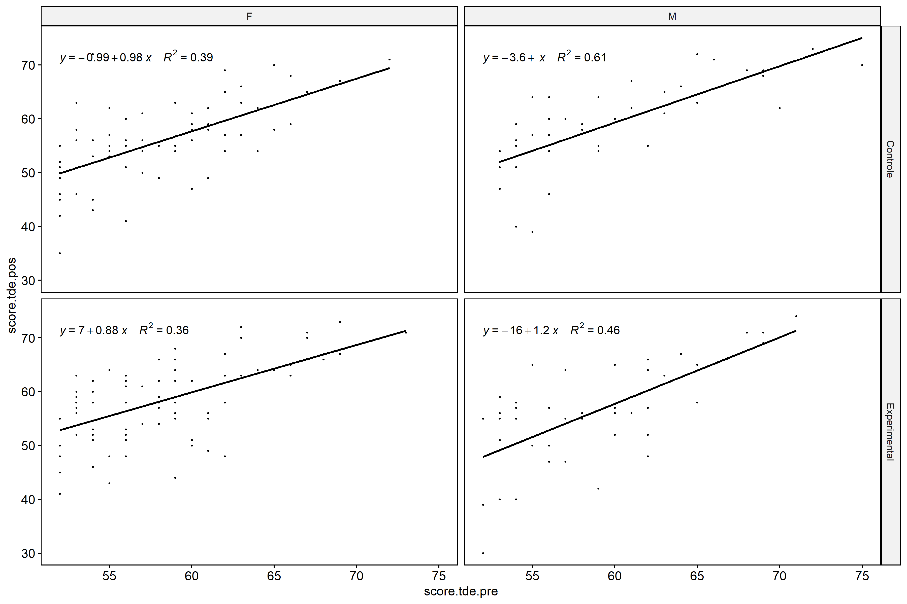<!-- -->

### Checking normality and homogeneity

``` r
res <- augment(lm(score.tde.pos ~ score.tde.pre + grupo*Sexo, data = wdat))
```

``` r
shapiro_test(res$.resid)
```

    ## # A tibble: 1 × 3
    ##   variable   statistic p.value
    ##   <chr>          <dbl>   <dbl>
    ## 1 res$.resid     0.985  0.0111

``` r
levene_test(res, .resid ~ grupo*Sexo)
```

    ## # A tibble: 1 × 4
    ##     df1   df2 statistic     p
    ##   <int> <int>     <dbl> <dbl>
    ## 1     3   234      1.76 0.155

# ANCOVA and Pairwise for two factors **grupo:Zona**

## Without remove non-normal data

``` r
pdat = remove_group_data(dat[!is.na(dat[["grupo"]]) & !is.na(dat[["Zona"]]),], "score.tde.pos", c("grupo","Zona"))

pdat.long <- rbind(pdat[,c("id","grupo","Zona")], pdat[,c("id","grupo","Zona")])
pdat.long[["time"]] <- c(rep("pre", nrow(pdat)), rep("pos", nrow(pdat)))
pdat.long[["time"]] <- factor(pdat.long[["time"]], c("pre","pos"))
pdat.long[["score.tde"]] <- c(pdat[["score.tde.pre"]], pdat[["score.tde.pos"]])

aov = anova_test(pdat, score.tde.pos ~ score.tde.pre + grupo*Zona)
laov[["grupo:Zona"]] <- get_anova_table(aov)
```

``` r
pwcs <- list()
pwcs[["Zona"]] <- emmeans_test(
  group_by(pdat, grupo), score.tde.pos ~ Zona,
  covariate = score.tde.pre, p.adjust.method = "bonferroni")
pwcs[["grupo"]] <- emmeans_test(
  group_by(pdat, Zona), score.tde.pos ~ grupo,
  covariate = score.tde.pre, p.adjust.method = "bonferroni")

pwc <- plyr::rbind.fill(pwcs[["grupo"]], pwcs[["Zona"]])
pwc <- pwc[,c("grupo","Zona", colnames(pwc)[!colnames(pwc) %in% c("grupo","Zona")])]
```

``` r
pwc.long <- emmeans_test(dplyr::group_by_at(pdat.long, c("grupo","Zona")),
                         score.tde ~ time,
                         p.adjust.method = "bonferroni")
lpwc[["grupo:Zona"]] <- plyr::rbind.fill(pwc, pwc.long)
```

``` r
ds <- get.descriptives(pdat, "score.tde.pos", c("grupo","Zona"), covar = "score.tde.pre")
ds <- merge(ds[ds$variable != "score.tde.pre",],
            ds[ds$variable == "score.tde.pre", !colnames(ds) %in% c("variable")],
            by = c("grupo","Zona"), all.x = T, suffixes = c("", ".score.tde.pre"))
ds <- merge(get_emmeans(pwcs[["grupo"]]), ds, by = c("grupo","Zona"), suffixes = c(".emms", ""))
ds <- ds[,c("grupo","Zona","n","mean.score.tde.pre","se.score.tde.pre","mean","se","emmean","se.emms")]

colnames(ds) <- c("grupo","Zona", "N", paste0(c("M","SE")," (pre)"),
                  paste0(c("M","SE"), " (unadj)"), paste0(c("M", "SE"), " (adj)"))

lemms[["grupo:Zona"]] <- ds
```

## Computing ANCOVA and PairWise After removing non-normal data (OK)

``` r
wdat = pdat 

res = residuals(lm(score.tde.pos ~ score.tde.pre + grupo*Zona, data = wdat))
non.normal = getNonNormal(res, wdat$id, plimit = 0.05)

wdat = wdat[!wdat$id %in% non.normal,]

wdat.long <- rbind(wdat[,c("id","grupo","Zona")], wdat[,c("id","grupo","Zona")])
wdat.long[["time"]] <- c(rep("pre", nrow(wdat)), rep("pos", nrow(wdat)))
wdat.long[["time"]] <- factor(wdat.long[["time"]], c("pre","pos"))
wdat.long[["score.tde"]] <- c(wdat[["score.tde.pre"]], wdat[["score.tde.pos"]])


ldat[["grupo:Zona"]] = wdat

(non.normal)
```

    ## [1] "P3021" "P908"  "P1117" "P1018" "P2959" "P3545" "P1152" "P3228"

``` r
aov = anova_test(wdat, score.tde.pos ~ score.tde.pre + grupo*Zona)
laov[["grupo:Zona"]] <- merge(get_anova_table(aov), laov[["grupo:Zona"]], by="Effect", suffixes = c("","'"))

(df = get_anova_table(aov))
```

    ## ANOVA Table (type II tests)
    ## 
    ##          Effect DFn DFd       F        p p<.05   ges
    ## 1 score.tde.pre   1 158 100.583 1.26e-18     * 0.389
    ## 2         grupo   1 158   0.539 4.64e-01       0.003
    ## 3          Zona   1 158  17.258 5.33e-05     * 0.098
    ## 4    grupo:Zona   1 158   1.581 2.11e-01       0.010

| Effect        | DFn | DFd |       F |     p | p\<.05 |   ges |
|:--------------|----:|----:|--------:|------:|:-------|------:|
| score.tde.pre |   1 | 158 | 100.583 | 0.000 | \*     | 0.389 |
| grupo         |   1 | 158 |   0.539 | 0.464 |        | 0.003 |
| Zona          |   1 | 158 |  17.258 | 0.000 | \*     | 0.098 |
| grupo:Zona    |   1 | 158 |   1.581 | 0.211 |        | 0.010 |

``` r
pwcs <- list()
pwcs[["Zona"]] <- emmeans_test(
  group_by(wdat, grupo), score.tde.pos ~ Zona,
  covariate = score.tde.pre, p.adjust.method = "bonferroni")
pwcs[["grupo"]] <- emmeans_test(
  group_by(wdat, Zona), score.tde.pos ~ grupo,
  covariate = score.tde.pre, p.adjust.method = "bonferroni")

pwc <- plyr::rbind.fill(pwcs[["grupo"]], pwcs[["Zona"]])
pwc <- pwc[,c("grupo","Zona", colnames(pwc)[!colnames(pwc) %in% c("grupo","Zona")])]
```

| grupo        | Zona   | term                 | .y.           | group1   | group2       |  df | statistic |     p | p.adj | p.adj.signif |
|:-------------|:-------|:---------------------|:--------------|:---------|:-------------|----:|----------:|------:|------:|:-------------|
|              | Rural  | score.tde.pre\*grupo | score.tde.pos | Controle | Experimental | 158 |     0.222 | 0.824 | 0.824 | ns           |
|              | Urbana | score.tde.pre\*grupo | score.tde.pos | Controle | Experimental | 158 |    -1.441 | 0.152 | 0.152 | ns           |
| Controle     |        | score.tde.pre\*Zona  | score.tde.pos | Rural    | Urbana       | 158 |     3.733 | 0.000 | 0.000 | \*\*\*       |
| Experimental |        | score.tde.pre\*Zona  | score.tde.pos | Rural    | Urbana       | 158 |     2.174 | 0.031 | 0.031 | \*           |

``` r
pwc.long <- emmeans_test(dplyr::group_by_at(wdat.long, c("grupo","Zona")),
                         score.tde ~ time,
                         p.adjust.method = "bonferroni")
lpwc[["grupo:Zona"]] <- merge(plyr::rbind.fill(pwc, pwc.long), lpwc[["grupo:Zona"]], by=c("grupo","Zona","term",".y.","group1","group2"), suffixes = c("","'"))
```

| grupo        | Zona   | term | .y.       | group1 | group2 |  df | statistic |     p | p.adj | p.adj.signif |
|:-------------|:-------|:-----|:----------|:-------|:-------|----:|----------:|------:|------:|:-------------|
| Controle     | Rural  | time | score.tde | pre    | pos    | 318 |     0.213 | 0.832 | 0.832 | ns           |
| Controle     | Urbana | time | score.tde | pre    | pos    | 318 |     3.282 | 0.001 | 0.001 | \*\*         |
| Experimental | Rural  | time | score.tde | pre    | pos    | 318 |     0.420 | 0.675 | 0.675 | ns           |
| Experimental | Urbana | time | score.tde | pre    | pos    | 318 |     2.294 | 0.022 | 0.022 | \*           |

``` r
ds <- get.descriptives(wdat, "score.tde.pos", c("grupo","Zona"), covar = "score.tde.pre")
ds <- merge(ds[ds$variable != "score.tde.pre",],
            ds[ds$variable == "score.tde.pre", !colnames(ds) %in% c("variable")],
            by = c("grupo","Zona"), all.x = T, suffixes = c("", ".score.tde.pre"))
ds <- merge(get_emmeans(pwcs[["grupo"]]), ds, by = c("grupo","Zona"), suffixes = c(".emms", ""))
ds <- ds[,c("grupo","Zona","n","mean.score.tde.pre","se.score.tde.pre","mean","se","emmean","se.emms")]

colnames(ds) <- c("grupo","Zona", "N", paste0(c("M","SE")," (pre)"),
                  paste0(c("M","SE"), " (unadj)"), paste0(c("M", "SE"), " (adj)"))

lemms[["grupo:Zona"]] <- merge(ds, lemms[["grupo:Zona"]], by=c("grupo","Zona"), suffixes = c("","'"))
```

| grupo        | Zona   |   N | M (pre) | SE (pre) | M (unadj) | SE (unadj) | M (adj) | SE (adj) |
|:-------------|:-------|----:|--------:|---------:|----------:|-----------:|--------:|---------:|
| Controle     | Rural  |  50 |  58.260 |    0.690 |    57.960 |      1.051 |  58.464 |    0.937 |
| Controle     | Urbana |  28 |  60.036 |    1.209 |    53.857 |      1.929 |  52.596 |    1.257 |
| Experimental | Rural  |  48 |  59.250 |    0.751 |    58.646 |      1.189 |  58.166 |    0.956 |
| Experimental | Urbana |  37 |  57.865 |    0.829 |    54.108 |      1.400 |  55.004 |    1.091 |

### Plots for ancova

``` r
plots <- twoWayAncovaPlots(
  wdat, "score.tde.pos", c("grupo","Zona"), aov, pwcs, addParam = c("mean_se"),
  font.label.size=10, step.increase=0.05, p.label="p.adj",
  subtitle = which(aov$Effect == "grupo:Zona"))
```

``` r
if (!is.null(plots[["grupo"]]))
  plots[["grupo"]] + ggplot2::scale_color_manual(values = color[["Zona"]])
```

    ## Scale for colour is already present.
    ## Adding another scale for colour, which will replace the existing scale.

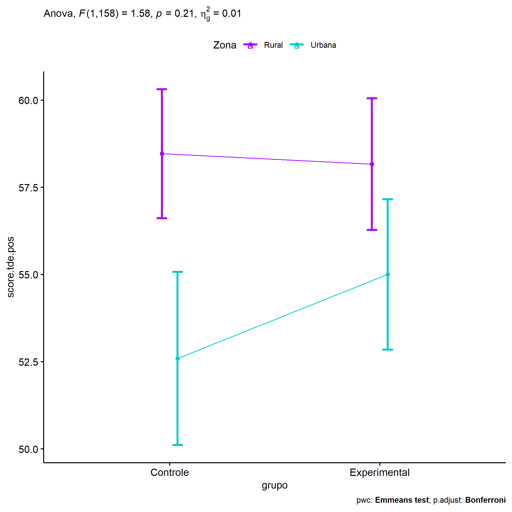<!-- -->

``` r
if (!is.null(plots[["Zona"]]))
  plots[["Zona"]] + ggplot2::scale_color_manual(values = color[["grupo"]])
```

    ## Scale for colour is already present.
    ## Adding another scale for colour, which will replace the existing scale.

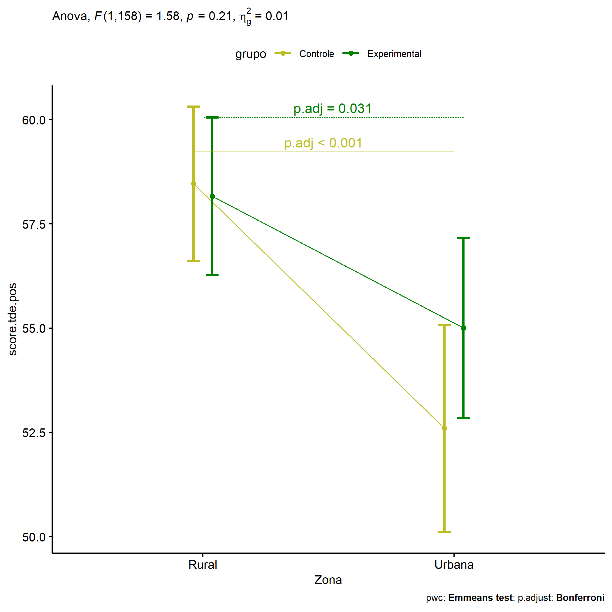<!-- -->

``` r
plots <- twoWayAncovaBoxPlots(
  wdat, "score.tde.pos", c("grupo","Zona"), aov, pwcs, covar = "score.tde.pre",
  theme = "classic", color = color[["grupo:Zona"]],
  subtitle = which(aov$Effect == "grupo:Zona"))
```

``` r
plots[["grupo:Zona"]] + ggplot2::ylab("TDE - Escrita") + ggplot2::scale_x_discrete(labels=c('pre', 'pos'))
```

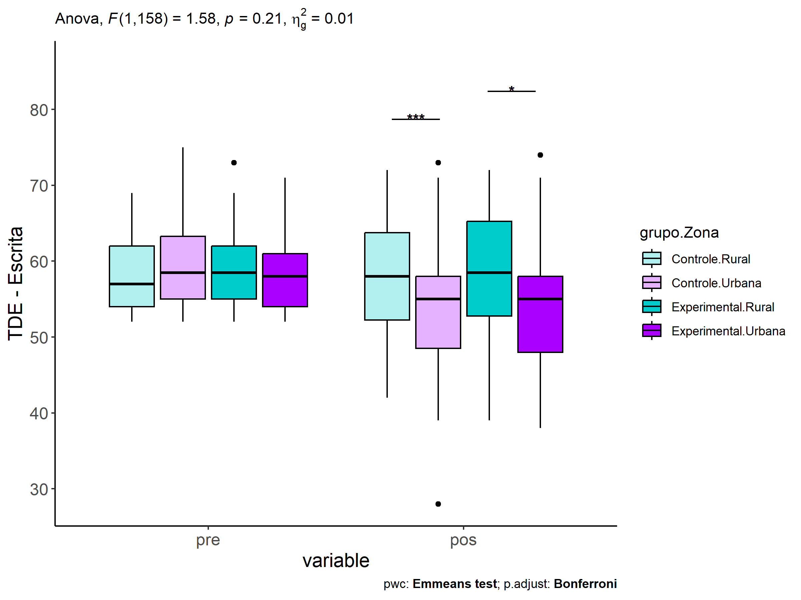<!-- -->

``` r
plots <- twoWayAncovaBoxPlots(
  wdat.long, "score.tde", c("grupo","Zona"), aov, pwc.long, pre.post = "time",
  theme = "classic", color = color$prepost)
```

``` r
plots[["grupo:Zona"]] + ggplot2::ylab("TDE - Escrita")
```

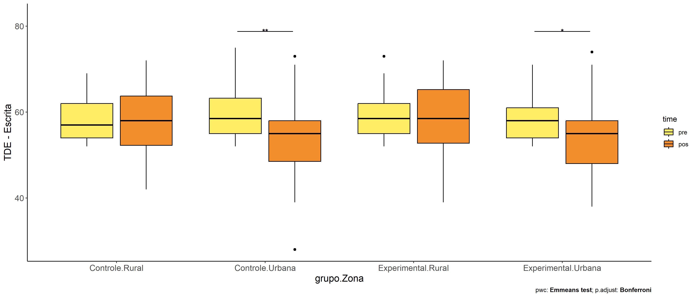<!-- -->

### Checking linearity assumption

``` r
ggscatter(wdat, x = "score.tde.pre", y = "score.tde.pos", size = 0.5,
          facet.by = c("grupo","Zona"), add = "reg.line")+
  stat_regline_equation(
    aes(label =  paste(..eq.label.., ..rr.label.., sep = "~~~~"))
  )
```

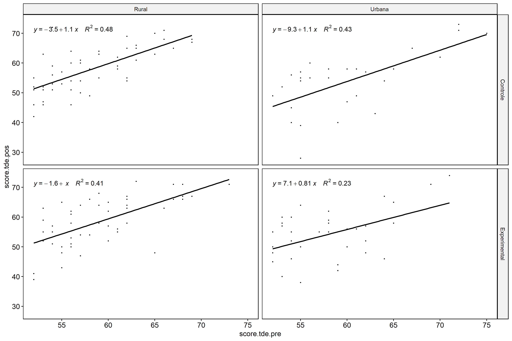<!-- -->

### Checking normality and homogeneity

``` r
res <- augment(lm(score.tde.pos ~ score.tde.pre + grupo*Zona, data = wdat))
```

``` r
shapiro_test(res$.resid)
```

    ## # A tibble: 1 × 3
    ##   variable   statistic p.value
    ##   <chr>          <dbl>   <dbl>
    ## 1 res$.resid     0.985  0.0695

``` r
levene_test(res, .resid ~ grupo*Zona)
```

    ## # A tibble: 1 × 4
    ##     df1   df2 statistic     p
    ##   <int> <int>     <dbl> <dbl>
    ## 1     3   159      1.95 0.124

# ANCOVA and Pairwise for two factors **grupo:Cor.Raca**

## Without remove non-normal data

``` r
pdat = remove_group_data(dat[!is.na(dat[["grupo"]]) & !is.na(dat[["Cor.Raca"]]),], "score.tde.pos", c("grupo","Cor.Raca"))

pdat.long <- rbind(pdat[,c("id","grupo","Cor.Raca")], pdat[,c("id","grupo","Cor.Raca")])
pdat.long[["time"]] <- c(rep("pre", nrow(pdat)), rep("pos", nrow(pdat)))
pdat.long[["time"]] <- factor(pdat.long[["time"]], c("pre","pos"))
pdat.long[["score.tde"]] <- c(pdat[["score.tde.pre"]], pdat[["score.tde.pos"]])

aov = anova_test(pdat, score.tde.pos ~ score.tde.pre + grupo*Cor.Raca)
laov[["grupo:Cor.Raca"]] <- get_anova_table(aov)
```

``` r
pwcs <- list()
pwcs[["Cor.Raca"]] <- emmeans_test(
  group_by(pdat, grupo), score.tde.pos ~ Cor.Raca,
  covariate = score.tde.pre, p.adjust.method = "bonferroni")
pwcs[["grupo"]] <- emmeans_test(
  group_by(pdat, Cor.Raca), score.tde.pos ~ grupo,
  covariate = score.tde.pre, p.adjust.method = "bonferroni")

pwc <- plyr::rbind.fill(pwcs[["grupo"]], pwcs[["Cor.Raca"]])
pwc <- pwc[,c("grupo","Cor.Raca", colnames(pwc)[!colnames(pwc) %in% c("grupo","Cor.Raca")])]
```

``` r
pwc.long <- emmeans_test(dplyr::group_by_at(pdat.long, c("grupo","Cor.Raca")),
                         score.tde ~ time,
                         p.adjust.method = "bonferroni")
lpwc[["grupo:Cor.Raca"]] <- plyr::rbind.fill(pwc, pwc.long)
```

``` r
ds <- get.descriptives(pdat, "score.tde.pos", c("grupo","Cor.Raca"), covar = "score.tde.pre")
ds <- merge(ds[ds$variable != "score.tde.pre",],
            ds[ds$variable == "score.tde.pre", !colnames(ds) %in% c("variable")],
            by = c("grupo","Cor.Raca"), all.x = T, suffixes = c("", ".score.tde.pre"))
ds <- merge(get_emmeans(pwcs[["grupo"]]), ds, by = c("grupo","Cor.Raca"), suffixes = c(".emms", ""))
ds <- ds[,c("grupo","Cor.Raca","n","mean.score.tde.pre","se.score.tde.pre","mean","se","emmean","se.emms")]

colnames(ds) <- c("grupo","Cor.Raca", "N", paste0(c("M","SE")," (pre)"),
                  paste0(c("M","SE"), " (unadj)"), paste0(c("M", "SE"), " (adj)"))

lemms[["grupo:Cor.Raca"]] <- ds
```

## Computing ANCOVA and PairWise After removing non-normal data (OK)

``` r
wdat = pdat 

res = residuals(lm(score.tde.pos ~ score.tde.pre + grupo*Cor.Raca, data = wdat))
non.normal = getNonNormal(res, wdat$id, plimit = 0.05)

wdat = wdat[!wdat$id %in% non.normal,]

wdat.long <- rbind(wdat[,c("id","grupo","Cor.Raca")], wdat[,c("id","grupo","Cor.Raca")])
wdat.long[["time"]] <- c(rep("pre", nrow(wdat)), rep("pos", nrow(wdat)))
wdat.long[["time"]] <- factor(wdat.long[["time"]], c("pre","pos"))
wdat.long[["score.tde"]] <- c(wdat[["score.tde.pre"]], wdat[["score.tde.pos"]])


ldat[["grupo:Cor.Raca"]] = wdat

(non.normal)
```

    ##  [1] "P1128" "P1117" "P1018" "P908"  "P3021" "P3054" "P1104" "P3646" "P1149" "P1152" "P2961" "P3241"
    ## [13] "P1036" "P3228" "P3545" "P1118" "P3621" "P3657"

``` r
aov = anova_test(wdat, score.tde.pos ~ score.tde.pre + grupo*Cor.Raca)
laov[["grupo:Cor.Raca"]] <- merge(get_anova_table(aov), laov[["grupo:Cor.Raca"]], by="Effect", suffixes = c("","'"))

(df = get_anova_table(aov))
```

    ## ANOVA Table (type II tests)
    ## 
    ##           Effect DFn DFd         F        p p<.05      ges
    ## 1  score.tde.pre   1  71 56.476000 1.32e-10     * 4.43e-01
    ## 2          grupo   1  71  0.277000 6.00e-01       4.00e-03
    ## 3       Cor.Raca   1  71  0.037000 8.49e-01       5.16e-04
    ## 4 grupo:Cor.Raca   1  71  0.000478 9.83e-01       6.73e-06

| Effect         | DFn | DFd |      F |     p | p\<.05 |   ges |
|:---------------|----:|----:|-------:|------:|:-------|------:|
| score.tde.pre  |   1 |  71 | 56.476 | 0.000 | \*     | 0.443 |
| grupo          |   1 |  71 |  0.277 | 0.600 |        | 0.004 |
| Cor.Raca       |   1 |  71 |  0.037 | 0.849 |        | 0.001 |
| grupo:Cor.Raca |   1 |  71 |  0.000 | 0.983 |        | 0.000 |

``` r
pwcs <- list()
pwcs[["Cor.Raca"]] <- emmeans_test(
  group_by(wdat, grupo), score.tde.pos ~ Cor.Raca,
  covariate = score.tde.pre, p.adjust.method = "bonferroni")
pwcs[["grupo"]] <- emmeans_test(
  group_by(wdat, Cor.Raca), score.tde.pos ~ grupo,
  covariate = score.tde.pre, p.adjust.method = "bonferroni")

pwc <- plyr::rbind.fill(pwcs[["grupo"]], pwcs[["Cor.Raca"]])
pwc <- pwc[,c("grupo","Cor.Raca", colnames(pwc)[!colnames(pwc) %in% c("grupo","Cor.Raca")])]
```

| grupo        | Cor.Raca | term                    | .y.           | group1   | group2       |  df | statistic |     p | p.adj | p.adj.signif |
|:-------------|:---------|:------------------------|:--------------|:---------|:-------------|----:|----------:|------:|------:|:-------------|
|              | Branca   | score.tde.pre\*grupo    | score.tde.pos | Controle | Experimental |  71 |    -0.308 | 0.759 | 0.759 | ns           |
|              | Parda    | score.tde.pre\*grupo    | score.tde.pos | Controle | Experimental |  71 |    -0.429 | 0.669 | 0.669 | ns           |
| Controle     |          | score.tde.pre\*Cor.Raca | score.tde.pos | Branca   | Parda        |  71 |    -0.148 | 0.883 | 0.883 | ns           |
| Experimental |          | score.tde.pre\*Cor.Raca | score.tde.pos | Branca   | Parda        |  71 |    -0.130 | 0.897 | 0.897 | ns           |

``` r
pwc.long <- emmeans_test(dplyr::group_by_at(wdat.long, c("grupo","Cor.Raca")),
                         score.tde ~ time,
                         p.adjust.method = "bonferroni")
lpwc[["grupo:Cor.Raca"]] <- merge(plyr::rbind.fill(pwc, pwc.long), lpwc[["grupo:Cor.Raca"]], by=c("grupo","Cor.Raca","term",".y.","group1","group2"), suffixes = c("","'"))
```

| grupo        | Cor.Raca | term | .y.       | group1 | group2 |  df | statistic |     p | p.adj | p.adj.signif |
|:-------------|:---------|:-----|:----------|:-------|:-------|----:|----------:|------:|------:|:-------------|
| Controle     | Branca   | time | score.tde | pre    | pos    | 144 |     0.782 | 0.435 | 0.435 | ns           |
| Controle     | Parda    | time | score.tde | pre    | pos    | 144 |     1.147 | 0.253 | 0.253 | ns           |
| Experimental | Branca   | time | score.tde | pre    | pos    | 144 |     0.593 | 0.554 | 0.554 | ns           |
| Experimental | Parda    | time | score.tde | pre    | pos    | 144 |     0.728 | 0.468 | 0.468 | ns           |

``` r
ds <- get.descriptives(wdat, "score.tde.pos", c("grupo","Cor.Raca"), covar = "score.tde.pre")
ds <- merge(ds[ds$variable != "score.tde.pre",],
            ds[ds$variable == "score.tde.pre", !colnames(ds) %in% c("variable")],
            by = c("grupo","Cor.Raca"), all.x = T, suffixes = c("", ".score.tde.pre"))
ds <- merge(get_emmeans(pwcs[["grupo"]]), ds, by = c("grupo","Cor.Raca"), suffixes = c(".emms", ""))
ds <- ds[,c("grupo","Cor.Raca","n","mean.score.tde.pre","se.score.tde.pre","mean","se","emmean","se.emms")]

colnames(ds) <- c("grupo","Cor.Raca", "N", paste0(c("M","SE")," (pre)"),
                  paste0(c("M","SE"), " (unadj)"), paste0(c("M", "SE"), " (adj)"))

lemms[["grupo:Cor.Raca"]] <- merge(ds, lemms[["grupo:Cor.Raca"]], by=c("grupo","Cor.Raca"), suffixes = c("","'"))
```

| grupo        | Cor.Raca |   N | M (pre) | SE (pre) | M (unadj) | SE (unadj) | M (adj) | SE (adj) |
|:-------------|:---------|----:|--------:|---------:|----------:|-----------:|--------:|---------:|
| Controle     | Branca   |  10 |  60.800 |    1.298 |    58.600 |      2.500 |  56.653 |    1.790 |
| Controle     | Parda    |  27 |  57.259 |    0.782 |    55.296 |      1.077 |  56.967 |    1.100 |
| Experimental | Branca   |  13 |  61.385 |    1.542 |    59.923 |      2.232 |  57.379 |    1.589 |
| Experimental | Parda    |  26 |  58.615 |    1.070 |    57.346 |      1.684 |  57.632 |    1.099 |

### Plots for ancova

``` r
plots <- twoWayAncovaPlots(
  wdat, "score.tde.pos", c("grupo","Cor.Raca"), aov, pwcs, addParam = c("mean_se"),
  font.label.size=10, step.increase=0.05, p.label="p.adj",
  subtitle = which(aov$Effect == "grupo:Cor.Raca"))
```

``` r
if (!is.null(plots[["grupo"]]))
  plots[["grupo"]] + ggplot2::scale_color_manual(values = color[["Cor.Raca"]])
```

    ## Scale for colour is already present.
    ## Adding another scale for colour, which will replace the existing scale.

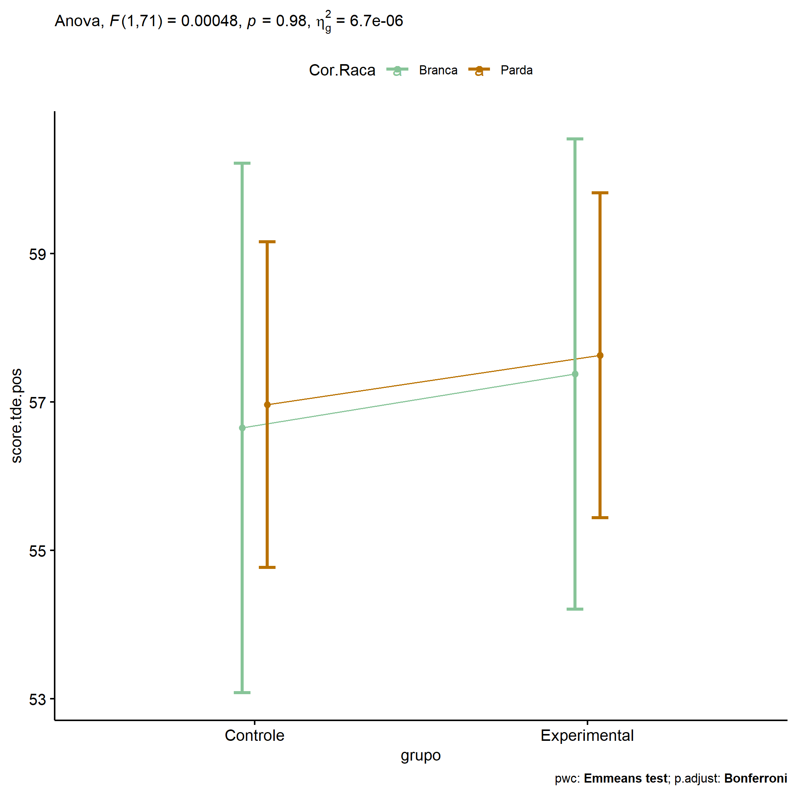<!-- -->

``` r
if (!is.null(plots[["Cor.Raca"]]))
  plots[["Cor.Raca"]] + ggplot2::scale_color_manual(values = color[["grupo"]])
```

    ## Scale for colour is already present.
    ## Adding another scale for colour, which will replace the existing scale.

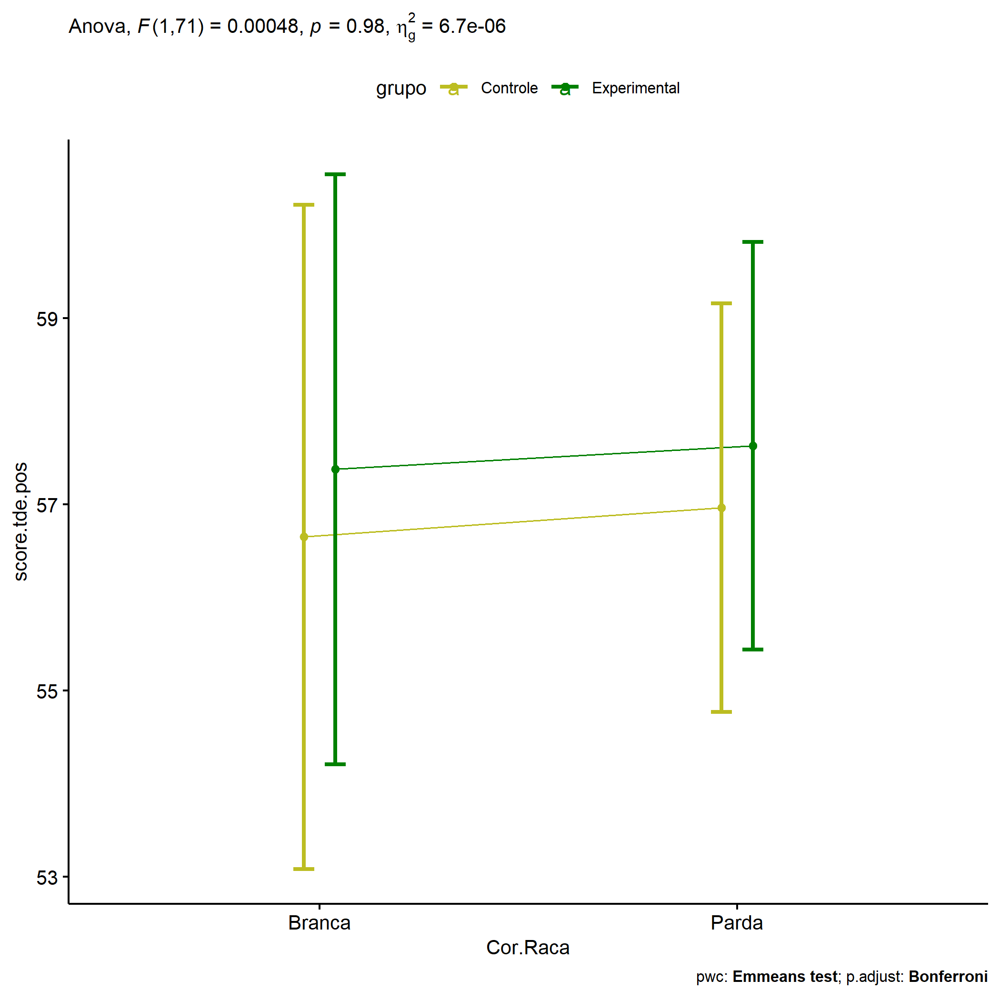<!-- -->

``` r
plots <- twoWayAncovaBoxPlots(
  wdat, "score.tde.pos", c("grupo","Cor.Raca"), aov, pwcs, covar = "score.tde.pre",
  theme = "classic", color = color[["grupo:Cor.Raca"]],
  subtitle = which(aov$Effect == "grupo:Cor.Raca"))
```

``` r
plots[["grupo:Cor.Raca"]] + ggplot2::ylab("TDE - Escrita") + ggplot2::scale_x_discrete(labels=c('pre', 'pos'))
```

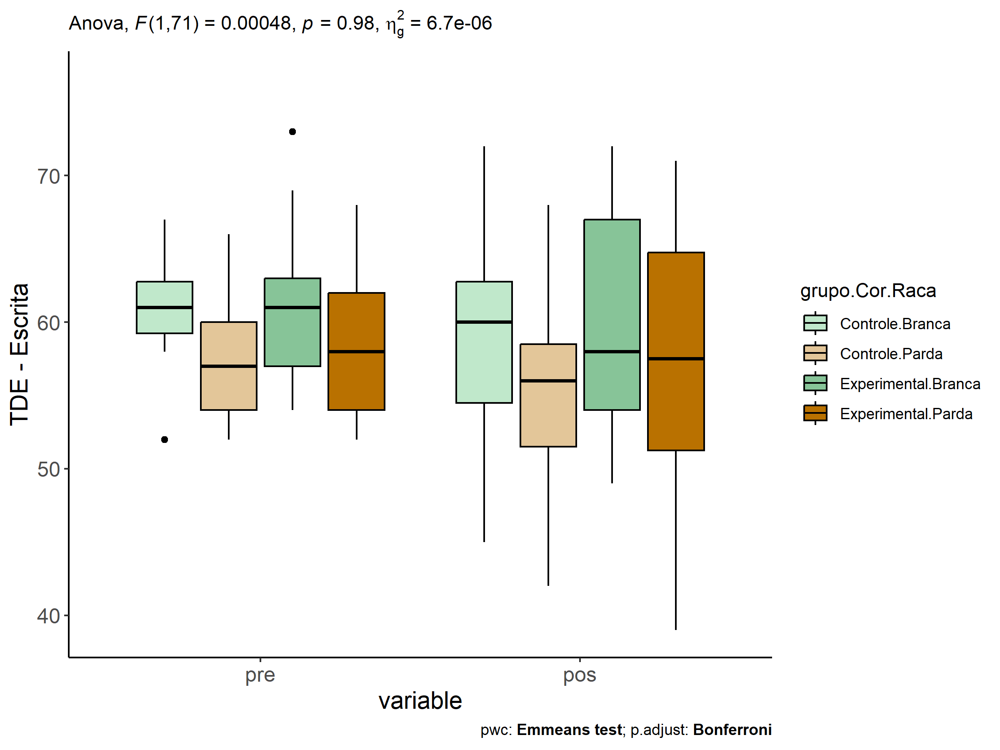<!-- -->

``` r
plots <- twoWayAncovaBoxPlots(
  wdat.long, "score.tde", c("grupo","Cor.Raca"), aov, pwc.long, pre.post = "time",
  theme = "classic", color = color$prepost)
```

``` r
plots[["grupo:Cor.Raca"]] + ggplot2::ylab("TDE - Escrita")
```

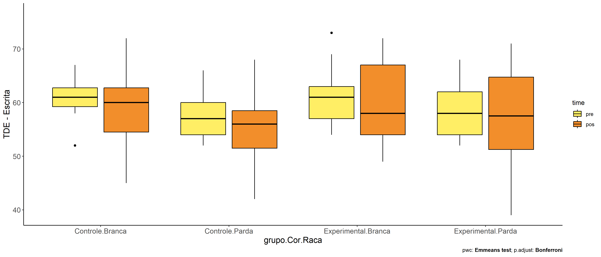<!-- -->

### Checking linearity assumption

``` r
ggscatter(wdat, x = "score.tde.pre", y = "score.tde.pos", size = 0.5,
          facet.by = c("grupo","Cor.Raca"), add = "reg.line")+
  stat_regline_equation(
    aes(label =  paste(..eq.label.., ..rr.label.., sep = "~~~~"))
  )
```

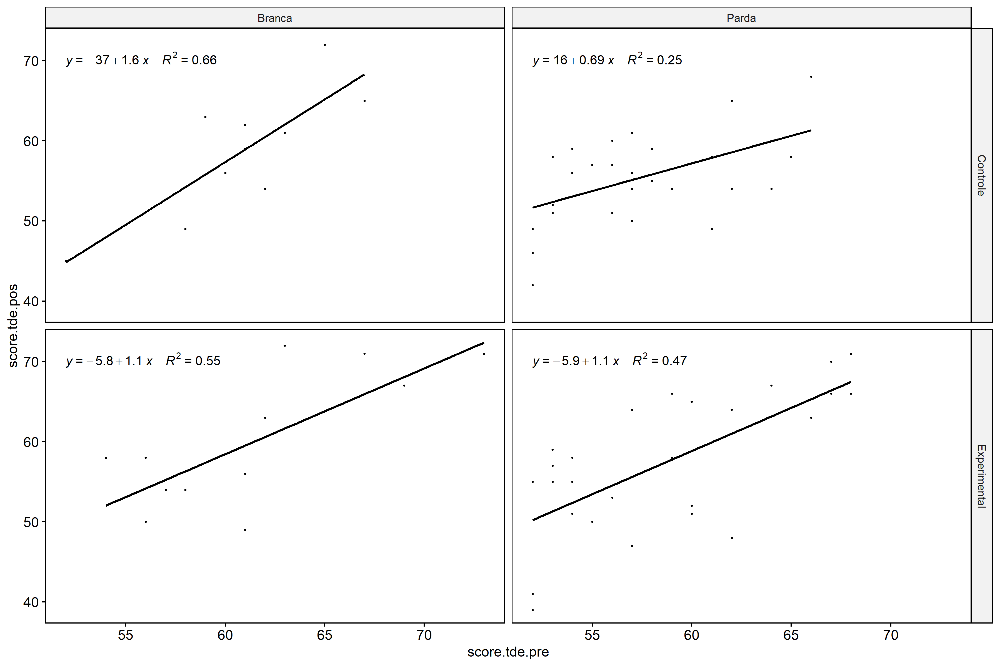<!-- -->

### Checking normality and homogeneity

``` r
res <- augment(lm(score.tde.pos ~ score.tde.pre + grupo*Cor.Raca, data = wdat))
```

``` r
shapiro_test(res$.resid)
```

    ## # A tibble: 1 × 3
    ##   variable   statistic p.value
    ##   <chr>          <dbl>   <dbl>
    ## 1 res$.resid     0.976   0.149

``` r
levene_test(res, .resid ~ grupo*Cor.Raca)
```

    ## # A tibble: 1 × 4
    ##     df1   df2 statistic     p
    ##   <int> <int>     <dbl> <dbl>
    ## 1     3    72     0.632 0.597

# ANCOVA and Pairwise for two factors **grupo:Serie**

## Without remove non-normal data

``` r
pdat = remove_group_data(dat[!is.na(dat[["grupo"]]) & !is.na(dat[["Serie"]]),], "score.tde.pos", c("grupo","Serie"))

pdat.long <- rbind(pdat[,c("id","grupo","Serie")], pdat[,c("id","grupo","Serie")])
pdat.long[["time"]] <- c(rep("pre", nrow(pdat)), rep("pos", nrow(pdat)))
pdat.long[["time"]] <- factor(pdat.long[["time"]], c("pre","pos"))
pdat.long[["score.tde"]] <- c(pdat[["score.tde.pre"]], pdat[["score.tde.pos"]])

aov = anova_test(pdat, score.tde.pos ~ score.tde.pre + grupo*Serie)
laov[["grupo:Serie"]] <- get_anova_table(aov)
```

``` r
pwcs <- list()
pwcs[["Serie"]] <- emmeans_test(
  group_by(pdat, grupo), score.tde.pos ~ Serie,
  covariate = score.tde.pre, p.adjust.method = "bonferroni")
pwcs[["grupo"]] <- emmeans_test(
  group_by(pdat, Serie), score.tde.pos ~ grupo,
  covariate = score.tde.pre, p.adjust.method = "bonferroni")

pwc <- plyr::rbind.fill(pwcs[["grupo"]], pwcs[["Serie"]])
pwc <- pwc[,c("grupo","Serie", colnames(pwc)[!colnames(pwc) %in% c("grupo","Serie")])]
```

``` r
pwc.long <- emmeans_test(dplyr::group_by_at(pdat.long, c("grupo","Serie")),
                         score.tde ~ time,
                         p.adjust.method = "bonferroni")
lpwc[["grupo:Serie"]] <- plyr::rbind.fill(pwc, pwc.long)
```

``` r
ds <- get.descriptives(pdat, "score.tde.pos", c("grupo","Serie"), covar = "score.tde.pre")
ds <- merge(ds[ds$variable != "score.tde.pre",],
            ds[ds$variable == "score.tde.pre", !colnames(ds) %in% c("variable")],
            by = c("grupo","Serie"), all.x = T, suffixes = c("", ".score.tde.pre"))
ds <- merge(get_emmeans(pwcs[["grupo"]]), ds, by = c("grupo","Serie"), suffixes = c(".emms", ""))
ds <- ds[,c("grupo","Serie","n","mean.score.tde.pre","se.score.tde.pre","mean","se","emmean","se.emms")]

colnames(ds) <- c("grupo","Serie", "N", paste0(c("M","SE")," (pre)"),
                  paste0(c("M","SE"), " (unadj)"), paste0(c("M", "SE"), " (adj)"))

lemms[["grupo:Serie"]] <- ds
```

## Computing ANCOVA and PairWise After removing non-normal data (OK)

``` r
wdat = pdat 

res = residuals(lm(score.tde.pos ~ score.tde.pre + grupo*Serie, data = wdat))
non.normal = getNonNormal(res, wdat$id, plimit = 0.05)

wdat = wdat[!wdat$id %in% non.normal,]

wdat.long <- rbind(wdat[,c("id","grupo","Serie")], wdat[,c("id","grupo","Serie")])
wdat.long[["time"]] <- c(rep("pre", nrow(wdat)), rep("pos", nrow(wdat)))
wdat.long[["time"]] <- factor(wdat.long[["time"]], c("pre","pos"))
wdat.long[["score.tde"]] <- c(wdat[["score.tde.pre"]], wdat[["score.tde.pos"]])


ldat[["grupo:Serie"]] = wdat

(non.normal)
```

    ##  [1] "P1128" "P1117" "P3019" "P2910" "P908"  "P3228" "P3021" "P3054" "P1018" "P1118" "P2959" "P1152"
    ## [13] "P3005" "P3574" "P1149" "P1116" "P2392" "P2952" "P2874" "P1597" "P3050" "P3545" "P3241" "P3703"

``` r
aov = anova_test(wdat, score.tde.pos ~ score.tde.pre + grupo*Serie)
laov[["grupo:Serie"]] <- merge(get_anova_table(aov), laov[["grupo:Serie"]], by="Effect", suffixes = c("","'"))

(df = get_anova_table(aov))
```

    ## ANOVA Table (type II tests)
    ## 
    ##          Effect DFn DFd       F        p p<.05   ges
    ## 1 score.tde.pre   1 225 187.550 1.88e-31     * 0.455
    ## 2         grupo   1 225   2.294 1.31e-01       0.010
    ## 3         Serie   3 225   2.491 6.10e-02       0.032
    ## 4   grupo:Serie   3 225   2.445 6.50e-02       0.032

| Effect        | DFn | DFd |       F |     p | p\<.05 |   ges |
|:--------------|----:|----:|--------:|------:|:-------|------:|
| score.tde.pre |   1 | 225 | 187.550 | 0.000 | \*     | 0.455 |
| grupo         |   1 | 225 |   2.294 | 0.131 |        | 0.010 |
| Serie         |   3 | 225 |   2.491 | 0.061 |        | 0.032 |
| grupo:Serie   |   3 | 225 |   2.445 | 0.065 |        | 0.032 |

``` r
pwcs <- list()
pwcs[["Serie"]] <- emmeans_test(
  group_by(wdat, grupo), score.tde.pos ~ Serie,
  covariate = score.tde.pre, p.adjust.method = "bonferroni")
pwcs[["grupo"]] <- emmeans_test(
  group_by(wdat, Serie), score.tde.pos ~ grupo,
  covariate = score.tde.pre, p.adjust.method = "bonferroni")

pwc <- plyr::rbind.fill(pwcs[["grupo"]], pwcs[["Serie"]])
pwc <- pwc[,c("grupo","Serie", colnames(pwc)[!colnames(pwc) %in% c("grupo","Serie")])]
```

| grupo        | Serie | term                 | .y.           | group1   | group2       |  df | statistic |     p | p.adj | p.adj.signif |
|:-------------|:------|:---------------------|:--------------|:---------|:-------------|----:|----------:|------:|------:|:-------------|
|              | 6 ano | score.tde.pre\*grupo | score.tde.pos | Controle | Experimental | 225 |    -0.650 | 0.517 | 0.517 | ns           |
|              | 7 ano | score.tde.pre\*grupo | score.tde.pos | Controle | Experimental | 225 |     1.702 | 0.090 | 0.090 | ns           |
|              | 8 ano | score.tde.pre\*grupo | score.tde.pos | Controle | Experimental | 225 |    -2.094 | 0.037 | 0.037 | \*           |
|              | 9 ano | score.tde.pre\*grupo | score.tde.pos | Controle | Experimental | 225 |    -1.388 | 0.167 | 0.167 | ns           |
| Controle     |       | score.tde.pre\*Serie | score.tde.pos | 6 ano    | 7 ano        | 225 |    -0.943 | 0.347 | 1.000 | ns           |
| Controle     |       | score.tde.pre\*Serie | score.tde.pos | 6 ano    | 8 ano        | 225 |    -0.278 | 0.781 | 1.000 | ns           |
| Controle     |       | score.tde.pre\*Serie | score.tde.pos | 6 ano    | 9 ano        | 225 |    -1.063 | 0.289 | 1.000 | ns           |
| Controle     |       | score.tde.pre\*Serie | score.tde.pos | 7 ano    | 8 ano        | 225 |     0.791 | 0.430 | 1.000 | ns           |
| Controle     |       | score.tde.pre\*Serie | score.tde.pos | 7 ano    | 9 ano        | 225 |     0.076 | 0.939 | 1.000 | ns           |
| Controle     |       | score.tde.pre\*Serie | score.tde.pos | 8 ano    | 9 ano        | 225 |    -0.941 | 0.348 | 1.000 | ns           |
| Experimental |       | score.tde.pre\*Serie | score.tde.pos | 6 ano    | 7 ano        | 225 |     1.258 | 0.210 | 1.000 | ns           |
| Experimental |       | score.tde.pre\*Serie | score.tde.pos | 6 ano    | 8 ano        | 225 |    -1.031 | 0.304 | 1.000 | ns           |
| Experimental |       | score.tde.pre\*Serie | score.tde.pos | 6 ano    | 9 ano        | 225 |    -0.999 | 0.319 | 1.000 | ns           |
| Experimental |       | score.tde.pre\*Serie | score.tde.pos | 7 ano    | 8 ano        | 225 |    -3.209 | 0.002 | 0.009 | \*\*         |
| Experimental |       | score.tde.pre\*Serie | score.tde.pos | 7 ano    | 9 ano        | 225 |    -3.215 | 0.001 | 0.009 | \*\*         |
| Experimental |       | score.tde.pre\*Serie | score.tde.pos | 8 ano    | 9 ano        | 225 |     0.059 | 0.953 | 1.000 | ns           |

``` r
pwc.long <- emmeans_test(dplyr::group_by_at(wdat.long, c("grupo","Serie")),
                         score.tde ~ time,
                         p.adjust.method = "bonferroni")
lpwc[["grupo:Serie"]] <- merge(plyr::rbind.fill(pwc, pwc.long), lpwc[["grupo:Serie"]], by=c("grupo","Serie","term",".y.","group1","group2"), suffixes = c("","'"))
```

| grupo        | Serie | term | .y.       | group1 | group2 |  df | statistic |     p | p.adj | p.adj.signif |
|:-------------|:------|:-----|:----------|:-------|:-------|----:|----------:|------:|------:|:-------------|
| Controle     | 6 ano | time | score.tde | pre    | pos    | 452 |     1.219 | 0.223 | 0.223 | ns           |
| Controle     | 7 ano | time | score.tde | pre    | pos    | 452 |     0.468 | 0.640 | 0.640 | ns           |
| Controle     | 8 ano | time | score.tde | pre    | pos    | 452 |     1.363 | 0.174 | 0.174 | ns           |
| Controle     | 9 ano | time | score.tde | pre    | pos    | 452 |     0.923 | 0.357 | 0.357 | ns           |
| Experimental | 6 ano | time | score.tde | pre    | pos    | 452 |     0.518 | 0.605 | 0.605 | ns           |
| Experimental | 7 ano | time | score.tde | pre    | pos    | 452 |     2.231 | 0.026 | 0.026 | \*           |
| Experimental | 8 ano | time | score.tde | pre    | pos    | 452 |    -0.352 | 0.725 | 0.725 | ns           |
| Experimental | 9 ano | time | score.tde | pre    | pos    | 452 |    -0.304 | 0.761 | 0.761 | ns           |

``` r
ds <- get.descriptives(wdat, "score.tde.pos", c("grupo","Serie"), covar = "score.tde.pre")
ds <- merge(ds[ds$variable != "score.tde.pre",],
            ds[ds$variable == "score.tde.pre", !colnames(ds) %in% c("variable")],
            by = c("grupo","Serie"), all.x = T, suffixes = c("", ".score.tde.pre"))
ds <- merge(get_emmeans(pwcs[["grupo"]]), ds, by = c("grupo","Serie"), suffixes = c(".emms", ""))
ds <- ds[,c("grupo","Serie","n","mean.score.tde.pre","se.score.tde.pre","mean","se","emmean","se.emms")]

colnames(ds) <- c("grupo","Serie", "N", paste0(c("M","SE")," (pre)"),
                  paste0(c("M","SE"), " (unadj)"), paste0(c("M", "SE"), " (adj)"))

lemms[["grupo:Serie"]] <- merge(ds, lemms[["grupo:Serie"]], by=c("grupo","Serie"), suffixes = c("","'"))
```

| grupo        | Serie |   N | M (pre) | SE (pre) | M (unadj) | SE (unadj) | M (adj) | SE (adj) |
|:-------------|:------|----:|--------:|---------:|----------:|-----------:|--------:|---------:|
| Controle     | 6 ano |  15 |  57.067 |    1.012 |    54.133 |      1.791 |  55.707 |    1.473 |
| Controle     | 7 ano |  17 |  58.882 |    1.094 |    57.824 |      1.433 |  57.611 |    1.380 |
| Controle     | 8 ano |  27 |  58.370 |    1.089 |    55.926 |      1.552 |  56.217 |    1.095 |
| Controle     | 9 ano |  52 |  59.615 |    0.839 |    58.423 |      1.151 |  57.490 |    0.792 |
| Experimental | 6 ano |  11 |  56.364 |    1.193 |    54.909 |      2.698 |  57.175 |    1.723 |
| Experimental | 7 ano |  26 |  58.731 |    0.839 |    54.654 |      1.539 |  54.591 |    1.116 |
| Experimental | 8 ano |  41 |  58.146 |    0.861 |    58.659 |      1.297 |  59.170 |    0.889 |
| Experimental | 9 ano |  45 |  59.200 |    0.780 |    59.622 |      0.958 |  59.098 |    0.849 |

### Plots for ancova

``` r
plots <- twoWayAncovaPlots(
  wdat, "score.tde.pos", c("grupo","Serie"), aov, pwcs, addParam = c("mean_se"),
  font.label.size=10, step.increase=0.05, p.label="p.adj",
  subtitle = which(aov$Effect == "grupo:Serie"))
```

``` r
if (!is.null(plots[["grupo"]]))
  plots[["grupo"]] + ggplot2::scale_color_manual(values = color[["Serie"]])
```

    ## Scale for colour is already present.
    ## Adding another scale for colour, which will replace the existing scale.

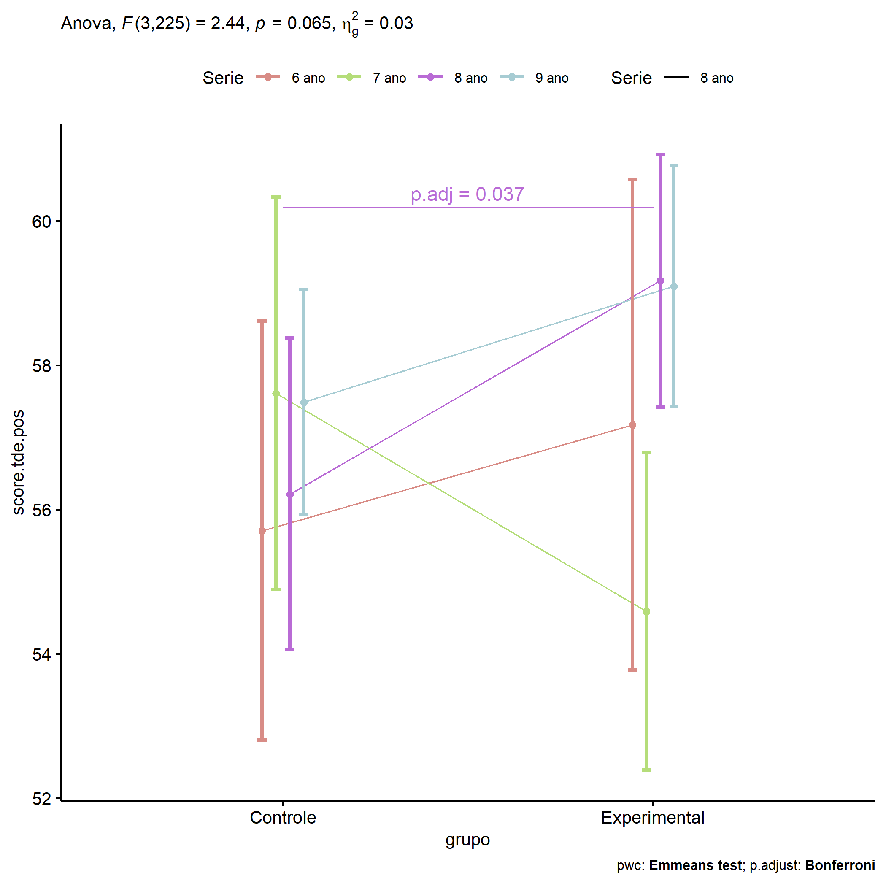<!-- -->

``` r
if (!is.null(plots[["Serie"]]))
  plots[["Serie"]] + ggplot2::scale_color_manual(values = color[["grupo"]])
```

    ## Scale for colour is already present.
    ## Adding another scale for colour, which will replace the existing scale.

    ## Warning: `position_dodge()` requires non-overlapping x intervals

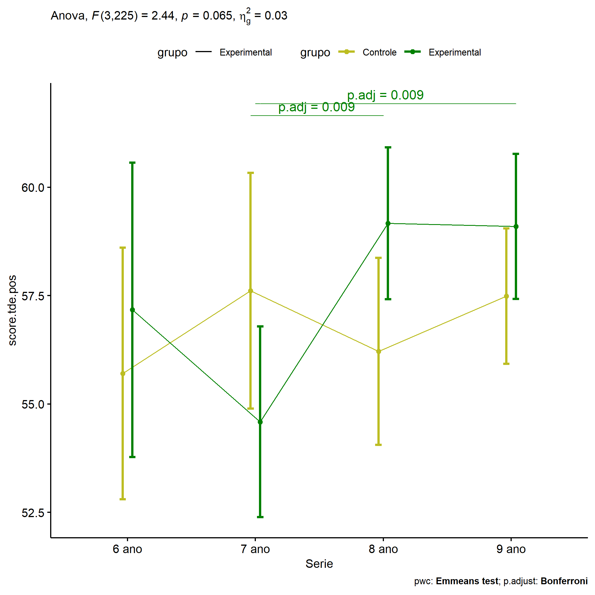<!-- -->

``` r
plots <- twoWayAncovaBoxPlots(
  wdat, "score.tde.pos", c("grupo","Serie"), aov, pwcs, covar = "score.tde.pre",
  theme = "classic", color = color[["grupo:Serie"]],
  subtitle = which(aov$Effect == "grupo:Serie"))
```

``` r
plots[["grupo:Serie"]] + ggplot2::ylab("TDE - Escrita") + ggplot2::scale_x_discrete(labels=c('pre', 'pos'))
```

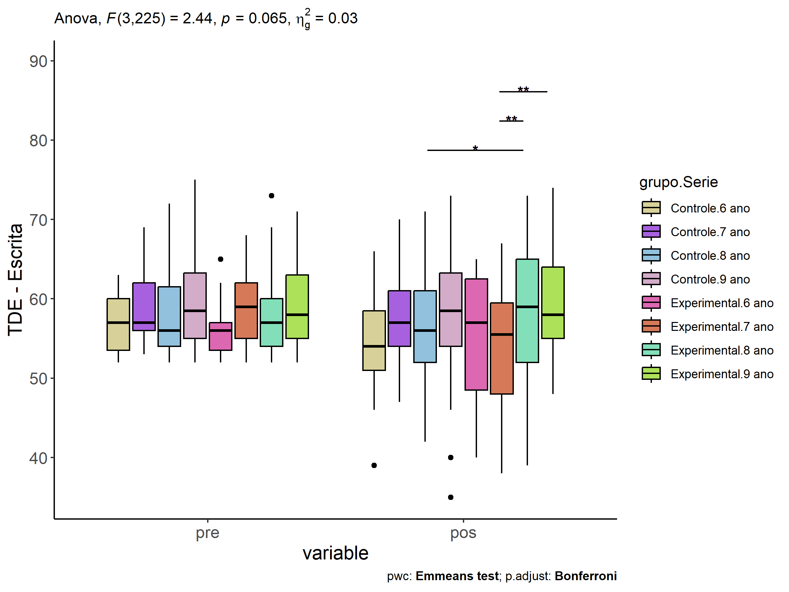<!-- -->

``` r
plots <- twoWayAncovaBoxPlots(
  wdat.long, "score.tde", c("grupo","Serie"), aov, pwc.long, pre.post = "time",
  theme = "classic", color = color$prepost)
```

``` r
plots[["grupo:Serie"]] + ggplot2::ylab("TDE - Escrita")
```

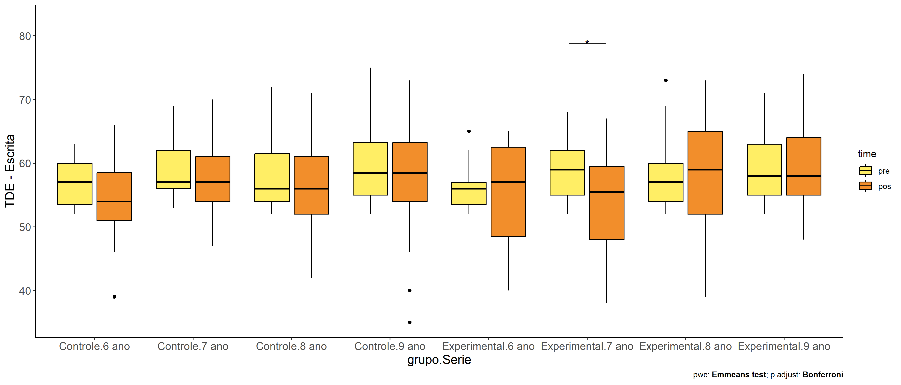<!-- -->

### Checking linearity assumption

``` r
ggscatter(wdat, x = "score.tde.pre", y = "score.tde.pos", size = 0.5,
          facet.by = c("grupo","Serie"), add = "reg.line")+
  stat_regline_equation(
    aes(label =  paste(..eq.label.., ..rr.label.., sep = "~~~~"))
  )
```

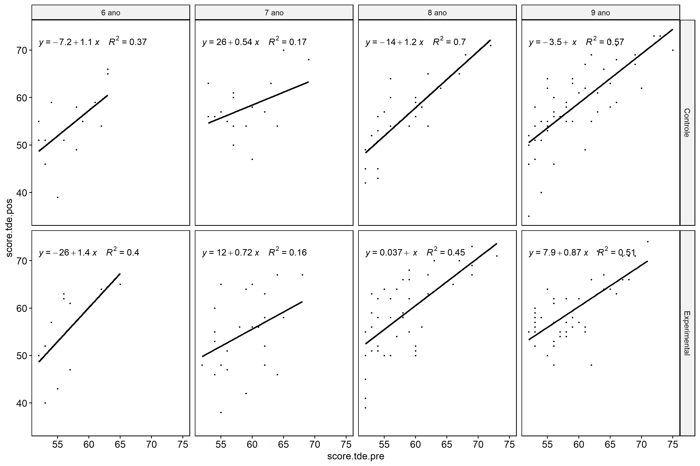<!-- -->

### Checking normality and homogeneity

``` r
res <- augment(lm(score.tde.pos ~ score.tde.pre + grupo*Serie, data = wdat))
```

``` r
shapiro_test(res$.resid)
```

    ## # A tibble: 1 × 3
    ##   variable   statistic p.value
    ##   <chr>          <dbl>   <dbl>
    ## 1 res$.resid     0.984 0.00914

``` r
levene_test(res, .resid ~ grupo*Serie)
```

    ## # A tibble: 1 × 4
    ##     df1   df2 statistic     p
    ##   <int> <int>     <dbl> <dbl>
    ## 1     7   226      1.51 0.164

# Summary of Results

## Descriptive Statistics

``` r
df <- get.descriptives(ldat[["grupo"]], c(dv.pre, dv.pos), c("grupo"), 
                       include.global = T, symmetry.test = T, normality.test = F)
df <- plyr::rbind.fill(
  df, do.call(plyr::rbind.fill, lapply(lfatores2, FUN = function(f) {
    if (nrow(dat) > 0 && sum(!is.na(unique(dat[[f]]))) > 1)
      get.descriptives(ldat[[paste0("grupo:",f)]], c(dv.pre,dv.pos), c("grupo", f),
                       symmetry.test = T, normality.test = F)
    }))
)
(df <- df[,c(fatores1[fatores1 %in% colnames(df)],"variable",
             colnames(df)[!colnames(df) %in% c(fatores1,"variable")])])
```

    ##           grupo Sexo   Zona Cor.Raca Serie      variable   n   mean median min max     sd    se    ci
    ## 1      Controle <NA>   <NA>     <NA>  <NA> score.tde.pre 114 58.825   58.0  52  75  5.465 0.512 1.014
    ## 2  Experimental <NA>   <NA>     <NA>  <NA> score.tde.pre 124 58.468   58.0  52  73  5.016 0.450 0.892
    ## 3          <NA> <NA>   <NA>     <NA>  <NA> score.tde.pre 238 58.639   58.0  52  75  5.228 0.339 0.668
    ## 4      Controle <NA>   <NA>     <NA>  <NA> score.tde.pos 114 57.009   57.0  35  73  8.085 0.757 1.500
    ## 5  Experimental <NA>   <NA>     <NA>  <NA> score.tde.pos 124 57.758   57.5  39  74  7.807 0.701 1.388
    ## 6          <NA> <NA>   <NA>     <NA>  <NA> score.tde.pos 238 57.399   57.0  35  74  7.934 0.514 1.013
    ## 7      Controle    F   <NA>     <NA>  <NA> score.tde.pre  68 58.235   57.0  52  72  4.902 0.595 1.187
    ## 8      Controle    M   <NA>     <NA>  <NA> score.tde.pre  45 59.622   58.0  53  75  6.206 0.925 1.864
    ## 9  Experimental    F   <NA>     <NA>  <NA> score.tde.pre  80 58.325   58.0  52  73  5.008 0.560 1.115
    ## 10 Experimental    M   <NA>     <NA>  <NA> score.tde.pre  45 58.578   57.0  52  71  5.119 0.763 1.538
    ## 11     Controle    F   <NA>     <NA>  <NA> score.tde.pos  68 55.956   56.0  35  72  7.656 0.928 1.853
    ## 12     Controle    M   <NA>     <NA>  <NA> score.tde.pos  45 58.911   59.0  39  73  8.292 1.236 2.491
    ## 13 Experimental    F   <NA>     <NA>  <NA> score.tde.pos  80 58.400   58.5  41  73  7.374 0.824 1.641
    ## 14 Experimental    M   <NA>     <NA>  <NA> score.tde.pos  45 56.000   56.0  30  74  9.293 1.385 2.792
    ## 15     Controle <NA>  Rural     <NA>  <NA> score.tde.pre  50 58.260   57.0  52  69  4.881 0.690 1.387
    ## 16     Controle <NA> Urbana     <NA>  <NA> score.tde.pre  28 60.036   58.5  52  75  6.397 1.209 2.481
    ## 17 Experimental <NA>  Rural     <NA>  <NA> score.tde.pre  48 59.250   58.5  52  73  5.200 0.751 1.510
    ## 18 Experimental <NA> Urbana     <NA>  <NA> score.tde.pre  37 57.865   58.0  52  71  5.045 0.829 1.682
    ## 19     Controle <NA>  Rural     <NA>  <NA> score.tde.pos  50 57.960   58.0  42  72  7.431 1.051 2.112
    ## 20     Controle <NA> Urbana     <NA>  <NA> score.tde.pos  28 53.857   55.0  28  73 10.208 1.929 3.958
    ## 21 Experimental <NA>  Rural     <NA>  <NA> score.tde.pos  48 58.646   58.5  39  72  8.237 1.189 2.392
    ## 22 Experimental <NA> Urbana     <NA>  <NA> score.tde.pos  37 54.108   55.0  38  74  8.517 1.400 2.840
    ## 23     Controle <NA>   <NA>   Branca  <NA> score.tde.pre  10 60.800   61.0  52  67  4.104 1.298 2.936
    ## 24     Controle <NA>   <NA>    Parda  <NA> score.tde.pre  27 57.259   57.0  52  66  4.063 0.782 1.607
    ## 25 Experimental <NA>   <NA>   Branca  <NA> score.tde.pre  13 61.385   61.0  54  73  5.561 1.542 3.360
    ## 26 Experimental <NA>   <NA>    Parda  <NA> score.tde.pre  26 58.615   58.0  52  68  5.456 1.070 2.204
    ## 27     Controle <NA>   <NA>   Branca  <NA> score.tde.pos  10 58.600   60.0  45  72  7.905 2.500 5.655
    ## 28     Controle <NA>   <NA>    Parda  <NA> score.tde.pos  27 55.296   56.0  42  68  5.594 1.077 2.213
    ## 29 Experimental <NA>   <NA>   Branca  <NA> score.tde.pos  13 59.923   58.0  49  72  8.046 2.232 4.862
    ## 30 Experimental <NA>   <NA>    Parda  <NA> score.tde.pos  26 57.346   57.5  39  71  8.588 1.684 3.469
    ## 31     Controle <NA>   <NA>     <NA> 6 ano score.tde.pre  15 57.067   57.0  52  63  3.918 1.012 2.170
    ## 32     Controle <NA>   <NA>     <NA> 7 ano score.tde.pre  17 58.882   57.0  53  69  4.512 1.094 2.320
    ## 33     Controle <NA>   <NA>     <NA> 8 ano score.tde.pre  27 58.370   56.0  52  72  5.658 1.089 2.238
    ## 34     Controle <NA>   <NA>     <NA> 9 ano score.tde.pre  52 59.615   58.5  52  75  6.053 0.839 1.685
    ## 35 Experimental <NA>   <NA>     <NA> 6 ano score.tde.pre  11 56.364   56.0  52  65  3.957 1.193 2.658
    ## 36 Experimental <NA>   <NA>     <NA> 7 ano score.tde.pre  26 58.731   59.0  52  68  4.276 0.839 1.727
    ## 37 Experimental <NA>   <NA>     <NA> 8 ano score.tde.pre  41 58.146   57.0  52  73  5.512 0.861 1.740
    ## 38 Experimental <NA>   <NA>     <NA> 9 ano score.tde.pre  45 59.200   58.0  52  71  5.229 0.780 1.571
    ## 39     Controle <NA>   <NA>     <NA> 6 ano score.tde.pos  15 54.133   54.0  39  66  6.937 1.791 3.842
    ## 40     Controle <NA>   <NA>     <NA> 7 ano score.tde.pos  17 57.824   57.0  47  70  5.908 1.433 3.038
    ## 41     Controle <NA>   <NA>     <NA> 8 ano score.tde.pos  27 55.926   56.0  42  71  8.067 1.552 3.191
    ## 42     Controle <NA>   <NA>     <NA> 9 ano score.tde.pos  52 58.423   58.5  35  73  8.302 1.151 2.311
    ## 43 Experimental <NA>   <NA>     <NA> 6 ano score.tde.pos  11 54.909   57.0  40  65  8.949 2.698 6.012
    ## 44 Experimental <NA>   <NA>     <NA> 7 ano score.tde.pos  26 54.654   55.5  38  67  7.848 1.539 3.170
    ## 45 Experimental <NA>   <NA>     <NA> 8 ano score.tde.pos  41 58.659   59.0  39  73  8.302 1.297 2.621
    ## 46 Experimental <NA>   <NA>     <NA> 9 ano score.tde.pos  45 59.622   58.0  48  74  6.425 0.958 1.930
    ##      iqr symmetry    skewness     kurtosis
    ## 1   8.00       NO  0.75880891 -0.108446230
    ## 2   8.00       NO  0.70914779 -0.311446879
    ## 3   8.00       NO  0.75025716 -0.135458354
    ## 4   9.75      YES -0.18892230 -0.263060038
    ## 5  12.00      YES -0.19705936 -0.485289478
    ## 6  11.00      YES -0.19850281 -0.342809026
    ## 7   8.00       NO  0.52952788 -0.501691686
    ## 8   9.00       NO  0.79810733 -0.478584322
    ## 9   7.25       NO  0.74859713 -0.212895574
    ## 10  8.00       NO  0.62503140 -0.577869848
    ## 11  9.25      YES -0.20468430 -0.096815781
    ## 12 10.00      YES -0.29162379 -0.392450497
    ## 13 10.50      YES -0.21056950 -0.670849227
    ## 14 13.00      YES -0.39505195  0.088757205
    ## 15  8.00      YES  0.49954476 -0.878075317
    ## 16  8.25       NO  0.81967039 -0.469537282
    ## 17  7.00       NO  0.65331979 -0.458315495
    ## 18  7.00       NO  0.70222936 -0.347176902
    ## 19 11.50      YES -0.02871958 -0.944560322
    ## 20  9.50      YES -0.32388317 -0.026310402
    ## 21 12.50      YES -0.39961906 -0.659844403
    ## 22 10.00      YES  0.08227716 -0.317147329
    ## 23  3.50       NO -0.55684018 -0.221483629
    ## 24  6.00       NO  0.55484758 -0.764354715
    ## 25  6.00       NO  0.60483888 -0.769846344
    ## 26  8.00      YES  0.40453912 -1.272020342
    ## 27  8.25      YES -0.14342452 -1.011241185
    ## 28  7.00      YES -0.10069270  0.062238087
    ## 29 13.00      YES  0.30008785 -1.515856190
    ## 30 13.50      YES -0.30414230 -0.840183739
    ## 31  6.50      YES  0.19284863 -1.501212084
    ## 32  6.00       NO  0.55641203 -0.692718990
    ## 33  7.50       NO  0.67029966 -0.628917349
    ## 34  8.25       NO  0.66737650 -0.473160036
    ## 35  3.50       NO  0.95210895 -0.319428359
    ## 36  7.00      YES  0.24336260 -1.122425278
    ## 37  6.00       NO  0.92391110 -0.001595350
    ## 38  8.00      YES  0.47471305 -0.929962951
    ## 39  7.50      YES -0.19720529 -0.324905491
    ## 40  7.00      YES  0.35050616 -0.466806923
    ## 41  9.00      YES -0.12940686 -0.883187435
    ## 42  9.25      YES -0.37119647 -0.005989106
    ## 43 14.00      YES -0.34759387 -1.589900956
    ## 44 11.50      YES -0.13691073 -0.908627425
    ## 45 13.00      YES -0.33608592 -0.654748305
    ## 46  9.00      YES  0.38083373 -0.589205176

| grupo        | Sexo | Zona   | Cor.Raca | Serie | variable      |   n |   mean | median | min | max |     sd |    se |    ci |   iqr | symmetry | skewness | kurtosis |
|:-------------|:-----|:-------|:---------|:------|:--------------|----:|-------:|-------:|----:|----:|-------:|------:|------:|------:|:---------|---------:|---------:|
| Controle     |      |        |          |       | score.tde.pre | 114 | 58.825 |   58.0 |  52 |  75 |  5.465 | 0.512 | 1.014 |  8.00 | NO       |    0.759 |   -0.108 |
| Experimental |      |        |          |       | score.tde.pre | 124 | 58.468 |   58.0 |  52 |  73 |  5.016 | 0.450 | 0.892 |  8.00 | NO       |    0.709 |   -0.311 |
|              |      |        |          |       | score.tde.pre | 238 | 58.639 |   58.0 |  52 |  75 |  5.228 | 0.339 | 0.668 |  8.00 | NO       |    0.750 |   -0.135 |
| Controle     |      |        |          |       | score.tde.pos | 114 | 57.009 |   57.0 |  35 |  73 |  8.085 | 0.757 | 1.500 |  9.75 | YES      |   -0.189 |   -0.263 |
| Experimental |      |        |          |       | score.tde.pos | 124 | 57.758 |   57.5 |  39 |  74 |  7.807 | 0.701 | 1.388 | 12.00 | YES      |   -0.197 |   -0.485 |
|              |      |        |          |       | score.tde.pos | 238 | 57.399 |   57.0 |  35 |  74 |  7.934 | 0.514 | 1.013 | 11.00 | YES      |   -0.199 |   -0.343 |
| Controle     | F    |        |          |       | score.tde.pre |  68 | 58.235 |   57.0 |  52 |  72 |  4.902 | 0.595 | 1.187 |  8.00 | NO       |    0.530 |   -0.502 |
| Controle     | M    |        |          |       | score.tde.pre |  45 | 59.622 |   58.0 |  53 |  75 |  6.206 | 0.925 | 1.864 |  9.00 | NO       |    0.798 |   -0.479 |
| Experimental | F    |        |          |       | score.tde.pre |  80 | 58.325 |   58.0 |  52 |  73 |  5.008 | 0.560 | 1.115 |  7.25 | NO       |    0.749 |   -0.213 |
| Experimental | M    |        |          |       | score.tde.pre |  45 | 58.578 |   57.0 |  52 |  71 |  5.119 | 0.763 | 1.538 |  8.00 | NO       |    0.625 |   -0.578 |
| Controle     | F    |        |          |       | score.tde.pos |  68 | 55.956 |   56.0 |  35 |  72 |  7.656 | 0.928 | 1.853 |  9.25 | YES      |   -0.205 |   -0.097 |
| Controle     | M    |        |          |       | score.tde.pos |  45 | 58.911 |   59.0 |  39 |  73 |  8.292 | 1.236 | 2.491 | 10.00 | YES      |   -0.292 |   -0.392 |
| Experimental | F    |        |          |       | score.tde.pos |  80 | 58.400 |   58.5 |  41 |  73 |  7.374 | 0.824 | 1.641 | 10.50 | YES      |   -0.211 |   -0.671 |
| Experimental | M    |        |          |       | score.tde.pos |  45 | 56.000 |   56.0 |  30 |  74 |  9.293 | 1.385 | 2.792 | 13.00 | YES      |   -0.395 |    0.089 |
| Controle     |      | Rural  |          |       | score.tde.pre |  50 | 58.260 |   57.0 |  52 |  69 |  4.881 | 0.690 | 1.387 |  8.00 | YES      |    0.500 |   -0.878 |
| Controle     |      | Urbana |          |       | score.tde.pre |  28 | 60.036 |   58.5 |  52 |  75 |  6.397 | 1.209 | 2.481 |  8.25 | NO       |    0.820 |   -0.470 |
| Experimental |      | Rural  |          |       | score.tde.pre |  48 | 59.250 |   58.5 |  52 |  73 |  5.200 | 0.751 | 1.510 |  7.00 | NO       |    0.653 |   -0.458 |
| Experimental |      | Urbana |          |       | score.tde.pre |  37 | 57.865 |   58.0 |  52 |  71 |  5.045 | 0.829 | 1.682 |  7.00 | NO       |    0.702 |   -0.347 |
| Controle     |      | Rural  |          |       | score.tde.pos |  50 | 57.960 |   58.0 |  42 |  72 |  7.431 | 1.051 | 2.112 | 11.50 | YES      |   -0.029 |   -0.945 |
| Controle     |      | Urbana |          |       | score.tde.pos |  28 | 53.857 |   55.0 |  28 |  73 | 10.208 | 1.929 | 3.958 |  9.50 | YES      |   -0.324 |   -0.026 |
| Experimental |      | Rural  |          |       | score.tde.pos |  48 | 58.646 |   58.5 |  39 |  72 |  8.237 | 1.189 | 2.392 | 12.50 | YES      |   -0.400 |   -0.660 |
| Experimental |      | Urbana |          |       | score.tde.pos |  37 | 54.108 |   55.0 |  38 |  74 |  8.517 | 1.400 | 2.840 | 10.00 | YES      |    0.082 |   -0.317 |
| Controle     |      |        | Branca   |       | score.tde.pre |  10 | 60.800 |   61.0 |  52 |  67 |  4.104 | 1.298 | 2.936 |  3.50 | NO       |   -0.557 |   -0.221 |
| Controle     |      |        | Parda    |       | score.tde.pre |  27 | 57.259 |   57.0 |  52 |  66 |  4.063 | 0.782 | 1.607 |  6.00 | NO       |    0.555 |   -0.764 |
| Experimental |      |        | Branca   |       | score.tde.pre |  13 | 61.385 |   61.0 |  54 |  73 |  5.561 | 1.542 | 3.360 |  6.00 | NO       |    0.605 |   -0.770 |
| Experimental |      |        | Parda    |       | score.tde.pre |  26 | 58.615 |   58.0 |  52 |  68 |  5.456 | 1.070 | 2.204 |  8.00 | YES      |    0.405 |   -1.272 |
| Controle     |      |        | Branca   |       | score.tde.pos |  10 | 58.600 |   60.0 |  45 |  72 |  7.905 | 2.500 | 5.655 |  8.25 | YES      |   -0.143 |   -1.011 |
| Controle     |      |        | Parda    |       | score.tde.pos |  27 | 55.296 |   56.0 |  42 |  68 |  5.594 | 1.077 | 2.213 |  7.00 | YES      |   -0.101 |    0.062 |
| Experimental |      |        | Branca   |       | score.tde.pos |  13 | 59.923 |   58.0 |  49 |  72 |  8.046 | 2.232 | 4.862 | 13.00 | YES      |    0.300 |   -1.516 |
| Experimental |      |        | Parda    |       | score.tde.pos |  26 | 57.346 |   57.5 |  39 |  71 |  8.588 | 1.684 | 3.469 | 13.50 | YES      |   -0.304 |   -0.840 |
| Controle     |      |        |          | 6 ano | score.tde.pre |  15 | 57.067 |   57.0 |  52 |  63 |  3.918 | 1.012 | 2.170 |  6.50 | YES      |    0.193 |   -1.501 |
| Controle     |      |        |          | 7 ano | score.tde.pre |  17 | 58.882 |   57.0 |  53 |  69 |  4.512 | 1.094 | 2.320 |  6.00 | NO       |    0.556 |   -0.693 |
| Controle     |      |        |          | 8 ano | score.tde.pre |  27 | 58.370 |   56.0 |  52 |  72 |  5.658 | 1.089 | 2.238 |  7.50 | NO       |    0.670 |   -0.629 |
| Controle     |      |        |          | 9 ano | score.tde.pre |  52 | 59.615 |   58.5 |  52 |  75 |  6.053 | 0.839 | 1.685 |  8.25 | NO       |    0.667 |   -0.473 |
| Experimental |      |        |          | 6 ano | score.tde.pre |  11 | 56.364 |   56.0 |  52 |  65 |  3.957 | 1.193 | 2.658 |  3.50 | NO       |    0.952 |   -0.319 |
| Experimental |      |        |          | 7 ano | score.tde.pre |  26 | 58.731 |   59.0 |  52 |  68 |  4.276 | 0.839 | 1.727 |  7.00 | YES      |    0.243 |   -1.122 |
| Experimental |      |        |          | 8 ano | score.tde.pre |  41 | 58.146 |   57.0 |  52 |  73 |  5.512 | 0.861 | 1.740 |  6.00 | NO       |    0.924 |   -0.002 |
| Experimental |      |        |          | 9 ano | score.tde.pre |  45 | 59.200 |   58.0 |  52 |  71 |  5.229 | 0.780 | 1.571 |  8.00 | YES      |    0.475 |   -0.930 |
| Controle     |      |        |          | 6 ano | score.tde.pos |  15 | 54.133 |   54.0 |  39 |  66 |  6.937 | 1.791 | 3.842 |  7.50 | YES      |   -0.197 |   -0.325 |
| Controle     |      |        |          | 7 ano | score.tde.pos |  17 | 57.824 |   57.0 |  47 |  70 |  5.908 | 1.433 | 3.038 |  7.00 | YES      |    0.351 |   -0.467 |
| Controle     |      |        |          | 8 ano | score.tde.pos |  27 | 55.926 |   56.0 |  42 |  71 |  8.067 | 1.552 | 3.191 |  9.00 | YES      |   -0.129 |   -0.883 |
| Controle     |      |        |          | 9 ano | score.tde.pos |  52 | 58.423 |   58.5 |  35 |  73 |  8.302 | 1.151 | 2.311 |  9.25 | YES      |   -0.371 |   -0.006 |
| Experimental |      |        |          | 6 ano | score.tde.pos |  11 | 54.909 |   57.0 |  40 |  65 |  8.949 | 2.698 | 6.012 | 14.00 | YES      |   -0.348 |   -1.590 |
| Experimental |      |        |          | 7 ano | score.tde.pos |  26 | 54.654 |   55.5 |  38 |  67 |  7.848 | 1.539 | 3.170 | 11.50 | YES      |   -0.137 |   -0.909 |
| Experimental |      |        |          | 8 ano | score.tde.pos |  41 | 58.659 |   59.0 |  39 |  73 |  8.302 | 1.297 | 2.621 | 13.00 | YES      |   -0.336 |   -0.655 |
| Experimental |      |        |          | 9 ano | score.tde.pos |  45 | 59.622 |   58.0 |  48 |  74 |  6.425 | 0.958 | 1.930 |  9.00 | YES      |    0.381 |   -0.589 |

## ANCOVA Table Comparison

``` r
df <- do.call(plyr::rbind.fill, laov)
(df <- df[!duplicated(df$Effect),])
```

    ##            Effect DFn DFd          F        p p<.05      ges DFn' DFd'      F'       p' p<.05'  ges'
    ## 1           grupo   1 235   1.964000 1.62e-01       8.00e-03    1  255   1.343 2.48e-01        0.005
    ## 2   score.tde.pre   1 235 171.552000 8.52e-30     * 4.22e-01    1  255 107.410 3.12e-21      * 0.296
    ## 4      grupo:Sexo   1 233   6.793000 1.00e-02     * 2.80e-02    1  253   0.335 5.63e-01        0.001
    ## 6            Sexo   1 233   0.599000 4.40e-01       3.00e-03    1  253   1.790 1.82e-01        0.007
    ## 8      grupo:Zona   1 158   1.581000 2.11e-01       1.00e-02    1  166   2.615 1.08e-01        0.016
    ## 10           Zona   1 158  17.258000 5.33e-05     * 9.80e-02    1  166   4.722 3.10e-02      * 0.028
    ## 11       Cor.Raca   1  71   0.037000 8.49e-01       5.16e-04    1   89   0.423 5.17e-01        0.005
    ## 13 grupo:Cor.Raca   1  71   0.000478 9.83e-01       6.73e-06    1   89   0.374 5.43e-01        0.004
    ## 16    grupo:Serie   3 225   2.445000 6.50e-02       3.20e-02    3  249   0.704 5.50e-01        0.008
    ## 18          Serie   3 225   2.491000 6.10e-02       3.20e-02    3  249   3.909 9.00e-03      * 0.045

|     | Effect         | DFn | DFd |       F |     p | p\<.05 |   ges | DFn’ | DFd’ |      F’ |    p’ | p\<.05’ |  ges’ |
|:----|:---------------|----:|----:|--------:|------:|:-------|------:|-----:|-----:|--------:|------:|:--------|------:|
| 1   | grupo          |   1 | 235 |   1.964 | 0.162 |        | 0.008 |    1 |  255 |   1.343 | 0.248 |         | 0.005 |
| 2   | score.tde.pre  |   1 | 235 | 171.552 | 0.000 | \*     | 0.422 |    1 |  255 | 107.410 | 0.000 | \*      | 0.296 |
| 4   | grupo:Sexo     |   1 | 233 |   6.793 | 0.010 | \*     | 0.028 |    1 |  253 |   0.335 | 0.563 |         | 0.001 |
| 6   | Sexo           |   1 | 233 |   0.599 | 0.440 |        | 0.003 |    1 |  253 |   1.790 | 0.182 |         | 0.007 |
| 8   | grupo:Zona     |   1 | 158 |   1.581 | 0.211 |        | 0.010 |    1 |  166 |   2.615 | 0.108 |         | 0.016 |
| 10  | Zona           |   1 | 158 |  17.258 | 0.000 | \*     | 0.098 |    1 |  166 |   4.722 | 0.031 | \*      | 0.028 |
| 11  | Cor.Raca       |   1 |  71 |   0.037 | 0.849 |        | 0.001 |    1 |   89 |   0.423 | 0.517 |         | 0.005 |
| 13  | grupo:Cor.Raca |   1 |  71 |   0.000 | 0.983 |        | 0.000 |    1 |   89 |   0.374 | 0.543 |         | 0.004 |
| 16  | grupo:Serie    |   3 | 225 |   2.445 | 0.065 |        | 0.032 |    3 |  249 |   0.704 | 0.550 |         | 0.008 |
| 18  | Serie          |   3 | 225 |   2.491 | 0.061 |        | 0.032 |    3 |  249 |   3.909 | 0.009 | \*      | 0.045 |

## PairWise Table Comparison

``` r
df <- do.call(plyr::rbind.fill, lpwc)
df <- df[,c(names(lfatores), names(df)[!names(df) %in% c(names(lfatores),"term",".y.")])]
```

| grupo        | Sexo | Zona   | Cor.Raca | Serie | group1   | group2       |  df | statistic |     p | p.adj | p.adj.signif | df’ | statistic’ |    p’ | p.adj’ | p.adj.signif’ |
|:-------------|:-----|:-------|:---------|:------|:---------|:-------------|----:|----------:|------:|------:|:-------------|----:|-----------:|------:|-------:|:--------------|
| Controle     |      |        |          |       | pre      | pos          | 472 |     2.038 | 0.042 | 0.042 | \*           | 512 |      3.556 | 0.000 |  0.000 | \*\*\*        |
| Experimental |      |        |          |       | pre      | pos          | 472 |     0.831 | 0.407 | 0.407 | ns           | 512 |      2.466 | 0.014 |  0.014 | \*            |
|              |      |        |          |       | Controle | Experimental | 235 |    -1.401 | 0.162 | 0.162 | ns           | 255 |     -1.159 | 0.248 |  0.248 | ns            |
| Controle     | F    |        |          |       | pre      | pos          | 468 |     1.962 | 0.050 | 0.050 | ns           | 508 |      2.505 | 0.013 |  0.013 | \*            |
| Controle     | M    |        |          |       | pre      | pos          | 468 |     0.498 | 0.619 | 0.619 | ns           | 508 |      2.541 | 0.011 |  0.011 | \*            |
| Controle     |      |        |          |       | F        | M            | 233 |    -1.335 | 0.183 | 0.183 | ns           | 253 |      0.526 | 0.599 |  0.599 | ns            |
| Experimental | F    |        |          |       | pre      | pos          | 468 |    -0.070 | 0.944 | 0.944 | ns           | 508 |      1.353 | 0.177 |  0.177 | ns            |
| Experimental | M    |        |          |       | pre      | pos          | 468 |     1.805 | 0.072 | 0.072 | ns           | 508 |      2.307 | 0.021 |  0.021 | \*            |
| Experimental |      |        |          |       | F        | M            | 233 |     2.366 | 0.019 | 0.019 | \*           | 253 |      1.359 | 0.175 |  0.175 | ns            |
|              | F    |        |          |       | Controle | Experimental | 233 |    -2.369 | 0.019 | 0.019 | \*           | 253 |     -1.201 | 0.231 |  0.231 | ns            |
|              | M    |        |          |       | Controle | Experimental | 233 |     1.457 | 0.146 | 0.146 | ns           | 253 |     -0.216 | 0.829 |  0.829 | ns            |
| Controle     |      |        |          |       | Rural    | Urbana       | 158 |     3.733 | 0.000 | 0.000 | \*\*\*       | 166 |      2.662 | 0.009 |  0.009 | \*\*          |
| Controle     |      | Rural  |          |       | pre      | pos          | 318 |     0.213 | 0.832 | 0.832 | ns           | 334 |      1.110 | 0.268 |  0.268 | ns            |
| Controle     |      | Urbana |          |       | pre      | pos          | 318 |     3.282 | 0.001 | 0.001 | \*\*         | 334 |      3.177 | 0.002 |  0.002 | \*\*          |
| Experimental |      |        |          |       | Rural    | Urbana       | 158 |     2.174 | 0.031 | 0.031 | \*           | 166 |      0.483 | 0.630 |  0.630 | ns            |
| Experimental |      | Rural  |          |       | pre      | pos          | 318 |     0.420 | 0.675 | 0.675 | ns           | 334 |      1.705 | 0.089 |  0.089 | ns            |
| Experimental |      | Urbana |          |       | pre      | pos          | 318 |     2.294 | 0.022 | 0.022 | \*           | 334 |      1.964 | 0.050 |  0.050 | ns            |
|              |      | Rural  |          |       | Controle | Experimental | 158 |     0.222 | 0.824 | 0.824 | ns           | 166 |      0.624 | 0.533 |  0.533 | ns            |
|              |      | Urbana |          |       | Controle | Experimental | 158 |    -1.441 | 0.152 | 0.152 | ns           | 166 |     -1.570 | 0.118 |  0.118 | ns            |
| Controle     |      |        | Branca   |       | pre      | pos          | 144 |     0.782 | 0.435 | 0.435 | ns           | 180 |      1.196 | 0.233 |  0.233 | ns            |
| Controle     |      |        |          |       | Branca   | Parda        |  71 |    -0.148 | 0.883 | 0.883 | ns           |  89 |      0.019 | 0.985 |  0.985 | ns            |
| Controle     |      |        | Parda    |       | pre      | pos          | 144 |     1.147 | 0.253 | 0.253 | ns           | 180 |      2.347 | 0.020 |  0.020 | \*            |
| Experimental |      |        | Branca   |       | pre      | pos          | 144 |     0.593 | 0.554 | 0.554 | ns           | 180 |      0.402 | 0.688 |  0.688 | ns            |
| Experimental |      |        |          |       | Branca   | Parda        |  71 |    -0.130 | 0.897 | 0.897 | ns           |  89 |      0.892 | 0.375 |  0.375 | ns            |
| Experimental |      |        | Parda    |       | pre      | pos          | 144 |     0.728 | 0.468 | 0.468 | ns           | 180 |      2.347 | 0.020 |  0.020 | \*            |
|              |      |        | Branca   |       | Controle | Experimental |  71 |    -0.308 | 0.759 | 0.759 | ns           |  89 |     -0.678 | 0.499 |  0.499 | ns            |
|              |      |        | Parda    |       | Controle | Experimental |  71 |    -0.429 | 0.669 | 0.669 | ns           |  89 |      0.048 | 0.962 |  0.962 | ns            |
| Controle     |      |        |          | 6 ano | pre      | pos          | 452 |     1.219 | 0.223 | 0.223 | ns           | 500 |      1.507 | 0.133 |  0.133 | ns            |
| Controle     |      |        |          | 7 ano | pre      | pos          | 452 |     0.468 | 0.640 | 0.640 | ns           | 500 |      2.549 | 0.011 |  0.011 | \*            |
| Controle     |      |        |          | 8 ano | pre      | pos          | 452 |     1.363 | 0.174 | 0.174 | ns           | 500 |      1.508 | 0.132 |  0.132 | ns            |
| Controle     |      |        |          | 9 ano | pre      | pos          | 452 |     0.923 | 0.357 | 0.357 | ns           | 500 |      1.844 | 0.066 |  0.066 | ns            |
| Controle     |      |        |          |       | 6 ano    | 7 ano        | 225 |    -0.943 | 0.347 | 1.000 | ns           | 249 |      0.666 | 0.506 |  1.000 | ns            |
| Controle     |      |        |          |       | 6 ano    | 8 ano        | 225 |    -0.278 | 0.781 | 1.000 | ns           | 249 |     -0.329 | 0.742 |  1.000 | ns            |
| Controle     |      |        |          |       | 6 ano    | 9 ano        | 225 |    -1.063 | 0.289 | 1.000 | ns           | 249 |     -0.509 | 0.611 |  1.000 | ns            |
| Controle     |      |        |          |       | 7 ano    | 8 ano        | 225 |     0.791 | 0.430 | 1.000 | ns           | 249 |     -1.138 | 0.256 |  1.000 | ns            |
| Controle     |      |        |          |       | 7 ano    | 9 ano        | 225 |     0.076 | 0.939 | 1.000 | ns           | 249 |     -1.461 | 0.145 |  0.872 | ns            |
| Controle     |      |        |          |       | 8 ano    | 9 ano        | 225 |    -0.941 | 0.348 | 1.000 | ns           | 249 |     -0.180 | 0.858 |  1.000 | ns            |
| Experimental |      |        |          | 6 ano | pre      | pos          | 452 |     0.518 | 0.605 | 0.605 | ns           | 500 |      1.059 | 0.290 |  0.290 | ns            |
| Experimental |      |        |          | 7 ano | pre      | pos          | 452 |     2.231 | 0.026 | 0.026 | \*           | 500 |      3.146 | 0.002 |  0.002 | \*\*          |
| Experimental |      |        |          | 8 ano | pre      | pos          | 452 |    -0.352 | 0.725 | 0.725 | ns           | 500 |     -0.278 | 0.781 |  0.781 | ns            |
| Experimental |      |        |          | 9 ano | pre      | pos          | 452 |    -0.304 | 0.761 | 0.761 | ns           | 500 |      1.369 | 0.172 |  0.172 | ns            |
| Experimental |      |        |          |       | 6 ano    | 7 ano        | 225 |     1.258 | 0.210 | 1.000 | ns           | 249 |      1.172 | 0.242 |  1.000 | ns            |
| Experimental |      |        |          |       | 6 ano    | 8 ano        | 225 |    -1.031 | 0.304 | 1.000 | ns           | 249 |     -1.332 | 0.184 |  1.000 | ns            |
| Experimental |      |        |          |       | 6 ano    | 9 ano        | 225 |    -0.999 | 0.319 | 1.000 | ns           | 249 |     -0.314 | 0.754 |  1.000 | ns            |
| Experimental |      |        |          |       | 7 ano    | 8 ano        | 225 |    -3.209 | 0.002 | 0.009 | \*\*         | 249 |     -3.391 | 0.001 |  0.005 | \*\*          |
| Experimental |      |        |          |       | 7 ano    | 9 ano        | 225 |    -3.215 | 0.001 | 0.009 | \*\*         | 249 |     -2.108 | 0.036 |  0.216 | ns            |
| Experimental |      |        |          |       | 8 ano    | 9 ano        | 225 |     0.059 | 0.953 | 1.000 | ns           | 249 |      1.548 | 0.123 |  0.738 | ns            |
|              |      |        |          | 6 ano | Controle | Experimental | 225 |    -0.650 | 0.517 | 0.517 | ns           | 249 |     -0.311 | 0.756 |  0.756 | ns            |
|              |      |        |          | 7 ano | Controle | Experimental | 225 |     1.702 | 0.090 | 0.090 | ns           | 249 |      0.204 | 0.839 |  0.839 | ns            |
|              |      |        |          | 8 ano | Controle | Experimental | 225 |    -2.094 | 0.037 | 0.037 | \*           | 249 |     -1.786 | 0.075 |  0.075 | ns            |
|              |      |        |          | 9 ano | Controle | Experimental | 225 |    -1.388 | 0.167 | 0.167 | ns           | 249 |     -0.360 | 0.720 |  0.720 | ns            |

## EMMS Table Comparison

``` r
df <- do.call(plyr::rbind.fill, lemms)
df[["N-N'"]] <- df[["N"]] - df[["N'"]]
df <- df[,c(names(lfatores), names(df)[!names(df) %in% names(lfatores)])]
```

| grupo        | Sexo | Zona   | Cor.Raca | Serie |   N | M (pre) | SE (pre) | M (unadj) | SE (unadj) | M (adj) | SE (adj) |  N’ | M (pre)’ | SE (pre)’ | M (unadj)’ | SE (unadj)’ | M (adj)’ | SE (adj)’ | N-N’ |
|:-------------|:-----|:-------|:---------|:------|----:|--------:|---------:|----------:|-----------:|--------:|---------:|----:|---------:|----------:|-----------:|------------:|---------:|----------:|-----:|
| Controle     |      |        |          |       | 114 |  58.825 |    0.512 |    57.009 |      0.757 |  56.826 |    0.567 | 124 |   58.621 |     0.482 |     54.806 |       0.979 |   54.639 |     0.812 |  -10 |
| Experimental |      |        |          |       | 124 |  58.468 |    0.450 |    57.758 |      0.701 |  57.926 |    0.544 | 134 |   58.336 |     0.434 |     55.791 |       0.917 |   55.946 |     0.781 |  -10 |
| Controle     | F    |        |          |       |  68 |  58.235 |    0.595 |    55.956 |      0.928 |  56.317 |    0.731 |  72 |   58.028 |     0.576 |     54.500 |       1.144 |   55.003 |     1.066 |   -4 |
| Controle     | M    |        |          |       |  45 |  59.622 |    0.925 |    58.911 |      1.236 |  57.869 |    0.901 |  52 |   59.442 |     0.821 |     55.231 |       1.728 |   54.134 |     1.258 |   -7 |
| Experimental | F    |        |          |       |  80 |  58.325 |    0.560 |    58.400 |      0.824 |  58.671 |    0.674 |  86 |   58.395 |     0.538 |     56.651 |       1.089 |   56.739 |     0.975 |   -6 |
| Experimental | M    |        |          |       |  45 |  58.578 |    0.763 |    56.000 |      1.385 |  56.015 |    0.898 |  48 |   58.229 |     0.743 |     54.250 |       1.652 |   54.526 |     1.305 |   -3 |
| Controle     |      | Rural  |          |       |  50 |  58.260 |    0.690 |    57.960 |      1.051 |  58.464 |    0.937 |  53 |   58.264 |     0.656 |     56.491 |       1.312 |   56.909 |     1.177 |   -3 |
| Controle     |      | Urbana |          |       |  28 |  60.036 |    1.209 |    53.857 |      1.929 |  52.596 |    1.257 |  29 |   59.966 |     1.169 |     53.103 |       2.008 |   51.616 |     1.598 |   -1 |
| Experimental |      | Rural  |          |       |  48 |  59.250 |    0.751 |    58.646 |      1.189 |  58.166 |    0.956 |  52 |   58.827 |     0.732 |     56.077 |       1.664 |   55.865 |     1.187 |   -4 |
| Experimental |      | Urbana |          |       |  37 |  57.865 |    0.829 |    54.108 |      1.400 |  55.004 |    1.091 |  37 |   57.865 |     0.829 |     54.108 |       1.400 |   54.974 |     1.410 |    0 |
| Controle     |      |        | Branca   |       |  10 |  60.800 |    1.298 |    58.600 |      2.500 |  56.653 |    1.790 |  11 |   60.000 |     1.421 |     55.273 |       4.023 |   53.541 |     3.335 |   -1 |
| Controle     |      |        | Parda    |       |  27 |  57.259 |    0.782 |    55.296 |      1.077 |  56.967 |    1.100 |  35 |   57.286 |     0.659 |     52.086 |       1.750 |   53.466 |     1.881 |   -8 |
| Experimental |      |        | Branca   |       |  13 |  61.385 |    1.542 |    59.923 |      2.232 |  57.379 |    1.589 |  13 |   61.385 |     1.542 |     59.923 |       2.232 |   56.603 |     3.130 |    0 |
| Experimental |      |        | Parda    |       |  26 |  58.615 |    1.070 |    57.346 |      1.684 |  57.632 |    1.099 |  35 |   58.143 |     0.881 |     52.943 |       2.465 |   53.340 |     1.860 |   -9 |
| Controle     |      |        |          | 6 ano |  15 |  57.067 |    1.012 |    54.133 |      1.791 |  55.707 |    1.473 |  16 |   56.938 |     0.955 |     52.500 |       2.340 |   54.200 |     2.233 |   -1 |
| Controle     |      |        |          | 7 ano |  17 |  58.882 |    1.094 |    57.824 |      1.433 |  57.611 |    1.380 |  23 |   57.957 |     0.934 |     51.696 |       3.121 |   52.267 |     1.858 |   -6 |
| Controle     |      |        |          | 8 ano |  27 |  58.370 |    1.089 |    55.926 |      1.552 |  56.217 |    1.095 |  28 |   58.429 |     1.051 |     55.071 |       1.723 |   55.120 |     1.683 |   -1 |
| Controle     |      |        |          | 9 ano |  52 |  59.615 |    0.839 |    58.423 |      1.151 |  57.490 |    0.792 |  57 |   59.456 |     0.782 |     56.579 |       1.331 |   55.490 |     1.184 |   -5 |
| Experimental |      |        |          | 6 ano |  11 |  56.364 |    1.193 |    54.909 |      2.698 |  57.175 |    1.723 |  13 |   56.385 |     1.041 |     52.923 |       2.644 |   55.236 |     2.480 |   -2 |
| Experimental |      |        |          | 7 ano |  26 |  58.731 |    0.839 |    54.654 |      1.539 |  54.591 |    1.116 |  30 |   57.933 |     0.822 |     51.167 |       2.162 |   51.764 |     1.627 |   -4 |
| Experimental |      |        |          | 8 ano |  41 |  58.146 |    0.861 |    58.659 |      1.297 |  59.170 |    0.889 |  41 |   58.146 |     0.861 |     58.659 |       1.297 |   59.020 |     1.391 |    0 |
| Experimental |      |        |          | 9 ano |  45 |  59.200 |    0.780 |    59.622 |      0.958 |  59.098 |    0.849 |  50 |   59.240 |     0.727 |     56.960 |       1.555 |   56.110 |     1.262 |   -5 |
