ANCOVA in TDE - Escrita (TDE - Escrita)
================
Geiser C. Challco <geiser@alumni.usp.br>

- [Descriptive Statistics of Initial
  Data](#descriptive-statistics-of-initial-data)
- [ANCOVA and Pairwise for one factor:
  **grupo**](#ancova-and-pairwise-for-one-factor-grupo)
  - [Without remove non-normal data](#without-remove-non-normal-data)
  - [Computing ANCOVA and PairWise After removing non-normal data
    (OK)](#computing-ancova-and-pairwise-after-removing-non-normal-data-ok)
    - [Plots for ancova](#plots-for-ancova)
    - [Checking linearity assumption](#checking-linearity-assumption)
    - [Checking normality and
      homogeneity](#checking-normality-and-homogeneity)
- [ANCOVA and Pairwise for two factors
  **grupo:Sexo**](#ancova-and-pairwise-for-two-factors-gruposexo)
  - [Without remove non-normal data](#without-remove-non-normal-data-1)
  - [Computing ANCOVA and PairWise After removing non-normal data
    (OK)](#computing-ancova-and-pairwise-after-removing-non-normal-data-ok-1)
    - [Plots for ancova](#plots-for-ancova-1)
    - [Checking linearity assumption](#checking-linearity-assumption-1)
    - [Checking normality and
      homogeneity](#checking-normality-and-homogeneity-1)
- [ANCOVA and Pairwise for two factors
  **grupo:Zona**](#ancova-and-pairwise-for-two-factors-grupozona)
  - [Without remove non-normal data](#without-remove-non-normal-data-2)
  - [Computing ANCOVA and PairWise After removing non-normal data
    (OK)](#computing-ancova-and-pairwise-after-removing-non-normal-data-ok-2)
    - [Plots for ancova](#plots-for-ancova-2)
    - [Checking linearity assumption](#checking-linearity-assumption-2)
    - [Checking normality and
      homogeneity](#checking-normality-and-homogeneity-2)
- [ANCOVA and Pairwise for two factors
  **grupo:Cor.Raca**](#ancova-and-pairwise-for-two-factors-grupocorraca)
  - [Without remove non-normal data](#without-remove-non-normal-data-3)
  - [Computing ANCOVA and PairWise After removing non-normal data
    (OK)](#computing-ancova-and-pairwise-after-removing-non-normal-data-ok-3)
    - [Plots for ancova](#plots-for-ancova-3)
    - [Checking linearity assumption](#checking-linearity-assumption-3)
    - [Checking normality and
      homogeneity](#checking-normality-and-homogeneity-3)
- [ANCOVA and Pairwise for two factors
  **grupo:score.tde.quintile**](#ancova-and-pairwise-for-two-factors-gruposcoretdequintile)
  - [Without remove non-normal data](#without-remove-non-normal-data-4)
  - [Computing ANCOVA and PairWise After removing non-normal data
    (OK)](#computing-ancova-and-pairwise-after-removing-non-normal-data-ok-4)
    - [Plots for ancova](#plots-for-ancova-4)
    - [Checking linearity assumption](#checking-linearity-assumption-4)
    - [Checking normality and
      homogeneity](#checking-normality-and-homogeneity-4)
- [Summary of Results](#summary-of-results)
  - [Descriptive Statistics](#descriptive-statistics)
  - [ANCOVA Table Comparison](#ancova-table-comparison)
  - [PairWise Table Comparison](#pairwise-table-comparison)
  - [EMMS Table Comparison](#emms-table-comparison)

**NOTE**:

- Teste ANCOVA para determinar se houve diferenças significativas no
  TDE - Escrita (medido usando pre- e pos-testes).
- ANCOVA test to determine whether there were significant differences in
  TDE - Escrita (measured using pre- and post-tests).

# Descriptive Statistics of Initial Data

``` r
df <- get.descriptives(dat, c(dv.pre, dv.pos), c("grupo"), 
                       include.global = T, symmetry.test = T, normality.test = F)
df <- plyr::rbind.fill(
  df, do.call(plyr::rbind.fill, lapply(lfatores2, FUN = function(f) {
    if (nrow(dat) > 0 && sum(!is.na(unique(dat[[f]]))) > 1)
      get.descriptives(dat, c(dv.pre,dv.pos), c("grupo", f),
                       symmetry.test = T, normality.test = F)
    }))
)
(df <- df[,c(fatores1[fatores1 %in% colnames(df)],"variable",
             colnames(df)[!colnames(df) %in% c(fatores1,"variable")])])
```

    ##           grupo Sexo   Zona Cor.Raca score.tde.quintile      variable   n   mean median min max     sd     se
    ## 1      Controle <NA>   <NA>     <NA>               <NA> score.tde.pre 134 28.993   26.5   0  63 19.526  1.687
    ## 2  Experimental <NA>   <NA>     <NA>               <NA> score.tde.pre 159 29.000   29.0   0  65 15.950  1.265
    ## 3          <NA> <NA>   <NA>     <NA>               <NA> score.tde.pre 293 28.997   29.0   0  65 17.644  1.031
    ## 4      Controle <NA>   <NA>     <NA>               <NA> score.tde.pos 134 24.231   19.5   0  66 20.155  1.741
    ## 5  Experimental <NA>   <NA>     <NA>               <NA> score.tde.pos 159 24.094   22.0   0  65 16.759  1.329
    ## 6          <NA> <NA>   <NA>     <NA>               <NA> score.tde.pos 293 24.157   21.0   0  66 18.358  1.072
    ## 7      Controle    F   <NA>     <NA>               <NA> score.tde.pre  63 34.587   43.0   2  63 18.464  2.326
    ## 8      Controle    M   <NA>     <NA>               <NA> score.tde.pre  71 24.028   17.0   0  63 19.216  2.281
    ## 9  Experimental    F   <NA>     <NA>               <NA> score.tde.pre  83 31.494   34.0   0  59 15.421  1.693
    ## 10 Experimental    M   <NA>     <NA>               <NA> score.tde.pre  76 26.276   25.5   0  65 16.171  1.855
    ## 11     Controle    F   <NA>     <NA>               <NA> score.tde.pos  63 30.365   33.0   0  66 19.510  2.458
    ## 12     Controle    M   <NA>     <NA>               <NA> score.tde.pos  71 18.789   13.0   0  65 19.255  2.285
    ## 13 Experimental    F   <NA>     <NA>               <NA> score.tde.pos  83 25.494   22.0   0  63 17.274  1.896
    ## 14 Experimental    M   <NA>     <NA>               <NA> score.tde.pos  76 22.566   22.0   0  65 16.152  1.853
    ## 15     Controle <NA>  Rural     <NA>               <NA> score.tde.pre  97 29.907   27.0   0  63 19.677  1.998
    ## 16     Controle <NA> Urbana     <NA>               <NA> score.tde.pre  21 31.143   31.0   1  58 18.863  4.116
    ## 17     Controle <NA>   <NA>     <NA>               <NA> score.tde.pre  16 20.625   13.5   0  62 18.478  4.620
    ## 18 Experimental <NA>  Rural     <NA>               <NA> score.tde.pre  86 25.593   25.0   0  62 15.447  1.666
    ## 19 Experimental <NA> Urbana     <NA>               <NA> score.tde.pre  40 31.075   36.5   0  65 17.016  2.691
    ## 20 Experimental <NA>   <NA>     <NA>               <NA> score.tde.pre  33 35.364   36.0   8  57 13.822  2.406
    ## 21     Controle <NA>  Rural     <NA>               <NA> score.tde.pos  97 25.979   21.0   0  66 20.748  2.107
    ## 22     Controle <NA> Urbana     <NA>               <NA> score.tde.pos  21 22.810   14.0   0  58 18.870  4.118
    ## 23     Controle <NA>   <NA>     <NA>               <NA> score.tde.pos  16 15.500   12.0   0  54 16.371  4.093
    ## 24 Experimental <NA>  Rural     <NA>               <NA> score.tde.pos  86 23.488   22.0   0  64 15.957  1.721
    ## 25 Experimental <NA> Urbana     <NA>               <NA> score.tde.pos  40 20.675   16.0   0  65 17.171  2.715
    ## 26 Experimental <NA>   <NA>     <NA>               <NA> score.tde.pos  33 29.818   28.0   4  63 17.368  3.023
    ## 27     Controle <NA>   <NA>   Branca               <NA> score.tde.pre  17 35.000   43.0   2  62 20.616  5.000
    ## 28     Controle <NA>   <NA> Indígena               <NA> score.tde.pre   3 34.000   46.0   4  52 26.153 15.100
    ## 29     Controle <NA>   <NA>    Parda               <NA> score.tde.pre  39 28.410   27.0   0  56 19.271  3.086
    ## 30     Controle <NA>   <NA>     <NA>               <NA> score.tde.pre  75 27.733   23.0   1  63 19.315  2.230
    ## 31 Experimental <NA>   <NA>   Branca               <NA> score.tde.pre  22 22.318   17.0   0  49 15.410  3.285
    ## 32 Experimental <NA>   <NA> Indígena               <NA> score.tde.pre  11 21.818   21.0   6  54 16.136  4.865
    ## 33 Experimental <NA>   <NA>    Parda               <NA> score.tde.pre  45 27.333   28.0   0  62 15.744  2.347
    ## 34 Experimental <NA>   <NA>     <NA>               <NA> score.tde.pre  81 32.716   34.0   0  65 15.372  1.708
    ## 35     Controle <NA>   <NA>   Branca               <NA> score.tde.pos  17 27.647   36.0   0  59 22.136  5.369
    ## 36     Controle <NA>   <NA> Indígena               <NA> score.tde.pos   3 39.667   55.0   4  60 30.989 17.892
    ## 37     Controle <NA>   <NA>    Parda               <NA> score.tde.pos  39 21.641   14.0   0  60 20.220  3.238
    ## 38     Controle <NA>   <NA>     <NA>               <NA> score.tde.pos  75 24.187   20.0   0  66 19.297  2.228
    ## 39 Experimental <NA>   <NA>   Branca               <NA> score.tde.pos  22 19.682   16.5   0  62 14.946  3.186
    ## 40 Experimental <NA>   <NA> Indígena               <NA> score.tde.pos  11 25.727   23.0   1  57 16.566  4.995
    ## 41 Experimental <NA>   <NA>    Parda               <NA> score.tde.pos  45 22.222   21.0   0  64 16.426  2.449
    ## 42 Experimental <NA>   <NA>     <NA>               <NA> score.tde.pos  81 26.111   24.0   0  65 17.365  1.929
    ## 43     Controle <NA>   <NA>     <NA>       1st quintile score.tde.pre  55  8.727    8.0   0  18  5.345  0.721
    ## 44     Controle <NA>   <NA>     <NA>       2nd quintile score.tde.pre  17 24.235   25.0  19  31  3.993  0.968
    ## 45     Controle <NA>   <NA>     <NA>       3rd quintile score.tde.pre  13 38.846   40.0  35  42  2.794  0.775
    ## 46     Controle <NA>   <NA>     <NA>       4th quintile score.tde.pre  33 47.788   48.0  43  51  2.559  0.445
    ## 47     Controle <NA>   <NA>     <NA>       5th quintile score.tde.pre  16 56.938   56.5  52  63  3.820  0.955
    ## 48 Experimental <NA>   <NA>     <NA>       1st quintile score.tde.pre  47  9.234    9.0   0  18  5.760  0.840
    ## 49 Experimental <NA>   <NA>     <NA>       2nd quintile score.tde.pre  36 25.361   25.0  20  30  2.929  0.488
    ## 50 Experimental <NA>   <NA>     <NA>       3rd quintile score.tde.pre  43 37.116   37.0  32  42  3.064  0.467
    ## 51 Experimental <NA>   <NA>     <NA>       4th quintile score.tde.pre  20 46.750   46.5  44  50  2.074  0.464
    ## 52 Experimental <NA>   <NA>     <NA>       5th quintile score.tde.pre  13 56.385   56.0  52  65  3.754  1.041
    ## 53     Controle <NA>   <NA>     <NA>       1st quintile score.tde.pos  55  7.036    4.0   0  44  8.542  1.152
    ## 54     Controle <NA>   <NA>     <NA>       2nd quintile score.tde.pos  17 16.529   14.0   4  36 10.180  2.469
    ## 55     Controle <NA>   <NA>     <NA>       3rd quintile score.tde.pos  13 26.231   25.0  10  51 13.230  3.669
    ##        ci   iqr symmetry     skewness    kurtosis
    ## 1   3.336 36.00      YES  0.057165015 -1.52605010
    ## 2   2.498 24.50      YES -0.043488299 -0.90927038
    ## 3   2.029 32.00      YES  0.017873057 -1.23133482
    ## 4   3.444 40.00      YES  0.380996540 -1.29471881
    ## 5   2.625 26.00       NO  0.517561763 -0.62593422
    ## 6   2.111 32.00      YES  0.446329071 -0.97111071
    ## 7   4.650 32.50      YES -0.365981914 -1.35161857
    ## 8   4.548 34.50      YES  0.456537985 -1.28966341
    ## 9   3.367 26.00      YES -0.252409832 -0.95751485
    ## 10  3.695 23.25      YES  0.197203853 -0.73458609
    ## 11  4.914 34.50      YES -0.094353298 -1.40295323
    ## 12  4.558 26.00       NO  0.884893201 -0.55280796
    ## 13  3.772 28.00      YES  0.390820341 -0.92084271
    ## 14  3.691 22.50       NO  0.646855836 -0.25918130
    ## 15  3.966 36.00      YES -0.021109811 -1.57812008
    ## 16  8.587 34.00      YES -0.110964628 -1.51581140
    ## 17  9.846 26.75       NO  0.772858185 -0.70853901
    ## 18  3.312 22.00      YES  0.156988653 -0.86103962
    ## 19  5.442 25.75      YES -0.255111617 -0.96649804
    ## 20  4.901 22.00      YES -0.145953620 -1.02055936
    ## 21  4.182 40.00      YES  0.236265624 -1.41785681
    ## 22  8.589 33.00      YES  0.481874341 -1.27958055
    ## 23  8.723 17.25       NO  1.060463827  0.01404214
    ## 24  3.421 21.00       NO  0.571809531 -0.46870001
    ## 25  5.492 28.50       NO  0.595700723 -0.75731091
    ## 26  6.158 24.00      YES  0.311589015 -1.01144284
    ## 27 10.600 36.00      YES -0.313319102 -1.56995107
    ## 28 64.969 24.00 few data  0.000000000  0.00000000
    ## 29  6.247 38.00      YES -0.123044451 -1.60957374
    ## 30  4.444 35.50      YES  0.257950704 -1.46301514
    ## 31  6.832 25.25      YES  0.307411663 -1.32662686
    ## 32 10.840 25.50       NO  0.541455611 -1.05908871
    ## 33  4.730 21.00      YES -0.037326638 -0.76955351
    ## 34  3.399 22.00      YES -0.220038321 -0.75731773
    ## 35 11.381 41.00      YES -0.133556229 -1.79201123
    ## 36 76.982 28.00 few data  0.000000000  0.00000000
    ## 37  6.555 34.00       NO  0.536626737 -1.26870103
    ## 38  4.440 38.50      YES  0.458478032 -1.09761024
    ## 39  6.626 13.50       NO  0.993581391  0.69496151
    ## 40 11.129 19.00      YES  0.467684020 -1.00641833
    ## 41  4.935 24.00       NO  0.622405001 -0.44683574
    ## 42  3.840 28.00      YES  0.324621276 -0.93389399
    ## 43  1.445  9.00      YES  0.051487216 -1.29736603
    ## 44  2.053  7.00      YES  0.008999052 -1.33750916
    ## 45  1.689  4.00      YES -0.235214418 -1.70831571
    ## 46  0.907  4.00      YES -0.432946652 -1.02403024
    ## 47  2.036  5.75      YES  0.280266812 -1.40862512
    ## 48  1.691 10.00      YES -0.001263134 -1.34780155
    ## 49  0.991  5.25      YES  0.117125884 -1.25666021
    ## 50  0.943  5.50      YES  0.009167589 -1.12092550
    ## 51  0.971  3.25      YES  0.115548077 -1.57154175
    ## 52  2.268  3.00       NO  0.935467860 -0.19031582
    ## 53  2.309 11.00       NO  1.885869707  4.53530486
    ## 54  5.234 13.00      YES  0.451637766 -1.09455627
    ## 55  7.995 15.00       NO  0.630282324 -0.85228775
    ##  [ reached 'max' / getOption("max.print") -- omitted 7 rows ]

| grupo        | Sexo | Zona   | Cor.Raca | score.tde.quintile | variable      |   n |   mean | median | min | max |     sd |     se |     ci |   iqr | symmetry | skewness | kurtosis |
|:-------------|:-----|:-------|:---------|:-------------------|:--------------|----:|-------:|-------:|----:|----:|-------:|-------:|-------:|------:|:---------|---------:|---------:|
| Controle     |      |        |          |                    | score.tde.pre | 134 | 28.993 |   26.5 |   0 |  63 | 19.526 |  1.687 |  3.336 | 36.00 | YES      |    0.057 |   -1.526 |
| Experimental |      |        |          |                    | score.tde.pre | 159 | 29.000 |   29.0 |   0 |  65 | 15.950 |  1.265 |  2.498 | 24.50 | YES      |   -0.043 |   -0.909 |
|              |      |        |          |                    | score.tde.pre | 293 | 28.997 |   29.0 |   0 |  65 | 17.644 |  1.031 |  2.029 | 32.00 | YES      |    0.018 |   -1.231 |
| Controle     |      |        |          |                    | score.tde.pos | 134 | 24.231 |   19.5 |   0 |  66 | 20.155 |  1.741 |  3.444 | 40.00 | YES      |    0.381 |   -1.295 |
| Experimental |      |        |          |                    | score.tde.pos | 159 | 24.094 |   22.0 |   0 |  65 | 16.759 |  1.329 |  2.625 | 26.00 | NO       |    0.518 |   -0.626 |
|              |      |        |          |                    | score.tde.pos | 293 | 24.157 |   21.0 |   0 |  66 | 18.358 |  1.072 |  2.111 | 32.00 | YES      |    0.446 |   -0.971 |
| Controle     | F    |        |          |                    | score.tde.pre |  63 | 34.587 |   43.0 |   2 |  63 | 18.464 |  2.326 |  4.650 | 32.50 | YES      |   -0.366 |   -1.352 |
| Controle     | M    |        |          |                    | score.tde.pre |  71 | 24.028 |   17.0 |   0 |  63 | 19.216 |  2.281 |  4.548 | 34.50 | YES      |    0.457 |   -1.290 |
| Experimental | F    |        |          |                    | score.tde.pre |  83 | 31.494 |   34.0 |   0 |  59 | 15.421 |  1.693 |  3.367 | 26.00 | YES      |   -0.252 |   -0.958 |
| Experimental | M    |        |          |                    | score.tde.pre |  76 | 26.276 |   25.5 |   0 |  65 | 16.171 |  1.855 |  3.695 | 23.25 | YES      |    0.197 |   -0.735 |
| Controle     | F    |        |          |                    | score.tde.pos |  63 | 30.365 |   33.0 |   0 |  66 | 19.510 |  2.458 |  4.914 | 34.50 | YES      |   -0.094 |   -1.403 |
| Controle     | M    |        |          |                    | score.tde.pos |  71 | 18.789 |   13.0 |   0 |  65 | 19.255 |  2.285 |  4.558 | 26.00 | NO       |    0.885 |   -0.553 |
| Experimental | F    |        |          |                    | score.tde.pos |  83 | 25.494 |   22.0 |   0 |  63 | 17.274 |  1.896 |  3.772 | 28.00 | YES      |    0.391 |   -0.921 |
| Experimental | M    |        |          |                    | score.tde.pos |  76 | 22.566 |   22.0 |   0 |  65 | 16.152 |  1.853 |  3.691 | 22.50 | NO       |    0.647 |   -0.259 |
| Controle     |      | Rural  |          |                    | score.tde.pre |  97 | 29.907 |   27.0 |   0 |  63 | 19.677 |  1.998 |  3.966 | 36.00 | YES      |   -0.021 |   -1.578 |
| Controle     |      | Urbana |          |                    | score.tde.pre |  21 | 31.143 |   31.0 |   1 |  58 | 18.863 |  4.116 |  8.587 | 34.00 | YES      |   -0.111 |   -1.516 |
| Controle     |      |        |          |                    | score.tde.pre |  16 | 20.625 |   13.5 |   0 |  62 | 18.478 |  4.620 |  9.846 | 26.75 | NO       |    0.773 |   -0.709 |
| Experimental |      | Rural  |          |                    | score.tde.pre |  86 | 25.593 |   25.0 |   0 |  62 | 15.447 |  1.666 |  3.312 | 22.00 | YES      |    0.157 |   -0.861 |
| Experimental |      | Urbana |          |                    | score.tde.pre |  40 | 31.075 |   36.5 |   0 |  65 | 17.016 |  2.691 |  5.442 | 25.75 | YES      |   -0.255 |   -0.966 |
| Experimental |      |        |          |                    | score.tde.pre |  33 | 35.364 |   36.0 |   8 |  57 | 13.822 |  2.406 |  4.901 | 22.00 | YES      |   -0.146 |   -1.021 |
| Controle     |      | Rural  |          |                    | score.tde.pos |  97 | 25.979 |   21.0 |   0 |  66 | 20.748 |  2.107 |  4.182 | 40.00 | YES      |    0.236 |   -1.418 |
| Controle     |      | Urbana |          |                    | score.tde.pos |  21 | 22.810 |   14.0 |   0 |  58 | 18.870 |  4.118 |  8.589 | 33.00 | YES      |    0.482 |   -1.280 |
| Controle     |      |        |          |                    | score.tde.pos |  16 | 15.500 |   12.0 |   0 |  54 | 16.371 |  4.093 |  8.723 | 17.25 | NO       |    1.060 |    0.014 |
| Experimental |      | Rural  |          |                    | score.tde.pos |  86 | 23.488 |   22.0 |   0 |  64 | 15.957 |  1.721 |  3.421 | 21.00 | NO       |    0.572 |   -0.469 |
| Experimental |      | Urbana |          |                    | score.tde.pos |  40 | 20.675 |   16.0 |   0 |  65 | 17.171 |  2.715 |  5.492 | 28.50 | NO       |    0.596 |   -0.757 |
| Experimental |      |        |          |                    | score.tde.pos |  33 | 29.818 |   28.0 |   4 |  63 | 17.368 |  3.023 |  6.158 | 24.00 | YES      |    0.312 |   -1.011 |
| Controle     |      |        | Branca   |                    | score.tde.pre |  17 | 35.000 |   43.0 |   2 |  62 | 20.616 |  5.000 | 10.600 | 36.00 | YES      |   -0.313 |   -1.570 |
| Controle     |      |        | Indígena |                    | score.tde.pre |   3 | 34.000 |   46.0 |   4 |  52 | 26.153 | 15.100 | 64.969 | 24.00 | few data |    0.000 |    0.000 |
| Controle     |      |        | Parda    |                    | score.tde.pre |  39 | 28.410 |   27.0 |   0 |  56 | 19.271 |  3.086 |  6.247 | 38.00 | YES      |   -0.123 |   -1.610 |
| Controle     |      |        |          |                    | score.tde.pre |  75 | 27.733 |   23.0 |   1 |  63 | 19.315 |  2.230 |  4.444 | 35.50 | YES      |    0.258 |   -1.463 |
| Experimental |      |        | Branca   |                    | score.tde.pre |  22 | 22.318 |   17.0 |   0 |  49 | 15.410 |  3.285 |  6.832 | 25.25 | YES      |    0.307 |   -1.327 |
| Experimental |      |        | Indígena |                    | score.tde.pre |  11 | 21.818 |   21.0 |   6 |  54 | 16.136 |  4.865 | 10.840 | 25.50 | NO       |    0.541 |   -1.059 |
| Experimental |      |        | Parda    |                    | score.tde.pre |  45 | 27.333 |   28.0 |   0 |  62 | 15.744 |  2.347 |  4.730 | 21.00 | YES      |   -0.037 |   -0.770 |
| Experimental |      |        |          |                    | score.tde.pre |  81 | 32.716 |   34.0 |   0 |  65 | 15.372 |  1.708 |  3.399 | 22.00 | YES      |   -0.220 |   -0.757 |
| Controle     |      |        | Branca   |                    | score.tde.pos |  17 | 27.647 |   36.0 |   0 |  59 | 22.136 |  5.369 | 11.381 | 41.00 | YES      |   -0.134 |   -1.792 |
| Controle     |      |        | Indígena |                    | score.tde.pos |   3 | 39.667 |   55.0 |   4 |  60 | 30.989 | 17.892 | 76.982 | 28.00 | few data |    0.000 |    0.000 |
| Controle     |      |        | Parda    |                    | score.tde.pos |  39 | 21.641 |   14.0 |   0 |  60 | 20.220 |  3.238 |  6.555 | 34.00 | NO       |    0.537 |   -1.269 |
| Controle     |      |        |          |                    | score.tde.pos |  75 | 24.187 |   20.0 |   0 |  66 | 19.297 |  2.228 |  4.440 | 38.50 | YES      |    0.458 |   -1.098 |
| Experimental |      |        | Branca   |                    | score.tde.pos |  22 | 19.682 |   16.5 |   0 |  62 | 14.946 |  3.186 |  6.626 | 13.50 | NO       |    0.994 |    0.695 |
| Experimental |      |        | Indígena |                    | score.tde.pos |  11 | 25.727 |   23.0 |   1 |  57 | 16.566 |  4.995 | 11.129 | 19.00 | YES      |    0.468 |   -1.006 |
| Experimental |      |        | Parda    |                    | score.tde.pos |  45 | 22.222 |   21.0 |   0 |  64 | 16.426 |  2.449 |  4.935 | 24.00 | NO       |    0.622 |   -0.447 |
| Experimental |      |        |          |                    | score.tde.pos |  81 | 26.111 |   24.0 |   0 |  65 | 17.365 |  1.929 |  3.840 | 28.00 | YES      |    0.325 |   -0.934 |
| Controle     |      |        |          | 1st quintile       | score.tde.pre |  55 |  8.727 |    8.0 |   0 |  18 |  5.345 |  0.721 |  1.445 |  9.00 | YES      |    0.051 |   -1.297 |
| Controle     |      |        |          | 2nd quintile       | score.tde.pre |  17 | 24.235 |   25.0 |  19 |  31 |  3.993 |  0.968 |  2.053 |  7.00 | YES      |    0.009 |   -1.338 |
| Controle     |      |        |          | 3rd quintile       | score.tde.pre |  13 | 38.846 |   40.0 |  35 |  42 |  2.794 |  0.775 |  1.689 |  4.00 | YES      |   -0.235 |   -1.708 |
| Controle     |      |        |          | 4th quintile       | score.tde.pre |  33 | 47.788 |   48.0 |  43 |  51 |  2.559 |  0.445 |  0.907 |  4.00 | YES      |   -0.433 |   -1.024 |
| Controle     |      |        |          | 5th quintile       | score.tde.pre |  16 | 56.938 |   56.5 |  52 |  63 |  3.820 |  0.955 |  2.036 |  5.75 | YES      |    0.280 |   -1.409 |
| Experimental |      |        |          | 1st quintile       | score.tde.pre |  47 |  9.234 |    9.0 |   0 |  18 |  5.760 |  0.840 |  1.691 | 10.00 | YES      |   -0.001 |   -1.348 |
| Experimental |      |        |          | 2nd quintile       | score.tde.pre |  36 | 25.361 |   25.0 |  20 |  30 |  2.929 |  0.488 |  0.991 |  5.25 | YES      |    0.117 |   -1.257 |
| Experimental |      |        |          | 3rd quintile       | score.tde.pre |  43 | 37.116 |   37.0 |  32 |  42 |  3.064 |  0.467 |  0.943 |  5.50 | YES      |    0.009 |   -1.121 |
| Experimental |      |        |          | 4th quintile       | score.tde.pre |  20 | 46.750 |   46.5 |  44 |  50 |  2.074 |  0.464 |  0.971 |  3.25 | YES      |    0.116 |   -1.572 |
| Experimental |      |        |          | 5th quintile       | score.tde.pre |  13 | 56.385 |   56.0 |  52 |  65 |  3.754 |  1.041 |  2.268 |  3.00 | NO       |    0.935 |   -0.190 |
| Controle     |      |        |          | 1st quintile       | score.tde.pos |  55 |  7.036 |    4.0 |   0 |  44 |  8.542 |  1.152 |  2.309 | 11.00 | NO       |    1.886 |    4.535 |
| Controle     |      |        |          | 2nd quintile       | score.tde.pos |  17 | 16.529 |   14.0 |   4 |  36 | 10.180 |  2.469 |  5.234 | 13.00 | YES      |    0.452 |   -1.095 |
| Controle     |      |        |          | 3rd quintile       | score.tde.pos |  13 | 26.231 |   25.0 |  10 |  51 | 13.230 |  3.669 |  7.995 | 15.00 | NO       |    0.630 |   -0.852 |
| Controle     |      |        |          | 4th quintile       | score.tde.pos |  33 | 42.364 |   44.0 |  15 |  60 | 11.261 |  1.960 |  3.993 | 12.00 | NO       |   -0.753 |    0.325 |
| Controle     |      |        |          | 5th quintile       | score.tde.pos |  16 | 52.500 |   54.0 |  28 |  66 |  9.359 |  2.340 |  4.987 |  7.75 | NO       |   -0.940 |    0.728 |
| Experimental |      |        |          | 1st quintile       | score.tde.pos |  47 |  9.681 |    7.0 |   0 |  29 |  7.667 |  1.118 |  2.251 | 11.00 | NO       |    0.614 |   -0.653 |
| Experimental |      |        |          | 2nd quintile       | score.tde.pos |  36 | 19.500 |   19.5 |   0 |  46 | 11.732 |  1.955 |  3.969 | 13.50 | YES      |    0.352 |   -0.501 |
| Experimental |      |        |          | 3rd quintile       | score.tde.pos |  43 | 28.651 |   29.0 |   8 |  50 | 12.002 |  1.830 |  3.694 | 20.50 | YES      |   -0.052 |   -1.091 |
| Experimental |      |        |          | 4th quintile       | score.tde.pos |  20 | 37.700 |   40.5 |  10 |  62 | 14.124 |  3.158 |  6.610 | 18.75 | YES      |   -0.207 |   -0.911 |
| Experimental |      |        |          | 5th quintile       | score.tde.pos |  13 | 52.923 |   52.0 |  40 |  65 |  9.535 |  2.644 |  5.762 | 18.00 | YES      |   -0.067 |   -1.780 |

# ANCOVA and Pairwise for one factor: **grupo**

## Without remove non-normal data

``` r
pdat = remove_group_data(dat[!is.na(dat[["grupo"]]),], "score.tde.pos", "grupo")

pdat.long <- rbind(pdat[,c("id","grupo")], pdat[,c("id","grupo")])
pdat.long[["time"]] <- c(rep("pre", nrow(pdat)), rep("pos", nrow(pdat)))
pdat.long[["time"]] <- factor(pdat.long[["time"]], c("pre","pos"))
pdat.long[["score.tde"]] <- c(pdat[["score.tde.pre"]], pdat[["score.tde.pos"]])

aov = anova_test(pdat, score.tde.pos ~ score.tde.pre + grupo)
laov[["grupo"]] <- get_anova_table(aov)
```

``` r
pwc <- emmeans_test(pdat, score.tde.pos ~ grupo, covariate = score.tde.pre,
                    p.adjust.method = "bonferroni")
```

``` r
pwc.long <- emmeans_test(dplyr::group_by_at(pdat.long, "grupo"),
                          score.tde ~ time,
                          p.adjust.method = "bonferroni")
lpwc[["grupo"]] <- plyr::rbind.fill(pwc, pwc.long)
```

``` r
ds <- get.descriptives(pdat, "score.tde.pos", "grupo", covar = "score.tde.pre")
ds <- merge(ds[ds$variable != "score.tde.pre",],
            ds[ds$variable == "score.tde.pre", !colnames(ds) %in% c("variable")],
            by = "grupo", all.x = T, suffixes = c("", ".score.tde.pre"))
ds <- merge(get_emmeans(pwc), ds, by = "grupo", suffixes = c(".emms", ""))
ds <- ds[,c("grupo","n","mean.score.tde.pre","se.score.tde.pre","mean","se","emmean","se.emms")]

colnames(ds) <- c("grupo", "N", paste0(c("M","SE")," (pre)"),
                  paste0(c("M","SE"), " (unadj)"), paste0(c("M", "SE"), " (adj)"))

lemms[["grupo"]] <- ds
```

## Computing ANCOVA and PairWise After removing non-normal data (OK)

``` r
wdat = pdat 

res = residuals(lm(score.tde.pos ~ score.tde.pre + grupo, data = wdat))
non.normal = getNonNormal(res, wdat$id, plimit = 0.05)

wdat = wdat[!wdat$id %in% non.normal,]

wdat.long <- rbind(wdat[,c("id","grupo")], wdat[,c("id","grupo")])
wdat.long[["time"]] <- c(rep("pre", nrow(wdat)), rep("pos", nrow(wdat)))
wdat.long[["time"]] <- factor(wdat.long[["time"]], c("pre","pos"))
wdat.long[["score.tde"]] <- c(wdat[["score.tde.pre"]], wdat[["score.tde.pos"]])

ldat[["grupo"]] = wdat

(non.normal)
```

    ## NULL

``` r
aov = anova_test(wdat, score.tde.pos ~ score.tde.pre + grupo)
laov[["grupo"]] <- merge(get_anova_table(aov), laov[["grupo"]], by="Effect", suffixes = c("","'"))

(df = get_anova_table(aov))
```

    ## ANOVA Table (type II tests)
    ## 
    ##          Effect DFn DFd       F        p p<.05      ges
    ## 1 score.tde.pre   1 290 635.737 4.55e-75     * 6.87e-01
    ## 2         grupo   1 290   0.014 9.06e-01       4.85e-05

| Effect        | DFn | DFd |       F |     p | p\<.05 |   ges |
|:--------------|----:|----:|--------:|------:|:-------|------:|
| score.tde.pre |   1 | 290 | 635.737 | 0.000 | \*     | 0.687 |
| grupo         |   1 | 290 |   0.014 | 0.906 |        | 0.000 |

| term                 | .y.           | group1   | group2       |  df | statistic |     p | p.adj | p.adj.signif |
|:---------------------|:--------------|:---------|:-------------|----:|----------:|------:|------:|:-------------|
| score.tde.pre\*grupo | score.tde.pos | Controle | Experimental | 290 |     0.119 | 0.906 | 0.906 | ns           |

``` r
pwc.long <- emmeans_test(dplyr::group_by_at(wdat.long, "grupo"),
                         score.tde ~ time,
                         p.adjust.method = "bonferroni")
lpwc[["grupo"]] <- merge(plyr::rbind.fill(pwc, pwc.long), lpwc[["grupo"]], by=c("grupo","term",".y.","group1","group2"), suffixes = c("","'"))
```

| grupo        | term | .y.       | group1 | group2 |  df | statistic |     p | p.adj | p.adj.signif |
|:-------------|:-----|:----------|:-------|:-------|----:|----------:|------:|------:|:-------------|
| Controle     | time | score.tde | pre    | pos    | 582 |     2.161 | 0.031 | 0.031 | \*           |
| Experimental | time | score.tde | pre    | pos    | 582 |     2.425 | 0.016 | 0.016 | \*           |

``` r
ds <- get.descriptives(wdat, "score.tde.pos", "grupo", covar = "score.tde.pre")
ds <- merge(ds[ds$variable != "score.tde.pre",],
            ds[ds$variable == "score.tde.pre", !colnames(ds) %in% c("variable")],
            by = "grupo", all.x = T, suffixes = c("", ".score.tde.pre"))
ds <- merge(get_emmeans(pwc), ds, by = "grupo", suffixes = c(".emms", ""))
ds <- ds[,c("grupo","n","mean.score.tde.pre","se.score.tde.pre","mean","se","emmean","se.emms")]

colnames(ds) <- c("grupo", "N", paste0(c("M","SE")," (pre)"),
                  paste0(c("M","SE"), " (unadj)"), paste0(c("M", "SE"), " (adj)"))

lemms[["grupo"]] <- merge(ds, lemms[["grupo"]], by=c("grupo"), suffixes = c("","'"))
```

| grupo        |   N | M (pre) | SE (pre) | M (unadj) | SE (unadj) | M (adj) | SE (adj) |
|:-------------|----:|--------:|---------:|----------:|-----------:|--------:|---------:|
| Controle     | 134 |  28.993 |    1.687 |    24.231 |      1.741 |  24.235 |    0.891 |
| Experimental | 159 |  29.000 |    1.265 |    24.094 |      1.329 |  24.091 |    0.818 |

### Plots for ancova

``` r
plots <- oneWayAncovaPlots(
  wdat, "score.tde.pos", "grupo", aov, list("grupo"=pwc), addParam = c("mean_se"),
  font.label.size=10, step.increase=0.05, p.label="p.adj",
  subtitle = which(aov$Effect == "grupo"))
```

``` r
if (!is.null(nrow(plots[["grupo"]]$data)))
  plots[["grupo"]] + ggplot2::scale_color_manual(values = color[["grupo"]])
```

    ## Scale for colour is already present.
    ## Adding another scale for colour, which will replace the existing scale.

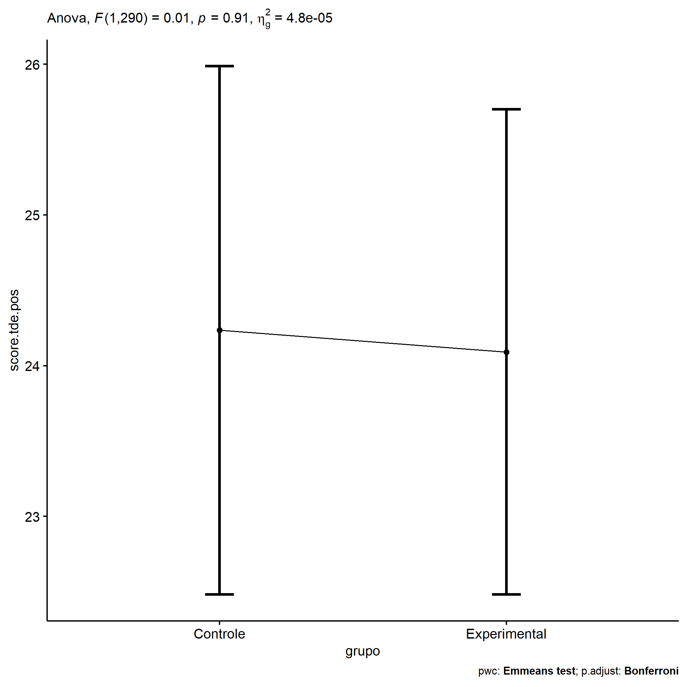<!-- -->

``` r
plots <- oneWayAncovaBoxPlots(
  wdat, "score.tde.pos", "grupo", aov, pwc, covar = "score.tde.pre",
  theme = "classic", color = color[["grupo"]],
  subtitle = which(aov$Effect == "grupo"))
```

``` r
if (length(unique(wdat[["grupo"]])) > 1)
  plots[["grupo"]] + ggplot2::ylab("TDE - Escrita") + ggplot2::scale_x_discrete(labels=c('pre', 'pos'))
```

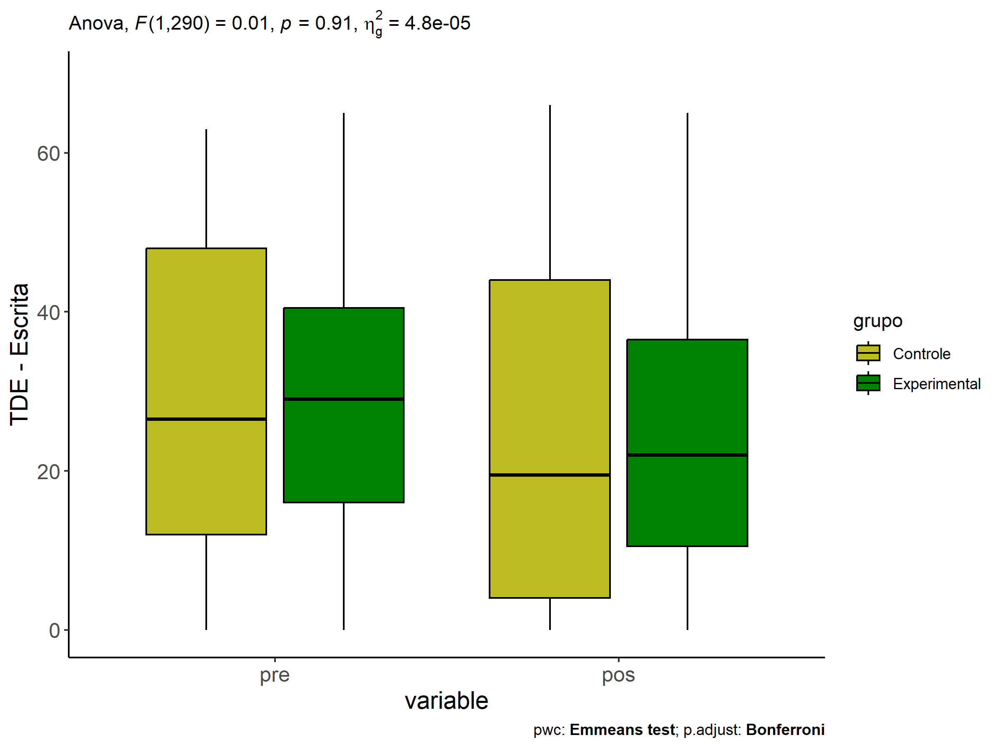<!-- -->

``` r
if (length(unique(wdat.long[["grupo"]])) > 1)
  plots <- oneWayAncovaBoxPlots(
    wdat.long, "score.tde", "grupo", aov, pwc.long, pre.post = "time",
    theme = "classic", color = color$prepost)
```

``` r
if (length(unique(wdat.long[["grupo"]])) > 1)
  plots[["grupo"]] + ggplot2::ylab("TDE - Escrita")
```

<!-- -->

### Checking linearity assumption

``` r
ggscatter(wdat, x = "score.tde.pre", y = "score.tde.pos", size = 0.5,
          color = "grupo", add = "reg.line")+
  stat_regline_equation(
    aes(label =  paste(..eq.label.., ..rr.label.., sep = "~~~~"), color = grupo)
  )
```

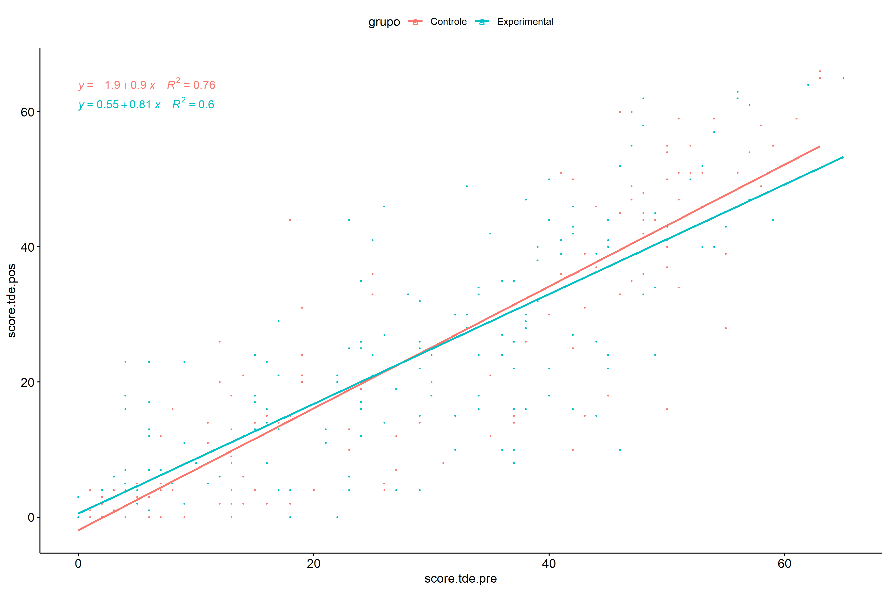<!-- -->

### Checking normality and homogeneity

``` r
res <- augment(lm(score.tde.pos ~ score.tde.pre + grupo, data = wdat))
```

``` r
shapiro_test(res$.resid)
```

    ## # A tibble: 1 × 3
    ##   variable   statistic p.value
    ##   <chr>          <dbl>   <dbl>
    ## 1 res$.resid     0.994   0.280

``` r
levene_test(res, .resid ~ grupo)
```

    ## # A tibble: 1 × 4
    ##     df1   df2 statistic     p
    ##   <int> <int>     <dbl> <dbl>
    ## 1     1   291      1.15 0.285

# ANCOVA and Pairwise for two factors **grupo:Sexo**

## Without remove non-normal data

``` r
pdat = remove_group_data(dat[!is.na(dat[["grupo"]]) & !is.na(dat[["Sexo"]]),], "score.tde.pos", c("grupo","Sexo"))

pdat.long <- rbind(pdat[,c("id","grupo","Sexo")], pdat[,c("id","grupo","Sexo")])
pdat.long[["time"]] <- c(rep("pre", nrow(pdat)), rep("pos", nrow(pdat)))
pdat.long[["time"]] <- factor(pdat.long[["time"]], c("pre","pos"))
pdat.long[["score.tde"]] <- c(pdat[["score.tde.pre"]], pdat[["score.tde.pos"]])

aov = anova_test(pdat, score.tde.pos ~ score.tde.pre + grupo*Sexo)
laov[["grupo:Sexo"]] <- get_anova_table(aov)
```

``` r
pwcs <- list()
pwcs[["Sexo"]] <- emmeans_test(
  group_by(pdat, grupo), score.tde.pos ~ Sexo,
  covariate = score.tde.pre, p.adjust.method = "bonferroni")
pwcs[["grupo"]] <- emmeans_test(
  group_by(pdat, Sexo), score.tde.pos ~ grupo,
  covariate = score.tde.pre, p.adjust.method = "bonferroni")

pwc <- plyr::rbind.fill(pwcs[["grupo"]], pwcs[["Sexo"]])
pwc <- pwc[,c("grupo","Sexo", colnames(pwc)[!colnames(pwc) %in% c("grupo","Sexo")])]
```

``` r
pwc.long <- emmeans_test(dplyr::group_by_at(pdat.long, c("grupo","Sexo")),
                         score.tde ~ time,
                         p.adjust.method = "bonferroni")
lpwc[["grupo:Sexo"]] <- plyr::rbind.fill(pwc, pwc.long)
```

``` r
ds <- get.descriptives(pdat, "score.tde.pos", c("grupo","Sexo"), covar = "score.tde.pre")
ds <- merge(ds[ds$variable != "score.tde.pre",],
            ds[ds$variable == "score.tde.pre", !colnames(ds) %in% c("variable")],
            by = c("grupo","Sexo"), all.x = T, suffixes = c("", ".score.tde.pre"))
ds <- merge(get_emmeans(pwcs[["grupo"]]), ds, by = c("grupo","Sexo"), suffixes = c(".emms", ""))
ds <- ds[,c("grupo","Sexo","n","mean.score.tde.pre","se.score.tde.pre","mean","se","emmean","se.emms")]

colnames(ds) <- c("grupo","Sexo", "N", paste0(c("M","SE")," (pre)"),
                  paste0(c("M","SE"), " (unadj)"), paste0(c("M", "SE"), " (adj)"))

lemms[["grupo:Sexo"]] <- ds
```

## Computing ANCOVA and PairWise After removing non-normal data (OK)

``` r
wdat = pdat 

res = residuals(lm(score.tde.pos ~ score.tde.pre + grupo*Sexo, data = wdat))
non.normal = getNonNormal(res, wdat$id, plimit = 0.05)

wdat = wdat[!wdat$id %in% non.normal,]

wdat.long <- rbind(wdat[,c("id","grupo","Sexo")], wdat[,c("id","grupo","Sexo")])
wdat.long[["time"]] <- c(rep("pre", nrow(wdat)), rep("pos", nrow(wdat)))
wdat.long[["time"]] <- factor(wdat.long[["time"]], c("pre","pos"))
wdat.long[["score.tde"]] <- c(wdat[["score.tde.pre"]], wdat[["score.tde.pos"]])


ldat[["grupo:Sexo"]] = wdat

(non.normal)
```

    ## NULL

``` r
aov = anova_test(wdat, score.tde.pos ~ score.tde.pre + grupo*Sexo)
laov[["grupo:Sexo"]] <- merge(get_anova_table(aov), laov[["grupo:Sexo"]], by="Effect", suffixes = c("","'"))

(df = get_anova_table(aov))
```

    ## ANOVA Table (type II tests)
    ## 
    ##          Effect DFn DFd       F        p p<.05      ges
    ## 1 score.tde.pre   1 288 595.129 4.81e-72     * 6.74e-01
    ## 2         grupo   1 288   0.017 8.96e-01       5.97e-05
    ## 3          Sexo   1 288   0.055 8.14e-01       1.92e-04
    ## 4    grupo:Sexo   1 288   2.826 9.40e-02       1.00e-02

| Effect        | DFn | DFd |       F |     p | p\<.05 |   ges |
|:--------------|----:|----:|--------:|------:|:-------|------:|
| score.tde.pre |   1 | 288 | 595.129 | 0.000 | \*     | 0.674 |
| grupo         |   1 | 288 |   0.017 | 0.896 |        | 0.000 |
| Sexo          |   1 | 288 |   0.055 | 0.814 |        | 0.000 |
| grupo:Sexo    |   1 | 288 |   2.826 | 0.094 |        | 0.010 |

``` r
pwcs <- list()
pwcs[["Sexo"]] <- emmeans_test(
  group_by(wdat, grupo), score.tde.pos ~ Sexo,
  covariate = score.tde.pre, p.adjust.method = "bonferroni")
pwcs[["grupo"]] <- emmeans_test(
  group_by(wdat, Sexo), score.tde.pos ~ grupo,
  covariate = score.tde.pre, p.adjust.method = "bonferroni")

pwc <- plyr::rbind.fill(pwcs[["grupo"]], pwcs[["Sexo"]])
pwc <- pwc[,c("grupo","Sexo", colnames(pwc)[!colnames(pwc) %in% c("grupo","Sexo")])]
```

| grupo        | Sexo | term                 | .y.           | group1   | group2       |  df | statistic |     p | p.adj | p.adj.signif |
|:-------------|:-----|:---------------------|:--------------|:---------|:-------------|----:|----------:|------:|------:|:-------------|
|              | F    | score.tde.pre\*grupo | score.tde.pos | Controle | Experimental | 288 |     1.290 | 0.198 | 0.198 | ns           |
|              | M    | score.tde.pre\*grupo | score.tde.pos | Controle | Experimental | 288 |    -1.089 | 0.277 | 0.277 | ns           |
| Controle     |      | score.tde.pre\*Sexo  | score.tde.pos | F        | M            | 288 |     1.395 | 0.164 | 0.164 | ns           |
| Experimental |      | score.tde.pre\*Sexo  | score.tde.pos | F        | M            | 288 |    -0.935 | 0.351 | 0.351 | ns           |

``` r
pwc.long <- emmeans_test(dplyr::group_by_at(wdat.long, c("grupo","Sexo")),
                         score.tde ~ time,
                         p.adjust.method = "bonferroni")
lpwc[["grupo:Sexo"]] <- merge(plyr::rbind.fill(pwc, pwc.long), lpwc[["grupo:Sexo"]], by=c("grupo","Sexo","term",".y.","group1","group2"), suffixes = c("","'"))
```

| grupo        | Sexo | term | .y.       | group1 | group2 |  df | statistic |     p | p.adj | p.adj.signif |
|:-------------|:-----|:-----|:----------|:-------|:-------|----:|----------:|------:|------:|:-------------|
| Controle     | F    | time | score.tde | pre    | pos    | 578 |     1.344 | 0.179 | 0.179 | ns           |
| Controle     | M    | time | score.tde | pre    | pos    | 578 |     1.771 | 0.077 | 0.077 | ns           |
| Experimental | F    | time | score.tde | pre    | pos    | 578 |     2.192 | 0.029 | 0.029 | \*           |
| Experimental | M    | time | score.tde | pre    | pos    | 578 |     1.297 | 0.195 | 0.195 | ns           |

``` r
ds <- get.descriptives(wdat, "score.tde.pos", c("grupo","Sexo"), covar = "score.tde.pre")
ds <- merge(ds[ds$variable != "score.tde.pre",],
            ds[ds$variable == "score.tde.pre", !colnames(ds) %in% c("variable")],
            by = c("grupo","Sexo"), all.x = T, suffixes = c("", ".score.tde.pre"))
ds <- merge(get_emmeans(pwcs[["grupo"]]), ds, by = c("grupo","Sexo"), suffixes = c(".emms", ""))
ds <- ds[,c("grupo","Sexo","n","mean.score.tde.pre","se.score.tde.pre","mean","se","emmean","se.emms")]

colnames(ds) <- c("grupo","Sexo", "N", paste0(c("M","SE")," (pre)"),
                  paste0(c("M","SE"), " (unadj)"), paste0(c("M", "SE"), " (adj)"))

lemms[["grupo:Sexo"]] <- merge(ds, lemms[["grupo:Sexo"]], by=c("grupo","Sexo"), suffixes = c("","'"))
```

| grupo        | Sexo |   N | M (pre) | SE (pre) | M (unadj) | SE (unadj) | M (adj) | SE (adj) |
|:-------------|:-----|----:|--------:|---------:|----------:|-----------:|--------:|---------:|
| Controle     | F    |  63 |  34.587 |    2.326 |    30.365 |      2.458 |  25.580 |    1.312 |
| Controle     | M    |  71 |  24.028 |    2.281 |    18.789 |      2.285 |  23.041 |    1.234 |
| Experimental | F    |  83 |  31.494 |    1.693 |    25.494 |      1.896 |  23.357 |    1.133 |
| Experimental | M    |  76 |  26.276 |    1.855 |    22.566 |      1.853 |  24.894 |    1.185 |

### Plots for ancova

``` r
plots <- twoWayAncovaPlots(
  wdat, "score.tde.pos", c("grupo","Sexo"), aov, pwcs, addParam = c("mean_se"),
  font.label.size=10, step.increase=0.05, p.label="p.adj",
  subtitle = which(aov$Effect == "grupo:Sexo"))
```

``` r
if (!is.null(plots[["grupo"]]))
  plots[["grupo"]] + ggplot2::scale_color_manual(values = color[["Sexo"]])
```

    ## Scale for colour is already present.
    ## Adding another scale for colour, which will replace the existing scale.

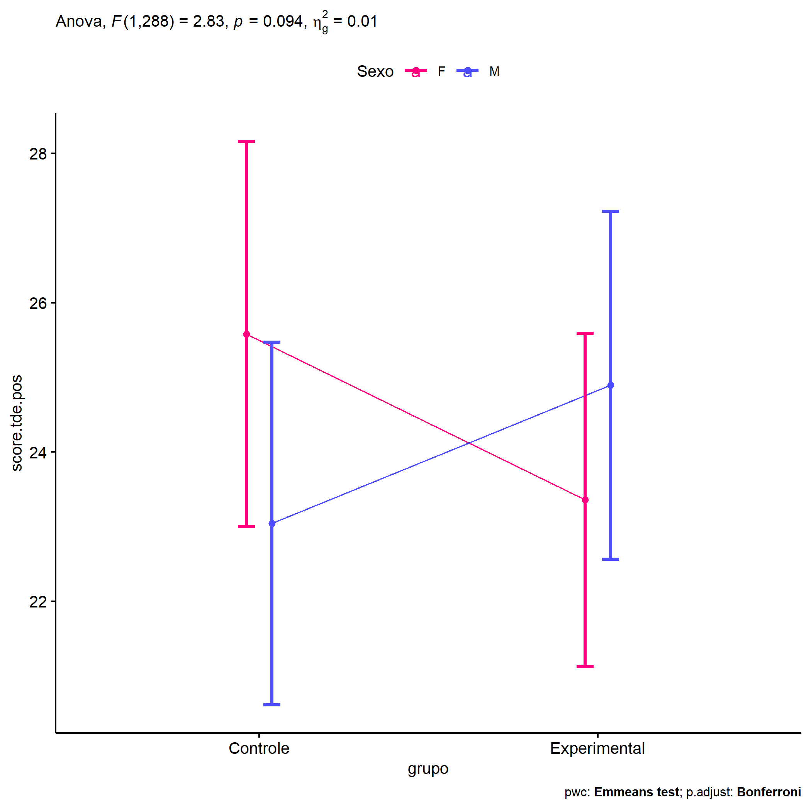<!-- -->

``` r
if (!is.null(plots[["Sexo"]]))
  plots[["Sexo"]] + ggplot2::scale_color_manual(values = color[["grupo"]])
```

    ## Scale for colour is already present.
    ## Adding another scale for colour, which will replace the existing scale.

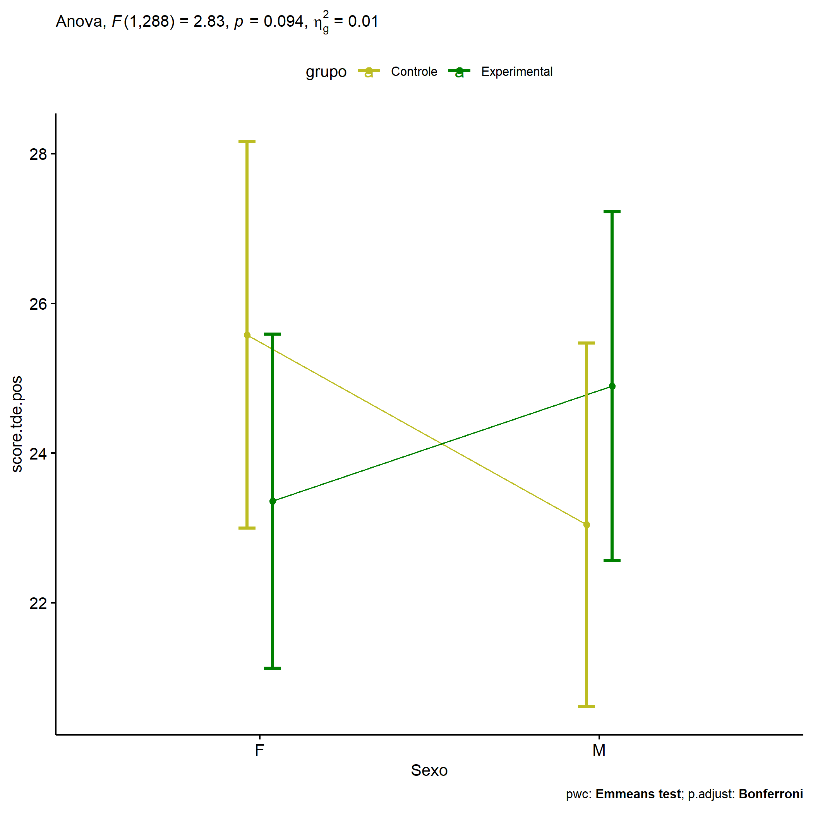<!-- -->

``` r
plots <- twoWayAncovaBoxPlots(
  wdat, "score.tde.pos", c("grupo","Sexo"), aov, pwcs, covar = "score.tde.pre",
  theme = "classic", color = color[["grupo:Sexo"]],
  subtitle = which(aov$Effect == "grupo:Sexo"))
```

``` r
plots[["grupo:Sexo"]] + ggplot2::ylab("TDE - Escrita") + ggplot2::scale_x_discrete(labels=c('pre', 'pos'))
```

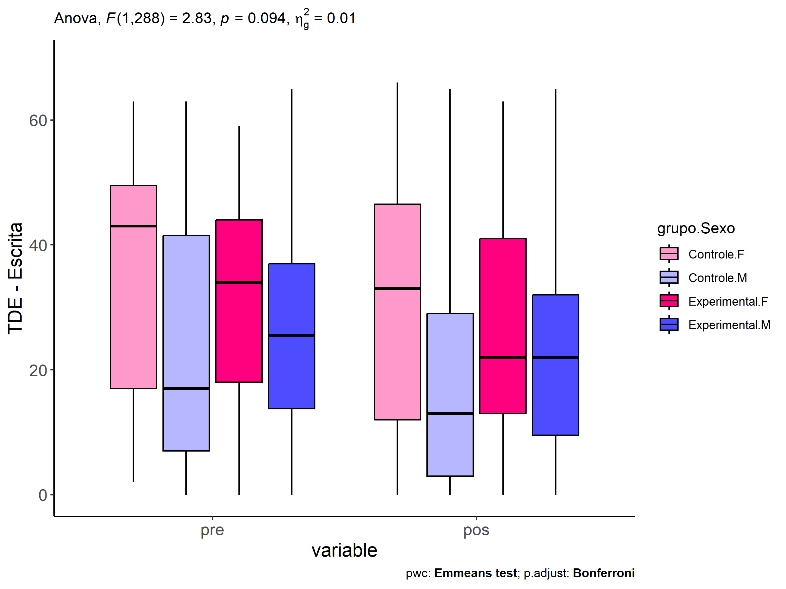<!-- -->

``` r
plots <- twoWayAncovaBoxPlots(
  wdat.long, "score.tde", c("grupo","Sexo"), aov, pwc.long, pre.post = "time",
  theme = "classic", color = color$prepost)
```

``` r
plots[["grupo:Sexo"]] + ggplot2::ylab("TDE - Escrita")
```

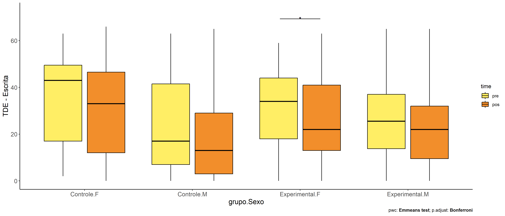<!-- -->

### Checking linearity assumption

``` r
ggscatter(wdat, x = "score.tde.pre", y = "score.tde.pos", size = 0.5,
          facet.by = c("grupo","Sexo"), add = "reg.line")+
  stat_regline_equation(
    aes(label =  paste(..eq.label.., ..rr.label.., sep = "~~~~"))
  )
```

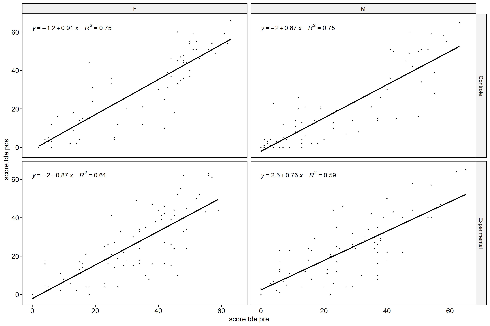<!-- -->

### Checking normality and homogeneity

``` r
res <- augment(lm(score.tde.pos ~ score.tde.pre + grupo*Sexo, data = wdat))
```

``` r
shapiro_test(res$.resid)
```

    ## # A tibble: 1 × 3
    ##   variable   statistic p.value
    ##   <chr>          <dbl>   <dbl>
    ## 1 res$.resid     0.994   0.252

``` r
levene_test(res, .resid ~ grupo*Sexo)
```

    ## # A tibble: 1 × 4
    ##     df1   df2 statistic     p
    ##   <int> <int>     <dbl> <dbl>
    ## 1     3   289     0.532 0.661

# ANCOVA and Pairwise for two factors **grupo:Zona**

## Without remove non-normal data

``` r
pdat = remove_group_data(dat[!is.na(dat[["grupo"]]) & !is.na(dat[["Zona"]]),], "score.tde.pos", c("grupo","Zona"))

pdat.long <- rbind(pdat[,c("id","grupo","Zona")], pdat[,c("id","grupo","Zona")])
pdat.long[["time"]] <- c(rep("pre", nrow(pdat)), rep("pos", nrow(pdat)))
pdat.long[["time"]] <- factor(pdat.long[["time"]], c("pre","pos"))
pdat.long[["score.tde"]] <- c(pdat[["score.tde.pre"]], pdat[["score.tde.pos"]])

aov = anova_test(pdat, score.tde.pos ~ score.tde.pre + grupo*Zona)
laov[["grupo:Zona"]] <- get_anova_table(aov)
```

``` r
pwcs <- list()
pwcs[["Zona"]] <- emmeans_test(
  group_by(pdat, grupo), score.tde.pos ~ Zona,
  covariate = score.tde.pre, p.adjust.method = "bonferroni")
pwcs[["grupo"]] <- emmeans_test(
  group_by(pdat, Zona), score.tde.pos ~ grupo,
  covariate = score.tde.pre, p.adjust.method = "bonferroni")

pwc <- plyr::rbind.fill(pwcs[["grupo"]], pwcs[["Zona"]])
pwc <- pwc[,c("grupo","Zona", colnames(pwc)[!colnames(pwc) %in% c("grupo","Zona")])]
```

``` r
pwc.long <- emmeans_test(dplyr::group_by_at(pdat.long, c("grupo","Zona")),
                         score.tde ~ time,
                         p.adjust.method = "bonferroni")
lpwc[["grupo:Zona"]] <- plyr::rbind.fill(pwc, pwc.long)
```

``` r
ds <- get.descriptives(pdat, "score.tde.pos", c("grupo","Zona"), covar = "score.tde.pre")
ds <- merge(ds[ds$variable != "score.tde.pre",],
            ds[ds$variable == "score.tde.pre", !colnames(ds) %in% c("variable")],
            by = c("grupo","Zona"), all.x = T, suffixes = c("", ".score.tde.pre"))
ds <- merge(get_emmeans(pwcs[["grupo"]]), ds, by = c("grupo","Zona"), suffixes = c(".emms", ""))
ds <- ds[,c("grupo","Zona","n","mean.score.tde.pre","se.score.tde.pre","mean","se","emmean","se.emms")]

colnames(ds) <- c("grupo","Zona", "N", paste0(c("M","SE")," (pre)"),
                  paste0(c("M","SE"), " (unadj)"), paste0(c("M", "SE"), " (adj)"))

lemms[["grupo:Zona"]] <- ds
```

## Computing ANCOVA and PairWise After removing non-normal data (OK)

``` r
wdat = pdat 

res = residuals(lm(score.tde.pos ~ score.tde.pre + grupo*Zona, data = wdat))
non.normal = getNonNormal(res, wdat$id, plimit = 0.05)

wdat = wdat[!wdat$id %in% non.normal,]

wdat.long <- rbind(wdat[,c("id","grupo","Zona")], wdat[,c("id","grupo","Zona")])
wdat.long[["time"]] <- c(rep("pre", nrow(wdat)), rep("pos", nrow(wdat)))
wdat.long[["time"]] <- factor(wdat.long[["time"]], c("pre","pos"))
wdat.long[["score.tde"]] <- c(wdat[["score.tde.pre"]], wdat[["score.tde.pos"]])


ldat[["grupo:Zona"]] = wdat

(non.normal)
```

    ## NULL

``` r
aov = anova_test(wdat, score.tde.pos ~ score.tde.pre + grupo*Zona)
laov[["grupo:Zona"]] <- merge(get_anova_table(aov), laov[["grupo:Zona"]], by="Effect", suffixes = c("","'"))

(df = get_anova_table(aov))
```

    ## ANOVA Table (type II tests)
    ## 
    ##          Effect DFn DFd       F        p p<.05      ges
    ## 1 score.tde.pre   1 239 524.136 3.47e-62     * 0.687000
    ## 2         grupo   1 239   0.110 7.41e-01       0.000459
    ## 3          Zona   1 239  16.101 8.04e-05     * 0.063000
    ## 4    grupo:Zona   1 239   1.070 3.02e-01       0.004000

| Effect        | DFn | DFd |       F |     p | p\<.05 |   ges |
|:--------------|----:|----:|--------:|------:|:-------|------:|
| score.tde.pre |   1 | 239 | 524.136 | 0.000 | \*     | 0.687 |
| grupo         |   1 | 239 |   0.110 | 0.741 |        | 0.000 |
| Zona          |   1 | 239 |  16.101 | 0.000 | \*     | 0.063 |
| grupo:Zona    |   1 | 239 |   1.070 | 0.302 |        | 0.004 |

``` r
pwcs <- list()
pwcs[["Zona"]] <- emmeans_test(
  group_by(wdat, grupo), score.tde.pos ~ Zona,
  covariate = score.tde.pre, p.adjust.method = "bonferroni")
pwcs[["grupo"]] <- emmeans_test(
  group_by(wdat, Zona), score.tde.pos ~ grupo,
  covariate = score.tde.pre, p.adjust.method = "bonferroni")

pwc <- plyr::rbind.fill(pwcs[["grupo"]], pwcs[["Zona"]])
pwc <- pwc[,c("grupo","Zona", colnames(pwc)[!colnames(pwc) %in% c("grupo","Zona")])]
```

| grupo        | Zona   | term                 | .y.           | group1   | group2       |  df | statistic |     p | p.adj | p.adj.signif |
|:-------------|:-------|:---------------------|:--------------|:---------|:-------------|----:|----------:|------:|------:|:-------------|
|              | Rural  | score.tde.pre\*grupo | score.tde.pos | Controle | Experimental | 239 |    -0.790 | 0.430 | 0.430 | ns           |
|              | Urbana | score.tde.pre\*grupo | score.tde.pos | Controle | Experimental | 239 |     0.745 | 0.457 | 0.457 | ns           |
| Controle     |        | score.tde.pre\*Zona  | score.tde.pos | Rural    | Urbana       | 239 |     1.700 | 0.090 | 0.090 | ns           |
| Experimental |        | score.tde.pre\*Zona  | score.tde.pos | Rural    | Urbana       | 239 |     3.782 | 0.000 | 0.000 | \*\*\*       |

``` r
pwc.long <- emmeans_test(dplyr::group_by_at(wdat.long, c("grupo","Zona")),
                         score.tde ~ time,
                         p.adjust.method = "bonferroni")
lpwc[["grupo:Zona"]] <- merge(plyr::rbind.fill(pwc, pwc.long), lpwc[["grupo:Zona"]], by=c("grupo","Zona","term",".y.","group1","group2"), suffixes = c("","'"))
```

| grupo        | Zona   | term | .y.       | group1 | group2 |  df | statistic |     p | p.adj | p.adj.signif |
|:-------------|:-------|:-----|:----------|:-------|:-------|----:|----------:|------:|------:|:-------------|
| Controle     | Rural  | time | score.tde | pre    | pos    | 480 |     1.510 | 0.132 | 0.132 | ns           |
| Controle     | Urbana | time | score.tde | pre    | pos    | 480 |     1.491 | 0.137 | 0.137 | ns           |
| Experimental | Rural  | time | score.tde | pre    | pos    | 480 |     0.762 | 0.446 | 0.446 | ns           |
| Experimental | Urbana | time | score.tde | pre    | pos    | 480 |     2.568 | 0.011 | 0.011 | \*           |

``` r
ds <- get.descriptives(wdat, "score.tde.pos", c("grupo","Zona"), covar = "score.tde.pre")
ds <- merge(ds[ds$variable != "score.tde.pre",],
            ds[ds$variable == "score.tde.pre", !colnames(ds) %in% c("variable")],
            by = c("grupo","Zona"), all.x = T, suffixes = c("", ".score.tde.pre"))
ds <- merge(get_emmeans(pwcs[["grupo"]]), ds, by = c("grupo","Zona"), suffixes = c(".emms", ""))
ds <- ds[,c("grupo","Zona","n","mean.score.tde.pre","se.score.tde.pre","mean","se","emmean","se.emms")]

colnames(ds) <- c("grupo","Zona", "N", paste0(c("M","SE")," (pre)"),
                  paste0(c("M","SE"), " (unadj)"), paste0(c("M", "SE"), " (adj)"))

lemms[["grupo:Zona"]] <- merge(ds, lemms[["grupo:Zona"]], by=c("grupo","Zona"), suffixes = c("","'"))
```

| grupo        | Zona   |   N | M (pre) | SE (pre) | M (unadj) | SE (unadj) | M (adj) | SE (adj) |
|:-------------|:-------|----:|--------:|---------:|----------:|-----------:|--------:|---------:|
| Controle     | Rural  |  97 |  29.907 |    1.998 |    25.979 |      2.107 |  24.928 |    1.051 |
| Controle     | Urbana |  21 |  31.143 |    4.116 |    22.810 |      4.118 |  20.697 |    2.258 |
| Experimental | Rural  |  86 |  25.593 |    1.666 |    23.488 |      1.721 |  26.145 |    1.121 |
| Experimental | Urbana |  40 |  31.075 |    2.691 |    20.675 |      2.715 |  18.620 |    1.637 |

### Plots for ancova

``` r
plots <- twoWayAncovaPlots(
  wdat, "score.tde.pos", c("grupo","Zona"), aov, pwcs, addParam = c("mean_se"),
  font.label.size=10, step.increase=0.05, p.label="p.adj",
  subtitle = which(aov$Effect == "grupo:Zona"))
```

``` r
if (!is.null(plots[["grupo"]]))
  plots[["grupo"]] + ggplot2::scale_color_manual(values = color[["Zona"]])
```

    ## Scale for colour is already present.
    ## Adding another scale for colour, which will replace the existing scale.

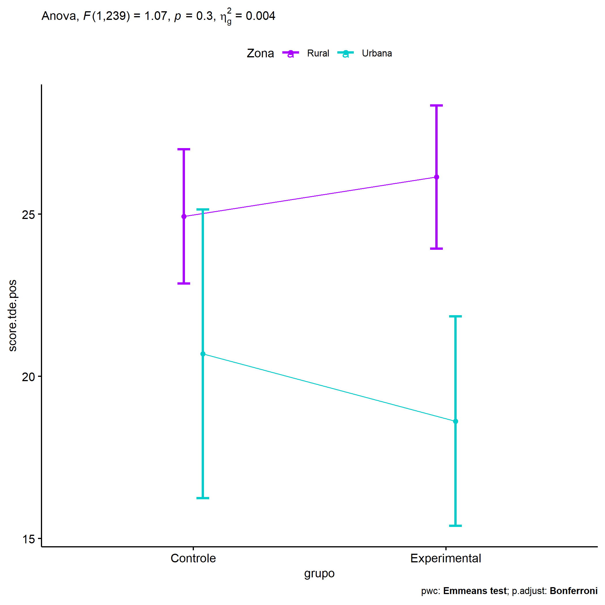<!-- -->

``` r
if (!is.null(plots[["Zona"]]))
  plots[["Zona"]] + ggplot2::scale_color_manual(values = color[["grupo"]])
```

    ## Scale for colour is already present.
    ## Adding another scale for colour, which will replace the existing scale.

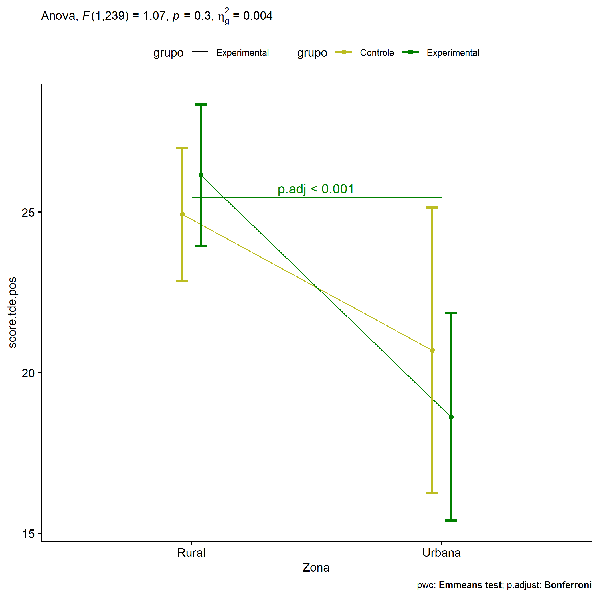<!-- -->

``` r
plots <- twoWayAncovaBoxPlots(
  wdat, "score.tde.pos", c("grupo","Zona"), aov, pwcs, covar = "score.tde.pre",
  theme = "classic", color = color[["grupo:Zona"]],
  subtitle = which(aov$Effect == "grupo:Zona"))
```

``` r
plots[["grupo:Zona"]] + ggplot2::ylab("TDE - Escrita") + ggplot2::scale_x_discrete(labels=c('pre', 'pos'))
```

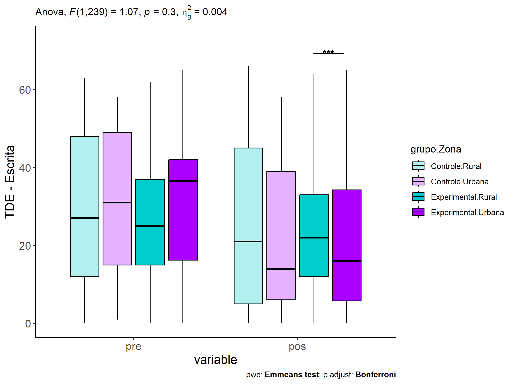<!-- -->

``` r
plots <- twoWayAncovaBoxPlots(
  wdat.long, "score.tde", c("grupo","Zona"), aov, pwc.long, pre.post = "time",
  theme = "classic", color = color$prepost)
```

``` r
plots[["grupo:Zona"]] + ggplot2::ylab("TDE - Escrita")
```

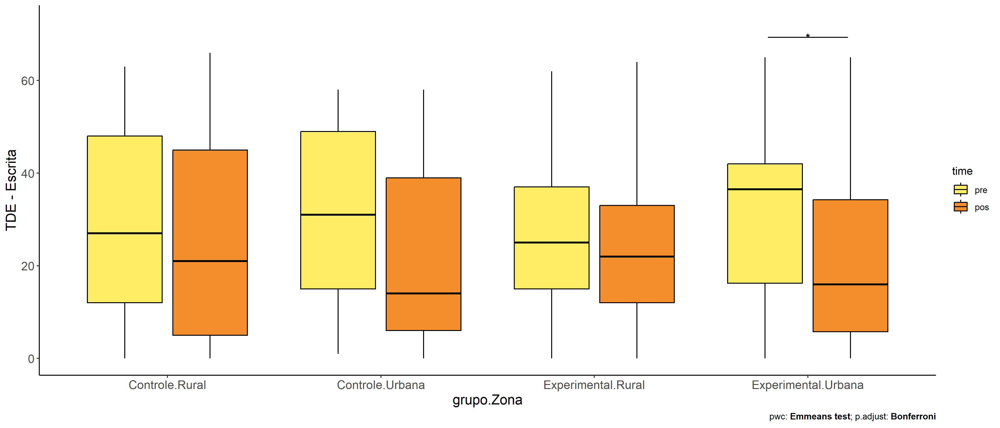<!-- -->

### Checking linearity assumption

``` r
ggscatter(wdat, x = "score.tde.pre", y = "score.tde.pos", size = 0.5,
          facet.by = c("grupo","Zona"), add = "reg.line")+
  stat_regline_equation(
    aes(label =  paste(..eq.label.., ..rr.label.., sep = "~~~~"))
  )
```

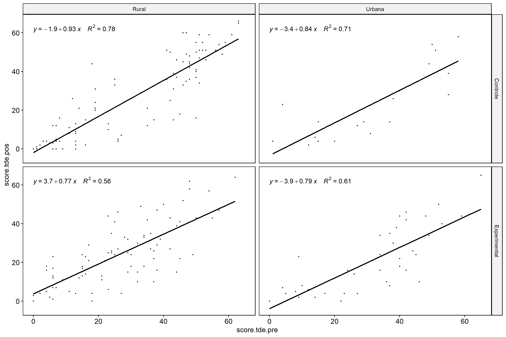<!-- -->

### Checking normality and homogeneity

``` r
res <- augment(lm(score.tde.pos ~ score.tde.pre + grupo*Zona, data = wdat))
```

``` r
shapiro_test(res$.resid)
```

    ## # A tibble: 1 × 3
    ##   variable   statistic p.value
    ##   <chr>          <dbl>   <dbl>
    ## 1 res$.resid     0.995   0.630

``` r
levene_test(res, .resid ~ grupo*Zona)
```

    ## # A tibble: 1 × 4
    ##     df1   df2 statistic     p
    ##   <int> <int>     <dbl> <dbl>
    ## 1     3   240     0.462 0.709

# ANCOVA and Pairwise for two factors **grupo:Cor.Raca**

## Without remove non-normal data

``` r
pdat = remove_group_data(dat[!is.na(dat[["grupo"]]) & !is.na(dat[["Cor.Raca"]]),], "score.tde.pos", c("grupo","Cor.Raca"))

pdat.long <- rbind(pdat[,c("id","grupo","Cor.Raca")], pdat[,c("id","grupo","Cor.Raca")])
pdat.long[["time"]] <- c(rep("pre", nrow(pdat)), rep("pos", nrow(pdat)))
pdat.long[["time"]] <- factor(pdat.long[["time"]], c("pre","pos"))
pdat.long[["score.tde"]] <- c(pdat[["score.tde.pre"]], pdat[["score.tde.pos"]])

aov = anova_test(pdat, score.tde.pos ~ score.tde.pre + grupo*Cor.Raca)
laov[["grupo:Cor.Raca"]] <- get_anova_table(aov)
```

``` r
pwcs <- list()
pwcs[["Cor.Raca"]] <- emmeans_test(
  group_by(pdat, grupo), score.tde.pos ~ Cor.Raca,
  covariate = score.tde.pre, p.adjust.method = "bonferroni")
pwcs[["grupo"]] <- emmeans_test(
  group_by(pdat, Cor.Raca), score.tde.pos ~ grupo,
  covariate = score.tde.pre, p.adjust.method = "bonferroni")

pwc <- plyr::rbind.fill(pwcs[["grupo"]], pwcs[["Cor.Raca"]])
pwc <- pwc[,c("grupo","Cor.Raca", colnames(pwc)[!colnames(pwc) %in% c("grupo","Cor.Raca")])]
```

``` r
pwc.long <- emmeans_test(dplyr::group_by_at(pdat.long, c("grupo","Cor.Raca")),
                         score.tde ~ time,
                         p.adjust.method = "bonferroni")
lpwc[["grupo:Cor.Raca"]] <- plyr::rbind.fill(pwc, pwc.long)
```

``` r
ds <- get.descriptives(pdat, "score.tde.pos", c("grupo","Cor.Raca"), covar = "score.tde.pre")
ds <- merge(ds[ds$variable != "score.tde.pre",],
            ds[ds$variable == "score.tde.pre", !colnames(ds) %in% c("variable")],
            by = c("grupo","Cor.Raca"), all.x = T, suffixes = c("", ".score.tde.pre"))
ds <- merge(get_emmeans(pwcs[["grupo"]]), ds, by = c("grupo","Cor.Raca"), suffixes = c(".emms", ""))
ds <- ds[,c("grupo","Cor.Raca","n","mean.score.tde.pre","se.score.tde.pre","mean","se","emmean","se.emms")]

colnames(ds) <- c("grupo","Cor.Raca", "N", paste0(c("M","SE")," (pre)"),
                  paste0(c("M","SE"), " (unadj)"), paste0(c("M", "SE"), " (adj)"))

lemms[["grupo:Cor.Raca"]] <- ds
```

## Computing ANCOVA and PairWise After removing non-normal data (OK)

``` r
wdat = pdat 

res = residuals(lm(score.tde.pos ~ score.tde.pre + grupo*Cor.Raca, data = wdat))
non.normal = getNonNormal(res, wdat$id, plimit = 0.05)

wdat = wdat[!wdat$id %in% non.normal,]

wdat.long <- rbind(wdat[,c("id","grupo","Cor.Raca")], wdat[,c("id","grupo","Cor.Raca")])
wdat.long[["time"]] <- c(rep("pre", nrow(wdat)), rep("pos", nrow(wdat)))
wdat.long[["time"]] <- factor(wdat.long[["time"]], c("pre","pos"))
wdat.long[["score.tde"]] <- c(wdat[["score.tde.pre"]], wdat[["score.tde.pos"]])


ldat[["grupo:Cor.Raca"]] = wdat

(non.normal)
```

    ## NULL

``` r
aov = anova_test(wdat, score.tde.pos ~ score.tde.pre + grupo*Cor.Raca)
laov[["grupo:Cor.Raca"]] <- merge(get_anova_table(aov), laov[["grupo:Cor.Raca"]], by="Effect", suffixes = c("","'"))

(df = get_anova_table(aov))
```

    ## ANOVA Table (type II tests)
    ## 
    ##           Effect DFn DFd       F        p p<.05      ges
    ## 1  score.tde.pre   1 128 239.421 4.26e-31     * 0.652000
    ## 2          grupo   1 128   0.887 3.48e-01       0.007000
    ## 3       Cor.Raca   2 128   2.477 8.80e-02       0.037000
    ## 4 grupo:Cor.Raca   1 128   0.080 7.78e-01       0.000625

| Effect         | DFn | DFd |       F |     p | p\<.05 |   ges |
|:---------------|----:|----:|--------:|------:|:-------|------:|
| score.tde.pre  |   1 | 128 | 239.421 | 0.000 | \*     | 0.652 |
| grupo          |   1 | 128 |   0.887 | 0.348 |        | 0.007 |
| Cor.Raca       |   2 | 128 |   2.477 | 0.088 |        | 0.037 |
| grupo:Cor.Raca |   1 | 128 |   0.080 | 0.778 |        | 0.001 |

``` r
pwcs <- list()
pwcs[["Cor.Raca"]] <- emmeans_test(
  group_by(wdat, grupo), score.tde.pos ~ Cor.Raca,
  covariate = score.tde.pre, p.adjust.method = "bonferroni")
pwcs[["grupo"]] <- emmeans_test(
  group_by(wdat, Cor.Raca), score.tde.pos ~ grupo,
  covariate = score.tde.pre, p.adjust.method = "bonferroni")

pwc <- plyr::rbind.fill(pwcs[["grupo"]], pwcs[["Cor.Raca"]])
pwc <- pwc[,c("grupo","Cor.Raca", colnames(pwc)[!colnames(pwc) %in% c("grupo","Cor.Raca")])]
```

| grupo        | Cor.Raca | term                    | .y.           | group1   | group2       |  df | statistic |     p | p.adj | p.adj.signif |
|:-------------|:---------|:------------------------|:--------------|:---------|:-------------|----:|----------:|------:|------:|:-------------|
|              | Branca   | score.tde.pre\*grupo    | score.tde.pos | Controle | Experimental | 128 |    -0.758 | 0.450 | 0.450 | ns           |
|              | Indígena | score.tde.pre\*grupo    | score.tde.pos | Controle | Experimental |     |           |       |       |              |
|              | Parda    | score.tde.pre\*grupo    | score.tde.pos | Controle | Experimental | 128 |    -0.630 | 0.530 | 0.530 | ns           |
| Controle     |          | score.tde.pre\*Cor.Raca | score.tde.pos | Branca   | Indígena     |     |           |       |       |              |
| Controle     |          | score.tde.pre\*Cor.Raca | score.tde.pos | Branca   | Parda        | 128 |     0.149 | 0.882 | 0.882 | ns           |
| Controle     |          | score.tde.pre\*Cor.Raca | score.tde.pos | Indígena | Parda        |     |           |       |       |              |
| Experimental |          | score.tde.pre\*Cor.Raca | score.tde.pos | Branca   | Indígena     | 128 |    -1.624 | 0.107 | 0.320 | ns           |
| Experimental |          | score.tde.pre\*Cor.Raca | score.tde.pos | Branca   | Parda        | 128 |     0.594 | 0.554 | 1.000 | ns           |
| Experimental |          | score.tde.pre\*Cor.Raca | score.tde.pos | Indígena | Parda        | 128 |     2.237 | 0.027 | 0.081 | ns           |

``` r
pwc.long <- emmeans_test(dplyr::group_by_at(wdat.long, c("grupo","Cor.Raca")),
                         score.tde ~ time,
                         p.adjust.method = "bonferroni")
lpwc[["grupo:Cor.Raca"]] <- merge(plyr::rbind.fill(pwc, pwc.long), lpwc[["grupo:Cor.Raca"]], by=c("grupo","Cor.Raca","term",".y.","group1","group2"), suffixes = c("","'"))
```

| grupo        | Cor.Raca | term | .y.       | group1 | group2 |  df | statistic |     p | p.adj | p.adj.signif |
|:-------------|:---------|:-----|:----------|:-------|:-------|----:|----------:|------:|------:|:-------------|
| Controle     | Branca   | time | score.tde | pre    | pos    | 258 |     1.202 | 0.231 | 0.231 | ns           |
| Controle     | Indígena | time | score.tde | pre    | pos    |     |           |       |       |              |
| Controle     | Parda    | time | score.tde | pre    | pos    | 258 |     1.676 | 0.095 | 0.095 | ns           |
| Experimental | Branca   | time | score.tde | pre    | pos    | 258 |     0.490 | 0.624 | 0.624 | ns           |
| Experimental | Indígena | time | score.tde | pre    | pos    | 258 |    -0.514 | 0.608 | 0.608 | ns           |
| Experimental | Parda    | time | score.tde | pre    | pos    | 258 |     1.359 | 0.175 | 0.175 | ns           |

``` r
ds <- get.descriptives(wdat, "score.tde.pos", c("grupo","Cor.Raca"), covar = "score.tde.pre")
ds <- merge(ds[ds$variable != "score.tde.pre",],
            ds[ds$variable == "score.tde.pre", !colnames(ds) %in% c("variable")],
            by = c("grupo","Cor.Raca"), all.x = T, suffixes = c("", ".score.tde.pre"))
ds <- merge(get_emmeans(pwcs[["grupo"]]), ds, by = c("grupo","Cor.Raca"), suffixes = c(".emms", ""))
ds <- ds[,c("grupo","Cor.Raca","n","mean.score.tde.pre","se.score.tde.pre","mean","se","emmean","se.emms")]

colnames(ds) <- c("grupo","Cor.Raca", "N", paste0(c("M","SE")," (pre)"),
                  paste0(c("M","SE"), " (unadj)"), paste0(c("M", "SE"), " (adj)"))

lemms[["grupo:Cor.Raca"]] <- merge(ds, lemms[["grupo:Cor.Raca"]], by=c("grupo","Cor.Raca"), suffixes = c("","'"))
```

| grupo        | Cor.Raca |   N | M (pre) | SE (pre) | M (unadj) | SE (unadj) | M (adj) | SE (adj) |
|:-------------|:---------|----:|--------:|---------:|----------:|-----------:|--------:|---------:|
| Controle     | Branca   |  17 |  35.000 |    5.000 |    27.647 |      5.369 |  21.215 |    2.647 |
| Controle     | Parda    |  39 |  28.410 |    3.086 |    21.641 |      3.238 |  20.745 |    1.727 |
| Experimental | Branca   |  22 |  22.318 |    3.285 |    19.682 |      3.186 |  23.903 |    2.314 |
| Experimental | Indígena |  11 |  21.818 |    4.865 |    25.727 |      4.995 |  30.369 |    3.264 |
| Experimental | Parda    |  45 |  27.333 |    2.347 |    22.222 |      2.449 |  22.231 |    1.607 |

### Plots for ancova

``` r
plots <- twoWayAncovaPlots(
  wdat, "score.tde.pos", c("grupo","Cor.Raca"), aov, pwcs, addParam = c("mean_se"),
  font.label.size=10, step.increase=0.05, p.label="p.adj",
  subtitle = which(aov$Effect == "grupo:Cor.Raca"))
```

``` r
if (!is.null(plots[["grupo"]]))
  plots[["grupo"]] + ggplot2::scale_color_manual(values = color[["Cor.Raca"]])
```

<!-- -->

``` r
if (!is.null(plots[["Cor.Raca"]]))
  plots[["Cor.Raca"]] + ggplot2::scale_color_manual(values = color[["grupo"]])
```

    ## Scale for colour is already present.
    ## Adding another scale for colour, which will replace the existing scale.

    ## Warning: Removed 2 rows containing non-finite values (`stat_bracket()`).

    ## Warning: Removed 1 rows containing missing values (`geom_point()`).

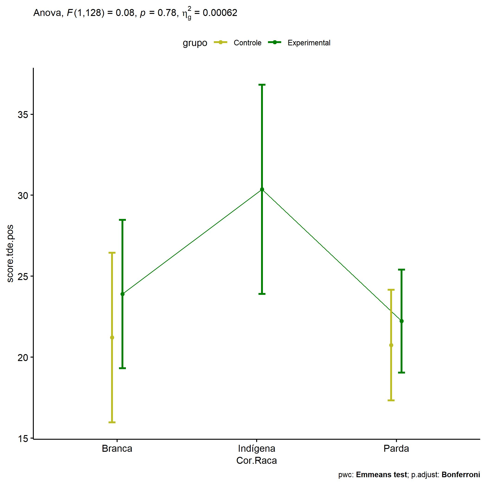<!-- -->

``` r
plots <- twoWayAncovaBoxPlots(
  wdat, "score.tde.pos", c("grupo","Cor.Raca"), aov, pwcs, covar = "score.tde.pre",
  theme = "classic", color = color[["grupo:Cor.Raca"]],
  subtitle = which(aov$Effect == "grupo:Cor.Raca"))
```

``` r
plots[["grupo:Cor.Raca"]] + ggplot2::ylab("TDE - Escrita") + ggplot2::scale_x_discrete(labels=c('pre', 'pos'))
```

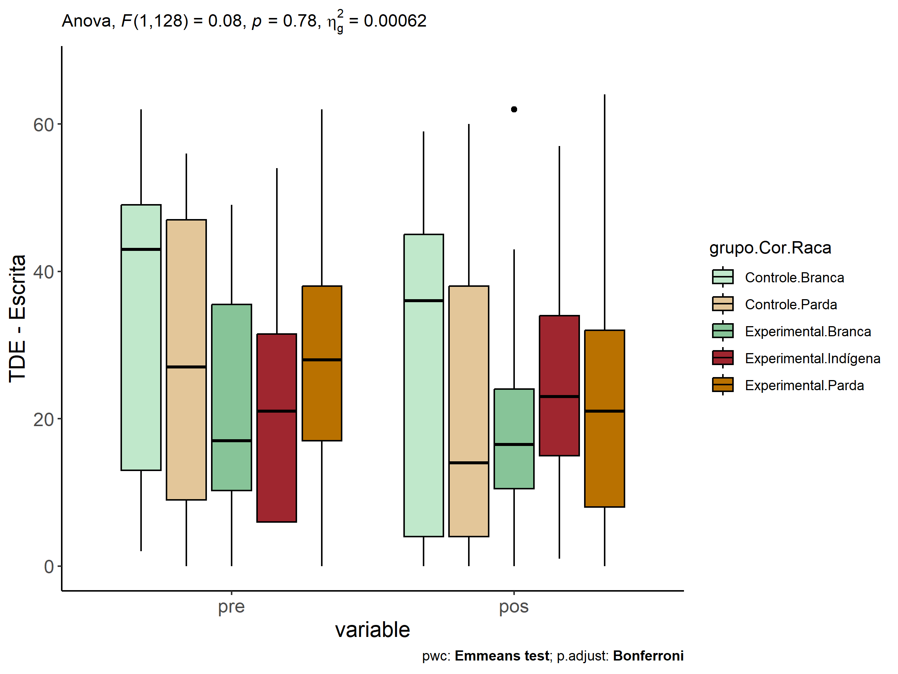<!-- -->

``` r
plots <- twoWayAncovaBoxPlots(
  wdat.long, "score.tde", c("grupo","Cor.Raca"), aov, pwc.long, pre.post = "time",
  theme = "classic", color = color$prepost)
```

``` r
plots[["grupo:Cor.Raca"]] + ggplot2::ylab("TDE - Escrita")
```

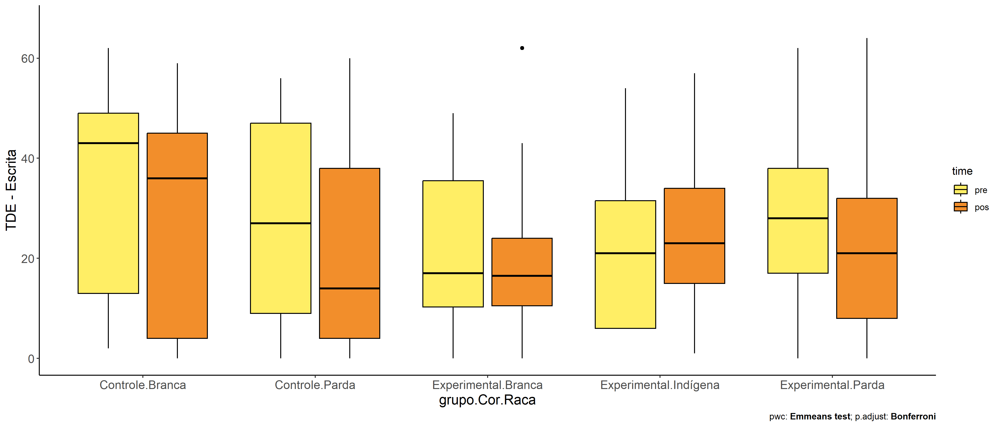<!-- -->

### Checking linearity assumption

``` r
ggscatter(wdat, x = "score.tde.pre", y = "score.tde.pos", size = 0.5,
          facet.by = c("grupo","Cor.Raca"), add = "reg.line")+
  stat_regline_equation(
    aes(label =  paste(..eq.label.., ..rr.label.., sep = "~~~~"))
  )
```

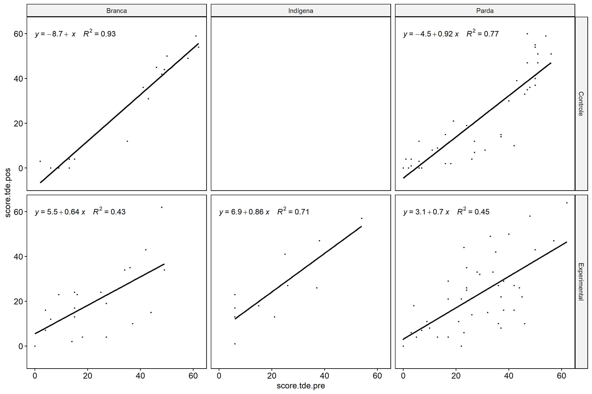<!-- -->

### Checking normality and homogeneity

``` r
res <- augment(lm(score.tde.pos ~ score.tde.pre + grupo*Cor.Raca, data = wdat))
```

``` r
shapiro_test(res$.resid)
```

    ## # A tibble: 1 × 3
    ##   variable   statistic p.value
    ##   <chr>          <dbl>   <dbl>
    ## 1 res$.resid     0.988   0.305

``` r
levene_test(res, .resid ~ grupo*Cor.Raca)
```

    ## # A tibble: 1 × 4
    ##     df1   df2 statistic     p
    ##   <int> <int>     <dbl> <dbl>
    ## 1     4   129      1.49 0.210

# ANCOVA and Pairwise for two factors **grupo:score.tde.quintile**

## Without remove non-normal data

``` r
pdat = remove_group_data(dat[!is.na(dat[["grupo"]]) & !is.na(dat[["score.tde.quintile"]]),], "score.tde.pos", c("grupo","score.tde.quintile"))

pdat.long <- rbind(pdat[,c("id","grupo","score.tde.quintile")], pdat[,c("id","grupo","score.tde.quintile")])
pdat.long[["time"]] <- c(rep("pre", nrow(pdat)), rep("pos", nrow(pdat)))
pdat.long[["time"]] <- factor(pdat.long[["time"]], c("pre","pos"))
pdat.long[["score.tde"]] <- c(pdat[["score.tde.pre"]], pdat[["score.tde.pos"]])

aov = anova_test(pdat, score.tde.pos ~ score.tde.pre + grupo*score.tde.quintile)
laov[["grupo:score.tde.quintile"]] <- get_anova_table(aov)
```

``` r
pwcs <- list()
pwcs[["score.tde.quintile"]] <- emmeans_test(
  group_by(pdat, grupo), score.tde.pos ~ score.tde.quintile,
  covariate = score.tde.pre, p.adjust.method = "bonferroni")
pwcs[["grupo"]] <- emmeans_test(
  group_by(pdat, score.tde.quintile), score.tde.pos ~ grupo,
  covariate = score.tde.pre, p.adjust.method = "bonferroni")

pwc <- plyr::rbind.fill(pwcs[["grupo"]], pwcs[["score.tde.quintile"]])
pwc <- pwc[,c("grupo","score.tde.quintile", colnames(pwc)[!colnames(pwc) %in% c("grupo","score.tde.quintile")])]
```

``` r
pwc.long <- emmeans_test(dplyr::group_by_at(pdat.long, c("grupo","score.tde.quintile")),
                         score.tde ~ time,
                         p.adjust.method = "bonferroni")
lpwc[["grupo:score.tde.quintile"]] <- plyr::rbind.fill(pwc, pwc.long)
```

``` r
ds <- get.descriptives(pdat, "score.tde.pos", c("grupo","score.tde.quintile"), covar = "score.tde.pre")
ds <- merge(ds[ds$variable != "score.tde.pre",],
            ds[ds$variable == "score.tde.pre", !colnames(ds) %in% c("variable")],
            by = c("grupo","score.tde.quintile"), all.x = T, suffixes = c("", ".score.tde.pre"))
ds <- merge(get_emmeans(pwcs[["grupo"]]), ds, by = c("grupo","score.tde.quintile"), suffixes = c(".emms", ""))
ds <- ds[,c("grupo","score.tde.quintile","n","mean.score.tde.pre","se.score.tde.pre","mean","se","emmean","se.emms")]

colnames(ds) <- c("grupo","score.tde.quintile", "N", paste0(c("M","SE")," (pre)"),
                  paste0(c("M","SE"), " (unadj)"), paste0(c("M", "SE"), " (adj)"))

lemms[["grupo:score.tde.quintile"]] <- ds
```

## Computing ANCOVA and PairWise After removing non-normal data (OK)

``` r
wdat = pdat 

res = residuals(lm(score.tde.pos ~ score.tde.pre + grupo*score.tde.quintile, data = wdat))
non.normal = getNonNormal(res, wdat$id, plimit = 0.05)

wdat = wdat[!wdat$id %in% non.normal,]

wdat.long <- rbind(wdat[,c("id","grupo","score.tde.quintile")], wdat[,c("id","grupo","score.tde.quintile")])
wdat.long[["time"]] <- c(rep("pre", nrow(wdat)), rep("pos", nrow(wdat)))
wdat.long[["time"]] <- factor(wdat.long[["time"]], c("pre","pos"))
wdat.long[["score.tde"]] <- c(wdat[["score.tde.pre"]], wdat[["score.tde.pos"]])


ldat[["grupo:score.tde.quintile"]] = wdat

(non.normal)
```

    ## NULL

``` r
aov = anova_test(wdat, score.tde.pos ~ score.tde.pre + grupo*score.tde.quintile)
laov[["grupo:score.tde.quintile"]] <- merge(get_anova_table(aov), laov[["grupo:score.tde.quintile"]], by="Effect", suffixes = c("","'"))

(df = get_anova_table(aov))
```

    ## ANOVA Table (type II tests)
    ## 
    ##                     Effect DFn DFd      F        p p<.05   ges
    ## 1            score.tde.pre   1 282 29.299 1.33e-07     * 0.094
    ## 2                    grupo   1 282  0.882 3.49e-01       0.003
    ## 3       score.tde.quintile   4 282  4.568 1.00e-03     * 0.061
    ## 4 grupo:score.tde.quintile   4 282  1.039 3.87e-01       0.015

| Effect                   | DFn | DFd |      F |     p | p\<.05 |   ges |
|:-------------------------|----:|----:|-------:|------:|:-------|------:|
| score.tde.pre            |   1 | 282 | 29.299 | 0.000 | \*     | 0.094 |
| grupo                    |   1 | 282 |  0.882 | 0.349 |        | 0.003 |
| score.tde.quintile       |   4 | 282 |  4.568 | 0.001 | \*     | 0.061 |
| grupo:score.tde.quintile |   4 | 282 |  1.039 | 0.387 |        | 0.015 |

``` r
pwcs <- list()
pwcs[["score.tde.quintile"]] <- emmeans_test(
  group_by(wdat, grupo), score.tde.pos ~ score.tde.quintile,
  covariate = score.tde.pre, p.adjust.method = "bonferroni")
pwcs[["grupo"]] <- emmeans_test(
  group_by(wdat, score.tde.quintile), score.tde.pos ~ grupo,
  covariate = score.tde.pre, p.adjust.method = "bonferroni")

pwc <- plyr::rbind.fill(pwcs[["grupo"]], pwcs[["score.tde.quintile"]])
pwc <- pwc[,c("grupo","score.tde.quintile", colnames(pwc)[!colnames(pwc) %in% c("grupo","score.tde.quintile")])]
```

| grupo        | score.tde.quintile | term                              | .y.           | group1       | group2       |  df | statistic |     p | p.adj | p.adj.signif |
|:-------------|:-------------------|:----------------------------------|:--------------|:-------------|:-------------|----:|----------:|------:|------:|:-------------|
|              | 1st quintile       | score.tde.pre\*grupo              | score.tde.pos | Controle     | Experimental | 282 |    -1.123 | 0.263 | 0.263 | ns           |
|              | 2nd quintile       | score.tde.pre\*grupo              | score.tde.pos | Controle     | Experimental | 282 |    -0.703 | 0.483 | 0.483 | ns           |
|              | 3rd quintile       | score.tde.pre\*grupo              | score.tde.pos | Controle     | Experimental | 282 |    -1.184 | 0.238 | 0.238 | ns           |
|              | 4th quintile       | score.tde.pre\*grupo              | score.tde.pos | Controle     | Experimental | 282 |     1.347 | 0.179 | 0.179 | ns           |
|              | 5th quintile       | score.tde.pre\*grupo              | score.tde.pos | Controle     | Experimental | 282 |    -0.228 | 0.820 | 0.820 | ns           |
| Controle     |                    | score.tde.pre\*score.tde.quintile | score.tde.pos | 1st quintile | 2nd quintile | 282 |     0.755 | 0.451 | 1.000 | ns           |
| Controle     |                    | score.tde.pre\*score.tde.quintile | score.tde.pos | 1st quintile | 3rd quintile | 282 |     0.839 | 0.402 | 1.000 | ns           |
| Controle     |                    | score.tde.pre\*score.tde.quintile | score.tde.pos | 1st quintile | 4th quintile | 282 |    -0.754 | 0.452 | 1.000 | ns           |
| Controle     |                    | score.tde.pre\*score.tde.quintile | score.tde.pos | 1st quintile | 5th quintile | 282 |    -0.995 | 0.321 | 1.000 | ns           |
| Controle     |                    | score.tde.pre\*score.tde.quintile | score.tde.pos | 2nd quintile | 3rd quintile | 282 |     0.420 | 0.675 | 1.000 | ns           |
| Controle     |                    | score.tde.pre\*score.tde.quintile | score.tde.pos | 2nd quintile | 4th quintile | 282 |    -1.603 | 0.110 | 1.000 | ns           |
| Controle     |                    | score.tde.pre\*score.tde.quintile | score.tde.pos | 2nd quintile | 5th quintile | 282 |    -1.734 | 0.084 | 0.841 | ns           |
| Controle     |                    | score.tde.pre\*score.tde.quintile | score.tde.pos | 3rd quintile | 4th quintile | 282 |    -2.568 | 0.011 | 0.107 | ns           |
| Controle     |                    | score.tde.pre\*score.tde.quintile | score.tde.pos | 3rd quintile | 5th quintile | 282 |    -2.624 | 0.009 | 0.092 | ns           |
| Controle     |                    | score.tde.pre\*score.tde.quintile | score.tde.pos | 4th quintile | 5th quintile | 282 |    -0.879 | 0.380 | 1.000 | ns           |
| Experimental |                    | score.tde.pre\*score.tde.quintile | score.tde.pos | 1st quintile | 2nd quintile | 282 |     0.887 | 0.376 | 1.000 | ns           |
| Experimental |                    | score.tde.pre\*score.tde.quintile | score.tde.pos | 1st quintile | 3rd quintile | 282 |     0.649 | 0.517 | 1.000 | ns           |
| Experimental |                    | score.tde.pre\*score.tde.quintile | score.tde.pos | 1st quintile | 4th quintile | 282 |     0.247 | 0.805 | 1.000 | ns           |
| Experimental |                    | score.tde.pre\*score.tde.quintile | score.tde.pos | 1st quintile | 5th quintile | 282 |    -0.814 | 0.416 | 1.000 | ns           |
| Experimental |                    | score.tde.pre\*score.tde.quintile | score.tde.pos | 2nd quintile | 3rd quintile | 282 |     0.035 | 0.972 | 1.000 | ns           |
| Experimental |                    | score.tde.pre\*score.tde.quintile | score.tde.pos | 2nd quintile | 4th quintile | 282 |    -0.327 | 0.744 | 1.000 | ns           |
| Experimental |                    | score.tde.pre\*score.tde.quintile | score.tde.pos | 2nd quintile | 5th quintile | 282 |    -1.620 | 0.106 | 1.000 | ns           |
| Experimental |                    | score.tde.pre\*score.tde.quintile | score.tde.pos | 3rd quintile | 4th quintile | 282 |    -0.480 | 0.632 | 1.000 | ns           |
| Experimental |                    | score.tde.pre\*score.tde.quintile | score.tde.pos | 3rd quintile | 5th quintile | 282 |    -2.148 | 0.033 | 0.326 | ns           |
| Experimental |                    | score.tde.pre\*score.tde.quintile | score.tde.pos | 4th quintile | 5th quintile | 282 |    -1.986 | 0.048 | 0.480 | ns           |

``` r
pwc.long <- emmeans_test(dplyr::group_by_at(wdat.long, c("grupo","score.tde.quintile")),
                         score.tde ~ time,
                         p.adjust.method = "bonferroni")
lpwc[["grupo:score.tde.quintile"]] <- merge(plyr::rbind.fill(pwc, pwc.long), lpwc[["grupo:score.tde.quintile"]], by=c("grupo","score.tde.quintile","term",".y.","group1","group2"), suffixes = c("","'"))
```

| grupo        | score.tde.quintile | term | .y.       | group1 | group2 |  df | statistic |     p | p.adj | p.adj.signif |
|:-------------|:-------------------|:-----|:----------|:-------|:-------|----:|----------:|------:|------:|:-------------|
| Controle     | 1st quintile       | time | score.tde | pre    | pos    | 566 |     1.107 | 0.269 | 0.269 | ns           |
| Controle     | 2nd quintile       | time | score.tde | pre    | pos    | 566 |     2.805 | 0.005 | 0.005 | \*\*         |
| Controle     | 3rd quintile       | time | score.tde | pre    | pos    | 566 |     4.015 | 0.000 | 0.000 | \*\*\*\*     |
| Controle     | 4th quintile       | time | score.tde | pre    | pos    | 566 |     2.751 | 0.006 | 0.006 | \*\*         |
| Controle     | 5th quintile       | time | score.tde | pre    | pos    | 566 |     1.567 | 0.118 | 0.118 | ns           |
| Experimental | 1st quintile       | time | score.tde | pre    | pos    | 566 |    -0.270 | 0.787 | 0.787 | ns           |
| Experimental | 2nd quintile       | time | score.tde | pre    | pos    | 566 |     3.104 | 0.002 | 0.002 | \*\*         |
| Experimental | 3rd quintile       | time | score.tde | pre    | pos    | 566 |     4.900 | 0.000 | 0.000 | \*\*\*\*     |
| Experimental | 4th quintile       | time | score.tde | pre    | pos    | 566 |     3.573 | 0.000 | 0.000 | \*\*\*       |
| Experimental | 5th quintile       | time | score.tde | pre    | pos    | 566 |     1.102 | 0.271 | 0.271 | ns           |

``` r
ds <- get.descriptives(wdat, "score.tde.pos", c("grupo","score.tde.quintile"), covar = "score.tde.pre")
ds <- merge(ds[ds$variable != "score.tde.pre",],
            ds[ds$variable == "score.tde.pre", !colnames(ds) %in% c("variable")],
            by = c("grupo","score.tde.quintile"), all.x = T, suffixes = c("", ".score.tde.pre"))
ds <- merge(get_emmeans(pwcs[["grupo"]]), ds, by = c("grupo","score.tde.quintile"), suffixes = c(".emms", ""))
ds <- ds[,c("grupo","score.tde.quintile","n","mean.score.tde.pre","se.score.tde.pre","mean","se","emmean","se.emms")]

colnames(ds) <- c("grupo","score.tde.quintile", "N", paste0(c("M","SE")," (pre)"),
                  paste0(c("M","SE"), " (unadj)"), paste0(c("M", "SE"), " (adj)"))

lemms[["grupo:score.tde.quintile"]] <- merge(ds, lemms[["grupo:score.tde.quintile"]], by=c("grupo","score.tde.quintile"), suffixes = c("","'"))
```

| grupo        | score.tde.quintile |   N | M (pre) | SE (pre) | M (unadj) | SE (unadj) | M (adj) | SE (adj) |
|:-------------|:-------------------|----:|--------:|---------:|----------:|-----------:|--------:|---------:|
| Controle     | 1st quintile       |  55 |   8.727 |    0.721 |     7.036 |      1.152 |  22.985 |    3.244 |
| Controle     | 2nd quintile       |  17 |  24.235 |    0.968 |    16.529 |      2.469 |  20.276 |    2.537 |
| Controle     | 3rd quintile       |  13 |  38.846 |    0.775 |    26.231 |      3.669 |  18.481 |    3.137 |
| Controle     | 4th quintile       |  33 |  47.788 |    0.445 |    42.364 |      1.960 |  27.578 |    3.245 |
| Controle     | 5th quintile       |  16 |  56.938 |    0.955 |    52.500 |      2.340 |  30.515 |    4.778 |
| Experimental | 1st quintile       |  47 |   9.234 |    0.840 |     9.681 |      1.118 |  25.231 |    3.226 |
| Experimental | 2nd quintile       |  36 |  25.361 |    0.488 |    19.500 |      1.955 |  22.361 |    1.758 |
| Experimental | 3rd quintile       |  43 |  37.116 |    0.467 |    28.651 |      1.830 |  22.262 |    1.936 |
| Experimental | 4th quintile       |  20 |  46.750 |    0.464 |    37.700 |      3.158 |  23.731 |    3.424 |
| Experimental | 5th quintile       |  13 |  56.385 |    1.041 |    52.923 |      2.644 |  31.373 |    4.862 |

### Plots for ancova

``` r
plots <- twoWayAncovaPlots(
  wdat, "score.tde.pos", c("grupo","score.tde.quintile"), aov, pwcs, addParam = c("mean_se"),
  font.label.size=10, step.increase=0.05, p.label="p.adj",
  subtitle = which(aov$Effect == "grupo:score.tde.quintile"))
```

``` r
if (!is.null(plots[["grupo"]]))
  plots[["grupo"]] + ggplot2::scale_color_manual(values = color[["score.tde.quintile"]])
```

    ## Scale for colour is already present.
    ## Adding another scale for colour, which will replace the existing scale.

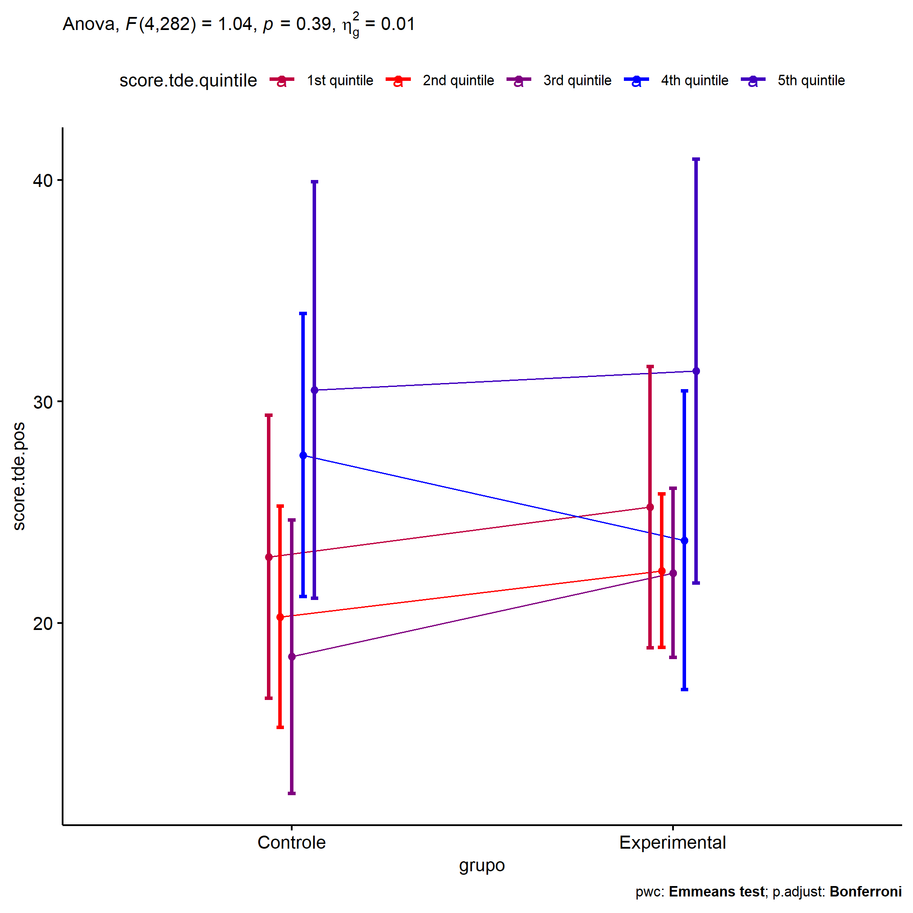<!-- -->

``` r
if (!is.null(plots[["score.tde.quintile"]]))
  plots[["score.tde.quintile"]] + ggplot2::scale_color_manual(values = color[["grupo"]])
```

    ## Scale for colour is already present.
    ## Adding another scale for colour, which will replace the existing scale.

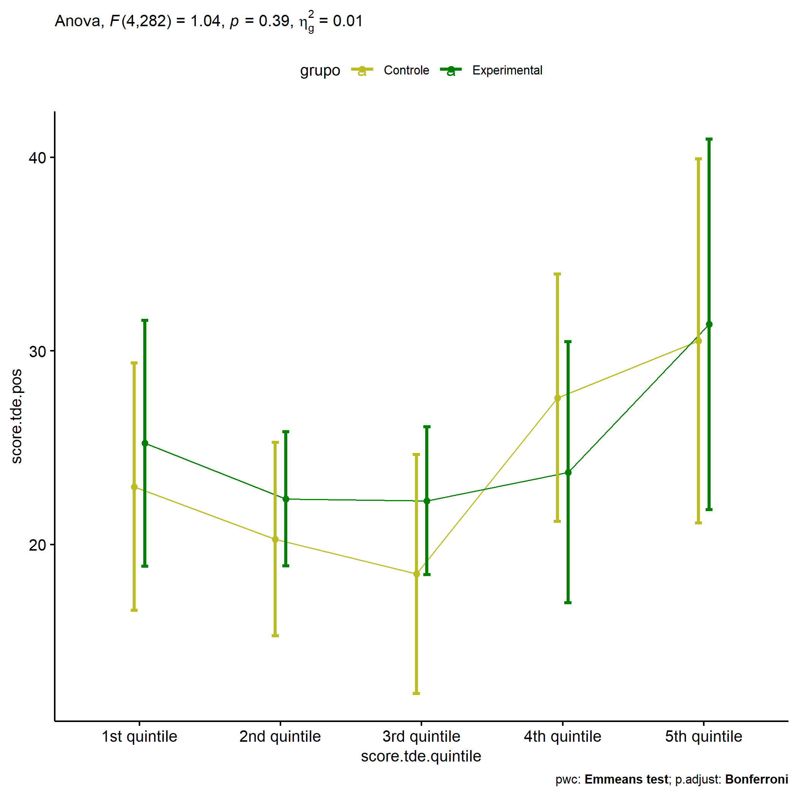<!-- -->

``` r
plots <- twoWayAncovaBoxPlots(
  wdat, "score.tde.pos", c("grupo","score.tde.quintile"), aov, pwcs, covar = "score.tde.pre",
  theme = "classic", color = color[["grupo:score.tde.quintile"]],
  subtitle = which(aov$Effect == "grupo:score.tde.quintile"))
```

``` r
plots[["grupo:score.tde.quintile"]] + ggplot2::ylab("TDE - Escrita") + ggplot2::scale_x_discrete(labels=c('pre', 'pos'))
```

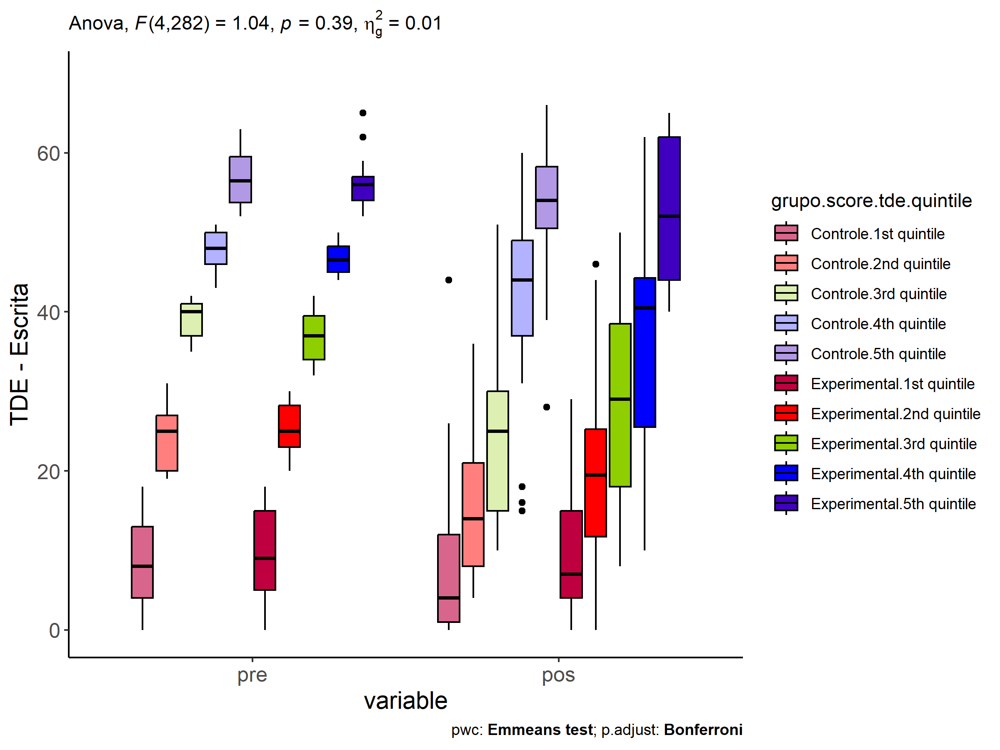<!-- -->

``` r
plots <- twoWayAncovaBoxPlots(
  wdat.long, "score.tde", c("grupo","score.tde.quintile"), aov, pwc.long, pre.post = "time",
  theme = "classic", color = color$prepost)
```

``` r
plots[["grupo:score.tde.quintile"]] + ggplot2::ylab("TDE - Escrita")
```

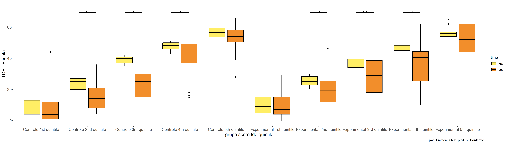<!-- -->

### Checking linearity assumption

``` r
ggscatter(wdat, x = "score.tde.pre", y = "score.tde.pos", size = 0.5,
          facet.by = c("grupo","score.tde.quintile"), add = "reg.line")+
  stat_regline_equation(
    aes(label =  paste(..eq.label.., ..rr.label.., sep = "~~~~"))
  )
```

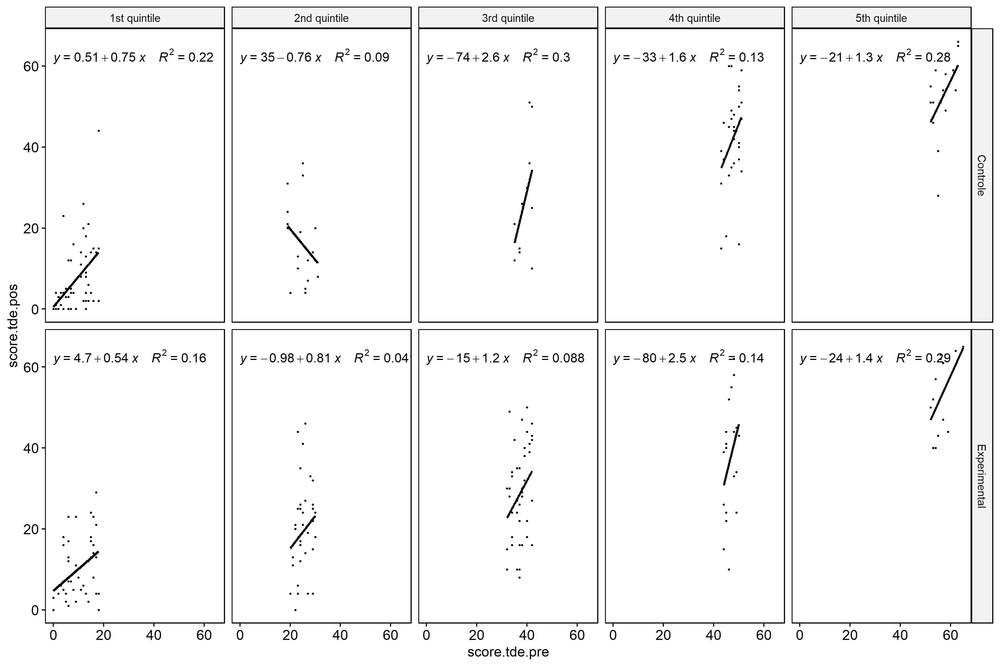<!-- -->

### Checking normality and homogeneity

``` r
res <- augment(lm(score.tde.pos ~ score.tde.pre + grupo*score.tde.quintile, data = wdat))
```

``` r
shapiro_test(res$.resid)
```

    ## # A tibble: 1 × 3
    ##   variable   statistic p.value
    ##   <chr>          <dbl>   <dbl>
    ## 1 res$.resid     0.994   0.323

``` r
levene_test(res, .resid ~ grupo*score.tde.quintile)
```

    ## # A tibble: 1 × 4
    ##     df1   df2 statistic       p
    ##   <int> <int>     <dbl>   <dbl>
    ## 1     9   283      3.13 0.00132

# Summary of Results

## Descriptive Statistics

``` r
df <- get.descriptives(ldat[["grupo"]], c(dv.pre, dv.pos), c("grupo"), 
                       include.global = T, symmetry.test = T, normality.test = F)
df <- plyr::rbind.fill(
  df, do.call(plyr::rbind.fill, lapply(lfatores2, FUN = function(f) {
    if (nrow(dat) > 0 && sum(!is.na(unique(dat[[f]]))) > 1)
      get.descriptives(ldat[[paste0("grupo:",f)]], c(dv.pre,dv.pos), c("grupo", f),
                       symmetry.test = T, normality.test = F)
    }))
)
(df <- df[,c(fatores1[fatores1 %in% colnames(df)],"variable",
             colnames(df)[!colnames(df) %in% c(fatores1,"variable")])])
```

    ##           grupo Sexo   Zona Cor.Raca score.tde.quintile      variable   n   mean median min max     sd    se
    ## 1      Controle <NA>   <NA>     <NA>               <NA> score.tde.pre 134 28.993   26.5   0  63 19.526 1.687
    ## 2  Experimental <NA>   <NA>     <NA>               <NA> score.tde.pre 159 29.000   29.0   0  65 15.950 1.265
    ## 3          <NA> <NA>   <NA>     <NA>               <NA> score.tde.pre 293 28.997   29.0   0  65 17.644 1.031
    ## 4      Controle <NA>   <NA>     <NA>               <NA> score.tde.pos 134 24.231   19.5   0  66 20.155 1.741
    ## 5  Experimental <NA>   <NA>     <NA>               <NA> score.tde.pos 159 24.094   22.0   0  65 16.759 1.329
    ## 6          <NA> <NA>   <NA>     <NA>               <NA> score.tde.pos 293 24.157   21.0   0  66 18.358 1.072
    ## 7      Controle    F   <NA>     <NA>               <NA> score.tde.pre  63 34.587   43.0   2  63 18.464 2.326
    ## 8      Controle    M   <NA>     <NA>               <NA> score.tde.pre  71 24.028   17.0   0  63 19.216 2.281
    ## 9  Experimental    F   <NA>     <NA>               <NA> score.tde.pre  83 31.494   34.0   0  59 15.421 1.693
    ## 10 Experimental    M   <NA>     <NA>               <NA> score.tde.pre  76 26.276   25.5   0  65 16.171 1.855
    ## 11     Controle    F   <NA>     <NA>               <NA> score.tde.pos  63 30.365   33.0   0  66 19.510 2.458
    ## 12     Controle    M   <NA>     <NA>               <NA> score.tde.pos  71 18.789   13.0   0  65 19.255 2.285
    ## 13 Experimental    F   <NA>     <NA>               <NA> score.tde.pos  83 25.494   22.0   0  63 17.274 1.896
    ## 14 Experimental    M   <NA>     <NA>               <NA> score.tde.pos  76 22.566   22.0   0  65 16.152 1.853
    ## 15     Controle <NA>  Rural     <NA>               <NA> score.tde.pre  97 29.907   27.0   0  63 19.677 1.998
    ## 16     Controle <NA> Urbana     <NA>               <NA> score.tde.pre  21 31.143   31.0   1  58 18.863 4.116
    ## 17 Experimental <NA>  Rural     <NA>               <NA> score.tde.pre  86 25.593   25.0   0  62 15.447 1.666
    ## 18 Experimental <NA> Urbana     <NA>               <NA> score.tde.pre  40 31.075   36.5   0  65 17.016 2.691
    ## 19     Controle <NA>  Rural     <NA>               <NA> score.tde.pos  97 25.979   21.0   0  66 20.748 2.107
    ## 20     Controle <NA> Urbana     <NA>               <NA> score.tde.pos  21 22.810   14.0   0  58 18.870 4.118
    ## 21 Experimental <NA>  Rural     <NA>               <NA> score.tde.pos  86 23.488   22.0   0  64 15.957 1.721
    ## 22 Experimental <NA> Urbana     <NA>               <NA> score.tde.pos  40 20.675   16.0   0  65 17.171 2.715
    ## 23     Controle <NA>   <NA>   Branca               <NA> score.tde.pre  17 35.000   43.0   2  62 20.616 5.000
    ## 24     Controle <NA>   <NA>    Parda               <NA> score.tde.pre  39 28.410   27.0   0  56 19.271 3.086
    ## 25 Experimental <NA>   <NA>   Branca               <NA> score.tde.pre  22 22.318   17.0   0  49 15.410 3.285
    ## 26 Experimental <NA>   <NA> Indígena               <NA> score.tde.pre  11 21.818   21.0   6  54 16.136 4.865
    ## 27 Experimental <NA>   <NA>    Parda               <NA> score.tde.pre  45 27.333   28.0   0  62 15.744 2.347
    ## 28     Controle <NA>   <NA>   Branca               <NA> score.tde.pos  17 27.647   36.0   0  59 22.136 5.369
    ## 29     Controle <NA>   <NA>    Parda               <NA> score.tde.pos  39 21.641   14.0   0  60 20.220 3.238
    ## 30 Experimental <NA>   <NA>   Branca               <NA> score.tde.pos  22 19.682   16.5   0  62 14.946 3.186
    ## 31 Experimental <NA>   <NA> Indígena               <NA> score.tde.pos  11 25.727   23.0   1  57 16.566 4.995
    ## 32 Experimental <NA>   <NA>    Parda               <NA> score.tde.pos  45 22.222   21.0   0  64 16.426 2.449
    ## 33     Controle <NA>   <NA>     <NA>       1st quintile score.tde.pre  55  8.727    8.0   0  18  5.345 0.721
    ## 34     Controle <NA>   <NA>     <NA>       2nd quintile score.tde.pre  17 24.235   25.0  19  31  3.993 0.968
    ## 35     Controle <NA>   <NA>     <NA>       3rd quintile score.tde.pre  13 38.846   40.0  35  42  2.794 0.775
    ## 36     Controle <NA>   <NA>     <NA>       4th quintile score.tde.pre  33 47.788   48.0  43  51  2.559 0.445
    ## 37     Controle <NA>   <NA>     <NA>       5th quintile score.tde.pre  16 56.938   56.5  52  63  3.820 0.955
    ## 38 Experimental <NA>   <NA>     <NA>       1st quintile score.tde.pre  47  9.234    9.0   0  18  5.760 0.840
    ## 39 Experimental <NA>   <NA>     <NA>       2nd quintile score.tde.pre  36 25.361   25.0  20  30  2.929 0.488
    ## 40 Experimental <NA>   <NA>     <NA>       3rd quintile score.tde.pre  43 37.116   37.0  32  42  3.064 0.467
    ## 41 Experimental <NA>   <NA>     <NA>       4th quintile score.tde.pre  20 46.750   46.5  44  50  2.074 0.464
    ## 42 Experimental <NA>   <NA>     <NA>       5th quintile score.tde.pre  13 56.385   56.0  52  65  3.754 1.041
    ## 43     Controle <NA>   <NA>     <NA>       1st quintile score.tde.pos  55  7.036    4.0   0  44  8.542 1.152
    ## 44     Controle <NA>   <NA>     <NA>       2nd quintile score.tde.pos  17 16.529   14.0   4  36 10.180 2.469
    ## 45     Controle <NA>   <NA>     <NA>       3rd quintile score.tde.pos  13 26.231   25.0  10  51 13.230 3.669
    ## 46     Controle <NA>   <NA>     <NA>       4th quintile score.tde.pos  33 42.364   44.0  15  60 11.261 1.960
    ## 47     Controle <NA>   <NA>     <NA>       5th quintile score.tde.pos  16 52.500   54.0  28  66  9.359 2.340
    ## 48 Experimental <NA>   <NA>     <NA>       1st quintile score.tde.pos  47  9.681    7.0   0  29  7.667 1.118
    ## 49 Experimental <NA>   <NA>     <NA>       2nd quintile score.tde.pos  36 19.500   19.5   0  46 11.732 1.955
    ## 50 Experimental <NA>   <NA>     <NA>       3rd quintile score.tde.pos  43 28.651   29.0   8  50 12.002 1.830
    ## 51 Experimental <NA>   <NA>     <NA>       4th quintile score.tde.pos  20 37.700   40.5  10  62 14.124 3.158
    ## 52 Experimental <NA>   <NA>     <NA>       5th quintile score.tde.pos  13 52.923   52.0  40  65  9.535 2.644
    ##        ci   iqr symmetry     skewness   kurtosis
    ## 1   3.336 36.00      YES  0.057165015 -1.5260501
    ## 2   2.498 24.50      YES -0.043488299 -0.9092704
    ## 3   2.029 32.00      YES  0.017873057 -1.2313348
    ## 4   3.444 40.00      YES  0.380996540 -1.2947188
    ## 5   2.625 26.00       NO  0.517561763 -0.6259342
    ## 6   2.111 32.00      YES  0.446329071 -0.9711107
    ## 7   4.650 32.50      YES -0.365981914 -1.3516186
    ## 8   4.548 34.50      YES  0.456537985 -1.2896634
    ## 9   3.367 26.00      YES -0.252409832 -0.9575149
    ## 10  3.695 23.25      YES  0.197203853 -0.7345861
    ## 11  4.914 34.50      YES -0.094353298 -1.4029532
    ## 12  4.558 26.00       NO  0.884893201 -0.5528080
    ## 13  3.772 28.00      YES  0.390820341 -0.9208427
    ## 14  3.691 22.50       NO  0.646855836 -0.2591813
    ## 15  3.966 36.00      YES -0.021109811 -1.5781201
    ## 16  8.587 34.00      YES -0.110964628 -1.5158114
    ## 17  3.312 22.00      YES  0.156988653 -0.8610396
    ## 18  5.442 25.75      YES -0.255111617 -0.9664980
    ## 19  4.182 40.00      YES  0.236265624 -1.4178568
    ## 20  8.589 33.00      YES  0.481874341 -1.2795805
    ## 21  3.421 21.00       NO  0.571809531 -0.4687000
    ## 22  5.492 28.50       NO  0.595700723 -0.7573109
    ## 23 10.600 36.00      YES -0.313319102 -1.5699511
    ## 24  6.247 38.00      YES -0.123044451 -1.6095737
    ## 25  6.832 25.25      YES  0.307411663 -1.3266269
    ## 26 10.840 25.50       NO  0.541455611 -1.0590887
    ## 27  4.730 21.00      YES -0.037326638 -0.7695535
    ## 28 11.381 41.00      YES -0.133556229 -1.7920112
    ## 29  6.555 34.00       NO  0.536626737 -1.2687010
    ## 30  6.626 13.50       NO  0.993581391  0.6949615
    ## 31 11.129 19.00      YES  0.467684020 -1.0064183
    ## 32  4.935 24.00       NO  0.622405001 -0.4468357
    ## 33  1.445  9.00      YES  0.051487216 -1.2973660
    ## 34  2.053  7.00      YES  0.008999052 -1.3375092
    ## 35  1.689  4.00      YES -0.235214418 -1.7083157
    ## 36  0.907  4.00      YES -0.432946652 -1.0240302
    ## 37  2.036  5.75      YES  0.280266812 -1.4086251
    ## 38  1.691 10.00      YES -0.001263134 -1.3478015
    ## 39  0.991  5.25      YES  0.117125884 -1.2566602
    ## 40  0.943  5.50      YES  0.009167589 -1.1209255
    ## 41  0.971  3.25      YES  0.115548077 -1.5715417
    ## 42  2.268  3.00       NO  0.935467860 -0.1903158
    ## 43  2.309 11.00       NO  1.885869707  4.5353049
    ## 44  5.234 13.00      YES  0.451637766 -1.0945563
    ## 45  7.995 15.00       NO  0.630282324 -0.8522878
    ## 46  3.993 12.00       NO -0.752942281  0.3253508
    ## 47  4.987  7.75       NO -0.939682749  0.7275403
    ## 48  2.251 11.00       NO  0.614389881 -0.6532804
    ## 49  3.969 13.50      YES  0.352307700 -0.5008856
    ## 50  3.694 20.50      YES -0.051899388 -1.0906156
    ## 51  6.610 18.75      YES -0.207033017 -0.9111277
    ## 52  5.762 18.00      YES -0.066668016 -1.7799686

| grupo        | Sexo | Zona   | Cor.Raca | score.tde.quintile | variable      |   n |   mean | median | min | max |     sd |    se |     ci |   iqr | symmetry | skewness | kurtosis |
|:-------------|:-----|:-------|:---------|:-------------------|:--------------|----:|-------:|-------:|----:|----:|-------:|------:|-------:|------:|:---------|---------:|---------:|
| Controle     |      |        |          |                    | score.tde.pre | 134 | 28.993 |   26.5 |   0 |  63 | 19.526 | 1.687 |  3.336 | 36.00 | YES      |    0.057 |   -1.526 |
| Experimental |      |        |          |                    | score.tde.pre | 159 | 29.000 |   29.0 |   0 |  65 | 15.950 | 1.265 |  2.498 | 24.50 | YES      |   -0.043 |   -0.909 |
|              |      |        |          |                    | score.tde.pre | 293 | 28.997 |   29.0 |   0 |  65 | 17.644 | 1.031 |  2.029 | 32.00 | YES      |    0.018 |   -1.231 |
| Controle     |      |        |          |                    | score.tde.pos | 134 | 24.231 |   19.5 |   0 |  66 | 20.155 | 1.741 |  3.444 | 40.00 | YES      |    0.381 |   -1.295 |
| Experimental |      |        |          |                    | score.tde.pos | 159 | 24.094 |   22.0 |   0 |  65 | 16.759 | 1.329 |  2.625 | 26.00 | NO       |    0.518 |   -0.626 |
|              |      |        |          |                    | score.tde.pos | 293 | 24.157 |   21.0 |   0 |  66 | 18.358 | 1.072 |  2.111 | 32.00 | YES      |    0.446 |   -0.971 |
| Controle     | F    |        |          |                    | score.tde.pre |  63 | 34.587 |   43.0 |   2 |  63 | 18.464 | 2.326 |  4.650 | 32.50 | YES      |   -0.366 |   -1.352 |
| Controle     | M    |        |          |                    | score.tde.pre |  71 | 24.028 |   17.0 |   0 |  63 | 19.216 | 2.281 |  4.548 | 34.50 | YES      |    0.457 |   -1.290 |
| Experimental | F    |        |          |                    | score.tde.pre |  83 | 31.494 |   34.0 |   0 |  59 | 15.421 | 1.693 |  3.367 | 26.00 | YES      |   -0.252 |   -0.958 |
| Experimental | M    |        |          |                    | score.tde.pre |  76 | 26.276 |   25.5 |   0 |  65 | 16.171 | 1.855 |  3.695 | 23.25 | YES      |    0.197 |   -0.735 |
| Controle     | F    |        |          |                    | score.tde.pos |  63 | 30.365 |   33.0 |   0 |  66 | 19.510 | 2.458 |  4.914 | 34.50 | YES      |   -0.094 |   -1.403 |
| Controle     | M    |        |          |                    | score.tde.pos |  71 | 18.789 |   13.0 |   0 |  65 | 19.255 | 2.285 |  4.558 | 26.00 | NO       |    0.885 |   -0.553 |
| Experimental | F    |        |          |                    | score.tde.pos |  83 | 25.494 |   22.0 |   0 |  63 | 17.274 | 1.896 |  3.772 | 28.00 | YES      |    0.391 |   -0.921 |
| Experimental | M    |        |          |                    | score.tde.pos |  76 | 22.566 |   22.0 |   0 |  65 | 16.152 | 1.853 |  3.691 | 22.50 | NO       |    0.647 |   -0.259 |
| Controle     |      | Rural  |          |                    | score.tde.pre |  97 | 29.907 |   27.0 |   0 |  63 | 19.677 | 1.998 |  3.966 | 36.00 | YES      |   -0.021 |   -1.578 |
| Controle     |      | Urbana |          |                    | score.tde.pre |  21 | 31.143 |   31.0 |   1 |  58 | 18.863 | 4.116 |  8.587 | 34.00 | YES      |   -0.111 |   -1.516 |
| Experimental |      | Rural  |          |                    | score.tde.pre |  86 | 25.593 |   25.0 |   0 |  62 | 15.447 | 1.666 |  3.312 | 22.00 | YES      |    0.157 |   -0.861 |
| Experimental |      | Urbana |          |                    | score.tde.pre |  40 | 31.075 |   36.5 |   0 |  65 | 17.016 | 2.691 |  5.442 | 25.75 | YES      |   -0.255 |   -0.966 |
| Controle     |      | Rural  |          |                    | score.tde.pos |  97 | 25.979 |   21.0 |   0 |  66 | 20.748 | 2.107 |  4.182 | 40.00 | YES      |    0.236 |   -1.418 |
| Controle     |      | Urbana |          |                    | score.tde.pos |  21 | 22.810 |   14.0 |   0 |  58 | 18.870 | 4.118 |  8.589 | 33.00 | YES      |    0.482 |   -1.280 |
| Experimental |      | Rural  |          |                    | score.tde.pos |  86 | 23.488 |   22.0 |   0 |  64 | 15.957 | 1.721 |  3.421 | 21.00 | NO       |    0.572 |   -0.469 |
| Experimental |      | Urbana |          |                    | score.tde.pos |  40 | 20.675 |   16.0 |   0 |  65 | 17.171 | 2.715 |  5.492 | 28.50 | NO       |    0.596 |   -0.757 |
| Controle     |      |        | Branca   |                    | score.tde.pre |  17 | 35.000 |   43.0 |   2 |  62 | 20.616 | 5.000 | 10.600 | 36.00 | YES      |   -0.313 |   -1.570 |
| Controle     |      |        | Parda    |                    | score.tde.pre |  39 | 28.410 |   27.0 |   0 |  56 | 19.271 | 3.086 |  6.247 | 38.00 | YES      |   -0.123 |   -1.610 |
| Experimental |      |        | Branca   |                    | score.tde.pre |  22 | 22.318 |   17.0 |   0 |  49 | 15.410 | 3.285 |  6.832 | 25.25 | YES      |    0.307 |   -1.327 |
| Experimental |      |        | Indígena |                    | score.tde.pre |  11 | 21.818 |   21.0 |   6 |  54 | 16.136 | 4.865 | 10.840 | 25.50 | NO       |    0.541 |   -1.059 |
| Experimental |      |        | Parda    |                    | score.tde.pre |  45 | 27.333 |   28.0 |   0 |  62 | 15.744 | 2.347 |  4.730 | 21.00 | YES      |   -0.037 |   -0.770 |
| Controle     |      |        | Branca   |                    | score.tde.pos |  17 | 27.647 |   36.0 |   0 |  59 | 22.136 | 5.369 | 11.381 | 41.00 | YES      |   -0.134 |   -1.792 |
| Controle     |      |        | Parda    |                    | score.tde.pos |  39 | 21.641 |   14.0 |   0 |  60 | 20.220 | 3.238 |  6.555 | 34.00 | NO       |    0.537 |   -1.269 |
| Experimental |      |        | Branca   |                    | score.tde.pos |  22 | 19.682 |   16.5 |   0 |  62 | 14.946 | 3.186 |  6.626 | 13.50 | NO       |    0.994 |    0.695 |
| Experimental |      |        | Indígena |                    | score.tde.pos |  11 | 25.727 |   23.0 |   1 |  57 | 16.566 | 4.995 | 11.129 | 19.00 | YES      |    0.468 |   -1.006 |
| Experimental |      |        | Parda    |                    | score.tde.pos |  45 | 22.222 |   21.0 |   0 |  64 | 16.426 | 2.449 |  4.935 | 24.00 | NO       |    0.622 |   -0.447 |
| Controle     |      |        |          | 1st quintile       | score.tde.pre |  55 |  8.727 |    8.0 |   0 |  18 |  5.345 | 0.721 |  1.445 |  9.00 | YES      |    0.051 |   -1.297 |
| Controle     |      |        |          | 2nd quintile       | score.tde.pre |  17 | 24.235 |   25.0 |  19 |  31 |  3.993 | 0.968 |  2.053 |  7.00 | YES      |    0.009 |   -1.338 |
| Controle     |      |        |          | 3rd quintile       | score.tde.pre |  13 | 38.846 |   40.0 |  35 |  42 |  2.794 | 0.775 |  1.689 |  4.00 | YES      |   -0.235 |   -1.708 |
| Controle     |      |        |          | 4th quintile       | score.tde.pre |  33 | 47.788 |   48.0 |  43 |  51 |  2.559 | 0.445 |  0.907 |  4.00 | YES      |   -0.433 |   -1.024 |
| Controle     |      |        |          | 5th quintile       | score.tde.pre |  16 | 56.938 |   56.5 |  52 |  63 |  3.820 | 0.955 |  2.036 |  5.75 | YES      |    0.280 |   -1.409 |
| Experimental |      |        |          | 1st quintile       | score.tde.pre |  47 |  9.234 |    9.0 |   0 |  18 |  5.760 | 0.840 |  1.691 | 10.00 | YES      |   -0.001 |   -1.348 |
| Experimental |      |        |          | 2nd quintile       | score.tde.pre |  36 | 25.361 |   25.0 |  20 |  30 |  2.929 | 0.488 |  0.991 |  5.25 | YES      |    0.117 |   -1.257 |
| Experimental |      |        |          | 3rd quintile       | score.tde.pre |  43 | 37.116 |   37.0 |  32 |  42 |  3.064 | 0.467 |  0.943 |  5.50 | YES      |    0.009 |   -1.121 |
| Experimental |      |        |          | 4th quintile       | score.tde.pre |  20 | 46.750 |   46.5 |  44 |  50 |  2.074 | 0.464 |  0.971 |  3.25 | YES      |    0.116 |   -1.572 |
| Experimental |      |        |          | 5th quintile       | score.tde.pre |  13 | 56.385 |   56.0 |  52 |  65 |  3.754 | 1.041 |  2.268 |  3.00 | NO       |    0.935 |   -0.190 |
| Controle     |      |        |          | 1st quintile       | score.tde.pos |  55 |  7.036 |    4.0 |   0 |  44 |  8.542 | 1.152 |  2.309 | 11.00 | NO       |    1.886 |    4.535 |
| Controle     |      |        |          | 2nd quintile       | score.tde.pos |  17 | 16.529 |   14.0 |   4 |  36 | 10.180 | 2.469 |  5.234 | 13.00 | YES      |    0.452 |   -1.095 |
| Controle     |      |        |          | 3rd quintile       | score.tde.pos |  13 | 26.231 |   25.0 |  10 |  51 | 13.230 | 3.669 |  7.995 | 15.00 | NO       |    0.630 |   -0.852 |
| Controle     |      |        |          | 4th quintile       | score.tde.pos |  33 | 42.364 |   44.0 |  15 |  60 | 11.261 | 1.960 |  3.993 | 12.00 | NO       |   -0.753 |    0.325 |
| Controle     |      |        |          | 5th quintile       | score.tde.pos |  16 | 52.500 |   54.0 |  28 |  66 |  9.359 | 2.340 |  4.987 |  7.75 | NO       |   -0.940 |    0.728 |
| Experimental |      |        |          | 1st quintile       | score.tde.pos |  47 |  9.681 |    7.0 |   0 |  29 |  7.667 | 1.118 |  2.251 | 11.00 | NO       |    0.614 |   -0.653 |
| Experimental |      |        |          | 2nd quintile       | score.tde.pos |  36 | 19.500 |   19.5 |   0 |  46 | 11.732 | 1.955 |  3.969 | 13.50 | YES      |    0.352 |   -0.501 |
| Experimental |      |        |          | 3rd quintile       | score.tde.pos |  43 | 28.651 |   29.0 |   8 |  50 | 12.002 | 1.830 |  3.694 | 20.50 | YES      |   -0.052 |   -1.091 |
| Experimental |      |        |          | 4th quintile       | score.tde.pos |  20 | 37.700 |   40.5 |  10 |  62 | 14.124 | 3.158 |  6.610 | 18.75 | YES      |   -0.207 |   -0.911 |
| Experimental |      |        |          | 5th quintile       | score.tde.pos |  13 | 52.923 |   52.0 |  40 |  65 |  9.535 | 2.644 |  5.762 | 18.00 | YES      |   -0.067 |   -1.780 |

## ANCOVA Table Comparison

``` r
df <- do.call(plyr::rbind.fill, laov)
(df <- df[!duplicated(df$Effect),])
```

    ##                      Effect DFn DFd       F        p p<.05      ges DFn' DFd'      F'       p' p<.05'     ges'
    ## 1                     grupo   1 290   0.014 9.06e-01       4.85e-05    1  290   0.014 9.06e-01        4.85e-05
    ## 2             score.tde.pre   1 290 635.737 4.55e-75     * 6.87e-01    1  290 635.737 4.55e-75      * 6.87e-01
    ## 4                grupo:Sexo   1 288   2.826 9.40e-02       1.00e-02    1  288   2.826 9.40e-02        1.00e-02
    ## 6                      Sexo   1 288   0.055 8.14e-01       1.92e-04    1  288   0.055 8.14e-01        1.92e-04
    ## 8                grupo:Zona   1 239   1.070 3.02e-01       4.00e-03    1  239   1.070 3.02e-01        4.00e-03
    ## 10                     Zona   1 239  16.101 8.04e-05     * 6.30e-02    1  239  16.101 8.04e-05      * 6.30e-02
    ## 11                 Cor.Raca   2 128   2.477 8.80e-02       3.70e-02    2  128   2.477 8.80e-02        3.70e-02
    ## 13           grupo:Cor.Raca   1 128   0.080 7.78e-01       6.25e-04    1  128   0.080 7.78e-01        6.25e-04
    ## 16 grupo:score.tde.quintile   4 282   1.039 3.87e-01       1.50e-02    4  282   1.039 3.87e-01        1.50e-02
    ## 18       score.tde.quintile   4 282   4.568 1.00e-03     * 6.10e-02    4  282   4.568 1.00e-03      * 6.10e-02

|     | Effect                   | DFn | DFd |       F |     p | p\<.05 |   ges | DFn’ | DFd’ |      F’ |    p’ | p\<.05’ |  ges’ |
|:----|:-------------------------|----:|----:|--------:|------:|:-------|------:|-----:|-----:|--------:|------:|:--------|------:|
| 1   | grupo                    |   1 | 290 |   0.014 | 0.906 |        | 0.000 |    1 |  290 |   0.014 | 0.906 |         | 0.000 |
| 2   | score.tde.pre            |   1 | 290 | 635.737 | 0.000 | \*     | 0.687 |    1 |  290 | 635.737 | 0.000 | \*      | 0.687 |
| 4   | grupo:Sexo               |   1 | 288 |   2.826 | 0.094 |        | 0.010 |    1 |  288 |   2.826 | 0.094 |         | 0.010 |
| 6   | Sexo                     |   1 | 288 |   0.055 | 0.814 |        | 0.000 |    1 |  288 |   0.055 | 0.814 |         | 0.000 |
| 8   | grupo:Zona               |   1 | 239 |   1.070 | 0.302 |        | 0.004 |    1 |  239 |   1.070 | 0.302 |         | 0.004 |
| 10  | Zona                     |   1 | 239 |  16.101 | 0.000 | \*     | 0.063 |    1 |  239 |  16.101 | 0.000 | \*      | 0.063 |
| 11  | Cor.Raca                 |   2 | 128 |   2.477 | 0.088 |        | 0.037 |    2 |  128 |   2.477 | 0.088 |         | 0.037 |
| 13  | grupo:Cor.Raca           |   1 | 128 |   0.080 | 0.778 |        | 0.001 |    1 |  128 |   0.080 | 0.778 |         | 0.001 |
| 16  | grupo:score.tde.quintile |   4 | 282 |   1.039 | 0.387 |        | 0.015 |    4 |  282 |   1.039 | 0.387 |         | 0.015 |
| 18  | score.tde.quintile       |   4 | 282 |   4.568 | 0.001 | \*     | 0.061 |    4 |  282 |   4.568 | 0.001 | \*      | 0.061 |

## PairWise Table Comparison

``` r
df <- do.call(plyr::rbind.fill, lpwc)
df <- df[,c(names(lfatores), names(df)[!names(df) %in% c(names(lfatores),"term",".y.")])]
```

| grupo        | Sexo | Zona   | Cor.Raca | score.tde.quintile | group1       | group2       |  df | statistic |     p | p.adj | p.adj.signif | df’ | statistic’ |    p’ | p.adj’ | p.adj.signif’ |
|:-------------|:-----|:-------|:---------|:-------------------|:-------------|:-------------|----:|----------:|------:|------:|:-------------|----:|-----------:|------:|-------:|:--------------|
| Controle     |      |        |          |                    | pre          | pos          | 582 |     2.161 | 0.031 | 0.031 | \*           | 582 |      2.161 | 0.031 |  0.031 | \*            |
| Experimental |      |        |          |                    | pre          | pos          | 582 |     2.425 | 0.016 | 0.016 | \*           | 582 |      2.425 | 0.016 |  0.016 | \*            |
|              |      |        |          |                    | Controle     | Experimental | 290 |     0.119 | 0.906 | 0.906 | ns           | 290 |      0.119 | 0.906 |  0.906 | ns            |
| Controle     | F    |        |          |                    | pre          | pos          | 578 |     1.344 | 0.179 | 0.179 | ns           | 578 |      1.344 | 0.179 |  0.179 | ns            |
| Controle     | M    |        |          |                    | pre          | pos          | 578 |     1.771 | 0.077 | 0.077 | ns           | 578 |      1.771 | 0.077 |  0.077 | ns            |
| Controle     |      |        |          |                    | F            | M            | 288 |     1.395 | 0.164 | 0.164 | ns           | 288 |      1.395 | 0.164 |  0.164 | ns            |
| Experimental | F    |        |          |                    | pre          | pos          | 578 |     2.192 | 0.029 | 0.029 | \*           | 578 |      2.192 | 0.029 |  0.029 | \*            |
| Experimental | M    |        |          |                    | pre          | pos          | 578 |     1.297 | 0.195 | 0.195 | ns           | 578 |      1.297 | 0.195 |  0.195 | ns            |
| Experimental |      |        |          |                    | F            | M            | 288 |    -0.935 | 0.351 | 0.351 | ns           | 288 |     -0.935 | 0.351 |  0.351 | ns            |
|              | F    |        |          |                    | Controle     | Experimental | 288 |     1.290 | 0.198 | 0.198 | ns           | 288 |      1.290 | 0.198 |  0.198 | ns            |
|              | M    |        |          |                    | Controle     | Experimental | 288 |    -1.089 | 0.277 | 0.277 | ns           | 288 |     -1.089 | 0.277 |  0.277 | ns            |
| Controle     |      |        |          |                    | Rural        | Urbana       | 239 |     1.700 | 0.090 | 0.090 | ns           | 239 |      1.700 | 0.090 |  0.090 | ns            |
| Controle     |      | Rural  |          |                    | pre          | pos          | 480 |     1.510 | 0.132 | 0.132 | ns           | 480 |      1.510 | 0.132 |  0.132 | ns            |
| Controle     |      | Urbana |          |                    | pre          | pos          | 480 |     1.491 | 0.137 | 0.137 | ns           | 480 |      1.491 | 0.137 |  0.137 | ns            |
| Experimental |      |        |          |                    | Rural        | Urbana       | 239 |     3.782 | 0.000 | 0.000 | \*\*\*       | 239 |      3.782 | 0.000 |  0.000 | \*\*\*        |
| Experimental |      | Rural  |          |                    | pre          | pos          | 480 |     0.762 | 0.446 | 0.446 | ns           | 480 |      0.762 | 0.446 |  0.446 | ns            |
| Experimental |      | Urbana |          |                    | pre          | pos          | 480 |     2.568 | 0.011 | 0.011 | \*           | 480 |      2.568 | 0.011 |  0.011 | \*            |
|              |      | Rural  |          |                    | Controle     | Experimental | 239 |    -0.790 | 0.430 | 0.430 | ns           | 239 |     -0.790 | 0.430 |  0.430 | ns            |
|              |      | Urbana |          |                    | Controle     | Experimental | 239 |     0.745 | 0.457 | 0.457 | ns           | 239 |      0.745 | 0.457 |  0.457 | ns            |
| Controle     |      |        | Branca   |                    | pre          | pos          | 258 |     1.202 | 0.231 | 0.231 | ns           | 258 |      1.202 | 0.231 |  0.231 | ns            |
| Controle     |      |        | Indígena |                    | pre          | pos          |     |           |       |       |              |     |            |       |        |               |
| Controle     |      |        |          |                    | Branca       | Indígena     |     |           |       |       |              |     |            |       |        |               |
| Controle     |      |        |          |                    | Branca       | Parda        | 128 |     0.149 | 0.882 | 0.882 | ns           | 128 |      0.149 | 0.882 |  0.882 | ns            |
| Controle     |      |        |          |                    | Indígena     | Parda        |     |           |       |       |              |     |            |       |        |               |
| Controle     |      |        | Parda    |                    | pre          | pos          | 258 |     1.676 | 0.095 | 0.095 | ns           | 258 |      1.676 | 0.095 |  0.095 | ns            |
| Experimental |      |        | Branca   |                    | pre          | pos          | 258 |     0.490 | 0.624 | 0.624 | ns           | 258 |      0.490 | 0.624 |  0.624 | ns            |
| Experimental |      |        | Indígena |                    | pre          | pos          | 258 |    -0.514 | 0.608 | 0.608 | ns           | 258 |     -0.514 | 0.608 |  0.608 | ns            |
| Experimental |      |        |          |                    | Branca       | Indígena     | 128 |    -1.624 | 0.107 | 0.320 | ns           | 128 |     -1.624 | 0.107 |  0.320 | ns            |
| Experimental |      |        |          |                    | Branca       | Parda        | 128 |     0.594 | 0.554 | 1.000 | ns           | 128 |      0.594 | 0.554 |  1.000 | ns            |
| Experimental |      |        |          |                    | Indígena     | Parda        | 128 |     2.237 | 0.027 | 0.081 | ns           | 128 |      2.237 | 0.027 |  0.081 | ns            |
| Experimental |      |        | Parda    |                    | pre          | pos          | 258 |     1.359 | 0.175 | 0.175 | ns           | 258 |      1.359 | 0.175 |  0.175 | ns            |
|              |      |        | Branca   |                    | Controle     | Experimental | 128 |    -0.758 | 0.450 | 0.450 | ns           | 128 |     -0.758 | 0.450 |  0.450 | ns            |
|              |      |        | Indígena |                    | Controle     | Experimental |     |           |       |       |              |     |            |       |        |               |
|              |      |        | Parda    |                    | Controle     | Experimental | 128 |    -0.630 | 0.530 | 0.530 | ns           | 128 |     -0.630 | 0.530 |  0.530 | ns            |
| Controle     |      |        |          | 1st quintile       | pre          | pos          | 566 |     1.107 | 0.269 | 0.269 | ns           | 566 |      1.107 | 0.269 |  0.269 | ns            |
| Controle     |      |        |          | 2nd quintile       | pre          | pos          | 566 |     2.805 | 0.005 | 0.005 | \*\*         | 566 |      2.805 | 0.005 |  0.005 | \*\*          |
| Controle     |      |        |          | 3rd quintile       | pre          | pos          | 566 |     4.015 | 0.000 | 0.000 | \*\*\*\*     | 566 |      4.015 | 0.000 |  0.000 | \*\*\*\*      |
| Controle     |      |        |          | 4th quintile       | pre          | pos          | 566 |     2.751 | 0.006 | 0.006 | \*\*         | 566 |      2.751 | 0.006 |  0.006 | \*\*          |
| Controle     |      |        |          | 5th quintile       | pre          | pos          | 566 |     1.567 | 0.118 | 0.118 | ns           | 566 |      1.567 | 0.118 |  0.118 | ns            |
| Controle     |      |        |          |                    | 1st quintile | 2nd quintile | 282 |     0.755 | 0.451 | 1.000 | ns           | 282 |      0.755 | 0.451 |  1.000 | ns            |
| Controle     |      |        |          |                    | 1st quintile | 3rd quintile | 282 |     0.839 | 0.402 | 1.000 | ns           | 282 |      0.839 | 0.402 |  1.000 | ns            |
| Controle     |      |        |          |                    | 1st quintile | 4th quintile | 282 |    -0.754 | 0.452 | 1.000 | ns           | 282 |     -0.754 | 0.452 |  1.000 | ns            |
| Controle     |      |        |          |                    | 1st quintile | 5th quintile | 282 |    -0.995 | 0.321 | 1.000 | ns           | 282 |     -0.995 | 0.321 |  1.000 | ns            |
| Controle     |      |        |          |                    | 2nd quintile | 3rd quintile | 282 |     0.420 | 0.675 | 1.000 | ns           | 282 |      0.420 | 0.675 |  1.000 | ns            |
| Controle     |      |        |          |                    | 2nd quintile | 4th quintile | 282 |    -1.603 | 0.110 | 1.000 | ns           | 282 |     -1.603 | 0.110 |  1.000 | ns            |
| Controle     |      |        |          |                    | 2nd quintile | 5th quintile | 282 |    -1.734 | 0.084 | 0.841 | ns           | 282 |     -1.734 | 0.084 |  0.841 | ns            |
| Controle     |      |        |          |                    | 3rd quintile | 4th quintile | 282 |    -2.568 | 0.011 | 0.107 | ns           | 282 |     -2.568 | 0.011 |  0.107 | ns            |
| Controle     |      |        |          |                    | 3rd quintile | 5th quintile | 282 |    -2.624 | 0.009 | 0.092 | ns           | 282 |     -2.624 | 0.009 |  0.092 | ns            |
| Controle     |      |        |          |                    | 4th quintile | 5th quintile | 282 |    -0.879 | 0.380 | 1.000 | ns           | 282 |     -0.879 | 0.380 |  1.000 | ns            |
| Experimental |      |        |          | 1st quintile       | pre          | pos          | 566 |    -0.270 | 0.787 | 0.787 | ns           | 566 |     -0.270 | 0.787 |  0.787 | ns            |
| Experimental |      |        |          | 2nd quintile       | pre          | pos          | 566 |     3.104 | 0.002 | 0.002 | \*\*         | 566 |      3.104 | 0.002 |  0.002 | \*\*          |
| Experimental |      |        |          | 3rd quintile       | pre          | pos          | 566 |     4.900 | 0.000 | 0.000 | \*\*\*\*     | 566 |      4.900 | 0.000 |  0.000 | \*\*\*\*      |
| Experimental |      |        |          | 4th quintile       | pre          | pos          | 566 |     3.573 | 0.000 | 0.000 | \*\*\*       | 566 |      3.573 | 0.000 |  0.000 | \*\*\*        |
| Experimental |      |        |          | 5th quintile       | pre          | pos          | 566 |     1.102 | 0.271 | 0.271 | ns           | 566 |      1.102 | 0.271 |  0.271 | ns            |
| Experimental |      |        |          |                    | 1st quintile | 2nd quintile | 282 |     0.887 | 0.376 | 1.000 | ns           | 282 |      0.887 | 0.376 |  1.000 | ns            |
| Experimental |      |        |          |                    | 1st quintile | 3rd quintile | 282 |     0.649 | 0.517 | 1.000 | ns           | 282 |      0.649 | 0.517 |  1.000 | ns            |
| Experimental |      |        |          |                    | 1st quintile | 4th quintile | 282 |     0.247 | 0.805 | 1.000 | ns           | 282 |      0.247 | 0.805 |  1.000 | ns            |
| Experimental |      |        |          |                    | 1st quintile | 5th quintile | 282 |    -0.814 | 0.416 | 1.000 | ns           | 282 |     -0.814 | 0.416 |  1.000 | ns            |
| Experimental |      |        |          |                    | 2nd quintile | 3rd quintile | 282 |     0.035 | 0.972 | 1.000 | ns           | 282 |      0.035 | 0.972 |  1.000 | ns            |
| Experimental |      |        |          |                    | 2nd quintile | 4th quintile | 282 |    -0.327 | 0.744 | 1.000 | ns           | 282 |     -0.327 | 0.744 |  1.000 | ns            |
| Experimental |      |        |          |                    | 2nd quintile | 5th quintile | 282 |    -1.620 | 0.106 | 1.000 | ns           | 282 |     -1.620 | 0.106 |  1.000 | ns            |
| Experimental |      |        |          |                    | 3rd quintile | 4th quintile | 282 |    -0.480 | 0.632 | 1.000 | ns           | 282 |     -0.480 | 0.632 |  1.000 | ns            |
| Experimental |      |        |          |                    | 3rd quintile | 5th quintile | 282 |    -2.148 | 0.033 | 0.326 | ns           | 282 |     -2.148 | 0.033 |  0.326 | ns            |
| Experimental |      |        |          |                    | 4th quintile | 5th quintile | 282 |    -1.986 | 0.048 | 0.480 | ns           | 282 |     -1.986 | 0.048 |  0.480 | ns            |
|              |      |        |          | 1st quintile       | Controle     | Experimental | 282 |    -1.123 | 0.263 | 0.263 | ns           | 282 |     -1.123 | 0.263 |  0.263 | ns            |
|              |      |        |          | 2nd quintile       | Controle     | Experimental | 282 |    -0.703 | 0.483 | 0.483 | ns           | 282 |     -0.703 | 0.483 |  0.483 | ns            |
|              |      |        |          | 3rd quintile       | Controle     | Experimental | 282 |    -1.184 | 0.238 | 0.238 | ns           | 282 |     -1.184 | 0.238 |  0.238 | ns            |
|              |      |        |          | 4th quintile       | Controle     | Experimental | 282 |     1.347 | 0.179 | 0.179 | ns           | 282 |      1.347 | 0.179 |  0.179 | ns            |
|              |      |        |          | 5th quintile       | Controle     | Experimental | 282 |    -0.228 | 0.820 | 0.820 | ns           | 282 |     -0.228 | 0.820 |  0.820 | ns            |

## EMMS Table Comparison

``` r
df <- do.call(plyr::rbind.fill, lemms)
df[["N-N'"]] <- df[["N"]] - df[["N'"]]
df <- df[,c(names(lfatores), names(df)[!names(df) %in% names(lfatores)])]
```

| grupo        | Sexo | Zona   | Cor.Raca | score.tde.quintile |   N | M (pre) | SE (pre) | M (unadj) | SE (unadj) | M (adj) | SE (adj) |  N’ | M (pre)’ | SE (pre)’ | M (unadj)’ | SE (unadj)’ | M (adj)’ | SE (adj)’ | N-N’ |
|:-------------|:-----|:-------|:---------|:-------------------|----:|--------:|---------:|----------:|-----------:|--------:|---------:|----:|---------:|----------:|-----------:|------------:|---------:|----------:|-----:|
| Controle     |      |        |          |                    | 134 |  28.993 |    1.687 |    24.231 |      1.741 |  24.235 |    0.891 | 134 |   28.993 |     1.687 |     24.231 |       1.741 |   24.235 |     0.891 |    0 |
| Experimental |      |        |          |                    | 159 |  29.000 |    1.265 |    24.094 |      1.329 |  24.091 |    0.818 | 159 |   29.000 |     1.265 |     24.094 |       1.329 |   24.091 |     0.818 |    0 |
| Controle     | F    |        |          |                    |  63 |  34.587 |    2.326 |    30.365 |      2.458 |  25.580 |    1.312 |  63 |   34.587 |     2.326 |     30.365 |       2.458 |   25.580 |     1.312 |    0 |
| Controle     | M    |        |          |                    |  71 |  24.028 |    2.281 |    18.789 |      2.285 |  23.041 |    1.234 |  71 |   24.028 |     2.281 |     18.789 |       2.285 |   23.041 |     1.234 |    0 |
| Experimental | F    |        |          |                    |  83 |  31.494 |    1.693 |    25.494 |      1.896 |  23.357 |    1.133 |  83 |   31.494 |     1.693 |     25.494 |       1.896 |   23.357 |     1.133 |    0 |
| Experimental | M    |        |          |                    |  76 |  26.276 |    1.855 |    22.566 |      1.853 |  24.894 |    1.185 |  76 |   26.276 |     1.855 |     22.566 |       1.853 |   24.894 |     1.185 |    0 |
| Controle     |      | Rural  |          |                    |  97 |  29.907 |    1.998 |    25.979 |      2.107 |  24.928 |    1.051 |  97 |   29.907 |     1.998 |     25.979 |       2.107 |   24.928 |     1.051 |    0 |
| Controle     |      | Urbana |          |                    |  21 |  31.143 |    4.116 |    22.810 |      4.118 |  20.697 |    2.258 |  21 |   31.143 |     4.116 |     22.810 |       4.118 |   20.697 |     2.258 |    0 |
| Experimental |      | Rural  |          |                    |  86 |  25.593 |    1.666 |    23.488 |      1.721 |  26.145 |    1.121 |  86 |   25.593 |     1.666 |     23.488 |       1.721 |   26.145 |     1.121 |    0 |
| Experimental |      | Urbana |          |                    |  40 |  31.075 |    2.691 |    20.675 |      2.715 |  18.620 |    1.637 |  40 |   31.075 |     2.691 |     20.675 |       2.715 |   18.620 |     1.637 |    0 |
| Controle     |      |        | Branca   |                    |  17 |  35.000 |    5.000 |    27.647 |      5.369 |  21.215 |    2.647 |  17 |   35.000 |     5.000 |     27.647 |       5.369 |   21.215 |     2.647 |    0 |
| Controle     |      |        | Parda    |                    |  39 |  28.410 |    3.086 |    21.641 |      3.238 |  20.745 |    1.727 |  39 |   28.410 |     3.086 |     21.641 |       3.238 |   20.745 |     1.727 |    0 |
| Experimental |      |        | Branca   |                    |  22 |  22.318 |    3.285 |    19.682 |      3.186 |  23.903 |    2.314 |  22 |   22.318 |     3.285 |     19.682 |       3.186 |   23.903 |     2.314 |    0 |
| Experimental |      |        | Indígena |                    |  11 |  21.818 |    4.865 |    25.727 |      4.995 |  30.369 |    3.264 |  11 |   21.818 |     4.865 |     25.727 |       4.995 |   30.369 |     3.264 |    0 |
| Experimental |      |        | Parda    |                    |  45 |  27.333 |    2.347 |    22.222 |      2.449 |  22.231 |    1.607 |  45 |   27.333 |     2.347 |     22.222 |       2.449 |   22.231 |     1.607 |    0 |
| Controle     |      |        |          | 1st quintile       |  55 |   8.727 |    0.721 |     7.036 |      1.152 |  22.985 |    3.244 |  55 |    8.727 |     0.721 |      7.036 |       1.152 |   22.985 |     3.244 |    0 |
| Controle     |      |        |          | 2nd quintile       |  17 |  24.235 |    0.968 |    16.529 |      2.469 |  20.276 |    2.537 |  17 |   24.235 |     0.968 |     16.529 |       2.469 |   20.276 |     2.537 |    0 |
| Controle     |      |        |          | 3rd quintile       |  13 |  38.846 |    0.775 |    26.231 |      3.669 |  18.481 |    3.137 |  13 |   38.846 |     0.775 |     26.231 |       3.669 |   18.481 |     3.137 |    0 |
| Controle     |      |        |          | 4th quintile       |  33 |  47.788 |    0.445 |    42.364 |      1.960 |  27.578 |    3.245 |  33 |   47.788 |     0.445 |     42.364 |       1.960 |   27.578 |     3.245 |    0 |
| Controle     |      |        |          | 5th quintile       |  16 |  56.938 |    0.955 |    52.500 |      2.340 |  30.515 |    4.778 |  16 |   56.938 |     0.955 |     52.500 |       2.340 |   30.515 |     4.778 |    0 |
| Experimental |      |        |          | 1st quintile       |  47 |   9.234 |    0.840 |     9.681 |      1.118 |  25.231 |    3.226 |  47 |    9.234 |     0.840 |      9.681 |       1.118 |   25.231 |     3.226 |    0 |
| Experimental |      |        |          | 2nd quintile       |  36 |  25.361 |    0.488 |    19.500 |      1.955 |  22.361 |    1.758 |  36 |   25.361 |     0.488 |     19.500 |       1.955 |   22.361 |     1.758 |    0 |
| Experimental |      |        |          | 3rd quintile       |  43 |  37.116 |    0.467 |    28.651 |      1.830 |  22.262 |    1.936 |  43 |   37.116 |     0.467 |     28.651 |       1.830 |   22.262 |     1.936 |    0 |
| Experimental |      |        |          | 4th quintile       |  20 |  46.750 |    0.464 |    37.700 |      3.158 |  23.731 |    3.424 |  20 |   46.750 |     0.464 |     37.700 |       3.158 |   23.731 |     3.424 |    0 |
| Experimental |      |        |          | 5th quintile       |  13 |  56.385 |    1.041 |    52.923 |      2.644 |  31.373 |    4.862 |  13 |   56.385 |     1.041 |     52.923 |       2.644 |   31.373 |     4.862 |    0 |
