ANCOVA in TDE - Escrita (TDE - Escrita)
================
Geiser C. Challco <geiser@alumni.usp.br>

- [Descriptive Statistics of Initial
  Data](#descriptive-statistics-of-initial-data)
- [ANCOVA and Pairwise for one factor:
  **grupo**](#ancova-and-pairwise-for-one-factor-grupo)
  - [Without remove non-normal data](#without-remove-non-normal-data)
  - [Computing ANCOVA and PairWise After removing non-normal data
    (OK)](#computing-ancova-and-pairwise-after-removing-non-normal-data-ok)
    - [Plots for ancova](#plots-for-ancova)
    - [Checking linearity assumption](#checking-linearity-assumption)
    - [Checking normality and
      homogeneity](#checking-normality-and-homogeneity)
- [ANCOVA and Pairwise for two factors
  **grupo:Sexo**](#ancova-and-pairwise-for-two-factors-gruposexo)
  - [Without remove non-normal data](#without-remove-non-normal-data-1)
  - [Computing ANCOVA and PairWise After removing non-normal data
    (OK)](#computing-ancova-and-pairwise-after-removing-non-normal-data-ok-1)
    - [Plots for ancova](#plots-for-ancova-1)
    - [Checking linearity assumption](#checking-linearity-assumption-1)
    - [Checking normality and
      homogeneity](#checking-normality-and-homogeneity-1)
- [ANCOVA and Pairwise for two factors
  **grupo:Zona**](#ancova-and-pairwise-for-two-factors-grupozona)
  - [Without remove non-normal data](#without-remove-non-normal-data-2)
  - [Computing ANCOVA and PairWise After removing non-normal data
    (OK)](#computing-ancova-and-pairwise-after-removing-non-normal-data-ok-2)
    - [Plots for ancova](#plots-for-ancova-2)
    - [Checking linearity assumption](#checking-linearity-assumption-2)
    - [Checking normality and
      homogeneity](#checking-normality-and-homogeneity-2)
- [ANCOVA and Pairwise for two factors
  **grupo:Cor.Raca**](#ancova-and-pairwise-for-two-factors-grupocorraca)
  - [Without remove non-normal data](#without-remove-non-normal-data-3)
  - [Computing ANCOVA and PairWise After removing non-normal data
    (OK)](#computing-ancova-and-pairwise-after-removing-non-normal-data-ok-3)
    - [Plots for ancova](#plots-for-ancova-3)
    - [Checking linearity assumption](#checking-linearity-assumption-3)
    - [Checking normality and
      homogeneity](#checking-normality-and-homogeneity-3)
- [ANCOVA and Pairwise for two factors
  **grupo:score.tde.quintile**](#ancova-and-pairwise-for-two-factors-gruposcoretdequintile)
  - [Without remove non-normal data](#without-remove-non-normal-data-4)
  - [Computing ANCOVA and PairWise After removing non-normal data
    (OK)](#computing-ancova-and-pairwise-after-removing-non-normal-data-ok-4)
    - [Plots for ancova](#plots-for-ancova-4)
    - [Checking linearity assumption](#checking-linearity-assumption-4)
    - [Checking normality and
      homogeneity](#checking-normality-and-homogeneity-4)
- [Summary of Results](#summary-of-results)
  - [Descriptive Statistics](#descriptive-statistics)
  - [ANCOVA Table Comparison](#ancova-table-comparison)
  - [PairWise Table Comparison](#pairwise-table-comparison)
  - [EMMS Table Comparison](#emms-table-comparison)

**NOTE**:

- Teste ANCOVA para determinar se houve diferenças significativas no
  TDE - Escrita (medido usando pre- e pos-testes).
- ANCOVA test to determine whether there were significant differences in
  TDE - Escrita (measured using pre- and post-tests).

# Descriptive Statistics of Initial Data

``` r
df <- get.descriptives(dat, c(dv.pre, dv.pos), c("grupo"), 
                       include.global = T, symmetry.test = T, normality.test = F)
df <- plyr::rbind.fill(
  df, do.call(plyr::rbind.fill, lapply(lfatores2, FUN = function(f) {
    if (nrow(dat) > 0 && sum(!is.na(unique(dat[[f]]))) > 1)
      get.descriptives(dat, c(dv.pre,dv.pos), c("grupo", f),
                       symmetry.test = T, normality.test = F)
    }))
)
```

    ## Warning: There was 1 warning in `mutate()`.
    ## ℹ In argument: `ci = abs(stats::qt(alpha/2, .data$n - 1) * .data$se)`.
    ## Caused by warning:
    ## ! There was 1 warning in `mutate()`.
    ## ℹ In argument: `ci = abs(stats::qt(alpha/2, .data$n - 1) * .data$se)`.
    ## Caused by warning in `stats::qt()`:
    ## ! NaNs produced
    ## There was 1 warning in `mutate()`.
    ## ℹ In argument: `ci = abs(stats::qt(alpha/2, .data$n - 1) * .data$se)`.
    ## Caused by warning:
    ## ! There was 1 warning in `mutate()`.
    ## ℹ In argument: `ci = abs(stats::qt(alpha/2, .data$n - 1) * .data$se)`.
    ## Caused by warning in `stats::qt()`:
    ## ! NaNs produced

``` r
(df <- df[,c(fatores1[fatores1 %in% colnames(df)],"variable",
             colnames(df)[!colnames(df) %in% c(fatores1,"variable")])])
```

    ##           grupo Sexo   Zona Cor.Raca score.tde.quintile      variable   n   mean median min max     sd    se
    ## 1      Controle <NA>   <NA>     <NA>               <NA> score.tde.pre 141 34.716   41.0   0  69 17.842 1.503
    ## 2  Experimental <NA>   <NA>     <NA>               <NA> score.tde.pre 187 36.540   38.0   0  68 14.891 1.089
    ## 3          <NA> <NA>   <NA>     <NA>               <NA> score.tde.pre 328 35.756   38.0   0  69 16.225 0.896
    ## 4      Controle <NA>   <NA>     <NA>               <NA> score.tde.pos 141 28.362   22.0   0  72 20.646 1.739
    ## 5  Experimental <NA>   <NA>     <NA>               <NA> score.tde.pos 187 33.524   36.0   0  69 17.147 1.254
    ## 6          <NA> <NA>   <NA>     <NA>               <NA> score.tde.pos 328 31.305   30.0   0  72 18.875 1.042
    ## 7      Controle    F   <NA>     <NA>               <NA> score.tde.pre  80 37.675   42.0   0  65 16.826 1.881
    ## 8      Controle    M   <NA>     <NA>               <NA> score.tde.pre  61 30.836   31.0   0  69 18.521 2.371
    ## 9  Experimental    F   <NA>     <NA>               <NA> score.tde.pre  88 37.841   39.0   0  68 13.887 1.480
    ## 10 Experimental    M   <NA>     <NA>               <NA> score.tde.pre  99 35.384   35.0   6  65 15.710 1.579
    ## 11     Controle    F   <NA>     <NA>               <NA> score.tde.pos  80 30.262   25.5   0  72 20.809 2.326
    ## 12     Controle    M   <NA>     <NA>               <NA> score.tde.pos  61 25.869   21.0   0  68 20.330 2.603
    ## 13 Experimental    F   <NA>     <NA>               <NA> score.tde.pos  88 36.227   39.0   0  67 16.312 1.739
    ## 14 Experimental    M   <NA>     <NA>               <NA> score.tde.pos  99 31.121   33.0   0  69 17.590 1.768
    ## 15     Controle <NA>  Rural     <NA>               <NA> score.tde.pre  69 33.739   42.0   0  69 19.266 2.319
    ## 16     Controle <NA> Urbana     <NA>               <NA> score.tde.pre  55 36.036   38.0   1  64 15.821 2.133
    ## 17     Controle <NA>   <NA>     <NA>               <NA> score.tde.pre  17 34.412   33.0   6  60 18.788 4.557
    ## 18 Experimental <NA>  Rural     <NA>               <NA> score.tde.pre  87 35.287   35.0   8  68 14.454 1.550
    ## 19 Experimental <NA> Urbana     <NA>               <NA> score.tde.pre  75 38.280   41.0   0  65 15.835 1.828
    ## 20 Experimental <NA>   <NA>     <NA>               <NA> score.tde.pre  25 35.680   37.0  14  58 13.450 2.690
    ## 21     Controle <NA>  Rural     <NA>               <NA> score.tde.pos  69 33.971   31.0   0  72 22.239 2.677
    ## 22     Controle <NA> Urbana     <NA>               <NA> score.tde.pos  55 22.745   18.0   0  58 17.607 2.374
    ## 23     Controle <NA>   <NA>     <NA>               <NA> score.tde.pos  17 23.765   22.0   0  56 17.747 4.304
    ## 24 Experimental <NA>  Rural     <NA>               <NA> score.tde.pos  87 33.391   32.0   0  67 17.220 1.846
    ## 25 Experimental <NA> Urbana     <NA>               <NA> score.tde.pos  75 33.920   38.0   0  67 16.991 1.962
    ## 26 Experimental <NA>   <NA>     <NA>               <NA> score.tde.pos  25 32.800   39.0   3  69 18.023 3.605
    ## 27     Controle <NA>   <NA>   Branca               <NA> score.tde.pre  21 39.095   45.0   7  52 13.160 2.872
    ## 28     Controle <NA>   <NA> Indígena               <NA> score.tde.pre   6 40.833   44.0  16  53 12.891 5.263
    ## 29     Controle <NA>   <NA>    Parda               <NA> score.tde.pre  39 33.051   37.0   0  64 19.530 3.127
    ## 30     Controle <NA>   <NA>     <NA>               <NA> score.tde.pre  75 33.867   33.0   0  69 18.376 2.122
    ## 31 Experimental <NA>   <NA>   Branca               <NA> score.tde.pre  10 33.400   33.0  13  62 14.447 4.568
    ## 32 Experimental <NA>   <NA> Indígena               <NA> score.tde.pre   1 32.000   32.0  32  32     NA    NA
    ## 33 Experimental <NA>   <NA>    Parda               <NA> score.tde.pre  45 34.378   32.0   8  64 14.587 2.175
    ## 34 Experimental <NA>   <NA>     <NA>               <NA> score.tde.pre 131 37.557   40.0   0  68 15.074 1.317
    ## 35     Controle <NA>   <NA>   Branca               <NA> score.tde.pos  21 28.190   26.0   0  59 16.204 3.536
    ## 36     Controle <NA>   <NA> Indígena               <NA> score.tde.pos   6 45.000   50.5  16  63 18.011 7.353
    ## 37     Controle <NA>   <NA>    Parda               <NA> score.tde.pos  39 25.897   20.0   0  61 20.803 3.331
    ## 38     Controle <NA>   <NA>     <NA>               <NA> score.tde.pos  75 28.360   22.0   0  72 21.579 2.492
    ## 39 Experimental <NA>   <NA>   Branca               <NA> score.tde.pos  10 36.000   37.5  18  63 14.087 4.455
    ## 40 Experimental <NA>   <NA> Indígena               <NA> score.tde.pos   1 19.000   19.0  19  19     NA    NA
    ## 41 Experimental <NA>   <NA>    Parda               <NA> score.tde.pos  45 30.089   29.0   0  67 18.918 2.820
    ## 42 Experimental <NA>   <NA>     <NA>               <NA> score.tde.pos 131 34.626   38.0   0  69 16.685 1.458
    ## 43     Controle <NA>   <NA>     <NA>       1st quintile score.tde.pre  34 10.176   11.0   0  18  5.589 0.959
    ## 44     Controle <NA>   <NA>     <NA>       2nd quintile score.tde.pre  25 23.800   24.0  19  31  3.416 0.683
    ## 45     Controle <NA>   <NA>     <NA>       3rd quintile score.tde.pre  17 38.059   38.0  32  42  3.491 0.847
    ## 46     Controle <NA>   <NA>     <NA>       4th quintile score.tde.pre  42 47.000   47.0  43  51  2.295 0.354
    ## 47     Controle <NA>   <NA>     <NA>       5th quintile score.tde.pre  23 57.957   57.0  52  69  4.477 0.934
    ## 48 Experimental <NA>   <NA>     <NA>       1st quintile score.tde.pre  26 11.885   11.5   0  18  4.546 0.892
    ## 49 Experimental <NA>   <NA>     <NA>       2nd quintile score.tde.pre  41 25.512   25.0  19  31  3.854 0.602
    ## 50 Experimental <NA>   <NA>     <NA>       3rd quintile score.tde.pre  47 37.043   37.0  32  42  3.257 0.475
    ## 51 Experimental <NA>   <NA>     <NA>       4th quintile score.tde.pre  43 46.488   47.0  43  51  2.539 0.387
    ## 52 Experimental <NA>   <NA>     <NA>       5th quintile score.tde.pre  30 57.933   57.0  52  68  4.502 0.822
    ## 53     Controle <NA>   <NA>     <NA>       1st quintile score.tde.pos  34  8.559    8.5   0  24  7.178 1.231
    ## 54     Controle <NA>   <NA>     <NA>       2nd quintile score.tde.pos  25 19.240   15.0   0  66 16.893 3.379
    ## 55     Controle <NA>   <NA>     <NA>       3rd quintile score.tde.pos  17 22.882   18.0   2  62 17.201 4.172
    ##        ci   iqr symmetry      skewness   kurtosis
    ## 1   2.971 29.00      YES -0.2651609716 -1.1617278
    ## 2   2.148 21.50      YES -0.1952660057 -0.6819010
    ## 3   1.762 25.00      YES -0.2676876681 -0.8649150
    ## 4   3.437 37.00      YES  0.3789194909 -1.1902259
    ## 5   2.474 27.50      YES -0.0631590372 -0.9335770
    ## 6   2.050 32.00      YES  0.1116436990 -1.1161165
    ## 7   3.744 24.25      YES -0.4838400140 -0.7986260
    ## 8   4.744 33.00      YES  0.0376729100 -1.3971839
    ## 9   2.942 18.50      YES -0.2440189512 -0.4073055
    ## 10  3.133 22.50      YES -0.1164096619 -0.9174175
    ## 11  4.631 38.50      YES  0.2915278184 -1.3204860
    ## 12  5.207 32.00      YES  0.4893443901 -1.0419470
    ## 13  3.456 23.50      YES -0.2231943939 -0.8094194
    ## 14  3.508 28.00      YES  0.1042859074 -0.9801644
    ## 15  4.628 34.00      YES -0.2360185774 -1.3673339
    ## 16  4.277 22.00      YES -0.3094174200 -0.7513330
    ## 17  9.660 34.00      YES -0.0261216773 -1.7698693
    ## 18  3.081 20.50      YES -0.0433160806 -0.7949300
    ## 19  3.643 21.00      YES -0.4041276132 -0.5144033
    ## 20  5.552 22.00      YES -0.1181345692 -1.2258867
    ## 21  5.342 40.00      YES -0.0099694607 -1.4109761
    ## 22  4.760 21.50       NO  0.6766193321 -0.8027399
    ## 23  9.124 17.00       NO  0.6257441312 -0.9417708
    ## 24  3.670 27.50      YES  0.1353769547 -0.9606952
    ## 25  3.909 24.00      YES -0.3336250696 -0.8766655
    ## 26  7.440 29.00      YES  0.0329099879 -1.2089100
    ## 27  5.990 13.00       NO -1.1042145773 -0.1356162
    ## 28 13.528  5.50       NO -1.0223828675 -0.5590675
    ## 29  6.331 36.50      YES -0.2542660559 -1.4695043
    ## 30  4.228 28.50      YES -0.0001253874 -1.2252849
    ## 31 10.335 16.00      YES  0.4266122953 -0.8200641
    ## 32    NaN  0.00 few data  0.0000000000  0.0000000
    ## 33  4.382 24.00      YES  0.2110407083 -0.9120457
    ## 34  2.606 19.00      YES -0.3875699954 -0.5344573
    ## 35  7.376 28.00      YES  0.3264130598 -1.0428609
    ## 36 18.901 21.75       NO -0.5177309294 -1.5876959
    ## 37  6.744 40.00      YES  0.4161357706 -1.4442028
    ## 38  4.965 37.50      YES  0.4372159985 -1.1436058
    ## 39 10.077 19.00      YES  0.2672158311 -0.9946317
    ## 40    NaN  0.00 few data  0.0000000000  0.0000000
    ## 41  5.684 28.00      YES  0.2375424639 -0.9496884
    ## 42  2.884 27.50      YES -0.1732843184 -0.9625513
    ## 43  1.950  8.00      YES -0.2374946779 -1.1210210
    ## 44  1.410  5.00      YES  0.1577946769 -1.1122717
    ## 45  1.795  6.00      YES -0.3449693920 -1.4650201
    ## 46  0.715  2.75      YES  0.1299540454 -0.8691027
    ## 47  1.936  5.50       NO  0.6233448601 -0.4000403
    ## 48  1.836  6.00      YES -0.4683905381 -0.3138723
    ## 49  1.217  6.00      YES -0.2187748143 -1.2283839
    ## 50  0.956  6.00      YES -0.0482205945 -1.2472626
    ## 51  0.781  4.50      YES  0.1922771073 -1.3016138
    ## 52  1.681  8.00      YES  0.3468087644 -1.0981450
    ## 53  2.505 12.00      YES  0.3397399499 -1.1179213
    ## 54  6.973 14.00       NO  1.4221152000  1.3873383
    ## 55  8.844 20.00       NO  0.7945990988 -0.5928933
    ##  [ reached 'max' / getOption("max.print") -- omitted 7 rows ]

| grupo        | Sexo | Zona   | Cor.Raca | score.tde.quintile | variable      |   n |   mean | median | min | max |     sd |    se |     ci |   iqr | symmetry | skewness | kurtosis |
|:-------------|:-----|:-------|:---------|:-------------------|:--------------|----:|-------:|-------:|----:|----:|-------:|------:|-------:|------:|:---------|---------:|---------:|
| Controle     |      |        |          |                    | score.tde.pre | 141 | 34.716 |   41.0 |   0 |  69 | 17.842 | 1.503 |  2.971 | 29.00 | YES      |   -0.265 |   -1.162 |
| Experimental |      |        |          |                    | score.tde.pre | 187 | 36.540 |   38.0 |   0 |  68 | 14.891 | 1.089 |  2.148 | 21.50 | YES      |   -0.195 |   -0.682 |
|              |      |        |          |                    | score.tde.pre | 328 | 35.756 |   38.0 |   0 |  69 | 16.225 | 0.896 |  1.762 | 25.00 | YES      |   -0.268 |   -0.865 |
| Controle     |      |        |          |                    | score.tde.pos | 141 | 28.362 |   22.0 |   0 |  72 | 20.646 | 1.739 |  3.437 | 37.00 | YES      |    0.379 |   -1.190 |
| Experimental |      |        |          |                    | score.tde.pos | 187 | 33.524 |   36.0 |   0 |  69 | 17.147 | 1.254 |  2.474 | 27.50 | YES      |   -0.063 |   -0.934 |
|              |      |        |          |                    | score.tde.pos | 328 | 31.305 |   30.0 |   0 |  72 | 18.875 | 1.042 |  2.050 | 32.00 | YES      |    0.112 |   -1.116 |
| Controle     | F    |        |          |                    | score.tde.pre |  80 | 37.675 |   42.0 |   0 |  65 | 16.826 | 1.881 |  3.744 | 24.25 | YES      |   -0.484 |   -0.799 |
| Controle     | M    |        |          |                    | score.tde.pre |  61 | 30.836 |   31.0 |   0 |  69 | 18.521 | 2.371 |  4.744 | 33.00 | YES      |    0.038 |   -1.397 |
| Experimental | F    |        |          |                    | score.tde.pre |  88 | 37.841 |   39.0 |   0 |  68 | 13.887 | 1.480 |  2.942 | 18.50 | YES      |   -0.244 |   -0.407 |
| Experimental | M    |        |          |                    | score.tde.pre |  99 | 35.384 |   35.0 |   6 |  65 | 15.710 | 1.579 |  3.133 | 22.50 | YES      |   -0.116 |   -0.917 |
| Controle     | F    |        |          |                    | score.tde.pos |  80 | 30.262 |   25.5 |   0 |  72 | 20.809 | 2.326 |  4.631 | 38.50 | YES      |    0.292 |   -1.320 |
| Controle     | M    |        |          |                    | score.tde.pos |  61 | 25.869 |   21.0 |   0 |  68 | 20.330 | 2.603 |  5.207 | 32.00 | YES      |    0.489 |   -1.042 |
| Experimental | F    |        |          |                    | score.tde.pos |  88 | 36.227 |   39.0 |   0 |  67 | 16.312 | 1.739 |  3.456 | 23.50 | YES      |   -0.223 |   -0.809 |
| Experimental | M    |        |          |                    | score.tde.pos |  99 | 31.121 |   33.0 |   0 |  69 | 17.590 | 1.768 |  3.508 | 28.00 | YES      |    0.104 |   -0.980 |
| Controle     |      | Rural  |          |                    | score.tde.pre |  69 | 33.739 |   42.0 |   0 |  69 | 19.266 | 2.319 |  4.628 | 34.00 | YES      |   -0.236 |   -1.367 |
| Controle     |      | Urbana |          |                    | score.tde.pre |  55 | 36.036 |   38.0 |   1 |  64 | 15.821 | 2.133 |  4.277 | 22.00 | YES      |   -0.309 |   -0.751 |
| Controle     |      |        |          |                    | score.tde.pre |  17 | 34.412 |   33.0 |   6 |  60 | 18.788 | 4.557 |  9.660 | 34.00 | YES      |   -0.026 |   -1.770 |
| Experimental |      | Rural  |          |                    | score.tde.pre |  87 | 35.287 |   35.0 |   8 |  68 | 14.454 | 1.550 |  3.081 | 20.50 | YES      |   -0.043 |   -0.795 |
| Experimental |      | Urbana |          |                    | score.tde.pre |  75 | 38.280 |   41.0 |   0 |  65 | 15.835 | 1.828 |  3.643 | 21.00 | YES      |   -0.404 |   -0.514 |
| Experimental |      |        |          |                    | score.tde.pre |  25 | 35.680 |   37.0 |  14 |  58 | 13.450 | 2.690 |  5.552 | 22.00 | YES      |   -0.118 |   -1.226 |
| Controle     |      | Rural  |          |                    | score.tde.pos |  69 | 33.971 |   31.0 |   0 |  72 | 22.239 | 2.677 |  5.342 | 40.00 | YES      |   -0.010 |   -1.411 |
| Controle     |      | Urbana |          |                    | score.tde.pos |  55 | 22.745 |   18.0 |   0 |  58 | 17.607 | 2.374 |  4.760 | 21.50 | NO       |    0.677 |   -0.803 |
| Controle     |      |        |          |                    | score.tde.pos |  17 | 23.765 |   22.0 |   0 |  56 | 17.747 | 4.304 |  9.124 | 17.00 | NO       |    0.626 |   -0.942 |
| Experimental |      | Rural  |          |                    | score.tde.pos |  87 | 33.391 |   32.0 |   0 |  67 | 17.220 | 1.846 |  3.670 | 27.50 | YES      |    0.135 |   -0.961 |
| Experimental |      | Urbana |          |                    | score.tde.pos |  75 | 33.920 |   38.0 |   0 |  67 | 16.991 | 1.962 |  3.909 | 24.00 | YES      |   -0.334 |   -0.877 |
| Experimental |      |        |          |                    | score.tde.pos |  25 | 32.800 |   39.0 |   3 |  69 | 18.023 | 3.605 |  7.440 | 29.00 | YES      |    0.033 |   -1.209 |
| Controle     |      |        | Branca   |                    | score.tde.pre |  21 | 39.095 |   45.0 |   7 |  52 | 13.160 | 2.872 |  5.990 | 13.00 | NO       |   -1.104 |   -0.136 |
| Controle     |      |        | Indígena |                    | score.tde.pre |   6 | 40.833 |   44.0 |  16 |  53 | 12.891 | 5.263 | 13.528 |  5.50 | NO       |   -1.022 |   -0.559 |
| Controle     |      |        | Parda    |                    | score.tde.pre |  39 | 33.051 |   37.0 |   0 |  64 | 19.530 | 3.127 |  6.331 | 36.50 | YES      |   -0.254 |   -1.470 |
| Controle     |      |        |          |                    | score.tde.pre |  75 | 33.867 |   33.0 |   0 |  69 | 18.376 | 2.122 |  4.228 | 28.50 | YES      |    0.000 |   -1.225 |
| Experimental |      |        | Branca   |                    | score.tde.pre |  10 | 33.400 |   33.0 |  13 |  62 | 14.447 | 4.568 | 10.335 | 16.00 | YES      |    0.427 |   -0.820 |
| Experimental |      |        | Indígena |                    | score.tde.pre |   1 | 32.000 |   32.0 |  32 |  32 |        |       |        |  0.00 | few data |    0.000 |    0.000 |
| Experimental |      |        | Parda    |                    | score.tde.pre |  45 | 34.378 |   32.0 |   8 |  64 | 14.587 | 2.175 |  4.382 | 24.00 | YES      |    0.211 |   -0.912 |
| Experimental |      |        |          |                    | score.tde.pre | 131 | 37.557 |   40.0 |   0 |  68 | 15.074 | 1.317 |  2.606 | 19.00 | YES      |   -0.388 |   -0.534 |
| Controle     |      |        | Branca   |                    | score.tde.pos |  21 | 28.190 |   26.0 |   0 |  59 | 16.204 | 3.536 |  7.376 | 28.00 | YES      |    0.326 |   -1.043 |
| Controle     |      |        | Indígena |                    | score.tde.pos |   6 | 45.000 |   50.5 |  16 |  63 | 18.011 | 7.353 | 18.901 | 21.75 | NO       |   -0.518 |   -1.588 |
| Controle     |      |        | Parda    |                    | score.tde.pos |  39 | 25.897 |   20.0 |   0 |  61 | 20.803 | 3.331 |  6.744 | 40.00 | YES      |    0.416 |   -1.444 |
| Controle     |      |        |          |                    | score.tde.pos |  75 | 28.360 |   22.0 |   0 |  72 | 21.579 | 2.492 |  4.965 | 37.50 | YES      |    0.437 |   -1.144 |
| Experimental |      |        | Branca   |                    | score.tde.pos |  10 | 36.000 |   37.5 |  18 |  63 | 14.087 | 4.455 | 10.077 | 19.00 | YES      |    0.267 |   -0.995 |
| Experimental |      |        | Indígena |                    | score.tde.pos |   1 | 19.000 |   19.0 |  19 |  19 |        |       |        |  0.00 | few data |    0.000 |    0.000 |
| Experimental |      |        | Parda    |                    | score.tde.pos |  45 | 30.089 |   29.0 |   0 |  67 | 18.918 | 2.820 |  5.684 | 28.00 | YES      |    0.238 |   -0.950 |
| Experimental |      |        |          |                    | score.tde.pos | 131 | 34.626 |   38.0 |   0 |  69 | 16.685 | 1.458 |  2.884 | 27.50 | YES      |   -0.173 |   -0.963 |
| Controle     |      |        |          | 1st quintile       | score.tde.pre |  34 | 10.176 |   11.0 |   0 |  18 |  5.589 | 0.959 |  1.950 |  8.00 | YES      |   -0.237 |   -1.121 |
| Controle     |      |        |          | 2nd quintile       | score.tde.pre |  25 | 23.800 |   24.0 |  19 |  31 |  3.416 | 0.683 |  1.410 |  5.00 | YES      |    0.158 |   -1.112 |
| Controle     |      |        |          | 3rd quintile       | score.tde.pre |  17 | 38.059 |   38.0 |  32 |  42 |  3.491 | 0.847 |  1.795 |  6.00 | YES      |   -0.345 |   -1.465 |
| Controle     |      |        |          | 4th quintile       | score.tde.pre |  42 | 47.000 |   47.0 |  43 |  51 |  2.295 | 0.354 |  0.715 |  2.75 | YES      |    0.130 |   -0.869 |
| Controle     |      |        |          | 5th quintile       | score.tde.pre |  23 | 57.957 |   57.0 |  52 |  69 |  4.477 | 0.934 |  1.936 |  5.50 | NO       |    0.623 |   -0.400 |
| Experimental |      |        |          | 1st quintile       | score.tde.pre |  26 | 11.885 |   11.5 |   0 |  18 |  4.546 | 0.892 |  1.836 |  6.00 | YES      |   -0.468 |   -0.314 |
| Experimental |      |        |          | 2nd quintile       | score.tde.pre |  41 | 25.512 |   25.0 |  19 |  31 |  3.854 | 0.602 |  1.217 |  6.00 | YES      |   -0.219 |   -1.228 |
| Experimental |      |        |          | 3rd quintile       | score.tde.pre |  47 | 37.043 |   37.0 |  32 |  42 |  3.257 | 0.475 |  0.956 |  6.00 | YES      |   -0.048 |   -1.247 |
| Experimental |      |        |          | 4th quintile       | score.tde.pre |  43 | 46.488 |   47.0 |  43 |  51 |  2.539 | 0.387 |  0.781 |  4.50 | YES      |    0.192 |   -1.302 |
| Experimental |      |        |          | 5th quintile       | score.tde.pre |  30 | 57.933 |   57.0 |  52 |  68 |  4.502 | 0.822 |  1.681 |  8.00 | YES      |    0.347 |   -1.098 |
| Controle     |      |        |          | 1st quintile       | score.tde.pos |  34 |  8.559 |    8.5 |   0 |  24 |  7.178 | 1.231 |  2.505 | 12.00 | YES      |    0.340 |   -1.118 |
| Controle     |      |        |          | 2nd quintile       | score.tde.pos |  25 | 19.240 |   15.0 |   0 |  66 | 16.893 | 3.379 |  6.973 | 14.00 | NO       |    1.422 |    1.387 |
| Controle     |      |        |          | 3rd quintile       | score.tde.pos |  17 | 22.882 |   18.0 |   2 |  62 | 17.201 | 4.172 |  8.844 | 20.00 | NO       |    0.795 |   -0.593 |
| Controle     |      |        |          | 4th quintile       | score.tde.pos |  42 | 39.262 |   41.5 |  14 |  63 | 13.991 | 2.159 |  4.360 | 24.00 | YES      |   -0.074 |   -1.395 |
| Controle     |      |        |          | 5th quintile       | score.tde.pos |  23 | 51.696 |   56.0 |  22 |  72 | 14.968 | 3.121 |  6.473 | 12.00 | NO       |   -0.878 |   -0.433 |
| Experimental |      |        |          | 1st quintile       | score.tde.pos |  26 | 12.308 |   10.0 |   0 |  43 | 10.525 | 2.064 |  4.251 | 11.50 | NO       |    1.258 |    1.234 |
| Experimental |      |        |          | 2nd quintile       | score.tde.pos |  41 | 23.585 |   24.0 |   2 |  47 | 12.153 | 1.898 |  3.836 | 21.00 | YES      |    0.043 |   -1.126 |
| Experimental |      |        |          | 3rd quintile       | score.tde.pos |  47 | 33.085 |   33.0 |  12 |  62 | 11.738 | 1.712 |  3.446 | 15.50 | YES      |    0.095 |   -0.583 |
| Experimental |      |        |          | 4th quintile       | score.tde.pos |  43 | 44.000 |   46.0 |  16 |  69 | 11.737 | 1.790 |  3.612 | 12.50 | YES      |   -0.414 |   -0.036 |
| Experimental |      |        |          | 5th quintile       | score.tde.pos |  30 | 51.167 |   54.0 |  22 |  67 | 11.841 | 2.162 |  4.422 | 11.75 | NO       |   -0.826 |    0.048 |

# ANCOVA and Pairwise for one factor: **grupo**

## Without remove non-normal data

``` r
pdat = remove_group_data(dat[!is.na(dat[["grupo"]]),], "score.tde.pos", "grupo")

pdat.long <- rbind(pdat[,c("id","grupo")], pdat[,c("id","grupo")])
pdat.long[["time"]] <- c(rep("pre", nrow(pdat)), rep("pos", nrow(pdat)))
pdat.long[["time"]] <- factor(pdat.long[["time"]], c("pre","pos"))
pdat.long[["score.tde"]] <- c(pdat[["score.tde.pre"]], pdat[["score.tde.pos"]])

aov = anova_test(pdat, score.tde.pos ~ score.tde.pre + grupo)
laov[["grupo"]] <- get_anova_table(aov)
```

``` r
pwc <- emmeans_test(pdat, score.tde.pos ~ grupo, covariate = score.tde.pre,
                    p.adjust.method = "bonferroni")
```

``` r
pwc.long <- emmeans_test(dplyr::group_by_at(pdat.long, "grupo"),
                          score.tde ~ time,
                          p.adjust.method = "bonferroni")
lpwc[["grupo"]] <- plyr::rbind.fill(pwc, pwc.long)
```

``` r
ds <- get.descriptives(pdat, "score.tde.pos", "grupo", covar = "score.tde.pre")
ds <- merge(ds[ds$variable != "score.tde.pre",],
            ds[ds$variable == "score.tde.pre", !colnames(ds) %in% c("variable")],
            by = "grupo", all.x = T, suffixes = c("", ".score.tde.pre"))
ds <- merge(get_emmeans(pwc), ds, by = "grupo", suffixes = c(".emms", ""))
ds <- ds[,c("grupo","n","mean.score.tde.pre","se.score.tde.pre","mean","se","emmean","se.emms")]

colnames(ds) <- c("grupo", "N", paste0(c("M","SE")," (pre)"),
                  paste0(c("M","SE"), " (unadj)"), paste0(c("M", "SE"), " (adj)"))

lemms[["grupo"]] <- ds
```

## Computing ANCOVA and PairWise After removing non-normal data (OK)

``` r
wdat = pdat 

res = residuals(lm(score.tde.pos ~ score.tde.pre + grupo, data = wdat))
non.normal = getNonNormal(res, wdat$id, plimit = 0.05)

wdat = wdat[!wdat$id %in% non.normal,]

wdat.long <- rbind(wdat[,c("id","grupo")], wdat[,c("id","grupo")])
wdat.long[["time"]] <- c(rep("pre", nrow(wdat)), rep("pos", nrow(wdat)))
wdat.long[["time"]] <- factor(wdat.long[["time"]], c("pre","pos"))
wdat.long[["score.tde"]] <- c(wdat[["score.tde.pre"]], wdat[["score.tde.pos"]])

ldat[["grupo"]] = wdat

(non.normal)
```

    ## [1] "P962" "P984"

``` r
aov = anova_test(wdat, score.tde.pos ~ score.tde.pre + grupo)
laov[["grupo"]] <- merge(get_anova_table(aov), laov[["grupo"]], by="Effect", suffixes = c("","'"))

(df = get_anova_table(aov))
```

    ## ANOVA Table (type II tests)
    ## 
    ##          Effect DFn DFd       F        p p<.05   ges
    ## 1 score.tde.pre   1 323 522.138 1.94e-69     * 0.618
    ## 2         grupo   1 323  10.482 1.00e-03     * 0.031

| Effect        | DFn | DFd |       F |     p | p\<.05 |   ges |
|:--------------|----:|----:|--------:|------:|:-------|------:|
| score.tde.pre |   1 | 323 | 522.138 | 0.000 | \*     | 0.618 |
| grupo         |   1 | 323 |  10.482 | 0.001 | \*     | 0.031 |

| term                 | .y.           | group1   | group2       |  df | statistic |     p | p.adj | p.adj.signif |
|:---------------------|:--------------|:---------|:-------------|----:|----------:|------:|------:|:-------------|
| score.tde.pre\*grupo | score.tde.pos | Controle | Experimental | 323 |    -3.238 | 0.001 | 0.001 | \*\*         |

``` r
pwc.long <- emmeans_test(dplyr::group_by_at(wdat.long, "grupo"),
                         score.tde ~ time,
                         p.adjust.method = "bonferroni")
lpwc[["grupo"]] <- merge(plyr::rbind.fill(pwc, pwc.long), lpwc[["grupo"]], by=c("grupo","term",".y.","group1","group2"), suffixes = c("","'"))
```

| grupo        | term | .y.       | group1 | group2 |  df | statistic |     p | p.adj | p.adj.signif |
|:-------------|:-----|:----------|:-------|:-------|----:|----------:|------:|------:|:-------------|
| Controle     | time | score.tde | pre    | pos    | 648 |     3.354 | 0.001 | 0.001 | \*\*\*       |
| Experimental | time | score.tde | pre    | pos    | 648 |     1.671 | 0.095 | 0.095 | ns           |

``` r
ds <- get.descriptives(wdat, "score.tde.pos", "grupo", covar = "score.tde.pre")
ds <- merge(ds[ds$variable != "score.tde.pre",],
            ds[ds$variable == "score.tde.pre", !colnames(ds) %in% c("variable")],
            by = "grupo", all.x = T, suffixes = c("", ".score.tde.pre"))
ds <- merge(get_emmeans(pwc), ds, by = "grupo", suffixes = c(".emms", ""))
ds <- ds[,c("grupo","n","mean.score.tde.pre","se.score.tde.pre","mean","se","emmean","se.emms")]

colnames(ds) <- c("grupo", "N", paste0(c("M","SE")," (pre)"),
                  paste0(c("M","SE"), " (unadj)"), paste0(c("M", "SE"), " (adj)"))

lemms[["grupo"]] <- merge(ds, lemms[["grupo"]], by=c("grupo"), suffixes = c("","'"))
```

| grupo        |   N | M (pre) | SE (pre) | M (unadj) | SE (unadj) | M (adj) | SE (adj) |
|:-------------|----:|--------:|---------:|----------:|-----------:|--------:|---------:|
| Controle     | 139 |  34.871 |    1.520 |    27.849 |      1.725 |  28.709 |    0.976 |
| Experimental | 187 |  36.540 |    1.089 |    33.524 |      1.254 |  32.885 |    0.841 |

### Plots for ancova

``` r
plots <- oneWayAncovaPlots(
  wdat, "score.tde.pos", "grupo", aov, list("grupo"=pwc), addParam = c("mean_se"),
  font.label.size=10, step.increase=0.05, p.label="p.adj",
  subtitle = which(aov$Effect == "grupo"))
```

``` r
if (!is.null(nrow(plots[["grupo"]]$data)))
  plots[["grupo"]] + ggplot2::scale_color_manual(values = color[["grupo"]])
```

    ## Scale for colour is already present.
    ## Adding another scale for colour, which will replace the existing scale.

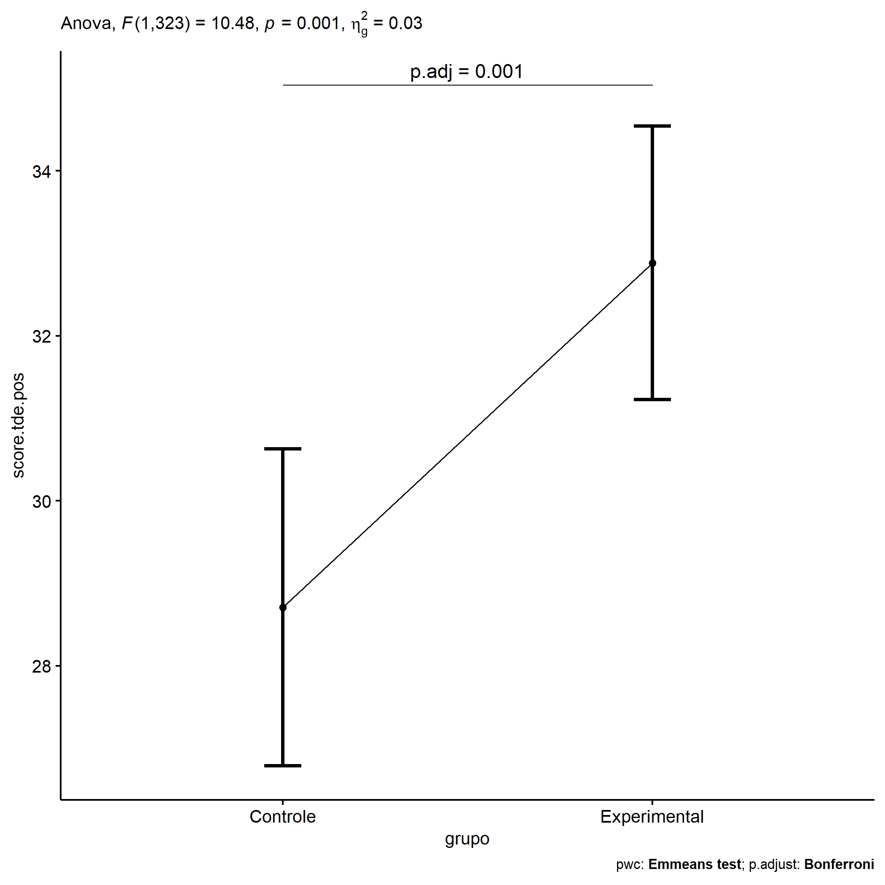<!-- -->

``` r
plots <- oneWayAncovaBoxPlots(
  wdat, "score.tde.pos", "grupo", aov, pwc, covar = "score.tde.pre",
  theme = "classic", color = color[["grupo"]],
  subtitle = which(aov$Effect == "grupo"))
```

``` r
if (length(unique(wdat[["grupo"]])) > 1)
  plots[["grupo"]] + ggplot2::ylab("TDE - Escrita") + ggplot2::scale_x_discrete(labels=c('pre', 'pos'))
```

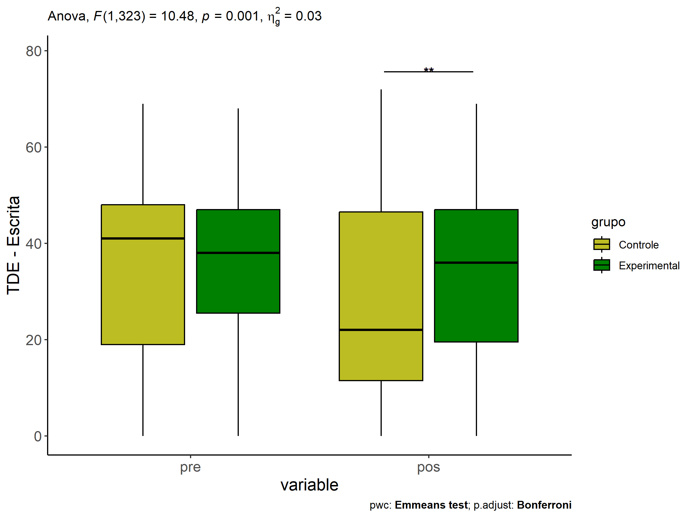<!-- -->

``` r
if (length(unique(wdat.long[["grupo"]])) > 1)
  plots <- oneWayAncovaBoxPlots(
    wdat.long, "score.tde", "grupo", aov, pwc.long, pre.post = "time",
    theme = "classic", color = color$prepost)
```

``` r
if (length(unique(wdat.long[["grupo"]])) > 1)
  plots[["grupo"]] + ggplot2::ylab("TDE - Escrita")
```

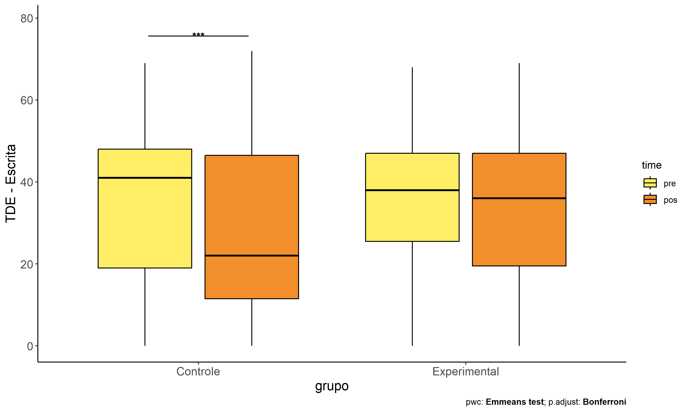<!-- -->

### Checking linearity assumption

``` r
ggscatter(wdat, x = "score.tde.pre", y = "score.tde.pos", size = 0.5,
          color = "grupo", add = "reg.line")+
  stat_regline_equation(
    aes(label =  paste(..eq.label.., ..rr.label.., sep = "~~~~"), color = grupo)
  )
```

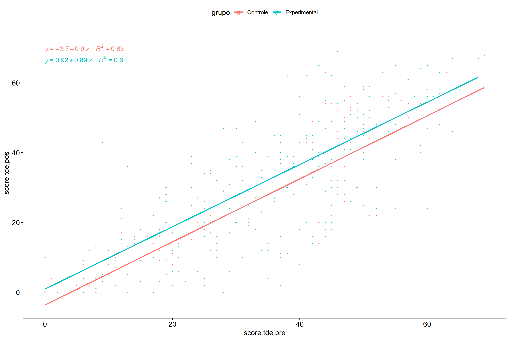<!-- -->

### Checking normality and homogeneity

``` r
res <- augment(lm(score.tde.pos ~ score.tde.pre + grupo, data = wdat))
```

``` r
shapiro_test(res$.resid)
```

    ## # A tibble: 1 × 3
    ##   variable   statistic p.value
    ##   <chr>          <dbl>   <dbl>
    ## 1 res$.resid     0.993   0.112

``` r
levene_test(res, .resid ~ grupo)
```

    ## # A tibble: 1 × 4
    ##     df1   df2 statistic      p
    ##   <int> <int>     <dbl>  <dbl>
    ## 1     1   324      4.06 0.0448

# ANCOVA and Pairwise for two factors **grupo:Sexo**

## Without remove non-normal data

``` r
pdat = remove_group_data(dat[!is.na(dat[["grupo"]]) & !is.na(dat[["Sexo"]]),], "score.tde.pos", c("grupo","Sexo"))

pdat.long <- rbind(pdat[,c("id","grupo","Sexo")], pdat[,c("id","grupo","Sexo")])
pdat.long[["time"]] <- c(rep("pre", nrow(pdat)), rep("pos", nrow(pdat)))
pdat.long[["time"]] <- factor(pdat.long[["time"]], c("pre","pos"))
pdat.long[["score.tde"]] <- c(pdat[["score.tde.pre"]], pdat[["score.tde.pos"]])

aov = anova_test(pdat, score.tde.pos ~ score.tde.pre + grupo*Sexo)
laov[["grupo:Sexo"]] <- get_anova_table(aov)
```

``` r
pwcs <- list()
pwcs[["Sexo"]] <- emmeans_test(
  group_by(pdat, grupo), score.tde.pos ~ Sexo,
  covariate = score.tde.pre, p.adjust.method = "bonferroni")
pwcs[["grupo"]] <- emmeans_test(
  group_by(pdat, Sexo), score.tde.pos ~ grupo,
  covariate = score.tde.pre, p.adjust.method = "bonferroni")

pwc <- plyr::rbind.fill(pwcs[["grupo"]], pwcs[["Sexo"]])
pwc <- pwc[,c("grupo","Sexo", colnames(pwc)[!colnames(pwc) %in% c("grupo","Sexo")])]
```

``` r
pwc.long <- emmeans_test(dplyr::group_by_at(pdat.long, c("grupo","Sexo")),
                         score.tde ~ time,
                         p.adjust.method = "bonferroni")
lpwc[["grupo:Sexo"]] <- plyr::rbind.fill(pwc, pwc.long)
```

``` r
ds <- get.descriptives(pdat, "score.tde.pos", c("grupo","Sexo"), covar = "score.tde.pre")
ds <- merge(ds[ds$variable != "score.tde.pre",],
            ds[ds$variable == "score.tde.pre", !colnames(ds) %in% c("variable")],
            by = c("grupo","Sexo"), all.x = T, suffixes = c("", ".score.tde.pre"))
ds <- merge(get_emmeans(pwcs[["grupo"]]), ds, by = c("grupo","Sexo"), suffixes = c(".emms", ""))
ds <- ds[,c("grupo","Sexo","n","mean.score.tde.pre","se.score.tde.pre","mean","se","emmean","se.emms")]

colnames(ds) <- c("grupo","Sexo", "N", paste0(c("M","SE")," (pre)"),
                  paste0(c("M","SE"), " (unadj)"), paste0(c("M", "SE"), " (adj)"))

lemms[["grupo:Sexo"]] <- ds
```

## Computing ANCOVA and PairWise After removing non-normal data (OK)

``` r
wdat = pdat 

res = residuals(lm(score.tde.pos ~ score.tde.pre + grupo*Sexo, data = wdat))
non.normal = getNonNormal(res, wdat$id, plimit = 0.05)

wdat = wdat[!wdat$id %in% non.normal,]

wdat.long <- rbind(wdat[,c("id","grupo","Sexo")], wdat[,c("id","grupo","Sexo")])
wdat.long[["time"]] <- c(rep("pre", nrow(wdat)), rep("pos", nrow(wdat)))
wdat.long[["time"]] <- factor(wdat.long[["time"]], c("pre","pos"))
wdat.long[["score.tde"]] <- c(wdat[["score.tde.pre"]], wdat[["score.tde.pos"]])


ldat[["grupo:Sexo"]] = wdat

(non.normal)
```

    ## [1] "P984" "P962"

``` r
aov = anova_test(wdat, score.tde.pos ~ score.tde.pre + grupo*Sexo)
laov[["grupo:Sexo"]] <- merge(get_anova_table(aov), laov[["grupo:Sexo"]], by="Effect", suffixes = c("","'"))

(df = get_anova_table(aov))
```

    ## ANOVA Table (type II tests)
    ## 
    ##          Effect DFn DFd       F        p p<.05   ges
    ## 1 score.tde.pre   1 321 513.541 1.43e-68     * 0.615
    ## 2         grupo   1 321  10.961 1.00e-03     * 0.033
    ## 3          Sexo   1 321   0.627 4.29e-01       0.002
    ## 4    grupo:Sexo   1 321   3.002 8.40e-02       0.009

| Effect        | DFn | DFd |       F |     p | p\<.05 |   ges |
|:--------------|----:|----:|--------:|------:|:-------|------:|
| score.tde.pre |   1 | 321 | 513.541 | 0.000 | \*     | 0.615 |
| grupo         |   1 | 321 |  10.961 | 0.001 | \*     | 0.033 |
| Sexo          |   1 | 321 |   0.627 | 0.429 |        | 0.002 |
| grupo:Sexo    |   1 | 321 |   3.002 | 0.084 |        | 0.009 |

``` r
pwcs <- list()
pwcs[["Sexo"]] <- emmeans_test(
  group_by(wdat, grupo), score.tde.pos ~ Sexo,
  covariate = score.tde.pre, p.adjust.method = "bonferroni")
pwcs[["grupo"]] <- emmeans_test(
  group_by(wdat, Sexo), score.tde.pos ~ grupo,
  covariate = score.tde.pre, p.adjust.method = "bonferroni")

pwc <- plyr::rbind.fill(pwcs[["grupo"]], pwcs[["Sexo"]])
pwc <- pwc[,c("grupo","Sexo", colnames(pwc)[!colnames(pwc) %in% c("grupo","Sexo")])]
```

| grupo        | Sexo | term                 | .y.           | group1   | group2       |  df | statistic |     p | p.adj | p.adj.signif |
|:-------------|:-----|:---------------------|:--------------|:---------|:-------------|----:|----------:|------:|------:|:-------------|
|              | F    | score.tde.pre\*grupo | score.tde.pos | Controle | Experimental | 321 |    -3.597 | 0.000 | 0.000 | \*\*\*       |
|              | M    | score.tde.pre\*grupo | score.tde.pos | Controle | Experimental | 321 |    -1.011 | 0.313 | 0.313 | ns           |
| Controle     |      | score.tde.pre\*Sexo  | score.tde.pos | F        | M            | 321 |    -0.803 | 0.423 | 0.423 | ns           |
| Experimental |      | score.tde.pre\*Sexo  | score.tde.pos | F        | M            | 321 |     1.721 | 0.086 | 0.086 | ns           |

``` r
pwc.long <- emmeans_test(dplyr::group_by_at(wdat.long, c("grupo","Sexo")),
                         score.tde ~ time,
                         p.adjust.method = "bonferroni")
lpwc[["grupo:Sexo"]] <- merge(plyr::rbind.fill(pwc, pwc.long), lpwc[["grupo:Sexo"]], by=c("grupo","Sexo","term",".y.","group1","group2"), suffixes = c("","'"))
```

| grupo        | Sexo | term | .y.       | group1 | group2 |  df | statistic |     p | p.adj | p.adj.signif |
|:-------------|:-----|:-----|:----------|:-------|:-------|----:|----------:|------:|------:|:-------------|
| Controle     | F    | time | score.tde | pre    | pos    | 644 |     2.905 | 0.004 | 0.004 | \*\*         |
| Controle     | M    | time | score.tde | pre    | pos    | 644 |     1.807 | 0.071 | 0.071 | ns           |
| Experimental | F    | time | score.tde | pre    | pos    | 644 |     0.618 | 0.537 | 0.537 | ns           |
| Experimental | M    | time | score.tde | pre    | pos    | 644 |     1.730 | 0.084 | 0.084 | ns           |

``` r
ds <- get.descriptives(wdat, "score.tde.pos", c("grupo","Sexo"), covar = "score.tde.pre")
ds <- merge(ds[ds$variable != "score.tde.pre",],
            ds[ds$variable == "score.tde.pre", !colnames(ds) %in% c("variable")],
            by = c("grupo","Sexo"), all.x = T, suffixes = c("", ".score.tde.pre"))
ds <- merge(get_emmeans(pwcs[["grupo"]]), ds, by = c("grupo","Sexo"), suffixes = c(".emms", ""))
ds <- ds[,c("grupo","Sexo","n","mean.score.tde.pre","se.score.tde.pre","mean","se","emmean","se.emms")]

colnames(ds) <- c("grupo","Sexo", "N", paste0(c("M","SE")," (pre)"),
                  paste0(c("M","SE"), " (unadj)"), paste0(c("M", "SE"), " (adj)"))

lemms[["grupo:Sexo"]] <- merge(ds, lemms[["grupo:Sexo"]], by=c("grupo","Sexo"), suffixes = c("","'"))
```

| grupo        | Sexo |   N | M (pre) | SE (pre) | M (unadj) | SE (unadj) | M (adj) | SE (adj) |
|:-------------|:-----|----:|--------:|---------:|----------:|-----------:|--------:|---------:|
| Controle     | F    |  79 |  37.873 |    1.895 |    29.861 |      2.321 |  28.022 |    1.293 |
| Controle     | M    |  60 |  30.917 |    2.410 |    25.200 |      2.558 |  29.615 |    1.494 |
| Experimental | F    |  88 |  37.841 |    1.480 |    36.227 |      1.739 |  34.418 |    1.225 |
| Experimental | M    |  99 |  35.384 |    1.579 |    31.121 |      1.768 |  31.521 |    1.153 |

### Plots for ancova

``` r
plots <- twoWayAncovaPlots(
  wdat, "score.tde.pos", c("grupo","Sexo"), aov, pwcs, addParam = c("mean_se"),
  font.label.size=10, step.increase=0.05, p.label="p.adj",
  subtitle = which(aov$Effect == "grupo:Sexo"))
```

``` r
if (!is.null(plots[["grupo"]]))
  plots[["grupo"]] + ggplot2::scale_color_manual(values = color[["Sexo"]])
```

    ## Scale for colour is already present.
    ## Adding another scale for colour, which will replace the existing scale.

<!-- -->

``` r
if (!is.null(plots[["Sexo"]]))
  plots[["Sexo"]] + ggplot2::scale_color_manual(values = color[["grupo"]])
```

    ## Scale for colour is already present.
    ## Adding another scale for colour, which will replace the existing scale.

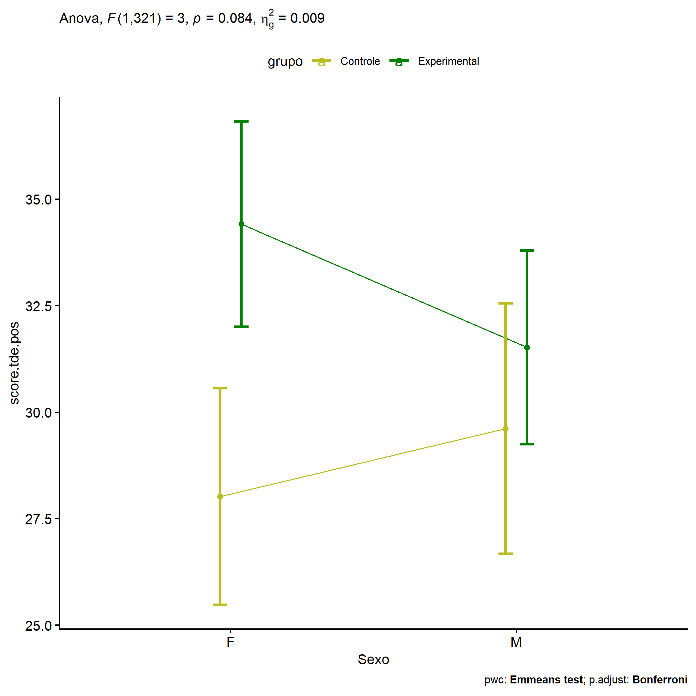<!-- -->

``` r
plots <- twoWayAncovaBoxPlots(
  wdat, "score.tde.pos", c("grupo","Sexo"), aov, pwcs, covar = "score.tde.pre",
  theme = "classic", color = color[["grupo:Sexo"]],
  subtitle = which(aov$Effect == "grupo:Sexo"))
```

``` r
plots[["grupo:Sexo"]] + ggplot2::ylab("TDE - Escrita") + ggplot2::scale_x_discrete(labels=c('pre', 'pos'))
```

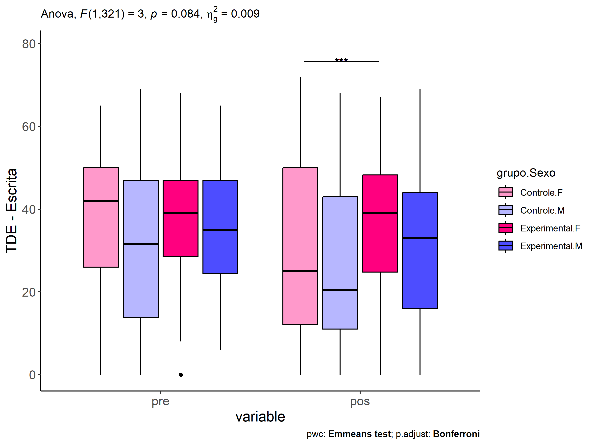<!-- -->

``` r
plots <- twoWayAncovaBoxPlots(
  wdat.long, "score.tde", c("grupo","Sexo"), aov, pwc.long, pre.post = "time",
  theme = "classic", color = color$prepost)
```

``` r
plots[["grupo:Sexo"]] + ggplot2::ylab("TDE - Escrita")
```

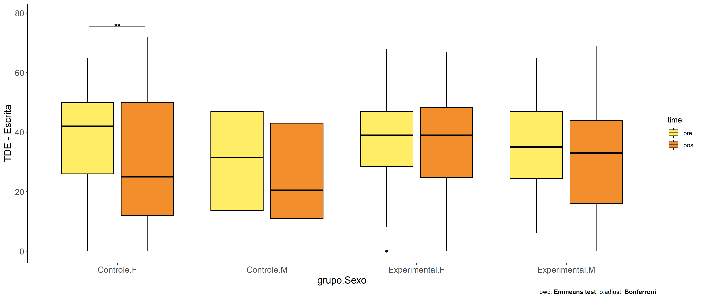<!-- -->

### Checking linearity assumption

``` r
ggscatter(wdat, x = "score.tde.pre", y = "score.tde.pos", size = 0.5,
          facet.by = c("grupo","Sexo"), add = "reg.line")+
  stat_regline_equation(
    aes(label =  paste(..eq.label.., ..rr.label.., sep = "~~~~"))
  )
```

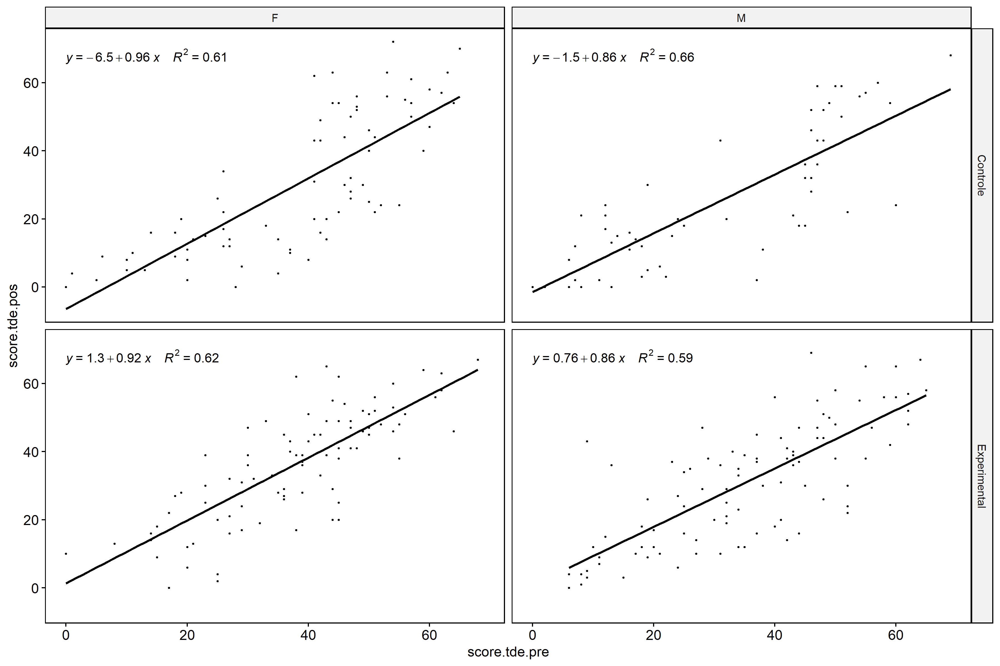<!-- -->

### Checking normality and homogeneity

``` r
res <- augment(lm(score.tde.pos ~ score.tde.pre + grupo*Sexo, data = wdat))
```

``` r
shapiro_test(res$.resid)
```

    ## # A tibble: 1 × 3
    ##   variable   statistic p.value
    ##   <chr>          <dbl>   <dbl>
    ## 1 res$.resid     0.993   0.163

``` r
levene_test(res, .resid ~ grupo*Sexo)
```

    ## # A tibble: 1 × 4
    ##     df1   df2 statistic      p
    ##   <int> <int>     <dbl>  <dbl>
    ## 1     3   322      2.30 0.0777

# ANCOVA and Pairwise for two factors **grupo:Zona**

## Without remove non-normal data

``` r
pdat = remove_group_data(dat[!is.na(dat[["grupo"]]) & !is.na(dat[["Zona"]]),], "score.tde.pos", c("grupo","Zona"))

pdat.long <- rbind(pdat[,c("id","grupo","Zona")], pdat[,c("id","grupo","Zona")])
pdat.long[["time"]] <- c(rep("pre", nrow(pdat)), rep("pos", nrow(pdat)))
pdat.long[["time"]] <- factor(pdat.long[["time"]], c("pre","pos"))
pdat.long[["score.tde"]] <- c(pdat[["score.tde.pre"]], pdat[["score.tde.pos"]])

aov = anova_test(pdat, score.tde.pos ~ score.tde.pre + grupo*Zona)
laov[["grupo:Zona"]] <- get_anova_table(aov)
```

``` r
pwcs <- list()
pwcs[["Zona"]] <- emmeans_test(
  group_by(pdat, grupo), score.tde.pos ~ Zona,
  covariate = score.tde.pre, p.adjust.method = "bonferroni")
pwcs[["grupo"]] <- emmeans_test(
  group_by(pdat, Zona), score.tde.pos ~ grupo,
  covariate = score.tde.pre, p.adjust.method = "bonferroni")

pwc <- plyr::rbind.fill(pwcs[["grupo"]], pwcs[["Zona"]])
pwc <- pwc[,c("grupo","Zona", colnames(pwc)[!colnames(pwc) %in% c("grupo","Zona")])]
```

``` r
pwc.long <- emmeans_test(dplyr::group_by_at(pdat.long, c("grupo","Zona")),
                         score.tde ~ time,
                         p.adjust.method = "bonferroni")
lpwc[["grupo:Zona"]] <- plyr::rbind.fill(pwc, pwc.long)
```

``` r
ds <- get.descriptives(pdat, "score.tde.pos", c("grupo","Zona"), covar = "score.tde.pre")
ds <- merge(ds[ds$variable != "score.tde.pre",],
            ds[ds$variable == "score.tde.pre", !colnames(ds) %in% c("variable")],
            by = c("grupo","Zona"), all.x = T, suffixes = c("", ".score.tde.pre"))
ds <- merge(get_emmeans(pwcs[["grupo"]]), ds, by = c("grupo","Zona"), suffixes = c(".emms", ""))
ds <- ds[,c("grupo","Zona","n","mean.score.tde.pre","se.score.tde.pre","mean","se","emmean","se.emms")]

colnames(ds) <- c("grupo","Zona", "N", paste0(c("M","SE")," (pre)"),
                  paste0(c("M","SE"), " (unadj)"), paste0(c("M", "SE"), " (adj)"))

lemms[["grupo:Zona"]] <- ds
```

## Computing ANCOVA and PairWise After removing non-normal data (OK)

``` r
wdat = pdat 

res = residuals(lm(score.tde.pos ~ score.tde.pre + grupo*Zona, data = wdat))
non.normal = getNonNormal(res, wdat$id, plimit = 0.05)

wdat = wdat[!wdat$id %in% non.normal,]

wdat.long <- rbind(wdat[,c("id","grupo","Zona")], wdat[,c("id","grupo","Zona")])
wdat.long[["time"]] <- c(rep("pre", nrow(wdat)), rep("pos", nrow(wdat)))
wdat.long[["time"]] <- factor(wdat.long[["time"]], c("pre","pos"))
wdat.long[["score.tde"]] <- c(wdat[["score.tde.pre"]], wdat[["score.tde.pos"]])


ldat[["grupo:Zona"]] = wdat

(non.normal)
```

    ## [1] "P962"

``` r
aov = anova_test(wdat, score.tde.pos ~ score.tde.pre + grupo*Zona)
laov[["grupo:Zona"]] <- merge(get_anova_table(aov), laov[["grupo:Zona"]], by="Effect", suffixes = c("","'"))

(df = get_anova_table(aov))
```

    ## ANOVA Table (type II tests)
    ## 
    ##          Effect DFn DFd       F        p p<.05   ges
    ## 1 score.tde.pre   1 280 513.580 2.70e-65     * 0.647
    ## 2         grupo   1 280   6.492 1.10e-02     * 0.023
    ## 3          Zona   1 280  26.275 5.53e-07     * 0.086
    ## 4    grupo:Zona   1 280  15.871 8.65e-05     * 0.054

| Effect        | DFn | DFd |       F |     p | p\<.05 |   ges |
|:--------------|----:|----:|--------:|------:|:-------|------:|
| score.tde.pre |   1 | 280 | 513.580 | 0.000 | \*     | 0.647 |
| grupo         |   1 | 280 |   6.492 | 0.011 | \*     | 0.023 |
| Zona          |   1 | 280 |  26.275 | 0.000 | \*     | 0.086 |
| grupo:Zona    |   1 | 280 |  15.871 | 0.000 | \*     | 0.054 |

``` r
pwcs <- list()
pwcs[["Zona"]] <- emmeans_test(
  group_by(wdat, grupo), score.tde.pos ~ Zona,
  covariate = score.tde.pre, p.adjust.method = "bonferroni")
pwcs[["grupo"]] <- emmeans_test(
  group_by(wdat, Zona), score.tde.pos ~ grupo,
  covariate = score.tde.pre, p.adjust.method = "bonferroni")

pwc <- plyr::rbind.fill(pwcs[["grupo"]], pwcs[["Zona"]])
pwc <- pwc[,c("grupo","Zona", colnames(pwc)[!colnames(pwc) %in% c("grupo","Zona")])]
```

| grupo        | Zona   | term                 | .y.           | group1   | group2       |  df | statistic |     p | p.adj | p.adj.signif |
|:-------------|:-------|:---------------------|:--------------|:---------|:-------------|----:|----------:|------:|------:|:-------------|
|              | Rural  | score.tde.pre\*grupo | score.tde.pos | Controle | Experimental | 280 |     0.796 | 0.426 | 0.426 | ns           |
|              | Urbana | score.tde.pre\*grupo | score.tde.pos | Controle | Experimental | 280 |    -4.660 | 0.000 | 0.000 | \*\*\*\*     |
| Controle     |        | score.tde.pre\*Zona  | score.tde.pos | Rural    | Urbana       | 280 |     6.372 | 0.000 | 0.000 | \*\*\*\*     |
| Experimental |        | score.tde.pre\*Zona  | score.tde.pos | Rural    | Urbana       | 280 |     1.263 | 0.208 | 0.208 | ns           |

``` r
pwc.long <- emmeans_test(dplyr::group_by_at(wdat.long, c("grupo","Zona")),
                         score.tde ~ time,
                         p.adjust.method = "bonferroni")
lpwc[["grupo:Zona"]] <- merge(plyr::rbind.fill(pwc, pwc.long), lpwc[["grupo:Zona"]], by=c("grupo","Zona","term",".y.","group1","group2"), suffixes = c("","'"))
```

| grupo        | Zona   | term | .y.       | group1 | group2 |  df | statistic |     p | p.adj | p.adj.signif |
|:-------------|:-------|:-----|:----------|:-------|:-------|----:|----------:|------:|------:|:-------------|
| Controle     | Rural  | time | score.tde | pre    | pos    | 562 |     0.118 | 0.906 | 0.906 | ns           |
| Controle     | Urbana | time | score.tde | pre    | pos    | 562 |     3.989 | 0.000 | 0.000 | \*\*\*\*     |
| Experimental | Rural  | time | score.tde | pre    | pos    | 562 |     0.716 | 0.474 | 0.474 | ns           |
| Experimental | Urbana | time | score.tde | pre    | pos    | 562 |     1.528 | 0.127 | 0.127 | ns           |

``` r
ds <- get.descriptives(wdat, "score.tde.pos", c("grupo","Zona"), covar = "score.tde.pre")
ds <- merge(ds[ds$variable != "score.tde.pre",],
            ds[ds$variable == "score.tde.pre", !colnames(ds) %in% c("variable")],
            by = c("grupo","Zona"), all.x = T, suffixes = c("", ".score.tde.pre"))
ds <- merge(get_emmeans(pwcs[["grupo"]]), ds, by = c("grupo","Zona"), suffixes = c(".emms", ""))
ds <- ds[,c("grupo","Zona","n","mean.score.tde.pre","se.score.tde.pre","mean","se","emmean","se.emms")]

colnames(ds) <- c("grupo","Zona", "N", paste0(c("M","SE")," (pre)"),
                  paste0(c("M","SE"), " (unadj)"), paste0(c("M", "SE"), " (adj)"))

lemms[["grupo:Zona"]] <- merge(ds, lemms[["grupo:Zona"]], by=c("grupo","Zona"), suffixes = c("","'"))
```

| grupo        | Zona   |   N | M (pre) | SE (pre) | M (unadj) | SE (unadj) | M (adj) | SE (adj) |
|:-------------|:-------|----:|--------:|---------:|----------:|-----------:|--------:|---------:|
| Controle     | Rural  |  68 |  33.912 |    2.347 |    33.559 |      2.684 |  35.363 |    1.339 |
| Controle     | Urbana |  55 |  36.036 |    2.133 |    22.745 |      2.374 |  22.613 |    1.486 |
| Experimental | Rural  |  87 |  35.287 |    1.550 |    33.391 |      1.846 |  33.941 |    1.182 |
| Experimental | Urbana |  75 |  38.280 |    1.828 |    33.920 |      1.962 |  31.743 |    1.277 |

### Plots for ancova

``` r
plots <- twoWayAncovaPlots(
  wdat, "score.tde.pos", c("grupo","Zona"), aov, pwcs, addParam = c("mean_se"),
  font.label.size=10, step.increase=0.05, p.label="p.adj",
  subtitle = which(aov$Effect == "grupo:Zona"))
```

``` r
if (!is.null(plots[["grupo"]]))
  plots[["grupo"]] + ggplot2::scale_color_manual(values = color[["Zona"]])
```

    ## Scale for colour is already present.
    ## Adding another scale for colour, which will replace the existing scale.

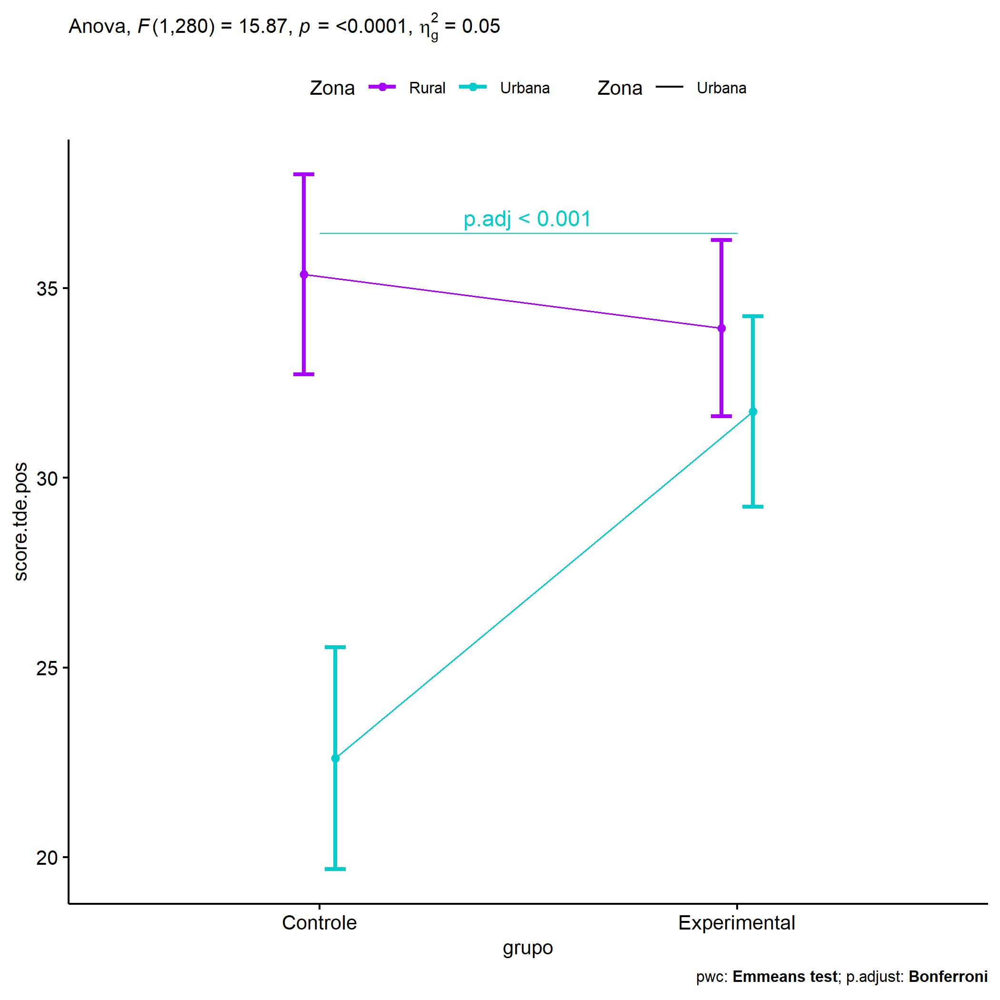<!-- -->

``` r
if (!is.null(plots[["Zona"]]))
  plots[["Zona"]] + ggplot2::scale_color_manual(values = color[["grupo"]])
```

    ## Scale for colour is already present.
    ## Adding another scale for colour, which will replace the existing scale.

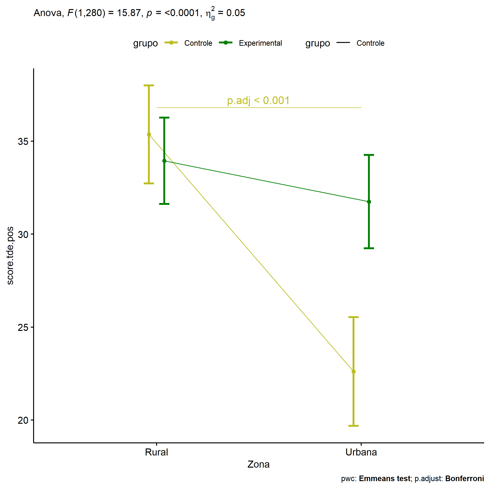<!-- -->

``` r
plots <- twoWayAncovaBoxPlots(
  wdat, "score.tde.pos", c("grupo","Zona"), aov, pwcs, covar = "score.tde.pre",
  theme = "classic", color = color[["grupo:Zona"]],
  subtitle = which(aov$Effect == "grupo:Zona"))
```

``` r
plots[["grupo:Zona"]] + ggplot2::ylab("TDE - Escrita") + ggplot2::scale_x_discrete(labels=c('pre', 'pos'))
```

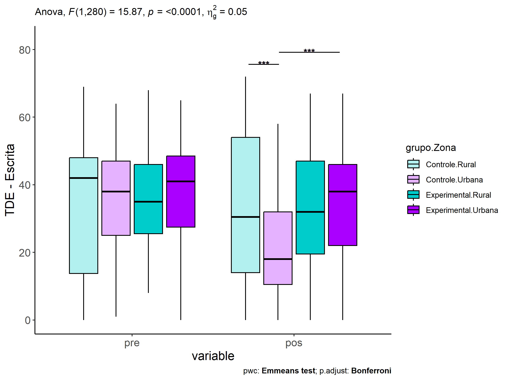<!-- -->

``` r
plots <- twoWayAncovaBoxPlots(
  wdat.long, "score.tde", c("grupo","Zona"), aov, pwc.long, pre.post = "time",
  theme = "classic", color = color$prepost)
```

``` r
plots[["grupo:Zona"]] + ggplot2::ylab("TDE - Escrita")
```

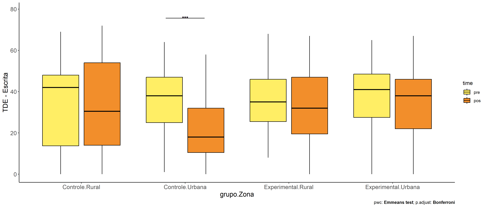<!-- -->

### Checking linearity assumption

``` r
ggscatter(wdat, x = "score.tde.pre", y = "score.tde.pos", size = 0.5,
          facet.by = c("grupo","Zona"), add = "reg.line")+
  stat_regline_equation(
    aes(label =  paste(..eq.label.., ..rr.label.., sep = "~~~~"))
  )
```

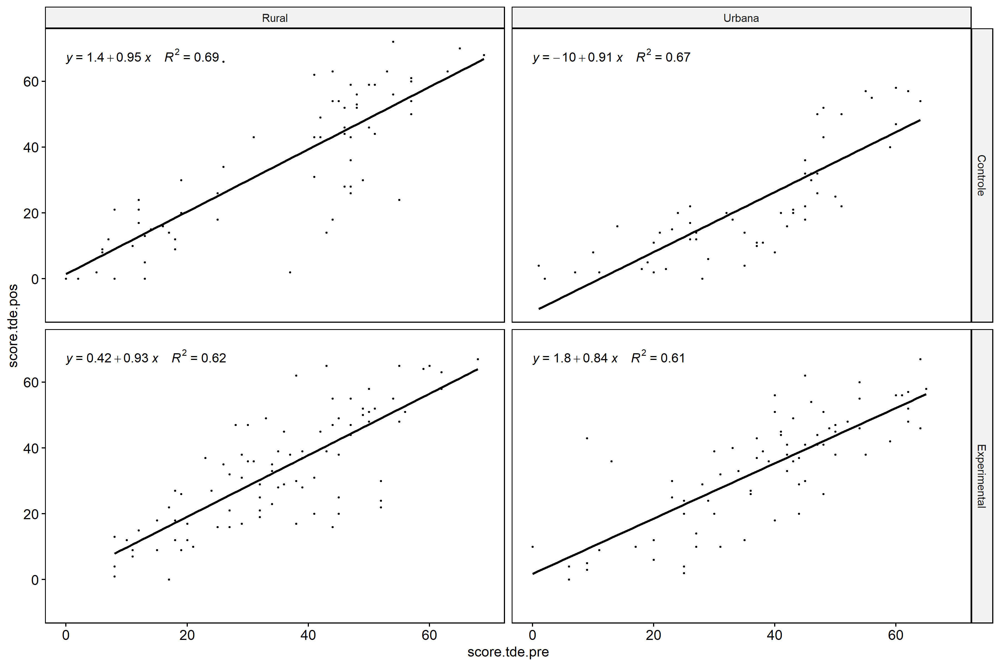<!-- -->

### Checking normality and homogeneity

``` r
res <- augment(lm(score.tde.pos ~ score.tde.pre + grupo*Zona, data = wdat))
```

``` r
shapiro_test(res$.resid)
```

    ## # A tibble: 1 × 3
    ##   variable   statistic p.value
    ##   <chr>          <dbl>   <dbl>
    ## 1 res$.resid     0.992   0.105

``` r
levene_test(res, .resid ~ grupo*Zona)
```

    ## # A tibble: 1 × 4
    ##     df1   df2 statistic     p
    ##   <int> <int>     <dbl> <dbl>
    ## 1     3   281     0.324 0.808

# ANCOVA and Pairwise for two factors **grupo:Cor.Raca**

## Without remove non-normal data

``` r
pdat = remove_group_data(dat[!is.na(dat[["grupo"]]) & !is.na(dat[["Cor.Raca"]]),], "score.tde.pos", c("grupo","Cor.Raca"))
```

    ## Warning: There was 1 warning in `mutate()`.
    ## ℹ In argument: `ci = abs(stats::qt(alpha/2, .data$n - 1) * .data$se)`.
    ## Caused by warning:
    ## ! There was 1 warning in `mutate()`.
    ## ℹ In argument: `ci = abs(stats::qt(alpha/2, .data$n - 1) * .data$se)`.
    ## Caused by warning in `stats::qt()`:
    ## ! NaNs produced

``` r
pdat.long <- rbind(pdat[,c("id","grupo","Cor.Raca")], pdat[,c("id","grupo","Cor.Raca")])
pdat.long[["time"]] <- c(rep("pre", nrow(pdat)), rep("pos", nrow(pdat)))
pdat.long[["time"]] <- factor(pdat.long[["time"]], c("pre","pos"))
pdat.long[["score.tde"]] <- c(pdat[["score.tde.pre"]], pdat[["score.tde.pos"]])

aov = anova_test(pdat, score.tde.pos ~ score.tde.pre + grupo*Cor.Raca)
laov[["grupo:Cor.Raca"]] <- get_anova_table(aov)
```

``` r
pwcs <- list()
pwcs[["Cor.Raca"]] <- emmeans_test(
  group_by(pdat, grupo), score.tde.pos ~ Cor.Raca,
  covariate = score.tde.pre, p.adjust.method = "bonferroni")
pwcs[["grupo"]] <- emmeans_test(
  group_by(pdat, Cor.Raca), score.tde.pos ~ grupo,
  covariate = score.tde.pre, p.adjust.method = "bonferroni")

pwc <- plyr::rbind.fill(pwcs[["grupo"]], pwcs[["Cor.Raca"]])
pwc <- pwc[,c("grupo","Cor.Raca", colnames(pwc)[!colnames(pwc) %in% c("grupo","Cor.Raca")])]
```

``` r
pwc.long <- emmeans_test(dplyr::group_by_at(pdat.long, c("grupo","Cor.Raca")),
                         score.tde ~ time,
                         p.adjust.method = "bonferroni")
lpwc[["grupo:Cor.Raca"]] <- plyr::rbind.fill(pwc, pwc.long)
```

``` r
ds <- get.descriptives(pdat, "score.tde.pos", c("grupo","Cor.Raca"), covar = "score.tde.pre")
ds <- merge(ds[ds$variable != "score.tde.pre",],
            ds[ds$variable == "score.tde.pre", !colnames(ds) %in% c("variable")],
            by = c("grupo","Cor.Raca"), all.x = T, suffixes = c("", ".score.tde.pre"))
ds <- merge(get_emmeans(pwcs[["grupo"]]), ds, by = c("grupo","Cor.Raca"), suffixes = c(".emms", ""))
ds <- ds[,c("grupo","Cor.Raca","n","mean.score.tde.pre","se.score.tde.pre","mean","se","emmean","se.emms")]

colnames(ds) <- c("grupo","Cor.Raca", "N", paste0(c("M","SE")," (pre)"),
                  paste0(c("M","SE"), " (unadj)"), paste0(c("M", "SE"), " (adj)"))

lemms[["grupo:Cor.Raca"]] <- ds
```

## Computing ANCOVA and PairWise After removing non-normal data (OK)

``` r
wdat = pdat 

res = residuals(lm(score.tde.pos ~ score.tde.pre + grupo*Cor.Raca, data = wdat))
non.normal = getNonNormal(res, wdat$id, plimit = 0.05)

wdat = wdat[!wdat$id %in% non.normal,]

wdat.long <- rbind(wdat[,c("id","grupo","Cor.Raca")], wdat[,c("id","grupo","Cor.Raca")])
wdat.long[["time"]] <- c(rep("pre", nrow(wdat)), rep("pos", nrow(wdat)))
wdat.long[["time"]] <- factor(wdat.long[["time"]], c("pre","pos"))
wdat.long[["score.tde"]] <- c(wdat[["score.tde.pre"]], wdat[["score.tde.pos"]])


ldat[["grupo:Cor.Raca"]] = wdat

(non.normal)
```

    ## NULL

``` r
aov = anova_test(wdat, score.tde.pos ~ score.tde.pre + grupo*Cor.Raca)
laov[["grupo:Cor.Raca"]] <- merge(get_anova_table(aov), laov[["grupo:Cor.Raca"]], by="Effect", suffixes = c("","'"))

(df = get_anova_table(aov))
```

    ## ANOVA Table (type II tests)
    ## 
    ##           Effect DFn DFd       F        p p<.05   ges
    ## 1  score.tde.pre   1 115 138.455 1.84e-21     * 0.546
    ## 2          grupo   1 115   5.026 2.70e-02     * 0.042
    ## 3       Cor.Raca   2 115   3.090 4.90e-02     * 0.051
    ## 4 grupo:Cor.Raca   1 115   2.944 8.90e-02       0.025

| Effect         | DFn | DFd |       F |     p | p\<.05 |   ges |
|:---------------|----:|----:|--------:|------:|:-------|------:|
| score.tde.pre  |   1 | 115 | 138.455 | 0.000 | \*     | 0.546 |
| grupo          |   1 | 115 |   5.026 | 0.027 | \*     | 0.042 |
| Cor.Raca       |   2 | 115 |   3.090 | 0.049 | \*     | 0.051 |
| grupo:Cor.Raca |   1 | 115 |   2.944 | 0.089 |        | 0.025 |

``` r
pwcs <- list()
pwcs[["Cor.Raca"]] <- emmeans_test(
  group_by(wdat, grupo), score.tde.pos ~ Cor.Raca,
  covariate = score.tde.pre, p.adjust.method = "bonferroni")
pwcs[["grupo"]] <- emmeans_test(
  group_by(wdat, Cor.Raca), score.tde.pos ~ grupo,
  covariate = score.tde.pre, p.adjust.method = "bonferroni")

pwc <- plyr::rbind.fill(pwcs[["grupo"]], pwcs[["Cor.Raca"]])
pwc <- pwc[,c("grupo","Cor.Raca", colnames(pwc)[!colnames(pwc) %in% c("grupo","Cor.Raca")])]
```

| grupo        | Cor.Raca | term                    | .y.           | group1   | group2       |  df | statistic |     p | p.adj | p.adj.signif |
|:-------------|:---------|:------------------------|:--------------|:---------|:-------------|----:|----------:|------:|------:|:-------------|
|              | Branca   | score.tde.pre\*grupo    | score.tde.pos | Controle | Experimental | 115 |    -2.598 | 0.011 | 0.011 | \*           |
|              | Indígena | score.tde.pre\*grupo    | score.tde.pos | Controle | Experimental |     |           |       |       |              |
|              | Parda    | score.tde.pre\*grupo    | score.tde.pos | Controle | Experimental | 115 |    -1.097 | 0.275 | 0.275 | ns           |
| Controle     |          | score.tde.pre\*Cor.Raca | score.tde.pos | Branca   | Indígena     | 115 |    -2.605 | 0.010 | 0.031 | \*           |
| Controle     |          | score.tde.pre\*Cor.Raca | score.tde.pos | Branca   | Parda        | 115 |    -0.842 | 0.402 | 1.000 | ns           |
| Controle     |          | score.tde.pre\*Cor.Raca | score.tde.pos | Indígena | Parda        | 115 |     2.215 | 0.029 | 0.086 | ns           |
| Experimental |          | score.tde.pre\*Cor.Raca | score.tde.pos | Branca   | Indígena     |     |           |       |       |              |
| Experimental |          | score.tde.pre\*Cor.Raca | score.tde.pos | Branca   | Parda        | 115 |     1.521 | 0.131 | 0.131 | ns           |
| Experimental |          | score.tde.pre\*Cor.Raca | score.tde.pos | Indígena | Parda        |     |           |       |       |              |

``` r
pwc.long <- emmeans_test(dplyr::group_by_at(wdat.long, c("grupo","Cor.Raca")),
                         score.tde ~ time,
                         p.adjust.method = "bonferroni")
lpwc[["grupo:Cor.Raca"]] <- merge(plyr::rbind.fill(pwc, pwc.long), lpwc[["grupo:Cor.Raca"]], by=c("grupo","Cor.Raca","term",".y.","group1","group2"), suffixes = c("","'"))
```

| grupo        | Cor.Raca | term | .y.       | group1 | group2 |  df | statistic |     p | p.adj | p.adj.signif |
|:-------------|:---------|:-----|:----------|:-------|:-------|----:|----------:|------:|------:|:-------------|
| Controle     | Branca   | time | score.tde | pre    | pos    | 232 |     2.022 | 0.044 | 0.044 | \*           |
| Controle     | Indígena | time | score.tde | pre    | pos    | 232 |    -0.413 | 0.680 | 0.680 | ns           |
| Controle     | Parda    | time | score.tde | pre    | pos    | 232 |     1.807 | 0.072 | 0.072 | ns           |
| Experimental | Branca   | time | score.tde | pre    | pos    | 232 |    -0.333 | 0.740 | 0.740 | ns           |
| Experimental | Indígena | time | score.tde | pre    | pos    |     |           |       |       |              |
| Experimental | Parda    | time | score.tde | pre    | pos    | 232 |     1.164 | 0.246 | 0.246 | ns           |

``` r
ds <- get.descriptives(wdat, "score.tde.pos", c("grupo","Cor.Raca"), covar = "score.tde.pre")
ds <- merge(ds[ds$variable != "score.tde.pre",],
            ds[ds$variable == "score.tde.pre", !colnames(ds) %in% c("variable")],
            by = c("grupo","Cor.Raca"), all.x = T, suffixes = c("", ".score.tde.pre"))
ds <- merge(get_emmeans(pwcs[["grupo"]]), ds, by = c("grupo","Cor.Raca"), suffixes = c(".emms", ""))
ds <- ds[,c("grupo","Cor.Raca","n","mean.score.tde.pre","se.score.tde.pre","mean","se","emmean","se.emms")]

colnames(ds) <- c("grupo","Cor.Raca", "N", paste0(c("M","SE")," (pre)"),
                  paste0(c("M","SE"), " (unadj)"), paste0(c("M", "SE"), " (adj)"))

lemms[["grupo:Cor.Raca"]] <- merge(ds, lemms[["grupo:Cor.Raca"]], by=c("grupo","Cor.Raca"), suffixes = c("","'"))
```

| grupo        | Cor.Raca |   N | M (pre) | SE (pre) | M (unadj) | SE (unadj) | M (adj) | SE (adj) |
|:-------------|:---------|----:|--------:|---------:|----------:|-----------:|--------:|---------:|
| Controle     | Branca   |  21 |  39.095 |    2.872 |    28.190 |      3.536 |  24.667 |    2.787 |
| Controle     | Indígena |   6 |  40.833 |    5.263 |    45.000 |      7.353 |  39.978 |    5.201 |
| Controle     | Parda    |  39 |  33.051 |    3.127 |    25.897 |      3.331 |  27.584 |    2.038 |
| Experimental | Branca   |  10 |  33.400 |    4.568 |    36.000 |      4.455 |  37.386 |    4.016 |
| Experimental | Parda    |  45 |  34.378 |    2.175 |    30.089 |      2.820 |  30.632 |    1.893 |

### Plots for ancova

``` r
plots <- twoWayAncovaPlots(
  wdat, "score.tde.pos", c("grupo","Cor.Raca"), aov, pwcs, addParam = c("mean_se"),
  font.label.size=10, step.increase=0.05, p.label="p.adj",
  subtitle = which(aov$Effect == "grupo:Cor.Raca"))
```

``` r
if (!is.null(plots[["grupo"]]))
  plots[["grupo"]] + ggplot2::scale_color_manual(values = color[["Cor.Raca"]])
```

<!-- -->

``` r
if (!is.null(plots[["Cor.Raca"]]))
  plots[["Cor.Raca"]] + ggplot2::scale_color_manual(values = color[["grupo"]])
```

    ## Scale for colour is already present.
    ## Adding another scale for colour, which will replace the existing scale.

    ## Warning: Removed 2 rows containing non-finite values (`stat_bracket()`).

    ## Warning: Removed 1 rows containing missing values (`geom_point()`).

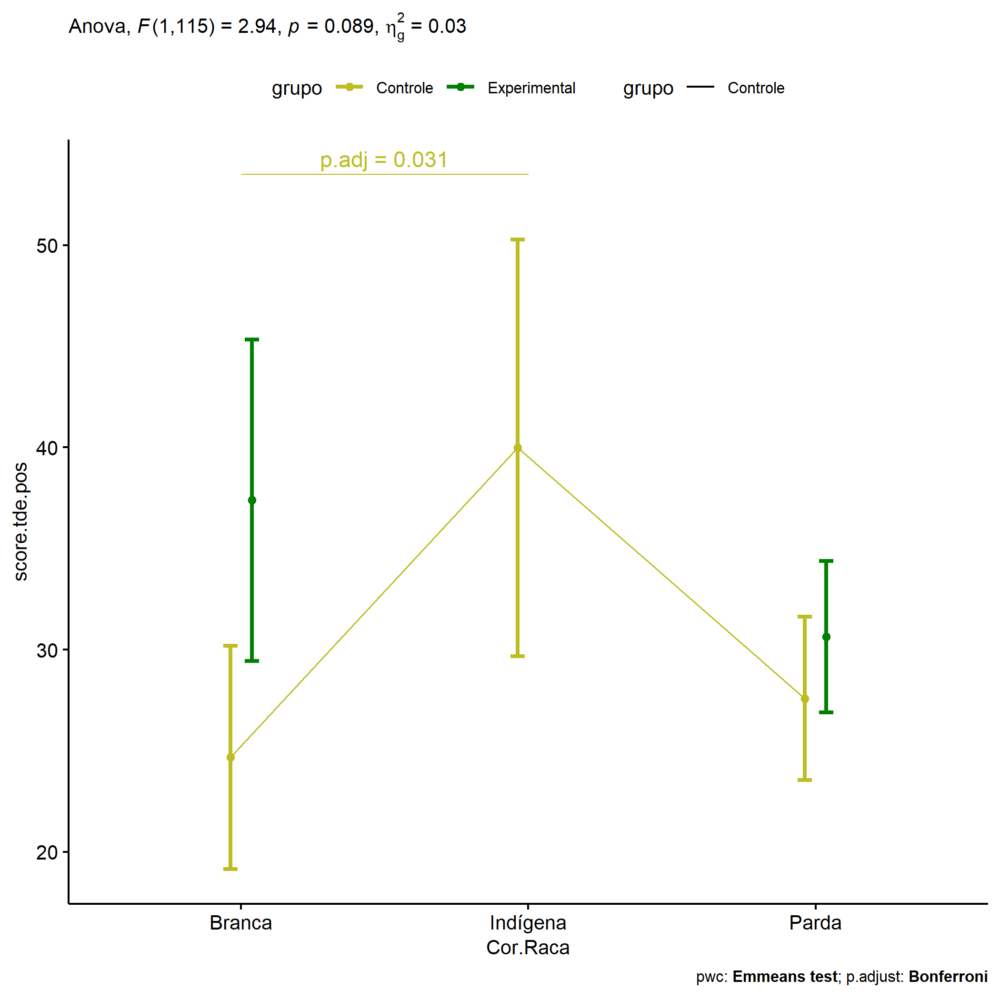<!-- -->

``` r
plots <- twoWayAncovaBoxPlots(
  wdat, "score.tde.pos", c("grupo","Cor.Raca"), aov, pwcs, covar = "score.tde.pre",
  theme = "classic", color = color[["grupo:Cor.Raca"]],
  subtitle = which(aov$Effect == "grupo:Cor.Raca"))
```

``` r
plots[["grupo:Cor.Raca"]] + ggplot2::ylab("TDE - Escrita") + ggplot2::scale_x_discrete(labels=c('pre', 'pos'))
```

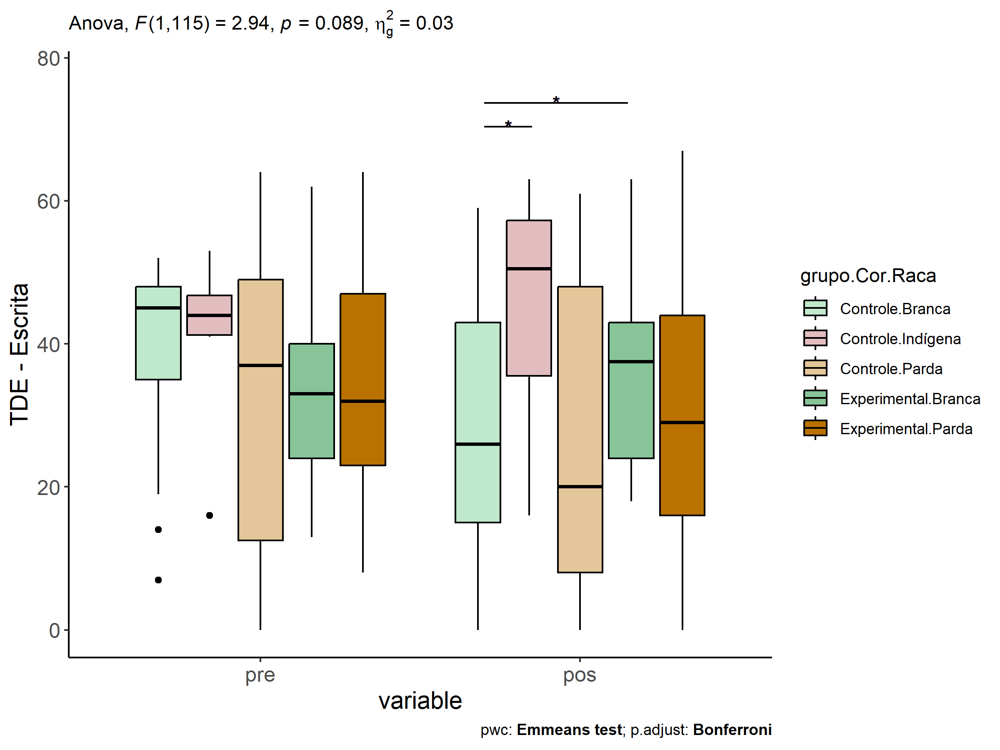<!-- -->

``` r
plots <- twoWayAncovaBoxPlots(
  wdat.long, "score.tde", c("grupo","Cor.Raca"), aov, pwc.long, pre.post = "time",
  theme = "classic", color = color$prepost)
```

``` r
plots[["grupo:Cor.Raca"]] + ggplot2::ylab("TDE - Escrita")
```

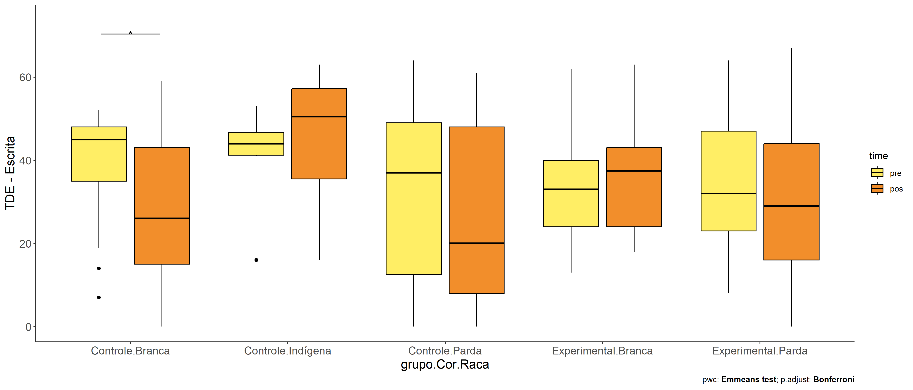<!-- -->

### Checking linearity assumption

``` r
ggscatter(wdat, x = "score.tde.pre", y = "score.tde.pos", size = 0.5,
          facet.by = c("grupo","Cor.Raca"), add = "reg.line")+
  stat_regline_equation(
    aes(label =  paste(..eq.label.., ..rr.label.., sep = "~~~~"))
  )
```

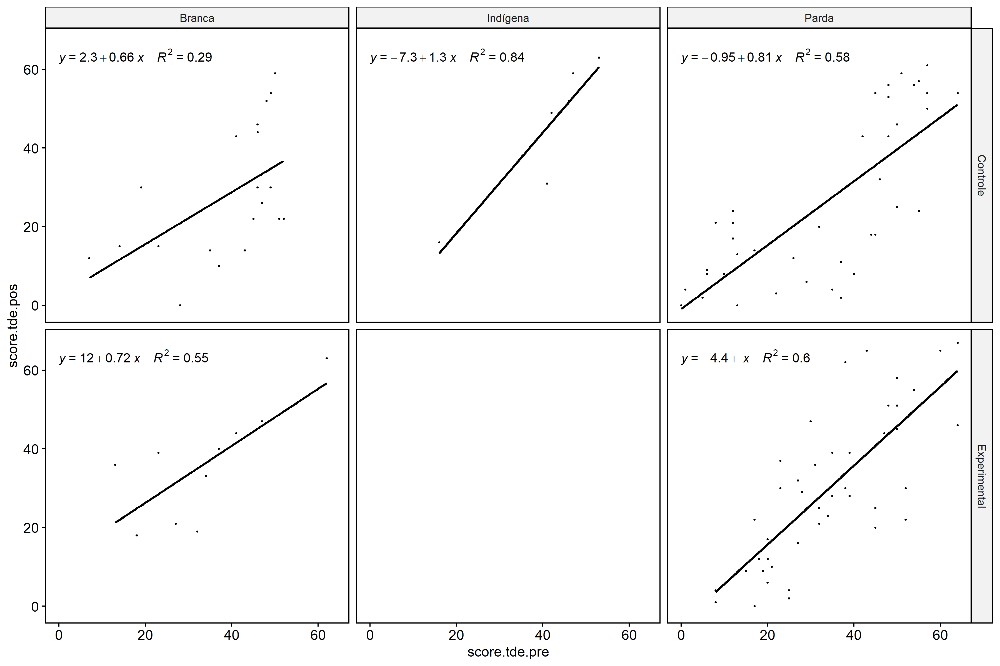<!-- -->

### Checking normality and homogeneity

``` r
res <- augment(lm(score.tde.pos ~ score.tde.pre + grupo*Cor.Raca, data = wdat))
```

``` r
shapiro_test(res$.resid)
```

    ## # A tibble: 1 × 3
    ##   variable   statistic p.value
    ##   <chr>          <dbl>   <dbl>
    ## 1 res$.resid     0.982   0.107

``` r
levene_test(res, .resid ~ grupo*Cor.Raca)
```

    ## # A tibble: 1 × 4
    ##     df1   df2 statistic     p
    ##   <int> <int>     <dbl> <dbl>
    ## 1     4   116      1.37 0.250

# ANCOVA and Pairwise for two factors **grupo:score.tde.quintile**

## Without remove non-normal data

``` r
pdat = remove_group_data(dat[!is.na(dat[["grupo"]]) & !is.na(dat[["score.tde.quintile"]]),], "score.tde.pos", c("grupo","score.tde.quintile"))

pdat.long <- rbind(pdat[,c("id","grupo","score.tde.quintile")], pdat[,c("id","grupo","score.tde.quintile")])
pdat.long[["time"]] <- c(rep("pre", nrow(pdat)), rep("pos", nrow(pdat)))
pdat.long[["time"]] <- factor(pdat.long[["time"]], c("pre","pos"))
pdat.long[["score.tde"]] <- c(pdat[["score.tde.pre"]], pdat[["score.tde.pos"]])

aov = anova_test(pdat, score.tde.pos ~ score.tde.pre + grupo*score.tde.quintile)
laov[["grupo:score.tde.quintile"]] <- get_anova_table(aov)
```

``` r
pwcs <- list()
pwcs[["score.tde.quintile"]] <- emmeans_test(
  group_by(pdat, grupo), score.tde.pos ~ score.tde.quintile,
  covariate = score.tde.pre, p.adjust.method = "bonferroni")
pwcs[["grupo"]] <- emmeans_test(
  group_by(pdat, score.tde.quintile), score.tde.pos ~ grupo,
  covariate = score.tde.pre, p.adjust.method = "bonferroni")

pwc <- plyr::rbind.fill(pwcs[["grupo"]], pwcs[["score.tde.quintile"]])
pwc <- pwc[,c("grupo","score.tde.quintile", colnames(pwc)[!colnames(pwc) %in% c("grupo","score.tde.quintile")])]
```

``` r
pwc.long <- emmeans_test(dplyr::group_by_at(pdat.long, c("grupo","score.tde.quintile")),
                         score.tde ~ time,
                         p.adjust.method = "bonferroni")
lpwc[["grupo:score.tde.quintile"]] <- plyr::rbind.fill(pwc, pwc.long)
```

``` r
ds <- get.descriptives(pdat, "score.tde.pos", c("grupo","score.tde.quintile"), covar = "score.tde.pre")
ds <- merge(ds[ds$variable != "score.tde.pre",],
            ds[ds$variable == "score.tde.pre", !colnames(ds) %in% c("variable")],
            by = c("grupo","score.tde.quintile"), all.x = T, suffixes = c("", ".score.tde.pre"))
ds <- merge(get_emmeans(pwcs[["grupo"]]), ds, by = c("grupo","score.tde.quintile"), suffixes = c(".emms", ""))
ds <- ds[,c("grupo","score.tde.quintile","n","mean.score.tde.pre","se.score.tde.pre","mean","se","emmean","se.emms")]

colnames(ds) <- c("grupo","score.tde.quintile", "N", paste0(c("M","SE")," (pre)"),
                  paste0(c("M","SE"), " (unadj)"), paste0(c("M", "SE"), " (adj)"))

lemms[["grupo:score.tde.quintile"]] <- ds
```

## Computing ANCOVA and PairWise After removing non-normal data (OK)

``` r
wdat = pdat 

res = residuals(lm(score.tde.pos ~ score.tde.pre + grupo*score.tde.quintile, data = wdat))
non.normal = getNonNormal(res, wdat$id, plimit = 0.05)

wdat = wdat[!wdat$id %in% non.normal,]

wdat.long <- rbind(wdat[,c("id","grupo","score.tde.quintile")], wdat[,c("id","grupo","score.tde.quintile")])
wdat.long[["time"]] <- c(rep("pre", nrow(wdat)), rep("pos", nrow(wdat)))
wdat.long[["time"]] <- factor(wdat.long[["time"]], c("pre","pos"))
wdat.long[["score.tde"]] <- c(wdat[["score.tde.pre"]], wdat[["score.tde.pos"]])


ldat[["grupo:score.tde.quintile"]] = wdat

(non.normal)
```

    ## [1] "P984"

``` r
aov = anova_test(wdat, score.tde.pos ~ score.tde.pre + grupo*score.tde.quintile)
laov[["grupo:score.tde.quintile"]] <- merge(get_anova_table(aov), laov[["grupo:score.tde.quintile"]], by="Effect", suffixes = c("","'"))

(df = get_anova_table(aov))
```

    ## ANOVA Table (type II tests)
    ## 
    ##                     Effect DFn DFd      F        p p<.05   ges
    ## 1            score.tde.pre   1 316 45.257 8.12e-11     * 0.125
    ## 2                    grupo   1 316 11.121 9.55e-04     * 0.034
    ## 3       score.tde.quintile   4 316  1.935 1.04e-01       0.024
    ## 4 grupo:score.tde.quintile   4 316  1.912 1.08e-01       0.024

| Effect                   | DFn | DFd |      F |     p | p\<.05 |   ges |
|:-------------------------|----:|----:|-------:|------:|:-------|------:|
| score.tde.pre            |   1 | 316 | 45.257 | 0.000 | \*     | 0.125 |
| grupo                    |   1 | 316 | 11.121 | 0.001 | \*     | 0.034 |
| score.tde.quintile       |   4 | 316 |  1.935 | 0.104 |        | 0.024 |
| grupo:score.tde.quintile |   4 | 316 |  1.912 | 0.108 |        | 0.024 |

``` r
pwcs <- list()
pwcs[["score.tde.quintile"]] <- emmeans_test(
  group_by(wdat, grupo), score.tde.pos ~ score.tde.quintile,
  covariate = score.tde.pre, p.adjust.method = "bonferroni")
pwcs[["grupo"]] <- emmeans_test(
  group_by(wdat, score.tde.quintile), score.tde.pos ~ grupo,
  covariate = score.tde.pre, p.adjust.method = "bonferroni")

pwc <- plyr::rbind.fill(pwcs[["grupo"]], pwcs[["score.tde.quintile"]])
pwc <- pwc[,c("grupo","score.tde.quintile", colnames(pwc)[!colnames(pwc) %in% c("grupo","score.tde.quintile")])]
```

| grupo        | score.tde.quintile | term                              | .y.           | group1       | group2       |  df | statistic |     p | p.adj | p.adj.signif |
|:-------------|:-------------------|:----------------------------------|:--------------|:-------------|:-------------|----:|----------:|------:|------:|:-------------|
|              | 1st quintile       | score.tde.pre\*grupo              | score.tde.pos | Controle     | Experimental | 316 |    -0.586 | 0.558 | 0.558 | ns           |
|              | 2nd quintile       | score.tde.pre\*grupo              | score.tde.pos | Controle     | Experimental | 316 |    -1.404 | 0.161 | 0.161 | ns           |
|              | 3rd quintile       | score.tde.pre\*grupo              | score.tde.pos | Controle     | Experimental | 316 |    -3.452 | 0.001 | 0.001 | \*\*\*       |
|              | 4th quintile       | score.tde.pre\*grupo              | score.tde.pos | Controle     | Experimental | 316 |    -2.111 | 0.036 | 0.036 | \*           |
|              | 5th quintile       | score.tde.pre\*grupo              | score.tde.pos | Controle     | Experimental | 316 |     0.156 | 0.876 | 0.876 | ns           |
| Controle     |                    | score.tde.pre\*score.tde.quintile | score.tde.pos | 1st quintile | 2nd quintile | 316 |     1.769 | 0.078 | 0.778 | ns           |
| Controle     |                    | score.tde.pre\*score.tde.quintile | score.tde.pos | 1st quintile | 3rd quintile | 316 |     3.018 | 0.003 | 0.028 | \*           |
| Controle     |                    | score.tde.pre\*score.tde.quintile | score.tde.pos | 1st quintile | 4th quintile | 316 |     1.707 | 0.089 | 0.888 | ns           |
| Controle     |                    | score.tde.pre\*score.tde.quintile | score.tde.pos | 1st quintile | 5th quintile | 316 |     1.355 | 0.176 | 1.000 | ns           |
| Controle     |                    | score.tde.pre\*score.tde.quintile | score.tde.pos | 2nd quintile | 3rd quintile | 316 |     2.468 | 0.014 | 0.141 | ns           |
| Controle     |                    | score.tde.pre\*score.tde.quintile | score.tde.pos | 2nd quintile | 4th quintile | 316 |     0.974 | 0.331 | 1.000 | ns           |
| Controle     |                    | score.tde.pre\*score.tde.quintile | score.tde.pos | 2nd quintile | 5th quintile | 316 |     0.742 | 0.459 | 1.000 | ns           |
| Controle     |                    | score.tde.pre\*score.tde.quintile | score.tde.pos | 3rd quintile | 4th quintile | 316 |    -1.656 | 0.099 | 0.988 | ns           |
| Controle     |                    | score.tde.pre\*score.tde.quintile | score.tde.pos | 3rd quintile | 5th quintile | 316 |    -1.171 | 0.242 | 1.000 | ns           |
| Controle     |                    | score.tde.pre\*score.tde.quintile | score.tde.pos | 4th quintile | 5th quintile | 316 |     0.051 | 0.960 | 1.000 | ns           |
| Experimental |                    | score.tde.pre\*score.tde.quintile | score.tde.pos | 1st quintile | 2nd quintile | 316 |     1.182 | 0.238 | 1.000 | ns           |
| Experimental |                    | score.tde.pre\*score.tde.quintile | score.tde.pos | 1st quintile | 3rd quintile | 316 |     1.587 | 0.114 | 1.000 | ns           |
| Experimental |                    | score.tde.pre\*score.tde.quintile | score.tde.pos | 1st quintile | 4th quintile | 316 |     1.236 | 0.217 | 1.000 | ns           |
| Experimental |                    | score.tde.pre\*score.tde.quintile | score.tde.pos | 1st quintile | 5th quintile | 316 |     1.670 | 0.096 | 0.958 | ns           |
| Experimental |                    | score.tde.pre\*score.tde.quintile | score.tde.pos | 2nd quintile | 3rd quintile | 316 |     1.190 | 0.235 | 1.000 | ns           |
| Experimental |                    | score.tde.pre\*score.tde.quintile | score.tde.pos | 2nd quintile | 4th quintile | 316 |     0.849 | 0.396 | 1.000 | ns           |
| Experimental |                    | score.tde.pre\*score.tde.quintile | score.tde.pos | 2nd quintile | 5th quintile | 316 |     1.569 | 0.118 | 1.000 | ns           |
| Experimental |                    | score.tde.pre\*score.tde.quintile | score.tde.pos | 3rd quintile | 4th quintile | 316 |    -0.014 | 0.989 | 1.000 | ns           |
| Experimental |                    | score.tde.pre\*score.tde.quintile | score.tde.pos | 3rd quintile | 5th quintile | 316 |     1.329 | 0.185 | 1.000 | ns           |
| Experimental |                    | score.tde.pre\*score.tde.quintile | score.tde.pos | 4th quintile | 5th quintile | 316 |     1.773 | 0.077 | 0.771 | ns           |

``` r
pwc.long <- emmeans_test(dplyr::group_by_at(wdat.long, c("grupo","score.tde.quintile")),
                         score.tde ~ time,
                         p.adjust.method = "bonferroni")
lpwc[["grupo:score.tde.quintile"]] <- merge(plyr::rbind.fill(pwc, pwc.long), lpwc[["grupo:score.tde.quintile"]], by=c("grupo","score.tde.quintile","term",".y.","group1","group2"), suffixes = c("","'"))
```

| grupo        | score.tde.quintile | term | .y.       | group1 | group2 |  df | statistic |     p | p.adj | p.adj.signif |
|:-------------|:-------------------|:-----|:----------|:-------|:-------|----:|----------:|------:|------:|:-------------|
| Controle     | 1st quintile       | time | score.tde | pre    | pos    | 634 |     0.726 | 0.468 | 0.468 | ns           |
| Controle     | 2nd quintile       | time | score.tde | pre    | pos    | 634 |     2.421 | 0.016 | 0.016 | \*           |
| Controle     | 3rd quintile       | time | score.tde | pre    | pos    | 634 |     4.819 | 0.000 | 0.000 | \*\*\*\*     |
| Controle     | 4th quintile       | time | score.tde | pre    | pos    | 634 |     3.862 | 0.000 | 0.000 | \*\*\*       |
| Controle     | 5th quintile       | time | score.tde | pre    | pos    | 634 |     2.313 | 0.021 | 0.021 | \*           |
| Experimental | 1st quintile       | time | score.tde | pre    | pos    | 634 |    -0.166 | 0.868 | 0.868 | ns           |
| Experimental | 2nd quintile       | time | score.tde | pre    | pos    | 634 |     0.950 | 0.342 | 0.342 | ns           |
| Experimental | 3rd quintile       | time | score.tde | pre    | pos    | 634 |     2.090 | 0.037 | 0.037 | \*           |
| Experimental | 4th quintile       | time | score.tde | pre    | pos    | 634 |     1.257 | 0.209 | 0.209 | ns           |
| Experimental | 5th quintile       | time | score.tde | pre    | pos    | 634 |     2.854 | 0.004 | 0.004 | \*\*         |

``` r
ds <- get.descriptives(wdat, "score.tde.pos", c("grupo","score.tde.quintile"), covar = "score.tde.pre")
ds <- merge(ds[ds$variable != "score.tde.pre",],
            ds[ds$variable == "score.tde.pre", !colnames(ds) %in% c("variable")],
            by = c("grupo","score.tde.quintile"), all.x = T, suffixes = c("", ".score.tde.pre"))
ds <- merge(get_emmeans(pwcs[["grupo"]]), ds, by = c("grupo","score.tde.quintile"), suffixes = c(".emms", ""))
ds <- ds[,c("grupo","score.tde.quintile","n","mean.score.tde.pre","se.score.tde.pre","mean","se","emmean","se.emms")]

colnames(ds) <- c("grupo","score.tde.quintile", "N", paste0(c("M","SE")," (pre)"),
                  paste0(c("M","SE"), " (unadj)"), paste0(c("M", "SE"), " (adj)"))

lemms[["grupo:score.tde.quintile"]] <- merge(ds, lemms[["grupo:score.tde.quintile"]], by=c("grupo","score.tde.quintile"), suffixes = c("","'"))
```

| grupo        | score.tde.quintile |   N | M (pre) | SE (pre) | M (unadj) | SE (unadj) | M (adj) | SE (adj) |
|:-------------|:-------------------|----:|--------:|---------:|----------:|-----------:|--------:|---------:|
| Controle     | 1st quintile       |  34 |  10.176 |    0.959 |     8.559 |      1.231 |  38.042 |    4.815 |
| Controle     | 2nd quintile       |  24 |  23.708 |    0.706 |    17.292 |      2.878 |  31.196 |    3.147 |
| Controle     | 3rd quintile       |  17 |  38.059 |    0.847 |    22.882 |      4.172 |  20.266 |    2.846 |
| Controle     | 4th quintile       |  42 |  47.000 |    0.354 |    39.262 |      2.159 |  26.352 |    2.627 |
| Controle     | 5th quintile       |  23 |  57.957 |    0.934 |    51.696 |      3.121 |  26.172 |    4.502 |
| Experimental | 1st quintile       |  26 |  11.885 |    0.892 |    12.308 |      2.064 |  39.824 |    4.683 |
| Experimental | 2nd quintile       |  41 |  25.512 |    0.602 |    23.585 |      1.898 |  35.413 |    2.527 |
| Experimental | 3rd quintile       |  47 |  37.043 |    0.475 |    33.085 |      1.712 |  31.638 |    1.709 |
| Experimental | 4th quintile       |  43 |  46.488 |    0.387 |    44.000 |      1.790 |  31.679 |    2.549 |
| Experimental | 5th quintile       |  30 |  57.933 |    0.822 |    51.167 |      2.162 |  25.669 |    4.344 |

### Plots for ancova

``` r
plots <- twoWayAncovaPlots(
  wdat, "score.tde.pos", c("grupo","score.tde.quintile"), aov, pwcs, addParam = c("mean_se"),
  font.label.size=10, step.increase=0.05, p.label="p.adj",
  subtitle = which(aov$Effect == "grupo:score.tde.quintile"))
```

``` r
if (!is.null(plots[["grupo"]]))
  plots[["grupo"]] + ggplot2::scale_color_manual(values = color[["score.tde.quintile"]])
```

    ## Scale for colour is already present.
    ## Adding another scale for colour, which will replace the existing scale.

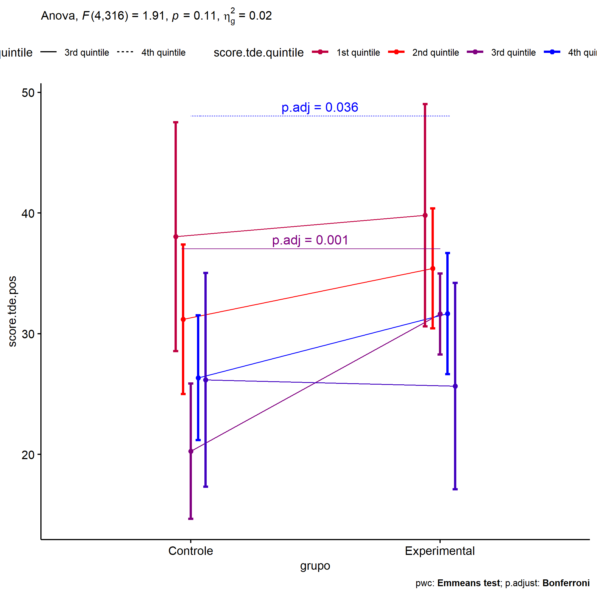<!-- -->

``` r
if (!is.null(plots[["score.tde.quintile"]]))
  plots[["score.tde.quintile"]] + ggplot2::scale_color_manual(values = color[["grupo"]])
```

    ## Scale for colour is already present.
    ## Adding another scale for colour, which will replace the existing scale.

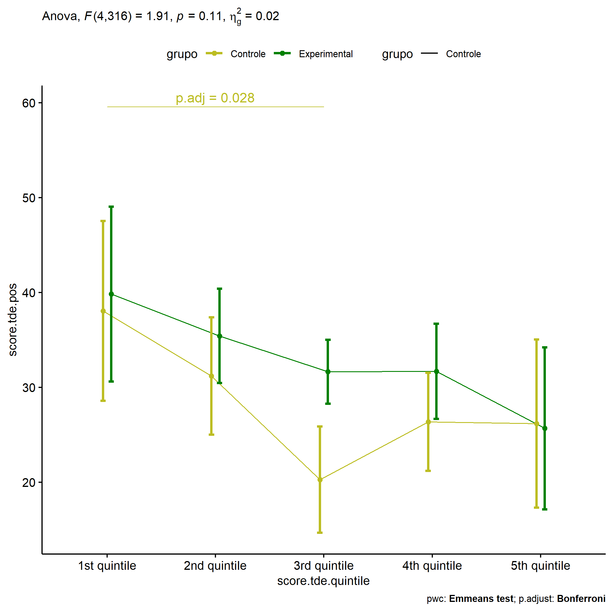<!-- -->

``` r
plots <- twoWayAncovaBoxPlots(
  wdat, "score.tde.pos", c("grupo","score.tde.quintile"), aov, pwcs, covar = "score.tde.pre",
  theme = "classic", color = color[["grupo:score.tde.quintile"]],
  subtitle = which(aov$Effect == "grupo:score.tde.quintile"))
```

``` r
plots[["grupo:score.tde.quintile"]] + ggplot2::ylab("TDE - Escrita") + ggplot2::scale_x_discrete(labels=c('pre', 'pos'))
```

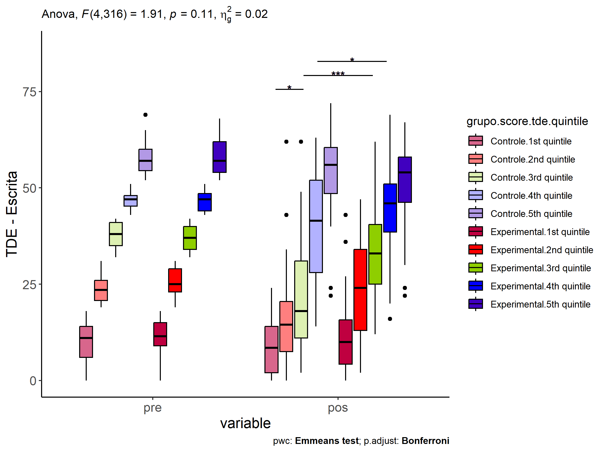<!-- -->

``` r
plots <- twoWayAncovaBoxPlots(
  wdat.long, "score.tde", c("grupo","score.tde.quintile"), aov, pwc.long, pre.post = "time",
  theme = "classic", color = color$prepost)
```

``` r
plots[["grupo:score.tde.quintile"]] + ggplot2::ylab("TDE - Escrita")
```

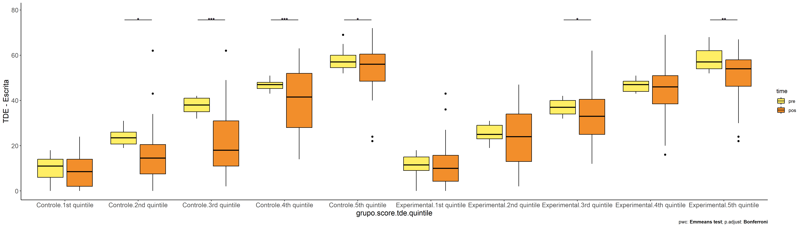<!-- -->

### Checking linearity assumption

``` r
ggscatter(wdat, x = "score.tde.pre", y = "score.tde.pos", size = 0.5,
          facet.by = c("grupo","score.tde.quintile"), add = "reg.line")+
  stat_regline_equation(
    aes(label =  paste(..eq.label.., ..rr.label.., sep = "~~~~"))
  )
```

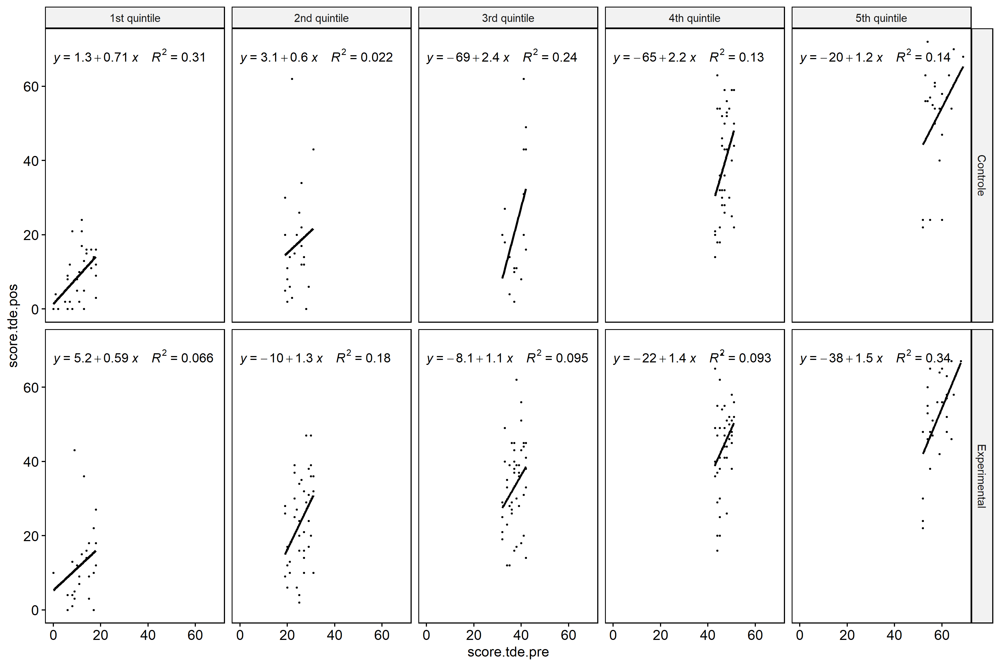<!-- -->

### Checking normality and homogeneity

``` r
res <- augment(lm(score.tde.pos ~ score.tde.pre + grupo*score.tde.quintile, data = wdat))
```

``` r
shapiro_test(res$.resid)
```

    ## # A tibble: 1 × 3
    ##   variable   statistic p.value
    ##   <chr>          <dbl>   <dbl>
    ## 1 res$.resid     0.991  0.0385

``` r
levene_test(res, .resid ~ grupo*score.tde.quintile)
```

    ## # A tibble: 1 × 4
    ##     df1   df2 statistic       p
    ##   <int> <int>     <dbl>   <dbl>
    ## 1     9   317      2.65 0.00563

# Summary of Results

## Descriptive Statistics

``` r
df <- get.descriptives(ldat[["grupo"]], c(dv.pre, dv.pos), c("grupo"), 
                       include.global = T, symmetry.test = T, normality.test = F)
df <- plyr::rbind.fill(
  df, do.call(plyr::rbind.fill, lapply(lfatores2, FUN = function(f) {
    if (nrow(dat) > 0 && sum(!is.na(unique(dat[[f]]))) > 1)
      get.descriptives(ldat[[paste0("grupo:",f)]], c(dv.pre,dv.pos), c("grupo", f),
                       symmetry.test = T, normality.test = F)
    }))
)
(df <- df[,c(fatores1[fatores1 %in% colnames(df)],"variable",
             colnames(df)[!colnames(df) %in% c(fatores1,"variable")])])
```

    ##           grupo Sexo   Zona Cor.Raca score.tde.quintile      variable   n   mean median min max     sd    se
    ## 1      Controle <NA>   <NA>     <NA>               <NA> score.tde.pre 139 34.871   41.0   0  69 17.922 1.520
    ## 2  Experimental <NA>   <NA>     <NA>               <NA> score.tde.pre 187 36.540   38.0   0  68 14.891 1.089
    ## 3          <NA> <NA>   <NA>     <NA>               <NA> score.tde.pre 326 35.828   38.5   0  69 16.248 0.900
    ## 4      Controle <NA>   <NA>     <NA>               <NA> score.tde.pos 139 27.849   22.0   0  72 20.339 1.725
    ## 5  Experimental <NA>   <NA>     <NA>               <NA> score.tde.pos 187 33.524   36.0   0  69 17.147 1.254
    ## 6          <NA> <NA>   <NA>     <NA>               <NA> score.tde.pos 326 31.104   30.0   0  72 18.757 1.039
    ## 7      Controle    F   <NA>     <NA>               <NA> score.tde.pre  79 37.873   42.0   0  65 16.839 1.895
    ## 8      Controle    M   <NA>     <NA>               <NA> score.tde.pre  60 30.917   31.5   0  69 18.667 2.410
    ## 9  Experimental    F   <NA>     <NA>               <NA> score.tde.pre  88 37.841   39.0   0  68 13.887 1.480
    ## 10 Experimental    M   <NA>     <NA>               <NA> score.tde.pre  99 35.384   35.0   6  65 15.710 1.579
    ## 11     Controle    F   <NA>     <NA>               <NA> score.tde.pos  79 29.861   25.0   0  72 20.627 2.321
    ## 12     Controle    M   <NA>     <NA>               <NA> score.tde.pos  60 25.200   20.5   0  68 19.813 2.558
    ## 13 Experimental    F   <NA>     <NA>               <NA> score.tde.pos  88 36.227   39.0   0  67 16.312 1.739
    ## 14 Experimental    M   <NA>     <NA>               <NA> score.tde.pos  99 31.121   33.0   0  69 17.590 1.768
    ## 15     Controle <NA>  Rural     <NA>               <NA> score.tde.pre  68 33.912   42.0   0  69 19.355 2.347
    ## 16     Controle <NA> Urbana     <NA>               <NA> score.tde.pre  55 36.036   38.0   1  64 15.821 2.133
    ## 17 Experimental <NA>  Rural     <NA>               <NA> score.tde.pre  87 35.287   35.0   8  68 14.454 1.550
    ## 18 Experimental <NA> Urbana     <NA>               <NA> score.tde.pre  75 38.280   41.0   0  65 15.835 1.828
    ## 19     Controle <NA>  Rural     <NA>               <NA> score.tde.pos  68 33.559   30.5   0  72 22.137 2.684
    ## 20     Controle <NA> Urbana     <NA>               <NA> score.tde.pos  55 22.745   18.0   0  58 17.607 2.374
    ## 21 Experimental <NA>  Rural     <NA>               <NA> score.tde.pos  87 33.391   32.0   0  67 17.220 1.846
    ## 22 Experimental <NA> Urbana     <NA>               <NA> score.tde.pos  75 33.920   38.0   0  67 16.991 1.962
    ## 23     Controle <NA>   <NA>   Branca               <NA> score.tde.pre  21 39.095   45.0   7  52 13.160 2.872
    ## 24     Controle <NA>   <NA> Indígena               <NA> score.tde.pre   6 40.833   44.0  16  53 12.891 5.263
    ## 25     Controle <NA>   <NA>    Parda               <NA> score.tde.pre  39 33.051   37.0   0  64 19.530 3.127
    ## 26 Experimental <NA>   <NA>   Branca               <NA> score.tde.pre  10 33.400   33.0  13  62 14.447 4.568
    ## 27 Experimental <NA>   <NA>    Parda               <NA> score.tde.pre  45 34.378   32.0   8  64 14.587 2.175
    ## 28     Controle <NA>   <NA>   Branca               <NA> score.tde.pos  21 28.190   26.0   0  59 16.204 3.536
    ## 29     Controle <NA>   <NA> Indígena               <NA> score.tde.pos   6 45.000   50.5  16  63 18.011 7.353
    ## 30     Controle <NA>   <NA>    Parda               <NA> score.tde.pos  39 25.897   20.0   0  61 20.803 3.331
    ## 31 Experimental <NA>   <NA>   Branca               <NA> score.tde.pos  10 36.000   37.5  18  63 14.087 4.455
    ## 32 Experimental <NA>   <NA>    Parda               <NA> score.tde.pos  45 30.089   29.0   0  67 18.918 2.820
    ## 33     Controle <NA>   <NA>     <NA>       1st quintile score.tde.pre  34 10.176   11.0   0  18  5.589 0.959
    ## 34     Controle <NA>   <NA>     <NA>       2nd quintile score.tde.pre  24 23.708   23.5  19  31  3.458 0.706
    ## 35     Controle <NA>   <NA>     <NA>       3rd quintile score.tde.pre  17 38.059   38.0  32  42  3.491 0.847
    ## 36     Controle <NA>   <NA>     <NA>       4th quintile score.tde.pre  42 47.000   47.0  43  51  2.295 0.354
    ## 37     Controle <NA>   <NA>     <NA>       5th quintile score.tde.pre  23 57.957   57.0  52  69  4.477 0.934
    ## 38 Experimental <NA>   <NA>     <NA>       1st quintile score.tde.pre  26 11.885   11.5   0  18  4.546 0.892
    ## 39 Experimental <NA>   <NA>     <NA>       2nd quintile score.tde.pre  41 25.512   25.0  19  31  3.854 0.602
    ## 40 Experimental <NA>   <NA>     <NA>       3rd quintile score.tde.pre  47 37.043   37.0  32  42  3.257 0.475
    ## 41 Experimental <NA>   <NA>     <NA>       4th quintile score.tde.pre  43 46.488   47.0  43  51  2.539 0.387
    ## 42 Experimental <NA>   <NA>     <NA>       5th quintile score.tde.pre  30 57.933   57.0  52  68  4.502 0.822
    ## 43     Controle <NA>   <NA>     <NA>       1st quintile score.tde.pos  34  8.559    8.5   0  24  7.178 1.231
    ## 44     Controle <NA>   <NA>     <NA>       2nd quintile score.tde.pos  24 17.292   14.5   0  62 14.097 2.878
    ## 45     Controle <NA>   <NA>     <NA>       3rd quintile score.tde.pos  17 22.882   18.0   2  62 17.201 4.172
    ## 46     Controle <NA>   <NA>     <NA>       4th quintile score.tde.pos  42 39.262   41.5  14  63 13.991 2.159
    ## 47     Controle <NA>   <NA>     <NA>       5th quintile score.tde.pos  23 51.696   56.0  22  72 14.968 3.121
    ## 48 Experimental <NA>   <NA>     <NA>       1st quintile score.tde.pos  26 12.308   10.0   0  43 10.525 2.064
    ## 49 Experimental <NA>   <NA>     <NA>       2nd quintile score.tde.pos  41 23.585   24.0   2  47 12.153 1.898
    ## 50 Experimental <NA>   <NA>     <NA>       3rd quintile score.tde.pos  47 33.085   33.0  12  62 11.738 1.712
    ## 51 Experimental <NA>   <NA>     <NA>       4th quintile score.tde.pos  43 44.000   46.0  16  69 11.737 1.790
    ## 52 Experimental <NA>   <NA>     <NA>       5th quintile score.tde.pos  30 51.167   54.0  22  67 11.841 2.162
    ##        ci   iqr symmetry    skewness    kurtosis
    ## 1   3.006 29.00      YES -0.28761053 -1.16118998
    ## 2   2.148 21.50      YES -0.19526601 -0.68190100
    ## 3   1.770 25.00      YES -0.27894932 -0.86097683
    ## 4   3.411 35.00      YES  0.39897063 -1.15282707
    ## 5   2.474 27.50      YES -0.06315904 -0.93357702
    ## 6   2.044 32.00      YES  0.11359510 -1.11003134
    ## 7   3.772 24.00       NO -0.51351885 -0.76379183
    ## 8   4.822 33.25      YES  0.02496407 -1.42130474
    ## 9   2.942 18.50      YES -0.24401895 -0.40730547
    ## 10  3.133 22.50      YES -0.11640966 -0.91741745
    ## 11  4.620 38.00      YES  0.31467429 -1.28720316
    ## 12  5.118 32.00      YES  0.49858763 -1.01325315
    ## 13  3.456 23.50      YES -0.22319439 -0.80941942
    ## 14  3.508 28.00      YES  0.10428591 -0.98016436
    ## 15  4.685 34.25      YES -0.25927029 -1.36693159
    ## 16  4.277 22.00      YES -0.30941742 -0.75133301
    ## 17  3.081 20.50      YES -0.04331608 -0.79493001
    ## 18  3.643 21.00      YES -0.40412761 -0.51440334
    ## 19  5.358 40.00      YES  0.01493768 -1.39648233
    ## 20  4.760 21.50       NO  0.67661933 -0.80273995
    ## 21  3.670 27.50      YES  0.13537695 -0.96069524
    ## 22  3.909 24.00      YES -0.33362507 -0.87666546
    ## 23  5.990 13.00       NO -1.10421458 -0.13561624
    ## 24 13.528  5.50       NO -1.02238287 -0.55906746
    ## 25  6.331 36.50      YES -0.25426606 -1.46950430
    ## 26 10.335 16.00      YES  0.42661230 -0.82006409
    ## 27  4.382 24.00      YES  0.21104071 -0.91204573
    ## 28  7.376 28.00      YES  0.32641306 -1.04286093
    ## 29 18.901 21.75       NO -0.51773093 -1.58769587
    ## 30  6.744 40.00      YES  0.41613577 -1.44420279
    ## 31 10.077 19.00      YES  0.26721583 -0.99463169
    ## 32  5.684 28.00      YES  0.23754246 -0.94968842
    ## 33  1.950  8.00      YES -0.23749468 -1.12102101
    ## 34  1.460  5.25      YES  0.22397163 -1.11435311
    ## 35  1.795  6.00      YES -0.34496939 -1.46502009
    ## 36  0.715  2.75      YES  0.12995405 -0.86910273
    ## 37  1.936  5.50       NO  0.62334486 -0.40004029
    ## 38  1.836  6.00      YES -0.46839054 -0.31387227
    ## 39  1.217  6.00      YES -0.21877481 -1.22838389
    ## 40  0.956  6.00      YES -0.04822059 -1.24726263
    ## 41  0.781  4.50      YES  0.19227711 -1.30161379
    ## 42  1.681  8.00      YES  0.34680876 -1.09814501
    ## 43  2.505 12.00      YES  0.33973995 -1.11792131
    ## 44  5.953 13.00       NO  1.42820083  2.05797854
    ## 45  8.844 20.00       NO  0.79459910 -0.59289331
    ## 46  4.360 24.00      YES -0.07408140 -1.39505021
    ## 47  6.473 12.00       NO -0.87827576 -0.43274833
    ## 48  4.251 11.50       NO  1.25776893  1.23425409
    ## 49  3.836 21.00      YES  0.04251418 -1.12558348
    ## 50  3.446 15.50      YES  0.09464695 -0.58339850
    ## 51  3.612 12.50      YES -0.41361522 -0.03620304
    ## 52  4.422 11.75       NO -0.82589034  0.04795411

| grupo        | Sexo | Zona   | Cor.Raca | score.tde.quintile | variable      |   n |   mean | median | min | max |     sd |    se |     ci |   iqr | symmetry | skewness | kurtosis |
|:-------------|:-----|:-------|:---------|:-------------------|:--------------|----:|-------:|-------:|----:|----:|-------:|------:|-------:|------:|:---------|---------:|---------:|
| Controle     |      |        |          |                    | score.tde.pre | 139 | 34.871 |   41.0 |   0 |  69 | 17.922 | 1.520 |  3.006 | 29.00 | YES      |   -0.288 |   -1.161 |
| Experimental |      |        |          |                    | score.tde.pre | 187 | 36.540 |   38.0 |   0 |  68 | 14.891 | 1.089 |  2.148 | 21.50 | YES      |   -0.195 |   -0.682 |
|              |      |        |          |                    | score.tde.pre | 326 | 35.828 |   38.5 |   0 |  69 | 16.248 | 0.900 |  1.770 | 25.00 | YES      |   -0.279 |   -0.861 |
| Controle     |      |        |          |                    | score.tde.pos | 139 | 27.849 |   22.0 |   0 |  72 | 20.339 | 1.725 |  3.411 | 35.00 | YES      |    0.399 |   -1.153 |
| Experimental |      |        |          |                    | score.tde.pos | 187 | 33.524 |   36.0 |   0 |  69 | 17.147 | 1.254 |  2.474 | 27.50 | YES      |   -0.063 |   -0.934 |
|              |      |        |          |                    | score.tde.pos | 326 | 31.104 |   30.0 |   0 |  72 | 18.757 | 1.039 |  2.044 | 32.00 | YES      |    0.114 |   -1.110 |
| Controle     | F    |        |          |                    | score.tde.pre |  79 | 37.873 |   42.0 |   0 |  65 | 16.839 | 1.895 |  3.772 | 24.00 | NO       |   -0.514 |   -0.764 |
| Controle     | M    |        |          |                    | score.tde.pre |  60 | 30.917 |   31.5 |   0 |  69 | 18.667 | 2.410 |  4.822 | 33.25 | YES      |    0.025 |   -1.421 |
| Experimental | F    |        |          |                    | score.tde.pre |  88 | 37.841 |   39.0 |   0 |  68 | 13.887 | 1.480 |  2.942 | 18.50 | YES      |   -0.244 |   -0.407 |
| Experimental | M    |        |          |                    | score.tde.pre |  99 | 35.384 |   35.0 |   6 |  65 | 15.710 | 1.579 |  3.133 | 22.50 | YES      |   -0.116 |   -0.917 |
| Controle     | F    |        |          |                    | score.tde.pos |  79 | 29.861 |   25.0 |   0 |  72 | 20.627 | 2.321 |  4.620 | 38.00 | YES      |    0.315 |   -1.287 |
| Controle     | M    |        |          |                    | score.tde.pos |  60 | 25.200 |   20.5 |   0 |  68 | 19.813 | 2.558 |  5.118 | 32.00 | YES      |    0.499 |   -1.013 |
| Experimental | F    |        |          |                    | score.tde.pos |  88 | 36.227 |   39.0 |   0 |  67 | 16.312 | 1.739 |  3.456 | 23.50 | YES      |   -0.223 |   -0.809 |
| Experimental | M    |        |          |                    | score.tde.pos |  99 | 31.121 |   33.0 |   0 |  69 | 17.590 | 1.768 |  3.508 | 28.00 | YES      |    0.104 |   -0.980 |
| Controle     |      | Rural  |          |                    | score.tde.pre |  68 | 33.912 |   42.0 |   0 |  69 | 19.355 | 2.347 |  4.685 | 34.25 | YES      |   -0.259 |   -1.367 |
| Controle     |      | Urbana |          |                    | score.tde.pre |  55 | 36.036 |   38.0 |   1 |  64 | 15.821 | 2.133 |  4.277 | 22.00 | YES      |   -0.309 |   -0.751 |
| Experimental |      | Rural  |          |                    | score.tde.pre |  87 | 35.287 |   35.0 |   8 |  68 | 14.454 | 1.550 |  3.081 | 20.50 | YES      |   -0.043 |   -0.795 |
| Experimental |      | Urbana |          |                    | score.tde.pre |  75 | 38.280 |   41.0 |   0 |  65 | 15.835 | 1.828 |  3.643 | 21.00 | YES      |   -0.404 |   -0.514 |
| Controle     |      | Rural  |          |                    | score.tde.pos |  68 | 33.559 |   30.5 |   0 |  72 | 22.137 | 2.684 |  5.358 | 40.00 | YES      |    0.015 |   -1.396 |
| Controle     |      | Urbana |          |                    | score.tde.pos |  55 | 22.745 |   18.0 |   0 |  58 | 17.607 | 2.374 |  4.760 | 21.50 | NO       |    0.677 |   -0.803 |
| Experimental |      | Rural  |          |                    | score.tde.pos |  87 | 33.391 |   32.0 |   0 |  67 | 17.220 | 1.846 |  3.670 | 27.50 | YES      |    0.135 |   -0.961 |
| Experimental |      | Urbana |          |                    | score.tde.pos |  75 | 33.920 |   38.0 |   0 |  67 | 16.991 | 1.962 |  3.909 | 24.00 | YES      |   -0.334 |   -0.877 |
| Controle     |      |        | Branca   |                    | score.tde.pre |  21 | 39.095 |   45.0 |   7 |  52 | 13.160 | 2.872 |  5.990 | 13.00 | NO       |   -1.104 |   -0.136 |
| Controle     |      |        | Indígena |                    | score.tde.pre |   6 | 40.833 |   44.0 |  16 |  53 | 12.891 | 5.263 | 13.528 |  5.50 | NO       |   -1.022 |   -0.559 |
| Controle     |      |        | Parda    |                    | score.tde.pre |  39 | 33.051 |   37.0 |   0 |  64 | 19.530 | 3.127 |  6.331 | 36.50 | YES      |   -0.254 |   -1.470 |
| Experimental |      |        | Branca   |                    | score.tde.pre |  10 | 33.400 |   33.0 |  13 |  62 | 14.447 | 4.568 | 10.335 | 16.00 | YES      |    0.427 |   -0.820 |
| Experimental |      |        | Parda    |                    | score.tde.pre |  45 | 34.378 |   32.0 |   8 |  64 | 14.587 | 2.175 |  4.382 | 24.00 | YES      |    0.211 |   -0.912 |
| Controle     |      |        | Branca   |                    | score.tde.pos |  21 | 28.190 |   26.0 |   0 |  59 | 16.204 | 3.536 |  7.376 | 28.00 | YES      |    0.326 |   -1.043 |
| Controle     |      |        | Indígena |                    | score.tde.pos |   6 | 45.000 |   50.5 |  16 |  63 | 18.011 | 7.353 | 18.901 | 21.75 | NO       |   -0.518 |   -1.588 |
| Controle     |      |        | Parda    |                    | score.tde.pos |  39 | 25.897 |   20.0 |   0 |  61 | 20.803 | 3.331 |  6.744 | 40.00 | YES      |    0.416 |   -1.444 |
| Experimental |      |        | Branca   |                    | score.tde.pos |  10 | 36.000 |   37.5 |  18 |  63 | 14.087 | 4.455 | 10.077 | 19.00 | YES      |    0.267 |   -0.995 |
| Experimental |      |        | Parda    |                    | score.tde.pos |  45 | 30.089 |   29.0 |   0 |  67 | 18.918 | 2.820 |  5.684 | 28.00 | YES      |    0.238 |   -0.950 |
| Controle     |      |        |          | 1st quintile       | score.tde.pre |  34 | 10.176 |   11.0 |   0 |  18 |  5.589 | 0.959 |  1.950 |  8.00 | YES      |   -0.237 |   -1.121 |
| Controle     |      |        |          | 2nd quintile       | score.tde.pre |  24 | 23.708 |   23.5 |  19 |  31 |  3.458 | 0.706 |  1.460 |  5.25 | YES      |    0.224 |   -1.114 |
| Controle     |      |        |          | 3rd quintile       | score.tde.pre |  17 | 38.059 |   38.0 |  32 |  42 |  3.491 | 0.847 |  1.795 |  6.00 | YES      |   -0.345 |   -1.465 |
| Controle     |      |        |          | 4th quintile       | score.tde.pre |  42 | 47.000 |   47.0 |  43 |  51 |  2.295 | 0.354 |  0.715 |  2.75 | YES      |    0.130 |   -0.869 |
| Controle     |      |        |          | 5th quintile       | score.tde.pre |  23 | 57.957 |   57.0 |  52 |  69 |  4.477 | 0.934 |  1.936 |  5.50 | NO       |    0.623 |   -0.400 |
| Experimental |      |        |          | 1st quintile       | score.tde.pre |  26 | 11.885 |   11.5 |   0 |  18 |  4.546 | 0.892 |  1.836 |  6.00 | YES      |   -0.468 |   -0.314 |
| Experimental |      |        |          | 2nd quintile       | score.tde.pre |  41 | 25.512 |   25.0 |  19 |  31 |  3.854 | 0.602 |  1.217 |  6.00 | YES      |   -0.219 |   -1.228 |
| Experimental |      |        |          | 3rd quintile       | score.tde.pre |  47 | 37.043 |   37.0 |  32 |  42 |  3.257 | 0.475 |  0.956 |  6.00 | YES      |   -0.048 |   -1.247 |
| Experimental |      |        |          | 4th quintile       | score.tde.pre |  43 | 46.488 |   47.0 |  43 |  51 |  2.539 | 0.387 |  0.781 |  4.50 | YES      |    0.192 |   -1.302 |
| Experimental |      |        |          | 5th quintile       | score.tde.pre |  30 | 57.933 |   57.0 |  52 |  68 |  4.502 | 0.822 |  1.681 |  8.00 | YES      |    0.347 |   -1.098 |
| Controle     |      |        |          | 1st quintile       | score.tde.pos |  34 |  8.559 |    8.5 |   0 |  24 |  7.178 | 1.231 |  2.505 | 12.00 | YES      |    0.340 |   -1.118 |
| Controle     |      |        |          | 2nd quintile       | score.tde.pos |  24 | 17.292 |   14.5 |   0 |  62 | 14.097 | 2.878 |  5.953 | 13.00 | NO       |    1.428 |    2.058 |
| Controle     |      |        |          | 3rd quintile       | score.tde.pos |  17 | 22.882 |   18.0 |   2 |  62 | 17.201 | 4.172 |  8.844 | 20.00 | NO       |    0.795 |   -0.593 |
| Controle     |      |        |          | 4th quintile       | score.tde.pos |  42 | 39.262 |   41.5 |  14 |  63 | 13.991 | 2.159 |  4.360 | 24.00 | YES      |   -0.074 |   -1.395 |
| Controle     |      |        |          | 5th quintile       | score.tde.pos |  23 | 51.696 |   56.0 |  22 |  72 | 14.968 | 3.121 |  6.473 | 12.00 | NO       |   -0.878 |   -0.433 |
| Experimental |      |        |          | 1st quintile       | score.tde.pos |  26 | 12.308 |   10.0 |   0 |  43 | 10.525 | 2.064 |  4.251 | 11.50 | NO       |    1.258 |    1.234 |
| Experimental |      |        |          | 2nd quintile       | score.tde.pos |  41 | 23.585 |   24.0 |   2 |  47 | 12.153 | 1.898 |  3.836 | 21.00 | YES      |    0.043 |   -1.126 |
| Experimental |      |        |          | 3rd quintile       | score.tde.pos |  47 | 33.085 |   33.0 |  12 |  62 | 11.738 | 1.712 |  3.446 | 15.50 | YES      |    0.095 |   -0.583 |
| Experimental |      |        |          | 4th quintile       | score.tde.pos |  43 | 44.000 |   46.0 |  16 |  69 | 11.737 | 1.790 |  3.612 | 12.50 | YES      |   -0.414 |   -0.036 |
| Experimental |      |        |          | 5th quintile       | score.tde.pos |  30 | 51.167 |   54.0 |  22 |  67 | 11.841 | 2.162 |  4.422 | 11.75 | NO       |   -0.826 |    0.048 |

## ANCOVA Table Comparison

``` r
df <- do.call(plyr::rbind.fill, laov)
(df <- df[!duplicated(df$Effect),])
```

    ##                      Effect DFn DFd       F        p p<.05   ges DFn' DFd'      F'       p' p<.05'  ges'
    ## 1                     grupo   1 323  10.482 1.00e-03     * 0.031    1  325   6.984 9.00e-03      * 0.021
    ## 2             score.tde.pre   1 323 522.138 1.94e-69     * 0.618    1  325 468.072 6.34e-65      * 0.590
    ## 4                grupo:Sexo   1 321   3.002 8.40e-02       0.009    1  323   2.916 8.90e-02        0.009
    ## 6                      Sexo   1 321   0.627 4.29e-01       0.002    1  323   0.538 4.64e-01        0.002
    ## 8                grupo:Zona   1 280  15.871 8.65e-05     * 0.054    1  281  17.014 4.89e-05      * 0.057
    ## 10                     Zona   1 280  26.275 5.53e-07     * 0.086    1  281  27.180 3.60e-07      * 0.088
    ## 11                 Cor.Raca   2 115   3.090 4.90e-02     * 0.051    2  115   3.090 4.90e-02      * 0.051
    ## 13           grupo:Cor.Raca   1 115   2.944 8.90e-02       0.025    1  115   2.944 8.90e-02        0.025
    ## 16 grupo:score.tde.quintile   4 316   1.912 1.08e-01       0.024    4  317   1.936 1.04e-01        0.024
    ## 18       score.tde.quintile   4 316   1.935 1.04e-01       0.024    4  317   1.817 1.25e-01        0.022

|     | Effect                   | DFn | DFd |       F |     p | p\<.05 |   ges | DFn’ | DFd’ |      F’ |    p’ | p\<.05’ |  ges’ |
|:----|:-------------------------|----:|----:|--------:|------:|:-------|------:|-----:|-----:|--------:|------:|:--------|------:|
| 1   | grupo                    |   1 | 323 |  10.482 | 0.001 | \*     | 0.031 |    1 |  325 |   6.984 | 0.009 | \*      | 0.021 |
| 2   | score.tde.pre            |   1 | 323 | 522.138 | 0.000 | \*     | 0.618 |    1 |  325 | 468.072 | 0.000 | \*      | 0.590 |
| 4   | grupo:Sexo               |   1 | 321 |   3.002 | 0.084 |        | 0.009 |    1 |  323 |   2.916 | 0.089 |         | 0.009 |
| 6   | Sexo                     |   1 | 321 |   0.627 | 0.429 |        | 0.002 |    1 |  323 |   0.538 | 0.464 |         | 0.002 |
| 8   | grupo:Zona               |   1 | 280 |  15.871 | 0.000 | \*     | 0.054 |    1 |  281 |  17.014 | 0.000 | \*      | 0.057 |
| 10  | Zona                     |   1 | 280 |  26.275 | 0.000 | \*     | 0.086 |    1 |  281 |  27.180 | 0.000 | \*      | 0.088 |
| 11  | Cor.Raca                 |   2 | 115 |   3.090 | 0.049 | \*     | 0.051 |    2 |  115 |   3.090 | 0.049 | \*      | 0.051 |
| 13  | grupo:Cor.Raca           |   1 | 115 |   2.944 | 0.089 |        | 0.025 |    1 |  115 |   2.944 | 0.089 |         | 0.025 |
| 16  | grupo:score.tde.quintile |   4 | 316 |   1.912 | 0.108 |        | 0.024 |    4 |  317 |   1.936 | 0.104 |         | 0.024 |
| 18  | score.tde.quintile       |   4 | 316 |   1.935 | 0.104 |        | 0.024 |    4 |  317 |   1.817 | 0.125 |         | 0.022 |

## PairWise Table Comparison

``` r
df <- do.call(plyr::rbind.fill, lpwc)
df <- df[,c(names(lfatores), names(df)[!names(df) %in% c(names(lfatores),"term",".y.")])]
```

| grupo        | Sexo | Zona   | Cor.Raca | score.tde.quintile | group1       | group2       |  df | statistic |     p | p.adj | p.adj.signif | df’ | statistic’ |    p’ | p.adj’ | p.adj.signif’ |
|:-------------|:-----|:-------|:---------|:-------------------|:-------------|:-------------|----:|----------:|------:|------:|:-------------|----:|-----------:|------:|-------:|:--------------|
| Controle     |      |        |          |                    | pre          | pos          | 648 |     3.354 | 0.001 | 0.001 | \*\*\*       | 652 |      3.045 | 0.002 |  0.002 | \*\*          |
| Experimental |      |        |          |                    | pre          | pos          | 648 |     1.671 | 0.095 | 0.095 | ns           | 652 |      1.664 | 0.097 |  0.097 | ns            |
|              |      |        |          |                    | Controle     | Experimental | 323 |    -3.238 | 0.001 | 0.001 | \*\*         | 325 |     -2.643 | 0.009 |  0.009 | \*\*          |
| Controle     | F    |        |          |                    | pre          | pos          | 644 |     2.905 | 0.004 | 0.004 | \*\*         | 648 |      2.693 | 0.007 |  0.007 | \*\*          |
| Controle     | M    |        |          |                    | pre          | pos          | 644 |     1.807 | 0.071 | 0.071 | ns           | 648 |      1.576 | 0.116 |  0.116 | ns            |
| Controle     |      |        |          |                    | F            | M            | 321 |    -0.803 | 0.423 | 0.423 | ns           | 323 |     -0.815 | 0.415 |  0.415 | ns            |
| Experimental | F    |        |          |                    | pre          | pos          | 644 |     0.618 | 0.537 | 0.537 | ns           | 648 |      0.615 | 0.539 |  0.539 | ns            |
| Experimental | M    |        |          |                    | pre          | pos          | 644 |     1.730 | 0.084 | 0.084 | ns           | 648 |      1.723 | 0.085 |  0.085 | ns            |
| Experimental |      |        |          |                    | F            | M            | 321 |     1.721 | 0.086 | 0.086 | ns           | 323 |      1.664 | 0.097 |  0.097 | ns            |
|              | F    |        |          |                    | Controle     | Experimental | 321 |    -3.597 | 0.000 | 0.000 | \*\*\*       | 323 |     -3.143 | 0.002 |  0.002 | \*\*          |
|              | M    |        |          |                    | Controle     | Experimental | 321 |    -1.011 | 0.313 | 0.313 | ns           | 323 |     -0.621 | 0.535 |  0.535 | ns            |
| Controle     |      |        |          |                    | Rural        | Urbana       | 280 |     6.372 | 0.000 | 0.000 | \*\*\*\*     | 281 |      6.537 | 0.000 |  0.000 | \*\*\*\*      |
| Controle     |      | Rural  |          |                    | pre          | pos          | 562 |     0.118 | 0.906 | 0.906 | ns           | 564 |     -0.078 | 0.938 |  0.938 | ns            |
| Controle     |      | Urbana |          |                    | pre          | pos          | 562 |     3.989 | 0.000 | 0.000 | \*\*\*\*     | 564 |      3.985 | 0.000 |  0.000 | \*\*\*\*      |
| Experimental |      |        |          |                    | Rural        | Urbana       | 280 |     1.263 | 0.208 | 0.208 | ns           | 281 |      1.227 | 0.221 |  0.221 | ns            |
| Experimental |      | Rural  |          |                    | pre          | pos          | 562 |     0.716 | 0.474 | 0.474 | ns           | 564 |      0.715 | 0.475 |  0.475 | ns            |
| Experimental |      | Urbana |          |                    | pre          | pos          | 562 |     1.528 | 0.127 | 0.127 | ns           | 564 |      1.527 | 0.127 |  0.127 | ns            |
|              |      | Rural  |          |                    | Controle     | Experimental | 280 |     0.796 | 0.426 | 0.426 | ns           | 281 |      1.092 | 0.276 |  0.276 | ns            |
|              |      | Urbana |          |                    | Controle     | Experimental | 280 |    -4.660 | 0.000 | 0.000 | \*\*\*\*     | 281 |     -4.575 | 0.000 |  0.000 | \*\*\*\*      |
| Controle     |      |        | Branca   |                    | pre          | pos          | 232 |     2.022 | 0.044 | 0.044 | \*           | 232 |      2.022 | 0.044 |  0.044 | \*            |
| Controle     |      |        | Indígena |                    | pre          | pos          | 232 |    -0.413 | 0.680 | 0.680 | ns           | 232 |     -0.413 | 0.680 |  0.680 | ns            |
| Controle     |      |        |          |                    | Branca       | Indígena     | 115 |    -2.605 | 0.010 | 0.031 | \*           | 115 |     -2.605 | 0.010 |  0.031 | \*            |
| Controle     |      |        |          |                    | Branca       | Parda        | 115 |    -0.842 | 0.402 | 1.000 | ns           | 115 |     -0.842 | 0.402 |  1.000 | ns            |
| Controle     |      |        |          |                    | Indígena     | Parda        | 115 |     2.215 | 0.029 | 0.086 | ns           | 115 |      2.215 | 0.029 |  0.086 | ns            |
| Controle     |      |        | Parda    |                    | pre          | pos          | 232 |     1.807 | 0.072 | 0.072 | ns           | 232 |      1.807 | 0.072 |  0.072 | ns            |
| Experimental |      |        | Branca   |                    | pre          | pos          | 232 |    -0.333 | 0.740 | 0.740 | ns           | 232 |     -0.333 | 0.740 |  0.740 | ns            |
| Experimental |      |        | Indígena |                    | pre          | pos          |     |           |       |       |              |     |            |       |        |               |
| Experimental |      |        |          |                    | Branca       | Indígena     |     |           |       |       |              |     |            |       |        |               |
| Experimental |      |        |          |                    | Branca       | Parda        | 115 |     1.521 | 0.131 | 0.131 | ns           | 115 |      1.521 | 0.131 |  0.131 | ns            |
| Experimental |      |        |          |                    | Indígena     | Parda        |     |           |       |       |              |     |            |       |        |               |
| Experimental |      |        | Parda    |                    | pre          | pos          | 232 |     1.164 | 0.246 | 0.246 | ns           | 232 |      1.164 | 0.246 |  0.246 | ns            |
|              |      |        | Branca   |                    | Controle     | Experimental | 115 |    -2.598 | 0.011 | 0.011 | \*           | 115 |     -2.598 | 0.011 |  0.011 | \*            |
|              |      |        | Indígena |                    | Controle     | Experimental |     |           |       |       |              |     |            |       |        |               |
|              |      |        | Parda    |                    | Controle     | Experimental | 115 |    -1.097 | 0.275 | 0.275 | ns           | 115 |     -1.097 | 0.275 |  0.275 | ns            |
| Controle     |      |        |          | 1st quintile       | pre          | pos          | 634 |     0.726 | 0.468 | 0.468 | ns           | 636 |      0.713 | 0.476 |  0.476 | ns            |
| Controle     |      |        |          | 2nd quintile       | pre          | pos          | 634 |     2.421 | 0.016 | 0.016 | \*           | 636 |      1.722 | 0.085 |  0.085 | ns            |
| Controle     |      |        |          | 3rd quintile       | pre          | pos          | 634 |     4.819 | 0.000 | 0.000 | \*\*\*\*     | 636 |      4.727 | 0.000 |  0.000 | \*\*\*\*      |
| Controle     |      |        |          | 4th quintile       | pre          | pos          | 634 |     3.862 | 0.000 | 0.000 | \*\*\*       | 636 |      3.788 | 0.000 |  0.000 | \*\*\*        |
| Controle     |      |        |          | 5th quintile       | pre          | pos          | 634 |     2.313 | 0.021 | 0.021 | \*           | 636 |      2.268 | 0.024 |  0.024 | \*            |
| Controle     |      |        |          |                    | 1st quintile | 2nd quintile | 316 |     1.769 | 0.078 | 0.778 | ns           | 317 |      1.348 | 0.179 |  1.000 | ns            |
| Controle     |      |        |          |                    | 1st quintile | 3rd quintile | 316 |     3.018 | 0.003 | 0.028 | \*           | 317 |      3.056 | 0.002 |  0.024 | \*            |
| Controle     |      |        |          |                    | 1st quintile | 4th quintile | 316 |     1.707 | 0.089 | 0.888 | ns           | 317 |      1.787 | 0.075 |  0.750 | ns            |
| Controle     |      |        |          |                    | 1st quintile | 5th quintile | 316 |     1.355 | 0.176 | 1.000 | ns           | 317 |      1.444 | 0.150 |  1.000 | ns            |
| Controle     |      |        |          |                    | 2nd quintile | 3rd quintile | 316 |     2.468 | 0.014 | 0.141 | ns           | 317 |      2.914 | 0.004 |  0.038 | \*            |
| Controle     |      |        |          |                    | 2nd quintile | 4th quintile | 316 |     0.974 | 0.331 | 1.000 | ns           | 317 |      1.426 | 0.155 |  1.000 | ns            |
| Controle     |      |        |          |                    | 2nd quintile | 5th quintile | 316 |     0.742 | 0.459 | 1.000 | ns           | 317 |      1.106 | 0.270 |  1.000 | ns            |
| Controle     |      |        |          |                    | 3rd quintile | 4th quintile | 316 |    -1.656 | 0.099 | 0.988 | ns           | 317 |     -1.568 | 0.118 |  1.000 | ns            |
| Controle     |      |        |          |                    | 3rd quintile | 5th quintile | 316 |    -1.171 | 0.242 | 1.000 | ns           | 317 |     -1.062 | 0.289 |  1.000 | ns            |
| Controle     |      |        |          |                    | 4th quintile | 5th quintile | 316 |     0.051 | 0.960 | 1.000 | ns           | 317 |      0.116 | 0.908 |  1.000 | ns            |
| Experimental |      |        |          | 1st quintile       | pre          | pos          | 634 |    -0.166 | 0.868 | 0.868 | ns           | 636 |     -0.163 | 0.871 |  0.871 | ns            |
| Experimental |      |        |          | 2nd quintile       | pre          | pos          | 634 |     0.950 | 0.342 | 0.342 | ns           | 636 |      0.932 | 0.352 |  0.352 | ns            |
| Experimental |      |        |          | 3rd quintile       | pre          | pos          | 634 |     2.090 | 0.037 | 0.037 | \*           | 636 |      2.050 | 0.041 |  0.041 | \*            |
| Experimental |      |        |          | 4th quintile       | pre          | pos          | 634 |     1.257 | 0.209 | 0.209 | ns           | 636 |      1.233 | 0.218 |  0.218 | ns            |
| Experimental |      |        |          | 5th quintile       | pre          | pos          | 634 |     2.854 | 0.004 | 0.004 | \*\*         | 636 |      2.800 | 0.005 |  0.005 | \*\*          |
| Experimental |      |        |          |                    | 1st quintile | 2nd quintile | 316 |     1.182 | 0.238 | 1.000 | ns           | 317 |      1.235 | 0.218 |  1.000 | ns            |
| Experimental |      |        |          |                    | 1st quintile | 3rd quintile | 316 |     1.587 | 0.114 | 1.000 | ns           | 317 |      1.658 | 0.098 |  0.983 | ns            |
| Experimental |      |        |          |                    | 1st quintile | 4th quintile | 316 |     1.236 | 0.217 | 1.000 | ns           | 317 |      1.323 | 0.187 |  1.000 | ns            |
| Experimental |      |        |          |                    | 1st quintile | 5th quintile | 316 |     1.670 | 0.096 | 0.958 | ns           | 317 |      1.752 | 0.081 |  0.807 | ns            |
| Experimental |      |        |          |                    | 2nd quintile | 3rd quintile | 316 |     1.190 | 0.235 | 1.000 | ns           | 317 |      1.242 | 0.215 |  1.000 | ns            |
| Experimental |      |        |          |                    | 2nd quintile | 4th quintile | 316 |     0.849 | 0.396 | 1.000 | ns           | 317 |      0.934 | 0.351 |  1.000 | ns            |
| Experimental |      |        |          |                    | 2nd quintile | 5th quintile | 316 |     1.569 | 0.118 | 1.000 | ns           | 317 |      1.648 | 0.100 |  1.000 | ns            |
| Experimental |      |        |          |                    | 3rd quintile | 4th quintile | 316 |    -0.014 | 0.989 | 1.000 | ns           | 317 |      0.056 | 0.956 |  1.000 | ns            |
| Experimental |      |        |          |                    | 3rd quintile | 5th quintile | 316 |     1.329 | 0.185 | 1.000 | ns           | 317 |      1.401 | 0.162 |  1.000 | ns            |
| Experimental |      |        |          |                    | 4th quintile | 5th quintile | 316 |     1.773 | 0.077 | 0.771 | ns           | 317 |      1.808 | 0.072 |  0.715 | ns            |
|              |      |        |          | 1st quintile       | Controle     | Experimental | 316 |    -0.586 | 0.558 | 0.558 | ns           | 317 |     -0.561 | 0.575 |  0.575 | ns            |
|              |      |        |          | 2nd quintile       | Controle     | Experimental | 316 |    -1.404 | 0.161 | 0.161 | ns           | 317 |     -0.771 | 0.441 |  0.441 | ns            |
|              |      |        |          | 3rd quintile       | Controle     | Experimental | 316 |    -3.452 | 0.001 | 0.001 | \*\*\*       | 317 |     -3.384 | 0.001 |  0.001 | \*\*\*        |
|              |      |        |          | 4th quintile       | Controle     | Experimental | 316 |    -2.111 | 0.036 | 0.036 | \*           | 317 |     -2.070 | 0.039 |  0.039 | \*            |
|              |      |        |          | 5th quintile       | Controle     | Experimental | 316 |     0.156 | 0.876 | 0.876 | ns           | 317 |      0.152 | 0.879 |  0.879 | ns            |

## EMMS Table Comparison

``` r
df <- do.call(plyr::rbind.fill, lemms)
df[["N-N'"]] <- df[["N"]] - df[["N'"]]
df <- df[,c(names(lfatores), names(df)[!names(df) %in% names(lfatores)])]
```

| grupo        | Sexo | Zona   | Cor.Raca | score.tde.quintile |   N | M (pre) | SE (pre) | M (unadj) | SE (unadj) | M (adj) | SE (adj) |  N’ | M (pre)’ | SE (pre)’ | M (unadj)’ | SE (unadj)’ | M (adj)’ | SE (adj)’ | N-N’ |
|:-------------|:-----|:-------|:---------|:-------------------|----:|--------:|---------:|----------:|-----------:|--------:|---------:|----:|---------:|----------:|-----------:|------------:|---------:|----------:|-----:|
| Controle     |      |        |          |                    | 139 |  34.871 |    1.520 |    27.849 |      1.725 |  28.709 |    0.976 | 141 |   34.716 |     1.503 |     28.362 |       1.739 |   29.284 |     1.012 |   -2 |
| Experimental |      |        |          |                    | 187 |  36.540 |    1.089 |    33.524 |      1.254 |  32.885 |    0.841 | 187 |   36.540 |     1.089 |     33.524 |       1.254 |   32.829 |     0.879 |    0 |
| Controle     | F    |        |          |                    |  79 |  37.873 |    1.895 |    29.861 |      2.321 |  28.022 |    1.293 |  80 |   37.675 |     1.881 |     30.262 |       2.326 |   28.559 |     1.342 |   -1 |
| Controle     | M    |        |          |                    |  60 |  30.917 |    2.410 |    25.200 |      2.558 |  29.615 |    1.494 |  61 |   30.836 |     2.371 |     25.869 |       2.603 |   30.236 |     1.548 |   -1 |
| Experimental | F    |        |          |                    |  88 |  37.841 |    1.480 |    36.227 |      1.739 |  34.418 |    1.225 |  88 |   37.841 |     1.480 |     36.227 |       1.739 |   34.377 |     1.280 |    0 |
| Experimental | M    |        |          |                    |  99 |  35.384 |    1.579 |    31.121 |      1.768 |  31.521 |    1.153 |  99 |   35.384 |     1.579 |     31.121 |       1.768 |   31.452 |     1.204 |    0 |
| Controle     |      | Rural  |          |                    |  68 |  33.912 |    2.347 |    33.559 |      2.684 |  35.363 |    1.339 |  69 |   33.739 |     2.319 |     33.971 |       2.677 |   35.875 |     1.357 |   -1 |
| Controle     |      | Urbana |          |                    |  55 |  36.036 |    2.133 |    22.745 |      2.374 |  22.613 |    1.486 |  55 |   36.036 |     2.133 |     22.745 |       2.374 |   22.570 |     1.517 |    0 |
| Experimental |      | Rural  |          |                    |  87 |  35.287 |    1.550 |    33.391 |      1.846 |  33.941 |    1.182 |  87 |   35.287 |     1.550 |     33.391 |       1.846 |   33.893 |     1.206 |    0 |
| Experimental |      | Urbana |          |                    |  75 |  38.280 |    1.828 |    33.920 |      1.962 |  31.743 |    1.277 |  75 |   38.280 |     1.828 |     33.920 |       1.962 |   31.714 |     1.303 |    0 |
| Controle     |      |        | Branca   |                    |  21 |  39.095 |    2.872 |    28.190 |      3.536 |  24.667 |    2.787 |  21 |   39.095 |     2.872 |     28.190 |       3.536 |   24.667 |     2.787 |    0 |
| Controle     |      |        | Indígena |                    |   6 |  40.833 |    5.263 |    45.000 |      7.353 |  39.978 |    5.201 |   6 |   40.833 |     5.263 |     45.000 |       7.353 |   39.978 |     5.201 |    0 |
| Controle     |      |        | Parda    |                    |  39 |  33.051 |    3.127 |    25.897 |      3.331 |  27.584 |    2.038 |  39 |   33.051 |     3.127 |     25.897 |       3.331 |   27.584 |     2.038 |    0 |
| Experimental |      |        | Branca   |                    |  10 |  33.400 |    4.568 |    36.000 |      4.455 |  37.386 |    4.016 |  10 |   33.400 |     4.568 |     36.000 |       4.455 |   37.386 |     4.016 |    0 |
| Experimental |      |        | Parda    |                    |  45 |  34.378 |    2.175 |    30.089 |      2.820 |  30.632 |    1.893 |  45 |   34.378 |     2.175 |     30.089 |       2.820 |   30.632 |     1.893 |    0 |
| Controle     |      |        |          | 1st quintile       |  34 |  10.176 |    0.959 |     8.559 |      1.231 |  38.042 |    4.815 |  34 |   10.176 |     0.959 |      8.559 |       1.231 |   38.569 |     4.913 |    0 |
| Controle     |      |        |          | 2nd quintile       |  24 |  23.708 |    0.706 |    17.292 |      2.878 |  31.196 |    3.147 |  25 |   23.800 |     0.683 |     19.240 |       3.379 |   33.267 |     3.164 |   -1 |
| Controle     |      |        |          | 3rd quintile       |  17 |  38.059 |    0.847 |    22.882 |      4.172 |  20.266 |    2.846 |  17 |   38.059 |     0.847 |     22.882 |       4.172 |   20.181 |     2.909 |    0 |
| Controle     |      |        |          | 4th quintile       |  42 |  47.000 |    0.354 |    39.262 |      2.159 |  26.352 |    2.627 |  42 |   47.000 |     0.354 |     39.262 |       2.159 |   26.071 |     2.688 |    0 |
| Controle     |      |        |          | 5th quintile       |  23 |  57.957 |    0.934 |    51.696 |      3.121 |  26.172 |    4.502 |  23 |   57.957 |     0.934 |     51.696 |       3.121 |   25.650 |     4.604 |    0 |
| Experimental |      |        |          | 1st quintile       |  26 |  11.885 |    0.892 |    12.308 |      2.064 |  39.824 |    4.683 |  26 |   11.885 |     0.892 |     12.308 |       2.064 |   40.314 |     4.779 |    0 |
| Experimental |      |        |          | 2nd quintile       |  41 |  25.512 |    0.602 |    23.585 |      1.898 |  35.413 |    2.527 |  41 |   25.512 |     0.602 |     23.585 |       1.898 |   35.603 |     2.579 |    0 |
| Experimental |      |        |          | 3rd quintile       |  47 |  37.043 |    0.475 |    33.085 |      1.712 |  31.638 |    1.709 |  47 |   37.043 |     0.475 |     33.085 |       1.712 |   31.576 |     1.748 |    0 |
| Experimental |      |        |          | 4th quintile       |  43 |  46.488 |    0.387 |    44.000 |      1.790 |  31.679 |    2.549 |  43 |   46.488 |     0.387 |     44.000 |       1.790 |   31.409 |     2.608 |    0 |
| Experimental |      |        |          | 5th quintile       |  30 |  57.933 |    0.822 |    51.167 |      2.162 |  25.669 |    4.344 |  30 |   57.933 |     0.822 |     51.167 |       2.162 |   25.149 |     4.442 |    0 |
