ANCOVA in TDE - Escrita (TDE - Escrita)
================
Geiser C. Challco <geiser@alumni.usp.br>

- [Descriptive Statistics of Initial
  Data](#descriptive-statistics-of-initial-data)
- [ANCOVA and Pairwise for one factor:
  **grupo**](#ancova-and-pairwise-for-one-factor-grupo)
  - [Without remove non-normal data](#without-remove-non-normal-data)
  - [Computing ANCOVA and PairWise After removing non-normal data
    (OK)](#computing-ancova-and-pairwise-after-removing-non-normal-data-ok)
    - [Plots for ancova](#plots-for-ancova)
    - [Checking linearity assumption](#checking-linearity-assumption)
    - [Checking normality and
      homogeneity](#checking-normality-and-homogeneity)
- [ANCOVA and Pairwise for two factors
  **grupo:Sexo**](#ancova-and-pairwise-for-two-factors-gruposexo)
  - [Without remove non-normal data](#without-remove-non-normal-data-1)
  - [Computing ANCOVA and PairWise After removing non-normal data
    (OK)](#computing-ancova-and-pairwise-after-removing-non-normal-data-ok-1)
    - [Plots for ancova](#plots-for-ancova-1)
    - [Checking linearity assumption](#checking-linearity-assumption-1)
    - [Checking normality and
      homogeneity](#checking-normality-and-homogeneity-1)
- [ANCOVA and Pairwise for two factors
  **grupo:Zona**](#ancova-and-pairwise-for-two-factors-grupozona)
  - [Without remove non-normal data](#without-remove-non-normal-data-2)
  - [Computing ANCOVA and PairWise After removing non-normal data
    (OK)](#computing-ancova-and-pairwise-after-removing-non-normal-data-ok-2)
    - [Plots for ancova](#plots-for-ancova-2)
    - [Checking linearity assumption](#checking-linearity-assumption-2)
    - [Checking normality and
      homogeneity](#checking-normality-and-homogeneity-2)
- [ANCOVA and Pairwise for two factors
  **grupo:Cor.Raca**](#ancova-and-pairwise-for-two-factors-grupocorraca)
  - [Without remove non-normal data](#without-remove-non-normal-data-3)
  - [Computing ANCOVA and PairWise After removing non-normal data
    (OK)](#computing-ancova-and-pairwise-after-removing-non-normal-data-ok-3)
    - [Plots for ancova](#plots-for-ancova-3)
    - [Checking linearity assumption](#checking-linearity-assumption-3)
    - [Checking normality and
      homogeneity](#checking-normality-and-homogeneity-3)
- [ANCOVA and Pairwise for two factors
  **grupo:score.tde.quintile**](#ancova-and-pairwise-for-two-factors-gruposcoretdequintile)
  - [Without remove non-normal data](#without-remove-non-normal-data-4)
  - [Computing ANCOVA and PairWise After removing non-normal data
    (OK)](#computing-ancova-and-pairwise-after-removing-non-normal-data-ok-4)
    - [Plots for ancova](#plots-for-ancova-4)
    - [Checking linearity assumption](#checking-linearity-assumption-4)
    - [Checking normality and
      homogeneity](#checking-normality-and-homogeneity-4)
- [Summary of Results](#summary-of-results)
  - [Descriptive Statistics](#descriptive-statistics)
  - [ANCOVA Table Comparison](#ancova-table-comparison)
  - [PairWise Table Comparison](#pairwise-table-comparison)
  - [EMMS Table Comparison](#emms-table-comparison)

**NOTE**:

- Teste ANCOVA para determinar se houve diferenças significativas no
  TDE - Escrita (medido usando pre- e pos-testes).
- ANCOVA test to determine whether there were significant differences in
  TDE - Escrita (measured using pre- and post-tests).

# Descriptive Statistics of Initial Data

``` r
df <- get.descriptives(dat, c(dv.pre, dv.pos), c("grupo"), 
                       include.global = T, symmetry.test = T, normality.test = F)
df <- plyr::rbind.fill(
  df, do.call(plyr::rbind.fill, lapply(lfatores2, FUN = function(f) {
    if (nrow(dat) > 0 && sum(!is.na(unique(dat[[f]]))) > 1)
      get.descriptives(dat, c(dv.pre,dv.pos), c("grupo", f),
                       symmetry.test = T, normality.test = F)
    }))
)
```

    ## Warning: There was 1 warning in `mutate()`.
    ## ℹ In argument: `ci = abs(stats::qt(alpha/2, .data$n - 1) * .data$se)`.
    ## Caused by warning:
    ## ! There was 1 warning in `mutate()`.
    ## ℹ In argument: `ci = abs(stats::qt(alpha/2, .data$n - 1) * .data$se)`.
    ## Caused by warning in `stats::qt()`:
    ## ! NaNs produced
    ## There was 1 warning in `mutate()`.
    ## ℹ In argument: `ci = abs(stats::qt(alpha/2, .data$n - 1) * .data$se)`.
    ## Caused by warning:
    ## ! There was 1 warning in `mutate()`.
    ## ℹ In argument: `ci = abs(stats::qt(alpha/2, .data$n - 1) * .data$se)`.
    ## Caused by warning in `stats::qt()`:
    ## ! NaNs produced

``` r
(df <- df[,c(fatores1[fatores1 %in% colnames(df)],"variable",
             colnames(df)[!colnames(df) %in% c(fatores1,"variable")])])
```

    ##           grupo Sexo   Zona Cor.Raca score.tde.quintile      variable   n   mean median min max     sd    se
    ## 1      Controle <NA>   <NA>     <NA>               <NA> score.tde.pre  89 42.584   46.0   0  72 16.382 1.737
    ## 2  Experimental <NA>   <NA>     <NA>               <NA> score.tde.pre 143 39.000   44.0   0  73 18.129 1.516
    ## 3          <NA> <NA>   <NA>     <NA>               <NA> score.tde.pre 232 40.375   44.0   0  73 17.530 1.151
    ## 4      Controle <NA>   <NA>     <NA>               <NA> score.tde.pos  89 39.787   43.0   0  71 17.900 1.897
    ## 5  Experimental <NA>   <NA>     <NA>               <NA> score.tde.pos 143 41.042   45.0   0  73 19.177 1.604
    ## 6          <NA> <NA>   <NA>     <NA>               <NA> score.tde.pos 232 40.560   44.5   0  73 18.668 1.226
    ## 7      Controle    F   <NA>     <NA>               <NA> score.tde.pre  48 45.771   49.0   3  72 15.134 2.184
    ## 8      Controle    M   <NA>     <NA>               <NA> score.tde.pre  41 38.854   43.0   0  68 17.172 2.682
    ## 9  Experimental    F   <NA>     <NA>               <NA> score.tde.pre  73 42.164   47.0   0  73 19.170 2.244
    ## 10 Experimental    M   <NA>     <NA>               <NA> score.tde.pre  70 35.700   39.0   0  69 16.470 1.969
    ## 11     Controle    F   <NA>     <NA>               <NA> score.tde.pos  48 43.688   48.0   0  71 16.869 2.435
    ## 12     Controle    M   <NA>     <NA>               <NA> score.tde.pos  41 35.220   34.0   0  69 18.191 2.841
    ## 13 Experimental    F   <NA>     <NA>               <NA> score.tde.pos  73 45.589   51.0   0  73 19.811 2.319
    ## 14 Experimental    M   <NA>     <NA>               <NA> score.tde.pos  70 36.300   39.5   0  69 17.395 2.079
    ## 15     Controle <NA>  Rural     <NA>               <NA> score.tde.pre  32 43.906   49.0   0  67 17.222 3.044
    ## 16     Controle <NA> Urbana     <NA>               <NA> score.tde.pre  18 45.333   49.0   1  72 16.464 3.881
    ## 17     Controle <NA>   <NA>     <NA>               <NA> score.tde.pre  39 40.231   42.0   0  68 15.734 2.519
    ## 18 Experimental <NA>  Rural     <NA>               <NA> score.tde.pre  54 38.519   42.5   0  73 18.417 2.506
    ## 19 Experimental <NA> Urbana     <NA>               <NA> score.tde.pre  21 44.857   46.0   5  61 14.914 3.255
    ## 20 Experimental <NA>   <NA>     <NA>               <NA> score.tde.pre  68 37.574   43.5   0  69 18.677 2.265
    ## 21     Controle <NA>  Rural     <NA>               <NA> score.tde.pos  32 41.750   48.5   0  65 18.624 3.292
    ## 22     Controle <NA> Urbana     <NA>               <NA> score.tde.pos  18 41.722   40.0   0  71 17.374 4.095
    ## 23     Controle <NA>   <NA>     <NA>               <NA> score.tde.pos  39 37.282   40.0   0  69 17.680 2.831
    ## 24 Experimental <NA>  Rural     <NA>               <NA> score.tde.pos  54 39.333   42.5   0  71 20.724 2.820
    ## 25 Experimental <NA> Urbana     <NA>               <NA> score.tde.pos  21 46.905   50.0   5  64 15.165 3.309
    ## 26 Experimental <NA>   <NA>     <NA>               <NA> score.tde.pos  68 40.588   43.0   0  73 18.912 2.293
    ## 27     Controle <NA>   <NA>   Branca               <NA> score.tde.pre   4 54.750   56.0  40  67 11.587 5.793
    ## 28     Controle <NA>   <NA>    Parda               <NA> score.tde.pre  34 44.353   48.0   0  62 14.781 2.535
    ## 29     Controle <NA>   <NA>     <NA>               <NA> score.tde.pre  51 40.451   43.0   0  72 17.364 2.431
    ## 30 Experimental <NA>   <NA>  Amarela               <NA> score.tde.pre   1 23.000   23.0  23  23     NA    NA
    ## 31 Experimental <NA>   <NA>   Branca               <NA> score.tde.pre  20 40.800   46.0   0  73 21.100 4.718
    ## 32 Experimental <NA>   <NA>    Parda               <NA> score.tde.pre  51 36.569   39.0   2  67 18.735 2.623
    ## 33 Experimental <NA>   <NA>     <NA>               <NA> score.tde.pre  71 40.465   44.0   0  69 16.854 2.000
    ## 34     Controle <NA>   <NA>   Branca               <NA> score.tde.pos   4 51.250   50.5  39  65 11.558 5.779
    ## 35     Controle <NA>   <NA>    Parda               <NA> score.tde.pos  34 41.324   48.0   0  65 18.270 3.133
    ## 36     Controle <NA>   <NA>     <NA>               <NA> score.tde.pos  51 37.863   38.0   0  71 17.881 2.504
    ## 37 Experimental <NA>   <NA>  Amarela               <NA> score.tde.pos   1 23.000   23.0  23  23     NA    NA
    ## 38 Experimental <NA>   <NA>   Branca               <NA> score.tde.pos  20 38.450   49.0   0  71 23.909 5.346
    ## 39 Experimental <NA>   <NA>    Parda               <NA> score.tde.pos  51 39.098   45.0   0  70 19.499 2.730
    ## 40 Experimental <NA>   <NA>     <NA>               <NA> score.tde.pos  71 43.423   47.0   0  73 17.441 2.070
    ## 41     Controle <NA>   <NA>     <NA>       1st quintile score.tde.pre  10  8.800   10.0   0  18  7.223 2.284
    ## 42     Controle <NA>   <NA>     <NA>       2nd quintile score.tde.pre  10 26.500   27.0  19  31  4.143 1.310
    ## 43     Controle <NA>   <NA>     <NA>       3rd quintile score.tde.pre  17 38.824   39.0  34  42  2.811 0.682
    ## 44     Controle <NA>   <NA>     <NA>       4th quintile score.tde.pre  24 47.542   48.0  43  51  2.734 0.558
    ## 45     Controle <NA>   <NA>     <NA>       5th quintile score.tde.pre  28 58.429   57.5  52  72  5.561 1.051
    ## 46 Experimental <NA>   <NA>     <NA>       1st quintile score.tde.pre  27  9.037   10.0   0  16  5.034 0.969
    ## 47 Experimental <NA>   <NA>     <NA>       2nd quintile score.tde.pre  19 27.105   27.0  22  31  3.107 0.713
    ## 48 Experimental <NA>   <NA>     <NA>       3rd quintile score.tde.pre  19 37.158   38.0  32  42  2.892 0.663
    ## 49 Experimental <NA>   <NA>     <NA>       4th quintile score.tde.pre  37 46.703   46.0  43  51  2.644 0.435
    ## 50 Experimental <NA>   <NA>     <NA>       5th quintile score.tde.pre  41 58.146   57.0  52  73  5.512 0.861
    ## 51     Controle <NA>   <NA>     <NA>       1st quintile score.tde.pos  10  7.100    3.0   0  21  8.774 2.775
    ## 52     Controle <NA>   <NA>     <NA>       2nd quintile score.tde.pos  10 22.800   25.0  15  27  4.417 1.397
    ## 53     Controle <NA>   <NA>     <NA>       3rd quintile score.tde.pos  17 36.529   36.0  19  59 12.047 2.922
    ## 54     Controle <NA>   <NA>     <NA>       4th quintile score.tde.pos  24 44.958   47.0  28  55  8.917 1.820
    ## 55     Controle <NA>   <NA>     <NA>       5th quintile score.tde.pos  28 55.071   56.0  32  71  9.116 1.723
    ##        ci   iqr symmetry    skewness    kurtosis
    ## 1   3.451 17.00       NO -0.83320010  0.21399944
    ## 2   2.997 25.50       NO -0.51517062 -0.73362765
    ## 3   2.268 23.25       NO -0.64033327 -0.42755343
    ## 4   3.771 28.00       NO -0.52083008 -0.55151629
    ## 5   3.170 26.50       NO -0.56803946 -0.65190482
    ## 6   2.415 28.25       NO -0.54907379 -0.59816349
    ## 7   4.394 17.00       NO -0.76282517  0.27554253
    ## 8   5.420 23.00       NO -0.81617367 -0.25344149
    ## 9   4.473 26.00       NO -0.68885470 -0.69720110
    ## 10  3.927 23.25      YES -0.48079335 -0.67492072
    ## 11  4.898 27.50       NO -0.65409923 -0.50825653
    ## 12  5.742 25.00      YES -0.36163475 -0.66085545
    ## 13  4.622 25.00       NO -0.82375525 -0.44227661
    ## 14  4.148 24.75       NO -0.52420482 -0.64387442
    ## 15  6.209 12.25       NO -1.20988200  0.52203124
    ## 16  8.187 16.75       NO -0.77271364  0.66904411
    ## 17  5.100 21.50      YES -0.48841002 -0.38669188
    ## 18  5.027 24.50      YES -0.48707672 -0.73343817
    ## 19  6.789 12.00       NO -1.45123975  1.45879779
    ## 20  4.521 28.25      YES -0.29280239 -1.02370452
    ## 21  6.715 22.75       NO -0.95948289 -0.10811575
    ## 22  8.640 24.50      YES -0.36590738 -0.24972245
    ## 23  5.731 28.00      YES -0.17005139 -1.06466966
    ## 24  5.656 31.00      YES -0.40993891 -1.03067855
    ## 25  6.903 11.00       NO -1.37440561  1.26290347
    ## 26  4.578 25.50      YES -0.45808397 -0.66779561
    ## 27 18.437 12.75      YES -0.20039712 -2.01974098
    ## 28  5.157 10.75       NO -1.44466303  1.85944147
    ## 29  4.884 23.00      YES -0.48522315 -0.46961907
    ## 30    NaN  0.00 few data  0.00000000  0.00000000
    ## 31  9.875 27.00       NO -0.50589461 -0.80391407
    ## 32  5.269 29.00      YES -0.44735859 -1.15969221
    ## 33  3.989 21.50       NO -0.57186567 -0.55822672
    ## 34 18.391 14.75      YES  0.10110138 -2.15522563
    ## 35  6.375 25.75       NO -0.80339039 -0.47000738
    ## 36  5.029 26.50      YES -0.26754920 -0.65476079
    ## 37    NaN  0.00 few data  0.00000000  0.00000000
    ## 38 11.190 34.50      YES -0.43806110 -1.33752203
    ## 39  5.484 26.00      YES -0.45316772 -0.94663870
    ## 40  4.128 20.50       NO -0.61822447 -0.35953674
    ## 41  5.167 13.25      YES -0.08494517 -1.87144460
    ## 42  2.964  3.50       NO -0.65798636 -0.98957018
    ## 43  1.446  5.00      YES -0.29103695 -1.33758828
    ## 44  1.155  5.00      YES -0.44075253 -1.34014789
    ## 45  2.156  7.25       NO  0.65148128 -0.57708841
    ## 46  1.992  8.00      YES -0.25956664 -1.31280330
    ## 47  1.498  5.00      YES -0.28228267 -1.47432950
    ## 48  1.394  4.00      YES -0.17493103 -1.34785649
    ## 49  0.882  5.00      YES  0.36613150 -1.20293573
    ## 50  1.740  6.00       NO  0.92391110 -0.00159535
    ## 51  6.277 14.00       NO  0.55469663 -1.58274876
    ## 52  3.160  5.50       NO -0.77806278 -1.25540304
    ## 53  6.194 14.00      YES  0.47219560 -0.88242706
    ## 54  3.765 13.00       NO -0.55141720 -1.10019778
    ## 55  3.535  9.25      YES -0.46013139 -0.27746003
    ##  [ reached 'max' / getOption("max.print") -- omitted 5 rows ]

| grupo        | Sexo | Zona   | Cor.Raca | score.tde.quintile | variable      |   n |   mean | median | min | max |     sd |    se |     ci |   iqr | symmetry | skewness | kurtosis |
|:-------------|:-----|:-------|:---------|:-------------------|:--------------|----:|-------:|-------:|----:|----:|-------:|------:|-------:|------:|:---------|---------:|---------:|
| Controle     |      |        |          |                    | score.tde.pre |  89 | 42.584 |   46.0 |   0 |  72 | 16.382 | 1.737 |  3.451 | 17.00 | NO       |   -0.833 |    0.214 |
| Experimental |      |        |          |                    | score.tde.pre | 143 | 39.000 |   44.0 |   0 |  73 | 18.129 | 1.516 |  2.997 | 25.50 | NO       |   -0.515 |   -0.734 |
|              |      |        |          |                    | score.tde.pre | 232 | 40.375 |   44.0 |   0 |  73 | 17.530 | 1.151 |  2.268 | 23.25 | NO       |   -0.640 |   -0.428 |
| Controle     |      |        |          |                    | score.tde.pos |  89 | 39.787 |   43.0 |   0 |  71 | 17.900 | 1.897 |  3.771 | 28.00 | NO       |   -0.521 |   -0.552 |
| Experimental |      |        |          |                    | score.tde.pos | 143 | 41.042 |   45.0 |   0 |  73 | 19.177 | 1.604 |  3.170 | 26.50 | NO       |   -0.568 |   -0.652 |
|              |      |        |          |                    | score.tde.pos | 232 | 40.560 |   44.5 |   0 |  73 | 18.668 | 1.226 |  2.415 | 28.25 | NO       |   -0.549 |   -0.598 |
| Controle     | F    |        |          |                    | score.tde.pre |  48 | 45.771 |   49.0 |   3 |  72 | 15.134 | 2.184 |  4.394 | 17.00 | NO       |   -0.763 |    0.276 |
| Controle     | M    |        |          |                    | score.tde.pre |  41 | 38.854 |   43.0 |   0 |  68 | 17.172 | 2.682 |  5.420 | 23.00 | NO       |   -0.816 |   -0.253 |
| Experimental | F    |        |          |                    | score.tde.pre |  73 | 42.164 |   47.0 |   0 |  73 | 19.170 | 2.244 |  4.473 | 26.00 | NO       |   -0.689 |   -0.697 |
| Experimental | M    |        |          |                    | score.tde.pre |  70 | 35.700 |   39.0 |   0 |  69 | 16.470 | 1.969 |  3.927 | 23.25 | YES      |   -0.481 |   -0.675 |
| Controle     | F    |        |          |                    | score.tde.pos |  48 | 43.688 |   48.0 |   0 |  71 | 16.869 | 2.435 |  4.898 | 27.50 | NO       |   -0.654 |   -0.508 |
| Controle     | M    |        |          |                    | score.tde.pos |  41 | 35.220 |   34.0 |   0 |  69 | 18.191 | 2.841 |  5.742 | 25.00 | YES      |   -0.362 |   -0.661 |
| Experimental | F    |        |          |                    | score.tde.pos |  73 | 45.589 |   51.0 |   0 |  73 | 19.811 | 2.319 |  4.622 | 25.00 | NO       |   -0.824 |   -0.442 |
| Experimental | M    |        |          |                    | score.tde.pos |  70 | 36.300 |   39.5 |   0 |  69 | 17.395 | 2.079 |  4.148 | 24.75 | NO       |   -0.524 |   -0.644 |
| Controle     |      | Rural  |          |                    | score.tde.pre |  32 | 43.906 |   49.0 |   0 |  67 | 17.222 | 3.044 |  6.209 | 12.25 | NO       |   -1.210 |    0.522 |
| Controle     |      | Urbana |          |                    | score.tde.pre |  18 | 45.333 |   49.0 |   1 |  72 | 16.464 | 3.881 |  8.187 | 16.75 | NO       |   -0.773 |    0.669 |
| Controle     |      |        |          |                    | score.tde.pre |  39 | 40.231 |   42.0 |   0 |  68 | 15.734 | 2.519 |  5.100 | 21.50 | YES      |   -0.488 |   -0.387 |
| Experimental |      | Rural  |          |                    | score.tde.pre |  54 | 38.519 |   42.5 |   0 |  73 | 18.417 | 2.506 |  5.027 | 24.50 | YES      |   -0.487 |   -0.733 |
| Experimental |      | Urbana |          |                    | score.tde.pre |  21 | 44.857 |   46.0 |   5 |  61 | 14.914 | 3.255 |  6.789 | 12.00 | NO       |   -1.451 |    1.459 |
| Experimental |      |        |          |                    | score.tde.pre |  68 | 37.574 |   43.5 |   0 |  69 | 18.677 | 2.265 |  4.521 | 28.25 | YES      |   -0.293 |   -1.024 |
| Controle     |      | Rural  |          |                    | score.tde.pos |  32 | 41.750 |   48.5 |   0 |  65 | 18.624 | 3.292 |  6.715 | 22.75 | NO       |   -0.959 |   -0.108 |
| Controle     |      | Urbana |          |                    | score.tde.pos |  18 | 41.722 |   40.0 |   0 |  71 | 17.374 | 4.095 |  8.640 | 24.50 | YES      |   -0.366 |   -0.250 |
| Controle     |      |        |          |                    | score.tde.pos |  39 | 37.282 |   40.0 |   0 |  69 | 17.680 | 2.831 |  5.731 | 28.00 | YES      |   -0.170 |   -1.065 |
| Experimental |      | Rural  |          |                    | score.tde.pos |  54 | 39.333 |   42.5 |   0 |  71 | 20.724 | 2.820 |  5.656 | 31.00 | YES      |   -0.410 |   -1.031 |
| Experimental |      | Urbana |          |                    | score.tde.pos |  21 | 46.905 |   50.0 |   5 |  64 | 15.165 | 3.309 |  6.903 | 11.00 | NO       |   -1.374 |    1.263 |
| Experimental |      |        |          |                    | score.tde.pos |  68 | 40.588 |   43.0 |   0 |  73 | 18.912 | 2.293 |  4.578 | 25.50 | YES      |   -0.458 |   -0.668 |
| Controle     |      |        | Branca   |                    | score.tde.pre |   4 | 54.750 |   56.0 |  40 |  67 | 11.587 | 5.793 | 18.437 | 12.75 | YES      |   -0.200 |   -2.020 |
| Controle     |      |        | Parda    |                    | score.tde.pre |  34 | 44.353 |   48.0 |   0 |  62 | 14.781 | 2.535 |  5.157 | 10.75 | NO       |   -1.445 |    1.859 |
| Controle     |      |        |          |                    | score.tde.pre |  51 | 40.451 |   43.0 |   0 |  72 | 17.364 | 2.431 |  4.884 | 23.00 | YES      |   -0.485 |   -0.470 |
| Experimental |      |        | Amarela  |                    | score.tde.pre |   1 | 23.000 |   23.0 |  23 |  23 |        |       |        |  0.00 | few data |    0.000 |    0.000 |
| Experimental |      |        | Branca   |                    | score.tde.pre |  20 | 40.800 |   46.0 |   0 |  73 | 21.100 | 4.718 |  9.875 | 27.00 | NO       |   -0.506 |   -0.804 |
| Experimental |      |        | Parda    |                    | score.tde.pre |  51 | 36.569 |   39.0 |   2 |  67 | 18.735 | 2.623 |  5.269 | 29.00 | YES      |   -0.447 |   -1.160 |
| Experimental |      |        |          |                    | score.tde.pre |  71 | 40.465 |   44.0 |   0 |  69 | 16.854 | 2.000 |  3.989 | 21.50 | NO       |   -0.572 |   -0.558 |
| Controle     |      |        | Branca   |                    | score.tde.pos |   4 | 51.250 |   50.5 |  39 |  65 | 11.558 | 5.779 | 18.391 | 14.75 | YES      |    0.101 |   -2.155 |
| Controle     |      |        | Parda    |                    | score.tde.pos |  34 | 41.324 |   48.0 |   0 |  65 | 18.270 | 3.133 |  6.375 | 25.75 | NO       |   -0.803 |   -0.470 |
| Controle     |      |        |          |                    | score.tde.pos |  51 | 37.863 |   38.0 |   0 |  71 | 17.881 | 2.504 |  5.029 | 26.50 | YES      |   -0.268 |   -0.655 |
| Experimental |      |        | Amarela  |                    | score.tde.pos |   1 | 23.000 |   23.0 |  23 |  23 |        |       |        |  0.00 | few data |    0.000 |    0.000 |
| Experimental |      |        | Branca   |                    | score.tde.pos |  20 | 38.450 |   49.0 |   0 |  71 | 23.909 | 5.346 | 11.190 | 34.50 | YES      |   -0.438 |   -1.338 |
| Experimental |      |        | Parda    |                    | score.tde.pos |  51 | 39.098 |   45.0 |   0 |  70 | 19.499 | 2.730 |  5.484 | 26.00 | YES      |   -0.453 |   -0.947 |
| Experimental |      |        |          |                    | score.tde.pos |  71 | 43.423 |   47.0 |   0 |  73 | 17.441 | 2.070 |  4.128 | 20.50 | NO       |   -0.618 |   -0.360 |
| Controle     |      |        |          | 1st quintile       | score.tde.pre |  10 |  8.800 |   10.0 |   0 |  18 |  7.223 | 2.284 |  5.167 | 13.25 | YES      |   -0.085 |   -1.871 |
| Controle     |      |        |          | 2nd quintile       | score.tde.pre |  10 | 26.500 |   27.0 |  19 |  31 |  4.143 | 1.310 |  2.964 |  3.50 | NO       |   -0.658 |   -0.990 |
| Controle     |      |        |          | 3rd quintile       | score.tde.pre |  17 | 38.824 |   39.0 |  34 |  42 |  2.811 | 0.682 |  1.446 |  5.00 | YES      |   -0.291 |   -1.338 |
| Controle     |      |        |          | 4th quintile       | score.tde.pre |  24 | 47.542 |   48.0 |  43 |  51 |  2.734 | 0.558 |  1.155 |  5.00 | YES      |   -0.441 |   -1.340 |
| Controle     |      |        |          | 5th quintile       | score.tde.pre |  28 | 58.429 |   57.5 |  52 |  72 |  5.561 | 1.051 |  2.156 |  7.25 | NO       |    0.651 |   -0.577 |
| Experimental |      |        |          | 1st quintile       | score.tde.pre |  27 |  9.037 |   10.0 |   0 |  16 |  5.034 | 0.969 |  1.992 |  8.00 | YES      |   -0.260 |   -1.313 |
| Experimental |      |        |          | 2nd quintile       | score.tde.pre |  19 | 27.105 |   27.0 |  22 |  31 |  3.107 | 0.713 |  1.498 |  5.00 | YES      |   -0.282 |   -1.474 |
| Experimental |      |        |          | 3rd quintile       | score.tde.pre |  19 | 37.158 |   38.0 |  32 |  42 |  2.892 | 0.663 |  1.394 |  4.00 | YES      |   -0.175 |   -1.348 |
| Experimental |      |        |          | 4th quintile       | score.tde.pre |  37 | 46.703 |   46.0 |  43 |  51 |  2.644 | 0.435 |  0.882 |  5.00 | YES      |    0.366 |   -1.203 |
| Experimental |      |        |          | 5th quintile       | score.tde.pre |  41 | 58.146 |   57.0 |  52 |  73 |  5.512 | 0.861 |  1.740 |  6.00 | NO       |    0.924 |   -0.002 |
| Controle     |      |        |          | 1st quintile       | score.tde.pos |  10 |  7.100 |    3.0 |   0 |  21 |  8.774 | 2.775 |  6.277 | 14.00 | NO       |    0.555 |   -1.583 |
| Controle     |      |        |          | 2nd quintile       | score.tde.pos |  10 | 22.800 |   25.0 |  15 |  27 |  4.417 | 1.397 |  3.160 |  5.50 | NO       |   -0.778 |   -1.255 |
| Controle     |      |        |          | 3rd quintile       | score.tde.pos |  17 | 36.529 |   36.0 |  19 |  59 | 12.047 | 2.922 |  6.194 | 14.00 | YES      |    0.472 |   -0.882 |
| Controle     |      |        |          | 4th quintile       | score.tde.pos |  24 | 44.958 |   47.0 |  28 |  55 |  8.917 | 1.820 |  3.765 | 13.00 | NO       |   -0.551 |   -1.100 |
| Controle     |      |        |          | 5th quintile       | score.tde.pos |  28 | 55.071 |   56.0 |  32 |  71 |  9.116 | 1.723 |  3.535 |  9.25 | YES      |   -0.460 |   -0.277 |
| Experimental |      |        |          | 1st quintile       | score.tde.pos |  27 | 12.074 |   10.0 |   0 |  51 | 10.820 | 2.082 |  4.280 | 12.50 | NO       |    1.613 |    3.658 |
| Experimental |      |        |          | 2nd quintile       | score.tde.pos |  19 | 28.053 |   29.0 |   1 |  46 | 11.301 | 2.593 |  5.447 | 11.50 | YES      |   -0.498 |   -0.229 |
| Experimental |      |        |          | 3rd quintile       | score.tde.pos |  19 | 44.789 |   43.0 |  24 |  64 |  9.790 | 2.246 |  4.719 | 11.50 | YES      |    0.050 |   -0.522 |
| Experimental |      |        |          | 4th quintile       | score.tde.pos |  37 | 47.405 |   47.0 |  35 |  64 |  7.533 | 1.238 |  2.512 |  9.00 | YES      |    0.372 |   -0.656 |
| Experimental |      |        |          | 5th quintile       | score.tde.pos |  41 | 58.659 |   59.0 |  39 |  73 |  8.302 | 1.297 |  2.621 | 13.00 | YES      |   -0.336 |   -0.655 |

# ANCOVA and Pairwise for one factor: **grupo**

## Without remove non-normal data

``` r
pdat = remove_group_data(dat[!is.na(dat[["grupo"]]),], "score.tde.pos", "grupo")

pdat.long <- rbind(pdat[,c("id","grupo")], pdat[,c("id","grupo")])
pdat.long[["time"]] <- c(rep("pre", nrow(pdat)), rep("pos", nrow(pdat)))
pdat.long[["time"]] <- factor(pdat.long[["time"]], c("pre","pos"))
pdat.long[["score.tde"]] <- c(pdat[["score.tde.pre"]], pdat[["score.tde.pos"]])

aov = anova_test(pdat, score.tde.pos ~ score.tde.pre + grupo)
laov[["grupo"]] <- get_anova_table(aov)
```

``` r
pwc <- emmeans_test(pdat, score.tde.pos ~ grupo, covariate = score.tde.pre,
                    p.adjust.method = "bonferroni")
```

``` r
pwc.long <- emmeans_test(dplyr::group_by_at(pdat.long, "grupo"),
                          score.tde ~ time,
                          p.adjust.method = "bonferroni")
lpwc[["grupo"]] <- plyr::rbind.fill(pwc, pwc.long)
```

``` r
ds <- get.descriptives(pdat, "score.tde.pos", "grupo", covar = "score.tde.pre")
ds <- merge(ds[ds$variable != "score.tde.pre",],
            ds[ds$variable == "score.tde.pre", !colnames(ds) %in% c("variable")],
            by = "grupo", all.x = T, suffixes = c("", ".score.tde.pre"))
ds <- merge(get_emmeans(pwc), ds, by = "grupo", suffixes = c(".emms", ""))
ds <- ds[,c("grupo","n","mean.score.tde.pre","se.score.tde.pre","mean","se","emmean","se.emms")]

colnames(ds) <- c("grupo", "N", paste0(c("M","SE")," (pre)"),
                  paste0(c("M","SE"), " (unadj)"), paste0(c("M", "SE"), " (adj)"))

lemms[["grupo"]] <- ds
```

## Computing ANCOVA and PairWise After removing non-normal data (OK)

``` r
wdat = pdat 

res = residuals(lm(score.tde.pos ~ score.tde.pre + grupo, data = wdat))
non.normal = getNonNormal(res, wdat$id, plimit = 0.05)

wdat = wdat[!wdat$id %in% non.normal,]

wdat.long <- rbind(wdat[,c("id","grupo")], wdat[,c("id","grupo")])
wdat.long[["time"]] <- c(rep("pre", nrow(wdat)), rep("pos", nrow(wdat)))
wdat.long[["time"]] <- factor(wdat.long[["time"]], c("pre","pos"))
wdat.long[["score.tde"]] <- c(wdat[["score.tde.pre"]], wdat[["score.tde.pos"]])

ldat[["grupo"]] = wdat

(non.normal)
```

    ## [1] "P3637" "P572"  "P1046"

``` r
aov = anova_test(wdat, score.tde.pos ~ score.tde.pre + grupo)
laov[["grupo"]] <- merge(get_anova_table(aov), laov[["grupo"]], by="Effect", suffixes = c("","'"))

(df = get_anova_table(aov))
```

    ## ANOVA Table (type II tests)
    ## 
    ##          Effect DFn DFd        F        p p<.05   ges
    ## 1 score.tde.pre   1 226 1171.049 2.33e-91     * 0.838
    ## 2         grupo   1 226   23.644 2.17e-06     * 0.095

| Effect        | DFn | DFd |        F |   p | p\<.05 |   ges |
|:--------------|----:|----:|---------:|----:|:-------|------:|
| score.tde.pre |   1 | 226 | 1171.049 |   0 | \*     | 0.838 |
| grupo         |   1 | 226 |   23.644 |   0 | \*     | 0.095 |

| term                 | .y.           | group1   | group2       |  df | statistic |   p | p.adj | p.adj.signif |
|:---------------------|:--------------|:---------|:-------------|----:|----------:|----:|------:|:-------------|
| score.tde.pre\*grupo | score.tde.pos | Controle | Experimental | 226 |    -4.863 |   0 |     0 | \*\*\*\*     |

``` r
pwc.long <- emmeans_test(dplyr::group_by_at(wdat.long, "grupo"),
                         score.tde ~ time,
                         p.adjust.method = "bonferroni")
lpwc[["grupo"]] <- merge(plyr::rbind.fill(pwc, pwc.long), lpwc[["grupo"]], by=c("grupo","term",".y.","group1","group2"), suffixes = c("","'"))
```

| grupo        | term | .y.       | group1 | group2 |  df | statistic |     p | p.adj | p.adj.signif |
|:-------------|:-----|:----------|:-------|:-------|----:|----------:|------:|------:|:-------------|
| Controle     | time | score.tde | pre    | pos    | 454 |     1.124 | 0.262 | 0.262 | ns           |
| Experimental | time | score.tde | pre    | pos    | 454 |    -0.934 | 0.351 | 0.351 | ns           |

``` r
ds <- get.descriptives(wdat, "score.tde.pos", "grupo", covar = "score.tde.pre")
ds <- merge(ds[ds$variable != "score.tde.pre",],
            ds[ds$variable == "score.tde.pre", !colnames(ds) %in% c("variable")],
            by = "grupo", all.x = T, suffixes = c("", ".score.tde.pre"))
ds <- merge(get_emmeans(pwc), ds, by = "grupo", suffixes = c(".emms", ""))
ds <- ds[,c("grupo","n","mean.score.tde.pre","se.score.tde.pre","mean","se","emmean","se.emms")]

colnames(ds) <- c("grupo", "N", paste0(c("M","SE")," (pre)"),
                  paste0(c("M","SE"), " (unadj)"), paste0(c("M", "SE"), " (adj)"))

lemms[["grupo"]] <- merge(ds, lemms[["grupo"]], by=c("grupo"), suffixes = c("","'"))
```

| grupo        |   N | M (pre) | SE (pre) | M (unadj) | SE (unadj) | M (adj) | SE (adj) |
|:-------------|----:|--------:|---------:|----------:|-----------:|--------:|---------:|
| Controle     |  88 |  42.625 |    1.756 |    39.568 |      1.906 |  37.548 |    0.800 |
| Experimental | 141 |  39.248 |    1.525 |    41.255 |      1.600 |  42.516 |    0.632 |

### Plots for ancova

``` r
plots <- oneWayAncovaPlots(
  wdat, "score.tde.pos", "grupo", aov, list("grupo"=pwc), addParam = c("mean_se"),
  font.label.size=10, step.increase=0.05, p.label="p.adj",
  subtitle = which(aov$Effect == "grupo"))
```

``` r
if (!is.null(nrow(plots[["grupo"]]$data)))
  plots[["grupo"]] + ggplot2::scale_color_manual(values = color[["grupo"]])
```

    ## Scale for colour is already present.
    ## Adding another scale for colour, which will replace the existing scale.

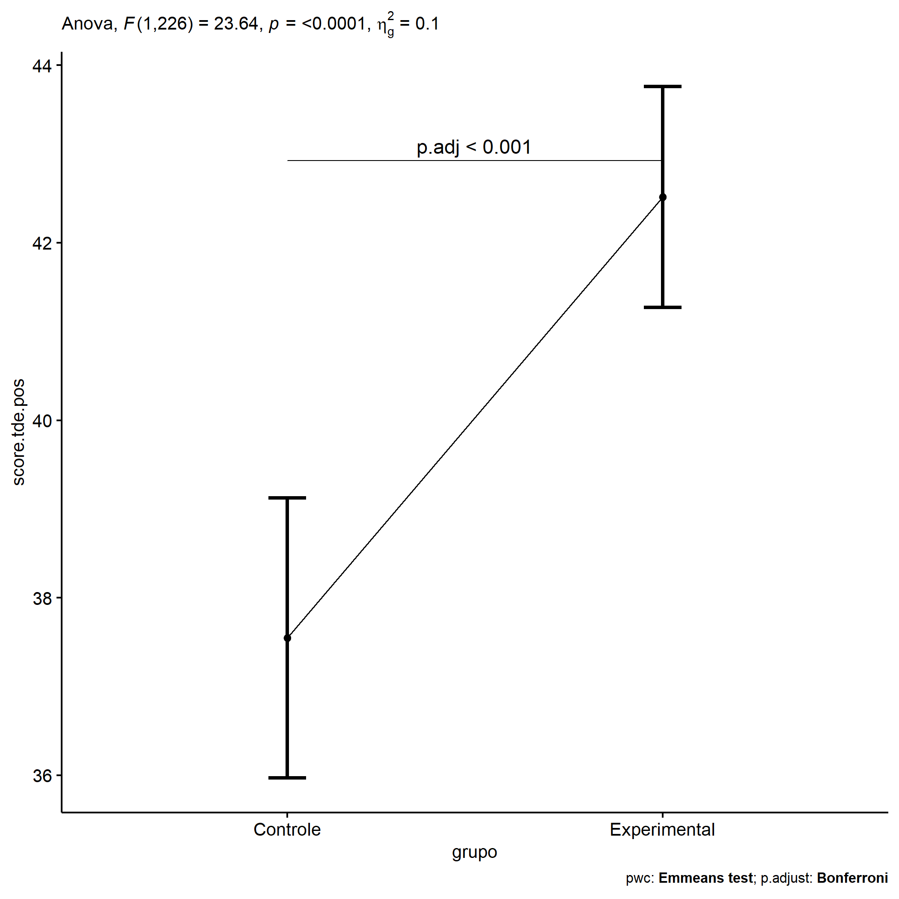<!-- -->

``` r
plots <- oneWayAncovaBoxPlots(
  wdat, "score.tde.pos", "grupo", aov, pwc, covar = "score.tde.pre",
  theme = "classic", color = color[["grupo"]],
  subtitle = which(aov$Effect == "grupo"))
```

``` r
if (length(unique(wdat[["grupo"]])) > 1)
  plots[["grupo"]] + ggplot2::ylab("TDE - Escrita") + ggplot2::scale_x_discrete(labels=c('pre', 'pos'))
```

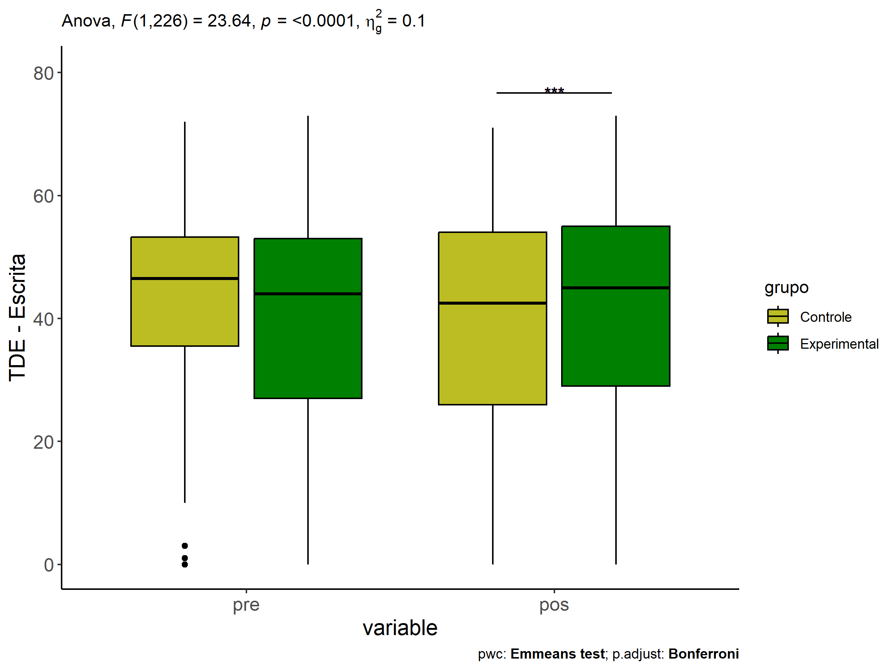<!-- -->

``` r
if (length(unique(wdat.long[["grupo"]])) > 1)
  plots <- oneWayAncovaBoxPlots(
    wdat.long, "score.tde", "grupo", aov, pwc.long, pre.post = "time",
    theme = "classic", color = color$prepost)
```

``` r
if (length(unique(wdat.long[["grupo"]])) > 1)
  plots[["grupo"]] + ggplot2::ylab("TDE - Escrita")
```

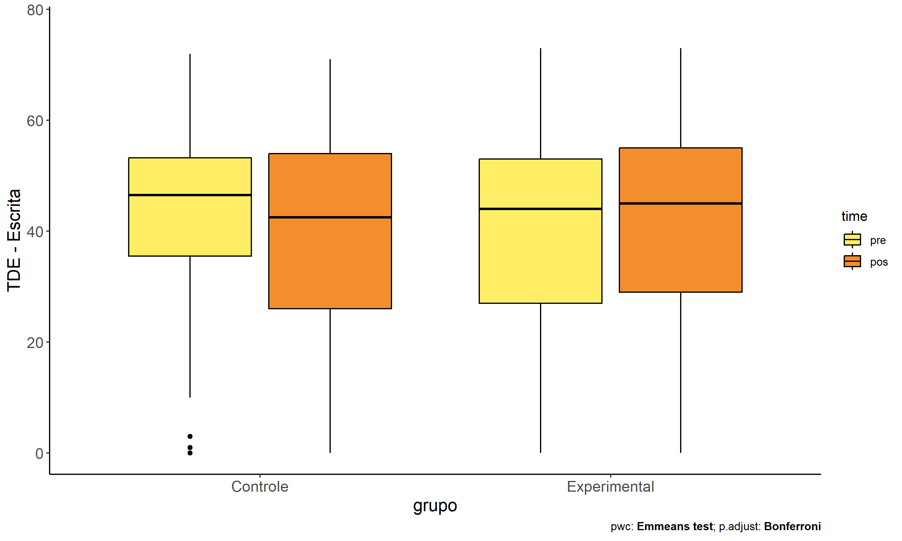<!-- -->

### Checking linearity assumption

``` r
ggscatter(wdat, x = "score.tde.pre", y = "score.tde.pos", size = 0.5,
          color = "grupo", add = "reg.line")+
  stat_regline_equation(
    aes(label =  paste(..eq.label.., ..rr.label.., sep = "~~~~"), color = grupo)
  )
```

<!-- -->

### Checking normality and homogeneity

``` r
res <- augment(lm(score.tde.pos ~ score.tde.pre + grupo, data = wdat))
```

``` r
shapiro_test(res$.resid)
```

    ## # A tibble: 1 × 3
    ##   variable   statistic p.value
    ##   <chr>          <dbl>   <dbl>
    ## 1 res$.resid     0.989  0.0767

``` r
levene_test(res, .resid ~ grupo)
```

    ## # A tibble: 1 × 4
    ##     df1   df2 statistic     p
    ##   <int> <int>     <dbl> <dbl>
    ## 1     1   227     0.344 0.558

# ANCOVA and Pairwise for two factors **grupo:Sexo**

## Without remove non-normal data

``` r
pdat = remove_group_data(dat[!is.na(dat[["grupo"]]) & !is.na(dat[["Sexo"]]),], "score.tde.pos", c("grupo","Sexo"))

pdat.long <- rbind(pdat[,c("id","grupo","Sexo")], pdat[,c("id","grupo","Sexo")])
pdat.long[["time"]] <- c(rep("pre", nrow(pdat)), rep("pos", nrow(pdat)))
pdat.long[["time"]] <- factor(pdat.long[["time"]], c("pre","pos"))
pdat.long[["score.tde"]] <- c(pdat[["score.tde.pre"]], pdat[["score.tde.pos"]])

aov = anova_test(pdat, score.tde.pos ~ score.tde.pre + grupo*Sexo)
laov[["grupo:Sexo"]] <- get_anova_table(aov)
```

``` r
pwcs <- list()
pwcs[["Sexo"]] <- emmeans_test(
  group_by(pdat, grupo), score.tde.pos ~ Sexo,
  covariate = score.tde.pre, p.adjust.method = "bonferroni")
pwcs[["grupo"]] <- emmeans_test(
  group_by(pdat, Sexo), score.tde.pos ~ grupo,
  covariate = score.tde.pre, p.adjust.method = "bonferroni")

pwc <- plyr::rbind.fill(pwcs[["grupo"]], pwcs[["Sexo"]])
pwc <- pwc[,c("grupo","Sexo", colnames(pwc)[!colnames(pwc) %in% c("grupo","Sexo")])]
```

``` r
pwc.long <- emmeans_test(dplyr::group_by_at(pdat.long, c("grupo","Sexo")),
                         score.tde ~ time,
                         p.adjust.method = "bonferroni")
lpwc[["grupo:Sexo"]] <- plyr::rbind.fill(pwc, pwc.long)
```

``` r
ds <- get.descriptives(pdat, "score.tde.pos", c("grupo","Sexo"), covar = "score.tde.pre")
ds <- merge(ds[ds$variable != "score.tde.pre",],
            ds[ds$variable == "score.tde.pre", !colnames(ds) %in% c("variable")],
            by = c("grupo","Sexo"), all.x = T, suffixes = c("", ".score.tde.pre"))
ds <- merge(get_emmeans(pwcs[["grupo"]]), ds, by = c("grupo","Sexo"), suffixes = c(".emms", ""))
ds <- ds[,c("grupo","Sexo","n","mean.score.tde.pre","se.score.tde.pre","mean","se","emmean","se.emms")]

colnames(ds) <- c("grupo","Sexo", "N", paste0(c("M","SE")," (pre)"),
                  paste0(c("M","SE"), " (unadj)"), paste0(c("M", "SE"), " (adj)"))

lemms[["grupo:Sexo"]] <- ds
```

## Computing ANCOVA and PairWise After removing non-normal data (OK)

``` r
wdat = pdat 

res = residuals(lm(score.tde.pos ~ score.tde.pre + grupo*Sexo, data = wdat))
non.normal = getNonNormal(res, wdat$id, plimit = 0.05)

wdat = wdat[!wdat$id %in% non.normal,]

wdat.long <- rbind(wdat[,c("id","grupo","Sexo")], wdat[,c("id","grupo","Sexo")])
wdat.long[["time"]] <- c(rep("pre", nrow(wdat)), rep("pos", nrow(wdat)))
wdat.long[["time"]] <- factor(wdat.long[["time"]], c("pre","pos"))
wdat.long[["score.tde"]] <- c(wdat[["score.tde.pre"]], wdat[["score.tde.pos"]])


ldat[["grupo:Sexo"]] = wdat

(non.normal)
```

    ## [1] "P3637"

``` r
aov = anova_test(wdat, score.tde.pos ~ score.tde.pre + grupo*Sexo)
laov[["grupo:Sexo"]] <- merge(get_anova_table(aov), laov[["grupo:Sexo"]], by="Effect", suffixes = c("","'"))

(df = get_anova_table(aov))
```

    ## ANOVA Table (type II tests)
    ## 
    ##          Effect DFn DFd        F        p p<.05     ges
    ## 1 score.tde.pre   1 226 1014.077 1.67e-85     * 0.81800
    ## 2         grupo   1 226   18.282 2.81e-05     * 0.07500
    ## 3          Sexo   1 226    4.841 2.90e-02     * 0.02100
    ## 4    grupo:Sexo   1 226    0.145 7.04e-01       0.00064

| Effect        | DFn | DFd |        F |     p | p\<.05 |   ges |
|:--------------|----:|----:|---------:|------:|:-------|------:|
| score.tde.pre |   1 | 226 | 1014.077 | 0.000 | \*     | 0.818 |
| grupo         |   1 | 226 |   18.282 | 0.000 | \*     | 0.075 |
| Sexo          |   1 | 226 |    4.841 | 0.029 | \*     | 0.021 |
| grupo:Sexo    |   1 | 226 |    0.145 | 0.704 |        | 0.001 |

``` r
pwcs <- list()
pwcs[["Sexo"]] <- emmeans_test(
  group_by(wdat, grupo), score.tde.pos ~ Sexo,
  covariate = score.tde.pre, p.adjust.method = "bonferroni")
pwcs[["grupo"]] <- emmeans_test(
  group_by(wdat, Sexo), score.tde.pos ~ grupo,
  covariate = score.tde.pre, p.adjust.method = "bonferroni")

pwc <- plyr::rbind.fill(pwcs[["grupo"]], pwcs[["Sexo"]])
pwc <- pwc[,c("grupo","Sexo", colnames(pwc)[!colnames(pwc) %in% c("grupo","Sexo")])]
```

| grupo        | Sexo | term                 | .y.           | group1   | group2       |  df | statistic |     p | p.adj | p.adj.signif |
|:-------------|:-----|:---------------------|:--------------|:---------|:-------------|----:|----------:|------:|------:|:-------------|
|              | F    | score.tde.pre\*grupo | score.tde.pos | Controle | Experimental | 226 |    -3.371 | 0.001 | 0.001 | \*\*\*       |
|              | M    | score.tde.pre\*grupo | score.tde.pos | Controle | Experimental | 226 |    -2.672 | 0.008 | 0.008 | \*\*         |
| Controle     |      | score.tde.pre\*Sexo  | score.tde.pos | F        | M            | 226 |     1.084 | 0.280 | 0.280 | ns           |
| Experimental |      | score.tde.pre\*Sexo  | score.tde.pos | F        | M            | 226 |     1.973 | 0.050 | 0.050 | \*           |

``` r
pwc.long <- emmeans_test(dplyr::group_by_at(wdat.long, c("grupo","Sexo")),
                         score.tde ~ time,
                         p.adjust.method = "bonferroni")
lpwc[["grupo:Sexo"]] <- merge(plyr::rbind.fill(pwc, pwc.long), lpwc[["grupo:Sexo"]], by=c("grupo","Sexo","term",".y.","group1","group2"), suffixes = c("","'"))
```

| grupo        | Sexo | term | .y.       | group1 | group2 |  df | statistic |     p | p.adj | p.adj.signif |
|:-------------|:-----|:-----|:----------|:-------|:-------|----:|----------:|------:|------:|:-------------|
| Controle     | F    | time | score.tde | pre    | pos    | 454 |     0.576 | 0.565 | 0.565 | ns           |
| Controle     | M    | time | score.tde | pre    | pos    | 454 |     0.928 | 0.354 | 0.354 | ns           |
| Experimental | F    | time | score.tde | pre    | pos    | 454 |    -1.001 | 0.317 | 0.317 | ns           |
| Experimental | M    | time | score.tde | pre    | pos    | 454 |    -0.200 | 0.841 | 0.841 | ns           |

``` r
ds <- get.descriptives(wdat, "score.tde.pos", c("grupo","Sexo"), covar = "score.tde.pre")
ds <- merge(ds[ds$variable != "score.tde.pre",],
            ds[ds$variable == "score.tde.pre", !colnames(ds) %in% c("variable")],
            by = c("grupo","Sexo"), all.x = T, suffixes = c("", ".score.tde.pre"))
ds <- merge(get_emmeans(pwcs[["grupo"]]), ds, by = c("grupo","Sexo"), suffixes = c(".emms", ""))
ds <- ds[,c("grupo","Sexo","n","mean.score.tde.pre","se.score.tde.pre","mean","se","emmean","se.emms")]

colnames(ds) <- c("grupo","Sexo", "N", paste0(c("M","SE")," (pre)"),
                  paste0(c("M","SE"), " (unadj)"), paste0(c("M", "SE"), " (adj)"))

lemms[["grupo:Sexo"]] <- merge(ds, lemms[["grupo:Sexo"]], by=c("grupo","Sexo"), suffixes = c("","'"))
```

| grupo        | Sexo |   N | M (pre) | SE (pre) | M (unadj) | SE (unadj) | M (adj) | SE (adj) |
|:-------------|:-----|----:|--------:|---------:|----------:|-----------:|--------:|---------:|
| Controle     | F    |  48 |  45.771 |    2.184 |    43.688 |      2.435 |  38.607 |    1.139 |
| Controle     | M    |  41 |  38.854 |    2.682 |    35.220 |      2.841 |  36.793 |    1.221 |
| Experimental | F    |  72 |  42.556 |    2.240 |    45.514 |      2.350 |  43.526 |    0.923 |
| Experimental | M    |  70 |  35.700 |    1.969 |    36.300 |      2.079 |  40.906 |    0.945 |

### Plots for ancova

``` r
plots <- twoWayAncovaPlots(
  wdat, "score.tde.pos", c("grupo","Sexo"), aov, pwcs, addParam = c("mean_se"),
  font.label.size=10, step.increase=0.05, p.label="p.adj",
  subtitle = which(aov$Effect == "grupo:Sexo"))
```

``` r
if (!is.null(plots[["grupo"]]))
  plots[["grupo"]] + ggplot2::scale_color_manual(values = color[["Sexo"]])
```

    ## Scale for colour is already present.
    ## Adding another scale for colour, which will replace the existing scale.

<!-- -->

``` r
if (!is.null(plots[["Sexo"]]))
  plots[["Sexo"]] + ggplot2::scale_color_manual(values = color[["grupo"]])
```

    ## Scale for colour is already present.
    ## Adding another scale for colour, which will replace the existing scale.

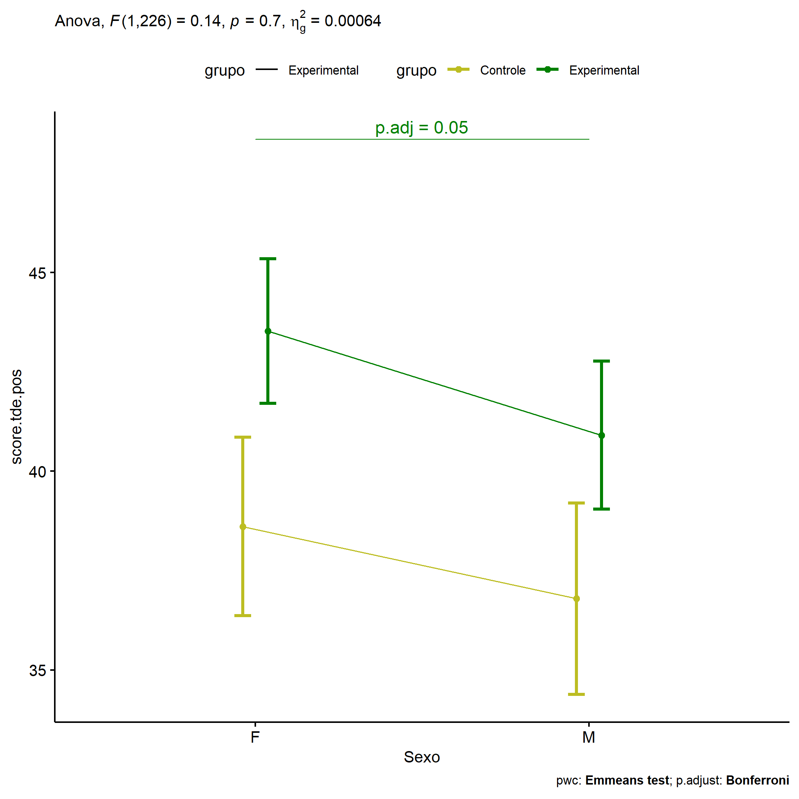<!-- -->

``` r
plots <- twoWayAncovaBoxPlots(
  wdat, "score.tde.pos", c("grupo","Sexo"), aov, pwcs, covar = "score.tde.pre",
  theme = "classic", color = color[["grupo:Sexo"]],
  subtitle = which(aov$Effect == "grupo:Sexo"))
```

``` r
plots[["grupo:Sexo"]] + ggplot2::ylab("TDE - Escrita") + ggplot2::scale_x_discrete(labels=c('pre', 'pos'))
```

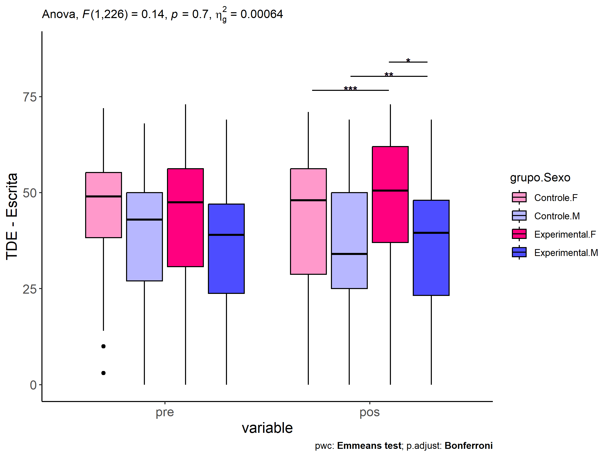<!-- -->

``` r
plots <- twoWayAncovaBoxPlots(
  wdat.long, "score.tde", c("grupo","Sexo"), aov, pwc.long, pre.post = "time",
  theme = "classic", color = color$prepost)
```

``` r
plots[["grupo:Sexo"]] + ggplot2::ylab("TDE - Escrita")
```

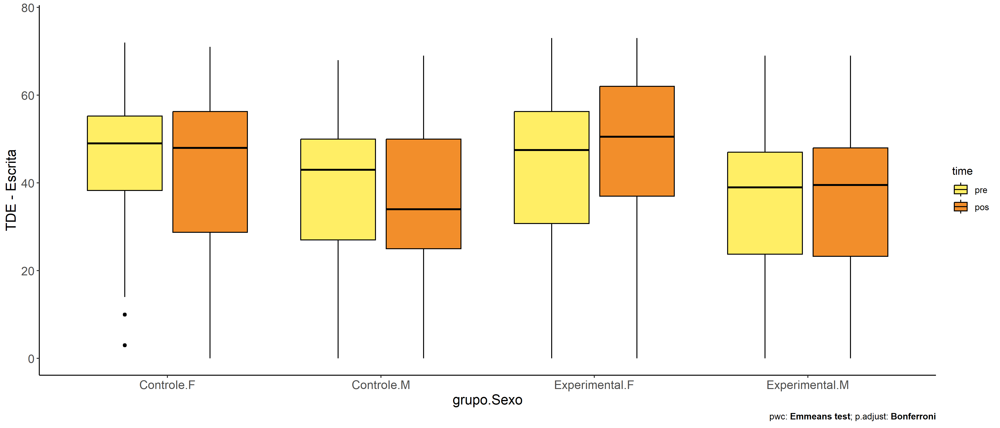<!-- -->

### Checking linearity assumption

``` r
ggscatter(wdat, x = "score.tde.pre", y = "score.tde.pos", size = 0.5,
          facet.by = c("grupo","Sexo"), add = "reg.line")+
  stat_regline_equation(
    aes(label =  paste(..eq.label.., ..rr.label.., sep = "~~~~"))
  )
```

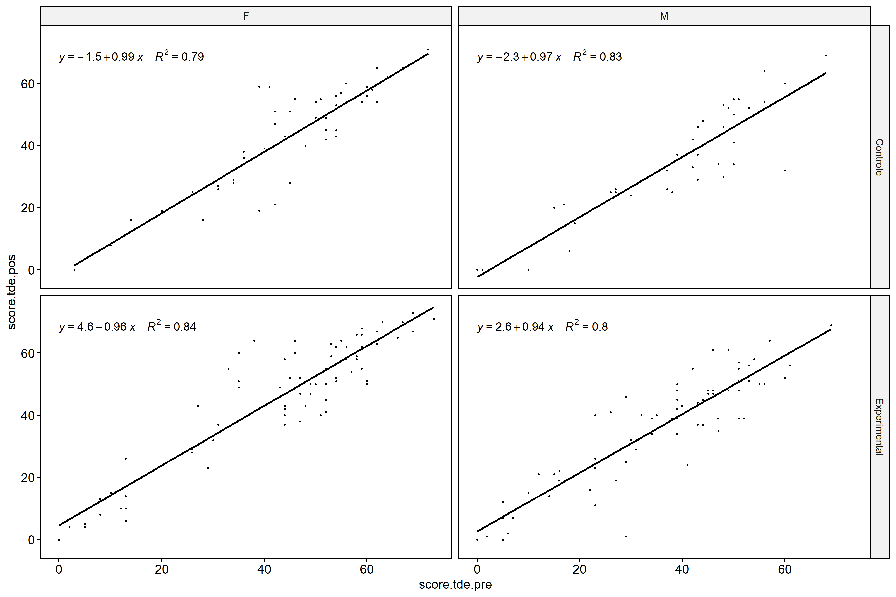<!-- -->

### Checking normality and homogeneity

``` r
res <- augment(lm(score.tde.pos ~ score.tde.pre + grupo*Sexo, data = wdat))
```

``` r
shapiro_test(res$.resid)
```

    ## # A tibble: 1 × 3
    ##   variable   statistic p.value
    ##   <chr>          <dbl>   <dbl>
    ## 1 res$.resid     0.986  0.0250

``` r
levene_test(res, .resid ~ grupo*Sexo)
```

    ## # A tibble: 1 × 4
    ##     df1   df2 statistic     p
    ##   <int> <int>     <dbl> <dbl>
    ## 1     3   227     0.153 0.928

# ANCOVA and Pairwise for two factors **grupo:Zona**

## Without remove non-normal data

``` r
pdat = remove_group_data(dat[!is.na(dat[["grupo"]]) & !is.na(dat[["Zona"]]),], "score.tde.pos", c("grupo","Zona"))

pdat.long <- rbind(pdat[,c("id","grupo","Zona")], pdat[,c("id","grupo","Zona")])
pdat.long[["time"]] <- c(rep("pre", nrow(pdat)), rep("pos", nrow(pdat)))
pdat.long[["time"]] <- factor(pdat.long[["time"]], c("pre","pos"))
pdat.long[["score.tde"]] <- c(pdat[["score.tde.pre"]], pdat[["score.tde.pos"]])

aov = anova_test(pdat, score.tde.pos ~ score.tde.pre + grupo*Zona)
laov[["grupo:Zona"]] <- get_anova_table(aov)
```

``` r
pwcs <- list()
pwcs[["Zona"]] <- emmeans_test(
  group_by(pdat, grupo), score.tde.pos ~ Zona,
  covariate = score.tde.pre, p.adjust.method = "bonferroni")
pwcs[["grupo"]] <- emmeans_test(
  group_by(pdat, Zona), score.tde.pos ~ grupo,
  covariate = score.tde.pre, p.adjust.method = "bonferroni")

pwc <- plyr::rbind.fill(pwcs[["grupo"]], pwcs[["Zona"]])
pwc <- pwc[,c("grupo","Zona", colnames(pwc)[!colnames(pwc) %in% c("grupo","Zona")])]
```

``` r
pwc.long <- emmeans_test(dplyr::group_by_at(pdat.long, c("grupo","Zona")),
                         score.tde ~ time,
                         p.adjust.method = "bonferroni")
lpwc[["grupo:Zona"]] <- plyr::rbind.fill(pwc, pwc.long)
```

``` r
ds <- get.descriptives(pdat, "score.tde.pos", c("grupo","Zona"), covar = "score.tde.pre")
ds <- merge(ds[ds$variable != "score.tde.pre",],
            ds[ds$variable == "score.tde.pre", !colnames(ds) %in% c("variable")],
            by = c("grupo","Zona"), all.x = T, suffixes = c("", ".score.tde.pre"))
ds <- merge(get_emmeans(pwcs[["grupo"]]), ds, by = c("grupo","Zona"), suffixes = c(".emms", ""))
ds <- ds[,c("grupo","Zona","n","mean.score.tde.pre","se.score.tde.pre","mean","se","emmean","se.emms")]

colnames(ds) <- c("grupo","Zona", "N", paste0(c("M","SE")," (pre)"),
                  paste0(c("M","SE"), " (unadj)"), paste0(c("M", "SE"), " (adj)"))

lemms[["grupo:Zona"]] <- ds
```

## Computing ANCOVA and PairWise After removing non-normal data (OK)

``` r
wdat = pdat 

res = residuals(lm(score.tde.pos ~ score.tde.pre + grupo*Zona, data = wdat))
non.normal = getNonNormal(res, wdat$id, plimit = 0.05)

wdat = wdat[!wdat$id %in% non.normal,]

wdat.long <- rbind(wdat[,c("id","grupo","Zona")], wdat[,c("id","grupo","Zona")])
wdat.long[["time"]] <- c(rep("pre", nrow(wdat)), rep("pos", nrow(wdat)))
wdat.long[["time"]] <- factor(wdat.long[["time"]], c("pre","pos"))
wdat.long[["score.tde"]] <- c(wdat[["score.tde.pre"]], wdat[["score.tde.pos"]])


ldat[["grupo:Zona"]] = wdat

(non.normal)
```

    ## [1] "P572"  "P1018" "P3660"

``` r
aov = anova_test(wdat, score.tde.pos ~ score.tde.pre + grupo*Zona)
laov[["grupo:Zona"]] <- merge(get_anova_table(aov), laov[["grupo:Zona"]], by="Effect", suffixes = c("","'"))

(df = get_anova_table(aov))
```

    ## ANOVA Table (type II tests)
    ## 
    ##          Effect DFn DFd       F        p p<.05      ges
    ## 1 score.tde.pre   1 117 718.826 8.79e-52     * 0.860000
    ## 2         grupo   1 117   6.605 1.10e-02     * 0.053000
    ## 3          Zona   1 117   0.057 8.12e-01       0.000483
    ## 4    grupo:Zona   1 117   1.559 2.14e-01       0.013000

| Effect        | DFn | DFd |       F |     p | p\<.05 |   ges |
|:--------------|----:|----:|--------:|------:|:-------|------:|
| score.tde.pre |   1 | 117 | 718.826 | 0.000 | \*     | 0.860 |
| grupo         |   1 | 117 |   6.605 | 0.011 | \*     | 0.053 |
| Zona          |   1 | 117 |   0.057 | 0.812 |        | 0.000 |
| grupo:Zona    |   1 | 117 |   1.559 | 0.214 |        | 0.013 |

``` r
pwcs <- list()
pwcs[["Zona"]] <- emmeans_test(
  group_by(wdat, grupo), score.tde.pos ~ Zona,
  covariate = score.tde.pre, p.adjust.method = "bonferroni")
pwcs[["grupo"]] <- emmeans_test(
  group_by(wdat, Zona), score.tde.pos ~ grupo,
  covariate = score.tde.pre, p.adjust.method = "bonferroni")

pwc <- plyr::rbind.fill(pwcs[["grupo"]], pwcs[["Zona"]])
pwc <- pwc[,c("grupo","Zona", colnames(pwc)[!colnames(pwc) %in% c("grupo","Zona")])]
```

| grupo        | Zona   | term                 | .y.           | group1   | group2       |  df | statistic |     p | p.adj | p.adj.signif |
|:-------------|:-------|:---------------------|:--------------|:---------|:-------------|----:|----------:|------:|------:|:-------------|
|              | Rural  | score.tde.pre\*grupo | score.tde.pos | Controle | Experimental | 117 |    -1.373 | 0.172 | 0.172 | ns           |
|              | Urbana | score.tde.pre\*grupo | score.tde.pos | Controle | Experimental | 117 |    -2.507 | 0.014 | 0.014 | \*           |
| Controle     |        | score.tde.pre\*Zona  | score.tde.pos | Rural    | Urbana       | 117 |     1.094 | 0.276 | 0.276 | ns           |
| Experimental |        | score.tde.pre\*Zona  | score.tde.pos | Rural    | Urbana       | 117 |    -0.643 | 0.522 | 0.522 | ns           |

``` r
pwc.long <- emmeans_test(dplyr::group_by_at(wdat.long, c("grupo","Zona")),
                         score.tde ~ time,
                         p.adjust.method = "bonferroni")
lpwc[["grupo:Zona"]] <- merge(plyr::rbind.fill(pwc, pwc.long), lpwc[["grupo:Zona"]], by=c("grupo","Zona","term",".y.","group1","group2"), suffixes = c("","'"))
```

| grupo        | Zona   | term | .y.       | group1 | group2 |  df | statistic |     p | p.adj | p.adj.signif |
|:-------------|:-------|:-----|:----------|:-------|:-------|----:|----------:|------:|------:|:-------------|
| Controle     | Rural  | time | score.tde | pre    | pos    | 236 |     0.288 | 0.774 | 0.774 | ns           |
| Controle     | Urbana | time | score.tde | pre    | pos    | 236 |     0.599 | 0.550 | 0.550 | ns           |
| Experimental | Rural  | time | score.tde | pre    | pos    | 236 |    -0.255 | 0.799 | 0.799 | ns           |
| Experimental | Urbana | time | score.tde | pre    | pos    | 236 |    -0.367 | 0.714 | 0.714 | ns           |

``` r
ds <- get.descriptives(wdat, "score.tde.pos", c("grupo","Zona"), covar = "score.tde.pre")
ds <- merge(ds[ds$variable != "score.tde.pre",],
            ds[ds$variable == "score.tde.pre", !colnames(ds) %in% c("variable")],
            by = c("grupo","Zona"), all.x = T, suffixes = c("", ".score.tde.pre"))
ds <- merge(get_emmeans(pwcs[["grupo"]]), ds, by = c("grupo","Zona"), suffixes = c(".emms", ""))
ds <- ds[,c("grupo","Zona","n","mean.score.tde.pre","se.score.tde.pre","mean","se","emmean","se.emms")]

colnames(ds) <- c("grupo","Zona", "N", paste0(c("M","SE")," (pre)"),
                  paste0(c("M","SE"), " (unadj)"), paste0(c("M", "SE"), " (adj)"))

lemms[["grupo:Zona"]] <- merge(ds, lemms[["grupo:Zona"]], by=c("grupo","Zona"), suffixes = c("","'"))
```

| grupo        | Zona   |   N | M (pre) | SE (pre) | M (unadj) | SE (unadj) | M (adj) | SE (adj) |
|:-------------|:-------|----:|--------:|---------:|----------:|-----------:|--------:|---------:|
| Controle     | Rural  |  31 |  43.387 |    3.098 |    42.065 |      3.385 |  40.644 |    1.263 |
| Controle     | Urbana |  18 |  45.333 |    3.881 |    41.722 |      4.095 |  38.366 |    1.660 |
| Experimental | Rural  |  52 |  38.769 |    2.596 |    39.673 |      2.805 |  42.846 |    0.981 |
| Experimental | Urbana |  21 |  44.857 |    3.255 |    46.905 |      3.309 |  44.022 |    1.537 |

### Plots for ancova

``` r
plots <- twoWayAncovaPlots(
  wdat, "score.tde.pos", c("grupo","Zona"), aov, pwcs, addParam = c("mean_se"),
  font.label.size=10, step.increase=0.05, p.label="p.adj",
  subtitle = which(aov$Effect == "grupo:Zona"))
```

``` r
if (!is.null(plots[["grupo"]]))
  plots[["grupo"]] + ggplot2::scale_color_manual(values = color[["Zona"]])
```

    ## Scale for colour is already present.
    ## Adding another scale for colour, which will replace the existing scale.

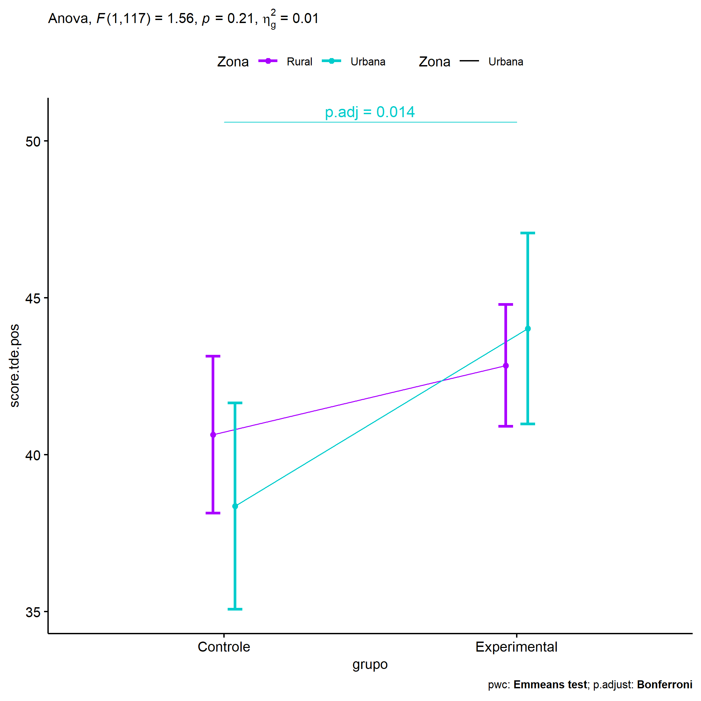<!-- -->

``` r
if (!is.null(plots[["Zona"]]))
  plots[["Zona"]] + ggplot2::scale_color_manual(values = color[["grupo"]])
```

    ## Scale for colour is already present.
    ## Adding another scale for colour, which will replace the existing scale.

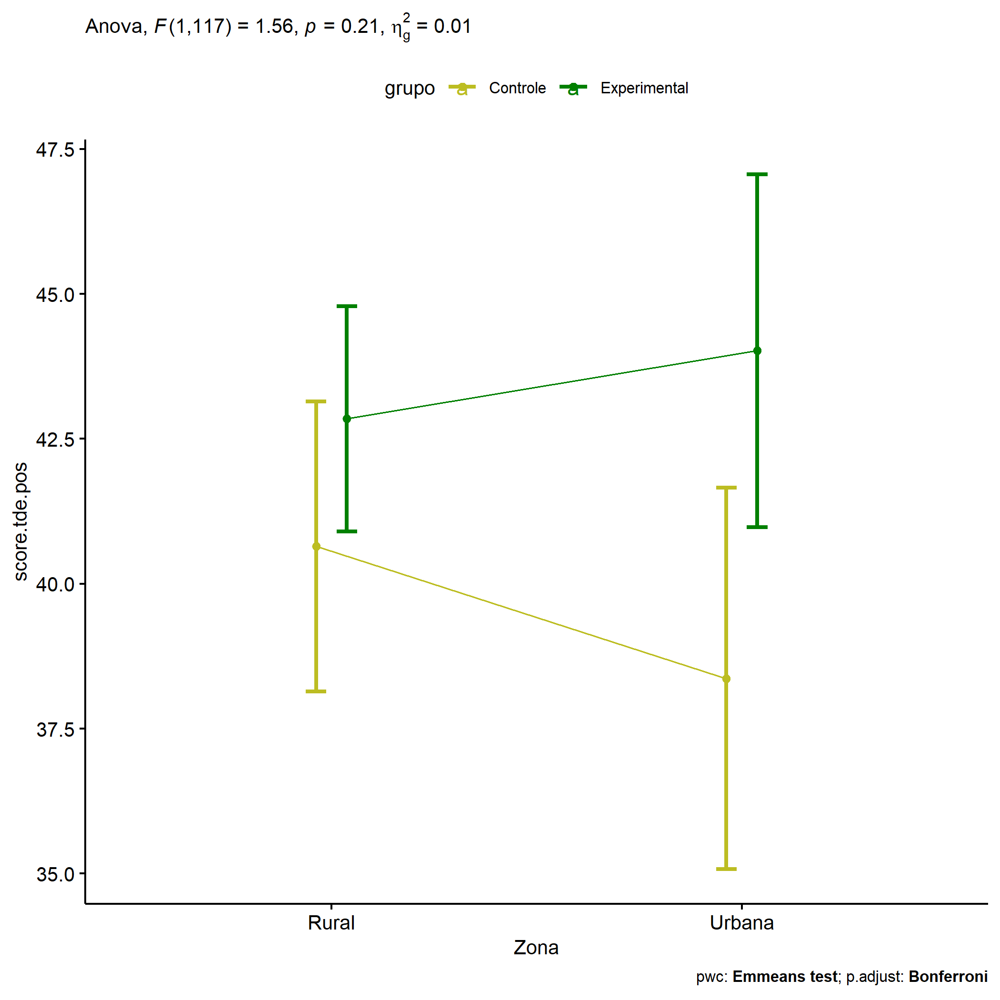<!-- -->

``` r
plots <- twoWayAncovaBoxPlots(
  wdat, "score.tde.pos", c("grupo","Zona"), aov, pwcs, covar = "score.tde.pre",
  theme = "classic", color = color[["grupo:Zona"]],
  subtitle = which(aov$Effect == "grupo:Zona"))
```

``` r
plots[["grupo:Zona"]] + ggplot2::ylab("TDE - Escrita") + ggplot2::scale_x_discrete(labels=c('pre', 'pos'))
```

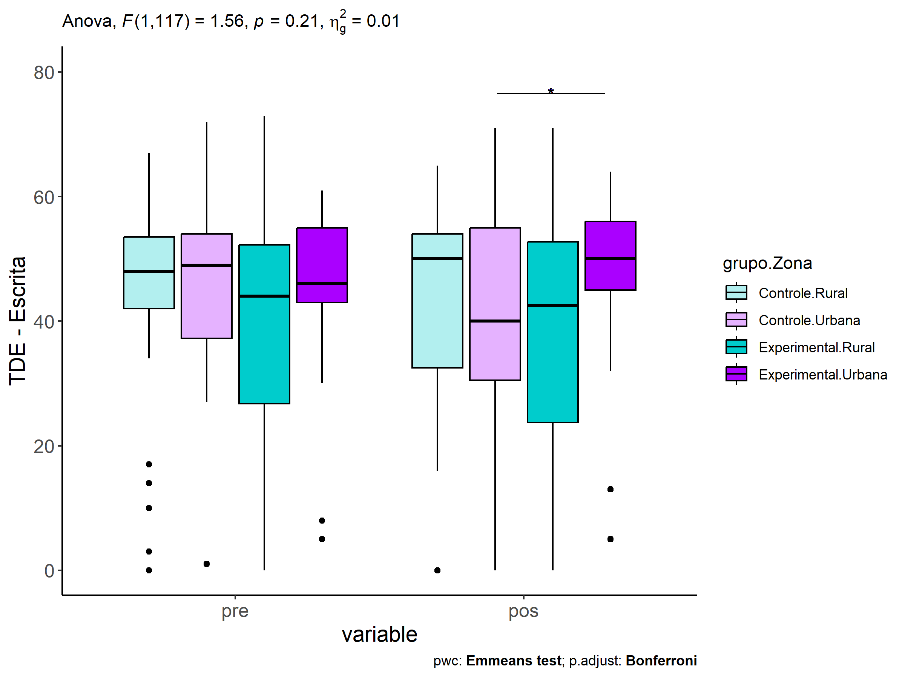<!-- -->

``` r
plots <- twoWayAncovaBoxPlots(
  wdat.long, "score.tde", c("grupo","Zona"), aov, pwc.long, pre.post = "time",
  theme = "classic", color = color$prepost)
```

``` r
plots[["grupo:Zona"]] + ggplot2::ylab("TDE - Escrita")
```

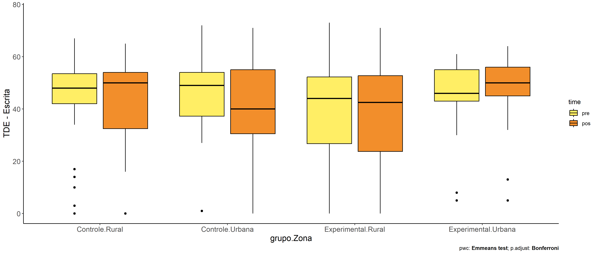<!-- -->

### Checking linearity assumption

``` r
ggscatter(wdat, x = "score.tde.pre", y = "score.tde.pos", size = 0.5,
          facet.by = c("grupo","Zona"), add = "reg.line")+
  stat_regline_equation(
    aes(label =  paste(..eq.label.., ..rr.label.., sep = "~~~~"))
  )
```

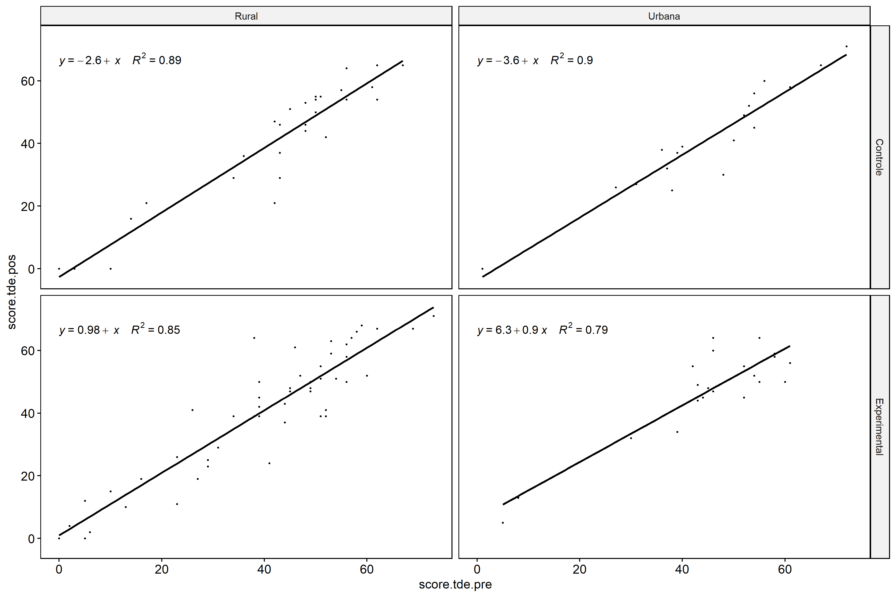<!-- -->

### Checking normality and homogeneity

``` r
res <- augment(lm(score.tde.pos ~ score.tde.pre + grupo*Zona, data = wdat))
```

``` r
shapiro_test(res$.resid)
```

    ## # A tibble: 1 × 3
    ##   variable   statistic p.value
    ##   <chr>          <dbl>   <dbl>
    ## 1 res$.resid     0.980  0.0604

``` r
levene_test(res, .resid ~ grupo*Zona)
```

    ## # A tibble: 1 × 4
    ##     df1   df2 statistic     p
    ##   <int> <int>     <dbl> <dbl>
    ## 1     3   118     0.966 0.411

# ANCOVA and Pairwise for two factors **grupo:Cor.Raca**

## Without remove non-normal data

``` r
pdat = remove_group_data(dat[!is.na(dat[["grupo"]]) & !is.na(dat[["Cor.Raca"]]),], "score.tde.pos", c("grupo","Cor.Raca"))
```

    ## Warning: There was 1 warning in `mutate()`.
    ## ℹ In argument: `ci = abs(stats::qt(alpha/2, .data$n - 1) * .data$se)`.
    ## Caused by warning:
    ## ! There was 1 warning in `mutate()`.
    ## ℹ In argument: `ci = abs(stats::qt(alpha/2, .data$n - 1) * .data$se)`.
    ## Caused by warning in `stats::qt()`:
    ## ! NaNs produced

``` r
pdat.long <- rbind(pdat[,c("id","grupo","Cor.Raca")], pdat[,c("id","grupo","Cor.Raca")])
pdat.long[["time"]] <- c(rep("pre", nrow(pdat)), rep("pos", nrow(pdat)))
pdat.long[["time"]] <- factor(pdat.long[["time"]], c("pre","pos"))
pdat.long[["score.tde"]] <- c(pdat[["score.tde.pre"]], pdat[["score.tde.pos"]])

aov = anova_test(pdat, score.tde.pos ~ score.tde.pre + grupo*Cor.Raca)
laov[["grupo:Cor.Raca"]] <- get_anova_table(aov)
```

``` r
pwcs <- list()
pwcs[["Cor.Raca"]] <- emmeans_test(
  group_by(pdat, grupo), score.tde.pos ~ Cor.Raca,
  covariate = score.tde.pre, p.adjust.method = "bonferroni")
pwcs[["grupo"]] <- emmeans_test(
  group_by(pdat, Cor.Raca), score.tde.pos ~ grupo,
  covariate = score.tde.pre, p.adjust.method = "bonferroni")

pwc <- plyr::rbind.fill(pwcs[["grupo"]], pwcs[["Cor.Raca"]])
pwc <- pwc[,c("grupo","Cor.Raca", colnames(pwc)[!colnames(pwc) %in% c("grupo","Cor.Raca")])]
```

``` r
pwc.long <- emmeans_test(dplyr::group_by_at(pdat.long, c("grupo","Cor.Raca")),
                         score.tde ~ time,
                         p.adjust.method = "bonferroni")
lpwc[["grupo:Cor.Raca"]] <- plyr::rbind.fill(pwc, pwc.long)
```

``` r
ds <- get.descriptives(pdat, "score.tde.pos", c("grupo","Cor.Raca"), covar = "score.tde.pre")
ds <- merge(ds[ds$variable != "score.tde.pre",],
            ds[ds$variable == "score.tde.pre", !colnames(ds) %in% c("variable")],
            by = c("grupo","Cor.Raca"), all.x = T, suffixes = c("", ".score.tde.pre"))
ds <- merge(get_emmeans(pwcs[["grupo"]]), ds, by = c("grupo","Cor.Raca"), suffixes = c(".emms", ""))
ds <- ds[,c("grupo","Cor.Raca","n","mean.score.tde.pre","se.score.tde.pre","mean","se","emmean","se.emms")]

colnames(ds) <- c("grupo","Cor.Raca", "N", paste0(c("M","SE")," (pre)"),
                  paste0(c("M","SE"), " (unadj)"), paste0(c("M", "SE"), " (adj)"))

lemms[["grupo:Cor.Raca"]] <- ds
```

## Computing ANCOVA and PairWise After removing non-normal data (OK)

``` r
wdat = pdat 

res = residuals(lm(score.tde.pos ~ score.tde.pre + grupo*Cor.Raca, data = wdat))
non.normal = getNonNormal(res, wdat$id, plimit = 0.05)

wdat = wdat[!wdat$id %in% non.normal,]

wdat.long <- rbind(wdat[,c("id","grupo","Cor.Raca")], wdat[,c("id","grupo","Cor.Raca")])
wdat.long[["time"]] <- c(rep("pre", nrow(wdat)), rep("pos", nrow(wdat)))
wdat.long[["time"]] <- factor(wdat.long[["time"]], c("pre","pos"))
wdat.long[["score.tde"]] <- c(wdat[["score.tde.pre"]], wdat[["score.tde.pos"]])


ldat[["grupo:Cor.Raca"]] = wdat

(non.normal)
```

    ## [1] "P3637"

``` r
aov = anova_test(wdat, score.tde.pos ~ score.tde.pre + grupo*Cor.Raca)
laov[["grupo:Cor.Raca"]] <- merge(get_anova_table(aov), laov[["grupo:Cor.Raca"]], by="Effect", suffixes = c("","'"))

(df = get_anova_table(aov))
```

    ## ANOVA Table (type II tests)
    ## 
    ##           Effect DFn DFd       F        p p<.05   ges
    ## 1  score.tde.pre   1 100 369.538 2.33e-35     * 0.787
    ## 2          grupo   1 100   5.196 2.50e-02     * 0.049
    ## 3       Cor.Raca   1 100   2.822 9.60e-02       0.027
    ## 4 grupo:Cor.Raca   0 100      NA       NA  <NA>    NA

| Effect         | DFn | DFd |       F |     p | p\<.05 |   ges |
|:---------------|----:|----:|--------:|------:|:-------|------:|
| score.tde.pre  |   1 | 100 | 369.538 | 0.000 | \*     | 0.787 |
| grupo          |   1 | 100 |   5.196 | 0.025 | \*     | 0.049 |
| Cor.Raca       |   1 | 100 |   2.822 | 0.096 |        | 0.027 |
| grupo:Cor.Raca |   0 | 100 |         |       |        |       |

``` r
pwcs <- list()
pwcs[["Cor.Raca"]] <- emmeans_test(
  group_by(wdat, grupo), score.tde.pos ~ Cor.Raca,
  covariate = score.tde.pre, p.adjust.method = "bonferroni")
pwcs[["grupo"]] <- emmeans_test(
  group_by(wdat, Cor.Raca), score.tde.pos ~ grupo,
  covariate = score.tde.pre, p.adjust.method = "bonferroni")

pwc <- plyr::rbind.fill(pwcs[["grupo"]], pwcs[["Cor.Raca"]])
pwc <- pwc[,c("grupo","Cor.Raca", colnames(pwc)[!colnames(pwc) %in% c("grupo","Cor.Raca")])]
```

| grupo        | Cor.Raca | term                    | .y.           | group1   | group2       |  df | statistic |     p | p.adj | p.adj.signif |
|:-------------|:---------|:------------------------|:--------------|:---------|:-------------|----:|----------:|------:|------:|:-------------|
|              | Branca   | score.tde.pre\*grupo    | score.tde.pos | Controle | Experimental |     |           |       |       |              |
|              | Parda    | score.tde.pre\*grupo    | score.tde.pos | Controle | Experimental | 100 |    -2.279 | 0.025 | 0.025 | \*           |
| Controle     |          | score.tde.pre\*Cor.Raca | score.tde.pos | Branca   | Parda        |     |           |       |       |              |
| Experimental |          | score.tde.pre\*Cor.Raca | score.tde.pos | Branca   | Parda        | 100 |    -1.680 | 0.096 | 0.096 | ns           |

``` r
pwc.long <- emmeans_test(dplyr::group_by_at(wdat.long, c("grupo","Cor.Raca")),
                         score.tde ~ time,
                         p.adjust.method = "bonferroni")
lpwc[["grupo:Cor.Raca"]] <- merge(plyr::rbind.fill(pwc, pwc.long), lpwc[["grupo:Cor.Raca"]], by=c("grupo","Cor.Raca","term",".y.","group1","group2"), suffixes = c("","'"))
```

| grupo        | Cor.Raca | term | .y.       | group1 | group2 |  df | statistic |     p | p.adj | p.adj.signif |
|:-------------|:---------|:-----|:----------|:-------|:-------|----:|----------:|------:|------:|:-------------|
| Controle     | Branca   | time | score.tde | pre    | pos    |     |           |       |       |              |
| Controle     | Parda    | time | score.tde | pre    | pos    | 202 |     0.655 | 0.513 | 0.513 | ns           |
| Experimental | Branca   | time | score.tde | pre    | pos    | 202 |     0.390 | 0.697 | 0.697 | ns           |
| Experimental | Parda    | time | score.tde | pre    | pos    | 202 |    -0.482 | 0.630 | 0.630 | ns           |

``` r
ds <- get.descriptives(wdat, "score.tde.pos", c("grupo","Cor.Raca"), covar = "score.tde.pre")
ds <- merge(ds[ds$variable != "score.tde.pre",],
            ds[ds$variable == "score.tde.pre", !colnames(ds) %in% c("variable")],
            by = c("grupo","Cor.Raca"), all.x = T, suffixes = c("", ".score.tde.pre"))
ds <- merge(get_emmeans(pwcs[["grupo"]]), ds, by = c("grupo","Cor.Raca"), suffixes = c(".emms", ""))
ds <- ds[,c("grupo","Cor.Raca","n","mean.score.tde.pre","se.score.tde.pre","mean","se","emmean","se.emms")]

colnames(ds) <- c("grupo","Cor.Raca", "N", paste0(c("M","SE")," (pre)"),
                  paste0(c("M","SE"), " (unadj)"), paste0(c("M", "SE"), " (adj)"))

lemms[["grupo:Cor.Raca"]] <- merge(ds, lemms[["grupo:Cor.Raca"]], by=c("grupo","Cor.Raca"), suffixes = c("","'"))
```

| grupo        | Cor.Raca |   N | M (pre) | SE (pre) | M (unadj) | SE (unadj) | M (adj) | SE (adj) |
|:-------------|:---------|----:|--------:|---------:|----------:|-----------:|--------:|---------:|
| Controle     | Parda    |  34 |  44.353 |    2.535 |    41.324 |      3.133 |  37.156 |    1.612 |
| Experimental | Branca   |  20 |  40.800 |    4.718 |    38.450 |      5.346 |  37.801 |    2.083 |
| Experimental | Parda    |  50 |  37.020 |    2.637 |    38.860 |      2.775 |  41.954 |    1.327 |

### Plots for ancova

``` r
plots <- twoWayAncovaPlots(
  wdat, "score.tde.pos", c("grupo","Cor.Raca"), aov, pwcs, addParam = c("mean_se"),
  font.label.size=10, step.increase=0.05, p.label="p.adj",
  subtitle = which(aov$Effect == "grupo:Cor.Raca"))
```

``` r
if (!is.null(plots[["grupo"]]))
  plots[["grupo"]] + ggplot2::scale_color_manual(values = color[["Cor.Raca"]])
```

<!-- -->

``` r
if (!is.null(plots[["Cor.Raca"]]))
  plots[["Cor.Raca"]] + ggplot2::scale_color_manual(values = color[["grupo"]])
```

<!-- -->

``` r
plots <- twoWayAncovaBoxPlots(
  wdat, "score.tde.pos", c("grupo","Cor.Raca"), aov, pwcs, covar = "score.tde.pre",
  theme = "classic", color = color[["grupo:Cor.Raca"]],
  subtitle = which(aov$Effect == "grupo:Cor.Raca"))
```

``` r
plots[["grupo:Cor.Raca"]] + ggplot2::ylab("TDE - Escrita") + ggplot2::scale_x_discrete(labels=c('pre', 'pos'))
```

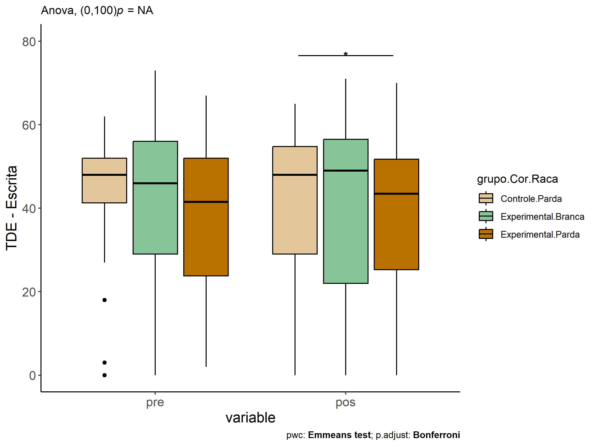<!-- -->

``` r
plots <- twoWayAncovaBoxPlots(
  wdat.long, "score.tde", c("grupo","Cor.Raca"), aov, pwc.long, pre.post = "time",
  theme = "classic", color = color$prepost)
```

``` r
plots[["grupo:Cor.Raca"]] + ggplot2::ylab("TDE - Escrita")
```

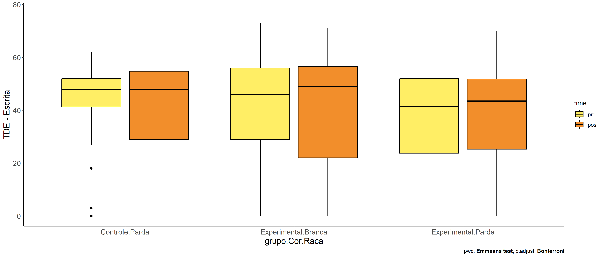<!-- -->

### Checking linearity assumption

``` r
ggscatter(wdat, x = "score.tde.pre", y = "score.tde.pos", size = 0.5,
          facet.by = c("grupo","Cor.Raca"), add = "reg.line")+
  stat_regline_equation(
    aes(label =  paste(..eq.label.., ..rr.label.., sep = "~~~~"))
  )
```

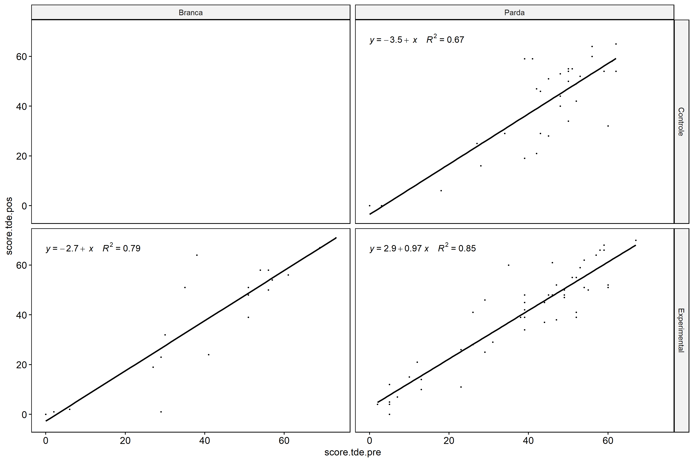<!-- -->

### Checking normality and homogeneity

``` r
res <- augment(lm(score.tde.pos ~ score.tde.pre + grupo*Cor.Raca, data = wdat))
```

``` r
shapiro_test(res$.resid)
```

    ## # A tibble: 1 × 3
    ##   variable   statistic p.value
    ##   <chr>          <dbl>   <dbl>
    ## 1 res$.resid     0.973  0.0324

``` r
levene_test(res, .resid ~ grupo*Cor.Raca)
```

    ## # A tibble: 1 × 4
    ##     df1   df2 statistic     p
    ##   <int> <int>     <dbl> <dbl>
    ## 1     2   101      1.59 0.208

# ANCOVA and Pairwise for two factors **grupo:score.tde.quintile**

## Without remove non-normal data

``` r
pdat = remove_group_data(dat[!is.na(dat[["grupo"]]) & !is.na(dat[["score.tde.quintile"]]),], "score.tde.pos", c("grupo","score.tde.quintile"))

pdat.long <- rbind(pdat[,c("id","grupo","score.tde.quintile")], pdat[,c("id","grupo","score.tde.quintile")])
pdat.long[["time"]] <- c(rep("pre", nrow(pdat)), rep("pos", nrow(pdat)))
pdat.long[["time"]] <- factor(pdat.long[["time"]], c("pre","pos"))
pdat.long[["score.tde"]] <- c(pdat[["score.tde.pre"]], pdat[["score.tde.pos"]])

aov = anova_test(pdat, score.tde.pos ~ score.tde.pre + grupo*score.tde.quintile)
laov[["grupo:score.tde.quintile"]] <- get_anova_table(aov)
```

``` r
pwcs <- list()
pwcs[["score.tde.quintile"]] <- emmeans_test(
  group_by(pdat, grupo), score.tde.pos ~ score.tde.quintile,
  covariate = score.tde.pre, p.adjust.method = "bonferroni")
pwcs[["grupo"]] <- emmeans_test(
  group_by(pdat, score.tde.quintile), score.tde.pos ~ grupo,
  covariate = score.tde.pre, p.adjust.method = "bonferroni")

pwc <- plyr::rbind.fill(pwcs[["grupo"]], pwcs[["score.tde.quintile"]])
pwc <- pwc[,c("grupo","score.tde.quintile", colnames(pwc)[!colnames(pwc) %in% c("grupo","score.tde.quintile")])]
```

``` r
pwc.long <- emmeans_test(dplyr::group_by_at(pdat.long, c("grupo","score.tde.quintile")),
                         score.tde ~ time,
                         p.adjust.method = "bonferroni")
lpwc[["grupo:score.tde.quintile"]] <- plyr::rbind.fill(pwc, pwc.long)
```

``` r
ds <- get.descriptives(pdat, "score.tde.pos", c("grupo","score.tde.quintile"), covar = "score.tde.pre")
ds <- merge(ds[ds$variable != "score.tde.pre",],
            ds[ds$variable == "score.tde.pre", !colnames(ds) %in% c("variable")],
            by = c("grupo","score.tde.quintile"), all.x = T, suffixes = c("", ".score.tde.pre"))
ds <- merge(get_emmeans(pwcs[["grupo"]]), ds, by = c("grupo","score.tde.quintile"), suffixes = c(".emms", ""))
ds <- ds[,c("grupo","score.tde.quintile","n","mean.score.tde.pre","se.score.tde.pre","mean","se","emmean","se.emms")]

colnames(ds) <- c("grupo","score.tde.quintile", "N", paste0(c("M","SE")," (pre)"),
                  paste0(c("M","SE"), " (unadj)"), paste0(c("M", "SE"), " (adj)"))

lemms[["grupo:score.tde.quintile"]] <- ds
```

## Computing ANCOVA and PairWise After removing non-normal data (OK)

``` r
wdat = pdat 

res = residuals(lm(score.tde.pos ~ score.tde.pre + grupo*score.tde.quintile, data = wdat))
non.normal = getNonNormal(res, wdat$id, plimit = 0.05)

wdat = wdat[!wdat$id %in% non.normal,]

wdat.long <- rbind(wdat[,c("id","grupo","score.tde.quintile")], wdat[,c("id","grupo","score.tde.quintile")])
wdat.long[["time"]] <- c(rep("pre", nrow(wdat)), rep("pos", nrow(wdat)))
wdat.long[["time"]] <- factor(wdat.long[["time"]], c("pre","pos"))
wdat.long[["score.tde"]] <- c(wdat[["score.tde.pre"]], wdat[["score.tde.pos"]])


ldat[["grupo:score.tde.quintile"]] = wdat

(non.normal)
```

    ## [1] "P3637" "P572"  "P1018"

``` r
aov = anova_test(wdat, score.tde.pos ~ score.tde.pre + grupo*score.tde.quintile)
laov[["grupo:score.tde.quintile"]] <- merge(get_anova_table(aov), laov[["grupo:score.tde.quintile"]], by="Effect", suffixes = c("","'"))

(df = get_anova_table(aov))
```

    ## ANOVA Table (type II tests)
    ## 
    ##                     Effect DFn DFd      F        p p<.05   ges
    ## 1            score.tde.pre   1 218 81.327 1.00e-16     * 0.272
    ## 2                    grupo   1 218 21.561 5.92e-06     * 0.090
    ## 3       score.tde.quintile   4 218  1.834 1.23e-01       0.033
    ## 4 grupo:score.tde.quintile   4 218  1.627 1.68e-01       0.029

| Effect                   | DFn | DFd |      F |     p | p\<.05 |   ges |
|:-------------------------|----:|----:|-------:|------:|:-------|------:|
| score.tde.pre            |   1 | 218 | 81.327 | 0.000 | \*     | 0.272 |
| grupo                    |   1 | 218 | 21.561 | 0.000 | \*     | 0.090 |
| score.tde.quintile       |   4 | 218 |  1.834 | 0.123 |        | 0.033 |
| grupo:score.tde.quintile |   4 | 218 |  1.627 | 0.168 |        | 0.029 |

``` r
pwcs <- list()
pwcs[["score.tde.quintile"]] <- emmeans_test(
  group_by(wdat, grupo), score.tde.pos ~ score.tde.quintile,
  covariate = score.tde.pre, p.adjust.method = "bonferroni")
pwcs[["grupo"]] <- emmeans_test(
  group_by(wdat, score.tde.quintile), score.tde.pos ~ grupo,
  covariate = score.tde.pre, p.adjust.method = "bonferroni")

pwc <- plyr::rbind.fill(pwcs[["grupo"]], pwcs[["score.tde.quintile"]])
pwc <- pwc[,c("grupo","score.tde.quintile", colnames(pwc)[!colnames(pwc) %in% c("grupo","score.tde.quintile")])]
```

| grupo        | score.tde.quintile | term                              | .y.           | group1       | group2       |  df | statistic |     p | p.adj | p.adj.signif |
|:-------------|:-------------------|:----------------------------------|:--------------|:-------------|:-------------|----:|----------:|------:|------:|:-------------|
|              | 1st quintile       | score.tde.pre\*grupo              | score.tde.pos | Controle     | Experimental | 218 |    -1.251 | 0.212 | 0.212 | ns           |
|              | 2nd quintile       | score.tde.pre\*grupo              | score.tde.pos | Controle     | Experimental | 218 |    -2.149 | 0.033 | 0.033 | \*           |
|              | 3rd quintile       | score.tde.pre\*grupo              | score.tde.pos | Controle     | Experimental | 218 |    -4.044 | 0.000 | 0.000 | \*\*\*\*     |
|              | 4th quintile       | score.tde.pre\*grupo              | score.tde.pos | Controle     | Experimental | 218 |    -1.712 | 0.088 | 0.088 | ns           |
|              | 5th quintile       | score.tde.pre\*grupo              | score.tde.pos | Controle     | Experimental | 218 |    -1.623 | 0.106 | 0.106 | ns           |
| Controle     |                    | score.tde.pre\*score.tde.quintile | score.tde.pos | 1st quintile | 2nd quintile | 218 |     0.645 | 0.520 | 1.000 | ns           |
| Controle     |                    | score.tde.pre\*score.tde.quintile | score.tde.pos | 1st quintile | 3rd quintile | 218 |     0.317 | 0.752 | 1.000 | ns           |
| Controle     |                    | score.tde.pre\*score.tde.quintile | score.tde.pos | 1st quintile | 4th quintile | 218 |     0.376 | 0.707 | 1.000 | ns           |
| Controle     |                    | score.tde.pre\*score.tde.quintile | score.tde.pos | 1st quintile | 5th quintile | 218 |     0.338 | 0.736 | 1.000 | ns           |
| Controle     |                    | score.tde.pre\*score.tde.quintile | score.tde.pos | 2nd quintile | 3rd quintile | 218 |    -0.327 | 0.744 | 1.000 | ns           |
| Controle     |                    | score.tde.pre\*score.tde.quintile | score.tde.pos | 2nd quintile | 4th quintile | 218 |    -0.145 | 0.885 | 1.000 | ns           |
| Controle     |                    | score.tde.pre\*score.tde.quintile | score.tde.pos | 2nd quintile | 5th quintile | 218 |    -0.082 | 0.935 | 1.000 | ns           |
| Controle     |                    | score.tde.pre\*score.tde.quintile | score.tde.pos | 3rd quintile | 4th quintile | 218 |     0.209 | 0.834 | 1.000 | ns           |
| Controle     |                    | score.tde.pre\*score.tde.quintile | score.tde.pos | 3rd quintile | 5th quintile | 218 |     0.217 | 0.828 | 1.000 | ns           |
| Controle     |                    | score.tde.pre\*score.tde.quintile | score.tde.pos | 4th quintile | 5th quintile | 218 |     0.067 | 0.946 | 1.000 | ns           |
| Experimental |                    | score.tde.pre\*score.tde.quintile | score.tde.pos | 1st quintile | 2nd quintile | 218 |    -0.105 | 0.917 | 1.000 | ns           |
| Experimental |                    | score.tde.pre\*score.tde.quintile | score.tde.pos | 1st quintile | 3rd quintile | 218 |    -1.305 | 0.193 | 1.000 | ns           |
| Experimental |                    | score.tde.pre\*score.tde.quintile | score.tde.pos | 1st quintile | 4th quintile | 218 |     0.442 | 0.659 | 1.000 | ns           |
| Experimental |                    | score.tde.pre\*score.tde.quintile | score.tde.pos | 1st quintile | 5th quintile | 218 |     0.437 | 0.662 | 1.000 | ns           |
| Experimental |                    | score.tde.pre\*score.tde.quintile | score.tde.pos | 2nd quintile | 3rd quintile | 218 |    -1.786 | 0.076 | 0.755 | ns           |
| Experimental |                    | score.tde.pre\*score.tde.quintile | score.tde.pos | 2nd quintile | 4th quintile | 218 |     0.778 | 0.438 | 1.000 | ns           |
| Experimental |                    | score.tde.pre\*score.tde.quintile | score.tde.pos | 2nd quintile | 5th quintile | 218 |     0.707 | 0.481 | 1.000 | ns           |
| Experimental |                    | score.tde.pre\*score.tde.quintile | score.tde.pos | 3rd quintile | 4th quintile | 218 |     3.067 | 0.002 | 0.024 | \*           |
| Experimental |                    | score.tde.pre\*score.tde.quintile | score.tde.pos | 3rd quintile | 5th quintile | 218 |     2.448 | 0.015 | 0.152 | ns           |
| Experimental |                    | score.tde.pre\*score.tde.quintile | score.tde.pos | 4th quintile | 5th quintile | 218 |     0.240 | 0.811 | 1.000 | ns           |

``` r
pwc.long <- emmeans_test(dplyr::group_by_at(wdat.long, c("grupo","score.tde.quintile")),
                         score.tde ~ time,
                         p.adjust.method = "bonferroni")
lpwc[["grupo:score.tde.quintile"]] <- merge(plyr::rbind.fill(pwc, pwc.long), lpwc[["grupo:score.tde.quintile"]], by=c("grupo","score.tde.quintile","term",".y.","group1","group2"), suffixes = c("","'"))
```

| grupo        | score.tde.quintile | term | .y.       | group1 | group2 |  df | statistic |     p | p.adj | p.adj.signif |
|:-------------|:-------------------|:-----|:----------|:-------|:-------|----:|----------:|------:|------:|:-------------|
| Controle     | 1st quintile       | time | score.tde | pre    | pos    | 438 |     0.557 | 0.578 | 0.578 | ns           |
| Controle     | 2nd quintile       | time | score.tde | pre    | pos    | 438 |     1.212 | 0.226 | 0.226 | ns           |
| Controle     | 3rd quintile       | time | score.tde | pre    | pos    | 438 |     0.980 | 0.328 | 0.328 | ns           |
| Controle     | 4th quintile       | time | score.tde | pre    | pos    | 438 |     1.311 | 0.191 | 0.191 | ns           |
| Controle     | 5th quintile       | time | score.tde | pre    | pos    | 438 |     1.316 | 0.189 | 0.189 | ns           |
| Experimental | 1st quintile       | time | score.tde | pre    | pos    | 438 |    -0.914 | 0.361 | 0.361 | ns           |
| Experimental | 2nd quintile       | time | score.tde | pre    | pos    | 438 |    -1.123 | 0.262 | 0.262 | ns           |
| Experimental | 3rd quintile       | time | score.tde | pre    | pos    | 438 |    -3.446 | 0.001 | 0.001 | \*\*\*       |
| Experimental | 4th quintile       | time | score.tde | pre    | pos    | 438 |    -0.443 | 0.658 | 0.658 | ns           |
| Experimental | 5th quintile       | time | score.tde | pre    | pos    | 438 |    -0.340 | 0.734 | 0.734 | ns           |

``` r
ds <- get.descriptives(wdat, "score.tde.pos", c("grupo","score.tde.quintile"), covar = "score.tde.pre")
ds <- merge(ds[ds$variable != "score.tde.pre",],
            ds[ds$variable == "score.tde.pre", !colnames(ds) %in% c("variable")],
            by = c("grupo","score.tde.quintile"), all.x = T, suffixes = c("", ".score.tde.pre"))
ds <- merge(get_emmeans(pwcs[["grupo"]]), ds, by = c("grupo","score.tde.quintile"), suffixes = c(".emms", ""))
ds <- ds[,c("grupo","score.tde.quintile","n","mean.score.tde.pre","se.score.tde.pre","mean","se","emmean","se.emms")]

colnames(ds) <- c("grupo","score.tde.quintile", "N", paste0(c("M","SE")," (pre)"),
                  paste0(c("M","SE"), " (unadj)"), paste0(c("M", "SE"), " (adj)"))

lemms[["grupo:score.tde.quintile"]] <- merge(ds, lemms[["grupo:score.tde.quintile"]], by=c("grupo","score.tde.quintile"), suffixes = c("","'"))
```

| grupo        | score.tde.quintile |   N | M (pre) | SE (pre) | M (unadj) | SE (unadj) | M (adj) | SE (adj) |
|:-------------|:-------------------|----:|--------:|---------:|----------:|-----------:|--------:|---------:|
| Controle     | 1st quintile       |  10 |   8.800 |    2.284 |     7.100 |      2.775 |  39.633 |    4.294 |
| Controle     | 2nd quintile       |  10 |  26.500 |    1.310 |    22.800 |      1.397 |  37.142 |    2.820 |
| Controle     | 3rd quintile       |  17 |  38.824 |    0.682 |    36.529 |      2.922 |  38.205 |    1.796 |
| Controle     | 4th quintile       |  24 |  47.542 |    0.558 |    44.958 |      1.820 |  37.674 |    1.707 |
| Controle     | 5th quintile       |  27 |  58.370 |    1.089 |    55.926 |      1.552 |  37.512 |    2.486 |
| Experimental | 1st quintile       |  26 |   8.846 |    0.987 |    10.577 |      1.504 |  43.062 |    3.881 |
| Experimental | 2nd quintile       |  18 |  27.000 |    0.745 |    29.556 |      2.233 |  43.383 |    2.316 |
| Experimental | 3rd quintile       |  19 |  37.158 |    0.663 |    44.789 |      2.246 |  48.177 |    1.731 |
| Experimental | 4th quintile       |  37 |  46.703 |    0.435 |    47.405 |      1.238 |  40.983 |    1.405 |
| Experimental | 5th quintile       |  41 |  58.146 |    0.861 |    58.659 |      1.297 |  40.475 |    2.321 |

### Plots for ancova

``` r
plots <- twoWayAncovaPlots(
  wdat, "score.tde.pos", c("grupo","score.tde.quintile"), aov, pwcs, addParam = c("mean_se"),
  font.label.size=10, step.increase=0.05, p.label="p.adj",
  subtitle = which(aov$Effect == "grupo:score.tde.quintile"))
```

``` r
if (!is.null(plots[["grupo"]]))
  plots[["grupo"]] + ggplot2::scale_color_manual(values = color[["score.tde.quintile"]])
```

    ## Scale for colour is already present.
    ## Adding another scale for colour, which will replace the existing scale.

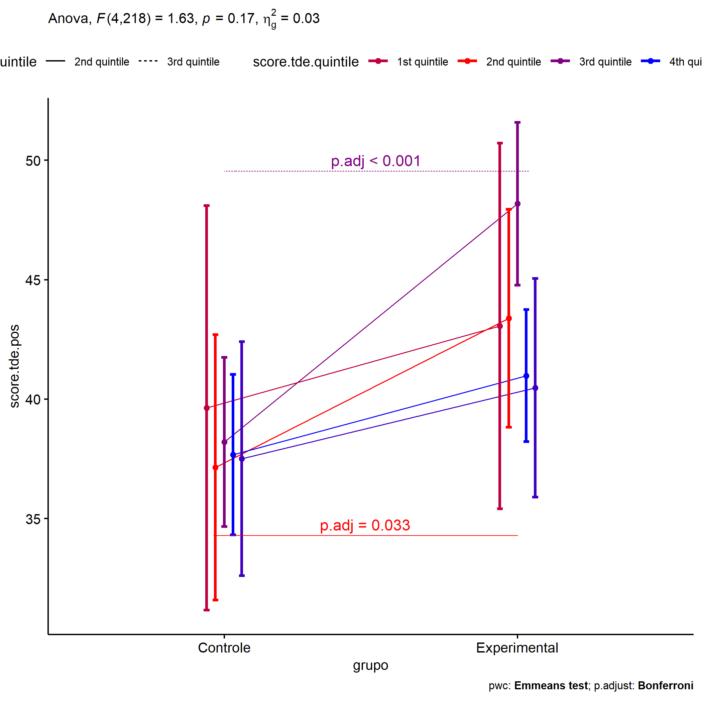<!-- -->

``` r
if (!is.null(plots[["score.tde.quintile"]]))
  plots[["score.tde.quintile"]] + ggplot2::scale_color_manual(values = color[["grupo"]])
```

    ## Scale for colour is already present.
    ## Adding another scale for colour, which will replace the existing scale.

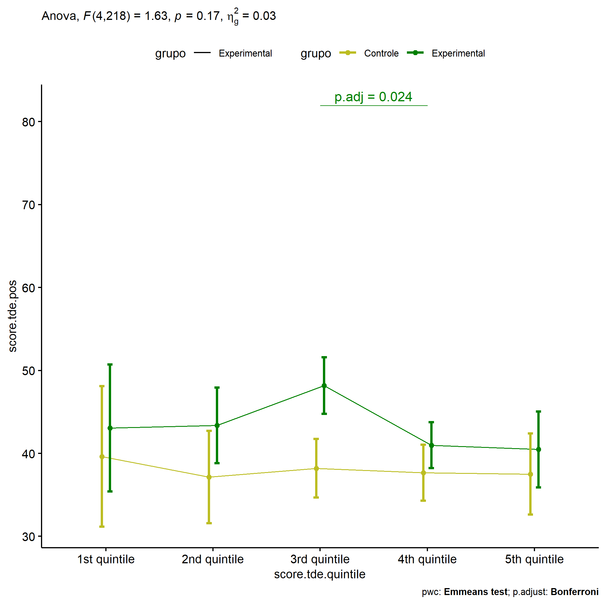<!-- -->

``` r
plots <- twoWayAncovaBoxPlots(
  wdat, "score.tde.pos", c("grupo","score.tde.quintile"), aov, pwcs, covar = "score.tde.pre",
  theme = "classic", color = color[["grupo:score.tde.quintile"]],
  subtitle = which(aov$Effect == "grupo:score.tde.quintile"))
```

``` r
plots[["grupo:score.tde.quintile"]] + ggplot2::ylab("TDE - Escrita") + ggplot2::scale_x_discrete(labels=c('pre', 'pos'))
```

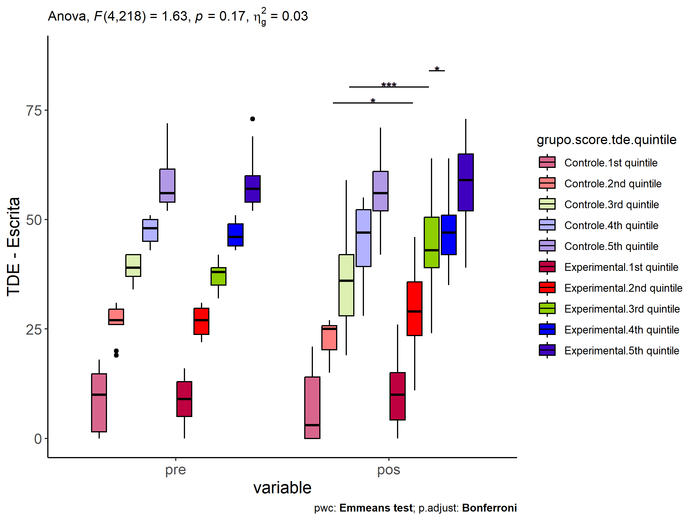<!-- -->

``` r
plots <- twoWayAncovaBoxPlots(
  wdat.long, "score.tde", c("grupo","score.tde.quintile"), aov, pwc.long, pre.post = "time",
  theme = "classic", color = color$prepost)
```

``` r
plots[["grupo:score.tde.quintile"]] + ggplot2::ylab("TDE - Escrita")
```

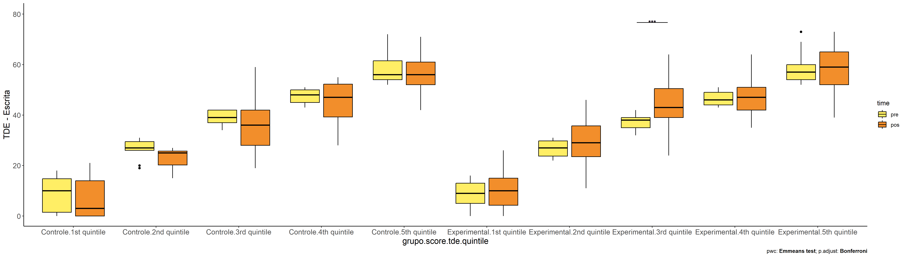<!-- -->

### Checking linearity assumption

``` r
ggscatter(wdat, x = "score.tde.pre", y = "score.tde.pos", size = 0.5,
          facet.by = c("grupo","score.tde.quintile"), add = "reg.line")+
  stat_regline_equation(
    aes(label =  paste(..eq.label.., ..rr.label.., sep = "~~~~"))
  )
```

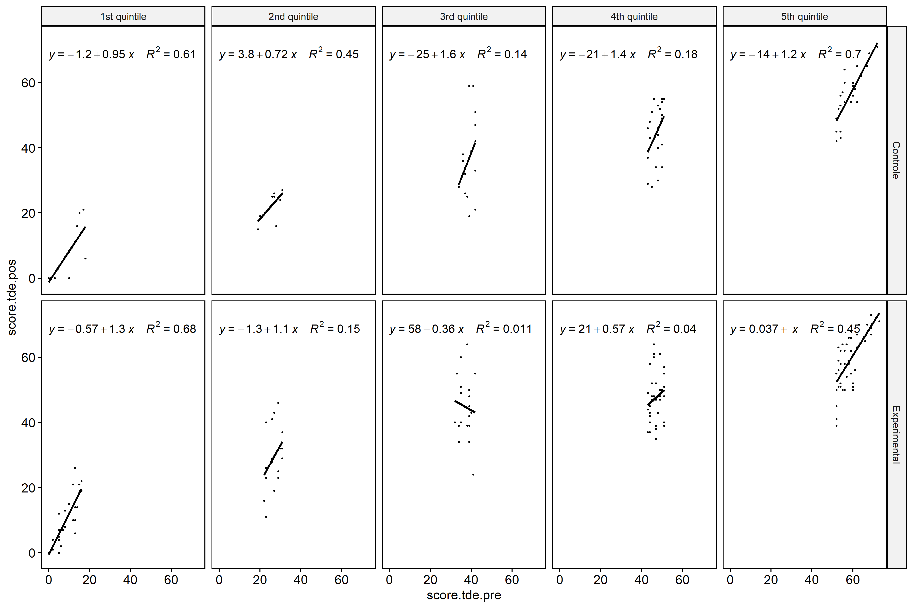<!-- -->

### Checking normality and homogeneity

``` r
res <- augment(lm(score.tde.pos ~ score.tde.pre + grupo*score.tde.quintile, data = wdat))
```

``` r
shapiro_test(res$.resid)
```

    ## # A tibble: 1 × 3
    ##   variable   statistic p.value
    ##   <chr>          <dbl>   <dbl>
    ## 1 res$.resid     0.990  0.0968

``` r
levene_test(res, .resid ~ grupo*score.tde.quintile)
```

    ## # A tibble: 1 × 4
    ##     df1   df2 statistic       p
    ##   <int> <int>     <dbl>   <dbl>
    ## 1     9   219      3.17 0.00126

# Summary of Results

## Descriptive Statistics

``` r
df <- get.descriptives(ldat[["grupo"]], c(dv.pre, dv.pos), c("grupo"), 
                       include.global = T, symmetry.test = T, normality.test = F)
df <- plyr::rbind.fill(
  df, do.call(plyr::rbind.fill, lapply(lfatores2, FUN = function(f) {
    if (nrow(dat) > 0 && sum(!is.na(unique(dat[[f]]))) > 1)
      get.descriptives(ldat[[paste0("grupo:",f)]], c(dv.pre,dv.pos), c("grupo", f),
                       symmetry.test = T, normality.test = F)
    }))
)
(df <- df[,c(fatores1[fatores1 %in% colnames(df)],"variable",
             colnames(df)[!colnames(df) %in% c(fatores1,"variable")])])
```

    ##           grupo Sexo   Zona Cor.Raca score.tde.quintile      variable   n   mean median min max     sd    se
    ## 1      Controle <NA>   <NA>     <NA>               <NA> score.tde.pre  88 42.625   46.5   0  72 16.472 1.756
    ## 2  Experimental <NA>   <NA>     <NA>               <NA> score.tde.pre 141 39.248   44.0   0  73 18.114 1.525
    ## 3          <NA> <NA>   <NA>     <NA>               <NA> score.tde.pre 229 40.546   45.0   0  73 17.542 1.159
    ## 4      Controle <NA>   <NA>     <NA>               <NA> score.tde.pos  88 39.568   42.5   0  71 17.883 1.906
    ## 5  Experimental <NA>   <NA>     <NA>               <NA> score.tde.pos 141 41.255   45.0   0  73 18.995 1.600
    ## 6          <NA> <NA>   <NA>     <NA>               <NA> score.tde.pos 229 40.607   44.0   0  73 18.554 1.226
    ## 7      Controle    F   <NA>     <NA>               <NA> score.tde.pre  48 45.771   49.0   3  72 15.134 2.184
    ## 8      Controle    M   <NA>     <NA>               <NA> score.tde.pre  41 38.854   43.0   0  68 17.172 2.682
    ## 9  Experimental    F   <NA>     <NA>               <NA> score.tde.pre  72 42.556   47.5   0  73 19.008 2.240
    ## 10 Experimental    M   <NA>     <NA>               <NA> score.tde.pre  70 35.700   39.0   0  69 16.470 1.969
    ## 11     Controle    F   <NA>     <NA>               <NA> score.tde.pos  48 43.688   48.0   0  71 16.869 2.435
    ## 12     Controle    M   <NA>     <NA>               <NA> score.tde.pos  41 35.220   34.0   0  69 18.191 2.841
    ## 13 Experimental    F   <NA>     <NA>               <NA> score.tde.pos  72 45.514   50.5   0  73 19.939 2.350
    ## 14 Experimental    M   <NA>     <NA>               <NA> score.tde.pos  70 36.300   39.5   0  69 17.395 2.079
    ## 15     Controle <NA>  Rural     <NA>               <NA> score.tde.pre  31 43.387   48.0   0  67 17.250 3.098
    ## 16     Controle <NA> Urbana     <NA>               <NA> score.tde.pre  18 45.333   49.0   1  72 16.464 3.881
    ## 17 Experimental <NA>  Rural     <NA>               <NA> score.tde.pre  52 38.769   44.0   0  73 18.719 2.596
    ## 18 Experimental <NA> Urbana     <NA>               <NA> score.tde.pre  21 44.857   46.0   5  61 14.914 3.255
    ## 19     Controle <NA>  Rural     <NA>               <NA> score.tde.pos  31 42.065   50.0   0  65 18.845 3.385
    ## 20     Controle <NA> Urbana     <NA>               <NA> score.tde.pos  18 41.722   40.0   0  71 17.374 4.095
    ## 21 Experimental <NA>  Rural     <NA>               <NA> score.tde.pos  52 39.673   42.5   0  71 20.224 2.805
    ## 22 Experimental <NA> Urbana     <NA>               <NA> score.tde.pos  21 46.905   50.0   5  64 15.165 3.309
    ## 23     Controle <NA>   <NA>    Parda               <NA> score.tde.pre  34 44.353   48.0   0  62 14.781 2.535
    ## 24 Experimental <NA>   <NA>   Branca               <NA> score.tde.pre  20 40.800   46.0   0  73 21.100 4.718
    ## 25 Experimental <NA>   <NA>    Parda               <NA> score.tde.pre  50 37.020   41.5   2  67 18.643 2.637
    ## 26     Controle <NA>   <NA>    Parda               <NA> score.tde.pos  34 41.324   48.0   0  65 18.270 3.133
    ## 27 Experimental <NA>   <NA>   Branca               <NA> score.tde.pos  20 38.450   49.0   0  71 23.909 5.346
    ## 28 Experimental <NA>   <NA>    Parda               <NA> score.tde.pos  50 38.860   43.5   0  70 19.622 2.775
    ## 29     Controle <NA>   <NA>     <NA>       1st quintile score.tde.pre  10  8.800   10.0   0  18  7.223 2.284
    ## 30     Controle <NA>   <NA>     <NA>       2nd quintile score.tde.pre  10 26.500   27.0  19  31  4.143 1.310
    ## 31     Controle <NA>   <NA>     <NA>       3rd quintile score.tde.pre  17 38.824   39.0  34  42  2.811 0.682
    ## 32     Controle <NA>   <NA>     <NA>       4th quintile score.tde.pre  24 47.542   48.0  43  51  2.734 0.558
    ## 33     Controle <NA>   <NA>     <NA>       5th quintile score.tde.pre  27 58.370   56.0  52  72  5.658 1.089
    ## 34 Experimental <NA>   <NA>     <NA>       1st quintile score.tde.pre  26  8.846    9.0   0  16  5.033 0.987
    ## 35 Experimental <NA>   <NA>     <NA>       2nd quintile score.tde.pre  18 27.000   27.0  22  31  3.162 0.745
    ## 36 Experimental <NA>   <NA>     <NA>       3rd quintile score.tde.pre  19 37.158   38.0  32  42  2.892 0.663
    ## 37 Experimental <NA>   <NA>     <NA>       4th quintile score.tde.pre  37 46.703   46.0  43  51  2.644 0.435
    ## 38 Experimental <NA>   <NA>     <NA>       5th quintile score.tde.pre  41 58.146   57.0  52  73  5.512 0.861
    ## 39     Controle <NA>   <NA>     <NA>       1st quintile score.tde.pos  10  7.100    3.0   0  21  8.774 2.775
    ## 40     Controle <NA>   <NA>     <NA>       2nd quintile score.tde.pos  10 22.800   25.0  15  27  4.417 1.397
    ## 41     Controle <NA>   <NA>     <NA>       3rd quintile score.tde.pos  17 36.529   36.0  19  59 12.047 2.922
    ## 42     Controle <NA>   <NA>     <NA>       4th quintile score.tde.pos  24 44.958   47.0  28  55  8.917 1.820
    ## 43     Controle <NA>   <NA>     <NA>       5th quintile score.tde.pos  27 55.926   56.0  42  71  8.067 1.552
    ## 44 Experimental <NA>   <NA>     <NA>       1st quintile score.tde.pos  26 10.577   10.0   0  26  7.669 1.504
    ## 45 Experimental <NA>   <NA>     <NA>       2nd quintile score.tde.pos  18 29.556   29.0  11  46  9.476 2.233
    ## 46 Experimental <NA>   <NA>     <NA>       3rd quintile score.tde.pos  19 44.789   43.0  24  64  9.790 2.246
    ## 47 Experimental <NA>   <NA>     <NA>       4th quintile score.tde.pos  37 47.405   47.0  35  64  7.533 1.238
    ## 48 Experimental <NA>   <NA>     <NA>       5th quintile score.tde.pos  41 58.659   59.0  39  73  8.302 1.297
    ##        ci   iqr symmetry    skewness    kurtosis
    ## 1   3.490 17.75       NO -0.83624639  0.18877450
    ## 2   3.016 26.00       NO -0.54476523 -0.69147985
    ## 3   2.284 23.00       NO -0.66055329 -0.39833562
    ## 4   3.789 28.00       NO -0.50613291 -0.55500400
    ## 5   3.163 26.00       NO -0.56087137 -0.64207657
    ## 6   2.416 28.00       NO -0.53684454 -0.59583408
    ## 7   4.394 17.00       NO -0.76282517  0.27554253
    ## 8   5.420 23.00       NO -0.81617367 -0.25344149
    ## 9   4.467 25.50       NO -0.73204432 -0.59422454
    ## 10  3.927 23.25      YES -0.48079335 -0.67492072
    ## 11  4.898 27.50       NO -0.65409923 -0.50825653
    ## 12  5.742 25.00      YES -0.36163475 -0.66085545
    ## 13  4.686 25.00       NO -0.80827480 -0.48532558
    ## 14  4.148 24.75       NO -0.52420482 -0.64387442
    ## 15  6.328 11.50       NO -1.18157404  0.43993264
    ## 16  8.187 16.75       NO -0.77271364  0.66904411
    ## 17  5.212 25.50       NO -0.51846896 -0.76914878
    ## 18  6.789 12.00       NO -1.45123975  1.45879779
    ## 19  6.912 21.50       NO -0.99994650 -0.08975067
    ## 20  8.640 24.50      YES -0.36590738 -0.24972245
    ## 21  5.630 29.00      YES -0.39704728 -0.98935616
    ## 22  6.903 11.00       NO -1.37440561  1.26290347
    ## 23  5.157 10.75       NO -1.44466303  1.85944147
    ## 24  9.875 27.00       NO -0.50589461 -0.80391407
    ## 25  5.298 28.25      YES -0.49881005 -1.08364486
    ## 26  6.375 25.75       NO -0.80339039 -0.47000738
    ## 27 11.190 34.50      YES -0.43806110 -1.33752203
    ## 28  5.576 26.50      YES -0.42239081 -0.98165116
    ## 29  5.167 13.25      YES -0.08494517 -1.87144460
    ## 30  2.964  3.50       NO -0.65798636 -0.98957018
    ## 31  1.446  5.00      YES -0.29103695 -1.33758828
    ## 32  1.155  5.00      YES -0.44075253 -1.34014789
    ## 33  2.238  7.50       NO  0.67029966 -0.62891735
    ## 34  2.033  8.00      YES -0.19711975 -1.32117175
    ## 35  1.573  6.00      YES -0.20027759 -1.53888889
    ## 36  1.394  4.00      YES -0.17493103 -1.34785649
    ## 37  0.882  5.00      YES  0.36613150 -1.20293573
    ## 38  1.740  6.00       NO  0.92391110 -0.00159535
    ## 39  6.277 14.00       NO  0.55469663 -1.58274876
    ## 40  3.160  5.50       NO -0.77806278 -1.25540304
    ## 41  6.194 14.00      YES  0.47219560 -0.88242706
    ## 42  3.765 13.00       NO -0.55141720 -1.10019778
    ## 43  3.191  9.00      YES -0.12940686 -0.88318743
    ## 44  3.098 10.75      YES  0.24585478 -1.16257457
    ## 45  4.712 12.25      YES -0.05165876 -0.88421288
    ## 46  4.719 11.50      YES  0.05047009 -0.52188929
    ## 47  2.512  9.00      YES  0.37174534 -0.65580125
    ## 48  2.621 13.00      YES -0.33608592 -0.65474830

| grupo        | Sexo | Zona   | Cor.Raca | score.tde.quintile | variable      |   n |   mean | median | min | max |     sd |    se |     ci |   iqr | symmetry | skewness | kurtosis |
|:-------------|:-----|:-------|:---------|:-------------------|:--------------|----:|-------:|-------:|----:|----:|-------:|------:|-------:|------:|:---------|---------:|---------:|
| Controle     |      |        |          |                    | score.tde.pre |  88 | 42.625 |   46.5 |   0 |  72 | 16.472 | 1.756 |  3.490 | 17.75 | NO       |   -0.836 |    0.189 |
| Experimental |      |        |          |                    | score.tde.pre | 141 | 39.248 |   44.0 |   0 |  73 | 18.114 | 1.525 |  3.016 | 26.00 | NO       |   -0.545 |   -0.691 |
|              |      |        |          |                    | score.tde.pre | 229 | 40.546 |   45.0 |   0 |  73 | 17.542 | 1.159 |  2.284 | 23.00 | NO       |   -0.661 |   -0.398 |
| Controle     |      |        |          |                    | score.tde.pos |  88 | 39.568 |   42.5 |   0 |  71 | 17.883 | 1.906 |  3.789 | 28.00 | NO       |   -0.506 |   -0.555 |
| Experimental |      |        |          |                    | score.tde.pos | 141 | 41.255 |   45.0 |   0 |  73 | 18.995 | 1.600 |  3.163 | 26.00 | NO       |   -0.561 |   -0.642 |
|              |      |        |          |                    | score.tde.pos | 229 | 40.607 |   44.0 |   0 |  73 | 18.554 | 1.226 |  2.416 | 28.00 | NO       |   -0.537 |   -0.596 |
| Controle     | F    |        |          |                    | score.tde.pre |  48 | 45.771 |   49.0 |   3 |  72 | 15.134 | 2.184 |  4.394 | 17.00 | NO       |   -0.763 |    0.276 |
| Controle     | M    |        |          |                    | score.tde.pre |  41 | 38.854 |   43.0 |   0 |  68 | 17.172 | 2.682 |  5.420 | 23.00 | NO       |   -0.816 |   -0.253 |
| Experimental | F    |        |          |                    | score.tde.pre |  72 | 42.556 |   47.5 |   0 |  73 | 19.008 | 2.240 |  4.467 | 25.50 | NO       |   -0.732 |   -0.594 |
| Experimental | M    |        |          |                    | score.tde.pre |  70 | 35.700 |   39.0 |   0 |  69 | 16.470 | 1.969 |  3.927 | 23.25 | YES      |   -0.481 |   -0.675 |
| Controle     | F    |        |          |                    | score.tde.pos |  48 | 43.688 |   48.0 |   0 |  71 | 16.869 | 2.435 |  4.898 | 27.50 | NO       |   -0.654 |   -0.508 |
| Controle     | M    |        |          |                    | score.tde.pos |  41 | 35.220 |   34.0 |   0 |  69 | 18.191 | 2.841 |  5.742 | 25.00 | YES      |   -0.362 |   -0.661 |
| Experimental | F    |        |          |                    | score.tde.pos |  72 | 45.514 |   50.5 |   0 |  73 | 19.939 | 2.350 |  4.686 | 25.00 | NO       |   -0.808 |   -0.485 |
| Experimental | M    |        |          |                    | score.tde.pos |  70 | 36.300 |   39.5 |   0 |  69 | 17.395 | 2.079 |  4.148 | 24.75 | NO       |   -0.524 |   -0.644 |
| Controle     |      | Rural  |          |                    | score.tde.pre |  31 | 43.387 |   48.0 |   0 |  67 | 17.250 | 3.098 |  6.328 | 11.50 | NO       |   -1.182 |    0.440 |
| Controle     |      | Urbana |          |                    | score.tde.pre |  18 | 45.333 |   49.0 |   1 |  72 | 16.464 | 3.881 |  8.187 | 16.75 | NO       |   -0.773 |    0.669 |
| Experimental |      | Rural  |          |                    | score.tde.pre |  52 | 38.769 |   44.0 |   0 |  73 | 18.719 | 2.596 |  5.212 | 25.50 | NO       |   -0.518 |   -0.769 |
| Experimental |      | Urbana |          |                    | score.tde.pre |  21 | 44.857 |   46.0 |   5 |  61 | 14.914 | 3.255 |  6.789 | 12.00 | NO       |   -1.451 |    1.459 |
| Controle     |      | Rural  |          |                    | score.tde.pos |  31 | 42.065 |   50.0 |   0 |  65 | 18.845 | 3.385 |  6.912 | 21.50 | NO       |   -1.000 |   -0.090 |
| Controle     |      | Urbana |          |                    | score.tde.pos |  18 | 41.722 |   40.0 |   0 |  71 | 17.374 | 4.095 |  8.640 | 24.50 | YES      |   -0.366 |   -0.250 |
| Experimental |      | Rural  |          |                    | score.tde.pos |  52 | 39.673 |   42.5 |   0 |  71 | 20.224 | 2.805 |  5.630 | 29.00 | YES      |   -0.397 |   -0.989 |
| Experimental |      | Urbana |          |                    | score.tde.pos |  21 | 46.905 |   50.0 |   5 |  64 | 15.165 | 3.309 |  6.903 | 11.00 | NO       |   -1.374 |    1.263 |
| Controle     |      |        | Parda    |                    | score.tde.pre |  34 | 44.353 |   48.0 |   0 |  62 | 14.781 | 2.535 |  5.157 | 10.75 | NO       |   -1.445 |    1.859 |
| Experimental |      |        | Branca   |                    | score.tde.pre |  20 | 40.800 |   46.0 |   0 |  73 | 21.100 | 4.718 |  9.875 | 27.00 | NO       |   -0.506 |   -0.804 |
| Experimental |      |        | Parda    |                    | score.tde.pre |  50 | 37.020 |   41.5 |   2 |  67 | 18.643 | 2.637 |  5.298 | 28.25 | YES      |   -0.499 |   -1.084 |
| Controle     |      |        | Parda    |                    | score.tde.pos |  34 | 41.324 |   48.0 |   0 |  65 | 18.270 | 3.133 |  6.375 | 25.75 | NO       |   -0.803 |   -0.470 |
| Experimental |      |        | Branca   |                    | score.tde.pos |  20 | 38.450 |   49.0 |   0 |  71 | 23.909 | 5.346 | 11.190 | 34.50 | YES      |   -0.438 |   -1.338 |
| Experimental |      |        | Parda    |                    | score.tde.pos |  50 | 38.860 |   43.5 |   0 |  70 | 19.622 | 2.775 |  5.576 | 26.50 | YES      |   -0.422 |   -0.982 |
| Controle     |      |        |          | 1st quintile       | score.tde.pre |  10 |  8.800 |   10.0 |   0 |  18 |  7.223 | 2.284 |  5.167 | 13.25 | YES      |   -0.085 |   -1.871 |
| Controle     |      |        |          | 2nd quintile       | score.tde.pre |  10 | 26.500 |   27.0 |  19 |  31 |  4.143 | 1.310 |  2.964 |  3.50 | NO       |   -0.658 |   -0.990 |
| Controle     |      |        |          | 3rd quintile       | score.tde.pre |  17 | 38.824 |   39.0 |  34 |  42 |  2.811 | 0.682 |  1.446 |  5.00 | YES      |   -0.291 |   -1.338 |
| Controle     |      |        |          | 4th quintile       | score.tde.pre |  24 | 47.542 |   48.0 |  43 |  51 |  2.734 | 0.558 |  1.155 |  5.00 | YES      |   -0.441 |   -1.340 |
| Controle     |      |        |          | 5th quintile       | score.tde.pre |  27 | 58.370 |   56.0 |  52 |  72 |  5.658 | 1.089 |  2.238 |  7.50 | NO       |    0.670 |   -0.629 |
| Experimental |      |        |          | 1st quintile       | score.tde.pre |  26 |  8.846 |    9.0 |   0 |  16 |  5.033 | 0.987 |  2.033 |  8.00 | YES      |   -0.197 |   -1.321 |
| Experimental |      |        |          | 2nd quintile       | score.tde.pre |  18 | 27.000 |   27.0 |  22 |  31 |  3.162 | 0.745 |  1.573 |  6.00 | YES      |   -0.200 |   -1.539 |
| Experimental |      |        |          | 3rd quintile       | score.tde.pre |  19 | 37.158 |   38.0 |  32 |  42 |  2.892 | 0.663 |  1.394 |  4.00 | YES      |   -0.175 |   -1.348 |
| Experimental |      |        |          | 4th quintile       | score.tde.pre |  37 | 46.703 |   46.0 |  43 |  51 |  2.644 | 0.435 |  0.882 |  5.00 | YES      |    0.366 |   -1.203 |
| Experimental |      |        |          | 5th quintile       | score.tde.pre |  41 | 58.146 |   57.0 |  52 |  73 |  5.512 | 0.861 |  1.740 |  6.00 | NO       |    0.924 |   -0.002 |
| Controle     |      |        |          | 1st quintile       | score.tde.pos |  10 |  7.100 |    3.0 |   0 |  21 |  8.774 | 2.775 |  6.277 | 14.00 | NO       |    0.555 |   -1.583 |
| Controle     |      |        |          | 2nd quintile       | score.tde.pos |  10 | 22.800 |   25.0 |  15 |  27 |  4.417 | 1.397 |  3.160 |  5.50 | NO       |   -0.778 |   -1.255 |
| Controle     |      |        |          | 3rd quintile       | score.tde.pos |  17 | 36.529 |   36.0 |  19 |  59 | 12.047 | 2.922 |  6.194 | 14.00 | YES      |    0.472 |   -0.882 |
| Controle     |      |        |          | 4th quintile       | score.tde.pos |  24 | 44.958 |   47.0 |  28 |  55 |  8.917 | 1.820 |  3.765 | 13.00 | NO       |   -0.551 |   -1.100 |
| Controle     |      |        |          | 5th quintile       | score.tde.pos |  27 | 55.926 |   56.0 |  42 |  71 |  8.067 | 1.552 |  3.191 |  9.00 | YES      |   -0.129 |   -0.883 |
| Experimental |      |        |          | 1st quintile       | score.tde.pos |  26 | 10.577 |   10.0 |   0 |  26 |  7.669 | 1.504 |  3.098 | 10.75 | YES      |    0.246 |   -1.163 |
| Experimental |      |        |          | 2nd quintile       | score.tde.pos |  18 | 29.556 |   29.0 |  11 |  46 |  9.476 | 2.233 |  4.712 | 12.25 | YES      |   -0.052 |   -0.884 |
| Experimental |      |        |          | 3rd quintile       | score.tde.pos |  19 | 44.789 |   43.0 |  24 |  64 |  9.790 | 2.246 |  4.719 | 11.50 | YES      |    0.050 |   -0.522 |
| Experimental |      |        |          | 4th quintile       | score.tde.pos |  37 | 47.405 |   47.0 |  35 |  64 |  7.533 | 1.238 |  2.512 |  9.00 | YES      |    0.372 |   -0.656 |
| Experimental |      |        |          | 5th quintile       | score.tde.pos |  41 | 58.659 |   59.0 |  39 |  73 |  8.302 | 1.297 |  2.621 | 13.00 | YES      |   -0.336 |   -0.655 |

## ANCOVA Table Comparison

``` r
df <- do.call(plyr::rbind.fill, laov)
(df <- df[!duplicated(df$Effect),])
```

    ##                      Effect DFn DFd        F        p p<.05      ges DFn' DFd'      F'       p' p<.05'     ges'
    ## 1                     grupo   1 226   23.644 2.17e-06     * 0.095000    1  229  18.026 3.17e-05      * 7.30e-02
    ## 2             score.tde.pre   1 226 1171.049 2.33e-91     * 0.838000    1  229 976.184 1.54e-84      * 8.10e-01
    ## 4                grupo:Sexo   1 226    0.145 7.04e-01       0.000640    1  227   0.326 5.68e-01        1.00e-03
    ## 6                      Sexo   1 226    4.841 2.90e-02     * 0.021000    1  227   6.130 1.40e-02      * 2.60e-02
    ## 8                grupo:Zona   1 117    1.559 2.14e-01       0.013000    1  120   0.748 3.89e-01        6.00e-03
    ## 10                     Zona   1 117    0.057 8.12e-01       0.000483    1  120   0.005 9.44e-01        4.08e-05
    ## 11                 Cor.Raca   1 100    2.822 9.60e-02       0.027000    1  101   3.279 7.30e-02        3.10e-02
    ## 13           grupo:Cor.Raca   0 100       NA       NA  <NA>       NA    0  101      NA       NA   <NA>       NA
    ## 16 grupo:score.tde.quintile   4 218    1.627 1.68e-01       0.029000    4  221   1.091 3.62e-01        1.90e-02
    ## 18       score.tde.quintile   4 218    1.834 1.23e-01       0.033000    4  221   1.764 1.37e-01        3.10e-02

|     | Effect                   | DFn | DFd |        F |     p | p\<.05 |   ges | DFn’ | DFd’ |      F’ |    p’ | p\<.05’ |  ges’ |
|:----|:-------------------------|----:|----:|---------:|------:|:-------|------:|-----:|-----:|--------:|------:|:--------|------:|
| 1   | grupo                    |   1 | 226 |   23.644 | 0.000 | \*     | 0.095 |    1 |  229 |  18.026 | 0.000 | \*      | 0.073 |
| 2   | score.tde.pre            |   1 | 226 | 1171.049 | 0.000 | \*     | 0.838 |    1 |  229 | 976.184 | 0.000 | \*      | 0.810 |
| 4   | grupo:Sexo               |   1 | 226 |    0.145 | 0.704 |        | 0.001 |    1 |  227 |   0.326 | 0.568 |         | 0.001 |
| 6   | Sexo                     |   1 | 226 |    4.841 | 0.029 | \*     | 0.021 |    1 |  227 |   6.130 | 0.014 | \*      | 0.026 |
| 8   | grupo:Zona               |   1 | 117 |    1.559 | 0.214 |        | 0.013 |    1 |  120 |   0.748 | 0.389 |         | 0.006 |
| 10  | Zona                     |   1 | 117 |    0.057 | 0.812 |        | 0.000 |    1 |  120 |   0.005 | 0.944 |         | 0.000 |
| 11  | Cor.Raca                 |   1 | 100 |    2.822 | 0.096 |        | 0.027 |    1 |  101 |   3.279 | 0.073 |         | 0.031 |
| 13  | grupo:Cor.Raca           |   0 | 100 |          |       |        |       |    0 |  101 |         |       |         |       |
| 16  | grupo:score.tde.quintile |   4 | 218 |    1.627 | 0.168 |        | 0.029 |    4 |  221 |   1.091 | 0.362 |         | 0.019 |
| 18  | score.tde.quintile       |   4 | 218 |    1.834 | 0.123 |        | 0.033 |    4 |  221 |   1.764 | 0.137 |         | 0.031 |

## PairWise Table Comparison

``` r
df <- do.call(plyr::rbind.fill, lpwc)
df <- df[,c(names(lfatores), names(df)[!names(df) %in% c(names(lfatores),"term",".y.")])]
```

| grupo        | Sexo | Zona   | Cor.Raca | score.tde.quintile | group1       | group2       |  df | statistic |     p | p.adj | p.adj.signif | df’ | statistic’ |    p’ | p.adj’ | p.adj.signif’ |
|:-------------|:-----|:-------|:---------|:-------------------|:-------------|:-------------|----:|----------:|------:|------:|:-------------|----:|-----------:|------:|-------:|:--------------|
| Controle     |      |        |          |                    | pre          | pos          | 454 |     1.124 | 0.262 | 0.262 | ns           | 460 |      1.031 | 0.303 |  0.303 | ns            |
| Experimental |      |        |          |                    | pre          | pos          | 454 |    -0.934 | 0.351 | 0.351 | ns           | 460 |     -0.954 | 0.341 |  0.341 | ns            |
|              |      |        |          |                    | Controle     | Experimental | 226 |    -4.863 | 0.000 | 0.000 | \*\*\*\*     | 229 |     -4.246 | 0.000 |  0.000 | \*\*\*\*      |
| Controle     | F    |        |          |                    | pre          | pos          | 454 |     0.576 | 0.565 | 0.565 | ns           | 456 |      0.575 | 0.565 |  0.565 | ns            |
| Controle     | M    |        |          |                    | pre          | pos          | 454 |     0.928 | 0.354 | 0.354 | ns           | 456 |      0.928 | 0.354 |  0.354 | ns            |
| Controle     |      |        |          |                    | F            | M            | 226 |     1.084 | 0.280 | 0.280 | ns           | 227 |      1.101 | 0.272 |  0.272 | ns            |
| Experimental | F    |        |          |                    | pre          | pos          | 454 |    -1.001 | 0.317 | 0.317 | ns           | 456 |     -1.166 | 0.244 |  0.244 | ns            |
| Experimental | M    |        |          |                    | pre          | pos          | 454 |    -0.200 | 0.841 | 0.841 | ns           | 456 |     -0.200 | 0.841 |  0.841 | ns            |
| Experimental |      |        |          |                    | F            | M            | 226 |     1.973 | 0.050 | 0.050 | \*           | 227 |      2.310 | 0.022 |  0.022 | \*            |
|              | F    |        |          |                    | Controle     | Experimental | 226 |    -3.371 | 0.001 | 0.001 | \*\*\*       | 227 |     -3.529 | 0.001 |  0.001 | \*\*\*        |
|              | M    |        |          |                    | Controle     | Experimental | 226 |    -2.672 | 0.008 | 0.008 | \*\*         | 227 |     -2.554 | 0.011 |  0.011 | \*            |
| Controle     |      |        |          |                    | Rural        | Urbana       | 117 |     1.094 | 0.276 | 0.276 | ns           | 120 |      0.602 | 0.548 |  0.548 | ns            |
| Controle     |      | Rural  |          |                    | pre          | pos          | 236 |     0.288 | 0.774 | 0.774 | ns           | 242 |      0.476 | 0.635 |  0.635 | ns            |
| Controle     |      | Urbana |          |                    | pre          | pos          | 236 |     0.599 | 0.550 | 0.550 | ns           | 242 |      0.598 | 0.551 |  0.551 | ns            |
| Experimental |      |        |          |                    | Rural        | Urbana       | 117 |    -0.643 | 0.522 | 0.522 | ns           | 120 |     -0.623 | 0.535 |  0.535 | ns            |
| Experimental |      | Rural  |          |                    | pre          | pos          | 236 |    -0.255 | 0.799 | 0.799 | ns           | 242 |     -0.234 | 0.815 |  0.815 | ns            |
| Experimental |      | Urbana |          |                    | pre          | pos          | 236 |    -0.367 | 0.714 | 0.714 | ns           | 242 |     -0.366 | 0.715 |  0.715 | ns            |
|              |      | Rural  |          |                    | Controle     | Experimental | 117 |    -1.373 | 0.172 | 0.172 | ns           | 120 |     -1.596 | 0.113 |  0.113 | ns            |
|              |      | Urbana |          |                    | Controle     | Experimental | 117 |    -2.507 | 0.014 | 0.014 | \*           | 120 |     -2.173 | 0.032 |  0.032 | \*            |
| Controle     |      |        | Branca   |                    | pre          | pos          |     |           |       |       |              |     |            |       |        |               |
| Controle     |      |        |          |                    | Branca       | Parda        |     |           |       |       |              |     |            |       |        |               |
| Controle     |      |        | Parda    |                    | pre          | pos          | 202 |     0.655 | 0.513 | 0.513 | ns           | 204 |      0.655 | 0.513 |  0.513 | ns            |
| Experimental |      |        | Branca   |                    | pre          | pos          | 202 |     0.390 | 0.697 | 0.697 | ns           | 204 |      0.390 | 0.697 |  0.697 | ns            |
| Experimental |      |        |          |                    | Branca       | Parda        | 100 |    -1.680 | 0.096 | 0.096 | ns           | 101 |     -1.811 | 0.073 |  0.073 | ns            |
| Experimental |      |        | Parda    |                    | pre          | pos          | 202 |    -0.482 | 0.630 | 0.630 | ns           | 204 |     -0.670 | 0.504 |  0.504 | ns            |
|              |      |        | Branca   |                    | Controle     | Experimental |     |           |       |       |              |     |            |       |        |               |
|              |      |        | Parda    |                    | Controle     | Experimental | 100 |    -2.279 | 0.025 | 0.025 | \*           | 101 |     -2.379 | 0.019 |  0.019 | \*            |
| Controle     |      |        |          | 1st quintile       | pre          | pos          | 438 |     0.557 | 0.578 | 0.578 | ns           | 444 |      0.524 | 0.600 |  0.600 | ns            |
| Controle     |      |        |          | 2nd quintile       | pre          | pos          | 438 |     1.212 | 0.226 | 0.226 | ns           | 444 |      1.141 | 0.254 |  0.254 | ns            |
| Controle     |      |        |          | 3rd quintile       | pre          | pos          | 438 |     0.980 | 0.328 | 0.328 | ns           | 444 |      0.923 | 0.357 |  0.357 | ns            |
| Controle     |      |        |          | 4th quintile       | pre          | pos          | 438 |     1.311 | 0.191 | 0.191 | ns           | 444 |      1.234 | 0.218 |  0.218 | ns            |
| Controle     |      |        |          | 5th quintile       | pre          | pos          | 438 |     1.316 | 0.189 | 0.189 | ns           | 444 |      1.733 | 0.084 |  0.084 | ns            |
| Controle     |      |        |          |                    | 1st quintile | 2nd quintile | 218 |     0.645 | 0.520 | 1.000 | ns           | 221 |      0.662 | 0.509 |  1.000 | ns            |
| Controle     |      |        |          |                    | 1st quintile | 3rd quintile | 218 |     0.317 | 0.752 | 1.000 | ns           | 221 |      0.398 | 0.691 |  1.000 | ns            |
| Controle     |      |        |          |                    | 1st quintile | 4th quintile | 218 |     0.376 | 0.707 | 1.000 | ns           | 221 |      0.465 | 0.643 |  1.000 | ns            |
| Controle     |      |        |          |                    | 1st quintile | 5th quintile | 218 |     0.338 | 0.736 | 1.000 | ns           | 221 |      0.571 | 0.568 |  1.000 | ns            |
| Controle     |      |        |          |                    | 2nd quintile | 3rd quintile | 218 |    -0.327 | 0.744 | 1.000 | ns           | 221 |     -0.235 | 0.815 |  1.000 | ns            |
| Controle     |      |        |          |                    | 2nd quintile | 4th quintile | 218 |    -0.145 | 0.885 | 1.000 | ns           | 221 |     -0.038 | 0.970 |  1.000 | ns            |
| Controle     |      |        |          |                    | 2nd quintile | 5th quintile | 218 |    -0.082 | 0.935 | 1.000 | ns           | 221 |      0.225 | 0.822 |  1.000 | ns            |
| Controle     |      |        |          |                    | 3rd quintile | 4th quintile | 218 |     0.209 | 0.834 | 1.000 | ns           | 221 |      0.247 | 0.805 |  1.000 | ns            |
| Controle     |      |        |          |                    | 3rd quintile | 5th quintile | 218 |     0.217 | 0.828 | 1.000 | ns           | 221 |      0.561 | 0.575 |  1.000 | ns            |
| Controle     |      |        |          |                    | 4th quintile | 5th quintile | 218 |     0.067 | 0.946 | 1.000 | ns           | 221 |      0.483 | 0.629 |  1.000 | ns            |
| Experimental |      |        |          | 1st quintile       | pre          | pos          | 438 |    -0.914 | 0.361 | 0.361 | ns           | 444 |     -1.539 | 0.124 |  0.124 | ns            |
| Experimental |      |        |          | 2nd quintile       | pre          | pos          | 438 |    -1.123 | 0.262 | 0.262 | ns           | 444 |     -0.403 | 0.687 |  0.687 | ns            |
| Experimental |      |        |          | 3rd quintile       | pre          | pos          | 438 |    -3.446 | 0.001 | 0.001 | \*\*\*       | 444 |     -3.244 | 0.001 |  0.001 | \*\*          |
| Experimental |      |        |          | 4th quintile       | pre          | pos          | 438 |    -0.443 | 0.658 | 0.658 | ns           | 444 |     -0.417 | 0.677 |  0.677 | ns            |
| Experimental |      |        |          | 5th quintile       | pre          | pos          | 438 |    -0.340 | 0.734 | 0.734 | ns           | 444 |     -0.320 | 0.749 |  0.749 | ns            |
| Experimental |      |        |          |                    | 1st quintile | 2nd quintile | 218 |    -0.105 | 0.917 | 1.000 | ns           | 221 |      0.880 | 0.380 |  1.000 | ns            |
| Experimental |      |        |          |                    | 1st quintile | 3rd quintile | 218 |    -1.305 | 0.193 | 1.000 | ns           | 221 |     -0.774 | 0.440 |  1.000 | ns            |
| Experimental |      |        |          |                    | 1st quintile | 4th quintile | 218 |     0.442 | 0.659 | 1.000 | ns           | 221 |      0.791 | 0.430 |  1.000 | ns            |
| Experimental |      |        |          |                    | 1st quintile | 5th quintile | 218 |     0.437 | 0.662 | 1.000 | ns           | 221 |      0.739 | 0.460 |  1.000 | ns            |
| Experimental |      |        |          |                    | 2nd quintile | 3rd quintile | 218 |    -1.786 | 0.076 | 0.755 | ns           | 221 |     -2.135 | 0.034 |  0.339 | ns            |
| Experimental |      |        |          |                    | 2nd quintile | 4th quintile | 218 |     0.778 | 0.438 | 1.000 | ns           | 221 |      0.341 | 0.733 |  1.000 | ns            |
| Experimental |      |        |          |                    | 2nd quintile | 5th quintile | 218 |     0.707 | 0.481 | 1.000 | ns           | 221 |      0.414 | 0.679 |  1.000 | ns            |
| Experimental |      |        |          |                    | 3rd quintile | 4th quintile | 218 |     3.067 | 0.002 | 0.024 | \*           | 221 |      2.854 | 0.005 |  0.047 | \*            |
| Experimental |      |        |          |                    | 3rd quintile | 5th quintile | 218 |     2.448 | 0.015 | 0.152 | ns           | 221 |      2.338 | 0.020 |  0.203 | ns            |
| Experimental |      |        |          |                    | 4th quintile | 5th quintile | 218 |     0.240 | 0.811 | 1.000 | ns           | 221 |      0.307 | 0.759 |  1.000 | ns            |
|              |      |        |          | 1st quintile       | Controle     | Experimental | 218 |    -1.251 | 0.212 | 0.212 | ns           | 221 |     -1.574 | 0.117 |  0.117 | ns            |
|              |      |        |          | 2nd quintile       | Controle     | Experimental | 218 |    -2.149 | 0.033 | 0.033 | \*           | 221 |     -1.458 | 0.146 |  0.146 | ns            |
|              |      |        |          | 3rd quintile       | Controle     | Experimental | 218 |    -4.044 | 0.000 | 0.000 | \*\*\*\*     | 221 |     -3.684 | 0.000 |  0.000 | \*\*\*        |
|              |      |        |          | 4th quintile       | Controle     | Experimental | 218 |    -1.712 | 0.088 | 0.088 | ns           | 221 |     -1.562 | 0.120 |  0.120 | ns            |
|              |      |        |          | 5th quintile       | Controle     | Experimental | 218 |    -1.623 | 0.106 | 0.106 | ns           | 221 |     -1.953 | 0.052 |  0.052 | ns            |

## EMMS Table Comparison

``` r
df <- do.call(plyr::rbind.fill, lemms)
df[["N-N'"]] <- df[["N"]] - df[["N'"]]
df <- df[,c(names(lfatores), names(df)[!names(df) %in% names(lfatores)])]
```

| grupo        | Sexo | Zona   | Cor.Raca | score.tde.quintile |   N | M (pre) | SE (pre) | M (unadj) | SE (unadj) | M (adj) | SE (adj) |  N’ | M (pre)’ | SE (pre)’ | M (unadj)’ | SE (unadj)’ | M (adj)’ | SE (adj)’ | N-N’ |
|:-------------|:-----|:-------|:---------|:-------------------|----:|--------:|---------:|----------:|-----------:|--------:|---------:|----:|---------:|----------:|-----------:|------------:|---------:|----------:|-----:|
| Controle     |      |        |          |                    |  88 |  42.625 |    1.756 |    39.568 |      1.906 |  37.548 |    0.800 |  89 |   42.584 |     1.737 |     39.787 |       1.897 |   37.660 |     0.869 |   -1 |
| Experimental |      |        |          |                    | 141 |  39.248 |    1.525 |    41.255 |      1.600 |  42.516 |    0.632 | 143 |   39.000 |     1.516 |     41.042 |       1.604 |   42.366 |     0.684 |   -2 |
| Controle     | F    |        |          |                    |  48 |  45.771 |    2.184 |    43.688 |      2.435 |  38.607 |    1.139 |  48 |   45.771 |     2.184 |     43.688 |       2.435 |   38.572 |     1.180 |    0 |
| Controle     | M    |        |          |                    |  41 |  38.854 |    2.682 |    35.220 |      2.841 |  36.793 |    1.221 |  41 |   38.854 |     2.682 |     35.220 |       2.841 |   36.662 |     1.264 |    0 |
| Experimental | F    |        |          |                    |  72 |  42.556 |    2.240 |    45.514 |      2.350 |  43.526 |    0.923 |  73 |   42.164 |     2.244 |     45.589 |       2.319 |   43.892 |     0.949 |   -1 |
| Experimental | M    |        |          |                    |  70 |  35.700 |    1.969 |    36.300 |      2.079 |  40.906 |    0.945 |  70 |   35.700 |     1.969 |     36.300 |       2.079 |   40.733 |     0.978 |    0 |
| Controle     |      | Rural  |          |                    |  31 |  43.387 |    3.098 |    42.065 |      3.385 |  40.644 |    1.263 |  32 |   43.906 |     3.044 |     41.750 |       3.292 |   39.811 |     1.434 |   -1 |
| Controle     |      | Urbana |          |                    |  18 |  45.333 |    3.881 |    41.722 |      4.095 |  38.366 |    1.660 |  18 |   45.333 |     3.881 |     41.722 |       4.095 |   38.373 |     1.915 |    0 |
| Experimental |      | Rural  |          |                    |  52 |  38.769 |    2.596 |    39.673 |      2.805 |  42.846 |    0.981 |  54 |   38.519 |     2.506 |     39.333 |       2.820 |   42.718 |     1.112 |   -2 |
| Experimental |      | Urbana |          |                    |  21 |  44.857 |    3.255 |    46.905 |      3.309 |  44.022 |    1.537 |  21 |   44.857 |     3.255 |     46.905 |       3.309 |   44.026 |     1.772 |    0 |
| Controle     |      |        | Parda    |                    |  34 |  44.353 |    2.535 |    41.324 |      3.133 |  37.156 |    1.612 |  34 |   44.353 |     2.535 |     41.324 |       3.133 |   37.015 |     1.711 |    0 |
| Experimental |      |        | Branca   |                    |  20 |  40.800 |    4.718 |    38.450 |      5.346 |  37.801 |    2.083 |  20 |   40.800 |     4.718 |     38.450 |       5.346 |   37.576 |     2.209 |    0 |
| Experimental |      |        | Parda    |                    |  50 |  37.020 |    2.637 |    38.860 |      2.775 |  41.954 |    1.327 |  51 |   36.569 |     2.623 |     39.098 |       2.730 |   42.313 |     1.395 |   -1 |
| Controle     |      |        |          | 1st quintile       |  10 |   8.800 |    2.284 |     7.100 |      2.775 |  39.633 |    4.294 |  10 |    8.800 |     2.284 |      7.100 |       2.775 |   40.123 |     4.707 |    0 |
| Controle     |      |        |          | 2nd quintile       |  10 |  26.500 |    1.310 |    22.800 |      1.397 |  37.142 |    2.820 |  10 |   26.500 |     1.310 |     22.800 |       1.397 |   37.311 |     3.096 |    0 |
| Controle     |      |        |          | 3rd quintile       |  17 |  38.824 |    0.682 |    36.529 |      2.922 |  38.205 |    1.796 |  17 |   38.824 |     0.682 |     36.529 |       2.922 |   38.152 |     1.976 |    0 |
| Controle     |      |        |          | 4th quintile       |  24 |  47.542 |    0.558 |    44.958 |      1.820 |  37.674 |    1.707 |  24 |   47.542 |     0.558 |     44.958 |       1.820 |   37.463 |     1.882 |    0 |
| Controle     |      |        |          | 5th quintile       |  27 |  58.370 |    1.089 |    55.926 |      1.552 |  37.512 |    2.486 |  28 |   58.429 |     1.051 |     55.071 |       1.723 |   36.190 |     2.728 |   -1 |
| Experimental |      |        |          | 1st quintile       |  26 |   8.846 |    0.987 |    10.577 |      1.504 |  43.062 |    3.881 |  27 |    9.037 |     0.969 |     12.074 |       2.082 |   44.849 |     4.217 |   -1 |
| Experimental |      |        |          | 2nd quintile       |  18 |  27.000 |    0.745 |    29.556 |      2.233 |  43.383 |    2.316 |  19 |   27.105 |     0.713 |     28.053 |       2.593 |   41.931 |     2.492 |   -1 |
| Experimental |      |        |          | 3rd quintile       |  19 |  37.158 |    0.663 |    44.789 |      2.246 |  48.177 |    1.731 |  19 |   37.158 |     0.663 |     44.789 |       2.246 |   48.154 |     1.903 |    0 |
| Experimental |      |        |          | 4th quintile       |  37 |  46.703 |    0.435 |    47.405 |      1.238 |  40.983 |    1.405 |  37 |   46.703 |     0.435 |     47.405 |       1.238 |   40.788 |     1.550 |    0 |
| Experimental |      |        |          | 5th quintile       |  41 |  58.146 |    0.861 |    58.659 |      1.297 |  40.475 |    2.321 |  41 |   58.146 |     0.861 |     58.659 |       1.297 |   40.072 |     2.557 |    0 |
