ANCOVA in TDE - Escrita (TDE - Escrita)
================
Geiser C. Challco <geiser@alumni.usp.br>

- [Descriptive Statistics of Initial
  Data](#descriptive-statistics-of-initial-data)
- [ANCOVA and Pairwise for one factor:
  **grupo**](#ancova-and-pairwise-for-one-factor-grupo)
  - [Without remove non-normal data](#without-remove-non-normal-data)
  - [Computing ANCOVA and PairWise After removing non-normal data
    (OK)](#computing-ancova-and-pairwise-after-removing-non-normal-data-ok)
    - [Plots for ancova](#plots-for-ancova)
    - [Checking linearity assumption](#checking-linearity-assumption)
    - [Checking normality and
      homogeneity](#checking-normality-and-homogeneity)
- [ANCOVA and Pairwise for two factors
  **grupo:Sexo**](#ancova-and-pairwise-for-two-factors-gruposexo)
  - [Without remove non-normal data](#without-remove-non-normal-data-1)
  - [Computing ANCOVA and PairWise After removing non-normal data
    (OK)](#computing-ancova-and-pairwise-after-removing-non-normal-data-ok-1)
    - [Plots for ancova](#plots-for-ancova-1)
    - [Checking linearity assumption](#checking-linearity-assumption-1)
    - [Checking normality and
      homogeneity](#checking-normality-and-homogeneity-1)
- [ANCOVA and Pairwise for two factors
  **grupo:Zona**](#ancova-and-pairwise-for-two-factors-grupozona)
  - [Without remove non-normal data](#without-remove-non-normal-data-2)
  - [Computing ANCOVA and PairWise After removing non-normal data
    (OK)](#computing-ancova-and-pairwise-after-removing-non-normal-data-ok-2)
    - [Plots for ancova](#plots-for-ancova-2)
    - [Checking linearity assumption](#checking-linearity-assumption-2)
    - [Checking normality and
      homogeneity](#checking-normality-and-homogeneity-2)
- [ANCOVA and Pairwise for two factors
  **grupo:Cor.Raca**](#ancova-and-pairwise-for-two-factors-grupocorraca)
  - [Without remove non-normal data](#without-remove-non-normal-data-3)
  - [Computing ANCOVA and PairWise After removing non-normal data
    (OK)](#computing-ancova-and-pairwise-after-removing-non-normal-data-ok-3)
    - [Plots for ancova](#plots-for-ancova-3)
    - [Checking linearity assumption](#checking-linearity-assumption-3)
    - [Checking normality and
      homogeneity](#checking-normality-and-homogeneity-3)
- [ANCOVA and Pairwise for two factors
  **grupo:score.tde.quintile**](#ancova-and-pairwise-for-two-factors-gruposcoretdequintile)
  - [Without remove non-normal data](#without-remove-non-normal-data-4)
  - [Computing ANCOVA and PairWise After removing non-normal data
    (OK)](#computing-ancova-and-pairwise-after-removing-non-normal-data-ok-4)
    - [Plots for ancova](#plots-for-ancova-4)
    - [Checking linearity assumption](#checking-linearity-assumption-4)
    - [Checking normality and
      homogeneity](#checking-normality-and-homogeneity-4)
- [Summary of Results](#summary-of-results)
  - [Descriptive Statistics](#descriptive-statistics)
  - [ANCOVA Table Comparison](#ancova-table-comparison)
  - [PairWise Table Comparison](#pairwise-table-comparison)
  - [EMMS Table Comparison](#emms-table-comparison)

**NOTE**:

- Teste ANCOVA para determinar se houve diferenças significativas no
  TDE - Escrita (medido usando pre- e pos-testes).
- ANCOVA test to determine whether there were significant differences in
  TDE - Escrita (measured using pre- and post-tests).

# Descriptive Statistics of Initial Data

``` r
df <- get.descriptives(dat, c(dv.pre, dv.pos), c("grupo"), 
                       include.global = T, symmetry.test = T, normality.test = F)
df <- plyr::rbind.fill(
  df, do.call(plyr::rbind.fill, lapply(lfatores2, FUN = function(f) {
    if (nrow(dat) > 0 && sum(!is.na(unique(dat[[f]]))) > 1)
      get.descriptives(dat, c(dv.pre,dv.pos), c("grupo", f),
                       symmetry.test = T, normality.test = F)
    }))
)
(df <- df[,c(fatores1[fatores1 %in% colnames(df)],"variable",
             colnames(df)[!colnames(df) %in% c(fatores1,"variable")])])
```

    ##           grupo Sexo   Zona Cor.Raca score.tde.quintile      variable   n   mean median min max     sd    se
    ## 1      Controle <NA>   <NA>     <NA>               <NA> score.tde.pre 121 46.950   51.0   0  75 17.124 1.557
    ## 2  Experimental <NA>   <NA>     <NA>               <NA> score.tde.pre 147 43.204   45.0   0  71 15.845 1.307
    ## 3          <NA> <NA>   <NA>     <NA>               <NA> score.tde.pre 268 44.896   48.0   0  75 16.510 1.008
    ## 4      Controle <NA>   <NA>     <NA>               <NA> score.tde.pos 121 46.397   50.0   0  73 16.448 1.495
    ## 5  Experimental <NA>   <NA>     <NA>               <NA> score.tde.pos 147 44.422   48.0   0  74 16.143 1.331
    ## 6          <NA> <NA>   <NA>     <NA>               <NA> score.tde.pos 268 45.313   49.0   0  74 16.280 0.994
    ## 7      Controle    F   <NA>     <NA>               <NA> score.tde.pre  56 47.339   50.5   3  69 14.906 1.992
    ## 8      Controle    M   <NA>     <NA>               <NA> score.tde.pre  65 46.615   51.0   0  75 18.938 2.349
    ## 9  Experimental    F   <NA>     <NA>               <NA> score.tde.pre  75 47.320   49.0   3  68 14.875 1.718
    ## 10 Experimental    M   <NA>     <NA>               <NA> score.tde.pre  72 38.917   40.5   0  71 15.783 1.860
    ## 11     Controle    F   <NA>     <NA>               <NA> score.tde.pos  56 46.446   51.0   3  69 15.114 2.020
    ## 12     Controle    M   <NA>     <NA>               <NA> score.tde.pos  65 46.354   48.0   0  73 17.633 2.187
    ## 13 Experimental    F   <NA>     <NA>               <NA> score.tde.pos  75 47.120   52.0   0  72 16.473 1.902
    ## 14 Experimental    M   <NA>     <NA>               <NA> score.tde.pos  72 41.611   43.0   0  74 15.406 1.816
    ## 15     Controle <NA>  Rural     <NA>               <NA> score.tde.pre  45 47.956   50.0   3  69 14.488 2.160
    ## 16     Controle <NA> Urbana     <NA>               <NA> score.tde.pre  15 56.667   58.0  16  75 13.952 3.602
    ## 17     Controle <NA>   <NA>     <NA>               <NA> score.tde.pre  61 43.820   49.0   0  73 18.783 2.405
    ## 18 Experimental <NA>  Rural     <NA>               <NA> score.tde.pre  57 43.386   46.0   0  68 17.864 2.366
    ## 19 Experimental <NA> Urbana     <NA>               <NA> score.tde.pre  31 40.806   44.0   3  71 16.808 3.019
    ## 20 Experimental <NA>   <NA>     <NA>               <NA> score.tde.pre  59 44.288   43.0  11  65 13.169 1.714
    ## 21     Controle <NA>  Rural     <NA>               <NA> score.tde.pos  45 47.133   49.0   8  71 15.374 2.292
    ## 22     Controle <NA> Urbana     <NA>               <NA> score.tde.pos  15 51.400   54.0  24  73 13.410 3.462
    ## 23     Controle <NA>   <NA>     <NA>               <NA> score.tde.pos  61 44.623   50.0   0  73 17.774 2.276
    ## 24 Experimental <NA>  Rural     <NA>               <NA> score.tde.pos  57 43.877   49.0   0  72 18.014 2.386
    ## 25 Experimental <NA> Urbana     <NA>               <NA> score.tde.pos  31 43.226   46.0   6  74 16.921 3.039
    ## 26 Experimental <NA>   <NA>     <NA>               <NA> score.tde.pos  59 45.576   48.0   0  67 13.862 1.805
    ## 27     Controle <NA>   <NA>   Branca               <NA> score.tde.pre   8 54.750   54.0  45  65  8.031 2.839
    ## 28     Controle <NA>   <NA> Indígena               <NA> score.tde.pre   2 57.500   57.5  50  65 10.607 7.500
    ## 29     Controle <NA>   <NA>    Parda               <NA> score.tde.pre  50 40.940   46.5   0  66 17.846 2.524
    ## 30     Controle <NA>   <NA>     <NA>               <NA> score.tde.pre  61 50.508   53.0   2  75 16.193 2.073
    ## 31 Experimental <NA>   <NA>   Branca               <NA> score.tde.pre   9 52.333   58.0  40  67 11.705 3.902
    ## 32 Experimental <NA>   <NA> Indígena               <NA> score.tde.pre   3 44.667   48.0  33  53 10.408 6.009
    ## 33 Experimental <NA>   <NA>    Parda               <NA> score.tde.pre  49 38.082   42.0   2  68 18.909 2.701
    ## 34 Experimental <NA>   <NA>     <NA>               <NA> score.tde.pre  86 45.116   45.5   0  71 13.644 1.471
    ## 35     Controle <NA>   <NA>   Branca               <NA> score.tde.pos   8 56.000   55.5  43  72  9.885 3.495
    ## 36     Controle <NA>   <NA> Indígena               <NA> score.tde.pos   2 56.500   56.5  50  63  9.192 6.500
    ## 37     Controle <NA>   <NA>    Parda               <NA> score.tde.pos  50 40.000   44.0   0  68 17.430 2.465
    ## 38     Controle <NA>   <NA>     <NA>               <NA> score.tde.pos  61 50.049   53.0  15  73 14.723 1.885
    ## 39 Experimental <NA>   <NA>   Branca               <NA> score.tde.pos   9 52.222   52.0  23  72 14.558 4.853
    ## 40 Experimental <NA>   <NA> Indígena               <NA> score.tde.pos   3 51.000   52.0  49  52  1.732 1.000
    ## 41 Experimental <NA>   <NA>    Parda               <NA> score.tde.pos  49 37.082   33.0   3  71 18.671 2.667
    ## 42 Experimental <NA>   <NA>     <NA>               <NA> score.tde.pos  86 47.558   49.5   0  74 13.481 1.454
    ## 43     Controle <NA>   <NA>     <NA>       1st quintile score.tde.pre  14  9.214   10.0   0  17  5.352 1.430
    ## 44     Controle <NA>   <NA>     <NA>       2nd quintile score.tde.pre   7 25.143   26.0  19  29  3.716 1.405
    ## 45     Controle <NA>   <NA>     <NA>       3rd quintile score.tde.pre   7 40.571   42.0  36  42  2.299 0.869
    ## 46     Controle <NA>   <NA>     <NA>       4th quintile score.tde.pre  36 47.306   47.0  43  51  2.837 0.473
    ## 47     Controle <NA>   <NA>     <NA>       5th quintile score.tde.pre  57 59.456   58.0  52  75  5.904 0.782
    ## 48 Experimental <NA>   <NA>     <NA>       1st quintile score.tde.pre  12  9.000   10.5   0  17  6.310 1.822
    ## 49 Experimental <NA>   <NA>     <NA>       2nd quintile score.tde.pre  21 26.238   27.0  19  31  3.491 0.762
    ## 50 Experimental <NA>   <NA>     <NA>       3rd quintile score.tde.pre  32 38.375   40.0  32  42  3.309 0.585
    ## 51 Experimental <NA>   <NA>     <NA>       4th quintile score.tde.pre  32 46.938   47.5  43  51  2.564 0.453
    ## 52 Experimental <NA>   <NA>     <NA>       5th quintile score.tde.pre  50 59.240   58.5  52  71  5.141 0.727
    ## 53     Controle <NA>   <NA>     <NA>       1st quintile score.tde.pos  14 15.286   15.0   0  28  9.384 2.508
    ## 54     Controle <NA>   <NA>     <NA>       2nd quintile score.tde.pos   7 26.857   25.0  20  45  8.295 3.135
    ## 55     Controle <NA>   <NA>     <NA>       3rd quintile score.tde.pos   7 39.857   40.0  26  56 11.539 4.361
    ##        ci   iqr symmetry    skewness    kurtosis
    ## 1   3.082 15.00       NO -1.12350409  0.58914469
    ## 2   2.583 22.00       NO -0.64076336 -0.04356704
    ## 3   1.986 18.00       NO -0.85082122  0.17351894
    ## 4   2.960 20.00       NO -0.78633789  0.04863652
    ## 5   2.631 22.50       NO -0.73312106  0.08099248
    ## 6   1.958 21.25       NO -0.75483960  0.07771233
    ## 7   3.992 13.25       NO -1.37908047  1.55833290
    ## 8   4.693 16.00       NO -0.94698346 -0.06309634
    ## 9   3.422 17.00       NO -1.09430815  0.91641311
    ## 10  3.709 18.50      YES -0.27840722 -0.21417072
    ## 11  4.048 17.50       NO -0.96953571  0.32746106
    ## 12  4.369 22.00       NO -0.66006573 -0.25167139
    ## 13  3.790 16.00       NO -1.09616158  0.41518244
    ## 14  3.620 19.25      YES -0.40336331  0.20119777
    ## 15  4.353 15.00       NO -1.28468524  1.61844134
    ## 16  7.727 11.50       NO -1.36971359  2.20154657
    ## 17  4.811 17.00       NO -0.91886499 -0.30393976
    ## 18  4.740 24.00       NO -0.73564130 -0.12826720
    ## 19  6.165 24.50      YES -0.43583870 -0.59487817
    ## 20  3.432 18.00      YES -0.39060573 -0.63875369
    ## 21  4.619 15.00       NO -0.80566999  0.09074376
    ## 22  7.426 17.00      YES -0.31128785 -0.73836321
    ## 23  4.552 26.00       NO -0.70606372 -0.33093996
    ## 24  4.780 24.00       NO -0.71615718 -0.24614447
    ## 25  6.207 24.00      YES -0.40776470 -0.55930932
    ## 26  3.612 19.00       NO -0.83745230  0.49962675
    ## 27  6.714 13.00      YES  0.04506414 -2.02790078
    ## 28 95.297  7.50 few data  0.00000000  0.00000000
    ## 29  5.072 24.00       NO -0.79622592 -0.50111791
    ## 30  4.147 13.00       NO -1.37177085  1.60145195
    ## 31  8.997 21.00      YES -0.08532028 -2.06794300
    ## 32 25.856 10.00 few data  0.00000000  0.00000000
    ## 33  5.431 28.00      YES -0.28240620 -1.00257490
    ## 34  2.925 18.00       NO -0.63093305  0.41939449
    ## 35  8.264 13.50      YES  0.19567021 -1.60951126
    ## 36 82.590  6.50 few data  0.00000000  0.00000000
    ## 37  4.953 27.75       NO -0.68098629 -0.53192066
    ## 38  3.771 18.00       NO -0.63037171 -0.45002870
    ## 39 11.191  8.00      YES -0.39692031 -0.50198555
    ## 40  4.303  1.50 few data  0.00000000  0.00000000
    ## 41  5.363 29.00      YES -0.05593394 -1.14268900
    ## 42  2.890 15.50       NO -1.08942722  2.01823371
    ## 43  3.090  8.50      YES -0.23601285 -1.33911807
    ## 44  3.437  5.00      YES -0.39677295 -1.51804120
    ## 45  2.126  2.00       NO -1.03065811 -0.65039281
    ## 46  0.960  5.00      YES -0.26552621 -1.30222448
    ## 47  1.567  8.00       NO  0.69668250 -0.33035537
    ## 48  4.009 11.50      YES -0.03979952 -1.76851765
    ## 49  1.589  5.00      YES -0.40436879 -1.03053668
    ## 50  1.193  5.25       NO -0.55324076 -1.23675529
    ## 51  0.925  4.25      YES -0.19967645 -1.21085651
    ## 52  1.461  7.75      YES  0.40222634 -0.90876460
    ## 53  5.418 15.00      YES -0.19080373 -1.49074969
    ## 54  7.672  3.00       NO  1.37754037  0.35499836
    ## 55 10.672 16.50      YES  0.10483311 -1.75491606
    ##  [ reached 'max' / getOption("max.print") -- omitted 7 rows ]

| grupo        | Sexo | Zona   | Cor.Raca | score.tde.quintile | variable      |   n |   mean | median | min | max |     sd |    se |     ci |   iqr | symmetry | skewness | kurtosis |
|:-------------|:-----|:-------|:---------|:-------------------|:--------------|----:|-------:|-------:|----:|----:|-------:|------:|-------:|------:|:---------|---------:|---------:|
| Controle     |      |        |          |                    | score.tde.pre | 121 | 46.950 |   51.0 |   0 |  75 | 17.124 | 1.557 |  3.082 | 15.00 | NO       |   -1.124 |    0.589 |
| Experimental |      |        |          |                    | score.tde.pre | 147 | 43.204 |   45.0 |   0 |  71 | 15.845 | 1.307 |  2.583 | 22.00 | NO       |   -0.641 |   -0.044 |
|              |      |        |          |                    | score.tde.pre | 268 | 44.896 |   48.0 |   0 |  75 | 16.510 | 1.008 |  1.986 | 18.00 | NO       |   -0.851 |    0.174 |
| Controle     |      |        |          |                    | score.tde.pos | 121 | 46.397 |   50.0 |   0 |  73 | 16.448 | 1.495 |  2.960 | 20.00 | NO       |   -0.786 |    0.049 |
| Experimental |      |        |          |                    | score.tde.pos | 147 | 44.422 |   48.0 |   0 |  74 | 16.143 | 1.331 |  2.631 | 22.50 | NO       |   -0.733 |    0.081 |
|              |      |        |          |                    | score.tde.pos | 268 | 45.313 |   49.0 |   0 |  74 | 16.280 | 0.994 |  1.958 | 21.25 | NO       |   -0.755 |    0.078 |
| Controle     | F    |        |          |                    | score.tde.pre |  56 | 47.339 |   50.5 |   3 |  69 | 14.906 | 1.992 |  3.992 | 13.25 | NO       |   -1.379 |    1.558 |
| Controle     | M    |        |          |                    | score.tde.pre |  65 | 46.615 |   51.0 |   0 |  75 | 18.938 | 2.349 |  4.693 | 16.00 | NO       |   -0.947 |   -0.063 |
| Experimental | F    |        |          |                    | score.tde.pre |  75 | 47.320 |   49.0 |   3 |  68 | 14.875 | 1.718 |  3.422 | 17.00 | NO       |   -1.094 |    0.916 |
| Experimental | M    |        |          |                    | score.tde.pre |  72 | 38.917 |   40.5 |   0 |  71 | 15.783 | 1.860 |  3.709 | 18.50 | YES      |   -0.278 |   -0.214 |
| Controle     | F    |        |          |                    | score.tde.pos |  56 | 46.446 |   51.0 |   3 |  69 | 15.114 | 2.020 |  4.048 | 17.50 | NO       |   -0.970 |    0.327 |
| Controle     | M    |        |          |                    | score.tde.pos |  65 | 46.354 |   48.0 |   0 |  73 | 17.633 | 2.187 |  4.369 | 22.00 | NO       |   -0.660 |   -0.252 |
| Experimental | F    |        |          |                    | score.tde.pos |  75 | 47.120 |   52.0 |   0 |  72 | 16.473 | 1.902 |  3.790 | 16.00 | NO       |   -1.096 |    0.415 |
| Experimental | M    |        |          |                    | score.tde.pos |  72 | 41.611 |   43.0 |   0 |  74 | 15.406 | 1.816 |  3.620 | 19.25 | YES      |   -0.403 |    0.201 |
| Controle     |      | Rural  |          |                    | score.tde.pre |  45 | 47.956 |   50.0 |   3 |  69 | 14.488 | 2.160 |  4.353 | 15.00 | NO       |   -1.285 |    1.618 |
| Controle     |      | Urbana |          |                    | score.tde.pre |  15 | 56.667 |   58.0 |  16 |  75 | 13.952 | 3.602 |  7.727 | 11.50 | NO       |   -1.370 |    2.202 |
| Controle     |      |        |          |                    | score.tde.pre |  61 | 43.820 |   49.0 |   0 |  73 | 18.783 | 2.405 |  4.811 | 17.00 | NO       |   -0.919 |   -0.304 |
| Experimental |      | Rural  |          |                    | score.tde.pre |  57 | 43.386 |   46.0 |   0 |  68 | 17.864 | 2.366 |  4.740 | 24.00 | NO       |   -0.736 |   -0.128 |
| Experimental |      | Urbana |          |                    | score.tde.pre |  31 | 40.806 |   44.0 |   3 |  71 | 16.808 | 3.019 |  6.165 | 24.50 | YES      |   -0.436 |   -0.595 |
| Experimental |      |        |          |                    | score.tde.pre |  59 | 44.288 |   43.0 |  11 |  65 | 13.169 | 1.714 |  3.432 | 18.00 | YES      |   -0.391 |   -0.639 |
| Controle     |      | Rural  |          |                    | score.tde.pos |  45 | 47.133 |   49.0 |   8 |  71 | 15.374 | 2.292 |  4.619 | 15.00 | NO       |   -0.806 |    0.091 |
| Controle     |      | Urbana |          |                    | score.tde.pos |  15 | 51.400 |   54.0 |  24 |  73 | 13.410 | 3.462 |  7.426 | 17.00 | YES      |   -0.311 |   -0.738 |
| Controle     |      |        |          |                    | score.tde.pos |  61 | 44.623 |   50.0 |   0 |  73 | 17.774 | 2.276 |  4.552 | 26.00 | NO       |   -0.706 |   -0.331 |
| Experimental |      | Rural  |          |                    | score.tde.pos |  57 | 43.877 |   49.0 |   0 |  72 | 18.014 | 2.386 |  4.780 | 24.00 | NO       |   -0.716 |   -0.246 |
| Experimental |      | Urbana |          |                    | score.tde.pos |  31 | 43.226 |   46.0 |   6 |  74 | 16.921 | 3.039 |  6.207 | 24.00 | YES      |   -0.408 |   -0.559 |
| Experimental |      |        |          |                    | score.tde.pos |  59 | 45.576 |   48.0 |   0 |  67 | 13.862 | 1.805 |  3.612 | 19.00 | NO       |   -0.837 |    0.500 |
| Controle     |      |        | Branca   |                    | score.tde.pre |   8 | 54.750 |   54.0 |  45 |  65 |  8.031 | 2.839 |  6.714 | 13.00 | YES      |    0.045 |   -2.028 |
| Controle     |      |        | Indígena |                    | score.tde.pre |   2 | 57.500 |   57.5 |  50 |  65 | 10.607 | 7.500 | 95.297 |  7.50 | few data |    0.000 |    0.000 |
| Controle     |      |        | Parda    |                    | score.tde.pre |  50 | 40.940 |   46.5 |   0 |  66 | 17.846 | 2.524 |  5.072 | 24.00 | NO       |   -0.796 |   -0.501 |
| Controle     |      |        |          |                    | score.tde.pre |  61 | 50.508 |   53.0 |   2 |  75 | 16.193 | 2.073 |  4.147 | 13.00 | NO       |   -1.372 |    1.601 |
| Experimental |      |        | Branca   |                    | score.tde.pre |   9 | 52.333 |   58.0 |  40 |  67 | 11.705 | 3.902 |  8.997 | 21.00 | YES      |   -0.085 |   -2.068 |
| Experimental |      |        | Indígena |                    | score.tde.pre |   3 | 44.667 |   48.0 |  33 |  53 | 10.408 | 6.009 | 25.856 | 10.00 | few data |    0.000 |    0.000 |
| Experimental |      |        | Parda    |                    | score.tde.pre |  49 | 38.082 |   42.0 |   2 |  68 | 18.909 | 2.701 |  5.431 | 28.00 | YES      |   -0.282 |   -1.003 |
| Experimental |      |        |          |                    | score.tde.pre |  86 | 45.116 |   45.5 |   0 |  71 | 13.644 | 1.471 |  2.925 | 18.00 | NO       |   -0.631 |    0.419 |
| Controle     |      |        | Branca   |                    | score.tde.pos |   8 | 56.000 |   55.5 |  43 |  72 |  9.885 | 3.495 |  8.264 | 13.50 | YES      |    0.196 |   -1.610 |
| Controle     |      |        | Indígena |                    | score.tde.pos |   2 | 56.500 |   56.5 |  50 |  63 |  9.192 | 6.500 | 82.590 |  6.50 | few data |    0.000 |    0.000 |
| Controle     |      |        | Parda    |                    | score.tde.pos |  50 | 40.000 |   44.0 |   0 |  68 | 17.430 | 2.465 |  4.953 | 27.75 | NO       |   -0.681 |   -0.532 |
| Controle     |      |        |          |                    | score.tde.pos |  61 | 50.049 |   53.0 |  15 |  73 | 14.723 | 1.885 |  3.771 | 18.00 | NO       |   -0.630 |   -0.450 |
| Experimental |      |        | Branca   |                    | score.tde.pos |   9 | 52.222 |   52.0 |  23 |  72 | 14.558 | 4.853 | 11.191 |  8.00 | YES      |   -0.397 |   -0.502 |
| Experimental |      |        | Indígena |                    | score.tde.pos |   3 | 51.000 |   52.0 |  49 |  52 |  1.732 | 1.000 |  4.303 |  1.50 | few data |    0.000 |    0.000 |
| Experimental |      |        | Parda    |                    | score.tde.pos |  49 | 37.082 |   33.0 |   3 |  71 | 18.671 | 2.667 |  5.363 | 29.00 | YES      |   -0.056 |   -1.143 |
| Experimental |      |        |          |                    | score.tde.pos |  86 | 47.558 |   49.5 |   0 |  74 | 13.481 | 1.454 |  2.890 | 15.50 | NO       |   -1.089 |    2.018 |
| Controle     |      |        |          | 1st quintile       | score.tde.pre |  14 |  9.214 |   10.0 |   0 |  17 |  5.352 | 1.430 |  3.090 |  8.50 | YES      |   -0.236 |   -1.339 |
| Controle     |      |        |          | 2nd quintile       | score.tde.pre |   7 | 25.143 |   26.0 |  19 |  29 |  3.716 | 1.405 |  3.437 |  5.00 | YES      |   -0.397 |   -1.518 |
| Controle     |      |        |          | 3rd quintile       | score.tde.pre |   7 | 40.571 |   42.0 |  36 |  42 |  2.299 | 0.869 |  2.126 |  2.00 | NO       |   -1.031 |   -0.650 |
| Controle     |      |        |          | 4th quintile       | score.tde.pre |  36 | 47.306 |   47.0 |  43 |  51 |  2.837 | 0.473 |  0.960 |  5.00 | YES      |   -0.266 |   -1.302 |
| Controle     |      |        |          | 5th quintile       | score.tde.pre |  57 | 59.456 |   58.0 |  52 |  75 |  5.904 | 0.782 |  1.567 |  8.00 | NO       |    0.697 |   -0.330 |
| Experimental |      |        |          | 1st quintile       | score.tde.pre |  12 |  9.000 |   10.5 |   0 |  17 |  6.310 | 1.822 |  4.009 | 11.50 | YES      |   -0.040 |   -1.769 |
| Experimental |      |        |          | 2nd quintile       | score.tde.pre |  21 | 26.238 |   27.0 |  19 |  31 |  3.491 | 0.762 |  1.589 |  5.00 | YES      |   -0.404 |   -1.031 |
| Experimental |      |        |          | 3rd quintile       | score.tde.pre |  32 | 38.375 |   40.0 |  32 |  42 |  3.309 | 0.585 |  1.193 |  5.25 | NO       |   -0.553 |   -1.237 |
| Experimental |      |        |          | 4th quintile       | score.tde.pre |  32 | 46.938 |   47.5 |  43 |  51 |  2.564 | 0.453 |  0.925 |  4.25 | YES      |   -0.200 |   -1.211 |
| Experimental |      |        |          | 5th quintile       | score.tde.pre |  50 | 59.240 |   58.5 |  52 |  71 |  5.141 | 0.727 |  1.461 |  7.75 | YES      |    0.402 |   -0.909 |
| Controle     |      |        |          | 1st quintile       | score.tde.pos |  14 | 15.286 |   15.0 |   0 |  28 |  9.384 | 2.508 |  5.418 | 15.00 | YES      |   -0.191 |   -1.491 |
| Controle     |      |        |          | 2nd quintile       | score.tde.pos |   7 | 26.857 |   25.0 |  20 |  45 |  8.295 | 3.135 |  7.672 |  3.00 | NO       |    1.378 |    0.355 |
| Controle     |      |        |          | 3rd quintile       | score.tde.pos |   7 | 39.857 |   40.0 |  26 |  56 | 11.539 | 4.361 | 10.672 | 16.50 | YES      |    0.105 |   -1.755 |
| Controle     |      |        |          | 4th quintile       | score.tde.pos |  36 | 47.444 |   48.5 |  28 |  62 |  7.527 | 1.254 |  2.547 |  9.00 | NO       |   -0.697 |    0.355 |
| Controle     |      |        |          | 5th quintile       | score.tde.pos |  57 | 56.579 |   58.0 |  31 |  73 | 10.046 | 1.331 |  2.666 | 12.00 | NO       |   -0.583 |   -0.086 |
| Experimental |      |        |          | 1st quintile       | score.tde.pos |  12 | 14.500 |   14.5 |   0 |  29 | 10.501 | 3.031 |  6.672 | 20.25 | YES      |    0.090 |   -1.694 |
| Experimental |      |        |          | 2nd quintile       | score.tde.pos |  21 | 32.619 |   31.0 |  20 |  60 |  9.206 | 2.009 |  4.190 |  8.00 | NO       |    1.233 |    1.532 |
| Experimental |      |        |          | 3rd quintile       | score.tde.pos |  32 | 39.969 |   43.0 |   0 |  57 | 12.800 | 2.263 |  4.615 | 11.75 | NO       |   -1.358 |    1.721 |
| Experimental |      |        |          | 4th quintile       | score.tde.pos |  32 | 48.250 |   49.5 |  28 |  59 |  6.951 | 1.229 |  2.506 |  5.25 | NO       |   -1.256 |    1.802 |
| Experimental |      |        |          | 5th quintile       | score.tde.pos |  50 | 56.960 |   57.0 |  14 |  74 | 10.999 | 1.555 |  3.126 |  8.75 | NO       |   -1.730 |    4.357 |

# ANCOVA and Pairwise for one factor: **grupo**

## Without remove non-normal data

``` r
pdat = remove_group_data(dat[!is.na(dat[["grupo"]]),], "score.tde.pos", "grupo")

pdat.long <- rbind(pdat[,c("id","grupo")], pdat[,c("id","grupo")])
pdat.long[["time"]] <- c(rep("pre", nrow(pdat)), rep("pos", nrow(pdat)))
pdat.long[["time"]] <- factor(pdat.long[["time"]], c("pre","pos"))
pdat.long[["score.tde"]] <- c(pdat[["score.tde.pre"]], pdat[["score.tde.pos"]])

aov = anova_test(pdat, score.tde.pos ~ score.tde.pre + grupo)
laov[["grupo"]] <- get_anova_table(aov)
```

``` r
pwc <- emmeans_test(pdat, score.tde.pos ~ grupo, covariate = score.tde.pre,
                    p.adjust.method = "bonferroni")
```

``` r
pwc.long <- emmeans_test(dplyr::group_by_at(pdat.long, "grupo"),
                          score.tde ~ time,
                          p.adjust.method = "bonferroni")
lpwc[["grupo"]] <- plyr::rbind.fill(pwc, pwc.long)
```

``` r
ds <- get.descriptives(pdat, "score.tde.pos", "grupo", covar = "score.tde.pre")
ds <- merge(ds[ds$variable != "score.tde.pre",],
            ds[ds$variable == "score.tde.pre", !colnames(ds) %in% c("variable")],
            by = "grupo", all.x = T, suffixes = c("", ".score.tde.pre"))
ds <- merge(get_emmeans(pwc), ds, by = "grupo", suffixes = c(".emms", ""))
ds <- ds[,c("grupo","n","mean.score.tde.pre","se.score.tde.pre","mean","se","emmean","se.emms")]

colnames(ds) <- c("grupo", "N", paste0(c("M","SE")," (pre)"),
                  paste0(c("M","SE"), " (unadj)"), paste0(c("M", "SE"), " (adj)"))

lemms[["grupo"]] <- ds
```

## Computing ANCOVA and PairWise After removing non-normal data (OK)

``` r
wdat = pdat 

res = residuals(lm(score.tde.pos ~ score.tde.pre + grupo, data = wdat))
non.normal = getNonNormal(res, wdat$id, plimit = 0.05)

wdat = wdat[!wdat$id %in% non.normal,]

wdat.long <- rbind(wdat[,c("id","grupo")], wdat[,c("id","grupo")])
wdat.long[["time"]] <- c(rep("pre", nrow(wdat)), rep("pos", nrow(wdat)))
wdat.long[["time"]] <- factor(wdat.long[["time"]], c("pre","pos"))
wdat.long[["score.tde"]] <- c(wdat[["score.tde.pre"]], wdat[["score.tde.pos"]])

ldat[["grupo"]] = wdat

(non.normal)
```

    ##  [1] "P1128" "P1129" "P1139" "P1117" "P1126" "P1118" "P1149" "P3228" "P1152" "P3732" "P606"  "P609"  "P1111"
    ## [14] "P3221" "P3237" "P2327" "P1168"

``` r
aov = anova_test(wdat, score.tde.pos ~ score.tde.pre + grupo)
laov[["grupo"]] <- merge(get_anova_table(aov), laov[["grupo"]], by="Effect", suffixes = c("","'"))

(df = get_anova_table(aov))
```

    ## ANOVA Table (type II tests)
    ## 
    ##          Effect DFn DFd        F         p p<.05   ges
    ## 1 score.tde.pre   1 248 1317.152 3.38e-101     * 0.842
    ## 2         grupo   1 248    3.382  6.70e-02       0.013

| Effect        | DFn | DFd |        F |     p | p\<.05 |   ges |
|:--------------|----:|----:|---------:|------:|:-------|------:|
| score.tde.pre |   1 | 248 | 1317.152 | 0.000 | \*     | 0.842 |
| grupo         |   1 | 248 |    3.382 | 0.067 |        | 0.013 |

| term                 | .y.           | group1   | group2       |  df | statistic |     p | p.adj | p.adj.signif |
|:---------------------|:--------------|:---------|:-------------|----:|----------:|------:|------:|:-------------|
| score.tde.pre\*grupo | score.tde.pos | Controle | Experimental | 248 |    -1.839 | 0.067 | 0.067 | ns           |

``` r
pwc.long <- emmeans_test(dplyr::group_by_at(wdat.long, "grupo"),
                         score.tde ~ time,
                         p.adjust.method = "bonferroni")
lpwc[["grupo"]] <- merge(plyr::rbind.fill(pwc, pwc.long), lpwc[["grupo"]], by=c("grupo","term",".y.","group1","group2"), suffixes = c("","'"))
```

| grupo        | term | .y.       | group1 | group2 |  df | statistic |     p | p.adj | p.adj.signif |
|:-------------|:-----|:----------|:-------|:-------|----:|----------:|------:|------:|:-------------|
| Controle     | time | score.tde | pre    | pos    | 498 |    -0.313 | 0.754 | 0.754 | ns           |
| Experimental | time | score.tde | pre    | pos    | 498 |    -1.391 | 0.165 | 0.165 | ns           |

``` r
ds <- get.descriptives(wdat, "score.tde.pos", "grupo", covar = "score.tde.pre")
ds <- merge(ds[ds$variable != "score.tde.pre",],
            ds[ds$variable == "score.tde.pre", !colnames(ds) %in% c("variable")],
            by = "grupo", all.x = T, suffixes = c("", ".score.tde.pre"))
ds <- merge(get_emmeans(pwc), ds, by = "grupo", suffixes = c(".emms", ""))
ds <- ds[,c("grupo","n","mean.score.tde.pre","se.score.tde.pre","mean","se","emmean","se.emms")]

colnames(ds) <- c("grupo", "N", paste0(c("M","SE")," (pre)"),
                  paste0(c("M","SE"), " (unadj)"), paste0(c("M", "SE"), " (adj)"))

lemms[["grupo"]] <- merge(ds, lemms[["grupo"]], by=c("grupo"), suffixes = c("","'"))
```

| grupo        |   N | M (pre) | SE (pre) | M (unadj) | SE (unadj) | M (adj) | SE (adj) |
|:-------------|----:|--------:|---------:|----------:|-----------:|--------:|---------:|
| Controle     | 113 |  47.035 |    1.632 |    47.708 |      1.505 |  45.831 |    0.587 |
| Experimental | 138 |  43.051 |    1.371 |    45.754 |      1.296 |  47.291 |    0.531 |

### Plots for ancova

``` r
plots <- oneWayAncovaPlots(
  wdat, "score.tde.pos", "grupo", aov, list("grupo"=pwc), addParam = c("mean_se"),
  font.label.size=10, step.increase=0.05, p.label="p.adj",
  subtitle = which(aov$Effect == "grupo"))
```

``` r
if (!is.null(nrow(plots[["grupo"]]$data)))
  plots[["grupo"]] + ggplot2::scale_color_manual(values = color[["grupo"]])
```

    ## Scale for colour is already present.
    ## Adding another scale for colour, which will replace the existing scale.

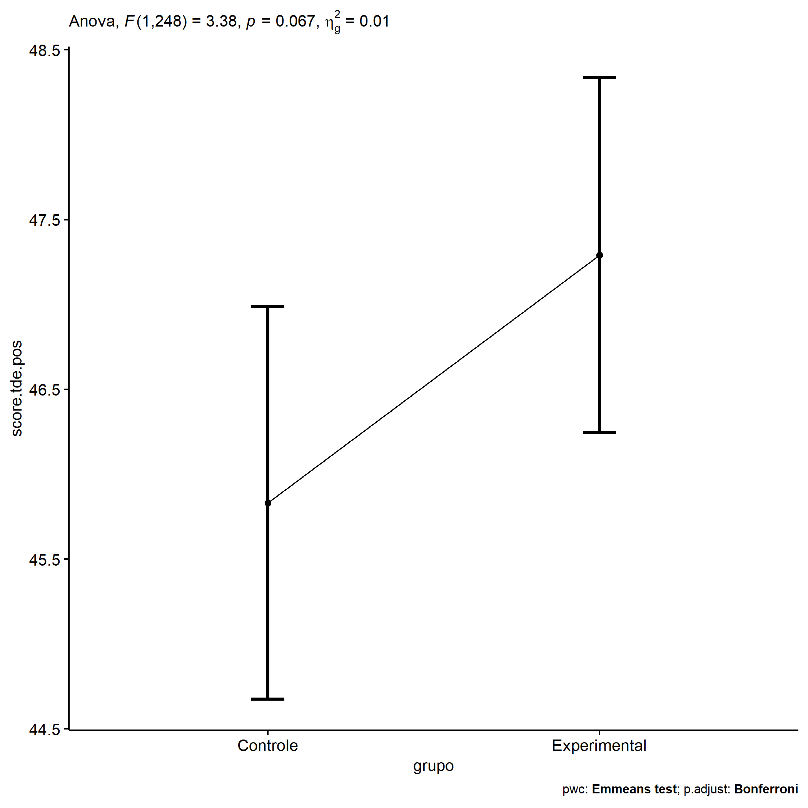<!-- -->

``` r
plots <- oneWayAncovaBoxPlots(
  wdat, "score.tde.pos", "grupo", aov, pwc, covar = "score.tde.pre",
  theme = "classic", color = color[["grupo"]],
  subtitle = which(aov$Effect == "grupo"))
```

``` r
if (length(unique(wdat[["grupo"]])) > 1)
  plots[["grupo"]] + ggplot2::ylab("TDE - Escrita") + ggplot2::scale_x_discrete(labels=c('pre', 'pos'))
```

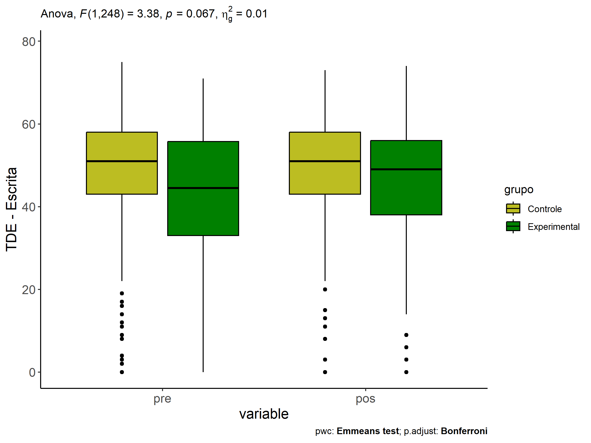<!-- -->

``` r
if (length(unique(wdat.long[["grupo"]])) > 1)
  plots <- oneWayAncovaBoxPlots(
    wdat.long, "score.tde", "grupo", aov, pwc.long, pre.post = "time",
    theme = "classic", color = color$prepost)
```

``` r
if (length(unique(wdat.long[["grupo"]])) > 1)
  plots[["grupo"]] + ggplot2::ylab("TDE - Escrita")
```

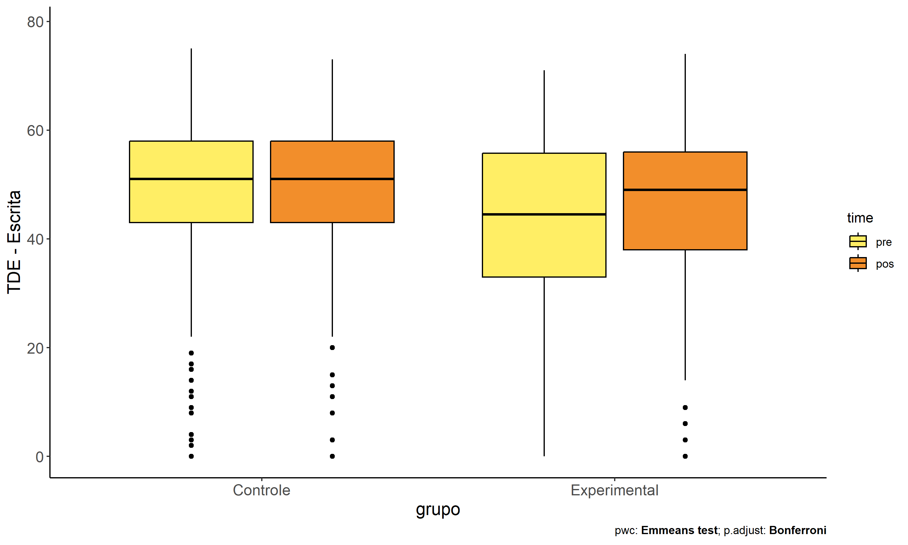<!-- -->

### Checking linearity assumption

``` r
ggscatter(wdat, x = "score.tde.pre", y = "score.tde.pos", size = 0.5,
          color = "grupo", add = "reg.line")+
  stat_regline_equation(
    aes(label =  paste(..eq.label.., ..rr.label.., sep = "~~~~"), color = grupo)
  )
```

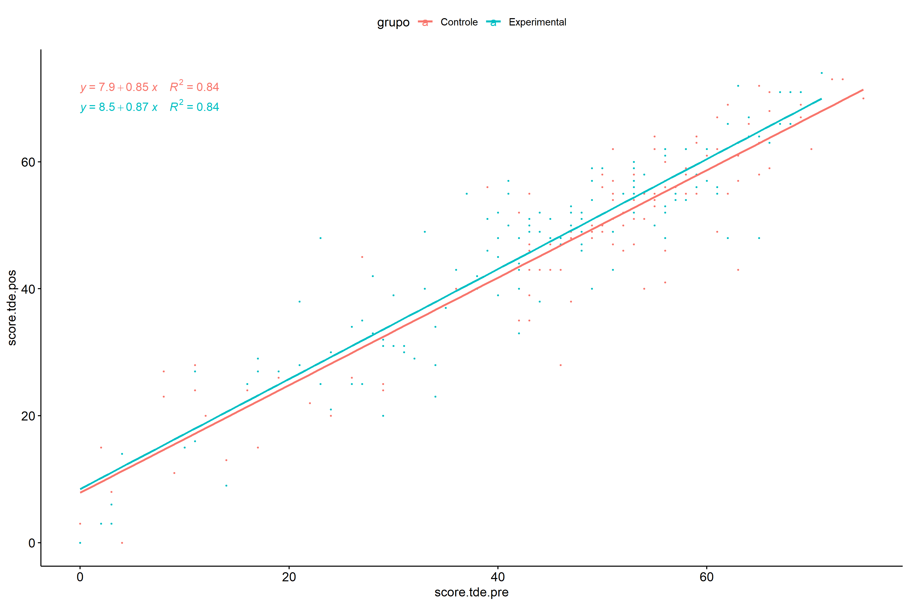<!-- -->

### Checking normality and homogeneity

``` r
res <- augment(lm(score.tde.pos ~ score.tde.pre + grupo, data = wdat))
```

``` r
shapiro_test(res$.resid)
```

    ## # A tibble: 1 × 3
    ##   variable   statistic p.value
    ##   <chr>          <dbl>   <dbl>
    ## 1 res$.resid     0.990   0.101

``` r
levene_test(res, .resid ~ grupo)
```

    ## # A tibble: 1 × 4
    ##     df1   df2 statistic     p
    ##   <int> <int>     <dbl> <dbl>
    ## 1     1   249    0.0644 0.800

# ANCOVA and Pairwise for two factors **grupo:Sexo**

## Without remove non-normal data

``` r
pdat = remove_group_data(dat[!is.na(dat[["grupo"]]) & !is.na(dat[["Sexo"]]),], "score.tde.pos", c("grupo","Sexo"))

pdat.long <- rbind(pdat[,c("id","grupo","Sexo")], pdat[,c("id","grupo","Sexo")])
pdat.long[["time"]] <- c(rep("pre", nrow(pdat)), rep("pos", nrow(pdat)))
pdat.long[["time"]] <- factor(pdat.long[["time"]], c("pre","pos"))
pdat.long[["score.tde"]] <- c(pdat[["score.tde.pre"]], pdat[["score.tde.pos"]])

aov = anova_test(pdat, score.tde.pos ~ score.tde.pre + grupo*Sexo)
laov[["grupo:Sexo"]] <- get_anova_table(aov)
```

``` r
pwcs <- list()
pwcs[["Sexo"]] <- emmeans_test(
  group_by(pdat, grupo), score.tde.pos ~ Sexo,
  covariate = score.tde.pre, p.adjust.method = "bonferroni")
pwcs[["grupo"]] <- emmeans_test(
  group_by(pdat, Sexo), score.tde.pos ~ grupo,
  covariate = score.tde.pre, p.adjust.method = "bonferroni")

pwc <- plyr::rbind.fill(pwcs[["grupo"]], pwcs[["Sexo"]])
pwc <- pwc[,c("grupo","Sexo", colnames(pwc)[!colnames(pwc) %in% c("grupo","Sexo")])]
```

``` r
pwc.long <- emmeans_test(dplyr::group_by_at(pdat.long, c("grupo","Sexo")),
                         score.tde ~ time,
                         p.adjust.method = "bonferroni")
lpwc[["grupo:Sexo"]] <- plyr::rbind.fill(pwc, pwc.long)
```

``` r
ds <- get.descriptives(pdat, "score.tde.pos", c("grupo","Sexo"), covar = "score.tde.pre")
ds <- merge(ds[ds$variable != "score.tde.pre",],
            ds[ds$variable == "score.tde.pre", !colnames(ds) %in% c("variable")],
            by = c("grupo","Sexo"), all.x = T, suffixes = c("", ".score.tde.pre"))
ds <- merge(get_emmeans(pwcs[["grupo"]]), ds, by = c("grupo","Sexo"), suffixes = c(".emms", ""))
ds <- ds[,c("grupo","Sexo","n","mean.score.tde.pre","se.score.tde.pre","mean","se","emmean","se.emms")]

colnames(ds) <- c("grupo","Sexo", "N", paste0(c("M","SE")," (pre)"),
                  paste0(c("M","SE"), " (unadj)"), paste0(c("M", "SE"), " (adj)"))

lemms[["grupo:Sexo"]] <- ds
```

## Computing ANCOVA and PairWise After removing non-normal data (OK)

``` r
wdat = pdat 

res = residuals(lm(score.tde.pos ~ score.tde.pre + grupo*Sexo, data = wdat))
non.normal = getNonNormal(res, wdat$id, plimit = 0.05)

wdat = wdat[!wdat$id %in% non.normal,]

wdat.long <- rbind(wdat[,c("id","grupo","Sexo")], wdat[,c("id","grupo","Sexo")])
wdat.long[["time"]] <- c(rep("pre", nrow(wdat)), rep("pos", nrow(wdat)))
wdat.long[["time"]] <- factor(wdat.long[["time"]], c("pre","pos"))
wdat.long[["score.tde"]] <- c(wdat[["score.tde.pre"]], wdat[["score.tde.pos"]])


ldat[["grupo:Sexo"]] = wdat

(non.normal)
```

    ##  [1] "P1128" "P1129" "P1139" "P1117" "P1126" "P1118" "P1149" "P609"  "P3228" "P1111" "P606"  "P3241" "P3732"
    ## [14] "P3221" "P3237" "P2327"

``` r
aov = anova_test(wdat, score.tde.pos ~ score.tde.pre + grupo*Sexo)
laov[["grupo:Sexo"]] <- merge(get_anova_table(aov), laov[["grupo:Sexo"]], by="Effect", suffixes = c("","'"))

(df = get_anova_table(aov))
```

    ## ANOVA Table (type II tests)
    ## 
    ##          Effect DFn DFd            F        p p<.05      ges
    ## 1 score.tde.pre   1 247 1275.0630000 1.63e-99     * 8.38e-01
    ## 2         grupo   1 247    4.1360000 4.30e-02     * 1.60e-02
    ## 3          Sexo   1 247    0.0000841 9.93e-01       3.41e-07
    ## 4    grupo:Sexo   1 247    0.2110000 6.47e-01       8.52e-04

| Effect        | DFn | DFd |        F |     p | p\<.05 |   ges |
|:--------------|----:|----:|---------:|------:|:-------|------:|
| score.tde.pre |   1 | 247 | 1275.063 | 0.000 | \*     | 0.838 |
| grupo         |   1 | 247 |    4.136 | 0.043 | \*     | 0.016 |
| Sexo          |   1 | 247 |    0.000 | 0.993 |        | 0.000 |
| grupo:Sexo    |   1 | 247 |    0.211 | 0.647 |        | 0.001 |

``` r
pwcs <- list()
pwcs[["Sexo"]] <- emmeans_test(
  group_by(wdat, grupo), score.tde.pos ~ Sexo,
  covariate = score.tde.pre, p.adjust.method = "bonferroni")
pwcs[["grupo"]] <- emmeans_test(
  group_by(wdat, Sexo), score.tde.pos ~ grupo,
  covariate = score.tde.pre, p.adjust.method = "bonferroni")

pwc <- plyr::rbind.fill(pwcs[["grupo"]], pwcs[["Sexo"]])
pwc <- pwc[,c("grupo","Sexo", colnames(pwc)[!colnames(pwc) %in% c("grupo","Sexo")])]
```

| grupo        | Sexo | term                 | .y.           | group1   | group2       |  df | statistic |     p | p.adj | p.adj.signif |
|:-------------|:-----|:---------------------|:--------------|:---------|:-------------|----:|----------:|------:|------:|:-------------|
|              | F    | score.tde.pre\*grupo | score.tde.pos | Controle | Experimental | 247 |    -1.068 | 0.287 | 0.287 | ns           |
|              | M    | score.tde.pre\*grupo | score.tde.pos | Controle | Experimental | 247 |    -1.791 | 0.075 | 0.075 | ns           |
| Controle     |      | score.tde.pre\*Sexo  | score.tde.pos | F        | M            | 247 |     0.343 | 0.732 | 0.732 | ns           |
| Experimental |      | score.tde.pre\*Sexo  | score.tde.pos | F        | M            | 247 |    -0.303 | 0.762 | 0.762 | ns           |

``` r
pwc.long <- emmeans_test(dplyr::group_by_at(wdat.long, c("grupo","Sexo")),
                         score.tde ~ time,
                         p.adjust.method = "bonferroni")
lpwc[["grupo:Sexo"]] <- merge(plyr::rbind.fill(pwc, pwc.long), lpwc[["grupo:Sexo"]], by=c("grupo","Sexo","term",".y.","group1","group2"), suffixes = c("","'"))
```

| grupo        | Sexo | term | .y.       | group1 | group2 |  df | statistic |     p | p.adj | p.adj.signif |
|:-------------|:-----|:-----|:----------|:-------|:-------|----:|----------:|------:|------:|:-------------|
| Controle     | F    | time | score.tde | pre    | pos    | 496 |    -0.222 | 0.825 | 0.825 | ns           |
| Controle     | M    | time | score.tde | pre    | pos    | 496 |    -0.161 | 0.872 | 0.872 | ns           |
| Experimental | F    | time | score.tde | pre    | pos    | 496 |    -0.709 | 0.479 | 0.479 | ns           |
| Experimental | M    | time | score.tde | pre    | pos    | 496 |    -1.261 | 0.208 | 0.208 | ns           |

``` r
ds <- get.descriptives(wdat, "score.tde.pos", c("grupo","Sexo"), covar = "score.tde.pre")
ds <- merge(ds[ds$variable != "score.tde.pre",],
            ds[ds$variable == "score.tde.pre", !colnames(ds) %in% c("variable")],
            by = c("grupo","Sexo"), all.x = T, suffixes = c("", ".score.tde.pre"))
ds <- merge(get_emmeans(pwcs[["grupo"]]), ds, by = c("grupo","Sexo"), suffixes = c(".emms", ""))
ds <- ds[,c("grupo","Sexo","n","mean.score.tde.pre","se.score.tde.pre","mean","se","emmean","se.emms")]

colnames(ds) <- c("grupo","Sexo", "N", paste0(c("M","SE")," (pre)"),
                  paste0(c("M","SE"), " (unadj)"), paste0(c("M", "SE"), " (adj)"))

lemms[["grupo:Sexo"]] <- merge(ds, lemms[["grupo:Sexo"]], by=c("grupo","Sexo"), suffixes = c("","'"))
```

| grupo        | Sexo |   N | M (pre) | SE (pre) | M (unadj) | SE (unadj) | M (adj) | SE (adj) |
|:-------------|:-----|----:|--------:|---------:|----------:|-----------:|--------:|---------:|
| Controle     | F    |  51 |  47.392 |    2.179 |    48.098 |      2.073 |  45.774 |    0.886 |
| Controle     | M    |  63 |  46.175 |    2.402 |    46.635 |      2.244 |  45.366 |    0.796 |
| Experimental | F    |  68 |  47.382 |    1.841 |    49.338 |      1.784 |  47.023 |    0.768 |
| Experimental | M    |  70 |  38.843 |    1.910 |    42.271 |      1.793 |  47.355 |    0.768 |

### Plots for ancova

``` r
plots <- twoWayAncovaPlots(
  wdat, "score.tde.pos", c("grupo","Sexo"), aov, pwcs, addParam = c("mean_se"),
  font.label.size=10, step.increase=0.05, p.label="p.adj",
  subtitle = which(aov$Effect == "grupo:Sexo"))
```

``` r
if (!is.null(plots[["grupo"]]))
  plots[["grupo"]] + ggplot2::scale_color_manual(values = color[["Sexo"]])
```

    ## Scale for colour is already present.
    ## Adding another scale for colour, which will replace the existing scale.

<!-- -->

``` r
if (!is.null(plots[["Sexo"]]))
  plots[["Sexo"]] + ggplot2::scale_color_manual(values = color[["grupo"]])
```

    ## Scale for colour is already present.
    ## Adding another scale for colour, which will replace the existing scale.

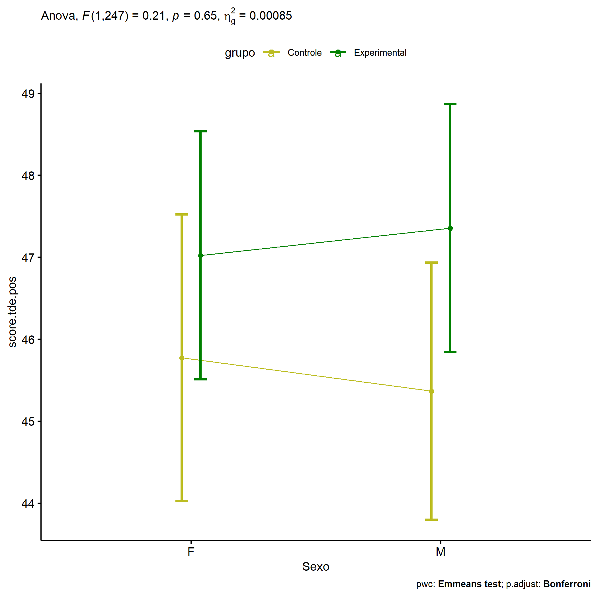<!-- -->

``` r
plots <- twoWayAncovaBoxPlots(
  wdat, "score.tde.pos", c("grupo","Sexo"), aov, pwcs, covar = "score.tde.pre",
  theme = "classic", color = color[["grupo:Sexo"]],
  subtitle = which(aov$Effect == "grupo:Sexo"))
```

``` r
plots[["grupo:Sexo"]] + ggplot2::ylab("TDE - Escrita") + ggplot2::scale_x_discrete(labels=c('pre', 'pos'))
```

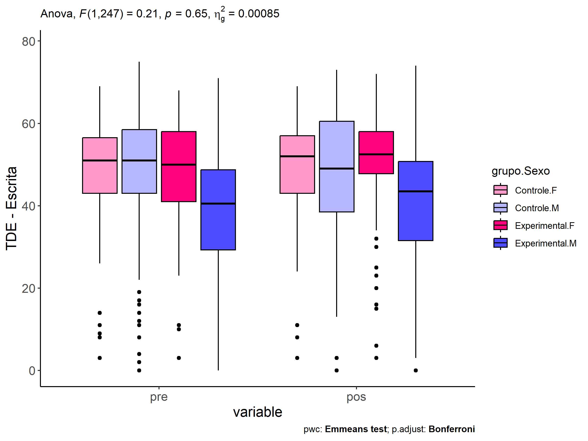<!-- -->

``` r
plots <- twoWayAncovaBoxPlots(
  wdat.long, "score.tde", c("grupo","Sexo"), aov, pwc.long, pre.post = "time",
  theme = "classic", color = color$prepost)
```

``` r
plots[["grupo:Sexo"]] + ggplot2::ylab("TDE - Escrita")
```

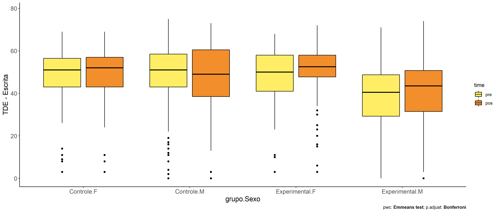<!-- -->

### Checking linearity assumption

``` r
ggscatter(wdat, x = "score.tde.pre", y = "score.tde.pos", size = 0.5,
          facet.by = c("grupo","Sexo"), add = "reg.line")+
  stat_regline_equation(
    aes(label =  paste(..eq.label.., ..rr.label.., sep = "~~~~"))
  )
```

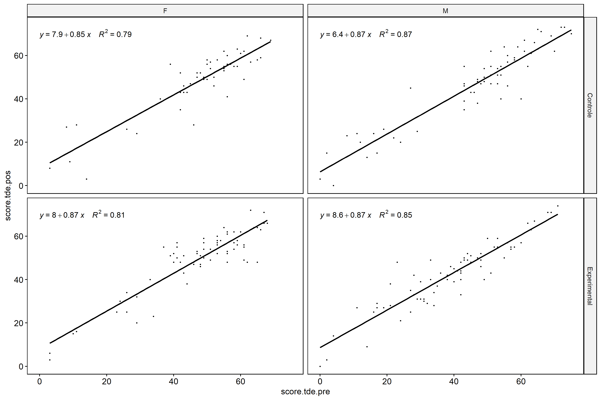<!-- -->

### Checking normality and homogeneity

``` r
res <- augment(lm(score.tde.pos ~ score.tde.pre + grupo*Sexo, data = wdat))
```

``` r
shapiro_test(res$.resid)
```

    ## # A tibble: 1 × 3
    ##   variable   statistic p.value
    ##   <chr>          <dbl>   <dbl>
    ## 1 res$.resid     0.989  0.0520

``` r
levene_test(res, .resid ~ grupo*Sexo)
```

    ## # A tibble: 1 × 4
    ##     df1   df2 statistic     p
    ##   <int> <int>     <dbl> <dbl>
    ## 1     3   248     0.259 0.855

# ANCOVA and Pairwise for two factors **grupo:Zona**

## Without remove non-normal data

``` r
pdat = remove_group_data(dat[!is.na(dat[["grupo"]]) & !is.na(dat[["Zona"]]),], "score.tde.pos", c("grupo","Zona"))

pdat.long <- rbind(pdat[,c("id","grupo","Zona")], pdat[,c("id","grupo","Zona")])
pdat.long[["time"]] <- c(rep("pre", nrow(pdat)), rep("pos", nrow(pdat)))
pdat.long[["time"]] <- factor(pdat.long[["time"]], c("pre","pos"))
pdat.long[["score.tde"]] <- c(pdat[["score.tde.pre"]], pdat[["score.tde.pos"]])

aov = anova_test(pdat, score.tde.pos ~ score.tde.pre + grupo*Zona)
laov[["grupo:Zona"]] <- get_anova_table(aov)
```

``` r
pwcs <- list()
pwcs[["Zona"]] <- emmeans_test(
  group_by(pdat, grupo), score.tde.pos ~ Zona,
  covariate = score.tde.pre, p.adjust.method = "bonferroni")
pwcs[["grupo"]] <- emmeans_test(
  group_by(pdat, Zona), score.tde.pos ~ grupo,
  covariate = score.tde.pre, p.adjust.method = "bonferroni")

pwc <- plyr::rbind.fill(pwcs[["grupo"]], pwcs[["Zona"]])
pwc <- pwc[,c("grupo","Zona", colnames(pwc)[!colnames(pwc) %in% c("grupo","Zona")])]
```

``` r
pwc.long <- emmeans_test(dplyr::group_by_at(pdat.long, c("grupo","Zona")),
                         score.tde ~ time,
                         p.adjust.method = "bonferroni")
lpwc[["grupo:Zona"]] <- plyr::rbind.fill(pwc, pwc.long)
```

``` r
ds <- get.descriptives(pdat, "score.tde.pos", c("grupo","Zona"), covar = "score.tde.pre")
ds <- merge(ds[ds$variable != "score.tde.pre",],
            ds[ds$variable == "score.tde.pre", !colnames(ds) %in% c("variable")],
            by = c("grupo","Zona"), all.x = T, suffixes = c("", ".score.tde.pre"))
ds <- merge(get_emmeans(pwcs[["grupo"]]), ds, by = c("grupo","Zona"), suffixes = c(".emms", ""))
ds <- ds[,c("grupo","Zona","n","mean.score.tde.pre","se.score.tde.pre","mean","se","emmean","se.emms")]

colnames(ds) <- c("grupo","Zona", "N", paste0(c("M","SE")," (pre)"),
                  paste0(c("M","SE"), " (unadj)"), paste0(c("M", "SE"), " (adj)"))

lemms[["grupo:Zona"]] <- ds
```

## Computing ANCOVA and PairWise After removing non-normal data (OK)

``` r
wdat = pdat 

res = residuals(lm(score.tde.pos ~ score.tde.pre + grupo*Zona, data = wdat))
non.normal = getNonNormal(res, wdat$id, plimit = 0.05)

wdat = wdat[!wdat$id %in% non.normal,]

wdat.long <- rbind(wdat[,c("id","grupo","Zona")], wdat[,c("id","grupo","Zona")])
wdat.long[["time"]] <- c(rep("pre", nrow(wdat)), rep("pos", nrow(wdat)))
wdat.long[["time"]] <- factor(wdat.long[["time"]], c("pre","pos"))
wdat.long[["score.tde"]] <- c(wdat[["score.tde.pre"]], wdat[["score.tde.pos"]])


ldat[["grupo:Zona"]] = wdat

(non.normal)
```

    ## [1] "P1117" "P1139" "P3228" "P1152" "P3732" "P609"  "P606"

``` r
aov = anova_test(wdat, score.tde.pos ~ score.tde.pre + grupo*Zona)
laov[["grupo:Zona"]] <- merge(get_anova_table(aov), laov[["grupo:Zona"]], by="Effect", suffixes = c("","'"))

(df = get_anova_table(aov))
```

    ## ANOVA Table (type II tests)
    ## 
    ##          Effect DFn DFd       F        p p<.05   ges
    ## 1 score.tde.pre   1 136 795.840 1.08e-58     * 0.854
    ## 2         grupo   1 136   5.923 1.60e-02     * 0.042
    ## 3          Zona   1 136   1.026 3.13e-01       0.007
    ## 4    grupo:Zona   1 136   1.344 2.48e-01       0.010

| Effect        | DFn | DFd |       F |     p | p\<.05 |   ges |
|:--------------|----:|----:|--------:|------:|:-------|------:|
| score.tde.pre |   1 | 136 | 795.840 | 0.000 | \*     | 0.854 |
| grupo         |   1 | 136 |   5.923 | 0.016 | \*     | 0.042 |
| Zona          |   1 | 136 |   1.026 | 0.313 |        | 0.007 |
| grupo:Zona    |   1 | 136 |   1.344 | 0.248 |        | 0.010 |

``` r
pwcs <- list()
pwcs[["Zona"]] <- emmeans_test(
  group_by(wdat, grupo), score.tde.pos ~ Zona,
  covariate = score.tde.pre, p.adjust.method = "bonferroni")
pwcs[["grupo"]] <- emmeans_test(
  group_by(wdat, Zona), score.tde.pos ~ grupo,
  covariate = score.tde.pre, p.adjust.method = "bonferroni")

pwc <- plyr::rbind.fill(pwcs[["grupo"]], pwcs[["Zona"]])
pwc <- pwc[,c("grupo","Zona", colnames(pwc)[!colnames(pwc) %in% c("grupo","Zona")])]
```

| grupo        | Zona   | term                 | .y.           | group1   | group2       |  df | statistic |     p | p.adj | p.adj.signif |
|:-------------|:-------|:---------------------|:--------------|:---------|:-------------|----:|----------:|------:|------:|:-------------|
|              | Rural  | score.tde.pre\*grupo | score.tde.pos | Controle | Experimental | 136 |    -1.499 | 0.136 | 0.136 | ns           |
|              | Urbana | score.tde.pre\*grupo | score.tde.pos | Controle | Experimental | 136 |    -2.281 | 0.024 | 0.024 | \*           |
| Controle     |        | score.tde.pre\*Zona  | score.tde.pos | Rural    | Urbana       | 136 |     1.533 | 0.128 | 0.128 | ns           |
| Experimental |        | score.tde.pre\*Zona  | score.tde.pos | Rural    | Urbana       | 136 |     0.129 | 0.898 | 0.898 | ns           |

``` r
pwc.long <- emmeans_test(dplyr::group_by_at(wdat.long, c("grupo","Zona")),
                         score.tde ~ time,
                         p.adjust.method = "bonferroni")
lpwc[["grupo:Zona"]] <- merge(plyr::rbind.fill(pwc, pwc.long), lpwc[["grupo:Zona"]], by=c("grupo","Zona","term",".y.","group1","group2"), suffixes = c("","'"))
```

| grupo        | Zona   | term | .y.       | group1 | group2 |  df | statistic |     p | p.adj | p.adj.signif |
|:-------------|:-------|:-----|:----------|:-------|:-------|----:|----------:|------:|------:|:-------------|
| Controle     | Rural  | time | score.tde | pre    | pos    | 274 |    -0.007 | 0.995 | 0.995 | ns           |
| Controle     | Urbana | time | score.tde | pre    | pos    | 274 |     0.608 | 0.543 | 0.543 | ns           |
| Experimental | Rural  | time | score.tde | pre    | pos    | 274 |    -0.743 | 0.458 | 0.458 | ns           |
| Experimental | Urbana | time | score.tde | pre    | pos    | 274 |    -0.579 | 0.563 | 0.563 | ns           |

``` r
ds <- get.descriptives(wdat, "score.tde.pos", c("grupo","Zona"), covar = "score.tde.pre")
ds <- merge(ds[ds$variable != "score.tde.pre",],
            ds[ds$variable == "score.tde.pre", !colnames(ds) %in% c("variable")],
            by = c("grupo","Zona"), all.x = T, suffixes = c("", ".score.tde.pre"))
ds <- merge(get_emmeans(pwcs[["grupo"]]), ds, by = c("grupo","Zona"), suffixes = c(".emms", ""))
ds <- ds[,c("grupo","Zona","n","mean.score.tde.pre","se.score.tde.pre","mean","se","emmean","se.emms")]

colnames(ds) <- c("grupo","Zona", "N", paste0(c("M","SE")," (pre)"),
                  paste0(c("M","SE"), " (unadj)"), paste0(c("M", "SE"), " (adj)"))

lemms[["grupo:Zona"]] <- merge(ds, lemms[["grupo:Zona"]], by=c("grupo","Zona"), suffixes = c("","'"))
```

| grupo        | Zona   |   N | M (pre) | SE (pre) | M (unadj) | SE (unadj) | M (adj) | SE (adj) |
|:-------------|:-------|----:|--------:|---------:|----------:|-----------:|--------:|---------:|
| Controle     | Rural  |  43 |  47.698 |    2.243 |    47.721 |      2.354 |  45.616 |    0.956 |
| Controle     | Urbana |  14 |  56.571 |    3.868 |    52.786 |      3.408 |  42.634 |    1.709 |
| Experimental | Rural  |  53 |  43.208 |    2.524 |    45.585 |      2.388 |  47.551 |    0.862 |
| Experimental | Urbana |  31 |  40.806 |    3.019 |    43.226 |      3.039 |  47.369 |    1.132 |

### Plots for ancova

``` r
plots <- twoWayAncovaPlots(
  wdat, "score.tde.pos", c("grupo","Zona"), aov, pwcs, addParam = c("mean_se"),
  font.label.size=10, step.increase=0.05, p.label="p.adj",
  subtitle = which(aov$Effect == "grupo:Zona"))
```

``` r
if (!is.null(plots[["grupo"]]))
  plots[["grupo"]] + ggplot2::scale_color_manual(values = color[["Zona"]])
```

    ## Scale for colour is already present.
    ## Adding another scale for colour, which will replace the existing scale.

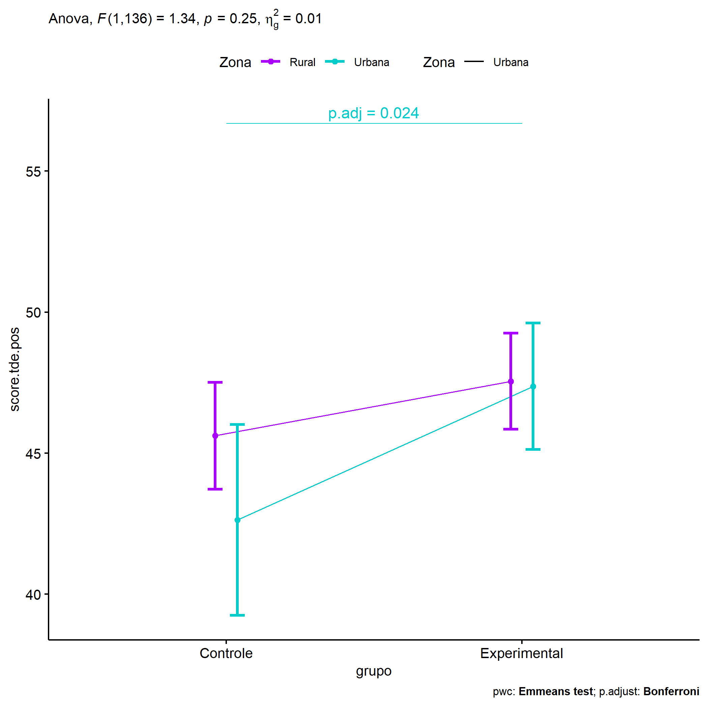<!-- -->

``` r
if (!is.null(plots[["Zona"]]))
  plots[["Zona"]] + ggplot2::scale_color_manual(values = color[["grupo"]])
```

    ## Scale for colour is already present.
    ## Adding another scale for colour, which will replace the existing scale.

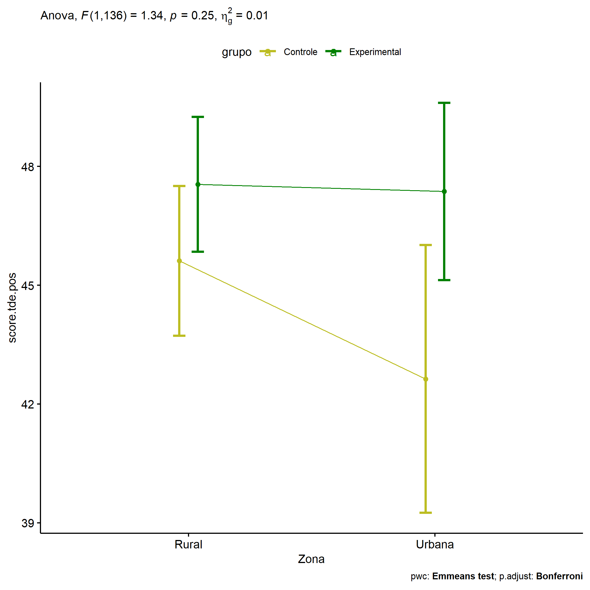<!-- -->

``` r
plots <- twoWayAncovaBoxPlots(
  wdat, "score.tde.pos", c("grupo","Zona"), aov, pwcs, covar = "score.tde.pre",
  theme = "classic", color = color[["grupo:Zona"]],
  subtitle = which(aov$Effect == "grupo:Zona"))
```

``` r
plots[["grupo:Zona"]] + ggplot2::ylab("TDE - Escrita") + ggplot2::scale_x_discrete(labels=c('pre', 'pos'))
```

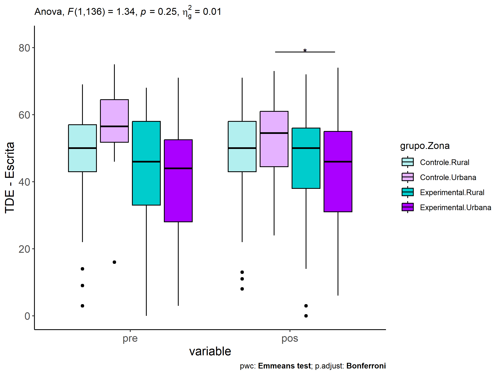<!-- -->

``` r
plots <- twoWayAncovaBoxPlots(
  wdat.long, "score.tde", c("grupo","Zona"), aov, pwc.long, pre.post = "time",
  theme = "classic", color = color$prepost)
```

``` r
plots[["grupo:Zona"]] + ggplot2::ylab("TDE - Escrita")
```

<!-- -->

### Checking linearity assumption

``` r
ggscatter(wdat, x = "score.tde.pre", y = "score.tde.pos", size = 0.5,
          facet.by = c("grupo","Zona"), add = "reg.line")+
  stat_regline_equation(
    aes(label =  paste(..eq.label.., ..rr.label.., sep = "~~~~"))
  )
```

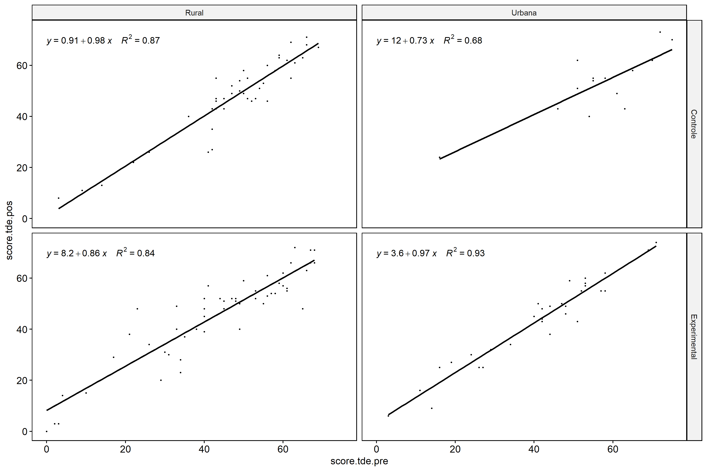<!-- -->

### Checking normality and homogeneity

``` r
res <- augment(lm(score.tde.pos ~ score.tde.pre + grupo*Zona, data = wdat))
```

``` r
shapiro_test(res$.resid)
```

    ## # A tibble: 1 × 3
    ##   variable   statistic p.value
    ##   <chr>          <dbl>   <dbl>
    ## 1 res$.resid     0.980  0.0410

``` r
levene_test(res, .resid ~ grupo*Zona)
```

    ## # A tibble: 1 × 4
    ##     df1   df2 statistic     p
    ##   <int> <int>     <dbl> <dbl>
    ## 1     3   137      1.70 0.170

# ANCOVA and Pairwise for two factors **grupo:Cor.Raca**

## Without remove non-normal data

``` r
pdat = remove_group_data(dat[!is.na(dat[["grupo"]]) & !is.na(dat[["Cor.Raca"]]),], "score.tde.pos", c("grupo","Cor.Raca"))

pdat.long <- rbind(pdat[,c("id","grupo","Cor.Raca")], pdat[,c("id","grupo","Cor.Raca")])
pdat.long[["time"]] <- c(rep("pre", nrow(pdat)), rep("pos", nrow(pdat)))
pdat.long[["time"]] <- factor(pdat.long[["time"]], c("pre","pos"))
pdat.long[["score.tde"]] <- c(pdat[["score.tde.pre"]], pdat[["score.tde.pos"]])

aov = anova_test(pdat, score.tde.pos ~ score.tde.pre + grupo*Cor.Raca)
laov[["grupo:Cor.Raca"]] <- get_anova_table(aov)
```

``` r
pwcs <- list()
pwcs[["Cor.Raca"]] <- emmeans_test(
  group_by(pdat, grupo), score.tde.pos ~ Cor.Raca,
  covariate = score.tde.pre, p.adjust.method = "bonferroni")
pwcs[["grupo"]] <- emmeans_test(
  group_by(pdat, Cor.Raca), score.tde.pos ~ grupo,
  covariate = score.tde.pre, p.adjust.method = "bonferroni")

pwc <- plyr::rbind.fill(pwcs[["grupo"]], pwcs[["Cor.Raca"]])
pwc <- pwc[,c("grupo","Cor.Raca", colnames(pwc)[!colnames(pwc) %in% c("grupo","Cor.Raca")])]
```

``` r
pwc.long <- emmeans_test(dplyr::group_by_at(pdat.long, c("grupo","Cor.Raca")),
                         score.tde ~ time,
                         p.adjust.method = "bonferroni")
lpwc[["grupo:Cor.Raca"]] <- plyr::rbind.fill(pwc, pwc.long)
```

``` r
ds <- get.descriptives(pdat, "score.tde.pos", c("grupo","Cor.Raca"), covar = "score.tde.pre")
ds <- merge(ds[ds$variable != "score.tde.pre",],
            ds[ds$variable == "score.tde.pre", !colnames(ds) %in% c("variable")],
            by = c("grupo","Cor.Raca"), all.x = T, suffixes = c("", ".score.tde.pre"))
ds <- merge(get_emmeans(pwcs[["grupo"]]), ds, by = c("grupo","Cor.Raca"), suffixes = c(".emms", ""))
ds <- ds[,c("grupo","Cor.Raca","n","mean.score.tde.pre","se.score.tde.pre","mean","se","emmean","se.emms")]

colnames(ds) <- c("grupo","Cor.Raca", "N", paste0(c("M","SE")," (pre)"),
                  paste0(c("M","SE"), " (unadj)"), paste0(c("M", "SE"), " (adj)"))

lemms[["grupo:Cor.Raca"]] <- ds
```

## Computing ANCOVA and PairWise After removing non-normal data (OK)

``` r
wdat = pdat 

res = residuals(lm(score.tde.pos ~ score.tde.pre + grupo*Cor.Raca, data = wdat))
non.normal = getNonNormal(res, wdat$id, plimit = 0.05)

wdat = wdat[!wdat$id %in% non.normal,]

wdat.long <- rbind(wdat[,c("id","grupo","Cor.Raca")], wdat[,c("id","grupo","Cor.Raca")])
wdat.long[["time"]] <- c(rep("pre", nrow(wdat)), rep("pos", nrow(wdat)))
wdat.long[["time"]] <- factor(wdat.long[["time"]], c("pre","pos"))
wdat.long[["score.tde"]] <- c(wdat[["score.tde.pre"]], wdat[["score.tde.pos"]])


ldat[["grupo:Cor.Raca"]] = wdat

(non.normal)
```

    ## [1] "P1128" "P1139"

``` r
aov = anova_test(wdat, score.tde.pos ~ score.tde.pre + grupo*Cor.Raca)
laov[["grupo:Cor.Raca"]] <- merge(get_anova_table(aov), laov[["grupo:Cor.Raca"]], by="Effect", suffixes = c("","'"))

(df = get_anova_table(aov))
```

    ## ANOVA Table (type II tests)
    ## 
    ##           Effect DFn DFd       F        p p<.05      ges
    ## 1  score.tde.pre   1 109 246.347 9.76e-30     * 0.693000
    ## 2          grupo   1 109   0.074 7.87e-01       0.000676
    ## 3       Cor.Raca   1 109   1.585 2.11e-01       0.014000
    ## 4 grupo:Cor.Raca   1 109   0.285 5.94e-01       0.003000

| Effect         | DFn | DFd |       F |     p | p\<.05 |   ges |
|:---------------|----:|----:|--------:|------:|:-------|------:|
| score.tde.pre  |   1 | 109 | 246.347 | 0.000 | \*     | 0.693 |
| grupo          |   1 | 109 |   0.074 | 0.787 |        | 0.001 |
| Cor.Raca       |   1 | 109 |   1.585 | 0.211 |        | 0.014 |
| grupo:Cor.Raca |   1 | 109 |   0.285 | 0.594 |        | 0.003 |

``` r
pwcs <- list()
pwcs[["Cor.Raca"]] <- emmeans_test(
  group_by(wdat, grupo), score.tde.pos ~ Cor.Raca,
  covariate = score.tde.pre, p.adjust.method = "bonferroni")
pwcs[["grupo"]] <- emmeans_test(
  group_by(wdat, Cor.Raca), score.tde.pos ~ grupo,
  covariate = score.tde.pre, p.adjust.method = "bonferroni")

pwc <- plyr::rbind.fill(pwcs[["grupo"]], pwcs[["Cor.Raca"]])
pwc <- pwc[,c("grupo","Cor.Raca", colnames(pwc)[!colnames(pwc) %in% c("grupo","Cor.Raca")])]
```

| grupo        | Cor.Raca | term                    | .y.           | group1   | group2       |  df | statistic |     p | p.adj | p.adj.signif |
|:-------------|:---------|:------------------------|:--------------|:---------|:-------------|----:|----------:|------:|------:|:-------------|
|              | Branca   | score.tde.pre\*grupo    | score.tde.pos | Controle | Experimental | 109 |     0.387 | 0.699 | 0.699 | ns           |
|              | Parda    | score.tde.pre\*grupo    | score.tde.pos | Controle | Experimental | 109 |    -0.456 | 0.649 | 0.649 | ns           |
| Controle     |          | score.tde.pre\*Cor.Raca | score.tde.pos | Branca   | Parda        | 109 |     1.268 | 0.208 | 0.208 | ns           |
| Experimental |          | score.tde.pre\*Cor.Raca | score.tde.pos | Branca   | Parda        | 109 |     0.566 | 0.573 | 0.573 | ns           |

``` r
pwc.long <- emmeans_test(dplyr::group_by_at(wdat.long, c("grupo","Cor.Raca")),
                         score.tde ~ time,
                         p.adjust.method = "bonferroni")
lpwc[["grupo:Cor.Raca"]] <- merge(plyr::rbind.fill(pwc, pwc.long), lpwc[["grupo:Cor.Raca"]], by=c("grupo","Cor.Raca","term",".y.","group1","group2"), suffixes = c("","'"))
```

| grupo        | Cor.Raca | term | .y.       | group1 | group2 |  df | statistic |     p | p.adj | p.adj.signif |
|:-------------|:---------|:-----|:----------|:-------|:-------|----:|----------:|------:|------:|:-------------|
| Controle     | Branca   | time | score.tde | pre    | pos    | 220 |    -0.144 | 0.886 | 0.886 | ns           |
| Controle     | Parda    | time | score.tde | pre    | pos    | 220 |     0.271 | 0.787 | 0.787 | ns           |
| Experimental | Branca   | time | score.tde | pre    | pos    | 220 |     0.014 | 0.989 | 0.989 | ns           |
| Experimental | Parda    | time | score.tde | pre    | pos    | 220 |    -0.154 | 0.877 | 0.877 | ns           |

``` r
ds <- get.descriptives(wdat, "score.tde.pos", c("grupo","Cor.Raca"), covar = "score.tde.pre")
ds <- merge(ds[ds$variable != "score.tde.pre",],
            ds[ds$variable == "score.tde.pre", !colnames(ds) %in% c("variable")],
            by = c("grupo","Cor.Raca"), all.x = T, suffixes = c("", ".score.tde.pre"))
ds <- merge(get_emmeans(pwcs[["grupo"]]), ds, by = c("grupo","Cor.Raca"), suffixes = c(".emms", ""))
ds <- ds[,c("grupo","Cor.Raca","n","mean.score.tde.pre","se.score.tde.pre","mean","se","emmean","se.emms")]

colnames(ds) <- c("grupo","Cor.Raca", "N", paste0(c("M","SE")," (pre)"),
                  paste0(c("M","SE"), " (unadj)"), paste0(c("M", "SE"), " (adj)"))

lemms[["grupo:Cor.Raca"]] <- merge(ds, lemms[["grupo:Cor.Raca"]], by=c("grupo","Cor.Raca"), suffixes = c("","'"))
```

| grupo        | Cor.Raca |   N | M (pre) | SE (pre) | M (unadj) | SE (unadj) | M (adj) | SE (adj) |
|:-------------|:---------|----:|--------:|---------:|----------:|-----------:|--------:|---------:|
| Controle     | Branca   |   8 |  54.750 |    2.839 |    56.000 |      3.495 |  45.125 |    3.455 |
| Controle     | Parda    |  50 |  40.940 |    2.524 |    40.000 |      2.465 |  40.415 |    1.354 |
| Experimental | Branca   |   9 |  52.333 |    3.902 |    52.222 |      4.853 |  43.322 |    3.241 |
| Experimental | Parda    |  47 |  37.638 |    2.773 |    38.191 |      2.660 |  41.306 |    1.410 |

### Plots for ancova

``` r
plots <- twoWayAncovaPlots(
  wdat, "score.tde.pos", c("grupo","Cor.Raca"), aov, pwcs, addParam = c("mean_se"),
  font.label.size=10, step.increase=0.05, p.label="p.adj",
  subtitle = which(aov$Effect == "grupo:Cor.Raca"))
```

``` r
if (!is.null(plots[["grupo"]]))
  plots[["grupo"]] + ggplot2::scale_color_manual(values = color[["Cor.Raca"]])
```

    ## Scale for colour is already present.
    ## Adding another scale for colour, which will replace the existing scale.

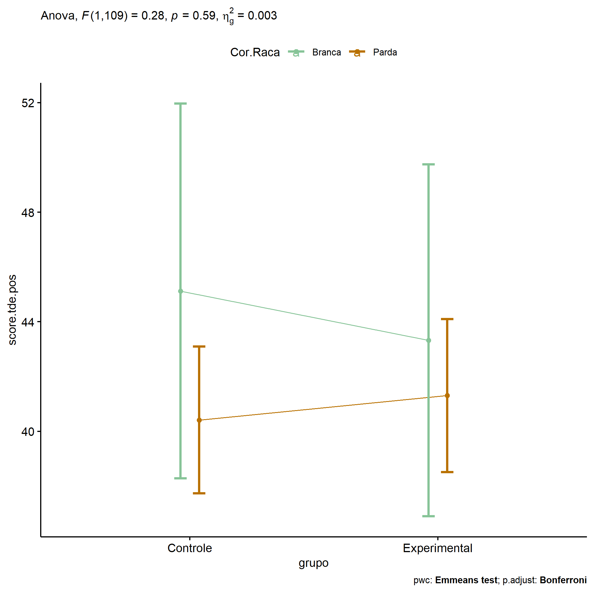<!-- -->

``` r
if (!is.null(plots[["Cor.Raca"]]))
  plots[["Cor.Raca"]] + ggplot2::scale_color_manual(values = color[["grupo"]])
```

    ## Scale for colour is already present.
    ## Adding another scale for colour, which will replace the existing scale.

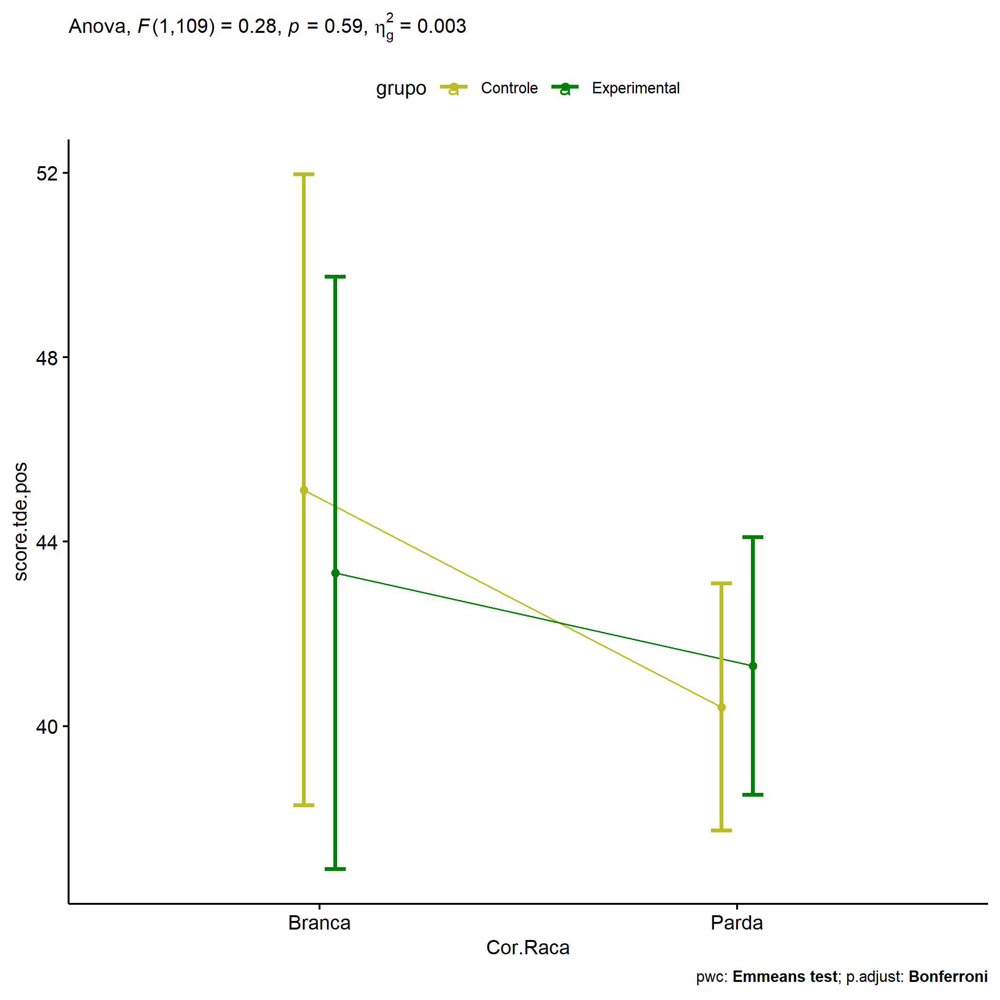<!-- -->

``` r
plots <- twoWayAncovaBoxPlots(
  wdat, "score.tde.pos", c("grupo","Cor.Raca"), aov, pwcs, covar = "score.tde.pre",
  theme = "classic", color = color[["grupo:Cor.Raca"]],
  subtitle = which(aov$Effect == "grupo:Cor.Raca"))
```

``` r
plots[["grupo:Cor.Raca"]] + ggplot2::ylab("TDE - Escrita") + ggplot2::scale_x_discrete(labels=c('pre', 'pos'))
```

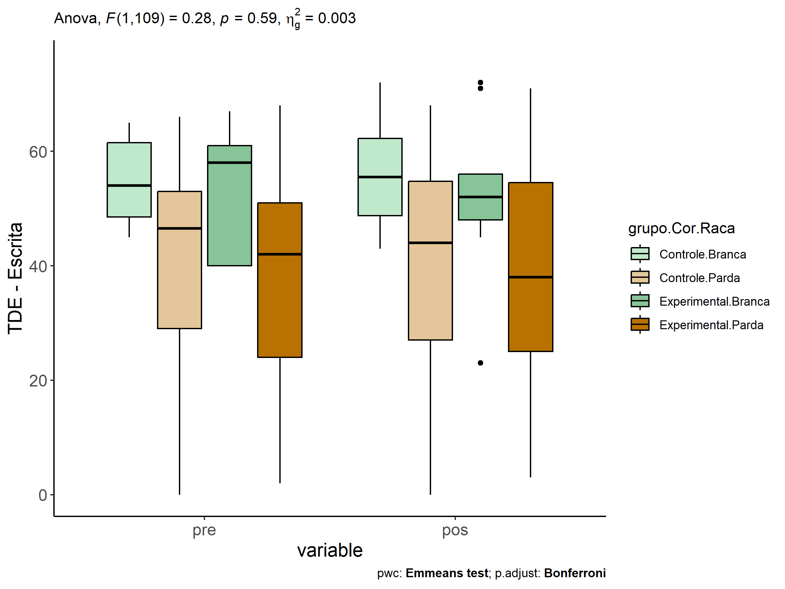<!-- -->

``` r
plots <- twoWayAncovaBoxPlots(
  wdat.long, "score.tde", c("grupo","Cor.Raca"), aov, pwc.long, pre.post = "time",
  theme = "classic", color = color$prepost)
```

``` r
plots[["grupo:Cor.Raca"]] + ggplot2::ylab("TDE - Escrita")
```

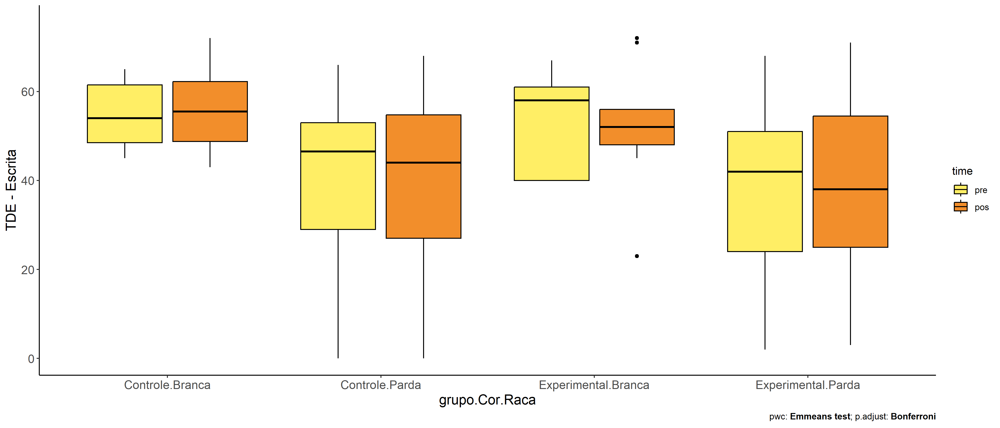<!-- -->

### Checking linearity assumption

``` r
ggscatter(wdat, x = "score.tde.pre", y = "score.tde.pos", size = 0.5,
          facet.by = c("grupo","Cor.Raca"), add = "reg.line")+
  stat_regline_equation(
    aes(label =  paste(..eq.label.., ..rr.label.., sep = "~~~~"))
  )
```

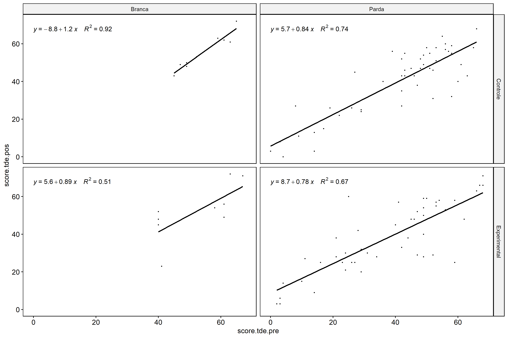<!-- -->

### Checking normality and homogeneity

``` r
res <- augment(lm(score.tde.pos ~ score.tde.pre + grupo*Cor.Raca, data = wdat))
```

``` r
shapiro_test(res$.resid)
```

    ## # A tibble: 1 × 3
    ##   variable   statistic p.value
    ##   <chr>          <dbl>   <dbl>
    ## 1 res$.resid     0.978  0.0535

``` r
levene_test(res, .resid ~ grupo*Cor.Raca)
```

    ## # A tibble: 1 × 4
    ##     df1   df2 statistic     p
    ##   <int> <int>     <dbl> <dbl>
    ## 1     3   110      1.32 0.271

# ANCOVA and Pairwise for two factors **grupo:score.tde.quintile**

## Without remove non-normal data

``` r
pdat = remove_group_data(dat[!is.na(dat[["grupo"]]) & !is.na(dat[["score.tde.quintile"]]),], "score.tde.pos", c("grupo","score.tde.quintile"))

pdat.long <- rbind(pdat[,c("id","grupo","score.tde.quintile")], pdat[,c("id","grupo","score.tde.quintile")])
pdat.long[["time"]] <- c(rep("pre", nrow(pdat)), rep("pos", nrow(pdat)))
pdat.long[["time"]] <- factor(pdat.long[["time"]], c("pre","pos"))
pdat.long[["score.tde"]] <- c(pdat[["score.tde.pre"]], pdat[["score.tde.pos"]])

aov = anova_test(pdat, score.tde.pos ~ score.tde.pre + grupo*score.tde.quintile)
laov[["grupo:score.tde.quintile"]] <- get_anova_table(aov)
```

``` r
pwcs <- list()
pwcs[["score.tde.quintile"]] <- emmeans_test(
  group_by(pdat, grupo), score.tde.pos ~ score.tde.quintile,
  covariate = score.tde.pre, p.adjust.method = "bonferroni")
pwcs[["grupo"]] <- emmeans_test(
  group_by(pdat, score.tde.quintile), score.tde.pos ~ grupo,
  covariate = score.tde.pre, p.adjust.method = "bonferroni")

pwc <- plyr::rbind.fill(pwcs[["grupo"]], pwcs[["score.tde.quintile"]])
pwc <- pwc[,c("grupo","score.tde.quintile", colnames(pwc)[!colnames(pwc) %in% c("grupo","score.tde.quintile")])]
```

``` r
pwc.long <- emmeans_test(dplyr::group_by_at(pdat.long, c("grupo","score.tde.quintile")),
                         score.tde ~ time,
                         p.adjust.method = "bonferroni")
lpwc[["grupo:score.tde.quintile"]] <- plyr::rbind.fill(pwc, pwc.long)
```

``` r
ds <- get.descriptives(pdat, "score.tde.pos", c("grupo","score.tde.quintile"), covar = "score.tde.pre")
ds <- merge(ds[ds$variable != "score.tde.pre",],
            ds[ds$variable == "score.tde.pre", !colnames(ds) %in% c("variable")],
            by = c("grupo","score.tde.quintile"), all.x = T, suffixes = c("", ".score.tde.pre"))
ds <- merge(get_emmeans(pwcs[["grupo"]]), ds, by = c("grupo","score.tde.quintile"), suffixes = c(".emms", ""))
ds <- ds[,c("grupo","score.tde.quintile","n","mean.score.tde.pre","se.score.tde.pre","mean","se","emmean","se.emms")]

colnames(ds) <- c("grupo","score.tde.quintile", "N", paste0(c("M","SE")," (pre)"),
                  paste0(c("M","SE"), " (unadj)"), paste0(c("M", "SE"), " (adj)"))

lemms[["grupo:score.tde.quintile"]] <- ds
```

## Computing ANCOVA and PairWise After removing non-normal data (OK)

``` r
wdat = pdat 

res = residuals(lm(score.tde.pos ~ score.tde.pre + grupo*score.tde.quintile, data = wdat))
non.normal = getNonNormal(res, wdat$id, plimit = 0.05)

wdat = wdat[!wdat$id %in% non.normal,]

wdat.long <- rbind(wdat[,c("id","grupo","score.tde.quintile")], wdat[,c("id","grupo","score.tde.quintile")])
wdat.long[["time"]] <- c(rep("pre", nrow(wdat)), rep("pos", nrow(wdat)))
wdat.long[["time"]] <- factor(wdat.long[["time"]], c("pre","pos"))
wdat.long[["score.tde"]] <- c(wdat[["score.tde.pre"]], wdat[["score.tde.pos"]])


ldat[["grupo:score.tde.quintile"]] = wdat

(non.normal)
```

    ##  [1] "P1128" "P1129" "P1117" "P1139" "P3228" "P1126" "P3732" "P1168" "P2375" "P606"  "P1118" "P609"  "P1149"
    ## [14] "P1111" "P3241"

``` r
aov = anova_test(wdat, score.tde.pos ~ score.tde.pre + grupo*score.tde.quintile)
laov[["grupo:score.tde.quintile"]] <- merge(get_anova_table(aov), laov[["grupo:score.tde.quintile"]], by="Effect", suffixes = c("","'"))

(df = get_anova_table(aov))
```

    ## ANOVA Table (type II tests)
    ## 
    ##                     Effect DFn DFd       F        p p<.05   ges
    ## 1            score.tde.pre   1 242 111.786 1.00e-21     * 0.316
    ## 2                    grupo   1 242   4.096 4.40e-02     * 0.017
    ## 3       score.tde.quintile   4 242   0.715 5.82e-01       0.012
    ## 4 grupo:score.tde.quintile   4 242   1.038 3.88e-01       0.017

| Effect                   | DFn | DFd |       F |     p | p\<.05 |   ges |
|:-------------------------|----:|----:|--------:|------:|:-------|------:|
| score.tde.pre            |   1 | 242 | 111.786 | 0.000 | \*     | 0.316 |
| grupo                    |   1 | 242 |   4.096 | 0.044 | \*     | 0.017 |
| score.tde.quintile       |   4 | 242 |   0.715 | 0.582 |        | 0.012 |
| grupo:score.tde.quintile |   4 | 242 |   1.038 | 0.388 |        | 0.017 |

``` r
pwcs <- list()
pwcs[["score.tde.quintile"]] <- emmeans_test(
  group_by(wdat, grupo), score.tde.pos ~ score.tde.quintile,
  covariate = score.tde.pre, p.adjust.method = "bonferroni")
pwcs[["grupo"]] <- emmeans_test(
  group_by(wdat, score.tde.quintile), score.tde.pos ~ grupo,
  covariate = score.tde.pre, p.adjust.method = "bonferroni")

pwc <- plyr::rbind.fill(pwcs[["grupo"]], pwcs[["score.tde.quintile"]])
pwc <- pwc[,c("grupo","score.tde.quintile", colnames(pwc)[!colnames(pwc) %in% c("grupo","score.tde.quintile")])]
```

| grupo        | score.tde.quintile | term                              | .y.           | group1       | group2       |  df | statistic |     p | p.adj | p.adj.signif |
|:-------------|:-------------------|:----------------------------------|:--------------|:-------------|:-------------|----:|----------:|------:|------:|:-------------|
|              | 1st quintile       | score.tde.pre\*grupo              | score.tde.pos | Controle     | Experimental | 242 |     0.737 | 0.462 | 0.462 | ns           |
|              | 2nd quintile       | score.tde.pre\*grupo              | score.tde.pos | Controle     | Experimental | 242 |    -1.182 | 0.238 | 0.238 | ns           |
|              | 3rd quintile       | score.tde.pre\*grupo              | score.tde.pos | Controle     | Experimental | 242 |    -1.979 | 0.049 | 0.049 | \*           |
|              | 4th quintile       | score.tde.pre\*grupo              | score.tde.pos | Controle     | Experimental | 242 |    -0.921 | 0.358 | 0.358 | ns           |
|              | 5th quintile       | score.tde.pre\*grupo              | score.tde.pos | Controle     | Experimental | 242 |    -1.240 | 0.216 | 0.216 | ns           |
| Controle     |                    | score.tde.pre\*score.tde.quintile | score.tde.pos | 1st quintile | 2nd quintile | 242 |     1.435 | 0.153 | 1.000 | ns           |
| Controle     |                    | score.tde.pre\*score.tde.quintile | score.tde.pos | 1st quintile | 3rd quintile | 242 |     1.538 | 0.125 | 1.000 | ns           |
| Controle     |                    | score.tde.pre\*score.tde.quintile | score.tde.pos | 1st quintile | 4th quintile | 242 |     1.002 | 0.317 | 1.000 | ns           |
| Controle     |                    | score.tde.pre\*score.tde.quintile | score.tde.pos | 1st quintile | 5th quintile | 242 |     1.285 | 0.200 | 1.000 | ns           |
| Controle     |                    | score.tde.pre\*score.tde.quintile | score.tde.pos | 2nd quintile | 3rd quintile | 242 |     0.427 | 0.670 | 1.000 | ns           |
| Controle     |                    | score.tde.pre\*score.tde.quintile | score.tde.pos | 2nd quintile | 4th quintile | 242 |    -0.223 | 0.824 | 1.000 | ns           |
| Controle     |                    | score.tde.pre\*score.tde.quintile | score.tde.pos | 2nd quintile | 5th quintile | 242 |     0.397 | 0.692 | 1.000 | ns           |
| Controle     |                    | score.tde.pre\*score.tde.quintile | score.tde.pos | 3rd quintile | 4th quintile | 242 |    -0.850 | 0.396 | 1.000 | ns           |
| Controle     |                    | score.tde.pre\*score.tde.quintile | score.tde.pos | 3rd quintile | 5th quintile | 242 |     0.006 | 0.995 | 1.000 | ns           |
| Controle     |                    | score.tde.pre\*score.tde.quintile | score.tde.pos | 4th quintile | 5th quintile | 242 |     1.312 | 0.191 | 1.000 | ns           |
| Experimental |                    | score.tde.pre\*score.tde.quintile | score.tde.pos | 1st quintile | 2nd quintile | 242 |    -0.150 | 0.881 | 1.000 | ns           |
| Experimental |                    | score.tde.pre\*score.tde.quintile | score.tde.pos | 1st quintile | 3rd quintile | 242 |    -0.254 | 0.800 | 1.000 | ns           |
| Experimental |                    | score.tde.pre\*score.tde.quintile | score.tde.pos | 1st quintile | 4th quintile | 242 |     0.170 | 0.866 | 1.000 | ns           |
| Experimental |                    | score.tde.pre\*score.tde.quintile | score.tde.pos | 1st quintile | 5th quintile | 242 |     0.585 | 0.559 | 1.000 | ns           |
| Experimental |                    | score.tde.pre\*score.tde.quintile | score.tde.pos | 2nd quintile | 3rd quintile | 242 |    -0.209 | 0.835 | 1.000 | ns           |
| Experimental |                    | score.tde.pre\*score.tde.quintile | score.tde.pos | 2nd quintile | 4th quintile | 242 |     0.423 | 0.672 | 1.000 | ns           |
| Experimental |                    | score.tde.pre\*score.tde.quintile | score.tde.pos | 2nd quintile | 5th quintile | 242 |     0.973 | 0.332 | 1.000 | ns           |
| Experimental |                    | score.tde.pre\*score.tde.quintile | score.tde.pos | 3rd quintile | 4th quintile | 242 |     0.848 | 0.397 | 1.000 | ns           |
| Experimental |                    | score.tde.pre\*score.tde.quintile | score.tde.pos | 3rd quintile | 5th quintile | 242 |     1.563 | 0.119 | 1.000 | ns           |
| Experimental |                    | score.tde.pre\*score.tde.quintile | score.tde.pos | 4th quintile | 5th quintile | 242 |     1.192 | 0.235 | 1.000 | ns           |

``` r
pwc.long <- emmeans_test(dplyr::group_by_at(wdat.long, c("grupo","score.tde.quintile")),
                         score.tde ~ time,
                         p.adjust.method = "bonferroni")
lpwc[["grupo:score.tde.quintile"]] <- merge(plyr::rbind.fill(pwc, pwc.long), lpwc[["grupo:score.tde.quintile"]], by=c("grupo","score.tde.quintile","term",".y.","group1","group2"), suffixes = c("","'"))
```

| grupo        | score.tde.quintile | term | .y.       | group1 | group2 |  df | statistic |     p | p.adj | p.adj.signif |
|:-------------|:-------------------|:-----|:----------|:-------|:-------|----:|----------:|------:|------:|:-------------|
| Controle     | 1st quintile       | time | score.tde | pre    | pos    | 486 |    -2.983 | 0.003 | 0.003 | \*\*         |
| Controle     | 2nd quintile       | time | score.tde | pre    | pos    | 486 |    -0.508 | 0.612 | 0.612 | ns           |
| Controle     | 3rd quintile       | time | score.tde | pre    | pos    | 486 |     0.212 | 0.832 | 0.832 | ns           |
| Controle     | 4th quintile       | time | score.tde | pre    | pos    | 486 |    -0.788 | 0.431 | 0.431 | ns           |
| Controle     | 5th quintile       | time | score.tde | pre    | pos    | 486 |     1.479 | 0.140 | 0.140 | ns           |
| Experimental | 1st quintile       | time | score.tde | pre    | pos    | 486 |    -2.135 | 0.033 | 0.033 | \*           |
| Experimental | 2nd quintile       | time | score.tde | pre    | pos    | 486 |    -2.480 | 0.013 | 0.013 | \*           |
| Experimental | 3rd quintile       | time | score.tde | pre    | pos    | 486 |    -2.851 | 0.005 | 0.005 | \*\*         |
| Experimental | 4th quintile       | time | score.tde | pre    | pos    | 486 |    -1.657 | 0.098 | 0.098 | ns           |
| Experimental | 5th quintile       | time | score.tde | pre    | pos    | 486 |     0.163 | 0.870 | 0.870 | ns           |

``` r
ds <- get.descriptives(wdat, "score.tde.pos", c("grupo","score.tde.quintile"), covar = "score.tde.pre")
ds <- merge(ds[ds$variable != "score.tde.pre",],
            ds[ds$variable == "score.tde.pre", !colnames(ds) %in% c("variable")],
            by = c("grupo","score.tde.quintile"), all.x = T, suffixes = c("", ".score.tde.pre"))
ds <- merge(get_emmeans(pwcs[["grupo"]]), ds, by = c("grupo","score.tde.quintile"), suffixes = c(".emms", ""))
ds <- ds[,c("grupo","score.tde.quintile","n","mean.score.tde.pre","se.score.tde.pre","mean","se","emmean","se.emms")]

colnames(ds) <- c("grupo","score.tde.quintile", "N", paste0(c("M","SE")," (pre)"),
                  paste0(c("M","SE"), " (unadj)"), paste0(c("M", "SE"), " (adj)"))

lemms[["grupo:score.tde.quintile"]] <- merge(ds, lemms[["grupo:score.tde.quintile"]], by=c("grupo","score.tde.quintile"), suffixes = c("","'"))
```

| grupo        | score.tde.quintile |   N | M (pre) | SE (pre) | M (unadj) | SE (unadj) | M (adj) | SE (adj) |
|:-------------|:-------------------|----:|--------:|---------:|----------:|-----------:|--------:|---------:|
| Controle     | 1st quintile       |  13 |   8.846 |    1.493 |    16.231 |      2.509 |  50.201 |    3.665 |
| Controle     | 2nd quintile       |   7 |  25.143 |    1.405 |    26.857 |      3.135 |  45.443 |    2.977 |
| Controle     | 3rd quintile       |   7 |  40.571 |    0.869 |    39.857 |      4.361 |  43.877 |    2.432 |
| Controle     | 4th quintile       |  34 |  47.353 |    0.499 |    48.559 |      1.044 |  46.177 |    1.113 |
| Controle     | 5th quintile       |  54 |  59.556 |    0.811 |    57.759 |      1.202 |  43.858 |    1.574 |
| Experimental | 1st quintile       |  12 |   9.000 |    1.822 |    14.500 |      3.031 |  48.325 |    3.688 |
| Experimental | 2nd quintile       |  20 |  26.300 |    0.798 |    31.250 |      1.546 |  48.743 |    2.181 |
| Experimental | 3rd quintile       |  29 |  38.310 |    0.632 |    43.034 |      1.529 |  49.189 |    1.316 |
| Experimental | 4th quintile       |  30 |  46.867 |    0.479 |    49.567 |      0.875 |  47.644 |    1.174 |
| Experimental | 5th quintile       |  47 |  59.362 |    0.757 |    59.149 |      0.975 |  45.430 |    1.595 |

### Plots for ancova

``` r
plots <- twoWayAncovaPlots(
  wdat, "score.tde.pos", c("grupo","score.tde.quintile"), aov, pwcs, addParam = c("mean_se"),
  font.label.size=10, step.increase=0.05, p.label="p.adj",
  subtitle = which(aov$Effect == "grupo:score.tde.quintile"))
```

``` r
if (!is.null(plots[["grupo"]]))
  plots[["grupo"]] + ggplot2::scale_color_manual(values = color[["score.tde.quintile"]])
```

    ## Scale for colour is already present.
    ## Adding another scale for colour, which will replace the existing scale.

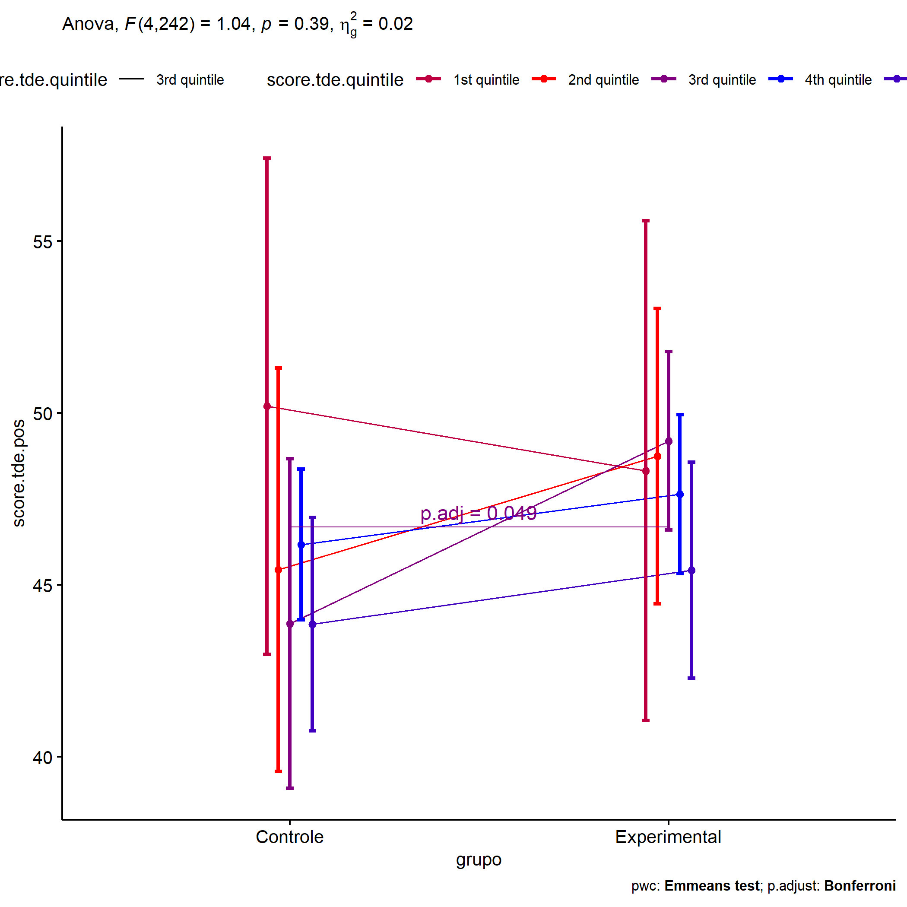<!-- -->

``` r
if (!is.null(plots[["score.tde.quintile"]]))
  plots[["score.tde.quintile"]] + ggplot2::scale_color_manual(values = color[["grupo"]])
```

    ## Scale for colour is already present.
    ## Adding another scale for colour, which will replace the existing scale.

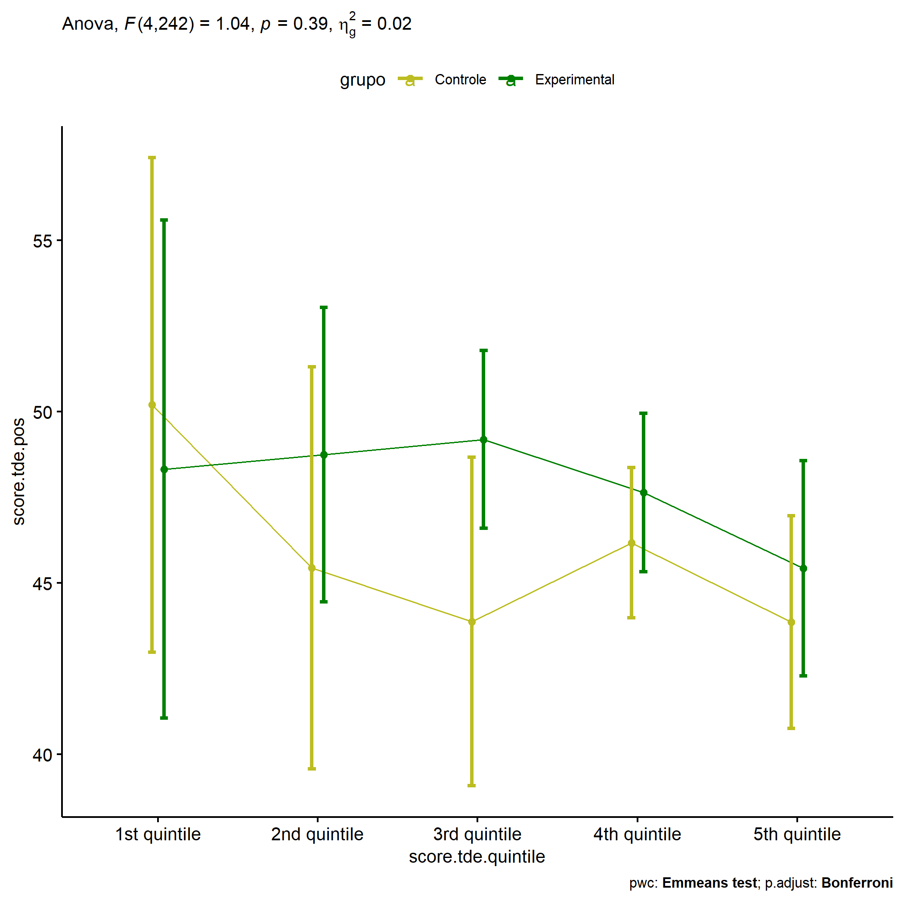<!-- -->

``` r
plots <- twoWayAncovaBoxPlots(
  wdat, "score.tde.pos", c("grupo","score.tde.quintile"), aov, pwcs, covar = "score.tde.pre",
  theme = "classic", color = color[["grupo:score.tde.quintile"]],
  subtitle = which(aov$Effect == "grupo:score.tde.quintile"))
```

``` r
plots[["grupo:score.tde.quintile"]] + ggplot2::ylab("TDE - Escrita") + ggplot2::scale_x_discrete(labels=c('pre', 'pos'))
```

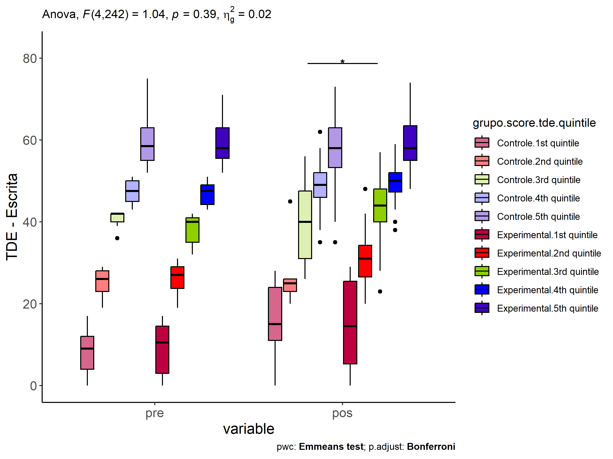<!-- -->

``` r
plots <- twoWayAncovaBoxPlots(
  wdat.long, "score.tde", c("grupo","score.tde.quintile"), aov, pwc.long, pre.post = "time",
  theme = "classic", color = color$prepost)
```

``` r
plots[["grupo:score.tde.quintile"]] + ggplot2::ylab("TDE - Escrita")
```

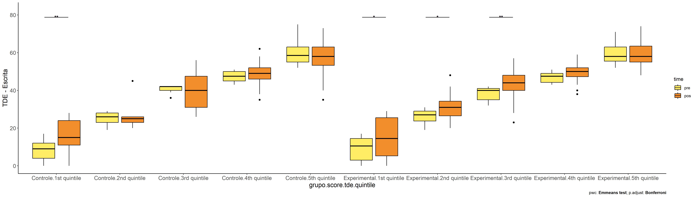<!-- -->

### Checking linearity assumption

``` r
ggscatter(wdat, x = "score.tde.pre", y = "score.tde.pos", size = 0.5,
          facet.by = c("grupo","score.tde.quintile"), add = "reg.line")+
  stat_regline_equation(
    aes(label =  paste(..eq.label.., ..rr.label.., sep = "~~~~"))
  )
```

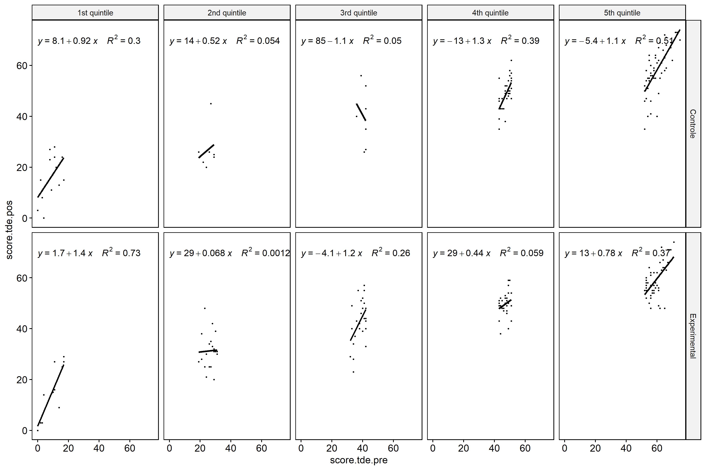<!-- -->

### Checking normality and homogeneity

``` r
res <- augment(lm(score.tde.pos ~ score.tde.pre + grupo*score.tde.quintile, data = wdat))
```

``` r
shapiro_test(res$.resid)
```

    ## # A tibble: 1 × 3
    ##   variable   statistic p.value
    ##   <chr>          <dbl>   <dbl>
    ## 1 res$.resid     0.988  0.0310

``` r
levene_test(res, .resid ~ grupo*score.tde.quintile)
```

    ## # A tibble: 1 × 4
    ##     df1   df2 statistic      p
    ##   <int> <int>     <dbl>  <dbl>
    ## 1     9   243      2.27 0.0188

# Summary of Results

## Descriptive Statistics

``` r
df <- get.descriptives(ldat[["grupo"]], c(dv.pre, dv.pos), c("grupo"), 
                       include.global = T, symmetry.test = T, normality.test = F)
df <- plyr::rbind.fill(
  df, do.call(plyr::rbind.fill, lapply(lfatores2, FUN = function(f) {
    if (nrow(dat) > 0 && sum(!is.na(unique(dat[[f]]))) > 1)
      get.descriptives(ldat[[paste0("grupo:",f)]], c(dv.pre,dv.pos), c("grupo", f),
                       symmetry.test = T, normality.test = F)
    }))
)
(df <- df[,c(fatores1[fatores1 %in% colnames(df)],"variable",
             colnames(df)[!colnames(df) %in% c(fatores1,"variable")])])
```

    ##           grupo Sexo   Zona Cor.Raca score.tde.quintile      variable   n   mean median min max     sd    se
    ## 1      Controle <NA>   <NA>     <NA>               <NA> score.tde.pre 113 47.035   51.0   0  75 17.346 1.632
    ## 2  Experimental <NA>   <NA>     <NA>               <NA> score.tde.pre 138 43.051   44.5   0  71 16.111 1.371
    ## 3          <NA> <NA>   <NA>     <NA>               <NA> score.tde.pre 251 44.845   48.0   0  75 16.763 1.058
    ## 4      Controle <NA>   <NA>     <NA>               <NA> score.tde.pos 113 47.708   51.0   0  73 16.001 1.505
    ## 5  Experimental <NA>   <NA>     <NA>               <NA> score.tde.pos 138 45.754   49.0   0  74 15.224 1.296
    ## 6          <NA> <NA>   <NA>     <NA>               <NA> score.tde.pos 251 46.633   50.0   0  74 15.577 0.983
    ## 7      Controle    F   <NA>     <NA>               <NA> score.tde.pre  51 47.392   51.0   3  69 15.562 2.179
    ## 8      Controle    M   <NA>     <NA>               <NA> score.tde.pre  63 46.175   51.0   0  75 19.068 2.402
    ## 9  Experimental    F   <NA>     <NA>               <NA> score.tde.pre  68 47.382   50.0   3  68 15.178 1.841
    ## 10 Experimental    M   <NA>     <NA>               <NA> score.tde.pre  70 38.843   40.5   0  71 15.976 1.910
    ## 11     Controle    F   <NA>     <NA>               <NA> score.tde.pos  51 48.098   52.0   3  69 14.802 2.073
    ## 12     Controle    M   <NA>     <NA>               <NA> score.tde.pos  63 46.635   49.0   0  73 17.815 2.244
    ## 13 Experimental    F   <NA>     <NA>               <NA> score.tde.pos  68 49.338   52.5   3  72 14.710 1.784
    ## 14 Experimental    M   <NA>     <NA>               <NA> score.tde.pos  70 42.271   43.5   0  74 15.003 1.793
    ## 15     Controle <NA>  Rural     <NA>               <NA> score.tde.pre  43 47.698   50.0   3  69 14.709 2.243
    ## 16     Controle <NA> Urbana     <NA>               <NA> score.tde.pre  14 56.571   56.5  16  75 14.474 3.868
    ## 17 Experimental <NA>  Rural     <NA>               <NA> score.tde.pre  53 43.208   46.0   0  68 18.373 2.524
    ## 18 Experimental <NA> Urbana     <NA>               <NA> score.tde.pre  31 40.806   44.0   3  71 16.808 3.019
    ## 19     Controle <NA>  Rural     <NA>               <NA> score.tde.pos  43 47.721   50.0   8  71 15.434 2.354
    ## 20     Controle <NA> Urbana     <NA>               <NA> score.tde.pos  14 52.786   54.5  24  73 12.753 3.408
    ## 21 Experimental <NA>  Rural     <NA>               <NA> score.tde.pos  53 45.585   50.0   0  72 17.385 2.388
    ## 22 Experimental <NA> Urbana     <NA>               <NA> score.tde.pos  31 43.226   46.0   6  74 16.921 3.039
    ## 23     Controle <NA>   <NA>   Branca               <NA> score.tde.pre   8 54.750   54.0  45  65  8.031 2.839
    ## 24     Controle <NA>   <NA>    Parda               <NA> score.tde.pre  50 40.940   46.5   0  66 17.846 2.524
    ## 25 Experimental <NA>   <NA>   Branca               <NA> score.tde.pre   9 52.333   58.0  40  67 11.705 3.902
    ## 26 Experimental <NA>   <NA>    Parda               <NA> score.tde.pre  47 37.638   42.0   2  68 19.010 2.773
    ## 27     Controle <NA>   <NA>   Branca               <NA> score.tde.pos   8 56.000   55.5  43  72  9.885 3.495
    ## 28     Controle <NA>   <NA>    Parda               <NA> score.tde.pos  50 40.000   44.0   0  68 17.430 2.465
    ## 29 Experimental <NA>   <NA>   Branca               <NA> score.tde.pos   9 52.222   52.0  23  72 14.558 4.853
    ## 30 Experimental <NA>   <NA>    Parda               <NA> score.tde.pos  47 38.191   38.0   3  71 18.236 2.660
    ## 31     Controle <NA>   <NA>     <NA>       1st quintile score.tde.pre  13  8.846    9.0   0  17  5.383 1.493
    ## 32     Controle <NA>   <NA>     <NA>       2nd quintile score.tde.pre   7 25.143   26.0  19  29  3.716 1.405
    ## 33     Controle <NA>   <NA>     <NA>       3rd quintile score.tde.pre   7 40.571   42.0  36  42  2.299 0.869
    ## 34     Controle <NA>   <NA>     <NA>       4th quintile score.tde.pre  34 47.353   47.5  43  51  2.912 0.499
    ## 35     Controle <NA>   <NA>     <NA>       5th quintile score.tde.pre  54 59.556   58.5  52  75  5.958 0.811
    ## 36 Experimental <NA>   <NA>     <NA>       1st quintile score.tde.pre  12  9.000   10.5   0  17  6.310 1.822
    ## 37 Experimental <NA>   <NA>     <NA>       2nd quintile score.tde.pre  20 26.300   27.0  19  31  3.570 0.798
    ## 38 Experimental <NA>   <NA>     <NA>       3rd quintile score.tde.pre  29 38.310   40.0  32  42  3.403 0.632
    ## 39 Experimental <NA>   <NA>     <NA>       4th quintile score.tde.pre  30 46.867   47.5  43  51  2.623 0.479
    ## 40 Experimental <NA>   <NA>     <NA>       5th quintile score.tde.pre  47 59.362   58.0  52  71  5.190 0.757
    ## 41     Controle <NA>   <NA>     <NA>       1st quintile score.tde.pos  13 16.231   15.0   0  28  9.048 2.509
    ## 42     Controle <NA>   <NA>     <NA>       2nd quintile score.tde.pos   7 26.857   25.0  20  45  8.295 3.135
    ## 43     Controle <NA>   <NA>     <NA>       3rd quintile score.tde.pos   7 39.857   40.0  26  56 11.539 4.361
    ## 44     Controle <NA>   <NA>     <NA>       4th quintile score.tde.pos  34 48.559   49.0  35  62  6.086 1.044
    ## 45     Controle <NA>   <NA>     <NA>       5th quintile score.tde.pos  54 57.759   58.0  35  73  8.832 1.202
    ## 46 Experimental <NA>   <NA>     <NA>       1st quintile score.tde.pos  12 14.500   14.5   0  29 10.501 3.031
    ## 47 Experimental <NA>   <NA>     <NA>       2nd quintile score.tde.pos  20 31.250   31.0  20  48  6.912 1.546
    ## 48 Experimental <NA>   <NA>     <NA>       3rd quintile score.tde.pos  29 43.034   44.0  23  57  8.235 1.529
    ## 49 Experimental <NA>   <NA>     <NA>       4th quintile score.tde.pos  30 49.567   50.0  38  59  4.790 0.875
    ## 50 Experimental <NA>   <NA>     <NA>       5th quintile score.tde.pos  47 59.149   58.0  48  74  6.682 0.975
    ##        ci   iqr symmetry    skewness   kurtosis
    ## 1   3.233 15.00       NO -1.11733098  0.5523801
    ## 2   2.712 22.75       NO -0.62793118 -0.1087686
    ## 3   2.084 18.50       NO -0.83812538  0.1139834
    ## 4   2.982 15.00       NO -0.91863142  0.3561540
    ## 5   2.563 18.00       NO -0.80357099  0.4257141
    ## 6   1.936 17.50       NO -0.85147167  0.3931491
    ## 7   4.377 13.50       NO -1.33980494  1.2307187
    ## 8   4.802 15.50       NO -0.90234539 -0.1490870
    ## 9   3.674 17.00       NO -1.11685287  0.9188338
    ## 10  3.809 19.50      YES -0.26418522 -0.2768337
    ## 11  4.163 14.00       NO -1.30337550  1.2823748
    ## 12  4.487 22.00       NO -0.69855803 -0.2425133
    ## 13  3.561 10.25       NO -1.33106233  1.3994572
    ## 14  3.577 19.25      YES -0.41031814  0.3543162
    ## 15  4.527 14.00       NO -1.24613621  1.4496528
    ## 16  8.357 12.75       NO -1.29625840  1.7777249
    ## 17  5.064 25.00       NO -0.70917292 -0.2778466
    ## 18  6.165 24.50      YES -0.43583870 -0.5948782
    ## 19  4.750 15.00       NO -0.90488563  0.2681010
    ## 20  7.363 16.50      YES -0.44029291 -0.2947040
    ## 21  4.792 18.00       NO -0.91242149  0.2977330
    ## 22  6.207 24.00      YES -0.40776470 -0.5593093
    ## 23  6.714 13.00      YES  0.04506414 -2.0279008
    ## 24  5.072 24.00       NO -0.79622592 -0.5011179
    ## 25  8.997 21.00      YES -0.08532028 -2.0679430
    ## 26  5.581 27.00      YES -0.25852142 -1.0337677
    ## 27  8.264 13.50      YES  0.19567021 -1.6095113
    ## 28  4.953 27.75       NO -0.68098629 -0.5319207
    ## 29 11.191  8.00      YES -0.39692031 -0.5019856
    ## 30  5.354 29.50      YES -0.11207851 -1.0587090
    ## 31  3.253  8.00      YES -0.11416896 -1.3572750
    ## 32  3.437  5.00      YES -0.39677295 -1.5180412
    ## 33  2.126  2.00       NO -1.03065811 -0.6503928
    ## 34  1.016  5.00      YES -0.30469193 -1.3633476
    ## 35  1.626  8.00       NO  0.69920804 -0.3784206
    ## 36  4.009 11.50      YES -0.03979952 -1.7685176
    ## 37  1.671  5.25      YES -0.44440527 -1.0804152
    ## 38  1.294  6.00       NO -0.51436591 -1.3228006
    ## 39  0.979  4.75      YES -0.13700482 -1.2870303
    ## 40  1.524  7.50      YES  0.40410242 -0.9792243
    ## 41  5.467 13.00      YES -0.32708457 -1.3042434
    ## 42  7.672  3.00       NO  1.37754037  0.3549984
    ## 43 10.672 16.50      YES  0.10483311 -1.7549161
    ## 44  2.124  6.00      YES -0.15762603 -0.3164387
    ## 45  2.411  9.75      YES -0.38541903 -0.2672160
    ## 46  6.672 20.25      YES  0.08959545 -1.6944039
    ## 47  3.235  7.75       NO  0.52173568 -0.1502675
    ## 48  3.133  8.00      YES -0.49474651 -0.2650964
    ## 49  1.789  4.75      YES -0.23220738  0.1874433
    ## 50  1.962  8.50      YES  0.33509518 -0.6305965

| grupo        | Sexo | Zona   | Cor.Raca | score.tde.quintile | variable      |   n |   mean | median | min | max |     sd |    se |     ci |   iqr | symmetry | skewness | kurtosis |
|:-------------|:-----|:-------|:---------|:-------------------|:--------------|----:|-------:|-------:|----:|----:|-------:|------:|-------:|------:|:---------|---------:|---------:|
| Controle     |      |        |          |                    | score.tde.pre | 113 | 47.035 |   51.0 |   0 |  75 | 17.346 | 1.632 |  3.233 | 15.00 | NO       |   -1.117 |    0.552 |
| Experimental |      |        |          |                    | score.tde.pre | 138 | 43.051 |   44.5 |   0 |  71 | 16.111 | 1.371 |  2.712 | 22.75 | NO       |   -0.628 |   -0.109 |
|              |      |        |          |                    | score.tde.pre | 251 | 44.845 |   48.0 |   0 |  75 | 16.763 | 1.058 |  2.084 | 18.50 | NO       |   -0.838 |    0.114 |
| Controle     |      |        |          |                    | score.tde.pos | 113 | 47.708 |   51.0 |   0 |  73 | 16.001 | 1.505 |  2.982 | 15.00 | NO       |   -0.919 |    0.356 |
| Experimental |      |        |          |                    | score.tde.pos | 138 | 45.754 |   49.0 |   0 |  74 | 15.224 | 1.296 |  2.563 | 18.00 | NO       |   -0.804 |    0.426 |
|              |      |        |          |                    | score.tde.pos | 251 | 46.633 |   50.0 |   0 |  74 | 15.577 | 0.983 |  1.936 | 17.50 | NO       |   -0.851 |    0.393 |
| Controle     | F    |        |          |                    | score.tde.pre |  51 | 47.392 |   51.0 |   3 |  69 | 15.562 | 2.179 |  4.377 | 13.50 | NO       |   -1.340 |    1.231 |
| Controle     | M    |        |          |                    | score.tde.pre |  63 | 46.175 |   51.0 |   0 |  75 | 19.068 | 2.402 |  4.802 | 15.50 | NO       |   -0.902 |   -0.149 |
| Experimental | F    |        |          |                    | score.tde.pre |  68 | 47.382 |   50.0 |   3 |  68 | 15.178 | 1.841 |  3.674 | 17.00 | NO       |   -1.117 |    0.919 |
| Experimental | M    |        |          |                    | score.tde.pre |  70 | 38.843 |   40.5 |   0 |  71 | 15.976 | 1.910 |  3.809 | 19.50 | YES      |   -0.264 |   -0.277 |
| Controle     | F    |        |          |                    | score.tde.pos |  51 | 48.098 |   52.0 |   3 |  69 | 14.802 | 2.073 |  4.163 | 14.00 | NO       |   -1.303 |    1.282 |
| Controle     | M    |        |          |                    | score.tde.pos |  63 | 46.635 |   49.0 |   0 |  73 | 17.815 | 2.244 |  4.487 | 22.00 | NO       |   -0.699 |   -0.243 |
| Experimental | F    |        |          |                    | score.tde.pos |  68 | 49.338 |   52.5 |   3 |  72 | 14.710 | 1.784 |  3.561 | 10.25 | NO       |   -1.331 |    1.399 |
| Experimental | M    |        |          |                    | score.tde.pos |  70 | 42.271 |   43.5 |   0 |  74 | 15.003 | 1.793 |  3.577 | 19.25 | YES      |   -0.410 |    0.354 |
| Controle     |      | Rural  |          |                    | score.tde.pre |  43 | 47.698 |   50.0 |   3 |  69 | 14.709 | 2.243 |  4.527 | 14.00 | NO       |   -1.246 |    1.450 |
| Controle     |      | Urbana |          |                    | score.tde.pre |  14 | 56.571 |   56.5 |  16 |  75 | 14.474 | 3.868 |  8.357 | 12.75 | NO       |   -1.296 |    1.778 |
| Experimental |      | Rural  |          |                    | score.tde.pre |  53 | 43.208 |   46.0 |   0 |  68 | 18.373 | 2.524 |  5.064 | 25.00 | NO       |   -0.709 |   -0.278 |
| Experimental |      | Urbana |          |                    | score.tde.pre |  31 | 40.806 |   44.0 |   3 |  71 | 16.808 | 3.019 |  6.165 | 24.50 | YES      |   -0.436 |   -0.595 |
| Controle     |      | Rural  |          |                    | score.tde.pos |  43 | 47.721 |   50.0 |   8 |  71 | 15.434 | 2.354 |  4.750 | 15.00 | NO       |   -0.905 |    0.268 |
| Controle     |      | Urbana |          |                    | score.tde.pos |  14 | 52.786 |   54.5 |  24 |  73 | 12.753 | 3.408 |  7.363 | 16.50 | YES      |   -0.440 |   -0.295 |
| Experimental |      | Rural  |          |                    | score.tde.pos |  53 | 45.585 |   50.0 |   0 |  72 | 17.385 | 2.388 |  4.792 | 18.00 | NO       |   -0.912 |    0.298 |
| Experimental |      | Urbana |          |                    | score.tde.pos |  31 | 43.226 |   46.0 |   6 |  74 | 16.921 | 3.039 |  6.207 | 24.00 | YES      |   -0.408 |   -0.559 |
| Controle     |      |        | Branca   |                    | score.tde.pre |   8 | 54.750 |   54.0 |  45 |  65 |  8.031 | 2.839 |  6.714 | 13.00 | YES      |    0.045 |   -2.028 |
| Controle     |      |        | Parda    |                    | score.tde.pre |  50 | 40.940 |   46.5 |   0 |  66 | 17.846 | 2.524 |  5.072 | 24.00 | NO       |   -0.796 |   -0.501 |
| Experimental |      |        | Branca   |                    | score.tde.pre |   9 | 52.333 |   58.0 |  40 |  67 | 11.705 | 3.902 |  8.997 | 21.00 | YES      |   -0.085 |   -2.068 |
| Experimental |      |        | Parda    |                    | score.tde.pre |  47 | 37.638 |   42.0 |   2 |  68 | 19.010 | 2.773 |  5.581 | 27.00 | YES      |   -0.259 |   -1.034 |
| Controle     |      |        | Branca   |                    | score.tde.pos |   8 | 56.000 |   55.5 |  43 |  72 |  9.885 | 3.495 |  8.264 | 13.50 | YES      |    0.196 |   -1.610 |
| Controle     |      |        | Parda    |                    | score.tde.pos |  50 | 40.000 |   44.0 |   0 |  68 | 17.430 | 2.465 |  4.953 | 27.75 | NO       |   -0.681 |   -0.532 |
| Experimental |      |        | Branca   |                    | score.tde.pos |   9 | 52.222 |   52.0 |  23 |  72 | 14.558 | 4.853 | 11.191 |  8.00 | YES      |   -0.397 |   -0.502 |
| Experimental |      |        | Parda    |                    | score.tde.pos |  47 | 38.191 |   38.0 |   3 |  71 | 18.236 | 2.660 |  5.354 | 29.50 | YES      |   -0.112 |   -1.059 |
| Controle     |      |        |          | 1st quintile       | score.tde.pre |  13 |  8.846 |    9.0 |   0 |  17 |  5.383 | 1.493 |  3.253 |  8.00 | YES      |   -0.114 |   -1.357 |
| Controle     |      |        |          | 2nd quintile       | score.tde.pre |   7 | 25.143 |   26.0 |  19 |  29 |  3.716 | 1.405 |  3.437 |  5.00 | YES      |   -0.397 |   -1.518 |
| Controle     |      |        |          | 3rd quintile       | score.tde.pre |   7 | 40.571 |   42.0 |  36 |  42 |  2.299 | 0.869 |  2.126 |  2.00 | NO       |   -1.031 |   -0.650 |
| Controle     |      |        |          | 4th quintile       | score.tde.pre |  34 | 47.353 |   47.5 |  43 |  51 |  2.912 | 0.499 |  1.016 |  5.00 | YES      |   -0.305 |   -1.363 |
| Controle     |      |        |          | 5th quintile       | score.tde.pre |  54 | 59.556 |   58.5 |  52 |  75 |  5.958 | 0.811 |  1.626 |  8.00 | NO       |    0.699 |   -0.378 |
| Experimental |      |        |          | 1st quintile       | score.tde.pre |  12 |  9.000 |   10.5 |   0 |  17 |  6.310 | 1.822 |  4.009 | 11.50 | YES      |   -0.040 |   -1.769 |
| Experimental |      |        |          | 2nd quintile       | score.tde.pre |  20 | 26.300 |   27.0 |  19 |  31 |  3.570 | 0.798 |  1.671 |  5.25 | YES      |   -0.444 |   -1.080 |
| Experimental |      |        |          | 3rd quintile       | score.tde.pre |  29 | 38.310 |   40.0 |  32 |  42 |  3.403 | 0.632 |  1.294 |  6.00 | NO       |   -0.514 |   -1.323 |
| Experimental |      |        |          | 4th quintile       | score.tde.pre |  30 | 46.867 |   47.5 |  43 |  51 |  2.623 | 0.479 |  0.979 |  4.75 | YES      |   -0.137 |   -1.287 |
| Experimental |      |        |          | 5th quintile       | score.tde.pre |  47 | 59.362 |   58.0 |  52 |  71 |  5.190 | 0.757 |  1.524 |  7.50 | YES      |    0.404 |   -0.979 |
| Controle     |      |        |          | 1st quintile       | score.tde.pos |  13 | 16.231 |   15.0 |   0 |  28 |  9.048 | 2.509 |  5.467 | 13.00 | YES      |   -0.327 |   -1.304 |
| Controle     |      |        |          | 2nd quintile       | score.tde.pos |   7 | 26.857 |   25.0 |  20 |  45 |  8.295 | 3.135 |  7.672 |  3.00 | NO       |    1.378 |    0.355 |
| Controle     |      |        |          | 3rd quintile       | score.tde.pos |   7 | 39.857 |   40.0 |  26 |  56 | 11.539 | 4.361 | 10.672 | 16.50 | YES      |    0.105 |   -1.755 |
| Controle     |      |        |          | 4th quintile       | score.tde.pos |  34 | 48.559 |   49.0 |  35 |  62 |  6.086 | 1.044 |  2.124 |  6.00 | YES      |   -0.158 |   -0.316 |
| Controle     |      |        |          | 5th quintile       | score.tde.pos |  54 | 57.759 |   58.0 |  35 |  73 |  8.832 | 1.202 |  2.411 |  9.75 | YES      |   -0.385 |   -0.267 |
| Experimental |      |        |          | 1st quintile       | score.tde.pos |  12 | 14.500 |   14.5 |   0 |  29 | 10.501 | 3.031 |  6.672 | 20.25 | YES      |    0.090 |   -1.694 |
| Experimental |      |        |          | 2nd quintile       | score.tde.pos |  20 | 31.250 |   31.0 |  20 |  48 |  6.912 | 1.546 |  3.235 |  7.75 | NO       |    0.522 |   -0.150 |
| Experimental |      |        |          | 3rd quintile       | score.tde.pos |  29 | 43.034 |   44.0 |  23 |  57 |  8.235 | 1.529 |  3.133 |  8.00 | YES      |   -0.495 |   -0.265 |
| Experimental |      |        |          | 4th quintile       | score.tde.pos |  30 | 49.567 |   50.0 |  38 |  59 |  4.790 | 0.875 |  1.789 |  4.75 | YES      |   -0.232 |    0.187 |
| Experimental |      |        |          | 5th quintile       | score.tde.pos |  47 | 59.149 |   58.0 |  48 |  74 |  6.682 | 0.975 |  1.962 |  8.50 | YES      |    0.335 |   -0.631 |

## ANCOVA Table Comparison

``` r
df <- do.call(plyr::rbind.fill, laov)
(df <- df[!duplicated(df$Effect),])
```

    ##                      Effect DFn DFd            F         p p<.05      ges DFn' DFd'      F'       p' p<.05'
    ## 1                     grupo   1 248    3.3820000  6.70e-02       1.30e-02    1  265   1.064 3.03e-01       
    ## 2             score.tde.pre   1 248 1317.1520000 3.38e-101     * 8.42e-01    1  265 624.126 1.28e-71      *
    ## 4                grupo:Sexo   1 247    0.2110000  6.47e-01       8.52e-04    1  263   0.209 6.48e-01       
    ## 6                      Sexo   1 247    0.0000841  9.93e-01       3.41e-07    1  263   0.920 3.38e-01       
    ## 8                grupo:Zona   1 136    1.3440000  2.48e-01       1.00e-02    1  143   2.894 9.10e-02       
    ## 10                     Zona   1 136    1.0260000  3.13e-01       7.00e-03    1  143   0.017 8.98e-01       
    ## 11                 Cor.Raca   1 109    1.5850000  2.11e-01       1.40e-02    1  111   2.344 1.29e-01       
    ## 13           grupo:Cor.Raca   1 109    0.2850000  5.94e-01       3.00e-03    1  111   0.047 8.29e-01       
    ## 16 grupo:score.tde.quintile   4 242    1.0380000  3.88e-01       1.70e-02    4  257   0.314 8.69e-01       
    ## 18       score.tde.quintile   4 242    0.7150000  5.82e-01       1.20e-02    4  257   0.650 6.27e-01       
    ##        ges'
    ## 1  0.004000
    ## 2  0.702000
    ## 4  0.000793
    ## 6  0.003000
    ## 8  0.020000
    ## 10 0.000116
    ## 11 0.021000
    ## 13 0.000420
    ## 16 0.005000
    ## 18 0.010000

|     | Effect                   | DFn | DFd |        F |     p | p\<.05 |   ges | DFn’ | DFd’ |      F’ |    p’ | p\<.05’ |  ges’ |
|:----|:-------------------------|----:|----:|---------:|------:|:-------|------:|-----:|-----:|--------:|------:|:--------|------:|
| 1   | grupo                    |   1 | 248 |    3.382 | 0.067 |        | 0.013 |    1 |  265 |   1.064 | 0.303 |         | 0.004 |
| 2   | score.tde.pre            |   1 | 248 | 1317.152 | 0.000 | \*     | 0.842 |    1 |  265 | 624.126 | 0.000 | \*      | 0.702 |
| 4   | grupo:Sexo               |   1 | 247 |    0.211 | 0.647 |        | 0.001 |    1 |  263 |   0.209 | 0.648 |         | 0.001 |
| 6   | Sexo                     |   1 | 247 |    0.000 | 0.993 |        | 0.000 |    1 |  263 |   0.920 | 0.338 |         | 0.003 |
| 8   | grupo:Zona               |   1 | 136 |    1.344 | 0.248 |        | 0.010 |    1 |  143 |   2.894 | 0.091 |         | 0.020 |
| 10  | Zona                     |   1 | 136 |    1.026 | 0.313 |        | 0.007 |    1 |  143 |   0.017 | 0.898 |         | 0.000 |
| 11  | Cor.Raca                 |   1 | 109 |    1.585 | 0.211 |        | 0.014 |    1 |  111 |   2.344 | 0.129 |         | 0.021 |
| 13  | grupo:Cor.Raca           |   1 | 109 |    0.285 | 0.594 |        | 0.003 |    1 |  111 |   0.047 | 0.829 |         | 0.000 |
| 16  | grupo:score.tde.quintile |   4 | 242 |    1.038 | 0.388 |        | 0.017 |    4 |  257 |   0.314 | 0.869 |         | 0.005 |
| 18  | score.tde.quintile       |   4 | 242 |    0.715 | 0.582 |        | 0.012 |    4 |  257 |   0.650 | 0.627 |         | 0.010 |

## PairWise Table Comparison

``` r
df <- do.call(plyr::rbind.fill, lpwc)
df <- df[,c(names(lfatores), names(df)[!names(df) %in% c(names(lfatores),"term",".y.")])]
```

| grupo        | Sexo | Zona   | Cor.Raca | score.tde.quintile | group1       | group2       |  df | statistic |     p | p.adj | p.adj.signif | df’ | statistic’ |    p’ | p.adj’ | p.adj.signif’ |
|:-------------|:-----|:-------|:---------|:-------------------|:-------------|:-------------|----:|----------:|------:|------:|:-------------|----:|-----------:|------:|-------:|:--------------|
| Controle     |      |        |          |                    | pre          | pos          | 498 |    -0.313 | 0.754 | 0.754 | ns           | 532 |      0.263 | 0.792 |  0.792 | ns            |
| Experimental |      |        |          |                    | pre          | pos          | 498 |    -1.391 | 0.165 | 0.165 | ns           | 532 |     -0.638 | 0.524 |  0.524 | ns            |
|              |      |        |          |                    | Controle     | Experimental | 248 |    -1.839 | 0.067 | 0.067 | ns           | 265 |     -1.031 | 0.303 |  0.303 | ns            |
| Controle     | F    |        |          |                    | pre          | pos          | 496 |    -0.222 | 0.825 | 0.825 | ns           | 528 |      0.292 | 0.771 |  0.771 | ns            |
| Controle     | M    |        |          |                    | pre          | pos          | 496 |    -0.161 | 0.872 | 0.872 | ns           | 528 |      0.092 | 0.927 |  0.927 | ns            |
| Controle     |      |        |          |                    | F            | M            | 247 |     0.343 | 0.732 | 0.732 | ns           | 263 |     -0.315 | 0.753 |  0.753 | ns            |
| Experimental | F    |        |          |                    | pre          | pos          | 496 |    -0.709 | 0.479 | 0.479 | ns           | 528 |      0.076 | 0.940 |  0.940 | ns            |
| Experimental | M    |        |          |                    | pre          | pos          | 496 |    -1.261 | 0.208 | 0.208 | ns           | 528 |     -0.998 | 0.319 |  0.319 | ns            |
| Experimental |      |        |          |                    | F            | M            | 247 |    -0.303 | 0.762 | 0.762 | ns           | 263 |     -1.015 | 0.311 |  0.311 | ns            |
|              | F    |        |          |                    | Controle     | Experimental | 247 |    -1.068 | 0.287 | 0.287 | ns           | 263 |     -0.438 | 0.662 |  0.662 | ns            |
|              | M    |        |          |                    | Controle     | Experimental | 247 |    -1.791 | 0.075 | 0.075 | ns           | 263 |     -1.097 | 0.274 |  0.274 | ns            |
| Controle     |      |        |          |                    | Rural        | Urbana       | 136 |     1.533 | 0.128 | 0.128 | ns           | 143 |      1.446 | 0.150 |  0.150 | ns            |
| Controle     |      | Rural  |          |                    | pre          | pos          | 274 |    -0.007 | 0.995 | 0.995 | ns           | 288 |      0.237 | 0.813 |  0.813 | ns            |
| Controle     |      | Urbana |          |                    | pre          | pos          | 274 |     0.608 | 0.543 | 0.543 | ns           | 288 |      0.877 | 0.381 |  0.381 | ns            |
| Experimental |      |        |          |                    | Rural        | Urbana       | 136 |     0.129 | 0.898 | 0.898 | ns           | 143 |     -0.918 | 0.360 |  0.360 | ns            |
| Experimental |      | Rural  |          |                    | pre          | pos          | 274 |    -0.743 | 0.458 | 0.458 | ns           | 288 |     -0.159 | 0.873 |  0.873 | ns            |
| Experimental |      | Urbana |          |                    | pre          | pos          | 274 |    -0.579 | 0.563 | 0.563 | ns           | 288 |     -0.579 | 0.563 |  0.563 | ns            |
|              |      | Rural  |          |                    | Controle     | Experimental | 136 |    -1.499 | 0.136 | 0.136 | ns           | 143 |     -0.507 | 0.613 |  0.613 | ns            |
|              |      | Urbana |          |                    | Controle     | Experimental | 136 |    -2.281 | 0.024 | 0.024 | \*           | 143 |     -2.288 | 0.024 |  0.024 | \*            |
| Controle     |      |        | Branca   |                    | pre          | pos          | 220 |    -0.144 | 0.886 | 0.886 | ns           | 224 |     -0.143 | 0.886 |  0.886 | ns            |
| Controle     |      |        |          |                    | Branca       | Parda        | 109 |     1.268 | 0.208 | 0.208 | ns           | 111 |      1.232 | 0.221 |  0.221 | ns            |
| Controle     |      |        | Parda    |                    | pre          | pos          | 220 |     0.271 | 0.787 | 0.787 | ns           | 224 |      0.269 | 0.788 |  0.788 | ns            |
| Experimental |      |        | Branca   |                    | pre          | pos          | 220 |     0.014 | 0.989 | 0.989 | ns           | 224 |      0.013 | 0.989 |  0.989 | ns            |
| Experimental |      |        |          |                    | Branca       | Parda        | 109 |     0.566 | 0.573 | 0.573 | ns           | 111 |      0.983 | 0.328 |  0.328 | ns            |
| Experimental |      |        | Parda    |                    | pre          | pos          | 220 |    -0.154 | 0.877 | 0.877 | ns           | 224 |      0.283 | 0.777 |  0.777 | ns            |
|              |      |        | Branca   |                    | Controle     | Experimental | 109 |     0.387 | 0.699 | 0.699 | ns           | 111 |      0.361 | 0.719 |  0.719 | ns            |
|              |      |        | Parda    |                    | Controle     | Experimental | 109 |    -0.456 | 0.649 | 0.649 | ns           | 111 |      0.307 | 0.759 |  0.759 | ns            |
| Controle     |      |        |          | 1st quintile       | pre          | pos          | 486 |    -2.983 | 0.003 | 0.003 | \*\*         | 516 |     -2.084 | 0.038 |  0.038 | \*            |
| Controle     |      |        |          | 2nd quintile       | pre          | pos          | 486 |    -0.508 | 0.612 | 0.612 | ns           | 516 |     -0.416 | 0.677 |  0.677 | ns            |
| Controle     |      |        |          | 3rd quintile       | pre          | pos          | 486 |     0.212 | 0.832 | 0.832 | ns           | 516 |      0.173 | 0.862 |  0.862 | ns            |
| Controle     |      |        |          | 4th quintile       | pre          | pos          | 486 |    -0.788 | 0.431 | 0.431 | ns           | 516 |     -0.076 | 0.939 |  0.939 | ns            |
| Controle     |      |        |          | 5th quintile       | pre          | pos          | 486 |     1.479 | 0.140 | 0.140 | ns           | 516 |      1.993 | 0.047 |  0.047 | \*            |
| Controle     |      |        |          |                    | 1st quintile | 2nd quintile | 242 |     1.435 | 0.153 | 1.000 | ns           | 257 |      0.764 | 0.446 |  1.000 | ns            |
| Controle     |      |        |          |                    | 1st quintile | 3rd quintile | 242 |     1.538 | 0.125 | 1.000 | ns           | 257 |      0.900 | 0.369 |  1.000 | ns            |
| Controle     |      |        |          |                    | 1st quintile | 4th quintile | 242 |     1.002 | 0.317 | 1.000 | ns           | 257 |      0.711 | 0.478 |  1.000 | ns            |
| Controle     |      |        |          |                    | 1st quintile | 5th quintile | 242 |     1.285 | 0.200 | 1.000 | ns           | 257 |      0.927 | 0.355 |  1.000 | ns            |
| Controle     |      |        |          |                    | 2nd quintile | 3rd quintile | 242 |     0.427 | 0.670 | 1.000 | ns           | 257 |      0.312 | 0.755 |  1.000 | ns            |
| Controle     |      |        |          |                    | 2nd quintile | 4th quintile | 242 |    -0.223 | 0.824 | 1.000 | ns           | 257 |      0.087 | 0.931 |  1.000 | ns            |
| Controle     |      |        |          |                    | 2nd quintile | 5th quintile | 242 |     0.397 | 0.692 | 1.000 | ns           | 257 |      0.498 | 0.619 |  1.000 | ns            |
| Controle     |      |        |          |                    | 3rd quintile | 4th quintile | 242 |    -0.850 | 0.396 | 1.000 | ns           | 257 |     -0.318 | 0.750 |  1.000 | ns            |
| Controle     |      |        |          |                    | 3rd quintile | 5th quintile | 242 |     0.006 | 0.995 | 1.000 | ns           | 257 |      0.271 | 0.787 |  1.000 | ns            |
| Controle     |      |        |          |                    | 4th quintile | 5th quintile | 242 |     1.312 | 0.191 | 1.000 | ns           | 257 |      0.975 | 0.331 |  1.000 | ns            |
| Experimental |      |        |          | 1st quintile       | pre          | pos          | 486 |    -2.135 | 0.033 | 0.033 | \*           | 516 |     -1.748 | 0.081 |  0.081 | ns            |
| Experimental |      |        |          | 2nd quintile       | pre          | pos          | 486 |    -2.480 | 0.013 | 0.013 | \*           | 516 |     -2.683 | 0.008 |  0.008 | \*\*          |
| Experimental |      |        |          | 3rd quintile       | pre          | pos          | 486 |    -2.851 | 0.005 | 0.005 | \*\*         | 516 |     -0.827 | 0.408 |  0.408 | ns            |
| Experimental |      |        |          | 4th quintile       | pre          | pos          | 486 |    -1.657 | 0.098 | 0.098 | ns           | 516 |     -0.681 | 0.496 |  0.496 | ns            |
| Experimental |      |        |          | 5th quintile       | pre          | pos          | 486 |     0.163 | 0.870 | 0.870 | ns           | 516 |      1.479 | 0.140 |  0.140 | ns            |
| Experimental |      |        |          |                    | 1st quintile | 2nd quintile | 242 |    -0.150 | 0.881 | 1.000 | ns           | 257 |     -0.462 | 0.645 |  1.000 | ns            |
| Experimental |      |        |          |                    | 1st quintile | 3rd quintile | 242 |    -0.254 | 0.800 | 1.000 | ns           | 257 |      0.495 | 0.621 |  1.000 | ns            |
| Experimental |      |        |          |                    | 1st quintile | 4th quintile | 242 |     0.170 | 0.866 | 1.000 | ns           | 257 |      0.389 | 0.698 |  1.000 | ns            |
| Experimental |      |        |          |                    | 1st quintile | 5th quintile | 242 |     0.585 | 0.559 | 1.000 | ns           | 257 |      0.745 | 0.457 |  1.000 | ns            |
| Experimental |      |        |          |                    | 2nd quintile | 3rd quintile | 242 |    -0.209 | 0.835 | 1.000 | ns           | 257 |      1.412 | 0.159 |  1.000 | ns            |
| Experimental |      |        |          |                    | 2nd quintile | 4th quintile | 242 |     0.423 | 0.672 | 1.000 | ns           | 257 |      1.104 | 0.271 |  1.000 | ns            |
| Experimental |      |        |          |                    | 2nd quintile | 5th quintile | 242 |     0.973 | 0.332 | 1.000 | ns           | 257 |      1.467 | 0.144 |  1.000 | ns            |
| Experimental |      |        |          |                    | 3rd quintile | 4th quintile | 242 |     0.848 | 0.397 | 1.000 | ns           | 257 |     -0.070 | 0.945 |  1.000 | ns            |
| Experimental |      |        |          |                    | 3rd quintile | 5th quintile | 242 |     1.563 | 0.119 | 1.000 | ns           | 257 |      0.841 | 0.401 |  1.000 | ns            |
| Experimental |      |        |          |                    | 4th quintile | 5th quintile | 242 |     1.192 | 0.235 | 1.000 | ns           | 257 |      1.157 | 0.248 |  1.000 | ns            |
|              |      |        |          | 1st quintile       | Controle     | Experimental | 242 |     0.737 | 0.462 | 0.462 | ns           | 257 |      0.165 | 0.869 |  0.869 | ns            |
|              |      |        |          | 2nd quintile       | Controle     | Experimental | 242 |    -1.182 | 0.238 | 0.238 | ns           | 257 |     -1.205 | 0.229 |  0.229 | ns            |
|              |      |        |          | 3rd quintile       | Controle     | Experimental | 242 |    -1.979 | 0.049 | 0.049 | \*           | 257 |     -0.584 | 0.560 |  0.560 | ns            |
|              |      |        |          | 4th quintile       | Controle     | Experimental | 242 |    -0.921 | 0.358 | 0.358 | ns           | 257 |     -0.529 | 0.597 |  0.597 | ns            |
|              |      |        |          | 5th quintile       | Controle     | Experimental | 242 |    -1.240 | 0.216 | 0.216 | ns           | 257 |     -0.337 | 0.737 |  0.737 | ns            |

## EMMS Table Comparison

``` r
df <- do.call(plyr::rbind.fill, lemms)
df[["N-N'"]] <- df[["N"]] - df[["N'"]]
df <- df[,c(names(lfatores), names(df)[!names(df) %in% names(lfatores)])]
```

| grupo        | Sexo | Zona   | Cor.Raca | score.tde.quintile |   N | M (pre) | SE (pre) | M (unadj) | SE (unadj) | M (adj) | SE (adj) |  N’ | M (pre)’ | SE (pre)’ | M (unadj)’ | SE (unadj)’ | M (adj)’ | SE (adj)’ | N-N’ |
|:-------------|:-----|:-------|:---------|:-------------------|----:|--------:|---------:|----------:|-----------:|--------:|---------:|----:|---------:|----------:|-----------:|------------:|---------:|----------:|-----:|
| Controle     |      |        |          |                    | 113 |  47.035 |    1.632 |    47.708 |      1.505 |  45.831 |    0.587 | 121 |   46.950 |     1.557 |     46.397 |       1.495 |   44.691 |     0.812 |   -8 |
| Experimental |      |        |          |                    | 138 |  43.051 |    1.371 |    45.754 |      1.296 |  47.291 |    0.531 | 147 |   43.204 |     1.307 |     44.422 |       1.331 |   45.826 |     0.737 |   -9 |
| Controle     | F    |        |          |                    |  51 |  47.392 |    2.179 |    48.098 |      2.073 |  45.774 |    0.886 |  56 |   47.339 |     1.992 |     46.446 |       2.020 |   44.402 |     1.195 |   -5 |
| Controle     | M    |        |          |                    |  63 |  46.175 |    2.402 |    46.635 |      2.244 |  45.366 |    0.796 |  65 |   46.615 |     2.349 |     46.354 |       2.187 |   44.915 |     1.108 |   -2 |
| Experimental | F    |        |          |                    |  68 |  47.382 |    1.841 |    49.338 |      1.784 |  47.023 |    0.768 |  75 |   47.320 |     1.718 |     47.120 |       1.902 |   45.091 |     1.033 |   -7 |
| Experimental | M    |        |          |                    |  70 |  38.843 |    1.910 |    42.271 |      1.793 |  47.355 |    0.768 |  72 |   38.917 |     1.860 |     41.611 |       1.816 |   46.614 |     1.071 |   -2 |
| Controle     |      | Rural  |          |                    |  43 |  47.698 |    2.243 |    47.721 |      2.354 |  45.616 |    0.956 |  45 |   47.956 |     2.160 |     47.133 |       2.292 |   45.016 |     1.201 |   -2 |
| Controle     |      | Urbana |          |                    |  14 |  56.571 |    3.868 |    52.786 |      3.408 |  42.634 |    1.709 |  15 |   56.667 |     3.602 |     51.400 |       3.462 |   41.516 |     2.123 |   -1 |
| Experimental |      | Rural  |          |                    |  53 |  43.208 |    2.524 |    45.585 |      2.388 |  47.551 |    0.862 |  57 |   43.386 |     2.366 |     43.877 |       2.386 |   45.834 |     1.068 |   -4 |
| Experimental |      | Urbana |          |                    |  31 |  40.806 |    3.019 |    43.226 |      3.039 |  47.369 |    1.132 |  31 |   40.806 |     3.019 |     43.226 |       3.039 |   47.483 |     1.456 |    0 |
| Controle     |      |        | Branca   |                    |   8 |  54.750 |    2.839 |    56.000 |      3.495 |  45.125 |    3.455 |   8 |   54.750 |     2.839 |     56.000 |       3.495 |   45.582 |     3.837 |    0 |
| Controle     |      |        | Parda    |                    |  50 |  40.940 |    2.524 |    40.000 |      2.465 |  40.415 |    1.354 |  50 |   40.940 |     2.524 |     40.000 |       2.465 |   40.497 |     1.505 |    0 |
| Experimental |      |        | Branca   |                    |   9 |  52.333 |    3.902 |    52.222 |      4.853 |  43.322 |    3.241 |   9 |   52.333 |     3.902 |     52.222 |       4.853 |   43.714 |     3.600 |    0 |
| Experimental |      |        | Parda    |                    |  47 |  37.638 |    2.773 |    38.191 |      2.660 |  41.306 |    1.410 |  49 |   38.082 |     2.701 |     37.082 |       2.667 |   39.838 |     1.533 |   -2 |
| Controle     |      |        |          | 1st quintile       |  13 |   8.846 |    1.493 |    16.231 |      2.509 |  50.201 |    3.665 |  14 |    9.214 |     1.430 |     15.286 |       2.508 |   49.075 |     5.032 |   -1 |
| Controle     |      |        |          | 2nd quintile       |   7 |  25.143 |    1.405 |    26.857 |      3.135 |  45.443 |    2.977 |   7 |   25.143 |     1.405 |     26.857 |       3.135 |   45.563 |     4.184 |    0 |
| Controle     |      |        |          | 3rd quintile       |   7 |  40.571 |    0.869 |    39.857 |      4.361 |  43.877 |    2.432 |   7 |   40.571 |     0.869 |     39.857 |       4.361 |   43.952 |     3.435 |    0 |
| Controle     |      |        |          | 4th quintile       |  34 |  47.353 |    0.499 |    48.559 |      1.044 |  46.177 |    1.113 |  36 |   47.306 |     0.473 |     47.444 |       1.254 |   45.162 |     1.525 |   -2 |
| Controle     |      |        |          | 5th quintile       |  54 |  59.556 |    0.811 |    57.759 |      1.202 |  43.858 |    1.574 |  57 |   59.456 |     0.782 |     56.579 |       1.331 |   42.790 |     2.162 |   -3 |
| Experimental |      |        |          | 1st quintile       |  12 |   9.000 |    1.822 |    14.500 |      3.031 |  48.325 |    3.688 |  12 |    9.000 |     1.822 |     14.500 |       3.031 |   48.493 |     5.150 |    0 |
| Experimental |      |        |          | 2nd quintile       |  20 |  26.300 |    0.798 |    31.250 |      1.546 |  48.743 |    2.181 |  21 |   26.238 |     0.762 |     32.619 |       2.009 |   50.287 |     3.031 |   -1 |
| Experimental |      |        |          | 3rd quintile       |  29 |  38.310 |    0.632 |    43.034 |      1.529 |  49.189 |    1.316 |  32 |   38.375 |     0.585 |     39.969 |       2.263 |   46.144 |     1.781 |   -3 |
| Experimental |      |        |          | 4th quintile       |  30 |  46.867 |    0.479 |    49.567 |      0.875 |  47.644 |    1.174 |  32 |   46.938 |     0.453 |     48.250 |       1.229 |   46.316 |     1.607 |   -2 |
| Experimental |      |        |          | 5th quintile       |  47 |  59.362 |    0.757 |    59.149 |      0.975 |  45.430 |    1.595 |  50 |   59.240 |     0.727 |     56.960 |       1.555 |   43.376 |     2.185 |   -3 |
