ANCOVA in Writing (TDE) (Writing (TDE))
================
Geiser C. Challco <geiser@alumni.usp.br>

- [Setting Initial Variables](#setting-initial-variables)
- [Descriptive Statistics of Initial
  Data](#descriptive-statistics-of-initial-data)
- [ANCOVA and Pairwise for one factor:
  **grupo**](#ancova-and-pairwise-for-one-factor-grupo)
  - [Without remove non-normal data](#without-remove-non-normal-data)
  - [Computing ANCOVA and PairWise After removing non-normal data
    (OK)](#computing-ancova-and-pairwise-after-removing-non-normal-data-ok)
    - [Plots for ancova](#plots-for-ancova)
    - [Checking linearity assumption](#checking-linearity-assumption)
    - [Checking normality and
      homogeneity](#checking-normality-and-homogeneity)
- [ANCOVA and Pairwise for two factors
  **grupo:Sexo**](#ancova-and-pairwise-for-two-factors-gruposexo)
  - [Without remove non-normal data](#without-remove-non-normal-data-1)
  - [Computing ANCOVA and PairWise After removing non-normal data
    (OK)](#computing-ancova-and-pairwise-after-removing-non-normal-data-ok-1)
    - [Plots for ancova](#plots-for-ancova-1)
    - [Checking linearity assumption](#checking-linearity-assumption-1)
    - [Checking normality and
      homogeneity](#checking-normality-and-homogeneity-1)
- [ANCOVA and Pairwise for two factors
  **grupo:Zona**](#ancova-and-pairwise-for-two-factors-grupozona)
  - [Without remove non-normal data](#without-remove-non-normal-data-2)
  - [Computing ANCOVA and PairWise After removing non-normal data
    (OK)](#computing-ancova-and-pairwise-after-removing-non-normal-data-ok-2)
    - [Plots for ancova](#plots-for-ancova-2)
    - [Checking linearity assumption](#checking-linearity-assumption-2)
    - [Checking normality and
      homogeneity](#checking-normality-and-homogeneity-2)
- [ANCOVA and Pairwise for two factors
  **grupo:Cor.Raca**](#ancova-and-pairwise-for-two-factors-grupocorraca)
  - [Without remove non-normal data](#without-remove-non-normal-data-3)
  - [Computing ANCOVA and PairWise After removing non-normal data
    (OK)](#computing-ancova-and-pairwise-after-removing-non-normal-data-ok-3)
    - [Plots for ancova](#plots-for-ancova-3)
    - [Checking linearity assumption](#checking-linearity-assumption-3)
    - [Checking normality and
      homogeneity](#checking-normality-and-homogeneity-3)
- [ANCOVA and Pairwise for two factors
  **grupo:Serie**](#ancova-and-pairwise-for-two-factors-gruposerie)
  - [Without remove non-normal data](#without-remove-non-normal-data-4)
  - [Computing ANCOVA and PairWise After removing non-normal data
    (OK)](#computing-ancova-and-pairwise-after-removing-non-normal-data-ok-4)
    - [Plots for ancova](#plots-for-ancova-4)
    - [Checking linearity assumption](#checking-linearity-assumption-4)
    - [Checking normality and
      homogeneity](#checking-normality-and-homogeneity-4)
- [ANCOVA and Pairwise for two factors
  **grupo:score.tde.quintile**](#ancova-and-pairwise-for-two-factors-gruposcoretdequintile)
  - [Without remove non-normal data](#without-remove-non-normal-data-5)
  - [Computing ANCOVA and PairWise After removing non-normal data
    (OK)](#computing-ancova-and-pairwise-after-removing-non-normal-data-ok-5)
    - [Plots for ancova](#plots-for-ancova-5)
    - [Checking linearity assumption](#checking-linearity-assumption-5)
    - [Checking normality and
      homogeneity](#checking-normality-and-homogeneity-5)
- [Summary of Results](#summary-of-results)
  - [Descriptive Statistics](#descriptive-statistics)
  - [ANCOVA Table Comparison](#ancova-table-comparison)
  - [PairWise Table Comparison](#pairwise-table-comparison)
  - [EMMS Table Comparison](#emms-table-comparison)

**NOTE**:

- Teste ANCOVA para determinar se houve diferenças significativas no
  Writing (TDE) (medido usando pre- e pos-testes).
- ANCOVA test to determine whether there were significant differences in
  Writing (TDE) (measured using pre- and post-tests).

# Setting Initial Variables

``` r
dv = "score.tde"
dv.pos = "score.tde.pos"
dv.pre = "score.tde.pre"

fatores2 <- c("Sexo","Zona","Cor.Raca","Serie","score.tde.quintile")
lfatores2 <- as.list(fatores2)
names(lfatores2) <- fatores2

fatores1 <- c("grupo", fatores2)
lfatores1 <- as.list(fatores1)
names(lfatores1) <- fatores1

lfatores <- c(lfatores1)

color <- list()
color[["prepost"]] = c("#ffee65","#f28e2B")
color[["grupo"]] = c("#bcbd22","#008000")
color[["Sexo"]] = c("#FF007F","#4D4DFF")
color[["Zona"]] = c("#AA00FF","#00CCCC")
color[["Cor.Raca"]] = c(
  "Parda"="#b97100","Indígena"="#9F262F",
  "Branca"="#87c498", "Preta"="#848283","Amarela"="#D6B91C"
)

level <- list()
level[["grupo"]] = c("Controle","Experimental")
level[["Sexo"]] = c("F","M")
level[["Zona"]] = c("Rural","Urbana")
level[["Cor.Raca"]] = c("Parda","Indígena","Branca", "Preta","Amarela")
level[["Serie"]] = c("6 ano","7 ano","8 ano","9 ano")

# ..

ymin <- 0
ymax <- 0

ymin.ci <- 0
ymax.ci <- 0


color[["grupo:Sexo"]] = c(
  "Controle:F"="#ff99cb", "Controle:M"="#b7b7ff",
  "Experimental:F"="#FF007F", "Experimental:M"="#4D4DFF",
  "Controle.F"="#ff99cb", "Controle.M"="#b7b7ff",
  "Experimental.F"="#FF007F", "Experimental.M"="#4D4DFF"
)
color[["grupo:Zona"]] = c(
  "Controle:Rural"="#b2efef","Controle:Urbana"="#e5b2ff",
  "Experimental:Rural"="#00CCCC", "Experimental:Urbana"="#AA00FF",
  "Controle.Rural"="#b2efef","Controle.Urbana"="#e5b2ff",
  "Experimental.Rural"="#00CCCC", "Experimental.Urbana"="#AA00FF"
)
color[["grupo:Cor.Raca"]] = c(
    "Controle:Parda"="#e3c699", "Experimental:Parda"="#b97100",
    "Controle:Indígena"="#e2bdc0", "Experimental:Indígena"="#9F262F",
    "Controle:Branca"="#c0e8cb", "Experimental:Branca"="#87c498",
    "Controle:Preta"="#dad9d9", "Experimental:Preta"="#848283",
    "Controle:Amarela"="#eee3a4", "Experimental:Amarela"="#D6B91C",
    
    "Controle.Parda"="#e3c699", "Experimental.Parda"="#b97100",
    "Controle.Indígena"="#e2bdc0", "Experimental.Indígena"="#9F262F",
    "Controle.Branca"="#c0e8cb", "Experimental.Branca"="#87c498",
    "Controle.Preta"="#dad9d9", "Experimental.Preta"="#848283",
    "Controle.Amarela"="#eee3a4", "Experimental.Amarela"="#D6B91C"
)


for (coln in c("vocab","vocab.teach","vocab.non.teach","score.tde",
               "TFL.lidas.per.min","TFL.corretas.per.min","TFL.erradas.per.min","TFL.omitidas.per.min",
               "leitura.compreensao")) {
  color[[paste0(coln,".quintile")]] = c("#BF0040","#FF0000","#800080","#0000FF","#4000BF")
  level[[paste0(coln,".quintile")]] = c("1st quintile","2nd quintile","3rd quintile","4th quintile","5th quintile")
  color[[paste0("grupo:",coln,".quintile")]] = c(
    "Experimental.1st quintile"="#BF0040", "Controle.1st quintile"="#d8668c",
    "Experimental.2nd quintile"="#FF0000", "Controle.2nd quintile"="#ff7f7f",
    "Experimental.3rd quintile"="#8fce00", "Controle.3rd quintile"="#ddf0b2",
    "Experimental.4th quintile"="#0000FF", "Controle.4th quintile"="#b2b2ff",
    "Experimental.5th quintile"="#4000BF", "Controle.5th quintile"="#b299e5",
    
    "Experimental:1st quintile"="#BF0040", "Controle:1st quintile"="#d8668c",
    "Experimental:2nd quintile"="#FF0000", "Controle:2nd quintile"="#ff7f7f",
    "Experimental:3rd quintile"="#8fce00", "Controle:3rd quintile"="#ddf0b2",
    "Experimental:4th quintile"="#0000FF", "Controle:4th quintile"="#b2b2ff",
    "Experimental:5th quintile"="#4000BF", "Controle:5th quintile"="#b299e5")
}


gdat <- read_excel("../data/data.xlsx", sheet = "sumary")
gdat <- gdat[which(is.na(gdat$Necessidade.Deficiencia) & !is.na(gdat$WG.Grupo)),]


dat <- gdat
dat$grupo <- factor(dat[["WG.Grupo"]], level[["grupo"]])
for (coln in c(names(lfatores))) {
  dat[[coln]] <- factor(dat[[coln]], level[[coln]][level[[coln]] %in% unique(dat[[coln]])])
}
dat <- dat[which(!is.na(dat[[dv.pre]]) & !is.na(dat[[dv.pos]])),]
dat <- dat[,c("id",names(lfatores),dv.pre,dv.pos)]

dat.long <- rbind(dat, dat)
dat.long$time <- c(rep("pre", nrow(dat)), rep("pos", nrow(dat)))
dat.long$time <- factor(dat.long$time, c("pre","pos"))
dat.long[[dv]] <- c(dat[[dv.pre]], dat[[dv.pos]])


for (f in c("grupo", names(lfatores))) {
  if (is.null(color[[f]]) && length(unique(dat[[f]])) > 0) 
      color[[f]] <- distinctColorPalette(length(unique(dat[[f]])))
}
for (f in c(fatores2)) {
  if (is.null(color[[paste0("grupo:",f)]]) && length(unique(dat[[f]])) > 0)
    color[[paste0("grupo:",f)]] <- distinctColorPalette(length(unique(dat[["grupo"]]))*length(unique(dat[[f]])))
}

ldat <- list()
laov <- list()
lpwc <- list()
lemms <- list()
```

# Descriptive Statistics of Initial Data

``` r
df <- get.descriptives(dat, c(dv.pre, dv.pos), c("grupo"), 
                       include.global = T, symmetry.test = T, normality.test = F)
df <- plyr::rbind.fill(
  df, do.call(plyr::rbind.fill, lapply(lfatores2, FUN = function(f) {
    if (nrow(dat) > 0 && sum(!is.na(unique(dat[[f]]))) > 1)
      get.descriptives(dat, c(dv.pre,dv.pos), c("grupo", f),
                       symmetry.test = T, normality.test = F)
    }))
)
```

    ## Warning: There was 1 warning in `mutate()`.
    ## ℹ In argument: `ci = abs(stats::qt(alpha/2, .data$n - 1) * .data$se)`.
    ## Caused by warning:
    ## ! There was 1 warning in `mutate()`.
    ## ℹ In argument: `ci = abs(stats::qt(alpha/2, .data$n - 1) * .data$se)`.
    ## Caused by warning in `stats::qt()`:
    ## ! NaNs produced
    ## There was 1 warning in `mutate()`.
    ## ℹ In argument: `ci = abs(stats::qt(alpha/2, .data$n - 1) * .data$se)`.
    ## Caused by warning:
    ## ! There was 1 warning in `mutate()`.
    ## ℹ In argument: `ci = abs(stats::qt(alpha/2, .data$n - 1) * .data$se)`.
    ## Caused by warning in `stats::qt()`:
    ## ! NaNs produced

``` r
df <- df[,c(fatores1[fatores1 %in% colnames(df)],"variable",
            colnames(df)[!colnames(df) %in% c(fatores1,"variable")])]
```

| grupo        | Sexo | Zona   | Cor.Raca | Serie | score.tde.quintile | variable      |    n |   mean | median | min | max |     sd |    se |     ci |   iqr | symmetry | skewness | kurtosis |
|:-------------|:-----|:-------|:---------|:------|:-------------------|:--------------|-----:|-------:|-------:|----:|----:|-------:|------:|-------:|------:|:---------|---------:|---------:|
| Controle     |      |        |          |       |                    | score.tde.pre |  485 | 37.631 |   44.0 |   0 |  75 | 19.176 | 0.871 |  1.711 | 33.00 | YES      |   -0.443 |   -1.017 |
| Experimental |      |        |          |       |                    | score.tde.pre |  636 | 36.748 |   39.0 |   0 |  73 | 16.891 | 0.670 |  1.315 | 24.00 | YES      |   -0.303 |   -0.711 |
|              |      |        |          |       |                    | score.tde.pre | 1121 | 37.130 |   41.0 |   0 |  75 | 17.912 | 0.535 |  1.050 | 28.00 | YES      |   -0.370 |   -0.857 |
| Controle     |      |        |          |       |                    | score.tde.pos |  485 | 33.816 |   36.0 |   0 |  73 | 20.988 | 0.953 |  1.873 | 37.00 | YES      |   -0.108 |   -1.287 |
| Experimental |      |        |          |       |                    | score.tde.pos |  636 | 35.376 |   38.0 |   0 |  74 | 18.900 | 0.749 |  1.472 | 30.00 | YES      |   -0.158 |   -1.024 |
|              |      |        |          |       |                    | score.tde.pos | 1121 | 34.701 |   37.0 |   0 |  74 | 19.836 | 0.592 |  1.162 | 33.00 | YES      |   -0.145 |   -1.138 |
| Controle     | F    |        |          |       |                    | score.tde.pre |  247 | 40.652 |   46.0 |   0 |  72 | 17.259 | 1.098 |  2.163 | 24.50 | NO       |   -0.692 |   -0.519 |
| Controle     | M    |        |          |       |                    | score.tde.pre |  238 | 34.496 |   42.0 |   0 |  75 | 20.552 | 1.332 |  2.624 | 37.00 | YES      |   -0.173 |   -1.308 |
| Experimental | F    |        |          |       |                    | score.tde.pre |  319 | 39.408 |   43.0 |   0 |  73 | 16.802 | 0.941 |  1.851 | 25.00 | YES      |   -0.460 |   -0.599 |
| Experimental | M    |        |          |       |                    | score.tde.pre |  317 | 34.073 |   36.0 |   0 |  71 | 16.580 | 0.931 |  1.832 | 23.00 | YES      |   -0.175 |   -0.723 |
| Controle     | F    |        |          |       |                    | score.tde.pos |  247 | 36.567 |   42.0 |   0 |  72 | 19.883 | 1.265 |  2.492 | 35.00 | YES      |   -0.290 |   -1.208 |
| Controle     | M    |        |          |       |                    | score.tde.pos |  238 | 30.962 |   28.5 |   0 |  73 | 21.752 | 1.410 |  2.778 | 37.00 | YES      |    0.098 |   -1.291 |
| Experimental | F    |        |          |       |                    | score.tde.pos |  319 | 38.138 |   42.0 |   0 |  73 | 19.397 | 1.086 |  2.137 | 32.00 | YES      |   -0.311 |   -1.059 |
| Experimental | M    |        |          |       |                    | score.tde.pos |  317 | 32.596 |   34.0 |   0 |  74 | 17.992 | 1.011 |  1.988 | 29.00 | YES      |   -0.050 |   -0.909 |
| Controle     |      | Rural  |          |       |                    | score.tde.pre |  243 | 36.181 |   43.0 |   0 |  69 | 19.626 | 1.259 |  2.480 | 34.50 | YES      |   -0.429 |   -1.220 |
| Controle     |      | Urbana |          |       |                    | score.tde.pre |  109 | 39.468 |   43.0 |   1 |  75 | 18.034 | 1.727 |  3.424 | 26.00 | YES      |   -0.361 |   -0.676 |
| Controle     |      |        |          |       |                    | score.tde.pre |  133 | 38.774 |   45.0 |   0 |  73 | 19.183 | 1.663 |  3.290 | 32.00 | YES      |   -0.480 |   -1.003 |
| Experimental |      | Rural  |          |       |                    | score.tde.pre |  284 | 34.592 |   35.5 |   0 |  73 | 17.467 | 1.036 |  2.040 | 25.25 | YES      |   -0.140 |   -0.823 |
| Experimental |      | Urbana |          |       |                    | score.tde.pre |  167 | 37.850 |   42.0 |   0 |  71 | 16.633 | 1.287 |  2.541 | 22.00 | YES      |   -0.491 |   -0.519 |
| Experimental |      |        |          |       |                    | score.tde.pre |  185 | 39.065 |   42.0 |   0 |  69 | 15.877 | 1.167 |  2.303 | 23.00 | YES      |   -0.345 |   -0.691 |
| Controle     |      | Rural  |          |       |                    | score.tde.pos |  243 | 34.243 |   39.0 |   0 |  72 | 21.515 | 1.380 |  2.719 | 38.00 | YES      |   -0.201 |   -1.321 |
| Controle     |      | Urbana |          |       |                    | score.tde.pos |  109 | 29.835 |   26.0 |   0 |  73 | 20.374 | 1.951 |  3.868 | 37.00 | YES      |    0.237 |   -1.198 |
| Controle     |      |        |          |       |                    | score.tde.pos |  133 | 36.301 |   39.0 |   0 |  73 | 20.179 | 1.750 |  3.461 | 34.00 | YES      |   -0.200 |   -1.185 |
| Experimental |      | Rural  |          |       |                    | score.tde.pos |  284 | 33.627 |   33.0 |   0 |  72 | 19.232 | 1.141 |  2.246 | 33.00 | YES      |    0.039 |   -1.088 |
| Experimental |      | Urbana |          |       |                    | score.tde.pos |  167 | 34.108 |   38.0 |   0 |  74 | 18.899 | 1.462 |  2.887 | 30.50 | YES      |   -0.228 |   -1.049 |
| Experimental |      |        |          |       |                    | score.tde.pos |  185 | 39.205 |   42.0 |   0 |  73 | 17.909 | 1.317 |  2.598 | 26.00 | YES      |   -0.387 |   -0.775 |
| Controle     |      |        | Parda    |       |                    | score.tde.pre |  162 | 36.741 |   43.0 |   0 |  66 | 18.900 | 1.485 |  2.932 | 31.25 | NO       |   -0.595 |   -0.975 |
| Controle     |      |        | Indígena |       |                    | score.tde.pre |   11 | 42.000 |   46.0 |   4 |  65 | 17.297 | 5.215 | 11.621 |  9.50 | NO       |   -1.005 |   -0.104 |
| Controle     |      |        | Branca   |       |                    | score.tde.pre |   50 | 41.460 |   46.0 |   2 |  67 | 16.942 | 2.396 |  4.815 | 14.50 | NO       |   -0.821 |   -0.311 |
| Controle     |      |        |          |       |                    | score.tde.pre |  262 | 37.267 |   43.0 |   0 |  75 | 19.798 | 1.223 |  2.408 | 34.00 | YES      |   -0.268 |   -1.181 |
| Experimental |      |        | Parda    |       |                    | score.tde.pre |  190 | 34.253 |   35.0 |   0 |  68 | 17.537 | 1.272 |  2.510 | 27.00 | YES      |   -0.133 |   -0.931 |
| Experimental |      |        | Indígena |       |                    | score.tde.pre |   15 | 27.067 |   26.0 |   6 |  54 | 17.065 | 4.406 |  9.450 | 27.00 | YES      |    0.126 |   -1.422 |
| Experimental |      |        | Branca   |       |                    | score.tde.pre |   61 | 34.623 |   36.0 |   0 |  73 | 19.728 | 2.526 |  5.053 | 33.00 | YES      |   -0.045 |   -1.037 |
| Experimental |      |        | Amarela  |       |                    | score.tde.pre |    1 | 23.000 |   23.0 |  23 |  23 |        |       |        |  0.00 | few data |    0.000 |    0.000 |
| Experimental |      |        |          |       |                    | score.tde.pre |  369 | 38.816 |   42.0 |   0 |  71 | 15.723 | 0.819 |  1.610 | 21.00 | YES      |   -0.438 |   -0.449 |
| Controle     |      |        | Parda    |       |                    | score.tde.pos |  162 | 32.463 |   35.0 |   0 |  68 | 20.798 | 1.634 |  3.227 | 39.75 | YES      |   -0.166 |   -1.437 |
| Controle     |      |        | Indígena |       |                    | score.tde.pos |   11 | 45.636 |   52.0 |   4 |  63 | 19.931 | 6.009 | 13.390 | 19.50 | NO       |   -0.968 |   -0.645 |
| Controle     |      |        | Branca   |       |                    | score.tde.pos |   50 | 34.300 |   38.0 |   0 |  72 | 20.518 | 2.902 |  5.831 | 34.75 | YES      |   -0.208 |   -1.184 |
| Controle     |      |        |          |       |                    | score.tde.pos |  262 | 34.065 |   34.0 |   0 |  73 | 21.180 | 1.309 |  2.577 | 36.00 | YES      |   -0.024 |   -1.252 |
| Experimental |      |        | Parda    |       |                    | score.tde.pos |  190 | 32.447 |   30.0 |   0 |  71 | 19.467 | 1.412 |  2.786 | 32.75 | YES      |    0.082 |   -1.112 |
| Experimental |      |        | Indígena |       |                    | score.tde.pos |   15 | 30.333 |   26.0 |   1 |  57 | 17.715 | 4.574 |  9.810 | 30.50 | YES      |    0.117 |   -1.542 |
| Experimental |      |        | Branca   |       |                    | score.tde.pos |   61 | 33.311 |   34.0 |   0 |  72 | 21.189 | 2.713 |  5.427 | 34.00 | YES      |    0.076 |   -1.201 |
| Experimental |      |        | Amarela  |       |                    | score.tde.pos |    1 | 23.000 |   23.0 |  23 |  23 |        |       |        |  0.00 | few data |    0.000 |    0.000 |
| Experimental |      |        |          |       |                    | score.tde.pos |  369 | 37.463 |   40.0 |   0 |  74 | 18.045 | 0.939 |  1.847 | 27.00 | YES      |   -0.336 |   -0.844 |
| Controle     |      |        |          | 6 ano |                    | score.tde.pre |  134 | 28.993 |   26.5 |   0 |  63 | 19.526 | 1.687 |  3.336 | 36.00 | YES      |    0.057 |   -1.526 |
| Controle     |      |        |          | 7 ano |                    | score.tde.pre |  141 | 34.716 |   41.0 |   0 |  69 | 17.842 | 1.503 |  2.971 | 29.00 | YES      |   -0.265 |   -1.162 |
| Controle     |      |        |          | 8 ano |                    | score.tde.pre |   89 | 42.584 |   46.0 |   0 |  72 | 16.382 | 1.737 |  3.451 | 17.00 | NO       |   -0.833 |    0.214 |
| Controle     |      |        |          | 9 ano |                    | score.tde.pre |  121 | 46.950 |   51.0 |   0 |  75 | 17.124 | 1.557 |  3.082 | 15.00 | NO       |   -1.124 |    0.589 |
| Experimental |      |        |          | 6 ano |                    | score.tde.pre |  159 | 29.000 |   29.0 |   0 |  65 | 15.950 | 1.265 |  2.498 | 24.50 | YES      |   -0.043 |   -0.909 |
| Experimental |      |        |          | 7 ano |                    | score.tde.pre |  187 | 36.540 |   38.0 |   0 |  68 | 14.891 | 1.089 |  2.148 | 21.50 | YES      |   -0.195 |   -0.682 |
| Experimental |      |        |          | 8 ano |                    | score.tde.pre |  143 | 39.000 |   44.0 |   0 |  73 | 18.129 | 1.516 |  2.997 | 25.50 | NO       |   -0.515 |   -0.734 |
| Experimental |      |        |          | 9 ano |                    | score.tde.pre |  147 | 43.204 |   45.0 |   0 |  71 | 15.845 | 1.307 |  2.583 | 22.00 | NO       |   -0.641 |   -0.044 |
| Controle     |      |        |          | 6 ano |                    | score.tde.pos |  134 | 24.231 |   19.5 |   0 |  66 | 20.155 | 1.741 |  3.444 | 40.00 | YES      |    0.381 |   -1.295 |
| Controle     |      |        |          | 7 ano |                    | score.tde.pos |  141 | 28.362 |   22.0 |   0 |  72 | 20.646 | 1.739 |  3.437 | 37.00 | YES      |    0.379 |   -1.190 |
| Controle     |      |        |          | 8 ano |                    | score.tde.pos |   89 | 39.787 |   43.0 |   0 |  71 | 17.900 | 1.897 |  3.771 | 28.00 | NO       |   -0.521 |   -0.552 |
| Controle     |      |        |          | 9 ano |                    | score.tde.pos |  121 | 46.397 |   50.0 |   0 |  73 | 16.448 | 1.495 |  2.960 | 20.00 | NO       |   -0.786 |    0.049 |
| Experimental |      |        |          | 6 ano |                    | score.tde.pos |  159 | 24.094 |   22.0 |   0 |  65 | 16.759 | 1.329 |  2.625 | 26.00 | NO       |    0.518 |   -0.626 |
| Experimental |      |        |          | 7 ano |                    | score.tde.pos |  187 | 33.524 |   36.0 |   0 |  69 | 17.147 | 1.254 |  2.474 | 27.50 | YES      |   -0.063 |   -0.934 |
| Experimental |      |        |          | 8 ano |                    | score.tde.pos |  143 | 41.042 |   45.0 |   0 |  73 | 19.177 | 1.604 |  3.170 | 26.50 | NO       |   -0.568 |   -0.652 |
| Experimental |      |        |          | 9 ano |                    | score.tde.pos |  147 | 44.422 |   48.0 |   0 |  74 | 16.143 | 1.331 |  2.631 | 22.50 | NO       |   -0.733 |    0.081 |
| Controle     |      |        |          |       | 1st quintile       | score.tde.pre |  113 |  9.230 |   10.0 |   0 |  18 |  5.560 | 0.523 |  1.036 |  9.00 | YES      |   -0.093 |   -1.227 |
| Controle     |      |        |          |       | 2nd quintile       | score.tde.pre |   59 | 24.542 |   25.0 |  19 |  31 |  3.780 | 0.492 |  0.985 |  6.00 | YES      |   -0.056 |   -1.175 |
| Controle     |      |        |          |       | 3rd quintile       | score.tde.pre |   54 | 38.815 |   39.5 |  32 |  42 |  3.004 | 0.409 |  0.820 |  5.00 | NO       |   -0.510 |   -1.049 |
| Controle     |      |        |          |       | 4th quintile       | score.tde.pre |  135 | 47.370 |   47.0 |  43 |  51 |  2.579 | 0.222 |  0.439 |  4.50 | YES      |   -0.238 |   -1.107 |
| Controle     |      |        |          |       | 5th quintile       | score.tde.pre |  124 | 58.621 |   58.0 |  52 |  75 |  5.367 | 0.482 |  0.954 |  8.00 | NO       |    0.794 |    0.036 |
| Experimental |      |        |          |       | 1st quintile       | score.tde.pre |  112 |  9.777 |   10.0 |   0 |  18 |  5.445 | 0.515 |  1.020 |  9.25 | YES      |   -0.202 |   -1.150 |
| Experimental |      |        |          |       | 2nd quintile       | score.tde.pre |  117 | 25.855 |   26.0 |  19 |  31 |  3.422 | 0.316 |  0.627 |  6.00 | YES      |   -0.218 |   -1.044 |
| Experimental |      |        |          |       | 3rd quintile       | score.tde.pre |  141 | 37.383 |   38.0 |  32 |  42 |  3.177 | 0.268 |  0.529 |  6.00 | YES      |   -0.147 |   -1.221 |
| Experimental |      |        |          |       | 4th quintile       | score.tde.pre |  132 | 46.697 |   47.0 |  43 |  51 |  2.489 | 0.217 |  0.429 |  4.25 | YES      |    0.144 |   -1.180 |
| Experimental |      |        |          |       | 5th quintile       | score.tde.pre |  134 | 58.336 |   57.5 |  52 |  73 |  5.029 | 0.434 |  0.859 |  8.00 | NO       |    0.688 |   -0.352 |
| Controle     |      |        |          |       | 1st quintile       | score.tde.pos |  113 |  8.522 |    5.0 |   0 |  44 |  8.588 | 0.808 |  1.601 | 12.00 | NO       |    1.083 |    1.171 |
| Controle     |      |        |          |       | 2nd quintile       | score.tde.pos |   59 | 19.966 |   20.0 |   0 |  66 | 12.947 | 1.686 |  3.374 | 13.50 | NO       |    1.282 |    2.560 |
| Controle     |      |        |          |       | 3rd quintile       | score.tde.pos |   54 | 30.185 |   28.5 |   2 |  62 | 15.298 | 2.082 |  4.176 | 22.25 | YES      |    0.232 |   -0.869 |
| Controle     |      |        |          |       | 4th quintile       | score.tde.pos |  135 | 43.215 |   46.0 |  14 |  63 | 11.360 | 0.978 |  1.934 | 16.00 | NO       |   -0.680 |   -0.300 |
| Controle     |      |        |          |       | 5th quintile       | score.tde.pos |  124 | 54.806 |   56.0 |  22 |  73 | 10.905 | 0.979 |  1.938 | 11.25 | NO       |   -0.916 |    0.870 |
| Experimental |      |        |          |       | 1st quintile       | score.tde.pos |  112 | 11.384 |   10.0 |   0 |  51 |  9.500 | 0.898 |  1.779 | 12.00 | NO       |    1.241 |    2.205 |
| Experimental |      |        |          |       | 2nd quintile       | score.tde.pos |  117 | 24.675 |   25.0 |   0 |  60 | 12.203 | 1.128 |  2.234 | 16.00 | YES      |    0.028 |   -0.429 |
| Experimental |      |        |          |       | 3rd quintile       | score.tde.pos |  141 | 34.872 |   37.0 |   0 |  64 | 13.013 | 1.096 |  2.167 | 18.00 | YES      |   -0.298 |   -0.483 |
| Experimental |      |        |          |       | 4th quintile       | score.tde.pos |  132 | 45.030 |   47.0 |  10 |  69 | 10.621 | 0.924 |  1.829 | 11.00 | NO       |   -0.801 |    0.896 |
| Experimental |      |        |          |       | 5th quintile       | score.tde.pos |  134 | 55.791 |   57.0 |  14 |  74 | 10.619 | 0.917 |  1.814 | 12.00 | NO       |   -1.174 |    2.100 |

# ANCOVA and Pairwise for one factor: **grupo**

## Without remove non-normal data

``` r
pdat = remove_group_data(dat[!is.na(dat[["grupo"]]),], "score.tde.pos", "grupo")

pdat.long <- rbind(pdat[,c("id","grupo")], pdat[,c("id","grupo")])
pdat.long[["time"]] <- c(rep("pre", nrow(pdat)), rep("pos", nrow(pdat)))
pdat.long[["time"]] <- factor(pdat.long[["time"]], c("pre","pos"))
pdat.long[["score.tde"]] <- c(pdat[["score.tde.pre"]], pdat[["score.tde.pos"]])

aov = anova_test(pdat, score.tde.pos ~ score.tde.pre + grupo)
laov[["grupo"]] <- get_anova_table(aov)
```

``` r
pwc <- emmeans_test(pdat, score.tde.pos ~ grupo, covariate = score.tde.pre,
                    p.adjust.method = "bonferroni")
```

``` r
pwc.long <- emmeans_test(dplyr::group_by_at(pdat.long, "grupo"),
                          score.tde ~ time,
                          p.adjust.method = "bonferroni")
lpwc[["grupo"]] <- plyr::rbind.fill(pwc, pwc.long)
```

``` r
ds <- get.descriptives(pdat, "score.tde.pos", "grupo", covar = "score.tde.pre")
ds <- merge(ds[ds$variable != "score.tde.pre",],
            ds[ds$variable == "score.tde.pre", !colnames(ds) %in% c("variable")],
            by = "grupo", all.x = T, suffixes = c("", ".score.tde.pre"))
ds <- merge(get_emmeans(pwc), ds, by = "grupo", suffixes = c(".emms", ""))
ds <- ds[,c("grupo","n","mean.score.tde.pre","se.score.tde.pre","mean","se",
            "emmean","se.emms","conf.low","conf.high")]

colnames(ds) <- c("grupo", "N", paste0(c("M","SE")," (pre)"),
                  paste0(c("M","SE"), " (unadj)"),
                  paste0(c("M", "SE"), " (adj)"), "conf.low", "conf.high")

lemms[["grupo"]] <- ds
```

## Computing ANCOVA and PairWise After removing non-normal data (OK)

``` r
wdat = pdat 

res = residuals(lm(score.tde.pos ~ score.tde.pre + grupo, data = wdat))
non.normal = getNonNormal(res, wdat$id, plimit = 0.05)

wdat = wdat[!wdat$id %in% non.normal,]

wdat.long <- rbind(wdat[,c("id","grupo")], wdat[,c("id","grupo")])
wdat.long[["time"]] <- c(rep("pre", nrow(wdat)), rep("pos", nrow(wdat)))
wdat.long[["time"]] <- factor(wdat.long[["time"]], c("pre","pos"))
wdat.long[["score.tde"]] <- c(wdat[["score.tde.pre"]], wdat[["score.tde.pos"]])

ldat[["grupo"]] = wdat

(non.normal)
```

    ##   [1] "P962"  "P1128" "P984"  "P1129" "P3637" "P1126" "P1971" "P572"  "P3021" "P2871" "P1139"
    ##  [12] "P921"  "P2858" "P3054" "P3019" "P2995" "P2848" "P2870" "P1117" "P2929" "P929"  "P2835"
    ##  [23] "P2983" "P2946" "P2865" "P2910" "P3007" "P3015" "P2964" "P2975" "P2876" "P2937" "P2831"
    ##  [34] "P2953" "P2986" "P1018" "P2950" "P2883" "P1878" "P2917" "P2866" "P2997" "P2880" "P908" 
    ##  [45] "P2978" "P2864" "P3005" "P2974" "P3026" "P2904" "P2994" "P1111" "P2846" "P2913" "P2886"
    ##  [56] "P2905" "P3533" "P914"  "P2888" "P2867" "P1983" "P3574" "P1840" "P3545" "P2993" "P976" 
    ##  [67] "P2973" "P2967" "P3029" "P3548" "P3000" "P2959" "P2956" "P2982" "P3475" "P2854" "P1068"
    ##  [78] "P3476" "P3674" "P3660" "P2004" "P3666" "P2190" "P2839" "P2861" "P1885" "P2947" "P606" 
    ##  [89] "P1149" "P609"  "P2843" "P3228" "P2845" "P2868" "P2860" "P3024" "P2852" "P2990" "P2969"
    ## [100] "P809"  "P2909" "P924"  "P1914" "P1056" "P2847" "P1046" "P1118" "P541"  "P3651" "P3221"
    ## [111] "P2903" "P2979" "P3537" "P2981" "P3237" "P1127" "P1916" "P2832" "P1828" "P3571" "P996" 
    ## [122] "P2869" "P2836" "P2879" "P1900" "P2891" "P3608" "P2882" "P2951" "P1673" "P993"  "P1910"
    ## [133] "P548"  "P492"  "P1887" "P848"  "P1964" "P859"  "P2971" "P2922"

``` r
aov = anova_test(wdat, score.tde.pos ~ score.tde.pre + grupo)
laov[["grupo"]] <- merge(get_anova_table(aov), laov[["grupo"]],
                            by="Effect", suffixes = c("","'"))

(df = get_anova_table(aov))
```

    ## ANOVA Table (type II tests)
    ## 
    ##          Effect DFn DFd        F        p p<.05   ges
    ## 1 score.tde.pre   1 978 5874.442 0.00e+00     * 0.857
    ## 2         grupo   1 978   24.670 8.03e-07     * 0.025

| Effect        | DFn | DFd |        F |   p | p\<.05 |   ges |
|:--------------|----:|----:|---------:|----:|:-------|------:|
| score.tde.pre |   1 | 978 | 5874.442 |   0 | \*     | 0.857 |
| grupo         |   1 | 978 |   24.670 |   0 | \*     | 0.025 |

``` r
pwc <- emmeans_test(wdat, score.tde.pos ~ grupo, covariate = score.tde.pre,
                    p.adjust.method = "bonferroni")
```

| term                 | .y.           | group1   | group2       |  df | statistic |   p | p.adj | p.adj.signif |
|:---------------------|:--------------|:---------|:-------------|----:|----------:|----:|------:|:-------------|
| score.tde.pre\*grupo | score.tde.pos | Controle | Experimental | 978 |    -4.967 |   0 |     0 | \*\*\*\*     |

``` r
pwc.long <- emmeans_test(dplyr::group_by_at(wdat.long, "grupo"),
                         score.tde ~ time,
                         p.adjust.method = "bonferroni")
lpwc[["grupo"]] <- merge(plyr::rbind.fill(pwc, pwc.long), lpwc[["grupo"]],
                            by=c("grupo","term",".y.","group1","group2"),
                            suffixes = c("","'"))
```

| grupo        | term | .y.       | group1 | group2 |   df | statistic |     p | p.adj | p.adj.signif |
|:-------------|:-----|:----------|:-------|:-------|-----:|----------:|------:|------:|:-------------|
| Controle     | time | score.tde | pre    | pos    | 1958 |     1.465 | 0.143 | 0.143 | ns           |
| Experimental | time | score.tde | pre    | pos    | 1958 |    -0.402 | 0.688 | 0.688 | ns           |

``` r
ds <- get.descriptives(wdat, "score.tde.pos", "grupo", covar = "score.tde.pre")
ds <- merge(ds[ds$variable != "score.tde.pre",],
            ds[ds$variable == "score.tde.pre", !colnames(ds) %in% c("variable")],
            by = "grupo", all.x = T, suffixes = c("", ".score.tde.pre"))
ds <- merge(get_emmeans(pwc), ds, by = "grupo", suffixes = c(".emms", ""))
ds <- ds[,c("grupo","n","mean.score.tde.pre","se.score.tde.pre","mean","se",
            "emmean","se.emms","conf.low","conf.high")]

colnames(ds) <- c("grupo", "N", paste0(c("M","SE")," (pre)"),
                  paste0(c("M","SE"), " (unadj)"),
                  paste0(c("M", "SE"), " (adj)"), "conf.low", "conf.high")

lemms[["grupo"]] <- merge(ds, lemms[["grupo"]], by=c("grupo"), suffixes = c("","'"))
```

| grupo        |   N | M (pre) | SE (pre) | M (unadj) | SE (unadj) | M (adj) | SE (adj) | conf.low | conf.high |
|:-------------|----:|--------:|---------:|----------:|-----------:|--------:|---------:|---------:|----------:|
| Controle     | 424 |  37.351 |    0.975 |    35.432 |      1.018 |  35.112 |    0.358 |   34.409 |    35.815 |
| Experimental | 557 |  36.770 |    0.741 |    37.230 |      0.777 |  37.473 |    0.313 |   36.860 |    38.087 |

### Plots for ancova

``` r
plots <- oneWayAncovaPlots(
  wdat, "score.tde.pos", "grupo", aov, list("grupo"=pwc), addParam = c("mean_ci"),
  font.label.size=10, step.increase=0.05, p.label="p.adj",
  subtitle = which(aov$Effect == "grupo"))
```

``` r
if (!is.null(nrow(plots[["grupo"]]$data)))
  plots[["grupo"]] +
  if (ymin.ci < ymax.ci) ggplot2::ylim(ymin.ci, ymax.ci)
```

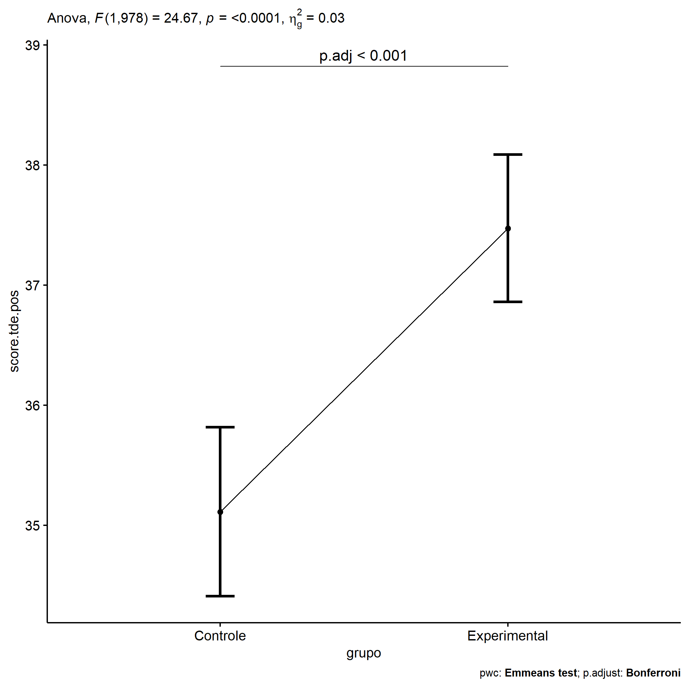<!-- -->

``` r
plots <- oneWayAncovaBoxPlots(
  wdat, "score.tde.pos", "grupo", aov, pwc, covar = "score.tde.pre",
  theme = "classic", color = color[["grupo"]],
  subtitle = which(aov$Effect == "grupo"))
```

``` r
if (length(unique(wdat[["grupo"]])) > 1)
  plots[["grupo"]] + ggplot2::ylab("Writing (TDE)") +
  ggplot2::scale_x_discrete(labels=c('pre', 'pos')) +
  if (ymin < ymax) ggplot2::ylim(ymin, ymax)
```

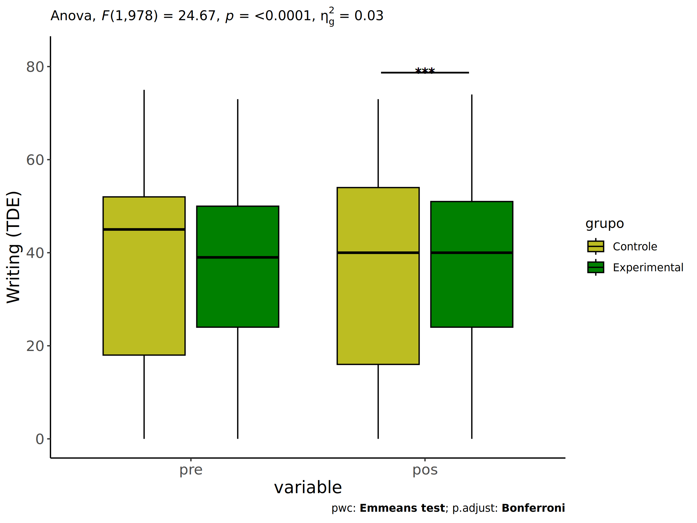<!-- -->

``` r
if (length(unique(wdat.long[["grupo"]])) > 1)
  plots <- oneWayAncovaBoxPlots(
    wdat.long, "score.tde", "grupo", aov, pwc.long,
    pre.post = "time", theme = "classic", color = color$prepost)
```

``` r
if (length(unique(wdat.long[["grupo"]])) > 1)
  plots[["grupo"]] + ggplot2::ylab("Writing (TDE)") +
  if (ymin < ymax) ggplot2::ylim(ymin, ymax) 
```

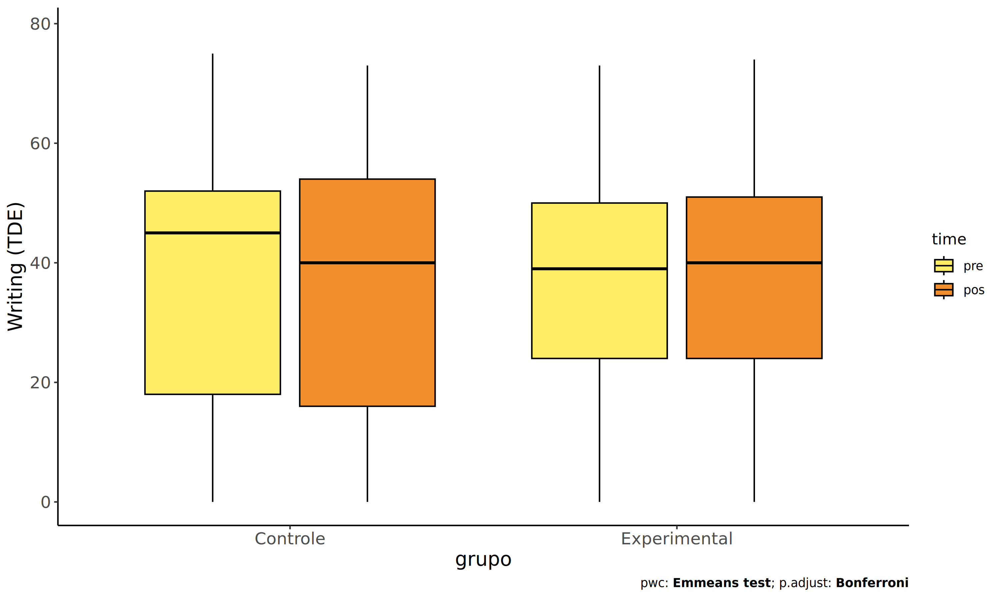<!-- -->

### Checking linearity assumption

``` r
ggscatter(wdat, x = "score.tde.pre", y = "score.tde.pos", size = 0.5,
          color = "grupo", add = "reg.line")+
  stat_regline_equation(
    aes(label =  paste(..eq.label.., ..rr.label.., sep = "~~~~"), color = grupo)
  ) +
  ggplot2::labs(subtitle = rstatix::get_test_label(aov, detailed = T, row = which(aov$Effect == "grupo"))) +
  ggplot2::scale_color_manual(values = color[["grupo"]]) +
  if (ymin < ymax) ggplot2::ylim(ymin, ymax)
```

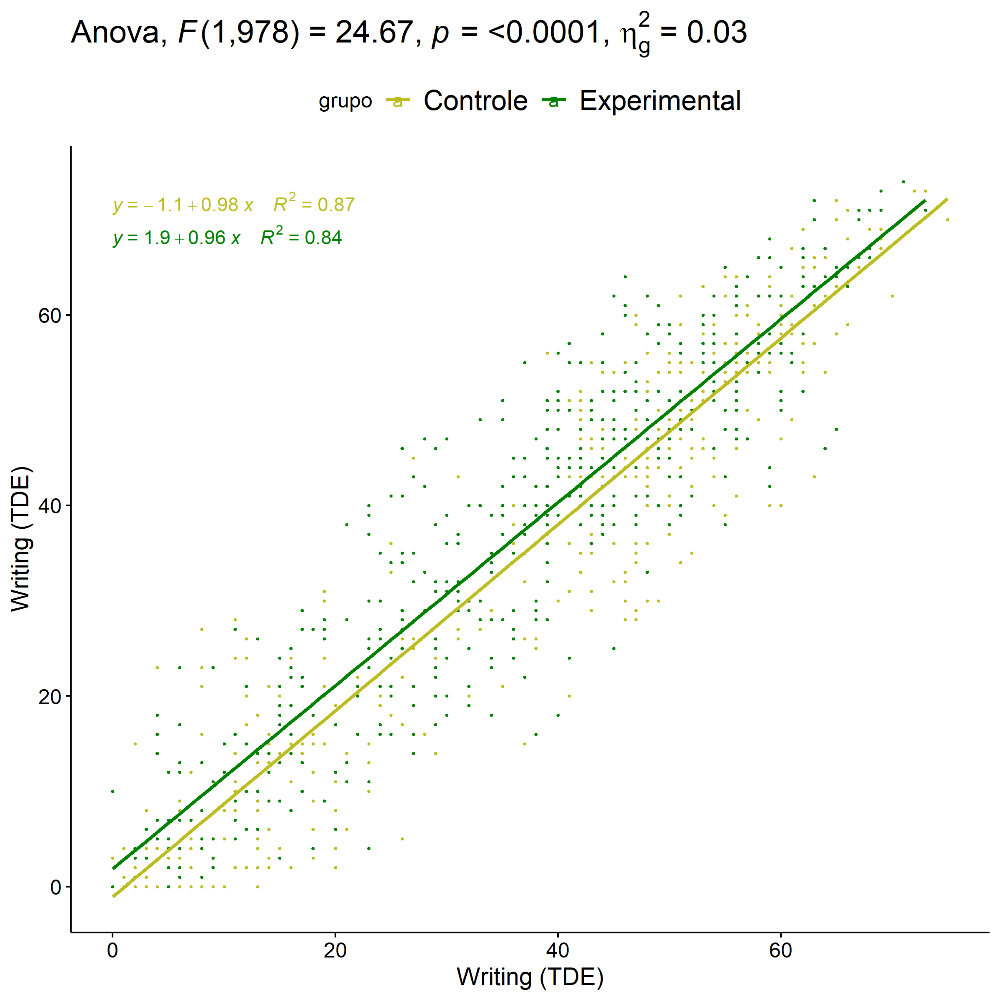<!-- -->

### Checking normality and homogeneity

``` r
res <- augment(lm(score.tde.pos ~ score.tde.pre + grupo, data = wdat))
```

``` r
shapiro_test(res$.resid)
```

    ## # A tibble: 1 × 3
    ##   variable   statistic p.value
    ##   <chr>          <dbl>   <dbl>
    ## 1 res$.resid     0.996  0.0185

``` r
levene_test(res, .resid ~ grupo)
```

    ## # A tibble: 1 × 4
    ##     df1   df2 statistic     p
    ##   <int> <int>     <dbl> <dbl>
    ## 1     1   979   0.00118 0.973

# ANCOVA and Pairwise for two factors **grupo:Sexo**

## Without remove non-normal data

``` r
pdat = remove_group_data(dat[!is.na(dat[["grupo"]]) & !is.na(dat[["Sexo"]]),],
                         "score.tde.pos", c("grupo","Sexo"))
pdat = pdat[pdat[["Sexo"]] %in% do.call(
  intersect, lapply(unique(pdat[["grupo"]]), FUN = function(x) {
    unique(pdat[["Sexo"]][which(pdat[["grupo"]] == x)])
  })),]
pdat[["grupo"]] = factor(pdat[["grupo"]], level[["grupo"]])
pdat[["Sexo"]] = factor(
  pdat[["Sexo"]],
  level[["Sexo"]][level[["Sexo"]] %in% unique(pdat[["Sexo"]])])

pdat.long <- rbind(pdat[,c("id","grupo","Sexo")], pdat[,c("id","grupo","Sexo")])
pdat.long[["time"]] <- c(rep("pre", nrow(pdat)), rep("pos", nrow(pdat)))
pdat.long[["time"]] <- factor(pdat.long[["time"]], c("pre","pos"))
pdat.long[["score.tde"]] <- c(pdat[["score.tde.pre"]], pdat[["score.tde.pos"]])

if (length(unique(pdat[["Sexo"]])) >= 2) {
  aov = anova_test(pdat, score.tde.pos ~ score.tde.pre + grupo*Sexo)
  laov[["grupo:Sexo"]] <- get_anova_table(aov)
}
```

``` r
if (length(unique(pdat[["Sexo"]])) >= 2) {
  pwcs <- list()
  pwcs[["Sexo"]] <- emmeans_test(
    group_by(pdat, grupo), score.tde.pos ~ Sexo,
    covariate = score.tde.pre, p.adjust.method = "bonferroni")
  pwcs[["grupo"]] <- emmeans_test(
    group_by(pdat, Sexo), score.tde.pos ~ grupo,
    covariate = score.tde.pre, p.adjust.method = "bonferroni")
  
  pwc <- plyr::rbind.fill(pwcs[["grupo"]], pwcs[["Sexo"]])
  pwc <- pwc[,c("grupo","Sexo", colnames(pwc)[!colnames(pwc) %in% c("grupo","Sexo")])]
}
```

``` r
if (length(unique(pdat[["Sexo"]])) >= 2) {
  pwc.long <- emmeans_test(dplyr::group_by_at(pdat.long, c("grupo","Sexo")),
                           score.tde ~ time,
                           p.adjust.method = "bonferroni")
  lpwc[["grupo:Sexo"]] <- plyr::rbind.fill(pwc, pwc.long)
}
```

``` r
if (length(unique(pdat[["Sexo"]])) >= 2) {
  ds <- get.descriptives(pdat, "score.tde.pos", c("grupo","Sexo"), covar = "score.tde.pre")
  ds <- merge(ds[ds$variable != "score.tde.pre",],
              ds[ds$variable == "score.tde.pre", !colnames(ds) %in% c("variable")],
              by = c("grupo","Sexo"), all.x = T, suffixes = c("", ".score.tde.pre"))
  ds <- merge(get_emmeans(pwcs[["grupo"]]), ds,
              by = c("grupo","Sexo"), suffixes = c(".emms", ""))
  ds <- ds[,c("grupo","Sexo","n","mean.score.tde.pre","se.score.tde.pre","mean","se",
              "emmean","se.emms","conf.low","conf.high")]
  
  colnames(ds) <- c("grupo","Sexo", "N", paste0(c("M","SE")," (pre)"),
                    paste0(c("M","SE"), " (unadj)"),
                    paste0(c("M", "SE"), " (adj)"), "conf.low", "conf.high")
  
  lemms[["grupo:Sexo"]] <- ds
}
```

## Computing ANCOVA and PairWise After removing non-normal data (OK)

``` r
if (length(unique(pdat[["Sexo"]])) >= 2) {
  wdat = pdat 
  
  res = residuals(lm(score.tde.pos ~ score.tde.pre + grupo*Sexo, data = wdat))
  non.normal = getNonNormal(res, wdat$id, plimit = 0.05)
  
  wdat = wdat[!wdat$id %in% non.normal,]
  
  wdat.long <- rbind(wdat[,c("id","grupo","Sexo")], wdat[,c("id","grupo","Sexo")])
  wdat.long[["time"]] <- c(rep("pre", nrow(wdat)), rep("pos", nrow(wdat)))
  wdat.long[["time"]] <- factor(wdat.long[["time"]], c("pre","pos"))
  wdat.long[["score.tde"]] <- c(wdat[["score.tde.pre"]], wdat[["score.tde.pos"]])
  
  
  ldat[["grupo:Sexo"]] = wdat
  
  (non.normal)
}
```

    ##   [1] "P962"  "P1128" "P984"  "P1129" "P3637" "P1126" "P1971" "P2995" "P2871" "P572"  "P921" 
    ##  [12] "P3019" "P2994" "P2880" "P2848" "P2983" "P908"  "P3021" "P3054" "P1139" "P2858" "P2835"
    ##  [23] "P2904" "P1117" "P3015" "P2870" "P2929" "P2910" "P2886" "P914"  "P2913" "P1111" "P2974"
    ##  [34] "P2964" "P2867" "P2876" "P2937" "P1840" "P2973" "P3007" "P2861" "P2969" "P2953" "P2986"
    ##  [45] "P2883" "P2831" "P2975" "P1018" "P3476" "P2997" "P3005" "P1878" "P2866" "P2950" "P2993"
    ##  [56] "P3545" "P2917" "P2978" "P3029" "P2864" "P2888" "P976"  "P2854" "P2959" "P3548" "P2190"
    ##  [67] "P929"  "P3574" "P2947" "P2845" "P1983" "P3674" "P1149" "P1068" "P3475" "P2004" "P2860"
    ##  [78] "P2982" "P2839" "P3024" "P1885" "P2868" "P609"  "P2990" "P2946" "P1056" "P2933" "P3020"
    ##  [89] "P2879" "P873"  "P1887" "P2865" "P3026" "P3660" "P2956" "P3080" "P3666" "P2846" "P3533"
    ## [100] "P3228" "P2948" "P2850" "P3000" "P809"  "P2905" "P1046" "P1118" "P3221" "P1665" "P2903"
    ## [111] "P1597" "P2836" "P3537" "P584"  "P854"  "P1127" "P1804" "P2869" "P2979" "P3571" "P1652"
    ## [122] "P924"  "P1803" "P3088" "P1592" "P2901" "P3608" "P848"  "P1964" "P2971" "P1900" "P996" 
    ## [133] "P3732" "P492"  "P2922" "P859"  "P2980" "P1916" "P2832" "P1858" "P1151" "P2375" "P3156"
    ## [144] "P3030" "P3061" "P2327" "P2894"

``` r
if (length(unique(pdat[["Sexo"]])) >= 2) {
  aov = anova_test(wdat, score.tde.pos ~ score.tde.pre + grupo*Sexo)
  laov[["grupo:Sexo"]] <- merge(get_anova_table(aov), laov[["grupo:Sexo"]],
                                         by="Effect", suffixes = c("","'"))
  df = get_anova_table(aov)
}
```

| Effect        | DFn | DFd |        F |     p | p\<.05 |   ges |
|:--------------|----:|----:|---------:|------:|:-------|------:|
| score.tde.pre |   1 | 969 | 5974.401 | 0.000 | \*     | 0.860 |
| grupo         |   1 | 969 |   23.992 | 0.000 | \*     | 0.024 |
| Sexo          |   1 | 969 |    0.058 | 0.810 |        | 0.000 |
| grupo:Sexo    |   1 | 969 |    0.548 | 0.459 |        | 0.001 |

``` r
if (length(unique(pdat[["Sexo"]])) >= 2) {
  pwcs <- list()
  pwcs[["Sexo"]] <- emmeans_test(
    group_by(wdat, grupo), score.tde.pos ~ Sexo,
    covariate = score.tde.pre, p.adjust.method = "bonferroni")
  pwcs[["grupo"]] <- emmeans_test(
    group_by(wdat, Sexo), score.tde.pos ~ grupo,
    covariate = score.tde.pre, p.adjust.method = "bonferroni")
  
  pwc <- plyr::rbind.fill(pwcs[["grupo"]], pwcs[["Sexo"]])
  pwc <- pwc[,c("grupo","Sexo", colnames(pwc)[!colnames(pwc) %in% c("grupo","Sexo")])]
}
```

| grupo        | Sexo | term                 | .y.           | group1   | group2       |  df | statistic |     p | p.adj | p.adj.signif |
|:-------------|:-----|:---------------------|:--------------|:---------|:-------------|----:|----------:|------:|------:|:-------------|
|              | F    | score.tde.pre\*grupo | score.tde.pos | Controle | Experimental | 969 |    -3.977 | 0.000 | 0.000 | \*\*\*\*     |
|              | M    | score.tde.pre\*grupo | score.tde.pos | Controle | Experimental | 969 |    -2.953 | 0.003 | 0.003 | \*\*         |
| Controle     |      | score.tde.pre\*Sexo  | score.tde.pos | F        | M            | 969 |    -0.398 | 0.691 | 0.691 | ns           |
| Experimental |      | score.tde.pre\*Sexo  | score.tde.pos | F        | M            | 969 |     0.663 | 0.507 | 0.507 | ns           |

``` r
if (length(unique(pdat[["Sexo"]])) >= 2) {
  pwc.long <- emmeans_test(dplyr::group_by_at(wdat.long, c("grupo","Sexo")),
                           score.tde ~ time,
                           p.adjust.method = "bonferroni")
  lpwc[["grupo:Sexo"]] <- merge(plyr::rbind.fill(pwc, pwc.long),
                                         lpwc[["grupo:Sexo"]],
                                         by=c("grupo","Sexo","term",".y.","group1","group2"),
                                         suffixes = c("","'"))
}
```

| grupo        | Sexo | term | .y.       | group1 | group2 |   df | statistic |     p | p.adj | p.adj.signif |
|:-------------|:-----|:-----|:----------|:-------|:-------|-----:|----------:|------:|------:|:-------------|
| Controle     | F    | time | score.tde | pre    | pos    | 1940 |     1.089 | 0.276 | 0.276 | ns           |
| Controle     | M    | time | score.tde | pre    | pos    | 1940 |     0.837 | 0.403 | 0.403 | ns           |
| Experimental | F    | time | score.tde | pre    | pos    | 1940 |    -0.403 | 0.687 | 0.687 | ns           |
| Experimental | M    | time | score.tde | pre    | pos    | 1940 |    -0.251 | 0.802 | 0.802 | ns           |

``` r
if (length(unique(pdat[["Sexo"]])) >= 2) {
  ds <- get.descriptives(wdat, "score.tde.pos", c("grupo","Sexo"), covar = "score.tde.pre")
  ds <- merge(ds[ds$variable != "score.tde.pre",],
              ds[ds$variable == "score.tde.pre", !colnames(ds) %in% c("variable")],
              by = c("grupo","Sexo"), all.x = T, suffixes = c("", ".score.tde.pre"))
  ds <- merge(get_emmeans(pwcs[["grupo"]]), ds,
              by = c("grupo","Sexo"), suffixes = c(".emms", ""))
  ds <- ds[,c("grupo","Sexo","n","mean.score.tde.pre","se.score.tde.pre",
              "mean","se","emmean","se.emms","conf.low","conf.high")]
  
  colnames(ds) <- c("grupo","Sexo", "N", paste0(c("M","SE")," (pre)"),
                    paste0(c("M","SE"), " (unadj)"),
                    paste0(c("M", "SE"), " (adj)"), "conf.low", "conf.high")
  
  lemms[["grupo:Sexo"]] <- merge(ds, lemms[["grupo:Sexo"]],
                                          by=c("grupo","Sexo"), suffixes = c("","'"))
}
```

| grupo        | Sexo |   N | M (pre) | SE (pre) | M (unadj) | SE (unadj) | M (adj) | SE (adj) | conf.low | conf.high |
|:-------------|:-----|----:|--------:|---------:|----------:|-----------:|--------:|---------:|---------:|----------:|
| Controle     | F    | 208 |  40.635 |    1.278 |    38.615 |      1.351 |  35.106 |    0.503 |   34.119 |    36.093 |
| Controle     | M    | 211 |  33.934 |    1.457 |    32.393 |      1.517 |  35.389 |    0.499 |   34.410 |    36.368 |
| Experimental | F    | 276 |  39.623 |    1.053 |    40.272 |      1.123 |  37.744 |    0.436 |   36.889 |    38.600 |
| Experimental | M    | 279 |  34.082 |    1.030 |    34.484 |      1.053 |  37.335 |    0.434 |   36.483 |    38.187 |

### Plots for ancova

``` r
if (length(unique(pdat[["Sexo"]])) >= 2) {
  ggPlotAoC2(pwcs, "grupo", "Sexo", aov, ylab = "Writing (TDE)",
             subtitle = which(aov$Effect == "grupo:Sexo"), addParam = "errorbar") +
    ggplot2::scale_color_manual(values = color[["Sexo"]]) +
    if (ymin.ci < ymax.ci) ggplot2::ylim(ymin.ci, ymax.ci)
}
```

    ## Scale for colour is already present.
    ## Adding another scale for colour, which will replace the existing scale.

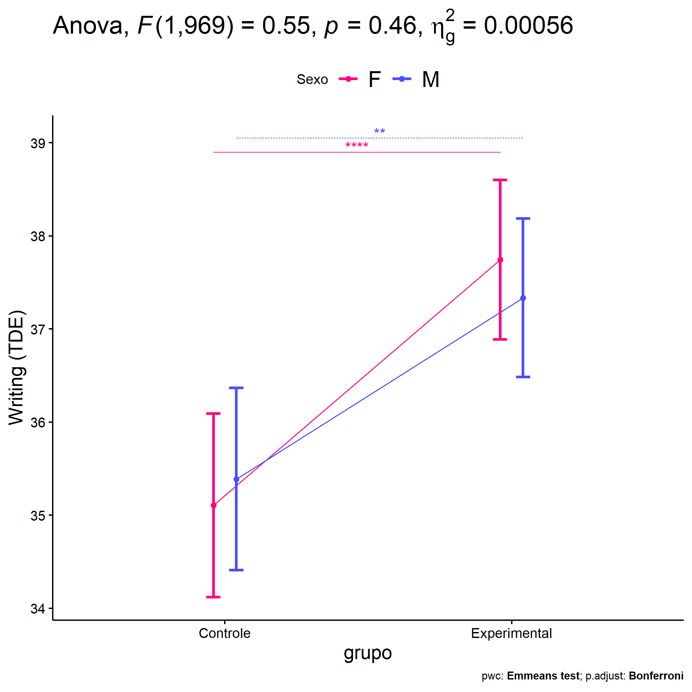<!-- -->

``` r
if (length(unique(pdat[["Sexo"]])) >= 2) {
  ggPlotAoC2(pwcs, "Sexo", "grupo", aov, ylab = "Writing (TDE)",
               subtitle = which(aov$Effect == "grupo:Sexo"), addParam = "errorbar") +
      ggplot2::scale_color_manual(values = color[["grupo"]]) +
      if (ymin.ci < ymax.ci) ggplot2::ylim(ymin.ci, ymax.ci)
}
```

    ## Scale for colour is already present.
    ## Adding another scale for colour, which will replace the existing scale.

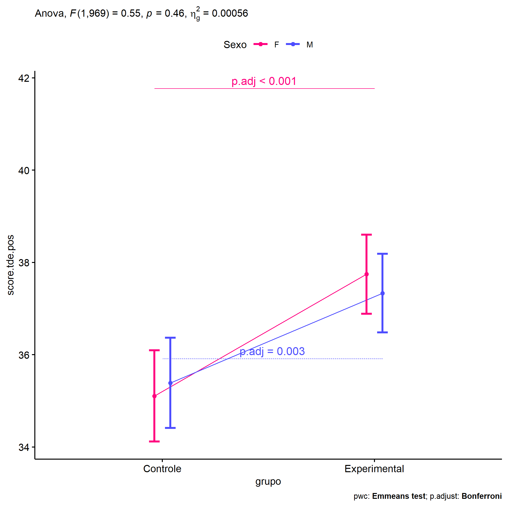<!-- -->

``` r
if (length(unique(pdat[["Sexo"]])) >= 2) {
  plots <- twoWayAncovaBoxPlots(
    wdat, "score.tde.pos", c("grupo","Sexo"), aov, pwcs, covar = "score.tde.pre",
    theme = "classic", color = color[["grupo:Sexo"]],
    subtitle = which(aov$Effect == "grupo:Sexo"))
}
```

``` r
if (length(unique(pdat[["Sexo"]])) >= 2) {
  plots[["grupo:Sexo"]] + ggplot2::ylab("Writing (TDE)") +
  ggplot2::scale_x_discrete(labels=c('pre', 'pos')) +
  if (ymin < ymax) ggplot2::ylim(ymin, ymax)
}
```

    ## Warning: No shared levels found between `names(values)` of the manual scale and the data's colour
    ## values.

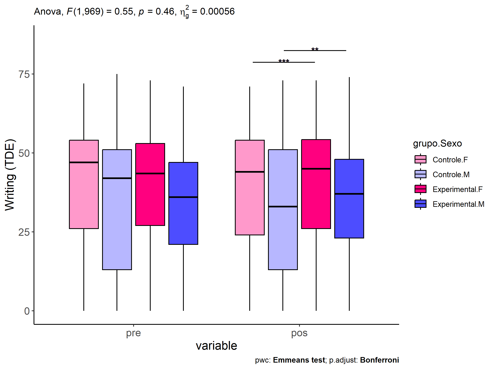<!-- -->

``` r
if (length(unique(pdat[["Sexo"]])) >= 2) {
  plots <- twoWayAncovaBoxPlots(
    wdat.long, "score.tde", c("grupo","Sexo"), aov, pwc.long,
    pre.post = "time",
    theme = "classic", color = color$prepost)
}
```

``` r
if (length(unique(pdat[["Sexo"]])) >= 2) 
  plots[["grupo:Sexo"]] + ggplot2::ylab("Writing (TDE)") +
    if (ymin < ymax) ggplot2::ylim(ymin, ymax)
```

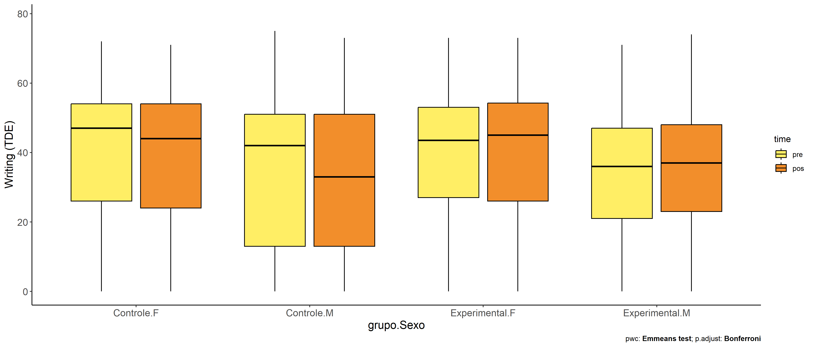<!-- -->

### Checking linearity assumption

``` r
if (length(unique(pdat[["Sexo"]])) >= 2) {
  ggscatter(wdat, x = "score.tde.pre", y = "score.tde.pos", size = 0.5,
            facet.by = c("grupo","Sexo"), add = "reg.line")+
    stat_regline_equation(
      aes(label =  paste(..eq.label.., ..rr.label.., sep = "~~~~"))
    ) +
    if (ymin < ymax) ggplot2::ylim(ymin, ymax)
}
```

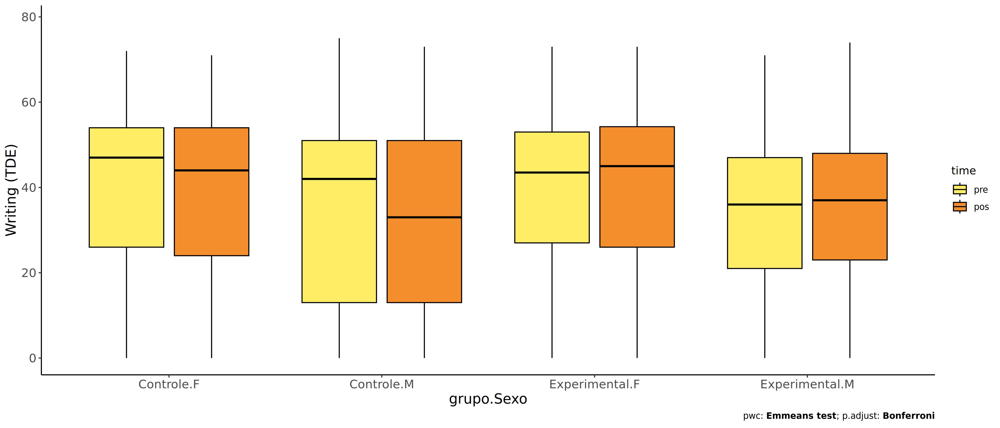<!-- -->

``` r
if (length(unique(pdat[["Sexo"]])) >= 2) {
  ggscatter(wdat, x = "score.tde.pre", y = "score.tde.pos", size = 0.5,
            color = "grupo", facet.by = "Sexo", add = "reg.line")+
    stat_regline_equation(
      aes(label =  paste(..eq.label.., ..rr.label.., sep = "~~~~"), color = grupo)
    ) +
    ggplot2::labs(subtitle = rstatix::get_test_label(aov, detailed = T, row = which(aov$Effect == "grupo:Sexo"))) +
    ggplot2::scale_color_manual(values = color[["grupo"]]) +
    if (ymin < ymax) ggplot2::ylim(ymin, ymax)
}
```

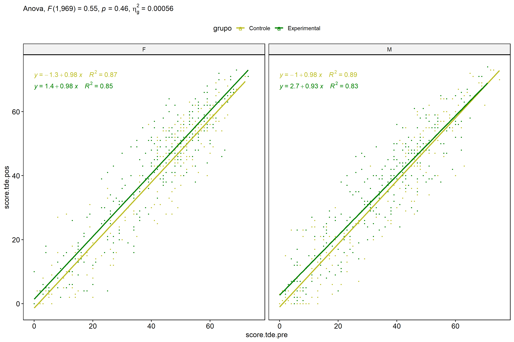<!-- -->

``` r
if (length(unique(pdat[["Sexo"]])) >= 2) {
  ggscatter(wdat, x = "score.tde.pre", y = "score.tde.pos", size = 0.5,
            color = "Sexo", facet.by = "grupo", add = "reg.line")+
    stat_regline_equation(
      aes(label =  paste(..eq.label.., ..rr.label.., sep = "~~~~"), color = Sexo)
    ) +
    ggplot2::labs(subtitle = rstatix::get_test_label(aov, detailed = T, row = which(aov$Effect == "grupo:Sexo"))) +
    ggplot2::scale_color_manual(values = color[["Sexo"]]) +
    if (ymin < ymax) ggplot2::ylim(ymin, ymax)
}
```

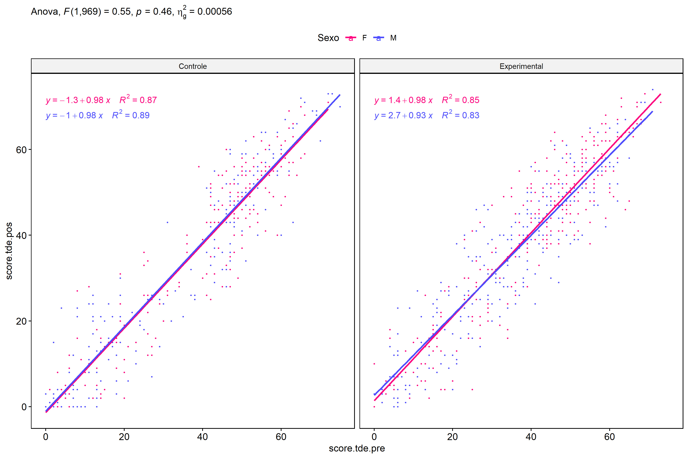<!-- -->

### Checking normality and homogeneity

``` r
if (length(unique(pdat[["Sexo"]])) >= 2) 
  res <- augment(lm(score.tde.pos ~ score.tde.pre + grupo*Sexo, data = wdat))
```

``` r
if (length(unique(pdat[["Sexo"]])) >= 2)
  shapiro_test(res$.resid)
```

    ## # A tibble: 1 × 3
    ##   variable   statistic p.value
    ##   <chr>          <dbl>   <dbl>
    ## 1 res$.resid     0.997  0.0375

``` r
if (length(unique(pdat[["Sexo"]])) >= 2) 
  levene_test(res, .resid ~ grupo*Sexo)
```

    ## # A tibble: 1 × 4
    ##     df1   df2 statistic     p
    ##   <int> <int>     <dbl> <dbl>
    ## 1     3   970    0.0813 0.970

# ANCOVA and Pairwise for two factors **grupo:Zona**

## Without remove non-normal data

``` r
pdat = remove_group_data(dat[!is.na(dat[["grupo"]]) & !is.na(dat[["Zona"]]),],
                         "score.tde.pos", c("grupo","Zona"))
pdat = pdat[pdat[["Zona"]] %in% do.call(
  intersect, lapply(unique(pdat[["grupo"]]), FUN = function(x) {
    unique(pdat[["Zona"]][which(pdat[["grupo"]] == x)])
  })),]
pdat[["grupo"]] = factor(pdat[["grupo"]], level[["grupo"]])
pdat[["Zona"]] = factor(
  pdat[["Zona"]],
  level[["Zona"]][level[["Zona"]] %in% unique(pdat[["Zona"]])])

pdat.long <- rbind(pdat[,c("id","grupo","Zona")], pdat[,c("id","grupo","Zona")])
pdat.long[["time"]] <- c(rep("pre", nrow(pdat)), rep("pos", nrow(pdat)))
pdat.long[["time"]] <- factor(pdat.long[["time"]], c("pre","pos"))
pdat.long[["score.tde"]] <- c(pdat[["score.tde.pre"]], pdat[["score.tde.pos"]])

if (length(unique(pdat[["Zona"]])) >= 2) {
  aov = anova_test(pdat, score.tde.pos ~ score.tde.pre + grupo*Zona)
  laov[["grupo:Zona"]] <- get_anova_table(aov)
}
```

``` r
if (length(unique(pdat[["Zona"]])) >= 2) {
  pwcs <- list()
  pwcs[["Zona"]] <- emmeans_test(
    group_by(pdat, grupo), score.tde.pos ~ Zona,
    covariate = score.tde.pre, p.adjust.method = "bonferroni")
  pwcs[["grupo"]] <- emmeans_test(
    group_by(pdat, Zona), score.tde.pos ~ grupo,
    covariate = score.tde.pre, p.adjust.method = "bonferroni")
  
  pwc <- plyr::rbind.fill(pwcs[["grupo"]], pwcs[["Zona"]])
  pwc <- pwc[,c("grupo","Zona", colnames(pwc)[!colnames(pwc) %in% c("grupo","Zona")])]
}
```

``` r
if (length(unique(pdat[["Zona"]])) >= 2) {
  pwc.long <- emmeans_test(dplyr::group_by_at(pdat.long, c("grupo","Zona")),
                           score.tde ~ time,
                           p.adjust.method = "bonferroni")
  lpwc[["grupo:Zona"]] <- plyr::rbind.fill(pwc, pwc.long)
}
```

``` r
if (length(unique(pdat[["Zona"]])) >= 2) {
  ds <- get.descriptives(pdat, "score.tde.pos", c("grupo","Zona"), covar = "score.tde.pre")
  ds <- merge(ds[ds$variable != "score.tde.pre",],
              ds[ds$variable == "score.tde.pre", !colnames(ds) %in% c("variable")],
              by = c("grupo","Zona"), all.x = T, suffixes = c("", ".score.tde.pre"))
  ds <- merge(get_emmeans(pwcs[["grupo"]]), ds,
              by = c("grupo","Zona"), suffixes = c(".emms", ""))
  ds <- ds[,c("grupo","Zona","n","mean.score.tde.pre","se.score.tde.pre","mean","se",
              "emmean","se.emms","conf.low","conf.high")]
  
  colnames(ds) <- c("grupo","Zona", "N", paste0(c("M","SE")," (pre)"),
                    paste0(c("M","SE"), " (unadj)"),
                    paste0(c("M", "SE"), " (adj)"), "conf.low", "conf.high")
  
  lemms[["grupo:Zona"]] <- ds
}
```

## Computing ANCOVA and PairWise After removing non-normal data (OK)

``` r
if (length(unique(pdat[["Zona"]])) >= 2) {
  wdat = pdat 
  
  res = residuals(lm(score.tde.pos ~ score.tde.pre + grupo*Zona, data = wdat))
  non.normal = getNonNormal(res, wdat$id, plimit = 0.05)
  
  wdat = wdat[!wdat$id %in% non.normal,]
  
  wdat.long <- rbind(wdat[,c("id","grupo","Zona")], wdat[,c("id","grupo","Zona")])
  wdat.long[["time"]] <- c(rep("pre", nrow(wdat)), rep("pos", nrow(wdat)))
  wdat.long[["time"]] <- factor(wdat.long[["time"]], c("pre","pos"))
  wdat.long[["score.tde"]] <- c(wdat[["score.tde.pre"]], wdat[["score.tde.pos"]])
  
  
  ldat[["grupo:Zona"]] = wdat
  
  (non.normal)
}
```

    ##  [1] "P962"  "P984"  "P1971" "P2929" "P1117" "P2848" "P2917" "P2870" "P2871" "P2835" "P921" 
    ## [12] "P2959" "P3029" "P1139" "P572"  "P2983" "P2858" "P3021" "P3080" "P606"  "P2933" "P914" 
    ## [23] "P2831" "P2946" "P3533" "P2953" "P2886" "P3548" "P3476" "P2861" "P2880" "P2982" "P2995"
    ## [34] "P3674" "P2864" "P2883" "P2950" "P2004" "P3475" "P3012" "P3010" "P3015" "P2975" "P2937"
    ## [45] "P3660" "P2910" "P1691" "P2868" "P2860" "P1878" "P609"  "P908"  "P2997" "P2956" "P2973"
    ## [56] "P2879" "P2854" "P3024" "P2967" "P2948" "P2909" "P1056" "P2964"

``` r
if (length(unique(pdat[["Zona"]])) >= 2) {
  aov = anova_test(wdat, score.tde.pos ~ score.tde.pre + grupo*Zona)
  laov[["grupo:Zona"]] <- merge(get_anova_table(aov), laov[["grupo:Zona"]],
                                         by="Effect", suffixes = c("","'"))
  df = get_anova_table(aov)
}
```

| Effect        | DFn | DFd |        F |   p | p\<.05 |   ges |
|:--------------|----:|----:|---------:|----:|:-------|------:|
| score.tde.pre |   1 | 735 | 3559.226 |   0 | \*     | 0.829 |
| grupo         |   1 | 735 |   26.138 |   0 | \*     | 0.034 |
| Zona          |   1 | 735 |   54.679 |   0 | \*     | 0.069 |
| grupo:Zona    |   1 | 735 |   14.155 |   0 | \*     | 0.019 |

``` r
if (length(unique(pdat[["Zona"]])) >= 2) {
  pwcs <- list()
  pwcs[["Zona"]] <- emmeans_test(
    group_by(wdat, grupo), score.tde.pos ~ Zona,
    covariate = score.tde.pre, p.adjust.method = "bonferroni")
  pwcs[["grupo"]] <- emmeans_test(
    group_by(wdat, Zona), score.tde.pos ~ grupo,
    covariate = score.tde.pre, p.adjust.method = "bonferroni")
  
  pwc <- plyr::rbind.fill(pwcs[["grupo"]], pwcs[["Zona"]])
  pwc <- pwc[,c("grupo","Zona", colnames(pwc)[!colnames(pwc) %in% c("grupo","Zona")])]
}
```

| grupo        | Zona   | term                 | .y.           | group1   | group2       |  df | statistic |     p | p.adj | p.adj.signif |
|:-------------|:-------|:---------------------|:--------------|:---------|:-------------|----:|----------:|------:|------:|:-------------|
|              | Rural  | score.tde.pre\*grupo | score.tde.pos | Controle | Experimental | 735 |    -2.009 | 0.045 | 0.045 | \*           |
|              | Urbana | score.tde.pre\*grupo | score.tde.pos | Controle | Experimental | 735 |    -6.023 | 0.000 | 0.000 | \*\*\*\*     |
| Controle     |        | score.tde.pre\*Zona  | score.tde.pos | Rural    | Urbana       | 735 |     7.675 | 0.000 | 0.000 | \*\*\*\*     |
| Experimental |        | score.tde.pre\*Zona  | score.tde.pos | Rural    | Urbana       | 735 |     3.188 | 0.001 | 0.001 | \*\*         |

``` r
if (length(unique(pdat[["Zona"]])) >= 2) {
  pwc.long <- emmeans_test(dplyr::group_by_at(wdat.long, c("grupo","Zona")),
                           score.tde ~ time,
                           p.adjust.method = "bonferroni")
  lpwc[["grupo:Zona"]] <- merge(plyr::rbind.fill(pwc, pwc.long),
                                         lpwc[["grupo:Zona"]],
                                         by=c("grupo","Zona","term",".y.","group1","group2"),
                                         suffixes = c("","'"))
}
```

| grupo        | Zona   | term | .y.       | group1 | group2 |   df | statistic |     p | p.adj | p.adj.signif |
|:-------------|:-------|:-----|:----------|:-------|:-------|-----:|----------:|------:|------:|:-------------|
| Controle     | Rural  | time | score.tde | pre    | pos    | 1472 |     0.543 | 0.588 | 0.588 | ns           |
| Controle     | Urbana | time | score.tde | pre    | pos    | 1472 |     3.191 | 0.001 | 0.001 | \*\*         |
| Experimental | Rural  | time | score.tde | pre    | pos    | 1472 |    -0.333 | 0.739 | 0.739 | ns           |
| Experimental | Urbana | time | score.tde | pre    | pos    | 1472 |     1.001 | 0.317 | 0.317 | ns           |

``` r
if (length(unique(pdat[["Zona"]])) >= 2) {
  ds <- get.descriptives(wdat, "score.tde.pos", c("grupo","Zona"), covar = "score.tde.pre")
  ds <- merge(ds[ds$variable != "score.tde.pre",],
              ds[ds$variable == "score.tde.pre", !colnames(ds) %in% c("variable")],
              by = c("grupo","Zona"), all.x = T, suffixes = c("", ".score.tde.pre"))
  ds <- merge(get_emmeans(pwcs[["grupo"]]), ds,
              by = c("grupo","Zona"), suffixes = c(".emms", ""))
  ds <- ds[,c("grupo","Zona","n","mean.score.tde.pre","se.score.tde.pre",
              "mean","se","emmean","se.emms","conf.low","conf.high")]
  
  colnames(ds) <- c("grupo","Zona", "N", paste0(c("M","SE")," (pre)"),
                    paste0(c("M","SE"), " (unadj)"),
                    paste0(c("M", "SE"), " (adj)"), "conf.low", "conf.high")
  
  lemms[["grupo:Zona"]] <- merge(ds, lemms[["grupo:Zona"]],
                                          by=c("grupo","Zona"), suffixes = c("","'"))
}
```

| grupo        | Zona   |   N | M (pre) | SE (pre) | M (unadj) | SE (unadj) | M (adj) | SE (adj) | conf.low | conf.high |
|:-------------|:-------|----:|--------:|---------:|----------:|-----------:|--------:|---------:|---------:|----------:|
| Controle     | Rural  | 228 |  35.956 |    1.330 |    34.978 |      1.426 |  35.358 |    0.547 |   34.284 |    36.432 |
| Controle     | Urbana | 101 |  39.743 |    1.823 |    31.099 |      2.044 |  27.763 |    0.824 |   26.145 |    29.380 |
| Experimental | Rural  | 260 |  34.215 |    1.113 |    34.777 |      1.186 |  36.865 |    0.514 |   35.857 |    37.874 |
| Experimental | Urbana | 151 |  38.318 |    1.389 |    36.099 |      1.501 |  34.161 |    0.673 |   32.840 |    35.483 |

### Plots for ancova

``` r
if (length(unique(pdat[["Zona"]])) >= 2) {
  ggPlotAoC2(pwcs, "grupo", "Zona", aov, ylab = "Writing (TDE)",
             subtitle = which(aov$Effect == "grupo:Zona"), addParam = "errorbar") +
    ggplot2::scale_color_manual(values = color[["Zona"]]) +
    if (ymin.ci < ymax.ci) ggplot2::ylim(ymin.ci, ymax.ci)
}
```

    ## Scale for colour is already present.
    ## Adding another scale for colour, which will replace the existing scale.

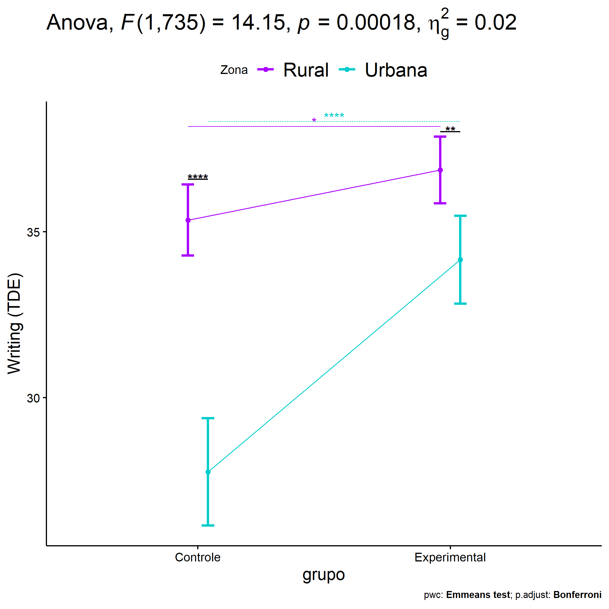<!-- -->

``` r
if (length(unique(pdat[["Zona"]])) >= 2) {
  ggPlotAoC2(pwcs, "Zona", "grupo", aov, ylab = "Writing (TDE)",
               subtitle = which(aov$Effect == "grupo:Zona"), addParam = "errorbar") +
      ggplot2::scale_color_manual(values = color[["grupo"]]) +
      if (ymin.ci < ymax.ci) ggplot2::ylim(ymin.ci, ymax.ci)
}
```

    ## Scale for colour is already present.
    ## Adding another scale for colour, which will replace the existing scale.

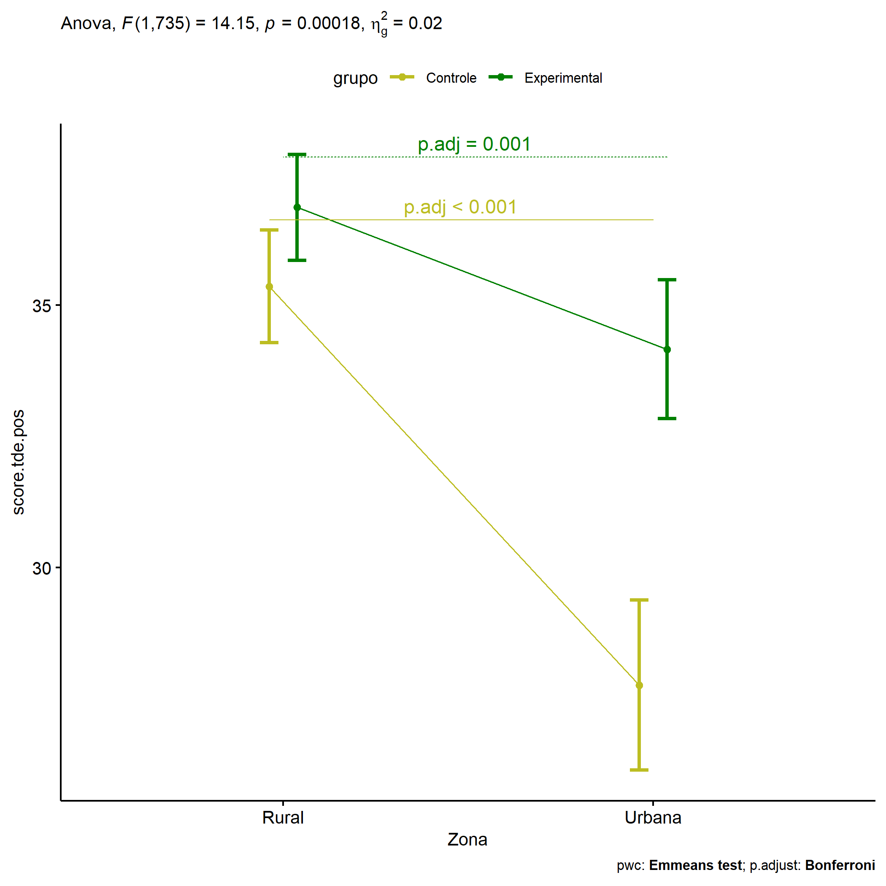<!-- -->

``` r
if (length(unique(pdat[["Zona"]])) >= 2) {
  plots <- twoWayAncovaBoxPlots(
    wdat, "score.tde.pos", c("grupo","Zona"), aov, pwcs, covar = "score.tde.pre",
    theme = "classic", color = color[["grupo:Zona"]],
    subtitle = which(aov$Effect == "grupo:Zona"))
}
```

``` r
if (length(unique(pdat[["Zona"]])) >= 2) {
  plots[["grupo:Zona"]] + ggplot2::ylab("Writing (TDE)") +
  ggplot2::scale_x_discrete(labels=c('pre', 'pos')) +
  if (ymin < ymax) ggplot2::ylim(ymin, ymax)
}
```

    ## Warning: No shared levels found between `names(values)` of the manual scale and the data's colour
    ## values.

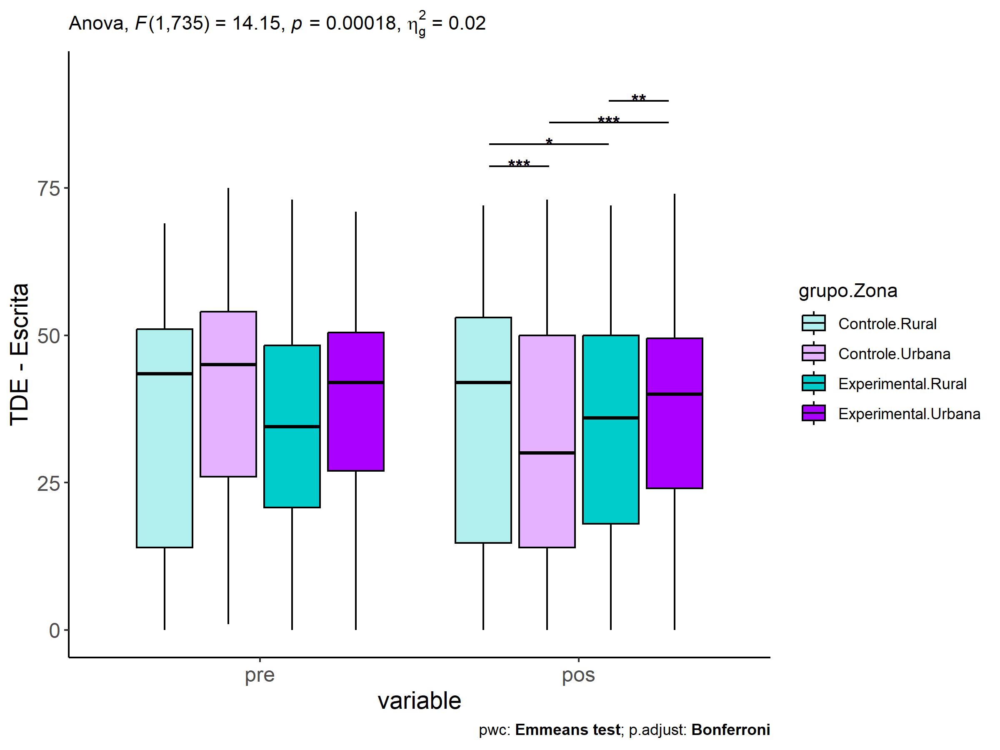<!-- -->

``` r
if (length(unique(pdat[["Zona"]])) >= 2) {
  plots <- twoWayAncovaBoxPlots(
    wdat.long, "score.tde", c("grupo","Zona"), aov, pwc.long,
    pre.post = "time",
    theme = "classic", color = color$prepost)
}
```

``` r
if (length(unique(pdat[["Zona"]])) >= 2) 
  plots[["grupo:Zona"]] + ggplot2::ylab("Writing (TDE)") +
    if (ymin < ymax) ggplot2::ylim(ymin, ymax)
```

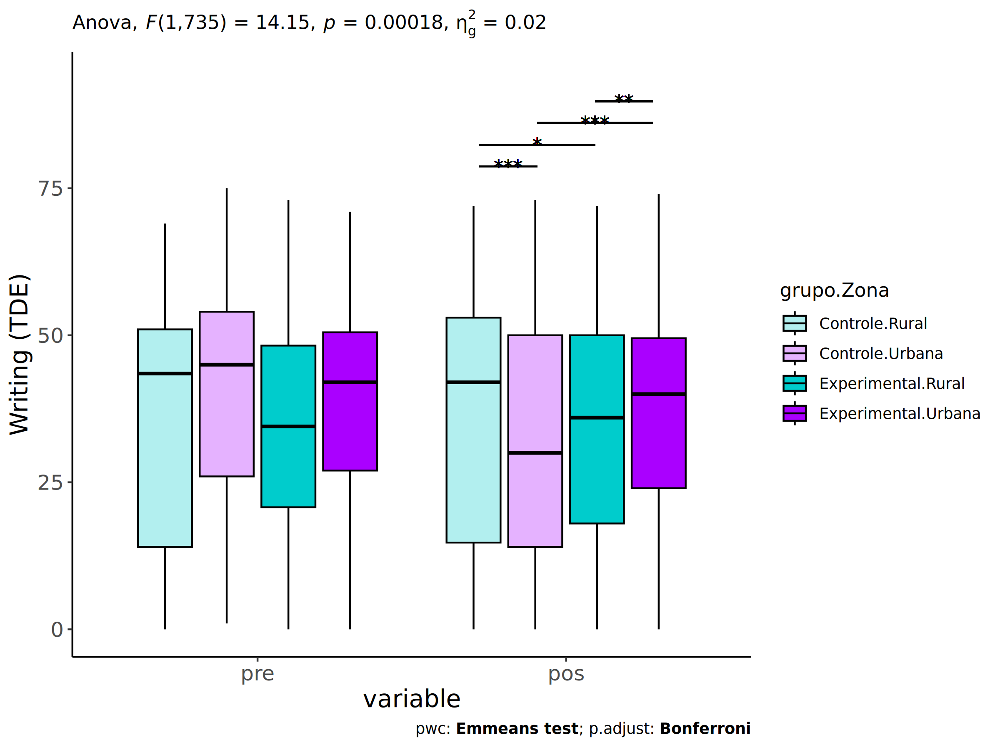<!-- -->

### Checking linearity assumption

``` r
if (length(unique(pdat[["Zona"]])) >= 2) {
  ggscatter(wdat, x = "score.tde.pre", y = "score.tde.pos", size = 0.5,
            facet.by = c("grupo","Zona"), add = "reg.line")+
    stat_regline_equation(
      aes(label =  paste(..eq.label.., ..rr.label.., sep = "~~~~"))
    ) +
    if (ymin < ymax) ggplot2::ylim(ymin, ymax)
}
```

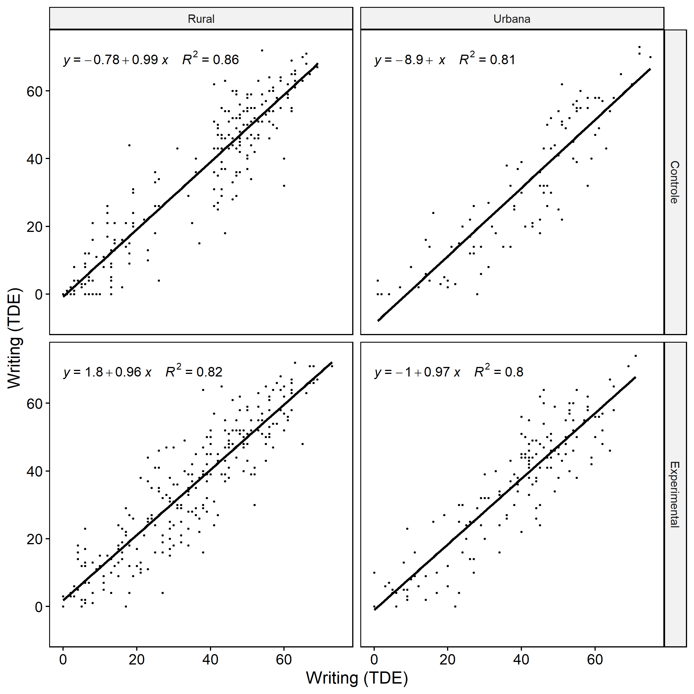<!-- -->

``` r
if (length(unique(pdat[["Zona"]])) >= 2) {
  ggscatter(wdat, x = "score.tde.pre", y = "score.tde.pos", size = 0.5,
            color = "grupo", facet.by = "Zona", add = "reg.line")+
    stat_regline_equation(
      aes(label =  paste(..eq.label.., ..rr.label.., sep = "~~~~"), color = grupo)
    ) +
    ggplot2::labs(subtitle = rstatix::get_test_label(aov, detailed = T, row = which(aov$Effect == "grupo:Zona"))) +
    ggplot2::scale_color_manual(values = color[["grupo"]]) +
    if (ymin < ymax) ggplot2::ylim(ymin, ymax)
}
```

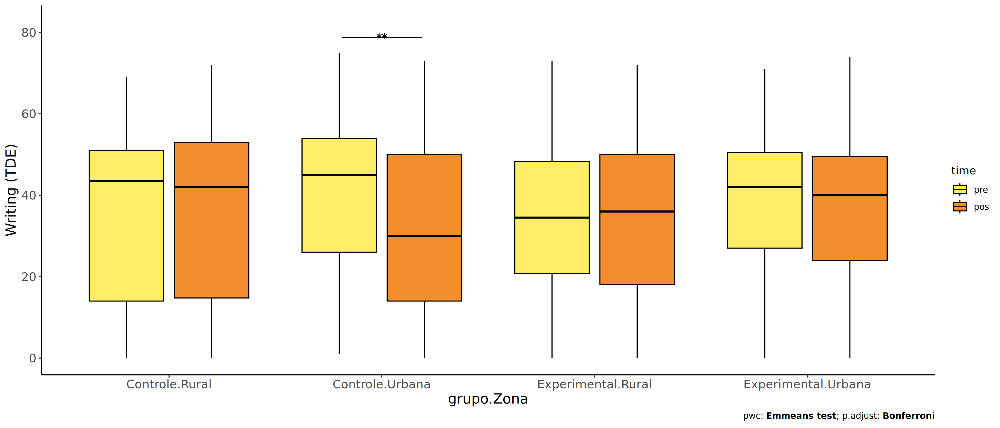<!-- -->

``` r
if (length(unique(pdat[["Zona"]])) >= 2) {
  ggscatter(wdat, x = "score.tde.pre", y = "score.tde.pos", size = 0.5,
            color = "Zona", facet.by = "grupo", add = "reg.line")+
    stat_regline_equation(
      aes(label =  paste(..eq.label.., ..rr.label.., sep = "~~~~"), color = Zona)
    ) +
    ggplot2::labs(subtitle = rstatix::get_test_label(aov, detailed = T, row = which(aov$Effect == "grupo:Zona"))) +
    ggplot2::scale_color_manual(values = color[["Zona"]]) +
    if (ymin < ymax) ggplot2::ylim(ymin, ymax)
}
```

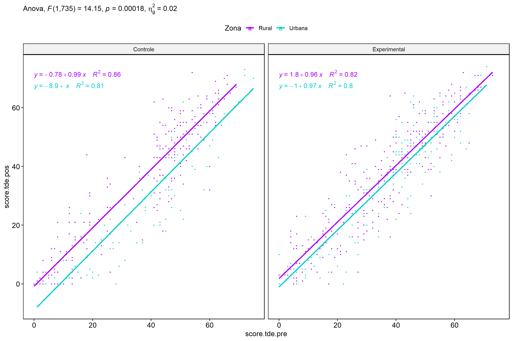<!-- -->

### Checking normality and homogeneity

``` r
if (length(unique(pdat[["Zona"]])) >= 2) 
  res <- augment(lm(score.tde.pos ~ score.tde.pre + grupo*Zona, data = wdat))
```

``` r
if (length(unique(pdat[["Zona"]])) >= 2)
  shapiro_test(res$.resid)
```

    ## # A tibble: 1 × 3
    ##   variable   statistic p.value
    ##   <chr>          <dbl>   <dbl>
    ## 1 res$.resid     0.995  0.0253

``` r
if (length(unique(pdat[["Zona"]])) >= 2) 
  levene_test(res, .resid ~ grupo*Zona)
```

    ## # A tibble: 1 × 4
    ##     df1   df2 statistic      p
    ##   <int> <int>     <dbl>  <dbl>
    ## 1     3   736      2.40 0.0667

# ANCOVA and Pairwise for two factors **grupo:Cor.Raca**

## Without remove non-normal data

``` r
pdat = remove_group_data(dat[!is.na(dat[["grupo"]]) & !is.na(dat[["Cor.Raca"]]),],
                         "score.tde.pos", c("grupo","Cor.Raca"))
```

    ## Warning: There was 1 warning in `mutate()`.
    ## ℹ In argument: `ci = abs(stats::qt(alpha/2, .data$n - 1) * .data$se)`.
    ## Caused by warning:
    ## ! There was 1 warning in `mutate()`.
    ## ℹ In argument: `ci = abs(stats::qt(alpha/2, .data$n - 1) * .data$se)`.
    ## Caused by warning in `stats::qt()`:
    ## ! NaNs produced

``` r
pdat = pdat[pdat[["Cor.Raca"]] %in% do.call(
  intersect, lapply(unique(pdat[["grupo"]]), FUN = function(x) {
    unique(pdat[["Cor.Raca"]][which(pdat[["grupo"]] == x)])
  })),]
pdat[["grupo"]] = factor(pdat[["grupo"]], level[["grupo"]])
pdat[["Cor.Raca"]] = factor(
  pdat[["Cor.Raca"]],
  level[["Cor.Raca"]][level[["Cor.Raca"]] %in% unique(pdat[["Cor.Raca"]])])

pdat.long <- rbind(pdat[,c("id","grupo","Cor.Raca")], pdat[,c("id","grupo","Cor.Raca")])
pdat.long[["time"]] <- c(rep("pre", nrow(pdat)), rep("pos", nrow(pdat)))
pdat.long[["time"]] <- factor(pdat.long[["time"]], c("pre","pos"))
pdat.long[["score.tde"]] <- c(pdat[["score.tde.pre"]], pdat[["score.tde.pos"]])

if (length(unique(pdat[["Cor.Raca"]])) >= 2) {
  aov = anova_test(pdat, score.tde.pos ~ score.tde.pre + grupo*Cor.Raca)
  laov[["grupo:Cor.Raca"]] <- get_anova_table(aov)
}
```

``` r
if (length(unique(pdat[["Cor.Raca"]])) >= 2) {
  pwcs <- list()
  pwcs[["Cor.Raca"]] <- emmeans_test(
    group_by(pdat, grupo), score.tde.pos ~ Cor.Raca,
    covariate = score.tde.pre, p.adjust.method = "bonferroni")
  pwcs[["grupo"]] <- emmeans_test(
    group_by(pdat, Cor.Raca), score.tde.pos ~ grupo,
    covariate = score.tde.pre, p.adjust.method = "bonferroni")
  
  pwc <- plyr::rbind.fill(pwcs[["grupo"]], pwcs[["Cor.Raca"]])
  pwc <- pwc[,c("grupo","Cor.Raca", colnames(pwc)[!colnames(pwc) %in% c("grupo","Cor.Raca")])]
}
```

``` r
if (length(unique(pdat[["Cor.Raca"]])) >= 2) {
  pwc.long <- emmeans_test(dplyr::group_by_at(pdat.long, c("grupo","Cor.Raca")),
                           score.tde ~ time,
                           p.adjust.method = "bonferroni")
  lpwc[["grupo:Cor.Raca"]] <- plyr::rbind.fill(pwc, pwc.long)
}
```

``` r
if (length(unique(pdat[["Cor.Raca"]])) >= 2) {
  ds <- get.descriptives(pdat, "score.tde.pos", c("grupo","Cor.Raca"), covar = "score.tde.pre")
  ds <- merge(ds[ds$variable != "score.tde.pre",],
              ds[ds$variable == "score.tde.pre", !colnames(ds) %in% c("variable")],
              by = c("grupo","Cor.Raca"), all.x = T, suffixes = c("", ".score.tde.pre"))
  ds <- merge(get_emmeans(pwcs[["grupo"]]), ds,
              by = c("grupo","Cor.Raca"), suffixes = c(".emms", ""))
  ds <- ds[,c("grupo","Cor.Raca","n","mean.score.tde.pre","se.score.tde.pre","mean","se",
              "emmean","se.emms","conf.low","conf.high")]
  
  colnames(ds) <- c("grupo","Cor.Raca", "N", paste0(c("M","SE")," (pre)"),
                    paste0(c("M","SE"), " (unadj)"),
                    paste0(c("M", "SE"), " (adj)"), "conf.low", "conf.high")
  
  lemms[["grupo:Cor.Raca"]] <- ds
}
```

## Computing ANCOVA and PairWise After removing non-normal data (OK)

``` r
if (length(unique(pdat[["Cor.Raca"]])) >= 2) {
  wdat = pdat 
  
  res = residuals(lm(score.tde.pos ~ score.tde.pre + grupo*Cor.Raca, data = wdat))
  non.normal = getNonNormal(res, wdat$id, plimit = 0.05)
  
  wdat = wdat[!wdat$id %in% non.normal,]
  
  wdat.long <- rbind(wdat[,c("id","grupo","Cor.Raca")], wdat[,c("id","grupo","Cor.Raca")])
  wdat.long[["time"]] <- c(rep("pre", nrow(wdat)), rep("pos", nrow(wdat)))
  wdat.long[["time"]] <- factor(wdat.long[["time"]], c("pre","pos"))
  wdat.long[["score.tde"]] <- c(wdat[["score.tde.pre"]], wdat[["score.tde.pos"]])
  
  
  ldat[["grupo:Cor.Raca"]] = wdat
  
  (non.normal)
}
```

    ##  [1] "P1128" "P1126" "P908"  "P2995" "P1139" "P3021" "P2871" "P2858" "P3637" "P2870" "P1117"
    ## [12] "P572"  "P2978" "P2975" "P2983" "P2904" "P2835" "P3000" "P2888" "P2993" "P2905" "P1118"
    ## [23] "P1804" "P3007" "P3228" "P3029" "P2865" "P2967" "P1018" "P2994" "P2953" "P2997" "P3476"
    ## [34] "P3054" "P606"

``` r
if (length(unique(pdat[["Cor.Raca"]])) >= 2) {
  aov = anova_test(wdat, score.tde.pos ~ score.tde.pre + grupo*Cor.Raca)
  laov[["grupo:Cor.Raca"]] <- merge(get_anova_table(aov), laov[["grupo:Cor.Raca"]],
                                         by="Effect", suffixes = c("","'"))
  df = get_anova_table(aov)
}
```

| Effect         | DFn | DFd |        F |     p | p\<.05 |   ges |
|:---------------|----:|----:|---------:|------:|:-------|------:|
| score.tde.pre  |   1 | 447 | 1620.497 | 0.000 | \*     | 0.784 |
| grupo          |   1 | 447 |    7.311 | 0.007 | \*     | 0.016 |
| Cor.Raca       |   2 | 447 |    3.357 | 0.036 | \*     | 0.015 |
| grupo:Cor.Raca |   2 | 447 |    1.174 | 0.310 |        | 0.005 |

``` r
if (length(unique(pdat[["Cor.Raca"]])) >= 2) {
  pwcs <- list()
  pwcs[["Cor.Raca"]] <- emmeans_test(
    group_by(wdat, grupo), score.tde.pos ~ Cor.Raca,
    covariate = score.tde.pre, p.adjust.method = "bonferroni")
  pwcs[["grupo"]] <- emmeans_test(
    group_by(wdat, Cor.Raca), score.tde.pos ~ grupo,
    covariate = score.tde.pre, p.adjust.method = "bonferroni")
  
  pwc <- plyr::rbind.fill(pwcs[["grupo"]], pwcs[["Cor.Raca"]])
  pwc <- pwc[,c("grupo","Cor.Raca", colnames(pwc)[!colnames(pwc) %in% c("grupo","Cor.Raca")])]
}
```

| grupo        | Cor.Raca | term                    | .y.           | group1   | group2       |  df | statistic |     p | p.adj | p.adj.signif |
|:-------------|:---------|:------------------------|:--------------|:---------|:-------------|----:|----------:|------:|------:|:-------------|
|              | Parda    | score.tde.pre\*grupo    | score.tde.pos | Controle | Experimental | 447 |    -1.911 | 0.057 | 0.057 | ns           |
|              | Indígena | score.tde.pre\*grupo    | score.tde.pos | Controle | Experimental | 447 |     0.274 | 0.784 | 0.784 | ns           |
|              | Branca   | score.tde.pre\*grupo    | score.tde.pos | Controle | Experimental | 447 |    -2.442 | 0.015 | 0.015 | \*           |
| Controle     |          | score.tde.pre\*Cor.Raca | score.tde.pos | Parda    | Indígena     | 447 |    -2.163 | 0.031 | 0.093 | ns           |
| Controle     |          | score.tde.pre\*Cor.Raca | score.tde.pos | Parda    | Branca       | 447 |     1.334 | 0.183 | 0.549 | ns           |
| Controle     |          | score.tde.pre\*Cor.Raca | score.tde.pos | Indígena | Branca       | 447 |     2.687 | 0.007 | 0.022 | \*           |
| Experimental |          | score.tde.pre\*Cor.Raca | score.tde.pos | Parda    | Indígena     | 447 |    -1.314 | 0.190 | 0.569 | ns           |
| Experimental |          | score.tde.pre\*Cor.Raca | score.tde.pos | Parda    | Branca       | 447 |    -0.308 | 0.759 | 1.000 | ns           |
| Experimental |          | score.tde.pre\*Cor.Raca | score.tde.pos | Indígena | Branca       | 447 |     1.060 | 0.290 | 0.870 | ns           |

``` r
if (length(unique(pdat[["Cor.Raca"]])) >= 2) {
  pwc.long <- emmeans_test(dplyr::group_by_at(wdat.long, c("grupo","Cor.Raca")),
                           score.tde ~ time,
                           p.adjust.method = "bonferroni")
  lpwc[["grupo:Cor.Raca"]] <- merge(plyr::rbind.fill(pwc, pwc.long),
                                         lpwc[["grupo:Cor.Raca"]],
                                         by=c("grupo","Cor.Raca","term",".y.","group1","group2"),
                                         suffixes = c("","'"))
}
```

| grupo        | Cor.Raca | term | .y.       | group1 | group2 |  df | statistic |     p | p.adj | p.adj.signif |
|:-------------|:---------|:-----|:----------|:-------|:-------|----:|----------:|------:|------:|:-------------|
| Controle     | Parda    | time | score.tde | pre    | pos    | 896 |     1.090 | 0.276 | 0.276 | ns           |
| Controle     | Indígena | time | score.tde | pre    | pos    | 896 |    -0.441 | 0.659 | 0.659 | ns           |
| Controle     | Branca   | time | score.tde | pre    | pos    | 896 |     1.172 | 0.241 | 0.241 | ns           |
| Experimental | Parda    | time | score.tde | pre    | pos    | 896 |     0.163 | 0.870 | 0.870 | ns           |
| Experimental | Indígena | time | score.tde | pre    | pos    | 896 |    -0.463 | 0.644 | 0.644 | ns           |
| Experimental | Branca   | time | score.tde | pre    | pos    | 896 |    -0.019 | 0.985 | 0.985 | ns           |

``` r
if (length(unique(pdat[["Cor.Raca"]])) >= 2) {
  ds <- get.descriptives(wdat, "score.tde.pos", c("grupo","Cor.Raca"), covar = "score.tde.pre")
  ds <- merge(ds[ds$variable != "score.tde.pre",],
              ds[ds$variable == "score.tde.pre", !colnames(ds) %in% c("variable")],
              by = c("grupo","Cor.Raca"), all.x = T, suffixes = c("", ".score.tde.pre"))
  ds <- merge(get_emmeans(pwcs[["grupo"]]), ds,
              by = c("grupo","Cor.Raca"), suffixes = c(".emms", ""))
  ds <- ds[,c("grupo","Cor.Raca","n","mean.score.tde.pre","se.score.tde.pre",
              "mean","se","emmean","se.emms","conf.low","conf.high")]
  
  colnames(ds) <- c("grupo","Cor.Raca", "N", paste0(c("M","SE")," (pre)"),
                    paste0(c("M","SE"), " (unadj)"),
                    paste0(c("M", "SE"), " (adj)"), "conf.low", "conf.high")
  
  lemms[["grupo:Cor.Raca"]] <- merge(ds, lemms[["grupo:Cor.Raca"]],
                                          by=c("grupo","Cor.Raca"), suffixes = c("","'"))
}
```

| grupo        | Cor.Raca |   N | M (pre) | SE (pre) | M (unadj) | SE (unadj) | M (adj) | SE (adj) | conf.low | conf.high |
|:-------------|:---------|----:|--------:|---------:|----------:|-----------:|--------:|---------:|---------:|----------:|
| Controle     | Branca   |  45 |  41.378 |    2.626 |    36.600 |      3.007 |  30.951 |    1.399 |   28.202 |    33.701 |
| Controle     | Indígena |  11 |  42.000 |    5.215 |    45.636 |      6.009 |  39.393 |    2.820 |   33.851 |    44.935 |
| Controle     | Parda    | 150 |  36.320 |    1.578 |    33.887 |      1.695 |  33.075 |    0.763 |   31.576 |    34.574 |
| Experimental | Branca   |  58 |  34.517 |    2.651 |    34.586 |      2.746 |  35.499 |    1.226 |   33.088 |    37.909 |
| Experimental | Indígena |  15 |  27.067 |    4.406 |    30.333 |      4.574 |  38.371 |    2.420 |   33.616 |    43.126 |
| Experimental | Parda    | 175 |  33.851 |    1.343 |    33.514 |      1.460 |  35.064 |    0.707 |   33.674 |    36.453 |

### Plots for ancova

``` r
if (length(unique(pdat[["Cor.Raca"]])) >= 2) {
  ggPlotAoC2(pwcs, "grupo", "Cor.Raca", aov, ylab = "Writing (TDE)",
             subtitle = which(aov$Effect == "grupo:Cor.Raca"), addParam = "errorbar") +
    ggplot2::scale_color_manual(values = color[["Cor.Raca"]]) +
    if (ymin.ci < ymax.ci) ggplot2::ylim(ymin.ci, ymax.ci)
}
```

    ## Scale for colour is already present.
    ## Adding another scale for colour, which will replace the existing scale.

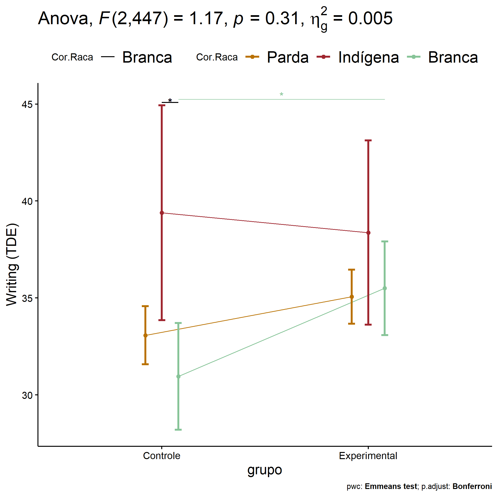<!-- -->

``` r
if (length(unique(pdat[["Cor.Raca"]])) >= 2) {
  ggPlotAoC2(pwcs, "Cor.Raca", "grupo", aov, ylab = "Writing (TDE)",
               subtitle = which(aov$Effect == "grupo:Cor.Raca"), addParam = "errorbar") +
      ggplot2::scale_color_manual(values = color[["grupo"]]) +
      if (ymin.ci < ymax.ci) ggplot2::ylim(ymin.ci, ymax.ci)
}
```

    ## Scale for colour is already present.
    ## Adding another scale for colour, which will replace the existing scale.

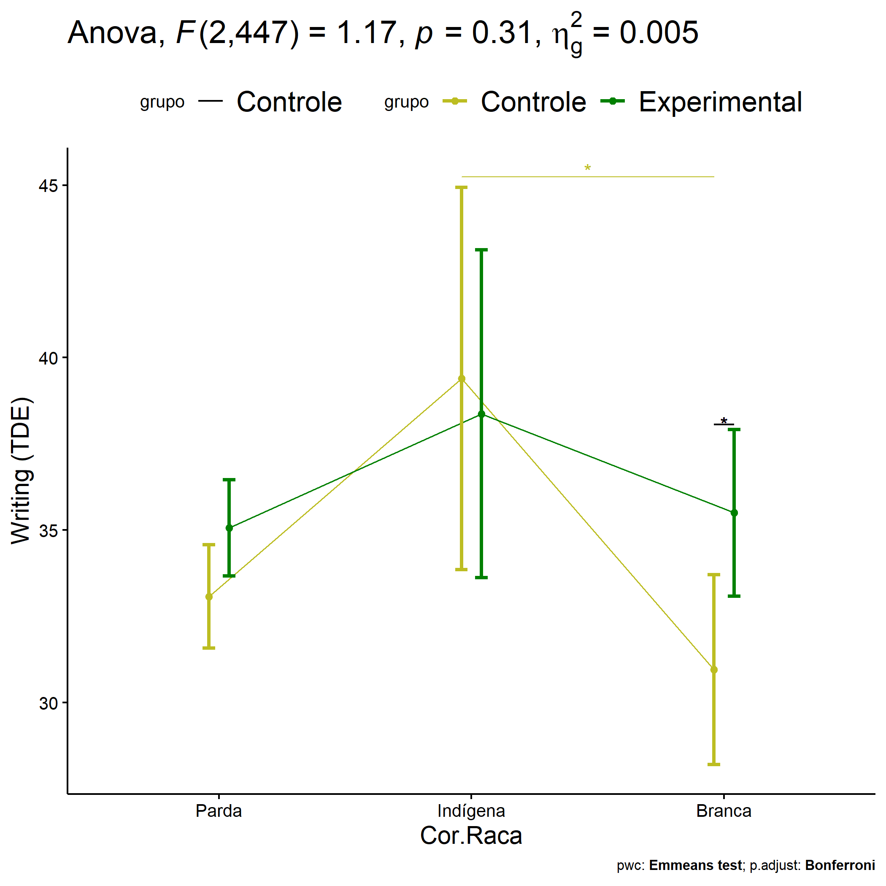<!-- -->

``` r
if (length(unique(pdat[["Cor.Raca"]])) >= 2) {
  plots <- twoWayAncovaBoxPlots(
    wdat, "score.tde.pos", c("grupo","Cor.Raca"), aov, pwcs, covar = "score.tde.pre",
    theme = "classic", color = color[["grupo:Cor.Raca"]],
    subtitle = which(aov$Effect == "grupo:Cor.Raca"))
}
```

``` r
if (length(unique(pdat[["Cor.Raca"]])) >= 2) {
  plots[["grupo:Cor.Raca"]] + ggplot2::ylab("Writing (TDE)") +
  ggplot2::scale_x_discrete(labels=c('pre', 'pos')) +
  if (ymin < ymax) ggplot2::ylim(ymin, ymax)
}
```

    ## Warning: No shared levels found between `names(values)` of the manual scale and the data's colour
    ## values.

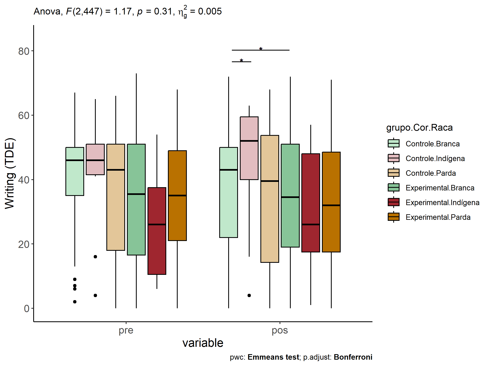<!-- -->

``` r
if (length(unique(pdat[["Cor.Raca"]])) >= 2) {
  plots <- twoWayAncovaBoxPlots(
    wdat.long, "score.tde", c("grupo","Cor.Raca"), aov, pwc.long,
    pre.post = "time",
    theme = "classic", color = color$prepost)
}
```

``` r
if (length(unique(pdat[["Cor.Raca"]])) >= 2) 
  plots[["grupo:Cor.Raca"]] + ggplot2::ylab("Writing (TDE)") +
    if (ymin < ymax) ggplot2::ylim(ymin, ymax)
```

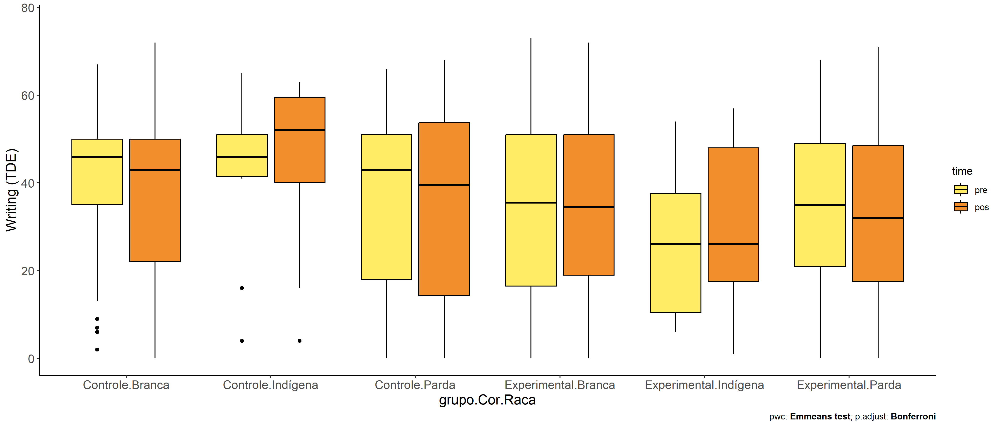<!-- -->

### Checking linearity assumption

``` r
if (length(unique(pdat[["Cor.Raca"]])) >= 2) {
  ggscatter(wdat, x = "score.tde.pre", y = "score.tde.pos", size = 0.5,
            facet.by = c("grupo","Cor.Raca"), add = "reg.line")+
    stat_regline_equation(
      aes(label =  paste(..eq.label.., ..rr.label.., sep = "~~~~"))
    ) +
    if (ymin < ymax) ggplot2::ylim(ymin, ymax)
}
```

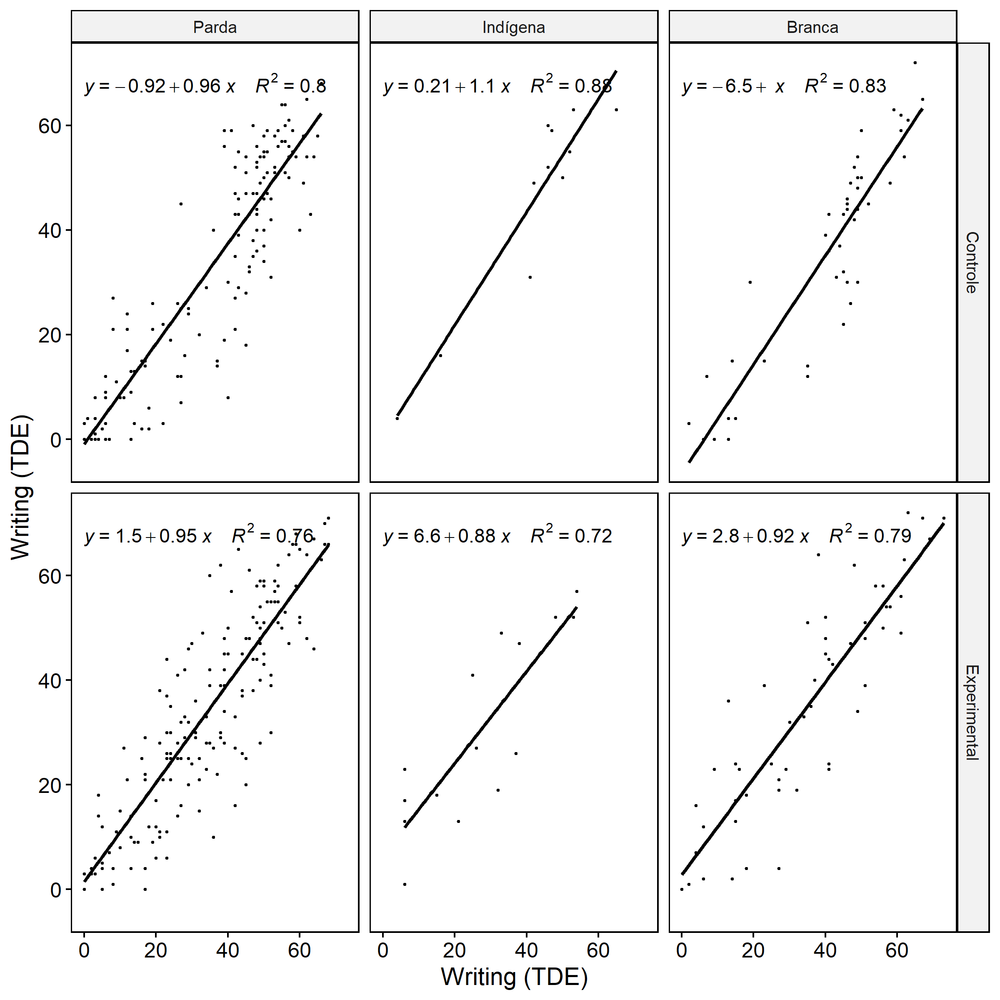<!-- -->

``` r
if (length(unique(pdat[["Cor.Raca"]])) >= 2) {
  ggscatter(wdat, x = "score.tde.pre", y = "score.tde.pos", size = 0.5,
            color = "grupo", facet.by = "Cor.Raca", add = "reg.line")+
    stat_regline_equation(
      aes(label =  paste(..eq.label.., ..rr.label.., sep = "~~~~"), color = grupo)
    ) +
    ggplot2::labs(subtitle = rstatix::get_test_label(aov, detailed = T, row = which(aov$Effect == "grupo:Cor.Raca"))) +
    ggplot2::scale_color_manual(values = color[["grupo"]]) +
    if (ymin < ymax) ggplot2::ylim(ymin, ymax)
}
```

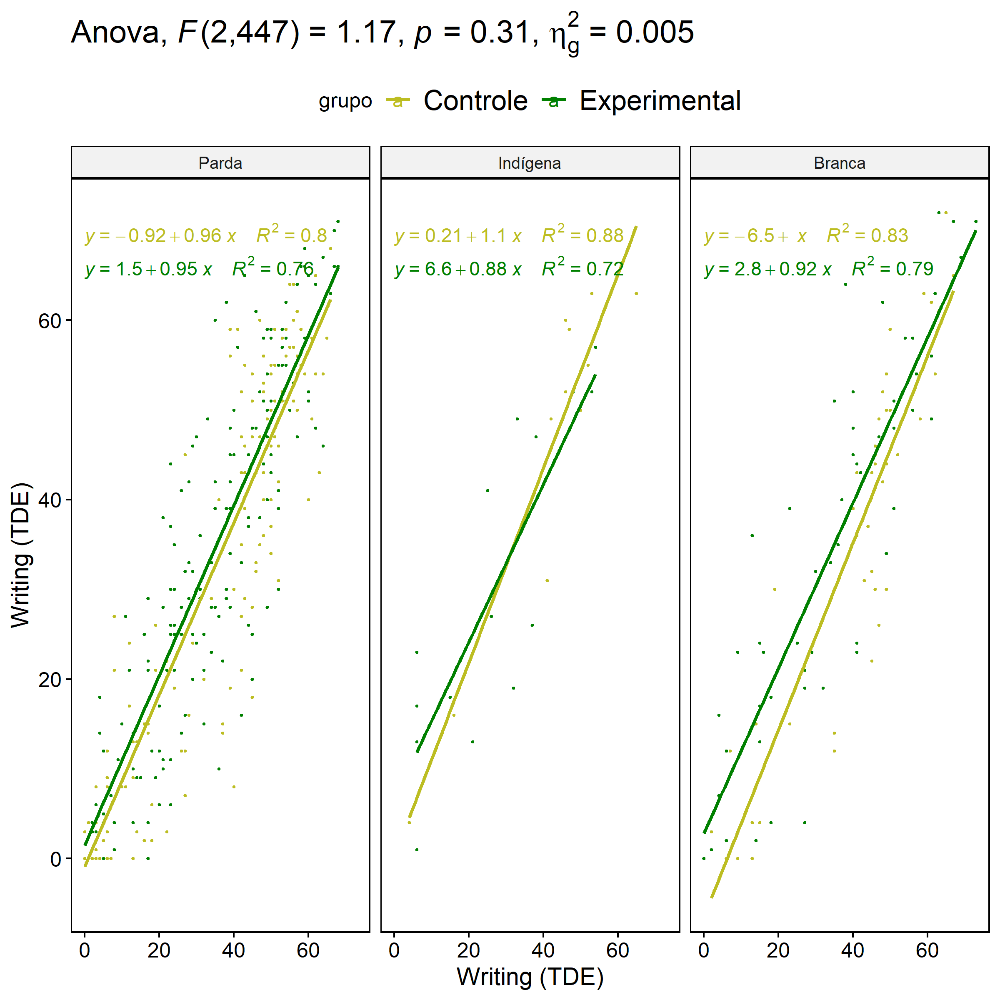<!-- -->

``` r
if (length(unique(pdat[["Cor.Raca"]])) >= 2) {
  ggscatter(wdat, x = "score.tde.pre", y = "score.tde.pos", size = 0.5,
            color = "Cor.Raca", facet.by = "grupo", add = "reg.line")+
    stat_regline_equation(
      aes(label =  paste(..eq.label.., ..rr.label.., sep = "~~~~"), color = Cor.Raca)
    ) +
    ggplot2::labs(subtitle = rstatix::get_test_label(aov, detailed = T, row = which(aov$Effect == "grupo:Cor.Raca"))) +
    ggplot2::scale_color_manual(values = color[["Cor.Raca"]]) +
    if (ymin < ymax) ggplot2::ylim(ymin, ymax)
}
```

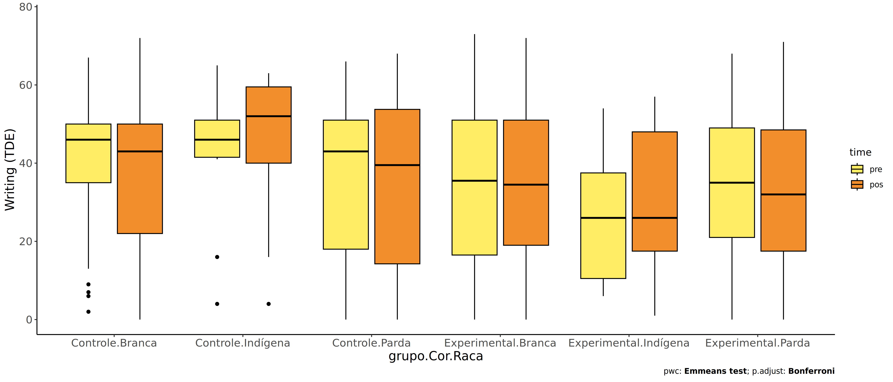<!-- -->

### Checking normality and homogeneity

``` r
if (length(unique(pdat[["Cor.Raca"]])) >= 2) 
  res <- augment(lm(score.tde.pos ~ score.tde.pre + grupo*Cor.Raca, data = wdat))
```

``` r
if (length(unique(pdat[["Cor.Raca"]])) >= 2)
  shapiro_test(res$.resid)
```

    ## # A tibble: 1 × 3
    ##   variable   statistic p.value
    ##   <chr>          <dbl>   <dbl>
    ## 1 res$.resid     0.992  0.0140

``` r
if (length(unique(pdat[["Cor.Raca"]])) >= 2) 
  levene_test(res, .resid ~ grupo*Cor.Raca)
```

    ## # A tibble: 1 × 4
    ##     df1   df2 statistic     p
    ##   <int> <int>     <dbl> <dbl>
    ## 1     5   448     0.202 0.962

# ANCOVA and Pairwise for two factors **grupo:Serie**

## Without remove non-normal data

``` r
pdat = remove_group_data(dat[!is.na(dat[["grupo"]]) & !is.na(dat[["Serie"]]),],
                         "score.tde.pos", c("grupo","Serie"))
pdat = pdat[pdat[["Serie"]] %in% do.call(
  intersect, lapply(unique(pdat[["grupo"]]), FUN = function(x) {
    unique(pdat[["Serie"]][which(pdat[["grupo"]] == x)])
  })),]
pdat[["grupo"]] = factor(pdat[["grupo"]], level[["grupo"]])
pdat[["Serie"]] = factor(
  pdat[["Serie"]],
  level[["Serie"]][level[["Serie"]] %in% unique(pdat[["Serie"]])])

pdat.long <- rbind(pdat[,c("id","grupo","Serie")], pdat[,c("id","grupo","Serie")])
pdat.long[["time"]] <- c(rep("pre", nrow(pdat)), rep("pos", nrow(pdat)))
pdat.long[["time"]] <- factor(pdat.long[["time"]], c("pre","pos"))
pdat.long[["score.tde"]] <- c(pdat[["score.tde.pre"]], pdat[["score.tde.pos"]])

if (length(unique(pdat[["Serie"]])) >= 2) {
  aov = anova_test(pdat, score.tde.pos ~ score.tde.pre + grupo*Serie)
  laov[["grupo:Serie"]] <- get_anova_table(aov)
}
```

``` r
if (length(unique(pdat[["Serie"]])) >= 2) {
  pwcs <- list()
  pwcs[["Serie"]] <- emmeans_test(
    group_by(pdat, grupo), score.tde.pos ~ Serie,
    covariate = score.tde.pre, p.adjust.method = "bonferroni")
  pwcs[["grupo"]] <- emmeans_test(
    group_by(pdat, Serie), score.tde.pos ~ grupo,
    covariate = score.tde.pre, p.adjust.method = "bonferroni")
  
  pwc <- plyr::rbind.fill(pwcs[["grupo"]], pwcs[["Serie"]])
  pwc <- pwc[,c("grupo","Serie", colnames(pwc)[!colnames(pwc) %in% c("grupo","Serie")])]
}
```

``` r
if (length(unique(pdat[["Serie"]])) >= 2) {
  pwc.long <- emmeans_test(dplyr::group_by_at(pdat.long, c("grupo","Serie")),
                           score.tde ~ time,
                           p.adjust.method = "bonferroni")
  lpwc[["grupo:Serie"]] <- plyr::rbind.fill(pwc, pwc.long)
}
```

``` r
if (length(unique(pdat[["Serie"]])) >= 2) {
  ds <- get.descriptives(pdat, "score.tde.pos", c("grupo","Serie"), covar = "score.tde.pre")
  ds <- merge(ds[ds$variable != "score.tde.pre",],
              ds[ds$variable == "score.tde.pre", !colnames(ds) %in% c("variable")],
              by = c("grupo","Serie"), all.x = T, suffixes = c("", ".score.tde.pre"))
  ds <- merge(get_emmeans(pwcs[["grupo"]]), ds,
              by = c("grupo","Serie"), suffixes = c(".emms", ""))
  ds <- ds[,c("grupo","Serie","n","mean.score.tde.pre","se.score.tde.pre","mean","se",
              "emmean","se.emms","conf.low","conf.high")]
  
  colnames(ds) <- c("grupo","Serie", "N", paste0(c("M","SE")," (pre)"),
                    paste0(c("M","SE"), " (unadj)"),
                    paste0(c("M", "SE"), " (adj)"), "conf.low", "conf.high")
  
  lemms[["grupo:Serie"]] <- ds
}
```

## Computing ANCOVA and PairWise After removing non-normal data (OK)

``` r
if (length(unique(pdat[["Serie"]])) >= 2) {
  wdat = pdat 
  
  res = residuals(lm(score.tde.pos ~ score.tde.pre + grupo*Serie, data = wdat))
  non.normal = getNonNormal(res, wdat$id, plimit = 0.05)
  
  wdat = wdat[!wdat$id %in% non.normal,]
  
  wdat.long <- rbind(wdat[,c("id","grupo","Serie")], wdat[,c("id","grupo","Serie")])
  wdat.long[["time"]] <- c(rep("pre", nrow(wdat)), rep("pos", nrow(wdat)))
  wdat.long[["time"]] <- factor(wdat.long[["time"]], c("pre","pos"))
  wdat.long[["score.tde"]] <- c(wdat[["score.tde.pre"]], wdat[["score.tde.pos"]])
  
  
  ldat[["grupo:Serie"]] = wdat
  
  (non.normal)
}
```

    ##  [1] "P962"  "P1128" "P984"  "P1129" "P1971" "P1126" "P1139" "P2835" "P2983" "P572"  "P1117"
    ## [12] "P3571" "P3537" "P3574" "P1983" "P2848" "P809"  "P3637" "P2910" "P976"  "P2870" "P2969"
    ## [23] "P2866" "P3732" "P2913" "P921"  "P1018" "P2964" "P1111" "P2967" "P3228" "P929"  "P2959"
    ## [34] "P2886" "P914"  "P2995" "P2982" "P2375" "P3241" "P2975" "P908"  "P2905" "P2986" "P1068"
    ## [45] "P2946" "P2904" "P1878" "P2883" "P2973" "P3533" "P3019" "P2865" "P2864" "P1056" "P1152"
    ## [56] "P2937" "P2876" "P3007" "P2978" "P2950" "P2871" "P2953" "P2917" "P2948" "P609"

``` r
if (length(unique(pdat[["Serie"]])) >= 2) {
  aov = anova_test(wdat, score.tde.pos ~ score.tde.pre + grupo*Serie)
  laov[["grupo:Serie"]] <- merge(get_anova_table(aov), laov[["grupo:Serie"]],
                                         by="Effect", suffixes = c("","'"))
  df = get_anova_table(aov)
}
```

| Effect        | DFn |  DFd |        F |     p | p\<.05 |   ges |
|:--------------|----:|-----:|---------:|------:|:-------|------:|
| score.tde.pre |   1 | 1047 | 3720.788 | 0.000 | \*     | 0.780 |
| grupo         |   1 | 1047 |   23.855 | 0.000 | \*     | 0.022 |
| Serie         |   3 | 1047 |   34.727 | 0.000 | \*     | 0.090 |
| grupo:Serie   |   3 | 1047 |    3.528 | 0.015 | \*     | 0.010 |

``` r
if (length(unique(pdat[["Serie"]])) >= 2) {
  pwcs <- list()
  pwcs[["Serie"]] <- emmeans_test(
    group_by(wdat, grupo), score.tde.pos ~ Serie,
    covariate = score.tde.pre, p.adjust.method = "bonferroni")
  pwcs[["grupo"]] <- emmeans_test(
    group_by(wdat, Serie), score.tde.pos ~ grupo,
    covariate = score.tde.pre, p.adjust.method = "bonferroni")
  
  pwc <- plyr::rbind.fill(pwcs[["grupo"]], pwcs[["Serie"]])
  pwc <- pwc[,c("grupo","Serie", colnames(pwc)[!colnames(pwc) %in% c("grupo","Serie")])]
}
```

| grupo        | Serie | term                 | .y.           | group1   | group2       |   df | statistic |     p | p.adj | p.adj.signif |
|:-------------|:------|:---------------------|:--------------|:---------|:-------------|-----:|----------:|------:|------:|:-------------|
|              | 6 ano | score.tde.pre\*grupo | score.tde.pos | Controle | Experimental | 1047 |    -0.249 | 0.803 | 0.803 | ns           |
|              | 7 ano | score.tde.pre\*grupo | score.tde.pos | Controle | Experimental | 1047 |    -4.500 | 0.000 | 0.000 | \*\*\*\*     |
|              | 8 ano | score.tde.pre\*grupo | score.tde.pos | Controle | Experimental | 1047 |    -3.348 | 0.001 | 0.001 | \*\*\*       |
|              | 9 ano | score.tde.pre\*grupo | score.tde.pos | Controle | Experimental | 1047 |    -1.694 | 0.091 | 0.091 | ns           |
| Controle     |       | score.tde.pre\*Serie | score.tde.pos | 6 ano    | 7 ano        | 1047 |     1.644 | 0.100 | 0.602 | ns           |
| Controle     |       | score.tde.pre\*Serie | score.tde.pos | 6 ano    | 8 ano        | 1047 |    -2.433 | 0.015 | 0.091 | ns           |
| Controle     |       | score.tde.pre\*Serie | score.tde.pos | 6 ano    | 9 ano        | 1047 |    -5.074 | 0.000 | 0.000 | \*\*\*\*     |
| Controle     |       | score.tde.pre\*Serie | score.tde.pos | 7 ano    | 8 ano        | 1047 |    -3.939 | 0.000 | 0.001 | \*\*\*       |
| Controle     |       | score.tde.pre\*Serie | score.tde.pos | 7 ano    | 9 ano        | 1047 |    -6.756 | 0.000 | 0.000 | \*\*\*\*     |
| Controle     |       | score.tde.pre\*Serie | score.tde.pos | 8 ano    | 9 ano        | 1047 |    -2.300 | 0.022 | 0.130 | ns           |
| Experimental |       | score.tde.pre\*Serie | score.tde.pos | 6 ano    | 7 ano        | 1047 |    -2.574 | 0.010 | 0.061 | ns           |
| Experimental |       | score.tde.pre\*Serie | score.tde.pos | 6 ano    | 8 ano        | 1047 |    -6.514 | 0.000 | 0.000 | \*\*\*\*     |
| Experimental |       | score.tde.pre\*Serie | score.tde.pos | 6 ano    | 9 ano        | 1047 |    -7.114 | 0.000 | 0.000 | \*\*\*\*     |
| Experimental |       | score.tde.pre\*Serie | score.tde.pos | 7 ano    | 8 ano        | 1047 |    -4.242 | 0.000 | 0.000 | \*\*\*       |
| Experimental |       | score.tde.pre\*Serie | score.tde.pos | 7 ano    | 9 ano        | 1047 |    -4.930 | 0.000 | 0.000 | \*\*\*\*     |
| Experimental |       | score.tde.pre\*Serie | score.tde.pos | 8 ano    | 9 ano        | 1047 |    -0.688 | 0.492 | 1.000 | ns           |

``` r
if (length(unique(pdat[["Serie"]])) >= 2) {
  pwc.long <- emmeans_test(dplyr::group_by_at(wdat.long, c("grupo","Serie")),
                           score.tde ~ time,
                           p.adjust.method = "bonferroni")
  lpwc[["grupo:Serie"]] <- merge(plyr::rbind.fill(pwc, pwc.long),
                                         lpwc[["grupo:Serie"]],
                                         by=c("grupo","Serie","term",".y.","group1","group2"),
                                         suffixes = c("","'"))
}
```

| grupo        | Serie | term | .y.       | group1 | group2 |   df | statistic |     p | p.adj | p.adj.signif |
|:-------------|:------|:-----|:----------|:-------|:-------|-----:|----------:|------:|------:|:-------------|
| Controle     | 6 ano | time | score.tde | pre    | pos    | 2096 |     1.733 | 0.083 | 0.083 | ns           |
| Controle     | 7 ano | time | score.tde | pre    | pos    | 2096 |     2.740 | 0.006 | 0.006 | \*\*         |
| Controle     | 8 ano | time | score.tde | pre    | pos    | 2096 |     0.783 | 0.433 | 0.433 | ns           |
| Controle     | 9 ano | time | score.tde | pre    | pos    | 2096 |    -0.131 | 0.896 | 0.896 | ns           |
| Experimental | 6 ano | time | score.tde | pre    | pos    | 2096 |     1.773 | 0.076 | 0.076 | ns           |
| Experimental | 7 ano | time | score.tde | pre    | pos    | 2096 |     0.944 | 0.345 | 0.345 | ns           |
| Experimental | 8 ano | time | score.tde | pre    | pos    | 2096 |    -0.962 | 0.336 | 0.336 | ns           |
| Experimental | 9 ano | time | score.tde | pre    | pos    | 2096 |    -1.132 | 0.258 | 0.258 | ns           |

``` r
if (length(unique(pdat[["Serie"]])) >= 2) {
  ds <- get.descriptives(wdat, "score.tde.pos", c("grupo","Serie"), covar = "score.tde.pre")
  ds <- merge(ds[ds$variable != "score.tde.pre",],
              ds[ds$variable == "score.tde.pre", !colnames(ds) %in% c("variable")],
              by = c("grupo","Serie"), all.x = T, suffixes = c("", ".score.tde.pre"))
  ds <- merge(get_emmeans(pwcs[["grupo"]]), ds,
              by = c("grupo","Serie"), suffixes = c(".emms", ""))
  ds <- ds[,c("grupo","Serie","n","mean.score.tde.pre","se.score.tde.pre",
              "mean","se","emmean","se.emms","conf.low","conf.high")]
  
  colnames(ds) <- c("grupo","Serie", "N", paste0(c("M","SE")," (pre)"),
                    paste0(c("M","SE"), " (unadj)"),
                    paste0(c("M", "SE"), " (adj)"), "conf.low", "conf.high")
  
  lemms[["grupo:Serie"]] <- merge(ds, lemms[["grupo:Serie"]],
                                          by=c("grupo","Serie"), suffixes = c("","'"))
}
```

| grupo        | Serie |   N | M (pre) | SE (pre) | M (unadj) | SE (unadj) | M (adj) | SE (adj) | conf.low | conf.high |
|:-------------|:------|----:|--------:|---------:|----------:|-----------:|--------:|---------:|---------:|----------:|
| Controle     | 6 ano | 126 |  28.444 |    1.766 |    24.619 |      1.828 |  32.399 |    0.756 |   30.915 |    33.882 |
| Controle     | 7 ano | 127 |  34.024 |    1.632 |    28.000 |      1.773 |  30.663 |    0.744 |   29.204 |    32.123 |
| Controle     | 8 ano |  86 |  42.430 |    1.785 |    40.337 |      1.933 |  35.292 |    0.906 |   33.514 |    37.069 |
| Controle     | 9 ano | 116 |  46.612 |    1.611 |    46.914 |      1.537 |  38.034 |    0.790 |   36.483 |    39.584 |
| Experimental | 6 ano | 150 |  28.607 |    1.324 |    25.020 |      1.367 |  32.651 |    0.694 |   31.288 |    34.013 |
| Experimental | 7 ano | 170 |  36.294 |    1.168 |    34.500 |      1.284 |  35.081 |    0.642 |   33.822 |    36.340 |
| Experimental | 8 ano | 141 |  39.248 |    1.525 |    41.255 |      1.600 |  39.128 |    0.705 |   37.744 |    40.512 |
| Experimental | 9 ano | 140 |  43.143 |    1.354 |    45.514 |      1.288 |  39.815 |    0.713 |   38.416 |    41.215 |

### Plots for ancova

``` r
if (length(unique(pdat[["Serie"]])) >= 2) {
  ggPlotAoC2(pwcs, "grupo", "Serie", aov, ylab = "Writing (TDE)",
             subtitle = which(aov$Effect == "grupo:Serie"), addParam = "errorbar") +
    ggplot2::scale_color_manual(values = color[["Serie"]]) +
    if (ymin.ci < ymax.ci) ggplot2::ylim(ymin.ci, ymax.ci)
}
```

    ## Scale for colour is already present.
    ## Adding another scale for colour, which will replace the existing scale.

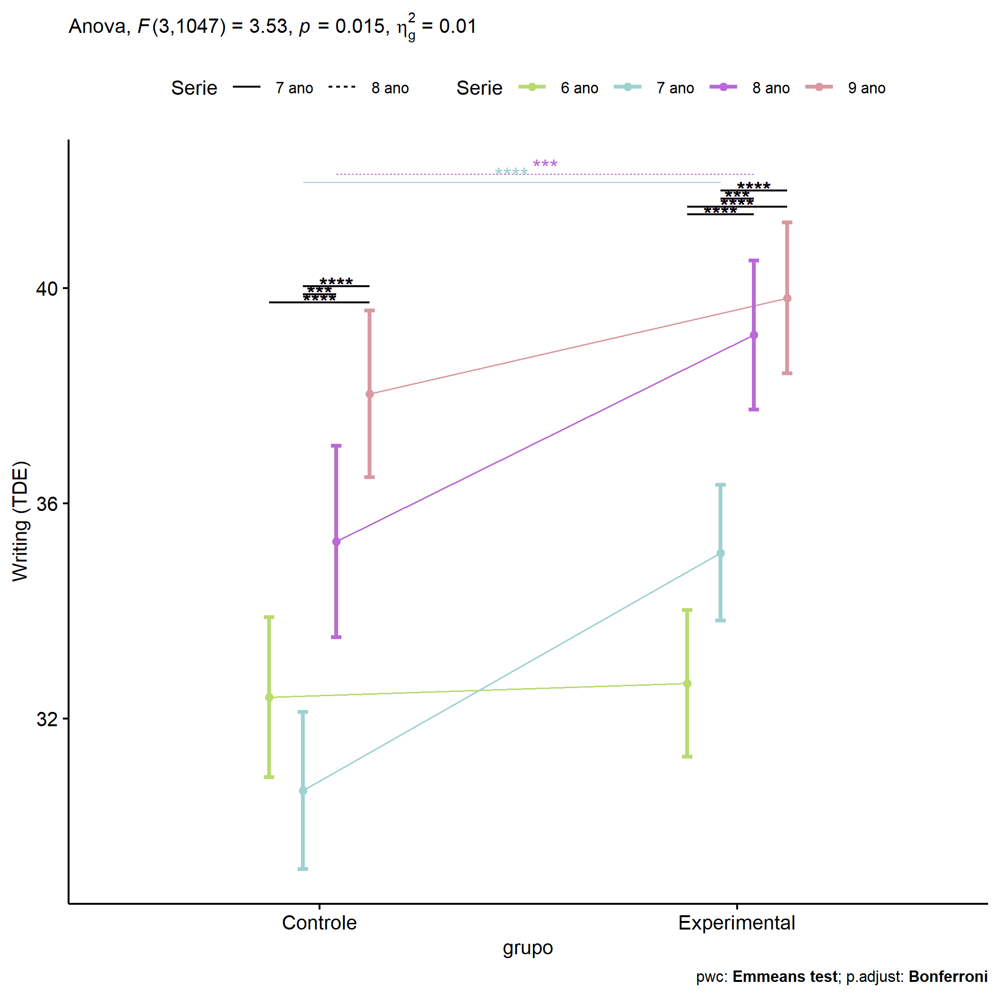<!-- -->

``` r
if (length(unique(pdat[["Serie"]])) >= 2) {
  ggPlotAoC2(pwcs, "Serie", "grupo", aov, ylab = "Writing (TDE)",
               subtitle = which(aov$Effect == "grupo:Serie"), addParam = "errorbar") +
      ggplot2::scale_color_manual(values = color[["grupo"]]) +
      if (ymin.ci < ymax.ci) ggplot2::ylim(ymin.ci, ymax.ci)
}
```

    ## Scale for colour is already present.
    ## Adding another scale for colour, which will replace the existing scale.

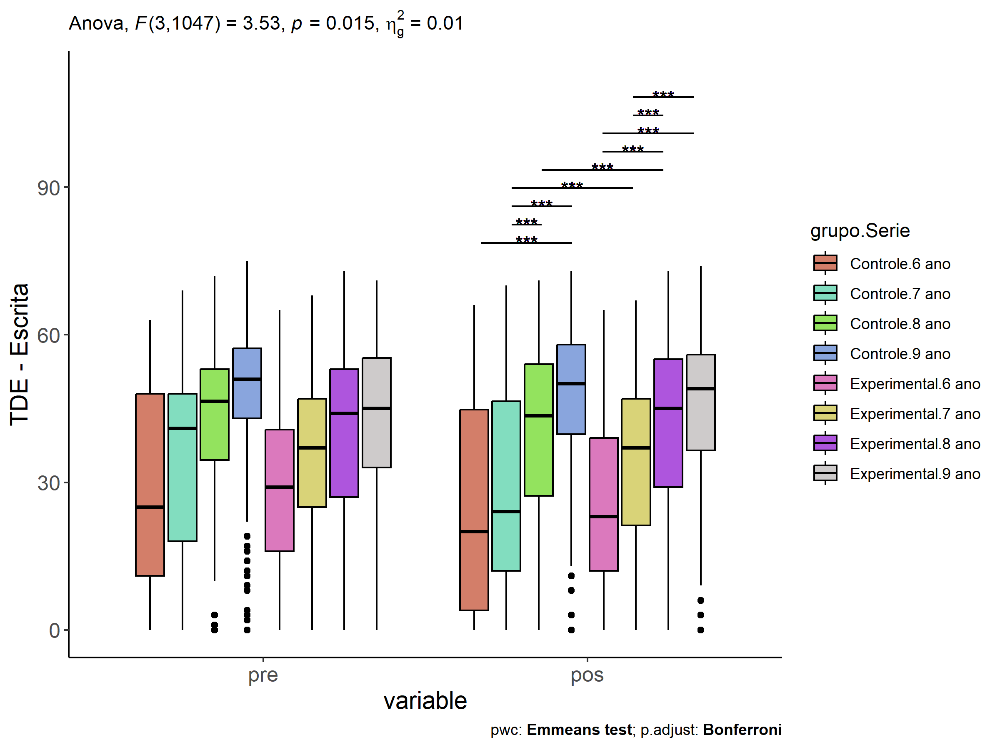<!-- -->

``` r
if (length(unique(pdat[["Serie"]])) >= 2) {
  plots <- twoWayAncovaBoxPlots(
    wdat, "score.tde.pos", c("grupo","Serie"), aov, pwcs, covar = "score.tde.pre",
    theme = "classic", color = color[["grupo:Serie"]],
    subtitle = which(aov$Effect == "grupo:Serie"))
}
```

``` r
if (length(unique(pdat[["Serie"]])) >= 2) {
  plots[["grupo:Serie"]] + ggplot2::ylab("Writing (TDE)") +
  ggplot2::scale_x_discrete(labels=c('pre', 'pos')) +
  if (ymin < ymax) ggplot2::ylim(ymin, ymax)
}
```

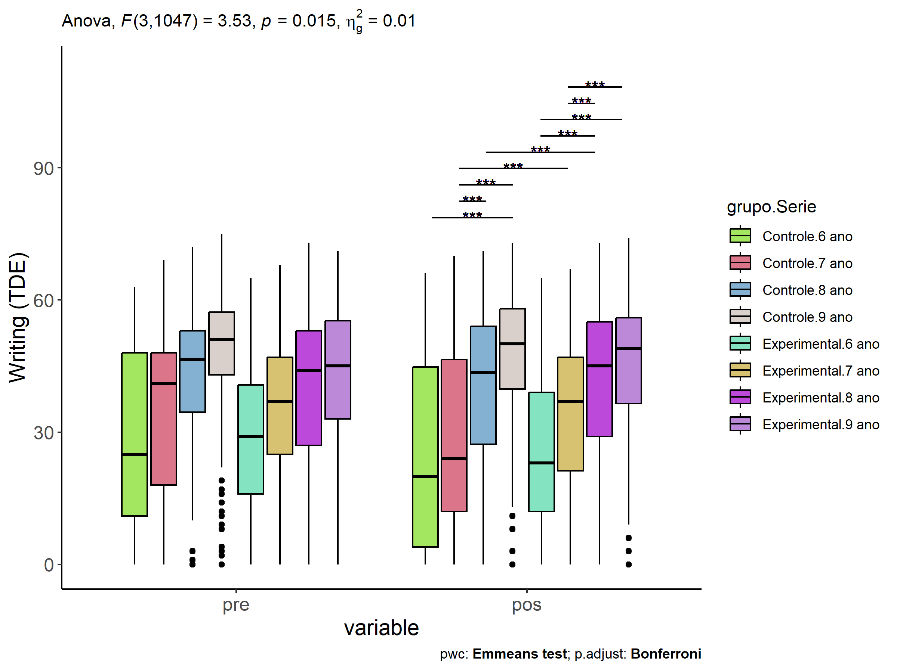<!-- -->

``` r
if (length(unique(pdat[["Serie"]])) >= 2) {
  plots <- twoWayAncovaBoxPlots(
    wdat.long, "score.tde", c("grupo","Serie"), aov, pwc.long,
    pre.post = "time",
    theme = "classic", color = color$prepost)
}
```

``` r
if (length(unique(pdat[["Serie"]])) >= 2) 
  plots[["grupo:Serie"]] + ggplot2::ylab("Writing (TDE)") +
    if (ymin < ymax) ggplot2::ylim(ymin, ymax)
```

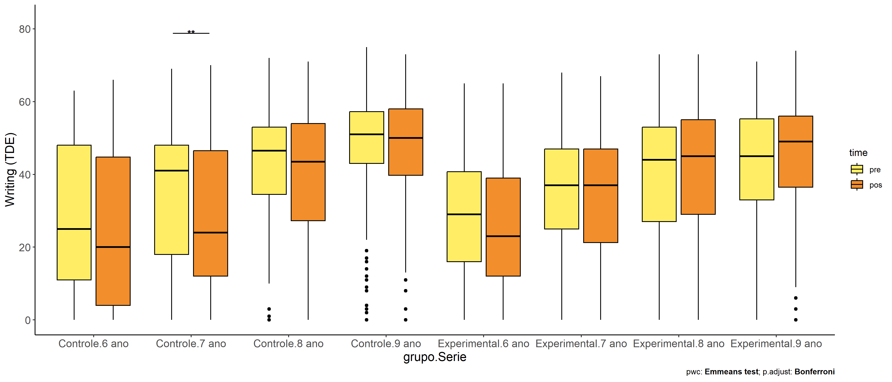<!-- -->

### Checking linearity assumption

``` r
if (length(unique(pdat[["Serie"]])) >= 2) {
  ggscatter(wdat, x = "score.tde.pre", y = "score.tde.pos", size = 0.5,
            facet.by = c("grupo","Serie"), add = "reg.line")+
    stat_regline_equation(
      aes(label =  paste(..eq.label.., ..rr.label.., sep = "~~~~"))
    ) +
    if (ymin < ymax) ggplot2::ylim(ymin, ymax)
}
```

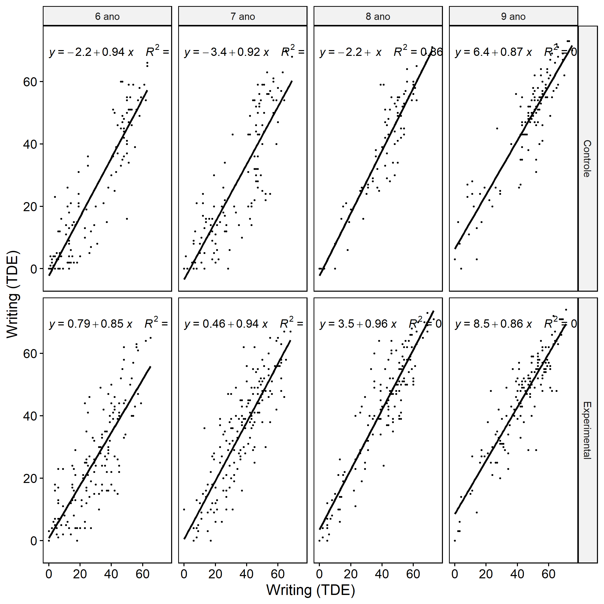<!-- -->

``` r
if (length(unique(pdat[["Serie"]])) >= 2) {
  ggscatter(wdat, x = "score.tde.pre", y = "score.tde.pos", size = 0.5,
            color = "grupo", facet.by = "Serie", add = "reg.line")+
    stat_regline_equation(
      aes(label =  paste(..eq.label.., ..rr.label.., sep = "~~~~"), color = grupo)
    ) +
    ggplot2::labs(subtitle = rstatix::get_test_label(aov, detailed = T, row = which(aov$Effect == "grupo:Serie"))) +
    ggplot2::scale_color_manual(values = color[["grupo"]]) +
    if (ymin < ymax) ggplot2::ylim(ymin, ymax)
}
```

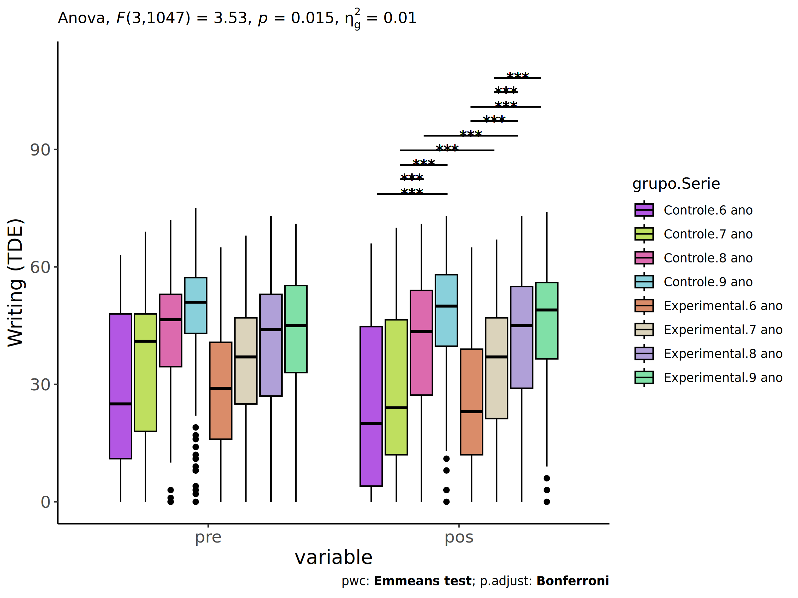<!-- -->

``` r
if (length(unique(pdat[["Serie"]])) >= 2) {
  ggscatter(wdat, x = "score.tde.pre", y = "score.tde.pos", size = 0.5,
            color = "Serie", facet.by = "grupo", add = "reg.line")+
    stat_regline_equation(
      aes(label =  paste(..eq.label.., ..rr.label.., sep = "~~~~"), color = Serie)
    ) +
    ggplot2::labs(subtitle = rstatix::get_test_label(aov, detailed = T, row = which(aov$Effect == "grupo:Serie"))) +
    ggplot2::scale_color_manual(values = color[["Serie"]]) +
    if (ymin < ymax) ggplot2::ylim(ymin, ymax)
}
```

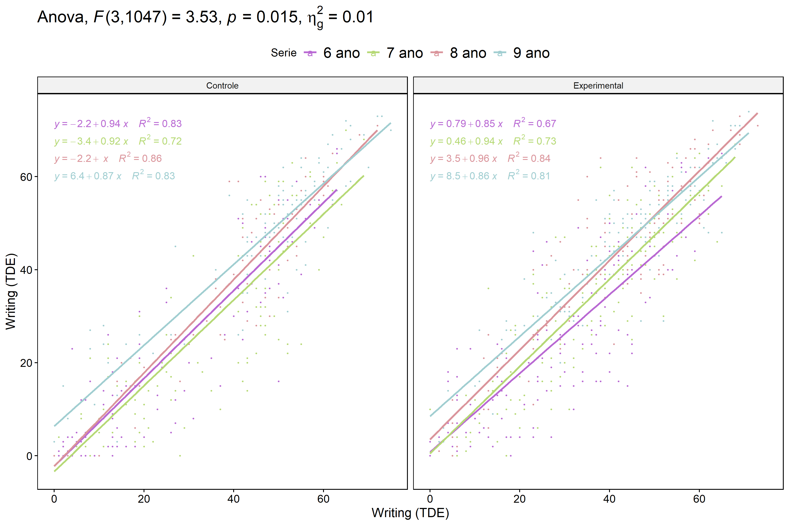<!-- -->

### Checking normality and homogeneity

``` r
if (length(unique(pdat[["Serie"]])) >= 2) 
  res <- augment(lm(score.tde.pos ~ score.tde.pre + grupo*Serie, data = wdat))
```

``` r
if (length(unique(pdat[["Serie"]])) >= 2)
  shapiro_test(res$.resid)
```

    ## # A tibble: 1 × 3
    ##   variable   statistic p.value
    ##   <chr>          <dbl>   <dbl>
    ## 1 res$.resid     0.996 0.00727

``` r
if (length(unique(pdat[["Serie"]])) >= 2) 
  levene_test(res, .resid ~ grupo*Serie)
```

    ## # A tibble: 1 × 4
    ##     df1   df2 statistic             p
    ##   <int> <int>     <dbl>         <dbl>
    ## 1     7  1048      7.87 0.00000000252

# ANCOVA and Pairwise for two factors **grupo:score.tde.quintile**

## Without remove non-normal data

``` r
pdat = remove_group_data(dat[!is.na(dat[["grupo"]]) & !is.na(dat[["score.tde.quintile"]]),],
                         "score.tde.pos", c("grupo","score.tde.quintile"))
pdat = pdat[pdat[["score.tde.quintile"]] %in% do.call(
  intersect, lapply(unique(pdat[["grupo"]]), FUN = function(x) {
    unique(pdat[["score.tde.quintile"]][which(pdat[["grupo"]] == x)])
  })),]
pdat[["grupo"]] = factor(pdat[["grupo"]], level[["grupo"]])
pdat[["score.tde.quintile"]] = factor(
  pdat[["score.tde.quintile"]],
  level[["score.tde.quintile"]][level[["score.tde.quintile"]] %in% unique(pdat[["score.tde.quintile"]])])

pdat.long <- rbind(pdat[,c("id","grupo","score.tde.quintile")], pdat[,c("id","grupo","score.tde.quintile")])
pdat.long[["time"]] <- c(rep("pre", nrow(pdat)), rep("pos", nrow(pdat)))
pdat.long[["time"]] <- factor(pdat.long[["time"]], c("pre","pos"))
pdat.long[["score.tde"]] <- c(pdat[["score.tde.pre"]], pdat[["score.tde.pos"]])

if (length(unique(pdat[["score.tde.quintile"]])) >= 2) {
  aov = anova_test(pdat, score.tde.pos ~ score.tde.pre + grupo*score.tde.quintile)
  laov[["grupo:score.tde.quintile"]] <- get_anova_table(aov)
}
```

``` r
if (length(unique(pdat[["score.tde.quintile"]])) >= 2) {
  pwcs <- list()
  pwcs[["score.tde.quintile"]] <- emmeans_test(
    group_by(pdat, grupo), score.tde.pos ~ score.tde.quintile,
    covariate = score.tde.pre, p.adjust.method = "bonferroni")
  pwcs[["grupo"]] <- emmeans_test(
    group_by(pdat, score.tde.quintile), score.tde.pos ~ grupo,
    covariate = score.tde.pre, p.adjust.method = "bonferroni")
  
  pwc <- plyr::rbind.fill(pwcs[["grupo"]], pwcs[["score.tde.quintile"]])
  pwc <- pwc[,c("grupo","score.tde.quintile", colnames(pwc)[!colnames(pwc) %in% c("grupo","score.tde.quintile")])]
}
```

``` r
if (length(unique(pdat[["score.tde.quintile"]])) >= 2) {
  pwc.long <- emmeans_test(dplyr::group_by_at(pdat.long, c("grupo","score.tde.quintile")),
                           score.tde ~ time,
                           p.adjust.method = "bonferroni")
  lpwc[["grupo:score.tde.quintile"]] <- plyr::rbind.fill(pwc, pwc.long)
}
```

``` r
if (length(unique(pdat[["score.tde.quintile"]])) >= 2) {
  ds <- get.descriptives(pdat, "score.tde.pos", c("grupo","score.tde.quintile"), covar = "score.tde.pre")
  ds <- merge(ds[ds$variable != "score.tde.pre",],
              ds[ds$variable == "score.tde.pre", !colnames(ds) %in% c("variable")],
              by = c("grupo","score.tde.quintile"), all.x = T, suffixes = c("", ".score.tde.pre"))
  ds <- merge(get_emmeans(pwcs[["grupo"]]), ds,
              by = c("grupo","score.tde.quintile"), suffixes = c(".emms", ""))
  ds <- ds[,c("grupo","score.tde.quintile","n","mean.score.tde.pre","se.score.tde.pre","mean","se",
              "emmean","se.emms","conf.low","conf.high")]
  
  colnames(ds) <- c("grupo","score.tde.quintile", "N", paste0(c("M","SE")," (pre)"),
                    paste0(c("M","SE"), " (unadj)"),
                    paste0(c("M", "SE"), " (adj)"), "conf.low", "conf.high")
  
  lemms[["grupo:score.tde.quintile"]] <- ds
}
```

## Computing ANCOVA and PairWise After removing non-normal data (OK)

``` r
if (length(unique(pdat[["score.tde.quintile"]])) >= 2) {
  wdat = pdat 
  
  res = residuals(lm(score.tde.pos ~ score.tde.pre + grupo*score.tde.quintile, data = wdat))
  non.normal = getNonNormal(res, wdat$id, plimit = 0.05)
  
  wdat = wdat[!wdat$id %in% non.normal,]
  
  wdat.long <- rbind(wdat[,c("id","grupo","score.tde.quintile")], wdat[,c("id","grupo","score.tde.quintile")])
  wdat.long[["time"]] <- c(rep("pre", nrow(wdat)), rep("pos", nrow(wdat)))
  wdat.long[["time"]] <- factor(wdat.long[["time"]], c("pre","pos"))
  wdat.long[["score.tde"]] <- c(wdat[["score.tde.pre"]], wdat[["score.tde.pos"]])
  
  
  ldat[["grupo:score.tde.quintile"]] = wdat
  
  (non.normal)
}
```

    ##   [1] "P984"  "P1128" "P962"  "P1129" "P3637" "P1971" "P1117" "P1126" "P2950" "P2883" "P2910"
    ##  [12] "P3019" "P2982" "P2904" "P2864" "P2959" "P3054" "P1139" "P2835" "P921"  "P2983" "P2994"
    ##  [23] "P2880" "P2917" "P2848" "P2866" "P3005" "P929"  "P2870" "P572"  "P3674" "P3548" "P3021"
    ##  [34] "P809"  "P3080" "P2997" "P3666" "P3660" "P2867" "P1878" "P2858" "P2846" "P1840" "P3007"
    ##  [45] "P3545" "P3533" "P2861" "P2993" "P2953" "P1111" "P2969" "P1804" "P2876" "P1018" "P3228"
    ##  [56] "P2854" "P2871" "P2929" "P908"  "P2964" "P1046" "P2190" "P2879" "P2948" "P1118" "P2967"
    ##  [67] "P2956" "P2973" "P2946" "P2865" "P2831" "P3000" "P2995" "P976"  "P2937" "P1145" "P3029"
    ##  [78] "P2971" "P2951" "P2886" "P2913" "P2977" "P1885" "P3026" "P931"  "P3475" "P924"  "P2952"
    ##  [89] "P2974" "P1024" "P3520" "P3136" "P914"  "P3280" "P1130" "P1825" "P2850" "P2888" "P1968"
    ## [100] "P1083" "P1887" "P2905" "P3459" "P3574"

``` r
if (length(unique(pdat[["score.tde.quintile"]])) >= 2) {
  aov = anova_test(wdat, score.tde.pos ~ score.tde.pre + grupo*score.tde.quintile)
  laov[["grupo:score.tde.quintile"]] <- merge(get_anova_table(aov), laov[["grupo:score.tde.quintile"]],
                                         by="Effect", suffixes = c("","'"))
  df = get_anova_table(aov)
}
```

| Effect                   | DFn |  DFd |       F |     p | p\<.05 |   ges |
|:-------------------------|----:|-----:|--------:|------:|:-------|------:|
| score.tde.pre            |   1 | 1006 | 264.709 | 0.000 | \*     | 0.208 |
| grupo                    |   1 | 1006 |  37.367 | 0.000 | \*     | 0.036 |
| score.tde.quintile       |   4 | 1006 |   3.315 | 0.010 | \*     | 0.013 |
| grupo:score.tde.quintile |   4 | 1006 |   2.738 | 0.028 | \*     | 0.011 |

``` r
if (length(unique(pdat[["score.tde.quintile"]])) >= 2) {
  pwcs <- list()
  pwcs[["score.tde.quintile"]] <- emmeans_test(
    group_by(wdat, grupo), score.tde.pos ~ score.tde.quintile,
    covariate = score.tde.pre, p.adjust.method = "bonferroni")
  pwcs[["grupo"]] <- emmeans_test(
    group_by(wdat, score.tde.quintile), score.tde.pos ~ grupo,
    covariate = score.tde.pre, p.adjust.method = "bonferroni")
  
  pwc <- plyr::rbind.fill(pwcs[["grupo"]], pwcs[["score.tde.quintile"]])
  pwc <- pwc[,c("grupo","score.tde.quintile", colnames(pwc)[!colnames(pwc) %in% c("grupo","score.tde.quintile")])]
}
```

| grupo        | score.tde.quintile | term                              | .y.           | group1       | group2       |   df | statistic |     p | p.adj | p.adj.signif |
|:-------------|:-------------------|:----------------------------------|:--------------|:-------------|:-------------|-----:|----------:|------:|------:|:-------------|
|              | 1st quintile       | score.tde.pre\*grupo              | score.tde.pos | Controle     | Experimental | 1006 |    -2.176 | 0.030 | 0.030 | \*           |
|              | 2nd quintile       | score.tde.pre\*grupo              | score.tde.pos | Controle     | Experimental | 1006 |    -2.614 | 0.009 | 0.009 | \*\*         |
|              | 3rd quintile       | score.tde.pre\*grupo              | score.tde.pos | Controle     | Experimental | 1006 |    -4.957 | 0.000 | 0.000 | \*\*\*\*     |
|              | 4th quintile       | score.tde.pre\*grupo              | score.tde.pos | Controle     | Experimental | 1006 |    -3.161 | 0.002 | 0.002 | \*\*         |
|              | 5th quintile       | score.tde.pre\*grupo              | score.tde.pos | Controle     | Experimental | 1006 |    -1.453 | 0.147 | 0.147 | ns           |
| Controle     |                    | score.tde.pre\*score.tde.quintile | score.tde.pos | 1st quintile | 2nd quintile | 1006 |     1.565 | 0.118 | 1.000 | ns           |
| Controle     |                    | score.tde.pre\*score.tde.quintile | score.tde.pos | 1st quintile | 3rd quintile | 1006 |     2.102 | 0.036 | 0.358 | ns           |
| Controle     |                    | score.tde.pre\*score.tde.quintile | score.tde.pos | 1st quintile | 4th quintile | 1006 |    -0.118 | 0.906 | 1.000 | ns           |
| Controle     |                    | score.tde.pre\*score.tde.quintile | score.tde.pos | 1st quintile | 5th quintile | 1006 |    -0.370 | 0.711 | 1.000 | ns           |
| Controle     |                    | score.tde.pre\*score.tde.quintile | score.tde.pos | 2nd quintile | 3rd quintile | 1006 |     1.201 | 0.230 | 1.000 | ns           |
| Controle     |                    | score.tde.pre\*score.tde.quintile | score.tde.pos | 2nd quintile | 4th quintile | 1006 |    -1.486 | 0.138 | 1.000 | ns           |
| Controle     |                    | score.tde.pre\*score.tde.quintile | score.tde.pos | 2nd quintile | 5th quintile | 1006 |    -1.515 | 0.130 | 1.000 | ns           |
| Controle     |                    | score.tde.pre\*score.tde.quintile | score.tde.pos | 3rd quintile | 4th quintile | 1006 |    -3.359 | 0.001 | 0.008 | \*\*         |
| Controle     |                    | score.tde.pre\*score.tde.quintile | score.tde.pos | 3rd quintile | 5th quintile | 1006 |    -3.197 | 0.001 | 0.014 | \*           |
| Controle     |                    | score.tde.pre\*score.tde.quintile | score.tde.pos | 4th quintile | 5th quintile | 1006 |    -0.703 | 0.482 | 1.000 | ns           |
| Experimental |                    | score.tde.pre\*score.tde.quintile | score.tde.pos | 1st quintile | 2nd quintile | 1006 |     0.882 | 0.378 | 1.000 | ns           |
| Experimental |                    | score.tde.pre\*score.tde.quintile | score.tde.pos | 1st quintile | 3rd quintile | 1006 |    -0.005 | 0.996 | 1.000 | ns           |
| Experimental |                    | score.tde.pre\*score.tde.quintile | score.tde.pos | 1st quintile | 4th quintile | 1006 |    -0.482 | 0.630 | 1.000 | ns           |
| Experimental |                    | score.tde.pre\*score.tde.quintile | score.tde.pos | 1st quintile | 5th quintile | 1006 |    -0.099 | 0.921 | 1.000 | ns           |
| Experimental |                    | score.tde.pre\*score.tde.quintile | score.tde.pos | 2nd quintile | 3rd quintile | 1006 |    -1.014 | 0.311 | 1.000 | ns           |
| Experimental |                    | score.tde.pre\*score.tde.quintile | score.tde.pos | 2nd quintile | 4th quintile | 1006 |    -1.503 | 0.133 | 1.000 | ns           |
| Experimental |                    | score.tde.pre\*score.tde.quintile | score.tde.pos | 2nd quintile | 5th quintile | 1006 |    -0.722 | 0.470 | 1.000 | ns           |
| Experimental |                    | score.tde.pre\*score.tde.quintile | score.tde.pos | 3rd quintile | 4th quintile | 1006 |    -0.991 | 0.322 | 1.000 | ns           |
| Experimental |                    | score.tde.pre\*score.tde.quintile | score.tde.pos | 3rd quintile | 5th quintile | 1006 |    -0.183 | 0.855 | 1.000 | ns           |
| Experimental |                    | score.tde.pre\*score.tde.quintile | score.tde.pos | 4th quintile | 5th quintile | 1006 |     0.707 | 0.480 | 1.000 | ns           |

``` r
if (length(unique(pdat[["score.tde.quintile"]])) >= 2) {
  pwc.long <- emmeans_test(dplyr::group_by_at(wdat.long, c("grupo","score.tde.quintile")),
                           score.tde ~ time,
                           p.adjust.method = "bonferroni")
  lpwc[["grupo:score.tde.quintile"]] <- merge(plyr::rbind.fill(pwc, pwc.long),
                                         lpwc[["grupo:score.tde.quintile"]],
                                         by=c("grupo","score.tde.quintile","term",".y.","group1","group2"),
                                         suffixes = c("","'"))
}
```

| grupo        | score.tde.quintile | term | .y.       | group1 | group2 |   df | statistic |     p | p.adj | p.adj.signif |
|:-------------|:-------------------|:-----|:----------|:-------|:-------|-----:|----------:|------:|------:|:-------------|
| Controle     | 1st quintile       | time | score.tde | pre    | pos    | 2014 |     1.024 | 0.306 | 0.306 | ns           |
| Controle     | 2nd quintile       | time | score.tde | pre    | pos    | 2014 |     3.105 | 0.002 | 0.002 | \*\*         |
| Controle     | 3rd quintile       | time | score.tde | pre    | pos    | 2014 |     4.794 | 0.000 | 0.000 | \*\*\*\*     |
| Controle     | 4th quintile       | time | score.tde | pre    | pos    | 2014 |     3.089 | 0.002 | 0.002 | \*\*         |
| Controle     | 5th quintile       | time | score.tde | pre    | pos    | 2014 |     2.704 | 0.007 | 0.007 | \*\*         |
| Experimental | 1st quintile       | time | score.tde | pre    | pos    | 2014 |    -1.416 | 0.157 | 0.157 | ns           |
| Experimental | 2nd quintile       | time | score.tde | pre    | pos    | 2014 |     0.824 | 0.410 | 0.410 | ns           |
| Experimental | 3rd quintile       | time | score.tde | pre    | pos    | 2014 |     0.152 | 0.879 | 0.879 | ns           |
| Experimental | 4th quintile       | time | score.tde | pre    | pos    | 2014 |    -0.569 | 0.569 | 0.569 | ns           |
| Experimental | 5th quintile       | time | score.tde | pre    | pos    | 2014 |     1.120 | 0.263 | 0.263 | ns           |

``` r
if (length(unique(pdat[["score.tde.quintile"]])) >= 2) {
  ds <- get.descriptives(wdat, "score.tde.pos", c("grupo","score.tde.quintile"), covar = "score.tde.pre")
  ds <- merge(ds[ds$variable != "score.tde.pre",],
              ds[ds$variable == "score.tde.pre", !colnames(ds) %in% c("variable")],
              by = c("grupo","score.tde.quintile"), all.x = T, suffixes = c("", ".score.tde.pre"))
  ds <- merge(get_emmeans(pwcs[["grupo"]]), ds,
              by = c("grupo","score.tde.quintile"), suffixes = c(".emms", ""))
  ds <- ds[,c("grupo","score.tde.quintile","n","mean.score.tde.pre","se.score.tde.pre",
              "mean","se","emmean","se.emms","conf.low","conf.high")]
  
  colnames(ds) <- c("grupo","score.tde.quintile", "N", paste0(c("M","SE")," (pre)"),
                    paste0(c("M","SE"), " (unadj)"),
                    paste0(c("M", "SE"), " (adj)"), "conf.low", "conf.high")
  
  lemms[["grupo:score.tde.quintile"]] <- merge(ds, lemms[["grupo:score.tde.quintile"]],
                                          by=c("grupo","score.tde.quintile"), suffixes = c("","'"))
}
```

| grupo        | score.tde.quintile |   N | M (pre) | SE (pre) | M (unadj) | SE (unadj) | M (adj) | SE (adj) | conf.low | conf.high |
|:-------------|:-------------------|----:|--------:|---------:|----------:|-----------:|--------:|---------:|---------:|----------:|
| Controle     | 1st quintile       | 112 |   9.152 |    0.522 |     8.205 |      0.750 |  34.585 |    1.783 |   31.086 |    38.083 |
| Controle     | 2nd quintile       |  51 |  24.392 |    0.530 |    20.137 |      1.288 |  32.089 |    1.322 |   29.495 |    34.682 |
| Controle     | 3rd quintile       |  42 |  38.905 |    0.489 |    31.667 |      1.800 |  29.879 |    1.216 |   27.493 |    32.265 |
| Controle     | 4th quintile       | 125 |  47.544 |    0.223 |    44.840 |      0.850 |  34.874 |    0.932 |   33.046 |    36.702 |
| Controle     | 5th quintile       | 116 |  58.819 |    0.505 |    56.362 |      0.792 |  35.722 |    1.463 |   32.851 |    38.593 |
| Experimental | 1st quintile       | 108 |   9.602 |    0.522 |    10.935 |      0.788 |  36.889 |    1.765 |   33.425 |    40.352 |
| Experimental | 2nd quintile       | 101 |  25.842 |    0.347 |    25.040 |      0.976 |  35.619 |    1.016 |   33.625 |    37.613 |
| Experimental | 3rd quintile       | 116 |  37.371 |    0.301 |    37.233 |      0.859 |  36.898 |    0.729 |   35.467 |    38.328 |
| Experimental | 4th quintile       | 120 |  46.800 |    0.230 |    47.308 |      0.725 |  38.047 |    0.915 |   36.251 |    39.842 |
| Experimental | 5th quintile       | 126 |  58.563 |    0.448 |    57.587 |      0.700 |  37.189 |    1.435 |   34.372 |    40.006 |

### Plots for ancova

``` r
if (length(unique(pdat[["score.tde.quintile"]])) >= 2) {
  ggPlotAoC2(pwcs, "grupo", "score.tde.quintile", aov, ylab = "Writing (TDE)",
             subtitle = which(aov$Effect == "grupo:score.tde.quintile"), addParam = "errorbar") +
    ggplot2::scale_color_manual(values = color[["score.tde.quintile"]]) +
    if (ymin.ci < ymax.ci) ggplot2::ylim(ymin.ci, ymax.ci)
}
```

    ## Scale for colour is already present.
    ## Adding another scale for colour, which will replace the existing scale.

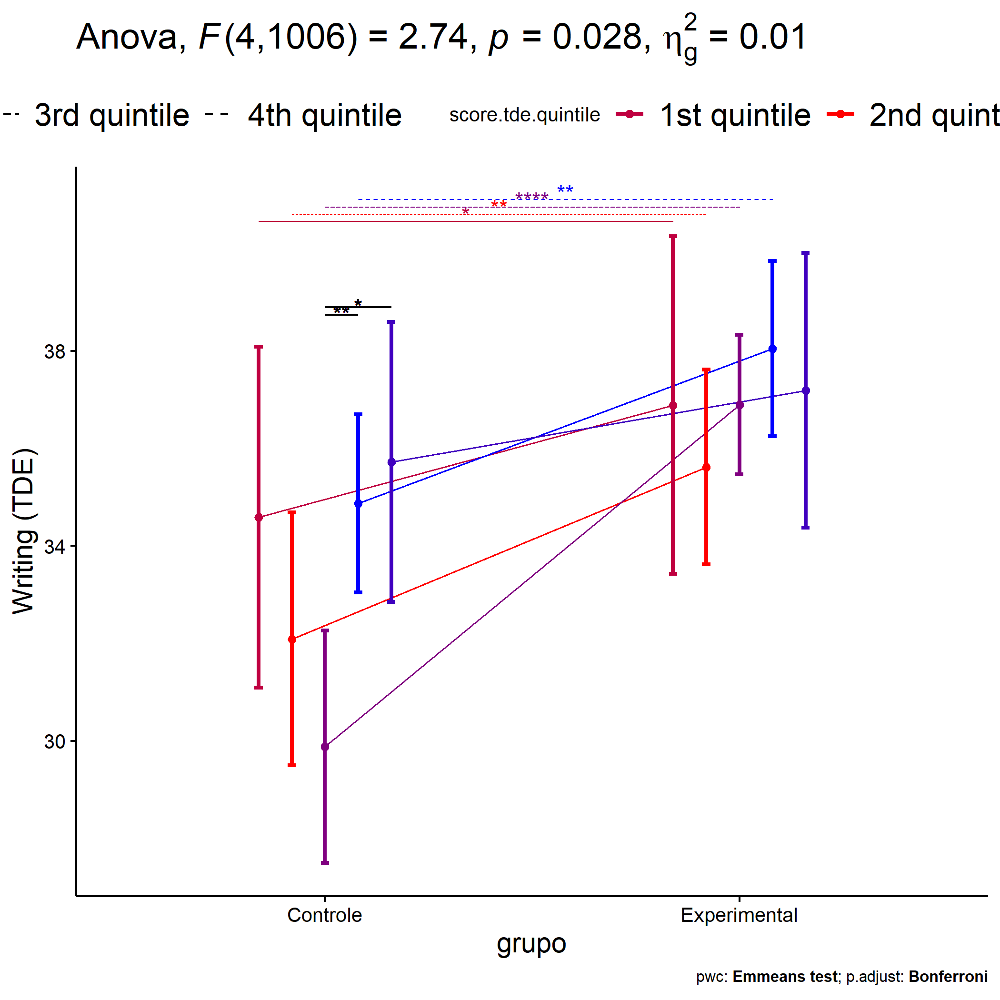<!-- -->

``` r
if (length(unique(pdat[["score.tde.quintile"]])) >= 2) {
  ggPlotAoC2(pwcs, "score.tde.quintile", "grupo", aov, ylab = "Writing (TDE)",
               subtitle = which(aov$Effect == "grupo:score.tde.quintile"), addParam = "errorbar") +
      ggplot2::scale_color_manual(values = color[["grupo"]]) +
      if (ymin.ci < ymax.ci) ggplot2::ylim(ymin.ci, ymax.ci)
}
```

    ## Scale for colour is already present.
    ## Adding another scale for colour, which will replace the existing scale.

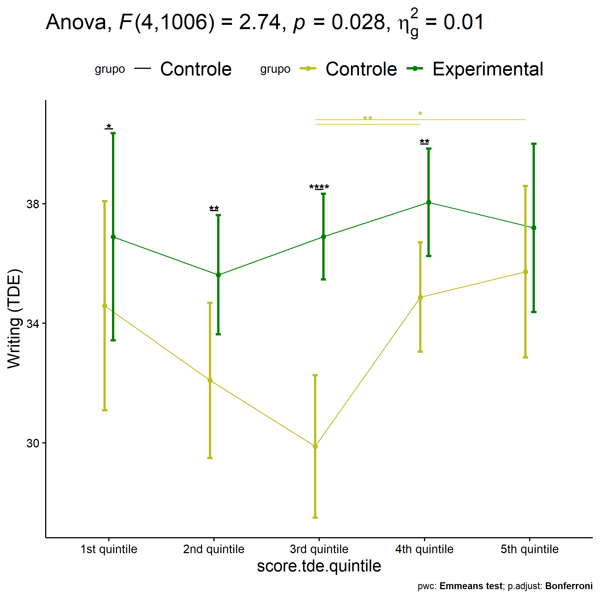<!-- -->

``` r
if (length(unique(pdat[["score.tde.quintile"]])) >= 2) {
  plots <- twoWayAncovaBoxPlots(
    wdat, "score.tde.pos", c("grupo","score.tde.quintile"), aov, pwcs, covar = "score.tde.pre",
    theme = "classic", color = color[["grupo:score.tde.quintile"]],
    subtitle = which(aov$Effect == "grupo:score.tde.quintile"))
}
```

``` r
if (length(unique(pdat[["score.tde.quintile"]])) >= 2) {
  plots[["grupo:score.tde.quintile"]] + ggplot2::ylab("Writing (TDE)") +
  ggplot2::scale_x_discrete(labels=c('pre', 'pos')) +
  if (ymin < ymax) ggplot2::ylim(ymin, ymax)
}
```

    ## Warning: No shared levels found between `names(values)` of the manual scale and the data's colour
    ## values.

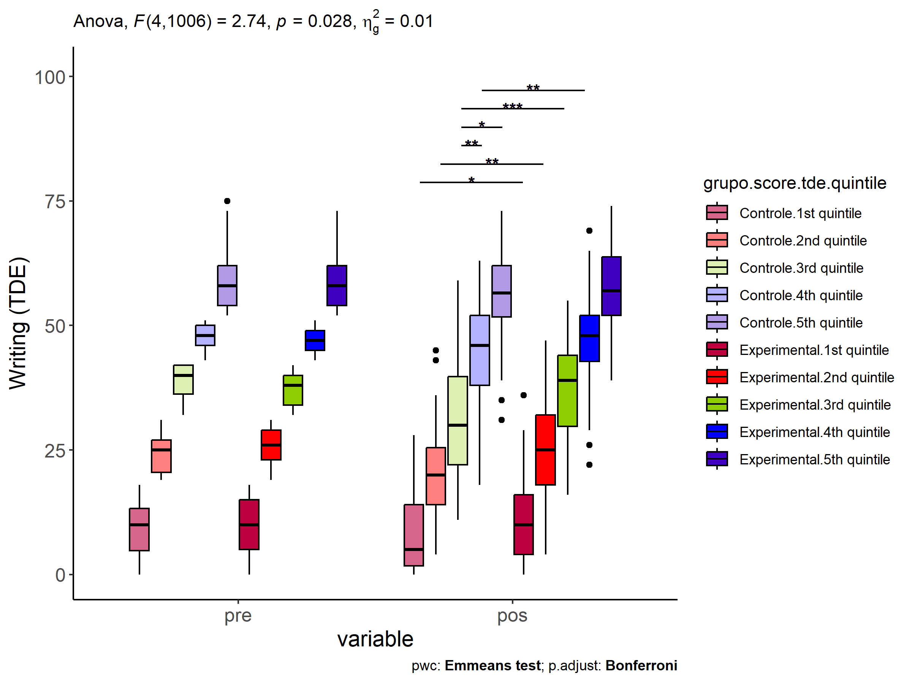<!-- -->

``` r
if (length(unique(pdat[["score.tde.quintile"]])) >= 2) {
  plots <- twoWayAncovaBoxPlots(
    wdat.long, "score.tde", c("grupo","score.tde.quintile"), aov, pwc.long,
    pre.post = "time",
    theme = "classic", color = color$prepost)
}
```

``` r
if (length(unique(pdat[["score.tde.quintile"]])) >= 2) 
  plots[["grupo:score.tde.quintile"]] + ggplot2::ylab("Writing (TDE)") +
    if (ymin < ymax) ggplot2::ylim(ymin, ymax)
```

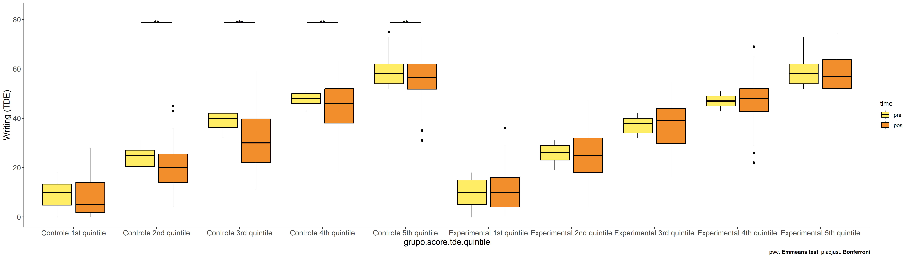<!-- -->

### Checking linearity assumption

``` r
if (length(unique(pdat[["score.tde.quintile"]])) >= 2) {
  ggscatter(wdat, x = "score.tde.pre", y = "score.tde.pos", size = 0.5,
            facet.by = c("grupo","score.tde.quintile"), add = "reg.line")+
    stat_regline_equation(
      aes(label =  paste(..eq.label.., ..rr.label.., sep = "~~~~"))
    ) +
    if (ymin < ymax) ggplot2::ylim(ymin, ymax)
}
```

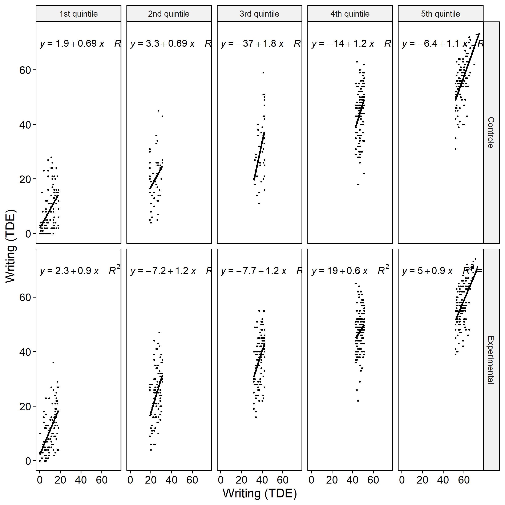<!-- -->

``` r
if (length(unique(pdat[["score.tde.quintile"]])) >= 2) {
  ggscatter(wdat, x = "score.tde.pre", y = "score.tde.pos", size = 0.5,
            color = "grupo", facet.by = "score.tde.quintile", add = "reg.line")+
    stat_regline_equation(
      aes(label =  paste(..eq.label.., ..rr.label.., sep = "~~~~"), color = grupo)
    ) +
    ggplot2::labs(subtitle = rstatix::get_test_label(aov, detailed = T, row = which(aov$Effect == "grupo:score.tde.quintile"))) +
    ggplot2::scale_color_manual(values = color[["grupo"]]) +
    if (ymin < ymax) ggplot2::ylim(ymin, ymax)
}
```

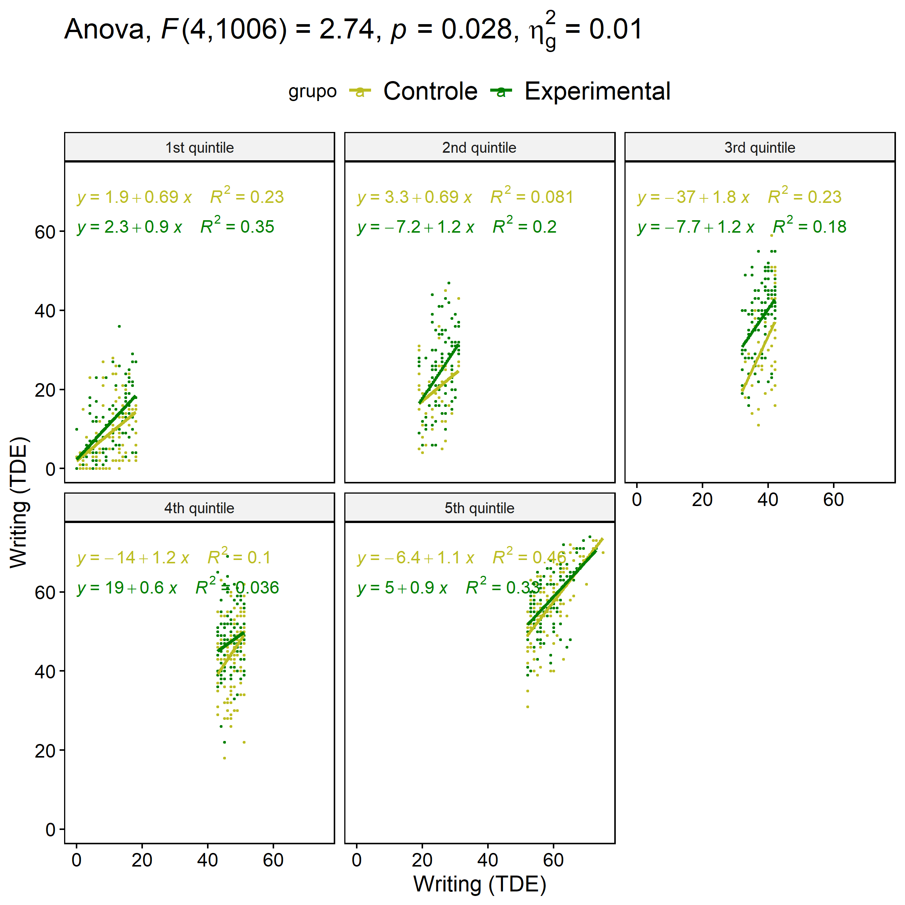<!-- -->

``` r
if (length(unique(pdat[["score.tde.quintile"]])) >= 2) {
  ggscatter(wdat, x = "score.tde.pre", y = "score.tde.pos", size = 0.5,
            color = "score.tde.quintile", facet.by = "grupo", add = "reg.line")+
    stat_regline_equation(
      aes(label =  paste(..eq.label.., ..rr.label.., sep = "~~~~"), color = score.tde.quintile)
    ) +
    ggplot2::labs(subtitle = rstatix::get_test_label(aov, detailed = T, row = which(aov$Effect == "grupo:score.tde.quintile"))) +
    ggplot2::scale_color_manual(values = color[["score.tde.quintile"]]) +
    if (ymin < ymax) ggplot2::ylim(ymin, ymax)
}
```

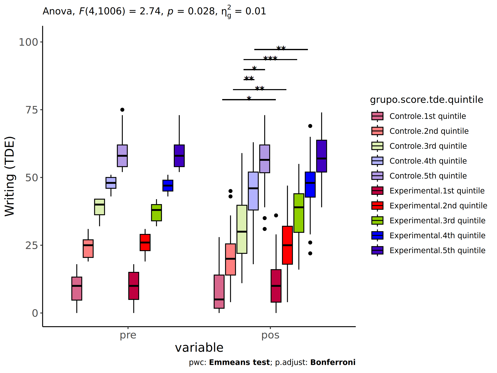<!-- -->

### Checking normality and homogeneity

``` r
if (length(unique(pdat[["score.tde.quintile"]])) >= 2) 
  res <- augment(lm(score.tde.pos ~ score.tde.pre + grupo*score.tde.quintile, data = wdat))
```

``` r
if (length(unique(pdat[["score.tde.quintile"]])) >= 2)
  shapiro_test(res$.resid)
```

    ## # A tibble: 1 × 3
    ##   variable   statistic p.value
    ##   <chr>          <dbl>   <dbl>
    ## 1 res$.resid     0.996  0.0129

``` r
if (length(unique(pdat[["score.tde.quintile"]])) >= 2) 
  levene_test(res, .resid ~ grupo*score.tde.quintile)
```

    ## # A tibble: 1 × 4
    ##     df1   df2 statistic           p
    ##   <int> <int>     <dbl>       <dbl>
    ## 1     9  1007      5.39 0.000000314

# Summary of Results

## Descriptive Statistics

``` r
df <- get.descriptives(ldat[["grupo"]], c(dv.pre, dv.pos), c("grupo"), 
                       include.global = T, symmetry.test = T, normality.test = F)
df <- plyr::rbind.fill(
  df, do.call(plyr::rbind.fill, lapply(lfatores2, FUN = function(f) {
    if (nrow(dat) > 0 && sum(!is.na(unique(dat[[f]]))) > 1 && paste0("grupo:",f) %in% names(ldat))
      get.descriptives(ldat[[paste0("grupo:",f)]], c(dv.pre,dv.pos), c("grupo", f),
                       symmetry.test = T, normality.test = F)
    }))
)
df <- df[,c(fatores1[fatores1 %in% colnames(df)],"variable",
             colnames(df)[!colnames(df) %in% c(fatores1,"variable")])]
```

| grupo        | Sexo | Zona   | Cor.Raca | Serie | score.tde.quintile | variable      |   n |   mean | median | min | max |     sd |    se |     ci |   iqr | symmetry | skewness | kurtosis |
|:-------------|:-----|:-------|:---------|:------|:-------------------|:--------------|----:|-------:|-------:|----:|----:|-------:|------:|-------:|------:|:---------|---------:|---------:|
| Controle     |      |        |          |       |                    | score.tde.pre | 424 | 37.351 |   45.0 |   0 |  75 | 20.069 | 0.975 |  1.916 | 34.00 | YES      |   -0.404 |   -1.165 |
| Experimental |      |        |          |       |                    | score.tde.pre | 557 | 36.770 |   39.0 |   0 |  73 | 17.478 | 0.741 |  1.455 | 26.00 | YES      |   -0.313 |   -0.796 |
|              |      |        |          |       |                    | score.tde.pre | 981 | 37.021 |   42.0 |   0 |  75 | 18.635 | 0.595 |  1.168 | 29.00 | YES      |   -0.358 |   -0.971 |
| Controle     |      |        |          |       |                    | score.tde.pos | 424 | 35.432 |   40.0 |   0 |  73 | 20.965 | 1.018 |  2.001 | 38.00 | YES      |   -0.277 |   -1.217 |
| Experimental |      |        |          |       |                    | score.tde.pos | 557 | 37.230 |   40.0 |   0 |  74 | 18.335 | 0.777 |  1.526 | 27.00 | YES      |   -0.294 |   -0.858 |
|              |      |        |          |       |                    | score.tde.pos | 981 | 36.453 |   40.0 |   0 |  74 | 19.525 | 0.623 |  1.223 | 31.00 | YES      |   -0.305 |   -1.008 |
| Controle     | F    |        |          |       |                    | score.tde.pre | 208 | 40.635 |   47.0 |   0 |  72 | 18.428 | 1.278 |  2.519 | 28.00 | NO       |   -0.660 |   -0.764 |
| Controle     | M    |        |          |       |                    | score.tde.pre | 211 | 33.934 |   42.0 |   0 |  75 | 21.161 | 1.457 |  2.872 | 38.00 | YES      |   -0.126 |   -1.375 |
| Experimental | F    |        |          |       |                    | score.tde.pre | 276 | 39.623 |   43.5 |   0 |  73 | 17.500 | 1.053 |  2.074 | 26.00 | YES      |   -0.490 |   -0.692 |
| Experimental | M    |        |          |       |                    | score.tde.pre | 279 | 34.082 |   36.0 |   0 |  71 | 17.200 | 1.030 |  2.027 | 26.00 | YES      |   -0.174 |   -0.823 |
| Controle     | F    |        |          |       |                    | score.tde.pos | 208 | 38.615 |   44.0 |   0 |  71 | 19.482 | 1.351 |  2.663 | 30.00 | NO       |   -0.532 |   -0.975 |
| Controle     | M    |        |          |       |                    | score.tde.pos | 211 | 32.393 |   33.0 |   0 |  73 | 22.040 | 1.517 |  2.991 | 38.00 | YES      |   -0.018 |   -1.332 |
| Experimental | F    |        |          |       |                    | score.tde.pos | 276 | 40.272 |   45.0 |   0 |  73 | 18.658 | 1.123 |  2.211 | 28.25 | YES      |   -0.484 |   -0.805 |
| Experimental | M    |        |          |       |                    | score.tde.pos | 279 | 34.484 |   37.0 |   0 |  74 | 17.582 | 1.053 |  2.072 | 25.00 | YES      |   -0.205 |   -0.757 |
| Controle     |      | Rural  |          |       |                    | score.tde.pre | 228 | 35.956 |   43.5 |   0 |  69 | 20.084 | 1.330 |  2.621 | 37.00 | YES      |   -0.398 |   -1.296 |
| Controle     |      | Urbana |          |       |                    | score.tde.pre | 101 | 39.743 |   45.0 |   1 |  75 | 18.324 | 1.823 |  3.617 | 28.00 | YES      |   -0.349 |   -0.771 |
| Experimental |      | Rural  |          |       |                    | score.tde.pre | 260 | 34.215 |   34.5 |   0 |  73 | 17.945 | 1.113 |  2.192 | 27.50 | YES      |   -0.096 |   -0.905 |
| Experimental |      | Urbana |          |       |                    | score.tde.pre | 151 | 38.318 |   42.0 |   0 |  71 | 17.068 | 1.389 |  2.745 | 23.50 | NO       |   -0.526 |   -0.563 |
| Controle     |      | Rural  |          |       |                    | score.tde.pos | 228 | 34.978 |   42.0 |   0 |  72 | 21.528 | 1.426 |  2.809 | 38.25 | YES      |   -0.286 |   -1.280 |
| Controle     |      | Urbana |          |       |                    | score.tde.pos | 101 | 31.099 |   30.0 |   0 |  73 | 20.538 | 2.044 |  4.054 | 36.00 | YES      |    0.126 |   -1.232 |
| Experimental |      | Rural  |          |       |                    | score.tde.pos | 260 | 34.777 |   36.0 |   0 |  72 | 19.125 | 1.186 |  2.336 | 32.00 | YES      |   -0.055 |   -1.056 |
| Experimental |      | Urbana |          |       |                    | score.tde.pos | 151 | 36.099 |   40.0 |   0 |  74 | 18.449 | 1.501 |  2.967 | 25.50 | YES      |   -0.391 |   -0.821 |
| Controle     |      |        | Parda    |       |                    | score.tde.pre | 150 | 36.320 |   43.0 |   0 |  66 | 19.333 | 1.578 |  3.119 | 33.00 | NO       |   -0.563 |   -1.085 |
| Controle     |      |        | Indígena |       |                    | score.tde.pre |  11 | 42.000 |   46.0 |   4 |  65 | 17.297 | 5.215 | 11.621 |  9.50 | NO       |   -1.005 |   -0.104 |
| Controle     |      |        | Branca   |       |                    | score.tde.pre |  45 | 41.378 |   46.0 |   2 |  67 | 17.619 | 2.626 |  5.293 | 15.00 | NO       |   -0.795 |   -0.473 |
| Experimental |      |        | Parda    |       |                    | score.tde.pre | 175 | 33.851 |   35.0 |   0 |  68 | 17.760 | 1.343 |  2.650 | 28.00 | YES      |   -0.110 |   -0.955 |
| Experimental |      |        | Indígena |       |                    | score.tde.pre |  15 | 27.067 |   26.0 |   6 |  54 | 17.065 | 4.406 |  9.450 | 27.00 | YES      |    0.126 |   -1.422 |
| Experimental |      |        | Branca   |       |                    | score.tde.pre |  58 | 34.517 |   35.5 |   0 |  73 | 20.186 | 2.651 |  5.308 | 34.50 | YES      |   -0.030 |   -1.118 |
| Controle     |      |        | Parda    |       |                    | score.tde.pos | 150 | 33.887 |   39.5 |   0 |  68 | 20.756 | 1.695 |  3.349 | 39.50 | YES      |   -0.286 |   -1.375 |
| Controle     |      |        | Indígena |       |                    | score.tde.pos |  11 | 45.636 |   52.0 |   4 |  63 | 19.931 | 6.009 | 13.390 | 19.50 | NO       |   -0.968 |   -0.645 |
| Controle     |      |        | Branca   |       |                    | score.tde.pos |  45 | 36.600 |   43.0 |   0 |  72 | 20.175 | 3.007 |  6.061 | 28.00 | YES      |   -0.398 |   -0.997 |
| Experimental |      |        | Parda    |       |                    | score.tde.pos | 175 | 33.514 |   32.0 |   0 |  71 | 19.317 | 1.460 |  2.882 | 31.00 | YES      |    0.015 |   -1.092 |
| Experimental |      |        | Indígena |       |                    | score.tde.pos |  15 | 30.333 |   26.0 |   1 |  57 | 17.715 | 4.574 |  9.810 | 30.50 | YES      |    0.117 |   -1.542 |
| Experimental |      |        | Branca   |       |                    | score.tde.pos |  58 | 34.586 |   34.5 |   0 |  72 | 20.910 | 2.746 |  5.498 | 32.00 | YES      |    0.002 |   -1.163 |
| Controle     |      |        |          | 6 ano |                    | score.tde.pre | 126 | 28.444 |   25.0 |   0 |  63 | 19.827 | 1.766 |  3.496 | 37.00 | YES      |    0.114 |   -1.549 |
| Controle     |      |        |          | 7 ano |                    | score.tde.pre | 127 | 34.024 |   41.0 |   0 |  69 | 18.393 | 1.632 |  3.230 | 30.00 | YES      |   -0.192 |   -1.277 |
| Controle     |      |        |          | 8 ano |                    | score.tde.pre |  86 | 42.430 |   46.5 |   0 |  72 | 16.556 | 1.785 |  3.550 | 18.50 | NO       |   -0.821 |    0.143 |
| Controle     |      |        |          | 9 ano |                    | score.tde.pre | 116 | 46.612 |   51.0 |   0 |  75 | 17.352 | 1.611 |  3.191 | 14.25 | NO       |   -1.081 |    0.454 |
| Experimental |      |        |          | 6 ano |                    | score.tde.pre | 150 | 28.607 |   29.0 |   0 |  65 | 16.217 | 1.324 |  2.617 | 24.75 | YES      |    0.006 |   -0.955 |
| Experimental |      |        |          | 7 ano |                    | score.tde.pre | 170 | 36.294 |   37.0 |   0 |  68 | 15.233 | 1.168 |  2.306 | 22.00 | YES      |   -0.132 |   -0.765 |
| Experimental |      |        |          | 8 ano |                    | score.tde.pre | 141 | 39.248 |   44.0 |   0 |  73 | 18.114 | 1.525 |  3.016 | 26.00 | NO       |   -0.545 |   -0.691 |
| Experimental |      |        |          | 9 ano |                    | score.tde.pre | 140 | 43.143 |   45.0 |   0 |  71 | 16.016 | 1.354 |  2.676 | 22.25 | NO       |   -0.646 |   -0.066 |
| Controle     |      |        |          | 6 ano |                    | score.tde.pos | 126 | 24.619 |   20.0 |   0 |  66 | 20.516 | 1.828 |  3.617 | 40.75 | YES      |    0.335 |   -1.356 |
| Controle     |      |        |          | 7 ano |                    | score.tde.pos | 127 | 28.000 |   24.0 |   0 |  70 | 19.979 | 1.773 |  3.508 | 34.50 | YES      |    0.321 |   -1.224 |
| Controle     |      |        |          | 8 ano |                    | score.tde.pos |  86 | 40.337 |   43.5 |   0 |  71 | 17.930 | 1.933 |  3.844 | 26.75 | NO       |   -0.595 |   -0.451 |
| Controle     |      |        |          | 9 ano |                    | score.tde.pos | 116 | 46.914 |   50.0 |   0 |  73 | 16.558 | 1.537 |  3.045 | 18.25 | NO       |   -0.869 |    0.170 |
| Experimental |      |        |          | 6 ano |                    | score.tde.pos | 150 | 25.020 |   23.0 |   0 |  65 | 16.738 | 1.367 |  2.701 | 27.00 | YES      |    0.452 |   -0.667 |
| Experimental |      |        |          | 7 ano |                    | score.tde.pos | 170 | 34.500 |   37.0 |   0 |  67 | 16.741 | 1.284 |  2.535 | 25.75 | YES      |   -0.209 |   -0.863 |
| Experimental |      |        |          | 8 ano |                    | score.tde.pos | 141 | 41.255 |   45.0 |   0 |  73 | 18.995 | 1.600 |  3.163 | 26.00 | NO       |   -0.561 |   -0.642 |
| Experimental |      |        |          | 9 ano |                    | score.tde.pos | 140 | 45.514 |   49.0 |   0 |  74 | 15.245 | 1.288 |  2.547 | 19.50 | NO       |   -0.761 |    0.330 |
| Controle     |      |        |          |       | 1st quintile       | score.tde.pre | 112 |  9.152 |   10.0 |   0 |  18 |  5.522 | 0.522 |  1.034 |  8.50 | YES      |   -0.089 |   -1.225 |
| Controle     |      |        |          |       | 2nd quintile       | score.tde.pre |  51 | 24.392 |   25.0 |  19 |  31 |  3.785 | 0.530 |  1.064 |  6.50 | YES      |   -0.049 |   -1.183 |
| Controle     |      |        |          |       | 3rd quintile       | score.tde.pre |  42 | 38.905 |   40.0 |  32 |  42 |  3.169 | 0.489 |  0.987 |  5.75 | NO       |   -0.602 |   -1.073 |
| Controle     |      |        |          |       | 4th quintile       | score.tde.pre | 125 | 47.544 |   48.0 |  43 |  51 |  2.497 | 0.223 |  0.442 |  4.00 | YES      |   -0.303 |   -0.977 |
| Controle     |      |        |          |       | 5th quintile       | score.tde.pre | 116 | 58.819 |   58.0 |  52 |  75 |  5.437 | 0.505 |  1.000 |  8.00 | NO       |    0.749 |   -0.080 |
| Experimental |      |        |          |       | 1st quintile       | score.tde.pre | 108 |  9.602 |   10.0 |   0 |  18 |  5.426 | 0.522 |  1.035 | 10.00 | YES      |   -0.174 |   -1.164 |
| Experimental |      |        |          |       | 2nd quintile       | score.tde.pre | 101 | 25.842 |   26.0 |  19 |  31 |  3.489 | 0.347 |  0.689 |  6.00 | YES      |   -0.241 |   -1.059 |
| Experimental |      |        |          |       | 3rd quintile       | score.tde.pre | 116 | 37.371 |   38.0 |  32 |  42 |  3.245 | 0.301 |  0.597 |  6.00 | YES      |   -0.131 |   -1.302 |
| Experimental |      |        |          |       | 4th quintile       | score.tde.pre | 120 | 46.800 |   47.0 |  43 |  51 |  2.523 | 0.230 |  0.456 |  4.00 | YES      |    0.068 |   -1.184 |
| Experimental |      |        |          |       | 5th quintile       | score.tde.pre | 126 | 58.563 |   58.0 |  52 |  73 |  5.033 | 0.448 |  0.887 |  8.00 | NO       |    0.662 |   -0.409 |
| Controle     |      |        |          |       | 1st quintile       | score.tde.pos | 112 |  8.205 |    5.0 |   0 |  28 |  7.936 | 0.750 |  1.486 | 12.25 | NO       |    0.705 |   -0.691 |
| Controle     |      |        |          |       | 2nd quintile       | score.tde.pos |  51 | 20.137 |   20.0 |   4 |  45 |  9.200 | 1.288 |  2.588 | 11.50 | YES      |    0.436 |    0.070 |
| Controle     |      |        |          |       | 3rd quintile       | score.tde.pos |  42 | 31.667 |   30.0 |  11 |  59 | 11.665 | 1.800 |  3.635 | 17.75 | YES      |    0.319 |   -0.776 |
| Controle     |      |        |          |       | 4th quintile       | score.tde.pos | 125 | 44.840 |   46.0 |  18 |  63 |  9.506 | 0.850 |  1.683 | 14.00 | NO       |   -0.520 |   -0.442 |
| Controle     |      |        |          |       | 5th quintile       | score.tde.pos | 116 | 56.362 |   56.5 |  31 |  73 |  8.531 | 0.792 |  1.569 | 10.25 | YES      |   -0.360 |   -0.038 |
| Experimental |      |        |          |       | 1st quintile       | score.tde.pos | 108 | 10.935 |   10.0 |   0 |  36 |  8.185 | 0.788 |  1.561 | 12.00 | NO       |    0.643 |   -0.292 |
| Experimental |      |        |          |       | 2nd quintile       | score.tde.pos | 101 | 25.040 |   25.0 |   4 |  47 |  9.804 | 0.976 |  1.935 | 14.00 | YES      |   -0.110 |   -0.678 |
| Experimental |      |        |          |       | 3rd quintile       | score.tde.pos | 116 | 37.233 |   39.0 |  16 |  55 |  9.256 | 0.859 |  1.702 | 14.25 | YES      |   -0.215 |   -0.813 |
| Experimental |      |        |          |       | 4th quintile       | score.tde.pos | 120 | 47.308 |   48.0 |  22 |  69 |  7.944 | 0.725 |  1.436 |  9.25 | YES      |   -0.124 |    0.510 |
| Experimental |      |        |          |       | 5th quintile       | score.tde.pos | 126 | 57.587 |   57.0 |  39 |  74 |  7.862 | 0.700 |  1.386 | 11.75 | YES      |   -0.167 |   -0.553 |

## ANCOVA Table Comparison

``` r
df <- do.call(plyr::rbind.fill, laov)
df <- df[!duplicated(df$Effect),]
```

|     | Effect                   | DFn |  DFd |        F |     p | p\<.05 |   ges | DFn’ | DFd’ |       F’ |    p’ | p\<.05’ |  ges’ |
|:----|:-------------------------|----:|-----:|---------:|------:|:-------|------:|-----:|-----:|---------:|------:|:--------|------:|
| 1   | grupo                    |   1 |  978 |   24.670 | 0.000 | \*     | 0.025 |    1 | 1118 |   13.989 | 0.000 | \*      | 0.012 |
| 2   | score.tde.pre            |   1 |  978 | 5874.442 | 0.000 | \*     | 0.857 |    1 | 1118 | 2814.834 | 0.000 | \*      | 0.716 |
| 4   | grupo:Sexo               |   1 |  969 |    0.548 | 0.459 |        | 0.001 |    1 | 1116 |    0.305 | 0.581 |         | 0.000 |
| 6   | Sexo                     |   1 |  969 |    0.058 | 0.810 |        | 0.000 |    1 | 1116 |    0.148 | 0.700 |         | 0.000 |
| 8   | grupo:Zona               |   1 |  735 |   14.155 | 0.000 | \*     | 0.019 |    1 |  798 |    9.749 | 0.002 | \*      | 0.012 |
| 10  | Zona                     |   1 |  735 |   54.679 | 0.000 | \*     | 0.069 |    1 |  798 |   35.734 | 0.000 | \*      | 0.043 |
| 11  | Cor.Raca                 |   2 |  447 |    3.357 | 0.036 | \*     | 0.015 |    2 |  482 |    3.984 | 0.019 | \*      | 0.016 |
| 13  | grupo:Cor.Raca           |   2 |  447 |    1.174 | 0.310 |        | 0.005 |    2 |  482 |    1.222 | 0.296 |         | 0.005 |
| 16  | grupo:Serie              |   3 | 1047 |    3.528 | 0.015 | \*     | 0.010 |    3 | 1112 |    2.801 | 0.039 | \*      | 0.008 |
| 18  | Serie                    |   3 | 1047 |   34.727 | 0.000 | \*     | 0.090 |    3 | 1112 |   30.848 | 0.000 | \*      | 0.077 |
| 20  | grupo:score.tde.quintile |   4 | 1006 |    2.738 | 0.028 | \*     | 0.011 |    4 | 1110 |    1.400 | 0.232 |         | 0.005 |
| 22  | score.tde.quintile       |   4 | 1006 |    3.315 | 0.010 | \*     | 0.013 |    4 | 1110 |    3.862 | 0.004 | \*      | 0.014 |

## PairWise Table Comparison

``` r
df <- do.call(plyr::rbind.fill, lpwc)
df <- df[,c(names(lfatores)[names(lfatores) %in% colnames(df)],
            names(df)[!names(df) %in% c(names(lfatores),"term",".y.")])]
```

| grupo        | Sexo | Zona   | Cor.Raca | Serie | score.tde.quintile | group1       | group2       |   df | statistic |     p | p.adj | p.adj.signif |  df’ | statistic’ |    p’ | p.adj’ | p.adj.signif’ |
|:-------------|:-----|:-------|:---------|:------|:-------------------|:-------------|:-------------|-----:|----------:|------:|------:|:-------------|-----:|-----------:|------:|-------:|:--------------|
| Controle     |      |        |          |       |                    | pre          | pos          | 1958 |     1.465 | 0.143 | 0.143 | ns           | 2238 |      3.143 | 0.002 |  0.002 | \*\*          |
| Experimental |      |        |          |       |                    | pre          | pos          | 1958 |    -0.402 | 0.688 | 0.688 | ns           | 2238 |      1.295 | 0.195 |  0.195 | ns            |
|              |      |        |          |       |                    | Controle     | Experimental |  978 |    -4.967 | 0.000 | 0.000 | \*\*\*\*     | 1118 |     -3.740 | 0.000 |  0.000 | \*\*\*        |
| Controle     | F    |        |          |       |                    | pre          | pos          | 1940 |     1.089 | 0.276 | 0.276 | ns           | 2234 |      2.427 | 0.015 |  0.015 | \*            |
| Controle     | M    |        |          |       |                    | pre          | pos          | 1940 |     0.837 | 0.403 | 0.403 | ns           | 2234 |      2.061 | 0.039 |  0.039 | \*            |
| Controle     |      |        |          |       |                    | F            | M            |  969 |    -0.398 | 0.691 | 0.691 | ns           | 1116 |     -0.159 | 0.874 |  0.874 | ns            |
| Experimental | F    |        |          |       |                    | pre          | pos          | 1940 |    -0.403 | 0.687 | 0.687 | ns           | 2234 |      0.857 | 0.391 |  0.391 | ns            |
| Experimental | M    |        |          |       |                    | pre          | pos          | 1940 |    -0.251 | 0.802 | 0.802 | ns           | 2234 |      0.994 | 0.320 |  0.320 | ns            |
| Experimental |      |        |          |       |                    | F            | M            |  969 |     0.663 | 0.507 | 0.507 | ns           | 1116 |      0.652 | 0.514 |  0.514 | ns            |
|              | F    |        |          |       |                    | Controle     | Experimental |  969 |    -3.977 | 0.000 | 0.000 | \*\*\*\*     | 1116 |     -3.048 | 0.002 |  0.002 | \*\*          |
|              | M    |        |          |       |                    | Controle     | Experimental |  969 |    -2.953 | 0.003 | 0.003 | \*\*         | 1116 |     -2.236 | 0.026 |  0.026 | \*            |
| Controle     |      |        |          |       |                    | Rural        | Urbana       |  735 |     7.675 | 0.000 | 0.000 | \*\*\*\*     |  798 |      6.249 | 0.000 |  0.000 | \*\*\*\*      |
| Controle     |      | Rural  |          |       |                    | pre          | pos          | 1472 |     0.543 | 0.588 | 0.588 | ns           | 1598 |      1.120 | 0.263 |  0.263 | ns            |
| Controle     |      | Urbana |          |       |                    | pre          | pos          | 1472 |     3.191 | 0.001 | 0.001 | \*\*         | 1598 |      3.728 | 0.000 |  0.000 | \*\*\*        |
| Experimental |      |        |          |       |                    | Rural        | Urbana       |  735 |     3.188 | 0.001 | 0.001 | \*\*         |  798 |      2.559 | 0.011 |  0.011 | \*            |
| Experimental |      | Rural  |          |       |                    | pre          | pos          | 1472 |    -0.333 | 0.739 | 0.739 | ns           | 1598 |      0.603 | 0.547 |  0.547 | ns            |
| Experimental |      | Urbana |          |       |                    | pre          | pos          | 1472 |     1.001 | 0.317 | 0.317 | ns           | 1598 |      1.793 | 0.073 |  0.073 | ns            |
|              |      | Rural  |          |       |                    | Controle     | Experimental |  735 |    -2.009 | 0.045 | 0.045 | \*           |  798 |     -0.977 | 0.329 |  0.329 | ns            |
|              |      | Urbana |          |       |                    | Controle     | Experimental |  735 |    -6.023 | 0.000 | 0.000 | \*\*\*\*     |  798 |     -4.521 | 0.000 |  0.000 | \*\*\*\*      |
| Controle     |      |        | Branca   |       |                    | pre          | pos          |  896 |     1.172 | 0.241 | 0.241 | ns           |  966 |      1.861 | 0.063 |  0.063 | ns            |
| Controle     |      |        | Indígena |       |                    | pre          | pos          |  896 |    -0.441 | 0.659 | 0.659 | ns           |  966 |     -0.443 | 0.658 |  0.658 | ns            |
| Controle     |      |        |          |       |                    | Indígena     | Branca       |  447 |     2.687 | 0.007 | 0.022 | \*           |  482 |      2.857 | 0.004 |  0.013 | \*            |
| Controle     |      |        |          |       |                    | Parda        | Branca       |  447 |     1.334 | 0.183 | 0.549 | ns           |  482 |      1.348 | 0.178 |  0.535 | ns            |
| Controle     |      |        |          |       |                    | Parda        | Indígena     |  447 |    -2.163 | 0.031 | 0.093 | ns           |  482 |     -2.350 | 0.019 |  0.057 | ns            |
| Controle     |      |        | Parda    |       |                    | pre          | pos          |  896 |     1.090 | 0.276 | 0.276 | ns           |  966 |      2.002 | 0.046 |  0.046 | \*            |
| Experimental |      |        | Branca   |       |                    | pre          | pos          |  896 |    -0.019 | 0.985 | 0.985 | ns           |  966 |      0.377 | 0.707 |  0.707 | ns            |
| Experimental |      |        | Indígena |       |                    | pre          | pos          |  896 |    -0.463 | 0.644 | 0.644 | ns           |  966 |     -0.465 | 0.642 |  0.642 | ns            |
| Experimental |      |        |          |       |                    | Indígena     | Branca       |  447 |     1.060 | 0.290 | 0.870 | ns           |  482 |      1.201 | 0.230 |  0.691 | ns            |
| Experimental |      |        |          |       |                    | Parda        | Branca       |  447 |    -0.308 | 0.759 | 1.000 | ns           |  482 |     -0.313 | 0.755 |  1.000 | ns            |
| Experimental |      |        |          |       |                    | Parda        | Indígena     |  447 |    -1.314 | 0.190 | 0.569 | ns           |  482 |     -1.461 | 0.145 |  0.434 | ns            |
| Experimental |      |        | Parda    |       |                    | pre          | pos          |  896 |     0.163 | 0.870 | 0.870 | ns           |  966 |      0.915 | 0.360 |  0.360 | ns            |
|              |      |        | Branca   |       |                    | Controle     | Experimental |  447 |    -2.442 | 0.015 | 0.015 | \*           |  482 |     -2.420 | 0.016 |  0.016 | \*            |
|              |      |        | Indígena |       |                    | Controle     | Experimental |  447 |     0.274 | 0.784 | 0.784 | ns           |  482 |      0.354 | 0.723 |  0.723 | ns            |
|              |      |        | Parda    |       |                    | Controle     | Experimental |  447 |    -1.911 | 0.057 | 0.057 | ns           |  482 |     -1.857 | 0.064 |  0.064 | ns            |
| Controle     |      |        |          | 6 ano |                    | pre          | pos          | 2096 |     1.733 | 0.083 | 0.083 | ns           | 2226 |      2.226 | 0.026 |  0.026 | \*            |
| Controle     |      |        |          | 7 ano |                    | pre          | pos          | 2096 |     2.740 | 0.006 | 0.006 | \*\*         | 2226 |      3.047 | 0.002 |  0.002 | \*\*          |
| Controle     |      |        |          | 8 ano |                    | pre          | pos          | 2096 |     0.783 | 0.433 | 0.433 | ns           | 2226 |      1.066 | 0.287 |  0.287 | ns            |
| Controle     |      |        |          | 9 ano |                    | pre          | pos          | 2096 |    -0.131 | 0.896 | 0.896 | ns           | 2226 |      0.246 | 0.806 |  0.806 | ns            |
| Controle     |      |        |          |       |                    | 6 ano        | 7 ano        | 1047 |     1.644 | 0.100 | 0.602 | ns           | 1112 |      0.755 | 0.451 |  1.000 | ns            |
| Controle     |      |        |          |       |                    | 6 ano        | 8 ano        | 1047 |    -2.433 | 0.015 | 0.091 | ns           | 1112 |     -2.513 | 0.012 |  0.073 | ns            |
| Controle     |      |        |          |       |                    | 6 ano        | 9 ano        | 1047 |    -5.074 | 0.000 | 0.000 | \*\*\*\*     | 1112 |     -4.792 | 0.000 |  0.000 | \*\*\*\*      |
| Controle     |      |        |          |       |                    | 7 ano        | 8 ano        | 1047 |    -3.939 | 0.000 | 0.001 | \*\*\*       | 1112 |     -3.235 | 0.001 |  0.008 | \*\*          |
| Controle     |      |        |          |       |                    | 7 ano        | 9 ano        | 1047 |    -6.756 | 0.000 | 0.000 | \*\*\*\*     | 1112 |     -5.654 | 0.000 |  0.000 | \*\*\*\*      |
| Controle     |      |        |          |       |                    | 8 ano        | 9 ano        | 1047 |    -2.300 | 0.022 | 0.130 | ns           | 1112 |     -1.937 | 0.053 |  0.318 | ns            |
| Experimental |      |        |          | 6 ano |                    | pre          | pos          | 2096 |     1.773 | 0.076 | 0.076 | ns           | 2226 |      2.498 | 0.013 |  0.013 | \*            |
| Experimental |      |        |          | 7 ano |                    | pre          | pos          | 2096 |     0.944 | 0.345 | 0.345 | ns           | 2226 |      1.665 | 0.096 |  0.096 | ns            |
| Experimental |      |        |          | 8 ano |                    | pre          | pos          | 2096 |    -0.962 | 0.336 | 0.336 | ns           | 2226 |     -0.986 | 0.324 |  0.324 | ns            |
| Experimental |      |        |          | 9 ano |                    | pre          | pos          | 2096 |    -1.132 | 0.258 | 0.258 | ns           | 2226 |     -0.596 | 0.551 |  0.551 | ns            |
| Experimental |      |        |          |       |                    | 6 ano        | 7 ano        | 1047 |    -2.574 | 0.010 | 0.061 | ns           | 1112 |     -2.506 | 0.012 |  0.074 | ns            |
| Experimental |      |        |          |       |                    | 6 ano        | 8 ano        | 1047 |    -6.514 | 0.000 | 0.000 | \*\*\*\*     | 1112 |     -6.849 | 0.000 |  0.000 | \*\*\*\*      |
| Experimental |      |        |          |       |                    | 6 ano        | 9 ano        | 1047 |    -7.114 | 0.000 | 0.000 | \*\*\*\*     | 1112 |     -6.535 | 0.000 |  0.000 | \*\*\*\*      |
| Experimental |      |        |          |       |                    | 7 ano        | 8 ano        | 1047 |    -4.242 | 0.000 | 0.000 | \*\*\*       | 1112 |     -4.734 | 0.000 |  0.000 | \*\*\*\*      |
| Experimental |      |        |          |       |                    | 7 ano        | 9 ano        | 1047 |    -4.930 | 0.000 | 0.000 | \*\*\*\*     | 1112 |     -4.449 | 0.000 |  0.000 | \*\*\*\*      |
| Experimental |      |        |          |       |                    | 8 ano        | 9 ano        | 1047 |    -0.688 | 0.492 | 1.000 | ns           | 1112 |      0.281 | 0.779 |  1.000 | ns            |
|              |      |        |          | 6 ano |                    | Controle     | Experimental | 1047 |    -0.249 | 0.803 | 0.803 | ns           | 1112 |      0.121 | 0.904 |  0.904 | ns            |
|              |      |        |          | 7 ano |                    | Controle     | Experimental | 1047 |    -4.500 | 0.000 | 0.000 | \*\*\*\*     | 1112 |     -3.134 | 0.002 |  0.002 | \*\*          |
|              |      |        |          | 8 ano |                    | Controle     | Experimental | 1047 |    -3.348 | 0.001 | 0.001 | \*\*\*       | 1112 |     -3.222 | 0.001 |  0.001 | \*\*          |
|              |      |        |          | 9 ano |                    | Controle     | Experimental | 1047 |    -1.694 | 0.091 | 0.091 | ns           | 1112 |     -1.070 | 0.285 |  0.285 | ns            |
| Controle     |      |        |          |       | 1st quintile       | pre          | pos          | 2014 |     1.024 | 0.306 | 0.306 | ns           | 2222 |      0.622 | 0.534 |  0.534 | ns            |
| Controle     |      |        |          |       | 2nd quintile       | pre          | pos          | 2014 |     3.105 | 0.002 | 0.002 | \*\*         | 2222 |      2.906 | 0.004 |  0.004 | \*\*          |
| Controle     |      |        |          |       | 3rd quintile       | pre          | pos          | 2014 |     4.794 | 0.000 | 0.000 | \*\*\*\*     | 2222 |      5.243 | 0.000 |  0.000 | \*\*\*\*      |
| Controle     |      |        |          |       | 4th quintile       | pre          | pos          | 2014 |     3.089 | 0.002 | 0.002 | \*\*         | 2222 |      3.992 | 0.000 |  0.000 | \*\*\*\*      |
| Controle     |      |        |          |       | 5th quintile       | pre          | pos          | 2014 |     2.704 | 0.007 | 0.007 | \*\*         | 2222 |      3.512 | 0.000 |  0.000 | \*\*\*        |
| Controle     |      |        |          |       |                    | 1st quintile | 2nd quintile | 1006 |     1.565 | 0.118 | 1.000 | ns           | 1110 |      2.058 | 0.040 |  0.398 | ns            |
| Controle     |      |        |          |       |                    | 1st quintile | 3rd quintile | 1006 |     2.102 | 0.036 | 0.358 | ns           | 1110 |      3.034 | 0.002 |  0.025 | \*            |
| Controle     |      |        |          |       |                    | 1st quintile | 4th quintile | 1006 |    -0.118 | 0.906 | 1.000 | ns           | 1110 |      1.355 | 0.176 |  1.000 | ns            |
| Controle     |      |        |          |       |                    | 1st quintile | 5th quintile | 1006 |    -0.370 | 0.711 | 1.000 | ns           | 1110 |      1.061 | 0.289 |  1.000 | ns            |
| Controle     |      |        |          |       |                    | 2nd quintile | 3rd quintile | 1006 |     1.201 | 0.230 | 1.000 | ns           | 1110 |      1.940 | 0.053 |  0.527 | ns            |
| Controle     |      |        |          |       |                    | 2nd quintile | 4th quintile | 1006 |    -1.486 | 0.138 | 1.000 | ns           | 1110 |      0.038 | 0.970 |  1.000 | ns            |
| Controle     |      |        |          |       |                    | 2nd quintile | 5th quintile | 1006 |    -1.515 | 0.130 | 1.000 | ns           | 1110 |      0.000 | 1.000 |  1.000 | ns            |
| Controle     |      |        |          |       |                    | 3rd quintile | 4th quintile | 1006 |    -3.359 | 0.001 | 0.008 | \*\*         | 1110 |     -2.364 | 0.018 |  0.183 | ns            |
| Controle     |      |        |          |       |                    | 3rd quintile | 5th quintile | 1006 |    -3.197 | 0.001 | 0.014 | \*           | 1110 |     -1.923 | 0.055 |  0.548 | ns            |
| Controle     |      |        |          |       |                    | 4th quintile | 5th quintile | 1006 |    -0.703 | 0.482 | 1.000 | ns           | 1110 |     -0.057 | 0.954 |  1.000 | ns            |
| Experimental |      |        |          |       | 1st quintile       | pre          | pos          | 2014 |    -1.416 | 0.157 | 0.157 | ns           | 2222 |     -1.406 | 0.160 |  0.160 | ns            |
| Experimental |      |        |          |       | 2nd quintile       | pre          | pos          | 2014 |     0.824 | 0.410 | 0.410 | ns           | 2222 |      1.055 | 0.292 |  0.292 | ns            |
| Experimental |      |        |          |       | 3rd quintile       | pre          | pos          | 2014 |     0.152 | 0.879 | 0.879 | ns           | 2222 |      2.465 | 0.014 |  0.014 | \*            |
| Experimental |      |        |          |       | 4th quintile       | pre          | pos          | 2014 |    -0.569 | 0.569 | 0.569 | ns           | 2222 |      1.583 | 0.114 |  0.114 | ns            |
| Experimental |      |        |          |       | 5th quintile       | pre          | pos          | 2014 |     1.120 | 0.263 | 0.263 | ns           | 2222 |      2.436 | 0.015 |  0.015 | \*            |
| Experimental |      |        |          |       |                    | 1st quintile | 2nd quintile | 1006 |     0.882 | 0.378 | 1.000 | ns           | 1110 |      1.705 | 0.088 |  0.884 | ns            |
| Experimental |      |        |          |       |                    | 1st quintile | 3rd quintile | 1006 |    -0.005 | 0.996 | 1.000 | ns           | 1110 |      1.916 | 0.056 |  0.556 | ns            |
| Experimental |      |        |          |       |                    | 1st quintile | 4th quintile | 1006 |    -0.482 | 0.630 | 1.000 | ns           | 1110 |      1.324 | 0.186 |  1.000 | ns            |
| Experimental |      |        |          |       |                    | 1st quintile | 5th quintile | 1006 |    -0.099 | 0.921 | 1.000 | ns           | 1110 |      1.342 | 0.180 |  1.000 | ns            |
| Experimental |      |        |          |       |                    | 2nd quintile | 3rd quintile | 1006 |    -1.014 | 0.311 | 1.000 | ns           | 1110 |      1.008 | 0.314 |  1.000 | ns            |
| Experimental |      |        |          |       |                    | 2nd quintile | 4th quintile | 1006 |    -1.503 | 0.133 | 1.000 | ns           | 1110 |      0.462 | 0.644 |  1.000 | ns            |
| Experimental |      |        |          |       |                    | 2nd quintile | 5th quintile | 1006 |    -0.722 | 0.470 | 1.000 | ns           | 1110 |      0.750 | 0.453 |  1.000 | ns            |
| Experimental |      |        |          |       |                    | 3rd quintile | 4th quintile | 1006 |    -0.991 | 0.322 | 1.000 | ns           | 1110 |     -0.437 | 0.662 |  1.000 | ns            |
| Experimental |      |        |          |       |                    | 3rd quintile | 5th quintile | 1006 |    -0.183 | 0.855 | 1.000 | ns           | 1110 |      0.248 | 0.804 |  1.000 | ns            |
| Experimental |      |        |          |       |                    | 4th quintile | 5th quintile | 1006 |     0.707 | 0.480 | 1.000 | ns           | 1110 |      0.730 | 0.466 |  1.000 | ns            |
|              |      |        |          |       | 1st quintile       | Controle     | Experimental | 1006 |    -2.176 | 0.030 | 0.030 | \*           | 1110 |     -1.642 | 0.101 |  0.101 | ns            |
|              |      |        |          |       | 2nd quintile       | Controle     | Experimental | 1006 |    -2.614 | 0.009 | 0.009 | \*\*         | 1110 |     -2.002 | 0.046 |  0.046 | \*            |
|              |      |        |          |       | 3rd quintile       | Controle     | Experimental | 1006 |    -4.957 | 0.000 | 0.000 | \*\*\*\*     | 1110 |     -3.647 | 0.000 |  0.000 | \*\*\*        |
|              |      |        |          |       | 4th quintile       | Controle     | Experimental | 1006 |    -3.161 | 0.002 | 0.002 | \*\*         | 1110 |     -1.944 | 0.052 |  0.052 | ns            |
|              |      |        |          |       | 5th quintile       | Controle     | Experimental | 1006 |    -1.453 | 0.147 | 0.147 | ns           | 1110 |     -0.974 | 0.330 |  0.330 | ns            |

## EMMS Table Comparison

``` r
df <- do.call(plyr::rbind.fill, lemms)
df[["N-N'"]] <- df[["N"]] - df[["N'"]]
df <- df[,c(names(lfatores)[names(lfatores) %in% colnames(df)],
            names(df)[!names(df) %in% names(lfatores)])]
```

| grupo        | Sexo | Zona   | Cor.Raca | Serie | score.tde.quintile |   N | M (pre) | SE (pre) | M (unadj) | SE (unadj) | M (adj) | SE (adj) | conf.low | conf.high |  N’ | M (pre)’ | SE (pre)’ | M (unadj)’ | SE (unadj)’ | M (adj)’ | SE (adj)’ | conf.low’ | conf.high’ | N-N’ |
|:-------------|:-----|:-------|:---------|:------|:-------------------|----:|--------:|---------:|----------:|-----------:|--------:|---------:|---------:|----------:|----:|---------:|----------:|-----------:|------------:|---------:|----------:|----------:|-----------:|-----:|
| Controle     |      |        |          |       |                    | 424 |  37.351 |    0.975 |    35.432 |      1.018 |  35.112 |    0.358 |   34.409 |    35.815 | 485 |   37.631 |     0.871 |     33.816 |       0.953 |   33.348 |     0.480 |    32.405 |     34.290 |  -61 |
| Experimental |      |        |          |       |                    | 557 |  36.770 |    0.741 |    37.230 |      0.777 |  37.473 |    0.313 |   36.860 |    38.087 | 636 |   36.748 |     0.670 |     35.376 |       0.749 |   35.733 |     0.419 |    34.910 |     36.556 |  -79 |
| Controle     | F    |        |          |       |                    | 208 |  40.635 |    1.278 |    38.615 |      1.351 |  35.106 |    0.503 |   34.119 |    36.093 | 247 |   40.652 |     1.098 |     36.567 |       1.265 |   33.273 |     0.676 |    31.945 |     34.600 |  -39 |
| Controle     | M    |        |          |       |                    | 211 |  33.934 |    1.457 |    32.393 |      1.517 |  35.389 |    0.499 |   34.410 |    36.368 | 238 |   34.496 |     1.332 |     30.962 |       1.410 |   33.427 |     0.688 |    32.077 |     34.776 |  -27 |
| Experimental | F    |        |          |       |                    | 276 |  39.623 |    1.053 |    40.272 |      1.123 |  37.744 |    0.436 |   36.889 |    38.600 | 319 |   39.408 |     0.941 |     38.138 |       1.086 |   36.008 |     0.594 |    34.842 |     37.173 |  -43 |
| Experimental | M    |        |          |       |                    | 279 |  34.082 |    1.030 |    34.484 |      1.053 |  37.335 |    0.434 |   36.483 |    38.187 | 317 |   34.073 |     0.931 |     32.596 |       1.011 |   35.457 |     0.597 |    34.285 |     36.628 |  -38 |
| Controle     |      | Rural  |          |       |                    | 228 |  35.956 |    1.330 |    34.978 |      1.426 |  35.358 |    0.547 |   34.284 |    36.432 | 243 |   36.181 |     1.259 |     34.243 |       1.380 |   34.462 |     0.669 |    33.149 |     35.775 |  -15 |
| Controle     |      | Urbana |          |       |                    | 101 |  39.743 |    1.823 |    31.099 |      2.044 |  27.763 |    0.824 |   26.145 |    29.380 | 109 |   39.468 |     1.727 |     29.835 |       1.951 |   26.939 |     1.001 |    24.975 |     28.903 |   -8 |
| Experimental |      | Rural  |          |       |                    | 260 |  34.215 |    1.113 |    34.777 |      1.186 |  36.865 |    0.514 |   35.857 |    37.874 | 284 |   34.592 |     1.036 |     33.627 |       1.141 |   35.352 |     0.620 |    34.136 |     36.569 |  -24 |
| Experimental |      | Urbana |          |       |                    | 151 |  38.318 |    1.389 |    36.099 |      1.501 |  34.161 |    0.673 |   32.840 |    35.483 | 167 |   37.850 |     1.287 |     34.108 |       1.462 |   32.745 |     0.807 |    31.160 |     34.330 |  -16 |
| Controle     |      |        | Branca   |       |                    |  45 |  41.378 |    2.626 |    36.600 |      3.007 |  30.951 |    1.399 |   28.202 |    33.701 |  50 |   41.460 |     2.396 |     34.300 |       2.902 |   29.123 |     1.619 |    25.941 |     32.304 |   -5 |
| Controle     |      |        | Indígena |       |                    |  11 |  42.000 |    5.215 |    45.636 |      6.009 |  39.393 |    2.820 |   33.851 |    44.935 |  11 |   42.000 |     5.215 |     45.636 |       6.009 |   39.964 |     3.439 |    33.206 |     46.722 |    0 |
| Controle     |      |        | Parda    |       |                    | 150 |  36.320 |    1.578 |    33.887 |      1.695 |  33.075 |    0.763 |   31.576 |    34.574 | 162 |   36.741 |     1.485 |     32.463 |       1.634 |   31.613 |     0.895 |    29.854 |     33.373 |  -12 |
| Experimental |      |        | Branca   |       |                    |  58 |  34.517 |    2.651 |    34.586 |      2.746 |  35.499 |    1.226 |   33.088 |    37.909 |  61 |   34.623 |     2.526 |     33.311 |       2.713 |   34.404 |     1.459 |    31.537 |     37.270 |   -3 |
| Experimental |      |        | Indígena |       |                    |  15 |  27.067 |    4.406 |    30.333 |      4.574 |  38.371 |    2.420 |   33.616 |    43.126 |  15 |   27.067 |     4.406 |     30.333 |       4.574 |   38.355 |     2.952 |    32.554 |     44.155 |    0 |
| Experimental |      |        | Parda    |       |                    | 175 |  33.851 |    1.343 |    33.514 |      1.460 |  35.064 |    0.707 |   33.674 |    36.453 | 190 |   34.253 |     1.272 |     32.447 |       1.412 |   33.879 |     0.828 |    32.253 |     35.505 |  -15 |
| Controle     |      |        |          | 6 ano |                    | 126 |  28.444 |    1.766 |    24.619 |      1.828 |  32.399 |    0.756 |   30.915 |    33.882 | 134 |   28.993 |     1.687 |     24.231 |       1.741 |   31.423 |     0.889 |    29.678 |     33.168 |   -8 |
| Controle     |      |        |          | 7 ano |                    | 127 |  34.024 |    1.632 |    28.000 |      1.773 |  30.663 |    0.744 |   29.204 |    32.123 | 141 |   34.716 |     1.503 |     28.362 |       1.739 |   30.495 |     0.856 |    28.815 |     32.175 |  -14 |
| Controle     |      |        |          | 8 ano |                    |  86 |  42.430 |    1.785 |    40.337 |      1.933 |  35.292 |    0.906 |   33.514 |    37.069 |  89 |   42.584 |     1.737 |     39.787 |       1.897 |   34.967 |     1.081 |    32.846 |     37.087 |   -3 |
| Controle     |      |        |          | 9 ano |                    | 116 |  46.612 |    1.611 |    46.914 |      1.537 |  38.034 |    0.790 |   36.483 |    39.584 | 121 |   46.950 |     1.557 |     46.397 |       1.495 |   37.718 |     0.940 |    35.874 |     39.562 |   -5 |
| Experimental |      |        |          | 6 ano |                    | 150 |  28.607 |    1.324 |    25.020 |      1.367 |  32.651 |    0.694 |   31.288 |    34.013 | 159 |   29.000 |     1.265 |     24.094 |       1.329 |   31.279 |     0.819 |    29.673 |     32.885 |   -9 |
| Experimental |      |        |          | 7 ano |                    | 170 |  36.294 |    1.168 |    34.500 |      1.284 |  35.081 |    0.642 |   33.822 |    36.340 | 187 |   36.540 |     1.089 |     33.524 |       1.254 |   34.046 |     0.743 |    32.588 |     35.503 |  -17 |
| Experimental |      |        |          | 8 ano |                    | 141 |  39.248 |    1.525 |    41.255 |      1.600 |  39.128 |    0.705 |   37.744 |    40.512 | 143 |   39.000 |     1.516 |     41.042 |       1.604 |   39.390 |     0.850 |    37.722 |     41.057 |   -2 |
| Experimental |      |        |          | 9 ano |                    | 140 |  43.143 |    1.354 |    45.514 |      1.288 |  39.815 |    0.713 |   38.416 |    41.215 | 147 |   43.204 |     1.307 |     44.422 |       1.331 |   39.054 |     0.845 |    37.397 |     40.711 |   -7 |
| Controle     |      |        |          |       | 1st quintile       | 112 |   9.152 |    0.522 |     8.205 |      0.750 |  34.585 |    1.783 |   31.086 |    38.083 | 113 |    9.230 |     0.523 |      8.522 |       0.808 |   37.046 |     2.325 |    32.484 |     41.608 |   -1 |
| Controle     |      |        |          |       | 2nd quintile       |  51 |  24.392 |    0.530 |    20.137 |      1.288 |  32.089 |    1.322 |   29.495 |    34.682 |  59 |   24.542 |     0.492 |     19.966 |       1.686 |   32.835 |     1.666 |    29.566 |     36.104 |   -8 |
| Controle     |      |        |          |       | 3rd quintile       |  42 |  38.905 |    0.489 |    31.667 |      1.800 |  29.879 |    1.216 |   27.493 |    32.265 |  54 |   38.815 |     0.409 |     30.185 |       2.082 |   28.463 |     1.437 |    25.644 |     31.282 |  -12 |
| Controle     |      |        |          |       | 4th quintile       | 125 |  47.544 |    0.223 |    44.840 |      0.850 |  34.874 |    0.932 |   33.046 |    36.702 | 135 |   47.370 |     0.222 |     43.215 |       0.978 |   32.746 |     1.190 |    30.411 |     35.080 |  -10 |
| Controle     |      |        |          |       | 5th quintile       | 116 |  58.819 |    0.505 |    56.362 |      0.792 |  35.722 |    1.463 |   32.851 |    38.593 | 124 |   58.621 |     0.482 |     54.806 |       0.979 |   32.835 |     1.876 |    29.155 |     36.516 |   -8 |
| Experimental |      |        |          |       | 1st quintile       | 108 |   9.602 |    0.522 |    10.935 |      0.788 |  36.889 |    1.765 |   33.425 |    40.352 | 112 |    9.777 |     0.515 |     11.384 |       0.898 |   39.349 |     2.290 |    34.856 |     43.842 |   -4 |
| Experimental |      |        |          |       | 2nd quintile       | 101 |  25.842 |    0.347 |    25.040 |      0.976 |  35.619 |    1.016 |   33.625 |    37.613 | 117 |   25.855 |     0.316 |     24.675 |       1.128 |   36.203 |     1.292 |    33.668 |     38.737 |  -16 |
| Experimental |      |        |          |       | 3rd quintile       | 116 |  37.371 |    0.301 |    37.233 |      0.859 |  36.898 |    0.729 |   35.467 |    38.328 | 141 |   37.383 |     0.268 |     34.872 |       1.096 |   34.614 |     0.886 |    32.876 |     36.352 |  -25 |
| Experimental |      |        |          |       | 4th quintile       | 120 |  46.800 |    0.230 |    47.308 |      0.725 |  38.047 |    0.915 |   36.251 |    39.842 | 132 |   46.697 |     0.217 |     45.030 |       0.924 |   35.250 |     1.166 |    32.963 |     37.537 |  -12 |
| Experimental |      |        |          |       | 5th quintile       | 126 |  58.563 |    0.448 |    57.587 |      0.700 |  37.189 |    1.435 |   34.372 |    40.006 | 134 |   58.336 |     0.434 |     55.791 |       0.917 |   34.111 |     1.839 |    30.503 |     37.720 |   -8 |
