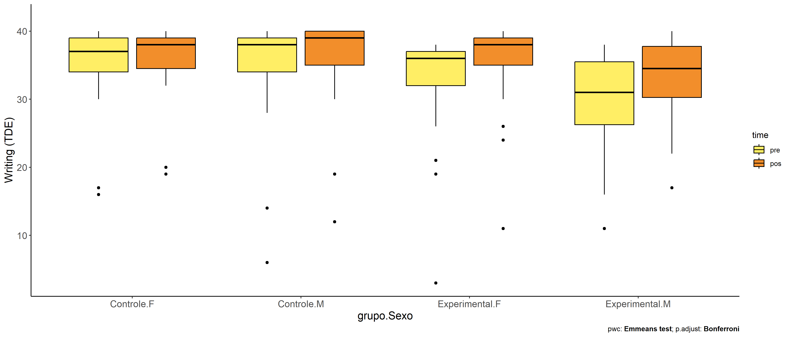
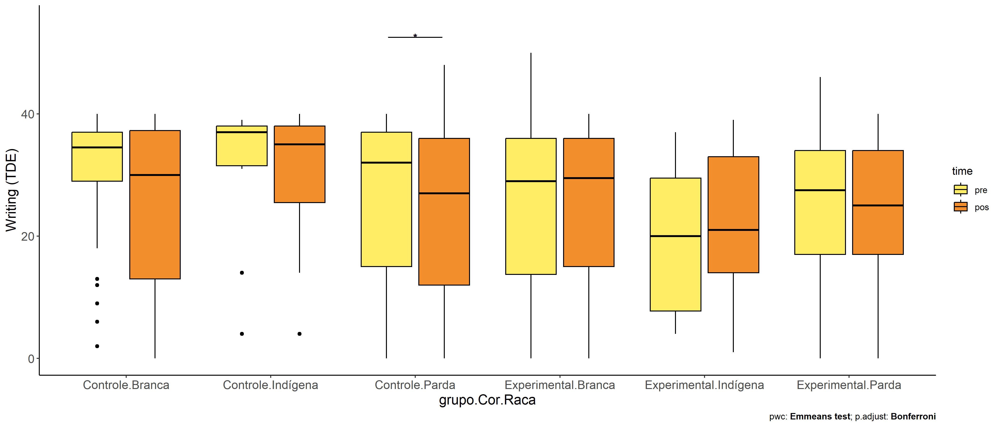
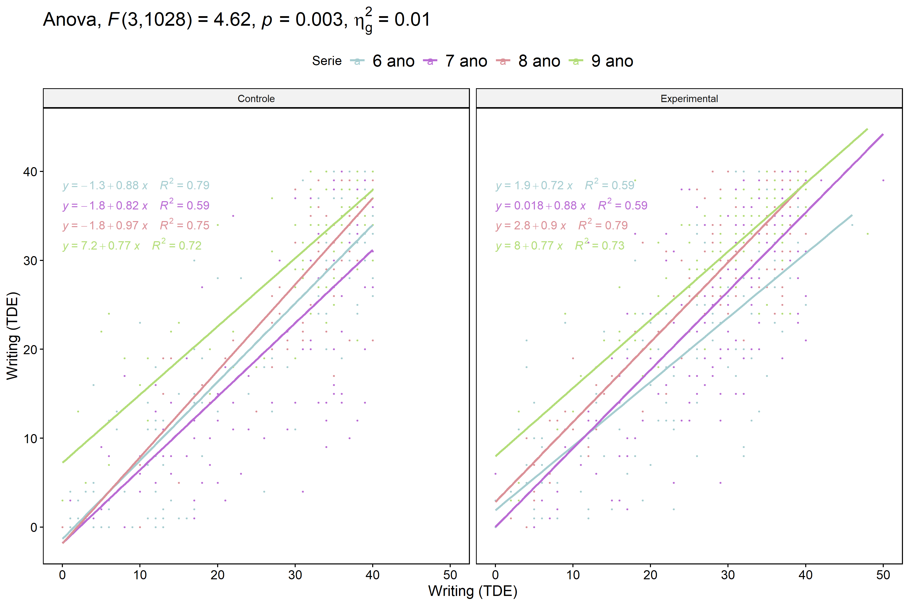

ANCOVA in Writing (TDE - normalizing) (Writing (TDE))
================
Geiser C. Challco <geiser@alumni.usp.br>

- [Setting Initial Variables](#setting-initial-variables)
- [Descriptive Statistics of Initial
  Data](#descriptive-statistics-of-initial-data)
- [ANCOVA and Pairwise for one factor:
  **grupo**](#ancova-and-pairwise-for-one-factor-grupo)
  - [Without remove non-normal data](#without-remove-non-normal-data)
  - [Computing ANCOVA and PairWise After removing non-normal data
    (OK)](#computing-ancova-and-pairwise-after-removing-non-normal-data-ok)
    - [Plots for ancova](#plots-for-ancova)
    - [Checking linearity assumption](#checking-linearity-assumption)
    - [Checking normality and
      homogeneity](#checking-normality-and-homogeneity)
- [ANCOVA and Pairwise for two factors
  **grupo:Sexo**](#ancova-and-pairwise-for-two-factors-gruposexo)
  - [Without remove non-normal data](#without-remove-non-normal-data-1)
  - [Computing ANCOVA and PairWise After removing non-normal data
    (OK)](#computing-ancova-and-pairwise-after-removing-non-normal-data-ok-1)
    - [Plots for ancova](#plots-for-ancova-1)
    - [Checking linearity assumption](#checking-linearity-assumption-1)
    - [Checking normality and
      homogeneity](#checking-normality-and-homogeneity-1)
- [ANCOVA and Pairwise for two factors
  **grupo:Zona**](#ancova-and-pairwise-for-two-factors-grupozona)
  - [Without remove non-normal data](#without-remove-non-normal-data-2)
  - [Computing ANCOVA and PairWise After removing non-normal data
    (OK)](#computing-ancova-and-pairwise-after-removing-non-normal-data-ok-2)
    - [Plots for ancova](#plots-for-ancova-2)
    - [Checking linearity assumption](#checking-linearity-assumption-2)
    - [Checking normality and
      homogeneity](#checking-normality-and-homogeneity-2)
- [ANCOVA and Pairwise for two factors
  **grupo:Cor.Raca**](#ancova-and-pairwise-for-two-factors-grupocorraca)
  - [Without remove non-normal data](#without-remove-non-normal-data-3)
  - [Computing ANCOVA and PairWise After removing non-normal data
    (OK)](#computing-ancova-and-pairwise-after-removing-non-normal-data-ok-3)
    - [Plots for ancova](#plots-for-ancova-3)
    - [Checking linearity assumption](#checking-linearity-assumption-3)
    - [Checking normality and
      homogeneity](#checking-normality-and-homogeneity-3)
- [ANCOVA and Pairwise for two factors
  **grupo:Serie**](#ancova-and-pairwise-for-two-factors-gruposerie)
  - [Without remove non-normal data](#without-remove-non-normal-data-4)
  - [Computing ANCOVA and PairWise After removing non-normal data
    (OK)](#computing-ancova-and-pairwise-after-removing-non-normal-data-ok-4)
    - [Plots for ancova](#plots-for-ancova-4)
    - [Checking linearity assumption](#checking-linearity-assumption-4)
    - [Checking normality and
      homogeneity](#checking-normality-and-homogeneity-4)
- [ANCOVA and Pairwise for two factors
  **grupo:score.tde.norm.quintile**](#ancova-and-pairwise-for-two-factors-gruposcoretdenormquintile)
  - [Without remove non-normal data](#without-remove-non-normal-data-5)
  - [Computing ANCOVA and PairWise After removing non-normal data
    (OK)](#computing-ancova-and-pairwise-after-removing-non-normal-data-ok-5)
    - [Plots for ancova](#plots-for-ancova-5)
    - [Checking linearity assumption](#checking-linearity-assumption-5)
    - [Checking normality and
      homogeneity](#checking-normality-and-homogeneity-5)
- [Summary of Results](#summary-of-results)
  - [Descriptive Statistics](#descriptive-statistics)
  - [ANCOVA Table Comparison](#ancova-table-comparison)
  - [PairWise Table Comparison](#pairwise-table-comparison)
  - [EMMS Table Comparison](#emms-table-comparison)
  - [CONSORT tables](#consort-tables)
    - [Enrolment participants table](#enrolment-participants-table)
    - [Allocated participants table (after removed students with
      disabilities/special
      needs)](#allocated-participants-table-after-removed-students-with-disabilitiesspecial-needs)
    - [Follow-up participants table (after removed students with
      does-not have pre and
      post-test)](#follow-up-participants-table-after-removed-students-with-does-not-have-pre-and-post-test)
    - [Participants table for Analysis (after exclude non-normal
      data)](#participants-table-for-analysis-after-exclude-non-normal-data)

**NOTE**:

- Teste ANCOVA para determinar se houve diferenças significativas no
  Writing (TDE) (medido usando pre- e pos-testes).
- ANCOVA test to determine whether there were significant differences in
  Writing (TDE) (measured using pre- and post-tests).

# Setting Initial Variables

``` r
dv = "score.tde.norm"
dv.pos = "score.tde.norm.pos"
dv.pre = "score.tde.norm.pre"

fatores2 <- c("Sexo","Zona","Cor.Raca","Serie","score.tde.norm.quintile")
lfatores2 <- as.list(fatores2)
names(lfatores2) <- fatores2

fatores1 <- c("grupo", fatores2)
lfatores1 <- as.list(fatores1)
names(lfatores1) <- fatores1

lfatores <- c(lfatores1)

color <- list()
color[["prepost"]] = c("#ffee65","#f28e2B")
color[["grupo"]] = c("#bcbd22","#008000")
color[["Sexo"]] = c("#FF007F","#4D4DFF")
color[["Zona"]] = c("#AA00FF","#00CCCC")
color[["Cor.Raca"]] = c(
  "Parda"="#b97100","Indígena"="#9F262F",
  "Branca"="#87c498", "Preta"="#848283","Amarela"="#D6B91C"
)

level <- list()
level[["grupo"]] = c("Controle","Experimental")
level[["Sexo"]] = c("F","M")
level[["Zona"]] = c("Rural","Urbana")
level[["Cor.Raca"]] = c("Parda","Indígena","Branca", "Preta","Amarela")
level[["Serie"]] = c("6 ano","7 ano","8 ano","9 ano")

# ..

ymin <- 0
ymax <- 0

ymin.ci <- 0
ymax.ci <- 0


color[["grupo:Sexo"]] = c(
  "Controle:F"="#ff99cb", "Controle:M"="#b7b7ff",
  "Experimental:F"="#FF007F", "Experimental:M"="#4D4DFF",
  "Controle.F"="#ff99cb", "Controle.M"="#b7b7ff",
  "Experimental.F"="#FF007F", "Experimental.M"="#4D4DFF"
)
color[["grupo:Zona"]] = c(
  "Controle:Rural"="#b2efef","Controle:Urbana"="#e5b2ff",
  "Experimental:Rural"="#00CCCC", "Experimental:Urbana"="#AA00FF",
  "Controle.Rural"="#b2efef","Controle.Urbana"="#e5b2ff",
  "Experimental.Rural"="#00CCCC", "Experimental.Urbana"="#AA00FF"
)
color[["grupo:Cor.Raca"]] = c(
    "Controle:Parda"="#e3c699", "Experimental:Parda"="#b97100",
    "Controle:Indígena"="#e2bdc0", "Experimental:Indígena"="#9F262F",
    "Controle:Branca"="#c0e8cb", "Experimental:Branca"="#87c498",
    "Controle:Preta"="#dad9d9", "Experimental:Preta"="#848283",
    "Controle:Amarela"="#eee3a4", "Experimental:Amarela"="#D6B91C",
    
    "Controle.Parda"="#e3c699", "Experimental.Parda"="#b97100",
    "Controle.Indígena"="#e2bdc0", "Experimental.Indígena"="#9F262F",
    "Controle.Branca"="#c0e8cb", "Experimental.Branca"="#87c498",
    "Controle.Preta"="#dad9d9", "Experimental.Preta"="#848283",
    "Controle.Amarela"="#eee3a4", "Experimental.Amarela"="#D6B91C"
)


for (coln in c("vocab","vocab.teach","vocab.non.teach",
               "score.tde","score.tde.norm",
               "TFL.lidas.per.min","TFL.corretas.per.min",
               "TFL.erradas.per.min","TFL.omitidas.per.min",
               "leitura.compreensao")) {
  color[[paste0(coln,".quintile")]] = c("#BF0040","#FF0000","#800080","#0000FF","#4000BF")
  level[[paste0(coln,".quintile")]] = c("1st quintile","2nd quintile","3rd quintile","4th quintile","5th quintile")
  color[[paste0("grupo:",coln,".quintile")]] = c(
    "Experimental.1st quintile"="#BF0040", "Controle.1st quintile"="#d8668c",
    "Experimental.2nd quintile"="#FF0000", "Controle.2nd quintile"="#ff7f7f",
    "Experimental.3rd quintile"="#8fce00", "Controle.3rd quintile"="#ddf0b2",
    "Experimental.4th quintile"="#0000FF", "Controle.4th quintile"="#b2b2ff",
    "Experimental.5th quintile"="#4000BF", "Controle.5th quintile"="#b299e5",
    
    "Experimental:1st quintile"="#BF0040", "Controle:1st quintile"="#d8668c",
    "Experimental:2nd quintile"="#FF0000", "Controle:2nd quintile"="#ff7f7f",
    "Experimental:3rd quintile"="#8fce00", "Controle:3rd quintile"="#ddf0b2",
    "Experimental:4th quintile"="#0000FF", "Controle:4th quintile"="#b2b2ff",
    "Experimental:5th quintile"="#4000BF", "Controle:5th quintile"="#b299e5")
}


tdat <- read_excel("../data/data-tde-norm.xlsx", sheet = "summary")
tdat <- tdat[!is.na(tdat[["WG.Grupo"]]),]
tdat$grupo <- factor(tdat[["WG.Grupo"]], level[["grupo"]]) 

gdat <- tdat[which(is.na(tdat$Necessidade.Deficiencia) &
                     !is.na(tdat$WG.Grupo)),]


dat <- gdat
dat$grupo <- factor(dat[["WG.Grupo"]], level[["grupo"]])
for (coln in c(names(lfatores))) {
  dat[[coln]] <- factor(dat[[coln]], level[[coln]][level[[coln]] %in% unique(dat[[coln]])])
}
dat <- dat[which(!is.na(dat[[dv.pre]]) & !is.na(dat[[dv.pos]])),]
dat <- dat[,c("id",names(lfatores),dv.pre,dv.pos)]

dat.long <- rbind(dat, dat)
dat.long$time <- c(rep("pre", nrow(dat)), rep("pos", nrow(dat)))
dat.long$time <- factor(dat.long$time, c("pre","pos"))
dat.long[[dv]] <- c(dat[[dv.pre]], dat[[dv.pos]])


for (f in c("grupo", names(lfatores))) {
  if (is.null(color[[f]]) && length(unique(dat[[f]])) > 0) 
      color[[f]] <- distinctColorPalette(length(unique(dat[[f]])))
}
for (f in c(fatores2)) {
  if (is.null(color[[paste0("grupo:",f)]]) && length(unique(dat[[f]])) > 0)
    color[[paste0("grupo:",f)]] <- distinctColorPalette(length(unique(dat[["grupo"]]))*length(unique(dat[[f]])))
}

ldat <- list()
laov <- list()
lpwc <- list()
lemms <- list()
```

# Descriptive Statistics of Initial Data

``` r
df <- get.descriptives(dat, c(dv.pre, dv.pos), c("grupo"), 
                       include.global = T, symmetry.test = T, normality.test = F)
df <- plyr::rbind.fill(
  df, do.call(plyr::rbind.fill, lapply(lfatores2, FUN = function(f) {
    if (nrow(dat) > 0 && sum(!is.na(unique(dat[[f]]))) > 1)
      get.descriptives(dat, c(dv.pre,dv.pos), c("grupo", f),
                       symmetry.test = T, normality.test = F)
    }))
)
```

    ## Warning: There was 1 warning in `mutate()`.
    ## ℹ In argument: `ci = abs(stats::qt(alpha/2, .data$n - 1) * .data$se)`.
    ## Caused by warning:
    ## ! There was 1 warning in `mutate()`.
    ## ℹ In argument: `ci = abs(stats::qt(alpha/2, .data$n - 1) * .data$se)`.
    ## Caused by warning in `stats::qt()`:
    ## ! NaNs produced
    ## There was 1 warning in `mutate()`.
    ## ℹ In argument: `ci = abs(stats::qt(alpha/2, .data$n - 1) * .data$se)`.
    ## Caused by warning:
    ## ! There was 1 warning in `mutate()`.
    ## ℹ In argument: `ci = abs(stats::qt(alpha/2, .data$n - 1) * .data$se)`.
    ## Caused by warning in `stats::qt()`:
    ## ! NaNs produced

``` r
df <- df[,c(fatores1[fatores1 %in% colnames(df)],"variable",
            colnames(df)[!colnames(df) %in% c(fatores1,"variable")])]
```

| grupo        | Sexo | Zona   | Cor.Raca | Serie | score.tde.norm.quintile | variable           |    n |   mean | median | min | max |     sd |    se |    ci |   iqr | symmetry | skewness | kurtosis |
|:-------------|:-----|:-------|:---------|:------|:------------------------|:-------------------|-----:|-------:|-------:|----:|----:|-------:|------:|------:|------:|:---------|---------:|---------:|
| Controle     |      |        |          |       |                         | score.tde.norm.pre |  485 | 27.460 |   33.0 |   0 |  40 | 12.064 | 0.548 | 1.076 | 19.00 | NO       |   -0.858 |   -0.651 |
| Experimental |      |        |          |       |                         | score.tde.norm.pre |  636 | 27.228 |   30.0 |   0 |  50 | 10.531 | 0.418 | 0.820 | 15.00 | NO       |   -0.847 |   -0.188 |
|              |      |        |          |       |                         | score.tde.norm.pre | 1121 | 27.328 |   31.0 |   0 |  50 | 11.216 | 0.335 | 0.657 | 16.00 | NO       |   -0.856 |   -0.406 |
| Controle     |      |        |          |       |                         | score.tde.norm.pos |  485 | 22.975 |   25.0 |   0 |  48 | 13.457 | 0.611 | 1.201 | 24.00 | YES      |   -0.298 |   -1.312 |
| Experimental |      |        |          |       |                         | score.tde.norm.pos |  636 | 24.509 |   27.0 |   0 |  40 | 12.008 | 0.476 | 0.935 | 20.25 | NO       |   -0.518 |   -0.990 |
|              |      |        |          |       |                         | score.tde.norm.pos | 1121 | 23.846 |   27.0 |   0 |  48 | 12.672 | 0.378 | 0.743 | 22.00 | YES      |   -0.425 |   -1.140 |
| Controle     | F    |        |          |       |                         | score.tde.norm.pre |  247 | 29.656 |   34.0 |   0 |  40 | 10.653 | 0.678 | 1.335 | 12.00 | NO       |   -1.199 |    0.254 |
| Controle     | M    |        |          |       |                         | score.tde.norm.pre |  238 | 25.181 |   31.0 |   0 |  40 | 13.008 | 0.843 | 1.661 | 23.00 | NO       |   -0.539 |   -1.197 |
| Experimental | F    |        |          |       |                         | score.tde.norm.pre |  319 | 28.602 |   32.0 |   0 |  50 | 10.231 | 0.573 | 1.127 | 13.50 | NO       |   -0.966 |    0.118 |
| Experimental | M    |        |          |       |                         | score.tde.norm.pre |  317 | 25.845 |   29.0 |   0 |  42 | 10.664 | 0.599 | 1.178 | 15.00 | NO       |   -0.748 |   -0.431 |
| Controle     | F    |        |          |       |                         | score.tde.norm.pos |  247 | 24.364 |   28.0 |   0 |  40 | 12.716 | 0.809 | 1.594 | 23.00 | YES      |   -0.454 |   -1.211 |
| Controle     | M    |        |          |       |                         | score.tde.norm.pos |  238 | 21.534 |   21.5 |   0 |  48 | 14.067 | 0.912 | 1.796 | 25.75 | YES      |   -0.127 |   -1.386 |
| Experimental | F    |        |          |       |                         | score.tde.norm.pos |  319 | 25.614 |   29.0 |   0 |  40 | 12.050 | 0.675 | 1.327 | 20.50 | NO       |   -0.616 |   -0.899 |
| Experimental | M    |        |          |       |                         | score.tde.norm.pos |  317 | 23.397 |   26.0 |   0 |  40 | 11.882 | 0.667 | 1.313 | 19.00 | YES      |   -0.434 |   -1.057 |
| Controle     |      | Rural  |          |       |                         | score.tde.norm.pre |  243 | 26.770 |   33.0 |   0 |  40 | 12.871 | 0.826 | 1.626 | 22.50 | NO       |   -0.708 |   -1.038 |
| Controle     |      | Urbana |          |       |                         | score.tde.norm.pre |  109 | 29.018 |   34.0 |   1 |  40 | 10.686 | 1.024 | 2.029 | 13.00 | NO       |   -1.112 |    0.263 |
| Controle     |      |        |          |       |                         | score.tde.norm.pre |  133 | 27.444 |   32.0 |   0 |  40 | 11.560 | 1.002 | 1.983 | 17.00 | NO       |   -0.925 |   -0.468 |
| Experimental |      | Rural  |          |       |                         | score.tde.norm.pre |  284 | 25.880 |   28.0 |   0 |  50 | 11.159 | 0.662 | 1.303 | 16.25 | NO       |   -0.625 |   -0.517 |
| Experimental |      | Urbana |          |       |                         | score.tde.norm.pre |  167 | 28.006 |   32.0 |   0 |  40 | 10.533 | 0.815 | 1.609 | 13.00 | NO       |   -1.072 |    0.062 |
| Experimental |      |        |          |       |                         | score.tde.norm.pre |  185 | 28.595 |   31.0 |   0 |  40 |  9.269 | 0.681 | 1.345 | 12.00 | NO       |   -0.939 |    0.089 |
| Controle     |      | Rural  |          |       |                         | score.tde.norm.pos |  243 | 23.811 |   28.0 |   0 |  48 | 14.030 | 0.900 | 1.773 | 26.00 | YES      |   -0.397 |   -1.303 |
| Controle     |      | Urbana |          |       |                         | score.tde.norm.pos |  109 | 19.083 |   19.0 |   0 |  40 | 12.637 | 1.210 | 2.399 | 23.00 | YES      |    0.081 |   -1.384 |
| Controle     |      |        |          |       |                         | score.tde.norm.pos |  133 | 24.639 |   27.0 |   0 |  40 | 12.484 | 1.082 | 2.141 | 21.00 | YES      |   -0.458 |   -1.083 |
| Experimental |      | Rural  |          |       |                         | score.tde.norm.pos |  284 | 23.806 |   25.0 |   0 |  40 | 12.148 | 0.721 | 1.419 | 20.00 | YES      |   -0.357 |   -1.115 |
| Experimental |      | Urbana |          |       |                         | score.tde.norm.pos |  167 | 22.814 |   25.0 |   0 |  40 | 12.733 | 0.985 | 1.945 | 22.50 | YES      |   -0.370 |   -1.257 |
| Experimental |      |        |          |       |                         | score.tde.norm.pos |  185 | 27.119 |   31.0 |   0 |  40 | 10.687 | 0.786 | 1.550 | 16.00 | NO       |   -0.902 |   -0.276 |
| Controle     |      |        | Parda    |       |                         | score.tde.norm.pre |  162 | 26.944 |   32.0 |   0 |  40 | 12.405 | 0.975 | 1.925 | 18.75 | NO       |   -0.911 |   -0.591 |
| Controle     |      |        | Indígena |       |                         | score.tde.norm.pre |   11 | 31.273 |   37.0 |   4 |  39 | 11.516 | 3.472 | 7.737 |  6.50 | NO       |   -1.404 |    0.384 |
| Controle     |      |        | Branca   |       |                         | score.tde.norm.pre |   50 | 30.360 |   34.0 |   2 |  40 | 10.453 | 1.478 | 2.971 |  7.50 | NO       |   -1.363 |    0.521 |
| Controle     |      |        |          |       |                         | score.tde.norm.pre |  262 | 27.065 |   32.0 |   0 |  40 | 12.118 | 0.749 | 1.474 | 20.00 | NO       |   -0.702 |   -0.904 |
| Experimental |      |        | Parda    |       |                         | score.tde.norm.pre |  190 | 25.074 |   28.0 |   0 |  46 | 11.133 | 0.808 | 1.593 | 16.00 | NO       |   -0.552 |   -0.731 |
| Experimental |      |        | Indígena |       |                         | score.tde.norm.pre |   15 | 20.667 |   21.0 |   4 |  37 | 11.872 | 3.065 | 6.575 | 19.50 | YES      |   -0.117 |   -1.521 |
| Experimental |      |        | Branca   |       |                         | score.tde.norm.pre |   61 | 25.590 |   29.0 |   0 |  50 | 12.356 | 1.582 | 3.165 | 19.00 | NO       |   -0.555 |   -0.809 |
| Experimental |      |        | Amarela  |       |                         | score.tde.norm.pre |    1 | 21.000 |   21.0 |  21 |  21 |        |       |       |  0.00 | few data |    0.000 |    0.000 |
| Experimental |      |        |          |       |                         | score.tde.norm.pre |  369 | 28.892 |   31.0 |   0 |  48 |  9.486 | 0.494 | 0.971 | 11.00 | NO       |   -1.088 |    0.500 |
| Controle     |      |        | Parda    |       |                         | score.tde.norm.pos |  162 | 22.210 |   24.0 |   0 |  48 | 13.883 | 1.091 | 2.154 | 26.00 | YES      |   -0.222 |   -1.374 |
| Controle     |      |        | Indígena |       |                         | score.tde.norm.pos |   11 | 29.818 |   35.0 |   4 |  40 | 11.805 | 3.559 | 7.931 | 12.50 | NO       |   -1.021 |   -0.459 |
| Controle     |      |        | Branca   |       |                         | score.tde.norm.pos |   50 | 23.200 |   29.0 |   0 |  40 | 13.996 | 1.979 | 3.978 | 23.75 | YES      |   -0.327 |   -1.464 |
| Controle     |      |        |          |       |                         | score.tde.norm.pos |  262 | 23.118 |   23.5 |   0 |  40 | 13.131 | 0.811 | 1.597 | 23.75 | YES      |   -0.302 |   -1.281 |
| Experimental |      |        | Parda    |       |                         | score.tde.norm.pos |  190 | 22.774 |   24.0 |   0 |  40 | 12.373 | 0.898 | 1.771 | 21.75 | YES      |   -0.307 |   -1.158 |
| Experimental |      |        | Indígena |       |                         | score.tde.norm.pos |   15 | 22.133 |   21.0 |   1 |  39 | 11.837 | 3.056 | 6.555 | 20.00 | YES      |   -0.019 |   -1.463 |
| Experimental |      |        | Branca   |       |                         | score.tde.norm.pos |   61 | 23.148 |   26.0 |   0 |  40 | 13.310 | 1.704 | 3.409 | 21.00 | YES      |   -0.353 |   -1.319 |
| Experimental |      |        | Amarela  |       |                         | score.tde.norm.pos |    1 | 22.000 |   22.0 |  22 |  22 |        |       |       |  0.00 | few data |    0.000 |    0.000 |
| Experimental |      |        |          |       |                         | score.tde.norm.pos |  369 | 25.732 |   29.0 |   0 |  40 | 11.505 | 0.599 | 1.178 | 18.00 | NO       |   -0.674 |   -0.778 |
| Controle     |      |        |          | 6 ano |                         | score.tde.norm.pre |  134 | 22.746 |   24.5 |   0 |  40 | 13.600 | 1.175 | 2.324 | 25.00 | YES      |   -0.188 |   -1.551 |
| Controle     |      |        |          | 7 ano |                         | score.tde.norm.pre |  141 | 26.397 |   31.0 |   0 |  40 | 11.651 | 0.981 | 1.940 | 19.00 | NO       |   -0.663 |   -0.885 |
| Controle     |      |        |          | 8 ano |                         | score.tde.norm.pre |   89 | 29.955 |   33.0 |   0 |  40 |  9.463 | 1.003 | 1.993 |  9.00 | NO       |   -1.632 |    2.170 |
| Controle     |      |        |          | 9 ano |                         | score.tde.norm.pre |  121 | 32.083 |   36.0 |   0 |  40 | 10.280 | 0.935 | 1.850 |  8.00 | NO       |   -1.690 |    1.716 |
| Experimental |      |        |          | 6 ano |                         | score.tde.norm.pre |  159 | 22.862 |   24.0 |   0 |  46 | 11.349 | 0.900 | 1.778 | 17.50 | YES      |   -0.360 |   -0.943 |
| Experimental |      |        |          | 7 ano |                         | score.tde.norm.pre |  187 | 28.332 |   31.0 |   0 |  50 |  9.492 | 0.694 | 1.369 | 14.00 | NO       |   -0.715 |   -0.241 |
| Experimental |      |        |          | 8 ano |                         | score.tde.norm.pre |  143 | 27.643 |   31.0 |   0 |  40 | 10.842 | 0.907 | 1.792 | 13.00 | NO       |   -1.028 |   -0.112 |
| Experimental |      |        |          | 9 ano |                         | score.tde.norm.pre |  147 | 30.143 |   33.0 |   0 |  48 |  9.101 | 0.751 | 1.483 | 11.00 | NO       |   -1.352 |    1.583 |
| Controle     |      |        |          | 6 ano |                         | score.tde.norm.pos |  134 | 17.567 |   15.0 |   0 |  48 | 13.960 | 1.206 | 2.385 | 26.75 | YES      |    0.230 |   -1.411 |
| Controle     |      |        |          | 7 ano |                         | score.tde.norm.pos |  141 | 18.220 |   14.0 |   0 |  40 | 12.793 | 1.077 | 2.130 | 22.00 | YES      |    0.337 |   -1.240 |
| Controle     |      |        |          | 8 ano |                         | score.tde.norm.pos |   89 | 26.910 |   30.0 |   0 |  40 | 10.840 | 1.149 | 2.284 | 16.00 | NO       |   -0.857 |   -0.012 |
| Controle     |      |        |          | 9 ano |                         | score.tde.norm.pos |  121 | 31.612 |   35.0 |   0 |  40 |  9.555 | 0.869 | 1.720 | 12.00 | NO       |   -1.362 |    1.199 |
| Experimental |      |        |          | 6 ano |                         | score.tde.norm.pos |  159 | 17.094 |   16.0 |   0 |  40 | 11.682 | 0.926 | 1.830 | 19.00 | YES      |    0.276 |   -1.082 |
| Experimental |      |        |          | 7 ano |                         | score.tde.norm.pos |  187 | 23.829 |   25.0 |   0 |  40 | 11.575 | 0.846 | 1.670 | 19.50 | YES      |   -0.319 |   -1.131 |
| Experimental |      |        |          | 8 ano |                         | score.tde.norm.pos |  143 | 27.490 |   31.0 |   0 |  40 | 11.260 | 0.942 | 1.861 | 13.00 | NO       |   -0.972 |   -0.101 |
| Experimental |      |        |          | 9 ano |                         | score.tde.norm.pos |  147 | 30.497 |   33.0 |   0 |  40 |  8.957 | 0.739 | 1.460 | 10.00 | NO       |   -1.524 |    1.930 |
| Controle     |      |        |          |       | 1st quintile            | score.tde.norm.pre |  110 |  8.127 |    8.0 |   0 |  16 |  4.846 | 0.462 | 0.916 |  8.00 | YES      |   -0.139 |   -1.315 |
| Controle     |      |        |          |       | 2nd quintile            | score.tde.norm.pre |   53 | 20.396 |   20.0 |  17 |  25 |  2.699 | 0.371 | 0.744 |  4.00 | YES      |    0.288 |   -1.272 |
| Controle     |      |        |          |       | 3rd quintile            | score.tde.norm.pre |   74 | 29.757 |   30.0 |  26 |  32 |  2.012 | 0.234 | 0.466 |  4.00 | YES      |   -0.456 |   -1.171 |
| Controle     |      |        |          |       | 4th quintile            | score.tde.norm.pre |  141 | 35.270 |   35.0 |  33 |  37 |  1.352 | 0.114 | 0.225 |  2.00 | YES      |   -0.200 |   -1.162 |
| Controle     |      |        |          |       | 5th quintile            | score.tde.norm.pre |  107 | 38.953 |   39.0 |  38 |  40 |  0.817 | 0.079 | 0.157 |  2.00 | few data |    0.000 |    0.000 |
| Experimental |      |        |          |       | 1st quintile            | score.tde.norm.pre |  110 |  8.627 |    9.0 |   0 |  16 |  4.814 | 0.459 | 0.910 |  8.00 | YES      |   -0.160 |   -1.075 |
| Experimental |      |        |          |       | 2nd quintile            | score.tde.norm.pre |  108 | 21.102 |   21.0 |  17 |  25 |  2.612 | 0.251 | 0.498 |  4.00 | YES      |   -0.032 |   -1.175 |
| Experimental |      |        |          |       | 3rd quintile            | score.tde.norm.pre |  164 | 29.287 |   29.0 |  26 |  32 |  2.045 | 0.160 | 0.315 |  3.00 | YES      |   -0.207 |   -1.286 |
| Experimental |      |        |          |       | 4th quintile            | score.tde.norm.pre |  171 | 35.240 |   36.0 |  33 |  37 |  1.441 | 0.110 | 0.218 |  2.00 | YES      |   -0.292 |   -1.293 |
| Experimental |      |        |          |       | 5th quintile            | score.tde.norm.pre |   83 | 39.277 |   39.0 |  38 |  50 |  1.921 | 0.211 | 0.419 |  2.00 | NO       |    3.687 |   15.743 |
| Controle     |      |        |          |       | 1st quintile            | score.tde.norm.pos |  110 |  7.300 |    4.0 |   0 |  36 |  7.594 | 0.724 | 1.435 | 11.00 | NO       |    1.021 |    0.539 |
| Controle     |      |        |          |       | 2nd quintile            | score.tde.norm.pos |   53 | 14.679 |   14.0 |   0 |  37 |  9.072 | 1.246 | 2.501 | 11.00 | NO       |    0.510 |   -0.265 |
| Controle     |      |        |          |       | 3rd quintile            | score.tde.norm.pos |   74 | 22.973 |   23.0 |   1 |  40 | 10.574 | 1.229 | 2.450 | 14.00 | YES      |   -0.284 |   -0.920 |
| Controle     |      |        |          |       | 4th quintile            | score.tde.norm.pos |  141 | 29.376 |   32.0 |   5 |  48 |  9.527 | 0.802 | 1.586 | 12.00 | NO       |   -0.885 |   -0.183 |
| Controle     |      |        |          |       | 5th quintile            | score.tde.norm.pos |  107 | 34.766 |   37.0 |  11 |  40 |  6.786 | 0.656 | 1.301 |  6.50 | NO       |   -1.845 |    3.054 |
| Experimental |      |        |          |       | 1st quintile            | score.tde.norm.pos |  110 |  9.618 |    9.0 |   0 |  40 |  7.914 | 0.755 | 1.495 | 11.00 | NO       |    1.169 |    1.763 |
| Experimental |      |        |          |       | 2nd quintile            | score.tde.norm.pos |  108 | 18.898 |   20.0 |   0 |  39 | 10.486 | 1.009 | 2.000 | 14.00 | YES      |   -0.072 |   -0.880 |
| Experimental |      |        |          |       | 3rd quintile            | score.tde.norm.pos |  164 | 26.085 |   28.0 |   0 |  40 |  9.533 | 0.744 | 1.470 | 13.00 | NO       |   -0.758 |   -0.208 |
| Experimental |      |        |          |       | 4th quintile            | score.tde.norm.pos |  171 | 30.860 |   33.0 |   4 |  40 |  8.196 | 0.627 | 1.237 |  9.50 | NO       |   -1.279 |    0.990 |
| Experimental |      |        |          |       | 5th quintile            | score.tde.norm.pos |   83 | 35.349 |   37.0 |  21 |  40 |  4.810 | 0.528 | 1.050 |  6.00 | NO       |   -1.237 |    0.604 |

# ANCOVA and Pairwise for one factor: **grupo**

## Without remove non-normal data

``` r
pdat = remove_group_data(dat[!is.na(dat[["grupo"]]),], "score.tde.norm.pos", "grupo")

pdat.long <- rbind(pdat[,c("id","grupo")], pdat[,c("id","grupo")])
pdat.long[["time"]] <- c(rep("pre", nrow(pdat)), rep("pos", nrow(pdat)))
pdat.long[["time"]] <- factor(pdat.long[["time"]], c("pre","pos"))
pdat.long[["score.tde.norm"]] <- c(pdat[["score.tde.norm.pre"]], pdat[["score.tde.norm.pos"]])

aov = anova_test(pdat, score.tde.norm.pos ~ score.tde.norm.pre + grupo)
laov[["grupo"]] <- get_anova_table(aov)
```

``` r
pwc <- emmeans_test(pdat, score.tde.norm.pos ~ grupo, covariate = score.tde.norm.pre,
                    p.adjust.method = "bonferroni")
```

``` r
pwc.long <- emmeans_test(dplyr::group_by_at(pdat.long, "grupo"),
                          score.tde.norm ~ time,
                          p.adjust.method = "bonferroni")
lpwc[["grupo"]] <- plyr::rbind.fill(pwc, pwc.long)
```

``` r
ds <- get.descriptives(pdat, "score.tde.norm.pos", "grupo", covar = "score.tde.norm.pre")
ds <- merge(ds[ds$variable != "score.tde.norm.pre",],
            ds[ds$variable == "score.tde.norm.pre", !colnames(ds) %in% c("variable")],
            by = "grupo", all.x = T, suffixes = c("", ".score.tde.norm.pre"))
ds <- merge(get_emmeans(pwc), ds, by = "grupo", suffixes = c(".emms", ""))
ds <- ds[,c("grupo","n","mean.score.tde.norm.pre","se.score.tde.norm.pre","mean","se",
            "emmean","se.emms","conf.low","conf.high")]

colnames(ds) <- c("grupo", "N", paste0(c("M","SE")," (pre)"),
                  paste0(c("M","SE"), " (unadj)"),
                  paste0(c("M", "SE"), " (adj)"), "conf.low", "conf.high")

lemms[["grupo"]] <- ds
```

## Computing ANCOVA and PairWise After removing non-normal data (OK)

``` r
wdat = pdat 

res = residuals(lm(score.tde.norm.pos ~ score.tde.norm.pre + grupo, data = wdat))
non.normal = getNonNormal(res, wdat$id, plimit = 0.05)

wdat = wdat[!wdat$id %in% non.normal,]

wdat.long <- rbind(wdat[,c("id","grupo")], wdat[,c("id","grupo")])
wdat.long[["time"]] <- c(rep("pre", nrow(wdat)), rep("pos", nrow(wdat)))
wdat.long[["time"]] <- factor(wdat.long[["time"]], c("pre","pos"))
wdat.long[["score.tde.norm"]] <- c(wdat[["score.tde.norm.pre"]], wdat[["score.tde.norm.pos"]])

ldat[["grupo"]] = wdat

(non.normal)
```

    ##    [1] "P2937" "P2865" "P2974" "P1878" "P3024" "P2917" "P1128" "P3475" "P2886"
    ##   [10] "P2959" "P2994" "P2883" "P3020" "P3029" "P2861" "P3015" "P2978" "P2848"
    ##   [19] "P2867" "P2956" "P2946" "P2983" "P2964" "P2982" "P2929" "P2995" "P1129"
    ##   [28] "P572"  "P2910" "P2904" "P3637" "P3533" "P2933" "P2860" "P2839" "P2979"
    ##   [37] "P2876" "P2850" "P2846" "P2969" "P921"  "P2950" "P2845" "P2871" "P2909"
    ##   [46] "P2870" "P3019" "P2854" "P2858" "P2888" "P2835" "P1804" "P3007" "P2993"
    ##   [55] "P2975" "P3000" "P2973" "P2866" "P2831" "P2990" "P3005" "P3021" "P2967"
    ##   [64] "P2997" "P1068" "P1971" "P2859" "P2977" "P2981" "P3030" "P2864" "P2843"
    ##   [73] "P1840" "P2952" "P2913" "P862"  "P2869" "P1139" "P2955" "P873"  "P2852"
    ##   [82] "P2957" "P1964" "P3012" "P908"  "P2986" "P924"  "P2947" "P1126" "P3010"
    ##   [91] "P1002" "P831"  "P3640" "P1067" "P3730" "P1758" "P484"  "P3731" "P1745"
    ##  [100] "P3144" "P3591" "P3584" "P1088" "P453"  "P3639" "P809"  "P2004" "P3472"
    ##  [109] "P929"  "P2196" "P3546" "P3532" "P3129" "P3526" "P1714" "P3179" "P3563"
    ##  [118] "P3477" "P2313" "P3726" "P2905" "P3631" "P2331" "P3026" "P3545" "P832" 
    ##  [127] "P2329" "P854"  "P550"  "P2836" "P2880" "P3647" "P2945" "P848"  "P499" 
    ##  [136] "P2879" "P1081" "P2467" "P3549" "P2316" "P2948" "P962"  "P2891" "P2194"
    ##  [145] "P2406" "P2953" "P2868" "P1885" "P1747" "P2221" "P1887" "P2980" "P2971"
    ##  [154] "P609"  "P2989" "P3054" "P1056" "P2951" "P3050" "P1018" "P2922" "P1009"
    ##  [163] "P2882" "P2901" "P2968" "P1910" "P1886" "P2894" "P541"  "P2832" "P2961"
    ##  [172] "P580"  "P584"  "P3061" "P1892" "P1673" "P1900" "P914"  "P1149" "P3038"
    ##  [181] "P2927" "P2874" "P2851" "P1599" "P548"  "P1867" "P1825" "P1803" "P1597"
    ##  [190] "P1607" "P3080" "P1916" "P3732" "P996"  "P2903" "P2912" "P2881" "P1664"
    ##  [199] "P606"  "P917"  "P1592" "P1852" "P3009" "P1914" "P1833" "P1899" "P3703"
    ##  [208] "P2896" "P2838" "P1652" "P1911" "P502"  "P2944" "P852"  "P1117" "P2893"
    ##  [217] "P3689" "P3088" "P1907" "P2847" "P1858" "P1678" "P2966" "P3158" "P1845"
    ##  [226] "P3228" "P3006" "P3001" "P2908" "P1616" "P535"  "P1069" "P3650" "P1683"
    ##  [235] "P1168" "P560"  "P1630" "P1035" "P1665" "P1006" "P2907" "P1908" "P2872"
    ##  [244] "P3486" "P1866" "P1842" "P3476" "P913"  "P3551" "P886"  "P2962" "P849" 
    ##  [253] "P1591" "P1869" "P1688" "P974"  "P543"  "P2074" "P3530" "P3057" "P2072"
    ##  [262] "P926"  "P2998" "P904"  "P540"  "P1681" "P3156" "P1828" "P1839" "P3481"
    ##  [271] "P1671" "P1843" "P1111" "P837"  "P1640" "P3221" "P1118" "P1870" "P444" 
    ##  [280] "P1889" "P3072" "P1895" "P1831" "P1876" "P3651" "P3003" "P481"  "P969" 
    ##  [289] "P1829" "P1972" "P1645" "P3510" "P2375" "P1654" "P1832" "P1596" "P1906"
    ##  [298] "P545"  "P573"  "P1685" "P585"  "P963"  "P529"  "P1021" "P878"  "P442" 
    ##  [307] "P1725" "P846"  "P1643" "P3065" "P576"  "P857"  "P970"  "P1893" "P3538"
    ##  [316] "P2050" "P2094" "P3471" "P1660" "P1902" "P928"  "P2840" "P3081" "P3673"
    ##  [325] "P461"  "P1085" "P1877" "P3077" "P1075" "P1603" "P1848" "P1884" "P1606"
    ##  [334] "P477"  "P492"  "P456"  "P3048" "P1620" "P912"  "P973"  "P2900" "P1600"
    ##  [343] "P2059" "P3193" "P1834" "P1655" "P993"  "P1868" "P1602" "P3086" "P2855"
    ##  [352] "P864"  "P1669" "P1617" "P1847" "P588"  "P1034" "P877"  "P2842" "P1957"
    ##  [361] "P3025" "P466"  "P2083" "P871"  "P1846" "P1863" "P1152" "P859"  "P487" 
    ##  [370] "P1837" "P1859" "P1632" "P1019" "P2107" "P1090" "P2931" "P2071" "P1882"
    ##  [379] "P1618" "P998"  "P1708" "P1684" "P571"  "P1841" "P1054" "P1690" "P1161"
    ##  [388] "P2070" "P3484" "P3653" "P3241" "P1901" "P2304" "P1029" "P967"  "P556" 
    ##  [397] "P3245" "P1072" "P3237" "P603"  "P2206" "P3522" "P1634" "P891"  "P2098"
    ##  [406] "P565"  "P2080" "P2064" "P3478" "P1679" "P1875" "P2068" "P850"  "P1644"
    ##  [415] "P3066" "P1905" "P2204" "P3110" "P985"  "P3204" "P3043" "P561"  "P1849"
    ##  [424] "P1904" "P3561" "P3468" "P2114" "P443"  "P3482" "P2101" "P3112" "P1891"
    ##  [433] "P1053" "P2175" "P2049" "P1738" "P869"  "P1605" "P2092" "P479"  "P3062"
    ##  [442] "P1888" "P2113" "P3209" "P3534" "P964"  "P1014" "P2073" "P567"  "P3553"
    ##  [451] "P847"  "P1897" "P1785" "P1042" "P493"  "P490"  "P455"  "P3460" "P2885"
    ##  [460] "P3459" "P2056" "P577"  "P863"  "P2369" "P1151" "P3254" "P2875" "P2934"
    ##  [469] "P1167" "P1064" "P940"  "P3042" "P2895" "P500"  "P2165" "P3131" "P3087"
    ##  [478] "P1095" "P1666" "P1826" "P1966" "P1939" "P2327" "P3227" "P1063" "P3255"
    ##  [487] "P3075" "P1797" "P1636" "P3282" "P1735" "P868"  "P1806" "P538"  "P915" 
    ##  [496] "P3271" "P1767" "P3143" "P3513" "P3507" "P821"  "P1991" "P1162" "P1610"
    ##  [505] "P597"  "P2233" "P834"  "P2057" "P3677" "P1707" "P3288" "P1100" "P2466"
    ##  [514] "P2066" "P2887" "P2000" "P3250" "P1773" "P1712" "P3287" "P1143" "P2186"
    ##  [523] "P1013" "P843"  "P3298" "P966"  "P1851" "P1853" "P3694" "P2096" "P1835"
    ##  [532] "P1757" "P3064" "P1880" "P3523" "P2088" "P3638" "P1689" "P3622" "P1788"
    ##  [541] "P3491" "P968"  "P3503" "P1008" "P3113" "P2897" "P1074" "P1594" "P885" 
    ##  [550] "P520"  "P1950" "P2410" "P879"  "P1990" "P3656" "P1709" "P3488" "P3011"
    ##  [559] "P2084" "P1127" "P2069" "P569"  "P1883" "P3714" "P2106" "P1855" "P2087"
    ##  [568] "P3684" "P3297" "P3147" "P1800" "P3145" "P1787" "P1909" "P3136" "P1037"
    ##  [577] "P836"  "P473"  "P2429" "P1145" "P1672" "P447"  "P1802" "P3499" "P827" 
    ##  [586] "P3658" "P3305" "P562"  "P1794" "P3079" "P1039" "P2104" "P3284" "P1912"
    ##  [595] "P1110" "P1102" "P872"  "P1781" "P2048" "P910"  "P1857" "P919"  "P3285"
    ##  [604] "P2472" "P3590" "P2077" "P866"  "P1023" "P2358" "P1921" "P1639" "P1937"
    ##  [613] "P3587" "P2296" "P3660" "P3238" "P856"  "P1648" "P1948" "P3548" "P1668"
    ##  [622] "P860"  "P482"  "P2082" "P1759" "P3493" "P3470" "P462"  "P3293" "P610" 
    ##  [631] "P1649" "P875"  "P3550" "P2075" "P1793" "P3142" "P3082" "P441"  "P1105"
    ##  [640] "P984"  "P1890" "P2320" "P1720" "P2435" "P1775" "P1944" "P1942" "P1007"
    ##  [649] "P987"  "P2310" "P817"  "P3224" "P3083" "P2457" "P3133" "P927"  "P2392"
    ##  [658] "P1737" "P1782" "P1033" "P3494" "P3068" "P2325" "P2006" "P3674" "P3236"
    ##  [667] "P3146" "P3679" "P3535" "P1691" "P1951" "P547"  "P1761" "P1046" "P3608"
    ##  [676] "P1903" "P1943" "P1871" "P2345" "P977"  "P2086" "P1723" "P3718" "P488" 
    ##  [685] "P2190" "P845"  "P1898" "P3583" "P3256" "P814"  "P2446" "P3148" "P2185"
    ##  [694] "P844"  "P3138" "P2439" "P3576" "P887"  "P2351" "P2008" "P3539" "P3233"
    ##  [703] "P2097" "P3248" "P961"  "P3164" "P1960" "P2173" "P1958" "P3666" "P564" 
    ##  [712] "P1780" "P2367" "P851"  "P1040" "P3125" "P1973" "P3200" "P1124" "P1935"
    ##  [721] "P1112" "P1093" "P3202" "P559"  "P976"  "P2451" "P631"  "P933"  "P1141"
    ##  [730] "P937"  "P920"  "P2424" "P1956" "P1082" "P1083" "P2051" "P3247" "P1748"
    ##  [739] "P3219" "P3173" "P3140" "P3073" "P528"  "P1116" "P3280" "P2423" "P2065"
    ##  [748] "P2479" "P3067" "P934"  "P1933" "P2426" "P1719" "P3259" "P483"  "P3120"
    ##  [757] "P2301" "P1700" "P472"  "P1121" "P3141" "P999"  "P3070" "P498"  "P2105"
    ##  [766] "P2078" "P3700" "P2192" "P3074" "P1031" "P3283" "P2452" "P3157" "P3483"
    ##  [775] "P2309" "P835"  "P3114" "P1744" "P2100" "P1798" "P3180" "P605"  "P2079"
    ##  [784] "P1147" "P3479" "P3690" "P1938" "P579"  "P3527" "P3643" "P3688" "P925" 
    ##  [793] "P3134" "P2415" "P884"  "P1001" "P2319" "P853"  "P503"  "P2462" "P3231"
    ##  [802] "P3150" "P880"  "P959"  "P3119" "P2168" "P3520" "P2215" "P1103" "P2373"
    ##  [811] "P478"  "P2420" "P2333" "P2170" "P3616" "P2195" "P1142" "P2012" "P633" 
    ##  [820] "P2399" "P1155" "P1065" "P471"  "P2237" "P3269" "P2463" "P1945" "P3127"
    ##  [829] "P1959" "P495"  "P916"  "P986"  "P1704" "P3130" "P2242" "P3151" "P2197"
    ##  [838] "P1968" "P2438" "P2398" "P2217" "P1961" "P1954" "P3562" "P3537" "P2054"
    ##  [847] "P2453" "P2365" "P3124" "P1158" "P2436" "P2357" "P2421" "P598"  "P2425"
    ##  [856] "P3716" "P3709" "P2393" "P3610" "P2298" "P3211" "P2456" "P1087" "P1024"
    ##  [865] "P1739" "P1807" "P1932" "P1130" "P1772" "P2394" "P1949" "P2177" "P2459"
    ##  [874] "P3723" "P1790" "P3543" "P1927" "P1926" "P2480" "P3676" "P2361" "P2432"
    ##  [883] "P2441" "P3078" "P2174" "P3268" "P3213" "P2461" "P1993" "P474"  "P2091"
    ##  [892] "P2321" "P3161" "P2315" "P3299" "P1026" "P1133" "P3669" "P2297" "P3474"
    ##  [901] "P1995" "P2449" "P2302" "P3567" "P1718" "P954"  "P3240" "P3582" "P931" 
    ##  [910] "P3115" "P3670" "P586"  "P3132" "P1741" "P2002" "P595"  "P2339" "P1060"
    ##  [919] "P3469" "P3579" "P995"  "P3225" "P3135" "P3662" "P3601" "P2189" "P2476"
    ##  [928] "P1703" "P3693" "P2413" "P2200" "P2181" "P2481" "P815"  "P3614" "P3076"
    ##  [937] "P2171" "P2379" "P3588" "P3260" "P2468" "P2300" "P1722" "P3198" "P2414"
    ##  [946] "P3695" "P1977" "P2011" "P1989" "P1043" "P3139" "P1922" "P3304" "P608" 
    ##  [955] "P2374" "P2382" "P1879" "P1749" "P3704" "P1726" "P2163" "P932"  "P2343"
    ##  [964] "P2166" "P2179" "P1934" "P3568" "P1763" "P3722" "P3621" "P3710" "P3596"
    ##  [973] "P2469" "P2387" "P489"  "P2208" "P2372" "P1969" "P2245" "P2324" "P546" 
    ##  [982] "P596"  "P1982" "P1755" "P3634" "P1936" "P3123" "P1734" "P3258" "P1917"
    ##  [991] "P979"  "P2335" "P2317" "P2234" "P2349" "P1104" "P1854" "P1036" "P2411"
    ## [1000] "P3672" "P2417" "P3572" "P2099" "P2305" "P604"  "P2478" "P600"  "P1962"
    ## [1009] "P2334" "P3266" "P2384" "P2108" "P3122" "P3571" "P3646" "P1028" "P2007"
    ## [1018] "P3691" "P3657" "P2368" "P1955" "P3713" "P3171" "P2322" "P3585" "P2444"
    ## [1027] "P3573" "P3724" "P3487" "P496"  "P3675" "P2412" "P3633" "P1983" "P2477"
    ## [1036] "P951"  "P3274" "P2251" "P1140" "P3720" "P2299" "P3715" "P2326" "P3589"
    ## [1045] "P617"  "P2308" "P3290" "P2350" "P2191" "P3163" "P3728" "P1941" "P1979"
    ## [1054] "P3663" "P1750" "P3708" "P3580" "P3719" "P3711" "P2306"

``` r
aov = anova_test(wdat, score.tde.norm.pos ~ score.tde.norm.pre + grupo)
laov[["grupo"]] <- merge(get_anova_table(aov), laov[["grupo"]],
                            by="Effect", suffixes = c("","'"))

(df = get_anova_table(aov))
```

    ## ANOVA Table (type II tests)
    ## 
    ##               Effect DFn DFd         F        p p<.05   ges
    ## 1 score.tde.norm.pre   1  58 24019.008 1.24e-77     * 0.998
    ## 2              grupo   1  58   374.204 5.66e-27     * 0.866

| Effect             | DFn | DFd |         F |   p | p\<.05 |   ges |
|:-------------------|----:|----:|----------:|----:|:-------|------:|
| score.tde.norm.pre |   1 |  58 | 24019.008 |   0 | \*     | 0.998 |
| grupo              |   1 |  58 |   374.204 |   0 | \*     | 0.866 |

``` r
pwc <- emmeans_test(wdat, score.tde.norm.pos ~ grupo, covariate = score.tde.norm.pre,
                    p.adjust.method = "bonferroni")
```

| term                      | .y.                | group1   | group2       |  df | statistic |   p | p.adj | p.adj.signif |
|:--------------------------|:-------------------|:---------|:-------------|----:|----------:|----:|------:|:-------------|
| score.tde.norm.pre\*grupo | score.tde.norm.pos | Controle | Experimental |  58 |   -19.344 |   0 |     0 | \*\*\*\*     |

``` r
pwc.long <- emmeans_test(dplyr::group_by_at(wdat.long, "grupo"),
                         score.tde.norm ~ time,
                         p.adjust.method = "bonferroni")
lpwc[["grupo"]] <- merge(plyr::rbind.fill(pwc, pwc.long), lpwc[["grupo"]],
                            by=c("grupo","term",".y.","group1","group2"),
                            suffixes = c("","'"))
```

| grupo        | term | .y.            | group1 | group2 |  df | statistic |     p | p.adj | p.adj.signif |
|:-------------|:-----|:---------------|:-------|:-------|----:|----------:|------:|------:|:-------------|
| Controle     | time | score.tde.norm | pre    | pos    | 118 |    -0.813 | 0.418 | 0.418 | ns           |
| Experimental | time | score.tde.norm | pre    | pos    | 118 |    -2.069 | 0.041 | 0.041 | \*           |

``` r
ds <- get.descriptives(wdat, "score.tde.norm.pos", "grupo", covar = "score.tde.norm.pre")
ds <- merge(ds[ds$variable != "score.tde.norm.pre",],
            ds[ds$variable == "score.tde.norm.pre", !colnames(ds) %in% c("variable")],
            by = "grupo", all.x = T, suffixes = c("", ".score.tde.norm.pre"))
ds <- merge(get_emmeans(pwc), ds, by = "grupo", suffixes = c(".emms", ""))
ds <- ds[,c("grupo","n","mean.score.tde.norm.pre","se.score.tde.norm.pre","mean","se",
            "emmean","se.emms","conf.low","conf.high")]

colnames(ds) <- c("grupo", "N", paste0(c("M","SE")," (pre)"),
                  paste0(c("M","SE"), " (unadj)"),
                  paste0(c("M", "SE"), " (adj)"), "conf.low", "conf.high")

lemms[["grupo"]] <- merge(ds, lemms[["grupo"]], by=c("grupo"), suffixes = c("","'"))
```

| grupo        |   N | M (pre) | SE (pre) | M (unadj) | SE (unadj) | M (adj) | SE (adj) | conf.low | conf.high |
|:-------------|----:|--------:|---------:|----------:|-----------:|--------:|---------:|---------:|----------:|
| Controle     |  29 |  33.138 |    1.819 |    34.828 |      1.531 |  33.143 |    0.067 |   33.008 |    33.278 |
| Experimental |  32 |  29.344 |    1.277 |    33.438 |      1.094 |  34.964 |    0.064 |   34.836 |    35.093 |

### Plots for ancova

``` r
plots <- oneWayAncovaPlots(
  wdat, "score.tde.norm.pos", "grupo", aov, list("grupo"=pwc), addParam = c("mean_ci"),
  font.label.size=10, step.increase=0.05, p.label="p.adj",
  subtitle = which(aov$Effect == "grupo"))
```

``` r
if (!is.null(nrow(plots[["grupo"]]$data)))
  plots[["grupo"]]   +
  ggplot2::ylab("Escrita (TDE) pós-teste") + 
  ggplot2::aes(color = grupo) +
  ggplot2::scale_color_manual(values = color$grupo)+
  theme(axis.title = element_text(size = 14),
        legend.text = element_text(size = 16),
        plot.subtitle = element_text(size = 18)) +
  if (ymin.ci < ymax.ci) ggplot2::ylim(ymin.ci, ymax.ci)
```

    ## Scale for colour is already present.
    ## Adding another scale for colour, which will replace the existing scale.

<!-- -->

``` r
plots <- oneWayAncovaBoxPlots(
  wdat, "score.tde.norm.pos", "grupo", aov, pwc, covar = "score.tde.norm.pre",
  theme = "classic", color = color[["grupo"]],
  subtitle = which(aov$Effect == "grupo"))
```

``` r
if (length(unique(wdat[["grupo"]])) > 1)
  plots[["grupo"]] + ggplot2::ylab("Writing (TDE)") +
  ggplot2::scale_x_discrete(labels=c('pre', 'pos')) +
  if (ymin < ymax) ggplot2::ylim(ymin, ymax)
```

<!-- -->

``` r
if (length(unique(wdat.long[["grupo"]])) > 1)
  plots <- oneWayAncovaBoxPlots(
    wdat.long, "score.tde.norm", "grupo", aov, pwc.long,
    pre.post = "time", theme = "classic", color = color$prepost)
```

``` r
if (length(unique(wdat.long[["grupo"]])) > 1)
  plots[["grupo"]] + ggplot2::ylab("Writing (TDE)") +
  if (ymin < ymax) ggplot2::ylim(ymin, ymax) 
```

<!-- -->

### Checking linearity assumption

``` r
ggscatter(wdat, x = "score.tde.norm.pre", y = "score.tde.norm.pos", size = 0.5,
          color = "grupo", add = "reg.line")+
  stat_regline_equation(
    aes(label =  paste(..eq.label.., ..rr.label.., sep = "~~~~"), color = grupo)
  ) +
  ggplot2::labs(subtitle = rstatix::get_test_label(aov, detailed = T, row = which(aov$Effect == "grupo"))) +
  ggplot2::scale_color_manual(values = color[["grupo"]]) +
  ggplot2::xlab("Writing (TDE)") +
  ggplot2::ylab("Writing (TDE)") +
  theme(axis.title = element_text(size = 14),
        legend.text = element_text(size = 16),
        plot.subtitle = element_text(size = 18)) +
  if (ymin < ymax) ggplot2::ylim(ymin, ymax)
```

    ## Warning: The dot-dot notation (`..eq.label..`) was deprecated in ggplot2 3.4.0.
    ## ℹ Please use `after_stat(eq.label)` instead.
    ## ℹ The deprecated feature was likely used in the ggpubr package.
    ##   Please report the issue at <https://github.com/kassambara/ggpubr/issues>.
    ## This warning is displayed once every 8 hours.
    ## Call `lifecycle::last_lifecycle_warnings()` to see where this warning was
    ## generated.

<!-- -->

``` r
ggscatter(wdat, x = "score.tde.norm.pre", y = "score.tde.norm.pos", size = 0.5,
          color = "grupo", add = "reg.line")+
  stat_regline_equation(
    aes(label =  paste(..eq.label.., ..rr.label.., sep = "~~~~"), color = grupo)
  ) +
  ggplot2::labs(subtitle = rstatix::get_test_label(pwc, detailed = T)) +
  ggplot2::scale_color_manual(values = color[["grupo"]]) +
  ggplot2::xlab("Escrita (TDE) pré-teste") +
  ggplot2::ylab("Escrita (TDE) pós-teste") +
  theme(axis.title = element_text(size = 14),
        legend.text = element_text(size = 16),
        plot.subtitle = element_text(size = 18)) +
  if (ymin < ymax) ggplot2::ylim(ymin, ymax)
```

<!-- -->

### Checking normality and homogeneity

``` r
res <- augment(lm(score.tde.norm.pos ~ score.tde.norm.pre + grupo, data = wdat))
```

``` r
shapiro_test(res$.resid)
```

    ## # A tibble: 1 × 3
    ##   variable   statistic p.value
    ##   <chr>          <dbl>   <dbl>
    ## 1 res$.resid     0.966  0.0912

``` r
levene_test(res, .resid ~ grupo)
```

    ## # A tibble: 1 × 4
    ##     df1   df2 statistic      p
    ##   <int> <int>     <dbl>  <dbl>
    ## 1     1    59      4.07 0.0481

# ANCOVA and Pairwise for two factors **grupo:Sexo**

## Without remove non-normal data

``` r
pdat = remove_group_data(dat[!is.na(dat[["grupo"]]) & !is.na(dat[["Sexo"]]),],
                         "score.tde.norm.pos", c("grupo","Sexo"))
pdat = pdat[pdat[["Sexo"]] %in% do.call(
  intersect, lapply(unique(pdat[["grupo"]]), FUN = function(x) {
    unique(pdat[["Sexo"]][which(pdat[["grupo"]] == x)])
  })),]
pdat[["grupo"]] = factor(pdat[["grupo"]], level[["grupo"]])
pdat[["Sexo"]] = factor(
  pdat[["Sexo"]],
  level[["Sexo"]][level[["Sexo"]] %in% unique(pdat[["Sexo"]])])

pdat.long <- rbind(pdat[,c("id","grupo","Sexo")], pdat[,c("id","grupo","Sexo")])
pdat.long[["time"]] <- c(rep("pre", nrow(pdat)), rep("pos", nrow(pdat)))
pdat.long[["time"]] <- factor(pdat.long[["time"]], c("pre","pos"))
pdat.long[["score.tde.norm"]] <- c(pdat[["score.tde.norm.pre"]], pdat[["score.tde.norm.pos"]])

if (length(unique(pdat[["Sexo"]])) >= 2) {
  aov = anova_test(pdat, score.tde.norm.pos ~ score.tde.norm.pre + grupo*Sexo)
  laov[["grupo:Sexo"]] <- get_anova_table(aov)
}
```

``` r
if (length(unique(pdat[["Sexo"]])) >= 2) {
  pwcs <- list()
  pwcs[["Sexo"]] <- emmeans_test(
    group_by(pdat, grupo), score.tde.norm.pos ~ Sexo,
    covariate = score.tde.norm.pre, p.adjust.method = "bonferroni")
  pwcs[["grupo"]] <- emmeans_test(
    group_by(pdat, Sexo), score.tde.norm.pos ~ grupo,
    covariate = score.tde.norm.pre, p.adjust.method = "bonferroni")
  
  pwc <- plyr::rbind.fill(pwcs[["grupo"]], pwcs[["Sexo"]])
  pwc <- pwc[,c("grupo","Sexo", colnames(pwc)[!colnames(pwc) %in% c("grupo","Sexo")])]
}
```

``` r
if (length(unique(pdat[["Sexo"]])) >= 2) {
  pwc.long <- emmeans_test(dplyr::group_by_at(pdat.long, c("grupo","Sexo")),
                           score.tde.norm ~ time,
                           p.adjust.method = "bonferroni")
  lpwc[["grupo:Sexo"]] <- plyr::rbind.fill(pwc, pwc.long)
}
```

``` r
if (length(unique(pdat[["Sexo"]])) >= 2) {
  ds <- get.descriptives(pdat, "score.tde.norm.pos", c("grupo","Sexo"), covar = "score.tde.norm.pre")
  ds <- merge(ds[ds$variable != "score.tde.norm.pre",],
              ds[ds$variable == "score.tde.norm.pre", !colnames(ds) %in% c("variable")],
              by = c("grupo","Sexo"), all.x = T, suffixes = c("", ".score.tde.norm.pre"))
  ds <- merge(get_emmeans(pwcs[["grupo"]]), ds,
              by = c("grupo","Sexo"), suffixes = c(".emms", ""))
  ds <- ds[,c("grupo","Sexo","n","mean.score.tde.norm.pre","se.score.tde.norm.pre","mean","se",
              "emmean","se.emms","conf.low","conf.high")]
  
  colnames(ds) <- c("grupo","Sexo", "N", paste0(c("M","SE")," (pre)"),
                    paste0(c("M","SE"), " (unadj)"),
                    paste0(c("M", "SE"), " (adj)"), "conf.low", "conf.high")
  
  lemms[["grupo:Sexo"]] <- ds
}
```

## Computing ANCOVA and PairWise After removing non-normal data (OK)

``` r
if (length(unique(pdat[["Sexo"]])) >= 2) {
  wdat = pdat 
  
  res = residuals(lm(score.tde.norm.pos ~ score.tde.norm.pre + grupo*Sexo, data = wdat))
  non.normal = getNonNormal(res, wdat$id, plimit = 0.05)
  
  wdat = wdat[!wdat$id %in% non.normal,]
  
  wdat.long <- rbind(wdat[,c("id","grupo","Sexo")], wdat[,c("id","grupo","Sexo")])
  wdat.long[["time"]] <- c(rep("pre", nrow(wdat)), rep("pos", nrow(wdat)))
  wdat.long[["time"]] <- factor(wdat.long[["time"]], c("pre","pos"))
  wdat.long[["score.tde.norm"]] <- c(wdat[["score.tde.norm.pre"]], wdat[["score.tde.norm.pos"]])
  
  
  ldat[["grupo:Sexo"]] = wdat
  
  (non.normal)
}
```

    ##    [1] "P2973" "P2974" "P2831" "P2937" "P2865" "P2864" "P2994" "P2917" "P2880"
    ##   [10] "P2883" "P2959" "P3020" "P2848" "P2986" "P1129" "P3029" "P3015" "P2956"
    ##   [19] "P2978" "P2867" "P2946" "P2982" "P2995" "P2964" "P2835" "P2904" "P3637"
    ##   [28] "P572"  "P2860" "P3533" "P2929" "P2839" "P2876" "P2846" "P2993" "P2910"
    ##   [37] "P2969" "P2990" "P2871" "P921"  "P2870" "P2845" "P2975" "P2950" "P2909"
    ##   [46] "P1804" "P2983" "P2888" "P3000" "P3007" "P2886" "P3019" "P3005" "P3475"
    ##   [55] "P2957" "P2997" "P2952" "P3054" "P3010" "P2967" "P1128" "P924"  "P1971"
    ##   [64] "P908"  "P2905" "P2866" "P2859" "P2989" "P2913" "P2980" "P2947" "P929" 
    ##   [73] "P2953" "P1878" "P2858" "P2933" "P962"  "P1126" "P2843" "P862"  "P2869"
    ##   [82] "P2879" "P492"  "P1840" "P2948" "P1964" "P2854" "P2955" "P3024" "P2891"
    ##   [91] "P2413" "P1597" "P831"  "P2903" "P3588" "P608"  "P3614" "P1043" "P489" 
    ##  [100] "P3591" "P3730" "P3179" "P3563" "P3601" "P1081" "P3579" "P2316" "P3144"
    ##  [109] "P484"  "P3526" "P951"  "P3640" "P3639" "P2196" "P3647" "P3546" "P499" 
    ##  [118] "P3549" "P890"  "P2194" "P3686" "P1067" "P1758" "P3480" "P1167" "P2868"
    ##  [127] "P3574" "P3617" "P2354" "P1941" "P1149" "P3472" "P873"  "P1803" "P1979"
    ##  [136] "P1002" "P2292" "P955"  "P3731" "P1745" "P453"  "P865"  "P1887" "P3012"
    ##  [145] "P3290" "P1714" "P3603" "P1157" "P809"  "P3021" "P2370" "P2450" "P2437"
    ##  [154] "P1916" "P2191" "P1825" "P3541" "P2350" "P3726" "P2193" "P3631" "P3061"
    ##  [163] "P2331" "P2861" "P2850" "P2341" "P2979" "P3251" "P3026" "P2406" "P1139"
    ##  [172] "P2852" "P1885" "P3030" "P2971" "P609"  "P1018" "P1009" "P2922" "P2951"
    ##  [181] "P2981" "P2977" "P1068" "P2901" "P1056" "P3050" "P1886" "P2882" "P2968"
    ##  [190] "P2894" "P1892" "P541"  "P580"  "P2961" "P2832" "P584"  "P1910" "P3038"
    ##  [199] "P2927" "P914"  "P1599" "P1673" "P2874" "P1900" "P2851" "P548"  "P996" 
    ##  [208] "P1867" "P1607" "P3080" "P1664" "P2836" "P848"  "P2945" "P550"  "P2881"
    ##  [217] "P606"  "P3732" "P917"  "P1592" "P854"  "P2896" "P1833" "P3545" "P1852"
    ##  [226] "P2912" "P2893" "P1907" "P3703" "P1678" "P502"  "P3009" "P1914" "P2838"
    ##  [235] "P1652" "P852"  "P1117" "P3158" "P3228" "P2847" "P1899" "P3689" "P3088"
    ##  [244] "P3001" "P1858" "P1911" "P2944" "P2966" "P1845" "P1665" "P1616" "P3650"
    ##  [253] "P1006" "P535"  "P2907" "P1908" "P1630" "P3006" "P560"  "P1035" "P2908"
    ##  [262] "P886"  "P1069" "P1683" "P3486" "P974"  "P1866" "P1168" "P3476" "P913" 
    ##  [271] "P2872" "P1842" "P3551" "P2962" "P3057" "P1681" "P3156" "P1869" "P543" 
    ##  [280] "P849"  "P1591" "P2074" "P3530" "P540"  "P1828" "P904"  "P1889" "P2072"
    ##  [289] "P926"  "P1688" "P444"  "P3481" "P1839" "P1876" "P1843" "P1111" "P1640"
    ##  [298] "P2998" "P1870" "P837"  "P1118" "P3072" "P3651" "P1671" "P1831" "P3221"
    ##  [307] "P481"  "P1829" "P1645" "P1685" "P1972" "P1021" "P1832" "P1654" "P545" 
    ##  [316] "P1895" "P1596" "P878"  "P442"  "P3003" "P970"  "P573"  "P969"  "P3510"
    ##  [325] "P2094" "P2375" "P585"  "P1643" "P846"  "P1085" "P1906" "P3065" "P576" 
    ##  [334] "P857"  "P1075" "P3538" "P1884" "P2050" "P529"  "P973"  "P2900" "P963" 
    ##  [343] "P3471" "P1725" "P928"  "P3081" "P3077" "P3673" "P1603" "P1848" "P1606"
    ##  [352] "P477"  "P1893" "P2840" "P877"  "P1620" "P2059" "P871"  "P1152" "P1660"
    ##  [361] "P912"  "P3193" "P1834" "P1600" "P1902" "P461"  "P1655" "P1868" "P1602"
    ##  [370] "P3086" "P1877" "P456"  "P3048" "P1617" "P1847" "P588"  "P1846" "P2855"
    ##  [379] "P1090" "P2931" "P2842" "P1957" "P1034" "P1708" "P487"  "P993"  "P1863"
    ##  [388] "P1054" "P859"  "P1837" "P3241" "P2304" "P1859" "P864"  "P1669" "P967" 
    ##  [397] "P1632" "P466"  "P2071" "P3025" "P2083" "P1618" "P1679" "P891"  "P1019"
    ##  [406] "P571"  "P1841" "P2070" "P3484" "P556"  "P1905" "P603"  "P2107" "P3653"
    ##  [415] "P985"  "P1634" "P2114" "P565"  "P1029" "P3043" "P1904" "P3561" "P2101"
    ##  [424] "P1882" "P2206" "P998"  "P1684" "P832"  "P2080" "P2064" "P443"  "P1053"
    ##  [433] "P3478" "P850"  "P1161" "P1901" "P1644" "P1738" "P1690" "P1888" "P3204"
    ##  [442] "P2068" "P3245" "P3066" "P869"  "P2092" "P964"  "P1072" "P3237" "P3522"
    ##  [451] "P2204" "P3468" "P561"  "P1849" "P1897" "P2004" "P3482" "P2175" "P2098"
    ##  [460] "P1875" "P2049" "P1095" "P940"  "P3042" "P2895" "P3062" "P1605" "P3227"
    ##  [469] "P2073" "P567"  "P1666" "P1042" "P3110" "P3209" "P1785" "P490"  "P847" 
    ##  [478] "P3460" "P2885" "P577"  "P3254" "P2165" "P3087" "P3112" "P1891" "P868" 
    ##  [487] "P3131" "P2056" "P863"  "P2875" "P500"  "P2113" "P1966" "P1939" "P1014"
    ##  [496] "P1826" "P821"  "P479"  "P1162" "P984"  "P3255" "P3075" "P1797" "P1707"
    ##  [505] "P455"  "P1100" "P1636" "P2233" "P834"  "P538"  "P3143" "P3534" "P1712"
    ##  [514] "P915"  "P3271" "P1759" "P2934" "P1064" "P1991" "P3553" "P3282" "P1806"
    ##  [523] "P2887" "P2327" "P1143" "P1610" "P2057" "P3677" "P1063" "P597"  "P2096"
    ##  [532] "P493"  "P3288" "P1880" "P2066" "P1757" "P3250" "P3513" "P3507" "P3287"
    ##  [541] "P1735" "P3622" "P1767" "P3459" "P2466" "P1773" "P2000" "P2186" "P1851"
    ##  [550] "P1853" "P968"  "P3503" "P1008" "P2897" "P1074" "P1151" "P3694" "P843" 
    ##  [559] "P3298" "P520"  "P1835" "P3064" "P879"  "P2084" "P3638" "P3714" "P3491"
    ##  [568] "P1013" "P1788" "P1594" "P3656" "P966"  "P3523" "P2088" "P1950" "P2410"
    ##  [577] "P3488" "P3499" "P1990" "P1689" "P1127" "P2069" "P569"  "P3684" "P3297"
    ##  [586] "P1800" "P3145" "P885"  "P1102" "P872"  "P1787" "P1855" "P3147" "P473" 
    ##  [595] "P3113" "P1709" "P2429" "P836"  "P3658" "P3587" "P2296" "P2369" "P3011"
    ##  [604] "P1802" "P562"  "P1037" "P1883" "P2106" "P1794" "P3079" "P1781" "P2048"
    ##  [613] "P1857" "P3285" "P3305" "P2087" "P3284" "P1110" "P1668" "P1039" "P1909"
    ##  [622] "P910"  "P919"  "P2472" "P1105" "P827"  "P2320" "P1145" "P875"  "P2077"
    ##  [631] "P1639" "P1937" "P1023" "P2358" "P1921" "P1672" "P447"  "P3136" "P3224"
    ##  [640] "P3660" "P1912" "P1648" "P1948" "P856"  "P817"  "P482"  "P3470" "P488" 
    ##  [649] "P2104" "P2325" "P860"  "P3590" "P610"  "P3138" "P1649" "P2190" "P3142"
    ##  [658] "P3293" "P866"  "P3550" "P2075" "P3666" "P3238" "P3082" "P1942" "P3483"
    ##  [667] "P3718" "P1793" "P2435" "P1775" "P1944" "P3133" "P3493" "P3583" "P3083"
    ##  [676] "P2006" "P2082" "P462"  "P2457" "P927"  "P1782" "P441"  "P1890" "P3068"
    ##  [685] "P3146" "P3679" "P1951" "P2097" "P3164" "P961"  "P1943" "P3548" "P547" 
    ##  [694] "P2345" "P1007" "P987"  "P2310" "P1046" "P1720" "P2446" "P845"  "P3256"
    ##  [703] "P2439" "P2392" "P1737" "P3148" "P2185" "P3608" "P1093" "P977"  "P844" 
    ##  [712] "P2351" "P2008" "P884"  "P3494" "P814"  "P1761" "P959"  "P1903" "P3280"
    ##  [721] "P3539" "P2373" "P933"  "P3127" "P3236" "P483"  "P1958" "P1083" "P2367"
    ##  [730] "P1121" "P937"  "P1031" "P1960" "P503"  "P2173" "P976"  "P528"  "P1959"
    ##  [739] "P1973" "P1033" "P3200" "P1798" "P1935" "P2086" "P1723" "P1082" "P564" 
    ##  [748] "P3674" "P1780" "P851"  "P1040" "P3125" "P1112" "P2301" "P3248" "P1124"
    ##  [757] "P1871" "P999"  "P3202" "P1898" "P3576" "P1719" "P559"  "P835"  "P3114"
    ##  [766] "P1744" "P887"  "P2100" "P3180" "P2451" "P2424" "P1956" "P3073" "P3233"
    ##  [775] "P2423" "P1933" "P920"  "P2051" "P3120" "P3140" "P1116" "P2065" "P2479"
    ##  [784] "P3067" "P2426" "P3259" "P472"  "P3070" "P3074" "P2452" "P631"  "P3141"
    ##  [793] "P2078" "P3700" "P2215" "P1141" "P498"  "P3283" "P880"  "P2192" "P3247"
    ##  [802] "P1748" "P3219" "P3173" "P605"  "P1691" "P2079" "P633"  "P1155" "P3535"
    ##  [811] "P3527" "P3688" "P3479" "P3690" "P1142" "P1700" "P3643" "P925"  "P1704"
    ##  [820] "P1938" "P579"  "P3134" "P2105" "P3157" "P2309" "P2415" "P2168" "P3716"
    ##  [829] "P2298" "P853"  "P3150" "P2170" "P3119" "P2012" "P1147" "P2420" "P2333"
    ##  [838] "P2195" "P478"  "P471"  "P3269" "P916"  "P1001" "P2319" "P2463" "P1945"
    ##  [847] "P2197" "P2438" "P2054" "P2365" "P3231" "P2357" "P2421" "P495"  "P598" 
    ##  [856] "P3520" "P1954" "P3723" "P2453" "P934"  "P2436" "P1718" "P2456" "P1060"
    ##  [865] "P1932" "P1772" "P2459" "P3543" "P1926" "P2394" "P2480" "P2379" "P2361"
    ##  [874] "P2315" "P1103" "P3130" "P1961" "P3124" "P1065" "P1130" "P2432" "P1949"
    ##  [883] "P2177" "P1790" "P1927" "P3240" "P3676" "P2242" "P3213" "P3616" "P2461"
    ##  [892] "P2425" "P3211" "P1024" "P1807" "P2399" "P2441" "P3582" "P3078" "P3562"
    ##  [901] "P3268" "P2449" "P2237" "P2462" "P986"  "P3474" "P3151" "P815"  "P1133"
    ##  [910] "P1158" "P3669" "P931"  "P2217" "P3610" "P3299" "P1739" "P1026" "P3469"
    ##  [919] "P1722" "P1989" "P3670" "P2398" "P1968" "P3115" "P3537" "P586"  "P1995"
    ##  [928] "P1741" "P3709" "P2174" "P2393" "P3567" "P3722" "P3693" "P3710" "P2481"
    ##  [937] "P1087" "P3704" "P595"  "P474"  "P2208" "P1703" "P2476" "P3132" "P2200"
    ##  [946] "P2251" "P2181" "P1993" "P3076" "P2002" "P2171" "P1140" "P2468" "P3260"
    ##  [955] "P2339" "P3662" "P3135" "P2414" "P2091" "P2324" "P2321" "P3161" "P2189"
    ##  [964] "P3695" "P3198" "P2302" "P1977" "P2317" "P2234" "P1104" "P2343" "P2297"
    ##  [973] "P2011" "P3139" "P1922" "P3304" "P1934" "P2374" "P995"  "P2313" "P3225"
    ##  [982] "P1088" "P2163" "P2166" "P2179" "P2469" "P954"  "P2305" "P1936" "P3123"
    ##  [991] "P2300" "P596"  "P1982" "P3634" "P3572" "P2384" "P1969" "P546"  "P3258"
    ## [1000] "P2382" "P1879" "P3621" "P1749" "P3584" "P1726" "P2387" "P1917" "P2335"
    ## [1009] "P3171" "P2322" "P932"  "P3573" "P3724" "P1854" "P2411" "P3477" "P3568"
    ## [1018] "P3532" "P1763" "P1099" "P3596" "P2467" "P2349" "P3663" "P3672" "P3129"
    ## [1027] "P2417" "P2299" "P2326" "P3589"

``` r
if (length(unique(pdat[["Sexo"]])) >= 2) {
  aov = anova_test(wdat, score.tde.norm.pos ~ score.tde.norm.pre + grupo*Sexo)
  laov[["grupo:Sexo"]] <- merge(get_anova_table(aov), laov[["grupo:Sexo"]],
                                         by="Effect", suffixes = c("","'"))
  df = get_anova_table(aov)
}
```

| Effect             | DFn | DFd |         F |     p | p\<.05 |   ges |
|:-------------------|----:|----:|----------:|------:|:-------|------:|
| score.tde.norm.pre |   1 |  86 | 19771.278 | 0.000 | \*     | 0.996 |
| grupo              |   1 |  86 |   306.582 | 0.000 | \*     | 0.781 |
| Sexo               |   1 |  86 |    20.983 | 0.000 | \*     | 0.196 |
| grupo:Sexo         |   1 |  86 |     7.420 | 0.008 | \*     | 0.079 |

``` r
if (length(unique(pdat[["Sexo"]])) >= 2) {
  pwcs <- list()
  pwcs[["Sexo"]] <- emmeans_test(
    group_by(wdat, grupo), score.tde.norm.pos ~ Sexo,
    covariate = score.tde.norm.pre, p.adjust.method = "bonferroni")
  pwcs[["grupo"]] <- emmeans_test(
    group_by(wdat, Sexo), score.tde.norm.pos ~ grupo,
    covariate = score.tde.norm.pre, p.adjust.method = "bonferroni")
  
  pwc <- plyr::rbind.fill(pwcs[["grupo"]], pwcs[["Sexo"]])
  pwc <- pwc[,c("grupo","Sexo", colnames(pwc)[!colnames(pwc) %in% c("grupo","Sexo")])]
}
```

| grupo        | Sexo | term                      | .y.                | group1   | group2       |  df | statistic |     p | p.adj | p.adj.signif |
|:-------------|:-----|:--------------------------|:-------------------|:---------|:-------------|----:|----------:|------:|------:|:-------------|
|              | F    | score.tde.norm.pre\*grupo | score.tde.norm.pos | Controle | Experimental |  86 |   -14.810 | 0.000 | 0.000 | \*\*\*\*     |
|              | M    | score.tde.norm.pre\*grupo | score.tde.norm.pos | Controle | Experimental |  86 |   -10.134 | 0.000 | 0.000 | \*\*\*\*     |
| Controle     |      | score.tde.norm.pre\*Sexo  | score.tde.norm.pos | F        | M            |  86 |    -5.159 | 0.000 | 0.000 | \*\*\*\*     |
| Experimental |      | score.tde.norm.pre\*Sexo  | score.tde.norm.pos | F        | M            |  86 |    -1.323 | 0.189 | 0.189 | ns           |

``` r
if (length(unique(pdat[["Sexo"]])) >= 2) {
  pwc.long <- emmeans_test(dplyr::group_by_at(wdat.long, c("grupo","Sexo")),
                           score.tde.norm ~ time,
                           p.adjust.method = "bonferroni")
  lpwc[["grupo:Sexo"]] <- merge(plyr::rbind.fill(pwc, pwc.long),
                                         lpwc[["grupo:Sexo"]],
                                         by=c("grupo","Sexo","term",".y.","group1","group2"),
                                         suffixes = c("","'"))
}
```

| grupo        | Sexo | term | .y.            | group1 | group2 |  df | statistic |     p | p.adj | p.adj.signif |
|:-------------|:-----|:-----|:---------------|:-------|:-------|----:|----------:|------:|------:|:-------------|
| Controle     | F    | time | score.tde.norm | pre    | pos    | 174 |    -0.340 | 0.734 | 0.734 | ns           |
| Controle     | M    | time | score.tde.norm | pre    | pos    | 174 |    -0.692 | 0.490 | 0.490 | ns           |
| Experimental | F    | time | score.tde.norm | pre    | pos    | 174 |    -1.635 | 0.104 | 0.104 | ns           |
| Experimental | M    | time | score.tde.norm | pre    | pos    | 174 |    -1.539 | 0.126 | 0.126 | ns           |

``` r
if (length(unique(pdat[["Sexo"]])) >= 2) {
  ds <- get.descriptives(wdat, "score.tde.norm.pos", c("grupo","Sexo"), covar = "score.tde.norm.pre")
  ds <- merge(ds[ds$variable != "score.tde.norm.pre",],
              ds[ds$variable == "score.tde.norm.pre", !colnames(ds) %in% c("variable")],
              by = c("grupo","Sexo"), all.x = T, suffixes = c("", ".score.tde.norm.pre"))
  ds <- merge(get_emmeans(pwcs[["grupo"]]), ds,
              by = c("grupo","Sexo"), suffixes = c(".emms", ""))
  ds <- ds[,c("grupo","Sexo","n","mean.score.tde.norm.pre","se.score.tde.norm.pre",
              "mean","se","emmean","se.emms","conf.low","conf.high")]
  
  colnames(ds) <- c("grupo","Sexo", "N", paste0(c("M","SE")," (pre)"),
                    paste0(c("M","SE"), " (unadj)"),
                    paste0(c("M", "SE"), " (adj)"), "conf.low", "conf.high")
  
  lemms[["grupo:Sexo"]] <- merge(ds, lemms[["grupo:Sexo"]],
                                          by=c("grupo","Sexo"), suffixes = c("","'"))
}
```

| grupo        | Sexo |   N | M (pre) | SE (pre) | M (unadj) | SE (unadj) | M (adj) | SE (adj) | conf.low | conf.high |
|:-------------|:-----|----:|--------:|---------:|----------:|-----------:|--------:|---------:|---------:|----------:|
| Controle     | F    |  19 |  34.526 |    1.608 |    35.316 |      1.404 |  33.908 |    0.100 |   33.710 |    34.106 |
| Controle     | M    |  25 |  34.960 |    1.639 |    36.360 |      1.377 |  34.586 |    0.087 |   34.413 |    34.760 |
| Experimental | F    |  29 |  32.103 |    1.451 |    35.172 |      1.216 |  35.808 |    0.080 |   35.648 |    35.968 |
| Experimental | M    |  18 |  29.389 |    1.790 |    33.056 |      1.505 |  35.981 |    0.104 |   35.774 |    36.188 |

### Plots for ancova

``` r
if (length(unique(pdat[["Sexo"]])) >= 2) {
  ggPlotAoC2(pwcs, "grupo", "Sexo", aov, ylab = "Writing (TDE)",
             subtitle = which(aov$Effect == "grupo:Sexo"), addParam = "errorbar") +
    ggplot2::scale_color_manual(values = color[["Sexo"]])  +
    ggplot2::ylab("Writing (TDE)") +
    theme(axis.title = element_text(size = 14),
          legend.text = element_text(size = 16),
          plot.subtitle = element_text(size = 18)) +
    if (ymin.ci < ymax.ci) ggplot2::ylim(ymin.ci, ymax.ci)
}
```

    ## Scale for colour is already present.
    ## Adding another scale for colour, which will replace the existing scale.

<!-- -->

``` r
if (length(unique(pdat[["Sexo"]])) >= 2) {
  ggPlotAoC2(pwcs, "Sexo", "grupo", aov, ylab = "Writing (TDE)",
               subtitle = which(aov$Effect == "grupo:Sexo"), addParam = "errorbar") +
      ggplot2::scale_color_manual(values = color[["grupo"]])  +
      ggplot2::ylab("Writing (TDE)") +
      theme(axis.title = element_text(size = 14),
            legend.text = element_text(size = 16),
            plot.subtitle = element_text(size = 18)) +
      if (ymin.ci < ymax.ci) ggplot2::ylim(ymin.ci, ymax.ci)
}
```

    ## Scale for colour is already present.
    ## Adding another scale for colour, which will replace the existing scale.

<!-- -->

``` r
if (length(unique(pdat[["Sexo"]])) >= 2) {
  plots <- twoWayAncovaBoxPlots(
    wdat, "score.tde.norm.pos", c("grupo","Sexo"), aov, pwcs, covar = "score.tde.norm.pre",
    theme = "classic", color = color[["grupo:Sexo"]],
    subtitle = which(aov$Effect == "grupo:Sexo"))
}
```

``` r
if (length(unique(pdat[["Sexo"]])) >= 2) {
  plots[["grupo:Sexo"]] + ggplot2::ylab("Writing (TDE)") +
  ggplot2::scale_x_discrete(labels=c('pre', 'pos')) +
  if (ymin < ymax) ggplot2::ylim(ymin, ymax)
}
```

    ## Warning: No shared levels found between `names(values)` of the manual scale and the
    ## data's colour values.

<!-- -->

``` r
if (length(unique(pdat[["Sexo"]])) >= 2) {
  plots <- twoWayAncovaBoxPlots(
    wdat.long, "score.tde.norm", c("grupo","Sexo"), aov, pwc.long,
    pre.post = "time",
    theme = "classic", color = color$prepost)
}
```

``` r
if (length(unique(pdat[["Sexo"]])) >= 2) 
  plots[["grupo:Sexo"]] + ggplot2::ylab("Writing (TDE)") +
    if (ymin < ymax) ggplot2::ylim(ymin, ymax)
```

<!-- -->

### Checking linearity assumption

``` r
if (length(unique(pdat[["Sexo"]])) >= 2) {
  ggscatter(wdat, x = "score.tde.norm.pre", y = "score.tde.norm.pos", size = 0.5,
            facet.by = c("grupo","Sexo"), add = "reg.line")+
    stat_regline_equation(
      aes(label =  paste(..eq.label.., ..rr.label.., sep = "~~~~"))
    ) +
    ggplot2::xlab("Writing (TDE)") +
    ggplot2::ylab("Writing (TDE)") +
    theme(axis.title = element_text(size = 14),
          legend.text = element_text(size = 16),
          plot.subtitle = element_text(size = 18)) +
    if (ymin < ymax) ggplot2::ylim(ymin, ymax)
}
```

<!-- -->

``` r
if (length(unique(pdat[["Sexo"]])) >= 2) {
  ggscatter(wdat, x = "score.tde.norm.pre", y = "score.tde.norm.pos", size = 0.5,
            color = "grupo", facet.by = "Sexo", add = "reg.line")+
    stat_regline_equation(
      aes(label =  paste(..eq.label.., ..rr.label.., sep = "~~~~"), color = grupo)
    ) +
    ggplot2::labs(subtitle = rstatix::get_test_label(aov, detailed = T, row = which(aov$Effect == "grupo:Sexo"))) +
    ggplot2::scale_color_manual(values = color[["grupo"]]) +
    ggplot2::xlab("Writing (TDE)") +
    ggplot2::ylab("Writing (TDE)") +
    theme(axis.title = element_text(size = 14),
          legend.text = element_text(size = 16),
          plot.subtitle = element_text(size = 18)) +
    if (ymin < ymax) ggplot2::ylim(ymin, ymax)
}
```

<!-- -->

``` r
if (length(unique(pdat[["Sexo"]])) >= 2) {
  ggscatter(wdat, x = "score.tde.norm.pre", y = "score.tde.norm.pos", size = 0.5,
            color = "Sexo", facet.by = "grupo", add = "reg.line")+
    stat_regline_equation(
      aes(label =  paste(..eq.label.., ..rr.label.., sep = "~~~~"), color = Sexo)
    ) +
    ggplot2::labs(subtitle = rstatix::get_test_label(aov, detailed = T, row = which(aov$Effect == "grupo:Sexo"))) +
    ggplot2::scale_color_manual(values = color[["Sexo"]]) +
    ggplot2::xlab("Writing (TDE)") +
    ggplot2::ylab("Writing (TDE)") +
    theme(axis.title = element_text(size = 14),
          legend.text = element_text(size = 16),
          plot.subtitle = element_text(size = 18)) +
    if (ymin < ymax) ggplot2::ylim(ymin, ymax)
}
```

<!-- -->

### Checking normality and homogeneity

``` r
if (length(unique(pdat[["Sexo"]])) >= 2) 
  res <- augment(lm(score.tde.norm.pos ~ score.tde.norm.pre + grupo*Sexo, data = wdat))
```

``` r
if (length(unique(pdat[["Sexo"]])) >= 2)
  shapiro_test(res$.resid)
```

    ## # A tibble: 1 × 3
    ##   variable   statistic p.value
    ##   <chr>          <dbl>   <dbl>
    ## 1 res$.resid     0.978   0.127

``` r
if (length(unique(pdat[["Sexo"]])) >= 2) 
  levene_test(res, .resid ~ grupo*Sexo)
```

    ## # A tibble: 1 × 4
    ##     df1   df2 statistic     p
    ##   <int> <int>     <dbl> <dbl>
    ## 1     3    87     0.398 0.755

# ANCOVA and Pairwise for two factors **grupo:Zona**

## Without remove non-normal data

``` r
pdat = remove_group_data(dat[!is.na(dat[["grupo"]]) & !is.na(dat[["Zona"]]),],
                         "score.tde.norm.pos", c("grupo","Zona"))
pdat = pdat[pdat[["Zona"]] %in% do.call(
  intersect, lapply(unique(pdat[["grupo"]]), FUN = function(x) {
    unique(pdat[["Zona"]][which(pdat[["grupo"]] == x)])
  })),]
pdat[["grupo"]] = factor(pdat[["grupo"]], level[["grupo"]])
pdat[["Zona"]] = factor(
  pdat[["Zona"]],
  level[["Zona"]][level[["Zona"]] %in% unique(pdat[["Zona"]])])

pdat.long <- rbind(pdat[,c("id","grupo","Zona")], pdat[,c("id","grupo","Zona")])
pdat.long[["time"]] <- c(rep("pre", nrow(pdat)), rep("pos", nrow(pdat)))
pdat.long[["time"]] <- factor(pdat.long[["time"]], c("pre","pos"))
pdat.long[["score.tde.norm"]] <- c(pdat[["score.tde.norm.pre"]], pdat[["score.tde.norm.pos"]])

if (length(unique(pdat[["Zona"]])) >= 2) {
  aov = anova_test(pdat, score.tde.norm.pos ~ score.tde.norm.pre + grupo*Zona)
  laov[["grupo:Zona"]] <- get_anova_table(aov)
}
```

``` r
if (length(unique(pdat[["Zona"]])) >= 2) {
  pwcs <- list()
  pwcs[["Zona"]] <- emmeans_test(
    group_by(pdat, grupo), score.tde.norm.pos ~ Zona,
    covariate = score.tde.norm.pre, p.adjust.method = "bonferroni")
  pwcs[["grupo"]] <- emmeans_test(
    group_by(pdat, Zona), score.tde.norm.pos ~ grupo,
    covariate = score.tde.norm.pre, p.adjust.method = "bonferroni")
  
  pwc <- plyr::rbind.fill(pwcs[["grupo"]], pwcs[["Zona"]])
  pwc <- pwc[,c("grupo","Zona", colnames(pwc)[!colnames(pwc) %in% c("grupo","Zona")])]
}
```

``` r
if (length(unique(pdat[["Zona"]])) >= 2) {
  pwc.long <- emmeans_test(dplyr::group_by_at(pdat.long, c("grupo","Zona")),
                           score.tde.norm ~ time,
                           p.adjust.method = "bonferroni")
  lpwc[["grupo:Zona"]] <- plyr::rbind.fill(pwc, pwc.long)
}
```

``` r
if (length(unique(pdat[["Zona"]])) >= 2) {
  ds <- get.descriptives(pdat, "score.tde.norm.pos", c("grupo","Zona"), covar = "score.tde.norm.pre")
  ds <- merge(ds[ds$variable != "score.tde.norm.pre",],
              ds[ds$variable == "score.tde.norm.pre", !colnames(ds) %in% c("variable")],
              by = c("grupo","Zona"), all.x = T, suffixes = c("", ".score.tde.norm.pre"))
  ds <- merge(get_emmeans(pwcs[["grupo"]]), ds,
              by = c("grupo","Zona"), suffixes = c(".emms", ""))
  ds <- ds[,c("grupo","Zona","n","mean.score.tde.norm.pre","se.score.tde.norm.pre","mean","se",
              "emmean","se.emms","conf.low","conf.high")]
  
  colnames(ds) <- c("grupo","Zona", "N", paste0(c("M","SE")," (pre)"),
                    paste0(c("M","SE"), " (unadj)"),
                    paste0(c("M", "SE"), " (adj)"), "conf.low", "conf.high")
  
  lemms[["grupo:Zona"]] <- ds
}
```

## Computing ANCOVA and PairWise After removing non-normal data (OK)

``` r
if (length(unique(pdat[["Zona"]])) >= 2) {
  wdat = pdat 
  
  res = residuals(lm(score.tde.norm.pos ~ score.tde.norm.pre + grupo*Zona, data = wdat))
  non.normal = getNonNormal(res, wdat$id, plimit = 0.05)
  
  wdat = wdat[!wdat$id %in% non.normal,]
  
  wdat.long <- rbind(wdat[,c("id","grupo","Zona")], wdat[,c("id","grupo","Zona")])
  wdat.long[["time"]] <- c(rep("pre", nrow(wdat)), rep("pos", nrow(wdat)))
  wdat.long[["time"]] <- factor(wdat.long[["time"]], c("pre","pos"))
  wdat.long[["score.tde.norm"]] <- c(wdat[["score.tde.norm.pre"]], wdat[["score.tde.norm.pos"]])
  
  
  ldat[["grupo:Zona"]] = wdat
  
  (non.normal)
}
```

    ##   [1] "P3029" "P3475" "P3024" "P2937" "P3021" "P3007" "P572"  "P2917" "P2886"
    ##  [10] "P2870" "P2848" "P2861" "P2871" "P2858" "P1971" "P2959" "P2929" "P2831"
    ##  [19] "P2983" "P2978" "P3015" "P924"  "P3020" "P2973" "P2860" "P3012" "P2982"
    ##  [28] "P2995" "P3533" "P2865" "P2876" "P3010" "P2905" "P2879" "P2864" "P921" 
    ##  [37] "P2950" "P2880" "P1804" "P2933" "P1018" "P2953" "P2909" "P2956" "P2835"
    ##  [46] "P2883" "P2946" "P2974" "P908"  "P2859" "P2993" "P2971" "P2967" "P2975"
    ##  [55] "P1139" "P1056" "P2994" "P2947" "P2957" "P2852" "P873"  "P492"  "P2854"
    ##  [64] "P809"  "P3225" "P1878" "P2845" "P2986" "P1798" "P3179" "P3469" "P2354"
    ##  [73] "P2846" "P2868" "P3459" "P1941" "P3723" "P3537" "P2839" "P2850" "P884" 
    ##  [82] "P493"  "P1979" "P2329" "P2997" "P862"  "P479"  "P2350" "P3616" "P3124"
    ##  [91] "P2948" "P609"  "P1009" "P3483" "P959"  "P1968" "P3000" "P2888" "P2990"
    ## [100] "P3161" "P2894" "P3251" "P1673" "P3038" "P2927" "P2979" "P2955" "P3151"
    ## [109] "P2910" "P580"  "P541"  "P2869" "P584"  "P3732" "P2952" "P914"  "P3026"
    ## [118] "P2903" "P548"  "P1803" "P1607" "P3080" "P2951" "P848"  "P2896" "P2913"
    ## [127] "P550"  "P606"  "P917"  "P2881" "P854"  "P3545" "P2882" "P3006" "P2891"
    ## [136] "P3703" "P2964" "P2968" "P3158" "P1683" "P1887" "P502"  "P1117" "P1885"
    ## [145] "P2980" "P2961" "P852"  "P3689" "P3088" "P2004" "P2832" "P2907" "P2874"
    ## [154] "P3650" "P1688" "P886"  "P560"  "P974"  "P535"  "P2851" "P2989" "P1867"
    ## [163] "P1825" "P2981" "P2977" "P3057" "P1671" "P3486" "P3476" "P913"  "P3050"
    ## [172] "P3221" "P2945" "P444"  "P3003" "P3530" "P849"  "P543"  "P3510" "P1852"
    ## [181] "P969"  "P3481" "P540"  "P2901" "P926"  "P904"  "P2838" "P1910" "P529" 
    ## [190] "P3651" "P3072" "P963"  "P2847" "P878"  "P442"  "P970"  "P2966" "P1900"
    ## [199] "P481"  "P1892" "P461"  "P1845" "P545"  "P1616" "P456"  "P573"  "P1884"
    ## [208] "P846"  "P3538" "P3065" "P2900" "P585"  "P466"  "P864"  "P1152" "P877" 
    ## [217] "P576"  "P857"  "P871"  "P1866" "P1842" "P928"  "P1019" "P2872" "P3673"
    ## [226] "P1916" "P2962" "P3077" "P477"  "P3551" "P3081" "P1708" "P1684" "P1869"
    ## [235] "P912"  "P1664" "P1591" "P588"  "P3245" "P3522" "P1914" "P1828" "P1072"
    ## [244] "P3237" "P3086" "P1690" "P1034" "P487"  "P1843" "P859"  "P891"  "P1905"
    ## [253] "P1899" "P1839" "P3561" "P2944" "P443"  "P1907" "P571"  "P1678" "P3653"
    ## [262] "P2893" "P3112" "P832"  "P1891" "P603"  "P964"  "P1829" "P1738" "P1831"
    ## [271] "P556"  "P3484" "P869"  "P565"  "P3472" "P455"  "P1832" "P3228" "P3066"
    ## [280] "P850"  "P3001" "P2908" "P2934" "P1064" "P940"  "P2895" "P561"  "P3468"
    ## [289] "P1666" "P3513" "P3507" "P1643" "P3482" "P1665" "P1767" "P3062" "P1735"
    ## [298] "P868"  "P567"  "P1707" "P1785" "P821"  "P1908" "P1712" "P1603" "P962" 
    ## [307] "P1848" "P847"  "P3087" "P490"  "P834"  "P500"  "P1606" "P2840" "P3460"
    ## [316] "P577"  "P863"  "P3254" "P1966" "P2887" "P3075" "P1797" "P3523" "P1868"
    ## [325] "P1636" "P1834" "P966"  "P3622" "P1757" "P1847" "P2998" "P1806" "P538" 
    ## [334] "P885"  "P3282" "P3156" "P1846" "P915"  "P597"  "P2855" "P1709" "P1863"
    ## [343] "P3677" "P520"  "P2842" "P1957" "P3714" "P3288" "P968"  "P1008" "P3113"
    ## [352] "P2897" "P1773" "P1883" "P879"  "P2087" "P3694" "P1909" "P1859" "P1889"
    ## [361] "P1876" "P3064" "P1895" "P1841" "P3499" "P843"  "P3298" "P3638" "P447" 
    ## [370] "P3491" "P3590" "P2064" "P1102" "P872"  "P3478" "P1788" "P3656" "P3493"
    ## [379] "P3204" "P1906" "P3684" "P462"  "P1849" "P3488" "P441"  "P2049" "P1802"
    ## [388] "P987"  "P473"  "P1605" "P3658" "P875"  "P562"  "P3079" "P1737" "P1037"
    ## [397] "P836"  "P910"  "P919"  "P3285" "P817"  "P1660" "P1039" "P3209" "P3718"
    ## [406] "P3236" "P1948" "P1902" "P3576" "P1826" "P3048" "P1921" "P2885" "P2875"
    ## [415] "P610"  "P1939" "P3583" "P3470" "P860"  "P482"  "P3164" "P887"  "P856" 
    ## [424] "P3082" "P3550" "P1691" "P3143" "P1942" "P3233" "P2006" "P631"  "P1610"
    ## [433] "P3271" "P927"  "P1775" "P1944" "P3146" "P3679" "P1951" "P1141" "P3083"
    ## [442] "P3247" "P1748" "P3660" "P3173" "P2083" "P3068" "P2066" "P2297" "P3666"
    ## [451] "P547"  "P528"  "P933"  "P2301" "P984"  "P3548" "P1700" "P3250" "P937" 
    ## [460] "P3138" "P999"  "P2398" "P1851" "P1853" "P2439" "P3539" "P835"  "P1744"
    ## [469] "P2351" "P845"  "P3180" "P844"  "P1958" "P564"  "P1780" "P1882" "P2931"
    ## [478] "P1147" "P3241" "P3534" "P1901" "P2304" "P3200" "P1960" "P1835" "P3248"
    ## [487] "P559"  "P3231" "P851"  "P1040" "P3520" "P1594" "P1950" "P1679" "P1875"
    ## [496] "P1103" "P633"  "P2299" "P880"  "P2069" "P2423" "P3067" "P1933" "P2306"
    ## [505] "P986"  "P1704" "P3073" "P1142" "P3674" "P814"  "P3259" "P3700" "P2237"
    ## [514] "P1759" "P3716" "P1740" "P3709" "P3297" "P3147" "P1800" "P3280" "P961" 
    ## [523] "P3145" "P2114" "P3283" "P2452" "P977"  "P1031" "P1855" "P605"  "P3070"
    ## [532] "P3535" "P498"  "P1993" "P2101" "P3110" "P472"  "P3130" "P3479" "P488" 
    ## [541] "P3690" "P3527" "P3688" "P827"  "P925"  "P3043" "P1794" "P2113" "P3284"
    ## [550] "P1857" "P1938" "P579"  "P3305" "P995"  "P853"  "P2168" "P3134" "P1897"
    ## [559] "P1937" "P954"  "P2463" "P478"  "P1749" "P916"  "P932"  "P3042" "P3568"
    ## [568] "P1763" "P3722" "P3710" "P3596" "P471"  "P598"  "P3293" "P1722" "P3543"
    ## [577] "P3676" "P1133" "P3669" "P1807" "P3213" "P483"  "P2461" "P2449" "P2234"
    ## [586] "P979"  "P3670" "P503"  "P586"  "P595"  "P1995" "P1734" "P1943" "P3076"
    ## [595] "P2099" "P1782" "P3571" "P2345" "P2446" "P3148" "P3695" "P3572" "P2233"
    ## [604] "P3713" "P3585" "P3135" "P3139" "P3256" "P3573" "P3724" "P3198" "P3720"
    ## [613] "P3715" "P3589" "P2308" "P3728" "P3708" "P3733" "P1880" "P1934" "P596" 
    ## [622] "P1982" "P3634" "P1750" "P3163" "P2096" "P1973" "P1689" "P3123" "P965" 
    ## [631] "P546"  "P983"  "P938"  "P1956" "P1854" "P1012" "P2241" "P3712" "P2451"
    ## [640] "P3672" "P604"  "P600"  "P617"  "P3711" "P3603" "P2084" "P3120" "P2106"
    ## [649] "P3646" "P1028" "P2007" "P3691" "P3657" "P2246" "P955"  "P3141" "P3717"
    ## [658] "P3735" "P3617" "P3129" "P3574" "P3706" "P3580" "P1755" "P1959" "P1955"
    ## [667] "P530"  "P865"  "P3675" "P2412" "P890"  "P3633" "P3487" "P496"  "P2221"
    ## [676] "P2342" "P1912" "P1879" "P3069" "P1747" "P3150" "P3149" "P918"  "P3085"
    ## [685] "P2434" "P2333" "P3587" "P3238" "P2331" "P3631" "P3726" "P3563" "P2012"
    ## [694] "P1945" "P3144" "P1130" "P866"  "P453"  "P3584" "P495"  "P934"  "P3591"
    ## [703] "P1745" "P3731" "P2002" "P3473" "P2208" "P2108" "P1954" "P3648" "P2357"
    ## [712] "P1890" "P1932" "P1772" "P1949" "P2459" "P1926" "P2480" "P2361" "P1871"
    ## [721] "P3536" "P1758" "P3268" "P2310" "P1140" "P1961" "P3211" "P3224" "P3299"
    ## [730] "P951"  "P1761" "P1903" "P3290" "P3601" "P2476" "P2171" "P3686" "P1741"
    ## [739] "P2086" "P1723" "P3663" "P2374" "P3704" "P3621" "P3730" "P831"  "P1977"
    ## [748] "P3549" "P499"  "P3647"

``` r
if (length(unique(pdat[["Zona"]])) >= 2) {
  aov = anova_test(wdat, score.tde.norm.pos ~ score.tde.norm.pre + grupo*Zona)
  laov[["grupo:Zona"]] <- merge(get_anova_table(aov), laov[["grupo:Zona"]],
                                         by="Effect", suffixes = c("","'"))
  df = get_anova_table(aov)
}
```

| Effect             | DFn | DFd |        F |   p | p\<.05 |   ges |
|:-------------------|----:|----:|---------:|----:|:-------|------:|
| score.tde.norm.pre |   1 |  48 | 8201.595 |   0 | \*     | 0.994 |
| grupo              |   1 |  48 |  141.736 |   0 | \*     | 0.747 |
| Zona               |   1 |  48 |  496.437 |   0 | \*     | 0.912 |
| grupo:Zona         |   1 |  48 |  104.725 |   0 | \*     | 0.686 |

``` r
if (length(unique(pdat[["Zona"]])) >= 2) {
  pwcs <- list()
  pwcs[["Zona"]] <- emmeans_test(
    group_by(wdat, grupo), score.tde.norm.pos ~ Zona,
    covariate = score.tde.norm.pre, p.adjust.method = "bonferroni")
  pwcs[["grupo"]] <- emmeans_test(
    group_by(wdat, Zona), score.tde.norm.pos ~ grupo,
    covariate = score.tde.norm.pre, p.adjust.method = "bonferroni")
  
  pwc <- plyr::rbind.fill(pwcs[["grupo"]], pwcs[["Zona"]])
  pwc <- pwc[,c("grupo","Zona", colnames(pwc)[!colnames(pwc) %in% c("grupo","Zona")])]
}
```

| grupo        | Zona   | term                      | .y.                | group1   | group2       |  df | statistic |     p | p.adj | p.adj.signif |
|:-------------|:-------|:--------------------------|:-------------------|:---------|:-------------|----:|----------:|------:|------:|:-------------|
|              | Rural  | score.tde.norm.pre\*grupo | score.tde.norm.pos | Controle | Experimental |  48 |    -1.406 | 0.166 | 0.166 | ns           |
|              | Urbana | score.tde.norm.pre\*grupo | score.tde.norm.pos | Controle | Experimental |  48 |   -15.621 | 0.000 | 0.000 | \*\*\*\*     |
| Controle     |        | score.tde.norm.pre\*Zona  | score.tde.norm.pos | Rural    | Urbana       |  48 |    21.850 | 0.000 | 0.000 | \*\*\*\*     |
| Experimental |        | score.tde.norm.pre\*Zona  | score.tde.norm.pos | Rural    | Urbana       |  48 |    11.002 | 0.000 | 0.000 | \*\*\*\*     |

``` r
if (length(unique(pdat[["Zona"]])) >= 2) {
  pwc.long <- emmeans_test(dplyr::group_by_at(wdat.long, c("grupo","Zona")),
                           score.tde.norm ~ time,
                           p.adjust.method = "bonferroni")
  lpwc[["grupo:Zona"]] <- merge(plyr::rbind.fill(pwc, pwc.long),
                                         lpwc[["grupo:Zona"]],
                                         by=c("grupo","Zona","term",".y.","group1","group2"),
                                         suffixes = c("","'"))
}
```

| grupo        | Zona   | term | .y.            | group1 | group2 |  df | statistic |     p | p.adj | p.adj.signif |
|:-------------|:-------|:-----|:---------------|:-------|:-------|----:|----------:|------:|------:|:-------------|
| Controle     | Rural  | time | score.tde.norm | pre    | pos    |  98 |    -1.358 | 0.178 | 0.178 | ns           |
| Controle     | Urbana | time | score.tde.norm | pre    | pos    |  98 |     0.225 | 0.822 | 0.822 | ns           |
| Experimental | Rural  | time | score.tde.norm | pre    | pos    |  98 |    -1.951 | 0.054 | 0.054 | ns           |
| Experimental | Urbana | time | score.tde.norm | pre    | pos    |  98 |    -0.947 | 0.346 | 0.346 | ns           |

``` r
if (length(unique(pdat[["Zona"]])) >= 2) {
  ds <- get.descriptives(wdat, "score.tde.norm.pos", c("grupo","Zona"), covar = "score.tde.norm.pre")
  ds <- merge(ds[ds$variable != "score.tde.norm.pre",],
              ds[ds$variable == "score.tde.norm.pre", !colnames(ds) %in% c("variable")],
              by = c("grupo","Zona"), all.x = T, suffixes = c("", ".score.tde.norm.pre"))
  ds <- merge(get_emmeans(pwcs[["grupo"]]), ds,
              by = c("grupo","Zona"), suffixes = c(".emms", ""))
  ds <- ds[,c("grupo","Zona","n","mean.score.tde.norm.pre","se.score.tde.norm.pre",
              "mean","se","emmean","se.emms","conf.low","conf.high")]
  
  colnames(ds) <- c("grupo","Zona", "N", paste0(c("M","SE")," (pre)"),
                    paste0(c("M","SE"), " (unadj)"),
                    paste0(c("M", "SE"), " (adj)"), "conf.low", "conf.high")
  
  lemms[["grupo:Zona"]] <- merge(ds, lemms[["grupo:Zona"]],
                                          by=c("grupo","Zona"), suffixes = c("","'"))
}
```

| grupo        | Zona   |   N | M (pre) | SE (pre) | M (unadj) | SE (unadj) | M (adj) | SE (adj) | conf.low | conf.high |
|:-------------|:-------|----:|--------:|---------:|----------:|-----------:|--------:|---------:|---------:|----------:|
| Controle     | Rural  |  11 |  28.909 |    3.161 |    34.364 |      2.623 |  33.311 |    0.202 |   32.905 |    33.717 |
| Controle     | Urbana |   9 |  28.111 |    4.280 |    27.111 |      3.740 |  26.742 |    0.223 |   26.293 |    27.190 |
| Experimental | Rural  |  16 |  24.250 |    2.613 |    30.750 |      2.233 |  33.685 |    0.170 |   33.342 |    34.027 |
| Experimental | Urbana |  17 |  29.882 |    1.871 |    32.941 |      1.637 |  31.056 |    0.164 |   30.727 |    31.385 |

### Plots for ancova

``` r
if (length(unique(pdat[["Zona"]])) >= 2) {
  ggPlotAoC2(pwcs, "grupo", "Zona", aov, ylab = "Writing (TDE)",
             subtitle = which(aov$Effect == "grupo:Zona"), addParam = "errorbar") +
    ggplot2::scale_color_manual(values = color[["Zona"]])  +
    ggplot2::ylab("Writing (TDE)") +
    theme(axis.title = element_text(size = 14),
          legend.text = element_text(size = 16),
          plot.subtitle = element_text(size = 18)) +
    if (ymin.ci < ymax.ci) ggplot2::ylim(ymin.ci, ymax.ci)
}
```

    ## Scale for colour is already present.
    ## Adding another scale for colour, which will replace the existing scale.

<!-- -->

``` r
if (length(unique(pdat[["Zona"]])) >= 2) {
  ggPlotAoC2(pwcs, "Zona", "grupo", aov, ylab = "Writing (TDE)",
               subtitle = which(aov$Effect == "grupo:Zona"), addParam = "errorbar") +
      ggplot2::scale_color_manual(values = color[["grupo"]])  +
      ggplot2::ylab("Writing (TDE)") +
      theme(axis.title = element_text(size = 14),
            legend.text = element_text(size = 16),
            plot.subtitle = element_text(size = 18)) +
      if (ymin.ci < ymax.ci) ggplot2::ylim(ymin.ci, ymax.ci)
}
```

    ## Scale for colour is already present.
    ## Adding another scale for colour, which will replace the existing scale.

<!-- -->

``` r
if (length(unique(pdat[["Zona"]])) >= 2) {
  plots <- twoWayAncovaBoxPlots(
    wdat, "score.tde.norm.pos", c("grupo","Zona"), aov, pwcs, covar = "score.tde.norm.pre",
    theme = "classic", color = color[["grupo:Zona"]],
    subtitle = which(aov$Effect == "grupo:Zona"))
}
```

``` r
if (length(unique(pdat[["Zona"]])) >= 2) {
  plots[["grupo:Zona"]] + ggplot2::ylab("Writing (TDE)") +
  ggplot2::scale_x_discrete(labels=c('pre', 'pos')) +
  if (ymin < ymax) ggplot2::ylim(ymin, ymax)
}
```

    ## Warning: No shared levels found between `names(values)` of the manual scale and the
    ## data's colour values.

<!-- -->

``` r
if (length(unique(pdat[["Zona"]])) >= 2) {
  plots <- twoWayAncovaBoxPlots(
    wdat.long, "score.tde.norm", c("grupo","Zona"), aov, pwc.long,
    pre.post = "time",
    theme = "classic", color = color$prepost)
}
```

``` r
if (length(unique(pdat[["Zona"]])) >= 2) 
  plots[["grupo:Zona"]] + ggplot2::ylab("Writing (TDE)") +
    if (ymin < ymax) ggplot2::ylim(ymin, ymax)
```

<!-- -->

### Checking linearity assumption

``` r
if (length(unique(pdat[["Zona"]])) >= 2) {
  ggscatter(wdat, x = "score.tde.norm.pre", y = "score.tde.norm.pos", size = 0.5,
            facet.by = c("grupo","Zona"), add = "reg.line")+
    stat_regline_equation(
      aes(label =  paste(..eq.label.., ..rr.label.., sep = "~~~~"))
    ) +
    ggplot2::xlab("Writing (TDE)") +
    ggplot2::ylab("Writing (TDE)") +
    theme(axis.title = element_text(size = 14),
          legend.text = element_text(size = 16),
          plot.subtitle = element_text(size = 18)) +
    if (ymin < ymax) ggplot2::ylim(ymin, ymax)
}
```

<!-- -->

``` r
if (length(unique(pdat[["Zona"]])) >= 2) {
  ggscatter(wdat, x = "score.tde.norm.pre", y = "score.tde.norm.pos", size = 0.5,
            color = "grupo", facet.by = "Zona", add = "reg.line")+
    stat_regline_equation(
      aes(label =  paste(..eq.label.., ..rr.label.., sep = "~~~~"), color = grupo)
    ) +
    ggplot2::labs(subtitle = rstatix::get_test_label(aov, detailed = T, row = which(aov$Effect == "grupo:Zona"))) +
    ggplot2::scale_color_manual(values = color[["grupo"]]) +
    ggplot2::xlab("Writing (TDE)") +
    ggplot2::ylab("Writing (TDE)") +
    theme(axis.title = element_text(size = 14),
          legend.text = element_text(size = 16),
          plot.subtitle = element_text(size = 18)) +
    if (ymin < ymax) ggplot2::ylim(ymin, ymax)
}
```

<!-- -->

``` r
if (length(unique(pdat[["Zona"]])) >= 2) {
  ggscatter(wdat, x = "score.tde.norm.pre", y = "score.tde.norm.pos", size = 0.5,
            color = "Zona", facet.by = "grupo", add = "reg.line")+
    stat_regline_equation(
      aes(label =  paste(..eq.label.., ..rr.label.., sep = "~~~~"), color = Zona)
    ) +
    ggplot2::labs(subtitle = rstatix::get_test_label(aov, detailed = T, row = which(aov$Effect == "grupo:Zona"))) +
    ggplot2::scale_color_manual(values = color[["Zona"]]) +
    ggplot2::xlab("Writing (TDE)") +
    ggplot2::ylab("Writing (TDE)") +
    theme(axis.title = element_text(size = 14),
          legend.text = element_text(size = 16),
          plot.subtitle = element_text(size = 18)) +
    if (ymin < ymax) ggplot2::ylim(ymin, ymax)
}
```

<!-- -->

### Checking normality and homogeneity

``` r
if (length(unique(pdat[["Zona"]])) >= 2) 
  res <- augment(lm(score.tde.norm.pos ~ score.tde.norm.pre + grupo*Zona, data = wdat))
```

``` r
if (length(unique(pdat[["Zona"]])) >= 2)
  shapiro_test(res$.resid)
```

    ## # A tibble: 1 × 3
    ##   variable   statistic p.value
    ##   <chr>          <dbl>   <dbl>
    ## 1 res$.resid     0.971   0.222

``` r
if (length(unique(pdat[["Zona"]])) >= 2) 
  levene_test(res, .resid ~ grupo*Zona)
```

    ## # A tibble: 1 × 4
    ##     df1   df2 statistic     p
    ##   <int> <int>     <dbl> <dbl>
    ## 1     3    49     0.753 0.526

# ANCOVA and Pairwise for two factors **grupo:Cor.Raca**

## Without remove non-normal data

``` r
pdat = remove_group_data(dat[!is.na(dat[["grupo"]]) & !is.na(dat[["Cor.Raca"]]),],
                         "score.tde.norm.pos", c("grupo","Cor.Raca"))
```

    ## Warning: There was 1 warning in `mutate()`.
    ## ℹ In argument: `ci = abs(stats::qt(alpha/2, .data$n - 1) * .data$se)`.
    ## Caused by warning:
    ## ! There was 1 warning in `mutate()`.
    ## ℹ In argument: `ci = abs(stats::qt(alpha/2, .data$n - 1) * .data$se)`.
    ## Caused by warning in `stats::qt()`:
    ## ! NaNs produced

``` r
pdat = pdat[pdat[["Cor.Raca"]] %in% do.call(
  intersect, lapply(unique(pdat[["grupo"]]), FUN = function(x) {
    unique(pdat[["Cor.Raca"]][which(pdat[["grupo"]] == x)])
  })),]
pdat[["grupo"]] = factor(pdat[["grupo"]], level[["grupo"]])
pdat[["Cor.Raca"]] = factor(
  pdat[["Cor.Raca"]],
  level[["Cor.Raca"]][level[["Cor.Raca"]] %in% unique(pdat[["Cor.Raca"]])])

pdat.long <- rbind(pdat[,c("id","grupo","Cor.Raca")], pdat[,c("id","grupo","Cor.Raca")])
pdat.long[["time"]] <- c(rep("pre", nrow(pdat)), rep("pos", nrow(pdat)))
pdat.long[["time"]] <- factor(pdat.long[["time"]], c("pre","pos"))
pdat.long[["score.tde.norm"]] <- c(pdat[["score.tde.norm.pre"]], pdat[["score.tde.norm.pos"]])

if (length(unique(pdat[["Cor.Raca"]])) >= 2) {
  aov = anova_test(pdat, score.tde.norm.pos ~ score.tde.norm.pre + grupo*Cor.Raca)
  laov[["grupo:Cor.Raca"]] <- get_anova_table(aov)
}
```

``` r
if (length(unique(pdat[["Cor.Raca"]])) >= 2) {
  pwcs <- list()
  pwcs[["Cor.Raca"]] <- emmeans_test(
    group_by(pdat, grupo), score.tde.norm.pos ~ Cor.Raca,
    covariate = score.tde.norm.pre, p.adjust.method = "bonferroni")
  pwcs[["grupo"]] <- emmeans_test(
    group_by(pdat, Cor.Raca), score.tde.norm.pos ~ grupo,
    covariate = score.tde.norm.pre, p.adjust.method = "bonferroni")
  
  pwc <- plyr::rbind.fill(pwcs[["grupo"]], pwcs[["Cor.Raca"]])
  pwc <- pwc[,c("grupo","Cor.Raca", colnames(pwc)[!colnames(pwc) %in% c("grupo","Cor.Raca")])]
}
```

``` r
if (length(unique(pdat[["Cor.Raca"]])) >= 2) {
  pwc.long <- emmeans_test(dplyr::group_by_at(pdat.long, c("grupo","Cor.Raca")),
                           score.tde.norm ~ time,
                           p.adjust.method = "bonferroni")
  lpwc[["grupo:Cor.Raca"]] <- plyr::rbind.fill(pwc, pwc.long)
}
```

``` r
if (length(unique(pdat[["Cor.Raca"]])) >= 2) {
  ds <- get.descriptives(pdat, "score.tde.norm.pos", c("grupo","Cor.Raca"), covar = "score.tde.norm.pre")
  ds <- merge(ds[ds$variable != "score.tde.norm.pre",],
              ds[ds$variable == "score.tde.norm.pre", !colnames(ds) %in% c("variable")],
              by = c("grupo","Cor.Raca"), all.x = T, suffixes = c("", ".score.tde.norm.pre"))
  ds <- merge(get_emmeans(pwcs[["grupo"]]), ds,
              by = c("grupo","Cor.Raca"), suffixes = c(".emms", ""))
  ds <- ds[,c("grupo","Cor.Raca","n","mean.score.tde.norm.pre","se.score.tde.norm.pre","mean","se",
              "emmean","se.emms","conf.low","conf.high")]
  
  colnames(ds) <- c("grupo","Cor.Raca", "N", paste0(c("M","SE")," (pre)"),
                    paste0(c("M","SE"), " (unadj)"),
                    paste0(c("M", "SE"), " (adj)"), "conf.low", "conf.high")
  
  lemms[["grupo:Cor.Raca"]] <- ds
}
```

## Computing ANCOVA and PairWise After removing non-normal data (OK)

``` r
if (length(unique(pdat[["Cor.Raca"]])) >= 2) {
  wdat = pdat 
  
  res = residuals(lm(score.tde.norm.pos ~ score.tde.norm.pre + grupo*Cor.Raca, data = wdat))
  non.normal = getNonNormal(res, wdat$id, plimit = 0.05)
  
  wdat = wdat[!wdat$id %in% non.normal,]
  
  wdat.long <- rbind(wdat[,c("id","grupo","Cor.Raca")], wdat[,c("id","grupo","Cor.Raca")])
  wdat.long[["time"]] <- c(rep("pre", nrow(wdat)), rep("pos", nrow(wdat)))
  wdat.long[["time"]] <- factor(wdat.long[["time"]], c("pre","pos"))
  wdat.long[["score.tde.norm"]] <- c(wdat[["score.tde.norm.pre"]], wdat[["score.tde.norm.pos"]])
  
  
  ldat[["grupo:Cor.Raca"]] = wdat
  
  (non.normal)
}
```

    ##  [1] "P2876" "P2909" "P2886" "P2950" "P2993" "P2982" "P2995" "P2904" "P572" 
    ## [10] "P2870" "P1804" "P2997" "P2983" "P2975" "P3000" "P3007" "P2994" "P3029"
    ## [19] "P2978" "P3637" "P3475" "P2865" "P2871" "P2835" "P1128" "P2986" "P548" 
    ## [28] "P3026" "P2864" "P2961" "P2859" "P584"  "P2967" "P2891" "P2868" "P2913"
    ## [37] "P908"  "P1139" "P2880" "P2858" "P2832" "P541"  "P2905"

``` r
if (length(unique(pdat[["Cor.Raca"]])) >= 2) {
  aov = anova_test(wdat, score.tde.norm.pos ~ score.tde.norm.pre + grupo*Cor.Raca)
  laov[["grupo:Cor.Raca"]] <- merge(get_anova_table(aov), laov[["grupo:Cor.Raca"]],
                                         by="Effect", suffixes = c("","'"))
  df = get_anova_table(aov)
}
```

| Effect             | DFn | DFd |       F |     p | p\<.05 |   ges |
|:-------------------|----:|----:|--------:|------:|:-------|------:|
| score.tde.norm.pre |   1 | 439 | 881.906 | 0.000 | \*     | 0.668 |
| grupo              |   1 | 439 |  11.319 | 0.001 | \*     | 0.025 |
| Cor.Raca           |   2 | 439 |   1.537 | 0.216 |        | 0.007 |
| grupo:Cor.Raca     |   2 | 439 |   0.320 | 0.726 |        | 0.001 |

``` r
if (length(unique(pdat[["Cor.Raca"]])) >= 2) {
  pwcs <- list()
  pwcs[["Cor.Raca"]] <- emmeans_test(
    group_by(wdat, grupo), score.tde.norm.pos ~ Cor.Raca,
    covariate = score.tde.norm.pre, p.adjust.method = "bonferroni")
  pwcs[["grupo"]] <- emmeans_test(
    group_by(wdat, Cor.Raca), score.tde.norm.pos ~ grupo,
    covariate = score.tde.norm.pre, p.adjust.method = "bonferroni")
  
  pwc <- plyr::rbind.fill(pwcs[["grupo"]], pwcs[["Cor.Raca"]])
  pwc <- pwc[,c("grupo","Cor.Raca", colnames(pwc)[!colnames(pwc) %in% c("grupo","Cor.Raca")])]
}
```

| grupo        | Cor.Raca | term                         | .y.                | group1   | group2       |  df | statistic |     p | p.adj | p.adj.signif |
|:-------------|:---------|:-----------------------------|:-------------------|:---------|:-------------|----:|----------:|------:|------:|:-------------|
|              | Parda    | score.tde.norm.pre\*grupo    | score.tde.norm.pos | Controle | Experimental | 439 |    -2.484 | 0.013 | 0.013 | \*           |
|              | Indígena | score.tde.norm.pre\*grupo    | score.tde.norm.pos | Controle | Experimental | 439 |    -0.818 | 0.414 | 0.414 | ns           |
|              | Branca   | score.tde.norm.pre\*grupo    | score.tde.norm.pos | Controle | Experimental | 439 |    -2.290 | 0.022 | 0.022 | \*           |
| Controle     |          | score.tde.norm.pre\*Cor.Raca | score.tde.norm.pos | Parda    | Indígena     | 439 |    -0.971 | 0.332 | 0.996 | ns           |
| Controle     |          | score.tde.norm.pre\*Cor.Raca | score.tde.norm.pos | Parda    | Branca       | 439 |     0.931 | 0.353 | 1.000 | ns           |
| Controle     |          | score.tde.norm.pre\*Cor.Raca | score.tde.norm.pos | Indígena | Branca       | 439 |     1.377 | 0.169 | 0.508 | ns           |
| Experimental |          | score.tde.norm.pre\*Cor.Raca | score.tde.norm.pos | Parda    | Indígena     | 439 |    -1.281 | 0.201 | 0.603 | ns           |
| Experimental |          | score.tde.norm.pre\*Cor.Raca | score.tde.norm.pos | Parda    | Branca       | 439 |    -0.159 | 0.874 | 1.000 | ns           |
| Experimental |          | score.tde.norm.pre\*Cor.Raca | score.tde.norm.pos | Indígena | Branca       | 439 |     1.109 | 0.268 | 0.804 | ns           |

``` r
if (length(unique(pdat[["Cor.Raca"]])) >= 2) {
  pwc.long <- emmeans_test(dplyr::group_by_at(wdat.long, c("grupo","Cor.Raca")),
                           score.tde.norm ~ time,
                           p.adjust.method = "bonferroni")
  lpwc[["grupo:Cor.Raca"]] <- merge(plyr::rbind.fill(pwc, pwc.long),
                                         lpwc[["grupo:Cor.Raca"]],
                                         by=c("grupo","Cor.Raca","term",".y.","group1","group2"),
                                         suffixes = c("","'"))
}
```

| grupo        | Cor.Raca | term | .y.            | group1 | group2 |  df | statistic |     p | p.adj | p.adj.signif |
|:-------------|:---------|:-----|:---------------|:-------|:-------|----:|----------:|------:|------:|:-------------|
| Controle     | Parda    | time | score.tde.norm | pre    | pos    | 880 |     2.120 | 0.034 | 0.034 | \*           |
| Controle     | Indígena | time | score.tde.norm | pre    | pos    | 880 |     0.276 | 0.783 | 0.783 | ns           |
| Controle     | Branca   | time | score.tde.norm | pre    | pos    | 880 |     1.774 | 0.076 | 0.076 | ns           |
| Experimental | Parda    | time | score.tde.norm | pre    | pos    | 880 |     0.553 | 0.580 | 0.580 | ns           |
| Experimental | Indígena | time | score.tde.norm | pre    | pos    | 880 |    -0.534 | 0.593 | 0.593 | ns           |
| Experimental | Branca   | time | score.tde.norm | pre    | pos    | 880 |     0.283 | 0.778 | 0.778 | ns           |

``` r
if (length(unique(pdat[["Cor.Raca"]])) >= 2) {
  ds <- get.descriptives(wdat, "score.tde.norm.pos", c("grupo","Cor.Raca"), covar = "score.tde.norm.pre")
  ds <- merge(ds[ds$variable != "score.tde.norm.pre",],
              ds[ds$variable == "score.tde.norm.pre", !colnames(ds) %in% c("variable")],
              by = c("grupo","Cor.Raca"), all.x = T, suffixes = c("", ".score.tde.norm.pre"))
  ds <- merge(get_emmeans(pwcs[["grupo"]]), ds,
              by = c("grupo","Cor.Raca"), suffixes = c(".emms", ""))
  ds <- ds[,c("grupo","Cor.Raca","n","mean.score.tde.norm.pre","se.score.tde.norm.pre",
              "mean","se","emmean","se.emms","conf.low","conf.high")]
  
  colnames(ds) <- c("grupo","Cor.Raca", "N", paste0(c("M","SE")," (pre)"),
                    paste0(c("M","SE"), " (unadj)"),
                    paste0(c("M", "SE"), " (adj)"), "conf.low", "conf.high")
  
  lemms[["grupo:Cor.Raca"]] <- merge(ds, lemms[["grupo:Cor.Raca"]],
                                          by=c("grupo","Cor.Raca"), suffixes = c("","'"))
}
```

| grupo        | Cor.Raca |   N | M (pre) | SE (pre) | M (unadj) | SE (unadj) | M (adj) | SE (adj) | conf.low | conf.high |
|:-------------|:---------|----:|--------:|---------:|----------:|-----------:|--------:|---------:|---------:|----------:|
| Controle     | Branca   |  44 |  30.045 |    1.659 |    25.364 |      2.029 |  21.952 |    1.110 |   19.771 |    24.134 |
| Controle     | Indígena |  11 |  31.273 |    3.472 |    29.818 |      3.559 |  25.351 |    2.213 |   21.002 |    29.701 |
| Controle     | Parda    | 149 |  26.698 |    1.052 |    23.658 |      1.106 |  23.125 |    0.600 |   21.945 |    24.305 |
| Experimental | Branca   |  56 |  25.554 |    1.704 |    24.893 |      1.663 |  25.344 |    0.979 |   23.421 |    27.268 |
| Experimental | Indígena |  14 |  20.357 |    3.276 |    22.857 |      3.190 |  27.777 |    1.964 |   23.917 |    31.637 |
| Experimental | Parda    | 172 |  24.831 |    0.867 |    24.093 |      0.909 |  25.165 |    0.560 |   24.066 |    26.265 |

### Plots for ancova

``` r
if (length(unique(pdat[["Cor.Raca"]])) >= 2) {
  ggPlotAoC2(pwcs, "grupo", "Cor.Raca", aov, ylab = "Writing (TDE)",
             subtitle = which(aov$Effect == "grupo:Cor.Raca"), addParam = "errorbar") +
    ggplot2::scale_color_manual(values = color[["Cor.Raca"]])  +
    ggplot2::ylab("Writing (TDE)") +
    theme(axis.title = element_text(size = 14),
          legend.text = element_text(size = 16),
          plot.subtitle = element_text(size = 18)) +
    if (ymin.ci < ymax.ci) ggplot2::ylim(ymin.ci, ymax.ci)
}
```

    ## Scale for colour is already present.
    ## Adding another scale for colour, which will replace the existing scale.

<!-- -->

``` r
if (length(unique(pdat[["Cor.Raca"]])) >= 2) {
  ggPlotAoC2(pwcs, "Cor.Raca", "grupo", aov, ylab = "Writing (TDE)",
               subtitle = which(aov$Effect == "grupo:Cor.Raca"), addParam = "errorbar") +
      ggplot2::scale_color_manual(values = color[["grupo"]])  +
      ggplot2::ylab("Writing (TDE)") +
      theme(axis.title = element_text(size = 14),
            legend.text = element_text(size = 16),
            plot.subtitle = element_text(size = 18)) +
      if (ymin.ci < ymax.ci) ggplot2::ylim(ymin.ci, ymax.ci)
}
```

    ## Scale for colour is already present.
    ## Adding another scale for colour, which will replace the existing scale.

<!-- -->

``` r
if (length(unique(pdat[["Cor.Raca"]])) >= 2) {
  plots <- twoWayAncovaBoxPlots(
    wdat, "score.tde.norm.pos", c("grupo","Cor.Raca"), aov, pwcs, covar = "score.tde.norm.pre",
    theme = "classic", color = color[["grupo:Cor.Raca"]],
    subtitle = which(aov$Effect == "grupo:Cor.Raca"))
}
```

``` r
if (length(unique(pdat[["Cor.Raca"]])) >= 2) {
  plots[["grupo:Cor.Raca"]] + ggplot2::ylab("Writing (TDE)") +
  ggplot2::scale_x_discrete(labels=c('pre', 'pos')) +
  if (ymin < ymax) ggplot2::ylim(ymin, ymax)
}
```

    ## Warning: No shared levels found between `names(values)` of the manual scale and the
    ## data's colour values.

<!-- -->

``` r
if (length(unique(pdat[["Cor.Raca"]])) >= 2) {
  plots <- twoWayAncovaBoxPlots(
    wdat.long, "score.tde.norm", c("grupo","Cor.Raca"), aov, pwc.long,
    pre.post = "time",
    theme = "classic", color = color$prepost)
}
```

``` r
if (length(unique(pdat[["Cor.Raca"]])) >= 2) 
  plots[["grupo:Cor.Raca"]] + ggplot2::ylab("Writing (TDE)") +
    if (ymin < ymax) ggplot2::ylim(ymin, ymax)
```

<!-- -->

### Checking linearity assumption

``` r
if (length(unique(pdat[["Cor.Raca"]])) >= 2) {
  ggscatter(wdat, x = "score.tde.norm.pre", y = "score.tde.norm.pos", size = 0.5,
            facet.by = c("grupo","Cor.Raca"), add = "reg.line")+
    stat_regline_equation(
      aes(label =  paste(..eq.label.., ..rr.label.., sep = "~~~~"))
    ) +
    ggplot2::xlab("Writing (TDE)") +
    ggplot2::ylab("Writing (TDE)") +
    theme(axis.title = element_text(size = 14),
        legend.text = element_text(size = 16),
        plot.subtitle = element_text(size = 18)) +
    if (ymin < ymax) ggplot2::ylim(ymin, ymax)
}
```

<!-- -->

``` r
if (length(unique(pdat[["Cor.Raca"]])) >= 2) {
  ggscatter(wdat, x = "score.tde.norm.pre", y = "score.tde.norm.pos", size = 0.5,
            color = "grupo", facet.by = "Cor.Raca", add = "reg.line")+
    stat_regline_equation(
      aes(label =  paste(..eq.label.., ..rr.label.., sep = "~~~~"), color = grupo)
    ) +
    ggplot2::labs(subtitle = rstatix::get_test_label(aov, detailed = T, row = which(aov$Effect == "grupo:Cor.Raca"))) +
    ggplot2::scale_color_manual(values = color[["grupo"]]) +
    ggplot2::xlab("Writing (TDE)") +
    ggplot2::ylab("Writing (TDE)") +
    theme(axis.title = element_text(size = 14),
          legend.text = element_text(size = 16),
          plot.subtitle = element_text(size = 18)) +
    if (ymin < ymax) ggplot2::ylim(ymin, ymax)
}
```

<!-- -->

``` r
if (length(unique(pdat[["Cor.Raca"]])) >= 2) {
  ggscatter(wdat, x = "score.tde.norm.pre", y = "score.tde.norm.pos", size = 0.5,
            color = "Cor.Raca", facet.by = "grupo", add = "reg.line")+
    stat_regline_equation(
      aes(label =  paste(..eq.label.., ..rr.label.., sep = "~~~~"), color = Cor.Raca)
    ) +
    ggplot2::labs(subtitle = rstatix::get_test_label(aov, detailed = T, row = which(aov$Effect == "grupo:Cor.Raca"))) +
    ggplot2::scale_color_manual(values = color[["Cor.Raca"]]) +
    ggplot2::xlab("Writing (TDE)") +
    ggplot2::ylab("Writing (TDE)") +
    theme(axis.title = element_text(size = 14),
          legend.text = element_text(size = 16),
          plot.subtitle = element_text(size = 18)) +
    if (ymin < ymax) ggplot2::ylim(ymin, ymax)
}
```

<!-- -->

### Checking normality and homogeneity

``` r
if (length(unique(pdat[["Cor.Raca"]])) >= 2) 
  res <- augment(lm(score.tde.norm.pos ~ score.tde.norm.pre + grupo*Cor.Raca, data = wdat))
```

``` r
if (length(unique(pdat[["Cor.Raca"]])) >= 2)
  shapiro_test(res$.resid)
```

    ## # A tibble: 1 × 3
    ##   variable   statistic p.value
    ##   <chr>          <dbl>   <dbl>
    ## 1 res$.resid     0.992  0.0172

``` r
if (length(unique(pdat[["Cor.Raca"]])) >= 2) 
  levene_test(res, .resid ~ grupo*Cor.Raca)
```

    ## # A tibble: 1 × 4
    ##     df1   df2 statistic     p
    ##   <int> <int>     <dbl> <dbl>
    ## 1     5   440     0.758 0.580

# ANCOVA and Pairwise for two factors **grupo:Serie**

## Without remove non-normal data

``` r
pdat = remove_group_data(dat[!is.na(dat[["grupo"]]) & !is.na(dat[["Serie"]]),],
                         "score.tde.norm.pos", c("grupo","Serie"))
pdat = pdat[pdat[["Serie"]] %in% do.call(
  intersect, lapply(unique(pdat[["grupo"]]), FUN = function(x) {
    unique(pdat[["Serie"]][which(pdat[["grupo"]] == x)])
  })),]
pdat[["grupo"]] = factor(pdat[["grupo"]], level[["grupo"]])
pdat[["Serie"]] = factor(
  pdat[["Serie"]],
  level[["Serie"]][level[["Serie"]] %in% unique(pdat[["Serie"]])])

pdat.long <- rbind(pdat[,c("id","grupo","Serie")], pdat[,c("id","grupo","Serie")])
pdat.long[["time"]] <- c(rep("pre", nrow(pdat)), rep("pos", nrow(pdat)))
pdat.long[["time"]] <- factor(pdat.long[["time"]], c("pre","pos"))
pdat.long[["score.tde.norm"]] <- c(pdat[["score.tde.norm.pre"]], pdat[["score.tde.norm.pos"]])

if (length(unique(pdat[["Serie"]])) >= 2) {
  aov = anova_test(pdat, score.tde.norm.pos ~ score.tde.norm.pre + grupo*Serie)
  laov[["grupo:Serie"]] <- get_anova_table(aov)
}
```

``` r
if (length(unique(pdat[["Serie"]])) >= 2) {
  pwcs <- list()
  pwcs[["Serie"]] <- emmeans_test(
    group_by(pdat, grupo), score.tde.norm.pos ~ Serie,
    covariate = score.tde.norm.pre, p.adjust.method = "bonferroni")
  pwcs[["grupo"]] <- emmeans_test(
    group_by(pdat, Serie), score.tde.norm.pos ~ grupo,
    covariate = score.tde.norm.pre, p.adjust.method = "bonferroni")
  
  pwc <- plyr::rbind.fill(pwcs[["grupo"]], pwcs[["Serie"]])
  pwc <- pwc[,c("grupo","Serie", colnames(pwc)[!colnames(pwc) %in% c("grupo","Serie")])]
}
```

``` r
if (length(unique(pdat[["Serie"]])) >= 2) {
  pwc.long <- emmeans_test(dplyr::group_by_at(pdat.long, c("grupo","Serie")),
                           score.tde.norm ~ time,
                           p.adjust.method = "bonferroni")
  lpwc[["grupo:Serie"]] <- plyr::rbind.fill(pwc, pwc.long)
}
```

``` r
if (length(unique(pdat[["Serie"]])) >= 2) {
  ds <- get.descriptives(pdat, "score.tde.norm.pos", c("grupo","Serie"), covar = "score.tde.norm.pre")
  ds <- merge(ds[ds$variable != "score.tde.norm.pre",],
              ds[ds$variable == "score.tde.norm.pre", !colnames(ds) %in% c("variable")],
              by = c("grupo","Serie"), all.x = T, suffixes = c("", ".score.tde.norm.pre"))
  ds <- merge(get_emmeans(pwcs[["grupo"]]), ds,
              by = c("grupo","Serie"), suffixes = c(".emms", ""))
  ds <- ds[,c("grupo","Serie","n","mean.score.tde.norm.pre","se.score.tde.norm.pre","mean","se",
              "emmean","se.emms","conf.low","conf.high")]
  
  colnames(ds) <- c("grupo","Serie", "N", paste0(c("M","SE")," (pre)"),
                    paste0(c("M","SE"), " (unadj)"),
                    paste0(c("M", "SE"), " (adj)"), "conf.low", "conf.high")
  
  lemms[["grupo:Serie"]] <- ds
}
```

## Computing ANCOVA and PairWise After removing non-normal data (OK)

``` r
if (length(unique(pdat[["Serie"]])) >= 2) {
  wdat = pdat 
  
  res = residuals(lm(score.tde.norm.pos ~ score.tde.norm.pre + grupo*Serie, data = wdat))
  non.normal = getNonNormal(res, wdat$id, plimit = 0.05)
  
  wdat = wdat[!wdat$id %in% non.normal,]
  
  wdat.long <- rbind(wdat[,c("id","grupo","Serie")], wdat[,c("id","grupo","Serie")])
  wdat.long[["time"]] <- c(rep("pre", nrow(wdat)), rep("pos", nrow(wdat)))
  wdat.long[["time"]] <- factor(wdat.long[["time"]], c("pre","pos"))
  wdat.long[["score.tde.norm"]] <- c(wdat[["score.tde.norm.pre"]], wdat[["score.tde.norm.pos"]])
  
  
  ldat[["grupo:Serie"]] = wdat
  
  (non.normal)
}
```

    ##  [1] "P1129" "P3637" "P492"  "P962"  "P1971" "P3472" "P832"  "P2964" "P2974"
    ## [10] "P2929" "P2948" "P3024" "P1068" "P2905" "P2933" "P2953" "P2986" "P2865"
    ## [19] "P2997" "P921"  "P2946" "P2950" "P2866" "P2870" "P2904" "P2835" "P2848"
    ## [28] "P572"  "P2969" "P2883" "P609"  "P2861" "P2973" "P2888" "P2864" "P3029"
    ## [37] "P3015" "P2867" "P1964" "P2845" "P2978" "P2994" "P2917" "P2937" "P2886"
    ## [46] "P2995" "P2983" "P2871" "P493"  "P3019" "P2979" "P3459" "P1804" "P2891"
    ## [55] "P2860" "P2854" "P1128" "P809"  "P2913" "P908"  "P580"  "P2876" "P2990"
    ## [64] "P2879" "P2993" "P2850" "P929"  "P1168" "P2975" "P2858" "P2957" "P584" 
    ## [73] "P3007" "P3732" "P977"  "P3021" "P3533" "P1056" "P2959" "P2910" "P1139"
    ## [82] "P483"  "P924"  "P961"

``` r
if (length(unique(pdat[["Serie"]])) >= 2) {
  aov = anova_test(wdat, score.tde.norm.pos ~ score.tde.norm.pre + grupo*Serie)
  laov[["grupo:Serie"]] <- merge(get_anova_table(aov), laov[["grupo:Serie"]],
                                         by="Effect", suffixes = c("","'"))
  df = get_anova_table(aov)
}
```

| Effect             | DFn |  DFd |        F |     p | p\<.05 |   ges |
|:-------------------|----:|-----:|---------:|------:|:-------|------:|
| score.tde.norm.pre |   1 | 1028 | 2188.250 | 0.000 | \*     | 0.680 |
| grupo              |   1 | 1028 |   16.652 | 0.000 | \*     | 0.016 |
| Serie              |   3 | 1028 |   52.151 | 0.000 | \*     | 0.132 |
| grupo:Serie        |   3 | 1028 |    4.619 | 0.003 | \*     | 0.013 |

``` r
if (length(unique(pdat[["Serie"]])) >= 2) {
  pwcs <- list()
  pwcs[["Serie"]] <- emmeans_test(
    group_by(wdat, grupo), score.tde.norm.pos ~ Serie,
    covariate = score.tde.norm.pre, p.adjust.method = "bonferroni")
  pwcs[["grupo"]] <- emmeans_test(
    group_by(wdat, Serie), score.tde.norm.pos ~ grupo,
    covariate = score.tde.norm.pre, p.adjust.method = "bonferroni")
  
  pwc <- plyr::rbind.fill(pwcs[["grupo"]], pwcs[["Serie"]])
  pwc <- pwc[,c("grupo","Serie", colnames(pwc)[!colnames(pwc) %in% c("grupo","Serie")])]
}
```

| grupo        | Serie | term                      | .y.                | group1   | group2       |   df | statistic |     p | p.adj | p.adj.signif |
|:-------------|:------|:--------------------------|:-------------------|:---------|:-------------|-----:|----------:|------:|------:|:-------------|
|              | 6 ano | score.tde.norm.pre\*grupo | score.tde.norm.pos | Controle | Experimental | 1028 |     0.425 | 0.671 | 0.671 | ns           |
|              | 7 ano | score.tde.norm.pre\*grupo | score.tde.norm.pos | Controle | Experimental | 1028 |    -4.630 | 0.000 | 0.000 | \*\*\*\*     |
|              | 8 ano | score.tde.norm.pre\*grupo | score.tde.norm.pos | Controle | Experimental | 1028 |    -2.736 | 0.006 | 0.006 | \*\*         |
|              | 9 ano | score.tde.norm.pre\*grupo | score.tde.norm.pos | Controle | Experimental | 1028 |    -1.146 | 0.252 | 0.252 | ns           |
| Controle     |       | score.tde.norm.pre\*Serie | score.tde.norm.pos | 6 ano    | 7 ano        | 1028 |     2.217 | 0.027 | 0.161 | ns           |
| Controle     |       | score.tde.norm.pre\*Serie | score.tde.norm.pos | 6 ano    | 8 ano        | 1028 |    -2.788 | 0.005 | 0.032 | \*           |
| Controle     |       | score.tde.norm.pre\*Serie | score.tde.norm.pos | 6 ano    | 9 ano        | 1028 |    -6.382 | 0.000 | 0.000 | \*\*\*\*     |
| Controle     |       | score.tde.norm.pre\*Serie | score.tde.norm.pos | 7 ano    | 8 ano        | 1028 |    -4.841 | 0.000 | 0.000 | \*\*\*\*     |
| Controle     |       | score.tde.norm.pre\*Serie | score.tde.norm.pos | 7 ano    | 9 ano        | 1028 |    -8.666 | 0.000 | 0.000 | \*\*\*\*     |
| Controle     |       | score.tde.norm.pre\*Serie | score.tde.norm.pos | 8 ano    | 9 ano        | 1028 |    -3.168 | 0.002 | 0.009 | \*\*         |
| Experimental |       | score.tde.norm.pre\*Serie | score.tde.norm.pos | 6 ano    | 7 ano        | 1028 |    -2.738 | 0.006 | 0.038 | \*           |
| Experimental |       | score.tde.norm.pre\*Serie | score.tde.norm.pos | 6 ano    | 8 ano        | 1028 |    -6.776 | 0.000 | 0.000 | \*\*\*\*     |
| Experimental |       | score.tde.norm.pre\*Serie | score.tde.norm.pos | 6 ano    | 9 ano        | 1028 |    -8.529 | 0.000 | 0.000 | \*\*\*\*     |
| Experimental |       | score.tde.norm.pre\*Serie | score.tde.norm.pos | 7 ano    | 8 ano        | 1028 |    -4.432 | 0.000 | 0.000 | \*\*\*\*     |
| Experimental |       | score.tde.norm.pre\*Serie | score.tde.norm.pos | 7 ano    | 9 ano        | 1028 |    -6.359 | 0.000 | 0.000 | \*\*\*\*     |
| Experimental |       | score.tde.norm.pre\*Serie | score.tde.norm.pos | 8 ano    | 9 ano        | 1028 |    -1.804 | 0.072 | 0.429 | ns           |

``` r
if (length(unique(pdat[["Serie"]])) >= 2) {
  pwc.long <- emmeans_test(dplyr::group_by_at(wdat.long, c("grupo","Serie")),
                           score.tde.norm ~ time,
                           p.adjust.method = "bonferroni")
  lpwc[["grupo:Serie"]] <- merge(plyr::rbind.fill(pwc, pwc.long),
                                         lpwc[["grupo:Serie"]],
                                         by=c("grupo","Serie","term",".y.","group1","group2"),
                                         suffixes = c("","'"))
}
```

| grupo        | Serie | term | .y.            | group1 | group2 |   df | statistic |     p | p.adj | p.adj.signif |
|:-------------|:------|:-----|:---------------|:-------|:-------|-----:|----------:|------:|------:|:-------------|
| Controle     | 6 ano | time | score.tde.norm | pre    | pos    | 2058 |     2.745 | 0.006 | 0.006 | \*\*         |
| Controle     | 7 ano | time | score.tde.norm | pre    | pos    | 2058 |     4.437 | 0.000 | 0.000 | \*\*\*\*     |
| Controle     | 8 ano | time | score.tde.norm | pre    | pos    | 2058 |     1.612 | 0.107 | 0.107 | ns           |
| Controle     | 9 ano | time | score.tde.norm | pre    | pos    | 2058 |     0.182 | 0.856 | 0.856 | ns           |
| Experimental | 6 ano | time | score.tde.norm | pre    | pos    | 2058 |     3.170 | 0.002 | 0.002 | \*\*         |
| Experimental | 7 ano | time | score.tde.norm | pre    | pos    | 2058 |     2.729 | 0.006 | 0.006 | \*\*         |
| Experimental | 8 ano | time | score.tde.norm | pre    | pos    | 2058 |    -0.005 | 0.996 | 0.996 | ns           |
| Experimental | 9 ano | time | score.tde.norm | pre    | pos    | 2058 |    -0.749 | 0.454 | 0.454 | ns           |

``` r
if (length(unique(pdat[["Serie"]])) >= 2) {
  ds <- get.descriptives(wdat, "score.tde.norm.pos", c("grupo","Serie"), covar = "score.tde.norm.pre")
  ds <- merge(ds[ds$variable != "score.tde.norm.pre",],
              ds[ds$variable == "score.tde.norm.pre", !colnames(ds) %in% c("variable")],
              by = c("grupo","Serie"), all.x = T, suffixes = c("", ".score.tde.norm.pre"))
  ds <- merge(get_emmeans(pwcs[["grupo"]]), ds,
              by = c("grupo","Serie"), suffixes = c(".emms", ""))
  ds <- ds[,c("grupo","Serie","n","mean.score.tde.norm.pre","se.score.tde.norm.pre",
              "mean","se","emmean","se.emms","conf.low","conf.high")]
  
  colnames(ds) <- c("grupo","Serie", "N", paste0(c("M","SE")," (pre)"),
                    paste0(c("M","SE"), " (unadj)"),
                    paste0(c("M", "SE"), " (adj)"), "conf.low", "conf.high")
  
  lemms[["grupo:Serie"]] <- merge(ds, lemms[["grupo:Serie"]],
                                          by=c("grupo","Serie"), suffixes = c("","'"))
}
```

| grupo        | Serie |   N | M (pre) | SE (pre) | M (unadj) | SE (unadj) | M (adj) | SE (adj) | conf.low | conf.high |
|:-------------|:------|----:|--------:|---------:|----------:|-----------:|--------:|---------:|---------:|----------:|
| Controle     | 6 ano | 121 |  22.050 |    1.273 |    18.149 |      1.264 |  22.477 |    0.579 |   21.340 |    23.614 |
| Controle     | 7 ano | 121 |  25.727 |    1.097 |    19.421 |      1.177 |  20.677 |    0.573 |   19.554 |    21.801 |
| Controle     | 8 ano |  87 |  29.931 |    1.026 |    27.230 |      1.153 |  24.974 |    0.676 |   23.647 |    26.301 |
| Controle     | 9 ano | 119 |  32.202 |    0.936 |    31.941 |      0.844 |  27.788 |    0.584 |   26.643 |    28.934 |
| Experimental | 6 ano | 136 |  22.140 |    1.015 |    17.890 |      0.955 |  22.142 |    0.547 |   21.069 |    23.216 |
| Experimental | 7 ano | 171 |  28.310 |    0.735 |    25.047 |      0.849 |  24.145 |    0.482 |   23.200 |    25.090 |
| Experimental | 8 ano | 139 |  27.791 |    0.922 |    27.799 |      0.932 |  27.330 |    0.534 |   26.283 |    28.377 |
| Experimental | 9 ano | 143 |  30.112 |    0.769 |    31.091 |      0.692 |  28.684 |    0.529 |   27.646 |    29.721 |

### Plots for ancova

``` r
if (length(unique(pdat[["Serie"]])) >= 2) {
  ggPlotAoC2(pwcs, "grupo", "Serie", aov, ylab = "Writing (TDE)",
             subtitle = which(aov$Effect == "grupo:Serie"), addParam = "errorbar") +
    ggplot2::scale_color_manual(values = color[["Serie"]])  +
    ggplot2::ylab("Writing (TDE)") +
    theme(axis.title = element_text(size = 14),
          legend.text = element_text(size = 16),
          plot.subtitle = element_text(size = 18)) +
    if (ymin.ci < ymax.ci) ggplot2::ylim(ymin.ci, ymax.ci)
}
```

    ## Scale for colour is already present.
    ## Adding another scale for colour, which will replace the existing scale.

<!-- -->

``` r
if (length(unique(pdat[["Serie"]])) >= 2) {
  ggPlotAoC2(pwcs, "Serie", "grupo", aov, ylab = "Writing (TDE)",
               subtitle = which(aov$Effect == "grupo:Serie"), addParam = "errorbar") +
      ggplot2::scale_color_manual(values = color[["grupo"]])  +
      ggplot2::ylab("Writing (TDE)") +
      theme(axis.title = element_text(size = 14),
            legend.text = element_text(size = 16),
            plot.subtitle = element_text(size = 18)) +
      if (ymin.ci < ymax.ci) ggplot2::ylim(ymin.ci, ymax.ci)
}
```

    ## Scale for colour is already present.
    ## Adding another scale for colour, which will replace the existing scale.

<!-- -->

``` r
if (length(unique(pdat[["Serie"]])) >= 2) {
  plots <- twoWayAncovaBoxPlots(
    wdat, "score.tde.norm.pos", c("grupo","Serie"), aov, pwcs, covar = "score.tde.norm.pre",
    theme = "classic", color = color[["grupo:Serie"]],
    subtitle = which(aov$Effect == "grupo:Serie"))
}
```

``` r
if (length(unique(pdat[["Serie"]])) >= 2) {
  plots[["grupo:Serie"]] + ggplot2::ylab("Writing (TDE)") +
  ggplot2::scale_x_discrete(labels=c('pre', 'pos')) +
  if (ymin < ymax) ggplot2::ylim(ymin, ymax)
}
```

<!-- -->

``` r
if (length(unique(pdat[["Serie"]])) >= 2) {
  plots <- twoWayAncovaBoxPlots(
    wdat.long, "score.tde.norm", c("grupo","Serie"), aov, pwc.long,
    pre.post = "time",
    theme = "classic", color = color$prepost)
}
```

``` r
if (length(unique(pdat[["Serie"]])) >= 2) 
  plots[["grupo:Serie"]] + ggplot2::ylab("Writing (TDE)") +
    if (ymin < ymax) ggplot2::ylim(ymin, ymax)
```

<!-- -->

### Checking linearity assumption

``` r
if (length(unique(pdat[["Serie"]])) >= 2) {
  ggscatter(wdat, x = "score.tde.norm.pre", y = "score.tde.norm.pos", size = 0.5,
            facet.by = c("grupo","Serie"), add = "reg.line")+
    stat_regline_equation(
      aes(label =  paste(..eq.label.., ..rr.label.., sep = "~~~~"))
    ) +
    ggplot2::xlab("Writing (TDE)") +
    ggplot2::ylab("Writing (TDE)") +
    theme(axis.title = element_text(size = 14),
          legend.text = element_text(size = 16),
          plot.subtitle = element_text(size = 18)) +
    if (ymin < ymax) ggplot2::ylim(ymin, ymax)
}
```

<!-- -->

``` r
if (length(unique(pdat[["Serie"]])) >= 2) {
  ggscatter(wdat, x = "score.tde.norm.pre", y = "score.tde.norm.pos", size = 0.5,
            color = "grupo", facet.by = "Serie", add = "reg.line")+
    stat_regline_equation(
      aes(label =  paste(..eq.label.., ..rr.label.., sep = "~~~~"), color = grupo)
    ) +
    ggplot2::labs(subtitle = rstatix::get_test_label(aov, detailed = T, row = which(aov$Effect == "grupo:Serie"))) +
    ggplot2::scale_color_manual(values = color[["grupo"]]) +
    ggplot2::xlab("Writing (TDE)") +
    ggplot2::ylab("Writing (TDE)") +
    theme(axis.title = element_text(size = 14),
          legend.text = element_text(size = 16),
          plot.subtitle = element_text(size = 18)) +
    if (ymin < ymax) ggplot2::ylim(ymin, ymax)
}
```

<!-- -->

``` r
if (length(unique(pdat[["Serie"]])) >= 2) {
  ggscatter(wdat, x = "score.tde.norm.pre", y = "score.tde.norm.pos", size = 0.5,
            color = "Serie", facet.by = "grupo", add = "reg.line")+
    stat_regline_equation(
      aes(label =  paste(..eq.label.., ..rr.label.., sep = "~~~~"), color = Serie)
    ) +
    ggplot2::labs(subtitle = rstatix::get_test_label(aov, detailed = T, row = which(aov$Effect == "grupo:Serie"))) +
    ggplot2::scale_color_manual(values = color[["Serie"]]) +
    ggplot2::xlab("Writing (TDE)") +
    ggplot2::ylab("Writing (TDE)") +
    theme(axis.title = element_text(size = 14),
          legend.text = element_text(size = 16),
          plot.subtitle = element_text(size = 18)) +
    if (ymin < ymax) ggplot2::ylim(ymin, ymax)
}
```

<!-- -->

### Checking normality and homogeneity

``` r
if (length(unique(pdat[["Serie"]])) >= 2) 
  res <- augment(lm(score.tde.norm.pos ~ score.tde.norm.pre + grupo*Serie, data = wdat))
```

``` r
if (length(unique(pdat[["Serie"]])) >= 2)
  shapiro_test(res$.resid)
```

    ## # A tibble: 1 × 3
    ##   variable   statistic p.value
    ##   <chr>          <dbl>   <dbl>
    ## 1 res$.resid     0.995 0.00232

``` r
if (length(unique(pdat[["Serie"]])) >= 2) 
  levene_test(res, .resid ~ grupo*Serie)
```

    ## # A tibble: 1 × 4
    ##     df1   df2 statistic        p
    ##   <int> <int>     <dbl>    <dbl>
    ## 1     7  1029      13.3 1.72e-16

# ANCOVA and Pairwise for two factors **grupo:score.tde.norm.quintile**

## Without remove non-normal data

``` r
pdat = remove_group_data(dat[!is.na(dat[["grupo"]]) & !is.na(dat[["score.tde.norm.quintile"]]),],
                         "score.tde.norm.pos", c("grupo","score.tde.norm.quintile"))
pdat = pdat[pdat[["score.tde.norm.quintile"]] %in% do.call(
  intersect, lapply(unique(pdat[["grupo"]]), FUN = function(x) {
    unique(pdat[["score.tde.norm.quintile"]][which(pdat[["grupo"]] == x)])
  })),]
pdat[["grupo"]] = factor(pdat[["grupo"]], level[["grupo"]])
pdat[["score.tde.norm.quintile"]] = factor(
  pdat[["score.tde.norm.quintile"]],
  level[["score.tde.norm.quintile"]][level[["score.tde.norm.quintile"]] %in% unique(pdat[["score.tde.norm.quintile"]])])

pdat.long <- rbind(pdat[,c("id","grupo","score.tde.norm.quintile")], pdat[,c("id","grupo","score.tde.norm.quintile")])
pdat.long[["time"]] <- c(rep("pre", nrow(pdat)), rep("pos", nrow(pdat)))
pdat.long[["time"]] <- factor(pdat.long[["time"]], c("pre","pos"))
pdat.long[["score.tde.norm"]] <- c(pdat[["score.tde.norm.pre"]], pdat[["score.tde.norm.pos"]])

if (length(unique(pdat[["score.tde.norm.quintile"]])) >= 2) {
  aov = anova_test(pdat, score.tde.norm.pos ~ score.tde.norm.pre + grupo*score.tde.norm.quintile)
  laov[["grupo:score.tde.norm.quintile"]] <- get_anova_table(aov)
}
```

``` r
if (length(unique(pdat[["score.tde.norm.quintile"]])) >= 2) {
  pwcs <- list()
  pwcs[["score.tde.norm.quintile"]] <- emmeans_test(
    group_by(pdat, grupo), score.tde.norm.pos ~ score.tde.norm.quintile,
    covariate = score.tde.norm.pre, p.adjust.method = "bonferroni")
  pwcs[["grupo"]] <- emmeans_test(
    group_by(pdat, score.tde.norm.quintile), score.tde.norm.pos ~ grupo,
    covariate = score.tde.norm.pre, p.adjust.method = "bonferroni")
  
  pwc <- plyr::rbind.fill(pwcs[["grupo"]], pwcs[["score.tde.norm.quintile"]])
  pwc <- pwc[,c("grupo","score.tde.norm.quintile", colnames(pwc)[!colnames(pwc) %in% c("grupo","score.tde.norm.quintile")])]
}
```

``` r
if (length(unique(pdat[["score.tde.norm.quintile"]])) >= 2) {
  pwc.long <- emmeans_test(dplyr::group_by_at(pdat.long, c("grupo","score.tde.norm.quintile")),
                           score.tde.norm ~ time,
                           p.adjust.method = "bonferroni")
  lpwc[["grupo:score.tde.norm.quintile"]] <- plyr::rbind.fill(pwc, pwc.long)
}
```

``` r
if (length(unique(pdat[["score.tde.norm.quintile"]])) >= 2) {
  ds <- get.descriptives(pdat, "score.tde.norm.pos", c("grupo","score.tde.norm.quintile"), covar = "score.tde.norm.pre")
  ds <- merge(ds[ds$variable != "score.tde.norm.pre",],
              ds[ds$variable == "score.tde.norm.pre", !colnames(ds) %in% c("variable")],
              by = c("grupo","score.tde.norm.quintile"), all.x = T, suffixes = c("", ".score.tde.norm.pre"))
  ds <- merge(get_emmeans(pwcs[["grupo"]]), ds,
              by = c("grupo","score.tde.norm.quintile"), suffixes = c(".emms", ""))
  ds <- ds[,c("grupo","score.tde.norm.quintile","n","mean.score.tde.norm.pre","se.score.tde.norm.pre","mean","se",
              "emmean","se.emms","conf.low","conf.high")]
  
  colnames(ds) <- c("grupo","score.tde.norm.quintile", "N", paste0(c("M","SE")," (pre)"),
                    paste0(c("M","SE"), " (unadj)"),
                    paste0(c("M", "SE"), " (adj)"), "conf.low", "conf.high")
  
  lemms[["grupo:score.tde.norm.quintile"]] <- ds
}
```

## Computing ANCOVA and PairWise After removing non-normal data (OK)

``` r
if (length(unique(pdat[["score.tde.norm.quintile"]])) >= 2) {
  wdat = pdat 
  
  res = residuals(lm(score.tde.norm.pos ~ score.tde.norm.pre + grupo*score.tde.norm.quintile, data = wdat))
  non.normal = getNonNormal(res, wdat$id, plimit = 0.05)
  
  wdat = wdat[!wdat$id %in% non.normal,]
  
  wdat.long <- rbind(wdat[,c("id","grupo","score.tde.norm.quintile")], wdat[,c("id","grupo","score.tde.norm.quintile")])
  wdat.long[["time"]] <- c(rep("pre", nrow(wdat)), rep("pos", nrow(wdat)))
  wdat.long[["time"]] <- factor(wdat.long[["time"]], c("pre","pos"))
  wdat.long[["score.tde.norm"]] <- c(wdat[["score.tde.norm.pre"]], wdat[["score.tde.norm.pos"]])
  
  
  ldat[["grupo:score.tde.norm.quintile"]] = wdat
  
  (non.normal)
}
```

    ##    [1] "P3019" "P2982" "P2861" "P2866" "P2864" "P2880" "P3020" "P2986" "P3000"
    ##   [10] "P2959" "P3024" "P2956" "P2867" "P3029" "P2929" "P2871" "P2983" "P3005"
    ##   [19] "P572"  "P2946" "P2978" "P2848" "P2870" "P2904" "P2858" "P2835" "P3637"
    ##   [28] "P2975" "P2953" "P2948" "P2879" "P2860" "P3026" "P3533" "P2876" "P2846"
    ##   [37] "P2850" "P2910" "P2888" "P921"  "P2950" "P1804" "P2969" "P2845" "P2854"
    ##   [46] "P2994" "P2831" "P2886" "P3007" "P2973" "P1129" "P3475" "P3021" "P2865"
    ##   [55] "P2974" "P1128" "P1126" "P2937" "P809"  "P1878" "P492"  "P2883" "P2917"
    ##   [64] "P1971" "P2995" "P3015" "P2913" "P3030" "P2869" "P2967" "P2859" "P2843"
    ##   [73] "P1964" "P1840" "P609"  "P2980" "P2868" "P1887" "P3050" "P862"  "P2957"
    ##   [82] "P2955" "P2933" "P1018" "P2993" "P908"  "P2947" "P3012" "P2979" "P1139"
    ##   [91] "P2964" "P2852" "P1151" "P924"  "P984"  "P2997" "P2004" "P962"  "P929" 
    ##  [100] "P3703" "P832"  "P2990" "P2952" "P2905" "P2989" "P2971" "P2839" "P2882"
    ##  [109] "P1149" "P3472" "P2951" "P1167" "P2922" "P2909" "P2968" "P2891" "P1759"
    ##  [118] "P1009" "P873"  "P3010" "P1885" "P2369" "P2961" "P2894" "P3061" "P3054"
    ##  [127] "P2851" "P3459" "P1068" "P580"  "P1867" "P1825" "P3534" "P2977" "P541" 
    ##  [136] "P2832" "P3038" "P493"  "P2927" "P1673" "P1597" "P914"  "P3553" "P584" 
    ##  [145] "P1056" "P2981" "P1599" "P1145" "P606"  "P2903" "P2874" "P2881" "P3548"
    ##  [154] "P1803" "P1910" "P2901" "P1083" "P1683" "P2912" "P1607" "P3080" "P977" 
    ##  [163] "P1833" "P3545" "P548"  "P2945" "P814"  "P2836" "P3732" "P996"  "P1665"
    ##  [172] "P479"  "P1592" "P854"  "P1886" "P848"  "P2896" "P3666" "P3009" "P1914"
    ##  [181] "P917"  "P1900" "P3660" "P1852" "P550"  "P1892" "P1688" "P3608" "P2944"
    ##  [190] "P2893" "P3158" "P502"  "P1046" "P2998" "P1858" "P852"  "P3001" "P3136"
    ##  [199] "P2908" "P1652" "P1678" "P2838" "P2190" "P2966" "P1117" "P2847" "P2872"
    ##  [208] "P827"  "P1845" "P1168" "P2907" "P3228" "P934"  "P3006" "P3689" "P3088"
    ##  [217] "P1664" "P1110" "P1916" "P3003" "P535"  "P1616" "P976"  "P3510" "P1006"
    ##  [226] "P3650" "P849"  "P884"  "P1591" "P1630" "P904"  "P3551" "P3483" "P560" 
    ##  [235] "P3057" "P1035" "P1839" "P3535" "P1828" "P3476" "P913"  "P2072" "P3138"
    ##  [244] "P926"  "P1866" "P1842" "P2962" "P2394" "P1907" "P1831" "P3486" "P1869"
    ##  [253] "P961"  "P1911" "P481"  "P540"  "P543"  "P3674" "P3481" "P1899" "P1681"
    ##  [262] "P3156" "P1798" "P3530" "P1645" "P444"  "P2074" "P1121" "P585"  "P1843"
    ##  [271] "P1111" "P1870" "P1033" "P576"  "P857"  "P969"  "P3072" "P503"  "P1654"
    ##  [280] "P1118" "P878"  "P442"  "P1031" "P1725" "P837"  "P1640" "P1152" "P1959"
    ##  [289] "P2375" "P545"  "P1906" "P1972" "P483"  "P963"  "P3651" "P1069" "P1832"
    ##  [298] "P3582" "P1596" "P2840" "P3081" "P3241" "P2242" "P1901" "P2304" "P1908"
    ##  [307] "P973"  "P3127" "P2900" "P1603" "P1848" "P1829" "P2462" "P886"  "P2855"
    ##  [316] "P3522" "P1877" "P488"  "P974"  "P1643" "P3065" "P2842" "P1691" "P1957"
    ##  [325] "P573"  "P1679" "P1875" "P495"  "P3471" "P3538" "P846"  "P3086" "P2373"
    ##  [334] "P1660" "P1671" "P1846" "P3673" "P3280" "P2050" "P1600" "P1034" "P461" 
    ##  [343] "P3723" "P1085" "P3221" "P928"  "P1090" "P1024" "P2931" "P1859" "P1632"
    ##  [352] "P487"  "P3616" "P1837" "P1606" "P477"  "P1888" "P959"  "P2113" "P864" 
    ##  [361] "P456"  "P3048" "P1741" "P1889" "P1029" "P3077" "P3025" "P2387" "P1876"
    ##  [370] "P2059" "P3193" "P1690" "P1703" "P466"  "P1895" "P1620" "P912"  "P1130"
    ##  [379] "P859"  "P2204" "P1868" "P1602" "P2374" "P3484" "P2068" "P565"  "P2080"
    ##  [388] "P3537" "P2064" "P1834" "P1655" "P1617" "P1739" "P1847" "P588"  "P891" 
    ##  [397] "P2206" "P3610" "P1019" "P1863" "P3043" "P2425" "P1644" "P967"  "P3460"
    ##  [406] "P2885" "P2056" "P3124" "P577"  "P863"  "P3254" "P931"  "P2875" "P529" 
    ##  [415] "P1021" "P2071" "P1968" "P3112" "P1891" "P3204" "P1618" "P3130" "P2094"
    ##  [424] "P3209" "P1707" "P3110" "P1158" "P998"  "P1708" "P1684" "P869"  "P3469"
    ##  [433] "P3653" "P2934" "P1064" "P940"  "P1989" "P3042" "P2895" "P490"  "P1712"
    ##  [442] "P2399" "P443"  "P2070" "P1685" "P1075" "P1002" "P970"  "P1893" "P1666"
    ##  [451] "P3131" "P2398" "P571"  "P1841" "P3282" "P1738" "P1140" "P603"  "P847" 
    ##  [460] "P1905" "P3478" "P2413" "P3066" "P556"  "P3468" "P1669" "P2174" "P1884"
    ##  [469] "P850"  "P885"  "P500"  "P3474" "P2165" "P2114" "P993"  "P561"  "P3567"
    ##  [478] "P1849" "P1902" "P2481" "P1735" "P3588" "P868"  "P1634" "P2297" "P2083"
    ##  [487] "P2315" "P871"  "P2233" "P3115" "P834"  "P3562" "P1709" "P1063" "P1993"
    ##  [496] "P2175" "P3693" "P2049" "P821"  "P2379" "P915"  "P3614" "P3271" "P455" 
    ##  [505] "P3240" "P3062" "P474"  "P2887" "P3482" "P815"  "P3714" "P2414" "P3087"
    ##  [514] "P843"  "P3662" "P3298" "P2292" "P1605" "P1095" "P955"  "P1785" "P2246"
    ##  [523] "P1042" "P2107" "P2219" "P877"  "P831"  "P2066" "P1966" "P3730" "P1939"
    ##  [532] "P3621" "P1806" "P538"  "P3704" "P2073" "P608"  "P567"  "P2327" "P2002"
    ##  [541] "P3227" "P3601" "P1826" "P1636" "P3579" "P1072" "P3132" "P3237" "P968" 
    ##  [550] "P3640" "P3503" "P1012" "P1008" "P951"  "P3113" "P2897" "P2324" "P1074"
    ##  [559] "P3144" "P1788" "P3590" "P3639" "P2000" "P2196" "P1054" "P3075" "P3546"
    ##  [568] "P1797" "P3129" "P1835" "P1851" "P2467" "P1853" "P965"  "P3694" "P3143"
    ##  [577] "P3532" "P2098" "P2251" "P879"  "P3255" "P1043" "P3587" "P3663" "P2296"
    ##  [586] "P3238" "P2329" "P966"  "P3179" "P3513" "P3507" "P3563" "P3245" "P2313"
    ##  [595] "P1100" "P1610" "P3726" "P3488" "P3631" "P3493" "P3287" "P2331" "P1037"
    ##  [604] "P489"  "P836"  "P1991" "P3526" "P1882" "P3477" "P2057" "P3677" "P3647"
    ##  [613] "P985"  "P499"  "P1127" "P2069" "P3549" "P569"  "P2183" "P2186" "P3305"
    ##  [622] "P2354" "P2466" "P1941" "P597"  "P1161" "P2305" "P1990" "P2099" "P1013"
    ##  [631] "P3250" "P1081" "P1773" "P2316" "P2101" "P1672" "P1067" "P447"  "P1758"
    ##  [640] "P3684" "P3064" "P1734" "P1904" "P2194" "P3561" "P1761" "P3686" "P1903"
    ##  [649] "P2450" "P520"  "P856"  "P2437" "P1880" "P1979" "P3523" "P2088" "P2191"
    ##  [658] "P2429" "P2350" "P3288" "P3638" "P3541" "P2077" "P2193" "P2086" "P1723"
    ##  [667] "P1747" "P3718" "P1099" "P1689" "P3622" "P1974" "P964"  "P3648" "P1014"
    ##  [676] "P1039" "P3645" "P3011" "P1714" "P1594" "P2092" "P3260" "P1668" "P3480"
    ##  [685] "P3576" "P3491" "P2443" "P1053" "P2106" "P3536" "P3656" "P2353" "P1897"
    ##  [694] "P875"  "P2341" "P1648" "P3279" "P1948" "P1787" "P2009" "P1102" "P3251"
    ##  [703] "P872"  "P1950" "P1779" "P2410" "P3712" "P1921" "P1909" "P2241" "P3297"
    ##  [712] "P3290" "P3147" "P2406" "P1800" "P3145" "P2221" "P1720" "P2434" "P1793"
    ##  [721] "P610"  "P3085" "P1649" "P484"  "P3658" "P1782" "P2338" "P1855" "P2444"
    ##  [730] "P3247" "P1748" "P918"  "P3219" "P2442" "P3173" "P866"  "P1717" "P482" 
    ##  [739] "P938"  "P860"  "P1802" "P983"  "P1775" "P2172" "P1944" "P3284" "P3069"
    ##  [748] "P1767" "P2440" "P1871" "P473"  "P3274" "P2301" "P2477" "P1700" "P3550"
    ##  [757] "P3657" "P2075" "P3691" "P1912" "P562"  "P2007" "P1794" "P1028" "P3079"
    ##  [766] "P3236" "P3646" "P1162" "P3122" "P845"  "P3157" "P2470" "P2309" "P496" 
    ##  [775] "P3470" "P817"  "P3487" "P1781" "P3149" "P2048" "P910"  "P1955" "P1857"
    ##  [784] "P2368" "P919"  "P3285" "P2245" "P2472" "P3163" "P2006" "P462"  "P1750"
    ##  [793] "P1639" "P2216" "P1937" "P3233" "P890"  "P2446" "P2334" "P3148" "P1962"
    ##  [802] "P2185" "P600"  "P3142" "P2478" "P604"  "P3082" "P2458" "P3494" "P2342"
    ##  [811] "P1142" "P3083" "P3724" "P1023" "P3573" "P865"  "P2358" "P530"  "P441" 
    ##  [820] "P2411" "P1036" "P1105" "P1854" "P1890" "P880"  "P2417" "P2320" "P3672"
    ##  [829] "P3248" "P2163" "P1147" "P2008" "P1103" "P3539" "P1104" "P2234" "P1942"
    ##  [838] "P2317" "P3731" "P1757" "P1745" "P1082" "P3591" "P3293" "P3584" "P1088"
    ##  [847] "P633"  "P453"  "P1155" "P546"  "P1969" "P1065" "P2335" "P844"  "P1917"
    ##  [856] "P3258" "P1007" "P3123" "P987"  "P1936" "P3231" "P2310" "P1934" "P2435"
    ##  [865] "P3695" "P1977" "P1143" "P2349" "P1958" "P3572" "P3473" "P564"  "P979" 
    ##  [874] "P2189" "P1780" "P1983" "P2367" "P3633" "P2412" "P927"  "P3675" "P2084"
    ##  [883] "P3304" "P1922" "P1719" "P3139" "P986"  "P2011" "P1704" "P2372" "P2208"
    ##  [892] "P3151" "P3266" "P2468" "P1898" "P2171" "P3583" "P3076" "P2392" "P2181"
    ##  [901] "P2200" "P1737" "P2476" "P2457" "P3198" "P2469" "P3133" "P3180" "P2096"
    ##  [910] "P2100" "P932"  "P937"  "P595"  "P2451" "P586"  "P3670" "P547"  "P528" 
    ##  [919] "P2087" "P3225" "P995"  "P472"  "P1060" "P3716" "P1755" "P3580" "P3709"
    ##  [928] "P3719" "P3706" "P2393" "P3574" "P2298" "P3617" "P2295" "P2351" "P1740"
    ##  [937] "P887"  "P3735" "P1093" "P3717" "P1026" "P851"  "P3299" "P1040" "P2105"
    ##  [946] "P2339" "P3125" "P2438" "P3146" "P2197" "P2097" "P3679" "P2449" "P1141"
    ##  [955] "P1951" "P2302" "P2345" "P2179" "P1108" "P2078" "P3603" "P3700" "P1157"
    ##  [964] "P2370" "P3711" "P617"  "P3068" "P1807" "P3634" "P1982" "P596"  "P3256"
    ##  [973] "P3268" "P3078" "P933"  "P2441" "P1943" "P598"  "P3164" "P2421" "P2357"
    ##  [982] "P2439" "P3161" "P1883" "P2321" "P2091" "P1938" "P1945" "P579"  "P2461"
    ##  [991] "P605"  "P2463" "P3213" "P2166" "P2079" "P2343" "P1112" "P916"  "P3499"
    ## [1000] "P1087" "P1722" "P2300" "P2195" "P1961" "P2170" "P2333" "P2192" "P2420"
    ## [1009] "P1973" "P1995" "P1718" "P3200" "P3269" "P2456" "P1726" "P3733" "P1124"
    ## [1018] "P2323" "P1749" "P2306" "P3708" "P1879" "P2382" "P2173" "P920"  "P3728"
    ## [1027] "P925"  "P1960" "P471"  "P2308" "P3589" "P3688" "P2104" "P3643" "P2326"

``` r
if (length(unique(pdat[["score.tde.norm.quintile"]])) >= 2) {
  aov = anova_test(wdat, score.tde.norm.pos ~ score.tde.norm.pre + grupo*score.tde.norm.quintile)
  laov[["grupo:score.tde.norm.quintile"]] <- merge(get_anova_table(aov), laov[["grupo:score.tde.norm.quintile"]],
                                         by="Effect", suffixes = c("","'"))
  df = get_anova_table(aov)
}
```

| Effect                        | DFn | DFd |        F |   p | p\<.05 |   ges |
|:------------------------------|----:|----:|---------:|----:|:-------|------:|
| score.tde.norm.pre            |   1 |  75 | 1134.171 |   0 | \*     | 0.938 |
| grupo                         |   1 |  75 |  227.679 |   0 | \*     | 0.752 |
| score.tde.norm.quintile       |   4 |  75 |  129.029 |   0 | \*     | 0.873 |
| grupo:score.tde.norm.quintile |   4 |  75 |   57.627 |   0 | \*     | 0.755 |

``` r
if (length(unique(pdat[["score.tde.norm.quintile"]])) >= 2) {
  pwcs <- list()
  pwcs[["score.tde.norm.quintile"]] <- emmeans_test(
    group_by(wdat, grupo), score.tde.norm.pos ~ score.tde.norm.quintile,
    covariate = score.tde.norm.pre, p.adjust.method = "bonferroni")
  pwcs[["grupo"]] <- emmeans_test(
    group_by(wdat, score.tde.norm.quintile), score.tde.norm.pos ~ grupo,
    covariate = score.tde.norm.pre, p.adjust.method = "bonferroni")
  
  pwc <- plyr::rbind.fill(pwcs[["grupo"]], pwcs[["score.tde.norm.quintile"]])
  pwc <- pwc[,c("grupo","score.tde.norm.quintile", colnames(pwc)[!colnames(pwc) %in% c("grupo","score.tde.norm.quintile")])]
}
```

| grupo        | score.tde.norm.quintile | term                                        | .y.                | group1       | group2       |  df | statistic |     p | p.adj | p.adj.signif |
|:-------------|:------------------------|:--------------------------------------------|:-------------------|:-------------|:-------------|----:|----------:|------:|------:|:-------------|
|              | 1st quintile            | score.tde.norm.pre\*grupo                   | score.tde.norm.pos | Controle     | Experimental |  75 |    -4.935 | 0.000 | 0.000 | \*\*\*\*     |
|              | 2nd quintile            | score.tde.norm.pre\*grupo                   | score.tde.norm.pos | Controle     | Experimental |  75 |   -11.327 | 0.000 | 0.000 | \*\*\*\*     |
|              | 3rd quintile            | score.tde.norm.pre\*grupo                   | score.tde.norm.pos | Controle     | Experimental |  75 |   -13.833 | 0.000 | 0.000 | \*\*\*\*     |
|              | 4th quintile            | score.tde.norm.pre\*grupo                   | score.tde.norm.pos | Controle     | Experimental |  75 |   -10.440 | 0.000 | 0.000 | \*\*\*\*     |
|              | 5th quintile            | score.tde.norm.pre\*grupo                   | score.tde.norm.pos | Controle     | Experimental |  75 |    -1.715 | 0.090 | 0.090 | ns           |
| Controle     |                         | score.tde.norm.pre\*score.tde.norm.quintile | score.tde.norm.pos | 1st quintile | 2nd quintile |  75 |     4.527 | 0.000 | 0.000 | \*\*\*       |
| Controle     |                         | score.tde.norm.pre\*score.tde.norm.quintile | score.tde.norm.pos | 1st quintile | 3rd quintile |  75 |     1.498 | 0.138 | 1.000 | ns           |
| Controle     |                         | score.tde.norm.pre\*score.tde.norm.quintile | score.tde.norm.pos | 1st quintile | 4th quintile |  75 |    -1.927 | 0.058 | 0.578 | ns           |
| Controle     |                         | score.tde.norm.pre\*score.tde.norm.quintile | score.tde.norm.pos | 1st quintile | 5th quintile |  75 |    -5.386 | 0.000 | 0.000 | \*\*\*\*     |
| Controle     |                         | score.tde.norm.pre\*score.tde.norm.quintile | score.tde.norm.pos | 2nd quintile | 3rd quintile |  75 |    -2.871 | 0.005 | 0.053 | ns           |
| Controle     |                         | score.tde.norm.pre\*score.tde.norm.quintile | score.tde.norm.pos | 2nd quintile | 4th quintile |  75 |    -7.331 | 0.000 | 0.000 | \*\*\*\*     |
| Controle     |                         | score.tde.norm.pre\*score.tde.norm.quintile | score.tde.norm.pos | 2nd quintile | 5th quintile |  75 |   -11.469 | 0.000 | 0.000 | \*\*\*\*     |
| Controle     |                         | score.tde.norm.pre\*score.tde.norm.quintile | score.tde.norm.pos | 3rd quintile | 4th quintile |  75 |    -7.909 | 0.000 | 0.000 | \*\*\*\*     |
| Controle     |                         | score.tde.norm.pre\*score.tde.norm.quintile | score.tde.norm.pos | 3rd quintile | 5th quintile |  75 |   -15.402 | 0.000 | 0.000 | \*\*\*\*     |
| Controle     |                         | score.tde.norm.pre\*score.tde.norm.quintile | score.tde.norm.pos | 4th quintile | 5th quintile |  75 |   -16.699 | 0.000 | 0.000 | \*\*\*\*     |
| Experimental |                         | score.tde.norm.pre\*score.tde.norm.quintile | score.tde.norm.pos | 1st quintile | 2nd quintile |  75 |    -0.598 | 0.552 | 1.000 | ns           |
| Experimental |                         | score.tde.norm.pre\*score.tde.norm.quintile | score.tde.norm.pos | 1st quintile | 3rd quintile |  75 |    -1.852 | 0.068 | 0.679 | ns           |
| Experimental |                         | score.tde.norm.pre\*score.tde.norm.quintile | score.tde.norm.pos | 1st quintile | 4th quintile |  75 |    -1.658 | 0.101 | 1.000 | ns           |
| Experimental |                         | score.tde.norm.pre\*score.tde.norm.quintile | score.tde.norm.pos | 1st quintile | 5th quintile |  75 |    -3.511 | 0.001 | 0.008 | \*\*         |
| Experimental |                         | score.tde.norm.pre\*score.tde.norm.quintile | score.tde.norm.pos | 2nd quintile | 3rd quintile |  75 |    -3.239 | 0.002 | 0.018 | \*           |
| Experimental |                         | score.tde.norm.pre\*score.tde.norm.quintile | score.tde.norm.pos | 2nd quintile | 4th quintile |  75 |    -2.543 | 0.013 | 0.130 | ns           |
| Experimental |                         | score.tde.norm.pre\*score.tde.norm.quintile | score.tde.norm.pos | 2nd quintile | 5th quintile |  75 |    -5.761 | 0.000 | 0.000 | \*\*\*\*     |
| Experimental |                         | score.tde.norm.pre\*score.tde.norm.quintile | score.tde.norm.pos | 3rd quintile | 4th quintile |  75 |    -0.415 | 0.679 | 1.000 | ns           |
| Experimental |                         | score.tde.norm.pre\*score.tde.norm.quintile | score.tde.norm.pos | 3rd quintile | 5th quintile |  75 |    -6.966 | 0.000 | 0.000 | \*\*\*\*     |
| Experimental |                         | score.tde.norm.pre\*score.tde.norm.quintile | score.tde.norm.pos | 4th quintile | 5th quintile |  75 |   -11.757 | 0.000 | 0.000 | \*\*\*\*     |

``` r
if (length(unique(pdat[["score.tde.norm.quintile"]])) >= 2) {
  pwc.long <- emmeans_test(dplyr::group_by_at(wdat.long, c("grupo","score.tde.norm.quintile")),
                           score.tde.norm ~ time,
                           p.adjust.method = "bonferroni")
  lpwc[["grupo:score.tde.norm.quintile"]] <- merge(plyr::rbind.fill(pwc, pwc.long),
                                         lpwc[["grupo:score.tde.norm.quintile"]],
                                         by=c("grupo","score.tde.norm.quintile","term",".y.","group1","group2"),
                                         suffixes = c("","'"))
}
```

| grupo        | score.tde.norm.quintile | term | .y.            | group1 | group2 |  df | statistic |     p | p.adj | p.adj.signif |
|:-------------|:------------------------|:-----|:---------------|:-------|:-------|----:|----------:|------:|------:|:-------------|
| Controle     | 1st quintile            | time | score.tde.norm | pre    | pos    | 152 |    -2.086 | 0.039 | 0.039 | \*           |
| Controle     | 2nd quintile            | time | score.tde.norm | pre    | pos    | 152 |     0.984 | 0.327 | 0.327 | ns           |
| Controle     | 3rd quintile            | time | score.tde.norm | pre    | pos    | 152 |     2.086 | 0.039 | 0.039 | \*           |
| Controle     | 4th quintile            | time | score.tde.norm | pre    | pos    | 152 |     3.110 | 0.002 | 0.002 | \*\*         |
| Controle     | 5th quintile            | time | score.tde.norm | pre    | pos    | 152 |     0.635 | 0.526 | 0.526 | ns           |
| Experimental | 1st quintile            | time | score.tde.norm | pre    | pos    | 152 |    -4.259 | 0.000 | 0.000 | \*\*\*\*     |
| Experimental | 2nd quintile            | time | score.tde.norm | pre    | pos    | 152 |    -2.230 | 0.027 | 0.027 | \*           |
| Experimental | 3rd quintile            | time | score.tde.norm | pre    | pos    | 152 |    -0.622 | 0.535 | 0.535 | ns           |
| Experimental | 4th quintile            | time | score.tde.norm | pre    | pos    | 152 |     1.524 | 0.130 | 0.130 | ns           |
| Experimental | 5th quintile            | time | score.tde.norm | pre    | pos    | 152 |     0.107 | 0.915 | 0.915 | ns           |

``` r
if (length(unique(pdat[["score.tde.norm.quintile"]])) >= 2) {
  ds <- get.descriptives(wdat, "score.tde.norm.pos", c("grupo","score.tde.norm.quintile"), covar = "score.tde.norm.pre")
  ds <- merge(ds[ds$variable != "score.tde.norm.pre",],
              ds[ds$variable == "score.tde.norm.pre", !colnames(ds) %in% c("variable")],
              by = c("grupo","score.tde.norm.quintile"), all.x = T, suffixes = c("", ".score.tde.norm.pre"))
  ds <- merge(get_emmeans(pwcs[["grupo"]]), ds,
              by = c("grupo","score.tde.norm.quintile"), suffixes = c(".emms", ""))
  ds <- ds[,c("grupo","score.tde.norm.quintile","n","mean.score.tde.norm.pre","se.score.tde.norm.pre",
              "mean","se","emmean","se.emms","conf.low","conf.high")]
  
  colnames(ds) <- c("grupo","score.tde.norm.quintile", "N", paste0(c("M","SE")," (pre)"),
                    paste0(c("M","SE"), " (unadj)"),
                    paste0(c("M", "SE"), " (adj)"), "conf.low", "conf.high")
  
  lemms[["grupo:score.tde.norm.quintile"]] <- merge(ds, lemms[["grupo:score.tde.norm.quintile"]],
                                          by=c("grupo","score.tde.norm.quintile"), suffixes = c("","'"))
}
```

    ## Warning: There was 1 warning in `mutate()`.
    ## ℹ In argument: `ci = abs(stats::qt(alpha/2, .data$n - 1) * .data$se)`.
    ## Caused by warning:
    ## ! There was 1 warning in `mutate()`.
    ## ℹ In argument: `ci = abs(stats::qt(alpha/2, .data$n - 1) * .data$se)`.
    ## Caused by warning in `stats::qt()`:
    ## ! NaNs produced

| grupo        | score.tde.norm.quintile |   N | M (pre) | SE (pre) | M (unadj) | SE (unadj) | M (adj) | SE (adj) | conf.low | conf.high |
|:-------------|:------------------------|----:|--------:|---------:|----------:|-----------:|--------:|---------:|---------:|----------:|
| Controle     | 1st quintile            |   2 |   9.000 |    4.000 |    12.000 |      3.000 |  30.536 |    0.594 |   29.354 |    31.719 |
| Controle     | 2nd quintile            |   1 |  21.000 |          |    19.000 |            |  28.401 |    0.421 |   27.562 |    29.240 |
| Controle     | 3rd quintile            |   2 |  30.500 |    0.500 |    27.500 |      0.500 |  29.669 |    0.232 |   29.207 |    30.131 |
| Controle     | 4th quintile            |  10 |  35.100 |    0.526 |    33.100 |      0.458 |  31.767 |    0.107 |   31.553 |    31.980 |
| Controle     | 5th quintile            |  15 |  39.333 |    0.211 |    39.000 |      0.169 |  34.444 |    0.158 |   34.130 |    34.759 |
| Experimental | 1st quintile            |   3 |   6.667 |    1.453 |    11.667 |      0.882 |  31.979 |    0.630 |   30.724 |    33.234 |
| Experimental | 2nd quintile            |   7 |  21.429 |    1.172 |    23.143 |      0.911 |  32.218 |    0.295 |   31.631 |    32.804 |
| Experimental | 3rd quintile            |  10 |  30.400 |    0.452 |    30.800 |      0.327 |  33.045 |    0.120 |   32.806 |    33.284 |
| Experimental | 4th quintile            |  15 |  35.733 |    0.384 |    34.933 |      0.316 |  33.118 |    0.098 |   32.924 |    33.312 |
| Experimental | 5th quintile            |  21 |  38.905 |    0.136 |    38.857 |      0.125 |  34.627 |    0.143 |   34.342 |    34.913 |

### Plots for ancova

``` r
if (length(unique(pdat[["score.tde.norm.quintile"]])) >= 2) {
  ggPlotAoC2(pwcs, "grupo", "score.tde.norm.quintile", aov, ylab = "Writing (TDE)",
             subtitle = which(aov$Effect == "grupo:score.tde.norm.quintile"), addParam = "errorbar") +
    ggplot2::scale_color_manual(values = color[["score.tde.norm.quintile"]])  +
    ggplot2::ylab("Writing (TDE)") +
    theme(axis.title = element_text(size = 14),
          legend.text = element_text(size = 16),
          plot.subtitle = element_text(size = 18)) +
    if (ymin.ci < ymax.ci) ggplot2::ylim(ymin.ci, ymax.ci)
}
```

    ## Scale for colour is already present.
    ## Adding another scale for colour, which will replace the existing scale.

<!-- -->

``` r
if (length(unique(pdat[["score.tde.norm.quintile"]])) >= 2) {
  ggPlotAoC2(pwcs, "score.tde.norm.quintile", "grupo", aov, ylab = "Writing (TDE)",
               subtitle = which(aov$Effect == "grupo:score.tde.norm.quintile"), addParam = "errorbar") +
      ggplot2::scale_color_manual(values = color[["grupo"]])  +
      ggplot2::ylab("Writing (TDE)") +
      theme(axis.title = element_text(size = 14),
            legend.text = element_text(size = 16),
            plot.subtitle = element_text(size = 18)) +
      if (ymin.ci < ymax.ci) ggplot2::ylim(ymin.ci, ymax.ci)
}
```

    ## Scale for colour is already present.
    ## Adding another scale for colour, which will replace the existing scale.

<!-- -->

``` r
if (length(unique(pdat[["score.tde.norm.quintile"]])) >= 2) {
  plots <- twoWayAncovaBoxPlots(
    wdat, "score.tde.norm.pos", c("grupo","score.tde.norm.quintile"), aov, pwcs, covar = "score.tde.norm.pre",
    theme = "classic", color = color[["grupo:score.tde.norm.quintile"]],
    subtitle = which(aov$Effect == "grupo:score.tde.norm.quintile"))
}
```

``` r
if (length(unique(pdat[["score.tde.norm.quintile"]])) >= 2) {
  plots[["grupo:score.tde.norm.quintile"]] + ggplot2::ylab("Writing (TDE)") +
  ggplot2::scale_x_discrete(labels=c('pre', 'pos')) +
  if (ymin < ymax) ggplot2::ylim(ymin, ymax)
}
```

    ## Warning: No shared levels found between `names(values)` of the manual scale and the
    ## data's colour values.

<!-- -->

``` r
if (length(unique(pdat[["score.tde.norm.quintile"]])) >= 2) {
  plots <- twoWayAncovaBoxPlots(
    wdat.long, "score.tde.norm", c("grupo","score.tde.norm.quintile"), aov, pwc.long,
    pre.post = "time",
    theme = "classic", color = color$prepost)
}
```

``` r
if (length(unique(pdat[["score.tde.norm.quintile"]])) >= 2) 
  plots[["grupo:score.tde.norm.quintile"]] + ggplot2::ylab("Writing (TDE)") +
    if (ymin < ymax) ggplot2::ylim(ymin, ymax)
```

<!-- -->

### Checking linearity assumption

``` r
if (length(unique(pdat[["score.tde.norm.quintile"]])) >= 2) {
  ggscatter(wdat, x = "score.tde.norm.pre", y = "score.tde.norm.pos", size = 0.5,
            facet.by = c("grupo","score.tde.norm.quintile"), add = "reg.line")+
    stat_regline_equation(
      aes(label =  paste(..eq.label.., ..rr.label.., sep = "~~~~"))
    ) +
    ggplot2::xlab("Writing (TDE)") +
    ggplot2::ylab("Writing (TDE)") +
    theme(axis.title = element_text(size = 14),
          legend.text = element_text(size = 16),
          plot.subtitle = element_text(size = 18)) +
    if (ymin < ymax) ggplot2::ylim(ymin, ymax)
}
```

<!-- -->

``` r
if (length(unique(pdat[["score.tde.norm.quintile"]])) >= 2) {
  ggscatter(wdat, x = "score.tde.norm.pre", y = "score.tde.norm.pos", size = 0.5,
            color = "grupo", facet.by = "score.tde.norm.quintile", add = "reg.line")+
    stat_regline_equation(
      aes(label =  paste(..eq.label.., ..rr.label.., sep = "~~~~"), color = grupo)
    ) +
    ggplot2::labs(subtitle = rstatix::get_test_label(aov, detailed = T, row = which(aov$Effect == "grupo:score.tde.norm.quintile"))) +
    ggplot2::scale_color_manual(values = color[["grupo"]]) +
    ggplot2::xlab("Writing (TDE)") +
    ggplot2::ylab("Writing (TDE)") +
    theme(axis.title = element_text(size = 14),
          legend.text = element_text(size = 16),
          plot.subtitle = element_text(size = 18)) +
    if (ymin < ymax) ggplot2::ylim(ymin, ymax)
}
```

<!-- -->

``` r
if (length(unique(pdat[["score.tde.norm.quintile"]])) >= 2) {
  ggscatter(wdat, x = "score.tde.norm.pre", y = "score.tde.norm.pos", size = 0.5,
            color = "score.tde.norm.quintile", facet.by = "grupo", add = "reg.line")+
    stat_regline_equation(
      aes(label =  paste(..eq.label.., ..rr.label.., sep = "~~~~"), color = score.tde.norm.quintile)
    ) +
    ggplot2::labs(subtitle = rstatix::get_test_label(aov, detailed = T, row = which(aov$Effect == "grupo:score.tde.norm.quintile"))) +
    ggplot2::scale_color_manual(values = color[["score.tde.norm.quintile"]]) +
    ggplot2::xlab("Writing (TDE)") +
    ggplot2::ylab("Writing (TDE)") +
    theme(axis.title = element_text(size = 14),
          legend.text = element_text(size = 16),
          plot.subtitle = element_text(size = 18)) +
    if (ymin < ymax) ggplot2::ylim(ymin, ymax)
}
```

<!-- -->

### Checking normality and homogeneity

``` r
if (length(unique(pdat[["score.tde.norm.quintile"]])) >= 2) 
  res <- augment(lm(score.tde.norm.pos ~ score.tde.norm.pre + grupo*score.tde.norm.quintile, data = wdat))
```

``` r
if (length(unique(pdat[["score.tde.norm.quintile"]])) >= 2)
  shapiro_test(res$.resid)
```

    ## # A tibble: 1 × 3
    ##   variable   statistic p.value
    ##   <chr>          <dbl>   <dbl>
    ## 1 res$.resid     0.967  0.0256

``` r
if (length(unique(pdat[["score.tde.norm.quintile"]])) >= 2) 
  levene_test(res, .resid ~ grupo*score.tde.norm.quintile)
```

    ## # A tibble: 1 × 4
    ##     df1   df2 statistic      p
    ##   <int> <int>     <dbl>  <dbl>
    ## 1     9    76      2.23 0.0288

# Summary of Results

## Descriptive Statistics

``` r
df <- get.descriptives(ldat[["grupo"]], c(dv.pre, dv.pos), c("grupo"), 
                       include.global = T, symmetry.test = T, normality.test = F)
df <- plyr::rbind.fill(
  df, do.call(plyr::rbind.fill, lapply(lfatores2, FUN = function(f) {
    if (nrow(dat) > 0 && sum(!is.na(unique(dat[[f]]))) > 1 && paste0("grupo:",f) %in% names(ldat))
      get.descriptives(ldat[[paste0("grupo:",f)]], c(dv.pre,dv.pos), c("grupo", f),
                       symmetry.test = T, normality.test = F)
    }))
)
```

    ## Warning: There was 1 warning in `mutate()`.
    ## ℹ In argument: `ci = abs(stats::qt(alpha/2, .data$n - 1) * .data$se)`.
    ## Caused by warning:
    ## ! There was 1 warning in `mutate()`.
    ## ℹ In argument: `ci = abs(stats::qt(alpha/2, .data$n - 1) * .data$se)`.
    ## Caused by warning in `stats::qt()`:
    ## ! NaNs produced
    ## There was 1 warning in `mutate()`.
    ## ℹ In argument: `ci = abs(stats::qt(alpha/2, .data$n - 1) * .data$se)`.
    ## Caused by warning:
    ## ! There was 1 warning in `mutate()`.
    ## ℹ In argument: `ci = abs(stats::qt(alpha/2, .data$n - 1) * .data$se)`.
    ## Caused by warning in `stats::qt()`:
    ## ! NaNs produced

``` r
df <- df[,c(fatores1[fatores1 %in% colnames(df)],"variable",
             colnames(df)[!colnames(df) %in% c(fatores1,"variable")])]
```

| grupo        | Sexo | Zona   | Cor.Raca | Serie | score.tde.norm.quintile | variable           |   n |   mean | median | min | max |     sd |    se |     ci |   iqr | symmetry | skewness | kurtosis |
|:-------------|:-----|:-------|:---------|:------|:------------------------|:-------------------|----:|-------:|-------:|----:|----:|-------:|------:|-------:|------:|:---------|---------:|---------:|
| Controle     |      |        |          |       |                         | score.tde.norm.pre |  29 | 33.138 |   37.0 |   6 |  40 |  9.793 | 1.819 |  3.725 |  7.00 | NO       |   -2.030 |    2.878 |
| Experimental |      |        |          |       |                         | score.tde.norm.pre |  32 | 29.344 |   31.0 |   3 |  37 |  7.223 | 1.277 |  2.604 |  7.00 | NO       |   -1.718 |    3.400 |
|              |      |        |          |       |                         | score.tde.norm.pre |  61 | 31.148 |   33.0 |   3 |  40 |  8.681 | 1.111 |  2.223 |  8.00 | NO       |   -1.721 |    2.573 |
| Controle     |      |        |          |       |                         | score.tde.norm.pos |  29 | 34.828 |   38.0 |  12 |  40 |  8.242 | 1.531 |  3.135 |  6.00 | NO       |   -2.013 |    2.818 |
| Experimental |      |        |          |       |                         | score.tde.norm.pos |  32 | 33.438 |   35.0 |  11 |  40 |  6.190 | 1.094 |  2.232 |  5.25 | NO       |   -1.701 |    3.260 |
|              |      |        |          |       |                         | score.tde.norm.pos |  61 | 34.098 |   36.0 |  11 |  40 |  7.210 | 0.923 |  1.847 |  6.00 | NO       |   -1.915 |    3.191 |
| Controle     | F    |        |          |       |                         | score.tde.norm.pre |  19 | 34.526 |   37.0 |  16 |  40 |  7.011 | 1.608 |  3.379 |  5.00 | NO       |   -1.668 |    1.738 |
| Controle     | M    |        |          |       |                         | score.tde.norm.pre |  25 | 34.960 |   38.0 |   6 |  40 |  8.193 | 1.639 |  3.382 |  5.00 | NO       |   -2.382 |    5.025 |
| Experimental | F    |        |          |       |                         | score.tde.norm.pre |  29 | 32.103 |   36.0 |   3 |  38 |  7.812 | 1.451 |  2.971 |  5.00 | NO       |   -2.117 |    4.413 |
| Experimental | M    |        |          |       |                         | score.tde.norm.pre |  18 | 29.389 |   31.0 |  11 |  38 |  7.594 | 1.790 |  3.776 |  9.25 | NO       |   -0.836 |   -0.089 |
| Controle     | F    |        |          |       |                         | score.tde.norm.pos |  19 | 35.316 |   38.0 |  19 |  40 |  6.120 | 1.404 |  2.950 |  4.50 | NO       |   -1.702 |    1.828 |
| Controle     | M    |        |          |       |                         | score.tde.norm.pos |  25 | 36.360 |   39.0 |  12 |  40 |  6.885 | 1.377 |  2.842 |  5.00 | NO       |   -2.368 |    4.955 |
| Experimental | F    |        |          |       |                         | score.tde.norm.pos |  29 | 35.172 |   38.0 |  11 |  40 |  6.547 | 1.216 |  2.490 |  4.00 | NO       |   -2.075 |    4.217 |
| Experimental | M    |        |          |       |                         | score.tde.norm.pos |  18 | 33.056 |   34.5 |  17 |  40 |  6.384 | 1.505 |  3.175 |  7.50 | NO       |   -0.966 |    0.121 |
| Controle     |      | Rural  |          |       |                         | score.tde.norm.pre |  11 | 28.909 |   33.0 |   8 |  36 | 10.483 | 3.161 |  7.042 |  4.00 | NO       |   -1.341 |   -0.064 |
| Controle     |      | Urbana |          |       |                         | score.tde.norm.pre |   9 | 28.111 |   34.0 |   1 |  40 | 12.840 | 4.280 |  9.870 |  9.00 | NO       |   -1.001 |   -0.479 |
| Experimental |      | Rural  |          |       |                         | score.tde.norm.pre |  16 | 24.250 |   27.0 |   3 |  36 | 10.453 | 2.613 |  5.570 | 14.75 | NO       |   -0.684 |   -0.790 |
| Experimental |      | Urbana |          |       |                         | score.tde.norm.pre |  17 | 29.882 |   31.0 |  11 |  37 |  7.713 | 1.871 |  3.965 |  8.00 | NO       |   -1.110 |    0.084 |
| Controle     |      | Rural  |          |       |                         | score.tde.norm.pos |  11 | 34.364 |   37.0 |  17 |  40 |  8.698 | 2.623 |  5.843 |  3.00 | NO       |   -1.344 |   -0.052 |
| Controle     |      | Urbana |          |       |                         | score.tde.norm.pos |   9 | 27.111 |   32.0 |   4 |  38 | 11.219 | 3.740 |  8.624 |  8.00 | NO       |   -0.948 |   -0.630 |
| Experimental |      | Rural  |          |       |                         | score.tde.norm.pos |  16 | 30.750 |   33.5 |  13 |  40 |  8.933 | 2.233 |  4.760 | 13.75 | NO       |   -0.699 |   -0.845 |
| Experimental |      | Urbana |          |       |                         | score.tde.norm.pos |  17 | 32.941 |   34.0 |  17 |  40 |  6.750 | 1.637 |  3.470 |  7.00 | NO       |   -0.991 |   -0.175 |
| Controle     |      |        | Parda    |       |                         | score.tde.norm.pre | 149 | 26.698 |   32.0 |   0 |  40 | 12.839 | 1.052 |  2.079 | 22.00 | NO       |   -0.845 |   -0.792 |
| Controle     |      |        | Indígena |       |                         | score.tde.norm.pre |  11 | 31.273 |   37.0 |   4 |  39 | 11.516 | 3.472 |  7.737 |  6.50 | NO       |   -1.404 |    0.384 |
| Controle     |      |        | Branca   |       |                         | score.tde.norm.pre |  44 | 30.045 |   34.5 |   2 |  40 | 11.005 | 1.659 |  3.346 |  8.00 | NO       |   -1.254 |    0.097 |
| Experimental |      |        | Parda    |       |                         | score.tde.norm.pre | 172 | 24.831 |   27.5 |   0 |  46 | 11.373 | 0.867 |  1.712 | 17.00 | NO       |   -0.529 |   -0.805 |
| Experimental |      |        | Indígena |       |                         | score.tde.norm.pre |  14 | 20.357 |   20.0 |   4 |  37 | 12.258 | 3.276 |  7.077 | 21.75 | YES      |   -0.046 |   -1.615 |
| Experimental |      |        | Branca   |       |                         | score.tde.norm.pre |  56 | 25.554 |   29.0 |   0 |  50 | 12.755 | 1.704 |  3.416 | 22.25 | NO       |   -0.543 |   -0.914 |
| Controle     |      |        | Parda    |       |                         | score.tde.norm.pos | 149 | 23.658 |   27.0 |   0 |  48 | 13.502 | 1.106 |  2.186 | 24.00 | YES      |   -0.401 |   -1.168 |
| Controle     |      |        | Indígena |       |                         | score.tde.norm.pos |  11 | 29.818 |   35.0 |   4 |  40 | 11.805 | 3.559 |  7.931 | 12.50 | NO       |   -1.021 |   -0.459 |
| Controle     |      |        | Branca   |       |                         | score.tde.norm.pos |  44 | 25.364 |   30.0 |   0 |  40 | 13.460 | 2.029 |  4.092 | 24.25 | NO       |   -0.628 |   -1.080 |
| Experimental |      |        | Parda    |       |                         | score.tde.norm.pos | 172 | 24.093 |   25.0 |   0 |  40 | 11.921 | 0.909 |  1.794 | 17.00 | YES      |   -0.487 |   -0.889 |
| Experimental |      |        | Indígena |       |                         | score.tde.norm.pos |  14 | 22.857 |   21.0 |   1 |  39 | 11.935 | 3.190 |  6.891 | 19.00 | YES      |   -0.145 |   -1.428 |
| Experimental |      |        | Branca   |       |                         | score.tde.norm.pos |  56 | 24.893 |   29.5 |   0 |  40 | 12.443 | 1.663 |  3.332 | 21.00 | NO       |   -0.523 |   -1.023 |
| Controle     |      |        |          | 6 ano |                         | score.tde.norm.pre | 121 | 22.050 |   20.0 |   0 |  40 | 14.005 | 1.273 |  2.521 | 27.00 | YES      |   -0.074 |   -1.631 |
| Controle     |      |        |          | 7 ano |                         | score.tde.norm.pre | 121 | 25.727 |   31.0 |   0 |  40 | 12.071 | 1.097 |  2.173 | 20.00 | NO       |   -0.554 |   -1.077 |
| Controle     |      |        |          | 8 ano |                         | score.tde.norm.pre |  87 | 29.931 |   33.0 |   0 |  40 |  9.570 | 1.026 |  2.040 |  9.50 | NO       |   -1.607 |    2.040 |
| Controle     |      |        |          | 9 ano |                         | score.tde.norm.pre | 119 | 32.202 |   36.0 |   0 |  40 | 10.206 | 0.936 |  1.853 |  8.00 | NO       |   -1.737 |    1.913 |
| Experimental |      |        |          | 6 ano |                         | score.tde.norm.pre | 136 | 22.140 |   23.0 |   0 |  46 | 11.839 | 1.015 |  2.008 | 19.25 | YES      |   -0.249 |   -1.112 |
| Experimental |      |        |          | 7 ano |                         | score.tde.norm.pre | 171 | 28.310 |   31.0 |   0 |  50 |  9.616 | 0.735 |  1.452 | 14.00 | NO       |   -0.699 |   -0.270 |
| Experimental |      |        |          | 8 ano |                         | score.tde.norm.pre | 139 | 27.791 |   31.0 |   0 |  40 | 10.868 | 0.922 |  1.823 | 12.50 | NO       |   -1.059 |   -0.053 |
| Experimental |      |        |          | 9 ano |                         | score.tde.norm.pre | 143 | 30.112 |   33.0 |   0 |  48 |  9.200 | 0.769 |  1.521 | 11.00 | NO       |   -1.338 |    1.491 |
| Controle     |      |        |          | 6 ano |                         | score.tde.norm.pos | 121 | 18.149 |   18.0 |   0 |  40 | 13.908 | 1.264 |  2.503 | 27.00 | YES      |    0.080 |   -1.502 |
| Controle     |      |        |          | 7 ano |                         | score.tde.norm.pos | 121 | 19.421 |   16.0 |   0 |  40 | 12.948 | 1.177 |  2.331 | 23.00 | YES      |    0.184 |   -1.330 |
| Controle     |      |        |          | 8 ano |                         | score.tde.norm.pos |  87 | 27.230 |   30.0 |   0 |  40 | 10.753 | 1.153 |  2.292 | 15.50 | NO       |   -0.936 |    0.197 |
| Controle     |      |        |          | 9 ano |                         | score.tde.norm.pos | 119 | 31.941 |   35.0 |   0 |  40 |  9.212 | 0.844 |  1.672 | 11.00 | NO       |   -1.387 |    1.338 |
| Experimental |      |        |          | 6 ano |                         | score.tde.norm.pos | 136 | 17.890 |   18.0 |   0 |  40 | 11.133 | 0.955 |  1.888 | 17.25 | YES      |    0.133 |   -1.022 |
| Experimental |      |        |          | 7 ano |                         | score.tde.norm.pos | 171 | 25.047 |   26.0 |   0 |  40 | 11.101 | 0.849 |  1.676 | 18.00 | YES      |   -0.462 |   -0.917 |
| Experimental |      |        |          | 8 ano |                         | score.tde.norm.pos | 139 | 27.799 |   31.0 |   0 |  40 | 10.988 | 0.932 |  1.843 | 12.00 | NO       |   -1.025 |    0.069 |
| Experimental |      |        |          | 9 ano |                         | score.tde.norm.pos | 143 | 31.091 |   33.0 |   0 |  40 |  8.269 | 0.692 |  1.367 |  9.00 | NO       |   -1.609 |    2.525 |
| Controle     |      |        |          |       | 1st quintile            | score.tde.norm.pre |   2 |  9.000 |    9.0 |   5 |  13 |  5.657 | 4.000 | 50.825 |  4.00 | few data |    0.000 |    0.000 |
| Controle     |      |        |          |       | 2nd quintile            | score.tde.norm.pre |   1 | 21.000 |   21.0 |  21 |  21 |        |       |        |  0.00 | few data |    0.000 |    0.000 |
| Controle     |      |        |          |       | 3rd quintile            | score.tde.norm.pre |   2 | 30.500 |   30.5 |  30 |  31 |  0.707 | 0.500 |  6.353 |  0.50 | few data |    0.000 |    0.000 |
| Controle     |      |        |          |       | 4th quintile            | score.tde.norm.pre |  10 | 35.100 |   35.0 |  33 |  37 |  1.663 | 0.526 |  1.190 |  2.75 | YES      |   -0.010 |   -1.907 |
| Controle     |      |        |          |       | 5th quintile            | score.tde.norm.pre |  15 | 39.333 |   40.0 |  38 |  40 |  0.816 | 0.211 |  0.452 |  1.00 | few data |    0.000 |    0.000 |
| Experimental |      |        |          |       | 1st quintile            | score.tde.norm.pre |   3 |  6.667 |    7.0 |   4 |   9 |  2.517 | 1.453 |  6.252 |  2.50 | few data |    0.000 |    0.000 |
| Experimental |      |        |          |       | 2nd quintile            | score.tde.norm.pre |   7 | 21.429 |   22.0 |  17 |  25 |  3.101 | 1.172 |  2.868 |  5.00 | YES      |   -0.171 |   -1.912 |
| Experimental |      |        |          |       | 3rd quintile            | score.tde.norm.pre |  10 | 30.400 |   30.5 |  28 |  32 |  1.430 | 0.452 |  1.023 |  2.50 | YES      |   -0.230 |   -1.545 |
| Experimental |      |        |          |       | 4th quintile            | score.tde.norm.pre |  15 | 35.733 |   36.0 |  33 |  37 |  1.486 | 0.384 |  0.823 |  2.00 | NO       |   -0.669 |   -1.094 |
| Experimental |      |        |          |       | 5th quintile            | score.tde.norm.pre |  21 | 38.905 |   39.0 |  38 |  40 |  0.625 | 0.136 |  0.284 |  0.00 | few data |    0.000 |    0.000 |
| Controle     |      |        |          |       | 1st quintile            | score.tde.norm.pos |   2 | 12.000 |   12.0 |   9 |  15 |  4.243 | 3.000 | 38.119 |  3.00 | few data |    0.000 |    0.000 |
| Controle     |      |        |          |       | 2nd quintile            | score.tde.norm.pos |   1 | 19.000 |   19.0 |  19 |  19 |        |       |        |  0.00 | few data |    0.000 |    0.000 |
| Controle     |      |        |          |       | 3rd quintile            | score.tde.norm.pos |   2 | 27.500 |   27.5 |  27 |  28 |  0.707 | 0.500 |  6.353 |  0.50 | few data |    0.000 |    0.000 |
| Controle     |      |        |          |       | 4th quintile            | score.tde.norm.pos |  10 | 33.100 |   33.0 |  31 |  35 |  1.449 | 0.458 |  1.037 |  2.00 | YES      |    0.043 |   -1.791 |
| Controle     |      |        |          |       | 5th quintile            | score.tde.norm.pos |  15 | 39.000 |   39.0 |  38 |  40 |  0.655 | 0.169 |  0.363 |  0.00 | few data |    0.000 |    0.000 |
| Experimental |      |        |          |       | 1st quintile            | score.tde.norm.pos |   3 | 11.667 |   12.0 |  10 |  13 |  1.528 | 0.882 |  3.795 |  1.50 | few data |    0.000 |    0.000 |
| Experimental |      |        |          |       | 2nd quintile            | score.tde.norm.pos |   7 | 23.143 |   24.0 |  20 |  26 |  2.410 | 0.911 |  2.229 |  4.00 | YES      |   -0.142 |   -2.023 |
| Experimental |      |        |          |       | 3rd quintile            | score.tde.norm.pos |  10 | 30.800 |   31.0 |  29 |  32 |  1.033 | 0.327 |  0.739 |  1.75 | YES      |   -0.196 |   -1.422 |
| Experimental |      |        |          |       | 4th quintile            | score.tde.norm.pos |  15 | 34.933 |   35.0 |  33 |  36 |  1.223 | 0.316 |  0.677 |  2.00 | NO       |   -0.540 |   -1.435 |
| Experimental |      |        |          |       | 5th quintile            | score.tde.norm.pos |  21 | 38.857 |   39.0 |  38 |  40 |  0.573 | 0.125 |  0.261 |  0.00 | few data |    0.000 |    0.000 |

## ANCOVA Table Comparison

``` r
df <- do.call(plyr::rbind.fill, laov)
df <- df[!duplicated(df$Effect),]
```

|     | Effect                        | DFn |  DFd |         F |     p | p\<.05 |   ges | DFn’ | DFd’ |       F’ |    p’ | p\<.05’ |  ges’ |
|:----|:------------------------------|----:|-----:|----------:|------:|:-------|------:|-----:|-----:|---------:|------:|:--------|------:|
| 1   | grupo                         |   1 |   58 |   374.204 | 0.000 | \*     | 0.866 |    1 | 1118 |   11.562 | 0.001 | \*      | 0.010 |
| 2   | score.tde.norm.pre            |   1 |   58 | 24019.008 | 0.000 | \*     | 0.998 |    1 | 1118 | 1400.719 | 0.000 | \*      | 0.556 |
| 4   | grupo:Sexo                    |   1 |   86 |     7.420 | 0.008 | \*     | 0.079 |    1 | 1116 |    0.679 | 0.410 |         | 0.001 |
| 6   | Sexo                          |   1 |   86 |    20.983 | 0.000 | \*     | 0.196 |    1 | 1116 |    0.859 | 0.354 |         | 0.001 |
| 8   | grupo:Zona                    |   1 |   48 |   104.725 | 0.000 | \*     | 0.686 |    1 |  798 |    9.105 | 0.003 | \*      | 0.011 |
| 10  | Zona                          |   1 |   48 |   496.437 | 0.000 | \*     | 0.912 |    1 |  798 |   48.817 | 0.000 | \*      | 0.058 |
| 11  | Cor.Raca                      |   2 |  439 |     1.537 | 0.216 |        | 0.007 |    2 |  482 |    2.287 | 0.103 |         | 0.009 |
| 13  | grupo:Cor.Raca                |   2 |  439 |     0.320 | 0.726 |        | 0.001 |    2 |  482 |    0.471 | 0.625 |         | 0.002 |
| 16  | grupo:Serie                   |   3 | 1028 |     4.619 | 0.003 | \*     | 0.013 |    3 | 1112 |    5.306 | 0.001 | \*      | 0.014 |
| 18  | Serie                         |   3 | 1028 |    52.151 | 0.000 | \*     | 0.132 |    3 | 1112 |   57.346 | 0.000 | \*      | 0.134 |
| 20  | grupo:score.tde.norm.quintile |   4 |   75 |    57.627 | 0.000 | \*     | 0.755 |    4 | 1110 |    1.271 | 0.279 |         | 0.005 |
| 22  | score.tde.norm.quintile       |   4 |   75 |   129.029 | 0.000 | \*     | 0.873 |    4 | 1110 |    3.330 | 0.010 | \*      | 0.012 |

## PairWise Table Comparison

``` r
df <- do.call(plyr::rbind.fill, lpwc)
df <- df[,c(names(lfatores)[names(lfatores) %in% colnames(df)],
            names(df)[!names(df) %in% c(names(lfatores),"term",".y.")])]
```

| grupo        | Sexo | Zona   | Cor.Raca | Serie | score.tde.norm.quintile | group1       | group2       |   df | statistic |     p | p.adj | p.adj.signif |  df’ | statistic’ |    p’ | p.adj’ | p.adj.signif’ |
|:-------------|:-----|:-------|:---------|:------|:------------------------|:-------------|:-------------|-----:|----------:|------:|------:|:-------------|-----:|-----------:|------:|-------:|:--------------|
| Controle     |      |        |          |       |                         | pre          | pos          |  118 |    -0.813 | 0.418 | 0.418 | ns           | 2238 |      5.839 | 0.000 |  0.000 | \*\*\*\*      |
| Experimental |      |        |          |       |                         | pre          | pos          |  118 |    -2.069 | 0.041 | 0.041 | \*           | 2238 |      4.054 | 0.000 |  0.000 | \*\*\*\*      |
|              |      |        |          |       |                         | Controle     | Experimental |   58 |   -19.344 | 0.000 | 0.000 | \*\*\*\*     | 1118 |     -3.400 | 0.001 |  0.001 | \*\*\*        |
| Controle     | F    |        |          |       |                         | pre          | pos          |  174 |    -0.340 | 0.734 | 0.734 | ns           | 2234 |      4.955 | 0.000 |  0.000 | \*\*\*\*      |
| Controle     | M    |        |          |       |                         | pre          | pos          |  174 |    -0.692 | 0.490 | 0.490 | ns           | 2234 |      3.352 | 0.001 |  0.001 | \*\*\*        |
| Controle     |      |        |          |       |                         | F            | M            |   86 |    -5.159 | 0.000 | 0.000 | \*\*\*\*     | 1116 |     -1.231 | 0.219 |  0.219 | ns            |
| Experimental | F    |        |          |       |                         | pre          | pos          |  174 |    -1.635 | 0.104 | 0.104 | ns           | 2234 |      3.179 | 0.001 |  0.001 | \*\*          |
| Experimental | M    |        |          |       |                         | pre          | pos          |  174 |    -1.539 | 0.126 | 0.126 | ns           | 2234 |      2.597 | 0.009 |  0.009 | \*\*          |
| Experimental |      |        |          |       |                         | F            | M            |   86 |    -1.323 | 0.189 | 0.189 | ns           | 1116 |     -0.168 | 0.867 |  0.867 | ns            |
|              | F    |        |          |       |                         | Controle     | Experimental |   86 |   -14.810 | 0.000 | 0.000 | \*\*\*\*     | 1116 |     -2.992 | 0.003 |  0.003 | \*\*          |
|              | M    |        |          |       |                         | Controle     | Experimental |   86 |   -10.134 | 0.000 | 0.000 | \*\*\*\*     | 1116 |     -1.799 | 0.072 |  0.072 | ns            |
| Controle     |      |        |          |       |                         | Rural        | Urbana       |   48 |    21.850 | 0.000 | 0.000 | \*\*\*\*     |  798 |      6.823 | 0.000 |  0.000 | \*\*\*\*      |
| Controle     |      | Rural  |          |       |                         | pre          | pos          |   98 |    -1.358 | 0.178 | 0.178 | ns           | 1598 |      2.663 | 0.008 |  0.008 | \*\*          |
| Controle     |      | Urbana |          |       |                         | pre          | pos          |   98 |     0.225 | 0.822 | 0.822 | ns           | 1598 |      5.990 | 0.000 |  0.000 | \*\*\*\*      |
| Experimental |      |        |          |       |                         | Rural        | Urbana       |   48 |    11.002 | 0.000 | 0.000 | \*\*\*\*     |  798 |      3.400 | 0.001 |  0.001 | \*\*\*        |
| Experimental |      | Rural  |          |       |                         | pre          | pos          |   98 |    -1.951 | 0.054 | 0.054 | ns           | 1598 |      2.018 | 0.044 |  0.044 | \*            |
| Experimental |      | Urbana |          |       |                         | pre          | pos          |   98 |    -0.947 | 0.346 | 0.346 | ns           | 1598 |      3.874 | 0.000 |  0.000 | \*\*\*        |
|              |      | Rural  |          |       |                         | Controle     | Experimental |   48 |    -1.406 | 0.166 | 0.166 | ns           |  798 |     -1.021 | 0.308 |  0.308 | ns            |
|              |      | Urbana |          |       |                         | Controle     | Experimental |   48 |   -15.621 | 0.000 | 0.000 | \*\*\*\*     |  798 |     -4.424 | 0.000 |  0.000 | \*\*\*\*      |
| Controle     |      |        | Branca   |       |                         | pre          | pos          |  880 |     1.774 | 0.076 | 0.076 | ns           |  966 |      2.877 | 0.004 |  0.004 | \*\*          |
| Controle     |      |        | Indígena |       |                         | pre          | pos          |  880 |     0.276 | 0.783 | 0.783 | ns           |  966 |      0.274 | 0.784 |  0.784 | ns            |
| Controle     |      |        |          |       |                         | Indígena     | Branca       |  439 |     1.377 | 0.169 | 0.508 | ns           |  482 |      1.938 | 0.053 |  0.160 | ns            |
| Controle     |      |        |          |       |                         | Parda        | Branca       |  439 |     0.931 | 0.353 | 1.000 | ns           |  482 |      1.208 | 0.228 |  0.683 | ns            |
| Controle     |      |        |          |       |                         | Parda        | Indígena     |  439 |    -0.971 | 0.332 | 0.996 | ns           |  482 |     -1.440 | 0.151 |  0.452 | ns            |
| Controle     |      |        | Parda    |       |                         | pre          | pos          |  880 |     2.120 | 0.034 | 0.034 | \*           |  966 |      3.425 | 0.001 |  0.001 | \*\*\*        |
| Experimental |      |        | Branca   |       |                         | pre          | pos          |  880 |     0.283 | 0.778 | 0.778 | ns           |  966 |      1.084 | 0.279 |  0.279 | ns            |
| Experimental |      |        | Indígena |       |                         | pre          | pos          |  880 |    -0.534 | 0.593 | 0.593 | ns           |  966 |     -0.323 | 0.747 |  0.747 | ns            |
| Experimental |      |        |          |       |                         | Indígena     | Branca       |  439 |     1.109 | 0.268 | 0.804 | ns           |  482 |      1.136 | 0.257 |  0.770 | ns            |
| Experimental |      |        |          |       |                         | Parda        | Branca       |  439 |    -0.159 | 0.874 | 1.000 | ns           |  482 |      0.034 | 0.973 |  1.000 | ns            |
| Experimental |      |        |          |       |                         | Parda        | Indígena     |  439 |    -1.281 | 0.201 | 0.603 | ns           |  482 |     -1.202 | 0.230 |  0.690 | ns            |
| Experimental |      |        | Parda    |       |                         | pre          | pos          |  880 |     0.553 | 0.580 | 0.580 | ns           |  966 |      1.802 | 0.072 |  0.072 | ns            |
|              |      |        | Branca   |       |                         | Controle     | Experimental |  439 |    -2.290 | 0.022 | 0.022 | \*           |  482 |     -2.191 | 0.029 |  0.029 | \*            |
|              |      |        | Indígena |       |                         | Controle     | Experimental |  439 |    -0.818 | 0.414 | 0.414 | ns           |  482 |     -0.257 | 0.797 |  0.797 | ns            |
|              |      |        | Parda    |       |                         | Controle     | Experimental |  439 |    -2.484 | 0.013 | 0.013 | \*           |  482 |     -2.136 | 0.033 |  0.033 | \*            |
| Controle     |      |        |          | 6 ano |                         | pre          | pos          | 2058 |     2.745 | 0.006 | 0.006 | \*\*         | 2226 |      3.804 | 0.000 |  0.000 | \*\*\*        |
| Controle     |      |        |          | 7 ano |                         | pre          | pos          | 2058 |     4.437 | 0.000 | 0.000 | \*\*\*\*     | 2226 |      6.162 | 0.000 |  0.000 | \*\*\*\*      |
| Controle     |      |        |          | 8 ano |                         | pre          | pos          | 2058 |     1.612 | 0.107 | 0.107 | ns           | 2226 |      1.823 | 0.068 |  0.068 | ns            |
| Controle     |      |        |          | 9 ano |                         | pre          | pos          | 2058 |     0.182 | 0.856 | 0.856 | ns           | 2226 |      0.329 | 0.742 |  0.742 | ns            |
| Controle     |      |        |          |       |                         | 6 ano        | 7 ano        | 1028 |     2.217 | 0.027 | 0.161 | ns           | 1112 |      2.302 | 0.022 |  0.129 | ns            |
| Controle     |      |        |          |       |                         | 6 ano        | 8 ano        | 1028 |    -2.788 | 0.005 | 0.032 | \*           | 1112 |     -3.469 | 0.001 |  0.003 | \*\*          |
| Controle     |      |        |          |       |                         | 6 ano        | 9 ano        | 1028 |    -6.382 | 0.000 | 0.000 | \*\*\*\*     | 1112 |     -6.789 | 0.000 |  0.000 | \*\*\*\*      |
| Controle     |      |        |          |       |                         | 7 ano        | 8 ano        | 1028 |    -4.841 | 0.000 | 0.000 | \*\*\*\*     | 1112 |     -5.585 | 0.000 |  0.000 | \*\*\*\*      |
| Controle     |      |        |          |       |                         | 7 ano        | 9 ano        | 1028 |    -8.666 | 0.000 | 0.000 | \*\*\*\*     | 1112 |     -9.190 | 0.000 |  0.000 | \*\*\*\*      |
| Controle     |      |        |          |       |                         | 8 ano        | 9 ano        | 1028 |    -3.168 | 0.002 | 0.009 | \*\*         | 1112 |     -2.790 | 0.005 |  0.032 | \*            |
| Experimental |      |        |          | 6 ano |                         | pre          | pos          | 2058 |     3.170 | 0.002 | 0.002 | \*\*         | 2226 |      4.615 | 0.000 |  0.000 | \*\*\*\*      |
| Experimental |      |        |          | 7 ano |                         | pre          | pos          | 2058 |     2.729 | 0.006 | 0.006 | \*\*         | 2226 |      3.907 | 0.000 |  0.000 | \*\*\*\*      |
| Experimental |      |        |          | 8 ano |                         | pre          | pos          | 2058 |    -0.005 | 0.996 | 0.996 | ns           | 2226 |      0.117 | 0.907 |  0.907 | ns            |
| Experimental |      |        |          | 9 ano |                         | pre          | pos          | 2058 |    -0.749 | 0.454 | 0.454 | ns           | 2226 |     -0.272 | 0.786 |  0.786 | ns            |
| Experimental |      |        |          |       |                         | 6 ano        | 7 ano        | 1028 |    -2.738 | 0.006 | 0.038 | \*           | 1112 |     -2.923 | 0.004 |  0.021 | \*            |
| Experimental |      |        |          |       |                         | 6 ano        | 8 ano        | 1028 |    -6.776 | 0.000 | 0.000 | \*\*\*\*     | 1112 |     -7.367 | 0.000 |  0.000 | \*\*\*\*      |
| Experimental |      |        |          |       |                         | 6 ano        | 9 ano        | 1028 |    -8.529 | 0.000 | 0.000 | \*\*\*\*     | 1112 |     -8.530 | 0.000 |  0.000 | \*\*\*\*      |
| Experimental |      |        |          |       |                         | 7 ano        | 8 ano        | 1028 |    -4.432 | 0.000 | 0.000 | \*\*\*\*     | 1112 |     -4.826 | 0.000 |  0.000 | \*\*\*\*      |
| Experimental |      |        |          |       |                         | 7 ano        | 9 ano        | 1028 |    -6.359 | 0.000 | 0.000 | \*\*\*\*     | 1112 |     -6.097 | 0.000 |  0.000 | \*\*\*\*      |
| Experimental |      |        |          |       |                         | 8 ano        | 9 ano        | 1028 |    -1.804 | 0.072 | 0.429 | ns           | 1112 |     -1.160 | 0.246 |  1.000 | ns            |
|              |      |        |          | 6 ano |                         | Controle     | Experimental | 1028 |     0.425 | 0.671 | 0.671 | ns           | 1112 |      0.613 | 0.540 |  0.540 | ns            |
|              |      |        |          | 7 ano |                         | Controle     | Experimental | 1028 |    -4.630 | 0.000 | 0.000 | \*\*\*\*     | 1112 |     -4.703 | 0.000 |  0.000 | \*\*\*\*      |
|              |      |        |          | 8 ano |                         | Controle     | Experimental | 1028 |    -2.736 | 0.006 | 0.006 | \*\*         | 1112 |     -2.244 | 0.025 |  0.025 | \*            |
|              |      |        |          | 9 ano |                         | Controle     | Experimental | 1028 |    -1.146 | 0.252 | 0.252 | ns           | 1112 |     -0.406 | 0.685 |  0.685 | ns            |
| Controle     |      |        |          |       | 1st quintile            | pre          | pos          |  152 |    -2.086 | 0.039 | 0.039 | \*           | 2222 |      0.958 | 0.338 |  0.338 | ns            |
| Controle     |      |        |          |       | 2nd quintile            | pre          | pos          |  152 |     0.984 | 0.327 | 0.327 | ns           | 2222 |      4.594 | 0.000 |  0.000 | \*\*\*\*      |
| Controle     |      |        |          |       | 3rd quintile            | pre          | pos          |  152 |     2.086 | 0.039 | 0.039 | \*           | 2222 |      6.441 | 0.000 |  0.000 | \*\*\*\*      |
| Controle     |      |        |          |       | 4th quintile            | pre          | pos          |  152 |     3.110 | 0.002 | 0.002 | \*\*         | 2222 |      7.725 | 0.000 |  0.000 | \*\*\*\*      |
| Controle     |      |        |          |       | 5th quintile            | pre          | pos          |  152 |     0.635 | 0.526 | 0.526 | ns           | 2222 |      4.780 | 0.000 |  0.000 | \*\*\*\*      |
| Controle     |      |        |          |       |                         | 1st quintile | 2nd quintile |   75 |     4.527 | 0.000 | 0.000 | \*\*\*       | 1110 |      1.116 | 0.265 |  1.000 | ns            |
| Controle     |      |        |          |       |                         | 1st quintile | 3rd quintile |   75 |     1.498 | 0.138 | 1.000 | ns           | 1110 |      0.377 | 0.706 |  1.000 | ns            |
| Controle     |      |        |          |       |                         | 1st quintile | 4th quintile |   75 |    -1.927 | 0.058 | 0.578 | ns           | 1110 |     -0.469 | 0.639 |  1.000 | ns            |
| Controle     |      |        |          |       |                         | 1st quintile | 5th quintile |   75 |    -5.386 | 0.000 | 0.000 | \*\*\*\*     | 1110 |     -1.249 | 0.212 |  1.000 | ns            |
| Controle     |      |        |          |       |                         | 2nd quintile | 3rd quintile |   75 |    -2.871 | 0.005 | 0.053 | ns           | 1110 |     -0.644 | 0.519 |  1.000 | ns            |
| Controle     |      |        |          |       |                         | 2nd quintile | 4th quintile |   75 |    -7.331 | 0.000 | 0.000 | \*\*\*\*     | 1110 |     -1.708 | 0.088 |  0.879 | ns            |
| Controle     |      |        |          |       |                         | 2nd quintile | 5th quintile |   75 |   -11.469 | 0.000 | 0.000 | \*\*\*\*     | 1110 |     -2.635 | 0.009 |  0.085 | ns            |
| Controle     |      |        |          |       |                         | 3rd quintile | 4th quintile |   75 |    -7.909 | 0.000 | 0.000 | \*\*\*\*     | 1110 |     -1.665 | 0.096 |  0.963 | ns            |
| Controle     |      |        |          |       |                         | 3rd quintile | 5th quintile |   75 |   -15.402 | 0.000 | 0.000 | \*\*\*\*     | 1110 |     -3.103 | 0.002 |  0.020 | \*            |
| Controle     |      |        |          |       |                         | 4th quintile | 5th quintile |   75 |   -16.699 | 0.000 | 0.000 | \*\*\*\*     | 1110 |     -2.274 | 0.023 |  0.232 | ns            |
| Experimental |      |        |          |       | 1st quintile            | pre          | pos          |  152 |    -4.259 | 0.000 | 0.000 | \*\*\*\*     | 2222 |     -1.147 | 0.251 |  0.251 | ns            |
| Experimental |      |        |          |       | 2nd quintile            | pre          | pos          |  152 |    -2.230 | 0.027 | 0.027 | \*           | 2222 |      2.528 | 0.012 |  0.012 | \*            |
| Experimental |      |        |          |       | 3rd quintile            | pre          | pos          |  152 |    -0.622 | 0.535 | 0.535 | ns           | 2222 |      4.525 | 0.000 |  0.000 | \*\*\*\*      |
| Experimental |      |        |          |       | 4th quintile            | pre          | pos          |  152 |     1.524 | 0.130 | 0.130 | ns           | 2222 |      6.322 | 0.000 |  0.000 | \*\*\*\*      |
| Experimental |      |        |          |       | 5th quintile            | pre          | pos          |  152 |     0.107 | 0.915 | 0.915 | ns           | 2222 |      3.950 | 0.000 |  0.000 | \*\*\*\*      |
| Experimental |      |        |          |       |                         | 1st quintile | 2nd quintile |   75 |    -0.598 | 0.552 | 1.000 | ns           | 1110 |      0.169 | 0.865 |  1.000 | ns            |
| Experimental |      |        |          |       |                         | 1st quintile | 3rd quintile |   75 |    -1.852 | 0.068 | 0.679 | ns           | 1110 |     -0.295 | 0.768 |  1.000 | ns            |
| Experimental |      |        |          |       |                         | 1st quintile | 4th quintile |   75 |    -1.658 | 0.101 | 1.000 | ns           | 1110 |     -0.320 | 0.749 |  1.000 | ns            |
| Experimental |      |        |          |       |                         | 1st quintile | 5th quintile |   75 |    -3.511 | 0.001 | 0.008 | \*\*         | 1110 |     -0.727 | 0.467 |  1.000 | ns            |
| Experimental |      |        |          |       |                         | 2nd quintile | 3rd quintile |   75 |    -3.239 | 0.002 | 0.018 | \*           | 1110 |     -0.712 | 0.477 |  1.000 | ns            |
| Experimental |      |        |          |       |                         | 2nd quintile | 4th quintile |   75 |    -2.543 | 0.013 | 0.130 | ns           | 1110 |     -0.677 | 0.498 |  1.000 | ns            |
| Experimental |      |        |          |       |                         | 2nd quintile | 5th quintile |   75 |    -5.761 | 0.000 | 0.000 | \*\*\*\*     | 1110 |     -1.212 | 0.226 |  1.000 | ns            |
| Experimental |      |        |          |       |                         | 3rd quintile | 4th quintile |   75 |    -0.415 | 0.679 | 1.000 | ns           | 1110 |     -0.200 | 0.842 |  1.000 | ns            |
| Experimental |      |        |          |       |                         | 3rd quintile | 5th quintile |   75 |    -6.966 | 0.000 | 0.000 | \*\*\*\*     | 1110 |     -1.101 | 0.271 |  1.000 | ns            |
| Experimental |      |        |          |       |                         | 4th quintile | 5th quintile |   75 |   -11.757 | 0.000 | 0.000 | \*\*\*\*     | 1110 |     -1.180 | 0.238 |  1.000 | ns            |
|              |      |        |          |       | 1st quintile            | Controle     | Experimental |   75 |    -4.935 | 0.000 | 0.000 | \*\*\*\*     | 1110 |     -1.708 | 0.088 |  0.088 | ns            |
|              |      |        |          |       | 2nd quintile            | Controle     | Experimental |   75 |   -11.327 | 0.000 | 0.000 | \*\*\*\*     | 1110 |     -2.609 | 0.009 |  0.009 | \*\*          |
|              |      |        |          |       | 3rd quintile            | Controle     | Experimental |   75 |   -13.833 | 0.000 | 0.000 | \*\*\*\*     | 1110 |     -2.951 | 0.003 |  0.003 | \*\*          |
|              |      |        |          |       | 4th quintile            | Controle     | Experimental |   75 |   -10.440 | 0.000 | 0.000 | \*\*\*\*     | 1110 |     -1.577 | 0.115 |  0.115 | ns            |
|              |      |        |          |       | 5th quintile            | Controle     | Experimental |   75 |    -1.715 | 0.090 | 0.090 | ns           | 1110 |     -0.273 | 0.785 |  0.785 | ns            |

## EMMS Table Comparison

``` r
df <- do.call(plyr::rbind.fill, lemms)
df[["N-N'"]] <- df[["N"]] - df[["N'"]]
df <- df[,c(names(lfatores)[names(lfatores) %in% colnames(df)],
            names(df)[!names(df) %in% names(lfatores)])]
```

| grupo        | Sexo | Zona   | Cor.Raca | Serie | score.tde.norm.quintile |   N | M (pre) | SE (pre) | M (unadj) | SE (unadj) | M (adj) | SE (adj) | conf.low | conf.high |  N’ | M (pre)’ | SE (pre)’ | M (unadj)’ | SE (unadj)’ | M (adj)’ | SE (adj)’ | conf.low’ | conf.high’ | N-N’ |
|:-------------|:-----|:-------|:---------|:------|:------------------------|----:|--------:|---------:|----------:|-----------:|--------:|---------:|---------:|----------:|----:|---------:|----------:|-----------:|------------:|---------:|----------:|----------:|-----------:|-----:|
| Controle     |      |        |          |       |                         |  29 |  33.138 |    1.819 |    34.828 |      1.531 |  33.143 |    0.067 |   33.008 |    33.278 | 485 |   27.460 |     0.548 |     22.975 |       0.611 |   22.865 |     0.383 |    22.113 |     23.616 | -456 |
| Experimental |      |        |          |       |                         |  32 |  29.344 |    1.277 |    33.438 |      1.094 |  34.964 |    0.064 |   34.836 |    35.093 | 636 |   27.228 |     0.418 |     24.509 |       0.476 |   24.594 |     0.334 |    23.938 |     25.250 | -604 |
| Controle     | F    |        |          |       |                         |  19 |  34.526 |    1.608 |    35.316 |      1.404 |  33.908 |    0.100 |   33.710 |    34.106 | 247 |   29.656 |     0.678 |     24.364 |       0.809 |   22.397 |     0.539 |    21.339 |     23.456 | -228 |
| Controle     | M    |        |          |       |                         |  25 |  34.960 |    1.639 |    36.360 |      1.377 |  34.586 |    0.087 |   34.413 |    34.760 | 238 |   25.181 |     0.843 |     21.534 |       0.912 |   23.349 |     0.549 |    22.271 |     24.426 | -213 |
| Experimental | F    |        |          |       |                         |  29 |  32.103 |    1.451 |    35.172 |      1.216 |  35.808 |    0.080 |   35.648 |    35.968 | 319 |   28.602 |     0.573 |     25.614 |       0.675 |   24.538 |     0.473 |    23.609 |     25.467 | -290 |
| Experimental | M    |        |          |       |                         |  18 |  29.389 |    1.790 |    33.056 |      1.505 |  35.981 |    0.104 |   35.774 |    36.188 | 317 |   25.845 |     0.599 |     23.397 |       0.667 |   24.651 |     0.475 |    23.719 |     25.583 | -299 |
| Controle     |      | Rural  |          |       |                         |  11 |  28.909 |    3.161 |    34.364 |      2.623 |  33.311 |    0.202 |   32.905 |    33.717 | 243 |   26.770 |     0.826 |     23.811 |       0.900 |   24.022 |     0.541 |    22.960 |     25.083 | -232 |
| Controle     |      | Urbana |          |       |                         |   9 |  28.111 |    4.280 |    27.111 |      3.740 |  26.742 |    0.223 |   26.293 |    27.190 | 109 |   29.018 |     1.024 |     19.083 |       1.210 |   17.379 |     0.809 |    15.791 |     18.968 | -100 |
| Experimental |      | Rural  |          |       |                         |  16 |  24.250 |    2.613 |    30.750 |      2.233 |  33.685 |    0.170 |   33.342 |    34.027 | 284 |   25.880 |     0.662 |     23.806 |       0.721 |   24.774 |     0.501 |    23.791 |     25.758 | -268 |
| Experimental |      | Urbana |          |       |                         |  17 |  29.882 |    1.871 |    32.941 |      1.637 |  31.056 |    0.164 |   30.727 |    31.385 | 167 |   28.006 |     0.815 |     22.814 |       0.985 |   21.973 |     0.653 |    20.691 |     23.254 | -150 |
| Controle     |      |        | Branca   |       |                         |  44 |  30.045 |    1.659 |    25.364 |      2.029 |  21.952 |    1.110 |   19.771 |    24.134 |  50 |   30.360 |     1.478 |     23.200 |       1.979 |   19.903 |     1.296 |    17.357 |     22.448 |   -6 |
| Controle     |      |        | Indígena |       |                         |  11 |  31.273 |    3.472 |    29.818 |      3.559 |  25.351 |    2.213 |   21.002 |    29.701 |  11 |   31.273 |     3.472 |     29.818 |       3.559 |   25.779 |     2.751 |    20.374 |     31.184 |    0 |
| Controle     |      |        | Parda    |       |                         | 149 |  26.698 |    1.052 |    23.658 |      1.106 |  23.125 |    0.600 |   21.945 |    24.305 | 162 |   26.944 |     0.975 |     22.210 |       1.091 |   21.688 |     0.716 |    20.282 |     23.095 |  -13 |
| Experimental |      |        | Branca   |       |                         |  56 |  25.554 |    1.704 |    24.893 |      1.663 |  25.344 |    0.979 |   23.421 |    27.268 |  61 |   25.590 |     1.582 |     23.148 |       1.704 |   23.727 |     1.166 |    21.436 |     26.018 |   -5 |
| Experimental |      |        | Indígena |       |                         |  14 |  20.357 |    3.276 |    22.857 |      3.190 |  27.777 |    1.964 |   23.917 |    31.637 |  15 |   20.667 |     3.065 |     22.133 |       3.056 |   26.713 |     2.359 |    22.078 |     31.349 |   -1 |
| Experimental |      |        | Parda    |       |                         | 172 |  24.831 |    0.867 |    24.093 |      0.909 |  25.165 |    0.560 |   24.066 |    26.265 | 190 |   25.074 |     0.808 |     22.774 |       0.898 |   23.772 |     0.662 |    22.472 |     25.073 |  -18 |
| Controle     |      |        |          | 6 ano |                         | 121 |  22.050 |    1.273 |    18.149 |      1.264 |  22.477 |    0.579 |   21.340 |    23.614 | 134 |   22.746 |     1.175 |     17.567 |       1.206 |   21.122 |     0.683 |    19.782 |     22.462 |  -13 |
| Controle     |      |        |          | 7 ano |                         | 121 |  25.727 |    1.097 |    19.421 |      1.177 |  20.677 |    0.573 |   19.554 |    21.801 | 141 |   26.397 |     0.981 |     18.220 |       1.077 |   18.942 |     0.659 |    17.649 |     20.235 |  -20 |
| Controle     |      |        |          | 8 ano |                         |  87 |  29.931 |    1.026 |    27.230 |      1.153 |  24.974 |    0.676 |   23.647 |    26.301 |  89 |   29.955 |     1.003 |     26.910 |       1.149 |   24.872 |     0.831 |    23.241 |     26.503 |   -2 |
| Controle     |      |        |          | 9 ano |                         | 119 |  32.202 |    0.936 |    31.941 |      0.844 |  27.788 |    0.584 |   26.643 |    28.934 | 121 |   32.083 |     0.935 |     31.612 |       0.869 |   27.923 |     0.719 |    26.513 |     29.333 |   -2 |
| Experimental |      |        |          | 6 ano |                         | 136 |  22.140 |    1.015 |    17.890 |      0.955 |  22.142 |    0.547 |   21.069 |    23.216 | 159 |   22.862 |     0.900 |     17.094 |       0.926 |   20.560 |     0.628 |    19.328 |     21.792 |  -23 |
| Experimental |      |        |          | 7 ano |                         | 171 |  28.310 |    0.735 |    25.047 |      0.849 |  24.145 |    0.482 |   23.200 |    25.090 | 187 |   28.332 |     0.694 |     23.829 |       0.846 |   23.050 |     0.572 |    21.927 |     24.174 |  -16 |
| Experimental |      |        |          | 8 ano |                         | 139 |  27.791 |    0.922 |    27.799 |      0.932 |  27.330 |    0.534 |   26.283 |    28.377 | 143 |   27.643 |     0.907 |     27.490 |       0.942 |   27.245 |     0.654 |    25.961 |     28.529 |   -4 |
| Experimental |      |        |          | 9 ano |                         | 143 |  30.112 |    0.769 |    31.091 |      0.692 |  28.684 |    0.529 |   27.646 |    29.721 | 147 |   30.143 |     0.751 |     30.497 |       0.739 |   28.313 |     0.648 |    27.041 |     29.585 |   -4 |
| Controle     |      |        |          |       | 1st quintile            |   2 |   9.000 |    4.000 |    12.000 |      3.000 |  30.536 |    0.594 |   29.354 |    31.719 | 110 |    8.127 |     0.462 |      7.300 |       0.724 |   22.008 |     1.957 |    18.168 |     25.847 | -108 |
| Controle     |      |        |          |       | 2nd quintile            |   1 |  21.000 |          |    19.000 |            |  28.401 |    0.421 |   27.562 |    29.240 |  53 |   20.396 |     0.371 |     14.679 |       1.246 |   19.989 |     1.321 |    17.397 |     22.581 |  -52 |
| Controle     |      |        |          |       | 3rd quintile            |   2 |  30.500 |    0.500 |    27.500 |      0.500 |  29.669 |    0.232 |   29.207 |    30.131 |  74 |   29.757 |     0.234 |     22.973 |       1.229 |   21.113 |     1.002 |    19.147 |     23.078 |  -72 |
| Controle     |      |        |          |       | 4th quintile            |  10 |  35.100 |    0.526 |    33.100 |      0.458 |  31.767 |    0.107 |   31.553 |    31.980 | 141 |   35.270 |     0.114 |     29.376 |       0.802 |   23.293 |     1.022 |    21.287 |     25.299 | -131 |
| Controle     |      |        |          |       | 5th quintile            |  15 |  39.333 |    0.211 |    39.000 |      0.169 |  34.444 |    0.158 |   34.130 |    34.759 | 107 |   38.953 |     0.079 |     34.766 |       0.656 |   25.862 |     1.352 |    23.210 |     28.514 |  -92 |
| Experimental |      |        |          |       | 1st quintile            |   3 |   6.667 |    1.453 |    11.667 |      0.882 |  31.979 |    0.630 |   30.724 |    33.234 | 110 |    8.627 |     0.459 |      9.618 |       0.755 |   23.943 |     1.914 |    20.187 |     27.699 | -107 |
| Experimental |      |        |          |       | 2nd quintile            |   7 |  21.429 |    1.172 |    23.143 |      0.911 |  32.218 |    0.295 |   31.631 |    32.804 | 108 |   21.102 |     0.251 |     18.898 |       1.009 |   23.667 |     0.994 |    21.717 |     25.618 | -101 |
| Experimental |      |        |          |       | 3rd quintile            |  10 |  30.400 |    0.452 |    30.800 |      0.327 |  33.045 |    0.120 |   32.806 |    33.284 | 164 |   29.287 |     0.160 |     26.085 |       0.744 |   24.585 |     0.680 |    23.250 |     25.920 | -154 |
| Experimental |      |        |          |       | 4th quintile            |  15 |  35.733 |    0.384 |    34.933 |      0.316 |  33.118 |    0.098 |   32.924 |    33.312 | 171 |   35.240 |     0.110 |     30.860 |       0.627 |   24.800 |     0.976 |    22.884 |     26.715 | -156 |
| Experimental |      |        |          |       | 5th quintile            |  21 |  38.905 |    0.136 |    38.857 |      0.125 |  34.627 |    0.143 |   34.342 |    34.913 |  83 |   39.277 |     0.211 |     35.349 |       0.528 |   26.197 |     1.444 |    23.365 |     29.029 |  -62 |

## CONSORT tables

### Enrolment participants table

``` r
df <- do.call(rbind, lapply(c("Sexo","Zona","Cor.Raca","Serie","Idade"), FUN = function(x) {
  tdat2 <- tdat
  tdat2[[x]][is.na(tdat2[[x]])] <- "Not declared" 
  count_(group_by(tdat2, grupo), x)
}))
```

    ## Warning: `count_()` was deprecated in dplyr 0.7.0.
    ## ℹ Please use `count()` instead.
    ## ℹ See vignette('programming') for more help
    ## Call `lifecycle::last_lifecycle_warnings()` to see where this warning was
    ## generated.

    ## Warning: `count_()` was deprecated in dplyr 0.7.0.
    ## ℹ Please use `count()` instead.
    ## ℹ See vignette('programming') for more help
    ## Call `lifecycle::last_lifecycle_warnings()` to see where this warning was
    ## generated.

    ## Warning: `count_()` was deprecated in dplyr 0.7.0.
    ## ℹ Please use `count()` instead.
    ## ℹ See vignette('programming') for more help
    ## Call `lifecycle::last_lifecycle_warnings()` to see where this warning was
    ## generated.

    ## Warning: `count_()` was deprecated in dplyr 0.7.0.
    ## ℹ Please use `count()` instead.
    ## ℹ See vignette('programming') for more help
    ## Call `lifecycle::last_lifecycle_warnings()` to see where this warning was
    ## generated.

    ## Warning: `count_()` was deprecated in dplyr 0.7.0.
    ## ℹ Please use `count()` instead.
    ## ℹ See vignette('programming') for more help
    ## Call `lifecycle::last_lifecycle_warnings()` to see where this warning was
    ## generated.

| grupo        | Sexo |   n | Zona         | Cor.Raca     | Serie | Idade |
|:-------------|:-----|----:|:-------------|:-------------|:------|:------|
| Controle     | F    | 376 |              |              |       |       |
| Controle     | M    | 393 |              |              |       |       |
| Experimental | F    | 508 |              |              |       |       |
| Experimental | M    | 528 |              |              |       |       |
| Controle     |      | 211 | Not declared |              |       |       |
| Controle     |      | 351 | Rural        |              |       |       |
| Controle     |      | 207 | Urbana       |              |       |       |
| Experimental |      | 321 | Not declared |              |       |       |
| Experimental |      | 426 | Rural        |              |       |       |
| Experimental |      | 289 | Urbana       |              |       |       |
| Controle     |      |  77 |              | Branca       |       |       |
| Controle     |      |  21 |              | Indígena     |       |       |
| Controle     |      | 416 |              | Not declared |       |       |
| Controle     |      | 254 |              | Parda        |       |       |
| Controle     |      |   1 |              | Preta        |       |       |
| Experimental |      |   3 |              | Amarela      |       |       |
| Experimental |      |  92 |              | Branca       |       |       |
| Experimental |      |  22 |              | Indígena     |       |       |
| Experimental |      | 619 |              | Not declared |       |       |
| Experimental |      | 299 |              | Parda        |       |       |
| Experimental |      |   1 |              | Preta        |       |       |
| Controle     |      | 215 |              |              | 6 ano |       |
| Controle     |      | 214 |              |              | 7 ano |       |
| Controle     |      | 163 |              |              | 8 ano |       |
| Controle     |      | 177 |              |              | 9 ano |       |
| Experimental |      | 250 |              |              | 6 ano |       |
| Experimental |      | 283 |              |              | 7 ano |       |
| Experimental |      | 258 |              |              | 8 ano |       |
| Experimental |      | 245 |              |              | 9 ano |       |
| Controle     |      | 112 |              |              |       | 11    |
| Controle     |      | 162 |              |              |       | 12    |
| Controle     |      | 183 |              |              |       | 13    |
| Controle     |      | 172 |              |              |       | 14    |
| Controle     |      |  90 |              |              |       | 15    |
| Controle     |      |  30 |              |              |       | 16    |
| Controle     |      |   9 |              |              |       | 17    |
| Controle     |      |   5 |              |              |       | 18    |
| Controle     |      |   1 |              |              |       | 19    |
| Controle     |      |   2 |              |              |       | 20    |
| Controle     |      |   1 |              |              |       | 21    |
| Controle     |      |   1 |              |              |       | 22    |
| Controle     |      |   1 |              |              |       | 34    |
| Experimental |      |   1 |              |              |       | 1     |
| Experimental |      | 160 |              |              |       | 11    |
| Experimental |      | 215 |              |              |       | 12    |
| Experimental |      | 226 |              |              |       | 13    |
| Experimental |      | 220 |              |              |       | 14    |
| Experimental |      | 126 |              |              |       | 15    |
| Experimental |      |  52 |              |              |       | 16    |
| Experimental |      |  21 |              |              |       | 17    |
| Experimental |      |   7 |              |              |       | 18    |
| Experimental |      |   3 |              |              |       | 19    |
| Experimental |      |   1 |              |              |       | 20    |
| Experimental |      |   1 |              |              |       | 21    |
| Experimental |      |   1 |              |              |       | 23    |
| Experimental |      |   1 |              |              |       | 4     |
| Experimental |      |   1 |              |              |       | 9     |

### Allocated participants table (after removed students with disabilities/special needs)

``` r
df <- do.call(rbind, lapply(c("Sexo","Zona","Cor.Raca","Serie","Idade"), FUN = function(x) {
  tdat2 <- gdat
  tdat2[[x]][is.na(tdat2[[x]])] <- "Not declared" 
  count_(group_by(tdat2, grupo), x)
}))
```

    ## Warning: `count_()` was deprecated in dplyr 0.7.0.
    ## ℹ Please use `count()` instead.
    ## ℹ See vignette('programming') for more help
    ## Call `lifecycle::last_lifecycle_warnings()` to see where this warning was
    ## generated.

    ## Warning: `count_()` was deprecated in dplyr 0.7.0.
    ## ℹ Please use `count()` instead.
    ## ℹ See vignette('programming') for more help
    ## Call `lifecycle::last_lifecycle_warnings()` to see where this warning was
    ## generated.

    ## Warning: `count_()` was deprecated in dplyr 0.7.0.
    ## ℹ Please use `count()` instead.
    ## ℹ See vignette('programming') for more help
    ## Call `lifecycle::last_lifecycle_warnings()` to see where this warning was
    ## generated.

    ## Warning: `count_()` was deprecated in dplyr 0.7.0.
    ## ℹ Please use `count()` instead.
    ## ℹ See vignette('programming') for more help
    ## Call `lifecycle::last_lifecycle_warnings()` to see where this warning was
    ## generated.

    ## Warning: `count_()` was deprecated in dplyr 0.7.0.
    ## ℹ Please use `count()` instead.
    ## ℹ See vignette('programming') for more help
    ## Call `lifecycle::last_lifecycle_warnings()` to see where this warning was
    ## generated.

| grupo        | Sexo |   n | Zona         | Cor.Raca     | Serie | Idade |
|:-------------|:-----|----:|:-------------|:-------------|:------|:------|
| Controle     | F    | 367 |              |              |       |       |
| Controle     | M    | 386 |              |              |       |       |
| Experimental | F    | 502 |              |              |       |       |
| Experimental | M    | 515 |              |              |       |       |
| Controle     |      | 208 | Not declared |              |       |       |
| Controle     |      | 343 | Rural        |              |       |       |
| Controle     |      | 202 | Urbana       |              |       |       |
| Experimental |      | 315 | Not declared |              |       |       |
| Experimental |      | 421 | Rural        |              |       |       |
| Experimental |      | 281 | Urbana       |              |       |       |
| Controle     |      |  76 |              | Branca       |       |       |
| Controle     |      |  20 |              | Indígena     |       |       |
| Controle     |      | 404 |              | Not declared |       |       |
| Controle     |      | 252 |              | Parda        |       |       |
| Controle     |      |   1 |              | Preta        |       |       |
| Experimental |      |   2 |              | Amarela      |       |       |
| Experimental |      |  89 |              | Branca       |       |       |
| Experimental |      |  22 |              | Indígena     |       |       |
| Experimental |      | 610 |              | Not declared |       |       |
| Experimental |      | 293 |              | Parda        |       |       |
| Experimental |      |   1 |              | Preta        |       |       |
| Controle     |      | 213 |              |              | 6 ano |       |
| Controle     |      | 209 |              |              | 7 ano |       |
| Controle     |      | 158 |              |              | 8 ano |       |
| Controle     |      | 173 |              |              | 9 ano |       |
| Experimental |      | 245 |              |              | 6 ano |       |
| Experimental |      | 277 |              |              | 7 ano |       |
| Experimental |      | 253 |              |              | 8 ano |       |
| Experimental |      | 242 |              |              | 9 ano |       |
| Controle     |      | 112 |              |              |       | 11    |
| Controle     |      | 161 |              |              |       | 12    |
| Controle     |      | 181 |              |              |       | 13    |
| Controle     |      | 166 |              |              |       | 14    |
| Controle     |      |  87 |              |              |       | 15    |
| Controle     |      |  30 |              |              |       | 16    |
| Controle     |      |   7 |              |              |       | 17    |
| Controle     |      |   5 |              |              |       | 18    |
| Controle     |      |   1 |              |              |       | 20    |
| Controle     |      |   1 |              |              |       | 21    |
| Controle     |      |   1 |              |              |       | 22    |
| Controle     |      |   1 |              |              |       | 34    |
| Experimental |      |   1 |              |              |       | 1     |
| Experimental |      | 157 |              |              |       | 11    |
| Experimental |      | 214 |              |              |       | 12    |
| Experimental |      | 220 |              |              |       | 13    |
| Experimental |      | 218 |              |              |       | 14    |
| Experimental |      | 124 |              |              |       | 15    |
| Experimental |      |  50 |              |              |       | 16    |
| Experimental |      |  19 |              |              |       | 17    |
| Experimental |      |   6 |              |              |       | 18    |
| Experimental |      |   3 |              |              |       | 19    |
| Experimental |      |   1 |              |              |       | 20    |
| Experimental |      |   1 |              |              |       | 21    |
| Experimental |      |   1 |              |              |       | 23    |
| Experimental |      |   1 |              |              |       | 4     |
| Experimental |      |   1 |              |              |       | 9     |

### Follow-up participants table (after removed students with does-not have pre and post-test)

``` r
df <- do.call(rbind, lapply(c("Sexo","Zona","Cor.Raca","Serie","Idade"), FUN = function(x) {
  tdat2 <- gdat[gdat$id %in% dat$id,]  
  tdat2[[x]][is.na(tdat2[[x]])] <- "Not declared" 
  count_(group_by(tdat2, grupo), x)
}))
```

    ## Warning: `count_()` was deprecated in dplyr 0.7.0.
    ## ℹ Please use `count()` instead.
    ## ℹ See vignette('programming') for more help
    ## Call `lifecycle::last_lifecycle_warnings()` to see where this warning was
    ## generated.

    ## Warning: `count_()` was deprecated in dplyr 0.7.0.
    ## ℹ Please use `count()` instead.
    ## ℹ See vignette('programming') for more help
    ## Call `lifecycle::last_lifecycle_warnings()` to see where this warning was
    ## generated.

    ## Warning: `count_()` was deprecated in dplyr 0.7.0.
    ## ℹ Please use `count()` instead.
    ## ℹ See vignette('programming') for more help
    ## Call `lifecycle::last_lifecycle_warnings()` to see where this warning was
    ## generated.

    ## Warning: `count_()` was deprecated in dplyr 0.7.0.
    ## ℹ Please use `count()` instead.
    ## ℹ See vignette('programming') for more help
    ## Call `lifecycle::last_lifecycle_warnings()` to see where this warning was
    ## generated.

    ## Warning: `count_()` was deprecated in dplyr 0.7.0.
    ## ℹ Please use `count()` instead.
    ## ℹ See vignette('programming') for more help
    ## Call `lifecycle::last_lifecycle_warnings()` to see where this warning was
    ## generated.

| grupo        | Sexo |   n | Zona         | Cor.Raca     | Serie | Idade |
|:-------------|:-----|----:|:-------------|:-------------|:------|:------|
| Controle     | F    | 247 |              |              |       |       |
| Controle     | M    | 238 |              |              |       |       |
| Experimental | F    | 319 |              |              |       |       |
| Experimental | M    | 317 |              |              |       |       |
| Controle     |      | 133 | Not declared |              |       |       |
| Controle     |      | 243 | Rural        |              |       |       |
| Controle     |      | 109 | Urbana       |              |       |       |
| Experimental |      | 185 | Not declared |              |       |       |
| Experimental |      | 284 | Rural        |              |       |       |
| Experimental |      | 167 | Urbana       |              |       |       |
| Controle     |      |  50 |              | Branca       |       |       |
| Controle     |      |  11 |              | Indígena     |       |       |
| Controle     |      | 262 |              | Not declared |       |       |
| Controle     |      | 162 |              | Parda        |       |       |
| Experimental |      |   1 |              | Amarela      |       |       |
| Experimental |      |  61 |              | Branca       |       |       |
| Experimental |      |  15 |              | Indígena     |       |       |
| Experimental |      | 369 |              | Not declared |       |       |
| Experimental |      | 190 |              | Parda        |       |       |
| Controle     |      | 134 |              |              | 6 ano |       |
| Controle     |      | 141 |              |              | 7 ano |       |
| Controle     |      |  89 |              |              | 8 ano |       |
| Controle     |      | 121 |              |              | 9 ano |       |
| Experimental |      | 159 |              |              | 6 ano |       |
| Experimental |      | 187 |              |              | 7 ano |       |
| Experimental |      | 143 |              |              | 8 ano |       |
| Experimental |      | 147 |              |              | 9 ano |       |
| Controle     |      |  85 |              |              |       | 11    |
| Controle     |      | 109 |              |              |       | 12    |
| Controle     |      | 115 |              |              |       | 13    |
| Controle     |      | 108 |              |              |       | 14    |
| Controle     |      |  45 |              |              |       | 15    |
| Controle     |      |  14 |              |              |       | 16    |
| Controle     |      |   5 |              |              |       | 17    |
| Controle     |      |   1 |              |              |       | 18    |
| Controle     |      |   1 |              |              |       | 21    |
| Controle     |      |   1 |              |              |       | 22    |
| Controle     |      |   1 |              |              |       | 34    |
| Experimental |      |   1 |              |              |       | 1     |
| Experimental |      | 112 |              |              |       | 11    |
| Experimental |      | 153 |              |              |       | 12    |
| Experimental |      | 139 |              |              |       | 13    |
| Experimental |      | 132 |              |              |       | 14    |
| Experimental |      |  68 |              |              |       | 15    |
| Experimental |      |  21 |              |              |       | 16    |
| Experimental |      |   6 |              |              |       | 17    |
| Experimental |      |   1 |              |              |       | 18    |
| Experimental |      |   1 |              |              |       | 19    |
| Experimental |      |   1 |              |              |       | 21    |
| Experimental |      |   1 |              |              |       | 9     |

### Participants table for Analysis (after exclude non-normal data)

``` r
df <- do.call(rbind, lapply(names(ldat), FUN = function(tname) {
  dat2 <- ldat[[tname]]
  data.frame(
    "For Analysis of ANCOVA" = tname,
    do.call(rbind, lapply(c("Sexo","Zona","Cor.Raca","Serie","Idade"), FUN = function(x) {
      tdat2 <- gdat[gdat$id %in% dat2$id,]  
      tdat2[[x]][is.na(tdat2[[x]])] <- "Not declared" 
      count_(group_by(tdat2, grupo), x)
  })))
}))  
```

    ## Warning: `count_()` was deprecated in dplyr 0.7.0.
    ## ℹ Please use `count()` instead.
    ## ℹ See vignette('programming') for more help
    ## Call `lifecycle::last_lifecycle_warnings()` to see where this warning was
    ## generated.

    ## Warning: `count_()` was deprecated in dplyr 0.7.0.
    ## ℹ Please use `count()` instead.
    ## ℹ See vignette('programming') for more help
    ## Call `lifecycle::last_lifecycle_warnings()` to see where this warning was
    ## generated.

    ## Warning: `count_()` was deprecated in dplyr 0.7.0.
    ## ℹ Please use `count()` instead.
    ## ℹ See vignette('programming') for more help
    ## Call `lifecycle::last_lifecycle_warnings()` to see where this warning was
    ## generated.

    ## Warning: `count_()` was deprecated in dplyr 0.7.0.
    ## ℹ Please use `count()` instead.
    ## ℹ See vignette('programming') for more help
    ## Call `lifecycle::last_lifecycle_warnings()` to see where this warning was
    ## generated.

    ## Warning: `count_()` was deprecated in dplyr 0.7.0.
    ## ℹ Please use `count()` instead.
    ## ℹ See vignette('programming') for more help
    ## Call `lifecycle::last_lifecycle_warnings()` to see where this warning was
    ## generated.

    ## Warning: `count_()` was deprecated in dplyr 0.7.0.
    ## ℹ Please use `count()` instead.
    ## ℹ See vignette('programming') for more help
    ## Call `lifecycle::last_lifecycle_warnings()` to see where this warning was
    ## generated.

    ## Warning: `count_()` was deprecated in dplyr 0.7.0.
    ## ℹ Please use `count()` instead.
    ## ℹ See vignette('programming') for more help
    ## Call `lifecycle::last_lifecycle_warnings()` to see where this warning was
    ## generated.

    ## Warning: `count_()` was deprecated in dplyr 0.7.0.
    ## ℹ Please use `count()` instead.
    ## ℹ See vignette('programming') for more help
    ## Call `lifecycle::last_lifecycle_warnings()` to see where this warning was
    ## generated.

    ## Warning: `count_()` was deprecated in dplyr 0.7.0.
    ## ℹ Please use `count()` instead.
    ## ℹ See vignette('programming') for more help
    ## Call `lifecycle::last_lifecycle_warnings()` to see where this warning was
    ## generated.

    ## Warning: `count_()` was deprecated in dplyr 0.7.0.
    ## ℹ Please use `count()` instead.
    ## ℹ See vignette('programming') for more help
    ## Call `lifecycle::last_lifecycle_warnings()` to see where this warning was
    ## generated.

    ## Warning: `count_()` was deprecated in dplyr 0.7.0.
    ## ℹ Please use `count()` instead.
    ## ℹ See vignette('programming') for more help
    ## Call `lifecycle::last_lifecycle_warnings()` to see where this warning was
    ## generated.

    ## Warning: `count_()` was deprecated in dplyr 0.7.0.
    ## ℹ Please use `count()` instead.
    ## ℹ See vignette('programming') for more help
    ## Call `lifecycle::last_lifecycle_warnings()` to see where this warning was
    ## generated.

    ## Warning: `count_()` was deprecated in dplyr 0.7.0.
    ## ℹ Please use `count()` instead.
    ## ℹ See vignette('programming') for more help
    ## Call `lifecycle::last_lifecycle_warnings()` to see where this warning was
    ## generated.

    ## Warning: `count_()` was deprecated in dplyr 0.7.0.
    ## ℹ Please use `count()` instead.
    ## ℹ See vignette('programming') for more help
    ## Call `lifecycle::last_lifecycle_warnings()` to see where this warning was
    ## generated.

    ## Warning: `count_()` was deprecated in dplyr 0.7.0.
    ## ℹ Please use `count()` instead.
    ## ℹ See vignette('programming') for more help
    ## Call `lifecycle::last_lifecycle_warnings()` to see where this warning was
    ## generated.

    ## Warning: `count_()` was deprecated in dplyr 0.7.0.
    ## ℹ Please use `count()` instead.
    ## ℹ See vignette('programming') for more help
    ## Call `lifecycle::last_lifecycle_warnings()` to see where this warning was
    ## generated.

    ## Warning: `count_()` was deprecated in dplyr 0.7.0.
    ## ℹ Please use `count()` instead.
    ## ℹ See vignette('programming') for more help
    ## Call `lifecycle::last_lifecycle_warnings()` to see where this warning was
    ## generated.

    ## Warning: `count_()` was deprecated in dplyr 0.7.0.
    ## ℹ Please use `count()` instead.
    ## ℹ See vignette('programming') for more help
    ## Call `lifecycle::last_lifecycle_warnings()` to see where this warning was
    ## generated.

    ## Warning: `count_()` was deprecated in dplyr 0.7.0.
    ## ℹ Please use `count()` instead.
    ## ℹ See vignette('programming') for more help
    ## Call `lifecycle::last_lifecycle_warnings()` to see where this warning was
    ## generated.

    ## Warning: `count_()` was deprecated in dplyr 0.7.0.
    ## ℹ Please use `count()` instead.
    ## ℹ See vignette('programming') for more help
    ## Call `lifecycle::last_lifecycle_warnings()` to see where this warning was
    ## generated.

    ## Warning: `count_()` was deprecated in dplyr 0.7.0.
    ## ℹ Please use `count()` instead.
    ## ℹ See vignette('programming') for more help
    ## Call `lifecycle::last_lifecycle_warnings()` to see where this warning was
    ## generated.

    ## Warning: `count_()` was deprecated in dplyr 0.7.0.
    ## ℹ Please use `count()` instead.
    ## ℹ See vignette('programming') for more help
    ## Call `lifecycle::last_lifecycle_warnings()` to see where this warning was
    ## generated.

    ## Warning: `count_()` was deprecated in dplyr 0.7.0.
    ## ℹ Please use `count()` instead.
    ## ℹ See vignette('programming') for more help
    ## Call `lifecycle::last_lifecycle_warnings()` to see where this warning was
    ## generated.

    ## Warning: `count_()` was deprecated in dplyr 0.7.0.
    ## ℹ Please use `count()` instead.
    ## ℹ See vignette('programming') for more help
    ## Call `lifecycle::last_lifecycle_warnings()` to see where this warning was
    ## generated.

    ## Warning: `count_()` was deprecated in dplyr 0.7.0.
    ## ℹ Please use `count()` instead.
    ## ℹ See vignette('programming') for more help
    ## Call `lifecycle::last_lifecycle_warnings()` to see where this warning was
    ## generated.

    ## Warning: `count_()` was deprecated in dplyr 0.7.0.
    ## ℹ Please use `count()` instead.
    ## ℹ See vignette('programming') for more help
    ## Call `lifecycle::last_lifecycle_warnings()` to see where this warning was
    ## generated.

    ## Warning: `count_()` was deprecated in dplyr 0.7.0.
    ## ℹ Please use `count()` instead.
    ## ℹ See vignette('programming') for more help
    ## Call `lifecycle::last_lifecycle_warnings()` to see where this warning was
    ## generated.

    ## Warning: `count_()` was deprecated in dplyr 0.7.0.
    ## ℹ Please use `count()` instead.
    ## ℹ See vignette('programming') for more help
    ## Call `lifecycle::last_lifecycle_warnings()` to see where this warning was
    ## generated.

    ## Warning: `count_()` was deprecated in dplyr 0.7.0.
    ## ℹ Please use `count()` instead.
    ## ℹ See vignette('programming') for more help
    ## Call `lifecycle::last_lifecycle_warnings()` to see where this warning was
    ## generated.

    ## Warning: `count_()` was deprecated in dplyr 0.7.0.
    ## ℹ Please use `count()` instead.
    ## ℹ See vignette('programming') for more help
    ## Call `lifecycle::last_lifecycle_warnings()` to see where this warning was
    ## generated.

| For.Analysis.of.ANCOVA        | grupo        | Sexo |   n | Zona         | Cor.Raca     | Serie | Idade |
|:------------------------------|:-------------|:-----|----:|:-------------|:-------------|:------|:------|
| grupo                         | Controle     | F    |  17 |              |              |       |       |
| grupo                         | Controle     | M    |  12 |              |              |       |       |
| grupo                         | Experimental | F    |  18 |              |              |       |       |
| grupo                         | Experimental | M    |  14 |              |              |       |       |
| grupo                         | Controle     |      |  10 | Not declared |              |       |       |
| grupo                         | Controle     |      |  18 | Rural        |              |       |       |
| grupo                         | Controle     |      |   1 | Urbana       |              |       |       |
| grupo                         | Experimental |      |  16 | Not declared |              |       |       |
| grupo                         | Experimental |      |  10 | Rural        |              |       |       |
| grupo                         | Experimental |      |   6 | Urbana       |              |       |       |
| grupo                         | Controle     |      |   3 |              | Branca       |       |       |
| grupo                         | Controle     |      |  15 |              | Not declared |       |       |
| grupo                         | Controle     |      |  11 |              | Parda        |       |       |
| grupo                         | Experimental |      |   2 |              | Branca       |       |       |
| grupo                         | Experimental |      |   1 |              | Indígena     |       |       |
| grupo                         | Experimental |      |  25 |              | Not declared |       |       |
| grupo                         | Experimental |      |   4 |              | Parda        |       |       |
| grupo                         | Controle     |      |   4 |              |              | 6 ano |       |
| grupo                         | Controle     |      |   6 |              |              | 7 ano |       |
| grupo                         | Controle     |      |   7 |              |              | 8 ano |       |
| grupo                         | Controle     |      |  12 |              |              | 9 ano |       |
| grupo                         | Experimental |      |   3 |              |              | 6 ano |       |
| grupo                         | Experimental |      |   7 |              |              | 7 ano |       |
| grupo                         | Experimental |      |   6 |              |              | 8 ano |       |
| grupo                         | Experimental |      |  16 |              |              | 9 ano |       |
| grupo                         | Controle     |      |   3 |              |              |       | 11    |
| grupo                         | Controle     |      |   4 |              |              |       | 12    |
| grupo                         | Controle     |      |   8 |              |              |       | 13    |
| grupo                         | Controle     |      |  11 |              |              |       | 14    |
| grupo                         | Controle     |      |   2 |              |              |       | 15    |
| grupo                         | Controle     |      |   1 |              |              |       | 17    |
| grupo                         | Experimental |      |   2 |              |              |       | 11    |
| grupo                         | Experimental |      |   6 |              |              |       | 12    |
| grupo                         | Experimental |      |   6 |              |              |       | 13    |
| grupo                         | Experimental |      |  11 |              |              |       | 14    |
| grupo                         | Experimental |      |   5 |              |              |       | 15    |
| grupo                         | Experimental |      |   2 |              |              |       | 16    |
| grupo:Sexo                    | Controle     | F    |  19 |              |              |       |       |
| grupo:Sexo                    | Controle     | M    |  25 |              |              |       |       |
| grupo:Sexo                    | Experimental | F    |  29 |              |              |       |       |
| grupo:Sexo                    | Experimental | M    |  18 |              |              |       |       |
| grupo:Sexo                    | Controle     |      |   9 | Not declared |              |       |       |
| grupo:Sexo                    | Controle     |      |  31 | Rural        |              |       |       |
| grupo:Sexo                    | Controle     |      |   4 | Urbana       |              |       |       |
| grupo:Sexo                    | Experimental |      |  15 | Not declared |              |       |       |
| grupo:Sexo                    | Experimental |      |  22 | Rural        |              |       |       |
| grupo:Sexo                    | Experimental |      |  10 | Urbana       |              |       |       |
| grupo:Sexo                    | Controle     |      |   5 |              | Branca       |       |       |
| grupo:Sexo                    | Controle     |      |   2 |              | Indígena     |       |       |
| grupo:Sexo                    | Controle     |      |  28 |              | Not declared |       |       |
| grupo:Sexo                    | Controle     |      |   9 |              | Parda        |       |       |
| grupo:Sexo                    | Experimental |      |   2 |              | Branca       |       |       |
| grupo:Sexo                    | Experimental |      |   2 |              | Indígena     |       |       |
| grupo:Sexo                    | Experimental |      |  31 |              | Not declared |       |       |
| grupo:Sexo                    | Experimental |      |  12 |              | Parda        |       |       |
| grupo:Sexo                    | Controle     |      |   6 |              |              | 6 ano |       |
| grupo:Sexo                    | Controle     |      |   8 |              |              | 7 ano |       |
| grupo:Sexo                    | Controle     |      |  10 |              |              | 8 ano |       |
| grupo:Sexo                    | Controle     |      |  20 |              |              | 9 ano |       |
| grupo:Sexo                    | Experimental |      |   4 |              |              | 6 ano |       |
| grupo:Sexo                    | Experimental |      |  10 |              |              | 7 ano |       |
| grupo:Sexo                    | Experimental |      |  11 |              |              | 8 ano |       |
| grupo:Sexo                    | Experimental |      |  22 |              |              | 9 ano |       |
| grupo:Sexo                    | Controle     |      |   4 |              |              |       | 11    |
| grupo:Sexo                    | Controle     |      |   7 |              |              |       | 12    |
| grupo:Sexo                    | Controle     |      |  10 |              |              |       | 13    |
| grupo:Sexo                    | Controle     |      |  13 |              |              |       | 14    |
| grupo:Sexo                    | Controle     |      |   7 |              |              |       | 15    |
| grupo:Sexo                    | Controle     |      |   1 |              |              |       | 16    |
| grupo:Sexo                    | Controle     |      |   1 |              |              |       | 17    |
| grupo:Sexo                    | Controle     |      |   1 |              |              |       | 21    |
| grupo:Sexo                    | Experimental |      |   2 |              |              |       | 11    |
| grupo:Sexo                    | Experimental |      |   8 |              |              |       | 12    |
| grupo:Sexo                    | Experimental |      |  11 |              |              |       | 13    |
| grupo:Sexo                    | Experimental |      |  16 |              |              |       | 14    |
| grupo:Sexo                    | Experimental |      |   5 |              |              |       | 15    |
| grupo:Sexo                    | Experimental |      |   4 |              |              |       | 16    |
| grupo:Sexo                    | Experimental |      |   1 |              |              |       | 17    |
| grupo:Zona                    | Controle     | F    |   7 |              |              |       |       |
| grupo:Zona                    | Controle     | M    |  13 |              |              |       |       |
| grupo:Zona                    | Experimental | F    |  17 |              |              |       |       |
| grupo:Zona                    | Experimental | M    |  16 |              |              |       |       |
| grupo:Zona                    | Controle     |      |  11 | Rural        |              |       |       |
| grupo:Zona                    | Controle     |      |   9 | Urbana       |              |       |       |
| grupo:Zona                    | Experimental |      |  16 | Rural        |              |       |       |
| grupo:Zona                    | Experimental |      |  17 | Urbana       |              |       |       |
| grupo:Zona                    | Controle     |      |   2 |              | Indígena     |       |       |
| grupo:Zona                    | Controle     |      |  10 |              | Not declared |       |       |
| grupo:Zona                    | Controle     |      |   8 |              | Parda        |       |       |
| grupo:Zona                    | Experimental |      |   3 |              | Branca       |       |       |
| grupo:Zona                    | Experimental |      |   2 |              | Indígena     |       |       |
| grupo:Zona                    | Experimental |      |  16 |              | Not declared |       |       |
| grupo:Zona                    | Experimental |      |  12 |              | Parda        |       |       |
| grupo:Zona                    | Controle     |      |   4 |              |              | 6 ano |       |
| grupo:Zona                    | Controle     |      |   8 |              |              | 7 ano |       |
| grupo:Zona                    | Controle     |      |   5 |              |              | 8 ano |       |
| grupo:Zona                    | Controle     |      |   3 |              |              | 9 ano |       |
| grupo:Zona                    | Experimental |      |   5 |              |              | 6 ano |       |
| grupo:Zona                    | Experimental |      |  10 |              |              | 7 ano |       |
| grupo:Zona                    | Experimental |      |   5 |              |              | 8 ano |       |
| grupo:Zona                    | Experimental |      |  13 |              |              | 9 ano |       |
| grupo:Zona                    | Controle     |      |   4 |              |              |       | 11    |
| grupo:Zona                    | Controle     |      |   1 |              |              |       | 12    |
| grupo:Zona                    | Controle     |      |   9 |              |              |       | 13    |
| grupo:Zona                    | Controle     |      |   5 |              |              |       | 14    |
| grupo:Zona                    | Controle     |      |   1 |              |              |       | 22    |
| grupo:Zona                    | Experimental |      |   4 |              |              |       | 11    |
| grupo:Zona                    | Experimental |      |   7 |              |              |       | 12    |
| grupo:Zona                    | Experimental |      |   6 |              |              |       | 13    |
| grupo:Zona                    | Experimental |      |   7 |              |              |       | 14    |
| grupo:Zona                    | Experimental |      |   8 |              |              |       | 15    |
| grupo:Zona                    | Experimental |      |   1 |              |              |       | 17    |
| grupo:Cor.Raca                | Controle     | F    | 104 |              |              |       |       |
| grupo:Cor.Raca                | Controle     | M    | 100 |              |              |       |       |
| grupo:Cor.Raca                | Experimental | F    | 115 |              |              |       |       |
| grupo:Cor.Raca                | Experimental | M    | 127 |              |              |       |       |
| grupo:Cor.Raca                | Controle     |      |  49 | Not declared |              |       |       |
| grupo:Cor.Raca                | Controle     |      | 127 | Rural        |              |       |       |
| grupo:Cor.Raca                | Controle     |      |  28 | Urbana       |              |       |       |
| grupo:Cor.Raca                | Experimental |      |  36 | Not declared |              |       |       |
| grupo:Cor.Raca                | Experimental |      | 168 | Rural        |              |       |       |
| grupo:Cor.Raca                | Experimental |      |  38 | Urbana       |              |       |       |
| grupo:Cor.Raca                | Controle     |      |  44 |              | Branca       |       |       |
| grupo:Cor.Raca                | Controle     |      |  11 |              | Indígena     |       |       |
| grupo:Cor.Raca                | Controle     |      | 149 |              | Parda        |       |       |
| grupo:Cor.Raca                | Experimental |      |  56 |              | Branca       |       |       |
| grupo:Cor.Raca                | Experimental |      |  14 |              | Indígena     |       |       |
| grupo:Cor.Raca                | Experimental |      | 172 |              | Parda        |       |       |
| grupo:Cor.Raca                | Controle     |      |  53 |              |              | 6 ano |       |
| grupo:Cor.Raca                | Controle     |      |  53 |              |              | 7 ano |       |
| grupo:Cor.Raca                | Controle     |      |  38 |              |              | 8 ano |       |
| grupo:Cor.Raca                | Controle     |      |  60 |              |              | 9 ano |       |
| grupo:Cor.Raca                | Experimental |      |  65 |              |              | 6 ano |       |
| grupo:Cor.Raca                | Experimental |      |  50 |              |              | 7 ano |       |
| grupo:Cor.Raca                | Experimental |      |  68 |              |              | 8 ano |       |
| grupo:Cor.Raca                | Experimental |      |  59 |              |              | 9 ano |       |
| grupo:Cor.Raca                | Controle     |      |  41 |              |              |       | 11    |
| grupo:Cor.Raca                | Controle     |      |  34 |              |              |       | 12    |
| grupo:Cor.Raca                | Controle     |      |  52 |              |              |       | 13    |
| grupo:Cor.Raca                | Controle     |      |  50 |              |              |       | 14    |
| grupo:Cor.Raca                | Controle     |      |  15 |              |              |       | 15    |
| grupo:Cor.Raca                | Controle     |      |   8 |              |              |       | 16    |
| grupo:Cor.Raca                | Controle     |      |   3 |              |              |       | 17    |
| grupo:Cor.Raca                | Controle     |      |   1 |              |              |       | 21    |
| grupo:Cor.Raca                | Experimental |      |  46 |              |              |       | 11    |
| grupo:Cor.Raca                | Experimental |      |  45 |              |              |       | 12    |
| grupo:Cor.Raca                | Experimental |      |  51 |              |              |       | 13    |
| grupo:Cor.Raca                | Experimental |      |  50 |              |              |       | 14    |
| grupo:Cor.Raca                | Experimental |      |  33 |              |              |       | 15    |
| grupo:Cor.Raca                | Experimental |      |  14 |              |              |       | 16    |
| grupo:Cor.Raca                | Experimental |      |   2 |              |              |       | 17    |
| grupo:Cor.Raca                | Experimental |      |   1 |              |              |       | 21    |
| grupo:Serie                   | Controle     | F    | 221 |              |              |       |       |
| grupo:Serie                   | Controle     | M    | 227 |              |              |       |       |
| grupo:Serie                   | Experimental | F    | 299 |              |              |       |       |
| grupo:Serie                   | Experimental | M    | 290 |              |              |       |       |
| grupo:Serie                   | Controle     |      | 129 | Not declared |              |       |       |
| grupo:Serie                   | Controle     |      | 225 | Rural        |              |       |       |
| grupo:Serie                   | Controle     |      |  94 | Urbana       |              |       |       |
| grupo:Serie                   | Experimental |      | 177 | Not declared |              |       |       |
| grupo:Serie                   | Experimental |      | 260 | Rural        |              |       |       |
| grupo:Serie                   | Experimental |      | 152 | Urbana       |              |       |       |
| grupo:Serie                   | Controle     |      |  43 |              | Branca       |       |       |
| grupo:Serie                   | Controle     |      |  11 |              | Indígena     |       |       |
| grupo:Serie                   | Controle     |      | 249 |              | Not declared |       |       |
| grupo:Serie                   | Controle     |      | 145 |              | Parda        |       |       |
| grupo:Serie                   | Experimental |      |   1 |              | Amarela      |       |       |
| grupo:Serie                   | Experimental |      |  55 |              | Branca       |       |       |
| grupo:Serie                   | Experimental |      |  14 |              | Indígena     |       |       |
| grupo:Serie                   | Experimental |      | 345 |              | Not declared |       |       |
| grupo:Serie                   | Experimental |      | 174 |              | Parda        |       |       |
| grupo:Serie                   | Controle     |      | 121 |              |              | 6 ano |       |
| grupo:Serie                   | Controle     |      | 121 |              |              | 7 ano |       |
| grupo:Serie                   | Controle     |      |  87 |              |              | 8 ano |       |
| grupo:Serie                   | Controle     |      | 119 |              |              | 9 ano |       |
| grupo:Serie                   | Experimental |      | 136 |              |              | 6 ano |       |
| grupo:Serie                   | Experimental |      | 171 |              |              | 7 ano |       |
| grupo:Serie                   | Experimental |      | 139 |              |              | 8 ano |       |
| grupo:Serie                   | Experimental |      | 143 |              |              | 9 ano |       |
| grupo:Serie                   | Controle     |      |  80 |              |              |       | 11    |
| grupo:Serie                   | Controle     |      |  90 |              |              |       | 12    |
| grupo:Serie                   | Controle     |      | 107 |              |              |       | 13    |
| grupo:Serie                   | Controle     |      | 106 |              |              |       | 14    |
| grupo:Serie                   | Controle     |      |  42 |              |              |       | 15    |
| grupo:Serie                   | Controle     |      |  14 |              |              |       | 16    |
| grupo:Serie                   | Controle     |      |   5 |              |              |       | 17    |
| grupo:Serie                   | Controle     |      |   1 |              |              |       | 18    |
| grupo:Serie                   | Controle     |      |   1 |              |              |       | 21    |
| grupo:Serie                   | Controle     |      |   1 |              |              |       | 22    |
| grupo:Serie                   | Controle     |      |   1 |              |              |       | 34    |
| grupo:Serie                   | Experimental |      |   1 |              |              |       | 1     |
| grupo:Serie                   | Experimental |      |  93 |              |              |       | 11    |
| grupo:Serie                   | Experimental |      | 145 |              |              |       | 12    |
| grupo:Serie                   | Experimental |      | 132 |              |              |       | 13    |
| grupo:Serie                   | Experimental |      | 124 |              |              |       | 14    |
| grupo:Serie                   | Experimental |      |  65 |              |              |       | 15    |
| grupo:Serie                   | Experimental |      |  21 |              |              |       | 16    |
| grupo:Serie                   | Experimental |      |   5 |              |              |       | 17    |
| grupo:Serie                   | Experimental |      |   1 |              |              |       | 18    |
| grupo:Serie                   | Experimental |      |   1 |              |              |       | 19    |
| grupo:Serie                   | Experimental |      |   1 |              |              |       | 21    |
| grupo:score.tde.norm.quintile | Controle     | F    |  17 |              |              |       |       |
| grupo:score.tde.norm.quintile | Controle     | M    |  13 |              |              |       |       |
| grupo:score.tde.norm.quintile | Experimental | F    |  33 |              |              |       |       |
| grupo:score.tde.norm.quintile | Experimental | M    |  23 |              |              |       |       |
| grupo:score.tde.norm.quintile | Controle     |      |   8 | Not declared |              |       |       |
| grupo:score.tde.norm.quintile | Controle     |      |  17 | Rural        |              |       |       |
| grupo:score.tde.norm.quintile | Controle     |      |   5 | Urbana       |              |       |       |
| grupo:score.tde.norm.quintile | Experimental |      |  20 | Not declared |              |       |       |
| grupo:score.tde.norm.quintile | Experimental |      |  22 | Rural        |              |       |       |
| grupo:score.tde.norm.quintile | Experimental |      |  14 | Urbana       |              |       |       |
| grupo:score.tde.norm.quintile | Controle     |      |   5 |              | Branca       |       |       |
| grupo:score.tde.norm.quintile | Controle     |      |   2 |              | Indígena     |       |       |
| grupo:score.tde.norm.quintile | Controle     |      |  17 |              | Not declared |       |       |
| grupo:score.tde.norm.quintile | Controle     |      |   6 |              | Parda        |       |       |
| grupo:score.tde.norm.quintile | Experimental |      |   5 |              | Branca       |       |       |
| grupo:score.tde.norm.quintile | Experimental |      |   1 |              | Indígena     |       |       |
| grupo:score.tde.norm.quintile | Experimental |      |  36 |              | Not declared |       |       |
| grupo:score.tde.norm.quintile | Experimental |      |  14 |              | Parda        |       |       |
| grupo:score.tde.norm.quintile | Controle     |      |   4 |              |              | 6 ano |       |
| grupo:score.tde.norm.quintile | Controle     |      |   5 |              |              | 7 ano |       |
| grupo:score.tde.norm.quintile | Controle     |      |   9 |              |              | 8 ano |       |
| grupo:score.tde.norm.quintile | Controle     |      |  12 |              |              | 9 ano |       |
| grupo:score.tde.norm.quintile | Experimental |      |   6 |              |              | 6 ano |       |
| grupo:score.tde.norm.quintile | Experimental |      |  15 |              |              | 7 ano |       |
| grupo:score.tde.norm.quintile | Experimental |      |  15 |              |              | 8 ano |       |
| grupo:score.tde.norm.quintile | Experimental |      |  20 |              |              | 9 ano |       |
| grupo:score.tde.norm.quintile | Controle     |      |   4 |              |              |       | 11    |
| grupo:score.tde.norm.quintile | Controle     |      |   3 |              |              |       | 12    |
| grupo:score.tde.norm.quintile | Controle     |      |   9 |              |              |       | 13    |
| grupo:score.tde.norm.quintile | Controle     |      |  10 |              |              |       | 14    |
| grupo:score.tde.norm.quintile | Controle     |      |   2 |              |              |       | 15    |
| grupo:score.tde.norm.quintile | Controle     |      |   2 |              |              |       | 17    |
| grupo:score.tde.norm.quintile | Experimental |      |   4 |              |              |       | 11    |
| grupo:score.tde.norm.quintile | Experimental |      |  14 |              |              |       | 12    |
| grupo:score.tde.norm.quintile | Experimental |      |  13 |              |              |       | 13    |
| grupo:score.tde.norm.quintile | Experimental |      |  17 |              |              |       | 14    |
| grupo:score.tde.norm.quintile | Experimental |      |   7 |              |              |       | 15    |
| grupo:score.tde.norm.quintile | Experimental |      |   1 |              |              |       | 16    |
