ANCOVA in Vocabulario (Vocabulario)
================
Geiser C. Challco <geiser@alumni.usp.br>

- [Descriptive Statistics of Initial
  Data](#descriptive-statistics-of-initial-data)
- [ANCOVA and Pairwise for one factor:
  **grupo**](#ancova-and-pairwise-for-one-factor-grupo)
  - [Without remove non-normal data](#without-remove-non-normal-data)
  - [Computing ANCOVA and PairWise After removing non-normal data
    (OK)](#computing-ancova-and-pairwise-after-removing-non-normal-data-ok)
    - [Plots for ancova](#plots-for-ancova)
    - [Checking linearity assumption](#checking-linearity-assumption)
    - [Checking normality and
      homogeneity](#checking-normality-and-homogeneity)
- [ANCOVA and Pairwise for two factors
  **grupo:Sexo**](#ancova-and-pairwise-for-two-factors-gruposexo)
  - [Without remove non-normal data](#without-remove-non-normal-data-1)
  - [Computing ANCOVA and PairWise After removing non-normal data
    (OK)](#computing-ancova-and-pairwise-after-removing-non-normal-data-ok-1)
    - [Plots for ancova](#plots-for-ancova-1)
    - [Checking linearity assumption](#checking-linearity-assumption-1)
    - [Checking normality and
      homogeneity](#checking-normality-and-homogeneity-1)
- [ANCOVA and Pairwise for two factors
  **grupo:Zona**](#ancova-and-pairwise-for-two-factors-grupozona)
  - [Without remove non-normal data](#without-remove-non-normal-data-2)
  - [Computing ANCOVA and PairWise After removing non-normal data
    (OK)](#computing-ancova-and-pairwise-after-removing-non-normal-data-ok-2)
    - [Plots for ancova](#plots-for-ancova-2)
    - [Checking linearity assumption](#checking-linearity-assumption-2)
    - [Checking normality and
      homogeneity](#checking-normality-and-homogeneity-2)
- [ANCOVA and Pairwise for two factors
  **grupo:Cor.Raca**](#ancova-and-pairwise-for-two-factors-grupocorraca)
  - [Without remove non-normal data](#without-remove-non-normal-data-3)
  - [Computing ANCOVA and PairWise After removing non-normal data
    (OK)](#computing-ancova-and-pairwise-after-removing-non-normal-data-ok-3)
    - [Plots for ancova](#plots-for-ancova-3)
    - [Checking linearity assumption](#checking-linearity-assumption-3)
    - [Checking normality and
      homogeneity](#checking-normality-and-homogeneity-3)
- [ANCOVA and Pairwise for two factors
  **grupo:Serie**](#ancova-and-pairwise-for-two-factors-gruposerie)
  - [Without remove non-normal data](#without-remove-non-normal-data-4)
  - [Computing ANCOVA and PairWise After removing non-normal data
    (OK)](#computing-ancova-and-pairwise-after-removing-non-normal-data-ok-4)
    - [Plots for ancova](#plots-for-ancova-4)
    - [Checking linearity assumption](#checking-linearity-assumption-4)
    - [Checking normality and
      homogeneity](#checking-normality-and-homogeneity-4)
- [Summary of Results](#summary-of-results)
  - [Descriptive Statistics](#descriptive-statistics)
  - [ANCOVA Table Comparison](#ancova-table-comparison)
  - [PairWise Table Comparison](#pairwise-table-comparison)
  - [EMMS Table Comparison](#emms-table-comparison)

**NOTE**:

- Teste ANCOVA para determinar se houve diferenças significativas no
  Vocabulario (medido usando pre- e pos-testes).
- ANCOVA test to determine whether there were significant differences in
  Vocabulario (measured using pre- and post-tests).

# Descriptive Statistics of Initial Data

``` r
df <- get.descriptives(dat, c(dv.pre, dv.pos), c("grupo"), 
                       include.global = T, symmetry.test = T, normality.test = F)
df <- plyr::rbind.fill(
  df, do.call(plyr::rbind.fill, lapply(lfatores2, FUN = function(f) {
    if (nrow(dat) > 0 && sum(!is.na(unique(dat[[f]]))) > 1)
      get.descriptives(dat, c(dv.pre,dv.pos), c("grupo", f),
                       symmetry.test = T, normality.test = F)
    }))
)
```

    ## Warning: There was 1 warning in `mutate()`.
    ## ℹ In argument: `ci = abs(stats::qt(alpha/2, .data$n - 1) * .data$se)`.
    ## Caused by warning:
    ## ! There was 1 warning in `mutate()`.
    ## ℹ In argument: `ci = abs(stats::qt(alpha/2, .data$n - 1) * .data$se)`.
    ## Caused by warning in `stats::qt()`:
    ## ! NaNs produced
    ## There was 1 warning in `mutate()`.
    ## ℹ In argument: `ci = abs(stats::qt(alpha/2, .data$n - 1) * .data$se)`.
    ## Caused by warning:
    ## ! There was 1 warning in `mutate()`.
    ## ℹ In argument: `ci = abs(stats::qt(alpha/2, .data$n - 1) * .data$se)`.
    ## Caused by warning in `stats::qt()`:
    ## ! NaNs produced

``` r
(df <- df[,c(fatores1[fatores1 %in% colnames(df)],"variable",
             colnames(df)[!colnames(df) %in% c(fatores1,"variable")])])
```

    ##           grupo Sexo   Zona Cor.Raca Serie  variable   n   mean median min max    sd    se     ci   iqr symmetry
    ## 1      Controle <NA>   <NA>     <NA>  <NA> vocab.pre 102 12.461   13.0   4  16 2.977 0.295  0.585  4.00       NO
    ## 2  Experimental <NA>   <NA>     <NA>  <NA> vocab.pre 106 12.868   13.5   1  16 2.957 0.287  0.569  4.00       NO
    ## 3          <NA> <NA>   <NA>     <NA>  <NA> vocab.pre 208 12.668   13.0   1  16 2.967 0.206  0.406  4.00       NO
    ## 4      Controle <NA>   <NA>     <NA>  <NA> vocab.pos 102 15.108   15.0   2  29 5.308 0.526  1.043  6.75      YES
    ## 5  Experimental <NA>   <NA>     <NA>  <NA> vocab.pos 106 17.821   18.0   2  42 7.087 0.688  1.365  9.00       NO
    ## 6          <NA> <NA>   <NA>     <NA>  <NA> vocab.pos 208 16.490   16.0   2  42 6.409 0.444  0.876  8.00       NO
    ## 7      Controle    F   <NA>     <NA>  <NA> vocab.pre  39 12.692   14.0   6  16 2.993 0.479  0.970  4.00       NO
    ## 8      Controle    M   <NA>     <NA>  <NA> vocab.pre  63 12.317   13.0   4  16 2.983 0.376  0.751  4.00       NO
    ## 9  Experimental    F   <NA>     <NA>  <NA> vocab.pre  52 12.692   13.0   1  16 3.153 0.437  0.878  4.25       NO
    ## 10 Experimental    M   <NA>     <NA>  <NA> vocab.pre  54 13.037   14.0   5  16 2.774 0.378  0.757  4.00       NO
    ## 11     Controle    F   <NA>     <NA>  <NA> vocab.pos  39 15.974   16.0   4  29 5.348 0.856  1.734  6.00      YES
    ## 12     Controle    M   <NA>     <NA>  <NA> vocab.pos  63 14.571   15.0   2  25 5.254 0.662  1.323  7.50      YES
    ## 13 Experimental    F   <NA>     <NA>  <NA> vocab.pos  52 18.269   18.5   2  33 6.604 0.916  1.839  9.50      YES
    ## 14 Experimental    M   <NA>     <NA>  <NA> vocab.pos  54 17.389   16.0   5  42 7.560 1.029  2.063  9.00       NO
    ## 15     Controle <NA>  Rural     <NA>  <NA> vocab.pre  51 12.706   14.0   4  16 2.962 0.415  0.833  4.00       NO
    ## 16     Controle <NA> Urbana     <NA>  <NA> vocab.pre  19 12.368   12.0   6  16 2.650 0.608  1.277  3.50      YES
    ## 17     Controle <NA>   <NA>     <NA>  <NA> vocab.pre  32 12.125   12.0   5  16 3.230 0.571  1.165  4.00       NO
    ## 18 Experimental <NA>  Rural     <NA>  <NA> vocab.pre  51 12.431   13.0   5  16 2.900 0.406  0.816  4.00       NO
    ## 19 Experimental <NA> Urbana     <NA>  <NA> vocab.pre  27 13.444   15.0   1  16 3.166 0.609  1.253  3.00       NO
    ## 20 Experimental <NA>   <NA>     <NA>  <NA> vocab.pre  28 13.107   14.0   6  16 2.833 0.535  1.098  5.25       NO
    ## 21     Controle <NA>  Rural     <NA>  <NA> vocab.pos  51 14.686   15.0   2  26 5.652 0.791  1.590  8.00      YES
    ## 22     Controle <NA> Urbana     <NA>  <NA> vocab.pos  19 14.895   14.0   7  23 4.370 1.003  2.106  5.50      YES
    ## 23     Controle <NA>   <NA>     <NA>  <NA> vocab.pos  32 15.906   16.5   5  29 5.312 0.939  1.915  5.50      YES
    ## 24 Experimental <NA>  Rural     <NA>  <NA> vocab.pos  51 17.843   18.0   2  42 8.088 1.133  2.275 11.00       NO
    ## 25 Experimental <NA> Urbana     <NA>  <NA> vocab.pos  27 17.741   16.0   9  28 5.606 1.079  2.218  8.50      YES
    ## 26 Experimental <NA>   <NA>     <NA>  <NA> vocab.pos  28 17.857   17.0   7  33 6.626 1.252  2.569  7.50       NO
    ## 27     Controle <NA>   <NA>   Branca  <NA> vocab.pre   6 11.333   11.5   8  15 2.582 1.054  2.710  3.25      YES
    ## 28     Controle <NA>   <NA> Indígena  <NA> vocab.pre   2 15.000   15.0  15  15 0.000 0.000  0.000  0.00 few data
    ## 29     Controle <NA>   <NA>    Parda  <NA> vocab.pre  36 12.861   13.0   7  16 2.576 0.429  0.872  3.00       NO
    ## 30     Controle <NA>   <NA>     <NA>  <NA> vocab.pre  58 12.241   13.0   4  16 3.246 0.426  0.854  4.00       NO
    ## 31 Experimental <NA>   <NA>   Branca  <NA> vocab.pre   5 14.400   15.0  12  16 1.817 0.812  2.256  3.00      YES
    ## 32 Experimental <NA>   <NA> Indígena  <NA> vocab.pre   7 14.286   14.0  12  16 1.496 0.565  1.384  2.00      YES
    ## 33 Experimental <NA>   <NA>    Parda  <NA> vocab.pre  41 12.488   13.0   1  16 3.370 0.526  1.064  4.00       NO
    ## 34 Experimental <NA>   <NA>    Preta  <NA> vocab.pre   1 10.000   10.0  10  10    NA    NA    NaN  0.00 few data
    ## 35 Experimental <NA>   <NA>     <NA>  <NA> vocab.pre  52 12.885   13.0   5  16 2.791 0.387  0.777  4.00       NO
    ## 36     Controle <NA>   <NA>   Branca  <NA> vocab.pos   6 14.833   14.0  10  20 4.708 1.922  4.941  8.25      YES
    ## 37     Controle <NA>   <NA> Indígena  <NA> vocab.pos   2 19.500   19.5  18  21 2.121 1.500 19.059  1.50 few data
    ## 38     Controle <NA>   <NA>    Parda  <NA> vocab.pos  36 14.167   15.0   3  24 5.096 0.849  1.724  5.25      YES
    ## 39     Controle <NA>   <NA>     <NA>  <NA> vocab.pos  58 15.569   16.0   2  29 5.522 0.725  1.452  6.75      YES
    ## 40 Experimental <NA>   <NA>   Branca  <NA> vocab.pos   5 15.600   16.0   9  23 6.107 2.731  7.583 10.00      YES
    ## 41 Experimental <NA>   <NA> Indígena  <NA> vocab.pos   7 17.143   18.0  13  21 3.132 1.184  2.897  4.00      YES
    ## 42 Experimental <NA>   <NA>    Parda  <NA> vocab.pos  41 19.366   19.0   7  42 8.018 1.252  2.531 11.00       NO
    ## 43 Experimental <NA>   <NA>    Preta  <NA> vocab.pos   1 13.000   13.0  13  13    NA    NA    NaN  0.00 few data
    ## 44 Experimental <NA>   <NA>     <NA>  <NA> vocab.pos  52 17.000   16.0   2  33 6.730 0.933  1.874 10.00      YES
    ## 45     Controle <NA>   <NA>     <NA> 6 ano vocab.pre  50 12.140   12.5   4  16 2.942 0.416  0.836  3.75       NO
    ## 46     Controle <NA>   <NA>     <NA> 7 ano vocab.pre  32 12.500   13.5   5  16 3.059 0.541  1.103  4.00       NO
    ## 47     Controle <NA>   <NA>     <NA> 8 ano vocab.pre  13 12.308   13.0   6  16 3.276 0.909  1.980  4.00       NO
    ## 48     Controle <NA>   <NA>     <NA> 9 ano vocab.pre   7 14.857   15.0  13  16 1.069 0.404  0.989  1.00      YES
    ## 49 Experimental <NA>   <NA>     <NA> 6 ano vocab.pre  48 12.667   13.0   6  16 2.747 0.396  0.798  5.25      YES
    ## 50 Experimental <NA>   <NA>     <NA> 7 ano vocab.pre  30 13.533   14.0   1  16 3.401 0.621  1.270  3.00       NO
    ## 51 Experimental <NA>   <NA>     <NA> 8 ano vocab.pre  19 11.842   12.0   6  16 2.949 0.677  1.421  5.00      YES
    ## 52 Experimental <NA>   <NA>     <NA> 9 ano vocab.pre   9 13.889   15.0  11  16 1.833 0.611  1.409  2.00       NO
    ## 53     Controle <NA>   <NA>     <NA> 6 ano vocab.pos  50 14.200   15.0   2  26 4.949 0.700  1.406  6.00      YES
    ## 54     Controle <NA>   <NA>     <NA> 7 ano vocab.pos  32 16.594   16.5   7  26 4.983 0.881  1.797  7.00      YES
    ## 55     Controle <NA>   <NA>     <NA> 8 ano vocab.pos  13 13.077   14.0   3  25 6.034 1.674  3.646  6.00      YES
    ##        skewness    kurtosis
    ## 1  -0.811486605 -0.17271316
    ## 2  -1.128812133  1.46898509
    ## 3  -0.973109888  0.64080399
    ## 4  -0.034074972 -0.13222270
    ## 5   0.593417946  0.55263403
    ## 6   0.567917306  0.97146463
    ## 7  -0.668520680 -0.82903997
    ## 8  -0.888368708  0.10574535
    ## 9  -1.238087800  1.92928269
    ## 10 -0.880550727  0.12200133
    ## 11  0.126475597  0.01993310
    ## 12 -0.149028310 -0.44926788
    ## 13  0.090840155 -0.34063440
    ## 14  0.941332338  1.06175527
    ## 15 -0.936419884 -0.03595560
    ## 16 -0.479792335 -0.47795284
    ## 17 -0.681694824 -0.57535467
    ## 18 -0.630512101 -0.32431275
    ## 19 -2.277358188  6.16409210
    ## 20 -0.651445270 -0.69985830
    ## 21 -0.192201937 -0.51156413
    ## 22  0.074774638 -0.95193423
    ## 23  0.263334259  0.00238793
    ## 24  0.616001295  0.43482774
    ## 25  0.152401369 -1.15293386
    ## 26  0.600335829 -0.23851615
    ## 27  0.043033148 -1.71833333
    ## 28  0.000000000  0.00000000
    ## 29 -0.708444424 -0.40480272
    ## 30 -0.781168854 -0.38844479
    ## 31 -0.272238313 -2.07702479
    ## 32 -0.156733034 -1.64319435
    ## 33 -1.186415928  1.44629805
    ## 34  0.000000000  0.00000000
    ## 35 -0.753876278 -0.13394807
    ## 36  0.096528277 -2.17751616
    ## 37  0.000000000  0.00000000
    ## 38 -0.333416067 -0.38406387
    ## 39  0.108253946 -0.21876849
    ## 40  0.024020544 -2.10091843
    ## 41 -0.280124016 -1.69621096
    ## 42  0.660866852  0.13447514
    ## 43  0.000000000  0.00000000
    ## 44  0.213483495 -0.32977678
    ## 45 -0.615363138 -0.23147120
    ## 46 -0.894498193 -0.31361363
    ## 47 -0.632954697 -1.00077308
    ## 48 -0.472479696 -1.26658163
    ## 49 -0.417641919 -0.62012792
    ## 50 -2.219149478  4.79410025
    ## 51 -0.161694967 -1.22947250
    ## 52 -0.613518101 -1.36845793
    ## 53 -0.278629817 -0.11170905
    ## 54 -0.002212519 -0.89674779
    ## 55  0.271753707 -0.78076767
    ##  [ reached 'max' / getOption("max.print") -- omitted 5 rows ]

| grupo        | Sexo | Zona   | Cor.Raca | Serie | variable  |   n |   mean | median | min | max |    sd |    se |     ci |   iqr | symmetry | skewness | kurtosis |
|:-------------|:-----|:-------|:---------|:------|:----------|----:|-------:|-------:|----:|----:|------:|------:|-------:|------:|:---------|---------:|---------:|
| Controle     |      |        |          |       | vocab.pre | 102 | 12.461 |   13.0 |   4 |  16 | 2.977 | 0.295 |  0.585 |  4.00 | NO       |   -0.811 |   -0.173 |
| Experimental |      |        |          |       | vocab.pre | 106 | 12.868 |   13.5 |   1 |  16 | 2.957 | 0.287 |  0.569 |  4.00 | NO       |   -1.129 |    1.469 |
|              |      |        |          |       | vocab.pre | 208 | 12.668 |   13.0 |   1 |  16 | 2.967 | 0.206 |  0.406 |  4.00 | NO       |   -0.973 |    0.641 |
| Controle     |      |        |          |       | vocab.pos | 102 | 15.108 |   15.0 |   2 |  29 | 5.308 | 0.526 |  1.043 |  6.75 | YES      |   -0.034 |   -0.132 |
| Experimental |      |        |          |       | vocab.pos | 106 | 17.821 |   18.0 |   2 |  42 | 7.087 | 0.688 |  1.365 |  9.00 | NO       |    0.593 |    0.553 |
|              |      |        |          |       | vocab.pos | 208 | 16.490 |   16.0 |   2 |  42 | 6.409 | 0.444 |  0.876 |  8.00 | NO       |    0.568 |    0.971 |
| Controle     | F    |        |          |       | vocab.pre |  39 | 12.692 |   14.0 |   6 |  16 | 2.993 | 0.479 |  0.970 |  4.00 | NO       |   -0.669 |   -0.829 |
| Controle     | M    |        |          |       | vocab.pre |  63 | 12.317 |   13.0 |   4 |  16 | 2.983 | 0.376 |  0.751 |  4.00 | NO       |   -0.888 |    0.106 |
| Experimental | F    |        |          |       | vocab.pre |  52 | 12.692 |   13.0 |   1 |  16 | 3.153 | 0.437 |  0.878 |  4.25 | NO       |   -1.238 |    1.929 |
| Experimental | M    |        |          |       | vocab.pre |  54 | 13.037 |   14.0 |   5 |  16 | 2.774 | 0.378 |  0.757 |  4.00 | NO       |   -0.881 |    0.122 |
| Controle     | F    |        |          |       | vocab.pos |  39 | 15.974 |   16.0 |   4 |  29 | 5.348 | 0.856 |  1.734 |  6.00 | YES      |    0.126 |    0.020 |
| Controle     | M    |        |          |       | vocab.pos |  63 | 14.571 |   15.0 |   2 |  25 | 5.254 | 0.662 |  1.323 |  7.50 | YES      |   -0.149 |   -0.449 |
| Experimental | F    |        |          |       | vocab.pos |  52 | 18.269 |   18.5 |   2 |  33 | 6.604 | 0.916 |  1.839 |  9.50 | YES      |    0.091 |   -0.341 |
| Experimental | M    |        |          |       | vocab.pos |  54 | 17.389 |   16.0 |   5 |  42 | 7.560 | 1.029 |  2.063 |  9.00 | NO       |    0.941 |    1.062 |
| Controle     |      | Rural  |          |       | vocab.pre |  51 | 12.706 |   14.0 |   4 |  16 | 2.962 | 0.415 |  0.833 |  4.00 | NO       |   -0.936 |   -0.036 |
| Controle     |      | Urbana |          |       | vocab.pre |  19 | 12.368 |   12.0 |   6 |  16 | 2.650 | 0.608 |  1.277 |  3.50 | YES      |   -0.480 |   -0.478 |
| Controle     |      |        |          |       | vocab.pre |  32 | 12.125 |   12.0 |   5 |  16 | 3.230 | 0.571 |  1.165 |  4.00 | NO       |   -0.682 |   -0.575 |
| Experimental |      | Rural  |          |       | vocab.pre |  51 | 12.431 |   13.0 |   5 |  16 | 2.900 | 0.406 |  0.816 |  4.00 | NO       |   -0.631 |   -0.324 |
| Experimental |      | Urbana |          |       | vocab.pre |  27 | 13.444 |   15.0 |   1 |  16 | 3.166 | 0.609 |  1.253 |  3.00 | NO       |   -2.277 |    6.164 |
| Experimental |      |        |          |       | vocab.pre |  28 | 13.107 |   14.0 |   6 |  16 | 2.833 | 0.535 |  1.098 |  5.25 | NO       |   -0.651 |   -0.700 |
| Controle     |      | Rural  |          |       | vocab.pos |  51 | 14.686 |   15.0 |   2 |  26 | 5.652 | 0.791 |  1.590 |  8.00 | YES      |   -0.192 |   -0.512 |
| Controle     |      | Urbana |          |       | vocab.pos |  19 | 14.895 |   14.0 |   7 |  23 | 4.370 | 1.003 |  2.106 |  5.50 | YES      |    0.075 |   -0.952 |
| Controle     |      |        |          |       | vocab.pos |  32 | 15.906 |   16.5 |   5 |  29 | 5.312 | 0.939 |  1.915 |  5.50 | YES      |    0.263 |    0.002 |
| Experimental |      | Rural  |          |       | vocab.pos |  51 | 17.843 |   18.0 |   2 |  42 | 8.088 | 1.133 |  2.275 | 11.00 | NO       |    0.616 |    0.435 |
| Experimental |      | Urbana |          |       | vocab.pos |  27 | 17.741 |   16.0 |   9 |  28 | 5.606 | 1.079 |  2.218 |  8.50 | YES      |    0.152 |   -1.153 |
| Experimental |      |        |          |       | vocab.pos |  28 | 17.857 |   17.0 |   7 |  33 | 6.626 | 1.252 |  2.569 |  7.50 | NO       |    0.600 |   -0.239 |
| Controle     |      |        | Branca   |       | vocab.pre |   6 | 11.333 |   11.5 |   8 |  15 | 2.582 | 1.054 |  2.710 |  3.25 | YES      |    0.043 |   -1.718 |
| Controle     |      |        | Indígena |       | vocab.pre |   2 | 15.000 |   15.0 |  15 |  15 | 0.000 | 0.000 |  0.000 |  0.00 | few data |    0.000 |    0.000 |
| Controle     |      |        | Parda    |       | vocab.pre |  36 | 12.861 |   13.0 |   7 |  16 | 2.576 | 0.429 |  0.872 |  3.00 | NO       |   -0.708 |   -0.405 |
| Controle     |      |        |          |       | vocab.pre |  58 | 12.241 |   13.0 |   4 |  16 | 3.246 | 0.426 |  0.854 |  4.00 | NO       |   -0.781 |   -0.388 |
| Experimental |      |        | Branca   |       | vocab.pre |   5 | 14.400 |   15.0 |  12 |  16 | 1.817 | 0.812 |  2.256 |  3.00 | YES      |   -0.272 |   -2.077 |
| Experimental |      |        | Indígena |       | vocab.pre |   7 | 14.286 |   14.0 |  12 |  16 | 1.496 | 0.565 |  1.384 |  2.00 | YES      |   -0.157 |   -1.643 |
| Experimental |      |        | Parda    |       | vocab.pre |  41 | 12.488 |   13.0 |   1 |  16 | 3.370 | 0.526 |  1.064 |  4.00 | NO       |   -1.186 |    1.446 |
| Experimental |      |        | Preta    |       | vocab.pre |   1 | 10.000 |   10.0 |  10 |  10 |       |       |        |  0.00 | few data |    0.000 |    0.000 |
| Experimental |      |        |          |       | vocab.pre |  52 | 12.885 |   13.0 |   5 |  16 | 2.791 | 0.387 |  0.777 |  4.00 | NO       |   -0.754 |   -0.134 |
| Controle     |      |        | Branca   |       | vocab.pos |   6 | 14.833 |   14.0 |  10 |  20 | 4.708 | 1.922 |  4.941 |  8.25 | YES      |    0.097 |   -2.178 |
| Controle     |      |        | Indígena |       | vocab.pos |   2 | 19.500 |   19.5 |  18 |  21 | 2.121 | 1.500 | 19.059 |  1.50 | few data |    0.000 |    0.000 |
| Controle     |      |        | Parda    |       | vocab.pos |  36 | 14.167 |   15.0 |   3 |  24 | 5.096 | 0.849 |  1.724 |  5.25 | YES      |   -0.333 |   -0.384 |
| Controle     |      |        |          |       | vocab.pos |  58 | 15.569 |   16.0 |   2 |  29 | 5.522 | 0.725 |  1.452 |  6.75 | YES      |    0.108 |   -0.219 |
| Experimental |      |        | Branca   |       | vocab.pos |   5 | 15.600 |   16.0 |   9 |  23 | 6.107 | 2.731 |  7.583 | 10.00 | YES      |    0.024 |   -2.101 |
| Experimental |      |        | Indígena |       | vocab.pos |   7 | 17.143 |   18.0 |  13 |  21 | 3.132 | 1.184 |  2.897 |  4.00 | YES      |   -0.280 |   -1.696 |
| Experimental |      |        | Parda    |       | vocab.pos |  41 | 19.366 |   19.0 |   7 |  42 | 8.018 | 1.252 |  2.531 | 11.00 | NO       |    0.661 |    0.134 |
| Experimental |      |        | Preta    |       | vocab.pos |   1 | 13.000 |   13.0 |  13 |  13 |       |       |        |  0.00 | few data |    0.000 |    0.000 |
| Experimental |      |        |          |       | vocab.pos |  52 | 17.000 |   16.0 |   2 |  33 | 6.730 | 0.933 |  1.874 | 10.00 | YES      |    0.213 |   -0.330 |
| Controle     |      |        |          | 6 ano | vocab.pre |  50 | 12.140 |   12.5 |   4 |  16 | 2.942 | 0.416 |  0.836 |  3.75 | NO       |   -0.615 |   -0.231 |
| Controle     |      |        |          | 7 ano | vocab.pre |  32 | 12.500 |   13.5 |   5 |  16 | 3.059 | 0.541 |  1.103 |  4.00 | NO       |   -0.894 |   -0.314 |
| Controle     |      |        |          | 8 ano | vocab.pre |  13 | 12.308 |   13.0 |   6 |  16 | 3.276 | 0.909 |  1.980 |  4.00 | NO       |   -0.633 |   -1.001 |
| Controle     |      |        |          | 9 ano | vocab.pre |   7 | 14.857 |   15.0 |  13 |  16 | 1.069 | 0.404 |  0.989 |  1.00 | YES      |   -0.472 |   -1.267 |
| Experimental |      |        |          | 6 ano | vocab.pre |  48 | 12.667 |   13.0 |   6 |  16 | 2.747 | 0.396 |  0.798 |  5.25 | YES      |   -0.418 |   -0.620 |
| Experimental |      |        |          | 7 ano | vocab.pre |  30 | 13.533 |   14.0 |   1 |  16 | 3.401 | 0.621 |  1.270 |  3.00 | NO       |   -2.219 |    4.794 |
| Experimental |      |        |          | 8 ano | vocab.pre |  19 | 11.842 |   12.0 |   6 |  16 | 2.949 | 0.677 |  1.421 |  5.00 | YES      |   -0.162 |   -1.229 |
| Experimental |      |        |          | 9 ano | vocab.pre |   9 | 13.889 |   15.0 |  11 |  16 | 1.833 | 0.611 |  1.409 |  2.00 | NO       |   -0.614 |   -1.368 |
| Controle     |      |        |          | 6 ano | vocab.pos |  50 | 14.200 |   15.0 |   2 |  26 | 4.949 | 0.700 |  1.406 |  6.00 | YES      |   -0.279 |   -0.112 |
| Controle     |      |        |          | 7 ano | vocab.pos |  32 | 16.594 |   16.5 |   7 |  26 | 4.983 | 0.881 |  1.797 |  7.00 | YES      |   -0.002 |   -0.897 |
| Controle     |      |        |          | 8 ano | vocab.pos |  13 | 13.077 |   14.0 |   3 |  25 | 6.034 | 1.674 |  3.646 |  6.00 | YES      |    0.272 |   -0.781 |
| Controle     |      |        |          | 9 ano | vocab.pos |   7 | 18.571 |   19.0 |  12 |  29 | 5.623 | 2.125 |  5.200 |  5.00 | NO       |    0.546 |   -0.904 |
| Experimental |      |        |          | 6 ano | vocab.pos |  48 | 17.958 |   16.5 |   2 |  42 | 7.423 | 1.071 |  2.155 |  9.25 | NO       |    0.807 |    1.011 |
| Experimental |      |        |          | 7 ano | vocab.pos |  30 | 16.900 |   18.0 |   5 |  29 | 6.326 | 1.155 |  2.362 | 10.00 | YES      |    0.013 |   -1.022 |
| Experimental |      |        |          | 8 ano | vocab.pos |  19 | 16.947 |   16.0 |   7 |  33 | 6.696 | 1.536 |  3.227 |  8.00 | NO       |    0.508 |   -0.335 |
| Experimental |      |        |          | 9 ano | vocab.pos |   9 | 22.000 |   21.0 |   8 |  37 | 8.047 | 2.682 |  6.185 |  6.00 | YES      |    0.145 |   -0.564 |

# ANCOVA and Pairwise for one factor: **grupo**

## Without remove non-normal data

``` r
pdat = remove_group_data(dat[!is.na(dat[["grupo"]]),], "vocab.pos", "grupo")

pdat.long <- rbind(pdat[,c("id","grupo")], pdat[,c("id","grupo")])
pdat.long[["time"]] <- c(rep("pre", nrow(pdat)), rep("pos", nrow(pdat)))
pdat.long[["time"]] <- factor(pdat.long[["time"]], c("pre","pos"))
pdat.long[["vocab"]] <- c(pdat[["vocab.pre"]], pdat[["vocab.pos"]])

aov = anova_test(pdat, vocab.pos ~ vocab.pre + grupo)
laov[["grupo"]] <- get_anova_table(aov)
```

``` r
pwc <- emmeans_test(pdat, vocab.pos ~ grupo, covariate = vocab.pre,
                    p.adjust.method = "bonferroni")
```

``` r
pwc.long <- emmeans_test(dplyr::group_by_at(pdat.long, "grupo"),
                          vocab ~ time,
                          p.adjust.method = "bonferroni")
lpwc[["grupo"]] <- plyr::rbind.fill(pwc, pwc.long)
```

``` r
ds <- get.descriptives(pdat, "vocab.pos", "grupo", covar = "vocab.pre")
ds <- merge(ds[ds$variable != "vocab.pre",],
            ds[ds$variable == "vocab.pre", !colnames(ds) %in% c("variable")],
            by = "grupo", all.x = T, suffixes = c("", ".vocab.pre"))
ds <- merge(get_emmeans(pwc), ds, by = "grupo", suffixes = c(".emms", ""))
ds <- ds[,c("grupo","n","mean.vocab.pre","se.vocab.pre","mean","se","emmean","se.emms")]

colnames(ds) <- c("grupo", "N", paste0(c("M","SE")," (pre)"),
                  paste0(c("M","SE"), " (unadj)"), paste0(c("M", "SE"), " (adj)"))

lemms[["grupo"]] <- ds
```

## Computing ANCOVA and PairWise After removing non-normal data (OK)

``` r
wdat = pdat 

res = residuals(lm(vocab.pos ~ vocab.pre + grupo, data = wdat))
non.normal = getNonNormal(res, wdat$id, plimit = 0.05)

wdat = wdat[!wdat$id %in% non.normal,]

wdat.long <- rbind(wdat[,c("id","grupo")], wdat[,c("id","grupo")])
wdat.long[["time"]] <- c(rep("pre", nrow(wdat)), rep("pos", nrow(wdat)))
wdat.long[["time"]] <- factor(wdat.long[["time"]], c("pre","pos"))
wdat.long[["vocab"]] <- c(wdat[["vocab.pre"]], wdat[["vocab.pos"]])

ldat[["grupo"]] = wdat

(non.normal)
```

    ## [1] "P852"

``` r
aov = anova_test(wdat, vocab.pos ~ vocab.pre + grupo)
laov[["grupo"]] <- merge(get_anova_table(aov), laov[["grupo"]], by="Effect", suffixes = c("","'"))

(df = get_anova_table(aov))
```

    ## ANOVA Table (type II tests)
    ## 
    ##      Effect DFn DFd      F        p p<.05   ges
    ## 1 vocab.pre   1 204 16.479 7.01e-05     * 0.075
    ## 2     grupo   1 204  7.679 6.00e-03     * 0.036

| Effect    | DFn | DFd |      F |     p | p\<.05 |   ges |
|:----------|----:|----:|-------:|------:|:-------|------:|
| vocab.pre |   1 | 204 | 16.479 | 0.000 | \*     | 0.075 |
| grupo     |   1 | 204 |  7.679 | 0.006 | \*     | 0.036 |

| term             | .y.       | group1   | group2       |  df | statistic |     p | p.adj | p.adj.signif |
|:-----------------|:----------|:---------|:-------------|----:|----------:|------:|------:|:-------------|
| vocab.pre\*grupo | vocab.pos | Controle | Experimental | 204 |    -2.771 | 0.006 | 0.006 | \*\*         |

``` r
pwc.long <- emmeans_test(dplyr::group_by_at(wdat.long, "grupo"),
                         vocab ~ time,
                         p.adjust.method = "bonferroni")
lpwc[["grupo"]] <- merge(plyr::rbind.fill(pwc, pwc.long), lpwc[["grupo"]], by=c("grupo","term",".y.","group1","group2"), suffixes = c("","'"))
```

| grupo        | term | .y.   | group1 | group2 |  df | statistic |   p | p.adj | p.adj.signif |
|:-------------|:-----|:------|:-------|:-------|----:|----------:|----:|------:|:-------------|
| Controle     | time | vocab | pre    | pos    | 410 |     -3.96 |   0 |     0 | \*\*\*\*     |
| Experimental | time | vocab | pre    | pos    | 410 |     -7.17 |   0 |     0 | \*\*\*\*     |

``` r
ds <- get.descriptives(wdat, "vocab.pos", "grupo", covar = "vocab.pre")
ds <- merge(ds[ds$variable != "vocab.pre",],
            ds[ds$variable == "vocab.pre", !colnames(ds) %in% c("variable")],
            by = "grupo", all.x = T, suffixes = c("", ".vocab.pre"))
ds <- merge(get_emmeans(pwc), ds, by = "grupo", suffixes = c(".emms", ""))
ds <- ds[,c("grupo","n","mean.vocab.pre","se.vocab.pre","mean","se","emmean","se.emms")]

colnames(ds) <- c("grupo", "N", paste0(c("M","SE")," (pre)"),
                  paste0(c("M","SE"), " (unadj)"), paste0(c("M", "SE"), " (adj)"))

lemms[["grupo"]] <- merge(ds, lemms[["grupo"]], by=c("grupo"), suffixes = c("","'"))
```

| grupo        |   N | M (pre) | SE (pre) | M (unadj) | SE (unadj) | M (adj) | SE (adj) |
|:-------------|----:|--------:|---------:|----------:|-----------:|--------:|---------:|
| Controle     | 102 |  12.461 |    0.295 |    15.108 |      0.526 |  15.223 |    0.579 |
| Experimental | 105 |  12.867 |    0.290 |    17.590 |      0.655 |  17.479 |    0.571 |

### Plots for ancova

``` r
plots <- oneWayAncovaPlots(
  wdat, "vocab.pos", "grupo", aov, list("grupo"=pwc), addParam = c("mean_se"),
  font.label.size=10, step.increase=0.05, p.label="p.adj",
  subtitle = which(aov$Effect == "grupo"))
```

``` r
if (!is.null(nrow(plots[["grupo"]]$data)))
  plots[["grupo"]] + ggplot2::scale_color_manual(values = color[["grupo"]])
```

    ## Scale for colour is already present.
    ## Adding another scale for colour, which will replace the existing scale.

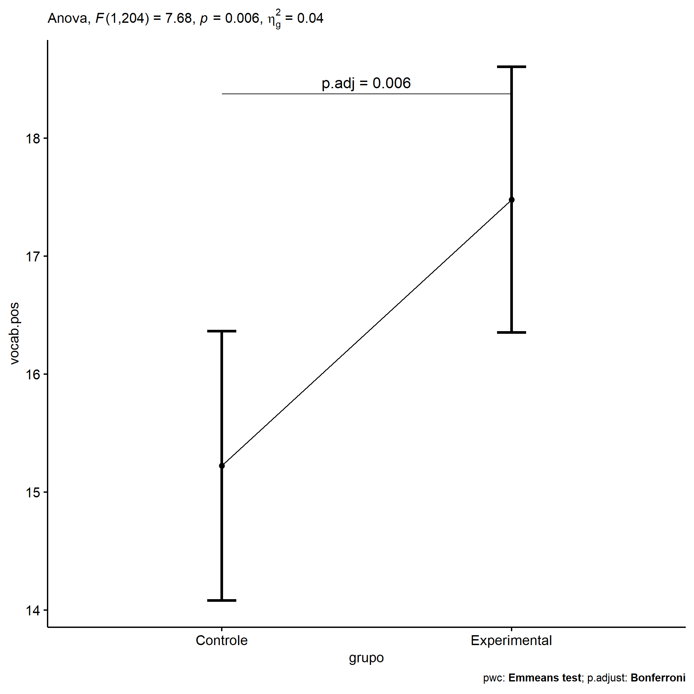<!-- -->

``` r
plots <- oneWayAncovaBoxPlots(
  wdat, "vocab.pos", "grupo", aov, pwc, covar = "vocab.pre",
  theme = "classic", color = color[["grupo"]],
  subtitle = which(aov$Effect == "grupo"))
```

``` r
if (length(unique(wdat[["grupo"]])) > 1)
  plots[["grupo"]] + ggplot2::ylab("Vocabulario") + ggplot2::scale_x_discrete(labels=c('pre', 'pos'))
```

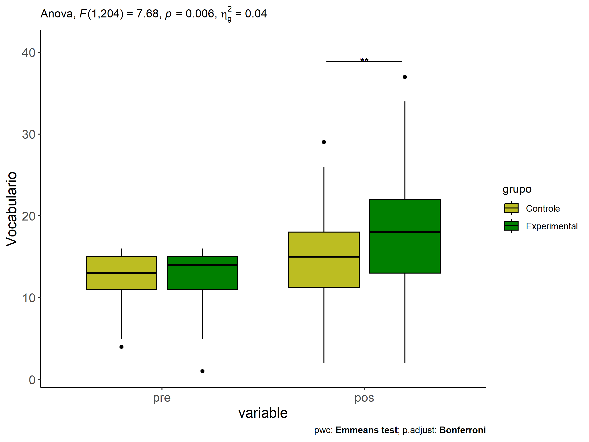<!-- -->

``` r
if (length(unique(wdat.long[["grupo"]])) > 1)
  plots <- oneWayAncovaBoxPlots(
    wdat.long, "vocab", "grupo", aov, pwc.long, pre.post = "time",
    theme = "classic", color = color$prepost)
```

``` r
if (length(unique(wdat.long[["grupo"]])) > 1)
  plots[["grupo"]] + ggplot2::ylab("Vocabulario")
```

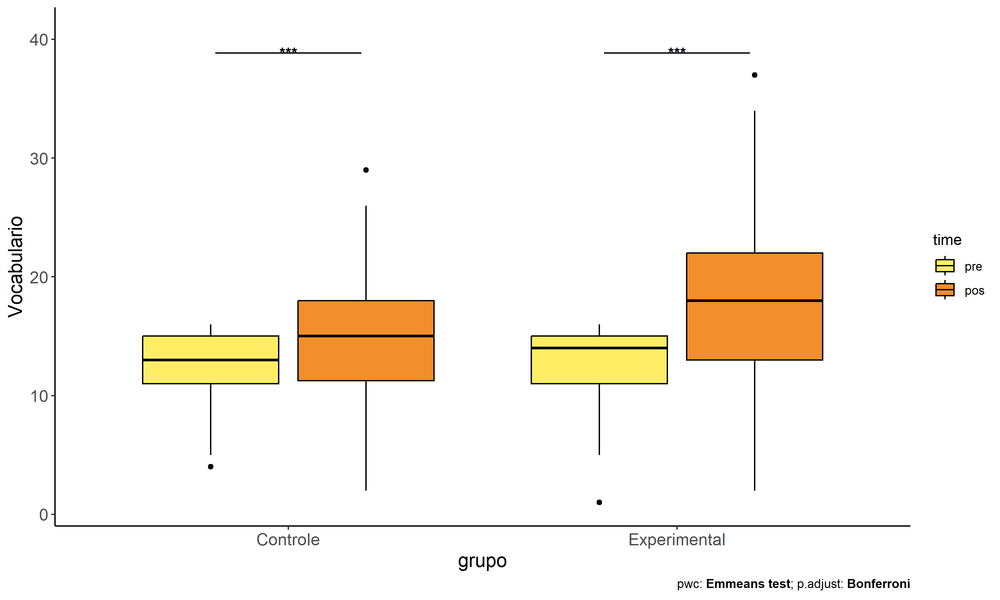<!-- -->

### Checking linearity assumption

``` r
ggscatter(wdat, x = "vocab.pre", y = "vocab.pos", size = 0.5,
          color = "grupo", add = "reg.line")+
  stat_regline_equation(
    aes(label =  paste(..eq.label.., ..rr.label.., sep = "~~~~"), color = grupo)
  )
```

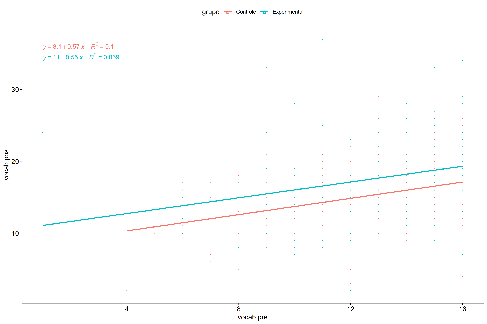<!-- -->

### Checking normality and homogeneity

``` r
res <- augment(lm(vocab.pos ~ vocab.pre + grupo, data = wdat))
```

``` r
shapiro_test(res$.resid)
```

    ## # A tibble: 1 × 3
    ##   variable   statistic p.value
    ##   <chr>          <dbl>   <dbl>
    ## 1 res$.resid     0.990   0.139

``` r
levene_test(res, .resid ~ grupo)
```

    ## # A tibble: 1 × 4
    ##     df1   df2 statistic      p
    ##   <int> <int>     <dbl>  <dbl>
    ## 1     1   205      5.68 0.0181

# ANCOVA and Pairwise for two factors **grupo:Sexo**

## Without remove non-normal data

``` r
pdat = remove_group_data(dat[!is.na(dat[["grupo"]]) & !is.na(dat[["Sexo"]]),], "vocab.pos", c("grupo","Sexo"))

pdat.long <- rbind(pdat[,c("id","grupo","Sexo")], pdat[,c("id","grupo","Sexo")])
pdat.long[["time"]] <- c(rep("pre", nrow(pdat)), rep("pos", nrow(pdat)))
pdat.long[["time"]] <- factor(pdat.long[["time"]], c("pre","pos"))
pdat.long[["vocab"]] <- c(pdat[["vocab.pre"]], pdat[["vocab.pos"]])

aov = anova_test(pdat, vocab.pos ~ vocab.pre + grupo*Sexo)
laov[["grupo:Sexo"]] <- get_anova_table(aov)
```

``` r
pwcs <- list()
pwcs[["Sexo"]] <- emmeans_test(
  group_by(pdat, grupo), vocab.pos ~ Sexo,
  covariate = vocab.pre, p.adjust.method = "bonferroni")
pwcs[["grupo"]] <- emmeans_test(
  group_by(pdat, Sexo), vocab.pos ~ grupo,
  covariate = vocab.pre, p.adjust.method = "bonferroni")

pwc <- plyr::rbind.fill(pwcs[["grupo"]], pwcs[["Sexo"]])
pwc <- pwc[,c("grupo","Sexo", colnames(pwc)[!colnames(pwc) %in% c("grupo","Sexo")])]
```

``` r
pwc.long <- emmeans_test(dplyr::group_by_at(pdat.long, c("grupo","Sexo")),
                         vocab ~ time,
                         p.adjust.method = "bonferroni")
lpwc[["grupo:Sexo"]] <- plyr::rbind.fill(pwc, pwc.long)
```

``` r
ds <- get.descriptives(pdat, "vocab.pos", c("grupo","Sexo"), covar = "vocab.pre")
ds <- merge(ds[ds$variable != "vocab.pre",],
            ds[ds$variable == "vocab.pre", !colnames(ds) %in% c("variable")],
            by = c("grupo","Sexo"), all.x = T, suffixes = c("", ".vocab.pre"))
ds <- merge(get_emmeans(pwcs[["grupo"]]), ds, by = c("grupo","Sexo"), suffixes = c(".emms", ""))
ds <- ds[,c("grupo","Sexo","n","mean.vocab.pre","se.vocab.pre","mean","se","emmean","se.emms")]

colnames(ds) <- c("grupo","Sexo", "N", paste0(c("M","SE")," (pre)"),
                  paste0(c("M","SE"), " (unadj)"), paste0(c("M", "SE"), " (adj)"))

lemms[["grupo:Sexo"]] <- ds
```

## Computing ANCOVA and PairWise After removing non-normal data (OK)

``` r
wdat = pdat 

res = residuals(lm(vocab.pos ~ vocab.pre + grupo*Sexo, data = wdat))
non.normal = getNonNormal(res, wdat$id, plimit = 0.05)

wdat = wdat[!wdat$id %in% non.normal,]

wdat.long <- rbind(wdat[,c("id","grupo","Sexo")], wdat[,c("id","grupo","Sexo")])
wdat.long[["time"]] <- c(rep("pre", nrow(wdat)), rep("pos", nrow(wdat)))
wdat.long[["time"]] <- factor(wdat.long[["time"]], c("pre","pos"))
wdat.long[["vocab"]] <- c(wdat[["vocab.pre"]], wdat[["vocab.pos"]])


ldat[["grupo:Sexo"]] = wdat

(non.normal)
```

    ## [1] "P852"

``` r
aov = anova_test(wdat, vocab.pos ~ vocab.pre + grupo*Sexo)
laov[["grupo:Sexo"]] <- merge(get_anova_table(aov), laov[["grupo:Sexo"]], by="Effect", suffixes = c("","'"))

(df = get_anova_table(aov))
```

    ## ANOVA Table (type II tests)
    ## 
    ##       Effect DFn DFd      F        p p<.05      ges
    ## 1  vocab.pre   1 202 16.590 6.66e-05     * 0.076000
    ## 2      grupo   1 202  6.601 1.10e-02     * 0.032000
    ## 3       Sexo   1 202  2.790 9.60e-02       0.014000
    ## 4 grupo:Sexo   1 202  0.044 8.35e-01       0.000216

| Effect     | DFn | DFd |      F |     p | p\<.05 |   ges |
|:-----------|----:|----:|-------:|------:|:-------|------:|
| vocab.pre  |   1 | 202 | 16.590 | 0.000 | \*     | 0.076 |
| grupo      |   1 | 202 |  6.601 | 0.011 | \*     | 0.032 |
| Sexo       |   1 | 202 |  2.790 | 0.096 |        | 0.014 |
| grupo:Sexo |   1 | 202 |  0.044 | 0.835 |        | 0.000 |

``` r
pwcs <- list()
pwcs[["Sexo"]] <- emmeans_test(
  group_by(wdat, grupo), vocab.pos ~ Sexo,
  covariate = vocab.pre, p.adjust.method = "bonferroni")
pwcs[["grupo"]] <- emmeans_test(
  group_by(wdat, Sexo), vocab.pos ~ grupo,
  covariate = vocab.pre, p.adjust.method = "bonferroni")

pwc <- plyr::rbind.fill(pwcs[["grupo"]], pwcs[["Sexo"]])
pwc <- pwc[,c("grupo","Sexo", colnames(pwc)[!colnames(pwc) %in% c("grupo","Sexo")])]
```

| grupo        | Sexo | term             | .y.       | group1   | group2       |  df | statistic |     p | p.adj | p.adj.signif |
|:-------------|:-----|:-----------------|:----------|:---------|:-------------|----:|----------:|------:|------:|:-------------|
|              | F    | vocab.pre\*grupo | vocab.pos | Controle | Experimental | 202 |    -1.858 | 0.065 | 0.065 | ns           |
|              | M    | vocab.pre\*grupo | vocab.pos | Controle | Experimental | 202 |    -1.787 | 0.075 | 0.075 | ns           |
| Controle     |      | vocab.pre\*Sexo  | vocab.pos | F        | M            | 202 |     1.003 | 0.317 | 0.317 | ns           |
| Experimental |      | vocab.pre\*Sexo  | vocab.pos | F        | M            | 202 |     1.350 | 0.179 | 0.179 | ns           |

``` r
pwc.long <- emmeans_test(dplyr::group_by_at(wdat.long, c("grupo","Sexo")),
                         vocab ~ time,
                         p.adjust.method = "bonferroni")
lpwc[["grupo:Sexo"]] <- merge(plyr::rbind.fill(pwc, pwc.long), lpwc[["grupo:Sexo"]], by=c("grupo","Sexo","term",".y.","group1","group2"), suffixes = c("","'"))
```

| grupo        | Sexo | term | .y.   | group1 | group2 |  df | statistic |     p | p.adj | p.adj.signif |
|:-------------|:-----|:-----|:------|:-------|:-------|----:|----------:|------:|------:|:-------------|
| Controle     | F    | time | vocab | pre    | pos    | 406 |    -3.038 | 0.003 | 0.003 | \*\*         |
| Controle     | M    | time | vocab | pre    | pos    | 406 |    -2.652 | 0.008 | 0.008 | \*\*         |
| Experimental | F    | time | vocab | pre    | pos    | 406 |    -5.960 | 0.000 | 0.000 | \*\*\*\*     |
| Experimental | M    | time | vocab | pre    | pos    | 406 |    -4.194 | 0.000 | 0.000 | \*\*\*\*     |

``` r
ds <- get.descriptives(wdat, "vocab.pos", c("grupo","Sexo"), covar = "vocab.pre")
ds <- merge(ds[ds$variable != "vocab.pre",],
            ds[ds$variable == "vocab.pre", !colnames(ds) %in% c("variable")],
            by = c("grupo","Sexo"), all.x = T, suffixes = c("", ".vocab.pre"))
ds <- merge(get_emmeans(pwcs[["grupo"]]), ds, by = c("grupo","Sexo"), suffixes = c(".emms", ""))
ds <- ds[,c("grupo","Sexo","n","mean.vocab.pre","se.vocab.pre","mean","se","emmean","se.emms")]

colnames(ds) <- c("grupo","Sexo", "N", paste0(c("M","SE")," (pre)"),
                  paste0(c("M","SE"), " (unadj)"), paste0(c("M", "SE"), " (adj)"))

lemms[["grupo:Sexo"]] <- merge(ds, lemms[["grupo:Sexo"]], by=c("grupo","Sexo"), suffixes = c("","'"))
```

| grupo        | Sexo |   N | M (pre) | SE (pre) | M (unadj) | SE (unadj) | M (adj) | SE (adj) |
|:-------------|:-----|----:|--------:|---------:|----------:|-----------:|--------:|---------:|
| Controle     | F    |  39 |  12.692 |    0.479 |    15.974 |      0.856 |  15.960 |    0.934 |
| Controle     | M    |  63 |  12.317 |    0.376 |    14.571 |      0.662 |  14.767 |    0.736 |
| Experimental | F    |  52 |  12.692 |    0.437 |    18.269 |      0.916 |  18.255 |    0.809 |
| Experimental | M    |  53 |  13.038 |    0.385 |    16.925 |      0.935 |  16.717 |    0.803 |

### Plots for ancova

``` r
plots <- twoWayAncovaPlots(
  wdat, "vocab.pos", c("grupo","Sexo"), aov, pwcs, addParam = c("mean_se"),
  font.label.size=10, step.increase=0.05, p.label="p.adj",
  subtitle = which(aov$Effect == "grupo:Sexo"))
```

``` r
if (!is.null(plots[["grupo"]]))
  plots[["grupo"]] + ggplot2::scale_color_manual(values = color[["Sexo"]])
```

    ## Scale for colour is already present.
    ## Adding another scale for colour, which will replace the existing scale.

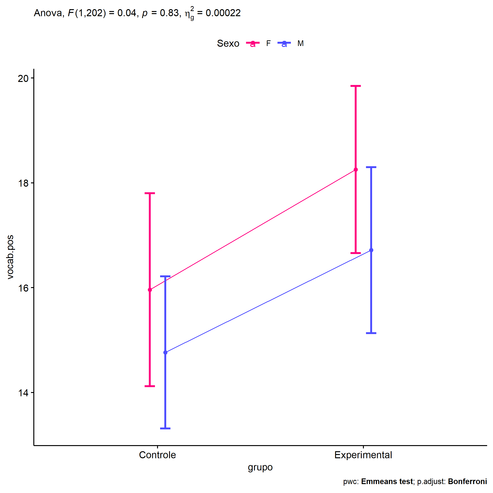<!-- -->

``` r
if (!is.null(plots[["Sexo"]]))
  plots[["Sexo"]] + ggplot2::scale_color_manual(values = color[["grupo"]])
```

    ## Scale for colour is already present.
    ## Adding another scale for colour, which will replace the existing scale.

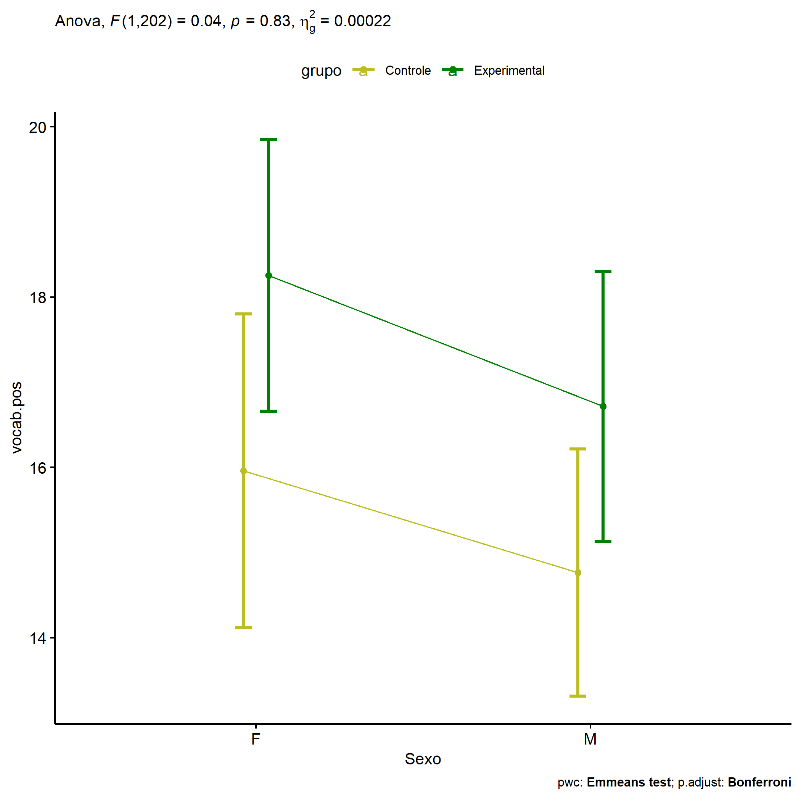<!-- -->

``` r
plots <- twoWayAncovaBoxPlots(
  wdat, "vocab.pos", c("grupo","Sexo"), aov, pwcs, covar = "vocab.pre",
  theme = "classic", color = color[["grupo:Sexo"]],
  subtitle = which(aov$Effect == "grupo:Sexo"))
```

``` r
plots[["grupo:Sexo"]] + ggplot2::ylab("Vocabulario") + ggplot2::scale_x_discrete(labels=c('pre', 'pos'))
```

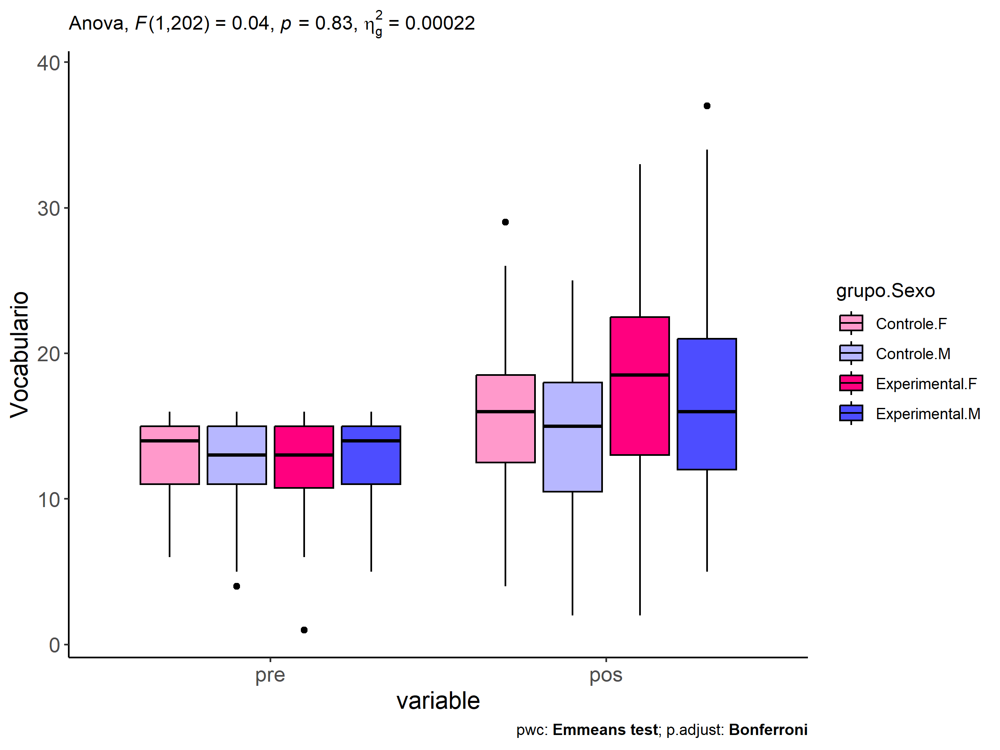<!-- -->

``` r
plots <- twoWayAncovaBoxPlots(
  wdat.long, "vocab", c("grupo","Sexo"), aov, pwc.long, pre.post = "time",
  theme = "classic", color = color$prepost)
```

``` r
plots[["grupo:Sexo"]] + ggplot2::ylab("Vocabulario")
```

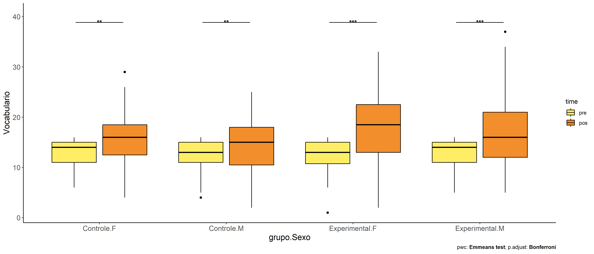<!-- -->

### Checking linearity assumption

``` r
ggscatter(wdat, x = "vocab.pre", y = "vocab.pos", size = 0.5,
          facet.by = c("grupo","Sexo"), add = "reg.line")+
  stat_regline_equation(
    aes(label =  paste(..eq.label.., ..rr.label.., sep = "~~~~"))
  )
```

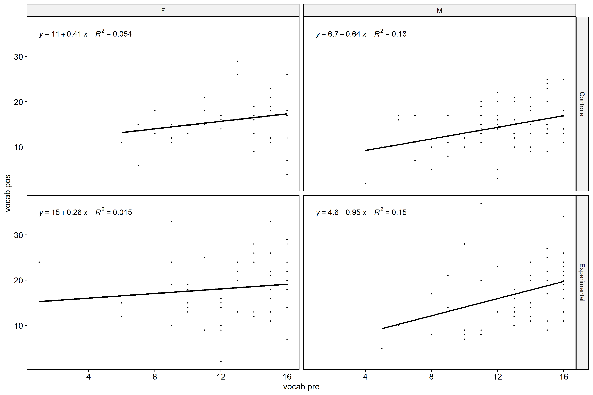<!-- -->

### Checking normality and homogeneity

``` r
res <- augment(lm(vocab.pos ~ vocab.pre + grupo*Sexo, data = wdat))
```

``` r
shapiro_test(res$.resid)
```

    ## # A tibble: 1 × 3
    ##   variable   statistic p.value
    ##   <chr>          <dbl>   <dbl>
    ## 1 res$.resid     0.989   0.111

``` r
levene_test(res, .resid ~ grupo*Sexo)
```

    ## # A tibble: 1 × 4
    ##     df1   df2 statistic     p
    ##   <int> <int>     <dbl> <dbl>
    ## 1     3   203      1.89 0.133

# ANCOVA and Pairwise for two factors **grupo:Zona**

## Without remove non-normal data

``` r
pdat = remove_group_data(dat[!is.na(dat[["grupo"]]) & !is.na(dat[["Zona"]]),], "vocab.pos", c("grupo","Zona"))

pdat.long <- rbind(pdat[,c("id","grupo","Zona")], pdat[,c("id","grupo","Zona")])
pdat.long[["time"]] <- c(rep("pre", nrow(pdat)), rep("pos", nrow(pdat)))
pdat.long[["time"]] <- factor(pdat.long[["time"]], c("pre","pos"))
pdat.long[["vocab"]] <- c(pdat[["vocab.pre"]], pdat[["vocab.pos"]])

aov = anova_test(pdat, vocab.pos ~ vocab.pre + grupo*Zona)
laov[["grupo:Zona"]] <- get_anova_table(aov)
```

``` r
pwcs <- list()
pwcs[["Zona"]] <- emmeans_test(
  group_by(pdat, grupo), vocab.pos ~ Zona,
  covariate = vocab.pre, p.adjust.method = "bonferroni")
pwcs[["grupo"]] <- emmeans_test(
  group_by(pdat, Zona), vocab.pos ~ grupo,
  covariate = vocab.pre, p.adjust.method = "bonferroni")

pwc <- plyr::rbind.fill(pwcs[["grupo"]], pwcs[["Zona"]])
pwc <- pwc[,c("grupo","Zona", colnames(pwc)[!colnames(pwc) %in% c("grupo","Zona")])]
```

``` r
pwc.long <- emmeans_test(dplyr::group_by_at(pdat.long, c("grupo","Zona")),
                         vocab ~ time,
                         p.adjust.method = "bonferroni")
lpwc[["grupo:Zona"]] <- plyr::rbind.fill(pwc, pwc.long)
```

``` r
ds <- get.descriptives(pdat, "vocab.pos", c("grupo","Zona"), covar = "vocab.pre")
ds <- merge(ds[ds$variable != "vocab.pre",],
            ds[ds$variable == "vocab.pre", !colnames(ds) %in% c("variable")],
            by = c("grupo","Zona"), all.x = T, suffixes = c("", ".vocab.pre"))
ds <- merge(get_emmeans(pwcs[["grupo"]]), ds, by = c("grupo","Zona"), suffixes = c(".emms", ""))
ds <- ds[,c("grupo","Zona","n","mean.vocab.pre","se.vocab.pre","mean","se","emmean","se.emms")]

colnames(ds) <- c("grupo","Zona", "N", paste0(c("M","SE")," (pre)"),
                  paste0(c("M","SE"), " (unadj)"), paste0(c("M", "SE"), " (adj)"))

lemms[["grupo:Zona"]] <- ds
```

## Computing ANCOVA and PairWise After removing non-normal data (OK)

``` r
wdat = pdat 

res = residuals(lm(vocab.pos ~ vocab.pre + grupo*Zona, data = wdat))
non.normal = getNonNormal(res, wdat$id, plimit = 0.05)

wdat = wdat[!wdat$id %in% non.normal,]

wdat.long <- rbind(wdat[,c("id","grupo","Zona")], wdat[,c("id","grupo","Zona")])
wdat.long[["time"]] <- c(rep("pre", nrow(wdat)), rep("pos", nrow(wdat)))
wdat.long[["time"]] <- factor(wdat.long[["time"]], c("pre","pos"))
wdat.long[["vocab"]] <- c(wdat[["vocab.pre"]], wdat[["vocab.pos"]])


ldat[["grupo:Zona"]] = wdat

(non.normal)
```

    ## [1] "P852"

``` r
aov = anova_test(wdat, vocab.pos ~ vocab.pre + grupo*Zona)
laov[["grupo:Zona"]] <- merge(get_anova_table(aov), laov[["grupo:Zona"]], by="Effect", suffixes = c("","'"))

(df = get_anova_table(aov))
```

    ## ANOVA Table (type II tests)
    ## 
    ##       Effect DFn DFd      F        p p<.05      ges
    ## 1  vocab.pre   1 142 13.538 0.000331     * 8.70e-02
    ## 2      grupo   1 142  7.293 0.008000     * 4.90e-02
    ## 3       Zona   1 142  0.002 0.965000       1.34e-05
    ## 4 grupo:Zona   1 142  0.097 0.756000       6.85e-04

| Effect     | DFn | DFd |      F |     p | p\<.05 |   ges |
|:-----------|----:|----:|-------:|------:|:-------|------:|
| vocab.pre  |   1 | 142 | 13.538 | 0.000 | \*     | 0.087 |
| grupo      |   1 | 142 |  7.293 | 0.008 | \*     | 0.049 |
| Zona       |   1 | 142 |  0.002 | 0.965 |        | 0.000 |
| grupo:Zona |   1 | 142 |  0.097 | 0.756 |        | 0.001 |

``` r
pwcs <- list()
pwcs[["Zona"]] <- emmeans_test(
  group_by(wdat, grupo), vocab.pos ~ Zona,
  covariate = vocab.pre, p.adjust.method = "bonferroni")
pwcs[["grupo"]] <- emmeans_test(
  group_by(wdat, Zona), vocab.pos ~ grupo,
  covariate = vocab.pre, p.adjust.method = "bonferroni")

pwc <- plyr::rbind.fill(pwcs[["grupo"]], pwcs[["Zona"]])
pwc <- pwc[,c("grupo","Zona", colnames(pwc)[!colnames(pwc) %in% c("grupo","Zona")])]
```

| grupo        | Zona   | term             | .y.       | group1   | group2       |  df | statistic |     p | p.adj | p.adj.signif |
|:-------------|:-------|:-----------------|:----------|:---------|:-------------|----:|----------:|------:|------:|:-------------|
|              | Rural  | vocab.pre\*grupo | vocab.pos | Controle | Experimental | 142 |    -2.421 | 0.017 | 0.017 | \*           |
|              | Urbana | vocab.pre\*grupo | vocab.pos | Controle | Experimental | 142 |    -1.227 | 0.222 | 0.222 | ns           |
| Controle     |        | vocab.pre\*Zona  | vocab.pos | Rural    | Urbana       | 142 |    -0.262 | 0.794 | 0.794 | ns           |
| Experimental |        | vocab.pre\*Zona  | vocab.pos | Rural    | Urbana       | 142 |     0.176 | 0.860 | 0.860 | ns           |

``` r
pwc.long <- emmeans_test(dplyr::group_by_at(wdat.long, c("grupo","Zona")),
                         vocab ~ time,
                         p.adjust.method = "bonferroni")
lpwc[["grupo:Zona"]] <- merge(plyr::rbind.fill(pwc, pwc.long), lpwc[["grupo:Zona"]], by=c("grupo","Zona","term",".y.","group1","group2"), suffixes = c("","'"))
```

| grupo        | Zona   | term | .y.   | group1 | group2 |  df | statistic |     p | p.adj | p.adj.signif |
|:-------------|:-------|:-----|:------|:-------|:-------|----:|----------:|------:|------:|:-------------|
| Controle     | Rural  | time | vocab | pre    | pos    | 286 |    -2.069 | 0.039 | 0.039 | \*           |
| Controle     | Urbana | time | vocab | pre    | pos    | 286 |    -1.611 | 0.108 | 0.108 | ns           |
| Experimental | Rural  | time | vocab | pre    | pos    | 286 |    -5.111 | 0.000 | 0.000 | \*\*\*\*     |
| Experimental | Urbana | time | vocab | pre    | pos    | 286 |    -3.266 | 0.001 | 0.001 | \*\*         |

``` r
ds <- get.descriptives(wdat, "vocab.pos", c("grupo","Zona"), covar = "vocab.pre")
ds <- merge(ds[ds$variable != "vocab.pre",],
            ds[ds$variable == "vocab.pre", !colnames(ds) %in% c("variable")],
            by = c("grupo","Zona"), all.x = T, suffixes = c("", ".vocab.pre"))
ds <- merge(get_emmeans(pwcs[["grupo"]]), ds, by = c("grupo","Zona"), suffixes = c(".emms", ""))
ds <- ds[,c("grupo","Zona","n","mean.vocab.pre","se.vocab.pre","mean","se","emmean","se.emms")]

colnames(ds) <- c("grupo","Zona", "N", paste0(c("M","SE")," (pre)"),
                  paste0(c("M","SE"), " (unadj)"), paste0(c("M", "SE"), " (adj)"))

lemms[["grupo:Zona"]] <- merge(ds, lemms[["grupo:Zona"]], by=c("grupo","Zona"), suffixes = c("","'"))
```

| grupo        | Zona   |   N | M (pre) | SE (pre) | M (unadj) | SE (unadj) | M (adj) | SE (adj) |
|:-------------|:-------|----:|--------:|---------:|----------:|-----------:|--------:|---------:|
| Controle     | Rural  |  51 |  12.706 |    0.415 |    14.686 |      0.791 |  14.683 |    0.828 |
| Controle     | Urbana |  19 |  12.368 |    0.608 |    14.895 |      1.003 |  15.099 |    1.357 |
| Experimental | Rural  |  50 |  12.420 |    0.414 |    17.360 |      1.045 |  17.533 |    0.837 |
| Experimental | Urbana |  27 |  13.444 |    0.609 |    17.741 |      1.079 |  17.283 |    1.144 |

### Plots for ancova

``` r
plots <- twoWayAncovaPlots(
  wdat, "vocab.pos", c("grupo","Zona"), aov, pwcs, addParam = c("mean_se"),
  font.label.size=10, step.increase=0.05, p.label="p.adj",
  subtitle = which(aov$Effect == "grupo:Zona"))
```

``` r
if (!is.null(plots[["grupo"]]))
  plots[["grupo"]] + ggplot2::scale_color_manual(values = color[["Zona"]])
```

    ## Scale for colour is already present.
    ## Adding another scale for colour, which will replace the existing scale.

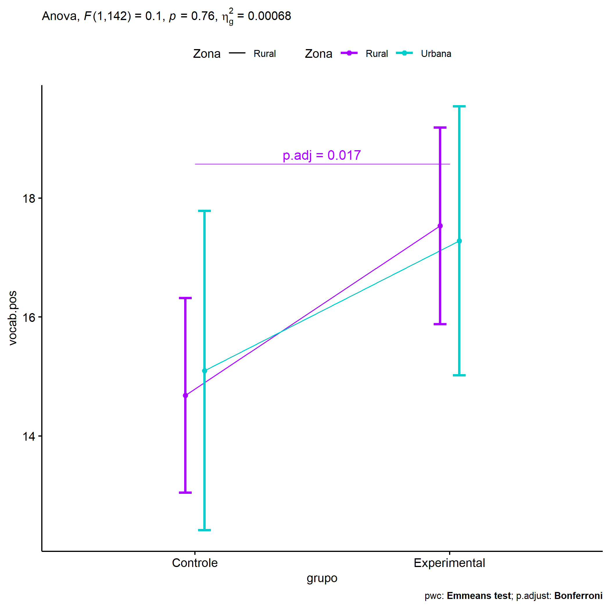<!-- -->

``` r
if (!is.null(plots[["Zona"]]))
  plots[["Zona"]] + ggplot2::scale_color_manual(values = color[["grupo"]])
```

    ## Scale for colour is already present.
    ## Adding another scale for colour, which will replace the existing scale.

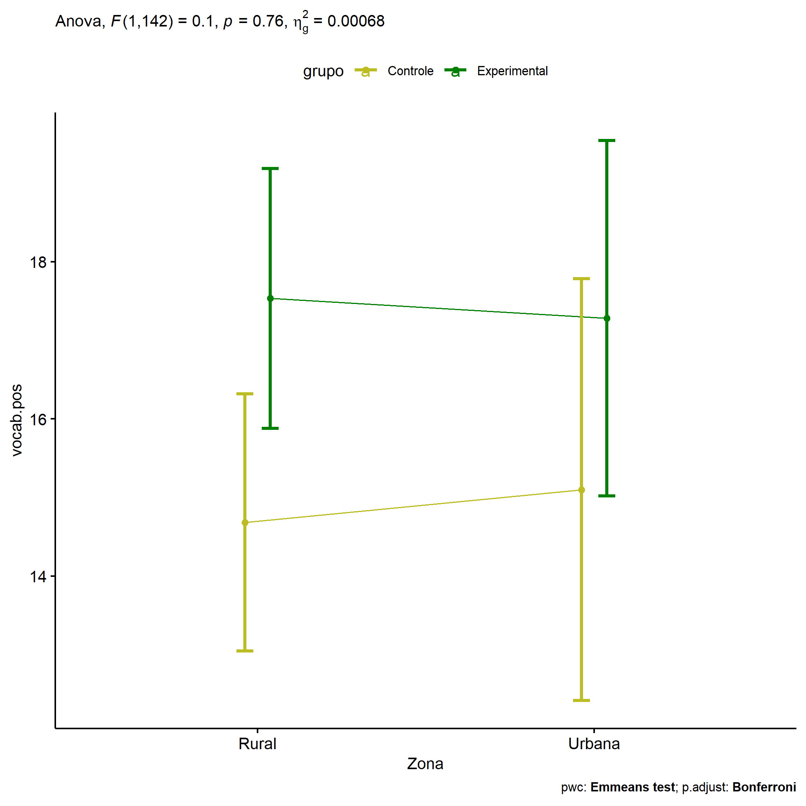<!-- -->

``` r
plots <- twoWayAncovaBoxPlots(
  wdat, "vocab.pos", c("grupo","Zona"), aov, pwcs, covar = "vocab.pre",
  theme = "classic", color = color[["grupo:Zona"]],
  subtitle = which(aov$Effect == "grupo:Zona"))
```

``` r
plots[["grupo:Zona"]] + ggplot2::ylab("Vocabulario") + ggplot2::scale_x_discrete(labels=c('pre', 'pos'))
```

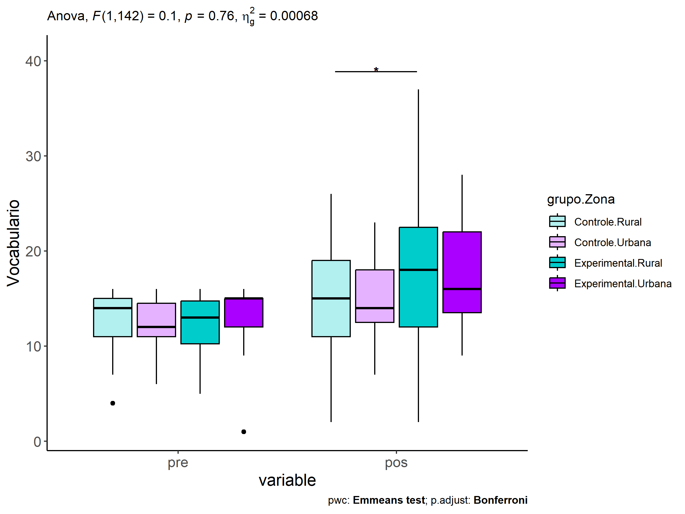<!-- -->

``` r
plots <- twoWayAncovaBoxPlots(
  wdat.long, "vocab", c("grupo","Zona"), aov, pwc.long, pre.post = "time",
  theme = "classic", color = color$prepost)
```

``` r
plots[["grupo:Zona"]] + ggplot2::ylab("Vocabulario")
```

<!-- -->

### Checking linearity assumption

``` r
ggscatter(wdat, x = "vocab.pre", y = "vocab.pos", size = 0.5,
          facet.by = c("grupo","Zona"), add = "reg.line")+
  stat_regline_equation(
    aes(label =  paste(..eq.label.., ..rr.label.., sep = "~~~~"))
  )
```

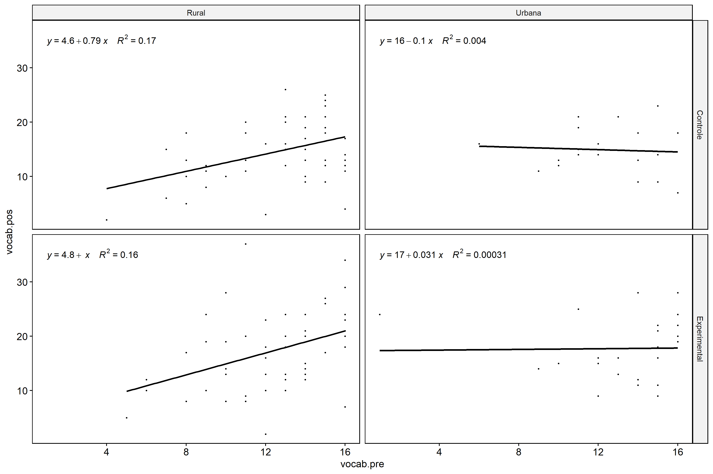<!-- -->

### Checking normality and homogeneity

``` r
res <- augment(lm(vocab.pos ~ vocab.pre + grupo*Zona, data = wdat))
```

``` r
shapiro_test(res$.resid)
```

    ## # A tibble: 1 × 3
    ##   variable   statistic p.value
    ##   <chr>          <dbl>   <dbl>
    ## 1 res$.resid     0.992   0.588

``` r
levene_test(res, .resid ~ grupo*Zona)
```

    ## # A tibble: 1 × 4
    ##     df1   df2 statistic     p
    ##   <int> <int>     <dbl> <dbl>
    ## 1     3   143      1.61 0.189

# ANCOVA and Pairwise for two factors **grupo:Cor.Raca**

## Without remove non-normal data

``` r
pdat = remove_group_data(dat[!is.na(dat[["grupo"]]) & !is.na(dat[["Cor.Raca"]]),], "vocab.pos", c("grupo","Cor.Raca"))
```

    ## Warning: There was 1 warning in `mutate()`.
    ## ℹ In argument: `ci = abs(stats::qt(alpha/2, .data$n - 1) * .data$se)`.
    ## Caused by warning:
    ## ! There was 1 warning in `mutate()`.
    ## ℹ In argument: `ci = abs(stats::qt(alpha/2, .data$n - 1) * .data$se)`.
    ## Caused by warning in `stats::qt()`:
    ## ! NaNs produced

``` r
pdat.long <- rbind(pdat[,c("id","grupo","Cor.Raca")], pdat[,c("id","grupo","Cor.Raca")])
pdat.long[["time"]] <- c(rep("pre", nrow(pdat)), rep("pos", nrow(pdat)))
pdat.long[["time"]] <- factor(pdat.long[["time"]], c("pre","pos"))
pdat.long[["vocab"]] <- c(pdat[["vocab.pre"]], pdat[["vocab.pos"]])

aov = anova_test(pdat, vocab.pos ~ vocab.pre + grupo*Cor.Raca)
laov[["grupo:Cor.Raca"]] <- get_anova_table(aov)
```

``` r
pwcs <- list()
pwcs[["Cor.Raca"]] <- emmeans_test(
  group_by(pdat, grupo), vocab.pos ~ Cor.Raca,
  covariate = vocab.pre, p.adjust.method = "bonferroni")
pwcs[["grupo"]] <- emmeans_test(
  group_by(pdat, Cor.Raca), vocab.pos ~ grupo,
  covariate = vocab.pre, p.adjust.method = "bonferroni")

pwc <- plyr::rbind.fill(pwcs[["grupo"]], pwcs[["Cor.Raca"]])
pwc <- pwc[,c("grupo","Cor.Raca", colnames(pwc)[!colnames(pwc) %in% c("grupo","Cor.Raca")])]
```

``` r
pwc.long <- emmeans_test(dplyr::group_by_at(pdat.long, c("grupo","Cor.Raca")),
                         vocab ~ time,
                         p.adjust.method = "bonferroni")
lpwc[["grupo:Cor.Raca"]] <- plyr::rbind.fill(pwc, pwc.long)
```

``` r
ds <- get.descriptives(pdat, "vocab.pos", c("grupo","Cor.Raca"), covar = "vocab.pre")
ds <- merge(ds[ds$variable != "vocab.pre",],
            ds[ds$variable == "vocab.pre", !colnames(ds) %in% c("variable")],
            by = c("grupo","Cor.Raca"), all.x = T, suffixes = c("", ".vocab.pre"))
ds <- merge(get_emmeans(pwcs[["grupo"]]), ds, by = c("grupo","Cor.Raca"), suffixes = c(".emms", ""))
ds <- ds[,c("grupo","Cor.Raca","n","mean.vocab.pre","se.vocab.pre","mean","se","emmean","se.emms")]

colnames(ds) <- c("grupo","Cor.Raca", "N", paste0(c("M","SE")," (pre)"),
                  paste0(c("M","SE"), " (unadj)"), paste0(c("M", "SE"), " (adj)"))

lemms[["grupo:Cor.Raca"]] <- ds
```

## Computing ANCOVA and PairWise After removing non-normal data (OK)

``` r
wdat = pdat 

res = residuals(lm(vocab.pos ~ vocab.pre + grupo*Cor.Raca, data = wdat))
non.normal = getNonNormal(res, wdat$id, plimit = 0.05)

wdat = wdat[!wdat$id %in% non.normal,]

wdat.long <- rbind(wdat[,c("id","grupo","Cor.Raca")], wdat[,c("id","grupo","Cor.Raca")])
wdat.long[["time"]] <- c(rep("pre", nrow(wdat)), rep("pos", nrow(wdat)))
wdat.long[["time"]] <- factor(wdat.long[["time"]], c("pre","pos"))
wdat.long[["vocab"]] <- c(wdat[["vocab.pre"]], wdat[["vocab.pos"]])


ldat[["grupo:Cor.Raca"]] = wdat

(non.normal)
```

    ## [1] "P852"

``` r
aov = anova_test(wdat, vocab.pos ~ vocab.pre + grupo*Cor.Raca)
laov[["grupo:Cor.Raca"]] <- merge(get_anova_table(aov), laov[["grupo:Cor.Raca"]], by="Effect", suffixes = c("","'"))

(df = get_anova_table(aov))
```

    ## ANOVA Table (type II tests)
    ## 
    ##           Effect DFn DFd      F     p p<.05   ges
    ## 1      vocab.pre   1  88  5.986 0.016     * 0.064
    ## 2          grupo   1  88 10.581 0.002     * 0.107
    ## 3       Cor.Raca   2  88  0.542 0.583       0.012
    ## 4 grupo:Cor.Raca   1  88  2.136 0.147       0.024

| Effect         | DFn | DFd |      F |     p | p\<.05 |   ges |
|:---------------|----:|----:|-------:|------:|:-------|------:|
| vocab.pre      |   1 |  88 |  5.986 | 0.016 | \*     | 0.064 |
| grupo          |   1 |  88 | 10.581 | 0.002 | \*     | 0.107 |
| Cor.Raca       |   2 |  88 |  0.542 | 0.583 |        | 0.012 |
| grupo:Cor.Raca |   1 |  88 |  2.136 | 0.147 |        | 0.024 |

``` r
pwcs <- list()
pwcs[["Cor.Raca"]] <- emmeans_test(
  group_by(wdat, grupo), vocab.pos ~ Cor.Raca,
  covariate = vocab.pre, p.adjust.method = "bonferroni")
pwcs[["grupo"]] <- emmeans_test(
  group_by(wdat, Cor.Raca), vocab.pos ~ grupo,
  covariate = vocab.pre, p.adjust.method = "bonferroni")

pwc <- plyr::rbind.fill(pwcs[["grupo"]], pwcs[["Cor.Raca"]])
pwc <- pwc[,c("grupo","Cor.Raca", colnames(pwc)[!colnames(pwc) %in% c("grupo","Cor.Raca")])]
```

| grupo        | Cor.Raca | term                | .y.       | group1   | group2       |  df | statistic |     p | p.adj | p.adj.signif |
|:-------------|:---------|:--------------------|:----------|:---------|:-------------|----:|----------:|------:|------:|:-------------|
|              | Branca   | vocab.pre\*grupo    | vocab.pos | Controle | Experimental |  88 |     0.235 | 0.815 | 0.815 | ns           |
|              | Indígena | vocab.pre\*grupo    | vocab.pos | Controle | Experimental |     |           |       |       |              |
|              | Parda    | vocab.pre\*grupo    | vocab.pos | Controle | Experimental |  88 |    -3.561 | 0.001 | 0.001 | \*\*\*       |
| Controle     |          | vocab.pre\*Cor.Raca | vocab.pos | Branca   | Indígena     |     |           |       |       |              |
| Controle     |          | vocab.pre\*Cor.Raca | vocab.pos | Branca   | Parda        |  88 |     0.562 | 0.576 | 0.576 | ns           |
| Controle     |          | vocab.pre\*Cor.Raca | vocab.pos | Indígena | Parda        |     |           |       |       |              |
| Experimental |          | vocab.pre\*Cor.Raca | vocab.pos | Branca   | Indígena     |  88 |    -0.464 | 0.644 | 1.000 | ns           |
| Experimental |          | vocab.pre\*Cor.Raca | vocab.pos | Branca   | Parda        |  88 |    -1.490 | 0.140 | 0.419 | ns           |
| Experimental |          | vocab.pre\*Cor.Raca | vocab.pos | Indígena | Parda        |  88 |    -1.067 | 0.289 | 0.866 | ns           |

``` r
pwc.long <- emmeans_test(dplyr::group_by_at(wdat.long, c("grupo","Cor.Raca")),
                         vocab ~ time,
                         p.adjust.method = "bonferroni")
lpwc[["grupo:Cor.Raca"]] <- merge(plyr::rbind.fill(pwc, pwc.long), lpwc[["grupo:Cor.Raca"]], by=c("grupo","Cor.Raca","term",".y.","group1","group2"), suffixes = c("","'"))
```

| grupo        | Cor.Raca | term | .y.   | group1 | group2 |  df | statistic |     p | p.adj | p.adj.signif |
|:-------------|:---------|:-----|:------|:-------|:-------|----:|----------:|------:|------:|:-------------|
| Controle     | Branca   | time | vocab | pre    | pos    | 178 |    -1.276 | 0.204 | 0.204 | ns           |
| Controle     | Indígena | time | vocab | pre    | pos    |     |           |       |       |              |
| Controle     | Parda    | time | vocab | pre    | pos    | 178 |    -1.165 | 0.245 | 0.245 | ns           |
| Experimental | Branca   | time | vocab | pre    | pos    | 178 |    -0.399 | 0.690 | 0.690 | ns           |
| Experimental | Indígena | time | vocab | pre    | pos    | 178 |    -1.125 | 0.262 | 0.262 | ns           |
| Experimental | Parda    | time | vocab | pre    | pos    | 178 |    -5.952 | 0.000 | 0.000 | \*\*\*\*     |

``` r
ds <- get.descriptives(wdat, "vocab.pos", c("grupo","Cor.Raca"), covar = "vocab.pre")
ds <- merge(ds[ds$variable != "vocab.pre",],
            ds[ds$variable == "vocab.pre", !colnames(ds) %in% c("variable")],
            by = c("grupo","Cor.Raca"), all.x = T, suffixes = c("", ".vocab.pre"))
ds <- merge(get_emmeans(pwcs[["grupo"]]), ds, by = c("grupo","Cor.Raca"), suffixes = c(".emms", ""))
ds <- ds[,c("grupo","Cor.Raca","n","mean.vocab.pre","se.vocab.pre","mean","se","emmean","se.emms")]

colnames(ds) <- c("grupo","Cor.Raca", "N", paste0(c("M","SE")," (pre)"),
                  paste0(c("M","SE"), " (unadj)"), paste0(c("M", "SE"), " (adj)"))

lemms[["grupo:Cor.Raca"]] <- merge(ds, lemms[["grupo:Cor.Raca"]], by=c("grupo","Cor.Raca"), suffixes = c("","'"))
```

| grupo        | Cor.Raca |   N | M (pre) | SE (pre) | M (unadj) | SE (unadj) | M (adj) | SE (adj) |
|:-------------|:---------|----:|--------:|---------:|----------:|-----------:|--------:|---------:|
| Controle     | Branca   |   6 |  11.333 |    1.054 |    14.833 |      1.922 |  15.602 |    2.430 |
| Controle     | Parda    |  36 |  12.861 |    0.429 |    14.167 |      0.849 |  14.128 |    0.984 |
| Experimental | Branca   |   5 |  14.400 |    0.812 |    15.600 |      2.731 |  14.747 |    2.663 |
| Experimental | Indígena |   7 |  14.286 |    0.565 |    17.143 |      1.184 |  16.351 |    2.254 |
| Experimental | Parda    |  40 |  12.475 |    0.539 |    18.800 |      1.145 |  18.965 |    0.936 |

### Plots for ancova

``` r
plots <- twoWayAncovaPlots(
  wdat, "vocab.pos", c("grupo","Cor.Raca"), aov, pwcs, addParam = c("mean_se"),
  font.label.size=10, step.increase=0.05, p.label="p.adj",
  subtitle = which(aov$Effect == "grupo:Cor.Raca"))
```

``` r
if (!is.null(plots[["grupo"]]))
  plots[["grupo"]] + ggplot2::scale_color_manual(values = color[["Cor.Raca"]])
```

<!-- -->

``` r
if (!is.null(plots[["Cor.Raca"]]))
  plots[["Cor.Raca"]] + ggplot2::scale_color_manual(values = color[["grupo"]])
```

    ## Scale for colour is already present.
    ## Adding another scale for colour, which will replace the existing scale.

    ## Warning: Removed 2 rows containing non-finite values (`stat_bracket()`).

    ## Warning: Removed 1 rows containing missing values (`geom_point()`).

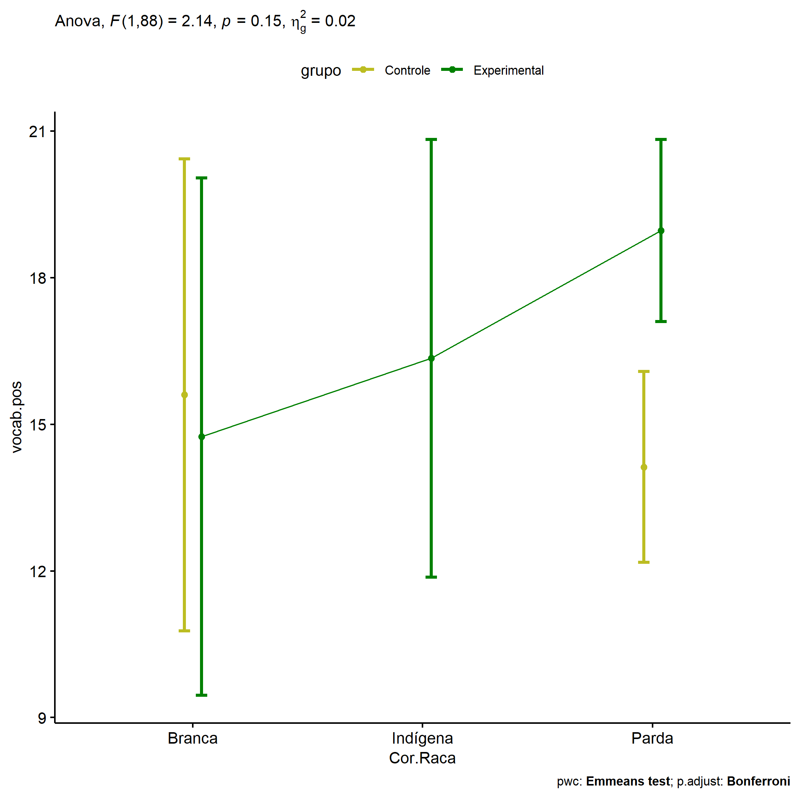<!-- -->

``` r
plots <- twoWayAncovaBoxPlots(
  wdat, "vocab.pos", c("grupo","Cor.Raca"), aov, pwcs, covar = "vocab.pre",
  theme = "classic", color = color[["grupo:Cor.Raca"]],
  subtitle = which(aov$Effect == "grupo:Cor.Raca"))
```

``` r
plots[["grupo:Cor.Raca"]] + ggplot2::ylab("Vocabulario") + ggplot2::scale_x_discrete(labels=c('pre', 'pos'))
```

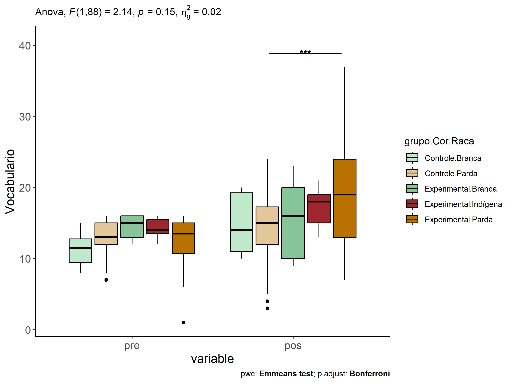<!-- -->

``` r
plots <- twoWayAncovaBoxPlots(
  wdat.long, "vocab", c("grupo","Cor.Raca"), aov, pwc.long, pre.post = "time",
  theme = "classic", color = color$prepost)
```

``` r
plots[["grupo:Cor.Raca"]] + ggplot2::ylab("Vocabulario")
```

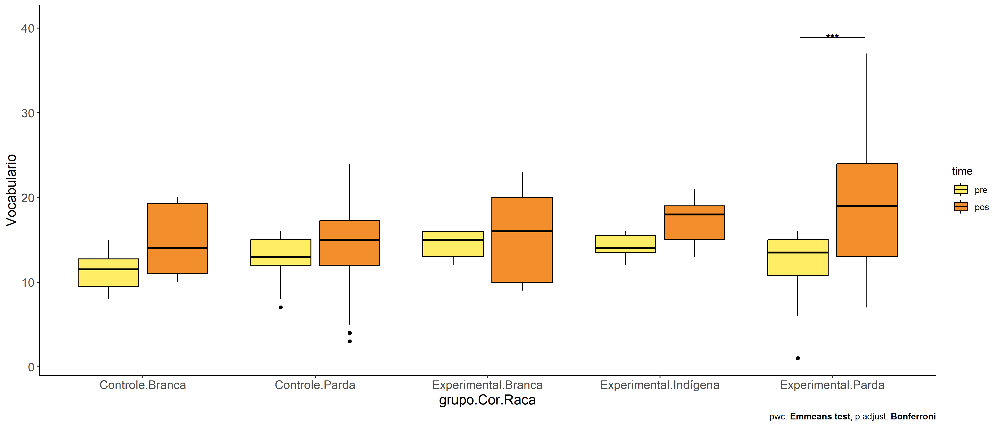<!-- -->

### Checking linearity assumption

``` r
ggscatter(wdat, x = "vocab.pre", y = "vocab.pos", size = 0.5,
          facet.by = c("grupo","Cor.Raca"), add = "reg.line")+
  stat_regline_equation(
    aes(label =  paste(..eq.label.., ..rr.label.., sep = "~~~~"))
  )
```

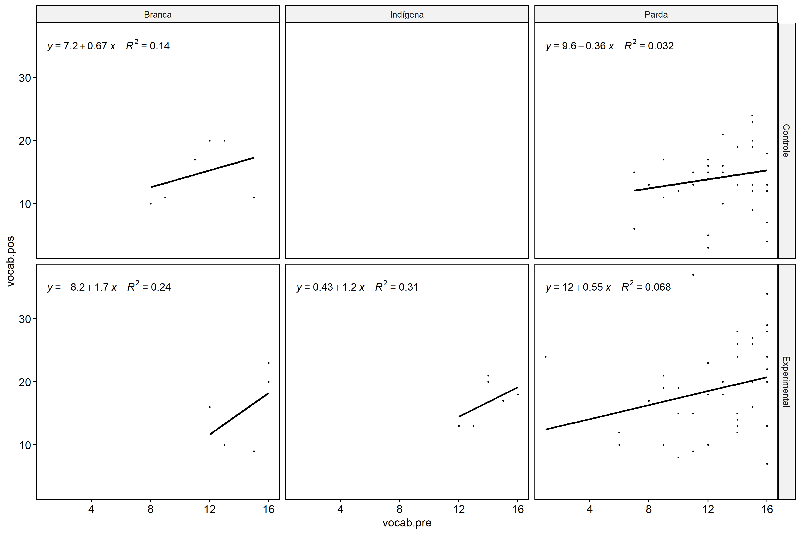<!-- -->

### Checking normality and homogeneity

``` r
res <- augment(lm(vocab.pos ~ vocab.pre + grupo*Cor.Raca, data = wdat))
```

``` r
shapiro_test(res$.resid)
```

    ## # A tibble: 1 × 3
    ##   variable   statistic p.value
    ##   <chr>          <dbl>   <dbl>
    ## 1 res$.resid     0.988   0.564

``` r
levene_test(res, .resid ~ grupo*Cor.Raca)
```

    ## # A tibble: 1 × 4
    ##     df1   df2 statistic     p
    ##   <int> <int>     <dbl> <dbl>
    ## 1     4    89      1.95 0.109

# ANCOVA and Pairwise for two factors **grupo:Serie**

## Without remove non-normal data

``` r
pdat = remove_group_data(dat[!is.na(dat[["grupo"]]) & !is.na(dat[["Serie"]]),], "vocab.pos", c("grupo","Serie"))

pdat.long <- rbind(pdat[,c("id","grupo","Serie")], pdat[,c("id","grupo","Serie")])
pdat.long[["time"]] <- c(rep("pre", nrow(pdat)), rep("pos", nrow(pdat)))
pdat.long[["time"]] <- factor(pdat.long[["time"]], c("pre","pos"))
pdat.long[["vocab"]] <- c(pdat[["vocab.pre"]], pdat[["vocab.pos"]])

aov = anova_test(pdat, vocab.pos ~ vocab.pre + grupo*Serie)
laov[["grupo:Serie"]] <- get_anova_table(aov)
```

``` r
pwcs <- list()
pwcs[["Serie"]] <- emmeans_test(
  group_by(pdat, grupo), vocab.pos ~ Serie,
  covariate = vocab.pre, p.adjust.method = "bonferroni")
pwcs[["grupo"]] <- emmeans_test(
  group_by(pdat, Serie), vocab.pos ~ grupo,
  covariate = vocab.pre, p.adjust.method = "bonferroni")

pwc <- plyr::rbind.fill(pwcs[["grupo"]], pwcs[["Serie"]])
pwc <- pwc[,c("grupo","Serie", colnames(pwc)[!colnames(pwc) %in% c("grupo","Serie")])]
```

``` r
pwc.long <- emmeans_test(dplyr::group_by_at(pdat.long, c("grupo","Serie")),
                         vocab ~ time,
                         p.adjust.method = "bonferroni")
lpwc[["grupo:Serie"]] <- plyr::rbind.fill(pwc, pwc.long)
```

``` r
ds <- get.descriptives(pdat, "vocab.pos", c("grupo","Serie"), covar = "vocab.pre")
ds <- merge(ds[ds$variable != "vocab.pre",],
            ds[ds$variable == "vocab.pre", !colnames(ds) %in% c("variable")],
            by = c("grupo","Serie"), all.x = T, suffixes = c("", ".vocab.pre"))
ds <- merge(get_emmeans(pwcs[["grupo"]]), ds, by = c("grupo","Serie"), suffixes = c(".emms", ""))
ds <- ds[,c("grupo","Serie","n","mean.vocab.pre","se.vocab.pre","mean","se","emmean","se.emms")]

colnames(ds) <- c("grupo","Serie", "N", paste0(c("M","SE")," (pre)"),
                  paste0(c("M","SE"), " (unadj)"), paste0(c("M", "SE"), " (adj)"))

lemms[["grupo:Serie"]] <- ds
```

## Computing ANCOVA and PairWise After removing non-normal data (OK)

``` r
wdat = pdat 

res = residuals(lm(vocab.pos ~ vocab.pre + grupo*Serie, data = wdat))
non.normal = getNonNormal(res, wdat$id, plimit = 0.05)

wdat = wdat[!wdat$id %in% non.normal,]

wdat.long <- rbind(wdat[,c("id","grupo","Serie")], wdat[,c("id","grupo","Serie")])
wdat.long[["time"]] <- c(rep("pre", nrow(wdat)), rep("pos", nrow(wdat)))
wdat.long[["time"]] <- factor(wdat.long[["time"]], c("pre","pos"))
wdat.long[["vocab"]] <- c(wdat[["vocab.pre"]], wdat[["vocab.pos"]])


ldat[["grupo:Serie"]] = wdat

(non.normal)
```

    ## [1] "P852"

``` r
aov = anova_test(wdat, vocab.pos ~ vocab.pre + grupo*Serie)
laov[["grupo:Serie"]] <- merge(get_anova_table(aov), laov[["grupo:Serie"]], by="Effect", suffixes = c("","'"))

(df = get_anova_table(aov))
```

    ## ANOVA Table (type II tests)
    ## 
    ##        Effect DFn DFd      F        p p<.05   ges
    ## 1   vocab.pre   1 198 13.777 0.000267     * 0.065
    ## 2       grupo   1 198  7.843 0.006000     * 0.038
    ## 3       Serie   3 198  2.002 0.115000       0.029
    ## 4 grupo:Serie   3 198  1.442 0.232000       0.021

| Effect      | DFn | DFd |      F |     p | p\<.05 |   ges |
|:------------|----:|----:|-------:|------:|:-------|------:|
| vocab.pre   |   1 | 198 | 13.777 | 0.000 | \*     | 0.065 |
| grupo       |   1 | 198 |  7.843 | 0.006 | \*     | 0.038 |
| Serie       |   3 | 198 |  2.002 | 0.115 |        | 0.029 |
| grupo:Serie |   3 | 198 |  1.442 | 0.232 |        | 0.021 |

``` r
pwcs <- list()
pwcs[["Serie"]] <- emmeans_test(
  group_by(wdat, grupo), vocab.pos ~ Serie,
  covariate = vocab.pre, p.adjust.method = "bonferroni")
pwcs[["grupo"]] <- emmeans_test(
  group_by(wdat, Serie), vocab.pos ~ grupo,
  covariate = vocab.pre, p.adjust.method = "bonferroni")

pwc <- plyr::rbind.fill(pwcs[["grupo"]], pwcs[["Serie"]])
pwc <- pwc[,c("grupo","Serie", colnames(pwc)[!colnames(pwc) %in% c("grupo","Serie")])]
```

| grupo        | Serie | term             | .y.       | group1   | group2       |  df | statistic |     p | p.adj | p.adj.signif |
|:-------------|:------|:-----------------|:----------|:---------|:-------------|----:|----------:|------:|------:|:-------------|
|              | 6 ano | vocab.pre\*grupo | vocab.pos | Controle | Experimental | 198 |    -2.530 | 0.012 | 0.012 | \*           |
|              | 7 ano | vocab.pre\*grupo | vocab.pos | Controle | Experimental | 198 |     0.154 | 0.877 | 0.877 | ns           |
|              | 8 ano | vocab.pre\*grupo | vocab.pos | Controle | Experimental | 198 |    -1.974 | 0.050 | 0.050 | \*           |
|              | 9 ano | vocab.pre\*grupo | vocab.pos | Controle | Experimental | 198 |    -1.347 | 0.180 | 0.180 | ns           |
| Controle     |       | vocab.pre\*Serie | vocab.pos | 6 ano    | 7 ano        | 198 |    -1.685 | 0.094 | 0.561 | ns           |
| Controle     |       | vocab.pre\*Serie | vocab.pos | 6 ano    | 8 ano        | 198 |     0.672 | 0.502 | 1.000 | ns           |
| Controle     |       | vocab.pre\*Serie | vocab.pos | 6 ano    | 9 ano        | 198 |    -1.255 | 0.211 | 1.000 | ns           |
| Controle     |       | vocab.pre\*Serie | vocab.pos | 7 ano    | 8 ano        | 198 |     1.797 | 0.074 | 0.443 | ns           |
| Controle     |       | vocab.pre\*Serie | vocab.pos | 7 ano    | 9 ano        | 198 |    -0.312 | 0.756 | 1.000 | ns           |
| Controle     |       | vocab.pre\*Serie | vocab.pos | 8 ano    | 9 ano        | 198 |    -1.527 | 0.128 | 0.769 | ns           |
| Experimental |       | vocab.pre\*Serie | vocab.pos | 6 ano    | 7 ano        | 198 |     0.736 | 0.463 | 1.000 | ns           |
| Experimental |       | vocab.pre\*Serie | vocab.pos | 6 ano    | 8 ano        | 198 |     0.049 | 0.961 | 1.000 | ns           |
| Experimental |       | vocab.pre\*Serie | vocab.pos | 6 ano    | 9 ano        | 198 |    -1.856 | 0.065 | 0.390 | ns           |
| Experimental |       | vocab.pre\*Serie | vocab.pos | 7 ano    | 8 ano        | 198 |    -0.539 | 0.591 | 1.000 | ns           |
| Experimental |       | vocab.pre\*Serie | vocab.pos | 7 ano    | 9 ano        | 198 |    -2.236 | 0.026 | 0.159 | ns           |
| Experimental |       | vocab.pre\*Serie | vocab.pos | 8 ano    | 9 ano        | 198 |    -1.694 | 0.092 | 0.550 | ns           |

``` r
pwc.long <- emmeans_test(dplyr::group_by_at(wdat.long, c("grupo","Serie")),
                         vocab ~ time,
                         p.adjust.method = "bonferroni")
lpwc[["grupo:Serie"]] <- merge(plyr::rbind.fill(pwc, pwc.long), lpwc[["grupo:Serie"]], by=c("grupo","Serie","term",".y.","group1","group2"), suffixes = c("","'"))
```

| grupo        | Serie | term | .y.   | group1 | group2 |  df | statistic |     p | p.adj | p.adj.signif |
|:-------------|:------|:-----|:------|:-------|:-------|----:|----------:|------:|------:|:-------------|
| Controle     | 6 ano | time | vocab | pre    | pos    | 398 |    -2.190 | 0.029 | 0.029 | \*           |
| Controle     | 7 ano | time | vocab | pre    | pos    | 398 |    -3.481 | 0.001 | 0.001 | \*\*\*       |
| Controle     | 8 ano | time | vocab | pre    | pos    | 398 |    -0.417 | 0.677 | 0.677 | ns           |
| Controle     | 9 ano | time | vocab | pre    | pos    | 398 |    -1.477 | 0.140 | 0.140 | ns           |
| Experimental | 6 ano | time | vocab | pre    | pos    | 398 |    -4.934 | 0.000 | 0.000 | \*\*\*\*     |
| Experimental | 7 ano | time | vocab | pre    | pos    | 398 |    -2.772 | 0.006 | 0.006 | \*\*         |
| Experimental | 8 ano | time | vocab | pre    | pos    | 398 |    -3.346 | 0.001 | 0.001 | \*\*\*       |
| Experimental | 9 ano | time | vocab | pre    | pos    | 398 |    -3.658 | 0.000 | 0.000 | \*\*\*       |

``` r
ds <- get.descriptives(wdat, "vocab.pos", c("grupo","Serie"), covar = "vocab.pre")
ds <- merge(ds[ds$variable != "vocab.pre",],
            ds[ds$variable == "vocab.pre", !colnames(ds) %in% c("variable")],
            by = c("grupo","Serie"), all.x = T, suffixes = c("", ".vocab.pre"))
ds <- merge(get_emmeans(pwcs[["grupo"]]), ds, by = c("grupo","Serie"), suffixes = c(".emms", ""))
ds <- ds[,c("grupo","Serie","n","mean.vocab.pre","se.vocab.pre","mean","se","emmean","se.emms")]

colnames(ds) <- c("grupo","Serie", "N", paste0(c("M","SE")," (pre)"),
                  paste0(c("M","SE"), " (unadj)"), paste0(c("M", "SE"), " (adj)"))

lemms[["grupo:Serie"]] <- merge(ds, lemms[["grupo:Serie"]], by=c("grupo","Serie"), suffixes = c("","'"))
```

| grupo        | Serie |   N | M (pre) | SE (pre) | M (unadj) | SE (unadj) | M (adj) | SE (adj) |
|:-------------|:------|----:|--------:|---------:|----------:|-----------:|--------:|---------:|
| Controle     | 6 ano |  50 |  12.140 |    0.416 |    14.200 |      0.700 |  14.472 |    0.821 |
| Controle     | 7 ano |  32 |  12.500 |    0.541 |    16.594 |      0.881 |  16.680 |    1.023 |
| Controle     | 8 ano |  13 |  12.308 |    0.909 |    13.077 |      1.674 |  13.263 |    1.605 |
| Controle     | 9 ano |   7 |  14.857 |    0.404 |    18.571 |      2.125 |  17.439 |    2.207 |
| Experimental | 6 ano |  47 |  12.660 |    0.405 |    17.447 |      0.962 |  17.450 |    0.843 |
| Experimental | 7 ano |  30 |  13.533 |    0.621 |    16.900 |      1.155 |  16.452 |    1.063 |
| Experimental | 8 ano |  19 |  11.842 |    0.677 |    16.947 |      1.536 |  17.374 |    1.332 |
| Experimental | 9 ano |   9 |  13.889 |    0.611 |    22.000 |      2.682 |  21.368 |    1.935 |

### Plots for ancova

``` r
plots <- twoWayAncovaPlots(
  wdat, "vocab.pos", c("grupo","Serie"), aov, pwcs, addParam = c("mean_se"),
  font.label.size=10, step.increase=0.05, p.label="p.adj",
  subtitle = which(aov$Effect == "grupo:Serie"))
```

``` r
if (!is.null(plots[["grupo"]]))
  plots[["grupo"]] + ggplot2::scale_color_manual(values = color[["Serie"]])
```

    ## Scale for colour is already present.
    ## Adding another scale for colour, which will replace the existing scale.

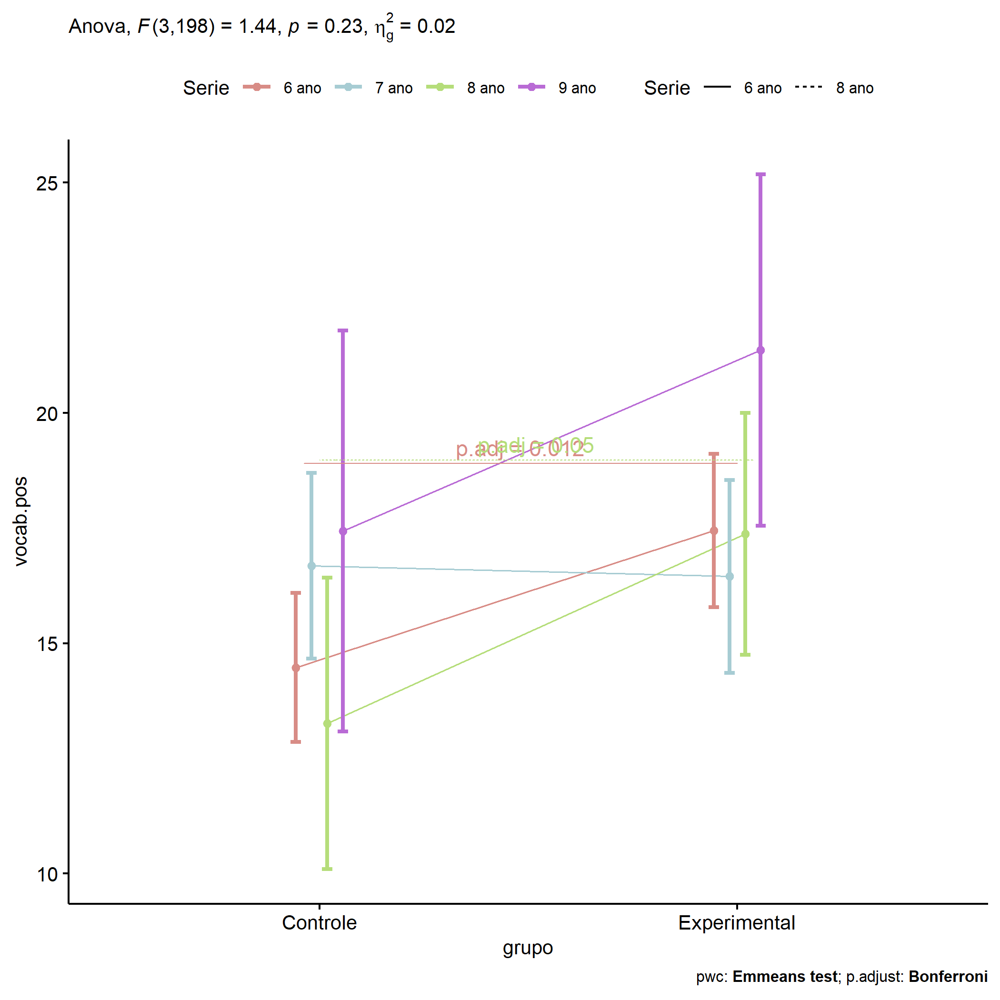<!-- -->

``` r
if (!is.null(plots[["Serie"]]))
  plots[["Serie"]] + ggplot2::scale_color_manual(values = color[["grupo"]])
```

    ## Scale for colour is already present.
    ## Adding another scale for colour, which will replace the existing scale.

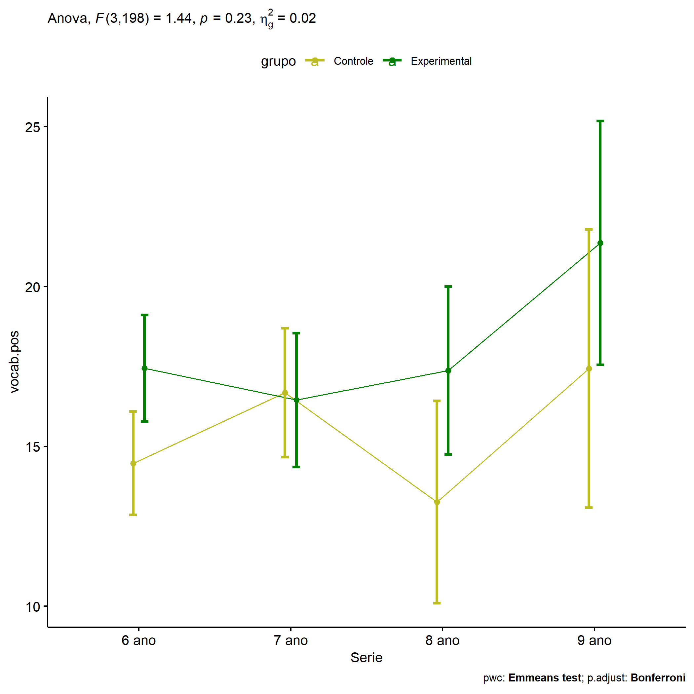<!-- -->

``` r
plots <- twoWayAncovaBoxPlots(
  wdat, "vocab.pos", c("grupo","Serie"), aov, pwcs, covar = "vocab.pre",
  theme = "classic", color = color[["grupo:Serie"]],
  subtitle = which(aov$Effect == "grupo:Serie"))
```

``` r
plots[["grupo:Serie"]] + ggplot2::ylab("Vocabulario") + ggplot2::scale_x_discrete(labels=c('pre', 'pos'))
```

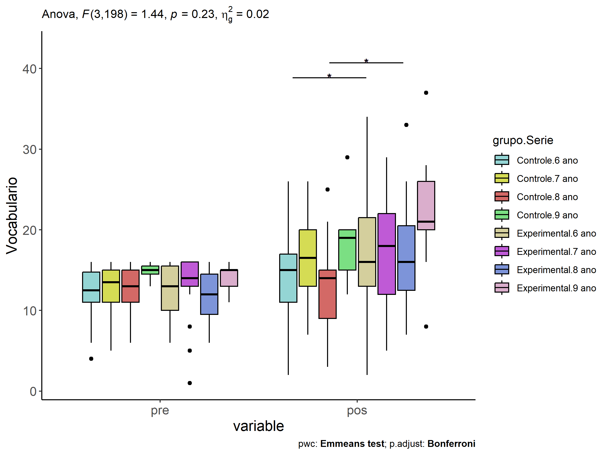<!-- -->

``` r
plots <- twoWayAncovaBoxPlots(
  wdat.long, "vocab", c("grupo","Serie"), aov, pwc.long, pre.post = "time",
  theme = "classic", color = color$prepost)
```

``` r
plots[["grupo:Serie"]] + ggplot2::ylab("Vocabulario")
```

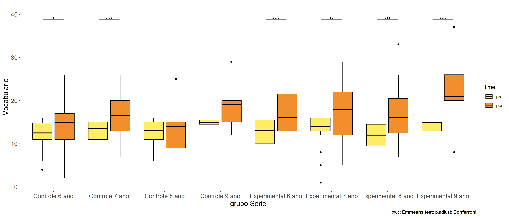<!-- -->

### Checking linearity assumption

``` r
ggscatter(wdat, x = "vocab.pre", y = "vocab.pos", size = 0.5,
          facet.by = c("grupo","Serie"), add = "reg.line")+
  stat_regline_equation(
    aes(label =  paste(..eq.label.., ..rr.label.., sep = "~~~~"))
  )
```

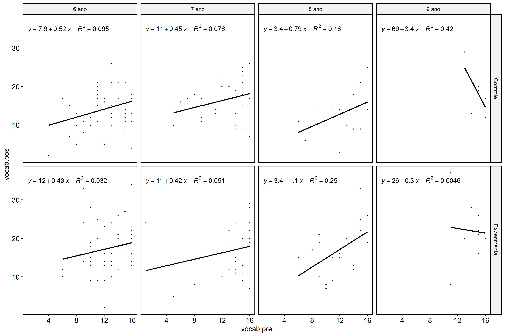<!-- -->

### Checking normality and homogeneity

``` r
res <- augment(lm(vocab.pos ~ vocab.pre + grupo*Serie, data = wdat))
```

``` r
shapiro_test(res$.resid)
```

    ## # A tibble: 1 × 3
    ##   variable   statistic p.value
    ##   <chr>          <dbl>   <dbl>
    ## 1 res$.resid     0.992   0.288

``` r
levene_test(res, .resid ~ grupo*Serie)
```

    ## # A tibble: 1 × 4
    ##     df1   df2 statistic     p
    ##   <int> <int>     <dbl> <dbl>
    ## 1     7   199     0.870 0.531

# Summary of Results

## Descriptive Statistics

``` r
df <- get.descriptives(ldat[["grupo"]], c(dv.pre, dv.pos), c("grupo"), 
                       include.global = T, symmetry.test = T, normality.test = F)
df <- plyr::rbind.fill(
  df, do.call(plyr::rbind.fill, lapply(lfatores2, FUN = function(f) {
    if (nrow(dat) > 0 && sum(!is.na(unique(dat[[f]]))) > 1)
      get.descriptives(ldat[[paste0("grupo:",f)]], c(dv.pre,dv.pos), c("grupo", f),
                       symmetry.test = T, normality.test = F)
    }))
)
(df <- df[,c(fatores1[fatores1 %in% colnames(df)],"variable",
             colnames(df)[!colnames(df) %in% c(fatores1,"variable")])])
```

    ##           grupo Sexo   Zona Cor.Raca Serie  variable   n   mean median min max    sd    se    ci   iqr symmetry
    ## 1      Controle <NA>   <NA>     <NA>  <NA> vocab.pre 102 12.461   13.0   4  16 2.977 0.295 0.585  4.00       NO
    ## 2  Experimental <NA>   <NA>     <NA>  <NA> vocab.pre 105 12.867   14.0   1  16 2.971 0.290 0.575  4.00       NO
    ## 3          <NA> <NA>   <NA>     <NA>  <NA> vocab.pre 207 12.667   13.0   1  16 2.974 0.207 0.408  4.00       NO
    ## 4      Controle <NA>   <NA>     <NA>  <NA> vocab.pos 102 15.108   15.0   2  29 5.308 0.526 1.043  6.75      YES
    ## 5  Experimental <NA>   <NA>     <NA>  <NA> vocab.pos 105 17.590   18.0   2  37 6.711 0.655 1.299  9.00      YES
    ## 6          <NA> <NA>   <NA>     <NA>  <NA> vocab.pos 207 16.367   16.0   2  37 6.172 0.429 0.846  8.00      YES
    ## 7      Controle    F   <NA>     <NA>  <NA> vocab.pre  39 12.692   14.0   6  16 2.993 0.479 0.970  4.00       NO
    ## 8      Controle    M   <NA>     <NA>  <NA> vocab.pre  63 12.317   13.0   4  16 2.983 0.376 0.751  4.00       NO
    ## 9  Experimental    F   <NA>     <NA>  <NA> vocab.pre  52 12.692   13.0   1  16 3.153 0.437 0.878  4.25       NO
    ## 10 Experimental    M   <NA>     <NA>  <NA> vocab.pre  53 13.038   14.0   5  16 2.801 0.385 0.772  4.00       NO
    ## 11     Controle    F   <NA>     <NA>  <NA> vocab.pos  39 15.974   16.0   4  29 5.348 0.856 1.734  6.00      YES
    ## 12     Controle    M   <NA>     <NA>  <NA> vocab.pos  63 14.571   15.0   2  25 5.254 0.662 1.323  7.50      YES
    ## 13 Experimental    F   <NA>     <NA>  <NA> vocab.pos  52 18.269   18.5   2  33 6.604 0.916 1.839  9.50      YES
    ## 14 Experimental    M   <NA>     <NA>  <NA> vocab.pos  53 16.925   16.0   5  37 6.810 0.935 1.877  9.00       NO
    ## 15     Controle <NA>  Rural     <NA>  <NA> vocab.pre  51 12.706   14.0   4  16 2.962 0.415 0.833  4.00       NO
    ## 16     Controle <NA> Urbana     <NA>  <NA> vocab.pre  19 12.368   12.0   6  16 2.650 0.608 1.277  3.50      YES
    ## 17 Experimental <NA>  Rural     <NA>  <NA> vocab.pre  50 12.420   13.0   5  16 2.928 0.414 0.832  4.50       NO
    ## 18 Experimental <NA> Urbana     <NA>  <NA> vocab.pre  27 13.444   15.0   1  16 3.166 0.609 1.253  3.00       NO
    ## 19     Controle <NA>  Rural     <NA>  <NA> vocab.pos  51 14.686   15.0   2  26 5.652 0.791 1.590  8.00      YES
    ## 20     Controle <NA> Urbana     <NA>  <NA> vocab.pos  19 14.895   14.0   7  23 4.370 1.003 2.106  5.50      YES
    ## 21 Experimental <NA>  Rural     <NA>  <NA> vocab.pos  50 17.360   18.0   2  37 7.389 1.045 2.100 10.50      YES
    ## 22 Experimental <NA> Urbana     <NA>  <NA> vocab.pos  27 17.741   16.0   9  28 5.606 1.079 2.218  8.50      YES
    ## 23     Controle <NA>   <NA>   Branca  <NA> vocab.pre   6 11.333   11.5   8  15 2.582 1.054 2.710  3.25      YES
    ## 24     Controle <NA>   <NA>    Parda  <NA> vocab.pre  36 12.861   13.0   7  16 2.576 0.429 0.872  3.00       NO
    ## 25 Experimental <NA>   <NA>   Branca  <NA> vocab.pre   5 14.400   15.0  12  16 1.817 0.812 2.256  3.00      YES
    ## 26 Experimental <NA>   <NA> Indígena  <NA> vocab.pre   7 14.286   14.0  12  16 1.496 0.565 1.384  2.00      YES
    ## 27 Experimental <NA>   <NA>    Parda  <NA> vocab.pre  40 12.475   13.5   1  16 3.412 0.539 1.091  4.25       NO
    ## 28     Controle <NA>   <NA>   Branca  <NA> vocab.pos   6 14.833   14.0  10  20 4.708 1.922 4.941  8.25      YES
    ## 29     Controle <NA>   <NA>    Parda  <NA> vocab.pos  36 14.167   15.0   3  24 5.096 0.849 1.724  5.25      YES
    ## 30 Experimental <NA>   <NA>   Branca  <NA> vocab.pos   5 15.600   16.0   9  23 6.107 2.731 7.583 10.00      YES
    ## 31 Experimental <NA>   <NA> Indígena  <NA> vocab.pos   7 17.143   18.0  13  21 3.132 1.184 2.897  4.00      YES
    ## 32 Experimental <NA>   <NA>    Parda  <NA> vocab.pos  40 18.800   19.0   7  37 7.244 1.145 2.317 11.00      YES
    ## 33     Controle <NA>   <NA>     <NA> 6 ano vocab.pre  50 12.140   12.5   4  16 2.942 0.416 0.836  3.75       NO
    ## 34     Controle <NA>   <NA>     <NA> 7 ano vocab.pre  32 12.500   13.5   5  16 3.059 0.541 1.103  4.00       NO
    ## 35     Controle <NA>   <NA>     <NA> 8 ano vocab.pre  13 12.308   13.0   6  16 3.276 0.909 1.980  4.00       NO
    ## 36     Controle <NA>   <NA>     <NA> 9 ano vocab.pre   7 14.857   15.0  13  16 1.069 0.404 0.989  1.00      YES
    ## 37 Experimental <NA>   <NA>     <NA> 6 ano vocab.pre  47 12.660   13.0   6  16 2.776 0.405 0.815  5.50      YES
    ## 38 Experimental <NA>   <NA>     <NA> 7 ano vocab.pre  30 13.533   14.0   1  16 3.401 0.621 1.270  3.00       NO
    ## 39 Experimental <NA>   <NA>     <NA> 8 ano vocab.pre  19 11.842   12.0   6  16 2.949 0.677 1.421  5.00      YES
    ## 40 Experimental <NA>   <NA>     <NA> 9 ano vocab.pre   9 13.889   15.0  11  16 1.833 0.611 1.409  2.00       NO
    ## 41     Controle <NA>   <NA>     <NA> 6 ano vocab.pos  50 14.200   15.0   2  26 4.949 0.700 1.406  6.00      YES
    ## 42     Controle <NA>   <NA>     <NA> 7 ano vocab.pos  32 16.594   16.5   7  26 4.983 0.881 1.797  7.00      YES
    ## 43     Controle <NA>   <NA>     <NA> 8 ano vocab.pos  13 13.077   14.0   3  25 6.034 1.674 3.646  6.00      YES
    ## 44     Controle <NA>   <NA>     <NA> 9 ano vocab.pos   7 18.571   19.0  12  29 5.623 2.125 5.200  5.00       NO
    ## 45 Experimental <NA>   <NA>     <NA> 6 ano vocab.pos  47 17.447   16.0   2  34 6.593 0.962 1.936  8.50      YES
    ## 46 Experimental <NA>   <NA>     <NA> 7 ano vocab.pos  30 16.900   18.0   5  29 6.326 1.155 2.362 10.00      YES
    ## 47 Experimental <NA>   <NA>     <NA> 8 ano vocab.pos  19 16.947   16.0   7  33 6.696 1.536 3.227  8.00       NO
    ## 48 Experimental <NA>   <NA>     <NA> 9 ano vocab.pos   9 22.000   21.0   8  37 8.047 2.682 6.185  6.00      YES
    ##        skewness    kurtosis
    ## 1  -0.811486605 -0.17271316
    ## 2  -1.122097289  1.42429038
    ## 3  -0.969220190  0.62147922
    ## 4  -0.034074972 -0.13222270
    ## 5   0.362112598 -0.10132923
    ## 6   0.357371787  0.25490076
    ## 7  -0.668520680 -0.82903997
    ## 8  -0.888368708  0.10574535
    ## 9  -1.238087800  1.92928269
    ## 10 -0.872632400  0.06289670
    ## 11  0.126475597  0.01993310
    ## 12 -0.149028310 -0.44926788
    ## 13  0.090840155 -0.34063440
    ## 14  0.622346001  0.20752675
    ## 15 -0.936419884 -0.03595560
    ## 16 -0.479792335 -0.47795284
    ## 17 -0.613388697 -0.38440488
    ## 18 -2.277358188  6.16409210
    ## 19 -0.192201937 -0.51156413
    ## 20  0.074774638 -0.95193423
    ## 21  0.317644597 -0.19800657
    ## 22  0.152401369 -1.15293386
    ## 23  0.043033148 -1.71833333
    ## 24 -0.708444424 -0.40480272
    ## 25 -0.272238313 -2.07702479
    ## 26 -0.156733034 -1.64319435
    ## 27 -1.160906720  1.32004194
    ## 28  0.096528277 -2.17751616
    ## 29 -0.333416067 -0.38406387
    ## 30  0.024020544 -2.10091843
    ## 31 -0.280124016 -1.69621096
    ## 32  0.384917202 -0.47583252
    ## 33 -0.615363138 -0.23147120
    ## 34 -0.894498193 -0.31361363
    ## 35 -0.632954697 -1.00077308
    ## 36 -0.472479696 -1.26658163
    ## 37 -0.405722407 -0.67451595
    ## 38 -2.219149478  4.79410025
    ## 39 -0.161694967 -1.22947250
    ## 40 -0.613518101 -1.36845793
    ## 41 -0.278629817 -0.11170905
    ## 42 -0.002212519 -0.89674779
    ## 43  0.271753707 -0.78076767
    ## 44  0.545944730 -0.90372055
    ## 45  0.373297006 -0.09842825
    ## 46  0.013064191 -1.02157491
    ## 47  0.508215595 -0.33480884
    ## 48  0.144586427 -0.56388711

| grupo        | Sexo | Zona   | Cor.Raca | Serie | variable  |   n |   mean | median | min | max |    sd |    se |    ci |   iqr | symmetry | skewness | kurtosis |
|:-------------|:-----|:-------|:---------|:------|:----------|----:|-------:|-------:|----:|----:|------:|------:|------:|------:|:---------|---------:|---------:|
| Controle     |      |        |          |       | vocab.pre | 102 | 12.461 |   13.0 |   4 |  16 | 2.977 | 0.295 | 0.585 |  4.00 | NO       |   -0.811 |   -0.173 |
| Experimental |      |        |          |       | vocab.pre | 105 | 12.867 |   14.0 |   1 |  16 | 2.971 | 0.290 | 0.575 |  4.00 | NO       |   -1.122 |    1.424 |
|              |      |        |          |       | vocab.pre | 207 | 12.667 |   13.0 |   1 |  16 | 2.974 | 0.207 | 0.408 |  4.00 | NO       |   -0.969 |    0.621 |
| Controle     |      |        |          |       | vocab.pos | 102 | 15.108 |   15.0 |   2 |  29 | 5.308 | 0.526 | 1.043 |  6.75 | YES      |   -0.034 |   -0.132 |
| Experimental |      |        |          |       | vocab.pos | 105 | 17.590 |   18.0 |   2 |  37 | 6.711 | 0.655 | 1.299 |  9.00 | YES      |    0.362 |   -0.101 |
|              |      |        |          |       | vocab.pos | 207 | 16.367 |   16.0 |   2 |  37 | 6.172 | 0.429 | 0.846 |  8.00 | YES      |    0.357 |    0.255 |
| Controle     | F    |        |          |       | vocab.pre |  39 | 12.692 |   14.0 |   6 |  16 | 2.993 | 0.479 | 0.970 |  4.00 | NO       |   -0.669 |   -0.829 |
| Controle     | M    |        |          |       | vocab.pre |  63 | 12.317 |   13.0 |   4 |  16 | 2.983 | 0.376 | 0.751 |  4.00 | NO       |   -0.888 |    0.106 |
| Experimental | F    |        |          |       | vocab.pre |  52 | 12.692 |   13.0 |   1 |  16 | 3.153 | 0.437 | 0.878 |  4.25 | NO       |   -1.238 |    1.929 |
| Experimental | M    |        |          |       | vocab.pre |  53 | 13.038 |   14.0 |   5 |  16 | 2.801 | 0.385 | 0.772 |  4.00 | NO       |   -0.873 |    0.063 |
| Controle     | F    |        |          |       | vocab.pos |  39 | 15.974 |   16.0 |   4 |  29 | 5.348 | 0.856 | 1.734 |  6.00 | YES      |    0.126 |    0.020 |
| Controle     | M    |        |          |       | vocab.pos |  63 | 14.571 |   15.0 |   2 |  25 | 5.254 | 0.662 | 1.323 |  7.50 | YES      |   -0.149 |   -0.449 |
| Experimental | F    |        |          |       | vocab.pos |  52 | 18.269 |   18.5 |   2 |  33 | 6.604 | 0.916 | 1.839 |  9.50 | YES      |    0.091 |   -0.341 |
| Experimental | M    |        |          |       | vocab.pos |  53 | 16.925 |   16.0 |   5 |  37 | 6.810 | 0.935 | 1.877 |  9.00 | NO       |    0.622 |    0.208 |
| Controle     |      | Rural  |          |       | vocab.pre |  51 | 12.706 |   14.0 |   4 |  16 | 2.962 | 0.415 | 0.833 |  4.00 | NO       |   -0.936 |   -0.036 |
| Controle     |      | Urbana |          |       | vocab.pre |  19 | 12.368 |   12.0 |   6 |  16 | 2.650 | 0.608 | 1.277 |  3.50 | YES      |   -0.480 |   -0.478 |
| Experimental |      | Rural  |          |       | vocab.pre |  50 | 12.420 |   13.0 |   5 |  16 | 2.928 | 0.414 | 0.832 |  4.50 | NO       |   -0.613 |   -0.384 |
| Experimental |      | Urbana |          |       | vocab.pre |  27 | 13.444 |   15.0 |   1 |  16 | 3.166 | 0.609 | 1.253 |  3.00 | NO       |   -2.277 |    6.164 |
| Controle     |      | Rural  |          |       | vocab.pos |  51 | 14.686 |   15.0 |   2 |  26 | 5.652 | 0.791 | 1.590 |  8.00 | YES      |   -0.192 |   -0.512 |
| Controle     |      | Urbana |          |       | vocab.pos |  19 | 14.895 |   14.0 |   7 |  23 | 4.370 | 1.003 | 2.106 |  5.50 | YES      |    0.075 |   -0.952 |
| Experimental |      | Rural  |          |       | vocab.pos |  50 | 17.360 |   18.0 |   2 |  37 | 7.389 | 1.045 | 2.100 | 10.50 | YES      |    0.318 |   -0.198 |
| Experimental |      | Urbana |          |       | vocab.pos |  27 | 17.741 |   16.0 |   9 |  28 | 5.606 | 1.079 | 2.218 |  8.50 | YES      |    0.152 |   -1.153 |
| Controle     |      |        | Branca   |       | vocab.pre |   6 | 11.333 |   11.5 |   8 |  15 | 2.582 | 1.054 | 2.710 |  3.25 | YES      |    0.043 |   -1.718 |
| Controle     |      |        | Parda    |       | vocab.pre |  36 | 12.861 |   13.0 |   7 |  16 | 2.576 | 0.429 | 0.872 |  3.00 | NO       |   -0.708 |   -0.405 |
| Experimental |      |        | Branca   |       | vocab.pre |   5 | 14.400 |   15.0 |  12 |  16 | 1.817 | 0.812 | 2.256 |  3.00 | YES      |   -0.272 |   -2.077 |
| Experimental |      |        | Indígena |       | vocab.pre |   7 | 14.286 |   14.0 |  12 |  16 | 1.496 | 0.565 | 1.384 |  2.00 | YES      |   -0.157 |   -1.643 |
| Experimental |      |        | Parda    |       | vocab.pre |  40 | 12.475 |   13.5 |   1 |  16 | 3.412 | 0.539 | 1.091 |  4.25 | NO       |   -1.161 |    1.320 |
| Controle     |      |        | Branca   |       | vocab.pos |   6 | 14.833 |   14.0 |  10 |  20 | 4.708 | 1.922 | 4.941 |  8.25 | YES      |    0.097 |   -2.178 |
| Controle     |      |        | Parda    |       | vocab.pos |  36 | 14.167 |   15.0 |   3 |  24 | 5.096 | 0.849 | 1.724 |  5.25 | YES      |   -0.333 |   -0.384 |
| Experimental |      |        | Branca   |       | vocab.pos |   5 | 15.600 |   16.0 |   9 |  23 | 6.107 | 2.731 | 7.583 | 10.00 | YES      |    0.024 |   -2.101 |
| Experimental |      |        | Indígena |       | vocab.pos |   7 | 17.143 |   18.0 |  13 |  21 | 3.132 | 1.184 | 2.897 |  4.00 | YES      |   -0.280 |   -1.696 |
| Experimental |      |        | Parda    |       | vocab.pos |  40 | 18.800 |   19.0 |   7 |  37 | 7.244 | 1.145 | 2.317 | 11.00 | YES      |    0.385 |   -0.476 |
| Controle     |      |        |          | 6 ano | vocab.pre |  50 | 12.140 |   12.5 |   4 |  16 | 2.942 | 0.416 | 0.836 |  3.75 | NO       |   -0.615 |   -0.231 |
| Controle     |      |        |          | 7 ano | vocab.pre |  32 | 12.500 |   13.5 |   5 |  16 | 3.059 | 0.541 | 1.103 |  4.00 | NO       |   -0.894 |   -0.314 |
| Controle     |      |        |          | 8 ano | vocab.pre |  13 | 12.308 |   13.0 |   6 |  16 | 3.276 | 0.909 | 1.980 |  4.00 | NO       |   -0.633 |   -1.001 |
| Controle     |      |        |          | 9 ano | vocab.pre |   7 | 14.857 |   15.0 |  13 |  16 | 1.069 | 0.404 | 0.989 |  1.00 | YES      |   -0.472 |   -1.267 |
| Experimental |      |        |          | 6 ano | vocab.pre |  47 | 12.660 |   13.0 |   6 |  16 | 2.776 | 0.405 | 0.815 |  5.50 | YES      |   -0.406 |   -0.675 |
| Experimental |      |        |          | 7 ano | vocab.pre |  30 | 13.533 |   14.0 |   1 |  16 | 3.401 | 0.621 | 1.270 |  3.00 | NO       |   -2.219 |    4.794 |
| Experimental |      |        |          | 8 ano | vocab.pre |  19 | 11.842 |   12.0 |   6 |  16 | 2.949 | 0.677 | 1.421 |  5.00 | YES      |   -0.162 |   -1.229 |
| Experimental |      |        |          | 9 ano | vocab.pre |   9 | 13.889 |   15.0 |  11 |  16 | 1.833 | 0.611 | 1.409 |  2.00 | NO       |   -0.614 |   -1.368 |
| Controle     |      |        |          | 6 ano | vocab.pos |  50 | 14.200 |   15.0 |   2 |  26 | 4.949 | 0.700 | 1.406 |  6.00 | YES      |   -0.279 |   -0.112 |
| Controle     |      |        |          | 7 ano | vocab.pos |  32 | 16.594 |   16.5 |   7 |  26 | 4.983 | 0.881 | 1.797 |  7.00 | YES      |   -0.002 |   -0.897 |
| Controle     |      |        |          | 8 ano | vocab.pos |  13 | 13.077 |   14.0 |   3 |  25 | 6.034 | 1.674 | 3.646 |  6.00 | YES      |    0.272 |   -0.781 |
| Controle     |      |        |          | 9 ano | vocab.pos |   7 | 18.571 |   19.0 |  12 |  29 | 5.623 | 2.125 | 5.200 |  5.00 | NO       |    0.546 |   -0.904 |
| Experimental |      |        |          | 6 ano | vocab.pos |  47 | 17.447 |   16.0 |   2 |  34 | 6.593 | 0.962 | 1.936 |  8.50 | YES      |    0.373 |   -0.098 |
| Experimental |      |        |          | 7 ano | vocab.pos |  30 | 16.900 |   18.0 |   5 |  29 | 6.326 | 1.155 | 2.362 | 10.00 | YES      |    0.013 |   -1.022 |
| Experimental |      |        |          | 8 ano | vocab.pos |  19 | 16.947 |   16.0 |   7 |  33 | 6.696 | 1.536 | 3.227 |  8.00 | NO       |    0.508 |   -0.335 |
| Experimental |      |        |          | 9 ano | vocab.pos |   9 | 22.000 |   21.0 |   8 |  37 | 8.047 | 2.682 | 6.185 |  6.00 | YES      |    0.145 |   -0.564 |

## ANCOVA Table Comparison

``` r
df <- do.call(plyr::rbind.fill, laov)
(df <- df[!duplicated(df$Effect),])
```

    ##            Effect DFn DFd      F        p p<.05      ges DFn' DFd'     F'      p' p<.05'     ges'
    ## 1           grupo   1 204  7.679 6.00e-03     * 3.60e-02    1  205  8.674 0.00400      * 4.10e-02
    ## 2       vocab.pre   1 204 16.479 7.01e-05     * 7.50e-02    1  205 15.371 0.00012      * 7.00e-02
    ## 4      grupo:Sexo   1 202  0.044 8.35e-01       2.16e-04    1  203  0.005 0.94400        2.45e-05
    ## 5            Sexo   1 202  2.790 9.60e-02       1.40e-02    1  203  1.752 0.18700        9.00e-03
    ## 8      grupo:Zona   1 142  0.097 7.56e-01       6.85e-04    1  143  0.266 0.60700        2.00e-03
    ## 10           Zona   1 142  0.002 9.65e-01       1.34e-05    1  143  0.041 0.84000        2.86e-04
    ## 11       Cor.Raca   2  88  0.542 5.83e-01       1.20e-02    2   89  0.732 0.48400        1.60e-02
    ## 13 grupo:Cor.Raca   1  88  2.136 1.47e-01       2.40e-02    1   89  2.275 0.13500        2.50e-02
    ## 16    grupo:Serie   3 198  1.442 2.32e-01       2.10e-02    3  199  1.533 0.20700        2.30e-02
    ## 17          Serie   3 198  2.002 1.15e-01       2.90e-02    3  199  1.693 0.17000        2.50e-02

|     | Effect         | DFn | DFd |      F |     p | p\<.05 |   ges | DFn’ | DFd’ |     F’ |    p’ | p\<.05’ |  ges’ |
|:----|:---------------|----:|----:|-------:|------:|:-------|------:|-----:|-----:|-------:|------:|:--------|------:|
| 1   | grupo          |   1 | 204 |  7.679 | 0.006 | \*     | 0.036 |    1 |  205 |  8.674 | 0.004 | \*      | 0.041 |
| 2   | vocab.pre      |   1 | 204 | 16.479 | 0.000 | \*     | 0.075 |    1 |  205 | 15.371 | 0.000 | \*      | 0.070 |
| 4   | grupo:Sexo     |   1 | 202 |  0.044 | 0.835 |        | 0.000 |    1 |  203 |  0.005 | 0.944 |         | 0.000 |
| 5   | Sexo           |   1 | 202 |  2.790 | 0.096 |        | 0.014 |    1 |  203 |  1.752 | 0.187 |         | 0.009 |
| 8   | grupo:Zona     |   1 | 142 |  0.097 | 0.756 |        | 0.001 |    1 |  143 |  0.266 | 0.607 |         | 0.002 |
| 10  | Zona           |   1 | 142 |  0.002 | 0.965 |        | 0.000 |    1 |  143 |  0.041 | 0.840 |         | 0.000 |
| 11  | Cor.Raca       |   2 |  88 |  0.542 | 0.583 |        | 0.012 |    2 |   89 |  0.732 | 0.484 |         | 0.016 |
| 13  | grupo:Cor.Raca |   1 |  88 |  2.136 | 0.147 |        | 0.024 |    1 |   89 |  2.275 | 0.135 |         | 0.025 |
| 16  | grupo:Serie    |   3 | 198 |  1.442 | 0.232 |        | 0.021 |    3 |  199 |  1.533 | 0.207 |         | 0.023 |
| 17  | Serie          |   3 | 198 |  2.002 | 0.115 |        | 0.029 |    3 |  199 |  1.693 | 0.170 |         | 0.025 |

## PairWise Table Comparison

``` r
df <- do.call(plyr::rbind.fill, lpwc)
df <- df[,c(names(lfatores), names(df)[!names(df) %in% c(names(lfatores),"term",".y.")])]
```

| grupo        | Sexo | Zona   | Cor.Raca | Serie | group1   | group2       |  df | statistic |     p | p.adj | p.adj.signif | df’ | statistic’ |    p’ | p.adj’ | p.adj.signif’ |
|:-------------|:-----|:-------|:---------|:------|:---------|:-------------|----:|----------:|------:|------:|:-------------|----:|-----------:|------:|-------:|:--------------|
| Controle     |      |        |          |       | pre      | pos          | 410 |    -3.960 | 0.000 | 0.000 | \*\*\*\*     | 412 |     -3.850 | 0.000 |  0.000 | \*\*\*        |
| Experimental |      |        |          |       | pre      | pos          | 410 |    -7.170 | 0.000 | 0.000 | \*\*\*\*     | 412 |     -7.343 | 0.000 |  0.000 | \*\*\*\*      |
|              |      |        |          |       | Controle | Experimental | 204 |    -2.771 | 0.006 | 0.006 | \*\*         | 205 |     -2.945 | 0.004 |  0.004 | \*\*          |
| Controle     | F    |        |          |       | pre      | pos          | 406 |    -3.038 | 0.003 | 0.003 | \*\*         | 408 |     -2.948 | 0.003 |  0.003 | \*\*          |
| Controle     | M    |        |          |       | pre      | pos          | 406 |    -2.652 | 0.008 | 0.008 | \*\*         | 408 |     -2.574 | 0.010 |  0.010 | \*            |
| Controle     |      |        |          |       | F        | M            | 202 |     1.003 | 0.317 | 0.317 | ns           | 203 |      0.964 | 0.336 |  0.336 | ns            |
| Experimental | F    |        |          |       | pre      | pos          | 406 |    -5.960 | 0.000 | 0.000 | \*\*\*\*     | 408 |     -5.785 | 0.000 |  0.000 | \*\*\*\*      |
| Experimental | M    |        |          |       | pre      | pos          | 406 |    -4.194 | 0.000 | 0.000 | \*\*\*\*     | 408 |     -4.600 | 0.000 |  0.000 | \*\*\*\*      |
| Experimental |      |        |          |       | F        | M            | 202 |     1.350 | 0.179 | 0.179 | ns           | 203 |      0.908 | 0.365 |  0.365 | ns            |
|              | F    |        |          |       | Controle | Experimental | 202 |    -1.858 | 0.065 | 0.065 | ns           | 203 |     -1.784 | 0.076 |  0.076 | ns            |
|              | M    |        |          |       | Controle | Experimental | 202 |    -1.787 | 0.075 | 0.075 | ns           | 203 |     -2.136 | 0.034 |  0.034 | \*            |
| Controle     |      |        |          |       | Rural    | Urbana       | 142 |    -0.262 | 0.794 | 0.794 | ns           | 143 |     -0.251 | 0.802 |  0.802 | ns            |
| Controle     |      | Rural  |          |       | pre      | pos          | 286 |    -2.069 | 0.039 | 0.039 | \*           | 288 |     -1.990 | 0.048 |  0.048 | \*            |
| Controle     |      | Urbana |          |       | pre      | pos          | 286 |    -1.611 | 0.108 | 0.108 | ns           | 288 |     -1.549 | 0.122 |  0.122 | ns            |
| Experimental |      |        |          |       | Rural    | Urbana       | 142 |     0.176 | 0.860 | 0.860 | ns           | 143 |      0.495 | 0.622 |  0.622 | ns            |
| Experimental |      | Rural  |          |       | pre      | pos          | 286 |    -5.111 | 0.000 | 0.000 | \*\*\*\*     | 288 |     -5.437 | 0.000 |  0.000 | \*\*\*\*      |
| Experimental |      | Urbana |          |       | pre      | pos          | 286 |    -3.266 | 0.001 | 0.001 | \*\*         | 288 |     -3.141 | 0.002 |  0.002 | \*\*          |
|              |      | Rural  |          |       | Controle | Experimental | 142 |    -2.421 | 0.017 | 0.017 | \*           | 143 |     -2.699 | 0.008 |  0.008 | \*\*          |
|              |      | Urbana |          |       | Controle | Experimental | 142 |    -1.227 | 0.222 | 0.222 | ns           | 143 |     -1.159 | 0.248 |  0.248 | ns            |
| Controle     |      |        | Branca   |       | pre      | pos          | 178 |    -1.276 | 0.204 | 0.204 | ns           | 180 |     -1.206 | 0.229 |  0.229 | ns            |
| Controle     |      |        | Indígena |       | pre      | pos          |     |           |       |       |              |     |            |       |        |               |
| Controle     |      |        |          |       | Branca   | Indígena     |     |           |       |       |              |     |            |       |        |               |
| Controle     |      |        |          |       | Branca   | Parda        |  88 |     0.562 | 0.576 | 0.576 | ns           |  89 |      0.532 | 0.596 |  0.596 | ns            |
| Controle     |      |        |          |       | Indígena | Parda        |     |           |       |       |              |     |            |       |        |               |
| Controle     |      |        | Parda    |       | pre      | pos          | 178 |    -1.165 | 0.245 | 0.245 | ns           | 180 |     -1.102 | 0.272 |  0.272 | ns            |
| Experimental |      |        | Branca   |       | pre      | pos          | 178 |    -0.399 | 0.690 | 0.690 | ns           | 180 |     -0.378 | 0.706 |  0.706 | ns            |
| Experimental |      |        | Indígena |       | pre      | pos          | 178 |    -1.125 | 0.262 | 0.262 | ns           | 180 |     -1.064 | 0.289 |  0.289 | ns            |
| Experimental |      |        |          |       | Branca   | Indígena     |  88 |    -0.464 | 0.644 | 1.000 | ns           |  89 |     -0.432 | 0.667 |  1.000 | ns            |
| Experimental |      |        |          |       | Branca   | Parda        |  88 |    -1.490 | 0.140 | 0.419 | ns           |  89 |     -1.583 | 0.117 |  0.351 | ns            |
| Experimental |      |        |          |       | Indígena | Parda        |  88 |    -1.067 | 0.289 | 0.866 | ns           |  89 |     -1.219 | 0.226 |  0.678 | ns            |
| Experimental |      |        | Parda    |       | pre      | pos          | 178 |    -5.952 | 0.000 | 0.000 | \*\*\*\*     | 180 |     -6.197 | 0.000 |  0.000 | \*\*\*\*      |
|              |      |        | Branca   |       | Controle | Experimental |  88 |     0.235 | 0.815 | 0.815 | ns           |  89 |      0.231 | 0.818 |  0.818 | ns            |
|              |      |        | Indígena |       | Controle | Experimental |     |           |       |       |              |     |            |       |        |               |
|              |      |        | Parda    |       | Controle | Experimental |  88 |    -3.561 | 0.001 | 0.001 | \*\*\*       |  89 |     -3.724 | 0.000 |  0.000 | \*\*\*        |
| Controle     |      |        |          | 6 ano | pre      | pos          | 398 |    -2.190 | 0.029 | 0.029 | \*           | 400 |     -2.125 | 0.034 |  0.034 | \*            |
| Controle     |      |        |          | 7 ano | pre      | pos          | 398 |    -3.481 | 0.001 | 0.001 | \*\*\*       | 400 |     -3.379 | 0.001 |  0.001 | \*\*\*        |
| Controle     |      |        |          | 8 ano | pre      | pos          | 398 |    -0.417 | 0.677 | 0.677 | ns           | 400 |     -0.405 | 0.686 |  0.686 | ns            |
| Controle     |      |        |          | 9 ano | pre      | pos          | 398 |    -1.477 | 0.140 | 0.140 | ns           | 400 |     -1.434 | 0.152 |  0.152 | ns            |
| Controle     |      |        |          |       | 6 ano    | 7 ano        | 198 |    -1.685 | 0.094 | 0.561 | ns           | 199 |     -1.618 | 0.107 |  0.643 | ns            |
| Controle     |      |        |          |       | 6 ano    | 8 ano        | 198 |     0.672 | 0.502 | 1.000 | ns           | 199 |      0.646 | 0.519 |  1.000 | ns            |
| Controle     |      |        |          |       | 6 ano    | 9 ano        | 198 |    -1.255 | 0.211 | 1.000 | ns           | 199 |     -1.201 | 0.231 |  1.000 | ns            |
| Controle     |      |        |          |       | 7 ano    | 8 ano        | 198 |     1.797 | 0.074 | 0.443 | ns           | 199 |      1.726 | 0.086 |  0.515 | ns            |
| Controle     |      |        |          |       | 7 ano    | 9 ano        | 198 |    -0.312 | 0.756 | 1.000 | ns           | 199 |     -0.295 | 0.768 |  1.000 | ns            |
| Controle     |      |        |          |       | 8 ano    | 9 ano        | 198 |    -1.527 | 0.128 | 0.769 | ns           | 199 |     -1.464 | 0.145 |  0.869 | ns            |
| Experimental |      |        |          | 6 ano | pre      | pos          | 398 |    -4.934 | 0.000 | 0.000 | \*\*\*\*     | 400 |     -5.349 | 0.000 |  0.000 | \*\*\*\*      |
| Experimental |      |        |          | 7 ano | pre      | pos          | 398 |    -2.772 | 0.006 | 0.006 | \*\*         | 400 |     -2.690 | 0.007 |  0.007 | \*\*          |
| Experimental |      |        |          | 8 ano | pre      | pos          | 398 |    -3.346 | 0.001 | 0.001 | \*\*\*       | 400 |     -3.247 | 0.001 |  0.001 | \*\*          |
| Experimental |      |        |          | 9 ano | pre      | pos          | 398 |    -3.658 | 0.000 | 0.000 | \*\*\*       | 400 |     -3.550 | 0.000 |  0.000 | \*\*\*        |
| Experimental |      |        |          |       | 6 ano    | 7 ano        | 198 |     0.736 | 0.463 | 1.000 | ns           | 199 |      1.074 | 0.284 |  1.000 | ns            |
| Experimental |      |        |          |       | 6 ano    | 8 ano        | 198 |     0.049 | 0.961 | 1.000 | ns           | 199 |      0.355 | 0.723 |  1.000 | ns            |
| Experimental |      |        |          |       | 6 ano    | 9 ano        | 198 |    -1.856 | 0.065 | 0.390 | ns           | 199 |     -1.553 | 0.122 |  0.733 | ns            |
| Experimental |      |        |          |       | 7 ano    | 8 ano        | 198 |    -0.539 | 0.591 | 1.000 | ns           | 199 |     -0.522 | 0.602 |  1.000 | ns            |
| Experimental |      |        |          |       | 7 ano    | 9 ano        | 198 |    -2.236 | 0.026 | 0.159 | ns           | 199 |     -2.149 | 0.033 |  0.197 | ns            |
| Experimental |      |        |          |       | 8 ano    | 9 ano        | 198 |    -1.694 | 0.092 | 0.550 | ns           | 199 |     -1.625 | 0.106 |  0.635 | ns            |
|              |      |        |          | 6 ano | Controle | Experimental | 198 |    -2.530 | 0.012 | 0.012 | \*           | 199 |     -2.860 | 0.005 |  0.005 | \*\*          |
|              |      |        |          | 7 ano | Controle | Experimental | 198 |     0.154 | 0.877 | 0.877 | ns           | 199 |      0.152 | 0.880 |  0.880 | ns            |
|              |      |        |          | 8 ano | Controle | Experimental | 198 |    -1.974 | 0.050 | 0.050 | \*           | 199 |     -1.899 | 0.059 |  0.059 | ns            |
|              |      |        |          | 9 ano | Controle | Experimental | 198 |    -1.347 | 0.180 | 0.180 | ns           | 199 |     -1.296 | 0.196 |  0.196 | ns            |

## EMMS Table Comparison

``` r
df <- do.call(plyr::rbind.fill, lemms)
df[["N-N'"]] <- df[["N"]] - df[["N'"]]
df <- df[,c(names(lfatores), names(df)[!names(df) %in% names(lfatores)])]
```

| grupo        | Sexo | Zona   | Cor.Raca | Serie |   N | M (pre) | SE (pre) | M (unadj) | SE (unadj) | M (adj) | SE (adj) |  N’ | M (pre)’ | SE (pre)’ | M (unadj)’ | SE (unadj)’ | M (adj)’ | SE (adj)’ | N-N’ |
|:-------------|:-----|:-------|:---------|:------|----:|--------:|---------:|----------:|-----------:|--------:|---------:|----:|---------:|----------:|-----------:|------------:|---------:|----------:|-----:|
| Controle     |      |        |          |       | 102 |  12.461 |    0.295 |    15.108 |      0.526 |  15.223 |    0.579 | 102 |   12.461 |     0.295 |     15.108 |       0.526 |   15.224 |     0.602 |    0 |
| Experimental |      |        |          |       | 105 |  12.867 |    0.290 |    17.590 |      0.655 |  17.479 |    0.571 | 106 |   12.868 |     0.287 |     17.821 |       0.688 |   17.709 |     0.590 |   -1 |
| Controle     | F    |        |          |       |  39 |  12.692 |    0.479 |    15.974 |      0.856 |  15.960 |    0.934 |  39 |   12.692 |     0.479 |     15.974 |       0.856 |   15.961 |     0.973 |    0 |
| Controle     | M    |        |          |       |  63 |  12.317 |    0.376 |    14.571 |      0.662 |  14.767 |    0.736 |  63 |   12.317 |     0.376 |     14.571 |       0.662 |   14.767 |     0.767 |    0 |
| Experimental | F    |        |          |       |  52 |  12.692 |    0.437 |    18.269 |      0.916 |  18.255 |    0.809 |  52 |   12.692 |     0.437 |     18.269 |       0.916 |   18.256 |     0.842 |    0 |
| Experimental | M    |        |          |       |  53 |  13.038 |    0.385 |    16.925 |      0.935 |  16.717 |    0.803 |  54 |   13.037 |     0.378 |     17.389 |       1.029 |   17.183 |     0.828 |   -1 |
| Controle     |      | Rural  |          |       |  51 |  12.706 |    0.415 |    14.686 |      0.791 |  14.683 |    0.828 |  51 |   12.706 |     0.415 |     14.686 |       0.791 |   14.684 |     0.871 |    0 |
| Controle     |      | Urbana |          |       |  19 |  12.368 |    0.608 |    14.895 |      1.003 |  15.099 |    1.357 |  19 |   12.368 |     0.608 |     14.895 |       1.003 |   15.104 |     1.429 |    0 |
| Experimental |      | Rural  |          |       |  50 |  12.420 |    0.414 |    17.360 |      1.045 |  17.533 |    0.837 |  51 |   12.431 |     0.406 |     17.843 |       1.133 |   18.013 |     0.873 |   -1 |
| Experimental |      | Urbana |          |       |  27 |  13.444 |    0.609 |    17.741 |      1.079 |  17.283 |    1.144 |  27 |   13.444 |     0.609 |     17.741 |       1.079 |   17.276 |     1.205 |    0 |
| Controle     |      |        | Branca   |       |   6 |  11.333 |    1.054 |    14.833 |      1.922 |  15.602 |    2.430 |   6 |   11.333 |     1.054 |     14.833 |       1.922 |   15.626 |     2.611 |    0 |
| Controle     |      |        | Parda    |       |  36 |  12.861 |    0.429 |    14.167 |      0.849 |  14.128 |    0.984 |  36 |   12.861 |     0.429 |     14.167 |       0.849 |   14.128 |     1.057 |    0 |
| Experimental |      |        | Branca   |       |   5 |  14.400 |    0.812 |    15.600 |      2.731 |  14.747 |    2.663 |   5 |   14.400 |     0.812 |     15.600 |       2.731 |   14.723 |     2.860 |    0 |
| Experimental |      |        | Indígena |       |   7 |  14.286 |    0.565 |    17.143 |      1.184 |  16.351 |    2.254 |   7 |   14.286 |     0.565 |     17.143 |       1.184 |   16.328 |     2.422 |    0 |
| Experimental |      |        | Parda    |       |  40 |  12.475 |    0.539 |    18.800 |      1.145 |  18.965 |    0.936 |  41 |   12.488 |     0.526 |     19.366 |       1.252 |   19.530 |     0.993 |   -1 |
| Controle     |      |        |          | 6 ano |  50 |  12.140 |    0.416 |    14.200 |      0.700 |  14.472 |    0.821 |  50 |   12.140 |     0.416 |     14.200 |       0.700 |   14.476 |     0.854 |    0 |
| Controle     |      |        |          | 7 ano |  32 |  12.500 |    0.541 |    16.594 |      0.881 |  16.680 |    1.023 |  32 |   12.500 |     0.541 |     16.594 |       0.881 |   16.682 |     1.064 |    0 |
| Controle     |      |        |          | 8 ano |  13 |  12.308 |    0.909 |    13.077 |      1.674 |  13.263 |    1.605 |  13 |   12.308 |     0.909 |     13.077 |       1.674 |   13.265 |     1.669 |    0 |
| Controle     |      |        |          | 9 ano |   7 |  14.857 |    0.404 |    18.571 |      2.125 |  17.439 |    2.207 |   7 |   14.857 |     0.404 |     18.571 |       2.125 |   17.429 |     2.296 |    0 |
| Experimental |      |        |          | 6 ano |  47 |  12.660 |    0.405 |    17.447 |      0.962 |  17.450 |    0.843 |  48 |   12.667 |     0.396 |     17.958 |       1.071 |   17.959 |     0.868 |   -1 |
| Experimental |      |        |          | 7 ano |  30 |  13.533 |    0.621 |    16.900 |      1.155 |  16.452 |    1.063 |  30 |   13.533 |     0.621 |     16.900 |       1.155 |   16.449 |     1.106 |    0 |
| Experimental |      |        |          | 8 ano |  19 |  11.842 |    0.677 |    16.947 |      1.536 |  17.374 |    1.332 |  19 |   11.842 |     0.677 |     16.947 |       1.536 |   17.378 |     1.385 |    0 |
| Experimental |      |        |          | 9 ano |   9 |  13.889 |    0.611 |    22.000 |      2.682 |  21.368 |    1.935 |   9 |   13.889 |     0.611 |     22.000 |       2.682 |   21.363 |     2.013 |    0 |
