ANCOVA in Vocabulario (Vocabulario)
================
Geiser C. Challco <geiser@alumni.usp.br>

- [Descriptive Statistics of Initial
  Data](#descriptive-statistics-of-initial-data)
- [ANCOVA and Pairwise for one factor:
  **grupo**](#ancova-and-pairwise-for-one-factor-grupo)
  - [Without remove non-normal data](#without-remove-non-normal-data)
  - [Computing ANCOVA and PairWise After removing non-normal data
    (OK)](#computing-ancova-and-pairwise-after-removing-non-normal-data-ok)
    - [Plots for ancova](#plots-for-ancova)
    - [Checking linearity assumption](#checking-linearity-assumption)
    - [Checking normality and
      homogeneity](#checking-normality-and-homogeneity)
- [ANCOVA and Pairwise for two factors
  **grupo:Sexo**](#ancova-and-pairwise-for-two-factors-gruposexo)
  - [Without remove non-normal data](#without-remove-non-normal-data-1)
  - [Computing ANCOVA and PairWise After removing non-normal data
    (OK)](#computing-ancova-and-pairwise-after-removing-non-normal-data-ok-1)
    - [Plots for ancova](#plots-for-ancova-1)
    - [Checking linearity assumption](#checking-linearity-assumption-1)
    - [Checking normality and
      homogeneity](#checking-normality-and-homogeneity-1)
- [ANCOVA and Pairwise for two factors
  **grupo:Zona**](#ancova-and-pairwise-for-two-factors-grupozona)
  - [Without remove non-normal data](#without-remove-non-normal-data-2)
  - [Computing ANCOVA and PairWise After removing non-normal data
    (OK)](#computing-ancova-and-pairwise-after-removing-non-normal-data-ok-2)
    - [Plots for ancova](#plots-for-ancova-2)
    - [Checking linearity assumption](#checking-linearity-assumption-2)
    - [Checking normality and
      homogeneity](#checking-normality-and-homogeneity-2)
- [ANCOVA and Pairwise for two factors
  **grupo:Cor.Raca**](#ancova-and-pairwise-for-two-factors-grupocorraca)
  - [Without remove non-normal data](#without-remove-non-normal-data-3)
  - [Computing ANCOVA and PairWise After removing non-normal data
    (OK)](#computing-ancova-and-pairwise-after-removing-non-normal-data-ok-3)
    - [Plots for ancova](#plots-for-ancova-3)
    - [Checking linearity assumption](#checking-linearity-assumption-3)
    - [Checking normality and
      homogeneity](#checking-normality-and-homogeneity-3)
- [ANCOVA and Pairwise for two factors
  **grupo:Serie**](#ancova-and-pairwise-for-two-factors-gruposerie)
  - [Without remove non-normal data](#without-remove-non-normal-data-4)
  - [Computing ANCOVA and PairWise After removing non-normal data
    (OK)](#computing-ancova-and-pairwise-after-removing-non-normal-data-ok-4)
    - [Plots for ancova](#plots-for-ancova-4)
    - [Checking linearity assumption](#checking-linearity-assumption-4)
    - [Checking normality and
      homogeneity](#checking-normality-and-homogeneity-4)
- [Summary of Results](#summary-of-results)
  - [Descriptive Statistics](#descriptive-statistics)
  - [ANCOVA Table Comparison](#ancova-table-comparison)
  - [PairWise Table Comparison](#pairwise-table-comparison)
  - [EMMS Table Comparison](#emms-table-comparison)

**NOTE**:

- Teste ANCOVA para determinar se houve diferenças significativas no
  Vocabulario (medido usando pre- e pos-testes).
- ANCOVA test to determine whether there were significant differences in
  Vocabulario (measured using pre- and post-tests).

# Descriptive Statistics of Initial Data

``` r
df <- get.descriptives(dat, c(dv.pre, dv.pos), c("grupo"), 
                       include.global = T, symmetry.test = T, normality.test = F)
df <- plyr::rbind.fill(
  df, do.call(plyr::rbind.fill, lapply(lfatores2, FUN = function(f) {
    if (nrow(dat) > 0 && sum(!is.na(unique(dat[[f]]))) > 1)
      get.descriptives(dat, c(dv.pre,dv.pos), c("grupo", f),
                       symmetry.test = T, normality.test = F)
    }))
)
```

    ## Warning: There was 1 warning in `mutate()`.
    ## ℹ In argument: `ci = abs(stats::qt(alpha/2, .data$n - 1) * .data$se)`.
    ## Caused by warning:
    ## ! There was 1 warning in `mutate()`.
    ## ℹ In argument: `ci = abs(stats::qt(alpha/2, .data$n - 1) * .data$se)`.
    ## Caused by warning in `stats::qt()`:
    ## ! NaNs produced
    ## There was 1 warning in `mutate()`.
    ## ℹ In argument: `ci = abs(stats::qt(alpha/2, .data$n - 1) * .data$se)`.
    ## Caused by warning:
    ## ! There was 1 warning in `mutate()`.
    ## ℹ In argument: `ci = abs(stats::qt(alpha/2, .data$n - 1) * .data$se)`.
    ## Caused by warning in `stats::qt()`:
    ## ! NaNs produced

``` r
(df <- df[,c(fatores1[fatores1 %in% colnames(df)],"variable",
             colnames(df)[!colnames(df) %in% c(fatores1,"variable")])])
```

    ##           grupo Sexo   Zona Cor.Raca Serie  variable   n   mean median min max     sd    se    ci   iqr symmetry
    ## 1      Controle <NA>   <NA>     <NA>  <NA> vocab.pre  86 19.500   19.0  17  22  1.629 0.176 0.349  3.00      YES
    ## 2  Experimental <NA>   <NA>     <NA>  <NA> vocab.pre 106 20.057   20.0  17  22  1.667 0.162 0.321  3.00      YES
    ## 3          <NA> <NA>   <NA>     <NA>  <NA> vocab.pre 192 19.807   20.0  17  22  1.669 0.120 0.238  3.00      YES
    ## 4      Controle <NA>   <NA>     <NA>  <NA> vocab.pos  86 21.628   21.5   0  37  6.758 0.729 1.449  9.00      YES
    ## 5  Experimental <NA>   <NA>     <NA>  <NA> vocab.pos 106 20.925   21.0   6  35  5.602 0.544 1.079  8.00      YES
    ## 6          <NA> <NA>   <NA>     <NA>  <NA> vocab.pos 192 21.240   21.0   0  37  6.140 0.443 0.874  8.00      YES
    ## 7      Controle    F   <NA>     <NA>  <NA> vocab.pre  39 19.513   19.0  17  22  1.620 0.259 0.525  3.00      YES
    ## 8      Controle    M   <NA>     <NA>  <NA> vocab.pre  47 19.489   20.0  17  22  1.653 0.241 0.485  3.00      YES
    ## 9  Experimental    F   <NA>     <NA>  <NA> vocab.pre  49 19.939   20.0  17  22  1.676 0.239 0.481  3.00      YES
    ## 10 Experimental    M   <NA>     <NA>  <NA> vocab.pre  57 20.158   20.0  17  22  1.667 0.221 0.442  3.00      YES
    ## 11     Controle    F   <NA>     <NA>  <NA> vocab.pos  39 21.897   22.0   0  32  6.189 0.991 2.006  7.00       NO
    ## 12     Controle    M   <NA>     <NA>  <NA> vocab.pos  47 21.404   21.0  10  37  7.255 1.058 2.130 11.00      YES
    ## 13 Experimental    F   <NA>     <NA>  <NA> vocab.pos  49 22.306   23.0   8  34  4.993 0.713 1.434  6.00      YES
    ## 14 Experimental    M   <NA>     <NA>  <NA> vocab.pos  57 19.737   20.0   6  35  5.863 0.777 1.556  8.00      YES
    ## 15     Controle <NA>  Rural     <NA>  <NA> vocab.pre  41 19.366   19.0  17  22  1.699 0.265 0.536  3.00      YES
    ## 16     Controle <NA> Urbana     <NA>  <NA> vocab.pre  23 20.043   21.0  17  22  1.581 0.330 0.683  2.00      YES
    ## 17     Controle <NA>   <NA>     <NA>  <NA> vocab.pre  22 19.182   19.0  17  22  1.468 0.313 0.651  2.00      YES
    ## 18 Experimental <NA>  Rural     <NA>  <NA> vocab.pre  50 20.100   21.0  17  22  1.693 0.239 0.481  3.00      YES
    ## 19 Experimental <NA> Urbana     <NA>  <NA> vocab.pre  27 19.963   20.0  17  22  1.629 0.313 0.644  2.00       NO
    ## 20 Experimental <NA>   <NA>     <NA>  <NA> vocab.pre  29 20.069   20.0  17  22  1.710 0.318 0.650  3.00      YES
    ## 21     Controle <NA>  Rural     <NA>  <NA> vocab.pos  41 22.049   23.0  10  36  6.834 1.067 2.157 10.00      YES
    ## 22     Controle <NA> Urbana     <NA>  <NA> vocab.pos  23 23.174   22.0  13  30  4.217 0.879 1.824  4.50      YES
    ## 23     Controle <NA>   <NA>     <NA>  <NA> vocab.pos  22 19.227   18.5   0  37  8.263 1.762 3.664  9.50      YES
    ## 24 Experimental <NA>  Rural     <NA>  <NA> vocab.pos  50 20.740   21.0   6  34  5.138 0.727 1.460  7.00      YES
    ## 25 Experimental <NA> Urbana     <NA>  <NA> vocab.pos  27 21.148   21.0   8  34  5.641 1.086 2.232  7.50      YES
    ## 26 Experimental <NA>   <NA>     <NA>  <NA> vocab.pos  29 21.034   20.0   8  35  6.467 1.201 2.460 11.00      YES
    ## 27     Controle <NA>   <NA>   Branca  <NA> vocab.pre  12 20.167   20.5  17  22  1.697 0.490 1.078  1.75       NO
    ## 28     Controle <NA>   <NA>    Parda  <NA> vocab.pre  32 19.750   20.0  17  22  1.626 0.288 0.586  2.00      YES
    ## 29     Controle <NA>   <NA>    Preta  <NA> vocab.pre   1 19.000   19.0  19  19     NA    NA   NaN  0.00 few data
    ## 30     Controle <NA>   <NA>     <NA>  <NA> vocab.pre  41 19.122   19.0  17  22  1.568 0.245 0.495  2.00      YES
    ## 31 Experimental <NA>   <NA>   Branca  <NA> vocab.pre   7 20.000   19.0  18  22  1.633 0.617 1.510  2.50      YES
    ## 32 Experimental <NA>   <NA> Indígena  <NA> vocab.pre   2 22.000   22.0  22  22  0.000 0.000 0.000  0.00 few data
    ## 33 Experimental <NA>   <NA>    Parda  <NA> vocab.pre  36 20.000   20.5  17  22  1.673 0.279 0.566  2.25      YES
    ## 34 Experimental <NA>   <NA>     <NA>  <NA> vocab.pre  61 20.033   20.0  17  22  1.683 0.215 0.431  3.00      YES
    ## 35     Controle <NA>   <NA>   Branca  <NA> vocab.pos  12 22.583   23.5  13  30  6.680 1.928 4.245 11.75      YES
    ## 36     Controle <NA>   <NA>    Parda  <NA> vocab.pos  32 21.938   22.5   0  36  7.971 1.409 2.874 10.75       NO
    ## 37     Controle <NA>   <NA>    Preta  <NA> vocab.pos   1 24.000   24.0  24  24     NA    NA   NaN  0.00 few data
    ## 38     Controle <NA>   <NA>     <NA>  <NA> vocab.pos  41 21.049   21.0  10  37  5.890 0.920 1.859  7.00      YES
    ## 39 Experimental <NA>   <NA>   Branca  <NA> vocab.pos   7 15.571   17.0   6  21  4.826 1.824 4.463  3.50       NO
    ## 40 Experimental <NA>   <NA> Indígena  <NA> vocab.pos   2 23.000   23.0  23  23  0.000 0.000 0.000  0.00 few data
    ## 41 Experimental <NA>   <NA>    Parda  <NA> vocab.pos  36 21.944   21.5  10  34  5.487 0.915 1.857  6.50      YES
    ## 42 Experimental <NA>   <NA>     <NA>  <NA> vocab.pos  61 20.869   21.0   8  35  5.560 0.712 1.424  8.00      YES
    ## 43     Controle <NA>   <NA>     <NA> 6 ano vocab.pre  31 19.226   19.0  17  22  1.802 0.324 0.661  3.00      YES
    ## 44     Controle <NA>   <NA>     <NA> 7 ano vocab.pre  35 19.686   20.0  17  22  1.510 0.255 0.519  2.00      YES
    ## 45     Controle <NA>   <NA>     <NA> 8 ano vocab.pre  14 19.286   19.0  17  22  1.541 0.412 0.890  2.00      YES
    ## 46     Controle <NA>   <NA>     <NA> 9 ano vocab.pre   6 20.333   21.0  18  22  1.506 0.615 1.580  1.50      YES
    ## 47 Experimental <NA>   <NA>     <NA> 6 ano vocab.pre  32 19.781   20.0  17  22  1.736 0.307 0.626  3.00      YES
    ## 48 Experimental <NA>   <NA>     <NA> 7 ano vocab.pre  34 19.824   20.0  17  22  1.642 0.282 0.573  3.00      YES
    ## 49 Experimental <NA>   <NA>     <NA> 8 ano vocab.pre  28 20.321   20.5  17  22  1.588 0.300 0.616  3.00      YES
    ## 50 Experimental <NA>   <NA>     <NA> 9 ano vocab.pre  12 20.833   21.5  18  22  1.586 0.458 1.008  1.50       NO
    ## 51     Controle <NA>   <NA>     <NA> 6 ano vocab.pos  31 20.484   21.0  10  29  5.072 0.911 1.860  7.50      YES
    ## 52     Controle <NA>   <NA>     <NA> 7 ano vocab.pos  35 22.057   21.0  11  36  6.097 1.031 2.094  8.00      YES
    ## 53     Controle <NA>   <NA>     <NA> 8 ano vocab.pos  14 21.929   25.0   0  37 11.146 2.979 6.435 18.00      YES
    ## 54     Controle <NA>   <NA>     <NA> 9 ano vocab.pos   6 24.333   25.5  15  29  5.279 2.155 5.540  5.50       NO
    ## 55 Experimental <NA>   <NA>     <NA> 6 ano vocab.pos  32 20.594   21.0   6  35  5.780 1.022 2.084  6.25      YES
    ##       skewness    kurtosis
    ## 1   0.01614587 -1.19689794
    ## 2  -0.33327526 -1.22535536
    ## 3  -0.16603874 -1.24692272
    ## 4  -0.18949820  0.03096053
    ## 5  -0.07339184 -0.06811487
    ## 6  -0.11223231  0.11174911
    ## 7   0.14041942 -1.26518375
    ## 8  -0.08055649 -1.22575739
    ## 9  -0.19174998 -1.41379841
    ## 10 -0.45054132 -1.07977020
    ## 11 -0.94681041  1.93755317
    ## 12  0.23240359 -0.90374042
    ## 13 -0.43872715  0.18821857
    ## 14  0.27626456  0.09748189
    ## 15  0.06068774 -1.25211731
    ## 16 -0.46438939 -1.06504266
    ## 17  0.47636876 -0.87899292
    ## 18 -0.37566823 -1.27518188
    ## 19 -0.50873453 -0.98034563
    ## 20 -0.10309895 -1.59697568
    ## 21  0.07739831 -1.03787793
    ## 22 -0.18215899 -0.40093959
    ## 23  0.05165059 -0.09714503
    ## 24 -0.26702744  0.43425267
    ## 25 -0.07753578 -0.14808198
    ## 26  0.07571993 -0.89828536
    ## 27 -0.54405605 -1.19030702
    ## 28 -0.21791797 -1.18166677
    ## 29  0.00000000  0.00000000
    ## 30  0.33463663 -0.99895438
    ## 31  0.19683400 -1.95535714
    ## 32  0.00000000  0.00000000
    ## 33 -0.35572280 -1.29223356
    ## 34 -0.31888524 -1.23209915
    ## 35 -0.14324459 -1.82902713
    ## 36 -0.53183155 -0.02919453
    ## 37  0.00000000  0.00000000
    ## 38  0.38913791 -0.05450357
    ## 39 -0.85793265 -0.51975027
    ## 40  0.00000000  0.00000000
    ## 41  0.16738476 -0.38840138
    ## 42 -0.12798697 -0.32102829
    ## 43  0.16895584 -1.36818921
    ## 44 -0.12278555 -1.13187425
    ## 45  0.49269235 -1.02269148
    ## 46 -0.46668431 -1.66637832
    ## 47 -0.17504443 -1.36915304
    ## 48 -0.24412875 -1.30177177
    ## 49 -0.35305646 -1.27459670
    ## 50 -0.87977016 -1.00682549
    ## 51 -0.21924473 -0.94773044
    ## 52  0.22329935 -0.69238616
    ## 53 -0.35797283 -1.26641775
    ## 54 -0.69967644 -1.15971666
    ## 55 -0.33635271  0.59219467
    ##  [ reached 'max' / getOption("max.print") -- omitted 3 rows ]

| grupo        | Sexo | Zona   | Cor.Raca | Serie | variable  |   n |   mean | median | min | max |     sd |    se |    ci |   iqr | symmetry | skewness | kurtosis |
|:-------------|:-----|:-------|:---------|:------|:----------|----:|-------:|-------:|----:|----:|-------:|------:|------:|------:|:---------|---------:|---------:|
| Controle     |      |        |          |       | vocab.pre |  86 | 19.500 |   19.0 |  17 |  22 |  1.629 | 0.176 | 0.349 |  3.00 | YES      |    0.016 |   -1.197 |
| Experimental |      |        |          |       | vocab.pre | 106 | 20.057 |   20.0 |  17 |  22 |  1.667 | 0.162 | 0.321 |  3.00 | YES      |   -0.333 |   -1.225 |
|              |      |        |          |       | vocab.pre | 192 | 19.807 |   20.0 |  17 |  22 |  1.669 | 0.120 | 0.238 |  3.00 | YES      |   -0.166 |   -1.247 |
| Controle     |      |        |          |       | vocab.pos |  86 | 21.628 |   21.5 |   0 |  37 |  6.758 | 0.729 | 1.449 |  9.00 | YES      |   -0.189 |    0.031 |
| Experimental |      |        |          |       | vocab.pos | 106 | 20.925 |   21.0 |   6 |  35 |  5.602 | 0.544 | 1.079 |  8.00 | YES      |   -0.073 |   -0.068 |
|              |      |        |          |       | vocab.pos | 192 | 21.240 |   21.0 |   0 |  37 |  6.140 | 0.443 | 0.874 |  8.00 | YES      |   -0.112 |    0.112 |
| Controle     | F    |        |          |       | vocab.pre |  39 | 19.513 |   19.0 |  17 |  22 |  1.620 | 0.259 | 0.525 |  3.00 | YES      |    0.140 |   -1.265 |
| Controle     | M    |        |          |       | vocab.pre |  47 | 19.489 |   20.0 |  17 |  22 |  1.653 | 0.241 | 0.485 |  3.00 | YES      |   -0.081 |   -1.226 |
| Experimental | F    |        |          |       | vocab.pre |  49 | 19.939 |   20.0 |  17 |  22 |  1.676 | 0.239 | 0.481 |  3.00 | YES      |   -0.192 |   -1.414 |
| Experimental | M    |        |          |       | vocab.pre |  57 | 20.158 |   20.0 |  17 |  22 |  1.667 | 0.221 | 0.442 |  3.00 | YES      |   -0.451 |   -1.080 |
| Controle     | F    |        |          |       | vocab.pos |  39 | 21.897 |   22.0 |   0 |  32 |  6.189 | 0.991 | 2.006 |  7.00 | NO       |   -0.947 |    1.938 |
| Controle     | M    |        |          |       | vocab.pos |  47 | 21.404 |   21.0 |  10 |  37 |  7.255 | 1.058 | 2.130 | 11.00 | YES      |    0.232 |   -0.904 |
| Experimental | F    |        |          |       | vocab.pos |  49 | 22.306 |   23.0 |   8 |  34 |  4.993 | 0.713 | 1.434 |  6.00 | YES      |   -0.439 |    0.188 |
| Experimental | M    |        |          |       | vocab.pos |  57 | 19.737 |   20.0 |   6 |  35 |  5.863 | 0.777 | 1.556 |  8.00 | YES      |    0.276 |    0.097 |
| Controle     |      | Rural  |          |       | vocab.pre |  41 | 19.366 |   19.0 |  17 |  22 |  1.699 | 0.265 | 0.536 |  3.00 | YES      |    0.061 |   -1.252 |
| Controle     |      | Urbana |          |       | vocab.pre |  23 | 20.043 |   21.0 |  17 |  22 |  1.581 | 0.330 | 0.683 |  2.00 | YES      |   -0.464 |   -1.065 |
| Controle     |      |        |          |       | vocab.pre |  22 | 19.182 |   19.0 |  17 |  22 |  1.468 | 0.313 | 0.651 |  2.00 | YES      |    0.476 |   -0.879 |
| Experimental |      | Rural  |          |       | vocab.pre |  50 | 20.100 |   21.0 |  17 |  22 |  1.693 | 0.239 | 0.481 |  3.00 | YES      |   -0.376 |   -1.275 |
| Experimental |      | Urbana |          |       | vocab.pre |  27 | 19.963 |   20.0 |  17 |  22 |  1.629 | 0.313 | 0.644 |  2.00 | NO       |   -0.509 |   -0.980 |
| Experimental |      |        |          |       | vocab.pre |  29 | 20.069 |   20.0 |  17 |  22 |  1.710 | 0.318 | 0.650 |  3.00 | YES      |   -0.103 |   -1.597 |
| Controle     |      | Rural  |          |       | vocab.pos |  41 | 22.049 |   23.0 |  10 |  36 |  6.834 | 1.067 | 2.157 | 10.00 | YES      |    0.077 |   -1.038 |
| Controle     |      | Urbana |          |       | vocab.pos |  23 | 23.174 |   22.0 |  13 |  30 |  4.217 | 0.879 | 1.824 |  4.50 | YES      |   -0.182 |   -0.401 |
| Controle     |      |        |          |       | vocab.pos |  22 | 19.227 |   18.5 |   0 |  37 |  8.263 | 1.762 | 3.664 |  9.50 | YES      |    0.052 |   -0.097 |
| Experimental |      | Rural  |          |       | vocab.pos |  50 | 20.740 |   21.0 |   6 |  34 |  5.138 | 0.727 | 1.460 |  7.00 | YES      |   -0.267 |    0.434 |
| Experimental |      | Urbana |          |       | vocab.pos |  27 | 21.148 |   21.0 |   8 |  34 |  5.641 | 1.086 | 2.232 |  7.50 | YES      |   -0.078 |   -0.148 |
| Experimental |      |        |          |       | vocab.pos |  29 | 21.034 |   20.0 |   8 |  35 |  6.467 | 1.201 | 2.460 | 11.00 | YES      |    0.076 |   -0.898 |
| Controle     |      |        | Branca   |       | vocab.pre |  12 | 20.167 |   20.5 |  17 |  22 |  1.697 | 0.490 | 1.078 |  1.75 | NO       |   -0.544 |   -1.190 |
| Controle     |      |        | Parda    |       | vocab.pre |  32 | 19.750 |   20.0 |  17 |  22 |  1.626 | 0.288 | 0.586 |  2.00 | YES      |   -0.218 |   -1.182 |
| Controle     |      |        | Preta    |       | vocab.pre |   1 | 19.000 |   19.0 |  19 |  19 |        |       |       |  0.00 | few data |    0.000 |    0.000 |
| Controle     |      |        |          |       | vocab.pre |  41 | 19.122 |   19.0 |  17 |  22 |  1.568 | 0.245 | 0.495 |  2.00 | YES      |    0.335 |   -0.999 |
| Experimental |      |        | Branca   |       | vocab.pre |   7 | 20.000 |   19.0 |  18 |  22 |  1.633 | 0.617 | 1.510 |  2.50 | YES      |    0.197 |   -1.955 |
| Experimental |      |        | Indígena |       | vocab.pre |   2 | 22.000 |   22.0 |  22 |  22 |  0.000 | 0.000 | 0.000 |  0.00 | few data |    0.000 |    0.000 |
| Experimental |      |        | Parda    |       | vocab.pre |  36 | 20.000 |   20.5 |  17 |  22 |  1.673 | 0.279 | 0.566 |  2.25 | YES      |   -0.356 |   -1.292 |
| Experimental |      |        |          |       | vocab.pre |  61 | 20.033 |   20.0 |  17 |  22 |  1.683 | 0.215 | 0.431 |  3.00 | YES      |   -0.319 |   -1.232 |
| Controle     |      |        | Branca   |       | vocab.pos |  12 | 22.583 |   23.5 |  13 |  30 |  6.680 | 1.928 | 4.245 | 11.75 | YES      |   -0.143 |   -1.829 |
| Controle     |      |        | Parda    |       | vocab.pos |  32 | 21.938 |   22.5 |   0 |  36 |  7.971 | 1.409 | 2.874 | 10.75 | NO       |   -0.532 |   -0.029 |
| Controle     |      |        | Preta    |       | vocab.pos |   1 | 24.000 |   24.0 |  24 |  24 |        |       |       |  0.00 | few data |    0.000 |    0.000 |
| Controle     |      |        |          |       | vocab.pos |  41 | 21.049 |   21.0 |  10 |  37 |  5.890 | 0.920 | 1.859 |  7.00 | YES      |    0.389 |   -0.055 |
| Experimental |      |        | Branca   |       | vocab.pos |   7 | 15.571 |   17.0 |   6 |  21 |  4.826 | 1.824 | 4.463 |  3.50 | NO       |   -0.858 |   -0.520 |
| Experimental |      |        | Indígena |       | vocab.pos |   2 | 23.000 |   23.0 |  23 |  23 |  0.000 | 0.000 | 0.000 |  0.00 | few data |    0.000 |    0.000 |
| Experimental |      |        | Parda    |       | vocab.pos |  36 | 21.944 |   21.5 |  10 |  34 |  5.487 | 0.915 | 1.857 |  6.50 | YES      |    0.167 |   -0.388 |
| Experimental |      |        |          |       | vocab.pos |  61 | 20.869 |   21.0 |   8 |  35 |  5.560 | 0.712 | 1.424 |  8.00 | YES      |   -0.128 |   -0.321 |
| Controle     |      |        |          | 6 ano | vocab.pre |  31 | 19.226 |   19.0 |  17 |  22 |  1.802 | 0.324 | 0.661 |  3.00 | YES      |    0.169 |   -1.368 |
| Controle     |      |        |          | 7 ano | vocab.pre |  35 | 19.686 |   20.0 |  17 |  22 |  1.510 | 0.255 | 0.519 |  2.00 | YES      |   -0.123 |   -1.132 |
| Controle     |      |        |          | 8 ano | vocab.pre |  14 | 19.286 |   19.0 |  17 |  22 |  1.541 | 0.412 | 0.890 |  2.00 | YES      |    0.493 |   -1.023 |
| Controle     |      |        |          | 9 ano | vocab.pre |   6 | 20.333 |   21.0 |  18 |  22 |  1.506 | 0.615 | 1.580 |  1.50 | YES      |   -0.467 |   -1.666 |
| Experimental |      |        |          | 6 ano | vocab.pre |  32 | 19.781 |   20.0 |  17 |  22 |  1.736 | 0.307 | 0.626 |  3.00 | YES      |   -0.175 |   -1.369 |
| Experimental |      |        |          | 7 ano | vocab.pre |  34 | 19.824 |   20.0 |  17 |  22 |  1.642 | 0.282 | 0.573 |  3.00 | YES      |   -0.244 |   -1.302 |
| Experimental |      |        |          | 8 ano | vocab.pre |  28 | 20.321 |   20.5 |  17 |  22 |  1.588 | 0.300 | 0.616 |  3.00 | YES      |   -0.353 |   -1.275 |
| Experimental |      |        |          | 9 ano | vocab.pre |  12 | 20.833 |   21.5 |  18 |  22 |  1.586 | 0.458 | 1.008 |  1.50 | NO       |   -0.880 |   -1.007 |
| Controle     |      |        |          | 6 ano | vocab.pos |  31 | 20.484 |   21.0 |  10 |  29 |  5.072 | 0.911 | 1.860 |  7.50 | YES      |   -0.219 |   -0.948 |
| Controle     |      |        |          | 7 ano | vocab.pos |  35 | 22.057 |   21.0 |  11 |  36 |  6.097 | 1.031 | 2.094 |  8.00 | YES      |    0.223 |   -0.692 |
| Controle     |      |        |          | 8 ano | vocab.pos |  14 | 21.929 |   25.0 |   0 |  37 | 11.146 | 2.979 | 6.435 | 18.00 | YES      |   -0.358 |   -1.266 |
| Controle     |      |        |          | 9 ano | vocab.pos |   6 | 24.333 |   25.5 |  15 |  29 |  5.279 | 2.155 | 5.540 |  5.50 | NO       |   -0.700 |   -1.160 |
| Experimental |      |        |          | 6 ano | vocab.pos |  32 | 20.594 |   21.0 |   6 |  35 |  5.780 | 1.022 | 2.084 |  6.25 | YES      |   -0.336 |    0.592 |
| Experimental |      |        |          | 7 ano | vocab.pos |  34 | 20.706 |   21.0 |   8 |  34 |  5.808 | 0.996 | 2.026 |  8.00 | YES      |   -0.083 |   -0.429 |
| Experimental |      |        |          | 8 ano | vocab.pos |  28 | 21.429 |   21.0 |  12 |  34 |  5.587 | 1.056 | 2.166 |  8.25 | YES      |    0.183 |   -0.927 |
| Experimental |      |        |          | 9 ano | vocab.pos |  12 | 21.250 |   20.0 |  15 |  30 |  5.137 | 1.483 | 3.264 |  7.25 | YES      |    0.347 |   -1.380 |

# ANCOVA and Pairwise for one factor: **grupo**

## Without remove non-normal data

``` r
pdat = remove_group_data(dat[!is.na(dat[["grupo"]]),], "vocab.pos", "grupo")

pdat.long <- rbind(pdat[,c("id","grupo")], pdat[,c("id","grupo")])
pdat.long[["time"]] <- c(rep("pre", nrow(pdat)), rep("pos", nrow(pdat)))
pdat.long[["time"]] <- factor(pdat.long[["time"]], c("pre","pos"))
pdat.long[["vocab"]] <- c(pdat[["vocab.pre"]], pdat[["vocab.pos"]])

aov = anova_test(pdat, vocab.pos ~ vocab.pre + grupo)
laov[["grupo"]] <- get_anova_table(aov)
```

``` r
pwc <- emmeans_test(pdat, vocab.pos ~ grupo, covariate = vocab.pre,
                    p.adjust.method = "bonferroni")
```

``` r
pwc.long <- emmeans_test(dplyr::group_by_at(pdat.long, "grupo"),
                          vocab ~ time,
                          p.adjust.method = "bonferroni")
lpwc[["grupo"]] <- plyr::rbind.fill(pwc, pwc.long)
```

``` r
ds <- get.descriptives(pdat, "vocab.pos", "grupo", covar = "vocab.pre")
ds <- merge(ds[ds$variable != "vocab.pre",],
            ds[ds$variable == "vocab.pre", !colnames(ds) %in% c("variable")],
            by = "grupo", all.x = T, suffixes = c("", ".vocab.pre"))
ds <- merge(get_emmeans(pwc), ds, by = "grupo", suffixes = c(".emms", ""))
ds <- ds[,c("grupo","n","mean.vocab.pre","se.vocab.pre","mean","se","emmean","se.emms")]

colnames(ds) <- c("grupo", "N", paste0(c("M","SE")," (pre)"),
                  paste0(c("M","SE"), " (unadj)"), paste0(c("M", "SE"), " (adj)"))

lemms[["grupo"]] <- ds
```

## Computing ANCOVA and PairWise After removing non-normal data (OK)

``` r
wdat = pdat 

res = residuals(lm(vocab.pos ~ vocab.pre + grupo, data = wdat))
non.normal = getNonNormal(res, wdat$id, plimit = 0.05)

wdat = wdat[!wdat$id %in% non.normal,]

wdat.long <- rbind(wdat[,c("id","grupo")], wdat[,c("id","grupo")])
wdat.long[["time"]] <- c(rep("pre", nrow(wdat)), rep("pos", nrow(wdat)))
wdat.long[["time"]] <- factor(wdat.long[["time"]], c("pre","pos"))
wdat.long[["vocab"]] <- c(wdat[["vocab.pre"]], wdat[["vocab.pos"]])

ldat[["grupo"]] = wdat

(non.normal)
```

    ## NULL

``` r
aov = anova_test(wdat, vocab.pos ~ vocab.pre + grupo)
laov[["grupo"]] <- merge(get_anova_table(aov), laov[["grupo"]], by="Effect", suffixes = c("","'"))

(df = get_anova_table(aov))
```

    ## ANOVA Table (type II tests)
    ## 
    ##      Effect DFn DFd     F     p p<.05   ges
    ## 1 vocab.pre   1 189 4.743 0.031     * 0.024
    ## 2     grupo   1 189 1.316 0.253       0.007

| Effect    | DFn | DFd |     F |     p | p\<.05 |   ges |
|:----------|----:|----:|------:|------:|:-------|------:|
| vocab.pre |   1 | 189 | 4.743 | 0.031 | \*     | 0.024 |
| grupo     |   1 | 189 | 1.316 | 0.253 |        | 0.007 |

| term             | .y.       | group1   | group2       |  df | statistic |     p | p.adj | p.adj.signif |
|:-----------------|:----------|:---------|:-------------|----:|----------:|------:|------:|:-------------|
| vocab.pre\*grupo | vocab.pos | Controle | Experimental | 189 |     1.147 | 0.253 | 0.253 | ns           |

``` r
pwc.long <- emmeans_test(dplyr::group_by_at(wdat.long, "grupo"),
                         vocab ~ time,
                         p.adjust.method = "bonferroni")
lpwc[["grupo"]] <- merge(plyr::rbind.fill(pwc, pwc.long), lpwc[["grupo"]], by=c("grupo","term",".y.","group1","group2"), suffixes = c("","'"))
```

| grupo        | term | .y.   | group1 | group2 |  df | statistic |     p | p.adj | p.adj.signif |
|:-------------|:-----|:------|:-------|:-------|----:|----------:|------:|------:|:-------------|
| Controle     | time | vocab | pre    | pos    | 380 |    -3.101 | 0.002 | 0.002 | \*\*         |
| Experimental | time | vocab | pre    | pos    | 380 |    -1.404 | 0.161 | 0.161 | ns           |

``` r
ds <- get.descriptives(wdat, "vocab.pos", "grupo", covar = "vocab.pre")
ds <- merge(ds[ds$variable != "vocab.pre",],
            ds[ds$variable == "vocab.pre", !colnames(ds) %in% c("variable")],
            by = "grupo", all.x = T, suffixes = c("", ".vocab.pre"))
ds <- merge(get_emmeans(pwc), ds, by = "grupo", suffixes = c(".emms", ""))
ds <- ds[,c("grupo","n","mean.vocab.pre","se.vocab.pre","mean","se","emmean","se.emms")]

colnames(ds) <- c("grupo", "N", paste0(c("M","SE")," (pre)"),
                  paste0(c("M","SE"), " (unadj)"), paste0(c("M", "SE"), " (adj)"))

lemms[["grupo"]] <- merge(ds, lemms[["grupo"]], by=c("grupo"), suffixes = c("","'"))
```

| grupo        |   N | M (pre) | SE (pre) | M (unadj) | SE (unadj) | M (adj) | SE (adj) |
|:-------------|----:|--------:|---------:|----------:|-----------:|--------:|---------:|
| Controle     |  86 |  19.500 |    0.176 |    21.628 |      0.729 |  21.807 |    0.661 |
| Experimental | 106 |  20.057 |    0.162 |    20.925 |      0.544 |  20.779 |    0.595 |

### Plots for ancova

``` r
plots <- oneWayAncovaPlots(
  wdat, "vocab.pos", "grupo", aov, list("grupo"=pwc), addParam = c("mean_se"),
  font.label.size=10, step.increase=0.05, p.label="p.adj",
  subtitle = which(aov$Effect == "grupo"))
```

``` r
if (!is.null(nrow(plots[["grupo"]]$data)))
  plots[["grupo"]] + ggplot2::scale_color_manual(values = color[["grupo"]])
```

    ## Scale for colour is already present.
    ## Adding another scale for colour, which will replace the existing scale.

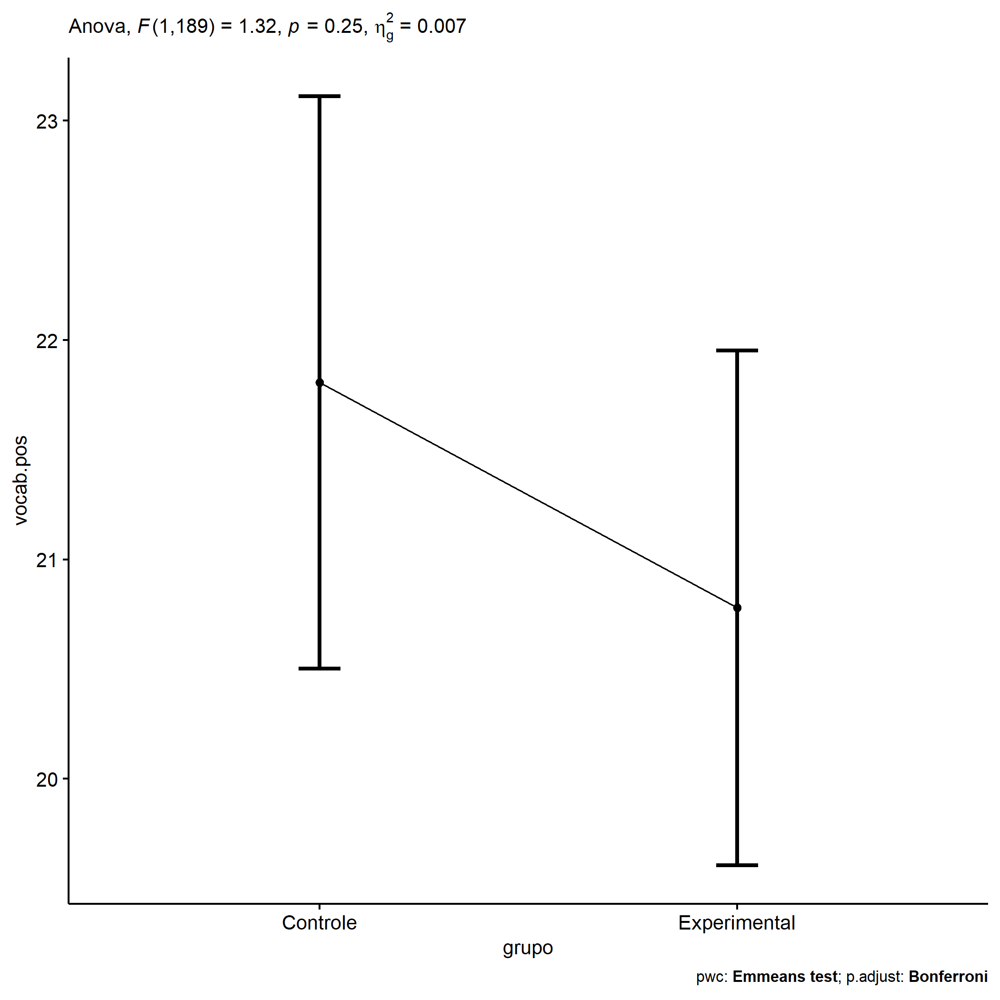<!-- -->

``` r
plots <- oneWayAncovaBoxPlots(
  wdat, "vocab.pos", "grupo", aov, pwc, covar = "vocab.pre",
  theme = "classic", color = color[["grupo"]],
  subtitle = which(aov$Effect == "grupo"))
```

``` r
if (length(unique(wdat[["grupo"]])) > 1)
  plots[["grupo"]] + ggplot2::ylab("Vocabulario") + ggplot2::scale_x_discrete(labels=c('pre', 'pos'))
```

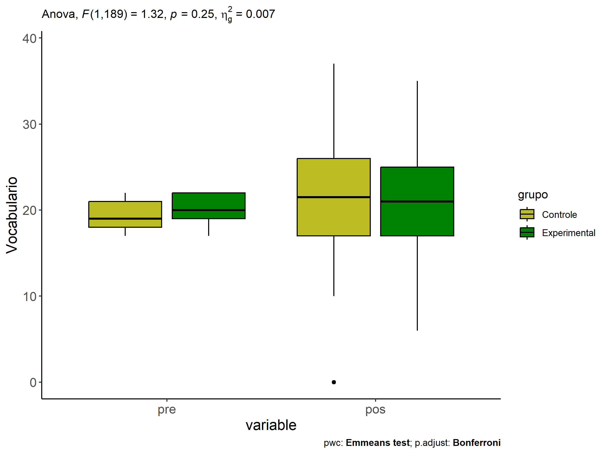<!-- -->

``` r
if (length(unique(wdat.long[["grupo"]])) > 1)
  plots <- oneWayAncovaBoxPlots(
    wdat.long, "vocab", "grupo", aov, pwc.long, pre.post = "time",
    theme = "classic", color = color$prepost)
```

``` r
if (length(unique(wdat.long[["grupo"]])) > 1)
  plots[["grupo"]] + ggplot2::ylab("Vocabulario")
```

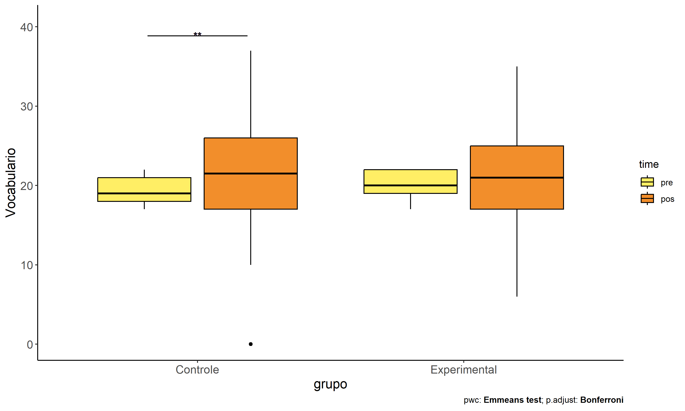<!-- -->

### Checking linearity assumption

``` r
ggscatter(wdat, x = "vocab.pre", y = "vocab.pos", size = 0.5,
          color = "grupo", add = "reg.line")+
  stat_regline_equation(
    aes(label =  paste(..eq.label.., ..rr.label.., sep = "~~~~"), color = grupo)
  )
```

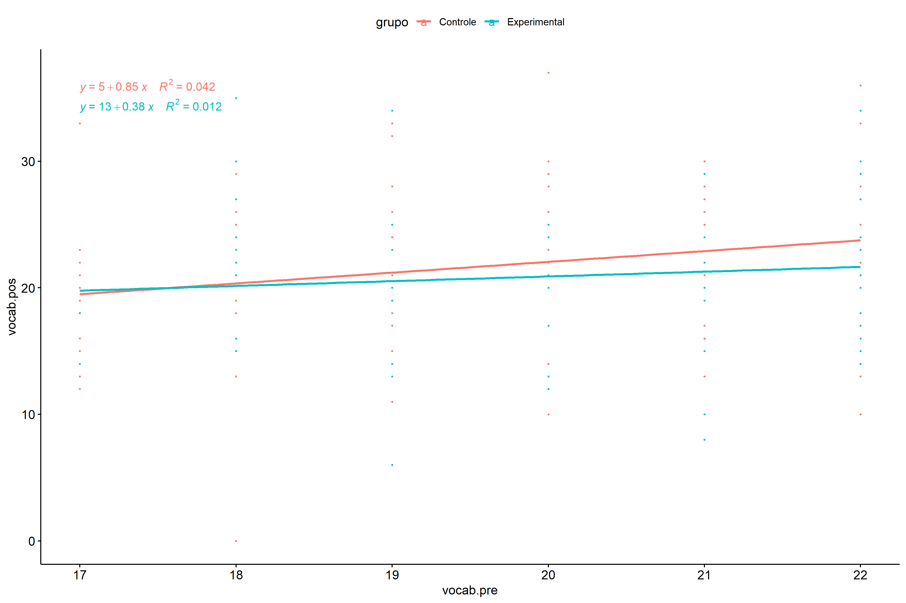<!-- -->

### Checking normality and homogeneity

``` r
res <- augment(lm(vocab.pos ~ vocab.pre + grupo, data = wdat))
```

``` r
shapiro_test(res$.resid)
```

    ## # A tibble: 1 × 3
    ##   variable   statistic p.value
    ##   <chr>          <dbl>   <dbl>
    ## 1 res$.resid     0.993   0.534

``` r
levene_test(res, .resid ~ grupo)
```

    ## # A tibble: 1 × 4
    ##     df1   df2 statistic      p
    ##   <int> <int>     <dbl>  <dbl>
    ## 1     1   190      2.95 0.0876

# ANCOVA and Pairwise for two factors **grupo:Sexo**

## Without remove non-normal data

``` r
pdat = remove_group_data(dat[!is.na(dat[["grupo"]]) & !is.na(dat[["Sexo"]]),], "vocab.pos", c("grupo","Sexo"))

pdat.long <- rbind(pdat[,c("id","grupo","Sexo")], pdat[,c("id","grupo","Sexo")])
pdat.long[["time"]] <- c(rep("pre", nrow(pdat)), rep("pos", nrow(pdat)))
pdat.long[["time"]] <- factor(pdat.long[["time"]], c("pre","pos"))
pdat.long[["vocab"]] <- c(pdat[["vocab.pre"]], pdat[["vocab.pos"]])

aov = anova_test(pdat, vocab.pos ~ vocab.pre + grupo*Sexo)
laov[["grupo:Sexo"]] <- get_anova_table(aov)
```

``` r
pwcs <- list()
pwcs[["Sexo"]] <- emmeans_test(
  group_by(pdat, grupo), vocab.pos ~ Sexo,
  covariate = vocab.pre, p.adjust.method = "bonferroni")
pwcs[["grupo"]] <- emmeans_test(
  group_by(pdat, Sexo), vocab.pos ~ grupo,
  covariate = vocab.pre, p.adjust.method = "bonferroni")

pwc <- plyr::rbind.fill(pwcs[["grupo"]], pwcs[["Sexo"]])
pwc <- pwc[,c("grupo","Sexo", colnames(pwc)[!colnames(pwc) %in% c("grupo","Sexo")])]
```

``` r
pwc.long <- emmeans_test(dplyr::group_by_at(pdat.long, c("grupo","Sexo")),
                         vocab ~ time,
                         p.adjust.method = "bonferroni")
lpwc[["grupo:Sexo"]] <- plyr::rbind.fill(pwc, pwc.long)
```

``` r
ds <- get.descriptives(pdat, "vocab.pos", c("grupo","Sexo"), covar = "vocab.pre")
ds <- merge(ds[ds$variable != "vocab.pre",],
            ds[ds$variable == "vocab.pre", !colnames(ds) %in% c("variable")],
            by = c("grupo","Sexo"), all.x = T, suffixes = c("", ".vocab.pre"))
ds <- merge(get_emmeans(pwcs[["grupo"]]), ds, by = c("grupo","Sexo"), suffixes = c(".emms", ""))
ds <- ds[,c("grupo","Sexo","n","mean.vocab.pre","se.vocab.pre","mean","se","emmean","se.emms")]

colnames(ds) <- c("grupo","Sexo", "N", paste0(c("M","SE")," (pre)"),
                  paste0(c("M","SE"), " (unadj)"), paste0(c("M", "SE"), " (adj)"))

lemms[["grupo:Sexo"]] <- ds
```

## Computing ANCOVA and PairWise After removing non-normal data (OK)

``` r
wdat = pdat 

res = residuals(lm(vocab.pos ~ vocab.pre + grupo*Sexo, data = wdat))
non.normal = getNonNormal(res, wdat$id, plimit = 0.05)

wdat = wdat[!wdat$id %in% non.normal,]

wdat.long <- rbind(wdat[,c("id","grupo","Sexo")], wdat[,c("id","grupo","Sexo")])
wdat.long[["time"]] <- c(rep("pre", nrow(wdat)), rep("pos", nrow(wdat)))
wdat.long[["time"]] <- factor(wdat.long[["time"]], c("pre","pos"))
wdat.long[["vocab"]] <- c(wdat[["vocab.pre"]], wdat[["vocab.pos"]])


ldat[["grupo:Sexo"]] = wdat

(non.normal)
```

    ## NULL

``` r
aov = anova_test(wdat, vocab.pos ~ vocab.pre + grupo*Sexo)
laov[["grupo:Sexo"]] <- merge(get_anova_table(aov), laov[["grupo:Sexo"]], by="Effect", suffixes = c("","'"))

(df = get_anova_table(aov))
```

    ## ANOVA Table (type II tests)
    ## 
    ##       Effect DFn DFd     F     p p<.05   ges
    ## 1  vocab.pre   1 187 5.321 0.022     * 0.028
    ## 2      grupo   1 187 1.405 0.237       0.007
    ## 3       Sexo   1 187 3.814 0.052       0.020
    ## 4 grupo:Sexo   1 187 1.600 0.207       0.008

| Effect     | DFn | DFd |     F |     p | p\<.05 |   ges |
|:-----------|----:|----:|------:|------:|:-------|------:|
| vocab.pre  |   1 | 187 | 5.321 | 0.022 | \*     | 0.028 |
| grupo      |   1 | 187 | 1.405 | 0.237 |        | 0.007 |
| Sexo       |   1 | 187 | 3.814 | 0.052 |        | 0.020 |
| grupo:Sexo |   1 | 187 | 1.600 | 0.207 |        | 0.008 |

``` r
pwcs <- list()
pwcs[["Sexo"]] <- emmeans_test(
  group_by(wdat, grupo), vocab.pos ~ Sexo,
  covariate = vocab.pre, p.adjust.method = "bonferroni")
pwcs[["grupo"]] <- emmeans_test(
  group_by(wdat, Sexo), vocab.pos ~ grupo,
  covariate = vocab.pre, p.adjust.method = "bonferroni")

pwc <- plyr::rbind.fill(pwcs[["grupo"]], pwcs[["Sexo"]])
pwc <- pwc[,c("grupo","Sexo", colnames(pwc)[!colnames(pwc) %in% c("grupo","Sexo")])]
```

| grupo        | Sexo | term             | .y.       | group1   | group2       |  df | statistic |     p | p.adj | p.adj.signif |
|:-------------|:-----|:-----------------|:----------|:---------|:-------------|----:|----------:|------:|------:|:-------------|
|              | F    | vocab.pre\*grupo | vocab.pos | Controle | Experimental | 187 |    -0.114 | 0.910 | 0.910 | ns           |
|              | M    | vocab.pre\*grupo | vocab.pos | Controle | Experimental | 187 |     1.728 | 0.086 | 0.086 | ns           |
| Controle     |      | vocab.pre\*Sexo  | vocab.pos | F        | M            | 187 |     0.366 | 0.714 | 0.714 | ns           |
| Experimental |      | vocab.pre\*Sexo  | vocab.pos | F        | M            | 187 |     2.298 | 0.023 | 0.023 | \*           |

``` r
pwc.long <- emmeans_test(dplyr::group_by_at(wdat.long, c("grupo","Sexo")),
                         vocab ~ time,
                         p.adjust.method = "bonferroni")
lpwc[["grupo:Sexo"]] <- merge(plyr::rbind.fill(pwc, pwc.long), lpwc[["grupo:Sexo"]], by=c("grupo","Sexo","term",".y.","group1","group2"), suffixes = c("","'"))
```

| grupo        | Sexo | term | .y.   | group1 | group2 |  df | statistic |     p | p.adj | p.adj.signif |
|:-------------|:-----|:-----|:------|:-------|:-------|----:|----------:|------:|------:|:-------------|
| Controle     | F    | time | vocab | pre    | pos    | 376 |    -2.356 | 0.019 | 0.019 | \*           |
| Controle     | M    | time | vocab | pre    | pos    | 376 |    -2.076 | 0.039 | 0.039 | \*           |
| Experimental | F    | time | vocab | pre    | pos    | 376 |    -2.621 | 0.009 | 0.009 | \*\*         |
| Experimental | M    | time | vocab | pre    | pos    | 376 |     0.503 | 0.615 | 0.615 | ns           |

``` r
ds <- get.descriptives(wdat, "vocab.pos", c("grupo","Sexo"), covar = "vocab.pre")
ds <- merge(ds[ds$variable != "vocab.pre",],
            ds[ds$variable == "vocab.pre", !colnames(ds) %in% c("variable")],
            by = c("grupo","Sexo"), all.x = T, suffixes = c("", ".vocab.pre"))
ds <- merge(get_emmeans(pwcs[["grupo"]]), ds, by = c("grupo","Sexo"), suffixes = c(".emms", ""))
ds <- ds[,c("grupo","Sexo","n","mean.vocab.pre","se.vocab.pre","mean","se","emmean","se.emms")]

colnames(ds) <- c("grupo","Sexo", "N", paste0(c("M","SE")," (pre)"),
                  paste0(c("M","SE"), " (unadj)"), paste0(c("M", "SE"), " (adj)"))

lemms[["grupo:Sexo"]] <- merge(ds, lemms[["grupo:Sexo"]], by=c("grupo","Sexo"), suffixes = c("","'"))
```

| grupo        | Sexo |   N | M (pre) | SE (pre) | M (unadj) | SE (unadj) | M (adj) | SE (adj) |
|:-------------|:-----|----:|--------:|---------:|----------:|-----------:|--------:|---------:|
| Controle     | F    |  39 |  19.513 |    0.259 |    21.897 |      0.991 |  22.078 |    0.969 |
| Controle     | M    |  47 |  19.489 |    0.241 |    21.404 |      1.058 |  21.599 |    0.884 |
| Experimental | F    |  49 |  19.939 |    0.239 |    22.306 |      0.713 |  22.226 |    0.862 |
| Experimental | M    |  57 |  20.158 |    0.221 |    19.737 |      0.777 |  19.522 |    0.804 |

### Plots for ancova

``` r
plots <- twoWayAncovaPlots(
  wdat, "vocab.pos", c("grupo","Sexo"), aov, pwcs, addParam = c("mean_se"),
  font.label.size=10, step.increase=0.05, p.label="p.adj",
  subtitle = which(aov$Effect == "grupo:Sexo"))
```

``` r
if (!is.null(plots[["grupo"]]))
  plots[["grupo"]] + ggplot2::scale_color_manual(values = color[["Sexo"]])
```

    ## Scale for colour is already present.
    ## Adding another scale for colour, which will replace the existing scale.

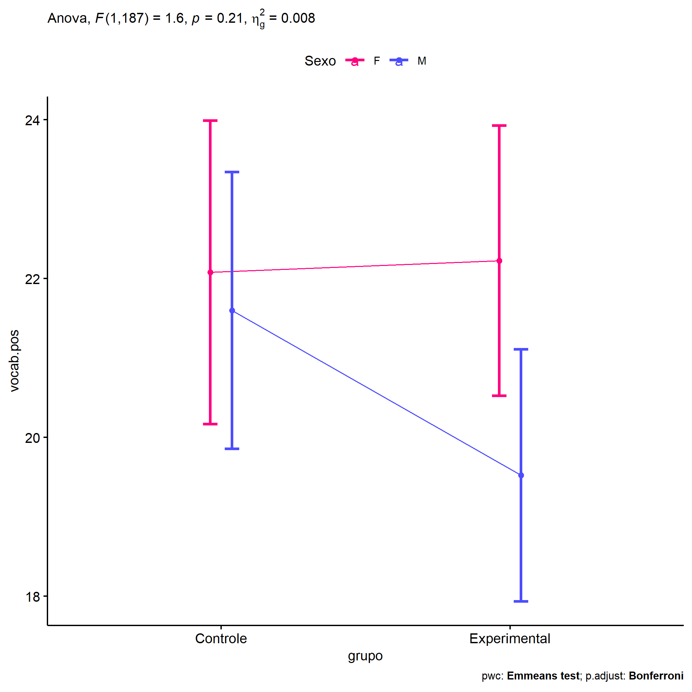<!-- -->

``` r
if (!is.null(plots[["Sexo"]]))
  plots[["Sexo"]] + ggplot2::scale_color_manual(values = color[["grupo"]])
```

    ## Scale for colour is already present.
    ## Adding another scale for colour, which will replace the existing scale.

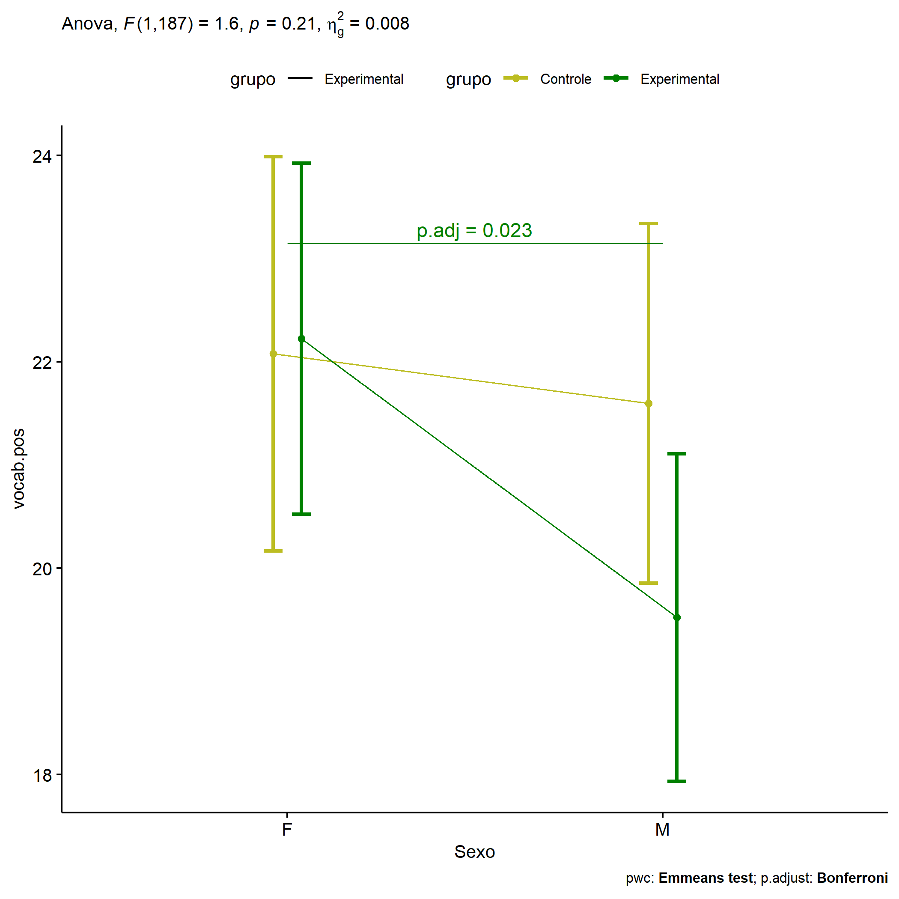<!-- -->

``` r
plots <- twoWayAncovaBoxPlots(
  wdat, "vocab.pos", c("grupo","Sexo"), aov, pwcs, covar = "vocab.pre",
  theme = "classic", color = color[["grupo:Sexo"]],
  subtitle = which(aov$Effect == "grupo:Sexo"))
```

``` r
plots[["grupo:Sexo"]] + ggplot2::ylab("Vocabulario") + ggplot2::scale_x_discrete(labels=c('pre', 'pos'))
```

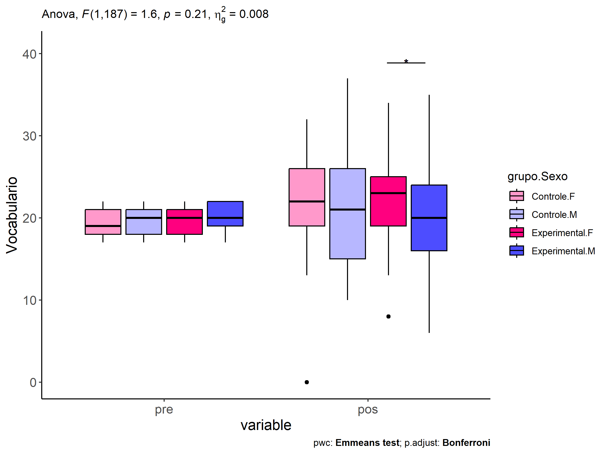<!-- -->

``` r
plots <- twoWayAncovaBoxPlots(
  wdat.long, "vocab", c("grupo","Sexo"), aov, pwc.long, pre.post = "time",
  theme = "classic", color = color$prepost)
```

``` r
plots[["grupo:Sexo"]] + ggplot2::ylab("Vocabulario")
```

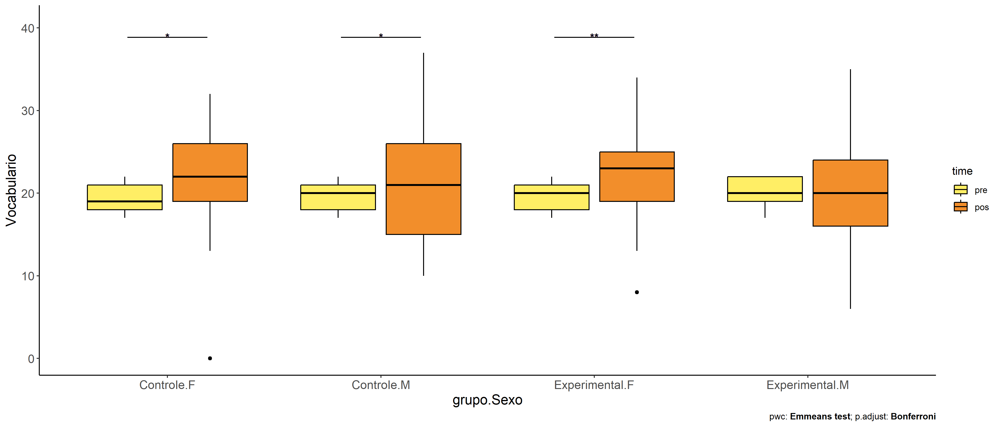<!-- -->

### Checking linearity assumption

``` r
ggscatter(wdat, x = "vocab.pre", y = "vocab.pos", size = 0.5,
          facet.by = c("grupo","Sexo"), add = "reg.line")+
  stat_regline_equation(
    aes(label =  paste(..eq.label.., ..rr.label.., sep = "~~~~"))
  )
```

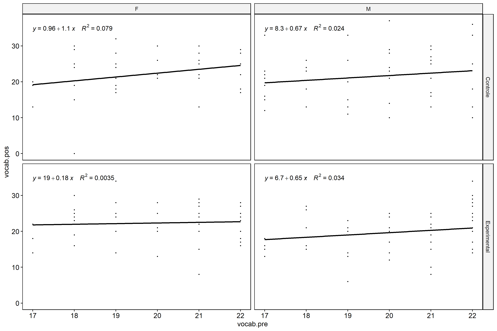<!-- -->

### Checking normality and homogeneity

``` r
res <- augment(lm(vocab.pos ~ vocab.pre + grupo*Sexo, data = wdat))
```

``` r
shapiro_test(res$.resid)
```

    ## # A tibble: 1 × 3
    ##   variable   statistic p.value
    ##   <chr>          <dbl>   <dbl>
    ## 1 res$.resid     0.995   0.798

``` r
levene_test(res, .resid ~ grupo*Sexo)
```

    ## # A tibble: 1 × 4
    ##     df1   df2 statistic      p
    ##   <int> <int>     <dbl>  <dbl>
    ## 1     3   188      2.77 0.0429

# ANCOVA and Pairwise for two factors **grupo:Zona**

## Without remove non-normal data

``` r
pdat = remove_group_data(dat[!is.na(dat[["grupo"]]) & !is.na(dat[["Zona"]]),], "vocab.pos", c("grupo","Zona"))

pdat.long <- rbind(pdat[,c("id","grupo","Zona")], pdat[,c("id","grupo","Zona")])
pdat.long[["time"]] <- c(rep("pre", nrow(pdat)), rep("pos", nrow(pdat)))
pdat.long[["time"]] <- factor(pdat.long[["time"]], c("pre","pos"))
pdat.long[["vocab"]] <- c(pdat[["vocab.pre"]], pdat[["vocab.pos"]])

aov = anova_test(pdat, vocab.pos ~ vocab.pre + grupo*Zona)
laov[["grupo:Zona"]] <- get_anova_table(aov)
```

``` r
pwcs <- list()
pwcs[["Zona"]] <- emmeans_test(
  group_by(pdat, grupo), vocab.pos ~ Zona,
  covariate = vocab.pre, p.adjust.method = "bonferroni")
pwcs[["grupo"]] <- emmeans_test(
  group_by(pdat, Zona), vocab.pos ~ grupo,
  covariate = vocab.pre, p.adjust.method = "bonferroni")

pwc <- plyr::rbind.fill(pwcs[["grupo"]], pwcs[["Zona"]])
pwc <- pwc[,c("grupo","Zona", colnames(pwc)[!colnames(pwc) %in% c("grupo","Zona")])]
```

``` r
pwc.long <- emmeans_test(dplyr::group_by_at(pdat.long, c("grupo","Zona")),
                         vocab ~ time,
                         p.adjust.method = "bonferroni")
lpwc[["grupo:Zona"]] <- plyr::rbind.fill(pwc, pwc.long)
```

``` r
ds <- get.descriptives(pdat, "vocab.pos", c("grupo","Zona"), covar = "vocab.pre")
ds <- merge(ds[ds$variable != "vocab.pre",],
            ds[ds$variable == "vocab.pre", !colnames(ds) %in% c("variable")],
            by = c("grupo","Zona"), all.x = T, suffixes = c("", ".vocab.pre"))
ds <- merge(get_emmeans(pwcs[["grupo"]]), ds, by = c("grupo","Zona"), suffixes = c(".emms", ""))
ds <- ds[,c("grupo","Zona","n","mean.vocab.pre","se.vocab.pre","mean","se","emmean","se.emms")]

colnames(ds) <- c("grupo","Zona", "N", paste0(c("M","SE")," (pre)"),
                  paste0(c("M","SE"), " (unadj)"), paste0(c("M", "SE"), " (adj)"))

lemms[["grupo:Zona"]] <- ds
```

## Computing ANCOVA and PairWise After removing non-normal data (OK)

``` r
wdat = pdat 

res = residuals(lm(vocab.pos ~ vocab.pre + grupo*Zona, data = wdat))
non.normal = getNonNormal(res, wdat$id, plimit = 0.05)

wdat = wdat[!wdat$id %in% non.normal,]

wdat.long <- rbind(wdat[,c("id","grupo","Zona")], wdat[,c("id","grupo","Zona")])
wdat.long[["time"]] <- c(rep("pre", nrow(wdat)), rep("pos", nrow(wdat)))
wdat.long[["time"]] <- factor(wdat.long[["time"]], c("pre","pos"))
wdat.long[["vocab"]] <- c(wdat[["vocab.pre"]], wdat[["vocab.pos"]])


ldat[["grupo:Zona"]] = wdat

(non.normal)
```

    ## NULL

``` r
aov = anova_test(wdat, vocab.pos ~ vocab.pre + grupo*Zona)
laov[["grupo:Zona"]] <- merge(get_anova_table(aov), laov[["grupo:Zona"]], by="Effect", suffixes = c("","'"))

(df = get_anova_table(aov))
```

    ## ANOVA Table (type II tests)
    ## 
    ##       Effect DFn DFd     F     p p<.05      ges
    ## 1  vocab.pre   1 136 5.737 0.018     * 4.00e-02
    ## 2      grupo   1 136 3.879 0.051       2.80e-02
    ## 3       Zona   1 136 0.343 0.559       3.00e-03
    ## 4 grupo:Zona   1 136 0.007 0.935       4.84e-05

| Effect     | DFn | DFd |     F |     p | p\<.05 |   ges |
|:-----------|----:|----:|------:|------:|:-------|------:|
| vocab.pre  |   1 | 136 | 5.737 | 0.018 | \*     | 0.040 |
| grupo      |   1 | 136 | 3.879 | 0.051 |        | 0.028 |
| Zona       |   1 | 136 | 0.343 | 0.559 |        | 0.003 |
| grupo:Zona |   1 | 136 | 0.007 | 0.935 |        | 0.000 |

``` r
pwcs <- list()
pwcs[["Zona"]] <- emmeans_test(
  group_by(wdat, grupo), vocab.pos ~ Zona,
  covariate = vocab.pre, p.adjust.method = "bonferroni")
pwcs[["grupo"]] <- emmeans_test(
  group_by(wdat, Zona), vocab.pos ~ grupo,
  covariate = vocab.pre, p.adjust.method = "bonferroni")

pwc <- plyr::rbind.fill(pwcs[["grupo"]], pwcs[["Zona"]])
pwc <- pwc[,c("grupo","Zona", colnames(pwc)[!colnames(pwc) %in% c("grupo","Zona")])]
```

| grupo        | Zona   | term             | .y.       | group1   | group2       |  df | statistic |     p | p.adj | p.adj.signif |
|:-------------|:-------|:-----------------|:----------|:---------|:-------------|----:|----------:|------:|------:|:-------------|
|              | Rural  | vocab.pre\*grupo | vocab.pos | Controle | Experimental | 136 |     1.521 | 0.130 | 0.130 | ns           |
|              | Urbana | vocab.pre\*grupo | vocab.pos | Controle | Experimental | 136 |     1.249 | 0.214 | 0.214 | ns           |
| Controle     |        | vocab.pre\*Zona  | vocab.pos | Rural    | Urbana       | 136 |    -0.453 | 0.651 | 0.651 | ns           |
| Experimental |        | vocab.pre\*Zona  | vocab.pos | Rural    | Urbana       | 136 |    -0.378 | 0.706 | 0.706 | ns           |

``` r
pwc.long <- emmeans_test(dplyr::group_by_at(wdat.long, c("grupo","Zona")),
                         vocab ~ time,
                         p.adjust.method = "bonferroni")
lpwc[["grupo:Zona"]] <- merge(plyr::rbind.fill(pwc, pwc.long), lpwc[["grupo:Zona"]], by=c("grupo","Zona","term",".y.","group1","group2"), suffixes = c("","'"))
```

| grupo        | Zona   | term | .y.   | group1 | group2 |  df | statistic |     p | p.adj | p.adj.signif |
|:-------------|:-------|:-----|:------|:-------|:-------|----:|----------:|------:|------:|:-------------|
| Controle     | Rural  | time | vocab | pre    | pos    | 274 |    -2.914 | 0.004 | 0.004 | \*\*         |
| Controle     | Urbana | time | vocab | pre    | pos    | 274 |    -2.547 | 0.011 | 0.011 | \*           |
| Experimental | Rural  | time | vocab | pre    | pos    | 274 |    -0.768 | 0.443 | 0.443 | ns           |
| Experimental | Urbana | time | vocab | pre    | pos    | 274 |    -1.045 | 0.297 | 0.297 | ns           |

``` r
ds <- get.descriptives(wdat, "vocab.pos", c("grupo","Zona"), covar = "vocab.pre")
ds <- merge(ds[ds$variable != "vocab.pre",],
            ds[ds$variable == "vocab.pre", !colnames(ds) %in% c("variable")],
            by = c("grupo","Zona"), all.x = T, suffixes = c("", ".vocab.pre"))
ds <- merge(get_emmeans(pwcs[["grupo"]]), ds, by = c("grupo","Zona"), suffixes = c(".emms", ""))
ds <- ds[,c("grupo","Zona","n","mean.vocab.pre","se.vocab.pre","mean","se","emmean","se.emms")]

colnames(ds) <- c("grupo","Zona", "N", paste0(c("M","SE")," (pre)"),
                  paste0(c("M","SE"), " (unadj)"), paste0(c("M", "SE"), " (adj)"))

lemms[["grupo:Zona"]] <- merge(ds, lemms[["grupo:Zona"]], by=c("grupo","Zona"), suffixes = c("","'"))
```

| grupo        | Zona   |   N | M (pre) | SE (pre) | M (unadj) | SE (unadj) | M (adj) | SE (adj) |
|:-------------|:-------|----:|--------:|---------:|----------:|-----------:|--------:|---------:|
| Controle     | Rural  |  41 |  19.366 |    0.265 |    22.049 |      1.067 |  22.380 |    0.879 |
| Controle     | Urbana |  23 |  20.043 |    0.330 |    23.174 |      0.879 |  23.042 |    1.160 |
| Experimental | Rural  |  50 |  20.100 |    0.239 |    20.740 |      0.727 |  20.570 |    0.789 |
| Experimental | Urbana |  27 |  19.963 |    0.313 |    21.148 |      1.086 |  21.072 |    1.070 |

### Plots for ancova

``` r
plots <- twoWayAncovaPlots(
  wdat, "vocab.pos", c("grupo","Zona"), aov, pwcs, addParam = c("mean_se"),
  font.label.size=10, step.increase=0.05, p.label="p.adj",
  subtitle = which(aov$Effect == "grupo:Zona"))
```

``` r
if (!is.null(plots[["grupo"]]))
  plots[["grupo"]] + ggplot2::scale_color_manual(values = color[["Zona"]])
```

    ## Scale for colour is already present.
    ## Adding another scale for colour, which will replace the existing scale.

<!-- -->

``` r
if (!is.null(plots[["Zona"]]))
  plots[["Zona"]] + ggplot2::scale_color_manual(values = color[["grupo"]])
```

    ## Scale for colour is already present.
    ## Adding another scale for colour, which will replace the existing scale.

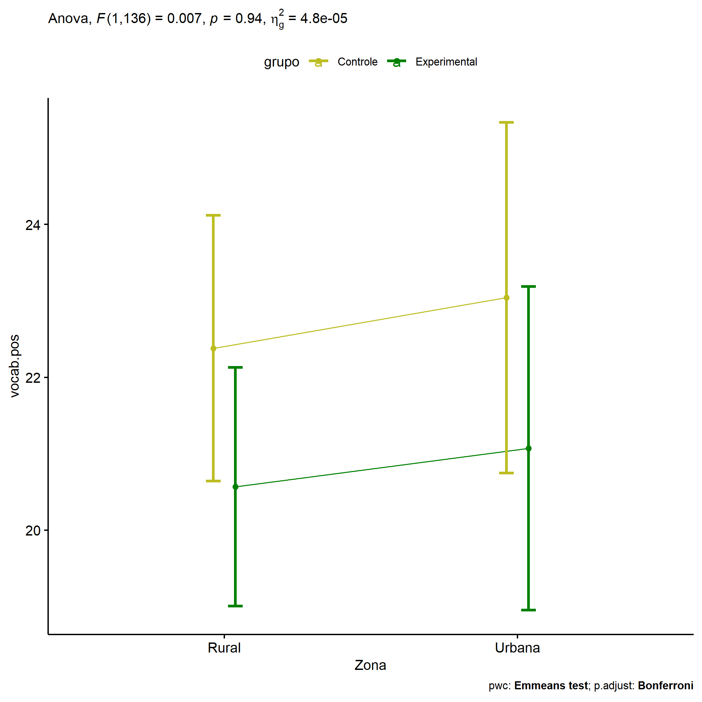<!-- -->

``` r
plots <- twoWayAncovaBoxPlots(
  wdat, "vocab.pos", c("grupo","Zona"), aov, pwcs, covar = "vocab.pre",
  theme = "classic", color = color[["grupo:Zona"]],
  subtitle = which(aov$Effect == "grupo:Zona"))
```

``` r
plots[["grupo:Zona"]] + ggplot2::ylab("Vocabulario") + ggplot2::scale_x_discrete(labels=c('pre', 'pos'))
```

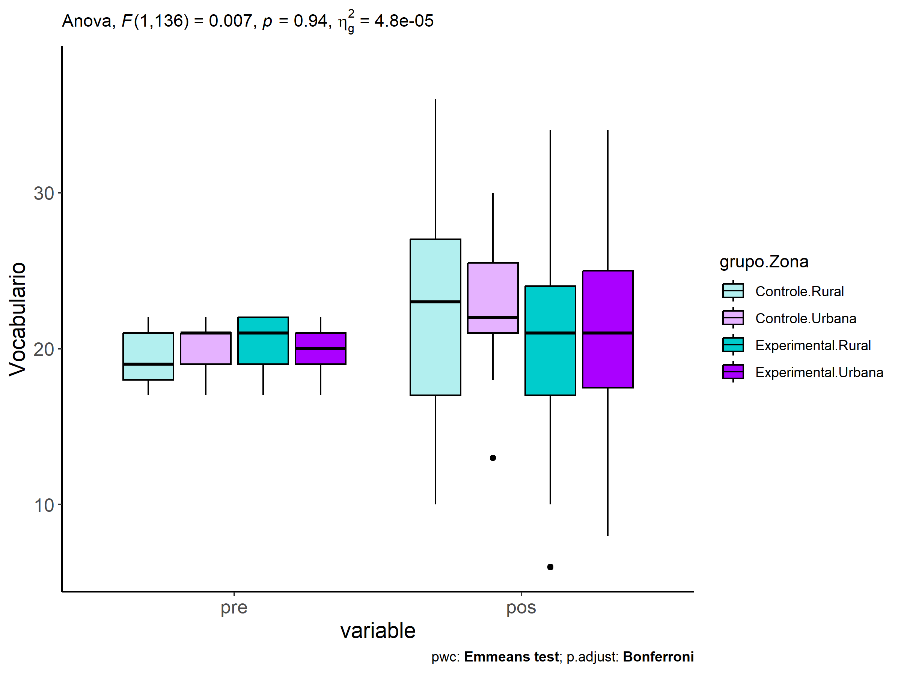<!-- -->

``` r
plots <- twoWayAncovaBoxPlots(
  wdat.long, "vocab", c("grupo","Zona"), aov, pwc.long, pre.post = "time",
  theme = "classic", color = color$prepost)
```

``` r
plots[["grupo:Zona"]] + ggplot2::ylab("Vocabulario")
```

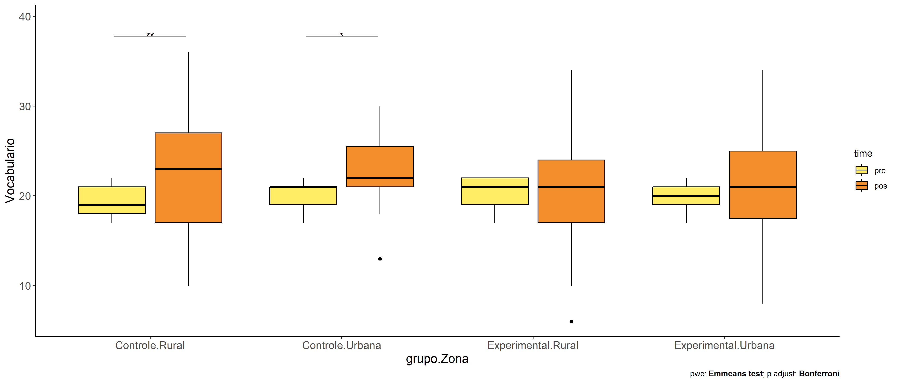<!-- -->

### Checking linearity assumption

``` r
ggscatter(wdat, x = "vocab.pre", y = "vocab.pos", size = 0.5,
          facet.by = c("grupo","Zona"), add = "reg.line")+
  stat_regline_equation(
    aes(label =  paste(..eq.label.., ..rr.label.., sep = "~~~~"))
  )
```

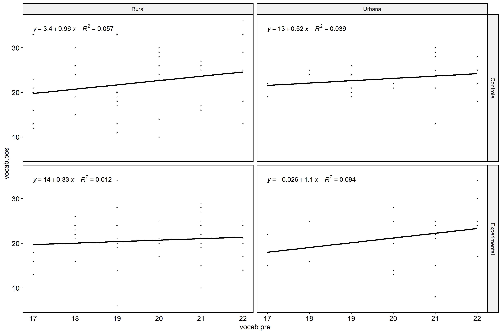<!-- -->

### Checking normality and homogeneity

``` r
res <- augment(lm(vocab.pos ~ vocab.pre + grupo*Zona, data = wdat))
```

``` r
shapiro_test(res$.resid)
```

    ## # A tibble: 1 × 3
    ##   variable   statistic p.value
    ##   <chr>          <dbl>   <dbl>
    ## 1 res$.resid     0.993   0.674

``` r
levene_test(res, .resid ~ grupo*Zona)
```

    ## # A tibble: 1 × 4
    ##     df1   df2 statistic      p
    ##   <int> <int>     <dbl>  <dbl>
    ## 1     3   137      2.66 0.0504

# ANCOVA and Pairwise for two factors **grupo:Cor.Raca**

## Without remove non-normal data

``` r
pdat = remove_group_data(dat[!is.na(dat[["grupo"]]) & !is.na(dat[["Cor.Raca"]]),], "vocab.pos", c("grupo","Cor.Raca"))
```

    ## Warning: There was 1 warning in `mutate()`.
    ## ℹ In argument: `ci = abs(stats::qt(alpha/2, .data$n - 1) * .data$se)`.
    ## Caused by warning:
    ## ! There was 1 warning in `mutate()`.
    ## ℹ In argument: `ci = abs(stats::qt(alpha/2, .data$n - 1) * .data$se)`.
    ## Caused by warning in `stats::qt()`:
    ## ! NaNs produced

``` r
pdat.long <- rbind(pdat[,c("id","grupo","Cor.Raca")], pdat[,c("id","grupo","Cor.Raca")])
pdat.long[["time"]] <- c(rep("pre", nrow(pdat)), rep("pos", nrow(pdat)))
pdat.long[["time"]] <- factor(pdat.long[["time"]], c("pre","pos"))
pdat.long[["vocab"]] <- c(pdat[["vocab.pre"]], pdat[["vocab.pos"]])

aov = anova_test(pdat, vocab.pos ~ vocab.pre + grupo*Cor.Raca)
laov[["grupo:Cor.Raca"]] <- get_anova_table(aov)
```

``` r
pwcs <- list()
pwcs[["Cor.Raca"]] <- emmeans_test(
  group_by(pdat, grupo), vocab.pos ~ Cor.Raca,
  covariate = vocab.pre, p.adjust.method = "bonferroni")
pwcs[["grupo"]] <- emmeans_test(
  group_by(pdat, Cor.Raca), vocab.pos ~ grupo,
  covariate = vocab.pre, p.adjust.method = "bonferroni")

pwc <- plyr::rbind.fill(pwcs[["grupo"]], pwcs[["Cor.Raca"]])
pwc <- pwc[,c("grupo","Cor.Raca", colnames(pwc)[!colnames(pwc) %in% c("grupo","Cor.Raca")])]
```

``` r
pwc.long <- emmeans_test(dplyr::group_by_at(pdat.long, c("grupo","Cor.Raca")),
                         vocab ~ time,
                         p.adjust.method = "bonferroni")
lpwc[["grupo:Cor.Raca"]] <- plyr::rbind.fill(pwc, pwc.long)
```

``` r
ds <- get.descriptives(pdat, "vocab.pos", c("grupo","Cor.Raca"), covar = "vocab.pre")
ds <- merge(ds[ds$variable != "vocab.pre",],
            ds[ds$variable == "vocab.pre", !colnames(ds) %in% c("variable")],
            by = c("grupo","Cor.Raca"), all.x = T, suffixes = c("", ".vocab.pre"))
ds <- merge(get_emmeans(pwcs[["grupo"]]), ds, by = c("grupo","Cor.Raca"), suffixes = c(".emms", ""))
ds <- ds[,c("grupo","Cor.Raca","n","mean.vocab.pre","se.vocab.pre","mean","se","emmean","se.emms")]

colnames(ds) <- c("grupo","Cor.Raca", "N", paste0(c("M","SE")," (pre)"),
                  paste0(c("M","SE"), " (unadj)"), paste0(c("M", "SE"), " (adj)"))

lemms[["grupo:Cor.Raca"]] <- ds
```

## Computing ANCOVA and PairWise After removing non-normal data (OK)

``` r
wdat = pdat 

res = residuals(lm(vocab.pos ~ vocab.pre + grupo*Cor.Raca, data = wdat))
non.normal = getNonNormal(res, wdat$id, plimit = 0.05)

wdat = wdat[!wdat$id %in% non.normal,]

wdat.long <- rbind(wdat[,c("id","grupo","Cor.Raca")], wdat[,c("id","grupo","Cor.Raca")])
wdat.long[["time"]] <- c(rep("pre", nrow(wdat)), rep("pos", nrow(wdat)))
wdat.long[["time"]] <- factor(wdat.long[["time"]], c("pre","pos"))
wdat.long[["vocab"]] <- c(wdat[["vocab.pre"]], wdat[["vocab.pos"]])


ldat[["grupo:Cor.Raca"]] = wdat

(non.normal)
```

    ## NULL

``` r
aov = anova_test(wdat, vocab.pos ~ vocab.pre + grupo*Cor.Raca)
laov[["grupo:Cor.Raca"]] <- merge(get_anova_table(aov), laov[["grupo:Cor.Raca"]], by="Effect", suffixes = c("","'"))

(df = get_anova_table(aov))
```

    ## ANOVA Table (type II tests)
    ## 
    ##           Effect DFn DFd     F     p p<.05   ges
    ## 1      vocab.pre   1  82 7.091 0.009     * 0.080
    ## 2          grupo   1  82 1.393 0.241       0.017
    ## 3       Cor.Raca   1  82 2.154 0.146       0.026
    ## 4 grupo:Cor.Raca   1  82 3.655 0.059       0.043

| Effect         | DFn | DFd |     F |     p | p\<.05 |   ges |
|:---------------|----:|----:|------:|------:|:-------|------:|
| vocab.pre      |   1 |  82 | 7.091 | 0.009 | \*     | 0.080 |
| grupo          |   1 |  82 | 1.393 | 0.241 |        | 0.017 |
| Cor.Raca       |   1 |  82 | 2.154 | 0.146 |        | 0.026 |
| grupo:Cor.Raca |   1 |  82 | 3.655 | 0.059 |        | 0.043 |

``` r
pwcs <- list()
pwcs[["Cor.Raca"]] <- emmeans_test(
  group_by(wdat, grupo), vocab.pos ~ Cor.Raca,
  covariate = vocab.pre, p.adjust.method = "bonferroni")
pwcs[["grupo"]] <- emmeans_test(
  group_by(wdat, Cor.Raca), vocab.pos ~ grupo,
  covariate = vocab.pre, p.adjust.method = "bonferroni")

pwc <- plyr::rbind.fill(pwcs[["grupo"]], pwcs[["Cor.Raca"]])
pwc <- pwc[,c("grupo","Cor.Raca", colnames(pwc)[!colnames(pwc) %in% c("grupo","Cor.Raca")])]
```

| grupo        | Cor.Raca | term                | .y.       | group1   | group2       |  df | statistic |     p | p.adj | p.adj.signif |
|:-------------|:---------|:--------------------|:----------|:---------|:-------------|----:|----------:|------:|------:|:-------------|
|              | Branca   | vocab.pre\*grupo    | vocab.pos | Controle | Experimental |  82 |     2.240 | 0.028 | 0.028 | \*           |
|              | Parda    | vocab.pre\*grupo    | vocab.pos | Controle | Experimental |  82 |     0.177 | 0.860 | 0.860 | ns           |
| Controle     |          | vocab.pre\*Cor.Raca | vocab.pos | Branca   | Parda        |  82 |     0.080 | 0.936 | 0.936 | ns           |
| Experimental |          | vocab.pre\*Cor.Raca | vocab.pos | Branca   | Parda        |  82 |    -2.409 | 0.018 | 0.018 | \*           |

``` r
pwc.long <- emmeans_test(dplyr::group_by_at(wdat.long, c("grupo","Cor.Raca")),
                         vocab ~ time,
                         p.adjust.method = "bonferroni")
lpwc[["grupo:Cor.Raca"]] <- merge(plyr::rbind.fill(pwc, pwc.long), lpwc[["grupo:Cor.Raca"]], by=c("grupo","Cor.Raca","term",".y.","group1","group2"), suffixes = c("","'"))
```

| grupo        | Cor.Raca | term | .y.   | group1 | group2 |  df | statistic |     p | p.adj | p.adj.signif |
|:-------------|:---------|:-----|:------|:-------|:-------|----:|----------:|------:|------:|:-------------|
| Controle     | Branca   | time | vocab | pre    | pos    | 166 |    -1.224 | 0.223 | 0.223 | ns           |
| Controle     | Parda    | time | vocab | pre    | pos    | 166 |    -1.809 | 0.072 | 0.072 | ns           |
| Experimental | Branca   | time | vocab | pre    | pos    | 166 |     1.713 | 0.089 | 0.089 | ns           |
| Experimental | Parda    | time | vocab | pre    | pos    | 166 |    -1.706 | 0.090 | 0.090 | ns           |

``` r
ds <- get.descriptives(wdat, "vocab.pos", c("grupo","Cor.Raca"), covar = "vocab.pre")
ds <- merge(ds[ds$variable != "vocab.pre",],
            ds[ds$variable == "vocab.pre", !colnames(ds) %in% c("variable")],
            by = c("grupo","Cor.Raca"), all.x = T, suffixes = c("", ".vocab.pre"))
ds <- merge(get_emmeans(pwcs[["grupo"]]), ds, by = c("grupo","Cor.Raca"), suffixes = c(".emms", ""))
ds <- ds[,c("grupo","Cor.Raca","n","mean.vocab.pre","se.vocab.pre","mean","se","emmean","se.emms")]

colnames(ds) <- c("grupo","Cor.Raca", "N", paste0(c("M","SE")," (pre)"),
                  paste0(c("M","SE"), " (unadj)"), paste0(c("M", "SE"), " (adj)"))

lemms[["grupo:Cor.Raca"]] <- merge(ds, lemms[["grupo:Cor.Raca"]], by=c("grupo","Cor.Raca"), suffixes = c("","'"))
```

| grupo        | Cor.Raca |   N | M (pre) | SE (pre) | M (unadj) | SE (unadj) | M (adj) | SE (adj) |
|:-------------|:---------|----:|--------:|---------:|----------:|-----------:|--------:|---------:|
| Controle     | Branca   |  12 |  20.167 |    0.490 |    22.583 |      1.928 |  22.317 |    1.852 |
| Controle     | Parda    |  32 |  19.750 |    0.288 |    21.938 |      1.409 |  22.142 |    1.135 |
| Experimental | Branca   |   7 |  20.000 |    0.617 |    15.571 |      1.824 |  15.493 |    2.421 |
| Experimental | Parda    |  36 |  20.000 |    0.279 |    21.944 |      0.915 |  21.866 |    1.068 |

### Plots for ancova

``` r
plots <- twoWayAncovaPlots(
  wdat, "vocab.pos", c("grupo","Cor.Raca"), aov, pwcs, addParam = c("mean_se"),
  font.label.size=10, step.increase=0.05, p.label="p.adj",
  subtitle = which(aov$Effect == "grupo:Cor.Raca"))
```

``` r
if (!is.null(plots[["grupo"]]))
  plots[["grupo"]] + ggplot2::scale_color_manual(values = color[["Cor.Raca"]])
```

    ## Scale for colour is already present.
    ## Adding another scale for colour, which will replace the existing scale.

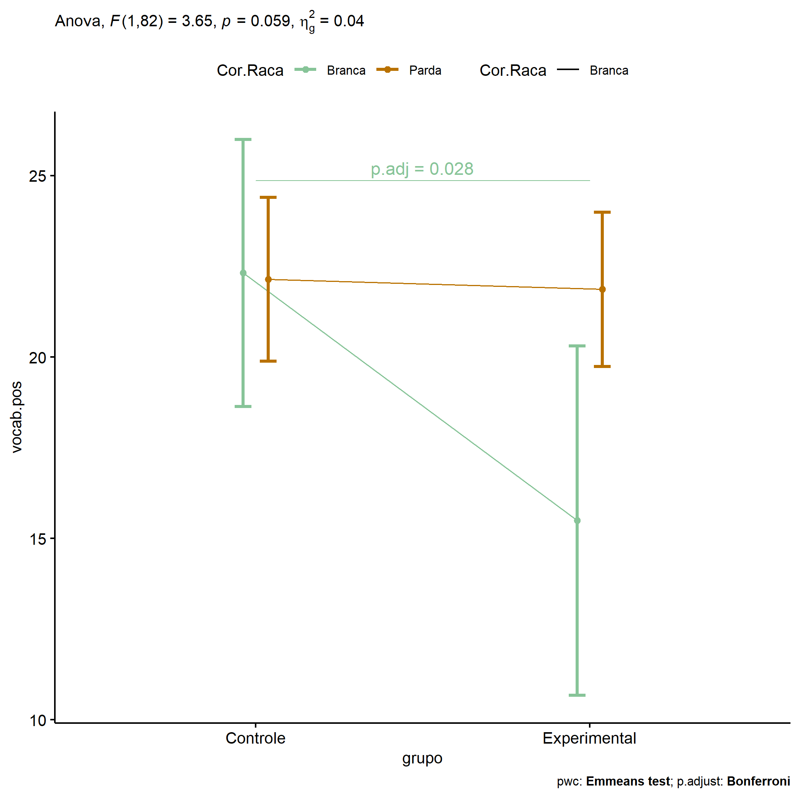<!-- -->

``` r
if (!is.null(plots[["Cor.Raca"]]))
  plots[["Cor.Raca"]] + ggplot2::scale_color_manual(values = color[["grupo"]])
```

    ## Scale for colour is already present.
    ## Adding another scale for colour, which will replace the existing scale.

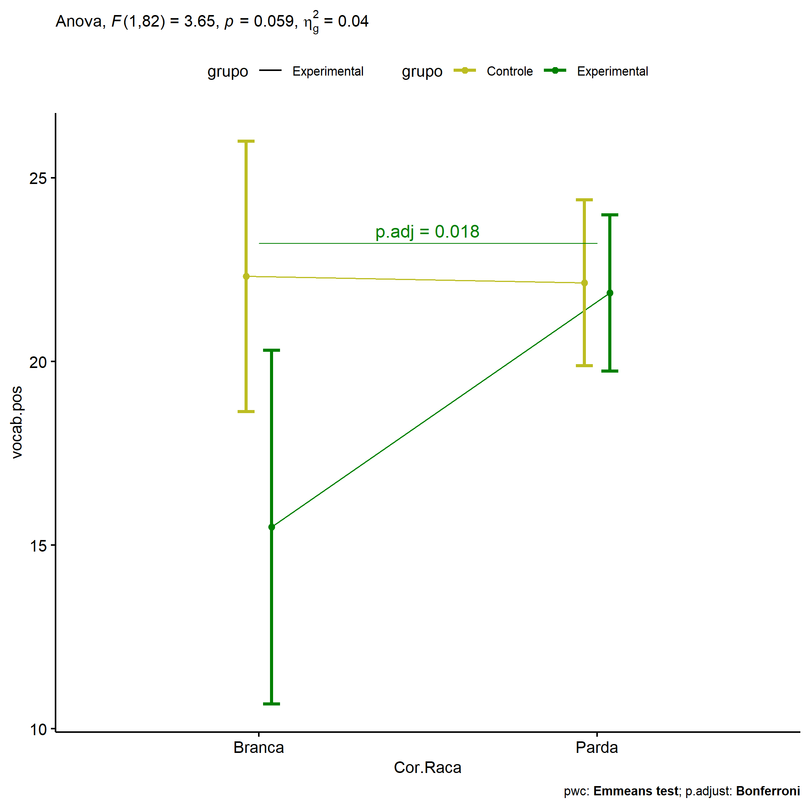<!-- -->

``` r
plots <- twoWayAncovaBoxPlots(
  wdat, "vocab.pos", c("grupo","Cor.Raca"), aov, pwcs, covar = "vocab.pre",
  theme = "classic", color = color[["grupo:Cor.Raca"]],
  subtitle = which(aov$Effect == "grupo:Cor.Raca"))
```

``` r
plots[["grupo:Cor.Raca"]] + ggplot2::ylab("Vocabulario") + ggplot2::scale_x_discrete(labels=c('pre', 'pos'))
```

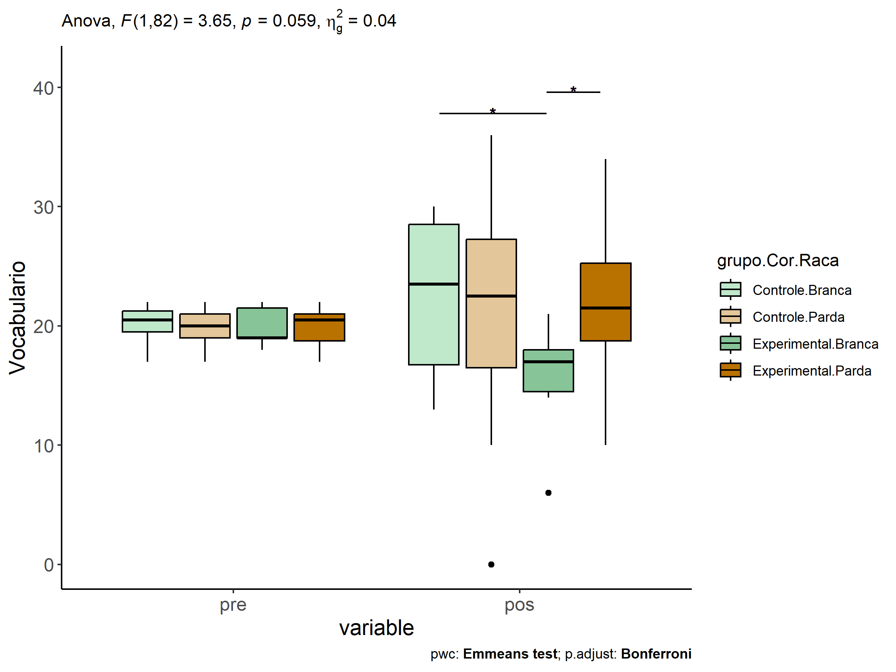<!-- -->

``` r
plots <- twoWayAncovaBoxPlots(
  wdat.long, "vocab", c("grupo","Cor.Raca"), aov, pwc.long, pre.post = "time",
  theme = "classic", color = color$prepost)
```

``` r
plots[["grupo:Cor.Raca"]] + ggplot2::ylab("Vocabulario")
```

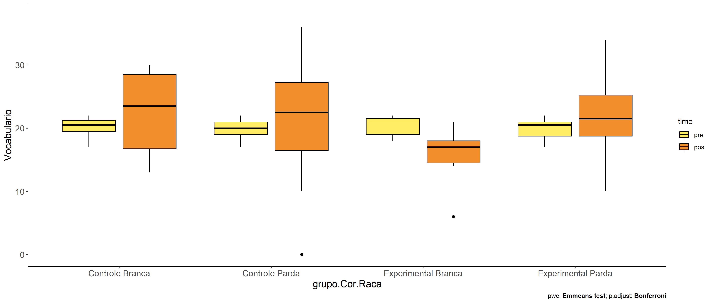<!-- -->

### Checking linearity assumption

``` r
ggscatter(wdat, x = "vocab.pre", y = "vocab.pos", size = 0.5,
          facet.by = c("grupo","Cor.Raca"), add = "reg.line")+
  stat_regline_equation(
    aes(label =  paste(..eq.label.., ..rr.label.., sep = "~~~~"))
  )
```

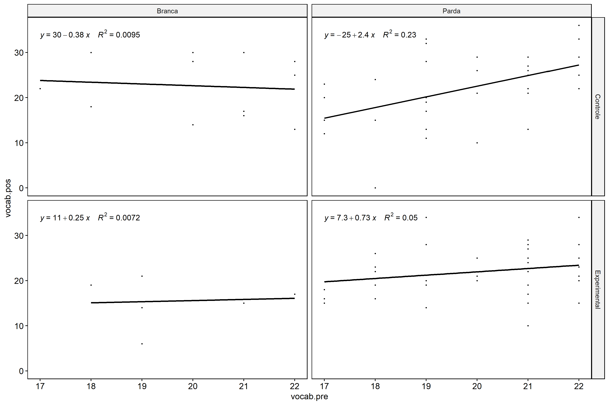<!-- -->

### Checking normality and homogeneity

``` r
res <- augment(lm(vocab.pos ~ vocab.pre + grupo*Cor.Raca, data = wdat))
```

``` r
shapiro_test(res$.resid)
```

    ## # A tibble: 1 × 3
    ##   variable   statistic p.value
    ##   <chr>          <dbl>   <dbl>
    ## 1 res$.resid     0.987   0.515

``` r
levene_test(res, .resid ~ grupo*Cor.Raca)
```

    ## # A tibble: 1 × 4
    ##     df1   df2 statistic     p
    ##   <int> <int>     <dbl> <dbl>
    ## 1     3    83      1.59 0.199

# ANCOVA and Pairwise for two factors **grupo:Serie**

## Without remove non-normal data

``` r
pdat = remove_group_data(dat[!is.na(dat[["grupo"]]) & !is.na(dat[["Serie"]]),], "vocab.pos", c("grupo","Serie"))

pdat.long <- rbind(pdat[,c("id","grupo","Serie")], pdat[,c("id","grupo","Serie")])
pdat.long[["time"]] <- c(rep("pre", nrow(pdat)), rep("pos", nrow(pdat)))
pdat.long[["time"]] <- factor(pdat.long[["time"]], c("pre","pos"))
pdat.long[["vocab"]] <- c(pdat[["vocab.pre"]], pdat[["vocab.pos"]])

aov = anova_test(pdat, vocab.pos ~ vocab.pre + grupo*Serie)
laov[["grupo:Serie"]] <- get_anova_table(aov)
```

``` r
pwcs <- list()
pwcs[["Serie"]] <- emmeans_test(
  group_by(pdat, grupo), vocab.pos ~ Serie,
  covariate = vocab.pre, p.adjust.method = "bonferroni")
pwcs[["grupo"]] <- emmeans_test(
  group_by(pdat, Serie), vocab.pos ~ grupo,
  covariate = vocab.pre, p.adjust.method = "bonferroni")

pwc <- plyr::rbind.fill(pwcs[["grupo"]], pwcs[["Serie"]])
pwc <- pwc[,c("grupo","Serie", colnames(pwc)[!colnames(pwc) %in% c("grupo","Serie")])]
```

``` r
pwc.long <- emmeans_test(dplyr::group_by_at(pdat.long, c("grupo","Serie")),
                         vocab ~ time,
                         p.adjust.method = "bonferroni")
lpwc[["grupo:Serie"]] <- plyr::rbind.fill(pwc, pwc.long)
```

``` r
ds <- get.descriptives(pdat, "vocab.pos", c("grupo","Serie"), covar = "vocab.pre")
ds <- merge(ds[ds$variable != "vocab.pre",],
            ds[ds$variable == "vocab.pre", !colnames(ds) %in% c("variable")],
            by = c("grupo","Serie"), all.x = T, suffixes = c("", ".vocab.pre"))
ds <- merge(get_emmeans(pwcs[["grupo"]]), ds, by = c("grupo","Serie"), suffixes = c(".emms", ""))
ds <- ds[,c("grupo","Serie","n","mean.vocab.pre","se.vocab.pre","mean","se","emmean","se.emms")]

colnames(ds) <- c("grupo","Serie", "N", paste0(c("M","SE")," (pre)"),
                  paste0(c("M","SE"), " (unadj)"), paste0(c("M", "SE"), " (adj)"))

lemms[["grupo:Serie"]] <- ds
```

## Computing ANCOVA and PairWise After removing non-normal data (OK)

``` r
wdat = pdat 

res = residuals(lm(vocab.pos ~ vocab.pre + grupo*Serie, data = wdat))
non.normal = getNonNormal(res, wdat$id, plimit = 0.05)

wdat = wdat[!wdat$id %in% non.normal,]

wdat.long <- rbind(wdat[,c("id","grupo","Serie")], wdat[,c("id","grupo","Serie")])
wdat.long[["time"]] <- c(rep("pre", nrow(wdat)), rep("pos", nrow(wdat)))
wdat.long[["time"]] <- factor(wdat.long[["time"]], c("pre","pos"))
wdat.long[["vocab"]] <- c(wdat[["vocab.pre"]], wdat[["vocab.pos"]])


ldat[["grupo:Serie"]] = wdat

(non.normal)
```

    ## NULL

``` r
aov = anova_test(wdat, vocab.pos ~ vocab.pre + grupo*Serie)
laov[["grupo:Serie"]] <- merge(get_anova_table(aov), laov[["grupo:Serie"]], by="Effect", suffixes = c("","'"))

(df = get_anova_table(aov))
```

    ## ANOVA Table (type II tests)
    ## 
    ##        Effect DFn DFd     F     p p<.05   ges
    ## 1   vocab.pre   1 183 3.741 0.055       0.020
    ## 2       grupo   1 183 1.444 0.231       0.008
    ## 3       Serie   3 183 0.321 0.810       0.005
    ## 4 grupo:Serie   3 183 0.310 0.818       0.005

| Effect      | DFn | DFd |     F |     p | p\<.05 |   ges |
|:------------|----:|----:|------:|------:|:-------|------:|
| vocab.pre   |   1 | 183 | 3.741 | 0.055 |        | 0.020 |
| grupo       |   1 | 183 | 1.444 | 0.231 |        | 0.008 |
| Serie       |   3 | 183 | 0.321 | 0.810 |        | 0.005 |
| grupo:Serie |   3 | 183 | 0.310 | 0.818 |        | 0.005 |

``` r
pwcs <- list()
pwcs[["Serie"]] <- emmeans_test(
  group_by(wdat, grupo), vocab.pos ~ Serie,
  covariate = vocab.pre, p.adjust.method = "bonferroni")
pwcs[["grupo"]] <- emmeans_test(
  group_by(wdat, Serie), vocab.pos ~ grupo,
  covariate = vocab.pre, p.adjust.method = "bonferroni")

pwc <- plyr::rbind.fill(pwcs[["grupo"]], pwcs[["Serie"]])
pwc <- pwc[,c("grupo","Serie", colnames(pwc)[!colnames(pwc) %in% c("grupo","Serie")])]
```

| grupo        | Serie | term             | .y.       | group1   | group2       |  df | statistic |     p | p.adj | p.adj.signif |
|:-------------|:------|:-----------------|:----------|:---------|:-------------|----:|----------:|------:|------:|:-------------|
|              | 6 ano | vocab.pre\*grupo | vocab.pos | Controle | Experimental | 183 |     0.120 | 0.905 | 0.905 | ns           |
|              | 7 ano | vocab.pre\*grupo | vocab.pos | Controle | Experimental | 183 |     0.961 | 0.338 | 0.338 | ns           |
|              | 8 ano | vocab.pre\*grupo | vocab.pos | Controle | Experimental | 183 |     0.518 | 0.605 | 0.605 | ns           |
|              | 9 ano | vocab.pre\*grupo | vocab.pos | Controle | Experimental | 183 |     1.088 | 0.278 | 0.278 | ns           |
| Controle     |       | vocab.pre\*Serie | vocab.pos | 6 ano    | 7 ano        | 183 |    -0.871 | 0.385 | 1.000 | ns           |
| Controle     |       | vocab.pre\*Serie | vocab.pos | 6 ano    | 8 ano        | 183 |    -0.713 | 0.477 | 1.000 | ns           |
| Controle     |       | vocab.pre\*Serie | vocab.pos | 6 ano    | 9 ano        | 183 |    -1.179 | 0.240 | 1.000 | ns           |
| Controle     |       | vocab.pre\*Serie | vocab.pos | 7 ano    | 8 ano        | 183 |    -0.044 | 0.965 | 1.000 | ns           |
| Controle     |       | vocab.pre\*Serie | vocab.pos | 7 ano    | 9 ano        | 183 |    -0.708 | 0.480 | 1.000 | ns           |
| Controle     |       | vocab.pre\*Serie | vocab.pos | 8 ano    | 9 ano        | 183 |    -0.611 | 0.542 | 1.000 | ns           |
| Experimental |       | vocab.pre\*Serie | vocab.pos | 6 ano    | 7 ano        | 183 |    -0.059 | 0.953 | 1.000 | ns           |
| Experimental |       | vocab.pre\*Serie | vocab.pos | 6 ano    | 8 ano        | 183 |    -0.341 | 0.733 | 1.000 | ns           |
| Experimental |       | vocab.pre\*Serie | vocab.pos | 6 ano    | 9 ano        | 183 |    -0.045 | 0.965 | 1.000 | ns           |
| Experimental |       | vocab.pre\*Serie | vocab.pos | 7 ano    | 8 ano        | 183 |    -0.290 | 0.773 | 1.000 | ns           |
| Experimental |       | vocab.pre\*Serie | vocab.pos | 7 ano    | 9 ano        | 183 |    -0.002 | 0.998 | 1.000 | ns           |
| Experimental |       | vocab.pre\*Serie | vocab.pos | 8 ano    | 9 ano        | 183 |     0.213 | 0.832 | 1.000 | ns           |

``` r
pwc.long <- emmeans_test(dplyr::group_by_at(wdat.long, c("grupo","Serie")),
                         vocab ~ time,
                         p.adjust.method = "bonferroni")
lpwc[["grupo:Serie"]] <- merge(plyr::rbind.fill(pwc, pwc.long), lpwc[["grupo:Serie"]], by=c("grupo","Serie","term",".y.","group1","group2"), suffixes = c("","'"))
```

| grupo        | Serie | term | .y.   | group1 | group2 |  df | statistic |     p | p.adj | p.adj.signif |
|:-------------|:------|:-----|:------|:-------|:-------|----:|----------:|------:|------:|:-------------|
| Controle     | 6 ano | time | vocab | pre    | pos    | 368 |    -1.092 | 0.275 | 0.275 | ns           |
| Controle     | 7 ano | time | vocab | pre    | pos    | 368 |    -2.188 | 0.029 | 0.029 | \*           |
| Controle     | 8 ano | time | vocab | pre    | pos    | 368 |    -1.542 | 0.124 | 0.124 | ns           |
| Controle     | 9 ano | time | vocab | pre    | pos    | 368 |    -1.528 | 0.127 | 0.127 | ns           |
| Experimental | 6 ano | time | vocab | pre    | pos    | 368 |    -0.717 | 0.474 | 0.474 | ns           |
| Experimental | 7 ano | time | vocab | pre    | pos    | 368 |    -0.802 | 0.423 | 0.423 | ns           |
| Experimental | 8 ano | time | vocab | pre    | pos    | 368 |    -0.914 | 0.362 | 0.362 | ns           |
| Experimental | 9 ano | time | vocab | pre    | pos    | 368 |    -0.225 | 0.822 | 0.822 | ns           |

``` r
ds <- get.descriptives(wdat, "vocab.pos", c("grupo","Serie"), covar = "vocab.pre")
ds <- merge(ds[ds$variable != "vocab.pre",],
            ds[ds$variable == "vocab.pre", !colnames(ds) %in% c("variable")],
            by = c("grupo","Serie"), all.x = T, suffixes = c("", ".vocab.pre"))
ds <- merge(get_emmeans(pwcs[["grupo"]]), ds, by = c("grupo","Serie"), suffixes = c(".emms", ""))
ds <- ds[,c("grupo","Serie","n","mean.vocab.pre","se.vocab.pre","mean","se","emmean","se.emms")]

colnames(ds) <- c("grupo","Serie", "N", paste0(c("M","SE")," (pre)"),
                  paste0(c("M","SE"), " (unadj)"), paste0(c("M", "SE"), " (adj)"))

lemms[["grupo:Serie"]] <- merge(ds, lemms[["grupo:Serie"]], by=c("grupo","Serie"), suffixes = c("","'"))
```

| grupo        | Serie |   N | M (pre) | SE (pre) | M (unadj) | SE (unadj) | M (adj) | SE (adj) |
|:-------------|:------|----:|--------:|---------:|----------:|-----------:|--------:|---------:|
| Controle     | 6 ano |  31 |  19.226 |    0.324 |    20.484 |      0.911 |  20.795 |    1.117 |
| Controle     | 7 ano |  35 |  19.686 |    0.255 |    22.057 |      1.031 |  22.122 |    1.041 |
| Controle     | 8 ano |  14 |  19.286 |    0.412 |    21.929 |      2.979 |  22.207 |    1.651 |
| Controle     | 9 ano |   6 |  20.333 |    0.615 |    24.333 |      2.155 |  24.052 |    2.516 |
| Experimental | 6 ano |  32 |  19.781 |    0.307 |    20.594 |      1.022 |  20.608 |    1.088 |
| Experimental | 7 ano |  34 |  19.824 |    0.282 |    20.706 |      0.996 |  20.697 |    1.055 |
| Experimental | 8 ano |  28 |  20.321 |    0.300 |    21.429 |      1.056 |  21.154 |    1.172 |
| Experimental | 9 ano |  12 |  20.833 |    0.458 |    21.250 |      1.483 |  20.701 |    1.799 |

### Plots for ancova

``` r
plots <- twoWayAncovaPlots(
  wdat, "vocab.pos", c("grupo","Serie"), aov, pwcs, addParam = c("mean_se"),
  font.label.size=10, step.increase=0.05, p.label="p.adj",
  subtitle = which(aov$Effect == "grupo:Serie"))
```

``` r
if (!is.null(plots[["grupo"]]))
  plots[["grupo"]] + ggplot2::scale_color_manual(values = color[["Serie"]])
```

    ## Scale for colour is already present.
    ## Adding another scale for colour, which will replace the existing scale.

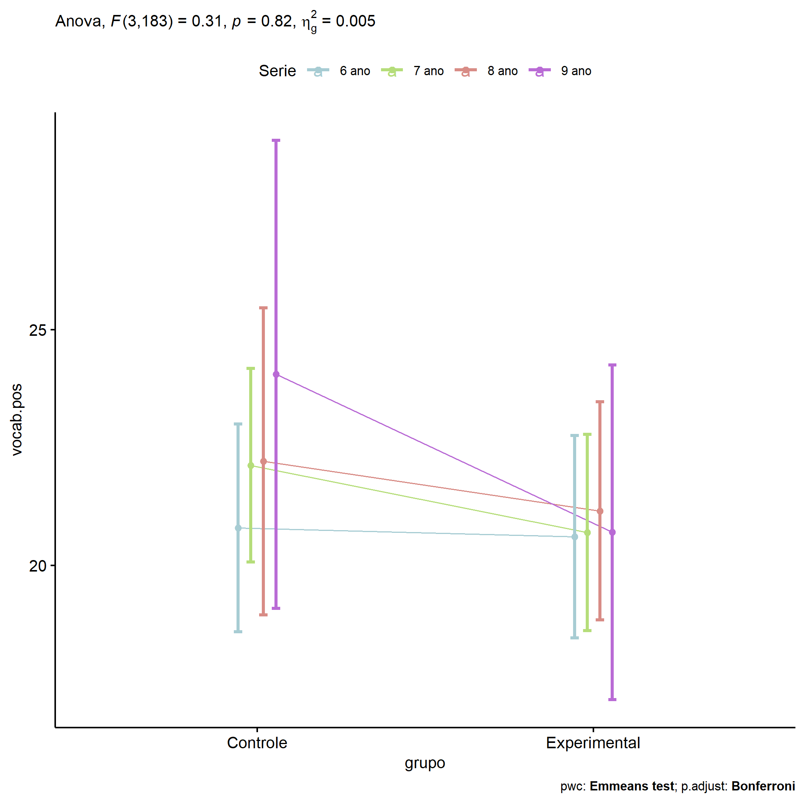<!-- -->

``` r
if (!is.null(plots[["Serie"]]))
  plots[["Serie"]] + ggplot2::scale_color_manual(values = color[["grupo"]])
```

    ## Scale for colour is already present.
    ## Adding another scale for colour, which will replace the existing scale.

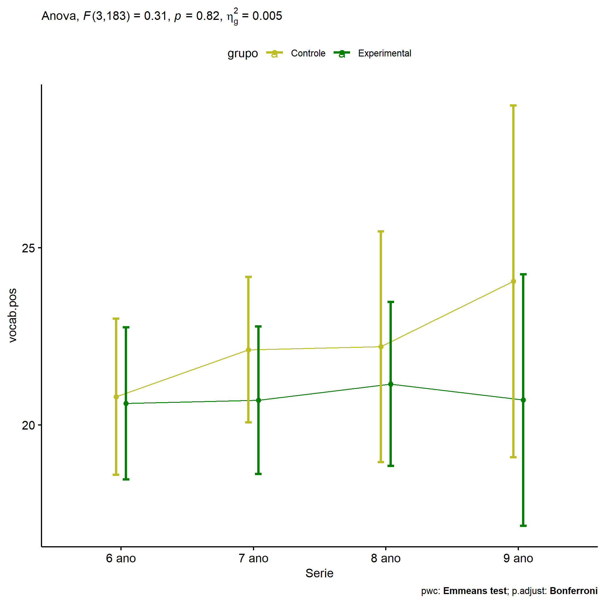<!-- -->

``` r
plots <- twoWayAncovaBoxPlots(
  wdat, "vocab.pos", c("grupo","Serie"), aov, pwcs, covar = "vocab.pre",
  theme = "classic", color = color[["grupo:Serie"]],
  subtitle = which(aov$Effect == "grupo:Serie"))
```

``` r
plots[["grupo:Serie"]] + ggplot2::ylab("Vocabulario") + ggplot2::scale_x_discrete(labels=c('pre', 'pos'))
```

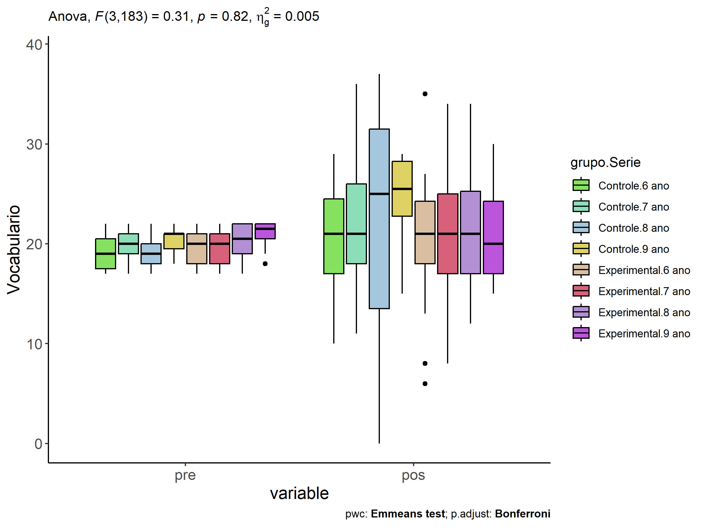<!-- -->

``` r
plots <- twoWayAncovaBoxPlots(
  wdat.long, "vocab", c("grupo","Serie"), aov, pwc.long, pre.post = "time",
  theme = "classic", color = color$prepost)
```

``` r
plots[["grupo:Serie"]] + ggplot2::ylab("Vocabulario")
```

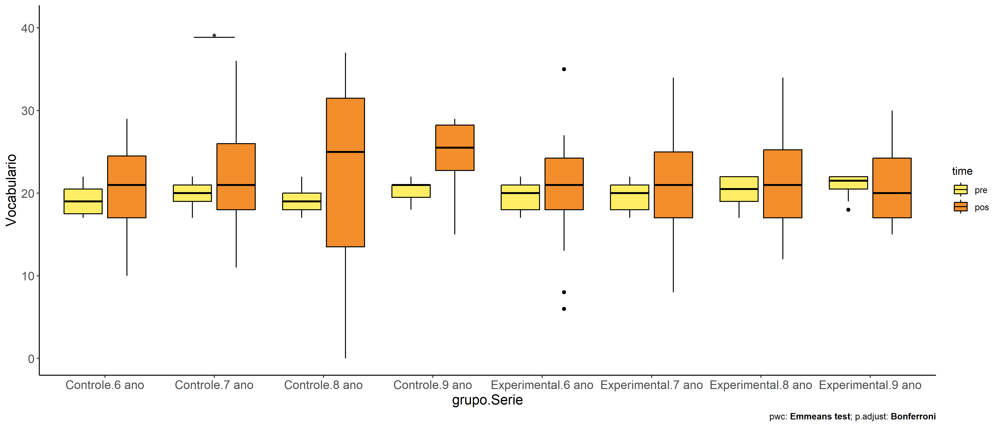<!-- -->

### Checking linearity assumption

``` r
ggscatter(wdat, x = "vocab.pre", y = "vocab.pos", size = 0.5,
          facet.by = c("grupo","Serie"), add = "reg.line")+
  stat_regline_equation(
    aes(label =  paste(..eq.label.., ..rr.label.., sep = "~~~~"))
  )
```

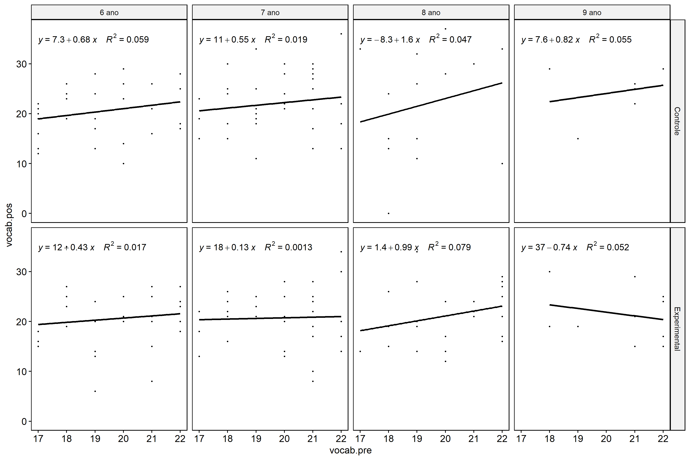<!-- -->

### Checking normality and homogeneity

``` r
res <- augment(lm(vocab.pos ~ vocab.pre + grupo*Serie, data = wdat))
```

``` r
shapiro_test(res$.resid)
```

    ## # A tibble: 1 × 3
    ##   variable   statistic p.value
    ##   <chr>          <dbl>   <dbl>
    ## 1 res$.resid     0.993   0.469

``` r
levene_test(res, .resid ~ grupo*Serie)
```

    ## # A tibble: 1 × 4
    ##     df1   df2 statistic       p
    ##   <int> <int>     <dbl>   <dbl>
    ## 1     7   184      3.16 0.00352

# Summary of Results

## Descriptive Statistics

``` r
df <- get.descriptives(ldat[["grupo"]], c(dv.pre, dv.pos), c("grupo"), 
                       include.global = T, symmetry.test = T, normality.test = F)
df <- plyr::rbind.fill(
  df, do.call(plyr::rbind.fill, lapply(lfatores2, FUN = function(f) {
    if (nrow(dat) > 0 && sum(!is.na(unique(dat[[f]]))) > 1)
      get.descriptives(ldat[[paste0("grupo:",f)]], c(dv.pre,dv.pos), c("grupo", f),
                       symmetry.test = T, normality.test = F)
    }))
)
(df <- df[,c(fatores1[fatores1 %in% colnames(df)],"variable",
             colnames(df)[!colnames(df) %in% c(fatores1,"variable")])])
```

    ##           grupo Sexo   Zona Cor.Raca Serie  variable   n   mean median min max     sd    se    ci   iqr symmetry
    ## 1      Controle <NA>   <NA>     <NA>  <NA> vocab.pre  86 19.500   19.0  17  22  1.629 0.176 0.349  3.00      YES
    ## 2  Experimental <NA>   <NA>     <NA>  <NA> vocab.pre 106 20.057   20.0  17  22  1.667 0.162 0.321  3.00      YES
    ## 3          <NA> <NA>   <NA>     <NA>  <NA> vocab.pre 192 19.807   20.0  17  22  1.669 0.120 0.238  3.00      YES
    ## 4      Controle <NA>   <NA>     <NA>  <NA> vocab.pos  86 21.628   21.5   0  37  6.758 0.729 1.449  9.00      YES
    ## 5  Experimental <NA>   <NA>     <NA>  <NA> vocab.pos 106 20.925   21.0   6  35  5.602 0.544 1.079  8.00      YES
    ## 6          <NA> <NA>   <NA>     <NA>  <NA> vocab.pos 192 21.240   21.0   0  37  6.140 0.443 0.874  8.00      YES
    ## 7      Controle    F   <NA>     <NA>  <NA> vocab.pre  39 19.513   19.0  17  22  1.620 0.259 0.525  3.00      YES
    ## 8      Controle    M   <NA>     <NA>  <NA> vocab.pre  47 19.489   20.0  17  22  1.653 0.241 0.485  3.00      YES
    ## 9  Experimental    F   <NA>     <NA>  <NA> vocab.pre  49 19.939   20.0  17  22  1.676 0.239 0.481  3.00      YES
    ## 10 Experimental    M   <NA>     <NA>  <NA> vocab.pre  57 20.158   20.0  17  22  1.667 0.221 0.442  3.00      YES
    ## 11     Controle    F   <NA>     <NA>  <NA> vocab.pos  39 21.897   22.0   0  32  6.189 0.991 2.006  7.00       NO
    ## 12     Controle    M   <NA>     <NA>  <NA> vocab.pos  47 21.404   21.0  10  37  7.255 1.058 2.130 11.00      YES
    ## 13 Experimental    F   <NA>     <NA>  <NA> vocab.pos  49 22.306   23.0   8  34  4.993 0.713 1.434  6.00      YES
    ## 14 Experimental    M   <NA>     <NA>  <NA> vocab.pos  57 19.737   20.0   6  35  5.863 0.777 1.556  8.00      YES
    ## 15     Controle <NA>  Rural     <NA>  <NA> vocab.pre  41 19.366   19.0  17  22  1.699 0.265 0.536  3.00      YES
    ## 16     Controle <NA> Urbana     <NA>  <NA> vocab.pre  23 20.043   21.0  17  22  1.581 0.330 0.683  2.00      YES
    ## 17 Experimental <NA>  Rural     <NA>  <NA> vocab.pre  50 20.100   21.0  17  22  1.693 0.239 0.481  3.00      YES
    ## 18 Experimental <NA> Urbana     <NA>  <NA> vocab.pre  27 19.963   20.0  17  22  1.629 0.313 0.644  2.00       NO
    ## 19     Controle <NA>  Rural     <NA>  <NA> vocab.pos  41 22.049   23.0  10  36  6.834 1.067 2.157 10.00      YES
    ## 20     Controle <NA> Urbana     <NA>  <NA> vocab.pos  23 23.174   22.0  13  30  4.217 0.879 1.824  4.50      YES
    ## 21 Experimental <NA>  Rural     <NA>  <NA> vocab.pos  50 20.740   21.0   6  34  5.138 0.727 1.460  7.00      YES
    ## 22 Experimental <NA> Urbana     <NA>  <NA> vocab.pos  27 21.148   21.0   8  34  5.641 1.086 2.232  7.50      YES
    ## 23     Controle <NA>   <NA>   Branca  <NA> vocab.pre  12 20.167   20.5  17  22  1.697 0.490 1.078  1.75       NO
    ## 24     Controle <NA>   <NA>    Parda  <NA> vocab.pre  32 19.750   20.0  17  22  1.626 0.288 0.586  2.00      YES
    ## 25 Experimental <NA>   <NA>   Branca  <NA> vocab.pre   7 20.000   19.0  18  22  1.633 0.617 1.510  2.50      YES
    ## 26 Experimental <NA>   <NA>    Parda  <NA> vocab.pre  36 20.000   20.5  17  22  1.673 0.279 0.566  2.25      YES
    ## 27     Controle <NA>   <NA>   Branca  <NA> vocab.pos  12 22.583   23.5  13  30  6.680 1.928 4.245 11.75      YES
    ## 28     Controle <NA>   <NA>    Parda  <NA> vocab.pos  32 21.938   22.5   0  36  7.971 1.409 2.874 10.75       NO
    ## 29 Experimental <NA>   <NA>   Branca  <NA> vocab.pos   7 15.571   17.0   6  21  4.826 1.824 4.463  3.50       NO
    ## 30 Experimental <NA>   <NA>    Parda  <NA> vocab.pos  36 21.944   21.5  10  34  5.487 0.915 1.857  6.50      YES
    ## 31     Controle <NA>   <NA>     <NA> 6 ano vocab.pre  31 19.226   19.0  17  22  1.802 0.324 0.661  3.00      YES
    ## 32     Controle <NA>   <NA>     <NA> 7 ano vocab.pre  35 19.686   20.0  17  22  1.510 0.255 0.519  2.00      YES
    ## 33     Controle <NA>   <NA>     <NA> 8 ano vocab.pre  14 19.286   19.0  17  22  1.541 0.412 0.890  2.00      YES
    ## 34     Controle <NA>   <NA>     <NA> 9 ano vocab.pre   6 20.333   21.0  18  22  1.506 0.615 1.580  1.50      YES
    ## 35 Experimental <NA>   <NA>     <NA> 6 ano vocab.pre  32 19.781   20.0  17  22  1.736 0.307 0.626  3.00      YES
    ## 36 Experimental <NA>   <NA>     <NA> 7 ano vocab.pre  34 19.824   20.0  17  22  1.642 0.282 0.573  3.00      YES
    ## 37 Experimental <NA>   <NA>     <NA> 8 ano vocab.pre  28 20.321   20.5  17  22  1.588 0.300 0.616  3.00      YES
    ## 38 Experimental <NA>   <NA>     <NA> 9 ano vocab.pre  12 20.833   21.5  18  22  1.586 0.458 1.008  1.50       NO
    ## 39     Controle <NA>   <NA>     <NA> 6 ano vocab.pos  31 20.484   21.0  10  29  5.072 0.911 1.860  7.50      YES
    ## 40     Controle <NA>   <NA>     <NA> 7 ano vocab.pos  35 22.057   21.0  11  36  6.097 1.031 2.094  8.00      YES
    ## 41     Controle <NA>   <NA>     <NA> 8 ano vocab.pos  14 21.929   25.0   0  37 11.146 2.979 6.435 18.00      YES
    ## 42     Controle <NA>   <NA>     <NA> 9 ano vocab.pos   6 24.333   25.5  15  29  5.279 2.155 5.540  5.50       NO
    ## 43 Experimental <NA>   <NA>     <NA> 6 ano vocab.pos  32 20.594   21.0   6  35  5.780 1.022 2.084  6.25      YES
    ## 44 Experimental <NA>   <NA>     <NA> 7 ano vocab.pos  34 20.706   21.0   8  34  5.808 0.996 2.026  8.00      YES
    ## 45 Experimental <NA>   <NA>     <NA> 8 ano vocab.pos  28 21.429   21.0  12  34  5.587 1.056 2.166  8.25      YES
    ## 46 Experimental <NA>   <NA>     <NA> 9 ano vocab.pos  12 21.250   20.0  15  30  5.137 1.483 3.264  7.25      YES
    ##       skewness    kurtosis
    ## 1   0.01614587 -1.19689794
    ## 2  -0.33327526 -1.22535536
    ## 3  -0.16603874 -1.24692272
    ## 4  -0.18949820  0.03096053
    ## 5  -0.07339184 -0.06811487
    ## 6  -0.11223231  0.11174911
    ## 7   0.14041942 -1.26518375
    ## 8  -0.08055649 -1.22575739
    ## 9  -0.19174998 -1.41379841
    ## 10 -0.45054132 -1.07977020
    ## 11 -0.94681041  1.93755317
    ## 12  0.23240359 -0.90374042
    ## 13 -0.43872715  0.18821857
    ## 14  0.27626456  0.09748189
    ## 15  0.06068774 -1.25211731
    ## 16 -0.46438939 -1.06504266
    ## 17 -0.37566823 -1.27518188
    ## 18 -0.50873453 -0.98034563
    ## 19  0.07739831 -1.03787793
    ## 20 -0.18215899 -0.40093959
    ## 21 -0.26702744  0.43425267
    ## 22 -0.07753578 -0.14808198
    ## 23 -0.54405605 -1.19030702
    ## 24 -0.21791797 -1.18166677
    ## 25  0.19683400 -1.95535714
    ## 26 -0.35572280 -1.29223356
    ## 27 -0.14324459 -1.82902713
    ## 28 -0.53183155 -0.02919453
    ## 29 -0.85793265 -0.51975027
    ## 30  0.16738476 -0.38840138
    ## 31  0.16895584 -1.36818921
    ## 32 -0.12278555 -1.13187425
    ## 33  0.49269235 -1.02269148
    ## 34 -0.46668431 -1.66637832
    ## 35 -0.17504443 -1.36915304
    ## 36 -0.24412875 -1.30177177
    ## 37 -0.35305646 -1.27459670
    ## 38 -0.87977016 -1.00682549
    ## 39 -0.21924473 -0.94773044
    ## 40  0.22329935 -0.69238616
    ## 41 -0.35797283 -1.26641775
    ## 42 -0.69967644 -1.15971666
    ## 43 -0.33635271  0.59219467
    ## 44 -0.08273428 -0.42850090
    ## 45  0.18308538 -0.92708359
    ## 46  0.34745131 -1.37975162

| grupo        | Sexo | Zona   | Cor.Raca | Serie | variable  |   n |   mean | median | min | max |     sd |    se |    ci |   iqr | symmetry | skewness | kurtosis |
|:-------------|:-----|:-------|:---------|:------|:----------|----:|-------:|-------:|----:|----:|-------:|------:|------:|------:|:---------|---------:|---------:|
| Controle     |      |        |          |       | vocab.pre |  86 | 19.500 |   19.0 |  17 |  22 |  1.629 | 0.176 | 0.349 |  3.00 | YES      |    0.016 |   -1.197 |
| Experimental |      |        |          |       | vocab.pre | 106 | 20.057 |   20.0 |  17 |  22 |  1.667 | 0.162 | 0.321 |  3.00 | YES      |   -0.333 |   -1.225 |
|              |      |        |          |       | vocab.pre | 192 | 19.807 |   20.0 |  17 |  22 |  1.669 | 0.120 | 0.238 |  3.00 | YES      |   -0.166 |   -1.247 |
| Controle     |      |        |          |       | vocab.pos |  86 | 21.628 |   21.5 |   0 |  37 |  6.758 | 0.729 | 1.449 |  9.00 | YES      |   -0.189 |    0.031 |
| Experimental |      |        |          |       | vocab.pos | 106 | 20.925 |   21.0 |   6 |  35 |  5.602 | 0.544 | 1.079 |  8.00 | YES      |   -0.073 |   -0.068 |
|              |      |        |          |       | vocab.pos | 192 | 21.240 |   21.0 |   0 |  37 |  6.140 | 0.443 | 0.874 |  8.00 | YES      |   -0.112 |    0.112 |
| Controle     | F    |        |          |       | vocab.pre |  39 | 19.513 |   19.0 |  17 |  22 |  1.620 | 0.259 | 0.525 |  3.00 | YES      |    0.140 |   -1.265 |
| Controle     | M    |        |          |       | vocab.pre |  47 | 19.489 |   20.0 |  17 |  22 |  1.653 | 0.241 | 0.485 |  3.00 | YES      |   -0.081 |   -1.226 |
| Experimental | F    |        |          |       | vocab.pre |  49 | 19.939 |   20.0 |  17 |  22 |  1.676 | 0.239 | 0.481 |  3.00 | YES      |   -0.192 |   -1.414 |
| Experimental | M    |        |          |       | vocab.pre |  57 | 20.158 |   20.0 |  17 |  22 |  1.667 | 0.221 | 0.442 |  3.00 | YES      |   -0.451 |   -1.080 |
| Controle     | F    |        |          |       | vocab.pos |  39 | 21.897 |   22.0 |   0 |  32 |  6.189 | 0.991 | 2.006 |  7.00 | NO       |   -0.947 |    1.938 |
| Controle     | M    |        |          |       | vocab.pos |  47 | 21.404 |   21.0 |  10 |  37 |  7.255 | 1.058 | 2.130 | 11.00 | YES      |    0.232 |   -0.904 |
| Experimental | F    |        |          |       | vocab.pos |  49 | 22.306 |   23.0 |   8 |  34 |  4.993 | 0.713 | 1.434 |  6.00 | YES      |   -0.439 |    0.188 |
| Experimental | M    |        |          |       | vocab.pos |  57 | 19.737 |   20.0 |   6 |  35 |  5.863 | 0.777 | 1.556 |  8.00 | YES      |    0.276 |    0.097 |
| Controle     |      | Rural  |          |       | vocab.pre |  41 | 19.366 |   19.0 |  17 |  22 |  1.699 | 0.265 | 0.536 |  3.00 | YES      |    0.061 |   -1.252 |
| Controle     |      | Urbana |          |       | vocab.pre |  23 | 20.043 |   21.0 |  17 |  22 |  1.581 | 0.330 | 0.683 |  2.00 | YES      |   -0.464 |   -1.065 |
| Experimental |      | Rural  |          |       | vocab.pre |  50 | 20.100 |   21.0 |  17 |  22 |  1.693 | 0.239 | 0.481 |  3.00 | YES      |   -0.376 |   -1.275 |
| Experimental |      | Urbana |          |       | vocab.pre |  27 | 19.963 |   20.0 |  17 |  22 |  1.629 | 0.313 | 0.644 |  2.00 | NO       |   -0.509 |   -0.980 |
| Controle     |      | Rural  |          |       | vocab.pos |  41 | 22.049 |   23.0 |  10 |  36 |  6.834 | 1.067 | 2.157 | 10.00 | YES      |    0.077 |   -1.038 |
| Controle     |      | Urbana |          |       | vocab.pos |  23 | 23.174 |   22.0 |  13 |  30 |  4.217 | 0.879 | 1.824 |  4.50 | YES      |   -0.182 |   -0.401 |
| Experimental |      | Rural  |          |       | vocab.pos |  50 | 20.740 |   21.0 |   6 |  34 |  5.138 | 0.727 | 1.460 |  7.00 | YES      |   -0.267 |    0.434 |
| Experimental |      | Urbana |          |       | vocab.pos |  27 | 21.148 |   21.0 |   8 |  34 |  5.641 | 1.086 | 2.232 |  7.50 | YES      |   -0.078 |   -0.148 |
| Controle     |      |        | Branca   |       | vocab.pre |  12 | 20.167 |   20.5 |  17 |  22 |  1.697 | 0.490 | 1.078 |  1.75 | NO       |   -0.544 |   -1.190 |
| Controle     |      |        | Parda    |       | vocab.pre |  32 | 19.750 |   20.0 |  17 |  22 |  1.626 | 0.288 | 0.586 |  2.00 | YES      |   -0.218 |   -1.182 |
| Experimental |      |        | Branca   |       | vocab.pre |   7 | 20.000 |   19.0 |  18 |  22 |  1.633 | 0.617 | 1.510 |  2.50 | YES      |    0.197 |   -1.955 |
| Experimental |      |        | Parda    |       | vocab.pre |  36 | 20.000 |   20.5 |  17 |  22 |  1.673 | 0.279 | 0.566 |  2.25 | YES      |   -0.356 |   -1.292 |
| Controle     |      |        | Branca   |       | vocab.pos |  12 | 22.583 |   23.5 |  13 |  30 |  6.680 | 1.928 | 4.245 | 11.75 | YES      |   -0.143 |   -1.829 |
| Controle     |      |        | Parda    |       | vocab.pos |  32 | 21.938 |   22.5 |   0 |  36 |  7.971 | 1.409 | 2.874 | 10.75 | NO       |   -0.532 |   -0.029 |
| Experimental |      |        | Branca   |       | vocab.pos |   7 | 15.571 |   17.0 |   6 |  21 |  4.826 | 1.824 | 4.463 |  3.50 | NO       |   -0.858 |   -0.520 |
| Experimental |      |        | Parda    |       | vocab.pos |  36 | 21.944 |   21.5 |  10 |  34 |  5.487 | 0.915 | 1.857 |  6.50 | YES      |    0.167 |   -0.388 |
| Controle     |      |        |          | 6 ano | vocab.pre |  31 | 19.226 |   19.0 |  17 |  22 |  1.802 | 0.324 | 0.661 |  3.00 | YES      |    0.169 |   -1.368 |
| Controle     |      |        |          | 7 ano | vocab.pre |  35 | 19.686 |   20.0 |  17 |  22 |  1.510 | 0.255 | 0.519 |  2.00 | YES      |   -0.123 |   -1.132 |
| Controle     |      |        |          | 8 ano | vocab.pre |  14 | 19.286 |   19.0 |  17 |  22 |  1.541 | 0.412 | 0.890 |  2.00 | YES      |    0.493 |   -1.023 |
| Controle     |      |        |          | 9 ano | vocab.pre |   6 | 20.333 |   21.0 |  18 |  22 |  1.506 | 0.615 | 1.580 |  1.50 | YES      |   -0.467 |   -1.666 |
| Experimental |      |        |          | 6 ano | vocab.pre |  32 | 19.781 |   20.0 |  17 |  22 |  1.736 | 0.307 | 0.626 |  3.00 | YES      |   -0.175 |   -1.369 |
| Experimental |      |        |          | 7 ano | vocab.pre |  34 | 19.824 |   20.0 |  17 |  22 |  1.642 | 0.282 | 0.573 |  3.00 | YES      |   -0.244 |   -1.302 |
| Experimental |      |        |          | 8 ano | vocab.pre |  28 | 20.321 |   20.5 |  17 |  22 |  1.588 | 0.300 | 0.616 |  3.00 | YES      |   -0.353 |   -1.275 |
| Experimental |      |        |          | 9 ano | vocab.pre |  12 | 20.833 |   21.5 |  18 |  22 |  1.586 | 0.458 | 1.008 |  1.50 | NO       |   -0.880 |   -1.007 |
| Controle     |      |        |          | 6 ano | vocab.pos |  31 | 20.484 |   21.0 |  10 |  29 |  5.072 | 0.911 | 1.860 |  7.50 | YES      |   -0.219 |   -0.948 |
| Controle     |      |        |          | 7 ano | vocab.pos |  35 | 22.057 |   21.0 |  11 |  36 |  6.097 | 1.031 | 2.094 |  8.00 | YES      |    0.223 |   -0.692 |
| Controle     |      |        |          | 8 ano | vocab.pos |  14 | 21.929 |   25.0 |   0 |  37 | 11.146 | 2.979 | 6.435 | 18.00 | YES      |   -0.358 |   -1.266 |
| Controle     |      |        |          | 9 ano | vocab.pos |   6 | 24.333 |   25.5 |  15 |  29 |  5.279 | 2.155 | 5.540 |  5.50 | NO       |   -0.700 |   -1.160 |
| Experimental |      |        |          | 6 ano | vocab.pos |  32 | 20.594 |   21.0 |   6 |  35 |  5.780 | 1.022 | 2.084 |  6.25 | YES      |   -0.336 |    0.592 |
| Experimental |      |        |          | 7 ano | vocab.pos |  34 | 20.706 |   21.0 |   8 |  34 |  5.808 | 0.996 | 2.026 |  8.00 | YES      |   -0.083 |   -0.429 |
| Experimental |      |        |          | 8 ano | vocab.pos |  28 | 21.429 |   21.0 |  12 |  34 |  5.587 | 1.056 | 2.166 |  8.25 | YES      |    0.183 |   -0.927 |
| Experimental |      |        |          | 9 ano | vocab.pos |  12 | 21.250 |   20.0 |  15 |  30 |  5.137 | 1.483 | 3.264 |  7.25 | YES      |    0.347 |   -1.380 |

## ANCOVA Table Comparison

``` r
df <- do.call(plyr::rbind.fill, laov)
(df <- df[!duplicated(df$Effect),])
```

    ##            Effect DFn DFd     F     p p<.05      ges DFn' DFd'    F'    p' p<.05'     ges'
    ## 1           grupo   1 189 1.316 0.253       7.00e-03    1  189 1.316 0.253        7.00e-03
    ## 2       vocab.pre   1 189 4.743 0.031     * 2.40e-02    1  189 4.743 0.031      * 2.40e-02
    ## 4      grupo:Sexo   1 187 1.600 0.207       8.00e-03    1  187 1.600 0.207        8.00e-03
    ## 5            Sexo   1 187 3.814 0.052       2.00e-02    1  187 3.814 0.052        2.00e-02
    ## 8      grupo:Zona   1 136 0.007 0.935       4.84e-05    1  136 0.007 0.935        4.84e-05
    ## 10           Zona   1 136 0.343 0.559       3.00e-03    1  136 0.343 0.559        3.00e-03
    ## 11       Cor.Raca   1  82 2.154 0.146       2.60e-02    1   82 2.154 0.146        2.60e-02
    ## 13 grupo:Cor.Raca   1  82 3.655 0.059       4.30e-02    1   82 3.655 0.059        4.30e-02
    ## 16    grupo:Serie   3 183 0.310 0.818       5.00e-03    3  183 0.310 0.818        5.00e-03
    ## 17          Serie   3 183 0.321 0.810       5.00e-03    3  183 0.321 0.810        5.00e-03

|     | Effect         | DFn | DFd |     F |     p | p\<.05 |   ges | DFn’ | DFd’ |    F’ |    p’ | p\<.05’ |  ges’ |
|:----|:---------------|----:|----:|------:|------:|:-------|------:|-----:|-----:|------:|------:|:--------|------:|
| 1   | grupo          |   1 | 189 | 1.316 | 0.253 |        | 0.007 |    1 |  189 | 1.316 | 0.253 |         | 0.007 |
| 2   | vocab.pre      |   1 | 189 | 4.743 | 0.031 | \*     | 0.024 |    1 |  189 | 4.743 | 0.031 | \*      | 0.024 |
| 4   | grupo:Sexo     |   1 | 187 | 1.600 | 0.207 |        | 0.008 |    1 |  187 | 1.600 | 0.207 |         | 0.008 |
| 5   | Sexo           |   1 | 187 | 3.814 | 0.052 |        | 0.020 |    1 |  187 | 3.814 | 0.052 |         | 0.020 |
| 8   | grupo:Zona     |   1 | 136 | 0.007 | 0.935 |        | 0.000 |    1 |  136 | 0.007 | 0.935 |         | 0.000 |
| 10  | Zona           |   1 | 136 | 0.343 | 0.559 |        | 0.003 |    1 |  136 | 0.343 | 0.559 |         | 0.003 |
| 11  | Cor.Raca       |   1 |  82 | 2.154 | 0.146 |        | 0.026 |    1 |   82 | 2.154 | 0.146 |         | 0.026 |
| 13  | grupo:Cor.Raca |   1 |  82 | 3.655 | 0.059 |        | 0.043 |    1 |   82 | 3.655 | 0.059 |         | 0.043 |
| 16  | grupo:Serie    |   3 | 183 | 0.310 | 0.818 |        | 0.005 |    3 |  183 | 0.310 | 0.818 |         | 0.005 |
| 17  | Serie          |   3 | 183 | 0.321 | 0.810 |        | 0.005 |    3 |  183 | 0.321 | 0.810 |         | 0.005 |

## PairWise Table Comparison

``` r
df <- do.call(plyr::rbind.fill, lpwc)
df <- df[,c(names(lfatores), names(df)[!names(df) %in% c(names(lfatores),"term",".y.")])]
```

| grupo        | Sexo | Zona   | Cor.Raca | Serie | group1   | group2       |  df | statistic |     p | p.adj | p.adj.signif | df’ | statistic’ |    p’ | p.adj’ | p.adj.signif’ |
|:-------------|:-----|:-------|:---------|:------|:---------|:-------------|----:|----------:|------:|------:|:-------------|----:|-----------:|------:|-------:|:--------------|
| Controle     |      |        |          |       | pre      | pos          | 380 |    -3.101 | 0.002 | 0.002 | \*\*         | 380 |     -3.101 | 0.002 |  0.002 | \*\*          |
| Experimental |      |        |          |       | pre      | pos          | 380 |    -1.404 | 0.161 | 0.161 | ns           | 380 |     -1.404 | 0.161 |  0.161 | ns            |
|              |      |        |          |       | Controle | Experimental | 189 |     1.147 | 0.253 | 0.253 | ns           | 189 |      1.147 | 0.253 |  0.253 | ns            |
| Controle     | F    |        |          |       | pre      | pos          | 376 |    -2.356 | 0.019 | 0.019 | \*           | 376 |     -2.356 | 0.019 |  0.019 | \*            |
| Controle     | M    |        |          |       | pre      | pos          | 376 |    -2.076 | 0.039 | 0.039 | \*           | 376 |     -2.076 | 0.039 |  0.039 | \*            |
| Controle     |      |        |          |       | F        | M            | 187 |     0.366 | 0.714 | 0.714 | ns           | 187 |      0.366 | 0.714 |  0.714 | ns            |
| Experimental | F    |        |          |       | pre      | pos          | 376 |    -2.621 | 0.009 | 0.009 | \*\*         | 376 |     -2.621 | 0.009 |  0.009 | \*\*          |
| Experimental | M    |        |          |       | pre      | pos          | 376 |     0.503 | 0.615 | 0.615 | ns           | 376 |      0.503 | 0.615 |  0.615 | ns            |
| Experimental |      |        |          |       | F        | M            | 187 |     2.298 | 0.023 | 0.023 | \*           | 187 |      2.298 | 0.023 |  0.023 | \*            |
|              | F    |        |          |       | Controle | Experimental | 187 |    -0.114 | 0.910 | 0.910 | ns           | 187 |     -0.114 | 0.910 |  0.910 | ns            |
|              | M    |        |          |       | Controle | Experimental | 187 |     1.728 | 0.086 | 0.086 | ns           | 187 |      1.728 | 0.086 |  0.086 | ns            |
| Controle     |      |        |          |       | Rural    | Urbana       | 136 |    -0.453 | 0.651 | 0.651 | ns           | 136 |     -0.453 | 0.651 |  0.651 | ns            |
| Controle     |      | Rural  |          |       | pre      | pos          | 274 |    -2.914 | 0.004 | 0.004 | \*\*         | 274 |     -2.914 | 0.004 |  0.004 | \*\*          |
| Controle     |      | Urbana |          |       | pre      | pos          | 274 |    -2.547 | 0.011 | 0.011 | \*           | 274 |     -2.547 | 0.011 |  0.011 | \*            |
| Experimental |      |        |          |       | Rural    | Urbana       | 136 |    -0.378 | 0.706 | 0.706 | ns           | 136 |     -0.378 | 0.706 |  0.706 | ns            |
| Experimental |      | Rural  |          |       | pre      | pos          | 274 |    -0.768 | 0.443 | 0.443 | ns           | 274 |     -0.768 | 0.443 |  0.443 | ns            |
| Experimental |      | Urbana |          |       | pre      | pos          | 274 |    -1.045 | 0.297 | 0.297 | ns           | 274 |     -1.045 | 0.297 |  0.297 | ns            |
|              |      | Rural  |          |       | Controle | Experimental | 136 |     1.521 | 0.130 | 0.130 | ns           | 136 |      1.521 | 0.130 |  0.130 | ns            |
|              |      | Urbana |          |       | Controle | Experimental | 136 |     1.249 | 0.214 | 0.214 | ns           | 136 |      1.249 | 0.214 |  0.214 | ns            |
| Controle     |      |        | Branca   |       | pre      | pos          | 166 |    -1.224 | 0.223 | 0.223 | ns           | 166 |     -1.224 | 0.223 |  0.223 | ns            |
| Controle     |      |        |          |       | Branca   | Parda        |  82 |     0.080 | 0.936 | 0.936 | ns           |  82 |      0.080 | 0.936 |  0.936 | ns            |
| Controle     |      |        | Parda    |       | pre      | pos          | 166 |    -1.809 | 0.072 | 0.072 | ns           | 166 |     -1.809 | 0.072 |  0.072 | ns            |
| Experimental |      |        | Branca   |       | pre      | pos          | 166 |     1.713 | 0.089 | 0.089 | ns           | 166 |      1.713 | 0.089 |  0.089 | ns            |
| Experimental |      |        |          |       | Branca   | Parda        |  82 |    -2.409 | 0.018 | 0.018 | \*           |  82 |     -2.409 | 0.018 |  0.018 | \*            |
| Experimental |      |        | Parda    |       | pre      | pos          | 166 |    -1.706 | 0.090 | 0.090 | ns           | 166 |     -1.706 | 0.090 |  0.090 | ns            |
|              |      |        | Branca   |       | Controle | Experimental |  82 |     2.240 | 0.028 | 0.028 | \*           |  82 |      2.240 | 0.028 |  0.028 | \*            |
|              |      |        | Parda    |       | Controle | Experimental |  82 |     0.177 | 0.860 | 0.860 | ns           |  82 |      0.177 | 0.860 |  0.860 | ns            |
| Controle     |      |        |          | 6 ano | pre      | pos          | 368 |    -1.092 | 0.275 | 0.275 | ns           | 368 |     -1.092 | 0.275 |  0.275 | ns            |
| Controle     |      |        |          | 7 ano | pre      | pos          | 368 |    -2.188 | 0.029 | 0.029 | \*           | 368 |     -2.188 | 0.029 |  0.029 | \*            |
| Controle     |      |        |          | 8 ano | pre      | pos          | 368 |    -1.542 | 0.124 | 0.124 | ns           | 368 |     -1.542 | 0.124 |  0.124 | ns            |
| Controle     |      |        |          | 9 ano | pre      | pos          | 368 |    -1.528 | 0.127 | 0.127 | ns           | 368 |     -1.528 | 0.127 |  0.127 | ns            |
| Controle     |      |        |          |       | 6 ano    | 7 ano        | 183 |    -0.871 | 0.385 | 1.000 | ns           | 183 |     -0.871 | 0.385 |  1.000 | ns            |
| Controle     |      |        |          |       | 6 ano    | 8 ano        | 183 |    -0.713 | 0.477 | 1.000 | ns           | 183 |     -0.713 | 0.477 |  1.000 | ns            |
| Controle     |      |        |          |       | 6 ano    | 9 ano        | 183 |    -1.179 | 0.240 | 1.000 | ns           | 183 |     -1.179 | 0.240 |  1.000 | ns            |
| Controle     |      |        |          |       | 7 ano    | 8 ano        | 183 |    -0.044 | 0.965 | 1.000 | ns           | 183 |     -0.044 | 0.965 |  1.000 | ns            |
| Controle     |      |        |          |       | 7 ano    | 9 ano        | 183 |    -0.708 | 0.480 | 1.000 | ns           | 183 |     -0.708 | 0.480 |  1.000 | ns            |
| Controle     |      |        |          |       | 8 ano    | 9 ano        | 183 |    -0.611 | 0.542 | 1.000 | ns           | 183 |     -0.611 | 0.542 |  1.000 | ns            |
| Experimental |      |        |          | 6 ano | pre      | pos          | 368 |    -0.717 | 0.474 | 0.474 | ns           | 368 |     -0.717 | 0.474 |  0.474 | ns            |
| Experimental |      |        |          | 7 ano | pre      | pos          | 368 |    -0.802 | 0.423 | 0.423 | ns           | 368 |     -0.802 | 0.423 |  0.423 | ns            |
| Experimental |      |        |          | 8 ano | pre      | pos          | 368 |    -0.914 | 0.362 | 0.362 | ns           | 368 |     -0.914 | 0.362 |  0.362 | ns            |
| Experimental |      |        |          | 9 ano | pre      | pos          | 368 |    -0.225 | 0.822 | 0.822 | ns           | 368 |     -0.225 | 0.822 |  0.822 | ns            |
| Experimental |      |        |          |       | 6 ano    | 7 ano        | 183 |    -0.059 | 0.953 | 1.000 | ns           | 183 |     -0.059 | 0.953 |  1.000 | ns            |
| Experimental |      |        |          |       | 6 ano    | 8 ano        | 183 |    -0.341 | 0.733 | 1.000 | ns           | 183 |     -0.341 | 0.733 |  1.000 | ns            |
| Experimental |      |        |          |       | 6 ano    | 9 ano        | 183 |    -0.045 | 0.965 | 1.000 | ns           | 183 |     -0.045 | 0.965 |  1.000 | ns            |
| Experimental |      |        |          |       | 7 ano    | 8 ano        | 183 |    -0.290 | 0.773 | 1.000 | ns           | 183 |     -0.290 | 0.773 |  1.000 | ns            |
| Experimental |      |        |          |       | 7 ano    | 9 ano        | 183 |    -0.002 | 0.998 | 1.000 | ns           | 183 |     -0.002 | 0.998 |  1.000 | ns            |
| Experimental |      |        |          |       | 8 ano    | 9 ano        | 183 |     0.213 | 0.832 | 1.000 | ns           | 183 |      0.213 | 0.832 |  1.000 | ns            |
|              |      |        |          | 6 ano | Controle | Experimental | 183 |     0.120 | 0.905 | 0.905 | ns           | 183 |      0.120 | 0.905 |  0.905 | ns            |
|              |      |        |          | 7 ano | Controle | Experimental | 183 |     0.961 | 0.338 | 0.338 | ns           | 183 |      0.961 | 0.338 |  0.338 | ns            |
|              |      |        |          | 8 ano | Controle | Experimental | 183 |     0.518 | 0.605 | 0.605 | ns           | 183 |      0.518 | 0.605 |  0.605 | ns            |
|              |      |        |          | 9 ano | Controle | Experimental | 183 |     1.088 | 0.278 | 0.278 | ns           | 183 |      1.088 | 0.278 |  0.278 | ns            |

## EMMS Table Comparison

``` r
df <- do.call(plyr::rbind.fill, lemms)
df[["N-N'"]] <- df[["N"]] - df[["N'"]]
df <- df[,c(names(lfatores), names(df)[!names(df) %in% names(lfatores)])]
```

| grupo        | Sexo | Zona   | Cor.Raca | Serie |   N | M (pre) | SE (pre) | M (unadj) | SE (unadj) | M (adj) | SE (adj) |  N’ | M (pre)’ | SE (pre)’ | M (unadj)’ | SE (unadj)’ | M (adj)’ | SE (adj)’ | N-N’ |
|:-------------|:-----|:-------|:---------|:------|----:|--------:|---------:|----------:|-----------:|--------:|---------:|----:|---------:|----------:|-----------:|------------:|---------:|----------:|-----:|
| Controle     |      |        |          |       |  86 |  19.500 |    0.176 |    21.628 |      0.729 |  21.807 |    0.661 |  86 |   19.500 |     0.176 |     21.628 |       0.729 |   21.807 |     0.661 |    0 |
| Experimental |      |        |          |       | 106 |  20.057 |    0.162 |    20.925 |      0.544 |  20.779 |    0.595 | 106 |   20.057 |     0.162 |     20.925 |       0.544 |   20.779 |     0.595 |    0 |
| Controle     | F    |        |          |       |  39 |  19.513 |    0.259 |    21.897 |      0.991 |  22.078 |    0.969 |  39 |   19.513 |     0.259 |     21.897 |       0.991 |   22.078 |     0.969 |    0 |
| Controle     | M    |        |          |       |  47 |  19.489 |    0.241 |    21.404 |      1.058 |  21.599 |    0.884 |  47 |   19.489 |     0.241 |     21.404 |       1.058 |   21.599 |     0.884 |    0 |
| Experimental | F    |        |          |       |  49 |  19.939 |    0.239 |    22.306 |      0.713 |  22.226 |    0.862 |  49 |   19.939 |     0.239 |     22.306 |       0.713 |   22.226 |     0.862 |    0 |
| Experimental | M    |        |          |       |  57 |  20.158 |    0.221 |    19.737 |      0.777 |  19.522 |    0.804 |  57 |   20.158 |     0.221 |     19.737 |       0.777 |   19.522 |     0.804 |    0 |
| Controle     |      | Rural  |          |       |  41 |  19.366 |    0.265 |    22.049 |      1.067 |  22.380 |    0.879 |  41 |   19.366 |     0.265 |     22.049 |       1.067 |   22.380 |     0.879 |    0 |
| Controle     |      | Urbana |          |       |  23 |  20.043 |    0.330 |    23.174 |      0.879 |  23.042 |    1.160 |  23 |   20.043 |     0.330 |     23.174 |       0.879 |   23.042 |     1.160 |    0 |
| Experimental |      | Rural  |          |       |  50 |  20.100 |    0.239 |    20.740 |      0.727 |  20.570 |    0.789 |  50 |   20.100 |     0.239 |     20.740 |       0.727 |   20.570 |     0.789 |    0 |
| Experimental |      | Urbana |          |       |  27 |  19.963 |    0.313 |    21.148 |      1.086 |  21.072 |    1.070 |  27 |   19.963 |     0.313 |     21.148 |       1.086 |   21.072 |     1.070 |    0 |
| Controle     |      |        | Branca   |       |  12 |  20.167 |    0.490 |    22.583 |      1.928 |  22.317 |    1.852 |  12 |   20.167 |     0.490 |     22.583 |       1.928 |   22.317 |     1.852 |    0 |
| Controle     |      |        | Parda    |       |  32 |  19.750 |    0.288 |    21.938 |      1.409 |  22.142 |    1.135 |  32 |   19.750 |     0.288 |     21.938 |       1.409 |   22.142 |     1.135 |    0 |
| Experimental |      |        | Branca   |       |   7 |  20.000 |    0.617 |    15.571 |      1.824 |  15.493 |    2.421 |   7 |   20.000 |     0.617 |     15.571 |       1.824 |   15.493 |     2.421 |    0 |
| Experimental |      |        | Parda    |       |  36 |  20.000 |    0.279 |    21.944 |      0.915 |  21.866 |    1.068 |  36 |   20.000 |     0.279 |     21.944 |       0.915 |   21.866 |     1.068 |    0 |
| Controle     |      |        |          | 6 ano |  31 |  19.226 |    0.324 |    20.484 |      0.911 |  20.795 |    1.117 |  31 |   19.226 |     0.324 |     20.484 |       0.911 |   20.795 |     1.117 |    0 |
| Controle     |      |        |          | 7 ano |  35 |  19.686 |    0.255 |    22.057 |      1.031 |  22.122 |    1.041 |  35 |   19.686 |     0.255 |     22.057 |       1.031 |   22.122 |     1.041 |    0 |
| Controle     |      |        |          | 8 ano |  14 |  19.286 |    0.412 |    21.929 |      2.979 |  22.207 |    1.651 |  14 |   19.286 |     0.412 |     21.929 |       2.979 |   22.207 |     1.651 |    0 |
| Controle     |      |        |          | 9 ano |   6 |  20.333 |    0.615 |    24.333 |      2.155 |  24.052 |    2.516 |   6 |   20.333 |     0.615 |     24.333 |       2.155 |   24.052 |     2.516 |    0 |
| Experimental |      |        |          | 6 ano |  32 |  19.781 |    0.307 |    20.594 |      1.022 |  20.608 |    1.088 |  32 |   19.781 |     0.307 |     20.594 |       1.022 |   20.608 |     1.088 |    0 |
| Experimental |      |        |          | 7 ano |  34 |  19.824 |    0.282 |    20.706 |      0.996 |  20.697 |    1.055 |  34 |   19.824 |     0.282 |     20.706 |       0.996 |   20.697 |     1.055 |    0 |
| Experimental |      |        |          | 8 ano |  28 |  20.321 |    0.300 |    21.429 |      1.056 |  21.154 |    1.172 |  28 |   20.321 |     0.300 |     21.429 |       1.056 |   21.154 |     1.172 |    0 |
| Experimental |      |        |          | 9 ano |  12 |  20.833 |    0.458 |    21.250 |      1.483 |  20.701 |    1.799 |  12 |   20.833 |     0.458 |     21.250 |       1.483 |   20.701 |     1.799 |    0 |
