ANCOVA in Vocabulario (Vocabulario)
================
Geiser C. Challco <geiser@alumni.usp.br>

- [Descriptive Statistics of Initial
  Data](#descriptive-statistics-of-initial-data)
- [ANCOVA and Pairwise for one factor:
  **grupo**](#ancova-and-pairwise-for-one-factor-grupo)
  - [Without remove non-normal data](#without-remove-non-normal-data)
  - [Computing ANCOVA and PairWise After removing non-normal data
    (OK)](#computing-ancova-and-pairwise-after-removing-non-normal-data-ok)
    - [Plots for ancova](#plots-for-ancova)
    - [Checking linearity assumption](#checking-linearity-assumption)
    - [Checking normality and
      homogeneity](#checking-normality-and-homogeneity)
- [ANCOVA and Pairwise for two factors
  **grupo:Sexo**](#ancova-and-pairwise-for-two-factors-gruposexo)
  - [Without remove non-normal data](#without-remove-non-normal-data-1)
  - [Computing ANCOVA and PairWise After removing non-normal data
    (OK)](#computing-ancova-and-pairwise-after-removing-non-normal-data-ok-1)
    - [Plots for ancova](#plots-for-ancova-1)
    - [Checking linearity assumption](#checking-linearity-assumption-1)
    - [Checking normality and
      homogeneity](#checking-normality-and-homogeneity-1)
- [ANCOVA and Pairwise for two factors
  **grupo:Zona**](#ancova-and-pairwise-for-two-factors-grupozona)
  - [Without remove non-normal data](#without-remove-non-normal-data-2)
  - [Computing ANCOVA and PairWise After removing non-normal data
    (OK)](#computing-ancova-and-pairwise-after-removing-non-normal-data-ok-2)
    - [Plots for ancova](#plots-for-ancova-2)
    - [Checking linearity assumption](#checking-linearity-assumption-2)
    - [Checking normality and
      homogeneity](#checking-normality-and-homogeneity-2)
- [ANCOVA and Pairwise for two factors
  **grupo:Cor.Raca**](#ancova-and-pairwise-for-two-factors-grupocorraca)
  - [Without remove non-normal data](#without-remove-non-normal-data-3)
  - [Computing ANCOVA and PairWise After removing non-normal data
    (OK)](#computing-ancova-and-pairwise-after-removing-non-normal-data-ok-3)
    - [Plots for ancova](#plots-for-ancova-3)
    - [Checking linearity assumption](#checking-linearity-assumption-3)
    - [Checking normality and
      homogeneity](#checking-normality-and-homogeneity-3)
- [ANCOVA and Pairwise for two factors
  **grupo:Serie**](#ancova-and-pairwise-for-two-factors-gruposerie)
  - [Without remove non-normal data](#without-remove-non-normal-data-4)
  - [Computing ANCOVA and PairWise After removing non-normal data
    (OK)](#computing-ancova-and-pairwise-after-removing-non-normal-data-ok-4)
    - [Plots for ancova](#plots-for-ancova-4)
    - [Checking linearity assumption](#checking-linearity-assumption-4)
    - [Checking normality and
      homogeneity](#checking-normality-and-homogeneity-4)
- [Summary of Results](#summary-of-results)
  - [Descriptive Statistics](#descriptive-statistics)
  - [ANCOVA Table Comparison](#ancova-table-comparison)
  - [PairWise Table Comparison](#pairwise-table-comparison)
  - [EMMS Table Comparison](#emms-table-comparison)

**NOTE**:

- Teste ANCOVA para determinar se houve diferenças significativas no
  Vocabulario (medido usando pre- e pos-testes).
- ANCOVA test to determine whether there were significant differences in
  Vocabulario (measured using pre- and post-tests).

# Descriptive Statistics of Initial Data

``` r
df <- get.descriptives(dat, c(dv.pre, dv.pos), c("grupo"), 
                       include.global = T, symmetry.test = T, normality.test = F)
df <- plyr::rbind.fill(
  df, do.call(plyr::rbind.fill, lapply(lfatores2, FUN = function(f) {
    if (nrow(dat) > 0 && sum(!is.na(unique(dat[[f]]))) > 1)
      get.descriptives(dat, c(dv.pre,dv.pos), c("grupo", f),
                       symmetry.test = T, normality.test = F)
    }))
)
```

    ## Warning: There was 1 warning in `mutate()`.
    ## ℹ In argument: `ci = abs(stats::qt(alpha/2, .data$n - 1) * .data$se)`.
    ## Caused by warning:
    ## ! There was 1 warning in `mutate()`.
    ## ℹ In argument: `ci = abs(stats::qt(alpha/2, .data$n - 1) * .data$se)`.
    ## Caused by warning in `stats::qt()`:
    ## ! NaNs produced
    ## There was 1 warning in `mutate()`.
    ## ℹ In argument: `ci = abs(stats::qt(alpha/2, .data$n - 1) * .data$se)`.
    ## Caused by warning:
    ## ! There was 1 warning in `mutate()`.
    ## ℹ In argument: `ci = abs(stats::qt(alpha/2, .data$n - 1) * .data$se)`.
    ## Caused by warning in `stats::qt()`:
    ## ! NaNs produced

``` r
(df <- df[,c(fatores1[fatores1 %in% colnames(df)],"variable",
             colnames(df)[!colnames(df) %in% c(fatores1,"variable")])])
```

    ##           grupo Sexo   Zona Cor.Raca Serie  variable   n   mean median min max    sd    se    ci   iqr symmetry
    ## 1      Controle <NA>   <NA>     <NA>  <NA> vocab.pre 129 25.922   26.0  23  29 1.894 0.167 0.330  2.00      YES
    ## 2  Experimental <NA>   <NA>     <NA>  <NA> vocab.pre 182 26.220   26.0  23  29 1.991 0.148 0.291  3.00      YES
    ## 3          <NA> <NA>   <NA>     <NA>  <NA> vocab.pre 311 26.096   26.0  23  29 1.954 0.111 0.218  3.00      YES
    ## 4      Controle <NA>   <NA>     <NA>  <NA> vocab.pos 129 27.000   27.0   7  40 6.167 0.543 1.074  7.00       NO
    ## 5  Experimental <NA>   <NA>     <NA>  <NA> vocab.pos 182 27.758   28.0   7  44 6.661 0.494 0.974  7.00      YES
    ## 6          <NA> <NA>   <NA>     <NA>  <NA> vocab.pos 311 27.444   28.0   7  44 6.461 0.366 0.721  7.00       NO
    ## 7      Controle    F   <NA>     <NA>  <NA> vocab.pre  77 26.169   26.0  23  29 1.860 0.212 0.422  3.00      YES
    ## 8      Controle    M   <NA>     <NA>  <NA> vocab.pre  52 25.558   25.0  23  29 1.904 0.264 0.530  3.00      YES
    ## 9  Experimental    F   <NA>     <NA>  <NA> vocab.pre  98 26.265   27.0  23  29 1.966 0.199 0.394  3.00      YES
    ## 10 Experimental    M   <NA>     <NA>  <NA> vocab.pre  84 26.167   26.0  23  29 2.029 0.221 0.440  3.00      YES
    ## 11     Controle    F   <NA>     <NA>  <NA> vocab.pos  77 27.818   28.0   8  40 5.891 0.671 1.337  7.00       NO
    ## 12     Controle    M   <NA>     <NA>  <NA> vocab.pos  52 25.788   26.5   7  37 6.421 0.890 1.788  8.00       NO
    ## 13 Experimental    F   <NA>     <NA>  <NA> vocab.pos  98 28.153   28.5   8  44 6.486 0.655 1.300  7.75       NO
    ## 14 Experimental    M   <NA>     <NA>  <NA> vocab.pos  84 27.298   27.0   7  42 6.870 0.750 1.491  9.00      YES
    ## 15     Controle <NA>  Rural     <NA>  <NA> vocab.pre  70 25.886   26.0  23  29 1.923 0.230 0.458  2.00      YES
    ## 16     Controle <NA> Urbana     <NA>  <NA> vocab.pre  23 26.304   26.0  23  29 2.032 0.424 0.879  3.00      YES
    ## 17     Controle <NA>   <NA>     <NA>  <NA> vocab.pre  36 25.750   26.0  23  29 1.763 0.294 0.596  2.00      YES
    ## 18 Experimental <NA>  Rural     <NA>  <NA> vocab.pre  73 26.274   26.0  23  29 1.850 0.217 0.432  3.00      YES
    ## 19 Experimental <NA> Urbana     <NA>  <NA> vocab.pre  50 26.400   27.0  23  29 2.070 0.293 0.588  3.00      YES
    ## 20 Experimental <NA>   <NA>     <NA>  <NA> vocab.pre  59 26.000   26.0  23  29 2.101 0.274 0.547  3.00      YES
    ## 21     Controle <NA>  Rural     <NA>  <NA> vocab.pos  70 27.286   28.0   8  38 6.153 0.735 1.467  8.00       NO
    ## 22     Controle <NA> Urbana     <NA>  <NA> vocab.pos  23 27.174   28.0   7  40 6.499 1.355 2.811  5.50       NO
    ## 23     Controle <NA>   <NA>     <NA>  <NA> vocab.pos  36 26.333   27.0  12  40 6.104 1.017 2.065  6.00      YES
    ## 24 Experimental <NA>  Rural     <NA>  <NA> vocab.pos  73 28.370   28.0  15  42 6.380 0.747 1.489  8.00      YES
    ## 25 Experimental <NA> Urbana     <NA>  <NA> vocab.pos  50 28.380   29.0  14  37 5.573 0.788 1.584  7.75       NO
    ## 26 Experimental <NA>   <NA>     <NA>  <NA> vocab.pos  59 26.475   27.0   7  44 7.695 1.002 2.005 10.00      YES
    ## 27     Controle <NA>   <NA>   Branca  <NA> vocab.pre  16 26.438   26.0  24  29 1.632 0.408 0.869  3.00      YES
    ## 28     Controle <NA>   <NA> Indígena  <NA> vocab.pre   8 25.250   24.5  23  29 2.188 0.773 1.829  3.25      YES
    ## 29     Controle <NA>   <NA>    Parda  <NA> vocab.pre  35 25.971   26.0  23  29 1.823 0.308 0.626  2.50      YES
    ## 30     Controle <NA>   <NA>     <NA>  <NA> vocab.pre  70 25.857   26.0  23  29 1.958 0.234 0.467  2.00      YES
    ## 31 Experimental <NA>   <NA>  Amarela  <NA> vocab.pre   1 23.000   23.0  23  23    NA    NA   NaN  0.00 few data
    ## 32 Experimental <NA>   <NA>   Branca  <NA> vocab.pre  22 26.455   27.0  23  29 2.176 0.464 0.965  3.75      YES
    ## 33 Experimental <NA>   <NA> Indígena  <NA> vocab.pre   4 26.500   26.5  25  28 1.291 0.645 2.054  1.50      YES
    ## 34 Experimental <NA>   <NA>    Parda  <NA> vocab.pre  44 26.159   26.0  23  29 1.976 0.298 0.601  3.25      YES
    ## 35 Experimental <NA>   <NA>     <NA>  <NA> vocab.pre 111 26.216   26.0  23  29 1.984 0.188 0.373  3.00      YES
    ## 36     Controle <NA>   <NA>   Branca  <NA> vocab.pos  16 26.312   26.0  19  37 4.771 1.193 2.542  5.75      YES
    ## 37     Controle <NA>   <NA> Indígena  <NA> vocab.pos   8 29.250   28.5  20  38 5.800 2.051 4.849  5.75      YES
    ## 38     Controle <NA>   <NA>    Parda  <NA> vocab.pos  35 28.343   29.0   8  40 6.624 1.120 2.275  7.00       NO
    ## 39     Controle <NA>   <NA>     <NA>  <NA> vocab.pos  70 26.229   27.0   7  38 6.193 0.740 1.477  7.50       NO
    ## 40 Experimental <NA>   <NA>  Amarela  <NA> vocab.pos   1 26.000   26.0  26  26    NA    NA   NaN  0.00 few data
    ## 41 Experimental <NA>   <NA>   Branca  <NA> vocab.pos  22 25.318   26.5  15  37 7.227 1.541 3.204 12.25      YES
    ## 42 Experimental <NA>   <NA> Indígena  <NA> vocab.pos   4 33.250   33.5  27  39 4.924 2.462 7.836  3.75      YES
    ## 43 Experimental <NA>   <NA>    Parda  <NA> vocab.pos  44 28.159   28.0  14  42 6.720 1.013 2.043  7.25      YES
    ## 44 Experimental <NA>   <NA>     <NA>  <NA> vocab.pos 111 27.901   28.0   7  44 6.506 0.618 1.224  7.00       NO
    ## 45     Controle <NA>   <NA>     <NA> 6 ano vocab.pre  33 25.061   25.0  23  29 1.767 0.308 0.626  2.00       NO
    ## 46     Controle <NA>   <NA>     <NA> 7 ano vocab.pre  39 26.256   26.0  23  29 1.846 0.296 0.598  2.50      YES
    ## 47     Controle <NA>   <NA>     <NA> 8 ano vocab.pre  33 26.061   26.0  23  29 1.749 0.304 0.620  2.00      YES
    ## 48     Controle <NA>   <NA>     <NA> 9 ano vocab.pre  24 26.375   27.0  23  29 2.060 0.421 0.870  3.00      YES
    ## 49 Experimental <NA>   <NA>     <NA> 6 ano vocab.pre  40 26.050   26.0  23  29 2.075 0.328 0.664  4.00      YES
    ## 50 Experimental <NA>   <NA>     <NA> 7 ano vocab.pre  54 26.093   26.0  23  29 1.730 0.235 0.472  2.00      YES
    ## 51 Experimental <NA>   <NA>     <NA> 8 ano vocab.pre  46 26.152   26.0  23  29 2.241 0.330 0.665  4.00      YES
    ## 52 Experimental <NA>   <NA>     <NA> 9 ano vocab.pre  42 26.619   27.0  23  29 1.950 0.301 0.608  3.00      YES
    ## 53     Controle <NA>   <NA>     <NA> 6 ano vocab.pos  33 25.091   25.0   9  38 5.897 1.027 2.091  7.00       NO
    ## 54     Controle <NA>   <NA>     <NA> 7 ano vocab.pos  39 27.410   28.0   7  38 5.798 0.928 1.879  7.00       NO
    ## 55     Controle <NA>   <NA>     <NA> 8 ano vocab.pos  33 28.030   29.0   8  40 7.007 1.220 2.484  6.00       NO
    ##         skewness    kurtosis
    ## 1   0.0351993570 -1.05772807
    ## 2  -0.2025806378 -1.15882957
    ## 3  -0.1011999635 -1.13008131
    ## 4  -0.7567614597  1.10943146
    ## 5  -0.4884237978  0.23403335
    ## 6  -0.5730492862  0.58546481
    ## 7  -0.1342664914 -1.00496290
    ## 8   0.2975602829 -1.00145066
    ## 9  -0.1749526839 -1.18117380
    ## 10 -0.2241031014 -1.19039098
    ## 11 -0.9359252931  2.06985429
    ## 12 -0.5044422445  0.18939212
    ## 13 -0.5115496559  0.40225728
    ## 14 -0.4410290579 -0.01047663
    ## 15  0.0754918885 -1.06712180
    ## 16 -0.0860620552 -1.49505082
    ## 17 -0.0551550056 -0.96521172
    ## 18 -0.2035082549 -1.01852971
    ## 19 -0.2867360412 -1.35072533
    ## 20 -0.0987015086 -1.26346084
    ## 21 -0.9217747176  1.10045031
    ## 22 -1.0643918465  2.05246256
    ## 23 -0.1528467442  0.23334222
    ## 24 -0.2763060547 -0.39124525
    ## 25 -0.6159850707 -0.18907125
    ## 26 -0.3941803796  0.06965171
    ## 27  0.1041874376 -1.34358908
    ## 28  0.4387803860 -1.51190062
    ## 29  0.0126617321 -1.12438883
    ## 30  0.0486925635 -1.09146743
    ## 31  0.0000000000  0.00000000
    ## 32 -0.3249780254 -1.43193436
    ## 33  0.0000000000 -2.07750000
    ## 34 -0.1452498365 -1.16490152
    ## 35 -0.2006914642 -1.16419050
    ## 36  0.3087096702 -0.49867160
    ## 37  0.0648583264 -1.27466991
    ## 38 -0.9336316807  1.40187945
    ## 39 -0.8989096394  0.93491382
    ## 40  0.0000000000  0.00000000
    ## 41 -0.0711287869 -1.45389774
    ## 42 -0.1122637899 -1.88645844
    ## 43 -0.1942593862 -0.42711331
    ## 44 -0.6829351911  0.94684318
    ## 45  0.6365506495 -0.46887707
    ## 46 -0.0009117555 -1.04414367
    ## 47 -0.1235105790 -0.84566035
    ## 48 -0.4292730322 -1.25784265
    ## 49 -0.0984872797 -1.34289588
    ## 50 -0.0539823943 -0.88807653
    ## 51 -0.1860975754 -1.47685211
    ## 52 -0.4543571261 -1.00140116
    ## 53 -0.5613575743  0.50970200
    ## 54 -0.9730902896  2.04194967
    ## 55 -0.8814787417  0.98010313
    ##  [ reached 'max' / getOption("max.print") -- omitted 5 rows ]

| grupo        | Sexo | Zona   | Cor.Raca | Serie | variable  |   n |   mean | median | min | max |    sd |    se |    ci |   iqr | symmetry | skewness | kurtosis |
|:-------------|:-----|:-------|:---------|:------|:----------|----:|-------:|-------:|----:|----:|------:|------:|------:|------:|:---------|---------:|---------:|
| Controle     |      |        |          |       | vocab.pre | 129 | 25.922 |   26.0 |  23 |  29 | 1.894 | 0.167 | 0.330 |  2.00 | YES      |    0.035 |   -1.058 |
| Experimental |      |        |          |       | vocab.pre | 182 | 26.220 |   26.0 |  23 |  29 | 1.991 | 0.148 | 0.291 |  3.00 | YES      |   -0.203 |   -1.159 |
|              |      |        |          |       | vocab.pre | 311 | 26.096 |   26.0 |  23 |  29 | 1.954 | 0.111 | 0.218 |  3.00 | YES      |   -0.101 |   -1.130 |
| Controle     |      |        |          |       | vocab.pos | 129 | 27.000 |   27.0 |   7 |  40 | 6.167 | 0.543 | 1.074 |  7.00 | NO       |   -0.757 |    1.109 |
| Experimental |      |        |          |       | vocab.pos | 182 | 27.758 |   28.0 |   7 |  44 | 6.661 | 0.494 | 0.974 |  7.00 | YES      |   -0.488 |    0.234 |
|              |      |        |          |       | vocab.pos | 311 | 27.444 |   28.0 |   7 |  44 | 6.461 | 0.366 | 0.721 |  7.00 | NO       |   -0.573 |    0.585 |
| Controle     | F    |        |          |       | vocab.pre |  77 | 26.169 |   26.0 |  23 |  29 | 1.860 | 0.212 | 0.422 |  3.00 | YES      |   -0.134 |   -1.005 |
| Controle     | M    |        |          |       | vocab.pre |  52 | 25.558 |   25.0 |  23 |  29 | 1.904 | 0.264 | 0.530 |  3.00 | YES      |    0.298 |   -1.001 |
| Experimental | F    |        |          |       | vocab.pre |  98 | 26.265 |   27.0 |  23 |  29 | 1.966 | 0.199 | 0.394 |  3.00 | YES      |   -0.175 |   -1.181 |
| Experimental | M    |        |          |       | vocab.pre |  84 | 26.167 |   26.0 |  23 |  29 | 2.029 | 0.221 | 0.440 |  3.00 | YES      |   -0.224 |   -1.190 |
| Controle     | F    |        |          |       | vocab.pos |  77 | 27.818 |   28.0 |   8 |  40 | 5.891 | 0.671 | 1.337 |  7.00 | NO       |   -0.936 |    2.070 |
| Controle     | M    |        |          |       | vocab.pos |  52 | 25.788 |   26.5 |   7 |  37 | 6.421 | 0.890 | 1.788 |  8.00 | NO       |   -0.504 |    0.189 |
| Experimental | F    |        |          |       | vocab.pos |  98 | 28.153 |   28.5 |   8 |  44 | 6.486 | 0.655 | 1.300 |  7.75 | NO       |   -0.512 |    0.402 |
| Experimental | M    |        |          |       | vocab.pos |  84 | 27.298 |   27.0 |   7 |  42 | 6.870 | 0.750 | 1.491 |  9.00 | YES      |   -0.441 |   -0.010 |
| Controle     |      | Rural  |          |       | vocab.pre |  70 | 25.886 |   26.0 |  23 |  29 | 1.923 | 0.230 | 0.458 |  2.00 | YES      |    0.075 |   -1.067 |
| Controle     |      | Urbana |          |       | vocab.pre |  23 | 26.304 |   26.0 |  23 |  29 | 2.032 | 0.424 | 0.879 |  3.00 | YES      |   -0.086 |   -1.495 |
| Controle     |      |        |          |       | vocab.pre |  36 | 25.750 |   26.0 |  23 |  29 | 1.763 | 0.294 | 0.596 |  2.00 | YES      |   -0.055 |   -0.965 |
| Experimental |      | Rural  |          |       | vocab.pre |  73 | 26.274 |   26.0 |  23 |  29 | 1.850 | 0.217 | 0.432 |  3.00 | YES      |   -0.204 |   -1.019 |
| Experimental |      | Urbana |          |       | vocab.pre |  50 | 26.400 |   27.0 |  23 |  29 | 2.070 | 0.293 | 0.588 |  3.00 | YES      |   -0.287 |   -1.351 |
| Experimental |      |        |          |       | vocab.pre |  59 | 26.000 |   26.0 |  23 |  29 | 2.101 | 0.274 | 0.547 |  3.00 | YES      |   -0.099 |   -1.263 |
| Controle     |      | Rural  |          |       | vocab.pos |  70 | 27.286 |   28.0 |   8 |  38 | 6.153 | 0.735 | 1.467 |  8.00 | NO       |   -0.922 |    1.100 |
| Controle     |      | Urbana |          |       | vocab.pos |  23 | 27.174 |   28.0 |   7 |  40 | 6.499 | 1.355 | 2.811 |  5.50 | NO       |   -1.064 |    2.052 |
| Controle     |      |        |          |       | vocab.pos |  36 | 26.333 |   27.0 |  12 |  40 | 6.104 | 1.017 | 2.065 |  6.00 | YES      |   -0.153 |    0.233 |
| Experimental |      | Rural  |          |       | vocab.pos |  73 | 28.370 |   28.0 |  15 |  42 | 6.380 | 0.747 | 1.489 |  8.00 | YES      |   -0.276 |   -0.391 |
| Experimental |      | Urbana |          |       | vocab.pos |  50 | 28.380 |   29.0 |  14 |  37 | 5.573 | 0.788 | 1.584 |  7.75 | NO       |   -0.616 |   -0.189 |
| Experimental |      |        |          |       | vocab.pos |  59 | 26.475 |   27.0 |   7 |  44 | 7.695 | 1.002 | 2.005 | 10.00 | YES      |   -0.394 |    0.070 |
| Controle     |      |        | Branca   |       | vocab.pre |  16 | 26.438 |   26.0 |  24 |  29 | 1.632 | 0.408 | 0.869 |  3.00 | YES      |    0.104 |   -1.344 |
| Controle     |      |        | Indígena |       | vocab.pre |   8 | 25.250 |   24.5 |  23 |  29 | 2.188 | 0.773 | 1.829 |  3.25 | YES      |    0.439 |   -1.512 |
| Controle     |      |        | Parda    |       | vocab.pre |  35 | 25.971 |   26.0 |  23 |  29 | 1.823 | 0.308 | 0.626 |  2.50 | YES      |    0.013 |   -1.124 |
| Controle     |      |        |          |       | vocab.pre |  70 | 25.857 |   26.0 |  23 |  29 | 1.958 | 0.234 | 0.467 |  2.00 | YES      |    0.049 |   -1.091 |
| Experimental |      |        | Amarela  |       | vocab.pre |   1 | 23.000 |   23.0 |  23 |  23 |       |       |       |  0.00 | few data |    0.000 |    0.000 |
| Experimental |      |        | Branca   |       | vocab.pre |  22 | 26.455 |   27.0 |  23 |  29 | 2.176 | 0.464 | 0.965 |  3.75 | YES      |   -0.325 |   -1.432 |
| Experimental |      |        | Indígena |       | vocab.pre |   4 | 26.500 |   26.5 |  25 |  28 | 1.291 | 0.645 | 2.054 |  1.50 | YES      |    0.000 |   -2.078 |
| Experimental |      |        | Parda    |       | vocab.pre |  44 | 26.159 |   26.0 |  23 |  29 | 1.976 | 0.298 | 0.601 |  3.25 | YES      |   -0.145 |   -1.165 |
| Experimental |      |        |          |       | vocab.pre | 111 | 26.216 |   26.0 |  23 |  29 | 1.984 | 0.188 | 0.373 |  3.00 | YES      |   -0.201 |   -1.164 |
| Controle     |      |        | Branca   |       | vocab.pos |  16 | 26.312 |   26.0 |  19 |  37 | 4.771 | 1.193 | 2.542 |  5.75 | YES      |    0.309 |   -0.499 |
| Controle     |      |        | Indígena |       | vocab.pos |   8 | 29.250 |   28.5 |  20 |  38 | 5.800 | 2.051 | 4.849 |  5.75 | YES      |    0.065 |   -1.275 |
| Controle     |      |        | Parda    |       | vocab.pos |  35 | 28.343 |   29.0 |   8 |  40 | 6.624 | 1.120 | 2.275 |  7.00 | NO       |   -0.934 |    1.402 |
| Controle     |      |        |          |       | vocab.pos |  70 | 26.229 |   27.0 |   7 |  38 | 6.193 | 0.740 | 1.477 |  7.50 | NO       |   -0.899 |    0.935 |
| Experimental |      |        | Amarela  |       | vocab.pos |   1 | 26.000 |   26.0 |  26 |  26 |       |       |       |  0.00 | few data |    0.000 |    0.000 |
| Experimental |      |        | Branca   |       | vocab.pos |  22 | 25.318 |   26.5 |  15 |  37 | 7.227 | 1.541 | 3.204 | 12.25 | YES      |   -0.071 |   -1.454 |
| Experimental |      |        | Indígena |       | vocab.pos |   4 | 33.250 |   33.5 |  27 |  39 | 4.924 | 2.462 | 7.836 |  3.75 | YES      |   -0.112 |   -1.886 |
| Experimental |      |        | Parda    |       | vocab.pos |  44 | 28.159 |   28.0 |  14 |  42 | 6.720 | 1.013 | 2.043 |  7.25 | YES      |   -0.194 |   -0.427 |
| Experimental |      |        |          |       | vocab.pos | 111 | 27.901 |   28.0 |   7 |  44 | 6.506 | 0.618 | 1.224 |  7.00 | NO       |   -0.683 |    0.947 |
| Controle     |      |        |          | 6 ano | vocab.pre |  33 | 25.061 |   25.0 |  23 |  29 | 1.767 | 0.308 | 0.626 |  2.00 | NO       |    0.637 |   -0.469 |
| Controle     |      |        |          | 7 ano | vocab.pre |  39 | 26.256 |   26.0 |  23 |  29 | 1.846 | 0.296 | 0.598 |  2.50 | YES      |   -0.001 |   -1.044 |
| Controle     |      |        |          | 8 ano | vocab.pre |  33 | 26.061 |   26.0 |  23 |  29 | 1.749 | 0.304 | 0.620 |  2.00 | YES      |   -0.124 |   -0.846 |
| Controle     |      |        |          | 9 ano | vocab.pre |  24 | 26.375 |   27.0 |  23 |  29 | 2.060 | 0.421 | 0.870 |  3.00 | YES      |   -0.429 |   -1.258 |
| Experimental |      |        |          | 6 ano | vocab.pre |  40 | 26.050 |   26.0 |  23 |  29 | 2.075 | 0.328 | 0.664 |  4.00 | YES      |   -0.098 |   -1.343 |
| Experimental |      |        |          | 7 ano | vocab.pre |  54 | 26.093 |   26.0 |  23 |  29 | 1.730 | 0.235 | 0.472 |  2.00 | YES      |   -0.054 |   -0.888 |
| Experimental |      |        |          | 8 ano | vocab.pre |  46 | 26.152 |   26.0 |  23 |  29 | 2.241 | 0.330 | 0.665 |  4.00 | YES      |   -0.186 |   -1.477 |
| Experimental |      |        |          | 9 ano | vocab.pre |  42 | 26.619 |   27.0 |  23 |  29 | 1.950 | 0.301 | 0.608 |  3.00 | YES      |   -0.454 |   -1.001 |
| Controle     |      |        |          | 6 ano | vocab.pos |  33 | 25.091 |   25.0 |   9 |  38 | 5.897 | 1.027 | 2.091 |  7.00 | NO       |   -0.561 |    0.510 |
| Controle     |      |        |          | 7 ano | vocab.pos |  39 | 27.410 |   28.0 |   7 |  38 | 5.798 | 0.928 | 1.879 |  7.00 | NO       |   -0.973 |    2.042 |
| Controle     |      |        |          | 8 ano | vocab.pos |  33 | 28.030 |   29.0 |   8 |  40 | 7.007 | 1.220 | 2.484 |  6.00 | NO       |   -0.881 |    0.980 |
| Controle     |      |        |          | 9 ano | vocab.pos |  24 | 27.542 |   27.5 |  14 |  37 | 5.664 | 1.156 | 2.392 |  5.50 | NO       |   -0.633 |    0.274 |
| Experimental |      |        |          | 6 ano | vocab.pos |  40 | 27.400 |   30.0 |  13 |  44 | 7.815 | 1.236 | 2.499 | 12.25 | YES      |   -0.308 |   -0.885 |
| Experimental |      |        |          | 7 ano | vocab.pos |  54 | 27.074 |   27.0 |   7 |  37 | 5.987 | 0.815 | 1.634 |  6.00 | NO       |   -0.740 |    0.945 |
| Experimental |      |        |          | 8 ano | vocab.pos |  46 | 26.413 |   27.0 |   8 |  35 | 5.924 | 0.873 | 1.759 |  8.00 | NO       |   -0.978 |    0.870 |
| Experimental |      |        |          | 9 ano | vocab.pos |  42 | 30.452 |   30.0 |  14 |  42 | 6.538 | 1.009 | 2.037 |  9.50 | YES      |   -0.383 |   -0.215 |

# ANCOVA and Pairwise for one factor: **grupo**

## Without remove non-normal data

``` r
pdat = remove_group_data(dat[!is.na(dat[["grupo"]]),], "vocab.pos", "grupo")

pdat.long <- rbind(pdat[,c("id","grupo")], pdat[,c("id","grupo")])
pdat.long[["time"]] <- c(rep("pre", nrow(pdat)), rep("pos", nrow(pdat)))
pdat.long[["time"]] <- factor(pdat.long[["time"]], c("pre","pos"))
pdat.long[["vocab"]] <- c(pdat[["vocab.pre"]], pdat[["vocab.pos"]])

aov = anova_test(pdat, vocab.pos ~ vocab.pre + grupo)
laov[["grupo"]] <- get_anova_table(aov)
```

``` r
pwc <- emmeans_test(pdat, vocab.pos ~ grupo, covariate = vocab.pre,
                    p.adjust.method = "bonferroni")
```

``` r
pwc.long <- emmeans_test(dplyr::group_by_at(pdat.long, "grupo"),
                          vocab ~ time,
                          p.adjust.method = "bonferroni")
lpwc[["grupo"]] <- plyr::rbind.fill(pwc, pwc.long)
```

``` r
ds <- get.descriptives(pdat, "vocab.pos", "grupo", covar = "vocab.pre")
ds <- merge(ds[ds$variable != "vocab.pre",],
            ds[ds$variable == "vocab.pre", !colnames(ds) %in% c("variable")],
            by = "grupo", all.x = T, suffixes = c("", ".vocab.pre"))
ds <- merge(get_emmeans(pwc), ds, by = "grupo", suffixes = c(".emms", ""))
ds <- ds[,c("grupo","n","mean.vocab.pre","se.vocab.pre","mean","se","emmean","se.emms")]

colnames(ds) <- c("grupo", "N", paste0(c("M","SE")," (pre)"),
                  paste0(c("M","SE"), " (unadj)"), paste0(c("M", "SE"), " (adj)"))

lemms[["grupo"]] <- ds
```

## Computing ANCOVA and PairWise After removing non-normal data (OK)

``` r
wdat = pdat 

res = residuals(lm(vocab.pos ~ vocab.pre + grupo, data = wdat))
non.normal = getNonNormal(res, wdat$id, plimit = 0.05)

wdat = wdat[!wdat$id %in% non.normal,]

wdat.long <- rbind(wdat[,c("id","grupo")], wdat[,c("id","grupo")])
wdat.long[["time"]] <- c(rep("pre", nrow(wdat)), rep("pos", nrow(wdat)))
wdat.long[["time"]] <- factor(wdat.long[["time"]], c("pre","pos"))
wdat.long[["vocab"]] <- c(wdat[["vocab.pre"]], wdat[["vocab.pos"]])

ldat[["grupo"]] = wdat

(non.normal)
```

    ##  [1] "P2192" "P3042" "P1936" "P2176" "P3473" "P1056" "P2850" "P2251" "P2135" "P3499"

``` r
aov = anova_test(wdat, vocab.pos ~ vocab.pre + grupo)
laov[["grupo"]] <- merge(get_anova_table(aov), laov[["grupo"]], by="Effect", suffixes = c("","'"))

(df = get_anova_table(aov))
```

    ## ANOVA Table (type II tests)
    ## 
    ##      Effect DFn DFd      F        p p<.05   ges
    ## 1 vocab.pre   1 298 20.154 1.02e-05     * 0.063
    ## 2     grupo   1 298  0.700 4.04e-01       0.002

| Effect    | DFn | DFd |      F |     p | p\<.05 |   ges |
|:----------|----:|----:|-------:|------:|:-------|------:|
| vocab.pre |   1 | 298 | 20.154 | 0.000 | \*     | 0.063 |
| grupo     |   1 | 298 |  0.700 | 0.404 |        | 0.002 |

| term             | .y.       | group1   | group2       |  df | statistic |     p | p.adj | p.adj.signif |
|:-----------------|:----------|:---------|:-------------|----:|----------:|------:|------:|:-------------|
| vocab.pre\*grupo | vocab.pos | Controle | Experimental | 298 |    -0.836 | 0.404 | 0.404 | ns           |

``` r
pwc.long <- emmeans_test(dplyr::group_by_at(wdat.long, "grupo"),
                         vocab ~ time,
                         p.adjust.method = "bonferroni")
lpwc[["grupo"]] <- merge(plyr::rbind.fill(pwc, pwc.long), lpwc[["grupo"]], by=c("grupo","term",".y.","group1","group2"), suffixes = c("","'"))
```

| grupo        | term | .y.   | group1 | group2 |  df | statistic |     p | p.adj | p.adj.signif |
|:-------------|:-----|:------|:-------|:-------|----:|----------:|------:|------:|:-------------|
| Controle     | time | vocab | pre    | pos    | 598 |    -2.934 | 0.003 | 0.003 | \*\*         |
| Experimental | time | vocab | pre    | pos    | 598 |    -4.539 | 0.000 | 0.000 | \*\*\*\*     |

``` r
ds <- get.descriptives(wdat, "vocab.pos", "grupo", covar = "vocab.pre")
ds <- merge(ds[ds$variable != "vocab.pre",],
            ds[ds$variable == "vocab.pre", !colnames(ds) %in% c("variable")],
            by = "grupo", all.x = T, suffixes = c("", ".vocab.pre"))
ds <- merge(get_emmeans(pwc), ds, by = "grupo", suffixes = c(".emms", ""))
ds <- ds[,c("grupo","n","mean.vocab.pre","se.vocab.pre","mean","se","emmean","se.emms")]

colnames(ds) <- c("grupo", "N", paste0(c("M","SE")," (pre)"),
                  paste0(c("M","SE"), " (unadj)"), paste0(c("M", "SE"), " (adj)"))

lemms[["grupo"]] <- merge(ds, lemms[["grupo"]], by=c("grupo"), suffixes = c("","'"))
```

| grupo        |   N | M (pre) | SE (pre) | M (unadj) | SE (unadj) | M (adj) | SE (adj) |
|:-------------|----:|--------:|---------:|----------:|-----------:|--------:|---------:|
| Controle     | 125 |  25.936 |    0.170 |    27.544 |      0.485 |  27.657 |    0.505 |
| Experimental | 176 |  26.193 |    0.149 |    28.290 |      0.458 |  28.209 |    0.425 |

### Plots for ancova

``` r
plots <- oneWayAncovaPlots(
  wdat, "vocab.pos", "grupo", aov, list("grupo"=pwc), addParam = c("mean_se"),
  font.label.size=10, step.increase=0.05, p.label="p.adj",
  subtitle = which(aov$Effect == "grupo"))
```

``` r
if (!is.null(nrow(plots[["grupo"]]$data)))
  plots[["grupo"]] + ggplot2::scale_color_manual(values = color[["grupo"]])
```

    ## Scale for colour is already present.
    ## Adding another scale for colour, which will replace the existing scale.

<!-- -->

``` r
plots <- oneWayAncovaBoxPlots(
  wdat, "vocab.pos", "grupo", aov, pwc, covar = "vocab.pre",
  theme = "classic", color = color[["grupo"]],
  subtitle = which(aov$Effect == "grupo"))
```

``` r
if (length(unique(wdat[["grupo"]])) > 1)
  plots[["grupo"]] + ggplot2::ylab("Vocabulario") + ggplot2::scale_x_discrete(labels=c('pre', 'pos'))
```

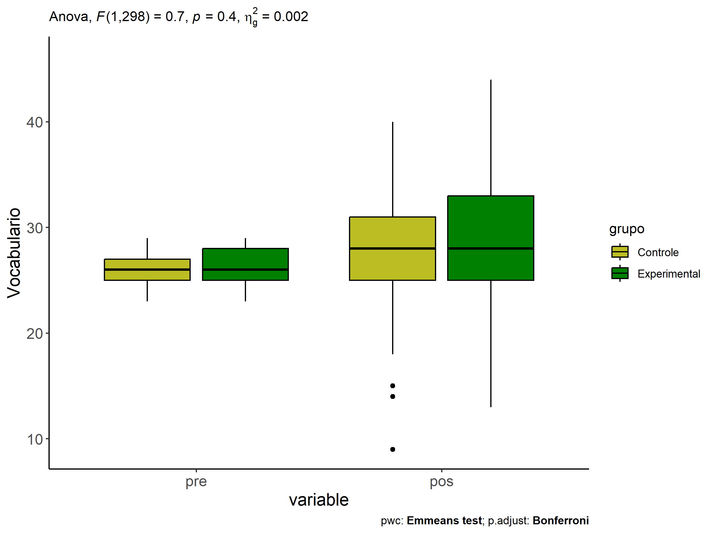<!-- -->

``` r
if (length(unique(wdat.long[["grupo"]])) > 1)
  plots <- oneWayAncovaBoxPlots(
    wdat.long, "vocab", "grupo", aov, pwc.long, pre.post = "time",
    theme = "classic", color = color$prepost)
```

``` r
if (length(unique(wdat.long[["grupo"]])) > 1)
  plots[["grupo"]] + ggplot2::ylab("Vocabulario")
```

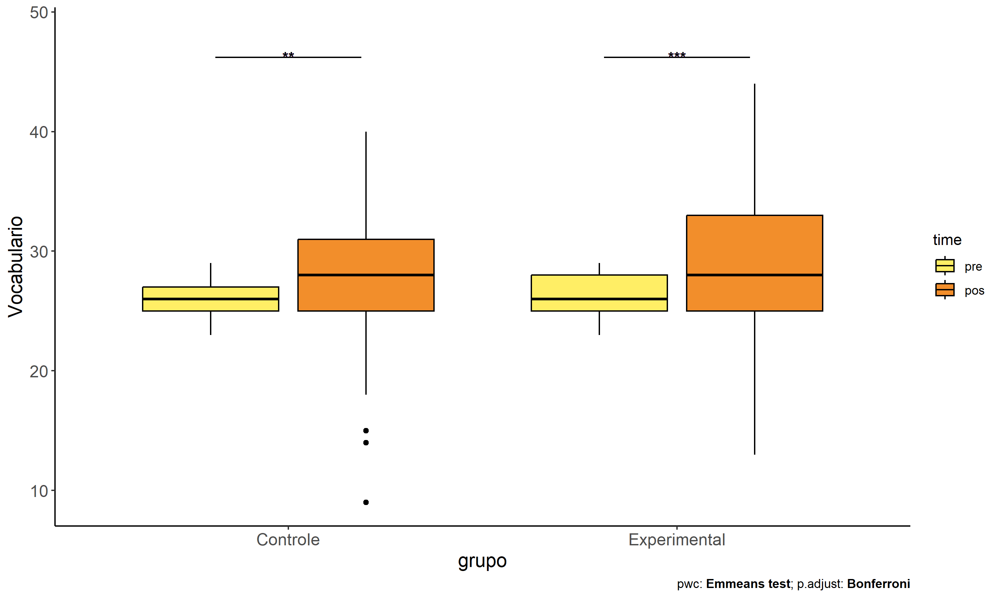<!-- -->

### Checking linearity assumption

``` r
ggscatter(wdat, x = "vocab.pre", y = "vocab.pos", size = 0.5,
          color = "grupo", add = "reg.line")+
  stat_regline_equation(
    aes(label =  paste(..eq.label.., ..rr.label.., sep = "~~~~"), color = grupo)
  )
```

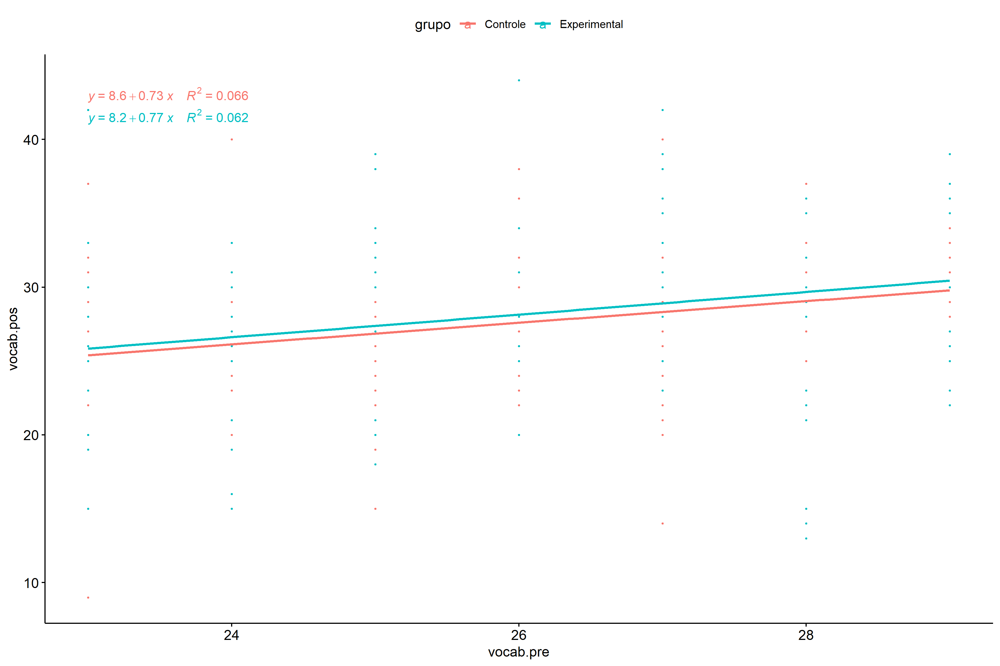<!-- -->

### Checking normality and homogeneity

``` r
res <- augment(lm(vocab.pos ~ vocab.pre + grupo, data = wdat))
```

``` r
shapiro_test(res$.resid)
```

    ## # A tibble: 1 × 3
    ##   variable   statistic p.value
    ##   <chr>          <dbl>   <dbl>
    ## 1 res$.resid     0.991  0.0539

``` r
levene_test(res, .resid ~ grupo)
```

    ## # A tibble: 1 × 4
    ##     df1   df2 statistic     p
    ##   <int> <int>     <dbl> <dbl>
    ## 1     1   299      2.01 0.157

# ANCOVA and Pairwise for two factors **grupo:Sexo**

## Without remove non-normal data

``` r
pdat = remove_group_data(dat[!is.na(dat[["grupo"]]) & !is.na(dat[["Sexo"]]),], "vocab.pos", c("grupo","Sexo"))

pdat.long <- rbind(pdat[,c("id","grupo","Sexo")], pdat[,c("id","grupo","Sexo")])
pdat.long[["time"]] <- c(rep("pre", nrow(pdat)), rep("pos", nrow(pdat)))
pdat.long[["time"]] <- factor(pdat.long[["time"]], c("pre","pos"))
pdat.long[["vocab"]] <- c(pdat[["vocab.pre"]], pdat[["vocab.pos"]])

aov = anova_test(pdat, vocab.pos ~ vocab.pre + grupo*Sexo)
laov[["grupo:Sexo"]] <- get_anova_table(aov)
```

``` r
pwcs <- list()
pwcs[["Sexo"]] <- emmeans_test(
  group_by(pdat, grupo), vocab.pos ~ Sexo,
  covariate = vocab.pre, p.adjust.method = "bonferroni")
pwcs[["grupo"]] <- emmeans_test(
  group_by(pdat, Sexo), vocab.pos ~ grupo,
  covariate = vocab.pre, p.adjust.method = "bonferroni")

pwc <- plyr::rbind.fill(pwcs[["grupo"]], pwcs[["Sexo"]])
pwc <- pwc[,c("grupo","Sexo", colnames(pwc)[!colnames(pwc) %in% c("grupo","Sexo")])]
```

``` r
pwc.long <- emmeans_test(dplyr::group_by_at(pdat.long, c("grupo","Sexo")),
                         vocab ~ time,
                         p.adjust.method = "bonferroni")
lpwc[["grupo:Sexo"]] <- plyr::rbind.fill(pwc, pwc.long)
```

``` r
ds <- get.descriptives(pdat, "vocab.pos", c("grupo","Sexo"), covar = "vocab.pre")
ds <- merge(ds[ds$variable != "vocab.pre",],
            ds[ds$variable == "vocab.pre", !colnames(ds) %in% c("variable")],
            by = c("grupo","Sexo"), all.x = T, suffixes = c("", ".vocab.pre"))
ds <- merge(get_emmeans(pwcs[["grupo"]]), ds, by = c("grupo","Sexo"), suffixes = c(".emms", ""))
ds <- ds[,c("grupo","Sexo","n","mean.vocab.pre","se.vocab.pre","mean","se","emmean","se.emms")]

colnames(ds) <- c("grupo","Sexo", "N", paste0(c("M","SE")," (pre)"),
                  paste0(c("M","SE"), " (unadj)"), paste0(c("M", "SE"), " (adj)"))

lemms[["grupo:Sexo"]] <- ds
```

## Computing ANCOVA and PairWise After removing non-normal data (OK)

``` r
wdat = pdat 

res = residuals(lm(vocab.pos ~ vocab.pre + grupo*Sexo, data = wdat))
non.normal = getNonNormal(res, wdat$id, plimit = 0.05)

wdat = wdat[!wdat$id %in% non.normal,]

wdat.long <- rbind(wdat[,c("id","grupo","Sexo")], wdat[,c("id","grupo","Sexo")])
wdat.long[["time"]] <- c(rep("pre", nrow(wdat)), rep("pos", nrow(wdat)))
wdat.long[["time"]] <- factor(wdat.long[["time"]], c("pre","pos"))
wdat.long[["vocab"]] <- c(wdat[["vocab.pre"]], wdat[["vocab.pos"]])


ldat[["grupo:Sexo"]] = wdat

(non.normal)
```

    ## [1] "P2192" "P2853" "P1936" "P1056" "P2251" "P3265" "P2850" "P2135" "P478"

``` r
aov = anova_test(wdat, vocab.pos ~ vocab.pre + grupo*Sexo)
laov[["grupo:Sexo"]] <- merge(get_anova_table(aov), laov[["grupo:Sexo"]], by="Effect", suffixes = c("","'"))

(df = get_anova_table(aov))
```

    ## ANOVA Table (type II tests)
    ## 
    ##       Effect DFn DFd      F        p p<.05   ges
    ## 1  vocab.pre   1 297 22.463 3.33e-06     * 0.070
    ## 2      grupo   1 297  2.023 1.56e-01       0.007
    ## 3       Sexo   1 297  4.270 4.00e-02     * 0.014
    ## 4 grupo:Sexo   1 297  0.712 4.00e-01       0.002

| Effect     | DFn | DFd |      F |     p | p\<.05 |   ges |
|:-----------|----:|----:|-------:|------:|:-------|------:|
| vocab.pre  |   1 | 297 | 22.463 | 0.000 | \*     | 0.070 |
| grupo      |   1 | 297 |  2.023 | 0.156 |        | 0.007 |
| Sexo       |   1 | 297 |  4.270 | 0.040 | \*     | 0.014 |
| grupo:Sexo |   1 | 297 |  0.712 | 0.400 |        | 0.002 |

``` r
pwcs <- list()
pwcs[["Sexo"]] <- emmeans_test(
  group_by(wdat, grupo), vocab.pos ~ Sexo,
  covariate = vocab.pre, p.adjust.method = "bonferroni")
pwcs[["grupo"]] <- emmeans_test(
  group_by(wdat, Sexo), vocab.pos ~ grupo,
  covariate = vocab.pre, p.adjust.method = "bonferroni")

pwc <- plyr::rbind.fill(pwcs[["grupo"]], pwcs[["Sexo"]])
pwc <- pwc[,c("grupo","Sexo", colnames(pwc)[!colnames(pwc) %in% c("grupo","Sexo")])]
```

| grupo        | Sexo | term             | .y.       | group1   | group2       |  df | statistic |     p | p.adj | p.adj.signif |
|:-------------|:-----|:-----------------|:----------|:---------|:-------------|----:|----------:|------:|------:|:-------------|
|              | F    | vocab.pre\*grupo | vocab.pos | Controle | Experimental | 297 |    -0.523 | 0.601 | 0.601 | ns           |
|              | M    | vocab.pre\*grupo | vocab.pos | Controle | Experimental | 297 |    -1.569 | 0.118 | 0.118 | ns           |
| Controle     |      | vocab.pre\*Sexo  | vocab.pos | F        | M            | 297 |     1.973 | 0.049 | 0.049 | \*           |
| Experimental |      | vocab.pre\*Sexo  | vocab.pos | F        | M            | 297 |     1.045 | 0.297 | 0.297 | ns           |

``` r
pwc.long <- emmeans_test(dplyr::group_by_at(wdat.long, c("grupo","Sexo")),
                         vocab ~ time,
                         p.adjust.method = "bonferroni")
lpwc[["grupo:Sexo"]] <- merge(plyr::rbind.fill(pwc, pwc.long), lpwc[["grupo:Sexo"]], by=c("grupo","Sexo","term",".y.","group1","group2"), suffixes = c("","'"))
```

| grupo        | Sexo | term | .y.   | group1 | group2 |  df | statistic |     p | p.adj | p.adj.signif |
|:-------------|:-----|:-----|:------|:-------|:-------|----:|----------:|------:|------:|:-------------|
| Controle     | F    | time | vocab | pre    | pos    | 596 |    -3.000 | 0.003 | 0.003 | \*\*         |
| Controle     | M    | time | vocab | pre    | pos    | 596 |    -0.268 | 0.788 | 0.788 | ns           |
| Experimental | F    | time | vocab | pre    | pos    | 596 |    -4.061 | 0.000 | 0.000 | \*\*\*\*     |
| Experimental | M    | time | vocab | pre    | pos    | 596 |    -2.474 | 0.014 | 0.014 | \*           |

``` r
ds <- get.descriptives(wdat, "vocab.pos", c("grupo","Sexo"), covar = "vocab.pre")
ds <- merge(ds[ds$variable != "vocab.pre",],
            ds[ds$variable == "vocab.pre", !colnames(ds) %in% c("variable")],
            by = c("grupo","Sexo"), all.x = T, suffixes = c("", ".vocab.pre"))
ds <- merge(get_emmeans(pwcs[["grupo"]]), ds, by = c("grupo","Sexo"), suffixes = c(".emms", ""))
ds <- ds[,c("grupo","Sexo","n","mean.vocab.pre","se.vocab.pre","mean","se","emmean","se.emms")]

colnames(ds) <- c("grupo","Sexo", "N", paste0(c("M","SE")," (pre)"),
                  paste0(c("M","SE"), " (unadj)"), paste0(c("M", "SE"), " (adj)"))

lemms[["grupo:Sexo"]] <- merge(ds, lemms[["grupo:Sexo"]], by=c("grupo","Sexo"), suffixes = c("","'"))
```

| grupo        | Sexo |   N | M (pre) | SE (pre) | M (unadj) | SE (unadj) | M (adj) | SE (adj) |
|:-------------|:-----|----:|--------:|---------:|----------:|-----------:|--------:|---------:|
| Controle     | F    |  75 |  26.147 |    0.217 |    28.293 |      0.597 |  28.229 |    0.656 |
| Controle     | M    |  52 |  25.558 |    0.264 |    25.788 |      0.890 |  26.196 |    0.793 |
| Experimental | F    |  94 |  26.202 |    0.203 |    28.798 |      0.594 |  28.689 |    0.587 |
| Experimental | M    |  81 |  26.160 |    0.223 |    27.864 |      0.697 |  27.789 |    0.632 |

### Plots for ancova

``` r
plots <- twoWayAncovaPlots(
  wdat, "vocab.pos", c("grupo","Sexo"), aov, pwcs, addParam = c("mean_se"),
  font.label.size=10, step.increase=0.05, p.label="p.adj",
  subtitle = which(aov$Effect == "grupo:Sexo"))
```

``` r
if (!is.null(plots[["grupo"]]))
  plots[["grupo"]] + ggplot2::scale_color_manual(values = color[["Sexo"]])
```

    ## Scale for colour is already present.
    ## Adding another scale for colour, which will replace the existing scale.

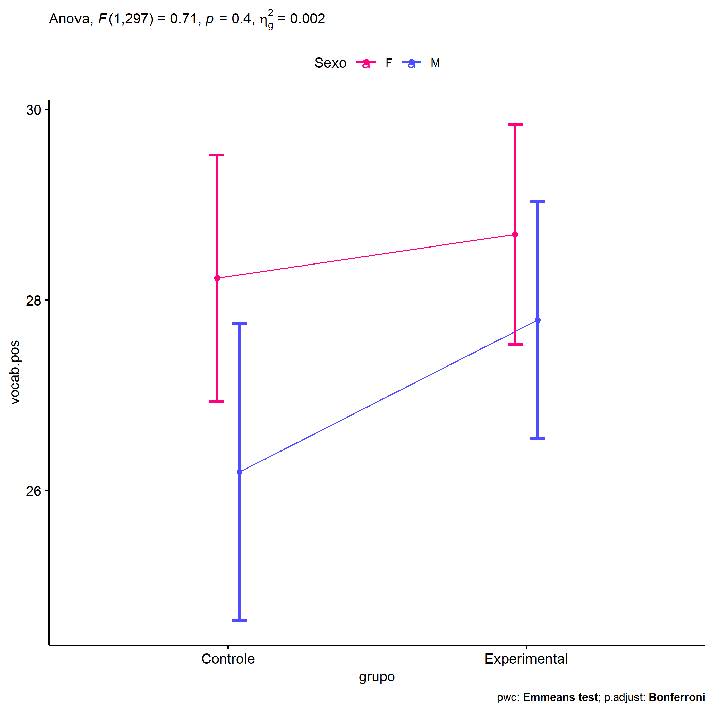<!-- -->

``` r
if (!is.null(plots[["Sexo"]]))
  plots[["Sexo"]] + ggplot2::scale_color_manual(values = color[["grupo"]])
```

    ## Scale for colour is already present.
    ## Adding another scale for colour, which will replace the existing scale.

<!-- -->

``` r
plots <- twoWayAncovaBoxPlots(
  wdat, "vocab.pos", c("grupo","Sexo"), aov, pwcs, covar = "vocab.pre",
  theme = "classic", color = color[["grupo:Sexo"]],
  subtitle = which(aov$Effect == "grupo:Sexo"))
```

``` r
plots[["grupo:Sexo"]] + ggplot2::ylab("Vocabulario") + ggplot2::scale_x_discrete(labels=c('pre', 'pos'))
```

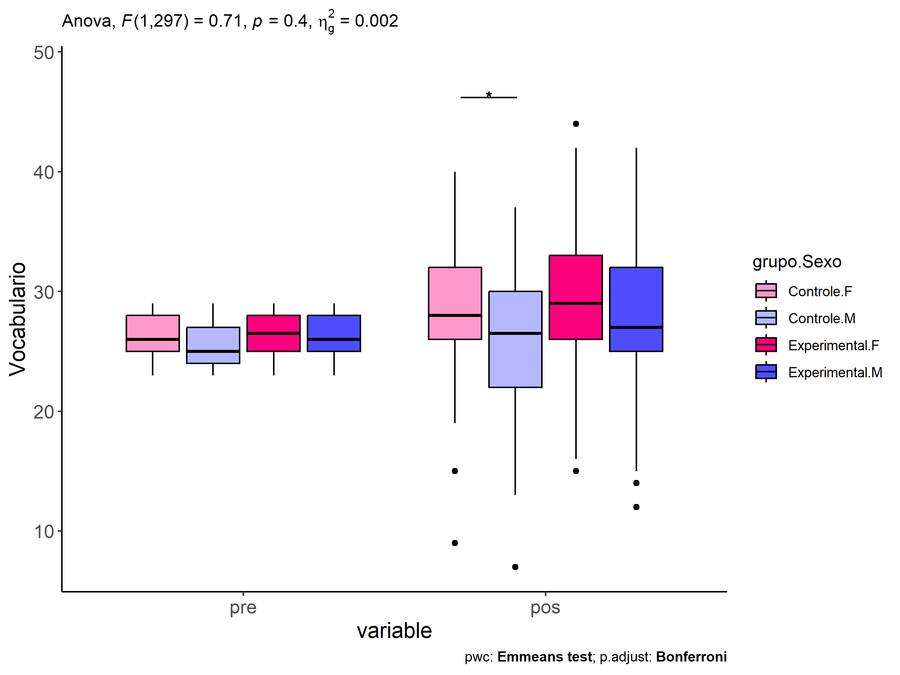<!-- -->

``` r
plots <- twoWayAncovaBoxPlots(
  wdat.long, "vocab", c("grupo","Sexo"), aov, pwc.long, pre.post = "time",
  theme = "classic", color = color$prepost)
```

``` r
plots[["grupo:Sexo"]] + ggplot2::ylab("Vocabulario")
```

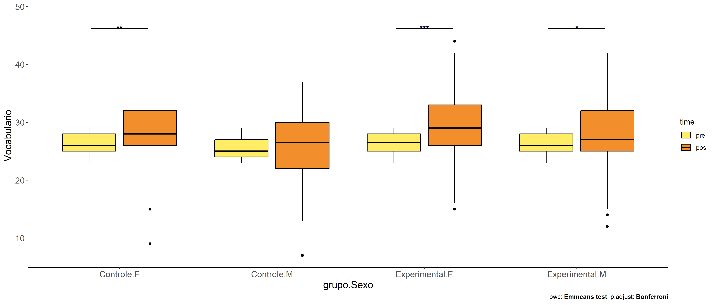<!-- -->

### Checking linearity assumption

``` r
ggscatter(wdat, x = "vocab.pre", y = "vocab.pos", size = 0.5,
          facet.by = c("grupo","Sexo"), add = "reg.line")+
  stat_regline_equation(
    aes(label =  paste(..eq.label.., ..rr.label.., sep = "~~~~"))
  )
```

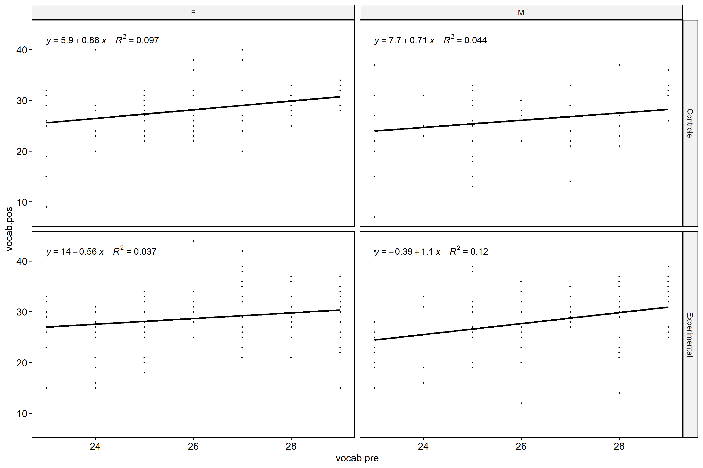<!-- -->

### Checking normality and homogeneity

``` r
res <- augment(lm(vocab.pos ~ vocab.pre + grupo*Sexo, data = wdat))
```

``` r
shapiro_test(res$.resid)
```

    ## # A tibble: 1 × 3
    ##   variable   statistic p.value
    ##   <chr>          <dbl>   <dbl>
    ## 1 res$.resid     0.991  0.0591

``` r
levene_test(res, .resid ~ grupo*Sexo)
```

    ## # A tibble: 1 × 4
    ##     df1   df2 statistic     p
    ##   <int> <int>     <dbl> <dbl>
    ## 1     3   298      1.17 0.320

# ANCOVA and Pairwise for two factors **grupo:Zona**

## Without remove non-normal data

``` r
pdat = remove_group_data(dat[!is.na(dat[["grupo"]]) & !is.na(dat[["Zona"]]),], "vocab.pos", c("grupo","Zona"))

pdat.long <- rbind(pdat[,c("id","grupo","Zona")], pdat[,c("id","grupo","Zona")])
pdat.long[["time"]] <- c(rep("pre", nrow(pdat)), rep("pos", nrow(pdat)))
pdat.long[["time"]] <- factor(pdat.long[["time"]], c("pre","pos"))
pdat.long[["vocab"]] <- c(pdat[["vocab.pre"]], pdat[["vocab.pos"]])

aov = anova_test(pdat, vocab.pos ~ vocab.pre + grupo*Zona)
laov[["grupo:Zona"]] <- get_anova_table(aov)
```

``` r
pwcs <- list()
pwcs[["Zona"]] <- emmeans_test(
  group_by(pdat, grupo), vocab.pos ~ Zona,
  covariate = vocab.pre, p.adjust.method = "bonferroni")
pwcs[["grupo"]] <- emmeans_test(
  group_by(pdat, Zona), vocab.pos ~ grupo,
  covariate = vocab.pre, p.adjust.method = "bonferroni")

pwc <- plyr::rbind.fill(pwcs[["grupo"]], pwcs[["Zona"]])
pwc <- pwc[,c("grupo","Zona", colnames(pwc)[!colnames(pwc) %in% c("grupo","Zona")])]
```

``` r
pwc.long <- emmeans_test(dplyr::group_by_at(pdat.long, c("grupo","Zona")),
                         vocab ~ time,
                         p.adjust.method = "bonferroni")
lpwc[["grupo:Zona"]] <- plyr::rbind.fill(pwc, pwc.long)
```

``` r
ds <- get.descriptives(pdat, "vocab.pos", c("grupo","Zona"), covar = "vocab.pre")
ds <- merge(ds[ds$variable != "vocab.pre",],
            ds[ds$variable == "vocab.pre", !colnames(ds) %in% c("variable")],
            by = c("grupo","Zona"), all.x = T, suffixes = c("", ".vocab.pre"))
ds <- merge(get_emmeans(pwcs[["grupo"]]), ds, by = c("grupo","Zona"), suffixes = c(".emms", ""))
ds <- ds[,c("grupo","Zona","n","mean.vocab.pre","se.vocab.pre","mean","se","emmean","se.emms")]

colnames(ds) <- c("grupo","Zona", "N", paste0(c("M","SE")," (pre)"),
                  paste0(c("M","SE"), " (unadj)"), paste0(c("M", "SE"), " (adj)"))

lemms[["grupo:Zona"]] <- ds
```

## Computing ANCOVA and PairWise After removing non-normal data (OK)

``` r
wdat = pdat 

res = residuals(lm(vocab.pos ~ vocab.pre + grupo*Zona, data = wdat))
non.normal = getNonNormal(res, wdat$id, plimit = 0.05)

wdat = wdat[!wdat$id %in% non.normal,]

wdat.long <- rbind(wdat[,c("id","grupo","Zona")], wdat[,c("id","grupo","Zona")])
wdat.long[["time"]] <- c(rep("pre", nrow(wdat)), rep("pos", nrow(wdat)))
wdat.long[["time"]] <- factor(wdat.long[["time"]], c("pre","pos"))
wdat.long[["vocab"]] <- c(wdat[["vocab.pre"]], wdat[["vocab.pos"]])


ldat[["grupo:Zona"]] = wdat

(non.normal)
```

    ## [1] "P1056" "P3473" "P2850" "P3042"

``` r
aov = anova_test(wdat, vocab.pos ~ vocab.pre + grupo*Zona)
laov[["grupo:Zona"]] <- merge(get_anova_table(aov), laov[["grupo:Zona"]], by="Effect", suffixes = c("","'"))

(df = get_anova_table(aov))
```

    ## ANOVA Table (type II tests)
    ## 
    ##       Effect DFn DFd          F        p p<.05      ges
    ## 1  vocab.pre   1 207 18.8490000 2.21e-05     * 8.30e-02
    ## 2      grupo   1 207  0.7280000 3.95e-01       4.00e-03
    ## 3       Zona   1 207  0.0000147 9.97e-01       7.10e-08
    ## 4 grupo:Zona   1 207  0.0005960 9.81e-01       2.88e-06

| Effect     | DFn | DFd |      F |     p | p\<.05 |   ges |
|:-----------|----:|----:|-------:|------:|:-------|------:|
| vocab.pre  |   1 | 207 | 18.849 | 0.000 | \*     | 0.083 |
| grupo      |   1 | 207 |  0.728 | 0.395 |        | 0.004 |
| Zona       |   1 | 207 |  0.000 | 0.997 |        | 0.000 |
| grupo:Zona |   1 | 207 |  0.001 | 0.981 |        | 0.000 |

``` r
pwcs <- list()
pwcs[["Zona"]] <- emmeans_test(
  group_by(wdat, grupo), vocab.pos ~ Zona,
  covariate = vocab.pre, p.adjust.method = "bonferroni")
pwcs[["grupo"]] <- emmeans_test(
  group_by(wdat, Zona), vocab.pos ~ grupo,
  covariate = vocab.pre, p.adjust.method = "bonferroni")

pwc <- plyr::rbind.fill(pwcs[["grupo"]], pwcs[["Zona"]])
pwc <- pwc[,c("grupo","Zona", colnames(pwc)[!colnames(pwc) %in% c("grupo","Zona")])]
```

| grupo        | Zona   | term             | .y.       | group1   | group2       |  df | statistic |     p | p.adj | p.adj.signif |
|:-------------|:-------|:-----------------|:----------|:---------|:-------------|----:|----------:|------:|------:|:-------------|
|              | Rural  | vocab.pre\*grupo | vocab.pos | Controle | Experimental | 207 |    -0.726 | 0.469 | 0.469 | ns           |
|              | Urbana | vocab.pre\*grupo | vocab.pos | Controle | Experimental | 207 |    -0.449 | 0.654 | 0.654 | ns           |
| Controle     |        | vocab.pre\*Zona  | vocab.pos | Rural    | Urbana       | 207 |    -0.017 | 0.986 | 0.986 | ns           |
| Experimental |        | vocab.pre\*Zona  | vocab.pos | Rural    | Urbana       | 207 |     0.018 | 0.986 | 0.986 | ns           |

``` r
pwc.long <- emmeans_test(dplyr::group_by_at(wdat.long, c("grupo","Zona")),
                         vocab ~ time,
                         p.adjust.method = "bonferroni")
lpwc[["grupo:Zona"]] <- merge(plyr::rbind.fill(pwc, pwc.long), lpwc[["grupo:Zona"]], by=c("grupo","Zona","term",".y.","group1","group2"), suffixes = c("","'"))
```

| grupo        | Zona   | term | .y.   | group1 | group2 |  df | statistic |     p | p.adj | p.adj.signif |
|:-------------|:-------|:-----|:------|:-------|:-------|----:|----------:|------:|------:|:-------------|
| Controle     | Rural  | time | vocab | pre    | pos    | 416 |    -2.326 | 0.021 | 0.021 | \*           |
| Controle     | Urbana | time | vocab | pre    | pos    | 416 |    -1.267 | 0.206 | 0.206 | ns           |
| Experimental | Rural  | time | vocab | pre    | pos    | 416 |    -3.250 | 0.001 | 0.001 | \*\*         |
| Experimental | Urbana | time | vocab | pre    | pos    | 416 |    -2.642 | 0.009 | 0.009 | \*\*         |

``` r
ds <- get.descriptives(wdat, "vocab.pos", c("grupo","Zona"), covar = "vocab.pre")
ds <- merge(ds[ds$variable != "vocab.pre",],
            ds[ds$variable == "vocab.pre", !colnames(ds) %in% c("variable")],
            by = c("grupo","Zona"), all.x = T, suffixes = c("", ".vocab.pre"))
ds <- merge(get_emmeans(pwcs[["grupo"]]), ds, by = c("grupo","Zona"), suffixes = c(".emms", ""))
ds <- ds[,c("grupo","Zona","n","mean.vocab.pre","se.vocab.pre","mean","se","emmean","se.emms")]

colnames(ds) <- c("grupo","Zona", "N", paste0(c("M","SE")," (pre)"),
                  paste0(c("M","SE"), " (unadj)"), paste0(c("M", "SE"), " (adj)"))

lemms[["grupo:Zona"]] <- merge(ds, lemms[["grupo:Zona"]], by=c("grupo","Zona"), suffixes = c("","'"))
```

| grupo        | Zona   |   N | M (pre) | SE (pre) | M (unadj) | SE (unadj) | M (adj) | SE (adj) |
|:-------------|:-------|----:|--------:|---------:|----------:|-----------:|--------:|---------:|
| Controle     | Rural  |  69 |  25.870 |    0.233 |    27.565 |      0.690 |  27.819 |    0.666 |
| Controle     | Urbana |  22 |  26.455 |    0.415 |    28.091 |      1.044 |  27.842 |    1.176 |
| Experimental | Rural  |  72 |  26.236 |    0.216 |    28.556 |      0.733 |  28.495 |    0.649 |
| Experimental | Urbana |  49 |  26.347 |    0.294 |    28.633 |      0.762 |  28.476 |    0.788 |

### Plots for ancova

``` r
plots <- twoWayAncovaPlots(
  wdat, "vocab.pos", c("grupo","Zona"), aov, pwcs, addParam = c("mean_se"),
  font.label.size=10, step.increase=0.05, p.label="p.adj",
  subtitle = which(aov$Effect == "grupo:Zona"))
```

``` r
if (!is.null(plots[["grupo"]]))
  plots[["grupo"]] + ggplot2::scale_color_manual(values = color[["Zona"]])
```

    ## Scale for colour is already present.
    ## Adding another scale for colour, which will replace the existing scale.

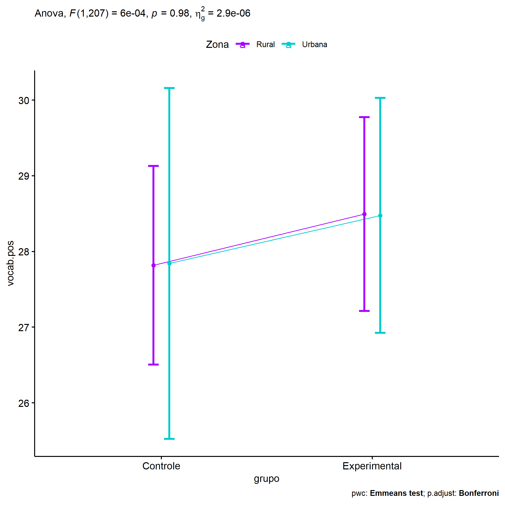<!-- -->

``` r
if (!is.null(plots[["Zona"]]))
  plots[["Zona"]] + ggplot2::scale_color_manual(values = color[["grupo"]])
```

    ## Scale for colour is already present.
    ## Adding another scale for colour, which will replace the existing scale.

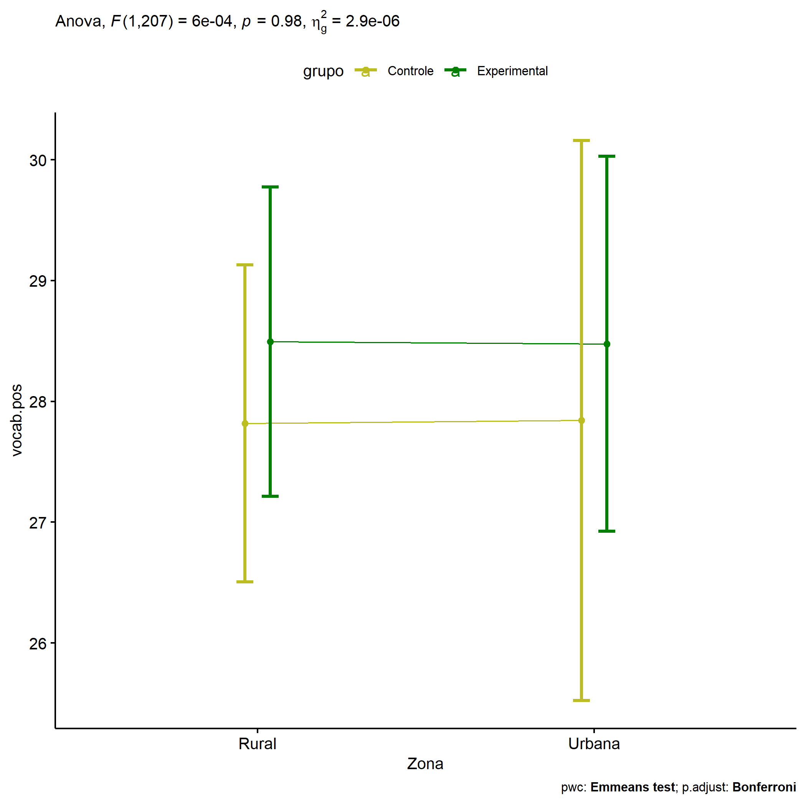<!-- -->

``` r
plots <- twoWayAncovaBoxPlots(
  wdat, "vocab.pos", c("grupo","Zona"), aov, pwcs, covar = "vocab.pre",
  theme = "classic", color = color[["grupo:Zona"]],
  subtitle = which(aov$Effect == "grupo:Zona"))
```

``` r
plots[["grupo:Zona"]] + ggplot2::ylab("Vocabulario") + ggplot2::scale_x_discrete(labels=c('pre', 'pos'))
```

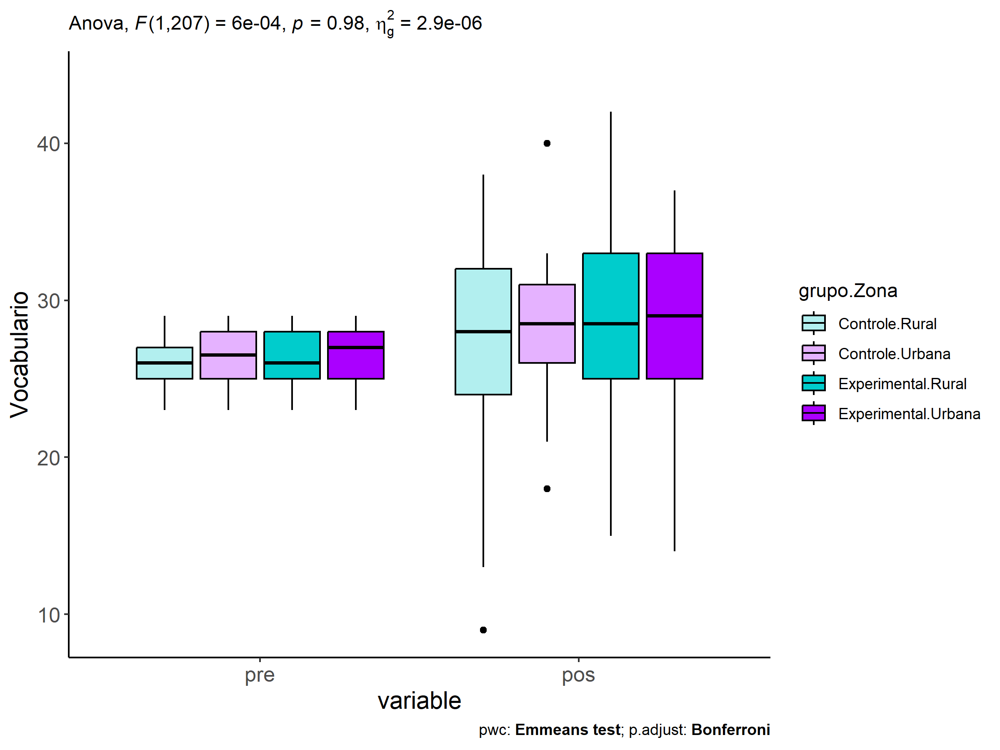<!-- -->

``` r
plots <- twoWayAncovaBoxPlots(
  wdat.long, "vocab", c("grupo","Zona"), aov, pwc.long, pre.post = "time",
  theme = "classic", color = color$prepost)
```

``` r
plots[["grupo:Zona"]] + ggplot2::ylab("Vocabulario")
```

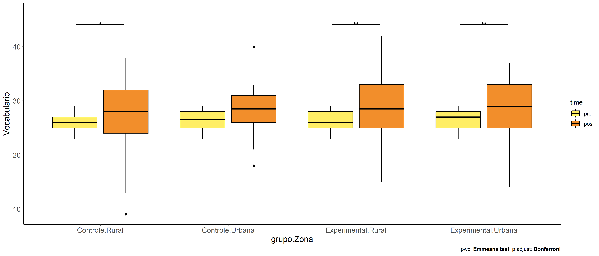<!-- -->

### Checking linearity assumption

``` r
ggscatter(wdat, x = "vocab.pre", y = "vocab.pos", size = 0.5,
          facet.by = c("grupo","Zona"), add = "reg.line")+
  stat_regline_equation(
    aes(label =  paste(..eq.label.., ..rr.label.., sep = "~~~~"))
  )
```

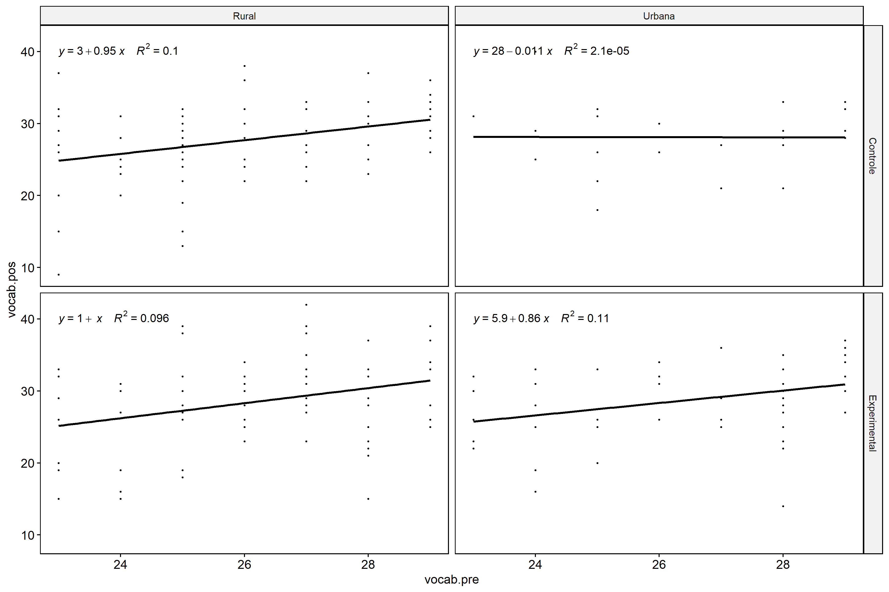<!-- -->

### Checking normality and homogeneity

``` r
res <- augment(lm(vocab.pos ~ vocab.pre + grupo*Zona, data = wdat))
```

``` r
shapiro_test(res$.resid)
```

    ## # A tibble: 1 × 3
    ##   variable   statistic p.value
    ##   <chr>          <dbl>   <dbl>
    ## 1 res$.resid     0.989   0.100

``` r
levene_test(res, .resid ~ grupo*Zona)
```

    ## # A tibble: 1 × 4
    ##     df1   df2 statistic     p
    ##   <int> <int>     <dbl> <dbl>
    ## 1     3   208     0.818 0.485

# ANCOVA and Pairwise for two factors **grupo:Cor.Raca**

## Without remove non-normal data

``` r
pdat = remove_group_data(dat[!is.na(dat[["grupo"]]) & !is.na(dat[["Cor.Raca"]]),], "vocab.pos", c("grupo","Cor.Raca"))
```

    ## Warning: There was 1 warning in `mutate()`.
    ## ℹ In argument: `ci = abs(stats::qt(alpha/2, .data$n - 1) * .data$se)`.
    ## Caused by warning:
    ## ! There was 1 warning in `mutate()`.
    ## ℹ In argument: `ci = abs(stats::qt(alpha/2, .data$n - 1) * .data$se)`.
    ## Caused by warning in `stats::qt()`:
    ## ! NaNs produced

``` r
pdat.long <- rbind(pdat[,c("id","grupo","Cor.Raca")], pdat[,c("id","grupo","Cor.Raca")])
pdat.long[["time"]] <- c(rep("pre", nrow(pdat)), rep("pos", nrow(pdat)))
pdat.long[["time"]] <- factor(pdat.long[["time"]], c("pre","pos"))
pdat.long[["vocab"]] <- c(pdat[["vocab.pre"]], pdat[["vocab.pos"]])

aov = anova_test(pdat, vocab.pos ~ vocab.pre + grupo*Cor.Raca)
laov[["grupo:Cor.Raca"]] <- get_anova_table(aov)
```

``` r
pwcs <- list()
pwcs[["Cor.Raca"]] <- emmeans_test(
  group_by(pdat, grupo), vocab.pos ~ Cor.Raca,
  covariate = vocab.pre, p.adjust.method = "bonferroni")
pwcs[["grupo"]] <- emmeans_test(
  group_by(pdat, Cor.Raca), vocab.pos ~ grupo,
  covariate = vocab.pre, p.adjust.method = "bonferroni")

pwc <- plyr::rbind.fill(pwcs[["grupo"]], pwcs[["Cor.Raca"]])
pwc <- pwc[,c("grupo","Cor.Raca", colnames(pwc)[!colnames(pwc) %in% c("grupo","Cor.Raca")])]
```

``` r
pwc.long <- emmeans_test(dplyr::group_by_at(pdat.long, c("grupo","Cor.Raca")),
                         vocab ~ time,
                         p.adjust.method = "bonferroni")
lpwc[["grupo:Cor.Raca"]] <- plyr::rbind.fill(pwc, pwc.long)
```

``` r
ds <- get.descriptives(pdat, "vocab.pos", c("grupo","Cor.Raca"), covar = "vocab.pre")
ds <- merge(ds[ds$variable != "vocab.pre",],
            ds[ds$variable == "vocab.pre", !colnames(ds) %in% c("variable")],
            by = c("grupo","Cor.Raca"), all.x = T, suffixes = c("", ".vocab.pre"))
ds <- merge(get_emmeans(pwcs[["grupo"]]), ds, by = c("grupo","Cor.Raca"), suffixes = c(".emms", ""))
ds <- ds[,c("grupo","Cor.Raca","n","mean.vocab.pre","se.vocab.pre","mean","se","emmean","se.emms")]

colnames(ds) <- c("grupo","Cor.Raca", "N", paste0(c("M","SE")," (pre)"),
                  paste0(c("M","SE"), " (unadj)"), paste0(c("M", "SE"), " (adj)"))

lemms[["grupo:Cor.Raca"]] <- ds
```

## Computing ANCOVA and PairWise After removing non-normal data (OK)

``` r
wdat = pdat 

res = residuals(lm(vocab.pos ~ vocab.pre + grupo*Cor.Raca, data = wdat))
non.normal = getNonNormal(res, wdat$id, plimit = 0.05)

wdat = wdat[!wdat$id %in% non.normal,]

wdat.long <- rbind(wdat[,c("id","grupo","Cor.Raca")], wdat[,c("id","grupo","Cor.Raca")])
wdat.long[["time"]] <- c(rep("pre", nrow(wdat)), rep("pos", nrow(wdat)))
wdat.long[["time"]] <- factor(wdat.long[["time"]], c("pre","pos"))
wdat.long[["vocab"]] <- c(wdat[["vocab.pre"]], wdat[["vocab.pos"]])


ldat[["grupo:Cor.Raca"]] = wdat

(non.normal)
```

    ## NULL

``` r
aov = anova_test(wdat, vocab.pos ~ vocab.pre + grupo*Cor.Raca)
laov[["grupo:Cor.Raca"]] <- merge(get_anova_table(aov), laov[["grupo:Cor.Raca"]], by="Effect", suffixes = c("","'"))

(df = get_anova_table(aov))
```

    ## ANOVA Table (type II tests)
    ## 
    ##           Effect DFn DFd     F     p p<.05      ges
    ## 1      vocab.pre   1 119 7.968 0.006     * 0.063000
    ## 2          grupo   1 119 0.221 0.639       0.002000
    ## 3       Cor.Raca   2 119 2.908 0.058       0.047000
    ## 4 grupo:Cor.Raca   1 119 0.069 0.793       0.000583

| Effect         | DFn | DFd |     F |     p | p\<.05 |   ges |
|:---------------|----:|----:|------:|------:|:-------|------:|
| vocab.pre      |   1 | 119 | 7.968 | 0.006 | \*     | 0.063 |
| grupo          |   1 | 119 | 0.221 | 0.639 |        | 0.002 |
| Cor.Raca       |   2 | 119 | 2.908 | 0.058 |        | 0.047 |
| grupo:Cor.Raca |   1 | 119 | 0.069 | 0.793 |        | 0.001 |

``` r
pwcs <- list()
pwcs[["Cor.Raca"]] <- emmeans_test(
  group_by(wdat, grupo), vocab.pos ~ Cor.Raca,
  covariate = vocab.pre, p.adjust.method = "bonferroni")
pwcs[["grupo"]] <- emmeans_test(
  group_by(wdat, Cor.Raca), vocab.pos ~ grupo,
  covariate = vocab.pre, p.adjust.method = "bonferroni")

pwc <- plyr::rbind.fill(pwcs[["grupo"]], pwcs[["Cor.Raca"]])
pwc <- pwc[,c("grupo","Cor.Raca", colnames(pwc)[!colnames(pwc) %in% c("grupo","Cor.Raca")])]
```

| grupo        | Cor.Raca | term                | .y.       | group1   | group2       |  df | statistic |     p | p.adj | p.adj.signif |
|:-------------|:---------|:--------------------|:----------|:---------|:-------------|----:|----------:|------:|------:|:-------------|
|              | Branca   | vocab.pre\*grupo    | vocab.pos | Controle | Experimental | 119 |     0.484 | 0.629 | 0.629 | ns           |
|              | Indígena | vocab.pre\*grupo    | vocab.pos | Controle | Experimental |     |           |       |       |              |
|              | Parda    | vocab.pre\*grupo    | vocab.pos | Controle | Experimental | 119 |     0.238 | 0.813 | 0.813 | ns           |
| Controle     |          | vocab.pre\*Cor.Raca | vocab.pos | Branca   | Indígena     | 119 |    -1.421 | 0.158 | 0.474 | ns           |
| Controle     |          | vocab.pre\*Cor.Raca | vocab.pos | Branca   | Parda        | 119 |    -1.262 | 0.209 | 0.628 | ns           |
| Controle     |          | vocab.pre\*Cor.Raca | vocab.pos | Indígena | Parda        | 119 |     0.607 | 0.545 | 1.000 | ns           |
| Experimental |          | vocab.pre\*Cor.Raca | vocab.pos | Branca   | Indígena     |     |           |       |       |              |
| Experimental |          | vocab.pre\*Cor.Raca | vocab.pos | Branca   | Parda        | 119 |    -1.863 | 0.065 | 0.065 | ns           |
| Experimental |          | vocab.pre\*Cor.Raca | vocab.pos | Indígena | Parda        |     |           |       |       |              |

``` r
pwc.long <- emmeans_test(dplyr::group_by_at(wdat.long, c("grupo","Cor.Raca")),
                         vocab ~ time,
                         p.adjust.method = "bonferroni")
lpwc[["grupo:Cor.Raca"]] <- merge(plyr::rbind.fill(pwc, pwc.long), lpwc[["grupo:Cor.Raca"]], by=c("grupo","Cor.Raca","term",".y.","group1","group2"), suffixes = c("","'"))
```

| grupo        | Cor.Raca | term | .y.   | group1 | group2 |  df | statistic |     p | p.adj | p.adj.signif |
|:-------------|:---------|:-----|:------|:-------|:-------|----:|----------:|------:|------:|:-------------|
| Controle     | Branca   | time | vocab | pre    | pos    | 240 |     0.073 | 0.942 | 0.942 | ns           |
| Controle     | Indígena | time | vocab | pre    | pos    | 240 |    -1.662 | 0.098 | 0.098 | ns           |
| Controle     | Parda    | time | vocab | pre    | pos    | 240 |    -2.061 | 0.040 | 0.040 | \*           |
| Experimental | Branca   | time | vocab | pre    | pos    | 240 |     0.783 | 0.434 | 0.434 | ns           |
| Experimental | Indígena | time | vocab | pre    | pos    |     |           |       |       |              |
| Experimental | Parda    | time | vocab | pre    | pos    | 240 |    -1.949 | 0.052 | 0.052 | ns           |

``` r
ds <- get.descriptives(wdat, "vocab.pos", c("grupo","Cor.Raca"), covar = "vocab.pre")
ds <- merge(ds[ds$variable != "vocab.pre",],
            ds[ds$variable == "vocab.pre", !colnames(ds) %in% c("variable")],
            by = c("grupo","Cor.Raca"), all.x = T, suffixes = c("", ".vocab.pre"))
ds <- merge(get_emmeans(pwcs[["grupo"]]), ds, by = c("grupo","Cor.Raca"), suffixes = c(".emms", ""))
ds <- ds[,c("grupo","Cor.Raca","n","mean.vocab.pre","se.vocab.pre","mean","se","emmean","se.emms")]

colnames(ds) <- c("grupo","Cor.Raca", "N", paste0(c("M","SE")," (pre)"),
                  paste0(c("M","SE"), " (unadj)"), paste0(c("M", "SE"), " (adj)"))

lemms[["grupo:Cor.Raca"]] <- merge(ds, lemms[["grupo:Cor.Raca"]], by=c("grupo","Cor.Raca"), suffixes = c("","'"))
```

| grupo        | Cor.Raca |   N | M (pre) | SE (pre) | M (unadj) | SE (unadj) | M (adj) | SE (adj) |
|:-------------|:---------|----:|--------:|---------:|----------:|-----------:|--------:|---------:|
| Controle     | Branca   |  16 |  26.438 |    0.408 |    26.312 |      1.193 |  26.059 |    1.588 |
| Controle     | Indígena |   8 |  25.250 |    0.773 |    29.250 |      2.051 |  29.995 |    2.258 |
| Controle     | Parda    |  35 |  25.971 |    0.308 |    28.343 |      1.120 |  28.481 |    1.073 |
| Experimental | Branca   |  22 |  26.455 |    0.464 |    25.318 |      1.541 |  25.050 |    1.356 |
| Experimental | Parda    |  44 |  26.159 |    0.298 |    28.159 |      1.013 |  28.140 |    0.956 |

### Plots for ancova

``` r
plots <- twoWayAncovaPlots(
  wdat, "vocab.pos", c("grupo","Cor.Raca"), aov, pwcs, addParam = c("mean_se"),
  font.label.size=10, step.increase=0.05, p.label="p.adj",
  subtitle = which(aov$Effect == "grupo:Cor.Raca"))
```

``` r
if (!is.null(plots[["grupo"]]))
  plots[["grupo"]] + ggplot2::scale_color_manual(values = color[["Cor.Raca"]])
```

<!-- -->

``` r
if (!is.null(plots[["Cor.Raca"]]))
  plots[["Cor.Raca"]] + ggplot2::scale_color_manual(values = color[["grupo"]])
```

    ## Scale for colour is already present.
    ## Adding another scale for colour, which will replace the existing scale.

    ## Warning: Removed 2 rows containing non-finite values (`stat_bracket()`).

    ## Warning: Removed 1 rows containing missing values (`geom_point()`).

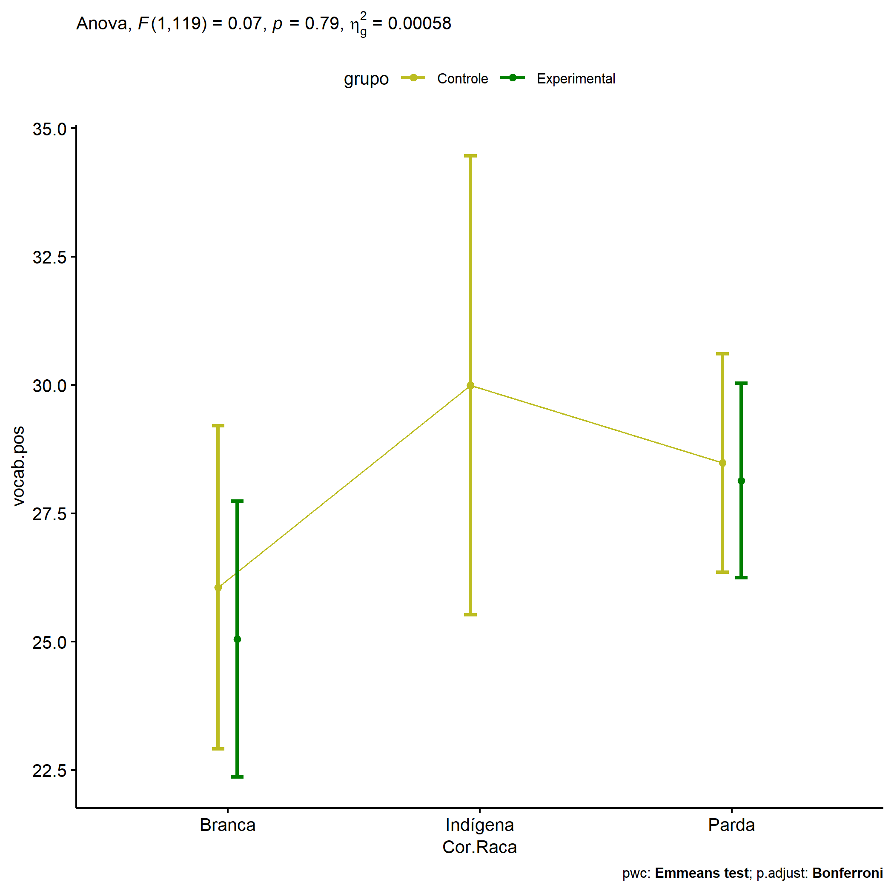<!-- -->

``` r
plots <- twoWayAncovaBoxPlots(
  wdat, "vocab.pos", c("grupo","Cor.Raca"), aov, pwcs, covar = "vocab.pre",
  theme = "classic", color = color[["grupo:Cor.Raca"]],
  subtitle = which(aov$Effect == "grupo:Cor.Raca"))
```

``` r
plots[["grupo:Cor.Raca"]] + ggplot2::ylab("Vocabulario") + ggplot2::scale_x_discrete(labels=c('pre', 'pos'))
```

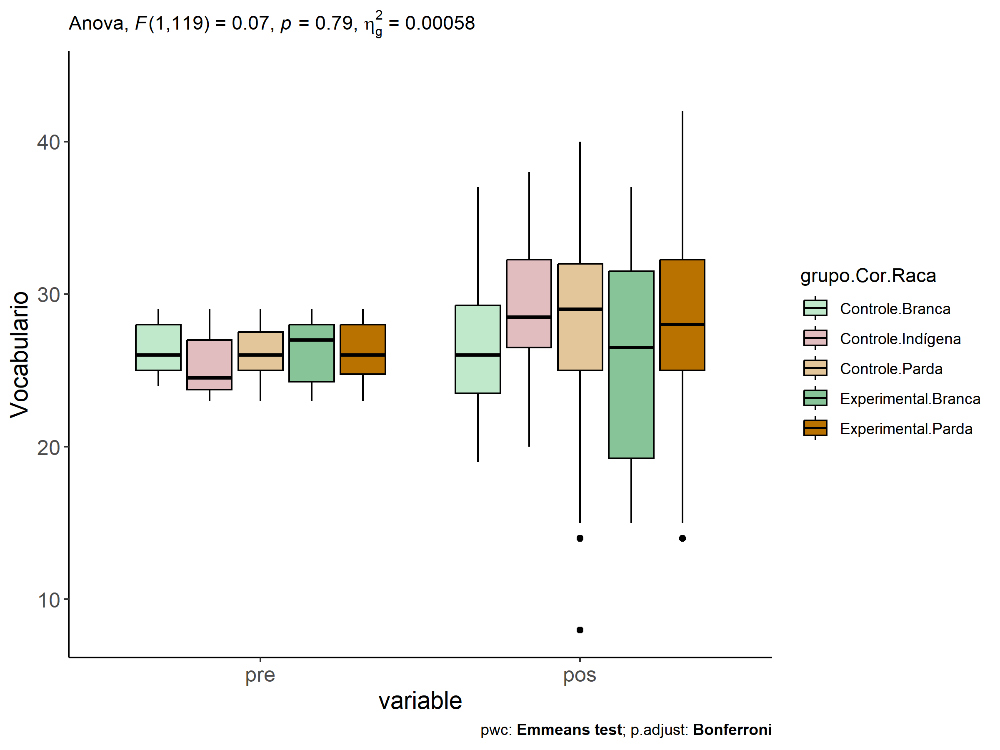<!-- -->

``` r
plots <- twoWayAncovaBoxPlots(
  wdat.long, "vocab", c("grupo","Cor.Raca"), aov, pwc.long, pre.post = "time",
  theme = "classic", color = color$prepost)
```

``` r
plots[["grupo:Cor.Raca"]] + ggplot2::ylab("Vocabulario")
```

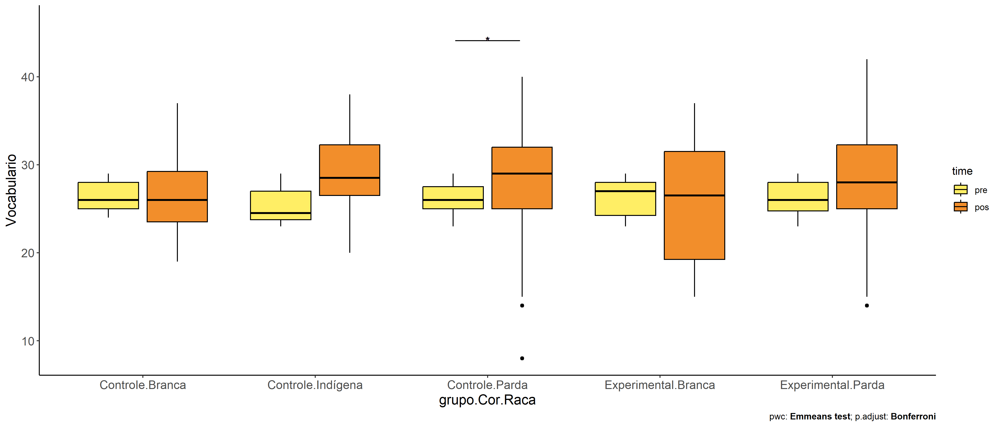<!-- -->

### Checking linearity assumption

``` r
ggscatter(wdat, x = "vocab.pre", y = "vocab.pos", size = 0.5,
          facet.by = c("grupo","Cor.Raca"), add = "reg.line")+
  stat_regline_equation(
    aes(label =  paste(..eq.label.., ..rr.label.., sep = "~~~~"))
  )
```

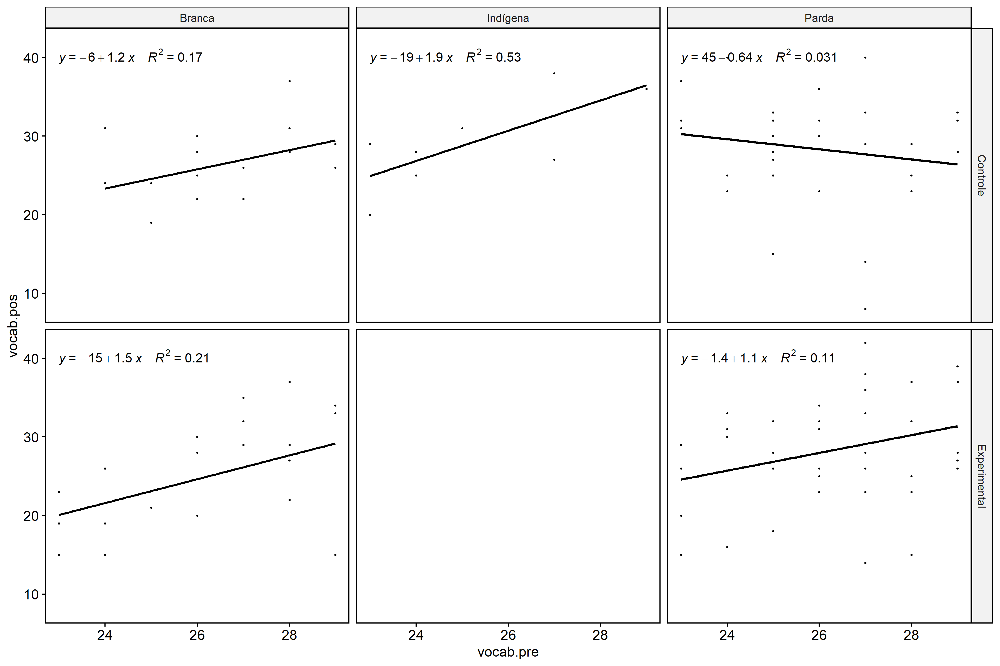<!-- -->

### Checking normality and homogeneity

``` r
res <- augment(lm(vocab.pos ~ vocab.pre + grupo*Cor.Raca, data = wdat))
```

``` r
shapiro_test(res$.resid)
```

    ## # A tibble: 1 × 3
    ##   variable   statistic p.value
    ##   <chr>          <dbl>   <dbl>
    ## 1 res$.resid     0.980  0.0639

``` r
levene_test(res, .resid ~ grupo*Cor.Raca)
```

    ## # A tibble: 1 × 4
    ##     df1   df2 statistic     p
    ##   <int> <int>     <dbl> <dbl>
    ## 1     4   120      1.04 0.388

# ANCOVA and Pairwise for two factors **grupo:Serie**

## Without remove non-normal data

``` r
pdat = remove_group_data(dat[!is.na(dat[["grupo"]]) & !is.na(dat[["Serie"]]),], "vocab.pos", c("grupo","Serie"))

pdat.long <- rbind(pdat[,c("id","grupo","Serie")], pdat[,c("id","grupo","Serie")])
pdat.long[["time"]] <- c(rep("pre", nrow(pdat)), rep("pos", nrow(pdat)))
pdat.long[["time"]] <- factor(pdat.long[["time"]], c("pre","pos"))
pdat.long[["vocab"]] <- c(pdat[["vocab.pre"]], pdat[["vocab.pos"]])

aov = anova_test(pdat, vocab.pos ~ vocab.pre + grupo*Serie)
laov[["grupo:Serie"]] <- get_anova_table(aov)
```

``` r
pwcs <- list()
pwcs[["Serie"]] <- emmeans_test(
  group_by(pdat, grupo), vocab.pos ~ Serie,
  covariate = vocab.pre, p.adjust.method = "bonferroni")
pwcs[["grupo"]] <- emmeans_test(
  group_by(pdat, Serie), vocab.pos ~ grupo,
  covariate = vocab.pre, p.adjust.method = "bonferroni")

pwc <- plyr::rbind.fill(pwcs[["grupo"]], pwcs[["Serie"]])
pwc <- pwc[,c("grupo","Serie", colnames(pwc)[!colnames(pwc) %in% c("grupo","Serie")])]
```

``` r
pwc.long <- emmeans_test(dplyr::group_by_at(pdat.long, c("grupo","Serie")),
                         vocab ~ time,
                         p.adjust.method = "bonferroni")
lpwc[["grupo:Serie"]] <- plyr::rbind.fill(pwc, pwc.long)
```

``` r
ds <- get.descriptives(pdat, "vocab.pos", c("grupo","Serie"), covar = "vocab.pre")
ds <- merge(ds[ds$variable != "vocab.pre",],
            ds[ds$variable == "vocab.pre", !colnames(ds) %in% c("variable")],
            by = c("grupo","Serie"), all.x = T, suffixes = c("", ".vocab.pre"))
ds <- merge(get_emmeans(pwcs[["grupo"]]), ds, by = c("grupo","Serie"), suffixes = c(".emms", ""))
ds <- ds[,c("grupo","Serie","n","mean.vocab.pre","se.vocab.pre","mean","se","emmean","se.emms")]

colnames(ds) <- c("grupo","Serie", "N", paste0(c("M","SE")," (pre)"),
                  paste0(c("M","SE"), " (unadj)"), paste0(c("M", "SE"), " (adj)"))

lemms[["grupo:Serie"]] <- ds
```

## Computing ANCOVA and PairWise After removing non-normal data (OK)

``` r
wdat = pdat 

res = residuals(lm(vocab.pos ~ vocab.pre + grupo*Serie, data = wdat))
non.normal = getNonNormal(res, wdat$id, plimit = 0.05)

wdat = wdat[!wdat$id %in% non.normal,]

wdat.long <- rbind(wdat[,c("id","grupo","Serie")], wdat[,c("id","grupo","Serie")])
wdat.long[["time"]] <- c(rep("pre", nrow(wdat)), rep("pos", nrow(wdat)))
wdat.long[["time"]] <- factor(wdat.long[["time"]], c("pre","pos"))
wdat.long[["vocab"]] <- c(wdat[["vocab.pre"]], wdat[["vocab.pos"]])


ldat[["grupo:Serie"]] = wdat

(non.normal)
```

    ##  [1] "P1936" "P2192" "P2251" "P3265" "P1056" "P2853" "P3255" "P2135" "P478"  "P2850" "P1151" "P3042"

``` r
aov = anova_test(wdat, vocab.pos ~ vocab.pre + grupo*Serie)
laov[["grupo:Serie"]] <- merge(get_anova_table(aov), laov[["grupo:Serie"]], by="Effect", suffixes = c("","'"))

(df = get_anova_table(aov))
```

    ## ANOVA Table (type II tests)
    ## 
    ##        Effect DFn DFd      F        p p<.05   ges
    ## 1   vocab.pre   1 290 16.128 7.55e-05     * 0.053
    ## 2       grupo   1 290  0.861 3.54e-01       0.003
    ## 3       Serie   3 290  2.645 4.90e-02     * 0.027
    ## 4 grupo:Serie   3 290  3.606 1.40e-02     * 0.036

| Effect      | DFn | DFd |      F |     p | p\<.05 |   ges |
|:------------|----:|----:|-------:|------:|:-------|------:|
| vocab.pre   |   1 | 290 | 16.128 | 0.000 | \*     | 0.053 |
| grupo       |   1 | 290 |  0.861 | 0.354 |        | 0.003 |
| Serie       |   3 | 290 |  2.645 | 0.049 | \*     | 0.027 |
| grupo:Serie |   3 | 290 |  3.606 | 0.014 | \*     | 0.036 |

``` r
pwcs <- list()
pwcs[["Serie"]] <- emmeans_test(
  group_by(wdat, grupo), vocab.pos ~ Serie,
  covariate = vocab.pre, p.adjust.method = "bonferroni")
pwcs[["grupo"]] <- emmeans_test(
  group_by(wdat, Serie), vocab.pos ~ grupo,
  covariate = vocab.pre, p.adjust.method = "bonferroni")

pwc <- plyr::rbind.fill(pwcs[["grupo"]], pwcs[["Serie"]])
pwc <- pwc[,c("grupo","Serie", colnames(pwc)[!colnames(pwc) %in% c("grupo","Serie")])]
```

| grupo        | Serie | term             | .y.       | group1   | group2       |  df | statistic |     p | p.adj | p.adj.signif |
|:-------------|:------|:-----------------|:----------|:---------|:-------------|----:|----------:|------:|------:|:-------------|
|              | 6 ano | vocab.pre\*grupo | vocab.pos | Controle | Experimental | 290 |    -2.146 | 0.033 | 0.033 | \*           |
|              | 7 ano | vocab.pre\*grupo | vocab.pos | Controle | Experimental | 290 |     0.318 | 0.751 | 0.751 | ns           |
|              | 8 ano | vocab.pre\*grupo | vocab.pos | Controle | Experimental | 290 |     1.699 | 0.090 | 0.090 | ns           |
|              | 9 ano | vocab.pre\*grupo | vocab.pos | Controle | Experimental | 290 |    -2.028 | 0.043 | 0.043 | \*           |
| Controle     |       | vocab.pre\*Serie | vocab.pos | 6 ano    | 7 ano        | 290 |    -1.529 | 0.127 | 0.764 | ns           |
| Controle     |       | vocab.pre\*Serie | vocab.pos | 6 ano    | 8 ano        | 290 |    -2.543 | 0.012 | 0.069 | ns           |
| Controle     |       | vocab.pre\*Serie | vocab.pos | 6 ano    | 9 ano        | 290 |    -1.464 | 0.144 | 0.866 | ns           |
| Controle     |       | vocab.pre\*Serie | vocab.pos | 7 ano    | 8 ano        | 290 |    -1.121 | 0.263 | 1.000 | ns           |
| Controle     |       | vocab.pre\*Serie | vocab.pos | 7 ano    | 9 ano        | 290 |    -0.125 | 0.901 | 1.000 | ns           |
| Controle     |       | vocab.pre\*Serie | vocab.pos | 8 ano    | 9 ano        | 290 |     0.866 | 0.387 | 1.000 | ns           |
| Experimental |       | vocab.pre\*Serie | vocab.pos | 6 ano    | 7 ano        | 290 |     1.005 | 0.316 | 1.000 | ns           |
| Experimental |       | vocab.pre\*Serie | vocab.pos | 6 ano    | 8 ano        | 290 |     1.231 | 0.219 | 1.000 | ns           |
| Experimental |       | vocab.pre\*Serie | vocab.pos | 6 ano    | 9 ano        | 290 |    -1.814 | 0.071 | 0.424 | ns           |
| Experimental |       | vocab.pre\*Serie | vocab.pos | 7 ano    | 8 ano        | 290 |     0.291 | 0.772 | 1.000 | ns           |
| Experimental |       | vocab.pre\*Serie | vocab.pos | 7 ano    | 9 ano        | 290 |    -3.007 | 0.003 | 0.017 | \*           |
| Experimental |       | vocab.pre\*Serie | vocab.pos | 8 ano    | 9 ano        | 290 |    -3.152 | 0.002 | 0.011 | \*           |

``` r
pwc.long <- emmeans_test(dplyr::group_by_at(wdat.long, c("grupo","Serie")),
                         vocab ~ time,
                         p.adjust.method = "bonferroni")
lpwc[["grupo:Serie"]] <- merge(plyr::rbind.fill(pwc, pwc.long), lpwc[["grupo:Serie"]], by=c("grupo","Serie","term",".y.","group1","group2"), suffixes = c("","'"))
```

| grupo        | Serie | term | .y.   | group1 | group2 |  df | statistic |     p | p.adj | p.adj.signif |
|:-------------|:------|:-----|:------|:-------|:-------|----:|----------:|------:|------:|:-------------|
| Controle     | 6 ano | time | vocab | pre    | pos    | 582 |    -0.030 | 0.976 | 0.976 | ns           |
| Controle     | 7 ano | time | vocab | pre    | pos    | 582 |    -1.680 | 0.094 | 0.094 | ns           |
| Controle     | 8 ano | time | vocab | pre    | pos    | 582 |    -3.018 | 0.003 | 0.003 | \*\*         |
| Controle     | 9 ano | time | vocab | pre    | pos    | 582 |    -1.451 | 0.147 | 0.147 | ns           |
| Experimental | 6 ano | time | vocab | pre    | pos    | 582 |    -2.651 | 0.008 | 0.008 | \*\*         |
| Experimental | 7 ano | time | vocab | pre    | pos    | 582 |    -1.609 | 0.108 | 0.108 | ns           |
| Experimental | 8 ano | time | vocab | pre    | pos    | 582 |    -1.126 | 0.261 | 0.261 | ns           |
| Experimental | 9 ano | time | vocab | pre    | pos    | 582 |    -4.885 | 0.000 | 0.000 | \*\*\*\*     |

``` r
ds <- get.descriptives(wdat, "vocab.pos", c("grupo","Serie"), covar = "vocab.pre")
ds <- merge(ds[ds$variable != "vocab.pre",],
            ds[ds$variable == "vocab.pre", !colnames(ds) %in% c("variable")],
            by = c("grupo","Serie"), all.x = T, suffixes = c("", ".vocab.pre"))
ds <- merge(get_emmeans(pwcs[["grupo"]]), ds, by = c("grupo","Serie"), suffixes = c(".emms", ""))
ds <- ds[,c("grupo","Serie","n","mean.vocab.pre","se.vocab.pre","mean","se","emmean","se.emms")]

colnames(ds) <- c("grupo","Serie", "N", paste0(c("M","SE")," (pre)"),
                  paste0(c("M","SE"), " (unadj)"), paste0(c("M", "SE"), " (adj)"))

lemms[["grupo:Serie"]] <- merge(ds, lemms[["grupo:Serie"]], by=c("grupo","Serie"), suffixes = c("","'"))
```

| grupo        | Serie |   N | M (pre) | SE (pre) | M (unadj) | SE (unadj) | M (adj) | SE (adj) |
|:-------------|:------|----:|--------:|---------:|----------:|-----------:|--------:|---------:|
| Controle     | 6 ano |  33 |  25.061 |    0.308 |    25.091 |      1.027 |  25.773 |    0.960 |
| Controle     | 7 ano |  38 |  26.342 |    0.290 |    27.947 |      0.777 |  27.775 |    0.882 |
| Controle     | 8 ano |  31 |  26.000 |    0.321 |    29.194 |      0.968 |  29.249 |    0.975 |
| Controle     | 9 ano |  23 |  26.348 |    0.438 |    28.130 |      1.039 |  27.954 |    1.133 |
| Experimental | 6 ano |  37 |  25.865 |    0.336 |    28.432 |      1.179 |  28.578 |    0.893 |
| Experimental | 7 ano |  53 |  26.151 |    0.232 |    27.453 |      0.735 |  27.408 |    0.746 |
| Experimental | 8 ano |  44 |  26.091 |    0.339 |    27.091 |      0.759 |  27.086 |    0.819 |
| Experimental | 9 ano |  40 |  26.700 |    0.302 |    31.250 |      0.883 |  30.839 |    0.865 |

### Plots for ancova

``` r
plots <- twoWayAncovaPlots(
  wdat, "vocab.pos", c("grupo","Serie"), aov, pwcs, addParam = c("mean_se"),
  font.label.size=10, step.increase=0.05, p.label="p.adj",
  subtitle = which(aov$Effect == "grupo:Serie"))
```

``` r
if (!is.null(plots[["grupo"]]))
  plots[["grupo"]] + ggplot2::scale_color_manual(values = color[["Serie"]])
```

    ## Scale for colour is already present.
    ## Adding another scale for colour, which will replace the existing scale.

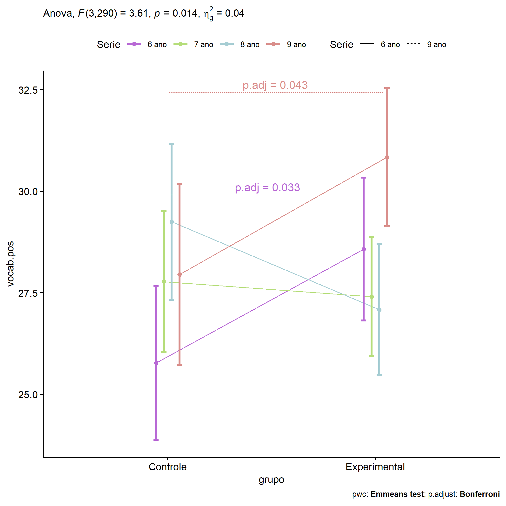<!-- -->

``` r
if (!is.null(plots[["Serie"]]))
  plots[["Serie"]] + ggplot2::scale_color_manual(values = color[["grupo"]])
```

    ## Scale for colour is already present.
    ## Adding another scale for colour, which will replace the existing scale.

    ## Warning: `position_dodge()` requires non-overlapping x intervals

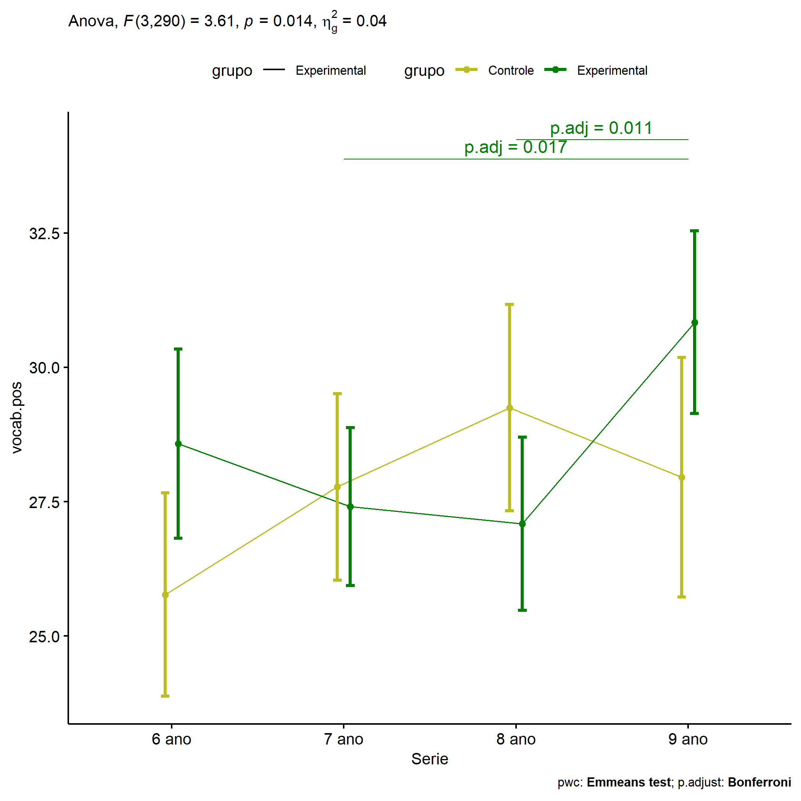<!-- -->

``` r
plots <- twoWayAncovaBoxPlots(
  wdat, "vocab.pos", c("grupo","Serie"), aov, pwcs, covar = "vocab.pre",
  theme = "classic", color = color[["grupo:Serie"]],
  subtitle = which(aov$Effect == "grupo:Serie"))
```

``` r
plots[["grupo:Serie"]] + ggplot2::ylab("Vocabulario") + ggplot2::scale_x_discrete(labels=c('pre', 'pos'))
```

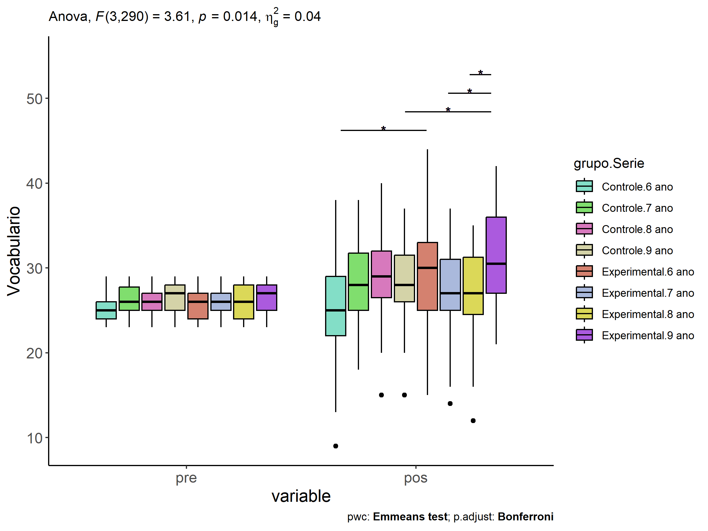<!-- -->

``` r
plots <- twoWayAncovaBoxPlots(
  wdat.long, "vocab", c("grupo","Serie"), aov, pwc.long, pre.post = "time",
  theme = "classic", color = color$prepost)
```

``` r
plots[["grupo:Serie"]] + ggplot2::ylab("Vocabulario")
```

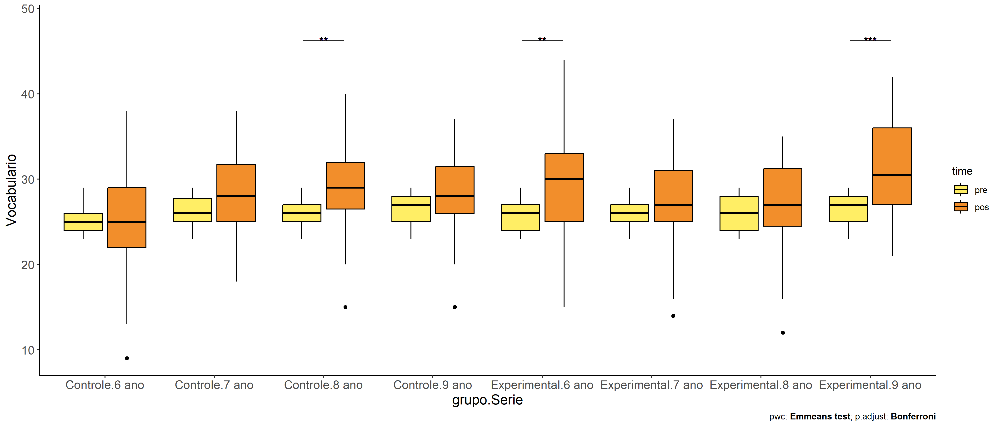<!-- -->

### Checking linearity assumption

``` r
ggscatter(wdat, x = "vocab.pre", y = "vocab.pos", size = 0.5,
          facet.by = c("grupo","Serie"), add = "reg.line")+
  stat_regline_equation(
    aes(label =  paste(..eq.label.., ..rr.label.., sep = "~~~~"))
  )
```

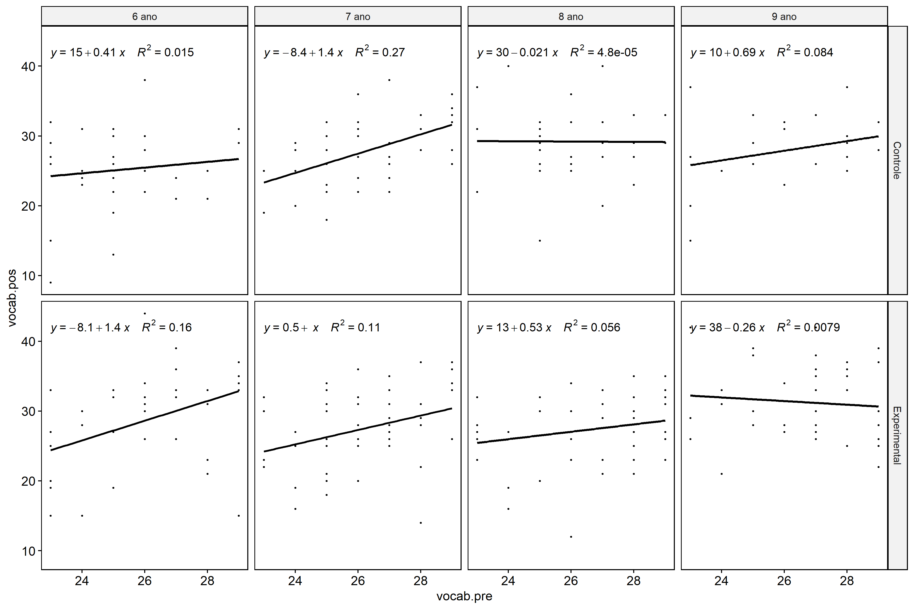<!-- -->

### Checking normality and homogeneity

``` r
res <- augment(lm(vocab.pos ~ vocab.pre + grupo*Serie, data = wdat))
```

``` r
shapiro_test(res$.resid)
```

    ## # A tibble: 1 × 3
    ##   variable   statistic p.value
    ##   <chr>          <dbl>   <dbl>
    ## 1 res$.resid     0.991  0.0704

``` r
levene_test(res, .resid ~ grupo*Serie)
```

    ## # A tibble: 1 × 4
    ##     df1   df2 statistic     p
    ##   <int> <int>     <dbl> <dbl>
    ## 1     7   291      1.02 0.417

# Summary of Results

## Descriptive Statistics

``` r
df <- get.descriptives(ldat[["grupo"]], c(dv.pre, dv.pos), c("grupo"), 
                       include.global = T, symmetry.test = T, normality.test = F)
df <- plyr::rbind.fill(
  df, do.call(plyr::rbind.fill, lapply(lfatores2, FUN = function(f) {
    if (nrow(dat) > 0 && sum(!is.na(unique(dat[[f]]))) > 1)
      get.descriptives(ldat[[paste0("grupo:",f)]], c(dv.pre,dv.pos), c("grupo", f),
                       symmetry.test = T, normality.test = F)
    }))
)
(df <- df[,c(fatores1[fatores1 %in% colnames(df)],"variable",
             colnames(df)[!colnames(df) %in% c(fatores1,"variable")])])
```

    ##           grupo Sexo   Zona Cor.Raca Serie  variable   n   mean median min max    sd    se    ci   iqr symmetry
    ## 1      Controle <NA>   <NA>     <NA>  <NA> vocab.pre 125 25.936   26.0  23  29 1.900 0.170 0.336  2.00      YES
    ## 2  Experimental <NA>   <NA>     <NA>  <NA> vocab.pre 176 26.193   26.0  23  29 1.976 0.149 0.294  3.00      YES
    ## 3          <NA> <NA>   <NA>     <NA>  <NA> vocab.pre 301 26.086   26.0  23  29 1.946 0.112 0.221  3.00      YES
    ## 4      Controle <NA>   <NA>     <NA>  <NA> vocab.pos 125 27.544   28.0   9  40 5.425 0.485 0.960  6.00      YES
    ## 5  Experimental <NA>   <NA>     <NA>  <NA> vocab.pos 176 28.290   28.0  13  44 6.070 0.458 0.903  8.00      YES
    ## 6          <NA> <NA>   <NA>     <NA>  <NA> vocab.pos 301 27.980   28.0   9  44 5.813 0.335 0.659  7.00      YES
    ## 7      Controle    F   <NA>     <NA>  <NA> vocab.pre  75 26.147   26.0  23  29 1.879 0.217 0.432  3.00      YES
    ## 8      Controle    M   <NA>     <NA>  <NA> vocab.pre  52 25.558   25.0  23  29 1.904 0.264 0.530  3.00      YES
    ## 9  Experimental    F   <NA>     <NA>  <NA> vocab.pre  94 26.202   26.5  23  29 1.971 0.203 0.404  3.00      YES
    ## 10 Experimental    M   <NA>     <NA>  <NA> vocab.pre  81 26.160   26.0  23  29 2.009 0.223 0.444  3.00      YES
    ## 11     Controle    F   <NA>     <NA>  <NA> vocab.pos  75 28.293   28.0   9  40 5.169 0.597 1.189  6.00       NO
    ## 12     Controle    M   <NA>     <NA>  <NA> vocab.pos  52 25.788   26.5   7  37 6.421 0.890 1.788  8.00       NO
    ## 13 Experimental    F   <NA>     <NA>  <NA> vocab.pos  94 28.798   29.0  15  44 5.760 0.594 1.180  7.00      YES
    ## 14 Experimental    M   <NA>     <NA>  <NA> vocab.pos  81 27.864   27.0  12  42 6.276 0.697 1.388  7.00      YES
    ## 15     Controle <NA>  Rural     <NA>  <NA> vocab.pre  69 25.870   26.0  23  29 1.932 0.233 0.464  2.00      YES
    ## 16     Controle <NA> Urbana     <NA>  <NA> vocab.pre  22 26.455   26.5  23  29 1.945 0.415 0.862  3.00      YES
    ## 17 Experimental <NA>  Rural     <NA>  <NA> vocab.pre  72 26.236   26.0  23  29 1.835 0.216 0.431  3.00      YES
    ## 18 Experimental <NA> Urbana     <NA>  <NA> vocab.pre  49 26.347   27.0  23  29 2.057 0.294 0.591  3.00      YES
    ## 19     Controle <NA>  Rural     <NA>  <NA> vocab.pos  69 27.565   28.0   9  38 5.733 0.690 1.377  8.00       NO
    ## 20     Controle <NA> Urbana     <NA>  <NA> vocab.pos  22 28.091   28.5  18  40 4.898 1.044 2.172  5.00      YES
    ## 21 Experimental <NA>  Rural     <NA>  <NA> vocab.pos  72 28.556   28.5  15  42 6.223 0.733 1.462  8.00      YES
    ## 22 Experimental <NA> Urbana     <NA>  <NA> vocab.pos  49 28.633   29.0  14  37 5.333 0.762 1.532  8.00       NO
    ## 23     Controle <NA>   <NA>   Branca  <NA> vocab.pre  16 26.438   26.0  24  29 1.632 0.408 0.869  3.00      YES
    ## 24     Controle <NA>   <NA> Indígena  <NA> vocab.pre   8 25.250   24.5  23  29 2.188 0.773 1.829  3.25      YES
    ## 25     Controle <NA>   <NA>    Parda  <NA> vocab.pre  35 25.971   26.0  23  29 1.823 0.308 0.626  2.50      YES
    ## 26 Experimental <NA>   <NA>   Branca  <NA> vocab.pre  22 26.455   27.0  23  29 2.176 0.464 0.965  3.75      YES
    ## 27 Experimental <NA>   <NA>    Parda  <NA> vocab.pre  44 26.159   26.0  23  29 1.976 0.298 0.601  3.25      YES
    ## 28     Controle <NA>   <NA>   Branca  <NA> vocab.pos  16 26.312   26.0  19  37 4.771 1.193 2.542  5.75      YES
    ## 29     Controle <NA>   <NA> Indígena  <NA> vocab.pos   8 29.250   28.5  20  38 5.800 2.051 4.849  5.75      YES
    ## 30     Controle <NA>   <NA>    Parda  <NA> vocab.pos  35 28.343   29.0   8  40 6.624 1.120 2.275  7.00       NO
    ## 31 Experimental <NA>   <NA>   Branca  <NA> vocab.pos  22 25.318   26.5  15  37 7.227 1.541 3.204 12.25      YES
    ## 32 Experimental <NA>   <NA>    Parda  <NA> vocab.pos  44 28.159   28.0  14  42 6.720 1.013 2.043  7.25      YES
    ## 33     Controle <NA>   <NA>     <NA> 6 ano vocab.pre  33 25.061   25.0  23  29 1.767 0.308 0.626  2.00       NO
    ## 34     Controle <NA>   <NA>     <NA> 7 ano vocab.pre  38 26.342   26.0  23  29 1.790 0.290 0.588  2.75      YES
    ## 35     Controle <NA>   <NA>     <NA> 8 ano vocab.pre  31 26.000   26.0  23  29 1.789 0.321 0.656  2.00      YES
    ## 36     Controle <NA>   <NA>     <NA> 9 ano vocab.pre  23 26.348   27.0  23  29 2.102 0.438 0.909  3.00      YES
    ## 37 Experimental <NA>   <NA>     <NA> 6 ano vocab.pre  37 25.865   26.0  23  29 2.043 0.336 0.681  3.00      YES
    ## 38 Experimental <NA>   <NA>     <NA> 7 ano vocab.pre  53 26.151   26.0  23  29 1.692 0.232 0.466  2.00      YES
    ## 39 Experimental <NA>   <NA>     <NA> 8 ano vocab.pre  44 26.091   26.0  23  29 2.250 0.339 0.684  4.00      YES
    ## 40 Experimental <NA>   <NA>     <NA> 9 ano vocab.pre  40 26.700   27.0  23  29 1.911 0.302 0.611  3.00      YES
    ## 41     Controle <NA>   <NA>     <NA> 6 ano vocab.pos  33 25.091   25.0   9  38 5.897 1.027 2.091  7.00       NO
    ## 42     Controle <NA>   <NA>     <NA> 7 ano vocab.pos  38 27.947   28.0  18  38 4.793 0.777 1.575  6.75      YES
    ## 43     Controle <NA>   <NA>     <NA> 8 ano vocab.pos  31 29.194   29.0  15  40 5.388 0.968 1.976  5.50      YES
    ## 44     Controle <NA>   <NA>     <NA> 9 ano vocab.pos  23 28.130   28.0  15  37 4.985 1.039 2.155  5.50      YES
    ## 45 Experimental <NA>   <NA>     <NA> 6 ano vocab.pos  37 28.432   30.0  15  44 7.171 1.179 2.391  8.00      YES
    ## 46 Experimental <NA>   <NA>     <NA> 7 ano vocab.pos  53 27.453   27.0  14  37 5.351 0.735 1.475  6.00      YES
    ## 47 Experimental <NA>   <NA>     <NA> 8 ano vocab.pos  44 27.091   27.0  12  35 5.034 0.759 1.530  6.75       NO
    ## 48 Experimental <NA>   <NA>     <NA> 9 ano vocab.pos  40 31.250   30.5  21  42 5.587 0.883 1.787  9.00      YES
    ##       skewness    kurtosis
    ## 1   0.04195222 -1.06733129
    ## 2  -0.19682471 -1.15841812
    ## 3  -0.09674632 -1.13142746
    ## 4  -0.39556619  0.67743472
    ## 5  -0.25994448 -0.07962878
    ## 6  -0.28604505  0.21438047
    ## 7  -0.10091813 -1.04361566
    ## 8   0.29756028 -1.00145066
    ## 9  -0.12897023 -1.19463616
    ## 10 -0.21741249 -1.17632178
    ## 11 -0.56153900  1.88503818
    ## 12 -0.50444224  0.18939212
    ## 13 -0.21922676  0.12347013
    ## 14 -0.24021192 -0.29207502
    ## 15  0.09741818 -1.07534523
    ## 16 -0.10137293 -1.50634259
    ## 17 -0.19618223 -1.00771568
    ## 18 -0.26363802 -1.35670085
    ## 19 -0.74862597  0.79549730
    ## 20  0.03348927  0.06688508
    ## 21 -0.25247157 -0.34876283
    ## 22 -0.60114373 -0.07269062
    ## 23  0.10418744 -1.34358908
    ## 24  0.43878039 -1.51190062
    ## 25  0.01266173 -1.12438883
    ## 26 -0.32497803 -1.43193436
    ## 27 -0.14524984 -1.16490152
    ## 28  0.30870967 -0.49867160
    ## 29  0.06485833 -1.27466991
    ## 30 -0.93363168  1.40187945
    ## 31 -0.07112879 -1.45389774
    ## 32 -0.19425939 -0.42711331
    ## 33  0.63655065 -0.46887707
    ## 34  0.01746352 -1.03646581
    ## 35 -0.03381151 -0.92086694
    ## 36 -0.38572804 -1.34400594
    ## 37  0.02544593 -1.29671694
    ## 38 -0.04506248 -0.86005238
    ## 39 -0.15845649 -1.51298823
    ## 40 -0.46137377 -0.97802417
    ## 41 -0.56135757  0.50970200
    ## 42 -0.06449323 -0.61678262
    ## 43 -0.19344507  0.32228286
    ## 44 -0.43846350  0.45526633
    ## 45 -0.38662192 -0.52786765
    ## 46 -0.26888137 -0.39214453
    ## 47 -0.68615849  0.35275084
    ## 48  0.10265925 -1.03852492

| grupo        | Sexo | Zona   | Cor.Raca | Serie | variable  |   n |   mean | median | min | max |    sd |    se |    ci |   iqr | symmetry | skewness | kurtosis |
|:-------------|:-----|:-------|:---------|:------|:----------|----:|-------:|-------:|----:|----:|------:|------:|------:|------:|:---------|---------:|---------:|
| Controle     |      |        |          |       | vocab.pre | 125 | 25.936 |   26.0 |  23 |  29 | 1.900 | 0.170 | 0.336 |  2.00 | YES      |    0.042 |   -1.067 |
| Experimental |      |        |          |       | vocab.pre | 176 | 26.193 |   26.0 |  23 |  29 | 1.976 | 0.149 | 0.294 |  3.00 | YES      |   -0.197 |   -1.158 |
|              |      |        |          |       | vocab.pre | 301 | 26.086 |   26.0 |  23 |  29 | 1.946 | 0.112 | 0.221 |  3.00 | YES      |   -0.097 |   -1.131 |
| Controle     |      |        |          |       | vocab.pos | 125 | 27.544 |   28.0 |   9 |  40 | 5.425 | 0.485 | 0.960 |  6.00 | YES      |   -0.396 |    0.677 |
| Experimental |      |        |          |       | vocab.pos | 176 | 28.290 |   28.0 |  13 |  44 | 6.070 | 0.458 | 0.903 |  8.00 | YES      |   -0.260 |   -0.080 |
|              |      |        |          |       | vocab.pos | 301 | 27.980 |   28.0 |   9 |  44 | 5.813 | 0.335 | 0.659 |  7.00 | YES      |   -0.286 |    0.214 |
| Controle     | F    |        |          |       | vocab.pre |  75 | 26.147 |   26.0 |  23 |  29 | 1.879 | 0.217 | 0.432 |  3.00 | YES      |   -0.101 |   -1.044 |
| Controle     | M    |        |          |       | vocab.pre |  52 | 25.558 |   25.0 |  23 |  29 | 1.904 | 0.264 | 0.530 |  3.00 | YES      |    0.298 |   -1.001 |
| Experimental | F    |        |          |       | vocab.pre |  94 | 26.202 |   26.5 |  23 |  29 | 1.971 | 0.203 | 0.404 |  3.00 | YES      |   -0.129 |   -1.195 |
| Experimental | M    |        |          |       | vocab.pre |  81 | 26.160 |   26.0 |  23 |  29 | 2.009 | 0.223 | 0.444 |  3.00 | YES      |   -0.217 |   -1.176 |
| Controle     | F    |        |          |       | vocab.pos |  75 | 28.293 |   28.0 |   9 |  40 | 5.169 | 0.597 | 1.189 |  6.00 | NO       |   -0.562 |    1.885 |
| Controle     | M    |        |          |       | vocab.pos |  52 | 25.788 |   26.5 |   7 |  37 | 6.421 | 0.890 | 1.788 |  8.00 | NO       |   -0.504 |    0.189 |
| Experimental | F    |        |          |       | vocab.pos |  94 | 28.798 |   29.0 |  15 |  44 | 5.760 | 0.594 | 1.180 |  7.00 | YES      |   -0.219 |    0.123 |
| Experimental | M    |        |          |       | vocab.pos |  81 | 27.864 |   27.0 |  12 |  42 | 6.276 | 0.697 | 1.388 |  7.00 | YES      |   -0.240 |   -0.292 |
| Controle     |      | Rural  |          |       | vocab.pre |  69 | 25.870 |   26.0 |  23 |  29 | 1.932 | 0.233 | 0.464 |  2.00 | YES      |    0.097 |   -1.075 |
| Controle     |      | Urbana |          |       | vocab.pre |  22 | 26.455 |   26.5 |  23 |  29 | 1.945 | 0.415 | 0.862 |  3.00 | YES      |   -0.101 |   -1.506 |
| Experimental |      | Rural  |          |       | vocab.pre |  72 | 26.236 |   26.0 |  23 |  29 | 1.835 | 0.216 | 0.431 |  3.00 | YES      |   -0.196 |   -1.008 |
| Experimental |      | Urbana |          |       | vocab.pre |  49 | 26.347 |   27.0 |  23 |  29 | 2.057 | 0.294 | 0.591 |  3.00 | YES      |   -0.264 |   -1.357 |
| Controle     |      | Rural  |          |       | vocab.pos |  69 | 27.565 |   28.0 |   9 |  38 | 5.733 | 0.690 | 1.377 |  8.00 | NO       |   -0.749 |    0.795 |
| Controle     |      | Urbana |          |       | vocab.pos |  22 | 28.091 |   28.5 |  18 |  40 | 4.898 | 1.044 | 2.172 |  5.00 | YES      |    0.033 |    0.067 |
| Experimental |      | Rural  |          |       | vocab.pos |  72 | 28.556 |   28.5 |  15 |  42 | 6.223 | 0.733 | 1.462 |  8.00 | YES      |   -0.252 |   -0.349 |
| Experimental |      | Urbana |          |       | vocab.pos |  49 | 28.633 |   29.0 |  14 |  37 | 5.333 | 0.762 | 1.532 |  8.00 | NO       |   -0.601 |   -0.073 |
| Controle     |      |        | Branca   |       | vocab.pre |  16 | 26.438 |   26.0 |  24 |  29 | 1.632 | 0.408 | 0.869 |  3.00 | YES      |    0.104 |   -1.344 |
| Controle     |      |        | Indígena |       | vocab.pre |   8 | 25.250 |   24.5 |  23 |  29 | 2.188 | 0.773 | 1.829 |  3.25 | YES      |    0.439 |   -1.512 |
| Controle     |      |        | Parda    |       | vocab.pre |  35 | 25.971 |   26.0 |  23 |  29 | 1.823 | 0.308 | 0.626 |  2.50 | YES      |    0.013 |   -1.124 |
| Experimental |      |        | Branca   |       | vocab.pre |  22 | 26.455 |   27.0 |  23 |  29 | 2.176 | 0.464 | 0.965 |  3.75 | YES      |   -0.325 |   -1.432 |
| Experimental |      |        | Parda    |       | vocab.pre |  44 | 26.159 |   26.0 |  23 |  29 | 1.976 | 0.298 | 0.601 |  3.25 | YES      |   -0.145 |   -1.165 |
| Controle     |      |        | Branca   |       | vocab.pos |  16 | 26.312 |   26.0 |  19 |  37 | 4.771 | 1.193 | 2.542 |  5.75 | YES      |    0.309 |   -0.499 |
| Controle     |      |        | Indígena |       | vocab.pos |   8 | 29.250 |   28.5 |  20 |  38 | 5.800 | 2.051 | 4.849 |  5.75 | YES      |    0.065 |   -1.275 |
| Controle     |      |        | Parda    |       | vocab.pos |  35 | 28.343 |   29.0 |   8 |  40 | 6.624 | 1.120 | 2.275 |  7.00 | NO       |   -0.934 |    1.402 |
| Experimental |      |        | Branca   |       | vocab.pos |  22 | 25.318 |   26.5 |  15 |  37 | 7.227 | 1.541 | 3.204 | 12.25 | YES      |   -0.071 |   -1.454 |
| Experimental |      |        | Parda    |       | vocab.pos |  44 | 28.159 |   28.0 |  14 |  42 | 6.720 | 1.013 | 2.043 |  7.25 | YES      |   -0.194 |   -0.427 |
| Controle     |      |        |          | 6 ano | vocab.pre |  33 | 25.061 |   25.0 |  23 |  29 | 1.767 | 0.308 | 0.626 |  2.00 | NO       |    0.637 |   -0.469 |
| Controle     |      |        |          | 7 ano | vocab.pre |  38 | 26.342 |   26.0 |  23 |  29 | 1.790 | 0.290 | 0.588 |  2.75 | YES      |    0.017 |   -1.036 |
| Controle     |      |        |          | 8 ano | vocab.pre |  31 | 26.000 |   26.0 |  23 |  29 | 1.789 | 0.321 | 0.656 |  2.00 | YES      |   -0.034 |   -0.921 |
| Controle     |      |        |          | 9 ano | vocab.pre |  23 | 26.348 |   27.0 |  23 |  29 | 2.102 | 0.438 | 0.909 |  3.00 | YES      |   -0.386 |   -1.344 |
| Experimental |      |        |          | 6 ano | vocab.pre |  37 | 25.865 |   26.0 |  23 |  29 | 2.043 | 0.336 | 0.681 |  3.00 | YES      |    0.025 |   -1.297 |
| Experimental |      |        |          | 7 ano | vocab.pre |  53 | 26.151 |   26.0 |  23 |  29 | 1.692 | 0.232 | 0.466 |  2.00 | YES      |   -0.045 |   -0.860 |
| Experimental |      |        |          | 8 ano | vocab.pre |  44 | 26.091 |   26.0 |  23 |  29 | 2.250 | 0.339 | 0.684 |  4.00 | YES      |   -0.158 |   -1.513 |
| Experimental |      |        |          | 9 ano | vocab.pre |  40 | 26.700 |   27.0 |  23 |  29 | 1.911 | 0.302 | 0.611 |  3.00 | YES      |   -0.461 |   -0.978 |
| Controle     |      |        |          | 6 ano | vocab.pos |  33 | 25.091 |   25.0 |   9 |  38 | 5.897 | 1.027 | 2.091 |  7.00 | NO       |   -0.561 |    0.510 |
| Controle     |      |        |          | 7 ano | vocab.pos |  38 | 27.947 |   28.0 |  18 |  38 | 4.793 | 0.777 | 1.575 |  6.75 | YES      |   -0.064 |   -0.617 |
| Controle     |      |        |          | 8 ano | vocab.pos |  31 | 29.194 |   29.0 |  15 |  40 | 5.388 | 0.968 | 1.976 |  5.50 | YES      |   -0.193 |    0.322 |
| Controle     |      |        |          | 9 ano | vocab.pos |  23 | 28.130 |   28.0 |  15 |  37 | 4.985 | 1.039 | 2.155 |  5.50 | YES      |   -0.438 |    0.455 |
| Experimental |      |        |          | 6 ano | vocab.pos |  37 | 28.432 |   30.0 |  15 |  44 | 7.171 | 1.179 | 2.391 |  8.00 | YES      |   -0.387 |   -0.528 |
| Experimental |      |        |          | 7 ano | vocab.pos |  53 | 27.453 |   27.0 |  14 |  37 | 5.351 | 0.735 | 1.475 |  6.00 | YES      |   -0.269 |   -0.392 |
| Experimental |      |        |          | 8 ano | vocab.pos |  44 | 27.091 |   27.0 |  12 |  35 | 5.034 | 0.759 | 1.530 |  6.75 | NO       |   -0.686 |    0.353 |
| Experimental |      |        |          | 9 ano | vocab.pos |  40 | 31.250 |   30.5 |  21 |  42 | 5.587 | 0.883 | 1.787 |  9.00 | YES      |    0.103 |   -1.039 |

## ANCOVA Table Comparison

``` r
df <- do.call(plyr::rbind.fill, laov)
(df <- df[!duplicated(df$Effect),])
```

    ##            Effect DFn DFd          F        p p<.05      ges DFn' DFd'     F'       p' p<.05'     ges'
    ## 1           grupo   1 298  0.7000000 4.04e-01       2.00e-03    1  308  0.554 4.57e-01        0.002000
    ## 2       vocab.pre   1 298 20.1540000 1.02e-05     * 6.30e-02    1  308 15.575 9.83e-05      * 0.048000
    ## 4      grupo:Sexo   1 297  0.7120000 4.00e-01       2.00e-03    1  306  0.307 5.80e-01        0.001000
    ## 5            Sexo   1 297  4.2700000 4.00e-02     * 1.40e-02    1  306  2.378 1.24e-01        0.008000
    ## 8      grupo:Zona   1 207  0.0005960 9.81e-01       2.88e-06    1  211  0.039 8.43e-01        0.000186
    ## 10           Zona   1 207  0.0000147 9.97e-01       7.10e-08    1  211  0.065 7.99e-01        0.000309
    ## 11       Cor.Raca   2 119  2.9080000 5.80e-02       4.70e-02    2  119  2.908 5.80e-02        0.047000
    ## 13 grupo:Cor.Raca   1 119  0.0690000 7.93e-01       5.83e-04    1  119  0.069 7.93e-01        0.000583
    ## 16    grupo:Serie   3 290  3.6060000 1.40e-02     * 3.60e-02    3  302  1.740 1.59e-01        0.017000
    ## 17          Serie   3 290  2.6450000 4.90e-02     * 2.70e-02    3  302  1.950 1.22e-01        0.019000

|     | Effect         | DFn | DFd |      F |     p | p\<.05 |   ges | DFn’ | DFd’ |     F’ |    p’ | p\<.05’ |  ges’ |
|:----|:---------------|----:|----:|-------:|------:|:-------|------:|-----:|-----:|-------:|------:|:--------|------:|
| 1   | grupo          |   1 | 298 |  0.700 | 0.404 |        | 0.002 |    1 |  308 |  0.554 | 0.457 |         | 0.002 |
| 2   | vocab.pre      |   1 | 298 | 20.154 | 0.000 | \*     | 0.063 |    1 |  308 | 15.575 | 0.000 | \*      | 0.048 |
| 4   | grupo:Sexo     |   1 | 297 |  0.712 | 0.400 |        | 0.002 |    1 |  306 |  0.307 | 0.580 |         | 0.001 |
| 5   | Sexo           |   1 | 297 |  4.270 | 0.040 | \*     | 0.014 |    1 |  306 |  2.378 | 0.124 |         | 0.008 |
| 8   | grupo:Zona     |   1 | 207 |  0.001 | 0.981 |        | 0.000 |    1 |  211 |  0.039 | 0.843 |         | 0.000 |
| 10  | Zona           |   1 | 207 |  0.000 | 0.997 |        | 0.000 |    1 |  211 |  0.065 | 0.799 |         | 0.000 |
| 11  | Cor.Raca       |   2 | 119 |  2.908 | 0.058 |        | 0.047 |    2 |  119 |  2.908 | 0.058 |         | 0.047 |
| 13  | grupo:Cor.Raca |   1 | 119 |  0.069 | 0.793 |        | 0.001 |    1 |  119 |  0.069 | 0.793 |         | 0.001 |
| 16  | grupo:Serie    |   3 | 290 |  3.606 | 0.014 | \*     | 0.036 |    3 |  302 |  1.740 | 0.159 |         | 0.017 |
| 17  | Serie          |   3 | 290 |  2.645 | 0.049 | \*     | 0.027 |    3 |  302 |  1.950 | 0.122 |         | 0.019 |

## PairWise Table Comparison

``` r
df <- do.call(plyr::rbind.fill, lpwc)
df <- df[,c(names(lfatores), names(df)[!names(df) %in% c(names(lfatores),"term",".y.")])]
```

| grupo        | Sexo | Zona   | Cor.Raca | Serie | group1   | group2       |  df | statistic |     p | p.adj | p.adj.signif | df’ | statistic’ |    p’ | p.adj’ | p.adj.signif’ |
|:-------------|:-----|:-------|:---------|:------|:---------|:-------------|----:|----------:|------:|------:|:-------------|----:|-----------:|------:|-------:|:--------------|
| Controle     |      |        |          |       | pre      | pos          | 598 |    -2.934 | 0.003 | 0.003 | \*\*         | 618 |     -1.813 | 0.070 |  0.070 | ns            |
| Experimental |      |        |          |       | pre      | pos          | 598 |    -4.539 | 0.000 | 0.000 | \*\*\*\*     | 618 |     -3.075 | 0.002 |  0.002 | \*\*          |
|              |      |        |          |       | Controle | Experimental | 298 |    -0.836 | 0.404 | 0.404 | ns           | 308 |     -0.744 | 0.457 |  0.457 | ns            |
| Controle     | F    |        |          |       | pre      | pos          | 596 |    -3.000 | 0.003 | 0.003 | \*\*         | 614 |     -2.151 | 0.032 |  0.032 | \*            |
| Controle     | M    |        |          |       | pre      | pos          | 596 |    -0.268 | 0.788 | 0.788 | ns           | 614 |     -0.247 | 0.805 |  0.805 | ns            |
| Controle     |      |        |          |       | F        | M            | 297 |     1.973 | 0.049 | 0.049 | \*           | 306 |      1.409 | 0.160 |  0.160 | ns            |
| Experimental | F    |        |          |       | pre      | pos          | 596 |    -4.061 | 0.000 | 0.000 | \*\*\*\*     | 614 |     -2.777 | 0.006 |  0.006 | \*\*          |
| Experimental | M    |        |          |       | pre      | pos          | 596 |    -2.474 | 0.014 | 0.014 | \*           | 614 |     -1.540 | 0.124 |  0.124 | ns            |
| Experimental |      |        |          |       | F        | M            | 297 |     1.045 | 0.297 | 0.297 | ns           | 306 |      0.839 | 0.402 |  0.402 | ns            |
|              | F    |        |          |       | Controle | Experimental | 297 |    -0.523 | 0.601 | 0.601 | ns           | 306 |     -0.279 | 0.781 |  0.781 | ns            |
|              | M    |        |          |       | Controle | Experimental | 297 |    -1.569 | 0.118 | 0.118 | ns           | 306 |     -0.969 | 0.333 |  0.333 | ns            |
| Controle     |      |        |          |       | Rural    | Urbana       | 207 |    -0.017 | 0.986 | 0.986 | ns           | 211 |      0.312 | 0.755 |  0.755 | ns            |
| Controle     |      | Rural  |          |       | pre      | pos          | 416 |    -2.326 | 0.021 | 0.021 | \*           | 424 |     -1.818 | 0.070 |  0.070 | ns            |
| Controle     |      | Urbana |          |       | pre      | pos          | 416 |    -1.267 | 0.206 | 0.206 | ns           | 424 |     -0.647 | 0.518 |  0.518 | ns            |
| Experimental |      |        |          |       | Rural    | Urbana       | 207 |     0.018 | 0.986 | 0.986 | ns           | 211 |      0.083 | 0.934 |  0.934 | ns            |
| Experimental |      | Rural  |          |       | pre      | pos          | 416 |    -3.250 | 0.001 | 0.001 | \*\*         | 424 |     -2.780 | 0.006 |  0.006 | \*\*          |
| Experimental |      | Urbana |          |       | pre      | pos          | 416 |    -2.642 | 0.009 | 0.009 | \*\*         | 424 |     -2.173 | 0.030 |  0.030 | \*            |
|              |      | Rural  |          |       | Controle | Experimental | 207 |    -0.726 | 0.469 | 0.469 | ns           | 211 |     -0.773 | 0.440 |  0.440 | ns            |
|              |      | Urbana |          |       | Controle | Experimental | 207 |    -0.449 | 0.654 | 0.654 | ns           | 211 |     -0.753 | 0.452 |  0.452 | ns            |
| Controle     |      |        | Branca   |       | pre      | pos          | 240 |     0.073 | 0.942 | 0.942 | ns           | 240 |      0.073 | 0.942 |  0.942 | ns            |
| Controle     |      |        | Indígena |       | pre      | pos          | 240 |    -1.662 | 0.098 | 0.098 | ns           | 240 |     -1.662 | 0.098 |  0.098 | ns            |
| Controle     |      |        |          |       | Branca   | Indígena     | 119 |    -1.421 | 0.158 | 0.474 | ns           | 119 |     -1.421 | 0.158 |  0.474 | ns            |
| Controle     |      |        |          |       | Branca   | Parda        | 119 |    -1.262 | 0.209 | 0.628 | ns           | 119 |     -1.262 | 0.209 |  0.628 | ns            |
| Controle     |      |        |          |       | Indígena | Parda        | 119 |     0.607 | 0.545 | 1.000 | ns           | 119 |      0.607 | 0.545 |  1.000 | ns            |
| Controle     |      |        | Parda    |       | pre      | pos          | 240 |    -2.061 | 0.040 | 0.040 | \*           | 240 |     -2.061 | 0.040 |  0.040 | \*            |
| Experimental |      |        | Branca   |       | pre      | pos          | 240 |     0.783 | 0.434 | 0.434 | ns           | 240 |      0.783 | 0.434 |  0.434 | ns            |
| Experimental |      |        | Indígena |       | pre      | pos          |     |           |       |       |              |     |            |       |        |               |
| Experimental |      |        |          |       | Branca   | Indígena     |     |           |       |       |              |     |            |       |        |               |
| Experimental |      |        |          |       | Branca   | Parda        | 119 |    -1.863 | 0.065 | 0.065 | ns           | 119 |     -1.863 | 0.065 |  0.065 | ns            |
| Experimental |      |        |          |       | Indígena | Parda        |     |           |       |       |              |     |            |       |        |               |
| Experimental |      |        | Parda    |       | pre      | pos          | 240 |    -1.949 | 0.052 | 0.052 | ns           | 240 |     -1.949 | 0.052 |  0.052 | ns            |
|              |      |        | Branca   |       | Controle | Experimental | 119 |     0.484 | 0.629 | 0.629 | ns           | 119 |      0.484 | 0.629 |  0.629 | ns            |
|              |      |        | Indígena |       | Controle | Experimental |     |           |       |       |              |     |            |       |        |               |
|              |      |        | Parda    |       | Controle | Experimental | 119 |     0.238 | 0.813 | 0.813 | ns           | 119 |      0.238 | 0.813 |  0.813 | ns            |
| Controle     |      |        |          | 6 ano | pre      | pos          | 582 |    -0.030 | 0.976 | 0.976 | ns           | 606 |     -0.026 | 0.979 |  0.979 | ns            |
| Controle     |      |        |          | 7 ano | pre      | pos          | 582 |    -1.680 | 0.094 | 0.094 | ns           | 606 |     -1.082 | 0.280 |  0.280 | ns            |
| Controle     |      |        |          | 8 ano | pre      | pos          | 582 |    -3.018 | 0.003 | 0.003 | \*\*         | 606 |     -1.699 | 0.090 |  0.090 | ns            |
| Controle     |      |        |          | 9 ano | pre      | pos          | 582 |    -1.451 | 0.147 | 0.147 | ns           | 606 |     -0.858 | 0.391 |  0.391 | ns            |
| Controle     |      |        |          |       | 6 ano    | 7 ano        | 290 |    -1.529 | 0.127 | 0.764 | ns           | 302 |     -1.036 | 0.301 |  1.000 | ns            |
| Controle     |      |        |          |       | 6 ano    | 8 ano        | 290 |    -2.543 | 0.012 | 0.069 | ns           | 302 |     -1.479 | 0.140 |  0.841 | ns            |
| Controle     |      |        |          |       | 6 ano    | 9 ano        | 290 |    -1.464 | 0.144 | 0.866 | ns           | 302 |     -0.946 | 0.345 |  1.000 | ns            |
| Controle     |      |        |          |       | 7 ano    | 8 ano        | 290 |    -1.121 | 0.263 | 1.000 | ns           | 302 |     -0.503 | 0.615 |  1.000 | ns            |
| Controle     |      |        |          |       | 7 ano    | 9 ano        | 290 |    -0.125 | 0.901 | 1.000 | ns           | 302 |     -0.034 | 0.973 |  1.000 | ns            |
| Controle     |      |        |          |       | 8 ano    | 9 ano        | 290 |     0.866 | 0.387 | 1.000 | ns           | 302 |      0.411 | 0.681 |  1.000 | ns            |
| Experimental |      |        |          | 6 ano | pre      | pos          | 582 |    -2.651 | 0.008 | 0.008 | \*\*         | 606 |     -1.282 | 0.200 |  0.200 | ns            |
| Experimental |      |        |          | 7 ano | pre      | pos          | 582 |    -1.609 | 0.108 | 0.108 | ns           | 606 |     -1.083 | 0.279 |  0.279 | ns            |
| Experimental |      |        |          | 8 ano | pre      | pos          | 582 |    -1.126 | 0.261 | 0.261 | ns           | 606 |     -0.266 | 0.791 |  0.791 | ns            |
| Experimental |      |        |          | 9 ano | pre      | pos          | 582 |    -4.885 | 0.000 | 0.000 | \*\*\*\*     | 606 |     -3.729 | 0.000 |  0.000 | \*\*\*        |
| Experimental |      |        |          |       | 6 ano    | 7 ano        | 290 |     1.005 | 0.316 | 1.000 | ns           | 302 |      0.270 | 0.787 |  1.000 | ns            |
| Experimental |      |        |          |       | 6 ano    | 8 ano        | 290 |     1.231 | 0.219 | 1.000 | ns           | 302 |      0.777 | 0.438 |  1.000 | ns            |
| Experimental |      |        |          |       | 6 ano    | 9 ano        | 290 |    -1.814 | 0.071 | 0.424 | ns           | 302 |     -1.936 | 0.054 |  0.323 | ns            |
| Experimental |      |        |          |       | 7 ano    | 8 ano        | 290 |     0.291 | 0.772 | 1.000 | ns           | 302 |      0.557 | 0.578 |  1.000 | ns            |
| Experimental |      |        |          |       | 7 ano    | 9 ano        | 290 |    -3.007 | 0.003 | 0.017 | \*           | 302 |     -2.353 | 0.019 |  0.116 | ns            |
| Experimental |      |        |          |       | 8 ano    | 9 ano        | 290 |    -3.152 | 0.002 | 0.011 | \*           | 302 |     -2.792 | 0.006 |  0.033 | \*            |
|              |      |        |          | 6 ano | Controle | Experimental | 290 |    -2.146 | 0.033 | 0.033 | \*           | 302 |     -1.128 | 0.260 |  0.260 | ns            |
|              |      |        |          | 7 ano | Controle | Experimental | 290 |     0.318 | 0.751 | 0.751 | ns           | 302 |      0.175 | 0.861 |  0.861 | ns            |
|              |      |        |          | 8 ano | Controle | Experimental | 290 |     1.699 | 0.090 | 0.090 | ns           | 302 |      1.173 | 0.242 |  0.242 | ns            |
|              |      |        |          | 9 ano | Controle | Experimental | 290 |    -2.028 | 0.043 | 0.043 | \*           | 302 |     -1.718 | 0.087 |  0.087 | ns            |

## EMMS Table Comparison

``` r
df <- do.call(plyr::rbind.fill, lemms)
df[["N-N'"]] <- df[["N"]] - df[["N'"]]
df <- df[,c(names(lfatores), names(df)[!names(df) %in% names(lfatores)])]
```

| grupo        | Sexo | Zona   | Cor.Raca | Serie |   N | M (pre) | SE (pre) | M (unadj) | SE (unadj) | M (adj) | SE (adj) |  N’ | M (pre)’ | SE (pre)’ | M (unadj)’ | SE (unadj)’ | M (adj)’ | SE (adj)’ | N-N’ |
|:-------------|:-----|:-------|:---------|:------|----:|--------:|---------:|----------:|-----------:|--------:|---------:|----:|---------:|----------:|-----------:|------------:|---------:|----------:|-----:|
| Controle     |      |        |          |       | 125 |  25.936 |    0.170 |    27.544 |      0.485 |  27.657 |    0.505 | 129 |   25.922 |     0.167 |     27.000 |       0.543 |   27.126 |     0.557 |   -4 |
| Experimental |      |        |          |       | 176 |  26.193 |    0.149 |    28.290 |      0.458 |  28.209 |    0.425 | 182 |   26.220 |     0.148 |     27.758 |       0.494 |   27.669 |     0.469 |   -6 |
| Controle     | F    |        |          |       |  75 |  26.147 |    0.217 |    28.293 |      0.597 |  28.229 |    0.656 |  77 |   26.169 |     0.212 |     27.818 |       0.671 |   27.768 |     0.719 |   -2 |
| Controle     | M    |        |          |       |  52 |  25.558 |    0.264 |    25.788 |      0.890 |  26.196 |    0.793 |  52 |   25.558 |     0.264 |     25.788 |       0.890 |   26.164 |     0.880 |    0 |
| Experimental | F    |        |          |       |  94 |  26.202 |    0.203 |    28.798 |      0.594 |  28.689 |    0.587 |  98 |   26.265 |     0.199 |     28.153 |       0.655 |   28.035 |     0.638 |   -4 |
| Experimental | M    |        |          |       |  81 |  26.160 |    0.223 |    27.864 |      0.697 |  27.789 |    0.632 |  84 |   26.167 |     0.221 |     27.298 |       0.750 |   27.249 |     0.688 |   -3 |
| Controle     |      | Rural  |          |       |  69 |  25.870 |    0.233 |    27.565 |      0.690 |  27.819 |    0.666 |  70 |   25.886 |     0.230 |     27.286 |       0.735 |   27.522 |     0.714 |   -1 |
| Controle     |      | Urbana |          |       |  22 |  26.455 |    0.415 |    28.091 |      1.044 |  27.842 |    1.176 |  23 |   26.304 |     0.424 |     27.174 |       1.355 |   27.075 |     1.242 |   -1 |
| Experimental |      | Rural  |          |       |  72 |  26.236 |    0.216 |    28.556 |      0.733 |  28.495 |    0.649 |  73 |   26.274 |     0.217 |     28.370 |       0.747 |   28.295 |     0.697 |   -1 |
| Experimental |      | Urbana |          |       |  49 |  26.347 |    0.294 |    28.633 |      0.762 |  28.476 |    0.788 |  50 |   26.400 |     0.293 |     28.380 |       0.788 |   28.204 |     0.843 |   -1 |
| Controle     |      |        | Branca   |       |  16 |  26.438 |    0.408 |    26.312 |      1.193 |  26.059 |    1.588 |  16 |   26.438 |     0.408 |     26.312 |       1.193 |   26.059 |     1.588 |    0 |
| Controle     |      |        | Indígena |       |   8 |  25.250 |    0.773 |    29.250 |      2.051 |  29.995 |    2.258 |   8 |   25.250 |     0.773 |     29.250 |       2.051 |   29.995 |     2.258 |    0 |
| Controle     |      |        | Parda    |       |  35 |  25.971 |    0.308 |    28.343 |      1.120 |  28.481 |    1.073 |  35 |   25.971 |     0.308 |     28.343 |       1.120 |   28.481 |     1.073 |    0 |
| Experimental |      |        | Branca   |       |  22 |  26.455 |    0.464 |    25.318 |      1.541 |  25.050 |    1.356 |  22 |   26.455 |     0.464 |     25.318 |       1.541 |   25.050 |     1.356 |    0 |
| Experimental |      |        | Parda    |       |  44 |  26.159 |    0.298 |    28.159 |      1.013 |  28.140 |    0.956 |  44 |   26.159 |     0.298 |     28.159 |       1.013 |   28.140 |     0.956 |    0 |
| Controle     |      |        |          | 6 ano |  33 |  25.061 |    0.308 |    25.091 |      1.027 |  25.773 |    0.960 |  33 |   25.061 |     0.308 |     25.091 |       1.027 |   25.756 |     1.107 |    0 |
| Controle     |      |        |          | 7 ano |  38 |  26.342 |    0.290 |    27.947 |      0.777 |  27.775 |    0.882 |  39 |   26.256 |     0.296 |     27.410 |       0.928 |   27.307 |     1.003 |   -1 |
| Controle     |      |        |          | 8 ano |  31 |  26.000 |    0.321 |    29.194 |      0.968 |  29.249 |    0.975 |  33 |   26.061 |     0.304 |     28.030 |       1.220 |   28.053 |     1.090 |   -2 |
| Controle     |      |        |          | 9 ano |  23 |  26.348 |    0.438 |    28.130 |      1.039 |  27.954 |    1.133 |  24 |   26.375 |     0.421 |     27.542 |       1.156 |   27.363 |     1.279 |   -1 |
| Experimental |      |        |          | 6 ano |  37 |  25.865 |    0.336 |    28.432 |      1.179 |  28.578 |    0.893 |  40 |   26.050 |     0.328 |     27.400 |       1.236 |   27.430 |     0.990 |   -3 |
| Experimental |      |        |          | 7 ano |  53 |  26.151 |    0.232 |    27.453 |      0.735 |  27.408 |    0.746 |  54 |   26.093 |     0.235 |     27.074 |       0.815 |   27.077 |     0.852 |   -1 |
| Experimental |      |        |          | 8 ano |  44 |  26.091 |    0.339 |    27.091 |      0.759 |  27.086 |    0.819 |  46 |   26.152 |     0.330 |     26.413 |       0.873 |   26.377 |     0.923 |   -2 |
| Experimental |      |        |          | 9 ano |  40 |  26.700 |    0.302 |    31.250 |      0.883 |  30.839 |    0.865 |  42 |   26.619 |     0.301 |     30.452 |       1.009 |   30.117 |     0.971 |   -2 |
