ANCOVA in Vocabulario (Vocabulario)
================
Geiser C. Challco <geiser@alumni.usp.br>

- [Descriptive Statistics of Initial
  Data](#descriptive-statistics-of-initial-data)
- [ANCOVA and Pairwise for one factor:
  **grupo**](#ancova-and-pairwise-for-one-factor-grupo)
  - [Without remove non-normal data](#without-remove-non-normal-data)
  - [Computing ANCOVA and PairWise After removing non-normal data
    (OK)](#computing-ancova-and-pairwise-after-removing-non-normal-data-ok)
    - [Plots for ancova](#plots-for-ancova)
    - [Checking linearity assumption](#checking-linearity-assumption)
    - [Checking normality and
      homogeneity](#checking-normality-and-homogeneity)
- [ANCOVA and Pairwise for two factors
  **grupo:Sexo**](#ancova-and-pairwise-for-two-factors-gruposexo)
  - [Without remove non-normal data](#without-remove-non-normal-data-1)
  - [Computing ANCOVA and PairWise After removing non-normal data
    (OK)](#computing-ancova-and-pairwise-after-removing-non-normal-data-ok-1)
    - [Plots for ancova](#plots-for-ancova-1)
    - [Checking linearity assumption](#checking-linearity-assumption-1)
    - [Checking normality and
      homogeneity](#checking-normality-and-homogeneity-1)
- [ANCOVA and Pairwise for two factors
  **grupo:Zona**](#ancova-and-pairwise-for-two-factors-grupozona)
  - [Without remove non-normal data](#without-remove-non-normal-data-2)
  - [Computing ANCOVA and PairWise After removing non-normal data
    (OK)](#computing-ancova-and-pairwise-after-removing-non-normal-data-ok-2)
    - [Plots for ancova](#plots-for-ancova-2)
    - [Checking linearity assumption](#checking-linearity-assumption-2)
    - [Checking normality and
      homogeneity](#checking-normality-and-homogeneity-2)
- [ANCOVA and Pairwise for two factors
  **grupo:Cor.Raca**](#ancova-and-pairwise-for-two-factors-grupocorraca)
  - [Without remove non-normal data](#without-remove-non-normal-data-3)
  - [Computing ANCOVA and PairWise After removing non-normal data
    (OK)](#computing-ancova-and-pairwise-after-removing-non-normal-data-ok-3)
    - [Plots for ancova](#plots-for-ancova-3)
    - [Checking linearity assumption](#checking-linearity-assumption-3)
    - [Checking normality and
      homogeneity](#checking-normality-and-homogeneity-3)
- [ANCOVA and Pairwise for two factors
  **grupo:Serie**](#ancova-and-pairwise-for-two-factors-gruposerie)
  - [Without remove non-normal data](#without-remove-non-normal-data-4)
  - [Computing ANCOVA and PairWise After removing non-normal data
    (OK)](#computing-ancova-and-pairwise-after-removing-non-normal-data-ok-4)
    - [Plots for ancova](#plots-for-ancova-4)
    - [Checking linearity assumption](#checking-linearity-assumption-4)
    - [Checking normality and
      homogeneity](#checking-normality-and-homogeneity-4)
- [Summary of Results](#summary-of-results)
  - [Descriptive Statistics](#descriptive-statistics)
  - [ANCOVA Table Comparison](#ancova-table-comparison)
  - [PairWise Table Comparison](#pairwise-table-comparison)
  - [EMMS Table Comparison](#emms-table-comparison)

**NOTE**:

- Teste ANCOVA para determinar se houve diferenças significativas no
  Vocabulario (medido usando pre- e pos-testes).
- ANCOVA test to determine whether there were significant differences in
  Vocabulario (measured using pre- and post-tests).

# Descriptive Statistics of Initial Data

``` r
df <- get.descriptives(dat, c(dv.pre, dv.pos), c("grupo"), 
                       include.global = T, symmetry.test = T, normality.test = F)
df <- plyr::rbind.fill(
  df, do.call(plyr::rbind.fill, lapply(lfatores2, FUN = function(f) {
    if (nrow(dat) > 0 && sum(!is.na(unique(dat[[f]]))) > 1)
      get.descriptives(dat, c(dv.pre,dv.pos), c("grupo", f),
                       symmetry.test = T, normality.test = F)
    }))
)
(df <- df[,c(fatores1[fatores1 %in% colnames(df)],"variable",
             colnames(df)[!colnames(df) %in% c(fatores1,"variable")])])
```

    ##           grupo Sexo   Zona Cor.Raca Serie  variable   n   mean median min max    sd    se    ci  iqr symmetry
    ## 1      Controle <NA>   <NA>     <NA>  <NA> vocab.pre  91 32.253   32.0  30  34 1.473 0.154 0.307 3.00      YES
    ## 2  Experimental <NA>   <NA>     <NA>  <NA> vocab.pre 158 31.759   32.0  30  34 1.403 0.112 0.220 3.00      YES
    ## 3          <NA> <NA>   <NA>     <NA>  <NA> vocab.pre 249 31.940   32.0  30  34 1.445 0.092 0.180 2.00      YES
    ## 4      Controle <NA>   <NA>     <NA>  <NA> vocab.pos  91 33.879   34.0  12  44 5.228 0.548 1.089 6.00       NO
    ## 5  Experimental <NA>   <NA>     <NA>  <NA> vocab.pos 158 31.190   32.0   1  45 6.389 0.508 1.004 6.00       NO
    ## 6          <NA> <NA>   <NA>     <NA>  <NA> vocab.pos 249 32.173   33.0   1  45 6.119 0.388 0.764 7.00       NO
    ## 7      Controle    F   <NA>     <NA>  <NA> vocab.pre  47 32.277   32.0  30  34 1.378 0.201 0.405 2.50      YES
    ## 8      Controle    M   <NA>     <NA>  <NA> vocab.pre  44 32.227   32.5  30  34 1.583 0.239 0.481 3.00      YES
    ## 9  Experimental    F   <NA>     <NA>  <NA> vocab.pre  80 31.812   32.0  30  34 1.351 0.151 0.301 2.00      YES
    ## 10 Experimental    M   <NA>     <NA>  <NA> vocab.pre  78 31.705   31.5  30  34 1.460 0.165 0.329 3.00      YES
    ## 11     Controle    F   <NA>     <NA>  <NA> vocab.pos  47 33.915   34.0  25  44 4.201 0.613 1.233 6.00      YES
    ## 12     Controle    M   <NA>     <NA>  <NA> vocab.pos  44 33.841   34.0  12  42 6.191 0.933 1.882 6.50       NO
    ## 13 Experimental    F   <NA>     <NA>  <NA> vocab.pos  80 32.638   33.0  12  45 5.309 0.594 1.181 6.25       NO
    ## 14 Experimental    M   <NA>     <NA>  <NA> vocab.pos  78 29.705   31.0   1  40 7.064 0.800 1.593 7.00       NO
    ## 15     Controle <NA>  Rural     <NA>  <NA> vocab.pre  48 31.917   32.0  30  34 1.514 0.218 0.439 3.00      YES
    ## 16     Controle <NA> Urbana     <NA>  <NA> vocab.pre  21 32.381   33.0  30  34 1.431 0.312 0.651 3.00      YES
    ## 17     Controle <NA>   <NA>     <NA>  <NA> vocab.pre  22 32.864   33.0  30  34 1.246 0.266 0.552 2.00       NO
    ## 18 Experimental <NA>  Rural     <NA>  <NA> vocab.pre  64 31.688   31.5  30  34 1.468 0.183 0.367 3.00      YES
    ## 19 Experimental <NA> Urbana     <NA>  <NA> vocab.pre  36 31.944   32.0  30  34 1.585 0.264 0.536 3.00      YES
    ## 20 Experimental <NA>   <NA>     <NA>  <NA> vocab.pre  58 31.724   32.0  30  34 1.211 0.159 0.318 2.00      YES
    ## 21     Controle <NA>  Rural     <NA>  <NA> vocab.pos  48 34.875   34.0  24  44 4.639 0.670 1.347 6.50      YES
    ## 22     Controle <NA> Urbana     <NA>  <NA> vocab.pos  21 32.667   32.0  12  42 5.927 1.293 2.698 5.00       NO
    ## 23     Controle <NA>   <NA>     <NA>  <NA> vocab.pos  22 32.864   33.5  15  40 5.540 1.181 2.456 4.50       NO
    ## 24 Experimental <NA>  Rural     <NA>  <NA> vocab.pos  64 30.609   31.0   1  40 6.306 0.788 1.575 7.00       NO
    ## 25 Experimental <NA> Urbana     <NA>  <NA> vocab.pos  36 31.861   32.5  14  39 5.910 0.985 2.000 7.25       NO
    ## 26 Experimental <NA>   <NA>     <NA>  <NA> vocab.pos  58 31.414   32.0   3  45 6.806 0.894 1.789 6.00       NO
    ## 27     Controle <NA>   <NA>   Branca  <NA> vocab.pre  13 32.462   33.0  30  34 1.330 0.369 0.804 1.00       NO
    ## 28     Controle <NA>   <NA> Indígena  <NA> vocab.pre   2 33.500   33.5  33  34 0.707 0.500 6.353 0.50 few data
    ## 29     Controle <NA>   <NA>    Parda  <NA> vocab.pre  33 32.394   33.0  30  34 1.345 0.234 0.477 3.00      YES
    ## 30     Controle <NA>   <NA>     <NA>  <NA> vocab.pre  43 32.023   32.0  30  34 1.611 0.246 0.496 4.00      YES
    ## 31 Experimental <NA>   <NA>   Branca  <NA> vocab.pre  12 32.000   32.0  30  34 1.348 0.389 0.857 2.00      YES
    ## 32 Experimental <NA>   <NA> Indígena  <NA> vocab.pre   5 32.400   32.0  31  34 1.517 0.678 1.883 3.00 few data
    ## 33 Experimental <NA>   <NA>    Parda  <NA> vocab.pre  45 31.556   31.0  30  34 1.455 0.217 0.437 3.00       NO
    ## 34 Experimental <NA>   <NA>     <NA>  <NA> vocab.pre  96 31.792   32.0  30  34 1.383 0.141 0.280 3.00      YES
    ## 35     Controle <NA>   <NA>   Branca  <NA> vocab.pos  13 35.154   35.0  27  41 3.848 1.067 2.325 3.00      YES
    ## 36     Controle <NA>   <NA> Indígena  <NA> vocab.pos   2 38.000   38.0  38  38 0.000 0.000 0.000 0.00 few data
    ## 37     Controle <NA>   <NA>    Parda  <NA> vocab.pos  33 34.152   34.0  15  42 5.106 0.889 1.810 5.00       NO
    ## 38     Controle <NA>   <NA>     <NA>  <NA> vocab.pos  43 33.093   33.0  12  44 5.698 0.869 1.754 7.00       NO
    ## 39 Experimental <NA>   <NA>   Branca  <NA> vocab.pos  12 31.667   30.5  24  40 5.416 1.563 3.441 7.25      YES
    ## 40 Experimental <NA>   <NA> Indígena  <NA> vocab.pos   5 34.000   34.0  32  36 1.581 0.707 1.963 2.00      YES
    ## 41 Experimental <NA>   <NA>    Parda  <NA> vocab.pos  45 29.644   31.0   1  45 8.236 1.228 2.474 7.00       NO
    ## 42 Experimental <NA>   <NA>     <NA>  <NA> vocab.pos  96 31.708   33.0  12  40 5.540 0.565 1.123 6.25       NO
    ## 43     Controle <NA>   <NA>     <NA> 6 ano vocab.pre  19 31.895   32.0  30  34 1.663 0.382 0.802 3.50      YES
    ## 44     Controle <NA>   <NA>     <NA> 7 ano vocab.pre  23 32.261   32.0  30  34 1.544 0.322 0.668 3.00      YES
    ## 45     Controle <NA>   <NA>     <NA> 8 ano vocab.pre  18 32.278   32.5  30  34 1.526 0.360 0.759 3.00      YES
    ## 46     Controle <NA>   <NA>     <NA> 9 ano vocab.pre  31 32.452   33.0  30  34 1.287 0.231 0.472 1.00       NO
    ## 47 Experimental <NA>   <NA>     <NA> 6 ano vocab.pre  28 31.571   31.5  30  34 1.317 0.249 0.511 3.00      YES
    ## 48 Experimental <NA>   <NA>     <NA> 7 ano vocab.pre  44 31.750   32.0  30  34 1.512 0.228 0.460 3.00      YES
    ## 49 Experimental <NA>   <NA>     <NA> 8 ano vocab.pre  37 31.757   32.0  30  34 1.362 0.224 0.454 2.00      YES
    ## 50 Experimental <NA>   <NA>     <NA> 9 ano vocab.pre  49 31.878   32.0  30  34 1.409 0.201 0.405 2.00      YES
    ## 51     Controle <NA>   <NA>     <NA> 6 ano vocab.pos  19 32.579   33.0  24  39 3.687 0.846 1.777 3.00      YES
    ## 52     Controle <NA>   <NA>     <NA> 7 ano vocab.pos  23 34.435   34.0  27  41 3.678 0.767 1.591 5.00      YES
    ## 53     Controle <NA>   <NA>     <NA> 8 ano vocab.pos  18 32.667   33.0  15  42 5.881 1.386 2.925 6.25       NO
    ## 54     Controle <NA>   <NA>     <NA> 9 ano vocab.pos  31 34.968   36.0  12  44 6.395 1.149 2.346 7.50       NO
    ## 55 Experimental <NA>   <NA>     <NA> 6 ano vocab.pos  28 30.393   30.5  14  38 5.080 0.960 1.970 4.50       NO
    ##        skewness   kurtosis
    ## 1  -0.249340768 -1.3293033
    ## 2   0.181314858 -1.2757883
    ## 3   0.032833602 -1.3457868
    ## 4  -1.168548833  3.3523082
    ## 5  -1.584893633  4.6815243
    ## 6  -1.516196278  4.7000274
    ## 7  -0.247939625 -1.1591225
    ## 8  -0.229066949 -1.5485812
    ## 9   0.124874348 -1.1877371
    ## 10  0.239856938 -1.3835818
    ## 11  0.151357461 -0.2825447
    ## 12 -1.496214146  3.0276818
    ## 13 -0.825915794  1.8741718
    ## 14 -1.744337814  4.2353637
    ## 15  0.065762357 -1.4312107
    ## 16 -0.356954482 -1.3035654
    ## 17 -0.743203281 -0.7331910
    ## 18  0.302416547 -1.3228375
    ## 19 -0.037316550 -1.6203611
    ## 20  0.120319893 -1.0502992
    ## 21 -0.190102191 -0.6668035
    ## 22 -1.699801713  4.5342030
    ## 23 -1.426584085  2.5092219
    ## 24 -1.597964661  5.5565903
    ## 25 -1.306598599  1.7328244
    ## 26 -1.631025732  4.4931389
    ## 27 -0.610422049 -0.7698236
    ## 28  0.000000000  0.0000000
    ## 29 -0.266835912 -1.2764998
    ## 30 -0.003358397 -1.5882111
    ## 31  0.000000000 -1.2858333
    ## 32  0.000000000  0.0000000
    ## 33  0.563778365 -1.1106615
    ## 34  0.017756395 -1.3331529
    ## 35 -0.197176162 -0.4773937
    ## 36  0.000000000  0.0000000
    ## 37 -1.485277494  3.7021332
    ## 38 -0.856644985  2.5791502
    ## 39  0.189416357 -1.4982352
    ## 40  0.000000000 -1.9120000
    ## 41 -1.518555326  3.3905035
    ## 42 -1.145315029  1.8294329
    ## 43  0.019965592 -1.6832328
    ## 44 -0.135227096 -1.5578259
    ## 45 -0.068649965 -1.7368954
    ## 46 -0.577687348 -0.7077012
    ## 47  0.225715346 -1.2902101
    ## 48  0.101173388 -1.5052518
    ## 49  0.109962044 -1.3429984
    ## 50  0.256088351 -1.2767691
    ## 51 -0.369319634 -0.0162867
    ## 52  0.082008460 -1.0266094
    ## 53 -1.184561703  2.0824513
    ## 54 -1.477284740  3.0850740
    ## 55 -1.182515839  1.9570988
    ##  [ reached 'max' / getOption("max.print") -- omitted 3 rows ]

| grupo        | Sexo | Zona   | Cor.Raca | Serie | variable  |   n |   mean | median | min | max |    sd |    se |    ci |  iqr | symmetry | skewness | kurtosis |
|:-------------|:-----|:-------|:---------|:------|:----------|----:|-------:|-------:|----:|----:|------:|------:|------:|-----:|:---------|---------:|---------:|
| Controle     |      |        |          |       | vocab.pre |  91 | 32.253 |   32.0 |  30 |  34 | 1.473 | 0.154 | 0.307 | 3.00 | YES      |   -0.249 |   -1.329 |
| Experimental |      |        |          |       | vocab.pre | 158 | 31.759 |   32.0 |  30 |  34 | 1.403 | 0.112 | 0.220 | 3.00 | YES      |    0.181 |   -1.276 |
|              |      |        |          |       | vocab.pre | 249 | 31.940 |   32.0 |  30 |  34 | 1.445 | 0.092 | 0.180 | 2.00 | YES      |    0.033 |   -1.346 |
| Controle     |      |        |          |       | vocab.pos |  91 | 33.879 |   34.0 |  12 |  44 | 5.228 | 0.548 | 1.089 | 6.00 | NO       |   -1.169 |    3.352 |
| Experimental |      |        |          |       | vocab.pos | 158 | 31.190 |   32.0 |   1 |  45 | 6.389 | 0.508 | 1.004 | 6.00 | NO       |   -1.585 |    4.682 |
|              |      |        |          |       | vocab.pos | 249 | 32.173 |   33.0 |   1 |  45 | 6.119 | 0.388 | 0.764 | 7.00 | NO       |   -1.516 |    4.700 |
| Controle     | F    |        |          |       | vocab.pre |  47 | 32.277 |   32.0 |  30 |  34 | 1.378 | 0.201 | 0.405 | 2.50 | YES      |   -0.248 |   -1.159 |
| Controle     | M    |        |          |       | vocab.pre |  44 | 32.227 |   32.5 |  30 |  34 | 1.583 | 0.239 | 0.481 | 3.00 | YES      |   -0.229 |   -1.549 |
| Experimental | F    |        |          |       | vocab.pre |  80 | 31.812 |   32.0 |  30 |  34 | 1.351 | 0.151 | 0.301 | 2.00 | YES      |    0.125 |   -1.188 |
| Experimental | M    |        |          |       | vocab.pre |  78 | 31.705 |   31.5 |  30 |  34 | 1.460 | 0.165 | 0.329 | 3.00 | YES      |    0.240 |   -1.384 |
| Controle     | F    |        |          |       | vocab.pos |  47 | 33.915 |   34.0 |  25 |  44 | 4.201 | 0.613 | 1.233 | 6.00 | YES      |    0.151 |   -0.283 |
| Controle     | M    |        |          |       | vocab.pos |  44 | 33.841 |   34.0 |  12 |  42 | 6.191 | 0.933 | 1.882 | 6.50 | NO       |   -1.496 |    3.028 |
| Experimental | F    |        |          |       | vocab.pos |  80 | 32.638 |   33.0 |  12 |  45 | 5.309 | 0.594 | 1.181 | 6.25 | NO       |   -0.826 |    1.874 |
| Experimental | M    |        |          |       | vocab.pos |  78 | 29.705 |   31.0 |   1 |  40 | 7.064 | 0.800 | 1.593 | 7.00 | NO       |   -1.744 |    4.235 |
| Controle     |      | Rural  |          |       | vocab.pre |  48 | 31.917 |   32.0 |  30 |  34 | 1.514 | 0.218 | 0.439 | 3.00 | YES      |    0.066 |   -1.431 |
| Controle     |      | Urbana |          |       | vocab.pre |  21 | 32.381 |   33.0 |  30 |  34 | 1.431 | 0.312 | 0.651 | 3.00 | YES      |   -0.357 |   -1.304 |
| Controle     |      |        |          |       | vocab.pre |  22 | 32.864 |   33.0 |  30 |  34 | 1.246 | 0.266 | 0.552 | 2.00 | NO       |   -0.743 |   -0.733 |
| Experimental |      | Rural  |          |       | vocab.pre |  64 | 31.688 |   31.5 |  30 |  34 | 1.468 | 0.183 | 0.367 | 3.00 | YES      |    0.302 |   -1.323 |
| Experimental |      | Urbana |          |       | vocab.pre |  36 | 31.944 |   32.0 |  30 |  34 | 1.585 | 0.264 | 0.536 | 3.00 | YES      |   -0.037 |   -1.620 |
| Experimental |      |        |          |       | vocab.pre |  58 | 31.724 |   32.0 |  30 |  34 | 1.211 | 0.159 | 0.318 | 2.00 | YES      |    0.120 |   -1.050 |
| Controle     |      | Rural  |          |       | vocab.pos |  48 | 34.875 |   34.0 |  24 |  44 | 4.639 | 0.670 | 1.347 | 6.50 | YES      |   -0.190 |   -0.667 |
| Controle     |      | Urbana |          |       | vocab.pos |  21 | 32.667 |   32.0 |  12 |  42 | 5.927 | 1.293 | 2.698 | 5.00 | NO       |   -1.700 |    4.534 |
| Controle     |      |        |          |       | vocab.pos |  22 | 32.864 |   33.5 |  15 |  40 | 5.540 | 1.181 | 2.456 | 4.50 | NO       |   -1.427 |    2.509 |
| Experimental |      | Rural  |          |       | vocab.pos |  64 | 30.609 |   31.0 |   1 |  40 | 6.306 | 0.788 | 1.575 | 7.00 | NO       |   -1.598 |    5.557 |
| Experimental |      | Urbana |          |       | vocab.pos |  36 | 31.861 |   32.5 |  14 |  39 | 5.910 | 0.985 | 2.000 | 7.25 | NO       |   -1.307 |    1.733 |
| Experimental |      |        |          |       | vocab.pos |  58 | 31.414 |   32.0 |   3 |  45 | 6.806 | 0.894 | 1.789 | 6.00 | NO       |   -1.631 |    4.493 |
| Controle     |      |        | Branca   |       | vocab.pre |  13 | 32.462 |   33.0 |  30 |  34 | 1.330 | 0.369 | 0.804 | 1.00 | NO       |   -0.610 |   -0.770 |
| Controle     |      |        | Indígena |       | vocab.pre |   2 | 33.500 |   33.5 |  33 |  34 | 0.707 | 0.500 | 6.353 | 0.50 | few data |    0.000 |    0.000 |
| Controle     |      |        | Parda    |       | vocab.pre |  33 | 32.394 |   33.0 |  30 |  34 | 1.345 | 0.234 | 0.477 | 3.00 | YES      |   -0.267 |   -1.276 |
| Controle     |      |        |          |       | vocab.pre |  43 | 32.023 |   32.0 |  30 |  34 | 1.611 | 0.246 | 0.496 | 4.00 | YES      |   -0.003 |   -1.588 |
| Experimental |      |        | Branca   |       | vocab.pre |  12 | 32.000 |   32.0 |  30 |  34 | 1.348 | 0.389 | 0.857 | 2.00 | YES      |    0.000 |   -1.286 |
| Experimental |      |        | Indígena |       | vocab.pre |   5 | 32.400 |   32.0 |  31 |  34 | 1.517 | 0.678 | 1.883 | 3.00 | few data |    0.000 |    0.000 |
| Experimental |      |        | Parda    |       | vocab.pre |  45 | 31.556 |   31.0 |  30 |  34 | 1.455 | 0.217 | 0.437 | 3.00 | NO       |    0.564 |   -1.111 |
| Experimental |      |        |          |       | vocab.pre |  96 | 31.792 |   32.0 |  30 |  34 | 1.383 | 0.141 | 0.280 | 3.00 | YES      |    0.018 |   -1.333 |
| Controle     |      |        | Branca   |       | vocab.pos |  13 | 35.154 |   35.0 |  27 |  41 | 3.848 | 1.067 | 2.325 | 3.00 | YES      |   -0.197 |   -0.477 |
| Controle     |      |        | Indígena |       | vocab.pos |   2 | 38.000 |   38.0 |  38 |  38 | 0.000 | 0.000 | 0.000 | 0.00 | few data |    0.000 |    0.000 |
| Controle     |      |        | Parda    |       | vocab.pos |  33 | 34.152 |   34.0 |  15 |  42 | 5.106 | 0.889 | 1.810 | 5.00 | NO       |   -1.485 |    3.702 |
| Controle     |      |        |          |       | vocab.pos |  43 | 33.093 |   33.0 |  12 |  44 | 5.698 | 0.869 | 1.754 | 7.00 | NO       |   -0.857 |    2.579 |
| Experimental |      |        | Branca   |       | vocab.pos |  12 | 31.667 |   30.5 |  24 |  40 | 5.416 | 1.563 | 3.441 | 7.25 | YES      |    0.189 |   -1.498 |
| Experimental |      |        | Indígena |       | vocab.pos |   5 | 34.000 |   34.0 |  32 |  36 | 1.581 | 0.707 | 1.963 | 2.00 | YES      |    0.000 |   -1.912 |
| Experimental |      |        | Parda    |       | vocab.pos |  45 | 29.644 |   31.0 |   1 |  45 | 8.236 | 1.228 | 2.474 | 7.00 | NO       |   -1.519 |    3.391 |
| Experimental |      |        |          |       | vocab.pos |  96 | 31.708 |   33.0 |  12 |  40 | 5.540 | 0.565 | 1.123 | 6.25 | NO       |   -1.145 |    1.829 |
| Controle     |      |        |          | 6 ano | vocab.pre |  19 | 31.895 |   32.0 |  30 |  34 | 1.663 | 0.382 | 0.802 | 3.50 | YES      |    0.020 |   -1.683 |
| Controle     |      |        |          | 7 ano | vocab.pre |  23 | 32.261 |   32.0 |  30 |  34 | 1.544 | 0.322 | 0.668 | 3.00 | YES      |   -0.135 |   -1.558 |
| Controle     |      |        |          | 8 ano | vocab.pre |  18 | 32.278 |   32.5 |  30 |  34 | 1.526 | 0.360 | 0.759 | 3.00 | YES      |   -0.069 |   -1.737 |
| Controle     |      |        |          | 9 ano | vocab.pre |  31 | 32.452 |   33.0 |  30 |  34 | 1.287 | 0.231 | 0.472 | 1.00 | NO       |   -0.578 |   -0.708 |
| Experimental |      |        |          | 6 ano | vocab.pre |  28 | 31.571 |   31.5 |  30 |  34 | 1.317 | 0.249 | 0.511 | 3.00 | YES      |    0.226 |   -1.290 |
| Experimental |      |        |          | 7 ano | vocab.pre |  44 | 31.750 |   32.0 |  30 |  34 | 1.512 | 0.228 | 0.460 | 3.00 | YES      |    0.101 |   -1.505 |
| Experimental |      |        |          | 8 ano | vocab.pre |  37 | 31.757 |   32.0 |  30 |  34 | 1.362 | 0.224 | 0.454 | 2.00 | YES      |    0.110 |   -1.343 |
| Experimental |      |        |          | 9 ano | vocab.pre |  49 | 31.878 |   32.0 |  30 |  34 | 1.409 | 0.201 | 0.405 | 2.00 | YES      |    0.256 |   -1.277 |
| Controle     |      |        |          | 6 ano | vocab.pos |  19 | 32.579 |   33.0 |  24 |  39 | 3.687 | 0.846 | 1.777 | 3.00 | YES      |   -0.369 |   -0.016 |
| Controle     |      |        |          | 7 ano | vocab.pos |  23 | 34.435 |   34.0 |  27 |  41 | 3.678 | 0.767 | 1.591 | 5.00 | YES      |    0.082 |   -1.027 |
| Controle     |      |        |          | 8 ano | vocab.pos |  18 | 32.667 |   33.0 |  15 |  42 | 5.881 | 1.386 | 2.925 | 6.25 | NO       |   -1.185 |    2.082 |
| Controle     |      |        |          | 9 ano | vocab.pos |  31 | 34.968 |   36.0 |  12 |  44 | 6.395 | 1.149 | 2.346 | 7.50 | NO       |   -1.477 |    3.085 |
| Experimental |      |        |          | 6 ano | vocab.pos |  28 | 30.393 |   30.5 |  14 |  38 | 5.080 | 0.960 | 1.970 | 4.50 | NO       |   -1.183 |    1.957 |
| Experimental |      |        |          | 7 ano | vocab.pos |  44 | 30.750 |   31.0 |  15 |  40 | 5.109 | 0.770 | 1.553 | 7.00 | NO       |   -0.535 |    0.468 |
| Experimental |      |        |          | 8 ano | vocab.pos |  37 | 32.568 |   34.0 |  18 |  40 | 5.378 | 0.884 | 1.793 | 7.00 | NO       |   -0.730 |    0.159 |
| Experimental |      |        |          | 9 ano | vocab.pos |  49 | 31.000 |   33.0 |   1 |  45 | 8.478 | 1.211 | 2.435 | 8.00 | NO       |   -1.771 |    3.617 |

# ANCOVA and Pairwise for one factor: **grupo**

## Without remove non-normal data

``` r
pdat = remove_group_data(dat[!is.na(dat[["grupo"]]),], "vocab.pos", "grupo")

pdat.long <- rbind(pdat[,c("id","grupo")], pdat[,c("id","grupo")])
pdat.long[["time"]] <- c(rep("pre", nrow(pdat)), rep("pos", nrow(pdat)))
pdat.long[["time"]] <- factor(pdat.long[["time"]], c("pre","pos"))
pdat.long[["vocab"]] <- c(pdat[["vocab.pre"]], pdat[["vocab.pos"]])

aov = anova_test(pdat, vocab.pos ~ vocab.pre + grupo)
laov[["grupo"]] <- get_anova_table(aov)
```

``` r
pwc <- emmeans_test(pdat, vocab.pos ~ grupo, covariate = vocab.pre,
                    p.adjust.method = "bonferroni")
```

``` r
pwc.long <- emmeans_test(dplyr::group_by_at(pdat.long, "grupo"),
                          vocab ~ time,
                          p.adjust.method = "bonferroni")
lpwc[["grupo"]] <- plyr::rbind.fill(pwc, pwc.long)
```

``` r
ds <- get.descriptives(pdat, "vocab.pos", "grupo", covar = "vocab.pre")
ds <- merge(ds[ds$variable != "vocab.pre",],
            ds[ds$variable == "vocab.pre", !colnames(ds) %in% c("variable")],
            by = "grupo", all.x = T, suffixes = c("", ".vocab.pre"))
ds <- merge(get_emmeans(pwc), ds, by = "grupo", suffixes = c(".emms", ""))
ds <- ds[,c("grupo","n","mean.vocab.pre","se.vocab.pre","mean","se","emmean","se.emms")]

colnames(ds) <- c("grupo", "N", paste0(c("M","SE")," (pre)"),
                  paste0(c("M","SE"), " (unadj)"), paste0(c("M", "SE"), " (adj)"))

lemms[["grupo"]] <- ds
```

## Computing ANCOVA and PairWise After removing non-normal data (OK)

``` r
wdat = pdat 

res = residuals(lm(vocab.pos ~ vocab.pre + grupo, data = wdat))
non.normal = getNonNormal(res, wdat$id, plimit = 0.05)

wdat = wdat[!wdat$id %in% non.normal,]

wdat.long <- rbind(wdat[,c("id","grupo")], wdat[,c("id","grupo")])
wdat.long[["time"]] <- c(rep("pre", nrow(wdat)), rep("pos", nrow(wdat)))
wdat.long[["time"]] <- factor(wdat.long[["time"]], c("pre","pos"))
wdat.long[["vocab"]] <- c(wdat[["vocab.pre"]], wdat[["vocab.pos"]])

ldat[["grupo"]] = wdat

(non.normal)
```

    ## [1] "P1139" "P1113" "P2304" "P1006" "P1129" "P2856" "P1831"

``` r
aov = anova_test(wdat, vocab.pos ~ vocab.pre + grupo)
laov[["grupo"]] <- merge(get_anova_table(aov), laov[["grupo"]], by="Effect", suffixes = c("","'"))

(df = get_anova_table(aov))
```

    ## ANOVA Table (type II tests)
    ## 
    ##      Effect DFn DFd      F        p p<.05   ges
    ## 1 vocab.pre   1 239  5.286 0.022000     * 0.022
    ## 2     grupo   1 239 12.468 0.000497     * 0.050

| Effect    | DFn | DFd |      F |     p | p\<.05 |   ges |
|:----------|----:|----:|-------:|------:|:-------|------:|
| vocab.pre |   1 | 239 |  5.286 | 0.022 | \*     | 0.022 |
| grupo     |   1 | 239 | 12.468 | 0.000 | \*     | 0.050 |

| term             | .y.       | group1   | group2       |  df | statistic |   p | p.adj | p.adj.signif |
|:-----------------|:----------|:---------|:-------------|----:|----------:|----:|------:|:-------------|
| vocab.pre\*grupo | vocab.pos | Controle | Experimental | 239 |     3.531 |   0 |     0 | \*\*\*       |

``` r
pwc.long <- emmeans_test(dplyr::group_by_at(wdat.long, "grupo"),
                         vocab ~ time,
                         p.adjust.method = "bonferroni")
lpwc[["grupo"]] <- merge(plyr::rbind.fill(pwc, pwc.long), lpwc[["grupo"]], by=c("grupo","term",".y.","group1","group2"), suffixes = c("","'"))
```

| grupo        | term | .y.   | group1 | group2 |  df | statistic |     p | p.adj | p.adj.signif |
|:-------------|:-----|:------|:-------|:-------|----:|----------:|------:|------:|:-------------|
| Controle     | time | vocab | pre    | pos    | 480 |    -4.056 | 0.000 | 0.000 | \*\*\*\*     |
| Experimental | time | vocab | pre    | pos    | 480 |    -0.296 | 0.767 | 0.767 | ns           |

``` r
ds <- get.descriptives(wdat, "vocab.pos", "grupo", covar = "vocab.pre")
ds <- merge(ds[ds$variable != "vocab.pre",],
            ds[ds$variable == "vocab.pre", !colnames(ds) %in% c("variable")],
            by = "grupo", all.x = T, suffixes = c("", ".vocab.pre"))
ds <- merge(get_emmeans(pwc), ds, by = "grupo", suffixes = c(".emms", ""))
ds <- ds[,c("grupo","n","mean.vocab.pre","se.vocab.pre","mean","se","emmean","se.emms")]

colnames(ds) <- c("grupo", "N", paste0(c("M","SE")," (pre)"),
                  paste0(c("M","SE"), " (unadj)"), paste0(c("M", "SE"), " (adj)"))

lemms[["grupo"]] <- merge(ds, lemms[["grupo"]], by=c("grupo"), suffixes = c("","'"))
```

| grupo        |   N | M (pre) | SE (pre) | M (unadj) | SE (unadj) | M (adj) | SE (adj) |
|:-------------|----:|--------:|---------:|----------:|-----------:|--------:|---------:|
| Controle     |  89 |  32.225 |    0.156 |    34.337 |      0.453 |  34.207 |    0.497 |
| Experimental | 153 |  31.797 |    0.114 |    31.915 |      0.399 |  31.991 |    0.378 |

### Plots for ancova

``` r
plots <- oneWayAncovaPlots(
  wdat, "vocab.pos", "grupo", aov, list("grupo"=pwc), addParam = c("mean_se"),
  font.label.size=10, step.increase=0.05, p.label="p.adj",
  subtitle = which(aov$Effect == "grupo"))
```

``` r
if (!is.null(nrow(plots[["grupo"]]$data)))
  plots[["grupo"]] + ggplot2::scale_color_manual(values = color[["grupo"]])
```

    ## Scale for colour is already present.
    ## Adding another scale for colour, which will replace the existing scale.

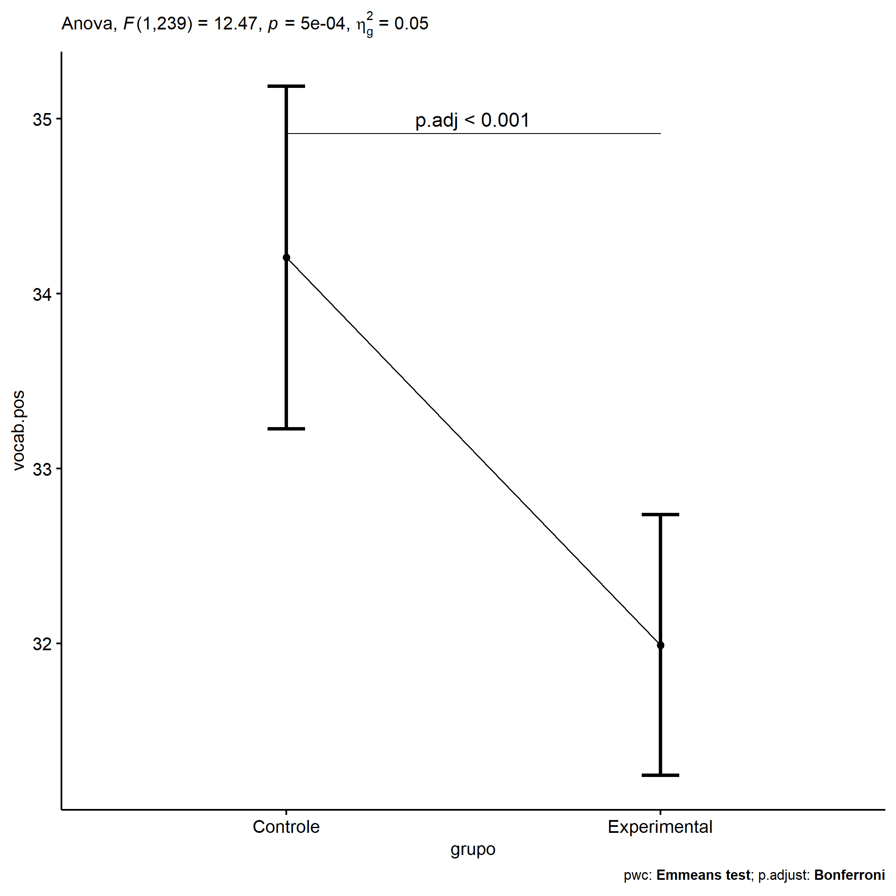<!-- -->

``` r
plots <- oneWayAncovaBoxPlots(
  wdat, "vocab.pos", "grupo", aov, pwc, covar = "vocab.pre",
  theme = "classic", color = color[["grupo"]],
  subtitle = which(aov$Effect == "grupo"))
```

``` r
if (length(unique(wdat[["grupo"]])) > 1)
  plots[["grupo"]] + ggplot2::ylab("Vocabulario") + ggplot2::scale_x_discrete(labels=c('pre', 'pos'))
```

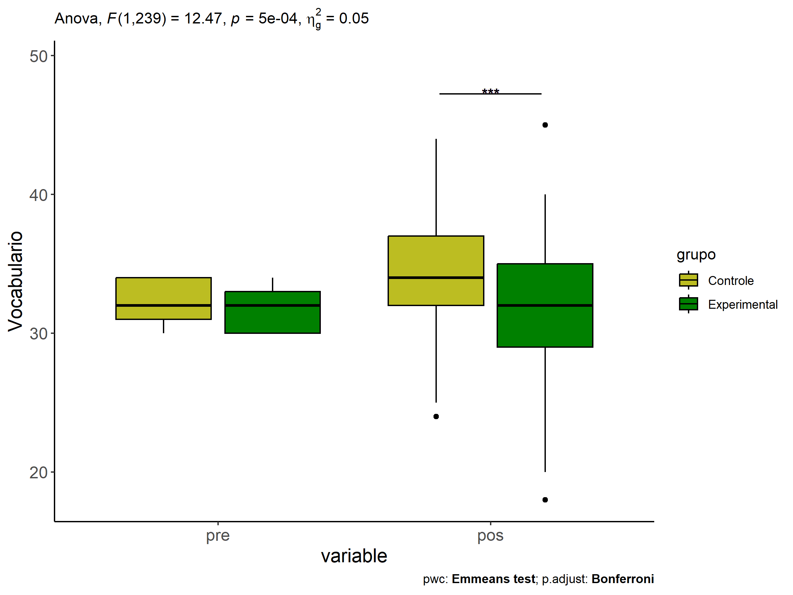<!-- -->

``` r
if (length(unique(wdat.long[["grupo"]])) > 1)
  plots <- oneWayAncovaBoxPlots(
    wdat.long, "vocab", "grupo", aov, pwc.long, pre.post = "time",
    theme = "classic", color = color$prepost)
```

``` r
if (length(unique(wdat.long[["grupo"]])) > 1)
  plots[["grupo"]] + ggplot2::ylab("Vocabulario")
```

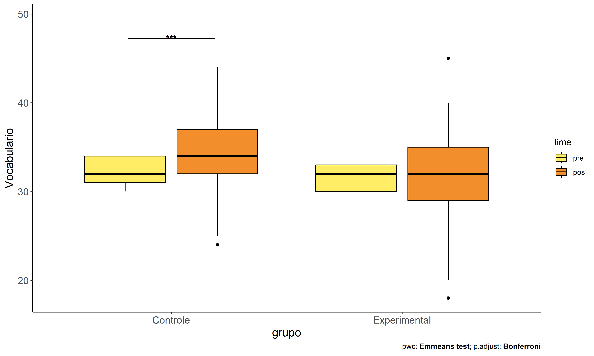<!-- -->

### Checking linearity assumption

``` r
ggscatter(wdat, x = "vocab.pre", y = "vocab.pos", size = 0.5,
          color = "grupo", add = "reg.line")+
  stat_regline_equation(
    aes(label =  paste(..eq.label.., ..rr.label.., sep = "~~~~"), color = grupo)
  )
```

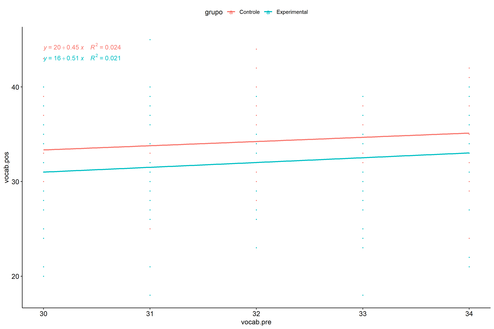<!-- -->

### Checking normality and homogeneity

``` r
res <- augment(lm(vocab.pos ~ vocab.pre + grupo, data = wdat))
```

``` r
shapiro_test(res$.resid)
```

    ## # A tibble: 1 × 3
    ##   variable   statistic p.value
    ##   <chr>          <dbl>   <dbl>
    ## 1 res$.resid     0.991   0.151

``` r
levene_test(res, .resid ~ grupo)
```

    ## # A tibble: 1 × 4
    ##     df1   df2 statistic     p
    ##   <int> <int>     <dbl> <dbl>
    ## 1     1   240      1.53 0.217

# ANCOVA and Pairwise for two factors **grupo:Sexo**

## Without remove non-normal data

``` r
pdat = remove_group_data(dat[!is.na(dat[["grupo"]]) & !is.na(dat[["Sexo"]]),], "vocab.pos", c("grupo","Sexo"))

pdat.long <- rbind(pdat[,c("id","grupo","Sexo")], pdat[,c("id","grupo","Sexo")])
pdat.long[["time"]] <- c(rep("pre", nrow(pdat)), rep("pos", nrow(pdat)))
pdat.long[["time"]] <- factor(pdat.long[["time"]], c("pre","pos"))
pdat.long[["vocab"]] <- c(pdat[["vocab.pre"]], pdat[["vocab.pos"]])

aov = anova_test(pdat, vocab.pos ~ vocab.pre + grupo*Sexo)
laov[["grupo:Sexo"]] <- get_anova_table(aov)
```

``` r
pwcs <- list()
pwcs[["Sexo"]] <- emmeans_test(
  group_by(pdat, grupo), vocab.pos ~ Sexo,
  covariate = vocab.pre, p.adjust.method = "bonferroni")
pwcs[["grupo"]] <- emmeans_test(
  group_by(pdat, Sexo), vocab.pos ~ grupo,
  covariate = vocab.pre, p.adjust.method = "bonferroni")

pwc <- plyr::rbind.fill(pwcs[["grupo"]], pwcs[["Sexo"]])
pwc <- pwc[,c("grupo","Sexo", colnames(pwc)[!colnames(pwc) %in% c("grupo","Sexo")])]
```

``` r
pwc.long <- emmeans_test(dplyr::group_by_at(pdat.long, c("grupo","Sexo")),
                         vocab ~ time,
                         p.adjust.method = "bonferroni")
lpwc[["grupo:Sexo"]] <- plyr::rbind.fill(pwc, pwc.long)
```

``` r
ds <- get.descriptives(pdat, "vocab.pos", c("grupo","Sexo"), covar = "vocab.pre")
ds <- merge(ds[ds$variable != "vocab.pre",],
            ds[ds$variable == "vocab.pre", !colnames(ds) %in% c("variable")],
            by = c("grupo","Sexo"), all.x = T, suffixes = c("", ".vocab.pre"))
ds <- merge(get_emmeans(pwcs[["grupo"]]), ds, by = c("grupo","Sexo"), suffixes = c(".emms", ""))
ds <- ds[,c("grupo","Sexo","n","mean.vocab.pre","se.vocab.pre","mean","se","emmean","se.emms")]

colnames(ds) <- c("grupo","Sexo", "N", paste0(c("M","SE")," (pre)"),
                  paste0(c("M","SE"), " (unadj)"), paste0(c("M", "SE"), " (adj)"))

lemms[["grupo:Sexo"]] <- ds
```

## Computing ANCOVA and PairWise After removing non-normal data (OK)

``` r
wdat = pdat 

res = residuals(lm(vocab.pos ~ vocab.pre + grupo*Sexo, data = wdat))
non.normal = getNonNormal(res, wdat$id, plimit = 0.05)

wdat = wdat[!wdat$id %in% non.normal,]

wdat.long <- rbind(wdat[,c("id","grupo","Sexo")], wdat[,c("id","grupo","Sexo")])
wdat.long[["time"]] <- c(rep("pre", nrow(wdat)), rep("pos", nrow(wdat)))
wdat.long[["time"]] <- factor(wdat.long[["time"]], c("pre","pos"))
wdat.long[["vocab"]] <- c(wdat[["vocab.pre"]], wdat[["vocab.pos"]])


ldat[["grupo:Sexo"]] = wdat

(non.normal)
```

    ## [1] "P1139" "P1113" "P2304" "P1006" "P1129" "P2206"

``` r
aov = anova_test(wdat, vocab.pos ~ vocab.pre + grupo*Sexo)
laov[["grupo:Sexo"]] <- merge(get_anova_table(aov), laov[["grupo:Sexo"]], by="Effect", suffixes = c("","'"))

(df = get_anova_table(aov))
```

    ## ANOVA Table (type II tests)
    ## 
    ##       Effect DFn DFd      F        p p<.05   ges
    ## 1  vocab.pre   1 238  8.802 0.003000     * 0.036
    ## 2      grupo   1 238 12.631 0.000458     * 0.050
    ## 3       Sexo   1 238  4.659 0.032000     * 0.019
    ## 4 grupo:Sexo   1 238  8.145 0.005000     * 0.033

| Effect     | DFn | DFd |      F |     p | p\<.05 |   ges |
|:-----------|----:|----:|-------:|------:|:-------|------:|
| vocab.pre  |   1 | 238 |  8.802 | 0.003 | \*     | 0.036 |
| grupo      |   1 | 238 | 12.631 | 0.000 | \*     | 0.050 |
| Sexo       |   1 | 238 |  4.659 | 0.032 | \*     | 0.019 |
| grupo:Sexo |   1 | 238 |  8.145 | 0.005 | \*     | 0.033 |

``` r
pwcs <- list()
pwcs[["Sexo"]] <- emmeans_test(
  group_by(wdat, grupo), vocab.pos ~ Sexo,
  covariate = vocab.pre, p.adjust.method = "bonferroni")
pwcs[["grupo"]] <- emmeans_test(
  group_by(wdat, Sexo), vocab.pos ~ grupo,
  covariate = vocab.pre, p.adjust.method = "bonferroni")

pwc <- plyr::rbind.fill(pwcs[["grupo"]], pwcs[["Sexo"]])
pwc <- pwc[,c("grupo","Sexo", colnames(pwc)[!colnames(pwc) %in% c("grupo","Sexo")])]
```

| grupo        | Sexo | term             | .y.       | group1   | group2       |  df | statistic |     p | p.adj | p.adj.signif |
|:-------------|:-----|:-----------------|:----------|:---------|:-------------|----:|----------:|------:|------:|:-------------|
|              | F    | vocab.pre\*grupo | vocab.pos | Controle | Experimental | 238 |     0.611 | 0.542 | 0.542 | ns           |
|              | M    | vocab.pre\*grupo | vocab.pos | Controle | Experimental | 238 |     4.524 | 0.000 | 0.000 | \*\*\*\*     |
| Controle     |      | vocab.pre\*Sexo  | vocab.pos | F        | M            | 238 |    -0.967 | 0.334 | 0.334 | ns           |
| Experimental |      | vocab.pre\*Sexo  | vocab.pos | F        | M            | 238 |     3.444 | 0.001 | 0.001 | \*\*\*       |

``` r
pwc.long <- emmeans_test(dplyr::group_by_at(wdat.long, c("grupo","Sexo")),
                         vocab ~ time,
                         p.adjust.method = "bonferroni")
lpwc[["grupo:Sexo"]] <- merge(plyr::rbind.fill(pwc, pwc.long), lpwc[["grupo:Sexo"]], by=c("grupo","Sexo","term",".y.","group1","group2"), suffixes = c("","'"))
```

| grupo        | Sexo | term | .y.   | group1 | group2 |  df | statistic |     p | p.adj | p.adj.signif |
|:-------------|:-----|:-----|:------|:-------|:-------|----:|----------:|------:|------:|:-------------|
| Controle     | F    | time | vocab | pre    | pos    | 478 |    -2.257 | 0.024 | 0.024 | \*           |
| Controle     | M    | time | vocab | pre    | pos    | 478 |    -3.441 | 0.001 | 0.001 | \*\*\*       |
| Experimental | F    | time | vocab | pre    | pos    | 478 |    -2.275 | 0.023 | 0.023 | \*           |
| Experimental | M    | time | vocab | pre    | pos    | 478 |     2.259 | 0.024 | 0.024 | \*           |

``` r
ds <- get.descriptives(wdat, "vocab.pos", c("grupo","Sexo"), covar = "vocab.pre")
ds <- merge(ds[ds$variable != "vocab.pre",],
            ds[ds$variable == "vocab.pre", !colnames(ds) %in% c("variable")],
            by = c("grupo","Sexo"), all.x = T, suffixes = c("", ".vocab.pre"))
ds <- merge(get_emmeans(pwcs[["grupo"]]), ds, by = c("grupo","Sexo"), suffixes = c(".emms", ""))
ds <- ds[,c("grupo","Sexo","n","mean.vocab.pre","se.vocab.pre","mean","se","emmean","se.emms")]

colnames(ds) <- c("grupo","Sexo", "N", paste0(c("M","SE")," (pre)"),
                  paste0(c("M","SE"), " (unadj)"), paste0(c("M", "SE"), " (adj)"))

lemms[["grupo:Sexo"]] <- merge(ds, lemms[["grupo:Sexo"]], by=c("grupo","Sexo"), suffixes = c("","'"))
```

| grupo        | Sexo |   N | M (pre) | SE (pre) | M (unadj) | SE (unadj) | M (adj) | SE (adj) |
|:-------------|:-----|----:|--------:|---------:|----------:|-----------:|--------:|---------:|
| Controle     | F    |  47 |  32.277 |    0.201 |    33.915 |      0.613 |  33.701 |    0.688 |
| Controle     | M    |  42 |  32.167 |    0.246 |    34.810 |      0.672 |  34.664 |    0.725 |
| Experimental | F    |  78 |  31.808 |    0.154 |    33.090 |      0.511 |  33.169 |    0.531 |
| Experimental | M    |  76 |  31.724 |    0.169 |    30.434 |      0.630 |  30.566 |    0.540 |

### Plots for ancova

``` r
plots <- twoWayAncovaPlots(
  wdat, "vocab.pos", c("grupo","Sexo"), aov, pwcs, addParam = c("mean_se"),
  font.label.size=10, step.increase=0.05, p.label="p.adj",
  subtitle = which(aov$Effect == "grupo:Sexo"))
```

``` r
if (!is.null(plots[["grupo"]]))
  plots[["grupo"]] + ggplot2::scale_color_manual(values = color[["Sexo"]])
```

    ## Scale for colour is already present.
    ## Adding another scale for colour, which will replace the existing scale.

<!-- -->

``` r
if (!is.null(plots[["Sexo"]]))
  plots[["Sexo"]] + ggplot2::scale_color_manual(values = color[["grupo"]])
```

    ## Scale for colour is already present.
    ## Adding another scale for colour, which will replace the existing scale.

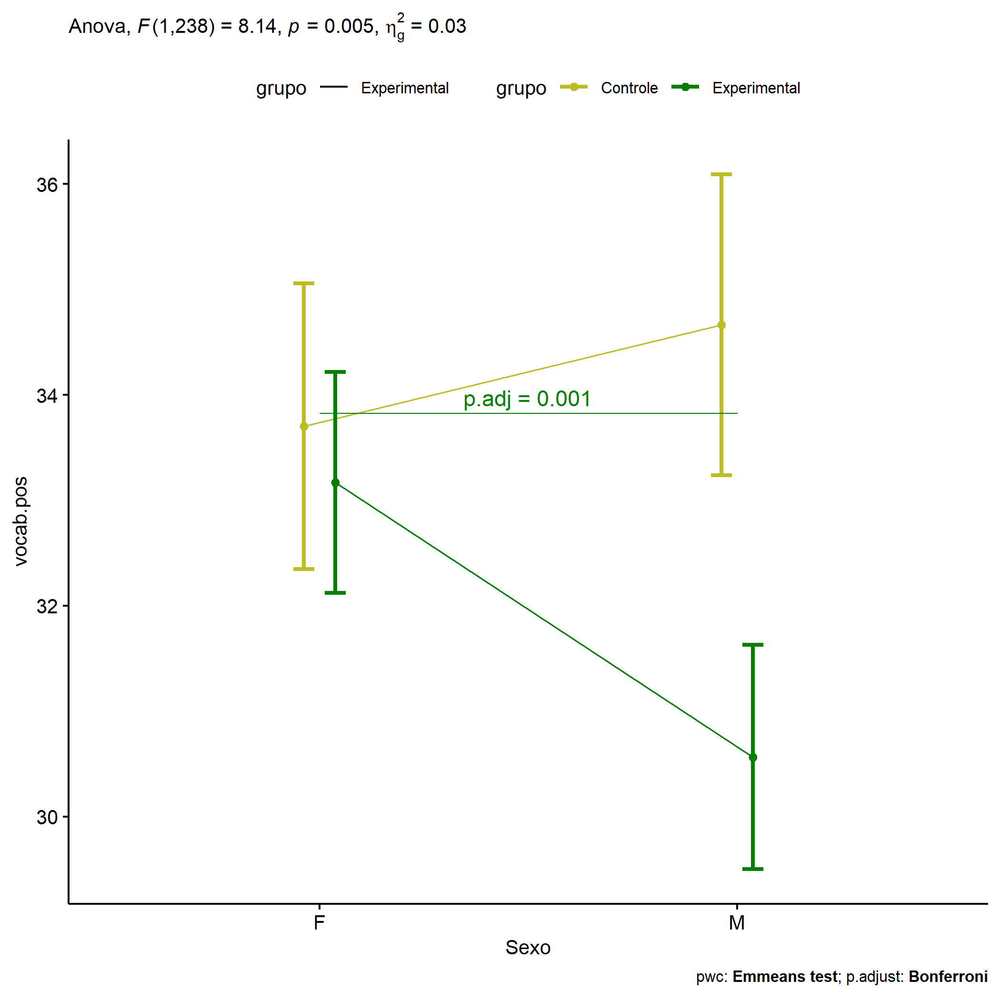<!-- -->

``` r
plots <- twoWayAncovaBoxPlots(
  wdat, "vocab.pos", c("grupo","Sexo"), aov, pwcs, covar = "vocab.pre",
  theme = "classic", color = color[["grupo:Sexo"]],
  subtitle = which(aov$Effect == "grupo:Sexo"))
```

``` r
plots[["grupo:Sexo"]] + ggplot2::ylab("Vocabulario") + ggplot2::scale_x_discrete(labels=c('pre', 'pos'))
```

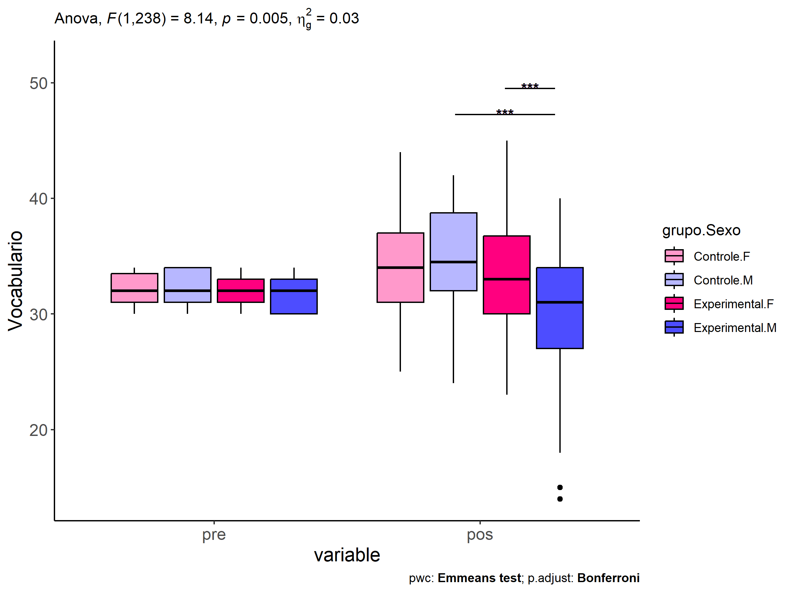<!-- -->

``` r
plots <- twoWayAncovaBoxPlots(
  wdat.long, "vocab", c("grupo","Sexo"), aov, pwc.long, pre.post = "time",
  theme = "classic", color = color$prepost)
```

``` r
plots[["grupo:Sexo"]] + ggplot2::ylab("Vocabulario")
```

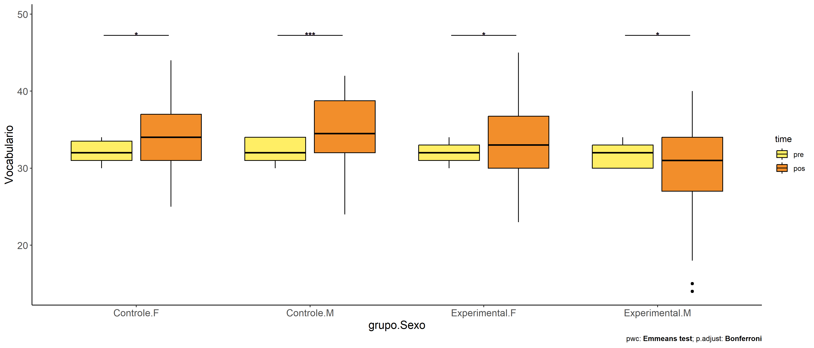<!-- -->

### Checking linearity assumption

``` r
ggscatter(wdat, x = "vocab.pre", y = "vocab.pos", size = 0.5,
          facet.by = c("grupo","Sexo"), add = "reg.line")+
  stat_regline_equation(
    aes(label =  paste(..eq.label.., ..rr.label.., sep = "~~~~"))
  )
```

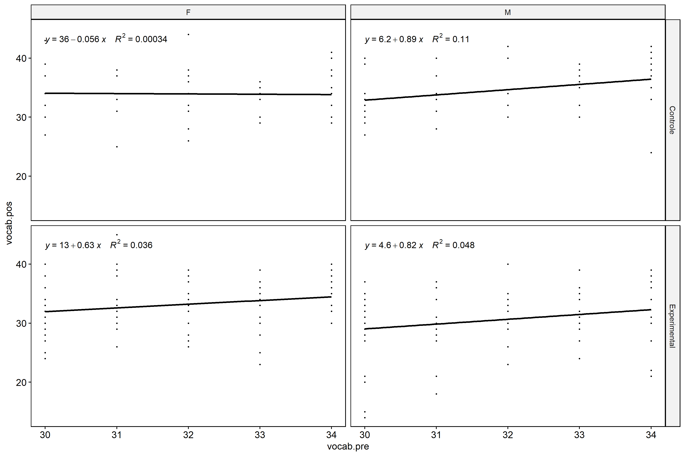<!-- -->

### Checking normality and homogeneity

``` r
res <- augment(lm(vocab.pos ~ vocab.pre + grupo*Sexo, data = wdat))
```

``` r
shapiro_test(res$.resid)
```

    ## # A tibble: 1 × 3
    ##   variable   statistic p.value
    ##   <chr>          <dbl>   <dbl>
    ## 1 res$.resid     0.989  0.0702

``` r
levene_test(res, .resid ~ grupo*Sexo)
```

    ## # A tibble: 1 × 4
    ##     df1   df2 statistic     p
    ##   <int> <int>     <dbl> <dbl>
    ## 1     3   239      1.18 0.317

# ANCOVA and Pairwise for two factors **grupo:Zona**

## Without remove non-normal data

``` r
pdat = remove_group_data(dat[!is.na(dat[["grupo"]]) & !is.na(dat[["Zona"]]),], "vocab.pos", c("grupo","Zona"))

pdat.long <- rbind(pdat[,c("id","grupo","Zona")], pdat[,c("id","grupo","Zona")])
pdat.long[["time"]] <- c(rep("pre", nrow(pdat)), rep("pos", nrow(pdat)))
pdat.long[["time"]] <- factor(pdat.long[["time"]], c("pre","pos"))
pdat.long[["vocab"]] <- c(pdat[["vocab.pre"]], pdat[["vocab.pos"]])

aov = anova_test(pdat, vocab.pos ~ vocab.pre + grupo*Zona)
laov[["grupo:Zona"]] <- get_anova_table(aov)
```

``` r
pwcs <- list()
pwcs[["Zona"]] <- emmeans_test(
  group_by(pdat, grupo), vocab.pos ~ Zona,
  covariate = vocab.pre, p.adjust.method = "bonferroni")
pwcs[["grupo"]] <- emmeans_test(
  group_by(pdat, Zona), vocab.pos ~ grupo,
  covariate = vocab.pre, p.adjust.method = "bonferroni")

pwc <- plyr::rbind.fill(pwcs[["grupo"]], pwcs[["Zona"]])
pwc <- pwc[,c("grupo","Zona", colnames(pwc)[!colnames(pwc) %in% c("grupo","Zona")])]
```

``` r
pwc.long <- emmeans_test(dplyr::group_by_at(pdat.long, c("grupo","Zona")),
                         vocab ~ time,
                         p.adjust.method = "bonferroni")
lpwc[["grupo:Zona"]] <- plyr::rbind.fill(pwc, pwc.long)
```

``` r
ds <- get.descriptives(pdat, "vocab.pos", c("grupo","Zona"), covar = "vocab.pre")
ds <- merge(ds[ds$variable != "vocab.pre",],
            ds[ds$variable == "vocab.pre", !colnames(ds) %in% c("variable")],
            by = c("grupo","Zona"), all.x = T, suffixes = c("", ".vocab.pre"))
ds <- merge(get_emmeans(pwcs[["grupo"]]), ds, by = c("grupo","Zona"), suffixes = c(".emms", ""))
ds <- ds[,c("grupo","Zona","n","mean.vocab.pre","se.vocab.pre","mean","se","emmean","se.emms")]

colnames(ds) <- c("grupo","Zona", "N", paste0(c("M","SE")," (pre)"),
                  paste0(c("M","SE"), " (unadj)"), paste0(c("M", "SE"), " (adj)"))

lemms[["grupo:Zona"]] <- ds
```

## Computing ANCOVA and PairWise After removing non-normal data (OK)

``` r
wdat = pdat 

res = residuals(lm(vocab.pos ~ vocab.pre + grupo*Zona, data = wdat))
non.normal = getNonNormal(res, wdat$id, plimit = 0.05)

wdat = wdat[!wdat$id %in% non.normal,]

wdat.long <- rbind(wdat[,c("id","grupo","Zona")], wdat[,c("id","grupo","Zona")])
wdat.long[["time"]] <- c(rep("pre", nrow(wdat)), rep("pos", nrow(wdat)))
wdat.long[["time"]] <- factor(wdat.long[["time"]], c("pre","pos"))
wdat.long[["vocab"]] <- c(wdat[["vocab.pre"]], wdat[["vocab.pos"]])


ldat[["grupo:Zona"]] = wdat

(non.normal)
```

    ## [1] "P1139" "P2304" "P2856"

``` r
aov = anova_test(wdat, vocab.pos ~ vocab.pre + grupo*Zona)
laov[["grupo:Zona"]] <- merge(get_anova_table(aov), laov[["grupo:Zona"]], by="Effect", suffixes = c("","'"))

(df = get_anova_table(aov))
```

    ## ANOVA Table (type II tests)
    ## 
    ##       Effect DFn DFd      F        p p<.05      ges
    ## 1  vocab.pre   1 161  4.786 0.030000     * 0.029000
    ## 2      grupo   1 161 14.361 0.000213     * 0.082000
    ## 3       Zona   1 161  0.037 0.848000       0.000227
    ## 4 grupo:Zona   1 161  2.455 0.119000       0.015000

| Effect     | DFn | DFd |      F |     p | p\<.05 |   ges |
|:-----------|----:|----:|-------:|------:|:-------|------:|
| vocab.pre  |   1 | 161 |  4.786 | 0.030 | \*     | 0.029 |
| grupo      |   1 | 161 | 14.361 | 0.000 | \*     | 0.082 |
| Zona       |   1 | 161 |  0.037 | 0.848 |        | 0.000 |
| grupo:Zona |   1 | 161 |  2.455 | 0.119 |        | 0.015 |

``` r
pwcs <- list()
pwcs[["Zona"]] <- emmeans_test(
  group_by(wdat, grupo), vocab.pos ~ Zona,
  covariate = vocab.pre, p.adjust.method = "bonferroni")
pwcs[["grupo"]] <- emmeans_test(
  group_by(wdat, Zona), vocab.pos ~ grupo,
  covariate = vocab.pre, p.adjust.method = "bonferroni")

pwc <- plyr::rbind.fill(pwcs[["grupo"]], pwcs[["Zona"]])
pwc <- pwc[,c("grupo","Zona", colnames(pwc)[!colnames(pwc) %in% c("grupo","Zona")])]
```

| grupo        | Zona   | term             | .y.       | group1   | group2       |  df | statistic |     p | p.adj | p.adj.signif |
|:-------------|:-------|:-----------------|:----------|:---------|:-------------|----:|----------:|------:|------:|:-------------|
|              | Rural  | vocab.pre\*grupo | vocab.pos | Controle | Experimental | 161 |     4.015 | 0.000 | 0.000 | \*\*\*\*     |
|              | Urbana | vocab.pre\*grupo | vocab.pos | Controle | Experimental | 161 |     0.849 | 0.397 | 0.397 | ns           |
| Controle     |        | vocab.pre\*Zona  | vocab.pos | Rural    | Urbana       | 161 |     1.107 | 0.270 | 0.270 | ns           |
| Experimental |        | vocab.pre\*Zona  | vocab.pos | Rural    | Urbana       | 161 |    -1.118 | 0.265 | 0.265 | ns           |

``` r
pwc.long <- emmeans_test(dplyr::group_by_at(wdat.long, c("grupo","Zona")),
                         vocab ~ time,
                         p.adjust.method = "bonferroni")
lpwc[["grupo:Zona"]] <- merge(plyr::rbind.fill(pwc, pwc.long), lpwc[["grupo:Zona"]], by=c("grupo","Zona","term",".y.","group1","group2"), suffixes = c("","'"))
```

| grupo        | Zona   | term | .y.   | group1 | group2 |  df | statistic |     p | p.adj | p.adj.signif |
|:-------------|:-------|:-----|:------|:-------|:-------|----:|----------:|------:|------:|:-------------|
| Controle     | Rural  | time | vocab | pre    | pos    | 324 |    -4.054 | 0.000 | 0.000 | \*\*\*\*     |
| Controle     | Urbana | time | vocab | pre    | pos    | 324 |    -1.194 | 0.233 | 0.233 | ns           |
| Experimental | Rural  | time | vocab | pre    | pos    | 324 |     0.972 | 0.332 | 0.332 | ns           |
| Experimental | Urbana | time | vocab | pre    | pos    | 324 |    -0.435 | 0.664 | 0.664 | ns           |

``` r
ds <- get.descriptives(wdat, "vocab.pos", c("grupo","Zona"), covar = "vocab.pre")
ds <- merge(ds[ds$variable != "vocab.pre",],
            ds[ds$variable == "vocab.pre", !colnames(ds) %in% c("variable")],
            by = c("grupo","Zona"), all.x = T, suffixes = c("", ".vocab.pre"))
ds <- merge(get_emmeans(pwcs[["grupo"]]), ds, by = c("grupo","Zona"), suffixes = c(".emms", ""))
ds <- ds[,c("grupo","Zona","n","mean.vocab.pre","se.vocab.pre","mean","se","emmean","se.emms")]

colnames(ds) <- c("grupo","Zona", "N", paste0(c("M","SE")," (pre)"),
                  paste0(c("M","SE"), " (unadj)"), paste0(c("M", "SE"), " (adj)"))

lemms[["grupo:Zona"]] <- merge(ds, lemms[["grupo:Zona"]], by=c("grupo","Zona"), suffixes = c("","'"))
```

| grupo        | Zona   |   N | M (pre) | SE (pre) | M (unadj) | SE (unadj) | M (adj) | SE (adj) |
|:-------------|:-------|----:|--------:|---------:|----------:|-----------:|--------:|---------:|
| Controle     | Rural  |  48 |  31.917 |    0.218 |    34.875 |      0.670 |  34.868 |    0.689 |
| Controle     | Urbana |  20 |  32.350 |    0.327 |    33.700 |      0.818 |  33.457 |    1.073 |
| Experimental | Rural  |  63 |  31.698 |    0.186 |    31.079 |      0.643 |  31.191 |    0.603 |
| Experimental | Urbana |  35 |  32.000 |    0.266 |    32.371 |      0.867 |  32.319 |    0.807 |

### Plots for ancova

``` r
plots <- twoWayAncovaPlots(
  wdat, "vocab.pos", c("grupo","Zona"), aov, pwcs, addParam = c("mean_se"),
  font.label.size=10, step.increase=0.05, p.label="p.adj",
  subtitle = which(aov$Effect == "grupo:Zona"))
```

``` r
if (!is.null(plots[["grupo"]]))
  plots[["grupo"]] + ggplot2::scale_color_manual(values = color[["Zona"]])
```

    ## Scale for colour is already present.
    ## Adding another scale for colour, which will replace the existing scale.

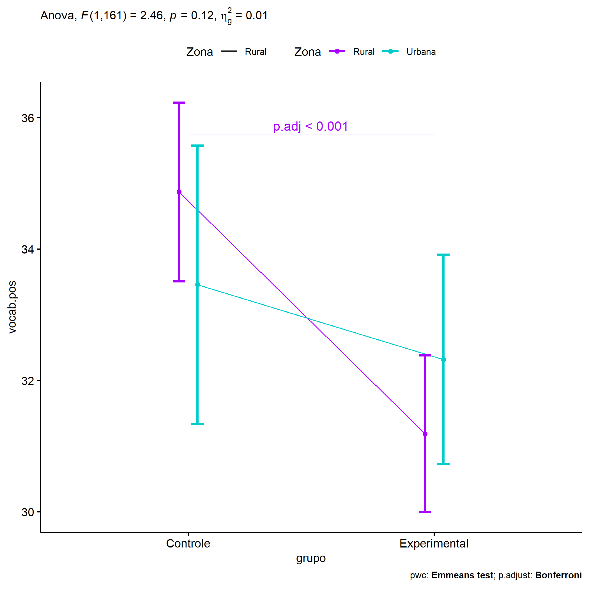<!-- -->

``` r
if (!is.null(plots[["Zona"]]))
  plots[["Zona"]] + ggplot2::scale_color_manual(values = color[["grupo"]])
```

    ## Scale for colour is already present.
    ## Adding another scale for colour, which will replace the existing scale.

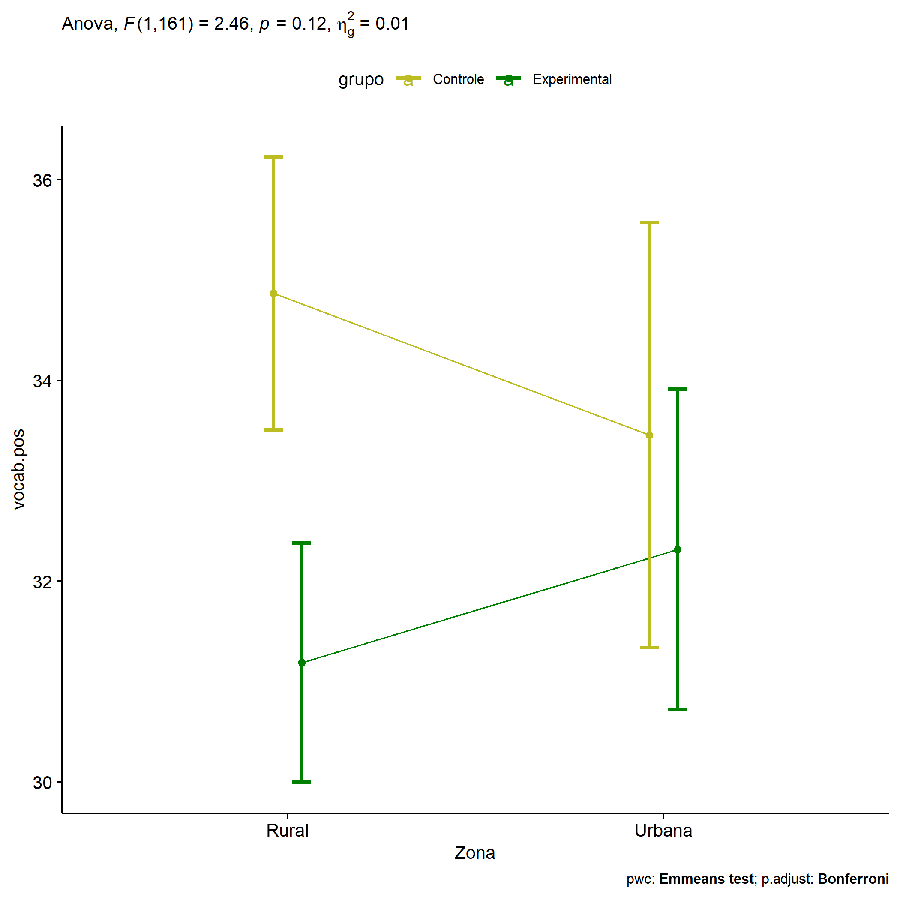<!-- -->

``` r
plots <- twoWayAncovaBoxPlots(
  wdat, "vocab.pos", c("grupo","Zona"), aov, pwcs, covar = "vocab.pre",
  theme = "classic", color = color[["grupo:Zona"]],
  subtitle = which(aov$Effect == "grupo:Zona"))
```

``` r
plots[["grupo:Zona"]] + ggplot2::ylab("Vocabulario") + ggplot2::scale_x_discrete(labels=c('pre', 'pos'))
```

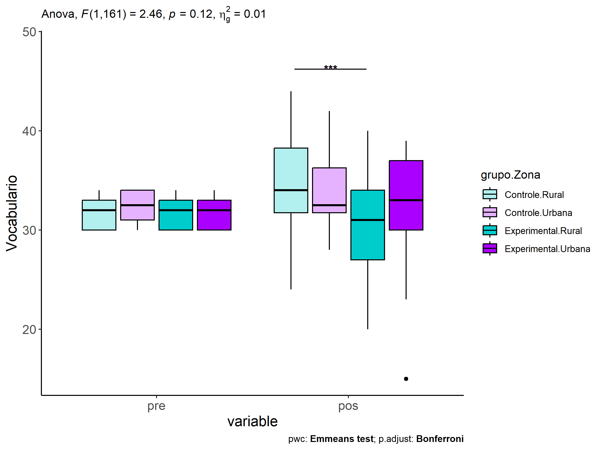<!-- -->

``` r
plots <- twoWayAncovaBoxPlots(
  wdat.long, "vocab", c("grupo","Zona"), aov, pwc.long, pre.post = "time",
  theme = "classic", color = color$prepost)
```

``` r
plots[["grupo:Zona"]] + ggplot2::ylab("Vocabulario")
```

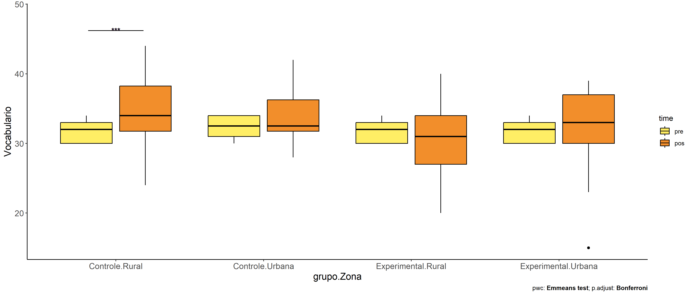<!-- -->

### Checking linearity assumption

``` r
ggscatter(wdat, x = "vocab.pre", y = "vocab.pos", size = 0.5,
          facet.by = c("grupo","Zona"), add = "reg.line")+
  stat_regline_equation(
    aes(label =  paste(..eq.label.., ..rr.label.., sep = "~~~~"))
  )
```

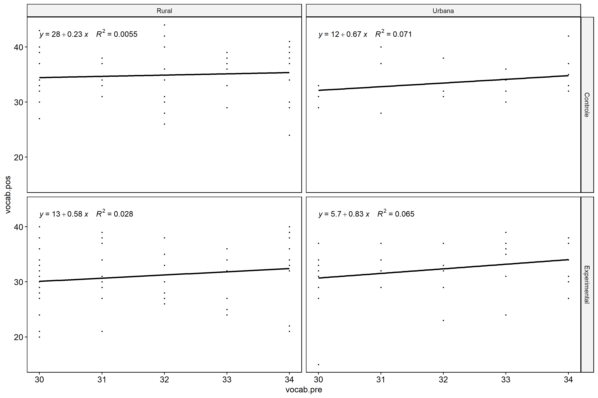<!-- -->

### Checking normality and homogeneity

``` r
res <- augment(lm(vocab.pos ~ vocab.pre + grupo*Zona, data = wdat))
```

``` r
shapiro_test(res$.resid)
```

    ## # A tibble: 1 × 3
    ##   variable   statistic p.value
    ##   <chr>          <dbl>   <dbl>
    ## 1 res$.resid     0.985  0.0741

``` r
levene_test(res, .resid ~ grupo*Zona)
```

    ## # A tibble: 1 × 4
    ##     df1   df2 statistic     p
    ##   <int> <int>     <dbl> <dbl>
    ## 1     3   162     0.960 0.413

# ANCOVA and Pairwise for two factors **grupo:Cor.Raca**

## Without remove non-normal data

``` r
pdat = remove_group_data(dat[!is.na(dat[["grupo"]]) & !is.na(dat[["Cor.Raca"]]),], "vocab.pos", c("grupo","Cor.Raca"))

pdat.long <- rbind(pdat[,c("id","grupo","Cor.Raca")], pdat[,c("id","grupo","Cor.Raca")])
pdat.long[["time"]] <- c(rep("pre", nrow(pdat)), rep("pos", nrow(pdat)))
pdat.long[["time"]] <- factor(pdat.long[["time"]], c("pre","pos"))
pdat.long[["vocab"]] <- c(pdat[["vocab.pre"]], pdat[["vocab.pos"]])

aov = anova_test(pdat, vocab.pos ~ vocab.pre + grupo*Cor.Raca)
laov[["grupo:Cor.Raca"]] <- get_anova_table(aov)
```

``` r
pwcs <- list()
pwcs[["Cor.Raca"]] <- emmeans_test(
  group_by(pdat, grupo), vocab.pos ~ Cor.Raca,
  covariate = vocab.pre, p.adjust.method = "bonferroni")
pwcs[["grupo"]] <- emmeans_test(
  group_by(pdat, Cor.Raca), vocab.pos ~ grupo,
  covariate = vocab.pre, p.adjust.method = "bonferroni")

pwc <- plyr::rbind.fill(pwcs[["grupo"]], pwcs[["Cor.Raca"]])
pwc <- pwc[,c("grupo","Cor.Raca", colnames(pwc)[!colnames(pwc) %in% c("grupo","Cor.Raca")])]
```

``` r
pwc.long <- emmeans_test(dplyr::group_by_at(pdat.long, c("grupo","Cor.Raca")),
                         vocab ~ time,
                         p.adjust.method = "bonferroni")
lpwc[["grupo:Cor.Raca"]] <- plyr::rbind.fill(pwc, pwc.long)
```

``` r
ds <- get.descriptives(pdat, "vocab.pos", c("grupo","Cor.Raca"), covar = "vocab.pre")
ds <- merge(ds[ds$variable != "vocab.pre",],
            ds[ds$variable == "vocab.pre", !colnames(ds) %in% c("variable")],
            by = c("grupo","Cor.Raca"), all.x = T, suffixes = c("", ".vocab.pre"))
ds <- merge(get_emmeans(pwcs[["grupo"]]), ds, by = c("grupo","Cor.Raca"), suffixes = c(".emms", ""))
ds <- ds[,c("grupo","Cor.Raca","n","mean.vocab.pre","se.vocab.pre","mean","se","emmean","se.emms")]

colnames(ds) <- c("grupo","Cor.Raca", "N", paste0(c("M","SE")," (pre)"),
                  paste0(c("M","SE"), " (unadj)"), paste0(c("M", "SE"), " (adj)"))

lemms[["grupo:Cor.Raca"]] <- ds
```

## Computing ANCOVA and PairWise After removing non-normal data (OK)

``` r
wdat = pdat 

res = residuals(lm(vocab.pos ~ vocab.pre + grupo*Cor.Raca, data = wdat))
non.normal = getNonNormal(res, wdat$id, plimit = 0.05)

wdat = wdat[!wdat$id %in% non.normal,]

wdat.long <- rbind(wdat[,c("id","grupo","Cor.Raca")], wdat[,c("id","grupo","Cor.Raca")])
wdat.long[["time"]] <- c(rep("pre", nrow(wdat)), rep("pos", nrow(wdat)))
wdat.long[["time"]] <- factor(wdat.long[["time"]], c("pre","pos"))
wdat.long[["vocab"]] <- c(wdat[["vocab.pre"]], wdat[["vocab.pos"]])


ldat[["grupo:Cor.Raca"]] = wdat

(non.normal)
```

    ## [1] "P1139" "P1113" "P1006"

``` r
aov = anova_test(wdat, vocab.pos ~ vocab.pre + grupo*Cor.Raca)
laov[["grupo:Cor.Raca"]] <- merge(get_anova_table(aov), laov[["grupo:Cor.Raca"]], by="Effect", suffixes = c("","'"))

(df = get_anova_table(aov))
```

    ## ANOVA Table (type II tests)
    ## 
    ##           Effect DFn DFd      F        p p<.05      ges
    ## 1      vocab.pre   1  99  1.697 0.196000       1.70e-02
    ## 2          grupo   1  99 11.701 0.000909     * 1.06e-01
    ## 3       Cor.Raca   2  99  0.724 0.487000       1.40e-02
    ## 4 grupo:Cor.Raca   1  99  0.008 0.930000       7.89e-05

| Effect         | DFn | DFd |      F |     p | p\<.05 |   ges |
|:---------------|----:|----:|-------:|------:|:-------|------:|
| vocab.pre      |   1 |  99 |  1.697 | 0.196 |        | 0.017 |
| grupo          |   1 |  99 | 11.701 | 0.001 | \*     | 0.106 |
| Cor.Raca       |   2 |  99 |  0.724 | 0.487 |        | 0.014 |
| grupo:Cor.Raca |   1 |  99 |  0.008 | 0.930 |        | 0.000 |

``` r
pwcs <- list()
pwcs[["Cor.Raca"]] <- emmeans_test(
  group_by(wdat, grupo), vocab.pos ~ Cor.Raca,
  covariate = vocab.pre, p.adjust.method = "bonferroni")
pwcs[["grupo"]] <- emmeans_test(
  group_by(wdat, Cor.Raca), vocab.pos ~ grupo,
  covariate = vocab.pre, p.adjust.method = "bonferroni")

pwc <- plyr::rbind.fill(pwcs[["grupo"]], pwcs[["Cor.Raca"]])
pwc <- pwc[,c("grupo","Cor.Raca", colnames(pwc)[!colnames(pwc) %in% c("grupo","Cor.Raca")])]
```

| grupo        | Cor.Raca | term                | .y.       | group1   | group2       |  df | statistic |     p | p.adj | p.adj.signif |
|:-------------|:---------|:--------------------|:----------|:---------|:-------------|----:|----------:|------:|------:|:-------------|
|              | Branca   | vocab.pre\*grupo    | vocab.pos | Controle | Experimental |  99 |     1.691 | 0.094 | 0.094 | ns           |
|              | Indígena | vocab.pre\*grupo    | vocab.pos | Controle | Experimental |     |           |       |       |              |
|              | Parda    | vocab.pre\*grupo    | vocab.pos | Controle | Experimental |  99 |     3.005 | 0.003 | 0.003 | \*\*         |
| Controle     |          | vocab.pre\*Cor.Raca | vocab.pos | Branca   | Indígena     |     |           |       |       |              |
| Controle     |          | vocab.pre\*Cor.Raca | vocab.pos | Branca   | Parda        |  99 |     0.221 | 0.826 | 0.826 | ns           |
| Controle     |          | vocab.pre\*Cor.Raca | vocab.pos | Indígena | Parda        |     |           |       |       |              |
| Experimental |          | vocab.pre\*Cor.Raca | vocab.pos | Branca   | Indígena     |  99 |    -0.837 | 0.405 | 1.000 | ns           |
| Experimental |          | vocab.pre\*Cor.Raca | vocab.pos | Branca   | Parda        |  99 |     0.347 | 0.729 | 1.000 | ns           |
| Experimental |          | vocab.pre\*Cor.Raca | vocab.pos | Indígena | Parda        |  99 |     1.176 | 0.242 | 0.727 | ns           |

``` r
pwc.long <- emmeans_test(dplyr::group_by_at(wdat.long, c("grupo","Cor.Raca")),
                         vocab ~ time,
                         p.adjust.method = "bonferroni")
lpwc[["grupo:Cor.Raca"]] <- merge(plyr::rbind.fill(pwc, pwc.long), lpwc[["grupo:Cor.Raca"]], by=c("grupo","Cor.Raca","term",".y.","group1","group2"), suffixes = c("","'"))
```

| grupo        | Cor.Raca | term | .y.   | group1 | group2 |  df | statistic |     p | p.adj | p.adj.signif |
|:-------------|:---------|:-----|:------|:-------|:-------|----:|----------:|------:|------:|:-------------|
| Controle     | Branca   | time | vocab | pre    | pos    | 200 |    -1.923 | 0.056 | 0.056 | ns           |
| Controle     | Indígena | time | vocab | pre    | pos    |     |           |       |       |              |
| Controle     | Parda    | time | vocab | pre    | pos    | 200 |    -2.697 | 0.008 | 0.008 | \*\*         |
| Experimental | Branca   | time | vocab | pre    | pos    | 200 |     0.229 | 0.819 | 0.819 | ns           |
| Experimental | Indígena | time | vocab | pre    | pos    | 200 |    -0.709 | 0.479 | 0.479 | ns           |
| Experimental | Parda    | time | vocab | pre    | pos    | 200 |     0.846 | 0.399 | 0.399 | ns           |

``` r
ds <- get.descriptives(wdat, "vocab.pos", c("grupo","Cor.Raca"), covar = "vocab.pre")
ds <- merge(ds[ds$variable != "vocab.pre",],
            ds[ds$variable == "vocab.pre", !colnames(ds) %in% c("variable")],
            by = c("grupo","Cor.Raca"), all.x = T, suffixes = c("", ".vocab.pre"))
ds <- merge(get_emmeans(pwcs[["grupo"]]), ds, by = c("grupo","Cor.Raca"), suffixes = c(".emms", ""))
ds <- ds[,c("grupo","Cor.Raca","n","mean.vocab.pre","se.vocab.pre","mean","se","emmean","se.emms")]

colnames(ds) <- c("grupo","Cor.Raca", "N", paste0(c("M","SE")," (pre)"),
                  paste0(c("M","SE"), " (unadj)"), paste0(c("M", "SE"), " (adj)"))

lemms[["grupo:Cor.Raca"]] <- merge(ds, lemms[["grupo:Cor.Raca"]], by=c("grupo","Cor.Raca"), suffixes = c("","'"))
```

| grupo        | Cor.Raca |   N | M (pre) | SE (pre) | M (unadj) | SE (unadj) | M (adj) | SE (adj) |
|:-------------|:---------|----:|--------:|---------:|----------:|-----------:|--------:|---------:|
| Controle     | Branca   |  13 |  32.462 |    0.369 |    35.154 |      1.067 |  34.952 |    1.349 |
| Controle     | Parda    |  32 |  32.344 |    0.236 |    34.750 |      0.678 |  34.601 |    0.861 |
| Experimental | Branca   |  12 |  32.000 |    0.389 |    31.667 |      1.563 |  31.671 |    1.394 |
| Experimental | Indígena |   5 |  32.400 |    0.678 |    34.000 |      0.707 |  33.825 |    2.164 |
| Experimental | Parda    |  43 |  31.581 |    0.226 |    30.930 |      0.875 |  31.122 |    0.751 |

### Plots for ancova

``` r
plots <- twoWayAncovaPlots(
  wdat, "vocab.pos", c("grupo","Cor.Raca"), aov, pwcs, addParam = c("mean_se"),
  font.label.size=10, step.increase=0.05, p.label="p.adj",
  subtitle = which(aov$Effect == "grupo:Cor.Raca"))
```

``` r
if (!is.null(plots[["grupo"]]))
  plots[["grupo"]] + ggplot2::scale_color_manual(values = color[["Cor.Raca"]])
```

<!-- -->

``` r
if (!is.null(plots[["Cor.Raca"]]))
  plots[["Cor.Raca"]] + ggplot2::scale_color_manual(values = color[["grupo"]])
```

    ## Scale for colour is already present.
    ## Adding another scale for colour, which will replace the existing scale.

    ## Warning: Removed 2 rows containing non-finite values (`stat_bracket()`).

    ## Warning: Removed 1 rows containing missing values (`geom_point()`).

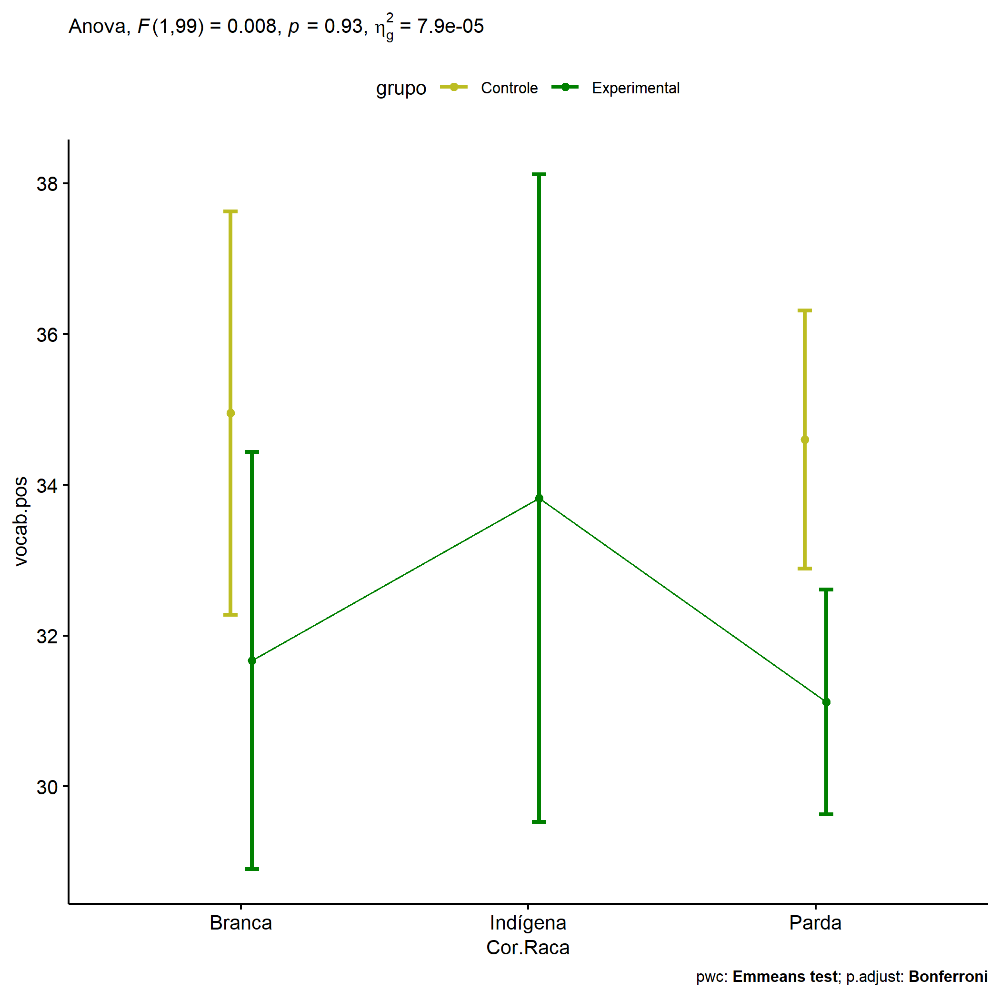<!-- -->

``` r
plots <- twoWayAncovaBoxPlots(
  wdat, "vocab.pos", c("grupo","Cor.Raca"), aov, pwcs, covar = "vocab.pre",
  theme = "classic", color = color[["grupo:Cor.Raca"]],
  subtitle = which(aov$Effect == "grupo:Cor.Raca"))
```

``` r
plots[["grupo:Cor.Raca"]] + ggplot2::ylab("Vocabulario") + ggplot2::scale_x_discrete(labels=c('pre', 'pos'))
```

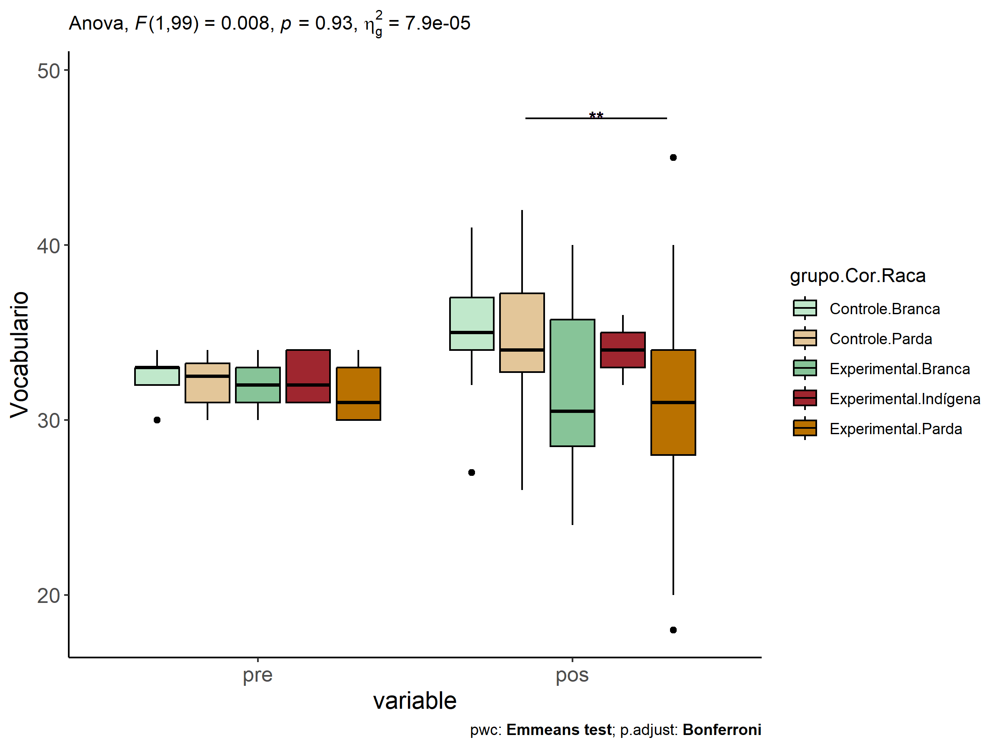<!-- -->

``` r
plots <- twoWayAncovaBoxPlots(
  wdat.long, "vocab", c("grupo","Cor.Raca"), aov, pwc.long, pre.post = "time",
  theme = "classic", color = color$prepost)
```

``` r
plots[["grupo:Cor.Raca"]] + ggplot2::ylab("Vocabulario")
```

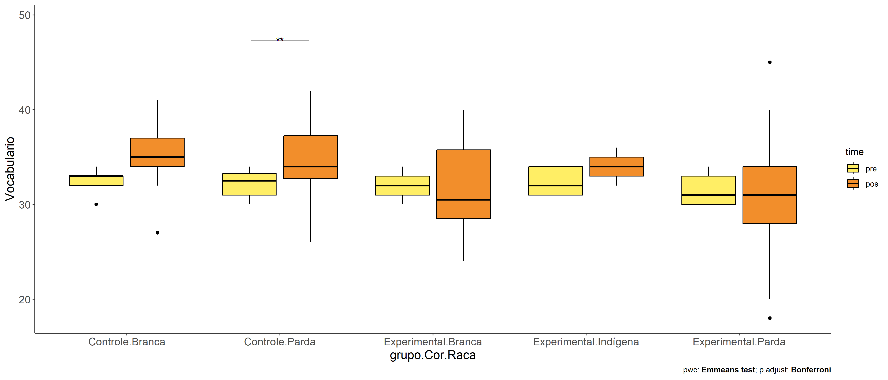<!-- -->

### Checking linearity assumption

``` r
ggscatter(wdat, x = "vocab.pre", y = "vocab.pos", size = 0.5,
          facet.by = c("grupo","Cor.Raca"), add = "reg.line")+
  stat_regline_equation(
    aes(label =  paste(..eq.label.., ..rr.label.., sep = "~~~~"))
  )
```

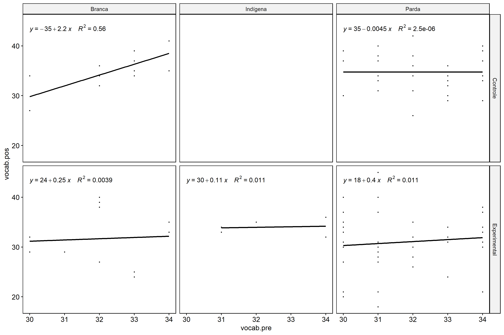<!-- -->

### Checking normality and homogeneity

``` r
res <- augment(lm(vocab.pos ~ vocab.pre + grupo*Cor.Raca, data = wdat))
```

``` r
shapiro_test(res$.resid)
```

    ## # A tibble: 1 × 3
    ##   variable   statistic p.value
    ##   <chr>          <dbl>   <dbl>
    ## 1 res$.resid     0.988   0.487

``` r
levene_test(res, .resid ~ grupo*Cor.Raca)
```

    ## # A tibble: 1 × 4
    ##     df1   df2 statistic      p
    ##   <int> <int>     <dbl>  <dbl>
    ## 1     4   100      2.03 0.0957

# ANCOVA and Pairwise for two factors **grupo:Serie**

## Without remove non-normal data

``` r
pdat = remove_group_data(dat[!is.na(dat[["grupo"]]) & !is.na(dat[["Serie"]]),], "vocab.pos", c("grupo","Serie"))

pdat.long <- rbind(pdat[,c("id","grupo","Serie")], pdat[,c("id","grupo","Serie")])
pdat.long[["time"]] <- c(rep("pre", nrow(pdat)), rep("pos", nrow(pdat)))
pdat.long[["time"]] <- factor(pdat.long[["time"]], c("pre","pos"))
pdat.long[["vocab"]] <- c(pdat[["vocab.pre"]], pdat[["vocab.pos"]])

aov = anova_test(pdat, vocab.pos ~ vocab.pre + grupo*Serie)
laov[["grupo:Serie"]] <- get_anova_table(aov)
```

``` r
pwcs <- list()
pwcs[["Serie"]] <- emmeans_test(
  group_by(pdat, grupo), vocab.pos ~ Serie,
  covariate = vocab.pre, p.adjust.method = "bonferroni")
pwcs[["grupo"]] <- emmeans_test(
  group_by(pdat, Serie), vocab.pos ~ grupo,
  covariate = vocab.pre, p.adjust.method = "bonferroni")

pwc <- plyr::rbind.fill(pwcs[["grupo"]], pwcs[["Serie"]])
pwc <- pwc[,c("grupo","Serie", colnames(pwc)[!colnames(pwc) %in% c("grupo","Serie")])]
```

``` r
pwc.long <- emmeans_test(dplyr::group_by_at(pdat.long, c("grupo","Serie")),
                         vocab ~ time,
                         p.adjust.method = "bonferroni")
lpwc[["grupo:Serie"]] <- plyr::rbind.fill(pwc, pwc.long)
```

``` r
ds <- get.descriptives(pdat, "vocab.pos", c("grupo","Serie"), covar = "vocab.pre")
ds <- merge(ds[ds$variable != "vocab.pre",],
            ds[ds$variable == "vocab.pre", !colnames(ds) %in% c("variable")],
            by = c("grupo","Serie"), all.x = T, suffixes = c("", ".vocab.pre"))
ds <- merge(get_emmeans(pwcs[["grupo"]]), ds, by = c("grupo","Serie"), suffixes = c(".emms", ""))
ds <- ds[,c("grupo","Serie","n","mean.vocab.pre","se.vocab.pre","mean","se","emmean","se.emms")]

colnames(ds) <- c("grupo","Serie", "N", paste0(c("M","SE")," (pre)"),
                  paste0(c("M","SE"), " (unadj)"), paste0(c("M", "SE"), " (adj)"))

lemms[["grupo:Serie"]] <- ds
```

## Computing ANCOVA and PairWise After removing non-normal data (OK)

``` r
wdat = pdat 

res = residuals(lm(vocab.pos ~ vocab.pre + grupo*Serie, data = wdat))
non.normal = getNonNormal(res, wdat$id, plimit = 0.05)

wdat = wdat[!wdat$id %in% non.normal,]

wdat.long <- rbind(wdat[,c("id","grupo","Serie")], wdat[,c("id","grupo","Serie")])
wdat.long[["time"]] <- c(rep("pre", nrow(wdat)), rep("pos", nrow(wdat)))
wdat.long[["time"]] <- factor(wdat.long[["time"]], c("pre","pos"))
wdat.long[["vocab"]] <- c(wdat[["vocab.pre"]], wdat[["vocab.pos"]])


ldat[["grupo:Serie"]] = wdat

(non.normal)
```

    ## [1] "P1139" "P1113" "P2304" "P1129" "P1006" "P1831" "P2206" "P2856"

``` r
aov = anova_test(wdat, vocab.pos ~ vocab.pre + grupo*Serie)
laov[["grupo:Serie"]] <- merge(get_anova_table(aov), laov[["grupo:Serie"]], by="Effect", suffixes = c("","'"))

(df = get_anova_table(aov))
```

    ## ANOVA Table (type II tests)
    ## 
    ##        Effect DFn DFd      F        p p<.05   ges
    ## 1   vocab.pre   1 232  5.204 0.023000     * 0.022
    ## 2       grupo   1 232 12.270 0.000552     * 0.050
    ## 3       Serie   3 232  2.546 0.057000       0.032
    ## 4 grupo:Serie   3 232  0.939 0.423000       0.012

| Effect      | DFn | DFd |      F |     p | p\<.05 |   ges |
|:------------|----:|----:|-------:|------:|:-------|------:|
| vocab.pre   |   1 | 232 |  5.204 | 0.023 | \*     | 0.022 |
| grupo       |   1 | 232 | 12.270 | 0.001 | \*     | 0.050 |
| Serie       |   3 | 232 |  2.546 | 0.057 |        | 0.032 |
| grupo:Serie |   3 | 232 |  0.939 | 0.423 |        | 0.012 |

``` r
pwcs <- list()
pwcs[["Serie"]] <- emmeans_test(
  group_by(wdat, grupo), vocab.pos ~ Serie,
  covariate = vocab.pre, p.adjust.method = "bonferroni")
pwcs[["grupo"]] <- emmeans_test(
  group_by(wdat, Serie), vocab.pos ~ grupo,
  covariate = vocab.pre, p.adjust.method = "bonferroni")

pwc <- plyr::rbind.fill(pwcs[["grupo"]], pwcs[["Serie"]])
pwc <- pwc[,c("grupo","Serie", colnames(pwc)[!colnames(pwc) %in% c("grupo","Serie")])]
```

| grupo        | Serie | term             | .y.       | group1   | group2       |  df | statistic |     p | p.adj | p.adj.signif |
|:-------------|:------|:-----------------|:----------|:---------|:-------------|----:|----------:|------:|------:|:-------------|
|              | 6 ano | vocab.pre\*grupo | vocab.pos | Controle | Experimental | 232 |     1.072 | 0.285 | 0.285 | ns           |
|              | 7 ano | vocab.pre\*grupo | vocab.pos | Controle | Experimental | 232 |     2.638 | 0.009 | 0.009 | \*\*         |
|              | 8 ano | vocab.pre\*grupo | vocab.pos | Controle | Experimental | 232 |     0.390 | 0.697 | 0.697 | ns           |
|              | 9 ano | vocab.pre\*grupo | vocab.pos | Controle | Experimental | 232 |     2.646 | 0.009 | 0.009 | \*\*         |
| Controle     |       | vocab.pre\*Serie | vocab.pos | 6 ano    | 7 ano        | 232 |    -1.198 | 0.232 | 1.000 | ns           |
| Controle     |       | vocab.pre\*Serie | vocab.pos | 6 ano    | 8 ano        | 232 |    -0.657 | 0.512 | 1.000 | ns           |
| Controle     |       | vocab.pre\*Serie | vocab.pos | 6 ano    | 9 ano        | 232 |    -2.177 | 0.030 | 0.183 | ns           |
| Controle     |       | vocab.pre\*Serie | vocab.pos | 7 ano    | 8 ano        | 232 |     0.476 | 0.635 | 1.000 | ns           |
| Controle     |       | vocab.pre\*Serie | vocab.pos | 7 ano    | 9 ano        | 232 |    -0.970 | 0.333 | 1.000 | ns           |
| Controle     |       | vocab.pre\*Serie | vocab.pos | 8 ano    | 9 ano        | 232 |    -1.386 | 0.167 | 1.000 | ns           |
| Experimental |       | vocab.pre\*Serie | vocab.pos | 6 ano    | 7 ano        | 232 |    -0.037 | 0.971 | 1.000 | ns           |
| Experimental |       | vocab.pre\*Serie | vocab.pos | 6 ano    | 8 ano        | 232 |    -1.672 | 0.096 | 0.575 | ns           |
| Experimental |       | vocab.pre\*Serie | vocab.pos | 6 ano    | 9 ano        | 232 |    -1.392 | 0.165 | 0.992 | ns           |
| Experimental |       | vocab.pre\*Serie | vocab.pos | 7 ano    | 8 ano        | 232 |    -1.845 | 0.066 | 0.398 | ns           |
| Experimental |       | vocab.pre\*Serie | vocab.pos | 7 ano    | 9 ano        | 232 |    -1.550 | 0.122 | 0.735 | ns           |
| Experimental |       | vocab.pre\*Serie | vocab.pos | 8 ano    | 9 ano        | 232 |     0.394 | 0.694 | 1.000 | ns           |

``` r
pwc.long <- emmeans_test(dplyr::group_by_at(wdat.long, c("grupo","Serie")),
                         vocab ~ time,
                         p.adjust.method = "bonferroni")
lpwc[["grupo:Serie"]] <- merge(plyr::rbind.fill(pwc, pwc.long), lpwc[["grupo:Serie"]], by=c("grupo","Serie","term",".y.","group1","group2"), suffixes = c("","'"))
```

| grupo        | Serie | term | .y.   | group1 | group2 |  df | statistic |     p | p.adj | p.adj.signif |
|:-------------|:------|:-----|:------|:-------|:-------|----:|----------:|------:|------:|:-------------|
| Controle     | 6 ano | time | vocab | pre    | pos    | 466 |    -0.622 | 0.534 | 0.534 | ns           |
| Controle     | 7 ano | time | vocab | pre    | pos    | 466 |    -2.175 | 0.030 | 0.030 | \*           |
| Controle     | 8 ano | time | vocab | pre    | pos    | 466 |    -1.316 | 0.189 | 0.189 | ns           |
| Controle     | 9 ano | time | vocab | pre    | pos    | 466 |    -3.771 | 0.000 | 0.000 | \*\*\*       |
| Experimental | 6 ano | time | vocab | pre    | pos    | 466 |     0.683 | 0.495 | 0.495 | ns           |
| Experimental | 7 ano | time | vocab | pre    | pos    | 466 |     0.923 | 0.357 | 0.357 | ns           |
| Experimental | 8 ano | time | vocab | pre    | pos    | 466 |    -1.565 | 0.118 | 0.118 | ns           |
| Experimental | 9 ano | time | vocab | pre    | pos    | 466 |    -1.046 | 0.296 | 0.296 | ns           |

``` r
ds <- get.descriptives(wdat, "vocab.pos", c("grupo","Serie"), covar = "vocab.pre")
ds <- merge(ds[ds$variable != "vocab.pre",],
            ds[ds$variable == "vocab.pre", !colnames(ds) %in% c("variable")],
            by = c("grupo","Serie"), all.x = T, suffixes = c("", ".vocab.pre"))
ds <- merge(get_emmeans(pwcs[["grupo"]]), ds, by = c("grupo","Serie"), suffixes = c(".emms", ""))
ds <- ds[,c("grupo","Serie","n","mean.vocab.pre","se.vocab.pre","mean","se","emmean","se.emms")]

colnames(ds) <- c("grupo","Serie", "N", paste0(c("M","SE")," (pre)"),
                  paste0(c("M","SE"), " (unadj)"), paste0(c("M", "SE"), " (adj)"))

lemms[["grupo:Serie"]] <- merge(ds, lemms[["grupo:Serie"]], by=c("grupo","Serie"), suffixes = c("","'"))
```

| grupo        | Serie |   N | M (pre) | SE (pre) | M (unadj) | SE (unadj) | M (adj) | SE (adj) |
|:-------------|:------|----:|--------:|---------:|----------:|-----------:|--------:|---------:|
| Controle     | 6 ano |  19 |  31.895 |    0.382 |    32.579 |      0.846 |  32.605 |    1.039 |
| Controle     | 7 ano |  23 |  32.261 |    0.322 |    34.435 |      0.767 |  34.289 |    0.947 |
| Controle     | 8 ano |  17 |  32.176 |    0.366 |    33.706 |      0.973 |  33.600 |    1.100 |
| Controle     | 9 ano |  30 |  32.433 |    0.238 |    35.733 |      0.885 |  35.507 |    0.833 |
| Experimental | 6 ano |  27 |  31.630 |    0.251 |    31.000 |      0.772 |  31.150 |    0.874 |
| Experimental | 7 ano |  43 |  31.791 |    0.229 |    31.116 |      0.693 |  31.191 |    0.692 |
| Experimental | 8 ano |  36 |  31.722 |    0.228 |    32.972 |      0.808 |  33.079 |    0.756 |
| Experimental | 9 ano |  46 |  31.935 |    0.212 |    32.674 |      0.785 |  32.681 |    0.668 |

### Plots for ancova

``` r
plots <- twoWayAncovaPlots(
  wdat, "vocab.pos", c("grupo","Serie"), aov, pwcs, addParam = c("mean_se"),
  font.label.size=10, step.increase=0.05, p.label="p.adj",
  subtitle = which(aov$Effect == "grupo:Serie"))
```

``` r
if (!is.null(plots[["grupo"]]))
  plots[["grupo"]] + ggplot2::scale_color_manual(values = color[["Serie"]])
```

    ## Scale for colour is already present.
    ## Adding another scale for colour, which will replace the existing scale.

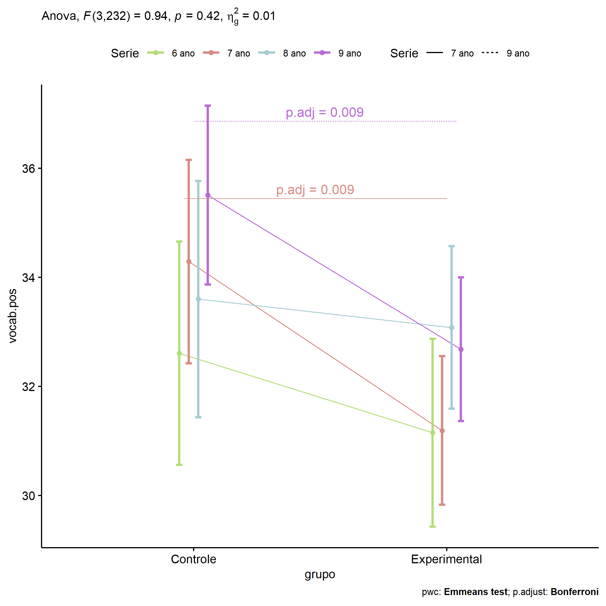<!-- -->

``` r
if (!is.null(plots[["Serie"]]))
  plots[["Serie"]] + ggplot2::scale_color_manual(values = color[["grupo"]])
```

    ## Scale for colour is already present.
    ## Adding another scale for colour, which will replace the existing scale.

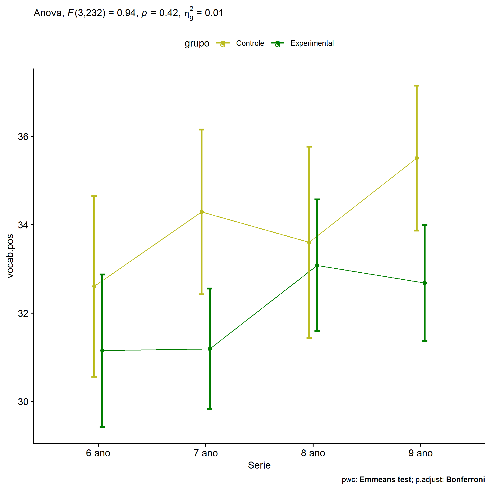<!-- -->

``` r
plots <- twoWayAncovaBoxPlots(
  wdat, "vocab.pos", c("grupo","Serie"), aov, pwcs, covar = "vocab.pre",
  theme = "classic", color = color[["grupo:Serie"]],
  subtitle = which(aov$Effect == "grupo:Serie"))
```

``` r
plots[["grupo:Serie"]] + ggplot2::ylab("Vocabulario") + ggplot2::scale_x_discrete(labels=c('pre', 'pos'))
```

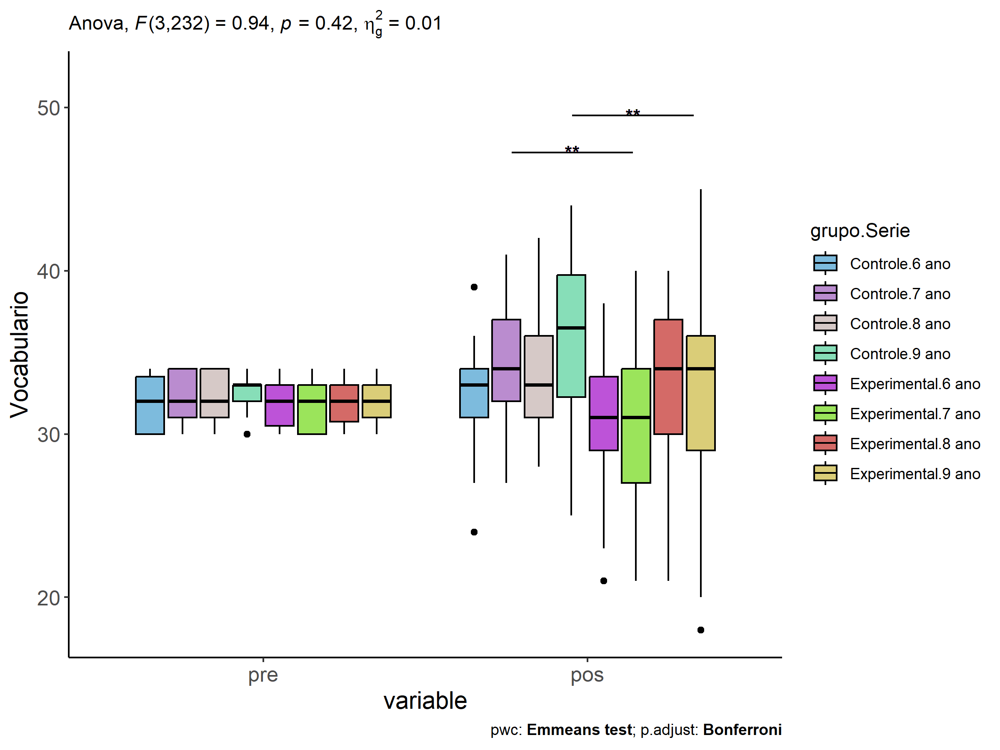<!-- -->

``` r
plots <- twoWayAncovaBoxPlots(
  wdat.long, "vocab", c("grupo","Serie"), aov, pwc.long, pre.post = "time",
  theme = "classic", color = color$prepost)
```

``` r
plots[["grupo:Serie"]] + ggplot2::ylab("Vocabulario")
```

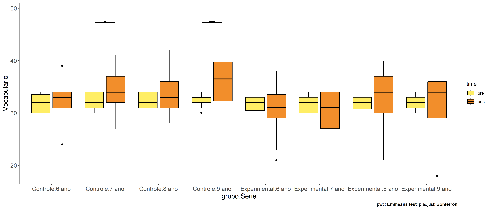<!-- -->

### Checking linearity assumption

``` r
ggscatter(wdat, x = "vocab.pre", y = "vocab.pos", size = 0.5,
          facet.by = c("grupo","Serie"), add = "reg.line")+
  stat_regline_equation(
    aes(label =  paste(..eq.label.., ..rr.label.., sep = "~~~~"))
  )
```

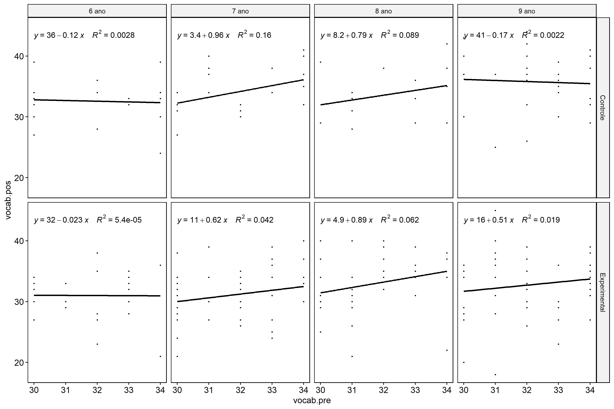<!-- -->

### Checking normality and homogeneity

``` r
res <- augment(lm(vocab.pos ~ vocab.pre + grupo*Serie, data = wdat))
```

``` r
shapiro_test(res$.resid)
```

    ## # A tibble: 1 × 3
    ##   variable   statistic p.value
    ##   <chr>          <dbl>   <dbl>
    ## 1 res$.resid     0.989  0.0624

``` r
levene_test(res, .resid ~ grupo*Serie)
```

    ## # A tibble: 1 × 4
    ##     df1   df2 statistic     p
    ##   <int> <int>     <dbl> <dbl>
    ## 1     7   233      1.07 0.386

# Summary of Results

## Descriptive Statistics

``` r
df <- get.descriptives(ldat[["grupo"]], c(dv.pre, dv.pos), c("grupo"), 
                       include.global = T, symmetry.test = T, normality.test = F)
df <- plyr::rbind.fill(
  df, do.call(plyr::rbind.fill, lapply(lfatores2, FUN = function(f) {
    if (nrow(dat) > 0 && sum(!is.na(unique(dat[[f]]))) > 1)
      get.descriptives(ldat[[paste0("grupo:",f)]], c(dv.pre,dv.pos), c("grupo", f),
                       symmetry.test = T, normality.test = F)
    }))
)
(df <- df[,c(fatores1[fatores1 %in% colnames(df)],"variable",
             colnames(df)[!colnames(df) %in% c(fatores1,"variable")])])
```

    ##           grupo Sexo   Zona Cor.Raca Serie  variable   n   mean median min max    sd    se    ci  iqr symmetry
    ## 1      Controle <NA>   <NA>     <NA>  <NA> vocab.pre  89 32.225   32.0  30  34 1.475 0.156 0.311 3.00      YES
    ## 2  Experimental <NA>   <NA>     <NA>  <NA> vocab.pre 153 31.797   32.0  30  34 1.407 0.114 0.225 3.00      YES
    ## 3          <NA> <NA>   <NA>     <NA>  <NA> vocab.pre 242 31.955   32.0  30  34 1.444 0.093 0.183 2.00      YES
    ## 4      Controle <NA>   <NA>     <NA>  <NA> vocab.pos  89 34.337   34.0  24  44 4.272 0.453 0.900 5.00      YES
    ## 5  Experimental <NA>   <NA>     <NA>  <NA> vocab.pos 153 31.915   32.0  18  45 4.931 0.399 0.788 6.00      YES
    ## 6          <NA> <NA>   <NA>     <NA>  <NA> vocab.pos 242 32.806   33.0  18  45 4.834 0.311 0.612 6.00      YES
    ## 7      Controle    F   <NA>     <NA>  <NA> vocab.pre  47 32.277   32.0  30  34 1.378 0.201 0.405 2.50      YES
    ## 8      Controle    M   <NA>     <NA>  <NA> vocab.pre  42 32.167   32.0  30  34 1.591 0.246 0.496 3.00      YES
    ## 9  Experimental    F   <NA>     <NA>  <NA> vocab.pre  78 31.808   32.0  30  34 1.359 0.154 0.306 2.00      YES
    ## 10 Experimental    M   <NA>     <NA>  <NA> vocab.pre  76 31.724   32.0  30  34 1.475 0.169 0.337 3.00      YES
    ## 11     Controle    F   <NA>     <NA>  <NA> vocab.pos  47 33.915   34.0  25  44 4.201 0.613 1.233 6.00      YES
    ## 12     Controle    M   <NA>     <NA>  <NA> vocab.pos  42 34.810   34.5  24  42 4.352 0.672 1.356 6.75      YES
    ## 13 Experimental    F   <NA>     <NA>  <NA> vocab.pos  78 33.090   33.0  23  45 4.516 0.511 1.018 6.75      YES
    ## 14 Experimental    M   <NA>     <NA>  <NA> vocab.pos  76 30.434   31.0  14  40 5.495 0.630 1.256 7.00       NO
    ## 15     Controle <NA>  Rural     <NA>  <NA> vocab.pre  48 31.917   32.0  30  34 1.514 0.218 0.439 3.00      YES
    ## 16     Controle <NA> Urbana     <NA>  <NA> vocab.pre  20 32.350   32.5  30  34 1.461 0.327 0.684 3.00      YES
    ## 17 Experimental <NA>  Rural     <NA>  <NA> vocab.pre  63 31.698   32.0  30  34 1.477 0.186 0.372 3.00      YES
    ## 18 Experimental <NA> Urbana     <NA>  <NA> vocab.pre  35 32.000   32.0  30  34 1.572 0.266 0.540 3.00      YES
    ## 19     Controle <NA>  Rural     <NA>  <NA> vocab.pos  48 34.875   34.0  24  44 4.639 0.670 1.347 6.50      YES
    ## 20     Controle <NA> Urbana     <NA>  <NA> vocab.pos  20 33.700   32.5  28  42 3.658 0.818 1.712 4.50       NO
    ## 21 Experimental <NA>  Rural     <NA>  <NA> vocab.pos  63 31.079   31.0  20  40 5.103 0.643 1.285 7.00      YES
    ## 22 Experimental <NA> Urbana     <NA>  <NA> vocab.pos  35 32.371   33.0  15  39 5.128 0.867 1.762 7.00       NO
    ## 23     Controle <NA>   <NA>   Branca  <NA> vocab.pre  13 32.462   33.0  30  34 1.330 0.369 0.804 1.00       NO
    ## 24     Controle <NA>   <NA>    Parda  <NA> vocab.pre  32 32.344   32.5  30  34 1.335 0.236 0.481 2.25      YES
    ## 25 Experimental <NA>   <NA>   Branca  <NA> vocab.pre  12 32.000   32.0  30  34 1.348 0.389 0.857 2.00      YES
    ## 26 Experimental <NA>   <NA> Indígena  <NA> vocab.pre   5 32.400   32.0  31  34 1.517 0.678 1.883 3.00 few data
    ## 27 Experimental <NA>   <NA>    Parda  <NA> vocab.pre  43 31.581   31.0  30  34 1.484 0.226 0.457 3.00       NO
    ## 28     Controle <NA>   <NA>   Branca  <NA> vocab.pos  13 35.154   35.0  27  41 3.848 1.067 2.325 3.00      YES
    ## 29     Controle <NA>   <NA>    Parda  <NA> vocab.pos  32 34.750   34.0  26  42 3.835 0.678 1.383 4.50      YES
    ## 30 Experimental <NA>   <NA>   Branca  <NA> vocab.pos  12 31.667   30.5  24  40 5.416 1.563 3.441 7.25      YES
    ## 31 Experimental <NA>   <NA> Indígena  <NA> vocab.pos   5 34.000   34.0  32  36 1.581 0.707 1.963 2.00      YES
    ## 32 Experimental <NA>   <NA>    Parda  <NA> vocab.pos  43 30.930   31.0  18  45 5.738 0.875 1.766 6.00      YES
    ## 33     Controle <NA>   <NA>     <NA> 6 ano vocab.pre  19 31.895   32.0  30  34 1.663 0.382 0.802 3.50      YES
    ## 34     Controle <NA>   <NA>     <NA> 7 ano vocab.pre  23 32.261   32.0  30  34 1.544 0.322 0.668 3.00      YES
    ## 35     Controle <NA>   <NA>     <NA> 8 ano vocab.pre  17 32.176   32.0  30  34 1.510 0.366 0.776 3.00      YES
    ## 36     Controle <NA>   <NA>     <NA> 9 ano vocab.pre  30 32.433   33.0  30  34 1.305 0.238 0.487 1.00       NO
    ## 37 Experimental <NA>   <NA>     <NA> 6 ano vocab.pre  27 31.630   32.0  30  34 1.305 0.251 0.516 2.50      YES
    ## 38 Experimental <NA>   <NA>     <NA> 7 ano vocab.pre  43 31.791   32.0  30  34 1.505 0.229 0.463 3.00      YES
    ## 39 Experimental <NA>   <NA>     <NA> 8 ano vocab.pre  36 31.722   32.0  30  34 1.365 0.228 0.462 2.25      YES
    ## 40 Experimental <NA>   <NA>     <NA> 9 ano vocab.pre  46 31.935   32.0  30  34 1.436 0.212 0.426 2.00      YES
    ## 41     Controle <NA>   <NA>     <NA> 6 ano vocab.pos  19 32.579   33.0  24  39 3.687 0.846 1.777 3.00      YES
    ## 42     Controle <NA>   <NA>     <NA> 7 ano vocab.pos  23 34.435   34.0  27  41 3.678 0.767 1.591 5.00      YES
    ## 43     Controle <NA>   <NA>     <NA> 8 ano vocab.pos  17 33.706   33.0  28  42 4.012 0.973 2.063 5.00      YES
    ## 44     Controle <NA>   <NA>     <NA> 9 ano vocab.pos  30 35.733   36.5  25  44 4.849 0.885 1.811 7.50      YES
    ## 45 Experimental <NA>   <NA>     <NA> 6 ano vocab.pos  27 31.000   31.0  21  38 4.010 0.772 1.586 4.50      YES
    ## 46 Experimental <NA>   <NA>     <NA> 7 ano vocab.pos  43 31.116   31.0  21  40 4.547 0.693 1.399 7.00      YES
    ## 47 Experimental <NA>   <NA>     <NA> 8 ano vocab.pos  36 32.972   34.0  21  40 4.849 0.808 1.641 7.00       NO
    ## 48 Experimental <NA>   <NA>     <NA> 9 ano vocab.pos  46 32.674   34.0  18  45 5.325 0.785 1.581 7.00       NO
    ##       skewness     kurtosis
    ## 1  -0.21739893 -1.344963624
    ## 2   0.13402449 -1.291894774
    ## 3   0.01310095 -1.339967994
    ## 4  -0.02959612 -0.505773202
    ## 5  -0.38664561  0.063216335
    ## 6  -0.35064008  0.146306479
    ## 7  -0.24793962 -1.159122534
    ## 8  -0.16016537 -1.582875275
    ## 9   0.13060963 -1.189671928
    ## 10  0.20449464 -1.418958598
    ## 11  0.15135746 -0.282544694
    ## 12 -0.23284891 -0.698950560
    ## 13 -0.01362050 -0.513461469
    ## 14 -0.81228521  0.467402577
    ## 15  0.06576236 -1.431210714
    ## 16 -0.29563596 -1.389579484
    ## 17  0.28131752 -1.347520270
    ## 18 -0.08829023 -1.595724004
    ## 19 -0.19010219 -0.666803463
    ## 20  0.59599684 -0.538899599
    ## 21 -0.23523158 -0.685531273
    ## 22 -1.14039711  1.776020604
    ## 23 -0.61042205 -0.769823604
    ## 24 -0.22667533 -1.275263483
    ## 25  0.00000000 -1.285833333
    ## 26  0.00000000  0.000000000
    ## 27  0.50741625 -1.211224691
    ## 28 -0.19717616 -0.477393655
    ## 29 -0.18030023 -0.749075230
    ## 30  0.18941636 -1.498235193
    ## 31  0.00000000 -1.912000000
    ## 32 -0.14496240 -0.041218053
    ## 33  0.01996559 -1.683232753
    ## 34 -0.13522710 -1.557825942
    ## 35  0.02732505 -1.720207396
    ## 36 -0.53455434 -0.790755376
    ## 37  0.17637414 -1.280947825
    ## 38  0.06222198 -1.496614429
    ## 39  0.16514189 -1.317032138
    ## 40  0.15539321 -1.343157567
    ## 41 -0.36931963 -0.016286702
    ## 42  0.08200846 -1.026609399
    ## 43  0.32307872 -0.985888661
    ## 44 -0.42157328 -0.632193878
    ## 45 -0.40333782  0.005464703
    ## 46 -0.04699756 -0.716706600
    ## 47 -0.51415058 -0.220801988
    ## 48 -0.53307410  0.321588054

| grupo        | Sexo | Zona   | Cor.Raca | Serie | variable  |   n |   mean | median | min | max |    sd |    se |    ci |  iqr | symmetry | skewness | kurtosis |
|:-------------|:-----|:-------|:---------|:------|:----------|----:|-------:|-------:|----:|----:|------:|------:|------:|-----:|:---------|---------:|---------:|
| Controle     |      |        |          |       | vocab.pre |  89 | 32.225 |   32.0 |  30 |  34 | 1.475 | 0.156 | 0.311 | 3.00 | YES      |   -0.217 |   -1.345 |
| Experimental |      |        |          |       | vocab.pre | 153 | 31.797 |   32.0 |  30 |  34 | 1.407 | 0.114 | 0.225 | 3.00 | YES      |    0.134 |   -1.292 |
|              |      |        |          |       | vocab.pre | 242 | 31.955 |   32.0 |  30 |  34 | 1.444 | 0.093 | 0.183 | 2.00 | YES      |    0.013 |   -1.340 |
| Controle     |      |        |          |       | vocab.pos |  89 | 34.337 |   34.0 |  24 |  44 | 4.272 | 0.453 | 0.900 | 5.00 | YES      |   -0.030 |   -0.506 |
| Experimental |      |        |          |       | vocab.pos | 153 | 31.915 |   32.0 |  18 |  45 | 4.931 | 0.399 | 0.788 | 6.00 | YES      |   -0.387 |    0.063 |
|              |      |        |          |       | vocab.pos | 242 | 32.806 |   33.0 |  18 |  45 | 4.834 | 0.311 | 0.612 | 6.00 | YES      |   -0.351 |    0.146 |
| Controle     | F    |        |          |       | vocab.pre |  47 | 32.277 |   32.0 |  30 |  34 | 1.378 | 0.201 | 0.405 | 2.50 | YES      |   -0.248 |   -1.159 |
| Controle     | M    |        |          |       | vocab.pre |  42 | 32.167 |   32.0 |  30 |  34 | 1.591 | 0.246 | 0.496 | 3.00 | YES      |   -0.160 |   -1.583 |
| Experimental | F    |        |          |       | vocab.pre |  78 | 31.808 |   32.0 |  30 |  34 | 1.359 | 0.154 | 0.306 | 2.00 | YES      |    0.131 |   -1.190 |
| Experimental | M    |        |          |       | vocab.pre |  76 | 31.724 |   32.0 |  30 |  34 | 1.475 | 0.169 | 0.337 | 3.00 | YES      |    0.204 |   -1.419 |
| Controle     | F    |        |          |       | vocab.pos |  47 | 33.915 |   34.0 |  25 |  44 | 4.201 | 0.613 | 1.233 | 6.00 | YES      |    0.151 |   -0.283 |
| Controle     | M    |        |          |       | vocab.pos |  42 | 34.810 |   34.5 |  24 |  42 | 4.352 | 0.672 | 1.356 | 6.75 | YES      |   -0.233 |   -0.699 |
| Experimental | F    |        |          |       | vocab.pos |  78 | 33.090 |   33.0 |  23 |  45 | 4.516 | 0.511 | 1.018 | 6.75 | YES      |   -0.014 |   -0.513 |
| Experimental | M    |        |          |       | vocab.pos |  76 | 30.434 |   31.0 |  14 |  40 | 5.495 | 0.630 | 1.256 | 7.00 | NO       |   -0.812 |    0.467 |
| Controle     |      | Rural  |          |       | vocab.pre |  48 | 31.917 |   32.0 |  30 |  34 | 1.514 | 0.218 | 0.439 | 3.00 | YES      |    0.066 |   -1.431 |
| Controle     |      | Urbana |          |       | vocab.pre |  20 | 32.350 |   32.5 |  30 |  34 | 1.461 | 0.327 | 0.684 | 3.00 | YES      |   -0.296 |   -1.390 |
| Experimental |      | Rural  |          |       | vocab.pre |  63 | 31.698 |   32.0 |  30 |  34 | 1.477 | 0.186 | 0.372 | 3.00 | YES      |    0.281 |   -1.348 |
| Experimental |      | Urbana |          |       | vocab.pre |  35 | 32.000 |   32.0 |  30 |  34 | 1.572 | 0.266 | 0.540 | 3.00 | YES      |   -0.088 |   -1.596 |
| Controle     |      | Rural  |          |       | vocab.pos |  48 | 34.875 |   34.0 |  24 |  44 | 4.639 | 0.670 | 1.347 | 6.50 | YES      |   -0.190 |   -0.667 |
| Controle     |      | Urbana |          |       | vocab.pos |  20 | 33.700 |   32.5 |  28 |  42 | 3.658 | 0.818 | 1.712 | 4.50 | NO       |    0.596 |   -0.539 |
| Experimental |      | Rural  |          |       | vocab.pos |  63 | 31.079 |   31.0 |  20 |  40 | 5.103 | 0.643 | 1.285 | 7.00 | YES      |   -0.235 |   -0.686 |
| Experimental |      | Urbana |          |       | vocab.pos |  35 | 32.371 |   33.0 |  15 |  39 | 5.128 | 0.867 | 1.762 | 7.00 | NO       |   -1.140 |    1.776 |
| Controle     |      |        | Branca   |       | vocab.pre |  13 | 32.462 |   33.0 |  30 |  34 | 1.330 | 0.369 | 0.804 | 1.00 | NO       |   -0.610 |   -0.770 |
| Controle     |      |        | Parda    |       | vocab.pre |  32 | 32.344 |   32.5 |  30 |  34 | 1.335 | 0.236 | 0.481 | 2.25 | YES      |   -0.227 |   -1.275 |
| Experimental |      |        | Branca   |       | vocab.pre |  12 | 32.000 |   32.0 |  30 |  34 | 1.348 | 0.389 | 0.857 | 2.00 | YES      |    0.000 |   -1.286 |
| Experimental |      |        | Indígena |       | vocab.pre |   5 | 32.400 |   32.0 |  31 |  34 | 1.517 | 0.678 | 1.883 | 3.00 | few data |    0.000 |    0.000 |
| Experimental |      |        | Parda    |       | vocab.pre |  43 | 31.581 |   31.0 |  30 |  34 | 1.484 | 0.226 | 0.457 | 3.00 | NO       |    0.507 |   -1.211 |
| Controle     |      |        | Branca   |       | vocab.pos |  13 | 35.154 |   35.0 |  27 |  41 | 3.848 | 1.067 | 2.325 | 3.00 | YES      |   -0.197 |   -0.477 |
| Controle     |      |        | Parda    |       | vocab.pos |  32 | 34.750 |   34.0 |  26 |  42 | 3.835 | 0.678 | 1.383 | 4.50 | YES      |   -0.180 |   -0.749 |
| Experimental |      |        | Branca   |       | vocab.pos |  12 | 31.667 |   30.5 |  24 |  40 | 5.416 | 1.563 | 3.441 | 7.25 | YES      |    0.189 |   -1.498 |
| Experimental |      |        | Indígena |       | vocab.pos |   5 | 34.000 |   34.0 |  32 |  36 | 1.581 | 0.707 | 1.963 | 2.00 | YES      |    0.000 |   -1.912 |
| Experimental |      |        | Parda    |       | vocab.pos |  43 | 30.930 |   31.0 |  18 |  45 | 5.738 | 0.875 | 1.766 | 6.00 | YES      |   -0.145 |   -0.041 |
| Controle     |      |        |          | 6 ano | vocab.pre |  19 | 31.895 |   32.0 |  30 |  34 | 1.663 | 0.382 | 0.802 | 3.50 | YES      |    0.020 |   -1.683 |
| Controle     |      |        |          | 7 ano | vocab.pre |  23 | 32.261 |   32.0 |  30 |  34 | 1.544 | 0.322 | 0.668 | 3.00 | YES      |   -0.135 |   -1.558 |
| Controle     |      |        |          | 8 ano | vocab.pre |  17 | 32.176 |   32.0 |  30 |  34 | 1.510 | 0.366 | 0.776 | 3.00 | YES      |    0.027 |   -1.720 |
| Controle     |      |        |          | 9 ano | vocab.pre |  30 | 32.433 |   33.0 |  30 |  34 | 1.305 | 0.238 | 0.487 | 1.00 | NO       |   -0.535 |   -0.791 |
| Experimental |      |        |          | 6 ano | vocab.pre |  27 | 31.630 |   32.0 |  30 |  34 | 1.305 | 0.251 | 0.516 | 2.50 | YES      |    0.176 |   -1.281 |
| Experimental |      |        |          | 7 ano | vocab.pre |  43 | 31.791 |   32.0 |  30 |  34 | 1.505 | 0.229 | 0.463 | 3.00 | YES      |    0.062 |   -1.497 |
| Experimental |      |        |          | 8 ano | vocab.pre |  36 | 31.722 |   32.0 |  30 |  34 | 1.365 | 0.228 | 0.462 | 2.25 | YES      |    0.165 |   -1.317 |
| Experimental |      |        |          | 9 ano | vocab.pre |  46 | 31.935 |   32.0 |  30 |  34 | 1.436 | 0.212 | 0.426 | 2.00 | YES      |    0.155 |   -1.343 |
| Controle     |      |        |          | 6 ano | vocab.pos |  19 | 32.579 |   33.0 |  24 |  39 | 3.687 | 0.846 | 1.777 | 3.00 | YES      |   -0.369 |   -0.016 |
| Controle     |      |        |          | 7 ano | vocab.pos |  23 | 34.435 |   34.0 |  27 |  41 | 3.678 | 0.767 | 1.591 | 5.00 | YES      |    0.082 |   -1.027 |
| Controle     |      |        |          | 8 ano | vocab.pos |  17 | 33.706 |   33.0 |  28 |  42 | 4.012 | 0.973 | 2.063 | 5.00 | YES      |    0.323 |   -0.986 |
| Controle     |      |        |          | 9 ano | vocab.pos |  30 | 35.733 |   36.5 |  25 |  44 | 4.849 | 0.885 | 1.811 | 7.50 | YES      |   -0.422 |   -0.632 |
| Experimental |      |        |          | 6 ano | vocab.pos |  27 | 31.000 |   31.0 |  21 |  38 | 4.010 | 0.772 | 1.586 | 4.50 | YES      |   -0.403 |    0.005 |
| Experimental |      |        |          | 7 ano | vocab.pos |  43 | 31.116 |   31.0 |  21 |  40 | 4.547 | 0.693 | 1.399 | 7.00 | YES      |   -0.047 |   -0.717 |
| Experimental |      |        |          | 8 ano | vocab.pos |  36 | 32.972 |   34.0 |  21 |  40 | 4.849 | 0.808 | 1.641 | 7.00 | NO       |   -0.514 |   -0.221 |
| Experimental |      |        |          | 9 ano | vocab.pos |  46 | 32.674 |   34.0 |  18 |  45 | 5.325 | 0.785 | 1.581 | 7.00 | NO       |   -0.533 |    0.322 |

## ANCOVA Table Comparison

``` r
df <- do.call(plyr::rbind.fill, laov)
(df <- df[!duplicated(df$Effect),])
```

    ##            Effect DFn DFd      F        p p<.05      ges DFn' DFd'    F'    p' p<.05'     ges'
    ## 1           grupo   1 239 12.468 0.000497     * 5.00e-02    1  246 9.072 0.003      * 0.036000
    ## 2       vocab.pre   1 239  5.286 0.022000     * 2.20e-02    1  246 5.369 0.021      * 0.021000
    ## 4      grupo:Sexo   1 238  8.145 0.005000     * 3.30e-02    1  244 3.360 0.068        0.014000
    ## 5            Sexo   1 238  4.659 0.032000     * 1.90e-02    1  244 6.129 0.014      * 0.025000
    ## 8      grupo:Zona   1 161  2.455 0.119000       1.50e-02    1  164 3.584 0.060        0.021000
    ## 10           Zona   1 161  0.037 0.848000       2.27e-04    1  164 0.108 0.743        0.000656
    ## 11       Cor.Raca   2  99  0.724 0.487000       1.40e-02    2  102 1.123 0.329        0.022000
    ## 13 grupo:Cor.Raca   1  99  0.008 0.930000       7.89e-05    1  102 0.081 0.776        0.000795
    ## 16    grupo:Serie   3 232  0.939 0.423000       1.20e-02    3  240 1.200 0.310        0.015000
    ## 17          Serie   3 232  2.546 0.057000       3.20e-02    3  240 0.502 0.681        0.006000

|     | Effect         | DFn | DFd |      F |     p | p\<.05 |   ges | DFn’ | DFd’ |    F’ |    p’ | p\<.05’ |  ges’ |
|:----|:---------------|----:|----:|-------:|------:|:-------|------:|-----:|-----:|------:|------:|:--------|------:|
| 1   | grupo          |   1 | 239 | 12.468 | 0.000 | \*     | 0.050 |    1 |  246 | 9.072 | 0.003 | \*      | 0.036 |
| 2   | vocab.pre      |   1 | 239 |  5.286 | 0.022 | \*     | 0.022 |    1 |  246 | 5.369 | 0.021 | \*      | 0.021 |
| 4   | grupo:Sexo     |   1 | 238 |  8.145 | 0.005 | \*     | 0.033 |    1 |  244 | 3.360 | 0.068 |         | 0.014 |
| 5   | Sexo           |   1 | 238 |  4.659 | 0.032 | \*     | 0.019 |    1 |  244 | 6.129 | 0.014 | \*      | 0.025 |
| 8   | grupo:Zona     |   1 | 161 |  2.455 | 0.119 |        | 0.015 |    1 |  164 | 3.584 | 0.060 |         | 0.021 |
| 10  | Zona           |   1 | 161 |  0.037 | 0.848 |        | 0.000 |    1 |  164 | 0.108 | 0.743 |         | 0.001 |
| 11  | Cor.Raca       |   2 |  99 |  0.724 | 0.487 |        | 0.014 |    2 |  102 | 1.123 | 0.329 |         | 0.022 |
| 13  | grupo:Cor.Raca |   1 |  99 |  0.008 | 0.930 |        | 0.000 |    1 |  102 | 0.081 | 0.776 |         | 0.001 |
| 16  | grupo:Serie    |   3 | 232 |  0.939 | 0.423 |        | 0.012 |    3 |  240 | 1.200 | 0.310 |         | 0.015 |
| 17  | Serie          |   3 | 232 |  2.546 | 0.057 |        | 0.032 |    3 |  240 | 0.502 | 0.681 |         | 0.006 |

## PairWise Table Comparison

``` r
df <- do.call(plyr::rbind.fill, lpwc)
df <- df[,c(names(lfatores), names(df)[!names(df) %in% c(names(lfatores),"term",".y.")])]
```

| grupo        | Sexo | Zona   | Cor.Raca | Serie | group1   | group2       |  df | statistic |     p | p.adj | p.adj.signif | df’ | statistic’ |    p’ | p.adj’ | p.adj.signif’ |
|:-------------|:-----|:-------|:---------|:------|:---------|:-------------|----:|----------:|------:|------:|:-------------|----:|-----------:|------:|-------:|:--------------|
| Controle     |      |        |          |       | pre      | pos          | 480 |    -4.056 | 0.000 | 0.000 | \*\*\*\*     | 494 |     -2.519 | 0.012 |  0.012 | \*            |
| Experimental |      |        |          |       | pre      | pos          | 480 |    -0.296 | 0.767 | 0.767 | ns           | 494 |      1.162 | 0.246 |  0.246 | ns            |
|              |      |        |          |       | Controle | Experimental | 239 |     3.531 | 0.000 | 0.000 | \*\*\*       | 246 |      3.012 | 0.003 |  0.003 | \*\*          |
| Controle     | F    |        |          |       | pre      | pos          | 478 |    -2.257 | 0.024 | 0.024 | \*           | 490 |     -1.850 | 0.065 |  0.065 | ns            |
| Controle     | M    |        |          |       | pre      | pos          | 478 |    -3.441 | 0.001 | 0.001 | \*\*\*       | 490 |     -1.763 | 0.079 |  0.079 | ns            |
| Controle     |      |        |          |       | F        | M            | 238 |    -0.967 | 0.334 | 0.334 | ns           | 244 |      0.037 | 0.971 |  0.971 | ns            |
| Experimental | F    |        |          |       | pre      | pos          | 478 |    -2.275 | 0.023 | 0.023 | \*           | 490 |     -1.215 | 0.225 |  0.225 | ns            |
| Experimental | M    |        |          |       | pre      | pos          | 478 |     2.259 | 0.024 | 0.024 | \*           | 490 |      2.909 | 0.004 |  0.004 | \*\*          |
| Experimental |      |        |          |       | F        | M            | 238 |     3.444 | 0.001 | 0.001 | \*\*\*       | 244 |      3.080 | 0.002 |  0.002 | \*\*          |
|              | F    |        |          |       | Controle | Experimental | 238 |     0.611 | 0.542 | 0.542 | ns           | 244 |      0.928 | 0.354 |  0.354 | ns            |
|              | M    |        |          |       | Controle | Experimental | 238 |     4.524 | 0.000 | 0.000 | \*\*\*\*     | 244 |      3.444 | 0.001 |  0.001 | \*\*\*        |
| Controle     |      |        |          |       | Rural    | Urbana       | 161 |     1.107 | 0.270 | 0.270 | ns           | 164 |      1.684 | 0.094 |  0.094 | ns            |
| Controle     |      | Rural  |          |       | pre      | pos          | 324 |    -4.054 | 0.000 | 0.000 | \*\*\*\*     | 330 |     -3.453 | 0.001 |  0.001 | \*\*\*        |
| Controle     |      | Urbana |          |       | pre      | pos          | 324 |    -1.194 | 0.233 | 0.233 | ns           | 330 |     -0.221 | 0.826 |  0.826 | ns            |
| Experimental |      |        |          |       | Rural    | Urbana       | 161 |    -1.118 | 0.265 | 0.265 | ns           | 164 |     -0.915 | 0.362 |  0.362 | ns            |
| Experimental |      | Rural  |          |       | pre      | pos          | 324 |     0.972 | 0.332 | 0.332 | ns           | 330 |      1.453 | 0.147 |  0.147 | ns            |
| Experimental |      | Urbana |          |       | pre      | pos          | 324 |    -0.435 | 0.664 | 0.664 | ns           | 330 |      0.084 | 0.933 |  0.933 | ns            |
|              |      | Rural  |          |       | Controle | Experimental | 161 |     4.015 | 0.000 | 0.000 | \*\*\*\*     | 164 |      3.791 | 0.000 |  0.000 | \*\*\*        |
|              |      | Urbana |          |       | Controle | Experimental | 161 |     0.849 | 0.397 | 0.397 | ns           | 164 |      0.333 | 0.740 |  0.740 | ns            |
| Controle     |      |        | Branca   |       | pre      | pos          | 200 |    -1.923 | 0.056 | 0.056 | ns           | 206 |     -1.464 | 0.145 |  0.145 | ns            |
| Controle     |      |        | Indígena |       | pre      | pos          |     |           |       |       |              |     |            |       |        |               |
| Controle     |      |        |          |       | Branca   | Indígena     |     |           |       |       |              |     |            |       |        |               |
| Controle     |      |        |          |       | Branca   | Parda        |  99 |     0.221 | 0.826 | 0.826 | ns           | 102 |      0.458 | 0.648 |  0.648 | ns            |
| Controle     |      |        |          |       | Indígena | Parda        |     |           |       |       |              |     |            |       |        |               |
| Controle     |      |        | Parda    |       | pre      | pos          | 200 |    -2.697 | 0.008 | 0.008 | \*\*         | 206 |     -1.522 | 0.129 |  0.129 | ns            |
| Experimental |      |        | Branca   |       | pre      | pos          | 200 |     0.229 | 0.819 | 0.819 | ns           | 206 |      0.174 | 0.862 |  0.862 | ns            |
| Experimental |      |        | Indígena |       | pre      | pos          | 200 |    -0.709 | 0.479 | 0.479 | ns           | 206 |     -0.539 | 0.590 |  0.590 | ns            |
| Experimental |      |        |          |       | Branca   | Indígena     |  99 |    -0.837 | 0.405 | 1.000 | ns           | 102 |     -0.624 | 0.534 |  1.000 | ns            |
| Experimental |      |        |          |       | Branca   | Parda        |  99 |     0.347 | 0.729 | 1.000 | ns           | 102 |      0.863 | 0.390 |  1.000 | ns            |
| Experimental |      |        |          |       | Indígena | Parda        |  99 |     1.176 | 0.242 | 0.727 | ns           | 102 |      1.292 | 0.199 |  0.597 | ns            |
| Experimental |      |        | Parda    |       | pre      | pos          | 200 |     0.846 | 0.399 | 0.399 | ns           | 206 |      1.933 | 0.055 |  0.055 | ns            |
|              |      |        | Branca   |       | Controle | Experimental |  99 |     1.691 | 0.094 | 0.094 | ns           | 102 |      1.261 | 0.210 |  0.210 | ns            |
|              |      |        | Indígena |       | Controle | Experimental |     |           |       |       |              |     |            |       |        |               |
|              |      |        | Parda    |       | Controle | Experimental |  99 |     3.005 | 0.003 | 0.003 | \*\*         | 102 |      2.695 | 0.008 |  0.008 | \*\*          |
| Controle     |      |        |          | 6 ano | pre      | pos          | 466 |    -0.622 | 0.534 | 0.534 | ns           | 482 |     -0.484 | 0.629 |  0.629 | ns            |
| Controle     |      |        |          | 7 ano | pre      | pos          | 466 |    -2.175 | 0.030 | 0.030 | \*           | 482 |     -1.691 | 0.092 |  0.092 | ns            |
| Controle     |      |        |          | 8 ano | pre      | pos          | 466 |    -1.316 | 0.189 | 0.189 | ns           | 482 |     -0.268 | 0.789 |  0.789 | ns            |
| Controle     |      |        |          | 9 ano | pre      | pos          | 466 |    -3.771 | 0.000 | 0.000 | \*\*\*       | 482 |     -2.272 | 0.024 |  0.024 | \*            |
| Controle     |      |        |          |       | 6 ano    | 7 ano        | 232 |    -1.198 | 0.232 | 1.000 | ns           | 240 |     -0.889 | 0.375 |  1.000 | ns            |
| Controle     |      |        |          |       | 6 ano    | 8 ano        | 232 |    -0.657 | 0.512 | 1.000 | ns           | 240 |      0.069 | 0.945 |  1.000 | ns            |
| Controle     |      |        |          |       | 6 ano    | 9 ano        | 232 |    -2.177 | 0.030 | 0.183 | ns           | 240 |     -1.186 | 0.237 |  1.000 | ns            |
| Controle     |      |        |          |       | 7 ano    | 8 ano        | 232 |     0.476 | 0.635 | 1.000 | ns           | 240 |      0.949 | 0.343 |  1.000 | ns            |
| Controle     |      |        |          |       | 7 ano    | 9 ano        | 232 |    -0.970 | 0.333 | 1.000 | ns           | 240 |     -0.257 | 0.797 |  1.000 | ns            |
| Controle     |      |        |          |       | 8 ano    | 9 ano        | 232 |    -1.386 | 0.167 | 1.000 | ns           | 240 |     -1.247 | 0.214 |  1.000 | ns            |
| Experimental |      |        |          | 6 ano | pre      | pos          | 466 |     0.683 | 0.495 | 0.495 | ns           | 482 |      1.011 | 0.312 |  0.312 | ns            |
| Experimental |      |        |          | 7 ano | pre      | pos          | 466 |     0.923 | 0.357 | 0.357 | ns           | 482 |      1.076 | 0.283 |  0.283 | ns            |
| Experimental |      |        |          | 8 ano | pre      | pos          | 466 |    -1.565 | 0.118 | 0.118 | ns           | 482 |     -0.800 | 0.424 |  0.424 | ns            |
| Experimental |      |        |          | 9 ano | pre      | pos          | 466 |    -1.046 | 0.296 | 0.296 | ns           | 482 |      0.996 | 0.320 |  0.320 | ns            |
| Experimental |      |        |          |       | 6 ano    | 7 ano        | 232 |    -0.037 | 0.971 | 1.000 | ns           | 240 |     -0.176 | 0.861 |  1.000 | ns            |
| Experimental |      |        |          |       | 6 ano    | 8 ano        | 232 |    -1.672 | 0.096 | 0.575 | ns           | 240 |     -1.386 | 0.167 |  1.000 | ns            |
| Experimental |      |        |          |       | 6 ano    | 9 ano        | 232 |    -1.392 | 0.165 | 0.992 | ns           | 240 |     -0.304 | 0.762 |  1.000 | ns            |
| Experimental |      |        |          |       | 7 ano    | 8 ano        | 232 |    -1.845 | 0.066 | 0.398 | ns           | 240 |     -1.366 | 0.173 |  1.000 | ns            |
| Experimental |      |        |          |       | 7 ano    | 9 ano        | 232 |    -1.550 | 0.122 | 0.735 | ns           | 240 |     -0.142 | 0.887 |  1.000 | ns            |
| Experimental |      |        |          |       | 8 ano    | 9 ano        | 232 |     0.394 | 0.694 | 1.000 | ns           | 240 |      1.264 | 0.208 |  1.000 | ns            |
|              |      |        |          | 6 ano | Controle | Experimental | 232 |     1.072 | 0.285 | 0.285 | ns           | 240 |      1.128 | 0.260 |  0.260 | ns            |
|              |      |        |          | 7 ano | Controle | Experimental | 232 |     2.638 | 0.009 | 0.009 | \*\*         | 240 |      2.203 | 0.029 |  0.029 | \*            |
|              |      |        |          | 8 ano | Controle | Experimental | 232 |     0.390 | 0.697 | 0.697 | ns           | 240 |     -0.119 | 0.905 |  0.905 | ns            |
|              |      |        |          | 9 ano | Controle | Experimental | 232 |     2.646 | 0.009 | 0.009 | \*\*         | 240 |      2.644 | 0.009 |  0.009 | \*\*          |

## EMMS Table Comparison

``` r
df <- do.call(plyr::rbind.fill, lemms)
df[["N-N'"]] <- df[["N"]] - df[["N'"]]
df <- df[,c(names(lfatores), names(df)[!names(df) %in% names(lfatores)])]
```

| grupo        | Sexo | Zona   | Cor.Raca | Serie |   N | M (pre) | SE (pre) | M (unadj) | SE (unadj) | M (adj) | SE (adj) |  N’ | M (pre)’ | SE (pre)’ | M (unadj)’ | SE (unadj)’ | M (adj)’ | SE (adj)’ | N-N’ |
|:-------------|:-----|:-------|:---------|:------|----:|--------:|---------:|----------:|-----------:|--------:|---------:|----:|---------:|----------:|-----------:|------------:|---------:|----------:|-----:|
| Controle     |      |        |          |       |  89 |  32.225 |    0.156 |    34.337 |      0.453 |  34.207 |    0.497 |  91 |   32.253 |     0.154 |     33.879 |       0.548 |   33.687 |     0.628 |   -2 |
| Experimental |      |        |          |       | 153 |  31.797 |    0.114 |    31.915 |      0.399 |  31.991 |    0.378 | 158 |   31.759 |     0.112 |     31.190 |       0.508 |   31.300 |     0.475 |   -5 |
| Controle     | F    |        |          |       |  47 |  32.277 |    0.201 |    33.915 |      0.613 |  33.701 |    0.688 |  47 |   32.277 |     0.201 |     33.915 |       0.613 |   33.717 |     0.858 |    0 |
| Controle     | M    |        |          |       |  42 |  32.167 |    0.246 |    34.810 |      0.672 |  34.664 |    0.725 |  44 |   32.227 |     0.239 |     33.841 |       0.933 |   33.672 |     0.885 |   -2 |
| Experimental | F    |        |          |       |  78 |  31.808 |    0.154 |    33.090 |      0.511 |  33.169 |    0.531 |  80 |   31.812 |     0.151 |     32.638 |       0.594 |   32.712 |     0.655 |   -2 |
| Experimental | M    |        |          |       |  76 |  31.724 |    0.169 |    30.434 |      0.630 |  30.566 |    0.540 |  78 |   31.705 |     0.165 |     29.705 |       0.800 |   29.843 |     0.665 |   -2 |
| Controle     |      | Rural  |          |       |  48 |  31.917 |    0.218 |    34.875 |      0.670 |  34.868 |    0.689 |  48 |   31.917 |     0.218 |     34.875 |       0.670 |   34.860 |     0.819 |    0 |
| Controle     |      | Urbana |          |       |  20 |  32.350 |    0.327 |    33.700 |      0.818 |  33.457 |    1.073 |  21 |   32.381 |     0.312 |     32.667 |       1.293 |   32.348 |     1.247 |   -1 |
| Experimental |      | Rural  |          |       |  63 |  31.698 |    0.186 |    31.079 |      0.643 |  31.191 |    0.603 |  64 |   31.688 |     0.183 |     30.609 |       0.788 |   30.744 |     0.712 |   -1 |
| Experimental |      | Urbana |          |       |  35 |  32.000 |    0.266 |    32.371 |      0.867 |  32.319 |    0.807 |  36 |   31.944 |     0.264 |     31.861 |       0.985 |   31.828 |     0.946 |   -1 |
| Controle     |      |        | Branca   |       |  13 |  32.462 |    0.369 |    35.154 |      1.067 |  34.952 |    1.349 |  13 |   32.462 |     0.369 |     35.154 |       1.067 |   34.954 |     1.810 |    0 |
| Controle     |      |        | Parda    |       |  32 |  32.344 |    0.236 |    34.750 |      0.678 |  34.601 |    0.861 |  33 |   32.394 |     0.234 |     34.152 |       0.889 |   33.982 |     1.142 |   -1 |
| Experimental |      |        | Branca   |       |  12 |  32.000 |    0.389 |    31.667 |      1.563 |  31.671 |    1.394 |  12 |   32.000 |     0.389 |     31.667 |       1.563 |   31.671 |     1.872 |    0 |
| Experimental |      |        | Indígena |       |   5 |  32.400 |    0.678 |    34.000 |      0.707 |  33.825 |    2.164 |   5 |   32.400 |     0.678 |     34.000 |       0.707 |   33.827 |     2.906 |    0 |
| Experimental |      |        | Parda    |       |  43 |  31.581 |    0.226 |    30.930 |      0.875 |  31.122 |    0.751 |  45 |   31.556 |     0.217 |     29.644 |       1.228 |   29.845 |     0.989 |   -2 |
| Controle     |      |        |          | 6 ano |  19 |  31.895 |    0.382 |    32.579 |      0.846 |  32.605 |    1.039 |  19 |   31.895 |     0.382 |     32.579 |       0.846 |   32.605 |     1.365 |    0 |
| Controle     |      |        |          | 7 ano |  23 |  32.261 |    0.322 |    34.435 |      0.767 |  34.289 |    0.947 |  23 |   32.261 |     0.322 |     34.435 |       0.767 |   34.248 |     1.244 |    0 |
| Controle     |      |        |          | 8 ano |  17 |  32.176 |    0.366 |    33.706 |      0.973 |  33.600 |    1.100 |  18 |   32.278 |     0.360 |     32.667 |       1.386 |   32.470 |     1.405 |   -1 |
| Controle     |      |        |          | 9 ano |  30 |  32.433 |    0.238 |    35.733 |      0.885 |  35.507 |    0.833 |  31 |   32.452 |     0.231 |     34.968 |       1.149 |   34.669 |     1.077 |   -1 |
| Experimental |      |        |          | 6 ano |  27 |  31.630 |    0.251 |    31.000 |      0.772 |  31.150 |    0.874 |  28 |   31.571 |     0.249 |     30.393 |       0.960 |   30.608 |     1.129 |   -1 |
| Experimental |      |        |          | 7 ano |  43 |  31.791 |    0.229 |    31.116 |      0.693 |  31.191 |    0.692 |  44 |   31.750 |     0.228 |     30.750 |       0.770 |   30.861 |     0.898 |   -1 |
| Experimental |      |        |          | 8 ano |  36 |  31.722 |    0.228 |    32.972 |      0.808 |  33.079 |    0.756 |  37 |   31.757 |     0.224 |     32.568 |       0.884 |   32.674 |     0.979 |   -1 |
| Experimental |      |        |          | 9 ano |  46 |  31.935 |    0.212 |    32.674 |      0.785 |  32.681 |    0.668 |  49 |   31.878 |     0.201 |     31.000 |       1.211 |   31.036 |     0.850 |   -3 |
