ANCOVA in Vocabulario (Vocabulario)
================
Geiser C. Challco <geiser@alumni.usp.br>

- [Descriptive Statistics of Initial
  Data](#descriptive-statistics-of-initial-data)
- [ANCOVA and Pairwise for one factor:
  **grupo**](#ancova-and-pairwise-for-one-factor-grupo)
  - [Without remove non-normal data](#without-remove-non-normal-data)
  - [Computing ANCOVA and PairWise After removing non-normal data
    (OK)](#computing-ancova-and-pairwise-after-removing-non-normal-data-ok)
    - [Plots for ancova](#plots-for-ancova)
    - [Checking linearity assumption](#checking-linearity-assumption)
    - [Checking normality and
      homogeneity](#checking-normality-and-homogeneity)
- [ANCOVA and Pairwise for two factors
  **grupo:Sexo**](#ancova-and-pairwise-for-two-factors-gruposexo)
  - [Without remove non-normal data](#without-remove-non-normal-data-1)
  - [Computing ANCOVA and PairWise After removing non-normal data
    (OK)](#computing-ancova-and-pairwise-after-removing-non-normal-data-ok-1)
    - [Plots for ancova](#plots-for-ancova-1)
    - [Checking linearity assumption](#checking-linearity-assumption-1)
    - [Checking normality and
      homogeneity](#checking-normality-and-homogeneity-1)
- [ANCOVA and Pairwise for two factors
  **grupo:Zona**](#ancova-and-pairwise-for-two-factors-grupozona)
  - [Without remove non-normal data](#without-remove-non-normal-data-2)
  - [Computing ANCOVA and PairWise After removing non-normal data
    (OK)](#computing-ancova-and-pairwise-after-removing-non-normal-data-ok-2)
    - [Plots for ancova](#plots-for-ancova-2)
    - [Checking linearity assumption](#checking-linearity-assumption-2)
    - [Checking normality and
      homogeneity](#checking-normality-and-homogeneity-2)
- [ANCOVA and Pairwise for two factors
  **grupo:Cor.Raca**](#ancova-and-pairwise-for-two-factors-grupocorraca)
  - [Without remove non-normal data](#without-remove-non-normal-data-3)
  - [Computing ANCOVA and PairWise After removing non-normal data
    (OK)](#computing-ancova-and-pairwise-after-removing-non-normal-data-ok-3)
    - [Plots for ancova](#plots-for-ancova-3)
    - [Checking linearity assumption](#checking-linearity-assumption-3)
    - [Checking normality and
      homogeneity](#checking-normality-and-homogeneity-3)
- [ANCOVA and Pairwise for two factors
  **grupo:Serie**](#ancova-and-pairwise-for-two-factors-gruposerie)
  - [Without remove non-normal data](#without-remove-non-normal-data-4)
  - [Computing ANCOVA and PairWise After removing non-normal data
    (OK)](#computing-ancova-and-pairwise-after-removing-non-normal-data-ok-4)
    - [Plots for ancova](#plots-for-ancova-4)
    - [Checking linearity assumption](#checking-linearity-assumption-4)
    - [Checking normality and
      homogeneity](#checking-normality-and-homogeneity-4)
- [Summary of Results](#summary-of-results)
  - [Descriptive Statistics](#descriptive-statistics)
  - [ANCOVA Table Comparison](#ancova-table-comparison)
  - [PairWise Table Comparison](#pairwise-table-comparison)
  - [EMMS Table Comparison](#emms-table-comparison)

**NOTE**:

- Teste ANCOVA para determinar se houve diferenças significativas no
  Vocabulario (medido usando pre- e pos-testes).
- ANCOVA test to determine whether there were significant differences in
  Vocabulario (measured using pre- and post-tests).

# Descriptive Statistics of Initial Data

``` r
df <- get.descriptives(dat, c(dv.pre, dv.pos), c("grupo"), 
                       include.global = T, symmetry.test = T, normality.test = F)
df <- plyr::rbind.fill(
  df, do.call(plyr::rbind.fill, lapply(lfatores2, FUN = function(f) {
    if (nrow(dat) > 0 && sum(!is.na(unique(dat[[f]]))) > 1)
      get.descriptives(dat, c(dv.pre,dv.pos), c("grupo", f),
                       symmetry.test = T, normality.test = F)
    }))
)
```

    ## Warning: There was 1 warning in `mutate()`.
    ## ℹ In argument: `ci = abs(stats::qt(alpha/2, .data$n - 1) * .data$se)`.
    ## Caused by warning:
    ## ! There was 1 warning in `mutate()`.
    ## ℹ In argument: `ci = abs(stats::qt(alpha/2, .data$n - 1) * .data$se)`.
    ## Caused by warning in `stats::qt()`:
    ## ! NaNs produced
    ## There was 1 warning in `mutate()`.
    ## ℹ In argument: `ci = abs(stats::qt(alpha/2, .data$n - 1) * .data$se)`.
    ## Caused by warning:
    ## ! There was 1 warning in `mutate()`.
    ## ℹ In argument: `ci = abs(stats::qt(alpha/2, .data$n - 1) * .data$se)`.
    ## Caused by warning in `stats::qt()`:
    ## ! NaNs produced

``` r
(df <- df[,c(fatores1[fatores1 %in% colnames(df)],"variable",
             colnames(df)[!colnames(df) %in% c(fatores1,"variable")])])
```

    ##           grupo Sexo   Zona Cor.Raca Serie  variable   n   mean median min max     sd    se    ci   iqr symmetry
    ## 1      Controle <NA>   <NA>     <NA>  <NA> vocab.pre 108 38.185   37.5  35  45  2.676 0.258 0.510  4.00       NO
    ## 2  Experimental <NA>   <NA>     <NA>  <NA> vocab.pre 162 38.154   38.0  35  48  2.577 0.202 0.400  4.00       NO
    ## 3          <NA> <NA>   <NA>     <NA>  <NA> vocab.pre 270 38.167   38.0  35  48  2.612 0.159 0.313  4.00       NO
    ## 4      Controle <NA>   <NA>     <NA>  <NA> vocab.pos 108 36.389   38.0  10  45  7.148 0.688 1.364  7.00       NO
    ## 5  Experimental <NA>   <NA>     <NA>  <NA> vocab.pos 162 37.623   38.0  16  47  5.328 0.419 0.827  6.00       NO
    ## 6          <NA> <NA>   <NA>     <NA>  <NA> vocab.pos 270 37.130   38.0  10  47  6.139 0.374 0.736  6.00       NO
    ## 7      Controle    F   <NA>     <NA>  <NA> vocab.pre  57 37.965   37.0  35  45  2.618 0.347 0.695  3.00       NO
    ## 8      Controle    M   <NA>     <NA>  <NA> vocab.pre  51 38.431   39.0  35  45  2.744 0.384 0.772  4.00      YES
    ## 9  Experimental    F   <NA>     <NA>  <NA> vocab.pre  90 38.178   38.0  35  44  2.424 0.256 0.508  4.00       NO
    ## 10 Experimental    M   <NA>     <NA>  <NA> vocab.pre  72 38.125   37.0  35  48  2.773 0.327 0.652  4.00       NO
    ## 11     Controle    F   <NA>     <NA>  <NA> vocab.pos  57 37.158   37.0  10  45  5.870 0.777 1.558  5.00       NO
    ## 12     Controle    M   <NA>     <NA>  <NA> vocab.pos  51 35.529   38.0  11  45  8.327 1.166 2.342  8.00       NO
    ## 13 Experimental    F   <NA>     <NA>  <NA> vocab.pos  90 38.089   38.5  16  47  5.025 0.530 1.052  5.00       NO
    ## 14 Experimental    M   <NA>     <NA>  <NA> vocab.pos  72 37.042   37.0  17  45  5.665 0.668 1.331  6.00       NO
    ## 15     Controle <NA>  Rural     <NA>  <NA> vocab.pre  43 37.465   37.0  35  45  2.585 0.394 0.796  4.00       NO
    ## 16     Controle <NA> Urbana     <NA>  <NA> vocab.pre  28 37.679   37.0  35  43  2.178 0.412 0.845  2.25       NO
    ## 17     Controle <NA>   <NA>     <NA>  <NA> vocab.pre  37 39.405   39.0  35  45  2.753 0.453 0.918  5.00      YES
    ## 18 Experimental <NA>  Rural     <NA>  <NA> vocab.pre  56 38.286   38.0  35  44  2.462 0.329 0.659  3.25      YES
    ## 19 Experimental <NA> Urbana     <NA>  <NA> vocab.pre  50 38.120   37.0  35  48  2.811 0.398 0.799  3.00       NO
    ## 20 Experimental <NA>   <NA>     <NA>  <NA> vocab.pre  56 38.054   37.5  35  44  2.511 0.336 0.673  4.00      YES
    ## 21     Controle <NA>  Rural     <NA>  <NA> vocab.pos  43 36.930   37.0  11  45  6.606 1.007 2.033  7.00       NO
    ## 22     Controle <NA> Urbana     <NA>  <NA> vocab.pos  28 37.286   38.0  22  45  4.446 0.840 1.724  3.50       NO
    ## 23     Controle <NA>   <NA>     <NA>  <NA> vocab.pos  37 35.081   39.0  10  44  9.133 1.501 3.045  9.00       NO
    ## 24 Experimental <NA>  Rural     <NA>  <NA> vocab.pos  56 37.036   38.5  16  46  6.904 0.923 1.849  6.25       NO
    ## 25 Experimental <NA> Urbana     <NA>  <NA> vocab.pos  50 38.120   38.5  26  46  4.129 0.584 1.173  5.00       NO
    ## 26 Experimental <NA>   <NA>     <NA>  <NA> vocab.pos  56 37.768   37.5  23  47  4.431 0.592 1.187  6.25       NO
    ## 27     Controle <NA>   <NA>   Branca  <NA> vocab.pre   7 39.143   38.0  36  45  3.579 1.353 3.310  5.50      YES
    ## 28     Controle <NA>   <NA> Indígena  <NA> vocab.pre   1 41.000   41.0  41  41     NA    NA   NaN  0.00 few data
    ## 29     Controle <NA>   <NA>    Parda  <NA> vocab.pre  32 37.625   37.0  35  45  2.311 0.408 0.833  3.00       NO
    ## 30     Controle <NA>   <NA>     <NA>  <NA> vocab.pre  68 38.309   38.0  35  45  2.728 0.331 0.660  4.00       NO
    ## 31 Experimental <NA>   <NA>   Branca  <NA> vocab.pre  16 38.500   38.0  36  41  1.713 0.428 0.913  3.00      YES
    ## 32 Experimental <NA>   <NA>    Parda  <NA> vocab.pre  36 38.306   38.0  35  44  2.628 0.438 0.889  3.25       NO
    ## 33 Experimental <NA>   <NA>     <NA>  <NA> vocab.pre 110 38.055   37.0  35  48  2.675 0.255 0.505  4.00       NO
    ## 34     Controle <NA>   <NA>   Branca  <NA> vocab.pos   7 40.857   42.0  36  45  3.388 1.280 3.133  4.50      YES
    ## 35     Controle <NA>   <NA> Indígena  <NA> vocab.pos   1 43.000   43.0  43  43     NA    NA   NaN  0.00 few data
    ## 36     Controle <NA>   <NA>    Parda  <NA> vocab.pos  32 35.812   37.0  10  45  7.664 1.355 2.763  6.25       NO
    ## 37     Controle <NA>   <NA>     <NA>  <NA> vocab.pos  68 36.103   38.0  11  45  7.101 0.861 1.719  6.25       NO
    ## 38 Experimental <NA>   <NA>   Branca  <NA> vocab.pos  16 39.750   40.0  35  47  3.152 0.788 1.679  4.00       NO
    ## 39 Experimental <NA>   <NA>    Parda  <NA> vocab.pos  36 38.222   39.0  17  46  5.404 0.901 1.829  6.25       NO
    ## 40 Experimental <NA>   <NA>     <NA>  <NA> vocab.pos 110 37.118   38.0  16  46  5.490 0.523 1.037  6.00       NO
    ## 41     Controle <NA>   <NA>     <NA> 6 ano vocab.pre  13 37.000   37.0  35  41  1.871 0.519 1.131  3.00       NO
    ## 42     Controle <NA>   <NA>     <NA> 7 ano vocab.pre  23 37.652   37.0  35  45  2.347 0.489 1.015  1.50       NO
    ## 43     Controle <NA>   <NA>     <NA> 8 ano vocab.pre  22 38.091   37.0  35  45  3.022 0.644 1.340  4.50       NO
    ## 44     Controle <NA>   <NA>     <NA> 9 ano vocab.pre  50 38.780   38.0  35  45  2.743 0.388 0.779  4.00      YES
    ## 45 Experimental <NA>   <NA>     <NA> 6 ano vocab.pre  17 37.059   37.0  35  43  2.076 0.503 1.067  3.00       NO
    ## 46 Experimental <NA>   <NA>     <NA> 7 ano vocab.pre  35 38.229   37.0  35  43  2.315 0.391 0.795  2.50       NO
    ## 47 Experimental <NA>   <NA>     <NA> 8 ano vocab.pre  51 37.961   38.0  35  43  2.315 0.324 0.651  4.00      YES
    ## 48 Experimental <NA>   <NA>     <NA> 9 ano vocab.pre  59 38.593   38.0  35  48  2.983 0.388 0.777  5.00       NO
    ## 49     Controle <NA>   <NA>     <NA> 6 ano vocab.pos  13 36.923   37.0  33  40  2.060 0.571 1.245  2.00      YES
    ## 50     Controle <NA>   <NA>     <NA> 7 ano vocab.pos  23 35.130   37.0  11  45  7.238 1.509 3.130  4.50       NO
    ## 51     Controle <NA>   <NA>     <NA> 8 ano vocab.pos  22 33.864   39.0  10  45 11.141 2.375 4.940 11.00       NO
    ## 52     Controle <NA>   <NA>     <NA> 9 ano vocab.pos  50 37.940   39.0  22  45  5.262 0.744 1.495  7.75       NO
    ## 53 Experimental <NA>   <NA>     <NA> 6 ano vocab.pos  17 37.059   40.0  21  43  6.057 1.469 3.114  5.00       NO
    ## 54 Experimental <NA>   <NA>     <NA> 7 ano vocab.pos  35 35.914   37.0  17  46  5.938 1.004 2.040  4.50       NO
    ## 55 Experimental <NA>   <NA>     <NA> 8 ano vocab.pos  51 37.549   38.0  16  44  5.471 0.766 1.539  6.00       NO
    ##      skewness    kurtosis
    ## 1   0.7689341 -0.21022032
    ## 2   0.7760653  0.17307977
    ## 3   0.7783964  0.03362530
    ## 4  -1.8701292  4.06050242
    ## 5  -1.5221579  3.62636530
    ## 6  -1.8649290  4.89212354
    ## 7   1.0754404  0.31280309
    ## 8   0.4428119 -0.63523727
    ## 9   0.5430048 -0.70674416
    ## 10  0.9552026  0.67450829
    ## 11 -2.0785420  6.86981467
    ## 12 -1.5392322  1.97137864
    ## 13 -1.3826687  3.53911416
    ## 14 -1.5778281  3.24807600
    ## 15  1.1979490  1.07770153
    ## 16  0.8551369 -0.20556618
    ## 17  0.2701027 -0.97667406
    ## 18  0.4508952 -0.74570957
    ## 19  1.2299681  1.34481664
    ## 20  0.4750101 -0.95295465
    ## 21 -1.6716864  3.97392987
    ## 22 -1.1289527  2.84102944
    ## 23 -1.5203980  1.46775264
    ## 24 -1.5421408  2.17705299
    ## 25 -0.7504286  0.58804080
    ## 26 -0.6793308  1.05035737
    ## 27  0.4239081 -1.65064815
    ## 28  0.0000000  0.00000000
    ## 29  1.0687579  1.26566940
    ## 30  0.6399041 -0.56992621
    ## 31  0.1492860 -1.39472495
    ## 32  0.6224128 -0.64528770
    ## 33  0.8603060  0.33238103
    ## 34 -0.2479203 -1.72655886
    ## 35  0.0000000  0.00000000
    ## 36 -1.5503511  2.55716111
    ## 37 -1.9369513  4.25313472
    ## 38  0.5390155 -0.40548269
    ## 39 -1.5747136  4.26285876
    ## 40 -1.4595245  2.91982890
    ## 41  0.5638919 -0.77708006
    ## 42  1.4100833  2.08020173
    ## 43  0.6481914 -0.80809114
    ## 44  0.4699858 -0.78778877
    ## 45  1.1892813  1.33754011
    ## 46  0.7387216 -0.76506141
    ## 47  0.3881199 -0.98952649
    ## 48  0.6918747 -0.02452173
    ## 49 -0.3805120 -1.05263967
    ## 50 -1.7924847  3.47999971
    ## 51 -1.1138459 -0.20996848
    ## 52 -0.8645616  0.19479372
    ## 53 -1.3376808  0.76412323
    ## 54 -1.1301339  1.82068479
    ## 55 -2.1089160  6.01813688
    ##  [ reached 'max' / getOption("max.print") -- omitted 1 rows ]

| grupo        | Sexo | Zona   | Cor.Raca | Serie | variable  |   n |   mean | median | min | max |     sd |    se |    ci |   iqr | symmetry | skewness | kurtosis |
|:-------------|:-----|:-------|:---------|:------|:----------|----:|-------:|-------:|----:|----:|-------:|------:|------:|------:|:---------|---------:|---------:|
| Controle     |      |        |          |       | vocab.pre | 108 | 38.185 |   37.5 |  35 |  45 |  2.676 | 0.258 | 0.510 |  4.00 | NO       |    0.769 |   -0.210 |
| Experimental |      |        |          |       | vocab.pre | 162 | 38.154 |   38.0 |  35 |  48 |  2.577 | 0.202 | 0.400 |  4.00 | NO       |    0.776 |    0.173 |
|              |      |        |          |       | vocab.pre | 270 | 38.167 |   38.0 |  35 |  48 |  2.612 | 0.159 | 0.313 |  4.00 | NO       |    0.778 |    0.034 |
| Controle     |      |        |          |       | vocab.pos | 108 | 36.389 |   38.0 |  10 |  45 |  7.148 | 0.688 | 1.364 |  7.00 | NO       |   -1.870 |    4.061 |
| Experimental |      |        |          |       | vocab.pos | 162 | 37.623 |   38.0 |  16 |  47 |  5.328 | 0.419 | 0.827 |  6.00 | NO       |   -1.522 |    3.626 |
|              |      |        |          |       | vocab.pos | 270 | 37.130 |   38.0 |  10 |  47 |  6.139 | 0.374 | 0.736 |  6.00 | NO       |   -1.865 |    4.892 |
| Controle     | F    |        |          |       | vocab.pre |  57 | 37.965 |   37.0 |  35 |  45 |  2.618 | 0.347 | 0.695 |  3.00 | NO       |    1.075 |    0.313 |
| Controle     | M    |        |          |       | vocab.pre |  51 | 38.431 |   39.0 |  35 |  45 |  2.744 | 0.384 | 0.772 |  4.00 | YES      |    0.443 |   -0.635 |
| Experimental | F    |        |          |       | vocab.pre |  90 | 38.178 |   38.0 |  35 |  44 |  2.424 | 0.256 | 0.508 |  4.00 | NO       |    0.543 |   -0.707 |
| Experimental | M    |        |          |       | vocab.pre |  72 | 38.125 |   37.0 |  35 |  48 |  2.773 | 0.327 | 0.652 |  4.00 | NO       |    0.955 |    0.675 |
| Controle     | F    |        |          |       | vocab.pos |  57 | 37.158 |   37.0 |  10 |  45 |  5.870 | 0.777 | 1.558 |  5.00 | NO       |   -2.079 |    6.870 |
| Controle     | M    |        |          |       | vocab.pos |  51 | 35.529 |   38.0 |  11 |  45 |  8.327 | 1.166 | 2.342 |  8.00 | NO       |   -1.539 |    1.971 |
| Experimental | F    |        |          |       | vocab.pos |  90 | 38.089 |   38.5 |  16 |  47 |  5.025 | 0.530 | 1.052 |  5.00 | NO       |   -1.383 |    3.539 |
| Experimental | M    |        |          |       | vocab.pos |  72 | 37.042 |   37.0 |  17 |  45 |  5.665 | 0.668 | 1.331 |  6.00 | NO       |   -1.578 |    3.248 |
| Controle     |      | Rural  |          |       | vocab.pre |  43 | 37.465 |   37.0 |  35 |  45 |  2.585 | 0.394 | 0.796 |  4.00 | NO       |    1.198 |    1.078 |
| Controle     |      | Urbana |          |       | vocab.pre |  28 | 37.679 |   37.0 |  35 |  43 |  2.178 | 0.412 | 0.845 |  2.25 | NO       |    0.855 |   -0.206 |
| Controle     |      |        |          |       | vocab.pre |  37 | 39.405 |   39.0 |  35 |  45 |  2.753 | 0.453 | 0.918 |  5.00 | YES      |    0.270 |   -0.977 |
| Experimental |      | Rural  |          |       | vocab.pre |  56 | 38.286 |   38.0 |  35 |  44 |  2.462 | 0.329 | 0.659 |  3.25 | YES      |    0.451 |   -0.746 |
| Experimental |      | Urbana |          |       | vocab.pre |  50 | 38.120 |   37.0 |  35 |  48 |  2.811 | 0.398 | 0.799 |  3.00 | NO       |    1.230 |    1.345 |
| Experimental |      |        |          |       | vocab.pre |  56 | 38.054 |   37.5 |  35 |  44 |  2.511 | 0.336 | 0.673 |  4.00 | YES      |    0.475 |   -0.953 |
| Controle     |      | Rural  |          |       | vocab.pos |  43 | 36.930 |   37.0 |  11 |  45 |  6.606 | 1.007 | 2.033 |  7.00 | NO       |   -1.672 |    3.974 |
| Controle     |      | Urbana |          |       | vocab.pos |  28 | 37.286 |   38.0 |  22 |  45 |  4.446 | 0.840 | 1.724 |  3.50 | NO       |   -1.129 |    2.841 |
| Controle     |      |        |          |       | vocab.pos |  37 | 35.081 |   39.0 |  10 |  44 |  9.133 | 1.501 | 3.045 |  9.00 | NO       |   -1.520 |    1.468 |
| Experimental |      | Rural  |          |       | vocab.pos |  56 | 37.036 |   38.5 |  16 |  46 |  6.904 | 0.923 | 1.849 |  6.25 | NO       |   -1.542 |    2.177 |
| Experimental |      | Urbana |          |       | vocab.pos |  50 | 38.120 |   38.5 |  26 |  46 |  4.129 | 0.584 | 1.173 |  5.00 | NO       |   -0.750 |    0.588 |
| Experimental |      |        |          |       | vocab.pos |  56 | 37.768 |   37.5 |  23 |  47 |  4.431 | 0.592 | 1.187 |  6.25 | NO       |   -0.679 |    1.050 |
| Controle     |      |        | Branca   |       | vocab.pre |   7 | 39.143 |   38.0 |  36 |  45 |  3.579 | 1.353 | 3.310 |  5.50 | YES      |    0.424 |   -1.651 |
| Controle     |      |        | Indígena |       | vocab.pre |   1 | 41.000 |   41.0 |  41 |  41 |        |       |       |  0.00 | few data |    0.000 |    0.000 |
| Controle     |      |        | Parda    |       | vocab.pre |  32 | 37.625 |   37.0 |  35 |  45 |  2.311 | 0.408 | 0.833 |  3.00 | NO       |    1.069 |    1.266 |
| Controle     |      |        |          |       | vocab.pre |  68 | 38.309 |   38.0 |  35 |  45 |  2.728 | 0.331 | 0.660 |  4.00 | NO       |    0.640 |   -0.570 |
| Experimental |      |        | Branca   |       | vocab.pre |  16 | 38.500 |   38.0 |  36 |  41 |  1.713 | 0.428 | 0.913 |  3.00 | YES      |    0.149 |   -1.395 |
| Experimental |      |        | Parda    |       | vocab.pre |  36 | 38.306 |   38.0 |  35 |  44 |  2.628 | 0.438 | 0.889 |  3.25 | NO       |    0.622 |   -0.645 |
| Experimental |      |        |          |       | vocab.pre | 110 | 38.055 |   37.0 |  35 |  48 |  2.675 | 0.255 | 0.505 |  4.00 | NO       |    0.860 |    0.332 |
| Controle     |      |        | Branca   |       | vocab.pos |   7 | 40.857 |   42.0 |  36 |  45 |  3.388 | 1.280 | 3.133 |  4.50 | YES      |   -0.248 |   -1.727 |
| Controle     |      |        | Indígena |       | vocab.pos |   1 | 43.000 |   43.0 |  43 |  43 |        |       |       |  0.00 | few data |    0.000 |    0.000 |
| Controle     |      |        | Parda    |       | vocab.pos |  32 | 35.812 |   37.0 |  10 |  45 |  7.664 | 1.355 | 2.763 |  6.25 | NO       |   -1.550 |    2.557 |
| Controle     |      |        |          |       | vocab.pos |  68 | 36.103 |   38.0 |  11 |  45 |  7.101 | 0.861 | 1.719 |  6.25 | NO       |   -1.937 |    4.253 |
| Experimental |      |        | Branca   |       | vocab.pos |  16 | 39.750 |   40.0 |  35 |  47 |  3.152 | 0.788 | 1.679 |  4.00 | NO       |    0.539 |   -0.405 |
| Experimental |      |        | Parda    |       | vocab.pos |  36 | 38.222 |   39.0 |  17 |  46 |  5.404 | 0.901 | 1.829 |  6.25 | NO       |   -1.575 |    4.263 |
| Experimental |      |        |          |       | vocab.pos | 110 | 37.118 |   38.0 |  16 |  46 |  5.490 | 0.523 | 1.037 |  6.00 | NO       |   -1.460 |    2.920 |
| Controle     |      |        |          | 6 ano | vocab.pre |  13 | 37.000 |   37.0 |  35 |  41 |  1.871 | 0.519 | 1.131 |  3.00 | NO       |    0.564 |   -0.777 |
| Controle     |      |        |          | 7 ano | vocab.pre |  23 | 37.652 |   37.0 |  35 |  45 |  2.347 | 0.489 | 1.015 |  1.50 | NO       |    1.410 |    2.080 |
| Controle     |      |        |          | 8 ano | vocab.pre |  22 | 38.091 |   37.0 |  35 |  45 |  3.022 | 0.644 | 1.340 |  4.50 | NO       |    0.648 |   -0.808 |
| Controle     |      |        |          | 9 ano | vocab.pre |  50 | 38.780 |   38.0 |  35 |  45 |  2.743 | 0.388 | 0.779 |  4.00 | YES      |    0.470 |   -0.788 |
| Experimental |      |        |          | 6 ano | vocab.pre |  17 | 37.059 |   37.0 |  35 |  43 |  2.076 | 0.503 | 1.067 |  3.00 | NO       |    1.189 |    1.338 |
| Experimental |      |        |          | 7 ano | vocab.pre |  35 | 38.229 |   37.0 |  35 |  43 |  2.315 | 0.391 | 0.795 |  2.50 | NO       |    0.739 |   -0.765 |
| Experimental |      |        |          | 8 ano | vocab.pre |  51 | 37.961 |   38.0 |  35 |  43 |  2.315 | 0.324 | 0.651 |  4.00 | YES      |    0.388 |   -0.990 |
| Experimental |      |        |          | 9 ano | vocab.pre |  59 | 38.593 |   38.0 |  35 |  48 |  2.983 | 0.388 | 0.777 |  5.00 | NO       |    0.692 |   -0.025 |
| Controle     |      |        |          | 6 ano | vocab.pos |  13 | 36.923 |   37.0 |  33 |  40 |  2.060 | 0.571 | 1.245 |  2.00 | YES      |   -0.381 |   -1.053 |
| Controle     |      |        |          | 7 ano | vocab.pos |  23 | 35.130 |   37.0 |  11 |  45 |  7.238 | 1.509 | 3.130 |  4.50 | NO       |   -1.792 |    3.480 |
| Controle     |      |        |          | 8 ano | vocab.pos |  22 | 33.864 |   39.0 |  10 |  45 | 11.141 | 2.375 | 4.940 | 11.00 | NO       |   -1.114 |   -0.210 |
| Controle     |      |        |          | 9 ano | vocab.pos |  50 | 37.940 |   39.0 |  22 |  45 |  5.262 | 0.744 | 1.495 |  7.75 | NO       |   -0.865 |    0.195 |
| Experimental |      |        |          | 6 ano | vocab.pos |  17 | 37.059 |   40.0 |  21 |  43 |  6.057 | 1.469 | 3.114 |  5.00 | NO       |   -1.338 |    0.764 |
| Experimental |      |        |          | 7 ano | vocab.pos |  35 | 35.914 |   37.0 |  17 |  46 |  5.938 | 1.004 | 2.040 |  4.50 | NO       |   -1.130 |    1.821 |
| Experimental |      |        |          | 8 ano | vocab.pos |  51 | 37.549 |   38.0 |  16 |  44 |  5.471 | 0.766 | 1.539 |  6.00 | NO       |   -2.109 |    6.018 |
| Experimental |      |        |          | 9 ano | vocab.pos |  59 | 38.864 |   39.0 |  27 |  47 |  4.333 | 0.564 | 1.129 |  5.00 | NO       |   -0.596 |    0.137 |

# ANCOVA and Pairwise for one factor: **grupo**

## Without remove non-normal data

``` r
pdat = remove_group_data(dat[!is.na(dat[["grupo"]]),], "vocab.pos", "grupo")

pdat.long <- rbind(pdat[,c("id","grupo")], pdat[,c("id","grupo")])
pdat.long[["time"]] <- c(rep("pre", nrow(pdat)), rep("pos", nrow(pdat)))
pdat.long[["time"]] <- factor(pdat.long[["time"]], c("pre","pos"))
pdat.long[["vocab"]] <- c(pdat[["vocab.pre"]], pdat[["vocab.pos"]])

aov = anova_test(pdat, vocab.pos ~ vocab.pre + grupo)
laov[["grupo"]] <- get_anova_table(aov)
```

``` r
pwc <- emmeans_test(pdat, vocab.pos ~ grupo, covariate = vocab.pre,
                    p.adjust.method = "bonferroni")
```

``` r
pwc.long <- emmeans_test(dplyr::group_by_at(pdat.long, "grupo"),
                          vocab ~ time,
                          p.adjust.method = "bonferroni")
lpwc[["grupo"]] <- plyr::rbind.fill(pwc, pwc.long)
```

``` r
ds <- get.descriptives(pdat, "vocab.pos", "grupo", covar = "vocab.pre")
ds <- merge(ds[ds$variable != "vocab.pre",],
            ds[ds$variable == "vocab.pre", !colnames(ds) %in% c("variable")],
            by = "grupo", all.x = T, suffixes = c("", ".vocab.pre"))
ds <- merge(get_emmeans(pwc), ds, by = "grupo", suffixes = c(".emms", ""))
ds <- ds[,c("grupo","n","mean.vocab.pre","se.vocab.pre","mean","se","emmean","se.emms")]

colnames(ds) <- c("grupo", "N", paste0(c("M","SE")," (pre)"),
                  paste0(c("M","SE"), " (unadj)"), paste0(c("M", "SE"), " (adj)"))

lemms[["grupo"]] <- ds
```

## Computing ANCOVA and PairWise After removing non-normal data (OK)

``` r
wdat = pdat 

res = residuals(lm(vocab.pos ~ vocab.pre + grupo, data = wdat))
non.normal = getNonNormal(res, wdat$id, plimit = 0.05)

wdat = wdat[!wdat$id %in% non.normal,]

wdat.long <- rbind(wdat[,c("id","grupo")], wdat[,c("id","grupo")])
wdat.long[["time"]] <- c(rep("pre", nrow(wdat)), rep("pos", nrow(wdat)))
wdat.long[["time"]] <- factor(wdat.long[["time"]], c("pre","pos"))
wdat.long[["vocab"]] <- c(wdat[["vocab.pre"]], wdat[["vocab.pos"]])

ldat[["grupo"]] = wdat

(non.normal)
```

    ##  [1] "P983"  "P1003" "P2232" "P2207" "P2245" "P3654" "P1966" "P996"  "P976"  "P2861" "P3228" "P916"  "P2394"
    ## [14] "P1012" "P1865"

``` r
aov = anova_test(wdat, vocab.pos ~ vocab.pre + grupo)
laov[["grupo"]] <- merge(get_anova_table(aov), laov[["grupo"]], by="Effect", suffixes = c("","'"))

(df = get_anova_table(aov))
```

    ## ANOVA Table (type II tests)
    ## 
    ##      Effect DFn DFd      F        p p<.05      ges
    ## 1 vocab.pre   1 252 53.357 3.65e-12     * 0.175000
    ## 2     grupo   1 252  0.196 6.58e-01       0.000778

| Effect    | DFn | DFd |      F |     p | p\<.05 |   ges |
|:----------|----:|----:|-------:|------:|:-------|------:|
| vocab.pre |   1 | 252 | 53.357 | 0.000 | \*     | 0.175 |
| grupo     |   1 | 252 |  0.196 | 0.658 |        | 0.001 |

| term             | .y.       | group1   | group2       |  df | statistic |     p | p.adj | p.adj.signif |
|:-----------------|:----------|:---------|:-------------|----:|----------:|------:|------:|:-------------|
| vocab.pre\*grupo | vocab.pos | Controle | Experimental | 252 |    -0.443 | 0.658 | 0.658 | ns           |

``` r
pwc.long <- emmeans_test(dplyr::group_by_at(wdat.long, "grupo"),
                         vocab ~ time,
                         p.adjust.method = "bonferroni")
lpwc[["grupo"]] <- merge(plyr::rbind.fill(pwc, pwc.long), lpwc[["grupo"]], by=c("grupo","term",".y.","group1","group2"), suffixes = c("","'"))
```

| grupo        | term | .y.   | group1 | group2 |  df | statistic |     p | p.adj | p.adj.signif |
|:-------------|:-----|:------|:-------|:-------|----:|----------:|------:|------:|:-------------|
| Controle     | time | vocab | pre    | pos    | 506 |     0.084 | 0.933 | 0.933 | ns           |
| Experimental | time | vocab | pre    | pos    | 506 |    -0.383 | 0.702 | 0.702 | ns           |

``` r
ds <- get.descriptives(wdat, "vocab.pos", "grupo", covar = "vocab.pre")
ds <- merge(ds[ds$variable != "vocab.pre",],
            ds[ds$variable == "vocab.pre", !colnames(ds) %in% c("variable")],
            by = "grupo", all.x = T, suffixes = c("", ".vocab.pre"))
ds <- merge(get_emmeans(pwc), ds, by = "grupo", suffixes = c(".emms", ""))
ds <- ds[,c("grupo","n","mean.vocab.pre","se.vocab.pre","mean","se","emmean","se.emms")]

colnames(ds) <- c("grupo", "N", paste0(c("M","SE")," (pre)"),
                  paste0(c("M","SE"), " (unadj)"), paste0(c("M", "SE"), " (adj)"))

lemms[["grupo"]] <- merge(ds, lemms[["grupo"]], by=c("grupo"), suffixes = c("","'"))
```

| grupo        |   N | M (pre) | SE (pre) | M (unadj) | SE (unadj) | M (adj) | SE (adj) |
|:-------------|----:|--------:|---------:|----------:|-----------:|--------:|---------:|
| Controle     |  99 |  38.111 |    0.264 |    38.071 |      0.415 |  38.095 |    0.370 |
| Experimental | 156 |  38.173 |    0.208 |    38.321 |      0.320 |  38.305 |    0.295 |

### Plots for ancova

``` r
plots <- oneWayAncovaPlots(
  wdat, "vocab.pos", "grupo", aov, list("grupo"=pwc), addParam = c("mean_se"),
  font.label.size=10, step.increase=0.05, p.label="p.adj",
  subtitle = which(aov$Effect == "grupo"))
```

``` r
if (!is.null(nrow(plots[["grupo"]]$data)))
  plots[["grupo"]] + ggplot2::scale_color_manual(values = color[["grupo"]])
```

    ## Scale for colour is already present.
    ## Adding another scale for colour, which will replace the existing scale.

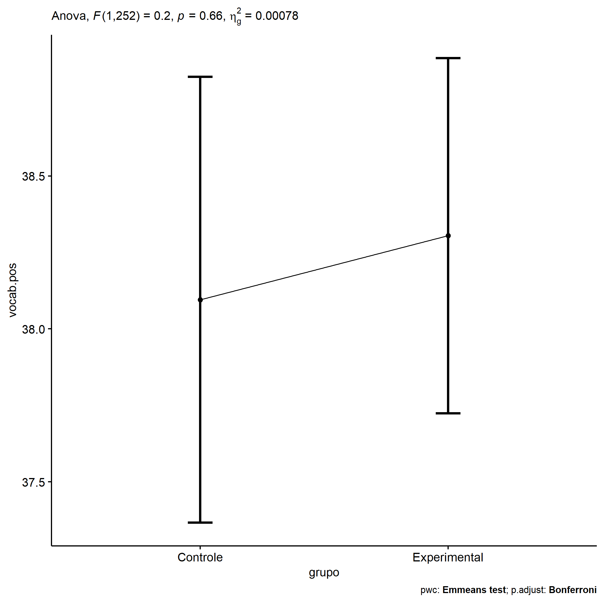<!-- -->

``` r
plots <- oneWayAncovaBoxPlots(
  wdat, "vocab.pos", "grupo", aov, pwc, covar = "vocab.pre",
  theme = "classic", color = color[["grupo"]],
  subtitle = which(aov$Effect == "grupo"))
```

``` r
if (length(unique(wdat[["grupo"]])) > 1)
  plots[["grupo"]] + ggplot2::ylab("Vocabulario") + ggplot2::scale_x_discrete(labels=c('pre', 'pos'))
```

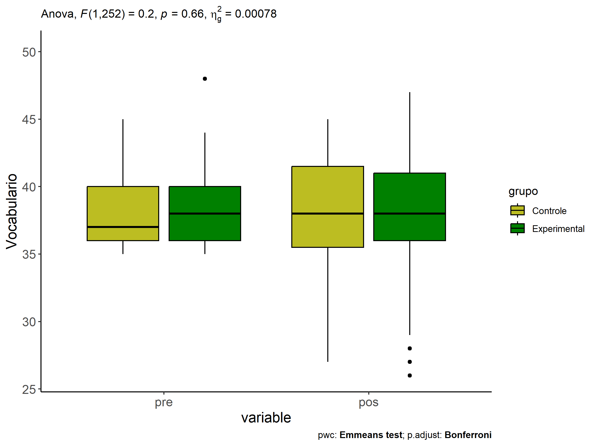<!-- -->

``` r
if (length(unique(wdat.long[["grupo"]])) > 1)
  plots <- oneWayAncovaBoxPlots(
    wdat.long, "vocab", "grupo", aov, pwc.long, pre.post = "time",
    theme = "classic", color = color$prepost)
```

``` r
if (length(unique(wdat.long[["grupo"]])) > 1)
  plots[["grupo"]] + ggplot2::ylab("Vocabulario")
```

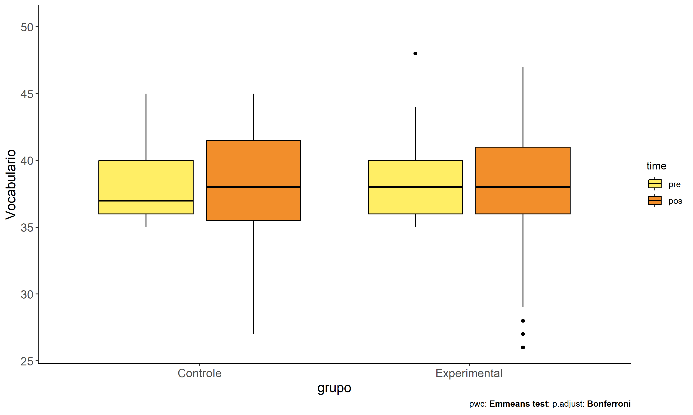<!-- -->

### Checking linearity assumption

``` r
ggscatter(wdat, x = "vocab.pre", y = "vocab.pos", size = 0.5,
          color = "grupo", add = "reg.line")+
  stat_regline_equation(
    aes(label =  paste(..eq.label.., ..rr.label.., sep = "~~~~"), color = grupo)
  )
```

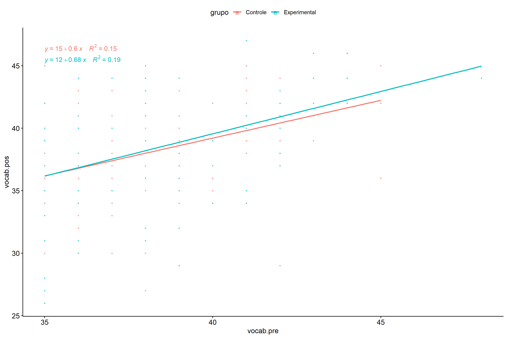<!-- -->

### Checking normality and homogeneity

``` r
res <- augment(lm(vocab.pos ~ vocab.pre + grupo, data = wdat))
```

``` r
shapiro_test(res$.resid)
```

    ## # A tibble: 1 × 3
    ##   variable   statistic p.value
    ##   <chr>          <dbl>   <dbl>
    ## 1 res$.resid     0.989  0.0467

``` r
levene_test(res, .resid ~ grupo)
```

    ## # A tibble: 1 × 4
    ##     df1   df2 statistic     p
    ##   <int> <int>     <dbl> <dbl>
    ## 1     1   253     0.125 0.724

# ANCOVA and Pairwise for two factors **grupo:Sexo**

## Without remove non-normal data

``` r
pdat = remove_group_data(dat[!is.na(dat[["grupo"]]) & !is.na(dat[["Sexo"]]),], "vocab.pos", c("grupo","Sexo"))

pdat.long <- rbind(pdat[,c("id","grupo","Sexo")], pdat[,c("id","grupo","Sexo")])
pdat.long[["time"]] <- c(rep("pre", nrow(pdat)), rep("pos", nrow(pdat)))
pdat.long[["time"]] <- factor(pdat.long[["time"]], c("pre","pos"))
pdat.long[["vocab"]] <- c(pdat[["vocab.pre"]], pdat[["vocab.pos"]])

aov = anova_test(pdat, vocab.pos ~ vocab.pre + grupo*Sexo)
laov[["grupo:Sexo"]] <- get_anova_table(aov)
```

``` r
pwcs <- list()
pwcs[["Sexo"]] <- emmeans_test(
  group_by(pdat, grupo), vocab.pos ~ Sexo,
  covariate = vocab.pre, p.adjust.method = "bonferroni")
pwcs[["grupo"]] <- emmeans_test(
  group_by(pdat, Sexo), vocab.pos ~ grupo,
  covariate = vocab.pre, p.adjust.method = "bonferroni")

pwc <- plyr::rbind.fill(pwcs[["grupo"]], pwcs[["Sexo"]])
pwc <- pwc[,c("grupo","Sexo", colnames(pwc)[!colnames(pwc) %in% c("grupo","Sexo")])]
```

``` r
pwc.long <- emmeans_test(dplyr::group_by_at(pdat.long, c("grupo","Sexo")),
                         vocab ~ time,
                         p.adjust.method = "bonferroni")
lpwc[["grupo:Sexo"]] <- plyr::rbind.fill(pwc, pwc.long)
```

``` r
ds <- get.descriptives(pdat, "vocab.pos", c("grupo","Sexo"), covar = "vocab.pre")
ds <- merge(ds[ds$variable != "vocab.pre",],
            ds[ds$variable == "vocab.pre", !colnames(ds) %in% c("variable")],
            by = c("grupo","Sexo"), all.x = T, suffixes = c("", ".vocab.pre"))
ds <- merge(get_emmeans(pwcs[["grupo"]]), ds, by = c("grupo","Sexo"), suffixes = c(".emms", ""))
ds <- ds[,c("grupo","Sexo","n","mean.vocab.pre","se.vocab.pre","mean","se","emmean","se.emms")]

colnames(ds) <- c("grupo","Sexo", "N", paste0(c("M","SE")," (pre)"),
                  paste0(c("M","SE"), " (unadj)"), paste0(c("M", "SE"), " (adj)"))

lemms[["grupo:Sexo"]] <- ds
```

## Computing ANCOVA and PairWise After removing non-normal data (OK)

``` r
wdat = pdat 

res = residuals(lm(vocab.pos ~ vocab.pre + grupo*Sexo, data = wdat))
non.normal = getNonNormal(res, wdat$id, plimit = 0.05)

wdat = wdat[!wdat$id %in% non.normal,]

wdat.long <- rbind(wdat[,c("id","grupo","Sexo")], wdat[,c("id","grupo","Sexo")])
wdat.long[["time"]] <- c(rep("pre", nrow(wdat)), rep("pos", nrow(wdat)))
wdat.long[["time"]] <- factor(wdat.long[["time"]], c("pre","pos"))
wdat.long[["vocab"]] <- c(wdat[["vocab.pre"]], wdat[["vocab.pos"]])


ldat[["grupo:Sexo"]] = wdat

(non.normal)
```

    ##  [1] "P1003" "P983"  "P2207" "P2232" "P2245" "P3654" "P1966" "P996"  "P976"  "P2861" "P2394" "P1012" "P916" 
    ## [14] "P3228" "P1865"

``` r
aov = anova_test(wdat, vocab.pos ~ vocab.pre + grupo*Sexo)
laov[["grupo:Sexo"]] <- merge(get_anova_table(aov), laov[["grupo:Sexo"]], by="Effect", suffixes = c("","'"))

(df = get_anova_table(aov))
```

    ## ANOVA Table (type II tests)
    ## 
    ##       Effect DFn DFd      F        p p<.05      ges
    ## 1  vocab.pre   1 250 55.099 1.80e-12     * 0.181000
    ## 2      grupo   1 250  0.160 6.90e-01       0.000639
    ## 3       Sexo   1 250  2.256 1.34e-01       0.009000
    ## 4 grupo:Sexo   1 250  0.415 5.20e-01       0.002000

| Effect     | DFn | DFd |      F |     p | p\<.05 |   ges |
|:-----------|----:|----:|-------:|------:|:-------|------:|
| vocab.pre  |   1 | 250 | 55.099 | 0.000 | \*     | 0.181 |
| grupo      |   1 | 250 |  0.160 | 0.690 |        | 0.001 |
| Sexo       |   1 | 250 |  2.256 | 0.134 |        | 0.009 |
| grupo:Sexo |   1 | 250 |  0.415 | 0.520 |        | 0.002 |

``` r
pwcs <- list()
pwcs[["Sexo"]] <- emmeans_test(
  group_by(wdat, grupo), vocab.pos ~ Sexo,
  covariate = vocab.pre, p.adjust.method = "bonferroni")
pwcs[["grupo"]] <- emmeans_test(
  group_by(wdat, Sexo), vocab.pos ~ grupo,
  covariate = vocab.pre, p.adjust.method = "bonferroni")

pwc <- plyr::rbind.fill(pwcs[["grupo"]], pwcs[["Sexo"]])
pwc <- pwc[,c("grupo","Sexo", colnames(pwc)[!colnames(pwc) %in% c("grupo","Sexo")])]
```

| grupo        | Sexo | term             | .y.       | group1   | group2       |  df | statistic |     p | p.adj | p.adj.signif |
|:-------------|:-----|:-----------------|:----------|:---------|:-------------|----:|----------:|------:|------:|:-------------|
|              | F    | vocab.pre\*grupo | vocab.pos | Controle | Experimental | 250 |     0.139 | 0.889 | 0.889 | ns           |
|              | M    | vocab.pre\*grupo | vocab.pos | Controle | Experimental | 250 |    -0.745 | 0.457 | 0.457 | ns           |
| Controle     |      | vocab.pre\*Sexo  | vocab.pos | F        | M            | 250 |     1.440 | 0.151 | 0.151 | ns           |
| Experimental |      | vocab.pre\*Sexo  | vocab.pos | F        | M            | 250 |     0.773 | 0.440 | 0.440 | ns           |

``` r
pwc.long <- emmeans_test(dplyr::group_by_at(wdat.long, c("grupo","Sexo")),
                         vocab ~ time,
                         p.adjust.method = "bonferroni")
lpwc[["grupo:Sexo"]] <- merge(plyr::rbind.fill(pwc, pwc.long), lpwc[["grupo:Sexo"]], by=c("grupo","Sexo","term",".y.","group1","group2"), suffixes = c("","'"))
```

| grupo        | Sexo | term | .y.   | group1 | group2 |  df | statistic |     p | p.adj | p.adj.signif |
|:-------------|:-----|:-----|:------|:-------|:-------|----:|----------:|------:|------:|:-------------|
| Controle     | F    | time | vocab | pre    | pos    | 502 |    -0.884 | 0.377 | 0.377 | ns           |
| Controle     | M    | time | vocab | pre    | pos    | 502 |     1.071 | 0.285 | 0.285 | ns           |
| Experimental | F    | time | vocab | pre    | pos    | 502 |    -0.686 | 0.493 | 0.493 | ns           |
| Experimental | M    | time | vocab | pre    | pos    | 502 |     0.201 | 0.841 | 0.841 | ns           |

``` r
ds <- get.descriptives(wdat, "vocab.pos", c("grupo","Sexo"), covar = "vocab.pre")
ds <- merge(ds[ds$variable != "vocab.pre",],
            ds[ds$variable == "vocab.pre", !colnames(ds) %in% c("variable")],
            by = c("grupo","Sexo"), all.x = T, suffixes = c("", ".vocab.pre"))
ds <- merge(get_emmeans(pwcs[["grupo"]]), ds, by = c("grupo","Sexo"), suffixes = c(".emms", ""))
ds <- ds[,c("grupo","Sexo","n","mean.vocab.pre","se.vocab.pre","mean","se","emmean","se.emms")]

colnames(ds) <- c("grupo","Sexo", "N", paste0(c("M","SE")," (pre)"),
                  paste0(c("M","SE"), " (unadj)"), paste0(c("M", "SE"), " (adj)"))

lemms[["grupo:Sexo"]] <- merge(ds, lemms[["grupo:Sexo"]], by=c("grupo","Sexo"), suffixes = c("","'"))
```

| grupo        | Sexo |   N | M (pre) | SE (pre) | M (unadj) | SE (unadj) | M (adj) | SE (adj) |
|:-------------|:-----|----:|--------:|---------:|----------:|-----------:|--------:|---------:|
| Controle     | F    |  53 |  37.736 |    0.332 |    38.321 |      0.495 |  38.594 |    0.506 |
| Controle     | M    |  46 |  38.543 |    0.413 |    37.783 |      0.690 |  37.522 |    0.543 |
| Experimental | F    |  88 |  38.159 |    0.259 |    38.511 |      0.445 |  38.505 |    0.392 |
| Experimental | M    |  68 |  38.191 |    0.342 |    38.074 |      0.456 |  38.046 |    0.446 |

### Plots for ancova

``` r
plots <- twoWayAncovaPlots(
  wdat, "vocab.pos", c("grupo","Sexo"), aov, pwcs, addParam = c("mean_se"),
  font.label.size=10, step.increase=0.05, p.label="p.adj",
  subtitle = which(aov$Effect == "grupo:Sexo"))
```

``` r
if (!is.null(plots[["grupo"]]))
  plots[["grupo"]] + ggplot2::scale_color_manual(values = color[["Sexo"]])
```

    ## Scale for colour is already present.
    ## Adding another scale for colour, which will replace the existing scale.

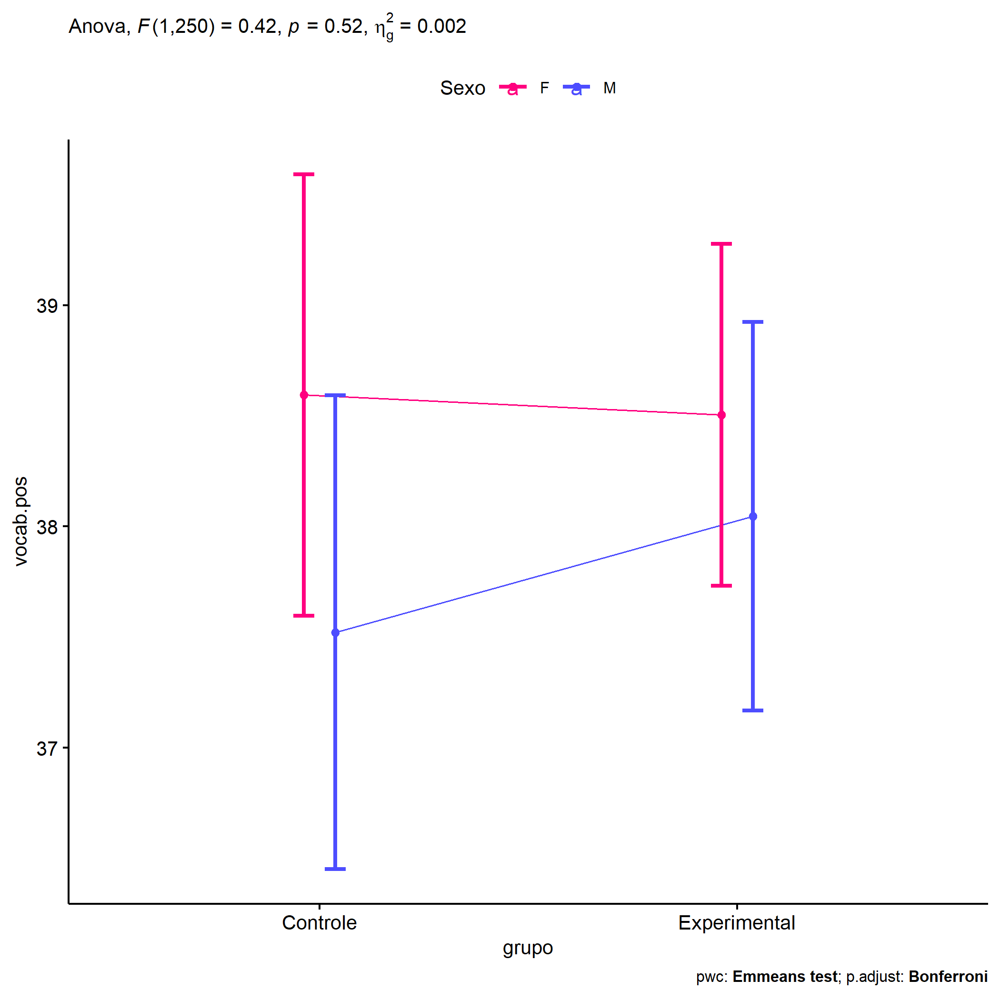<!-- -->

``` r
if (!is.null(plots[["Sexo"]]))
  plots[["Sexo"]] + ggplot2::scale_color_manual(values = color[["grupo"]])
```

    ## Scale for colour is already present.
    ## Adding another scale for colour, which will replace the existing scale.

<!-- -->

``` r
plots <- twoWayAncovaBoxPlots(
  wdat, "vocab.pos", c("grupo","Sexo"), aov, pwcs, covar = "vocab.pre",
  theme = "classic", color = color[["grupo:Sexo"]],
  subtitle = which(aov$Effect == "grupo:Sexo"))
```

``` r
plots[["grupo:Sexo"]] + ggplot2::ylab("Vocabulario") + ggplot2::scale_x_discrete(labels=c('pre', 'pos'))
```

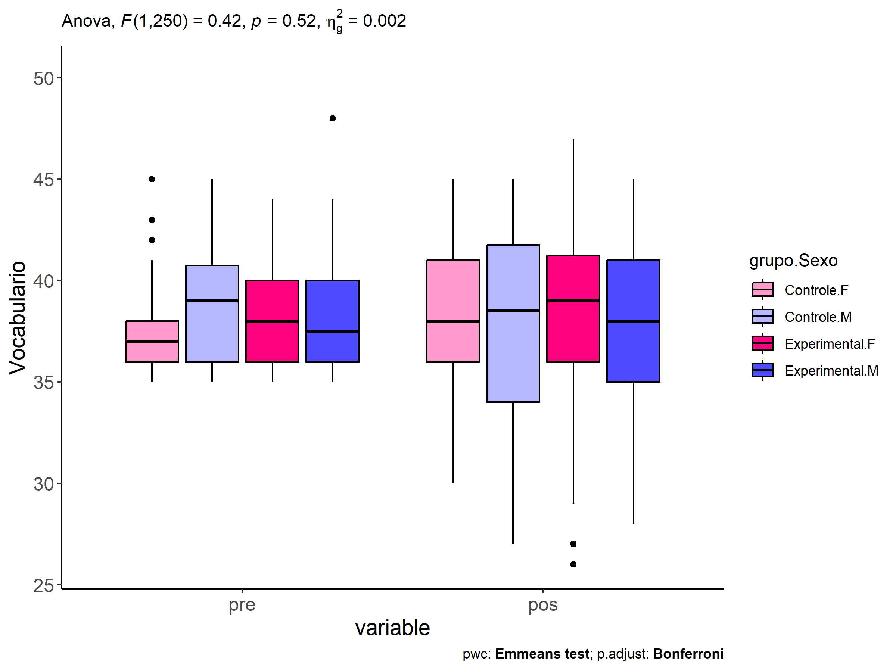<!-- -->

``` r
plots <- twoWayAncovaBoxPlots(
  wdat.long, "vocab", c("grupo","Sexo"), aov, pwc.long, pre.post = "time",
  theme = "classic", color = color$prepost)
```

``` r
plots[["grupo:Sexo"]] + ggplot2::ylab("Vocabulario")
```

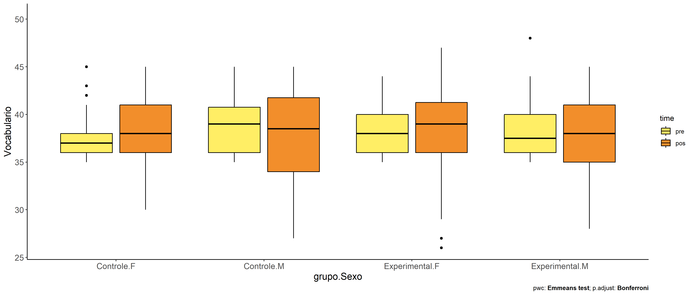<!-- -->

### Checking linearity assumption

``` r
ggscatter(wdat, x = "vocab.pre", y = "vocab.pos", size = 0.5,
          facet.by = c("grupo","Sexo"), add = "reg.line")+
  stat_regline_equation(
    aes(label =  paste(..eq.label.., ..rr.label.., sep = "~~~~"))
  )
```

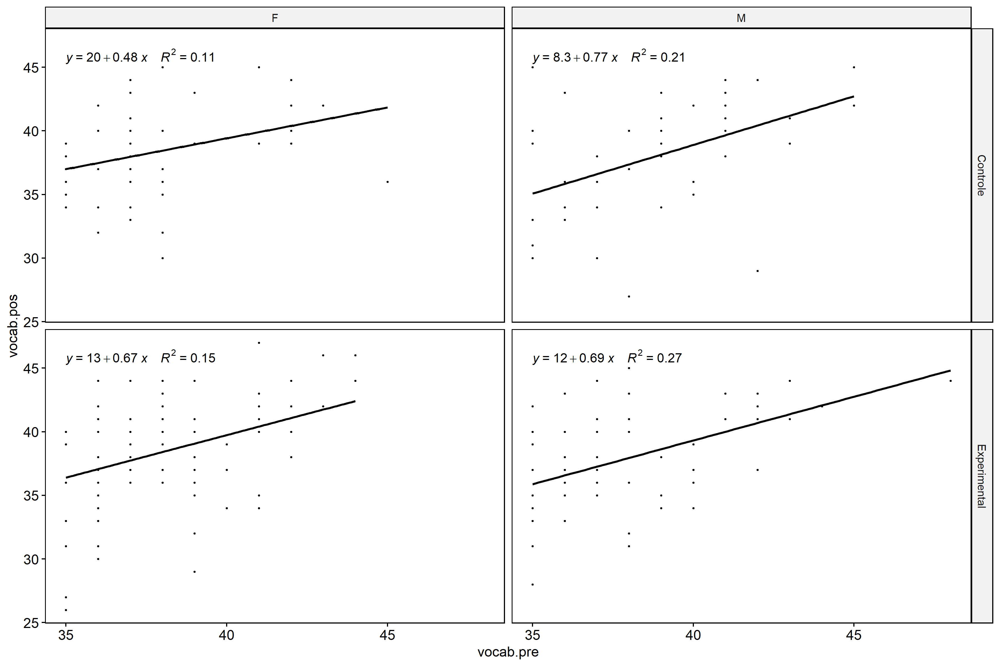<!-- -->

### Checking normality and homogeneity

``` r
res <- augment(lm(vocab.pos ~ vocab.pre + grupo*Sexo, data = wdat))
```

``` r
shapiro_test(res$.resid)
```

    ## # A tibble: 1 × 3
    ##   variable   statistic p.value
    ##   <chr>          <dbl>   <dbl>
    ## 1 res$.resid     0.988  0.0388

``` r
levene_test(res, .resid ~ grupo*Sexo)
```

    ## # A tibble: 1 × 4
    ##     df1   df2 statistic     p
    ##   <int> <int>     <dbl> <dbl>
    ## 1     3   251      1.11 0.344

# ANCOVA and Pairwise for two factors **grupo:Zona**

## Without remove non-normal data

``` r
pdat = remove_group_data(dat[!is.na(dat[["grupo"]]) & !is.na(dat[["Zona"]]),], "vocab.pos", c("grupo","Zona"))

pdat.long <- rbind(pdat[,c("id","grupo","Zona")], pdat[,c("id","grupo","Zona")])
pdat.long[["time"]] <- c(rep("pre", nrow(pdat)), rep("pos", nrow(pdat)))
pdat.long[["time"]] <- factor(pdat.long[["time"]], c("pre","pos"))
pdat.long[["vocab"]] <- c(pdat[["vocab.pre"]], pdat[["vocab.pos"]])

aov = anova_test(pdat, vocab.pos ~ vocab.pre + grupo*Zona)
laov[["grupo:Zona"]] <- get_anova_table(aov)
```

``` r
pwcs <- list()
pwcs[["Zona"]] <- emmeans_test(
  group_by(pdat, grupo), vocab.pos ~ Zona,
  covariate = vocab.pre, p.adjust.method = "bonferroni")
pwcs[["grupo"]] <- emmeans_test(
  group_by(pdat, Zona), vocab.pos ~ grupo,
  covariate = vocab.pre, p.adjust.method = "bonferroni")

pwc <- plyr::rbind.fill(pwcs[["grupo"]], pwcs[["Zona"]])
pwc <- pwc[,c("grupo","Zona", colnames(pwc)[!colnames(pwc) %in% c("grupo","Zona")])]
```

``` r
pwc.long <- emmeans_test(dplyr::group_by_at(pdat.long, c("grupo","Zona")),
                         vocab ~ time,
                         p.adjust.method = "bonferroni")
lpwc[["grupo:Zona"]] <- plyr::rbind.fill(pwc, pwc.long)
```

``` r
ds <- get.descriptives(pdat, "vocab.pos", c("grupo","Zona"), covar = "vocab.pre")
ds <- merge(ds[ds$variable != "vocab.pre",],
            ds[ds$variable == "vocab.pre", !colnames(ds) %in% c("variable")],
            by = c("grupo","Zona"), all.x = T, suffixes = c("", ".vocab.pre"))
ds <- merge(get_emmeans(pwcs[["grupo"]]), ds, by = c("grupo","Zona"), suffixes = c(".emms", ""))
ds <- ds[,c("grupo","Zona","n","mean.vocab.pre","se.vocab.pre","mean","se","emmean","se.emms")]

colnames(ds) <- c("grupo","Zona", "N", paste0(c("M","SE")," (pre)"),
                  paste0(c("M","SE"), " (unadj)"), paste0(c("M", "SE"), " (adj)"))

lemms[["grupo:Zona"]] <- ds
```

## Computing ANCOVA and PairWise After removing non-normal data (OK)

``` r
wdat = pdat 

res = residuals(lm(vocab.pos ~ vocab.pre + grupo*Zona, data = wdat))
non.normal = getNonNormal(res, wdat$id, plimit = 0.05)

wdat = wdat[!wdat$id %in% non.normal,]

wdat.long <- rbind(wdat[,c("id","grupo","Zona")], wdat[,c("id","grupo","Zona")])
wdat.long[["time"]] <- c(rep("pre", nrow(wdat)), rep("pos", nrow(wdat)))
wdat.long[["time"]] <- factor(wdat.long[["time"]], c("pre","pos"))
wdat.long[["vocab"]] <- c(wdat[["vocab.pre"]], wdat[["vocab.pos"]])


ldat[["grupo:Zona"]] = wdat

(non.normal)
```

    ## [1] "P983"  "P2207" "P1966" "P3654" "P976"  "P2861" "P3228" "P916"

``` r
aov = anova_test(wdat, vocab.pos ~ vocab.pre + grupo*Zona)
laov[["grupo:Zona"]] <- merge(get_anova_table(aov), laov[["grupo:Zona"]], by="Effect", suffixes = c("","'"))

(df = get_anova_table(aov))
```

    ## ANOVA Table (type II tests)
    ## 
    ##       Effect DFn DFd      F        p p<.05      ges
    ## 1  vocab.pre   1 164 24.719 1.66e-06     * 0.131000
    ## 2      grupo   1 164  0.106 7.45e-01       0.000647
    ## 3       Zona   1 164  0.629 4.29e-01       0.004000
    ## 4 grupo:Zona   1 164  0.059 8.08e-01       0.000362

| Effect     | DFn | DFd |      F |     p | p\<.05 |   ges |
|:-----------|----:|----:|-------:|------:|:-------|------:|
| vocab.pre  |   1 | 164 | 24.719 | 0.000 | \*     | 0.131 |
| grupo      |   1 | 164 |  0.106 | 0.745 |        | 0.001 |
| Zona       |   1 | 164 |  0.629 | 0.429 |        | 0.004 |
| grupo:Zona |   1 | 164 |  0.059 | 0.808 |        | 0.000 |

``` r
pwcs <- list()
pwcs[["Zona"]] <- emmeans_test(
  group_by(wdat, grupo), vocab.pos ~ Zona,
  covariate = vocab.pre, p.adjust.method = "bonferroni")
pwcs[["grupo"]] <- emmeans_test(
  group_by(wdat, Zona), vocab.pos ~ grupo,
  covariate = vocab.pre, p.adjust.method = "bonferroni")

pwc <- plyr::rbind.fill(pwcs[["grupo"]], pwcs[["Zona"]])
pwc <- pwc[,c("grupo","Zona", colnames(pwc)[!colnames(pwc) %in% c("grupo","Zona")])]
```

| grupo        | Zona   | term             | .y.       | group1   | group2       |  df | statistic |     p | p.adj | p.adj.signif |
|:-------------|:-------|:-----------------|:----------|:---------|:-------------|----:|----------:|------:|------:|:-------------|
|              | Rural  | vocab.pre\*grupo | vocab.pos | Controle | Experimental | 164 |    -0.406 | 0.685 | 0.685 | ns           |
|              | Urbana | vocab.pre\*grupo | vocab.pos | Controle | Experimental | 164 |    -0.035 | 0.972 | 0.972 | ns           |
| Controle     |        | vocab.pre\*Zona  | vocab.pos | Rural    | Urbana       | 164 |     0.306 | 0.760 | 0.760 | ns           |
| Experimental |        | vocab.pre\*Zona  | vocab.pos | Rural    | Urbana       | 164 |     0.771 | 0.442 | 0.442 | ns           |

``` r
pwc.long <- emmeans_test(dplyr::group_by_at(wdat.long, c("grupo","Zona")),
                         vocab ~ time,
                         p.adjust.method = "bonferroni")
lpwc[["grupo:Zona"]] <- merge(plyr::rbind.fill(pwc, pwc.long), lpwc[["grupo:Zona"]], by=c("grupo","Zona","term",".y.","group1","group2"), suffixes = c("","'"))
```

| grupo        | Zona   | term | .y.   | group1 | group2 |  df | statistic |     p | p.adj | p.adj.signif |
|:-------------|:-------|:-----|:------|:-------|:-------|----:|----------:|------:|------:|:-------------|
| Controle     | Rural  | time | vocab | pre    | pos    | 330 |    -0.747 | 0.456 | 0.456 | ns           |
| Controle     | Urbana | time | vocab | pre    | pos    | 330 |    -0.160 | 0.873 | 0.873 | ns           |
| Experimental | Rural  | time | vocab | pre    | pos    | 330 |    -0.728 | 0.467 | 0.467 | ns           |
| Experimental | Urbana | time | vocab | pre    | pos    | 330 |     0.000 | 1.000 | 1.000 | ns           |

``` r
ds <- get.descriptives(wdat, "vocab.pos", c("grupo","Zona"), covar = "vocab.pre")
ds <- merge(ds[ds$variable != "vocab.pre",],
            ds[ds$variable == "vocab.pre", !colnames(ds) %in% c("variable")],
            by = c("grupo","Zona"), all.x = T, suffixes = c("", ".vocab.pre"))
ds <- merge(get_emmeans(pwcs[["grupo"]]), ds, by = c("grupo","Zona"), suffixes = c(".emms", ""))
ds <- ds[,c("grupo","Zona","n","mean.vocab.pre","se.vocab.pre","mean","se","emmean","se.emms")]

colnames(ds) <- c("grupo","Zona", "N", paste0(c("M","SE")," (pre)"),
                  paste0(c("M","SE"), " (unadj)"), paste0(c("M", "SE"), " (adj)"))

lemms[["grupo:Zona"]] <- merge(ds, lemms[["grupo:Zona"]], by=c("grupo","Zona"), suffixes = c("","'"))
```

| grupo        | Zona   |   N | M (pre) | SE (pre) | M (unadj) | SE (unadj) | M (adj) | SE (adj) |
|:-------------|:-------|----:|--------:|---------:|----------:|-----------:|--------:|---------:|
| Controle     | Rural  |  41 |  37.415 |    0.409 |    37.976 |      0.711 |  38.278 |    0.595 |
| Controle     | Urbana |  27 |  37.704 |    0.426 |    37.852 |      0.644 |  37.990 |    0.730 |
| Experimental | Rural  |  51 |  38.333 |    0.349 |    38.824 |      0.546 |  38.604 |    0.533 |
| Experimental | Urbana |  50 |  38.120 |    0.398 |    38.120 |      0.584 |  38.021 |    0.537 |

### Plots for ancova

``` r
plots <- twoWayAncovaPlots(
  wdat, "vocab.pos", c("grupo","Zona"), aov, pwcs, addParam = c("mean_se"),
  font.label.size=10, step.increase=0.05, p.label="p.adj",
  subtitle = which(aov$Effect == "grupo:Zona"))
```

``` r
if (!is.null(plots[["grupo"]]))
  plots[["grupo"]] + ggplot2::scale_color_manual(values = color[["Zona"]])
```

    ## Scale for colour is already present.
    ## Adding another scale for colour, which will replace the existing scale.

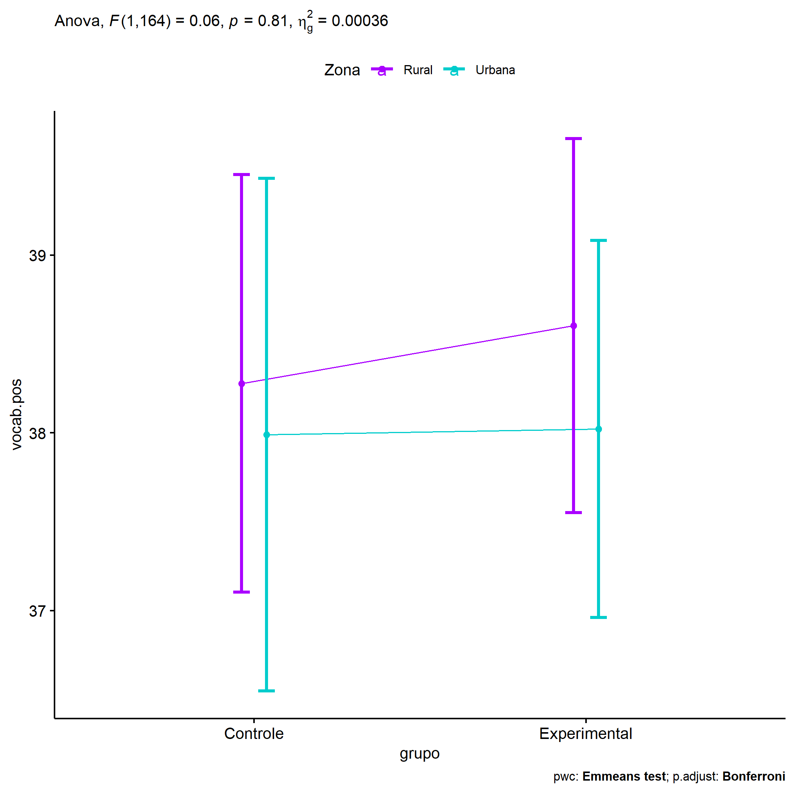<!-- -->

``` r
if (!is.null(plots[["Zona"]]))
  plots[["Zona"]] + ggplot2::scale_color_manual(values = color[["grupo"]])
```

    ## Scale for colour is already present.
    ## Adding another scale for colour, which will replace the existing scale.

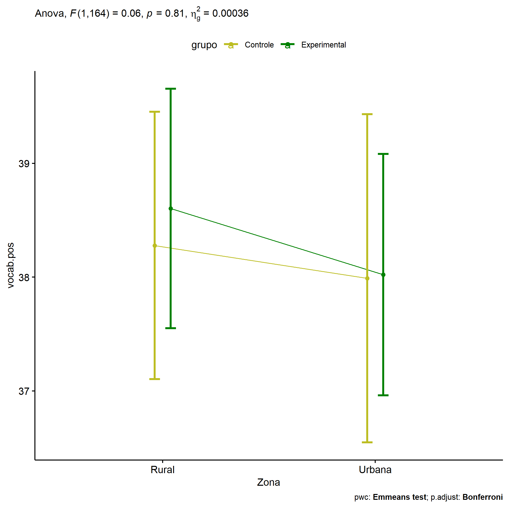<!-- -->

``` r
plots <- twoWayAncovaBoxPlots(
  wdat, "vocab.pos", c("grupo","Zona"), aov, pwcs, covar = "vocab.pre",
  theme = "classic", color = color[["grupo:Zona"]],
  subtitle = which(aov$Effect == "grupo:Zona"))
```

``` r
plots[["grupo:Zona"]] + ggplot2::ylab("Vocabulario") + ggplot2::scale_x_discrete(labels=c('pre', 'pos'))
```

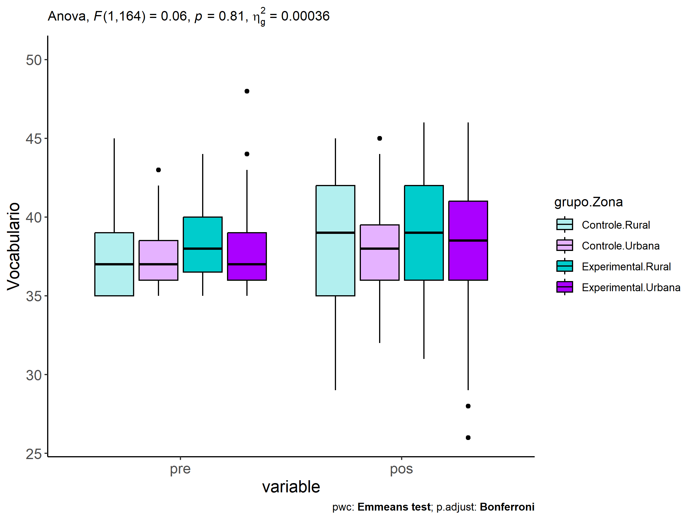<!-- -->

``` r
plots <- twoWayAncovaBoxPlots(
  wdat.long, "vocab", c("grupo","Zona"), aov, pwc.long, pre.post = "time",
  theme = "classic", color = color$prepost)
```

``` r
plots[["grupo:Zona"]] + ggplot2::ylab("Vocabulario")
```

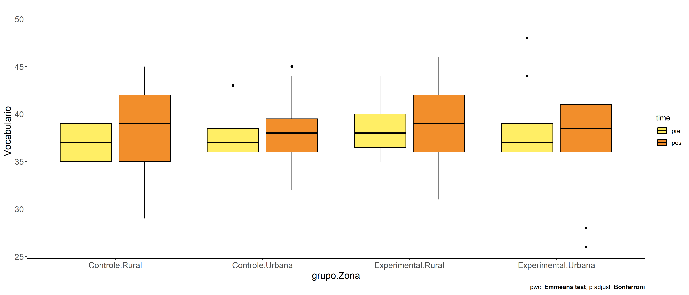<!-- -->

### Checking linearity assumption

``` r
ggscatter(wdat, x = "vocab.pre", y = "vocab.pos", size = 0.5,
          facet.by = c("grupo","Zona"), add = "reg.line")+
  stat_regline_equation(
    aes(label =  paste(..eq.label.., ..rr.label.., sep = "~~~~"))
  )
```

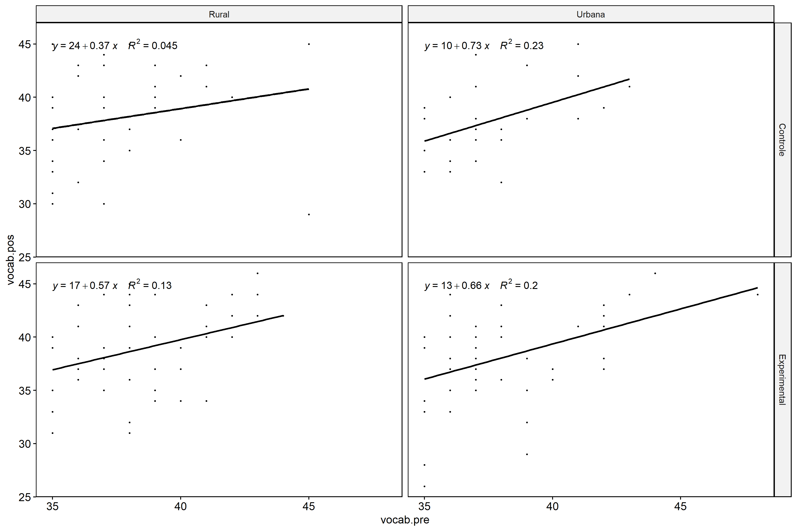<!-- -->

### Checking normality and homogeneity

``` r
res <- augment(lm(vocab.pos ~ vocab.pre + grupo*Zona, data = wdat))
```

``` r
shapiro_test(res$.resid)
```

    ## # A tibble: 1 × 3
    ##   variable   statistic p.value
    ##   <chr>          <dbl>   <dbl>
    ## 1 res$.resid     0.984  0.0544

``` r
levene_test(res, .resid ~ grupo*Zona)
```

    ## # A tibble: 1 × 4
    ##     df1   df2 statistic     p
    ##   <int> <int>     <dbl> <dbl>
    ## 1     3   165      1.57 0.198

# ANCOVA and Pairwise for two factors **grupo:Cor.Raca**

## Without remove non-normal data

``` r
pdat = remove_group_data(dat[!is.na(dat[["grupo"]]) & !is.na(dat[["Cor.Raca"]]),], "vocab.pos", c("grupo","Cor.Raca"))
```

    ## Warning: There was 1 warning in `mutate()`.
    ## ℹ In argument: `ci = abs(stats::qt(alpha/2, .data$n - 1) * .data$se)`.
    ## Caused by warning:
    ## ! There was 1 warning in `mutate()`.
    ## ℹ In argument: `ci = abs(stats::qt(alpha/2, .data$n - 1) * .data$se)`.
    ## Caused by warning in `stats::qt()`:
    ## ! NaNs produced

``` r
pdat.long <- rbind(pdat[,c("id","grupo","Cor.Raca")], pdat[,c("id","grupo","Cor.Raca")])
pdat.long[["time"]] <- c(rep("pre", nrow(pdat)), rep("pos", nrow(pdat)))
pdat.long[["time"]] <- factor(pdat.long[["time"]], c("pre","pos"))
pdat.long[["vocab"]] <- c(pdat[["vocab.pre"]], pdat[["vocab.pos"]])

aov = anova_test(pdat, vocab.pos ~ vocab.pre + grupo*Cor.Raca)
laov[["grupo:Cor.Raca"]] <- get_anova_table(aov)
```

``` r
pwcs <- list()
pwcs[["Cor.Raca"]] <- emmeans_test(
  group_by(pdat, grupo), vocab.pos ~ Cor.Raca,
  covariate = vocab.pre, p.adjust.method = "bonferroni")
pwcs[["grupo"]] <- emmeans_test(
  group_by(pdat, Cor.Raca), vocab.pos ~ grupo,
  covariate = vocab.pre, p.adjust.method = "bonferroni")

pwc <- plyr::rbind.fill(pwcs[["grupo"]], pwcs[["Cor.Raca"]])
pwc <- pwc[,c("grupo","Cor.Raca", colnames(pwc)[!colnames(pwc) %in% c("grupo","Cor.Raca")])]
```

``` r
pwc.long <- emmeans_test(dplyr::group_by_at(pdat.long, c("grupo","Cor.Raca")),
                         vocab ~ time,
                         p.adjust.method = "bonferroni")
lpwc[["grupo:Cor.Raca"]] <- plyr::rbind.fill(pwc, pwc.long)
```

``` r
ds <- get.descriptives(pdat, "vocab.pos", c("grupo","Cor.Raca"), covar = "vocab.pre")
ds <- merge(ds[ds$variable != "vocab.pre",],
            ds[ds$variable == "vocab.pre", !colnames(ds) %in% c("variable")],
            by = c("grupo","Cor.Raca"), all.x = T, suffixes = c("", ".vocab.pre"))
ds <- merge(get_emmeans(pwcs[["grupo"]]), ds, by = c("grupo","Cor.Raca"), suffixes = c(".emms", ""))
ds <- ds[,c("grupo","Cor.Raca","n","mean.vocab.pre","se.vocab.pre","mean","se","emmean","se.emms")]

colnames(ds) <- c("grupo","Cor.Raca", "N", paste0(c("M","SE")," (pre)"),
                  paste0(c("M","SE"), " (unadj)"), paste0(c("M", "SE"), " (adj)"))

lemms[["grupo:Cor.Raca"]] <- ds
```

## Computing ANCOVA and PairWise After removing non-normal data (OK)

``` r
wdat = pdat 

res = residuals(lm(vocab.pos ~ vocab.pre + grupo*Cor.Raca, data = wdat))
non.normal = getNonNormal(res, wdat$id, plimit = 0.05)

wdat = wdat[!wdat$id %in% non.normal,]

wdat.long <- rbind(wdat[,c("id","grupo","Cor.Raca")], wdat[,c("id","grupo","Cor.Raca")])
wdat.long[["time"]] <- c(rep("pre", nrow(wdat)), rep("pos", nrow(wdat)))
wdat.long[["time"]] <- factor(wdat.long[["time"]], c("pre","pos"))
wdat.long[["vocab"]] <- c(wdat[["vocab.pre"]], wdat[["vocab.pos"]])


ldat[["grupo:Cor.Raca"]] = wdat

(non.normal)
```

    ## [1] "P1003" "P3654" "P996"

``` r
aov = anova_test(wdat, vocab.pos ~ vocab.pre + grupo*Cor.Raca)
laov[["grupo:Cor.Raca"]] <- merge(get_anova_table(aov), laov[["grupo:Cor.Raca"]], by="Effect", suffixes = c("","'"))

(df = get_anova_table(aov))
```

    ## ANOVA Table (type II tests)
    ## 
    ##           Effect DFn DFd      F     p p<.05   ges
    ## 1      vocab.pre   1  83 10.141 0.002     * 0.109
    ## 2          grupo   1  83  0.555 0.458       0.007
    ## 3       Cor.Raca   1  83  2.070 0.154       0.024
    ## 4 grupo:Cor.Raca   1  83  0.752 0.388       0.009

| Effect         | DFn | DFd |      F |     p | p\<.05 |   ges |
|:---------------|----:|----:|-------:|------:|:-------|------:|
| vocab.pre      |   1 |  83 | 10.141 | 0.002 | \*     | 0.109 |
| grupo          |   1 |  83 |  0.555 | 0.458 |        | 0.007 |
| Cor.Raca       |   1 |  83 |  2.070 | 0.154 |        | 0.024 |
| grupo:Cor.Raca |   1 |  83 |  0.752 | 0.388 |        | 0.009 |

``` r
pwcs <- list()
pwcs[["Cor.Raca"]] <- emmeans_test(
  group_by(wdat, grupo), vocab.pos ~ Cor.Raca,
  covariate = vocab.pre, p.adjust.method = "bonferroni")
pwcs[["grupo"]] <- emmeans_test(
  group_by(wdat, Cor.Raca), vocab.pos ~ grupo,
  covariate = vocab.pre, p.adjust.method = "bonferroni")

pwc <- plyr::rbind.fill(pwcs[["grupo"]], pwcs[["Cor.Raca"]])
pwc <- pwc[,c("grupo","Cor.Raca", colnames(pwc)[!colnames(pwc) %in% c("grupo","Cor.Raca")])]
```

| grupo        | Cor.Raca | term                | .y.       | group1   | group2       |  df | statistic |     p | p.adj | p.adj.signif |
|:-------------|:---------|:--------------------|:----------|:---------|:-------------|----:|----------:|------:|------:|:-------------|
|              | Branca   | vocab.pre\*grupo    | vocab.pos | Controle | Experimental |  83 |     0.400 | 0.690 | 0.690 | ns           |
|              | Parda    | vocab.pre\*grupo    | vocab.pos | Controle | Experimental |  83 |    -1.074 | 0.286 | 0.286 | ns           |
| Controle     |          | vocab.pre\*Cor.Raca | vocab.pos | Branca   | Parda        |  83 |     1.540 | 0.127 | 0.127 | ns           |
| Experimental |          | vocab.pre\*Cor.Raca | vocab.pos | Branca   | Parda        |  83 |     0.676 | 0.501 | 0.501 | ns           |

``` r
pwc.long <- emmeans_test(dplyr::group_by_at(wdat.long, c("grupo","Cor.Raca")),
                         vocab ~ time,
                         p.adjust.method = "bonferroni")
lpwc[["grupo:Cor.Raca"]] <- merge(plyr::rbind.fill(pwc, pwc.long), lpwc[["grupo:Cor.Raca"]], by=c("grupo","Cor.Raca","term",".y.","group1","group2"), suffixes = c("","'"))
```

| grupo        | Cor.Raca | term | .y.   | group1 | group2 |  df | statistic |     p | p.adj | p.adj.signif |
|:-------------|:---------|:-----|:------|:-------|:-------|----:|----------:|------:|------:|:-------------|
| Controle     | Branca   | time | vocab | pre    | pos    | 168 |    -0.913 | 0.363 | 0.363 | ns           |
| Controle     | Parda    | time | vocab | pre    | pos    | 168 |     0.294 | 0.769 | 0.769 | ns           |
| Experimental | Branca   | time | vocab | pre    | pos    | 168 |    -1.007 | 0.316 | 0.316 | ns           |
| Experimental | Parda    | time | vocab | pre    | pos    | 168 |    -0.578 | 0.564 | 0.564 | ns           |

``` r
ds <- get.descriptives(wdat, "vocab.pos", c("grupo","Cor.Raca"), covar = "vocab.pre")
ds <- merge(ds[ds$variable != "vocab.pre",],
            ds[ds$variable == "vocab.pre", !colnames(ds) %in% c("variable")],
            by = c("grupo","Cor.Raca"), all.x = T, suffixes = c("", ".vocab.pre"))
ds <- merge(get_emmeans(pwcs[["grupo"]]), ds, by = c("grupo","Cor.Raca"), suffixes = c(".emms", ""))
ds <- ds[,c("grupo","Cor.Raca","n","mean.vocab.pre","se.vocab.pre","mean","se","emmean","se.emms")]

colnames(ds) <- c("grupo","Cor.Raca", "N", paste0(c("M","SE")," (pre)"),
                  paste0(c("M","SE"), " (unadj)"), paste0(c("M", "SE"), " (adj)"))

lemms[["grupo:Cor.Raca"]] <- merge(ds, lemms[["grupo:Cor.Raca"]], by=c("grupo","Cor.Raca"), suffixes = c("","'"))
```

| grupo        | Cor.Raca |   N | M (pre) | SE (pre) | M (unadj) | SE (unadj) | M (adj) | SE (adj) |
|:-------------|:---------|----:|--------:|---------:|----------:|-----------:|--------:|---------:|
| Controle     | Branca   |   7 |  39.143 |    1.353 |    40.857 |      1.280 |  40.298 |    1.552 |
| Controle     | Parda    |  30 |  37.533 |    0.431 |    37.267 |      0.943 |  37.622 |    0.753 |
| Experimental | Branca   |  16 |  38.500 |    0.428 |    39.750 |      0.788 |  39.556 |    1.022 |
| Experimental | Parda    |  35 |  38.343 |    0.449 |    38.829 |      0.685 |  38.724 |    0.690 |

### Plots for ancova

``` r
plots <- twoWayAncovaPlots(
  wdat, "vocab.pos", c("grupo","Cor.Raca"), aov, pwcs, addParam = c("mean_se"),
  font.label.size=10, step.increase=0.05, p.label="p.adj",
  subtitle = which(aov$Effect == "grupo:Cor.Raca"))
```

``` r
if (!is.null(plots[["grupo"]]))
  plots[["grupo"]] + ggplot2::scale_color_manual(values = color[["Cor.Raca"]])
```

    ## Scale for colour is already present.
    ## Adding another scale for colour, which will replace the existing scale.

<!-- -->

``` r
if (!is.null(plots[["Cor.Raca"]]))
  plots[["Cor.Raca"]] + ggplot2::scale_color_manual(values = color[["grupo"]])
```

    ## Scale for colour is already present.
    ## Adding another scale for colour, which will replace the existing scale.

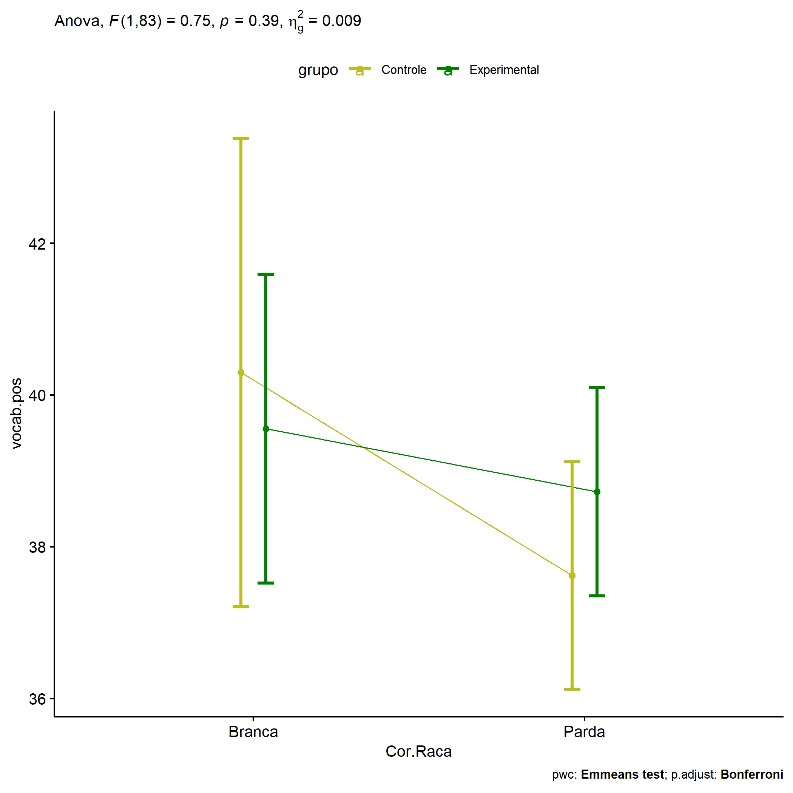<!-- -->

``` r
plots <- twoWayAncovaBoxPlots(
  wdat, "vocab.pos", c("grupo","Cor.Raca"), aov, pwcs, covar = "vocab.pre",
  theme = "classic", color = color[["grupo:Cor.Raca"]],
  subtitle = which(aov$Effect == "grupo:Cor.Raca"))
```

``` r
plots[["grupo:Cor.Raca"]] + ggplot2::ylab("Vocabulario") + ggplot2::scale_x_discrete(labels=c('pre', 'pos'))
```

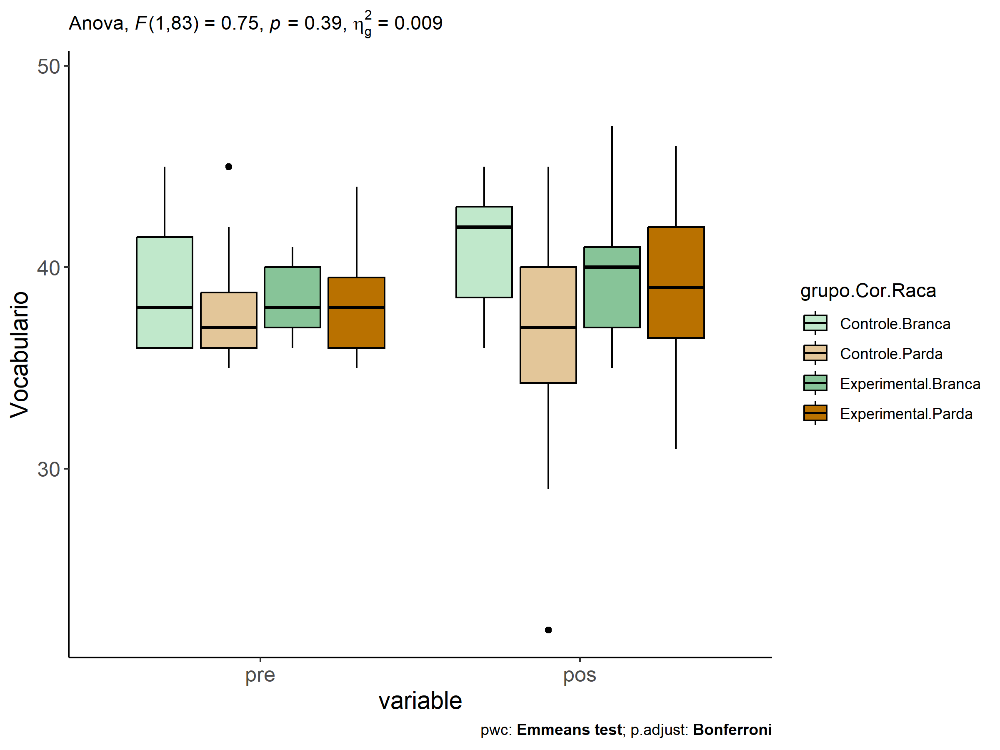<!-- -->

``` r
plots <- twoWayAncovaBoxPlots(
  wdat.long, "vocab", c("grupo","Cor.Raca"), aov, pwc.long, pre.post = "time",
  theme = "classic", color = color$prepost)
```

``` r
plots[["grupo:Cor.Raca"]] + ggplot2::ylab("Vocabulario")
```

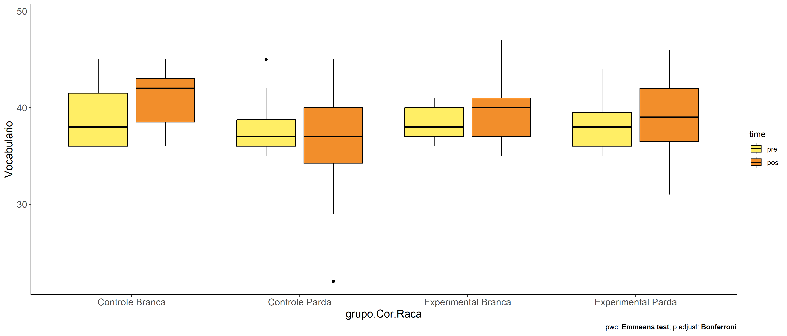<!-- -->

### Checking linearity assumption

``` r
ggscatter(wdat, x = "vocab.pre", y = "vocab.pos", size = 0.5,
          facet.by = c("grupo","Cor.Raca"), add = "reg.line")+
  stat_regline_equation(
    aes(label =  paste(..eq.label.., ..rr.label.., sep = "~~~~"))
  )
```

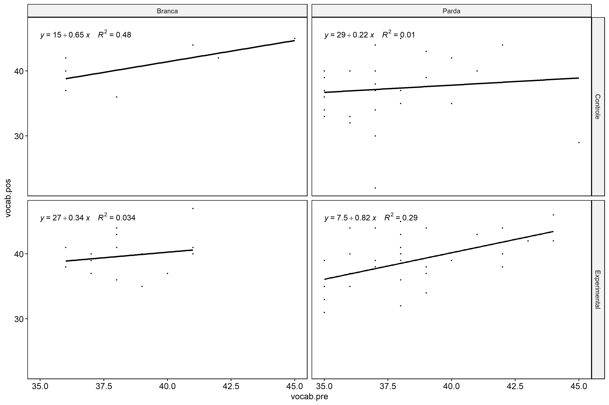<!-- -->

### Checking normality and homogeneity

``` r
res <- augment(lm(vocab.pos ~ vocab.pre + grupo*Cor.Raca, data = wdat))
```

``` r
shapiro_test(res$.resid)
```

    ## # A tibble: 1 × 3
    ##   variable   statistic p.value
    ##   <chr>          <dbl>   <dbl>
    ## 1 res$.resid     0.959 0.00742

``` r
levene_test(res, .resid ~ grupo*Cor.Raca)
```

    ## # A tibble: 1 × 4
    ##     df1   df2 statistic     p
    ##   <int> <int>     <dbl> <dbl>
    ## 1     3    84      1.72 0.170

# ANCOVA and Pairwise for two factors **grupo:Serie**

## Without remove non-normal data

``` r
pdat = remove_group_data(dat[!is.na(dat[["grupo"]]) & !is.na(dat[["Serie"]]),], "vocab.pos", c("grupo","Serie"))

pdat.long <- rbind(pdat[,c("id","grupo","Serie")], pdat[,c("id","grupo","Serie")])
pdat.long[["time"]] <- c(rep("pre", nrow(pdat)), rep("pos", nrow(pdat)))
pdat.long[["time"]] <- factor(pdat.long[["time"]], c("pre","pos"))
pdat.long[["vocab"]] <- c(pdat[["vocab.pre"]], pdat[["vocab.pos"]])

aov = anova_test(pdat, vocab.pos ~ vocab.pre + grupo*Serie)
laov[["grupo:Serie"]] <- get_anova_table(aov)
```

``` r
pwcs <- list()
pwcs[["Serie"]] <- emmeans_test(
  group_by(pdat, grupo), vocab.pos ~ Serie,
  covariate = vocab.pre, p.adjust.method = "bonferroni")
pwcs[["grupo"]] <- emmeans_test(
  group_by(pdat, Serie), vocab.pos ~ grupo,
  covariate = vocab.pre, p.adjust.method = "bonferroni")

pwc <- plyr::rbind.fill(pwcs[["grupo"]], pwcs[["Serie"]])
pwc <- pwc[,c("grupo","Serie", colnames(pwc)[!colnames(pwc) %in% c("grupo","Serie")])]
```

``` r
pwc.long <- emmeans_test(dplyr::group_by_at(pdat.long, c("grupo","Serie")),
                         vocab ~ time,
                         p.adjust.method = "bonferroni")
lpwc[["grupo:Serie"]] <- plyr::rbind.fill(pwc, pwc.long)
```

``` r
ds <- get.descriptives(pdat, "vocab.pos", c("grupo","Serie"), covar = "vocab.pre")
ds <- merge(ds[ds$variable != "vocab.pre",],
            ds[ds$variable == "vocab.pre", !colnames(ds) %in% c("variable")],
            by = c("grupo","Serie"), all.x = T, suffixes = c("", ".vocab.pre"))
ds <- merge(get_emmeans(pwcs[["grupo"]]), ds, by = c("grupo","Serie"), suffixes = c(".emms", ""))
ds <- ds[,c("grupo","Serie","n","mean.vocab.pre","se.vocab.pre","mean","se","emmean","se.emms")]

colnames(ds) <- c("grupo","Serie", "N", paste0(c("M","SE")," (pre)"),
                  paste0(c("M","SE"), " (unadj)"), paste0(c("M", "SE"), " (adj)"))

lemms[["grupo:Serie"]] <- ds
```

## Computing ANCOVA and PairWise After removing non-normal data (OK)

``` r
wdat = pdat 

res = residuals(lm(vocab.pos ~ vocab.pre + grupo*Serie, data = wdat))
non.normal = getNonNormal(res, wdat$id, plimit = 0.05)

wdat = wdat[!wdat$id %in% non.normal,]

wdat.long <- rbind(wdat[,c("id","grupo","Serie")], wdat[,c("id","grupo","Serie")])
wdat.long[["time"]] <- c(rep("pre", nrow(wdat)), rep("pos", nrow(wdat)))
wdat.long[["time"]] <- factor(wdat.long[["time"]], c("pre","pos"))
wdat.long[["vocab"]] <- c(wdat[["vocab.pre"]], wdat[["vocab.pos"]])


ldat[["grupo:Serie"]] = wdat

(non.normal)
```

    ##  [1] "P1003" "P2207" "P983"  "P2232" "P3654" "P1966" "P2245" "P996"  "P976"  "P2861" "P3228" "P916"  "P1865"
    ## [14] "P2394" "P2296"

``` r
aov = anova_test(wdat, vocab.pos ~ vocab.pre + grupo*Serie)
laov[["grupo:Serie"]] <- merge(get_anova_table(aov), laov[["grupo:Serie"]], by="Effect", suffixes = c("","'"))

(df = get_anova_table(aov))
```

    ## ANOVA Table (type II tests)
    ## 
    ##        Effect DFn DFd      F        p p<.05      ges
    ## 1   vocab.pre   1 246 45.512 1.08e-10     * 0.156000
    ## 2       grupo   1 246  0.195 6.59e-01       0.000793
    ## 3       Serie   3 246  1.461 2.26e-01       0.018000
    ## 4 grupo:Serie   3 246  0.155 9.27e-01       0.002000

| Effect      | DFn | DFd |      F |     p | p\<.05 |   ges |
|:------------|----:|----:|-------:|------:|:-------|------:|
| vocab.pre   |   1 | 246 | 45.512 | 0.000 | \*     | 0.156 |
| grupo       |   1 | 246 |  0.195 | 0.659 |        | 0.001 |
| Serie       |   3 | 246 |  1.461 | 0.226 |        | 0.018 |
| grupo:Serie |   3 | 246 |  0.155 | 0.927 |        | 0.002 |

``` r
pwcs <- list()
pwcs[["Serie"]] <- emmeans_test(
  group_by(wdat, grupo), vocab.pos ~ Serie,
  covariate = vocab.pre, p.adjust.method = "bonferroni")
pwcs[["grupo"]] <- emmeans_test(
  group_by(wdat, Serie), vocab.pos ~ grupo,
  covariate = vocab.pre, p.adjust.method = "bonferroni")

pwc <- plyr::rbind.fill(pwcs[["grupo"]], pwcs[["Serie"]])
pwc <- pwc[,c("grupo","Serie", colnames(pwc)[!colnames(pwc) %in% c("grupo","Serie")])]
```

| grupo        | Serie | term             | .y.       | group1   | group2       |  df | statistic |     p | p.adj | p.adj.signif |
|:-------------|:------|:-----------------|:----------|:---------|:-------------|----:|----------:|------:|------:|:-------------|
|              | 6 ano | vocab.pre\*grupo | vocab.pos | Controle | Experimental | 246 |    -0.739 | 0.461 | 0.461 | ns           |
|              | 7 ano | vocab.pre\*grupo | vocab.pos | Controle | Experimental | 246 |     0.116 | 0.908 | 0.908 | ns           |
|              | 8 ano | vocab.pre\*grupo | vocab.pos | Controle | Experimental | 246 |    -0.070 | 0.944 | 0.944 | ns           |
|              | 9 ano | vocab.pre\*grupo | vocab.pos | Controle | Experimental | 246 |    -0.308 | 0.758 | 0.758 | ns           |
| Controle     |       | vocab.pre\*Serie | vocab.pos | 6 ano    | 7 ano        | 246 |     0.207 | 0.836 | 1.000 | ns           |
| Controle     |       | vocab.pre\*Serie | vocab.pos | 6 ano    | 8 ano        | 246 |    -0.628 | 0.531 | 1.000 | ns           |
| Controle     |       | vocab.pre\*Serie | vocab.pos | 6 ano    | 9 ano        | 246 |    -0.634 | 0.527 | 1.000 | ns           |
| Controle     |       | vocab.pre\*Serie | vocab.pos | 7 ano    | 8 ano        | 246 |    -0.940 | 0.348 | 1.000 | ns           |
| Controle     |       | vocab.pre\*Serie | vocab.pos | 7 ano    | 9 ano        | 246 |    -1.037 | 0.301 | 1.000 | ns           |
| Controle     |       | vocab.pre\*Serie | vocab.pos | 8 ano    | 9 ano        | 246 |     0.105 | 0.917 | 1.000 | ns           |
| Experimental |       | vocab.pre\*Serie | vocab.pos | 6 ano    | 7 ano        | 246 |     1.241 | 0.216 | 1.000 | ns           |
| Experimental |       | vocab.pre\*Serie | vocab.pos | 6 ano    | 8 ano        | 246 |     0.094 | 0.925 | 1.000 | ns           |
| Experimental |       | vocab.pre\*Serie | vocab.pos | 6 ano    | 9 ano        | 246 |     0.053 | 0.957 | 1.000 | ns           |
| Experimental |       | vocab.pre\*Serie | vocab.pos | 7 ano    | 8 ano        | 246 |    -1.558 | 0.120 | 0.723 | ns           |
| Experimental |       | vocab.pre\*Serie | vocab.pos | 7 ano    | 9 ano        | 246 |    -1.668 | 0.097 | 0.580 | ns           |
| Experimental |       | vocab.pre\*Serie | vocab.pos | 8 ano    | 9 ano        | 246 |    -0.061 | 0.951 | 1.000 | ns           |

``` r
pwc.long <- emmeans_test(dplyr::group_by_at(wdat.long, c("grupo","Serie")),
                         vocab ~ time,
                         p.adjust.method = "bonferroni")
lpwc[["grupo:Serie"]] <- merge(plyr::rbind.fill(pwc, pwc.long), lpwc[["grupo:Serie"]], by=c("grupo","Serie","term",".y.","group1","group2"), suffixes = c("","'"))
```

| grupo        | Serie | term | .y.   | group1 | group2 |  df | statistic |     p | p.adj | p.adj.signif |
|:-------------|:------|:-----|:------|:-------|:-------|----:|----------:|------:|------:|:-------------|
| Controle     | 6 ano | time | vocab | pre    | pos    | 494 |     0.058 | 0.954 | 0.954 | ns           |
| Controle     | 7 ano | time | vocab | pre    | pos    | 494 |     0.545 | 0.586 | 0.586 | ns           |
| Controle     | 8 ano | time | vocab | pre    | pos    | 494 |    -0.245 | 0.807 | 0.807 | ns           |
| Controle     | 9 ano | time | vocab | pre    | pos    | 494 |    -0.030 | 0.976 | 0.976 | ns           |
| Experimental | 6 ano | time | vocab | pre    | pos    | 494 |    -0.728 | 0.467 | 0.467 | ns           |
| Experimental | 7 ano | time | vocab | pre    | pos    | 494 |     1.140 | 0.255 | 0.255 | ns           |
| Experimental | 8 ano | time | vocab | pre    | pos    | 494 |    -0.713 | 0.476 | 0.476 | ns           |
| Experimental | 9 ano | time | vocab | pre    | pos    | 494 |    -0.433 | 0.665 | 0.665 | ns           |

``` r
ds <- get.descriptives(wdat, "vocab.pos", c("grupo","Serie"), covar = "vocab.pre")
ds <- merge(ds[ds$variable != "vocab.pre",],
            ds[ds$variable == "vocab.pre", !colnames(ds) %in% c("variable")],
            by = c("grupo","Serie"), all.x = T, suffixes = c("", ".vocab.pre"))
ds <- merge(get_emmeans(pwcs[["grupo"]]), ds, by = c("grupo","Serie"), suffixes = c(".emms", ""))
ds <- ds[,c("grupo","Serie","n","mean.vocab.pre","se.vocab.pre","mean","se","emmean","se.emms")]

colnames(ds) <- c("grupo","Serie", "N", paste0(c("M","SE")," (pre)"),
                  paste0(c("M","SE"), " (unadj)"), paste0(c("M", "SE"), " (adj)"))

lemms[["grupo:Serie"]] <- merge(ds, lemms[["grupo:Serie"]], by=c("grupo","Serie"), suffixes = c("","'"))
```

| grupo        | Serie |   N | M (pre) | SE (pre) | M (unadj) | SE (unadj) | M (adj) | SE (adj) |
|:-------------|:------|----:|--------:|---------:|----------:|-----------:|--------:|---------:|
| Controle     | 6 ano |  13 |  37.000 |    0.519 |    36.923 |      0.571 |  37.632 |    1.036 |
| Controle     | 7 ano |  21 |  37.571 |    0.524 |    37.000 |      0.799 |  37.360 |    0.813 |
| Controle     | 8 ano |  18 |  38.278 |    0.758 |    38.556 |      1.127 |  38.484 |    0.876 |
| Controle     | 9 ano |  47 |  38.660 |    0.395 |    38.681 |      0.645 |  38.376 |    0.544 |
| Experimental | 6 ano |  16 |  37.188 |    0.518 |    38.062 |      1.142 |  38.657 |    0.933 |
| Experimental | 7 ano |  32 |  38.281 |    0.424 |    37.312 |      0.670 |  37.239 |    0.657 |
| Experimental | 8 ano |  49 |  37.918 |    0.331 |    38.408 |      0.494 |  38.556 |    0.531 |
| Experimental | 9 ano |  59 |  38.593 |    0.388 |    38.864 |      0.564 |  38.600 |    0.485 |

### Plots for ancova

``` r
plots <- twoWayAncovaPlots(
  wdat, "vocab.pos", c("grupo","Serie"), aov, pwcs, addParam = c("mean_se"),
  font.label.size=10, step.increase=0.05, p.label="p.adj",
  subtitle = which(aov$Effect == "grupo:Serie"))
```

``` r
if (!is.null(plots[["grupo"]]))
  plots[["grupo"]] + ggplot2::scale_color_manual(values = color[["Serie"]])
```

    ## Scale for colour is already present.
    ## Adding another scale for colour, which will replace the existing scale.

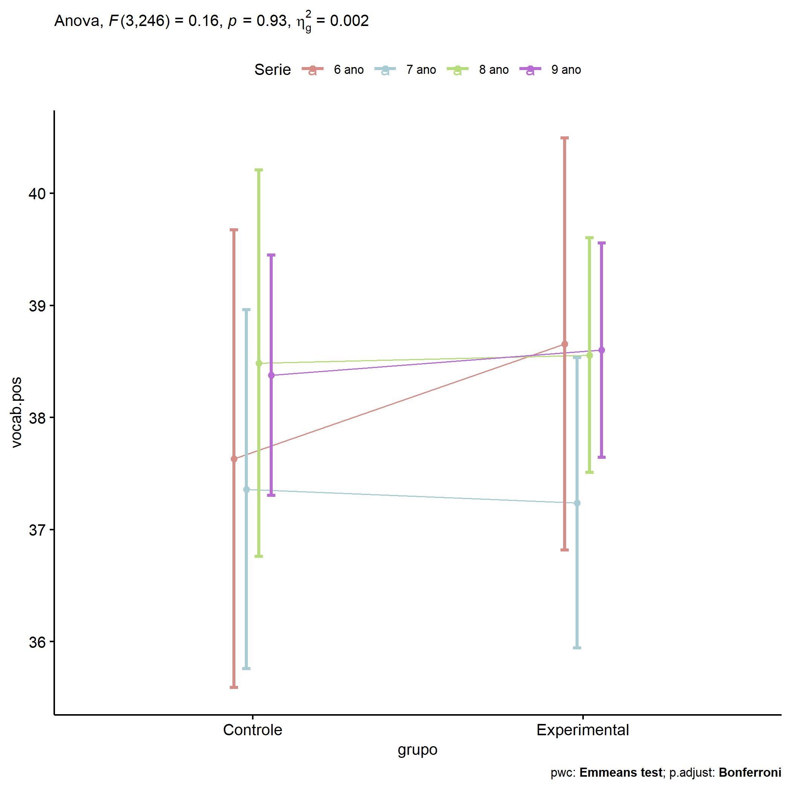<!-- -->

``` r
if (!is.null(plots[["Serie"]]))
  plots[["Serie"]] + ggplot2::scale_color_manual(values = color[["grupo"]])
```

    ## Scale for colour is already present.
    ## Adding another scale for colour, which will replace the existing scale.

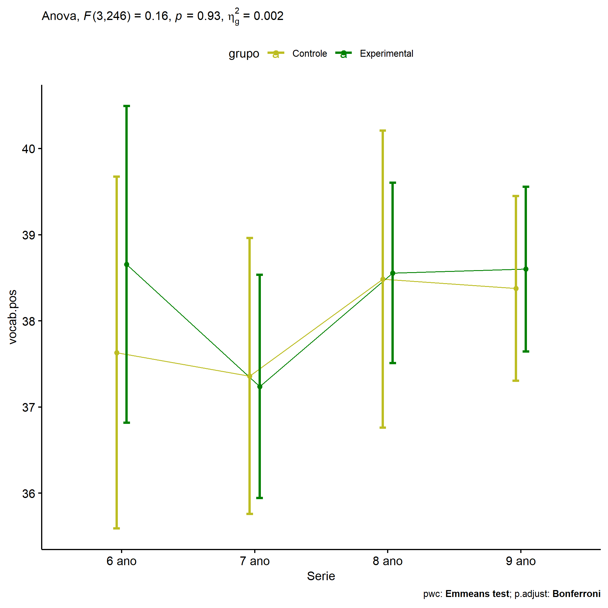<!-- -->

``` r
plots <- twoWayAncovaBoxPlots(
  wdat, "vocab.pos", c("grupo","Serie"), aov, pwcs, covar = "vocab.pre",
  theme = "classic", color = color[["grupo:Serie"]],
  subtitle = which(aov$Effect == "grupo:Serie"))
```

``` r
plots[["grupo:Serie"]] + ggplot2::ylab("Vocabulario") + ggplot2::scale_x_discrete(labels=c('pre', 'pos'))
```

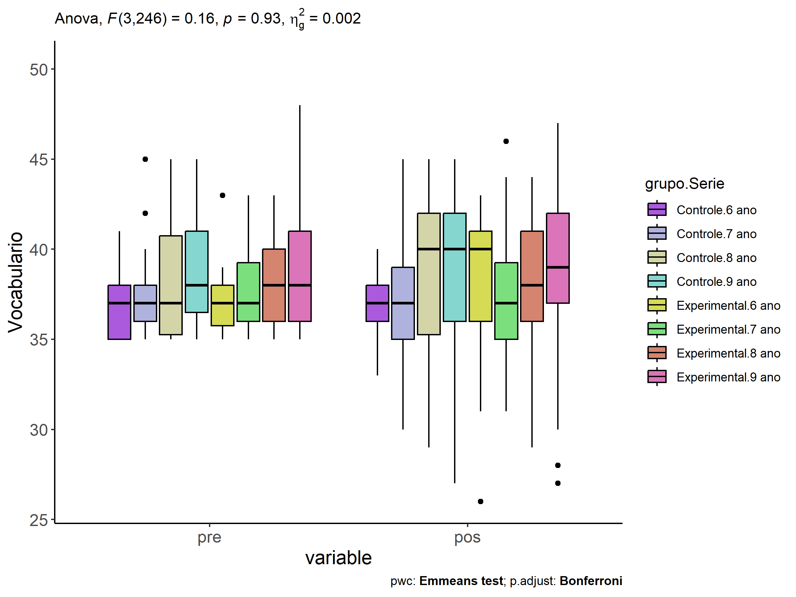<!-- -->

``` r
plots <- twoWayAncovaBoxPlots(
  wdat.long, "vocab", c("grupo","Serie"), aov, pwc.long, pre.post = "time",
  theme = "classic", color = color$prepost)
```

``` r
plots[["grupo:Serie"]] + ggplot2::ylab("Vocabulario")
```

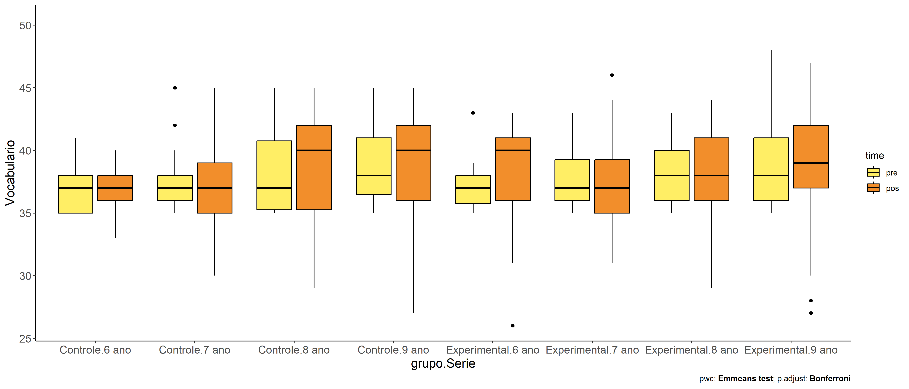<!-- -->

### Checking linearity assumption

``` r
ggscatter(wdat, x = "vocab.pre", y = "vocab.pos", size = 0.5,
          facet.by = c("grupo","Serie"), add = "reg.line")+
  stat_regline_equation(
    aes(label =  paste(..eq.label.., ..rr.label.., sep = "~~~~"))
  )
```

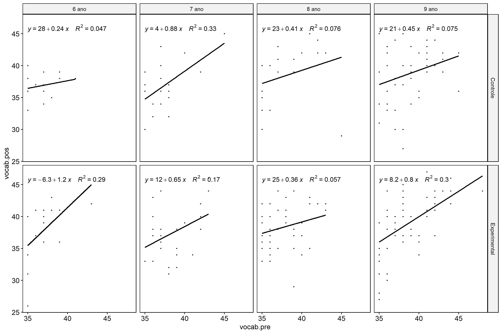<!-- -->

### Checking normality and homogeneity

``` r
res <- augment(lm(vocab.pos ~ vocab.pre + grupo*Serie, data = wdat))
```

``` r
shapiro_test(res$.resid)
```

    ## # A tibble: 1 × 3
    ##   variable   statistic p.value
    ##   <chr>          <dbl>   <dbl>
    ## 1 res$.resid     0.983 0.00439

``` r
levene_test(res, .resid ~ grupo*Serie)
```

    ## # A tibble: 1 × 4
    ##     df1   df2 statistic     p
    ##   <int> <int>     <dbl> <dbl>
    ## 1     7   247     0.975 0.450

# Summary of Results

## Descriptive Statistics

``` r
df <- get.descriptives(ldat[["grupo"]], c(dv.pre, dv.pos), c("grupo"), 
                       include.global = T, symmetry.test = T, normality.test = F)
df <- plyr::rbind.fill(
  df, do.call(plyr::rbind.fill, lapply(lfatores2, FUN = function(f) {
    if (nrow(dat) > 0 && sum(!is.na(unique(dat[[f]]))) > 1)
      get.descriptives(ldat[[paste0("grupo:",f)]], c(dv.pre,dv.pos), c("grupo", f),
                       symmetry.test = T, normality.test = F)
    }))
)
(df <- df[,c(fatores1[fatores1 %in% colnames(df)],"variable",
             colnames(df)[!colnames(df) %in% c(fatores1,"variable")])])
```

    ##           grupo Sexo   Zona Cor.Raca Serie  variable   n   mean median min max    sd    se    ci  iqr symmetry
    ## 1      Controle <NA>   <NA>     <NA>  <NA> vocab.pre  99 38.111   37.0  35  45 2.622 0.264 0.523 4.00       NO
    ## 2  Experimental <NA>   <NA>     <NA>  <NA> vocab.pre 156 38.173   38.0  35  48 2.598 0.208 0.411 4.00       NO
    ## 3          <NA> <NA>   <NA>     <NA>  <NA> vocab.pre 255 38.149   38.0  35  48 2.602 0.163 0.321 4.00       NO
    ## 4      Controle <NA>   <NA>     <NA>  <NA> vocab.pos  99 38.071   38.0  27  45 4.126 0.415 0.823 6.00      YES
    ## 5  Experimental <NA>   <NA>     <NA>  <NA> vocab.pos 156 38.321   38.0  26  47 3.994 0.320 0.632 5.00      YES
    ## 6          <NA> <NA>   <NA>     <NA>  <NA> vocab.pos 255 38.224   38.0  26  47 4.039 0.253 0.498 5.00      YES
    ## 7      Controle    F   <NA>     <NA>  <NA> vocab.pre  53 37.736   37.0  35  45 2.419 0.332 0.667 2.00       NO
    ## 8      Controle    M   <NA>     <NA>  <NA> vocab.pre  46 38.543   39.0  35  45 2.802 0.413 0.832 4.75      YES
    ## 9  Experimental    F   <NA>     <NA>  <NA> vocab.pre  88 38.159   38.0  35  44 2.430 0.259 0.515 4.00       NO
    ## 10 Experimental    M   <NA>     <NA>  <NA> vocab.pre  68 38.191   37.5  35  48 2.819 0.342 0.682 4.00       NO
    ## 11     Controle    F   <NA>     <NA>  <NA> vocab.pos  53 38.321   38.0  30  45 3.604 0.495 0.993 5.00      YES
    ## 12     Controle    M   <NA>     <NA>  <NA> vocab.pos  46 37.783   38.5  27  45 4.681 0.690 1.390 7.75      YES
    ## 13 Experimental    F   <NA>     <NA>  <NA> vocab.pos  88 38.511   39.0  26  47 4.174 0.445 0.884 5.25       NO
    ## 14 Experimental    M   <NA>     <NA>  <NA> vocab.pos  68 38.074   38.0  28  45 3.763 0.456 0.911 6.00      YES
    ## 15     Controle <NA>  Rural     <NA>  <NA> vocab.pre  41 37.415   37.0  35  45 2.617 0.409 0.826 4.00       NO
    ## 16     Controle <NA> Urbana     <NA>  <NA> vocab.pre  27 37.704   37.0  35  43 2.216 0.426 0.876 2.50       NO
    ## 17 Experimental <NA>  Rural     <NA>  <NA> vocab.pre  51 38.333   38.0  35  44 2.495 0.349 0.702 3.50      YES
    ## 18 Experimental <NA> Urbana     <NA>  <NA> vocab.pre  50 38.120   37.0  35  48 2.811 0.398 0.799 3.00       NO
    ## 19     Controle <NA>  Rural     <NA>  <NA> vocab.pos  41 37.976   39.0  29  45 4.552 0.711 1.437 7.00      YES
    ## 20     Controle <NA> Urbana     <NA>  <NA> vocab.pos  27 37.852   38.0  32  45 3.348 0.644 1.324 3.50      YES
    ## 21 Experimental <NA>  Rural     <NA>  <NA> vocab.pos  51 38.824   39.0  31  46 3.897 0.546 1.096 6.00      YES
    ## 22 Experimental <NA> Urbana     <NA>  <NA> vocab.pos  50 38.120   38.5  26  46 4.129 0.584 1.173 5.00       NO
    ## 23     Controle <NA>   <NA>   Branca  <NA> vocab.pre   7 39.143   38.0  36  45 3.579 1.353 3.310 5.50      YES
    ## 24     Controle <NA>   <NA>    Parda  <NA> vocab.pre  30 37.533   37.0  35  45 2.360 0.431 0.881 2.75       NO
    ## 25 Experimental <NA>   <NA>   Branca  <NA> vocab.pre  16 38.500   38.0  36  41 1.713 0.428 0.913 3.00      YES
    ## 26 Experimental <NA>   <NA>    Parda  <NA> vocab.pre  35 38.343   38.0  35  44 2.656 0.449 0.912 3.50       NO
    ## 27     Controle <NA>   <NA>   Branca  <NA> vocab.pos   7 40.857   42.0  36  45 3.388 1.280 3.133 4.50      YES
    ## 28     Controle <NA>   <NA>    Parda  <NA> vocab.pos  30 37.267   37.0  22  45 5.166 0.943 1.929 5.75       NO
    ## 29 Experimental <NA>   <NA>   Branca  <NA> vocab.pos  16 39.750   40.0  35  47 3.152 0.788 1.679 4.00       NO
    ## 30 Experimental <NA>   <NA>    Parda  <NA> vocab.pos  35 38.829   39.0  31  46 4.055 0.685 1.393 5.50      YES
    ## 31     Controle <NA>   <NA>     <NA> 6 ano vocab.pre  13 37.000   37.0  35  41 1.871 0.519 1.131 3.00       NO
    ## 32     Controle <NA>   <NA>     <NA> 7 ano vocab.pre  21 37.571   37.0  35  45 2.399 0.524 1.092 2.00       NO
    ## 33     Controle <NA>   <NA>     <NA> 8 ano vocab.pre  18 38.278   37.0  35  45 3.214 0.758 1.598 5.50       NO
    ## 34     Controle <NA>   <NA>     <NA> 9 ano vocab.pre  47 38.660   38.0  35  45 2.705 0.395 0.794 4.50       NO
    ## 35 Experimental <NA>   <NA>     <NA> 6 ano vocab.pre  16 37.188   37.0  35  43 2.073 0.518 1.104 2.25       NO
    ## 36 Experimental <NA>   <NA>     <NA> 7 ano vocab.pre  32 38.281   37.0  35  43 2.399 0.424 0.865 3.25       NO
    ## 37 Experimental <NA>   <NA>     <NA> 8 ano vocab.pre  49 37.918   38.0  35  43 2.317 0.331 0.666 4.00      YES
    ## 38 Experimental <NA>   <NA>     <NA> 9 ano vocab.pre  59 38.593   38.0  35  48 2.983 0.388 0.777 5.00       NO
    ## 39     Controle <NA>   <NA>     <NA> 6 ano vocab.pos  13 36.923   37.0  33  40 2.060 0.571 1.245 2.00      YES
    ## 40     Controle <NA>   <NA>     <NA> 7 ano vocab.pos  21 37.000   37.0  30  45 3.661 0.799 1.666 4.00      YES
    ## 41     Controle <NA>   <NA>     <NA> 8 ano vocab.pos  18 38.556   40.0  29  45 4.780 1.127 2.377 6.75       NO
    ## 42     Controle <NA>   <NA>     <NA> 9 ano vocab.pos  47 38.681   40.0  27  45 4.419 0.645 1.297 6.00       NO
    ## 43 Experimental <NA>   <NA>     <NA> 6 ano vocab.pos  16 38.062   40.0  26  43 4.568 1.142 2.434 5.00       NO
    ## 44 Experimental <NA>   <NA>     <NA> 7 ano vocab.pos  32 37.312   37.0  31  46 3.788 0.670 1.366 4.25      YES
    ## 45 Experimental <NA>   <NA>     <NA> 8 ano vocab.pos  49 38.408   38.0  29  44 3.458 0.494 0.993 5.00      YES
    ## 46 Experimental <NA>   <NA>     <NA> 9 ano vocab.pos  59 38.864   39.0  27  47 4.333 0.564 1.129 5.00       NO
    ##        skewness    kurtosis
    ## 1   0.757692211 -0.22287458
    ## 2   0.769315651  0.14224232
    ## 3   0.768903439  0.02115917
    ## 4  -0.353560834 -0.50823612
    ## 5  -0.403805010  0.03973273
    ## 6  -0.387778530 -0.16520430
    ## 7   1.111735886  0.55352809
    ## 8   0.396472637 -0.72735828
    ## 9   0.557803389 -0.68073668
    ## 10  0.914306745  0.52846136
    ## 11 -0.004353354 -0.73132755
    ## 12 -0.445775908 -0.82322092
    ## 13 -0.547482032  0.35429264
    ## 14 -0.185570645 -0.62938062
    ## 15  1.245557797  1.14485510
    ## 16  0.811000657 -0.33047659
    ## 17  0.443930311 -0.77894688
    ## 18  1.229968132  1.34481664
    ## 19 -0.279289767 -0.96515446
    ## 20  0.289804200 -0.61665721
    ## 21 -0.167842163 -0.92963895
    ## 22 -0.750428635  0.58804080
    ## 23  0.423908096 -1.65064815
    ## 24  1.169899722  1.34864847
    ## 25  0.149286019 -1.39472495
    ## 26  0.582151895 -0.71642082
    ## 27 -0.247920311 -1.72655886
    ## 28 -0.713745180  0.56443052
    ## 29  0.539015517 -0.40548269
    ## 30 -0.177597170 -0.89076542
    ## 31  0.563891851 -0.77708006
    ## 32  1.498489553  2.24768177
    ## 33  0.555988898 -1.11202105
    ## 34  0.541397887 -0.60041624
    ## 35  1.155756902  1.26699173
    ## 36  0.668972203 -0.94886671
    ## 37  0.412059985 -0.94789327
    ## 38  0.691874748 -0.02452173
    ## 39 -0.380512033 -1.05263967
    ## 40  0.232988642 -0.35756187
    ## 41 -0.624856776 -0.94647147
    ## 42 -0.633107312 -0.41028656
    ## 43 -1.226302751  0.61939088
    ## 44  0.482825958 -0.55987126
    ## 45 -0.217232722 -0.56088117
    ## 46 -0.595660058  0.13707484

| grupo        | Sexo | Zona   | Cor.Raca | Serie | variable  |   n |   mean | median | min | max |    sd |    se |    ci |  iqr | symmetry | skewness | kurtosis |
|:-------------|:-----|:-------|:---------|:------|:----------|----:|-------:|-------:|----:|----:|------:|------:|------:|-----:|:---------|---------:|---------:|
| Controle     |      |        |          |       | vocab.pre |  99 | 38.111 |   37.0 |  35 |  45 | 2.622 | 0.264 | 0.523 | 4.00 | NO       |    0.758 |   -0.223 |
| Experimental |      |        |          |       | vocab.pre | 156 | 38.173 |   38.0 |  35 |  48 | 2.598 | 0.208 | 0.411 | 4.00 | NO       |    0.769 |    0.142 |
|              |      |        |          |       | vocab.pre | 255 | 38.149 |   38.0 |  35 |  48 | 2.602 | 0.163 | 0.321 | 4.00 | NO       |    0.769 |    0.021 |
| Controle     |      |        |          |       | vocab.pos |  99 | 38.071 |   38.0 |  27 |  45 | 4.126 | 0.415 | 0.823 | 6.00 | YES      |   -0.354 |   -0.508 |
| Experimental |      |        |          |       | vocab.pos | 156 | 38.321 |   38.0 |  26 |  47 | 3.994 | 0.320 | 0.632 | 5.00 | YES      |   -0.404 |    0.040 |
|              |      |        |          |       | vocab.pos | 255 | 38.224 |   38.0 |  26 |  47 | 4.039 | 0.253 | 0.498 | 5.00 | YES      |   -0.388 |   -0.165 |
| Controle     | F    |        |          |       | vocab.pre |  53 | 37.736 |   37.0 |  35 |  45 | 2.419 | 0.332 | 0.667 | 2.00 | NO       |    1.112 |    0.554 |
| Controle     | M    |        |          |       | vocab.pre |  46 | 38.543 |   39.0 |  35 |  45 | 2.802 | 0.413 | 0.832 | 4.75 | YES      |    0.396 |   -0.727 |
| Experimental | F    |        |          |       | vocab.pre |  88 | 38.159 |   38.0 |  35 |  44 | 2.430 | 0.259 | 0.515 | 4.00 | NO       |    0.558 |   -0.681 |
| Experimental | M    |        |          |       | vocab.pre |  68 | 38.191 |   37.5 |  35 |  48 | 2.819 | 0.342 | 0.682 | 4.00 | NO       |    0.914 |    0.528 |
| Controle     | F    |        |          |       | vocab.pos |  53 | 38.321 |   38.0 |  30 |  45 | 3.604 | 0.495 | 0.993 | 5.00 | YES      |   -0.004 |   -0.731 |
| Controle     | M    |        |          |       | vocab.pos |  46 | 37.783 |   38.5 |  27 |  45 | 4.681 | 0.690 | 1.390 | 7.75 | YES      |   -0.446 |   -0.823 |
| Experimental | F    |        |          |       | vocab.pos |  88 | 38.511 |   39.0 |  26 |  47 | 4.174 | 0.445 | 0.884 | 5.25 | NO       |   -0.547 |    0.354 |
| Experimental | M    |        |          |       | vocab.pos |  68 | 38.074 |   38.0 |  28 |  45 | 3.763 | 0.456 | 0.911 | 6.00 | YES      |   -0.186 |   -0.629 |
| Controle     |      | Rural  |          |       | vocab.pre |  41 | 37.415 |   37.0 |  35 |  45 | 2.617 | 0.409 | 0.826 | 4.00 | NO       |    1.246 |    1.145 |
| Controle     |      | Urbana |          |       | vocab.pre |  27 | 37.704 |   37.0 |  35 |  43 | 2.216 | 0.426 | 0.876 | 2.50 | NO       |    0.811 |   -0.330 |
| Experimental |      | Rural  |          |       | vocab.pre |  51 | 38.333 |   38.0 |  35 |  44 | 2.495 | 0.349 | 0.702 | 3.50 | YES      |    0.444 |   -0.779 |
| Experimental |      | Urbana |          |       | vocab.pre |  50 | 38.120 |   37.0 |  35 |  48 | 2.811 | 0.398 | 0.799 | 3.00 | NO       |    1.230 |    1.345 |
| Controle     |      | Rural  |          |       | vocab.pos |  41 | 37.976 |   39.0 |  29 |  45 | 4.552 | 0.711 | 1.437 | 7.00 | YES      |   -0.279 |   -0.965 |
| Controle     |      | Urbana |          |       | vocab.pos |  27 | 37.852 |   38.0 |  32 |  45 | 3.348 | 0.644 | 1.324 | 3.50 | YES      |    0.290 |   -0.617 |
| Experimental |      | Rural  |          |       | vocab.pos |  51 | 38.824 |   39.0 |  31 |  46 | 3.897 | 0.546 | 1.096 | 6.00 | YES      |   -0.168 |   -0.930 |
| Experimental |      | Urbana |          |       | vocab.pos |  50 | 38.120 |   38.5 |  26 |  46 | 4.129 | 0.584 | 1.173 | 5.00 | NO       |   -0.750 |    0.588 |
| Controle     |      |        | Branca   |       | vocab.pre |   7 | 39.143 |   38.0 |  36 |  45 | 3.579 | 1.353 | 3.310 | 5.50 | YES      |    0.424 |   -1.651 |
| Controle     |      |        | Parda    |       | vocab.pre |  30 | 37.533 |   37.0 |  35 |  45 | 2.360 | 0.431 | 0.881 | 2.75 | NO       |    1.170 |    1.349 |
| Experimental |      |        | Branca   |       | vocab.pre |  16 | 38.500 |   38.0 |  36 |  41 | 1.713 | 0.428 | 0.913 | 3.00 | YES      |    0.149 |   -1.395 |
| Experimental |      |        | Parda    |       | vocab.pre |  35 | 38.343 |   38.0 |  35 |  44 | 2.656 | 0.449 | 0.912 | 3.50 | NO       |    0.582 |   -0.716 |
| Controle     |      |        | Branca   |       | vocab.pos |   7 | 40.857 |   42.0 |  36 |  45 | 3.388 | 1.280 | 3.133 | 4.50 | YES      |   -0.248 |   -1.727 |
| Controle     |      |        | Parda    |       | vocab.pos |  30 | 37.267 |   37.0 |  22 |  45 | 5.166 | 0.943 | 1.929 | 5.75 | NO       |   -0.714 |    0.564 |
| Experimental |      |        | Branca   |       | vocab.pos |  16 | 39.750 |   40.0 |  35 |  47 | 3.152 | 0.788 | 1.679 | 4.00 | NO       |    0.539 |   -0.405 |
| Experimental |      |        | Parda    |       | vocab.pos |  35 | 38.829 |   39.0 |  31 |  46 | 4.055 | 0.685 | 1.393 | 5.50 | YES      |   -0.178 |   -0.891 |
| Controle     |      |        |          | 6 ano | vocab.pre |  13 | 37.000 |   37.0 |  35 |  41 | 1.871 | 0.519 | 1.131 | 3.00 | NO       |    0.564 |   -0.777 |
| Controle     |      |        |          | 7 ano | vocab.pre |  21 | 37.571 |   37.0 |  35 |  45 | 2.399 | 0.524 | 1.092 | 2.00 | NO       |    1.498 |    2.248 |
| Controle     |      |        |          | 8 ano | vocab.pre |  18 | 38.278 |   37.0 |  35 |  45 | 3.214 | 0.758 | 1.598 | 5.50 | NO       |    0.556 |   -1.112 |
| Controle     |      |        |          | 9 ano | vocab.pre |  47 | 38.660 |   38.0 |  35 |  45 | 2.705 | 0.395 | 0.794 | 4.50 | NO       |    0.541 |   -0.600 |
| Experimental |      |        |          | 6 ano | vocab.pre |  16 | 37.188 |   37.0 |  35 |  43 | 2.073 | 0.518 | 1.104 | 2.25 | NO       |    1.156 |    1.267 |
| Experimental |      |        |          | 7 ano | vocab.pre |  32 | 38.281 |   37.0 |  35 |  43 | 2.399 | 0.424 | 0.865 | 3.25 | NO       |    0.669 |   -0.949 |
| Experimental |      |        |          | 8 ano | vocab.pre |  49 | 37.918 |   38.0 |  35 |  43 | 2.317 | 0.331 | 0.666 | 4.00 | YES      |    0.412 |   -0.948 |
| Experimental |      |        |          | 9 ano | vocab.pre |  59 | 38.593 |   38.0 |  35 |  48 | 2.983 | 0.388 | 0.777 | 5.00 | NO       |    0.692 |   -0.025 |
| Controle     |      |        |          | 6 ano | vocab.pos |  13 | 36.923 |   37.0 |  33 |  40 | 2.060 | 0.571 | 1.245 | 2.00 | YES      |   -0.381 |   -1.053 |
| Controle     |      |        |          | 7 ano | vocab.pos |  21 | 37.000 |   37.0 |  30 |  45 | 3.661 | 0.799 | 1.666 | 4.00 | YES      |    0.233 |   -0.358 |
| Controle     |      |        |          | 8 ano | vocab.pos |  18 | 38.556 |   40.0 |  29 |  45 | 4.780 | 1.127 | 2.377 | 6.75 | NO       |   -0.625 |   -0.946 |
| Controle     |      |        |          | 9 ano | vocab.pos |  47 | 38.681 |   40.0 |  27 |  45 | 4.419 | 0.645 | 1.297 | 6.00 | NO       |   -0.633 |   -0.410 |
| Experimental |      |        |          | 6 ano | vocab.pos |  16 | 38.062 |   40.0 |  26 |  43 | 4.568 | 1.142 | 2.434 | 5.00 | NO       |   -1.226 |    0.619 |
| Experimental |      |        |          | 7 ano | vocab.pos |  32 | 37.312 |   37.0 |  31 |  46 | 3.788 | 0.670 | 1.366 | 4.25 | YES      |    0.483 |   -0.560 |
| Experimental |      |        |          | 8 ano | vocab.pos |  49 | 38.408 |   38.0 |  29 |  44 | 3.458 | 0.494 | 0.993 | 5.00 | YES      |   -0.217 |   -0.561 |
| Experimental |      |        |          | 9 ano | vocab.pos |  59 | 38.864 |   39.0 |  27 |  47 | 4.333 | 0.564 | 1.129 | 5.00 | NO       |   -0.596 |    0.137 |

## ANCOVA Table Comparison

``` r
df <- do.call(plyr::rbind.fill, laov)
(df <- df[!duplicated(df$Effect),])
```

    ##            Effect DFn DFd      F        p p<.05      ges DFn' DFd'     F'       p' p<.05'  ges'
    ## 1           grupo   1 252  0.196 6.58e-01       0.000778    1  267  2.911 8.90e-02        0.011
    ## 2       vocab.pre   1 252 53.357 3.65e-12     * 0.175000    1  267 19.983 1.16e-05      * 0.070
    ## 4      grupo:Sexo   1 250  0.415 5.20e-01       0.002000    1  265  0.381 5.38e-01        0.001
    ## 5            Sexo   1 250  2.256 1.34e-01       0.009000    1  265  3.660 5.70e-02        0.014
    ## 8      grupo:Zona   1 164  0.059 8.08e-01       0.000362    1  172  0.280 5.97e-01        0.002
    ## 10           Zona   1 164  0.629 4.29e-01       0.004000    1  172  0.887 3.48e-01        0.005
    ## 11       Cor.Raca   1  83  2.070 1.54e-01       0.024000    1   86  2.785 9.90e-02        0.031
    ## 13 grupo:Cor.Raca   1  83  0.752 3.88e-01       0.009000    1   86  0.897 3.46e-01        0.010
    ## 16    grupo:Serie   3 246  0.155 9.27e-01       0.002000    3  261  1.113 3.44e-01        0.013
    ## 17          Serie   3 246  1.461 2.26e-01       0.018000    3  261  2.880 3.60e-02      * 0.032

|     | Effect         | DFn | DFd |      F |     p | p\<.05 |   ges | DFn’ | DFd’ |     F’ |    p’ | p\<.05’ |  ges’ |
|:----|:---------------|----:|----:|-------:|------:|:-------|------:|-----:|-----:|-------:|------:|:--------|------:|
| 1   | grupo          |   1 | 252 |  0.196 | 0.658 |        | 0.001 |    1 |  267 |  2.911 | 0.089 |         | 0.011 |
| 2   | vocab.pre      |   1 | 252 | 53.357 | 0.000 | \*     | 0.175 |    1 |  267 | 19.983 | 0.000 | \*      | 0.070 |
| 4   | grupo:Sexo     |   1 | 250 |  0.415 | 0.520 |        | 0.002 |    1 |  265 |  0.381 | 0.538 |         | 0.001 |
| 5   | Sexo           |   1 | 250 |  2.256 | 0.134 |        | 0.009 |    1 |  265 |  3.660 | 0.057 |         | 0.014 |
| 8   | grupo:Zona     |   1 | 164 |  0.059 | 0.808 |        | 0.000 |    1 |  172 |  0.280 | 0.597 |         | 0.002 |
| 10  | Zona           |   1 | 164 |  0.629 | 0.429 |        | 0.004 |    1 |  172 |  0.887 | 0.348 |         | 0.005 |
| 11  | Cor.Raca       |   1 |  83 |  2.070 | 0.154 |        | 0.024 |    1 |   86 |  2.785 | 0.099 |         | 0.031 |
| 13  | grupo:Cor.Raca |   1 |  83 |  0.752 | 0.388 |        | 0.009 |    1 |   86 |  0.897 | 0.346 |         | 0.010 |
| 16  | grupo:Serie    |   3 | 246 |  0.155 | 0.927 |        | 0.002 |    3 |  261 |  1.113 | 0.344 |         | 0.013 |
| 17  | Serie          |   3 | 246 |  1.461 | 0.226 |        | 0.018 |    3 |  261 |  2.880 | 0.036 | \*      | 0.032 |

## PairWise Table Comparison

``` r
df <- do.call(plyr::rbind.fill, lpwc)
df <- df[,c(names(lfatores), names(df)[!names(df) %in% c(names(lfatores),"term",".y.")])]
```

| grupo        | Sexo | Zona   | Cor.Raca | Serie | group1   | group2       |  df | statistic |     p | p.adj | p.adj.signif | df’ | statistic’ |    p’ | p.adj’ | p.adj.signif’ |
|:-------------|:-----|:-------|:---------|:------|:---------|:-------------|----:|----------:|------:|------:|:-------------|----:|-----------:|------:|-------:|:--------------|
| Controle     |      |        |          |       | pre      | pos          | 506 |     0.084 | 0.933 | 0.933 | ns           | 536 |      2.805 | 0.005 |  0.005 | \*\*          |
| Experimental |      |        |          |       | pre      | pos          | 506 |    -0.383 | 0.702 | 0.702 | ns           | 536 |      1.015 | 0.310 |  0.310 | ns            |
|              |      |        |          |       | Controle | Experimental | 252 |    -0.443 | 0.658 | 0.658 | ns           | 267 |     -1.706 | 0.089 |  0.089 | ns            |
| Controle     | F    |        |          |       | pre      | pos          | 502 |    -0.884 | 0.377 | 0.377 | ns           | 532 |      0.917 | 0.360 |  0.360 | ns            |
| Controle     | M    |        |          |       | pre      | pos          | 502 |     1.071 | 0.285 | 0.285 | ns           | 532 |      3.118 | 0.002 |  0.002 | \*\*          |
| Controle     |      |        |          |       | F        | M            | 250 |     1.440 | 0.151 | 0.151 | ns           | 265 |      1.690 | 0.092 |  0.092 | ns            |
| Experimental | F    |        |          |       | pre      | pos          | 502 |    -0.686 | 0.493 | 0.493 | ns           | 532 |      0.127 | 0.899 |  0.899 | ns            |
| Experimental | M    |        |          |       | pre      | pos          | 502 |     0.201 | 0.841 | 0.841 | ns           | 532 |      1.383 | 0.167 |  0.167 | ns            |
| Experimental |      |        |          |       | F        | M            | 250 |     0.773 | 0.440 | 0.440 | ns           | 265 |      1.089 | 0.277 |  0.277 | ns            |
|              | F    |        |          |       | Controle | Experimental | 250 |     0.139 | 0.889 | 0.889 | ns           | 265 |     -0.799 | 0.425 |  0.425 | ns            |
|              | M    |        |          |       | Controle | Experimental | 250 |    -0.745 | 0.457 | 0.457 | ns           | 265 |     -1.580 | 0.115 |  0.115 | ns            |
| Controle     |      |        |          |       | Rural    | Urbana       | 164 |     0.306 | 0.760 | 0.760 | ns           | 172 |     -0.175 | 0.861 |  0.861 | ns            |
| Controle     |      | Rural  |          |       | pre      | pos          | 330 |    -0.747 | 0.456 | 0.456 | ns           | 346 |      0.553 | 0.580 |  0.580 | ns            |
| Controle     |      | Urbana |          |       | pre      | pos          | 330 |    -0.160 | 0.873 | 0.873 | ns           | 346 |      0.328 | 0.743 |  0.743 | ns            |
| Experimental |      |        |          |       | Rural    | Urbana       | 164 |     0.771 | 0.442 | 0.442 | ns           | 172 |     -1.066 | 0.288 |  0.288 | ns            |
| Experimental |      | Rural  |          |       | pre      | pos          | 330 |    -0.728 | 0.467 | 0.467 | ns           | 346 |      1.475 | 0.141 |  0.141 | ns            |
| Experimental |      | Urbana |          |       | pre      | pos          | 330 |     0.000 | 1.000 | 1.000 | ns           | 346 |      0.000 | 1.000 |  1.000 | ns            |
|              |      | Rural  |          |       | Controle | Experimental | 164 |    -0.406 | 0.685 | 0.685 | ns           | 172 |      0.290 | 0.772 |  0.772 | ns            |
|              |      | Urbana |          |       | Controle | Experimental | 164 |    -0.035 | 0.972 | 0.972 | ns           | 172 |     -0.447 | 0.655 |  0.655 | ns            |
| Controle     |      |        | Branca   |       | pre      | pos          | 168 |    -0.913 | 0.363 | 0.363 | ns           | 174 |     -0.706 | 0.481 |  0.481 | ns            |
| Controle     |      |        |          |       | Branca   | Parda        |  83 |     1.540 | 0.127 | 0.127 | ns           |  86 |      1.741 | 0.085 |  0.085 | ns            |
| Controle     |      |        | Parda    |       | pre      | pos          | 168 |     0.294 | 0.769 | 0.769 | ns           | 174 |      1.596 | 0.112 |  0.112 | ns            |
| Experimental |      |        | Branca   |       | pre      | pos          | 168 |    -1.007 | 0.316 | 0.316 | ns           | 174 |     -0.778 | 0.437 |  0.437 | ns            |
| Experimental |      |        |          |       | Branca   | Parda        |  83 |     0.676 | 0.501 | 0.501 | ns           |  86 |      0.816 | 0.417 |  0.417 | ns            |
| Experimental |      |        | Parda    |       | pre      | pos          | 168 |    -0.578 | 0.564 | 0.564 | ns           | 174 |      0.078 | 0.938 |  0.938 | ns            |
|              |      |        | Branca   |       | Controle | Experimental |  83 |     0.400 | 0.690 | 0.690 | ns           |  86 |      0.298 | 0.767 |  0.767 | ns            |
|              |      |        | Parda    |       | Controle | Experimental |  83 |    -1.074 | 0.286 | 0.286 | ns           |  86 |     -1.450 | 0.151 |  0.151 | ns            |
| Controle     |      |        |          | 6 ano | pre      | pos          | 494 |     0.058 | 0.954 | 0.954 | ns           | 524 |      0.042 | 0.966 |  0.966 | ns            |
| Controle     |      |        |          | 7 ano | pre      | pos          | 494 |     0.545 | 0.586 | 0.586 | ns           | 524 |      1.842 | 0.066 |  0.066 | ns            |
| Controle     |      |        |          | 8 ano | pre      | pos          | 494 |    -0.245 | 0.807 | 0.807 | ns           | 524 |      3.020 | 0.003 |  0.003 | \*\*          |
| Controle     |      |        |          | 9 ano | pre      | pos          | 494 |    -0.030 | 0.976 | 0.976 | ns           | 524 |      0.905 | 0.366 |  0.366 | ns            |
| Controle     |      |        |          |       | 6 ano    | 7 ano        | 246 |     0.207 | 0.836 | 1.000 | ns           | 261 |      1.071 | 0.285 |  1.000 | ns            |
| Controle     |      |        |          |       | 6 ano    | 8 ano        | 246 |    -0.628 | 0.531 | 1.000 | ns           | 261 |      1.804 | 0.072 |  0.434 | ns            |
| Controle     |      |        |          |       | 6 ano    | 9 ano        | 246 |    -0.634 | 0.527 | 1.000 | ns           | 261 |      0.017 | 0.987 |  1.000 | ns            |
| Controle     |      |        |          |       | 7 ano    | 8 ano        | 246 |    -0.940 | 0.348 | 1.000 | ns           | 261 |      0.874 | 0.383 |  1.000 | ns            |
| Controle     |      |        |          |       | 7 ano    | 9 ano        | 246 |    -1.037 | 0.301 | 1.000 | ns           | 261 |     -1.448 | 0.149 |  0.893 | ns            |
| Controle     |      |        |          |       | 8 ano    | 9 ano        | 246 |     0.105 | 0.917 | 1.000 | ns           | 261 |     -2.448 | 0.015 |  0.090 | ns            |
| Experimental |      |        |          | 6 ano | pre      | pos          | 494 |    -0.728 | 0.467 | 0.467 | ns           | 524 |      0.000 | 1.000 |  1.000 | ns            |
| Experimental |      |        |          | 7 ano | pre      | pos          | 494 |     1.140 | 0.255 | 0.255 | ns           | 524 |      2.085 | 0.038 |  0.038 | \*            |
| Experimental |      |        |          | 8 ano | pre      | pos          | 494 |    -0.713 | 0.476 | 0.476 | ns           | 524 |      0.448 | 0.654 |  0.654 | ns            |
| Experimental |      |        |          | 9 ano | pre      | pos          | 494 |    -0.433 | 0.665 | 0.665 | ns           | 524 |     -0.317 | 0.751 |  0.751 | ns            |
| Experimental |      |        |          |       | 6 ano    | 7 ano        | 246 |     1.241 | 0.216 | 1.000 | ns           | 261 |      1.055 | 0.292 |  1.000 | ns            |
| Experimental |      |        |          |       | 6 ano    | 8 ano        | 246 |     0.094 | 0.925 | 1.000 | ns           | 261 |      0.025 | 0.980 |  1.000 | ns            |
| Experimental |      |        |          |       | 6 ano    | 9 ano        | 246 |     0.053 | 0.957 | 1.000 | ns           | 261 |     -0.556 | 0.579 |  1.000 | ns            |
| Experimental |      |        |          |       | 7 ano    | 8 ano        | 246 |    -1.558 | 0.120 | 0.723 | ns           | 261 |     -1.395 | 0.164 |  0.984 | ns            |
| Experimental |      |        |          |       | 7 ano    | 9 ano        | 246 |    -1.668 | 0.097 | 0.580 | ns           | 261 |     -2.190 | 0.029 |  0.176 | ns            |
| Experimental |      |        |          |       | 8 ano    | 9 ano        | 246 |    -0.061 | 0.951 | 1.000 | ns           | 261 |     -0.841 | 0.401 |  1.000 | ns            |
|              |      |        |          | 6 ano | Controle | Experimental | 246 |    -0.739 | 0.461 | 0.461 | ns           | 261 |     -0.047 | 0.963 |  0.963 | ns            |
|              |      |        |          | 7 ano | Controle | Experimental | 246 |     0.116 | 0.908 | 0.908 | ns           | 261 |     -0.283 | 0.778 |  0.778 | ns            |
|              |      |        |          | 8 ano | Controle | Experimental | 246 |    -0.070 | 0.944 | 0.944 | ns           | 261 |     -2.521 | 0.012 |  0.012 | \*            |
|              |      |        |          | 9 ano | Controle | Experimental | 246 |    -0.308 | 0.758 | 0.758 | ns           | 261 |     -0.920 | 0.359 |  0.359 | ns            |

## EMMS Table Comparison

``` r
df <- do.call(plyr::rbind.fill, lemms)
df[["N-N'"]] <- df[["N"]] - df[["N'"]]
df <- df[,c(names(lfatores), names(df)[!names(df) %in% names(lfatores)])]
```

| grupo        | Sexo | Zona   | Cor.Raca | Serie |   N | M (pre) | SE (pre) | M (unadj) | SE (unadj) | M (adj) | SE (adj) |  N’ | M (pre)’ | SE (pre)’ | M (unadj)’ | SE (unadj)’ | M (adj)’ | SE (adj)’ | N-N’ |
|:-------------|:-----|:-------|:---------|:------|----:|--------:|---------:|----------:|-----------:|--------:|---------:|----:|---------:|----------:|-----------:|------------:|---------:|----------:|-----:|
| Controle     |      |        |          |       |  99 |  38.111 |    0.264 |    38.071 |      0.415 |  38.095 |    0.370 | 108 |   38.185 |     0.258 |     36.389 |       0.688 |   36.377 |     0.569 |   -9 |
| Experimental |      |        |          |       | 156 |  38.173 |    0.208 |    38.321 |      0.320 |  38.305 |    0.295 | 162 |   38.154 |     0.202 |     37.623 |       0.419 |   37.631 |     0.465 |   -6 |
| Controle     | F    |        |          |       |  53 |  37.736 |    0.332 |    38.321 |      0.495 |  38.594 |    0.506 |  57 |   37.965 |     0.347 |     37.158 |       0.777 |   37.285 |     0.781 |   -4 |
| Controle     | M    |        |          |       |  46 |  38.543 |    0.413 |    37.783 |      0.690 |  37.522 |    0.543 |  51 |   38.431 |     0.384 |     35.529 |       1.166 |   35.363 |     0.826 |   -5 |
| Experimental | F    |        |          |       |  88 |  38.159 |    0.259 |    38.511 |      0.445 |  38.505 |    0.392 |  90 |   38.178 |     0.256 |     38.089 |       0.530 |   38.082 |     0.621 |   -2 |
| Experimental | M    |        |          |       |  68 |  38.191 |    0.342 |    38.074 |      0.456 |  38.046 |    0.446 |  72 |   38.125 |     0.327 |     37.042 |       0.668 |   37.068 |     0.694 |   -4 |
| Controle     |      | Rural  |          |       |  41 |  37.415 |    0.409 |    37.976 |      0.711 |  38.278 |    0.595 |  43 |   37.465 |     0.394 |     36.930 |       1.007 |   37.187 |     0.866 |   -2 |
| Controle     |      | Urbana |          |       |  27 |  37.704 |    0.426 |    37.852 |      0.644 |  37.990 |    0.730 |  28 |   37.679 |     0.412 |     37.286 |       0.840 |   37.428 |     1.069 |   -1 |
| Experimental |      | Rural  |          |       |  51 |  38.333 |    0.349 |    38.824 |      0.546 |  38.604 |    0.533 |  56 |   38.286 |     0.329 |     37.036 |       0.923 |   36.852 |     0.758 |   -5 |
| Experimental |      | Urbana |          |       |  50 |  38.120 |    0.398 |    38.120 |      0.584 |  38.021 |    0.537 |  50 |   38.120 |     0.398 |     38.120 |       0.584 |   38.025 |     0.800 |    0 |
| Controle     |      |        | Branca   |       |   7 |  39.143 |    1.353 |    40.857 |      1.280 |  40.298 |    1.552 |   7 |   39.143 |     1.353 |     40.857 |       1.280 |   40.373 |     2.221 |    0 |
| Controle     |      |        | Parda    |       |  30 |  37.533 |    0.431 |    37.267 |      0.943 |  37.622 |    0.753 |  32 |   37.625 |     0.408 |     35.812 |       1.355 |   36.080 |     1.041 |   -2 |
| Experimental |      |        | Branca   |       |  16 |  38.500 |    0.428 |    39.750 |      0.788 |  39.556 |    1.022 |  16 |   38.500 |     0.428 |     39.750 |       0.788 |   39.584 |     1.462 |    0 |
| Experimental |      |        | Parda    |       |  35 |  38.343 |    0.449 |    38.829 |      0.685 |  38.724 |    0.690 |  36 |   38.306 |     0.438 |     38.222 |       0.901 |   38.153 |     0.974 |   -1 |
| Controle     |      |        |          | 6 ano |  13 |  37.000 |    0.519 |    36.923 |      0.571 |  37.632 |    1.036 |  13 |   37.000 |     0.519 |     36.923 |       0.571 |   37.610 |     1.630 |    0 |
| Controle     |      |        |          | 7 ano |  21 |  37.571 |    0.524 |    37.000 |      0.799 |  37.360 |    0.813 |  23 |   37.652 |     0.489 |     35.130 |       1.509 |   35.433 |     1.222 |   -2 |
| Controle     |      |        |          | 8 ano |  18 |  38.278 |    0.758 |    38.556 |      1.127 |  38.484 |    0.876 |  22 |   38.091 |     0.644 |     33.864 |       2.375 |   33.908 |     1.247 |   -4 |
| Controle     |      |        |          | 9 ano |  47 |  38.660 |    0.395 |    38.681 |      0.645 |  38.376 |    0.544 |  50 |   38.780 |     0.388 |     37.940 |       0.744 |   37.579 |     0.832 |   -3 |
| Experimental |      |        |          | 6 ano |  16 |  37.188 |    0.518 |    38.062 |      1.142 |  38.657 |    0.933 |  17 |   37.059 |     0.503 |     37.059 |       1.469 |   37.711 |     1.427 |   -1 |
| Experimental |      |        |          | 7 ano |  32 |  38.281 |    0.424 |    37.312 |      0.670 |  37.239 |    0.657 |  35 |   38.229 |     0.391 |     35.914 |       1.004 |   35.878 |     0.989 |   -3 |
| Experimental |      |        |          | 8 ano |  49 |  37.918 |    0.331 |    38.408 |      0.494 |  38.556 |    0.531 |  51 |   37.961 |     0.324 |     37.549 |       0.766 |   37.670 |     0.820 |   -2 |
| Experimental |      |        |          | 9 ano |  59 |  38.593 |    0.388 |    38.864 |      0.564 |  38.600 |    0.485 |  59 |   38.593 |     0.388 |     38.864 |       0.564 |   38.613 |     0.764 |    0 |
